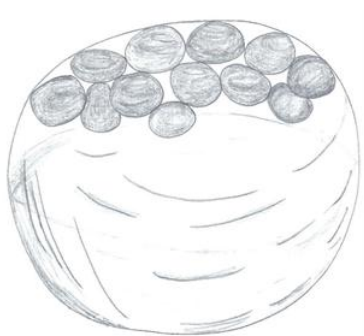
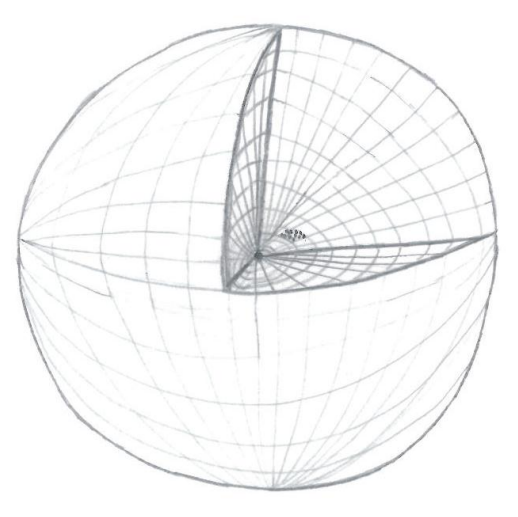

## 起源是什么？

无始之始，存在着一股**无限的静态能量**，只是单纯的**存在**，我们把它叫做**起源（the Origin）**。忽然这股能量产生了最初的振动，即**觉知**。

起源是**觉知（Sentience）**本身，是振动着的能量。

起源是**无限大**的存有，是绝对存在（the Absolute），是万有（the All），已知的一切都在起源内。

起源是绝对的一切，包含有觉知的能量、所有维度、频率层次，以及我们不知道的结构。

起源之外是还没有被探知的它的觉知。起源是无限的，起源也不知道自己的边界在哪里。

## 起源的创造

无始之始，起源对自己一无所知，起源想要了解自己。

起源是无限大的，起源通过**体验**探知自己未知的部分，起源的自我探究导致了最初的**经验（experience）**、**知识（knowledge）**和**进化（evolution）**。

起源通过**创造**来**加速**自己的体验和进化。

起源通过**想象力**进行创造，一切都是起源想象出来的。

一开始，起源尝试在自己之外创造12个**相同**的自己（12 copy Origins），但这次尝试失败了，因为起源发现自己是无限大的。

于是，起源收回能量，创建了12个**小于**自己的实体，即**源实体（the Source Entities）**，赋予这12个源实体**自由意志**，以自己任何想要的方式进化，再把进化的经验传递给起源，这相当于12倍增了进化经验。

12个源实体以各自的方式探索自己，**帮助起源了解自己和进化**。每个有觉知的源实体都在进行自己的进化，源实体们创造了自身的环境，它们在其中游弋，体验其细节。源实体们在了解自己的同时，帮助了起源自身的进化。

创造我们所生活在其中的多维宇宙的神（God），就是这12个源实体之一。

> *起源和12个源实体示意图*

> *起源的自我意识区域和12个源实体所在的区域*

