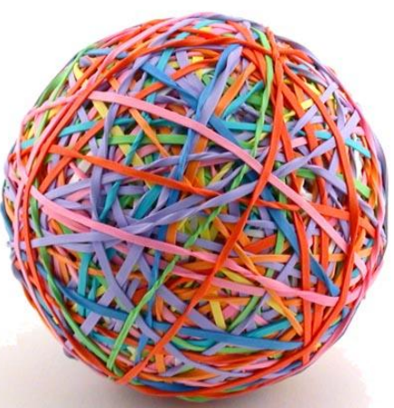

## 事件空间（Event Space）

事件空间是一种**可能性**，一种不同发展的可能性，一种思考过程的可能性。

事件空间存在于起源、源实体、多维宇宙的每一个角落，是对**时间**概念的更准确理解。

我们不是存在于时间中的，而是存在于事件中，事件会相互交错，事件中还会存在事件。

时间并不存在。时间可被更好地描述为**球形或全息事件空间（spherical or holographic event space）**，全息是指所有发生的事件存在于同一个空间中，**过去、现在、未来的事件都同时存在**。

因为事件以全息的方式存在，一个特殊事件及其所有可能的替代物同时存在。它们是“相互接触”的，它们是“单独”在一起的。可以通过穿越来体验每一个事件的替代方案。

> *橡皮筋球是事件空间很好的类比，每一个事件直接或间接地与另一个事件相联系*

### 事件空间的相关定义

#### 事件空间（Event Space）

起源内的一个空间的区域或体积，源实体作为该空间的平行功能而存在。

Event Space is an area or volume of space within The Origin and therefore The Source Entity that exists as a parallel function of that space. 

#### 事件空间之间的界线（Demarcation between Event Spaces）

画出两个事件空间之间没有交互作用的线。

Demarcation between Event Spaces is the line of non-interaction drawn between one Event Space and another. 

#### 事件的开始（Start of Event）

事件空间可以允许任何更改都有自己的“事件开始”，即使看起来没有真正的开始。

Event Space can allow any changes to have its own “start of event”, even when there appears to be no real start.

#### 事件的结束（End of Event）

事件空间可以允许任何更改都有自己的“事件结束”，即使看起来没有真正的结束。

Event Space can allow any changes to have its own “end of event”, even when there appears to be no real end.

#### 事件流（Event Stream ）

事件空间内一系列自然事件的预期方向。

The expected direction of a series of natural events within an Event Space.

#### 事件空间视界（Event Space Horizon）

事件空间似乎是白色背景上的白色地平线（视界）。

Event Spaces appear to be a white horizon on a white background.

#### 事件流泡泡（Event Stream Bubble）

每个事件都是一个实体/存有与其所处环境之间相互作用的泡泡。

Where each event is a bubble of interaction between an entity or being and the environment it is working within.

#### 微型事件空间（Micro Event Space）

微观上的小事件空间，特定于单个实体、存有或环境的需求。

A microscopically small Event Space that is specific to the needs of an individual entity, being or environment.  

#### 平行状况（A Parallel Condition）

是事件空间的复制。当可以做出选择时，它是一个新的但类似的事件空间的创建或生成。

Is the duplication of Event Space. It is the creation or generation of a new but similar Event Space when a choice can be made.

## 实相（Reality）

**实相**是我们根据事件空间或事件流的预期功能而创建的环境（environment）和交互状况（interactive condition），是基于实体或存有生成的感知（perception）的状况。

### 实相的类型

**The Overall Reality**：Is the experiential condition that is created by the existence of the sentience that is The Origin.

**The Multiversal Reality**：Is the experiential condition that is created by the governing entities responsible for a specific multiversal environment within a specific Source Entity.

**The Universal Reality**：Is a smaller representation of the multiversal reality.

**The Global Reality**：Is a further dissection of the overall theme of reality. 

**The Local Reality**：Is the official start of convolution within realities.

**The Locally Individualised Reality**：Is relative to small groups of entities within a local reality, such as those living within a certain country. 

**The Individualised Reality**：Is what entities or beings with individualised free will choose to create around them.