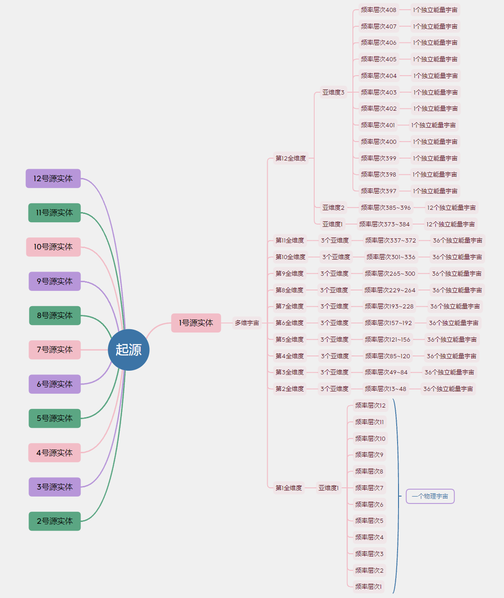
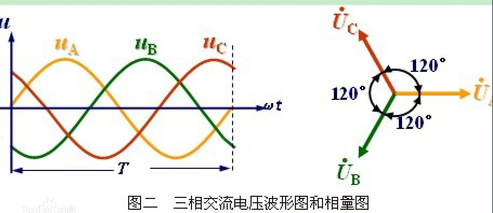
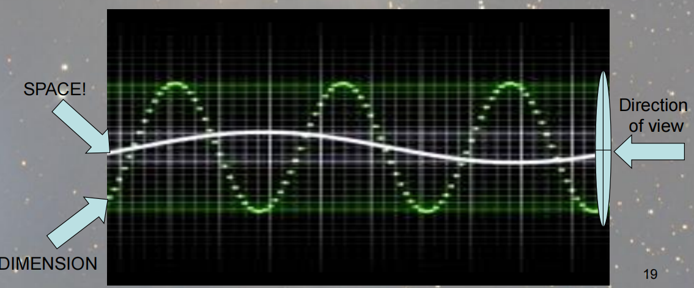
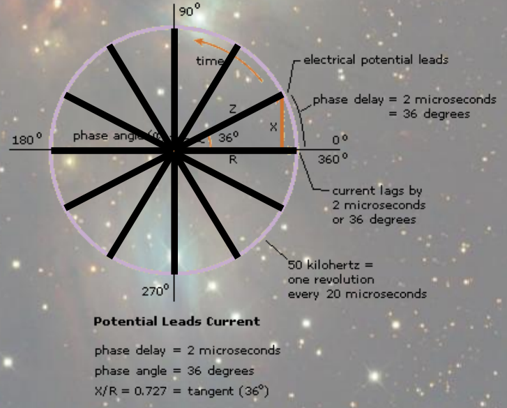
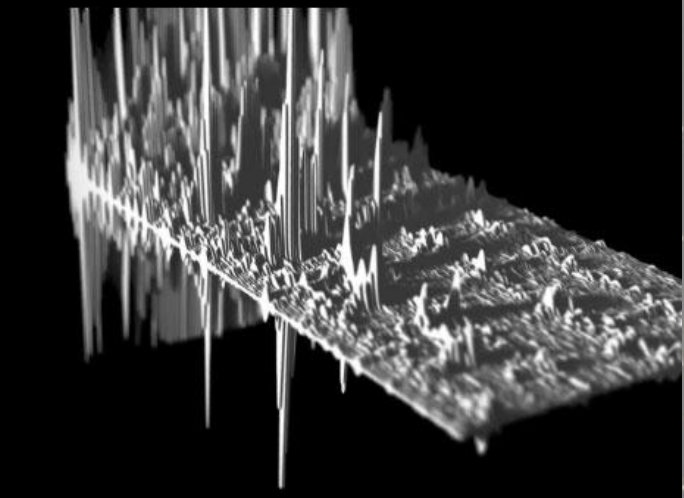
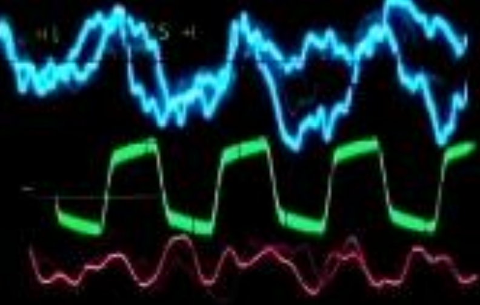
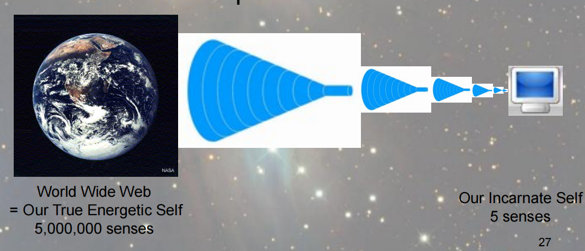

## 多维宇宙（Multiverse）

1号源实体模仿起源创造了多维宇宙。

多维宇宙提供一个基于**结构性扬升**的模式，实体们通过**顺序性**的扬升进行进化，从低频率宇宙逐渐提升至高频率宇宙。

**维度**

多维宇宙是1号源实体内部的结构，**全维度（full dimensions）、亚维度（sub dimensional components）、频率层级（frequency levels）**构成了多维宇宙。

多维宇宙包含**12个全维度**，每个全维度包含**3个亚维度**，每个亚维度包含**12个频率层级**。

多维宇宙共有 11 × 3 × 12 + 12 = **408** 个频率层级，共有 11 × 3 × 12 + 1 = **397** 个并行同步存在的宇宙。

- 除了第一个全维度，每一个全维度包含36个频率层级，每一个频率层级都包含一个独立的宇宙，共有11 * 36 = **396**个独立能量宇宙。
- 第一个全维度创造的3个亚维度因为频率太低坍缩成1个亚维度，这12个最低的频率层级共同创造**1**个物理宇宙。（因为最低频率无法自行创造出通用环境）

**频率层级**

频率层级（frequency levels），又称为振动层级（vibration levels），是多维宇宙中的基础结构，就像建造大厦的砖块。每个频率层级可以被视为单独排列的“空间”。

408个频率层级共同组成1号源实体构建的法界。在法界构建完成后，源实体将自己的微小分身（真实能量自我，TES）投入到法界去体验，不断进行成长和进化。不同意识的振动频率不同，会对应到不同的法界频率，体验到不同的实相。

> *起源和1号源实体的组织结构*

## 维度组（The Dimensional Groups）

每三个全维度组成一个组，每个组别里的全维度相互连接，这种连接允许在每组种的实体穿越至其他的组内维度中。

- 第1、2、3全维度互相连接；
- 第4、5、6全维度互相连接；
- 第7、8、9全维度互相连接；
- 第10、11、12全维度互相连接；

存在于第7全维度的实体可以穿越到第7和第8全维度，第9全维度太过遥远，需要进化才能达到。第7全维度的实体只能通过**能量载体**穿越到第6全维度。

存在于第8全维度的实体可以穿越到第7和第9全维度。

## 维度重叠

多维宇宙中的各个维度是重叠在一起的。为了理解它们是如何重叠在一起的，需要先了解**相位**的概念。

**相位（phase）**存在于周期性现象的描述中，常用正弦函数表示周期性，其横轴X可以看成某种位置，就叫相位。可以用360°来表示一个周期。

**相位角（phase angle）**是用角度表示的相位。

   

> *维度是如何重叠在一起的*

如果把多维宇宙想象成一个正在传输载波，不同维度只是同一个载波上不同相位的波形，根据**相位角（观察方向）**的不同，可以看到不同维度的信息。观察角度越大看到的信息越多。

> *维度是如何重叠在一起的*

上图的圆圈是一个载波的横截面，代表多维宇宙。12条黑线代表12个全维度，所有维度并行存在。

## 跨频率层级的扬升

一个实体在提升到下一个维度之前，必须能够扬升穿越所有它所在的维度中的所有频率层级。

> *一个频率层级*

上图描述了在一个频率层级中，不同进化程度的实体在局部创造的高频或低频区域。向上的尖刺表示高频区域，向下的尖刺表示低频区域，尖刺越长表示振动幅度越大。处于中间水平的实体创造了基准频率，进化的实体创造区域性的高频环境，不进化的实体创造区域性的低频环境。

> *多个频率层级*

上图描述了四个不同频率层级所代表的宇宙。高频率层级波形的波谷和低频率层级波形的波峰是互相接近的，这里的波峰和波谷是进行扬升的转换点，实体通过这些区域性的波峰和波谷进行扬升。

> *“失联”于低频率物理宇宙*

TES把自己的一小部分投射到身体载具中进行转世，从具有500万种感官的状态限制到只具有5种感官的状态，我们就像一台功能受限的小电脑，很难从互联网获取信息。

当我们不在转世状态时，可以即时大量地获取信息。转世时，由于“带宽”的限制，以正常的状态很难与TES进行连接。“带宽”受限是由于低频率环境引起的。