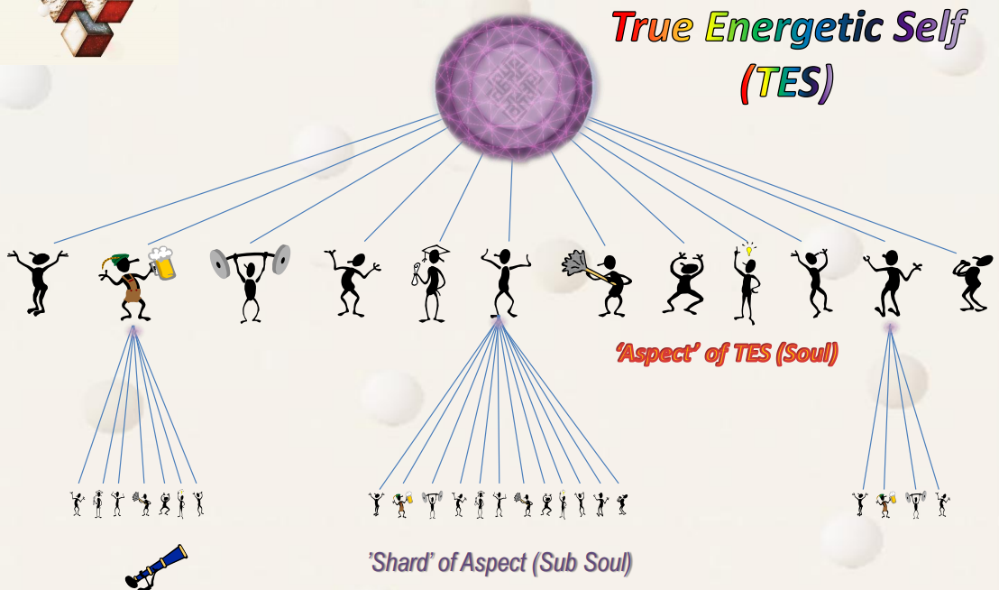
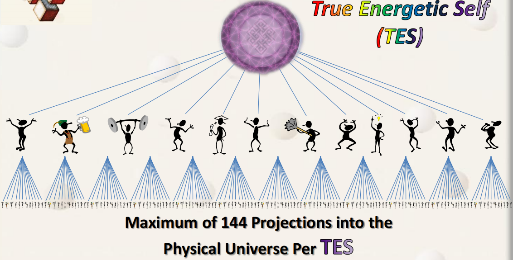
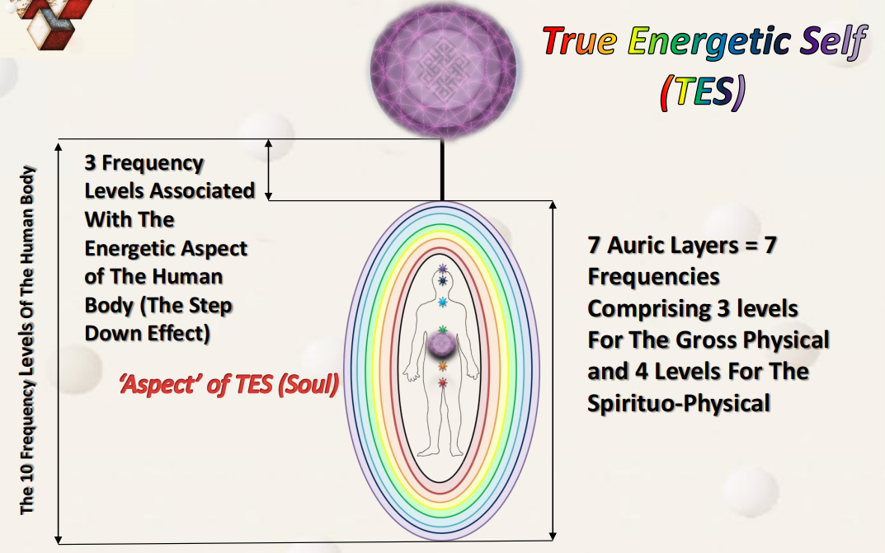
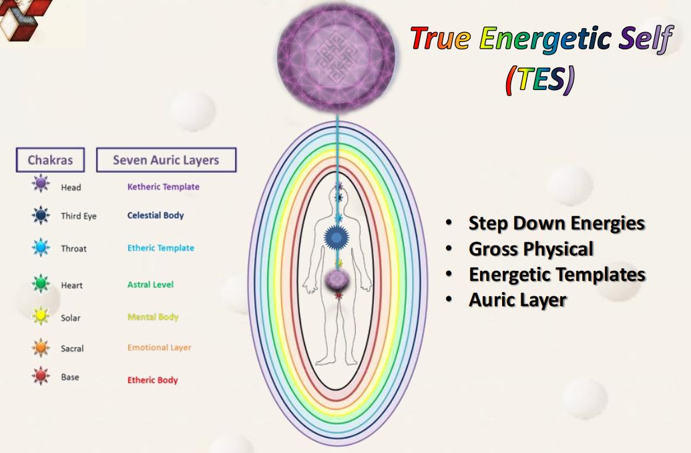

## 我们是谁？

我们不是人类身体（human body），也不是能量存有（energy beings），是我们的**存在本质（beingness）**定义了我们。

我们本质上是**纯粹觉知（pure sentience）**，是**最高形式的意识**，是**振动着的能量**，和**源实体、起源**的本质是一样的。

我们可以把觉知（自身）从一个能量体或形体移动到另一个上面。根据**觉知焦点**的不同，我们可以是存有，也可以是实体，也可以是人类身体。

## 高我（Higher Self，TES）

**高我**，又称为**真实能量自我（True Energetic Self，TES）**、**超灵（Over Soul）**，是源实体创造的更小版本的自己，通过体验自身非常多的细节来**帮助自己进化**。

高我是源实体的非常小的、个体化的功能体现。

高我是一个**被赋予了能量形体的纯粹觉知**。

高我内包含多个**面向（Aspect）**，每个面向可能包含多个**人格片段（Shard）**。

高我可以向上进化成**本我**，本我可以向上进化成**超我**。

**面向、高我、本我、超我**，也可以看成是一个意识能量体的进化过程，它们都是源实体更小版本的自己，从**意识能量微粒**进化成**超我完形**。

起源和祂的造物之间是**包含**关系。

*（起源（源实体（超我（本我（高我（面向（人格片段）））））））*

### 高我的层级结构

一个高我（TES）最多投射出**12**个**面向（Aspect of TES）**或**灵魂（Soul）**；

一个面向（Aspect）最多投射出**12**个**人格片段（Shard of Aspect）**或**亚灵魂（Sub Soul）**。

因此，每个高我（TES）在物理宇宙中最多有**144**个投射（人格片段）。高我把一部分觉知投射到更低的频率层级中学习、体验和进化，以加速自身的进化。

### 面向（灵魂）与载具结合

为了加速体验和进化，面向（灵魂）必须进入到不同频率层级中，并以下面这种方式最完整地进行体验：仿佛它就是它们中的一部分。

为了做到这一点，面向（灵魂）需要将自己与一个在能量上有生命的载具结合，这个载具对我们来说就是人类形体。

我们在转世时使用的载具被设计成适应10个频率层级。

- 第1、2、3频率层级，为物理频率层级。
- 第4、5、6、7频率层级，为灵性物理频率层级（星光层），充当物理层级和能量层级的交界面。
- 第8、9、10频率层级，为灵性频率层级（非纯粹能量层级），充当通道的作用，让更高维度的信息能下载到转世的载具身体中，是高我和面向沟通的界面。

高我一直处在非转世的状态。

高我通过**哈拉线（Hara Line）**连接到人体中，哈拉线（能量线）就像管道一样，可以保护高我的频率不被低频环境影响。

高我通过哈拉线管道，从位于顶轮相同的位置（并非顶轮）连接到身体中，这条哈拉线从头顶延伸到肚脐上方7.5厘米、肚皮向内7.5厘米处，这个区域在道家被称为“丹田”。

**丹田（Tan Tien）**是高我能量与人类身体发生关系的地方，丹田能让不同频率层级的模板控制身体，产生运动。

丹田与7个频率层级的模板联系，丹田的能量连接到7个模板的脉轮和小脉轮，而后能量回到“灵座”。

**灵座（Soul Seat）**是“灵魂”具体在身体的位置，在哈拉线（哈拉线）上，位置在心轮的位置（心轮有前后脉轮，灵座位于中间）。

哈拉线是从顶轮的位置进来的，但哈拉线和脉轮是两个不同的系统，互不干扰。

**高我能量进入丹田后才和脉轮系统接通**。

8、9、10频率层级允许高我以能量**步降（step down）**的形式与我们进行沟通。

巨大的管道变成针管（几乎断开连接）“注射”到载具中。

被称为面向（灵魂）的具有觉知的能量将自己置于一种孤立或个体化的，与构成人类形态的物理状态的低频率层级相联系的状态下。

这种处于**部分沟通**或几乎**零沟通**的状态创造了**小我（Ego）**。

小我说：我就是我的身体。

## 小我（Ego）

小我是被创造的暂时性的属性，是高我投射的一小部分觉知在非常低的频率环境中与高我失去联系的**暂时性人格**。小我只有在**转世时**才会被创造。

> *比喻：空气代表高我，装了一小部分空气，装进气球。这一小部分空气和外面的空气隔离开了，气球和大气环境只会有一点点漏气的情况。气球里面的空气和外面大气连通是很困难的，这一小团空气认为自己就是全部空气，创造了自己的个性和属性。*

当一个面向（灵魂）从高我（TES）分离出来，小我即被创造了。

为了体验、学习并且以一种加速的方式进化，小我被投射到我们这个多维宇宙中的最低的频率层级中。

我们的个性和所有相关的一切都可以涵盖在小我内。

小我在转世中起了非常关键的作用，小我希望肉体尽可能地延续下去，让我们在物质世界生存下去。

### 小我如何影响我们？

小我只是一种暂时的及瞬变的状态，因为它仅能在人类身体运作并且丧失自我觉察时存在。

当人体死亡时，小我也随之消融。我们在转世时所获得的体验性记忆并不会丢失，因为记忆会在体验发生时被平行传送给高我。当我们不懈取得我们的灵性成长并重新获得与高我的连接时，小我也将消融。小我知道这一点，它会尽其所能保持掌控权，并“存活”下来，**小我会不遗余力地阻碍我们的灵性进化**。

作为高我在转世过程中的面向，我们的主要目标是**在转世的过程中获得灵性的自我觉醒**，在这个过程中与我们的高我重新取得联系，在物理层面中运作却又超脱物理层面，在这种情况下小我将无处容身并会消融。

小我是耐心、狡猾、足智多谋的，它会使用五花八门的招数来欺骗我们，让我们以为自己已经掌握了它。

小我很善于利用以下花招来影响我们：**自觉意识、失败、压抑、成功、物质主义、地位、骄傲**。

**成功**和**骄傲**是两种小我最擅长利用的情绪，它们是我们对于自己灵性成长感到满意的结果，当小我在这方面玩得最溜的时候，我们将会觉得我们在取得灵性成长，虽然其实我们并没有。观察一下有些“最灵性的人物”，往往也有最强大的小我。

当我们认为已经掌控了小我，就是我们输掉这场战斗的时候。这时小我将会潜回到控制我们和我们的思想的位置上，我们会丧失掉某些灵性成长。

记住，没有谁能躲过小我的影响！

### 如何对付小我？

- 保持清醒；
- 保持觉察，以一种被动和非评判的方式保持观察；
- 留意小我升起的信号，对此采取行动并继续你的灵性成长旅程。

## 指导灵和守护者（Guides & Helpers）

**指导灵**是来自**和高我频率环境相似**的独立实体。通常是高我或高我投射的面向，但它们选择了不同的发展道路，不进入进化循环，而是去帮助（勇敢的）进入了进化循环的面向。

- **大师指导灵**：强大的存有，负责12个指导灵，也可以具体指导面向。可以投射觉知到面向所在频率层级，也可以投射到事件空间（平行体验）。（高我层次）
- **指导灵**：每个指导灵最多照看12个面向。从照看的面向的进化中获得进化奖励，通过其面向的进化获得进化。在进化中逐渐演变成大师指导灵。（高我层次）
- **守护者**：具有具体专长和技能的实体，帮助面向实现目标。在进化中逐渐演变成指导灵。（面向层次）

在面向频率提升的过程中，面向的指导灵&守护者会变化。特例是大师指导灵有时会在多次转世中指导同一个面向。

指导灵&守护者和面向体验的相互转化，是可能发生的，但不常见。

## 监护者（The Curators）

源实体创造了30-40种不同的监护者（The Curators）来照看多维宇宙的结构，如元素精灵（Elementals）、天使（Angels）、大师指导灵（Master Guides）、指导灵（Guides）等。

监护者监管的结构，包含多维宇宙的固定结构，还包含结构之外的结构，如穿越维度和频率的通道，让监护者可以不受限制地到达多维宇宙的任何地方。

有的监护者有操纵事件空间的能力，监督不同的平行空间、平行体验，比如抽取某个事件片段，加入新的片段。当事件空间改变后，有些实体会改变我们的记忆，让记忆与事件相符合。他们是为了优化，保证我们不浪费进化的体验。

有一些实体专门照看生态环境，治疗地球环境、疗愈树林、动物等。

有一些实体专门记录事件空间，在源实体的特定空间中创造纪录。

我们经历的一切都是在被监测、监护的状态中，保证我们以最佳方式进化。