## 转世（Incarnate）

为了获得进化的经验，高维度存有把自己的一部分投射到低频率环境中进行体验的行为。穿越到低频率层级可能的风险是与高我、高频率层级的伙伴失去联系。存有转世到低频率层级环境需要使用载具。

高我需要保持70%的觉知在自身，30%的觉知分给（最多）12个面向。面向需要保持70%的觉知在自身，30%的觉知分给（最多）12个人格片段。

### 我们为什么在这里转世？

- 为了帮助源实体进化；
- 为了帮助起源进化；
- 为了体验（experience）；
- 为了学习（learn）；
- 为了进化（evolve）；
- 为了在物理层级完成自我实现（self realization）；
- 为了促进物理宇宙的扬升（ascension）——通过帮助地球扬升；
- 为了成为和源实体、起源同等的存有；
- 为了和源实体、起源一起上升（ascend）。

### 不同的转世类型

所有以下情况都在转世前订立了合约。

类型|图示|说明|影响
---|---|---|---
双生火焰 Twin Flames|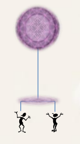|两个身体共享同一个面向（灵魂）； 可以是3个或更多； 不一定需要是双胞胎。|作为双胞胎出生； 心灵感应（telepathy）； 同理心（empathy）； 在一起的需要； 和对方结婚的需要。
灵魂伴侣 Soul Mates|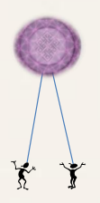|同一个高我投射的不同面向； 能瞬间识别对方能量； 与灵魂伴侣相遇是很罕见的。|心灵感应； 同理心； 见面前就知道彼此； 深深的爱； 在一起的需要； 和对方结婚的需要。
共感灵魂 Sympathetic Souls|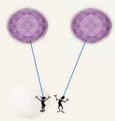|不同高我投射的面向，在转世中频繁地合作； 能瞬间识别对方能量； 感觉像是灵魂伴侣。|见面前就知道彼此； 和灵魂伴侣相似的感受。
次级转世 Secondary-Incarnations|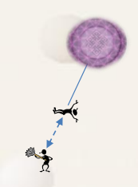|主要（Primary）转世存在于更高频率层级，主要身体处于休眠状态； 次级（Secondary）转世的面向存在于较低频率层级； 次级转世不是人格片段。  面向的主要转世在灵性物理层级（4-7）或灵性层级（8-12），主要身体处于休眠状态，面向（灵魂）转世进入低频率。  主要身体只留一部分觉知，让身体处于最基本的运转状态，把**大部分觉知**投射到更低的频率层级进行次级转世。  次级转世的经验可以上传到主要转世的身体，并被自己和同伴研究学习。  次级转世的人经常会梦到自己在太空船上睡觉。|没有归属感； 孤独； 沮丧； 难以融入（地球社会）； 有来自另一个星球/星系的感觉； 对人生目的感到困惑； 经常报道被UFO绑架。
亚转世 Sub-Incarnations|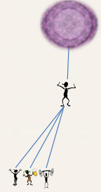|面向投射的人格片段（Shard）； 允许多次人生体验； 不是平行人生。|觉知能力有限； 容易被低频思想和行为（如愤怒、流言蜚语、物质财富、地位、群体心态）所吸引/上瘾； 平庸； 人生简单，不会对灵性探索感兴趣。
替换 Walk-in|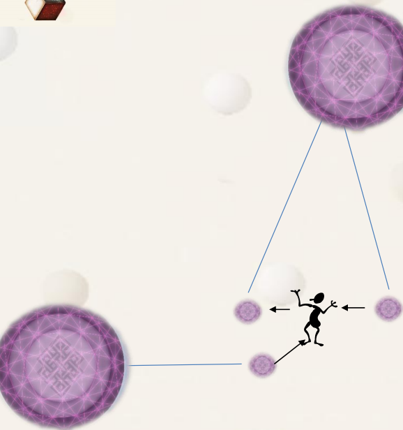|面向（灵魂）交换使用同一个身体； 面向可能来自同一个高我，也可能来自不同的高我； 可以是暂时性的或长期性的替换； 可以有多个面向存在于同一个身体中，但同时只能有一个面向控制这个身体。|性格一次性突变； 行为突然改变； 朋友关系改变； 缺少某些记忆模块。
多个面向使用一个身体 Multiple Aspects in one body|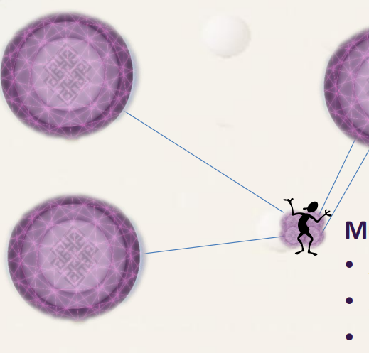|面向可能来自同一个高我，也可能来自不同的高我； 同一个身体有多个专长； 在世界的领导人中常见。|多重人格的规律性变化； 会多种技能； 可能表现为精神分裂。

### 转世后的前七年

面向和载具的整合阶段。

- 出生前：部分结合，出入身体，熟悉身体的使用。学习使用人类载具。灵魂出入于两个频率中；
- 出生第1年：建立人类自我及关系；
- 出生1~4年：准确控制身体及个性的诞生，对本质的记忆开始消退，小我开始出现并取得控制；
- 出生4~5年：整合阶段；
- 出生5~7年：整合到人体的最后阶段；
- 出生7年以后：灵魂即身体，身体即灵魂。

7岁前，脉轮系统没有完全成型，孩子倾向于和母亲呆在一起。

7岁后，正式进入人生蓝图。

### 转世结束后如何与高我沟通

觉知从灵座重新回到丹田，面向通过管道重新回到高我。濒死体验看到的光通道就是哈拉线能量管道。

类型|图示|说明
---|---|---
充分沟通|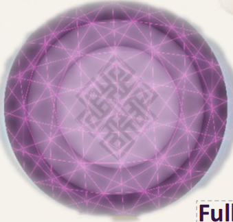|面向的觉知（sentience）充分弥散（full dispersed）到高我中； 面向的记忆（memory）充分弥散（full dispersed）到高我中； 像一滴水掉入海里； 瞬间扩张，随后被完全吸收； 面向失去个体性。
部分沟通（情形1）|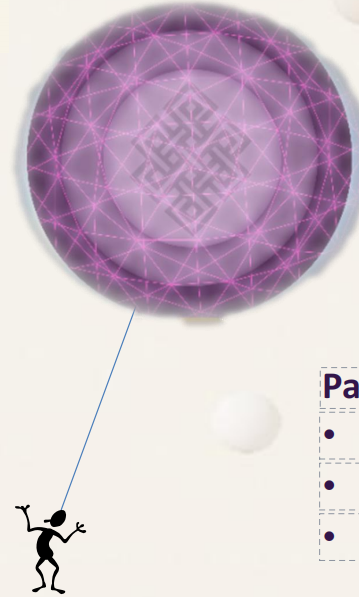|面向仍是投射，维持个体性； 用于背靠背转世（肉体死亡后快速再次转世）。
部分沟通（情形2）|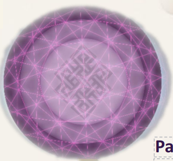|面向的觉知（sentience）弥散（dispersed）到高我中； 面向的记忆（memory）弥散（dispersed）到高我中； 瞬间扩张，随后全知、全在； 个性维持，但呈扩散（diffused）状态。
部分沟通（情形3）|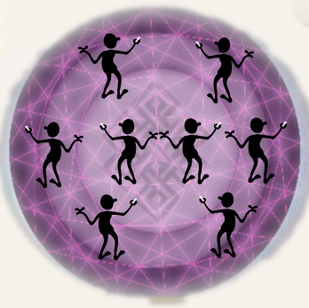|觉知分散（distributed）； 记忆分散（distributed）； 个性维持，但呈分离（separated）状态。
部分沟通（情形4）|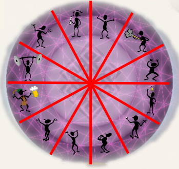|觉知分割（compartmentalized）； 记忆分割（compartmentalized）； 个性只维持在一个位置。
部分沟通（情形5）|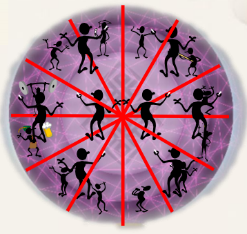|可能是下面的混合态： 觉知/记忆弥散（dispersed）； 觉知/记忆分散（distributed）； 觉知/记忆分割（compartmentalized）。

## 离世

### 离世的过程

投胎时，高我投射一部分觉知到低频率体验时，会通过一种能量的保护性管道（哈拉线）进入到丹田。在丹田，高我的能量与七个脉轮连接，激活身体，面向来到灵座的位置，身体开始由面向来控制。

离世时，是一个相反的过程：

1、面向从灵座移动到丹田，脉轮能量网络回归到丹田，面向形成能量体，从哈拉线退出身体，回到高我所在的频率中。（濒死体验中穿过隧道到达一片白光的体验，来自面向通过哈拉线回到高我的体验）

2、面向（灵魂）没有立即回到高我，而是困在地球频率环境中。面向对死亡恐惧，或有强烈的信仰系统，会怀疑回到高我的过程，不相信自己已经死亡。（游魂）经过一段时间，会被指导灵指引到属于它们的频率中。根据信仰系统去到相应的阴间集体幻相（天堂、地狱）。指导灵和守护者最终会将灵魂唤醒，没有遗失（失落）的灵魂。

### 离开身体后的人生回顾

- 人生与人生计划：记忆大厅；
- 平行体验；
- 与指导灵及守护者的关系：灵魂的回顾是和指导灵等各方共同参与的，总是会被理解，帮助其在下一世完成功课；
- 被隔离的灵魂：面向在死亡时滥用药物导致的死亡，毒品/药品在人类的身体里创造了非常不和谐的能量，灵魂会携带这种能量，可能会影响高我所处的环境。创造出能量气泡，消融淡化低频不和谐能量。再进入正常的回顾流程。

### 休息时刻

面向发现自己是更大的实体。像是一个假期，但也要做一些工作。去真正消除在低频率环境中积累的限制性思维。

- 发现进化的收获；
- 与其他实体的回顾；
- 存在于能量态；
- 与高我沟通。

## 轮回（Re-Incarnate）

从起源进化效率的层面讲，在赋予自由意志的前提下，从最低的频率向上提升的过程能够获得最大的进化体验。

高回报意味着高风险，低频率的环境很容易让灵魂迷失，进而堕入固定的意识模式而难以摆脱，这就是轮回。 

## 业力（Karma）

业力是能量层面的问题，是扬升过程的重要组成部分。

业力是一种**局部的频率降低**，因此减缓了进化的机会，停止提升到更高频率。

业力创造了与物理世界的更强大的联系。

业力通过在物理世界中对“行为”的不好的**选择**，或对较低频率事物的**迷恋**来产生。

业力本身没有好坏之分，只是个体在低频环境中如何与其他个体发生关系的一种状态。

业力也可以是**正面**的，可以创造良好的学习机会，一旦被认知和理解，可以提升个体的振动频率，有助于扬升。（业力可以是向下拽的锚，也可以是向上拽的滑翔伞）

业力只会在**转世**中被创造。

业力是一种被吸引的状态，让我们停留在多维宇宙中最低层次的物理宇宙中。

业力代表对低层次的（物质、心理）需要的一种行为模式。

业力**不是因果关系**。

业力是任何把你困在低频率层次的一切思想、行为、语言。

业力代表需要完成的一种循环，是需要重新转世的、一种不断回到最低物理层次的需要。

在地球上和物理宇宙其他地方都会积累业力。由于地球上的个体自由意志，更容易产生业力。

业力是和低频物理宇宙相关的一种机制。物理维度外没有业力，业力只能在和物理宇宙相关的12个频率中（第一全维度）被创造。第一全维度之上的所有维度中都不需要体验业力。

别人可以替我承担或消除业力，别人宽恕或原谅我，我的业力就会消除。但最好自己来移除低频率的需要。

业力不是债，是物理宇宙的特供体验。

### 业力和轮回

业力是吸引或沉迷于低频率的行为模式或行动。我们的物理宇宙是由低频率能量创造的。

业力仅仅存在于物理宇宙，当真实能量自我（TES）被吸引到物理宇宙的更低频率时，业力就存在了。他们和业力连接，因而需要返回物理层级（轮回）来打破业力循环。连接一旦被打破，转世就不再必要了。无需再次转世，TES就能穿越频率和进化。

### 五种业力

- 基于**思维过程**的业力：将我们锚定到“我们的物理宇宙”的想法、对人的本质的看法、对人性的想法、对别人的看法...
- 基于**行为**的业力：通过他人谋取个人利益、总是看到他人最差的一面、传播谣言、强迫他人、低俗语言、好斗、推卸逃避责任...
- 基于**身体感觉**的业力：沉迷于性、食物、酒、药物、身体状况（容貌、肌肉）、人身攻击/自虐、危险活动/运动（肾上腺素）...
- 基于**物质主义（利）**的业力：从不满足、对钱需求无度、要拥有物品、要穿戴名牌、要拥有（超出需要的）房车财产、度假要昂贵/异域风情...
- 基于**地位（名）**的业力：炫耀个人财富、在昂贵/专属的地方社交、在人群中凸显自己、必须处于领先行业、成功人士、影响他人、个人外表、想要成名、比别人强...

典型的外求：找别人替你“负担”或“燃烧”业力。

### 消除业力

**1、宽恕**

- 给予宽恕：宽恕他人；
- 寻求宽恕：冥想祈求他人的高我的原谅。

**2、观察者模式**

最强大的消除业力的方法。

### 终极目标

终极目标是**内观自己**，并避免所有会创造业力的东西。身处物质世界，但不受物质左右，因而避免业力。摆脱对轮回的需求，太好了，我的最后一次转世。