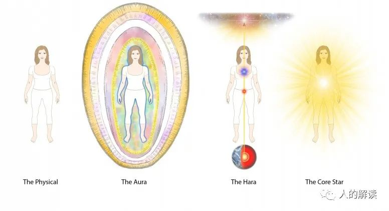
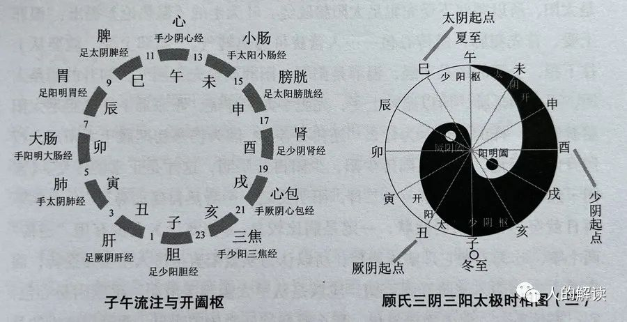
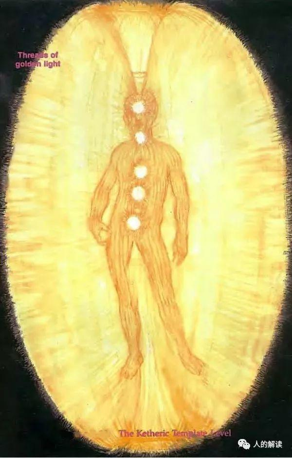

## 人类身体载具

我们来到这里是为了了解我们是谁，帮助地球提升，最终帮助源实体及起源的进化。

人类需要提高地球的频率，是因为它是宇宙能量网格的重要组成部分。为了协助这个目的，人类创造了一种物理形态，使其能够体验低频并加速进化进程。

当前人类形态是第三种被使用的物理形态，有两个繁殖版本。

#### 为何要创造一个物质身体？

通过创造一个能和物理振动频率相适应的载具，能加速我们在这个频率中的进化。

高频率的实体不能完全体验较低的频率环境，因此需要使用较低频率的载具，以允许处于物理环境中时与物理互动。就像到海底潜水要穿潜水服一样。

#### 创造身体的过程

**1、第一种人类形态**

不像现在的版本那么稠密，转世灵魂和家族组是连接的。

通过身体范围内的细胞分裂进行，每第3代或第4代细胞通过分裂期就会产生第二个或更多完全发育的完全功能的成人身体。

因为业力，我们变得更稠密导致主形态的不协调和突变时，这身体就变得不可用了。由于突变导致的能量功能失调影响了转世灵魂，包括其他能量状态的人类和他们的身体。

**2、第二种人类形态**

在第一种人类形态的基础上，繁殖比例限制在1:1，一个形体只能复制一个后代。缩短寿命。断开和转世灵魂/家族的连接。

灵魂仍然能从一个身体移动到另一个身体来分享经验。对转世需求的增加需要一个更快的繁殖周期，这导致了错误的增加。使用身体的第一个灵魂的频率“戳”导致了与下一个灵魂的不兼容，而随着共享的增多，这个灵魂的情况更加复杂。一个灵魂需要花费数千年来恢复其损失的能量。

**3、第三种人类形态**

支持稳健的转世的更改：

- 将身体的转世用途限制到单独灵魂；
- 移除灵魂移动到其他身体的能力；
- 移除灵魂在转世时彼此之间的联系，包括对这些能力的记忆；
- 转世完成后，恢复全部能力；
- 创造一个在生殖能力上更强健的身体；
- 对体验的频率降低的保护。

最初是雌雄同体形式，复制某一特定身体的所有优缺点，这可能由于病毒造成繁殖线的破坏，因此将繁殖过程转化为两个是必需的。

在生殖功能上，男性/女性的身体更简单。因为创造人类形态的蓝图男女各一半，只有一半的生殖功能被复制。免疫力更强，在安全无污染的环境中，更快的妊娠期会产生更强劲的繁殖周期。

### RNA和DNA

从物理上来说，RNA是将DNA上的编码转译表达为细胞功能中使用的蛋白质的媒介。这只是多路通信系统的一种方式，没有考虑到由RNA传送到DNA的第一组信息。RNA是由身体辉光层的第一层（以太体）和第五层（以太模板）编写的。

完整的流程是：来自以太模板/以太体的灵性信息通过DNA编码存在于RNA上，再发送到DNA进行复制，再发送到RNA进行转录，由mRNA指导蛋白质合成，把结果反馈给RNA，RNA把结果反馈给以太模板/以太体。

RNA是一种界面（interface）介质，它同时存在于物理层面的高层和灵性层面的低层，从更高的灵性层次传递信息到较低的物质身体细胞。

RNA是细胞之间的一种通信介质，它允许细胞的正确定位，以及细胞结合来创造它们被赋予的身体机能。细胞蛋白质接收到正确信息时必须反馈到RNA上，这些信息将被传递到以太模板/以太体上以确认。

### 人类身体的“三位一体”

宗教谈论的“三位一体（Three-in-One）”指的是：物理身体、星光层（灵性-物理层）、灵性层。

有**14**个频率层次和人类身体有关。

有**10**个频率层次和人类形态有关。

1-3为物理层次，4-7为灵性-物理层次，8-10为灵性层次，10层以上是完全能量形式。

物理宇宙包含第1-12频率层次。第13、14频率层次是对物理宇宙的存有扬升预留的两个频率层次。

### 身心灵复合体（Body/Mind/Spirit Complex）

身心灵|传统说法|传统说法|现代说法|现代说法|现代说法
---|---|---|---|---|---
身（Body）|身体层（Body）|生理学（Physiology）|现象|载具|身体是我们存在于故事中的载具，要好好的照顾它，拥有健康才能拥有故事。
心（Mind）|心理层（Mind）|心理学（Psychology）|解释|信念|信念创造实相，我们的整个生命故事都由信念所创造，驾驭信念就能显化一切。
灵（Spirit）|灵魂层（Soul）|超心理学、灵魂学（Parapsychology）|觉察|能量|灵不是灵魂，而是我们唯一的觉察本身，而一切都是这个觉察所开展出来的。

---

## 人类能量意识系统

> 信息源：千帆过，转载自：[人的解读](http://www.rendejiedu.com/2730.html)

布蓝能基于自己几十年的超视觉观察，发展出了一套人类能量意识系统。有四个主要方面或维度：星核层(Core Star Level )、哈拉层(Haric Level)、气场层(Auric Level)以及肉体层(Physical Body Level)。

### 星核层

星核层是我们生命的神圣之源，内在神性所居的层面。所有创造力，都从这一内在源头涌现。
 
星核，位于身体中心线、肚脐上约3.8公分处，呈现为一个明亮的光点。从星核中心发散出来的朝向四面八方的光芒，是创造之光。它是纯粹的光，不像我们所感知的那样由色彩组成。地球上的每一生物个体，星核所发出的光各不相同。

 
星核，虽然显现为光点，但其实是从虚空中发散出来的，这个虚空称为黑绒虚空(Black Velvet Void)，这是一种形象化的描述。黑绒虚空中，蕴含着未显化的生命，充满了超乎想像的力量，是一切显化的根源。透过深度冥想或进入入定状态，可以直接体验到星核中的黑绒虚空。
 

黑绒虚空似乎就是佛家里面的空，缘起性空嘛。当以超感知力感知星核时，它既是恒动的，亦是常静的。每个人在星核层面都像一颗美丽的恒星，每颗星都与众不同，都是内在生命之源。在这个内在空间，居住着我们每个人内在的神圣个体性。星核，就是神性的个体化，是我们最基本的天性。

### 哈拉层

哈拉(Hara)是日语，代指下腹部，它不仅指下腹部的位置，也指该位置所具有的力量、能量和专注力，是灵性能量中心。

气场与人格有关，而哈拉则与我们的意愿有关。哈拉层是我们的“意愿”所在的层面。也就是说，我们是在哈拉层体验到了意愿或目的，它影响着我们每时每刻的意向。哈拉与你的人生使命或更深层的灵性目标有关，在这一层蕴含着你投胎转世的更大目标，以及任何特定时刻的目标。正是在这一层，你设定并保持你的意愿。真正的愿望，始终与最高灵性渴望一致。

如果哈拉层面是健康的，你会感受到极大的个人完整性、充沛的力量以及明确的个人目标。相比结构异常复杂的气场，哈拉层则要简单得多。由于哈拉层是气场层的基础，它不仅连接了身体中央与七个主要脉轮，也连接了位于双手、双臂、双腿和双脚的次要脉轮。哈拉层由一条贯穿身体中心的像镭射光的线，以及上面的三个点组成。

#### 哈拉线

组成哈拉层的这条线称为哈拉线，起始于头顶约1米处，向下延伸到地球中心。哈拉线其实是位于人体中线的竖直光管，另外在双臂和双腿中央还有两条光管，光管宽度大约有8.5毫米。

透过哈拉线与地心连接，我们自身气场的脉动就能与地球能量场同步，以便汲取能量。

健康的哈拉线位于身体中线，呈直线且形状良好，能量充足，很好地扎根于地球核心。而且哈拉线上的三个点都平衡、形态完整并由哈拉线牢固地彼此连结。不过没有任何人能够一直保持哈拉线的笔直和对准。很多人从未对准过，少数人能有30%的时间对准，而极少极少的人，能有50%的时间对准。多数人因为大部分时间都是无法校准的，甚至扭曲严重，而导致了很多痛苦。哈拉线会即时地响应于我们的意愿，就像气场对思想和感情的即时响应一样，任何意愿的改变，都会导致哈拉线位置和对准上的变化。
 

哈拉线上有三个点：分别是ID点、灵座、丹田。

##### 第一个点：ID点

第一个点，称为个体化点（individuation point）或ID点，在头顶上方约1.1~1.2米的位置，像个倒置的漏斗，其宽端开口向下。这个小开口实际上是个小旋涡，直径约8.5毫米。

ID点是哈拉线的起源，携带了我们投胎转世的理由，正是通过这一点，我们得以与更高的灵性实相连接。ID点，代表的是我们为了投胎转世而第一次从神性中分化，从神性中出来的第一次个体化。俗语说举头三尺有神明，头顶之上三尺的地方，不正是这个ID点嘛。如果ID点变形或堵塞，被深色云状能量索覆盖，这会导致哈拉线与ID点断连。与ID点的断连，会导致生活中的玩世不恭和愤世嫉俗。 

##### 第二个点：灵座

第二个点，称为灵座(Soul Seat)，意思是灵魂渴望的基座，位于上胸骨区(胸骨柄)。

灵座就像一个漫射光源，光芒向所有方向放射。它的直径约2.5~5公分，冥想时可扩展到直径约4.6米。灵座呈现为粉色、薰衣草紫和白色等多种色彩的脉动柔光。这道光，携带着灵魂想要在此生达成的渴望，带领着我们度过一生，与我们的人生使命精确对应，那是我们生而为人的目的。

灵座有时又被称作上心(high heart)，常与脉轮混淆，但那不是脉轮。灵座的问题通常是被遮蔽而形态受损，也就是说，它被深色云状能量覆盖。结果就是人们不知道生活中现在或将来想要什么，感觉不到生活中想做什么。这样的人通常胸部凹陷。

##### 第三个点：丹田

第三个点，称为丹田(Tan Tien)，位于肚脐下方约5.1~7.6公分的位置，具体位置取决于个人身高。

丹田像是一个中空的橡胶球，直径大约2.5~3.8公分，大小尺寸不会变。外表有一层坚固薄膜，颜色呈金色。大多数人的丹田很暗淡、没有能量。然而习武之人，此部位则有个非常亮的金色光球。

丹田就是武术家习武时发力的中心。气沉丹田，正是这个原因，力量中心嘛！健康的丹田是蕴含着强大意愿能量的球体，能容纳巨大的力量，可以藉由冥想或锻炼来给丹田充能，让力量充满丹田。

丹田能将疗愈师与地球能量源头连接起来。高阶疗愈师知道如何控制哈拉光管里从丹田流向手部次要脉轮的能量流，以释放能量用于疗愈。当哈拉线延伸进入地球时，疗愈师可以聚集巨大的能量，用于疗愈时，丹田会变得非常亮红灼热。如果疗愈师接入大地且丹田变成红色，他会感到全身发出炽热。这就是在哈拉层的根植大地。当我们处于健康状态时，哈拉线的末端会一路深入地球中心，这样我们会非常接地。

丹田也是一个意志中心，是你于物质肉体中生存的意志。丹田的问题有几种表现，可能位置不对，太靠前或靠后或偏身体的一侧，也可能形状不对。丹田功能障碍的结果是慢性背部问题。包裹丹田的外膜可能撕裂，一半暴露在外，或更糟。这会导致身体和心灵严重受损，歇斯底里或极度虚弱。

丹田的问题，除了疗愈师修复外，跟随一位好老师学习武术也能疗愈丹田，太极练习就对此也非常有益。

### 气场层
 
气场、哈拉以及星核，都是由生物等离子体所组成的。生物等离子体包含了能量意识，只是大多数人无法觉察而已。我们的意愿创造了气场中的能量，而能量传递了真正的讯息。

### 肉体层

气场是肉体的基础，也是肉体的模板，它先于肉体而存在。肉体居于气场中，其起源、生命、成长、形状和健康，完全仰赖三个更深的维度，即气场、哈拉和星核。

肉体中没了它们（气场、哈拉和星核）便无法存在，在物质世界中所有的生命形式都是如此。每个细胞，包括细胞中的一切，都有星核和哈拉，各有其生命目的。

#### 四个层面的创造过程

我们每一个人生来都携带着创造的渴望。每个个体的渴望都是特别的、独一无二的。这既是投胎的目标，也是原因。投胎化身的过程本就是一种创造行为。当我们以这样的方式进行创造，便发展和拓宽了星核之光中个体神圣本质的表达。

创造过程起源于星核深处的中心，源自黑绒虚空。而后，创造过程从我们的星核维度上涌，进入哈拉维度，并在哈拉层转化为创造意愿或目的。然后，哈拉容纳这一个意愿，让创造过程流向气场维度，从而转化为气场的三个面向——理性、意志和情感，进而通过它们创造物质层面，也就是肉体维度。

我们就是这样来自于虚空。色不异空，空不异色，色即是空，空即是色，受想行识，亦复如是。

## 人体能量学

> 信息源：千帆过，转载自：[人的解读](http://www.rendejiedu.com/591.html)

中国古人所发现的经络系统，是对人体内能量分布的一种简单描述。除了中国的**经络（Meridian）**，还有印度的**脉轮（Chakras）**，前苏联基里安发扬光大的**人体辉光场（Human Aura）**，以及美国心数研究所发现的**心脏电磁场（Heart’s Electromagnetic Field）**。

人体的能量结构有三个：一是能量中心，最为人熟知的就是脉轮；二是能量通道，即经络；三是能量场，包括但不限于灵光场，还有其他场域，比如各种磁场、形态生成场等。这三个系统是点、线、面的关系，不可分割。

#### 经络（Meridian）

经络系统，是由**经脉**和**络脉**组成。经脉分为**正经**和**奇经**两类。正经有12条，合称“十二经脉”。 奇经有8条，合称“奇经八脉”。十二正经加**任脉、督脉**(奇经八脉中最重要的两脉)，合称十四经。

十四经腧穴，都有自己的归经、固定的位置、固定的名字、固定的数量。最早确定腧穴数量的是魏晋时期《针灸甲乙经》中，皇甫谧确定了349个。北宋的王惟一确定了354个穴位（铜人就是王惟一制作的）。明朝杨继洲确定359个穴位。清代李学川于1817年确定的361个穴位，就是沿用到现在的361个穴位。从满清到现在的200多年内，再也没有找到一个腧穴。一年有365天，为什么人只有361个穴位？也许还有4个没找到。

#### 脉轮（Chakras）

古印度将人体分为七个能量中心，这七个能量中心因为是以轮状出现，所以名为七脉轮(chakras)，这七轮分别是：海底轮、生殖轮、太阳轮、心轮、喉轮、眉心轮、顶轮。

#### 人体辉光场（Human Aura）

人体辉光现象，最早在1911年，英国伦敦一位叫基尔纳(Walter John Kilner)的医生发现的。1939年，原苏联电学家基里安(Kirlian)在高频高压电场中，成功地将人体辉光拍摄成了照片，被称为**基里安摄影（Kirlian Photography）**。

后来通过改进Kirlian摄影技术，得以实现拍摄整个人体的“辉光”，准确的说应称之为光环或**光晕（Aura）**，Aura就是围绕在生物体的电磁能量场的可视化展示。这个能量场的颜色和图案构成了一幅识别我们的情感、思想及身体状况的蓝图。

1975年加州大学研究人员Thelma Mose和Valerie Hunt精确测量光环。Guy Coggins通过将他对Kirlian摄影的研究与生物反馈的研究相结合，生产出彩光相机(Aura Camera)，将这项工作向前迈出了一大步，这就是**人体彩光摄影（Aura Photography）**。

#### 心脏电磁场（Heart’s Electromagnetic Field）

1991年美国心数研究所(Institute of HeartMath) 成立，他们的一个重要发现是，描述了一个环绕在心脏并向人体外围扩张的电磁能量场(the Heart’s Electromagnetic Field)，具有环形圆纹曲面，半径约1.5米-2.4米，这意味着心脏对人体有着比大脑更强的影响力。

## 人体能量学：经络（Meridian）

> 信息源：千帆过，转载自：[人的解读](http://www.rendejiedu.com/981.html)

在相当的程度上，中国古人发现的经络系统，相当于是人体内**能量分布**的一个轮廓性的描述。

经络是电磁驻波形成的耗散结构，这种动态的结构需要能量的不断供应，只有**活着的人**身上有经络。经络在不断与外界交换着能量、信息，从而维持人的健康状态。

**经络**就像一条肉眼看不见的小山脉，而**穴位**就如这座小山脉上一座座肉眼看不见的小山峰，穴位的中心就是小山峰的山顶。穴位没有固定的大小，取穴位时，有可能是到了山峰，有可能还是山坡。所谓经络循行，不过是在翻过一座座山峰。

电磁波在人体这个谐振腔中，会形成驻波和驻波叠加而成的干涉图案，也就是肉眼看不到的空间结构。这种肉眼看不到的空间结构又决定了身体内和身体周围能量的空间分布。而这种能量的空间分布又反过来影响到身体的生理、生化功能，这就是经络系统功能的本质。至于人体的十二正经、八条奇经、三百六十五络，那就是不同等级的能量线了。

多种电磁波在体内形成了三维驻波，驻波的波峰则就是经穴的位置。要改变驻波结构，有两种办法：一是改变波的频率，二是改变谐振腔的边界条件（针灸的原理）。

### 经络的三大特性

#### 1、循经感传

穴位受刺激后，感觉会沿着经络传递，而且会沿着两个方向同时传递。当有些人生病时，循经感传的线路会出现大幅度的变化。有时感传会完全离开平时的线路，直奔病灶所在的地方，叫做“气至病所”。然而血管或神经系统，即便人病入膏亡，它的路线也不会变动。

经络完全不像许多人想象的那样是一种固定的管道，是会移动的。至于教科书中所画的经络图，所描写的明确位置，只是给初学者用的，是一种大大简化了的说明图。

#### 2、经穴全息

某些穴位群包含着全部整体各个部位的生理、病理信息。例如，在一个小小的耳朵区域内，就有反映全身所有脏器的穴位。在鼻子、脚掌、手掌也是这样，甚至在每一个小小手指节的区域内，也可以找到反映全身所有脏器的穴位。

比如头痛，去西医院挂个号，部位是头，要挂脑科? 症状是疼，疼是神经，要挂神经科? 有了耳针、面针、手针、足针等全息诊疗系统，就省事了。头痛，也许根本不需要看头，也不需要看神经，看脚就行了。这就是为什么在中医里，会有头痛医脚、上病下治、左病右治的存在，而在西医里是完全不可想象的。

#### 3、子午流注

子午两字，代表时间。流注两字，是指人体气血运动变化的状态。“流”是流动的意思，“注”是灌注的意思。子午流注说的是，一天中的十二时辰是与人体十二经脉相对应，不同的时辰，人体气血盛衰在经络中的循行就像潮水的涨潮退潮一样有规律地变化，每个时辰都会有不同的经脉“值班”。这意味着若要健康，人的作息要遵循这样的变化规律，而且针灸、服药(中药) 其实都是有时辰讲究的。

古人把一昼夜（24小时）划分为十二个时辰，每个时辰为2小时，又用十二地支（子、丑、寅、卯、辰、巳、午、未、申、酉、戌、亥）来表示。我国时间医学“子午流注”认为十二经脉对应着十二时辰，不同经脉中的气血在不同的时辰有盛有衰。一天中以“子午”二时最关键，故以“子午”代指十二时辰；“流注”指气血环环相扣、首尾相衔、循环有序地流动灌注全身。

十二经脉是经络系统的主体，具有表里经脉相合，与相应脏腑络属的主要特征。

阴有三种，分别是：**太阴、厥阴、少阴**，阳有三种：分别是：**阳明、少阳、太阳**。通常说五脏六腑，六腑指**胆、胃、大肠、小肠、三焦、膀胱**。五脏指**心、肝、脾、肺、肾**，后来加上了心包一共是6个。这样脏腑加起来一共12个，每一个脏腑就对应一条经。

包括**手三阴经（手太阴肺经、手厥阴心包经、手少阴心经）、手三阳经（手阳明大肠经、手少阳三焦经、手太阳小肠经）、足三阳经（足阳明胃经、足少阳胆经、足太阳膀胱经）、足三阴经（足太阴脾经、足厥阴肝经、足少阴肾经）**，也称为“正经”。

十二经脉的走向规律概括：

**手之三阴，从胸走手；手之三阳，从手走头；足之三阳，从头走足；足之三阴，从足走腹**。

十二经脉的流注次序：

### 经络的四大系统

> 信息源：千帆过，转载自：[人的解读](http://www.rendejiedu.com/2973.html)

经络有四大系统，分别是经脉系统、络脉系统、经别系统、经筋系统。

#### 1、经脉系统

先看经脉。《内经》说“十二经脉者，内属于腑脏，外络于肢节。” 我们通常说的十二经络，指的就是这十二条经脉。经脉是能量通路的主干道，是一个连接系统，连接内部的脏腑和外部的四肢躯干。

生老病死都受经脉的影响，如果能量通路的主干道不通畅，那人体就会出大问题。《内经》说得很清楚，“经脉者，所以能决死生、处百病、调虚实，不可不通。”

经脉不是我们人体经络模型中看到的那样在表面，那只是为了示意而已。十二经脉，这些能量通路深入体内，绝大部分路段是不可见的。《内经》说，“经脉十二者，伏行分肉之间，深而不见。”

#### 2、络脉系统

再看络脉。《内经》说“诸脉之浮而常见者，皆络脉也。”络脉是经脉的小分支，前面提到了经脉深而不可见，那么在表面看到的脉，就是络脉了。一般能见到的浮于体表的脉，都是络脉。

《内经》说“经脉为里，支而横者为络，络之别者为孙。”络的分支，称为孙络。这说明经脉是纵向，络脉为横向，纵横交错，也就成了经络，这个概念很类似地球的经纬线。

十二经脉都在四肢末梢交接循环，四肢末梢因为劳动多，容易损伤，就会损及经脉。所以四肢末梢上发展出络脉，作为经脉在四肢末梢的备用系统。络脉循行路线短，比较直接，经过的部位也少。所有的络脉都无法经过大关节，但会循行在经脉所达不到的地方。经脉和络脉，这是首先要掌握的两个基本概念。你可以把经脉理解为能量通路的主干道，络脉为次干道，孙络就是小道了。

#### 3、经别系统

再来看经别。别的含义有另外、分离的意思。经别呢，其实就是分离的、或者另外的经脉之意。就像我们的道路，有了分叉。

经别，是经脉别行深入人体腔的支脉，能弥补十二经脉所不能到达之处。经脉循行部位深且距离长，加强了与脏腑的联系，而络脉走得比较浅。可以把经别理解为能量通路的特别通道，确实十二经别在循行上走向独特。要注意的是，经别也会出于体表，有所谓的“离合出入”的情况。经别就像是经脉的特使，主要帮助经脉加强与脏腑的联系，为经脉开辟了一条特别通道，这种特使通道便捷安全，可以快速直达，如同专用的潮汐车道。经别所经过的部位曝光少，受损害的概率低，这对于经脉而言也是好事。

#### 4、经筋系统

再来看经筋。筋，就是让肌肉产生力的软组织部分，可以约束骨骼，屈伸关节等。

经筋可以视为十二经脉的外周联属部分，就像电线绝缘体塑料外壳保护里面的铜线一样，经筋包裹在经脉的外层，保护着经脉。经脉不是具体的物质结构，而是通道。
 
十二经筋是联属于十二经脉的，行于体表，不入脏腑。而且循行的走向，都是从四肢末端走向头身。现在也发展有经筋按摩术。全身筋肉按十二经脉分布，划分为十二组肌肉群，数量远远少于现代解剖学对肌肉数量的认识。

### 阴阳五行

> 信息源：千帆过，转载自：[人的解读](http://www.rendejiedu.com/3030.html)

十二经脉里，阳经一分为三，分别是太阳、少阳、阳明。阴经也一分为三，分别是太阴、少阴、厥阴。

三阴三阳，其实是阴气和阳气盛衰的不同阶段。《黄帝内经•阴阳离合论》里对三阴三阳用了“开阖枢”的说法，就像一扇门。太阳就是门打开了，阳气向外发散，为三阳之表，这就是“开”。阳明就是门关上了，阳气蓄居于内，为三阳之里，这就是“阖”（阖就是闭合的意思）。少阳介于表里之间，就像门枢纽，半开半关，这就是“枢”。

同样，三阴也是如此。太阴为“开”，厥阴为“阖”，少阴为“枢”。太阴是开门，厥阴是关门，少阴是中间的枢纽，非常形象。 

总结一下，三阴三阳中，太阴和太阳都是开门，厥阴和阳明都是关门，少阴和少阳都是半开半关的枢纽。三阴三阳是两两对应的，可以配成三对。

开|枢|阖
---|---|---
太阳|少阳|阳明
太阴|少阴|厥阴

外/表|内/里
---|---
太阳|少阴
少阳|厥阴
阳明|太阴

在顾式太极图里，太阳在东北方，冬至过后，正是阳气渐升时，故为阳之“开”。阳明在西北方，阳气渐收，藏合于阴，故为阳之“阖”。少阳在东南方，到夏至时，阳气盛极而阴始生，阴阳转枢于此，故为阳之“枢”。

三阴的开、阖、枢也是如此。太阴在西南方，夏至以后，阴气渐长，故为阴之“开”。厥阴在东南方，阴气渐消，并合于阳，故为阴之“阖”。少阴在西北方，到冬至时，阴气盛极而阳始生，故为阴之“枢”。

#### 三阴三阳与十二经脉循行

三阴三阳开阖枢运动和十二经脉循行有关。下图为十二经脉循行图，手足少阴经和手足太阳经，这四条经脉的循行体现了少阴和太阳相表里，由阴出阳。手足厥阴经和手足少阳经，这四条经脉的循行体现了厥阴和少阳相表里，由阳入阴。同样，手足太阴和手足阳明经也体现了表里。 

子午流注，也是开阖枢运动变化的时空节律。把顾氏太极图按十二时辰划分，看起来就像个车轮子。沿着轮子的条幅，可以从位置上把三阴三阳经和开阖枢对应起来。 

比如，手阳明大肠经和足阳明胃经，在卯时和辰时的位置，对应于阳明阖。手太阳小肠经和足太阳膀胱经，在未时和申时的位置，对应于太阳开。手少阳三焦经和足少阳胆经，在亥时和子时的位置，对应于少阳枢。 

#### 五行

> 信息源：千帆过，转载自：[人的解读](http://www.rendejiedu.com/3048.html)

五行中的“五”，代表的是木、火、土、金、水这五种要素，“行”代表的是运行，即五种要素的盛衰。五行学说认为，宇宙万物都是由木、火、土、金、水这五种要素的运行及变化所构成。

五行学说，最早的文献记载是《尚书》，经过战国邹衍而得以定型。《尚书》中首次将五行称为水、火、木、金、土，并认为每一行都有自己的属性，称为五性。《尚书》中说“水曰润下，火曰炎上，木曰曲直，金曰从革，土爰稼穑”，就是对五行特性的经典概括。

水具有滋润、向下的属性，火具有发热、向上的属性，木具有柔和、生发的属性，金具有肃杀、收敛的属性，土具有生养、化育的属性。木、火、土、金、水是五种基本物质、材料，或者说要素，称为五材。《左传》里提到“天生五材，民并用之，废一不可。”意思是，天生五材，需要综合应用，不可偏废。

##### 五行的运行规律

五行相生的规律是：木生火，火生土，土生金，金生水，水生木。

五行相生的规律是：木克土，土克水，水克火，火克金，金克木。

可见，五行其实是一个维持动态平衡的多体稳定系统。五行以“我”为中心，有：生我者、克我者、我生者、我克者四种关系，可用四面体把这种关系表示出来。将五行四面体向三维垂面投影，发现正视图和侧视图就是河图洛书。 

五行的运行规律，其实是五种能量系统的交互，可以投射到万事万物。

比如在天为五星（木星、火星、土星、金星、水星），在地为五行（木、火、土、金、水），在色为五色（青、赤、黄、白、黑），在音为五音（角、徵、商、宫、羽），在味为五味（酸、苦、甘、辛、咸），在人为五脏（肝、心、脾、肺、肾）。另外，还有五方、五季、五时、五气、五化、五体、五窍、五津、五德等等。 

#### 五脏六腑

> 信息源：千帆过，转载自：[人的解读](http://www.rendejiedu.com/3075.html)

五脏六腑是中医藏象学说里非常核心的一个点，五脏指肝、心、脾、肺、肾的总称，而六腑指胆、小肠、胃、大肠、膀胱、三焦的总称。

五脏从形象上看，属于实体性器官，功能上负责储藏人体的气血、精气等。六腑从形象上看，属于腔体性器官，功能上负责食物的收纳、吸收、排泄等。 

五脏深居于身体的中心部位，在阴阳特质方面属阴，属里。六腑相较于五脏，居于身体比较周边浅层的部位，因此属阳，属表。

五脏六腑互为表里，即肝与胆，心与小肠，脾与胃，肺与大肠，肾与膀胱，从而建立了各自的表里关系。

##### 五脏的表里关系

有诸内必形诸外，人体内脏的变化会通过外在的“象”表现出来。比如：

心，其华在面，其充在血脉。华有荣华外露的意思，充是充养的意思。就是说心脏的功能状态可以通过面部是红润还是枯萎表现出来。如果一个人面部肌肤红润有光泽，表明这个人心气足，血气充盈。

肺，其华在毛，其充在皮。这说明，肺与皮肤、毫毛的润泽有关。如果肺功能正常，则皮肤健康、毫毛光泽。
 
肾，其华在发，其充在骨。所以毛发的生长与脱落、润泽与枯槁，可以反映出人体肾气是否充足。肾气旺盛，那么骨髓就充实，骨骼就强壮，运动就健康。 

肝，其华在爪，其充在筋。如果疲劳过度就损伤筋，损伤肝。爪为筋之余，指甲的枯荣可以反映肝血的盛衰。如果指甲颜色苍白，往往说明有贫血或营养不良，指甲根部的月牙，又称半月痕，如果大小适中呈灰白色，就是健康的，如果没有半月痕，多是气血不足的表现。

脾，其华在唇四白，其充在肌。可以通过唇四白和肌肉是否丰厚来了解脾胃状况。唇四白是嘴唇周围一圈黄白无毛的部位，大约一毫米宽。如果唇四白不明显了，那么脾胃功能衰退，如果唇四白颜色干黄，说明脾胃衰退严重。脾胃不好，就不想吃东西，最后面黄肌瘦。

##### 五脏与五行

##### 五脏与五味

《内经》将食物的味道分为酸、苦、甘、辛、咸五种，分别对应肝、心、脾、肺、肾五脏。

心喜好苦味，肺喜好辣味，肝喜好酸味，脾喜好甜味，肾喜好咸味，这就是五味与五脏的对应关系，关键是要适度。

- 过多食用咸味食物，会让本来红润的脸色变得发黑或者过度发红；
- 过多食用苦味食物，会使皮肤枯槁、不自然，而且毫毛（汗毛）脱落；
- 过多食用辣味食物，会使筋拘挛而不柔软，指甲干枯而不坚韧；
- 过多食用酸味食物，会使肌肉坚硬皱缩而失去弹性，口唇干裂；
- 过多食用甜味食物，会使骨骼疼痛而头发脱落。 

##### 五脏与五色、五气

五色和五脏也是相对应的，白色合于肺，赤色合于心，青色合于肝，黄色合于脾，黑色合于肾，这又是五行应用的体现。

五行是个纽带，将颜色（五色）、味道（五味）、生化（五化）或称所主等纳入其中，有机统一起来。人体五脏化生出五气，生发出喜怒悲忧恐五种情志活动，同样情志的变化也会伤及气，进而伤到五脏。怒伤肝、喜伤心，思伤脾，悲伤肺，恐伤肾。所以，怒气直接影响着肝。过分兴奋、大喜过望会影响到我们的心。思虑过度会影响到脾。悲伤容易导致精气神消耗，首先伤到肺。恐惧时，人的气往下走，首先影响到肾。

##### 六腑

中医里的脏腑，也是对人体功能的高度概括。五脏指肝、心、脾、肺、肾的总称，六腑指胆、小肠、胃、大肠、膀胱、三焦的总称。三焦在解剖上是没有对应器官的。

五脏，功能是贮藏精气而不外泻，是持续地保持充满，而不是一时被充实。

六腑，功能是将水谷进行传输和运化，而不是加以贮藏，所以可以被充实，却不能一味地保持充满。 

##### 五脏六腑之外的奇恒之腑

除五脏六腑之外，还有很多重要器官，《黄帝内经》里把其中几个称为“奇恒之腑”，分别是：脑、髓、骨、脉、胆、女子胞。

奇，有奇异之意，引申为不同于一般的意思。恒，是恒定不变的意思。奇恒之腑是指上述这些不同于一般脏腑（五脏六腑）的腑，它们的形体似腑，但作用却又类似脏。如同大地厚载万物一般，它们的特质是藏精气而不外泄。

奇恒之腑应该是脑、髓、骨、脉、蛋(睾丸)、女子胞(子宫)。这样，五脏六腑和奇恒之腑，就囊括了人的几大重要器官，这是世传中医《黄帝内经》的说法。 

在道门秘传《玄隐遗秘》里是六脏，而道门的太素经脉医学，则分为七脏九腑。

七脏分别是：肝、心、脾、肺、肾、大脑、睾丸或卵巢。

九腑分别是：胆、小肠、胃（胰腺）、大肠、膀胱、脊柱、精囊、前列腺（或子宫、乳房）。

七脏九腑的对应关系，如下图所示。 

七脏正好与七曜相对应。 

#### 三魂七魄

三魂七魄是以炁为基础构成的生命能量，但是在超视觉观察下，会发现具有各种各样的形象。

三魂，分别是精魂、炁魂、神魂，“精炁神”是构成人体生命的三大物质基础，所谓的“人身三宝”。张道陵讲，人有三魂，一曰胎光，二曰爽灵，三曰幽精。胎光又称神魂，爽灵又称炁魂，幽精又称精魂。

- 胎光，就是生命之光，是你的元神，它没了，你的命就没了。
- 爽灵，决定你的机灵程度或者说智慧。
- 幽精，决定了你的性取向、性癖好。

《黄庭经》里说，神魂位于上丹田，对应印堂处；炁魂位于中丹田，对应膻中处；精魂位于下丹田，对应脐下处。如果按道家的讲法，三魂不是藏在肝。

《云笈七笺》被称为小道藏，里面记载称：第一魄名尸狗，第二魄名伏矢，第三魄名雀阴，第四魄名吞贼，第五魄名非毒，第六魄名除秽，第七魄名臭肺。七魄对应七脏，而不是中医传统上讲的都在肺中。

- 吞贼，对应肝，主消除身体有害物质，你可以理解为“杀毒软件”。
- 非毒，对应心，主散邪气淤积，如肿瘤等，把凝聚的邪气给散开，让“吞贼”给吞了，然后“除秽”来把它排除掉。
- 伏矢，对应脾，主化腐朽为神奇，哗哗哗拉稀就是伏矢没好好工作。
- 臭肺，对应肺，主呼吸调节，就是一呼一吸之间的息。呼吸暂停就是臭肺不工作了，打呼噜的就要调这个魄。
- 除秽，对应肾，主清除身体代谢物。吞贼里的“贼”是外贼，除秽里的“秽”是内秽，是代谢产生的废物。
- 尸狗，对应大脑，主人体睡眠时的警觉。如果过度警觉，比如有水滴答声就睡不着，或者一点儿没警觉，睡得跟死猪似的，都是尸狗出了问题。
- 雀阴，对应睾丸(男)、卵巢(女)，主生殖功能调节。男孩子的阴茎我们叫小雀雀，女性的阴蒂也是个小突起，相当于是雀。如果雀阴好，那么头一天晚上欢爱，第二天照常性致勃勃，那就是功能恢复。

魂守内，属阴。魄，与魂在体内互动，属阳。七魄的层次要比三魂低，从名字里可以看出来带有一些动物的残留信息。七魄藏于五脏及脑、睾丸(男)或卵巢(女)，所以又有别名，分别是心魄(非毒)、肝魄(吞贼)、脾魄(伏矢)、肺魄(臭肺)、肾魄(除秽)、祖魄(尸狗)、宗魄(雀阴)。居于脑中的魄称为祖魄，居于睾丸或卵巢中的魄称为宗魄。有一种失眠就是由于祖宗（祖魄和宗魄）不交所致。七魄与现代医学的内分泌有关。松果体分泌入祖魄，脑垂体分泌入肺魄，甲状腺分泌入肝魄，胸腺分泌入心魄，肾上腺分泌入肾魄，睾丸、卵巢分泌入宗魄。 

参考文章：

- [1、经络到底是什么，为何解剖学上找不到？](http://www.rendejiedu.com/603.html)
- [2、经络最奇特的现象：循经感传](http://www.rendejiedu.com/619.html)
- [3、经络的全息特性，头痛医脚的道理原来是这样](http://www.rendejiedu.com/632.html)
- [4、经络到底是怎样的一个通道？](http://www.rendejiedu.com/659.html)
- [5、穴位有多大？经络有多宽？](http://www.rendejiedu.com/668.html)
- [6、植物、动物的经络穴位是怎样的？](http://www.rendejiedu.com/678.html)
- [7、子午流注：人人必知的经络运行周期规律](http://www.rendejiedu.com/699.html)
- [8、揭秘经络的电现象](http://www.rendejiedu.com/716.html)
- [9、经络之所以解剖不着，原来因为它是耗散结构](http://www.rendejiedu.com/720.html)
- [10、经络的本质：电磁驻波形成的“耗散结构”](http://www.rendejiedu.com/736.html)
- [11、针灸治病的原理，想不到竟然是这样的](http://www.rendejiedu.com/763.html)
- [12、向穴位输入能量，为何也能治病？](http://www.rendejiedu.com/787.html)
- [13、激光针灸：古老经络与现代科技的完美结合](http://www.rendejiedu.com/798.html)
- [14、神奇的艾灸，为何无艾不成灸？](http://www.rendejiedu.com/806.html)
- [15、药物归经，这或许是中药和西药最大的区别](http://www.rendejiedu.com/819.html)
- [16、气功为何能治病，病气为何会上身？](http://www.rendejiedu.com/852.html)
- [17、推拿按摩为何也能治病，也会病气上身？](http://www.rendejiedu.com/928.html)
- [18、神秘的脉诊，究竟是什么原理？](http://www.rendejiedu.com/943.html)
- [19、人的电磁场身体，才是经络运行的载体](http://www.rendejiedu.com/965.html)
- [20、经络的奥秘都在这里，人体能量学小结](http://www.rendejiedu.com/981.html)
- [21、超视觉下的经络，结构竟然如此奇妙](http://www.rendejiedu.com/2871.html)
- [22、经络运行的三大周期规律，真的是天人合一](http://www.rendejiedu.com/2888.html)
- [23、经络的四大系统，把你肉身的一切都连接起来](http://www.rendejiedu.com/2973.html)
- [24、阴阳到底是什么，要从这三个层面来理解](http://www.rendejiedu.com/3011.html)
- [25、三阴三阳究竟是怎么回事？](http://www.rendejiedu.com/3030.html)
- [26、五行到底是什么，神奇远超你的想象](http://www.rendejiedu.com/3048.html)
- [27、神奇的五脏，不可不知的三个层面](http://www.rendejiedu.com/3075.html)
- [28、六腑之外的奥秘：奇恒之腑和三魂七魄](http://www.rendejiedu.com/3114.html)

### 第一条经络：肺经

- [29、第一条经络：肺经，你的能量通路起点必须畅通](http://www.rendejiedu.com/3134.html)
- [30、肺经的神奇，就是这么超乎想象](http://www.rendejiedu.com/3163.html)
- [31、你的这些问题，都能通过肺经来调治](http://www.rendejiedu.com/3189.html)

### 第二条经络：大肠经

- [32、第二条经络：大肠经，被星宿眷顾的能量通路](http://www.rendejiedu.com/3238.html)
- [33、神奇的大肠经，远不止你想的那么简单](http://www.rendejiedu.com/3276.html)
- [34、大肠经的保健与你的难言之隐](http://www.rendejiedu.com/3294.html)

### 第三条经络：胃经

- [35、第三条经络：胃经，你的食欲和性欲都取决于它](http://www.rendejiedu.com/3312.html)
- [36、神奇的胃经，它的强大远超你的想象](http://www.rendejiedu.com/3336.html)
- [37、胃经保健的几种方式，你的后天之本要养护好](http://www.rendejiedu.com/3360.html)

### 第四条经络：脾经

- [38、第四条经络：脾经，升清降浊的能量大道](http://www.rendejiedu.com/3395.html)
- [39、脾经的神奇，超乎你的想象](http://www.rendejiedu.com/3434.html)
- [40、脾经是女性的守护神，如何保健？](http://www.rendejiedu.com/3466.html)

### 第五条经络：心经

- [41、第五条经络：心经，线路最短却最神奇](http://www.rendejiedu.com/3617.html)
- [42、神奇的心经，相由心生的奥秘](http://www.rendejiedu.com/3636.html)
- [43、心经的终极疗愈方式，你要知道](http://www.rendejiedu.com/3677.html)

### 第六条经络：小肠经

- [44、小肠经，肩负重任的回春路线](http://www.rendejiedu.com/3708.html)
- [45、神奇的小肠经，成功男人(心脏)背后的女人(小肠)](http://www.rendejiedu.com/3751.html)
- [46、用小肠经护乳房、松肩背、面回春](http://www.rendejiedu.com/3769.html)

### 第七条经络：膀胱经

- [47、顶天立地的膀胱经，最强壮的保护盾](http://www.rendejiedu.com/3814.html)
- [48、神奇的膀胱经，强大就是这么炼成的](http://www.rendejiedu.com/3847.html)
- [49、呵护你的膀胱经，人的马奇诺防线](http://www.rendejiedu.com/3869.html)

### 第八条经络：肾经

- [50、肾经与三脉七轮，你的先天之本要看好](http://www.rendejiedu.com/3887.html)
- [51、神奇的肾经，连通任督二脉](http://www.rendejiedu.com/3910.html)
- [52、肾经的神奇，你的性福从这里开始](http://www.rendejiedu.com/3942.html)
- [53、呵护你的肾经，就要这么做](http://www.rendejiedu.com/3969.html)

## 人体能量学：脉轮（Chakras）

### 脉轮是什么？

脉轮，源于四千年前的印度，这个词在梵文中的意思是“轮子”（wheel） 或圆盘（disk），也就是“光之轮”，表示能量的交汇点。脉轮也被叫做莲花，绽放的花瓣象征着脉轮的打开。

脉轮用螺旋运动方式来存储和管理所谓的气，或称生命能量。在有些文献中，脉轮就是旋涡(vortex)，你可以把它理解为类似双向换气扇的东西，只需转换不同的旋转方向，就可以实现排气或送风(吸气)的功能。可以说，脉轮就是人体的一个“换气扇”，只不过交换的不是空气，而是能量。

脉轮也称为"光轮"，光轮的大小、颜色、明亮程度不一，其中最大也最明亮的三个“光轮”，在中医学的文献中被称为“丹田”，分别是“上丹田”、“中丹田”和“下丹田”，因为这些“光轮”是在体内而不是体表，因此中医又称为蓄气之处。

脉轮是身体载具每一个能量层级的**能量接受器和转换器**，脉轮吸收能量以维持身体的运转。脉轮可以把能量从较高的振动频率转换成较低的振动频率，反之亦然。

脉轮的形状是**漩涡状的圆锥体**。每一个脉轮又含有更小的能量漩涡，**穴位**是一些较小的脉轮。每一个脉轮吸收一种特定频率的能量。

脉轮可分为**主要脉轮**和**次要脉轮**。主要脉轮有7个，就是七大脉轮，西藏密宗里就有三脉七轮的说法。

主要脉轮也有12个的说法（七大脉轮+五个体外脉轮）。次要脉轮就是经络上的穴位。所有主要脉轮、次要脉轮、较小脉轮都是能量流入与流出的开口。 

### 三脉七轮

> 信息源：千帆过，转载自：[人的解读](http://www.rendejiedu.com/1068.html)

气脉的概念跟经络很类似，中医认为人身上有十二正经，奇经八脉，印度教和密宗认为人身上有三脉七轮。

虽然除了七轮，也有十一轮、十二轮之说，但几乎所有的脉轮派别都同意人体内有三个主要的脉，分别为**中脉、左脉和右脉**，称为三脉。

这三条贯穿七大脉轮的主要能量传送通道，就是我们所俗称的“气脉(nadis)”。

七大脉轮组成了我们身体里的一根垂直气柱，这就是“中脉”。中脉位于脊柱内，从脊柱底端延伸至脑中央。中脉就是连接各个脉轮，并把这些能量加以整合的中心管道。

在中脉左侧的的叫左脉，在右侧的叫右脉。左脉和右脉则像交缠的双螺旋，好似有两条蛇（左脉和右脉）盘绕在权杖上一样，在顶端回合。

三条脉会交互作用，主要的脉轮都是靠中脉滋养。

### 脉轮的特点

> 信息源：千帆过，转载自：[人的解读](http://www.rendejiedu.com/1101.html)

#### 1、脉轮的圆锥形结构

仔细看看，脉轮是圆锥形的结构，它通过旋转将能量吸入中心，就像龙卷风吸引物体一样。这些能量滋养了人体能量场，同时也带入了周围宇宙能场中的信息。

一个正常脉轮（七大脉轮），其敞开的末端面积直径约15公分，距离身体约2.5公分的距离。看起来，脉轮确实不小，比穴位是大多了。

脉轮还有次级结构。每个脉轮，都由一些更小的旋涡组成，这些旋涡整齐的排列在大脉轮圆锥内，就像花瓣一样。

第一脉轮只有四个小旋涡，而顶轮据说有接近一千个小旋涡。随着脉轮的提升，旋涡变得更小，更加难以看清其数量。不同的灵修传统中，脉轮的 小旋涡，或称“瓣数 ”也不同。

脉轮|颜色|小漩涡数
---|---|---
顶轮|紫白|972
眉心轮|靛蓝|96
喉轮|蓝|16
心轮|绿|12
太阳轮|黄|10
腹轮|橙|6
海底轮|红|4

#### 2、脉轮成对出现

脉轮是成对的，每一个位于身体正面的主要脉轮，与身体背面对应部位的脉轮为一对，正面(A)与背面(B)的脉轮被视为同一个脉轮。

七大脉轮中，2、3、4、5、6在身体前后成对。第二脉轮由2A 和2B 两个组成，第三脉轮由3A 和3B所组成，以此类推到第六脉轮。第一脉轮和第七脉轮，如果希望配对的话可以视为一对，因为它们是在脊椎上下流动、将能量运行到所有脉轮所处的垂直能量流的顶端与末端。

脉轮内的小旋涡也是前后成对的。这一点在重构各层面脉轮时非常有用，某个脉轮（或小旋涡）受损，也会影响到其对侧的脉轮。

每个脉轮中的小旋涡，都在各自不同的层面上代谢着不同频率的能量，然后能量被输送到身体的不同部位、器官和细胞，用于身体的健康运转。

如果脉轮受损，或者小旋涡受损，整体脉轮会呈现出其他形状，就像下图那样。

### 脉轮的功能

第2~6脉轮分为前、后两组。**前脉轮（A）**位于人体正面，与我们的**意愿**有关；**后脉轮（B）**位于人体背面，与我们的**行动**有关。

脉轮|符号|颜色|梵语名/含义|种子音|小漩涡数|位置|对应身体部位|掌管|功能
---|---|---|---|---|---|---|---|---|---
顶轮||紫色|Sahasrara 空|OM|972|百会穴|松果体、上脑、右眼|开悟之轮|7：将人格与生命及人类的灵性面整合
眉心轮/额轮/三眼轮||靛青|Ajna 觉知，指挥|AUM|96|两眉之间的正中心|脑垂体、下脑、左眼、耳、鼻、神经系统|灵性中心|6A：视觉化的能力、对心智概念的理解 6B：将想法付诸实践的能力
喉轮||蓝色|Visuddha 净化|HAM|16|喉咙的凹陷处|甲状腺、支气管、发声系统、肺、消化道|沟通的中枢|5A：吸收与同化知识 5B：在社会里的自我意识和个人职业
心轮||绿色|Anahata 两物没有碰撞却发出声音，不受打击、不受伤|YAM|12|胸部的中心|胸腺、心脏、血液、交感神经、循环系统|爱的中心|4A：对他人的内心之爱、对生命的敞开度 4B：小我的意志、朝向外在的意志
太阳轮/脐轮/太阳神经丛||黄色|Manipura 宝石所在地|RAM|10|胸骨正下方，胃的中部|胰腺、胃、肝、胆、神经系统|力量中心、情绪生活、新陈代谢|3A：快乐与广阔、灵性智慧、对生命的普适性以及你在宇宙中是谁的认知 3B：疗愈及朝向健康的意愿
腹轮/生殖轮/性轮||橙色|Svadhisthana 自己的住所，品尝甘甜、快乐|VAM|6|肚脐下约一个手掌距离|生殖腺、性腺、生殖系统|情绪、感觉、欢乐、行动和滋养|2A：对异性之爱的品质、心理与灵性、给予与接受的快乐 2B：性能量的品质
海底轮/根轮||红色|Muladhara 根部的支持|LAM|4|会阴|肾上腺、脊柱、双肾|肉体的存在与需求 维持生存的基本需求 能量的门户|1：物质能量的多少、活着的意志

### 脉轮与七层气场

> 信息源：千帆过，转载自：[人的解读](http://www.rendejiedu.com/1157.html)

7个需要吸收能量的层级，对应身体载具的7个脉轮。

脉轮的尖端或顶端连接着主要能量流，称之为脉轮的根部或中心。在这些中心之内有许多封口，控制透过该脉轮在不同气场层之间进行的能量交换。

七个脉轮的每一个脉轮都有七层，脉轮的每一层也都对应着一层气场。脉轮在每一层的长相皆不同。为了让某股能量流可以透过脉轮从一层流到另一层，能量必须通过脉轮根部的封口。比如下图中，就显示了七层相互渗透的整个气场，以及贯穿七层的脉轮。

气场的每一层看起来都不一样，且具有各自独特的功能，每一层都与一个脉轮连结。

第一层和第一脉轮，与身体机能以及感觉能力——感觉身体的疼痛或愉悦——相关联。第一层气场连结着身体的自动机制以及自主神经的运作。

第二层和第二脉轮与人类的情绪方面相关连。经由这些脉轮媒介，我们得以拥有情绪生活和感觉。

第三层与我们的心智和线性思维相关。第三脉轮与线性思维有关。

第四层与心轮关连，透过它做为媒介，我们不仅爱我们的伴侣也爱人类整体。第四脉轮吸收并代谢着爱的能量。

第五层与更靠近神圣意志的高等意志相关。第五脉轮与文字力量、透过言语力量来显化事物、聆听、以及对我们的行动负起责任有关。

第六层与第六脉轮与神圣的爱相关。这种爱超越了人类之爱的范围，涵盖了所有生命。它传达的是对保护与滋养所有生命的关怀和支持，将所有的生命形式视为神珍贵之显化。

第七层与第七脉轮与高等心智、认识并整合我们的灵性和身体结构有关。

### 脉轮与食物

脉轮|颜色|元素|食物|矿石|肯定语
---|---|---|---|---|---
顶轮|紫白|无元素/思想|**禁食和排毒** **冥想草药或精油**：鼠尾草、薰衣草、乳香、杜松子|紫晶、透明石英、白纹石、月光石|我与我灵魂的目的和真理保持一致。
眉心轮|靛蓝|光|**蓝紫色食物**：紫葡萄、紫羽衣甘蓝、蓝莓、紫甘蓝、茄子、紫胡萝卜 可可|紫晶、方钠石、黑曜石、青金石|我寻求理解并从我的生活经历中学习。
喉轮|蓝|阿卡西|**蓝色食物**：蓝莓、黑莓 **舒缓食物**：椰子水、花草茶、生蜂蜜、柠檬、苹果、梨、李子|天河石、绿松石、蓝晶石、青金石|我自由、公开地说出我的真相。
心轮|绿|空气|**绿色食物**：羽衣甘蓝、西兰花、菠菜、甜菜、蒲公英、欧芹、芹菜、黄瓜、西葫芦、抹茶、绿茶、牛油果、酸橙、薄荷、豌豆、猕猴桃、螺旋藻、青苹果|玫瑰石英、玉、东陵石、天河石|我深深地、完全地爱并接受自己。
太阳轮|黄|火|**黄色食物**：香蕉、菠萝、玉米、柠檬、黄咖喱 **谷物**：燕麦、糙米、斯佩耳特小麦、黑麦、法罗米、豆类、发芽谷物|琥珀、虎眼石、日光石、茶晶、黄铁矿、黄碧玉|我允许自己做真实的自己。
腹轮|橙|水|**橙色食物**：胡萝卜、芒果、橙子、橙椒、桃子、杏子、红薯 **富含Omega-3**：鲑鱼，亚麻、杏仁、核桃、芝麻 **香料**：椰子、肉桂 **水**：水、椰子水、花草茶|玛瑙、红碧玉、琥珀、虎眼石、日光石|我是一个可爱且令人向往的存在。
海底轮|红|土|**红色食物**：红苹果、甜菜、西红柿、石榴、草莓、覆盆子 **根类蔬菜**：红薯、地瓜、土豆、胡萝卜、芜菁（大头菜）、甜菜、大蒜、防风草、洋葱、芜菁甘蓝、生姜、姜黄 **香料**：辣椒粉、辣椒、辣根 **富含蛋白质**：鸡蛋、豆类、坚果、瘦肉|棕色碧玉、红碧玉、烟晶、赤铁矿、石榴石|我很安全，脚踏实地。

### 第一脉轮：海底轮

> 信息源：千帆过，转载自：[人的解读](http://www.rendejiedu.com/1391.html)

#### 海底轮的符号

第一脉轮也被称为海底轮，梵文名是Muladhara，意思是“根部的支持”，所以又称根轮(Root Chakra)。

这个脉轮中心被描绘为一朵四瓣的莲花，中间有个正方形，而正方形在很多系统中被用来指代物质世界。
 
为什么是四瓣呢？这是因为每个脉轮，都由一些更小的旋涡组成，这些旋涡整齐的排列在大脉轮圆锥内，就像花瓣一样。第一脉轮只有四个小旋涡，所以形象化为四瓣的莲花。
 
在这个正方形中，还有个小的倒三角，连着中脉的管道。它代表海底轮向下联结大地的力量。

倒三角之内有一条昆达里尼灵蛇，盘绕着头朝上的湿婆灵根 (阴茎)。海底轮是昆达里尼的家园和休憩之所。
 
倒三角下方是一头长着七根象牙的大象，对应着七个脉轮的七条解脱之路。

正方形的中心 ，是种子音LAM的象征，据说此音包涵了海底轮的精华。把这个图形摘出来，就是下面的样子。

进行海底轮冥想时，可以把上述图像和声音运用起来。《脉轮全书》里有这种冥想练习，大家可以试试。

#### 海底轮的位置

七大脉轮其敞开的末端面积直径有15公分。所以我们谈论脉轮位置的时候，不是指脉轮的末端，而是指脉轮的根部，也就是脉轮对应肉体的中央位置。
 
第一脉轮(海底轮)位于脊椎的底端，更准确地说，位于肛门和生殖器之间的会阴处。

在中医中，这里有个穴位，叫做会阴穴，此穴又称海底穴、阴跷穴、生死窍等。
 
会阴，顾名思义就是阴经脉气交会之所，此穴与人体头顶的百会穴为一直线。海底一开，百穴皆开；中脉一通，百脉俱通。

#### 海底轮的功能

第一个脉轮对应尾骨中心(coccygeal center)，与身体能量的量以及在物质现实界生存的意愿强弱相关联。

当尾骨中心受到阻碍或关闭时，身体大部分的活力与生命力也会受到阻碍，这个人在物质世界中便不会产生强烈的存在感，会精力低落，甚至可能变得「病恹恹的」，也会欠缺体力。

海底轮记录了我们最早期的生命经验，对我们的生存非常重要。布鲁耶尔在《光之轮》里说过 “任何事情若未在第一脉轮中出现，就不算发生。”
 
第一脉轮管理我们肉体的存在与需求，包括性欲和热情，还有我们维持生存的基本需求，例如金钱、房屋、食物和充满爱的关系。

海底轮是能量的门户。
 
打开脉轮并增加我们的能量流很重要，因为让越多的能量流动，我们便越健康。因为能量通常是经由第一脉轮和脚底的两个脉轮从大地吸收的。在疗愈身体时一直都是需要这些大地能量，因为它们是较低的物理振动。因此，你可以透过这种最自然的方式灌注能量到耗竭的系统中，并将其运载到所需要的地方。

身体系统中的疾病是能量失衡或是能量流阻塞所导致。人类能量系统缺乏流动，最终导致疾病的发生。
 
当第一脉轮健康运作时，此人通常会有坚强的生命意志，并与大地有良好的连结，而成为一个非常脚踏实地的人。

#### 海底轮的疗愈

##### 歪斜的海底轮

下图是一个完全歪斜的脉轮，比较常看见海底轮出现这种状况，这会发生在两种人身上：那些只用某一侧的腿与大地能量连结的人，他们会有一只脚比较健康，另一只比较无力。另一种是尾骨有某一侧被塞住的人。

##### 阻塞的海底轮
 
下面的案例，第一脉轮的扭曲变形，不但向左弯曲而且已堵塞（见下图），这使得他无法透过这个脉轮吸收能量供给自己的能量系统。
 
第一脉轮堵塞，导致严重的能量枯竭，而且对他的体力影响很明显。因为供给身体活力用的能量主要是由第一脉轮负责吸收。

在头几个星期，主要的疗愈重点放在螯合能量场、矫正第一脉轮。治疗后，第一脉轮很干净，被修复且能量充足（见下图）。

#### 如何开启海底轮

上面的案例是通过疗愈师修复第一脉轮(海底轮)，那么平时我们怎样开启充能呢？下面介绍几种练习。

##### 1、筑基功
 
《禅密功》里的筑基功法可以试试。筑基，就是打地基的意思。道家入门后的第一个阶段便是筑基阶段，亦称“百日筑基”。
 
这部功法里有个松密处，简要介绍如下：
 
不限姿势。密处，亦称海底、地户。男子，是位于阴囊与肛门之间：女子，为大阴唇后联合与肛门之间。它不是一个小点，而是一个“体”。其深度和广度可连通小腹腔。
 
体会密处，是气机运行的主要通道和枢纽重地，但很不容易松开，被喻为“铁门”。欲想松开它，必须理解和掌握松它的方法和适度。
 
方法是用意不用力，松下来之后，两大腿里侧(相当于经络学说中的阴跷脉)有温热感，外阴部有轻微的电麻感，这是适度。

##### 2、骨盆运动
 
《光之手》中提供了一套运动做法，简略介绍如下：
 
站姿，将双脚张开，脚趾与膝盖向外打开至膝盖感到舒适的角度。接着，尽可能地弯曲膝盖，当臀部的位置与膝盖同高后，即向上打直膝盖，重复此动作数次。
 
现在要加入摆动骨盆的动作，分别把骨盆往前及往后推到最深，尤其着重往前推的动作。向下弯曲膝盖的同时，前后摆动骨盆三次；膝盖保持弯曲，前后摆动骨盆再三次；向上打直膝盖的同时，再做前后摆动骨盆三次。
 
此练习中，最重要的是膝盖保持弯曲时的骨盆摆动动作。重复整套动作循环至少三次。

##### 3、昆达里尼瑜珈
 
《光之手》里提到，昆达里尼瑜珈是个很好的选择，用呼吸和体位运动开启脉轮并充能。
 
昆达里尼瑜珈着重姿势、呼吸与脊椎的柔软度，是我见过最强大的充能、活跃、净化与强化气场能量场的练习，简要描述如下：
 
屈膝跪坐在脚跟上，双手放在大腿上。从骨盆位置启动，吸气时脊椎向前弯，吐气时脊椎向后弯。如果你想要，可以在每一次呼吸中念诵咒语。重复这个动作数次。
 

##### 4、哈他瑜伽
 
《脉轮全书》推荐了一些哈他瑜伽的练习，着重刺激和释放海底轮中的能量，比如：膝到胸变式、桥式、半蝗虫式、蝗虫式、头碰膝式，还有大象式、双脚朝天。

### 第二脉轮：腹轮

> 信息源：千帆过，转载自：[人的解读](http://www.rendejiedu.com/1417.html)

第二脉轮：腹轮。是左脉 (Ida) 和右脉 (Pingala) 这两条灵蛇的第一个交汇点。左脉和右脉从海底轮出发，把能量往上带。

#### 腹轮的符号

腹轮，也称生殖轮，梵文名是Svadhisthana，通常翻译为“自己的居所”，字根“sva”的意思是“自己的”，“adhisthana”意思是“住所或座位。”

另一个字根“svad”，意思是“品尝甘甜、快乐”。这意味着，打开第二脉轮，就可以快快乐乐地去品尝欢愉所带来的琼浆玉液，这是创造力的源泉。

这个脉轮是性欲的中心，所以又叫做性轮( Sexual Chakra)，也掌管着情绪、感觉、欢乐、行动和滋养。

生殖轮的颜色是红橙色，谭崔象征符号有六瓣莲花，然后是两个圆圈。第一脉轮只有四个小旋涡，所以形象化为四瓣的莲花。那么，六瓣莲花，说明第二脉轮由六个小旋涡组成，这就是第二脉轮的次级结构。

在圆圈中心的符号，就是第二脉轮的种子音VAM，摘出来就是下图这样。念诵这个咒语可以打开创造力和灵感的内在源泉。

#### 腹轮的位置

第二脉轮 (生殖轮) 是成对的，由2A 和2B 两个组成。A是正面，B是背面。通常正面代表感觉，背面代表意志。

第二脉轮的正面（2A），位于下腹部的肚脐和生殖器之间，在肚脐以下约一个手掌距离的地方，掌管骨盆腔这整个区域。如果要拿中医的穴位来对应的话，其接近于“曲骨穴”的位置。

第二脉轮的背面（2B），则接近于“腰俞穴”的位置。

脉轮末端面积直径有15公分。所以我们谈论脉轮位置的时候，不是指脉轮的末端，而是指脉轮的根部，也就是脉轮对应肉体的中央位置。

生殖轮也常被称为“生命的基座”（seat of life）。在女性的身体解剖中，子宫很明显位于第二脉轮的位置。

#### 腹轮的功能

脉轮2A，对应着耻骨中心(pubic center)，与个人和异性所能拥有的情爱质量(quality of love)有关。如果这个中心是敞开的，它有助于给予以及接受性爱和肉体的欢愉。此人可能对性交乐在其中，有达到高潮的能力。

不过完整的肉体高潮(full body orgasm)需要所有中心都是敞开的才行。记住哦，要七大脉轮都要敞开，不止是第二脉轮。

脉轮2B，对应着骶骨中心(sacral center)，与个人性能量的品质(quantity of sexual energy)有关。这个中心敞开时，一个人会感受到他的性爱能力，如果封锁了这个脉轮，他的性爱力量与潜能就会变得薄弱而且使人失望。他可能性欲不强、倾向于逃避性事、否认性事的重要性与快感，造成这方面缺乏滋养。

由于高潮会让身体沐浴于生命能量当中，如果这个脉轮受到阻碍，人就不会在这个方面受到滋养，也无法获得与他人沟通、产生身体接触时所带来的心理滋养。

耻骨脉轮(2A)与骶骨脉轮(2B)是一对，在前后中心交接的两个点，为脊柱上脉轮的中心，生命力(life force)展现了第二强烈的身体本能与目的——对性结合的渴望，这股强烈的力量突破了两人之间自我强加的藩篱，让他们之间的距离更紧密。

##### 性能量与三种性高潮

如果说生殖系统，重心在性器官，那么生殖轮，重心在性能量。

按照谭崔的说法，一对伴侣发生性行为时的能量交流，远远超过生殖器官之间的交媾。当伴侣面对面，他们所有的脉轮都相互对齐了，然后借由性兴奋的强烈程度，每个脉轮都振动得更加剧烈，两个肉身之间的能量交换大大加强，最后在所有层面交融为一体。

性行为中的能量可以聚焦在肉体、心灵或心轮层面，伴侣彼此可以进行选择。

由于身体的骨盆区域是精力之源，这个区域任何中心受到阻碍，产生的影响就是降低身体与性爱的活力。

对大多数人而言，性能量(sexual energy)在高潮的收放中会传遍这两个性脉轮之间，这个运动以一种能量沐浴(energy bath)的方式让身体回春并且得到净化，使身体系统消除精力障碍、废物与过度的紧张，性高潮对于个人身体的健康具有重要性。

拒绝身体亲密和性能量的释放，会切断驻留于下层脉轮的比较精微的情绪和感受。

《性高潮的功能》作者威廉•赖希(Wilhelm Reich)认为，只有透过性高潮，生物电流才能完成人体的完全循环，完全循环会带来全身的兴奋感，带来自我满足，而阻塞的性能量会导致焦虑。

除了目前一般男女交合达到的生殖器高潮外，还有全身高潮和灵魂高潮。

**生殖器性高潮**是最常被体验到的高潮，它通常是快速的，而不释放大量的性能量。

**全身高潮**，来自全身的性能量循环，它可以单独（独自）或与伴侣实现，会释放疗愈能量。

**灵魂高潮**，来自交换能量和自己的伴侣融合——“灵魂交换”。

大多数谭崔修习，都是想利用性能量来唤醒女神昆达里尼，把她导入中脉。但如果没有接受过开启和唤醒脉轮的训练，如静坐或瑜伽，一个新手是无法达到这种解脱境界的。这也是为啥很多水平高的修炼者，已经不需要性行为的原因吧。

滋养是性行为的最终结果，也是身、心、灵的根本需求。

如何把性提升到灵的层次以及延长时间？关键就在于**放松，无目的，觉察自己的呼吸，怀着浓密的爱意，缓慢地进入对方的身体，而不要把整件事转成动物性的欲望**。

这种相互的舒放，经由性交的施与受进入深层的交流，是人类深入解放「分离的」自我，进而体验结合的一种主要方式。

若能带着爱以及对伴侣独特性的尊重进行性爱，这是一种神圣的体验，从原始肉体深层对交配的渐进式强烈欲望，到深刻与神性结合的心灵回报，这是双方在心灵与身体两方面的一种结合。

##### 生殖轮若阻塞，就无法达到性高潮

每个人的性爱与他的生命力有关，这对所有中心来说皆然，任何一个中心受到阻碍，相关区域的生命力便会受到阻碍。

对于女性来说，耻骨脉轮 (脉轮2A) 的阻塞可能导致女人无法达到性高潮，无法开放与接受性伴侣性的滋养。

她可能无法与她的阴道相连结、无法享受男性插入的行为。相对于插入的行为，她可能更倾向于享受阴蒂的刺激。她也可能总是想扮演性行为中的积极者，例如女上位式，并发动大部分的动作。

这类案例的扭曲之处在于，她需要感觉一切都在控制之内。在一个健康状态下，她会希望有时主动，有时接受，但在这种情况下，她不自觉地恐惧伴侣的力量。

藉由伴侣的温柔、耐心、爱心和接受， 她可以经过一段时间、慢慢地打开她的耻骨脉轮，以接收和享受插入的行为。不过，有些性恐惧可能还需要追溯到前世来处理。

对于男性来说，耻骨脉轮 (脉轮2A) 的严重阻塞，通常伴随着早泄或不能勃起。

男性怕在一些深层次上给出他全部的性力量(sexual power)，而去压抑它。他的能量流常常被打断、堵塞，或重新导向到背后、从骶骨脉轮(脉轮2B)流出。因此，性高潮时，他的能量自背后第二脉轮射出，而非从阴茎射出。这种经验有时是痛苦的，从而导致厌恶高潮和避免性交。这形成他与伴侣在其他层面上的困难，这跟无高潮的女人情况一样。

这种情况下，有一个接纳、理解且坚定支持的性伴侣是一件幸事。如果两个人承认他们的困难，而非指责对方，他们就可以专注地给予伴侣爱、理解和支持，从而发展出一种新形态的相互关系。这样，性欲便会开启，并成长为滋养的交流。

#### 腹轮的疗愈

大卫的案例。治疗前，他严重的问题是第一脉轮（海底轮）的扭曲变形，不但向左弯曲而且已堵塞。而且，大卫的第二脉轮（生殖轮）有能量枯竭和虚弱的问题（见下图），他的性功能已经被关闭了。

治疗后，他的第一脉轮开始能保持在正确的位置上，第二脉轮的能量开始增强（见下图），六个小旋涡（小圆圈）也清晰可见。最后他的能量恢复正常水平，而且重新开始有了性致， 情绪上也开始不觉得那么脆弱了。

疗愈师将手圈成杯状置放在第二脉轮上，让双手成为橘红色能量进入脉轮的管道，同时将双手缓慢地进行顺时针运动，将橙红色的光倾注入第二脉轮（2B），这样可以为脉轮补充能量。要做到这一点，疗愈师必须能够维持能量流在橘红色的频率。

##### 生殖轮的平衡，比单一的打开更重要

第二脉轮关闭的人，往往很难找到性伴侣来帮助他们开启脉轮，而第二脉轮打开的人也许会吸引很多，以至于自己难以招架的性伴侣。所以脉轮的打开，需要渐进而轻柔，更需要平衡。

当后背中心(2B)处于强劲的顺时针方向，正前方(2A)却薄弱或封闭，人会产生强烈的性冲动，可能还对性关系有很大的需求。问题是，这种大量的性能量和性欲，并非伴随着性行为上施与受的能力而来。因此，满足强劲性欲很难。

如后背中心(2B)的逆时针方向很强劲，情况也是如此；然而，性欲也可能会伴随着负面形象，甚至是暴力性幻想而来。当然，这会使得性欲更难满足。

另一方面，此人可能有很多性伴侣，因而错过性行为在两个灵魂之间深刻交流的可能性。此人可能会破坏承诺，或无法作出与性行为有关的任何承诺。所以，每个脉轮的前方和后方成对合作，以及每个脉轮之间的平衡，远比尝试将一个脉轮大幅度打开更加重要。

#### 如何开启生殖轮

下面介绍几种练习。

##### 1、骨盆运动

双脚打开与肩同宽，双脚平行放置。微微弯曲膝盖，前后摆动骨盆。重复此动作数次。

现在，假想你置身于一个需要进行抛光清洁的滚筒之中，然后要用你的臀部来做这个抛光的动作。把双手放在臀部上，以绕行的方式旋转臀部，并确实抛光滚筒中的每一面。

##### 2、昆达里尼瑜珈

姿势1：双腿交叉盘坐在地板上。深呼吸时， 双手抓住脚踝。挺胸、脊椎向前弯，骨盆前倾。吐气时，脊椎向后弯，骨盆后倾，朝「坐骨」方向靠近。重复这个动作数次，如果你想要，可以持咒。

姿势2：平躺面朝上，弯曲手肘支撑起身体。往上抬起双腿，至离地面约30公分的位置。将腿打直，吸气时，向外打开双腿；吐气时，双腿交叉于膝盖处，腿要维持笔直。重复数次。再将双腿稍微抬高一些，然后再进行大腿打开与交叉的动作。直到双腿已离地面约75公分高度后，再以逐次调降大腿高度的方式回来，然后休息。重复此练习。

##### 3、冥想练习

《脉轮全书》推荐的冥想练习的就不赘述了，大家看书就好。开启第二脉轮的练习包括臀部和下腹部的运动，当然这项练习需要全部身体的参与，需要触摸（比如按摩、性行为）和滋养（比如泡热水澡、淋浴）。

##### 4、哈他瑜伽

一些哈他瑜伽的动作也非常有益。比如：女神式，骨盆摆动1、骨盆摆动2、臀部画圈。特别是剪式打腿动作，有助于活化骨盆的能量，并且能把这股能量导向上层脉轮。这也是强力提升昆达里尼的经典方法。

### 第三脉轮：太阳轮

> 信息源：千帆过，转载自：[人的解读](http://www.rendejiedu.com/1502.html)

#### 太阳轮的符号

第三脉轮太阳轮，也叫太阳神经丛轮（Solar Plexus Chakra），梵文名是Manipura，意思是“宝石所在地”。因为它像太阳一样闪烁着光辉，是一个发光发热的能量中心，也是一般所称的“力量中心”。

就像太阳神经丛这个名字所暗示的，这是一个燃烧的、太阳般的脉轮，带给我们光、温暖、能量。这片区域从胸部下方一直延伸到肚脐，因此有时也被叫作“脐轮” (Navel Chakra) 。

第三脉轮的颜色是黄色，象征符号是十瓣莲花，里面有个倒三角形。

脉轮是由次级结构组成的，次级结构就是小旋涡。第一脉轮只有四个小旋涡，所以形象化为四瓣的莲花。第二脉轮由六个小旋涡组成，是六瓣的莲花。第三脉轮的十瓣莲花，由十个小旋涡组成。不过按照布蓝能的说法，第三脉轮是由八个能量锥，也就是八个小旋涡组成。

倒三角形里面的符号，就是第二脉轮的种子音RAM（/ram/），摘出来就是下图这样。

#### 太阳轮的位置

第三脉轮 (太阳轮) 是成对的，由3A 和3B 两个组成。A是正面，B是背面。

第三脉轮的正面（脉轮3A），称为前太阳神经丛脉轮(Front Solar Plexus Chakra)，就在胸骨的正下方，太阳神经丛的部位。如果非要找中医的穴位来对应的话，大概是中脘穴的位置。中脘，就是胃的中部（center of stomach）。

第三脉轮的背面（脉轮3B），称为后太阳神经丛脉轮 (Back Solar Plexus Chakra)，位于太阳神经丛的后面，对应中医的中枢穴，或者是脊中穴。中枢，就是身体的中心 (center of body)，脊中，就是脊柱的中心（center of spine）。

说脉轮位置的时候指的是脉轮根部位置。因为一个正常的脉轮，展开的旋涡末端面积直径能有15公分，距身体有2.5公分的距离。

#### 太阳轮的功能

每个脉轮的前方和后方成对合作，每个脉轮之间的平衡，远比尝试将一个脉轮大幅度打开更加重要。

先看脉轮3B，与个人对自己身体健康的意图有关。如果一个人对他的身体有一种强而健康的爱，具有保持健康的意图，该中心便是敞开的。该中心亦称为疗愈中心，并与灵性疗愈相关。

再看脉轮3A，当我们紧张时，会在那个地方觉察到不安，因为这个脉轮支配着我们的力量和意志，它的良性运转会直接关系到一个人的情绪生活。
 
如果该中心开放且和谐运作，个人将享有深刻充实的情绪生活，情绪生活不会把他压倒。然而，当这个中心开放但保护膜却撕裂时，他将有巨大失控的极端情绪。

很多时候，这个中心在心轮与性轮之间扮演一个阻碍。如果心轮与性轮两者都打开，而太阳神经丛受到阻碍，心轮与性轮将分别发挥作用，也就是说，性不会跟爱深入接轨，反之亦然。

在生理上，太阳神经丛对应腹腔神经丛，是一组神经网络的交会地，连接着胃、胰腺、肝脏、胆、脾脏这些主要负责消化、排毒和血糖调节的器官。

第三脉轮的良性运转会直接关系到一个人的情绪生活。人们常用这些器官名称来表达自己的情绪，比如用“ 我反胃了 ”表示忍耐度到了顶点，用“ 我要发脾气了 ”表示受到挫折或愤怒，这些都描绘出了第三脉轮的特性。

第三脉轮也掌管了新陈代谢，负责把代谢的能量调节和分配到全身。它燃烧物质（食物）化为能量，因此消化系统是整个新陈代谢中很重要的一部分。

太阳神经丛中心是关于人类连结一个非常重要的中心。当一个孩子出生时，就存在一条连接母亲和孩子之间的以太灵带(Etheric Umbilicus)。这些能量灵带（Cords）代表一种人类的连结。

每当一个人创造了与另一个人的关系，两个3A 脉轮之间就会长出能量灵带。两个人之间的联系越强，这些能量灵带会更强、在数量上更多；在一个关系结束的情况下，这些能量灵带也会慢慢失去连结。

#### 太阳轮的疗愈

##### 太阳轮撕裂的案例：大卫

他最明显和严重的问题出在第三脉轮，太阳神经丛脉轮已经被撕开了，必须把每个结构气场层的太阳神经丛脉轮都缝合回正常的样子。
 
另外第一脉轮（海底轮）也扭曲变形，不但向左弯曲而且已堵塞。由于第三脉轮撕裂和第一脉轮堵塞，导致严重的能量枯竭，而且对他的体力影响很明显。大卫的第二脉轮（生殖轮）有能量枯竭和虚弱的问题，他的性功能已经被关闭了。

头几个星期，主要的疗愈重点放在矫正第一脉轮，然后缓慢地修复第三脉轮区域的问题。在这个阶段还不能注入太多能量给他，因为第三脉轮撕裂，还很脆弱，注入过于丰沛的能量可能会导致这个脉轮撕开的情形变得更严重。
 
成功修复后的脉轮见下图，能量很充足，可以清楚看到小旋涡。

当大卫的第三脉轮运作得比较顺畅之后，他开始思考寻找疾病的意义。慢慢地，他找出了在人生中种下这个疾病种子的相关因素。
 
原来，在大卫在接近青春期时第一次经历第三轮的撕裂，因为他想要反抗主宰欲和控制欲强烈的母亲。在此之前他总是尽可能地取悦她。他想切断与母亲之间的能量带，结果造成太阳神经丛区域有一个破洞，能量带则因失去连结目标而在气场中飘荡。
 
最自然的反应就是找个人来连结，取代母亲（此时每个人都觉得问题在妈妈身上，而不在自己身上），然后他发现自己一直连结到那些控制欲很强的女性。他的能量系统会自动吸引控制欲强的对象，因为这是他最熟悉的能量，对他来说感觉最「正常」。正所谓物以类聚。
 
知晓了原因之后，大卫和他的女友慢慢拔除了依赖的能量带，顺利分手。

##### 能量锥与器官对应

每个能量锥（小旋涡）都负责供应能量给一个特定的器官，胰脏有问题时，太阳神经丛轮左侧的某个能量锥也会出现状况，心绞痛时会出现异常状况的能量锥则在它上方，如果是肝脏，就是同一个脉轮最靠近肝脏的那个能量锥会被影响。

比如，下图是某位女士的太阳神经丛轮，下面有个能量锥是开放的，它顔色苍白、几乎不旋转，保护膜也不见了。这个出问题的能量锥对应的器官就是肝脏。

#### 如何开启太阳轮

##### 1、跳跃运动
 
跳跃动作需要一位伙伴一起合作，握紧伙伴的双手，以伙伴做为支撑，进行上下跳跃。向上跳跃时，尽量把双膝带到胸口的位置。
 
持续跳跃数分钟后即可休息，但不可弯下腰休息。接着调换，换你做为伙伴的支撑，让伙伴进行跳跃动作。

##### 2、昆达里尼瑜珈

这里介绍两种姿势，选择其一练习即可，两者都练也行。

姿势1：双腿交叉盘坐于地板上。以拇指朝后、其余指头朝前的方式抓住肩膀。吸气时， 向左转身；吐气时，向右转身。每次呼吸都是深且长的，并确认脊椎确实打直。
 
重复数次后转换方向。再次重复动作，然后休息一分钟。以跪坐的姿势，重复进行此套练习。
 

姿势2：平躺面朝上，双腿并拢，往上抬起脚跟至15公分的位置。同时抬起头部与肩膀至15公分高的位置；看着你的脚趾，将手臂打直，双手指头指向脚趾头。
 
保持这个姿势，用鼻子做三十下急促呼吸。放松、休息，数到三十。重复此动作数次。

##### 3、哈他瑜伽
 
瑜伽体式里的伐木式、弓式、挺腹、船式（抱膝式），都可以试试。

### 第四脉轮：心轮

> 信息源：千帆过，转载自：[人的解读](http://www.rendejiedu.com/1525.html)

我们跟别人的任何互动都是发生在某个脉轮层次的。如果跟我们互动的人是由下层脉轮所主宰，我们自己的能量中枢也会据此回应。

比如男女之间，男性的行为可能是出自下层脉轮，比如性轮（生殖轮），将她的注意力带到这个部位来。而同时女性可能从心轮层次发散讯息，从而激励了他的心轮。

这就是为什么，男人通常由性而爱或有性无爱，而女人通常是由爱而性或无爱不性。

在我们的语言体系里，“心”代表了事物的中心、本质，所以会有中心、核心等词汇。心轮，也是个中心，是七大脉轮系统的中心点，有承上（上三轮：喉轮、眉心轮、顶轮）启下（下三轮：海底轮、生殖轮、太阳轮）的作用。

心轮除了承上启下，也是联结内外的地方，这个脉轮平衡我们的各种倾向。如果沿着一条路径从头顶盘旋而下，通过每个脉轮，会发现心是这个螺旋形的终点，既是中心也是目的地。我们在这里发现了“台风眼”，狂风暴雨的正中央一片平静。

心轮是爱的中心。我们知道，爱的词汇太多了，什么性爱、情爱、友爱、母爱等等。爱或许是意义最丰富，也是最难以捉摸的。爱是我们都想要而且需要的，几乎没有人会觉得他们拥有的爱够多了。

那么心轮的爱到底是什么爱呢？那是超越对自身、对伴侣或家人的爱，是对全人类和所有生命的爱。
 
当你用第四脉轮接收讯息时，你可以感觉到他人的爱，感觉到那份爱的质量，无论他人是肉身的存在还是灵体都一样。你可以感觉到人类的集体之爱。

所以，我们在心轮这个层次体验到的爱，跟第二脉轮的性欲或激情之爱截然不同。因为，性爱是有对象的，激情是被眼前的某个特定的人点燃。但是，在第四脉轮里，爱不依赖外界的刺激，而是一种内在体验到的状态。

所以，我们体验到爱是向外发散的，这是神圣的存有、同理心的连结，而不是我们的需求或欲望的延伸。透过意志的力量，我们的需求已经被满足或超越了。

爱可能与深刻的平静感一同浮现，这种平静源自无欲无求。这与第二脉轮（性轮）无常的本质及瞬息万变的热情不同，来自心轮的爱具有持久的特质，它**永恒不变**。

#### 心轮的符号

第四脉轮心轮，梵文名字是Anahata，意思是“两物没有碰撞却发出声音”，也意味着“不受打击”、“不受伤”。当这个脉轮从过去的悲伤中解放出来时，它的开放是天真、清新的。

心轮的符号是有十二瓣莲花的圆圈，环绕两个相交的三角形所形成的六角星。前面我们已经多次提到了，脉轮是由次级结构组成的，次级结构就是小旋涡。第四脉轮的十二瓣莲花，说明是由十二个小旋涡组成。

两个三角形代表灵性下降进入身体，以及物质上升与灵性相遇。也就是代表着偏物质层面的下三轮（海底轮、生殖轮、太阳轮），与偏灵性层面的上三轮（喉轮、眉心轮、顶轮）的交汇地。

这个符号也被称作“大卫之星”（Star of David），代表了神圣的结合——男性与女性平衡的相互渗透。这是开放的心轮散发出来的光辉之星。六个角也可以看成是与其它六个脉轮的联结，因为这六个脉轮都在这个中心完成整合。

六角星里面的符号，就是第四脉轮的种子音YAM（/jam/），如下图。

#### 心轮的位置

第四脉轮的正面（脉轮4A），称为前心轮 (Front Heart Chakra)，位于心脏前面或胸部的中心。站直，手臂向两侧伸展出去，身体就形成了十字型，交会的中心点正是心轮，这就如同双腿联结的是第一脉轮一样。

如果找中医穴位，大概对应着玉堂穴（CV18）的位置，不过也有说是膻中穴位置。

第四脉轮的背面（脉轮4B），称为后心轮 (Back Heart Chakra)，位于心脏后面，大概对应着灵台穴（GV10）的位置。

#### 心轮的功能

第四脉轮会影响心脏和肺脏（循环和呼吸功能）参与的肉体过程。当我们出生时，心脏是绿色的，象征一种天生的疗愈能量。我们在成人时期，心脏是粉红色的。我们最后会变成金色，这是宇宙的爱的颜色。

心脏电磁场（EMF）散发的能量强度是大脑电磁场的五千倍以上，这正是心脏的特殊性所在。

前心轮控制并激活心脏和胸腺。后心轮主要控制和激活肺，在一定程度上，也控制心脏和胸腺。每个脉轮的前方和后方成对合作，我们还是分别来看。

脉轮4A，是我们爱的中心。与所有生命结合的能量通过它流动。这个中心越是敞开，热爱扩大生活圈的能力就越强。当该中心运作时，我们爱我们自己、我们的孩子、我们的伴侣、我们的家庭、我们的宠物、我们的朋友、我们的邻居、我们的同胞， 我们所有的人类，以及这地球上所有的生物。通过这个中心，我们连接能量脐带到那些与我们具有爱意关系的心脏中心，这包括孩子和父母，以及恋人和配偶。你可能听说过「心弦」这个名词，它指的就是这些能量脐带。爱的感觉流过这个脉轮往往会让我们眼泪盈眶。当这个脉轮敞开时，人就可以看到他是人类当中完整的个体。他能看到每一个人的独特性、内在美，以及每个个体之光，也可以看到负面或未发展的面相。当这个脉轮关闭时，人对爱就会迟疑；这里的爱指的是付出而不期待任何回报的爱。

脉轮4B，与自我意志或外在意志有关，这是我们在物质世界中行动所依据的中心。如果该中心为顺时针方向，我们将会有在生活中成事的积极态度，视其他人为这些成就的支持力量。如果该中心是逆时针方向，情况会正好相反。如果在另一种情况下，这个中心过度活跃，也就是说顺时针旋转时面积很大。在这种情况下，此人的功能主要是从意志，而不是爱出发；是想要力量在人之上，而不是从内部发出力量。这个扭曲会让一个人「拥有」其伴侣，而不是与伴侣地位对等。就像我们之前一直强调的，每个脉轮的前方和后方成对合作，每个脉轮之间的平衡，远比尝试将一个脉轮大幅度打开更加重要。

#### 心轮的疗愈

心轮是疗愈过程中所使用最重要的脉轮，所有能量经由脉轮吸收代谢，上行过垂直能量流，通过脉轮的根部后进人心轮，再从疗愈师的手或眼睛传送出来。
 
在疗愈的过程中，心脏将大地的能量转化成灵性能量，亦将灵性能量转化成大地能量，以供病人运用。

下图显示，能量透过疗愈师的垂直能量流，先进入心轮后，再流入疗愈师的其他脉轮，然后又再流出、经过疗愈师的手臂与双手，进入个案的气场中。

经由心轮并等待进入宇宙之爱的状态是十分重要的，否则疗愈可能变成是心智上的。

心轮是负责整合的中枢，理所当然它也是疗愈的中心。事实上，爱正是终极的疗愈力量。当我们的心轮开放且平衡时，我们的存在就会发散出爱和喜悦，这种爱便是真正的疗愈。
 
所以，我们不必是专业的疗愈师才能开放自己的疗愈通道。比如，帮助老人过马路、安慰哭泣的人，或者抚慰疲惫的肩膀，这都是心轮疗愈能量的强力表达。

打开心轮，培养对周遭人的同情、联结与了解，自然就会产生疗愈力量，领悟到我们都是一体的。我们会跟菩萨一样，在个人道路上前行时，付出时间来疗愈别人，如此也有助于我们平衡灵性与物质世界的需求。

如果脉轮紧闭，不仅抑制了与外界来往的能量交流，也局限了上下脉轮之间的能量流动，导致心智与身体之间的疏离，最终心轮会能量耗竭，而把自己紧闭在孤独一个人的世界里。

最重要的是，我们需要放松，让爱自然发生，有时最深刻的爱就是愿意让一切保持本来面目。唯有内在平衡，才能使我们与他人的关系维持平衡。

##### 心轮阻塞

当一个人的心轮运作正常，此人会善于付出爱。**如果一个孩子在尝试给予其他人爱的时候被拒绝了许多次，他可能会停止试图给予爱**。为了做到这一点，他会尝试阻止能量通过心轮流出。
 
当经由心轮流过的能量被停止或减慢，心轮的发展便会受到影响。最终很可能会导致一个身体问题产生。

从在子宫中开始，每个小孩就已经和母亲有非常紧密的连结，两者的心轮之间也会出现紧密的连结。

每个年轻的男性，虽然在心轮和母亲会有紧密的连结，最终他必须学习如何把这个连结转移到伴侣身上，如此他才能成为一个有性能力的成年男人。

如果他和母亲没有过心轮的连结，在寻找伴侣的时候，便无模板可以学习如何建立连结，这会导致他在付出爱方面有困难。 

人的灵魂对于接纳和完美之爱的渴望非常强烈，这种追寻最终会带领我们贯穿许多课题。

每一个经营过长期感情关系的人都知道，如果你改变了，但你的伴侣没有以同等速度改变，那么会有一段时间彼此彷彿不认识。

#### 如何开启心轮

##### 1、臀背动作

此为等长姿势的练习，按照图中所做的示范来放置你的双手与双膝。在这个姿势中，手肘不可碰触到地面。以双臂做为支撑点，前后调整双腿与臀部的角度，直到感觉两侧肩胛骨中间受压（肩膀肌肉发达的男性此时会感觉双肩压力比较大，因此需多加注意）。
 
两侧肩胛骨中间确实受压后，把身体往前推并维持住这个动作，把压力放在受压的位置，然后再把身体拉回。你可以用臀部和双腿来做这个动作。这个练习是用来锻炼后心轮。

至于锻炼前心轮的部分，把背靠在大而圆的物体上，例如桶子、软沙发的背面、生物能量椅等，双脚确实扎入地板。放松身体，伸展胸口的肌肉。

##### 2、昆达里尼瑜珈

双腿交叉盘坐，在心脏中心的位置， 双掌反向互握，手肘朝外侧。以翘翘板方式， 上下移动手肘。随着韵律，配合深且长的呼吸。持续数次，吸气、吐气、双手使力互拉。然后休息一分钟。以跪坐在脚跟上的姿势，重复做此套练习，有助于提高能量。记得要确实收起骨盆。

##### 3、哈他瑜伽
 
瑜伽体式里的眼镜蛇式、鱼式、风车式动作，都可以尝试。眼镜蛇式，非常适合一早醒来先做的瑜伽练习动作，它着力于上胸椎，可以帮助减轻胸部塌陷造成的驼背。鱼式瑜伽体位法，是用来扩展胸腔的。

### 第五脉轮：喉轮

> 信息源：千帆过，转载自：[人的解读](http://www.rendejiedu.com/1554.html)

#### 喉轮的符号

喉轮是灵性的中心，是一个人获得知识的脉轮。喉轮用于计划、学习、绘画等活动。喉轮和性轮之间有很强的联系。喉轮是更高创造力的中心，性轮是身体创造力或生殖的中心。
 
强大的喉轮意味着性轮也会强大，这就是为什么极富创造力的人有强烈的性冲动。然而，强大的性轮并不意味着喉轮也会强大。

第五脉轮喉轮，梵文是Visuddha，意思是“净化”，它暗示了两件事：
 
第一，要成功抵达和开启第五脉轮，身体必须达到某种程度的净化。

第二，声音是万物皆蕴含的振动和力量，具有净化的特性。
 
声音能够影响物质的细胞结构，声音亦有能量调和我们内在与周遭的不和谐频率。

喉轮的颜色是明亮的天蓝色，相对于第六脉轮的靛蓝色。喉轮的莲花有十六瓣，包含了梵文里所有的元音字母。在梵文里，元音通常代表着灵性，而辅音则代表了比较坚实的物质。

前面我们已经多次提到了，脉轮是由次级结构组成的，次级结构就是小旋涡。喉轮的十六瓣莲花，意味着是由十六个小旋涡组成。

倒三角形之内的圆圈里，那个符号，就是喉轮的种子音HAM（/ham/），如下图。

#### 喉轮的位置

第五脉轮的正面（脉轮5A），称为前喉轮 (Front Throat Chakra)，轮位于喉咙的凹陷处，其运作攸关甲状腺的功能。

如果找中医穴位，大概对应着廉泉穴（CV23）的位置，就在喉结上方，舌骨上缘凹陷中。

第五脉轮的背面（脉轮5B），称为后喉轮 (Back Throat Chakra)，位于脖子后面，大概在大椎穴和哑门穴的中间位置。

#### 喉轮的功能

第五脉轮是沟通的中枢，我们透过声音、振动、自我表达和创造力来进行沟通。沟通是透过象征符号传递和接收资讯的过程。

无论是口语或文字、音乐曲调、预兆或传送至大脑的电脉冲，第五脉轮都能把这些象征符号翻译为信息。

第五脉轮是决定我们了我们的沟通频谱。当我们内在是和谐的，我们与他人以及环境的共振也会是和谐的，我们的交流会在轻松和谐中进行。

音调是内在能量是否和谐的辨认方式之一。到大自然中，找个没人的地方，发出声音，把你当下的情绪反映出来。慢慢你会发现你的声调在改变，变得更加和谐了。

第五脉轮发挥作用时，我们就会觉知到事情的能量振动次元。我们感应到的是语调而不是说出的话语。

我们的五种感官各与一个脉轮连结。触觉与第一脉轮有关，听觉、嗅觉与味觉与第五脉轮（或喉轮）有关；视觉与第六脉轮（第三眼）有关。所以第五脉轮让人提供声音、音乐、字句、气味和味觉的感觉。

每个脉轮的前方和后方成对合作，我们还是分别来看。

##### 喉轮5A
 
位于喉部前端，是沟通中心，与担负个人需求有关。如果此中心是逆时针方向，此人会婉拒提供给他的事物。
 
当此人打开他的喉咙中心，他将逐渐吸引更多的营养，直到能接收到足够的量，并且能在大部分时间里保持自己的喉咙中心敞开为止。

##### 喉轮5B
 
位于喉部后端，有时也称为专业中心，与这个人在社会中、在他的职业中，以及同侪关系中的自我感受有关。
 
如果一个人成功、工作适任，对与人生使命相同的工作感到满意，颈后的脉轮中心通常是敞开的。
 
如果此人选择了一种既有挑战性又充实的行业，并为他的工作全力以赴，这个中心会盛开，他将会在专业方面功成业就。

#### 喉轮的疗愈

##### 喉轮与声音疗愈

印度教认为，宇宙万物是由声音组成的。万事万物里面都有个象征，代表组成这个事物的能量模式，这个象征就是我们所熟知的种子音或种子咒，梵文为“bija”。这些咒语被设计用来让吟诵者融入与事物的共振中。

我们知道，每个脉轮各自有连接的种子音，里面包含了那个脉轮的本质，也就是秘密。每个声音里面的“M”，代表宇宙母性和物质的面向。“A”则代表父亲和非物质面向。

印度教经典记载着“ OM——整个世界就是这个声音。因此，梵天即是全体。”
 
圣经《约翰一书》里也有类似陈述：“太初有初音，初音与上帝同在，初音就是上帝。” 
 
两者都描述了神散发出来的声音如何创造了具象世界。

所有的声音都可以描述为波的形式，以特定频率振动着。声波投射到不同的媒介上，例如水、粉末、糊状物或油里面，产生的图案与自然界存在的形式惊人的相似，例如螺旋星云、胚胎的细胞分裂，或人类眼睛的虹膜和瞳孔。

关于这种现象的研究称为“音流学” (Cymatics) ，主要是由瑞士科学家汉斯.杰宁（Hans Jenny）发展出来的。音流学，是声音可视化的好方式，被誉为“隐形世界中的一面镜子”。
 
在能量场中发出特定的音调，不仅可以产生出特定的图案，也可以产生出特定的颜色，也是一种强大的疗愈媒介。

在声音疗愈脉轮时，疗愈师会将声源置于脉轮所在、距离身体约2.5公分的位置。每个脉轮各有一种不同的音调，并且每个人特定脉轮的音调也有些许差异。

通过微幅地改变音域直到产生共鸣。这样的共鸣，个案也能听到和感受到。如果你有超视觉能力，会看到脉轮对声音的回应。当发出正确的音调，脉轮便会收紧并开始快速且均匀地旋转，颜色也会变得明亮起来。
 
在持续发出声音一段时间后，能量补充与增强后的脉轮则足以保持其新的能量水准。将声音灌注到脉轮的原理，同样也适用于身体的器官与骨骼。比如，透过把声源维持于该器官所在位置的体表约2.5公分的距离，可以为特定的器官注入声音。当然前提还是找到能够为该器官带来最佳效益的合适声音。

不同类型的人体器官、组织、骨骼和体液，都需要不同的音调和调音，以提升其机能健康。

还有些音乐团体，比如罗比.盖斯 (Robbie Gass)，以开启脉轮作为演奏音乐的意图，选择能渐进开启脉轮的曲目，由第一脉轮揭开序幕。当演唱会结束时，观众中大多数人的脉轮明显地敞开，并被补充了能量。所以，音乐是十分疗愈的。

##### 喉轮阻塞的案例：大卫

第五脉轮是心灵的中枢，这一处的运作可以使人拥有透视眼、顺风耳和超知觉，并且能作无声的沟通。
 
当第五脉轮功能失常，可能导致非所欲的心灵经验，容易罹患精神病，使人分不清何为幻想、何为现实。当第五脉轮失衡，睡眠失调的现象会变得很普遍。

因为可视化诊断的案例非常少，还是继续用大卫的案例吧。

修复前：大卫的喉轮能量不足，这个脉轮跟沟通、为自己负责，以及给予和接受有关。

修复后：喉轮能量充足了，密密的小旋涡清晰可见。

#### 如何开启喉轮

##### 1、颈部运动

转动头部和颈部。依照下列方向转动头部数次，面朝前、面朝上，然后朝下、面分别转向两侧；面朝前将头部往左侧倒，回正后交换，将头部往右侧倒。接着，分别以顺、逆时针两个方向交替转动头颈。

喉轮对声音有很好的反应，所以可以放声歌唱，或者发出任何你喜欢的声音也可以。

##### 2、昆达里尼瑜伽

双腿交叉盘坐，紧抓膝盖。手肘打直。开始弯曲脊椎上部，往前时吸气，往后时吐气。重复此动作数次。休息。

现在，吸气时向上耸肩，吐气时向下放松肩膀，借以柔软脊椎。重复此动作数次。吸气后，闭气十五秒，同时肩膀向上缩起并维持住，然后放松。

以跪坐在脚跟上的姿势，重复进行此套练习。

##### 3、哈他瑜伽

瑜伽体式里的肩立式、犁式、鱼式，都可以练习。

肩立式：做这一体式要减轻颈部的负担，先拿条毯子或毛巾折叠成约5~8公分厚，当你平躺时，头接触地面，背的上半部枕在毯子上。

犁式：如果肩立式成功了，你或许想试试犁式。

鱼式：这一式往往接在肩立式或犁式后面进行，因为能带给颈部和背部同时放松，也有助于打开胸腔，刺激甲状腺。

### 第六脉轮：眉心轮

> 信息源：千帆过，转载自：[人的解读](http://www.rendejiedu.com/1577.html)

眉心轮，就是一般人所知的“第三眼” (Third Eye Chakra)，代表着全知全见的秘密智慧。

第三眼就像一个内在荧幕，让我们的直觉可以投射在上面。这种伴随着深度知晓的直觉，通常会以梦境、灵视影像、心电感应和透视力的形式出现，让我们看得见指导灵、天使、鬼魂或小精灵。

通灵能力发展最重要的层次，就是在第六脉轮上的灵视（clairvoyance）。我们前面知道了第五脉轮的耳通(clairaudience)和第二脉轮的超感应力(clairsentience)。但是灵视 (天眼通) 得来的信息不受时间限制，比其他灵通能力范围要大得多。

#### 眉心轮的符号

第六脉轮眉心轮，梵文名称是“Ajna”，原始意义是“觉知”，也有“指挥”之意。这说明了这个脉轮的双重特质——透过觉知汲取意象，同时形成内在意象来指挥我们的现实运作，也就是我们一般所知的创造性观想。

第六脉轮的颜色是靛蓝色。在倒三角形之内的那个符号，就是眉心轮的种子音AUM，如下图。

人体的三条能量管道——左脉 (Ida)、右脉 (Pingala) 和中脉 (Sushumna)。
 
这三条能量管道一起从海底轮展开它们的旅程，在每个脉轮点上，左脉和右脉都会相交一次，一直到眉心轮 (Brow Chakra) 这个点，左、右、中三条经脉才全部会和。

《脉轮》(The Chakras) 一书的作者李德比特(Leadbeater)主张眉心轮有96瓣，是所有下层脉轮总数的两倍：2*（4+6+10+12+12）=96。

脉轮是由次级结构组成的，次级结构就是小旋涡。眉心轮96瓣，意味着是由96个小旋涡组成。根据《光之手》(Hands of Light) 作者布蓝能(Brennan)的超视觉看到的，确实有很多小旋涡。

#### 眉心轮的位置

第六脉轮的正面（脉轮6A），位于两眉之间的正中心，可能跟眼睛等高或者稍微高一点，每个人不同。
 
如果找中医穴位，大概对应中医的印堂穴 (GV29) 的位置。

第六脉轮的背面（脉轮6B），可能对应脑户穴 (DU17) 的位置。

#### 眉心轮的功能

在第五脉轮，我们体验到能量的振动是物质最根本的形式，在第六脉轮里，我们则遇见了比声音更高更快的振动，这两者的性质是不同的。
 
声音的传递必须透过空气分子的波动，而光则不需要空气，是能直接被觉知到的形式。颜色就是我们觉知光的形式，颜色会造成非常明确的心理效应。

我们能看到多少，全取决于这个脉轮开放或发展到什么程度，也包括我们的视力有多精准。视力和灵视能力可以达到的范围，包括从对物质世界观察极为敏锐的人，发展到拥有透视眼天赋的人。

后者能够看见灵气、脉轮细节，也能预视（“看见”未来事件），以及遥视（看见别处发生的事）。

每个脉轮的前方和后方成对合作，我们还是分别来看。

脉轮6A：与观想和了解思想观念的能力有关。这包括此人对现实和宇宙的概念，或他如何看待这个世界，以及如何设想这个世界对他的可能回应。如果该中心被阻塞且虚弱，通常他的创意会有阻碍，因为流经该中心的能量很小。如果该中心是逆时针，他就会有混淆的思想观念，或者对现实有不正确、通常是负面的想象。不过，在净化或清理负面信念影像的疗愈期间，当能量系统产生影像并开始发挥主导作用时，该中心可能会逆时针旋转，即使它通常是顺时针方向。

脉轮6B：与执行脉轮6A形成的创造性想法有关。如果这个中心是敞开的，一个人的想法会接续以适当的行动落实于物质世界。如果此中心并不敞开，此人会很难让他的想法开花结果。如果位于前面的中心（脉轮6A）打开，后面的中心（脉轮6B）关闭着,这意味着这个人会有许多创造性的想法，但它们似乎从来没有实现过。另一方面，如果脉轮6B是顺时针，脉轮6A是逆时针方向，我们会有一个更令人泄气的情况。这个人的基本想法不是着眼在现实中，他会继续向扭曲的概念推进。

##### 眉心轮与松果体：灵视的形成

每个脉轮都有对应的腺体，第六脉轮连接的是松果体 (Pineal Gland) 。松果体是个非常微小的锥形腺体（10*6mm），位于头部的几何中心位置，接近眼睛的高度。
 
不过，有些爬行类动物的松果体在靠近头顶的位置，形成了某种感光的知觉器官，类似另一只眼睛。

松果体是感光器官，松果体有时也被称为“灵魂的居所”，它是身体的测光表，把光的变化转译成荷尔蒙讯息，透过神经系统传递给身体。比如由松果体分泌的褪黑激素是一种与色素细胞相关的荷尔蒙，可以帮助睡眠，强化免疫系统。

灵视，又称内在视觉 (internal vision) ，到底是怎么形成的呢？就好像脑袋里有个扫瞄器，它位于大脑中央部位，在第三眼后方约5厘米处。
 
如果从第三眼往后画一条线，然后在太阳穴之间画一条线，两线交叉处就是扫瞄器核心所在位置。布蓝能曾用内在视觉（或可说第三眼X光）观察光进入身体的路径。光会从两个地方进入：第三眼和肉眼，然后沿视神经流入，如下图所示。

这股光的振动频率比肉眼可见的光要高，可以穿透皮肤。它穿过视神经交叉，到达其后方的脑下垂体，然后在这里分成两股，一股进入枕叶，形成肉眼的视觉，另一股进入视丘做动眼控制。
 
这两股光在视丘区域交叉汇聚，为前额中央和脑部中央注入更多能量，而这两个区域是产生内在视觉的地方。

人体超过一百种功能呈现出日周期的循环，就是受到光的影响。我们的肉眼看到的是可见光的频率部分，第三眼则能“看”到不可见光的频率部分。

灵视是一种观想的可视化过程。灵视可以按照要求，有系统地调用和召唤出相关信息，无论事前是否知晓。学习专注心神，做到一心不乱，可以让我们观看得更深入，因此而看见更多。在灵视方面，清明而安静的心是无可取代的。

灵视可以选择要看的深度和清晰程度，甚至细胞或病毒那么微小的细节都行。这是普通视觉所做不到的，因为这是一个隐藏的世界。

##### 视觉的真相：全息图像
 
为什么冥想时可以看到光的图案？为什么梦中的影像看起来那么真实？要回答上述问题，最合理的答案来自神经科学家卡尔.普里布兰 (Karl Pribram)。他把心智模型视为一种全息图像（hologram），大脑本身的运作就像是全息技术，不断去诠释不同脑波间的互相干涉图样 (interference patterns)。这与之前认为的每一小片信息都储存在特定区域的大脑模型完全不同。用普里布兰的话说，就是：“ 如果你查看一系列串联在一起的神经末梢，你会发现它们组成了波阵面(wavefront)，一道波从这边来，另一道波从那边来，两者交汇，于是突然之间你得到了干涉图样。”当脉冲在大脑中行进时，波动能创造出我们经验到的记忆和知觉。这些知觉以编码的波阵面频率储存在大脑里，可以被适当的刺激激活，触发原始的波动形式。
 
这就解释了为什么我们可以认得出熟悉的面孔，尽管这张脸跟上次见到时看起来不大一样了。我们对周遭世界的觉知，似乎是大脑内神经全息图像的重新构建，不止是视觉讯号而已，也包括语言、思想和所有感官知觉在内。这个模型也暗示了，在我们每个人的大脑里，包含着通向所有资讯的管道，甚至可以接触到不同时间及维度的资讯，因此能够解释超乎正常记忆和感知功能之外的事，比如遥视（千里眼）、灵视和预视（预知未来）的能力。
 
与普里布兰的全息大脑理论互补的，是物理学家大卫.波姆 (David Bohm) 的模型，他认为宇宙本身或许就是个全息图像，不过他使用的字眼是“全息磁场” (holoflux)，因为全息图像是静态的，不适合用来描述充满变动的宇宙。根据波姆的理论，宇宙被某种宇宙介质整个“包裹起来”，就好像把蛋白包裹进蛋糕面糊似的。大脑本身也是更大全息图像的一部分，因此蕴含了关于整体的信息。我们以全息的方式在觉知这个世界，这个世界本身又是更大的全息图像，我们只是其中一小部分，而这一小部分也可以反映全体。

普里布兰认为，“我们不只是建构了对世界的觉知，同时也将这些觉知投射出去构建了世界。” 这一原则最好地诠释了眉心轮的功能——觉知与指挥，同时也说明了心灵如何接收外在世界意象，并投射意象于外在世界。“我们所见的一切都是我们观想出来的。我们不是用眼睛而是用灵魂在看。”
 
对于普通人来说，90%的信息都是透过眼睛觉知到的，远远超过其他感官。我们大部分的记忆和思考过程，自然而然也是以视觉信息来编码的。我们必须记住，我们觉知到的不是物质而是光，当我们注视周遭世界时，会认为自己看到了物体，其实真正看到的是这些物体反射的光。

#### 眉心轮的疗愈

##### 眉心轮与色彩疗愈

如果声波可以影响精微能量的物质排列，那按理说颜色是高八度的物质呈现，应该也可能以相同的方式影响物质。基于此理，有人运用颜色来疗愈，而且成效惊人。

如果疾病始于精微层面，不正应该从精微层面着手吗？其实色彩疗愈，在20世纪初就被一些治疗师所熟知了。

脉轮颜色依循着合乎逻辑的光谱顺序，最低频率的光——红色，连接最下层的脉轮，其余脉轮依序配上光谱的颜色（红、橙、黄、绿、蓝、靛、紫）。这似乎是最合理也最普遍的脉轮对应系统了。

但是要注意，不要跟灵视者看到的脉轮颜色，或谭崔文献描述的颜色混淆在一起。透过灵视来看脉轮，通常不太可能看到彩虹光谱里的颜色，因为那都是最佳的颜色状态，必须在脉轮充分发展和净化后才能呈现出来。比如在杭特(Valorie Hunt) 博士的研究里，受试者在数周密集的“罗夫治疗” （Rolfing therapy）过程中接受观察，一直到治疗即将结束时，才出现比较清晰的颜色。另外，据《脉轮全书》作者朱迪斯 (Judith) 的观察，一般的状况会是: 在每个脉轮中看到许多颜色，里里外外缠绕着脉轮，形成与当事人的生命相关的图案和意象。

我们可以选择颜色来补助感觉最弱的脉轮。比如，如果出现了许多与第三脉轮有关的问题，比如新陈代谢问题，低能量状态、无力感等，佩戴黄宝石和穿黄色的衣服会有帮助，而其他人也能感受到你的进步。

颜色确实可以在精微层面帮助我们的个人能量系统恢复平衡。每一种顔色都可以来吸收、代谢该颜色的脉轮，并补充能量。

颜色|疗愈效果
---|---
红色|为能量场充能，烧毁癌症和温暖冰冷的区域。
橙色|为能量场充能，提高性能力和免疫力。
黄色|协助线性心智功能运作。
绿色|为一切事物进行普遍的平衡和疗愈。
蓝色|冷却并镇静，重组以太能量场。
靛蓝|打开第三眼，增强灵视力并清理头部。
紫色|有助于个案连接到他的灵性。
白色|为能量场补充能量，带来平静、慰藉并带走痛苦。

比如布蓝能因车祸所导致的股骨的轻微扭转，就通过色彩疗愈永久解除了。

她是这样描述的：“当他为我按摩时，我们尝试着将色彩控制与深层组织按摩结合在一起。当他可以在指尖持续发射一道强大的紫蓝色火焰， 便可以不造成任何疼痛、深深地进入我的肌肉组织中。甚至，他一度能深入到骨骼层面，他藉由维持一道混和着白光的紫蓝色火焰，能够将我的股骨轻微地扭转调直。我使用灵视观看这一切的发生，可以看到我的股骨细胞自行重新校准彼此，身体的感觉是非常愉快的。”

##### 眉心轮阻塞的案例：大卫

修复前：大卫的第六脉轮阻塞了，从第三眼产生的黏液堆在松果体。

修复后：能量充足了，堆积在右侧的黏液被清干净了，眉心轮密密的小旋涡清晰可见。

#### 如何开启眉心轮

##### 1、瑜伽眼睛运动
 
这项练习可以强化注意力，让双眼精神集中，也有益于改善视觉疲劳，详见《脉轮全书》。

##### 2、昆达里尼瑜珈

双腿交叉而坐，双掌反向互握于喉咙的位置。吸气，然后闭气，缩紧下腹与括约肌，接着如同挤牙膏般，把能量往上推。把能量从头顶吐出，同时维持双掌反向互握并高举双臂超过头部的高度。重复此动作数次。

以跪坐在脚跟上的姿势，重复做此套练习。

##### 3、色彩冥想 (Color Meditation)
 
对强化第三眼最有用的练习就是静坐冥想。把注意力集中在头部中心或两道眉毛之间。你可以加上观想颜色或形状，或者仅仅是单纯聚焦于清空心智屏幕，知道明晰且空无一物为止。成功的观想能量依靠不断的运用，如同我们的肌肉训练一样。观想是主动做梦，你做得越多，越鲜活逼真，你心灵的造梦能力就越强。

### 第七脉轮：顶轮

> 信息源：千帆过，转载自：[人的解读](http://www.rendejiedu.com/1608.html)

第七脉轮：顶轮。这也是人们常言的盛开于头顶的千瓣莲花。这个脉轮，让我们与神圣智能（或称为宇宙意识）及一切成相的源头连接在一起。

正如海底轮既是昆达里尼升起的源头，也使我们深深扎根到大地之处，顶轮是所有显化的源头和超越的门户。顶轮也是人类生命的入口和出口，当出生时，灵魂由此进入，当死亡时灵魂由此而出。

#### 顶轮的符号

顶轮（Crown Chakra），梵文是“Sahasrara”，意思是“空”。已经获得此脉轮天赋的人不再需要躯体的形式，而能在时空内遨游，与天地合为一体。密宗称这一部脉轮为大乐轮，是说一旦打通了顶轮，脑部气轮充满，其乐无比。

顶轮的颜色是紫白色。紫色的能量具有很高的疗愈作用，有助于个体连接到他的灵性。白色可带来平静、慰藉并带走痛苦。

顶轮的象征符号是多彩的千瓣莲花，有灵视能力的人可看到，这个脉轮会显现出无比庄严、复杂和优美的图案，让人目眩神驰。它的花瓣盛开，层层垒叠在一起，彼此无限镶嵌，宛如向日葵低垂下来，将了悟的甘露洒向众生。至于轮瓣数量，有人说是960瓣，有人说是1000瓣，千瓣隐喻无限。我们的千瓣莲花必须根植地球，才能持续开花。

千瓣莲花包着一个圆圈，里面的符号就是：ॐ，看起来像数字"30"上面加了一顶帽子。你可能会在瑜伽会所、瑜伽老师的纹身上面或者名字里面，看到这个符号。

顶轮的种子音是OM。

#### 顶轮的位置

按照南怀瑾老师的说法，顶轮——从额头的发际开始，往后横拼四指的距离处，就是顶轮的位置，也就是婴儿幼小时会跳动的部位。这个顶门穴道，医学叫百会穴，道家称为泥洹宫，密宗称为顶轮穴，名称不同，都是有形的上窍。

##### 顶轮是出生和死亡之门

通过灵视，可看到新生儿拥有非常开放的顶轮，他们正努力将自己挤进一个受限的小身体中。随着开始敞开根轮向物质界扎根，新进的灵魂经常会通过顶轮进入和离开身体。

灵魂并不是立刻就进入肉身，灵魂是一步步逐渐地往婴儿的肉身依附的。在这个阶段，根轮（海底轮）看起来好似一个非常狭窄的漏斗，顶轮看起来像一个很宽的漏斗。其他的脉轮看起来则像小而浅的中国茶杯，有着细小的能量线将能量引入身体的脊椎中。 

据古人相传，婴儿生下来，这个时候顶门上窍没有封闭，他的神还与天地相通。上面一封掉，婴儿才开始说话，那就是后天生命的开始。上窍一闭，下窍就开，就向下走了，人就慢慢长大。

据菲比•班迪特(Phoebe Bendit)的观察，死亡时一道亮光从头顶闪出，人透过顶轮离开地球层面。这种从顶轮出走的体验，经常被描述为经历生与死之间的隧道。这条隧道常被视为又黑又长，在尽头有着亮光。这种「隧道体验」，也可以说是灵魂正沿着脊椎往上升，通过主能量流然后从顶轮的白光中离开。

#### 顶轮的功能

第七脉轮产生的信息是整体的概念，它是超越人类的感官限制和沟通方式的信息。通灵者在吸收理解这个概念之后，必须用自己的语言描述他了解到的事物。

我们必须记住，无论如何描述顶轮，它的范畴远远大过语言所能表达的，唯有去体验才知道。顶轮的作用是了悟，正如其他脉轮的作用是**看见（眉心轮）、言说（喉轮）、热爱（心轮）、行动（太阳轮）、感受（生殖轮）、拥有（海底轮）**。通过顶轮，我们得到无穷无尽的信息，然后透过其他脉轮的运作识别这些信息学，并呈现出来。这个脉轮被认为是开悟之轮，它的终极意识状态，是超越理性、感官知觉，也超越了周遭世界的限制。

顶轮的意识可以粗略分为两种：一种是下降成为实实在在的资讯，帮助显化，称为认知意识（Cognitive Consciousness）。另一种是向外拓展到更抽象的层面，称为超越意识（Transcendent Consciousness）。

意识的两股能流创造了认知意识和超越意识的境界，下降的能流带来了显化，而上升的能流带给我们解脱。认知意识是导向万物、关系和具体自我的世界，是注意力窄化的结果，活跃在思考、逻辑、学习和储存资讯的活动中。超越意识所对接的领域，超越了这个世界的万事万物，不聚焦于任何特定目标，无比自由，而且没有认知意识的那种波动。超越意识最大的特征就是它的空无，只有放掉我执，才能进入。在这个境界里，观察者同时也是参与者，自我和世界没有分隔，也没有时间感。正如杯子空无一物才能被注满，空无的心，才能成为顺畅的管道，让我们体验超越。开启认知意识外的觉知，就是扩大了我们注意力的感知范围。

顶轮是凡俗和神圣、有限和无限、短暂与永恒的交汇点。通过这个门户，我们的拓展超越了小我和时空限制，体验到初始的一体性和至乐。顶轮也是神圣意识进入身体之处，然后会下降，为所有脉轮带来觉知，赋予我们手段，影响周遭世界。

#### 顶轮的疗愈

顶轮关系着此人与其灵性的连接，以及整个人身体、情感、心智和灵性的整合。如果该顶轮是关闭的，此人可能没有与他的灵性实质接轨，他可能不具有「宇宙感」，当人们讲述他们的灵性体验的时候，他不会了解他们在谈论些什么。

当顶轮不平衡或阻塞时，大多数人会感觉到失去与精神层面上的连接感，感觉生活没有意义或缺乏方向。各种疾病或身体不适可能会在不知所因的情况下不断出现。顶轮的阻塞经常会导致一种缺失感或生命的无意义感，与你的身体与精神失联，生活在一种持续的担忧、头痛和精神抑郁的状态。

如果顶轮是敞开的，这个人可能常常以一个非常个人化的形式，体验到他心灵独特的层面。拥有开放的顶轮的人可以以更高更大的视角看待生命中发生的一切。这是极其重要的能力，尤其是当处于恐惧或困惑的状态时。敞开的顶轮可以让你体会和平、与生命融为一体的感受，并能更好地理解他人。这个脉轮开放的其他特征还包括：鼓舞、激励、充满活力、觉察力、从受限的模式中解脱出来。

#### 如何开启顶轮

##### 1、观想打开脉轮 (Visualization)

要发展第七脉轮，没有比静心更伟大的修行了。只有透过静心，才能了悟自性。静心既是目的，也是手段。静心能促进灵性，正如饮食和休息能滋养身体一样。透过静心，我们可以有系统地脱离外在世界，培养内在觉知的敏锐度。做此练习时，可坐在舒适的椅子上，或是盘腿打坐于地板上的垫子上。保持背颈打直。

首先，选择适合自己的冥想法，让自己静下心来，把意识带到海底轮。想象有一道红光气流以顺时针方向旋转（此处的顺时针方向系指从自己身体外侧的角度望向海底轮）。海底轮位于你身体的正下方，形状如同一个旋转圆锥体，大面积的一面朝向地表，而尖端指向你的脊椎底部。当你看着气流旋转时，吸入红光， 然后吐出红光。进行吸入动作时，想象呼吸是红光的。但做吐出动作时，不要想象，但要观察呼吸的颜色。重复此动作，直到可清楚看见吸入和吐出的呼吸都是红光为止。若吐出的红光颜色比较淡或是呈现混浊时，表示需要平衡红光能量。颜色较淡时，表示能量场需要多一些红光能量。顔色混浊时，表示需要净化下脉轮。而清理方法就是重复做这个练习，直到吸入和吐出的颜色一样。所有脉轮的练习皆是如此。

维持海底轮的观想画面，接着进入生殖轮。想像两道气流，一道在身体前方，另一道在身体后方。看着亮红橘光气流以顺时针方向旋转。吸入红橘光，然后吐气。重复此动作。进行下一个动作前，确认吸入与吐出时皆为红橘光。

维持住前两个脉轮的观想，然后向上进入太阳轮。在此想象有两道黄光旋转气流。吸入黄光，然后吐气，重复动作直到吸入和吐出皆为黄光。

接着上行至心轮，看到的是顺时针旋转的绿光气流。吸入、吐出绿光，直到顔色达到平衡。

低头往下看，确认可看见所有脉轮（你先前完成充能的脉轮）都在旋转后，才可以进入喉轮。在喉轮部位吸入、吐出顺时针旋转的蓝光气流。

在眉心轮部位观想看到在头部前后顺时针旋转的靛光气流。重复做呼吸练习。

接着上行至顶轮。这是一道位于头部上方的乳白光气流，以顺时针方向旋转。吸入白光，然后吐气。重复此动作，同时要看到所有七个脉轮，都以顺时针方向旋转。看着垂直电流在脊椎上下流动，并随着你的呼吸脉动。当你吸入时，此电流会向上脉动；当你吐出时， 此电流会向下脉动。

要看到所有脉轮的末端皆与此电流连结，在顶轮形成顶端的出入口，而海底轮形成末端的出入口，好让能量流动穿越你的能量场。吸入时，要看到脉动能量流动穿越所有脉轮。现在你的整个能量场里，充满了许多光能量。

##### 2、昆达里尼瑜伽

第一种姿势：双腿交叉盘坐，伸展双臂高举超过头部。食指指向上方，其余指头交叉紧扣。吸气时，往丹田内收缩，并说「Sat」。吐气时，放松丹田，并说「Nam」。以快速呼吸的方式， 重复此动作数分钟。然后，吸气时，藉由挤压并维持住括约肌，然后再挤压并维持住胃部肌肉，把能量从脊椎下方挤向头顶。持气不呼。然后让所有肌肉保持紧缩，将能量释放出来。放松。休息。如不喜欢「Sat-Nam」这两个咒语，也可以使用其他咒语。以跪坐在脚跟上的姿势，重复做此套练习。休息。重复此练习，但不唸咒语，改以鼻腔短而急促的呼吸法取代。

第二种姿势：双腿交叉盘坐。将双臂高举至六十度角，保持手腕和手肘打直、手掌面朝上。鼻腔做急促呼吸，在喉咙上方处做发出摩擦声响的呼吸，达约一分钟。吸气，然后屏住呼吸，鼓动下腹部十六下。吐气，放松。重复此动作二到三次，然后休息。

##### 3、哈他瑜伽

### 第八脉轮：灵魂之星

> 信息源：千帆过，转载自：[人的解读](http://www.rendejiedu.com/1631.html)

第八脉轮属于十二脉轮系统，该系统涵盖了人体中传统的七个脉轮以及位于身体上下的五个脉轮。

脉轮有多少个？最常见的说法是7个，就是七大脉轮，比如在西藏密宗里就有三脉七轮的说法。《晶体的传送》作者卡崔娜‧拉斐尔 (Katrina Raphaell) 提出了十二个脉轮之说。《精微体》作者辛迪‧戴尔 (Cyndi Dale) 也认为，除了七大脉轮之外，还有另外5个脉轮，但这5个脉轮并不位于人体内。

李德彼特 (C.W.Leadbeater) 的经典著作《脉轮》(The Chakras)，是第一本介绍脉轮到西方的书籍(1927年)。他在里面提到，脉轮天生分为三种类型：生理的、个人的和灵性的。七大脉轮将我们的肉体、心智、情绪的和灵性的能量，融合凝聚在一起。另外五个脉轮的连接点是在身体之外，但仍然根据物质法则运作。这些脉轮加在一起就变成十二脉轮系统，不过不同的体系差别也很大。

#### 第八脉轮的位置和形状

第八脉轮，被称为灵魂之星 (Soul Star)，位于头顶上方约1.5英寸(3.8公分) 的位置，这是Cyndi Dale的说法。但也有说是1英尺 (12英寸或30公分) 的位置，甚至有人说是2英尺或3英尺。不过，所有人都同意，它位于第七脉轮 (顶轮) 上方，因此用了数字八。

黛安•斯坦 (Diane Stein) 在《Women's Psychic Lives》里提到，你可以把左手掌放在你的头顶正中央的上方，注意一股能量，就能感觉到它。但Cyndi Dale认为它是平的，所以很难从上往下找到它。

七大脉轮是圆锥形结构，其敞开的末端面积直径约15公分，距离身体约2.5公分的距离。这与第八脉轮差异还是很大的。

所有的脉轮都有一定数量的小旋涡（脉轮的次级结构）。上层脉轮所拥有的漩涡的实际数量并不像下层脉轮那样是固定不变的。第八个脉轮可以有6000到10000个旋涡。实际的数字将取决于脉轮的开放程度。一个几乎不能运作的第八个脉轮将会有6000个漩涡。一个完全开放的将有近10000个。脉轮越开放，脉轮旋转得越快，可见的漩涡数量也就越多。

#### 第八脉轮的颜色

有人说第八脉轮是白色的，有人则说它实际上是金色的，与超越或神性有关。然而也有人说，因为第八脉轮是关于超越的，所以它实际上没有颜色，或者更确切地说，它没有我们可以感知的颜色。

Cyndi Dale认为这个脉轮常是黑色的，反映了我们吸收别人能量的能力。当我们决定自己不在需要像巫术般接收他人的能量，它就会变成银色或紫外光，这象征作为一个清晰的能量管道的能力。

#### 第八脉轮的功能

第八脉轮是个**能量转移脉轮**，它可以从世界、其他人、植物、动物那里获取能量，并且像降压或升压变压器一样运行。将整个身体和脉轮视为一个整合的能量系统，可将能量从身体外部传递到内部，从而根据需要增加或减少能量，以刺激能量的吸收和释放。

因为灵魂之星是转移点，它有时被认为是与化身实体相关的七个较低脉轮的种子和起源。这也是萨满疗愈(shamantic healing)以及与灵魂向导沟通的中心。整体而言，第八脉轮包含丰富的业力讯息，记录我们必须努力解决的问题，还有我们必须获得的学习。

#### 第八脉轮与阿卡西记录

当进入这个脉轮里时，常觉得身处在某一个空间，看到不同的星星或行星的影像。我们也可以在这里发现风、圆圈和线条，还有进入我们自己和别人的过去、现在和未来的路径。

人们也可以在这里找到「阿卡西记录」(Akashic Records)，里面记录了我们在这一世或其他世见过、做过或说过的所有一切。因此，我们可以透过第八脉轮取得关于我们的过去的任何东西。如果运用得当，我们还可以读到别人的过去。阿卡西记录可以理解为“你的宇宙编年史”，记述你在时空中身而为人的灵魂旅程故事。
 
埃德加•凯西 (Edgar Cayce) 可以说是阿卡西记录解读最著名的人物。凯文•托代斯基(Kevin J. Todeschi)在著作《生命之书：阿卡西记录》(Edgar Cayce on the Akashic Records: The Book of Life) 里介绍了凯西如何在记录中工作、凯西在阅读期间所接收到的资讯种类，以及这些信息如何被使用。
 
琳达•豪儿 (Linda Howe) 的阿卡西三部曲 (三本书) 可以好好看看，特别是《如何解读阿卡西记录》。阿卡西记录是一个动态的场域，若你有一天身处记录中，你可能会觉得你是身在一片汪洋大海，因为它持续不断地变化并移动着。
 
物理学家艾文•拉兹洛 (Ervin Laszlo)在《科学与阿卡西场域》(Science and the Akashic Field,2007) 一书中采用科学方法辩证阿卡西记录或「A场域」的存在。

#### 第八脉轮的能量中心：生命之书

第八脉轮也包含另外两个重要的能量中心。其中一个是「生命之书」(Book of Life)。阿卡西记录巨细无遗地呈现事实，生命之书则只会对已经发生或即将发生的事提供正面的观点。它会让阅读的人透过美化的滤镜看待过去、现在或未来，看到所有经验、想法或互动的益处。

#### 第八脉轮的能量中心：阴影记录

另一个能量中心则是「阴影记录」（Shadow Records），记载从来没有被做过、说过或想到的事。这就像在第八脉轮周围的一层薄膜，笼罩阿卡西记录的阴影。未来是可以选择的，是在多种未来中我们自己选择了的那一个。

「阴影记录」也会凸显各种可能发生的未来的不同的结果。比如，你很好奇，想看看自己如果在过去做出不同的决定，会发生什么事，那就就可以进入「阴影记录」看看。也就是说，如果你曾经错过了某个人，做错了某件事，想换一种选择，那么「阴影记录」就是给你重来一次（或N次）看看结果的机会，这对清除遗憾特别有用。

#### 第八脉轮不平衡的表现

灵魂之星与我们的灵魂目的有关。当我们的第八脉轮保持平衡时，我们就会有明确的目标感，以及为什么选择这种化身。我们会坚定而轻松地步入生活。在某些能量疗愈实践中，第八脉轮也被称为灵魂之所在，因为我们更高的自我或者说灵魂，从这个充满活力的中心与我们沟通。如果阻塞了八脉轮，那么你会远离人生目标，因为在这种情况下，你将无法听取灵魂指导。

灵魂知道我们为什么要来这里，它拥有生活中所有必需的信息，使生活成为和平而充满爱的经历，因此它一直在指引着我们。但是当第八脉轮的能量不平衡时，我们就会不能接收消息，而我们会参与一些从信念上看来正确的事情，但却永远无法实现。

过度活跃的第八脉轮与过度活跃的第七脉轮征兆相似：可能不接地，感到与地球分离、困惑，缺乏目的，像在风中吹，动摇不定且无方向。在身体上，过度活跃的第八脉轮会导致头痛和头晕。虚弱的第八脉轮可能表现为一种没有明确含义或无法指出目的、意图的渴望。在情绪上，这可能表现为焦虑，玩世不恭和沮丧，对自己缺乏信心。

讲第八脉轮的书很少，特别推荐一本：《The 8th Chakra: What It Is and How It Can Transform Your Life》（Jude Currivan,2006）

#### 如何激活第八脉轮

黛博拉•金（Deborah King）在youtube上有个[视频教程](https://youtu.be/kZ0fg-yXu2o)，教你如何激活第八个脉轮，推荐看看。
 
可以帮助你通过练习打开八个脉轮，利用你的想象力慢慢向上移动激活每个中心，最后，光从头顶大约2英尺的位置进入身体。

### 第九脉轮：灵魂之座

> 信息源：千帆过，转载自：[人的解读](http://www.rendejiedu.com/1650.html)

很多系统都有超出七个脉轮的说法，比如瑜伽支派那罗延天系统(Narayana) 就认为有九个脉轮。深定瑜伽(Layayoga) 的瓦地卡系统 (Waidika) 则提出了十一个主要脉轮。

不像七个体内脉轮那样，有着科学实验的研究支持（例如杭特博士的研究）。关于五个体外脉轮，目前还没有人测量或记录过，但是Cnydi Dale这样的疗愈师，藉由自身从事能量疗愈的经验发现了它们。人们对第九脉轮的认识最少，但它确实是最重要的脉轮之一。

第九脉轮位于头顶上方约四十五公分的位置，也有说大概位于头顶上方一个手臂长的位置。跟第八脉轮一样，说法各异。第九脉轮类似蘑菇形状，这或许是位置差异这么大的原因吧。

第九脉轮被称为“灵魂之座” (seat of the soul)，会促进灵魂的觉知和生命的目的。在印加能量系统里，第九脉轮被称为“因身”(causay)。在这个脉轮中，藏有我们灵魂的目的以及维持灵魂独特性的表征（或者说灵魂基因），还有关于我们人生目的及人生任务的资讯。

盖博 (Gerber Richard) 在《振动医学》(Vibrational Medicine)里提过，这些灵魂基因(表征) 就像一个模板，以太体就像是肉体的骨架。能量会现在以太层次改变，然后才会显化成肉体的细胞事件。

疗愈师可以通过第九脉轮进行能量医疗，透过象征符号来修复基因。在受孕之前，第九脉轮和第十脉轮会与灵魂和指导灵产生活跃的互动，挑选适当的基因来形成生命。

### 第十脉轮：地球之星

> 信息源：千帆过，转载自：[人的解读](http://www.rendejiedu.com/1659.html)

第十脉轮：地球之星 (Earth Star Chakra)。该脉轮是由《水晶光能传导》(Crystalline Transmission) 的作者卡崔娜•拉斐尔(Katrina Raphaell) 命名的 (1990)。

跟第九脉轮一样，谈及第十脉轮的资料也非常少。阿西娜•佩拉吉斯 (Athena Perrakis) 的《The Ultimate Guide to Chakras: The Beginner's Guide》可以看看，里面有简单介绍。这本书跟她的《The Chakras Handbook》虽然名字装帧均不同，但内容完全一样。

#### 第十脉轮的位置

辛迪•戴尔 (Cyndi Dale) 在其经典著作《精微体》中提到，第十脉轮（地球之星）位于我们脚下约45公分的位置。但也有说是脚下约15~30公分，甚至还有说是脚下大约两臂的距离。

Dale认为，第十脉轮通常是深色、深绿色或棕褐色，充满活力。但也有超视觉的人将这个脉轮描述为黑色/棕色或洋红色，地球之星脉轮越黑，其闭合或不平衡就越多。如果是洋红色，它会更开放，并且像所有其他脉轮一样会变得过度活跃。

#### 第十脉轮的功能

第十脉轮让我们与大地母亲盖亚 (Gaia) 连接，并作为“超级根(super root)”将接地能量带入我们的根轮。这个脉轮 (地球之星) 使我们与盖亚保持一致，而我们的灵魂之星 (第八脉轮) 使我们与天堂保持一致。

第十脉轮就像地球的肺，会吸入肉体和情绪体需要的元素，还有脉轮及光的系统需要的元素。它也将这些系统的所有废物释放进入土壤，进行转化。这个脉轮的关键就是扎根。它可以帮助一个人与自然世界建立完整的连接，对于引导一个人融入现实生活也特别有用。扎根意味着我们能与这个地球完全连接。扎根的人能利用自己完整的身体机能、能力和经验，可以处理任何状态。没有扎根的人，经常无法专心、呆滞、不知道自己的需求和感受，有严重的无力感、无法应付压力。

同样是扎根接地，第一脉轮与第十脉轮有何区别呢？
 
如果第一脉轮是在微观意义上接地，第十脉轮则是在宏观意义上接地。海底轮又称根轮，意义是“根部的支持”。它始于脊柱的底端，是我们整个七脉轮系统的根基，把我们和这个星球联结在一起，使我们扎根于物质的存在之中。根轮是七脉轮系统的接地脉轮，地球之星脉轮则是**整个脉轮系统（比如扩展后的12脉轮系统）和以太体的接地点**。它不仅将你连接到地球，还连接到整个人类，甚至连接到了我们的前世。它是一道旋转的光，将我们与大地母亲以及我们祖先的集体意识联系在一起。

#### 不平衡的第十脉轮

当保持平衡时，这个脉轮将以太体连接到物理世界，从而为灵魂充分表达自我创造安全感。

地球之星脉轮平衡的人，其特征包括：与我们的内在力量紧密相连，与集体星球和宇宙的联系，看到大局，为更大的事业而努力，内心的平静和感到安全。

地球之星脉轮不平衡的人，其特征可能包括：失去平衡的倾向，眩晕，饮食失调，下半身的身体问题（腿、臀部、脚、骨盆区域、膝盖和脚踝）和血液循环问题。

#### 第十脉轮与受孕

我们的灵魂会在母亲怀孕之前启动我们的第十脉轮。在受孕之前，我们的灵魂会挑选一组父母，拟定一个灵魂约定。第十脉轮会在第九脉轮和守护灵的监督下，选择我们的基因和精神特质。如果说第九脉轮会滋养我们灵魂的功课计划，第十脉轮会建造一个我们要使用的身体。第十脉轮会利用螺旋般的能量，为我们的肉体建立样板。具体就是，根据我们父母的基因池和我们过去世的特征形成样板。

让我们来看一个案例。这是一位有识字障碍的男性个案，在回溯治疗时知道：当他的父母在行房时，他在旁边旋转着，就在她的母亲受孕之前。有一位指导灵也在场。指导灵和他讨论，他是否想要取用这个身体。指导灵告诉他，他可能会面临学习障碍，这是因为某些基因特征，还有导致这种障碍的灵魂倾向。什么倾向呢？原来，他在过去某世是一名老师，不能理解为何学生无法达成学术成就，所以他这一世决定进入这个身体。回溯之后，他终于懂了自己有识字障碍的原因。

#### 连接第十脉轮的方法

与该脉轮建立连接的最佳方式是冥想。当你坐下进行冥想时，可尝试以下观想：想象一条绳索从天而降，穿过你的身体，连接到七大脉轮中的每个脉轮，最后连接到你下方的地球之星脉轮。然后想象一下，绳索穿过地球的每一层，直至到达地心。想象一下，这根绳索锚定在地心中，因此你获得不可撼动的接地效果。

### 第十一脉轮：嬗变之轮

> 信息源：千帆过，转载自：[人的解读](http://www.rendejiedu.com/1673.html)

嬗变，是指一种彻底的变化、本质的转变。比如一种元素通过核反应转化为另一种元素，会称为元素嬗变。第十一脉轮从外界吸收能量，并将其转化为治愈和爱。它也在显化中扮演重要角色，因为它将我们的灵性梦想转化为真实生活的物质现实。

第十一脉轮，跟我们之前介绍过的脉轮都不相同。它并不是在某个位置，而且围绕全身，集中于手足周围。所以也被称为手脚脉轮（Hand and Foot Chakras）。这个脉轮，被看作在手和脚的周围的粉红色薄膜，可以把外界的自然力量或情绪能量，转化成我们身体思考、反应所需要的原始能量。

任何类型的疗愈者，包括徒手疗愈者、护士、医生，如果知道如何运用这个脉轮在手和脚的出口，就能达成更好的疗愈效果。

当我们觉得疲倦时，我们可以透过脚来汲取自然界的能量，透过我们的手从暴风雨或一个生气的人身上吸取能量，然后适当地利用这股能量，应付紧急的气候状态或有危险性的人。当然，我们也可以透过这个脉轮释放自己的能量。

如果你有灵视能力，在人体的中轴线上，可以看到七个明亮的光亮点，这就是七大脉轮。除此之外，人体内外两个系统之间有五个主要的联接口，其中一个就是顶轮位置，相当于中医上的“百会穴”；另两个在两手的掌心，相当于中医的“劳宫穴”；还有两个是在脚底心，相当于中医的“涌泉穴”。

由于这五个主要的联接口分别在人的头顶心、手心和脚底心，所以又被称为“五心”。除了这五个主要的联接口之外，在十个指尖和十个脚尖上，也有与外界的联接口。手脚的这些接口，都被包含在了第十一脉轮里了。

第十一脉轮，如果没有启动或是受损，就会出现严重的故障。比如，它如果无法筛选别人的负能量，我们的身体就会变成毒素的垃圾场。我们无法透过自己的脚来释放不需要的能量垃圾，而这会让我们的下半身充满毒素，导致我们无法与更高的脉轮建立连接。

第十一脉轮，可以帮助人们控制并转化现实和超自然的力量，允许我们召唤并掌握超自然的力量，还有包括闪电、空气、火、土和水的自然界力量。

比如Dale提到，在墨西哥的一位英国女教授，访问了当地两位萨满巫师，他们是疗愈者，可以呼风唤雨，可以操控雨、雷和闪电。但这位女教授决定只在自己的书里提到其中一位巫师，另一位巫师对此感到不满，就出口诅咒她。他告诉她，他会送给她一道闪电当做惩罚。当他生气说出这些话后，她当天就被闪电击中，当时天气非常晴朗，万里无云。诅咒是一个灵魂对另一个灵魂施加的能量限制，导致被施加的灵魂减少力量和效率，同时吸引来具有破坏性的机遇，比如上面那位女教授被闪电击中。诅咒常常是黑魔法巫师和巫毒专家的领域，甚至它可以世代相传，进入新的生命。

### 第十二脉轮：次要脉轮

> 信息源：千帆过，转载自：[人的解读](http://www.rendejiedu.com/1687.html)

第十二脉轮并不是某个具体的脉轮，而是次要脉轮(minor chakra)的集合。放射粒子专家大卫•坦斯利博士（David Tansley）在他的书《放射粒子与人类的精微体》（Radionics and the Subtle Bodies of Man）中指出，能量线(energy strands)彼此交叉二十一次的端点上，形成了七个能量中心(energy center)，这就是通常所说的七大主要脉轮 (major chakras)。能量线交叉十四次的端点上，就形成了次要脉轮 (minor chakras)，有21个。

这21个次要脉轮位置如下：每个耳朵前面各一个，每个乳房上面各一个，锁骨连接点一个，每只手的手掌心各一个，每只脚的脚底各一个，每只眼睛后方各一个（图中未标示），每个性腺各连结一个，一个在肝脏附近，一个与胃部相连，两个连接脾脏，双膝后方各有一个，一个位于胸腺附近，一个靠近太阳神经丛。

这些次要脉轮的直径只有约7.6公分，距离身体约2.5公分。在《脉轮和穴位大不相同》提到，一个正常脉轮（七大脉轮），其敞开的末端面积直径约15公分，距离身体约2.5公分。这都是因为脉轮的圆锥形结构。
位于手掌的两个小脉轮对进行疗愈非常重要，在《第十一脉轮》里有过说明。
 
能量线交叉七次的地方，创造了更小的漩涡，称为较小脉轮 (lesser chakras)，数量为49个。也就是说，除了7个大脉轮和21个次要脉轮之外，还有49个更小的脉轮。

能量线交叉较少次的位置，还有许多微小的能量中心。这些微小漩涡可能与中医的针灸穴位 (acupuncture points) 非常相似。

能量线交叉次数|脉轮|数量
---|---|---
21|主要脉轮|7
14|次要脉轮|21
7|较小脉轮|49
更少|微小能量中心|更多

根据阿育吠陀，人的身体上有重要的生命点，称为Marma points，也是类似穴位的能量中心。

所有主要脉轮、次要脉轮、较小脉轮以及穴位，都是能量流入与流出气场的开口。我们就像被能量之海环绕的一块海绵。大量来自宇宙能量场的能量，经由大大小小所有的脉轮代谢。

不过，按照Cyndi Dale的说法，次要脉轮却有三十多个。她认为，第十二脉轮，其实是集合了身体和气场的32个点，她把这些点，视为次级脉轮系统 (secondary chakras)。大部分的次要脉轮位于体内，有些则位于体外。比如，第32个次要脉轮，位于地球的核心，因为我们是否能汲取特定的自然能量，与我们的肉体生存息息相关。

第十二脉轮会与我们的气场连接，所以当它开放接受不明显的能量时，能有效地把我们包覆起来。第十二脉轮之外就是能量蛋（energy egg），能量蛋是一个三层的薄膜，管理灵性世界和身体之间的连接。第十二脉轮很像能量蛋，但并不等同于包围身体的能量蛋。

第十二脉轮围绕着第十一脉轮和全身，根据《新脉轮疗法》（New Chakra Healing）的描述，它可以传导来自于灵光场之外的灵性能量。

参考文章：

- [1、脉轮的起源，为何必须要了解它？](http://www.rendejiedu.com/1056.html)
- [2、脉轮和经络到底有啥区别，为何解剖上都发现不了？](http://www.rendejiedu.com/1068.html)
- [3、脉轮和穴位大不相同，究竟意味着什么？](http://www.rendejiedu.com/1101.html)
- [4、脉轮和人的七层身体，神奇远超你的想象​！​](http://www.rendejiedu.com/1157.html)
- [5、从宇宙能量场到精微能量，脉轮连通了超自然世界](http://www.rendejiedu.com/1178.html)
- [6、从出生到死亡，脉轮决定着每个人生阶段的发展](http://www.rendejiedu.com/1198.html)
- [7、疾病的真相，不懂这些就不会有真正的健康](http://www.rendejiedu.com/1237.html)
- [8、从灵摆到灵视，脉轮诊断就是认知世界真相的过程](http://www.rendejiedu.com/1257.html)
- [9、疗愈的过程，神与我同在](http://www.rendejiedu.com/1278.html)
- [10、跨越时空的疗愈：前世创伤和来生功课都写在脉轮里](http://www.rendejiedu.com/1304.html)
- [11、第一脉轮：海底轮，你的能量之门必须敞开](http://www.rendejiedu.com/1391.html)
- [12、第二脉轮：生殖轮，性能量的转换你必须要学会](http://www.rendejiedu.com/1417.html)
- [13、第三脉轮：太阳轮，你的力量中心必须开启](http://www.rendejiedu.com/1502.html)
- [14、第四脉轮：心轮，爱的中心怎能不开启？](http://www.rendejiedu.com/1525.html)
- [15、第五脉轮：喉轮，沟通中心与神奇的声音疗愈](http://www.rendejiedu.com/1554.html)
- [16、第六脉轮：眉心轮，第三眼与神奇的色彩疗愈](http://www.rendejiedu.com/1577.html)
- [17、第七脉轮：顶轮，开悟之门你需要打开](http://www.rendejiedu.com/1608.html)
- [18、第八脉轮：灵魂之星，你的阿卡西记录和生命之书都在这里](http://www.rendejiedu.com/1631.html)
- [19、第九脉轮：灵魂之座，你的生命目的就在这里](http://www.rendejiedu.com/1650.html)
- [20、第十脉轮：地球之星，你与盖亚的连接就在这里](http://www.rendejiedu.com/1659.html)
- [21、第十一脉轮：嬗变之轮，召唤并掌握超自然的力量](http://www.rendejiedu.com/1673.html)
- [22、第十二脉轮：次要脉轮，传导灵光场之外的灵性能量](http://www.rendejiedu.com/1687.html)

## 人体能量学：气场

### 场的分类

> 信息源：千帆过，转载自：[人的解读](http://www.rendejiedu.com/1869.html)

什么是场？通俗来讲，指的是在某个区域范围内，有一股力量能够影响其中的每一个点。场也是一种能量结构，跟能量中心和能量通道一样，包含着振动的能量，能传送信息。所以我们通常把场叫做能量场。但是场结构，比起能量中心和能量通道来要复杂得多。

能量场有许多种，能量医学把场分为两种：一种是确实的(veritable)的场，指的是可以测量的场。另一种是推定的(putative)场，指的是无法测量的场。准确的说，是受限于目前的科技手段，无法确切测量的场。

确实的(veritable)的场，具有物理性质，包括声音、电磁力，例如电磁波谱上的各种射线等，可以通过物理手段测量出来，所以也被称为物理场(physical field)。我们的身体会制造这些能量，也会受到它们的影响。确实的场是可以测量的，其中包括七种主要的电磁辐射(如下图所示)，它们只是波长、频率和能量各不相同。另外，声波也是一种确实的场，可以通过音流图呈现出来。

推定的(putative)场，就是所谓的精微场(subtle field)，无法以目前的科学方法确凿地加以测量，因为精微场占据的是另外一种时空结构。研究精微能量的先知型科学家，被誉为第二个爱因斯坦的威廉•提勒博士(William Tiller)说过：“我们也许无法透过物理方法测量精微能量，但是有办法可以侦测到它的某些讯号，让人观察到其影响力。” 我们的身体会制造物理场(physical field)，而精微场(subtle field)却制造了我们的身体。每个人都是由物理场和精微场所构成，这些场创造并维系着生命。

人体的精微能量场，主要有灵光场或辉光场(Auric field，)、形态场(Morphological field)、思维场(T-field)、生命场(L-field)。我们也会被地球的地磁场(Geofields)以及更广大的宇宙场(Universal field)影响。这些场都是不同的叫法而已，我们要特别关注灵光场。

人体能量场领域最知名的专家——芭芭拉‧布蓝能(Barbara Brennan)将灵光场分为七个基本的层次。另外她提到还有第八、第九层。

另一位能量场专家辛迪‧戴尔(Cyndi Dale)，则将灵光场分为十二层。辛迪‧戴尔曾把七脉轮体系延展成了十二脉轮系统。

### 人体红外辐射

> 信息源：千帆过，转载自：[人的解读](http://www.rendejiedu.com/1887.html)

人体热辐射，就是红外线。我们常用的夜视仪和热像仪，就是侦测的人体热辐射（红外辐射）。

辐射本质上就是电磁波或少部分粒子流，我们说的x射线、γ射线、紫外线、可见光、红外线都属于电磁波，都属于辐射。

人体发射出的电磁波主要是红外线。人体就是一种天然的红外线辐射源，辐射能量大约等于一个100瓦灯泡的能量。不过要点亮一个灯泡，得将这些热辐射能量收集起来，经过发电的过程才行。

人体辐射的红外线波长范围大约在3~50μm之间，其中的8~14μm波段，约占整个人体辐射能量的一半。所以，科学家就用能够探测到这个范围的仪器，来设计生命探测仪，用于探测地震受难者的位置。

### 脑波与舒曼波

> 信息源：千帆过，转载自：[人的解读](http://www.rendejiedu.com/1904.html)

#### 脑波

脑电波，亦称脑波，是神经元细胞之间传递信息时产生的生物电信号。1929年，德国精神科医师汉斯‧柏格(Hence Berge)首次发表脑电波图(electroencephalogram,EEG)。

人脑主要有五种不同的脑波：α波、β波、γ波、δ波、θ波。

人在睁眼观看五彩缤纷的世界时，大脑内充满了来自四面八方的杂乱信息，此时测量的脑波频率约14~30HZ，叫做β波。

一闭上双眼，隔绝了外界的干扰，再加上肌肉的放松，有的人就会瞬间或者几秒钟出现频率在8~13HZ的脑波，叫做α波。

如果闭眼静坐太久，太舒服甚至开始打瞌睡，则α波消失，有时会出现4~7HZ的低频脑波，叫做θ波。

如果再深沉入睡，则会出现0.5~3.5HZ的脑波，叫做δ波。

γ波是脑波中速度最快的，与同时处理来自大脑不同区域的信息有关。γ波快速而安静地传递信息，大脑必须安静才能进入γ波。

注意，五种脑波频率从高到底，并不是按照希腊字母的顺序(α/β/γ/δ/θ) 命名的，而是γ、β、α、θ、δ。

脑波|说明|振动频率
---|---|---
γ波|极度兴奋的脑波|30-70Hz
β波|比较兴奋的脑波|14-30Hz
α波|放松冥想的脑波|9-13Hz
θ波|半睡状态的脑波|4-8Hz
δ波|深睡状态的脑波|1-3Hz

1980年代的气功研究表明，气功师父练气时，身体重要的穴位会产生5~10HZ的次声波，练功时α脑波会大幅增加。反过来，如果有办法能让α波的波幅增加，就能产生气功态。

有修行密宗的师父以极快的速度(大约每秒10个字)吼出“唵嘛呢叭咪吽”六字真言，不断重复，也会产生气感。练功的境界，可由α波被抑制的快慢程度来判断。

李嗣涔教授把气功态分为两种：共振态和入定态。气功的共振态α波会增强，表现为振幅加大，但气功的入定态，α波则会消失，也就是受到完全抑制。所谓的放空，就是大脑祛除杂念、进入什么也不想的入定时，α波会受到抑制消失。

长期打坐者可以诱发出高频率的γ波。理查德•戴维森(Richard Davidson)博士在2006年，对八位具有15~40年禅修经验的喇嘛进行了实验。结果试验组(喇嘛)平均γ脑波频率强度，是对照组(学生)的8倍。

#### 地球的脑波：舒曼波

1952年，德国物理学家舒曼(W.O.Schumann)指出，地球上空电离层(Ionosphere)与地球表面形成一个同心球体的共振腔。

地球上只要任何一个地方出现闪电，都会激发这个共振腔的电磁振荡。振荡的频率很低，约在8HZ左右（平均值7.83HZ），叫做舒曼共振(Schumann Resonance)。这个振荡产生的自然电磁波，叫做舒曼波(Schumann Wave)。恰好人类大脑的α波与θ波也近于7.83Hz，于是有人将舒曼共振称为“地球的脑波”，把这个频率称为 “天人合一的共振频率”。

舒曼波是一种极低频(Extremely Low Frequency, ELF)电磁波，可以帮助调节生理时钟和日常生活的规律性。距离地球表面越遥远，舒曼波也越弱。宇航员如果没有接触舒曼波，就会觉得沮丧和迷茫，因此NASA才会在太空船上安装模仿舒曼波的仪器。

### 心脏电磁场

> 信息源：千帆过，转载自：[人的解读](http://www.rendejiedu.com/1937.html)

电磁场强度的计量单位叫特斯拉(T)，µT、fT都是电磁场强度的计量单位，相差10的9次方倍 (1µT =10^9fT)。地磁场强度大约是50~60 µT，大脑磁场的强度仅为地球磁场的亿万分之一，非常微弱（大脑皮层活动10fT，脑波处于α波时1000fT）。城市里的环境磁噪声约0.1µT，也远强过大脑磁场。1990年底，科学家发现人体内有磁铁晶体，位于脑下垂体前方的神经丛中。这些晶体可以解释在头部周围侦测到的复杂磁场，也可以解释为何人体对于磁场非常敏感，无论是来自土地、天空或其他人的。

1991年美国加州心脏数理研究所 (Institute of HeartMath) 成立，他们的一个重要发现是，描述了一个环绕在心脏并向人体外围扩张的电磁能量场(Heart's Electromagnetic Field)，具有环形圆纹曲面，半径约1.5米-2.4米。

这种强大的电磁场可以在离一个人几英尺远的地方被探测到并测量到，也可以在两个近距离的人之间被测量到。当人们接触或接近时，心脏产生的电磁能量会发生交换，更别说两个人拥抱在一起了。心心相印，就是这个道理。

#### 心脑同步

心脏的电磁场强度可以达到5万fT，而大脑只有10fT，这意味着心脏的电磁场能量比大脑强上五千倍。当人体与磁场隔离时，心脏电场的振幅比大脑电场强上60倍，也就是说心脏的电场能量也是大脑的六十倍以上。

心数研究所(IHM)有个趣的发现：心脏产生的电磁信号有能力影响我们周围的其他人。我们的心脏产生的电磁信号可以通过我们周围人的脑电波来测量。这意味着我们的心脏电磁场可以影响到周围人的脑电波，当两人互动时，心脑同步可以发生。心脏拥有自己有组织的智能网络，使它能够独立行动、学习、记忆和产生感觉。曾经，几乎所有这些属性都被普遍认为是完全由大脑控制的，但是现在，“心脏大脑(heart brain)”的概念开始普及。

#### 直觉中心

许多研究都发现，外界输入的信息会首先影响心脏，然后透过心脏来影响头脑和身体的其他部位。IHM的发现指出，心脏在直觉过程中扮演着关键角色，心脏接收直觉信息的速度实际上比大脑快——比大脑快一秒或者更多。

研究表明，心脏是主要的直觉中心，甚至会对未来的信息产生反应。举个例子，当人们接到令人激动的刺激消息时，心跳会加速；接到未来性或平静的信息时，心跳则会减缓。直觉虽然也会不准，但是一位专业的疗愈师不应该羞于运用直觉。能量工作是一种艺术，其中本来就包含了直觉的运用。

#### 神入作用

心脏是爱与神入的中心。神入(empathy) 可以理解为：感同身受、共情、同理心等，指的是有能力接受别人的情绪、需求或生理状态的能量。科学家观察巳婚伴侣在产生神入反应时的生理状况，结果发现，容易神入的伴侣会模仿对方的心跳速度。其中一人的心跳加速时，另一人的心跳也会加快，反之亦然。 研究表明，那些拥有长期稳定爱情关系的夫妇，在睡觉时心率高度同步。

这些研究意味着，有能力的疗愈师，也会是以心脏为主的疗愈师。如果你做过疗愈spa，也会体验到神入作用。神入作用可以用电磁场的形式显示，它是从心脏产生的，身体其他部位产生的电磁能量都远不如心脏。

#### 正向作用

一位疗愈师，往往可以透过心脏的场域来影响个案，也就是说疗愈师心中也必须具有正向的感受。这不只对个案有益，也会为疗愈师本身带来好处。负向的情绪像是愤怒、挫折和焦虑，都会干扰心脏的节奏。正向的情绪，例如感谢、爱或同情，则会导向协调的振动模式。

#### 心脏之光

我们的心脏非常强壮，会形成最熟知的爱的象征：光。

德国卡塞尔大学(Kassel) 在1997年的研究发现，心脏会产生持续的光，每秒制造10万个光子，而背景光只有每秒20个光子。研究人员发现，在某些情境之下，冥想者的确可以从心脏产生肉眼可见的光，比如某些拙火瑜伽（昆达里尼瑜珈）修炼者。

心脏是身体的中心，也可能是精微宇宙的核心，或是每个人的“精微太阳”。

### 人体辉光场（Auric levels）

#### 探索人体辉光的历史

> 信息源：千帆过，转载自：[人的解读](http://www.rendejiedu.com/1957.html)

##### 基尔纳滤镜，发现人体辉光

人体辉光现象，最早在1911年，是英国伦敦一位叫基尔纳(Walter Kilner)的医生发现的，他意外地发现了环绕在人体周围宽约 15 毫米的发光边缘。当时医院的理疗暗室里漆黑一片，基尔纳正透过双花青素染料刷过的玻璃屏，观察病人的治疗情况。突然，一个奇怪的现象产生了——裸体病人的体表出现了一圈15毫米厚的光晕。它色彩瑰丽，忽隐忽现，宛如飘渺的云雾，又像凝聚的气体，使人感到神秘莫测。这就是人体辉光。1920年，他的书修订版出版，书名为《人体辉光》(The Human Aura)

##### 克里安摄影，拍得人体辉光照片

1939年，原苏联电学家克里安(Semyon Kirlian) 模仿当年理疗室的环境，在高频高压电场中，成功地将人体辉光拍摄成了照片。1958年，克里安夫妇首次报告了他们的实验结果。直到1970年，两位美国人，施罗德(Lynn Schroeder)和奥斯特兰德(Sheila Ostrander)，出版了一本书《铁幕背后的精神发现》(Psychic Discoveries Behind the Iron Curtain)，他们的研究才被人们所知。这种高压电摄影术很快被大众称为克里安摄影 (Kirlian Photography)。

克里安摄影不需要使用相机或镜头。不过可以使用透明电极代替高压放电板，用标准照片或摄像机捕捉产生的电晕放电(corona discharge)。

##### 幻叶效应

克里安摄影中最有趣的现象之一，是幻叶效应(phantom leaf effect )。将一片叶子切开时，被切掉的半片叶子区域，仍会呈现出与原本整片叶子一样的能量场。具有超视觉能力的人，可观察到叶片能量场是单纯的水蓝色。当切下叶片时，整个叶片能量场转变成一种血腥的褐紫色。如果缩手并向植物道歉，它在一至两分钟左右重建恢复为水蓝色，明确显示出缺少的那一部分的痕迹。

叶子有幻叶效应，人体有幻肢效应。就是截肢之后，许多人还是会在那一区域感觉到疼痛，其实肉体上的肢体已经不再存在了。但克里安摄影确定了，能量场似乎还是会继续引起疼痛感。

##### 整个人体的辉光

1970年代，一位名叫盖伊•考金斯(Guy Coggins)的加州企业家，他拥有电子工程的背景，通过将他对克里安摄影的研究与生物反馈的研究相结合，发明了一款笨重的相机，得以实现拍摄整个人体的“辉光”。准确的说，应称之为光环或光晕(Aura)。第一张Aura照片是由天才科学家尼古拉•特斯拉于1891年拍摄的。

Aura就是围绕在生物体的电磁能量场的可视化展示。这个能量场的颜色和图案构成了一幅识别我们的情感、思想及身体状况的蓝图。

##### 气场摄录仪：让人体彩光开始流行

1980年代早期，盖伊•考金斯推出彩光相机(Aura Camera)，将这项工作向前迈出了一大步，这就是人体彩光摄影(Aura Photography)。

基于生物反馈原理开发的设备，精密的感应器扫描机测量手上的电磁能量场，测量出来的数值代表了不同的振动频率，并关联到不同的色彩。这是一种模拟的结果，不是真正的气场。因为可拍成彩色气场照片，所以很流行，而且发展出来“人体气场彩光学”。解读气场照时，需要注意气场的形状、能量的位置和气场的彩光。

##### GDV摄影，人体辉光的计算机成像

1995年，俄国量子物理学家康斯坦丁‧科罗特科夫（Konstantin Korotkov）发明了一种稳定的、不受环境影响的数位克里安摄影术——气体放电可视化（GDV, Gas Discharge Visualization）。GDV技术和设备在1999年得到了俄罗斯医疗主管部门的批准，被用于一般的临床诊断。

啥叫气体放电可视化呢？ 一般情况下，生物体只会流出最微弱脉冲的光子，要靠最敏感的仪器在一片漆黑的环境下才感应得到。若想要拍到这些光子，较好的方法是刺激生物体，使其发出比平常强数百万倍的光。电脉冲刺激生物体，生物体中会产生电子或光子辐射形式的反应。

GDV系统把短于一毫秒，并完全无痛的微弱电流施加到指尖上。身体对这种刺激的反应是形成由光子组成的“电子云”。这些排放出来的“电子光芒” ，虽不为肉眼所见，但系统的光学CCD相机系统能把它拍摄下来，转换成数码文件。然后透过计算机程序，和数据库里成千上万个数据记录进行比较，最后以二维图像来显示。可见，这也是一种推算出来的环绕生物体的“生物场”的实时影像，这跟《人体辐射》里讲到的TTM设备很相似，两者都不是真正拍摄的图像，而是一种可视化计算机模型。

##### GDV揭示的几个有趣现象

科罗特科夫发现，人们的精神和情感，能够对人体的能量场产生影响。当一个人发出积极情绪的时候，比如高兴、开玩笑，他的能量场会增强。而生气、妒忌、憎恨这些负面情绪，会使能量场缩小、缺损、甚至消失。负面情绪的人不仅会削减自身的能量场，还会影响其他人的能量场。

爱是人类最强烈的情感。当一个人向另一个人表达爱意的时候，在图像里可以看到一团清晰的能量物质，从示爱者的心脏部位，飞向被示爱者的心脏部位。这就是为什么当一个人生病时，如果有恋人在身边支持和陪伴，病会痊癒得更快。

音乐对人体的影响是巨大的。当人听摇滚音乐的时候，会使人的能量场短暂提升到一个高峰，然后开始不断下降，跌至低于起始的数值。相反，古典音乐会对人的能量场产生正面的影响，并能够提升人的健康。

##### 通过超视觉能力看人体辉光

人体辉光的能量微乎其微，一个人发出的超微弱冷光，相当于200千米外一只1W灯泡向四周散射的光芒。对此，一般人的肉眼是看不见的，只有用特殊的仪器才能进行观测，比如藉由气场摄录仪才看得到。 

但也有许多人，具有肉眼就能看到人体辉光的能力，一般称之为超视觉，或者灵视者。这样的超视觉者，人的解读读者中就有十几位。

#### 人类身体载具的10个频率层次

> 信息源：Guy Steven Needler 讲座

人类身体载具被设计成适应**10个频率层次**，这10个频率层次是我们所在的多维宇宙中的振动频率最低的10个层次。人体辉光场是让我们能利用能量的基础型结构。

- 第1、2、3频率层次，为**物理频率层次**。
- 第4、5、6、7频率层次，为**灵性-物理频率层次**，或称为**星光层**，充当物理层次和纯粹能量层次的交界面。其中第4频率层次既连接了物理层次，又连接了能量层次。第5、6、7频率层次更加能量形态。第4频率层次为**下级星光层下层**，第5频率层次为**下级星光层上层**，第6频率层次为**上级星光层下层**，第7频率层次为**上级星光层上层**。
- 第8、9、10频率层次，为**灵性层次**，充当通道的作用，让更高维度的信息能下载到转世的载具身体中，是高我与我们沟通的界面。

人类身体载具被设计成适应10个频率层次，对应身体载具的10个辉光场。各层级如下：

层级|名称|说明|扩展尺寸|外观|作用
---|---|---|---|---|---
1|以太体||0.6~5厘米|精细的蓝色能量线网格|肉体的能量矩阵或模板
2|情绪体||2.5~7.6厘米|彩色云状，持续流动|显示情绪或爱、喜悦、愤怒等感觉并允许其沟通
3|心智体||7.6~20厘米|结构化的明亮黄光，从身体的头部和肩膀散发出来|包含思想与想法的结构
4|星光体||15~30厘米|不定形的彩色云朵，带有玫瑰色光芒|灵性能量和物质能量的相互转化，展示两个人之间的爱
5|以太模板|星光层的以太体|45~60厘米|犹如钴蓝色线条组成的蓝色照片底片|以太体的蓝图或完美形式
6|天光体|星光层的情绪体|60~82.5厘米|蜡笔画般的彩色光芒，带有金银色光泽|无条件爱之交流，与神合一
7|因果模板|星光层的心智体|75~105厘米|呈现蛋形，由晶莹细光线组成的高度结构化的矩阵，显示出肉体与所有脉轮结构|转世生命和生命蓝图的积累，将所有的能量体连接在一起
8~10|名称未确认|||毛丝般的结构，越高层越精细，最终以至于无结构|与真正的、全然的能量自我的沟通和连接

第1、2、3频率层次为绝对物理层次，第4、5、6、7频率层次为非纯粹能量层次。这7个能量层级需要吸收能量，让物理身体产生功能。

健康的人，气场可以从身体往外延伸60~180厘米，长期疲倦的人的气场会粘附在皮肤上。

人体辉光场不像洋葱那样每层占据了不同的空间。而是都同时占据着同一个空间位置，每一个体都向外扩展，超过前一个场。

可以把辉光场想象为俄罗斯套娃，层层相互嵌套，每层都向外扩展。由于每一层的振动频率都比其下一层高一倍，因此同一个脉轮可以在不同层套叠存在。

#### 肉体外的七层气场

> 信息源：千帆过，转载自：[人的解读](http://www.rendejiedu.com/1157.html)

气场的奇数层是结构层，偶数层则是非结构层。

第1、3、5、7层都有一个明确的结构，是坚固的、闪烁的光结构场。第2、4、6层没有特定的结构，充满了无形的物质/能量，它们所呈现的形态受到其所流经的奇数层结构的情况影响。

第2层就像气态物质，第4层像液体，而第6层就像蜡烛火焰周围的漫射光。

##### 气场与脉轮

七个脉轮的每一个脉轮都有七层，脉轮的每一层也都对应着一层气场。脉轮在每一层的长相皆不同。

**每一层气场有属于自己的一组七个主要脉轮**。由于每一层的振动频率都比其下一层高，因此同一个脉轮可以在不同层套叠存在。

就像脉轮不止七个一样，气场也不止七层。布蓝能(Barbara Brennan)可以看到第八、第九层，而辛迪‧戴尔(Cyndi Dale)则能看到第十层，甚至第十一、十二层。

### 第一层：以太体（The Etheric Body）

> 信息源：千帆过，转载自：[人的解读](http://www.rendejiedu.com/2025.html)

这里借用了“以太”（Aether）的概念，最早提出这个概念的是亚里士多德，他认为世界由五种元素组成，分别是水、火、土、气、以太，前四者组成了地球，而以太则充斥在整个宇宙之间。

以太体，是由一张闪烁的微小的能量线所组成，是一种网络状结构。以太体的网络状结构不断运动着。通过灵视能力可以看到，蓝白色光的火花沿着遍布于整个身体的能量线移动。以太体有规律地跳动着，大概每分钟15~20个循环。

以太体的范围，从身体扩展出去约0.6~5厘米。

以太体的顔色从淡蓝色到灰色不等。相较于灰色，淡蓝色表示它已与一种更精微的形态连结。一个较为敏感的人，往往以太体会带点儿蓝色；而运动型、健壮的人，以太体往往呈现为灰色。

这一层所有脉轮的颜色与该层能量体的颜色相同。也就是说，也介于蓝色到灰色之间。脉轮看起来象是以光网制成的漩涡，就像以太体的其余部分一样。可以从以太体感知身体的所有器官，不过，这些器官也是由这种闪烁的蓝光所塑成的。

这意味着，以太体具有与身体相同的构造，包括所有物质肉体的结构和全部的器官。肉体组织之所以存在，是因为有维持生命所必须的能量场支持着。也就是说先有能量场，然后再有的物质身体。

#### 以太体的结构：与肉体器官对应

肉体的每一部分都有对应的以太体部分，比如有以太肝、以太肾、以太子宫等等，这些器官也是由这种闪烁的蓝光所形塑成。即便肉体的器官切除了，但以太器官仍然存在。如果切除了某个器官，我们在以太层可以重建这个器官，让能量体继续顺畅地运作。在掌握更多气场和生化的知识之后，假以时日说不定能够让被切除的器官重新生长。其实已经有人可以这么做了。

#### 以太体的颜色：从淡蓝色到灰色

以太体的颜色，从淡蓝色到灰色不等。相较于灰色，淡蓝色表示它已与一种更精微的形态连结。

安静敏感的人，以太体一般是精细纤薄的，呈淡蓝色的。而强壮粗犷的人，以太体是厚而粗糙的，呈深蓝灰色。你与身体连接的越多，越是经常锻炼身体，以太体就会更强壮更发达。运动员和练舞者的以太体，通常会非常发达，能量线更多、更厚、更有弹性，带更多能量，呈亮蓝色。

以太体的所有脉轮的颜色与该层能量体的颜色相同，也就是说，也介于蓝色到灰色之间。脉轮看起来象是以光网制成的漩涡，就像以太体的其余部分一样。

#### 以太体传递能量的介质：筋膜

以太体是由无数能量通道组成的，这些能量通道被称为气脉(Nadis)或经络(Meridians)，它是一个由精细交错的以太通道组成的网，就像一个闪闪发光的光之网。

筋膜(Fascia)是携带以太体中大部分能量流的物理介质，如果变硬，会大大降低其传导能量的能力。李嗣涔教授曾推荐两本筋膜的书《解剖列车》和《认识活体筋膜》，经络的物理介质，可能就是筋膜中的这种类似光纤的结构。

筋膜传导性的降低与衰老有很大关系。当硬化的身体组织得到软化后，更多能量会流向被筋膜包裹的器官或肌肉。那部分的肌肉或器官就会苏醒过来，恢复活力和健康。通过能量疗愈来软化筋膜的人，会更长久地保持年轻状态。许多这样的人看起来比实际年龄小十岁。

#### 以太体与肉体感觉：学会充能

幻肢效应，说的就是截肢之后，还是会在那一区域感觉到疼痛，其实肉体上的肢体已经不再存在了。这正是以太体的作用。

以太体使五种感觉(视觉、触觉、味觉、听觉、嗅觉)运作，让我们来体验物质世界。当然，以太体还充当着星光体和肉体之间的媒介，让我们去体验更多的精微世界。在以太体，你能体验到所有的肉体感觉，无论痛苦还是愉悦。以太体的能量流动、场脉动和结构，与肉体感觉之间有直接的联系。无论身体哪里疼痛，都与以太体的功能失调直接关联。如果你渴了，正是通过以太体知道的。由于能量场的一切都可以从频率角度来看待，当你口渴时，以太体在水的频率上会变低。换言之，以太体缺乏水的频率时，就会带来口渴的感觉。

在局部麻醉的情况下，比如让你的手指麻木以便手术，这是因为麻醉会阻止沿着手指神经传感的流动。当能量流恢复时，你就能再次恢复感觉。麻木不仅体现在肉体层，麻木同样与以太体的线条没有能量流相关。有的女生高潮过后，会感觉身体发麻，从肚子一直麻到脸，会持续好几个小时。

当以太体能量降低时，比如由于大量活动导致脉动减慢，能量线也会变得迟钝。能量场的这一改变，将引起“疲倦”的体验。就这样，以太体不断告诉你如何照顾身体。它告诉你什么时候需要运动、睡眠、食物等。感觉良好、健康、充满活力，则对应于以太体的充能、平衡和一致性。请记住，以太体与我们的肉体和肉体感官功能有关。以太体的需求是享受健康的肉体，以及所有美妙的感官感受。

#### 以太体与健康：强壮、虚弱

如果以太体很强壮，肉体就会非常强壮而健康，你会享受肉体相关所有愉快的感觉。例如，你会享受你的身体活力、肉体活动、肢体接触、性和睡眠的乐趣，还包括味觉、嗅觉、听觉和视觉乐趣。也就是说，你很可能会继续使用以太体的所有功能，从而保持它的充能和健康。

如果不好好照顾你的肉体，以太体也会虚弱，以太体光线断裂、缠结或者充能不足。在受照顾不够的部位，以太体光线会更薄、更稀疏。如果你的以太体很虚弱，肉体也会虚弱，并且你无法拥有与之相关的感官愉悦。然后因为缺乏使用，它就一直虚弱。例如，你可能讨厌任何形式的身体运动。你可能喜欢吃，但不喜欢被触碰。你可能喜欢听音乐，但不喜欢摄入饮食来保持身体的运转。

当疾病发生之前，以太体的光线就已损坏了。当肉体受伤时，这些光线也会损坏。通过布蓝能疗愈技术重构破损、散脱或扭曲的光线，受伤或生病器官就能更快地恢复健康。经过疗愈修复后，患者能够保持健康多久取决于许多因素，比如身体和气场(HEF)的健康程度、患者HEF能够处理的能量有多少、患者是否做好准备要改变，以及疗愈师的个人能力等。

#### 通过能量疗愈修复以太体

全身麻醉对以太体会造成大的冲击。非常大的噪音会损害以太体，放疗也会破坏以太体，就像打碎的玻璃一样。

双手疗愈则可以修复能量场。很多情况下，放疗过的身体部位在10到20年后会出现功能障碍。通过尽可能在放射治疗后立即进行疗愈，放疗产生的副作用就很小。手术后的疗愈，能有效地减轻疼痛，并修复可能产生长期副作用的隐患。

#### 以太体和水晶疗法、芳香疗法

以太体，与肉体的状况最密切相关，是所有能量疗法施行的基础。当我们接受疗愈、针灸、声音治疗或灵气(Reiki)，它的主要影响也是在以太体上。

先来看水晶疗法。一般来说生命体（包括植物、动物及人）才具有以太体，而且随着生命体本身的状况而改变。但是水晶这个矿物家族十分特别，天然形成的水晶就具有以太体的特性，但人工水晶不行。水晶疗愈就是作用于以太体，而非肉体层面，从而间接改善人的健康状况，并不是直接处理肉体的问题。

再来看芳香疗法。熏香对于以太体的作用最快。疗愈中使用的一些芳香剂是真正的能量精华本质，能够直接进入能量场，提供其所需能量，就像顺势疗法一样。男人和女人用芳香的香水来吸引和挑逗他们想要遇见的人。香水的味道能唤起我们对使用它的、我们爱过的人的美好回忆。天然体香带来性爱的记忆。当我们进入这些正面的情绪状态时，我们的能量场就呈现出这些正面状态，疗愈就发生了。这就是芳香疗法的力量。只要接触到涂抹的精油，肌肉就会放松。如果有超视觉能力，就可以看到芳香剂的有色能量进入了能量场。当然，这时皮肤或肌肉还没有时间吸收所涂的精油。芳香剂的作用就是这么快！事实上，当你伸手去拿精华瓶子时，能量流的通道就开始打开。

### 第二层：情绪体（The Emotional Body）

> 信息源：千帆过，转载自：[人的解读](http://www.rendejiedu.com/2052.html)

第二层能量体，也就是在以太体之外更精微的次层，通常被称为情绪体，与感觉相关联。情绪体大致依循着身体的轮廓，其结构远较以太体易变，并且并没有复制肉体的结构。

它似乎更像是不断流动着的、由精微物质构成的彩色云朵。情绪体的范围，从身体扩展出去约2.5~7.6厘米。

它的颜色从艳丽清晰的色调到黑暗混浊都有，取决于制造它们的能量或情感是清晰还是混乱的。清晰与能量充沛的情感，譬如爱、兴奋、喜悦或愤怒是明亮清楚的；困惑的情感则是暗沉且混浊的。

情绪体就像七彩云一样，包含彩虹的所有顔色。每个脉轮看上去像是颜色各不相同的漩涡，依循着彩虹的色彩排列。以下列出情绪体脉轮的顔色：

脉轮|名称|颜色
---|---|---
第七脉轮|顶轮|紫白
第六脉轮|眉心轮|靛蓝
第五脉轮|喉轮|天空蓝
第四脉轮|心轮|明亮的草绿
第三脉轮|太阳轮|黄
第二脉轮|腹轮|红橙
第一脉轮|海底轮|红

#### 情绪体的结构：像彩色云朵

七层气场(能量体)的偶数层和奇数层差异很大。奇数层是坚固的、闪烁的光结构场。偶数层则充满了无形的物质/能量。第二层(情绪体)就像气态物质。

这就是说，情绪体结构远比以太体易变，并且并没有复制肉体的结构。它似乎更像是不断流动着的、由精微物质构成的彩色云朵。这些能量云沿着以太体的结构线流动。在一般情况下，情绪体看起来是在以太体基质中移动的彩色团块，不过也比以太体更往外扩展一些。有时一个人可以将能量色彩团块丢入他周围的空气中。当某人在一个疗程中释放出情绪时，特别能观察到这个现象。

#### 情绪体的功能：对自我的感觉

情绪体对自我的感觉或情绪有关。情绪体中每种能量运动都与对自我的感觉相关。明亮的云状能量对应着自己的正面感觉。灰暗较脏的阴影则对应着自己的负面感觉。

如果你允许“对自己的情绪”流动，不管是正面还是负面的，那么能量场就会保持平衡，关于自我的负面感觉和负面能量将会释放和转化。

如果你阻止感受“对自己的情绪”，你就阻止了与这些情绪相对应的能量流。情绪体将变得凝滞，最终导致能量不足、灰暗变脏的各种颜色云团，它们对应着未体验的关于自我的各种感觉。

#### 情绪体与健康：强壮或虚弱

黑色的、停滞的云团，会阻塞能量流动，破坏健康运转。具体来说就是，情绪体能量的停滞会影响以太体，从而阻碍生命能量流入肉体，在不同程度上干扰了我们的健康。我们大多数人不允许“对自我的所有感觉”流动。因此，大多数人的情绪体都有停滞能量。请记住，这里的所有感觉没有好坏，问题在于你允不允许表达。如果不允许，那就会有问题。

如果你的情绪体强壮、有能量，你就会享受与自己的情感关系。这意味着你对自己有很多感觉，但并非不好的感觉，也就是说你喜欢并爱你自己。你喜欢和自己在一起，对独处感到自在。如果你的以太体、情绪体都有充能，你会爱你自己，并对自己感觉良好，同时享受肉体带来的所有感官快乐。如果你的情绪体虚弱、能量不足，要么你对自己没有太多感觉，要么你意识不到这些感觉。如果情绪体有能量，却是黑暗停滞的，你会不喜欢自己，甚至可能憎恨自己。你压抑着对自己的负面情绪，所以你会因为不喜欢自己而沮丧。

#### 梳洗情绪体的方式：泡澡烟熏水晶

为了让你的肉体和以太体保持良好的状态，要花时间运动和锻炼，并吃好一点。那么保持情绪体健康的方法，就是爱你自己。花时间给自己关爱，做你想做的事。你需要留给自己的时间，每天至少一个小时，每周至少一天，用来做你想做的事情。另外就是，要允许情绪流动。如果你希望情绪体平衡、干净、充满能量以及健康，你必须允许关于自我的情绪流动。生病时，你的情绪会从忧伤，到快乐，到平静，到愤怒，到害怕，到更深刻的恐惧，到软弱，到罪疚，到厌恶，到索取，到自怜，到孤独，到妒忌和爱等等。所有这些情绪都和情绪体的能量有关，你越能让这些情绪流动，能量场越能清理干净。部分疗愈工作，其实就是让这些情绪流出，因为它们已经压抑得太久了。

像肉体一样，你的能量场也需要清理梳洗。当能量场运转不正常时，会积累灰暗凝滞的能量，黑色云团块会聚集在情绪体。当你执着负面感受、承受巨大压力、筋疲力尽，或是当你暴露在别人的负面能量当中时，这种情况就会发生。黑色云团块聚集的部位，可能会出现疼痛，比如轻微的肌肉痛或头痛。你也可能会感到迟钝、疲惫、易怒或恶心。你甚至会觉得自己变重了，觉得自己中毒了或被污染了。你可能会觉得自己好像得了感冒或流感。所有这些征兆，都提醒你尽快清理能量场，以免生病。

清除能量场的黑色云团，有几种方式。

- 用海盐和小苏打泡澡；
- 通过鼠尾草、茅香、雪松或它们组合的烟熏来净化；
- 将干净、清透的水晶握在手中清理负面能量；
- 使用气场刷(auric brush)。

#### 疗愈情绪体的方法：彩色呼吸冥想

因为情绪体包含了所有颜色，一个最简单的充能方法就是：彩色呼吸冥想。你可以使用任何你喜欢的颜色，建议尝试以下颜色：红、橙、黄、绿、蓝、靛、紫、淡紫和玫瑰红。你可能还希望加入白色、银色、金色和黑色。找一件该种颜色的实物样品，比如一片布、一张纸、一块塑料或者一块玻璃。你甚至可以用阳光照射水晶玻璃产生的那种彩虹颜色。

不要只是想着颜色，你必须“感受”颜色，才能将能量引入情绪体。你必须“成为”颜色。要成为一种颜色，你必须进入那个颜色的感受状态。

1. 握住该颜色，感受它，观察它。 
2. 吸入该颜色。让你整个身体充满那个颜色。 
3. 成为该颜色。 
4. 呼出该颜色。 
5. 再次吸入该颜色。这次让你的整个气场充满那种颜色。想象你就是那颜色。 
6. 感受成为该颜色是什么感觉 。
7. 呼出该颜色。
8. 将上述步骤重复几次。
9. 吸入下一个颜色。接着让你的气场充满这个颜色。 
10. 每种颜色重复做几次，然后换下一个颜色。

进行色彩呼吸时，你会发现不同颜色对于情绪的效果也不同。脉轮和气场的作用是不同的，脉轮的作用是为其所在的身体部位代谢能量。

#### 满足情绪体的需求：自爱

情绪体的需求是自我接纳和自爱。一般在这层气场上的大问题是：不喜欢自己、自我拒绝，甚至自我仇恨。所以你要逐一消除它们，用正面感觉有意识地取代那些负面感觉。写下一些对自己有正面感觉的肯定语，每天练习几次。甚至可以贴在你能看到的地方，例如床头、冰箱或浴室镜子上。

一些正面肯定用语：

- 我爱我自己。
- 我爱不完美的自己。
- 我是坚强、有创造力以及有爱的人。 
- 我爱我的伴侣、孩子、家庭和动物。 
- 我接受我为自己创造的生活，我有能力改变我不喜欢的部分。 
- 我可以继续爱那些我强烈不认同的人，但也不会强迫自己去认同或假装认同而背叛自己。 
- 我是一束美丽、闪耀的光。 
- 我充满了爱。 

这些小小的提醒，可以帮助你建立一个非常积极的自我态度。

### 第三层：心智体（The Mental Body）

> 信息源：千帆过，转载自：[人的解读](http://www.rendejiedu.com/2071.html)

第三层能量体是心智体，这层能量体在情绪体之外，由更精微的物质所组成，皆与思想和心智过程相关。

这层能量体通常会显现出明亮的黄色光芒，从头部和肩膀放射出来并扩展围绕着全身。当人专注于心智过程时，它会扩展和变得更明亮。

心智体的范围，从身体扩展出去约7.6~20厘米。心智体也是一个结构化的能量体，它包含了我们的思想结构。

#### 心智体的结构：像最细薄的面纱

七层气场(能量体)的偶数层和奇数层差异很大。奇数层是坚固的、闪烁的光结构场。偶数层则充满了无形的物质/能量。

心智体是第三层，也是一个结构化的能量体，它包含了我们的思想结构。心智体有坚固的光结构，这层的结构线非常纤细精致，就像最细薄的面纱。这层能量光线是浅柠檬黄，以非常高的频率脉动着。它的亮度、充盈度以及沿着光线的能量流，对应着我们的心智过程和头脑思维状态。

#### 心智体的颜色：黄色光芒

前面讲到，以太体主要是蓝色。心智体，主要是黄色的。心智体通常会显现出明亮的黄色光芒，从头部和肩膀放射出来并扩展围绕着全身。当人专注于心智过程时，它会扩展和变得更明亮。

在心智体可以看到思想团块(thought forms)，由不同的亮度和形状构成。这些思想团块上还会有附加的其他颜色，这些颜色是从情绪体产生的。颜色代表人的情感并且会与其思想团块相连结。

下图描绘的是一个人正在针对喜欢的主题发表演说时，气场扩展且变成黄色与金色，并有银色或金色或蓝色火花闪现。

演讲期间产生了一些意识能量的交换，主要是心智能量，某些听众的振动频率提升了。

#### 心智体的功能：思想世界

心智体与我们的心智或理性世界(mental or rational world)有关。我们需要理性的清晰感，并与直觉和谐运转。心脏是主要的直觉中心，外界输入的信息会首先影响心脏，然后透过心脏来影响头脑和身体的其他部位。思想越是清晰和成形，与此思想相关的思想团块(thought forms)便越清晰与成形。我们透过专注于某个想法，强化这些思想团块，惯性思维会变成威力强大的「成形」力量，进而影响我们的人生。

#### 心智体的平衡与健康

当心智体平衡且健康时，理性和直觉的头脑会协同工作、和谐如一体，我们便拥有清晰、平衡和适宜感。当我们气场的前三层(以太体、情绪体、心智体)同步时，我们会感受到自我接纳、安全、适度，并感到个人力量。

如果你的心智体强大有能量，你的头脑将强健而清晰，能够为你服务得很好。你的精神生活将积极而健康，你也会乐于学习。如果你的心智体虚弱无能量，你将缺乏思维敏捷性或清晰度，并且有可能对学术或其他知识追求缺乏兴趣。

如果以太体、情绪体很弱，而心智体强大有能量，那么你会更倾向于生活在头脑中，而不是在感觉或身体中。你会更喜欢通过推理来解决问题，而不是在任何决定中考虑自己的感受，这将限制你的生命体验。为了保持心智体的健康，花点时间运用你的大脑，比如读书、解决问题、创造新想法等。处于健康状态时，心智体能量场非常明亮，呈柠檬黄色，清晰，结构良好，柔韧而有弹性。当心智体健康时，思考会成为一种终身过程。我们以一种不控制思考过程的方式，整合来自气场的信息。

当心智体能量场僵硬、缺乏弹性，会由柠檬黄变为琥珀色，会不允许其他层面上的信息健康流入，心智体会因此变得孤立。这种过于僵硬的结果是思想狭隘，与更广阔的活力面向截然切断。

另一方面，心智体可能变成极浅的黄色，很脆弱，过于柔性，太容易被其他气场层影响，尤其是被情绪体所影响。如此一来，会难以区分什么是当下被夸大的感觉，什么是长期现实。

#### 心智体与负面思想

当思想消极负面的时候，心智体的脉动会变慢，线条变暗并扭曲。这些“负面思想形式”对应着我们习惯性的负面思维过程。

负面思想形式，也会被相邻第二层(情绪体)、第四层(星光体)的停滞情绪所“挤压”，成为行动。换句话说，当我们努力回避关于自己(情绪体)或关于他人(星光体)的负面情绪时，我们会阻止第二、四层的能量流。如此一来，第三层(心智体)的能量流会被“挤压”得扭曲。要记住，能量的自然状态是恒定运动的。你要允许“对自己的情绪”流动，不管是正面还是负面的，那么能量场就会保持平衡。
 
如果为了阻止负面情绪，而停止了第二层(情绪体)、第四层(星光体)的能量流动，一些能量就转移到第三层(心智体)。进入第三层(心智体)的能量会产生心智思维活动，但是这个活动是扭曲的。因为它不是自然地移动，而被下层(情绪体)和上层(星光体)的能量所挤压进去的。通常，我们对他人有负面感觉，是因为与之互动中唤起了对自己的负面感觉。所以，我们要向内看，找到我们对自己的负面情绪。

#### 如何应对负面评判

第一种方法，对自己或朋友大声表达出来。

第二种方法，允许负面态度显现，并尽快恢复到正面而不要有自我评判。

### 第四层：星光体（The Astral Body）

> 信息源：千帆过，转载自：[人的解读](http://www.rendejiedu.com/2093.html)

星光体，是没有固定形状的，由更美丽的色彩云状物所组成。星光体的颜色往往和情绪体是同一组，不过这些顔色通常还会渗入玫瑰色的爱之光。脉轮是和情绪体相同的彩虹颜色，但每一个都浸染着玫瑰色的爱之光。一个有爱心的人，心轮在星光层满是玫瑰色的光。

星光体的范围，从身体扩展出去约15~30厘米。

当人们坠入爱河，彼此心之间会出现美丽的玫瑰色弧光。例如，当一个男人或女人在酒吧或派对中幻想着与某人亲热，在能量场中便会有一个实际测试来了解能量场是否同步以及人是否合适。

人们彼此在星光体层级有着大量互动。各种形状的巨大色彩团块迅速地在人与人之间移动，有些是愉快的，有些则不那么令人愉快。

#### 星光界

在物质界(physical plane)和灵界(spiritual plane)之间的桥梁，便是星光界(astral plane)。

物质界的规则其实只是宇宙法则的一些特例，星光界自有其运行规则。星光界和物质界的不同之处是：似乎每样东西都是反过来的，时间也是反向进行的，你会先看到“果”才看到“因”。物体没有固定的形状，物体会散发光芒而非反射光芒。而在移动的方式上，只要集中心念于想去的地方，就可以移动到那里。意念一改变，方向也就随之改变，也就是所谓的星光体旅行（Astral Travel）。

#### 星光体的结构: 像彩色液体

七层气场(能量体)的偶数层和奇数层差异很大。奇数层是坚固的、闪烁的光结构场。偶数层则充满了无形的物质/能量。第二层(情绪体)就像气态物质。第四层(星光体)像液体。

情绪体像彩色云团，星光体更像彩色液体，它也包含了所有的颜色。星光体的能量似乎比情绪体的能量要稠密，它的振动频率更高。

#### 星光体的功能：万物互联

超感知(HSP)开启后，会看到一整个相互连通的世界，全世界的人都通过星光体连接在一起。

星光体承载着我们的整个关系世界。在这一层，我们与他人、动物、植物、无生命的物体、地球、太阳、恒星和整个宇宙互动。也就是说，我们与人(或人群)、动物、植物、矿物和地球的之间互动的能量关系，都在星光体。

星光体是我们对一切众生创造和表达爱的层次，是爱的桥梁。星光体包含了关系中所有的爱和欢乐，以及所有的冲突和痛苦。我们在星光体的需求是在各种关系中爱和被爱，例如朋友、家人、同事等。也就是说，我们需要与朋友和家人进行有爱的互动。

#### 星光体的互动：人与人的气场交互

在星光体层，我们与他人的一切互动，都显示为实时、活动、持续变化的彩色流光，或称生物等离子体流(bioplasmic streamer)，这是物质的第五种状态。

在星光体层，有三种主要的“场交互”模式。

- 人们气场之间频率的谐波感应；
- 场与场之间流动的生物等离子体流；
- 个体脉轮之间相互连接的光带(能量带)。

以上每种类型的气场交互，有正面的，也有负面的。正面的交互能够充能和滋养我们的气场。正面交互越多，生活就越充实和快乐。负面交互会损害能量场，并导致疾病。

在互动中，如果有很多爱，就会有大量在柔波中流动的甜蜜玫瑰色能量。如果有嫉妒，就会是灰暗、灰绿色的、粘滑的能量。如果有激情，玫瑰色中会有很多橘色，带有刺激的效果，波动会更快，波峰更高。如果有愤怒，将会有粗粝、尖锐、锋利、穿透性、侵略性和深红色的能量。

情绪|能量颜色|能量形态
---|---|---
爱|玫瑰色|在柔波中流动
嫉妒|灰绿色|粘滑
激情|玫瑰色、橘色|刺激的效果，波动会更快，波峰更高
愤怒|深红色|粗粝、尖锐、锋利、穿透性、侵略性
恐惧|灰白色|尖锐突出
悲伤|深灰色|沉重的

星光体能量可以延伸穿过房间到达另一个人。每当两个人进行互动，无论是公开的还是秘密的，大量的生物等离子体就会从彼此流出，接触对方的气场。当一个人向另一个人表达爱意的时候，在图像里可以看到一团清晰的能量物质，从示爱者的心脏部位，飞向被示爱者的心脏部位。
 
人们彼此在星光体层级有着大量互动。各种形状的巨大色彩团块迅速地在人与人之间移动。有些是愉快的，有些则不那么令人愉快。你可以感受到其中的差异。你可能会对于空间中的某人感到不安，即便对方并没察觉到你的存在。不过，星光体层面上许多事正在发生。

如果有超视觉能力就会看到：虽然人们站在彼此身旁，假装没有注意到对方的存在。然而，在能量层面上一场全面沟通正在发生，许许多多的能量团块在彼此之间移动着。例如，当一个男人或女人在酒吧或派对中幻想着与某人亲热，在气场中便会有一个实际测试来了解气场是否同步以及人是否合适。

在星光体层，心轮是玫瑰色。如果在互动中有很多爱，就会有许多甜蜜的玫瑰能量，似柔波般流动。当两个人相爱时，第四层心轮变得非常活跃，将更多的玫瑰能量导入气场。很快他们的气场中就充满了玫瑰能量。恋爱中的情侣会在周围创造出美丽的玫瑰能量云。

任何身处或靠近玫瑰云的人，都会感觉很棒。恩爱鸳鸯惹人羡，靠近他们，我们的第四层心轮就会更加敞开，并拉入更多的玫瑰光，而我们的气场也开始产生玫瑰云。如果其中还有激情，玫瑰云中会有很多橙色，令人振奋。波动会更快，波峰也更高。这种神入作用也可以用心脏产生的电磁场的形式显示。

#### 星光体的互动：人与动物的气场联系

不止人有星光体，动物也有。在恐惧中被屠宰的动物，其辉光气场中带有恐惧的能量属性。恐惧的气场呈现灰白色，并带有尖锐突出，会被食用者吸收。食用后，食用者就必须从自身能量场中清除掉恐惧能量。这就是为什么犹太拉比在屠宰牲畜以获得干净的肉(kosher meat)之前，要举行仪式的原因之一。
 
为使肉中的能量保持干净并与地球的能量同步，美洲土著人只吃他们所需的肉，并且是带着尊敬和感激去这么做的。他们会在仪式上请求允许从即将被猎杀的动物那里获得营养。如此一来，他们全息地保持了与动物的星光体的联系，而动物则被他们视为与人类平等的地球居民。属于同一物种的动物，在星光界有个共同的灵魂，称为群体灵。
 
#### 星光体的互动：人与物体的气场连接

无生命的物体也有星光体，只不过是在灵界。当我们连接无生命的物体时，也会有生物等离子流。我们所做的任何行动，都是先有气场中“可见”的思想和感觉，然后才成为行动的。换言之，先有能量行动，然后才成为物质行动。如果动作是关系性的，会首先体现在星光体。

举个例子。当我们决定打电话的那一刻，会向电话发出一股能量意识流。然后我们拿起电话。这种现象在日常生活中很常见。每当我们这样与某物体连接，我们的一些生物等离子能量意识会留在这个物体中。我们使用一个物体越多，它吸收的能量就越多，和我们的联系也就越紧密。
 
#### 星光体与健康

如果星光体能量不足，或者能量呈现疗愈师所称的低频振动，此能量将会被体验为黑暗、浓稠、沉重的液体状态，叫做气场粘液(auric mucus)，就像感冒时体内积累的粘液一样。这种粘液对肉体的负面影响非常强，会引起疼痛、不适、沉重感、疲惫感，最终导致生病。

如果你的星光体强壮、健康、充满能量，你会倾向于与他人建立诸多良好的人际关系。你的朋友和家人将会成为你生活中重要的一部分。你可能喜欢与许多人在一起，可能从事人类服务事业。爱和心灵在你的生命中是最重要的。

要使星光体健康，需要保持良好的工作关系和友谊。当一个人睡着时，星光体会离开肉体，不断的对肉体进行修复工作。这是因为白天肉体会筋疲力尽，星光体的工作就是要修补这疲累和损耗，所以我们需要睡眠。

#### 星光体练习

下面的能量交换练习对星光体大有裨益。这些练习需要搭档。放一些你喜欢的音乐，和一个搭档面对面地站着。首先与搭档一起举起双手，你们的双手靠近但不要相碰。然后跟着音乐移动，保持手掌同步。注意，经过练习之后，会变得很容易。这时，试着闭上眼睛。继续跟着音乐移动。你可能会惊讶，与另一个人的能量同步是多么的轻而易举。一旦你们同步了，再睁开眼睛。

在武术中，两个人通过能量场互动，会充能并加强星光体。提高星光体能量的最好运动，就是跳舞。舞蹈一向是在“关系”中完成的，如果不是和舞伴，就是和音乐本身！

### 第五层：以太模板（The Etheric Template Body）

> 信息源：千帆过，转载自：[人的解读](http://www.rendejiedu.com/2119.html)

气场的第五层称为以太模板，因为它包含了所有物质界存在形态的蓝图或模板。也就是说，它看起来有点像底片一样。

前面提过，**以太体是肉体的模板，而以太模板则是以太体的模板**。能量场中以太体的结构，源自以太模板，它提供以太体取用的蓝图或完美形态。

以太模板的范围，从身体扩展出去约45~60厘米，看起来像一个狭窄的椭圆形，包含了整个能量场的结构，包括脉轮、身体器官和身体形态（四肢等）皆为负片形式。

生病时，以太体会损毁变形，以太模板的工作，就是用其原始模板的形式来修复以太体。它是声音创造物质的层面，在这个层面上运用声音于疗愈是最有效的。

以太体模板，是以清晰或透明的线条、背景为钴蓝色的形式所显现，与建筑师所绘蓝图十分相像，只是这个蓝图存在于另一个次元。就好像将背景空间全部填满构成形状，而留白之处则创造了形状。

七层气场中，上三层是下三层的模板。第七层（因果模板）是第三层（心智体）的模板，第六层（天光体）是第二层（情绪体）的模板，第五层（以太模板）是第一层（以太体）的模板。每一个高层都为相应的低层提供了一个模式。

#### 以太模板的结构：似照相底片

气场的奇数层是结构层，偶数层则是非结构层。第一层(以太体)和第五层(以太模板)都有一个明确的结构，是坚固的、闪烁的光结构场。在以太模板层，一切都是反转的。你认为是实体的地方，其实是空的或透明能量线组成的。你以为是空的地方，其实是钴蓝色实体。

因为第五层(以太模板)是第一层(以太体)的模板，你可以把第五层想象成是一些空槽或凹槽，而第一层的每条蓝光线都完美嵌入其中。或者将第五层(以太模板)想象为河床，其中有水(第一层能量线)在其中流动。第五层固定着第一层的位置。这就好像空间里充满了无形、无差别的生命。为了让生命以一种特定的形态出现，有必要先为它腾出空间。第五层不仅包含了你身体的形态，还包含了所有其它生命形式。通过灵视(超视觉)可看到，以太体模板层是以清晰或透明的线条、背景为钴蓝色的形式所显现，与建筑师所绘蓝图十分相像，只是这个蓝图存在于另一个时空。就好像将背景空间全部填满构成形状，而留白之处则创造了形状。

下面用一个球体创造的例子来帮助大家理解。在我们所处的空间，或称之为正空间(positive space)中，创造一个球体首先要定义一个点，出自这一点半径所及的所有三个面向，将创造出一个球体的表面。

然而，在以太空间(etheric space)，或者称之为负空间(negative space) 中，形成一个球体是以相反的过程来发生的。无限数量、来自四面八方的面，填满所有的空间，除了球状的空间面积留白。这说明了球体是所有互相连接的面填满之外的区域，所定义的一个空白球形空间。

再举个例子。下面这张图就是最著名的正空间和负空间错觉的例子。左图是一个花瓶，右图看起来像两副面孔，但是如果你用负空间的视角来理解，右图空出来的部分就是个花瓶。所以，你可以把以太体理解为正空间的花瓶，以太模板体理解为负空间的花瓶。

气场的以太模板层创造了一个空的或负空间，使气场的第一层(以太体)可以存在其中。以太模板是以太体的模板，然后形成网格状结构(结构能量场)，身体得以依此结构成长。因此，以太模板层包含了所有存在于物质层级中的形状和形态，只不过它们都还只是模板而已。这些形态以负空间的形式存在，创造一个空的空间让以太网格状结构在其中生长，而所有物质界的物质皆是根据此结构显化。

#### 以太模板的功能：找到你的人生使命

生病时以太体会损毁变形，当疾病发生之前，以太体的光线就已损坏，而且当肉体受伤时，这些光线也会损坏。以太模板的工作就是在其原始模板的形式中，提供支持以太体所需。它是声音创造物质的层面，在这个层面上运用声音疗愈是最有效的。

第五层(以太模板)与创作过程中语言的力量相关，是物质层所有形式的模板。在这一层，所讲的语言会创造出物质界中的形式。如果你表达真实，你会在生活中创造出真相和清晰。如果你表达不真实，就会在生活中创造出扭曲。第五层(以太模板)的需求，就是真实表达，并生活在我们的真相中。

第五层(以太模板)也是神圣意志层。神圣意志(divine will)是人类和宇宙伟大进化计划的模板或模式。这个模板是活的，并且在不断演化。它有一种强大的、几乎不可阻挡的意志和目的感，体验它就是体验完美的秩序。这种神圣意志存在于你之内和你周围。你拥有自由意志(free Will)去选择，是否将自己与此神圣意志对准。
 
每时每刻我们的挑战是，如何让自由意志的选择服务于内在神圣意志。我们有多大程度自由地选择内在神圣意志，就有多大程度表达并听从了真我。在生活中有痛苦和麻烦的时候，我们的往往行为出于恐惧而没有遵从内在神圣意志，没有做自己真正想做的事情。我们甚至会创造一个看似的外在阻力，阻止自己跟随真正的渴望。神圣意志就在你内心，多花些时间专注于自我内在，通过你自己的心声，聆听神圣意志吧。神圣意志让我们去做的，并不总是最容易的事，很多时候是很难的。人生使命与当下目标是同步的，它们全息式地连接在一起。任何时刻你想完成的事，直接与你人生的伟大使命相连接。也许看起来不总是如此，但确实是。比如，如果你的使命是成为疗愈师，那么你怎样照顾自己的健康就很重要，因为这直接影响你的能量场和疗愈他人的能力。

#### 以太模板与健康：与神圣意志对准

如果你与神圣意志对准，你的第五层气场(以太模板)会强大、充满能量。你会感受到强大的力量，并与周围一切相连接，因为你带着自己的目标、处在自己的位置上，并与所有位置和目标同步。

如果你未与神圣意志对准，你第五层气场(以太模板)的模式将会扭曲：它将不符合伟大的宇宙模式，而你则感觉不到与周围事物的连接。你不知道自己在宇宙计划中的位置或目的。而且，所谓的“宇宙计划”这件事对你来说可能毫无意义。你可能会否认或反抗清晰、秩序、位置的重要性。

如果你的第五层(以太模板)很强大，你在生活中就是理解并维持秩序的那类人。每事每物各有其位、各在其位。你的房子会很整洁，你会守时，而且你的工作做得很好，不管它有多复杂。你的自由意志运作得很好，并与神圣意志相一致，无论你是否听说过神圣意志。你会把秩序作为一个宇宙原则来看待。你可能已经与生命中更大的目标或模式连接在一起。

如果第五层(以太模板)不强壮，你在生活中就会缺乏秩序。你对保持干净整洁不感兴趣。事实上，你甚至可能评判那些保持秩序的人，并说这阻碍了创造力。你可能与神圣意志或生活中的更大目标没有建立什么关系。你可能难以理解复杂的系统或事物的整体模式。然而，如果你能放下负面情绪，通过考虑你是这个完美世界之共同创造者的可能性，那么你已经迈出了第一步，去发现你的目标、你的位置，然后一切都会改变。你会开始感到非常安全，因为你是伟大神圣计划的一部分。如果你打开这一层的超感知，你就能感觉并看到这个计划。在这个伟大的、充满活力的、脉动的光网中，你将体验到自己是光的火花。事实上，这个光网是你和其他人从你们的光中生成的。你将会体验到自己和世界是透明的光，就像钴蓝色背景上的真空一样。
 
对这一层的沉思和对伟大进化计划的冥想，会极大帮助你将生活与其目标对齐，并促进成长。对准神圣意志的一个方法是使用肯定语，每天几次。比如：

- 我将自己交托给神的意志
- 我将心与灵魂交与神
- 我值得生活中最好的
- 我服务于生活中最好的意图
- 我是神的神圣显化
 
#### 以太模板的疗愈：灵性手术

在以太模板层(第五层)，可透过灵性手术来调整能量体，让个案的自由意志与神性意志更加靠近。所谓灵性手术，就是疗愈师可以让指导灵进入能量场，协助疗愈。如果指导灵决定进行以太模板层工作，疗愈师会得到示意。见下图，可以看到一位指导灵的手臂跟疗愈师的相互穿透，光从此流泄而出。

以太模板疗愈的过程与外科医生在医院手术室进行身体层次的手术是非常相似，只不过用到的手术器具都是能量形态罢了。当疗愈师让双手被动地停驻在个案身上，以太手会与肉体双手分开来，然后深入到个案的体内。进行以太模板工作的指导灵们（可称祂们为外科医生），继而会将祂们的手通过疗愈师的以太手来实际执行操作。当祂们这样做时，疗愈师的以太手尺寸便会大幅度地膨胀扩展开来。

以太手术的工作， 本质上即是为个案以太身体创造一个新的负空间，让个案得以在其中生长、重获健康。

### 第六层：天光体（The Celestial Body）

> 信息源：千帆过，转载自：[人的解读](http://www.rendejiedu.com/2142.html)

第六层为星光层的情绪体，称为天光体（天人体）。它的范围，从身体扩展出约60~82.5厘米。

天光体有美丽闪烁的光芒，主要是由柔和的色彩所组成。它的光芒有着金、银光泽及乳白色的质地，很像珍珠贝母亮片。

它的形式不如以太模板层明确，似乎只是由身体散射出来的光所组成的，如同围绕着蜡烛的光晕。在这光里焕发着更亮、更强的光束。

当敞开的心轮与敞开的天光体脉轮相连结时，无条件的爱就会流动。在此连结中，我们结合了人性之爱，即对血肉之躯的人类同胞基本的爱，加上在灵性之爱中所发现的灵性狂喜。

#### 天人体的结构：像蜡烛火焰的漫射光

七层气场(能量体)的偶数层和奇数层差异很大。奇数层是坚固的、闪烁的光结构场。偶数层则充满了无形的物质/能量。

第二层——情绪体(Emotional Body)就像气态物质，第四层气场——星光体(Astral Body)像液体，而第六层——天人体(Celestial Body)就像蜡烛火焰周围的漫射光。

#### 天人体的功能：神圣大爱与灵性狂喜

天人体的欲望，是体验与万有一切、与神连接的感觉，是对灵性交流的渴望。这个天人体名称叫得很恰当啊，天人合一嘛。第二层(情绪体)与自我感觉有关，那么第六层(天人体)则与灵性感受有关。这种灵性感受我们非常熟悉，比如，我们感动于日落日出的美丽，感动于水面的阳光或湖面的月色；我们惊叹星星升上湛蓝的夜空；我们聆听教堂的音乐、庙宇的唱诵，进入灵性的狂喜。
 
天人体是灵性狂喜(spiritual ecstasy)的层面。没有很适合的语言能描述灵性狂喜的体验，每个人都有自己的描述，诸如“生活在光明中”，“漂浮在女神的怀抱中”，“与上帝同在”或“在爱中”等等。然而，千言万语也不能比拟体验本身。天人体是神圣大爱(Divine Love)的层面。正是在这一层，我们体验到对自己和他人的无条件的爱。无条件的爱，就是完全为他人幸福着想，不求丝毫回报。你给予的爱，没有任何条件。这种宇宙大爱，是超越人类和友谊的爱，是对所有生命的爱。当敞开的心轮与敞开的天人体脉轮相连结时，无条件的爱就会流动。在此连结中，我们结合了人性之爱——对血肉之躯的人类同胞基本的爱，以及在灵性之爱中所发现的灵性狂喜。灵性之爱是超越物质实相、涵括所有存在层次的。人性之爱与灵性狂喜相结合，便创造了无条件的爱(unconditional love)之体验。
 
#### 天人体与健康：灵性滋养

我们在天人体的需求，是对能带来灵性体验的灵性滋养(spiritual nourishment)。滋养灵魂，如同滋养身体一样必要。如果灵魂得不到滋养，就会缺乏幸福感。很多时候，我们试图用物质财富填充那种缺失感，却徒劳无用。只有天人体的体验，才能满足天人体的需求。这意味着，在每天生活中，要给予这部分自我一定的时间和能量。
 
健康的天人体是明亮而充能的。能量呈美丽的直线光束从身体里流出。这一层越亮，越有能量，我们就越能以人类经验意识到它。这是我们灵性世界的情感层，是神圣大爱的层面。处于这一层的意识觉知当中，能极大地安抚身体，以便疗愈。
 
如果你的天人体虚弱、缺乏能量，你就不会有很多灵性或灵感体验。当人们谈论这些的时候，你甚至不知道他们在说什么。当天人体缺乏能量和不健康的时候，很难在这一层体验到任何东西。我们可能会模糊地感觉神/天堂/灵性似乎不存在。当天人体不健康时，它是灰暗、稀薄、低能量的，它的光束也会萎靡。这是缺乏灵性滋养所造成的结果。

如果你的天人体层比其它所有层都强，你可能会用灵性体验来逃避物质生活。你可能会发展出一种孩子气的生活观，期望生活能照顾你，就好像你只生活在灵性世界一样。你可能会利用这些灵性体验让自己显得与众不同，证明你比别人好。这只是一种防卫，抗拒你身处物质现实生活的恐惧。这种防卫不会长久，你很快就会猛然醒悟，陷入幻灭。幻灭是一件好事，它会让你回到现实生活。你会学到，物质世界存在于灵性世界当中，而不是在它之外。

#### 天人体与睡眠：保持气场明亮

当一个人睡着时，星光体会离开肉体，不断的对肉体进行修复工作。这是因为白天肉体会筋疲力尽，星光体的工作就是要修补这疲累和损耗，所以我们需要睡眠。当你疲倦的时候，气场会收缩、迟钝和褪色。本来是美丽明亮、向四面八方放射的天人体光线，会松弛和垂落。你不休息的时间越长，气场看起来越破旧。疲惫时休息得越及时，气场就能越快地恢复到正常的饱满、光彩、光泽和形状。

何时需要休息、休息多久都因人而异。最好倾听你的身体想要什么，试着遵从它。除了根据身体节奏、累了就休息以外，要如何睡觉并没有什么规定。顺其自然，让你的气场保持明亮和充满活力。要想有优质的睡眠，睡前半小时不要看电子屏幕，并调暗灯光，而且夜里醒来开小夜灯或手电筒而不是开大灯。进餐太晚也不利于睡眠，应该在睡前至少两小时进食，晚餐的理想时间是日落前后。如果不容易入眠，特别推荐聆听瑜伽语音冥想音乐。

#### 天人体的疗愈：连通宇宙大爱

在疗愈天人体层时，疗愈师会让自己成为通道，为个案导引天人之爱/宇宙大爱。疗愈气场天人体的主要工作，将透过心轮、眉心轮和顶轮来进行。把双手交握成杯状，拇指交叉，其他手指并拢，覆盖在个案的眉心之上，提高你的振动频率达到光的境界。然后让能量向下徜流、并从你面前进入到个案的脑中枢。让精神层面达到你所知的最高灵性实相，透过心与宇宙之爱的相连，然后上达光之意识。

#### 天人体的体验：冥想，音乐，艺术

只有天人体体验，才能满足天人体的需求，得到灵性滋养。体验的方式主要有以下几种：

**冥想充能**：体验灵性世界的关键是要对天人体充能，非常简单的冥想就可以完成。比如每天两次静坐5到10分钟，专注于一个物体，如玫瑰、蜡烛火焰或美丽的落日。特别推荐瑜伽语音冥想，能给予我们内在的安宁和深层的快乐。在此，会有一种伟大的扩张感，我们与各种各样的灵界的一切存有、以及地球上所有人类、植物和动物进行亲密交流。

**读诗漫步**：除了有规律的冥想，有规律地读诗，或者有规律地在清晨日出漫步海边，或徜徉山中也可以。

**音乐咒语**：音乐可以帮助你提升到这些奇妙的存在状态，比如听交响乐。另一种方法是重复咒语，一或一组没有明显意义的声音。很简单，只是需要给它时间和关注。

**艺术作品**：那些能提醒你内在生命神圣的图片也有同样效果。美丽的印象主义场景，如莫奈的《睡莲》（Monet's Water Lilies），给天人体充能，带来一种宁静的体验。任何一件艺术作品的卓越之处，都会令我们的能量场更和谐，从而激励我们做到最好。

### 第七层：因果模板（The Ketheric Template Body）

> 信息源：千帆过，转载自：[人的解读](http://www.rendejiedu.com/2164.html)

第七层为星光层的心智体，称为因果模板或因果体。因果体的外形为蛋形，容纳了一个人与此次转世相关的所有能量体。

因果体也是一个高度结构化的模板，由极为耐久的金、银光细线所组成，以将整个气场的形体维持在一起。它包含了一个对应肉体和所有脉轮的金色网格结构。

通过灵视，可感知到闪烁的美丽金光，它的脉冲如此之快，可以用“闪闪发光”这个词来形容。它看起来好似有着成千上万条金线。

这个金色的蛋形从身体扩展出约75~105厘米。因人而异，脚下那端较小，在头上90厘米左右那端较大。如果这个人是非常有活力的，它甚至可以扩展得更宽。

第七层的外缘部分厚度似乎约有0.6~1.2厘米，但非常结实且具有弹性、耐渗透并保护着气场，就像是蛋壳保护着小鸡一般。在这个层面上，所有的脉轮和能量体形式看来好像皆由金光制成。这层是能量场中最强韧、最具弹性的一层。

#### 因果体的结构：金色的能量蛋

气场的奇数层是结构层，偶数层则是非结构层。第一层(以太体)、第三层(心智体)、第五层(以太模板)和第七层(因果体)都有一个明确的结构，是坚固的、闪烁的光结构场。如果从外形上看，因果体跟以太模板结构很像。

因果体是气场中最强韧、最具弹性的一层，将整个气场固定在一起，巨大的力量让人感到惊讶。能量蛋的外缘较厚和强韧，就像蛋壳，它调节着从整个气场流入到外部空间的能量流，还能防止气场中的能量泄漏，以及外界不健康能量的渗透。

#### 因果体的功能：超感知沟通

第五层(以太模板体)是神圣意志(divine will)层，第六层(天人体)是神圣大爱(divine love)层，第七层(因果体)则是神圣心智(divine mind)层。通过因果体，我们体验到内在的神圣心智。当意识提升到这个水平，且因果体是清晰、强大而健康时，你就会知晓万事万物是神圣完美的。
 
我们明白地球是一所学校，主要课程是学习爱。爱完美的事物是容易的，没有问题。然而，我们要学习的，是当我们在困难和痛苦中时，去爱自己和他人。因此，地球上的不完美恰好是从中学习爱的完美境遇。如果能够在任何状况下去爱，我们就不会创造这些境遇。当我们学会在任何境遇下去爱，我们给予的爱会改变境遇。所以，在这里，我们是通过自身的不完美知晓了完美。

在这一层，你会开始理解更大的宇宙模式。神圣心智让你理解存在的原因——也即灵魂此生的使命，在你之内和你周围展现的宏大模式。在这一层，你能深刻地感觉到灵魂的使命、你存在于此的原因。在这里，我们理解并知道我们是生命伟大模式(great pattern of life)的一部分。体验宇宙的这一真相，让我们倍感安全。你理解生命拼图中的每一小块。你会体验到宁静。在这里，通过超感知(HSP,High Sense Perception)，我们最终将学会心灵(心智)的直接沟通。在不久的将来，超感知将会普及。现在，我们有时可以使用神圣心智获得一些非常规感官可以得到的“超自然”信息。第七层的需求是知晓宁静(serenity)。宁静来自于对地球上完美生活模式的理解，而理解来自基于真相的正面信念。

#### 因果体与前世解读

因果体是星光层面的最后一层气场。它包含生命计划，并且是与此次转世有直接关系的最后一层，我们的生命格局出现在因果体中。因果体是一个动态的模板，随着个体在生活与生长过程中所做的自由意志选择而不断变化着。

前世会在气场中以一种环状或束带状出现在因果体蛋壳般的外缘，也会出现在因果体的蛋壳中，称为前世束带(past life bands)。前世束带为光的彩带，完全包围着气场，并且可在蛋壳表面的任何一处找到。在靠近头颈区域发现的彩带，通常是你在今生际遇中努力去清理的那一段前世。杰克•史瓦兹(Jack Schwarz)的著作《人体能量系统》(Human Engrgy Systems)里谈论了这些前世束带，以及如何依它们的顔色识别其意义。
 
疗愈师将自己的手放入个案气场的因果体或蛋壳层出现的色彩束带中，经由这个动作并且调频至该处的能量频率，就可看见前世在眼前流转。与一个人今生发生事件相关的前世束带，可在个案的脸部与颈部找到，就在气场中约75~90公分的地方。疗愈师将手放在个案的脸部上端，用右手跟随前世带往右，左手跟随前世带往左，就可以看见以线性时间呈现的前世。但是，应该不去改变这些前世束带，因为这些束带与个案今生从事的任务，以及为了成长所需要做的工作有关。
 

#### 因果体与健康

当因果体健康时，它是由美丽的、极强韧的金线组成的，在非常高的频率上闪烁。它们相互交织，包绕形成身体的所有物质部分，向身体外延伸到0.9-1米。在这个距离上，因果体形成一个金蛋，包围并保护里面的一切。如果因果体是强大的、充能和健康的，你会有两个主要能力：有创造性的想法，并清楚地理解关于存在、世界和其本质的整体概念。

如果因果体不够发达，你会缺乏创意。也不会对更大的生命模式有良好的感知。你可能感觉万物之间没有联系，宇宙是随机的，自然界是混沌无序的。如果因果体不健康，金线会变得迟钝和虚弱，无法保持原本的形态，在某些地方会比较稀薄。甚至金线的某些点会被撕开，导致系统中的能量泄露。而且无法理解存在于我们不完美当中的完美性，也会觉得我们的不完美是难以忍受的。

如果你的第七层(因果体)比其它所有层都强大，你在将创造想法付诸实践上会有困难，所以气场各层的平衡很重要。

#### 因果体的疗愈：器官和脉轮重建

许多时候，气场在第五层(以太模板体)受损，第七层(因果体)也会受损，所以需要重建因果体。第七层的工作与第五层非常不同，疗愈师在因果体非常主动，要极度的专心和控制气息才能达到，但在以太模板体时疗愈师的主要任务则是臣服与遵从。

指导灵可以进入气场协助疗愈，个案的指导灵们经常来参与疗程并提供帮助。在疗程中，指导灵通常会将个案从他的身体中拉出、照顾着他，使其产生一个深度放松的状态，协助因果体工作得以进行。通常个案会经验到飘浮在一种平和的状态之中。
 

因果体的金光十分强而有力， 许多时候，它以非常强韧的细金线来呈现。以金光重建因果体的工作，分两个主要部分进行：因果体器官重建以及重建脉轮。

##### A.重建因果体器官

指导灵的手以覆盖在疗愈师双手上的方式直接穿透，细微的金线从疗愈师的手指延伸出来，在引导之下非常快速地移动。指导灵要重建一个器官的因果网格，通常得从体内取出器官的网格结构，之后器官会飘浮在身体之上，在那里以更快速的手指运动来进行净化和重建。
 

##### B.重建因果体脉轮

造成脉轮受损有几种主要的情形：脉轮可能被撕裂开；脉轮上面的屏蔽可能受损；脉轮的端点不在中心或根部区域；涡流可能堵塞而减缓其旋转运动；涡流可能突出或翻转，看起来像弹出的弹簧；整个脉轮可能几乎不见了。

玛丽在横隔膜裂孔疝气的情况下，她太阳神经丛的一个小漩涡看来就像一个弹出的弹簧。想要疗愈它，需要将它推回并缝好，重建防护并给它一个保护盖，协助其用一段时间来疗愈。所有这一切都是由指导灵指引疗愈师的手以及疗愈之光来进行的，通过超视觉可以看到金光细线是怎样缝合脉轮上的小漩涡。

##### C.封闭因果体

因果体可能在某些地方薄，甚至出现断裂或破洞，这些都需要进行修补。整个因果体需要恢复成一个美好、坚固的蛋壳形状。癌症患者都需要金光疗愈，因为所有癌症患者的因果体都有撕裂。

#### 加强因果体的练习

加强因果体的最好方法就是，不断在生活中寻找更高真理，并活出那样的真理（付之实践）。

要强化因果体，可采取坐姿冥想。每天清晨起床前，做这个简单冥想10分钟，你会惊讶于这一天将会有多好。以冥想姿势坐下，挺直背部。不要背靠任何东西。如果需要支撑，在骶骨后面垫些东西。每一次呼气或吸气时，重复以下祈经文，即“保持安静，要知道我就是神（Be still and know that I am God）”。这是旧约•诗篇46章的一句经文。如果头脑走神了，只要回到经文上就行。念此经文会把能量带到因果体，并让冥想者最终体验到：知晓自己是神圣心智，自己就是神。在冥想中提升到因果体，会给生活带来一种有力、轻松而接纳的感觉。因为每样事物都是完美的，在事物完美的次序中运行，无论发生什么，背后一定有个更高原因。

你可以试着去体悟人生每件事背后的更高原因，比如我就经常这么练习，知晓了为何前世作为和尚，今生选择拥抱滚滚红尘。那是为了融入世俗更好地帮助普罗大众啊，不然你就看不到这个公号了。

#### 超越七层

除了上面的七层身体，还有第八层和第九层。它们各别与位于头部上方的第八和第九脉轮连结着。

《光之手》作者布蓝能（Barbara Brennan）可以看到这两层，每一层都呈现出清透如水晶般，并由非常细微的高速振动所组成。

《精微体》作者辛迪‧戴尔（Cyndi Dale），则能看到第十层，甚至第十一、十二层。

### 气场交互的三种模式

人与人的气场交互，有三种主要模式：

- 气场谐波感应(Harmonic Induction of Field Pulsations)；
- 生物等离子体流(Bioplasmic Streamers)；
- 脉轮光带(Cords of Auric Light)

以上每种类型的气场交互，有正面的，也有负面的。正面的交互能够充能和滋养我们的气场。正面交互越多，生活就越充实和快乐。另一方面，负面交互会损害气场，并导致疾病。

#### 1、谐波感应

> 信息源：千帆过，转载自：[人的解读](http://www.rendejiedu.com/2275.html)

谐波感应。也就是通过影响彼此的场脉动速率来交互，这是气场系统进行交流的一个主要方式。

在音叉共振实验中，一个音叉产生的声波会引起另一个音叉的振动共鸣。气场也有类似的相互作用，就像音叉一样。较强的能量场，通常会影响另一个。一个人的场脉动速率引起另一个人的场脉动速率发生变化，这就是所谓的谐波感应。

##### 师徒之间：气场提升

修行大师通常是毕生致力于冥想并增加其气场的频率、大小和力量的人。当门徒身处大师的场域内，他们的气场振动频率就得到提升，他们会感觉很棒。这就是为什么人们远道而来，只为坐在大师的能量场中得到“熏陶”。
 
##### 夫妻之间：高度同步

如果你的气场强，比你伴侣的能量多，而且能量脉动速率更快，你的气场将引发伴侣的气场以更快的速率振动。如果你的气场脉动速率较慢，但能量更强，你的气场会减缓伴侣的脉动速率。人们喜欢将气场的脉动速率保持在一定范围内，夫妻通常在几乎相同的范围内。所以谐波感应是夫妻关系当中的一个重要因素。那些拥有长期稳定爱情关系的夫妇，在睡觉时心率都会高度同步。但是，有人会选择相同范围以外的伴侣，以帮助自身加快或减慢振动。

##### 普通人之间：同频共振VS对牛弹琴

能量场耦合才能产生亲密感，所以气场脉动速率相差太大的人，通常难以沟通。换句话说，要进行交流，就需要能够处于同一频率范围内振动，或者能够通过谐波感应进行气场同步。
 
不在同一频率范围，或不能进行谐波同步，沟通会异常困难，感觉就像对牛弹琴。你的气场脉动对他们没有任何影响，你的气场脉动被他们的气场吸收，却未产生任何变化，就像你的话语消失在云朵中。如果你的气场脉动频率太高，他们的气场没办法脉动得那么快，你的话就像从他们头顶飞过一样。

要进行信息交换，一个场必须能对另一个场产生影响。当然，很多时候，有可能故意不允许你的气场受到其它气场的影响。我们为了保持距离时，总是会这样做。

##### 愉快的交流：正向反馈

当两个人确实在交流时，气场之间会发生美丽的互相影响。一个场的脉动引起另一个场的变化，然后又反过来，引发前一个场新的变化。这个过程以正向反馈的方式循环进行着，在两个气场中创造出新的颜色、新的频率，使得参与的双方都会感受到极大愉悦。在这种交流中，双方都学到很多东西。这在人的解读书友会现场就表现非常明显，有超视觉能力的参会者，发现对方头顶上方散发着美丽的光芒。

##### 不愉快的交流：尖啸干扰

当有我们不喜欢的振动通过谐波感应进入我们的气场时，我们会立刻感觉不舒服。有时，两个人的气场会互相碰撞，产生一种高音调的尖啸干扰，就像麦克风离扬声器太近时会发出的啸叫声调。这种气场交互非常不愉快，而且会让我们很难处理。它们自觉地表现为排斥、厌恶、恐惧甚至作呕感。我们就是不喜欢这个人，这种情况会一直持续下去，直到有人改变。当他们改变，气场也相应改变。

#### 2、生物等离子体流

> 信息源：千帆过，转载自：[人的解读](http://www.rendejiedu.com/2287.html)

气场的组成非常特殊，无法用电磁场模型(EMF)来描述。气场是由粒子般的质点组成，有如流体般的运动，好比气流或水流。但是这些质点不同于已知的物质状态，而且非常微小，科学家们就起了个名字叫做生物原生质，或者生物等离子(Bioplasma)，并认为这是物质的第五种状态。前四种分别是固态、液态、气态、等离子态。
 
##### 生物等离子体的交换

每当两人互动时，他们之间就会产生大量的生物等离子体流。一个人气场的等离子流到达并触及另一个人的气场时，会为对方的气场填充颜色、感觉和能量。互相喜欢的人之间，会有大量能量交换。

在常规关系互动中，双方有许多不同种类的能量意流 (等离子流) 在进行交换。等离子流可以是任意颜色或形状，表现了二人互动性质。颜色效果遵循下面的原则：

颜色|原则
---|---
红色|加强基本的生命力冲动，比如生活在物质世界的意愿
红褐色|结合激情和意志
橙色|增强性欲能量，增强免疫系统
黄色|让人的思维更加清晰，适当感
绿色|带来平衡和满足感：我很好，你很好，世界也很好
玫瑰色|带来对他人强烈主动的爱，帮助你去爱
粉色|给人带来温柔、柔顺的爱
蜜桃色|带来一种温柔、柔顺、扩展的轻灵
蓝色|带来和平、真相和宁静的秩序
深蓝色|带来强烈的使命感
靛蓝色|打开灵性感知，带来狂喜感
紫色|帮助增强领导力和尊重感
薰衣草紫|给生活带来轻松愉快的态度
白色|帮助你连接到纯净并扩展能量场
金色|帮助你与神以及内在的灵性力量连接
银色|帮助你更快地行动和更好地沟通
白金色|能清除和净化入侵的微生物，甚至比银光更强
棕色|加强与地球的丰富联系、接地
黑色|帮助你向内并保持归于中心，带来完全的平和

接下来看看在几个典型的交互场景中，都是会发生什么。

##### 喜欢的人之间

在舒适、愉快的交流中，生物等离子流是顺畅的，颜色柔和鲜艳，在能量交换中舞蹈着。颜色越明亮、越干净，能量意识就越正面、强大和清晰。这种交流方式当中，每个人都给予和收获了很多，双方的需求都能得到满足。

##### 不喜欢的人之间

当人们不喜欢对方时，通常试图不去交换等离子流。不过，有时做不到不交换，因此会产生摩擦。然后，就像电火花突然释放的高压间隙，能量互相冲击，有时强烈得好像一道闪电。负面互动，感觉上就像是矛、箭或匕首，撕开了气场。或像黏糊糊的触须，去吸食、窃取或抽干能量。或像寄生的钩子，将气场向下拖。

在恶劣的交流中，等离子流呈现为尖锐、锯齿状和深色，像矛或箭一样穿透对方的气场。例如，愤怒是尖锐、穿透性、侵入性和暗红色的。嫉妒是深灰绿色、黏糊糊的。

如果一个人试图秘密地从他人那里得到什么，等离子流就会是粘稠、触须状的。这种等离子流会抓住对方的气场，像吸盘一样吸食能量。或者等离子流可能是脆而锋利的，钩到对方气场里，不顾一切地挂在上面。所有这些形式都是可能的，因为在第四层气场(星光体)，能量意识呈现的形式，是其信念所认为的形式。能量意识是由感情和思想构成的，我们的思想与情绪是可以透过气场在人与人之间传递。要知道，情绪、想法、记忆和行为模式就是储存在气场里，它并非抽象的存在，而是确实地存在于时间和空间之中。

##### 相爱的人之间

如果在互动中有很多爱，就会有大量甜蜜的玫瑰能量柔波般流动。当两个人相爱时，第四层心轮变得非常活跃，将更多的玫瑰等离子流导入气场。很快他们的气场中就充满了玫瑰能量。恋爱中的情侣会在周围创造出美丽的玫瑰能量云，任何身处或靠近玫瑰云的人都会感觉很棒。恩爱鸳鸯惹人羡，靠近他们，我们的第四层心轮就会更加敞开，并拉入更多的玫瑰光，而我们的气场也开始产生玫瑰云。如果其中还有激情，玫瑰云中会有很多橙色，令人振奋，波动会更快，波峰也更高。脉轮是感知器官，当生物等离子体进入脉轮时，脉轮会感知到其中的讯息。若生殖轮阻塞，就无法达到性高潮，高潮会伴随大量的生物等离子体的交换。

##### 假装不互动的人之间

假装不互动的人们，他们可能谁也不看谁，或者干脆就当对方不存在。但是二人之间却有大量彩色生物等离子体流，而且每个人的气场都产生明亮的闪烁作为反应。这种情况有时发生在一见钟情的两个人之间，或者两个深深相爱之人（哪怕是秘密相爱）假装不认识对方的时候。婚外情的人之间也是如此，气场是啥样一直清清楚楚，掩饰不了的。有些人可能承认或不承认有公开互动，但都这逃不过超视觉者的“眼睛”，没有秘密可言。

##### 患者和家人之间

当人们生病时，由于气场较弱，他们需要额外的能量来抗击疾病。于是，健康者通常会传送大量健康的生物等离子体给患者，这种传递是自动发生的，因为有能量差。这就像水在管中所以能流动，是因为有着高水位和低水位之间的差别。除此之外，当患者需要什么时，就会向健康者的气场发出一道生物等离子流的恳求，这些离子流会吸取所需的能量。这个过程是正常的、自然的和无意识的，这是家庭生活中互相予取的一部分。家庭生活中的能量交换对于患者很有好处，因为会增强患者抗击疾病的力量。所有的家庭成员，包括孩子和宠物，都能通过这种方式向患者提供能量。在有能量支持的情况下，患者往往康复更快。但是，如果某个家庭成员持续为其他成员提供大量能量，那么她自己也可能需要接受大量能量，否则会对她的健康产生负面影响。

如果家中有慢性病患者，家人很可能会感受到自己气场开始出现心力交瘁。这是因为她不仅要为自己，还要为所爱之人(患者)代谢能量。她很可能不知道自身发生了什么，但她会疲倦和不悦，甚至有怨恨。怨恨以及因怨恨而产生的内疚会不断堆积，导致抑郁、精疲力竭、体力不支和生病。所以，每天24小时守在患者身边，无论对自己还是对患者都是最糟的选择，这会导致最终双方都成了病人。健康者也需要与其他健康者交流，以交换能量。每位家庭成员都需要寻找合适的方式，去增加自己的能量。比较好的方式有冥想、令人愉快的业余爱好、运动、个人创造活动、有益的朋友和其他消遣。

##### 师生之间、演员和观众之间

所有关系中，当一个人想要从他人身上获取某种东西时，会出现同一种生物等离子流。如果请求是要求式的，相关离子流将会吸取能量。如果只是简单请求，且顺其自然，则离子流不会吸取能量。教学或表演，是一种对学生或观众的能量意识的喂养。讲台或舞台上的人，与学生或观众之间的有大量生物等离子流的流动。
 
例如，在课堂教学中，如果有学生想与老师交谈，并下定决心即使老师很忙也仍要交谈，那么这个学生会抛出一股等离子流，去抓住老师的气场。有时，甚至在学生进入教室之前，等离子流就产生了。或者学生从教室后面发出等离子流，然后沿着等离子流的路径，走到教室前面来。此时，老师可能正和他人深入交谈，但当学生钩住老师的气场时，老师会感觉到学生想要交谈的意图。公众人物都曾体验过来自大众或粉丝的等离子流。许多人同时发出的等离子流，人越多拉力越大，而且这种连接是跨越时空的，可能会遍布全球，这会很难处理。当公众人物疲惫时，就很难以充满爱的正能量回应，这正是公众人物极度需要隐私的原因之一。他们需要独处，感受自我，补充能量。
 
##### 疗愈师和患者之间

疗愈师经常面对低能量和低频的生物等离子流请求的不断拉扯，更需要保持健康和平衡的气场。所以，疗愈师要坚定地照顾自我，必须每天有固定时间给自己的气场充能，否则就会能量枯竭。病气上身，也就是接受大量的各种类型等离子流的拉扯，长期积累后的结果。因此，针灸师、按摩师同样需要练功，增强自身气场的能量。
 
##### 人与物体之间

当我们连接无生命的物体时，也会有生物等离子流。我们所做的任何行动，都是先有气场中“可见”的思想和感觉，然后才成为行动的。换言之，先有能量行动，然后才成为物质行动。

比如，当我们决定打电话的那一刻，会向电话发出一股能量意识流 (等离子流)，然后我们拿起电话。每当我们这样与某物体连接，我们的一些生物等离子流 (能量意识) 会留在这个物体中。我们使用一个物体越多，它吸收的能量就越多，和我们的联系也就越紧密。如果接电话时心情不好，一些负面情绪会留在电话里。如果接电话时心情很好，正面情绪会留在电话里。我们不断给物体填充我们的能量，物体中就积累了越来越多我们填充的能量类型。然后，物体会向接触它的任何人发出这种能量。

疗愈师就可以利用这个原理，向某一物品，如一块布料或水晶填充疗愈能量，并送给个案。布料或水晶会将疗愈师的能量传递给个案，个案从物品中吸收能量。甚至，疗愈师可以继续远程对物体进行充能，然后，物品就可以继续为个案提供疗愈能量。不过要当心，忽悠人的所谓“疗愈师”也很多。

#### 3、脉轮光带

> 信息源：千帆过，转载自：[人的解读](http://www.rendejiedu.com/2323.html)

脉轮光带就是透过脉轮之间彼此连接的能量带。这种能量带，是由气场光线组成的，所以就把这种脉轮间的能量带，称为脉轮光带(Chakra Cords)，或称脉轮能量带、能量绳索、能量索、灵带。

人们的第一脉轮，会透过能量带连接对方的第一脉轮，第二脉轮与第二脉轮连接，第三脉轮与第三脉轮连接，以此类推，所有脉轮都有能量带连接。左侧第二至第六脉轮的能量带连接母亲以及所有女性关系者，右侧能量带连接父亲以及所有男性关系者。

##### 脉轮光带的性质

脉轮光带像半透明、柔韧有弹性的蓝色中空软管，中间流动着能量意识。处于关系中的人们，通过这种脉轮光带传递情感和心智能量。这种能量意识的流动，不受两个人之间的物理距离所限，与物理位置无关，也与时间无关，甚至能超过许多年或几个世纪之久。 
 
不管我们所爱的人是否活在物质界，或者死后不再有肉体，这种交流仍然透过能量带进行着。这是因为，脉轮光带会在气场第四层及以上层面连接，而这些层面处于物质世界以外。有些脉轮光带的连接，在肉体出生之前就有了，只是不在物质界而已。即使相关的人去世，脉轮光带仍然存在，虽然这些逝去的人已经离开肉体，进入了星光界或灵界，但脉轮光带仍然连接着。

脉轮光带主要有5种类型：灵魂带、前世带、基因带、 原生关系带、关系带。

##### 灵魂带：连接天使或指导灵

灵魂带 (Soul Cords) 是指持续演进中的灵魂所携带的，与原初神性(original God)连接的能量带。我们正是通过灵魂带，连接到守护天使或指导灵。我们每个人都有一个或多个指导灵。
 
##### 前世带：连接前世熟人

前世带 (Past-Life Cords) 是指来自地球或其他地方的前世经验中建立的能量带。前世带，帮助我们记起与前世熟人的连接。

比如，很多时候，我们遇到一些感觉“曾经认识”的人。我们会发现，彼此喜欢同样的东西，有同样的渴望。过了一段时间，又发现我们共同合作，来实现这一渴望。我们感觉与他们有连接，这感觉很真实又难以描述。这不是虚幻，正是前世带连接的作用，跨越了时空，让前世彼此相识的人在今生仍然连接着。

前世带连接的，不仅是地球上的前世，还有其它星球。因为，我们不仅做过地球人类，我们还以其它形式在宇宙其它地方体验过生命。人的解读读者里面就有好几位，老觉得不适应地球，这不是无缘无故的。许多人仰望星空，认出那里是家乡。

##### 基因带：连接原生父母

基因带(Genetic Cords)是连接原生父母的能量带。在准妈妈受孕前，想投胎的孩子与备孕妈妈的心轮之间的连接就建立起来了。未投胎孩子的能量场，漂浮在备孕妈妈的能量场之外。建立第一条基因带的努力来自于要投胎的人，连接一经建立，女性就能怀孕。

其实，在母亲的心轮与卵子，以及父亲心轮与精子之间，也有能量带。当卵子和精子结合，成为受精卵时，这些能量带就连接了父母双方和受孕产生的孩子(受精卵)。受孕时，灵魂和受精卵之间会形成一条充满活力的能量带，此时一个以太子宫也形成了。

**未建立基因带就不会怀孕**

许多人医学检查结果并无异常，却仍无法受孕，往往是因为想要投胎的孩子与备孕妈妈之间的心轮能量带不能连接。她们在无意识中害怕怀孕，却不知道是自己阻止了能量带的连接。除非她打开内心，让投胎者可以建立心轮连接，否则她不会怀孕，这是女性不孕的原因之一。

怀孕与否以及堕胎流产，都是两个灵魂之间同意的结果。所以，做妈妈的要珍视你和孩子的关系。爱，才是化解一切的根本。备孕妈妈可以祈祷和冥想，来消除恐惧，从而打开心轮深处。心轮开启将激活胸腺，然后若其他内分泌腺，尤其是卵巢和垂体与心轮平衡，就表明她已经准备好受孕。

**基因带连接着所有血亲**

一旦建立了连接母亲心轮的基因带，连接其他脉轮的基因带也会产生。所有脉轮都连接着父母，父母的所有脉轮也都连接着自己的孩子们。以这种方式，你连接了自己的兄弟姐妹，也连接着祖父母、姑姑、叔叔和堂兄表妹。
 
基因带连接所有血亲，通过巨大的生命基因树，直追溯到远古时代，形成一张巨大的能量带光网，连接着所有人类生命。由此，你和曾经在地球上生活的所有人都紧密连接着。正是通过这些原生能量带，我们进行着气场层面的基因遗传。这就是为什么这种能量带被称为基因带的原因。 
 
##### 原生关系带：连接抚养人

原生关系带 (Original Relational Cords) 是指与主要抚养人之间产生的，通常是亲生父母或养父母。

连接原生父母的能量带被称为基因带，除了基因带，亲子之间还会建立第一条关系带。亲子之间的关系带，存在于所有脉轮之间。第一条关系带和原生父母建立的，是在子宫、分娩或稍后时段内创建起来的。
 
如果孩子被收养，就会在孩子和新父母之间长出新的关系带。不管孩子是否和原生父母在一起，基因带和第一条关系带都会继续存在，并保持连接，亲生父母通过这些能量带，继续影响孩子的成长。所有这些能量带的状态，代表了我们与父母每一方的关系性质。随着孩子的成长发育成熟，能量带也逐渐成熟，能量带会越来越有力量和弹性。

##### 关系带：连接他人

关系带 (Relational Cords) 是指与其他人相处而产生的能量带。这类能量带，很像原生关系带的复制，而且随着人际关系的扩展，这种能量带也会增加。这种能量带不止限于人之间，也会在你和宠物、特殊物品之间产生。

比如，幼儿会在最喜爱的玩具上缠绕关系带，如果强行拿走孩子的玩具，对他们来说是相当痛苦的，因为这样会撕裂玩具与孩童之间的能量带。关系越长久，越紧密，能量带的连接也就越强大，数量也越多。在健康的关系中，能量带是鲜活、明亮、脉动和柔韧的，维持了亲密、信任和理解，同时为关系的双方留出足够自由和灵活的空间。

##### 亲密关系复制原生模式

我们所发展的模式，会在一生中不断重复，那决定了我们和他人发展关系的能力。

比如，我们会使用与母亲的原始关系模型来建立与其他女性的关系，使用与父亲的关系模型建立与男性的关系。这就是为何，我们和亲密伴侣的关系，容易复制父母关系模式的原因之一。
 
每当我们发展一段新关系，都会创建出新的能量带。要记住，只有双方允许，脉轮之间才会连通能量带，而且会随着关系的发展而变化。无论是不健康的纠缠依赖，或是健康的相互依存，都是双方的共识。在长期亲密关系中，我们在所有脉轮间创建多个能量带连接彼此。正是通过这种方式，我们与一些人建立非常深厚的亲密关系，保持心灵上的连接，不管相距多远，不管时间多久。
 
##### 离婚的能量带修复

生活中最痛苦的经历之一，就是失去所爱，无论是因为遗弃、离婚还是死亡。在这些经历中，能量带通常会严重损坏。人们将之描述为被撕裂的感觉，或者好像失去了更好的那一半。很多人因此迷失，不知所措。这是因为，在这样的创伤之后，身体前部所有脉轮被撕开，能量带漂浮在空中。
 
在艰难的离婚中，想要离去一方通常会扯断尽可能多的连接，并在气场中产生很多痛苦和破损。连接断开以后，双方都处于痛苦之中，感到与自己生活的许多方面断连，因为这些都与伴侣有关。受损的能量带不仅代表着旧的关系，还代表着两人曾一起进行的活动。许多经历这种强力分离的人，会倾向于在失望之际步入另一段关系，企图用以治愈因强行分离所造成的痛苦。不幸的是，这样很容易与同类型的人建立同样的负面关系，因为关系带还未治愈。所以，不要在自己能量低的时候寻找替代关系来寻求解脱，而是要先疗愈自己。
 
比如大卫的案例，他切断与母亲之间的能量带。能量带则因失去连结目标而在气场中飘荡，最自然的反应就是找个人来连结。然后他发现自己一直连结到那些控制欲很强的女性。
 
久婚夫妻在强力分手后，如果有许多能量带受损，有的至少需要五年、甚至七年时间才能调整好新的生活。时间长短取决于分离造成了多少伤害，以及个人疗愈能力有多强。当然，找能“看到”和处理能量带的疗愈师，能够加快疗愈过程。

不管发生什么情况，健康的能量带都保持着连接。一旦两人在爱中重聚，若爱依然存在，那么代表着爱的能量带也依然存在。所以，好聚应该好散，因为好散还会好聚。

##### 人体的七大脉轮能量带

> 信息源：千帆过，转载自：[人的解读](http://www.rendejiedu.com/2347.html)

能量带|可能的损伤原因|可能的损伤结果
---|---|---
海底轮能量带|不愿投胎，与地球没法建立很好的连接；出生创伤、早期身体问题、儿时身体虐待、孩子效仿对没有连接地球的父母；意外的尾骨损伤，进而造成第一脉轮内部损伤和能量带损伤。|不能接地(无法根植大地)，不能吸收稠密的地球能量，继而导致整个气场薄弱，不能维持健壮的身体，肉体会变得虚弱。
腹轮能量带|孩子出生时携带的前世感官和性问题、孩子所处环境对感官或性的普遍忽视或退化、父母或其他近亲成年人直接拒绝孩子的感官或性表达、儿时性虐待、受到同性或异性性侵、儿童侵入式治疗、性伴侣虐待等。|性虐待导致的性压抑、性变态（源于各种类型的性虐待）、无性高潮、不孕、针对特定对象的性无能、前列腺炎、阴道感染、卵巢感染、盆腔炎疾病等。
太阳轮能量带|缺乏与父母的连接和照顾，或父母的过度控制。|因为生活中无法与父母连接，也很难与他人建立连接。太阳轮能量带损伤损伤导致的常见疾病，是太阳轮区域附近的器官疾病。太阳轮左侧能量带的问题，源于与母亲的关系，导致诸如低血糖、糖尿病、胰腺癌、消化不良或溃疡。太阳轮右侧能量带的问题，源于与父亲的关系，导致诸如行为迟缓、肝功能低下、传染性肝病或肝癌。
心轮能量带|在亲密的爱情关系中受伤害。|心痛、心悸、心房颤动，以及心脏组织损伤并可能发展为心脏病发作等。
喉轮能量带|关系中与真相和更高意志相关的不良互动互动、前世的背叛或被背叛经历，以及童年时无视真相的不良互动。|甲状腺功能减退、甲状腺肿、颈部错位、肺病。
眉心轮能量带|前世被迫遵从自己并不相信的宗教。|头痛、迷惑、定向障碍、大脑紊乱，比如感觉失调症以及学习障碍等。
顶轮能量带|与投胎灵魂进入肉体以及肉体显化过程有关。|要么被卡在肉身中失去灵性连接，要么被卡在灵性世界，无法完全进入物质现实。抑郁、成长过程中肉体发育问题、头痛以及精神问题。

### 气场的六种能量阻塞

> 信息源：千帆过，转载自：[人的解读](http://www.rendejiedu.com/2377.html)

气场是让来自更高维度实相的创造脉冲进入物质界的媒介。气场的每一层都是一个能量身体，就像肉体一样是有生命的，运作方式也类似。如果不细分每层气场，而是为一个整体来看，那么气场会有哪些问题呢？

人类会使用气场作为防卫，保护自己不受不愉快的经验威胁，即使那个经验根本就不存在，只是自己的想象而已。如果气场出现阻塞或泄露，那便不能保护自己，最终导致肉体的不健康。

布蓝能把气场的能量阻塞分为六类：

能量阻塞类型|图示|形态|影响
---|---|---|---
喧闹型能量阻塞 Blah block||由沮丧的感觉和能量积滞而成，和绝望有关，这里面也带有怒气，会引起该部位的体液滞留，产生水肿。它的颜色通常是灰蓝色，质地黏稠厚重，像黏液一样。|能量并不密实，是松散的，可能会引起结肠炎或心绞痛。
压缩型能量阻塞 Compaction block||压抑感觉，里面包含有大量的愤怒，就像座火山一样。它的颜色是暗红色，看到它的人通常都会想要避开，免得自己成为火山爆发的牺牲者。|会导致该部位身体肌肉或脂肪的屯积，如果持续发展下去，可能会引发诸如骨盆发炎之类的疾病。
网状盔甲型能量阻塞 Mesh armor||可以在气场上很快速地移动，通常是害怕的感觉。|这种阻塞不容易引发病痛。危机可能以任何形式出现，比如突然生病、意外，或者婚外情。
盘状盔甲型能量阻塞 Plate armor||以张力状态聚集在身体周遭，把所有种类的感觉凝结固定住。|这类盔甲让他外在建构出井然有序的生活，身体健壮，肌肉通常比较精实。但在内心里他会感觉到某种空虚，因为这些盔甲阻绝了所有的感觉。
能量枯竭 Energy depletion||能量经过四肢往身体末梢流动的过程中变得越来越稀薄。|此人切断了与四肢的连结，不让能量往四肢流动，造成四肢虚弱，甚至发育不良。
能量泄漏 Energy leak||此人在关节处喷泄能量，不让能量流向四肢。|让自己没有足够的力量或感觉去回应生活中的某些经验。此人能量流失的部位通常都蛮脆弱，比如关节能量泄露会造成四肢冰冷。

### 气场的颜色

> 信息源：千帆过，转载自：[人的解读](http://www.rendejiedu.com/2396.html)

大多数人试图感知气场时还没法区分每层气场，起初看到的是整个气场的颜色，比如蓝色调或其他颜色。超视觉看到的气场颜色，跟人体彩光摄影拍出来的不同。这种基于生物反馈原理开发的设备是一种模拟的结果，不是真正的气场。

#### 常见的情绪颜色

情绪|能量颜色|能量形态
---|---|---
爱|玫瑰色|在柔波中流动
激情|玫瑰色、橘色|刺激的效果，波动会更快，波峰更高
嫉妒|灰绿色|粘滑
愤怒|深红色|粗粝、尖锐、锋利、穿透性、侵略性
恐惧|灰白色|尖锐突出
悲伤|深灰色|沉重

#### 不同人类行为的气场颜色

正常气场状态：

行为|气场状态|说明
---|---|---
音乐家表演时||开始唱歌时，他的气场扩展并且变得明亮起来，一吸气准备唱下一句歌词，就会有蓝色与紫色像闪电般明亮的闪光往外散射。当观众变得更专注，他的气场也随之扩展，歌者身上有非常大的弧形光束将自己的气场和听众的相连接。
演说自己喜爱的主题的男人||气场扩展且变成黄色与金色，并有银色或金色或蓝色火花闪现。跟前面歌唱者与听众的连接模式一样，只不过这次主要是心智能量，呈现出黄色或金色。
热情谈论教育的男人||爱的光芒像温柔的粉色玫瑰一样在气场中闪耀，有时候也会出现金色。透过谐波感应，听众把自己的振动频率提升到讲者的层次，气场可能也会染上一些跟讲者一样的粉红色或波尔多酒红色。灵性的感觉会有下列颜色：传述真理的讲者是蓝色，灵性是紫色，纯洁是银色或金色。
上完核心能量疗法的女人||有时候，气场的颜色会跟我们所穿戴的衣物颜色相近。这位女士在带领完一场核心能量课程之后的气场，她平常也常穿像这样绿色的服装，这种绿色和身体的健康及疗愈有关联。
经常穿紫色衣服的男人||一个气场常常发出浅紫色光的男人，跟他最喜欢的一件T恤颜色一样。这种浅紫色和爱的感觉以及内在柔软有关。
正在做增强能量场冥想的女人||气场上有非常多颜色，有的颜色在她的正面由上往下流动，隐约可看见她肩胛骨之间的脉轮。
怀了六个月女婴的女人||当女人怀孕时气场会扩张，且变得更亮。这是一个怀了六个月大小女婴的女人，气场上有很多蓝色、粉红色、黄色和绿色柔和美丽的光球从头部向肩膀交错滚动。
表达愤怒的人||愤怒的人气场是暗红色的，如果此人将愤怒宣泄出来，气场上就会向外发出闪电状或圆形火花般的暗红色。
隐藏愤怒的人||不肯释放愤怒和痛苦的状况，当红色斑点从这位女士的喉咙附近出现之后，慢慢向外移动，当这个红色斑点碰到胸口，她开始哭泣。就好像她用自己的愤怒往自己的心脏刺了一刀。
正在玩耍的十一岁男孩||明亮的红橘色不是愤怒，而是活跃的生命能量。快快乐乐、精力充沛的十一岁男孩在正玩得开心时，有明亮的红色和橘色条纹从他头上散射出来。
正在经历父亲死亡的感觉的女人||一位女士在经历亲人死亡后情绪爆发的情况，她当时被大量感觉所淹没，从身体气场上散射出非常多种颜色的强烈光芒或直线状光束，且色泽都很浓烈。
吸食可卡因的人||许多药物会对能量场(气场)造成强烈的负面影响。药物会损害明亮健康的气场颜色，且跟疾病一样，会在以太体制造出像黏液般的物质。这是吸食可卡因对气场造成的影响。头及脸部右边的气场上总是有很多灰色黏稠的以太黏液。
服用很多迷幻药的人||一个服用过很多次迷幻药且饮用大量酒精的男人，气场呈现肮脏的绿褐色，那些缓慢向下移动且没有被释放出去的脏绿色斑点，是他压抑的愤怒、嫉妒和痛苦混合造成的。

#### 气场色彩呼吸冥想

最强大的充能、活跃、净化和强化气场能量的练习是昆达里尼瑜珈。下面介绍最简单的为气场充能的方式——色彩呼吸冥想。

透过双手与双脚吸取从地表散发出来的各颜色光，并吸入你周围的空气。吐气时，也是呈现各颜色的光，呼吸各种颜色的光数次，从红光开始观想。现在，当向上移动时，吸入橘光。让橘光从地表进入你的双脚、进入你的双手，并从你周围的空气进入你的身体。再次吸入、吐出橘光，重复这个动作。不同颜色的意义如下：

颜色|作用
---|---
红色|为气场充能，温暖冰冷区域
橙色|为气场充能，加强性能力、免疫力
黄色|为太阳轮充能，清理混乱的脑袋
绿色|一般性的疗愈和补充气场能量
蓝色|冷却、镇静、重建以太体层
靛蓝色|打开第三眼，清理头部
紫色|与灵性连接
薰衣草紫|净化气场
白色|气场充能，带来平静与慰藉
金色|重建第七层气场并充能
银色|气场的强力净化，为第六层气场充能
天鹅绒黑|带来恩典、宁静，与神同在的平静
紫蓝色|协助扩展气场，协助任务连络

### 气场与服装

> 信息源：千帆过，转载自：[人的解读](http://www.rendejiedu.com/2582.html)

#### 气场与服装颜色

每种疾病都与某些脉轮的功能失调有关，而失调的脉轮需要所缺乏的颜色来滋养，因此颜色可以用于治疗不同的疾病。

症状|穿着
---|---
需要更多的肉体能量|穿红色。
多发性硬化症患者|红色和橙色。在开始穿红袜子给腿部充能后，病情有所好转，患者确认这和红袜子有很大关系。
改善性能力|穿红色、橙色衣服或内裤。
甲状腺功能不活跃|需要蓝色。
甲状腺过度活跃|需要绿色，综合平衡气场。
癌症患者|需要金色，因为所有的癌症患者的第七层气场 (因果体)、也就是金色层都有撕裂。癌症患者还需要癌症所在部位对应脉轮的颜色。例如，肝癌或胰腺癌患者需要黄色和蜜桃色，即第三脉轮分别在第二层气场 (情绪体) 和第四层气场 (星光体) 对应的颜色。

#### 气场与服装材质

天然纤维对气场有强大的正面影响，能够加强及支持气场，效果最好的是棉花、丝、羊毛。混纺的也很好，但要确保天然纤维比人造纤维含量多。比如，如果含有50%的棉就已经很不错了。

很多化学合成的纤维会干扰气场的自然能量流动，例如阿克力 (丙烯酸纤维)、涤纶(聚酯纤维) 和尼龙 (又叫锦纶、耐纶、聚酰胺纤维) 等。所以，最好避免使用石油副产品制成的面料，尤其是过敏体质的人。尼龙长袜会严重干扰腿部能量的上下流动，这与许多现代女性疾病有关。建议只在必要的时候才穿，如果可以的话，换成真丝袜子。
 
### 气场与居住空间

> 信息源：千帆过，转载自：[人的解读](http://www.rendejiedu.com/2646.html)

万事万物都是生命的，都有能量场。一个空间的能量，取决于它的形状、颜色、建筑材料以及空间创造者的能量。空间积累了它的使用者的能量，包括他们在空间中所做事情的能量，以及他们做事时携带的能量。所有这些能量，无论健康与否，都汇聚在一个空间中。当一个空间被带着同样能量的人，用于特定目的使用得越多，这个空间就会越充满这个目的能量。
 
举几个例子。

车站的能量是粗糙、混乱、参差不齐的，并常常布满阴暗污染的能量云团，待久了会感觉不舒服。因为那里积累的大量负能量，有可能进入你的气场。

教堂和庙宇的能量则更洁净、更高频。在这些空间中的更高灵性能量，会对进入的人产生正面影响。在仪式中积累的能量，也包含了在那里的人们的信仰能量。拥有相似信仰的人，在这样的空间中会有被加持感。

用于静心冥想或与神交流的空间，具有非常高频、奇妙、清静的能量。

#### 净化空间

你家的建筑材料，以及家里物品的制作材料，还有材料中的化学物质，同样也会影响家的能量场。你所居住空间的能量对你的气场影响很大。

家，会提供我们一处神圣空间，让我们不会忘记自己是谁、为什么要在这时候出生在地球上。你的家跟你一样有气场 (Aura)，你和家人、来访宾客的思想和情感，也会不断影响居住空间的能量。我们的家象征我们自己，家就是我们自己的延伸。也就是说，家是我们自己的样板，改变样板，就可以改变影响我们的能量。

转换居住空间的能量，会对一个人的健康、关系、丰盛、创造力，都带来真实的变化。这就是净化居住空间能量的重要性。当你净化居住空间时，你也在清理人生，因为你的家就是你的倒影。改变住家能量，就改变了你的能量。
 
空间的干净有序，也能保持能量的清洁。秩序是一项神圣的原则，无序是内心混乱的表现。混乱会给人造成心灵拖累，消耗能量。所以，在使用任何净化方式之前，第一步就是先把家里收拾干净，摆放有序。

接下来，就逐一看看各种因素对居住空间的影响，以及如何净化住家能量。这些因素及方式，包括建筑材料、生活物品、阳光及卤素灯、蜡烛或油灯、烟熏和熏香、空气及湿度、绿植、能量水、水族箱、花精及精油喷雾、水晶、声音净化等。

##### 建筑材料

金属铝的振动频率远低于维持人类生命所需的振动频率，所以家里最好不要使用铝。房屋或车上的铝板会降低其内部的生命能量振动频率，人在里面会被吸走能量。

而木头则与生命能量振动非常和谐，住在里面是健康的。混凝土对气场的作用是中性的。
 
一些大型公寓楼的钢架结构会干扰气场的正常扩展。如果一间公寓的房间很大，天花板很高，钢架对能量的影响可能不会太大。

房屋中使用的许多建筑材料对人类是有害的，各类化工材料先不说，就拿灯来说吧。比如，荧光灯会冲击你的气场，导致气场的不连贯。荧光灯产生的DOR能量也会让你生病。所以，赶紧换掉荧光灯。DOR是威廉•赖希创造的术语，代表死亡的奥根生命能。DOR能量的振动远远低于生命所需的频率，不利于健康快乐。密集积累的DOR能量，可能会造成危险，甚至危及生命，会使肉体和气场最虚弱的部位爆发疾病。

##### 生活物品

物品也携带能量，它包含其材质的能量、创造者(有意识或无意识地)置于物品中的能量，以及曾有过该物体的全部持有者们置于其中的能量。如果这些物品是古董，会带着所有它们待过的地方的能量。你房间里的物品摆件，会把所有这些能量带入到房间的能量"交响乐"中。所以，古董是不可以随意摆放在家中的。
 
##### 艺术作品

艺术作品对气场也有非凡的影响，效应因人而异。任何一件艺术作品的卓越之处，都会令我们的气场更和谐。美丽的印象主义场景，如莫奈的《睡莲》（Monet's Water Lilies），给气场充能，带来一种宁静的体验。
 
##### 阳光或卤素灯

大窗户透光良好，光线会为空气充能，增进健康。要确保有充足的阳光，因为阳光会给房间里补充生命能量，不让DOR能量（死亡奥尔根能量）堆积。 

为防止冬季缺阳光，可以安装额外的全光谱灯，最好是卤素灯。或者买个照度2500勒克斯的特殊灯箱，每天使用一小时。
 
##### 蜡烛或油灯

火是纯粹的能量，最常见的方式就是透过蜡烛，烛火可以提升空间中的能量。如果可以的话，尽量用手工制作的蜡烛。由于颜色是非常个人化的，一定要选择你感觉适合自己的蜡烛颜色，而非照着固定的公式。当然，除了蜡烛，你还可以用油灯或提灯。
 
##### 烟熏或熏香

风是普遍的自然元素，烟熏也是用来净化空间的传统方式。药草燃烧产生的烟雾可以净化特定空间的能量，最常用是鼠尾草、甜茅草或雪松(用常绿雪松的针叶部位)。当然，用当地容易取得的药草即可。也有有机药草做成的烟熏杖。
 
如果有低频能量积累，你可以通过燃烧茅香或鼠尾草来清理。最简单的就是熏香了。但大部分商业制造的香气，都会使用人工香精搭配天然成分，强烈建议使用天然精油。
 
##### 空气及湿度

房间的空气品质会强烈影响你的健康和居住空间的整体能量。只要一有机会就把窗户打开，让新鲜空气进来。空间的温度湿度调节也会影响你的能量。干燥的空气使你的气场变得脆弱，容易受到入侵。使用加湿器是补充新鲜湿气的简单办法，当然如果你住在常年潮湿的气候区，那就要放一台除湿机在房间里。
 
##### 绿植

建议在房间（除了卧室）里多放些植物，让植物和人之间保持持续的新鲜能量交换。每一株植物都有特定的能量场。例如，蕨类带有柔软温和的发光能量，对于周围能量场的反应很强烈。仙人掌具有扎根的能量场，可以吸收负面情绪。
 
##### 能量水

水具有天生的净化特质，一直被用在灵性仪式中，因为水是大自然中最伟大的净化器。可以在屋里放置比如太阳能量水（日晒约3小时）、月亮能量水、水晶能量水（水晶放入水中静置24小时）、含有小叶片树枝、花朵的泉水等。
 
##### 水族箱

水族箱可以带来宁静和镇定效果，但要保持容器中水的新鲜干净。任何活着的生物都会为家中添加能量，鱼类带来宁静安定。或者，你可以打造自己的住家瀑布。

##### 花精或精油喷雾

花精是由花与植物的萃取物稀释制成，含有植物的疗愈能量。在发生焦虑不安、争吵争论后可以用花精来调整空间能量。可以将花精加进喷雾里，偶尔喷洒空间。加几滴顺势疗法的酊剂到盆栽喷雾瓶中，喷洒家中四处，或者加几滴精油也行。比如在客厅里放一瓶加了薰衣草精油的喷雾，一天之内，随意拿起来喷洒客厅几次。卧室放一瓶加了天天竺葵精油的喷雾，铺好床之后，喷洒整个房间。
 
由于芳香的作用直接，并很迅速地影响生理反应，如果使用得当，可以创造快速的疗愈和净化。疗愈中使用的一些芳香剂是真正的能量精华本质，能够直接进入气场，提供其所需能量，就像顺势疗法一样。通过超视觉，可以看到芳香剂的有色能量，可以进入气场。其实，当你伸手去拿精华瓶子的瞬间，能量流的通道就开启了。一定要使用天然香剂，不要使用人工合成材料，它们起不了作用。

##### 水晶净化

为了保持家中能量，在房间特定位置置放水晶，会非常有用，效果非凡。疗愈师们在疗愈室放置天然水晶，可以为疗愈室带来额外的疗愈能量，阻挡DOR能量。
 
大地给与我们最有力量的工具，来自大地母亲的礼物之一，就是我们熟知的白水晶，不过需要定期净化它。净化水晶的方式有：在阳光下静置三到四小时；或者利用盐和水来净化，让水晶浸泡盐水至少二十四小时；或者把水晶埋在盐水下的沙子里半天或一天；另外净化水晶的方式是用尤加利精油涂抹水晶表面。

##### 噪音降低

声音对气场的影响非常强烈而直接。无论周围的声音是音乐、交通噪音、工厂噪音，还是原始大自然的声音，它都直接影响着我们的气场。如果你住在大城市，尽量采取一切可能的预防措施来控制噪音污染。你也许可以在城市噪声中入睡，但它仍然影响着你的气场。如果可能的话，安装三层玻璃窗和厚厚的、能降噪的窗帘。

##### 声音净化

许多当代疗愈师使用调音来改变客户的气场，改善他们的健康。你可以使用摇铃来净化能量。西藏金刚铃通常是用铁、铜、锡、银、铅、锌这七种基本的金属制成，散发出来的能量和色光会横越多重次元。

当然，你还可以使用音叉、风铃、沙铃、鼓、碗锣、颂钵等。颂钵产生的能量场非常惊人，声音会从颂钵开始向外螺旋，产生越来越大的涟漪，同时又会回旋至颂钵的中心。

另外你可以唱诵真言。歌唱也具有强大的振动能量，唱出感动你的声音。笛声可以为空间带来清晰的能量。现场演出或录好的音乐，都能够大幅影响空间能量。比如要为空间带来镇静效果，可以选择《圣母颂》《卡农》等。另外，适合儿童的摇篮曲，可以带入孩童般纯真的能量。不过音乐也是个极个人的喜好，你可以连续播放音乐，比如先播放激励的古典进行曲，接着播放舒缓的音乐，最后以柔和的新时代音乐结尾。
 
### 气场与自然环境

> 信息源：千帆过，转载自：[人的解读](http://www.rendejiedu.com/2696.html)

#### 自然环境与气场

- 阳光：太阳用奥根生命能(Orgone)为大气充能。
- 天气：雷暴、臭氧和雨水均能够为气场充能和净化，空气中增加的负离子会激发和增强气场，使能量加速流通。
- 海洋：海洋也能为空气充能。潮湿且含盐的空气可以给气场充能，也可以净化气场，并帮助气场清除频率过低、不能维持生命的振动。
- 湖泊：平静的湖泊具有强大的舒缓作用，能缓解现代生活压力造成的气场紧张。
- 小溪：急流的能量脉动可以增强气场，使气场连贯且健康地加速脉动。
- 瀑布：底部周围也有巨大的能量，落在这能量里的断树枝，会比一般情况下存活久得多。 
- 松林：松林中的脉动频率与人体气场非常相似。坐在这样的松树林里，或只是一棵松树干上，就会给你的气场充能，你愿意持续多久就多久。这样做的时候，你甚至可能连接到树的意识。
- 大山：大山可以帮助我们感受地球上矿物王国的力量并扎根到这力量当中，我们就可以扩展意识进入高空。
- 沙漠：晴朗沙漠的清新空气可以扩展我们的气场到极远处，并感受其宏大，甚至感觉比以前更有力。
- 种植园：有机种植园帮助我们连接地球能量，并提供人体所需的能量平衡的食物。我们在土地上劳动得越多，与地球能量的连接和受到的滋养也越多。
- 花园和庭院：帮助我们接地，植物给周围的能量场提供不同种类和频率的能量，滋养我们的气场。各种奇妙茂盛的植物使我们的感官充满了大自然的壮丽。
- 野生动物：与自然界的野生动物相处，我们能吸收它们的能量。每个物种都携带着巨大智慧，与其它物种的智慧不同。

#### 城市与乡村

每个地方的能量场很不同。比起生活在人口密度大的地方，生活在地广人稀之地的人，气场会延伸得更远。一般来说，拥挤的城里人要比乡村人的气场小。居住在人口稠密国家的人，比人口稀少国家人的气场要小。
 
大城市是高能量的地方，有非常多的能量类型。地球上形成大城市和文明之处，是大量外太空生命能量聚焦的地方，这些能量是知识的源泉。随着城市带来了创造力、发明和知识，它也在物质和能量层面上产生了大量的废物。大城市不仅积累了大量较高知识的能量，而且还积累了大量负能量或DOR能量。DOR是威廉•赖希创造的术语，代表死亡的奥根生命能。DOR能量的振动远远低于生命所需的频率，不利于健康快乐。密集积累的DOR能量，可能会造成危险，甚至危及生命，会使肉体和气场最虚弱的部位爆发疾病。

比如像纽约这样的大城市，地下累积了约40米深的负能量，这些负能量就像暗灰色或黑色的粘性物。整个纽约的地基土壤和岩石中，都存在这种粘性物质。当然，也有一些地方的黏性物质没有那么暗、那么厚。在黑暗的粘性物下面，是正常干净的地球能量，没有被污染能量所影响。DOR的量和深度似乎每年都在增加。

#### 环境污染

人们的免疫系统因为巨大的环境污染而受损，最主要的影响是针对大脑。脑细胞会产生极微量的各种物质，是大脑健康和身体运转所必须。但是人们这些物质的分泌逐步失衡，这些物质分泌的量和时间上只要发生微小变化，都会对人体正常功能造成很大的破坏。即使疗愈师能够让大脑中受到干扰的生命能量恢复平衡，患者一回到被污染的生命能量场环境中，健康的大脑功能再次受到干扰。每个人似乎都完全觉察不到发生了什么。

人们暴露于DOR能量中的时间越长，就变得越不敏感，这有点像温水煮青蛙，青蛙没有注意到水越来越热，最终死掉。每周在未破坏的纯天然环境中待上几个小时，就能重建人体气场和地球能量之间的平衡，这对于全面的健康是很有必要的。

#### 地球脉轮

罗伯特•库恩(Robert Coon)提出，地球是一个生命体，和人体一样有脉轮和能量点，而能量点集中的地方灵性活动会越发活跃，同时也会引发一些重大历史事件。

这些充满能量的脉轮是最强的能量漩涡点，还有数百个小的脉轮遍布全球各地。7个主要脉轮依次为：

- 1、沙斯塔山(Mt. Shasta)，又称雪士达山，在美国加利福尼亚州；
- 2、的的喀喀湖(Lake Titicaca)，在玻利维亚和秘鲁边境；
- 3、乌鲁鲁(Uluru and Kata Tjuta) ，在澳大利亚北方；
- 4、格拉斯顿伯里（Glastonbury and Shaftesbury），在英国；
- 5、吉萨大金字塔 (Great Pyramid, Mt. Sinai)；
- 6、极漫长时期的活化中心(The Aeon Activation Centre)，是移动的；
- 7、凯拉斯山(Mt. Kailas)，就是冈仁波齐，在西藏。

活化中心在双子座时代是中国的泰山；金牛座时代是西伯利亚的Belukha；白羊座时代是伊朗的Kun-E-Malek-Siah；双鱼座时代是耶路撒冷的橄榄山(Mt. of Olives)；水瓶座时代是在英国的Shaftesbury。

#### 行星网格（Planetary Grid）

贝克尔和哈根斯 (Becker and Hagens)的行星能量网格是基于柏拉图固体(Platonic Solid)。柏拉图认为这个世界被塑造成十二面体，随着时间的推移，它将变成一个二十面体。这个模型表明，大陆、海洋和能量线的位置符合规则形状和数学公式。众多历史、文化和精神的圣地，刚好坐落于能量网格(Energy Grid)地图上。

#### 地脉（Ley Lines）

几千年来，我们的古人一直相信地球有能量线，有着不同的称谓，比如：地脉(ley lines)或龙脉(dragon lines)。圣迈克尔和圣玛丽线(Saint Michael and Saint Mary Alignment)和阿波罗/雅典娜能量线(Apollo / Athena Energy Line)，以近乎完美的直线显示，具有历史和精神意义的圣地完美的坐落其中。

比如英国南部这条线，就有维尔特郡巨石阵(Stonehenge)、纽格莱奇墓(Newgrange)、白马阵、麦田圈等。

当然不止是上面的研究结果，还有些通灵材料也提到地球能量网格，比如赛斯(Seth)的《时空之外》提到过这个问题，赛斯称之为“调和点”。也就是说，地球上存在着许多个不同层级的能量调和点，可以理解为地球的能量交汇中心。 

还有道瑞(Datre)资料的第三本主要讲地球能量网格，中国几乎全部国土都处于N6区域。

## 性格结构在气场、脉轮的解读

> 信息源：千帆过，转载自：[人的解读](http://www.rendejiedu.com/2544.html)

性格结构(Character Structure)，是许多治疗师用来描述某些人的身体和心理类型的术语，这个概念最早来自弗洛伊德(Sigmund Freud)。

性格结构(Character Structure)，可以说是每个人选择此生要解决的基本问题或个人功课的凝聚显化。我们的身体携带着这些问题或功课，好让我们能够轻易知道此生应该处理的是什么。因此，若能学着认识自己的性格结构，我们就能找到疗愈自己的关键，并找到自己的灵魂功课和人生任务。性格结构其实是气场扭曲的模式，也是我们的体形因负面印象和信念系统所产生的不平衡。你会发现所有这些性格结构发生在你周围、你自己和你的亲密关系中。

生物能量学(bioenergetics)研究中使用5种基本性格结构，分别是分裂型、口腔型、转移型或错乱型、受虐型和严苛型。其中每种性格结构的主要问题，你都或多或少地带着。我们也会在不同的人生阶段，面对不同的性格结构问题。

每种性格结构的问题，你都或多或少地带着，只不过是每种性格结构占的百分比不同。例如你的身体中：分裂型50%， 口腔型20%，转移型15%，受虐型5%，严苛型10%。

#### 附：肩膀类型

肩膀类型|表示
---|---
提高耸起形|常处于恐惧中
浑圆的弓形|负担过重
方形|力量和肩挑重任的能力
向前拱起形|长期自我保护、害怕受到伤害
向后撤退形|似乎对生存处境不满，想挥出拳头却做不到

#### 附：臀部类型

臀部类型|表示
---|---
向内收缩|会压抑感情，也不作自我表达
向上拉，高于骨盆底部|想要控制
骨盆向上凸出(后倾)|通常与压抑性欲有关
骨盆向下倾斜(前倾)|性欲很强、注重感官享受、沉溺于性爱乐趣

### 分裂型结构

> 信息源：千帆过，转载自：[人的解读](http://www.rendejiedu.com/2419.html)

分裂型结构(Schizoid Structure)，是造成生命能量流最早被切断的性格结构。

#### 分裂型的产生原因：出生创伤

首次的创伤经验发生在出生前或出生时，或者刚出生之后的那几天。通常是直接接收到父母某一方的敌意，例如父母不想要这个孩子所产生的怒意；或在分娩的过程中发生创伤，例如母亲在情绪上与孩子切断了连结，使小孩觉得被抛弃。即使只是母亲和孩子之间轻微的切断连结，对母亲来说毫无影响，但对孩子来说却是非常严重的创伤。

分裂型的人，第三和第四脉轮能量带，没有以健康的方式连接父母，所以他们没有与他人连接的榜样模型，这导致与他人相处非常困难。

#### 分裂型的肉身：虚弱敏感

分裂型的人通常既高又瘦，不过有些人也可能很重。身体的紧绷会环绕在身体外缘，关节通常很脆弱，身体协调不佳、手脚冰冷。这类人常常能量过度活跃，不够稳固，没有好好跟大地连结。手腕、脚踝和小腿肚比较纤细，可能会有一边的肩膀比较粗壮。靠近头骨底部的颈部会有一个主要的能量阻塞，通常是深灰蓝色的，头骨底部常常有能量喷出，脊椎常有错位的现象。头常常会倾向某一边，目光涣散，好像他有一部分消失了一样。这类人有很多在童年早期就开始自慰，透过性欲连结生命能量。这让他们在无法跟周遭其他人连结的情况下，能感觉自己还活着。

#### 分裂型的气场：不太平衡

人体的七层能量场中，下三层分别是：以太体、情绪体、心智体；上三层分别是：以太模板体、天人体、因果体。

分裂型的人，气场前三层有不平衡的状况。以太体单薄、边缘破裂，关节处有能量流失，颜色通常会是很浅的蓝色。情绪体和心智体则可能有两种情况：凝固紧贴且不流动，或以不平衡的方式随机在前后或左右之间移动。通常某一侧及头的后面能量较多，看起来比较亮。

他们的灵性体通常都很发达明亮，天人体有很多光彩夺目的颜色。因果体看起来都非常耀眼，颜色的部分银色会比金色多，边界有点扩散模糊，整个形状没有完整的被撑开，脚部附近会比较收缩，所以呈现倒立的蛋形，脚部区域有时候会有一些脆弱破损处。健康的因果体是个坚固的能量蛋。

#### 分裂型的脉轮：失衡逆转

分裂型的人，会有很多逆时针旋转的脉轮，这意味着送出的能量比吸收进来的多。至于那些顺时针旋转的脉轮，常常会有不对称的情况，就算是开启的状态，也并没有平衡运作，有的部分能量流动量较多，有的较少。这种不平衡现象通常发生在左右两侧，例如右侧的能量流大于左侧，导致此人在这个脉轮掌管的生活方面会比较偏向积极甚至侵略性。在他们身上通常会保持敞开的是：性能量的中心(生殖轮)，太阳轮、眉心轮以及顶轮。

眉心轮和顶轮是关于非物质界的灵性，是这类人在生活中通常比较聚焦的部分，虽然他们也大量使用意志的力量(生殖轮的背面)。脉轮失衡的部分反映出他们性格结构中需要被转化的面向。在转化的过程中，脉轮的状况会不断改变，当他们比较安于生活在第三次元以及物质界时，就会有更多的脉轮呈开启状态。在疗愈过程刚开始的时候，背部的性能量中心(生殖轮)会有多次不会打开。

#### 分裂型的灵魂：灵性落地

分裂型的人，可能在许多前世中，都有过肉体痛苦和创伤，并且通常因为特定灵性信仰而遭受折磨至死。分裂型的人，通常是颇具灵性的人，对人生的真正目的有深刻的觉知。他们常常试图把灵性带入周遭的日常生活中，非常有创造力，有许多天赋，常常有很多创新的点子。

这类人的灵魂功课，是面对自己内在的恐惧和愤怒，这些恐惧和愤怒阻挡了他将惊人的创造力落实在物质界的能力。他会尽可长时间沉浸于较高灵性层面，不够接地气。所以，他的另一个任务是将自己的灵性落实带入这个物质世界，可能是透过他的创造力展现灵性的世界，例如写作、发明、帮助人群等。每个人的任务都很不同，不能一概而论。
 
#### 分裂型的气场互动：保持平静

如果你想要帮助分裂型的人感到安全、放下戒备，就要接地气、开始交流，如此你才能完成双方共同参与的任何事情。你只需全身放松，让自己保持平静，也会会让对方也感到平静。可以将你的右手放在对方生殖轮的背部，然后非常小心地允许生物等离子流从你的手中流出，用你的意愿，将它引导到对方体内中心，进入地球。

### 口腔型结构

> 信息源：千帆过，转载自：[人的解读](http://www.rendejiedu.com/2441.html)

如果在口腔期产生被遗弃感，使正常人格的发展被遏止，就会形成口腔型性格结构(Oral Structure)。

口腔期又称口欲期，是一个心理学名词，是弗洛伊德所提出的性心理时期(Psychosexual Stage)中的第一个阶段。弗洛伊德把力比多(libido)的发展分为五个阶段：口腔期 (Oral Stage,0～1岁)；肛门期(Anal Stage,1～3岁)、性器期(Phallic Stage,3～6岁)、潜伏期(Latent Stage,6～11岁)、生殖期(Genital Stage,11或13岁开始)。

#### 口腔型的产生原因：被遗弃感

前面提到了口腔期，小孩可能因为母亲去世、离开、生病或退缩在自己的世界里，而觉得失去了母亲。

另一种情况是，母亲对孩子并非没有付出，但付出得不够。比如，母亲没有充足时间完成母乳喂养。孩子在吮吸母乳时，孩子会与母亲融合，这是最接近回到子宫里的体验。孩子会因此强迫自己提早独立，许多这类小孩很早就学会说话和走路，以此来弥补他的失落。

#### 口腔型的肉身：发育不好

口腔型结构的人，基本上是匮乏的、感觉空虚、空洞并且不想负责任。身体并没有发育得很好，肌肉纤长且松弛，躯体无力地弯曲。这种人看起来不太成熟，不像个成年人，胸膛冰冷扁平，呼吸短浅。

不幸的是，她们的父母会从通过第三脉轮能量带连接孩子来吸取养分，而不是给予孩子。父母还透过附着在孩子身上的生物等离子流，从孩子身上获得能量。

#### 口腔型的心理：依附他人

在心理动力学上，这种人会依附他人，以抵抗被遗弃的恐惧。她会经常消极被动和疲倦，无法独处，对他人给予的温暖和支持有过度的需求。她想从「外在」得到能量，好填补自己内心巨大的空虚，她压抑自己的强烈渴望，把被遗弃的愤怒压抑住，用性来取得与他人亲近的感觉和连结。

这类型的人，在人生中常常感到失望，有许多在要求自己想要的事物时被拒绝的经验。因此她变得充满怨恨，觉得不管拥有多少都不够，要求被滋养、被满足。她需要被照顾的感觉导致了依赖、黏人的倾向、索取，她会用独立的行为来对抗这个部分，但这个独立会在压力之下崩溃，因为这并不是内心强大的独立。
 
#### 口腔型的气场：能量枯竭

口腔型的人，常常有枯竭的气场，能量活动不活跃且平静。主要能量在头部。由于依赖于他人预消化过的能量，气场一直很薄弱。

以太体紧贴着皮肤，颜色是浅蓝色。情绪体也被抑制住，没有什么色彩，通常有枯竭的情况。心智体是明亮的，通常呈现黄色。气场较外围几个层次不是很亮，因果体没有完全撑起成为漂亮的蛋形且不明亮，在银色的表面上有银色一金色的光芒，在脚部附近区域有能量枯竭的情况。健康的因果体是个坚固的能量蛋。

#### 口腔型的脉轮：能量不足

口腔型的人，脉轮多数是关闭或能量不足的。由于习惯利用能量系统从别人那吸取能量，所以就从未让脉轮发育为正常的大小，以便能自然吸收能量填充气场。她们专注于从外部获得补充，而不是从脉轮或从内在源头获得。顶轮和眉心轮应该是开启的，对应心智和灵性上的清晰。别的脉轮基本关闭了。

如果她们经历过了个人成长的功课，正面的性能量中心（生殖轮）应该也会打开，让她对性产生兴趣和性欲。口腔型的人，脉轮跟分裂型的人很像，只不过分裂型的人是背面的性能量中心（生殖轮）打开，而口腔型是前面的开启。

#### 口腔型的灵魂：自我哺养

口腔型的人，其主要课题是哺养。口腔型的人，经历过许多食物短缺的前世。她们可能曾生活在饥荒中被饿死，或者不得不为了得到一点点食物而做出可怕的选择。她们没有体验过完全的满足，担心自己永远得不到足够的。

口腔型的人，需要学习相信宇宙的丰盛，并把索取的过程反转为付出。灵魂功课就是要学习在人生中满足自己的需求，学习脚踏实地并用自己的力量活着。她需要放掉受害者的角色，承认自己获得已足够。她得学会面对独处的恐惧，深入自己内在的空无，在那里找到与生命的连结。当她为自己的需求负起责任，用自己的力量活着，她将能够说：「我拥有」，并让核心能量打开并流动。当其高我被释放之后，她将能把智力善用在艺术或科学等创造工作上。她会是天生的好老师，因为兴趣广泛，而且总是能够打从心底热爱所知之事。

#### 口腔型的气场互动：吸取能量

口腔型的人，会试图将第三脉轮能量带连接到他人的脉轮上，以便像父母那样透过能量带来吸收能量；并试着通过“吸尘器眼晴”与他人的眼神交流来创造生物等离子流，从而吸取能量。如下图所示。

#### 口腔型如何改善：开海底轮

口腔型的人，需要的是为气场注入能量、打开脉轮，以及强化界线。还需要学习辨认脉轮打开的感觉，在练习和冥想时，保持脉轮的敞开；还需要很多的肢体上的抚触。其实，如果口腔型的人能够扎根地球，能量就会像自流井一样自动流入她的身体，自给自足，而不需要再吸取别人的能量。口腔型的人，需要将第一脉轮打开，让更多的能量从地球进入。

### 错乱型结构

> 信息源：千帆过，转载自：[人的解读](http://www.rendejiedu.com/2466.html)

错乱型又被称为转移型 (Psychopathic Structure)，这要追溯到原生家庭的父母身上。

童年时，当双亲中与孩子不同性别的一方，与配偶相处有问题时，将许多本该由配偶满足的需求转移到孩子身上，用诱惑来控制孩子。那么，孩子就变成了妈妈的「小男人」或者是爸爸的「小女人」，并被微妙地告知，他/她比自己的父亲/母亲要好得多。于是，孩子在他/她的年轻时代就被赋予了超出年龄范围的责任，并被鼓励快快长大。如此，孩子便把他们的心交给了异性方家长，但性不在其中。这就导致了孩子成为了错乱型(转移型)的人。
 
#### 错乱型的产生原因：父母错乱

如前所述，错乱型的人在童年早期时曾被父亲或母亲（与之性别不同的那一方）暗地里诱导，父母想从这个孩子身上得到所需，以致于孩子和父母形成三角关系，这样孩子很难从与之同性别的父母身上得到支持。这样导致的结果就是，错乱型的人跟双亲中不同性别的那一方形成同一阵线，一旦无法获得自己想要的，便会感觉被背叛，于是用操纵同一阵线的父或母来弥补。

其实真正的背叛来自于父母，只是因为配偶不能满足，就利用和控制孩子来满足本应从配偶那里得到的需求。孩子小的时候，好像没问题，但是青春期出现性欲时，一切都乱了。异性家长一方对孩子的任何追求者都非常嫉妒，认为这孩子不该有性欲，只应该爱他/她们的父或母。但这是不可能的，会让那些错乱型的人（青春期）非常恐惧，因为他/她们同时有性欲和心灵。然而，同时拥有这两者，是对家长的背叛，他/她们会觉得自己很坏。他/她们在这方面很脆弱，会害怕同性的人，因为这使他/她们想起自己同性别的父或母。

#### 错乱型的肉身：上壮下虚

错乱型的人，上半身看起来比较壮硕，但能量没有在上半身与下半身之间流动。骨盆缺少能量，冰冷且紧缩。肩膀、头骨根部和眼睛有严重的紧绷，腿部虚弱，没有跟大地连结。

三种类型对比看看，区别很明显。分裂型的人通常既高又瘦，手腕、脚踝和小腿肚比较纤细。口腔型的人，肌肉纤长且松弛，躯体无力地弯曲。错乱型的人，上半身明显更壮实些。

#### 错乱型的心理：控制欲强

错乱型的人，看起来很强势，会尽其所能地尝试控制他人。在与他人互动时，她会直接下达操纵指令，例如告诉别人「你应该……」以使他人屈从。这源于从小养成的操纵感，来获得自己想要的，否则便会感觉被背叛。所以，这类型的人有非常强烈的权力欲。为了达成控制的目的，她有两种方法：霸凌他人或透过引诱削弱他人。

错乱型的人，总是想要赢。但是想要获得支持，就意味着臣服，而她相信臣服就是失败。她的负面意图是「我要世界依照我的意愿运作。」

错乱型的人，有着强烈的优越感和鄙视心态，用以掩盖深层的自卑。她将自己武装起来，对抗失败的恐惧。她被卡在依赖他人和想要控制他人的欲望之间左右为难，害怕被控制、被利用。

错乱型的人，带着很多恐惧，把生活看成是战场。她害怕来自最亲密友人的背叛，所以她害怕朋友，在她内心深处，不再信任任何人。她的性欲常常是带有敌意及很多的幻想。她用性来玩弄权力，欢愉对她来说是次要的，征服才是重点。她试图让其他人需要她，好隐藏自己的需求。

#### 错乱型的气场：上强下弱

错乱型的人，能量主要集中在上半身，能量在上半身过度活跃，然后在下半身剧降。这类型人的气场，每一层的底部通常能量枯竭，顶部则非常饱满，所以会呈现颠倒的蛋形气场。

以太体越靠近脚部就变得越稀薄，颜色通常是深蓝色，比分裂型和口腔型结构的人色调更浓重一些。心智体在身体正面的厚度比在身体背面薄，情绪体也是在顶部比较饱满，且在肩胛骨之间的意志中心处有很大的突出能量包。气场较外围的那几层，也是上半身比较饱满明亮。

#### 错乱型的脉轮：上开下关

错乱型的人，背面的第四脉轮（心轮）的通常是开启的，非常大，而且被过度使用。正面的第六脉轮（眉心轮）和第七脉轮（顶轮）也是开启的。其他脉轮（尤其是正面的感觉中心）多数是关闭的。背面的性能量中心（生殖轮）可能是半开半关。她主要是透过心智和意志能量运作。

由于她的气场不是接地的，不能从地球获取生命力量，所以她感到虚弱，得不到支持。她将能量向上移动了，导致第一脉轮（海底轮）和第二脉轮（生殖轮）因能量耗尽而枯竭，使她更容易受到“釜底抽薪”式的伤害。

因为第二脉轮（生殖轮）能量不足，她在性方面有问题。虽然她很有魅力，但这种魅力不会保持长期关系，因为她的心和性没有一起工作。与分裂型和口腔型相比，错乱型的第二脉轮（生殖轮）没有开启。

心轮之间的能量带，就是我们提到的“心弦”。因为连接异性家长方的「心弦」被背叛所污染，她/他会害怕将心轮能量带连接到另一个女人或男人。当她连接心弦时，就已经预设了背叛。男性会预期女人的背叛，女性则预期男人的背叛。每个人都为对方的背叛做准备。或者，她自己先背叛。

#### 错乱型的灵魂：正视背叛

错乱型的人，主要灵魂课题是背叛。她可能前世当过多次战士，为一个伟大事业而奋起战斗。她在个人层面上牺牲了很多，战斗，赢得战斗。但最终，这些人被背叛，被推翻，很可能被她最信任的人杀害。
 
这类型的人，需要逐渐松开自己，放松上半身，放掉控制他人的倾向，臣服于深层的自我以及性的感觉。一旦这么做，可以满足她活在现实、和朋友情感交流，以及感觉像一个人的深层渴望。当她的高我能量被释放，会是非常诚实正直的，高度发展的智力会被用来解决纷争以及协助他人。这类型人的诚实将引领他人找到自己的诚实。她擅长管理复杂的计划，并有一颗充满爱的宽阔之心。

错乱型的人，需要脱离恐惧，并感到安全；需要放弃通过控制他人来追求安全感；需要学会信任自己和他人；需要认识到地球不是一个战场，而是与他人交流的地方；需要放弃战斗，放下负担；需要允许自己犯错误，但同时仍感到安全和良好。

#### 错乱型的气场互动：侵略性强

错乱型的人，倾向于以好斗的方式来面对生活，所以会把能量投入身体后部加强意志，然后挺直脊背，高昂头颅，以面对所谓的侵略者，如下图所示。

#### 错乱型如何改善：开下三轮

错乱型的人，需要强化下半身的气场，打开位置较低的脉轮（下三轮），并学习不要只靠意志生活，而要用心来生活。特别是处理在性方面的问题时，要非常的温柔，疗愈师要带着谨慎、理解与接纳的心来处理第二脉轮（生殖轮），在碰触他们的下半身时要很敏感及小心。
 
错乱型的人，会要求你同意他们扭曲的世界观。记住，不要同意，因为认同只会加强它。你可以通过气场做些什么，以帮助错乱型的人感到安全、接地，并重新连接回到交流中。你第一时间，不管它是什么，深呼吸，弯曲你的膝盖，向下接入地球，拉回你可能发出的所有生物等离子流。将你的注意力集中在双腿以及你身后的大片区域。想象它，感受它，看到它。不要卷入争辩。念诵 “不争辩，不争辩。” 这样任何朝向你的侵略性的能量都会流走，变成玫瑰和绿色。只要站在那里，倾听着，让气场的负面能量滑入地球。

在争论中，气场会变得高、粗粝、有锯齿。所以，接下来要降低你气场振动的频率。你可以想象一些让你感到平静、柔和、安全的事情，比如你最近在大自然中的散步、你最喜欢的音乐，或者让你觉得安全的人，想象这个人站在你旁边。这样会持续降低并平顺你的频率，直到与地球频率相匹配，并保持住。只要在那里，让你的振动通过谐波感应去连接错乱型的人，这样会使他们平静下来。

如果你发现自己有错乱型倾向，在攻击某人，因为你认为那人背叛了你，只要停下来一会儿，也许情况并不是那么糟糕，是你反应过度了。你只需要做上面降低频率的练习，重复念诵 “我是安全的。我是善良的。” 

### 受虐型结构

> 信息源：千帆过，转载自：[人的解读](http://www.rendejiedu.com/2492.html)

弗洛伊德 (Sigmund Freud)对受虐狂有如下解释：假如人生活在一种无力改变的痛苦之中，就会转而爱上这种痛苦，把它视为一种快乐，以便使自己好过一些。

威廉•赖希 (Wilhelm Reich) 发展出来的生物能量学中的受虐型结构(Masochistic Structure)，与弗洛伊德定义的受虐者是不同的。他的受虐型，源自童年期得到的爱是有条件的，是被侵犯和被控制下的爱。

#### 受虐型的产生原因：父母强势

受虐型结构中，父母双方或其中一方，将孩子当作自己的一部分，把自己的意愿强加在她身上。所有进出她的东西都被控制了，包括思想、想法和创造等，更别说谈情说爱婚姻自主了。她没有机会去发展个体性，尤其是会因有感受性欲受到羞辱。哪里有压迫哪里就有反抗，她尝试抵抗施加在自己身上的庞大压力，但都失败了。她觉得被困住、失败、羞辱，于是她压抑住自己的感觉和创造力，结果导致了愤怒和恨意。

受虐型的人，源自童年创伤，其母亲虽然牺牲很多，但非常强势，导致她没有私人空间，甚至不能支配自己的身体，哪怕连吃饭和排泄都被控制。结果她对任何自己的主张，或想要自由的欲望都觉得充满罪恶感，被培养为对每一个自由的自我表达而内疚。
 
父母用生物等离子流，把她淹没在父母的能量中，或者钩住她。父母还使用第三脉轮能量带来控制她。与此同时，父母也是深深地爱着她的，并在第四脉轮之间建立忠诚有爱的能量带。

#### 受虐型的肉身：身材短粗

这类型的人，身体特征上，体重很重，整个人很有份量，肌肉过度发达，脖子跟腰较短。脖子、下巴、喉咙和骨盆处累积了大量压力，臀部冰冷。能量被卡在喉咙处，头向前倾。

 
四种类型对比看看，区别很明显。分裂型的人通常既高又瘦，手腕、脚踝和小腿肚比较纤细。口腔型的人，肌肉纤长且松弛，躯体无力地弯曲。错乱型的人，上半身明显更壮实些。受虐型的人，脖子跟腰较短。

#### 受虐型的心理：缺乏自主

这类型的人缺乏自主权，害怕按自己的意愿行动。这类人总是在受苦、在呻吟、在抱怨，外在永远表现得很顺从，但其实永远都不会真正的臣服。内在锁住了强烈的怨恨、负面、敌意和恐惧，爆发的时候会成为强烈的愤怒。这类人可能有性障碍，对色情影片有强烈的兴趣。如果是女性，可能无法拥有高潮，而且觉得自己的性欲是不洁的。最明显的症状是紧绷，既想要从压力中解脱，却又无意识地相信，如果放掉紧绷并接受内在的事物，会导致屈从和羞辱。

要解决这个问题，她需要让自己变得有自信、自由，以及开启她的灵性连结。
 
#### 受虐型的气场：有很多孔

这类人的气场，边界从未有机会发育和界定。弥散的非结构层，比创造边界的结构层有更多能量、也更发达，所以气场有很多孔。气场完整地张开，主要能量都锁在内部，外在是活力低落的样子。整个气场完全撑起，在脚部附近稍微比较饱满，所以形状比较像是椭圆形而不是蛋形，颜色是暗金色。气场的边界有些过厚与紧绷。

这类人的以太体密实、厚实且粗糙，颜色多半是灰色而非蓝色。情绪体饱满，有很多颜色，跟以太体一样分布平均。心智体很大，在上半身和下半身都很明亮，智力跟情绪整合得较好。天人体很明亮，颜色是淡紫色、褐紫红色和蓝色。

#### 受虐型的脉轮：很少开启

受虐型的人，脉轮大部分是关闭的，开启的脉轮，通常只有正面的第六脉轮（眉心轮）、第三脉轮（太阳轮）。背后的性能量中心（生殖轮）可能有部分开启。

与其他三种类型比，受虐型的脉轮开启是最少的。

#### 受虐型的灵魂：找回自由

这类型的人，主要问题是侵犯和被控制。在前世可能经历过许多被控制和受困的情况，不允许表达或不能按自己的意愿行动。在前世生活中，她可能遭受过监禁、奴役，或者身陷被他人掌控的强权政治或宗教控制当中，必须服从。她内心深处渴望自由，却不敢明说，也不知道如何获得自由。她选择出生的家庭，成为她的下一个监狱，父母则成了监狱长。
 
这类人，需要以释放自己的侵略性，摆脱羞辱的感觉。在想要表达意见的时候，能积极主动地用自己喜欢的方式表达自己。她的创造力展现在精细、错综复杂的设计上，如果能把这个高度发达的创造力展现出来，将使世界为之赞叹。这类人的高我，充满了照顾他人的能量。她是个天生的协商好手，有一颗宽容的心，内在有很深的慈悲，可以带给其他人很多支持，乐于付出她的能量和理解。
 
#### 受虐型的气场互动：等人来撩

受虐型的人，要么隐藏在内心深处，要么试图得到其他人的许可才出来，气场如下图所示。

#### 受虐型如何改善：开生殖轮

如果你发现自己有受虐型倾向，请弯曲膝盖，呼吸，向下接入地球，让能量从地球上升到你的第二脉轮（生殖轮）。允许自己感觉与周围的一切联系在一起，以此让你所保持的巨大能量开始在你的气场中流动。把你的手放在第三脉轮（太阳轮）上，保护自己。同时，专注于你的内在力量，与自己同在，重复念诵 “我是自由的，我是自由的。”

### 严苛型结构

> 信息源：千帆过，转载自：[人的解读](http://www.rendejiedu.com/2518.html)

有一类人，在工作上很出色，有完美的配偶和完美的家庭。赚了很多钱，穿得很好——一切都很相配，所做的一切恰如其分。身体显得平衡而健康。每个人都羡慕她表面上的完美、无忧的生活，似乎什么都不缺。但是，在这类人的生活中，唯一缺失的就是她自己，她没有体验过真实的自己。她的外部世界是完美的，内在的心理世界被否认，这就是严苛型。

#### 严苛型的产生原因：追求完美

有人说，人生第一个严苛型的领导是自己的父母。没错，严苛型结构，确实也是从童年时形成的。这是由于在童年时，经历过双亲中与其性别不同的那一方的拒绝，孩子会觉得这是一种对爱的背叛。因为对孩子来说，情欲的愉悦、性欲和爱是一体的。为了补偿这个拒绝，孩子决定要压抑痛苦、愤怒，以控制相关的感觉。

父母对待孩子，都是按照完美的表面幻象来的。孩子被教导要穿戴整齐、好好做功课、按时睡觉、按时吃饭等等。在成长过程中，所有的负面体验都会被否认，而创造出一种完美的假象。一切都是按完美来要求，这种压制就形成了严苛型。
 
#### 严苛型的肉身：身材匀称

这类型的人，身体比例匀称，充满能量，整合得很好。骨盆后倾且冰冷。她可能有两种形式的能量阻塞：盘状盔甲型能量阻塞或网状盔甲型能量阻塞。

这跟前面几种类型的区别是很明显的。分裂型的人通常既高又瘦，手腕、脚踝和小腿肚比较纤细。口腔型的人，肌肉纤长且松弛，躯体无力地弯曲。错乱型的人，上半身明显更壮实些。受虐型的人，脖子跟腰较短。然而严苛型的人，身体比例匀称，堪称完美。

#### 严苛型的心理：抑制感觉

这类型的人，克制自己的感觉，对外在一切都控制得当。表面虽然显得很优秀，但内心深处非常害怕被背叛。无论如何都不允许自己脆弱，非常恐惧被伤害。她会抑制所有的感觉，头总是抬得高高的，背打直，展现她的傲气。

由于没有体验过真实的自己，她不可能整合自己的心灵和性欲。心和性不能同时运转。她爱的是一个不存在的理想之人，所以只有短期的性关系，无法维持一段深入的情感关系。她的恋爱所持续的时间，只是情欲的最初阶段。然后，伴侣的不完美浮现了，对方不够理想——结束到来了。

她的主要症状是没有感觉。她想要臣服于感觉，但理智却说“我才不要臣服。”于是她选择了性而不是爱，但这无法带给她满足。对她来说，怎么选都不对。因为她认为臣服就会受伤，保持骄傲又无法拥有感觉。所以，要解决这个问题，她必须让心和性连结起来。

#### 严苛型的气场：基本平衡
 
这类型的人，主要的能量都被锁在周边，远离核心。气场强壮明亮，在身体周围的分布大部分都很平衡。以太体很宽，平均且厚实，呈蓝灰色，粗糙程度中等。情绪体处于平静，且分布均衡。心智体发展良好且明亮。 

这类型的人，天人体可能会不太亮。蛋形的因果体强壮又有弹性，颜色是金色为主或银色，明亮，形状完好。

#### 严苛型的脉轮：前面关闭

正面脉轮（2A/3A/4A/5A）与人的感觉有关，背面的脉轮（2B/3B/4B/5B）与意志有关，头部的三个脉轮（6A/6B/7）与心智进程有关。

 
严苛型的人，与感觉有关的正面脉轮(2A/3A/4A/5A)基本都关闭，如下图。这也说明为啥这类型的人，主要症状是没有感觉。

开启的脉轮，大概会是背后的意志中心(4B/5B)、性能量中心(2B)、海底轮(1)及心智有关的脉轮(6A/6B)。她主要是透过意志和心智的力量而活。

顶轮(7)及太阳轮(3A/3B)不一定开启。在进行疗愈并开放接纳自己的感觉之后，她正面的感觉中心会开始敞开。
 
与其他4种类型比，严苛型的脉轮开启是最多的。

#### 严苛型的灵魂：表达感受

严苛型的主要问题是真实性。在前世，她经常必须保持完美的表象，没有缺点或弱点才能生存。严苛型的需求是真实，而不是恰当。她需要表达内心的感受，要停止对不完美的担心和恐惧，因为她已经很棒了。

她的内在是充满冒险、热情和爱的。她会以对生命的爱和热情启发他人，她在大部分想要从事的工作上都会是天生的领导者，毕竟这类人在前世可能就是负责管理事物。她能够和其他人以及宇宙进行深层的接触，在世界中嬉戏并尽情享受人生。
 
#### 严苛型的气场互动：展现真实

严苛型的人，是一个完美理性却不真实的人。她控制了情绪反应的任何外在影响，所以她内部心理状态与外部世界是分离的。气场如下图所示。

#### 严苛型如何改善：打开心轮

对严苛型的人，要软化她的气场，打开她的心轮，这些人需要与爱和其他感觉连结。她还需要活化第二层气场（情绪体），并学习觉知自己的感觉变化。
 
如果你发现自己有严苛型倾向，进入完美主义的时候，停下来，注意力集中到自己的内在中心。只要呆在那里，直到你感觉到自己。重复念诵 “我是真实的。我是真实的。”

参考文章：

- [1、人体能量场到底是什么，为何比经络、脉轮还复杂？](http://www.rendejiedu.com/1869.html)
- [2、人体辐射与TTM，你必须知道的第一个人体能量场](http://www.rendejiedu.com/1887.html)
- [3、脑波与舒曼波，天人合一的奥秘就在这里](http://www.rendejiedu.com/1904.html)
- [4、神奇的心脏电磁场，远超你的想象](http://www.rendejiedu.com/1937.html)
- [5、神秘的人体辉光，看见情绪、音乐对你的影响](http://www.rendejiedu.com/1957.html)
- [6、超视觉看到的气场，其实是这样子的](http://www.rendejiedu.com/1980.html)
- [7、第一层气场：以太体，你的食欲、性欲和健康都取决于它](http://www.rendejiedu.com/2025.html)
- [8、第二层气场：情绪体，彻底明白你的七情六欲](http://www.rendejiedu.com/2052.html)
- [9、第三层气场：心智体，从能量层面揭示负面思想如何改变](http://www.rendejiedu.com/2071.html)
- [10、第四层气场：星光体，人与人、动物、物体互动的秘密都在这里](http://www.rendejiedu.com/2093.html)
- [11、第五层气场：以太模板，通过灵性手术让你对准神圣意志](http://www.rendejiedu.com/2119.html)
- [12、第六层气场：天人体，让神圣之爱滋养你的灵魂](http://www.rendejiedu.com/2142.html)
- [13、第七层气场：因果体，你的前世和灵魂使命就在这里](http://www.rendejiedu.com/2164.html)
- [14、人体的七层能量场，不可不知](http://www.rendejiedu.com/2221.html)
- [15、气场交互的第一种模式：谐波感应，人际交往的奥秘在此](http://www.rendejiedu.com/2275.html)
- [16、气场交互的第二种模式：生物等离子体流，人与人能量交换的奥秘](http://www.rendejiedu.com/2287.html)
- [17、气场交互的第三种模式：脉轮光带，人际关系的终极奥秘](http://www.rendejiedu.com/2323.html)
- [18、人体的七大脉轮能量带，不可不知](http://www.rendejiedu.com/2347.html)
- [19、气场的六种能量阻塞，每个人都会遇到](http://www.rendejiedu.com/2377.html)
- [20、气场颜色的秘密，你的状态都写在里面了](http://www.rendejiedu.com/2396.html)
- [21、性格结构在气场、脉轮、灵魂层的解读：分裂型的人](http://www.rendejiedu.com/2419.html)
- [22、口腔型的人在气场、脉轮、灵魂层的解读](http://www.rendejiedu.com/2441.html)
- [23、错乱型的人在气场、脉轮、灵魂层的解读](http://www.rendejiedu.com/2466.html)
- [24、受虐型的人在气场、脉轮、灵魂层的解读](http://www.rendejiedu.com/2492.html)
- [25、严苛型的人在气场、脉轮、灵魂层的解读](http://www.rendejiedu.com/2518.html)
- [26、五种性格结构在身体、灵魂、脉轮、气场层的解读](http://www.rendejiedu.com/2544.html)
- [27、衣服与气场的奥秘，你今天穿对了吗？](http://www.rendejiedu.com/2582.html)
- [28、居住空间与气场的奥秘，你家里做对了吗？](http://www.rendejiedu.com/2646.html)
- [29、自然环境与气场的奥秘，风水大揭秘](http://www.rendejiedu.com/2696.html)
- [30、气场之外的真相，丹田及四个维度大揭秘](http://www.rendejiedu.com/2730.html)