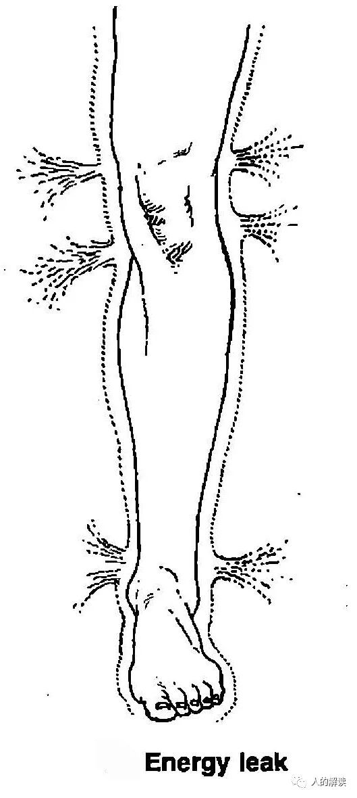

### 气场的六种能量阻塞

> 信息源：千帆过，转载自：[人的解读](http://www.rendejiedu.com/2377.html)

气场是让来自更高维度实相的创造脉冲进入物质界的媒介。气场的每一层都是一个能量身体，就像肉体一样是有生命的，运作方式也类似。如果不细分每层气场，而是为一个整体来看，那么气场会有哪些问题呢？

人类会使用气场作为防卫，保护自己不受不愉快的经验威胁，即使那个经验根本就不存在，只是自己的想象而已。如果气场出现阻塞或泄露，那便不能保护自己，最终导致肉体的不健康。

布蓝能把气场的能量阻塞分为六类：

能量阻塞类型|图示|形态|影响
---|---|---|---
喧闹型能量阻塞 Blah block||由沮丧的感觉和能量积滞而成，和绝望有关，这里面也带有怒气，会引起该部位的体液滞留，产生水肿。它的颜色通常是灰蓝色，质地黏稠厚重，像黏液一样。|能量并不密实，是松散的，可能会引起结肠炎或心绞痛。
压缩型能量阻塞 Compaction block||压抑感觉，里面包含有大量的愤怒，就像座火山一样。它的颜色是暗红色，看到它的人通常都会想要避开，免得自己成为火山爆发的牺牲者。|会导致该部位身体肌肉或脂肪的屯积，如果持续发展下去，可能会引发诸如骨盆发炎之类的疾病。
网状盔甲型能量阻塞 Mesh armor||可以在气场上很快速地移动，通常是害怕的感觉。|这种阻塞不容易引发病痛。危机可能以任何形式出现，比如突然生病、意外，或者婚外情。
盘状盔甲型能量阻塞 Plate armor||以张力状态聚集在身体周遭，把所有种类的感觉凝结固定住。|这类盔甲让他外在建构出井然有序的生活，身体健壮，肌肉通常比较精实。但在内心里他会感觉到某种空虚，因为这些盔甲阻绝了所有的感觉。
能量枯竭 Energy depletion||能量经过四肢往身体末梢流动的过程中变得越来越稀薄。|此人切断了与四肢的连结，不让能量往四肢流动，造成四肢虚弱，甚至发育不良。
能量泄漏 Energy leak||此人在关节处喷泄能量，不让能量流向四肢。|让自己没有足够的力量或感觉去回应生活中的某些经验。此人能量流失的部位通常都蛮脆弱，比如关节能量泄露会造成四肢冰冷。

### 气场的颜色

> 信息源：千帆过，转载自：[人的解读](http://www.rendejiedu.com/2396.html)

大多数人试图感知气场时还没法区分每层气场，起初看到的是整个气场的颜色，比如蓝色调或其他颜色。超视觉看到的气场颜色，跟人体彩光摄影拍出来的不同。这种基于生物反馈原理开发的设备是一种模拟的结果，不是真正的气场。

#### 常见的情绪颜色

情绪|能量颜色|能量形态
---|---|---
爱|玫瑰色|在柔波中流动
激情|玫瑰色、橘色|刺激的效果，波动会更快，波峰更高
嫉妒|灰绿色|粘滑
愤怒|深红色|粗粝、尖锐、锋利、穿透性、侵略性
恐惧|灰白色|尖锐突出
悲伤|深灰色|沉重

#### 不同人类行为的气场颜色

正常气场状态：

行为|气场状态|说明
---|---|---
音乐家表演时||开始唱歌时，他的气场扩展并且变得明亮起来，一吸气准备唱下一句歌词，就会有蓝色与紫色像闪电般明亮的闪光往外散射。当观众变得更专注，他的气场也随之扩展，歌者身上有非常大的弧形光束将自己的气场和听众的相连接。
演说自己喜爱的主题的男人||气场扩展且变成黄色与金色，并有银色或金色或蓝色火花闪现。跟前面歌唱者与听众的连接模式一样，只不过这次主要是心智能量，呈现出黄色或金色。
热情谈论教育的男人||爱的光芒像温柔的粉色玫瑰一样在气场中闪耀，有时候也会出现金色。透过谐波感应，听众把自己的振动频率提升到讲者的层次，气场可能也会染上一些跟讲者一样的粉红色或波尔多酒红色。灵性的感觉会有下列颜色：传述真理的讲者是蓝色，灵性是紫色，纯洁是银色或金色。
上完核心能量疗法的女人||有时候，气场的颜色会跟我们所穿戴的衣物颜色相近。这位女士在带领完一场核心能量课程之后的气场，她平常也常穿像这样绿色的服装，这种绿色和身体的健康及疗愈有关联。
经常穿紫色衣服的男人||一个气场常常发出浅紫色光的男人，跟他最喜欢的一件T恤颜色一样。这种浅紫色和爱的感觉以及内在柔软有关。
正在做增强能量场冥想的女人||气场上有非常多颜色，有的颜色在她的正面由上往下流动，隐约可看见她肩胛骨之间的脉轮。
怀了六个月女婴的女人||当女人怀孕时气场会扩张，且变得更亮。这是一个怀了六个月大小女婴的女人，气场上有很多蓝色、粉红色、黄色和绿色柔和美丽的光球从头部向肩膀交错滚动。
表达愤怒的人||愤怒的人气场是暗红色的，如果此人将愤怒宣泄出来，气场上就会向外发出闪电状或圆形火花般的暗红色。
隐藏愤怒的人||不肯释放愤怒和痛苦的状况，当红色斑点从这位女士的喉咙附近出现之后，慢慢向外移动，当这个红色斑点碰到胸口，她开始哭泣。就好像她用自己的愤怒往自己的心脏刺了一刀。
正在玩耍的十一岁男孩||明亮的红橘色不是愤怒，而是活跃的生命能量。快快乐乐、精力充沛的十一岁男孩在正玩得开心时，有明亮的红色和橘色条纹从他头上散射出来。
正在经历父亲死亡的感觉的女人||一位女士在经历亲人死亡后情绪爆发的情况，她当时被大量感觉所淹没，从身体气场上散射出非常多种颜色的强烈光芒或直线状光束，且色泽都很浓烈。
吸食可卡因的人||许多药物会对能量场(气场)造成强烈的负面影响。药物会损害明亮健康的气场颜色，且跟疾病一样，会在以太体制造出像黏液般的物质。这是吸食可卡因对气场造成的影响。头及脸部右边的气场上总是有很多灰色黏稠的以太黏液。
服用很多迷幻药的人||一个服用过很多次迷幻药且饮用大量酒精的男人，气场呈现肮脏的绿褐色，那些缓慢向下移动且没有被释放出去的脏绿色斑点，是他压抑的愤怒、嫉妒和痛苦混合造成的。

#### 气场色彩呼吸冥想

最强大的充能、活跃、净化和强化气场能量的练习是昆达里尼瑜珈。下面介绍最简单的为气场充能的方式——色彩呼吸冥想。

透过双手与双脚吸取从地表散发出来的各颜色光，并吸入你周围的空气。吐气时，也是呈现各颜色的光，呼吸各种颜色的光数次，从红光开始观想。现在，当向上移动时，吸入橘光。让橘光从地表进入你的双脚、进入你的双手，并从你周围的空气进入你的身体。再次吸入、吐出橘光，重复这个动作。不同颜色的意义如下：

颜色|作用
---|---
红色|为气场充能，温暖冰冷区域
橙色|为气场充能，加强性能力、免疫力
黄色|为太阳轮充能，清理混乱的脑袋
绿色|一般性的疗愈和补充气场能量
蓝色|冷却、镇静、重建以太体层
靛蓝色|打开第三眼，清理头部
紫色|与灵性连接
薰衣草紫|净化气场
白色|气场充能，带来平静与慰藉
金色|重建第七层气场并充能
银色|气场的强力净化，为第六层气场充能
天鹅绒黑|带来恩典、宁静，与神同在的平静
紫蓝色|协助扩展气场，协助任务连络

### 气场与服装

> 信息源：千帆过，转载自：[人的解读](http://www.rendejiedu.com/2582.html)

#### 气场与服装颜色

每种疾病都与某些脉轮的功能失调有关，而失调的脉轮需要所缺乏的颜色来滋养，因此颜色可以用于治疗不同的疾病。

症状|穿着
---|---
需要更多的肉体能量|穿红色。
多发性硬化症患者|红色和橙色。在开始穿红袜子给腿部充能后，病情有所好转，患者确认这和红袜子有很大关系。
改善性能力|穿红色、橙色衣服或内裤。
甲状腺功能不活跃|需要蓝色。
甲状腺过度活跃|需要绿色，综合平衡气场。
癌症患者|需要金色，因为所有的癌症患者的第七层气场 (因果体)、也就是金色层都有撕裂。癌症患者还需要癌症所在部位对应脉轮的颜色。例如，肝癌或胰腺癌患者需要黄色和蜜桃色，即第三脉轮分别在第二层气场 (情绪体) 和第四层气场 (星光体) 对应的颜色。

#### 气场与服装材质

天然纤维对气场有强大的正面影响，能够加强及支持气场，效果最好的是棉花、丝、羊毛。混纺的也很好，但要确保天然纤维比人造纤维含量多。比如，如果含有50%的棉就已经很不错了。

很多化学合成的纤维会干扰气场的自然能量流动，例如阿克力 (丙烯酸纤维)、涤纶(聚酯纤维) 和尼龙 (又叫锦纶、耐纶、聚酰胺纤维) 等。所以，最好避免使用石油副产品制成的面料，尤其是过敏体质的人。尼龙长袜会严重干扰腿部能量的上下流动，这与许多现代女性疾病有关。建议只在必要的时候才穿，如果可以的话，换成真丝袜子。
 
### 气场与居住空间

> 信息源：千帆过，转载自：[人的解读](http://www.rendejiedu.com/2646.html)

万事万物都是生命的，都有能量场。一个空间的能量，取决于它的形状、颜色、建筑材料以及空间创造者的能量。空间积累了它的使用者的能量，包括他们在空间中所做事情的能量，以及他们做事时携带的能量。所有这些能量，无论健康与否，都汇聚在一个空间中。当一个空间被带着同样能量的人，用于特定目的使用得越多，这个空间就会越充满这个目的能量。
 
举几个例子。

车站的能量是粗糙、混乱、参差不齐的，并常常布满阴暗污染的能量云团，待久了会感觉不舒服。因为那里积累的大量负能量，有可能进入你的气场。

教堂和庙宇的能量则更洁净、更高频。在这些空间中的更高灵性能量，会对进入的人产生正面影响。在仪式中积累的能量，也包含了在那里的人们的信仰能量。拥有相似信仰的人，在这样的空间中会有被加持感。

用于静心冥想或与神交流的空间，具有非常高频、奇妙、清静的能量。

#### 净化空间

你家的建筑材料，以及家里物品的制作材料，还有材料中的化学物质，同样也会影响家的能量场。你所居住空间的能量对你的气场影响很大。

家，会提供我们一处神圣空间，让我们不会忘记自己是谁、为什么要在这时候出生在地球上。你的家跟你一样有气场 (Aura)，你和家人、来访宾客的思想和情感，也会不断影响居住空间的能量。我们的家象征我们自己，家就是我们自己的延伸。也就是说，家是我们自己的样板，改变样板，就可以改变影响我们的能量。

转换居住空间的能量，会对一个人的健康、关系、丰盛、创造力，都带来真实的变化。这就是净化居住空间能量的重要性。当你净化居住空间时，你也在清理人生，因为你的家就是你的倒影。改变住家能量，就改变了你的能量。
 
空间的干净有序，也能保持能量的清洁。秩序是一项神圣的原则，无序是内心混乱的表现。混乱会给人造成心灵拖累，消耗能量。所以，在使用任何净化方式之前，第一步就是先把家里收拾干净，摆放有序。

接下来，就逐一看看各种因素对居住空间的影响，以及如何净化住家能量。这些因素及方式，包括建筑材料、生活物品、阳光及卤素灯、蜡烛或油灯、烟熏和熏香、空气及湿度、绿植、能量水、水族箱、花精及精油喷雾、水晶、声音净化等。

##### 建筑材料

金属铝的振动频率远低于维持人类生命所需的振动频率，所以家里最好不要使用铝。房屋或车上的铝板会降低其内部的生命能量振动频率，人在里面会被吸走能量。

而木头则与生命能量振动非常和谐，住在里面是健康的。混凝土对气场的作用是中性的。
 
一些大型公寓楼的钢架结构会干扰气场的正常扩展。如果一间公寓的房间很大，天花板很高，钢架对能量的影响可能不会太大。

房屋中使用的许多建筑材料对人类是有害的，各类化工材料先不说，就拿灯来说吧。比如，荧光灯会冲击你的气场，导致气场的不连贯。荧光灯产生的DOR能量也会让你生病。所以，赶紧换掉荧光灯。DOR是威廉•赖希创造的术语，代表死亡的奥根生命能。DOR能量的振动远远低于生命所需的频率，不利于健康快乐。密集积累的DOR能量，可能会造成危险，甚至危及生命，会使肉体和气场最虚弱的部位爆发疾病。

##### 生活物品

物品也携带能量，它包含其材质的能量、创造者(有意识或无意识地)置于物品中的能量，以及曾有过该物体的全部持有者们置于其中的能量。如果这些物品是古董，会带着所有它们待过的地方的能量。你房间里的物品摆件，会把所有这些能量带入到房间的能量"交响乐"中。所以，古董是不可以随意摆放在家中的。
 
##### 艺术作品

艺术作品对气场也有非凡的影响，效应因人而异。任何一件艺术作品的卓越之处，都会令我们的气场更和谐。美丽的印象主义场景，如莫奈的《睡莲》（Monet's Water Lilies），给气场充能，带来一种宁静的体验。
 
##### 阳光或卤素灯

大窗户透光良好，光线会为空气充能，增进健康。要确保有充足的阳光，因为阳光会给房间里补充生命能量，不让DOR能量（死亡奥尔根能量）堆积。 

为防止冬季缺阳光，可以安装额外的全光谱灯，最好是卤素灯。或者买个照度2500勒克斯的特殊灯箱，每天使用一小时。
 
##### 蜡烛或油灯

火是纯粹的能量，最常见的方式就是透过蜡烛，烛火可以提升空间中的能量。如果可以的话，尽量用手工制作的蜡烛。由于颜色是非常个人化的，一定要选择你感觉适合自己的蜡烛颜色，而非照着固定的公式。当然，除了蜡烛，你还可以用油灯或提灯。
 
##### 烟熏或熏香

风是普遍的自然元素，烟熏也是用来净化空间的传统方式。药草燃烧产生的烟雾可以净化特定空间的能量，最常用是鼠尾草、甜茅草或雪松(用常绿雪松的针叶部位)。当然，用当地容易取得的药草即可。也有有机药草做成的烟熏杖。
 
如果有低频能量积累，你可以通过燃烧茅香或鼠尾草来清理。最简单的就是熏香了。但大部分商业制造的香气，都会使用人工香精搭配天然成分，强烈建议使用天然精油。
 
##### 空气及湿度

房间的空气品质会强烈影响你的健康和居住空间的整体能量。只要一有机会就把窗户打开，让新鲜空气进来。空间的温度湿度调节也会影响你的能量。干燥的空气使你的气场变得脆弱，容易受到入侵。使用加湿器是补充新鲜湿气的简单办法，当然如果你住在常年潮湿的气候区，那就要放一台除湿机在房间里。
 
##### 绿植

建议在房间（除了卧室）里多放些植物，让植物和人之间保持持续的新鲜能量交换。每一株植物都有特定的能量场。例如，蕨类带有柔软温和的发光能量，对于周围能量场的反应很强烈。仙人掌具有扎根的能量场，可以吸收负面情绪。
 
##### 能量水

水具有天生的净化特质，一直被用在灵性仪式中，因为水是大自然中最伟大的净化器。可以在屋里放置比如太阳能量水（日晒约3小时）、月亮能量水、水晶能量水（水晶放入水中静置24小时）、含有小叶片树枝、花朵的泉水等。
 
##### 水族箱

水族箱可以带来宁静和镇定效果，但要保持容器中水的新鲜干净。任何活着的生物都会为家中添加能量，鱼类带来宁静安定。或者，你可以打造自己的住家瀑布。

##### 花精或精油喷雾

花精是由花与植物的萃取物稀释制成，含有植物的疗愈能量。在发生焦虑不安、争吵争论后可以用花精来调整空间能量。可以将花精加进喷雾里，偶尔喷洒空间。加几滴顺势疗法的酊剂到盆栽喷雾瓶中，喷洒家中四处，或者加几滴精油也行。比如在客厅里放一瓶加了薰衣草精油的喷雾，一天之内，随意拿起来喷洒客厅几次。卧室放一瓶加了天天竺葵精油的喷雾，铺好床之后，喷洒整个房间。
 
由于芳香的作用直接，并很迅速地影响生理反应，如果使用得当，可以创造快速的疗愈和净化。疗愈中使用的一些芳香剂是真正的能量精华本质，能够直接进入气场，提供其所需能量，就像顺势疗法一样。通过超视觉，可以看到芳香剂的有色能量，可以进入气场。其实，当你伸手去拿精华瓶子的瞬间，能量流的通道就开启了。一定要使用天然香剂，不要使用人工合成材料，它们起不了作用。

##### 水晶净化

为了保持家中能量，在房间特定位置置放水晶，会非常有用，效果非凡。疗愈师们在疗愈室放置天然水晶，可以为疗愈室带来额外的疗愈能量，阻挡DOR能量。
 
大地给与我们最有力量的工具，来自大地母亲的礼物之一，就是我们熟知的白水晶，不过需要定期净化它。净化水晶的方式有：在阳光下静置三到四小时；或者利用盐和水来净化，让水晶浸泡盐水至少二十四小时；或者把水晶埋在盐水下的沙子里半天或一天；另外净化水晶的方式是用尤加利精油涂抹水晶表面。

##### 噪音降低

声音对气场的影响非常强烈而直接。无论周围的声音是音乐、交通噪音、工厂噪音，还是原始大自然的声音，它都直接影响着我们的气场。如果你住在大城市，尽量采取一切可能的预防措施来控制噪音污染。你也许可以在城市噪声中入睡，但它仍然影响着你的气场。如果可能的话，安装三层玻璃窗和厚厚的、能降噪的窗帘。

##### 声音净化

许多当代疗愈师使用调音来改变客户的气场，改善他们的健康。你可以使用摇铃来净化能量。西藏金刚铃通常是用铁、铜、锡、银、铅、锌这七种基本的金属制成，散发出来的能量和色光会横越多重次元。

当然，你还可以使用音叉、风铃、沙铃、鼓、碗锣、颂钵等。颂钵产生的能量场非常惊人，声音会从颂钵开始向外螺旋，产生越来越大的涟漪，同时又会回旋至颂钵的中心。

另外你可以唱诵真言。歌唱也具有强大的振动能量，唱出感动你的声音。笛声可以为空间带来清晰的能量。现场演出或录好的音乐，都能够大幅影响空间能量。比如要为空间带来镇静效果，可以选择《圣母颂》《卡农》等。另外，适合儿童的摇篮曲，可以带入孩童般纯真的能量。不过音乐也是个极个人的喜好，你可以连续播放音乐，比如先播放激励的古典进行曲，接着播放舒缓的音乐，最后以柔和的新时代音乐结尾。
 
### 气场与自然环境

> 信息源：千帆过，转载自：[人的解读](http://www.rendejiedu.com/2696.html)

#### 自然环境与气场

- 阳光：太阳用奥根生命能(Orgone)为大气充能。
- 天气：雷暴、臭氧和雨水均能够为气场充能和净化，空气中增加的负离子会激发和增强气场，使能量加速流通。
- 海洋：海洋也能为空气充能。潮湿且含盐的空气可以给气场充能，也可以净化气场，并帮助气场清除频率过低、不能维持生命的振动。
- 湖泊：平静的湖泊具有强大的舒缓作用，能缓解现代生活压力造成的气场紧张。
- 小溪：急流的能量脉动可以增强气场，使气场连贯且健康地加速脉动。
- 瀑布：底部周围也有巨大的能量，落在这能量里的断树枝，会比一般情况下存活久得多。 
- 松林：松林中的脉动频率与人体气场非常相似。坐在这样的松树林里，或只是一棵松树干上，就会给你的气场充能，你愿意持续多久就多久。这样做的时候，你甚至可能连接到树的意识。
- 大山：大山可以帮助我们感受地球上矿物王国的力量并扎根到这力量当中，我们就可以扩展意识进入高空。
- 沙漠：晴朗沙漠的清新空气可以扩展我们的气场到极远处，并感受其宏大，甚至感觉比以前更有力。
- 种植园：有机种植园帮助我们连接地球能量，并提供人体所需的能量平衡的食物。我们在土地上劳动得越多，与地球能量的连接和受到的滋养也越多。
- 花园和庭院：帮助我们接地，植物给周围的能量场提供不同种类和频率的能量，滋养我们的气场。各种奇妙茂盛的植物使我们的感官充满了大自然的壮丽。
- 野生动物：与自然界的野生动物相处，我们能吸收它们的能量。每个物种都携带着巨大智慧，与其它物种的智慧不同。

#### 城市与乡村

每个地方的能量场很不同。比起生活在人口密度大的地方，生活在地广人稀之地的人，气场会延伸得更远。一般来说，拥挤的城里人要比乡村人的气场小。居住在人口稠密国家的人，比人口稀少国家人的气场要小。
 
大城市是高能量的地方，有非常多的能量类型。地球上形成大城市和文明之处，是大量外太空生命能量聚焦的地方，这些能量是知识的源泉。随着城市带来了创造力、发明和知识，它也在物质和能量层面上产生了大量的废物。大城市不仅积累了大量较高知识的能量，而且还积累了大量负能量或DOR能量。DOR是威廉•赖希创造的术语，代表死亡的奥根生命能。DOR能量的振动远远低于生命所需的频率，不利于健康快乐。密集积累的DOR能量，可能会造成危险，甚至危及生命，会使肉体和气场最虚弱的部位爆发疾病。

比如像纽约这样的大城市，地下累积了约40米深的负能量，这些负能量就像暗灰色或黑色的粘性物。整个纽约的地基土壤和岩石中，都存在这种粘性物质。当然，也有一些地方的黏性物质没有那么暗、那么厚。在黑暗的粘性物下面，是正常干净的地球能量，没有被污染能量所影响。DOR的量和深度似乎每年都在增加。

#### 环境污染

人们的免疫系统因为巨大的环境污染而受损，最主要的影响是针对大脑。脑细胞会产生极微量的各种物质，是大脑健康和身体运转所必须。但是人们这些物质的分泌逐步失衡，这些物质分泌的量和时间上只要发生微小变化，都会对人体正常功能造成很大的破坏。即使疗愈师能够让大脑中受到干扰的生命能量恢复平衡，患者一回到被污染的生命能量场环境中，健康的大脑功能再次受到干扰。每个人似乎都完全觉察不到发生了什么。

人们暴露于DOR能量中的时间越长，就变得越不敏感，这有点像温水煮青蛙，青蛙没有注意到水越来越热，最终死掉。每周在未破坏的纯天然环境中待上几个小时，就能重建人体气场和地球能量之间的平衡，这对于全面的健康是很有必要的。

#### 地球脉轮

罗伯特•库恩(Robert Coon)提出，地球是一个生命体，和人体一样有脉轮和能量点，而能量点集中的地方灵性活动会越发活跃，同时也会引发一些重大历史事件。

这些充满能量的脉轮是最强的能量漩涡点，还有数百个小的脉轮遍布全球各地。7个主要脉轮依次为：

- 1、沙斯塔山(Mt. Shasta)，又称雪士达山，在美国加利福尼亚州；
- 2、的的喀喀湖(Lake Titicaca)，在玻利维亚和秘鲁边境；
- 3、乌鲁鲁(Uluru and Kata Tjuta) ，在澳大利亚北方；
- 4、格拉斯顿伯里（Glastonbury and Shaftesbury），在英国；
- 5、吉萨大金字塔 (Great Pyramid, Mt. Sinai)；
- 6、极漫长时期的活化中心(The Aeon Activation Centre)，是移动的；
- 7、凯拉斯山(Mt. Kailas)，就是冈仁波齐，在西藏。

活化中心在双子座时代是中国的泰山；金牛座时代是西伯利亚的Belukha；白羊座时代是伊朗的Kun-E-Malek-Siah；双鱼座时代是耶路撒冷的橄榄山(Mt. of Olives)；水瓶座时代是在英国的Shaftesbury。

#### 行星网格（Planetary Grid）

贝克尔和哈根斯 (Becker and Hagens)的行星能量网格是基于柏拉图固体(Platonic Solid)。柏拉图认为这个世界被塑造成十二面体，随着时间的推移，它将变成一个二十面体。这个模型表明，大陆、海洋和能量线的位置符合规则形状和数学公式。众多历史、文化和精神的圣地，刚好坐落于能量网格(Energy Grid)地图上。

#### 地脉（Ley Lines）

几千年来，我们的古人一直相信地球有能量线，有着不同的称谓，比如：地脉(ley lines)或龙脉(dragon lines)。圣迈克尔和圣玛丽线(Saint Michael and Saint Mary Alignment)和阿波罗/雅典娜能量线(Apollo / Athena Energy Line)，以近乎完美的直线显示，具有历史和精神意义的圣地完美的坐落其中。

比如英国南部这条线，就有维尔特郡巨石阵(Stonehenge)、纽格莱奇墓(Newgrange)、白马阵、麦田圈等。

当然不止是上面的研究结果，还有些通灵材料也提到地球能量网格，比如赛斯(Seth)的《时空之外》提到过这个问题，赛斯称之为“调和点”。也就是说，地球上存在着许多个不同层级的能量调和点，可以理解为地球的能量交汇中心。 

还有道瑞(Datre)资料的第三本主要讲地球能量网格，中国几乎全部国土都处于N6区域。

## 性格结构在气场、脉轮的解读

> 信息源：千帆过，转载自：[人的解读](http://www.rendejiedu.com/2544.html)

性格结构(Character Structure)，是许多治疗师用来描述某些人的身体和心理类型的术语，这个概念最早来自弗洛伊德(Sigmund Freud)。

性格结构(Character Structure)，可以说是每个人选择此生要解决的基本问题或个人功课的凝聚显化。我们的身体携带着这些问题或功课，好让我们能够轻易知道此生应该处理的是什么。因此，若能学着认识自己的性格结构，我们就能找到疗愈自己的关键，并找到自己的灵魂功课和人生任务。性格结构其实是气场扭曲的模式，也是我们的体形因负面印象和信念系统所产生的不平衡。你会发现所有这些性格结构发生在你周围、你自己和你的亲密关系中。

生物能量学(bioenergetics)研究中使用5种基本性格结构，分别是分裂型、口腔型、转移型或错乱型、受虐型和严苛型。其中每种性格结构的主要问题，你都或多或少地带着。我们也会在不同的人生阶段，面对不同的性格结构问题。

每种性格结构的问题，你都或多或少地带着，只不过是每种性格结构占的百分比不同。例如你的身体中：分裂型50%， 口腔型20%，转移型15%，受虐型5%，严苛型10%。

#### 附：肩膀类型

肩膀类型|表示
---|---
提高耸起形|常处于恐惧中
浑圆的弓形|负担过重
方形|力量和肩挑重任的能力
向前拱起形|长期自我保护、害怕受到伤害
向后撤退形|似乎对生存处境不满，想挥出拳头却做不到

#### 附：臀部类型

臀部类型|表示
---|---
向内收缩|会压抑感情，也不作自我表达
向上拉，高于骨盆底部|想要控制
骨盆向上凸出(后倾)|通常与压抑性欲有关
骨盆向下倾斜(前倾)|性欲很强、注重感官享受、沉溺于性爱乐趣

### 分裂型结构

> 信息源：千帆过，转载自：[人的解读](http://www.rendejiedu.com/2419.html)

分裂型结构(Schizoid Structure)，是造成生命能量流最早被切断的性格结构。

#### 分裂型的产生原因：出生创伤

首次的创伤经验发生在出生前或出生时，或者刚出生之后的那几天。通常是直接接收到父母某一方的敌意，例如父母不想要这个孩子所产生的怒意；或在分娩的过程中发生创伤，例如母亲在情绪上与孩子切断了连结，使小孩觉得被抛弃。即使只是母亲和孩子之间轻微的切断连结，对母亲来说毫无影响，但对孩子来说却是非常严重的创伤。

分裂型的人，第三和第四脉轮能量带，没有以健康的方式连接父母，所以他们没有与他人连接的榜样模型，这导致与他人相处非常困难。

#### 分裂型的肉身：虚弱敏感

分裂型的人通常既高又瘦，不过有些人也可能很重。身体的紧绷会环绕在身体外缘，关节通常很脆弱，身体协调不佳、手脚冰冷。这类人常常能量过度活跃，不够稳固，没有好好跟大地连结。手腕、脚踝和小腿肚比较纤细，可能会有一边的肩膀比较粗壮。靠近头骨底部的颈部会有一个主要的能量阻塞，通常是深灰蓝色的，头骨底部常常有能量喷出，脊椎常有错位的现象。头常常会倾向某一边，目光涣散，好像他有一部分消失了一样。这类人有很多在童年早期就开始自慰，透过性欲连结生命能量。这让他们在无法跟周遭其他人连结的情况下，能感觉自己还活着。

#### 分裂型的气场：不太平衡

人体的七层能量场中，下三层分别是：以太体、情绪体、心智体；上三层分别是：以太模板体、天人体、因果体。

分裂型的人，气场前三层有不平衡的状况。以太体单薄、边缘破裂，关节处有能量流失，颜色通常会是很浅的蓝色。情绪体和心智体则可能有两种情况：凝固紧贴且不流动，或以不平衡的方式随机在前后或左右之间移动。通常某一侧及头的后面能量较多，看起来比较亮。

他们的灵性体通常都很发达明亮，天人体有很多光彩夺目的颜色。因果体看起来都非常耀眼，颜色的部分银色会比金色多，边界有点扩散模糊，整个形状没有完整的被撑开，脚部附近会比较收缩，所以呈现倒立的蛋形，脚部区域有时候会有一些脆弱破损处。健康的因果体是个坚固的能量蛋。

#### 分裂型的脉轮：失衡逆转

分裂型的人，会有很多逆时针旋转的脉轮，这意味着送出的能量比吸收进来的多。至于那些顺时针旋转的脉轮，常常会有不对称的情况，就算是开启的状态，也并没有平衡运作，有的部分能量流动量较多，有的较少。这种不平衡现象通常发生在左右两侧，例如右侧的能量流大于左侧，导致此人在这个脉轮掌管的生活方面会比较偏向积极甚至侵略性。在他们身上通常会保持敞开的是：性能量的中心(生殖轮)，太阳轮、眉心轮以及顶轮。

眉心轮和顶轮是关于非物质界的灵性，是这类人在生活中通常比较聚焦的部分，虽然他们也大量使用意志的力量(生殖轮的背面)。脉轮失衡的部分反映出他们性格结构中需要被转化的面向。在转化的过程中，脉轮的状况会不断改变，当他们比较安于生活在第三次元以及物质界时，就会有更多的脉轮呈开启状态。在疗愈过程刚开始的时候，背部的性能量中心(生殖轮)会有多次不会打开。

#### 分裂型的灵魂：灵性落地

分裂型的人，可能在许多前世中，都有过肉体痛苦和创伤，并且通常因为特定灵性信仰而遭受折磨至死。分裂型的人，通常是颇具灵性的人，对人生的真正目的有深刻的觉知。他们常常试图把灵性带入周遭的日常生活中，非常有创造力，有许多天赋，常常有很多创新的点子。

这类人的灵魂功课，是面对自己内在的恐惧和愤怒，这些恐惧和愤怒阻挡了他将惊人的创造力落实在物质界的能力。他会尽可长时间沉浸于较高灵性层面，不够接地气。所以，他的另一个任务是将自己的灵性落实带入这个物质世界，可能是透过他的创造力展现灵性的世界，例如写作、发明、帮助人群等。每个人的任务都很不同，不能一概而论。
 
#### 分裂型的气场互动：保持平静

如果你想要帮助分裂型的人感到安全、放下戒备，就要接地气、开始交流，如此你才能完成双方共同参与的任何事情。你只需全身放松，让自己保持平静，也会会让对方也感到平静。可以将你的右手放在对方生殖轮的背部，然后非常小心地允许生物等离子流从你的手中流出，用你的意愿，将它引导到对方体内中心，进入地球。

### 口腔型结构

> 信息源：千帆过，转载自：[人的解读](http://www.rendejiedu.com/2441.html)

如果在口腔期产生被遗弃感，使正常人格的发展被遏止，就会形成口腔型性格结构(Oral Structure)。

口腔期又称口欲期，是一个心理学名词，是弗洛伊德所提出的性心理时期(Psychosexual Stage)中的第一个阶段。弗洛伊德把力比多(libido)的发展分为五个阶段：口腔期 (Oral Stage,0～1岁)；肛门期(Anal Stage,1～3岁)、性器期(Phallic Stage,3～6岁)、潜伏期(Latent Stage,6～11岁)、生殖期(Genital Stage,11或13岁开始)。

#### 口腔型的产生原因：被遗弃感

前面提到了口腔期，小孩可能因为母亲去世、离开、生病或退缩在自己的世界里，而觉得失去了母亲。

另一种情况是，母亲对孩子并非没有付出，但付出得不够。比如，母亲没有充足时间完成母乳喂养。孩子在吮吸母乳时，孩子会与母亲融合，这是最接近回到子宫里的体验。孩子会因此强迫自己提早独立，许多这类小孩很早就学会说话和走路，以此来弥补他的失落。

#### 口腔型的肉身：发育不好

口腔型结构的人，基本上是匮乏的、感觉空虚、空洞并且不想负责任。身体并没有发育得很好，肌肉纤长且松弛，躯体无力地弯曲。这种人看起来不太成熟，不像个成年人，胸膛冰冷扁平，呼吸短浅。

不幸的是，她们的父母会从通过第三脉轮能量带连接孩子来吸取养分，而不是给予孩子。父母还透过附着在孩子身上的生物等离子流，从孩子身上获得能量。

#### 口腔型的心理：依附他人

在心理动力学上，这种人会依附他人，以抵抗被遗弃的恐惧。她会经常消极被动和疲倦，无法独处，对他人给予的温暖和支持有过度的需求。她想从「外在」得到能量，好填补自己内心巨大的空虚，她压抑自己的强烈渴望，把被遗弃的愤怒压抑住，用性来取得与他人亲近的感觉和连结。

这类型的人，在人生中常常感到失望，有许多在要求自己想要的事物时被拒绝的经验。因此她变得充满怨恨，觉得不管拥有多少都不够，要求被滋养、被满足。她需要被照顾的感觉导致了依赖、黏人的倾向、索取，她会用独立的行为来对抗这个部分，但这个独立会在压力之下崩溃，因为这并不是内心强大的独立。
 
#### 口腔型的气场：能量枯竭

口腔型的人，常常有枯竭的气场，能量活动不活跃且平静。主要能量在头部。由于依赖于他人预消化过的能量，气场一直很薄弱。

以太体紧贴着皮肤，颜色是浅蓝色。情绪体也被抑制住，没有什么色彩，通常有枯竭的情况。心智体是明亮的，通常呈现黄色。气场较外围几个层次不是很亮，因果体没有完全撑起成为漂亮的蛋形且不明亮，在银色的表面上有银色一金色的光芒，在脚部附近区域有能量枯竭的情况。健康的因果体是个坚固的能量蛋。

#### 口腔型的脉轮：能量不足

口腔型的人，脉轮多数是关闭或能量不足的。由于习惯利用能量系统从别人那吸取能量，所以就从未让脉轮发育为正常的大小，以便能自然吸收能量填充气场。她们专注于从外部获得补充，而不是从脉轮或从内在源头获得。顶轮和眉心轮应该是开启的，对应心智和灵性上的清晰。别的脉轮基本关闭了。

如果她们经历过了个人成长的功课，正面的性能量中心（生殖轮）应该也会打开，让她对性产生兴趣和性欲。口腔型的人，脉轮跟分裂型的人很像，只不过分裂型的人是背面的性能量中心（生殖轮）打开，而口腔型是前面的开启。

#### 口腔型的灵魂：自我哺养

口腔型的人，其主要课题是哺养。口腔型的人，经历过许多食物短缺的前世。她们可能曾生活在饥荒中被饿死，或者不得不为了得到一点点食物而做出可怕的选择。她们没有体验过完全的满足，担心自己永远得不到足够的。

口腔型的人，需要学习相信宇宙的丰盛，并把索取的过程反转为付出。灵魂功课就是要学习在人生中满足自己的需求，学习脚踏实地并用自己的力量活着。她需要放掉受害者的角色，承认自己获得已足够。她得学会面对独处的恐惧，深入自己内在的空无，在那里找到与生命的连结。当她为自己的需求负起责任，用自己的力量活着，她将能够说：「我拥有」，并让核心能量打开并流动。当其高我被释放之后，她将能把智力善用在艺术或科学等创造工作上。她会是天生的好老师，因为兴趣广泛，而且总是能够打从心底热爱所知之事。

#### 口腔型的气场互动：吸取能量

口腔型的人，会试图将第三脉轮能量带连接到他人的脉轮上，以便像父母那样透过能量带来吸收能量；并试着通过“吸尘器眼晴”与他人的眼神交流来创造生物等离子流，从而吸取能量。如下图所示。

#### 口腔型如何改善：开海底轮

口腔型的人，需要的是为气场注入能量、打开脉轮，以及强化界线。还需要学习辨认脉轮打开的感觉，在练习和冥想时，保持脉轮的敞开；还需要很多的肢体上的抚触。其实，如果口腔型的人能够扎根地球，能量就会像自流井一样自动流入她的身体，自给自足，而不需要再吸取别人的能量。口腔型的人，需要将第一脉轮打开，让更多的能量从地球进入。

### 错乱型结构

> 信息源：千帆过，转载自：[人的解读](http://www.rendejiedu.com/2466.html)

错乱型又被称为转移型 (Psychopathic Structure)，这要追溯到原生家庭的父母身上。

童年时，当双亲中与孩子不同性别的一方，与配偶相处有问题时，将许多本该由配偶满足的需求转移到孩子身上，用诱惑来控制孩子。那么，孩子就变成了妈妈的「小男人」或者是爸爸的「小女人」，并被微妙地告知，他/她比自己的父亲/母亲要好得多。于是，孩子在他/她的年轻时代就被赋予了超出年龄范围的责任，并被鼓励快快长大。如此，孩子便把他们的心交给了异性方家长，但性不在其中。这就导致了孩子成为了错乱型(转移型)的人。
 
#### 错乱型的产生原因：父母错乱

如前所述，错乱型的人在童年早期时曾被父亲或母亲（与之性别不同的那一方）暗地里诱导，父母想从这个孩子身上得到所需，以致于孩子和父母形成三角关系，这样孩子很难从与之同性别的父母身上得到支持。这样导致的结果就是，错乱型的人跟双亲中不同性别的那一方形成同一阵线，一旦无法获得自己想要的，便会感觉被背叛，于是用操纵同一阵线的父或母来弥补。

其实真正的背叛来自于父母，只是因为配偶不能满足，就利用和控制孩子来满足本应从配偶那里得到的需求。孩子小的时候，好像没问题，但是青春期出现性欲时，一切都乱了。异性家长一方对孩子的任何追求者都非常嫉妒，认为这孩子不该有性欲，只应该爱他/她们的父或母。但这是不可能的，会让那些错乱型的人（青春期）非常恐惧，因为他/她们同时有性欲和心灵。然而，同时拥有这两者，是对家长的背叛，他/她们会觉得自己很坏。他/她们在这方面很脆弱，会害怕同性的人，因为这使他/她们想起自己同性别的父或母。

#### 错乱型的肉身：上壮下虚

错乱型的人，上半身看起来比较壮硕，但能量没有在上半身与下半身之间流动。骨盆缺少能量，冰冷且紧缩。肩膀、头骨根部和眼睛有严重的紧绷，腿部虚弱，没有跟大地连结。

三种类型对比看看，区别很明显。分裂型的人通常既高又瘦，手腕、脚踝和小腿肚比较纤细。口腔型的人，肌肉纤长且松弛，躯体无力地弯曲。错乱型的人，上半身明显更壮实些。

#### 错乱型的心理：控制欲强

错乱型的人，看起来很强势，会尽其所能地尝试控制他人。在与他人互动时，她会直接下达操纵指令，例如告诉别人「你应该……」以使他人屈从。这源于从小养成的操纵感，来获得自己想要的，否则便会感觉被背叛。所以，这类型的人有非常强烈的权力欲。为了达成控制的目的，她有两种方法：霸凌他人或透过引诱削弱他人。

错乱型的人，总是想要赢。但是想要获得支持，就意味着臣服，而她相信臣服就是失败。她的负面意图是「我要世界依照我的意愿运作。」

错乱型的人，有着强烈的优越感和鄙视心态，用以掩盖深层的自卑。她将自己武装起来，对抗失败的恐惧。她被卡在依赖他人和想要控制他人的欲望之间左右为难，害怕被控制、被利用。

错乱型的人，带着很多恐惧，把生活看成是战场。她害怕来自最亲密友人的背叛，所以她害怕朋友，在她内心深处，不再信任任何人。她的性欲常常是带有敌意及很多的幻想。她用性来玩弄权力，欢愉对她来说是次要的，征服才是重点。她试图让其他人需要她，好隐藏自己的需求。

#### 错乱型的气场：上强下弱

错乱型的人，能量主要集中在上半身，能量在上半身过度活跃，然后在下半身剧降。这类型人的气场，每一层的底部通常能量枯竭，顶部则非常饱满，所以会呈现颠倒的蛋形气场。

以太体越靠近脚部就变得越稀薄，颜色通常是深蓝色，比分裂型和口腔型结构的人色调更浓重一些。心智体在身体正面的厚度比在身体背面薄，情绪体也是在顶部比较饱满，且在肩胛骨之间的意志中心处有很大的突出能量包。气场较外围的那几层，也是上半身比较饱满明亮。

#### 错乱型的脉轮：上开下关

错乱型的人，背面的第四脉轮（心轮）的通常是开启的，非常大，而且被过度使用。正面的第六脉轮（眉心轮）和第七脉轮（顶轮）也是开启的。其他脉轮（尤其是正面的感觉中心）多数是关闭的。背面的性能量中心（生殖轮）可能是半开半关。她主要是透过心智和意志能量运作。

由于她的气场不是接地的，不能从地球获取生命力量，所以她感到虚弱，得不到支持。她将能量向上移动了，导致第一脉轮（海底轮）和第二脉轮（生殖轮）因能量耗尽而枯竭，使她更容易受到“釜底抽薪”式的伤害。

因为第二脉轮（生殖轮）能量不足，她在性方面有问题。虽然她很有魅力，但这种魅力不会保持长期关系，因为她的心和性没有一起工作。与分裂型和口腔型相比，错乱型的第二脉轮（生殖轮）没有开启。

心轮之间的能量带，就是我们提到的“心弦”。因为连接异性家长方的「心弦」被背叛所污染，她/他会害怕将心轮能量带连接到另一个女人或男人。当她连接心弦时，就已经预设了背叛。男性会预期女人的背叛，女性则预期男人的背叛。每个人都为对方的背叛做准备。或者，她自己先背叛。

#### 错乱型的灵魂：正视背叛

错乱型的人，主要灵魂课题是背叛。她可能前世当过多次战士，为一个伟大事业而奋起战斗。她在个人层面上牺牲了很多，战斗，赢得战斗。但最终，这些人被背叛，被推翻，很可能被她最信任的人杀害。
 
这类型的人，需要逐渐松开自己，放松上半身，放掉控制他人的倾向，臣服于深层的自我以及性的感觉。一旦这么做，可以满足她活在现实、和朋友情感交流，以及感觉像一个人的深层渴望。当她的高我能量被释放，会是非常诚实正直的，高度发展的智力会被用来解决纷争以及协助他人。这类型人的诚实将引领他人找到自己的诚实。她擅长管理复杂的计划，并有一颗充满爱的宽阔之心。

错乱型的人，需要脱离恐惧，并感到安全；需要放弃通过控制他人来追求安全感；需要学会信任自己和他人；需要认识到地球不是一个战场，而是与他人交流的地方；需要放弃战斗，放下负担；需要允许自己犯错误，但同时仍感到安全和良好。

#### 错乱型的气场互动：侵略性强

错乱型的人，倾向于以好斗的方式来面对生活，所以会把能量投入身体后部加强意志，然后挺直脊背，高昂头颅，以面对所谓的侵略者，如下图所示。

#### 错乱型如何改善：开下三轮

错乱型的人，需要强化下半身的气场，打开位置较低的脉轮（下三轮），并学习不要只靠意志生活，而要用心来生活。特别是处理在性方面的问题时，要非常的温柔，疗愈师要带着谨慎、理解与接纳的心来处理第二脉轮（生殖轮），在碰触他们的下半身时要很敏感及小心。
 
错乱型的人，会要求你同意他们扭曲的世界观。记住，不要同意，因为认同只会加强它。你可以通过气场做些什么，以帮助错乱型的人感到安全、接地，并重新连接回到交流中。你第一时间，不管它是什么，深呼吸，弯曲你的膝盖，向下接入地球，拉回你可能发出的所有生物等离子流。将你的注意力集中在双腿以及你身后的大片区域。想象它，感受它，看到它。不要卷入争辩。念诵 “不争辩，不争辩。” 这样任何朝向你的侵略性的能量都会流走，变成玫瑰和绿色。只要站在那里，倾听着，让气场的负面能量滑入地球。

在争论中，气场会变得高、粗粝、有锯齿。所以，接下来要降低你气场振动的频率。你可以想象一些让你感到平静、柔和、安全的事情，比如你最近在大自然中的散步、你最喜欢的音乐，或者让你觉得安全的人，想象这个人站在你旁边。这样会持续降低并平顺你的频率，直到与地球频率相匹配，并保持住。只要在那里，让你的振动通过谐波感应去连接错乱型的人，这样会使他们平静下来。

如果你发现自己有错乱型倾向，在攻击某人，因为你认为那人背叛了你，只要停下来一会儿，也许情况并不是那么糟糕，是你反应过度了。你只需要做上面降低频率的练习，重复念诵 “我是安全的。我是善良的。” 

### 受虐型结构

> 信息源：千帆过，转载自：[人的解读](http://www.rendejiedu.com/2492.html)

弗洛伊德 (Sigmund Freud)对受虐狂有如下解释：假如人生活在一种无力改变的痛苦之中，就会转而爱上这种痛苦，把它视为一种快乐，以便使自己好过一些。

威廉•赖希 (Wilhelm Reich) 发展出来的生物能量学中的受虐型结构(Masochistic Structure)，与弗洛伊德定义的受虐者是不同的。他的受虐型，源自童年期得到的爱是有条件的，是被侵犯和被控制下的爱。

#### 受虐型的产生原因：父母强势

受虐型结构中，父母双方或其中一方，将孩子当作自己的一部分，把自己的意愿强加在她身上。所有进出她的东西都被控制了，包括思想、想法和创造等，更别说谈情说爱婚姻自主了。她没有机会去发展个体性，尤其是会因有感受性欲受到羞辱。哪里有压迫哪里就有反抗，她尝试抵抗施加在自己身上的庞大压力，但都失败了。她觉得被困住、失败、羞辱，于是她压抑住自己的感觉和创造力，结果导致了愤怒和恨意。

受虐型的人，源自童年创伤，其母亲虽然牺牲很多，但非常强势，导致她没有私人空间，甚至不能支配自己的身体，哪怕连吃饭和排泄都被控制。结果她对任何自己的主张，或想要自由的欲望都觉得充满罪恶感，被培养为对每一个自由的自我表达而内疚。
 
父母用生物等离子流，把她淹没在父母的能量中，或者钩住她。父母还使用第三脉轮能量带来控制她。与此同时，父母也是深深地爱着她的，并在第四脉轮之间建立忠诚有爱的能量带。

#### 受虐型的肉身：身材短粗

这类型的人，身体特征上，体重很重，整个人很有份量，肌肉过度发达，脖子跟腰较短。脖子、下巴、喉咙和骨盆处累积了大量压力，臀部冰冷。能量被卡在喉咙处，头向前倾。

 
四种类型对比看看，区别很明显。分裂型的人通常既高又瘦，手腕、脚踝和小腿肚比较纤细。口腔型的人，肌肉纤长且松弛，躯体无力地弯曲。错乱型的人，上半身明显更壮实些。受虐型的人，脖子跟腰较短。

#### 受虐型的心理：缺乏自主

这类型的人缺乏自主权，害怕按自己的意愿行动。这类人总是在受苦、在呻吟、在抱怨，外在永远表现得很顺从，但其实永远都不会真正的臣服。内在锁住了强烈的怨恨、负面、敌意和恐惧，爆发的时候会成为强烈的愤怒。这类人可能有性障碍，对色情影片有强烈的兴趣。如果是女性，可能无法拥有高潮，而且觉得自己的性欲是不洁的。最明显的症状是紧绷，既想要从压力中解脱，却又无意识地相信，如果放掉紧绷并接受内在的事物，会导致屈从和羞辱。

要解决这个问题，她需要让自己变得有自信、自由，以及开启她的灵性连结。
 
#### 受虐型的气场：有很多孔

这类人的气场，边界从未有机会发育和界定。弥散的非结构层，比创造边界的结构层有更多能量、也更发达，所以气场有很多孔。气场完整地张开，主要能量都锁在内部，外在是活力低落的样子。整个气场完全撑起，在脚部附近稍微比较饱满，所以形状比较像是椭圆形而不是蛋形，颜色是暗金色。气场的边界有些过厚与紧绷。

这类人的以太体密实、厚实且粗糙，颜色多半是灰色而非蓝色。情绪体饱满，有很多颜色，跟以太体一样分布平均。心智体很大，在上半身和下半身都很明亮，智力跟情绪整合得较好。天人体很明亮，颜色是淡紫色、褐紫红色和蓝色。

#### 受虐型的脉轮：很少开启

受虐型的人，脉轮大部分是关闭的，开启的脉轮，通常只有正面的第六脉轮（眉心轮）、第三脉轮（太阳轮）。背后的性能量中心（生殖轮）可能有部分开启。

与其他三种类型比，受虐型的脉轮开启是最少的。

#### 受虐型的灵魂：找回自由

这类型的人，主要问题是侵犯和被控制。在前世可能经历过许多被控制和受困的情况，不允许表达或不能按自己的意愿行动。在前世生活中，她可能遭受过监禁、奴役，或者身陷被他人掌控的强权政治或宗教控制当中，必须服从。她内心深处渴望自由，却不敢明说，也不知道如何获得自由。她选择出生的家庭，成为她的下一个监狱，父母则成了监狱长。
 
这类人，需要以释放自己的侵略性，摆脱羞辱的感觉。在想要表达意见的时候，能积极主动地用自己喜欢的方式表达自己。她的创造力展现在精细、错综复杂的设计上，如果能把这个高度发达的创造力展现出来，将使世界为之赞叹。这类人的高我，充满了照顾他人的能量。她是个天生的协商好手，有一颗宽容的心，内在有很深的慈悲，可以带给其他人很多支持，乐于付出她的能量和理解。
 
#### 受虐型的气场互动：等人来撩

受虐型的人，要么隐藏在内心深处，要么试图得到其他人的许可才出来，气场如下图所示。

#### 受虐型如何改善：开生殖轮

如果你发现自己有受虐型倾向，请弯曲膝盖，呼吸，向下接入地球，让能量从地球上升到你的第二脉轮（生殖轮）。允许自己感觉与周围的一切联系在一起，以此让你所保持的巨大能量开始在你的气场中流动。把你的手放在第三脉轮（太阳轮）上，保护自己。同时，专注于你的内在力量，与自己同在，重复念诵 “我是自由的，我是自由的。”

### 严苛型结构

> 信息源：千帆过，转载自：[人的解读](http://www.rendejiedu.com/2518.html)

有一类人，在工作上很出色，有完美的配偶和完美的家庭。赚了很多钱，穿得很好——一切都很相配，所做的一切恰如其分。身体显得平衡而健康。每个人都羡慕她表面上的完美、无忧的生活，似乎什么都不缺。但是，在这类人的生活中，唯一缺失的就是她自己，她没有体验过真实的自己。她的外部世界是完美的，内在的心理世界被否认，这就是严苛型。

#### 严苛型的产生原因：追求完美

有人说，人生第一个严苛型的领导是自己的父母。没错，严苛型结构，确实也是从童年时形成的。这是由于在童年时，经历过双亲中与其性别不同的那一方的拒绝，孩子会觉得这是一种对爱的背叛。因为对孩子来说，情欲的愉悦、性欲和爱是一体的。为了补偿这个拒绝，孩子决定要压抑痛苦、愤怒，以控制相关的感觉。

父母对待孩子，都是按照完美的表面幻象来的。孩子被教导要穿戴整齐、好好做功课、按时睡觉、按时吃饭等等。在成长过程中，所有的负面体验都会被否认，而创造出一种完美的假象。一切都是按完美来要求，这种压制就形成了严苛型。
 
#### 严苛型的肉身：身材匀称

这类型的人，身体比例匀称，充满能量，整合得很好。骨盆后倾且冰冷。她可能有两种形式的能量阻塞：盘状盔甲型能量阻塞或网状盔甲型能量阻塞。

这跟前面几种类型的区别是很明显的。分裂型的人通常既高又瘦，手腕、脚踝和小腿肚比较纤细。口腔型的人，肌肉纤长且松弛，躯体无力地弯曲。错乱型的人，上半身明显更壮实些。受虐型的人，脖子跟腰较短。然而严苛型的人，身体比例匀称，堪称完美。

#### 严苛型的心理：抑制感觉

这类型的人，克制自己的感觉，对外在一切都控制得当。表面虽然显得很优秀，但内心深处非常害怕被背叛。无论如何都不允许自己脆弱，非常恐惧被伤害。她会抑制所有的感觉，头总是抬得高高的，背打直，展现她的傲气。

由于没有体验过真实的自己，她不可能整合自己的心灵和性欲。心和性不能同时运转。她爱的是一个不存在的理想之人，所以只有短期的性关系，无法维持一段深入的情感关系。她的恋爱所持续的时间，只是情欲的最初阶段。然后，伴侣的不完美浮现了，对方不够理想——结束到来了。

她的主要症状是没有感觉。她想要臣服于感觉，但理智却说“我才不要臣服。”于是她选择了性而不是爱，但这无法带给她满足。对她来说，怎么选都不对。因为她认为臣服就会受伤，保持骄傲又无法拥有感觉。所以，要解决这个问题，她必须让心和性连结起来。

#### 严苛型的气场：基本平衡
 
这类型的人，主要的能量都被锁在周边，远离核心。气场强壮明亮，在身体周围的分布大部分都很平衡。以太体很宽，平均且厚实，呈蓝灰色，粗糙程度中等。情绪体处于平静，且分布均衡。心智体发展良好且明亮。 

这类型的人，天人体可能会不太亮。蛋形的因果体强壮又有弹性，颜色是金色为主或银色，明亮，形状完好。

#### 严苛型的脉轮：前面关闭

正面脉轮（2A/3A/4A/5A）与人的感觉有关，背面的脉轮（2B/3B/4B/5B）与意志有关，头部的三个脉轮（6A/6B/7）与心智进程有关。

 
严苛型的人，与感觉有关的正面脉轮(2A/3A/4A/5A)基本都关闭，如下图。这也说明为啥这类型的人，主要症状是没有感觉。

开启的脉轮，大概会是背后的意志中心(4B/5B)、性能量中心(2B)、海底轮(1)及心智有关的脉轮(6A/6B)。她主要是透过意志和心智的力量而活。

顶轮(7)及太阳轮(3A/3B)不一定开启。在进行疗愈并开放接纳自己的感觉之后，她正面的感觉中心会开始敞开。
 
与其他4种类型比，严苛型的脉轮开启是最多的。

#### 严苛型的灵魂：表达感受

严苛型的主要问题是真实性。在前世，她经常必须保持完美的表象，没有缺点或弱点才能生存。严苛型的需求是真实，而不是恰当。她需要表达内心的感受，要停止对不完美的担心和恐惧，因为她已经很棒了。

她的内在是充满冒险、热情和爱的。她会以对生命的爱和热情启发他人，她在大部分想要从事的工作上都会是天生的领导者，毕竟这类人在前世可能就是负责管理事物。她能够和其他人以及宇宙进行深层的接触，在世界中嬉戏并尽情享受人生。
 
#### 严苛型的气场互动：展现真实

严苛型的人，是一个完美理性却不真实的人。她控制了情绪反应的任何外在影响，所以她内部心理状态与外部世界是分离的。气场如下图所示。

#### 严苛型如何改善：打开心轮

对严苛型的人，要软化她的气场，打开她的心轮，这些人需要与爱和其他感觉连结。她还需要活化第二层气场（情绪体），并学习觉知自己的感觉变化。
 
如果你发现自己有严苛型倾向，进入完美主义的时候，停下来，注意力集中到自己的内在中心。只要呆在那里，直到你感觉到自己。重复念诵 “我是真实的。我是真实的。”

