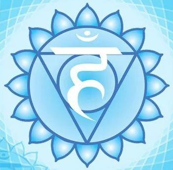

## 人类身体载具

我们来到这里是为了了解我们是谁，帮助地球提升，最终帮助源实体及起源的进化。

人类需要提高地球的频率，是因为它是宇宙能量网格的重要组成部分。为了协助这个目的，人类创造了一种物理形态，使其能够体验低频并加速进化进程。

当前人类形态是第三种被使用的物理形态，有两个繁殖版本。

#### 为何要创造一个物质身体？

通过创造一个能和物理振动频率相适应的载具，能加速我们在这个频率中的进化。

高频率的实体不能完全体验较低的频率环境，因此需要使用较低频率的载具，以允许处于物理环境中时与物理互动。就像到海底潜水要穿潜水服一样。

#### 创造身体的过程

**1、第一种人类形态**

不像现在的版本那么稠密，转世灵魂和家族组是连接的。

通过身体范围内的细胞分裂进行，每第3代或第4代细胞通过分裂期就会产生第二个或更多完全发育的完全功能的成人身体。

因为业力，我们变得更稠密导致主形态的不协调和突变时，这身体就变得不可用了。由于突变导致的能量功能失调影响了转世灵魂，包括其他能量状态的人类和他们的身体。

**2、第二种人类形态**

在第一种人类形态的基础上，繁殖比例限制在1:1，一个形体只能复制一个后代。缩短寿命。断开和转世灵魂/家族的连接。

灵魂仍然能从一个身体移动到另一个身体来分享经验。对转世需求的增加需要一个更快的繁殖周期，这导致了错误的增加。使用身体的第一个灵魂的频率“戳”导致了与下一个灵魂的不兼容，而随着共享的增多，这个灵魂的情况更加复杂。一个灵魂需要花费数千年来恢复其损失的能量。

**3、第三种人类形态**

支持稳健的转世的更改：

- 将身体的转世用途限制到单独灵魂；
- 移除灵魂移动到其他身体的能力；
- 移除灵魂在转世时彼此之间的联系，包括对这些能力的记忆；
- 转世完成后，恢复全部能力；
- 创造一个在生殖能力上更强健的身体；
- 对体验的频率降低的保护。

最初是雌雄同体形式，复制某一特定身体的所有优缺点，这可能由于病毒造成繁殖线的破坏，因此将繁殖过程转化为两个是必需的。

在生殖功能上，男性/女性的身体更简单。因为创造人类形态的蓝图男女各一半，只有一半的生殖功能被复制。免疫力更强，在安全无污染的环境中，更快的妊娠期会产生更强劲的繁殖周期。

### RNA和DNA

从物理上来说，RNA是将DNA上的编码转译表达为细胞功能中使用的蛋白质的媒介。这只是多路通信系统的一种方式，没有考虑到由RNA传送到DNA的第一组信息。RNA是由身体辉光层的第一层（以太体）和第五层（以太模板）编写的。

完整的流程是：来自以太模板/以太体的灵性信息通过DNA编码存在于RNA上，再发送到DNA进行复制，再发送到RNA进行转录，由mRNA指导蛋白质合成，把结果反馈给RNA，RNA把结果反馈给以太模板/以太体。

RNA是一种界面（interface）介质，它同时存在于物理层面的高层和灵性层面的低层，从更高的灵性层次传递信息到较低的物质身体细胞。

RNA是细胞之间的一种通信介质，它允许细胞的正确定位，以及细胞结合来创造它们被赋予的身体机能。细胞蛋白质接收到正确信息时必须反馈到RNA上，这些信息将被传递到以太模板/以太体上以确认。

### 人类身体的“三位一体”

宗教谈论的“三位一体（Three-in-One）”指的是：物理身体、星光层（灵性-物理层）、灵性层。

有**14**个频率层次和人类身体有关。

有**10**个频率层次和人类形态有关。

1-3为物理层次，4-7为灵性-物理层次，8-10为灵性层次，10层以上是完全能量形式。

物理宇宙包含第1-12频率层次。第13、14频率层次是对物理宇宙的存有扬升预留的两个频率层次。

### 身心灵复合体（Body/Mind/Spirit Complex）

身心灵|传统说法|传统说法|现代说法|现代说法|现代说法
---|---|---|---|---|---
身（Body）|身体层（Body）|生理学（Physiology）|现象|载具|身体是我们存在于故事中的载具，要好好的照顾它，拥有健康才能拥有故事。
心（Mind）|心理层（Mind）|心理学（Psychology）|解释|信念|信念创造实相，我们的整个生命故事都由信念所创造，驾驭信念就能显化一切。
灵（Spirit）|灵魂层（Soul）|超心理学、灵魂学（Parapsychology）|觉察|能量|灵不是灵魂，而是我们唯一的觉察本身，而一切都是这个觉察所开展出来的。

---

## 人体能量学

> 信息源：千帆过，转载自：[人的解读](http://www.rendejiedu.com/591.html)

中国古人所发现的经络系统，是对人体内能量分布的一种简单描述。除了中国的**经络（Meridian）**，还有印度的**脉轮（Chakras）**，前苏联基里安发扬光大的**人体辉光场（Human Aura）**，以及美国心数研究所发现的**心脏电磁场（Heart’s Electromagnetic Field）**。

### 经络（Meridian）

经络系统，是由**经脉**和**络脉**组成。经脉分为**正经**和**奇经**两类。正经有12条，合称“十二经脉”。 奇经有8条，合称“奇经八脉”。十二正经加**任脉、督脉**(奇经八脉中最重要的两脉)，合称十四经。

十四经腧穴，都有自己的归经、固定的位置、固定的名字、固定的数量。最早确定腧穴数量的是魏晋时期《针灸甲乙经》中，皇甫谧确定了349个。北宋的王惟一确定了354个穴位（铜人就是王惟一制作的）。明朝杨继洲确定359个穴位。清代李学川于1817年确定的361个穴位，就是沿用到现在的361个穴位。从满清到现在的200多年内，再也没有找到一个腧穴。一年有365天，为什么人只有361个穴位？也许还有4个没找到。

### 脉轮（Chakras）

古印度将人体分为七个能量中心，这七个能量中心因为是以轮状出现，所以名为七脉轮(chakras)，这七轮分别是：海底轮、生殖轮、太阳轮、心轮、喉轮、眉心轮、顶轮。

### 人体辉光场（Human Aura）

人体辉光现象，最早在1911年，英国伦敦一位叫基尔纳(Walter John Kilner)的医生发现的。1939年，原苏联电学家基里安(Kirlian)在高频高压电场中，成功地将人体辉光拍摄成了照片，被称为**基里安摄影（Kirlian Photography）**。

后来通过改进Kirlian摄影技术，得以实现拍摄整个人体的“辉光”，准确的说应称之为光环或**光晕（Aura）**，Aura就是围绕在生物体的电磁能量场的可视化展示。这个能量场的颜色和图案构成了一幅识别我们的情感、思想及身体状况的蓝图。

1975年加州大学研究人员Thelma Mose和Valerie Hunt精确测量光环。Guy Coggins通过将他对Kirlian摄影的研究与生物反馈的研究相结合，生产出彩光相机(Aura Camera)，将这项工作向前迈出了一大步，这就是**人体彩光摄影（Aura Photography）**。

### 心脏电磁场（Heart’s Electromagnetic Field）

1991年美国心数研究所(Institute of HeartMath) 成立，他们的一个重要发现是，描述了一个环绕在心脏并向人体外围扩张的电磁能量场(the Heart’s Electromagnetic Field)，具有环形圆纹曲面，半径约1.5米-2.4米，这意味着心脏对人体有着比大脑更强的影响力。

## 人体能量学：经络（Meridian）

> 信息源：千帆过，转载自：[人的解读](http://www.rendejiedu.com/981.html)

在相当的程度上，中国古人发现的经络系统，相当于是人体内**能量分布**的一个轮廓性的描述。

经络是电磁驻波形成的耗散结构，这种动态的结构需要能量的不断供应，只有**活着的人**身上有经络。经络在不断与外界交换着能量、信息，从而维持人的健康状态。

**经络**就像一条肉眼看不见的小山脉，而**穴位**就如这座小山脉上一座座肉眼看不见的小山峰，穴位的中心就是小山峰的山顶。穴位没有固定的大小，取穴位时，有可能是到了山峰，有可能还是山坡。所谓经络循行，不过是在翻过一座座山峰。

电磁波在人体这个谐振腔中，会形成驻波和驻波叠加而成的干涉图案，也就是肉眼看不到的空间结构。这种肉眼看不到的空间结构又决定了身体内和身体周围能量的空间分布。而这种能量的空间分布又反过来影响到身体的生理、生化功能，这就是经络系统功能的本质。至于人体的十二正经、八条奇经、三百六十五络，那就是不同等级的能量线了。

多种电磁波在体内形成了三维驻波，驻波的波峰则就是经穴的位置。要改变驻波结构，有两种办法：一是改变波的频率，二是改变谐振腔的边界条件（针灸的原理）。

### 经络的三大特性

#### 1、循经感传

穴位受刺激后，感觉会沿着经络传递，而且会沿着两个方向同时传递。当有些人生病时，循经感传的线路会出现大幅度的变化。有时感传会完全离开平时的线路，直奔病灶所在的地方，叫做“气至病所”。然而血管或神经系统，即便人病入膏亡，它的路线也不会变动。

经络完全不像许多人想象的那样是一种固定的管道，是会移动的。至于教科书中所画的经络图，所描写的明确位置，只是给初学者用的，是一种大大简化了的说明图。

#### 2、经穴全息

某些穴位群包含着全部整体各个部位的生理、病理信息。例如，在一个小小的耳朵区域内，就有反映全身所有脏器的穴位。在鼻子、脚掌、手掌也是这样，甚至在每一个小小手指节的区域内，也可以找到反映全身所有脏器的穴位。

比如头痛，去西医院挂个号，部位是头，要挂脑科? 症状是疼，疼是神经，要挂神经科? 有了耳针、面针、手针、足针等全息诊疗系统，就省事了。头痛，也许根本不需要看头，也不需要看神经，看脚就行了。这就是为什么在中医里，会有头痛医脚、上病下治、左病右治的存在，而在西医里是完全不可想象的。

#### 3、子午流注

子午两字，代表时间。流注两字，是指人体气血运动变化的状态。“流”是流动的意思，“注”是灌注的意思。子午流注说的是，一天中的十二时辰是与人体十二经脉相对应，不同的时辰，人体气血盛衰在经络中的循行就像潮水的涨潮退潮一样有规律地变化，每个时辰都会有不同的经脉“值班”。这意味着若要健康，人的作息要遵循这样的变化规律，而且针灸、服药(中药) 其实都是有时辰讲究的。

古人把一昼夜（24小时）划分为十二个时辰，每个时辰为2小时，又用十二地支（子、丑、寅、卯、辰、巳、午、未、申、酉、戌、亥）来表示。我国时间医学“子午流注”认为十二经脉对应着十二时辰，不同经脉中的气血在不同的时辰有盛有衰。一天中以“子午”二时最关键，故以“子午”代指十二时辰；“流注”指气血环环相扣、首尾相衔、循环有序地流动灌注全身。

十二经脉是经络系统的主体，具有表里经脉相合，与相应脏腑络属的主要特征。

阴有三种，分别是：**太阴、厥阴、少阴**，阳有三种：分别是：**阳明、少阳、太阳**。通常说五脏六腑，六腑指**胆、胃、大肠、小肠、三焦、膀胱**。五脏指**心、肝、脾、肺、肾**，后来加上了心包一共是6个。这样脏腑加起来一共12个，每一个脏腑就对应一条经。

包括**手三阴经（手太阴肺经、手厥阴心包经、手少阴心经）、手三阳经（手阳明大肠经、手少阳三焦经、手太阳小肠经）、足三阳经（足阳明胃经、足少阳胆经、足太阳膀胱经）、足三阴经（足太阴脾经、足厥阴肝经、足少阴肾经）**，也称为“正经”。

十二经脉的走向规律概括：

**手之三阴，从胸走手；手之三阳，从手走头；足之三阳，从头走足；足之三阴，从足走腹**。

十二经脉的流注次序：

参考文章：

- [1、经络到底是什么，为何解剖学上找不到？](http://www.rendejiedu.com/603.html)
- [2、经络最奇特的现象：循经感传](http://www.rendejiedu.com/619.html)
- [3、经络的全息特性，头痛医脚的道理原来是这样](http://www.rendejiedu.com/632.html)
- [4、经络到底是怎样的一个通道？](http://www.rendejiedu.com/659.html)
- [5、穴位有多大？经络有多宽？](http://www.rendejiedu.com/668.html)
- [6、植物、动物的经络穴位是怎样的？](http://www.rendejiedu.com/678.html)
- [7、子午流注：人人必知的经络运行周期规律](http://www.rendejiedu.com/699.html)
- [8、揭秘经络的电现象](http://www.rendejiedu.com/716.html)
- [9、经络之所以解剖不着，原来因为它是耗散结构](http://www.rendejiedu.com/720.html)
- [10、经络的本质：电磁驻波形成的“耗散结构”](http://www.rendejiedu.com/736.html)
- [11、针灸治病的原理，想不到竟然是这样的](http://www.rendejiedu.com/763.html)
- [12、向穴位输入能量，为何也能治病？](http://www.rendejiedu.com/787.html)
- [13、激光针灸：古老经络与现代科技的完美结合](http://www.rendejiedu.com/798.html)
- [14、神奇的艾灸，为何无艾不成灸？](http://www.rendejiedu.com/806.html)
- [15、药物归经，这或许是中药和西药最大的区别](http://www.rendejiedu.com/819.html)
- [16、气功为何能治病，病气为何会上身？](http://www.rendejiedu.com/852.html)
- [17、推拿按摩为何也能治病，也会病气上身？](http://www.rendejiedu.com/928.html)
- [18、神秘的脉诊，究竟是什么原理？](http://www.rendejiedu.com/943.html)
- [19、人的电磁场身体，才是经络运行的载体](http://www.rendejiedu.com/965.html)
- [20、经络的奥秘都在这里，人体能量学小结](http://www.rendejiedu.com/981.html)

## 人体能量学：脉轮（Chakras）

### 脉轮是什么？

脉轮，源于四千年前的印度，这个词在梵文中的意思是“轮子”（wheel） 或圆盘（disk），也就是“光之轮”，表示能量的交汇点。脉轮也被叫做莲花，绽放的花瓣象征着脉轮的打开。

脉轮用螺旋运动方式来存储和管理所谓的气，或称生命能量。在有些文献中，脉轮就是旋涡(vortex)，你可以把它理解为类似双向换气扇的东西，只需转换不同的旋转方向，就可以实现排气或送风(吸气)的功能。可以说，脉轮就是人体的一个“换气扇”，只不过交换的不是空气，而是能量。

脉轮也称为"光轮"，光轮的大小、颜色、明亮程度不一，其中最大也最明亮的三个“光轮”，在中医学的文献中被称为“丹田”，分别是“上丹田”、“中丹田”和“下丹田”，因为这些“光轮”是在体内而不是体表，因此中医又称为蓄气之处。

脉轮是身体载具每一个能量层级的**能量接受器和转换器**，脉轮吸收能量以维持身体的运转。脉轮可以把能量从较高的振动频率转换成较低的振动频率，反之亦然。

脉轮的形状是**漩涡状的圆锥体**。每一个脉轮又含有更小的能量漩涡，**穴位**是一些较小的脉轮。每一个脉轮吸收一种特定频率的能量。

脉轮可分为**主要脉轮**和**次要脉轮**。主要脉轮有7个，就是七大脉轮，西藏密宗里就有三脉七轮的说法。

主要脉轮也有12个的说法（七大脉轮+五个体外脉轮）。次要脉轮就是经络上的穴位。所有主要脉轮、次要脉轮、较小脉轮都是能量流入与流出的开口。 

### 三脉七轮

> 信息源：千帆过，转载自：[人的解读](http://www.rendejiedu.com/1068.html)

气脉的概念跟经络很类似，中医认为人身上有十二正经，奇经八脉，印度教和密宗认为人身上有三脉七轮。

虽然除了七轮，也有十一轮、十二轮之说，但几乎所有的脉轮派别都同意人体内有三个主要的脉，分别为**中脉、左脉和右脉**，称为三脉。

这三条贯穿七大脉轮的主要能量传送通道，就是我们所俗称的“气脉(nadis)”。

七大脉轮组成了我们身体里的一根垂直气柱，这就是“中脉”。中脉位于脊柱内，从脊柱底端延伸至脑中央。中脉就是连接各个脉轮，并把这些能量加以整合的中心管道。

在中脉左侧的的叫左脉，在右侧的叫右脉。左脉和右脉则像交缠的双螺旋，好似有两条蛇（左脉和右脉）盘绕在权杖上一样，在顶端回合。

三条脉会交互作用，主要的脉轮都是靠中脉滋养。

### 脉轮的特点

> 信息源：千帆过，转载自：[人的解读](http://www.rendejiedu.com/1101.html)

#### 1、脉轮的圆锥形结构

仔细看看，脉轮是圆锥形的结构，它通过旋转将能量吸入中心，就像龙卷风吸引物体一样。这些能量滋养了人体能量场，同时也带入了周围宇宙能场中的信息。

一个正常脉轮（七大脉轮），其敞开的末端面积直径约15公分，距离身体约2.5公分的距离。看起来，脉轮确实不小，比穴位是大多了。

脉轮还有次级结构。每个脉轮，都由一些更小的旋涡组成，这些旋涡整齐的排列在大脉轮圆锥内，就像花瓣一样。

第一脉轮只有四个小旋涡，而顶轮据说有接近一千个小旋涡。随着脉轮的提升，旋涡变得更小，更加难以看清其数量。不同的灵修传统中，脉轮的 小旋涡，或称“瓣数 ”也不同。

脉轮|颜色|小漩涡数
---|---|---
顶轮|紫白|972
眉心轮|靛蓝|96
喉轮|蓝|16
心轮|绿|12
太阳轮|黄|10
腹轮|橙|6
海底轮|红|4

#### 2、脉轮成对出现

脉轮是成对的，每一个位于身体正面的主要脉轮，与身体背面对应部位的脉轮为一对，正面(A)与背面(B)的脉轮被视为同一个脉轮。

七大脉轮中，2、3、4、5、6在身体前后成对。第二脉轮由2A 和2B 两个组成，第三脉轮由3A 和3B所组成，以此类推到第六脉轮。第一脉轮和第七脉轮，如果希望配对的话可以视为一对，因为它们是在脊椎上下流动、将能量运行到所有脉轮所处的垂直能量流的顶端与末端。

脉轮内的小旋涡也是前后成对的。这一点在重构各层面脉轮时非常有用，某个脉轮（或小旋涡）受损，也会影响到其对侧的脉轮。

每个脉轮中的小旋涡，都在各自不同的层面上代谢着不同频率的能量，然后能量被输送到身体的不同部位、器官和细胞，用于身体的健康运转。

如果脉轮受损，或者小旋涡受损，整体脉轮会呈现出其他形状，就像下图那样。

### 脉轮的功能

第2~6脉轮分为前、后两组。**前脉轮（A）**位于人体正面，与我们的**意愿**有关；**后脉轮（B）**位于人体背面，与我们的**行动**有关。

脉轮|符号|颜色|梵语名/含义|种子音|小漩涡数|位置|对应身体部位|掌管|功能
---|---|---|---|---|---|---|---|---|---
顶轮||紫色|Sahasrara 空|OM|972|百会穴|松果体、上脑、右眼|开悟之轮|7：将人格与生命及人类的灵性面整合
眉心轮/额轮/三眼轮||靛青|Ajna 觉知，指挥|AUM|96|两眉之间的正中心|脑垂体、下脑、左眼、耳、鼻、神经系统|灵性中心|6A：视觉化的能力、对心智概念的理解 6B：将想法付诸实践的能力
喉轮||蓝色|Visuddha 净化|HAM|16|喉咙的凹陷处|甲状腺、支气管、发声系统、肺、消化道|沟通的中枢|5A：吸收与同化知识 5B：在社会里的自我意识和个人职业
心轮||绿色|Anahata 两物没有碰撞却发出声音，不受打击、不受伤|YAM|12|胸部的中心|胸腺、心脏、血液、交感神经、循环系统|爱的中心|4A：对他人的内心之爱、对生命的敞开度 4B：小我的意志、朝向外在的意志
太阳轮/脐轮/太阳神经丛||黄色|Manipura 宝石所在地|RAM|10|胸骨正下方，胃的中部|胰腺、胃、肝、胆、神经系统|力量中心、情绪生活、新陈代谢|3A：快乐与广阔、灵性智慧、对生命的普适性以及你在宇宙中是谁的认知 3B：疗愈及朝向健康的意愿
腹轮/生殖轮/性轮||橙色|Svadhisthana 自己的住所，品尝甘甜、快乐|VAM|6|肚脐下约一个手掌距离|生殖腺、性腺、生殖系统|情绪、感觉、欢乐、行动和滋养|2A：对异性之爱的品质、心理与灵性、给予与接受的快乐 2B：性能量的品质
海底轮/根轮||红色|Muladhara 根部的支持|LAM|4|会阴|肾上腺、脊柱、双肾|肉体的存在与需求 维持生存的基本需求 能量的门户|1：物质能量的多少、活着的意志

### 脉轮与七层气场

> 信息源：千帆过，转载自：[人的解读](http://www.rendejiedu.com/1157.html)

7个需要吸收能量的层级，对应身体载具的7个脉轮。

脉轮的尖端或顶端连接着主要能量流，称之为脉轮的根部或中心。在这些中心之内有许多封口，控制透过该脉轮在不同气场层之间进行的能量交换。

七个脉轮的每一个脉轮都有七层，脉轮的每一层也都对应着一层气场。脉轮在每一层的长相皆不同。为了让某股能量流可以透过脉轮从一层流到另一层，能量必须通过脉轮根部的封口。比如下图中，就显示了七层相互渗透的整个气场，以及贯穿七层的脉轮。

气场的每一层看起来都不一样，且具有各自独特的功能，每一层都与一个脉轮连结。

第一层和第一脉轮，与身体机能以及感觉能力——感觉身体的疼痛或愉悦——相关联。第一层气场连结着身体的自动机制以及自主神经的运作。

第二层和第二脉轮与人类的情绪方面相关连。经由这些脉轮媒介，我们得以拥有情绪生活和感觉。

第三层与我们的心智和线性思维相关。第三脉轮与线性思维有关。

第四层与心轮关连，透过它做为媒介，我们不仅爱我们的伴侣也爱人类整体。第四脉轮吸收并代谢着爱的能量。

第五层与更靠近神圣意志的高等意志相关。第五脉轮与文字力量、透过言语力量来显化事物、聆听、以及对我们的行动负起责任有关。

第六层与第六脉轮与神圣的爱相关。这种爱超越了人类之爱的范围，涵盖了所有生命。它传达的是对保护与滋养所有生命的关怀和支持，将所有的生命形式视为神珍贵之显化。

第七层与第七脉轮与高等心智、认识并整合我们的灵性和身体结构有关。

### 第一脉轮：海底轮

> 信息源：千帆过，转载自：[人的解读](http://www.rendejiedu.com/1391.html)

#### 海底轮的符号

第一脉轮也被称为海底轮，梵文名是Muladhara，意思是“根部的支持”，所以又称根轮(Root Chakra)。

这个脉轮中心被描绘为一朵四瓣的莲花，中间有个正方形，而正方形在很多系统中被用来指代物质世界。
 
为什么是四瓣呢？这是因为每个脉轮，都由一些更小的旋涡组成，这些旋涡整齐的排列在大脉轮圆锥内，就像花瓣一样。第一脉轮只有四个小旋涡，所以形象化为四瓣的莲花。
 
在这个正方形中，还有个小的倒三角，连着中脉的管道。它代表海底轮向下联结大地的力量。

倒三角之内有一条昆达里尼灵蛇，盘绕着头朝上的湿婆灵根 (阴茎)。海底轮是昆达里尼的家园和休憩之所。
 
倒三角下方是一头长着七根象牙的大象，对应着七个脉轮的七条解脱之路。

正方形的中心 ，是种子音LAM的象征，据说此音包涵了海底轮的精华。把这个图形摘出来，就是下面的样子。

进行海底轮冥想时，可以把上述图像和声音运用起来。《脉轮全书》里有这种冥想练习，大家可以试试。

#### 海底轮的位置

七大脉轮其敞开的末端面积直径有15公分。所以我们谈论脉轮位置的时候，不是指脉轮的末端，而是指脉轮的根部，也就是脉轮对应肉体的中央位置。
 
第一脉轮(海底轮)位于脊椎的底端，更准确地说，位于肛门和生殖器之间的会阴处。

在中医中，这里有个穴位，叫做会阴穴，此穴又称海底穴、阴跷穴、生死窍等。
 
会阴，顾名思义就是阴经脉气交会之所，此穴与人体头顶的百会穴为一直线。海底一开，百穴皆开；中脉一通，百脉俱通。

#### 海底轮的功能

第一个脉轮对应尾骨中心(coccygeal center)，与身体能量的量以及在物质现实界生存的意愿强弱相关联。

当尾骨中心受到阻碍或关闭时，身体大部分的活力与生命力也会受到阻碍，这个人在物质世界中便不会产生强烈的存在感，会精力低落，甚至可能变得「病恹恹的」，也会欠缺体力。

海底轮记录了我们最早期的生命经验，对我们的生存非常重要。布鲁耶尔在《光之轮》里说过 “任何事情若未在第一脉轮中出现，就不算发生。”
 
第一脉轮管理我们肉体的存在与需求，包括性欲和热情，还有我们维持生存的基本需求，例如金钱、房屋、食物和充满爱的关系。

海底轮是能量的门户。
 
打开脉轮并增加我们的能量流很重要，因为让越多的能量流动，我们便越健康。因为能量通常是经由第一脉轮和脚底的两个脉轮从大地吸收的。在疗愈身体时一直都是需要这些大地能量，因为它们是较低的物理振动。因此，你可以透过这种最自然的方式灌注能量到耗竭的系统中，并将其运载到所需要的地方。

身体系统中的疾病是能量失衡或是能量流阻塞所导致。人类能量系统缺乏流动，最终导致疾病的发生。
 
当第一脉轮健康运作时，此人通常会有坚强的生命意志，并与大地有良好的连结，而成为一个非常脚踏实地的人。

#### 海底轮的疗愈

##### 歪斜的海底轮

下图是一个完全歪斜的脉轮，比较常看见海底轮出现这种状况，这会发生在两种人身上：那些只用某一侧的腿与大地能量连结的人，他们会有一只脚比较健康，另一只比较无力。另一种是尾骨有某一侧被塞住的人。

##### 阻塞的海底轮
 
下面的案例，第一脉轮的扭曲变形，不但向左弯曲而且已堵塞（见下图），这使得他无法透过这个脉轮吸收能量供给自己的能量系统。
 
第一脉轮堵塞，导致严重的能量枯竭，而且对他的体力影响很明显。因为供给身体活力用的能量主要是由第一脉轮负责吸收。

在头几个星期，主要的疗愈重点放在螯合能量场、矫正第一脉轮。治疗后，第一脉轮很干净，被修复且能量充足（见下图）。

#### 如何开启海底轮

上面的案例是通过疗愈师修复第一脉轮(海底轮)，那么平时我们怎样开启充能呢？下面介绍几种练习。

##### 1、筑基功
 
《禅密功》里的筑基功法可以试试。筑基，就是打地基的意思。道家入门后的第一个阶段便是筑基阶段，亦称“百日筑基”。
 
这部功法里有个松密处，简要介绍如下：
 
不限姿势。密处，亦称海底、地户。男子，是位于阴囊与肛门之间：女子，为大阴唇后联合与肛门之间。它不是一个小点，而是一个“体”。其深度和广度可连通小腹腔。
 
体会密处，是气机运行的主要通道和枢纽重地，但很不容易松开，被喻为“铁门”。欲想松开它，必须理解和掌握松它的方法和适度。
 
方法是用意不用力，松下来之后，两大腿里侧(相当于经络学说中的阴跷脉)有温热感，外阴部有轻微的电麻感，这是适度。

##### 2、骨盆运动
 
《光之手》中提供了一套运动做法，简略介绍如下：
 
站姿，将双脚张开，脚趾与膝盖向外打开至膝盖感到舒适的角度。接着，尽可能地弯曲膝盖，当臀部的位置与膝盖同高后，即向上打直膝盖，重复此动作数次。
 
现在要加入摆动骨盆的动作，分别把骨盆往前及往后推到最深，尤其着重往前推的动作。向下弯曲膝盖的同时，前后摆动骨盆三次；膝盖保持弯曲，前后摆动骨盆再三次；向上打直膝盖的同时，再做前后摆动骨盆三次。
 
此练习中，最重要的是膝盖保持弯曲时的骨盆摆动动作。重复整套动作循环至少三次。

##### 3、昆达里尼瑜珈
 
《光之手》里提到，昆达里尼瑜珈是个很好的选择，用呼吸和体位运动开启脉轮并充能。
 
昆达里尼瑜珈着重姿势、呼吸与脊椎的柔软度，是我见过最强大的充能、活跃、净化与强化气场能量场的练习，简要描述如下：
 
屈膝跪坐在脚跟上，双手放在大腿上。从骨盆位置启动，吸气时脊椎向前弯，吐气时脊椎向后弯。如果你想要，可以在每一次呼吸中念诵咒语。重复这个动作数次。
 

##### 4、哈他瑜伽
 
《脉轮全书》推荐了一些哈他瑜伽的练习，着重刺激和释放海底轮中的能量，比如：膝到胸变式、桥式、半蝗虫式、蝗虫式、头碰膝式，还有大象式、双脚朝天。

### 第二脉轮：腹轮

> 信息源：千帆过，转载自：[人的解读](http://www.rendejiedu.com/1417.html)

第二脉轮：腹轮。是左脉 (Ida) 和右脉 (Pingala) 这两条灵蛇的第一个交汇点。左脉和右脉从海底轮出发，把能量往上带。

#### 腹轮的符号

腹轮，也称生殖轮，梵文名是Svadhisthana，通常翻译为“自己的居所”，字根“sva”的意思是“自己的”，“adhisthana”意思是“住所或座位。”

另一个字根“svad”，意思是“品尝甘甜、快乐”。这意味着，打开第二脉轮，就可以快快乐乐地去品尝欢愉所带来的琼浆玉液，这是创造力的源泉。

这个脉轮是性欲的中心，所以又叫做性轮( Sexual Chakra)，也掌管着情绪、感觉、欢乐、行动和滋养。

生殖轮的颜色是红橙色，谭崔象征符号有六瓣莲花，然后是两个圆圈。第一脉轮只有四个小旋涡，所以形象化为四瓣的莲花。那么，六瓣莲花，说明第二脉轮由六个小旋涡组成，这就是第二脉轮的次级结构。

在圆圈中心的符号，就是第二脉轮的种子音VAM，摘出来就是下图这样。念诵这个咒语可以打开创造力和灵感的内在源泉。

#### 腹轮的位置

第二脉轮 (生殖轮) 是成对的，由2A 和2B 两个组成。A是正面，B是背面。通常正面代表感觉，背面代表意志。

第二脉轮的正面（2A），位于下腹部的肚脐和生殖器之间，在肚脐以下约一个手掌距离的地方，掌管骨盆腔这整个区域。如果要拿中医的穴位来对应的话，其接近于“曲骨穴”的位置。

第二脉轮的背面（2B），则接近于“腰俞穴”的位置。

脉轮末端面积直径有15公分。所以我们谈论脉轮位置的时候，不是指脉轮的末端，而是指脉轮的根部，也就是脉轮对应肉体的中央位置。

生殖轮也常被称为“生命的基座”（seat of life）。在女性的身体解剖中，子宫很明显位于第二脉轮的位置。

#### 腹轮的功能

脉轮2A，对应着耻骨中心(pubic center)，与个人和异性所能拥有的情爱质量(quality of love)有关。如果这个中心是敞开的，它有助于给予以及接受性爱和肉体的欢愉。此人可能对性交乐在其中，有达到高潮的能力。

不过完整的肉体高潮(full body orgasm)需要所有中心都是敞开的才行。记住哦，要七大脉轮都要敞开，不止是第二脉轮。

脉轮2B，对应着骶骨中心(sacral center)，与个人性能量的品质(quantity of sexual energy)有关。这个中心敞开时，一个人会感受到他的性爱能力，如果封锁了这个脉轮，他的性爱力量与潜能就会变得薄弱而且使人失望。他可能性欲不强、倾向于逃避性事、否认性事的重要性与快感，造成这方面缺乏滋养。

由于高潮会让身体沐浴于生命能量当中，如果这个脉轮受到阻碍，人就不会在这个方面受到滋养，也无法获得与他人沟通、产生身体接触时所带来的心理滋养。

耻骨脉轮(2A)与骶骨脉轮(2B)是一对，在前后中心交接的两个点，为脊柱上脉轮的中心，生命力(life force)展现了第二强烈的身体本能与目的——对性结合的渴望，这股强烈的力量突破了两人之间自我强加的藩篱，让他们之间的距离更紧密。

##### 性能量与三种性高潮

如果说生殖系统，重心在性器官，那么生殖轮，重心在性能量。

按照谭崔的说法，一对伴侣发生性行为时的能量交流，远远超过生殖器官之间的交媾。当伴侣面对面，他们所有的脉轮都相互对齐了，然后借由性兴奋的强烈程度，每个脉轮都振动得更加剧烈，两个肉身之间的能量交换大大加强，最后在所有层面交融为一体。

性行为中的能量可以聚焦在肉体、心灵或心轮层面，伴侣彼此可以进行选择。

由于身体的骨盆区域是精力之源，这个区域任何中心受到阻碍，产生的影响就是降低身体与性爱的活力。

对大多数人而言，性能量(sexual energy)在高潮的收放中会传遍这两个性脉轮之间，这个运动以一种能量沐浴(energy bath)的方式让身体回春并且得到净化，使身体系统消除精力障碍、废物与过度的紧张，性高潮对于个人身体的健康具有重要性。

拒绝身体亲密和性能量的释放，会切断驻留于下层脉轮的比较精微的情绪和感受。

《性高潮的功能》作者威廉•赖希(Wilhelm Reich)认为，只有透过性高潮，生物电流才能完成人体的完全循环，完全循环会带来全身的兴奋感，带来自我满足，而阻塞的性能量会导致焦虑。

除了目前一般男女交合达到的生殖器高潮外，还有全身高潮和灵魂高潮。

**生殖器性高潮**是最常被体验到的高潮，它通常是快速的，而不释放大量的性能量。

**全身高潮**，来自全身的性能量循环，它可以单独（独自）或与伴侣实现，会释放疗愈能量。

**灵魂高潮**，来自交换能量和自己的伴侣融合——“灵魂交换”。

大多数谭崔修习，都是想利用性能量来唤醒女神昆达里尼，把她导入中脉。但如果没有接受过开启和唤醒脉轮的训练，如静坐或瑜伽，一个新手是无法达到这种解脱境界的。这也是为啥很多水平高的修炼者，已经不需要性行为的原因吧。

滋养是性行为的最终结果，也是身、心、灵的根本需求。

如何把性提升到灵的层次以及延长时间？关键就在于**放松，无目的，觉察自己的呼吸，怀着浓密的爱意，缓慢地进入对方的身体，而不要把整件事转成动物性的欲望**。

这种相互的舒放，经由性交的施与受进入深层的交流，是人类深入解放「分离的」自我，进而体验结合的一种主要方式。

若能带着爱以及对伴侣独特性的尊重进行性爱，这是一种神圣的体验，从原始肉体深层对交配的渐进式强烈欲望，到深刻与神性结合的心灵回报，这是双方在心灵与身体两方面的一种结合。

##### 生殖轮若阻塞，就无法达到性高潮

每个人的性爱与他的生命力有关，这对所有中心来说皆然，任何一个中心受到阻碍，相关区域的生命力便会受到阻碍。

对于女性来说，耻骨脉轮 (脉轮2A) 的阻塞可能导致女人无法达到性高潮，无法开放与接受性伴侣性的滋养。

她可能无法与她的阴道相连结、无法享受男性插入的行为。相对于插入的行为，她可能更倾向于享受阴蒂的刺激。她也可能总是想扮演性行为中的积极者，例如女上位式，并发动大部分的动作。

这类案例的扭曲之处在于，她需要感觉一切都在控制之内。在一个健康状态下，她会希望有时主动，有时接受，但在这种情况下，她不自觉地恐惧伴侣的力量。

藉由伴侣的温柔、耐心、爱心和接受， 她可以经过一段时间、慢慢地打开她的耻骨脉轮，以接收和享受插入的行为。不过，有些性恐惧可能还需要追溯到前世来处理。

对于男性来说，耻骨脉轮 (脉轮2A) 的严重阻塞，通常伴随着早泄或不能勃起。

男性怕在一些深层次上给出他全部的性力量(sexual power)，而去压抑它。他的能量流常常被打断、堵塞，或重新导向到背后、从骶骨脉轮(脉轮2B)流出。因此，性高潮时，他的能量自背后第二脉轮射出，而非从阴茎射出。这种经验有时是痛苦的，从而导致厌恶高潮和避免性交。这形成他与伴侣在其他层面上的困难，这跟无高潮的女人情况一样。

这种情况下，有一个接纳、理解且坚定支持的性伴侣是一件幸事。如果两个人承认他们的困难，而非指责对方，他们就可以专注地给予伴侣爱、理解和支持，从而发展出一种新形态的相互关系。这样，性欲便会开启，并成长为滋养的交流。

#### 腹轮的疗愈

大卫的案例。治疗前，他严重的问题是第一脉轮（海底轮）的扭曲变形，不但向左弯曲而且已堵塞。而且，大卫的第二脉轮（生殖轮）有能量枯竭和虚弱的问题（见下图），他的性功能已经被关闭了。

治疗后，他的第一脉轮开始能保持在正确的位置上，第二脉轮的能量开始增强（见下图），六个小旋涡（小圆圈）也清晰可见。最后他的能量恢复正常水平，而且重新开始有了性致， 情绪上也开始不觉得那么脆弱了。

疗愈师将手圈成杯状置放在第二脉轮上，让双手成为橘红色能量进入脉轮的管道，同时将双手缓慢地进行顺时针运动，将橙红色的光倾注入第二脉轮（2B），这样可以为脉轮补充能量。要做到这一点，疗愈师必须能够维持能量流在橘红色的频率。

##### 生殖轮的平衡，比单一的打开更重要

第二脉轮关闭的人，往往很难找到性伴侣来帮助他们开启脉轮，而第二脉轮打开的人也许会吸引很多，以至于自己难以招架的性伴侣。所以脉轮的打开，需要渐进而轻柔，更需要平衡。

当后背中心(2B)处于强劲的顺时针方向，正前方(2A)却薄弱或封闭，人会产生强烈的性冲动，可能还对性关系有很大的需求。问题是，这种大量的性能量和性欲，并非伴随着性行为上施与受的能力而来。因此，满足强劲性欲很难。

如后背中心(2B)的逆时针方向很强劲，情况也是如此；然而，性欲也可能会伴随着负面形象，甚至是暴力性幻想而来。当然，这会使得性欲更难满足。

另一方面，此人可能有很多性伴侣，因而错过性行为在两个灵魂之间深刻交流的可能性。此人可能会破坏承诺，或无法作出与性行为有关的任何承诺。所以，每个脉轮的前方和后方成对合作，以及每个脉轮之间的平衡，远比尝试将一个脉轮大幅度打开更加重要。

#### 如何开启生殖轮

下面介绍几种练习。

##### 1、骨盆运动

双脚打开与肩同宽，双脚平行放置。微微弯曲膝盖，前后摆动骨盆。重复此动作数次。

现在，假想你置身于一个需要进行抛光清洁的滚筒之中，然后要用你的臀部来做这个抛光的动作。把双手放在臀部上，以绕行的方式旋转臀部，并确实抛光滚筒中的每一面。

##### 2、昆达里尼瑜珈

姿势1：双腿交叉盘坐在地板上。深呼吸时， 双手抓住脚踝。挺胸、脊椎向前弯，骨盆前倾。吐气时，脊椎向后弯，骨盆后倾，朝「坐骨」方向靠近。重复这个动作数次，如果你想要，可以持咒。

姿势2：平躺面朝上，弯曲手肘支撑起身体。往上抬起双腿，至离地面约30公分的位置。将腿打直，吸气时，向外打开双腿；吐气时，双腿交叉于膝盖处，腿要维持笔直。重复数次。再将双腿稍微抬高一些，然后再进行大腿打开与交叉的动作。直到双腿已离地面约75公分高度后，再以逐次调降大腿高度的方式回来，然后休息。重复此练习。

##### 3、冥想练习

《脉轮全书》推荐的冥想练习的就不赘述了，大家看书就好。开启第二脉轮的练习包括臀部和下腹部的运动，当然这项练习需要全部身体的参与，需要触摸（比如按摩、性行为）和滋养（比如泡热水澡、淋浴）。

##### 4、哈他瑜伽

一些哈他瑜伽的动作也非常有益。比如：女神式，骨盆摆动1、骨盆摆动2、臀部画圈。特别是剪式打腿动作，有助于活化骨盆的能量，并且能把这股能量导向上层脉轮。这也是强力提升昆达里尼的经典方法。

### 第三脉轮：太阳轮

> 信息源：千帆过，转载自：[人的解读](http://www.rendejiedu.com/1502.html)

#### 太阳轮的符号

第三脉轮太阳轮，也叫太阳神经丛轮（Solar Plexus Chakra），梵文名是Manipura，意思是“宝石所在地”。因为它像太阳一样闪烁着光辉，是一个发光发热的能量中心，也是一般所称的“力量中心”。

就像太阳神经丛这个名字所暗示的，这是一个燃烧的、太阳般的脉轮，带给我们光、温暖、能量。这片区域从胸部下方一直延伸到肚脐，因此有时也被叫作“脐轮” (Navel Chakra) 。

第三脉轮的颜色是黄色，象征符号是十瓣莲花，里面有个倒三角形。

脉轮是由次级结构组成的，次级结构就是小旋涡。第一脉轮只有四个小旋涡，所以形象化为四瓣的莲花。第二脉轮由六个小旋涡组成，是六瓣的莲花。第三脉轮的十瓣莲花，由十个小旋涡组成。不过按照布蓝能的说法，第三脉轮是由八个能量锥，也就是八个小旋涡组成。

倒三角形里面的符号，就是第二脉轮的种子音RAM（/ram/），摘出来就是下图这样。

#### 太阳轮的位置

第三脉轮 (太阳轮) 是成对的，由3A 和3B 两个组成。A是正面，B是背面。

第三脉轮的正面（脉轮3A），称为前太阳神经丛脉轮(Front Solar Plexus Chakra)，就在胸骨的正下方，太阳神经丛的部位。如果非要找中医的穴位来对应的话，大概是中脘穴的位置。中脘，就是胃的中部（center of stomach）。

第三脉轮的背面（脉轮3B），称为后太阳神经丛脉轮 (Back Solar Plexus Chakra)，位于太阳神经丛的后面，对应中医的中枢穴，或者是脊中穴。中枢，就是身体的中心 (center of body)，脊中，就是脊柱的中心（center of spine）。

说脉轮位置的时候指的是脉轮根部位置。因为一个正常的脉轮，展开的旋涡末端面积直径能有15公分，距身体有2.5公分的距离。

#### 太阳轮的功能

每个脉轮的前方和后方成对合作，每个脉轮之间的平衡，远比尝试将一个脉轮大幅度打开更加重要。

先看脉轮3B，与个人对自己身体健康的意图有关。如果一个人对他的身体有一种强而健康的爱，具有保持健康的意图，该中心便是敞开的。该中心亦称为疗愈中心，并与灵性疗愈相关。

再看脉轮3A，当我们紧张时，会在那个地方觉察到不安，因为这个脉轮支配着我们的力量和意志，它的良性运转会直接关系到一个人的情绪生活。
 
如果该中心开放且和谐运作，个人将享有深刻充实的情绪生活，情绪生活不会把他压倒。然而，当这个中心开放但保护膜却撕裂时，他将有巨大失控的极端情绪。

很多时候，这个中心在心轮与性轮之间扮演一个阻碍。如果心轮与性轮两者都打开，而太阳神经丛受到阻碍，心轮与性轮将分别发挥作用，也就是说，性不会跟爱深入接轨，反之亦然。

在生理上，太阳神经丛对应腹腔神经丛，是一组神经网络的交会地，连接着胃、胰腺、肝脏、胆、脾脏这些主要负责消化、排毒和血糖调节的器官。

第三脉轮的良性运转会直接关系到一个人的情绪生活。人们常用这些器官名称来表达自己的情绪，比如用“ 我反胃了 ”表示忍耐度到了顶点，用“ 我要发脾气了 ”表示受到挫折或愤怒，这些都描绘出了第三脉轮的特性。

第三脉轮也掌管了新陈代谢，负责把代谢的能量调节和分配到全身。它燃烧物质（食物）化为能量，因此消化系统是整个新陈代谢中很重要的一部分。

太阳神经丛中心是关于人类连结一个非常重要的中心。当一个孩子出生时，就存在一条连接母亲和孩子之间的以太灵带(Etheric Umbilicus)。这些能量灵带（Cords）代表一种人类的连结。

每当一个人创造了与另一个人的关系，两个3A 脉轮之间就会长出能量灵带。两个人之间的联系越强，这些能量灵带会更强、在数量上更多；在一个关系结束的情况下，这些能量灵带也会慢慢失去连结。

#### 太阳轮的疗愈

##### 太阳轮撕裂的案例：大卫

他最明显和严重的问题出在第三脉轮，太阳神经丛脉轮已经被撕开了，必须把每个结构气场层的太阳神经丛脉轮都缝合回正常的样子。
 
另外第一脉轮（海底轮）也扭曲变形，不但向左弯曲而且已堵塞。由于第三脉轮撕裂和第一脉轮堵塞，导致严重的能量枯竭，而且对他的体力影响很明显。大卫的第二脉轮（生殖轮）有能量枯竭和虚弱的问题，他的性功能已经被关闭了。

头几个星期，主要的疗愈重点放在矫正第一脉轮，然后缓慢地修复第三脉轮区域的问题。在这个阶段还不能注入太多能量给他，因为第三脉轮撕裂，还很脆弱，注入过于丰沛的能量可能会导致这个脉轮撕开的情形变得更严重。
 
成功修复后的脉轮见下图，能量很充足，可以清楚看到小旋涡。

当大卫的第三脉轮运作得比较顺畅之后，他开始思考寻找疾病的意义。慢慢地，他找出了在人生中种下这个疾病种子的相关因素。
 
原来，在大卫在接近青春期时第一次经历第三轮的撕裂，因为他想要反抗主宰欲和控制欲强烈的母亲。在此之前他总是尽可能地取悦她。他想切断与母亲之间的能量带，结果造成太阳神经丛区域有一个破洞，能量带则因失去连结目标而在气场中飘荡。
 
最自然的反应就是找个人来连结，取代母亲（此时每个人都觉得问题在妈妈身上，而不在自己身上），然后他发现自己一直连结到那些控制欲很强的女性。他的能量系统会自动吸引控制欲强的对象，因为这是他最熟悉的能量，对他来说感觉最「正常」。正所谓物以类聚。
 
知晓了原因之后，大卫和他的女友慢慢拔除了依赖的能量带，顺利分手。

##### 能量锥与器官对应

每个能量锥（小旋涡）都负责供应能量给一个特定的器官，胰脏有问题时，太阳神经丛轮左侧的某个能量锥也会出现状况，心绞痛时会出现异常状况的能量锥则在它上方，如果是肝脏，就是同一个脉轮最靠近肝脏的那个能量锥会被影响。

比如，下图是某位女士的太阳神经丛轮，下面有个能量锥是开放的，它顔色苍白、几乎不旋转，保护膜也不见了。这个出问题的能量锥对应的器官就是肝脏。

#### 如何开启太阳轮

##### 1、跳跃运动
 
跳跃动作需要一位伙伴一起合作，握紧伙伴的双手，以伙伴做为支撑，进行上下跳跃。向上跳跃时，尽量把双膝带到胸口的位置。
 
持续跳跃数分钟后即可休息，但不可弯下腰休息。接着调换，换你做为伙伴的支撑，让伙伴进行跳跃动作。

##### 2、昆达里尼瑜珈

这里介绍两种姿势，选择其一练习即可，两者都练也行。

姿势1：双腿交叉盘坐于地板上。以拇指朝后、其余指头朝前的方式抓住肩膀。吸气时， 向左转身；吐气时，向右转身。每次呼吸都是深且长的，并确认脊椎确实打直。
 
重复数次后转换方向。再次重复动作，然后休息一分钟。以跪坐的姿势，重复进行此套练习。
 

姿势2：平躺面朝上，双腿并拢，往上抬起脚跟至15公分的位置。同时抬起头部与肩膀至15公分高的位置；看着你的脚趾，将手臂打直，双手指头指向脚趾头。
 
保持这个姿势，用鼻子做三十下急促呼吸。放松、休息，数到三十。重复此动作数次。

##### 3、哈他瑜伽
 
瑜伽体式里的伐木式、弓式、挺腹、船式（抱膝式），都可以试试。

### 第四脉轮：心轮

> 信息源：千帆过，转载自：[人的解读](http://www.rendejiedu.com/1525.html)

我们跟别人的任何互动都是发生在某个脉轮层次的。如果跟我们互动的人是由下层脉轮所主宰，我们自己的能量中枢也会据此回应。

比如男女之间，男性的行为可能是出自下层脉轮，比如性轮（生殖轮），将她的注意力带到这个部位来。而同时女性可能从心轮层次发散讯息，从而激励了他的心轮。

这就是为什么，男人通常由性而爱或有性无爱，而女人通常是由爱而性或无爱不性。

在我们的语言体系里，“心”代表了事物的中心、本质，所以会有中心、核心等词汇。心轮，也是个中心，是七大脉轮系统的中心点，有承上（上三轮：喉轮、眉心轮、顶轮）启下（下三轮：海底轮、生殖轮、太阳轮）的作用。

心轮除了承上启下，也是联结内外的地方，这个脉轮平衡我们的各种倾向。如果沿着一条路径从头顶盘旋而下，通过每个脉轮，会发现心是这个螺旋形的终点，既是中心也是目的地。我们在这里发现了“台风眼”，狂风暴雨的正中央一片平静。

心轮是爱的中心。我们知道，爱的词汇太多了，什么性爱、情爱、友爱、母爱等等。爱或许是意义最丰富，也是最难以捉摸的。爱是我们都想要而且需要的，几乎没有人会觉得他们拥有的爱够多了。

那么心轮的爱到底是什么爱呢？那是超越对自身、对伴侣或家人的爱，是对全人类和所有生命的爱。
 
当你用第四脉轮接收讯息时，你可以感觉到他人的爱，感觉到那份爱的质量，无论他人是肉身的存在还是灵体都一样。你可以感觉到人类的集体之爱。

所以，我们在心轮这个层次体验到的爱，跟第二脉轮的性欲或激情之爱截然不同。因为，性爱是有对象的，激情是被眼前的某个特定的人点燃。但是，在第四脉轮里，爱不依赖外界的刺激，而是一种内在体验到的状态。

所以，我们体验到爱是向外发散的，这是神圣的存有、同理心的连结，而不是我们的需求或欲望的延伸。透过意志的力量，我们的需求已经被满足或超越了。

爱可能与深刻的平静感一同浮现，这种平静源自无欲无求。这与第二脉轮（性轮）无常的本质及瞬息万变的热情不同，来自心轮的爱具有持久的特质，它**永恒不变**。

#### 心轮的符号

第四脉轮心轮，梵文名字是Anahata，意思是“两物没有碰撞却发出声音”，也意味着“不受打击”、“不受伤”。当这个脉轮从过去的悲伤中解放出来时，它的开放是天真、清新的。

心轮的符号是有十二瓣莲花的圆圈，环绕两个相交的三角形所形成的六角星。前面我们已经多次提到了，脉轮是由次级结构组成的，次级结构就是小旋涡。第四脉轮的十二瓣莲花，说明是由十二个小旋涡组成。

两个三角形代表灵性下降进入身体，以及物质上升与灵性相遇。也就是代表着偏物质层面的下三轮（海底轮、生殖轮、太阳轮），与偏灵性层面的上三轮（喉轮、眉心轮、顶轮）的交汇地。

这个符号也被称作“大卫之星”（Star of David），代表了神圣的结合——男性与女性平衡的相互渗透。这是开放的心轮散发出来的光辉之星。六个角也可以看成是与其它六个脉轮的联结，因为这六个脉轮都在这个中心完成整合。

六角星里面的符号，就是第四脉轮的种子音YAM（/jam/），如下图。

#### 心轮的位置

第四脉轮的正面（脉轮4A），称为前心轮 (Front Heart Chakra)，位于心脏前面或胸部的中心。站直，手臂向两侧伸展出去，身体就形成了十字型，交会的中心点正是心轮，这就如同双腿联结的是第一脉轮一样。

如果找中医穴位，大概对应着玉堂穴（CV18）的位置，不过也有说是膻中穴位置。

第四脉轮的背面（脉轮4B），称为后心轮 (Back Heart Chakra)，位于心脏后面，大概对应着灵台穴（GV10）的位置。

#### 心轮的功能

第四脉轮会影响心脏和肺脏（循环和呼吸功能）参与的肉体过程。当我们出生时，心脏是绿色的，象征一种天生的疗愈能量。我们在成人时期，心脏是粉红色的。我们最后会变成金色，这是宇宙的爱的颜色。

心脏电磁场（EMF）散发的能量强度是大脑电磁场的五千倍以上，这正是心脏的特殊性所在。

前心轮控制并激活心脏和胸腺。后心轮主要控制和激活肺，在一定程度上，也控制心脏和胸腺。每个脉轮的前方和后方成对合作，我们还是分别来看。

脉轮4A，是我们爱的中心。与所有生命结合的能量通过它流动。这个中心越是敞开，热爱扩大生活圈的能力就越强。当该中心运作时，我们爱我们自己、我们的孩子、我们的伴侣、我们的家庭、我们的宠物、我们的朋友、我们的邻居、我们的同胞， 我们所有的人类，以及这地球上所有的生物。通过这个中心，我们连接能量脐带到那些与我们具有爱意关系的心脏中心，这包括孩子和父母，以及恋人和配偶。你可能听说过「心弦」这个名词，它指的就是这些能量脐带。爱的感觉流过这个脉轮往往会让我们眼泪盈眶。当这个脉轮敞开时，人就可以看到他是人类当中完整的个体。他能看到每一个人的独特性、内在美，以及每个个体之光，也可以看到负面或未发展的面相。当这个脉轮关闭时，人对爱就会迟疑；这里的爱指的是付出而不期待任何回报的爱。

脉轮4B，与自我意志或外在意志有关，这是我们在物质世界中行动所依据的中心。如果该中心为顺时针方向，我们将会有在生活中成事的积极态度，视其他人为这些成就的支持力量。如果该中心是逆时针方向，情况会正好相反。如果在另一种情况下，这个中心过度活跃，也就是说顺时针旋转时面积很大。在这种情况下，此人的功能主要是从意志，而不是爱出发；是想要力量在人之上，而不是从内部发出力量。这个扭曲会让一个人「拥有」其伴侣，而不是与伴侣地位对等。就像我们之前一直强调的，每个脉轮的前方和后方成对合作，每个脉轮之间的平衡，远比尝试将一个脉轮大幅度打开更加重要。

#### 心轮的疗愈

心轮是疗愈过程中所使用最重要的脉轮，所有能量经由脉轮吸收代谢，上行过垂直能量流，通过脉轮的根部后进人心轮，再从疗愈师的手或眼睛传送出来。
 
在疗愈的过程中，心脏将大地的能量转化成灵性能量，亦将灵性能量转化成大地能量，以供病人运用。

下图显示，能量透过疗愈师的垂直能量流，先进入心轮后，再流入疗愈师的其他脉轮，然后又再流出、经过疗愈师的手臂与双手，进入个案的气场中。

经由心轮并等待进入宇宙之爱的状态是十分重要的，否则疗愈可能变成是心智上的。

心轮是负责整合的中枢，理所当然它也是疗愈的中心。事实上，爱正是终极的疗愈力量。当我们的心轮开放且平衡时，我们的存在就会发散出爱和喜悦，这种爱便是真正的疗愈。
 
所以，我们不必是专业的疗愈师才能开放自己的疗愈通道。比如，帮助老人过马路、安慰哭泣的人，或者抚慰疲惫的肩膀，这都是心轮疗愈能量的强力表达。

打开心轮，培养对周遭人的同情、联结与了解，自然就会产生疗愈力量，领悟到我们都是一体的。我们会跟菩萨一样，在个人道路上前行时，付出时间来疗愈别人，如此也有助于我们平衡灵性与物质世界的需求。

如果脉轮紧闭，不仅抑制了与外界来往的能量交流，也局限了上下脉轮之间的能量流动，导致心智与身体之间的疏离，最终心轮会能量耗竭，而把自己紧闭在孤独一个人的世界里。

最重要的是，我们需要放松，让爱自然发生，有时最深刻的爱就是愿意让一切保持本来面目。唯有内在平衡，才能使我们与他人的关系维持平衡。

##### 心轮阻塞

当一个人的心轮运作正常，此人会善于付出爱。**如果一个孩子在尝试给予其他人爱的时候被拒绝了许多次，他可能会停止试图给予爱**。为了做到这一点，他会尝试阻止能量通过心轮流出。
 
当经由心轮流过的能量被停止或减慢，心轮的发展便会受到影响。最终很可能会导致一个身体问题产生。

从在子宫中开始，每个小孩就已经和母亲有非常紧密的连结，两者的心轮之间也会出现紧密的连结。

每个年轻的男性，虽然在心轮和母亲会有紧密的连结，最终他必须学习如何把这个连结转移到伴侣身上，如此他才能成为一个有性能力的成年男人。

如果他和母亲没有过心轮的连结，在寻找伴侣的时候，便无模板可以学习如何建立连结，这会导致他在付出爱方面有困难。 

人的灵魂对于接纳和完美之爱的渴望非常强烈，这种追寻最终会带领我们贯穿许多课题。

每一个经营过长期感情关系的人都知道，如果你改变了，但你的伴侣没有以同等速度改变，那么会有一段时间彼此彷彿不认识。

#### 如何开启心轮

##### 1、臀背动作

此为等长姿势的练习，按照图中所做的示范来放置你的双手与双膝。在这个姿势中，手肘不可碰触到地面。以双臂做为支撑点，前后调整双腿与臀部的角度，直到感觉两侧肩胛骨中间受压（肩膀肌肉发达的男性此时会感觉双肩压力比较大，因此需多加注意）。
 
两侧肩胛骨中间确实受压后，把身体往前推并维持住这个动作，把压力放在受压的位置，然后再把身体拉回。你可以用臀部和双腿来做这个动作。这个练习是用来锻炼后心轮。

至于锻炼前心轮的部分，把背靠在大而圆的物体上，例如桶子、软沙发的背面、生物能量椅等，双脚确实扎入地板。放松身体，伸展胸口的肌肉。

##### 2、昆达里尼瑜珈

双腿交叉盘坐，在心脏中心的位置， 双掌反向互握，手肘朝外侧。以翘翘板方式， 上下移动手肘。随着韵律，配合深且长的呼吸。持续数次，吸气、吐气、双手使力互拉。然后休息一分钟。以跪坐在脚跟上的姿势，重复做此套练习，有助于提高能量。记得要确实收起骨盆。

##### 3、哈他瑜伽
 
瑜伽体式里的眼镜蛇式、鱼式、风车式动作，都可以尝试。眼镜蛇式，非常适合一早醒来先做的瑜伽练习动作，它着力于上胸椎，可以帮助减轻胸部塌陷造成的驼背。鱼式瑜伽体位法，是用来扩展胸腔的。

### 第五脉轮：喉轮

> 信息源：千帆过，转载自：[人的解读](http://www.rendejiedu.com/1554.html)

#### 喉轮的符号

喉轮是灵性的中心，是一个人获得知识的脉轮。喉轮用于计划、学习、绘画等活动。喉轮和性轮之间有很强的联系。喉轮是更高创造力的中心，性轮是身体创造力或生殖的中心。
 
强大的喉轮意味着性轮也会强大，这就是为什么极富创造力的人有强烈的性冲动。然而，强大的性轮并不意味着喉轮也会强大。

第五脉轮喉轮，梵文是Visuddha，意思是“净化”，它暗示了两件事：
 
第一，要成功抵达和开启第五脉轮，身体必须达到某种程度的净化。

第二，声音是万物皆蕴含的振动和力量，具有净化的特性。
 
声音能够影响物质的细胞结构，声音亦有能量调和我们内在与周遭的不和谐频率。

喉轮的颜色是明亮的天蓝色，相对于第六脉轮的靛蓝色。喉轮的莲花有十六瓣，包含了梵文里所有的元音字母。在梵文里，元音通常代表着灵性，而辅音则代表了比较坚实的物质。

前面我们已经多次提到了，脉轮是由次级结构组成的，次级结构就是小旋涡。喉轮的十六瓣莲花，意味着是由十六个小旋涡组成。

倒三角形之内的圆圈里，那个符号，就是喉轮的种子音HAM（/ham/），如下图。

#### 喉轮的位置

第五脉轮的正面（脉轮5A），称为前喉轮 (Front Throat Chakra)，轮位于喉咙的凹陷处，其运作攸关甲状腺的功能。

如果找中医穴位，大概对应着廉泉穴（CV23）的位置，就在喉结上方，舌骨上缘凹陷中。

第五脉轮的背面（脉轮5B），称为后喉轮 (Back Throat Chakra)，位于脖子后面，大概在大椎穴和哑门穴的中间位置。

#### 喉轮的功能

第五脉轮是沟通的中枢，我们透过声音、振动、自我表达和创造力来进行沟通。沟通是透过象征符号传递和接收资讯的过程。

无论是口语或文字、音乐曲调、预兆或传送至大脑的电脉冲，第五脉轮都能把这些象征符号翻译为信息。

第五脉轮是决定我们了我们的沟通频谱。当我们内在是和谐的，我们与他人以及环境的共振也会是和谐的，我们的交流会在轻松和谐中进行。

音调是内在能量是否和谐的辨认方式之一。到大自然中，找个没人的地方，发出声音，把你当下的情绪反映出来。慢慢你会发现你的声调在改变，变得更加和谐了。

第五脉轮发挥作用时，我们就会觉知到事情的能量振动次元。我们感应到的是语调而不是说出的话语。

我们的五种感官各与一个脉轮连结。触觉与第一脉轮有关，听觉、嗅觉与味觉与第五脉轮（或喉轮）有关；视觉与第六脉轮（第三眼）有关。所以第五脉轮让人提供声音、音乐、字句、气味和味觉的感觉。

每个脉轮的前方和后方成对合作，我们还是分别来看。

##### 喉轮5A
 
位于喉部前端，是沟通中心，与担负个人需求有关。如果此中心是逆时针方向，此人会婉拒提供给他的事物。
 
当此人打开他的喉咙中心，他将逐渐吸引更多的营养，直到能接收到足够的量，并且能在大部分时间里保持自己的喉咙中心敞开为止。

##### 喉轮5B
 
位于喉部后端，有时也称为专业中心，与这个人在社会中、在他的职业中，以及同侪关系中的自我感受有关。
 
如果一个人成功、工作适任，对与人生使命相同的工作感到满意，颈后的脉轮中心通常是敞开的。
 
如果此人选择了一种既有挑战性又充实的行业，并为他的工作全力以赴，这个中心会盛开，他将会在专业方面功成业就。

#### 喉轮的疗愈

##### 喉轮与声音疗愈

印度教认为，宇宙万物是由声音组成的。万事万物里面都有个象征，代表组成这个事物的能量模式，这个象征就是我们所熟知的种子音或种子咒，梵文为“bija”。这些咒语被设计用来让吟诵者融入与事物的共振中。

我们知道，每个脉轮各自有连接的种子音，里面包含了那个脉轮的本质，也就是秘密。每个声音里面的“M”，代表宇宙母性和物质的面向。“A”则代表父亲和非物质面向。

印度教经典记载着“ OM——整个世界就是这个声音。因此，梵天即是全体。”
 
圣经《约翰一书》里也有类似陈述：“太初有初音，初音与上帝同在，初音就是上帝。” 
 
两者都描述了神散发出来的声音如何创造了具象世界。

所有的声音都可以描述为波的形式，以特定频率振动着。声波投射到不同的媒介上，例如水、粉末、糊状物或油里面，产生的图案与自然界存在的形式惊人的相似，例如螺旋星云、胚胎的细胞分裂，或人类眼睛的虹膜和瞳孔。

关于这种现象的研究称为“音流学” (Cymatics) ，主要是由瑞士科学家汉斯.杰宁（Hans Jenny）发展出来的。音流学，是声音可视化的好方式，被誉为“隐形世界中的一面镜子”。
 
在能量场中发出特定的音调，不仅可以产生出特定的图案，也可以产生出特定的颜色，也是一种强大的疗愈媒介。

在声音疗愈脉轮时，疗愈师会将声源置于脉轮所在、距离身体约2.5公分的位置。每个脉轮各有一种不同的音调，并且每个人特定脉轮的音调也有些许差异。

通过微幅地改变音域直到产生共鸣。这样的共鸣，个案也能听到和感受到。如果你有超视觉能力，会看到脉轮对声音的回应。当发出正确的音调，脉轮便会收紧并开始快速且均匀地旋转，颜色也会变得明亮起来。
 
在持续发出声音一段时间后，能量补充与增强后的脉轮则足以保持其新的能量水准。将声音灌注到脉轮的原理，同样也适用于身体的器官与骨骼。比如，透过把声源维持于该器官所在位置的体表约2.5公分的距离，可以为特定的器官注入声音。当然前提还是找到能够为该器官带来最佳效益的合适声音。

不同类型的人体器官、组织、骨骼和体液，都需要不同的音调和调音，以提升其机能健康。

还有些音乐团体，比如罗比.盖斯 (Robbie Gass)，以开启脉轮作为演奏音乐的意图，选择能渐进开启脉轮的曲目，由第一脉轮揭开序幕。当演唱会结束时，观众中大多数人的脉轮明显地敞开，并被补充了能量。所以，音乐是十分疗愈的。

##### 喉轮阻塞的案例：大卫

第五脉轮是心灵的中枢，这一处的运作可以使人拥有透视眼、顺风耳和超知觉，并且能作无声的沟通。
 
当第五脉轮功能失常，可能导致非所欲的心灵经验，容易罹患精神病，使人分不清何为幻想、何为现实。当第五脉轮失衡，睡眠失调的现象会变得很普遍。

因为可视化诊断的案例非常少，还是继续用大卫的案例吧。

修复前：大卫的喉轮能量不足，这个脉轮跟沟通、为自己负责，以及给予和接受有关。

修复后：喉轮能量充足了，密密的小旋涡清晰可见。

#### 如何开启喉轮

##### 1、颈部运动

转动头部和颈部。依照下列方向转动头部数次，面朝前、面朝上，然后朝下、面分别转向两侧；面朝前将头部往左侧倒，回正后交换，将头部往右侧倒。接着，分别以顺、逆时针两个方向交替转动头颈。

喉轮对声音有很好的反应，所以可以放声歌唱，或者发出任何你喜欢的声音也可以。

##### 2、昆达里尼瑜伽

双腿交叉盘坐，紧抓膝盖。手肘打直。开始弯曲脊椎上部，往前时吸气，往后时吐气。重复此动作数次。休息。

现在，吸气时向上耸肩，吐气时向下放松肩膀，借以柔软脊椎。重复此动作数次。吸气后，闭气十五秒，同时肩膀向上缩起并维持住，然后放松。

以跪坐在脚跟上的姿势，重复进行此套练习。

##### 3、哈他瑜伽

瑜伽体式里的肩立式、犁式、鱼式，都可以练习。

肩立式：做这一体式要减轻颈部的负担，先拿条毯子或毛巾折叠成约5~8公分厚，当你平躺时，头接触地面，背的上半部枕在毯子上。

犁式：如果肩立式成功了，你或许想试试犁式。

鱼式：这一式往往接在肩立式或犁式后面进行，因为能带给颈部和背部同时放松，也有助于打开胸腔，刺激甲状腺。

### 第六脉轮：眉心轮

> 信息源：千帆过，转载自：[人的解读](http://www.rendejiedu.com/1577.html)

眉心轮，就是一般人所知的“第三眼” (Third Eye Chakra)，代表着全知全见的秘密智慧。

第三眼就像一个内在荧幕，让我们的直觉可以投射在上面。这种伴随着深度知晓的直觉，通常会以梦境、灵视影像、心电感应和透视力的形式出现，让我们看得见指导灵、天使、鬼魂或小精灵。

通灵能力发展最重要的层次，就是在第六脉轮上的灵视（clairvoyance）。我们前面知道了第五脉轮的耳通(clairaudience)和第二脉轮的超感应力(clairsentience)。但是灵视 (天眼通) 得来的信息不受时间限制，比其他灵通能力范围要大得多。

#### 眉心轮的符号

第六脉轮眉心轮，梵文名称是“Ajna”，原始意义是“觉知”，也有“指挥”之意。这说明了这个脉轮的双重特质——透过觉知汲取意象，同时形成内在意象来指挥我们的现实运作，也就是我们一般所知的创造性观想。

第六脉轮的颜色是靛蓝色。在倒三角形之内的那个符号，就是眉心轮的种子音AUM，如下图。

人体的三条能量管道——左脉 (Ida)、右脉 (Pingala) 和中脉 (Sushumna)。
 
这三条能量管道一起从海底轮展开它们的旅程，在每个脉轮点上，左脉和右脉都会相交一次，一直到眉心轮 (Brow Chakra) 这个点，左、右、中三条经脉才全部会和。

《脉轮》(The Chakras) 一书的作者李德比特(Leadbeater)主张眉心轮有96瓣，是所有下层脉轮总数的两倍：2*（4+6+10+12+12）=96。

脉轮是由次级结构组成的，次级结构就是小旋涡。眉心轮96瓣，意味着是由96个小旋涡组成。根据《光之手》(Hands of Light) 作者布蓝能(Brennan)的超视觉看到的，确实有很多小旋涡。

#### 眉心轮的位置

第六脉轮的正面（脉轮6A），位于两眉之间的正中心，可能跟眼睛等高或者稍微高一点，每个人不同。
 
如果找中医穴位，大概对应中医的印堂穴 (GV29) 的位置。

第六脉轮的背面（脉轮6B），可能对应脑户穴 (DU17) 的位置。

#### 眉心轮的功能

在第五脉轮，我们体验到能量的振动是物质最根本的形式，在第六脉轮里，我们则遇见了比声音更高更快的振动，这两者的性质是不同的。
 
声音的传递必须透过空气分子的波动，而光则不需要空气，是能直接被觉知到的形式。颜色就是我们觉知光的形式，颜色会造成非常明确的心理效应。

我们能看到多少，全取决于这个脉轮开放或发展到什么程度，也包括我们的视力有多精准。视力和灵视能力可以达到的范围，包括从对物质世界观察极为敏锐的人，发展到拥有透视眼天赋的人。

后者能够看见灵气、脉轮细节，也能预视（“看见”未来事件），以及遥视（看见别处发生的事）。

每个脉轮的前方和后方成对合作，我们还是分别来看。

脉轮6A：与观想和了解思想观念的能力有关。这包括此人对现实和宇宙的概念，或他如何看待这个世界，以及如何设想这个世界对他的可能回应。如果该中心被阻塞且虚弱，通常他的创意会有阻碍，因为流经该中心的能量很小。如果该中心是逆时针，他就会有混淆的思想观念，或者对现实有不正确、通常是负面的想象。不过，在净化或清理负面信念影像的疗愈期间，当能量系统产生影像并开始发挥主导作用时，该中心可能会逆时针旋转，即使它通常是顺时针方向。

脉轮6B：与执行脉轮6A形成的创造性想法有关。如果这个中心是敞开的，一个人的想法会接续以适当的行动落实于物质世界。如果此中心并不敞开，此人会很难让他的想法开花结果。如果位于前面的中心（脉轮6A）打开，后面的中心（脉轮6B）关闭着,这意味着这个人会有许多创造性的想法，但它们似乎从来没有实现过。另一方面，如果脉轮6B是顺时针，脉轮6A是逆时针方向，我们会有一个更令人泄气的情况。这个人的基本想法不是着眼在现实中，他会继续向扭曲的概念推进。

##### 眉心轮与松果体：灵视的形成

每个脉轮都有对应的腺体，第六脉轮连接的是松果体 (Pineal Gland) 。松果体是个非常微小的锥形腺体（10*6mm），位于头部的几何中心位置，接近眼睛的高度。
 
不过，有些爬行类动物的松果体在靠近头顶的位置，形成了某种感光的知觉器官，类似另一只眼睛。

松果体是感光器官，松果体有时也被称为“灵魂的居所”，它是身体的测光表，把光的变化转译成荷尔蒙讯息，透过神经系统传递给身体。比如由松果体分泌的褪黑激素是一种与色素细胞相关的荷尔蒙，可以帮助睡眠，强化免疫系统。

灵视，又称内在视觉 (internal vision) ，到底是怎么形成的呢？就好像脑袋里有个扫瞄器，它位于大脑中央部位，在第三眼后方约5厘米处。
 
如果从第三眼往后画一条线，然后在太阳穴之间画一条线，两线交叉处就是扫瞄器核心所在位置。布蓝能曾用内在视觉（或可说第三眼X光）观察光进入身体的路径。光会从两个地方进入：第三眼和肉眼，然后沿视神经流入，如下图所示。

这股光的振动频率比肉眼可见的光要高，可以穿透皮肤。它穿过视神经交叉，到达其后方的脑下垂体，然后在这里分成两股，一股进入枕叶，形成肉眼的视觉，另一股进入视丘做动眼控制。
 
这两股光在视丘区域交叉汇聚，为前额中央和脑部中央注入更多能量，而这两个区域是产生内在视觉的地方。

人体超过一百种功能呈现出日周期的循环，就是受到光的影响。我们的肉眼看到的是可见光的频率部分，第三眼则能“看”到不可见光的频率部分。

灵视是一种观想的可视化过程。灵视可以按照要求，有系统地调用和召唤出相关信息，无论事前是否知晓。学习专注心神，做到一心不乱，可以让我们观看得更深入，因此而看见更多。在灵视方面，清明而安静的心是无可取代的。

灵视可以选择要看的深度和清晰程度，甚至细胞或病毒那么微小的细节都行。这是普通视觉所做不到的，因为这是一个隐藏的世界。

##### 视觉的真相：全息图像
 
为什么冥想时可以看到光的图案？为什么梦中的影像看起来那么真实？要回答上述问题，最合理的答案来自神经科学家卡尔.普里布兰 (Karl Pribram)。他把心智模型视为一种全息图像（hologram），大脑本身的运作就像是全息技术，不断去诠释不同脑波间的互相干涉图样 (interference patterns)。这与之前认为的每一小片信息都储存在特定区域的大脑模型完全不同。用普里布兰的话说，就是：“ 如果你查看一系列串联在一起的神经末梢，你会发现它们组成了波阵面(wavefront)，一道波从这边来，另一道波从那边来，两者交汇，于是突然之间你得到了干涉图样。”当脉冲在大脑中行进时，波动能创造出我们经验到的记忆和知觉。这些知觉以编码的波阵面频率储存在大脑里，可以被适当的刺激激活，触发原始的波动形式。
 
这就解释了为什么我们可以认得出熟悉的面孔，尽管这张脸跟上次见到时看起来不大一样了。我们对周遭世界的觉知，似乎是大脑内神经全息图像的重新构建，不止是视觉讯号而已，也包括语言、思想和所有感官知觉在内。这个模型也暗示了，在我们每个人的大脑里，包含着通向所有资讯的管道，甚至可以接触到不同时间及维度的资讯，因此能够解释超乎正常记忆和感知功能之外的事，比如遥视（千里眼）、灵视和预视（预知未来）的能力。
 
与普里布兰的全息大脑理论互补的，是物理学家大卫.波姆 (David Bohm) 的模型，他认为宇宙本身或许就是个全息图像，不过他使用的字眼是“全息磁场” (holoflux)，因为全息图像是静态的，不适合用来描述充满变动的宇宙。根据波姆的理论，宇宙被某种宇宙介质整个“包裹起来”，就好像把蛋白包裹进蛋糕面糊似的。大脑本身也是更大全息图像的一部分，因此蕴含了关于整体的信息。我们以全息的方式在觉知这个世界，这个世界本身又是更大的全息图像，我们只是其中一小部分，而这一小部分也可以反映全体。

普里布兰认为，“我们不只是建构了对世界的觉知，同时也将这些觉知投射出去构建了世界。” 这一原则最好地诠释了眉心轮的功能——觉知与指挥，同时也说明了心灵如何接收外在世界意象，并投射意象于外在世界。“我们所见的一切都是我们观想出来的。我们不是用眼睛而是用灵魂在看。”
 
对于普通人来说，90%的信息都是透过眼睛觉知到的，远远超过其他感官。我们大部分的记忆和思考过程，自然而然也是以视觉信息来编码的。我们必须记住，我们觉知到的不是物质而是光，当我们注视周遭世界时，会认为自己看到了物体，其实真正看到的是这些物体反射的光。

#### 眉心轮的疗愈

##### 眉心轮与色彩疗愈

如果声波可以影响精微能量的物质排列，那按理说颜色是高八度的物质呈现，应该也可能以相同的方式影响物质。基于此理，有人运用颜色来疗愈，而且成效惊人。

如果疾病始于精微层面，不正应该从精微层面着手吗？其实色彩疗愈，在20世纪初就被一些治疗师所熟知了。

脉轮颜色依循着合乎逻辑的光谱顺序，最低频率的光——红色，连接最下层的脉轮，其余脉轮依序配上光谱的颜色（红、橙、黄、绿、蓝、靛、紫）。这似乎是最合理也最普遍的脉轮对应系统了。

但是要注意，不要跟灵视者看到的脉轮颜色，或谭崔文献描述的颜色混淆在一起。透过灵视来看脉轮，通常不太可能看到彩虹光谱里的颜色，因为那都是最佳的颜色状态，必须在脉轮充分发展和净化后才能呈现出来。比如在杭特(Valorie Hunt) 博士的研究里，受试者在数周密集的“罗夫治疗” （Rolfing therapy）过程中接受观察，一直到治疗即将结束时，才出现比较清晰的颜色。另外，据《脉轮全书》作者朱迪斯 (Judith) 的观察，一般的状况会是: 在每个脉轮中看到许多颜色，里里外外缠绕着脉轮，形成与当事人的生命相关的图案和意象。

我们可以选择颜色来补助感觉最弱的脉轮。比如，如果出现了许多与第三脉轮有关的问题，比如新陈代谢问题，低能量状态、无力感等，佩戴黄宝石和穿黄色的衣服会有帮助，而其他人也能感受到你的进步。

颜色确实可以在精微层面帮助我们的个人能量系统恢复平衡。每一种顔色都可以来吸收、代谢该颜色的脉轮，并补充能量。

颜色|疗愈效果
---|---
红色|为能量场充能，烧毁癌症和温暖冰冷的区域。
橙色|为能量场充能，提高性能力和免疫力。
黄色|协助线性心智功能运作。
绿色|为一切事物进行普遍的平衡和疗愈。
蓝色|冷却并镇静，重组以太能量场。
靛蓝|打开第三眼，增强灵视力并清理头部。
紫色|有助于个案连接到他的灵性。
白色|为能量场补充能量，带来平静、慰藉并带走痛苦。

比如布蓝能因车祸所导致的股骨的轻微扭转，就通过色彩疗愈永久解除了。

她是这样描述的：“当他为我按摩时，我们尝试着将色彩控制与深层组织按摩结合在一起。当他可以在指尖持续发射一道强大的紫蓝色火焰， 便可以不造成任何疼痛、深深地进入我的肌肉组织中。甚至，他一度能深入到骨骼层面，他藉由维持一道混和着白光的紫蓝色火焰，能够将我的股骨轻微地扭转调直。我使用灵视观看这一切的发生，可以看到我的股骨细胞自行重新校准彼此，身体的感觉是非常愉快的。”

##### 眉心轮阻塞的案例：大卫

修复前：大卫的第六脉轮阻塞了，从第三眼产生的黏液堆在松果体。

修复后：能量充足了，堆积在右侧的黏液被清干净了，眉心轮密密的小旋涡清晰可见。

#### 如何开启眉心轮

##### 1、瑜伽眼睛运动
 
这项练习可以强化注意力，让双眼精神集中，也有益于改善视觉疲劳，详见《脉轮全书》。

##### 2、昆达里尼瑜珈

双腿交叉而坐，双掌反向互握于喉咙的位置。吸气，然后闭气，缩紧下腹与括约肌，接着如同挤牙膏般，把能量往上推。把能量从头顶吐出，同时维持双掌反向互握并高举双臂超过头部的高度。重复此动作数次。

以跪坐在脚跟上的姿势，重复做此套练习。

##### 3、色彩冥想 (Color Meditation)
 
对强化第三眼最有用的练习就是静坐冥想。把注意力集中在头部中心或两道眉毛之间。你可以加上观想颜色或形状，或者仅仅是单纯聚焦于清空心智屏幕，知道明晰且空无一物为止。成功的观想能量依靠不断的运用，如同我们的肌肉训练一样。观想是主动做梦，你做得越多，越鲜活逼真，你心灵的造梦能力就越强。

### 第七脉轮：顶轮

> 信息源：千帆过，转载自：[人的解读](http://www.rendejiedu.com/1608.html)

第七脉轮：顶轮。这也是人们常言的盛开于头顶的千瓣莲花。这个脉轮，让我们与神圣智能（或称为宇宙意识）及一切成相的源头连接在一起。

正如海底轮既是昆达里尼升起的源头，也使我们深深扎根到大地之处，顶轮是所有显化的源头和超越的门户。顶轮也是人类生命的入口和出口，当出生时，灵魂由此进入，当死亡时灵魂由此而出。

#### 顶轮的符号

顶轮（Crown Chakra），梵文是“Sahasrara”，意思是“空”。已经获得此脉轮天赋的人不再需要躯体的形式，而能在时空内遨游，与天地合为一体。密宗称这一部脉轮为大乐轮，是说一旦打通了顶轮，脑部气轮充满，其乐无比。

顶轮的颜色是紫白色。紫色的能量具有很高的疗愈作用，有助于个体连接到他的灵性。白色可带来平静、慰藉并带走痛苦。

顶轮的象征符号是多彩的千瓣莲花，有灵视能力的人可看到，这个脉轮会显现出无比庄严、复杂和优美的图案，让人目眩神驰。它的花瓣盛开，层层垒叠在一起，彼此无限镶嵌，宛如向日葵低垂下来，将了悟的甘露洒向众生。至于轮瓣数量，有人说是960瓣，有人说是1000瓣，千瓣隐喻无限。我们的千瓣莲花必须根植地球，才能持续开花。

千瓣莲花包着一个圆圈，里面的符号就是：ॐ，看起来像数字"30"上面加了一顶帽子。你可能会在瑜伽会所、瑜伽老师的纹身上面或者名字里面，看到这个符号。

顶轮的种子音是OM。

#### 顶轮的位置

按照南怀瑾老师的说法，顶轮——从额头的发际开始，往后横拼四指的距离处，就是顶轮的位置，也就是婴儿幼小时会跳动的部位。这个顶门穴道，医学叫百会穴，道家称为泥洹宫，密宗称为顶轮穴，名称不同，都是有形的上窍。

##### 顶轮是出生和死亡之门

通过灵视，可看到新生儿拥有非常开放的顶轮，他们正努力将自己挤进一个受限的小身体中。随着开始敞开根轮向物质界扎根，新进的灵魂经常会通过顶轮进入和离开身体。

灵魂并不是立刻就进入肉身，灵魂是一步步逐渐地往婴儿的肉身依附的。在这个阶段，根轮（海底轮）看起来好似一个非常狭窄的漏斗，顶轮看起来像一个很宽的漏斗。其他的脉轮看起来则像小而浅的中国茶杯，有着细小的能量线将能量引入身体的脊椎中。 

据古人相传，婴儿生下来，这个时候顶门上窍没有封闭，他的神还与天地相通。上面一封掉，婴儿才开始说话，那就是后天生命的开始。上窍一闭，下窍就开，就向下走了，人就慢慢长大。

据菲比•班迪特(Phoebe Bendit)的观察，死亡时一道亮光从头顶闪出，人透过顶轮离开地球层面。这种从顶轮出走的体验，经常被描述为经历生与死之间的隧道。这条隧道常被视为又黑又长，在尽头有着亮光。这种「隧道体验」，也可以说是灵魂正沿着脊椎往上升，通过主能量流然后从顶轮的白光中离开。

#### 顶轮的功能

第七脉轮产生的信息是整体的概念，它是超越人类的感官限制和沟通方式的信息。通灵者在吸收理解这个概念之后，必须用自己的语言描述他了解到的事物。

我们必须记住，无论如何描述顶轮，它的范畴远远大过语言所能表达的，唯有去体验才知道。顶轮的作用是了悟，正如其他脉轮的作用是**看见（眉心轮）、言说（喉轮）、热爱（心轮）、行动（太阳轮）、感受（生殖轮）、拥有（海底轮）**。通过顶轮，我们得到无穷无尽的信息，然后透过其他脉轮的运作识别这些信息学，并呈现出来。这个脉轮被认为是开悟之轮，它的终极意识状态，是超越理性、感官知觉，也超越了周遭世界的限制。

顶轮的意识可以粗略分为两种：一种是下降成为实实在在的资讯，帮助显化，称为认知意识（Cognitive Consciousness）。另一种是向外拓展到更抽象的层面，称为超越意识（Transcendent Consciousness）。

意识的两股能流创造了认知意识和超越意识的境界，下降的能流带来了显化，而上升的能流带给我们解脱。认知意识是导向万物、关系和具体自我的世界，是注意力窄化的结果，活跃在思考、逻辑、学习和储存资讯的活动中。超越意识所对接的领域，超越了这个世界的万事万物，不聚焦于任何特定目标，无比自由，而且没有认知意识的那种波动。超越意识最大的特征就是它的空无，只有放掉我执，才能进入。在这个境界里，观察者同时也是参与者，自我和世界没有分隔，也没有时间感。正如杯子空无一物才能被注满，空无的心，才能成为顺畅的管道，让我们体验超越。开启认知意识外的觉知，就是扩大了我们注意力的感知范围。

顶轮是凡俗和神圣、有限和无限、短暂与永恒的交汇点。通过这个门户，我们的拓展超越了小我和时空限制，体验到初始的一体性和至乐。顶轮也是神圣意识进入身体之处，然后会下降，为所有脉轮带来觉知，赋予我们手段，影响周遭世界。

#### 顶轮的疗愈

顶轮关系着此人与其灵性的连接，以及整个人身体、情感、心智和灵性的整合。如果该顶轮是关闭的，此人可能没有与他的灵性实质接轨，他可能不具有「宇宙感」，当人们讲述他们的灵性体验的时候，他不会了解他们在谈论些什么。

当顶轮不平衡或阻塞时，大多数人会感觉到失去与精神层面上的连接感，感觉生活没有意义或缺乏方向。各种疾病或身体不适可能会在不知所因的情况下不断出现。顶轮的阻塞经常会导致一种缺失感或生命的无意义感，与你的身体与精神失联，生活在一种持续的担忧、头痛和精神抑郁的状态。

如果顶轮是敞开的，这个人可能常常以一个非常个人化的形式，体验到他心灵独特的层面。拥有开放的顶轮的人可以以更高更大的视角看待生命中发生的一切。这是极其重要的能力，尤其是当处于恐惧或困惑的状态时。敞开的顶轮可以让你体会和平、与生命融为一体的感受，并能更好地理解他人。这个脉轮开放的其他特征还包括：鼓舞、激励、充满活力、觉察力、从受限的模式中解脱出来。

#### 如何开启顶轮

##### 1、观想打开脉轮 (Visualization)

要发展第七脉轮，没有比静心更伟大的修行了。只有透过静心，才能了悟自性。静心既是目的，也是手段。静心能促进灵性，正如饮食和休息能滋养身体一样。透过静心，我们可以有系统地脱离外在世界，培养内在觉知的敏锐度。做此练习时，可坐在舒适的椅子上，或是盘腿打坐于地板上的垫子上。保持背颈打直。

首先，选择适合自己的冥想法，让自己静下心来，把意识带到海底轮。想象有一道红光气流以顺时针方向旋转（此处的顺时针方向系指从自己身体外侧的角度望向海底轮）。海底轮位于你身体的正下方，形状如同一个旋转圆锥体，大面积的一面朝向地表，而尖端指向你的脊椎底部。当你看着气流旋转时，吸入红光， 然后吐出红光。进行吸入动作时，想象呼吸是红光的。但做吐出动作时，不要想象，但要观察呼吸的颜色。重复此动作，直到可清楚看见吸入和吐出的呼吸都是红光为止。若吐出的红光颜色比较淡或是呈现混浊时，表示需要平衡红光能量。颜色较淡时，表示能量场需要多一些红光能量。顔色混浊时，表示需要净化下脉轮。而清理方法就是重复做这个练习，直到吸入和吐出的颜色一样。所有脉轮的练习皆是如此。

维持海底轮的观想画面，接着进入生殖轮。想像两道气流，一道在身体前方，另一道在身体后方。看着亮红橘光气流以顺时针方向旋转。吸入红橘光，然后吐气。重复此动作。进行下一个动作前，确认吸入与吐出时皆为红橘光。

维持住前两个脉轮的观想，然后向上进入太阳轮。在此想象有两道黄光旋转气流。吸入黄光，然后吐气，重复动作直到吸入和吐出皆为黄光。

接着上行至心轮，看到的是顺时针旋转的绿光气流。吸入、吐出绿光，直到顔色达到平衡。

低头往下看，确认可看见所有脉轮（你先前完成充能的脉轮）都在旋转后，才可以进入喉轮。在喉轮部位吸入、吐出顺时针旋转的蓝光气流。

在眉心轮部位观想看到在头部前后顺时针旋转的靛光气流。重复做呼吸练习。

接着上行至顶轮。这是一道位于头部上方的乳白光气流，以顺时针方向旋转。吸入白光，然后吐气。重复此动作，同时要看到所有七个脉轮，都以顺时针方向旋转。看着垂直电流在脊椎上下流动，并随着你的呼吸脉动。当你吸入时，此电流会向上脉动；当你吐出时， 此电流会向下脉动。

要看到所有脉轮的末端皆与此电流连结，在顶轮形成顶端的出入口，而海底轮形成末端的出入口，好让能量流动穿越你的能量场。吸入时，要看到脉动能量流动穿越所有脉轮。现在你的整个能量场里，充满了许多光能量。

##### 2、昆达里尼瑜伽

第一种姿势：双腿交叉盘坐，伸展双臂高举超过头部。食指指向上方，其余指头交叉紧扣。吸气时，往丹田内收缩，并说「Sat」。吐气时，放松丹田，并说「Nam」。以快速呼吸的方式， 重复此动作数分钟。然后，吸气时，藉由挤压并维持住括约肌，然后再挤压并维持住胃部肌肉，把能量从脊椎下方挤向头顶。持气不呼。然后让所有肌肉保持紧缩，将能量释放出来。放松。休息。如不喜欢「Sat-Nam」这两个咒语，也可以使用其他咒语。以跪坐在脚跟上的姿势，重复做此套练习。休息。重复此练习，但不唸咒语，改以鼻腔短而急促的呼吸法取代。

第二种姿势：双腿交叉盘坐。将双臂高举至六十度角，保持手腕和手肘打直、手掌面朝上。鼻腔做急促呼吸，在喉咙上方处做发出摩擦声响的呼吸，达约一分钟。吸气，然后屏住呼吸，鼓动下腹部十六下。吐气，放松。重复此动作二到三次，然后休息。

##### 3、哈他瑜伽

### 第八脉轮：灵魂之星

> 信息源：千帆过，转载自：[人的解读](http://www.rendejiedu.com/1631.html)

第八脉轮属于十二脉轮系统，该系统涵盖了人体中传统的七个脉轮以及位于身体上下的五个脉轮。

脉轮有多少个？最常见的说法是7个，就是七大脉轮，比如在西藏密宗里就有三脉七轮的说法。《晶体的传送》作者卡崔娜‧拉斐尔 (Katrina Raphaell) 提出了十二个脉轮之说。《精微体》作者辛迪‧戴尔 (Cyndi Dale) 也认为，除了七大脉轮之外，还有另外5个脉轮，但这5个脉轮并不位于人体内。

李德彼特 (C.W.Leadbeater) 的经典著作《脉轮》(The Chakras)，是第一本介绍脉轮到西方的书籍(1927年)。他在里面提到，脉轮天生分为三种类型：生理的、个人的和灵性的。七大脉轮将我们的肉体、心智、情绪的和灵性的能量，融合凝聚在一起。另外五个脉轮的连接点是在身体之外，但仍然根据物质法则运作。这些脉轮加在一起就变成十二脉轮系统，不过不同的体系差别也很大。

#### 第八脉轮的位置和形状

第八脉轮，被称为灵魂之星 (Soul Star)，位于头顶上方约1.5英寸(3.8公分) 的位置，这是Cyndi Dale的说法。但也有说是1英尺 (12英寸或30公分) 的位置，甚至有人说是2英尺或3英尺。不过，所有人都同意，它位于第七脉轮 (顶轮) 上方，因此用了数字八。

黛安•斯坦 (Diane Stein) 在《Women's Psychic Lives》里提到，你可以把左手掌放在你的头顶正中央的上方，注意一股能量，就能感觉到它。但Cyndi Dale认为它是平的，所以很难从上往下找到它。

七大脉轮是圆锥形结构，其敞开的末端面积直径约15公分，距离身体约2.5公分的距离。这与第八脉轮差异还是很大的。

所有的脉轮都有一定数量的小旋涡（脉轮的次级结构）。上层脉轮所拥有的漩涡的实际数量并不像下层脉轮那样是固定不变的。第八个脉轮可以有6000到10000个旋涡。实际的数字将取决于脉轮的开放程度。一个几乎不能运作的第八个脉轮将会有6000个漩涡。一个完全开放的将有近10000个。脉轮越开放，脉轮旋转得越快，可见的漩涡数量也就越多。

#### 第八脉轮的颜色

有人说第八脉轮是白色的，有人则说它实际上是金色的，与超越或神性有关。然而也有人说，因为第八脉轮是关于超越的，所以它实际上没有颜色，或者更确切地说，它没有我们可以感知的颜色。

Cyndi Dale认为这个脉轮常是黑色的，反映了我们吸收别人能量的能力。当我们决定自己不在需要像巫术般接收他人的能量，它就会变成银色或紫外光，这象征作为一个清晰的能量管道的能力。

#### 第八脉轮的功能

第八脉轮是个**能量转移脉轮**，它可以从世界、其他人、植物、动物那里获取能量，并且像降压或升压变压器一样运行。将整个身体和脉轮视为一个整合的能量系统，可将能量从身体外部传递到内部，从而根据需要增加或减少能量，以刺激能量的吸收和释放。

因为灵魂之星是转移点，它有时被认为是与化身实体相关的七个较低脉轮的种子和起源。这也是萨满疗愈(shamantic healing)以及与灵魂向导沟通的中心。整体而言，第八脉轮包含丰富的业力讯息，记录我们必须努力解决的问题，还有我们必须获得的学习。

#### 第八脉轮与阿卡西记录

当进入这个脉轮里时，常觉得身处在某一个空间，看到不同的星星或行星的影像。我们也可以在这里发现风、圆圈和线条，还有进入我们自己和别人的过去、现在和未来的路径。

人们也可以在这里找到「阿卡西记录」(Akashic Records)，里面记录了我们在这一世或其他世见过、做过或说过的所有一切。因此，我们可以透过第八脉轮取得关于我们的过去的任何东西。如果运用得当，我们还可以读到别人的过去。阿卡西记录可以理解为“你的宇宙编年史”，记述你在时空中身而为人的灵魂旅程故事。
 
埃德加•凯西 (Edgar Cayce) 可以说是阿卡西记录解读最著名的人物。凯文•托代斯基(Kevin J. Todeschi)在著作《生命之书：阿卡西记录》(Edgar Cayce on the Akashic Records: The Book of Life) 里介绍了凯西如何在记录中工作、凯西在阅读期间所接收到的资讯种类，以及这些信息如何被使用。
 
琳达•豪儿 (Linda Howe) 的阿卡西三部曲 (三本书) 可以好好看看，特别是《如何解读阿卡西记录》。阿卡西记录是一个动态的场域，若你有一天身处记录中，你可能会觉得你是身在一片汪洋大海，因为它持续不断地变化并移动着。
 
物理学家艾文•拉兹洛 (Ervin Laszlo)在《科学与阿卡西场域》(Science and the Akashic Field,2007) 一书中采用科学方法辩证阿卡西记录或「A场域」的存在。

#### 第八脉轮的能量中心：生命之书

第八脉轮也包含另外两个重要的能量中心。其中一个是「生命之书」(Book of Life)。阿卡西记录巨细无遗地呈现事实，生命之书则只会对已经发生或即将发生的事提供正面的观点。它会让阅读的人透过美化的滤镜看待过去、现在或未来，看到所有经验、想法或互动的益处。

#### 第八脉轮的能量中心：阴影记录

另一个能量中心则是「阴影记录」（Shadow Records），记载从来没有被做过、说过或想到的事。这就像在第八脉轮周围的一层薄膜，笼罩阿卡西记录的阴影。未来是可以选择的，是在多种未来中我们自己选择了的那一个。

「阴影记录」也会凸显各种可能发生的未来的不同的结果。比如，你很好奇，想看看自己如果在过去做出不同的决定，会发生什么事，那就就可以进入「阴影记录」看看。也就是说，如果你曾经错过了某个人，做错了某件事，想换一种选择，那么「阴影记录」就是给你重来一次（或N次）看看结果的机会，这对清除遗憾特别有用。

#### 第八脉轮不平衡的表现

灵魂之星与我们的灵魂目的有关。当我们的第八脉轮保持平衡时，我们就会有明确的目标感，以及为什么选择这种化身。我们会坚定而轻松地步入生活。在某些能量疗愈实践中，第八脉轮也被称为灵魂之所在，因为我们更高的自我或者说灵魂，从这个充满活力的中心与我们沟通。如果阻塞了八脉轮，那么你会远离人生目标，因为在这种情况下，你将无法听取灵魂指导。

灵魂知道我们为什么要来这里，它拥有生活中所有必需的信息，使生活成为和平而充满爱的经历，因此它一直在指引着我们。但是当第八脉轮的能量不平衡时，我们就会不能接收消息，而我们会参与一些从信念上看来正确的事情，但却永远无法实现。

过度活跃的第八脉轮与过度活跃的第七脉轮征兆相似：可能不接地，感到与地球分离、困惑，缺乏目的，像在风中吹，动摇不定且无方向。在身体上，过度活跃的第八脉轮会导致头痛和头晕。虚弱的第八脉轮可能表现为一种没有明确含义或无法指出目的、意图的渴望。在情绪上，这可能表现为焦虑，玩世不恭和沮丧，对自己缺乏信心。

讲第八脉轮的书很少，特别推荐一本：《The 8th Chakra: What It Is and How It Can Transform Your Life》（Jude Currivan,2006）

#### 如何激活第八脉轮

黛博拉•金（Deborah King）在youtube上有个[视频教程](https://youtu.be/kZ0fg-yXu2o)，教你如何激活第八个脉轮，推荐看看。
 
可以帮助你通过练习打开八个脉轮，利用你的想象力慢慢向上移动激活每个中心，最后，光从头顶大约2英尺的位置进入身体。

### 第九脉轮：灵魂之座

> 信息源：千帆过，转载自：[人的解读](http://www.rendejiedu.com/1650.html)

很多系统都有超出七个脉轮的说法，比如瑜伽支派那罗延天系统(Narayana) 就认为有九个脉轮。深定瑜伽(Layayoga) 的瓦地卡系统 (Waidika) 则提出了十一个主要脉轮。

不像七个体内脉轮那样，有着科学实验的研究支持（例如杭特博士的研究）。关于五个体外脉轮，目前还没有人测量或记录过，但是Cnydi Dale这样的疗愈师，藉由自身从事能量疗愈的经验发现了它们。人们对第九脉轮的认识最少，但它确实是最重要的脉轮之一。

第九脉轮位于头顶上方约四十五公分的位置，也有说大概位于头顶上方一个手臂长的位置。跟第八脉轮一样，说法各异。第九脉轮类似蘑菇形状，这或许是位置差异这么大的原因吧。

第九脉轮被称为“灵魂之座” (seat of the soul)，会促进灵魂的觉知和生命的目的。在印加能量系统里，第九脉轮被称为“因身”(causay)。在这个脉轮中，藏有我们灵魂的目的以及维持灵魂独特性的表征（或者说灵魂基因），还有关于我们人生目的及人生任务的资讯。

盖博 (Gerber Richard) 在《振动医学》(Vibrational Medicine)里提过，这些灵魂基因(表征) 就像一个模板，以太体就像是肉体的骨架。能量会现在以太层次改变，然后才会显化成肉体的细胞事件。

疗愈师可以通过第九脉轮进行能量医疗，透过象征符号来修复基因。在受孕之前，第九脉轮和第十脉轮会与灵魂和指导灵产生活跃的互动，挑选适当的基因来形成生命。

### 第十脉轮：地球之星

> 信息源：千帆过，转载自：[人的解读](http://www.rendejiedu.com/1659.html)

第十脉轮：地球之星 (Earth Star Chakra)。该脉轮是由《水晶光能传导》(Crystalline Transmission) 的作者卡崔娜•拉斐尔(Katrina Raphaell) 命名的 (1990)。

跟第九脉轮一样，谈及第十脉轮的资料也非常少。阿西娜•佩拉吉斯 (Athena Perrakis) 的《The Ultimate Guide to Chakras: The Beginner's Guide》可以看看，里面有简单介绍。这本书跟她的《The Chakras Handbook》虽然名字装帧均不同，但内容完全一样。

#### 第十脉轮的位置

辛迪•戴尔 (Cyndi Dale) 在其经典著作《精微体》中提到，第十脉轮（地球之星）位于我们脚下约45公分的位置。但也有说是脚下约15~30公分，甚至还有说是脚下大约两臂的距离。

Dale认为，第十脉轮通常是深色、深绿色或棕褐色，充满活力。但也有超视觉的人将这个脉轮描述为黑色/棕色或洋红色，地球之星脉轮越黑，其闭合或不平衡就越多。如果是洋红色，它会更开放，并且像所有其他脉轮一样会变得过度活跃。

#### 第十脉轮的功能

第十脉轮让我们与大地母亲盖亚 (Gaia) 连接，并作为“超级根(super root)”将接地能量带入我们的根轮。这个脉轮 (地球之星) 使我们与盖亚保持一致，而我们的灵魂之星 (第八脉轮) 使我们与天堂保持一致。

第十脉轮就像地球的肺，会吸入肉体和情绪体需要的元素，还有脉轮及光的系统需要的元素。它也将这些系统的所有废物释放进入土壤，进行转化。这个脉轮的关键就是扎根。它可以帮助一个人与自然世界建立完整的连接，对于引导一个人融入现实生活也特别有用。扎根意味着我们能与这个地球完全连接。扎根的人能利用自己完整的身体机能、能力和经验，可以处理任何状态。没有扎根的人，经常无法专心、呆滞、不知道自己的需求和感受，有严重的无力感、无法应付压力。

同样是扎根接地，第一脉轮与第十脉轮有何区别呢？
 
如果第一脉轮是在微观意义上接地，第十脉轮则是在宏观意义上接地。海底轮又称根轮，意义是“根部的支持”。它始于脊柱的底端，是我们整个七脉轮系统的根基，把我们和这个星球联结在一起，使我们扎根于物质的存在之中。根轮是七脉轮系统的接地脉轮，地球之星脉轮则是**整个脉轮系统（比如扩展后的12脉轮系统）和以太体的接地点**。它不仅将你连接到地球，还连接到整个人类，甚至连接到了我们的前世。它是一道旋转的光，将我们与大地母亲以及我们祖先的集体意识联系在一起。

#### 不平衡的第十脉轮

当保持平衡时，这个脉轮将以太体连接到物理世界，从而为灵魂充分表达自我创造安全感。

地球之星脉轮平衡的人，其特征包括：与我们的内在力量紧密相连，与集体星球和宇宙的联系，看到大局，为更大的事业而努力，内心的平静和感到安全。

地球之星脉轮不平衡的人，其特征可能包括：失去平衡的倾向，眩晕，饮食失调，下半身的身体问题（腿、臀部、脚、骨盆区域、膝盖和脚踝）和血液循环问题。

#### 第十脉轮与受孕

我们的灵魂会在母亲怀孕之前启动我们的第十脉轮。在受孕之前，我们的灵魂会挑选一组父母，拟定一个灵魂约定。第十脉轮会在第九脉轮和守护灵的监督下，选择我们的基因和精神特质。如果说第九脉轮会滋养我们灵魂的功课计划，第十脉轮会建造一个我们要使用的身体。第十脉轮会利用螺旋般的能量，为我们的肉体建立样板。具体就是，根据我们父母的基因池和我们过去世的特征形成样板。

让我们来看一个案例。这是一位有识字障碍的男性个案，在回溯治疗时知道：当他的父母在行房时，他在旁边旋转着，就在她的母亲受孕之前。有一位指导灵也在场。指导灵和他讨论，他是否想要取用这个身体。指导灵告诉他，他可能会面临学习障碍，这是因为某些基因特征，还有导致这种障碍的灵魂倾向。什么倾向呢？原来，他在过去某世是一名老师，不能理解为何学生无法达成学术成就，所以他这一世决定进入这个身体。回溯之后，他终于懂了自己有识字障碍的原因。

#### 连接第十脉轮的方法

与该脉轮建立连接的最佳方式是冥想。当你坐下进行冥想时，可尝试以下观想：想象一条绳索从天而降，穿过你的身体，连接到七大脉轮中的每个脉轮，最后连接到你下方的地球之星脉轮。然后想象一下，绳索穿过地球的每一层，直至到达地心。想象一下，这根绳索锚定在地心中，因此你获得不可撼动的接地效果。

### 第十一脉轮：嬗变之轮

> 信息源：千帆过，转载自：[人的解读](http://www.rendejiedu.com/1673.html)

嬗变，是指一种彻底的变化、本质的转变。比如一种元素通过核反应转化为另一种元素，会称为元素嬗变。第十一脉轮从外界吸收能量，并将其转化为治愈和爱。它也在显化中扮演重要角色，因为它将我们的灵性梦想转化为真实生活的物质现实。

第十一脉轮，跟我们之前介绍过的脉轮都不相同。它并不是在某个位置，而且围绕全身，集中于手足周围。所以也被称为手脚脉轮（Hand and Foot Chakras）。这个脉轮，被看作在手和脚的周围的粉红色薄膜，可以把外界的自然力量或情绪能量，转化成我们身体思考、反应所需要的原始能量。

任何类型的疗愈者，包括徒手疗愈者、护士、医生，如果知道如何运用这个脉轮在手和脚的出口，就能达成更好的疗愈效果。

当我们觉得疲倦时，我们可以透过脚来汲取自然界的能量，透过我们的手从暴风雨或一个生气的人身上吸取能量，然后适当地利用这股能量，应付紧急的气候状态或有危险性的人。当然，我们也可以透过这个脉轮释放自己的能量。

如果你有灵视能力，在人体的中轴线上，可以看到七个明亮的光亮点，这就是七大脉轮。除此之外，人体内外两个系统之间有五个主要的联接口，其中一个就是顶轮位置，相当于中医上的“百会穴”；另两个在两手的掌心，相当于中医的“劳宫穴”；还有两个是在脚底心，相当于中医的“涌泉穴”。

由于这五个主要的联接口分别在人的头顶心、手心和脚底心，所以又被称为“五心”。除了这五个主要的联接口之外，在十个指尖和十个脚尖上，也有与外界的联接口。手脚的这些接口，都被包含在了第十一脉轮里了。

第十一脉轮，如果没有启动或是受损，就会出现严重的故障。比如，它如果无法筛选别人的负能量，我们的身体就会变成毒素的垃圾场。我们无法透过自己的脚来释放不需要的能量垃圾，而这会让我们的下半身充满毒素，导致我们无法与更高的脉轮建立连接。

第十一脉轮，可以帮助人们控制并转化现实和超自然的力量，允许我们召唤并掌握超自然的力量，还有包括闪电、空气、火、土和水的自然界力量。

比如Dale提到，在墨西哥的一位英国女教授，访问了当地两位萨满巫师，他们是疗愈者，可以呼风唤雨，可以操控雨、雷和闪电。但这位女教授决定只在自己的书里提到其中一位巫师，另一位巫师对此感到不满，就出口诅咒她。他告诉她，他会送给她一道闪电当做惩罚。当他生气说出这些话后，她当天就被闪电击中，当时天气非常晴朗，万里无云。诅咒是一个灵魂对另一个灵魂施加的能量限制，导致被施加的灵魂减少力量和效率，同时吸引来具有破坏性的机遇，比如上面那位女教授被闪电击中。诅咒常常是黑魔法巫师和巫毒专家的领域，甚至它可以世代相传，进入新的生命。

### 第十二脉轮：次要脉轮

> 信息源：千帆过，转载自：[人的解读](http://www.rendejiedu.com/1687.html)

第十二脉轮并不是某个具体的脉轮，而是次要脉轮(minor chakra)的集合。放射粒子专家大卫•坦斯利博士（David Tansley）在他的书《放射粒子与人类的精微体》（Radionics and the Subtle Bodies of Man）中指出，能量线(energy strands)彼此交叉二十一次的端点上，形成了七个能量中心(energy center)，这就是通常所说的七大主要脉轮 (major chakras)。能量线交叉十四次的端点上，就形成了次要脉轮 (minor chakras)，有21个。

这21个次要脉轮位置如下：每个耳朵前面各一个，每个乳房上面各一个，锁骨连接点一个，每只手的手掌心各一个，每只脚的脚底各一个，每只眼睛后方各一个（图中未标示），每个性腺各连结一个，一个在肝脏附近，一个与胃部相连，两个连接脾脏，双膝后方各有一个，一个位于胸腺附近，一个靠近太阳神经丛。

这些次要脉轮的直径只有约7.6公分，距离身体约2.5公分。在《脉轮和穴位大不相同》提到，一个正常脉轮（七大脉轮），其敞开的末端面积直径约15公分，距离身体约2.5公分。这都是因为脉轮的圆锥形结构。
位于手掌的两个小脉轮对进行疗愈非常重要，在《第十一脉轮》里有过说明。
 
能量线交叉七次的地方，创造了更小的漩涡，称为较小脉轮 (lesser chakras)，数量为49个。也就是说，除了7个大脉轮和21个次要脉轮之外，还有49个更小的脉轮。

能量线交叉较少次的位置，还有许多微小的能量中心。这些微小漩涡可能与中医的针灸穴位 (acupuncture points) 非常相似。

能量线交叉次数|脉轮|数量
---|---|---
21|主要脉轮|7
14|次要脉轮|21
7|较小脉轮|49
更少|微小能量中心|更多

根据阿育吠陀，人的身体上有重要的生命点，称为Marma points，也是类似穴位的能量中心。

所有主要脉轮、次要脉轮、较小脉轮以及穴位，都是能量流入与流出气场的开口。我们就像被能量之海环绕的一块海绵。大量来自宇宙能量场的能量，经由大大小小所有的脉轮代谢。

不过，按照Cyndi Dale的说法，次要脉轮却有三十多个。她认为，第十二脉轮，其实是集合了身体和气场的32个点，她把这些点，视为次级脉轮系统 (secondary chakras)。大部分的次要脉轮位于体内，有些则位于体外。比如，第32个次要脉轮，位于地球的核心，因为我们是否能汲取特定的自然能量，与我们的肉体生存息息相关。

第十二脉轮会与我们的气场连接，所以当它开放接受不明显的能量时，能有效地把我们包覆起来。第十二脉轮之外就是能量蛋（energy egg），能量蛋是一个三层的薄膜，管理灵性世界和身体之间的连接。第十二脉轮很像能量蛋，但并不等同于包围身体的能量蛋。

第十二脉轮围绕着第十一脉轮和全身，根据《新脉轮疗法》（New Chakra Healing）的描述，它可以传导来自于灵光场之外的灵性能量。

参考文章：

- [1、脉轮的起源，为何必须要了解它？](http://www.rendejiedu.com/1056.html)
- [2、脉轮和经络到底有啥区别，为何解剖上都发现不了？](http://www.rendejiedu.com/1068.html)
- [3、脉轮和穴位大不相同，究竟意味着什么？](http://www.rendejiedu.com/1101.html)
- [4、脉轮和人的七层身体，神奇远超你的想象​！​](http://www.rendejiedu.com/1157.html)
- [5、从宇宙能量场到精微能量，脉轮连通了超自然世界](http://www.rendejiedu.com/1178.html)
- [6、从出生到死亡，脉轮决定着每个人生阶段的发展](http://www.rendejiedu.com/1198.html)
- [7、疾病的真相，不懂这些就不会有真正的健康](http://www.rendejiedu.com/1237.html)
- [8、从灵摆到灵视，脉轮诊断就是认知世界真相的过程](http://www.rendejiedu.com/1257.html)
- [9、疗愈的过程，神与我同在](http://www.rendejiedu.com/1278.html)
- [10、跨越时空的疗愈：前世创伤和来生功课都写在脉轮里](http://www.rendejiedu.com/1304.html)
- [11、第一脉轮：海底轮，你的能量之门必须敞开](http://www.rendejiedu.com/1391.html)
- [12、第二脉轮：生殖轮，性能量的转换你必须要学会](http://www.rendejiedu.com/1417.html)
- [13、第三脉轮：太阳轮，你的力量中心必须开启](http://www.rendejiedu.com/1502.html)
- [14、第四脉轮：心轮，爱的中心怎能不开启？](http://www.rendejiedu.com/1525.html)
- [15、第五脉轮：喉轮，沟通中心与神奇的声音疗愈](http://www.rendejiedu.com/1554.html)
- [16、第六脉轮：眉心轮，第三眼与神奇的色彩疗愈](http://www.rendejiedu.com/1577.html)
- [17、第七脉轮：顶轮，开悟之门你需要打开](http://www.rendejiedu.com/1608.html)
- [18、第八脉轮：灵魂之星，你的阿卡西记录和生命之书都在这里](http://www.rendejiedu.com/1631.html)
- [19、第九脉轮：灵魂之座，你的生命目的就在这里](http://www.rendejiedu.com/1650.html)
- [20、第十脉轮：地球之星，你与盖亚的连接就在这里](http://www.rendejiedu.com/1659.html)
- [21、第十一脉轮：嬗变之轮，召唤并掌握超自然的力量](http://www.rendejiedu.com/1673.html)
- [22、第十二脉轮：次要脉轮，传导灵光场之外的灵性能量](http://www.rendejiedu.com/1687.html)

## 人体能量学：气场

### 人体辉光场（Auric levels）

人类身体载具被设计成适应**10个频率层次**，这10个频率层次是我们所在的多维宇宙中的振动频率最低的10个层次。人体辉光场是让我们能利用能量的基础型结构。

- 第1、2、3频率层次，为**物理频率层次**。
- 第4、5、6、7频率层次，为**灵性-物理频率层次**，或称为**星光层**，充当物理层次和纯粹能量层次的交界面。其中第4频率层次既连接了物理层次，又连接了能量层次。第5、6、7频率层次更加能量形态。第4频率层次为**下级星光层下层**，第5频率层次为**下级星光层上层**，第6频率层次为**上级星光层下层**，第7频率层次为**上级星光层上层**。
- 第8、9、10频率层次，为**灵性层次**，充当通道的作用，让更高维度的信息能下载到转世的载具身体中，是高我与我们沟通的界面。

人类身体载具被设计成适应10个频率层次，对应身体载具的10个辉光场。各层级如下：

层级|名称|说明|扩展尺寸|外观|作用
---|---|---|---|---|---
1|以太体||0.6~5厘米|精细的蓝色能量线网格|肉体的能量矩阵或模板
2|情绪体||2.5~7.6厘米|彩色云状，持续流动|显示情绪或爱、喜悦、愤怒等感觉并允许其沟通
3|心智体||7.6~20厘米|结构化的明亮黄光，从身体的头部和肩膀散发出来|包含思想与想法的结构
4|星光体||15~30厘米|不定形的彩色云朵，带有玫瑰色光芒|灵性能量和物质能量的相互转化，展示两个人之间的爱
5|以太模板|星光层的以太体|45~60厘米|犹如钴蓝色线条组成的蓝色照片底片|以太体的蓝图或完美形式
6|天光体|星光层的情绪体|60~82.5厘米|蜡笔画般的彩色光芒，带有金银色光泽|无条件爱之交流，与神合一
7|因果模板|星光层的心智体|75~105厘米|呈现蛋形，由晶莹细光线组成的高度结构化的矩阵，显示出肉体与所有脉轮结构|转世生命和生命蓝图的积累，将所有的能量体连接在一起
8~10|名称未确认|||毛丝般的结构，越高层越精细，最终以至于无结构|与真正的、全然的能量自我的沟通和连接

第1、2、3频率层次为绝对物理层次，第4、5、6、7频率层次为非纯粹能量层次。这7个能量层级需要吸收能量，让物理身体产生功能。

健康的人，气场可以从身体往外延伸60~180厘米，长期疲倦的人的气场会粘附在皮肤上。

人体辉光场不像洋葱那样每层占据了不同的空间。而是都同时占据着同一个空间位置，每一个体都向外扩展，超过前一个场。

可以把辉光场想象为俄罗斯套娃，层层相互嵌套，每层都向外扩展。由于每一层的振动频率都比其下一层高一倍，因此同一个脉轮可以在不同层套叠存在。

### 肉体外的七层身体

> 信息源：千帆过，转载自：[人的解读](http://www.rendejiedu.com/1157.html)

#### 第一层：以太体（The Etheric Body）

这里借用了“以太”（Aether）的概念，最早提出这个概念的是亚里士多德，他认为世界由五种元素组成，分别是水、火、土、气、以太，前四者组成了地球，而以太则充斥在整个宇宙之间。

以太体，是由一张闪烁的微小的能量线所组成，是一种网络状结构。以太体的网络状结构不断运动着。通过灵视能力可以看到，蓝白色光的火花沿着遍布于整个身体的能量线移动。以太体有规律地跳动着，大概每分钟15~20个循环。

以太体的范围，从身体扩展出去约0.6~5厘米。

以太体的顔色从淡蓝色到灰色不等。相较于灰色，淡蓝色表示它已与一种更精微的形态连结。一个较为敏感的人，往往以太体会带点儿蓝色；而运动型、健壮的人，以太体往往呈现为灰色。

这一层所有脉轮的颜色与该层能量体的颜色相同。也就是说，也介于蓝色到灰色之间。脉轮看起来象是以光网制成的漩涡，就像以太体的其余部分一样。可以从以太体感知身体的所有器官，不过，这些器官也是由这种闪烁的蓝光所塑成的。

这意味着，以太体具有与身体相同的构造，包括所有物质肉体的结构和全部的器官。肉体组织之所以存在，是因为有维持生命所必须的能量场支持着。也就是说先有能量场，然后再有的物质身体。

#### 第二层：情绪体（The Emotional Body）

第二层能量体，也就是在以太体之外更精微的次层，通常被称为情绪体，与感觉相关联。情绪体大致依循着身体的轮廓，其结构远较以太体易变，并且并没有复制肉体的结构。

它似乎更像是不断流动着的、由精微物质构成的彩色云朵。情绪体的范围，从身体扩展出去约2.5~7.6厘米。

它的颜色从艳丽清晰的色调到黑暗混浊都有，取决于制造它们的能量或情感是清晰还是混乱的。清晰与能量充沛的情感，譬如爱、兴奋、喜悦或愤怒是明亮清楚的；困惑的情感则是暗沉且混浊的。

情绪体就像七彩云一样，包含彩虹的所有顔色。每个脉轮看上去像是颜色各不相同的漩涡，依循着彩虹的色彩排列。以下列出情绪体脉轮的顔色：

脉轮|名称|颜色
---|---|---
第七脉轮|顶轮|紫白
第六脉轮|眉心轮|靛蓝
第五脉轮|喉轮|天空蓝
第四脉轮|心轮|明亮的草绿
第三脉轮|太阳轮|黄
第二脉轮|腹轮|红橙
第一脉轮|海底轮|红

#### 第三层：心智体（The Mental Body）

第三层能量体是心智体，这层能量体在情绪体之外，由更精微的物质所组成，皆与思想和心智过程相关。

这层能量体通常会显现出明亮的黄色光芒，从头部和肩膀放射出来并扩展围绕着全身。当人专注于心智过程时，它会扩展和变得更明亮。

心智体的范围，从身体扩展出去约7.6~20厘米。心智体也是一个结构化的能量体，它包含了我们的思想结构。

#### 第四层：星光体（The Astral Body）

星光体，是没有固定形状的，由更美丽的色彩云状物所组成。星光体的颜色往往和情绪体是同一组，不过这些顔色通常还会渗入玫瑰色的爱之光。脉轮是和情绪体相同的彩虹颜色，但每一个都浸染着玫瑰色的爱之光。一个有爱心的人，心轮在星光层满是玫瑰色的光。

星光体的范围，从身体扩展出去约15~30厘米。

当人们坠入爱河，彼此心之间会出现美丽的玫瑰色弧光。例如，当一个男人或女人在酒吧或派对中幻想着与某人亲热，在能量场中便会有一个实际测试来了解能量场是否同步以及人是否合适。

人们彼此在星光体层级有着大量互动。各种形状的巨大色彩团块迅速地在人与人之间移动，有些是愉快的，有些则不那么令人愉快。

#### 第五层：以太模板（The Etheric Template Body）

气场的第五层称为以太模板，因为它包含了所有物质界存在形态的蓝图或模板。也就是说，它看起来有点像底片一样。

前面提过，**以太体是肉体的模板，而以太模板则是以太体的模板**。能量场中以太体的结构，源自以太模板，它提供以太体取用的蓝图或完美形态。

以太模板的范围，从身体扩展出去约45~60厘米，看起来像一个狭窄的椭圆形，包含了整个能量场的结构，包括脉轮、身体器官和身体形态（四肢等）皆为负片形式。

生病时，以太体会损毁变形，以太模板的工作，就是用其原始模板的形式来修复以太体。它是声音创造物质的层面，在这个层面上运用声音于疗愈是最有效的。

以太体模板，是以清晰或透明的线条、背景为钴蓝色的形式所显现，与建筑师所绘蓝图十分相像，只是这个蓝图存在于另一个次元。就好像将背景空间全部填满构成形状，而留白之处则创造了形状。

#### 第六层：天光体（The Celestial Body）

第六层为星光层的情绪体，称为天光体。它的范围，从身体扩展出约60~82.5厘米。

天光体有美丽闪烁的光芒，主要是由柔和的色彩所组成。它的光芒有着金、银光泽及乳白色的质地，很像珍珠贝母亮片。

它的形式不如以太模板层明确，似乎只是由身体散射出来的光所组成的，如同围绕着蜡烛的光晕。在这光里焕发着更亮、更强的光束。

当敞开的心轮与敞开的天光体脉轮相连结时，无条件的爱就会流动。在此连结中，我们结合了人性之爱，即对血肉之躯的人类同胞基本的爱，加上在灵性之爱中所发现的灵性狂喜。

#### 第七层：因果模板（The Ketheric Template Body）

第七层为星光层的心智体，称为因果模板或因果体。因果体的外形为蛋形，容纳了一个人与此次转世相关的所有能量体。

因果体也是一个高度结构化的模板，由极为耐久的金、银光细线所组成，以将整个气场的形体维持在一起。它包含了一个对应肉体和所有脉轮的金色网格结构。

通过灵视，可感知到闪烁的美丽金光，它的脉冲如此之快，可以用“闪闪发光”这个词来形容。它看起来好似有着成千上万条金线。

这个金色的蛋形从身体扩展出约75~105厘米。因人而异，脚下那端较小，在头上90厘米左右那端较大。如果这个人是非常有活力的，它甚至可以扩展得更宽。

第七层的外缘部分厚度似乎约有0.6~1.2厘米，但非常结实且具有弹性、耐渗透并保护着气场，就像是蛋壳保护着小鸡一般。在这个层面上，所有的脉轮和能量体形式看来好像皆由金光制成。这层是能量场中最强韧、最具弹性的一层。

#### 超越七层

除了上面的七层身体，还有第八层和第九层。它们各别与位于头部上方的第八和第九脉轮连结着。

《光之手》作者布蓝能（Barbara Brennan）可以看到这两层，每一层都呈现出清透如水晶般，并由非常细微的高速振动所组成。

《精微体》作者辛迪‧戴尔（Cyndi Dale），则能看到第十层，甚至第十一、十二层。

