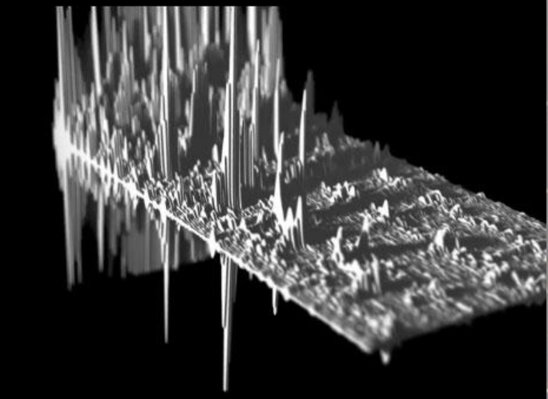
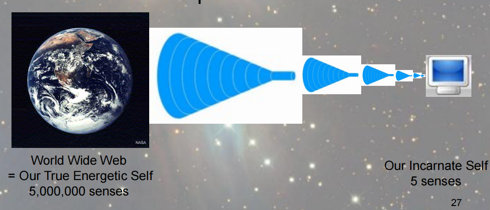

## 维度、频率、能量

上图的圆圈是一个载波的横截面，代表多维宇宙。12条黑线代表12个全维度，这12种信息在同一个载波中传输，不同维度只是同一个载波上不同相位的波形。根据相位角（观察方向）的不同，可以看到不同维度的信息。观察角度越大看到的信息越多。

#### 频率（frequences levels）

频率是多维宇宙中的基础结构，就像建造大厦的砖块。每个频率可以被视为单独排列的“空间”。

#### 跨频率的扬升

一个实体在提升到下一个维度之前，必须提升其居住维度的频率，能够扬升穿越所有它所在的维度中的所有频率。

上图描述了在一个频率层次中，不同进化程度的实体在局部创造的高频或低频区域。向上的尖刺表示高频区域，向下的尖刺表示低频区域，尖刺越长表示振动幅度越大。处于中间水平的实体创造了基准的频率，进化的实体创造区域性的高频环境，不进化的实体创造区域性的低频环境。

上图描述了四个不同频率层次所代表的宇宙。高频率层次波形的波谷和低频率层次波形的波峰是互相接近的，这里的波峰和波谷是进行扬升的转换点，实体通过这些区域性的波峰和波谷进行扬升。

#### “失联”于低频率物理宇宙

高我把它自己的一小部分投射到身体载具中进行转世，从具有500万种感官的状态限制到只具有5种感官的状态，我们就像一台功能受限的小电脑，很难从互联网获取信息。

当我们不在转世状态时，可以即时大量地获取信息。转世时，由于“带宽”的限制，以正常的状态很难与高我进行连接。“带宽”受限是由于低频率环境引起的。

## 物理宇宙（多维宇宙中的异类）

- 在物理宇宙中的扬升是跨频率的，在多维宇宙中的扬升是跨维度的。
- 物理宇宙是**二元性环境**，必须做选择。
- 物理宇宙包含了最难体验的环境的频率，包含了起源内的最低频率。创造我们宇宙的源实体决定投射觉知到这么低的频率中进行体验，是最勇敢的源实体。
- 唯一一个需要载具，需要转世进行体验的宇宙。

## 时间的本质（事件空间）

时间并不存在。

时间可被更好地描述为“球形或全息事件空间”，全息是指所有发生的事件存在于同一个空间中，过去、现在、未来的事件都同时存在。

因为事件以全息的方式存在，一个特殊事件及其所有可能的替代物同时存在。它们是“相互接触”的，它们是“单独”在一起的。可以通过穿越来体验每一个事件的替代方案。

事件空间是一种可能性，一种不同发展的可能性，一种思考过程的可能性。

事件空间存在于起源、源实体、多维宇宙的每一个角落，是对**时间**概念的更准确理解。我们不是存在于时间中的，而是存在于事件中，事件会相互交错，事件中还会存在事件。

橡皮筋球是事件空间很好的类比。每一个事件直接或间接地与另一个事件相联系。

#### 平行世界

我们的每一个决定都会创造单独的事件空间，所以存在很多平行的事件空间。

可以从一个事件空间穿越到另一个事件空间，理论上我们可以体验到事件的所有可能性版本。