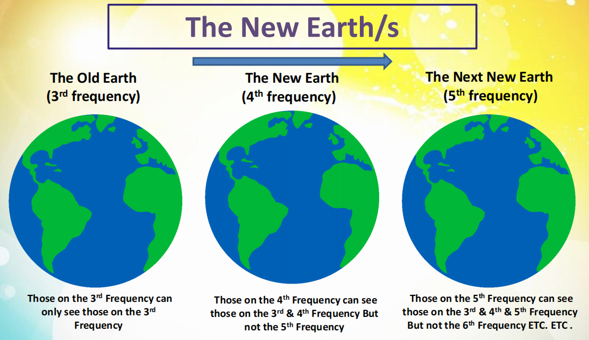

## 什么是扬升？

扬升（Ascension）不是人类从第3维度提升到第4或第5维度。有这种说法是因为之前人们对**维度**这个概念没有清晰的认知。

扬升发生在**第一全维度**（共12个频率层次）中，是人类体验到的频率层次的提升。人类从**第3频率层次（物质层）**扬升到**第4频率层次（下级星光层）**。

**一共有14个频率层次与物理环境相关**，用于进化目的。物理宇宙包含第1-12频率层次。**第13、14频率**层次是对物理宇宙的存有扬升预留的两个频率层次。**人类身体载具被设计成适应1-10频率层次**。

提升频率的扬升过程是：缓慢的（Slow）、渐进的（Gradual）、坚定的（Robust）、可重复的（Repeatable）。

人们所期待的巨大变化不会也不可能发生。在一个临界点进行的大规模扬升是不存在的，这只会发生在小团体中。

人类整体需要30~40年进入下一个频率层次，在这期间是**个体化**地扬升。90%的人类在60年内扬升。

集体扬升后，以第3频率层次的角度来看，地球空无一人；以第4频率层次的角度来看，人们都在那里。

中世纪是人类整体频率的最低点，之后振动频率快速向上提升。

## 我们在扬升的证据

- 对“灵性”开始感兴趣的人增多；
- 对“更大现实”的觉悟；
- 灵性倾向将会更加直觉化，觉知和觉醒个体将会体验到更深层次的连接，这将是一个缓慢渐进的过程；
- 技术上，“半觉知”个体将从宇宙知识那里获得启迪，灵性能量层次将传递给他们信息，更多新技术出现；
- 那些在扬升的人从物理感知角度看起来消失了。（频率提高了，其他人可能感知不到你）

## 专注于个体扬升

不要担心扬升会发生的事，做些你想让其发生的事。**提升自己的振动频率**，让自己致力于帮助扬升加速。通过自己频率的提升影响别人，而不是强迫别人提升。

把绝大部分精力放在**个人扬升**的过程上，身处于物质世界，又超脱于物质世界。

确保个人扬升的第一步，是以非小我（ego）的方式为别人带来好处。注意自己的思想和行为，善意，为别人考虑。以更大的视角看待周围的人和事，一切都是体验和学习。

## 灵性的“大日子”

日期是预估的里程碑。因为时间本质上是不存在的，这些日期代表有些事件可能会发生，而不是事件会精确地发生在那个时间。

灵性追求者使用的日期是从能量层面的守护者那里接受到的信息产生的，它们被错误解读为特定事件的日期。如果在预计日期发生与预期相反的事件，会严重影响人类整体的信心，引发频率下降。

比如2012.12.21。基础频率的提升发生在2012年的2月份，超越了预计要达到的水平。这个改变将使得之前不具备能力的人开始对他们所处的环境产生疑问。

## 新地球和三波志愿者

二战后，很多高频率灵魂来到地球，帮助人类进入新地球（第4频率层次）的环境中。

- **第一波志愿者**：没有任何在地球生活的经验，在地球的生活很艰辛，很多因为适应不了地球的环境而自杀。
- **第二波志愿者**：身体形态和能量结构改善，也很挣扎。
- **第三波志愿者**：靛蓝儿童、水晶儿童、混合体儿童等。

新地球与旧地球都存在于物理宇宙中，在同一个地方，频率层次不同。到达第4频率层次的地球时，对于第3频率层次的人来说，我们会消失。

每一个频率层次都是一个“新地球”，直到第12频率层次。

## 扬升是一个三级过程

- 升入一级：个体先后逐渐扬升，有**回填人（Backfill People）**填补扬升后的大众规模。人类全部扬升时，回填人的工作将完成，他们将回到正常能量层面的环境；
- 第一级扬升：转世人类开始和物理宇宙更高频率保持一致，从第4频率层次逐渐提升，最终转世到第12频率层次。“个体自由意志”将在物理宇宙被普遍采纳，当整个物理宇宙处于正确频率，整体环境结构将提升到第二个全维度；
- 第二级扬升：物理宇宙迁移到第13频率层次，接下来第14频率层次。第14频率层次是物质载具存在的最后一个频率；
- 第三级扬升：所有转世载具都将进化为非物质性，无需再转世。第15频率层次太精细了，物质身体无法承载。

## 扬升的终极目标

扬升的终极目标是：**遥远的未来**。

12个源实体是由起源创造，用来加速自我进化的。同样的，我们的源实体（God）创造了我们。

当12个源实体的所有造物返回到他们的源头，起源将准备好进入自我觉知的第二个阶段。在这个新的巨大空间，**我们将成为单独的源实体**，帮助起源在这个自我觉知扩张的新时代去追求体验、学习和进化，比如由我们创造多维宇宙进行体验。