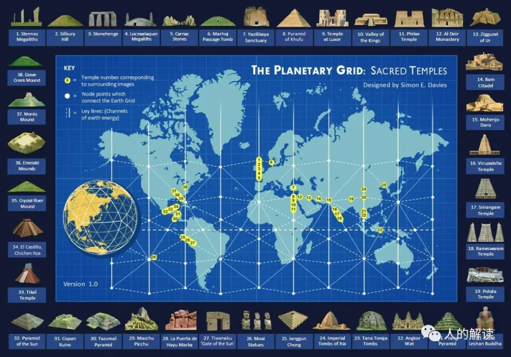
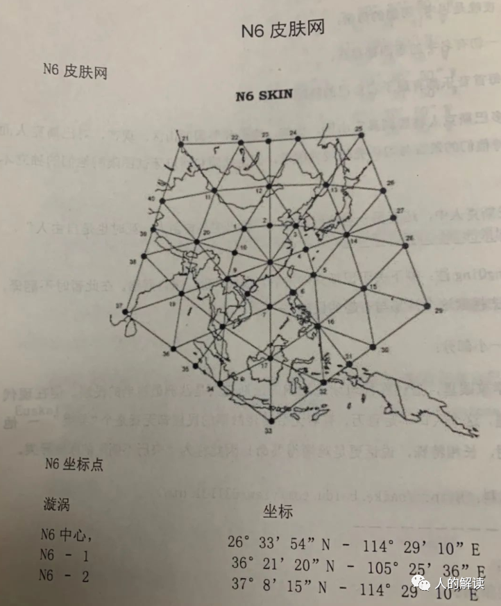

## 地球脉轮（Earth Chakras）

罗伯特•库恩（Robert Coon）提出，地球是一个生命体，和人体一样有脉轮和能量点，而能量点集中的地方灵性活动会越发活跃，同时也会引发一些重大历史事件。

这些充满能量的脉轮是最强的能量漩涡点，还有数百个小的脉轮遍布全球各地。

7个主要脉轮为：

- 第1脉轮：沙斯塔山（Mt. Shasta），又称雪士达山，在美国加利福尼亚州；
- 第2脉轮：的的喀喀湖（Lake Titicaca），在玻利维亚和秘鲁边境；
- 第3脉轮：乌鲁鲁（Uluru and Kata Tjuta） ，在澳大利亚北方；
- 第4脉轮：格拉斯顿伯里和沙夫茨伯里（Glastonbury and Shaftesbury），在英国；
- 第5脉轮：吉萨大金字塔（Great Pyramid, Mt. Sinai）；
- 第6脉轮：极漫长时期的活化中心（The Aeon Activation Centre），是移动的；
- 第7脉轮：凯拉斯山（Mt. Kailas），就是冈仁波齐，在西藏。

活化中心在：

- 双子座时代是中国的泰山；
- 金牛座时代是西伯利亚的Belukha；
- 白羊座时代是伊朗的Kun-E-Malek-Siah；
- 双鱼座时代是耶路撒冷的橄榄山（Mt. of Olives）；
- 水瓶座时代是在英国的沙夫茨伯里（Shaftesbury）。

## 行星网格（Planetary Grid）

贝克尔和哈根斯（Becker and Hagens）的行星能量网格是基于柏拉图固体（Platonic Solid）。

柏拉图认为这个世界被塑造成十二面体，随着时间的推移，它将变成一个二十面体。这个模型表明，大陆、海洋和能量线的位置符合规则形状和数学公式。众多历史、文化和精神的圣地，刚好坐落于能量网格（Energy Grid）地图上。

赛斯（Seth）资料提到过行星网格，赛斯称之为“调和点”。地球上存在着许多个不同层级的能量调和点，可以理解为地球的能量交汇中心。 

道瑞（Datre）资料的第3本主要讲地球能量网格，中国几乎全部国土都处于N6区域。

## 地脉（Ley Lines）

地球的能量线有不同的称谓，地脉（ley lines）或龙脉（dragon lines）。

圣迈克尔和圣玛丽线（Saint Michael and Saint Mary Alignment）和阿波罗/雅典娜能量线（Apollo / Athena Energy Line），以近乎完美的直线显示，具有历史和精神意义的圣地完美的坐落其中。

英国南部这条线，有维尔特郡巨石阵（Stonehenge）、纽格莱奇墓（Newgrange）、白马阵、麦田圈等。

