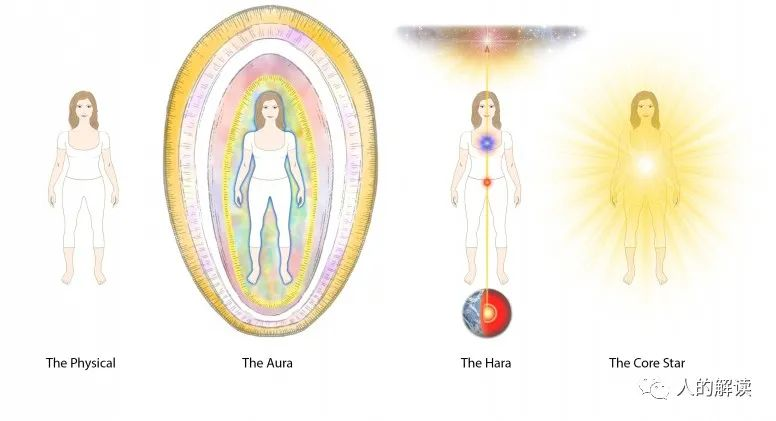
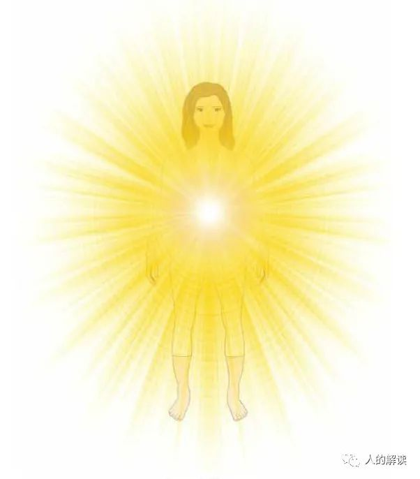
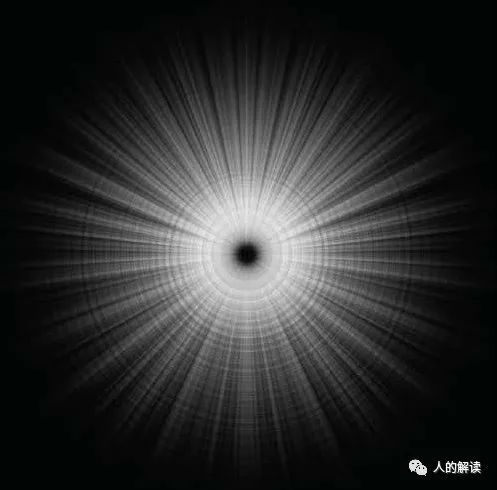
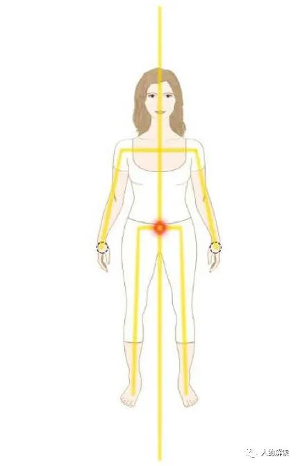
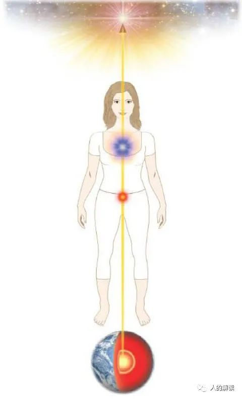
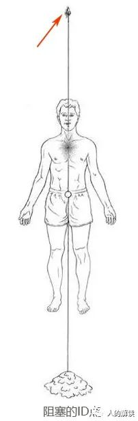
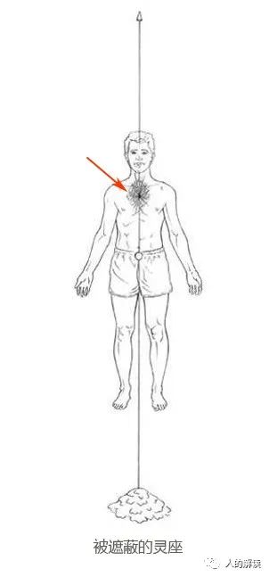
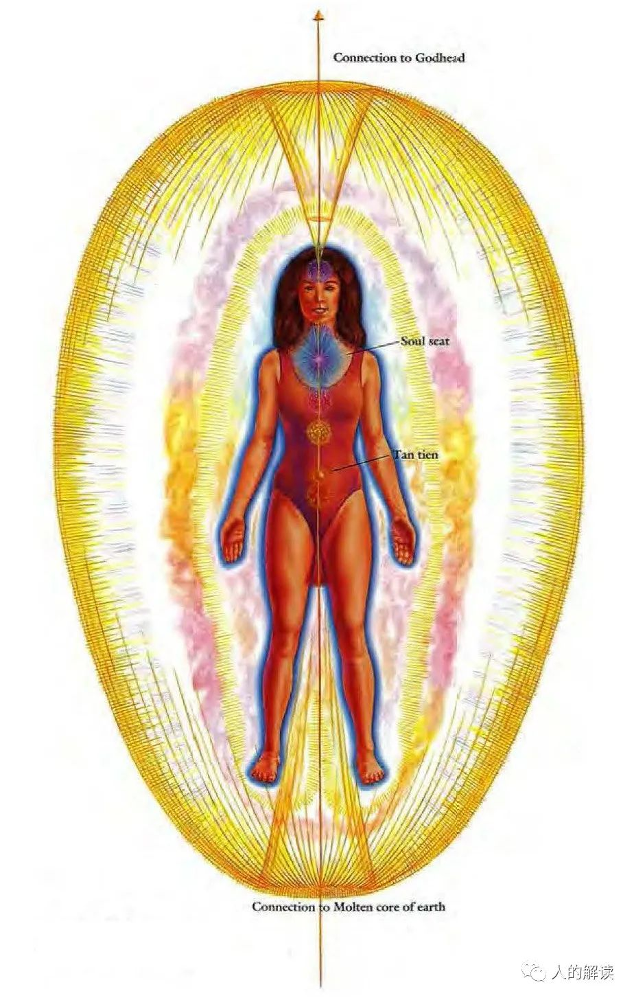
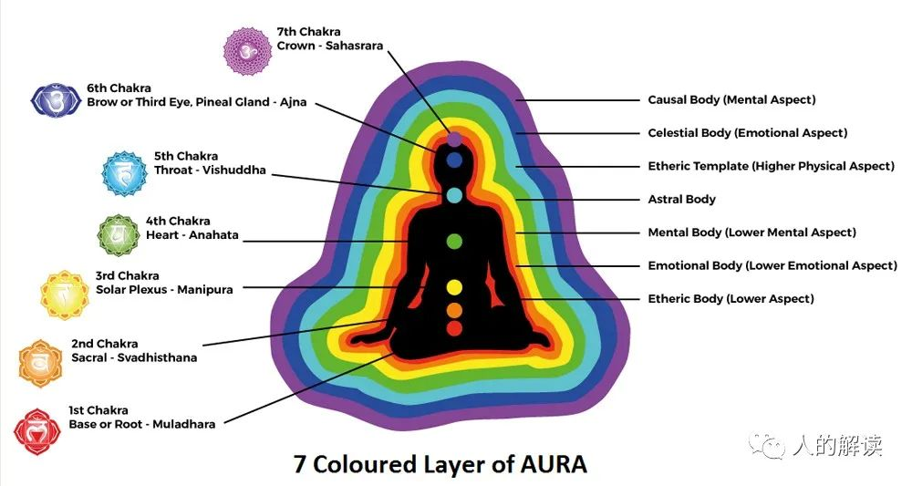
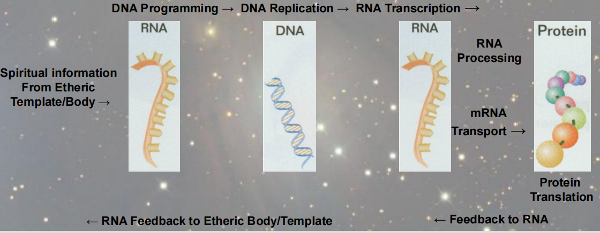

## 人类能量意识系统（HECS）

芭芭拉·安·布蓝能（Barbara Ann Brennan）基于自己几十年的超视觉观察，发展出了一套人类能量意识系统。

有四个主要层面：

- **星核层（Core Star Level）**
- **哈拉层（Haric Level）**
- **辉光场层（Auric Level）**
- **肉体层（Physical Body Level）**

## 星核层（Core Star Level）

星核层是人类的**内在神性**所在的层面，所有创造力都从这一内在源头涌现。
 
**星核（Core Star）**，位于身体中心线、肚脐上约3.8厘米处，呈现为一个明亮的光点。从星核中心发散出来的朝向四面八方的光芒是创造之光。地球上的每一生物个体的星核所发出的光各不相同。

   
 
星核虽然显现为光点，但其实是从虚空中发散出来的，这个虚空称为黑绒虚空（Black Velvet Void），这是一种形象化的描述。

黑绒虚空中，蕴含着未显化的生命，充满了超乎想像的力量，是一切显化的根源。透过深度冥想或进入入定状态，可以直接体验到星核中的黑绒虚空。
 
   

## 哈拉层（Haric Level）

**哈拉（hara）**是日语，代指下腹部。也指该位置所具有的力量、能量和专注力，是灵性能量中心。

哈拉层是人类的**意愿**所在的层面。我们在哈拉层体验到了意愿或目的，它影响着我们每时每刻的意向。

哈拉与一个人的**人生使命**或更深层的灵性目标有关，在这一层蕴含着一个人投胎转世的更大目标，以及任何特定时刻的目标。正是在这一层，你设定并保持你的意愿。真正的愿望，始终与最高灵性渴望一致。

如果哈拉层面是健康的，你会感受到极大的个人完整性、充沛的力量以及明确的个人目标。

哈拉层是辉光场层的基础，它连接了身体中央与七个主要脉轮，也连接了位于双手、双臂、双腿和双脚的次要脉轮。

哈拉层由一条贯穿身体中心的像镭射光的线（**哈拉线**），以及上面的三个点（**ID点、灵座、丹田**）组成。

### 哈拉线（Hara Line）

哈拉线起始于头顶约1米处，向下延伸到地球中心。

哈拉线其实是位于人体中线的竖直光管，另外在双臂和双腿中央还有两条光管，光管宽度大约有8.5毫米。

   

透过哈拉线与地心连接，我们自身辉光场的脉动就能与地球能量场同步，以便汲取能量。

健康的哈拉线位于身体中线，呈直线且形状良好，能量充足，很好地扎根于地球核心。而且哈拉线上的三个点都平衡、形态完整并由哈拉线牢固地彼此连结。

没有任何人能够一直保持哈拉线的笔直和对准。很多人从未对准过，少数人能有30%的时间对准，而极少极少的人，能有50%的时间对准。多数人因为大部分时间都是无法校准的，甚至扭曲严重，而导致了很多痛苦。

哈拉线会即时地响应于我们的意愿，任何意愿的改变，都会导致哈拉线位置和对准上的变化。
 
   

哈拉线上有三个点：分别是**ID点、灵座、丹田**。

### ID点（Individuation Point）

第一个点，称为**个体化点**或ID点。在头顶上方约1.1-1.2米的位置，像个倒置的漏斗，其宽端开口向下。这个小开口实际上是个小旋涡，直径约8.5毫米。

ID点是哈拉线的起源，携带了一个人**投胎转世的理由**，正是通过这一点，我们得以与更高的灵性实相连接。

ID点，代表的是我们为了投胎转世而第一次从神性中分化，从神性中出来的第一次个体化。

如果ID点变形或堵塞，被深色云状能量索覆盖，这会导致哈拉线与ID点断连。与ID点的断连，会导致生活中的玩世不恭和愤世嫉俗。 

### 灵座（Soul Seat）

第二个点，称为**灵座**。意思是灵魂渴望的基座，位于上胸骨区(胸骨柄)。

灵座的直径约2.5-5厘米，冥想时可扩展到直径约4.6米。

灵座就像一个漫射光源，光芒向所有方向放射。灵座呈现为粉色、薰衣草紫和白色等多种色彩的脉动柔光。

这道光，携带着灵魂**想要在此生达成的渴望**，带领着我们度过一生，与我们的人生使命精确对应，那是我们生而为人的目的。

灵座有时又被称作**上心（high heart）**，常与脉轮混淆，但不是脉轮。

灵座的问题通常是被遮蔽而形态受损，被深色云状能量覆盖。结果就是人们不知道生活中现在或将来想要什么，感觉不到生活中想做什么，这样的人通常胸部凹陷。

### 丹田（Tan Tien）

第三个点，称为**丹田**。位于肚脐下方约5.1-7.6厘米的位置，具体位置取决于个人身高。丹田像是一个中空的橡胶球，直径大约2.5-3.8厘米，大小尺寸不会变。外表有一层坚固薄膜，颜色呈金色。

丹田也是一个意志中心，是**在物质肉体中生存的意志**。

健康的丹田是蕴含着强大意愿能量的球体，能容纳巨大的力量，可以藉由冥想或锻炼来给丹田充能，让力量充满丹田。

   

高阶疗愈师知道如何控制哈拉光管里从丹田流向手部次要脉轮的能量流，以释放能量用于疗愈。当哈拉线延伸进入地球时，疗愈师可以聚集巨大的能量，用于疗愈时，丹田会变得非常亮红灼热。如果疗愈师接入大地且丹田变成红色，他会感到全身发出炽热，这就是在哈拉层的根植大地。当我们处于健康状态时，哈拉线的末端会一路深入地球中心，这样我们会非常接地。

## 辉光场层（Auric Levels）

在芭芭拉·安·布蓝能（Barbara Ann Brennan）的人类能量意识系统中，人体有**7层**辉光场。Guy Steven Needler（盖伊·斯蒂文·尼德勒）扩展到**10层**。

序号|名称|外观|作用
---|---|---|---
第1层|以太体（Etheric Body）|精细的蓝色能量线网格|肉体的能量矩阵或模板
第2层|情绪体（Emotional Body）|彩色云状，持续流动|显示情绪或爱、喜悦、愤怒等感觉，并允许其沟通
第3层|心智体（Mental Body）|结构化的明亮黄光，自身体的头部与肩膀散发出来|包含我们的思想与想法的结构
第4层|星光体（Astral Body）|不定型的彩色云朵，带有玫瑰色光芒|有助于灵性能量转化成物质能量，以及物质能量转化成灵性能量，这一层还展示两个人之间的爱
第5层|以太模板（Etheric Template）|有如钴蓝色线条组成的蓝色照片底片|以太体的蓝图或完美形式
第6层|天光体（Celestial Body）|蜡笔画般的彩色光芒，带有金银色光泽|无条件爱之交流，与神合二为一
第7层|因果模板（Causal Template）|呈现蛋形，由金银细光线组成的高度结构化的矩阵，显示出肉体与所有脉轮结构|前世生命和生命蓝图的积累，将所有的能量体连接在一起
第8-10层|未确认|薄丝般的结构，越高层越精细，最终以至于无结构|与真正的、全然的能量自我的主要沟通/连接

> *人体的7层辉光场和7个主要脉轮*

7个脉轮的每一个脉轮都有7层，脉轮的每一层也都对应着一层气场，脉轮系统会在后续章节中介绍。

## 肉体层（Physical Body Level）

辉光场是肉体的基础，也是肉体的模板，它先于肉体而存在。

肉体居于辉光场中，其起源、生命、成长、形状和健康，完全仰赖三个更深的维度，即辉光场、哈拉和星核。

### RNA和DNA

从物理上来说，RNA是将DNA上的编码转译表达为细胞功能中使用的蛋白质的媒介。这只是多路通信系统的一种方式，没有考虑到由RNA传送到DNA的第一组信息。

RNA是由人体辉光层的**第一层（以太体）**和**第五层（以太模板）**编写的。

完整的流程是：来自以太模板/以太体的灵性信息通过DNA编码存在于RNA上，再发送到DNA进行复制，再发送到RNA进行转录，由mRNA指导蛋白质合成，把结果反馈给RNA，RNA把结果反馈给以太模板/以太体。

RNA是一种界面（interface）介质，它同时存在于物理层级的高层和灵性层级的低层，从更高的灵性层级传递信息到较低的物质身体细胞。

RNA是细胞之间的一种通信介质，它允许细胞的正确定位，以及细胞结合来创造它们被赋予的身体机能。细胞蛋白质接收到正确信息时必须反馈到RNA上，这些信息将被传递到以太模板/以太体上以确认。