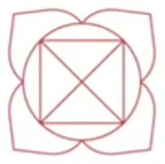

人体的能量结构有三个：一是**能量中心**，最为人熟知的就是**脉轮**；二是**能量通道**，即**经络**；三是**能量场**，包括但不限于**人体辉光场**。

## 什么是脉轮？

脉轮（Chakras）是身体载具每一个能量层级的**能量接受器和转换器**，脉轮吸收能量以维持身体的运转。脉轮可以把能量从较高的振动频率转换成较低的振动频率，反之亦然。

脉轮的形状是**漩涡状的圆锥体**。每一个脉轮又含有更小的能量漩涡，**穴位**是一些较小的脉轮。每一个脉轮吸收一种特定频率的能量。

脉轮可分为**主要脉轮**和**次要脉轮**。主要脉轮有**7个**，就是七大脉轮，西藏密宗里就有**三脉七轮**的说法。

主要脉轮也有12个的说法（七大脉轮+五个体外脉轮）。次要脉轮就是经络上的穴位。所有主要脉轮、次要脉轮、较小脉轮都是能量流入与流出的开口。 

## 脉轮的特点

### 脉轮的圆锥形结构

脉轮是圆锥形的结构，它通过旋转将能量吸入中心。这些能量滋养了人体能量场，同时也带入了周围宇宙能场中的信息。

一个正常脉轮（七大脉轮），其敞开的末端面积直径约15厘米，距离身体约2.5厘米的距离。

第一脉轮（海底轮）只有4个小旋涡，随着脉轮的提升，小旋涡或“花瓣”数量增加。

脉轮|颜色|小漩涡数
---|---|---
海底轮|红|4
腹轮|橙|6
太阳轮|黄|10
心轮|绿|12
喉轮|蓝|16
眉心轮|靛蓝|96
顶轮|紫白|288
第8脉轮|金|1152
第9脉轮|金|5760
第10脉轮|金|34560
第11脉轮|金|241920

### 脉轮成对出现

脉轮是成对的，每一个位于身体正面的主要脉轮，与身体背面对应部位的脉轮为一对，正面(A)与背面(B)的脉轮被视为同一个脉轮。

七大脉轮中，2、3、4、5、6在身体前后成对。第二脉轮由2A 和2B 两个组成，第三脉轮由3A 和3B所组成，以此类推到第六脉轮。

第一脉轮和第七脉轮，可以视为一对，因为它们是在脊椎上下流动、将能量运行到所有脉轮所处的垂直能量流的顶端与末端。

脉轮内的小旋涡也是前后成对的。某个脉轮（或小旋涡）受损，也会影响到其对侧的脉轮。

每个脉轮中的小旋涡，都在各自不同的层面上代谢着不同频率的能量，然后能量被输送到身体的不同部位、器官和细胞，用于身体的健康运转。

如果脉轮受损，或者小旋涡受损，整体脉轮会呈现出其他形状。

> *受损的脉轮*

## 七大脉轮

第2~6脉轮分为前、后两组。

**前脉轮（A）**位于人体正面，与我们的**意愿**有关；

**后脉轮（B）**位于人体背面，与我们的**行动**有关。

脉轮|符号|颜色|梵语名/含义|种子音|小漩涡数|位置|对应身体部位|掌管|功能
---|---|---|---|---|---|---|---|---|---
顶轮||紫色|Sahasrara 空|OM|288|百会穴|松果体、上脑、右眼|开悟之轮|7：将人格与生命及人类的灵性面整合
眉心轮/额轮/三眼轮||靛青|Ajna 觉知，指挥|AUM|96|两眉之间的正中心|脑垂体、下脑、左眼、耳、鼻、神经系统|灵性中心|6A：视觉化的能力、对心智概念的理解 6B：将想法付诸实践的能力
喉轮||蓝色|Visuddha 净化|HAM|16|喉咙的凹陷处|甲状腺、支气管、发声系统、肺、消化道|沟通的中枢|5A：吸收与同化知识 5B：在社会里的自我意识和个人职业
心轮||绿色|Anahata 两物没有碰撞却发出声音，不受打击、不受伤|YAM|12|胸部的中心|胸腺、心脏、血液、交感神经、循环系统|爱的中心|4A：对他人的内心之爱、对生命的敞开度 4B：小我的意志、朝向外在的意志
太阳轮/脐轮/太阳神经丛||黄色|Manipura 宝石所在地|RAM|10|胸骨正下方，胃的中部|胰腺、胃、肝、胆、神经系统|力量中心、情绪生活、新陈代谢|3A：快乐与广阔、灵性智慧、对生命的普适性以及你在宇宙中是谁的认知 3B：疗愈及朝向健康的意愿
腹轮/生殖轮/性轮||橙色|Svadhisthana 自己的住所，品尝甘甜、快乐|VAM|6|肚脐下约一个手掌距离|生殖腺、性腺、生殖系统|情绪、感觉、欢乐、行动和滋养|2A：对异性之爱的品质、心理与灵性、给予与接受的快乐 2B：性能量的品质
海底轮/根轮||红色|Muladhara 根部的支持|LAM|4|会阴|肾上腺、脊柱、双肾|肉体的存在与需求 维持生存的基本需求 能量的门户|1：物质能量的多少、活着的意志

### 七大脉轮与七层气场

7个需要吸收能量的层级，对应身体载具的7个脉轮。

脉轮的尖端或顶端连接着主要能量流，称之为脉轮的根部或中心。在这些中心之内有许多封口，控制透过该脉轮在不同气场层之间进行的能量交换。

**7个脉轮的每一个脉轮都有7层，脉轮的每一层也都对应着一层气场**。脉轮在每一层的长相皆不同。为了让某股能量流可以透过脉轮从一层流到另一层，能量必须通过脉轮根部的封口。

> *7层相互渗透的气场，及贯穿7层的脉轮*

### 七大脉轮与食物

脉轮|颜色|元素|食物|矿石|肯定语
---|---|---|---|---|---
顶轮|紫白|无元素/思想|**禁食和排毒** **冥想草药或精油**：鼠尾草、薰衣草、乳香、杜松子|紫晶、透明石英、白纹石、月光石|我与我灵魂的目的和真理保持一致。
眉心轮|靛蓝|光|**蓝紫色食物**：紫葡萄、紫羽衣甘蓝、蓝莓、紫甘蓝、茄子、紫胡萝卜 可可|紫晶、方钠石、黑曜石、青金石|我寻求理解并从我的生活经历中学习。
喉轮|蓝|阿卡西|**蓝色食物**：蓝莓、黑莓 **舒缓食物**：椰子水、花草茶、生蜂蜜、柠檬、苹果、梨、李子|天河石、绿松石、蓝晶石、青金石|我自由、公开地说出我的真相。
心轮|绿|空气|**绿色食物**：羽衣甘蓝、西兰花、菠菜、甜菜、蒲公英、欧芹、芹菜、黄瓜、西葫芦、抹茶、绿茶、牛油果、酸橙、薄荷、豌豆、猕猴桃、螺旋藻、青苹果|玫瑰石英、玉、东陵石、天河石|我深深地、完全地爱并接受自己。
太阳轮|黄|火|**黄色食物**：香蕉、菠萝、玉米、柠檬、黄咖喱 **谷物**：燕麦、糙米、斯佩耳特小麦、黑麦、法罗米、豆类、发芽谷物|琥珀、虎眼石、日光石、茶晶、黄铁矿、黄碧玉|我允许自己做真实的自己。
腹轮|橙|水|**橙色食物**：胡萝卜、芒果、橙子、橙椒、桃子、杏子、红薯 **富含Omega-3**：鲑鱼，亚麻、杏仁、核桃、芝麻 **香料**：椰子、肉桂 **水**：水、椰子水、花草茶|玛瑙、红碧玉、琥珀、虎眼石、日光石|我是一个可爱且令人向往的存在。
海底轮|红|土|**红色食物**：红苹果、甜菜、西红柿、石榴、草莓、覆盆子 **根类蔬菜**：红薯、地瓜、土豆、胡萝卜、芜菁（大头菜）、甜菜、大蒜、防风草、洋葱、芜菁甘蓝、生姜、姜黄 **香料**：辣椒粉、辣椒、辣根 **富含蛋白质**：鸡蛋、豆类、坚果、瘦肉|棕色碧玉、红碧玉、烟晶、赤铁矿、石榴石|我很安全，脚踏实地。

### 三脉七轮

三脉为：**中脉、左脉、右脉**。

左脉和右脉像交缠的双螺旋，好似有两条蛇盘绕在权杖上一样，在顶端会合。