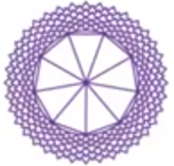

人体的能量结构有三个：一是**能量中心**，最为人熟知的就是**脉轮**；二是**能量通道**，即**经络**；三是**能量场**，包括但不限于**人体辉光场**。

## 什么是脉轮？

脉轮（Chakras）是身体载具每一个能量层级的**能量接受器和转换器**，脉轮吸收能量以维持身体的运转。脉轮可以把能量从较高的振动频率转换成较低的振动频率，反之亦然。

脉轮的形状是**漩涡状的圆锥体**。每一个脉轮又含有更小的能量漩涡，**穴位**是一些较小的脉轮。每一个脉轮吸收一种特定频率的能量。

脉轮可分为**主要脉轮**和**次要脉轮**。主要脉轮有**7个**，就是七大脉轮，西藏密宗里就有**三脉七轮**的说法。

主要脉轮也有12个的说法（七大脉轮+五个体外脉轮）。次要脉轮就是经络上的穴位。所有主要脉轮、次要脉轮、较小脉轮都是能量流入与流出的开口。 

## 脉轮的特点

### 脉轮的圆锥形结构

脉轮是圆锥形的结构，它通过旋转将能量吸入中心。这些能量滋养了人体能量场，同时也带入了周围宇宙能场中的信息。

一个正常脉轮（七大脉轮），其敞开的末端面积直径约15厘米，距离身体约2.5厘米的距离。

第一脉轮（海底轮）只有4个小旋涡，随着脉轮的提升，小旋涡或“花瓣”数量增加。

脉轮|颜色|小漩涡数
---|---|---
海底轮|红|4
腹轮|橙|6
太阳轮|黄|10
心轮|绿|12
喉轮|蓝|16
眉心轮|靛蓝|96
顶轮|紫白|288
第8脉轮|金|1152
第9脉轮|金|5760
第10脉轮|金|34560
第11脉轮|金|241920

7大脉轮总的小漩涡数为：4+6+10+12+16+96+288=**432**

### 脉轮成对出现

脉轮是成对的，每一个位于身体正面的主要脉轮，与身体背面对应部位的脉轮为一对，正面(A)与背面(B)的脉轮被视为同一个脉轮。

七大脉轮中，2、3、4、5、6在身体前后成对。第二脉轮由2A 和2B 两个组成，第三脉轮由3A 和3B所组成，以此类推到第六脉轮。

第一脉轮和第七脉轮，可以视为一对，因为它们是在脊椎上下流动、将能量运行到所有脉轮所处的垂直能量流的顶端与末端。

脉轮内的小旋涡也是前后成对的。某个脉轮（或小旋涡）受损，也会影响到其对侧的脉轮。

每个脉轮中的小旋涡，都在各自不同的层面上代谢着不同频率的能量，然后能量被输送到身体的不同部位、器官和细胞，用于身体的健康运转。

如果脉轮受损，或者小旋涡受损，整体脉轮会呈现出其他形状。

> *受损的脉轮*

## 七大脉轮

第2~6脉轮分为前、后两组。

**前脉轮（A）**位于人体正面，与我们的**意愿**有关；

**后脉轮（B）**位于人体背面，与我们的**行动**有关。

脉轮|符号|颜色|梵语名/含义|种子音|小漩涡数|位置|对应身体部位|掌管|功能
---|---|---|---|---|---|---|---|---|---
顶轮||紫色|Sahasrara 空|OM|288|百会穴|松果体、上脑、右眼|开悟之轮|7：将人格与生命及人类的灵性面整合
眉心轮/额轮/三眼轮||靛蓝|Ajna 觉知，指挥|AUM|96|两眉之间的正中心|脑垂体、下脑、左眼、耳、鼻、神经系统|灵性中心|6A：视觉化的能力、对心智概念的理解 6B：将想法付诸实践的能力
喉轮||蓝色|Visuddha 净化|HAM|16|喉咙的凹陷处|甲状腺、支气管、发声系统、肺、消化道|沟通的中枢|5A：吸收与同化知识 5B：在社会里的自我意识和个人职业
心轮||绿色|Anahata 两物没有碰撞却发出声音，不受打击、不受伤|YAM|12|胸部的中心|胸腺、心脏、血液、交感神经、循环系统|爱的中心|4A：对他人的内心之爱、对生命的敞开度 4B：小我的意志、朝向外在的意志
太阳轮/脐轮/太阳神经丛||黄色|Manipura 宝石所在地|RAM|10|胸骨正下方，胃的中部|胰腺、胃、肝、胆、神经系统|力量中心、情绪生活、新陈代谢|3A：快乐与广阔、灵性智慧、对生命的普适性以及你在宇宙中是谁的认知 3B：疗愈及朝向健康的意愿
腹轮/生殖轮/性轮||橙色|Svadhisthana 自己的住所，品尝甘甜、快乐|VAM|6|肚脐下约一个手掌距离|生殖腺、性腺、生殖系统|情绪、感觉、欢乐、行动和滋养|2A：对异性之爱的品质、心理与灵性、给予与接受的快乐 2B：性能量的品质
海底轮/根轮||红色|Muladhara 根部的支持|LAM|4|会阴|肾上腺、脊柱、双肾|肉体的存在与需求 维持生存的基本需求 能量的门户|1：物质能量的多少、活着的意志

### 七大脉轮与七层辉光场

7个需要吸收能量的层级，对应身体载具的7个脉轮。

脉轮的尖端或顶端连接着主要能量流，称之为脉轮的根部或中心。在这些中心之内有许多封口，控制透过该脉轮在不同辉光场层之间进行的能量交换。

**7个脉轮的每一个脉轮都有7层，脉轮的每一层也都对应着一层辉光场**。脉轮在每一层的长相皆不同。为了让某股能量流可以透过脉轮从一层流到另一层，能量必须通过脉轮根部的封口。

> *7层相互渗透的辉光场，及贯穿7层的脉轮*

### 七大脉轮与食物

脉轮|颜色|元素|食物|矿石|肯定语
---|---|---|---|---|---
顶轮|紫白|无元素/思想|**禁食和排毒** **冥想草药或精油**：鼠尾草、薰衣草、乳香、杜松子|紫晶、透明石英、白纹石、月光石|我与我灵魂的目的和真理保持一致。
眉心轮|靛蓝|光|**蓝紫色食物**：紫葡萄、紫羽衣甘蓝、蓝莓、紫甘蓝、茄子、紫胡萝卜 可可|紫晶、方钠石、黑曜石、青金石|我寻求理解并从我的生活经历中学习。
喉轮|蓝|阿卡西|**蓝色食物**：蓝莓、黑莓 **舒缓食物**：椰子水、花草茶、生蜂蜜、柠檬、苹果、梨、李子|天河石、绿松石、蓝晶石、青金石|我自由、公开地说出我的真相。
心轮|绿|空气|**绿色食物**：羽衣甘蓝、西兰花、菠菜、甜菜、蒲公英、欧芹、芹菜、黄瓜、西葫芦、抹茶、绿茶、牛油果、酸橙、薄荷、豌豆、猕猴桃、螺旋藻、青苹果|玫瑰石英、玉、东陵石、天河石|我深深地、完全地爱并接受自己。
太阳轮|黄|火|**黄色食物**：香蕉、菠萝、玉米、柠檬、黄咖喱 **谷物**：燕麦、糙米、斯佩耳特小麦、黑麦、法罗米、豆类、发芽谷物|琥珀、虎眼石、日光石、茶晶、黄铁矿、黄碧玉|我允许自己做真实的自己。
腹轮|橙|水|**橙色食物**：胡萝卜、芒果、橙子、橙椒、桃子、杏子、红薯 **富含Omega-3**：鲑鱼，亚麻、杏仁、核桃、芝麻 **香料**：椰子、肉桂 **水**：水、椰子水、花草茶|玛瑙、红碧玉、琥珀、虎眼石、日光石|我是一个可爱且令人向往的存在。
海底轮|红|土|**红色食物**：红苹果、甜菜、西红柿、石榴、草莓、覆盆子 **根类蔬菜**：红薯、地瓜、土豆、胡萝卜、芜菁（大头菜）、甜菜、大蒜、防风草、洋葱、芜菁甘蓝、生姜、姜黄 **香料**：辣椒粉、辣椒、辣根 **富含蛋白质**：鸡蛋、豆类、坚果、瘦肉|棕色碧玉、红碧玉、烟晶、赤铁矿、石榴石|我很安全，脚踏实地。

### 三脉七轮

三脉为：**中脉、左脉、右脉**。

左脉和右脉像交缠的双螺旋，好似有两条蛇盘绕在权杖上一样，在顶端会合。

## 脉轮光带（Chakra Cords）

脉轮光带就是透过脉轮之间彼此连接的能量带。这种能量带，是由辉光场光线组成的，所以就把这种脉轮间的能量带，称为脉轮光带，或称脉轮能量带、能量绳索、能量索、灵带。

人们的第1脉会透过能量带连接对方的第1脉轮，第2脉轮与第2脉轮连接，第3脉轮与第3脉轮连接，以此类推，所有脉轮都有能量带连接。

左侧第2至第6脉轮的能量带连接母亲以及所有女性关系者，右侧能量带连接父亲以及所有男性关系者。

### 脉轮光带的种类

脉轮光带像半透明、柔韧有弹性的蓝色中空软管，中间流动着能量意识。处于关系中的人们，通过这种脉轮光带传递情感和心智能量。这种能量意识的流动，不受两个人之间的物理距离所限，与物理位置无关，也与时间无关，甚至能超过许多年或几个世纪之久。 
 
不管我们所爱的人是否活在物质界，或者死后不再有肉体，这种交流仍然透过能量带进行着。这是因为，脉轮光带会在辉光场第四层及以上层面连接，而这些层面处于物质世界以外。有些脉轮光带的连接，在肉体出生之前就有了，只是不在物质界而已。即使相关的人去世，脉轮光带仍然存在，虽然这些逝去的人已经离开肉体，进入了星光界或灵界，但脉轮光带仍然连接着。

脉轮光带主要有5种类型：**灵魂带、前世带、基因带、原生关系带、关系带**。

#### 1、灵魂带：连接天使或指导灵

灵魂带 (Soul Cords) 是指持续演进中的灵魂所携带的，与原初神性（original God）连接的能量带。我们正是通过灵魂带，连接到守护天使或指导灵。我们每个人都有一个或多个指导灵。
 
#### 2、前世带：连接前世熟人

前世带 (Past-Life Cords) 是指来自地球或其他地方的前世经验中建立的能量带。前世带，帮助我们记起与前世熟人的连接。

前世带连接的，不仅是地球上的前世，还有其它星球。我们不仅做过地球人类，我们还以其它形式在宇宙其它地方体验过生命。

#### 3、基因带：连接原生父母

基因带（Genetic Cords）是连接原生父母的能量带。在准妈妈受孕前，想投胎的孩子与备孕妈妈的心轮之间的连接就建立起来了。未投胎孩子的能量场漂浮在备孕妈妈的能量场之外。建立第一条基因带的努力来自于要投胎的人，连接一经建立，女性就能怀孕。

在母亲的心轮与卵子，以及父亲心轮与精子之间也有能量带。当卵子和精子结合成为受精卵时，这些能量带就连接了父母双方和受孕产生的孩子（受精卵）。受孕时，灵魂和受精卵之间会形成一条充满活力的能量带，此时一个以太子宫也形成了。

**未建立基因带就不会怀孕**

许多人医学检查结果并无异常，却仍无法受孕，往往是因为想要投胎的孩子与备孕妈妈之间的心轮能量带不能连接。她们在无意识中害怕怀孕，却不知道是自己阻止了能量带的连接。除非她打开内心，让投胎者可以建立心轮连接，否则她不会怀孕，这是女性不孕的原因之一。

怀孕与否以及堕胎流产，都是两个灵魂之间同意的结果。所以，做妈妈的要珍视你和孩子的关系。爱，才是化解一切的根本。备孕妈妈可以祈祷和冥想，来消除恐惧，从而打开心轮深处。心轮开启将激活胸腺，然后若其他内分泌腺，尤其是卵巢和垂体与心轮平衡，就表明她已经准备好受孕。

**基因带连接着所有血亲**

一旦建立了连接母亲心轮的基因带，连接其他脉轮的基因带也会产生。所有脉轮都连接着父母，父母的所有脉轮也都连接着自己的孩子们。以这种方式，你连接了自己的兄弟姐妹，也连接着祖父母、姑姑、叔叔和堂兄表妹。
 
基因带连接所有血亲，通过巨大的生命基因树，直追溯到远古时代，形成一张巨大的能量带光网，连接着所有人类生命。由此，你和曾经在地球上生活的所有人都紧密连接着。正是通过这些原生能量带，我们进行着辉光场层面的基因遗传。这就是为什么这种能量带被称为基因带的原因。 
 
#### 4、原生关系带：连接抚养人

原生关系带 (Original Relational Cords) 是指与主要抚养人之间产生的，通常是亲生父母或养父母。

连接原生父母的能量带被称为基因带，除了基因带，亲子之间还会建立第一条关系带。亲子之间的关系带，存在于所有脉轮之间。第一条关系带和原生父母建立的，是在子宫、分娩或稍后时段内创建起来的。
 
如果孩子被收养，就会在孩子和新父母之间长出新的关系带。不管孩子是否和原生父母在一起，基因带和第一条关系带都会继续存在，并保持连接，亲生父母通过这些能量带，继续影响孩子的成长。所有这些能量带的状态，代表了我们与父母每一方的关系性质。随着孩子的成长发育成熟，能量带也逐渐成熟，能量带会越来越有力量和弹性。

#### 5、关系带：连接他人和物体

关系带 (Relational Cords) 是指与其他人相处而产生的能量带。这类能量带，很像原生关系带的复制，而且随着人际关系的扩展，这种能量带也会增加。这种能量带不止限于人之间，也会在你和宠物、特殊物品之间产生。

比如，幼儿会在最喜爱的玩具上缠绕关系带，如果强行拿走孩子的玩具，对他们来说是相当痛苦的，因为这样会撕裂玩具与孩童之间的能量带。

关系越长久，越紧密，能量带的连接也就越强大，数量也越多。在健康的关系中，能量带是鲜活、明亮、脉动和柔韧的，维持了亲密、信任和理解，同时为关系的双方留出足够自由和灵活的空间。

### 脉轮光带的影响

#### 亲密关系复制原生模式

我们所发展的模式会在一生中不断重复，决定了我们和他人发展关系的能力。

比如，我们会使用与母亲的原始关系模型来建立与其他女性的关系，使用与父亲的原始关系建立与男性的关系。这就是为何我们和亲密伴侣的关系，容易复制父母关系模式的原因之一。
 
每当我们发展一段新关系，都会创建出新的能量带。只有双方允许，脉轮之间才会连通能量带，而且会随着关系的发展而变化。无论是不健康的纠缠依赖，或是健康的相互依存，都是双方的共识。在长期亲密关系中，我们在所有脉轮间创建多个能量带连接彼此。
 
#### 脉轮光带的损伤

生活中最痛苦的经历之一就是失去所爱，无论是因为遗弃、离婚还是死亡。在这些经历中，能量带通常会严重损坏。人们将之描述为被撕裂的感觉，或者好像失去了更好的那一半。很多人因此迷失，不知所措。这是因为，在这样的创伤之后，身体前部所有脉轮被撕开，能量带漂浮在空中。
 
在艰难的离婚中，想要离去一方通常会扯断尽可能多的连接，并在辉光场中产生很多痛苦和破损。连接断开以后，双方都处于痛苦之中，感到与自己生活的许多方面断连，因为这些都与伴侣有关。受损的能量带不仅代表着旧的关系，还代表着两人曾一起进行的活动。许多经历这种强力分离的人，会倾向于在失望之际步入另一段关系，企图用以治愈因强行分离所造成的痛苦。不幸的是，这样很容易与同类型的人建立同样的负面关系，因为关系带还未治愈。所以，不要在自己能量低的时候寻找替代关系来寻求解脱，而是要先疗愈自己。
 
> *七大脉轮能量带的损伤*

能量带|可能的损伤原因|可能的损伤结果
---|---|---
海底轮能量带|不愿投胎，与地球没法建立很好的连接；出生创伤、早期身体问题、儿时身体虐待、孩子效仿对没有连接地球的父母；意外的尾骨损伤，进而造成第一脉轮内部损伤和能量带损伤。|不能接地(无法根植大地)，不能吸收稠密的地球能量，继而导致整个辉光场薄弱，不能维持健壮的身体，肉体会变得虚弱。
腹轮能量带|孩子出生时携带的前世感官和性问题、孩子所处环境对感官或性的普遍忽视或退化、父母或其他近亲成年人直接拒绝孩子的感官或性表达、儿时性虐待、受到同性或异性性侵、儿童侵入式治疗、性伴侣虐待等。|性虐待导致的性压抑、性变态（源于各种类型的性虐待）、无性高潮、不孕、针对特定对象的性无能、前列腺炎、阴道感染、卵巢感染、盆腔炎疾病等。
太阳轮能量带|缺乏与父母的连接和照顾，或父母的过度控制。|因为生活中无法与父母连接，也很难与他人建立连接。太阳轮能量带损伤损伤导致的常见疾病，是太阳轮区域附近的器官疾病。太阳轮左侧能量带的问题，源于与母亲的关系，导致诸如低血糖、糖尿病、胰腺癌、消化不良或溃疡。太阳轮右侧能量带的问题，源于与父亲的关系，导致诸如行为迟缓、肝功能低下、传染性肝病或肝癌。
心轮能量带|在亲密的爱情关系中受伤害。|心痛、心悸、心房颤动，以及心脏组织损伤并可能发展为心脏病发作等。
喉轮能量带|关系中与真相和更高意志相关的不良互动互动、前世的背叛或被背叛经历，以及童年时无视真相的不良互动。|甲状腺功能减退、甲状腺肿、颈部错位、肺病。
眉心轮能量带|前世被迫遵从自己并不相信的宗教。|头痛、迷惑、定向障碍、大脑紊乱，比如感觉失调症以及学习障碍等。
顶轮能量带|与投胎灵魂进入肉体以及肉体显化过程有关。|要么被卡在肉身中失去灵性连接，要么被卡在灵性世界，无法完全进入物质现实。抑郁、成长过程中肉体发育问题、头痛以及精神问题。