## 什么是经络？

中国古人所发现的经络（Meridian）系统，是对人体内能量分布的一种简单描述。

经络是存在于**以太体（The Etheric Body）**上的结构，无法通过解剖学找到。

经络系统，是由**经脉**和**络脉**组成。

经脉分为**正经**和**奇经**两类。正经有12条，合称“十二经脉”。奇经有8条，合称“奇经八脉”。十二正经加**任脉、督脉**(奇经八脉中最重要的两脉)，合称十四经。

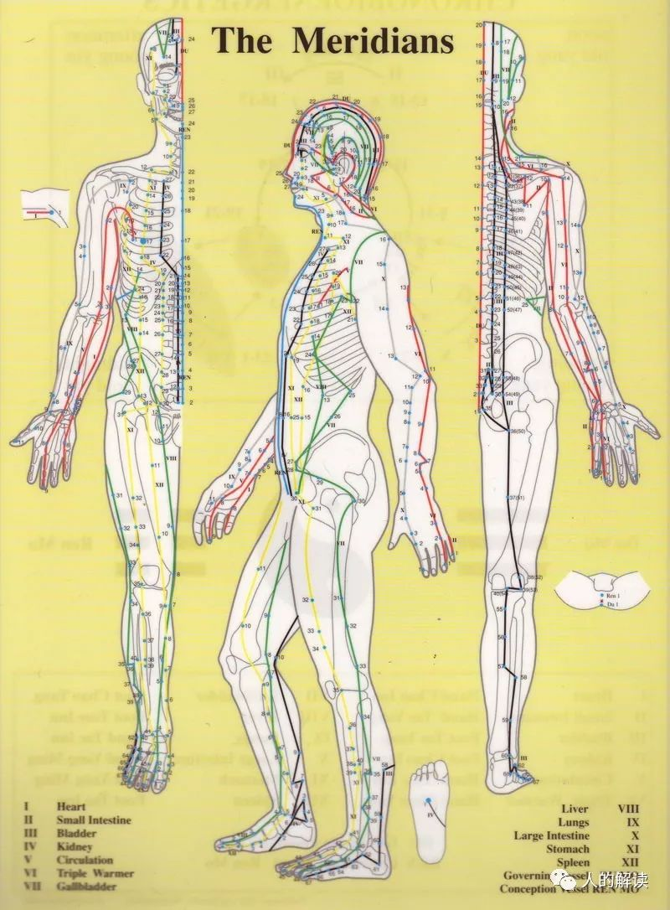

在相当的程度上，中国古人发现的经络系统，相当于是人体内**能量分布**的一个轮廓性的描述。

经络是电磁驻波形成的耗散结构，这种动态的结构需要能量的不断供应，只有**活着的人**身上有经络。经络在不断与外界交换着能量、信息，从而维持人的健康状态。

**经络**就像一条肉眼看不见的小山脉，而**穴位**就如这座小山脉上一座座肉眼看不见的小山峰，穴位的中心就是小山峰的山顶。穴位没有固定的大小，取穴位时，有可能是到了山峰，有可能还是山坡。所谓经络循行，不过是在翻过一座座山峰。

电磁波在人体这个谐振腔中，会形成驻波和驻波叠加而成的干涉图案，也就是肉眼看不到的空间结构。这种肉眼看不到的空间结构又决定了身体内和身体周围能量的空间分布。而这种能量的空间分布又反过来影响到身体的生理、生化功能，这就是经络系统功能的本质。

多种电磁波在体内形成了三维驻波，驻波的波峰则就是经穴的位置。要改变驻波结构，有两种办法：一是改变波的频率，二是改变谐振腔的边界条件（针灸的原理）。

## 经络的三大特性

### 循经感传

穴位受刺激后，感觉会沿着经络传递，而且会沿着两个方向同时传递。当有些人生病时，循经感传的线路会出现大幅度的变化。有时感传会完全离开平时的线路，直奔病灶所在的地方，叫做“气至病所”。然而血管或神经系统，即便人病入膏亡，它的路线也不会变动。

经络不是一种固定的管道，是会移动的。教科书中所画的经络图，所描写的明确位置，只是给初学者用的，是一种简化了的说明图。

### 经穴全息

某些穴位群包含着全部整体各个部位的生理、病理信息。例如，在一个小小的耳朵区域内，就有反映全身所有脏器的穴位。在鼻子、脚掌、手掌也是这样，甚至在每一个小小手指节的区域内，也可以找到反映全身所有脏器的穴位。

这就是为什么在中医里，会有头痛医脚、上病下治、左病右治的存在，这在西医里是完全不可想象的。

### 子午流注

**子午**两字，代表时间。**流注**两字，是指人体气血运动变化的状态。“流”是流动的意思，“注”是灌注的意思。

子午流注说的是，一天中的十二时辰是与人体十二经脉相对应，不同的时辰，人体气血盛衰在经络中的循行就像潮水的涨潮退潮一样有规律地变化，每个时辰都会有不同的经脉“值班”。这意味着若要健康，人的作息要遵循这样的变化规律，而且针灸、服中药其实都是有时辰讲究的。

古人把一昼夜（24小时）划分为十二个时辰，每个时辰为2小时，又用十二地支（子、丑、寅、卯、辰、巳、午、未、申、酉、戌、亥）来表示。

我国时间医学“子午流注”认为十二经脉对应着十二时辰，不同经脉中的气血在不同的时辰有盛有衰。一天中以“子午”二时最关键，故以“子午”代指十二时辰；“流注”指气血环环相扣、首尾相衔、循环有序地流动灌注全身。

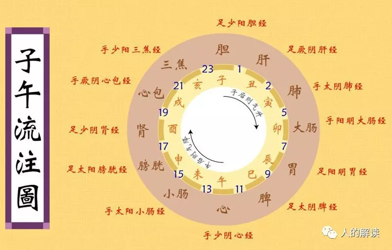

十二经脉是经络系统的主体，具有表里经脉相合，与相应脏腑络属的主要特征。

阴有三种，分别是：**太阴、厥阴、少阴**，阳有三种：分别是：**阳明、少阳、太阳**。通常说五脏六腑，六腑指**胆、胃、大肠、小肠、三焦、膀胱**。五脏指**心、肝、脾、肺、肾**，后来加上了心包一共是6个。这样脏腑加起来一共12个，每一个脏腑就对应一条经。

包括：

**手三阴经（手太阴肺经、手厥阴心包经、手少阴心经）**，

**手三阳经（手阳明大肠经、手少阳三焦经、手太阳小肠经）**，

**足三阳经（足阳明胃经、足少阳胆经、足太阳膀胱经）**，

**足三阴经（足太阴脾经、足厥阴肝经、足少阴肾经）**，

也称为“正经”。

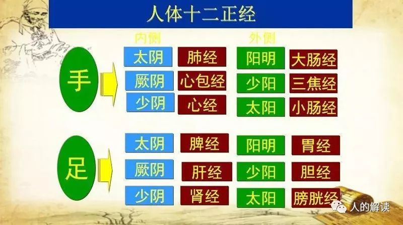

十二经脉的走向规律概括：

**手之三阴，从胸走手**；

**手之三阳，从手走头**；

**足之三阳，从头走足**；

**足之三阴，从足走腹**。

> *十二经脉的流注次序*

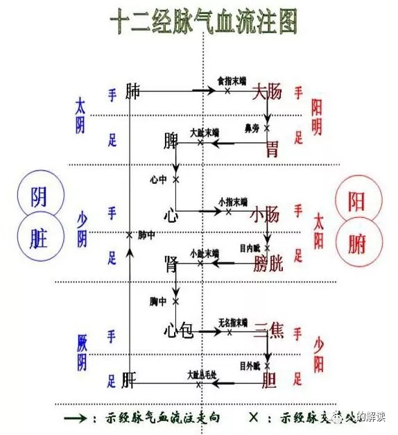

## 经络的四大系统

经络有四大系统，分别是**经脉**系统、**络脉**系统、**经别**系统、**经筋**系统。

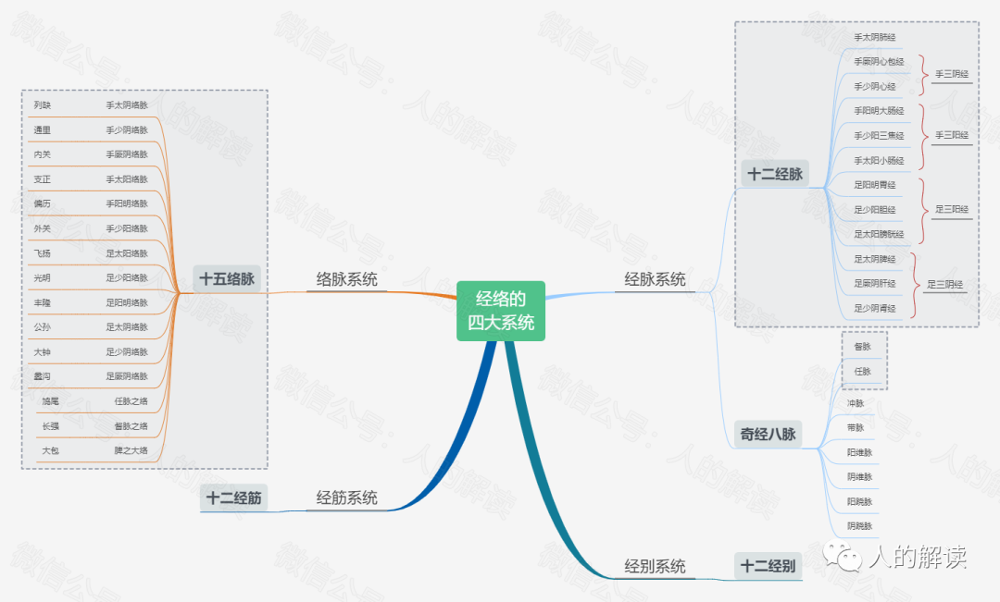

### 经脉系统

通常说的十二经络，指的就是这十二条经脉。经脉是能量通路的**主干道**，是一个连接系统，连接内部的脏腑和外部的四肢躯干。

生老病死都受经脉的影响，《内经》说，“经脉者，所以能决死生、处百病、调虚实，不可不通。”

十二经脉，这些能量通路深入体内，绝大部分路段是不可见的。《内经》说，“经脉十二者，伏行分肉之间，深而不见。”

### 络脉系统

络脉是经脉的**小分支**，前面提到经脉深而不可见，那么在表面看到的脉，就是络脉了。《内经》说，“诸脉之浮而常见者，皆络脉也。”

一般能见到的浮于体表的脉，都是络脉。

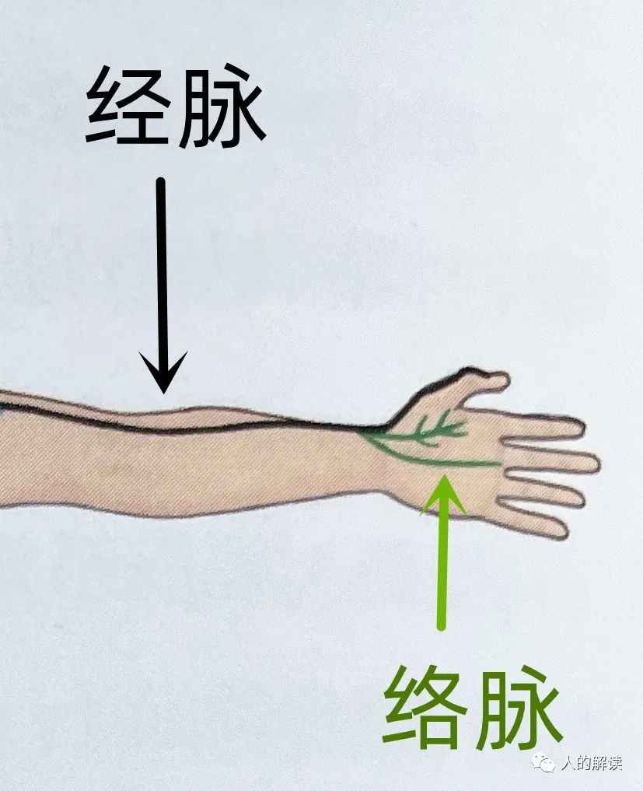

《内经》说，“经脉为里，支而横者为络，络之别者为孙。” 络的分支，称为孙络。这说明经脉是纵向，络脉为横向，纵横交错，也就成了经络，这个概念很类似地球的经纬线。

十二经脉都在四肢末梢交接循环，四肢末梢因为劳动多，容易损伤，就会损及经脉。所以四肢末梢上发展出络脉，作为经脉在四肢末梢的备用系统。

络脉循行路线短，比较直接，经过的部位也少。所有的络脉都无法经过大关节，但会循行在经脉所达不到的地方。

可以把**经脉**理解为能量通路的主干道，**络脉**为次干道，**孙络**就是小道了。

### 经别系统

**别**的含义有另外、分离的意思。经别呢，其实就是分离的、或者另外的经脉之意。就像道路有了分叉。

经别，是经脉别行深入人体腔的支脉，能弥补十二经脉所不能到达之处。经脉循行部位深且距离长，加强了与脏腑的联系，而络脉走得比较浅。可以把经别理解为能量通路的**特别通道**，确实十二经别在循行上走向独特。

要注意的是，经别也会出于体表，有所谓的“离合出入”的情况。经别就像是经脉的特使，主要帮助经脉加强与脏腑的联系，为经脉开辟了一条特别通道，这种特别通道便捷安全，可以快速直达。经别所经过的部位曝光少，受损害的概率低，这对于经脉而言也是好事。

### 经筋系统

**筋**，就是让肌肉产生力的软组织部分，可以约束骨骼，屈伸关节等。

经筋可以视为十二经脉的外周联属部分，就像电线绝缘体塑料外壳保护里面的铜线一样，经筋包裹在经脉的外层，保护着经脉。经脉不是具体的物质结构，而是通道。
 
十二经筋是联属于十二经脉的，行于体表，不入脏腑。而且循行的走向，都是从四肢末端走向头身。

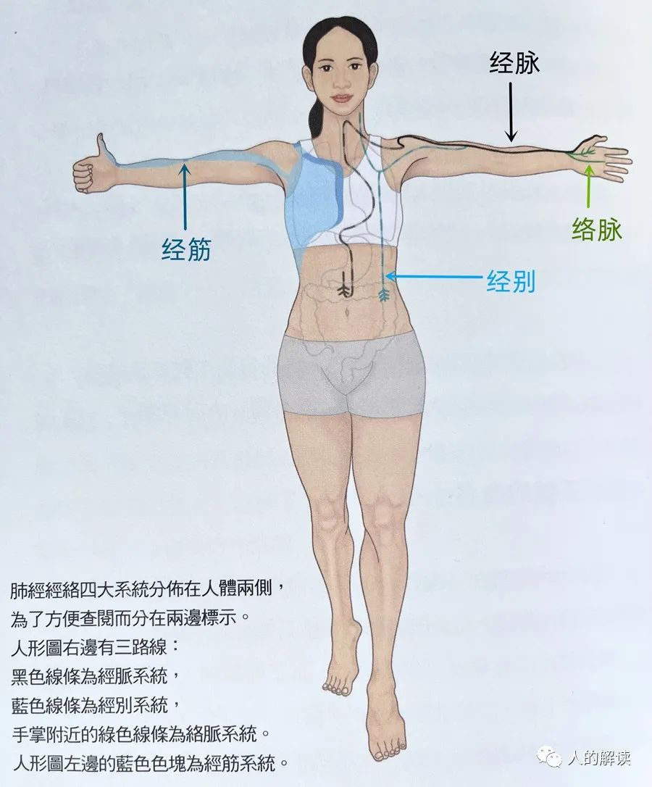

## 阴阳

十二经脉里，**阳经**一分为三，分别是**太阳、少阳、阳明**。**阴经**也一分为三，分别是**太阴、少阴、厥阴**。

三阴三阳，其实是阴气和阳气盛衰的不同阶段。

### 三阴三阳与“开阖枢”

《黄帝内经•阴阳离合论》里对三阴三阳用了**开阖枢**的说法，就像一扇门。

**太阳**就是门打开了，阳气向外发散，为三阳之表，这就是“开”。**阳明**就是门关上了，阳气蓄居于内，为三阳之里，这就是“阖”（闭合）。**少阳**介于表里之间，就像门枢纽，半开半关，这就是“枢”。

同样，三阴也是如此。**太阴为“开”，厥阴为“阖”，少阴为“枢”**。太阴是开门，厥阴是关门，少阴是中间的枢纽。 

总结一下，三阴三阳中，太阴和太阳都是开门，厥阴和阳明都是关门，少阴和少阳都是半开半关的枢纽。三阴三阳是两两对应的，可以配成三对。

开|枢|阖
---|---|---
太阳|少阳|阳明
太阴|少阴|厥阴

外/表|内/里
---|---
太阳|少阴
少阳|厥阴
阳明|太阴

> *顾式太极图*

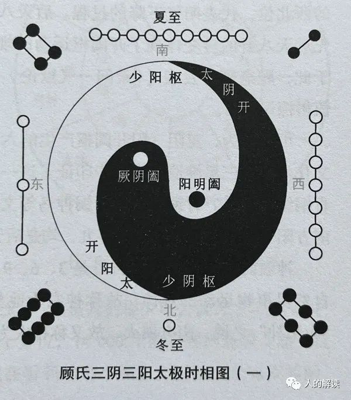

在顾式太极图里，太阳在东北方，冬至过后，正是阳气渐升时，故为阳之“开”。阳明在西北方，阳气渐收，藏合于阴，故为阳之“阖”。少阳在东南方，到夏至时，阳气盛极而阴始生，阴阳转枢于此，故为阳之“枢”。

三阴的开、阖、枢也是如此。太阴在西南方，夏至以后，阴气渐长，故为阴之“开”。厥阴在东南方，阴气渐消，并合于阳，故为阴之“阖”。少阴在西北方，到冬至时，阴气盛极而阳始生，故为阴之“枢”。

### 三阴三阳与十二经脉循行

三阴三阳开阖枢运动和十二经脉循行有关。下图为十二经脉循行图，手足少阴经和手足太阳经，这四条经脉的循行体现了少阴和太阳相表里，由阴出阳。手足厥阴经和手足少阳经，这四条经脉的循行体现了厥阴和少阳相表里，由阳入阴。同样，手足太阴和手足阳明经也体现了表里。 

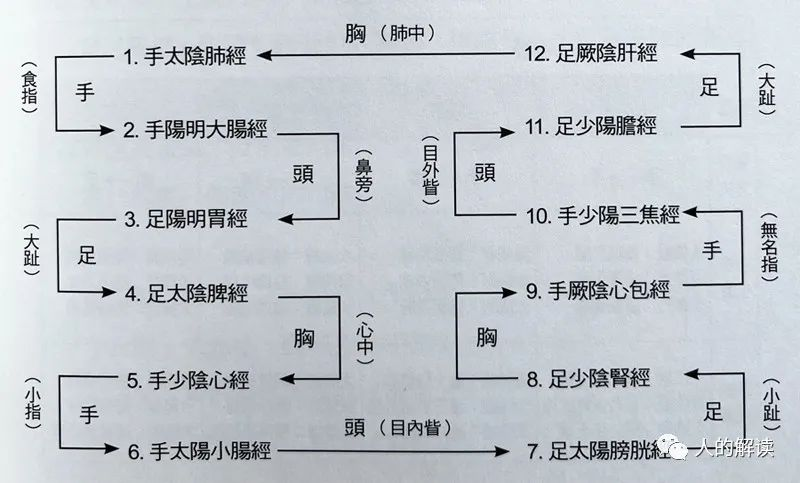

子午流注，也是开阖枢运动变化的时空节律。把顾氏太极图按十二时辰划分，看起来就像个车轮子。沿着轮子的条幅，可以从位置上把三阴三阳经和开阖枢对应起来。 

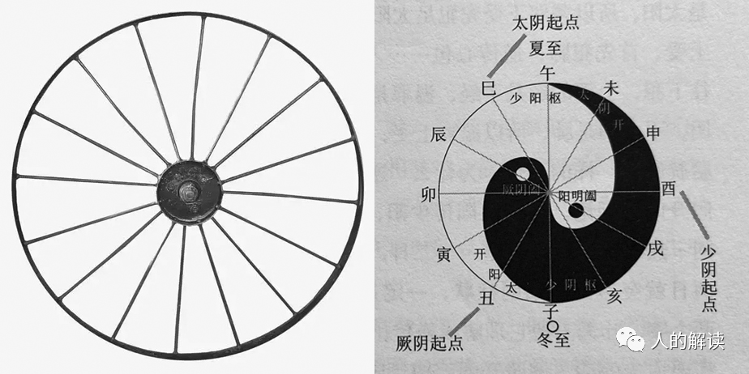

比如，手阳明大肠经和足阳明胃经，在卯时和辰时的位置，对应于阳明阖。手太阳小肠经和足太阳膀胱经，在未时和申时的位置，对应于太阳开。手少阳三焦经和足少阳胆经，在亥时和子时的位置，对应于少阳枢。 

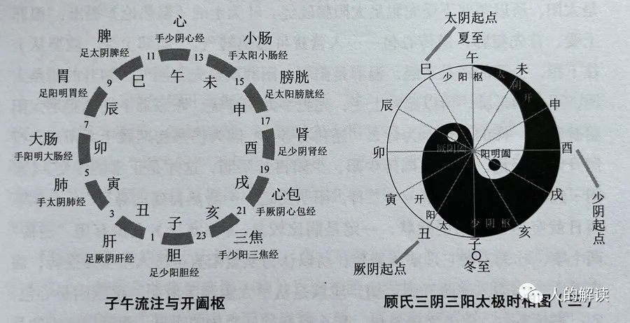

## 五行

五行中的“五”，代表的是**木、火、土、金、水**这五种元素，“行”代表的是**运行**，即五种元素的盛衰。五行学说认为，宇宙万物都是由木、火、土、金、水这五种元素的运行及变化所构成。

《尚书》中首次将五行称为水、火、木、金、土，并认为每一行都有自己的属性，称为**五性**。《尚书》说，“水曰润下，火曰炎上，木曰曲直，金曰从革，土爰稼穑”，就是对五行特性的经典概括。

水具有滋润、向下的属性；火具有发热、向上的属性；木具有柔和、生发的属性；金具有肃杀、收敛的属性；土具有生养、化育的属性。

木、火、土、金、水是五种基本物质、材料、元素，称为**五材**。《左传》说，“天生五材，民并用之，废一不可。” 意思是，天生五材，需要综合应用，不可偏废。

### 五行的运行规律

> *五行相生相克*

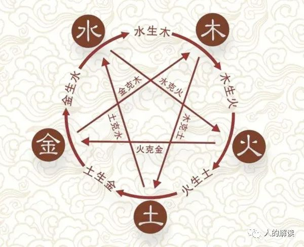

**五行相生**的规律是：**木生火，火生土，土生金，金生水，水生木**。

**五行相克**的规律是：**木克土，土克水，水克火，火克金，金克木**。

五行的运行规律，其实是五种能量系统的交互，可以投射到万事万物。

比如在天为五星（木星、火星、土星、金星、水星），在地为五行（木、火、土、金、水），在色为五色（青、赤、黄、白、黑），在音为五音（角、徵、商、宫、羽），在味为五味（酸、苦、甘、辛、咸），在人为五脏（肝、心、脾、肺、肾）。另外，还有五方、五季、五时、五气、五化、五体、五窍、五津、五德等等。 

> *中医阴阳五行图解*

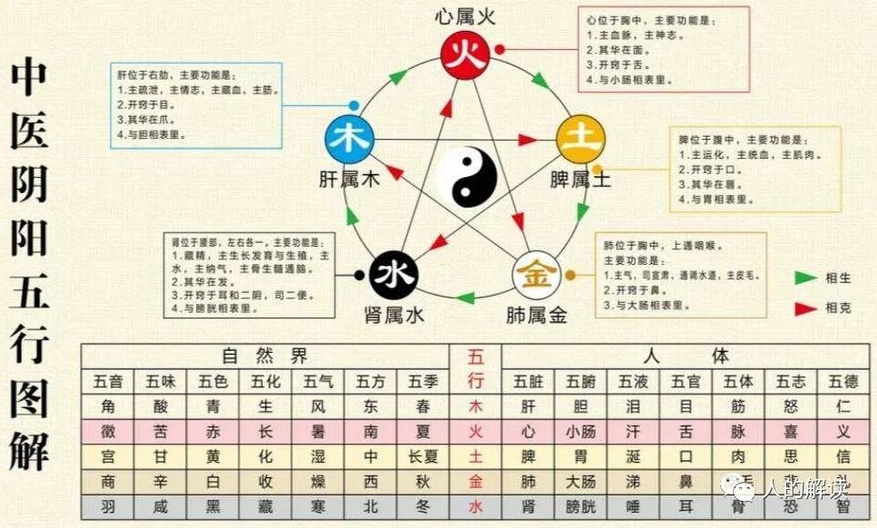

### 五脏六腑

五脏六腑是中医藏象学说里非常核心的一个点，**五脏**指**肝、心、脾、肺、肾**的总称，**六腑**指**胆、小肠、胃、大肠、膀胱、三焦**的总称。

> *五脏六腑*

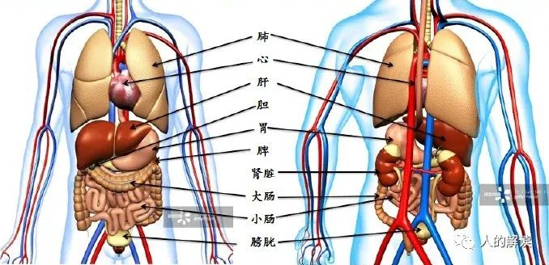

五脏从形象上看，属于**实体性**器官，功能上负责储藏人体的气血、精气等。六腑从形象上看，属于**腔体性**器官，功能上负责食物的收纳、吸收、排泄等。 

五脏深居于身体的中心部位，在阴阳特质方面**属阴，属里**。六腑相较于五脏，居于身体比较周边浅层的部位，因此**属阳，属表**。五脏六腑互为表里，即肝与胆，心与小肠，脾与胃，肺与大肠，肾与膀胱，从而建立了各自的**表里关系**。

> *五脏六腑的阴阳属性*

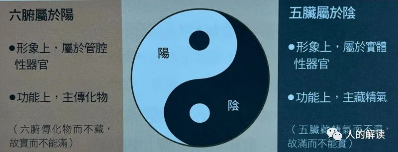

> *五脏六腑的表里关系*

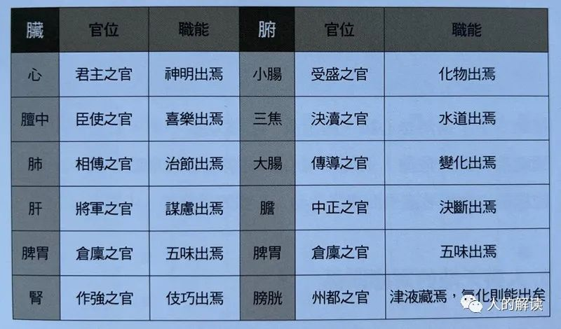

人体内脏的变化会通过外在的“象”表现出来。比如：

**心**，其华在**面**，其充在**血脉**。华有荣华外露的意思，充是充养的意思。就是说心脏的功能状态可以通过面部是红润还是枯萎表现出来。如果一个人面部肌肤红润有光泽，表明这个人心气足，血气充盈。

**肺**，其华在**毛**，其充在**皮**。这说明，肺与皮肤、毫毛的润泽有关。如果肺功能正常，则皮肤健康、毫毛光泽。
 
**肾**，其华在**发**，其充在**骨**。所以毛发的生长与脱落、润泽与枯槁，可以反映出人体肾气是否充足。肾气旺盛，那么骨髓就充实，骨骼就强壮，运动就健康。 

**肝**，其华在**爪**，其充在**筋**。如果疲劳过度就损伤筋，损伤肝。爪为筋之余，指甲的枯荣可以反映肝血的盛衰。如果指甲颜色苍白，往往说明有贫血或营养不良，指甲根部的月牙，又称半月痕，如果大小适中呈灰白色，就是健康的，如果没有半月痕，多是气血不足的表现。

**脾**，其华在**唇四白**，其充在**肌**。可以通过唇四白和肌肉是否丰厚来了解脾胃状况。唇四白是嘴唇周围一圈黄白无毛的部位，大约一毫米宽。如果唇四白不明显了，那么脾胃功能衰退，如果唇四白颜色干黄，说明脾胃衰退严重。脾胃不好，就不想吃东西，最后面黄肌瘦。

#### 五脏与五味

《内经》将食物的味道分为酸、苦、甘、辛、咸五种，分别对应肝、心、脾、肺、肾五脏。

**心喜苦，肺喜辣，肝喜酸，脾喜甜，肾喜咸**，这就是五味与五脏的对应关系，关键是要适度。

- 过多食用咸味食物，会让本来红润的脸色变得发黑或者过度发红；
- 过多食用苦味食物，会使皮肤枯槁、不自然，而且毫毛（汗毛）脱落；
- 过多食用辣味食物，会使筋拘挛而不柔软，指甲干枯而不坚韧；
- 过多食用酸味食物，会使肌肉坚硬皱缩而失去弹性，口唇干裂；
- 过多食用甜味食物，会使骨骼疼痛而头发脱落。 

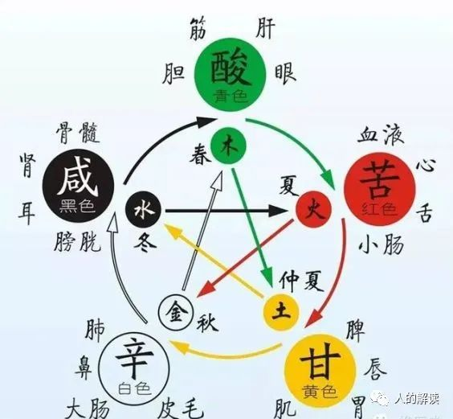

#### 五脏与五色、五气

五色和五脏也是相对应的，白色合于肺，赤色合于心，青色合于肝，黄色合于脾，黑色合于肾，这又是五行应用的体现。

五行是个纽带，将颜色（五色）、味道（五味）、生化（五化）或称所主等纳入其中，有机统一起来。人体五脏化生出五气，生发出喜怒悲忧恐五种情志活动，同样情志的变化也会伤及气，进而伤到五脏。**怒伤肝、喜伤心，思伤脾，悲伤肺，恐伤肾**。所以，怒气直接影响着肝。过分兴奋、大喜过望会影响到我们的心。思虑过度会影响到脾。悲伤容易导致精气神消耗，首先伤到肺。恐惧时，人的气往下走，首先影响到肾。

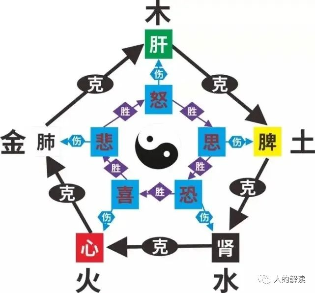