## 人体辉光场（Auric levels）

在芭芭拉·安·布蓝能（Barbara Ann Brennan）的人类能量意识系统中，人体有**7层**辉光场。Guy Steven Needler（盖伊·斯蒂文·尼德勒）扩展到**10层**。

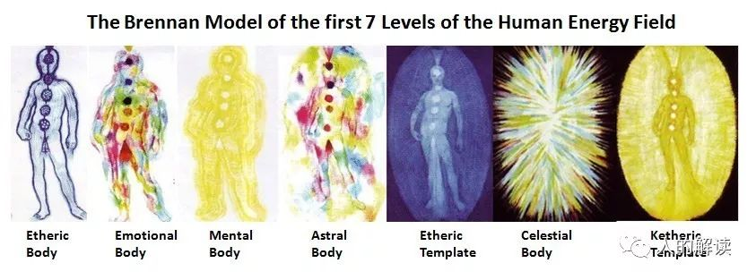

人类身体载具被设计成适应10个频率层级，对应身体载具的10个辉光场。各层级如下：

层级|名称|说明|所在频率层级|扩展尺寸|外观|作用
---|---|---|---|---|---|---
1|以太体（Etheric Body）||物理|0.6~5厘米|精细的蓝色能量线网格|肉体的能量矩阵或模板
2|情绪体（Emotional Body）||物理|2.5~7.6厘米|彩色云状，持续流动|显示情绪或爱、喜悦、愤怒等感觉并允许其沟通
3|心智体（Mental Body）||物理|7.6~20厘米|结构化的明亮黄光，从身体的头部和肩膀散发出来|包含思想与想法的结构
4|星光体（Astral Body）||灵性物理、非纯粹能量、星光层|15~30厘米|不定形的彩色云朵，带有玫瑰色光芒|灵性能量和物质能量的相互转化，展示两个人之间的爱
5|以太模板（Etheric Template）|以太体的模板|灵性物理、非纯粹能量、星光层|45~60厘米|犹如钴蓝色线条组成的蓝色照片底片|以太体的蓝图或完美形式
6|天光体（Celestial Body）|情绪体的模板|灵性物理、非纯粹能量、星光层|60~82.5厘米|蜡笔画般的彩色光芒，带有金银色光泽|无条件爱之交流，与神合一
7|因果模板（Causal Template）|心智体的模板|灵性物理、非纯粹能量、星光层|75~105厘米|呈现蛋形，由晶莹细光线组成的高度结构化的矩阵，显示出肉体与所有脉轮结构|转世生命和生命蓝图的积累，将所有的辉光场连接在一起
8~10|名称未确认||灵性、纯粹能量||毛丝般的结构，越高层越精细，最终以至于无结构|与真正的、全然的能量自我的沟通和连接

人体辉光场**同时**占据着同一个空间位置，层层相互嵌套，每层都向外扩展，超过前一个场。

#### 辉光场的大小

人体辉光场的大小和人的健康状况有关。健康的人，辉光场可以从身体往外延伸60~180厘米，长期疲倦的人的辉光场会粘附在皮肤上。

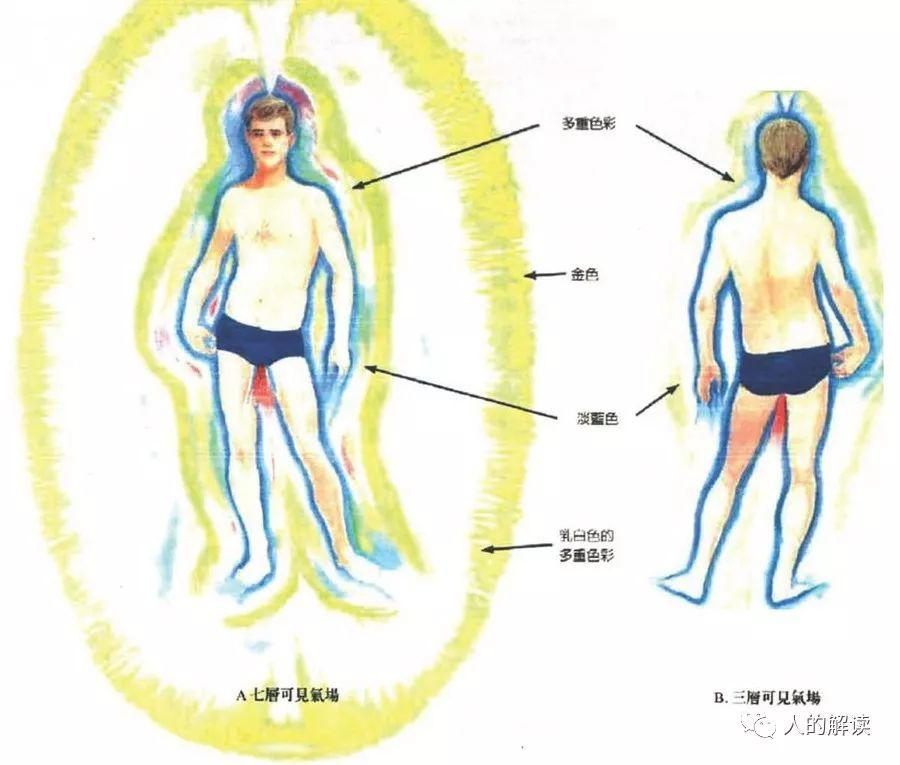

#### 辉光场奇数层和偶数层

辉光场的奇数层是**结构层**，偶数层则是**非结构层**。

第1、3、5、7层都有一个明确的结构，是坚固的、闪烁的光结构场。

第2、4、6层没有特定的结构，充满了无形的物质/能量，它们所呈现的形态受到其所流经的奇数层结构的情况影响。

第2层就像气态物质，第4层像液体，而第6层就像蜡烛火焰周围的漫射光。

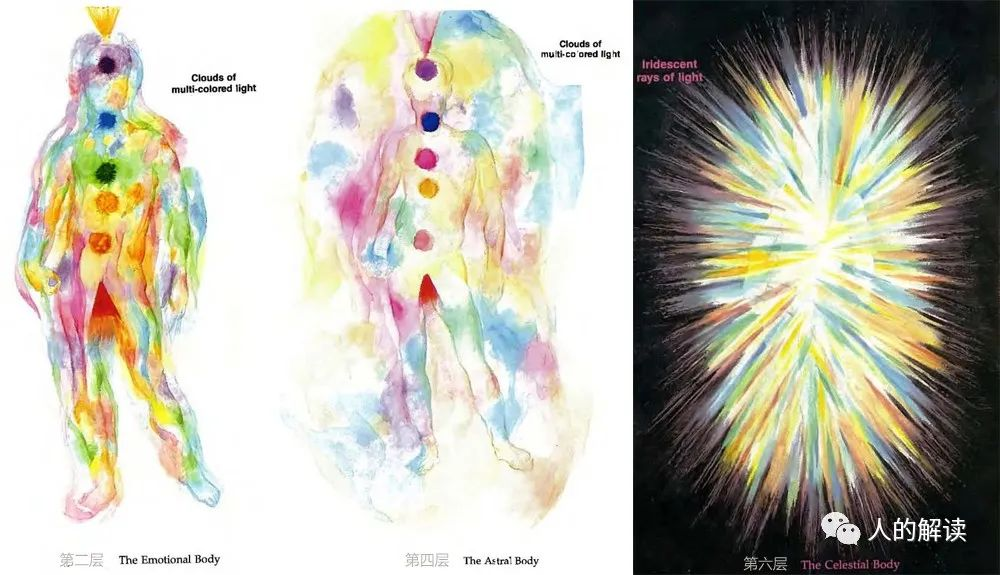

#### 辉光场与脉轮

七个脉轮的每一个脉轮都有七层，脉轮的每一层也都对应着一层辉光场。脉轮在每一层的长相皆不同。

**每一层辉光场有属于自己的一组七个主要脉轮**。由于每一层的振动频率都比其下一层高，因此同一个脉轮可以在不同层套叠存在。

## 第一层：以太体（The Etheric Body）

这里使用了**以太（ether）**的概念，最早提出这个概念的是亚里士多德，他认为世界由五种元素组成，分别是水、火、土、空气、以太，前四者组成了地球，而以太则充斥在整个宇宙之间。

以太体，是由闪烁的微小的能量线所组成，是一种网格状结构。以太体的网格状结构不断运动着。通过灵视能力可以看到，蓝白色光的火花沿着遍布于整个身体的能量线移动。以太体有规律地跳动着，大概每分钟15~20个循环。

以太体的范围，从身体扩展出去约0.6~5厘米。

以太体具有与身体相同的构造，包括所有物质肉体的结构和全部的器官。肉体组织之所以存在，是因为有维持生命所必须的能量场支持着。也就是说先有以太体，再有的物质身体，**以太体是物质身体的模板**。

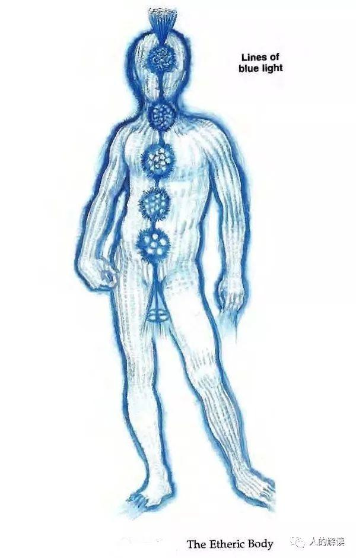

#### 以太体的结构：与肉体器官对应

肉体的每一部分都有对应的以太体部分，比如有以太肝、以太肾、以太子宫等等，这些器官也是由这种闪烁的蓝光所形塑成。即便肉体的器官切除了，但以太器官仍然存在。如果切除了某个器官，我们在以太层可以重建这个器官，让辉光场继续顺畅地运作。

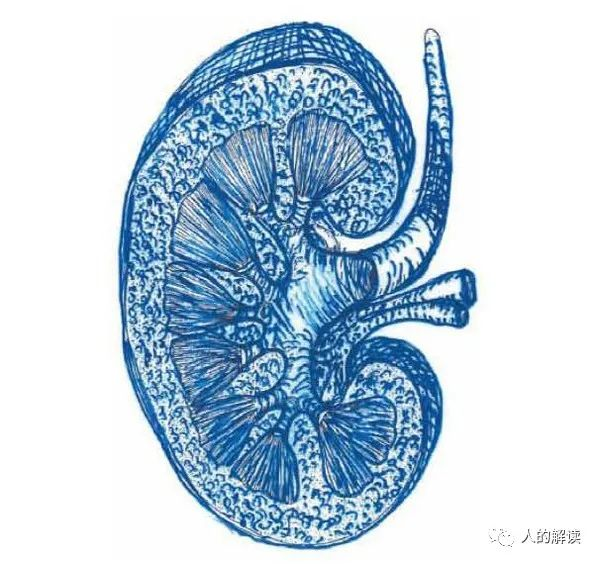

#### 以太体的颜色：从淡蓝色到灰色

以太体的颜色从淡蓝色到灰色不等。相较于灰色，淡蓝色表示它已与一种更精微的形态连结。一个较为敏感的人，往往以太体会带点儿蓝色；强壮粗犷的人，以太体是厚而粗糙的，呈深蓝灰色。你与身体连接的越多，越是经常锻炼身体，以太体就会更强壮更发达。运动员和练舞者的以太体，通常会非常发达，能量线更多、更厚、更有弹性，带更多能量，呈亮蓝色。

这一层所有脉轮的颜色与该层辉光场的颜色相同，也介于蓝色到灰色之间。脉轮看起来象是以光网制成的漩涡，就像以太体的其余部分一样。可以从以太体感知身体的所有器官，这些器官也是由这种闪烁的蓝光所塑成的。

#### 以太体与肉体感觉

**幻肢效应**，就是截肢之后，还是会在那一区域感觉到疼痛，其实肉体上的肢体已经不再存在了。这正是以太体的作用。

以太体使五种感觉（视觉、触觉、味觉、听觉、嗅觉）运作，让我们来体验物质世界。在以太体中，你能体验到所有的肉体感觉，无论痛苦还是愉悦。以太体的能量流动、场脉动和结构，与肉体感觉之间有直接的联系。无论身体哪里疼痛，都与以太体的功能失调直接关联。如果你渴了，正是通过以太体知道的。由于能量场的一切都可以从频率角度来看待，当你口渴时，以太体在水的频率上会变低。换言之，以太体缺乏水的频率时，就会带来口渴的感觉。

在局部麻醉的情况下，比如让你的手指麻木以便手术，这是因为麻醉会阻止沿着手指神经传感的流动。当能量流恢复时，你就能再次恢复感觉。麻木不仅体现在肉体层，麻木同样与以太体的线条没有能量流相关。

当以太体能量降低时，比如由于大量活动导致脉动减慢，能量线也会变得迟钝。能量场的这一改变，将引起“疲倦”的体验。就这样，以太体不断告诉你如何照顾身体。它告诉你什么时候需要运动、睡眠、食物等。感觉良好、健康、充满活力，则对应于以太体的充能、平衡和一致性。以太体与我们的肉体和肉体感官功能有关。以太体的需求是享受健康的肉体，以及所有美妙的感官感受。

#### 以太体与健康

如果以太体很强壮，肉体就会非常强壮而健康，你会享受肉体相关所有愉快的感觉。例如，你会享受你的身体活力、肉体活动、肢体接触、性和睡眠的乐趣，还包括味觉、嗅觉、听觉和视觉乐趣。也就是说，你很可能会继续使用以太体的所有功能，从而保持它的充能和健康。

如果不好好照顾你的肉体，以太体也会虚弱，以太体光线断裂、缠结或者充能不足。在受照顾不够的部位，以太体光线会更薄、更稀疏。如果你的以太体很虚弱，肉体也会虚弱，并且你无法拥有与之相关的感官愉悦。然后因为缺乏使用，它就一直虚弱。例如，你可能讨厌任何形式的身体运动。你可能喜欢吃，但不喜欢被触碰。你可能喜欢听音乐，但不喜欢摄入饮食来保持身体的运转。

当疾病发生之前，以太体的光线就已损坏了。当肉体受伤时，这些光线也会损坏。通过布蓝能疗愈技术重构破损、散脱或扭曲的光线，受伤或生病器官就能更快地恢复健康。经过疗愈修复后，患者能够保持健康多久取决于许多因素，比如身体和能量场（HEF）的健康程度、患者HEF能够处理的能量有多少、患者是否做好准备要改变，以及疗愈师的个人能力等。

以太体与肉体的状况最密切相关，是所有能量疗法施行的基础。当我们接受**针灸、声音疗法、芳香疗法、水晶疗法、灵气（Reiki）**，它们的主要影响也是在以太体上。

## 第二层：情绪体（The Emotional Body）

第二层辉光体，是以太体之外更精微的结构，通常被称为情绪体，与感觉相关联。情绪体大致依循着身体的轮廓，其结构比以太体易变，没有复制肉体的结构。

情绪体似乎更像是不断流动着的、由精微物质构成的彩色云朵。在一般情况下，情绪体看起来是在以太体基质中移动的彩色团块，不过也比以太体更往外扩展一些。有时一个人可以将能量色彩团块丢入他周围的空气中。

情绪体的范围，从身体扩展出去约2.5~7.6厘米。

情绪体的颜色从艳丽清晰的色调到黑暗混浊都有，取决于制造它们的能量或情感是清晰还是混乱的。清晰与能量充沛的情感，譬如爱、兴奋、喜悦或愤怒是明亮清楚的；困惑的情感则是暗沉且混浊的。

情绪体就像七彩云一样，包含彩虹的所有颜色。每个脉轮看上去像是颜色各不相同的漩涡，依循着彩虹的色彩排列。以下列出情绪体脉轮的颜色：

脉轮|颜色
---|---
顶轮|紫白
眉心轮|靛蓝
喉轮|天空蓝
心轮|明亮的草绿
太阳轮|黄
腹轮|红橙
海底轮|红

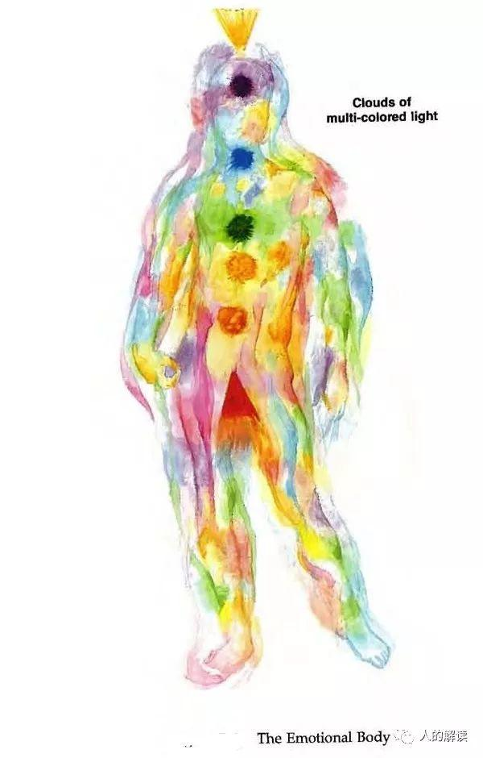

#### 情绪体的功能：对自我的感觉

情绪体对自我的感觉或情绪有关。情绪体中每种能量运动都与对自我的感觉相关。明亮的云状能量对应着自己的正面感觉。灰暗较脏的阴影则对应着自己的负面感觉。

如果你允许“对自己的情绪”流动，不管是正面还是负面的，那么能量场就会保持平衡，关于自我的负面感觉和负面能量将会释放和转化。

如果你阻止感受“对自己的情绪”，你就阻止了与这些情绪相对应的能量流。情绪体将变得凝滞，最终导致能量不足、灰暗变脏的各种颜色云团，它们对应着未体验的关于自我的各种感觉。

#### 情绪体的需求：自爱

情绪体的需求是**自我接纳和自爱**。一般在这层辉光场上的大问题是：不喜欢自己、自我拒绝，甚至自我仇恨。所以你要逐一消除它们，用正面感觉有意识地取代那些负面感觉。写下一些对自己有正面感觉的肯定语，每天练习几次。甚至可以贴在你能看到的地方，例如床头、冰箱或浴室镜子上。

一些正面肯定用语：

- 我爱我自己。
- 我爱不完美的自己。
- 我是坚强、有创造力以及有爱的人。 
- 我爱我的伴侣、孩子、家庭和动物。 
- 我接受我为自己创造的生活，我有能力改变我不喜欢的部分。 
- 我可以继续爱那些我强烈不认同的人，但也不会强迫自己去认同或假装认同而背叛自己。 
- 我是一束美丽、闪耀的光。 
- 我充满了爱。 

这些小小的提醒，可以帮助你建立一个非常积极的自我态度。

## 第三层：心智体（The Mental Body）

第三层辉光场是心智体，这层辉光场在情绪体之外，由更精微的物质所组成，皆与**思想和心智过程**相关。

这层辉光场通常会显现出明亮的黄色光芒，从头部和肩膀放射出来并扩展围绕着全身。当人专注于心智过程时，它会扩展和变得更明亮。

心智体的范围，从身体扩展出去约7.6~20厘米。心智体也是一个**结构化**的辉光场，它包含了我们的思想结构。

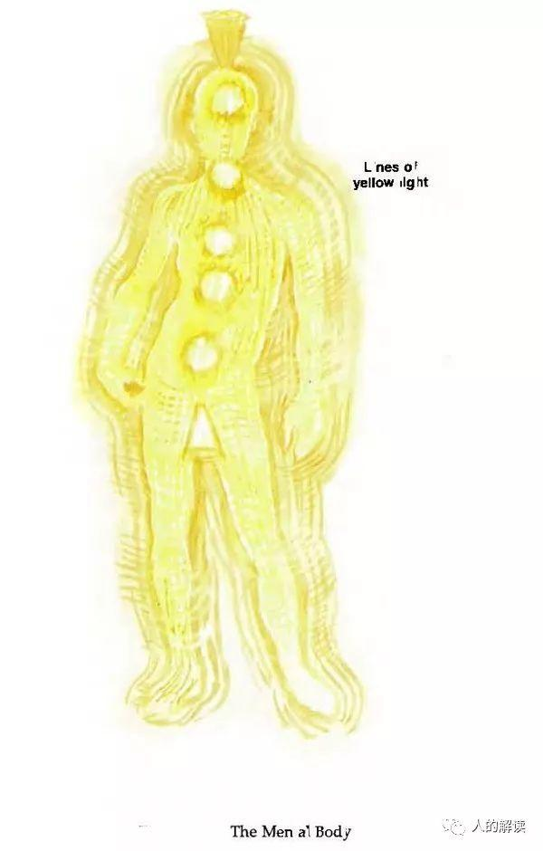

#### 心智体的结构：像最细薄的面纱

七层辉光场（辉光场）的偶数层和奇数层差异很大。奇数层是坚固的、闪烁的光结构场。偶数层则充满了无形的物质/能量。

心智体是第三层，也是一个结构化的辉光场，它包含了我们的思想结构。心智体有坚固的光结构，这层的结构线非常纤细精致，就像最细薄的面纱。这层能量光线是浅柠檬黄，以非常高的频率振动着。它的亮度、充盈度以及沿着光线的能量流，对应着我们的心智过程和头脑思维状态。

#### 心智体的颜色：黄色光芒

前面讲到，以太体主要是蓝色。心智体，主要是黄色的。心智体通常会显现出明亮的黄色光芒，从头部和肩膀放射出来并扩展围绕着全身。当人专注于心智过程时，它会扩展和变得更明亮。

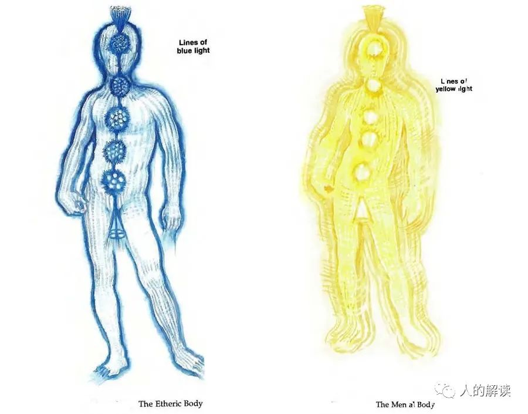

在心智体可以看到思想团块（thought forms），由不同的亮度和形状构成。这些思想团块上还会有附加的其他颜色，这些颜色是从情绪体产生的。颜色代表人的情感并且会与其思想团块相连结。

#### 心智体的功能：思想世界

心智体与我们的心智或理性世界（mental or rational world）有关。我们需要理性的清晰感，并与直觉和谐运转。心脏是主要的直觉中心，外界输入的信息会首先影响心脏，然后透过心脏来影响头脑和身体的其他部位。思想越是清晰和成形，与此思想相关的思想团块（thought forms）便越清晰与成形。我们透过专注于某个想法，强化这些思想团块，惯性思维会变成威力强大的成形力量，进而影响我们的人生。

#### 心智体的平衡与健康

当心智体平衡且健康时，理性和直觉的头脑会协同工作、和谐如一体，我们便拥有清晰、平衡和适宜感。当我们辉光场的前三层（以太体、情绪体、心智体）同步时，我们会感受到自我接纳、安全、适度，并感到个人力量。

如果你的心智体强大有能量，你的头脑将强健而清晰，能够为你服务得很好。你的精神生活将积极而健康，你也会乐于学习。如果你的心智体虚弱无能量，你将缺乏思维敏捷性或清晰度，并且有可能对学术或其他知识追求缺乏兴趣。

当心智体能量场僵硬、缺乏弹性，会由柠檬黄变为琥珀色，会不允许其他层面上的信息健康流入，心智体会因此变得孤立。这种过于僵硬的结果是思想狭隘，与更广阔的活力面向截然切断。

另一方面，心智体可能变成极浅的黄色，很脆弱，过于柔性，太容易被其他辉光场层影响，尤其是被情绪体所影响。如此一来，会难以区分什么是当下被夸大的感觉，什么是长期现实。

当思想消极负面的时候，心智体的脉动会变慢，线条变暗并扭曲。这些“负面思想形式”对应着我们习惯性的负面思维过程。

## 第四层：星光体（The Astral Body）

星光体，是没有固定形状的，由更美丽的色彩云状物所组成。星光体的颜色往往和情绪体是同一组，不过这些颜色通常还会渗入**玫瑰色**的爱之光。脉轮是和情绪体相同的彩虹颜色，但每一个都浸染着玫瑰色的爱之光。一个有爱心的人，心轮在星光层满是玫瑰色的光。

星光体的范围，从身体扩展出去约15~30厘米。

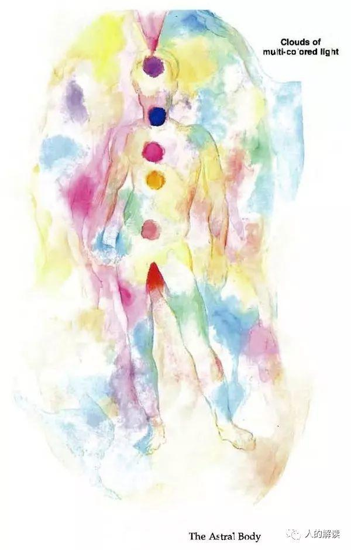

#### 星光体的结构: 像彩色液体

七层辉光场的偶数层和奇数层差异很大。奇数层是坚固的、闪烁的光结构场。偶数层则充满了无形的物质/能量。第二层（情绪体）就像气态物质。第四层（星光体）像液体。

情绪体像彩色云团，星光体更像彩色液体，它也包含了所有的颜色。星光体的能量似乎比情绪体的能量要稠密，它的振动频率更高。

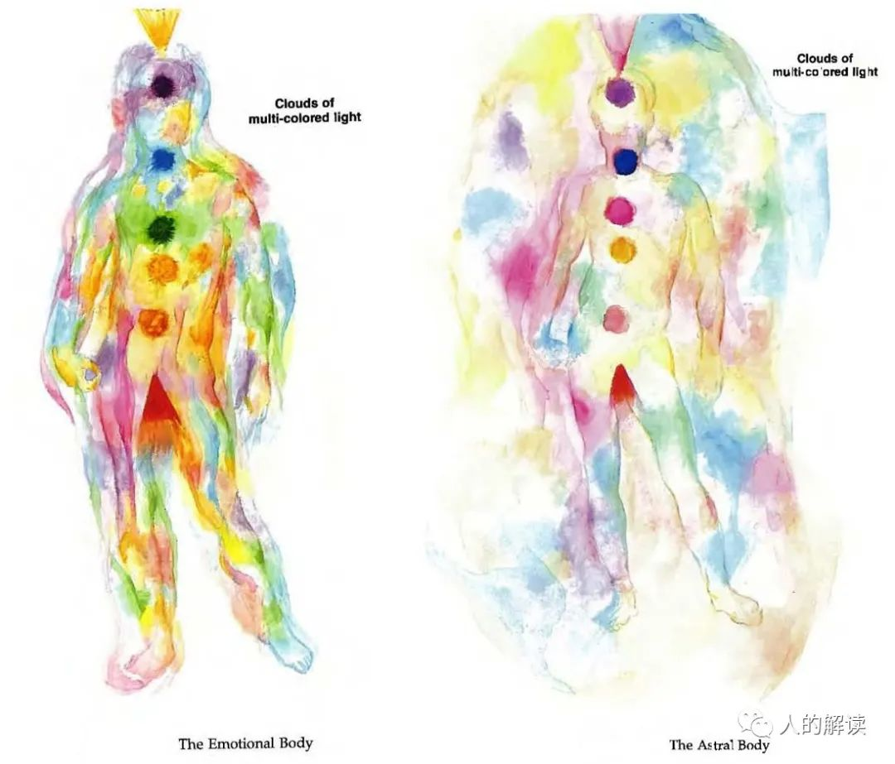

#### 星光体的功能：万物互联

超感知（HSP）开启后，会看到一整个相互连通的世界，全世界的人都通过星光体连接在一起。

星光体承载着我们的整个关系世界。在这一层，我们与他人、动物、植物、无生命的物体、地球、太阳、恒星和整个宇宙互动。也就是说，我们与人(或人群)、动物、植物、矿物和地球的之间互动的能量关系，都在星光体。

星光体是我们对一切众生创造和表达爱的层级，是爱的桥梁。星光体包含了关系中所有的爱和欢乐，以及所有的冲突和痛苦。我们在星光体的需求是在各种关系中爱和被爱，例如朋友、家人、同事等。也就是说，我们需要与朋友和家人进行有爱的互动。

#### 星光体的互动：人与人的辉光场交互

在星光体层，有三种主要的“场交互”模式。

- 人们辉光场之间频率的谐波感应；
- 场与场之间流动的生物等离子体流；
- 个体脉轮之间相互连接的光带(能量带)。

以上每种类型的辉光场交互，有正面的，也有负面的。

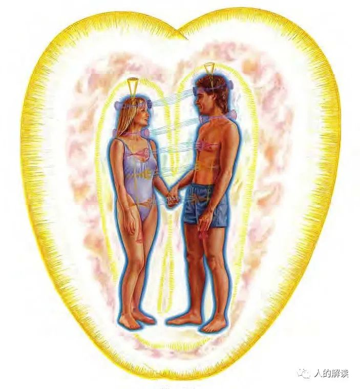

在互动中，不同的情绪状态会产生不同的能量颜色和能量形态。

情绪|能量颜色|能量形态
---|---|---
爱|玫瑰色|在柔波中流动
嫉妒|灰绿色|粘滑
激情|玫瑰色、橘色|刺激的效果，波动会更快，波峰更高
愤怒|深红色|粗粝、尖锐、锋利、穿透性、侵略性
恐惧|灰白色|尖锐突出
悲伤|深灰色|沉重的

#### 星光体与健康

如果星光体能量不足，或者能量呈现疗愈师所称的低频振动，此能量将会被体验为黑暗、浓稠、沉重的液体状态，叫做辉光场粘液（auric mucus），就像感冒时体内积累的粘液一样。这种粘液对肉体的负面影响非常强，会引起疼痛、不适、沉重感、疲惫感，最终导致生病。

如果你的星光体强壮、健康、充满能量，你会倾向于与他人建立诸多良好的人际关系。你的朋友和家人将会成为你生活中重要的一部分。你可能喜欢与许多人在一起，可能从事人类服务事业。爱和心灵在你的生命中是最重要的。

## 第五层：以太模板（The Etheric Template Body）

辉光场的第五层称为以太模板，因为它包含了所有物质界存在形态的蓝图或模板。也就是说，它看起来有点像底片一样。

**以太体是肉体的模板，而以太模板则是以太体的模板**。以太体的结构源自以太模板，它提供以太体取用的蓝图或完美形态。

以太模板的范围，从身体扩展出去约45~60厘米，看起来像一个狭窄的椭圆形，包含了整个能量场的结构，包括脉轮、身体器官和身体形态（四肢等）皆为负片形式。

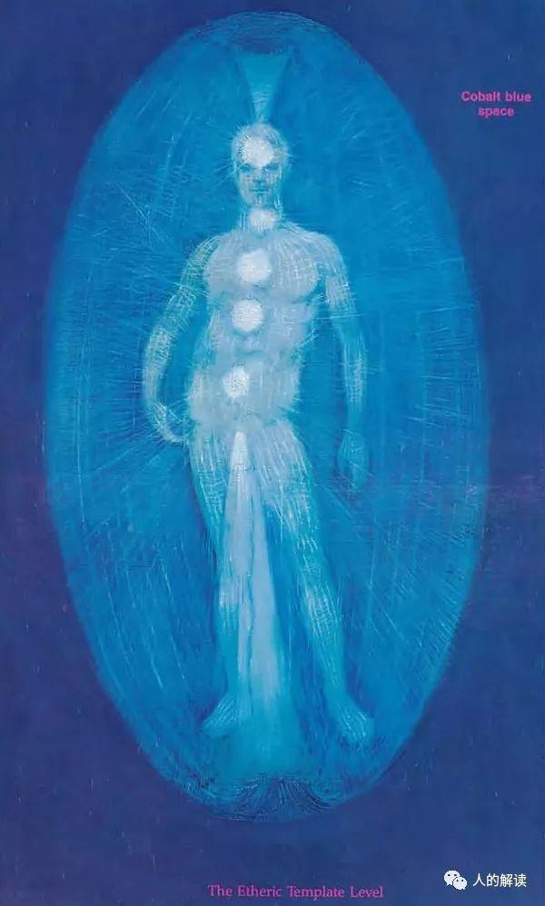

7层辉光场中，上3层是下3层的模板。

- 第7层（因果模板）是第3层（心智体）的模板；
- 第6层（天光体）是第2层（情绪体）的模板；
- 第5层（以太模板）是第1层（以太体）的模板。

每一个高层都为相应的低层提供了一个模式。

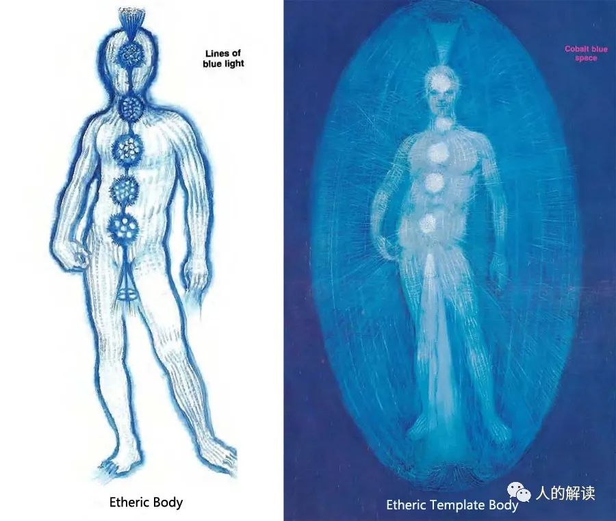

#### 以太模板的结构：似照相底片

辉光场的**奇数层是结构层，偶数层则是非结构层**。第一层（以太体）和第五层（以太模板）都有一个明确的结构，是坚固的、闪烁的光结构场。在以太模板层，一切都是反转的。你认为是实体的地方，其实是空的或透明能量线组成的。你以为是空的地方，其实是钴蓝色实体。

因为第五层（以太模板）是第一层（以太体）的模板，你可以把第五层想象成是一些空槽或凹槽，而第一层的每条蓝光线都完美嵌入其中。第五层固定着第一层的位置。这就好像空间里充满了无形、无差别的生命。为了让生命以一种特定的形态出现，有必要先为它腾出空间。第五层不仅包含了身体的形态，还包含了所有其它生命形式。通过灵视（超视觉）可看到，以太体模板层是以清晰或透明的线条、背景为钴蓝色的形式所显现，与建筑师所绘蓝图十分相像，只是这个蓝图存在于另一个振动层级。

以太模板层创造了一个空的或负空间，使辉光场的第一层（以太体）可以存在其中。以太模板是以太体的模板，然后形成网格状结构，身体得以依此结构成长。因此，以太模板层包含了所有存在于物质层级中的形状和形态，只不过它们都还只是模板而已。这些形态以负空间的形式存在，创造一个空的空间让以太网格状结构在其中生长，而所有物质界的物质皆是根据此结构显化。

#### 以太模板的功能：找到你的人生使命

生病时以太体会损毁变形，当疾病发生之前，以太体的光线就已损坏，而且当肉体受伤时，这些光线也会损坏。以太模板的工作就是在其原始模板的形式中，提供支持以太体所需。它是声音创造物质的层面，在这个层面上运用声音疗愈是最有效的。

以太模板与创作过程中语言的力量相关，是物质层所有形式的模板。在这一层，所讲的语言会创造出物质界中的形式。如果你表达真实，你会在生活中创造出真相和清晰。如果你表达不真实，就会在生活中创造出扭曲。以太模板的需求，就是**真实表达**，并生活在我们的真相中。

以太模板也是神圣意志层。**神圣意志（divine will）**是人类和宇宙伟大进化计划的模板或模式。这个模板是活的，并且在不断演化。它有一种强大的、几乎不可阻挡的意志和目的感，体验它就是体验完美的秩序。这种神圣意志存在于你之内和你周围。你拥有**自由意志（free Will）**去选择，是否将自己与此神圣意志对准。
 
每时每刻我们的挑战是，**如何让自由意志的选择服务于内在神圣意志**。我们有多大程度自由地选择内在神圣意志，就有多大程度表达并听从了真我。

神圣意志让我们去做的，并不总是最容易的事，很多时候是很难的。人生使命与当下目标是同步的，它们全息式地连接在一起。任何时刻你想完成的事，直接与你人生的伟大使命相连接。也许看起来不总是如此，但确实是。

#### 以太模板与健康：与神圣意志对准

如果你与神圣意志对准，你的以太模板会强大、充满能量。你会感受到强大的力量，并与周围一切相连接，因为你带着自己的目标、处在自己的位置上，并与所有位置和目标同步。

如果你未与神圣意志对准，你的以太模板将会扭曲：它将不符合伟大的宇宙模式，而你则感觉不到与周围事物的连接。你不知道自己在宇宙计划中的位置或目的。而且，所谓的“宇宙计划”这件事对你来说可能毫无意义。你可能会否认或反抗清晰、秩序、位置的重要性。

如果你的以太模板很强大，你在生活中就是理解并维持秩序的那类人。每事每物各有其位、各在其位。你的房子会很整洁，你会守时，而且你的工作做得很好，不管它有多复杂。你的自由意志运作得很好，并与神圣意志相一致，无论你是否听说过神圣意志。你会把秩序作为一个宇宙原则来看待。你可能已经与生命中更大的目标或模式连接在一起。

如果以太模板不强壮，你在生活中就会缺乏秩序。你对保持干净整洁不感兴趣。你甚至可能评判那些保持秩序的人，并说这阻碍了创造力。你可能与神圣意志或生活中的更大目标没有建立什么关系，可能难以理解复杂的系统或事物的整体模式。
 
对这一层的沉思和对**伟大进化计划**的冥想，会极大帮助你将生活与其目标对齐，并促进成长。对准神圣意志的一个方法是使用肯定语，每天几次。比如：

- 我将自己交托给神的意志。
- 我将心与灵魂交与神。
- 我值得生活中最好的。
- 我服务于生活中最好的意图。
- 我是神的神圣显化。
 

## 第六层：天光体（The Celestial Body）

第六层为**星光层的情绪体**，称为天光体。它的范围从身体扩展出约60~82.5厘米。

天光体有美丽闪烁的光芒，主要是由柔和的色彩所组成。它的光芒有着金、银光泽及乳白色的质地，很像珍珠贝母亮片。

它的形式不如以太模板层明确，似乎只是由身体散射出来的光所组成的，如同围绕着蜡烛的光晕。在这光里焕发着更亮、更强的光束。

当敞开的心轮与敞开的天光体脉轮相连结时，无条件的爱就会流动。在此连结中，我们结合了人性之爱，即对血肉之躯的人类同胞基本的爱，加上在灵性之爱中所发现的灵性狂喜。

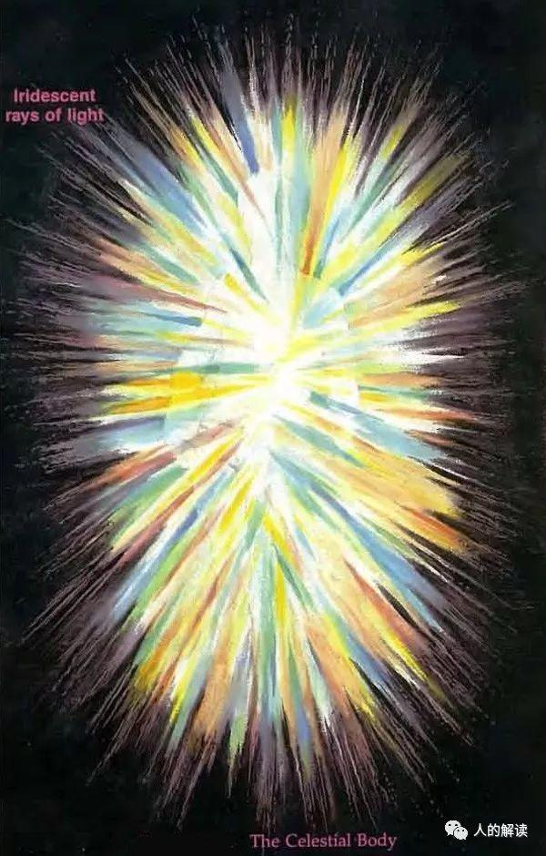

#### 天光体的结构：像蜡烛火焰的漫射光

辉光场奇数层是坚固的、闪烁的光结构场。偶数层则充满了无形的物质/能量。

第二层（情绪体）就像气态物质，第四层（星光体）像液体，第六层（天光体）像蜡烛火焰周围的漫射光。

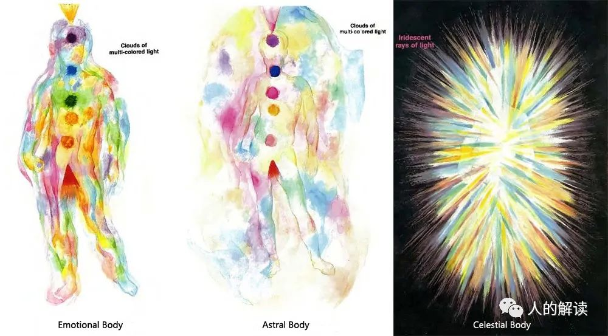

#### 天光体的功能：神圣大爱与灵性狂喜

天光体的欲望，是体验与万有、神连接的感觉，是对灵性交流的渴望。

第二层（情绪体）与**自我感觉**有关，第六层（天光体）则与**灵性感受**有关。
 
天光体是**灵性狂喜（spiritual ecstasy）**的层面。没有很适合的语言能描述灵性狂喜的体验，每个人都有自己的描述，诸如“生活在光明中”、“在女神的怀抱中”、“与上帝同在”、“在爱中”等等，然而千言万语也不能比拟体验本身。

天光体是**神圣大爱（divine love）**的层面。正是在这一层，我们体验到对自己和他人的**无条件的爱**。

**无条件的爱（unconditional love）**，就是完全为他人幸福着想，不求丝毫回报。你给予的爱，没有任何条件。这种宇宙大爱，是超越人类和友谊的爱，是对所有生命的爱。

当敞开的心轮与敞开的天光体脉轮相连结时，无条件的爱就会流动。在此连结中，我们结合了人性之爱——对血肉之躯的人类同胞基本的爱，以及在灵性之爱中所发现的灵性狂喜。灵性之爱是超越物质实相、涵括所有存在层次的。人性之爱与灵性狂喜相结合，便创造了无条件的爱的体验。

## 第七层：因果模板（The Ketheric Template Body）

第七层为星光层的心智体，称为**因果模板**或**因果体**。因果体的外形为蛋形，容纳了一个人与**此次转世**相关的所有辉光场。

因果体也是一个高度结构化的模板，由极为耐久的金、银光细线所组成，以将整个辉光场的形体维持在一起。它包含了一个对应肉体和所有脉轮的金色网格结构。

通过灵视，可感知到闪烁的美丽金光，它的脉冲如此之快，可以用“闪闪发光”这个词来形容。它看起来好似有着成千上万条金线。

这个金色的蛋形从身体扩展出约75~105厘米。因人而异，脚下那端较小，在头上90厘米左右那端较大。如果这个人是非常有活力的，它甚至可以扩展得更宽。

第七层的外缘部分厚度似乎约有0.6~1.2厘米，但非常结实且具有弹性、耐渗透并保护着辉光场，就像是蛋壳保护着小鸡一般。在这个层面上，所有的脉轮和辉光场形式看来好像皆由金光制成。这层是能量场中最强韧、最具弹性的一层。

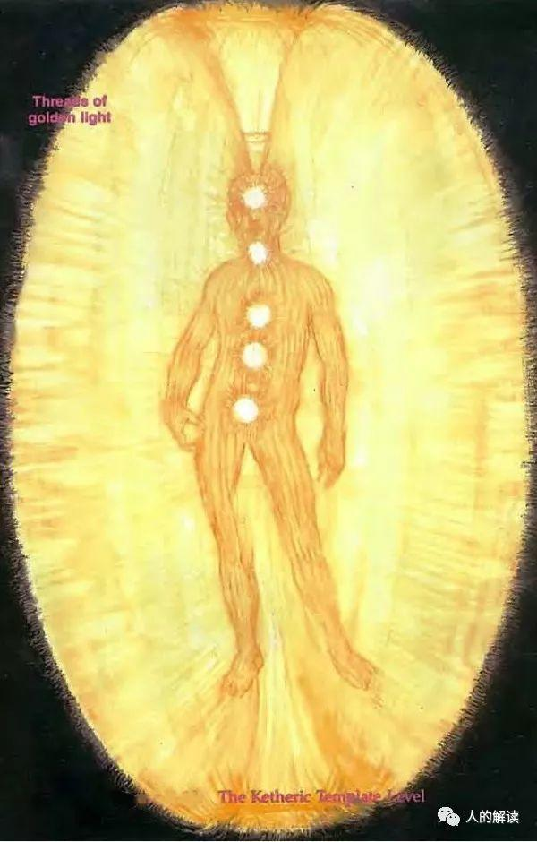

#### 因果体的结构：金色的能量蛋

辉光场的奇数层是结构层，偶数层则是非结构层。第一层（以太体）、第三层（心智体）、第五层（以太模板）和第七层（因果体）都有一个明确的结构，是坚固的、闪烁的光结构场。从外形上看，因果体跟以太模板结构很像。

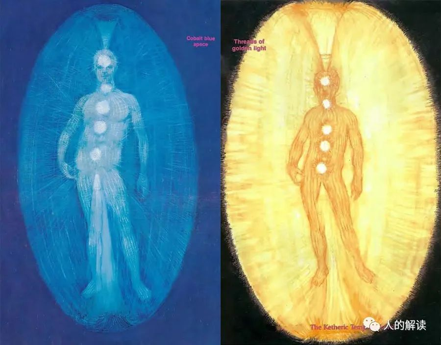

因果体是辉光场中最强韧、最具弹性的一层，将整个辉光场固定在一起，巨大的力量让人感到惊讶。能量蛋的外缘较厚和强韧，就像蛋壳，它调节着从整个辉光场流入到外部空间的能量流，还能防止辉光场中的能量泄漏，以及外界不健康能量的渗透。

#### 因果体的功能

第五层（以太模板）是**神圣意志（divine will）**层；

第六层（天光体）是**神圣大爱（divine love）**层；

第七层（因果体）是**神圣心智（divine mind）**层。

通过因果体，我们体验到内在的神圣心智。当意识提升到这个水平，且因果体是清晰、强大而健康时，你就会知晓**万事万物是神圣完美的**。

在这一层，你会开始理解更大的宇宙模式。神圣心智让你理解存在的原因——也即灵魂此生的使命，在你之内和你周围展现的宏大模式。

在这一层，你能深刻地感觉到灵魂的使命、你存在于此的原因。在这里，我们理解并知道我们是生命伟大模式的一部分。体验宇宙的这一真相，让我们倍感安全。

#### 因果体与前世解读

因果体是**星光层面（4-7层）**的最后一层辉光场。它包含生命计划，并且是与此次转世有直接关系的最后一层，我们的生命格局出现在因果体中。**因果体是一个动态的模板**，随着个体在生活与生长过程中所做的自由意志选择而不断变化着。

前世会在辉光场中以一种环状或束带状出现在因果体蛋壳般的外缘，也会出现在因果体的蛋壳中，称为**前世束带（past life bands）**。前世束带为光的彩带，完全包围着辉光场，并且可在蛋壳表面的任何一处找到。在靠近头颈区域发现的彩带，通常是你在今生际遇中努力去清理的那一段前世。
 
疗愈师将自己的手放入个案辉光场的因果体或蛋壳层出现的色彩束带中，经由这个动作并且调频至该处的能量频率，就可看见前世在眼前流转。与一个人今生发生事件相关的前世束带，可在个案的脸部与颈部找到，就在辉光场中约75~90厘米的地方。疗愈师将手放在个案的脸部上端，用右手跟随前世带往右，左手跟随前世带往左，就可以看见以线性时间呈现的前世。

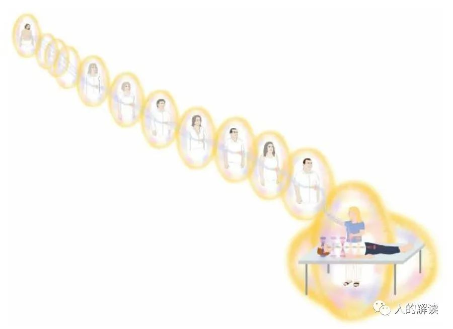

#### 因果体与健康

当因果体是强大的、充能和健康的，你会有两个主要能力：有创造性的想法，并清楚地理解关于存在、世界和其本质的整体概念。

当因果体不够发达，你会缺乏创意。也不会对更大的生命模式有良好的感知。你可能感觉万物之间没有联系，宇宙是随机的，自然界是混沌无序的。无法理解存在于我们不完美当中的完美性，也会觉得我们的不完美是难以忍受的。

当因果体比其它所有层都强大，你在将想法付诸实践上会有困难，所以辉光场各层的平衡很重要。