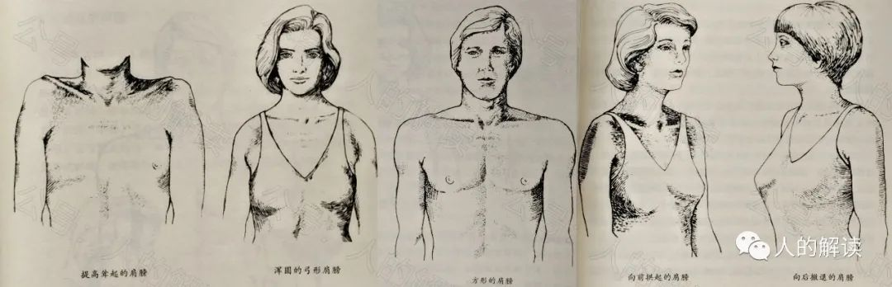

## 性格结构

性格结构（Character Structure）可以说是每个人选择此生要解决的基本问题或个人功课的凝聚显化。我们的身体携带着这些问题或功课，好让我们能够轻易知道此生应该处理的是什么。若能学着认识自己的性格结构，我们就能找到疗愈自己的关键，并找到自己的灵魂功课和人生任务。

性格结构其实是**辉光场扭曲的模式**，也是我们的体形因负面印象和信念系统所产生的不平衡。你会发现所有这些性格结构发生在你周围、你自己和你的亲密关系中。

生物能量学（bioenergetics）研究中使用5种基本性格结构，分别是**分裂型、口腔型、错乱型、受虐型、严苛型**。

其中每种性格结构的主要问题，每个人都或多或少地带着，只不过是每种性格结构占的百分比不同。

### 分裂型结构

分裂型结构（Schizoid Structure），是造成生命能量流最早被切断的性格结构。

#### 分裂型的产生原因：出生创伤

首次的创伤经验发生在出生前或出生时，或者刚出生之后的那几天。通常是直接接收到父母某一方的敌意，例如父母不想要这个孩子所产生的怒意；或在分娩的过程中发生创伤，例如母亲在情绪上与孩子切断了连结，使小孩觉得被抛弃。即使只是母亲和孩子之间轻微的切断连结，对母亲来说毫无影响，但对孩子来说却是非常严重的创伤。

分裂型的人，第三和第四脉轮能量带，没有以健康的方式连接父母，所以他们没有与他人连接的榜样模型，这导致与他人相处非常困难。

#### 分裂型的肉身：虚弱敏感

分裂型的人通常既高又瘦，不过有些人也可能很重。身体的紧绷会环绕在身体外缘，关节通常很脆弱，身体协调不佳、手脚冰冷。这类人常常能量过度活跃，不够稳固，没有好好跟大地连结。手腕、脚踝和小腿肚比较纤细，可能会有一边的肩膀比较粗壮。靠近头骨底部的颈部会有一个主要的能量阻塞，通常是深灰蓝色的，头骨底部常常有能量喷出，脊椎常有错位的现象。头常常会倾向某一边，目光涣散，好像他有一部分消失了一样。这类人有很多在童年早期就开始自慰，透过性欲连结生命能量。这让他们在无法跟周遭其他人连结的情况下，能感觉自己还活着。

#### 分裂型的灵魂：灵性落地

分裂型的人，可能在许多前世中，都有过肉体痛苦和创伤，并且通常因为特定灵性信仰而遭受折磨至死。分裂型的人，通常是颇具灵性的人，对人生的真正目的有深刻的觉知。他们常常试图把灵性带入周遭的日常生活中，非常有创造力，有许多天赋，常常有很多创新的点子。

这类人的灵魂功课，是面对自己内在的恐惧和愤怒，这些恐惧和愤怒阻挡了他将惊人的创造力落实在物质界的能力。他会尽可长时间沉浸于较高灵性层面，不够接地气。所以，他的另一个任务是将自己的灵性落实带入这个物质世界，可能是透过他的创造力展现灵性的世界，例如写作、发明、帮助人群等。每个人的任务都很不同，不能一概而论。
 
#### 分裂型的辉光场互动：保持平静

如果你想要帮助分裂型的人感到安全、放下戒备，就要接地气、开始交流，如此你才能完成双方共同参与的任何事情。你只需全身放松，让自己保持平静，也会会让对方也感到平静。可以将你的右手放在对方生殖轮的背部，然后非常小心地允许生物等离子流从你的手中流出，用你的意愿，将它引导到对方体内中心，进入地球。

### 口腔型结构

如果在口腔期产生被遗弃感，使正常人格的发展被遏止，就会形成口腔型性格结构（Oral Structure）。

口腔期又称口欲期，是一个心理学名词，是弗洛伊德所提出的性心理时期（Psychosexual Stage）中的第一个阶段。

弗洛伊德把力比多（libido，性欲）的发展分为五个阶段：口腔期（Oral Stage，0～1岁）；肛门期（Anal Stage，1～3岁）、性器期（Phallic Stage，3～6岁）、潜伏期（Latent Stage，6～11岁）、生殖期（Genital Stage，11或13岁开始）。

#### 口腔型的产生原因：被遗弃感

口腔期，小孩可能因为母亲去世、离开、生病或退缩在自己的世界里，而觉得失去了母亲。

另一种情况是，母亲对孩子并非没有付出，但付出得不够。比如，母亲没有充足时间完成母乳喂养。孩子在吮吸母乳时，孩子会与母亲融合，这是最接近回到子宫里的体验。孩子会因此强迫自己提早独立，许多这类小孩很早就学会说话和走路，以此来弥补他的失落。

#### 口腔型的肉身：发育不好

口腔型结构的人，基本上是匮乏的、感觉空虚、空洞并且不想负责任。身体并没有发育得很好，肌肉纤长且松弛，躯体无力地弯曲。这种人看起来不太成熟，不像个成年人，胸膛冰冷扁平，呼吸短浅。

不幸的是，她们的父母会从通过第三脉轮能量带连接孩子来吸取养分，而不是给予孩子。父母还透过附着在孩子身上的生物等离子流，从孩子身上获得能量。

#### 口腔型的心理：依附他人

在心理动力学上，这种人会依附他人，以抵抗被遗弃的恐惧。她会经常消极被动和疲倦，无法独处，对他人给予的温暖和支持有过度的需求。她想从外在得到能量，好填补自己内心巨大的空虚，她压抑自己的强烈渴望，把被遗弃的愤怒压抑住，用性来取得与他人亲近的感觉和连结。

这类型的人，在人生中常常感到失望，有许多在要求自己想要的事物时被拒绝的经验。因此她变得充满怨恨，觉得不管拥有多少都不够，要求被滋养、被满足。她需要被照顾的感觉导致了依赖、黏人的倾向、索取，她会用独立的行为来对抗这个部分，但这个独立会在压力之下崩溃，因为这并不是内心强大的独立。
 
#### 口腔型的灵魂：自我哺养

口腔型的人，其主要课题是哺养。口腔型的人，经历过许多食物短缺的前世。她们可能曾生活在饥荒中被饿死，或者不得不为了得到一点点食物而做出可怕的选择。她们没有体验过完全的满足，担心自己永远得不到足够的。

口腔型的人，需要学习相信宇宙的丰盛，并把索取的过程反转为付出。灵魂功课就是要学习在人生中满足自己的需求，学习脚踏实地并用自己的力量活着。她需要放掉受害者的角色，承认自己获得已足够。她得学会面对独处的恐惧，深入自己内在的空无，在那里找到与生命的连结。当她为自己的需求负起责任，用自己的力量活着，她将能够说：「我拥有」，并让核心能量打开并流动。当其高我被释放之后，她将能把智力善用在艺术或科学等创造工作上。她会是天生的好老师，因为兴趣广泛，而且总是能够打从心底热爱所知之事。

#### 口腔型的辉光场互动：吸取能量

口腔型的人，会试图将第三脉轮能量带连接到他人的脉轮上，以便像父母那样透过能量带来吸收能量；并试着通过“吸尘器眼晴”与他人的眼神交流来创造生物等离子流，从而吸取能量。

#### 口腔型如何改善：开海底轮

口腔型的人，需要的是为辉光场注入能量、打开脉轮，以及强化界线。还需要学习辨认脉轮打开的感觉，在练习和冥想时，保持脉轮的敞开；还需要很多的肢体上的抚触。其实，如果口腔型的人能够扎根地球，能量就会像自流井一样自动流入她的身体，自给自足，而不需要再吸取别人的能量。口腔型的人，需要将第一脉轮打开，让更多的能量从地球进入。

### 错乱型结构

错乱型又被称为转移型（Psychopathic Structure），这要追溯到原生家庭的父母身上。

童年时，当双亲中与孩子不同性别的一方，与配偶相处有问题时，将许多本该由配偶满足的需求转移到孩子身上，用诱惑来控制孩子。那么，孩子就变成了妈妈的「小男人」或者是爸爸的「小女人」，并被微妙地告知，他/她比自己的父亲/母亲要好得多。于是，孩子在他/她的年轻时代就被赋予了超出年龄范围的责任，并被鼓励快快长大。如此，孩子便把他们的心交给了异性方家长，但性不在其中。这就导致了孩子成为了错乱型(转移型)的人。
 
#### 错乱型的产生原因：父母错乱

如前所述，错乱型的人在童年早期时曾被父亲或母亲（与之性别不同的那一方）暗地里诱导，父母想从这个孩子身上得到所需，以致于孩子和父母形成三角关系，这样孩子很难从与之同性别的父母身上得到支持。这样导致的结果就是，错乱型的人跟双亲中不同性别的那一方形成同一阵线，一旦无法获得自己想要的，便会感觉被背叛，于是用操纵同一阵线的父或母来弥补。

其实真正的背叛来自于父母，只是因为配偶不能满足，就利用和控制孩子来满足本应从配偶那里得到的需求。孩子小的时候，好像没问题，但是青春期出现性欲时，一切都乱了。异性家长一方对孩子的任何追求者都非常嫉妒，认为这孩子不该有性欲，只应该爱他/她们的父或母。但这是不可能的，会让那些错乱型的人（青春期）非常恐惧，因为他/她们同时有性欲和心灵。然而，同时拥有这两者，是对家长的背叛，他/她们会觉得自己很坏。他/她们在这方面很脆弱，会害怕同性的人，因为这使他/她们想起自己同性别的父或母。

#### 错乱型的肉身：上壮下虚

错乱型的人，上半身看起来比较壮硕，但能量没有在上半身与下半身之间流动。骨盆缺少能量，冰冷且紧缩。肩膀、头骨根部和眼睛有严重的紧绷，腿部虚弱，没有跟大地连结。

三种类型对比看看，区别很明显。分裂型的人通常既高又瘦，手腕、脚踝和小腿肚比较纤细。口腔型的人，肌肉纤长且松弛，躯体无力地弯曲。错乱型的人，上半身明显更壮实些。

#### 错乱型的心理：控制欲强

错乱型的人，看起来很强势，会尽其所能地尝试控制他人。在与他人互动时，她会直接下达操纵指令，例如告诉别人「你应该……」以使他人屈从。这源于从小养成的操纵感，来获得自己想要的，否则便会感觉被背叛。所以，这类型的人有非常强烈的权力欲。为了达成控制的目的，她有两种方法：霸凌他人或透过引诱削弱他人。

错乱型的人，总是想要赢。但是想要获得支持，就意味着臣服，而她相信臣服就是失败。她的负面意图是「我要世界依照我的意愿运作。」

错乱型的人，有着强烈的优越感和鄙视心态，用以掩盖深层的自卑。她将自己武装起来，对抗失败的恐惧。她被卡在依赖他人和想要控制他人的欲望之间左右为难，害怕被控制、被利用。

错乱型的人，带着很多恐惧，把生活看成是战场。她害怕来自最亲密友人的背叛，所以她害怕朋友，在她内心深处，不再信任任何人。她的性欲常常是带有敌意及很多的幻想。她用性来玩弄权力，欢愉对她来说是次要的，征服才是重点。她试图让其他人需要她，好隐藏自己的需求。

#### 错乱型的辉光场：上强下弱

错乱型的人，能量主要集中在上半身，能量在上半身过度活跃，然后在下半身剧降。这类型人的辉光场，每一层的底部通常能量枯竭，顶部则非常饱满，所以会呈现颠倒的蛋形辉光场。

以太体越靠近脚部就变得越稀薄，颜色通常是深蓝色，比分裂型和口腔型结构的人色调更浓重一些。心智体在身体正面的厚度比在身体背面薄，情绪体也是在顶部比较饱满，且在肩胛骨之间的意志中心处有很大的突出能量包。辉光场较外围的那几层，也是上半身比较饱满明亮。

#### 错乱型的脉轮：上开下关

错乱型的人，背面的第四脉轮（心轮）的通常是开启的，非常大，而且被过度使用。正面的第六脉轮（眉心轮）和第七脉轮（顶轮）也是开启的。其他脉轮（尤其是正面的感觉中心）多数是关闭的。背面的性能量中心（生殖轮）可能是半开半关。她主要是透过心智和意志能量运作。

由于她的辉光场不是接地的，不能从地球获取生命力量，所以她感到虚弱，得不到支持。她将能量向上移动了，导致第一脉轮（海底轮）和第二脉轮（生殖轮）因能量耗尽而枯竭，使她更容易受到“釜底抽薪”式的伤害。

因为第二脉轮（生殖轮）能量不足，她在性方面有问题。虽然她很有魅力，但这种魅力不会保持长期关系，因为她的心和性没有一起工作。与分裂型和口腔型相比，错乱型的第二脉轮（生殖轮）没有开启。

心轮之间的能量带，就是我们提到的“心弦”。因为连接异性家长方的「心弦」被背叛所污染，她/他会害怕将心轮能量带连接到另一个女人或男人。当她连接心弦时，就已经预设了背叛。男性会预期女人的背叛，女性则预期男人的背叛。每个人都为对方的背叛做准备。或者，她自己先背叛。

#### 错乱型的灵魂：正视背叛

错乱型的人，主要灵魂课题是背叛。她可能前世当过多次战士，为一个伟大事业而奋起战斗。她在个人层面上牺牲了很多，战斗，赢得战斗。但最终，这些人被背叛，被推翻，很可能被她最信任的人杀害。
 
这类型的人，需要逐渐松开自己，放松上半身，放掉控制他人的倾向，臣服于深层的自我以及性的感觉。一旦这么做，可以满足她活在现实、和朋友情感交流，以及感觉像一个人的深层渴望。当她的高我能量被释放，会是非常诚实正直的，高度发展的智力会被用来解决纷争以及协助他人。这类型人的诚实将引领他人找到自己的诚实。她擅长管理复杂的计划，并有一颗充满爱的宽阔之心。

错乱型的人，需要脱离恐惧，并感到安全；需要放弃通过控制他人来追求安全感；需要学会信任自己和他人；需要认识到地球不是一个战场，而是与他人交流的地方；需要放弃战斗，放下负担；需要允许自己犯错误，但同时仍感到安全和良好。

#### 错乱型的辉光场互动：侵略性强

错乱型的人，倾向于以好斗的方式来面对生活，所以会把能量投入身体后部加强意志，然后挺直脊背，高昂头颅，以面对所谓的侵略者，如下图所示。

#### 错乱型如何改善：开下三轮

错乱型的人，需要强化下半身的辉光场，打开位置较低的脉轮（下三轮），并学习不要只靠意志生活，而要用心来生活。特别是处理在性方面的问题时，要非常的温柔，疗愈师要带着谨慎、理解与接纳的心来处理第二脉轮（生殖轮），在碰触他们的下半身时要很敏感及小心。
 
错乱型的人，会要求你同意他们扭曲的世界观。记住，不要同意，因为认同只会加强它。你可以通过辉光场做些什么，以帮助错乱型的人感到安全、接地，并重新连接回到交流中。你第一时间，不管它是什么，深呼吸，弯曲你的膝盖，向下接入地球，拉回你可能发出的所有生物等离子流。将你的注意力集中在双腿以及你身后的大片区域。想象它，感受它，看到它。不要卷入争辩。念诵 “不争辩，不争辩。” 这样任何朝向你的侵略性的能量都会流走，变成玫瑰和绿色。只要站在那里，倾听着，让辉光场的负面能量滑入地球。

在争论中，辉光场会变得高、粗粝、有锯齿。所以，接下来要降低你辉光场振动的频率。你可以想象一些让你感到平静、柔和、安全的事情，比如你最近在大自然中的散步、你最喜欢的音乐，或者让你觉得安全的人，想象这个人站在你旁边。这样会持续降低并平顺你的频率，直到与地球频率相匹配，并保持住。只要在那里，让你的振动通过谐波感应去连接错乱型的人，这样会使他们平静下来。

如果你发现自己有错乱型倾向，在攻击某人，因为你认为那人背叛了你，只要停下来一会儿，也许情况并不是那么糟糕，是你反应过度了。你只需要做上面降低频率的练习，重复念诵 “我是安全的。我是善良的。” 

### 受虐型结构

> 信息源：千帆过，转载自：[人的解读](http://www.rendejiedu.com/2492.html)

弗洛伊德 (Sigmund Freud)对受虐狂有如下解释：假如人生活在一种无力改变的痛苦之中，就会转而爱上这种痛苦，把它视为一种快乐，以便使自己好过一些。

威廉•赖希 (Wilhelm Reich) 发展出来的生物能量学中的受虐型结构(Masochistic Structure)，与弗洛伊德定义的受虐者是不同的。他的受虐型，源自童年期得到的爱是有条件的，是被侵犯和被控制下的爱。

#### 受虐型的产生原因：父母强势

受虐型结构中，父母双方或其中一方，将孩子当作自己的一部分，把自己的意愿强加在她身上。所有进出她的东西都被控制了，包括思想、想法和创造等，更别说谈情说爱婚姻自主了。她没有机会去发展个体性，尤其是会因有感受性欲受到羞辱。哪里有压迫哪里就有反抗，她尝试抵抗施加在自己身上的庞大压力，但都失败了。她觉得被困住、失败、羞辱，于是她压抑住自己的感觉和创造力，结果导致了愤怒和恨意。

受虐型的人，源自童年创伤，其母亲虽然牺牲很多，但非常强势，导致她没有私人空间，甚至不能支配自己的身体，哪怕连吃饭和排泄都被控制。结果她对任何自己的主张，或想要自由的欲望都觉得充满罪恶感，被培养为对每一个自由的自我表达而内疚。
 
父母用生物等离子流，把她淹没在父母的能量中，或者钩住她。父母还使用第三脉轮能量带来控制她。与此同时，父母也是深深地爱着她的，并在第四脉轮之间建立忠诚有爱的能量带。

#### 受虐型的肉身：身材短粗

这类型的人，身体特征上，体重很重，整个人很有份量，肌肉过度发达，脖子跟腰较短。脖子、下巴、喉咙和骨盆处累积了大量压力，臀部冰冷。能量被卡在喉咙处，头向前倾。

 
四种类型对比看看，区别很明显。分裂型的人通常既高又瘦，手腕、脚踝和小腿肚比较纤细。口腔型的人，肌肉纤长且松弛，躯体无力地弯曲。错乱型的人，上半身明显更壮实些。受虐型的人，脖子跟腰较短。

#### 受虐型的心理：缺乏自主

这类型的人缺乏自主权，害怕按自己的意愿行动。这类人总是在受苦、在呻吟、在抱怨，外在永远表现得很顺从，但其实永远都不会真正的臣服。内在锁住了强烈的怨恨、负面、敌意和恐惧，爆发的时候会成为强烈的愤怒。这类人可能有性障碍，对色情影片有强烈的兴趣。如果是女性，可能无法拥有高潮，而且觉得自己的性欲是不洁的。最明显的症状是紧绷，既想要从压力中解脱，却又无意识地相信，如果放掉紧绷并接受内在的事物，会导致屈从和羞辱。

要解决这个问题，她需要让自己变得有自信、自由，以及开启她的灵性连结。
 
#### 受虐型的辉光场：有很多孔

这类人的辉光场，边界从未有机会发育和界定。弥散的非结构层，比创造边界的结构层有更多能量、也更发达，所以辉光场有很多孔。辉光场完整地张开，主要能量都锁在内部，外在是活力低落的样子。整个辉光场完全撑起，在脚部附近稍微比较饱满，所以形状比较像是椭圆形而不是蛋形，颜色是暗金色。辉光场的边界有些过厚与紧绷。

这类人的以太体密实、厚实且粗糙，颜色多半是灰色而非蓝色。情绪体饱满，有很多颜色，跟以太体一样分布平均。心智体很大，在上半身和下半身都很明亮，智力跟情绪整合得较好。天人体很明亮，颜色是淡紫色、褐紫红色和蓝色。

#### 受虐型的脉轮：很少开启

受虐型的人，脉轮大部分是关闭的，开启的脉轮，通常只有正面的第六脉轮（眉心轮）、第三脉轮（太阳轮）。背后的性能量中心（生殖轮）可能有部分开启。

与其他三种类型比，受虐型的脉轮开启是最少的。

#### 受虐型的灵魂：找回自由

这类型的人，主要问题是侵犯和被控制。在前世可能经历过许多被控制和受困的情况，不允许表达或不能按自己的意愿行动。在前世生活中，她可能遭受过监禁、奴役，或者身陷被他人掌控的强权政治或宗教控制当中，必须服从。她内心深处渴望自由，却不敢明说，也不知道如何获得自由。她选择出生的家庭，成为她的下一个监狱，父母则成了监狱长。
 
这类人，需要以释放自己的侵略性，摆脱羞辱的感觉。在想要表达意见的时候，能积极主动地用自己喜欢的方式表达自己。她的创造力展现在精细、错综复杂的设计上，如果能把这个高度发达的创造力展现出来，将使世界为之赞叹。这类人的高我，充满了照顾他人的能量。她是个天生的协商好手，有一颗宽容的心，内在有很深的慈悲，可以带给其他人很多支持，乐于付出她的能量和理解。
 
#### 受虐型的辉光场互动：等人来撩

受虐型的人，要么隐藏在内心深处，要么试图得到其他人的许可才出来，辉光场如下图所示。

#### 受虐型如何改善：开生殖轮

如果你发现自己有受虐型倾向，请弯曲膝盖，呼吸，向下接入地球，让能量从地球上升到你的第二脉轮（生殖轮）。允许自己感觉与周围的一切联系在一起，以此让你所保持的巨大能量开始在你的辉光场中流动。把你的手放在第三脉轮（太阳轮）上，保护自己。同时，专注于你的内在力量，与自己同在，重复念诵 “我是自由的，我是自由的。”

### 严苛型结构

> 信息源：千帆过，转载自：[人的解读](http://www.rendejiedu.com/2518.html)

有一类人，在工作上很出色，有完美的配偶和完美的家庭。赚了很多钱，穿得很好——一切都很相配，所做的一切恰如其分。身体显得平衡而健康。每个人都羡慕她表面上的完美、无忧的生活，似乎什么都不缺。但是，在这类人的生活中，唯一缺失的就是她自己，她没有体验过真实的自己。她的外部世界是完美的，内在的心理世界被否认，这就是严苛型。

#### 严苛型的产生原因：追求完美

有人说，人生第一个严苛型的领导是自己的父母。没错，严苛型结构，确实也是从童年时形成的。这是由于在童年时，经历过双亲中与其性别不同的那一方的拒绝，孩子会觉得这是一种对爱的背叛。因为对孩子来说，情欲的愉悦、性欲和爱是一体的。为了补偿这个拒绝，孩子决定要压抑痛苦、愤怒，以控制相关的感觉。

父母对待孩子，都是按照完美的表面幻象来的。孩子被教导要穿戴整齐、好好做功课、按时睡觉、按时吃饭等等。在成长过程中，所有的负面体验都会被否认，而创造出一种完美的假象。一切都是按完美来要求，这种压制就形成了严苛型。
 
#### 严苛型的肉身：身材匀称

这类型的人，身体比例匀称，充满能量，整合得很好。骨盆后倾且冰冷。她可能有两种形式的能量阻塞：盘状盔甲型能量阻塞或网状盔甲型能量阻塞。

这跟前面几种类型的区别是很明显的。分裂型的人通常既高又瘦，手腕、脚踝和小腿肚比较纤细。口腔型的人，肌肉纤长且松弛，躯体无力地弯曲。错乱型的人，上半身明显更壮实些。受虐型的人，脖子跟腰较短。然而严苛型的人，身体比例匀称，堪称完美。

#### 严苛型的心理：抑制感觉

这类型的人，克制自己的感觉，对外在一切都控制得当。表面虽然显得很优秀，但内心深处非常害怕被背叛。无论如何都不允许自己脆弱，非常恐惧被伤害。她会抑制所有的感觉，头总是抬得高高的，背打直，展现她的傲气。

由于没有体验过真实的自己，她不可能整合自己的心灵和性欲。心和性不能同时运转。她爱的是一个不存在的理想之人，所以只有短期的性关系，无法维持一段深入的情感关系。她的恋爱所持续的时间，只是情欲的最初阶段。然后，伴侣的不完美浮现了，对方不够理想——结束到来了。

她的主要症状是没有感觉。她想要臣服于感觉，但理智却说“我才不要臣服。”于是她选择了性而不是爱，但这无法带给她满足。对她来说，怎么选都不对。因为她认为臣服就会受伤，保持骄傲又无法拥有感觉。所以，要解决这个问题，她必须让心和性连结起来。

#### 严苛型的辉光场：基本平衡
 
这类型的人，主要的能量都被锁在周边，远离核心。辉光场强壮明亮，在身体周围的分布大部分都很平衡。以太体很宽，平均且厚实，呈蓝灰色，粗糙程度中等。情绪体处于平静，且分布均衡。心智体发展良好且明亮。 

这类型的人，天人体可能会不太亮。蛋形的因果体强壮又有弹性，颜色是金色为主或银色，明亮，形状完好。

#### 严苛型的脉轮：前面关闭

正面脉轮（2A/3A/4A/5A）与人的感觉有关，背面的脉轮（2B/3B/4B/5B）与意志有关，头部的三个脉轮（6A/6B/7）与心智进程有关。

 
严苛型的人，与感觉有关的正面脉轮(2A/3A/4A/5A)基本都关闭，如下图。这也说明为啥这类型的人，主要症状是没有感觉。

开启的脉轮，大概会是背后的意志中心(4B/5B)、性能量中心(2B)、海底轮(1)及心智有关的脉轮(6A/6B)。她主要是透过意志和心智的力量而活。

顶轮(7)及太阳轮(3A/3B)不一定开启。在进行疗愈并开放接纳自己的感觉之后，她正面的感觉中心会开始敞开。
 
与其他4种类型比，严苛型的脉轮开启是最多的。

#### 严苛型的灵魂：表达感受

严苛型的主要问题是真实性。在前世，她经常必须保持完美的表象，没有缺点或弱点才能生存。严苛型的需求是真实，而不是恰当。她需要表达内心的感受，要停止对不完美的担心和恐惧，因为她已经很棒了。

她的内在是充满冒险、热情和爱的。她会以对生命的爱和热情启发他人，她在大部分想要从事的工作上都会是天生的领导者，毕竟这类人在前世可能就是负责管理事物。她能够和其他人以及宇宙进行深层的接触，在世界中嬉戏并尽情享受人生。
 
#### 严苛型的辉光场互动：展现真实

严苛型的人，是一个完美理性却不真实的人。她控制了情绪反应的任何外在影响，所以她内部心理状态与外部世界是分离的。辉光场如下图所示。

#### 严苛型如何改善：打开心轮

对严苛型的人，要软化她的辉光场，打开她的心轮，这些人需要与爱和其他感觉连结。她还需要活化第二层辉光场（情绪体），并学习觉知自己的感觉变化。
 
如果你发现自己有严苛型倾向，进入完美主义的时候，停下来，注意力集中到自己的内在中心。只要呆在那里，直到你感觉到自己。重复念诵 “我是真实的。我是真实的。”

## 身体表达

### 肩膀类型

肩膀类型|表示
---|---
提高耸起形|常处于恐惧中
浑圆的弓形|负担过重
方形|力量和肩挑重任的能力
向前拱起形|长期自我保护、害怕受到伤害
向后撤退形|似乎对生存处境不满，想挥出拳头却做不到

### 臀部类型

臀部类型|表示
---|---
向内收缩|会压抑感情，也不作自我表达
向上拉，高于骨盆底部|想要控制
骨盆向上凸出(后倾)|通常与压抑性欲有关
骨盆向下倾斜(前倾)|性欲很强、注重感官享受、沉溺于性爱乐趣