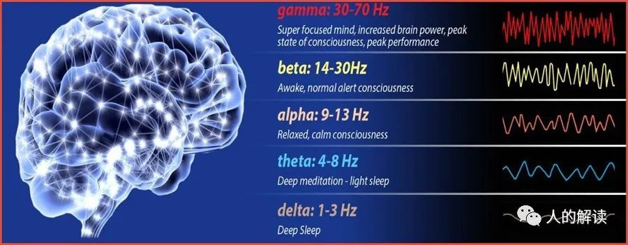

## 脑波

脑电波，亦称脑波，是神经元细胞之间传递信息时产生的生物电信号。1929年，德国精神科医师汉斯‧柏格（Hence Berge）首次发表脑电波图（electroencephalogram，EEG）。

人脑主要有五种不同的脑波：α波、β波、γ波、δ波、θ波。

人在睁眼观看五彩缤纷的世界时，大脑内充满了来自四面八方的杂乱信息，此时测量的脑波频率约14~30HZ，叫做β波。

一闭上双眼，隔绝了外界的干扰，再加上肌肉的放松，有的人就会瞬间或者几秒钟出现频率在8~13HZ的脑波，叫做α波。

如果闭眼静坐太久，太舒服甚至开始打瞌睡，则α波消失，有时会出现4~7HZ的低频脑波，叫做θ波。

如果再深沉入睡，则会出现0.5~3.5HZ的脑波，叫做δ波。

γ波是脑波中速度最快的，与同时处理来自大脑不同区域的信息有关。γ波快速而安静地传递信息，大脑必须安静才能进入γ波。

注意，五种脑波频率从高到底，并不是按照希腊字母的顺序(α/β/γ/δ/θ) 命名的，而是**γ、β、α、θ、δ**。

脑波|说明|振动频率
---|---|---
γ波|极度兴奋的脑波|30-70Hz
β波|比较兴奋的脑波|14-30Hz
α波|放松冥想的脑波|9-13Hz
θ波|半睡状态的脑波|4-8Hz
δ波|深睡状态的脑波|1-3Hz

1980年代的气功研究表明，气功师父练气时，身体重要的穴位会产生5~10HZ的次声波，练功时α脑波会大幅增加。反过来，如果有办法能让α波的波幅增加，就能产生气功态。

有修行密宗的师父以极快的速度（大约每秒10个字）吼出“唵嘛呢叭咪吽”六字真言，不断重复，也会产生气感。练功的境界，可由α波被抑制的快慢程度来判断。

李嗣涔教授把气功态分为两种：共振态和入定态。气功的共振态α波会增强，表现为振幅加大，但气功的入定态，α波则会消失，也就是受到完全抑制。所谓的放空，就是大脑去除杂念、进入什么也不想的入定时，α波会受到抑制消失。

长期打坐者可以诱发出高频率的γ波。理查德•戴维森（Richard Davidson）博士在2006年，对八位具有15~40年禅修经验的喇嘛进行了实验。结果试验组（喇嘛）平均γ脑波频率强度，是对照组（学生）的8倍。

## 地球的脑波：舒曼波

1952年，德国物理学家舒曼（W.O.Schumann）指出，地球上空电离层（Ionosphere）与地球表面形成一个同心球体的共振腔。

地球上只要任何一个地方出现闪电，都会激发这个共振腔的电磁振荡。振荡的频率很低，约在8HZ左右（平均值**7.83HZ**），叫做舒曼共振（Schumann Resonance）。这个振荡产生的自然电磁波，叫做舒曼波（Schumann Wave）。恰好人类大脑的**θ波**也近于7.83Hz，于是有人将舒曼共振称为“地球的脑波”，把这个频率称为 “天人合一的共振频率”。

舒曼波是一种极低频（Extremely Low Frequency, ELF）电磁波，可以帮助调节生理时钟和日常生活的规律性。距离地球表面越遥远，舒曼波也越弱。宇航员如果没有接触舒曼波，就会觉得沮丧和迷茫，NASA会在太空船上安装模仿舒曼波的仪器。