## 疗愈概述

### 疗愈的本质

> 信息源：千帆过，转载自：[人的解读](http://www.rendejiedu.com/1278.html)

疗愈看起来很神奇，无论结果看来多么不可思议，疗愈师眞正做的只是引导病患透过自然的程序疗愈自己。

对那些不了解疗愈概念的人而言，这些方式似乎是超自然的，但身体和能量系统本就会自然而然地朝向让自己健康的方向运作，疗愈师只是知道如何唤起人体的疗愈本能。

也就是说，并不是疗愈师多么牛叉，治好了病患，而是患者本身的**自愈能力**，是自然的过程。如果非要说是谁治愈的，那就是神，或者你可以称之为灵、上帝。

疗愈的过程，就是**忆起自己真实身份**的过程，也就是上帝与我同在。灵魂学到他要学习的功课，就会对宇宙的实相有更完整的了解。

#### 疗愈和治疗的区别

普通治疗就是治疗师在发挥作用为你医治，但疗愈却有时候不仅仅是疗愈师，还会有指导灵（spiritual teachers）的参与。疗愈师可以让指导灵进入能量场，协助疗愈。不过，若缺乏适当的灵性训练就尝试提供疗愈通灵(Channelling)，可能会造成伤害。

### 内在疗愈

> 信息源：千帆过，转载自：[人的解读](http://www.rendejiedu.com/1278.html)

健康不只是肉体的安好，还是生命中所有部分的平衡与和谐。疗愈是**重新平衡每一层能量体的能量**。当每层能量体都获得了平衡，就会带来健康。反之，就是疾病。

找出每个能量体失衡之处，用双手疗愈进行调整、修复出现问题的气场层，使每个能量体的能量重新获得平衡，这就是所谓的内在疗愈。内在疗愈的过程又称为全方位疗愈，在全方位疗愈的过程中，所有的能量体会彼此影响，共同参与。也就是说，7个气场层（或能量体）要全修复才行。

- 疗愈因果模板（第七层）：把错误的信念系统修正，这里主要是修复第七层能量场并重新整理它的结构；
- 疗愈天光体（第六层）：疗愈师会让自己成为通道，为个案导引天人之爱/宇宙大爱；
- 疗愈以太模板（第五层）：透过灵性手术来调整能量体，让个案的意志与神性意志更加靠近；
- 疗愈星光体（第四层）：使用能量蝥合以及爱来使疗愈发生；
- 疗愈心智体（第三层）：疗愈师会挑战那些导致心智层失去平衡的错误思想过程；
- 疗愈情绪体（第二层）：疗愈师可以使用能量蝥合清除那些被个案封闭的感受；
- 疗愈以太体（第一层）：透过疗愈师的调整修复可让这一层的结构回复正常，个案会重新感觉舒适愉悦并找回力量；
- 疗愈肉体：利用运动、体位练习和声音来松动例如肌肉的紧绷、脂肪或疲软。

疗愈的关键是除“病根”，这个**病根就是作用在第七层的错误信念系统**。除非错误的信念系统被修正，否则由此所产生的身体症状不可能消除。就算消除了身体的症状，如果内在疗愈没有完成，错误的信念系统持续存在，迟早肉体还是会再度生病的。

也就是说，整个疗程是先让能量体重获平衡，肉体的健康通常是最后才显现出来的效果。所需时间长短从单次疗程到为期一年都有可能。

### 疗愈步骤

> 信息源：千帆过，转载自：[人的解读](http://www.rendejiedu.com/1278.html)

在一段疗程中，通常会先从较低的能量体层着手进行，然后再移至较高的能量体层，大概可以分为七个步骤。《光之手》里最精华的实战部分，也就是这些了。

- 1、个案能量系统总检析；
- 2、校准疗愈师、个案与指导灵的能量系统；
- 3、疗愈较低的四层能量体；
- 4、疗愈以太模板层，灵性手术；
- 5、疗愈天光体；
- 6、疗愈因果模板层，重建模板、重建脉轮；
- 7、封闭因果模板层。

#### 1、个案能量系统总检析

在首次进行疗愈的开始之际，通常会做一次快速的能量体检析。从而揭露出很多关于此人如何导引以及错误导引他的能量，最终所导致的生理问题。

通常会用灵摆进行脉轮探测，当然用灵视来「看见」问题会更直接。

另外，如果感觉水晶适用于该个案，也可以拿出来使用。比如，在疗愈中用来进行「净化」的时，水晶的顶端发射出非常强烈的白光，如同雷射光般，可用于切除累积在气场中的废物。

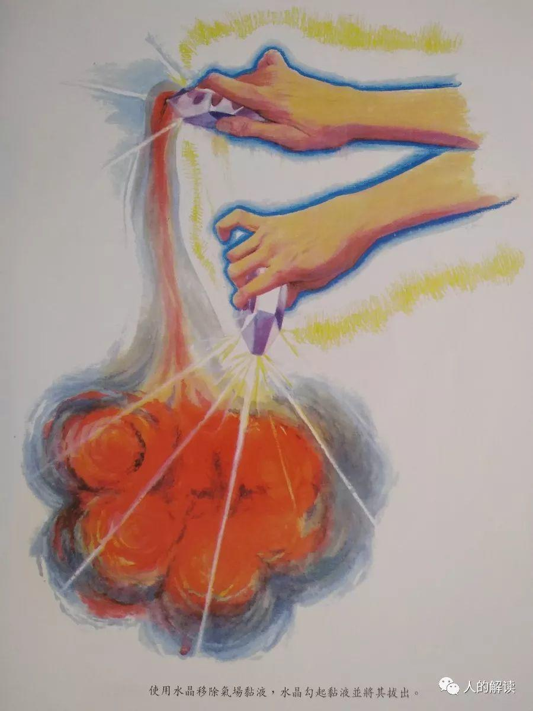

#### 2、校准疗愈师、个案与指导灵的能量系统

在与个案进行身体接触之前，先将自己向永恒的更高能量校准是非常重要的，就像收音机必须调到正确的波段一样。通常使用观想打开脉轮方式，再次把能量迅速从脉轮处提升，确认自己与光之宇宙动力一致。

校准了之后，快速检测身体的器官，感知每个器官能量的状态。最重要的部分通常是身体的主要器官和脊椎。下面主要以《光之手》中玛丽的案例来说明。

当玛丽第一次来找布蓝能时，她的气场堵塞、迟滞并且不平衡。她的膝盖、骨盆区、太阳神经丛和肩膀显示出暗红色和棕色的阻块，她的太阳神经丛脉轮变形，在左上方部分凸起，看起来像小漩涡，彷佛一个喷过的喷泉般。这个变形延伸到气场的第五层和第七层，这种状况与横隔膜裂孔疝气有关。玛丽抱怨身体的那一部位很痛，她个人生活中与人深入连结也有问题。

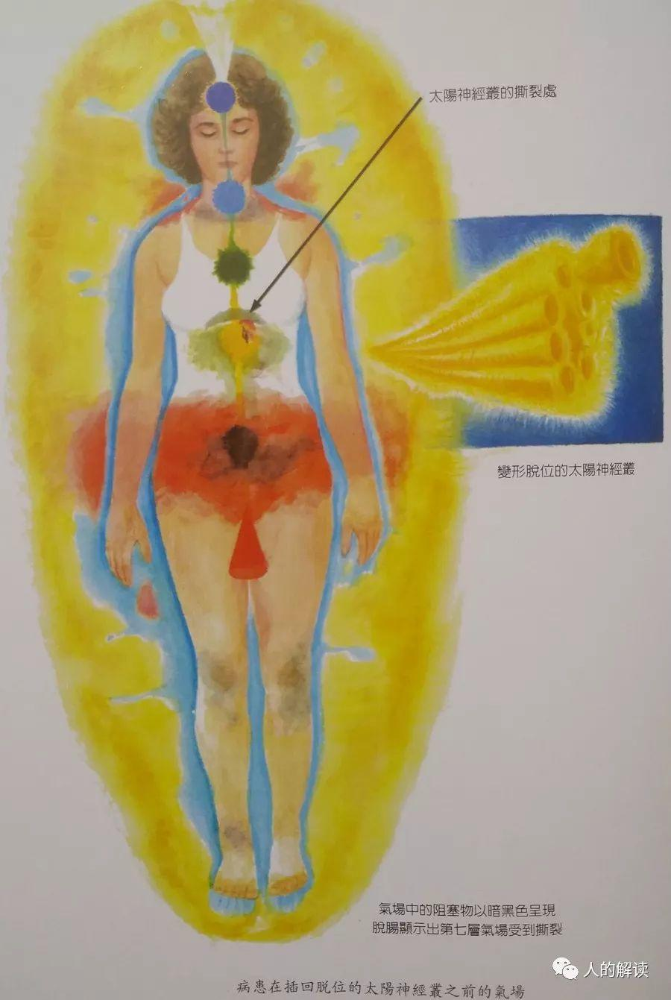

#### 3、疗愈较低的四层能量体

接下来就是首先疗愈前四个气场，使用的基础手法之一就是「蝥合」(chelation)，源于希腊字chele（蝥），意指挖出来。这个字的用意在于：藉由去除气场中的废弃物来净化个案的气场。

采用坐姿，疗愈师将自己的手放在个案(玛丽)的脚上，直到能量场大致被净化和平衡。能量会从这一个位置流入，进而活化整个能量场。

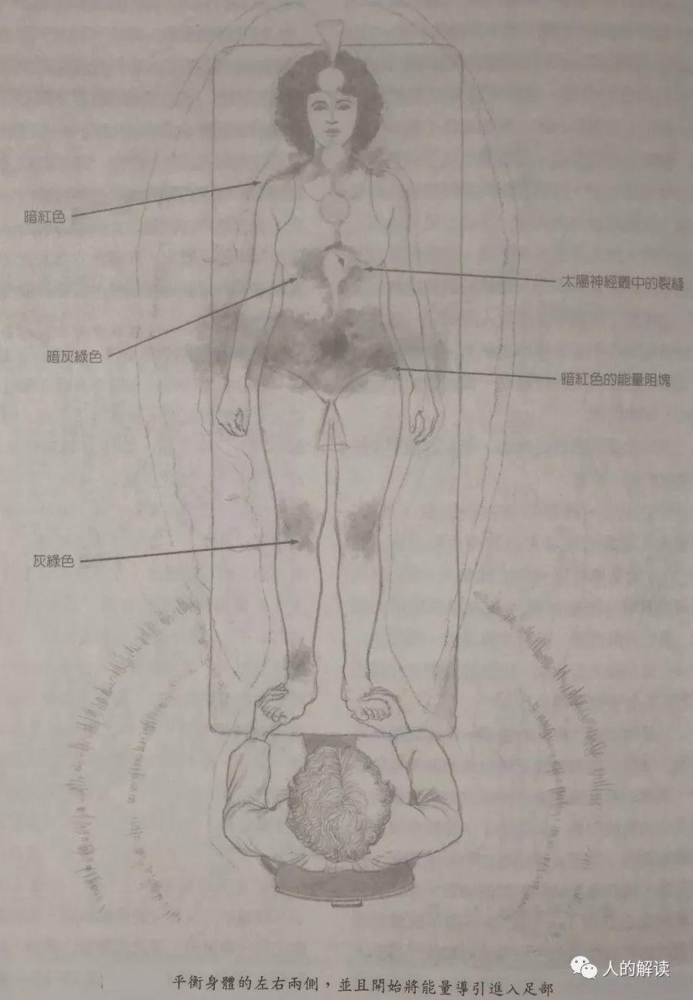

一旦疗愈师清理了自己的能量场，脉轮是干净的，就可以从宇宙能量场吸收代谢所有的颜色，个案的能量场则会直接吸收它所需要的。

下图显示，能量透过疗愈师的垂直能量流，先进入心轮后，再流入疗愈师的其他脉轮，然后又再流出、经过疗愈师的手臂与双手，进入个案的气场中。

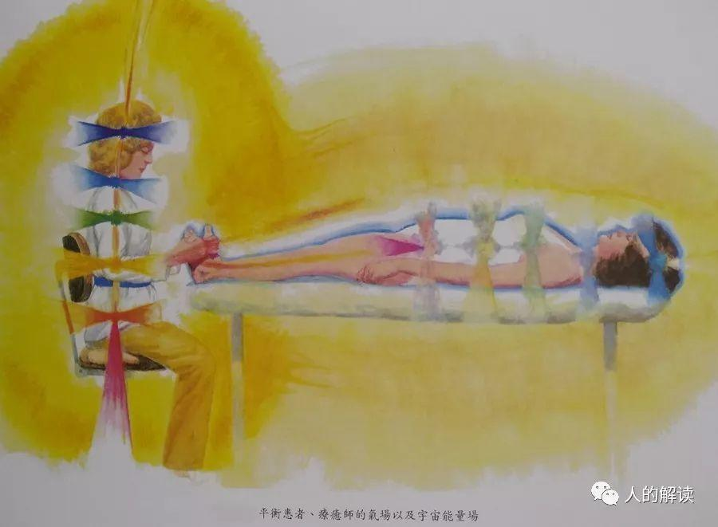

经过几分钟的工作后，流动的强度会减弱，并且有相等的能量随着身体两侧往上流。这意味着整个气场大致获得了平衡，而该准备移往下一个位置。

请注意玛丽的气场，见下图对比，已经净化了许多。

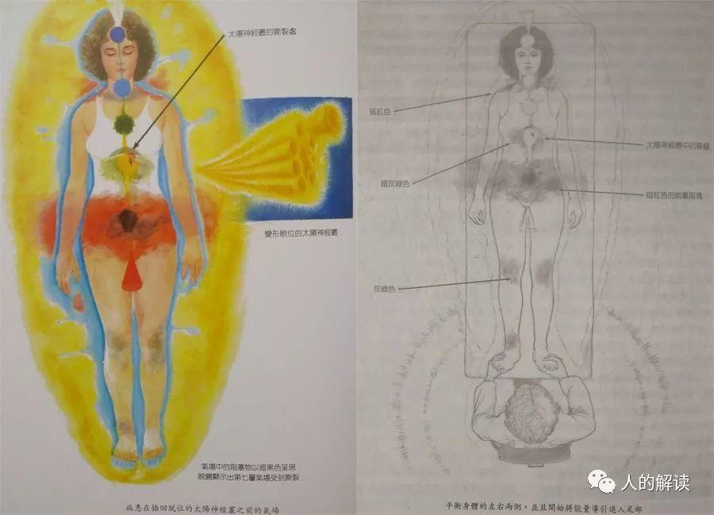

清理完个案的左侧，然后再清理右侧。让能量经由个案的脚，从疗愈师的右手流到左手。最初能量流可能是微弱的，然后能量会如河流般满溢，能量流动变得强烈。

当完成能量注满后，将手移动到右脚踩/膝盖位置，见下图。

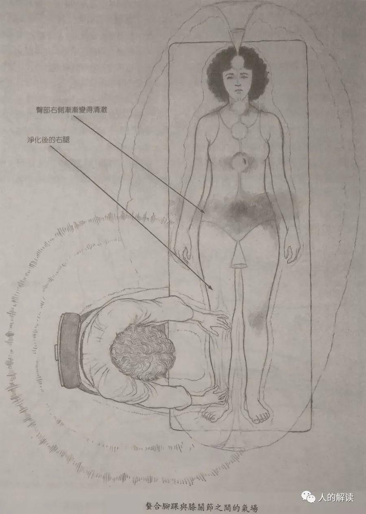

当在脚踝和膝盖之间进行蝥合，右大腿和臀部的乌云变得清澈，能量场也变得明亮了。然后位于太阳神经丛左侧的些许黑暗开始获得清除。

继续由腿部往上工作，从关节到关节、膝盖至臀部，左侧、右侧，见下图。

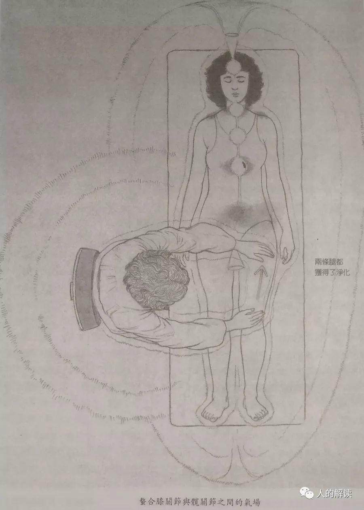

当顺着身体往上继续工作，个案的气场继续被净化，她将进入一种意识转变的状态。

从臀部移动到第二脉轮(见下图)，现在个案骨盆部位的气场净化了，尤其是在双手之间的区域。

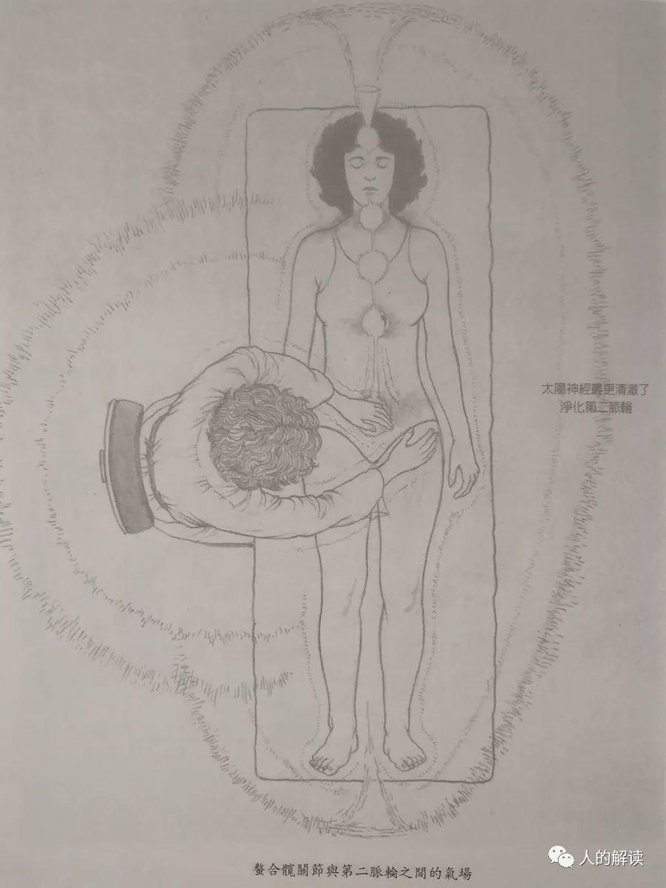

当第二脉轮被彻底净化、充能和平衡之后，将右手移到第二脉轮，左手移到第三脉轮(见下图)。

需要花更多时间在个案玛丽的第二个和第三个脉轮，因为那里最为堵塞。

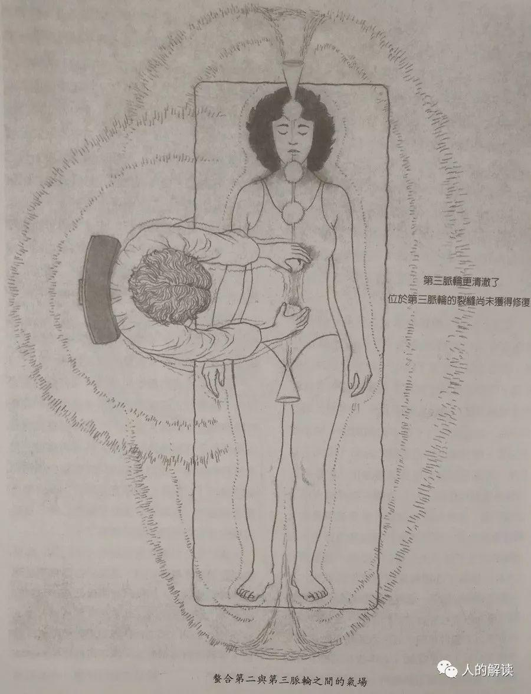

当你净化了这个区域，把你的右手放在第三个脉轮，左手放在第四个脉轮上，继续能量蝥合。

下图显示，能量蝥合 (冲刷) 清理了玛丽较低四个层次的气场。

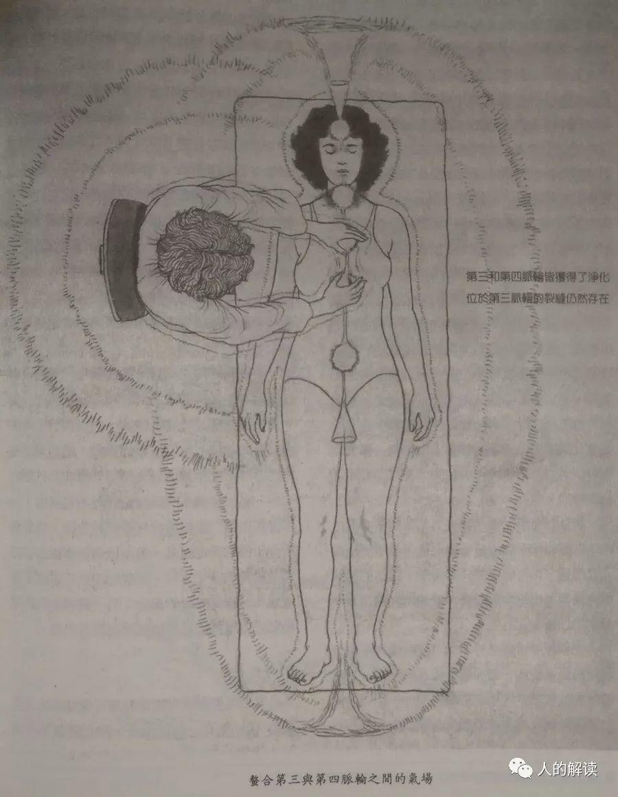

以玛丽的情况而言，她的气场已获得清理并且明亮许多，如图所示。在第二、第三与第四脉轮区域进行冲刷，因而释放了她的情绪，将她带入深度放松的状态。

她能量场里的前四层已干净到足以支持第五层和第七层的工作。

#### 4、疗愈以太模板层，灵性手术

模板层的工作只能在前四层的气场已经完成净化后进行。如果指导灵决定进行以太模板层工作，疗愈师会得到示意。

只要将双手放在身体的两个位置，通常在两个脉轮上，并让双手停在那里休息。此后，指导灵会控制一切发生的事，疗愈师大多处于被动状态。

见下图，可以看到一位指导灵的手臂跟疗愈师的相互穿透，光从此流泄而出。

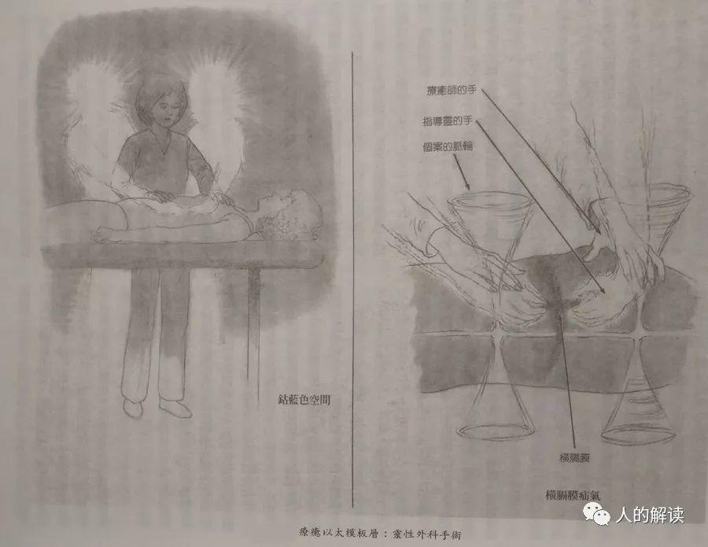

以太模板疗愈，这些过程与外科医生在医院手术室进行身体层次的手术是如此雷同。

指导灵们要施行一次手术，便会穿过疗愈师的手臂伸出软管来，然后通过疗愈师的双手往下进入个案的体内。

祂们使用的所有设备与一位正常外科医生是相同的——解剖刀、夹子、剪刀、针、注射器等，牠们会割开、刮除、切断东西，进行移植手术、把东西缝回去。这就是所谓的灵性外科手术，只不过用到的手术器具都是能量形态罢了。

当疗愈师让双手被动地停驻在个案身上，以太手会与肉体双手分开来，然后深入到个案的体内。

进行以太模板工作的指导灵们（可称祂们为外科医生）， 继而会将祂们的手通过疗愈师的以太手来实际执行操作。当祂们这样做时，疗愈师的以太手尺寸便会大幅度地膨胀扩展开来。

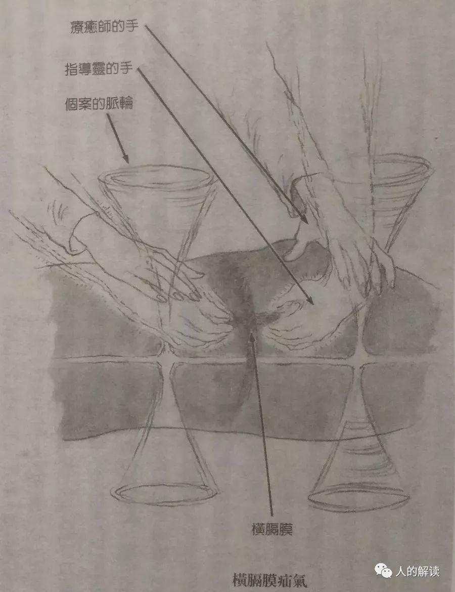

玛丽已准备好接受进行横隔膜裂孔疝气的以太模板工作。当疗愈师将手放在第三和第四脉轮时，以太手会朝下浮动。

可观察到指导灵的手通过疗愈师的以太手滑入个案体内，看着祂们缝合横隔膜疝气。指导灵们修复了裂伤，将新重建的模板与第五层模板其余部分再度连结起来。然后会感觉到祂们开始收回能量。

等指导灵完成后，祂们会进行消毒并慢慢地收拢切口。疗愈师的以太手会缓缓地收回表层并与肉体双手合体。直到开口收拢，新旧气场重新连结，疗愈师的手才离开个案的身体。

这种灵性外科手术，有时会持续四十五分钟。

所有这些工作都是在气场的第五层进行。这一层似乎存在于负空间之中，在负空间中，所有我们预期是空无的区域都被填满；而所有我们预期填满的似乎是空无。要不怎么进行灵性手术呢？

以太手术的工作， 本质上即是为个案以太身体创造一个新的负空间，让个案得以在其中生长、重获健康。

这与古埃及的能量医学非常类似。比如古埃及使用治疗针管 (healing rods)可以使四肢重新生长，治愈组织。或者通过能量权杖(energy rods)，可以使战场上失去的器官如手、四肢重新长出。这种疗法，可能就是以太模板层的工作。

#### 5、疗愈天光体

疗愈天光体（气场的第六层）的主要工作，将透过心轮、第三眼和顶轮来进行。

把双手交握成杯状，拇指交叉，其他手指并拢，覆盖在个案的第三眼之上，提高疗愈师的振动频率达到光的境界，然后让能量向下徜流、并从疗愈师面前进入到个案的脑中枢(见下图)。

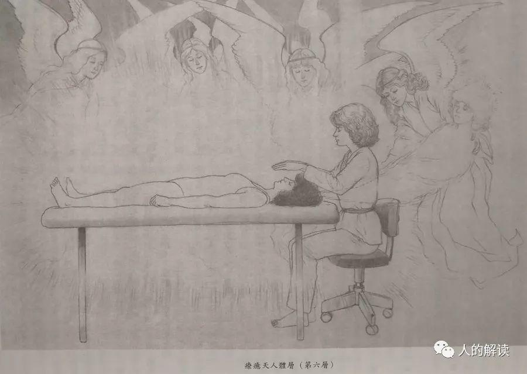

#### 6、疗愈因果模板层，重建模板、重建脉轮

许多时候气场在第五层受损，第七层也会受损，所以需要重建因果模板层。疗愈师需要极度的专心和控制气息才能达到第七层。

这一层次的金光十分强而有力， 许多时候，它以非常强韧的细金线来呈现。

以金光重建第七层的因果模板工作，采两个主要部分进行：清洗并重建脏腑、肌肉、神经或身体其他部位的网格结构；以及重建脉轮。

##### 6.1 重建模板(网格结构)

指导灵的手以覆盖在疗愈师双手上的方式直接穿透，祂们从双肩往下、进入治疗师的手和手臂。

细微的金线从疗愈师的手指延伸出来，在引导之下非常快速地移动着，金线移动得比疗愈师复杂快速的手指动作更为迅速。

指导灵要重建一个器官的因果网格通常得从体内取出器官的网格结构，这唯有个案的意识允许才可能发生。

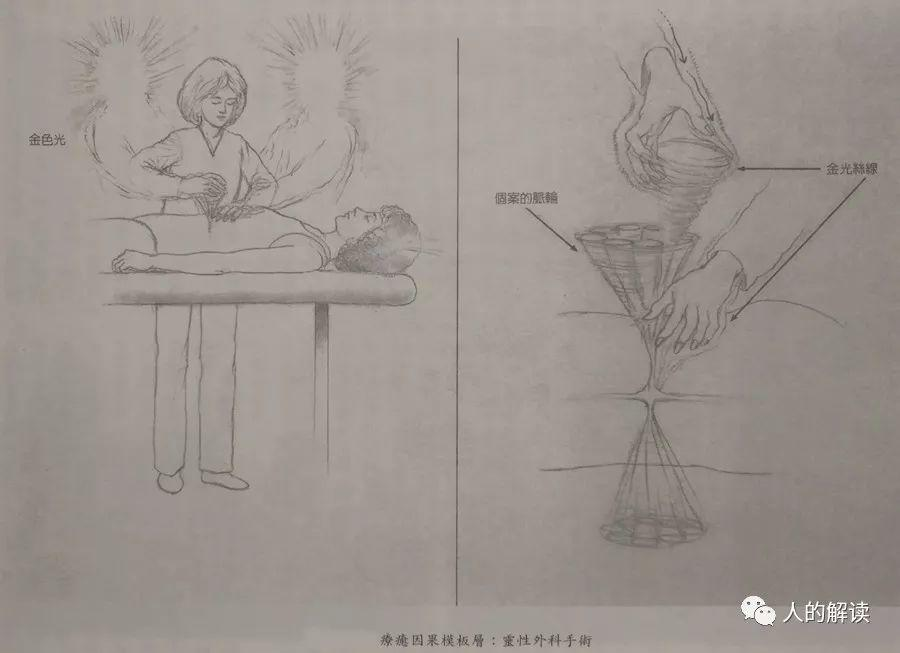

疗愈师的双手迸发着巨大的光势能和强劲的能量，以此移除器官的因果气场。之后器官会飘浮在身体之上，在那里以更快速的手指运动来进行净化和重建，将蓝色的以太格网编织在具有白金色线的黄金模板上。

在器官被替换之前，以光净化和消毒身体内部的空间，当重建和杀菌完成后，器官会滑回体内。感觉好像是被吸回去般。器官被缝回原处，并充满蓝色光使其能量补充。

随后这个区域通常会充满棉花般、和缓的白光，这也是内部麻醉剂，然后通常整个区域会覆盖上金色能量绷带用以进行保护。

##### 6.2 重建脉轮

在玛丽横隔膜裂孔疝气的情况下，她太阳神经丛的一个小漩涡看来就像一个弹出的弹簧。想要疗愈它，需要将它推回并缝好，重建防护筛并给它一个保护盖，协助其用一段时间来疗愈。

所有这一切都是由指导灵指引疗愈师的手以及疗愈之光来进行的，疗愈师的手会自动移动。

疗愈师的手近乎是不由自主地在玛丽的第三脉轮上移动。可以看到金光细线正在缝合玛丽脉轮上的小漩涡。

疗愈师的手指尽可能快速地移动，金线也更快地、以几千倍加速度移动着，金光强制受损的漩涡回到其正常位置。

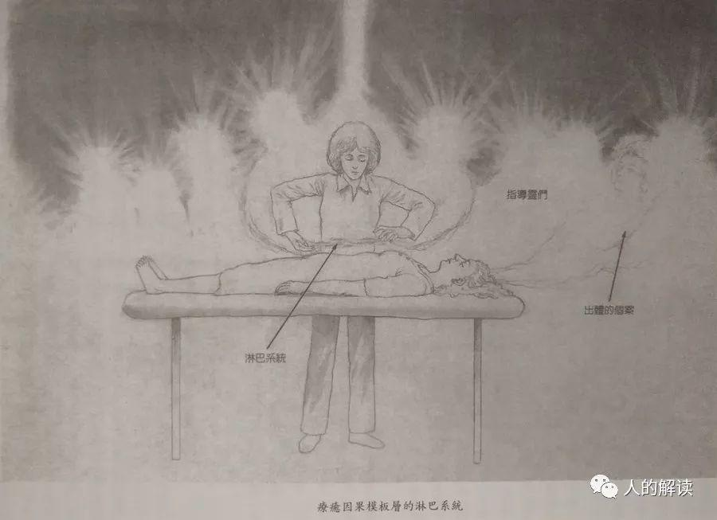

#### 7、封闭因果模板层

因果模板就像是蛋壳保护着小鸡一般。因果模板可能在某些地方薄，甚至出现断裂或破洞，这些都需要进行修补。整个因果层需要恢复成一个美好、坚固的蛋壳形状。

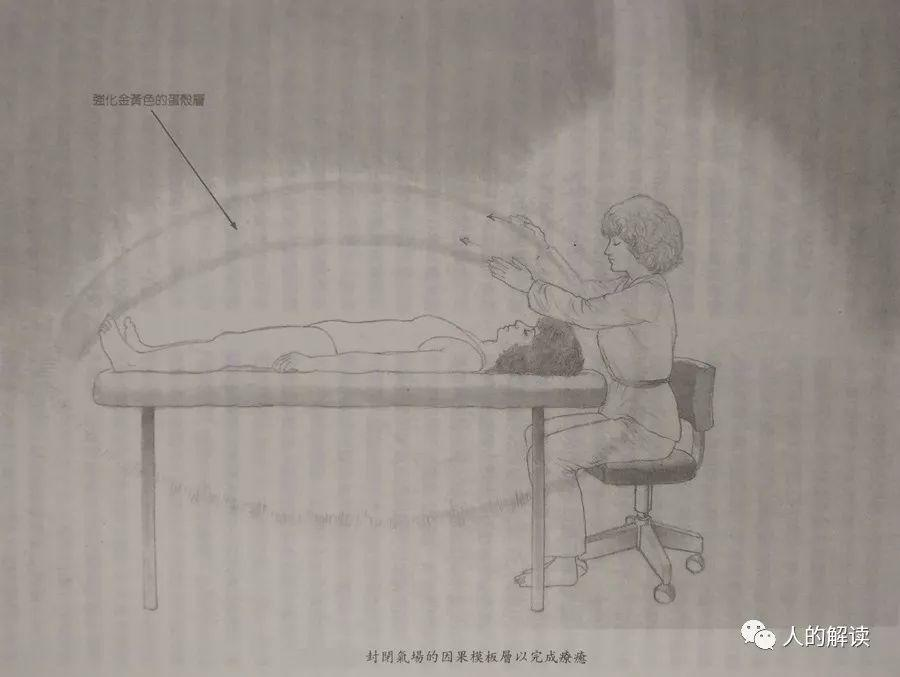

下图显示疗程后个案玛丽的气场，将其与疗程前她的气场做个比较，变化非常明显。如果没有指导灵，恐怕灵性手术很难完成。所以我们并不孤单，在我们最需要帮助的时候，指导灵与我们同在。

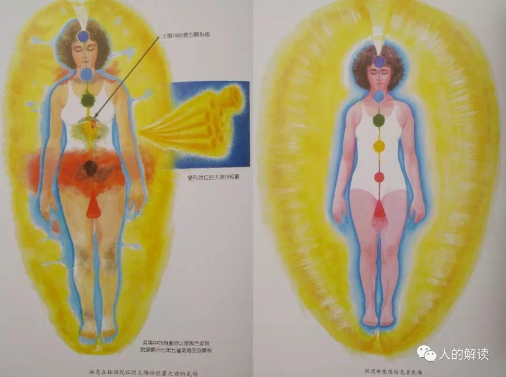

### 疗愈前世创伤

> 信息源：千帆过，转载自：[人的解读](http://www.rendejiedu.com/1304.html)

某些疗愈师在与个案进行身体接触时，会自然地看见个案的前世。比如可能用手触及个案的一个特殊的阻碍位置，然后就看见了前世。疗愈师要切记，疗愈的目的不仅在于疗愈身体，更重要的目的是在**疗愈灵魂**。

一旦疗愈师得知创伤来自前世， 必须协助个案将此生事件与前世经验连结。这个气场能量层中来自前世的结构性问题，通常会导致身体上的先天问题。 
 
接下来，我们看一个案例，一个叫约翰的年轻人，他是位戏剧导演。疗愈师首先目睹了他气场中的结构性问题，还「看见」前世某景象的画面，它与这个气场的创伤有关。

下图是因果模板层正常气场的样貌。太阳神经丛脉轮(solar plexus chakra)原本应该是由美丽金色的纤维构成的旋转花瓣。

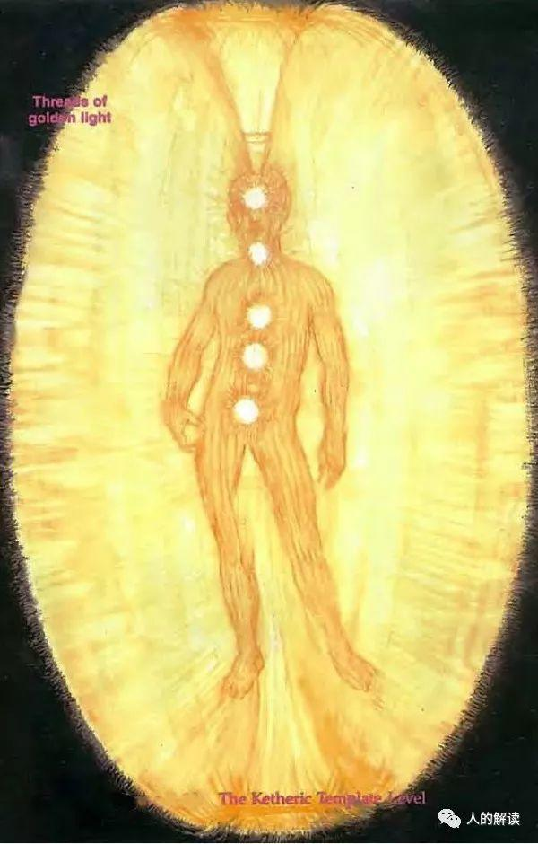

但约翰的却是像太阳黑子般的结构，有一大团红、黄黑色的纠结能量，并从这些能量流中创造出小漩涡，看起来大部分是灰色。多数其他脉轮都没有受损。主垂直能量流中沿着脊椎上下流动的金色能量波大幅右倾，朝向太阳黑子那块很暗的区块去。在气场后面部分也有小型灰色的漩涡形成。

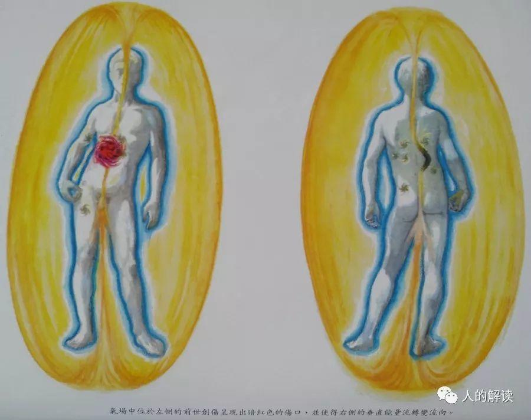

疗愈师看见约翰在前世大约成吉思汗时代的景象，这个景象是战时，他正饥渴地手持武器要杀戮一位「敌军」兵士。他拿的是有链的棍棒，链的尾端有一个带刺铁球，他用这个武器重创敌人头部。就在这发生的同时，敌人用长矛戳进约翰的太阳神经丛，在这场互动中两人都丧了命。这个经验让他相信，任何嗜血、武力的生命力能量展现，都会导致伤亡。 疗愈的过程中，在能量蝥合疗愈之后，疗愈师用一块水晶挖出靠近太阳神经丛伤口淤积的能量。这个淤积的能量来自于气场的第二和第四个能量体。

许多淤积能量，都在气场的第二跟第四层被清除了。疗愈师在他第五个能量层的太阳神经丛，也就是以太模板层，发现了嵌入的长矛。长矛的把手完全深植在气场中，弯曲成一个螺旋体，见下图。前世刺死自己的长矛，竟然存在于今生的气场之中！

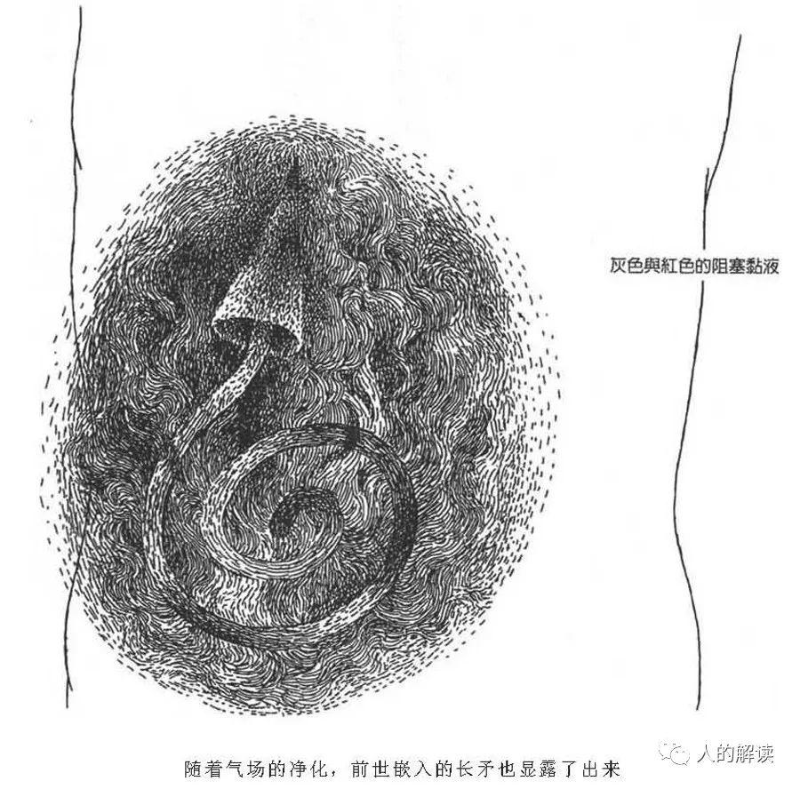

为了去除它，疗愈师首先必须拉直把手，然后握住把手猛力地把长矛拉出来。之后进行伤口清创，让这个区块重生。约翰有脊椎侧弯，他天生有这个问题，也从来没有动手术矫正。而这个先天疾病，正是由前世直接造成的结果。

然后，疗愈师和指导灵合作，在因果模板（第七气场层）重建气场。首先在那个区块重建器官的模板，然后再重建脉轮。重建之后，脉轮看起来像下图所示，成为金光编织成漩涡的一朵美丽莲花。

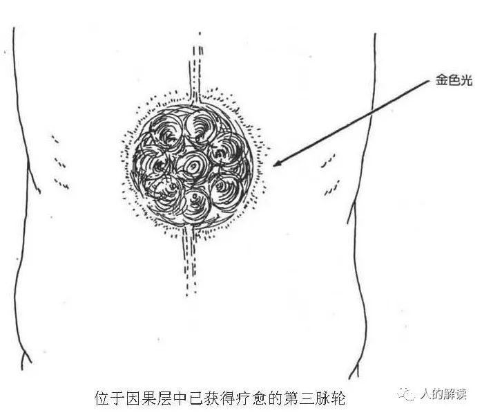

脉轮重建完毕之后，疗愈师和指导灵重建了颜色变得黯淡、脱位的主能量流，使它与轮脉重新连结，恢复到了正常状态。

可见，能量疗愈，跟前世催眠回溯疗法一样，都可以清除前世的创伤。

#### 前世束带

为何前世创伤会存在于今生的气场？这就不得不提前世束带(Past-life Bands)。与一个人今生此时发生事件相关的前世束带，可在个案的脸部与颈部找到，就在气场外两英呎半到三英呎的地方。这些束带与这个人今生从事的任务，以及为了成长所需要做的工作有关。所以，应该尽量不去更动它们，除非疗愈的需要。

如果你有灵视能力，将你的手放在个案脸的上端，用右手跟随束带往右，左手跟随束带往左，你就可以看见以线性时间呈现的前世。解读个案前世，只需要将你的手放入气场中因果体或蛋壳层出现的色彩束带中。经由这个动作并且调频至该处的能量频率，你就可看见前世在你眼前流转。

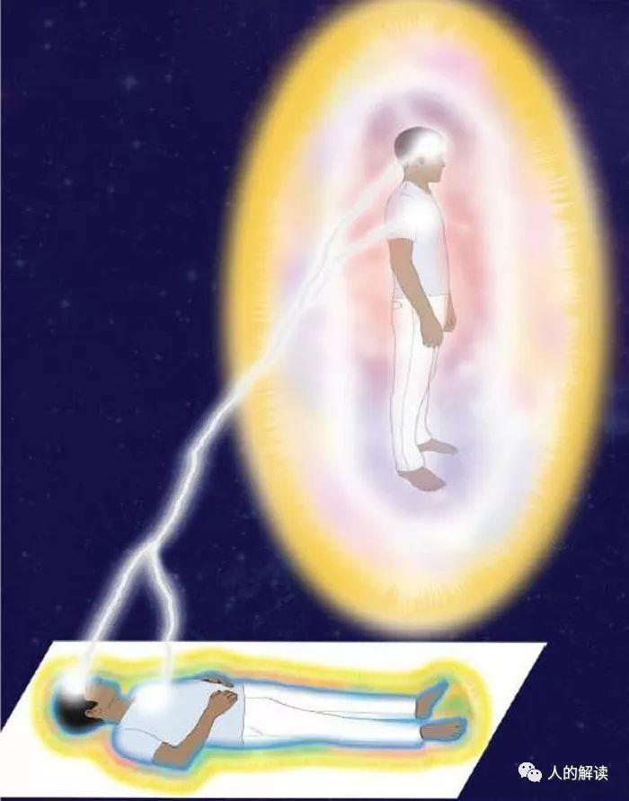

#### 同身转世

人的来生在出生前就已经被写在脉轮气场里，在此生功课完结的时候，如果这个人愿意，他可以用同一个身体接续过下一世的人生。