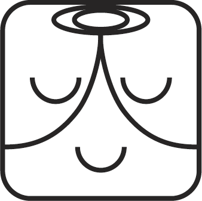
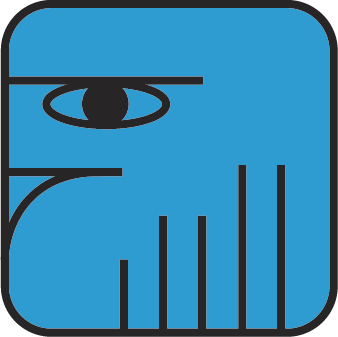
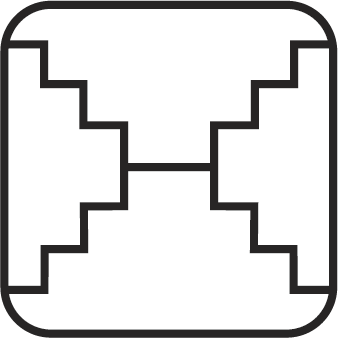
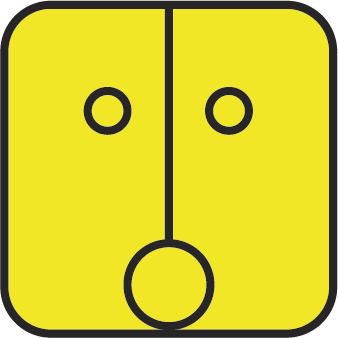

## 5种颜色

卓尔金历一共有5种颜色：

颜色|能量|方位
---|---|---
红色|启动、开始的能量|东
白色|净化、单纯的能量|北
蓝色|蜕变、转化的能量|西
黄色|收获、结果的能量|南
绿色|中央、宇宙的中心|中央

## 13个调性

调性（Tones）指的是银河音阶、数字的频率，不同的数字拥有不同的能量及振动频率。

代表调性的符号，分为五个家族：

- 一点家族：独立的，是自己的引导者；
- 两点家族：双数的，二元性；
- 三点家族：服务的，人生以服务为目的；
- 四点家族：稳定的，天生拥有稳定的力量；
- 横线家族：展开的，由点连成线，具有展开的能量。

共有13种调性：

## 20个图腾

序号|图腾名|图腾|力量|行动|本质|星际原型|说明
---|---|---|---|---|---|---|---
1|红龙||诞生|滋养|存在|源动力|[红龙图腾](https://mp.weixin.qq.com/s/YMvs0UFgnyEJP6RL8LbmYQ)
14|白巫师||永恒|施魔法|接受|巫师|
15|蓝鹰||视野|创造|心智|预见者|
18|白镜子||无止境|反射|秩序|瑜伽士|[白镜子图腾](https://mp.weixin.qq.com/s/BsFZT5PtzhtJYksusZ-Z3Q)
20|黄太阳||宇宙之火|开悟|生命|启蒙者|[黄太阳图腾](https://mp.weixin.qq.com/s/cKAm2S2EqBa60c9q6Od2qQ)