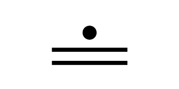
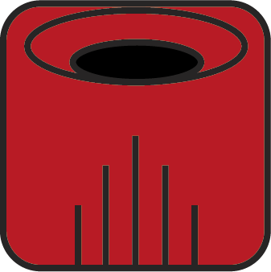
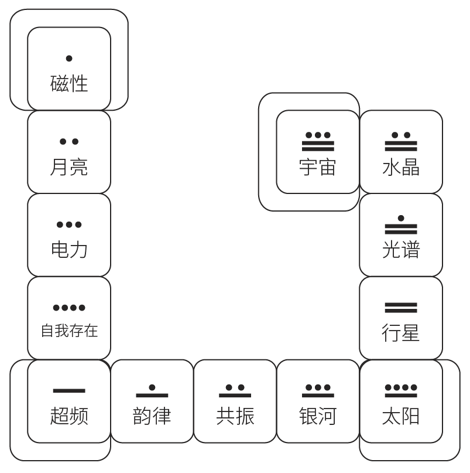

## 13月亮历法

13月亮历法每一年的开始是公历的**7月26日**。这一天，如果你在宇宙中看，太阳、地球、天狼星在同一直线。如果你在地球上，会看见太阳和天狼星在地球上同时升起。

13月亮历是和天狼星关系密切的一套历法。在用13月亮历法进行时间坐标的播报时，都会在前面加上NS（New Sirius），是新天狼星周期的意思。

在13月亮历法中，每年是从公历的7月26日，到次年的公历7月25日。而**7月25日**是特殊的一天，被称为**无时间日（Day out of time）**。

### 周期序和共时序

周期序，是13:28频率，是一年365天的循环，即一年13个月，每个月28天，外加一天无时间日。 

共时序，是13:20频率，即13个调性、20个图腾，是260天的循环。

外围的13个月代表着周期序，内部的卓尔金历代表着共时序。加在一起才是13月亮历法。看某个人的出生携带讯息时，应该结合周期序和共时序一起看。

### 5种颜色

卓尔金历一共有5种颜色：

颜色|能量|方位
---|---|---
红色|启动、开始的能量|东
白色|净化、单纯的能量|北
蓝色|蜕变、转化的能量|西
黄色|收获、结果的能量|南
绿色|中央、宇宙的中心|中央

卓尔金历的绿色格子是银河启动之门，来到这一天的时候，次元和次元间的门户离得比较近，能量可能较强。

### 7种等离子

在13月亮历法中，一周7天用等离子符号来标注。

每个等离子都有对应激活的脉轮:

### 13个调性

调性（Tones）指的是**银河音阶**、数字的频率，不同的数字拥有不同的能量及振动频率。

代表调性的符号，分为五个家族：

- 一点家族：独立的，是自己的引导者；
- 两点家族：双数的，二元性；
- 三点家族：服务的，人生以服务为目的；
- 四点家族：稳定的，天生拥有稳定的力量；
- 横线家族：展开的，由点连成线，具有展开的能量。

共有13种调性：

序号|调性名|调性|力量|行动|本质|代表动物|代表提问|说明
---|---|---|---|---|---|---|---|---
1|磁性||合一|吸引|目的|蝙蝠|我的目的是什么？|[磁性调性](https://mp.weixin.qq.com/s/RZOA0EPO4gNTAzBWcfLbBw)
2|月亮||二元|稳定|挑战|蝎子|我的挑战是什么？|[月亮调性](https://mp.weixin.qq.com/s/VdPJQo2VSeFhvRH_Acnd4Q)
3|电力||启动|联结|服务|鹿|我如何提供最好的服务？|[电力调性](https://mp.weixin.qq.com/s/FlrYn7uZfE4369bG_uu2vQ)
4|自我存在||定义|衡量|形式|猫头鹰|我以何形式提供我的服务？|[自我存在调性](https://mp.weixin.qq.com/s/IdG_mbMKTlHdG1vW_HKg6w)
5|超频||彰显|主宰|放射|孔雀|我如何拿回最大力量？|[超频调性](https://mp.weixin.qq.com/s/YaflWrxXkhBYBa_68C5n_A)
6|韵律||组织|平衡|平等|蜥蜴|我如何把我的内在平衡给更多人？|[韵律调性](https://mp.weixin.qq.com/s/Frzt05ywDJ2z41modTRejw)
7|共振||通道|启发|调和|猴|我如何调整自己以更好地服务他人？|[共振调性](https://mp.weixin.qq.com/s/hzP9WK2SXabEd9jB6aC90w)
8|银河||和谐|塑造|整合|老鹰|我是否活出我所相信的？|[银河调性](https://mp.weixin.qq.com/s/V6AmOFpTdzakHkIcxd646Q)
9|太阳||脉动|实现|意图|豹|我如何完成我的目的？|[太阳调性](https://mp.weixin.qq.com/s/7k0avWLtKJzOhI9qc27bag)
10|行星||完美|产生|显化|狗|我如何完美我的作为？|[行星调性](https://mp.weixin.qq.com/s/ny00x4L3O7bKiZM1oidv5Q)
11|光谱||消解|释放|解放|蛇|我如何释放与放下？|[光谱调性](https://mp.weixin.qq.com/s/yrl4DuvRiDYannoJS1yRuQ)
12|水晶||奉献|普及|合作|兔|我如何全然地奉献我自己？|[水晶调性](https://mp.weixin.qq.com/s/vIXhNRN_C6d-6slBlhPqHQ)
13|宇宙||安忍|超越|存在|龟|我如何扩大延伸我的喜悦和爱？|[宇宙调性](https://mp.weixin.qq.com/s/XkEC6jwIWIyqmrojCsJeoQ)

#### 周期序出生月份调性和星系印记调性

一个人的出生信息里，目前来看包含两个调性。

第一个，是周期序里面出生月份的调性，而另一个，是共时序里面星系印记的调性。

这两个调性都是一个人的出生能量，对人都有影响。

需要注意的是，如果一个人的出生月份和自己的星系印记的调性正好相同，那需要格外注意这个调性所带来的讯息。

大部分人出生月和自己星系印记对应的调性都是不同的，可以同时关注这两个调性代表的问题，都会对你有影响。

### 20个图腾

序号|图腾名|图腾|力量|行动|本质|星际原型|类型|说明
---|---|---|---|---|---|---|---|---
1|红龙||诞生|滋养|存在|源动力|输入通知（红）|[红龙图腾](https://mp.weixin.qq.com/s/YMvs0UFgnyEJP6RL8LbmYQ)
2|白风||灵性|沟通|呼吸|女祭司|输入通知（红）|[白风图腾](https://mp.weixin.qq.com/s/46dmqbpZAW2uAT-ybZAH9g)
3|蓝夜||丰盛|梦|直觉|梦想家|输入通知（红）|[蓝夜图腾](https://mp.weixin.qq.com/s/l91nWfJGshRc9N7JF_kjqw)
4|黄种子||开花|目标|觉知|天真的人|输入通知（红）|[黄种子图腾](https://mp.weixin.qq.com/s/pHdiRhk-DFv3h67PRMkv2g)
5|红蛇||生命力|生存|本能|开创的蛇|储存记忆（白）|[红蛇图腾](https://mp.weixin.qq.com/s/W7xDn4XbXNgzHM7tSk8Yig)
6|白世界桥||死亡|平等|机会|导师|储存记忆（白）|[白世界桥图腾](https://mp.weixin.qq.com/s/ay8-_NWH7jSWGndDhIJ_KA)
7|蓝手||实现|知晓|疗愈|阿凡达|储存记忆（白）|[蓝手图腾](https://mp.weixin.qq.com/s/Uc5qSULg9QCcnm6mp3UlVA)
8|黄星星||优雅|美化|艺术|艺术家|储存记忆（白）|[黄星星图腾](https://mp.weixin.qq.com/s/EUaM-0c9YfizqmODdnYMJQ)
9|红月||宇宙之水|净化|流动|治疗师|程序制定（蓝）|[红月图腾](https://mp.weixin.qq.com/s/QXFv93qLzcYg7b5PcYg5Mw)
10|白狗||心灵|爱|忠诚|慈悲者|程序制定（蓝）|[白狗图腾](https://mp.weixin.qq.com/s/Ij29gZtjgKAHgaX_L-6xXg)
11|蓝猴||魔法|游戏|幻象|魔术师|程序制定（蓝）|[蓝猴图腾](https://mp.weixin.qq.com/s/Bwto3ZXBTFDCDz2XT0_NNQ)
12|黄人||自由意志|影响|智慧|智者|程序制定（蓝）|[黄人图腾](https://mp.weixin.qq.com/s/p89mOmyVS-yh607jeWvdQA)
13|红天行者||空间|探索|觉醒|预言家|输出传递（黄）|[红天行者图腾](https://mp.weixin.qq.com/s/662lEdXeeWMALbMDvywZ6w)
14|白巫师||永恒|施魔法|接受|巫师|输出传递（黄）|[白巫师图腾](https://mp.weixin.qq.com/s/j5h_GGrQWq9AvDhtLKl4dw)
15|蓝鹰||视野|创造|心智|预见者|输出传递（黄）|[蓝鹰图腾](https://mp.weixin.qq.com/s/FEi-cQ9I8ihfmiMJZcRkbw)
16|黄战士||才智|追问|无畏|探索者|输出传递（黄）|[黄战士图腾](https://mp.weixin.qq.com/s/pG2Qx3VGWVmtdLO40xABVQ)
17|红地球||导航|进化|共时|领航员|矩阵自动校准（绿）|[红地球图腾](https://mp.weixin.qq.com/s/awEWpO8wmXDCS1_UDdWkSQ)
18|白镜子||无止境|反射|秩序|瑜伽士|矩阵自动校准（绿）|[白镜子图腾](https://mp.weixin.qq.com/s/BsFZT5PtzhtJYksusZ-Z3Q)
19|蓝风暴||自体运生|催化|能量|世界变革者|矩阵自动校准（绿）|[蓝风暴图腾](https://mp.weixin.qq.com/s/D9MBshst-RDiqvZsdJnMiQ)
20|黄太阳||宇宙之火|开悟|生命|启蒙者|矩阵自动校准（绿）|[黄太阳图腾](https://mp.weixin.qq.com/s/cKAm2S2EqBa60c9q6Od2qQ)

### 260个星系印记（Kin）

一个调性和一个图腾加在一起，就形成了一个星系印记。卓尔金历一共有260个星系印记。

每个人根据自己的公历生日可以计算出自己的星系印记。先从下方的年份表中，找到自己的出生年，把年份右边对应的数字记录下来。

从下方的月份表中，找到自己的出生月，把月份右边对应的数字记录下来。

把年份的数字+月份的数字+出生日期的数字，3个数字相加所得的数字就是自己的星系印记（Kin），如果得出的数字超过260，就减去260，直到260以内。对照卓尔金历的数字，找出自己的图腾和调性。

### 星际坐标

在每日能量播报中，我们经常用**NS 1.34.3.7**这样的数字来标定时间坐标。

- NS 是 New Sirius的缩写，是新天狼星周期的意思。
- 第一个数字“1”，代表新天狼星周期的第一个周期。这个周期是从1987年7月26日起，52年为一个周期。目前我们还在第一个周期里面。
- 第二个数字“34”，代表从1987年到2021年，刚好是第34年。
- 第三个数字“3”，代表是第三个月，是电力鹿之月。
- 第四个数字“7”，代表是第三个月的第七天。

只要看了这个星际坐标，我们就能确定我们所在的周期序。

## 玛雅天赋

### 5大天赋力量

每个人都有一个5大天赋力量（星系印记），展开以后，它由中间的**主图腾（Destiny Seal）**、右边（东方）的**相似图腾（Analog Seal）**、上方（北方）的**指引图腾（Guide Seal）**、左边（西方）的**相反图腾（Antipode Seal）**和下方（南方）的**隐藏图腾（Occult Seal）**组成。

星系印记的五大天赋能量，是动态的。而每一个位置，也本身就带有不同的能量属性。

#### 主图腾

主图腾，英文原文是Destiny Seal，命运图腾，它位于这个图形的正中央。

它之所以位于中间，就因为这个位置是最重要的。这个主图腾代表你的核心天赋能量，换句话说，你在进入游戏为自己选的那个角色，就位于这里。

比如，你选了想做“红天行者”，那么红天行者就会出现在正中央的这个位置。

主图腾是每个人最核心的能量，也是一个人最主要的人格特质，就仿佛说，每个人都会有很多的人格，但一个人如果想要去呈现一种稳定的状态，那么其中一种人格会是在最多的场景中被表现出来的。而主图腾，就是这个“主要人格”。

#### 相似图腾

右边（东方）的相似图腾（Analog Seal），是辅助着中央主图腾能量得以呈现的一种助力。

这种助力是稳定的，实打实的，它始终伴你左右，不离不弃。它给人的感觉，就好比是你在游戏选择角色之后，为角色选择的武器。

一个有武器的战士，总比赤手空拳的战士要强吧？至少肉眼可见是如此。相似图腾的意义就在这里。

#### 指引图腾

位于上方（北方）的指引图腾（Guide Seal），则经常会给予很多的灵感和讯息，就如同风一样，来去自由，有时候让人摸不着头脑。

但如果你越来越能够倾听到指引图腾所给予的指导，你的人生道路自然拓展。与此同时，指引力量还扮演着另一个角色，它不但给予信息，它还是主图腾升级进化之后，最终要去的方向，也就是第五力量。

#### 相反图腾

左侧（西方）的相反图腾（Antipode Seal），也叫挑战图腾、拓展图腾，它的能量像是一种流动的水。

它是一种看不见的力量，而且这种力量和你主图腾的力量又如此的南辕北辙，让你最初遇见它的时候，心里可能都会咯噔一下“你确定这也是我的一部分？为什么跟我完全不像呢？”

但，你知道吗？在地球上的所有一切，都是正反面同时存在的。你只是呈现了某个面向，但支撑起这个面向的另一个极端，就藏在相反（挑战/拓展）图腾里，存在于你看不见的流动当中。

这股相反力量，更多的是帮助主图腾的力量，去平衡和收获的。相反力量，就是借由延展你的舒适边界，让你不断地透过自我挑战去自我拓展，让你不断去发展出一种和主图腾能量南辕北辙又相得益彰的能量，在这个过程中，你丰富了你的生命体验，你也同时更大程度地拉伸了你的格局、拓宽了你的维度。

#### 隐藏图腾

隐藏力量（Occult Seal）。这是一种整合推动的能量，也是一种隐藏的神秘能量。

怎么去理解呢？它看上去是若有似无的，尤其是自己看自己，多半是看不到自己拥有它的，但别人看呢，又可以看到这股力量就在自己身上。

因为隐藏力量就如同冰山水面下的部分，被藏起来了。它平时更多时候是隐而不宣的，是秘密的。就比如我藏着一个秘密武器，但平时我肯定是不拿出来的，只有到了关键时刻我才会去使用它，否则，它就不是“秘密武器”了。

隐藏力量和相似力量的不同，就在于一个是藏起来的“法宝”，而一个是天天拿在手上的“武器”。

### 5大天赋力量隐藏着的恒定值

当一个人的主图腾是确定的，他的右边相似力量，左边相反力量（也叫做挑战或者拓展力量）和下方隐藏推动力量，就都已经是确定的了。

计算公式如下：
- **左边相反 = 主图腾 ＋10/-10**
- **右边相似 = 19 - 主图腾**
- **下方隐藏 = 21 - 主图腾**

黄太阳图腾是20，同时也是0。

上方指引力量是会跟着调性改变，是不确定的。可以根据下图表格来找到：

所有星系印记中，指引图腾的颜色和主图腾的颜色是相同的。

#### 主图腾 ＋ 相似图腾 = 19

如果你想知道右边相似力量是什么，只要拿19减去主图腾的数值，就可以了。

而19在历法的图腾中，正好代表的是蓝风暴的力量。所以，当你去运用你的相似力量时，它会直接带给你能量，协助你去蜕变，而我们动力场的演化路径，也是你选择开始蜕变之后，开始产生的。

#### 相反图腾 + 相似图腾 = 9

9号正好是红月的力量。我们前文中已经讲过，相反（挑战/拓展）图腾是阴性面向，而相似图腾，是阳性面向。所以，平衡阴阳的旅途中，我们最为需要的，就是红月的能量。

在历法中，红月代表着宇宙之水净化疗愈的能量，这也预示着，我们平衡体内的阴阳，需要我们同时净化自己的身体、思想、情感和精神，这是一次深刻的疗愈之旅，也是一次内在的神圣旅程。

#### 相反图腾 + 隐藏图腾 = 11

11在历法中代表着蓝猴。这意味着，当我们经由动力场的顺序将相反（挑战/拓展）图腾里收获的果实完整地整合进隐藏推动图腾中去时，我们需要看破幻象，真正看破自己制造的“迷雾弹”，真正忘掉所有一切的伟大与所有一切的渺小，在真实中得到智慧的宝石。

#### 主图腾 + 隐藏图腾 = 1

1在历法中代表红龙，万象更新的红龙。隐藏推动图腾是隐藏的宝藏，而当我们最终将动力场一圈四季四方位的智慧宝石经由隐藏推动图腾推送给主图腾时，我们完成了一次自我更新。

#### 主图腾 + 相似图腾 + 相反图腾 + 隐藏图腾 = 10

10在历法中代表白狗，白狗的能量，就是宇宙之爱的能量，是慈悲显化的能量，是心灵和忠诚的能量，是连接一切的能量，是摊开你掌心的能量。

当一个人的主图腾确定，这个人的相似、相反、隐藏，也同时确定了，而这些可以被确定的图腾相加之后，又得到了白狗爱的能量。也许一切都是未知的，不确定的，但唯有爱是已知的，确定的。

### 波符

波符是一个13个时间单元组成的能量区间。波符的一个格子，代表一个时间单元，一个时间单元，可以是一天，可以是一个月，也可以是一年，或者更长的时间。

卓尔金历260个时间单元，共有20条波符，每个波符共有13个时间单元。 每个星系印记，都在一条波符里。而每个人的人生轨迹，也暗藏在波符里，等待你去探寻。

#### 如何找到你星系印记的所在波符？

首先，先找到自己的Kin在13：20和谐矩阵的什么位置。然后，倒着往上找，也就是往上、往左找到磁性调性那一格是什么。

每一条波符都由这条波符第一格的图腾来命名。也就是磁性调性的那一天是什么图腾，这条波符就叫什么波符。

如果把20条波符按照颜色来区分，就是下页图所示的样子：

#### 13银河音阶

13银河音阶组成了一条波符。13银河音阶的所有基本讯息可以在下图表格中查询到。包括每个调性的代表动物、代表问题以及关键词。

#### 如何用波符13问来调整自己当下状态？

**调性代表问题，图腾代表答案。**

一个波符的13天，每天都有一个问题，而每一天的问题，都藏在这一天的图腾里。

## Hunab Ku 银河中心

Hunab Ku，也就是银河中心，天河的心脏。它是孕育生命的子宫。如心脏般跳动，一直向外散播频率和信息。

它是所有运动和测量的给予者。

它由空的力量驱动着，让所有一切可能发生。是第五力量的基础，是宇宙时空的组织者。同时，它也意味着，那些追寻着最高振动频率的人，可以听见的召唤。

Hunab Ku分三个音节：

- Hu 代表合一。
- Nab 代表测量和移动的方式，换句话说，也就是来到合一的方式。
- Ku 代表这个世界的最高振动频率，也就是内在神性。

整个Hunab Ku的图案由5种颜色组成。分别代表以下含义：

- 红色代表土著人、原住民；代表东方；代表土元素，身体。
- 白色代表白种人；代表北方；代表风元素，思想、心智。
- 蓝色代表黑种人；代表西方；代表水元素，情绪体。
- 黄色代表黄种人；代表南方；代表火元素，精神体。
- 绿色代表第五元素，是大自然的力量。

实际上，地球上进化最完全的生命体是树，树木，是完全的给予、奉献和产出的生命状态。

而人类进化的方向，是食气者，人们从依赖食物为生，逐渐转化为食气即可生存，换句话说，依靠有形的物质生存转化为依靠无形的能量就可以生存。

## 20图腾与身体和地理位置

### 20图腾与身体

从右手大拇指到右手小拇指，分别是黄太阳、红龙、白风、蓝夜、黄种子。右手代表的是黄色火部落。

接着是右脚，从右脚大脚趾到右脚小脚趾，分别是红蛇、白世界桥、蓝手、黄星星、红月。右脚代表的是红色血部落。

接着是左手，从左手大拇指到左手小拇指，分别是白狗、蓝猴、黄人、红天行者、白巫师。左手代表的是白色真理部落。

最后是左脚，从左脚大脚趾到左脚小脚趾，分别是蓝鹰、黄战士、红地球、白镜子、蓝风暴。左脚代表的是蓝色天空部落。

这是20图腾的其中一种分类方法，是色彩组合分类法。这4个部落，是由银河星系的四大元素（火、血、真理、天空）中的其中一个作为基础所组建的原始银河系殖民团队。每一种元素正好对应四个色彩组合中的其中一种。

平常我们可以关注我们身体的20个手指脚趾，来感受这20图腾为我们传递的讯息。比如，哪个手指/脚趾今天突然疼痛、痒或者受伤，看看对应的图腾是什么，它在传递给你什么讯息？

此外，右手→右脚→左手→左脚，整个循环又会形成一个数学中无限的符号（∞）。

### 20图腾与地理位置

中国所在的区域，主要是由三个图腾的力量所构成的。北方、东北地区的红蛇，中部和西南、西北广大地区的红龙，以及南方的白风。

非洲大陆正好是红地球的能量，非洲原始、原生态，与大自然最为贴近。 

欧洲的区域是黄太阳，欧洲是目前全世界最发达的地区之一，人们的意识维度是比较高的，尤其是北欧地区，在教育等方面都是非常领先的，而黄太阳正好代表开悟的力量，领会生命真谛的力量，这也与欧洲整体的能量相当吻合。 

日本是白世界桥，白世界桥的力量是死亡，而日本作为二战的发起国之一，确实某种程度上使用了死亡的力量，但遗憾的是，却是错误使用的。在日本，断舍离非常流行，“怦然心动的人生整理术”，也从这个区域传向世界各地，而这些，恰恰也是白世界桥的力量。

### 图腾分类法

- 第一行的白狗、蓝鹰、黄太阳、红蛇，是极性家族，对应顶轮。
- 第二行的蓝猴、黄战士、红龙、白世界桥，是基本家族，对应喉轮。
- 第三行的蓝手、黄人、红地球、白风，是核心家族，对应心轮。
- 第四行的黄星星、红天行者、白镜子、蓝夜，是信号家族，对应太阳神经丛。
- 第五行的黄种子、红月、白巫师、蓝风暴，是通道家族，对应海底轮。

每一个地球家族，都包含一对相反的力量。

核心家族，除了包含一对相反的力量之外，还包含一对相似的力量。信号家族，除了包含一对相反的力量之外，还包含一对隐藏推动的力量。

我们的完美相反力量和我们的星系印记力量之间，就隔着一个kin130宇宙白狗，这是整张卓尔金历的中心，代表着爱是最重要的。当你能够跨越一个宇宙白狗的力量，去到你的完美相反的时候，其实就说明你已经完成了一个最大限度的自我挑战和自我拓展。其实，当有了爱，当学会了爱，相反力量对你的挑战你也就完成了。

## 13银河音阶与身体

13个调性分别代表13个身体关节。

磁性调性位于右脚踝，月亮调性位于右膝盖，电力调性位于右胯，自我存在调性位于右手腕，超频调性位于右手肘，韵律调性位于右肩膀。

共振调性位于整条脊柱。 银河调性调性位于左肩膀，太阳调性位于左手肘，行星调性位于左手腕，光谱调性位于左胯，水晶调性位于左膝盖，宇宙调性位于左脚踝。

身体里藏着的13调性，可以怎么用呢？ 

你可以把自己的出生波符画上去，看看平常自己身体哪个地方有一些疼痛和感受，对应看看自己的出生波符这个关节代表的图腾是什么，那么也许就会给自己一些启发。 

除此之外，透过身体上13个银河音阶的图，你也很容易看到哪两个调性互为左右对称，有时候互为左右对称的两个调性之间，也会有一些连锁反应。比如，如果你感觉自己身上的电力调性过于微弱时，可能也要同步去看看与之对应的光谱调性是否是平衡的。

## PSI

Psi全称是行星记忆库，就是地球的大脑，里面储存着所有在地球上宇宙里的发生，意识层面的、无意识层面的。在另外一些系统里，Psi也被叫做“阿卡西记录”。

你可以想象在地球外部包着8个卓尔金历，北半球有4个，南半球有4个，南半球的4个卓尔金历与北半球的呈现反向倒置的关系。 

这里有一些数据需要和大家说明：
- 一个行星记忆库板块 = 2个260个单元的卓尔金历；
- 一个行星记忆库板块 = 520个单元（包含2个卓尔金历，一个在北半球，一个在南半球，形成反向倒置）；
- 一个完整的行星记忆库 = 4个行星记忆库板块 = 2080个单元。

### 查找出生时携带的Psi行星记忆库

第一步，在下图中找到自己公历生日对应的13月亮历生日，比如一个公历是1月1日的人，对应的13月亮历生日是韵律之月第20天，也就是13月亮历的6月20日。

第二步，回到下图Psi Bank表格中，查到你13月亮历生日对应的星系印记。比如在上述例子中，就是找到6月20日对应的是电力黄太阳。所以公历1月1日出生的人，Psi都是电力黄太阳。

在13月亮历的月份中，每个月的前6天和最后6天，每3天共用一个Psi。无时间日出生的人，连接着所有次元，没有Psi。

### 激活每日的Psi激活和你出生携带的Psi

每天，我们跟随13月亮历法生活时，也会同步启动一个“行星记忆库时间单元”，标记为Psi。

这个Psi如何激活？ 

可以进行这样的观想练习，静下心来，观想有8个卓尔金历笼罩着地球，南半球的4个与北半球的4个反向倒置。 

然后，观想今日启动的Psi在8个卓尔金历中的位置，再加上当天Psi印记的颜色。比如，今天的Psi如果是Kin55电力蓝鹰，就想象激活的8个Psi光点，都散发着蓝色的光芒。 

可能这样的观想对于初学历法的小伙伴来说有点难，但是，相信我，随着你对历法的熟悉，这样的观想会越来越容易的。 

可能有人要问，那么如何激活我出生携带的Psi呢？ 

其实和激活每日的Psi能量是一样的。只是把观想的光点换成你的Psi，同步再更换颜色就好。