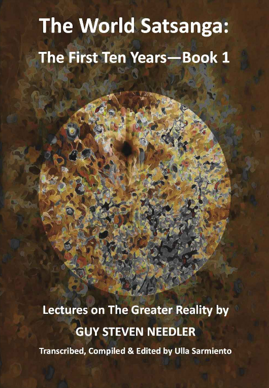
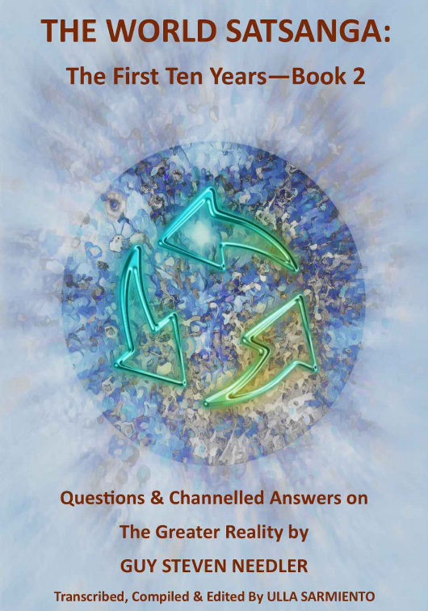
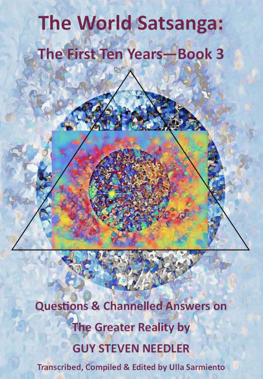

## The World Satsanga: The First Ten Years Book 1

**The World Satsanga: The First Ten Years Book 1** 

**Lectures on the Greater Reality By Guy Steven Needler**

**Transcribed, Compiled and Edited By Ulla Sarmiento**

> Copyright © 2023 by Guy Steven Needler All rights reserved. No part of this book, in part or in whole, may be reproduced, transmitted or utilized in any form or by any means, electronic or mechanical without permission in writing from the Author except for brief quotations embodied in literary articles and reviews. 
>
> Cover Designed by Celia Austen-Potts 
>
> The base image is one of her paintings, which she remastered digitally and enhanced. The images, across the books, signify going from darkness and confusion into the light, clarity and complexity as one progresses through them.
>
> ISBN: 9798393790325

With thanks and gratitude to the following people: 

The World Satsanga participants for their never ending stream of questions and dedication to knowing more about the Greater Reality. They are an inspiration. 

Ulla Sarmiento for her dedicated focus on disseminating higher levels of knowledge and transcribing, compiling and editing the World Satsanga content over the last ten years, without which, these books would not be possible. 

Celia Austen-Potts for her patience, inspiration, assistance and inexhaustible ability to keep me grounded!

### Table of Contents 

- Introduction to the Greater Reality 
- Afterlife 
- Aliens 
- Amorphous 
- Angels 
- Artificial Intelligence 
- Ascension 
- Astral Entities 
- Backfill People 
- Chakras and Energetic Templates 
- Climate Change 
- Conspiracy Theories 
- Council of Twelve 
- Curators 
- Disease Conditions 
- Dreams 
- Event Space (Parallelism) 
- Guides 
- Incarnation 
- Karma 
- Life Plan 
- Living Entity 
- Manifestation 
- Masters 
- Meditation 
- Metaphysical Teachings 
- Multiverse 
- Multiverse Cycle 
- Om Beings 
- Origin 
- Physical and Spiritual Science 
- Physical Universe 
- Psycho-Spiritual Healing
- Sacred Sites and Pyramids 
- Self-Realization vs. God Realization 
- Sentient Species on Earth 
- Soul Seat vs. Ego 
- Termination Junctures (Exit Points) 
- Terrorism and Societal Breakdown 
- True Energetic Self (TES) 
- Walk-In Souls 
- White Children 
- World Cycle
- Afterword 
- The Needler Lexicon 
- About the Author

### Foreword 

When The History of God was first published, a reader contacted me and expressed an interest in a dialogue. This dialogue continued for some time and resulted in two things. One; a monthly meeting where my readers, or people of like mind, could gain answers to questions not answered in The History of God. And two; me travelling to New Mexico in 2012 and holding a Traversing the Frequencies (TTF) workshop. I was subsequently invited back over the next couple of years and enjoyed the interest in the greater reality. It was at one of these workshops that I met a remarkable lady who was later to become a spiritual/ metaphysical influence in her own right. Her name was Ulla Sarmiento. 

The monthly meeting was to be called the “World Satsanga” and it was broadcast live on Skype. We enjoyed between 12 to 25 (the max Skype would allow) attendees each month. The format was that I would give a lecture, we would then have questions and answers, followed by an end of meeting meditation. The answers to the questions were channelled “on the spot” by me. The Satsanga would be recorded and the recording would be available via email to the attendees or those interested. It would also be blogged via my website. Ulla was a regular attendee.

Satsanga is a Sanskrit term derived from two roots: sat meaning "true” and sangha meaning “community, company or association.” There are many other interpretations such as Satsang or Satsanga being an audience with a Satguru (religious or spiritual teacher) for religious instruction. It may also refer to other spiritual movements originating in India. However, the feeling of “being together in the truth” is the one that resonates with me the most. World Satsanga therefore means a “a world together in the truth” in my mind. 

The World Satsanga has changed over the years, including being pre-recorded with the questions and answers being emailed to me prior to transmission. However, more recently it has stabilised to being a pre-recorded lecture and meditation with the questions and answers being broadcast live via Zoom. The final recording being everything edited together as one file and broadcast on YouTube. 

During 2016 Ulla announced that she transcribed the Satsangas for her own reference, asking me if I would like to transmit the transcriptions on a monthly basis together with the video/ audio files. We both thought it would be perfect for those with hearing difficulties or were not so “connected” to the internet, whose connected friends could print them off and distribute them. We felt this was a perfect solution and the transcriptions flowed each month. 

Transcription is hard work by the way! 

Over the years I would get the odd nudge from attendees or readers/ listeners of the World Satsanga broadcasts suggesting that it would be nice to have a book written on some of the subjects broached. Yes, I would say and then completely forget about it as I was too engrossed in writing my latest book. However, this possibility, or Event Space, was not to go away. 

In 2021 the World Satsanga was ten years old and Ulla emailed me to say that she was seeing the same questions being asked and the answers being repeated. Prior to this if the same questions were asked new information would be channelled by me. With the change in format to be introduced in January 2022 back to live video questions and answers we therefore decided to call a close to the transcriptions, because they were still available on my website for those who wanted to read them. 

It was late 2021 that inspiration, or Event Space, suddenly came into focus. YES! We should make a book out of the lectures, questions and answers arising from the Satsangas. Now was the time. I quickly emailed Ulla who instantly agreed it was a good idea. However, she had only transcribed the Satsangas from 2016 onwards! Did I have the earlier recordings? I noted that in saving space on my website, some of the earlier recordings were deleted, so I was suddenly worried. Luckily though, I had archived them and we had a complete set. 

In the meantime Ulla had moved house and country! And needed to work on her own publications and website before commencing the unbelievable amount of work transcribing the earlier recordings and starting to compile the text. When Ulla became available we decided that it was best to work on the questions and answers first and see how large that task was before looking at the lectures. As it happened the questions and answers needed two “large” books. This book on the lectures was a fast follower but with heavy editing, mainly due to repetition of lecture subject matter over the years, we thought would fit into a single book. 

Even though the questions and answers books were finished first we decided that, as with the format of the World Satsanga, the lectures should come first with the questions and answers coming second and third, hence this being book one! 

This first book is compiled in “alphabetically organised subject order” with the lecture material for each subject together in the same section for ease of indexing and reading. Please note that if additional or new material was broadcast from lectures of the same subject matter then that was included to make it one lecture. 

Without doubt this first World Satsanga, and subsequent books, would not have materialised without the help, interest, motivation, intuition, dedication, encouragement, friendship and VERY HARD WORK of Ulla Sarmiento. 

Indeed, this particular Event Space would not exist without her! Something to think about dear reader! 

THANK YOU ULLA FOR BEING HERE ON THIS PLANET AT THIS POINT IN MY EXISTENCE 

Guy Steven Needler 

2nd November 2022

### Introduction to the Greater Reality 

#### Special Lecture in Mumbai, India (February 21, 2019) 

When somebody says, “I am God,” and we all say, “Really?” Well, actually they are, but do they understand what that means? When we think about God, we think about a higher being, something which is beyond us— All Seeing, All Knowing, All Benevolent. The Americans in their quite distinct error call God something that they should fear. But we shouldn’t fear God at all, because we are our God. 

**What are we?** 

In essence, our creator created countless billions of smaller versions of itself within itself within an environment that’s also within itself to allow it to work with and understand the smallest aspects of itself. What does that mean? Why does God want smaller versions of itself to look at itself? Well, if you think about it, do you know what every cell in your body does? Can you communicate with your cells in your body? 

Can you communicate with the atoms in your body? Would you be able to see what the atoms in your body are doing? Or even lower— the electrons, the protons, neutrons and lower than that the leptons, the quarks and the strange and the charm right down to the Anu, the absolute building blocks of who and what we are. 

If you think about it, we can’t see what’s just below the surface of our skin, so it stands to reason that that which is our creator might also wonder what’s below its skin relatively speaking.So it created smaller versions of itself with little portions of its sentience to allow it to understand itself through those smaller portions, because they can get into the minute detail. We can’t get into the minute detail of the cloth there. We can’t see the surface of the weave, the little entities or little bacteria that live in between the weave. You know we need an electron microscope to see that.

How could a larger creator see it? If we have a telescope, we can’t see things up close to us, can we? We could only see things that are close up to us in a microscope. But a microscope can’t see what’s further away either. So we start to see that there is a reason, a relevance why a larger being would want to create smaller versions of itself within itself to allow it to understand itself. We are part of that which created us, that which we call God. 

But that’s placing us here and God there and there’s something else in between. That’s something what I’m told to call a True Energetic Self, which we sometimes call the Oversoul or Higher Self and some people call it the Godhead. Isn’t that an interesting word, Godhead, which means the link between God and us, which means there’s something else between us and God. 

Now this Godhead, Oversoul, Higher Self, True Energetic Self is a mixture of two things: sentience, which I’m told to call a True Sentient Self, which actually is detachable from energy. The energy is what’s used as a body, a vehicle to be able to do certain things, to experience different things in different environments that are part of the structure of our creator. 

Think of us as being something like the substructure of the leptons, of the quarks, stranges and charm. Think of us being the Anu, the very basic building blocks of the gross physical environment around us and that which our creator is is equal to our human body. Think of it in those terms, it’s easy to understand it that way. 

Now that large body of sentient energy is called Source or God. There’s lots of other names for it as well: Jehovah and all sorts of different names we’ve given to that larger piece of sentient energy. That which created us created a much bigger part of ourselves, our Godhead, True Energetic Self, Oversoul. That has a body of energy that’s given (or it could commandeered) to allow it to experience these other parts of the environment inside the Source or God. 

The True Energetic Self is a mixture of sentience and energy and it has the ability to subdivide itself into twelve smaller versions of itself called souls or aspects. It has to keep around 70% of its own sentient energy in total whilst the rest of it, the other 30% can be projected into different parts of the environment within the creator. 

**What is a multiverse?**

We call it a multiverse, because it’s a series of universal environments within a larger environment. Think of it in terms of rooms within a hotel. The larger environment or the multiverse is the hotel and the rooms within the hotel are the different universes within it. They’re all created by a mixture of frequency and subdimensions and full dimensions all within a larger piece of structure called a zone. 

There’s another nine levels above that as well.But this is where we exist. Those little parts or smaller aspects of the True Energetic Self or Godhead can be projected into any part of that multiversal environment, but they tend to be projected here in the lowest frequencies where the most opportunity for accelerated evolution can happen. 

We experience the minute detail of this environment called a multiverse on behalf of our True Energetic Self, so that it passes on that information, that evolution to our creator, our Source. There is another being above that, but we shan’t bother talking about that, because there’s not much known about it yet. There is another book later. Basically we experience, learn and evolve through our True Energetic Self, which again experiences, learns and evolves for its creator, our God or our Source. 

**What are souls?** 

There’s twelve smaller aspects, what we sometimes call a soul that can be projected into any of the universes within the multiverse— any of the rooms within the hotel. If each of those was projected in one go, then that 30% of the sentience that can be distributed equals 2.5% of the total sentience of our True Energetic Self. So if there’s twelve of us here, for instance, and we’re all from the same Godhead, then we’ve only got 2.5% of the sentience of our Godhead, which is actually quite a lot. It’s quite a big chunk of sentience. 

However, if only four aspects were projected, that True Energetic Self could choose to distribute that 30% equally amongst those four, so they could each get 7.5% of the total sentience of the Godhead each, which makes a really special entity. 

So we’ve got a potential for certain souls to be really quite special in terms of what they can do, how they can manipulate the environment, how they can work with the environment, how they can bring information to us, how connected they are to their True Energetic Self and what they can do here. These sort of entities tend to be classified as masters, sometimes ascended masters. There is a higher level of sentience associated with them and a higher level of evolution as well. 

Let’s go back to the standard soul with 2.5% of the sentience. That soul can also project another twelve smaller versions of itself, which I’m told to call shards, smaller aspects of the soul or the aspect. 

Each of us could have a maximum of twelve smaller versions of ourselves incarnating in different bodies, not necessarily on this planet, but on different planets as well in this universe and also be experiencing, learning and evolving at the same time as us. Now they would have a percentage, 30%, because we also need to keep 70% of our 2.5% of sentience. They would have a percentage of the 30% we give them. They would have 2.5% of our 2.5%, so they would be not really able to understand or work with the same type of expansive information that we do. 

That doesn’t mean to say they wouldn’t be considered to be successful in the material world. They can still be prominent individuals. They can still be rich and famous people, those sort of things. But they wouldn’t be thinking about what’s beyond the physical. They would be completely limited to the material environment and immersed in their incarnation.

All of this stuff, this splitting out of sentience and energy to different souls and shards allows the larger part of us to experience, learn and evolve in a multiple way. The potential is there for our Higher Self to experience 144 different existences concurrently at the same time. 

The reason I’m using the word concurrently is important, because actually there can be more than 144, because every time we have a potential for a choice where we can go that way or that way, we can choose to buy something or not choose to buy something, we can choose to go to see a friend or not choose to go see a friend, we can take this job rather than this job, we can go to this university rather than this university— then a parallel condition opens up. 

**What is event space?** 

There is something called event space, which permeates through the whole of us and our creator and our creator’s creator and that creates parallel conditions. There can be thousands of us experiencing slightly different aspects of a major theme. For instance, there might be 3118 of you doing different things, slight differences, because you’ve made a choice. We don’t grow exponential numbers of us, because some of these things hit an evolutionary dead end. When that evolutionary dead end is hit, it comes back into the previous branch of localized mainstream existence that it was branched out of in the first place. 

If you think about a tree where there’s lots and lots of branches. If you think about how we experience things, the trunk is the mainstream that could the maximum of 144. Then we might branch out, because we’ve got a choice and we might branch out again, because we’ve got another two choices. So one choice can become two different existences and two choices could be four different existences. Or we might have three choices, which means another three choices. So all of these different parts of us can be experiencing different things, slightly different things, depending upon where we chose to go. 

When it’s finished, they migrate back to the mainstream or the next main branch. When that’s finished in totality, they all migrate to the next main branch and then follow the next main level of existence until maybe another branch comes out. Maybe they come out very quickly actually, and so we can experience things in a multiple way. 

You’ve heard of the tree of life? This explains it, doesn’t it? It explains how we experience things. Actually, the tree of life is two ways. It’s explained with the root and it’s explained with the branches. Rotate it around and irrespective of where you go and you’re going from one set of parallel experiences back to the root and out again. 

So it’s back in and out away from that which we’ve experienced in a parallel condition and in a concurrent condition back to where we were. So we exist in multiple ways based upon who we are, how we incarnate, what choices we have, what particular environment our souls are projected into and how many different diversifications there are. 

**What is time?** 

There are many different types of this space or realities. There’s the overall thing called event space, which is what we used to call “time.” Who believes that time doesn’t exist? Yeah, it doesn’t exist. It’s something that mankind has created as a metric for something that doesn’t exist. We’re very creative. Nobody else in the universe uses time, but we do. 

But because we exist in these little events, these progressive events, which could be part of a larger event stream or formed of small event bubbles, we can experience them concurrently all in one go. That’s why people can sometimes say that they’ve experienced a future themselves or somebody else’s future or somebody else’s past, because they’re all linked together. 

One of the ways of understanding this is to think that everything is in the same space. If we think about a rubber band ball made out of rubber bands where they’re together, which is better than having lots of rubber bands in your drawers. This rubber band is an excellent example of how we exist. Everything is in the same space, but each rubber band equals a parallel condition or an event or a series of events or a stream of events. They’re all linked together, because they all touch each other either directly or indirectly through another event, so everything exists in the same space all at the same time. 

If we know how to navigate around the different touching conditions of these rubber bands, which equal the different set of experiences in different environments, then we can move from them, move our consciousness around. That allows us to see what we call the future or the past or the present or a different reality, which is based upon our own interpretation of what we’re experiencing. Each of us has a different reality that we work with based upon our own personal desires, expectations and requirements and how those also link in with other people. 

So not only do we create different spaces around us and one of those realities is within this space here and now, we also create different flavors of it, different realities within it based upon how we interact with it. It can be quite convoluted, because we can have spaces within space, events within events that lead to events that are generated by an event that could generate another event, that generated the event that generated the first event. We can exist anywhere and everywhere. 

It’s just that right here on this planet, we experience things in a linear way. We experience things in a linear way, because it’s so low frequency. Where we naturally live is a function of our evolution within the static structure of the multiverse, which is part of the structure of our creator. We exist in a higher frequency, which means we can experience everything concurrently. 

We are omniscient and omnipresent. All we have to do is change the focus of our sentience and we can move from here to somewhere else— not necessarily in the same universe, but other universes. We can commune with our creator at any time. We can commune with our True Energetic Self at any time. It doesn’t really matter. We just move around. 

When we incarnate here, we undergo a series of quite radical changes. This larger ball of sentient energy that’s called the True Energetic Self projects this smaller aspect of itself, its sentience and energy into a human vehicle that allows it to experience this location within the low frequency environment called the physical universe in the way it’s supposed to be experienced. That means we take part in being part of it. 

We squeeze all of this high frequency energy down through a series of frequencies to experience a vehicle that allows us to experience other things, like resistance, like the need to eat food to sustain us, the need to interact with other individuals who are also experiencing resistance, striving for different things, trying to create things and work with things. 

Creation is one of the things that tells us that we are sentient entities. Creation of something, observing the creation, understanding the creation, improving the creation and re-observing it, that’s sentience. Consciousness is a precursor to sentience. Intelligence is a precursor to consciousness, as is self-awareness. So all these things come out of it in trying to understand who and what we are. So we come here to experience, learn and evolve. 

The human body is a bit like a diving suit or a submarine. What we have here is an excellent example, because high frequency is the air and low frequency is the sea. Water, if you reduce its frequency by cooling it down, it becomes clouds. If you reduce its frequency again by cooling it further, it becomes water. If you reduce its frequency again by cooling it down, it becomes ice. We can move through air ever so easily. We can’t move through ice very easily, can we? We find water quite difficult as well, but we can move through it. 

We have the ability to move through a lower frequency environment by giving us a vehicle to do it. Whereas we might use a submarine or a diving suit to do it, in this instance we use the human body instead on this planet. We use other body types, other incarnate vehicles on different planets in our galaxy and different planets in other galaxies in the physical universe, which doesn’t just include the galaxies that you can see, it includes other galaxies you can’t see. 

**What is the physical universe?** 

That’s not just because of distance, it’s because of frequency, because the physical universe is quite unique. It uses twelve frequencies within the multiverse to create it. Because they’re all low frequency, it needs lots of them to make it work. But within this set of frequencies that create the physical universe there’s levels in which we can incarnate into. So we’re on the first three levels, first three frequencies. Scientific mankind calls it three dimensions, but it’s really three frequencies. Dimensions are a much, much higher piece of structure that we work with. 

If we were able to look at the fourth frequency level and we’re not getting too far away now, because some of our digital photography or a byproduct of it is that the little coupled charge devices (e.g. sensor array that are the megapixels) pick up frequency, not light. 

Light is a function of frequency and the colors of the rainbow are a limited function of light, which is frequency. They pick up much higher levels of frequency, because they’re inaccurate and the software translates that into something. This is why we sometimes see orbs. You can see them with really good quality structure within, if you have a very high quality camera. 

We are starting to see that which is in the next frequency level, which is much higher than things like radiation, alpha waves, gamma waves, beta waves, microwaves, all the giga Hertz range we use for digital television broadcasting and that sort of things, it’s well above that. When we’ve got the right machinery or we work on ourselves and raise our frequencies, we’ll be able to see these different things, so we’ll start to see the other galaxies in between the black gaps in between the galaxies we can see at the moment. 

The higher up the frequencies we go, we’ll see more and more and more. As we go to say the eleventh or twelfth frequency, we’ll notice that what looks to be a big, black universe with the odd dot of a galaxy is actually very, very full with the odd dot of blackness, which is the gap. The physical universe is full. It’s just dependent upon the frequency we see it at. 

But interestingly enough when we incarnate in these higher frequencies, those entities that incarnate on say the fifth frequency (or the upper lower astral in our terminology) can see and work with those below, but they can’t see above. We can’t see the fourth, but they can see the fifth and the fourth and the third, but they can’t see the sixth, because it is higher. We start to see and understand that there’s lots more there. 

We’re starting to understand that we can work with things that can’t be seen and touched and felt and tasted. That’s what radio waves are. About 130 years ago, we used to call it the “ether”— that which couldn’t be seen or touched— the spiritual. So 130 years ago radio waves were “spirit.” We’re a bit more advanced now in our technology and in our education, so spirit goes above that now. We recognize that spirit is now above radio waves, but actually at some point we’ll see it for what it is and then spirit will go higher from our perspective. It will get to the fifth frequency, because we may be on the fourth frequency. 

**How do we incarnate here?** 

Getting to how we incarnate here, a number of different things happen. Being a small part of this vast area of sentience and energy, there has to be a sort of step down function that allows us to work with this body. There are three frequencies that the soul’s energy gets funneled into, sort of squashed into and those three frequencies move into a place called the Hara line. The Hara line connects us to spirit, doesn’t it? I’m not talking about the little silver cord that attaches the sentience to the body when we astral travel, I’m talking about the bit that connects us to our Godhead. 

But that has to be protected and the Hara line is like a minute tube, a bit like a hypodermic needle and the middle bit is where the sentience comes down. As it comes down, it gets smaller and smaller and the bandwidth or the ability to communicate gets more and more reduced. So we end up going to a point where we almost lose connectivity with our Higher Self. We almost start to forget who we are, but we’ve still got some connectivity there. It’s very slow though. 

It’s a bit like using a computer thirty years ago, having to do a dial up or stick in a modem on a suction cup and then waiting for three hours for a program to download that’s about 20 kilobytes. In the old days, it took ages. Now it’s like that (snapping fingers). We get gigabytes in seconds. That’s the difference between communicating with our Higher Self, as we used to be able to vs. what we are like now. We are like the old fashioned modems communicating with the World Wide Web. 

Anyway, our energy comes down and moves down this Hara line and goes down the center of the body. The Hara line moves across down the two legs and starts to connect with the Earth. At a certain point two things happen. The sentience and the energy split and a junction is created. 

The sentient energy comes down and splits at a place called a core star, which is behind the solar chakra or slightly above it. Then the energy moves down to a place called the tan tien, which is just behind the solar chakra. That’s the junction, so the tan tien is like an orange ball of energy. From there, little energy veins go around the rest of the body in seven different levels. 

The seven layers (energy templates) are associated with seven different receivers that pull energy in. We know those as chakras. They pull energy in to help us animate the physical body. It’s supplemented by the gross physical that has a need for physical energy from food (e.g. samosas and stuff). Basically there’s two energy types: there’s pure energy and there’s gross physical energy. This energy moves around from the tan tien and goes everywhere. It allows the body to be moved around. It’s the reason why the muscles work or the arms move around, the legs move around. 

From that junction at the core star, the sentience then moves up to a place just behind the heart chakra called a soul seat. You’ve got three points there: the soul or the sentience lives around there, the junction between the soul and the energy at the core star area, which is quite a brilliant area, and the tan tien that is the junction of the energy that animates the body. It pulls in energy from the different chakras at different frequency levels and the subfrequencies within them as well and the other energy that we tend to need now because of the lower frequency. 

When we enter into incarnation, we enter into this small environment and start to forget who we are. Some people say we enter into a contract that we’re going to forget. Well, it is a sort of contract, because we recognize that in incarnating we lose our connective ability. We lose our bandwidth, so we can’t properly communicate with who and what we are. The sentience that’s almost totally isolated in the human body or another body in the physical universe starts to forget who it was, starts to disassociate itself and starts to think of itself as the human being, the human body. 

If you think about all of the air on the Earth as being our True Energetic Self with all the sentience and energy associated with it, and then you think of this bottle being the human body, with the sentience and energy associated with the soul, nothing can get out of the bottle when the top is on. Actually it does— the bottle leaks very slowly and that’s the level of connectivity that we maintain between the Higher Self and the energy that is here. So the only way in which the air in here can be in contact with the air outside is by a natural, slow leakage we get. 

**What is the ego?** 

The leakage goes both ways based upon air pressure, isn’t it? When you’re on an airplane, your bottle expands and it bursts open. When you come down again, it contracts a bit. So we get a natural movement of this sentient energy, which means that that sustains the connectivity between who and what we are happening all the time. Now the sentient energy in here starts to develop a personality that relates to itself as being a human being. It doesn’t know who it is any more, but it has a natural sense of survival. 

It knows that it’s the human body and it must be in existence for as long as it can be, so it does its best to survive. That’s what gives us our desire to survive or to run away from something or to get to a hospital, if we’ve hurt ourselves. It’s our fight and flight instinct. It keeps the human body alive. It’s also what gives us our personality in general while we are here. 

But it’s a temporary personality that’s only created while we’re incarnate. So the essence of what we are when the body dissolves gets lost, but it doesn’t, because everything that’s experienced is recorded by the Godhead (True Energetic Self or Oversoul). Although the ego will dissolve, the essence of what’s been experienced, including the ego, the personality of it but without the control of the ego is also remembered in the bigger memory set of what we are. 

The only problem with the ego, it is a bit of an issue with us, because some people have big egos, haven’t they? The ego can create karma for us. We may be coming to karma in a moment. But the ego knows that it has to stay alive in two ways: first by perpetuating the human body and the second way is by maintaining the human body and the sentience within it in a lower frequency. Because if we become higher frequency by meditating, working on ourselves, being of service, doing good things, thinking of others rather than just ourselves, then we start to rise through the frequencies. 

When we rise through the frequencies, this little Hara line gets a bit bigger, because we get closer to the top frequency. It starts to act as a funnel and come in, so we can start to communicate with our Higher Self or True Energetic Self or Oversoul or Godhead and other entities as well at those levels and we can do the same with our creator, our Source or God. When we do that, we start to remember who we are. When we remember who we really are, there’s no place for the ego, so it dissolves. But the ego knows that, so it will do its best to keep us down in the lower frequencies. 

The ego is making us do low frequency thoughts, behaviors and actions, so it perpetuates its own existence. It even uses our own spirituality against us. How many of us think that we’ve done a number of different workshops and we’ve made it? We all do. We get complacent, yeah? We think, “Great, I’ve got it now. I’ve achieved this level, fantastic!” We relax a bit and very gradually bit by bit we start to reduce the things that got us to that place in the first place. 

We maybe cut down our meditation by 10 minutes or half an hour a day down to nothing, maybe once a month, then once a year. Then we don’t bother and then we come down the frequencies again, so we go back down to where we were, so the ego has won. Every time we do something that gets us higher frequency, we have to check: are we stopping doing what we’re doing? Are we stopping thinking, behaving and acting in a higher frequency way? Because if we do stop, we become this captive piece of sentient energy in a human form that is scared of its existence. 

The ego is very cunning. It will wait a long, long time. It’s happy to sit in the background and wait for us just to have one nanosecond of worry or doubt and it’s in there. It starts to feed and get us, it gnaws away at our doubts. Doubts become worries, worries become concerns, concerns become big issues. All of a sudden we’ve all fallen back down the frequencies again and we’ve started to think in terms of the human being. 

One of the ways we can move ourselves out of this is we have to detach ourselves from our condition. Now clearly we have responsibilities here. We have jobs to do, we have families to work with, work colleagues to work with and an environment to support, families to support and communities to help and be part of. 

We can do that as long as we don’t get caught up in some of the petty interactions of gossip, because the ego uses gossip to its best capability. We all gossip, don’t we? We don’t know we’re doing it. It’s subtle, all of a sudden we’re talking about somebody or something. It doesn’t even have to be somebody, it’s something. What that ego has done is it’s linked people together who are starting to think in those lower frequency ways and collectively, we all go down. Now I’ve very gently brushed the surface of karma. Karma is one of those things that the ego is particularly good at using. 

**What is karma?** 

Does anybody know what karma is? I’m asking the converted here, aren’t I really? Is karma having to receive what you’ve done to somebody else? Yes, is it anything else? Yes, you know that, you’ve heard the lecture, haven’t you? Basically, karma is anything to do with any thoughts, behavior and action that ties us to the physical and makes us low frequency, makes us addicted to incarnating here or having to reincarnate here to sever links, to experience the opposite function of how we’ve worked with somebody else. 

If we’ve been abused by somebody in one life, we have to abuse them in this life. I mean that’s the very basics of what it is. But we might have a condition where we’ve got to experience something in this life that we didn’t quite get the hang of in a previous life or remove a way in which we react in certain conditions and give us the opportunity to react in a better way. 

For instance, if it took you ten times in a previous life to pass your driving test, you can do it in one time in the next test. That sort of thing, it’s improving the way in which you interact with your environment and those individuals within your environment and not having to do it again. 

But more importantly, not needing to or wanting to come to incarnate, because things like sensations are addictive. There are many, many souls and subsequently their Higher Selves or True Energetic Selves that are addicted to a lot of the physical sensations we have down here, such as sex, drinking alcohol, taking drugs, food or chocolate, good food. 

It’s these things, the sensations, such as doing extreme sports, the adrenaline rush, placing yourself in a position of power, that’s the ego straightaway, experiencing people who hold you in reverence, having lots of belongings around you, material wealth, lots of money, wanting to be part of the in-crowd or those who are seen to be the leaders or wanting to be a leader or manipulate people’s lives or coercing people.

All of these different things are things that create karma— karma being an addiction to coming back to the physical or needing to come back to the physical. There’s multiple ways in which we can link ourselves to the physical. Eventually, when we understand this and we see it all from a higher frequency perspective, we can navigate through incarnation without being addicted to chocolate, without wanting to be a lawyer, without having a Mercedes, without having an island for our home, without having a thousand people working for us or being able to influence the direction of a whole country, for instance. We can just be. 

We will be happy to be the person who is cleaning the streets and be content. We can be given the opportunity to experience something that could be addictive, but we experience it and we don’t get addicted to it. You can experience all these things and own things as long as they don’t own you. That means you can be a king or somebody who’s a billionaire, but the wealth doesn’t mean anything, because you know that it’s just transient. It’s just part of this particular incarnation, so therefore, you can give it away tomorrow and not care. 

That’s how karma affects us basically. Karma can stop us from ascending, stop us from moving away from the need to incarnate. Although incarnating does help us, by the way, because we put our evolutionary progression on hold a little bit, so we stop at a certain point. Our True Energetic Self and all of those other aspects or souls that are projected from it also stop there. 

Now if we hadn’t incarnated, we may trickle along and go a bit further along with our evolutionary cycle, in the energetic area, but it will be progression. It wouldn’t be fast, because when we come down here, this is so hard and difficult. We’re essentially the deaf, dumb and blind mouse in a three-dimensional maze trying to find the cheese and get out again. That’s what we are. 

Because we’re like that, we can accelerate our evolutionary progression later. When we finish the need to incarnate, we’ve navigated past it. We can get it right every time, so we can come here, experience, learn and evolve and not accrue karma. Then there’s no point in us incarnating again, is there? When we do that, this point that we would have got to had we not incarnated, we spring past it. We leapfrog. This is called evolutionary stasis and evolutionary acceleration— a bit like being in a bungee rope where you’re sort of held back from going further, so it does help us being here. 

**What is ascension?**

As we ascend through the frequencies whilst we are incarnate, there’s several different things that can happen. One of those is that we start to move out of the perceptual range of those individuals who are immersed in their incarnation. That means that people don’t see you. 

We experienced this today, didn’t we? We did. My student was surprised. I’ll describe it for you. He said we just experienced it. This just happened. Somebody walked straight in front of us in the queue and other things as well. It’s like they didn’t see us and it happened again in the shopping mall, so you have to be careful. 

When you are higher frequency, you have to be careful, because you can see people of a higher frequency and those below you. If you lower your frequencies, you can interact with them and you can also progress and move onwards. 

When you are of a higher frequency, you get things like you go into the shops and you go to the counter and the person there is just doing something else, like playing with the phone, watching or scribbling something down, so they don’t touch you. Somebody else comes along and they say, “Oh yes, sir, how can I help you?” You go, “What? I’ve been here for ten minutes and you just come and serve this person.” So you wait again. It might happen again. 

But as soon as you get frustrated and angry, your frequency drops down and then they see you. They go, “Oh, sorry I didn’t see you there.” Those are the exact words. Whatever language you have, they’ll be those words. Guaranteed. So you’ve dropped your frequencies hopefully temporarily while becoming angry, because anger is a low frequency thought process or emotion. Eventually you’ll start to realize what’s going on and then you’ll just smile to yourself and your frequencies rise again. 

But when you move around the planet, anything that you’re within is of a higher frequency. For instance, when you’re driving your car or in a taxi, they become that higher frequency. You’ll start to see things becoming a bit scary sometimes, because they don’t see you. When you’re driving yourself, you have to be aware of everything that’s around you, work around them, because they’re not going to work around you, because they can’t see you even though you are physical. They can’t see you. 

The human eye doesn’t just work on what it’s seeing in that small 400-700 nm range, it’s also working on what this works with as well. So what it can’t perceive here, it doesn’t see here either. When you’re working on yourselves, just remember that when you’re at a workshop or when you’ve done some healing or been healed, be careful how you walk down the street or where you’re going to or how you get into your car.

I’ve briefly touched upon this being able to see one level but not another level. When we move up the frequencies, and there have been civilizations that have done this— the Mayans are one civilization that managed to move up the frequencies. There’s no or very little evidence of the Mayans, is there? The Mayans just sort of disappeared. Well, they didn’t disappear, they just moved up the frequencies together. They all worked together. There was no critical mass effect. But they went up the frequencies and everything that they worked with went with them as well. 

That’s why there’s no evidence of them or very little evidence of them and why there’s no evidence of some of the other previously higher incarnate civilizations that we’ve had on Earth. When they changed, they moved on frequentially. They no longer needed to exist here. But what they’ve done still exists on these different levels. If we went to the fourth frequency level, we might see some of this residual architecture and we might start to see other entities that are here on the planet as well. 

If we go up again to another different level, we’ll see those entities below us, but not those above us. When you’re on the sixth frequency, you can see the fifth and fourth and third, which is here, but not the seventh. But you will see all of those entities that are here from different planets, different frequencies that are here from the sixth down to the third. So there’s lots of other entities here on this planet. Incarnate entities from higher frequencies are all around us. All we have to do is tune into them and they’re there. 

**What happened in 2012?** 

Have you heard of Dolores Cannon at all? Dolores talks about this New Earth and a lot of people say we should have ascended to this New Earth level in 2012 and it didn’t happen, did it? Well, it may have done, you just don’t know, do you? 

What happened is we achieved a level of frequency, but we’ve dropped down since then by the way. You can tell by the nonsense that’s going on around the world. But we achieved a level of frequency by February 2012 that was equal to where we should have been in December 2012. But a lot of people picked up information to say we were going to be at this level at the end of 2012. 

Because the information was incomplete, everybody thought we’re going to go along to this level and all of a sudden we’re going to get critical mass and wow, we’re going to go up. That doesn’t happen. There is no such thing as the critical mass effect that happens in a knife edge or a cliff faced ascension. There is an accelerated logarithmic function that happens, but not this business. But if we see it from a distance, we see, “Ah, I’ve got to climb that mountain and that mountain is the top frequency that we’re going to get to.” 

Now then, I’ve got my watch. Time doesn’t exist by the way, but by my watch it’s going to take me, “Hmm, if I go by foot three months, yeah, top of the mountain and you get there.” The distance being the distance from the bottom of the pathway to where we are, so to the top of the mountain is where we’re supposed to get to. That’s the distance we’re traveling. We see it as being from there to there in one go. 

**How do we ascend?** 

But in actuality, when we’re walking, we’re walking gradually on a path, aren’t we? It goes around the mountain with little switchbacks backwards and forwards and we gradually walk a long way, but we get to the top of the mountain. 

Actually, if we didn’t look at it as being from that point to that point, it’s a long way and we’ll get there at the end of December 2012, it could be like that (snapping fingers) over the years, as we’ve gradually got to that point. We got there in February 2012 and a little bit further. Because things happen gradually, we get normalized to it. 

If you’re going into a bath or a shower where you’ve got the hot water on and you go into the shower, what do you do? You get out quick, don’t you? Because the difference in temperature is like, “Whoa, it’s too hot for me, it’s going to burn my skin.” If you gradually turn the temperature up, you gradually get used to it. So you go from being just room temperature or maybe even slightly colder and you get used to it. It’s acceptable, so you don’t spot the change in temperature. You don’t spot this change in frequency either, as we’re going about our daily business of experiencing, learning and evolving and working on our personal progression. 

When people expected things to happen in 2012, the end of 2012, it had already happened. It’s just that it’s gone gradually and there was no knife edge change. Does that make sense at all? The thing is that a lot of people based their spiritual careers on this. The number of books was amazing. There had to be a lot of back tracking and even those people who did these books dropped off the face of the Earth not just in terms of their popularity, but in doing lectures and showing people what they think is going to happen, because it was incorrectly reported. There hasn’t been the detail to explain what’s there. When we ascend, we go gradually.

**What do we mean by gradual ascension?** 

It means that one person ascends and one person ascends later. One person gets to that level before the other, because climbing up the mountain depends on how fit you are, whether you take a rest, whether you take some photographs on the way, whether you enjoy the journey rather than getting there. Some people just run up the mountain and they don’t enjoy the journey. 

They’ve still got there, but they’ve not experienced as much as they could have done, had they stopped every now and then and picked a few stones or seen the little ant colony or gone to a tree and seen the birds in the tree or looked across the vista in front of them and taken some photographs of the landscape. You’ve enjoyed the journey. You’ve taken your time. You are evolving in a more complete way rather than an instantaneous way, which is by running up the mountain. 

When we ascend the frequencies and go into this new location that Dolores Cannon called the New Earth, we do it gradually one by one or by maybe two or three at a time or even ten or twenty at a time, but we don’t all go at the same time. Some of us go into this New Earth and some of us don’t go into it yet. 

We all go into the New Earth, but not yet. Because we’re all going into this New Earth, if we suddenly start to see the population of the Earth disappearing, we start to get a bit concerned. Where are they all going to? They’re disappearing, aren’t they? The aliens are taking us. That’s what normally happens. 

**What are backfill people?** 

Basically what’s happening is that we’re getting backfilled by another type of soul who is in between the human soul and the animal soul. It hasn’t got the same quality of sentience. Think of it in terms of sentient mass. If our sentience is like ice, their sentience is like water and the animal sentience is like the air, so those are the sort of three levels. So they’re being put in place, and allowed to experience individualized free will for the first time most of the time. 

That’s why we’ve got a lot of individuals now on the planet who are really immersed in their incarnation. They really don’t care about anybody else apart from themselves. You can spot this happening all over the world. You can see the number of individuals who don’t want to be educated. They just want to take money off the society. 

Those are “backfill people.” They are a different soul type being allowed to backfill for those who have ascended, so that those who are ascending can still have a population to work with, so that eventually when they do ascend, they’re not the only person on the Earth, so to speak. 

**What is the New Earth?** 

What’s this New Earth? Any ideas? It’s the next frequency up, isn’t it? It’s the same Earth, it’s just another frequency. The Earth is a panfrequential body, as is actually all that we can see in the physical universe with our eyes. 

So all the galaxies and the subsequent planets, nebulae and everything else, suns that we can see with our telescopes in the physical universe, they’re all panfrequential bodies. They all exist in all of the frequencies, because they have to, because they are the lowest frequency base. The others pop into existence when you go up to those different frequencies. 

When we ascend the frequencies by being in an incarnation or outside incarnation, when we incarnate again or do an incarnation, we move into this next frequency level, which is the old Earth as it is now plus the additional content associated with the next frequency up, the fourth frequency. The people in the fourth frequency can see people in the fourth frequency and people in the third frequency where we are now. People in the third frequency can’t see them— it’s too high frequency. So that’s the New Earth. 

**Is it the only New Earth?** 

No, there’s nine New Earths, because there’s nine more frequencies above the third frequency associated with the physical universe. As we all go to the fourth frequency and start to work on ourselves and ascend, we move into the fifth frequency. So we may have people on the third frequency. 

We may have people on the fourth frequency and we’ve got people on the fifth frequency. The people in the fifth frequency can see the people in the fifth frequency and the people in the fourth and third frequency. The people in the fourth frequency can’t see the people in the fifth frequency or above, but they can see the people in the third frequency. The poor old people in the third frequency can’t see anything other than themselves. 

When we start to work on ourselves on the fifth frequency, we go to the sixth frequency, which has another level of detail associated with the physical universe, and therefore, the Earth, so we start to move into these different New Earths based upon frequencies. That’s the sort of localized ascension process, which is individual, not mass ascension, although it can be mass, because we affect each other. 

**What is triangulation?** 

Directionally we have this directional attraction to each other. We work on each other. This is called directional triangulation. What I do affects him and what he does affects what I do. We may go away and affect other people in the same way. It’s directional triangulation, so we might affect each other’s frequency and up we go. Then you might affect other people’s frequency and up you go. 

There is also something called inflational triangulation where we all together in this room affect each other’s frequencies together as a group, so then we’re a group, aren’t we? Then we all move up the frequencies together. That’s inflational triangulation. Then there might be people who we know, who are groups within our groups and that affects those as well. Then there’s groups outside of the groups that we know that get affected, if we all go and visit somebody else’s group. 

We start to create these little pockets of higher frequency people who affect individuals or other pockets of high frequency people, so then we start to go up the frequencies together and we ascend in pockets or groups or singles over a period of time, but time doesn’t exists, just pure events. That explains the ascension process. 

#### Audience Questions and Answers after the Lecture 

**The ascension process— are you talking about people who have taken a physical body or it can be even on a soul level?** 

Yeah, I mean there’s two versions, isn’t there? There’s not just the soul, but the Godhead or True Energetic Self that ascends the frequencies. It evolves through the frequencies, so ascension is evolution. Then you’ve got the work we do whilst we’re incarnate as well. 

**What we’re now talking about is more from the human spiritual aspect?** 

Correct, yes. Taking it slightly bigger, in the event that we have all worked on ourselves and moved beyond the need to incarnate, we start to work together, as we’ve always worked and will always work in the energetic. So we all start to together with our True Energetic Selves, because remember we’re smaller units of it, we start to move up the frequencies in the multiverse structure that we evolve through. It’s an evolutionary structure. It’s a vehicle for evolution. 

When our True Energetic Selves have experienced all of those frequencies and all of the potential environments and variations through the parallel conditions we create and we have moved to the top frequency, when all of us have done that, then we all recommune with our Source. We become One with it again totally. Then something amazing happens. 

That sentience becomes One. It detaches itself from the energies that it’s commandeered within its creator called the Origin (or the Absolute in Hindu texts, which I’ve discovered long after I wrote the first book) and it goes to another area. The sentience commandeers another area of energy and maybe structure within the Absolute and then decides to do something else. Maybe it creates another multiversal environment and populates that with all these other versions of itself that it created last time. 

Some science within religions talk about the breathing in and breathing out of God or the breathing in and breathing out of the universe— the expansion and the contraction. Even science latched onto it in some scientific way, because it was theoretical science and it sounded good at the time, because it sort of worked out well. 

They said that actually the universe is expanding and it might contract. They’ve now worked out that it’s not going to contract, it’s static and it’s being held together by what’s in between the galaxies, which is darkness, so we’ll call it dark matter. Actually, it’s the rest of the universe on the different levels that’s holding it together, not dark matter. Dark matter doesn’t exist, so we’ve got this lack of understanding there. 

In essence the universe itself doesn’t expand and contract, but the population of energy with the sentience of our creator does expand and contract. It expands into an area of energy within its creator, populates it with smaller versions of itself, understands it through experiencing, learning and subsequently evolving. 

Then it contracts that sentience back out of it again, detaching from the energy and moving on to another area where it can then commandeer that energy and then repopulate it. That’s the expansion and contraction. It’s the expansion and contraction of the sentience and detachment from certain energies and reattachment and re-expansion into those energies. 

We start to see links there between some of the sort of ancient Hindu sciences. They were told in ways in which the people at the time could understand. When we look at things, like different religions and different sciences and we think that there’s no link between them, we have to look at things on a different level. 

We have to look at things in terms of what did people know when this information was being given to them? Did they know about universes, multiverses, theoretical physics, higher frequency existence? Did they know about computers and cars and airplanes and things? They didn’t. 

They had to have things explained to them in a way that they would understand. More often than not, the best way even now is in using examples that are around you in the time that you exist within. Stories or objects around you. You can see that in all of the texts. The Gita is a fantastic example of that and so is the Bible. Even the stories that Jesus gave, it was all example. 

The Gita shows you how to work with yourself and become self-aware. It’s a battle with the subconscious or the ego. It’s all example. It’s because at the time, there wasn’t a level of understanding available to the common individual to allow them to understand. So we give anecdotes, stories to help explain it. Does that help at all? That help? Is there any other questions? 

**My understanding is in the soul level, the whole journey of that soul is to go closer to the Source and the purpose of reincarnating on the physical level is to turn off whatever learning at the soul level they need to do by way of karma and move on ahead?**

It’s the same thing, yeah. 

**My understanding is in the soul level, there are seven planes and seven realms and every soul based on its evolution is seated at a particular plane in a particular realm. I choose my soul family to work on whatever karmic debt I have, so there is give and take of lessons? But each of them on the physical level or soul level may have different frequencies?** 

The realms and planes are the location within the True Energetic Self (TES) that the soul can go to in the way it communes within its own energies. Whereas we commune with Source later, we commune with our TES in different ways— whether it’s individualized sentience within the whole or it’s distributed in a diffuse way or compartmentalized, etc. A particular soul may have accrued more evolutionary content on behalf of he collective, which is the Godhead. 

Don’t forget that an older teaching has a lack of detail, because we’re only able to work with what people can understand. For instance, if we only have a horse and cart to go from A to B, we can only use a horse and cart to get there. But if you’ve got a motor car or an airplane, we can get there using the motor car or the airplane. It’s the educational level that we’re talking about that explains what’s there. 

This is about how we integrate with our TES and the level of integration and the level of evolutionary content within the TES that allows it to decide whether one soul remains individualized but distributed around or whether it’s dissolved totally within the TES. It doesn’t mean it might not get rematerialized later, but it’s dependent upon the level of communion. In terms of incarnation,we can either work with souls from the same or different TESs. So the soul group is souls from the same TES, which is a soul family and includes what we call twin flames. 

**It’s like a soul family, it’s about somebody who you resonate so much at the soul level?** 

A twin flame is when you split the same soul into two bodies, but that is still the same TES. A soul group and a soul family is the same thing— it’s all the souls from the same Godhead. 

Sympathetic souls are the group of souls that we work with when we are incarnate. I need to remove some karma with you, so I need to work with you and I need to help you become an eminent scientist, so you all start to work together and have an understanding of many life plans. 

Then you have another group of entities called the guides and helpers. They work extremely hard in the background to make sure that we’re in the right place at the right time interacting with the right souls in the right environment and the right circumstance and the parallel versions of those. They’re all just knocking us back into alignment every now and then, making us think that we’ve done the wrong thing or need to go in a different direction and those sorts of things. 

So the individuals we work with, you can call it a soul family, if you want to. But a true soul family is the soul group from the same TES. We tend to work with other souls from other TESs. When we feel like we know one of them, that’s because you have a sympathetic alignment through an energetic signature. You know them, because you have worked together before. It might not have been the previous incarnation, it might have been twenty incarnations ago, but you know them energetically. 

When we have a group of individuals that we work with, think of how many individuals you have interacted with in your life, and how many individuals they’ve interacted with in their lives and how many individuals they’ve interacted in their lives. Then take it further back. It’s massive. 

Then there’s the parallel versions— all those countless thousands of different fractalizations based upon choice, potential opportunities, potential decisions, the possibility of potential decisions, the possibility of possibility of potential decisions, the possibility of the possible possibility, etc. 

You can go on and on, it becomes very confusing at one point in time. We choose who we work with to deal with what we need to understand and achieve and break things with in this incarnation before we get to the incarnation. Then afterwards we see if we’ve managed it. And if we haven’t, it’s okay. Let’s do it again. 

**Is that the case for our ascended masters also?**

Ascended master is exactly as it sounds, it’s ascended past the need to incarnate. They’ve done it. Maybe they only came once to help us work in the right direction to ascend the frequencies. 

**In a relationship, it was I think his wife at a lower level and he was at a higher level, so that is a dysfunctional relationship that happens with conflict and friction?** 

It can be, yeah. It can be. 

**Many times the person who was vibrating at a lower level does not realize the need to work on the self or not. I mean the person can be closed. In this scenario, from the vibration level, from the frequency perspective, can it work in these dynamics?** 

Yes, but usually the individual at a higher frequency has to navigate around the ways in which the lower individual works. Basically, it’s an opportunity for the lower frequency individual to progress and the higher frequency individual is being of service to them. We have to understand how they work. What normally happens is that the lower frequency individual is pulled up naturally by being in the same environment as the higher frequency person— unless the plan to stay with the person for a certain length of time only. 

Generally, the higher frequency person doesn’t lose frequency, if they recognize how they need to work. If they don’t recognize how they need to work, they can be pulled down a little bit. But generally, that’s only when it’s an aggressive interaction. When there’s normal interaction, you can maintain your higher frequency whilst they’re sort of starting to hopefully understand in a subliminal and subconscious observational basis how you’re working and how they should work with you. Eventually they can start to become better individuals as a result of it. 

**What is the role of the animals in our life? If you’re vibrating at a higher frequency, what if you keep encountering animals? They keep showing up in your life in random situations in poor health and so on. I’m talking about rescues.** 

Animal souls are a different quality of soul. They don’t tend to be as individualized as us, as they tend to work in more of a collective function. You’ll find that their TES will control them as incarnate souls more than we would, because of the percentage of sentience associated with them. We are able to make decisions totally independently, but the animals aren’t. They are there for us to work with. 

In interacting with us, they can be pulled up the frequencies as well. In rare instances, they can also jump the genre from the animal genre to the human genre. But they go to the very bottom of the human evolutionary level. In even rarer cases, if an animal soul has had a continuous and consistent interaction with a specific human soul over a longer period, they may be able to break away, because their own evolution might be greater than the collective evolution of their TES. 

Two things happen then: either they eventually become a human soul in their own right, which is very, very rare or they end up connecting with another animal TES, which is of the same frequency or same level of evolution. 

We work with them. They don’t have the same level of agenda or corruptibility. They don’t get karma like we do. The only time they go wrong is when human beings make them go wrong. It’s as simple as that. But they evolve same as us and we help them. I know one particular animal that I knew that made the jump and another one was very, very close. I know other people who have known their animals and said, “I’ve met this animal before.” They will follow you. 

You say, “Okay, you can come with me, if you want to,” because they are good company, aren’t they? It’s hard work being here and sometimes very lonely being here. Sometimes you have another soul come along who loves us without any condition whatsoever. It’s good company, isn’t it?  (2/2019)

### Afterlife

#### What Is the Demise Process? 

Previously we talked about how energies projected from True Energetic Self (TES/ Higher Self/ Oversoul/ Godhead) move into the physical form and are distributed within the body. They come in through the Hara line and either through the crown chakra or through the medulla oblongata, which is at the back of the skull where the spine meets the skull. There is an energy center there, which is just basically for adding energy from our Higher Self. 

That energy comes through the Hara line and settles in the tan tien, which is located about three inches inward from the navel area, then it distributes itself out from there up towards the different chakras, the major/ minor and mini chakras around the human form to allow the human form to be animated, not just the gross physical (FB 1-3), but also the spirituo-physical levels (FB 4-7). 

There is another area called the “soul seat” (according to Barbara Brennan’s information), which is just behind the solar plexus or the area where the heart chakra is. That is the essence of self or the personality, the part of us that is created as a result of us being incarnate. The soul seat is where we as sentient energetic beings reside. 

That’s where the soul or aspect projected from the TES comes into the physical form and where the essence of self or ego or temporary personality is created as a result of the soul being projected out into the physical form to experience low frequency existence to accelerate its own evolutionary progression. 

But when the physical body demises, things happen in reverse basically. The energies withdraw from all of the energetic nervous system, which animates the physical body making our fingers work, our tactile senses work, the muscles work, the body move around, the eyes, brain, heart, liver and all of these major organs work. 

They’re all controlled by this nervous system, which from a physical perspective is controlled by the brain. But the brain is just a small part of what we are in terms of the energetic system. When the physical body demises, everything starts to return back to the TES, so it follows this backward route back into the TES. 

**How do we return back to the True Energetic Self?** 

The sentient energies in the soul seat start going back into the tan tien, so we start to lose our personality. We don’t lose the memory set or the essence of what the personality is, but the personality as a function of being incarnate starts to dissolve. The energy starts coming back into the tan tien, which is the distribution point of all the energies and then moves back into the Hara line. The Hara line is like a hose pipe or a small tube, an energy conduit. So the energies that coalesce at the tan tien start to go into this Hara line and move up this small energetic tube to go out of the gross physical levels (FB 1-3) and the spirituo-physical levels (FB 4-7) and then to the last three energy sets (FB 8-10), which is the “step down” function that allows the TES to project a aspect whilst slowly reducing its frequencies before it gets into the human form to animate it. In some instances, the individual may feel like they’ve gone up a tube or a tunnel and they come out of this tunnel into the light. The tunnel is the Hara line that is the temporary conduit through which the soul’s sentient energies go back to the TES. When the aspect gets there, it doesn’t reintegrate with the TES right away, because there has to be a level of understanding of what has been achieved in that life. That’s the life review process described in The Anne Dialogues. The aspect or soul goes through a debriefing condition where its TES, guide and helpers get together to understand how things went in that incarnation. We are always working with our guide and helpers who ensure that we experience what we need to experience as an incarnate entity to gain evolutionary content in the most efficient way possible. There is a lot of detail behind this life review. It’s not just the soul that goes through the life review, it involves the guide and helpers as well. They’re looking at the lifetime not just in terms of one linear existence on Earth, but all the parallel conditions or fractalized moments of existence created by event space that we also experience. It takes a long, long, long time to go through the life review to understand all of the different things that we could have or should have or did experience based upon various different decision processes that we made or didn’t make, whilst being incarnate. All this is dealt with in another portion of event space, so it’s all being done in a parallel condition outside of the normal mainline run of things at the level of the TES. The soul itself has to start to disassociate itself from being incarnate, because one of the things that happens after death is it starts to think of itself as being the human form. When it recognizes that it survived the demise process of the human form, it starts to think of itself in terms of, “I’m still a human form even though I’m no longer part of that physical body.” So the soul starts to paint a picture around itself and creates an environment that is similar to Earth. It starts to see other souls or individual entities that it recognizes from their energetic signature and starts to paint a form around them that is similar to the form it expected to see on Earth (e.g. mother, grandfather). This goes on until the soul starts to realize what it is (a discarnate soul) and where it is existing (energetic) and what it has done (“ died” or transitioned to the energetic side), so it creates this Earth like environment around itself. Clearly, this is just for human beings who have come to Earth. Those souls or entities who have gone to different conditions within the physical universe would paint a different environment around themselves, a different form factor (alien species), which wouldn’t be humanoid, it might be something completely different (one of the myriad different alien forms), because it’s their way of coming out of the incarnate condition. They slowly start to recognize that actually the environment they’re in is false and that the form they’ve given themselves and paint around the other entities is also false. Eventually we start to get the pure energetic condition of the aspect, within its environment, within the condition of being separate from the TES still, but being out of the physical function of being incarnate. There’s lots more information surrounding this from others about how we (as souls) experience existence post-demise of the physical form. It is based upon souls who have been contacted through mediums, hypnosis, near death experiences, astral traveling, etc., but these souls haven’t gone past the recognition of self as something other than a human form which is disincarnate. Most of what we’ve go recorded about the afterlife is based upon the human condition. There’s a few authors now who have experienced the true condition and are starting to write about this omnipresent feeling we have about ourselves when we start to go back into the purely energetic. There’s one book called Backwards by Nanci Danison, which is a really good example of what people actually experience. I’ve not read the book. I’ve only listened to one of the YouTube videos. It’s pretty consistent with the information I’ve picked up, so it’s good to listen to that. You’ll start to understand that when we demise from the physical form, we start to get a completely different perspective eventually. The perspective of this lady is based upon recognizing that they aren’t human any more, they’re back to their energetic state. They’re starting to disassociate themselves from the human state and starting to understand the functionality that they have as a result of being disincarnate, which is excellent. That’s a quick summary on the process that we go through as a result of the demise of the physical form and how the energies move out of the physical form back up the Hara line and go into this temporarily separate state that exists before the aspect goes back into communion with the TES. There are two forms of communion with the TES: one, total communion where the energies move back in and become like a like a drop of water in the ocean. Initially, you have these massive memory sets of things you’ve experienced before and then you start to become dissolved in the greater memory set of everything that is the TES itself. The second form of communion is partial communion where you maintain your sentience and your individuality whilst you’re in a level of communion or integration with the TES as well. Those aspects who want to have full communion with the TES do so. Those aspects who tend to be specialized in certain experiences, functions and abilities tend to stay as individualized sentience in partial communion within their TES. They are usually called upon to do different incarnations at a later date, because they can experience and work on those incarnations in a more efficient way rather than in an absolute cold or inexperienced way (4/ 2014). How Do We Integrate with our True Energetic Self when the Physical Form Demises? A lot of this information is in the book I’m writing called The Anne Dialogues, so I’m not going to go into major detail, because there is too much detail to go into. When the physical body demises, the aspect that is projected into the physical goes back to the energetic, but it doesn’t go back into the TES instantaneously. There are certain things that have to be sorted out before that can happen. For instance, one of those things is addictions to any chemical substances, any physical substances or certain thought processes. Another is the life review which is about understanding of what the aspect has done in its existence, which is quite an in depth piece of work. It’s not just aligned to the individualized soul or aspect, it’s aligned to the work that the whole team has done— the team being the incarnate aspect and its main guide and helpers that worked with that soul throughout its incarnation, giving it a nudge here and a nudge there to go in the right direction, to meet the right individuals, to do the right things, to experience the right things, to make U-turns sometimes, to go into various different career paths or to communicate with the right individuals at the right time. All that happens and it doesn’t just include the linear aspect of what we perceive to be our existence, it also includes all of those other event spaces that are created and destroyed as a result of our decisions created by the ability to go down two or three or four or more different paths in our existence that create dualistic, trialistic and quadrulistic conditions, so it’s quite an in depth thing. Once all this life review is done and once any addictions have been eradicated, removed, quarantined and actioned, then the soul can start to think about communing with its TES or that larger sentient energetic construct of what we are. There’s four different ways of doing this— two of them are major and then there is a subset of one of those major ones. The first type is full communion when an aspect has gone through the life review and it has gone through clearing any addictions. It has been able to understand where it is rather than be convinced it’s still a singular human being assigned to Earth, and is therefore, thinking in earthly terms. Therefore, it still creates a construct around itself that looks like Earth, feels like Earth, tastes like Earth and all those other aspects or souls it meets, it creates a vehicle around them that looks like a human being. By the way, this isn’t specifically related to human souls, this is what other incarnate aspects do as well— meaning those in humanoid or alien vehicles used throughout the physical universe. They all do the same thing. We all get confused. Unless we are totally aware or cognizant of what we are, we tend to create an environment around ourselves, including creating a new set of clothes for those aspects or souls that we still see that are consistent with the environment we’ve previously been incarnated in. Once we’ve all gone through that and we eventually realize that we’re energetic beings, which is like “energetic self-realization,” then all the previous work we’ve done is a temporary condition that we’ve used to increase our ability to experience, learn and evolve and then we start to work on when can we commune with our TES. What is full communion vs. partial communion? Full communion of an aspect with its TES means it removes or dissolves anything that is it and becomes the TES. It’s a little bit like a droplet of water or a raindrop falling in the sea on Earth or possibly all the different water-based worlds in the whole of the physical universe is probably a better way of thinking of it, because that droplet of water represents the aspect. That aspect becomes totally connected in all ways, shapes and forms with the energies of the TES. If we think of the aspect in terms of being the water droplet dropping in the ocean or the ocean of oceans, so to speak, it totally dissolves and becomes the ocean. It doesn’t become a droplet of water in the ocean, it becomes the ocean. It is a component part of the ocean right down to the molecular level and below— right down to the atomic level, to the quark level and several levels below that to the Anu level, which is the basic building block of the physical universe.

In this state the aspect dissolves its personality. It dissolves its understanding, its knowledge, its evolutionary content, which becomes part of the TES in totality. Because that aspect has had an existence or a number of existences in the individualized state, it generates a “personality” or more importantly its energetic “signature” that is associated with the evolutionary content and the experiential learning and knowing that’s been accrued as a result of being individualized. No matter how small a component part of that particular aspect is when it goes into full communion, those parts can be be reconstructed into another aspect of itself, if the TES desires to do that. Even in full dissolution as a result of full communion, if the TES desires for that aspect to become individualized again in its individualized sense, then it will put back together all of those microscopic component parts, the small pieces of energy with little bits of sentience attached that have the individualized experience that that particular aspect has achieved, so it becomes a true entity again. So even in this most dissolved state, an aspect can become an aspect again, if the TES desires to use that particular aspect for some form of individualized work whether it’s incarnation or other work. Partial communion of an aspect means the aspect remains individualized, even though it’s in communion with the TES. There are a number of different ways that partial communion happens. One is where the sentient energies associated with the aspect is compartmentalized in total and brought within the TES rather than being projected outside of the TES. If you think of the TES as being a spoonful of syrup, when you tip the spoonful to one side, a part of that syrup drops down via a thin line of syrup between the droplet and spoonful of syrup. That’s a good description of how the TES projects an aspect of itself to experience either the physical universe (incarnated as various species or form factors) or the multiverse at different levels using purely energetic forms. An aspect can be totally individualized within this spoonful of syrup, so that droplet could be recalled in totality and remain as a droplet, but still within the spoon of syrup, so it’s almost like a droplet within a larger droplet. That’s one type of partial communion where the aspect may be totally individualized, but still fully connected to the True Energetic Self in that condition. There are three other versions of partial communion. One is when the aspect is split into larger components that are redistributed around the TES. Those components are still connected to each other for a communicative ability, but they’re also connected in a partial communion state to the TES. We have an individualized unit or aspect of the TES that is distributed as larger components around those energies, which allows that aspect to be relatively connected whilst still maintaining its individuality. Another version of partial communion is where the aspect is split into much smaller components that are evenly distributed throughout the TES. That means it still maintains its individuality, but rather than having 4 chunks of itself spread out in the TES, there are say 24-100 smaller different components distributed within the TES. There is no rule on this, except that this aspect enters into partial communion and still maintains its individuality, whereas in full communion the individuality is lost or “devolved” or dissolved within the energies of the TES. In partial communion, the entity no matter how devolved still maintains its individuality. The last type of partial communion is where the smallest sentient energetic components of the aspect are dissolved or dispersed widely within the TES, but the individualization is still maintained. That aspect is individualized, but completely diffuse within the main body of TES. That’s how we as an aspect or soul can integrate or commune with our TES. With partial communion, the aspect has two options for being projected beyond the TES energies. One option is when the TES itself decides to use that particular aspect to do an incarnation or some form of individualized work external to the body of the TES. The other option, under very rare circumstances, is if the aspect itself decides to do something and can justify it to the TES that it’s necessary for its overall experiential learning and evolutionary content of not only for itself as an aspect, but for the TES as well. In this case, the aspect in partial communion can find itself assigned, let’s say, to an incarnation or another role. In rare cases, if it’s a highly evolved aspect, it can choose to become individualized again and incarnate as a projected aspect into a physical form based upon certain desires, intentions and evolutionary opportunities shared with the TES by agreement. Note that once an aspect has been assigned, whether it’s been in full communion or whether the TES has reconstructed that aspect and projected it out into individuality or whether the aspect was in various states of communion within the TES or whether it was diffuse within the energies, once they’ve all been singularized or projected out from the main body of energies, that the process of working on what is going to be experiencing is the same. Once an aspect has gone external or has returned from whatever existence it’s had and has existed as a communed individualized or fully communized series of sentient energies, it is then chosen or has itself chosen to be projected externally from the main body of TES energies, then EVERYTHING else is its own decision as to how it’s going to action those desires for a certain experience and how that particular experience is going to benefit the TES by the actualization of those desires. This is a very high level explanation for how we commune or exist within the TES (2/ 2015).

### Aliens 

#### What Are UFOs and Aliens? 

The UFOs (unidentified flying objects) are the vehicles of various different incarnate lifeforms and those that aren’t incarnate, those that are energetic. I’ll go through the incarnate first. They’re vehicles that allow the entities to pass from one particular location within the physical universe to another. We consider them to be localized to our galaxy, but they can move between different parts of the physical universe based upon using what I’ll call “intrafrequential" methodologies. That means they move up into the frequencies where things happen faster. The space associated with the physical universe is different and it allows them to move vast distances in fractions of a second. Basically, they are vehicles that allow those entities to move around. The vehicles themselves are of various different designs and various different origins depending upon the incarnate vehicles that have designed and developed them. But they do two things: one, they allow the transportation of those entities. They can be from very mechanical means, very similar to what we would call spacecraft here or they would appear to be like that. There’s plenty of science fiction films that depict various different forms of small craft that would be associated with a large mother craft. Then there are those that are fairly energetic. In terms of the physical or mechanical ones, they basically do two functions: one, they would work with entities that are of various different frequential states. The physical universe isn’t just the frequencies that we see around us now (FB 1-3). It’s based upon twelve frequencies, so there are entities that are incarnate in frequencies above those that we can see and detect with our physical eyes and our detecting systems, such as x-ray, infrared or ultraviolet based machines. We have the ability to understand things only based upon who and what we are. But the various mechanical methods of transportation use craft that are created in frequencies above those of the Earth. Remember the Earth is a panfrequential body, which means it exists in all twelve frequencies (FB 1-12). There are entities and vehicles here that we can’t see, because they are higher frequency, but nevertheless, they are already on the Earth. They have a vehicle that is not on the third frequency, but higher up. If we can move up and down the frequencies, as with the Traversing The Frequencies Workshops and Correspondence courses, then we can see or perceive the different activities, the entities, their vehicles and any buildings that they create on the Earth at these various frequency levels. The frequencies in my understanding are what create our universe, not dimensions. Dimensions are a much higher level of structure in the multiverse. When we talk about something being “3D” or three dimensions, my understanding is it’s the “three-frequential” state associated with the lower frequencies of the physical universe (at FB 1-3). The UFOs themselves can have their origins in various different locations and various different frequencies within the physical universe. They can travel around within their own frequency or in frequencies above that. If they are based upon maybe the 3rd or 4th frequency, we wouldn’t see them or perceive them on the 4th level, so they would be able to move around here without us knowing. If they’re based in the 3rd frequency, then we would see them. So even though they can move around higher frequencies and be fairly mechanical, they would be seen to us and be able to transport themselves through higher frequencies as well. Those that are higher frequency, we wouldn’t see at all. When they move through higher frequencies to move around, you see these craft suddenly making extreme changes in direction, for instance. Or they appear to disappear or reappear. It’s because they are using an “intrafrequency drive” to be able to move around and various cosmic energies called “starburst energy” described in The History of God. They use these different energies to move around and move themselves in different places. If they are higher frequency, but nevertheless a mechanical or a physical vehicle, they also provide a function of protection. The incarnate entities whether they’re based upon Earth or other locations within our galaxy or the galaxies within the physical universe are also bound to the laws associated with frequential states. If they come down the frequencies, then they are subject to those lower frequencies. That means their abilities and functions associated with higher frequency existence, albeit still incarnate, start to disappear if they don’t shield or protect themselves in some way. When our True Energetic Self projects a smaller aspect of itself (soul) or a shard (sub-soul) into a gross physical body to experience the local frequencies in the way they’re supposed to be experienced, for instance, to experience resistance in not being able to pass through various solid objects, then we start to lose our communicative ability as well, because the our bandwidth and ability to communicate with our TES is limited here. The lower down the frequencies we go, the lower the bandwidth. The higher up the frequencies we go, the higher the bandwidth. When we come down the frequencies, we lose this bandwidth and start to forget who and what we are. We can’t really come down here to this level in these craft without losing some part of ourselves and it’s the same with other entities. When they move down, they have to protect themselves. They protect themselves by surrounding the inside of this craft and the outside of the craft in some instances with a field that maintains their ambient frequential state. Although they may come down to the 3rd frequency level where we are right now, they may be maintaining the 5th or 6th frequency level within their craft or within the confines of the energies surrounding their craft. Sometimes these entities just land and that’s it. Sometimes you see them moving through the air and that’s it. Any entities that come out, you might see them glowing as well, because they will have a similar force field, so to speak, surrounding them, that’s maintaining their natural ambient frequency, so they can maintain their communicative ability, their functions and their ability to communicate with their own counterparts or colleagues at the same time. So we would see the craft glowing and the entities glowing at the same time. When we see them moving through the air, we sometimes see glowing balls, for instance. But these aren’t orbs, they are something else. We know orbs are picked up by digital photography, because the coupled charge device (CCD) associated with the digital camera is picking up things of a higher frequency that we can’t see with the physical eye. They translate the image into a color palette, which is relative to our physical eye. When we see these things in the air as spheres, glowing spheres, they are not orbs. They are either the mechanical craft surrounded by a protective field to maintain the frequency within them or they are the energetic versions of craft. If we have entities who are energetic, they won’t need to have a mechanical device to protect them. But they will have an energy set, so they will move around surrounded by energy. That particular energy is one that maintains their own frequency. When they come down to this frequency, they like incarnate beings also suffer the loss of bandwidth and knowledge, memory and function associated with it. They have to protect themselves with an energy that they create themselves by energetic means (not physical devices). To summarize, we see two types of UFOs: mechanical and purely energetic types. The purely mechanical UFOs are for those entities who are based upon the 3rd frequency, which is where incarnate human beings tend to reside, although there are some individuals who move up to the 4th frequency as well. The mechanical with protection is for those who are of a higher frequency, maybe the 4th or 5th or even the 6th frequency. The energetic is purely energetic, so they are in a disincarnate state. What are aliens? Let’s move on to the aliens or the entities themselves. Again there are two versions. There’s the energetic entities that maintain themselves in the energetic state and don’t incarnate into a lower frequency vehicle. They stay as sentient energy similar to our True Energetic Self when we are disincarnate. But they are still projected from their TES. These aspects move around in the physical universe to experience it or to observe certain things, but they protect themselves with a self-created energy, because they have the ability to do so. The purely energetic being is not normally resident for evolutionary purposes in the physical universe, because they may be just coming to certain parts of the physical universe to experience or observe certain activities or events that are happening here and there. The incarnate entities can be from any frequency level associated with the physical universe, i.e. any of the twelve frequencies (FB 1-12). Normally the first three frequencies are used to construct a gross physical body that create a three frequential state on the physical plane (FB 1-3). The 4th, 5th, 6th and 7th frequencies are the spirituo-physical, the bit between the energetic and the gross physical (FB 4-7). Then we have the frequencies above that, which are purely energetic whilst still being part of the physical universe (FB 8-12). The twelve frequencies associated with the physical universe are the lowest frequencies [in our multiverse]. They create a physical condition of various different levels of density or finitude. The first three create the gross physical, the next four create the spirituo-physical or a mix between the two and the rest of them are fairly high frequency or very, very high frequency levels of physicality. There are incarnate vehicles that exist on all those levels from the 3rd to 4th, 5th, 6th, 7th, 8th, 9th, 10th, 11th, and 12th levels. But the higher up the frequencies you go, the less dense the vehicle needs to be to experience those more diffuse levels of existence. Incarnation is governed by a frequential state in terms of the level of experience and difficulty of experience. The incarnate vehicles come in all sorts of shapes and sizes depending upon the location that they originate from, such as a planet, moon, nebula or other location within a galaxy. As you can see from the number of different lifeforms on the Earth, there are as many different lifeforms or incarnate vehicles in the rest of the physical universe as there are on Earth. There’s countless other forms that are not represented here. I’m not going to put a figure on it, but you can see the plethora of lifeforms or vehicles that are used to move around the Earth, so it’s fairly similar, but to the power of 10 I’m being told at least in the gross physical universe. The types of vehicles used in the higher frequencies associated with the physical universe are more manipulable, more shape shifters or shape changers. Nevertheless, they are a vehicle that is being used to move around the gross physical without being affected too much, but also it’s allowing them to experience the frequencies in the way they’re supposed to experience them. People have all sorts of comments about some entities being malevolent and other entities being benevolent. The only thing I could say is that that is true specifically on the 3rd level. There are entities that are malevolent and those that are benevolent. The higher up the frequencies an entity is when incarnate, the more benevolent they are, because they understand the greater reality as a normal function of their higher frequential state even though they are incarnate. When we go lower down the frequencies, we forget this stuff, as we do in the human vehicle, because we don’t have the bandwidth or ability to communicate with our TES, so our memory set and the activities that we’ve had as individualized aspects are almost totally lost. We also have low frequency thoughts, behaviors and actions, which create a karmic link or an attraction or addiction to being here. Where do aliens come from? They come from everywhere and every frequency within the physical universe. All of the different galaxies that are out there and there are countless millions, perhaps billions of galaxies that are part of the physical universe. That’s just those that we can see at our level. Clearly, there’s more habitats or more structure within the physical universe than we can see. If we go higher up the frequencies, then we see more and more and more at every frequency up from us. When we get to the 12th frequency, we would see that the physical universe is absolutely packed with structure and entities using various different frequential states. They incarnate at various different levels of frequency and finitude (1/ 2017). Why Are Aliens not Visible to Us? Well, firstly, there's lots of conjecture that they are visible to us, but only visible to certain individuals, certain leadership powers around the world. This isn't specifically true. There has been contact as a result of the typical vehicle going out of control and crashing on the Earth. It’s quite clear that there have been a number of different periods throughout the Earth's history where the individuals onboard very mechanical craft have had problems and not been able to recover the issues and their vehicle has crashed. The survivors have been corralled and if not experimented on have been questioned about certain technologies onboard the craft. There are physical aspects of aliens of the lower frequencies in the first three frequencies (FB 1-3) where we are now that have been in contact in a very limited sense. In these conditions the so-called governmental leaders have been the only people who have communicated with other incarnate civilizations or their emissaries or scouts. But there are lots of situations where some people have been "abducted," so to speak. They haven't been abducted, they've been taken and shown what's going on. Sometimes the abductees are taken out of their natural environment to monitor their body, because the human vehicle is used as a “secondary incarnation” by some of those souls who have a “primary incarnation” in another (alien) vehicle, which is part of a group of individuals who come to the Earth. But most of the incarnate entities that we call aliens exist in higher frequencies, just a little bit higher frequency than where we are right now or at our frequency level. They shield themselves in an energy that is not seen by the human eye or any technology we have, which is also based on the human eye. For instance, even x-rays, infrared and ultraviolet are based upon the human eye, although they operate at a higher level than the visual range of the human eye, which is a very narrow range of 400-700 nm of visible wavelength. Anything above that is outside of the visual range. So physicality even in the third frequency level, whether it’s a house, car, plane, craft of some sort that allows another incarnate entity to transport itself from one place to another, within a galaxy or those entities themselves would be outside of our detectability. Most of them are higher frequency. They're here and doing their everyday work, so to speak, but they're simply not visible, because they are higher frequency from our vantage point. Or they're shielding themselves in some way by presenting a frequential barrier that puts them in a position where even if they're on the same frequency level as we, they're still not visible, because the barrier or the shield they've put around themselves is higher frequency. Then anything that's within that shield isn't visible, because we have to go past that higher frequency to see it. In effect what we see isn't what's actually there. Although there are lots of different incarnate entities, different form factors— think of the number of body types we've got on the Earth— animals, insects, birds, fish, the variations of the human body, then you can start to extrapolate that into types of incarnate vehicles that there are in the rest of the physical universe. We don't see them for physical reasons or frequential reasons sometimes. There's another reason why we don't see them, as we are being allowed to do our own thing. We are on the Earth, which is in a sort of hidden area within the physical universe. It's right at the edge of the physical universe and at the edge of the Milky Way galaxy, so it's out of the way, because we are in an experiment that involves the use of individualized free will. That's another reason why we're not seeing other entities. They're allowing us to do what we need to do without any interference. It's a bit like “time travel.” If we go back into time, we affect time and we affect the future, which is not always the case, but that's the typical thought process that people have. If there's a lot of interference from other entities, then it affects the natural way in which individualized free will happens. If all of a sudden there was lots and lots of space craft suddenly in the sky and we had a Confederation of different civilizations and their representatives come here to say, “Look, you're just one planet in thousands who have got levels of technology and the ability to transport themselves from one place to another and we're here to help you,” then it stops us from developing in our own right. There's lots of conjecture that we follow the same thing as Star Trek does. Gene Roddenberry was working with Phyllis Schlemmer whose channeled work was complied by Mary Bennett to create the book called The Only Planet of Choice. Gene Roddenberry was part of that group and created Star Trek from it. One of the concepts was the Law of Noninterference. Free will only works, if free will is allowed to dominate the situation. If any interference is given, then free will isn't happening, is it? It's a bit like if you have a child who constantly wants to put their hand in the fire. If you tell them not to, then you stop their free will. Their own free will allows them to investigate and gain knowledge based upon their own experimentation. If the child puts their hand in the fire, they're going to burn and hurt themselves, so we stop them. But what we've done is we've stopped their free will. We've stopped them from finding out for themselves that putting their hand in the fire is detrimental to them. We've steered them away from being able to think for themselves, act for themselves and behave correctly for themselves. We're telling them what to do. Sometimes, as we know around the world, that has a detrimental effect. This free will experiment is a major thing. Anything to do with changing our direction— and obviously we've had directions changed through reverse engineering certain technologies that have come into our hands— like crashed craft or personal pieces of technology that some of these entities have had when their bodies have died in the crash or they've been taken off— are giving us clues about certain things. If we can reverse engineer them, that's not removing our free will, because we're looking at it and we have the technology to work with it and reproduce it. But if we were told how to do something, that is taking the free will away from us, so we're not doing it ourselves. The reason why we don't see any aliens is first to do with their frequential level, whether they are incarnate or not. Secondly, it's to do with whether they're shielding themselves or providing some form of disharmonious frequency around themselves, which means we can't see them with our physical eyes or detecting machines. Thirdly, we are annexed in a remote part of the galaxy in a remote part of the universe to allow us to experience free will in every way. These other entities by and large are do not have the ability to enjoy individualized free will. They have certain levels of free will, but only relevant to being in a collective condition. They're either totally collective, like an insect hive where each of the insects creates a function of the overall hive mind, so to speak. That’s one extreme. The other extreme is where they've got individualized free will, but they've also got a program within them to consider what they're doing. They need to gain authority, whether it's personal authority or higher authority, before doing anything, because they need to understand whether that individualized free will or that act they're planning to do is going to be of benefit to the collective or the population they're part of. So by and large, we appear to be on our own in this universe, because we are being left alone until we start to behave in a mature way where we understand our powers and our technologies and the way we should be responsible for each other in a loving and caring and fair way across the patch. Everybody has the same level of compensation. Everybody is considered to be the same and equal. We can work for the benefit of ourselves and the benefit of the environment. We won't see any of these entities here, because we need to show that we're mature enough to be able to join properly a group of entities who are already thinking and behaving and acting that way. We need to show that we're in control of ourselves before we can be considered to be part of a group of entities who are already in control of themselves in terms of their thinking, behaving and acting with the powers or the tools or the toys they've got (5/ 2020). What Are the Major Civilizations in the Physical Universe? Let's have a look at major civilizations. I'm not going to mention the popular civilizations that come from the Pleiadian, Sirian or Arcturian areas, because there's a lot of existing text surrounding these locations with the civilizations that have visited the Earth classified as being Arcturians or Pleiadians or Sirians, which is simply a location that we have given it. These locations are star clusters that can be seen with our telescopes from Earth. They do have entities that have visited the Earth. In fact, they are quite close to us in real terms. Although they have a decree set forth that they can't interfere with us, they have walked amongst us at a different frequency. The Sirians, Pleiadians and Arcturians are a frequency higher than the gross physical aspect of the human form is, so their lowest frequency of manifestation is around the fourth frequency level (FB 4), so we don't see them. They are above our visual range. They're also above the detectable range of our machinery, because most of our machinery is based upon the visual range of the eye. We need to look at devices that can observe the frequencies well above the visual eye, something well into 10,000 nanometer range and above to be able to get any reasonable idea of what's also walking around the Earth and other local areas within our solar system and the local part of the galaxy that we just don't see with our current sensory perception. Are they humanoid? I'm not going to focus on these three civilizations. Although there's a lot of spiritual art work out there that depicts them as being humanoid, this isn't true. The humanoid body is quite a common form in various different genres. But the depiction of them being tall, thin with long, blonde hair and being very beautiful, almost like the Aryan race is not true. They do have humanoid shapes. Some of those humanoid shapes are only humanoid in terms of the way in which they can perambulate and the way they may work with any tools, objects, machinery or devices that they create. Most of the spiritual art or metaphysical art is based upon personal desires. Some of it is based upon expectations or what they expect to see. Those individuals who have observed these entities will have probably had some form of “translation” effect happening within their consciousness, so that they can observe what's there. Translation is something we use, it's not just a verbal or language thing. It's based upon our experience in this incarnation, so anything that we can see that is not normal to this frequency level, there will be an element of translation that happens. We tend to give things a human level of understanding. What are the Greys and the Whites? The incarnate bodies of the Greys and the Whites are very plain bodies to observe, because that’s the way the human mind will see these entities. They see them as being humanoid and the part of them that is not humanoid or is difficult to understand is “white washed” by our human consciousness here, so we're given the plain body type rather than what they really are. You could argue that what we see isn't actually their body type, because the Greys are quite small compared to the Whites, but that is just a protective layer that they've got. It's more of a biological skin, but it's not part of what they are. It's simply a covering that they use to protect themselves from the environment we have here, the different gases as part of our atmosphere. These entities are mostly of service, mostly of observation, mostly of maintenance, so to speak, with the area that we exist within. Would I classify the Greys as a great civilization? Or the Whites as a great civilization? Well, it's well known that the Greys are working in service to the Whites. That's what they do. They're not a subspecies, they are simply a species of incarnate vehicle that are happy to be of service to another species of incarnate vehicle that have more interaction with the physical aspect of this galaxy and sometimes other localized galaxies, because they can travel quite some distances in the vehicles they use. If you want to know more about the vehicles they can use, go on to my website (BeyondtheSource.com) and look for the Events and Lectures page, you will see the pdf file called "Who We Are and How We Incarnate." These entities are mostly of service, mostly of observation, mostly of maintenance with the area that we exist within. Where do they come from? In terms of great civilizations, it's pointless in naming them, because it will mean nothing to people. But within the physical universe and the third frequency level, it is very important to understand that there are incarnate entities that exist on each of these different levels from the 3rd, 4th, 5th, 6th, 7th, 8th, 9th, 10th, 11th and 12th (or FB 3-12). Those that exist on the 4th frequency, we won't see, because we don't have the sensory perception or the machinery to observe what's on the 4th level. But those on the 4th level can observe and work with what's on their own level and they can drop down to the 3rd, if they want to. But they can't observe or work with what's on the 5th level unless they've got the right technology that enables them to translate up to those levels. If you go to the 6th frequency, you get the same thing. Entities on the 6th level can interact with those on the 5th and 4th or 3rd, if they've got the right machinery to bring them down to those frequency levels. But they can't interact with those on the 7th naturally again unless they've got the technology to do it. Each of the levels within the physical universe has got a whole group of incarnate vehicles relevant to the frequency they're on that we can incarnate into. As you go higher up the frequencies, the number of incarnate vehicles scattered around the different galaxies within the physical universe starts to get greater in number. This is the thing we need to understand that the number of civilizations out there is huge. A number of them have actually moved beyond the need to interact with lower frequencies. They've moved beyond the need to interact with other civilizations that are within the physical universe as well. Most of those that we interact with or we recognize are from the local area of this galaxy. The Earth is in quite a remote place. It's close to the very end of one of the spiral arms of this galaxy we call Milky Way. It's therefore in quite a limited area in terms of the number of incarnate civilizations that are around us. The Earth is a quarantined area, because the individualized free will affects the civilizations that can visit us. They do observe what's happening and how we get on. Once the experiment in individualized free bears the right level of fruit— that being that we start to work better as a group of entities and that we work in service to each other— then we're going to see other civilizations become more obvious to us and start to interact with us. That means we don't have any discrimination toward anything at all on Earth. We all have the same level of experiences in terms of our status, our roles. All roles are important. We don't get the variations where some people live in abject poverty vs. others live in abject affluence. Everything is leveled off. We start to work, so everything we do is for the benefit of everybody else. Then we will have learned that greed and status and power don't mean anything when we've got the ability to use Love and Wisdom to temper the potential Power that we may have for the benefit of all. What makes a great civilization? Surrounding this planet within this galaxy are quite a lot of civilizations that have survived, because they work in a collective sense. You could classify some of them as being great, but what does “great” mean? A great civilization is one that has recognized its place within the galaxy within the physical universe within the multiverse. It has progressed beyond self-gain and beyond the desire to have individualized free will. Although civilizations are working in various forms of loose collective conditions, they understand that individualized free will is available to them, but they don't crave it, because they understand it's a potential route to disaster. You only need to see what's happening around our planet to know that it's creating a significant amount of disaster right now. Basically, there's many civilizations out there that are in the independently great mature state. It's difficult to single them out or to say one is better than another. That's not the case. If you wanted to give a number for the number of civilizations that have achieved the status of being great, that means they are working together in harmony for the betterment of the collective in a form of communion, which means that they may have individual will, but it's not individually free will. What I mean by that is that they're able to work on an individual basis, but the product of their work has to benefit the whole to be validated, to allow them to do it. Everything has to be done for the benefit of the whole. It's a bit like us doing something, such as being a farmer and the produce of the farm is for the benefit of a large amount of individuals. Somebody working in an office as a clerk is doing some administration work that is of the benefit of the whole organization or company that has something, which benefits the rest of the world or the country that they're in. In terms of civilizations that have reached this level of greatness, maybe some have gone straight into greatness, because they’ve understood the pitfalls, while others got to the point of almost destruction, because they’ve gone into the pitfalls and come out the other side. Then there are those who haven't achieved greatness at all. They have collectively destroyed themselves or that incarnate vehicle within that location in the physical universe in that particular frequency. How many great civilizations are there? Let me get down to the numbers. Scientists and astro-physicists have estimated between 200 billion and 2 trillion galaxies within the observable universe. But there's at least a thousand times more than that, because there is a supposed edge to the universe and that’s based upon the frequential state at that level. Those numbers are just in the visible universe, which is within the first three frequencies of the twelve frequencies. As we start to go up the frequencies and see the other galaxies that exist within the 4th frequency and additional galaxies in the 5th, 6th, 7th, etc., so the number is much bigger. It's a big difference from 200 billion to 2 trillion in estimation. I’m being told that the number of great civilizations within our Milky Way galaxy observable in the first three frequencies is 11,730 great civilizations. That is a lot of great civilizations in one galaxy. But when you think about the number of stars in our galaxy, which is an average of 250 billion stars plus or minus 150 billion, that's either a 100 billion or 400 billion stars. Then 11,730 great civilizations is not a lot when you think about the number of stars that have the potential for having a suitable environment, either in orbit to the star or close to the orbit of the star. I'm also told that there are a number of civilizations in the galaxy that are at various grades of advancement, let's say, from the caveman level to medieval to highly technological level, but not advanced enough to the point of being called great. That doesn't take into account civilizations that are not so great, such as the human race on Earth. There's five times the number of civilizations out there that are considered advanced civilizations with various levels of either technological or spiritual advancement that are not classified as great yet, but they will do. But it's likely there's many more civilizations out there, because we can have 2-10 or 100s of different civilizations on just one planet. For instance, on Earth we have a number of different civilizations. We don't just have just mankind as a whole, because we have little groups of civilization. A civilization is classified as a process by which a society or place reaches an advanced stage of social and cultural development and organization. You don't need to have technology to do that. For instance, the American Indians had that, so did the Indians or indigenous species in the rainforest, Aborigines in Australia, etc. As long as it's got society, culture and a way of life of a particular type, it's classified as being a “civilization.” It's quite possible that a planet might have 30-40 or 100-200 civilizations or groups of incarnate entities that are classified as being civilized, because they're working in a society based way or a culturally developed way that means that they all work together to perpetuate their own existence. Think of it like the Dark Ages on Earth. There's lots of groups of civilization, villages, many kingdoms and each of these could be classified as a localized civilization in their own right. So there's lots and lots of civilizations above and beyond this 11,730 great civilizations and then the additional five times that, which are developed civilizations that would be global, for instance, and then you've got the massive number of smaller civilizations on planets with pockets of civilizations in various different locations as well. What form factors do great civilizations take? Let’s stick with the great civilizations to describe the form factors (species or body types) that they take. All those that move around the galaxy, not all the galaxies within the universe, just one galaxy are “multipolous,” which means there's lots and lots and lots of different types. There are those that are quite obviously insectoid or almost humanoid with different types of humanoids. Humanoid forms include humans that have multiple numbers of legs. If you look at some of the historical images of centaurs or minotaurs or angels, for instance, they are humanoid in shape, but with wings or a horse's body or a bull's head, etc. For instance, mermaids were genetically modified bodies to allow the individuals to exist beneath the sea and to breathe air, to get oxygen from the air or water based on a specialized gill system, which isn't represented in the old art work. These images have come from different levels of understanding or observation and some of them come from Atlantis. The number of body types are vast. Look at the number of bodies or the number of animals, insects, birds and fish found on planet Earth and you'll see the number of body types available in the rest of the physical universe, certainly in this galaxy. These are all carbon-based forms. These are other forms that use an atmosphere of some sort, whether it's a dense atmosphere, such as an ocean or a higher frequency atmosphere, such as air, which is what we've got on Earth. There might be other gases that they breathe in other locations as well. So there's lots of different body types, some of which have visited the Earth. We've seen some of them, including reptoid forms that for some reason have quite a bad reputation. I would argue that it's just their image, their body type that gives them the bad reputation and the uneducated observations of what they may be doing when they're being observed doing certain things. The civilizations that are close to us that have been observed without a doubt have been looking and seeing what's going on the Earth in terms of this experiment in individualized free will. Most of them will have displayed a “humanoid” body type that is acceptable to the human mind. We accept the humanoid body in various ways, as depicted in different science fiction films for the last 70 + years. They're all based upon some form of common life form with the odd variation on that, such as crystalline entities portrayed in certain films and series. In general they are humanoid in shape, but maybe with a reptilian face or a bird-like face or some bizarre mutation from a different planet. These entities have visited the Earth. Some of them are great civilizations, but there are lots of them. The galaxy is quite a small area. It looks massive, when we talk about 250 billion stars plus or minus 150 billion and the number of planets that are rotating around some of these stars. Some of them have no planets at all. Some of them have lots of planets and some of them have moons as well. But it doesn't have to be a planet to support an incarnate vehicle, as the moons can do that as well. Our solar system might have three or four different incarnate vehicles supported by the environment of different planets or moons. Thus, one solar system might have, for instance, sixteen civilizations on these planets and moons. What have great civilizations achieved? How has mankind interacted with them? Have they planted the seeds of civilization or the seeds of technology? They have been allowed to operate in an almost invisible state. Although a lot of the inventions have been fed to us by higher frequency incarnate entities in communication with human beings, sometimes they're given by their guide and helpers to get the individual to assist in the development of the human race (e.g. inventing certain technologies that are going to be beneficial to us). But it's not always the case. Some of us incarnate with a contract or some expectation of doing work with another civilization that are incarnate and higher frequency. But the souls they work with have a role to play with this individual. They will contact it, give it information, create inventions, work on different technologies or advance certain technologies to allow us to progress in a certain way. That doesn't just mean technology, it could also be medical technology or spiritual advancement or ways to work with our environment better. I've not named any names of civilizations, because there are lots and lots of them, including the Pleiadians, Arcturians, Sirians and the Grahoopnik mentioned in The History of God that live in the Sun. There's lots of other civilizations that are out there that are classified as being great, the 11,730. There's five times more that are not in that status, but they're still advanced. I'm being told there’s billions of others that are grouping together and acting in a civilized way, but don't have spacefaring capability or even have the capability to understand that there's other groups like them even on the same planet or the same moon surrounding the planet (6/ 2020).

### Amorphous 

What Is the Point of Having Structure when Everything Is Amorphous? I’ve been in contact with people who are interested in spirituality or metaphysics, but they can only get to a certain level. When you go beyond that, they struggle to understand and they reject it. On the other side, I’ve had people who are intuitive and connected in their own right, but aren’t totally aware of their level of connection. Those individuals themselves pick things up, maybe in a higher sense, a sense which is outside of the structure that I’m currently working with and others work with. They may pick things up as being completely “amorphous,” which is in essence the true representation of what things are. But the amorphous has created structure to be able to understand that which it is in a structured way rather than in an unstructured way. The point of structure is it’s the amorphous experiencing that which it isn’t. (This is what some call the “absolute paradox.”) The amorphous is amorphous— it isn’t structured, so it creates structure to experience itself. So people who are picking up the amorphous can’t really understand the structured side of things, so we are where we are. We have to be able to work in all those three camps, which includes our own area that we’re working with. Then to take the people below us to a level, work with them and communicate with them to the point where they are at their own level. Then the other side is to work with people on the higher level they’re working on, but don’t try to take them to a different level where that level is based on structure rather than being fully amorphous. The important thing is to recognize when to disengage with these individuals and let them be what they are. You’ll find when they start to stutter or stammer or become disengaged from you, that is the time to move away from the subject matter that you’re talking about. Then you can walk away from them knowing that in some place in their consciousness, there’s been a connection there and that they may increase their awareness one way or another. But that’s up to them. It’s not up to us to push them. It’s up to them to find their own level of understanding (6/ 2016). How Can the Amorphous Be Structured? One of the things that I have noticed in terms of my own work is that the very first thing I was given was structure to work with— the structure of the multiverse and the different functions of those structures. I’m now working on the book called The Curators, going into deep levels of structure and the individual entities that are maintaining that structure. Even though there is structure and structure above the structure and structure within the structure, one of the things that’s starting to become apparent is that actually the structure is created. The structure is created by us or our True Energetic Selves— that much bigger part of us created by our Source to enable it to experience, learn and evolve in the process. We do this individually and collectively for and on behalf of the Source. We create that which is around us. As a result of this, I’ve noticed that there was something else happening in the background. During the writing of The Origin Speaks and gaining more understanding of higher levels of structure above and beyond the full dimensions and the zones mentioned in The History of God, there was something bigger, which was parts of the Origin that the Source Entities were created to work within. The interesting thing is that that which is not structured is initially amorphous. We have a slight dichotomy here, as the greater reality that the Source, the other Source Entities and the Origin is working with is largely unmapped. That unmapped area is amorphous. There is no structure there. It is completely latent in all shapes, ways and forms. The vast majority of what IS is not structured. It is completely random. It is completely disassociated from any form of structure. It is amorphous in all ways, shapes and forms. But what is amorphous has to at some point gain structure. If we think about the amorphous as being the ultimate building block, the ultimate brick, the “ultimate DNA” (although DNA is a function of the physical universe), then we start to realize that the amorphous is that which can and is molded into what it needs to be. It needs to be something that allows the Origin through the Source Entities to understand itself. In understanding itself, it has to play with that which it is, manipulate it, change it to try to understand that different forms that can be created or can be experienced via that which is formless, that which is amorphous. It’s interesting that Eckhart Tolle talks about the formless being the dominant environment that we exist within and he’s absolutely right. We are in a formless state. There’s other authors who also talk about being a formless state. But unless we understand that the formless state, the amorphous state is the primary state of what we are and that everything else is created to allow that which is formless, but nevertheless sentient, to experience itself, then we start to realize that the amorphous could only be experienced through the creation of structure of some sort. Even in the definition of something being amorphous, we are giving it something to identify it with. That identification is that it is amorphous. Further definition is giving it form or structure. We are assigning something to it that we can understand and work with. So in essence, the greater reality is amorphous. It is formless. It is purely latent in every way, shape and form in its intention to be something. That intention to be something allows things like energies to take the road to sentience— the steps to happen through energies that in their own right are a form of the amorphous. It allows the energies to become, coalesce, group together, become synergetic in whatever they are together. Then smaller levels of intelligence can be created, which creates higher levels of intelligence, which creates consciousness, which creates self-awareness, which creates creativity and self-awareness of that creativity and the desire to create more. As a result of that the energies become sentient. Sentience is generated through the coalescing of that which is amorphous into a structured sense. The amorphous becomes sentient through the use of that which is structure. Sentience can be either assigned to an energy or becomes attached to an energy through the energy evolving or progressing and then sentience can disassociate itself from that energy. Is the amorphous structured? The amorphous by definition has structure, because we are assigning a thought process to it to understand and describe it. But that which is amorphous IS amorphous by definition and experiences amorphous existence. That is a normal state of being. If a normal state of being is the amorphous, how can that which is amorphous evolve further? The only way the amorphous can evolve further is through the creation of something, which is not normally experienced by the amorphous. That is structure. Something that is structured is created. The different types of creations of structure are infinitesimally large. So we are in every way, shape or form creating out of the amorphous something that we need to experience to allow us to experience, learn and evolve. We pass that onto our Source and our Source passes its experiences through us and its own work to the Origin. As the Origin is taking onboard its own work plus what it has gained from its creations, it gains an understanding and evolutionary progression. On top of that, because evolution is just part of a greater level of progression, it gains an understanding of the amorphous through the generation of structure and form. That form doesn’t necessarily need to be physical. Remember, all of you who are listening to this World Satsanga are in the lowest frequential state of form and have to use a vehicle, the human body or other vehicles out there in the physical universe to experience it. We’re experiencing form and structure in its lowest sense. But this form and structure is a creation. We’ve all worked with that creation to allow us to understand it and work with it and understand that which was primarily the amorphous in its structured and formed state. Of course, there’s a whole huge philosophical debate that can go around this (7/ 2016).

### Angels 

What Are Angels and Nature Spirits? They are both part of the maintenance of the multiverse. They are there to make sure that we experience the maximum evolutionary opportunity that we do whilst we are here. They’re constantly changing the environment, manipulating it to ensure that we are experiencing what we’re experiencing in the most effective way, so that we don’t have to experience it longer. So they will be manipulating the environment and the energies associated with the environment to ensure that we are experiencing what we’re supposed to be experiencing well. What are nature spirits? From a nature spirit’s perspective, they are really the maintenance entities in terms on Earth (or wherever we incarnate) to ensure our environment is maintained, to ensure that we have trees around us, the animals are maintained, the energy ley lines are working and we can pick up the ley line energies and everything around us is maintained— from the table at which I’m sitting right now through to the plants and the lawn that is outside. Everything that is here is maintained by these nature spirits, not just what mankind creates, but everything that’s here. Let me give you some examples of what we perceive nature spirits to be. Throughout the world, there are lots of interesting images, paintings and photographs of what nature spirits could be. There’s a lot of little people based imagery. From the Irish perspective, they look like leprechauns. From the English perspective, they look like smaller human beings, some with butterfly wings, bird’s wings and other aspects. Some of them are aligned with certain parts of flora and fauna. We are seeing what we would like to see when we perceive nature spirits. We work with vocabulary that is based upon our incarnate experience. That is the true memory set of what we have experienced, who and what we’ve worked with, not just our spoken vocabulary. We can perceive them as being anything really. But if you ask to see them properly, to see them for what they are in their energetic state, they appear to be globules of energy going around, manipulating this and that, changing the energies of plants and animals and ourselves to be more in tune with the environment around ourselves. What are angels? Angels provide a higher function to that inasmuch as they maintain the structure of the physical universe and the structure of the multiverse as well. They are here to make sure that the frequential changes that are necessary to move from one point to another are as seamless as possible when we need to be moving in a seamless way. Or that there are barriers there when we need to stay there to experience more of that particular frequency for a specific period of time or event space, so they’re there to maintain everything. Some of these angels can be classified as “guardian angels,” because they are entities that are here to look after us. They’re not specifically our guide or helpers (see Guides), but they’re there to make sure that we are not “self-destructing” when we shouldn’t be self-destructing. They’re there to make things happen to ensure that our physical form is maintained when it could have potentially demised. That could be surviving an earthquake or surviving a car crash when your physical body really ought to have died, but didn’t. It escaped from that car crash in a totally untouched condition. They’re there to be with us and maximize our opportunity for being in the Earth plane to enjoy an incarnate existence whilst we are here. We don’t really understand how long we’ve got in the incarnate condition, so therefore, the opportunity to be here is not only up to us, but up to those entities who are helping us in the energetic behind the scenes, nudging us in the right direction, making sure that we’re experiencing that which we’re supposed to experience at the right time. They are ensuring that we are kept safe in some instances from the odd random thing that happens to us that is not predictable, but nevertheless can happen and catch us out. There are times when things that shouldn’t have happened happened anyway. I’ve experienced that and Anne has experienced that through various career moves that should have happened, but didn’t. Something happened in the background that was completely different to what was planned, because of a number of cascade effects behind and around us, so something else happened completely out of the blue. When we have seen images or paintings of angels, some of them have been the maintenance entities that I’ve just described. They sometimes come into the physical to experience that which they’ve worked on to see if what they’ve changed and what they’ve manipulated is doing the job properly. They have to experience physicality in the way we do by projecting themselves into this low frequency environment. But to do that, they have to put an energetic construct around themselves to protect their own functionality. Their energies can swirl, oscillate and move around them to look like wings or fire in the air. In the past, when we’ve had reports from the simple folk who see these maintenance entities, they said the angels appear to be white, golden glowing individuals with wings or like burning bushes or these sorts of things, because what they are experiencing is based on their own vocabulary. The angels or the maintenance entities that come here are called angelic, because they are from the higher realm. They are giving an image based upon what people expect to see or have seen and translate into their own memory set. Basically, angels and nature spirits are maintenance entities. There’s various different hierarchies of these individuals who are there to be with us and help us maintain the environment, not just the Earth based environment but the multiversal environment as well (7/ 2013).

### Artificial Intelligence 

Can Robots Be Sentient or House a Soul? This is going to be quite a difficult one to answer, because I’ve looked at the question before I decided to use it as a subject matter within the lecture associated with the World Satsanga. If you think about robots themselves and what they are, robots are a vehicle that is animated through a complicated computer program. That complicated computer program is housed within a computer. Now in the case of a robot, that is animated and looks like or is trying to look like a humanoid type of form is really doing just that. The robot is allowing the opportunity to place some form of command and control in a body that is for all intents and purposes mechanical. But if you look at that in comparison to the human incarnate vehicle and any other incarnate vehicles around the rest of the physical universe and the different frequencies associated with it, it’s reasonable to assume that although we think of the human form and others as being special, in real terms all they really are is a “biological robot.” Without the soul associated with the body, the sentience that is attached to the human vehicle in the soul seat (located in between the front and rear aspects of the heart chakra) and the energies associated with that sentience coalesce in the area of the tan tien where the energy is distributed, then you could argue that without the soul the human body is just a biological robot. The thing that allows the human form to be used as a vehicle for a soul is simply how it’s constructed and how the energies within it allow animation to take place by the distribution of energies, whether it’s physical energy created by the metabolic process through ingesting food and drinking liquids and/ or whether it’s the energies brought onboard by the use of the chakras. The difference between a mechanical robot vs. a biological robot is what energy structure is being used to house the soul and the energies associated with the soul and the ability for that vehicle to be connected to a number of different frequencies above the gross physical (FB 1-3). The human body is quite a complicated piece of equipment. If we break it down, we’ve got the three upper frequencies (FB 8-10) that are used as a step-down function to allow the soul to come down a small tube (Hara line) from quite a large bandwidth of energy and communication into the human body. Then the soul connects with the spirituo-physical frequencies (FB 4-7), and the gross physical frequencies (FB 1-3) that we can see with our gross physical eyes. Can robots be sentient? In the event that we could create a mechanical version of the human form in the detail required to support a soul (at all the frequency levels), then the possibility would be available for a soul to incarnate into a robot body. This at the moment is impossible, because we don’t have the capability to create a mechanical body that exists in anything other than the gross physical frequencies. So right now there is no way that a robot could be sentient or could house a soul that would provide the sentience. But if we did detach the word “sentience” from soul and if we were able to manufacture the energy lines, those associated with chakras and the connection to the Hara line that allows the soul to go through the step-down functions and move into that body by associating itself with a soul seat, which is created energetically and then the tan tien, which is created energetically to allow the animation of and the sustaining of that soul at a low frequency in a robot body, then that would work. But we don’t have that capability. If we consider the other side of it in terms of sentience and we look at the twenty steps that an energy can get to to become sentient, the definition of sentience largely being the ability to create, analyze that creation, modify the creation and re-analyze it, and that creation has got purpose and the ability to consider that purpose for that creation and maybe create other creations that support that first creation, then the likelihood of a robot or even a computer having that level of capability as a result of a complicated computer program is actually quite likely. So if we give ourselves the next ten to fifteen years, it is highly likely that a self-contained, self-perpetuating computer algorithm that is complicated enough to be able to simulate all of the synapse functions that we associate with the human body as being the human brain, but allowing the level of creativity and thought processes and self-awareness and consciousness associated with being able to interact with the environment and those others around us in a way, which donates that, that particular algorithm has got sentience, then the answer is yes, a robot could become sentient— a computer could become sentient. Can robots house a soul? But it couldn’t house a soul unless it has the same level of complicated energetic structures and the chakras that bring in different frequency energy at different levels to sustain that soul and its energy structure, which is the tan tien, which the soul uses to animate the human body in a robot body, then again we’re not going to be able to house a soul in a robot body. So I believe that there will be sentient artificial life forms. The level of artificialness may end up being biomechanical or totally biological. If it’s biological, there may be higher levels of technology later that would allow the generation of or the creation of the energy structures required and the complexity required to house a soul and its associated energies. But that’s a long, long way away. But in general, it’s quite likely that we will have a sentient and certainly conscious, self-aware and creative series of algorithms that allow an artificial intelligence to become what we would classify as sentient and be by and large indistinguishable from the ability to for us as human beings to discern whether it’s in fact a human being or a machine that we’re talking to. So I think it’s going to be interesting times— artificial intelligence is something that is definitely going to happen with the way in which we’re progressing with our technologies. The possibility of a soul animating such technologies is highly unlikely certainly within our technological time frame and even thousands of years in the future unless we’re able to operate on and access the ability to manipulate the frequencies right up to the 10th frequency and above and communicate with the guides and helpers who assist souls to incarnate into vehicles. We’re not going to get the ability for a soul to connect itself with any form of artificially created vehicle that has the potential capacity to house the energies associated with the maintenance of the soul (2/ 2019). Is the Digital Reality a Real Reality or not? There’s lots of people that suggest that it is a real reality, but let’s have a look at the understanding I’ve gained from my meditations and communications with Source to see what actually is a reality first and then we’ll see whether or not the thought process surrounding a digital reality moves into it. A reality is something that we create ourselves and we can either share that reality, such as by making it a local reality or by making it a global reality, if a lot of people choose to buy into that reality or a universal reality, if a whole universe buys into it or if it’s a whole group of universes buy into that reality, it can also be classified as a multiversal reality. What is a reality? It’s interesting that a reality can be classified as an environment or interactive condition that we create as a desired function of an event space or event stream. Basically, it’s an entity based or being generated perception or condition. The alternative reality is a person or group based perception or desire for a certain experiential environment within a known environment relative to their thoughts, behaviors and actions and the desire to ignore that which one does not desire to interact with. This is where we start to get our individualized and localized realities. An overall reality is the experiential condition that is created by the existence of the sentience that is the Origin— it contains all of its personal experiences, growth realizations, creations, expressions of self, including what we do. It is the only reality that can be considered to be static in functional observation. So really what we’ve got here is an understanding of what reality is. If we look at it from the perspective of an individualized reality, that’s where digital realities come from. An individualized reality is what entities with individualized free will choose to create around them. In some instances, the fully individualized reality can create full separation from the greater reality. Then linked into that is the local individualized reality, which is relevant to small groups of entities within a local reality, such as those living within a certain country. This occurs when entities are aware of the local reality, but are unable to change the reality that has been changed for them by more influential entities. These are the things, which create an alternative reality that affects the individual— what we create ourselves and that which we create as a group of us together, the localized but still individualized reality. And then we’ve got the local reality, which is the official start of convolution within reality. This is the reality within a reality within the universal reality. Because local realities can vary in size and number of interactive entities, so it’s entities or population relative. Local realities are normally created when a group of entities choose to not only change the function of their interaction with the overall reality, but actually we choose to dissociate any previous knowledge of the former reality. What is a digital reality? These three together, the individualized reality, the locally individualized reality and the local reality, are what creates the reality that we classify as being a digital reality. Clearly, a digital reality relies upon somebody being immersed in a pastime, a hobby or something of interest that is created through software or other methods of allowing us to interact with each other via the internet and our computers. The means in which we interact with others from a remote sense but using the internet can be called digital. Now sometimes we have games where people link in together to create one big game, which can include hundreds of people. This is quite prevalent with Nintendo and Sony, for instance, with X-box and those different things, which are available both for TV interaction or on people’s desktops or laptops. The level of immersion (to the detriment of interacting with that which is around us) in the local reality or even normal individualized reality is indicative of whether or not we are paying attention to the rest of that reality. If we are working with something, which is generated as a gaming or an interactive system (such as a game) on a computer over the internet with others, then it is a reality for the period of time that that individual or individuals or groups of individuals are focused upon it and working within it and are considering all their thoughts, behaviors and actions and reactions as being part of that other environment. If that’s the case, then that creates an alternative reality. It creates a condition where they are working within a reality within a reality, the alternative reality condition, which is individualized, locally individualized and local and sometimes even global. If the global reality is a further dissection of the overall reality, it’s relative to an area within a universal reality that affects a large but not significant number of entities within the universal environment. The global reality can obviously, therefore, be described in universal terms, as being akin to the area the size of a galaxy. But in this instance, we would say it’s akin to the area the size of a planet, although global can be much bigger, as I’ve just said, it can be a galaxy. Is the digital reality manufactured or real? The answer is yes, it’s real in terms of it being a focus for other individuals to interact with each other within. If there is a medium that allows them to interact with each other, such as computer programs, games, social media, things like WeChat, WhatsApp, QQ, Skype and a plethora of other things like Viber, MySpace, FaceTime, although some of these things are probably more linked into the general reality that we have as human beings interacting with human beings and seeing human beings, it still can be classified as digital, because it’s using a digital medium to allow those individuals to interact with each other. The digital reality has two areas. One, the digital reality is a platform that allows people to communicate with each other either via text or by video or audio telephony, so it’s a digital medium that allows us to interact in creating a local reality or a small group reality between each other, as we’re communicating on wider social media, such as Facebook. You’ve got people who have communications with numbers of different groups where members of those groups can be hundreds and sometimes thousands. Or you have the area of interaction within a digital reality where it’s an individual specifically on their own within a game. They’re immersed within that game environment or other types of environments, such as work, if you’re using some of these different word processing technologies or spreadsheet technologies or they’re doing something that’s immersing their focus and making them look at things specifically to do with a small environment. Or you have the game environment or other environments that are being used as a more dynamic interaction within different individuals, but within a known digitized environment, such as the game. So we have different classifications of digital reality associated with the different types of interaction with others via a digital medium, which is a computer, a text message, a smartphone or a tablet based interactive interface. We have different types of digitization that create a reality that we are all interacting with to create an interface between us as the gross physical reality and others in their gross physical reality using a digital interface. Interaction with that digital interface from the perspective of being totally immersed in it and interacting with those in the digital reality only creates the digital reality. Is the digital reality a real reality? I would say it can be classified as a real reality, because we give it reality— that reality being the interaction with others within that environment, that digital environment to the point where we are communicating within that environment as if it is our environment. That’s the demarcation between a game or a digital interactive medium and whether we are creating a reality within that medium for our own ends or our own entertainment, for instance. We need to understand what a reality is first before we can start to work upon the understanding whether a digital reality is a reality or not. Clearly, it’s manufactured, but then again all realities are manufactured by us or groups of us or groups within groups or groups that link up with different groups. Everything that is a reality is created through us interacting with a mainstream reality, which is the overall reality that the Origin creates and that which is being created as part of the multiversal environment by the Source. What we create ourselves as sentient entities, or as sentient beings, is a function of how we interact with that environment that we’re in and what we choose to understand, what we choose to work with, what we choose to know and what we choose to accept. If we accept that a digital reality as being where we’re going to have our focus on for a period of time, for instance, a new event space, then that creates and gives it validity as a reality. It’s useful to understand it as being a valid way of interacting with others in terms of how we create a reality around ourselves, how we create the environment around ourselves and what we choose to accept or reject about that environment around ourselves. If we choose to accept that which is based upon a digital interface, such as computers or smartphones or tablets, whether it’s work-based interaction or whether it’s entertainment-based interaction, that’s also a reality. It can be a transient reality or it can be a reality that lasts for weeks or months (1/ 2019).

### Ascension 

What Is Ascension? Yesterday’s date of December 21, 2012 is one milestone on the road to ascension. Those that progress will leave behind those that do not progress, but only when there is a critical mass to do so. This includes those who could be pulled up through triangulation. Those that stay behind will be able to ascend, but they will do it in their own time and will therefore need a critical mass on this frequency that will allow them to do so. Based upon this, entities of a lower quality called “backfill people” are being allowed to incarnate, to make up this number of ascending people. When the remainder of mankind is of the correct frequency to ascend, the work of these backfill people will be done and they will return to their normal energetic environment and pass on the experiences, their learning and evolutionary content to their energetic race. Incarnate mankind, i.e. those that have ascended and those that have not will therefore colocate on the same planet but with different frequencies associated with it in the physical universe. What’s being described here is the first part of the three-tier Ascension Process. These incarnate individuals go back up the frequencies to a point where low frequency incarnation is no longer necessary. The Source advised that ascension of the human vehicle through the frequencies was gradual, sustainable and repeatable as a process. That was happening on a regular basis. Proof of a gradual ascension can be observed quite freely by the eagle eyed amongst you— it is the rise in the number of individuals becoming interested in things of the spirit and thus becoming more aware of the greater reality, gaining contact with or perceiving those entities who are operating in the energies close to the physical and beyond. Other more physical proof can be seen in the rapid rise in the churn of new technology. Semi-aware individuals receive inspiration from the cosmic knowledge that they’re not in contact with on a unconscious basis— delivering to the physical world that which has been offered to them by spirit, the energetic. As mankind ascends higher and higher, more and more energetic functions will be available to those who are already ready to renounce the physical and embrace the greater reality of the energetic, opening the door to existence in a higher frequential state. Although these individuals will appear to disappear from the physical perception of the human eye, they will be able through training to dip into the lower frequency aspect of the physical to interface with those who have not yet joined the ascension process without detriment to themselves by creating a locally high frequency around them, protecting them from interfacing with the lower frequencies and their intoxicating attraction to physical sensation. What are the three tiers of ascension? The first part of progression upwards (Tier 1) through the frequencies is to the point where incarnate mankind starts to be associated with and naturally residing within the highest frequency associated with the physical universe. The physical universe is the first full dimension that is constructed of three subdimensional components and 12 frequency bands (or FB 1-12). When mankind resides normally within the 12th frequency (FB 12), it will be ready for the next part of the ascension process to move into the 13th frequency (FB 13). The second part of this ascension (Tier 2) is therefore to gradually relocate mankind, the Earth and areas of locally high frequency within the physical universe and its other incarnate inhabitants to this next frequency band, as incarnate individuals become capable of such a progression. When the Earth and mankind are of sufficiently high frequency, they will therefore move into this next frequency on their own, but with a “simulacrum universe” or a copy universe that is a duplicated of the existing physical universe. It allows mankind to continue to evolve and ascend without the shock of relocation. The remaining areas of low frequency within the physical universe will also have a simulacrum aspect to make it look the same as always. At this point in the process, these other remaining incarnate vehicles will be allowed to work with individualized free will, which allows them to also be part of the ascension process and subsequently earn the right to ascend to this new frequency. When the whole universe is of the correct frequency, the whole environmental structure will move up to the next (still Tier 2) or 14th full frequency with a simultaneous universe ready for all of those in the physical universe to move into. That removes the need for simulacrum structures in the above and below frequencies. When this happens, the lower frequencies currently occupied by the structure of the physical universe, such as planets, galaxies, nebulae etc., will be closed off, because they will no longer be needed. All incarnate vehicles will eventually evolve to the point of not needing to be used in such low frequencies, leading to the next part of ascension (Tier 3), in which your True Energetic Selves will no longer need to be incarnate at all. When you have moved the incarnate vehicles to the 14th frequency, this will be the last frequency where a physical vehicles will be necessary, for the 15th frequency is far too fine to support such grossness. The third tier of ascension is shedding the need to incarnate at FB 15. To summarize, Tier 1 is ascension from FB 3 to FB 12 (top of the physical universe). Tier 2 is ascension to FB 13-14 (simulacrum universes). Tier 3 is ascension to FB 15, which is a purely energetic level beyond incarnation (12/ 2012). What Is the Ascension Process? Ascension is initially multifunctional and manyfold. Ascension from an incarnate perspective is two-fold: one, you have the individual’s ability to ascend through being incarnate, and two, we have the collective’s ability to ascend through being incarnate. Both of those are two-fold in their own right. The individual’s ascension is based upon the soul (or the spirit or the energy or energetic aspect of ourselves) that is associated with the physical body ascending as a result of the evolutionary content accrued by experiencing certain experiences, working with those experiences and moving on with those experiences, learning lessons or whatever the case may be. Certain lessons are being experienced many times, because the first time it wasn’t understood or if the second or third wasn’t understood and worked with, therefore, that individual is not moving on. From a physical perspective whilst incarnate, unless one understands and experiences various different levels of frequential experience as a result of moving upwards through the frequencies— as the soul progresses frequentially, we ascend frequentially, because of how we interact with the experiences that have put before us whilst we’re incarnate. Depending on how we react to those, whether we learn our lessons first, second or third time, depends of how fast we evolve in the process. We also have the aspect of the physicality of ourselves, which is associated with the ascension process, because we do experience ascension whilst we are incarnate. That means that if we’re ascending frequentially, as we are learning our lessons and working with that which is presented to us, moving onwards and we’re helping others, we’re being of service, then we start to become able to experience the higher frequencies that are there anyway. Therefore, we get access to the higher levels of functionality that are available to us when we tune into them, so we start to enable the physical form factor to ascend as well. We as individuals evolve or ascend frequentially as our energetic selves, but we also allow our physical vehicle to ascend frequentially at the same time. Now from the group perspective, that happens as well. If we work with individuals who are of like mind and like thought process and like action and we want to be of service, and if we’re all working together in some way, shape or form, thinking together through triangulation— with direct line triangulation or area filled triangulation or triangular point triangulation— then we will accelerate our group and subsequently, individual evolutionary content as a result. That means that our base group frequency increases, and therefore, our individual frequency increases and on top of that, the group frequency of the physical form also increases and the individual aspect of the frequency of our physical vehicle increases as well. We start to create a number of different methodologies of ascending, based upon how we work with that which is presented to us and whether or not we get attracted to the lower frequency response of that, which is attracted to us rather than seeing the higher frequency response. For instance, if somebody for no reason at all walked past us on the street and punched us in the face, and if we responded in an equally aggressive response, then we would have been instantaneously sucked down to the level of that individual who gave the first blow in the first place. If however we adopted the typically “Jesus response” where you offer the other cheek, then we go up a level. We don’t get involved with that lower frequency response, but we start to say to ourselves, “There must be a need for this individual to work out this frustration or whatever they’re feeling.” Therefore, through our being of service (offering the other cheek), they can remove more of that frustration should they strike us again. There’s other variations upon that theme as well. So that’s another way of understanding the level of ascension. When we look at total ascension and this date of December 21, 2012, we start to realize that there needs to be an awful lot of understanding about that, because in this instance, there is both personal ascension and group or total ascension that is happening on a regular, gradual and robust basis. When we think about how we ascend, we’re moving up the frequencies based upon that which we experience, that which we learn, how we act and react and progress from that which we are exposed to both individually and from a group perspective. That means when we continue to work in a positive methodology responding to lower frequency stimuli and we are given the ability to rise above that level of stimuli (e.g. punch in the face) and we accept it and we offer the other cheek, then we start to show that there is a higher aspect involved. So the opportunity to ascend is there all of the time. If we were to put a date on these things, all we’re doing is putting an expectation on that date, and unless everybody is operating on the same level of interaction with others, the same level of service, same level of understanding, same evolutionary path, we’re not going to be able to get the ability to jump up massive frequential levels, based upon everybody being at the same place at the same time, because they won’t be. So we move upon an average of the whole from the incarnate perspective, because what we’re trying to do as energetic individuals whilst incarnate is work with lower frequency experience and learn from those experiences and evolve in the process. But in the process of doing that, we’re trying to move the base frequency of our physical vehicle up a frequency, so that we don’t need to come down to lower frequencies to progress. We are still incarnate at a higher frequency in and about the physical universe. There are many, many races or civilizations of incarnate entities with physical vehicles that are used by energetic entities that are of a higher frequency. We can’t perceive them or see them with our physical eyes, but they’re nevertheless there. So those incarnate entities are there all the time, but they’re of a higher frequency, because the individuals that have worked with that particular “form factor” (vehicle type) have been successful in understanding the experiences that have been given towards them, how they’ve worked with that, and therefore, the underlying reason for them experiencing that experience. Therefore, they’ve moved onwards and upwards, because they’ve worked with this, learned the lesson and evolved in the process. As a result of evolving in the process, they’ve ascended up the frequencies and pulled the physical form factor with them. They’ve done that individually and as a group. That’s why there are many civilizations in the physical universe who are nothing more than ourselves— physical vehicles there to allow the energetic side of ourselves to learn, experience and evolve from a more fundamentally frequency perspective, but they’re of a higher frequency, because they’ve progressed higher. Some of those have done it based upon a collective basis, rather than individualized free will basis. We are where we are right now, because we have individualized free will. Another aspect of ascension is to do with the leaving of the physical body or demise of the physical body when one has achieved a certain level of experience. One who has learned their lessons and has worked well with physicality, they don’t need to stay here, so certain individuals will gain certain levels of illness or accident or dysfunction at certain points in their physicality, so that they can continue to experience what we may think is a harsh experience, but it is nevertheless allowing them to accelerate their ascension process, so that they can ascend from the need to become an incarnate entity. What I mean by that is that, if you see individuals who are clearly having a hard time of existence where they simply don’t deserve it, because of what they’ve been doing and how they’ve been doing it, then these individuals are “washing up” everything that they need to do, so that they don’t need to incarnate. They’re ascending the need to incarnate. So people who are doing a lot of good in the world— they’re bringing people together, they’re solving people’s problems and in some instances, they’re medical people solving their difficult illnesses and virus-based conditions, but they die early of some other condition that is considered to be bad luck or people say how can they die of that when they’re working with that? Then you start to realize that actually they’re ascending past the need to incarnate, because they’re sweeping up all their karmic attraction. They’re moving, getting an accelerated level of experience whilst incarnate. They’re living two to three lives concurrently whilst in the same body, and therefore, they’re ascending in the process. As you see them, forget the fact that they’ve died from cancer or lymphoma or died from an accident, the fact that they’ve done what they’ve done in the short space on this Earth is indicative of the fact that they’re ascending. They are no longer in a position where they need to descend to the physicality of incarnate existence of any form in the physical universe to allow them to gain their evolutionary content (1/ 2013). Ascension Revisited: What Is Triangulation? The ascension process is still unchanged. We’re moving in a slow, robust and repeatable way. There’s no major changes happening in terms of cliff edge ascension that people expect to experience, that being that the whole of the Earth will suddenly ascend up the frequencies and we’ll all be able suddenly to function in different ways, experience different things altogether and we’ll be able to witness the other aspects or the higher frequential aspects that are associated with the Earth and the physical universe. We are going in an individualized way as part of this. Now clearly each of our individual ascension routes affect everybody else. As we ascend, we also affect the local environment that we’re in and those people who are in those local environments. As we move up the frequencies, we actually do pull others up the frequencies with us. This is called the direct triangulation effect. For instance, if I’m working with “X” and he’s a higher frequency than I am, then I would be affected by X’s higher frequency and would be pulled up to a level that is consistent with the average of the two— average of where I was and where X is. So I’d be pulled up to that level and increase my frequency, but X doesn’t lose his frequency in this averaging out. As it happens, I gain and X gains through helping me out, but he doesn’t lose anything in terms of the frequential state between us, so it’s a win-win situation from this perspective. So that’s direct triangulation that is affected by one-on-one interface between two people or even 3 or 4 people by that description. In terms of inflational triangulation, that’s where we have little pockets of people who are working together, ascending together, pulling each other up. They then move up the frequencies together, the one goes in front of another one, which pulls up somebody else, which pulls up somebody else, which pulls up somebody else and they all start to ascend together. If one of those people in one of those little groups meets somebody else in another group who was doing something similar, then there’s a link created between them that allows the groups to affect each other in terms of their own ascension processes and the group, and the individual members of that group, so that creates this direct line between two groups. You’re still getting this directional triangulation occurring, but on a group level. Now those individuals who may be known by individuals of the group, but are not part of the group will also be affected as well, because they will be exposed to the higher frequencies associated with those members of the group who are ascending and working with their own group and the people in the other group. So people in the middle who are outside the group, but are on this direct line, they will also be pulled up as a result of the communication or interaction between the group members that they know, even though they are not part of those groups. Now if you have a third group involved and there are people in one of those groups that know members of this third group, then we start to see a true triangulation effect happening. For instance, perhaps we have group A and members in group A know people in group B and also people in group C, so we start to see this two-way direct line of triangulation taking into effect. But if people in group B also know people in group C, then you start to see that there is direct line of triangulation between group A to group B and group A to group C and group C to group B and group B to group C, and vice versa and it rotates around. Those individuals in between, those direct lines of triangulation or interaction start to get pulled up again, so the inflational side of things happens when there’s people in the middle of these direct lines of triangulation. The people who are in between group A and B and C triangulation, they will also potentially know people who are in all three of those different groups, so what happens is they are also pulled up as well. They’re not only getting the direct line of triangulation between groups A and B, groups B and A, and then groups A and C, and groups C and A, and groups B and C, and groups C and B, they’ll also be getting the area in the center of A, B and C, which is also being affected as well through the interaction of the individuals who undoubtedly will know people in those three groups. So then that whole localized area starts to rise up the frequencies in total. That’s how we affect each other from the process perspective, but it’s all down to the individual, because, everything that happens is individualized, so although there is this triangulation effect, that affects members of groups or individualized people, the inflational side of things also is affected as well. But everything is based upon the individual ascending first, then affecting friends, relatives, work colleagues or people who are within their pastime or sport, club, church, whatever they are working with. In the center you get these “incidental people” that are also being affected as well. So as the individuals start to ascend, everybody else around them starts to ascend as well. It might not be particularly well observed, but you will find that people who weren’t really interested in spiritual work or metaphysical information might start to become interested in it. They might start to see or talk about subject matters that they would not normally be interested or involved in. That’s where you start to see that the ascension is working both on an individual basis and a group or local environment basis. You start to see a different environment in terms of how people interact with each other. Other than seeing people becoming calmer, one of the ways to observe people’s ascension process is that they start to be involved with more spiritual work, such as meditation, wanting to be a healer and they would change their attitude in how they work with people, the way they behave, the language they use, the level of calmness, the level of understanding, their expansiveness will also change. I can certainly remember quite a number of individuals that I’ve worked with who have shown signs of ascending. While we’re incarnate and work on ourselves, we evolve and start to ascend the frequencies. That means we can use a higher frequency body whilst incarnate. We start to gain more functionality, more ability to experience things, more connectivity, more ability to work on different things, so then we get higher frequency and move up the frequencies again. That’s ascension. It’s just us working on ourselves moving up the frequencies. It’s unlikely however that we’ll move up more than one frequency in one particular incarnation. Although there are individuals, who potentially could do this, but they are very, very far and few between (8/ 2018). What is ascension flu? The other signs of our ascension process is how the physical body is working. One of the things we have a problem with is that the physical body is low frequency, and as a result of that, we do have to drag it up the frequencies. What happens there is we start to experience different physical responses to that. Sometimes people get “ascension flu.” That is the sort of symptoms that you’d expect to get with the flu, but it’s actually not flu. What are the physical changes? It’s things like aches in the joints, aches in the muscles, pressure around the area of the third eye and around the periphery of the skull, starting to hear tinnitus in the right ear first and more profound clairaudience information as well, such as plucking of harps and those sort of things. That’s when you start to tune into the base resonant frequency of the chakras and the frequencies that they work with. Also the physical bodies are extremely tired in the morning after a good night’s sleep. That’s a sign that the body is struggling to keep up with the frequential changes, the ascension up the frequencies and/ or they’re doing some work when the body is sleeping. The soul is outside of the body at night and because it’s higher frequency work than previously, it starts to affect the physical body in a way that is represented by it being tired still, even though it’s had a good night’s sleep. All of the toxins that are normally washed out of the body when the body is sleeping, although they’re still washed out, but it appears that they haven’t been washed out, so the body is still tired. What are the psychological changes? The way we think about material wealth is another way of observing how we are responding to increases in frequency. We start to remove ourselves from being materialistic. We start to realize that there’s more to life than owning things, having expensive belongings, having lots of money, having high status jobs or high status people, so we start to move away from this. We start to receive really quite profound changes in how we are operating here. My own personal observations would include all of those things that you can classify as being general observations. I’ve personally seen people experiencing this so-called ascension flu and I’ve experienced it myself. I’ve noticed that lots of people are changing their way, their attitude and how they interact with others. This is a common thing I’m spotting that more and more people are becoming aware and awake, starting to understand things that are fundamental. For instance, I had my car tested on Saturday and the guy who was testing my car started to talk about metaphysical things at a very high level. I thought, “Wow, I’ve never spoken to this guy this way before.” He was very open and understanding things and also offering alternative viewpoints. It was fantastic to see it. Another guy in the garage also talked about time being much shorter than it was, so all of these things are actually personal observations that we are moving up the frequencies and are benefiting from it both personally and in a local environment and ultimately globally as well (6/ 2015). Understanding Why We Are Slipping Down the Frequencies That’s from a personal perspective rather than from the Earth’s perspective. It has to be understood that we affect everything around us and we affect everything associated with us. So, if we indulge in something, that level of indulgence does have an effect on us. It affects how we think, how we behave, and how we act. Thinking of this in context with our slipping down the frequencies is very important, because we create our own slippage. It doesn’t just happen to us. Somebody else doesn’t make us slip. The environment doesn’t make us slip, although it can, if you think about triangulation, which we have done in the past. But in essence, we create our own slippage. We create our own slippage by simply being complacent about who and what we are, our level of spirituality and where we think we’ve got to. It’s almost like thinking we’ve reached the pinnacle of who and what we can be, and therefore, we don’t need to do anything else. This happens an awful lot by the way with everybody and that includes myself, because we do start to become complacent. We do think, “Aha, we’ve made it.” We don’t need to work on ourselves today or we don’t need to do a meditation today or we don’t need to do any of the Traversing Frequency work today or we don’t need to meditate today or do yoga today or kriya yoga or any of these different things. They all add toward slippage. The moment we start to move away from our standard structure of doing things that are spiritual or just being a good individual or just being of service, then we start to move down the frequencies. So the rut starts when we start to skip meditation times, prefer to work on something that’s in the material world in lieu of doing meditations or doing our own personal work. So we start to chisel away at that structure, replacing that spiritual structure with something that is material world structure. We start to become more interested in having to do jobs, having to mow the lawn, for instance, having to take the car to get fuel, having to do work from work, if we bring work home, for instance. We start to supplement the time that we had doing our spiritual work, which is extremely important and necessary, because if we don’t continue it, we do drop down with stuff, which is low frequency. If we start to very slowly swap out our higher frequency work with low frequency work, then that makes us come down the frequencies. What happens as well is that we feel good about it. The ego, we all know about the ego, because the ego is a very important thing to understand. It’s not being sort of what we call egotistical in the material world sense. An ego is that personality that’s created as a result of us being incarnate. It’s a result of the sentient energy, our soul being placed in an almost total condition of being separated from its greater body of sentience, the True Energetic Self (Higher Self/ Oversoul/ Godhead). It knows that when it’s in this condition of loss of low frequency that it’s going to demise early. It wants to keep itself living. It wants to keep itself in the forefront of who and what we are. But it also knows that as soon as the human body dies, it can’t survive. So it knows, it’s on limited time anyway. That’s why we fear death, because the ego takes control of us. It fears our demise, it fears the demise of the human body. It makes us think we are the human body. When we start to move up the frequencies, the ego fears this. It does everything in its path to stop us from progressing in our spiritual advancement. When we start to dip into low frequency things, like having little breaks from our spiritual work or supplementing that work with other material world work or low frequency work. Some of this stuff is necessary, because we have to look after and maintain our responsibilities here, which is one of the reasons why we’re here. But we also need to make sure that we have a priority to keep ourselves “afloat.” I’m going to use the word afloat here, because it’s similar to staying high frequency. If you think of the air as being high frequency and the water as being low frequency, then to keep our head above water, i.e. our head in the higher frequency, we need to tread water or we need to swim. If we don’t swim or tread water, we sink. So the only way to stay in the higher frequency of the air and be able to breathe and see what’s beyond the water, what the environment is in the air and the land, etc., we need to continue to swim or to tread water or find some other vehicle to stay above water. If we don’t, then we drop down and remove a lot of our own sensory perception that’s associated with being in the air vs. being in the water. But the human body demises as a result of that, so it dies early. How do we recognize we are slipping down? From our perspective, if we think of the lower frequency being the water and the higher frequency being the air, if we’re not working on ourselves all of the time, then we do slip down. We have to make sure that we don’t slip down. The way to recognize it is to be very vigilant. Very vigilant, because the more we slip down, the more we accept slipping down. The more we accept slipping down, the more we think it’s okay to do so. The more we think it’s okay to do so, the more we feel happy about it and the more we feel comfortable about it, “I’m a spiritual being, I’m okay. I’m very advanced.” But actually you’re slipping down. So we have to be careful, because the ego gives us this feeling of being okay, being alright and being good, even though we’re slipping. It’s a little bit like slowly, slowly, slowly falling asleep, and not recognizing that you’re falling asleep until you’ve fallen asleep. It’s one of those very, very slow things that happens and catches us out on a regular basis without us even knowing it. So we have to keep looking at who and what we are. We have to keep observing ourselves. We have to make sure that we keep swimming. The way to make sure we keep swimming is to use the tried and tested methods that we used when we first started to become interested in spiritual existence. When we became very enthusiastic, we started to meditate. We started to go to workshops. We started to surround ourselves with like-minded people. We started to do various different types of yoga or we started to meditate more and more and more. We need to keep doing this. But on top of that some of us may have been party to certain types of self-analysis. So apart from going back to basics and rekindling that basic enthusiasm, we also need to be able to continue to observe ourselves. Observe ourselves all the time. That means that we are constantly checking who and what we are. We’re checking our thoughts. We’re checking our behaviors. We’re checking our actions. We’re checking everything all the time. We have to do it in a very neutral sense, not negative sense. We have to consider ourselves as being the observer of ourselves, but without being judgmental. We have to recognize when we are slipping down, when we are indulging in various different things or when we are not doing our spiritual work or we are acting in the wrong way or we are behaving in the wrong way and then stop ourselves from doing it and go back to where we were. For instance, understanding that somebody who pushes our buttons is just another spiritual being who is progressing and that they are experiencing what they’re supposed to be experiencing. Part of their work is with us and they will probably help us move on through various different karmic things. We need to work with people who push our buttons to get them not to push our buttons again. We need to not get drawn into gossip or negative thinking or negative behaviors, eating the wrong things, drinking the wrong things, smoking the wrong things, etc. We need to sort of move away from these different things and we have to continue to watch ourselves. The observer self, this neutral, nonjudgmental, caring, sharing and loving other part of us, that’s watching us all the time says, “Actually, you didn’t think that through. You should have waited and stopped before you answered that question. You should have waited and thought about how you could have helped that person that you just walked by who desperately needed help, but you just walked by. How you didn’t let that person in front of you in your car.” We need to sort of look at these things on a regular basis. So using the observer self is the most important tool in recognizing that we are slipping down the frequencies and nipping it in the bud early. It’s the nipping it in the bud early, which helps us to move forwards and stop our descent and increase our ascension. Now this isn’t easy. Because once we have gotten to the point where we are experiencing being slow, for instance, or we’re experiencing the body being lower frequency, it hurts. It’s difficult. The body doesn’t like being low frequency, because it’s used to being high frequency. We get ourselves into various different habits that we’ve previously kicked or that we didn’t think we would be associated with. So moving away from those habits, those thoughts and those behaviors and actions is very, very hard, specifically when the ego is involved, because the ego will want to use those particular thoughts, behaviors and actions to perpetuate its own existence. So it will be doing all it can to make you feel really good about those low frequency thoughts, behaviors and actions. So moving away from a drop down is very, very difficult. A lot of individuals don’t make it back up again. They slip down and they stay down. They make excuses for it, “Oh, this didn’t work for me. The person who is teaching me is rubbish. They obviously haven’t understood what the subject matter is.” They’ll use all the different excuses under the sun. So really, really, really stop what you’re doing. Go back to the basics— the basics being the very basis for what started you along your spiritual path in the first place. Use the observer self to constantly record, think about and act upon variations from spiritual thoughts or higher frequency thoughts vs. low frequency thoughts, higher frequency behaviors vs. low frequency behaviors and higher frequency actions vs. low frequency actions. So really, really check yourself on a regular basis. It’s very important, because not only does it affect you, it affects those around you and it affects the Earth as well. As we go down, we affect others by going down the frequencies and the Earth or the environment that we exist within, which we call the Earth or our local area will also go down as well. So back to basics, rekindle the old enthusiasm and use the observer self and act upon what you see within yourself in a nonjudgmental way. That’s how to recognize that we’re slipping down the frequencies and how to act on it (4/ 2016). How to Notice One Is Slipping Down the Frequencies? Let's have a look at how to notice one is slipping down the frequencies. I'm fairly sure I've done this [lecture] once or twice before, but it's really relevant right now. With everything that is happening in the world, we're really becoming very focused on what the Hindus call “maya," which is the physical world and things that we need to focus on to survive in the physical world. These things are taking over, if they're not necessary for our survival from our spiritual practices, such as meditation, such as giving of ourselves our own personal time in a charitable way, such as even giving financial charity to different institutions and organizations. The thing with us going down the frequencies, it's a bit like falling asleep. We don't actually notice it happening unless we are quite in tune with ourselves and notice the little sort of sign posts that indicate this to us. It's quite easy for us to suggest that, “Oh, okay, I can forget doing a meditation today, I'll do it tomorrow.” Then you miss out one meditation per week and then you might miss out another one until you end up missing two meditations for a week. Then you might end up missing out another one, so you end up missing three meditations per week. Eventually you get to the point where your meditations are nonexistent or completely forgotten about, because the time you would spend in doing meditation is overtaken by something else. So with things like meditation, it's very important to place it— I laugh when I say this, but it's quite relevant— place it in the same level of importance as going to the bathroom first thing in the morning when you get up. We all know that nothing stops us from going to the bathroom in the morning. So if we give ourselves the same level of priority to our meditative practices as we do to going to the bathroom in the morning, then we should be able to regain it. But the issue is we don't notice that we're starting to lose our spirituality, our practices again unless we're observing ourselves. The idea of watching how many times you miss meditation is one way of looking at how things are. Looking or standing back and using the observer self is a very powerful tool that enables us to do this. One way to observe ourselves is to see what the environment does to us and that includes the individuals within the environment in terms of how we respond to it. If we start to accept certain practices or certain thought processes or viewpoints, which are not really aligned to our previous spiritual understanding or viewpoints or practices, then we start to realize that actually again we're starting to go down the frequencies. We're starting to slip down the frequencies. When we accept things like litter in the street or we're not abhorred by finding people dumping rubbish in a country lane, we start to just ignore it or consider it as being somebody being too lazy to take it to the recycling center, then that's the start point of us going down the frequencies ourselves. Things like throwing a sweet wrapper out of a car window starts to become acceptable, when really it isn't. I remember one point where I myself went through a real hard battle with myself and I'd almost went rolling the window down and I thought, “Hang about, I wouldn't have done this before. I wouldn't have even thought about it before.” It's just abhorrent. You take your sweet wrappers home and you put them in a bin and they get taken out with the trash or otherwise with the recycling depending on what you've just consumed or imbibed. So it's thinking of things that were previously abhorrent or not acceptable are acceptable, that is one of the sign posts of we are slipping down the frequencies. Another way is re-engaging in things like gossip. If we're quite happy to engage in gossip of all sorts of different characteristics, such as talking about politics, deriding leaders, individuals, friends that we think that are doing things wrong in a wrong way or have done things in a way that are different to ourselves. That could be things like decorating or play tennis in a certain way or golf in a certain way, then you're starting again move in the direction of derision of character, which is all part of gossip. Again is a negative thought or low frequency thought, behavior and action. That's another way of looking at yourself and seeing when you're entering into gossip. Also if you're quite happy to have leaders around the world behave in the way they are and accept it, you don't have to do anything in a vigilante way or be involved in a group to dislike what's happening. As long as you dislike it, you think it's not the way we should be behaving as an incarnate civilization, then we're okay. We're starting to check the potential to drop down the frequencies. But if we accept it, if we don't stop ourselves and we start to go again into gossip and we start to think, “Yes, this person who is doing something wrong is okay. He's doing his own thing and that's fine.” Then again it's wrong, isn't it? Because we do have rules and regulations that we've created to govern ourselves. We’ve put individuals within those governing roles, such as police and other governmental bodies. But if we start to accept some of their practices, which may not be higher frequency, then we start to realize that we're slipping down the frequencies. Even down to organizations being set up to right wrongs, if they're being used in the wrong way and we accept them, then that is slipping down the frequencies, because we're choosing one low frequency route vs. another low frequency route. So we need to again constantly be checking ourselves. If you want to, write down what the peak of your spiritual practices were and date it, so that you can see what you were doing and how you were doing it and how often you were doing it and the depth of detail that you were doing it. Then write it down again in about a week's time or a couple of weeks' time, so you can see whether you've changed a lot. If you start to see yourself reducing your spiritual practices, then that's a sign that you're slipping down the frequencies as well, because we start to become complacent. We start to accept that okay, I can leave meditation this week. Or it's not a problem, if I drop this piece of litter. Somebody else will pick it up. Or this person getting in the way when I'm driving my car or that person just cut me up and you start to get angry. So you start to realize that some of these things really do affect us. One of the ways to negate this, other than being self-observant in a very strict but very caring way, is to keep yourself in a calm demeanor. If people do cut in front of you in a queue when you're driving your car, okay, they've made three or four meters difference to their movement. They've made three or four meters difference to your movement. It doesn't matter. It's not going to stop your overall journey time to go from A to B, but it is going to stop your slipping down the frequencies by getting angry at the individual. If you remain in a calm demeanor, you do stay high frequency and you will start to see things where people don't see you. They'll push in front of you in the shop queue. Or if you go to a restaurant, they'll probably miss something you've ordered. Those sorts of things, so you have to be more present as well. Although we may need to make sure we're high frequency, we also need to make sure we navigate the lower frequencies in a way, which is not going to affect our higher frequency. So the best tool is to be self-observant. Use the observer self and keep check of where you were on certain dates, what you were doing, the depth and detail of what were doing and then compare it in a few weeks' time. If you start to see yourself going down, stop it and recalibrate what you're doing and reassign that time you spend doing meditation or other spiritual practice. Reassign the thought processes associated with certain interactions with others in certain environments as well. That's really the best way, because otherwise when we slip down the frequencies. It's like what I said at the very start, it's like starting to go to sleep. We go to sleep very slowly and then if we're lucky, we wake up. But if we wake up and don't realize we've gone to sleep, that's when we've slipped down the frequencies too far and we're back into the condition that the average incarnate aspect is, which is being totally immersed in their incarnation without any thought about the environment beyond their incarnation. In real terms, it's about being self-observant, checking what you're doing, how you're doing it and when you're doing it, maintaining that level and how we're thinking, behaving and acting. The observer self is a really powerful tool. That was something I learned when I was doing my healing studies back in 2000-2005. The books by Susan and Donovan Tsesenga are called, The Undefended Self and Fear No Evil and the book by Eva Pierrakos is Surrender to God Within. They’re available on Amazon as well, so if you do get a chance, check them out. At one point we had a number of spiritual individuals who were achieving certain levels and thought that these practices were a bit old and no longer necessary, because the Earth is rising through frequencies around 2010-2012, but I’m starting to think that some of the old stuff is becoming more necessary again now, because we've slipped down the frequencies so far that we need to reboot and start again. Start back at basics. That includes people doing things like kriya yoga, other meditative conditions. Start again and go through all the basic information as to how to continue your yoga, your pranayama, which is kriya yoga and the Traversing The Frequencies work as well. Everybody should go back to basics and that includes myself as well. It's something that we should do with urgency, because it's ever so easy to move down. We are moving down and you can tell that by what's going on in the world around us (8/ 2020). The Frequencies Continue to Fall— How to Stop Being Affected? It's quite obvious the frequencies are falling, because of the things that are happening around the world. The Covid virus seems to be turning around and changing. Previously it wasn't affecting younger people, but now it is. The numbers are rising again. People are becoming fed up with going to lockdown. They think it's not necessary any more. As a result of that, there is a lot of people who are breaking the rules that are trying to maintain the possibility of us recovering as a whole. Nature, of course, will have its way irrespective of what we do from a lockdown perspective. As long as we can work with nature and keep our frequencies high, we will be protected by being in a much higher frequency than the level the virus operates in. How to stop being affected by a fall in frequency? It's about two things. The first thing is to not become embroiled in things like gossip, low frequency thoughts, behaviors and actions, such as throwing paper on the floor, being slovenly, not looking after yourself properly, not presenting yourself properly, using language which is inappropriate, and losing one's responsibility for everything one does, whether it's looking after one's self or the work that we do, as a function of our daytime job and our spiritual roles. Secondly, maintain the cadence of meditation. That's the most important thing of all, because when we meditate, we literally detach ourselves from the physical. We put ourselves in a position where we can communicate with the higher frequencies, and therefore, we start to think, behave and act in a higher frequency way. So meditation is one of the keys. Note that the “Chakra Opening Exercises” are available through my website (at www.BeyondTheSource.org, see Press Pack page for the Chakra Opening Exercises). These Chakra Opening Exercises and meditation are key. Keeping good company is also important. Paramahansa Yogananda used to talk about this. He said the way to progress is to look after yourself and to keep good company. This means that you work with people who are of a like mind, high frequency individuals. In continuing to associate yourself with high frequency individuals, what you do is you boost them, as you boost yourself, because you're operating in a different frequency together. Rather than exposing yourself to continuing lower frequencies that are experienced in cities, at the work place, at home and in one's pastime, one can associate with another pastime, like meditating with people who are like minded. You raise your own frequencies and the frequencies of those around you as well. It’s really important to keep the association with clear thinking individuals who are clear sighted and clear knowing individuals. Clairaudience, clairsentience and clairvoyance— that’s the old fashioned way of saying it. People who are not affected by seeing things on television in terms of the news. We can either choose to accept what's on the news and be absorbed by it. Or we can choose to say, “Well, okay, that's their reality, not mine.” As a result of creating that condition, one can put oneself in one's own local reality bubble, so to speak. One could argue that this is slightly detrimental, but in effect what it does do, apart from separating you out, so people may notice that you are somewhat divorced from interacting with others. But in real terms, you're maintaining your frequency and the only person who can do that is you and you together with others of a like mind. So it's really important to make sure that you can stay with those individuals who are of like mind and who also want to maintain their own frequencies, not get pulled down or sucked into the thoughts, behaviors and actions of others. One of the things you can spot within yourself is greed— eating too much food, drinking too much alcohol. Right now there's lots and lots of adverts in the UK for betting, which I find abhorrent. These sort of things are all based upon greed and it's all karmic. Everything that's low frequency is karma. Being addicted to thoughts, behaviors and actions associated with the physical universe is karma. Not just whether you hit somebody and whether they've got to hit you back to negate that particular karma, it's about how we rescind or remove ourselves from the attractions or addictions of the physical universe and particularly planet Earth right now. So surround yourself with like minded people. Meditate daily at least half an hour, if not more, twice if you can. Do the Chakra Opening Exercises to maintain your higher frequency as well. Don't be impatient about your spiritual progression. That is another way the ego can start to take over and stop one from progressing up the frequencies. Impatience is another thing we need to stop. Be patient with everything, even with people blowing up around you and getting angry with you for whatever reason, because they think you're detached. Be patient with them. Take a few seconds to respond. Don't respond instantaneously. Always give a considered response. This is another way of making sure that your interaction is efficient with those in the environment and the circumstances you find yourself in and that you maintain your own frequencies as a result. We don't need to come down the frequencies. We sometimes interact with those of lower frequency, but we need to maintain our own frequencies on a regular basis. Maintaining them through meditation, careful thought processes, careful actions, careful considerations and surrounding ourselves with like minded people is the way forwards (10/ 2020). The Myth Busters— The Real Changes in the Last Ten to Fifteen Years? There is a chapter called “The Myth Busters” in The Curators, which was finished some time ago, so I'm having to do some channeling to understand what the real changes in the last 10-15 years are. It’s to do with people's understanding of who and what they are. Now we have pockets of people that slot into various different categories. There are those who are truly immersed in their incarnation, who can't see beyond that, who don't want to see beyond that. They're happy with who and what they are, which is perfectly fine, because that's what we've all gone through and sometimes we'll go through it again, so this is fine. These people just respond and react to the world events or localized events in their current incarnation and the interaction with their friends or their work colleagues or the people that they see as part of a hobby that they may have. They have their own local reality associated with that, or it becomes part of a larger reality. These people don't tend to react at all to anything that's happening around them. They're not aware of any changes. They're not aware of any reality changes. Then there's people who are the backfill people. Basically, backfill individuals are on the increase, as people start to ascend the frequencies irrespective of the overall frequency of the Earth dropping. It's still dropping, but not dropping so far and I'm starting to see that the tail end of the drop has happened, because there's lots of things that are happening around us that are starting to show this. Now you might think that looking at the world stage and the leaders we have and some of those leaders are all out of the same mold, that this isn't happening. But my understanding and what I'm seeing now is that this is happening and the change is taking place. Certainly, there's a change taking place within the individuals who vote for certain leaders to start to recognize that a different type of leadership, a more responsible leadership is required. So there's those who are starting to see beyond the veil of deceit, of promise without creating that which has been promised, the never ending carrot in front of us. Then there's those who are seeing everything. We've got this three tier approach or a four tier approach where there's people who are immersed in their incarnation, the backfill people who are also immersed in their incarnation, but tend to be aligned to or work with lower frequency thoughts, behaviors and actions, because backfill people are a different soul group, a different quality of sentience. They've only recently been allowed to incarnate into the Earth environment to support everybody else trying to ascend and move out of the gross physical frequencies or the first three frequencies (FB 1-3) and move into the fourth frequency (FB 4). They're being allowed to experience individualized free will to help them. But because it's their first incarnation on Earth, they get pulled into the lower frequency thoughts, behaviors and actions associated with being here. Then we have those who are starting to become aware a bit and starting to be dissatisfied with what they're experiencing in terms of the leadership and how people interact around them. Then we have people who are becoming very aware. So these are the things that are happening. These are the changes. Certainly the changes that have happened are the change in terms of one reality being swapped for another reality. That's the major change that's happened in the last 10-15 years. In the last 15 years, we were very, very progressive in terms of our spiritual approach. We started to understand things more. We started to become more involved with the spiritual practices. We started to look at ourselves more. We started to use the observer self more. We started to become more service orientated towards others. Then we got to this idea of the 12/ 12/ 2012 where we were all going to ascend. This was a bit of a stumbling block, because although we were continuing to work in the right way, we failed to understand that in the progression we were having, which was gradual and individualized, the actual state of beingness or awareness that we were supposed to achieve on the 12/ 12/ 2012 was achieved in February of 2012. Because we didn't see this progression happening and going past it, because it's a gradual change— with things that are gradual changes, we get used to them slowly, so we get normalized to them or acclimatized to them. When we expect to see a knife edge change or a cliff edge change upwards or downwards and we don't get there, then we get disgruntled. We get disappointed. We become disaffected by those things that we thought were going to happen and the leaders that are broadcasting these things that are going to happen. In the previous Satsanga, I said there was a lot of people who wrote books about this and created quite a career on the 12/ 12/ 2012 and when this big change didn't happen, because it was happening slowly individually, then a lot of nonspiritual people or the spiritual critics came out and made a meal out of saying that all this spiritual stuff is completely rubbish, because if this was going to happen, it would have happened and we would have all noticed it. The fact is it happened so slowly that we didn't notice it, because we were all getting used to it very slowly and normalized to it. It wasn't recognized at all, so the impetus surrounding our spiritual progression started to slow down. This is the thing that's happened around us. This is why we haven't noticed it, because as we rise up slowly, we can also go down slowly. If rising up slowly is hardly noticeable, going down slowly is definitely not noticeable. Those who do notice how our progression is are usually those who step outside of themselves using the well known and well trodden path of the observer self to see how they're performing and how they're responding to others and try to keep control of how to respond to others. They also see how the world is responding to others and how compassionate we are feeling and how we're dealing with things, how certain individuals, certain levels or groups of individuals around the world are not responding in the right way. They are becoming more aggressive and therefore low frequency as a result of it. We start to understand that from the perspective of going down the frequencies, because we get complacent. Even if we think that we've made it, we stop to work on ourselves and we can start to slip down the frequencies. It's actually easier to go down and we don't notice it as much unless we're using the observer self. It's a bit like falling asleep. Moving into another reality that we've done is something that happens without us noticing. What's happened is we went through certain leadership eras and those leadership eras worldwide were actually quite enlightening and quite encouraging. Then things didn't happen or the promises that they tried to get through in terms of the change in the way we interact with each other from a governmental position, which would feed down into the general population started to fail, because there were too many blockages in the way. Maybe the changes were too big and then we start to get complacent and think it's not going to happen. Also if we are happy with our spiritual progression, we start to think we can take a little holiday with it. For instance, we don't meditate so often or we can have a meditation today or have a day off doing our kriya yoga or have a day off doing the Traversing The Frequencies or have a day off doing some of the work we do with our Buddhism and all these different things. The changes going down frequency happen in a very covert way. It's like falling slowly asleep by the fireplace at night. You're very comfortable. You have a nice meal, for instance. Maybe some people have had a nice glass of wine. You feel very relaxed. You start very slowly to fall asleep, because the temperature is right. You're not feeling cold, you're not feeling too hot. Maybe you're a bit tired as well. The body is working hard, so you need to digest the food and the alcohol, so you're also feeling very sleepy as well. You fall asleep and you don't know about it. This falling asleep is a good example of how we start to lose our ability to be spiritually aware. We fall asleep slowly and our ego takes over, “Aha, I can now start to be back in the driving seat again controlling every aspect of this particular incarnation and be in a dominant position again.” So it starts to justify our desires not to work on ourselves, not to do meditation, and not to think, behave and act in a responsible and service-based way. We start to all fall asleep slowly. This falling asleep allows us to think, “Well, it'll be okay.“ We don't need to worry about this. We don't need to fight for this cause. We don't need to justify these causes, these new causes being in place. We don't need to have charitable giving to help these causes. All these things start to fall apart. It starts to allow other things to come in its place. Things that are low frequency thoughts, behaviors and actions start to become the norm. When somebody says, “Oh, we're going to provide this for you and provide that for you,” and “We can do this and we can do that,” and “We don't need rules and regulations to govern us,” we start to accept it. We start to feel that the words, which are basically lies and have no basis for their ability to be actioned and completed start to be taken as something that can be actioned and completed and that it will happen. Even when they fail, we still accept them for the way they are. We've moved from one reality to another where we're accepting failure as being the norm and it's okay. Now clearly we sometimes do fail in certain things and we learn from those failures and we improve ourselves. But when we don't learn from the failures and we think it's okay to continue to fail or continue to accept that certain leadership groups around the world are failing or are failing us and themselves, then we start to perpetuate their presence. So one of the big changes that happened in the past 10-15 years is the movement from a more higher frequency reality to a lower frequency reality. When we move from one reality to another, we generally don't know. We just move into it and then suddenly we might think to ourselves, “How did we get to this point with all of this happening in one go?” How did we get to the point where these different leaders who are not helping humanity at all got into power? How did we allow it to happen? How did we allow ourselves to move into a position where we're no longer thinking, behaving and acting in a spiritual way, in a service-based way, in a compassionate way? How are we allowing these atrocities that are all over the world to happen? How are we allowing how we affect the environment to happen? How are we allowing the desecration of life giving rainforests around the world to happen? How are we allowing the mass slaughter of animals to happen? We find it acceptable. Low frequency thoughts, behaviors and actions are almost a caveman level of understanding. Our sentience starts to become tainted by just simple, low frequency intelligence, so we don't see what's happening. These are the big changes, the major changes that are happening. These are the big things happening around us. So things like the Second Coming of Christ, for instance, a great leader's coming start to be misinterpreted and misunderstood. Things that aren't correct are broadcast in spiritual ways, which confuse us and confuse people and start to create this condition where we no longer know, so we start to believe in them. Then we no longer believe and then we ignore. This is what's happening. These are the big things that are happening. This is probably why this question was aligned to the Myth Busters, because all of these things are busting what we thought were going to happen and showing a different reality, and therefore, breaking the myth that we're going to have the Second Coming of Christ, for instance, or we're all going to get Christ consciousness. There are times when we have to go downhill to really appreciate what we've lost. There are individuals who are being born on the Earth, the so-called White Children, as I've been told to call them, that are put in a position to help us understand ourselves and work with ourselves in different ways and are going to help us move forwards. I’m being told the changes are going to happen over the next 15-20-30 years when we are becoming more mature and no longer accepting that people can just exist without a role in society, that we need to have leaders who are capable, that are working for the general population and not working against it. We all start to work in a service-based way and need to understand what it means to maintain our environment. We need to look after the oceans. We need to look after how we deal with pollution. We need to look after how we deal with the environment. We need to look after how we deal with the population and control the population in a way that we can still sustain ourselves, whilst also maintaining the ability for the Earth to provide for us— not just crops and merchandise we can buy in the shops, but in terms of the air we breathe and the water we can drink, because air and water is the staple part of the metabolism of the human body and some of the other entities who are here at higher frequency as well. So the changes that are going to happen later are going to be more of a self-realization and the recognition that we need to operate in a more responsible way and employ leaders who are going to be responsible and have a proven track record that they can be responsible for us. The things that have happened in the last 10-15 years are basically that we've allowed ourselves to move from a very spiritual state or getting towards a very spiritual state and then taken our eye off the ball and dropped down. So the changes that have happened are real changes in terms of what happens globally and individually when we think, behave and act in certain ways. Now this is subtle. This is a subtle thought process that we need to understand that the way we think, behave and act affects everybody and affects how we interact with others. It affects how we affect the environment. It affects how we move forwards with the quality of the environment and the animals that exist within this environment and understand the importance of it. So removing ourselves from being the selfish human race into being the caring, sharing, accommodating, working for the general population, not just the humans but the entire animal and plant population of this planet, is the next set of changes that's going to happen. We've already had people in various different positions of authority state our position, spiritual and environmental and governmental. Now we need to start to work with them and other individuals, irrespective of how young they are, to work together with them to try to make a change in how we exist. This means that we need to work with ourselves and those who govern us and maybe change those who govern us to those who think, behave and act in the right way to make sure that we can globally, not in a devolved state, work together. Part of the devolution of humanity is one of those changes that allows us to go down the frequencies. We're going back into being isolated, separate, little individualized units to little countries, removing ourselves from unions, removing ourselves from United States or United Kingdoms. We need to come back into recognizing the we are one planet with a population that is worldwide, irrespective of whether there's a religious tendency, a different skin color or a different culture. We're one human race. This is what's going to happen in the next few years, the next 15-20-30 years where we're going to start to understand that we've got to start thinking globally and not just thinking about our own backyard. The changes in the past 10-15 years have been the rise and complacency and the fall and the advent of a substitution of a reality. Then the next 15-20-30 years is recovering from this and becoming more mature whilst incarnate and spiritually mature as well. Well, a bit longer than expected, so I apologize for that, but I don't apologize for the message that's coming over and what it means to us, because we do change realities and we don't know it. Some of us do sense it, and some of us start to question how we got here. These questions need to be followed through and that's the only way we can progress and go further (11/ 2020). How Do I Know the Overall Frequency of Humanity and How Can It Be Calculated? The question about how I know the overall frequency of humanity and how it can be calculated is actually quite a simple response to be honest. It can't be calculated. We have a frequency of the Earth based upon known resonant frequencies that mankind uses. But the frequencies that I talk about are not quite as we understand it. We use the word "frequency" to describe the different frequential levels associated with the construct and structure of the multiverse. But it's a bit more subtle than that. In terms of people who say that it can be calculated, it actually can't be in terms of what we are. It's a function of our evolution whilst we are incarnate and how we work together whilst we are incarnate, as to whether we are raising our ability to communicate and connect with the greater reality or our True Energetic Self. As such, it's difficult to put numbers on it. Sometimes I get asked questions about what is somebody's frequency and I say, “Well, basically, you're around 3.5” in terms of the levels associated with the human form and it's relevant to the frequencies that are part of the physical universe. The physical universe has twelve frequencies, but those frequencies are not the same as what we would call a “frequency,” because our frequencies are much, much lower than what is required to create the structure of the multiverse. Although the word frequency is used, it's actually something slightly different. In terms of humanity, I get a feeling for it. It's a bit like using clairsentience or knowingness or the connectivity to put a structure in place. Mankind uses structure to try to explain stuff that is structureless, because it gives us a helping hand to understand it. When I do the Traversing The Frequencies Workshops, I show a number of different ways to understand how the structure of the multiverse works. Then in the workshop, we move from structure to structureless. We can understand the structure of the multiverse with the frequencies, subdimensions, full dimensions and the zones and continuums, etc. Above that, we start to get another way of understanding, so we have a tool to help us understand a tool to help us understand a tool, so to speak. When I say a frequency, it's giving us an understanding of how fast an individual or humanity has evolved in a way that allows them to access various aspects of the multiversal environment, which is being represented by the physical universe. So it can’t be calculated, because there's no means to calculate something that is incalculable. All we can do is reference it in an intuitive way to a structure that we're using as a bit of an interface to understand the different levels we can achieve within the physical universe relative to where we are as an incarnate entity. If somebody asks me what their frequencies are, I can tell them. I can tell whether they've gone up or down. Any connected individual who is self-realized will be able to do a similar thing based upon their own level of understanding. It's incalculable, but it's understood or intuitively known when we enter into meditation on it. If you wanted to go into a level of detail associated with the evolution of an individual and how they got to that position, it would take a long time to get the details, because there's an awful lot of information revolving around an incarnate aspect and their True Energetic Self to give you an understanding of what they are. The answer is sort of esoterical, because there's nothing that mankind has created as a metric that can be used for it. The models I use are there to help us move in a direction. Once we've moved into that direction, we start to become expansive and then get to a point where we can start to understand the structureless aspect of it or start to accept it rather than understand it (12/ 2020).

### Astral Entities 

What Are Astral Entities? Astral entities are created in two ways. The first way is that an entity can be created by the desire to create them for various different reasons either by one of us or another incarnate entity from a different part of the physical universe. We’re not limited to incarnating in this particular body. The usual way they are created is when someone is acting out in an adversarial way towards another person. In this instance they are created by mistake or unintentionally through desires to do harm or create frustration with another person, if that person has annoyed them. So in this case, the astral entities are created by stray thoughts. The second way hey are created is through natural evolution of energies. If the energies are grouped together for long enough, eventually they will gain rudimentary levels of intelligence. Then the energies can go through a number of different processes from gaining rudimentary intelligence to self-awareness to consciousness and sentience at the end. In general, astral entities that are created through an evolutionary process simply get to a level of rudimentary intelligence. The astral entities that are created by stray thoughts or undesirable thoughts aren’t able to metabolize their own energy, so they seek a host to metabolize their energy and to perpetuate their own existence. Even though they may evolve into having some level of rudimentary intelligence, they realize that at some point they can’t grow. They have to create a way to gain additional energies to allow them to grow. They seek people like ourselves who desire to be in contact with entities, so they can easily latch onto the energies associated with a host who is desperate to communicate with other entities. Or they look for weak people who are naturally open anyway (e.g. empaths) or whose auras are thin (e.g. cancer patient in therapy) or who are largely unprotected (e.g. baby or young child). They latch onto those people to take their energy and sometimes form a symbiotic relationship with them. The astral entity may give that person some low levels of power, such as coercion over people or feelings of self-confidence or simply charisma, so that people would take notice of them, follow them, take their advice and take orders from them, so to speak. So these entities attach themselves to a person and create a symbiotic relationship as payment for the energy they take from them. In return the astral entity will give that person some level of power over others. To summarize, astral entities are created by people’s thoughts intentionally or unintentionally or as a result of natural evolution of energies that are clumped together. Astral entities live in the higher frequencies above the gross physical levels, so they’re not gross physical, they’re more spirituo-physical, which is a mixture of gross physical and higher energies. Those levels can be classified as the lower astral (FB 4), upper lower astral (FB 5), lower upper astral (FB 6) and upper astral (FB 7), so the entities can exist in those areas. The lower the frequency that they exist in, the more of a problem they can be to us. The higher the frequency that they exist in, the more benevolent they are, so they don’t tend to get involved or work with us in an adversarial way. Those individuals who take drugs to create the transcendental meditative state may find themselves in any one of those areas. If they find themselves in the lower frequencies, then they will get what’s called a “bad trip,” because the entities tend to look and search into our memories for things that we are frightened of. They create a bizarre or demonic image based upon those memories, so we don’t look for the entities themselves and leave them alone. The “bad trips” usually are around the fourth and fifth frequency levels. The higher up the frequencies the entities are, the more invisible they are to us, so they don’t need to create such bizarre types of imagery. At the higher level, an individual who takes drugs will see a more benevolent and benign landscape in terms of the astral entities. These “good trips” are around the sixth and seventh frequency levels of the astral plane. To summarize, astral entities are low intelligent energies that are created by ourselves by stray thoughts or created through the natural evolution of energies that have been together a long time (11/ 2016).

### Backfill People 

Backfill People: Who and What They Are, How to Recognize Them and Love Them? Backfill people have a different energy set than incarnating mankind. When our Source created the multiverse and the entities (True Energetic Selves) to populate the multiverse, it didn’t ensure that the level of energetic content was consistent throughout what was created. For instance, some entities can only incarnate as minerals or as plants or as animals. They can still progress in time and can jump to a higher genre of entity, if they put work into it. We can also go down to their genre, but it’s not of benefit to us in terms of evolutionary progression. As we are progressing and increasing our evolutionary content, there are those who ascend before us for a number of different reasons, including how many incarnations they have done, how they have accrued their evolutionary content, and if they have simply decided not to incarnate again to assist their evolution whilst working for the Source. When we incarnate, we must have a certain critical mass to incarnate. Using the Earth as an example, we are losing people to the higher frequencies every day. Some of those are ascending naturally through the demise of their physical body or by the ascension process. Irrespective of how they’re doing it, they’re moving onwards and deciding that they don’t need to come back. There still needs to be a critical mass on the planet, so what happened is that a lesser entity of a lesser energy content has been allowed to incarnate on the physical planet. They are here to “backfill” the numbers for those individuals that are still here, so they can progress as well. They are really being of service, so everybody can progress and clear our decks to non-incarnation. These backfill people can also progress themselves, personally and collectively as well. The backfill people are lesser entities that are between two genres of incarnating entities— those that are animals and those that are human in terms of their sentience. My understanding is that backfill people have an individual soul, but they are normally aligned to a collective when incarnate. Outside of the Earth sphere they have collective will rather than individualized free will. Inside of the Earth sphere they are exposed to individualized free will, but are linked together collectively still and as a result tend to gravitate together. Biologically they are identical to normal human vehicles, it’s just that they are inexperienced in incarnations with individualized free will. They are outside of karma, because they will not be need for long. They’re individuals who are easily addicted to low frequency stimuli, like materialism, sex, arguments, addiction to alcohol, gambling, foods or just incapable of being educated properly, because of individual personalities. You can spot them a mile away. They think they are owed a living, that the universe owes them for what they are. For instance, they may have tattoos around the neck, a grunge attire and a very materialistic demeanor. We have to remember that a lot of incarnate people have elected not to be awake, so they appear to be asleep, doing stuff, not engaging in their personal progression. But the difference is marked. One can tell energetically the difference in backfill people— they are not quite of this Earth. There’s around 70% of the fully sentient human genre here right now, on which only 10% are awake and aware, so 30-40% of the human population are backfill people. Irrespective of whether they’re backfill people, they’re still part of the Source, as we are. Therefore, we should still hold them in high regard, like every entity created by Source and do what we can for them— whether they’re terrorists, bums on the street begging for money— they’re still us, so we need to recognize them for what they are (5/ 2013). The Dawn of the Backfill People Some of you may have seen a lecture I gave a number of years ago with Dolores Cannon in one of the Transformation Conferences where Dolores, myself and Julia Cannon were sitting down with the audience and going through a series of questions and answers. One of the things I've noticed in one of the books I was working on was that there was an intermediate genre of soul being allowed to incarnate in the human form, the incarnate human body, to “backfill” for those souls that managed to raise their frequencies to a higher level and move into the fourth frequency level, and therefore, go out of the visual range, perceptual and sensory range of most of the individuals who are still within the third frequency level. If you remember I deal in “frequencies,” not dimensions, because a dimension is a metric that scientists and mankind has used to describe volume, which is height, width and breadth. They call that “three dimensions” and they call the fourth dimension "time," which doesn't exist. How can you have a fourth dimension that doesn't exist? Basically, we exist in a frequential state, which is the basic building blocks of the multiverse. When these individuals have ascended the frequencies, they move into the next frequency level, which is for all intents and purposes invisible to us. We can't even touch it, it’s not tactile, because it's such a higher frequency. So we can't see, sense or communicate with those who have gone to a higher frequency, although they can see us. They can lower their frequencies but only very temporarily to be able to communicate with us or interact with us, when they need to. Because of the number of individuals who are gradually and increasingly moving up the frequencies and moving out of the frequencies that we are in now, the overall population of the Earth starts to decrease. If all of these people suddenly started to disappear en masse, which is what happens, people just do disappear literally, then there would be a lot of concern all over the world as to what's happening. Are we being abducted by aliens or other incarnate entities? Or is there simply a shift in reality? Well, there is a shift in reality specifically for those who are moving up the frequencies. But in terms of the rest of those individuals who stay here or who elect to stay here to help those who are still here to move up the frequencies, there is obviously a loss of population. That population is being allowed to be filled by a genre of souls, which is in between the animal soul and the human soul. They haven't been allowed to incarnate and have individualized free will before. They've only ever had some level of collective will or hive type of mentality or hive consciousness, so they've always been working autonomously, but in a collective. Even when we incarnate into different incarnate vehicles, which we do quite regularly where we have a free will that is still linked up to the needs of the collective, so we don't have individualized free will like we've got here on Earth where we can be totally selfish down about our needs and desires to the detriment of others. This doesn't happen in these other levels. But the backfill people are a different genre of sentience or sentient weight, so they don't have the same evolutionary content that we do. So what happens is that they're getting pulled into karma— karmic thoughts, behaviors and actions, which are low frequency thoughts, behaviors and actions quite quickly. You can see what's going on around the planet, the way they interact with others. There's different ways to abuse the body that's being considered as being acceptable, such as taking drugs, tattoos or various art forms associated with the body, some of them are temporary, some are permanent. This doesn't mean that backfill people are not going to be successful financially. They can be very successful financially and in business and in education. But in terms of their ability to think outside of the box in terms of being of service to others, this doesn't come into their minds at all. They end up being very selfish and very self-centered. Although there are some individuals who can be very successful from an educational perspective, most of them tend to be mediocre at best. Most of them tend to want instant gratification. They want things now, they don't want to save up or wait for them. They're not prepared to work for things, they just want everything now. They're the sort of individual who if you met them on a beach, they'd be playing loud music and probably leave empty bottles of beer around for somebody else to clean up. They're not even considering the impact of how they interact with their environment or other individuals. We've seen a lot of these backfill souls incarnating on Earth, because a lot of individuals have got to the point where they don't need to incarnate to continue their accelerated evolutionary progression. They can evolve at an acceptable rate without being incarnate on the Earth or incarnate at all. So the population required to maintain equilibrium or critical mass can't be satisfied by those human souls who are still evolving here on the planet. This seems a bit bizarre, but quite a few different texts say that a lot of souls want to incarnate in the human form. There is a massive queue for it, like a huge waiting list. But most of this queue is being filled up by those entities who are backfilling. They also benefit from having individualized free will and being on the Earth, which is known to be an evolutionary accelerant. It is the biggest example of how we may accelerate the overall evolution of every entity, every soul that can incarnate in the gross physical universe as a medium. At some point, the Earth will be the class act in terms of evolutionary progression, although it does attract a lot of karma. We can be attracted to low frequency karmic thoughts, behaviors and actions quite quickly, but we can also break out of it, if we work hard on ourselves. So Earth will be seen as the template for how individualized free will can work, if managed properly, and can allow incarnate aspects to experience, learn and evolve in a more accelerated way than they would as part of a collective incarnate condition. So every sentient entity that is being allowed to incarnate will experience this progression. There is no reason why those souls that are in between the animal soul and the human soul can't also benefit. It's just that they very quickly get attracted to and addicted to sensory stimulus, food stimulus, status, material wealth, and the ability to control others as well. This is why we're seeing lots and lots of individuals now who are not paying attention to the law, thinking they're above the law or above any form of authority, doing their own thing, not paying attention to anything that's going on around them. They drive without consideration on the roads. They speed on the roads. They take what they need from different supermarkets without paying. They coalesce together with likewise individuals. They're not prepared to take time to do things, so they buy readymade meals, which have all these preservatives there that are very difficult or almost impossible for the body to assimilate and metabolize, so it stays there. That's why they're all getting very, very fat as well. We are seeing all of the evidence that the number of backfill people on the Earth are on the increase. Those individuals who are still working on ascending the frequencies whilst they're incarnate are starting to notice it, because not only are they seeing bizarre things happening around them in terms of the governance of various different countries, but also how individuals are interacting with them, whether they take care about how they interact with people or whether they want to be of service or just want to be totally and utterly thinking of their own stuff rather than what somebody else might think or do. They're totally selfish. People who are spiritual are having lots of problems right now, because the overall frequencies associated with the Earth and all these backfill people are being reduced as a result. The more backfill people that are incarnating and the more that they have the potential to be addicted to low frequency thoughts, behaviors and actions, the more the potential for the overall frequential state of the Earth is to drop down as well. So we're all finding it difficult as a result of this. We need to find a way of working around the backfill people and still maintaining our own frequential status. The thing to do is to be around individuals who are good company, who are in essence also spiritual and like-minded. Birds of a feather flock together as backfill people who are naturally angry people, because they club together. They talk about conspiracy theories. They complain about this, that and the other. They think that the world owes them a living and a state of life, so to speak. Those around us can also coalesce with more spiritual individuals who are thinking in higher thoughts. When you know or see a spiritual person who is dropping down the frequencies, try to coach them a little bit. Don't get too mad, because they'll be very attracted to lower frequencies even though they don't even know it. It's a bit like slowly falling asleep in your armchair watching television. You don't know that you're falling asleep until you've woken up later. Then you wonder what happened and what's happened to all that time? It's the same thing dropping down the frequencies. It's very easy to drop down the frequencies, but it's very hard to stop that downward slide and come back up the frequencies.

Help people where you can do, but in a very careful way, because they'll be more attracted to lower frequency thoughts, behaviors and actions, thinking it's okay to do that than to stop themselves. You'll notice that people get angry at first and use the wrong language and do things like drop litter or throw tantrums. These are the things that happen around you. They can happen to your loved ones, your friends and neighbors or others. About five years ago the concept of backfill people was coming in, but it's now becoming quite obvious. Now that they are getting older and becoming more independent and influenced by others like them, it's quite obvious that there are many more in the world than any of us anticipated. So be vigilant, be aware but don't worry about what's going on around you. Stay with like-minded people. Keep good company. Help those who are struggling, but don't force them. They will reject it even if they're very spiritual people, because they'll be more in tune with the lower frequencies (albeit subliminally) and not understanding it. Remember it's easier to drop down the frequencies than it is to go back up the frequencies. It's easier to want material wealth and status than it is to live with just enough. As Jesus said, "It's easier for a camel to go through an eye of a needle than it is for a rich man to enter the kingdom of heaven." That is so very, very true, so just be aware and awake of what's going around you. Notice that even individuals in governments in prominent leadership positions (e.g. president, prime minister) can be backfill people. Just look at the way they're behaving, acting and dealing with others around them without care of what they're doing downstream— that's a backfill person. Look around you everybody, see what's going on. Avoid the downward slide. Stop yourself, check yourself daily as to how you're thinking, behaving and acting and take the higher road, not the lower road (8/ 2019).

### Chakras and Energetic Templates 

What Do the Chakras Do? The chakras are the glue that holds everything together. They are attached to an energy system that pervades the human form, not just at the gross physical but also the spirituo-physical, which are the frequencies above the gross physical. Going back to the basics, there’s seven frequencies (or frequency bands 1-7) that are understood by spiritualists. The first three are gross physical (FB 1-3), the next four are spirituo-physical levels (FB 4-7). There’s three more levels (FB 8-10), which I described as a step-down function that allows the soul or aspect projected from the True Energetic Self to come down through a funnel called the Hara line into the vehicle we call the human body. The chakras are part of the networked energy system that is like the circulatory system that transmits blood around to help oxygenate tissues and organs and remove carbon dioxide and other waste products from the body. The chakras do a similar thing, but they also pull energy into the system. There are seven major chakras that we talk about. The first chakra is the base or root chakra, which is a vertically opposed chakra going down toward the ground. The next five chakras are horizontal and have a front and rear aspect to them. That means there’s two chakras for the second (sacral), third (solar), fourth (heart), fifth (throat) and sixth (spiritual or third eye) chakras. The seventh (crown) chakra is on its own, vertically opposed and going up toward the ceiling. Where are the chakras located? The first or root chakra has its origin where the two legs meet the lower body (groin) pointing down toward the feet and the ground. The second or sacral chakra is 7.5 cm or 3 inches below the navel (belly button) and points out from the navel. The rear version of the sacral chakra is at the same level, but points out towards the back of the body around the spine. The third or solar chakra has its point of origin about 7.5 cm or 3 inches above the navel. The fourth or heart chakras are positioned at the sternum in the center of the chest (front and back). The fifth or throat chakras are at the center of the front of the neck (around the Adam’s apple). The sixth or third eye chakra is located very close to the spiritual third eye in between the two eyebrows and above the bridge of the nose, almost at the center of the forehead. The seventh or crown chakra comes up from the top of the head (crown) out towards the ceiling. So the crown chakra and base chakra are single chakras, whereas the sacral, solar, heart, throat and third eye chakras are two chakras with a spiritual function associated with them. The front chakras are there to create our intention, whereas the rear chakras are there for action. Whatever we do psycho-spiritually is generated at the front side of the chakras and then actioned at the rear side of the chakras. These are the seven main chakras that we talk about a lot. But there’s other chakras, minor chakras, which are positioned around the body in various different areas, not in very logical areas. There are quite a lot around the chest area and others on the palms of the hands and various joint areas associated with the human form. We tend to use the palm chakras quite a lot. They’re minor chakras for healing and other functions, such as telekinesis. Mostly people use them for manipulating the auric layers and assisting with telekinesis. Then we’ve got mini-chakras, which are again dotted around all over the body. Some of these mini-chakras are areas where acupuncture is achieved, although acupuncture or acupressure can be any of the meridian lines or the lines of energy that go in between the chakras, the sort of the energetic venous system. From our perspective, the major chakras (root, sacral, solar, heart, throat, spiritual/ third eye and crown) are associated mostly with pulling energy in. Without these chakras, the human form doesn’t function very well at all. It tends to struggle quite a lot actually and the condition of these chakras is always something, which is observed by energy healers to make sure that they are in good condition or whether they need any healing. For instance, in my work, it has been quite common for me to re-inflate them to make them the right size and shape, or to change out or replace various smaller vortices within these chakras, because the vortices deal with the sub-frequencies associated with the chakras, or also to replace the outer covering as well. A lot of times chakras seem to be over-protected with people, because they’re protecting their energies. But there’s other cases when these chakras are burned out, because they’ve been overused as a result of the work done by the incarnate entity with them. Note the difference between a being vs. an entity. An entity is created by another being or entity that assigns a volume of sentience to a body of energy. For instance, the Origin created the Source Entities, including our Source, which in turn created our True Energetic Selves, which can create aspects (souls), which can create shards (sub-souls). These are all examples of sentient entities that were created. A being is created by natural evolution of energies that get together. They’re attracted to each other and create minor intelligence over a period of time. They seek out other energies of similar sorts and club together to create a bigger area of energy. Eventually, they get to being conscious, self-aware, creative and sentient. The Origin Speaks describes the road to sentience from the perspective of the evolving energy. The Origin is evolving energy, so it is a being, whereas everything that’s been created by the Origin, by the Source, by a True Energetic Self, by ourselves is an entity. An entity is created. A being is subject to evolution. What are they associated with in the gross physical body? Getting back down to the chakras, they are there to support every part of the human form, to . support everything that is gross physical and spirituo-physical. In popular texts the fourth level or the frequency associated with the heart chakra are classified as just being the “astral” or the melting pot between the gross physical and the spiritual. But my understanding is that the astral levels are created by the heart chakra, throat chakra, spiritual or third eye chakra and crown chakra and the energetic templates associated with them. These levels are called the lower astral (FB 4, heart chakra), upper lower astral (FB 5, throat chakra), lower upper astral (FB 6, third eye chakra) and upper astral (FB 7, crown chakra). They’re there to pull energy in and distribute the energy on each of the different levels that they’re associated with. Clearly, there’s levels above what we can see, touch and feel and taste as being gross physical, which is the lowest three frequencies (FB 1-3). The physical universe is associated with the first twelve frequencies (FB 1-12). Because we have to incarnate into every frequency that’s there, even if we incarnate in the twelfth frequency body, it’s still classified as being “physical.” Arguably, the 12th level could be classified as loosely gross, because it still needs an incarnate vehicle of some sort to work with that level. All of these different vehicles (at FB 1-7) will have to have a chakra system of some sort to allow them to function, because they don’t just survive on physical food, such as milk, cheese, eggs, meat and various plants, vegetables and fruits. Those are something, which we’ve had to evolve to use, as the gross physical body or the human form has slipped down the frequencies. If we know how to work with the chakras, we can pull in enough energy of the right sort on a regular basis, which allows all aspects of the human form to exist consistently without the need for any food at all. But that takes quite a lot of training and understanding that only a few yogis in the Indian continent know how to do. They are very, very far and few between right now. What are the energetic templates? The chakras are there to pull energy in. They help to maintain the construct of what the human form is. It allows the seven energetic templates to maintain their form, because without those energetic templates, the gross physical doesn’t exist, it doesn’t work. So for each energetic template there is a chakra associated with it, which assists that energetic template to be in existence. Each chakra has an associated template at a specific frequency level. For instance, the first (root) chakra corresponds to the first template called the etheric body. The second (sacral) chakra creates the emotional body and the third (solar) chakra is the mental body. The fourth (heart) chakra is the astral body, the fifth (throat) chakra is the etheric template, the sixth (third eye) chakra is the celestial body and the seventh (crown) chakra is the ketheric body. What are the auric layers? Sometimes people (including myself) have confused the energetic templates with the different auric layers of the human energy field. The aura is a radiation effect associated with each of the chakras and each of the energetic templates. The radiation from the chakras is a byproduct, like an energetic waste product created by the chakra’s lossy function, which can be used to generate the auric layer. For instance, the base or root chakra maintains the first energetic template (etheric body), but it also creates a byproduct we call the first auric layer around the physical body. The sacral chakra is associated with the second energetic template and the second auric layer irradiated by the second chakra. The same happens with all the major chakras. Thus, we have seven sets of chakras and seven sets of energetic templates and seven auric layers in the human body. The aura creates a level of energetic protection in its own right as a result of the function of the chakras. But you can reinforce your aura with a Psychic Shield to help you to be more protected. The chakras don’t just work with the gross physical form or the spirituo-physical form, they also create an energetic barrier around us that we either use for protection or for communicative purposes. When you get close to somebody, if you like that person, you’re allowed to get closer to them. If you don’t like somebody, you’ll find it’s very difficult to get close to them and you feel like they’re invading your space. The chakras pull in the energy to maintain the templates that allow the gross physical form to keep working. But we can manipulate the chakras as well. We can extend them and rotate them clockwise to pull in more energy. That helps us become higher frequency. We can also extend and rotate them in the opposite or anti-clockwise direction to push energy out. Sometimes healers use the chakras by extending and rotating them in an anti-clockwise manner and asking them to be directed towards a certain individual or certain chakras for healing purposes. Basically, the chakras are a generator. In electrical terms, you can think of them in terms of an alternator or a dynamo, but they work in different ways. Whereas alternators and dynamos allow certain materials to be rotated around each other, the chakras pull in the energy because of the little vortices that are pulling energy and allow that energy to be used by the human form. Chakras help maintain the structure that allows the human form to exist. Without the chakras there, the structure doesn’t exist, the templates don’t exist. Without the templates, our gross physical human form and the spirituo-physical aspects of that don’t exist either. So they’re very, very important in terms of the vehicle we use to experience this low frequency existence. Our human form won’t be maintained with just gross physical food, such as fruits or vegetables. It needs to have these other energies available to maintain the structure of your templates to make sure that the gross physical maintains its existence as well (6/ 2017).

### Climate Change 

Why Are Weather Systems Changing? There’s two things happening with weather here. The first thing involves Earth based changes in the topography and weather systems on the planet, which are interrelated, because one affects the other. The second thing is how humanity is affecting the planet when we are working together, becoming higher frequency and moving very quickly upwards all of the time. This affects the weather systems as well. What are the geological changes? Let’s talk first about the geological changes, because they are based upon two things and one affects the other. The core of the Earth is a fluid system or a magma based system. It looks like great big ball of super white hot minerals and metals located well beneath surface. That area is magnetic, because it has metals within it. So when the Earth rotates, the magma in the center of the Earth rotates with the planet, but it can get left behind at certain points. If the Earth is affected by external bodies, such as other planets in the solar system and how the solar system works in relation to the galaxy and how the galaxy works in relationship to the physical universe, then we get an instance where the magma inside the Earth can move autonomously to the outside crust of the Earth. Then we can and do get changes to topography caused by volcanic or earthquake conditions that create things like tsunamis and those sorts of natural disasters that we experience at times. The interesting thing is that the actual magma itself has a polarity to it— a magnetic polarity— that affects the weather system and topography of Earth as well. I’m being told that we can get pole shifts along the axis of the Earth, so they can flip over completely where the North pole becomes the South pole and vice versa. That changes the way in which the magma interfaces with the vent points in the volcanoes and tectonic plates. That creates a change in the topography of the planet in terms of the outer crust and how it appears to us, whether it’s land-based crust or crust that appears to be under water. These geological changes in the magma are affected by the location of the Earth within the solar system and more importantly by the location of the solar system within the galaxy. The galaxy rotates within the universe over vast quantities of time in a figure 8 like pattern, so the position of the Earth within the solar system, galaxy and universe affects the orientation of the magma within the center of the Earth and the orientation of the poles as well. This is the physical response to the location of the Earth and how it affects the geology on the planet. What are the weather changes? The weather system is the first line of defense, the first area where we start to understand what’s going on frequentially with the Earth. In fact, the weather is changing faster as a result of our ascension in frequency than due to the geologic changes based on the location of the Earth and the solar system within the galaxy and the rotation of the Milky Way galaxy within the universe. We’ve got weather systems that are affected by the magnetic alignment of the magma of the Earth— its position within the planet and its alignment with the magnetic poles relative to the axis of the planet, how the Earth rotates around the Sun and how the Sun rotates around the galaxy. All these things create a change in the weather systems. The US has experienced lots of changes and the UK as well. The whole ethos of what we understand as being the seasons has changed dramatically recently. The other reason for change in our weather systems is the rainfall affecting various areas in the sea and how it moves around the planet in terms of hurricanes, tornadoes, very high winds or unseasonal weather. This affects and erodes topography and causes certain seas, lakes, rivers to rise above their normal levels of water in some areas of the planet. In other areas we’ve had seas regress quite a lot and areas silt up. We also know that we are currently in a mini ice age, but we are starting to move out of it. In the summer the poles will melt even more and we’ll get more water content on the Earth, so the land area above the water will be reduced because of it. The shorelines will start to disappear and the topography of the Earth will change. In terms of frequency, if we think about basic physics, when we apply warmth to ice, that ice melts and becomes water. When we apply more warmth or more energy to the water, it starts to vaporize and become steam. Later it becomes diffuse and part of the air. This is a very simple example of what happens when we increase the frequency of something by giving it energy. The condition changes from being one of a low frequency condition (solid/ ice) to one of a higher frequency condition (gas/ steam) of the same molecular structure, which is H2O or water. The same thing happens with us when we’re working together and starting to increase the overall frequency of the Earth above where it was even 50 yrs ago. We are making the Earth lighter and less dense, just like the ice going to water to steam. This affects the weather system, which starts to work in a way that is concurrent with a higher frequency Earth. Our weather systems are changing significantly because of that. To summarize, the pole shifts tend to change, because of the location of the galaxy within the universe. What we’re experiencing right now in terms of geology changes and weather changes is because we are ascending. Even though we’re having areas of war, strife, suffering, on average we are working better and moving upwards through the frequencies quite fast and that’s causing major changes to weather systems and to the geology as well (3/ 2014).

### Conspiracy Theories 

Conspiracy Theories and How They Affect Us? Let’s start with conspiracy theories. I actually used to like conspiracy theories and talking about alternative or supposed reasons that happened behind certain events surrounding certain subjects that we find out about. One of the conspiracies we’d all like to know about is Roswell and the UFO crashing. How did the news change? How did things in our own government change, since the Falklands war? We had one piece of news come out one week and that news was completely rotated into 180 degrees opposite the other week. We start to talk about these different things, understanding or trying to understand an alternative viewpoint. But what it actually does for us is quite negative from the perspective of our frequencies. When we start to discuss these sorts of things, we enter into a sort of collaborative level of not so much coercion, but a mutual way of gaining synergy through discussing things that aren’t particularly high frequency. We start to go into this slight downward spiral, because talking about conspiracy theories is very close to gossip. When we gossip, we tend to talk about one person or a group of people or their actions or what they wear, think, do or earn and all this sort of stuff. This is being judgmental about them based upon what we think they should be like. This is the same with conspiracy theories. We start to work on what we think happened, is happening or could happen. We start to discuss it with people of like minds. When we get together with people of like minds, we set up a synergetic effect, which means that everything that we do, say, think, behave and act upon starts to get amplified in a mathematical way. If there’s two people involved, it becomes two times two equals four, so the energy surrounding it becomes the power of four. If there’s four people doing it, it becomes 4 x 4, which equals 16. When we start to work on conspiracy theories or immerse ourselves in it and go even deeper, it becomes more and more coercive, because we have the power of 16 individuals working together rather than just four people, for instance. This group allows us to talk about a subject without a conclusion and without closing the energy off. As a result, we continue to be drawn into it, to be addicted to communicating with other people who are also addicted to certain subjects that have no known end, no known termination point, so we waste our energy. As a result, we go through a downward spiral that moves us down the frequencies, because we become more embroiled with political things that could cause be classified as conspiracy rather than actual information. We get misinformation coming into it, which is like telling a lie. So the energy surrounding broadcasting incorrect information, sometimes classified as explanation for a certain conspiracy contains the same level of energy as broadcasting lies. We spiral down and attract others who are also of a like mind and they spiral down as well. Collectively, we get a synergetic effect where we’re all spiraling down the frequencies. We become more and more immersed, engrossed, consumed by communicating with individuals who are of a similar mind and whose energy we feed off. Eventually, we come to a point where we’ve come right down the frequencies. We lose any previous frequential gain that we got from doing meditations, discussing spiritual knowledge, actual knowledge rather than considered knowledge, gaining new knowledge or more clarity with old knowledge. That’s not gossip, that’s discussion and research, which lifts our frequencies. All the frequential advances are lost, when we get involved with conspiracy theories, because the subject matter doesn’t go anywhere. If you look at all the conspiracy theories that you’ve been exposed to and discussed with others, just notice that there’s no end, no termination point that allows you to finish off and stop further discussion. There isn’t a level of final detail that allows us to say, “Actually that story is finished, because this is what happened.” There isn’t a termination point, so conspiracy theories work well to bring us down the frequencies, to create a surrogate gossip type mentality and personality. So do your best to try to avoid them. It’s difficult, because everybody around us has some level of discussion about things they think should happen or maybe this or that happened. You can listen to it, but not get involved with it. If people try to engage you in it, refuse to be drawn into it and say, “Oh, I don’t have a comment on that. I’m not really interested.” That way you won’t get pulled into the energy they’ve set up, this collective synergetic effect that pulls us down the frequencies or forces people who previously higher frequency to go down to their level through being included in the synergetic effect associated with low frequency thoughts, behaviors and actions as a result of discussing conspiracy theories that have no termination point. Obviously, the subject matter surrounding conspiracy theories is as wide as it is deep. Anything that is controlled by a larger governing body, such as governments, local governments, councils, senates, top secret research or scientific research, all of these things can be classified as being a potential subject matters for a conspiracy theory. Be aware and keep your own counsel, maintain your own frequential state and work with people who aren’t interested in conspiracy theories (2/ 2017). How to Avoid Being Pulled into Conspiracy Theory and Misinformation? The first thing to notice is that generally these things start with, "What do you think?” As soon as you hear these sorts of comments, you have to back away from it, because then you're getting into the opinions of an individual who may or may not be “educated” in the right way. Their education may be based on reading, hearing or viewing misinformation from various sources. It's difficult for people to understand what misinformation is, because there's a lot of information out there that is misinformation, but it’s got an awful lot of truth interspersed around it. We see that there is some good information, which is the anchor point in the misinformation. That's the lure or the light to the moth, so to speak. It's what brings us in, because there are bits that are true, and therefore, we think that because these bits are true and they're known to be true, then everything else is true. If something is true, but there's something else around on the side with no justification for it, then you know it's conspiracy. You should back off and save your frequencies by not getting involved. Getting involved in discussions on conspiracy theories perpetuates them, amplifies them and creates an energy of attractivity around them, so they spread and fractally manifest and duplicate, triplicate, quadruplicate in all sorts of ways. It's really about keeping your own energy and that's really, really important. One of the things that we should do is use our intuition, our clairsentience, cosmic knowledge or knowingness to determine if something is right or wrong. When we start to communicate about conspiracy theories, we enter into a gossip mode. It's a different level of gossip. We may be talking about one particular individual that we don't like that we deride, which is totally wrong, because they are what they are. They're another soul who is struggling through their incarnation to experience, learn and evolve within the constraints of their life plan, doing it the best way they can. Sometimes they go off track and sometimes we go off track. We should love everybody in the same way. When we go into the starting mode of conspiracy theory, we should move away, because it is just another form of gossip. Look at the information to see if it's right or wrong. Use your intuition, use what your heart tells you to say, “Is this right?” You don't have to say it to everybody else, because as soon as you do, you create a condition where they're being pulled into a conspiracy theory that you've verbalized. Keep yourself knowing what you know. It's almost like creating your own reality bubble. We all do this anyway subconsciously. But this is a conscious effort to create that which you know. Think of it this way, “Is it going to affect me and what I do? Does it stop me from doing what I'm doing? Does it make what I'm doing more difficult? Does it really change the way I am?” If the information doesn't do any of these things, because we are individualized sentience in a body, we simply have to realize that in general these things don't affect us. We've got a job to do. We've got families to raise and spiritual progression to work on. If they affect us in a minor way, as with the lock downs with the Covid-19 virus, then we simply work with it. We say, “I’m going to do it within the rules and the spirit of what the rules are.” Then you’ll be in your own bubble and you can keep doing what you're doing, making sure you're not affecting anybody else’s interests. You create your own bubble of reality, which is your own event space, but you’re doing it consciously. Normally, it's done subconsciously. It's done as an automatic function of the way event space works. We create extra event spaces or realities based upon our thought processes and our decisions based upon our challenges. We can choose to just be okay with what's going on around us and keep on doing what we're doing. We can still read our books. We can still play football with the kids in the garden. We can still go for a walk as long as we keep away from people. We can still communicate with our family and friends over various different modalities— telephones, mobile phones, videos, such as Zoom, Skype, BOTIM, WhatsApp, WeChat, QQ, all these different things. They're there for us to continue to communicate. We can do this and still maintain our own energies and stop the potential to be sucked into a conspiracy theory, which is physically derived. Conspiracy theories only occur in the physical universe and mostly in the third frequency. In higher frequencies, we have a better understanding of who and what we are, so we don't need to create any conspiracy theories, because we know what the greater reality is in various levels of expansivity, depending upon where we incarnate. Stay within your own thought processes. Don't get pulled into somebody else's. Use your intuition to judge whether it's right or wrong, what bits are right, what bits are wrong. Just look at the facts really, because a lot of the facts are twisted and turned upside down and backwards and forwards or being selectively used. When I was at university doing various things and creating a statistical report based upon the experiments I was doing, one of the statisticians said to me that you can use statistics correctly or you can twist them by using only a certain part of the statistics that suits your argument. So use your own intuition to judge which statistics are right and which statistics aren't being used correctly. Don’t get angry about it or discuss it to vent your frustrations about it, because that creates the perpetuation of the conspiracy theory or dissatisfaction with the way that the local leaders and the country based leaders and world leaders are handling these things. They don't know what we do. We don't know what they're doing, but it doesn't matter what they're doing. As long as we don't create karma by attaching ourselves to the physical, which conspiracy theories do, then we're okay. If you enter into a discussion with people who are talking about conspiracy theories, you enter into group karma, because you’re anchoring yourself in the energies surrounding something, which can't be proven or has some form of control there. Some of these conspiracy theories are designed to control us, to create a level of control in a different way. Remember birds of a feather flock together. That's the same with spiritual work. Stay high frequency. Stay meditating. Sit up and take notice. Know where you are. Understand what's happening around you and be happy with your condition. Be in a position where you are not accepting everything, because you don't need to accept it or discuss it. Just let it be in the background. That's the best way forwards. When I look out of my window across the Bristol Channel to Somerset from South Wales, I don't know what they're doing in Weston-super-Mare or Nailsea, because I'm not interested. That's the way we should look at it. What they're doing doesn't affect you here and now. That's the way you make sure that you’re not getting involved in something, which is ultimately going to link you into a group karmic condition (1/ 2021).

### Council of Twelve

What Are the Councils of Twelve? There's a big emphasis on the Council of Twelve looking after us. These are a group of entities that are working with the physical universe to support each of the 12 frequencies within the physical universe. These entities are based upon the number twelve, which is part of the structure of the Origin, and therefore, part of the structure of the Source Entities and our multiverse. There's not just one Council of Twelve, there are ten Councils of Twelve! There is a Council of Twelve associated with the first three frequencies (FB 1-3), which is the manifestation of physicality where we can create an incarnate human vehicle from the combination of the first three frequencies. Then you've got a Council of Twelve at the 4th frequency, another one at the 5th, 6th, 7th, etc., up to the 12th frequency level. These are representatives from great civilizations who are working together to help those who are incarnating to evolve in a faster way. Everything they work with is trying to guide in some way, shape or form the direction that certain incarnate races are going into, because when we're incarnate, we don't recognize who and what we are. We sometimes need direction. We need leaders in certain points in our existence to be able to attract our attention and give us motivation and help us think and behave and act in the right way as well. These ten Groups of Twelve are on the so-called physical level. There's also an overall group, which from the human perspective are disincarnate. But they've been working on the overall development of the physical vehicles, which we incarnate into. This group worked with the human body and other versions of the human form to allow it to cope with the different frequential changes that have happened over the period that we've used the vehicle to experience, learn and evolve on this planet. They also have Groups of Twelve who work with other incarnate vehicles as well (e.g. backfill people, animal genre). For every overall genre of vehicle type, there's another Group of Twelve that are disincarnate that are working with them and looking at how they can be modified, how it needs to work. We call it “Darwinian evolution” when the body type changes over a period. But in actual fact, it's modification through genetic manipulation using other entities that are incarnate to help with the genetic manipulation by planting seeds or changing things energetically, so the body is changed in different ways. So there's all these modifications to the body types or vehicle types out there. There's seven energy templates that create the human form. These have a chakra associated with them to generate the energy that allows it to be animated. There's a Group of Twelve that are helping to modify and make sure the human form can cope with different frequential changes within the incarnate and the non-incarnate conditions. The individuals that are part of the different Groups of Twelve rotate, so it's not a permanent role. There’s always rotation, so different entities that are coming and going to participate in being part of the governance of the environment to support various different frequencies of the physical universe. The Councils of Twelve in the different frequency levels are of the civilizations classified as being great. For instance, there may be representatives from twelve civilizations working with the Earth. Then one of them might change and another one of those great civilizations may come in and participate. Being part of this Council of Twelve is not a guaranteed job for eternity, as the individuals on these councils change and rotate, so new entities come in and old entities go out. A new entity might come in and only be there for a short period, whereas another one might come in and stay for a longer period, like few millennia, if they are working with higher frequency body types that last a lot longer and their work needs to be observed over a longer period. The local galaxy that we exist within is continuously accepting the potential for more and more body types to be available in various different environments to give us a complete diversity of experience at different frequencies or locations even within the gross physical frequencies as well. There's lots of chances to introduce a new body type or a new variation of an existing body type to allow it to work in a different environment within the physical universe (6/ 2020).

### Curators 

What Is a Curator? What Is Their Role and Responsibilities? A Curator is one of a group of entities that were created at the same time as ourselves (our True Energetic Selves). We were all created together by our creator, our Source, our God with the view to working with this multiversal environment that it created within itself. At the point and time of our creation, there was a choice to be made: Do you want to go into the evolutionary cycle, which is where all of us are right now as incarnate beings? Or do we enter into the service side of things? The service side of things could be to look after the structure of the multiverse or to help those True Energetic Selves (Higher Selves/ Oversouls/ Godheads) or aspects (souls) or shards (sub-souls) to work with their life plan and be part of the evolutionary cycle to accelerate their evolutionary progression. The Curators are those entities who chose to be in service. They are a whole group of various different entities. I can’t remember how many there are, but there must be over 35 different genres of Curators to maintain the evolutionary structure of the multiverse. We evolve through this multiversal structure in terms of frequencies, so that our True Energetic Self has the ability to move through different levels of structure. The more evolution we accrue, the higher up the frequencies we can get. Once we achieve the top frequency within the multiversal environment, which is the 397th simultaneous universe, we’ve finished the evolutionary cycle. Then we wait until everybody else or all the other True Energetic Selves finish the evolutionary cycle. Then we go through a change of location where the Source starts to depopulate the energy that it’s currently occupying with its sentience, when we’ll all be back in communion with the Source and then it repopulates its sentience in another part of the Origin. Then it creates another environment and we may get used again to understand what the functions and what could be achieved in those particular energies that become part of its multiversal environment. What is their role and responsibilities? In this evolutionary cycle, we have the multiverse and the Curators that maintain it for us that work in all sorts of areas. Right now the book called The Curators is dealing with entities that are in the higher levels of structure. There’s entities that look after the structure within the structure. There’s entities that look after the links between structure. There’s entities that look after the evolutionary opportunities, the introduction of new environments, changing of new environments, the manipulation of event space, which is this intelligent energy that pervades not only the Source but everything that’s part of the Origin. They can work on various different functions of event space in terms of the larger, sort of multiverse-size event spaces right down to micro-event spaces and the event streams that are part of that. These entities can manipulate event spaces, change event spaces, join them together, take event spaces out of action, put new event spaces in and all of the different things that happen within them as well. A Curator is not just something that looks after a particular part of a multiverse, but it’s all the different smaller aspects of the multiverse as well. The overall picture is to maintain the efficiency associated with the accrual of progression measured in terms of evolution and how we are able to experience, learn and evolve in the process. Everything to do with our environment, this multiversal environment and the various different functions of it are maintained by these entities. In communicating with the Source, I haven’t got down to those entities that look after the Earth yet. They are what we call the “elementals” (or nature spirits) and most people will be wanting to figure out what they do within the physical universe, which will be towards the end of the book. But the whole point of these things is to maintain a level of order. One of the things I’ve noticed is when we think we have free will, it’s only free will to a point. That was one of the things that really surprised me. Everything is manipulated around us to ensure that the ability to get the evolutionary acceleration and the maximum evolutionary progression and efficiency is created by these beings. They do a lot of things in the background to ensure that what we do in our so-called “deaf, dumb and blind state” associated with incarnation isn’t always left up to chance. So even though we think we are doing things in a self-propelled, self-understood, individualized free will state, we are also guided in a significant way, not only from our guide and helpers, but also from these beings who are changing our environment around us and making sure that there’s no “continuity errors” where things suddenly stop, so we start questioning the integrity of our surroundings. Everything they do and all their changes are done in a seamless way, so that we don’t notice what’s going on. There is a possibility that we could go from one particular event space to another, because of the different things we choose to do. When we have the opportunity to go one way vs. another, we don’t just go one way, we split into two. One part of us experiences the one direction and the other part of us experiences the other direction. They work on that and how they can maintain the efficiency of all these fractalized splittings of event spaces and the different ways in which we can experience the environment as well. Everything to do with the physical universe is created, so that we cannot waste our time. Although there is no such thing as “time,” we are doing things in a way that is efficient. I’ve noticed that some of the things we see as being natural progressions in terms of our ingenuity or invention have been given to us, because we need to experience something at a certain point in our existence. For instance, when it appears that an almost impossible series of circumstances have gotten us to a certain invention or thought process, it’s because there’s been things happening in the background— not specifically from our guide and helpers, but from these entities who are changing the way we work with the environment. They change the environment around us in small ways or in larger ways or in ways in which we don’t notice that there’s been a big change to help us to become more efficient in how we interact with the environment and the other entities working with the environment. The Curators are basically God’s maintenance entities. They’re those entities that the Source has allowed to operate on maintaining the structure, the minute detail and the major detail of the structure to allow us to experience those environments that can be created by that structure to experience, learn and evolve in the most efficient way. This is a very large overview. It wasn’t designed to be in detail, because the book goes into more detail. For instance, one of the things that did worry me a little bit is the amount of detail that I was having to go into for explaining event space. There’s so many different entities that work with it and can change it, which surprised me. I was becoming sort of a little bit worried that the detail would be a bit too boring. But when I look back at it, I realize that it has to be done that way, so that we could take these concepts and ideas slowly and in bite-sized chunks, so that we didn’t think we understood it, but then not understand it, so to speak. The whole point of some of these books that I’m allowed to channel is to feed us the information in a way that we can logically kick together, so one piece follows another. Although we might be slightly off-center sometimes in terms of our understanding, the next piece of information brings us back online. It’s important to recognize that each of us has a different way of learning. The text on one page might be understandable to one person, but a thousand other people might not understand it, so sometimes the information is repeated and described in a different way. When you eventually get to get this book, I apologize about the seemingly repetitive side of the information surrounding event space, but it is important, because there are lots of beings who look after it, manipulate it and work it. That was a new piece of information to me (8/ 2017).

### Disease Conditions 

How Do We Sense Disease or Dis-Ease within Us? Most of us when we are ill sense the disease rather than dis-ease as a physical manifestation of some sort. We either get influenza, colds, aches and pains, various forms of serious diseases, such as cancers, tumors, lymphatic problems, heart disease, blood circulation, rheumatoid arthritis, osteoarthritic, etc. All these different things hit us on the physical perspective. Although some people are fortunate enough to sense the physical aspect of the disease early on rather than dis-ease, and therefore, can battle it and overcome it, a number of individuals cannot. I’ve know a number of individuals who have been rather unlucky in sensing disease and have had serious illnesses. Some of them have resulted in them ascending back to the energetic, whereas others have caught things at the right time and are still here, still working on their life plan taking onboard that the disease might be one of the termination junctures. I’ll have to talk about termination junctures again, if I haven’t already done so, because termination junctures are parts or positions within the life plan where we can end the incarnate existence without incurring karma or damaging any evolutionary opportunities and downstream evolutionary opportunities. It’s quite important, but note or pay attention to the fact that a disease might be one of these termination junctures, and therefore, there is nothing we could do or there is nothing that any of the medical fraternity or any healer could do to stop us from departing our incarnation. We have to take onboard that other aspects that are outside of that can be affected by that healing. Now a number of different healers who I know or have read about in the past, who are experienced will recognize, that if we wanted to be healed or were supposed to be healed, we would be healed. The healer itself, although they are there and they orchestrate the healing, they don’t actually do the healing themselves. All they do is create an environment where the patient places themselves in a position of self-healing. The patient won’t recognize that, of course. They all think that the healer who is working with them have done that work for them. The problem with the healer is that they might think that they’ve done the work and that makes them grow an ego. Then their efficiency disappears as a result of it, because all the healer is there for is to help the patient heal themselves. So we have to make sure that what we’re doing with healing is robust in our thought processes and intentions and that’s also with ourselves. If we have ourselves or anybody else who is destined or is part of a life plan to experience a certain illness and then be healed, then even with the physical manifestation of that illness, that illness can be healed as well. I think I’ve talked about psycho-spiritual switches in the past and how we can use those. It’s this thought process about going into a mental computer room and turning off certain functions, certain thought processes and certain ideas and certain feelings and certain belief systems that could cause illness. If I haven’t, I’ll summarize it again in a moment. It’s part of the sensing disease within us routine. If we are due to be healed even with a physical manifestation of an illness, we will be healed. We will heal ourselves using the healer as a focal point. The healer is giving us our own personal authority to heal ourselves. In terms of sensing the disease within us, when we haven’t got the physical feedback, which sometimes is very, very subtle— from a loss of energy to actual physical pain of various different degrees, depths and intensities— the actual sensing the dis-ease is not very easy for us, even for people who are more aware and awake, more spiritually competent or are healers in their own right. Typically people who are healing tend to be people who ignore their own dis-ease or signs of disease more than anybody else. They’re more intent on helping others and forget about themselves. It’s a bit like the car mechanic or decorator or house cleaner. The car mechanic’s car is in poor state of maintenance, while the customer’s car is in excellent state of maintenance. The decorator’s house is in poor decoration, whereas their customer’s house is in good decoration. The cleaner’s house needs a clean, whereas their customer’s house is spotlessly clean. We sort of fall into that category sometimes, if we are in fact healers. We need to be careful that we do look after our own personal healing needs and are cognizant of those signs that mean that we do have a dis-ease function within our energetic system. How do we sense dis-ease within us? We have to be very open minded, very, very aware of ourselves, very, very attentive to our thought processes. Most disease starts with a thought process and a thought process creates a belief system. If we go back to the start of how we manifest things, it starts with Desire. Desire leads on to Intention. Intention leads on to Thought. Thought leads on to Action. If you look at it energetically, Desire starts at the top of the energetic food chain at FB 8-9-10. Intention comes down to the spirituo-physical aspect of our energies associated with FB 4, 5, 6, 7 and the chakras, energetic templates and auric layers associated with those frequencies. Then we go down to Thought, which is heading towards the gross physical, probably around FB 4. Then Action is definitely the gross physical at FB 1-2-3. If we start to have disharmonious thought processes, such as feelings of guilt, personal inability, lack of confidence, poor me syndrome, we don’t love ourselves or we have feelings of being stuck, not being good enough, not being capable enough, not being able to make a decision or we have the susceptibility of being coerced by others, all of these things will cause a dis-ease within us. As spiritual people, enlightened individuals, healers or just people who are more aware of their own thought processes, if we can spot some of these things, then we can correct them. For instance, if we’ve got this poor me syndrome or I don’t want to be here, I can’t cope, things are too hard or I’m not worthy, if we get some of these little thought processes in our heads, when physical life is hard on us, when we have lots of different challenges hitting us one after another or simultaneously, then we can go down these mental thought processes very quickly. This spirals down very quickly. We can go from the desire of being diseased, as it were, the initial thought process being, “Oh, perhaps I’m not good enough,” if you’ve had a bad day at work and our manager has told you off for some reason, and you take it onboard as a personal thing rather than an opportunity for personal progression and correction of whatever we’ve done wrong, then we can get on a slippery slope. We need to apply the old trick of being the “observer self.” We need to place ourselves outside of ourselves, observing ourselves almost minute by minute or second by second basis on a regular basis. If we can do it on a daily basis, if not on an hourly basis, we start to get used to the idea of not judging ourselves, but observing ourselves and then realizing that we are going down these thought processes, THEN we will stop the dis-ease within the energy associated with those thought processes. To be honest, I tend to pay less attention to myself than I do my patients, so that’s another opportunity for me to learn and progress and look after myself more, because if you don’t look after yourself, how can you look after your patients? How can you progress or how can you be of service to others? When I look at these things within myself or others, I go into a meditation either individually or as a group meditation. I imagine or visualize a very simple thing. I look at a computer program, select certain functions, such as a file called My Thought Processes. Then imagine you find a file that says “I’m not worthy.” You can click on that and then see a box saying, “I’m not worthy” is ON or it’s OFF. Then you can tick that box that says OFF. Then you have to look at the different energetic templates affected by that disharmonious thought process. We have to tick that box to turn off each of the seven different energetic templates from the etheric body (FB 1), emotional body (FB 2), mental body (FB 3), astral body (FB 4), etheric template (FB 5), celestial body (FB 6) to the ketheric template (FB 7). We can visualize each of those boxes being OFF at those levels and then we can visualize a SAVE button, click on that. That will stop you from going into “I’m not worthy.” Then we also have to switch ON “I am worthy.” We can go through these tick boxes and turn on the boxes that say, “I am worthy at my ketheric template level; I am worthy at my celestial body level; I am worthy at my etheric template level; I am worthy at my astral body level; I am worthy at my mental body level; I am worthy at my emotional body level; I am worthy at my etheric body level.” Then you can visualize this SAVE button. You can do this with other things, such as physical dysfunctions (e.g. turn off cancers). It’s all about sensing our thought processes. When we feel these unworthy thought processes, we can go into this mental diagnostic screen on the computer and select the file saying “I am worthy.” When you work with this stuff, you will see that certain things are on or off. They will naturally be on or off, so when you click on a file that refers to your disease, it will naturally be where it is. We can sense dis-ease or disease physically very easily, but it’s the dis-ease that creates disease that needs to be sorted out first. Once we’re in the physical representation or manifestation of disease, then it’s harder to move. So monitor your thought processes, use the observer self, which is a completely non-judgmental way of observing the way you’re thinking, the way you’re responding to other people, the way you’re feeling, your emotions and work with those and say, “Ah, okay, I do feel a bit low today, why do I feel low? I don’t feel like I’m good enough?” Then use this method of going into the computer screen and looking for the file “I’m not good enough” and turn it off. Then do the reverse and turn on “I am good enough” and tick the boxes, press the SAVE button. It works, it really, really works, because it’s the thought processes that create the disease. It’s definitely the thought processes, because the physical manifestation is well downstream of this (5/ 2015). What Causes Illness? Let's have a look at what causes illness. Those of you who follow energy based healing processes will recognize that most illnesses are created through levels of disharmony at higher frequency levels within our energy system that creates the human form. There are seven energy templates that create the human form that we incarnate into plus another three that are like a step down function. The lowest three frequencies, those associated with the root chakra (FB 1), sacral chakra (FB 2) and solar chakra (FB 3) create the gross physical aspect. Then the spirituo-physical aspect, which we call the lower astral (FB 4), the upper lower astral (FB 5), the lower upper astral (FB 6) and the upper astral (FB 7) are the interaction between gross physical and the more energetic side of the physical universe. It's the thoughts, behaviors and actions at a higher level, let's say, around the 4th, 5th, 6th and 7th level that start to create the physical illnesses. When these higher templates are affected by thought processes, that's passed down the template system and the gross physical starts to respond to the change in the energy templates. For instance, if we're not standing up for ourselves, meaning that we're not standing up straight or defending ourselves, the psycho-spiritual function is that our back isn't straight and our legs and our knees aren't straight. If we're not defending ourselves properly, we're not stating our case properly and we're allowing people to control us and run over us. We tend to cower down, so the thought process is to sort of hide. In hiding we try to make ourselves small, like in the fetal position. As a result, the thought process of being small in a curvature state starts to penetrate into the energy templates. The back will start to curve and the legs will start to bend. We become hunched over and we shuffle around. Illnesses are caused by our mental state. Another example of this is stress. When we worry about something, we tend to worry right down to the core of our being, which in the gross physical is the digestive system from the esophagus all the way down to the end of the bowel. When we have a lot of worry or we're concerned about something— we can't control something, something is going wrong, we don't have a good working relationship with somebody at work, we have a problem with our partner or vice versa or we feel we've done something wrong or our peer group is suspicious about something we've done— then we start to have doubt about ourselves. We lose our self-confidence. Our self-esteem goes down, so the body starts to change as a result of those thought processes. Generally, stress creates a real big problem with our digestive system, because that's the most sensitive part of the gross physical aspect of our incarnate human vehicle. It's usual for us to get acid reflux, ulcers and grumbling bowels, those sorts of things or even stomach cancer, throat cancer and bowel cancer. So things like worrying can also cause a big problem. All the physical stuff generally is created by a mental process, a thought process, which affects our energy templates. That sort of causes a domino effect down the frequencies to the gross physical. All the illnesses are really created as a function of our thought process, how we think, behave and act in our situations, in our environment, the things that happen or the situations with other individuals within those different situations as well. It's quite important to make sure that when we do interact with others, when we do start to take on-board responsibility that we can only take on-board that which we can cope with properly. There's an old saying, “It's better to say that you're going to underachieve and then overperform rather than the other way around.” It's the old “Scotty effect” on Star Trek. He always used to say he was going to take 20 minutes to fix something and then it was fixed in 10 minutes and then he overachieved. Whereas if he had said it would take 10 minutes and then it took 20 minutes, he'd be underachieving and that would have caused stress. We need to understand our limitations, our capabilities and work within those and deliver what we said we're going to do in a timely manner with the right level of quality and functionality in whatever we're doing. It's pointless trying to take something on-board, just to try and impress somebody and then fail. We're better off being honest about what we can do and just doing what we can do. If we exceed that, fine. But if we don't, then as long as we've maintained or achieved what we said we're going to achieve, we'll be fine. Again this is expectation. Unachievable expectations can create disharmony and dysfunction in the energy templates, which causes issues within the human form. With men, a heart attack is a good way of slowing us down. Barbara Brennan makes a good point of this, because men tend to stress themselves out more than women do in general and the heart attack is the best way to stop it. When we look at how we consider ourselves, we need to look at everything we do— how we think, behave, act and interact with others. Usually things like cancers, diseases, illnesses can be avoided as long as we can work within those achievable areas and keep ourselves in a level of confidence. Sometimes we have to stretch our envelope to grow, but not stretch it too far. You can stretch an elastic band only so far before it breaks. If you can stretch the elastic band to the point where it's not going to break, but it'll still perform its role properly, then that's the way to do it. That's the same with the human psyche. We need to understand what we can do and do what we can do to the best of our ability. That keeps us in a level of confidence. It keeps our self-esteem up. We don't get depressed. We don't get anxiety. We might get a little bit of nervousness or anticipation, but if we know we can do it and do it well, then we keep ourselves in a higher frequency. We've done a good job and this doesn't boost the ego so much, although it might do with some people. The idea is not to boost the ego, but to maintain a level of confidence, self-esteem and the ability to create and progress without putting ourselves into the somewhat negative side, if we've failed before, will we fail next time? If I've let somebody down, I'm not as good as I thought I was? So everything that causes illnesses is a psycho-spiritual aspect that feeds down the energy templates causing disease and the susceptibility to things like viruses. It keeps us at a higher frequency, because we're keeping ourselves, not so much within our comfort zone, but within our zone of capability. That capability also includes our ability to grow, so that stops us from becoming lower frequency. That means we don't affect the way in which the energy templates respond to our psycho-spiritual condition. So if we can keep ourselves higher frequency by achieving things in a way we know we can achieve, and maybe stretching ourselves a little bit, then that means that we feel good about ourselves. We feel good about our environment. We know we can potentially do more, but we don't overstretch ourselves. As a result of that, we don't create the anxiety, depression and concern over not being able to do what we said we're going to do or get worried about whether we're going to fail, for instance. When we've done this, we can exist in a much more coherent way, a calmer way and that reduces our stress level and anxiety levels, which also stops us from becoming ill. Illness in summary is a function of our psycho-spiritual conditioning or self-conditioning. Look out for the ego, because the ego will want us to say that we're better than we are and when we fail, we do cause ourselves problems. Our stress is self-created. Our illness is self-created. Our disease is self-created and it's part of our life plan to experience certain diseases. Sometimes a certain disease, which could be terminal or a certain disability may be part of our life plan in that we may want to experience this particular state of being in the physical as part of our evolutionary growth. The detail behind it will change depending upon the individual and their circumstance and how long they've been incarnate in this particular location (5/ 2020). What Is Dementia and How Is It Caused? Basically, dementia in its worst case is very obvious insomuch as from a spiritual perspective the individual who we consider to be our loved one, our parent or our friend whilst we are incarnate in this particular incarnation is no longer there. We don’t feel their personality. We don’t feel their spirit, so to speak. We just see somebody that communicates with us— sometimes they focus on us and sometimes they don’t. The longer they’ve been experiencing dementia, the more difficulty they’re having in terms of understanding who we are and where we come from even if we’re their children. That includes understanding or remembering things that happened 30 seconds ago or three minutes ago. Those individuals who have experienced dementia for a shorter time may operate quite normally, specifically to those who they don’t see very often. For instance, if you are living away from your parents’ home and one parent is perfectly fine and the other parent has dementia, the parent who is fine will be saying that their partner is forgetful all the time. They ask the same questions and have difficulty in remembering things and are quite aggressive as a result of that. You as a child will come along once in a while, either you’ll telephone them or you’ll go and visit them and they’ll be perfectly compartmented, totally focused. That’s because you provide a focus for them, since you’re not part of the background like the partner who is there all the time. The levels of interaction with that partner become part of the background and inconsequential. It doesn’t create the focus for that individual. Whereas when you as the child come along, you create a focus for the parent with dementia who starts to remember things straightaway, starts to understand who you are, what you are, what you are there for and have conversations that you’ve had sort of 30-40 seconds ago. But the longer that you are there, you start to become more of the background and that’s when things kind of start to get repeated and they start to forget things. What is dementia? It’s all about the way in which a soul has decided to leave the body. There are up to five different termination junctures (exit points) we can have. The fifth one includes the final demise of the human form. The soul removes its sentient energies from that body, moves out and then the body dies. With dementia, there is no longer a need to be incarnate. The expectations and the goals of the life plan have been for all intents and purposes completed, therefore, some souls decide to go. They choose one of the termination junctures or finish their life plan close to the fifth termination juncture, and therefore, their life plan is terminated at the same time, so they go all at the same time. But with dementia, the soul is gradually moving out of the way. The aspect is gradually departing, because it may have satisfied the goals or the requirements of its life plan, but they have decided to stay a bit longer or may just be staying longer for the individuals, such as its partner or family members. So there is the desire to go back to the energetic, but there's also a desire to stay. What happens is that the sentience that is associated with the incarnate human vehicle gradually migrates through an underlying desire to go Home, whereas on the other side of the fence, they’ve still got this issue about wanting to be here, wanting to stay incarnate. You get this dichotomy where there’s still a link with the human form, but there’s a desire from the soul to go back to the energetic and go back to communion with its True Energetic Self. The soul doesn’t need to be here, doesn’t really want to be here, but feels an honor of duty, so to speak, to be here for those they feel are dependent upon them being there for confidence reasons, for emotional reasons and for maintaining that family unit as well. Dementia in a nutshell is the soul gradually moving away from the incarnation and rather than going in one go either through disease, illness, accident or just from the human vehicle ending, its function finishing, breaking down and no longer being functional. When we go visit the person in a care facility (e.g. parent, friend, partner with dementia) that we haven’t seen for some time, they suddenly wake up. A part of their sentience comes back down the energetic Hara line that maintains the connectivity between the incarnate aspect and the True Energetic Self. It comes down to greet us, so to speak. From a human perspective, it doesn’t feel that way, but their soul would say, “Oh, I’ve got to be here for them.” They come back into the body again and it’s only a while later that the visitor starts to become part of the background as well. The soul thinks, “Oh, well, I’m here now, so I can start to drift back.” That’s when we start to lose the focus of the individual and get this lack of personality, lack of understanding, the vacant look in the eyes as well. In summary, dementia is a condition where the soul has decided it wants to go, but feels some sort of honor of duty to hang around a bit longer for those individuals who expect them to be there. The result is that the sentience that is required to animate the human form and give it a personality sometimes isn’t there. You can see a link between dementia and being in a coma, because in the extreme cases of dementia, the body is just alive. From our human perspective, it’s alive but it’s not really animated or interactive in a correct way with a full level of connectivity from an aspect. People with dementia are just sitting there with a vacant look on their faces and this is almost the same as being in a coma, because a coma can be maintained by a very small percentage of sentience, because in general they are maintained by medical and mechanical means. You get this lack of connectivity there. Rather than having the eyes open with a vacant stare, because there’s nobody there, there’s very little sentience there, so the eyes are generally closed. So coma and dementia are almost identical in terms of what’s going on. The soul isn’t in the body fully. When you see somebody with dementia, just recognize that they really aren’t all there, because they’re not. The sentience and the energy associated with that body is mostly gone. You can give them the opportunity to go, if you want to. You can give them the permission to go, so rather than perpetuating this condition where they’re sometimes here and sometimes not here, moving backwards and forwards to the body, which is something that we do anyway when we first associate ourselves with the human form in the embryonic or fetal state. When the body is first born, we do the same thing, whether we’re newborn or in a dementia state about to leave the body. We go backwards and forwards all the time. Just accept or give these people permission to go. When you see them at a certain age, it can be any age from middle forties, even late thirties up to eighties, nineties and in the hundreds. If you see somebody that’s got dementia and you know them, you can just say to them, “You know, you don’t need to hang around. You can go back to your True Energetic Self or you can go back Home,” if you want to use those words instead. That will give them more incentive to go. They will detach the animating energy from the human form, removing it from the tan tien and the rest of the sentience from the soul seat and bring it back towards the core star, then move it back up the Hara line back into communion with its True Energetic Self. The body will demise accordingly. If you see anybody with dementia, just recognize it’s because their soul isn’t fully integrated with the body. It’s probably finished its life plan and is feeling no reason to be here other than to provide consolation or confidence or the need to be there for others who are part of the family unit. That’s what dementia is all about. It’s about the soul leaving the body, but not quite leaving the body (5/ 2019). Why Are More Young People Suffering from Depression and Anxiety? This issue about depression is actually quite an interesting thing, because I was asked a question by my agent in China about this. We ended up with quite a bit of dialogue. I’m going to take bits of the dialogue out and go through it, because it’s interesting to understand why people suffer from depression at the moment, specifically younger people. Depressive disorder is identified by the world health authorities as a major health problem, because of the high suicide rate associated with it, which is about 15%. There are more and more people suffering from it, not just in China but all over the world. What is happening on the psycho-spiritual or energetic level? What I’ve picked up is that the depression is prevalent in younger people up to 40 years of age. These are the souls who incarnated with higher frequencies, which are the so-called indigo, rainbow, crystal children and the hybrids or combinations of them (e.g. indigo and rainbow, indigo and crystal or rainbow and crystal or a mixture of all three together). These souls hoped that we would be operating at a higher frequency level than we are now. They expected to be working in a more loving and connected way— especially more connected, because they work on a different level. They communicate energetically and expect energetic communication back. This is why a lot of people with Aspergers or Autism have very limited tempers or even attention spans, because they are expecting to have the communication from us that they can give out. At the end of the day, they don’t get it, so they get quickly bored or frustrated. They know subconsciously that we were supposed to be working on a higher level, but they don’t know it intellectually. They also understand that we’re not at a higher level, and therefore, people can’t communicate with them. They can’t understand why they’re not getting any feedback or not feeling this love or these higher levels of communication, so they feel depressed and unloved. They also feel that nobody is talking to them as a result or even paying attention to them, so they’re feeling unwanted, which is a worldwide problem. In the old days there were some famous people who had depression, such as Hemingway, Lincoln, Churchill and many others. If you look at people like Marconi, Baird and Einstein, they’re all high functioning people. This is a result of high frequency and the ability to be connected whilst not being connected. These people were the forerunners of the indigo children, rainbow children and crystal children. Not all depression patients are indigos, crystals or rainbows, but it doesn’t matter, because the soul can still be a high frequency soul whilst not being categorized as a rainbow child, etc. For instance, I’m not a rainbow or indigo or crystal child. I just am what I am. That’s a different thing altogether. The other reason is a sociological reason. That’s due to the anonymity that people feel due to being in a high population area. It creates a feeling of being nothing. We’re a very small fish in a very big pond. But whilst we are in this big pond as a small fish, we want to be something. We want to be noticed, revered, respected, thought well of, put on a pedestal. Some of this is born from an egotistical problem— the ego in its isolated way is feeling small and wants to feel big. How do they become obsessed with suicide? The ego again is the issue here. The ego wants to be the top person, the center of attention expressing or illustrating a mental condition as a way of getting attention. It’s almost a fashion now. You can see a lot of younger people who are using their depression as a reason for not doing things. I’m not saying this is good or bad. They haven’t done this or that. Sometimes they’re overweight and they’ll say, “I’m depressed, so I eat.” It’s used to try to get attention and sometimes as an excuse for not attending to one’s responsibilities to society and self. Suicide is the extreme end of getting attention. What tends to happen is they’re caught in, as they want to be caught in the act of suicide and saved, and therefore, gain a massive amount of attention. They don’t really want to die through suicide, but they just want to use that as a medium that’s severe enough to gain the attention. What these people really, really want is to be recognized, to be loved, to be noted, to be respected and to have people notice that they’re there. All they really want is that their feelings of being nothing are removed, so they can be noticed, be somebody, be somebody who is also not just revered, but somebody who is noticed and loved and people communicate with them. The ego is the subconscious in real terms, because it’s that part of us, which is created as a function of our soul’s sentience and energy integrating with a physical form. Because the physical form is low frequency and the environment is also low frequency, we start to lose our communicative bandwidth and communication with who and what we are, which is our Higher Self, True Energetic Self, Godhead or Oversoul. All those words mean the same thing, that bigger part of us, which remains disincarnate. So the ego is created and the ego wants to create a condition where it wants to be noticed as well. The use of depression or sometimes the thought process of being suicidal or committing suicide is a function of the ego wanting to be noticed. From an interactive perspective, we think that the person is feeling severe anonymity, the ego is part of this severe level of not being seen, recognized or communicated with, because it wants to be noticed. It wants to be recognized. It wants to be put on a pedestal. It wants to be something big. So the ego itself is the driving force behind the depression, because it’s using the depression as a means of gaining attention. The subsequent downstream function of that is that another way of gaining attention through depression is to either threaten the act of suicide or go through the act of suicide trying to plan, so that you’re caught, and therefore, create a lot of attention. But the vast majority of individuals don’t get caught and they end up finishing their incarnation. From what I’ve picked up, this is the main reason as to why we’re experiencing a lot of depression these days. People can be higher frequency or they can be one of the rainbow, crystal and indigo children or they can be just trying to gain some attention for themselves. They feel they’re too small. They feel that they’re not paid attention to. They’re not seen, not observed, not recognized. This creates the function of depression, which can cause or create the possibility of suicide. But the whole thing is based around trying to gain visibility— even energetic visibility through receiving reciprocal communication is also a way of understanding that one is visible. I’ll guess for people who are psychologists, who are looking at that, they’ll probably find it a bit bizarre, because they see it as being almost a medical function, a chemical imbalance in the brain. But there’s a lot more to it than that. It is a number of different things that create the condition. Because it’s affecting a lot of the young people, they are those who are incarnating into what they thought was a higher frequency environment where we’re all communicating telepathically, empathically and tele-empathically and where we recognize each other, want to help each other, be of service to each other, want to love each other and then not getting it. They don’t receive this reciprocal communication on the level that they get. That causes a problem as well, so they need to try and find some way, some outlet to express what they are and to get the attention that they feel that they need (12/ 2021).

### Dreams 

What Are Dreams? There’s various different interpretations of what dreams are. There are a lot of books out there that identify how dreams can be interpreted and what they mean and most of them are symbolic. That’s a reasonable consideration in terms of symbology. But dreams are basically two things: They can be messages or information or guidance from our guides and helpers to help us with our incarnate journey, giving us information about how to solve problems, how to make different choices, directions to go into, and how to interact with others. They can be memories, fragmented memories of projections of the consciousness outside of the gross physical form. Sometimes we call this astral traveling. Other times it’s further than astral traveling and projecting the consciousness outside of the physical universe. What is dream symbology? In the first instance, the dreams themselves are given as images or sounds, shapes, feelings or knowingness by our guide and helpers. If they’re images, we tend to get them in a symbolic way, so to speak. This would tie in a lot of the information given in various different texts about what dreams are. The symbology is relevant to various different things, so if you’re into symbology, then there’s a number of books out there trying to interpret what dreams are. Usually things like animals are our base instinct. Individuals around us are an aspect of ourselves and the environment around us is used as a method of saying where we are and what we are doing. A house is usually our self, our True Energetic Self or Higher Self, Oversoul or Godhead, whichever way you want to describe it. The rest of it is to do with how we move through our particular spiritual existence. For instance, an airplane is our spiritual drive in terms of how we move whereas a motor car or a bicycle or a motor bike is our drive whilst incarnate, our motivation, if you want to call it that. The symbology is giving guidance to us based upon those basic terms. We interpret them based upon that. We work out what somebody is doing to us in our dreams as a reason for understanding some part of our own personality that we’re trying to work with. We understand how our spiritual journey is by seeing a sign of a plane that we’ve got or how high it goes or what happens to it, and the same with a car. The house is also an indication of how big we are and potentially how many rooms are in the house is usually an indication of how many other aspects are projected into physical forms and where we go there. Other things, like sea or water are also an indication of cosmic consciousness. That means tapping into the consciousness of Source and the environment that Source is, not just the consciousness or sentience of Source, but also the energies associated with Source that house that sentience. So when looking at dreams, think of it in terms of one particular aspect of it is that we are being given guidance by our guide and helpers. What is astral traveling? The second one, which is astral traveling and projection of consciousness beyond the physical universe, the information we get can be described in the same way, although where we go is different. For astral traveling, we don’t go outside of the physical universe. We stay within the frequencies associated with what is called the astral plane. In my understanding, that’s the 4th (lower astral), 5th (upper lower astral), 6th (lower upper astral) and 7th (upper astral) frequencies. When we astral travel, we stay very close to the levels we are incarnate into and within the frequencies associated with the the physical universe, which is where we are now. In terms of the projection of sentience beyond the physical universe, that’s similar to the Traversing The Frequencies Workshop where we project the consciousness into the rest of the physical universe (first universe) as well in the higher frequencies, but also the other universes or frequential levels that house these universes within the structure of the multiverse, which is a function of the structure of Source. We project our consciousness into those areas as well, which means that we leave our environment (physical universe) and move into different environments. Now in both of those instances, we will be experiencing different things. If we move into areas of the physical universe that are of a higher frequency and outside of the confines of the planet Earth, then we start to experience things, which are outside of our current understanding through this particular incarnate existence, so in that respect we would experience things that we don’t have any knowledge of, so to speak. What is meant by translation? When we see something or experience or know something, there’s no reference point for us, so what we do is we in effect see nothing sometimes. This is the effect of the “dreamless sleep.” Because there is nothing to relate it to, we don’t have any vocabulary to help translate it. Our vocabulary is everything that we’ve experienced in this particular incarnation, so it’s not just the spoken language or sign language, it’s the total experience that’s being used as a translation medium. That could be anything from cartoons to television films, going on holiday, experiencing your career or at school or university. Everything that you’ve experienced as an experience is a form of language that you can use to translate what’s being experienced in these various different excursions either astral or extra-universal, so to speak. When we get experiences there, we will get something, which we either understand directly, which is usually when we’re astral traveling. There’s a direct translation there, so there’s no need to have any symbology or have any “translation errors” due to our lack of direct knowledge. Or we have the translation effect, which usually happens to us when we go beyond the Earth and also beyond the physical universe. So if there’s something, which is close to us, close to our level of understanding, it’s used as a translation medium. One of the things I use in the Traversing The Frequencies (TTF) Workshops as an example of what happens is that if we, for instance, have never seen a giraffe before, but we’re then presented with a giraffe, what do we call it? We either see nothing, because we’ve got nothing to translate it with. We don’t have anything that’s got four legs, a horizontal back, a neck, a head, and a snout and a tail or we have something which is similar. If, for instance, we have never seen a giraffe before, but we have seen a dog before, we know what a dog is. We look at the four legs of the dog and the four legs of the giraffe and say, “Yeah, okay, there is a similarity there.” We look at the horizontal body of the dog and the horizontal body of the giraffe, and we say, “Yes, there’s a reasonable sort of correlation there.” We look at the tail, there’s a tail on both of them, so there’s a correlation there. There’s a neck on both of them, but the neck is taller on the giraffe, but okay, there’s a neck on the dog, so it’s fairly similar there. There’s a head there and a mouth and a snout and a nose and his ears and okay, that’s the same with the giraffe vs. the dog and there’s a similarity there. Okay, the giraffe’s got a couple of small horns and that’s a sort of slight error, but nevertheless it can still be considered to be a dog, even down to the coat having the different patterns of dog. We know some dogs have the different color patterns on their coats, so we can say, okay, the giraffe’s a dog. What we get when we see a giraffe is a picture of a dog, not the giraffe, because that’s the translation medium and that’s the process of how we translate. When we experience these different things from extra-Earth astral traveling or extra-universal traveling and we don’t have a direct translation, i.e. we see a dog and we know what a dog looks like, so it’s a dog. Then we see something, which is a translation or the giraffe being represented in the dog. So we start to see things that are a bit strange. Sometimes we get cartoon images given to us or characters from films, because those are the closest things that we can use as a translation medium. So it’s not uncommon in dreams to see cartoons or it’s not uncommon also within the TTF excursions to also get cartoon images. When we see these sorts of things, we have to use them as a translation. What do they mean? What would they represent? What would they be close to? We can use that as a way of trying to decipher what we’re experiencing when we have excursions beyond the universe and within the universe but within the astral levels. The only way to work with this is to get used to what something means to you. What does this image mean to you? What does that image mean to you? What does this experience mean to you? What does that experience mean to you? Then if you’re experiencing something in your dream or your memory of extra-Earth excursions or astral traveling or extra-universal excursions through projection of consciousness further, as part of your sleep time work and/ or the images that you can be given by your guide and helpers, try to use commonality in your interpretation. Do it on a regular basis, work out what it is and you’ll start to get a really accurate response. But don’t forget that there’s always going to be new translations or new symbology that comes into it sometimes or new strange images, so we have to work out what those images mean to us and then we start to get the full picture coming out. In summary dreams are either information or guidance from our guide and helpers or they are images from our astral traveling within the astral levels, sometimes on the Earth and sometimes off the Earth. Or they are images from our consciousness being projected beyond the physical universe. There’s lots and lots of books about dream interpretation on Amazon (12/ 2016).

### Event Space (Parallelism) 

How Are Realities and Alternative Realities Created? There’s a couple of different ways to consider a reality— the personal reality and the overall reality. A personal reality is created through our own perceptions, our own thoughts, behaviors and actions, what we expect to see and what we want to see around us. We create a reality that supports our thoughts, behaviors, actions and belief systems, not specifically knowledge-based systems— because knowledge is experiential— but beliefs based upon what we think should happen or what we’ve been told should be happening around us. We create a system that supports what we wanted to see as a reality, an environment and a series of interactions with other people around us. This is quite interesting, because it’s actually psychological or psycho-spiritual. We tend to find that we seek out people to support that particular reality. That means that we find individuals who are of the same type, thought process, the same sort of person, the same interests and maybe even support exactly or slightly obliquely what we’re talking about. We enter into a form of communion with them where we support each other with discussions, with communications of various different types by the internet or by phone or email or chat websites. We start to create this system, this alternative reality really specific to ourselves and those individuals that we communicate with and nobody else. That is a perception-based reality or a desired reality that exists within the overall reality. That’s an individualized reality that is created through desire through a different set of experiences or a different type of experiences in a particular incarnation. What is an alternative reality? You could argue that what we create and work with ourselves is an alternative reality for that which is around us. But there’s realities and alternative realities that are specific to the totality of the incarnation or the race that is part of the gross physical universe. So we have the mainstream reality, which is that which everybody enjoys within the physical universe and we have pockets of other realities that are are psycho-spiritual or they can be localized to a specific area, location, such as a country or even the whole planet. Then there’s the larger reality, which is associated with the universe. The interesting thing is that the reality itself can be considered as part of event space or is a function of event space and the progression through this reality— which only exists in the human mind by the way— is a function of an event stream or a series of events linked to each other create a stream within event space itself. The standard reality is based upon a collective of things that happen around us. For instance, people working on different ventures, such as their careers, roles, correcting infrastructure, communicating with other individuals across the world or with other entities across the local galaxy or the universe. That creates a series of events that are understandable and recognized by everybody as being stable and solid. Then we start to recognize it as being what’s happening around us and it is accepted as being the “reality”— this series of events and this event stream. But when we start to work on different things that change the reality, we have the opportunity to make a decision. We can make a decision to go this way or that way, for instance, take the bus or take the train, take the airplane or take the boat. If we’ve got the choice of creating a different way of doing things and there’s more than one way of doing a thing, then that creates the opportunity for another event space and a new event stream, and therefore, a new reality or an alternative reality. An alternative reality is based upon a number of different opportunities that are divergent from the existing reality or the existing event space or event stream. So we start to create these different realities by making decisions. We can go this way rather than that way. We can speak to this person rather than that person. We return something to a shop we didn’t want vs. hanging on to it and thinking we can use it on a rainy day, for instance. When we do this on a collective basis, the collective changes to support each other, so we get an overall change in reality above and beyond the mainstream reality. As with event spaces, there’s tens of thousands or even millions of different event spaces that are localized to ourselves and bigger event spaces to support us and those little event spaces. That’s the same with the realities that are created as a result of event spaces and event streams, so we create all of this through our individual choice. It’s all coherent, if we exist in an incarnate civilization or an energetic state where we work in a more collective sense, so the number of events, and therefore, number of realities or sort of realities that are created through choice are limited, because there has to be a collective viewpoint and a collective direction to move one particular direction vs. another. So the chance of creating an alternative reality as a result of one person’s thought processes is significantly reduced down to almost zero, because it relies upon the overall body of entities that are working in a communal sense or a collective sense to agree upon and decide on working in a particular way only and not in another way. Therefore, the realities that they create are harder to change or move away from than those that are created as a result of individualized free will. If you look at an alternative reality in terms of what we think it is, it’s basically one different direction, even if it might be minor in its presentation to the reality that we classify as being the mainstream reality. Things can change on Earth in a microsecond or less on a regular basis. So we may not even know from our human perspective that we’ve changed realities several times, although there are some clues to tell us that a reality has changed, when you look at the things that happen around the world. For instance, you have changes in leadership, changes in collective direction that are not what was expected to happen. For instance, in the UK we’ve got Brexit and the Greeks are looking at Grexit again. If you look Brexit, there wasn’t enough information to educate the voting public to make a rational, informed and robust decision, so there is something strange going on. That is the change of one reality to another based upon how an individual using a thought process and delivering it in a way, which is attractive to those around you to the point where they follow it without needing to see the evidence to suggest that’s a reasonable direction to go in. Then we get an alternative reality that is within the (mainstream) reality that is supported at the moment. But if there aren’t enough people to create the main reality, that alternative reality becomes the “real” reality. We start to get changes from the reality to an alternative reality by supporting a reality within the reality first. When everybody starts to accept that this change is going to happen, then that reality within the reality starts to become the mainstream reality for the individuals in that particular collective or civilization that are working in the area that supports it. There is an overall reality created by people on the Earth. It’s going around them, but it’s very unstable in comparison to the greater reality in the rest of the physical universe. That which is occurring on Earth is a reality or an alternative reality being created into the mainstream reality within the overall reality, which is the function of all those other entities incarnate within the physical universe. That’s how we get a smaller reality within a larger reality. One of the reasons why the Earth is quarantined is to ensure that no other incarnate entities can interfere with it. If the level of reality-based instability on the Earth spreads out into the rest of the physical universe, then it will create a random series of realities that spread like a wildfire in a forest. It can cause a problem, particularly in those areas with a more communal or collective communication amongst the entities. So we are quarantined, because those areas that normally have collective may become destabilized through the use of individualized free will, which could potentially destabilize the physical universe and the evolutionary possibilities associated with it. So realities come in a couple of different ways. There’s a personal reality that we can exist within and merge with a reality that we share with other individuals around us that also support that reality in terms of what they want to see and hear. Other individuals work together in a much bigger sense to create a bigger reality around us from the country-sized reality to the overall or universe-sized reality. So the larger reality and alternatives to that lead to changes in the collective function and sometimes lead towards the reality itself changing and becoming an alternative reality. All of these things exist concurrently in event space. When we move away from the mainstream reality, we are moving into an alternative reality that is being experienced within the event space and event stream associated with it. But that particular event space may be duplicated, so we get another event space with an additional reality in there. Event space supports not just the alternative realities, but the additional realities. For us an alternative reality is saying that this is an alternative to the mainstream reality, but for those who are working within that reality, it’s real. There’s always a functional part of us that splits off and goes in that particular reality, if that’s what is supported. But not all of us go into the alternative realities, we may stay in the previous reality, for instance. They are not alternative realities, they are just different realities based upon different inputs and interactions by those entities within it and how it supports the whole overall environmental and interactive structures within it. It’s quite a difficult subject to work with and this particular reality is very difficult to work with to be honest (2/ 2018). The Versions of Event Space Let’s have a look at the versions of event space. I’ve been developing this presentation for a conference called “The Multidimensional Show” in Birmingham, UK. It is called “The Road to Sentience and the Greater Reality.” All the information about event space that I’m going to be talking about today is going to be in that presentation as well. Event space is what we exist within— within the space within the Source, within the space that the Source is within the Origin. It pervades the Origin, and therefore, it pervades the Source, therefore, it pervades our multiverse, therefore, it pervades our universe and it is what we exist within. We don’t exist in a “space-time continuum,” so to speak. We exist in event space or a volume of event space that we create around ourselves. Event space can loosely be considered as like a rubber band ball. It’s a good illustration of how it interacts with each other, because we know that time doesn’t exist. If time doesn’t exist, we can go from one event to another event provided we know how to do it. We can do it mechanically with different technologies or energetically as a function of higher frequency ability. If you think of event space as a rubber band ball where each rubber band is a particular event space, then each rubber band is either in direct contact or indirect contact (through other rubber bands) with every other rubber band in the ball. So everything exists in the same volume and is in direct or indirect contact with each other. Therefore, we can move from one event space to another event space and the rubber band ball gives us an idea of how we can move through it. Event space is really an area or a volume of space within the Source that exists in a parallel function of that space. It’s sort of space overlapping space or space within and without space. Everything that exists in terms of events, not in terms of time. Event space can be duplicated or parallelized, because of the creation of a new event space as a result of an individualized desire or a collective desire. Usually there are a number of possibilities or probabilities that are aligned to the current event space and event stream. Event space can expand and contract as necessary within its own space. When a single entity through its desires, intentions, thoughts and actions does something on its own, it may be capable of creating an event space local to itself. However, if the actions of that entity are enough to make other entities change their own ideas, desires, intentions, thoughts, behaviors and actions, then it can invoke a new event space via that collective desire. Therefore, we get larger event spaces. As a result of that, we get event spaces within event spaces. What separates event spaces? There needs to be a demarcation line between one event and another event to separate them. This is the line of non-interaction drawn between one event space and another. When the demarcation is sufficient, the event space is robust. When the demarcation is insufficient, the event space lacks integrity and can create an alternative reality instead. Without that separation, it becomes linked to previous event space and can create a different reality within it. Based upon a demarcation line, it’s logical to have a start of an event. This start or beginning is not a time-based or temporal position, because “time” doesn’t exist. It is simply a change of direction to create a new experiential direction for an individual. So it’s up to us— we can create this starting point, even when there appears to be no real start. Logically speaking, there’s a start of an event, and therefore, an end of an event. In terms of the end of an event, event space can allow any changes to have its own end of event, even when there appears to be no real end. It’s the sort of reciprocating opposite of a start of an event. An end is also not a temporal position, it is finalization of an individualized experiential direction. It’s the reciprocal of the start of the event that creates a demarcation line that allows event spaces to be within event spaces. When we have a number of events following each other, we have what’s called an event stream (“ timeline”). An event stream is the expected direction of a series of natural events within an event space. If you think about event space as a bubble and event spaces within event space as bubbles within bubbles, then these event spaces that link together may have a logical sequence that joins the end of one event and the start of another event. Bearing in mind, this start and end is a human concept to what event space is. It helps us to understand it, but it is not the ultimate description of what event space is. It would be too difficult for us to understand in this frequency, so we have to work on it in a way that we can understand it. What is an event horizon? There’s also something called an event space horizon. This is when all the events that are concurrently represented in the same space are observed by an entity. The collective images of all environments appear to be a white horizon on a white background. This effect is created when the entity cannot divide the different environments represented by the different event spaces into separate images, which creates sensory overload and this white-on-white effect. The words “event horizon” are also used to describe the periphery of a black hole or a wormhole, because everything blends into one. I’ve experienced this with Source Entity Twelve (SE12) in Beyond the Source— Book 2, where it was showing me all links to all event spaces at once. I became extremely giddy and almost passed out with the imagery. It became a blur, white-on-white. There was no way I could understand, ascertain or separate out anything that I was seeing. We’ve talked about event streams and event spaces, but there’s something else called an event stream bubble. This is where each event is a bubble of interaction between an entity (or a being) and the environment it’s working in. The bubbles can grow and explode into another bubble or shrink and implode into nothingness. Bubbles that grow sometimes explode into another nearby bubble creating a combined bubble. They can explode into a new bigger bubble that allows them to cope with an expansion of fractal events that are still combined together in the event space, which was created for the original and static event stream. The bubbles or events that shrink and implode either disappear totally, thus representing the end of that event stream, or they can implode and reappear in another event. When a bubble has naturally ended its usefulness, it implodes back into the originating event stream bubble. What we have is the creation of events and event streams within event spaces as a bubble of events and event streams. Everything that’s happening around us is subject to these different types of rules or functionality. There’s also something called a micro event space, which is a microscopically small event space that is specific to the needs of an individual entity, being or an environment. It is so small that it could almost be an individual sized, a human sized or room sized space. But linked into it are something called realities. What are parallel conditions? I’m going to give you some information about parallel conditions and realities as well, not just event spaces, because realities are created through the event spaces that are being generated. A parallel condition is a duplication of event space. It is the creation or generation of a new but similar event space when a choice can be made. That choice or the possibility of the choice or the possible possibility of that choice results in a large enough downstream differential to create a new series of experiences that are self-contained and independent of the event space they separated from. The overall size of the event space is a function of the inclusion of other entities or beings that interact with the initiating and subsequent downstream experiences generated from the initial choice. This is how parallel conditions get created. A parallel condition can be a creation of a parallel universe, for instance. The parallel universe is created through the generation of event spaces of the various different types that we’ve talked about. What are realities? Within all of these is something called a reality. A reality is simply an environment and interactive condition that we create, so it is generated by an entity or a being. It is a perception-based condition. It’s what we feel the event space is doing for us. We create our realities around ourselves, but one person’s reality is completely different to somebody else’s reality whilst in the same event space. There’s going to be links between the individuals that support the continued existence of that event space, even though their personal realities are different or maybe even their alternative reality. An alternative reality is a personal or group-based perception. It is the desire for a certain experiential environment relative to one’s thoughts, behaviors and actions and the desire to ignore that which one doesn’t desire to interact with. This is a good way to describe people who get involved with things like conspiracy theory. They choose to work with the conspiracies rather than hard evidence, which is something to think about. Birds of a feather flock together. We like to work with people who think in the same way as us, and therefore, we create our own reality within an overall event space. But there is also an overall reality. The overall reality is the experiential condition that’s created by the existence of the sentience that is the Origin. It contains all of its personal experiences, growth, realizations, creations and explorations of Self. It is the only reality that is considered static in function and observation. It is what we are part of, so everything that we do within the Source is a function of this overall reality within the Origin. In fact, everything that we do is part of the Origin’s overall reality. Then we can go into various demarcations of reality. I’ll start at the top and work my way down. A multiversal reality is the experiential condition created by the governing entities responsible for a specific type of multiversal environment within a specific Source Entity. It is a generalized function of reality and is subject to change both by the Planners or the Curator functions (see The Curators) and the interactions of the incumbent beings that are working within that environment. So the multiversal reality contains all other realities as well. Now let’s talk about the universal reality, which is a subset of a multiversal reality. It is a smaller representation of the multiversal reality, which starts out when a multiverse is first introduced as a medium for evolutionary progression. The universal reality can only be changed as a result of all entities within that environment choosing to change the reality as a total collective. For instance, if everybody in our universe wanted to move in a certain direction and change everything relevant to a collective desire, then we can change the universal reality to being concurrent with that desire. The next reality is called a global reality. A global reality is a further dissection of the overall theme of reality. It is relevant to an area within a universal reality that affects a large but not significant number of entities within the universal environment. The global reality can be an area the size of a galaxy. That’s the way to think about it. A global reality isn’t on a planet, it can be the size of a galaxy. That’s the way I’m working it anyway. If the listeners or the readers of my books want to consider it in a different way, you can do. It’s whatever you’re comfortable with. Local realities are a further dissection. This is the official start of convolution within realities. This is a reality within a reality within the universal reality. Local realities can vary in size and number of interactive entities. For instance, when a group of entities choose to not only change the function of their interaction with the overall reality, they actively choose to dissociate any previous knowledge with the former reality itself. This is when people group together and create their own reality within their own environment, like in a kibbutz or a small community or simply interact with others of the same thought processes as well. The next step down is a locally individualized reality, which is relative to small groups of entities within a local reality, such as a certain country. This occurs when entities are aware of a local reality, but are unable to change the reality, because it is being changed for them by more influential entities. I guess this is what some of us are experiencing right now with some of the rather bizarre changes to reality that our governments are making. This is a good example of how we can exist in a reality but not change it, because it’s influenced by other entities or beings who are more powerful and have more ability to change the reality around us. The individualized reality is the final step down. This is the smallest reality we can have. It is what entities with individualized free will choose to create around them. In some instances, the fully individualized reality can create full separation from the greater reality. This is when somebody becomes a hermit or goes and disappears or becomes separated out from society. They live in their own world. They live in their own house. They don’t interact with others, so this is an individualized reality. It still interacts with the locally individualized and the local reality and the global reality and the universal reality and ultimately the multiversal reality, but it is specific to that individual in their own particular space. That’s the total description of these different realities. What is an entity vs. a being? You might notice that I’ve started to call things entities and beings. There is a difference between an entity and a being. An entity is created by a higher entity or a higher being as an individualized unit of sentience given a body of energies. For instance, the Origin (being) created the Source Entities (entities). The Source created our True Energetic Selves as individualized entities. The soul is also an entity, because it is an individualization of sentience and energy from the True Energetic Self. The soul can create shards, which are smaller entities as well. A being is something different. It is a unit of sentience that develops independently when similar, same or sympathetic energies group together and evolve over a period of time. Time doesn’t exist, so over a period is a better way of saying it. This is what you could classify as being Darwinian evolution where different energies get attracted to each other, grow in size and group together with other energies of the same or similar type and then create something bigger. It starts to create very minor intelligence and then it becomes intelligence and then self-awareness, and consciousness and eventually sentience. That takes a long period. The difference between a being and an entity is that in a particular evolutionary cycle, the entity has more capabilities or more abilities or functionality than a being. But when they both get reinserted into a new evolutionary cycle, they’re both equal. It’s just that in that particular evolutionary cycle, the being has gained sentience through an evolutionary route rather than through a higher entity giving individualization to its own sentience and energy to create a smaller version of itself. But once it’s gone through this evolutionary cycle, it gains the same level of status. Time for another book I think in that instance (7/ 2018). The Different Types of Reality This is from the presentation called, "The Road To Sentience and the Greater Reality.” The information about the road to sentience is taken from The Origin Speaks, but the information on the different realities and event spaces are taken from The Curators. We're just talking about reality rather than event space, because there's different types of event space, as we know. But different realities are created within different event spaces. What is a reality? A reality is an environment and interactive condition that we create as a desired function of an event space or event stream. So it's something that we create, because it is an entity or being-generated perceived base condition. It's something that we create around ourselves in terms of how we interact with what we're experiencing and how we interact with those other entities or beings that are also experiencing what we're experiencing and the environment that we're experiencing it within. If we look at a reality, we talk about alternative realities. An alternative reality is something, which is not in the same direction to the standard reality. An alternative reality can be a personal or group-based perception or desire for a certain experiential environment within a known environment. This is what most individuals do. If they don't want to work with the existing reality, they choose to create their own. Some people create their own reality very successfully and some people don’t. But most individuals create a reality and they don't actually know that they're doing it. There's also something called a multiversal reality. If you think of it in terms of the greater reality and bring it down further and further or smaller and smaller until it's the localized reality. So a multiversal reality is the experiential condition that is created by the governing entities responsible for a specific multiversal environment within a specific Source Entity. A multiversal reality is based upon there being a multiverse, if a particular Source Entity has created a multiverse. It might be a multi-multiverse. It might be a monoverse. It might be an omniverse. It might be just a universe. It might be just a location. In our case, we have a Source Entity that has created a multiversal environment for us to experience, learn and evolve with on its behalf. This creates a multiversal reality. There is something much larger than this, which is an overall reality, which is created by the existence of the sentience that is the Origin. The overall reality is governing everything that the Origin is. The Origin is a being rather than an entity. It's a being that has been created by the Darwinian evolution of energies gathering together or working together to create a common function of desiring to group together, then actively seeking each other out and going through the road to intelligence, self-awareness, consciousness, creativity and sentience later. The overall reality is to do with the Origin. Everything else is sort of localized. For instance, a multiversal reality is a localized reality created by a Source Entity within itself. If we go from the multiversal reality and come down to the universal reality, we find out that it is a smaller representation of the multiversal reality introduced as a medium for evolutionary progression, so it's a reality-based environment within a reality. If you think about the overall reality being the Origin, then you've got a localized reality, which is one of the Source Entities, and within them or our Source Entity we've got a multiversal reality and within that we've got a universal reality, which is specific to an environment within that multiversal environment. Within that we've got something called a global reality, which is a further dissection of the overall theme of reality. It is an area that affects a large but not significant number of entities or beings within the universal environment. The global reality could be the size of a galaxy, solar system, nebula or a localized planetary body, for instance. It's much larger than an individualized reality, but it's more to do with the group of individuals that are working together. When you work down from that, you go to the local reality, which is the official start of the convolution of realities within realities. The local reality is a reality within a global reality, which is in a universal reality, which is in the multiversal reality, which is in the overall reality. Local realities can vary in size and number depending upon the number of interactive entities or beings within it. They could be created by us as a group, so to speak. A local reality is like a whole planetary reality where we decide that we're going to work together in some way or not, as the case may be. It might be something that we or all the entities in a planetary system altogether relate to in terms of, we all experience or know certain things are happening in certain countries and we accept them. That's what a local reality is— the acceptance of things that are happening around you and not really trying to change them in any way, shape or form. The next level down from the local reality is a locally individualized reality. This is relevant to small groups of entities within a local reality, such as a certain country. A locally individualized reality is individuals within a smaller environment, like a country. This occurs with a number of entities that are aware of a local reality, but are unable to change the reality that's being changed for them by more influential entities. This is a good example of what's been happening to some of our political systems on this planet right now. We know that we didn't want certain things to happen, but for some reason there's no way in which we collectively have been able to change the way the locally individualized reality has moved forwards. If you look at what's going on in the US or in the UK or in different parts of the world, things are happening without us understanding how it happened, but we've bought into it, so it is created. It's the buying into or the acceptance of these things that creates the cohesion of a locally individualized reality created by a small number of entities or individuals. It sticks and becomes larger, more robust. If we decide to not accept these realities, then they cannot exist. Things that have been happening with Brexit or in Hong Kong and China, for instance, it’s because collectively we've allowed it to happen. Maybe it should happen. Maybe these things allow us to understand that realities are there and we create them or we allow them to be created. If we support their creation, then they continue to be in existence. The next part is the individualized reality, which is what entities or beings with individualized free will choose to create around themselves. In some instances the fully individualized reality can create full separation from the greater reality (e.g. hermit). For instance, it’s me creating my own reality around myself and choosing to ignore that which is going on around me. It's not really divorcing yourself from what's going on around you, it’s just existing in the way you want to. Dolores Cannon said, “That’s not my reality, that's your reality. I don't accept that this is working in this way, so I'm going to exist in my way.” Dolores maintained her own reality based upon what she wanted to work with. I tend to do the same. I don't tend to look or listen to the news very often at all. I don't really want to get involved with politics as such. I don't want to get involved with things that I consider to be not what I'm interested in. I start to create my own reality based upon disassociating myself from the things that are happening around me that other people would want to be involved with. By disassociating myself, I am in the physical, but not of the physical. Then I can focus on the aspects that I'm supposed to be working on, which is helping other individuals exist in their incarnate state, but also lift their frequencies, so they can start to understand that they're normally not incarnate and they are normally part of a much higher frequential state of sentience and energy. To summarize, we’ve got the overall reality. We've got an alternative reality. We've got a multiversal reality. We've got a universal reality. We've got a global reality, a local reality, a locally individualized reality and an individualized reality. You can go on to my website (www.BeyondtheSource.org), find the Events tab, go to Lectures and see the pdf files of the presentations I've done over the years. One of those is called "The Road to Sentience." This information is there as well, so you can have a look and go over it again (8/ 2019). How Do Parallel Universes or Event Spaces Affect Our True Energetic Self and Aspect? The first part is how do parallel universes or event spaces and even realities affect our True Energetic Self? The True Energetic Self is called the Godhead in Hindu texts, the Oversoul in Dolores Cannon’s language and the Higher Self in the west. It can create a smaller aspect of its sentience and energy or what we call a soul. But my worry about the use of the word “soul” is that people individualize it totally and it’s not. It’s a smaller aspect of sentience and energy that’s projected from but still connected to the True Energetic Self, like the True Energetic Self is still connected to the Source, but not in the same way. Are we divided or duplicated? How does the True Energetic Self cope or compensate for that? From our human perspective, we don’t see unless we’re very lucky and have the ability to experience multiple parallel conditions concurrently or conflict between a number of them. I have met a couple of individuals who have done this where they’ve indiscriminately moved from one parallel version of themselves in one parallel condition or a different event space to another version and then to another version. It can cause a lot of confusion, unless you understand what’s going on and you’re able to control it. You will find that you don’t recognize what you’ve done in one parallel condition compared to another one. From our incarnate human perspective, it’s difficult for us to understand how our True Energetic Self can benefit from having smaller aspects of itself projected into different parts of the multiverse and/ or different parts of the physical universe and experience things concurrently, which means everything is happening at the same time. How does it cope with all the different parallel conditions that are created through our choice, because we can’t see how this works? We don’t even know, if this existence we’re experiencing right now is the mainstream existence or a parallel condition. There is always a mainstream experience that is happening and everything else is a fractalization from that— like a fractalization from the fractalization from the fractalization. The way to understand how we potentially can see or experience the myriad different parallel functions that we can experience is to look at a tree, because the main trunk of the tree can be classified as the main experience. That’s the originating experience that we have when we’re projected from the True Energetic Self into an environment that we incarnate into (e.g. physical universe) or an environment that we don’t need to incarnate into (e.g. higher universes). Each of the branches is a decision point we’ve takes us away from but includes the mainstream experience. Each branch is an alternative we’ve taken. We experience different things in different ways. For instance, if we get off a bus and we decide to turn right rather than left, we’ll experience different things. We’ll experience different people on the sidewalk, different shops, different cars and how those cars approach us, for instance, from the front or behind us. If we turned right, we might meet somebody we know versus if we turned left, we wouldn’t. The experiences can be similar or almost the same, but also different in subtle ways. As we see this tree branching out, the branches have smaller branches and those smaller branches have even smaller branches. We can see where the tips of the branches or the leaves are, which may well be where we are currently experiencing the myriad parallel versions, sometimes minor or major changes that have generated themselves through our different choices. We can’t see which branch we’re on, but our True Energetic Self can see which aspect is in which parallel condition. As the incarnate aspect we don’t know whether we’re in the mainstream experience or in one of the fractalized or branched off experiences that are parallel realities or alternative realities, which can be localized, individualized, global, galactic or parallel universal or even multiversal in some experiences. It’s difficult for us to understand, but the True Energetic Self sees things in a completely different way. I hesitate to use the word “holistic” or “holographic,” because that’s limiting in its own right. A “holographic” condition is simply a “three-dimensional” condition, which has depth, width and length, which we can see. It’s not a good explanation of how the True Energetic Self can experience all these things concurrently. If we think of it in a different way, it might help us. The True Energetic Self is a smaller individualized function of sentient energy that has been given individuality from Source. It exists within a location within the Source that it has been given to work with. That’s the multiversal environment, which is limited in its own right, because it’s limited to a certain amount of structure that is there for us to experience, learn and evolve with. That structure is part of the Source. The rest of the structure is experienced by the Source itself, because it’s a higher level of structure. For that part, it doesn’t need to have smaller versions of itself to go into the “nano-detail” of what it is. That’s what we were created for. Because Source is a larger piece of sentience, it’s able to experience everything concurrently. It can sit in the overall event space and experience all the other event spaces that are within that overall event space. The overall event space includes everything that’s happening in the multiversal environment, so Source can experience all of that, including the parallel conditions that the True Energetic Selves and their projected aspects are experiencing. It’s capable of doing all that, which is quite difficult for us to understand. It can focus upon an event space within that overall event space that is specific to those smaller aspects of itself that have been projected into physical universe or the wider multiversal environment. It’s easy for Source to experience all those different aspects and all the parallel versions of them as well.

It’s a little bit like the True Energetic Self is the earth underneath a forest. Each tree of the forest is one of its aspects experiencing something, so the forest is probably the wrong way to think about it, because a forest could be hundreds of trees. But if you think about a “spinney” or a small group of trees, like five trees, for instance, it makes it a bit easier. The forest will be equal to the True Energetic Self experiencing all of the things concurrently that all the other True Energetic Selves are experiencing when they project themselves into an incarnate condition. If we think about those five trees, the earth that the trees are in is the True Energetic Self, then the True Energetic Self is connected to those five mainstream experiences, because it’s the earth. The earth holds the trees together and also provides nutrients to the trees. The earth in this instance is the True Energetic Self, which is the connection to each of those trees, because it’s the projection of its own energy. So the energy of the True Energetic Self is also within the aspect (soul), because it’s projected from it. But it’s experiencing the mainstream at the same time and the smaller parallel experiences that are off the side that come and go, that collapse back into each other once an evolutionary dead end is reached. They’re experienced at the same time. If you think about the nutrients or water in the earth as being the sentience of the True Energetic Self, those nutrients and water within the trunk are still connected to the soil, because that’s where it’s coming from and then it goes into those branches as well. Then you can see that the essence of the sentience that it has projected into each aspect is connected to the True Energetic Self and is also connected to all those parallel conditions. It’s not a case of having to experience each parallel condition as a specific parallel universe in its own right, it’s happening at the same time, because everything is connected to the True Energetic Self through the connection to that aspect, which is projected into those different environments. As the aspect has decisions to make and choices to make, the smaller versions of itself get sprung off or equal sized versions of itself get generated, so the True Energetic Self gets pulled into that as well and it experiences everything concurrently. So every end of a small branch on a tree or a leaf is experienced by the True Energetic Self, because the sentience of the True Energetic Self is part of the mainstream experience, part of the branched off experience, part of the branched off experience that’s part of a branched off experience, etc. If we think of it in terms of the tree and the soil and the nutrients and the water in the soil, it’s also within the tree, within all the branches and the leaves as well. Everything is connected at the same time. As a branch dies in a tree, the nutrient no longer goes there. As a parallel condition reaches its evolutionary dead end, that branch collapses back into the nearest branch or parallel condition, because it was generated from a previous parallel condition, so it goes back into the one that created it and that sentience moves back into it as well. The True Energetic Self is connected all the time. It’s not divided into individualized aspects, it’s just diversified or fractalized, whereas from our perspective, we are individualized and we have an individualized condition in one parallel universe and an individualized condition in another parallel universe. But from the experiential perspective the True Energetic Self, which is what we really are, it experiences everything concurrently, because it’s all joined together. I hope that explains how a True Energetic Self or an aspect experiences parallel conditions. The aspect experiences it in an individualized way, whereas the True Energetic Self experiences it in a collective way concurrently. The only reason why the aspect experiences it in an individualized way is a function of its significantly lower level of sentience and associated energy (4/ 2019). How to Take Evolutionary Shortcuts via Parallel Existence? The question is how to take evolutionary shortcuts by increasing evolutionary content via parallel existence? Well, there's no such thing as an evolutionary shortcut from the start, but what we do do is experience the accrual of evolutionary content in a parallel way as a function of our choices. What do I mean by this? As an individual projection of sentience or an individualized projection sentience from our True Energetic Self, we would experience the evolutionary progression from an individual perspective, not a parallel perspective. The parallel perspective is experienced by our True Energetic Self. We are not the right level of volume of sentience or percentage of sentience that allows us to experience everything concurrently, so that's why there are many different versions of us that are created as a function of our choices. We create different parallel versions through the desire to go one way versus another way. If we step off the bus, for example, or we move into a shop and we think about we could go to this department or that department or another department and we choose one of them first, there’s potentially three of us going to these different locations concurrently. So we have the parallel versions that are created through our choices. But there's also a form of what I would call “mechanical parallelism” that is created through the projection of individualized units of sentience or volumes of sentience from the True Energetic Self to create individual souls. The souls can do the same thing to create individual smaller aspects or sub-souls or what we call shards. So there's a potential there to create an accelerated level of the accrual of evolutionary content, depth of content, a quality of content as a function of the projection of multiple smaller individualized units of sentience from the True Energetic Self to create aspects or souls and from those aspects or souls to create sub-souls or shards. So that's something that is projected from the True Energetic Self and creates up to a maximum of 144 different experiential opportunities through the projection of smaller units of individualized sentience. So that's the potential to have 144 different versions of the True Energetic Self’s individualization of sentience to experience different things in different locations. That is also affecting the potential to have different event spaces. If we have the maximum number of individualizations of sentience— the 12 opportunities for aspects or souls, and each of those aspects or souls creating another 12 opportunities for both sub-souls or shards— then we have the potential for 144 plus the multiplication of the number of different localized versions of event space that are around them and those that they join— the collective event spaces, not just immediately local but local to a different, for instance, village or suburb, town, city, country, continent, planets, galaxy, universe or even multiverse. So we all join into these different different versions. So from the perspective of how would we experience this? Well, we individually in our individual volumes of sentience wouldn't experience the evolutionary progression associated with all of those different versions or individualizations of sentience from our True Energetic Self— that is experiencing them concurrently in all the different individualizations of sentience and all the different parallel conditions or realities created through the different individual choices that are made, that create individual event spaces— simply because we don't have the sentience to do it. We don't have the volume of sentience to be able to cope with such knowledge instantaneously. However, we can take shortcuts, if you want to, or we can accelerate our evolutionary progression by being aware. What does this mean? We do experience something that we classify as deja vu or experience something as intuition, or shall we say, a desire to make a different choice rather than a logical choice. These levels of connectivity, if you want to call them that— I do— are basically a way in which we are accessing in a rather limited but subliminal way things that are happening concurrently, that have already happened, will happen, should happen, could happen, might happen, have the potential to happen, etc., etc., etc. So if we get a feeling of I’ve experienced this before, or we have a feeling of I know the answer to this and it's not logical, it’s something else, it’s intuitively given to us. Then we can start to think, well, if we take a choice, which is based upon the feeling of deja vu, I don't go this way but go this way instead. Or this has already happened, so let's choose this other more successful way, because you know the successful way has happened, then we are using our higher functions associated with being a higher frequency, and therefore, our communicative bandwidth increasing. In doing this, we are allowing ourselves to evolve naturally as the individualized projection of sentience from the True Energetic Self. But moreover, we're taking the correct route to assure, shall we say, the correct level of evolutionary progression rather than going through different directions that aren't particularly beneficial to us. What do I mean by this? If we accrue karma, we accrue experience, of course, because we’re experiencing the need to be able to do something in a more efficient way— to not get addicted to the thoughts, behaviors and actions associated with being in a low frequency environment. However, if we can master this by using our intuition, by being aware of those things that are connected to us, then we can leapfrog the potential to accrue karma, become addicted to certain thought processes, certain actions, certain desires to being in a low frequency environment, and therefore, master the need to be in a low frequency environment. In doing so, we do make a natural evolutionary jump, because we've started to master being here in a low frequency, which is very confusing and it's very addictive. It's very desirable to be here. We like to experience the senses. We like to experience the status. We want to experience wealth. We want to experience the ability to be a leader or to influence people, okay. But these are all low frequency thoughts, behaviors and actions. So we can move beyond this by using our intuition to pick up on the things that we're experiencing from a power perspective, albeit in a very minute or microscopic way, because we're experiencing the deja vu moments or the intuitive moment about going in a different direction to what we would like to go down. Then we do move forwards faster, because we start to move beyond the desire, the need to want to be connected to or addicted to low frequency thoughts, behaviors and actions. That in effect leapfrogs the potential to get karma, and it also moves us up to an evolutionary level where we are not confused or addicted or attracted to the things that we're experiencing here. We move beyond them, so that creates the evolutionary shortcut, so to speak. So we don't do it by increasing evolutionary content here, we do it by recognizing that there are multiple versions of ourselves as a function of the individualization of sentience from our True Energetic Self. If we think of ourselves as being our True Energetic Self and the soul being a smaller part of it, then we have to consider that the True Energetic Self is us and the individualization of sentience (or this volume of sentience) that we’re focused on right now is also us, then we can see that as we experience something, everything is experienced concurrently. We evolve concurrently. But we wouldn't experience that level of ultimate evolution in our True Energetic Self, because the content associated with it is far too great for us to understand. But we do collectively or our True Energetic Self collectively increases evolutionary content through individualized units of sentience and the event spaces created by those individualized units of sentience that are choosing different ways in which to interact with their environment, the other aspects or souls within that environment, the circumstances they create within that environment between themselves and the environment and the circumstances within it. So think of it that way. Think of it as whatever you are doing, use that deja vu moment as a link into the potential to benefit from that which you've already done in a different parallel version of yourself, but it is being experienced concurrently by your True Energetic Self. Go down that route and that is the only way you will personally benefit from it from an individualized perspective. It’s something that we would need to do, to experience that is to go down that route. Also recognize that the evolution is something that's experienced by the True Energetic Self, not specifically by the individualized unit of sentience we call the aspect. However, there may be some level of experience should the True Energetic Self evolve to the next frequential level within the multiversal environment. There may be a state of awareness that comes suddenly from nowhere as a function of the work that you've done, maybe your shards have done, maybe the other individualized units of sentience that are part of your True Energetic Self— your soulmates or your soul group— and therefore, the True Energetic Self. So think of it in that way. Don’t think of it individually, but think of it in terms of what you collectively as individualized units of sentience from your True Energetic Self will experience as well. Use those moments of deja vu, those moments of intuition as a way of thinking, “Ah, maybe part of me has experienced this before, and therefore, I need to go in this direction rather than the other direction.” Choose the right direction based upon the intuition or the feeling of deja vu rather than the wrong decision, and therefore, losing the opportunity to evolve quicker (4/ 2023).

### Guides 

Descriptions of Guides and Helpers and Their Functions and Abilities The True Energetic Self (TES) is given the opportunity to enter into the evolutionary cycle (like us) or to be of service, so it can choose to be a helper or a guide. This agreement is made at the very start of the evolutionary cycle where we are given the opportunity to learn, experience and evolve in various ways. We decide which route we’re going to take, whether we’re going to be a guide or a helper or an entity that’s going through the evolutionary cycle. How do guides progress? There are various different levels of guides, so there’s a hierarchy, depending upon how that particular entity evolves as a result of being in service. If they’re in service, they can’t earn their own evolutionary content, but they do gain evolutionary content as a result of evolution, which is donated or given to them by their “wards” or the entities that they’re looking after that are going through the evolutionary cycle. A guide is usually a True Energetic Self, but they do have the ability to use aspects the same way our TES does as well. They exist in a higher level, but they exist outside of the structure. They are able to move within and without the structure to do what they need to do. Generally, a guide is looking after more than one incarnate entity (ward), so they need to be able to work with their wards in all levels. That includes all the event spaces created by the incarnate entities, so they have to work with not only the mainstream or main line life, but they also have to work with the different event spaces and the different parallel versions or conditions created by their wards as well. They don’t actively seek evolutionary content, but they do receive it as a result of the gratitude of those individuals (wards) that they’ve looked after by donating or almost giving an “evolutionary tip,” so to speak, to the guides. So the guides can evolve much faster and do evolve much faster almost by default as a result of looking after more than one ward that is being part of the cycle to help towards the evolutionary progression of our creator (Source) and the Origin as well. Can guides incarnate? A guide and a helper can incarnate, but they only do it for a very short period of time. They will come and see how we’re reacting to their little commands, their nudges, their gifts of intuition or gut feeling about what to do, which corners to go around, which experience to experience and in what order to experience it in. They can potentially function like the entities we call “angels” and archangels and cherubs and other descriptions in religious teachings who in reality are maintenance entities (Curators). What we call a “guardian angel” is actually a helper or a main guide that looks after us. The role of the guide is agreed upon at the very start of the cycle, so they can function like angels. But the entities we call angels have a completely different role and job to do in terms of maintaining the multiversal environment both within and without the structure associated with it. How many guides do we have? Generally, incarnate humans have one guide and a number of helpers depending upon the life plan they’ve created, the type of experience they want to experience and whether they need a number of helpers with “specialism” based upon the experiences that that aspect wanted to experience. The guide will have the ability to orchestrate a number of different helpers. It can go from one helper up to any number of helpers. The highest number of helpers that I have been aware of for some of my clients is around the mid 60s. Sometimes these helpers can fluctuate in numbers, depending upon the amount of work and the importance of that work that they’re undertaking with their ward. In the standard condition, they only have one guide, but they can have a lot of different helpers (e.g. 24 helpers throughout one particular incarnation). One of the things I give in my readings is the number of times the person has used the guide or had a relationship with. It can go from one to two times to thousands of lives. Some people naturally progress from one guide to another guide, as they evolve in the same way we go through different teachers, as we go through the education process. But a few souls have used the same guide through all of their incarnations or at least all of their Earth-based incarnations. It’s to do with the evolutionary level of the aspect, but more importantly the evolutionary level of the TES itself rather than the aspect. The aspect is working on behalf of the TES to experience things in a concurrent way of experiencing evolution. In one case, I noticed that an aspect’s True Energetic Self had moved from one frequency level to another, which is like a “frequential promotion” for the TES. As a result, the aspect didn’t have a guide at first, because it had moved on, because the TES had moved to an upper level. A new guide was being sought to help that aspect along with the other aspects that their TES had projected into various parts of the multiverse or physical universe. They needed new guides to take them further, so the guides are a little bit like a school teacher. When we enter school in our 5th or 6th year of life, we have teachers that take us up to a certain age. When they’ve taught us all they’re trained to teach and we’ve reached that level of capability, then another teacher comes down from a higher level and works with us to bring us up to their level of understanding, level of education. When we’ve reached that, then another teacher comes and takes us to a new level. We progress from kindergarten to junior school, secondary education, and then into university education. Can we switch our guides? It’s also possible to have a swap of guides. For instance, when a person was asking for a new guide to come in, it was an assistant guide rather than a main guide. That assistant guide was an individual who had taken a little bit longer to evolve as a result of being of service, because the evolution they gain is not gained directly, it’s going through the gratitude of the aspects that enter into the evolutionary cycle. The assistant guide was asking permission to help out and be part of the orchestration or guidance of that person. But generally, we only have one guide and a number of helpers relevant and needed to support to the life plan. Bear in mind that once we’ve moved up to a certain level, which is around the end of the fifth full dimension (FD 5), we can elect not to enter into the incarnate cycle within any of the frequencies associated with the physical universe. Therefore, we can progress purely energetically rather than projecting ourselves down towards a physical vehicle to incarnate. I’m being told that if we were to change our guide for every frequency we move up as part of our evolutionary progression, and this is the same as experiencing every particular universe in the multiversal structure, then we could experience 397 different guides throughout our cycle. But that’s not specifically true, because some souls have a really long term relationship with their guide, so it’s quite possible that a particular aspect may keep their guide from start to finish, so they have one guide. It’s also possible that an aspect could change guides every time their TES changes their frequency level, so then it could have 397 guides, or they can choose to change them midstream once they’ve moved through a quarter or a half or an eighth of a particular frequency level. There’s no real rules on this, it’s just how the TES working with its aspects chooses to work with the TES that enter into service as guides. Do guides specialize? Rather than the guides specializing, it tends to be the helpers that specialize. The helpers gain specialism based upon the type of service work they do with various different aspects whilst they’re working with them. The guides do have a structure or a hierarchy of sorts with master guides, who have the ability to look after a number of different guides under them. That creates a certain level of specialism at the guide level, but it’s the helpers that specialize in the detail surrounding healing work, planetary work, leadership, etc. An incarnate aspect can choose to use the same helpers incarnation after incarnation, if they feel comfortable with them. If they’re getting good service from them and feel that they’re able to respond to them, notice the little nudges or gut feelings or desires or intentions or needs, that are not part of the normal thought process or existence, that are little changes in direction that our guides and helpers are giving us, then we may work with them again. It all depends on how well we work with them. How are they evaluated? When it comes to the performance review at the end of an incarnation (described in The Anne Dialogues), there’s a lot of information that is discussed between the incarnate aspect, the TES of the aspect, the guide and helpers that are working with it and the TESs of the helpers and the guides. The guides and helper don’t enter into service to try to gain evolutionary content. Their progression is a consequence of the aspect being grateful for or recognizing the work that the guide and helpers have done. Thus, the aspect may donate a percentage of the evolutionary content they’ve gained as a result of the incarnation to that guide and helpers. In our case, we have a natural tendency to want to enter into the evolutionary cycle to assist our Source to evolve in the fastest way possible, while they have a natural tendency to want to be of service, because they can evolve in a different way or in an accelerated way. The role of the guides and helpers is to help us incarnate and gain that evolutionary content in as fast and efficient way as possible, so that the evolutionary cycle itself can be shortened. As described in The Origin Speaks, this is not our first multiverse cycle. We’ve been through two other cycles before this one, so this is our third evolutionary cycle. This particular cycle has accelerated extremely quickly in comparison to the first two cycles. It’s a function of how well we’ve worked previously with our guides and helpers as to how fast we can evolve in this cycle and how fast the guides and helpers can evolve from our evolutionary content donated to them. What is their role? Their role is for us to evolve as fast as possible and to maximize the effect of being incarnate. If they can make sure that our incarnation is as efficient as possible and that we gain as much evolutionary content as possible, which allows us to move up the frequencies while we’re incarnate. That will result in us awakening as well, so the whole thing is an upward spiral. They are actively seeking to help us evolve in an accelerated way, whilst we are incarnate. That results in us becoming more aware and awake, as we get access to the functionality associated with higher frequencies within the physical universe. You could argue that the whole thing points to getting us all away as fast as possible, because then this mass ascension that we would like to see will become an actuality rather than an individualized ascension. It will be a massive group ascension. This is what the whole spiritual paradigm is working towards. It seems to be happening a lot in my circles and I have no doubt that everybody participating in this Satsanga and those who’ll be listening will also agree. What’s generally happening is that we’re starting to become more awake and more aware of how we should be behaving as an evolved civilization— irrespective of whether we're able to know that we are part of something much bigger, that our soul or aspect is part of a larger group of sentient energies called our True Energetic Self, which is evolving. Everything that’s happening now is pointing towards us recognizing that the way that some of us interface with each other, whether we call them atrocities, whether we cause mass deaths or terrorism is a way of waking some of us up. It’s making us all think in a different way. Some of us think in terms of support for these things and most of us think otherwise, and the whole point is to help us think together in a common way with enough focus. That focus will assist in us having some level of group ascension and the triangulation effect associated with that (11/ 2015).

### Incarnation 

Mechanics of Incarnation This is going to be a summary rather than an in depth lecture, since The Anne Dialogues describes how we do incarnate. This information is not specifically understood by other texts or authors. We all have a True Energetic Self (TES) that we’re part of, which is sometimes called the Higher Self, Oversoul (quantum healing field) or Godhead (Hindu text) that all mean the same thing. What we truly are is this much bigger being. The part that animates the human form (or other incarnate vehicles) is basically an aspect of that TES or what we call a soul. That is projected down from this TES and placed within a human form, so that the TES by putting a small part of itself into a vehicle that allows it to experience the lowest frequencies of the multiverse can experience a level of accelerated evolution. What happens is that we are individualized from our TES, which itself is individualized from the Source. It is created by the Source, just as the Source was created by the Origin. But what happens is that the TES in an attempt to experience evolution in an accelerated rate desires to place a part of itself in the lowest frequencies of the multiverse, because of the level of interaction there, because of the low frequencies and the difficulty in working in this environment creates a level of accelerated evolution. At the very start, it decides to place certain energies and a part of its own sentience into a vehicle, a human, to allow it to experience the lower frequencies. Most TESs have got various different energies and various different individualized sentience that are well experienced in the act of incarnation, but initially it’s simply a case of separating out a level of energies, assigning a part of its sentience to it and then projecting it into the energies that we call the human body. But as these different aspects (souls) or shards (sub-souls) start to become more and more experienced in incarnation, they start to gain their own level of “specialism.” When they return to the energetic, they go through various different types of debriefing, which allows the TES and the aspect to understand how well it performed in the incarnate condition, and how well its guide and helpers worked in terms of how they were able to communicate with it and make it change or change direction or experience different things. So the aspect is reabsorbed back into the TES. Those aspects of energy and sentience, they assign together even though they’re part of this bigger ball of energy— I’m going to use the word “ball of energy” here, because it’s the best way of explaining it— and they become part of a collective consciousness. Each of them has a level of experience and it stays within the energies and the sentience of the TES, gaining more and more experience, whilst also being part of the TES. What we get at a certain point is a TES that has up to 12 aspects or souls that all have their own individualized sentience, which is part of the TES’s sentience, so it’s separate but together. It’s “separately together,” which is a series of words that pop up a lot in my work. They all form a part of the overall sentience and energies of the TES, and therefore, this makes sense of the word “Oversoul” used in Quantum Healing. The Oversoul is the overall soul and the TES is the overall soul. So when I discovered it, I was quite delighted actually that there’s some level of consistency between the work that Dolores Cannon had done and what I’m discovering. Taking on-board that the TES has these aspects of itself that are sentient or smaller versions of sentience that are assigned to certain energies within itself, and that they have various levels of specialism, it seems reasonable to suggest that the TES will assign a particular aspect or soul that has energy and sentience into a certain type of environment and a certain type of human form or not a human form, as the case may be. It could be another incarnate vehicle within the rest of the physical universe to experience a certain experience or type of experience, which only it could experience and work with those experiences in an efficient way. We find that these aspects, of which we are one of them, are assigned to different experiences, because we are the “experts” or parts of the TES, which are experts in experiencing certain environments and needing to respond in certain ways as a result of those environments. Before I go any further, I need to remind people who haven’t participated or listened to Satsangas that the aspect (soul) itself could also project up to 12 smaller versions of itself called shards (sub-souls) into different incarnate vehicles. These shards would go through an almost identical but smaller process that the larger soul experiences or works with, when it is part of the TES or when it goes through the process of starting to incarnate or being disincarnate when the physical form is demised. So it’s exactly the same, but in a smaller sense. When the TES decides to use a certain aspect of itself or a soul to experience a certain experience in a certain form, that aspect has to do its homework, so to speak, on where it’s going, what it’s going to do, which other aspects or shards it’s going to interact with and how it’s going to interact with them to make sure that it itself is going to experience, learn and evolve. But not only that, that they themselves also experience, learn and evolve through the interaction with the aspect and more importantly, they work with something that I’m told to call a “what if scenario” within the Akashic records. The Akashic is a memory set within the energies associated with the Origin, and therefore, part of the overall structure of a Source Entity, that in our case is Source Entity One, to analyze how this works, when it’s going to work, and how it affects others downstream. There’s a huge amount of downstream involvement with other aspects or souls as a result of what we do. If we involve two or three people in something and they experience something, then they pass that experience onto three others and they do the same thing, so it multiplies exponentially or certainly in a geometric way or logarithmic way at the end of it. One of the things I’m finding out about what happens, if we terminate the incarnation early (e.g. suicide), then all of these downstream functions are also terminated. There has to be a lot of work done by the guide and helpers to try to put all these other incarnate entities back on track, so that they can continue to experience that which they were supposed to experience as a result of the interactions with the aspect that created the demise of his physical body early. Within the Akashic, it’s understood how this particular incarnation is going to happen. They understand which aspects they’re going to interface with, what environment they’re going into, the family, the location on Earth or another part of the physical universe, how the soul could operate within certain tolerances to achieve what it’s supposed to achieve, how the downstream functions are going to work with it, the accuracy of the downstream functions in terms of how they interact with others when the aspect itself is no longer involved, so this is all understood and recognized. Then the hard bit comes, so to speak. The aspect will have chosen (as a result of the work of the TES) which particular environment it’s going to incarnate into and which particular human form or which other form (not human), it’s going to incarnate into in the case of the rest of the physical universe for a whole bunch of different reasons. One is genetic, how robust the form is. Is it going to last long enough to be able to finish its role and work? The aspect starts to look at the different vehicles that could be available to it through the Akashic, because the Akashic uses a function of event space, which isn’t limited to linear time, as we know it, because “time” or linearity of experience doesn’t exist. As a result of this, it chooses a family and a form, vehicle or body to work with. The next thing the aspect does is start to link with that form. That means that it needs to separate itself out from the TES or the TES separates it out, because it’s the larger part and starts to assign it to the energies associated with that human form as a result of physical procreation of the human form or the various different types of procreation or not, as the case may be, in the rest of the physical universe. So it assigns itself to the energies. There are ten frequency levels associated with the human form, seven of which are known and they are predominantly represented by the chakras, which are the energy centers that the human form uses to pull energy in. When the aspect is projected down, there is something called the Hara line, which is created and it is a link between the TES and the aspect itself. It’s like a cord, not the silver cord in the astral body, but another type of cord or link. The Hara line allows the communication between the TES and the aspect to continue, albeit in a limited sense, while the aspect is assigned to these energies. The Hara line comes into the human form and attaches itself to the seven different energy layers associated with the gross physical (FB 1-3) and the spirituo-physical levels (FB 4-7). But above that there’s three other energy layers (FB 8-10) that those of you who’ve done the TTF workshops will know that we have to move ourselves through before we can project our consciousness beyond our physicality. These are classified as the “step down energies.” They allow the higher frequency energies of the aspect, which are the same as the TES, to step down into and become compatible with the lower frequencies associated with the spirituo-physical and the gross physical. The spirituo-physical energies are the astral level, which is associated with the heart chakra (FB 4) and the etheric template associated with the throat chakra (FB 5), the celestial body associated with the third eye (FB 6) and the ketheric template associated with the crown chakra (FB 7). The gross physical levels are the base or root chakra (FB 1) associated with the etheric body, the sacral chakra (FB 2) associated with the emotional layer and the solar chakra (FB 3) associated with the mental body. The ascension of frequencies when going from the lowest energetic template upwards is the etheric body, emotional layer, mental body, astral level, etheric template, celestial body and ketheric template and the auric layers associated with the human form as well. As we go down, the aspect is being projected into the spirituo-physical and physical levels, it starts to get associated with each of these different templates. As it does so, it creates the gross physical body. The etheric body is the ultimate creation of the gross physical, because that is the lowest frequency associated with the human form before you start to get the manifestation of the gross physical. Each of the templates is a step down where the one creates the other. So without the creation of the ketheric template (FB 7), the celestial body (FB 6) couldn’t be created. Similarly, the etheric template (FB 5) couldn’t be created without the celestial body or ketheric template. So the energies associated with the aspect start to slowly come down and link themselves with these different frequency levels that are used to create the human form. Once it’s in there, the soul starts to create true animation of the human form right from the point where the aspect is assigned to the embryo within the womb. We start to get this situation where a body is created. It grows, it lives and starts to get personality, because the aspect is associated with it through its link with the Hara line. When the human body is born, it becomes an individualized unit, but it still is pretty much undefended. It needs to stay close to the mother, because its own auric layers, although they’re there, they aren’t well developed yet. The auric layers are not capable of defending the aspect within the infant from any energetic attacks from other incarnate entities with ill feelings or negative thoughts directed at the baby or from astral entities. Astral entities are created by either human thought or stray astral energies that clump together long enough to create their own intelligence. They start to look for hosts to work with them, so they can get energies from them, so that they can continue to exist. So this is basically how we incarnate, how we start to get associated with the human form and the mechanics around that (9/ 2014). Who We Are and How We Incarnate? We are smaller aspects of our True Energetic Self (TES), a bigger being called the Godhead (Hindu), Oversoul (Dolores Cannon) or Higher Self— that much larger part of us that exists mostly in the energetic. The TES is the part that was created by our Source or what we call God to allow it to experience, learn and evolve through us, the smaller individualized units of it within the multiverse it created as part of itself, which is what we work with. We investigate that structure and experience it in various different ways. As a result of that, we wish to incarnate or experience through incarnation the lowest frequencies of this environment as well. To be able to do this, we’ve elected to incarnate or project an aspect of ourselves or what we call a soul into this physical vehicle (human body) to exist and work with the lowest frequencies to experience them in the most profound way possible. We can think of the physical vehicle or human body in terms of a motor car, which the soul is driving. When we incarnate, the energy is projected thru from the TES down through a protective tunnel, a very, very small tunnel, like a tube called the Hara line, which goes in through the energies associated with the human form, close to but not through the crown chakra. It then comes down to an area called the tan tien, which is 3 inches (75 mm) above the navel and 3 inches inside towards the center of the body. From the tan tien, the energies coalesce and start to spread out through the energetic network into the various major, minor and mini chakras. This allows those energies to animate the human form. From that point also, the sentience associated with those energies starts to move and coalesce in a centralized location called a soul seat. The soul seat sits behind the front aspect of the heart chakra, so that we can have sentience driving the energetics, which drives the physical form. Therefore, we go through our incarnate existence in this way. When the vehicle gets old or demises or when it’s time for the soul or aspect to leave the body, the reversal is experienced. The sentience moves away from the soul seat and goes down toward the tan tien. The energies that were part of the major, minor and mini chakras and the other energy lines used to animate the human form start to move back towards the tan tien. Then the energy associated with the soul moves through the Hara line back towards the TES through this protective tube called the Hara line back to where the TES is residing as a result of its own evolutionary level within the multiverse. Interestingly, this Hara line is the way in which the communication between the TES and the projected aspect is protected. The Hara line allows a very limited level of communication between the TES and the soul that it has projected into the lowest frequencies of the physical universe. As the soul’s sentience is almost completely separated from where the TES resides, the level of communication between them is reduced to almost zero (1/ 2016). What Are the Mechanics of Incarnation? In general, we are sentient energy and as sentient energy we seek to progress on behalf of the entity that created us, the Source. We are individualized units of Source or individualized units of God. It created us to allow us to accelerate its own evolution or its own experience. Source was created to accelerate the evolution and the experience of its creator, the Origin, so we’re all working together. We’re all part of the same thing in essence, but we’re smaller parts. One of the ways of really accelerating our evolution is to experience difficulties, hardships or challenges. A lot of spiritual people say that we have to endure hardships while we’re here. A lot of other people say, “Why do we have to experience hardship?” Being incarnate is hard work. If we think of it as being a challenge rather than hardship, that’s a better way of saying it. Our sentience is what we really are and we occupy a body of energy, which is either given to us by our Source or we commandeer it, because we’ve achieved a certain evolutionary level and can move our sentience from one group of energies to another group of energies. What are the mechanics of incarnation? Our True Energetic Self is the larger part of us that remains disincarnate. It separates a smaller part of itself or a smaller aspect that we sometimes call a soul and projects it into a set of energies, which have been agreed to and assigned to create a form, which is a human zygote/ embryo. We create an energy structure around that human form to allow it to grow and animate the form. The aspect that’s projected moves down into the energy associated with the incarnate human vehicle. There are lots of other forms at various frequency levels around the physical universe that we can incarnate into as well. But we’re using the human form at the moment. The soul’s sentience and energy is projected into the form through the “Hara line.” It is like a little energy tube or a hose that protects the most basic level of communication between the the soul and the True Energetic Self. Sometimes that Hara line is called the “silver cord,” because there are different ways of explaining it. The silver cord is a projection of the Hara line itself. It’s not separate to, it’s a projection from, so it’s the same sort of thing. Although people see the silver cord coming out of the center of the body sometimes, if they’re clairvoyant, it’s actually a projection from the Hara line, as it comes down to the center of the body who records the body. We project this energy through the Hara line that protects the communication from the aspect or soul to the True Energetic Self and maintains that ability in a limited way, because we’re in a much lower frequency. Our ability to communicate in the way we’re used to at a higher frequency is significantly reduced. There are ten frequencies associated with the incarnate vehicle, but we’re aware of only seven of them, because they are not totally understood. We have ten energy centers in total— three gross physical (at frequency bands 1-3), four spirituo-physical (FB 4-7)] and three purely energetic (FB 8-10). The top three frequencies are there to allow a step down function between the higher frequencies that we come from, which is where the True Energetic Self resides and the human form, the incarnate vehicle. That allows the Hara line to have a funnel effect. The soul’s energies are stepped down to a smaller and smaller and smaller energy set from FB 10-9-8. At the 8th frequency, it starts to enter into the human vehicle in an area close to but not through the crown chakra. It moves down to the tan tien area about three inches above the navel and three inches inside from the navel where it coalesces and starts to connect with the energies associated with the human vehicle. From the tan tien it goes downwards and splits out just above the pelvis to go down the legs to connect with the Earth. It creates a connection with the Earth to ground us, so to speak. The energy associated with our sentience comes down the Hara line and coalesces and starts to spread out from the tan tien connecting with all of the different energy centers, the meridians, the energy lines and the major, minor and mini chakras associated with the human form. That allows us to animate it. On top of that, we also have a location for the sentience. First the sentience moves up from the tan tien and sits in an area just behind the heart chakra called the “soul seat.” Barbara Brennan called it the soul seat, and that’s where our sentience is. You can see more in her books Hands of Light and Light Emerging. They’re very good books, good descriptors of some of the incarnation process as well. The mechanics of incarnation is we project the energy down, connect with the energies and animate the human form. Over the next seven years from the fetus being conceived, the energies associated with the projected aspect link in with that form during the continuous growth of the fetus from a baby to an infant to being a young adolescent around the age of seven. These seven years are quite important, because that is where the aspect or the soul starts to integrate more with the energy associated with the human form itself. That’s how we don this suit of clothes or this energetic biological robot type of thing that we control within this environment to experience what’s happening here. Why do we incarnate? The human body or vehicle is going to be used for experiencing this particular “human” flavor of physicality, because we create everything that we create around ourselves. Everybody assists in the creation of what we’re experiencing, because it’s a different way of experiencing the lower frequencies. We interact with those lower frequencies in terms of our environment and other individuals who are also interacting with us and the environment. It’s all part of the experiential and the evolutionary process. Over those first seven years the connection between the aspect and the body starts to grow. It starts to become more connected, interconnected and the soul becomes more immersed in the incarnation. The creation of the ego becomes more dominant as well. That’s how we incarnate. We use the human body as a means of experiencing in this part of the physical universe. We all work with each other to experience how we interact with each other and how we interact with the environment in these lower frequencies. That’s the whole reason for it. The energies associated with the human form are very particular as well, because the first three frequencies are what we see with the human eyes. The next four are associated with the spirituo-physical, which is still physical, but beyond our sensory perception. Sometimes it is called the “astral” level. People think the 4th level is the astral, but actually in my understanding the next four levels are all part of the astral realm (FB 4-7). Then we’ve got the three energies above that (FB 8-10) acting as the step-down or funnel function for the soul’s higher energies. What’s the point? Well, it’s very simple. We incarnate, because this particular environment and others within the physical universe are an evolutionary accelerant. Because we put ourselves in a very challenging environment and in very challenging situations, it allows us to evolve at a really fast and accelerated rate. Then we can move faster through our evolution and our evolutionary cycle is reduced as a function of that. We move through the structure of the multiverse as part of our evolution in this particular evolutionary cycle, which is the third cycle. We’ve had two cycles before, so the objective is to move through the cycle in as complete a way as possible. Some individuals take a long time to do it, because they want to experience things in minute detail. Others experience it in a minimal sense, but nevertheless acceptable to go through the evolutionary cycle, gain the evolution they need and recommune with the True Energetic Self. When the TES recommunes with Source, we go on to the next evolutionary cycle later. So really it is all about experiencing challenges, being here to experience challenges. Some of those challenges we like, some we don’t like. It depends upon how we find ourselves and how we manage to relate to those challenges, work with them and remove them or get stuck with them. Or how we get stuck with being here, which is where karma comes into it. So when we go through the evolutionary cycle, we’re using the incarnate vehicle to accelerate the evolutionary cycle, while we’re also subject to various different functions of being in the physical. The addictions associated with wanting to come back, wanting to experience status, sensory stimuli, various different thought processes or ways of being are all part of the addiction to being here and what we call karma. It’s only when we go through those addictions and we can be here but not be of here. That means we experience things in a detached way, but are still responsible for our responsibilities and able to move on very, very quickly. That’s when we start to get to the point where we don’t need to incarnate here, because we’ve mastered being incarnate. Therefore, we’ve evolved to the point where we no longer need to incarnate. So it’s all about experiencing, learning and evolving in as fast a way as possible. There are a lot of very brave aspects or souls who put themselves in significant stress. You’ve seen or heard of some of the stories of people going from rags to riches or from various different states of being on the wrong side of the law and then becoming very prominent citizens and doing a lot of good work. These are people who really do put themselves in very taxing or challenging life plans, so that they can assist themselves and move forward as fast as possible. There are a lot of souls who do this, but a lot of souls don’t quite come out the other side. They have to take a few lives to sort themselves out and perfect a particular type of life and life plan that they’re trying to experience. It is hard work, but it’s all about evolving. It’s all about experiencing, learning and evolving. That’s the whole point of it. I think it’s important to understand that we can’t just experience one particular angle on things. People say, “Well, what kind of a God have we got, if he lets us experience pain or problems or ill health or lack of money?“ The answer is we’ve chosen it! The whole point is if we had just wonderful health, a long life, delightful families, lots of abundance in terms of family, friends and fortune and we had that in every life, we would not really be experiencing the whole gamut of possible experiences that could be here and all the parallel experiences that come with different decisions we make. We have to experience every aspect of existence and any form of existence to be able to say that we’ve mastered it and understood it. That’s why we don’t just get good lives all the time. We choose to have what we have. So if we want to “blame” somebody, we should blame ourselves. But we shouldn’t blame ourselves, we should just get on with it and do it and make the best of what we’ve got. That’s the way to be successful in this incarnation rather than having to study with guides and review our incarnations, which is what normally happens (5/ 2017). Projection into the Incarnate Vehicle I’m going to give you a pdf file that will be add to the transcript itself, so that you can get more detail. That pdf file is an abridged version of some information that’s out of my sixth book, The Anne Dialogues, so it will help to understand a bit more detail than that. Excerpt from Chapter 14, The Anne Dialogues (2016) Anne: The process of projecting the individualised Aspect of TES into the incarnate vehicle is remarkably simple in real terms. In essence it is like putting a suit of energetic clothes on, a low frequency suit of energetic clothes that is. Once the Aspect is individualised and the previously identified incarnate vehicle is ready for integration with the Aspect, the Aspect commences the integration process. In order to achieve integration with the incarnate vehicle the Aspect needs to create a link between it and the energy system of the incarnate vehicle. This link creates an energetic “step-down” function that allows the high frequencies of the Aspect to integrate with the low frequencies of the incarnate vehicle, allowing it to animate it as if it was a naturally occurring appendage to the Aspect. To create this link the Aspect weaves what can be described as an energetic pipe that is known by some as the “Hara Line”. The Hara Line allows the sentient energies of the Aspect that are to be used in the integration with the incarnate vehicle to pass through the reduction of frequencies that are a natural function of the vehicle and its environment without being overly affected by them. In essence it protects or separates the sentient energies of the Aspect from those of the environment and the incarnate vehicle so that they do not become affected by the low frequencies that the incarnation is proposed to be in. That being said, the sentient energies of the Aspect are not totally unaffected for there is a natural occurring reduction of communicative functionality experienced by the Aspect as it integrates with the incarnate vehicle that cannot be negated by the protection of the Hara Line. This is recognised as the “forgetting” function, as is the main reason for the individualisation of the Aspect that creates the “Ego” and the total association of the Aspect with the incarnate vehicle; the incarnate vehicle thereby being referred to as the “Self.” For information the Hara Line can also be called the “Silver Cord,” the energetic line observed by those incarnates that are able to perform the temporary separation of the Aspect from the incarnate vehicle called “Astral Traveling.” This is also called “Samadhi” by Hindu Yogi’s and “Transcendental Meditation” by western adepts. Although the sentient energies of the Aspect move in and out of the incarnate vehicle from its very conception, it can only fully integrate into incarnate vehicle when it is in the 32nd week of gestation. In order to integrate with the incarnate vehicle, the sentient energies of the Aspect move through the Hara line. This is connected to the energy bodies of the incarnate vehicle by the “Tan Tien” and “Soul Seat” via a function of the crown chakra. That being, it uses the same space as the crown chakra without affecting the functionality of the crown chakra and as a result it appears to go through it. The Hara Line therefore continues down to the Tan Tien, where it is connected to the energy bodies of the incarnate vehicle, thereby allowing the Aspect to animate the incarnate vehicle as if it was the incarnate vehicle. The Hara Line does not terminate at the Tan Tien however, it splits into two at this point and progresses down each leg, terminating at the soles of the feet, where it can and is used as a grounding function with the energies of the Earth, or area of local density with in the physical universe, the Planet, the environment, where the incarnation is planned to take place. Once the Sentient energies are integrated with the incarnate vehicle at the Tan Tien, the “Essence” of the sentience, the “Beingness” of the Aspect moves into and occupies the area just behind the heart chakra. This area is called the Soul Seat (See Barbara Brennan’s books, Hands of Light and Light Emerging for some excellent illustrations– GSN). That which “is” the Aspect when incarnate is therefore resident within the Soul Seat and NOT the brain. As previously described much earlier in this dialogue, upon the demise of the incarnate vehicle the process of separation from integration with the incarnate vehicle is the reverse of the integration process. At this point in the incarnation, the interactive opportunities with other incarnates are limited. Also, the integration with the incarnate vehicle is only at its most basic. It takes seven years for the Aspect to become fully integrated with its incarnate vehicle and this is because the energetic templates and attributed energy systems become more complex as the gross physical aspects of the incarnate vehicle grow into maturity, allowing a more complete level of integration. In essence this description is back to front though, because it is only when the energetic templates are developed to the next stage of complexity that that gross physical can grow to the next stage. However, there is an interdependency between the gross physical and the spirituo-physical (the melting pot between the frequencies associated with the gross physical and those of the lower frequencies associated with the energetic), where the energetic templates need the gross physical to be at a certain stage of maturity before the next stage of template complexity can be added. As just stated, this interdependent growth occurs over the next seven years (5/ 2017). Excerpt from Chapter 15, The Anne Dialogues (2016): The First Seven Years Are the Most Important Anne: The first seven years are relative to the level of integration with the incarnate vehicle and therefore the depth of immersion into the incarnation itself. The depth of immersion is a direct function of the level of integration with the incarnate vehicle. I will say here though that what you may think of as being integrated and immersed is not the actuality of the function. Me: You mean that the more integrated with the incarnate vehicle the Aspect is, the more immersed in the incarnation it becomes? A: Correct. In the event that the Aspect is fully integrated with the incarnate vehicle it becomes fully immersed in the incarnate existence it planned. This means that the Aspect “is” the human body in the case of existence on Earth. If on the other hand, the Aspect is incompletely integrated, and there are various levels of this, then the Aspect either “knows” or “feels” that it is not the human body or incarnate vehicle and therefore has varying levels of access to its TES and the greater reality. This type of integration results in the person appearing to be of access to those who are fully integrated and therefore fully immersed. I will therefore describe the mechanics of the first seven years of incarnate existence from the perspective of integration and functionality based upon the eras of integration the incarnate aspect experiences as the flowing: •Pre-birth •Birth to first year •Year one to year four •Year four to year five •Year five to year seven •Year seven and beyond In the pre-birth period the level of integration with the incarnate vehicle the Aspect is simply learning how to work with the energies of the vehicle selected, getting the feel of its functionality/ abilities, health, longevity and strength. In effect it is learning how to connect with the energies of the vehicle. Each and every Aspect that incarnates has to go through this process simply because the energies associated with the incarnate vehicle vary depending upon the vehicle itself. Those energies associated with its construction; that being those of the mother and father make enough energetic difference to ensure that the Aspect needs to align itself to them in a way that is subtly different to the alignment used in its previous incarnation. Once it is happy with its level of integration, and, that is happy with the level of harmony with the energies of the vehicle it elects to fully integrate with it. It is at this point that the Aspect loses the energetic functionality associated with its normally high frequential state to a functionality associated with its temporary incarnate state. That being, it forgets who and what it is and loses its capabilities as a creator, the level of forgetting and functionality, of course, being a function of the level of integration with the incarnate vehicle and its associated immersion. Based upon this, an Aspect can incarnate in states of no awareness and memory of Self, with no communicative ability with its TES, to full awareness and total memory of Self and full communicative ability with its TES. In the pre-birth to year one period the Aspect is busy establishing itself as the incarnate vehicle from a rudimentary sense, that being, relative to the level of awareness it has assigned to itself, or the level of immersion it desires to experience. Also included are the initiation of the relationships, from a human level, with the mother, father and its siblings – if any at all at that juncture in its incarnate existence. During this time if the Aspect has a high level of awareness assigned to it, it can either choose to stay with the incarnate vehicle at all times or it can move away from it during rest periods (sleep). If on the other hand the Aspect has chosen total immersion it will sink into a deeper and deeper level of integration and immersion with the incarnate vehicle and will fully associate itself in all ways with the incarnate vehicle and e vehicle and establishing the ego as a result. Note here that an ego is always created as a result of incarnation, irrespective of the depth of integration and immersion, but it is the depth of immersion that creates the size of the ego, so to speak - that being, the level of overall control it has over the incarnation during the incarnation from a purely human perspective. Energetically speaking the Aspect is learning how to control the incarnate vehicle through the experience of the five senses, anatomic/ automatic bodily functions and movement of motor based functions. Also, the chakras and auric field are not entirely developed at this point in the incarnation which results in the Aspect having limited energetic functionality and personal protection from energetic attack of any kind. In aid of this, the Aspect, within the incarnate vehicle, needs to be close to, or better still within, the energies of its mothers’ (or fathers’) Auric field for both protection and energetic nutrition. From the perspective of energetic operational and functional connectivity, that which allows the Aspect to animate the incarnate vehicle, connectivity is via the “Hara Line”, which is the energetic tube or micro vortex that protects the sentient energies that are projected out from the TES and into the incarnate vehicle, through a location close to the crown chakra to a point just above the pelvis where it splits into two and continues down each leg. The Sentient energies of the Aspect coalesce at the “Tan Tien” which is three inches (75mm) above the navel and three inches (75mm) inside of the physical body at this point. There they are connected with the energy matrix that is the energetic “Body” templates on all seven levels of the spirituo-physical components of the incarnate vehicle, the energy meridians, mini, minor and major chakras. The essence of beingness of the Aspect, its sentience, coalesces at a point in line with the Tan Tien but behind the heart chakra known as the “Soul Seat.” (see Barbara Brennan’s work– GSN). The incarnate beingness or sentience of the Aspect is therefore located in the soul seat and NOT in the head. From year one to year four the Aspect continues to develop the ego and as a result the start of a “Human Personality” can be seen by those who interact with the incarnate Aspect. Furthermore accuracy of “Bodily” control is experienced and self-awareness as a human being is established. At this point the majority of the capacity for learning is established and the Aspect gains knowledge of itself (likes, dislikes and abilities), its communicative abilities and functional abilities from a mental and physical perspective are becoming noticeable. Energetically the Aspect gradually reduces its dependence on the mother and father for energetic nutrition and protection. With that the incarnate Aspect becomes an independent incarnate entity around the age of four and is now capable of increasing its level of individuality in all perspectives and functions. From year four to year five the Aspect is in a period of consolidation and energetic autonomy from the parents is established. With the ability to be totally autonomous from the parents, it seeks to establish its own personal and energetic boundaries. This period can be either the start, or the end, of a phase of tantrums, which are created as the incarnate Aspect also establishes its boundaries of external control from others, internal power over the self and external power over others. In the instance of the fully immersed Aspect, evidence of selfishness can be observed along with varying levels of coercive ability becoming visible as the ego grows and takes hold of the sentient energies of the Aspect in this incarnate state. The memory of its real state being far in the energetic distance/ past, the ego washes over the sentience and the relationship between the Aspect’s sentience (its sentient energies), the incarnate vehicle and the ego are now merged as one. In the instance of the semi-immersed Aspect, higher thoughts, function/ abilities and other incarnations percolate to the surface in random moments, making the incarnate Aspect feel that it is not quite what it is as an incarnate entity and start to question its self and its surroundings. This can lead to the Aspect asking strange questions of its parents, siblings and friends that are totally out of context with its incarnate upbringing, age and experience to date. Out of body excursions may be experienced. From year five to year seven the Aspect completes its final stage of energetic development from the perspective of the growth of the three gross physical and four spirituo-physical energetic stages - seven in total, to that of the adult gross physicality of the incarnate vehicle. Note that this is a statement of functionality and not of size. All of the chakras, mini, minor and major are now fully developed and fully functional. From this point onwards the incarnate Aspect is capable of using its energies for purposes other than simply maintaining the incarnate state. They can be used for communication, coercion, healing, energetic attack and defence as well as manipulating the Aspects local environment. Some or all of these functions are used on a subconscious basis in the main, irrespective of whether the Aspect is fully immersed in the incarnation or is in some level of spiritual awareness. For those Aspects that are in one of the various states of awareness, more exposure to the greater reality is experienced, and/ or at a greater depth. At this point the ego is almost fully developed. From year seven and beyond the Aspect “is” the incarnate vehicle, the incarnate vehicle being in a state of seamless connectivity, functionality and operation between the Aspect and its incarnate vehicle. Due to the ever increasing need to work and interface with others in the physical environment, from the perspective of both the fully immersed and the aware Aspect (at whatever level), the thought processes revolve around the self being the incarnate vehicle and not its sentient energetic state. From here onwards the fully developed ego grows from strength to strength and is the dominant personality that drives the incarnate vehicle. Even at this age, the ego is what we are when incarnate and it only gets bigger as we age and gain exposure to the experiences that incarnate existence gives us. External influences taint, mar, temper, encourage, satisfy, excite and educate us on all levels giving us desires, prejudice, likes, dislikes, addictions and overall experiential experience. From this juncture the personality is the ego and the ego is the personality, and, the incarnate Aspect is ready to work in the physical as a function of its physical environment. These seven years provide both the greatest and most complete integration and immersion into the incarnate state sentiently, energetically, physically and mentally, providing a robust basis for the life plan to be introduced and worked with (5/ 2017). What Are Secondary Incarnations vs. Subincarnations? When I was asked by an individual in Australia about UFOs, abductions and things, I picked up that a lot of these abductions are based upon what I called a “subincarnation.” But whilst writing The Anne Dialogues, I discovered that a subincarnation is different from a “secondary incarnation.” Both can be opportunities to experience an incarnation within an incarnation, so to speak. What is a secondary incarnation? This applies only to aspects (souls), not shards (sub-souls). When the aspect is projected into a primary incarnation at a higher frequency, specifically at the eighth frequency level or higher within the physical universe, it retains most of its functionality and connectivity with its True Energetic Self (TES). That allows it to create a secondary incarnation, which is an incarnation within an incarnation that is only available to those aspects incarnating at FB 8-12. When an energetic entity incarnates in a higher frequency vehicle, it may decide to experience a lower frequency incarnation at the same time under special circumstances. It can choose to leave the first incarnate vehicle “in stasis” (with only 5% of its sentience to keep it alive) and move out of that body to go into a lower frequency body and animate it with the bulk of its sentience for a period (e.g. 60-90 years or whatever its lifespan is). Another option is to keep the primary incarnation functional by leaving 30% of its sentience in the higher vehicle and projecting the rest into the lower vehicle. The aspect can migrate between these two incarnations (when the lower vehicle is asleep) and control both simultaneously. This is the true state of the incarnation within the incarnation. In this way the aspect and its peers at the higher level can monitor and learn from the secondary incarnation, for instance, as a human being. That means that some people who have been “abducted” or taken away to some ship or construct are simply interacting with their peers in the first incarnation at a higher level. Their peers may remove the person periodically from the environment to download bits of data gathered in the person’s lifetime. They want to know how the human body is reacting to the environmental conditions (e.g. temperature, food, water, toxins, etc.), shifts in frequency and how long the body is going to last. When the lower frequency vehicle demises, the soul will leave it and go back to its higher frequency vehicle to continue the primary incarnation before that vehicle demises as well. This is the explanation for many (but not all) abductions reported by people whose primary incarnation is at a higher level in the physical universe. What is a subincarnation? This applies only to shards (sub-souls) projected from an aspect (soul). An aspect could create up to 12 shards. Each shard would have a fixed amount (2.5%) of the aspect’s sentience that integrates into an incarnate vehicle (e.g. human body) residing at the same frequency level as the aspect itself. Since they only have a fraction of the soul’s sentience, they lead simpler, more immersed lives and are average achievers. The shards help the soul evolve faster by sharing the workload in a complicated lifetime (10/ 2013). The Incarnation Process— The Mechanical Perspective (Part 1) This lecture is on the incarnation process from a mechanical perspective. In the next Satsang I'm going to do the disassociation for the physical form or the demise process, so this is going to be a two-part series. For those of you who remember when we incarnate into the physical form, we are basically inserting an element or a volume of sentience and energy into a low frequency body of vehicle or what we call human body. For those of you who don't know it, I want to quickly describe what we are. We are in essence individualized units of sentence and energy from Source, which is a larger volume of sentient energy, which was created by another larger volume of sentience and energy called the Origin. Our Source is what we call God, if you want to use a religious term. The Source has created countless billions or trillions of smaller individualized units of itself or what I'm told to call our True Energetic Self (Oversoul in Dolores Cannon speak, Higher Self or Godhead in the Hindu text), so that those small individualized units can experience, learn and develop the minute detail of the structure. That's what Source did by isolating its own structure and using that as an environment for those smaller parts to enter into and experience the absolute minute detail, not just from an environmental perspective, but also from an interactive perspective. We experience, learn and evolve by interacting with the environment, interacting with other volumes of sentience and energy or what I call an aspect (soul), which is a smaller individualized unit of sentient energy from the True Energetic Self. The aspect also interacts with the circumstances surrounding those interactions with those other smaller aspects of sentient energy. As a result, the consequential interaction creates what we call an evolutionary progression. We need to interact with the environment. We interact with the circumstances surrounding the environment and the circumstances surrounding the communication with other souls within that environment as well. The circumstances surrounding all those can be quite complex, as you can imagine. You being part of it now, you can understand how complex it is. Normally we exist in the multiversal environment, which is this environment that the Source has created for us to experience on its behalf. One of those environments is the physical universe, which exists in the lowest of the full dimensions, the first full dimension, which in turn houses all of the lowest frequencies (FB 1-12). It has all those frequencies, because all those frequencies are required to create the physical universe, so the physical universe is rather unique. It's the only universe in the whole of the multiverse that needs more than one frequency to create the opportunity for it to exist. All of the other frequencies from the lowest frequency in the lowest subdimensional component of the next full dimension, which is the second dimension, all have the capability of housing a universal environment in their own right. Think of it like storage media. In the old days we used to have up to probably 12 different floppy disks to load a program onto a computer. Now we can load that program thousands of times, hundreds of thousands of times on some of the memory sticks, which are up to a terabyte. You can see it's nothing to do with size, it’s to do with the finitude or or the fineness of it. Normally we exist in this multiversal environment, which is a higher frequency and we have the ability to instantly know who and what we are, communicate with other entities of similar or same evolutionary level and that communication is instantaneous as well. Then the knowledge is instantly broadcast or communicated between us and everything is understood that will be understood, that could be understood, that has to be understood, that should be understood, because everything exists concurrently. We’re able to communicate and integrate and interact in a concurrent basis. But when we experience being in a lower frequency, that level of functionality reduces significantly. Being in the physical universe this level of communicative ability or level of bandwidth associated with the ability to communicate in this level is so drastically reduced it is almost non-existent. Although we still have some level of communicative ability irrespective of that massive drop in bandwidth, the only issue is that most individuals are so engrossed with being here, that they can't work past the need to increase their frequencies to allow them to enter into a level of ability to communicate with who and what they are and with other entities that are incarnate at higher frequencies or entities that are disincarnate at higher frequencies. If souls incarnate into the higher frequency, they may retain some level of communicative ability, because their bandwidth is higher. Those other entities that are disincarnate are obviously much higher frequency, so the whole of the frequencies associated with the physical universe are areas that we can incarnate into on various different levels of finitude and various levels of communicative bandwidth. The gross physical, which is the first three of the frequencies (FB 1-3), which scientific mankind calls it the “third dimension,” which in my understanding is an incorrect level of understanding. The third dimension is just a metric for volume— height, width and depth, whereas the three frequencies create the condition for the gross physical to exist. The other frequencies (FB 4-12) above that are other aspects of the capacity for the physical universe to house other levels of content. If we went into the fifth frequency associated with the the physical universe, we would see much more content on the Earth, for example. We’d see that which is in the fifth frequency and we’d see that which is in the fourth frequency and we'd see that which is the cumulative effect of the first three frequencies called the gross physical aspect of the physical universe. When our True Energetic Self decides to experience something on this particular level, this level of difficulty, because you can consider how difficult it is to walk in water. But you can walk very easily in air or even easier if you're in orbit, for example, if you move around very quickly. You can see how difficult it is for us to be here normally, because it's worse than going from air to water. It's like us entering into concrete, but the problem is coming here does create the possibility to have a significantly accelerated level of evolutionary progression. That's why we come here. Because we're basically like a blind rat in the maze when we are here, the ability for us to learn or interact with the environment is difficult, because we have no preconception of what we're doing here. Although we do have a life plan associated with it, which is a series of goals we need to achieve, the free will side of it is how we achieve those goals. But we don't have the ability to see things from the helicopter view, for example, which is what we would have, if we were a higher frequency. So we have to work our way through this maze of incarnation pretty much cut off from everything, but there is still a small level of communicative ability between us, as the smaller volume of sentience and energy from the True Energetic Self, which I call the aspect or the soul. Most religions call it a soul. But that's what gets projected from the True Energetic Self into the lower frequencies, so that it can experience, learn and evolve as a function of a smaller part of it going into the environment. So we have the Source creating a smaller part of it to experience the multiverse, which is the True Energetic Self, which in turn creates a smaller version or aspect of sentience and energy to experience even more micro level of the multiverse, which we call a physical universe. But to do that, we need to move into a vehicle, which is the human body in this instance. There are lots of other bodies in different locations, different galaxies within the physical universe at different frequencies. We've all experienced a large majority of the different types of bodies that we can use to experience, learn and evolve in the different environments supported by different planets in different galaxies in different frequencies. To enable us to connect to the body, we need to move into the frequencies associated with it. The body itself, the physical form is useless without a soul, without an aspect to animate it. Although the body is there with all the bones, sinews, veins, muscles, skin, brain and other major organs, without a soul occupying it, without an aspect of the True Energetic Self occupying it, it doesn't work. When a particular experience in a particular location with a particular family type or a series of individuals is decided upon, the aspect then has the ability to work with a guide and helpers. There's one guide in general and a group of other helpers who are other entities that have decided to be in service to those other entities who are entering into the evolutionary cycle. The guide and helpers don't enter into the evolution cycle, although they do evolve as a function of working with us. We actively are in the evolutionary cycle, because we're experiencing learning and evolving through interaction with the multiverse in a rather intimate way. What is the process of incarnation? In terms of the incarnation process, the True Energetic Self decides which parts of it may have experienced incarnation before, and therefore, have a level of experience that would help it or have certain skill sets, etc. It decides which aspect it wants to project into a certain location within the physical universe— let’s call it the Earth in this instance. The TES creates a connective medium that's going to resist the loss of connection as a function of going down the frequencies. This is something called the Hara line. Plenty of people talk about the Hara line, but it's like a multifrequential hypodermic sized tube that the aspect or soul moves down and through to enter into the lowest frequencies. It goes down the first of the three highest frequencies, the tenth, ninth and eighth frequency, which are the “step down functions” associated with the aspect or soul's ability to integrate or incarnate into a vehicle. That's like a tunnel effect— you sort of squeeze the aspect down into the very, very high frequency physical (FB 8-10). Then it enters into the the seven frequencies (FB 1-7) that are associated with the construct that we call the body, which are also associated with the chakras. Each of the chakras is an energy receiver, which is there to provide energy for the energy templates that create the possibility of the human form to exist. In this instance we have the seventh chakra that deals with the seventh frequency, which deals with the seventh template. We have the sixth chakra that deals with the sixth frequency and the sixth template, the fifth chakra deals with the fifth frequency and the fifth energy template, etc. We have all these energy templates that are fed energy by these the energy receivers called the chakras, which are like an energy system, which are there to allow these parts of us to exist and to function. In effect the human form and other body types of that exist within the gross physical aspect of the physical universe have ten levels of frequency associated with them. Three of them are a step down function (FB 8-10) and seven of them are a gradual reduction in frequency (FB 1-7), but nevertheless have a template associated with them that creates the possibility of the form to exist in the gross physical and it creates a vehicle or a body type. When the soul comes down this Hara line, this hypodermically small tube, it moves down through these frequencies and enters the center of the body at the core star. The core star is in a location not too far away from the tan tien or the plexus that allows the third or solar chakra to be connected to the energy connections between all the chakras, and therefore, the energy templates that create the body. All the sentience and energy goes down towards the core star, which is above the belly button (by about three inches or 7.5 centimeters and about three inches in), but not quite in the same location as the tan tien energies, which is exactly in that position. The core star exists in a multi-frequential way, which means it exists in all the frequencies concurrently. This then ends up being a juncture where the sentience and the energy associated with the sentience start to detach from each other whilst still being connected. So the energy then moves into an area called tan tien, which then creates the possibility of the sentience animating the body as a function of the juncture that we call the core star. So the tan tien is the physical interface for the energies associated with the aspect or soul to animate the body. The sentience itself moves further up the body to a location just behind or around the area of the plexus of the heart chakra. That's called the soul seat, so the essence of what we are again is panfrequential. It exists in the soul seat, so our sentience or what we are exists in the soul seat, not the brain, not the liver or the kidneys. It’s in the soul seat. The brain is another function, it's another junction or juncture or terminals that allows the desire to animate the body to function through the core star to the tan tien to animate the body. So we've got this rather complex situation where we see the gross physical having lots of different components to it— veins, bones, muscles, sinews, nervous systems, endocrine system. Then we have an energy system, which allows that body to be created in the first place, which is energized by the energies or frequencies associated with the chakras, which energize the energy templates, which allow the body to be manifest. Then we have all of that being controlled by the sentience using its connection to the tan tien, which allows the animation of the body. That's the incarnation process and we stay here in this body. As a function of that, we create a a temporary personality we call the ego. The ego is only a temporary personality associated with our incarnation, because this function of us being almost totally cut off means that we start to forget who we are, but we also start to associate with the environment that we find ourselves in, which is the human body. That's the closest environment. So the personality is created as a function of us losing the ability to remember who and what we are, because of the intensity of the incarnation and the low frequencies as well, which we need to work with. Hopefully we can work very hard with those frequencies and become higher frequency and then start to open that bandwidth again. That’s the mechanical side of the incarnation process and the reasons for it. The detachment or demise side I’ll go through in July 2022 (Part 2). Just to summarize, we are sentience and energy. We are temporarily assigned to a vehicle/ body type to experience, learn and evolve as a function of being involved in an environment with low frequency, having most of our communicative bandwidth removed from us. We are also interacting with other souls that are doing the same thing as us— creating circumstances within the environment, interacting with the environment, interacting with the circumstances and interacting with the other entities within it to learn from how that affects the environment and ourselves. That's how we evolve. I hope this is simple enough for you, but if you want to read more, then please do read The Anne Dialogues, because the function of the incarnation process is within a chapter in that book (6/ 2022). The Incarnation Process— The Demise Process (Part 2) This lecture is a carry-on Part 2 of the Incarnation Process that we started in June 2022. In this instance it's the end of the incarnation process. In June I described the way the soul enters into the body, the human vehicle and other incarnate vehicles of the gross physical manifestation level and how the sentience and the energy enter into the body, moves around to various different locations, seats itself and starts to be able to animate and control the body for as long as the incarnation is in operation. With the demise process once the soul, which is a smaller aspect of the True Energetic Self (Higher Self, Oversoul, Godhead) has finished its incarnation— that being it's achieved all of its goals or it has chosen to use a a standard termination juncture to end the incarnation— where a termination juncture is an “exit point” in the incarnation where there are no downstream evolutionary effects associated with that soul in that body, even if the incarnation is finished. It's like a baseline where things are finished. If that's happened or the body is worn out and looking to demise naturally through organ failure or whether there's an accident as part of the experience associated with leaving the incarnation or whether the incarnation involved some form of disease that means the body starts to fail, there is then the chance all the time for the the soul or the aspect to leave the body in a reverse way in which it entered into the body. When the body is close to demise or is about to demise, the sentience associated with the aspect moves away from the soul seat, which is behind the front heart chakra and moves down to the location of the tan tien. The tan tien is the junction of the separation of and joining of sentience and energy associated with the sentience. Once it has reached the tan tien (or dan tien depending on which part of the world you're from), the energy that animates the body moves away from the core star, which is not too far away from the tan tien. So then it moves back into tan tien and the sentience and the energy are co-joined as per its usual configuration when it's in the energetic. At that point the accumulation of sentience and energy moves back up the Hara line, which is like a hypodermically small tube which is panfrequential and connects the aspect or the soul to the True Energetic Self and maintains that contact with it. Even though the communicative bandwidth is significantly reduced, because of the low frequencies here, there is always contact with our True Energetic Self and the aspect and Source. It moves towards the Hara line and moves into this small tube and moves back towards the higher frequency. It moves up through the Hara line passing the location of the crown chakra and starts to move up the frequencies past the eighth, ninth and tenth (FB 8-10)— the step down function that allows the aspect at a higher frequency to step down its frequencies and enter into the body— and moves up into the higher frequencies associated with the natural evolutionary level of the True Energetic Self. At some point there may be a midway point, but for those individuals who've experienced this or may experience it, if there is consciousness involved with the transition of the aspect to the current location of the True Energetic Self within the multiverse, there may be a feeling of passing through a tunnel. There may be a feeling of light at the end of the tunnel, because when we move into the frequency of the universal location of the True Energetic Self within the multiverse, we move into an area, which is so high frequency that there's nothing that can be observed in a normal way (like a “white out”). In essence the body dies and the soul or aspect moves up through the Hara line and back into the normal evolutionary location within the universe where the True Energetic Self exists in the multiverse. Once that has happened, the aspect may ideally go straightaway into communion or it may take some time to enter back into one form of communion with the True Energetic Self. There are several different forms of communion that the soul can afford. It can also stay external to the True Energetic Self in a form of extended communion— maybe desirably or maybe it needs to detach itself totally from the the conditioning of being in and around the Earth plane. The aspect or soul may even create an environment around it that represents what they either expected to experience when their body demised or if they haven't quite understood that their body has demised, they may create an environment, which is a copy of the environment that they were in during the end of their lifetime. Before the body demises and the soul moves out, it is possible that there are other entities, such as the guide and helpers that assist that soul out of the body and make each transition easier. Those aspects of the guide or the helpers may well decide to use a form factor, which won't be gross physical, but maybe perceived as being gross physical by the individual whose body is demising. The form may represent one of their family members or loved ones that is there to help them along. That's not to say that sometimes a soul may elect to stay or come back close to the Earth location or frequency to assist another soul, if they've worked with them or maybe they're a sympathetic soul. But it's quite usual for the guide and helpers to be there. They may use a remembered individual or a loved individual as a means of creating a friendly environment for them to come out. In that instance it's quite common for people to move out faster, if they can recognize a parent or a sibling or a loved one or even maybe a child that they've had that moved out of their incarnation before them. It's quite likely that this will happen, because it makes it easier for them to move out of that body. Once they've moved into the energetic and either established that the environment around them is not the real environment and they've moved out of it and recommuned with their True Energetic Self or they've bypassed that, because they understand that their body is demised and therefore they're fully alert when they move out and they recommune but stay external to their True Energetic Self, then they may elect to go through the so-called “life review” process. This is where the aspect with its guide and helpers review how their interaction with each other was and how the aspect’s interaction with the environment and other incarnates went. They also review how efficient the incarnation was? How many of the goals associated with their life plan did they meet? How accurately were they met? How much karma has been accrued? How much karma has been removed? What could be used next time in terms of experience? What is best to be experienced again, because the quality of the experience wasn't as good as it could have been? What was more than expected? So the plans for the next life or not, as the case may be, can be decided there. That's the end of the incarnation process, which is like the disincarnation process. It's a very mechanical method of understanding it. There's lots of other stories of how it appears, but from my basic recollection of what was described to me by Anne when I was writing The Anne Dialogues and from what I’ve observed, this is the most accurate method that I have observed or I've experienced or read about in my incarnation. It seems to ring true with some of the other experiences that other people have written about or experienced as well. The one thing you probably do need to understand is when we do move away from the gross physical, we start to experience our functionality in the way it's supposed to be experienced, such as we start to see things spherically. We start to understand all the other experiences that we've had in previous lives. We can remember everything faithfully. We can go into communion with any other entity as well instantaneously. We can move our sentience around the multiversal environment or the part of it that we're in instantaneously. The constraints of the physical are stripped away from us, so we start to experience things in the way that we normally are. It’s only then that we start to realize how constrained and how difficult it was to be in our particular incarnation. You might wonder why we never decide to do it again, but we do and we think of it in a completely different way to how we would think about it when we're actually incarnate in the human body or other bodies. We see it as just a brief moment, not even a blip in our existence. The experiences that we classify as being difficult or unfair or harsh or hard are simply classified as experiences and are given to us or taken as an opportunity to accelerate our evolution (7/ 2022). Choosing of the Human Body Before Incarnation On Earth there are lots of different body types out there. There’s obviously male and female. We have people who have desires for the same body type as people have desires for the opposite body type. We have people whose body skins are various different colors with these different genomes based upon different parts of the world or from my knowledge which particular part of the physical universe they've been imported from or whether they have survived the frequential changes from different levels of civilization on the Earth. We have in effect at least seven different genome types for the human race on the planet. We have the Asian types. We have the Afro-Caribbean types, the White Caucasian types and everything in between. So when we incarnate we choose the location that we're going to incarnate into based upon the evolutionary opportunities it gives us and what we would like to achieve, so it's immaterial as to what the body type is. If it just happens to have a disability, for example, we think, “Okay, it's got a disability. I can learn something else about being incarnate.” Souls don't say, “Oh, no, it's got a problem with its spine and it's going to be in a wheelchair for the rest of its incarnation, so it’s difficult.” Souls don't see that. Souls don't see that or the best opportunity for me is to be in an Indian body in South India. Souls don't see that. They just see it as being an opportunity for incarnation. So if you think of it this way, you want to experience something and you want to experience the incarnation on Earth, you don't care whether it's black, white, orange, yellow, pink with blue spots. All you're thinking is, “Great, I can incarnate.” You don't think about this particular body might have a predisposition to getting lung cancer later, because of the environment it's in or maybe it's part of the part of its genome. You think, “Ah, okay, but it's still incarnation. I can still incarnate and maybe I'll get the opportunity to experience what it's like to have this particular disease in this particular body with the particular people that surround me.” So there is joy in the heart of a soul when it's got the potential to be incarnate. He’s not choosy. He obviously chooses his life plan— those goals that it wants to experience whilst it's on the planet. But it doesn't reject a body, because of its skin color or the potential family type it might be incarnating into or whether it's potentially going to have a disease or whether it might be terminated at some point, because it's part of a natural catastrophe. The soul thinks, “I've got the chance to incarnate.” That's really important, because the chance to incarnate is really slim in comparison to the number of souls or aspects that are in the multiverse. There’s countless billions and trillions of True Energetic Selves and each of those True Energetic Selves has the potential to project up to 12 smaller individualized units of sentience and energy from it. Of course, all of those smaller units of itself that are aspects (souls) also have the chance of projecting smaller individualized units of its own sentience into what I call shards (sub-souls). They're all experiencing, learning and evolving as well. The whole point is to be here to evolve. Those trillions of True Energetic Selves times by 12 and then times by 12 again— because that's the number of shards (or sub-souls) that can be projected from an aspect or a soul— increases the number of potential entities that want to incarnate on Earth, because it's the only location in the whole physical universe, certainly on this frequency, that has the capacity to offer individualized free will, not collective free will. So you if you're given the chance to to incarnate, you take it. We don't think, “Oh, I'm not going to take it, because I don't like that body type or that particular body type is predisposed to putting weight on or that particular body type is predisposed to being too thin or that particular body type is susceptible to getting colds or fevers or these sorts of things.” We just simply say, “Oh, fantastic! I've got the chance to incarnate.” So if people realize that when they come here on this planet, the body type is immaterial and the way in which they leave the incarnation is immaterial, it’s just an experience, then we would see each other in a completely different light. We would see each other not as the body, but as the soul. I mean another thing to think about is that if we consider us as the soul and a motor car as the body, we move into the body and we use that car. Unless we are egotistical and we think, “Oh, okay, I'd rather have a Mercedes or a Rolls-Royce than a Fiat or a Peugeot, then we consider the body or the car as just being a vehicle. In the end of the day that's all a motor car is, it’s a vehicle to get from A to B. When we go somewhere, maybe we hire one. Okay, in general most people just hire a car that they can afford. It doesn't matter, if it ends up being a Peugeot or a Citroën or a Ford or a Toyota. It doesn't matter, it’s a car that they can use to enjoy their holiday with or go to the place of work they need to go to, if they're fortunate enough to go to a different country for their work. It’s the same with the human body. All we're doing is we’re using it like a hired car basically. We don't worry about whether it's going to last 35 years or 135 years. All we know is it's going to provide us with a level of the ability to navigate in a free will state and a planet that's going to give us the potential to experience an elevated level of evolutionary progression through being in an environment where everything around us, the circumstances around us, and those other entities that are incarnate also have individualized free will rather than collective or “communionized” free will. So again we don't care whether the body ends up being crushed at the end of the day. We think, “Okay, that'll be experience. That will be an experience, which we can basically enjoy later. We think from a human perspective that being crushed to having cancer, why would a soul do that? When we're in the energies, we're in a completely higher state of existence. What happens to the human body, although we like to preserve it and we should preserve as long as possible to experience, learn and evolve in a maximized state, in a more efficient state, at the end of the day we don't worry about how the body dies. We don't worry about whether it's going to last 20 years, 30 years or 40 years or 60 years or 80 years or whether it's got a limp or whether it’s got a problem where it might get multiple sclerosis later. We see it all as an experience. The problem is that when we are incarnate, our communicative bandwidth is so low that we lose the capacity to be able to communicate in the efficient and effective way, so we can no longer see and experience that which we really are. We can only think in the way we are, so we think the human body is what we are. We think of it as being the only body we've got, the only body we will ever get. We only get one life. Well, it's nonsense. We’ve already had thousands of them, tens of thousands. Some people have had hundreds of thousands. When we choose to come here, we don't say, “Oh, I can't have that body, because of this. We can't have that body, because of that.” We’re grateful for the opportunity to be able to incarnate. If we realize that the body is like a hired car that we use and we just send back to the company we've hired it from at the end, we are as we are and we overlay that on what we are normally— a soul, which is basically sentience and energy occupying a vehicle, animating it— progressing around the world or experiencing the world in different ways to experience, learn and evolve. If that's what we are, then why do we need to be think badly of other people? Why do we need to have prejudices? Why do we need to consider somebody as being this color or that color, this ability or that ability? Why do we need to say we're a person of this or a person of that? We don’t. If we recognize that we're a soul and the human body is a vehicle that we're using in a temporary condition or for a temporary time, for example, just to experience being here and that what we're experiencing is what we desire to experience, including how the body degrades over time, because we're not aware of our ability to perpetuate its existence to our will basically, our desire, then we can consider that in real terms everybody is equal. Everybody can be our friends, because everybody's a soul. All souls are evolving. We’re all in different levels of evolution, that's clear. But it doesn't matter, because we're all doing it in our way. If we evolve faster, maybe we don't evolve in a deeper way than somebody who's taking a long a bit longer to evolve. But we're all doing it for our True Energetic Self and we're all doing it for Source, so every way in which we evolve is unique and is of value. So every soul is of value, and therefore, every soul in a body is of value, because we're all equal. We're all doing the same thing. We’re all experiencing, learning and evolving for True Energetic Selves or Higher Selves or Oversouls or Godheads— all those words mean the same thing— on behalf of Source, which is doing it on behalf of the Origin. We should love each other, because we’re all doing the same thing. We're all striving for the same thing. Just because we've got a different body type doesn't matter. We’ve been grateful to use that body type in this particular incarnation. We had the chance and we grabbed it with both hands and both feet, so to speak. Even if it had a disability, we would have grabbed it. It's like running for the bus, we're grateful that we've caught the bus. We’re grateful that we've had the opportunity to have the potential to incarnate and experience, learn and evolve. So when you think derogatory thoughts about somebody, because of their body type or their genome, just realize that they they're basically like you, because they are you, because we're all smaller individualized units of Source in essence. Why would you think badly of yourself when part of yourself is in a different body? Something to think about. Think that everybody is a soul and we're all part of the same larger volume of sentience and energy. It's just that that different part of us is in a different body and is experiencing things. That part of their sentience, that part of our sentience, collective sentience is grateful for the opportunity to incarnate and didn't have a second thought about what color skin the body's got, where it's going to manifest from in terms of the location of on the planet, how long it will last, what ailments it might have. It's grateful to be given the chance to incarnate. Okay, so just think about that. Think about everybody as being the same and they've all got and taken with joy in their hearts the opportunity to incarnate just as you did (12/ 2022). Why Do Some People Think They Are Star Seeds from Different Planets? There’s two answers to this question. In the first instance they will have had an incarnation, as we all do, in various different locations within the physical universe and different frequencies. Those frequencies, although they are incarnation, and above our visual and sensory range, including those devices which we create, because they are based upon our five senses. They have a memory of a previous incarnation— probably more likely their last incarnation, which would not have been on Earth, but will have been somewhere else— different location, different planet, different galaxy even, different frequency. They will have a strong feeling that they come from these different areas. Of course, there is a popular viewpoint that people have that they’ve come from places like Pleiades, Sirius or Orion and other places as well, which they don’t have any names for. These places are sort of popular places that people attach themselves to, because that’s where a lot of people think they come from. But in essence we all know, or those of you who are advanced spiritual individuals or metaphysicians, you know that we all come from Source. We are smaller individualized units or our True Energetic Selves (or Higher Selves, Godheads, Oversouls) are smaller individualized units of the Source and even smaller individualized units are the souls or smaller aspects that are projected into a vehicle to experience the lowest frequencies within the multiversal environment, which is also part of the Source. So we in essence come from the Source or via our True Energetic Self. We don't come from a specific location within the physical universe in any of its 12 frequencies, so that's an incorrect thought process from the start. But the residual memory of a past incarnation that was very close to this particular incarnation would give us the answer as to why some people feel that they come from different locations and not not particularly Earth. So it’s a residual memory in the back of the mind as to where we come from, which is based upon the previous incarnation, probably the last incarnation before this particular incarnation on Earth. The second way in which we think we come from different locations is because we actually might do. I'll explain that, because that sounds like it's a bit of a conundrum from the first description I've just had and saying we actually don't come from a different area, but we might still be there. There’s something called primary and secondary incarnations. A primary incarnation is the one that our soul or the smaller aspect of our True Energetic Self incarnates into and it's usually of a much higher frequency than where we are now. Maybe it’s the seventh or eighth frequency (FB 7-8), which is well above where we are now (FB 1-3) and it’s well beyond the potential for the physical form to be even considered to be anywhere near gaseous. Basically we're in a higher frequency vehicle or a body and we may decide to detach— because we could do that at that level— a percentage of our sentience and project that even further down the frequencies into a different location, so we can experience two different incarnations concurrently. Now sometimes this is done mechanically and sometimes this is done by by intentional desire. The mechanical versions are done with the aid of some form of energetic machinery. It’s done as a function of that primary incarnation being put “in stasis.” This is where a small percentage (e.g. 10%) or enough percentage of sentience and energy being kept within the the primary incarnation vehicle or body to maintain its animation, although it could be very, very minor animation like being in a sleep, for example. The other 90% of sentience, for example, would go then into a lower frequency incarnation, such as the human body or even another body in another part of the physical universe, but in the first three frequencies associated with the physical universe, which is the gross physical. The other way is if it's done by purely intention, which is a function of an aspect or a soul, which incarnates into a much higher frequency, so it can be done without mechanical means. But basically it's the same thing. A part of the sentence detaches itself from the main body of sentence that is animating the vehicle at that particular frequency, but leaves enough for it to work properly. So it could be held in stasis or in a sleep mode, for example, but it could also be done in parallel or in tandem with a concurrent existence. For instance, 50% of the sentience may stay in a higher frequency and function as normal and another 50% of the sentience may come to a different location in the gross physical. It could be any planet or any galaxy within the gross physical. There's plenty around or it could come to Earth as well. So we get the situation where a person may feel they're from a different location, a different planet, a different galaxy, different frequential environments, because actually part of them is still there. So that sentience is experiencing two incarnations at once— the primary incarnation or the first incarnation it is going through currently, not the first in totality, but the one it's doing now and the secondary incarnation, which is happening because there's a split or the sharing of the sentience between those two vehicles. So in that instance they may even get the memories of or the information or the experiential conditions experienced by that primary incarnation being passed down to the secondary incarnation. So people might remember or see things that is completely out of context with where they are now, because part of them is in that other place where what's considered to be out of context is actually in context, because it's a different frequency in a different location. Those are the two reasons that I've discovered why somebody may consider that they come from a different planet, different location, different galaxy within the physical universe. Firstly because their previous incarnation was the one before this one, so there's a lot of residual memory there, if they're lucky enough to have that residual memory. The second is it’s part of a secondary incarnation, so their primary incarnation is still happening. They are experiencing a secondary incarnation, but some of the experiential memory sets, which is happening concurrently with this particular incarnation is also being picked up by this particular sentience as well. Okay, so I hope that explains that for you. It's an interesting conjecture, but it's one that I’ve picked up a number of different times specifically from 2012 on. That's when I first picked it up as a result of a question from a reader in Australia. I meditated on it and picked up that that's what was happening with them (1/ 2022). How to Be Patient and Be of Service? This lecture on being patient and being of service is quite important at the moment, because we are in a situation where everything is based around instant gratification and people wanting to have recognition when they do something straightaway rather than earning recognition or earning respect. I feel that with all the turmoil that we're experiencing not only in the UK, but around the world, of course, in the Ukraine and the Russian side of the world, we need to have a lot of calmness, so we're going to have a meditation on calmness as well. How do we stay in a state of mind where we don’t request or need to have instant gratification, where we're patient about what we're doing? It's difficult for most people, because we all expect to have some sort of reward. When we do something for somebody, we expect to get the reward back. If you consider everything we do, we do something, we do a piece of work. We work for somebody. We work for a company. We work for ourselves and we get rewarded financially all benefits in kind. We also get praise or status, so if we don't get this, we start to feel unloved and unwanted. We feel that we've been abused. We feel a bit being neglected. We feel that we're being taken advantage of. But we have to look at this in a different way. We have to think of it in terms of what are we doing to help others? In helping others, we are benefiting our own evolution, and of course, we're benefiting Source as well. So we're working on a higher level, a higher platform, if you like. If we're patient about what we're doing, if we're patient that what we're doing is actually benefiting in some way irrespective of us getting feedback and we consider that that benefit is helping somebody and ultimately helping our own evolution, then we will no longer need to feel the need for instant gratification or the need to be patiently waiting for the rewards— the verbal rewards, the financial rewards or the benefits in kind rewards or status rewards. Just consider that everything that you're doing is an evolutionary opportunity, a way in which you and the other person or persons that you're working with for being of service to is going to assist in evolution. They will be grateful. They might not say that they're grateful. They may not tell other people what you've done, but they will be grateful within the back of their mind, maybe their subconscious. They’ll be grateful that you've helped them in some way, help them move over a particular hurdle, help them understand something, help them work around a particular problem. Think of it as being of service— it’s about being of service to one's evolution, the collective evolution of the local area that you're within or even the planet, because as we work together in this way, our ethos starts to percolate through different people as well. Some of them pick it up. Most don’t, but some of them pick it up and start to work in a similar way themselves. But also that what you're doing is a higher thought process, not requiring reward, not becoming impatient about not getting reward or respect or recognition is actually a negative low frequency thought process. Everything we do as long as we do it with the thought process that we're going to create benefits for someone or something creates an evolutionary progression within ourselves and those other individuals that work with us. Of course, it affects the evolutionary progression of our True Energetic Self (or Higher Self, Godhead, Oversoul) and we always create evolutionary progression of Source as well. So everything we do, we should consider that it's to do with gaining evolutionary progression. But we won't see this in this particular lifetime. We may feel uplifted, which is a function of progression. We may feel good about what we're doing, which is a function of what we're doing. As long as we don't feel egotistical, we don't feel that we're above everybody else. We don't feel that I’m the savior of the of the world, for example. As long as we are in an understanding that the benefit to us is received after this incarnation. But we may experience some some benefit in terms of our frequential ascension during this incarnation, which should be considered as being reward enough. In actual fact we can't put any form of status, any form of fiscal or monetary value or any form of material wealth or reward upon any form of evolutionary progression. It is beyond that. It is the the most difficult thing to earn, so in getting evolutionary progression, we are achieving something, which is beyond any form of of physical reward, such as status, thanks, fiscal or material gifts, it's beyond that. So consider that you're working for a higher currency, that you're working for the benefit of others, yourself and Source and that your reward will be in a currency, which is above that which is available in the physical universe. Your reward is going to be evolution. When we get impatient about not being recognized, not being given the degree, the respect or the status that we think we deserve, because we've done something for a number of people over the years, just ignore that egotistical thought process. Put it to one side, recognize that it's not what you are. It’s not your high frequency self, it's just a low frequency thought, behavior and action that could end up creating a downward spiral, making us more and more needy, more and more attached to the physical, and therefore, create this karmic link with being in the physical and being of the physical rather than being in the physical, but not of the physical. It's very important to recognize that we are working for our progression in our evolutionary level and in doing so, we affect others’ evolution, and in doing so, we increase the evolutionary progression of Source as well. It might only be a minute, microscopic amount progression, but that minute, microscopic amount of progression is worth all the wealth in the physical universe —not just on Earth, but on every habitable location in every galaxy or frequency in the physical universe. We cannot put a a value on it other than evolution is that which we seek. So think of it in these ways. Don’t get bored or worried or walk away from that which you've worked on, because you're getting impatient. Those around you have not rewarded you, have not put you on a pedestal, have not given you an award or a knighthood or an MBE or a CBE or given you other levels of accolade that you would seek. Just think that in the background you’re being of service in a really important way and that is to become evolved and in becoming evolved, so Source evolves. This is the most important thing that we can do and realize that we are doing whilst we're in this incarnation. So just transfer this value as being, “Ah, I'm evolving. I'm doing the best I can. I should do more to evolve.” Now obviously, do more when you can. You don't want to burn out. You don’t want to create a condition where you're not able to look after your basic needs or the needs of others that depend upon you. But moreover you do what you can when you can. You have service in the way that you can be of service in the time that you can be of service. Again that service should be not forced upon people when it's necessary. We don't want to create them being dependent upon you, we want to be able to make them independent. So again if you’re helping them become independent by giving them the tools or the opportunity to become independent, that again is allowing them to evolve even further. The old saying, “It's better to teach a man to fish than to give a man a fish, because if you give a man a fish, you feed him for one day. If you teach a man of fish, he will feed himself for the rest of his life.“ This is very important. It’s an important concept. In helping others to understand how they can evolve by being of service and making them independent is another way of gaining reward— seeing somebody flourish, seeing somebody grow, seeing somebody evolve is payment enough. You should have joy in your heart when you're doing this, so detach from material physical status based rewards. Be patient that's what you're gaining is currency that is well above anything that’s available in the physical universe. Understand and know that you are evolving and this through your interaction with others in a service-based way without the desire to receive any form of reward thanks, feedback, respect, accolade, physical gift or financial reward is unnecessary. That's today's lecture and it's a particularly difficult one to get our ahead around. I would say that from my experience and that I'll have no doubt in the experience of others, it is something that we have to continually revisit in our minds, specifically when we get a little bit frustrated with things that happen around us in the physical. Remembering this lecture, remembering that the currency that you're gaining is above the physical and that it's more desirable than anything else in the multiverse is a way to reset yourself, to reboot yourself and to realign and bring yourself back in harmony with being of service to those around you, to self and Source and focus on that which creates evolution and not that which creates physical benefit (10/ 2022).

### Karma 

Understanding Gossip I’m going to talk about gossip, because it’s a very insidious method of interaction we have with each other, in which we can gain karma. Karma is not just about what happens, if we push granny under the bus and kill her or we try to recompense that by helping the next old lady across the road. It’s all about how we interface with the physical universe and the lower frequencies that we are experiencing within a mechanical body that we call the human body. We need to use the human form factor as a suit of clothes or a diving suit or like a submarine to allow our soul to experience the lower frequencies whilst being in a low frequency environment. This environment tests the our ability to the maximum, because we can get intoxicated or addicted to stimuli of all sorts, whether it’s physical feelings emotions, desires, requirements, must haves, all of these different things that make us more attracted to this temporary existence whilst we’re incarnate. Those stimuli are part of the physical universe and we choose to come back on a regular basis to experience more and more of it. It’s a bit like getting hooked on drugs, because that’s what happens. Gossip is another way of attracting that lower frequency energy. When we enter into gossip, we start to become involved with the need to gain favor with somebody else, to be part of some bigger ring of individuals or other part of collectivity and it starts to take over us. It creates an overlay mentality that circumvents our own mentality, making us think in terms of what is required to be friends with somebody or be part of somebody else’s group of people. Those of you who have been part of the gang at school or a clique at work realize that unless you’re part of that gang or clique, you’re a nobody. Being part of that group at school is actually a form of collective existence. We feel good by being part of that collective, by talking about somebody else as a group, knocking them down and sometimes praising them as well. Gossip is something that we all embark in, but rarely do we recognize we’re doing it. Sometimes we like to identify individuals who are successful and we like to praise them. We may enter into collective minds mentality, but that destroys our own free will. When we enter into gossip, we talk about those individuals who are not part of the group or who are abhorred or disliked by the group, which is a really difficult place to be in. It’s insidiously dragging us down the frequencies. We go into a downward spiral, but don’t even recognize that it’s happening. It drags us into the energy of the leader of the group who has more charisma and more control over others. Then the whole group takes upon the energy of the leader of that group, which drags them down into their energy. It boosts the energy of the leader of the group and the group itself but at a lower level. We start to get involved with the Law of Synergy where we work together as a collective on a collective purpose, which in this instance is gossip based upon the dislike of one individual or something that they have done. We feel powerful as a result and can get intoxicated by being part of that gossip group. The energy of the group is augmented by our desire to be part of that group. It creates the collective energy of that group against a specific entity that becomes part of the self-generating energetic function of the group itself. For instance, if there is a specific person that is targeted by the group for gossip or ridicule, then that individual becomes the focal point of generation of energy that the group members enjoy when they are gossiping together. Gossip aligns us with a collective downward spiral, because we’re all gathering together as a group. Working together collectively is good, but with gossip it’s for totally wrong reasons. Therefore, we are collectively dragging ourselves down the frequencies, linking ourselves to an “energy sink” as a result of the power we feel whilst in this group, whilst gossiping or talking about somebody negatively together. It’s something to be avoided. If you find yourself being dragged into it, it can quickly grow in a work environment when people desire to be part of a “flash group” that grows from nowhere. There is an ulterior motive to be part of that group or be liked by certain individuals or be part of a supposedly “elite group” that lowers your frequencies (9/ 2012). What Is Attachment and Energetic Links? Attachment is quite an in-depth subject from a human sense. Attachment can be to another person from having to be in the presence of another person or a thing, which is a house or a car or clothes or whatever. But it can also be attachment to a number of thought processes. Anything associated with lower frequency is karma. Karma is very, very insidious, convoluted and misunderstood. It permeates everything that we do when we’re in a physical environment. When we interact with anything that we do, we can potentially be attached to it and create lower frequency attachment, which is karma. Attachment in a human sense is an attachment to a person, which is also a very effective way to remain in a lower frequency existence, because it is a perspective of that. In this instance attachment is not love, but the need to be near, with or within the presence of an individual’s physicality. For instance, when we “fancy” somebody, we have a desire to be sexually relating to somebody or relating from any sort of perspective. We have a sort of attachment to them, which brings us down to the physical perspective, but it is not easily recognized as such, so it’s quite insidious. Attachment focuses or affects both the initiator of the attachment and the focus of the attachment as a result of the energetic link between the two. So even though you’ve got one individual who has the attachment to another, the need to be close to somebody or with somebody, the individual who is the focus of that attention is also affected by that energetic link, so the karmic link between the two is fixed. If we are besotted by an individual, for instance, we can affect the individual’s ability to move out of the lower frequencies, because of the link we have with them. In effect we anchor them to the physical by our intention to be with them from the physical perspective, which is actually very difficult to a spiritual individual who is trying to seek the greater reality to understand things, because our intention to be with somebody causes them to be lower frequency than they may well want to be. Keeping the initiator and the focus links the frequencies associated with the physical reality, which is a karmic function that retards the ability of the initiator and the focus to ascend the frequencies, which creates this karmic cycle. Clearly one creates attachments to loved ones during the incarnate period, but one shouldn’t hold on to them, for instance, by remaining attached when they’re in the process of finishing their incarnation. This is a clear example of when people are finishing their lives and they’re within days, weeks or hours of leaving their bodies, this attachment holds both of them in the lower frequencies. So when we plan our exit from the physical in a way that maximizes our experiential and evolutionary opportunity, we have to make sure that we stick to that plan. Unfortunately, this may not be to the liking of the one who’s created the attachment or the energetic link. Because being the one who’s left behind, it’s difficult to disassociate ourselves from the reason why the individual is leaving the physical and is in fact leaving the physical. We start to think to ourselves as being disenfranchised, as they’ve left us behind. They’ve moved away from a deal that we had, if we ever had one in the physical. But it’s all about what we’ve established and worked with in the energetic before we become incarnate, so we must accept the exit method as a pre-chosen exit method and respect it, honor it, send it true, nonattached love. We must be cognizant of actively removing the attachment to help them evolve and not hold them back within the physical or lower frequencies. When we attach ourselves to somebody or something, we have to think about the fact that actually we are retarding their progression upwards, which is a difficult thing to do when we’re thinking about our own condition, for instance, when a loved one transitions back to the energetic (1/ 2013). What Is Karma? I've presented a Karma lecture in a number of workshops in the US and UK. We had a really great time at the Transformation Conference where I was asking people what they knew about karma. People started to realize that karma is more insidious and more convoluted than we thought it was. Most of us think that karma is the age old comment about “cause and effect,” so whatever we’ve done to somebody else, we need to have it done to us to cancel out that karmic link between us and them. For instance, if we stole somebody’s sweets when we were young, we’d need to have our sweets stolen as well, so we’ll experience the same sort of feeling about having our sweets stolen or variations upon that theme. But karma is much more than that. Although cause and effect is a good description for it, it’s very high level and doesn’t show the detail behind it. It’s important to note that karma is a very, very insidious thing. It is with us every day. Everything we do can potentially create karma, whether it’s to do with how we respond to others, act with others, relate to others, communicate with others or think about others, think about ourselves, think about the things around us and how we work in that respect. The classic example is materialism, where we feel the need to have certain things, belongings, houses in the right part of town or country, a certain brand of car, because the brand is more important to us than the usefulness of vehicle as transportation medium. Sometimes we have two of these things, like a sports car and another car that you use most. Then we find out that the sports car sits in the garage for 11 months of the year, but it provides a method for boosting our ego. This is something that you have to think about— karma is about how we relate to the physicality of what we are. In the lecture I presented five different genres of karma and their subcomponents, which are all part of the book called, Avoiding Karma. It’s difficult to understand what karma is unless we start to analyze it within ourselves, what we’re doing, how we’re doing it, how it affects others, how it affects us. From that perspective, it’s really difficult to get to the point where we can understand karma and can automatically on a day-by-day basis avoid karma no matter what we do— whether it’s to do with communication, how we feel about ourselves in relationship to others, status, whether we like to have certain types of material belongings around us, whether we have certain types of behaviors or we really are linked to the Earth in certain shape or form. But the most important thing is that karma is a very good tool for the ego to use. When we think of karma as a tool that the ego can use to keep us here, then we start to understand why karma is difficult to shift, particularly when we are in the frame of mind that we’re not recognizing that we are creating karma or having karma. The ego has a limited lifetime, because it’s only in existence whilst the physical body is in existence. It’s also only in existence whilst we as a thinking sentient being allow it to exist. When we start to work with higher frequency thoughts, behaviors and actions, we start to move into a different realm. We start to want to be of service to people. We start to want to work with people in a better way. We start to understand why people do things or say things. We start to get to the point where we can forgive somebody instantaneously, unequivocally, because we understand that they’re the same as us. They are an entity who is experiencing existence here. The whole point of being here is to learn, experience and evolve. If we can forgive people, because they’re experiencing what we’re experiencing, but in their own way and they’re having to learn as well, then we don’t get linked in with them karmically. So when we start to work in this way, our ego starts to disappear very, very quickly. We have to work in a way which is consistent with ourselves to allow karma not to be accrued, so karma is without a doubt a tool that the ego can use to keep us here. But more importantly, it’s also a function of us being here that we have to avoid. When we look at the different genres of karma, such as status, behaviors, actions, materialism-based karma and all these different things, it’s difficult for us to work with them all consistently at the same time. We have to think in terms of what can I do at the moment to avoid a certain level of karma. We can’t deal with everything at once, we have to start to chisel away at it slowly and slowly, in slow, bite sized chunks. When we start to understand that certain actions, certain behavior patterns or certain thoughts link us with the Earth, then we can start to realize that the action, behavior or thought process is not a good one, because it creates more of a link to the Earth than to what I truly am, which is a sentient entity with a body of energy. Then we can remove these Earth-based links and gain access to higher levels of functionality and experience the greater reality on a regular basis. So in all its different ways, karma is really a link to the physical aspect of the multiverse. It is linked to us as a physical form, not only in the human sense, but in all the other vehicles that are across the physical universe (7/ 2014). How to Navigate through One's Incarnation in a Karma Free Way? If you can remember, karma is basically a function of our addictions to being in a low frequency environment and all the things that are associated with it, such as status, material wealth, material belongings, addictions to things, like foods, drinks, drugs and some states of beingness as well. It's everything to do with our thoughts, behaviors and actions associated with being here. There's two things we need to do. One is to look at how we respond and two is to look at how others respond and how we interact with those who respond to this intoxicating environment. Because it is intoxicating, a lot of souls don't want to leave here. That's how we get poltergeists or ghosts or other entities that aren't detached from their incarnation, because they can't quite detach themselves from being in this frequency. They still want to stay involved with it. What can we do as an individual? First of all, we need to observe how we think, behave and act. This term "think, behave and act" has been a recurring theme with the books and the lectures. We need to apply what Susan Tsesenga (The Pathwork Series) described as the “observer self.” It's very important for all of us to use. I thought the Pathwork Series had had their day around 2010-2013, but looking at the way things are going on in the world, they've come back into fashion and are absolutely necessary. We need to go back to the old robust ways of doing things, because we're now at a lower frequency, which means we can't jump in halfway. The observer self is a really important tool to use. The only way it can work is if we give ourselves the opportunity to observe how we think, behave and act in conjunction with how we interact with others, how we interact with our environment, how we interact with the circumstances or situations and others within the circumstances within the environment that we're in. To do that, we need to stop and allow ourselves time to observe the situation we're in. Then consider how to best respond within this environment. If we give ourselves 10 seconds to respond to somebody who wants an instantaneous answer, it’s an eternity to them, because they get impatient with us for not responding straightaway. If you start to use this 10-second rule or even 12 seconds or 15 seconds, just say, “Well, let me give it a moment to think about it. I need to sort of digest it.” By saying this, you've given yourself permission to say that you're going to answer them, not ignore them, but you're going to give them a full answer. When you do respond, be cognizant of a number of things. Which response is going to be the optimal response? Which response is going to give us an angry retort? Which response is not going to be effectual? Which response is going to be the optimal response that allows us to respond in a truthful manner, in detail and in expectation, not to throw us off track in being too true or in their face. We should always be true with what we're saying, but sometimes people can't take the truth, so we have to give different levels of it, so to speak. In doing this, we make sure that we don't incur any karma associated with that person. By making sure that we give the answer we feel is true, but at a level that we feel they can cope with, then we don't get into any karmic links with them in our interaction. That's one way of doing it. But it's also about interacting with our self. Don't give yourself a hard time for not responding in the best way possible, because sometimes there's a lot of pressure to respond. We don't give ourselves the opportunity to think for 15 seconds to give the best response. If that happens, just note that and next time give yourself that time and see what happens. Every time we interact with somebody or some situation, whether it's work or play or in society or a club or passing somebody on the street or being in a shop, we always look back and think, “Oh, I could have done that better. I could have answered that better.” Use this hindsight by giving yourself the time to respond and react. So interacting with others and interacting with yourself in that way will allow you to navigate in a karma free way, because you won't be interacting in an adversarial way by creating a link to that person. The idea is to understand others. The other way is to feel what the other person is feeling, understand them by linking into them, allowing yourself to use your intuition as to what level of interaction you can work with them on. What's their education level? What's their intellectual level? What's their ability to be expansive? What are their viewpoints? Can you work with those viewpoints? Are the viewpoints relative, reasonable, accurate or just self-centered? You can just work upon how they work. You can also see how people respond to different situations, if they're trying to curry favor or be better than somebody else or look for a promotion, etc. Try to understand how and why people do things in the way they do them in certain situations, so that when you're with them, you can respond in a way, which isn't going to create a karmic link between you. That means you're going to have to go into that situation again with them and respond in a better way. When we do have an issue that we haven't addressed quite properly, our guides and helpers put us back into a similar or same situation that gives us the opportunity to do a better job next time, and therefore, we can tick that karmic box and move on to the next. You can tell when you've done that, because situations with certain individuals or circumstances that you would have been afraid of, worried, anxious or depressed about entering into no longer affect you in those ways. It just becomes like watching somebody else's issues and it’s not a problem for you. It’s like watching TV with some drama or something. The other way to work in a karma free way is be considerate to others, be of service to others when you can do without expectation of getting reward of any sort, whether it's a financial reward, praise or some benefit in kind. When you're asked to do something and feel it's appropriate to help, be of service and that's it. Know that you've done the job to help that person and it's benefitted them. You don't need to say, “Oh, such and such did this and wasn't I good for them?” That's just ego. Do what you can. Do the job. Know that you're it for them, their True Energetic Self, and therefore, Source and move on. Be as kind and considerate as you can do, even when people cut you up in the car. Just drive a bit slower and you'll find that things sort themselves out in and around you. You can continue driving in a calm and serene way, still being aware of what's happening around you. You don't get road rage, because you're letting people do that around you. Don't worry about what they're doing, just them carry on in their own problem in their own karma. We also have to think about how we treat the environment. That means any thoughts about dropping litter on the floor or dealing with our gardens in the wrong way or supporting things that are affecting the world. For instance, if we can buy a product that is eco-friendly, we should do that. If we can help by sponsoring other children around the world, do that. I sponsor a child in Cambodia and I'm looking to do another one. I've done them in the past as well. So it's just looking at how you can help people in the environment. Moreover, it’s looking at how you interact with the environment. Don't leave your car engine running when you're in the traffic lights. These days cars do it for us— they auto stop and auto start. If you service your own car, take your oil to a recycling center. Make sure you recycle paper, electrical components, cardboard, garden waste and even food properly. All these things should be recycled properly, so that we're not just throwing things around, dumping it in a lane in the countryside, which is what I've seen on a lot of my cycling trips. Be considerate yourself. If you see litter on the floor or street, just pick it up and put it in the nearest bin. These days (with the pandemic) you’ve got to be careful, so you need to wash your hands on a regular basis or keep some latex gloves in your pocket, so you can pick something up. You can help maintain the environment. There's lots of organizations that go out and clean beaches or woods or streets by just gathering a group of people together with a few empty trash bags with mechanical pickers. They pick things up and spend a couple of hours doing that. That's fantastic. If you can do it when you walk past it, just pick it up and put it in a bin. If you see somebody dropping something, you can mention it to them, but they might think that it's their right to drop paper. That's probably because they're a backfill person or their evolutionary level is so low or their karma is so big, that they can't see anything but low frequency thoughts, behaviors and actions and aren't bothered about dropping litter. If that's the case, just pick it up. It's looking after our environment, looking after how we consider ourselves, looking at our thoughts, behaviors and actions. Don't get too greedy, be happy with what you've got. Don't hanker after things that are outside of your financial abilities to purchase. Be happy that what you've got is a very good environment to work with. If you get the chance to help others, fine. If you get the chance to tidy up the environment, do so as you can. But things like pollution, if you've got the chance or the finances to buy an electric car, then do so. Pay attention to where things like the batteries are made, where the chassis structure is made, where the interior trim is made, because all of these things have a manufacturing process that could also be quite polluting. Is everything that we're buying eco-friendly? If it is, then you're fine. You're doing the right thing you can do. You're navigating through your incarnation as best a karma free way as possible. But with all these things, the best thing to do is how you think, behave and act and respond to others in different circumstances. That's a number of different ways in which you can navigate through a karma free incarnation. Ultimately, in doing so, you'll reduce the number of lives you have to come to the point where you no longer need to incarnate to evolve in an accelerated way (9/ 2020). What Is Forgiveness? Forgiveness is something we all need to do these days, because the frequencies are continuing to drop at the moment. With all of the things that are going on around us, we need to really look at how we work and forgive those who we consider to have done wrong against us. Forgiveness isn’t just about saying, “I forgive you for doing something wrong.” It’s about forgiving the self as well for thinking the thoughts about somebody that has wronged us. It’s about deeply feeling that forgiveness. Forgiveness is a multilayered thing that we have to achieve and work with. It’s to do with how we work with different souls and ourselves within the environment and the situation that we encounter within this incarnation. If something happens, for instance, we’re trying to park our car in a car park and somebody else reverses into us, what do we do? Most individuals become rather angry, because they can foresee the problems they’ve got to go through such as arguing with insurance, trying to sort out putting the car in a garage to get it repaired, the potential loss of no-claims bonus and the time and effort required to sort those problems out. The instantaneous thing we do is get angry, because our space is invaded and we’ve got a lot of problems to sort out. But if there is a different reason for that accident, how do we figure it out? Let’s say, it is giving us the chance to work with somebody who caused the problem accidentally or hadn’t seen us or simply had their mind in somewhere else, so we just forgive them and say, “It’s okay, you’ve had an accident, let’s just sort it out.” You forgive them for the wrongdoing and we just deal with the work afterwards. What we’re doing there is we are removing the karmic link between us by forgiving somebody. By saying, “I forgive you for what you’ve done, let’s just work it out” and then working it out in a reasonable, spiritual and knowing manner, we help the other person understand that somebody of a higher thought process isn’t working on the human material world thought process. We show them by our own actions of being instantaneously in forgiveness and wanting to work things out on a friendly level that there is a better way of doing something. We’re not always going into the attacker and defender mode. We remove the karmic link between ourselves and the other person. We remove the anger between us and we instill an example of how to think, behave and act as well. We’re doing greater things and demonstrating how to be a better being. We’re also removing or negating the opportunity for a karmic link to be created between us. So the only thing we have to do is to sort out the material issues about getting the car repaired and filling out insurance claim forms, etc. So forgiveness is about totally and utterly forgiving somebody and forgetting about it. That’s the issue. Most individuals say they forgive but they don’t forget. The thing is that although we say we forget, we don’t. Wwe always think, “Oh, this person did this to me last time. Or that person did that last time. Or this happened last time and this was a problem. Or when this happened last time, that was a problem.” So we’re not actually forgiving and we’re not actually forgetting. The lack of forgetfulness of the incident that was created in whichever way it was reactivates this potential for a karmic link between us and the individual who maybe did us wrong in some small or some major way. A small way can be something like not giving you the right amount of change in a supermarket or just banging into your car in a supermarket car park, so those are the sorts of things that the forgiveness, once forgotten, doesn’t keep eating at us. Forgiving is not all about saying the words or meditating on it, it’s actually feeling that there’s no link between us. It’s feeling that there is no attachment to what happened. There’s no going over it in your mind. It’s done and dusted, it’s finished and that’s it. It’s all about feeling and being the forgiveness, not just saying the words and thinking I’ve done it. It’s actually removing ourselves from all the thoughts, behaviors and actions that perpetuate the situation we got into that created that need to be in forgiveness. Also don’t forget, people who bump into us or cause us problems don’t mean to do it. They just happen to have their head somewhere else. They are thinking about something else. They are probably stressed out about something. They’re trying to work things out. They are just other souls like us trying to deal with incarnate existence and doing the best they can to evolve, so you have to think of it in those terms as well. When we forgive and forget, we forgive and forget totally, irrespective of what’s happened. It’s amazing how it unclutters your mind. When you feel that there’s no link between you and what happened and it becomes insignificant, then we know we’ve got that piece of forgiveness sorted out. How to implement forgiveness? In terms of implementing it, there’s a number of different ways to do it. We can actively say to the person, “I forgive you for this.” Once we’ve dealt with the interaction between us to sort it out, it’s forgotten and it won’t come back to us. That’s the way to implement it. You actually speak to them. You can meditate on it and say, “I forgive this person irrevocably.” You totally forget about any future thoughts rerunning, going over the mental, physical and visual reel of what’s happened again and seeing if you could do it better, if you could have interacted with them better, so it’s all done and dusted. We did the best we could on that point in time. We implement it by really feeling the forgiveness, by it being gone. Then one of the best ways of thinking about it is, “Will this cause you a problem in a hundred years time?” Well, for most of us in a hundred years time we’ll probably be in our next incarnation, so it won’t matter in the slightest. That memory of having our car hit in a car park won’t matter in the slightest in a hundred years time. We declutter our minds, our experience and beingness in these few seconds or minutes. We should just let it happen and it’s gone. One of the ways is to put it right into the future. The other way is to actually say to the person you forgive them and look them in the eye and say, “I forgive you, this is just an accident. It could have happened to anybody.” That’s the way to think about it. There is no blame involved. If we start to try to blame somebody, that’s not forgiving it or forgetting. We have to remove the blame. There is no blame, it’s just an occurrence. Nobody’s to blame, it just happened. We have to think of these things in terms of if this is a lesson in how to interact with somebody in a karma free way without getting to the point where we are mastering incarnation. We are in the physical but not of the physical. Something happens to us, we let it go. This is a good way of doing it. For example, a few months ago I was driving my car in the nighttime on a narrow country lane and another person came down by me. He was clearly trying hard not to hit my car, but he ended up rubbing across the whole length of the side of my car. We exchanged papers and off we went. I had a look at my car in the morning and there was very little wrong with it. The car was slippery, because it had been raining, so a little bit of mud and dirt acted as a lubricant. When the car moved past mine, it didn’t do anything, just a couple of scratches on the rear wheel arch. That required a little bit of polish and it was finished, done and dusted. There were no issues there. When I found out later that the phone number he gave me wasn’t a real phone number, you could imagine what thoughts went through in my mind, if I had to file a claim on my insurance. But at the end of the day, I thought, “Well, I don’t need to file a claim on the insurance. He was trying his best to do what it took to move out of the way.” But if he felt that he needed to give a false phone number or maybe I took it down wrong, that’s another thing to think about. Therefore, we have to forgive ourselves for thinking in the negative, for thinking of the worse case scenario. Forgiveness is forgiveness of self as well. You have to implement self-forgiveness for thinking wrong of somebody. My initial reaction straightaway was that he had this accident and didn’t want to be getting a claim on his insurance, so he gave us the wrong phone number. But maybe I took it down wrong. If I took it down wrong, that’s my fault. Okay, it’s something to think about in the future, make sure you see things properly or hear things properly and question them and go over them and then you’ve got the right information. So then I had to forgive myself as well. It’s all about being in forgiveness of self on a deep level, so that you don’t go over the same thing again or say I wish I had taken the phone number properly or I wish I’d questioned him or I wish I’d given him a phone call then and there to check the phone number was right. You don’t go over that routine, that’s just a downward spiral. You just think that’s what I should do next time and that’s it. You let yourself go and you forgive yourself. So it’s about release and not going over the scenario again, not blaming a culture or a person or a way of being or interacting to bring the negative aspect of this forgiveness into the thought processes. We have to think about forgetting what’s happened and that’s the way to forgive. We forgive the person. We forgive ourselves. We forgive the situation. We forgive the scenario and we forget about it and we move on. We’ve got enough to do in this incarnation without going through lots and lots of different things and how we could’ve done better. We can do better. Next time we get into this situation, we will do better. There is no point in mulling over it and round and round and round on a random basis all the time. That’s really what forgiveness is. It’s total forgiveness and forgetfulness and forgiveness of self as well and the need to completely divorce ourselves, as if we’ve got our memory wiped on what’s happened (9/ 2017). How to Avoid Karma? This lecture is about avoiding karma. I really feel that it's important at the moment with everything that's going on around us, it’s important to realize that the more we get involved with the physical and the way we think, behave and act in the physical, the more we have the potential to accrueing karma. Karma being a low frequency thought, behavior or action is something that is addictive and is something that we in effect will end up having to come back to the Earth in another incarnation to be able to sever that link with that particular addiction. Karma is in reality a name for addictive thoughts, behaviors and actions that are associated with being in a low frequency environment. So it's not just specifically associated with the Earth, although earth-based karma is something we have to come back to Earth to sort out or sever the links to, if it involves other people. We can also get karma in other locations within the physical universe, certainly in the first three frequencies or those associated with the gross physical as opposed to those that are slightly higher. Those that are slightly higher than the gross physical frequencies, for instance, levels four, five, six, etc., up to 12 get less chance of having karma, because we have more connectivity, more communicative bandwidth. We know more about who and what we are in the frequencies we incarnate into, so our chances of accruing karma in these higher levels is lower. It is significantly lower from where we are now from the gross physical in comparison to the, for instance, the 12th level, which is almost energetic from our perspective. So how do we avoid karma? If we consider that anything that is addictive, for instance, food, drink, drugs, status, wealth, position, which is also status, ownership of things and the need to show off are all ways in which we want to position ourselves above others whilst we're incarnate. If we need to position ourselves in any of those ways, such as showing them got a better car than somebody else or feeling good about being in a car that’s better than somebody else's or having better clothes than somebody else and feeling good about that or desiring to have more money, desiring to have more more personal belongings, all of these things attract us to the physical environment in totality. Although we can, if you like, be attracted to one thing and renounce the others, in effect that one thing does in fact create a potential link for the possibility of those things that we might think we've renounced to actually become a potential opportunity for accruing karma later. So the way to avoid karma is basically to renounce the physical. Now that sounds like a big word. It sounds very difficult. We all have the images of almost naked gurus sitting cross-legged under a banyan tree in a full lotus position, meditating and staying there whether it’s windy or unbelievably hot or unbelievably cold and only seeking sustenance from those individuals who see them as being revered, something to look up to, and therefore, feed them. But in reality this is something that we can't all achieve in the physical world right now. So my feeling is that what we need to do is to renounce the attachments to these things, so that means that we can in effect be a king and have all the riches in the world as long as all the riches in the world are used as a tool to help others, for example, or they mean nothing to us, so we could give them away tomorrow and not feel any remorse, then they don't control us. This is the thing about karma. If it controls us, it means that we desire it. If we desire it, we want it more and more. So we never actually go down the road of I've got enough, because there's always more to have. From the perspective of of belongings, we tend to want one-of or two or four three of the same thing. Certainly with ladies shoes seem to be a particular method of gaining karma. I know a number of individuals who've got probably more than 20 pairs of shoes. So it's important to be able to realize that things that are unnecessary, but nevertheless create a a desire to have more of is one way in which we can we can accrue karma. So wanting status, money, belongings, position is the thing, which is the most addictive. Also things like gossip, wanting to talk about somebody else is another way of accruing karma. So if we get dragged into that usually accidentally, but more likely we walk straight into it with a desire at some point where we're talking about somebody rather than ourselves and deriding them in some way or criticizing them in some way— this could be positive criticism as well by the way— we are in effect creating a condition where we create a link between us and that person. So if we are deriding somebody, we are sending energy to them, which is negative. So what we need to do to remove that energy is to seek forgiveness. First of all forgive ourselves and then seek forgiveness from them. Now we might not be able to do that, if that individual has no clue that we've been deriding them, but we may just say, “Look, I've had the potential to deride or gossip about you. I can't say what it is, but I'm realizing it’s bad and it’s wrong. I don't want to do it again.” You can say that, but you might end up losing a friend, because they might think, “Well, I can't trust this person anymore.” So the way around that is to seek forgiveness energetically. Meditate on the individual. Meditate on what you feel you've done wrong and seek forgiveness from them. There's other ways of removing the karmic link between people and that includes removing specific links joined by the chakras from one person to another. That requires a skilled healer to be able to do that, so removing karmic links can be done by a healer. It can be done by seeking forgiveness, first forgiving the self and then forgiving the other person. Also we can accrue karma by not being satisfied with what we've done. If we're in a situation where we've been challenged, we've had a challenging thing to do and we've used the materials around us, then we've done the best we can. If we therefore later on with hindsight look at what we've done and think, “Oh, I could have done that better. Oh, I could have done this better. Oh, I could have could have stopped and waited for a moment and thought about it, I could have done this instead,” then you’re attaching yourself to the past, what you did at that point in time was perfect, because you did all you could do. If you'd have given yourself time to think about it and maybe had a one or two different ways of doing something or plans, of course you could have done it better. So the objective is to forgive yourself for doing what the best you did then, forgive yourself for thinking you could do better. But also give yourself the opportunity to next time you're in a challenging situation that you can give yourself the time to think about it. Give yourself the time to reflect upon what the best route is forwards. Give yourself those 10 seconds, so you don't create time-based karma in that way, because you're not referring to the past and thinking you could do better and always being sorry about what you've done. In terms of ownership, which creates karma, if we need to have the next newest car, the next newest phone, the next newest computer. If you need to have a new machine for whatever reason, then make sure it's a reasonable requirement and that you need it, because of your work that you're doing. If you have the capability with the old machine, you can either recycle or give it to somebody who is more in need and can't afford to have a computer or a car or something. It seems difficult to think about giving a car away, but that's what people do. I mean Elvis Presley used to give lots of his own things away. He gave cars away. He gave motorbikes away, etc. He realized that owning things was only good for the moment. If you find that you desire something and then you own what you desire, you realize that you put it away in the drawer or put it away in the garage. You don't actually use it that often, because the desire was going through the ownership process. Once you actually own it, you find it doesn't hold any interest for you. So we have to think about only owning what we need to have to be able to do what we need to do. That includes clothes— why have loads of clothes, a whole set of clothes for the summer, a whole set of clothes for the winter, a whole set of clothes for the spring, a whole set of clothes for the autumn, a whole set of clothes that we need to buy, because we're going on holiday somewhere. We don't need them. You just need to be able to have what we've got that makes us comfortable and that's maybe appropriate for some of the events that we go to or some of the venues that we may visit in our life, for example. It’s no good walking into a top-class hotel, if you're attending a seminar in your jeans. You need to look a bit smart sometimes as well, so again we need to have what is appropriate for what we do. In terms of money the richest people in the world aren't happy, are they? They're always wanting more. They're always wanting more business. They're always wanting more control. They're always wanting more material wealth around them. They always want to be seen to be doing something. At the end of the day as long as you've got enough money to pay your bills, to compensate for things that go wrong, pay for your food, to be able to transport yourself around the planet when you need to. That's all you need. Maybe you save a little as well for those days when something goes wrong, like the central heating boiler dies, for example. But then it's money that’s being saved for a reason, not just for saving money's sake. We we don't need much more than we need to be able to live. Anything more than that is a waste and should be considered as being potentially disposable in the direction of a charity or people who need it, for example. I personally give about 10% of my earnings a year to different charities and lots of other spiritual people as well. I feel that over the years I probably give more, because there's random giving that happens. You see somebody in town, for instance, and they're asking for donations for the deaf people or children in need, those sort of things. You give extra stuff. I'm talking about things that are given by a standing order debit as being the regular contribution. Think about what you need and what you don't need and in terms of your job as well. I mean think about the fact that if you immerse yourself in your role, if you're thinking that you're doing your role for basically being of service to Source or God, then that's fine. But if you're doing your role, because you want status and you want the extra money, then it's karmic. The role becomes karmic, the job becomes karmic. So if you think about doing a job that’s giving you enough to be able to be of service to the community, provide enough for you to survive and also give you the chance to save a little bit for things when things go wrong, that's perfect. Then you don't work overtime. You don’t need to work overtime and that extra overtime can be used for spiritual endeavors, such as meditation or helping others in some way, being of service in some way. So the way to avoid karma really is to renounce the things that are not necessary. So you move away from the need to have more than you need, to think of others as being really not just somebody you've got to got to be better than, but that they are in effect a soul like you who is incarnating and is struggling and doesn't understand what they are. All they see is themselves as a human body, so being of help to them and showing them kindness is also aware of having what we call “dharma,” which is positive karma. So the way to negotiate life in a karma-free way is to consider whether what you're doing is creating ego, creating greed or creating waste and if you can work through life like that whilst also being of service, then that is the best way to avoid karma. Just being here renouncing the physical— being in the physical, but not of the physical— whilst you are in the physical. That’s the most important thing. You’re not part of it, you're a tourist, so to speak, not being attached to it, but navigating through it. That's really about how to avoid karma. The book Avoiding Karma that I wrote by accident, which is a series of blogs actually, provides a really good thought process for people to consider when they're thinking about how to avoid karma. Although there's 104 different ways to avoid karma or different thought processes, really if you can master one or two, that would make a superb difference in your own frequencies, raising them and allowing you to become a higher frequency and therefore increase your communicative bandwidth, and therefore, see things that are karmic before you get in embroiled in them (11/ 2022).

### Life Plan 

What Is a Life Plan? The incarnate life plan is something that came through to me from Source. When we have a life plan, it’s something we don’t know about from the incarnate perspective. We go through life mostly “blind, deaf and dumb” until we have some sort of an epiphany where we need to move on. We put ourselves into another reality from the hive mind of the materialistic world. We drop into it without knowing it sometimes. As an incarnate entity, if something feels right, then you’re on track. But when you’re stressed out or can’t stand being in a job or certain individuals, then you’re not working with that life plan. You’ve got off the main road into a back street. Your main guide will do their level best to give a nudge or a kick to make sure you move back on track. All sorts of things happen when you’re off track. You may receive the same level of attention when something has gone wrong, when you haven’t learned a lesson, when you have a gut instinct about a job, when you have a horrible experience in life, when a job was earmarked for you but a certain course at work changed, etc. To move forwards, we need to ask ourselves, if it is right, if it feels right? There are milestones and signs there all the time. The route to main road is there, it’s just that when we employ logic, we start to negate the intuitive aspect of information in terms of milestones given by our main guide and helpers. For example, when somebody is in a job and it’s a burden to get there— it’s a horrible job, but you’ve got to earn money to pay the bills. When you think of that, you could do that in a job more suited to you that gives the learning opportunity that you’re supposed to have. If you have any signs of trepidation or nervous tension, that’s one of signs that tell you you should move on. If you don’t, you’ll get more of that and recycling of information, so you’ll get harsher and harsher levels of response. For men, the biggest wakeup call is getting a heart attack because of the stress or the job you should not be in. Other milestones to look at include the location where live, your circle of friends, hobbies, pastimes, sports, the things you own or desire to own, etc. If you’ve been to a shop or seen an ad and said, “I’d really like that,” but have second thoughts, “It’s nice to have, but is it necessary?” If there’s no need there, you’ve succumbed to the mental programming that modern marketing media has against us. Then what’s the point of buying it? Are we just satisfying our ego? I ask all of you to think about this for a moment. It will give you a sign or a milestone that you have gone off the life plan with a significant physical, mental or egotistical response that made you feel nervous, ill, stressed, depressed or uncomfortable. If you feel absolutely natural, then it’s the right way to go, even if it means changing tracks totally. For instance, if you need to move to take care of your sick mother, but you get a job offer there and all doors open to say this is where you need to be, then the sign was the need to be there. If you’re able to listen to the universe, everything else drops into place even if you didn’t want to move. Often there are recurring signs from the guide and helpers that get more amplified, if you keep ignoring them. I’ve had a number of signs that I’m off track, such as not feeling comfortable, having nervous tension, trepidation, a negative response or dropping certain pastimes. If it’s the wrong time, I won’t get same level of personal feeling, whereas when the timing is right, it feels natural and there is emotional contentment. It takes quite a bit of time to get to that natural condition or you might miss it first time, but it will come again. The signs are there to be seen— to open our hearts, have empathy, listen to others. Some people say, “Why are all these bad things happening to me?” Sometimes people don’t recognize a milestone or they are not letting go of fears, not switching to another way. If they are not owning their actions, then they feel like a victim of their own life (“ poor me” syndrome). When you are going with the flow, even if you have to go to reverse to go forwards, turn left, go right and not be concerned about back tracking, people may see you and make adverse comments about that. But at the end of the day, if you’ve got the guts to admit that you’re going in the wrong direction, then regroup to go to the right direction, then you’re capable of succeeding. Then the universe throws something else in front of you to see if you can handle that as well, so you will try another route to be able to see, course correct and move onwards. When we force things, we create more resistance, as we try to accelerate certain things. If want things to happen faster, then we might try to accelerate things, but other things may not be in place in the background, so it’s like a dance. Surrender to that which is here, work with it, not with your expectations, demands or requirements. Just work with that which is given to us in the now, not worry about the past or the future. We’re not trying to force the future to come closer to us or the past to contract to us, so do what you do in a level of comfort or expertise. Some things we receive are opportunities to learn and evolve in a timely manner based upon a tool set we’ve developed. We can’t fly, if we haven’t gone to a flying school, so need to prepare, then fly. If we force the issue or want things faster, then it’s a problem, as you are not able to do a good job when the opportunity is given to us. For instance, the life plan and being of service may be covert in their application. What is service? It means we give ourselves the benefit of others, not expecting a reward back in any way, no desire for recognition or personal benefit. Being of true service is being able to help others in whatever way within your abilities. It’s all about being able to commit yourself selflessly for the benefit of somebody else without the need of reward of any sort. If we give a gift to someone, it’s done without reward, because they need the help. We give our time or expertise, because they need the help, then that is being of service. This also means being of service to those we don’t like or trust or want to be associated with, as we need to treat them with equal service as the one we trust and love. It doesn’t mean seeking out to help people (when they haven’t asked for it), to get good karma. That’s not being of service, as it may be inhibiting their progress when help is not necessary. When something goes wrong, which wouldn’t have happened, if you didn’t help them, then a bigger problem may occur as a result of your interference, as a catalyst for some level of failure. There is a difference between productive service, which is being there for people when required vs. counterproductive service, which is action from the mind or the ego. It doesn’t mean that when we’re being of service that we have to negate our own responsibilities. We need to do that first, then serve others. It’s important that we plan to empower others to complete their own responsibilities, to do what they’re supposed to do in the same time frame. For instance, if I told my wife that I would work in the garden, mow the lawn, but a friend with Parkinson’s needed my help, I’d need to fulfill that which I promised to my wife and also help the other person. If I just went to help the other guy, that wouldn’t address my responsibility to my wife, so finish your job first, then do other job. Balance your personal responsibilities with service to others. When your life plan is intertwined with other people’s life plan, it can get complicated. If you have a hard time recognizing your own life plan, you can get entangled into their karmic mess, especially with family members, which can be heart breaking. For instance, some people in my family are repeat offenders in trying to get you to service their needs, because they don’t have the motivation to sort themselves out. You do what you can with the tools you have. The repeat offenders won’t see that they’re repeat offenders, they just demand more help than previously. They get the same lessons again and again with emphasis on action, but they’re still spiraling down and asking for help. All you can do is to show them by example how they can change. Give them an opportunity to see us in a similar situation or show how one can turn it around given the motivation. We’re not responsible for another’s life plan. We can take the horse to water, but sometimes the horse has to be taught how to drink the water. We can show them by drinking it ourselves, so then they will drink it. But don’t try to railroad those thought processes into an individual, because it just creates resistance, so do it by example, do it by love. They will respond, even if it takes days or years. They will look at you and say, “Why I’m experiencing this?” Maybe they’re luckier or born with a silver spoon or maybe they're doing something right? Then they start to see what they need to do and turn themselves around. All you can do is keep showing them a good example, even if they are failing and keep love in your heart (2/ 2013). Life Plans and Parallel Lives From the life plans side of things, we feel as human beings that we know that we have a plan. We know that we need to experience certain experiences when we are incarnate and we expect to experience those things throughout our incarnation or if we miss some of those plans, we expect to go through some of them in our next incarnation. In the book I’m just completing, The Anne Dialogues, there is a big section on life plans, because life plans are very, very detailed. It doesn’t just involve what we’d like to experience in our incarnation, it involves justification of that experience with our True Energetic Self (TES). Or in fact the TES might want to experience certain things or it might be one of the aspects (souls) or individualized units of the TES who have got the authority to go and create a life plan and justify it. The life plan can be a choice made by either an individualized aspect of the TES that in its projected state is there to allow an aspect to have back-to-back lives, so to speak. It goes into an incarnation, completes that incarnation and comes straight back into another incarnation again. Some aspects will do that as part of understanding a series of experiences that are associated with being in an environment over a longer period of time, say 10 lives. When the TES itself decides to have an experience, it may select one of those aspects that have entered into a state of communion (one of the many variations of it) and use that aspect, because it has a specialization or it may use multiple aspects to create a completely new aspect or soul to have all the different attributes associated with their experience. So the life plan is something that is created either by an individualized aspect or the TES. If it’s the aspect’s life plan, it needs to be justified to the TES as being a reasonable experience to have. It has to identify how that experience would augment the existing evolutionary content of that TES and the aspect itself, because it accrues the evolutionary content on behalf of the TES, so it has to be justified from that perspective. On top of that, there needs to be an understanding of how we would achieve it, where in the physical universe it would go to achieve it, and which guide it might use to help it along its way, and which helpers that that guide might use as well. Each of the helpers can be generalized helpers or they can be specialized in some way. Not all helpers are general, as they have specialization to do certain types of experience, to pave the way for that aspect to experience things with a minimal amount of distraction, which refers to going down an evolutionary dead end. When we have our life plan, we have this almost straight track to go down, but whilst we’re incarnate, we’re not aware of this life plan per se. Although we get exposure to various different things that are part of the attractions of the life plan, we can get distraction to other parts of our existence that move us away from this life plan. The life plan is not just a function of the individualized aspect of the TES that’s going to experience the life, it’s also a function of getting the right team around us. We talked about the specialism a moment ago for each of the different helpers and how they may ensure that we stay on this straight and narrow track, which is important to do. Because if we get distracted and go down a different track, although it won’t negate the whole life, as it were, it will mean that we don’t live that life efficiently, so we may have to come back in a different life to finish off that experience. Or in some cases, some of those experiences might not have been actioned or experienced, so we have to make sure that these helpers we have are the right sort of helper. The helpers make sure that we’re in the right places at the right time. They make sure that the individuals that we work with are there and that we can benefit from interfacing with them, whether through a bloodline or colleague or a partner or just somebody you meet on the street. It’s to do with everything that we do and along the route of this life plan, it’s also to do with how much evolutionary content we are attracting at the same time. Other individuals that are also incarnate consider how efficient is it for us meeting them and how fast can they evolve in their incarnation and in the accrual of their own evolutionary content (9/ 2015). What Is a Life Plan and What Is its Purpose? When we are in the energetic in between incarnations, we choose or our True Energetic Self decides to reincarnate. The TES also decides or we can also decide what we want to experience within the next incarnation and that creates a life plan. It sounds very simple, but it’s quite complicated, because we need to understand from a very high level what we want to experience. What is the life plan? It can be a career or a sport or certain things around us. It can be environments or partnerships or ways in which we experience our incarnation from a health basis, whether it’s a disability or it’s extreme fitness or health, extreme longevity, short longevity, specialisms, whether we contribute towards the wider community, whether we are helping others spiritually or whether we’re just being immersed in our incarnation. All these things come into play when understanding and deciding upon what we want to do and where we’re going to do it. It’s a very loose plan insomuch as if we don’t achieve it all, it’s not an issue. We can add it on to the next incarnation, should we wish to do so. If we do achieve it, but we’d like to achieve it in a different way, we can again add that on to the next incarnation. We have a plan, which is based upon a number of these experiences. Some of these experiences also include things like karma or how to overcome certain karmic effects. Karma is about how we interact with our environment and how we interact with others within our environment. Working in low frequency environments can be quite addictive. We can crave to come back into an incarnate state to experience physical sensations like having sex, smoking, drinking, things like being fit and healthy, experiencing the adrenaline rush when doing extreme sports and these sorts of things. We can crave these things and these can be an addiction, including things like status, material wealth, position, being a noted individual and having people look up to us. All these things can be part of our addictions to coming back to the physical. We have to overcome those to help us master our incarnations, and therefore, move to the point where we don’t need to incarnate again. A life plan can incorporate this as well. In terms of our interactions with other individuals, this can be that maybe we’ve helped somebody experience something in a previous incarnation and then we want to have that reciprocated in this incarnation. Or somebody has done something to us that wasn’t part of the plan, for instance, and there needs to be some level of reciprocation there to negate the karma. The old thing about an eye for an eye or a tooth for a tooth is to sort of balance out the column between two people and negate it. But we can also learn to forgive and forget and that’s the most powerful way in which we can negate karma or karmic links between two people. All this can be part of the plan as well. What is its purpose? The purpose of the plan overall is to allow us to master incarnation, so you don’t need to come back here any more. This takes a long, long time, lots and lots and thousands and thousands of different lives. It can be to negate the different karmic links with individuals or how to navigate through different karmic situations or how to move through interactions with individuals that could accrue karma, but negate them. Also the different things that we want to experience in this particular incarnation and that can be addictions to security. It can be addictions to wealth. It can be addictions to being in various places, wanting to be seen and heard by people. All these different things can be part of a life plan, including where we live and the body that we incarnate into. That can be bodies that have things like disabilities, Down syndrome, Aspergers, having cancers at a certain time, all these sorts of things that our souls think, “Well, that would be nice to experience.“ From a human perspective, we think, “What’s nice about experiencing cancer?” But when you’re in the energetic, it’s a completely different thing. It’s, “Ah, that would increase my evolutionary progression by experiencing that and going through the mental and physical aspects associated with having cancer,” or having some of the illnesses or some of the ways in which we are struggling with our incarnation, some of the challenges. So think of these things as challenges. Try not to think in the human term, because this really does negate a lot of things. It makes us not want to engage with our life plan. So a life plan is a series of goals basically. We want to experience this, we want to experience that. We want to be this, we want to be that. We want to be a master of something, like a consultant surgeon or a politician or a leader or a craftsman. We can be all these different things. We can want to be leaders of an organization or leaders of society, for instance, we can work on that. We can also work on our spiritual input as well and say, “Well, we’d like to be able to provide some level of help for those who want to see the greater reality and move forwards as well.“ So there’s no real roads to them apart from the feeling of needing to do them. Our guide and helpers will help us achieve these goals by pointing us in the right direction, organizing things in the background, so that we meet the right people at the right time in the right environment with the right circumstances to allow us to recognize that we want to go down this road rather than that road, experience this rather than that and feel good about this and that and be objective about what we’re experiencing. The life plan is a series of goals based upon all these different criteria. What about free will? The free will side of it is as follows: There is no hard and solid path to go from A to B. We can choose to go through iterative loops. We can choose to go straight there. We can choose to go up a mountain and over a mountain. We can choose to go around a mountain. It’s about how we get there that makes the free will side of it enjoyable. For instance, we may want to be a veterinary surgeon. We may decide to do it as soon as we leave our university education and go straight into veterinary college. Or we might decide to do it later in life after being a veterinary nurse, for instance. The way in which we do it is up to us. In my case, I gained my Masters degrees in my thirties and forties, not straight after going through a post-school and then college and then university education. I achieved my education in a different way, arguably a harder way, although some might say it’s an easier way. There was something in my head somewhere that was triggered by my late wife, Anne, that allowed me to think that I need to be able to go and gain these higher levels of education. With the support of my late wife who supports me even now, by the way, and is always encouraging me to move forwards and keep going, I achieved what I was supposed to achieve, which is going through two different types of education— purely basic craft-based education associated with being a tool maker and then moving into electrical/ electronics engineering and management. These things allowed me to experience a plethora of different experiences and different levels of education to give me a depth and breadth that is not unique, but enabled me to understand some of the concepts I’m being given in the meditations and the books that are being written as a result. We know or have this gut feeling about what we want to do and it’s how we get there that counts. It doesn’t matter how long it takes to do it. It doesn’t even matter if we achieve it or achieve half of it. It’s about understanding that we’ve experienced it and we move forwards as a result of that experience. You’ll note that some people never finish anything. When we go through these life plans, it’s important to recognize that how we get there doesn’t matter. If some people only experience a quarter of something or an eighth of something or a half of something or all of something or if they don’t finish anything, it’s because that’s what they’re supposed to do. They’re supposed to experience enough of what they’re being exposed to to give them a level of progression from that. For instance, some people may want to experience knitting, so they learn to knit something and that’s it. They may want to experience a martial art. They’ll get to a certain level and that’s it. They might want to learn to fly, get their pilot’s licence and that’s it. It’s all about experiencing what you want to experience and that’s enough. The life plan isn’t about perfection. Some people do reach perfection and that life plan may be the one you reach professorship in a university, medical or research environment. The life plan is a series of goals that we’ve chosen to do together with our True Energetic Self, our guide and helpers in an incarnation that is designed to help us progress further from an evolutionary perspective. How we get there is up to us. Our free will side of it is how we experience those different goals. The thing is that we can experience them in different ways. Some people experience them in depth, whereas others experience them with less depth, like passing by. The free will side of it is how we interact with those goals and how we achieve those goals, because we don’t know the best route forwards. There is a best route forwards and that route is up to us. If we want to experience something fast, we will do. If we want to experience something slowly over time, we will do. That’s the free will side of it. That’s what makes it interesting and enjoyable being in an incarnate state. If you were in a maze and you knew how to go from the outside of the maze to inside the maze straightaway, what’s the fun in going in a maze? If you have to work out how many turns left you have to do, how many turns right you have to do and then remember all that, so you can reverse it to come out of the maze, that’s part of the understanding. That’s part of the enjoyment of learning. It’s all that learning, so the purpose of the plan is to learn, to gain the confidence to trust ourselves, to understand our intuition and go with the flow and understand it. If you notice, when we go against our life plan, things get really hard. If we try to push things too hard, things get really hard. If we go with the flow and we act upon things presented to us in a timely manner, things happen fast. Things happen without friction, without resistance. When we try to go too fast, we get resistance. When we try to go too slow, we get resistance. When we are off track, we get resistance. Some of the things that are put in place by our guide and helpers to put us back on track can be quite profound and unfavorable. Sometimes we can lose our jobs, so our career can go completely awry, because we’ve gone in the wrong direction. In doing that, we’ve experienced something, so it’s not lost, but the aim was to experience something else. Our guide and helpers put us back on track by working in the background with the guides and helpers of other incarnates that we’re interacting with in the environment that we are part of. They help us go back on track, so that when we interact with those that we’re supposed to interact with, we benefit from the interaction and they benefit from it as well. So that’s what a life plan is. It’s a series of goals to help us progress from an evolutionary perspective. Those series of goals have an amorphous way forwards, which includes our free will as to how to achieve things and go from this point, this juncture to the next juncture in our existence. Our road to achieve each of these goals is up to us. It’s part of our free will. There’s lots of conjecture about life plans, as to whether we have free will or not or whether they’re solid or there at all, whether there is such a thing as a life plan. Well, there is but it’s a series of goals and how we get to those goals is purely up to us in our current almost “deaf, dumb and blind” state (9/ 2018). How to Have an Efficient Incarnation? What do we mean by an efficient incarnation? We'll have to give a definition first before we can start to see how we can do it. An efficient incarnation is dealing with the items we have in our life plan, those goals that you want to achieve during a particular incarnation— achieving them and getting ahead of the incarnation or doing them as fast as possible and as correct as possible with as much experiential and evolutionary opportunity as possible to maximize the reason for being here. That means that we could achieve these things quite quickly in our incarnations and then move out of our incarnation and back into the energetic. From the perspective of the human being, this might be, “Well, hang on, am I reducing my lifetime by doing this?” The answer is quite possibly. You might be increasing the depth of which you can experience these things, but also you might get the opportunity to expand the ability to experience, learn and evolve in this lifetime in a way that you wouldn't have in a previous lifetime. That means that the efficiency of the incarnation is to do with how well we get to our goals, those items in the life plan that we've chosen to have in this incarnation. We've chosen it in keeping with our True Energetic Self’s requirements. The TES may have given us those particular things we need to experience, learn and evolve with, but generally our guide and helpers have agreed with our plan. So the efficiency side of things is to just deal with it. If we're walking in a shopping center and we're surrounded by shops, all these shops offer us different things to buy. Some of them offer you the opportunity to sell your product, if it’s a pawn shop. There are other areas where you can buy things like food, pastries, chocolates, coffee, clothes, hardware, cars, motor bikes, push bikes, boats, all of these different things that are in these shops on this road. But the objective is to get to the end of the road, because the experience is at the end of the road, then all of these different things in these shops are by and large distractions. They attract us and we go into the shop and have a look. We call this window shopping, don't we? We don't actually go into the shop and buy anything, much to the annoyance of the shopkeeper, but we go in and have a look. We might buy something on the spur of the moment or we might just get some ideas for something that we wanted to do in the future. But the essence is that if we wanted to get to the end of the road and achieve what we wanted to achieve, we wouldn't be bothered about these shops or go into them. What we see here is the efficiency is based upon the time it takes us to get from the conceptual intuitive based idea or desire, which we sometimes gain ourselves or we have it imprinted upon our psyche by our guide and helpers to get to the experience, which is at the end of the road. But if we don't do that, because we get distracted, then the time it takes us to go from the start point to the end of the road can go from seven minutes to seven hours or seven weeks or seven years depending upon how we want to experience the journey from getting where we were to getting to the end of the road. Let's say that the whole point of getting to the end of the road is to meet an individual that we will share an experience with, so the sharing of that experience enables us to grow in a certain way and allows us to function in a certain way where other experiences are going to be easier. If we miss the meeting of this individual, because we get distracted, that individual won't be there when we actually get towards the end of the road. So we've made the journey, we've got to the experience, but the depth of the experience isn't available for us, because we've missed that particular juncture where the individual we're supposed to be with is no longer there, because we've been too slow. If on the other hand we run from one end of the road to the other end of the road, we bypass these shops totally and get to the end of the road, we can be there before the individual we are supposed to meet, so we can get bored, if we're not careful. We may lose patience and move away before the person who we're supposed to experience, learn and evolve with arrives there. So we're gone and we've missed them. We can miss them either by getting distracted or by getting there before we're supposed to. What we get here is the possibility of having an inefficient incarnation through being distracted or through being too eager. We have to follow what the Buddhists call the middle road. That means if we feel we have to experience something, we experience it in a timely way. I'm using "time" in this lecture, because it's the only way to describe going from one point to another point. Clearly, we go through event spaces, but the word “time“ is a way to describe things. The efficiency of the incarnation is to do with getting to the points we're supposed to get to and experiencing what we're supposed to experience at the right point and the right time in our incarnation, because we have to experience what's there at that point and maybe what's there with another individual at that point as well. Then we experience the right experience with the right individual at the right time. All of this is being handled in the background by our guide and helpers, because they will be also working with the guide and helpers of that individual( s) that we are supposed to meet and experience that experience with. If we're not there, then they're affected as well. We're not only affecting our own efficiency by getting to the meeting point or the juncture too quickly or not quick enough, but we're also affecting the efficiency of the individual we are supposed to be liaising with. In effect our inefficiency creates an inefficiency for others who we are supposed to be working with to experience, learn and evolve at the same time. Don't forget that they'll be having a similar problem as well. If we're all being distracted or being super eager, we start to miss our junctures where we're supposed to experience something with certain individuals. By us or them being there too early or too late or if we meet somebody else instead, then that throws a complete curveball into the plan. The efficiency means doing what we are supposed to do and being focused on it— not too eager to be too quick and not too distracted to be too slow. I can remember a long time ago when I was starting work, I wanted to get to a certain level really quickly and that's ambition. At the end of the day, you can have ambition, but if you don't have the experience to uphold that ambition, you don't go anywhere. All you get is frustration, which is a resistance factor. The resistance factor is a way of stopping our efficiency in an incarnation. So it's all about getting from point A to point B and experiencing things in a timely way at the right time at the right place with the right individuals. Everybody else is doing the same thing. If we're all doing it properly, having an efficient incarnation where we're not experiencing the same thing over and over again, because if we're not getting it right, we get something called “psychic karma” where our guide and helpers keep putting the same thing in front of us time and time again for us to experience, because we haven't experienced it properly or we've ignored the experience or renounced the experience. What we have here is the capability of not experiencing what we're supposed to experience, because we're choosing not to and that causes a problem. So it's all to do with being efficient. Doing what we're supposed to be doing. Going into the shop. If you need to go into the shop, go and buy exactly what you need and don't browse. This is the way we create the efficiency. The psychic karmic thing with the guide and helpers is quite interesting, because the more we ignore a particular experience, the harder it gets to do it. So if we're not responding properly, the next time it'll be harder to do. The experience will be harder. It will be harder to get out of it. That's another function of creating an efficient incarnation as well. Don't rush into a response to a particular demand from us. Look at how it can be best actioned. Sometimes that means if somebody asks you a question, we don't give them an answer straight off, we have to say, “Hang on, I'll have to think about this for a moment. I'll come back to you in a moment.” Give yourself ten seconds or more to be able to respond to somebody, specifically, if it's somebody who is stressed out and wants an instantaneous answer. You need to make sure that you give them a proper answer that's got depth and detail to it in the way that they'll understand rather than just giving them a fast answer, which may be correct but not have the depth and detail, which means they'll come back and ask for depth and detail later. It's being efficient in how you deal with things on every level. If you're going to get fuel for the car, get fuel. Don't go to a shop and get something else. If you're going to go to the bathroom, go to the bathroom. Don't spend 20 minutes reading a book. It's all about what we need to do. We deal with it and then come back to what we're supposed to be doing in a bigger sense. The efficiency lies in doing what you need to do and no more. Go down to the end of the road to meet the individual you're supposed to meet and not get distracted by the shops. Deal what you need to deal with in the correct way with the correct level of depth and the correct level of detail and you don't need to do it again. Or doing it again is harder. Look at everything as not so specifically as a challenge, but as an opportunity to do it right, so that you can achieve your evolutionary progression in a faster way. Incarnation is quite a privilege, certainly on Earth, because we've got individualized free will and our evolutionary progression is augmented as a result of it. Why not deal with our incarnation in an efficient way, so that we finish all our goals and then have the opportunity to extend experiences here, so you can do the content of two or even three incarnations in a single incarnation. Rather than doing 3000 incarnations, you would end with 1000 incarnations or you might even reduce it further. That's how to have an efficient incarnation. Deal with everything that you deal with in an efficient and logical or intuitive way and deal with it once rather than deal with it three to ten times. Don't get distracted by the shops when walking down the road. I've had some fun doing that actually, because I was seeing lots of visualizations of different things that I've done in the past where I've been distracted as well. It's quite illuminating to see how it's affected me, how I've sometimes not had a particularly efficient incarnation even though I thought I had (12/ 2019). Why Do We Experience Suffering Whilst Incarnate? Suffering is a big subject with spiritual people. One of the big problems is the acceptance of what we call suffering— things like when we’re ill, when we have a hard time dealing with people, when we experience people’s anger against us, when we experience pain of anything, hard times financially or things not going our way— all of these things are what we classify as suffering. We classify them as suffering, because we decide that it’s not what we want to experience. We want to experience all the good stuff all the time, which is wonderful. But the problem is that we identify various things that we experience as being something that we don’t like, and therefore, we classify it as suffering or as a horrible, nasty or bad experience. What we need to do is recognize is that we don’t experience suffering as such, because we experience that which we are designing ourselves to experience around us. When we incarnate, we have a plan to experience certain things and those things include the good and the bad, if you want to call it that. There is no such thing as good or bad, there is only experience. When we experience something that gives us pain, we are experiencing a more enhanced level of feedback to that experience. For instance, if we were involved in a car crash and we broke a leg, then we experience that experience of being in the car crash and breaking a bone associated with the crash. But it’s not suffering as such, it’s just a more enhanced level of experience. When we experience hardship, we’ve actually put these things in place in front of us to experience a deeper level of the condition whilst incarnate. If we only allowed ourselves to be part of experiences that we classify as being good, then we wouldn’t gain the whole gamut of evolutionary content whilst in the physical. We don’t experience just one side of it or the aspect that is preferred. When we come here, we try and experience as much as we can do, which includes what we call suffering. Suffering could be anything from pain to being ostracized, being argued with or being held at bay to having your career path stopped, stabilized or accelerated, etc. Everything we do is part of an experience of incarnate existence. We don’t really experience suffering as such, we just experience the full-bound of everything that’s there whilst we are incarnate. If you feel you’ve experienced suffering, you can translate it into being more of an experiential condition rather than suffering. It’s a shift in perception (7/ 2013). What Is Contentment? Contentment is both good and bad spiritually when trying to progress ourselves spiritually. If we consider contentment from a physical perspective, my mother was a fine example of somebody who was content. She had a nice family, a mediocre house and a husband she was happy with. She didn’t need any money as such, didn’t need any belongings other than what she got. She didn’t desire any of the wealth that could have been there and didn’t worry about the car. She was really content with her lot, which means not being materialistic. Not being materialistic and being content from the physical perspective go hand in hand. When somebody is content, you can see they don’t want anything more in life. They don’t need to have two of this or three of that. They don’t need to have three to four nice suits to go out in, they just have what they’re happy with. That’s an important place to be, because it means that one is satisfied with one’s existence and that which is providing for one’s existence. That type of individual can, provided that they’re of the right mindset, move into a more spiritual function without much concern or being attracted to the materialistic desires or sensory distractions of living in a physical world. Being content as a human being is a very important place to be, because it means that we don’t need to interact with the material world any more than we are, which is very good.

From a spiritual perspective in terms of our meditation practice and our progression spiritually, if we are content with where we’ve got to, we don’t allow ourselves to move upwards from things like reiki or meditation to achieve a particular result or doing some channeling, mediumship, tarot card reading or other forms of what I’d classify as a low grade spiritualism that are essential stepping stones for moving onwards and upwards.We need to be not content with our lot spiritually and try to progress as far as we can do. When we get to that place where we want to get to, then we get competent at what we’re doing, then we say, “Okay, I’m good at this” or “I’m achieving a certain type of response from doing this level of meditation or spiritual practice, what’s out there next?“ When young Roy Davis asked Paramahansa Yogananda whether many yogis got past a certain level of meditation when they contacted God? Yogananda said, “No, because they got to be content with what they were experiencing and doing.” What Yogananda was alluding to is being able to move beyond God to that zone that is more than God and start working with the greater aspect of our Source and if you’re capable, move beyond our Source as well to the Origin (4/ 2012).

### Living Entity 

What Is the Difference Between an Entity and a Being? Let’s look at the difference between an entity and a being. To be honest, I found this information whilst I was doing channeling and writing the book called The Curators, which deals with those entities that deal with the maintenance of the multiverse, to keep it in its evolutionary efficiency, so we can maximize our opportunity whilst incarnate and experiencing the multiverse. I found myself writing the words “being” and “entity” to describe something that is sentient and then I wondered what was going on there. Source advised me that there was a difference between a being and an entity. I found this really quite interesting. What is an entity? An entity is sentience associated with a body of energy. Sentience and energy aren’t always co-joined, because sentience can be totally divorced from energy. It’s just that usually sentience is associated with energy, because it allows the manipulation of the structure of the multiverse, the local multiverse, environment or itself more easily. Energy is used by the sentience. The sentience either commandeers energy to itself or is given a body of energy to work with. For instance, the human body isn’t a body of energy, it is just energy that our sentience works with. Our Source Entity created our True Energetic Selves to help it experience, learn and evolve in a more efficient and faster way by having smaller versions (Mini-Me’s) of itself delve into the minute detail of the multiverse, which is the part it separated out for investigation. When it created our True Energetic Selves, it separated out and individualized portions of its sentience AND portions of the energy associated with that sentience to give us our True Energetic Selves. Our aspect or soul is also created, so it’s an entity. The aspect is created through individualization of sentience and energy from the True Energetic Self. A shard (sub-soul) is also an entity, because it is created as an individualization of sentience and energy from the aspect (soul). Similarly, the Origin created the Source Entities by individualizing a smaller aspect of its sentience AND the energy attached to that sentience. Therefore, the Source Entities are entities, not beings. We have a step-down function of entities from the Source Entity to a True Energetic Self to an aspect to a shard, because an entity is created by a higher entity or a being. Therefore, we’re always connected to our creator (Source) and ultimately to our creator’s creator (Origin). What is a being? A being is different, because a being is something which evolves on its own. That doesn’t mean that an entity doesn’t evolve, they both evolve in the evolutionary process, which is the same for both of them. But a being has to evolve to get to a point of sentience. In The Origin Speaks, there’s a chapter called “The Perfect Division of Sentience” (Chapter 28), which shows the multiple steps taken on the road toward developing sentience. This is what happens to an energy. Energies themselves are normally sort of “free.” They move around. They do what they have to do. They go with the ebb and flow of things that manipulate them and/ or command those energies around the Origin, the Source Entity and even ourselves. But energies that coalesce together, because they attract each other can eventually create minor intelligence. That minor intelligence is attractivity. Energies of a similar type will coalesce together and group together with energies of a similar type. The old saying “birds of a feather flock together” springs to mind. People who are like-minded stay together. This is the same thing, so these energies move together. They coalesce together, and they generate over a period of “time” or event space a rudimentary intelligence of attractivity and beyond. There’s a desire to commune or co-join with other energies of the same type. So we have the birth of a more structured form of intelligence going from basic attractivity up to actively seeking out other energies. As these energies coalesce together with other energies of a similar type of intelligence, the intelligence grows to the point of being actively intelligent. There is a move then to become sort of aware and then self-aware and then conscious. As the energies get bigger and bigger and get more and more intelligence, they start to become more aware, more self-aware and more conscious. Then we start to have not just intelligence but active intelligence or conscious intelligence. Then that conscious intelligence starts to create things, because it likes to create. It likes the experience of creation and it likes to be able to work with that creation. Then we get to the point where that creation is modified to improve it, to try to make it better. Eventually we get to the point where that intelligence starts to become sentient through that level of creativity. Then we get to the point where the sentience is able to understand that it is connected to the energy, but the sentience can also disconnect itself from a one group of energies that it has grown from to another group of energies that hasn’t got sentience. We start to get the fully sentient condition. When a group of energies move from being nothingness up to sentience, they become a being. To recap, we have an entity, which is created from a higher entity or being. Then we have a being, which evolves through the standard energetic evolutionary process. Sometimes I err slightly in calling it “Darwinian evolution,” because it’s not quite the same. It’s more of a homogenous but also amorphic evolution of energy rather than anything to do with gross physical bodies, which is Darwinian evolution of biological entities. What is their evolutionary process? If you look at The Origin Speaks, you’ll see that both the Origin and Event Space became sentient through this process of energies coalescing together through attractivity, going through the process of becoming attractive, majorly attractive, minorly intelligent, then majorly intelligent, then conscious and self-aware, then creative and sentient and then being able to move the sentience around from one body of energies to another. Event Space became sentient up to a certain point before it decided to sacrifice its own sentience to promote the sentience of another being, which ended up becoming the Origin. It saw the Origin as being a more complete and capable being than it could ever be. We have this interesting dichotomy where the Origin itself is a being, but everything downstream of it are entities, including the Om, Source Entities, True Energetic Selves, aspects or souls and shards. Initially, our creator is a being of evolved energy, but after that everything is created. There are other “beings” that are in the astral levels that are not created. They are a function of astral level energy coalescing together. A being is something that has evolved into that position. That means a lot of “astral entities” can’t be called astral entities, they are “astral beings.” They can only be called an astral entity, if they are created. If we created a small entity that would exist in the 4th (lower astral), 5th (upper lower astral), 6th (lower upper astral) or 7th (upper astral) frequencies, then they’re an astral entity, because an entity is created by another entity or being. There is more detail in “The Curators,” the book I’m writing about the difference between an entity and a being. We’ve also got the description of how energy becomes sentient in The Origin Speaks. In essence they’re the same— they become the same thing. They become sentience with a body of energy. One has been created, the other one has evolved on its own. The being’s sentience can detach itself from the original energies that gave birth to the sentience. An entity can also detach its sentience away from the energies it was given when it was created. At the end of the day they both become sentience. At the very top of their state of existence, beings and entities are identical. They are sentience, pure sentience. The overall evolutionary process from that point onwards is largely identical, although you would argue that a being has an evolutionary process that is more individualized, but that’s only because it evolves on its own, not because it’s been created for a specific function. But having said that, lots of beings do start to commune with entities and their desires and become part of the evolutionary cycle or the maintenance of the structure that allows the evolutionary cycle. If beings enter into the evolutionary cycle, they’re the same as entities. If beings stay away from the evolutionary cycle and enter into service or maintenance of the multiverse, then they would evolve through being of service and the evolutionary content donated to them by the entities who are using the multiverse for their evolutionary progression. But if they wanted to stay out of that, they could do whatever they wanted to whether they’re inside the energy associated with the Source or outside. Some of the Om who are entities aren’t in the evolutionary cycle at all. Some of them don’t even want to create anything, because it creates the need to be responsible for that creation. But a being can be really anything, so that would be the difference between the two. A being is completely individualized and is responsible for itself only in general, whereas an entity ultimately has a role or a task as a reason for its original creation in the first place. So the evolutionary process for them is slightly different or can be the same depending upon whether the being wants to join the evolutionary process of an entity or whether it wants to stay in its own evolutionary progression and do what it wants to do, when it wants to do it in the way it wants to do it to experience, learn and evolve and gain experience, because experience is above evolution (7/ 2017). Can a Being Become an Entity? Previously I said that an entity is sentient energy that is individualized from Source and given a body of energy to work with. By that body of energy, I don’t mean a human form or any other form. It’s just a group of energies used by that sentience to house it or enable it to interface and interact with the environment at different frequential levels and universal environments within the multiverse. Therefore, an entity is an individualization of sentience and energy that has been intelligently individualized by a larger piece of sentience or a larger piece of energy associated with that sentience. An aspect (soul) is an entity individualized from our True Energetic Self. Similarly, a shard (sub-soul) is an entity created by the aspect with a desire to individualize a part of it to experience something in parallel or in tandem to what it is experiencing. But a being is created by the “Darwinian” evolutionary process of energies that start to group together as like energies that gain rudimentary intelligence as a result of that. Rudimentary intelligence means seeking out of similar, same or like energies and then grouping together in bigger and bigger clumps until the intelligence grows and grows until it eventually becomes rudimentary consciousness, self-awareness, self-consciousness, deliberate understanding who it is and what it is doing, and therefore, it becomes creative, and as a result of that, it starts to become sentient and create various different things. When an energy becomes sentient in its own right, that sentience is also capable of moving out of and away from the energy that gave birth to that sentience. In the same way the sentience that is an entity can move away from and join into other energies, if it wishes to. The level of functionality between a being and an entity is the same. It’s just that the entity is created by a larger entity, whereas the being’s sentience is created through Darwinian function of evolution, a described in The Origin Speaks. There are a number of different functions that an entity can do that a being can’t. This is described in The Curators. There are functions that are different between an entity and a being, because of the way in which they’ve been created or been assigned the sentience. It’s to do with the power behind the sentience, not the status of that sentience. In effect, they’re both sentience, but the being is created through the standard evolutionary process, whereas the entity is created through individualization of a larger piece of sentience. A being can become an entity only if that sentience is reused in the creation of a new evolutionary cycle. We know that an evolutionary cycle is finished when all entities created by the Source have experienced every part of the multiverse to experience, learn and evolve through. When they’ve done that, all the entities start to move back into complete communion with Source. When the Source accepts all of those entities that it has created back into communion, it also accepts all those beings that have been created through a function of evolution of energies. If it feels that some of those beings are useful or have experienced enough or will give a different angle on the understanding of the new energies, it will re-invoke the individuality of that sentience from itself, that was the being. In doing that, it assigns it entity status by default. This is how a being can become an entity, if that sentience that has evolved is re-individualized into a new evolutionary cycle. After the Source withdraws its own sentience away from the energies it has been working with, it moves across to a new group of energies and repopulates them with its sentience in another location within the Origin. Because the Source wants to understand and experience those energies in an in depth way, it can create whatever it wants to. It might create another multiverse or something else this time. We don’t know. But it will populate that environment with smaller versions of itself to experience the minute detail of that environment. That way it learns, experiences and evolves faster than if it was just trying to do it all on its own. So that’s how a being can become an entity. At that point all the sentience assigned into a new environment in a new cycle has entity status— there is nothing but entities at this point. But later on a number of new beings will be created in this new cycle as well, because some of the energy within the Source can go through the standard evolutionary process. Then in the next cycle, they may have the chance of becoming entities as well. This is how a continuing product of sentience is being created as a result of individualization from Source, our True Energetic Selves and our aspects and by the creation of sentience through the standard evolutionary process (11/ 2017). What Is the Meaning of Life? The whole point of us being here is to support the Origin. We were created by our Source Entity to support the Origin’s need to understand itself. When I’ve worked with the Origin, I tried to understand in my limited condition what is is doing and how it is doing it. What I’ve come to understand is that the Origin understands extremely little about itself, so it needs to have help. Hence, the previous experiment with the creation of 12 Origins, which failed, because you can’t create the Origin within the Origin. There are certain things that can’t be done. Therefore, the 12 Source Entities were created and given lesser energies and a reason to be. We exist in quite mundane conditions, because most of us wake up in the morning, go to bathroom, get washed, clean our teeth, make breakfast and go to work, whatever that work is. Then we come back home from work, do some form of recreation, whether it’s academic or physical recreation and then have our dinner and maybe watch a bit of TV and then go to bed. We basically just experience “life.” But that life is actually a complicated subset of actions and reactions in this environment associated with low frequency existence. We’re performing quite a complicated and important aspect of learning that the Origin itself would prefer not to do, because it’s got its own level of learning, experiencing and evolving to do. So do all the Source Entities that are doing their own thing. When you start to think that the bit animating our bodies is only a small part of our True Energetic Self, then the meaning of our existence in all forms is to experience, learn and evolve as a smaller aspect of the Origin. Our Source is part of the Origin and our True Energetic Selves are smaller versions of Source. We are just smaller individualized bits of sentient intelligence that are investigating the Origin itself. For example, when you are thinking or meditating, if you notice some part of your body has a pain somewhere, you zoom into that part of your body. Rather than thinking, “Oh, my head’s aching or my arm is aching or my knees are aching or my hips are aching,” you focus in on the larger area. You zoom into the cellular structure of that area and zoom further into the structure of a cell. You go down to the atomic structure of the cell and go down several levels until you’re in the fundamental building block of the physical universe, which is called the Anu. The Anu particle has been understood by many Hindu yogis and a couple of western yogis, Annie Besant and Charles Leadbeater around about the start of the 20th Century. That’s where we start to understand that we are experiencing physicality in its most basic form, which is an aspect of the origin. It’s part of it, part of its body. When we zoom into our body and go past the cellular level, past the atomic structure level and down to the Anu level, we could work with it, manipulate it and see what happens. We are doing the same thing as our creator (Source) and its creator (Origin) are doing from the sentient condition working with the energetic condition. So the meaning of our existence is to support the expansion of the sentience of the Origin, which works within its currently known area of sentient self-awareness. It’s where it is, because it understands it. It’s a bit like our backyard. We know a little less about our street and even less about our suburb, less about the city, country, continent, planet, solar system or galaxy. We know even less about the universe. But in doing this work, we are starting to map it out, to understand it, to work with it, so we are helping the Origin understand itself. In doing that, we naturally understand more about ourselves, because we are smaller parts of the Origin (1/ 2014).

### Manifestation 

How to Create Your Own Reality? I've been through this subject before over the past couple of years. It's really about working with what you know is right within yourself, whether it's spiritual, metaphysical or physical and around you. We know that whatever you do, whatever you think, behave and act, which is a decision you make creates a way in which you interact with event space. It can also create a way in which you change the direction of your event stream within the event space. It's the event stream in conjunction with the event space that creates what we call a reality. Now a reality can be a number of different types of realities going from very, very localized to the individual all through to the largest size, which could be multiverse sized reality. The ultimate reality is based upon the work that the Origin is doing— it can also create its own reality. How do we create our reality, because with the things that are happening around the world, we do need to focus on maintaining our own direction, how we want to go and who we want to follow, if we want to follow somebody or the things we want to fulfill that are going to be beneficial in terms of our experiences and how that affects our evolution. Rather than being embroiled in gossip or conspiracy theories or deriding individuals or circumstances, it's about creating a reality around us, an event stream around the event space that is what we want it to be. We can do that, but first we have to disconnect from the things that influence people and could influence us on a regular basis, and therefore, undermine the reality that we're trying to create. So if we want to create a peaceful environment around ourselves where we have plenty of time for meditations or other things like gardening, reading your books, interacting with others in a nice, caring, robust, loving way, then we have to create the conditions that allow us to do that. To create our own reality is not hard, it's just that we have to be focused on what we do. We need to focus on what we want to get out of our reality— whether it’s more meditation or being a business person. If we want to have a reality based upon our desires, then we have to see it happening. W have to remind ourselves what that reality is supposed to look like. How does it feel? What are we doing within it? How do we interact with it? How do we interact with others that are moving in and out of our reality? Are we moving into their reality? Create a list of things that are the components that enables us to create the reality we want. You may want to separate things out from the physical or material side of existence vs. the metaphysical or spiritual side of existence. We can exist in both of them, but keep them sort of compartmentalized from each other, so that we try to do the best we can without having one side interfering with the other. Creating this list of what you want your reality to be is very important. How you demarcate or separate the spiritual/ metaphysical and the materialistic/ physical aspects of life is important. How you want to them to interact with each other is also important. That's all part of the list. When you've got your list of what you want to be and how you want to do it, it can be anything really. Don't think that because you're creating a reality, that it has to be perfect. By perfect, I mean everything has to be wonderful, everything has to be delightful, everything has to work when it's supposed to work. Just get the bare bones of it first. Make sure that you've got enough to create that reality. You can do fine tuning later. That's important. It also doesn't need to be something that is conforming to a set idea of what you think it should be or how you think the environment should interact. Choose whatever you want to do, however you want to do it, as long as it's law abiding— let’s put that into perspective, as long as it's not going to harm others or yourself or the environment or any animals in the environment, it can be whatever you want it to be. As long as you fulfill those criteria of no harm, that's good. There is no harm to anything, environment, people, animals, self, etc. From then onwards, your reality can be as bizarre as you like. It doesn't matter. You can do whatever you like as long as you're maintaining a certain criteria of non-harm. Once you've created your list and understood the laws associated with it in terms of how it interacts with others and it doesn't affect or harm others, then you can start to build the framework around the list. That means that you start to look at things like, when would I want to experience this part of my reality? How would I experience it? How would this part of my reality interact with this other part? How would the first part interact with the the third part? Then you start to create the interactivity between the reality that you're creating and you start to live it. You start to BE your reality. You start to perpetuate your reality by interacting with it, sometimes maybe 15-20 minutes a day. As you get used to creating your reality and being part of it, seeing how it's benefitting you and your mental well-being, for example, then you can add more time to it— making your reality last for an hour a day, two hours a day, three hours a day and work with it. Be in that reality. It's not hiding from anything. It's not divorcing ourselves from what's here, it's simply creating the ability to be in our reality, the reality we want to have whilst also being here and interacting here as well. It allows us to be in the physical, but not of the physical. If we're creating a reality based upon the metaphysical or spiritual terms, then we look at how we would work within ourselves to create that and how we would interact with others to perpetuate the creation of our reality and how that reality is interacting with others, whether they accept it or not. But they don't need to accept it in terms of participating with you. Some might enjoy the participation in your reality and how you want to interact with the greater reality. Others may reject it totally. That's okay. They've got their own reality that they're working with. Sometimes you may interact with their reality temporarily and they'll interact with your reality temporarily purely from an interactive basis rather than actually participating fully. Just remember that whatever reality you're creating doesn't mean that somebody else will want to participate with that reality, but there still needs to be interaction with those two individuals or multiple individuals with their particular realities. Therefore, we get interface realities where the interactions between different realities and different individuals or groups of individuals start to become a condition where we've got individualized interactive realities and the interfacing realities that allow different people within those realities to interact with people in other realities. So just list it down. Understand what you want out of existence. If you want people to be nice and kind to you, then be nice and kind to them. Lead by example. Create your reality. Be your reality. Think, breathe, taste, touch, be the essence of your reality. Then you'll attract people who are attracted to that reality as well as those who want to be part of it whilst also allowing those others who don't want to be part of it to interact with you at appropriate times, because we can't really just divorce ourselves off. We really can’t be totally hermits. You can totally divorce yourself in your reality and be a complete hermit. That's another way of doing it and that might be part of our life plan. But another part of our life plan may be to interact with others on a regular basis, so that we can participate in their realities. We can gain from participating in their realities and they can gain from participating in our realities. Then there's the downstream functions of existence that we've gained from one reality that can be passed onto another reality or those in that reality. So creating what you want is about creating that reality. If you see anybody who is successful, whether it's business success or psychological success or spiritual success, they all are focused on creating their reality. People either interact with it and are a part of it or not. When you see people becoming very famous or very visible in existence, it’s when their reality is such that it's understood by others. People want to be part of that reality. You might want to keep your reality to yourself as well, which is perfectly fine as well. So it's really again labeling everything you want, creating a list and then prioritizing it. Which parts of your reality do you want to have operating first? Once you've done that, you can start to add things to it. Be in your reality for ten or twenty or thirty minutes a day. Get that established and understand how it works. Understand how you might improve it and then add the other components on the list to your reality and increase the time there. Eventually you get the reality that's around you all the time and start to understand how to interact with others. You'll start to do it without even thinking about it and people outside of your reality will start to become understood and naturalized. That's how to change your reality. The other thing is patience. Some things happen very quickly, even instantaneously. Other things can take a long time. It's really about understanding and being patient. If it doesn't happen straightaway, reinforce the thought process surrounding what that reality is. Feel it, know it, be it, touch it, taste it, be the essence of that. Again that reality will start to become part of who and what you are and what's around you and what others may be interacting with in due course. Remember the universe is a big thing to work with and the multiverse is even bigger, so sometimes it takes a long time to get the machine working. Sometimes it goes on its own, so we have to be patient with ourselves and patient with our process and patient in terms of what we can interact with or can add to our reality first vs. what we'd like to do later. Sometimes the smaller components are better first than the bigger components. Sometimes a bigger component that's slightly off-center is best to introduce first than something that is directly on the reality. This is a very generalized view, but it gives you an idea of how to do it. It takes dedication. It takes devotion. It takes basically concentration, long term concentration as well (2/ 2017). Why Do Strange Things Happen that Make Us Question Our Reality? This is all about our guide and helpers and even Source helping us to get past this firewall that we experience when we project a smaller part of ourselves, the aspect or soul, which is a smaller part of the True Energetic Self into a vehicle to allow us to experience the lowest frequencies of the physical universe within the multiverse. We are here experiencing something that we believe is absolutely the reality. We believe that the human body is what we are, because we are the ego, the temporary personality created through incarnation. The ego is created through this almost total separation from the True Energetic Self as a result of low frequency existence and the reduced bandwidth associated with it. We start to think that we are just the human body. Everything around us that relates to the human body, which is our environment, our role, status, job, friends, family, loved ones, pastimes and creations all revolve around the Earth. We start to think that this particular reality is who and what we are. What I see around me is that there is a little breaking down of the walls. We see all sorts of things happening around us. For instance, some people catch things in the corner of their eye, but when look again, they’re gone. Other people find themselves in different realities sometimes. There is a wonderful book called Twidders by Anita Holmes, which described people who find themselves in different time zones that are not normally apparent to us. That’s where the energies surrounding this reality are being eroded, so the event spaces are blending into each other, which they do naturally anyway. It’s just that being low frequency we tend to stay in this event space. That’s one of these strange things that happen. We find ourselves in a different time zone or a different space, not specifically limited to time zones or event spaces that belong to the Earth. It could be another time zone or event space associated with another part of the physical universe. In essence, what we have is a condition where we’re starting to see things around us that are not of our normal reality. All the reality around us starts to break down. We may see things like ghosts, which could be astral entities or other incarnate beings at a higher frequency that are experiencing this particular environment as well. Maybe they are protecting themselves with an energetic shield as well. Strange things are happening that shouldn’t be happening all over the world, such as certain elections or certain politicians getting into power. We think, “Well, how did that happen? How could something so strange happen around us?” It’s almost as if we’ve taken our eye off the ball and something strange happens as a result of that. All these things are there to tell us that when strange things happen that we question them, ”How did that happen? What? That can’t possibly be? That’s not right.” When we start to question our reality, it’s because we have started to become higher frequency in our own right. We start to see, experience and in some instances be able to communicate with other aspects of the greater reality in the physical universe or if we’re lucky, higher entities outside of this locale. In essence we are having our anchor point rocked. We believe we’re in the physical universe, which is quantifiable. But actually we don’t know anything about it. Why are there big gaps between galaxies? Why are there big gaps between universes? It’s because there’s other content there. All these strange things are happening around us to make us question our reality. It’s making us wake up in the middle of the dream. This is the whole point of experiencing different things that are out of context in our incarnate condition in this particular reality. We have is lots and lots of nudges, digs in the ribs, taps on the head, taps on the shoulder to make us understand and work with the fact that we are not just physical entities that are in a human body or any other body or that when that body demises, everything is lost. The whole point of this is to help us along our awakening path, our path to self-awareness, so we can start to become what we were in the past. Countless millennia ago we were able to understand who and what we are whilst incarnate. The human form was a much lighter, much higher frequency vehicle then. As a result of being much higher frequency, we were able to experience different things. We were able to maintain levels of communication with our True Energetic Self. We were able to manipulate our environment to a certain level and communicate with other individuals using higher functions that we gain by maintaining a higher frequency existence whilst incarnate. So all this is to help us become aware and awake whilst incarnate now, to enable us to realize who and what we are. We are here to experience various different things, but in doing that, we need to understand that this is just a temporary condition, not eternal, to allow us to experience the lowest frequencies of the multiverse in the way they are supposed to be experienced. When we start to become aware and awake and recognize that these strange things, events or interactions shouldn’t really happen, that’s making us become more aware and awake and our base frequency throughout the location where the Earth is becoming higher. As we collectively become higher frequency, we start to see that there is a chink in the armor of this reality. We start to wake up inside the dream and question the imagery and question the experience, interaction and environment we are in. All of these strange things that we think should never have happened are happening as part of a programmed series of events as a result of us all collectively becoming higher frequency. So the cohesion we have through this “mass illusion” of this current reality is starting to break down. We’re starting to see beyond this reality. We’re given a reality check, so to speak. We are given a nudge or a tap on the shoulder by our guides and helpers. On the other side, it’s a function of our becoming higher frequency as well. As a result, we’re starting to erode the natural barriers that we’ve created between different realities. Everything is designed to make us change, to make us question who and what we are, what we’re doing and how we’re doing it (3/ 2017). How to Concentrate on the Positive and Not on the Negative? Right now it is very easy to be negative with everything that's going on around us in the world whether it's localized to ourselves in our own event space or reality or whether it's going on in the other parts of the world as well. If we focus on the negative, we start to collaborate with others and work together to create a negative environment around ourselves. Then we feel everything is bad, nothing is good. Everything is going wrong, nothing is going right, so we don't actually see the positive things that happen in the world. When you’re looking at something or discussing something, observing the news or interacting with someone in the environment, just look at it from a different perspective. How interesting! How can you benefit from what's going on? How can you learn from what's going on? How can you evolve from what's going on rather than seeing it as something you don't want to deal with. We talk about negative and positive. We talk about good and bad. But there's no such thing as good or bad, there's just experience. When you move away from good and bad, we're talking about what we prefer to experience or prefer not to be part of, see, hear, touch or taste. That also goes with those we interact with and the environments and the circumstances we interact with. If we can look at it in terms of the experiences being offered to us and the beauty of that experience in how we're going to grow from it, then we see it in a completely different light. It's no longer a bad experience, it's just an experience. The level of evolutionary progression is equal. You don't get more evolutionary progression, because you're having a good experience versus a bad experience. There is just a level of experiential content that comes with it. Sometimes what we classify as being negative or positive can be highly progressive in terms of our evolution, but the opposite is true as well. We can't really judge something as being positive or negative. We have to remove judgment and just see it as experience. Everything is a desirable experience from the evolutionary perspective— from walking down the street to experiencing the birds in the trees, walking in the rain, sweeping the leaves in the rain, etc. If we look at it in a different way, everything is an experience and everything is a joy to experience. Everything that's happening around us, whether it's a broken leg or an illness or a promotion at work or winning some money in a lottery or experiencing a nice time with some friends or relatives or loved ones, think of it all as being a good experience. Things are there for a reason. Everything has a reason. There is no poor method of experiencing, learning and evolving. It's just about experience and how we interact with that experience that makes us evolve. When we start to think in those ways, we don't focus on the things we don't like. We start to realize it's there for a reason and we're in that position for a reason. Don't forget we've steered ourselves together with our guides and helpers to put ourselves there to experience what we're experiencing and to interact with the individuals around us in best way we can based upon our knowledge at the time. Don't think retrospectively, but learn from it. If you experience a similar thing in another (“ future”) event space, then you can deal with it better. Don’t forget that sometimes we use these events or interactions to eradicate our karmic content. Concentrate on the experience, the beauty of it and its benefit to us. For instance, a long time ago somebody with a terminal illness said, “I would be happy to be somebody's slave not to have this illness.” They appreciated that the illness was part of what they were supposed to be experiencing, so to be somebody's slave rather than have the illness is somebody who understood deep down that it was simply something they were experiencing in a human vehicle in the low frequency environment we call the Earth. Look at the benefits of everything that's being experienced. It turns everything into being a wonderful experience, even things like missing the bus, missing an airplane or being stuck in a traffic jam. They can be used as a wonderful experience to work with, to understand and experience our environment and our incarnation in a more robust and complete way (1/ 2020). How to Appreciate One's Circumstances? We always think in terms good or bad or whether we like to experience something or not. If you don’t think about it in terms of good or bad, but in terms of the different levels of experience and the learning and growth we get from those experiences, then we start to see it in a different light. The whole point of appreciating one's circumstances is realizing that it's a growth opportunity, but also an opportunity to do things in a calm way. For instance, once when I was going to Hyderabad, India, the planes were cancelled or late or had difficulty in making the connecting flights, whilst I was organizing with the people at the airports, different airlines, keeping in contact with the people back home and with those who I was supposed to be meeting, advising them that I might be late or coming on a different mode of transport because of the changing circumstances. When dealing with this experience, if we do things in a panicked way or don’t think straight, then it tends to fall apart around us. If we can say, “Okay, what's happening? How do I deal with it?” If we do it in a calm and collected way, we start to realize that we can sort out the problems. If we need to stop and think about it, that's fine. We can write things down in the logical sequence they need to go into. Then we can start to work on that and not try to do everything at once, but work in a way that allows us to move forwards and learn from it. Sometimes we may have to deal with family members who are in trouble or have problems. For instance, if they've got dementia and they haven't sorted out the legal documentation that allows you to look after their health and welfare, then we need to see that getting the paperwork signed, going through all the different motions are actually giving us experience. Although we find ourselves in a difficult circumstance, we're getting the opportunity to experience and learn about another set of abilities that allow us to deal with incarnate existence in a different way. Rather than thinking it’s a lot of work to do, we can think, “Okay, this is an experience and it gives me experience. It gives me learning and subsequent evolution.” Every circumstance that comes along, whether it's a circumstance with a certain person or an environment we find ourselves in or the interaction of an individual within an environment, we need to realize that the interaction gives us the possibility to learn and grow and evolve. No matter how small it is, whether it's walking down the road to the news agent to get a paper, everything we're doing is a circumstance that's allowing us to experience, learn and evolve. The circumstances are there as a result of our guide and helpers working in the background. So if we're experiencing something, which is stretching us in some way or giving us the ability to work in some different way, then we know we're given the opportunity to use this circumstance and the individuals in the circumstance in a way, which is going to allow us to grow and expand and broaden our overall level of overall evolutionary perspective in this incarnation. That's the whole point of being here. It's not to have an easy life, although it's nice to have an easy life. If we know how to experience, learn and evolve in a detached way rather than in an intense way, then we're able to navigate through our incarnation in a calm and collected way without gaining any karmic links at all. Then we're being in the physical but not of the physical. That's the right way to think about it. Everything you experience is a circumstance and every circumstance gives us an opportunity to expand and become more aware and awake and to really understand the detail behind this incarnation in every way, shape or form. In the process we get to know our self and gain confidence to move forwards without becoming bogged down with the human side of things. Spiritual individuals will recognize it is common sense. But sometimes we need to have things pointed out in terms of common sense to help us move forwards and not get too immersed in our incarnation (2/ 2020). Working with the Current Reality? How do we deal with a reality as it currently is, which is a bit random, uncontrolled? People aren’t taking responsibility for what’s happening around them. That includes our major world leaders. People are in a level of full acceptance without accepting that which is around them. Thing to do is to carry on basically— carry on carrying on. If we let that which is around us affect us, then we will be affected by it. I know that sounds quite obvious, but it’s surprising how many people don’t accept that which is around us and get completely frustrated by it. Frustration, of course, is one of the main reasons why we lose our frequential levels, and therefore, we drop down the frequencies and lose our communicative ability with the greater reality either by our intuition, clairsentience, clairaudience or clairvoyance. We also lose things, like our ability to focus properly or in a coherent manner, when we are doing our meditation. So the ultimate thing to do is to keep your counsel,. Keep your good company in good company as well and in this way, you will be able to maintain your own frequency. It’s very important in these days to stay close to yourself. Stay detached from what’s around you whilst also being aware of what’s around you. It’s very important to be disconnected whilst being able to maintain your responsibilities. What do we mean by this? In effect what we’re doing is allowing things to happen around us, but they sort of wash over us and don’t affect us. Things that appear to frustrate us, things that stop us from doing what we’re supposed to be doing, things like red tape that come from nowhere, decisions that are unbelievable decisions from people around us, we just have to work with what is there, how it presents itself and move around it. It’s a little bit like trying to find a hole in a fence. We have to walk down the fence until we find the hole. Then we can pass through the fence from one side to the other. This is particularly relevant, if somebody has closed the door that was previously in the fence or locked it and you have to find another way through to go from one side of the fence to the other. In this reality where we’ve got everything happening around us. We’ve got the potential for so-called global warming or environmental change. We’ve experienced a minor pole shift on the Earth, because the Earth does wobble on its axis on a regular basis. This also affects the way in which the magma or molten core of the Earth rotates within the hard core of the Earth or the surface of the Earth. This affects our magnetic field around us. which is what we use for our GPS systems and compasses and the way we navigate around the world. We’ve got all of these things happening, including the different weather systems that are affected by the change in the magnetic force of the Earth and the change in the pole shift, which is affecting the weather. Along with this we’ve got reliability on leadership that is completely incompetent and/ or incapable of doing things properly. We’ve got the response sometimes in a coherent but mostly incoherent way that supports being a world pandemic. We’ve got lots and lots of things happening around us, which are putting us in a potential situation of a world war. We are no longer allowed to be in a situation where we can do what we want to do— except that we can do what we want to do provided we are maintaining our own spiritual posture to make sure we continue to keep on track with our evolution. We can maintain our meditative practices. We maintain being of service to others. We maintain our resistance to being involved in gossip and deriding other individuals. We maintain our ability to see things for what they really are. We also maintain our ability to look at all the souls that are incarnate on the planet that includes those in the animal kingdom and other lower sentience or evolutionary levels that are also participating in this location and its local frequential state. Just revere it and understand that we’re all struggling. Everybody is struggling to do what they’re supposed to do. They’re all struggling to follow their life plan. Most of us don’t understand what a life plan is, we just get feelings about doing this and doing that. Some of us resist these big changes, but the thing is to understand that we’re all souls together. We’re all working as hard as we can do to experience, learn and evolve, and that the vast majority of us don’t understand this. We just see ourselves as the human form that is precious to us, because it is. It is a vehicle we need to use for as long as it are here to maximize our evolutionary potential. When you see people and everything around us as being sentience that is temporarily here and everybody is struggling to do what they need to do to experience, learn and evolve in the way they’ve chosen to experience, learn and evolve in this incarnate state, then you start to feel more love for them. I wouldn’t say feel sorry for them when they’re struggling or having problems, but more kinship or appreciation for who they are and what they are doing irrespective of what they are doing. When you see people busying themselves, moving around, getting frustrated, struggling or being successful around you, just think to yourself that these people are immersed in their incarnation. They aren’t so lucky as to be able to understand the greater reality that we are part of, not this microcosm of existence in a low frequency environment that we exist in for a very short time. When we work with this environment, just try to ignore that which is nonsense. Work with what you’re doing in a responsible, robust, repeatable, service-based, loving way and continue to do so. As you do so, you’ll maintain your own frequencies and those of the people around you. Clearly there are going to be spiritual people who drop down the frequencies. They abandon spiritualism, because all of a sudden, they find it’s too hard to do meditation and they may think that it’s done nothing for them. Well, it has, but it’s not visible at certain times. Again you have to support them in the way you can do. Don’t coerce them or try to persuade them, but simply support and give them the odd hint that we are in a situation where the environment is affecting us in a really quite difficult way. This is an amazing time to be able to resist the quite rapid drop in frequency and assist in ascension of that frequency back to where it was nine or ten years ago. Based upon this, really resist the opportunity to become low frequency. Stay high frequency and still be of service. If you go to a church, then fine, go to a church. If you go to a spiritualist church, fine. If you continue meditative practices before work, after work or before you go to bed or as you rise in the morning, continue to do it. Don’t worry about things suddenly not happening. Don’t worry about your connectivity with Source or the greater reality or other entities you had fleeting contact with in the past that you now find difficult to connect with. Don’t worry, just keep doing it. Keep doing the good things. Keep being the good citizen and you will assist in the ultimate prize in frequency that will happen in the next five or so years. It’s important that people like you are continuing to think, behave and act in a high frequency way. Don’t get pulled into karmic thoughts, behaviors and actions, which are low frequency. Don’t get caught in the thought process of me, me, me— being selfish and not worrying about what your selfish actions do to others. Always consider your actions and how they affect others, how they affect the environment, how they affect the animals that are part of our environment— the insects, birds, fishes, etc. Be clear. Be mindful of what you’re doing. Always consider what you’re doing. Always take a considered view of what you’re doing. Always be aware and awake of how you can respond to people in a much better way. In these low frequency times, it’s ever so easy to get pulled into arguments, to get angry, because that’s what low frequency is— it’s anger. It’s lack of trust, it’s lack of understanding. It’s quick to anger, slow to understand, if at all. So really take your time in how you answer. Look at how people can accept the answers to your questions. Recognize when they’re going down the anger route and do your best to not go down there with them. If they suddenly start to think that their argument is right, don’t agree with them. But maybe say that’s your thought process and your opinion is up to you. But don’t go down and agree with them, because that’s collusion, which is karmic. Simply move the discussion onto something else. You can change the subject or simply say, “Actually, I don’t have any viewpoints on this, so I can’t comment.” That can negate low frequency energy and the downward spiral of angry discourse. Consider how you can interact with others in a neutral way whilst also maintaining your high frequency. Your mere presence keeps things high frequency. Just stay detached. Stay aware and awake and do the right things. Be in the physical but not of the physical. Very important. Just realize that you create your own reality in doing this. You keep your high frequency existence, because you refuse to be dragged down the frequencies by those who have succumbed to low frequency thoughts, behaviors and actions, because it’s ever so easy to do. In this low frequency time, it is easy to drop down the frequencies. It’s like falling asleep. It’s really hard to keep high frequency or move up the frequencies. It’s like trying to wake up. It’s trying to wake up when you’re so tired, you can’t move your body. It’s like falling asleep in a cold environment where your body potentially dies from hypothermia. It’s resisting the feeling of giving up. Don’t give up. Create your own reality, your own high frequency reality. Keep good company. Be aware of how you interact with others. Be detached. Be neutral. Above all, create your own reality and you’ll survive this strange “alternative reality” that we’ve suddenly found ourselves in, because we all decided not to be responsible for maintaining our reality. That’s how things that shouldn’t be part of the reality sneak in and change the reality. Everybody— spiritual or not— is finding it really hard in this particular time in this particular version of human civilization. It’s extremely hard, especially if you have a partner who is spiritual, but who dropped down the frequencies and still think they’re okay. That’s the thing you have to watch out for. People, friends, family, loved ones who still feel they’re spiritual, but have quite clearly dropped down the frequencies and are thinking, behaving and acting in a low frequency way, which supports this version of reality (9/ 2021).

### Masters 

The Ascended Masters and Lady Masters— Their Relationships with Source Entities The Source Entities in essence want to experience what each other are doing. One of the ways in which they do this is to project a smaller version of themselves, like a True Energetic Self into the environment that is created by each other to experience what their individualized units of self or sentience are. We’ve got a list of individuals who are of note and of quite experienced levels of interaction with us that are doing some level of good for us as well. This is interesting, because you would have thought the Source Entities would just have wanted to interact with us, but in real terms what they’re doing is they’re offering some way forwards for incarnate mankind and other incarnate civilizations around the rest of the physical universe to help propel it forwards with the ascension process. Over the last few thousand years we seem to have had quite a proliferation of interaction with the True Energetic Selves of some of these Source Entities. What I’m going to do now is just go through each ascended master. But before I go forwards, there are a lot of ascended masters. There’s in excess of thirty, probably more than that, maybe 36 or more. There’s lots of descriptions of them on the internet. I’m just going through the main ones— the ones I’m told are aligned to a specific Source Entity, so it will be around about twelve of them. Interestingly, some of the ascended masters have a lady master counterpart to them: (1) El Morya is aligned to Source Entity One (SE1). He has been a tireless worker for this planet and the betterment of humanity. This master is a very high-ranking and highly evolved entity. His True Energetic Self is in Full Dimension 7. El Morya is supposed to have worked with other ascended masters, such as St. Germain, Serapis Bey, Djwhal Khul and Kuthumi. He is said to have had a number of notable incarnations, including Abraham, King Arthur and Thomas Becket. Take these with a pinch of salt and use your own intuition to work out his incarnations. He worked with the Theosophy organization founded by Madame Blavatsky. There’s stories about him being part of the “Ashtar Command,” but my feeling is that this is just misinformation and misdirection. We have to think about what is real and what is being created or invented. My thoughts are that you should use your intuition as to these ascended masters, what they’ve done and not use “spiritual fiction” to link them with things that people like to know or want to believe, and therefore, broadcast as being a truth that is probably not so true (3/ 2018). Lady Master Lotus is another individualized ascended master from Source Entity One (SE1). She has incarnated as the daughter of St. Germain as well, who has done quite a lot of work with the Earth at this level. Apparently, Lady Lotus has incarnated as such noted characters as Joan of Arc, Queen Elizabeth I, Benjamin Franklin and more recently as Edna Ballard who went through lots of issues associated with being persecuted for her work and bringing the message of her inner strength and the work of St. Germain as well. That ascended lady master has been incarnated quite recently as well (4/ 2018). (2) Hilarion is aligned with Source Entity Two (SE2). Hilarion is an ascended master who focuses on things like technology and science and helps to broadcast new ideas through some of his helpers into the minds of certain incarnate individuals who are of the right level of education and the right level of expansion. Therefore, they are able to bring into manifestation new types of technology that would not normally be here. I’m picking up that he was also involved with some of the ideas of creating memory, such as solid state memory in computers. Hilarion has quite a history with Greece and Crete, which is where I’ve got my property that my late wife Anne and I used to go to often. It’s an area where I pick up a lot of energies and communicate with some of the other incarnate entities that aren’t indigenous to Earth. His True Energetic Self is in Full Dimension 5 in the multiverse. When esoteric writings (e.g. Seven Rays Teachings) talk about these masters as being in a different ray, such as First Ray, Fourth Ray, Fifth Ray, a Ray of Violet, etc., they’re talking about two things: (1) the Frequency that they’re currently residing within, and/ or (2) Full Dimension that their True Energetic Self is residing in, so you have to think about it in terms of frequency rather than a ray of light or anything else. When you look at these different nomenclatures and start to add them together, you realize that they’re not always consistent. But when they are consistent, you can say, “Okay this is starting to show a decent metric.” Then you can start to understand how close they are to the end of the evolutionary cycle, and therefore, how close to recommuning with Source they are (e.g. if their TES is located in Full Dimension 12). (3) Confucius is aligned with Source Entity Three (SE3). He is another ascended master and one of the great philosophers. Much of his teachings have been broadcast, written about, discussed and lectured about over the years. He is very good at understanding the human mentality whilst incarnate. Although he never wrote his own teachings down, it has been passed down by word of mouth and then later broadcast and written down, as people started to write it down. His students are the ones who wrote the information down about how to exist, how to be in the physical but not of the physical and how to work with the thought processes associated with how we think, behave and act. (4) Jesus is aligned with Source Entity Four (SE4). He is supposed to be a reincarnation of Master Sananda. In my understanding “Christ” means to be purified. The big series of lessons that Jesus gave to us was a way to be in the physical but not of the physical, to love your neighbor, to understand that they’re simply other souls existing in the physical and evolving as a result of it. Jesus was really a “composite soul” and is said to have three aspects working together within the same body, such as Archangel Michael and St. Germain. My feelings are that that may well have been the case, but not on a consistent basis. Entities of this level don’t stay in the same body all the time, so although there may have been an association with Michael and St. Germain, it’s more likely that it would have been in times where there was a need to have the skills and experiences that they’ve achieved in incarnation and brought through to the entity called Sananda who is incarnating as Jesus Christ to help out and control those who are here. Jesus’ main plan was to change the thoughts, behaviors and actions of people, and therefore, raise their frequencies from this level into the higher frequencies and higher dimensions whilst incarnate and remove the need to incarnate to continue the evolutionary cycle. His True Energetic Self is in Full Dimension 8 (3/ 2018). Lady Master Magda is a twin flame of Sananda or Jesus who is associated with SE4. Lady Magda was incarnated as Mary Magdalene and has done lots of the work associated with Jesus. Lady Magda also spent some time with Lady Virtue as well (4/ 2018). (5) Krishna is aligned to Source Entity Five (SE5). He is a very popular ascended master in India. There are four main Indian avatars and lots of people believe Krishna is the 8th incarnation of Vishnu. He has done a lot of work associated with Bhagavad Gita, which describes a story in terms how one might win the battle of the ego and work with understanding the same things as Jesus— to be in the physical but not of the physical— therefore, renounce the physical but still work with it. His True Energetic Self is in Full Dimension 12 (top of the multiverse). (6) Kuthumi is aligned to Source Entity Six (SE6). He is supposed to be a Chohan or a Lord associated with the Second Ray. Think of it in terms of the First Ray being the highest point within the multiverse and closest to recommuning with Source. The Second Ray is the next level down. He is also classified as a world teacher, just like Jesus, Buddha and Confucius. In real terms they were all world teachers. Kuthumi has had significant incarnations as Pythagoras and St. Francis. Some think that Kuthumi might come back and incarnate again to help people move forwards and remove this downward spiral that we’re experiencing in our frequencies right now. (7) Babaji is aligned to Source Entity Seven (SE7). He is responsible for the reintroduction of kriya yoga through various people, such as Lahiri Mahasaya, Sri Yukteswar and Paramahansa Yogananda. Kriya yoga is one method of gaining a level of self-awareness and self-realization whilst incarnate. Babaji isn’t a true ascended master as such, because he decided to stay incarnate to help us. He hasn’t left the Earth plane, but remains in the energetic. He is still using the human form and has complete control over his earthly body. It stays forever young and never gets ill. He can dematerialize it and reconstruct it in different areas. He does a lot of his work in the background, which is why he is not visible to us. There are two ascended masters that are part of the same True Energetic Self from SE7: Babaji is the male form and his sister Mataji is the female form. Their True Energetic Self is in Full Dimension 12 (top of the multiverse). (8) Elijah/ John the Baptist/ Mohammed is aligned to Source Entity Eight (SE8). According to popular texts, Elijah ascended in a chariot of fire, had a full body ascension and came back as John the Baptist to prepare the way for Christ. The title “Baptist” refers to being baptised, cleansed or purified, so that there is no karmic effect on the individual, and therefore, they have the ability to communicate with the Higher Self, communicate with Source and the entities within the multiverse. The comment about ascending in a “chariot of fire” may lead people to think that he was an alien or part of another incarnate race that visited the Earth. Use your own intuition to understand whether this is just a way of saying that when he chose to ascend or move out of incarnation, he simply disintegrated or dissolved his body. The energies associated with that would have been seen as maybe floating in the air or as being bright, oscillating or undulating colors. Note that Mohammed also comes from the True Energetic Self from SE8 (3/ 2018). Lady Master Nada is potentially a twin flame with the prophet Elijah from SE8. She also worked with Jesus and has been associated with John the Baptist (4/ 2018). (9) Djwhal Khul (Master DK) is aligned to Source Entity Nine (SE9). You can find a lot of the work or information about him in Alice A. Bailey’s channeled works. He was reincarnated as the “Tibetan Master.” Tibet and the Himalayas and India gave birth to a lot of really high-ranking, highly capable masters of the metaphysical, masters of understanding who and what they are and they were able to control their body, like Babaji. Djwhal Khul was very good at being able to master and work with the environment around himself. Although he has moved on and ascended, he could have stayed had he decided to do so (3/ 2018). Lady Master Leto is associated with Djwhal Khul from SE9. She’s done some work with St. Germain and Lady Portia from SE10 as well. They tend to work with each other in some way, shape or form to perpetuate the work of another master or their own work through different incarnations. Lady Leto has incarnated as Teresa de Ávila (St. Teresa of Ávila) who was a founder of an esoteric order of nuns (Discalced Carmelite Order) with affinity in Britain and Scotland and also in Europe. The fragrance of heather often shows up or so we’re told. Lady Master Leto is a twin flame of Djwhal Khul from SE9, which is where one evolved soul splits its sentience into two bodies— in this case, a male body and a female body (4/ 2018). (10) St. Germain is aligned to Source Entity Ten (SE10). He is quite a popular ascended master associated with the Seventh Ray or the Violet Ray. There have also been links to Merlin, Francis Bacon, Columbus, etc. More importantly, the same True Energetic Self that is associated with St. Germain is also associated with the Lady Master Portia. We are seeing an ascended master in association with another ascended master, but really they’re the same ascended master, because they’re from the same True Energetic Self. They are twin flames. So we’ve got five female ascended masters, four of whom can be loosely classified as twin flames associated with four different Source Entities (4/ 2018). A “twin flame” in my understanding is the same soul, the same aspect being split out into two different bodies. But in most people’s understanding, a twin flame is part of the same soul group. He is from the same soul group or an aspect from the same True Energetic Self as Lady Portia. Two ascended masters are linked together as one, so when I see St. Germain, I also see Lady Master Portia in the same thing. I tend to ignore the Portia bit, because it’s a bit of a distraction from the more dominant personality that was presented to us even as late as the 1700’ s (3/ 2018). (11) Gautama Buddha is aligned to Source Entity Eleven (SE11). Buddha is another famous Indian avatar. He was born into a very wealthy family as a prince and decided to renounce that. He found a way of becoming self-aware and self-enlightened through many years of seeking, practice and studying. He worked out how to project his consciousness outside of the human form into the rest of the physical universe. His method is called the “Middle Way,” which is taking the middle way between extremes. Basically, he is showing us how to stick with a life plan and not get distracted by either side (e.g. self-denial or self-indulgence). His True Energetic Self is in Full Dimension 9. (12) Maitreya is aligned to Source Entity Twelve (SE12). Those who have read the Beyond the Source books will understand that at the time SE12 was not awake at all. It had been given sentience that was assigned to a body of energies, but it actually hadn’t become self-aware. Then as a result of the communication in and around it with the Origin, it started to wake up and become self-aware. Then all sorts of bizarre and wonderful things happened around the various different event spaces, so I started to become aware that SE12 was all of a sudden moving away from being newly born to being extremely adept, having experienced many things in different event spaces and then bringing me back to this event space. It doesn’t surprise me that although SE12 was newly born and wasn’t even self-aware, it could have an aspect of itself projected within Source Entity One to experience what SE1 is doing in a multiverse populated by smaller individualized units of itself called True Energetic Selves. There’s a number of individuals that consider Maitreya to be a “Cosmic Christ” or a “Planetary Buddha.” He is another world teacher, so there’s lots of things happening with this individual. He has looked out for volunteers to work, to help with the Earth and help it move forwards. There’s all sorts of different entities who have done that, including evolved souls from other planets within our solar system as well. Everything he’s done is pretty complicated, but also pretty good. He also works hard for the Earth right now. There’s a number of different followers or devotees who work hard and channel his information through. He’s one of these individuals who is not going to stop working until all of us have ascended past the need to incarnate, so I think he’s got a bit of work to do there. Apparently, Maitreya is involved with the Himalayas and Lemuria. SE12 through Maitreya has been very active in a different event space to create a condition where we are all thinking about our environment, how we think, behave and act, how we interact with others and how we can be in the physical but not of the physical. That’s the association of Source Entities with different ascended masters and lady masters, as summarized in a few statements about what they do (3/ 2018). How Can We Understand Evolution in a Holistic Way? Here is what our Source (SE1) told us about holistic evolution: “The issue that incarnate mankind has whilst in the Earth frequencies is linearity and associated linear thinking. You need to think in terms of collective experience to understand the bigger picture. Remember everything exists concurrently or at the same time in the same space by everything and every entity/ being. All Source Entities have projected a True Energetic Self of themselves into each other to experience what they are doing, to experience, learn and evolve and to assist in helping out where they can. In my case, all Source Entities have experienced and assisted in the ascension of incarnate existence to higher frequencies in my multiverse. In reality, every Source Entity has projected an Aspect (from a TES) into every incarnate vehicle that every other Source Entity has projected into within my physical universe and other aspects of my multiverse. Every Source Entity experiences EVERYTHING that every other Source Entity has experienced and so do YOU all when in the energetic. This means that they have all experienced being Jesus. They have all experienced being Confucius. They have all experienced being Mohammed, etc. They are still experiencing simply by moving into that Event Space and “walking in” to the associated incarnate vehicle. As a result, when you ask a question, you log into an Event Space without controlling which Event Space you were in last, so you pick up on another Source Entity for the incarnate vehicle of the same name (e.g. Jesus). You could pick up SE4 when you log in at one time, but SE7 in another space and SE11 in a subsequent meditation. These Aspects (from a TES) are not fixed in my overall evolutionary cycle, so they move around the frequencies, and therefore, the subdimensions and full dimensions. As a result, they can appear to be in one frequency when you meditate on one day and in another frequency when you meditate on another day. Those ascended masters that were not mentioned (e.g. Kwan Yin, Lady Master Nada, etc.) were simply the same Source Entity’s Aspect (from a TES) working on the same project in a different time period, so from an incarnate human perspective, you will find that there is a 3-dimensional effect of a Source Entity being incarnate in many incarnate vehicles into my physical universe as an ascended master, as well as experiencing the primary projections of all the other Source Entities as an ascended master— hence, the large number of ascended masters not being mentioned. This you need to broadcast to your readers” — Source (4/ 2018). Why Are So Many People Told They’ve Been Jesus or Some Other Famous Person? Let’s have a look at this thought process why so many people have been told they’ve been Jesus or some other famous people. As most of you are aware, there is a function within the Source that we call the Akashic records. The Akashic record isn’t the only record, it’s a record for every one of the different ways in which we can interact with an environment at a different frequency or in a different vehicle or body type. For every body type, there are all these civilizations and there is a record for it. The record associated with only incarnate mankind is called the Akashic. With this we have the opportunity to experience anything and everything without experiencing it first-hand. A soul can enter into the Akashic records and if they want to have an incarnation that gives them a level of experience, but they need to have additional experience to be able to do that experience properly, they can enter into an existence that another aspect or soul has had in an incarnate state. They can experience it “remotely” as a download, for example, in its entirety and gain the same level of understanding. Obviously, it’s not first-hand experience, but it is the same level of understanding. That experience is passed onto them when they come into an incarnation. For instance, if they needed to have the experience of being able to sail a boat or to help them do something else, like diving, then they would inherently know how to sail a boat and would be able to pick it up really easily. Then the experience of doing or learning how to dive, which they may not know about would be assisted by the ability to understand how to work with boats. It’s the same with other things, like working with animals, working with the environment, being a great painter, pianist, cellist, being a drummer, mathematician, artist and all these different things kept in the Akashic records. They can assist us in this incarnation by providing knowledge, skills and experience from other souls, even if we haven’t experienced it ourselves as an incarnate soul. What does this mean in terms of why so many people are told they’ve been Jesus or other famous people or associated with famous people? It’s very likely that one of two things happened. Firstly, these people may experience being a disciple of Jesus or Mohammed or any of the important yogis in India by going to the Akashic records, so they can experience it for themselves what it’s like to be a devotee or a world leader or a person of influence or a spiritual leader. There are certain individuals who are noted individuals in our current recognized history of mankind that fulfill that requirement, for instance, Jesus, MohammedJohn the Baptist, Mary Magdalene, Confucius, St. Germaine, Moses, Alexander the Great and all of these people. So the Akashic allows us to be part of that existence, but the physical interaction is down to us. It’s quite often that souls come into an incarnation and when they go into hypnosis, such as Dolores Cannon’s Quantum Healing Hypnosis Technique or other forms of hypnosis or they have a reading from somebody that they are told that, “Oh, you’ve been associated with Jesus” or “You’ve been associated with Mohammed” or “You were part of the Second World War and you were with Montgomery, his right hand man.” But actually, you weren’t, but you’ve experienced that incarnation by going into the Akashic records, because the experience or the knowledge accrued in that incarnation by another soul is helping you in this incarnation. That’s why those pieces of information are coming through. The second part of why a reading says that you’ve been a notable person or very close to a notable person is that if the soul is higher frequency and has a higher level of communicative bandwidth, it’s possible that one of the aspects (soul mate) projected from our True Energetic Self could have projected itself into one of these notable people. That information is brought into our TES and shared amongst the sentience, including us in our incarnate state. We would share what has been experienced by another soul of our TES in a different incarnation. Everything that our TES experiences through its projections into the gross physical or other frequencies within the physical universe is also passed on and shared to other parts of its sentience, which is us. The third way, which I didn’t mention, is that our Source experiences everything as well. As the Source experiences everything at a higher level, so do all the different True Energetic Selves, because we’re all part of Source Entity sentience. Everything that is experienced by anything else that is Source, which includes the True Energetic Selves and the projected aspects (souls) and shards (sub-souls) is shared by everything else as part of our holistic evolution. Although we have individualized or personalized experiences that allow us to gain different levels of evolutionary progression, because we’re experiencing things in different ways, it all adds to the overall evolutionary progression of Source. So the ability to experience or have contact with what is being experienced by another soul from another True Energetic Self is also possible on a very, very high level. Some individuals do pick this up. Some channelers or mediums have the ability to— sometimes by accident, because they don’t know they’re doing it— to bypass some of the natural frequency level blockages (not actual blockages, just things created as a result of low frequency here) and go straight to where the connections are and access that information. We have the possibility of passing information on from a higher level as well. That’s another reason why so some people can experience being associated with a noted person, such as Jesus, Mohammed, Confucius, Alexander the Great, even people like Hitler, J. Edgar Hoover or George Washington. This is quite important to note. We can get it through the activities of other aspects from our True Energetic Self. We can get it from the Source, the overall knowledge that Source has. We can also get it from the Akashic records directly before we incarnate. We can experience being close to any and all of the so-called famous individuals in Earth’s history and off Earth as well. This is because we can access the information quite readily when we’re in the energetic (5/ 2021). What Are Ascended Masters and Who Are They? My understanding of the ascended masters is that they are individuals, by that I mean individual souls or aspects of a True Energetic Self that have reached a level of understanding or a level of evolution that allows them to in effect incarnate without being affected by any karmic possibility. This means that they are able to be in the physical but not of the physical, which is a very important thing, if we’re going to progress and evolve in a continuous upward motion. Being in the physical and not of the physical is very important. It’s also one of the fundamental cornerstones of what karma is. Anything to do with karma is in effect a way of stopping us from evolving. Being the physical, the gross physical and actually any aspect of the physical universe, so not just the first three frequencies (FB 1-3) that create the gross physical where we are now, but the other frequencies above it. That means the lower astral (FB 4), upper lower astral (FB 5), lower upper astral (FB 6) and upper astral (FB 7), which are the next four frequencies and those that are above them (FB 8-12) that are the other aspects of the physical universe that are more open or have more bandwidth, so we understand who and what we are when we incarnate at these levels. The lower down the frequencies we get, the more exposed to the lower frequencies we are, which means that we don’t get the same level of communicative bandwidth. Therefore, we tend to be more individualized as a function of this rather than being connected on a fundamental basis that means that we’re always in a level of communion. The higher up the frequencies we go, the more connected we always are. The lower down the frequencies we go, the less connected we are. The way to think of it is it is the difference between having full fiber broadband vs. trying to communicate with smoke signals or by using a pigeon. That’s the difference in our ability to understand who and what we are and communicate with the wider environment. When we are in a lower frequency environment, we start to become individualized. We create something called an ego, which is a temporary personality. It’s a function of us being incarnated in these low frequencies and being almost totally cut off from what we really are, because our communicative bandwidth is reduced down to smoke signals or carrier pigeon rather than being full fiber broadband. We develop this individual outside, which is temporary, but we don’t realize that. As a result of not knowing who and what we are, we forget who we are. We forget how to interact with those individuals and circumstances that surround those individuals and the environment that we find those circumstances and those individuals in. When we are here, we start to get addicted to or attracted to low frequency thoughts, behaviors and actions. Those low frequency thoughts, behaviors and actions are things like status, wanting status, wanting material wealth, wanting materialistic objects around us and really feeling that we want to have a good looking body, for instance, a muscular body, a long life, a long lived body and a very healthy body. All of these things are addictive, including what we eat, what drink, taking drugs, having sex, taking alcohol, for instance, even certain foods are addictive as well. So anything that’s addictive is karmic. Any thought, behavior and action is karmic. It’s an association with being here in the low frequencies. What is an ascended master? An ascended master is a soul or an aspect of a True Energetic Self (Higher Self, Oversoul, Godhead), that much larger part of us that is still in the energetic and hasn’t incarnated, because a smaller aspect (soul) of it is incarnated in the vehicle to experience low frequencies is experiencing these low frequencies on its behalf. This master is one who has conquered or understood fully how to be here and not get addicted to or attracted to any low frequency thoughts, behaviors and actions, so they can be in the physical but not of the physical. They can be completely distanced from anything that happens here that could create a karmic link with anybody, anything, any circumstance, any thought or any potential action associated with any form of interaction or circumstance or environmental condition that can potentially create a link with the physical. Every time we create a link with the physical, we can potentially be karmic and potentially create a condition where we have to keep coming back to master that particular condition or that link or that thought process, the behavior profile and the subsequent actions. These masters are people who have been here under studies and can be here and not get attacked or attached to anything. They are karma free, because they don’t attract karma. They don’t get linked to anything physical, so they cannot and do not have any desires to be here, although they can be here and do things and help us out. So those are the people who can come here and not be attracted to karma. An ascended master is somebody who has decided no longer to have the need to incarnate, because they’ve mastered incarnation. They can be in the physical but not of the physical. They’re totally aware and awake. They understand who and what they are while they are incarnate. Therefore, they understand how to interact with individuals and maintain the responsibilities of being here, but not being attached to it in any way, shape or form. They are those souls that don’t incarnate any more. They’ve moved beyond it. They’ve ascended beyond the need to incarnate, which is important. We know we have a few ascended masters— twelve, which is an interesting number, of course. That is the fundamental structure of the multiverse, and therefore, the Origin and the Source in between the particulars and the Origin. They have made an impression on us on the Earth, so these ascended masters are those that we can remember or who have interacted with us maybe in a temporary condition or a disincarnate state whilst also projecting some aspect of themselves here. They’ve been communicating with those individuals who have got the capability of communicating with them. Maybe they’re slightly higher frequency whilst incarnate, so they’ve shared that or they’ve given them a name or a label that they can work with, maybe even a humanized image as well. We tend to relate to this image, so they will have given us a human image, so we can relate to them and work with them. These ascended masters are those that have ascended beyond the need to incarnate. There’s not just the twelve that we know about. There are thousands of them. For instance, on the internet you’ll see a large profile of names associated with those individuals who are classified as being ascended masters above and beyond those individuals who are the popular ones, the ones we remember. Even though the whole list of those individuals are known to us, since they have a name. They are the very popular ones, the ones we remember or the ones that aren’t so popular but are still recorded in the legends of those who are ascended, there are many, many thousands of those individuals beyond that list of who have also ascended beyond the need or the desire to incarnate to accelerate their evolutionary progression. That’s what an ascended master is. Sometimes they do come here. Sometimes they come here and help us collectively, sometimes individually to again recognize who and what we are and start to function here in a non-karmic way and so we do get help. They do come here even though they don’t need to. But you will find that they may only be here for a short, very short period or they are taking on board a leadership role, which is quite profound. It could be an environmental leadership role. It could be a spiritual leadership role. It could be a role, which is surrounding how we interact with others, so we don’t become a warlike citizen or a warlike base. So they do quite a lot of work. But there’s also other ascended masters that can work in the background, but not need to incarnate. But by and large the vast majority of them— once they’ve ascended past the need to incarnate, because they’ve mastered incarnation— maybe they’ve come a few times just to test that level of mastery, but then they’ve ascended beyond the need to. They no longer choose to incarnate. They will continue to evolve in their own way whilst in the higher frequencies, those other frequencies within the multiversal environment that sustain and house simultaneous universal environments in their own right. That’s what ascended masters are. They’re simply entities or souls associated with a True Energetic Self (Higher Self, Godhead, Oversoul) who have ascended beyond the need to incarnate, because they’ve mastered incarnation. They can be in the physical but not be of the physical (5/ 2022).

### Meditation 

How to Maintain Individuality Whilst in Oneness? When I was writing The Origin Speaks, I didn’t understand experientially that although we are individualized units of Source, in actuality everything about us is also part of the Origin, which created all the Source Entities. We are part of the Source, and therefore, part of the Origin. We don’t have individuality, but we have “specialism.” We have a specialized functionality within the Origin, which is why we’re individualized. We maintain our individuality, because we are in grace of the Origin, which is looking at the Source and the other Source Entities that created individualized parts of themselves that are learning, evolving and moving forwards. The Origin could wipe us out, if it decided to or if it wasn’t evolving. But everything has been in excess of its expectation in an evolutionary sense. We are ultimately aspects of the Origin through the creativity of the Source— that means all of us on this planet located in this galaxy in the physical universe, including the frequencies beyond our visual range and everything else in our multiverse are part of the Origin. We are a specialized functionality of a greater functionality, which is about gaining more sentience or sentient self-awareness of a larger entity, which is the Origin. Ultimately, the individualization is for recognition of its Self. We have our own recognition of self as individualized units of Source. Although we are individualized whilst incarnate as a soul or a shard, we still carry individuality when our soul reintegrates with all the memories, experiences and evolutionary content of our True Energetic Self, which is an individualized unit of Source. At the same time we’re individualized units with a specialized functionality within the Origin. We are in a state of “coadunation” with the Source. Julien May explained how individuality can be maintained whilst in oneness. We have a collective sense, but are still individualized. It’s like the cells of the body that are part of a collective, such as an organ that has a job to do (e.g. liver, heart, eye, etc.). They all have jobs to do in a smaller environment. They function for a certain period before they demise and get reused to regenerate new liver cells, for instance. Similarly, we become individualized to accrue our own evolutionary content. That’s our job. For instance, if we all went cycling down the same road, all of us would experience that ride slightly differently. Some of us would turn left or right or go straight ahead and look at the sky or listen to an iPod, etc. Each of us experiences the same environment in a different way, because we maintain our individualized experience. We accrue our own evolutionary content. That creates this coadunation. We are specialized individualized units of Source, even though we are a microcosm of a larger entity. When we return to our True Energetic Self and our TES finishes a multiverse cycle and returns back to Source, it still maintains its individuality as well. It’s like these cells of the body that all have jobs to do— a liver cell is part of the bigger function that the liver performs for the rest of the body. Above the liver, the body performs a bigger function as a habitat for a soul, which is an aspect of a larger being, the True Energetic Self, which is what we are. When we focus on what we experience in meditation, we may feel bliss and joy, total love and expansive oneness when we are in communion or coadunation with the Source. We can maintain our oneness, because we have individuality or specific experiences that are individualized to us. It is what our incarnate self and soul have accrued in isolation to our True Energetic Self in our desire to experience something different than our natural environment within the True Energetic Self and Source (6/ 2013). How to Be in Abundance? Basically what you have to do is really work with the universal, the multiversal rules here and desire to be in abundance. We have to visualize what that abundance is. Abundance can be experienced in any area of your life. Think about what you really really want. Is it financial abundance or more love in your life, friends, work, career, material possessions, being of service, being in contact with Source or more self-worth? For instance, if we feel that we need to have a lot of work, we have to visualize ourselves and feel that we’re getting this work in. With my work with readings and healings between the Satsangas and writing the books and doing the workshops, I visualize having a certain number of people per week and a certain number of people per day that I can work with. That works really well. I can turn that on and off. When I’m going away for a workshop somewhere, I can turn it off, so that the number of people coming in are less. I can project those out into another week or so after I get back, so I’ve got those people there. When I’m here in the UK, I’ve got a lot more people asking me for readings and healings and I can slot those in as well. It’s interesting that this is not just me, we can all do this and you’re all capable of doing it. We visualize what we want to be in abundance with. That can be something as simple as just being or feeling like you’re in love, for instance. That’s another way of being in abundance, feeling the love of others, love of self and love of the environment that you’re in and the love of our creator or Source, our God. Then you feel like that you are loved. You are wanted. You are needed. What you’re doing is worthwhile and important, and therefore, your incarnation is worthwhile and important. But we’re not limited to high level esoteric responses, we can provide for ourselves financially as well. We can visualize our job or our role or the way we gain compensation for whatever role we do by just visualizing people coming into us, if we’re self-employed or visualizing people buying our products, our services or wares. Just visualize it, see it there when you want it in 1-2 weeks or 2-3 weeks in the future. We have to keep doing this. We can’t just do it once and say, “Okay, it’s done.” This is a continual process, so in your waking moments, you need to go over the mantra that you might want to create. There are two ways to do this. The first one is to visualize what you want to experience in abundance. The second thing is to use mentally spoken words, but you need to put spirit into your words (mean what you say). Do this as a daily meditation. How do we do an abundance meditation? For instance, if you use “worthiness” as an example. Say, “I AM worthy. I am WORTHY of being worthy. I AM truly worthy.” You may need to repeat the mantra 12 times in the morning and again at bedtime. So visualize it. Grow with it. Feel it. Be it. Know it. Experience it. Be one with it. See the past where it ha always been there. See the future where it’s always going to be there. See your current existence and it’s wonderful. You feel good about yourself. you feel good about others. You feel good about your environment where you are .You feel good in your skin, in your energy and in your soul. You feel abundance permeating through you. You feel abundance pulsating, irradiating and rotating throughout you. You feel totally worthy. You feel totally in control of your worthiness. There is no degradation in your worthiness. There is only expansion in your worthiness. You feel humble and honored to be in this level of abundance— whether it’s worthiness, financial security, status, career, love or whatever you are working on. There is no question, no concern, no worry, no doubt that you are worthy. You are unfathomably worthy. You are unfathomably rich. You are unfathomably loved. You know material things don’t anchor you here. You know they are transient tools that we use while we’re incarnate. Everything is a tool to use, to help us work in our incarnate existence. Every time you think of abundance during the day, stop and put yourself in that space where you are totally in abundance. It only takes a couple of minutes to be one with your abundance. Don’t shy away from superabundance, which is when every type of abundance is hitting you from all angles and increasing all the time. When will you see some results? Don’t worry about how fast things go. Keep your resolve. Keep your confidence. Keep being devoted to it. Keep doing it. Things have to happen in a certain sequence sometimes. This may involve your guide and helpers working with other guides and helpers to line up the right people and situations. Don’t force it. Don’t be disappointed when it doesn’t happen as fast as you want. The environment and you have to be ripe and right to support it. Know that it happens at the right time. You will be rewarded. There is no question. The ultimate function of the multiverse is to provide for us ultimately while we seek to evolve. That is true whether we’re incarnate or disincarnate. Our evolutionary content is our reward. It’s also that which we give to our creator for creating us and allowing us to do this. What to do when things start happening? When the universe is starting to respond to your request, you’ll spot it right away. But you need to keep going, even when you’ve achieved where you think you should be. Don’t falter. Don’t think, “I’m in it today or this week, so I’m okay.” Don’t stop. Keep focusing on your abundance and it will always be there. The universe will provide more should it be appropriate. Know that it will be there. Experience it and be in that abundance. The Source doesn’t stop us from being in abundance as long as we don’t let it rule our lives or control us. The moment we can’t live without something, it becomes a control, a karmic link or a low frequency attraction or addiction. Abundance is something that can be used for good, if we have the opportunity. We can be kings, we can be multibillionaires, etc. as long as we recognize that it’s only a transient condition and that material things don’t anchor us here, but can be used for the greater good rather than the greater self. Be grateful for all that you have and make the most of it (4/ 2015). How to Live and Give Energy to the Earth and Its Occupants? The thing about how to live is really a case of being a spiritual person. But there is a lot of misunderstanding about spiritualism in terms of do we completely ignore the responsibilities that we have as individuals with our jobs, with our families, with our careers, with what we’ve created, what we need to maintain, such as gardens and houses, sometimes clubs and other things? Being spiritual doesn’t allow us to walk away from this. For instance, if you are an employer and have a number of employees, then even though you are a spiritual individual who is thinking, behaving and acting in a spiritual way— non-violent, understanding and caring way— we still do need to uphold those responsibilities. Some people ask, if it’s right to walk away just to live a spiritual life, go and meditate every day and work on educating others, helping others, being of service to others every day? Is that the right road? My answer is, “No, it’s not.” The thing is we come here to do a job. We come here to do a role and that role is to experience what we’re supposed to experience in this particular environment, in the country we’re experiencing with the family that we’re born into and in the career and the roles that we decide to undertake. We interact with the individuals and come on board with the responsibilities, solve problems, create things and take on board what we’re doing and be responsible for it. If we start something, we should complete it. Being spiritual doesn’t stop us or negate the need to be responsible for what we do in our everyday life. It’s just that it’s a different way of interacting with people. It’s being caring, considerate, understanding, welcoming, greeting, being of service, helping and being responsible for what we do and who we are. That doesn’t stop us from being an average person or a multimillionaire or the CEO of the biggest company in the world. We can be all of these things and still be spiritual. So walking away from a business that we’ve created and closing it down isn’t really the right way. If the business itself is failing for some reason, which happens sometimes where market forces are too big or maybe we’ve gone down the wrong road or we’re not competitive enough, then maybe we do have close the business to allow others to move on. But in general, we need to continue to work in the best way we can to maintain what we’re doing, because in employing people we are being of service. The answer to how to live is we could live in a caring, sharing and responsible way at all times, looking after ourselves, looking after our family, eating well in the correct way, helping others when we can do, maintaining what we’ve created and just living the Middle Way. The Buddhists have this idea about living the middle pathway— never too good, never too bad— and that’s one of the best ways we should live. How do we give energy to the Earth? In terms of giving energy to the Earth and its occupants, there is a lecture on my website (“ 2016 Guy Steven Needler How To Manifest”) that helps with understanding how to do it. But there are a number of different ways of doing it. We can think about, just concentrate on giving the Earth part of the energy and know it’s happening. It’s a case of understanding the rules of the universe or the multiverse. That means whatever we want to happen will happen provided we don’t push too hard, but go with the flow. The other way is really sitting down and meditating about it. If we meditate about it, we can think of certain people or a location or a country or some environment with trees, forests, rivers or the sea or even individual people, that we wish to help or heal. We visualize energy coming in through the crown chakra, which is the highest frequency coming through us. We can transmit that energy out through the heart chakra to the individuals who need the energy or need the love, need the changing environment. Just push it out through the heart chakra. The heart chakra represents the love side of it, so it’s an ideal place to do it. If we are healing an individual, we can also use the minor chakras in the palms of the hands. Rather than using the energy coming in through the crown chakra and out through the heart chakra, the energy can come through the crown chakra and down through the shoulders and arms and go out through the minor chakras in the palms of the hands. You can assign a type of energy to it and say that this is loving energy or healing energy or creative energy or just basic energy to boost them up. You can assign a function to it and it will work. The other way is to act as a channel. We always act as a channel or a conduit by the way, because we don’t give them our energy. We give them Source energy that is channeled through us to the area or the people that need it. We don’t actually create the energy ourselves, we just channel it. Each one of us acts as a channel for pure Source energy, which is a mixture of white, silver and golden energy. It rotates, pulsates and irradiates with flecks of little stars inside the beam of energy that we can direct anywhere. It will increase the frequencies in that area, which allows people to see the bigger picture rather than the very limited gross physical picture. For instance, to heal the Earth, you can imagine having a bird’s eye view while being above the area— whether it’s a country, a land mass, a civilization or a planet. Imagine yourself being somewhat larger than the planet. Just visualize energy coming in from Source through your crown chakra and out through the heart chakra enveloping and engulfing the area or the people that need the energy. We pull in higher frequency Source Energy through our crown chakras and bring it down to the heart chakra and push it out to irradiate the land mass or nation or continent or people or any area of conflict on Earth that we wish to helps. When we start the meditation, the Earth or land mass appears to be dark or low frequency. Then we start to see the Earth changing its color. It goes from black or dark to being light grey. As we give it more energy from Source, it changes to an even lighter grey and then whiter. As we give it more energy, it changes from white to a bright white. As we continue to feed it energy, it changes from silver to dark gold, then to a light gold color. As we give it more energy, it becomes the same as Source energy— silvery, white, golden, radiating, pulsating, rotating energy being absorbed by the land mass, the buildings and the population. When we stop the meditation, the residual energies will stay there for quite some time. In this condition, the people start to become awakened to the greater reality and to who we really are— individualized units of our True Energetic Selves who are individualized from our Source Entity who is individualized from the Origin. They start to become self-aware and realize that when they are fighting against other people, they’re actually fighting against themselves. They realize the futility of wars and conflict, which are creating karma and stopping their evolutionary progression. As they all start to awaken to this realization, the need for conflict becomes irrelevant. This allows everybody to see the bigger picture (3/ 2016 & 10/ 2016). How to Help Each Other Recognize that We Are All One? Firstly, you can’t preach to somebody. That’s the most important thing, because when we start to preach to somebody, they switch off and any chances you had of helping them observe themselves as being a soul in a body and that we’re all souls who are on the journey of evolution to support our True Energetic Selves’ evolutionary progression, and therefore, the Source and the Origin is going to fall on rough ground. What we should do is really start with ourselves. The way to start with ourselves is to just feel how we like to be, just feel how we like to interact with our environment, just feel how we want to be treated,. Therefore, we start to recognize that we want to be treated in a certain way, a nice way, a benevolent way, a loving way, a caring and sharing way, then that’s how we should treat others as well. What we need to do that is to just walk the talk. Treat people with respect. Treat what they own with respect. Treat what they do with respect, even if goes against our ideals. Recognize that they are struggling. They are souls incarnated into a human body, a vehicle that allows them to interact with a low frequency environment that is so low in frequency that the communicative bandwidth that we normally have with our True Energetic Self and our normal environment called Source is so slow that it feels like we’re cut off from it. I keep saying that being here is like trying to communicate by using two baked bean cans held together by a string, whereas what we’re normally used to is the fastest broadband in the world that can access every perceivable piece of information in the internet concurrently. That’s the sort of difference between what we are normally and what we’re experiencing here. So we should be compassionate about people. I know it’s difficult sometimes when there are bank robbers or murderers or conspiracy theorists or church goers— all of these different people we sometimes don’t like or prefer to like. But they’re doing their evolutionary cycle. They’re doing their incarnation in a way, which is relevant to the circumstance they find themselves in, which includes being programmed by their parents and their peer group and their circumstances. What we need to understand is that they are a separate soul in a body that is experiencing something in a profoundly different way or in a minor way to ourselves, because at the end of the day, they are evolving. As they are evolving, because of their experience, which we may consider to be good or bad, better or worse than us, more or less of a challenge than us, they are evolving, as are we. If we think of the overall hierarchical structure of sentience that is the greater reality, the Origin individualized an amount of its sentience to create the Source Entities. Different Source Entities did different things, as described in Beyond the Source— Books 1 & 2. Our Source individualized a large percentage of itself, about half of its structure to create an environment, the multiverse that it is part of. But Source doesn’t interact with it other than letting smaller individualized units of itself go into that environment and experience not only the environment, but the interaction of these smaller individualized units of its sentience whilst in that environment. If you think about Source Entities as individualized units of sentience from the Origin, then our True Energetic Selves are individualized units of sentience from the Source. Our aspect and the shards the aspect may create are a subset of individualization from that sentience as well. So looking at it as a subset of sentience all the way down the line from the Origin to us as souls to our sub-souls or shards, they’re all effectively Source and effectively Origin. If they are individualized from a bigger unit of sentience, then it’s part of that sentience. So when you consider that, then you start to realize that each soul or aspect of sentience that is incarnate is ultimately part of a bigger unit of sentience. So we are all one. It’s just that we are individualized for a temporary moment in this instance to experience, learn and evolve being in a particularly difficult environment to interact with. It is low frequency, which means we lose the vast majority of our functionality and communicative ability. When we start to realize that we’re all doing the same thing— we’re all on the evolutionary path— we can then start to understand that we’re all doing it in our own way. Every aspect of experience is important from every angle. It is unbalanced to always have the good stuff, it’s also unbalanced to always have the bad stuff. Those souls who choose hard incarnations are really, really brave souls, but they gain significant evolutionary content as a result of it. The question from people is how does a murderer evolve? They experience the process of becoming a murderer who is interacting with a soul that’s going to be murdered. Then as a human being we say, why would you possibly want to be murdered? Because it’s part of an experience. Why would we want to die from disease? Because it’s the experience. When we’re in a human condition, we’re in this particular body or vehicle on a temporary basis. We go through the process of detachment, because of the low frequencies, which creates a temporary personality that we call the ego. It’s the ego we exist with whilst incarnate. When the body finally dies, because it’s worn out or it’s got disease or it’s been involved in an accident, we become discarnate and more connected again. We start to realize that we’re the sum of our incarnations. We are the sum of our experiences. When we recommune with our True Energetic Self, we’re the sum of all the experiences of all the aspects or souls that are projected from our True Energetic Self, so we start to realize that we’re part of a much bigger environment. We’re not the drop of water anymore, we are the ocean. It’s the same with the human body and our cells and atoms, electrons, the leptons, which are the quarks, the stranges, the charms and all these different levels of structure that create our human form. They’re individualized units, but they all group together to create the human body. When you realize that these small units are all part of the same thing— the cells are part of a bigger organ, the organ is part of the body— then it should be quite an easy step to realize that our sentience is part of a bigger level of sentience. If that sentience is ultimately part of a bigger area of sentience, then just like the atoms or even the cells in the body are an important part of the body, as they’re one with the body, then so is our sentience one with a larger aspect of sentience. When we start to realize that we’re all functioning in a very minute level to experience the minute detail of being in a very difficult environment that produces a significant level of evolutionary progression, because it is difficult. It’s extremely difficult, the hardest environment that we have to experience, learn and evolve in, then we can be compassionate with other individuals. We stop seeing them as a human body. We start seeing them as a soul. We start seeing them as another aspect of sentience occupying a vehicle to experience the environment they’re in. It’s like getting into a motor car. We might have a Rolls Royce or a Ford Escort. We might have a Maserati. Actually, the vehicle doesn’t matter, it’s the sentience that matters. When we start to understand it’s the sentience that matters, we can start to understand that these levels of sentience are experiencing different things, because that’s the way they’re contributing towards the overall evolutionary progression of their True Energetic Self and Source. Then we start to realize that we are one with each other and it doesn’t matter what the body type is. When we understand this, we don’t go around the discrimination route, because we know we’re all souls. The body is just a body, it’s just the thing that we’re all clamoring for to experience this low frequency environment, to gather significant amounts of evolutionary progression irrespective of what we end up doing. It’s all experience, it’s all learning and it’s all progression. When we go back into the energetic, we see that this minuscule moment in existence in this location has achieved what it has achieved, it doesn’t matter whether we’ve died of cancer or died of a virus, been involved in a horrific plane crash or a car crash, whether we’ve been exposed to some gang that’s murderous, because we’ve observed them trading money for drugs, it doesn’t matter. It’s the experience that counts. This is the issue of thinking about ourselves as a human body. We don’t see the bigger picture. We don’t see that all things are acceptable to Source. All things are experience to Source. We’re experiencing it on behalf of the Source, because we are smaller units of Source. If we’re all smaller units of Source, we are the Source irrespective of who we are or the body we’re in. The body is only a transient condition. We hire the body, so to speak, to use it to interact with this low frequency environment. It’s like hiring a wet suit or a diving suit to go into the water. We normally are in a higher frequency environment, which is like air, so we hire a diving suit and some diving equipment to go into a lower frequency environment, which is water. When we understand this, we know that we’re all one. We know that we’re just experiencing things to progress from an evolutionary perspective. Sometimes we experience hard incarnations, but we’ve chosen to do it. Sometimes we experience extremely privileged incarnations, because we’ve chosen to do it. We choose to do what we’re doing, because it’s providing us the diversity of experience, the depth of experience, the depth of evolutionary progression and the quality of evolutionary progression. Everybody is doing that. They’re not being a certain person in a certain body with a certain career, they’re just experiencing. Once we start to understand this, we can love each other in a rather profound way, because we’re all here in a bigger adventure, a bigger exploration, an exploration of experiencing low frequency existence and interacting with others that are also just as blind as ourselves experiencing it as well. So that’s the way to recognize that we’re all one really. It’s to recognize that we’re not the human form, we’re sentience. That sentience is part of a larger body of sentience (TES), which is part of a larger body of sentience (Source), which ultimately is part of a larger body of sentience called the Origin. We’re all part of it, so we’re all one. If you think of bad things about another soul or good things about another soul, just think, ”Oh, hang about, that soul is me ultimately! Why am I thinking bad about myself or good about myself?” Just think neutrally. Just think, “Ah, that soul is doing the job that they’re doing.” Then you might feel that you can help people that you don’t like from the human perspective, because you recognize that they are contributing towards the overall evolution of everything. Actually, they may well be contributing towards your evolution as well, because as we interact with each other, we assist each other’s learning. We assist in each other’s evolutionary progression. I hope that’s made a little bit sense of it all. One has to detach from the human condition to be able to see this. It can be considered to be sort of distant, but we have to be distant sometimes to appreciate the greater reality. It doesn’t mean we don’t experience things in a comprehensive way or an in depth way, but we have to understand that it’s something we have to deal with and work with and do the best we can with. That’s the way forwards (6/ 2021). What Is Meditation? People have lots of different ideas of what meditation is, but in essence it is a focus. It's a concentration, a concentrated dedicated focus upon something. In the Hindu texts they say that meditation is anything which gives you focus on connecting with God, which with my work will be connection with Source, which is the same thing. You can call it God or you can call it the Source of everything. As we are the individualized units of Source, then it is the source of everything that we that we are. Meditation is a form of focused and dedicated concentration. There are different types of meditation depending upon who you speak to, who you liaise with, who you work with, who you meditate with. But in essence they come into a number of different categories. Usually they have a focus on doing something— to help to calm the the mind, slow the mind down, so that you don’t get distracted with things, such as work around the house, shopping lists, what we've got to do, who we've got to see, who we've got to telephone call, all what we need to do to go to work the next day, so we need to detach ourselves from those. A guided meditation is one way of doing that where we may listen to a recording or join a meditation group where an individual takes control of the group and talks through a certain visualization, which is visualized in one's mind's eye or is given form or function through one’s mind's voice, for instance. If you speak with your spiritual voice or you speak with your mind’s eye or your perceptual vision, that’s the way you would experience what the meditation leader would give you. That's a guided meditation and in essence that's what you're going to experience at the end of the Satsanga, a guided meditation. The other meditations are based upon various different forms of pranayama, which are basically breath techniques whilst concentrating on those breath techniques. In essence the pranayama, the breathing, is the focus to withdraw you from the distractions in the outside world around you. So “hong sau” is one and kriya yoga is another one. With hong sau, when you breathe in, you mentally say the word “hong” like a long drawn out hong, like hoooooong. At the same time you visualize energy going in through your spiritual third eye diagonally across to the back of the skull where the medulla oblongata is and down your spine to the coccyx. Then when you breathe out you say “sau” (saw) mentally, so you don't say it physically— mentally say saaaaaau. As you're doing this, you visualize energy or feel the energy go from your coccyx back up your spine to the medulla oblongata at the back of the base of the skull and then diagonally across to your third eye and moving out again. So you're moving energy through your your spine, third eye and medulla oblongata, as you're saying hong sau, as you're pulling in your breath and expiring your breath through the nose, because it comes in and out through the mouth and your breathing, as you’re expiring. The words hong saw are spelled h-o-n-g like in Hong Kong, but sau sounds like saw but it's actually sau. It means I am one with God and God is one with me. I am God. It's fairly similar to the work that I do with Traversing The Frequencies where we say, “We are one with the Source or Source is one with me. I am the Source.” It's interesting that I didn't discover the similarity until I had actually read some of the texts associated with Paramahansa Yogananda and the fact that hong sau does exactly the same thing. So it's interesting that the truth always comes out. If you're seeking universal truth, you will always get the truth, which is interesting. So irrespective of where you come from, if you're seeking the truth, you'll go to the truth. So being one with the Source and Source being one with you and you being the Source is the same as being one with God and God is one with you and you are God, because we are we're individualized units of Source or God, so that's a pranayama based exercise. There is a kriya yoga-based exercise, which I could share, but again that you would need to go through a special route to get to it. It’s something, which is given to people, if they are dedicated. It’s quite a difficult technique and it's very difficult to explain it over an audio, so I will leave that for people who want to study kriya yoga properly by going to special classes because that takes some physical concentration on the way you breathe where you pull energy in and you take and you push energy out and the breath as well. You've got guided meditations and you've got pranayama, which is a focus meditation based upon breathing in and out and then you've got the meditation that you can just do on your own, which is detaching yourself from all the five senses you've got and your body as well. That’s a detached base meditation state of beingness. At the end of this Satsanga I lead you through a state of or a way of achieving a state of being just with the meditation. That is guided meditation, but if you do it on your own without the recording, then it is a self-generated meditation, which is just creating a state of beingness by detaching from your body detaching from your five senses. It slows the heart down. It slows the thought processes down and you just focus on just being and that is being in the space meditation, which doesn't require any any other form of focus other than just you slip into it just like that. So those are the the three main types of meditation— breathing based focus pranayama, guided meditation based or detachment based, which is you you generated yourself by just being experienced in meditation, so you can detach from every distraction that could possibly be, so you get rid of the mind chatter. So those are the different types of meditation. Meditation is a form of concentration and some people actually classify meditation as being focused on something as well, so if you have a job around the house, for instance, on which you are effectively super concentrating to the detriment of everything else. For instance, if you're focused on “hoovering” the house, you'll have a noise in the background, which is the vacuum cleaner, which is drowning out noises from the street, the house, anything else and even maybe even your your children or your partner's movement around the house, so you're so focused on cleaning the house, that you don't hear what they're saying, what they're doing or anything else or even their presence. So doing something also creates a focus and you can argue that doing something creative, such as using clay or pottery or doing painting or even writing can be a form of meditation. Even singing is a form of meditation or a mantra, so it's a form of meditation. Sometimes prayer can be classified as a form of meditation, but these are all using a focus of some sort to create or detach you from the outside world. True meditation is a function of one’s capability of detaching from the physical and that means that you don't need pranayama, you don't need a guided meditation, you don't need something else to focus on. This is true meditation. There are some types of meditation where you focus on an image or something that allows you to detach from the rest of the of the physical world. That could be Jesus or the Buddha or Muhammed. It could be your guru. It could be anybody, but again that's a physical function. That's focusing the eyes on something, so if you want to use a physical focus, then why not just close your eyes and gently focus on the location of the spiritual or third eye, which is in the same location as the spiritual or third eye chakra. They occupy the same location or the same space, but that seems strange, doesn’t it? But they are in slightly different frequencies, so that they occupy the same space same location, but not the same frequential space. So you can focus on that and you might find that you start to feel a little bit of pressure or disturbance around that area. That tells you that you're focusing on the right area. It’s very easy to slip into that. You may even find that you see a circle appear in your mind's eye like a golden circle and inside that golden circle is a like a purply area. In that purple area you might see slowly a blob of white, which is difficult to control. But as you get closer to this blob of white, you focus upon it, it looks starts to look like a five-pointed star or the star of David, if you want to call that. This is another thing to focus on, because this is the perceptual visualization of the spiritual or third eye as a gateway to move your sentience outside of the body. So if you concentrated even more and you moved your sentience, your concentration through that star-shaped visualization, you can detach from the physical form, not totally because you're still incarnate, but you can detach to move your sentience around outside the form. This is classified as astral traveling and the Hindus call it “samadhi,” which is moving outwards of the body. You can also classify it as a state of “bliss” as well, because from this position you can also commune with Source or God and feel the deep joy associated with communion. So moving through the third eye in this way is another form of meditation. It is full community with Source or detachment and and astral traveling as well. These are the different types of meditation. There's the three types, but the fourth one is a form of concentration on something, which in this instance would be concentration on the visualization of the spiritual or third eye or closed eye vision and moving through it to assisting the movement of your sentience outside of the body and into the rest of the physical environment not encumbered with the the physical form, but just moving your sentience around. Meditation is simply a focus on God or Source and creating a level of communion with God or Source either through being completely detached and state of beingness using the spiritual or third eye to detach from the body using primary breathing techniques to form as form of a function of focus or by using the other guided meditation which is based upon a an audio or a being part of a meditation group where somebody takes control and does the guided meditation for you (2/ 2022). How to Perform Hong-Sau Pranayama Meditation Technique Today rather than a lecture, we’re going to have a little lesson in how to do a meditation technique that was taught by Paramahansa Yogananda. In the March 2022 Satsanga we went through the kriya yoga side of things, which is actually a bit more user-friendly when it comes to doing the video or audio recordings. But hong saw can be done very easily and very quickly. Hong saw is um basically a pranayama again, it's a breathing technique. It also creates a focus for the person who's aspiring to be connected to the greater reality and Source or God, if you want to call it that. What happens is it basically we have a good posture. We've got to sit cross legged or in one of the half lotus or full lotus positions or we can sit in the straight back chair that allows us to sit with our back straight and direct. Our feet are flat on the ground and the palms of our hands uppermost on our upper thighs. Our closed eye vision is gently focused on the origin of the spiritual or third eye, which is in between the two eyebrows and above the bridge of the nose. What we then do is we then breathe normally.The focus of hong saw is really the stating of hong and saw whilst we are breathing. Hong is spelled h-o-n-g like Hong Kong and sau is spelled s-a-u, but sounds like the word saw (s-a-w) in English, so hong-sau. When we're breathing in, we mentally state the word hong, and when we're breathing out, we mentally state the word sau. It's not a case of saying it with your vocal cords speaking it out loud, it's always done with your mental voice. There's no need to say hong and sau in your spoken voice— use your mental voice. The word hong and the word sau is long enough to cope with the inspiration and expiration of air. As I breathe in through my nose, I mentally state the word hong and as I breathe out through my nose I mentally state the word sau. But I'll demonstrate it with my voice, so you can understand what I'm saying, because it's a long hong and a long saw. As I’m breathing in, I mentally state the word hong like hoooooong, so that's mentally stated, not with my voice. As I'm breathing out, I mentally state the word sau like saaaaaaww, so as you're breathing in and breathing out, you're mentally stating hong for as long as it's needed and sau for as long as it's needed. You don't force the breathing, you let yourself breathe naturally. So hong and sau— they are stretched out as long as they need to be to cope with the inspiration of air and the expiration of air. Now on top of this, there's also the need to cool or sense energy coming in again through as with the kriya yoga from the origin of the spiritual/ third eye, which is in between the two eyebrows and above the bridge the nose diagonally across to the base of the school, where the medulla oblongata is in the brain, the so-called mouth of god down the spine to the coccyx. That's breathing in. Then breathing out the energy goes from the coccyx up the spine to the medulla oblongata at the base of the skull diagonally across the third eye and out again. That's in variation to what we do with kriya yoga, which is the opposite. In kriya yoga as you're breathing in, the energy goes the other way around. The energy goes from the coccyx up to the spine to the medulla oblongata at the base of the skull and out through the visual third eye. When you're breathing out, it comes back in again through the spiritual or third eye diagonally across to the medulla oblongata or the base of the skull and down the spine to the coccyx. So hong-sau and and kriya yoga are different in how they visualize energy with them. So it's best not to think of them as being the same, because they are different in terms of how we pull energy into the body, how it moves through the body and after the body. So breathing in, energy comes in hong-sau or breathing out, energy goes out in hong-sau. So it comes in through the third eye directly across the base of the skull down the spine to the coccyx from the breathing in and saying hong with our mentally spoken words. As we breathe out and say sau, it goes up from the coccyx of the spine to the base of the skull to the medulla oblongata and now it's diagonally across to the origin of the spiritual or third eye, which is in between the two eyebrows and above the bridge of the nose. Again you do this, so you visualize the energy coming in and going out or you you feel it’s going in and coming out, as you're saying hong and sau mentally, as you're breathing in and out naturally. Hong-sau like kriya yoga is an evolutionary accelerant. I can’t remember the numbers now, but basically kriya yoga is significantly faster at creating evolutionary progression than hong-sau is and hong sau is significantly faster than standard evolutionary progression that we have by doing no hong-sau at all. So hong-sau and kriya yoga are a way of burning off karma and a way of increasing our evolutionary progression as a result of that. But hong-sau is more easy to do, if you're in a position where you’re, for instance, traveling on a train or an airplane or a backseat at somebody's car or even driving, you can do hong-sau. I've done many journeys breathing and mentally stating hong-sau as against kriya yoga, which is more potentially noisy and a bit more disturbing to people, if you are opening or closing your mouth in a way, which is conducive to creating the air coming in and bouncing off the back of the throat and down to the bottom of the lungs and then back again bouncing off the back of the throat back out of the mouth again. Hong-sau a little bit less intrusive in terms of how you appear to the general public, so it is quite good. It's quite universal. You can do it anywhere. Hong sau means something. Those words mean something. In effect in the Hindu text hong-sau means I am one with my father. My father is one with me. It's a similar thing to me saying when I'm doing the Traversing The Frequencies and connecting people to Source and saying “I am one with the Source and the Source is one with me,” but I add on “I am the Source.” You can do the same thing, “I am one with my father. My father is one with me. I am my father.” It’s basically saying an affirmation that you are a smaller individualized unit of Source or God. People refer to their God as being their father or their mother, so in essence you can say, “I am one with the Source. The Source is one with me. I am the Source.” You can say that when you are doing hong-sau, you can put it in between, but it's best to keep hong-sau pure and just mentally state hong-sau, so that's how to do hong-sau. Breathing in through the nose, energy coming in from the spiritual or third eye diagonally across the base of skull down the spine to the coccyx, whilst mentally saying a long hooooong and then breathing out through the nose with the energy coming up from the coccyx up the spine to the base of the skull and diagonally across the spiritual third eye, while you're mentally stating a long saaaaaaau. It's done without stress in breathing. You breathe naturally. So the hong and sau have to harmonize with the breathing. In that way you are able to make sure that you're not stressing yourself and creating an energy which is going to create resistance. It’s just relaxed, breathing in and breathing out with your eyes closed, mentally stating hong and sau, as you're breathing in and breathe out and visualizing or feeling the energy coming into the body and out of the body. Hong and sau means I'm one of my father, my father is one with me, I am my father. I add that bit at the end as well or you can think of it in terms of the Hindu way of saying I'm on with the Source the Source is one with me, I’m the Source. But if you state hong-sau, it's got more energy to it than the Hindu. But in essence it's it means exactly the same thing. But actually stating, “I’m one with the Source, the Source is one with me, I'm the Source” whilst meditating has also got the same power. There we go, that's how to do hong-sau. You can do it anywhere. It's a very, very good way of accruing additional evolutionary content, a free way of doing it and you can do it by appearing to those off in the back of somebody's car or on a bus or a train or a plane. You can do it without much problem (4/ 2022). How to Stay Calm in a Crisis? Today’s lecture is about how to stay calm and really how to stay calm in a crisis. It seems that it's quite relevant in today's world where there's so many things happening at the same time, but we tend to be going from one crisis to another— not just from a country-based perspective, but an individual based perspective as well. In terms of keeping calm, the best way to stay calm is to really detach oneself from the immediacy of the problem we have and consider it to be something that isn't going to bother us in 100 years time. Now that may be difficult to consider when we've got to do something really quickly and it's really, really important. But the immediacy of the issue can overtake our ability to think straight and make rational and logical and intuitive decisions. The way to think straight, as I just said is to detach oneself. Think it's somebody else's problem, think it's a routine thing that you have to do. But although it's routine, it might have its challenges. Give yourself 10 seconds to respond, if somebody's asking you for a response to a question or something that you should know. Maybe they catch you out and you’re on your back foot, so to speak, so you don't remember all the information straightaway. Just give yourself those 10 seconds. Also give yourself time to breathe properly. It’s very important that when we are challenged or when we need to respond robustly in a challenging situation that we do breathe properly. Give yourself time. I know that “time” doesn't exist, we use event space instead. But give yourself the space, so to speak, to be able to respond correctly. Sometimes it might be really relevant to close your eyes, sit still, remove yourself from the situation and just be for a moment. Let your True Energetic Self or your guide or your helpers sort of work with you and give you ideas, direction, intuition, answers to the things that you need to do to solve the problem, to solve the thing, which is causing you to be uncalm. Just practice this for a moment. Just close your eyes and create that focus very, very gently on the location of the origin of the third eye, which is in between the eyebrows and above the bridge of the nose and just be for a moment. Now consider what you've got to work out, what you've got to do, what the challenge is, how you're going to do it and take it in baby steps. Think of it as being of something that you've got to do, but it's something, which is not emotionally attached to you. That's what detachment means. You’re not emotionally attached to it. This is how you receive information from your True Energetic Self (or Higher Self, Godhead, Oversoul) or your guide and helpers. Giving yourself time to breathe, take deep breaths, breathing through the nose, breathe out through the mouth. Let's breathe in deeply through the nose and breathe out deeply through the mouth three or four times. That oxygenates the blood, which also gives extra oxygen to the brain and also creates the possibility of thinking straight as well to invigorates your thought process. It gives energy to the medulla oblongata, which is the one of the connection points to the greater reality or your True Energetic Self. Being calm is about detachment. It's about giving yourself space, giving yourself time. Considering what has to be done in small chunks. Write those chunks down. Write those pieces of work you've got to do down. Write down which has to be done first, then second, then third, what can be done in parallel. Don't try to do it all at once. Don't think about the end product. Think about what you need to do at this particular point. Then when you finish that point, you move on to the next point, because you've got the tools to be able to move to the next level, the next part of the responsibility that you need to do— maybe rather urgently. Again detach yourself from the end product. Just work on the steps the baby steps in between. This is the way to do things. Don’t try and do lots of things at once. Do it in a linear way within an environment, which is low frequency, we are not able to activate— certainly most of us aren’t— the ability to access higher thoughts, behaviors and actions, the function of being a higher frequency. We are simply able to do things one at a time, so don't try to do the end product. Don't don't try to do lots of things at the same time. All it'll do is trip you up and you’ll have to do them again. If you find that what your situation that you're in is life-threatening, don't worry about the physical form. Your existence continues and has continued long before in previous form factors, not just on Earth, but in other planets. So when you can detach from the point of this might kill me, for example, you can then give yourself a space to think straight, then respond accordingly to the emergency. If you look at anybody who's survived a significantly difficult situation or led people through a significantly difficult situation, they've all been detached. You may think they've been rather robotic, but in essence that's their way of moving through it. They remove the emotional connection with themselves and that which has to be done and they deal with this, as if it's just matter of fact or somebody else's problem that they're helping them with. Therefore, there is no attachment to it. That’s really the essence of how to stay calm. Giving yourself time. Breathe and detach from the immediacy and the emotion associated with what's causing the anxiety or the concern, the fear and just stay calm. Well, hopefully that's made some sense to you all. Just try it. Think of something that is really concerning you that you're not calm about, that you're a little bit panicky about and go through the process. Stop, close the eyes, give yourself time, give yourself space. See what the steps are right, the logical steps. Write down the order of those steps and detach from it emotionally. You’re not being aloof, you're just being sensible (8/ 2022).

### Metaphysical Teachings 

Recognizing the Truth in Everything Recognizing the truth in everything is sorting out the spiritual wheat from the chaff, so to speak. In trying to recognize the truth in everything, it is good to start with an example. The one I have in mind is the predicted date of the ascension, 21/ 12/ 12. There are an awful lot of people who are wondering “why” they are “still” here. In essence there have been a lot of high ranking spiritual people stating that on a certain date we, the spiritual ones that is, will ascend. They have been putting a lot of effort into it and gaining a lot of personal credibility as a result, with their devotees, re-broadcasting this information gratuitously. Now we find ourselves in the situation where the information is being classified as not being specifically true or correct. As a result there is a lot of re-grouping going on. Individuals that have been working with these pieces of information could not only have damaged their own credibility, but also of spirituality and the greater reality in total, from a human perspective. This is a good example of where people move down certain roads and "bandwagon" certain information to promote themselves, that which is not the truth, but that supports the spiritual road or story they are broadcasting, which is based upon their own desires. Another illustration would be that “we are going to have a Savior.” While an aspect of this quote is true, we are being trapped in a paradigm where we need to have a Savior, that there is something or someone out there that can save us rather than save ourselves by becoming that which we came here to become. We are our own Saviors. This is the truth! Supporting the Savior paradigm is a story that there will be an armada of spaceships landing to take us away. This is also a good example because the comment about there being a “mass landing,” that we are going to be “saved” by our star brothers is also misinformation. If we are self-realized and already understand the greater reality, we would know that they are already here. It is just that they are higher frequency, and therefore, invisible to the human eye— unless we meditate and practice upon raising our own frequencies to the point where we will be able to perceive them with our spiritual eye. Fortunately there is truth in everything. Just because someone states something and it doesn't come to fruition, it doesn't mean it's wrong. It’s just that it has been misinterpreted in some way. When one hides from this rather than stating that they didn't get it quite right, the info is demonized. Again, working with the ascension process as an example, someone received the information and interpreted it as "on this date we are going to ascend" to a higher frequency level. If we look at it from the perspective of a person on a road and looking at a hill or mountain saying to themselves "at some point in my journey I am going to be as high as that mountain top" and then realize that on the journey to the top this person traverses a road with a gradual incline. That road may switch back and forth to allow passage up the steeper inclines, so we can recognize that the path to the goal is a long path that gradually gets that person there in both distance and height. If we look at it from the perspective of someone who says, "If I travel along the ground at sea level and not climb up the gradually increasing path, then when I get to the point where I can look upwards and see the goal above me, I can jump up and get to that level.” This is the thought process surrounding the ascension that we travel in a straight line-at sea level and that at a certain point or date we will jump up to that elevated point that was seen from afar. In our case we are gradually ascending as we exist in physicality. The path is sometimes longer that it would be if it was flat, but it is always increasing in frequency as we traverse it, so we become "normalized" to the changes in frequency and as a result don't “notice” that we are ascending. How we interpret spiritual information therefore depends upon how we are looking at it. If we were to stand right back, removing own thought processes, allowing us to see the true meaning of that which is being presented to us, then there would be no misinterpretation of that information. We get confused by our own desires and requirements, overlaying them with the spiritual information, which then becomes "our paradigm.” Our Paradigm is augmented by myriad individuals who have the same desires, creating a synergetic group effect created by triangulation. This happens even though people have free will and free choice, because we gravitate towards that which we resonate with. How can we reconcile these paradigms and move forward when we get it wrong? There is a simple rule. We can move forwards by forgiving ourselves and then stand right back and take on-board as many different viewpoints as possible, exposing ourselves to a bigger picture rather than a smaller aspect of that picture. There will always be individuals who get it right and those who misunderstand, but if we can stand back looking at the bigger picture, use our intuition, ask for help from the Source and our True Energetic Self on what the actual picture is, because when we receive information we only receive part of the jigsaw puzzle and one part of this is dependent upon the individual who is broadcasting it, we will be presented with the truth. When we look at all the information and ways of broadcasting it, we can look for areas of commonality and sort out those areas that are “individual specific” exposing the "truth" in the process. So when we look at different spiritual leaders or broadcasters, we need to look at "what they do" relative to what is being presented and strip off that which they "do" exposing the truth behind what they are broadcasting. We can then re-word this truth and go back to other spiritual leaders or broadcasters who are saying similar or same things, stripping out what they “do." Eventually by using this process we can create a truth and total picture of that which is being broadcast from spirit to us as “basic” information. When we have a big enough picture of stripped off "basic" information from enough spiritual leaders, we can go forwards in confidence that the knowledge we have is true and correct and that it is the “basic” information and not embellished with another's personality and "spiritual sales pitch.” Taking all of this into account, and in terms of our own disappointments when we are working with spiritual information, we have to ensure that we are working from an area of neutrality rather from an area of personal desire (3/ 2013). The Importance of Finding a Guru or a Teacher Why do we need or don’t need a guru? We all need a teacher at some point, but we also need to become our own person at some point. The person who is a teacher for you have a lesser or greater emphasis depending on the culture. When we are going through incarnate existence, we are being taught normal everyday lessons on how to live, work, educate ourselves, help others, raise families, manage finances, make a home or create a family. We are subjected to a number of different types of basic training, as we go through a schooling system. From a human being perspective, we change teachers when we reach a point where the teacher has given us all they can teach at a certain age or educational level, such as kindergarten, nursery, junior, senior school, college or university. Then they move out of the way and we move to another class and receive new teachers. Then they teach us what they know and we move upwards and onwards. Because teachers have a greater depth of detail, we start to gain a depth of experience and knowledge that builds upon itself, as we go through schooling. We learn basic information about language, math, human reality, then move up to manipulate more difficult math, vocabulary, grammar, different languages. We learn more and go to the next level of teachers for calculus, a greater meaning of language or other sciences. We move up to the point where we get certain points of understanding, then go through different levels of examination to be qualified to get jobs. The spiritual side is not so progressive. A guru is a teacher that came before us, so they have more experience than us. When we’re learning our spiritual education, we’ll find a teacher who resonates with us. It’s not just a teacher down the road or within a subject matter that we’re interested in, it’s based on our own desires, capability and potential. A guru will also choose us, so it’s a two-edged sword. It’s not just about finding a guru, but the guru must take us on board and teach us as well. We find a teacher who must accept us. We must find that teacher within a certain time frame, so we don’t lose any natural abilities or things that move us away to the physical side of life. When the guru accepts us knowing we are the student they’re supposed to have, then we work with that guru from the Hindu perspective for the rest of our lives. We may be taken to an ashram or school, so they can teach us everything they know. But the issue with older teachings is that we maintain the link to that guru even after their physical demise or they are replaced by another guru. This is a situation where the student never actually becomes a teacher in his own right. He is not able to progress beyond that, so this student/ teacher relationship is not healthy. Why should it change? In the old days the whole point of the guru was to keep close to the student to maintain the same level of frequency as them. That would mean that your progression could be accelerated. When we have this situation where the guru was holding the energy for the student, they would experience heightened levels of ability when associated with their guru. But they wouldn’t specifically learn to hold that level of energy by themselves. They could only reach these levels of experience or meditation when the guru was with them. Sometimes the guru wants to have a student with them, because the energy stays with them after their demise. There is a dependency there, because the student wants the teacher to stay their teacher even after demise. This doesn’t allow the student to become their own person. Although the link between the student and teacher is to allow the student to reach a certain level of experience, that potential is only available in same environment as the teacher, but stops that individual from becoming their own guru. They must move away from the guru. But in the old days, because of low frequencies, the relationships needed to be maintained. The moment they move out of the ashram, that pupil would start to move down the frequencies, so they needed to stay close to the teacher to maintain frequencies. But these days the Earth is much higher frequency, even though we have outbursts of radical terrorism, war, aggression, it is a much higher frequential body than it used to be. We don’t need to maintain the link between the student and teacher. The teacher can teach the student to a certain level, but then that guru should pass on the same way as with our regular education. The student should pass onto another guru who can take them further. Each teacher should teach to the level they can teach, then let them go or suggest a teacher or allow them to find another teacher. The student should start to use different teachers as a stepping stone, so they move upwards all the time. If everything works out, the student can become a master in its own right, then goes through the cycle of taking on-board students, teach them and pass them on. It’s important to realize that you should use your teacher, not with reverence, but with respect. Know when you have to move on to a different teacher or when you’ve reached a level that’s consistent with your desire and thought processes, then proceed. As long as the student recognized that they can progress, not stay static, stagnant, then they can work on themselves on their own knowing they can still progress. Based on their own experimentation on meditation or channeled information, they may decide that they want to become a teacher in their own right and teach about the greater reality, so they help others understand, educate them to a level where they’re much more than they would have been with the normal human educational process. So it’s important to realize that a guru is important, because raw talent doesn’t get your everywhere. It needs to be honed, guided, shown that it can be expansive. A guru takes raw talent and massages it to the very best that they can be, pushing them beyond the capability they think they can do based on raw untuned talent. Then they let them go, to investigate things on their own. There is a need for a guru, but also the need to move away from a guru when it’s time to move on or do your own investigation into self. You’ve got enough ability to move forward or the student decides the information they’ve received has taken them as far as they want to go and then they move on. I read a magazine article a number of years ago, which was tracking a western spiritual leader and his process of going from teacher to teacher. His guide and helpers were guiding him to different teachers. He described that he was taken to a teacher just to experience something from that teacher, such as a meditation technique, symbology, natural functions of herbs, allopathics, etc. He was being guided by his guide and helpers in a very forceful, logical and interactive way to go to a teacher to learn something. He may have stayed for a few hours, a week or a month and then the guide would take him to another guru. This is called “guru hopping” until you have reached the knowledge you need to have to allow you to progress further in your own role in this planet and the level of service that you’re going to provide. It’s like being in a hardware store and picking different tools for metal or wood working to do the job. That was his gurus, what skills they had, to have energetic tool box to move forwards to do his role. He was not abusing the gurus’ teaching, robbing them of their knowledge by moving away, but taking what he needed to have to do his work A true guru would recognize that when they’ve taken a student to their own maximum capacity, they will move to another guru. A good guru knows when to bow out and let the student move forward. They know when their own teachings would slow the student down. They will also know when their work is finished and when it’s time to leave the planet. Their TES along with their guide and helpers will activate one of the termination junctures, not suicide, but a natural way of moving out of the arena of being a teacher/ guru. We all need a guru at certain points, but we can move on. A good guru will stretch us, so we become a master of everything we’ve been taught. We’re able to take that mastery forwards and become teachers in our own right. We can extend the process from our perspective with joy in our hearts. We take the student, taught them everything we know and their level of ability is such that they have mastered the functions or abilities, processes and procedures associated with achieving a certain levels of self-awareness, so they’ll move the student on. We don’t need the guru when we have achieved a certain level of mastery (2/ 2016). What Is the Difference between Different Spiritual/ Metaphysical Teachers? There's three main categories in terms of how spiritual leaders or masters deliver their information. The first category is a qualitative individual. That individual will be presenting the information to a smaller audience of individuals. The information can be quite difficult to understand, so we have to be awake to a certain level of understanding before we can start to become interested in it, let alone understand it. So the qualitative individuals tend to give information, which is only available for those who are ready for it. They would probably do things like workshops and lectures and even books, but the qualitative individual may only sell a couple of thousand books a year, sometimes not even that. The next category is a quantitative individual who is more popular and more easily understood. This individual can address tens of thousands, even millions of people with certain subject matters. You can see that happens to certain individuals where they've sold millions of books. Sometimes they don't even bother with books, they're just happy to spread the information as it happens. They would be out there all of the time, doing lots and lots of workshops, lots of lectures and have a plethora of books out there in terms of how they deliver the information. The third category is a background individual who is covert, like Babaji and other individuals who work in the background. They sow certain seeds or nuggets of information and see how they grow within people. They don't create a large following. They may have a couple of helpers to help them. In general they're the sort of individual who shies away from the limelight. They aren’t worried about how much information they’ve disseminated, they simply want to push it and throw a bit of oil in the mechanism to see how things work and allow things to progress. They're not bothered about doing lectures or workshops. They're not bothered about doing books. They just want to get the information out to one or two people who they're working with. They like to work in the background. On top of that, there's those individuals who are simply broadcasting knowledge that they've picked up themselves. They're the sort of people who are more intellectual in terms of the information. Maybe they read books, talk to people or they've seen YouTube videos or other videos. They gather information together and simply broadcast it in a different way, so those individuals aren't what you would call hands-on knowledgeable spiritual individuals or metaphysical leaders, they simply are people who are correlating the information together and rebroadcasting it. Sometimes it comes out as being their own work, but in general they are simply going over the popular information and throwing in some not so popular information and providing a different way to broadcast it. That's the sort of intellectual leader. Then you've got the experiential leader. An experiential leader is somebody who broadcasts something that they've experienced themselves. The difference between the experiential and the intellectual leader is that the intellectual leader very rarely experiences that which they're broadcasting themselves. They are simply pulling everything together and repackaging it in various different types of ways, which are more popular than the original work. Sometimes that's needed as well, whereas the experiential leader has actually experienced what they're broadcasting, whether that's by channeling information, astral traveling or communicating with other entities or any other form of physically seeing or experiencing what they're broadcasting. Those individuals include people, such as Yogananda and initially Neale Walsch and Eckhart Tolle. They experienced a profound state of beingness or a level of communication that allowed them to take information and have a level of communicative ability either via a clairsentient way or a clairaudient and clairvoyant way that allowed them to bring information in and then broadcast it in various different ways, whether it's via books, interviews, workshops, lectures and those sorts of things. So you've got the three different types of leaders in terms of the way they deliver information: the qualititative, quantitative and background or sort of covert individuals. Then you've got the two types of leaders who are the intellectual spiritual leader who compiles information from other individuals, and then the experiential leader who tends to be a bit more unique in their ability to get their own information from different places and broadcast it in various different mediums, whether it's books, workshops, lectures, etc. There's another form of leader, which links into it as well. These individuals are like intellectual or experiential leaders that tend to find a much wider reading base, because of a difference in the way in which they are accepted by individuals. The intellectual individual will be aiming towards popularity, so they end up being more of a quantitative spiritual leader or metaphysical leader, whereas the experiential leader can be both qualitative and quantitative, because depending upon what they're trying to do or broadcast and how they're trying to achieve it, they can either be somebody who is just addressing an issue in a lighter way. For instance, they know what to do and how to broadcast it and they broadcast it to the masses, because it can be acceptable by the masses and can be achieved by the masses, whereas the experiential leaders who pick up information that is quite difficult to understand, and therefore, isn't naturally available to the masses unless they decide to access the information. So the experiential leader is one who would normally have a smaller following than the intellectual leader, although there are experiential leaders who potentially have a wider following, if what they're broadcasting is more easily understandable or achievable, because it's a simpler thing to broadcast. There's a further function of these leaders or teachers and that is how their exposure to the general public or spiritual/ metaphysical public is taken by them. We have spiritual/ metaphysical leaders who are just humble and respectful of the information that they've been given, whether it is by their own intellectual research and broadcasting it or whether it's experiential in terms of their own experience. Those individuals are genuine, because they don't seek fame and fortune through spiritual means or metaphysical means, but they work in a way, which is accepting that they are put on a pedestal sometimes by their followers, but they don't let it be absorbed into their ego. It doesn't go into their heads basically. Whereas on the other side of the fence, you have people who actually use it as a medium to seek various different levels of fame and fortune. Most of what they're doing is specifically geared towards getting them in an elevated position. Then the third characteristic is when their exposure to being in an elevated position is corrupted. Rather than just having it as an ego perspective, they want to control individuals as well. This can be quite obvious or quite covert at times. Individuals who are usually on the intellectual side of the gathering information, and therefore, broadcasting it and those who are exposed to the quantitative aspect of exposure to spiritual individuals sometimes get themselves in a bit of a pickle, because they like to be on stage. They like to be followed by people and revered by people. They allow themselves to be put on a pedestal and desire and demand to be followed. You can see this sometimes in the way some of these gurus in India have allowed themselves to be corrupted where the student-guru relationship is so close that it has been prostituted. It allows the guru to manipulate individuals and gain fortune from requesting various different monies from individuals to achieve certain things. It can be that all they're doing is perpetuating their own ego rather than providing a service, so that they're fooling and confusing people along the way as well. So there's a number of different categories here, which we are seeing. They can intermingle as well in terms of the difference between different spiritual or metaphysical leaders. What I would say to people is look at the individuals themselves? Are they true to themselves and are they true to the public that's around them? A metaphysical leader who is classified as being poor in terms of their materialistic status doesn't necessarily mean that they are genuine. Likewise, someone who is happy to work in a higher materialistic status may have various things around them. They’re blessed in terms of the finances they accrue, but it doesn't always mean that they're fake either. You have to be very careful in terms of how you see spiritual leaders irrespective of their status, their financial and material wealth, because you have to look at what they do with this stuff. Is it controlling them? Or are they just simply experiencing it? You can have a king or an individual who is worth billions who simply knows that it is a transient condition and is using it as a means of helping them to broadcast the information and/ or helping other individuals by giving money away. You have lots of individuals who are very, very rich who have not let it go to their head. Bill Gates is one of those individuals who is an avid philanthropist and encourages other people to do it as well. He's not a spiritual leader, but he is somebody who understands that money is corrupting and material wealth can be very corrupting, so he doesn't let it corrupt himself. That's a really wonderful thing to see, whereas other individuals who are in a spiritual leader position do get corrupted by position, fame and fortune, whereas others don't. Just look at who's around you and see how they're handling the information, see if they're seeking fame and fortune or they're just humble to be able to do what they're doing. Sometimes some of these people like to maintain a life away from the spiritual world as well just to experience, learn and evolve and be responsible for the things that they have to do whilst incarnate. Being responsible for things that are in and around you in terms of relationships or in making sure that the bills are paid for isn't overtly materialistic. It’s being responsible for who and what you are in this world and allowing yourself to still exist in this world and do the little bit of work or the major bit of work that you are doing as a spiritual leader to help others become more aware and awake and understand the greater reality that we're part of. Clearly there's going to be more characteristics or smaller differentials between different leaders that can be spotted, that can allow one to understand who they can potentially follow, but take information from to allow them to grow. I remember a long time ago my healing instructor said that there was a bit of palaver or a bit of aggression in a workshop that Barbara Brennan did where people were saying that you are just taking money from us. One or two antagonistic individuals, not people in general, were saying that she was taking money from people and what's she doing with it? The story goes the next day Barbara came in with some really nice clothes and expensive jewelry and saying, “Yes, I can afford this, but do I need it? No. Does anybody want to have this or that?” But they wouldn't take it. She brought the stuff in and she offered to give it away to people, but they didn't take it. Basically, she'd won the battle in terms of she knew she got a significant amount of material wealth as a result of what she was doing and teaching her vibrational and energy based healing. But she also knew that she didn't need it. It was just there and she was enjoying it, but it wasn't the reason for her continuing to do the work she was doing. It was simply there. If you see somebody who's got material wealth, but can give it away or they're happy to distribute it or if somebody questions something and they'd give it to you without question and without remorse, then you know you've got the right person in terms of somebody who you can work with as a spiritual leader. Remember actually a real spiritual leader is just somebody who shares their knowledge. They're not teaching you per se, they're sharing what they know and sharing you the methods in which they can achieve what they're achieving. Hopefully, you can do it yourselves. Sometimes people demand a financial arrangement with things like appointments or workshops, but there has to be some level of understanding and commitment from people to give it worth. This is something else that we talk about. A lot of individuals say that spiritual people should give things away for free. That’s okay, but then it gets abused and then the worth of what is being given is lost. We have to be very careful how we treat it. We have to be true to ourselves and true to the principle of what we're achieving and how it's moving forwards. I understand this, because although I give quite a lot of things away in terms of the books or readings or healings or even the workshops over the years, you can tell who's trying it on and you can tell who is true. I can always spot that. But at the end of the day, you have to work at this. A good spiritual leader isn't a spiritual leader so much as a spiritual sharer. Think of it in those sorts of terms (11/ 2019). How to Survive the Confusion of the Conflicting Spiritual/ Metaphysical Information? Now there’s lots and lots and lots of information out there— different levels of detail, different levels of correctness, different levels of understanding, different levels of quality, different levels of depth. They all come from different angles, different people observing things in different ways depending upon their own specialism and how they interpret what they experience or see or believe or actually know. That interpretation is based upon their life experience being used as a translation function. It’s not just what you hear, it’s what you see, feel and know that you’ve experienced throughout this incarnation. Sometimes a skill set comes from previous incarnations to help us navigate through this incarnation and to gain additional skills and subsequent evolutionary progression with it. You can see that there’s a lot of information ranging from almost kindergarten stuff (e.g. dealing with dolphins, angels, unicorns and elementals) up to the hard core metaphysics, such as understanding convoluted systems, realities, event spaces and the physics behind metaphysics, which is the purer side, as I see it. There’s stuff that some people can handle and others can’t. What we understand is based upon our educational level and the direction of that educational level. For instance, those who are educated as engineers will understand things from an engineering perspective. Those who are educated as scientists will understand things from a science-based perspective. Those who are educated as mathematicians will understand things from a mathematics-based perspective. Those who are educated as artists will understand things from an artistic-based perspective. Those who are educated for medical science or in forms of caring or service will understand it from those ways. Our level of understanding is based upon our total incarnate programming, so to speak, and the subsequent educational processes and personal likes that go with it. When we think that certain things are conflicting, most of the time it’s not so much a conflict, it’s just a different understanding of the same thing. Based upon what you read, see, discuss or get involved with, you need to work with that which is understandable by you. That doesn’t mean that you should take on board everything that sounds right, it means you should always critique it and the source of the information, including myself as an author and critique the direction that the information is coming from, the level of detail behind it and the potential purity associated with it. You’ve got to not just read it and take it as being right. You have to read it and feel that it’s right, or maybe it’s not right for you at that time. There’s lots of people who read my books who read the first couple of pages and put them down. They’ve ended up being a door stop or a dust gatherer in their personal library. Then three or four years later, they’ve picked them up and then devoured them. The thing is that in the period of time between when they first picked up the book, read the first page, decided it wasn’t for them and put it away, they’ve probably experienced a number of different things that have allowed them to grow. That growth within them has allowed them to understand the different level of understanding and the direction that the information is coming from. Hence, picking up the book later and devouring it. Just because something doesn’t feel like it’s for you right now or at all, it doesn’t mean that it’s not going to be for you in the future. Just think of it in terms of what can you understand now and what feels right for you? That means is it too advanced or not advanced enough for you? Look at it from the perspective of where you are as an individual, what you feel is correct, what you can work with, how some stuff might stretch you a little bit and allow you to move forwards in a progressive way. It’s not a case of confusion, it’s a case of understanding where we are in our own spiritual or metaphysical progression. It’s no good giving somebody matrix multiplication, if they haven’t started to work out their times table. There has to be a level of understanding and certain levels of mathematics in between your times table and matrix multiplication or division or taller mathematics later on. The understanding of the individual is based upon the growth of their knowledge base and the direction in which they feel that their knowledge base could go and what is interesting to them. One person may be interested in understanding how to communicate with elementals or nature spirits to work with nature in a way that benefits nature, the Earth and humankind, whilst another person may want to understand the reality behind quantum physics. Depending upon who we are, how we think, behave and act and how we’ve been programmed over the years from our first integration with our human vehicle to where we are now and where we’re going to be later determines where we slot into the information that’s available. Don’t worry about what ends up being confusing or potentially conflicting, just take what you feel is right for you now and work with that. When I was writing the Beyond the Source books, I noticed that the information in The History of God was not quite accurate in understanding the structure of the multiverse, because I was having difficulty understanding the rest. The entities I was communicating with, including the Source, Hum and Byron allowed me to go into slight error, because I was still moving forwards. That error would iron itself out later. So don’t worry, if you find out that your understanding was wrong in something, that’s fine. It doesn’t matter whether you make a completely vertical increase in knowledge or just a slight angle. You are still moving forwards and moving in a progressively expanding way to allow you to become more expansive, more understanding and more competent in your ability to understand and sort through what’s being presented to you. Don’t worry about what’s confusing, it might not be confusing in a few years time— it might be in ten to twenty years or tomorrow. Don’t worry about whether it conflicts what you know, just understand there are different ways of understanding the same thing. Sometimes different authors or spiritual/ metaphysical leaders understand things in different ways. Look for the links between different individuals, different spiritual/ metaphysical leaders or authors or YouTube presenters. Look for the link between them all and you’ll start to see they’re all talking about the same thing, but from a slightly different angle and from a slightly different level of understanding it themselves. If you think about it, years ago when you were at school— at least those of us over the 60 year mark— if you didn’t understand what the teacher was telling you, it was very rare that a teacher would help you out, because they only had one teaching method. If you didn’t understand how to assimilate the knowledge with that method, you got left behind. These days teachers do understand that certain pupils have different learning methods. They’re given the opportunity to learn in a different way, so that they can start to flourish. I found this out when I went to college. A certain teacher was able to teach the whole class, not just me. The way he was presenting the information resonated with me, so I understood it. Therefore, I started to progress in my knowledge based on evolution. So you have to look at these different things and say, “Oh, okay, this particular teacher is good for me, because it or he or she thinks and presents information in the way that I can understand it.” Look for a teacher who is presenting you different levels of detail, depth or knowledge that you can understand. Then go with that teacher, guru, shifu or sensei. At the end of the day, it’s no good wallowing around in confusion, if you haven’t been able to pick the right guru or teacher. It’s important to pick the right teacher for your level of understanding and the detail you can work with. You have to be choosy in deciding what modality of teaching you prefer and which teacher to slot into that, which level of detail you are happy with for you to become expansive later. That’s how we survive the confusion of conflicting spiritual information. There is no conflict, it’s just that there’s lots and lots of different ways to understand the same thing. Because the subject of metaphysical information is so wide, there are a number of different ways of understanding it. Sometimes an individual flourishes even more, if they understand not just one way but maybe two or three different angles that create a more holistic level of knowledge rather than a single path to knowledge (11/ 2021).

### Multiverse 

Structures of the Multiverse The structure of the multiverse given in the latest book, Beyond the Source— Book 2, shows how I’ve understood the multiverse to exist. The multiverse is a conditional condition with twelve Full Dimensions. Each dimension has three subdimensional components. Each subdimensional component is inflated by twelve frequency bands. That means each Full Dimension has 36 frequency bands or 36 universes, because each frequency band is a universe in its own right. We exist in the very lowest level of the multiverse in Full Dimension 1 (FD 1), which is the physical universe. In the first dimension all twelve frequency bands are required to inflate just one universe that has height, depth and width, which all together create the first dimension. We are in quite a unique part of the multiverse, because everything is so dense. It’s all compact. When we move up, everything separated out, so it’s less dense at higher frequencies. From the second Full Dimension upwards, each frequency band is an independent universal environment in its own right. They are simultaneous universes that are static structures, not parallel universes, which are based on “time” or event space used for exploring parallel conditions (1/ 2012). What Is the Detail of the Multiverse? During the dialog with the Origin, I was fortunate and honored to be given more information about the Origin’s structure, which is part of the structure of the Source as well. There is a lot more detail behind the detail. As described in The History of God, Beyond the Source— Books 1 & 2 and The Origin Speaks, there are frequencies that inflate the subdimensions that inflate the full dimensions that create our multiverse. But mankind doesn’t understand that there are full dimensions or higher structures. What we think of as “dimensions” are frequencies. Each full dimension is made of three subdimensions and each subdimension is inflated by 12 frequency bands (FB). That means each full dimension has 36 frequency bands (or 3 subdimensions x 12 FB). Each frequency band has enough finitude or resolution to house a simultaneous universe in its own right. The higher the frequency, the higher the finitude, which equates to more content within the same space. These are static universes, not temporary or parallel universes. There is rigid structure to the multiverse, which is based upon the frequencies, subdimensions and full dimensions that create the structure of the multiverse. If we move from the second full dimension to the twelfth full dimension, we have 36 frequency bands or 36 simultaneous universes per dimension. Hence, this part of the multiverse has 396 universes (or 11 dimensions x 36 universes). But the first full dimension is different, because it is a “composite dimension” made of only 12 lower resolution frequency bands that create the physical universe, which is where we are as incarnate entities. Therefore, the multiverse has 408 frequency bands (396 FB + 12 FB), which create 397 universes (396 + physical universe) in total. There is much more to the structure of the Origin that starts with frequencies, subdimensions and full dimensions, which are part of our Source’s structure as well. There are higher levels of structure within the Origin that include things like zones, continuum, planes, spheres, event spaces, totalities, realities, spectral interfaces and margins, which are not part of our multiverse. The space between space is also made of two things. One is the higher structure of Source, which is part of the higher structure of the Origin. There is also substructure within the physical universe, which we understand as the atomic and subatomic levels. There are six levels of quanta going down from the atom all the way down to the Anu, which is the fundamental particle of matter in the physical universe (9/ 2012 & 1/ 2014). Everything in the Multiverse Is Everything Else— What Does This Mean? One of the great curiosities about the structure of physicality is that it seems to have this limitless opportunity for “microism,” so that everything that is micro can potentially be macro as well. If you look at the atomic structure of everything, we've got the atoms themselves and then we've got the components of the atoms— the electrons, neutrons, protons, muons, etc. Then we get down to the leptons, which are the quark, stranges and the charm. There's a couple of other layers below that. Then we get to the sixth layer, which is the Anu, which is first discovered or explained to the western world by Annie Besant and Charles Leadbeater— a couple of 19th and early 20th century western yogis, let's call them. The thing is that we also start to look at this from a different perspective as well in terms of quantum physics, quantum mechanics and the things that cause interaction. We're starting to realize that we can manipulate our environment by our sheer willpower or desire to have or enter into manipulation or our desire for results. So we can create a different quantum condition and we've seen this in some of the classic experiments, such as the double slit experiment where we get both particles and waves being presented on the target within what should be either a particle or a wave and not both. That is created through our intention to find an answer. What is quantum latency? So the answer is that everything is everything. If we look at this first before we look at it from the multiversal perspective, what does this mean? This means that if something called light or electrons or anything can be fired through a semi-target, which is a slit and it can either come out as a particle response or a wave-based response, that tells you that there is no specific adherence to a law. This means that everything is potentially everything. I call this "quantum latency." I apologize, if this term is used by scientists to measure something else, but my understanding of quantum latency is that everything within the physical universe, therefore, everything within the multiverse is basically charged with everything. Any aspect of a multiverse and its universes has the capability of being everything else. So everything in one universe can be the same as everything in another universe. Everything in a macro universe can be repeated in a micro-universe. Everything in the micro-universe can include everything that is associated with a macro-universe. So we have this indication that everything is usually in a state of quantum latency or just latency, if we just take it from the perspective of the multiverse rather than the physical universe. That latency means that it's got this potential to be everything— not just one thing based upon our desire to create one thing or to assign it to being one thing, such as assembling a group of atoms to create a brick or a chair or a piece of metal or a computer. You know there's various different components in a computer and there's various different components in a brick. There's lots of different silicates, earth and things like clay and carbon and everything else there, so we have lots of different particles together to create one thing. But all these particles change from being “latent“ or being able to be anything into being assigned to something. This is also manifest in stem cells that we see as being a simple cell, which is nothing. But then it can be assigned to be something, such as a heart cell, liver cell, kidney cell or brain cell. It's got this potential or latency to be anything. That's the same with the multiverse. Everything within the multiverse, if it isn't assigned to something, can be anything else in the multiverse and that includes the physical universe. This also includes anything that is assigned to be something. So if anything is assigned, let's say, a pane of glass has a number of different quanta that are all together, that have been assigned to change their position of quantum latency into a focus at some point, which is glass. If we were to change that focus, we could change it back into latency and into something else, such as wood, metal, a brain cell or anything else, even a part of a gas. We can change it to anything using our desire and our intention and our thought, which creates the action. The thing is that as incarnate human beings, we struggle with our environment, because it's low frequency. We are affected by our ego that wants to keep us low frequency, so it can perpetuate its own existence as long as possible, so we start to generally think that anything like that is impossible. The chances of a pane of glass becoming a motor car by using our intention to change it is an impossibility, because we've not seen anybody do it. We've not experienced it ourselves. We maybe heard some stories about quantum teleportation. That means we can transport a group of particles by copying them from one point to another point, but they're still the copies, because the original copies stay there. That's called entanglement. This is something that we can't do. That's because of this low frequency environment and our inability to be connected with our Higher Self or True Energetic Self or Godhead or Oversoul and/ or the greater reality around us. Our functionality that is apportioned to us when we are normally disincarnate and at higher frequencies is very different. We have this doubt factor, which creeps in and is fairly solidly engrained within us when our peer group, our masters, teachers, authority figures tell us that these things are impossible. Then we start to think that's an impossibility and in doing so, we create the possibility of impossibility. We create this condition where we don't actually give ourselves the ability to create something else by changing its quantum form from one to another form or the energetic form for one thing to another form when we're above the gross physical and above the rest of the frequencies associated with the physical universe. If we look at it from a different perspective, everything that is part of the structure of the multiverse has the capability of and is programmed to be. We use the word “programmed," because it makes life easy. We can understand the word "program" to be anything. That means it is anything. Another way to look at this is an electronic module that you might buy for a car. In that electronic module you have, let's say, a certain amount of functionality. When we buy the car, we agree to a certain level of functional accessories associated with the car. We turn on that functionality at the manufacturer or the dealership. What we don't see is that all the other levels of functionality that we could have bought— whether more functionality or less functionality— are also included. We simply turn on a portion of the programming of that module, so it performs in a certain way, whereas we could have chosen a different way and turn on another portion of the programming to make it function in a different way, a higher way or even a lower way. That's the same with the multiverse. Everything is within everything. Everything is everything concurrently. It's just that collectively we tend to assign functionality to parts of the multiverse from the energetic perspective and to parts of the physical universe from the physical perspective. So when we realize that anything can be anything else, you start to think that things like teleportation is totally possible, because all we have to do is change the assignation of what a particular particle or aspect of physical space is from one thing to another. That includes the sentience, because the sentience will travel where it needs to. If an incarnate entity is in one location in the world, let's say, Buenos Aires and then wants to be in Detroit, then all it has to do is detach the assignation associated with that incarnate vehicle that it's using from the location in Buenos Aires and reassign it to being in Detroit in the US. Then that body disappears and comes back into its latent state or it gets changed into being background, which could be just the atmosphere. The background that was in Detroit becomes assigned as the incarnate human vehicle in this instance. The sentience instantaneously moves from one point to another point, because it's creating the condition where it wants to be in a different location. That movement could be anywhere within the physical universe or even anywhere within the multiverse as well. So if we see that everything has the potential to be everything, because it's everything concurrently, it's just that we haven't turned it on. We haven't chosen that bit of programming, for instance, that we start to realize that everything is possible. There is no impossibility. Every function in the multiverse is capable of being reproduced and is reproduced either in a latent function or in an operative function, a chosen function, a specified function at any point within it. So there is no difference in anything. Everything is everything else. We think in a linear way when we are incarnate, because we don't have the capacity to think in a higher frequency way, which allows us to be thinking in a spherical way where we consider all points concurrently rather than having to go from A to Z via B, C, D, X, Y, etc. So we don't understand that these things can be concurrent, because we're experiencing something in a linear way, a very slow linear way as well. From the multiverse perspective, we can have anything within anything else as well. You can have the biggest galaxy in the physical universe actually within an atom as well or within a lepton, which is a quark or even lower than that, because everything has the capability of being everything else. That includes all the planets, the solar systems, the stars, supernovas and any black holes that are there. Everything can be reproduced. Not only does the multiverse have the capability of presenting itself as being everything concurrently, unless and until we assign it to be one thing, but size isn't an issue either, because the space that it's in is also expandable, so to speak, within its own space. The only way to explain this is really to consider those of you who watch "Dr. Who" (a classic British science fiction series by the BBC) and recognize that the TARDIS (time machine and spacecraft) is bigger on the inside than on the outside. That's because it's using space in a different way. It's using space not specifically in different dimensions, but in different frequencies. They call it "Time And Relative Dimension In Space," but basically "time" doesn't exist and dimensions are a much higher structure, so it's got to exist in different frequencies. That's the reality of how it would work here, so everything can be in the same space. It's just that we use that same space in a different way. That's the same that happens in the multiverse. Everything is everything else irrespective of size, shape, functionality and relevance. That's something for the quantum scientists to consider and the theoretical physicists to consider as well. When you consider this, then you start to realize that mathematics is a very poor communicator of the function of the multiverse. I’m told the mathematics we have isn't even kindergarten level to be able to explain what we're doing. It's even less than 1 + 1 equals 2, so we can't even use mathematics to explain it, although we try to. The way we use mathematics, our most advanced mathematics is still a very, very poor way of understanding things. Looking at it from a different perspective and getting back to this concurrence, everything is concurrently everything else. It's just that our focus creates this assignation of what it should be, what it can be and what we desire it to be. This is a little bit high level or should I say low level, because we could go into some detail into this. But that's enough to help us understand why sometimes some of us see different environments around us when we are sure that we are anchored in this particular environment. It’s because all of the environments, all event spaces also interact with each other concurrently and are available to us should we decide to focus on them (4/ 2021).

### Multiverse Cycle 

The Links with Hindu Vedas— Breathing in/ Breathing out of the Universe/ Multiverse The information about the breathing in and breathing out the multiverse— or the universe from the Hindu Vedas perspective— is essentially about the creation and destruction of the universe and how it starts afresh. Although I don’t particularly understand everything about the Vedas to be honest, I was very pleased with the correlation, because the whole point of the expansion and contraction of the universe is to do with how we expand. Everything is recreated. We experience it, we evolve and then when it’s finished its work, it then contracts. The information that I got from the Origin about this was so remarkable that when I spotted the link between that and the Vedas, it was a real Eureka moment for me! I’ll describe it now to you. What happens is all the Source Entities are in essence pure sentience and they were given a body of energy from the Origin to work with. When they get to a certain level of evolution, they start to understand that actually their sentience is what they are, not the body of energy. It’s a little bit like us realizing that we’re not the human body, we are also an “energetic being” (meaning a sentient entity). As they do this, they started to work with the understanding that they can move within the area of the polyomniscient sentient self-awareness of the Origin. So in the first instance they were just there. They were given the energy and they worked with it. They created whatever they need to create, so that they could experience, learn and evolve. Some of them created multiverses, some of them didn’t. Some of them created other versions of environment and some of them populated them with different things. It became a condition of they worked with what they were given by the Origin. When they finished that role, i.e. when all the entities that they created, as in the case of our Source Entity, all of us went through the evolutionary cycle and we evolved through whatever multiversal structure was there in the first place and came out the other side and recommuned with our Source. Then the Source absorbed the information, absorbed the evolutionary content, absorbed the learning and then had to move to a different part of the Origin moving its sentience from one body of energy and commandeering more energy to create another body of energy. Then it recreated either a multiversal environment or something similar to allow it to experience that other part of the Origin, which was different from the previous area where it experienced the energies of the Origin. It’s a little bit like weeding your garden. When you weed your garden, if you have a whole flower bed full of weeds, you work on a small part first and you remove all the weeds. Then the earth is clean of weeds and it looks nice, but the rest of the earth is still covered in weeds, so then you move to another patch and do exactly the same thing there. This is the same sort of thing that’s happening here with the Sources. They move from one part of the currently “known area” of the polyomniscient sentient self-awareness of the Origin to another part, so that they can experience all parts of the energies that are this “known area.” Basically they move from one part to another part and experience the differences between the energies in that part that they’ve just been in and the new energies they’re moving to. They create this body of energy and they create an environment, which is either the same or slightly different. When they do this, the entities or those smaller units of themselves that are smaller units of God— I’m starting to understand that we are smaller units of sentience of our Source— then when we’ve moved through that structure in this different location, where we were able to experience more things, then we would recommune with the Source and then the Source moves its sentience again. As we move through these different cycles, we get faster and faster. That is because we get more used to being in the environment and things happen faster, because we know the ropes, so to speak. My understanding is that this particular evolutionary cycle that we’re doing now is the third one! We’ve only recently started it from the information I’ve been getting. In terms of the Vedas, we have the breathing in and the breathing out. From my understanding the breathing out is the expansion. That’s the sentience of a Source Entity moving its sentience from one part of the Origin to another part of the Origin and commandeering a body of energy and populating it with an environment and with other smaller units of itself. They do their work and experience that environment. They learn and evolve. They move up the structure of the environment and then recommune with Source. Then the multiverse is contracted, so it’s made smaller. That’s the breathing in, so everything is pulled back in again and made small. Then the sentience is removed from that body of energy and moved to another pocket of energy, where the Source commandeers that energy and expands again, which in the Vedas is the breathing out. The Source Entities create another environment, another multiverse in our case, which gets populated again with smaller units of itself to experience it again. So that’s where I’m seeing the links between the Vedas in terms of the expansion and contraction of the universe, which in our understanding is the multiverse. The creation and destruction of the universe or the multiverse is linked in with the information that I’ve got with the Origin. I’m really pleased with this, because it shows that there’s validity in the information that I’ve been picking up. Moreover, it shows that actually this information isn’t new information. It’s just new “old“ information or old information that’s been there for thousands of years. It’s just starting to come through again to be re-understood but in a different way. The information that I’m getting from all these different angles from other authors and spiritual leaders that are coming on the scene, it’s not new news that’s coming through, it’s just old news that is being put into a modern setting, so to speak. I wanted to get to the link with the Hindu Vedas, because it’s important to understand that there are pieces of work that everybody is doing that do link in with this very old information. It’s very old knowledge and even the new stuff coming from anybody’s channeled works, it can link in with it provided that they can spot the links properly. Questions and Answers from this Satsanga What is nothingness, if out of the nothingness comes the light, out of the light comes the somethingness? How can one experience the door to nowhere and nothingness? The answer is quite interesting, because it links nicely with the area that is not populated or before it’s populated. As I’ve just explained the breathing in and breathing out, the Hindu Vedas talk about the contraction and the expansion of the universe or the multiverse. That’s to do with the Source Entities moving their sentience from one body of energy to a new body of energy and then creating the multiversal environment and then populating it with smaller parts of themselves that can experience the minute detail of it. That’s going from nothingness to somethingness, because without the sentience attached to a body of energy, that body of energy is really doing nothing, isn’t it? It’s doing nothing, there’s nothing happening to it. As soon as sentience assigns itself to a body of energy or commandeers a volume of an area of energies, that energy starts to become useful and starts to become thinking and starts to be sentient and have purpose. How do we experience nothingness? We would have to apparently move ourselves OUT of the structure of our multiverse, so that we can experience the part of the Source, which is itself. It’s not quite the nothingness, because it’s a body of energy that has sentience assigned to it, but it’s as close as we’re going to get. The only other way to experience nothingness is to go into the space in between the Source Entities where it doesn’t have any sentience assigned as Source Entity sentience or as the Origin’s sentience. Although the Origin has its area of polyomniscient sentient self-awareness, there’s large areas of it which it hasn’t mapped out and that’s what the Source Entities are doing. As they do that, they assign sentience to it and it becomes active. It becomes useful to the Origin and it also becomes understood, because the Source Entities and their creations, i.e. our TES in our Source Entity’s case are able to understand the minute detail of the structure, those energies and frequencies and everything else associated with that particular sector or zone of the Origin. So the only way to experience nothingness is to go into one of those zones and just move out of the energies associated with our Source and go into one of those energetic zones that exist between the Source Entities that hasn’t had any Source Entity contact or Origin sentience assigned to it. That’s the only way, so it’s quite an in depth question actually. It’s something that most people as individuals created by a particular Source Entity can’t do, because unless you are from a different area (like the Om), you are stuck within your own Source Entity’s area. That’s a good question, because it links in nicely with the breathing in/ out that the Vedas give us and how the Source Entities move from one body of energy to another, expanding themselves into these energies, experiencing them and then contracting themselves whilst moving again into another body of energies and populating it with their structure and their smaller versions of themselves, which is us to experience the minute detail of it (8/ 2014). The Evolutionary Cycle Let’s look at this evolutionary cycle first. We all participate in the evolutionary cycle from an overall perspective, so therefore, we have our own evolutionary cycle that we are working through. An evolutionary cycle is something that the Source Entity, our creator, our God enters into to help its creator, the Origin, to evolve. As the Source Entity evolves, so does the Origin. As we evolve, so does our True Energetic Self and the Source Entity and the Origin. Everything that is being done, learned or experienced creates evolution. The evolutionary cycle is associated with how we move through those frequencies associated with the multiversal environment that our Source created for us to work as smaller individualized units of itself to investigate itself and know itself better, and therefore, evolve as a result of that. An evolutionary cycle going from the top down can be experienced in this way. The Source Entity along with the other Source Entities are within the Origin’s “known area” (or volume of the polyomniscient sentient self-awareness) that it’s aware of but doesn’t know the exact detail of. A lot of people say, “Well, how can The All There Is, the ultimate creator not know itself and not know all of itself?” Clearly, at this point in our existence that we’re working with, that is the case. But if you go through event space and you go to different event spaces, you’ll find a position where the Origin knows everything about itself. But where we are right now, we are contributing towards that ability for it to know itself in totality, certainly within this area of its polyomniscient sentient self-awareness. So a Source Entity moves into a part of this area and its sentience occupies the energy that is appropriate for its sentience, so it becomes a combination of sentience and energy. This is what our True Energetic Selves are as well— sentience with a body of energy associated with it. When it creates a smaller version of itself as an aspect or a soul, that’s also smaller version of its own sentience assigned to a smaller body of energy. The Source in this particular evolutionary cycle decided to separate out half of itself to create an environment based upon its own structure. It also created countless billions of us, smaller individualized units of itself in various genres of sentience, which in my understanding was a random condition that wasn’t exactly perfect. But because it wasn’t perfect, it could be classified as being perfect. You have to look at these things in all sorts of different ways. It created all the smaller versions of itself to investigate this part of itself that’s assigned to be used for investigative purposes for experiencing, learning and evolving. So the multiverse is created and we populate it. The multiverse is created through twelve full dimensions. Each of the full dimensions— apart from the first full dimension, which occupies the lowest frequencies— split out into three subdimensional components. Each subdimensional component splits out into twelve frequency levels or frequency bands. Each of these frequency bands creates the ability for a self-contained, simultaneous universe. Each frequency band contains one individualized simultaneously occurring universal environment that we can work with. The first dimension splits out into three subdimensional components, but because it contains all these low frequencies, it collapses back into one “composite subdimension,” which only allows twelve frequencies to be created. Those twelve frequencies individually cannot create a universal environment. That’s why the physical universe is the only universe that has twelve frequencies associated with it. Every other universe has one frequency band associated with it. The evolutionary cycle is for us to experience all of the frequencies and everything that we can experience in it— how we interact with those entities and the environment as well. That means everything we’re experiencing on Earth with all of the different things that we do— we go to work, have play time, bad times, good times, experiences, physical ailments, physical success, etc. All these things are part of the experience of a particular frequential condition within the physical universe. We also have those similar things to experience in the multiverse in its totality. So as we experience things, we learn, evolve and progress, so our True Energetic Self starts to move upwards in frequencies associated with the multiversal environment. As it moves up the frequencies, it also moves into different universal environments. We have two conditions in terms of the ability to experience, learn and evolve by our True Energetic Self, which can experience any of the universes within the multiverse in a completely random way through the aspects projected there. But the TES itself has a linear way of evolving from the bottom of the multiverse to the top of the multiverse from an evolutionary perspective. The multiverse creates two conditions: (1) it’s a measure of evolution depending upon where our True Energetic Self is, and (2) it’s a condition where we can experience it in any way, shape or form and that includes incarnation as well within the physical universe. The other universes don’t need incarnation to experience them. Only the physical universe is so low frequency that it has to be experienced through incarnation. We have to experience all of the things that are relevant to this universe, which includes resistance, inability to communicate, the need to acquire a form or a body to be able to interact with the environment as well. During the evolutionary cycle our True Energetic Self moves through and experiences all the frequencies within the multiverse. The multiverse has 408 frequencies, but only 397 universes associated with it, so we have to experience all of those. When we have experienced all of those, we come to the end of our evolutionary cycle. Then our True Energetic Self can recommune with our Source either in totality or in some partial state of communion. Similarly, when our soul or aspect recommunes with our True Energetic Self, we can choose to become one with it in totality or stay in partial communion along the way until we reach the top of the multiverse. By then this evolutionary cycle is finished for all the individualized units of Source and the Source itself. Then the Source decouples its sentience from that body of energy that it has commandeered within the Origin. It moves to another location within the Origin and re-commandeers an appropriate level of energy that gets associated with its sentience and then it creates whatever it wants to create to be able to experience those energies. It may create a new version of a multiverse. It may not create a multiverse, it may do something else. I’m told this is our third evolutionary cycle. Each evolutionary cycle is a faster progression from the previous one. We are moving through this evolutionary cycle much faster than we did in the second evolutionary cycle, which was much faster than the first evolutionary cycle. So each evolutionary cycle allows us to move through it quite quickly, in a faster way, because we experience, learn and evolve, of course. So we’ll be going through the fourth evolutionary cycle much quicker than we are now. The overall expression of evolution is that we on behalf of the Source experience everything associated with the possibilities and capabilities of the structure and the energy that the Source’s sentience has commandeered. When all of that has been experienced by all of us, but it’s also doing it itself, then it moves to a different area. It decouples its sentience and reassigns it to another area of energy within the Origin. This is the evolutionary cycle and it keeps on going and keeps on going and keeps on going. All of the Sources do this as well until all of the area of polyomniscient sentient self-awareness has been mapped out. Then the Origin itself can move into its next level of awareness and start to work on that, which I’m told is significantly larger. So every time we move up a different level, for instance, from full dimensions to zones, that’s to the power of twelve larger in terms of volume. So when you get to the twelfth level of structure described in The Origin Speaks, that moves into a completely new group of twelve, which would be again another level of the power of twelve above the existing group of twelve and it keeps on going and keeps on going. The way we experience, learn and evolve and go through the evolutionary cycle will change appropriately. That’s what the evolutionary cycle is. Obviously, we can keep on going and keep on going and keep on going for as long as possible. From our perspective, it’s just impossible to understand how long it takes to go through an evolutionary cycle, but in essence when we’re disincarnate, we can see that actually it’s not so long. It’s just that it seems like a long period when we are incarnate (8/ 2018).

### Om Beings 

What Are the Om (Original Manifestation)? Basically the Om are the uncreated entities that are part of the structure of the Origin itself. When the Origin made the first experiment in trying to make its own self awareness, its own understanding of itself faster by creating 12 Origins, that failed, of course. It reused that energy and created a new strategy. It created 12 Source Entities and one is our own Source Entity One (SE1). The energies used in the original 12 Origins experiment were put back, consolidated and reused to create the 12 Source Entities. But this energy didn’t mix very well, because this energy was already programmed to be sentient, so it wasn’t going to mix. So the Om beings were created as a byproduct of recycling the material that was originally used to create the 12 Origins. The Origin reused the energies to create the 12 Source Entities, but the Om separated out of them as fully sentient energetic beings. The Origin didn’t intend to create them, so they can’t be classified as created. The Origin intended to create the Source Entities as sentient entities, so the Om are really like an “uncreated” bonus. They are a byproduct, because they were not planned. But their energies are in various states of dilution, because they simply didn’t mix with the other energy that was being used to create all the Source Entities. The Om are entities that came into being. They are true beingness basically. They came into beingness without the intention of the Origin to give them beingness. They were previously designed to become an Origin-based entity or one of the 12 Origins. The Om maintained that energy and individuality, as they separated out in the creation of the Source Entities. They moved out of the intention to be part of a Source Entity and maintained their own individuality. There are four types or genres of Om beings (with a different level or percentage of Om energy that dictates what type it is): Pure Om: Some of the Om energies were big enough to group together. They became the pure Om. They are entities that can move around the area of polyomniscient self-awareness that is the currently “known area” of the Origin. They will ultimately move out in the very distant future when the Origin’s area gets expanded to the next level. Right now they exist within the area of self-awareness, but they can move around and move within and without the different Source Entities in that area. Only pure Om can move outside of the Source Entities. Noncaptive Om: They are still Om energy, but they don’t have the same mass or level of Om energy, so they didn’t have enough energy to become completely independent of the Source Entity, but they were big enough in their Om mass to not be part of that Source Entity that was being created. They sort of orbit around the Source Entity that they were destined to be part of, but they’re not within those energies. They are associated with a particular Source Entity, but not within it. Captive Om: They have enough Om mass to be individual, but they didn’t have enough mass to break away from the creative intention to be a Source Entity. Although they’re individualized entities within a Source Entity’s energy, they don’t have enough mass to break away from it and come outside of the energy that is Source Entity. They can still move around within those Source Entity energies, but they can’t move out of them, so they are captive Om. Only a pure Om can move one of those entities outside of the energies of the Source Entity. Hybrid Om: They didn’t have enough mass to create separation of another being made of purely Om energy. Therefore, it’s just not big enough to be a sentient being in its own right, so end up being a mixture of Source Entity energy and Om energy. When the Source Entity creates its own entities, they create a True Energetic Self with a small amount of Om energy and its own energy. There are individuals on this Earth that I’ve been fortunate enough to know and work with two that are hybrid SE1 energy and a small amount of Om energy. Hybrids are normal individuals when they incarnate, the same as everybody else is. Even when an Om incarnates, in the rare cases that they do, they have to follow the same rules as every other incarnate entity. So it’s not a case of an OM is special when it is incarnate, although there are certain things it can do when incarnate, it’s has to follow the same rules. When we incarnate, we are following the rules of the incarnate being, as we have to reduce our frequencies to come into the incarnate vehicle, the same as everybody else. Because of the low frequencies, we will have to lose our memory of what we really are. We are working with a lower frequency environment to help with our own evolution. When we all incarnate, we all have to go through this almost deaf, dumb and blind condition, so that we can accelerate our own evolution. This is no different depending upon whether you’re Om. That means when we’re incarnate, the playing field is level. There is no special aspect to somebody who is Om vs. somebody who is essentially being created by a Source Entity, so you would not tell the difference between that person or another incarnate aspect or soul created by Source Entities, specifically our SE1, so there is no difference in them. They still follow the same rules as everybody else. That’s basically what happened and how the Om were created (5/ 2014). The Genres of Om There are four genres of Om. The Om are a group of sentient entities that were created as a function of the Origin’s reuse of sentient energy from its experiment trying to reproduce itself, and therefore, trying to accelerate its own evolutionary progression through experience and learning in a rapid way. If you read my books, you’ll see that that failed, because how could the Origin recreate itself when it doesn’t know itself at all? It’s difficult to do that, so it reused that energy to create the Source Entities. One of those Source Entities is our Source Entity, our creator or our God. We are the True Energetic Selves (Higher Selves, Godheads, Oversouls) and the bit that’s in the incarnate bodies is a smaller aspect (soul) or an even smaller shard (subsoul), as described in detail in The Anne Dialogues. When the Origin created the Source Entities by reusing this sentient energy, it reassigned that sentience to a lower level of sentience to report into the Origin. If you think about the twelve Origins created by the Origin, they were given the same level of sentience, the same level of ability as Origin. Therefore, the Source Entities are “subservient” to the Origin. They are working independently of the Origin, but for the Origin in terms of their understanding of self within the Origin, its structure, its energies and all the different aspects associated with it to experience, learn and evolve and create evolutionary progression, which they experience and so does the Origin. But in this process of reusing one type of sentient level and another type of sentient level, the two didn’t mix. It’s a bit like oil and water, you can’t create something that stays together without being separated, if it is something that is completely different. Oil and water chemically are different, so the molecules don’t bind together. The same thing happened with the Om. The Om were created as a function of something else being created, so the Om are an “uncreated creation,” so to speak. They are sentience that is of the same level as the Origin, but a much smaller volume, which is micro-micro-microscopically smaller than the Origin. But they operate independently of the Origin. Although the Origin ultimately would have control, if it wanted to, it doesn’t decide to do that, so the Om are what they are. They will be migrating to the Origin’s next sectors of sentience when this area of polyomniscient sentient self-awareness is fully mapped out. They will do their own thing, so they will not be part of the bigger plan of what’s in store for the Source Entities and our True Energetic Selves, so they will operate independently. The Om are fairly unique insomuch as they are outside of the evolutionary cycle. They stay outside of the evolutionary cycle, because being part of the cycle includes a level of creativity. When you create something, you end up being responsible for that creation. They don’t want to be responsible for the creation, so things like the pure Om, for instance, stay away from things or creativity of any sorts. Because once they create something, they are responsible for it and it’s difficult to remove that level of responsibility for something that you’ve created when that creation has to be maintained or managed in some way, shape or form. What are the four types of Om? There’s four genres or main types of Om that we know about, although there’s the emergence of the fifth group of Om described in The Origin Speaks. I’m going to work from the top down, so we can understand it in a holistic way and then focus on what happens in the Source Entities’ structural environment. The four types are called pure, noncaptive, captive and hybrid Om. The first type is Pure Om that are totally omniscient from their own perspective. They are totally created from Origin energy and Origin level sentience, but they are totally independent of the Origin. They are like micro-mini versions of Origin. They move around all of the Origin’s area of polyomniscient sentient self-awareness freely doing what they want to do. They are totally independent of anything and everything. They don’t get involved with any Source Entities, although one or two might do just for your interest, but generally they don’t do that. They’ve got their own things to do and they are experiencing things in their own way. The next type is the Noncaptive Om. It may associate itself with a Source Entity, but it is not as pure, because it doesn’t have the same level of sentient weight or volume/ mass of sentience that a pure Om does. A noncaptive Om would gravitate around but not within the energies associated with a Source Entity. They’re fairly similar to a pure Om. They do their own thing, but can also work in conjunction with some of the Source Entities, should they decide to do so. They can move in and out of energies associated with a particular Source Entity and its own structural environment and that which it creates. They are noncaptive, because they can move into the energies of a Source Entity. Then there’s the Captive Om. It is an Om that has enough sentience to be Om, but doesn’t have enough sentient weight to be able to remove itself from the energies associated with a Source Entity. When the Origin created the Source Entities, the pure Om split out and became themselves. The noncaptive Om split out and became themselves, but became gravitated towards a Source Entity. But the captive Om remained within the energies of a Source Entity, so they didn’t have enough mass to pop to the surface to become separated or individualized totally. They are Origin sentience, but not of the right level of weight to allow them to move outside of the environment that they are captive within. They are stuck within the structural environment of a particular Source Entity. But the noncaptive Om and pure Om beings can, should they decide to do so, temporarily take a captive Om outside of the energies of a Source Entity. But that takes a lot of energy, so it doesn’t tend to happen an awful lot. The captive Om would have to move back into that environment. It’s almost like taking an organ out of the body. When you take an organ out of the body and once it’s out of that body, it won’t work properly, so to speak. You could put it into another body, but the other body will have the potential to reject the organ. The organ is typed to the body it’s in. A similar thing happens there. The level of sentient weight associated with a particular Source Entity is almost part of its signature, so it naturally prefers to work within those energies that are part of the Source Entity it ended up being part of when it gained its own level of awareness. Then there is the Hybrid Om. A hybrid Om is stuck or captive within the energies of a Source Entity, but because their sentient weight is drastically reduced, it sort of blends in with the energies of the True Energetic Selves that a Source Entity created. If you use the oil and water analogy, the level of oil is so small that it actually gets broken down by the water, so it emulsifies. What we get is a number of True Energetic Selves within a Source Entity that have a very small percentage of Om sentient energy associated with what they are. Let’s say, it’s like 3% or 4% or the maximum I’ve seen is 13% Om energy. I’m being told it doesn’t go above 15%, because after that you start to become a captive Om, as you have enough sentient weight to become your own energy in your own right as an Om. The hybrid Om have a very small percentage of Om or Origin sentient energy mixed and blended in with the rest of the sentient energy associated with a Source Entity to create a True Energetic Self. Those are the four main versions of Om. This information is Beyond the Source— Book 2 and within The Origin Speaks and was mentioned in The Anne Dialogues as well. The fifth version of Om is a bit unique, because it came out of the book The Origin Speaks. I was a bit concerned, because there were a number of coincidences that occurred when I was talking to the Origin or a Source Entity. Things that wouldn’t have happened happened. I was wondering whether I was contriving it. But I was put on the right path a number of times by the Source or by the Origin to say that actually these things have already happened, so you just happened to be logging into them. You happened to be logging into a certain event space that shows that you’ve experienced that which has already happened, but from your perspective as a human being, it hasn’t happened yet— the vagaries of event space coming into play there. What I’m being shown here is that there’s an even smaller amount of sentient energy, which still remains separated out in the creation process, but it was very, very pure. It separated out from the Origin and remains separated from the Source Entities as individualized energy that is so small that it almost can’t be spotted. The Origin noticed areas of very, very fine micro-particles of Origin sentience that were starting to collect together. These five Om that the Origin has discovered are becoming slightly bigger and bigger, because they are going around and attracting or hoovering (vacuuming) up other particles to create a higher level of sentient weight or mass. I’m told these things will grow to a point where they’re going to be in between the noncaptive Om and the pure Om in terms of their sentient weight. They’re like this in between entity that is still individualized and pure Om, but not as great in its sentient weight as the pure Om or the noncaptive Om. It’s in between the two. I’m told the Origin is very excited that there’s five more Om, because there’s not many Om, as you can imagine. These five Om are going to do their own thing. The Origin said it didn’t notice them, but it must have done, because the Origin is omniscient and omnipresent. It’s a function of me asking the right questions at the right time. I’m being told that these larger dust particles are hoovering up smaller Om dust particles to create these larger Om beings, which are just moving around the edges. I’m just seeing a picture now that they’re moving around the edges of the higher levels of structure of the Origin’s current volume or polyomniscient sentient self-awareness, so they’re right at the top of the structure of the Origin. They’re looking around and they’ve not got much work to do now. If you imagine a very fine dust particle in space trying to find an even finer dust particle on the other side of a galaxy or the other side of the universe, that’s what’s going on with these things. They’re using their own sentience to tap into any sentience anomalies within the Origin, i.e. individualized sentience that is unaware but is still individualized from the Origin itself. They’re going around and hoovering this up. They’re very clever actually. I’m being shown that they’re not being selfish in what they’re doing, as each of them is sharing what each of them is taking. For instance, five of these Om have merged or have evolved as a result of these fine dust particles of Om sentience or Origin sentience grouping together and creating a bigger volume of Om or Origin sentience. So if there’s 10 grams total, because one of them hoovers 6 grams and another one them gets 4 grams, then they share it between them all, so they all get 2 grams each. They’re all growing at the same size and at the same time. They’re very grouped together. The Om do work together— they are beloved of each other. They are an individualized collective sentience that has individualized free will, but they recognize themselves as being what they are, so they operate together. It’s like an uncollected collective, if you want to call it that. They are totally free to do whatever they want to do, but they choose to be together. These Om operate in a similar way. But I’m being told that they’re not really bothered by being involved with the other Om. They are going to do their own thing. So that’s the fifth level of Om. You can read about them in The Origin Speaks. Those are the four major genres of Om plus this fifth genre, which is emerging as being totally individualized and totally independent of any other Om (5/ 2018).

### Origin 

What or Who Created the Origin? This information came out in The Origin Speaks. At one of my workshops, I was asked what was the most profound thing that came from this book. To be honest I couldn’t think of anything at that point in time. I was a bit stunned and then it came to me. The most surprising thing to me was that the Origin wasn’t totally self-created or totally self-evolved in its own right. You would think that the Origin created itself or became intelligent energy in various evolutionary ways. But I was absolutely totally surprised to find out that Event Space itself preceded the Origin in terms of a certain level of intelligence. That was quite a revelation for me, because I thought, if event space was that intelligent to the point of sentience and to the point of understanding itself, then why didn’t Event Space become the Origin? Why did it create the Origin? The answer is it didn’t actually create the Origin as such. Event Space is based upon various different types of choices of duality, triality and quadruality and the different parallel conditions that can be created through the fractal perspective from those different decisions. Event Space still has its own intelligence now, but in the distant past it had a level of sentience, so it understood or recognized that there was a possibility— based upon its own function of parallelism and the fractalizations of those different parallelisms— that there could be another entity that encompassed all of the energies, not just those that Event Space was working with. That being could become a much bigger, much more complete, much more robust, much more all-encompassing, much more expansive creator being. Event Space looked at this and thought that as an intelligent energy, I can continue the way I am, but there is a possibility of a much bigger, much more complete, much more omniscient, much more individualized, much more capable energy out there that can become sentient. It decided that rather than letting itself become to polyomniscient in its own right with limitations, it would sacrifice its own ultimate evolution into sentience to allow this much bigger entity to become a much more holographically, holistically, omnipresent, omnipotent being. This being could and will encompass all of the potential energies, frequencies and countless other components of that which it is out there. It could become a much more holographically, holistically, omnipresent, omnipotent being. So Even Space terminated those event spaces that led in different directions from that. It effectively changed the path of every potential, possible eventuality that could move away from the potential for the Origin to exist. Event Space didn’t know it was called the Origin in that period, but ensured by terminating these other event spaces that the path was clear. There was only one path that allowed the creation of the Origin. Event Space ensured that the Origin was going to become sentient. It ensured that the sentience that was available, that was created and could be created would be capable of encompassing eventually everything that was, All There Is, the Absolute everything that’s there. So Even Space actively deleted or removed all those opportunities that it had to become polyomniscient itself. The understanding that I had is that it almost removed its own presence from within the energies which is the Origin. It almost destroyed its own sentience, its own beingness to allow the Origin to become that which it is now. So it recognized there was a greater, a much greater opportunity, a much greater being there, and that being was going to be the Origin or the Absolute or That Which Is Beyond God. The remarkable thing is that something which could have been significantly larger in its own sentience or its own intelligence level recognized that it could ensure that a much more integrated being, a bigger and much more capable sentience would come into existence and would stay in existence. From that perspective, you could look at it and say in cold black and white figures that event space created the Origin or facilitated it, because without Event Space sacrificing its own polyomniscience, it’s highly likely that the Origin wouldn’t have come into existence itself. It’s wonderful to think that Event Space sacrificed its own potential, because it recognized that that was limiting in front of the potential of something much bigger. If you think about it in this way, if we could think along those lines ourselves when we’re working in service to others, that if we see something or somebody that is more capable, we can sacrifice our own progression for that, then isn’t that the most wonderful piece of service that we could do for anything or anybody? That’s amazing, isn’t it? It’s absolutely amazing. But Event Space itself didn’t actually lose its intelligence, it is still intelligent. It is still in existence, of course. That’s what we sometimes call parallel universes or parallel conditions, which are these localized, globalized or universalized event spaces. It’s all there still, so Event Space must have thought at some point that in sacrificing itself for the greater good of a larger entity, it would also perpetuate itself, because Event Space is now part of the structure of the Origin. I found out that actually Event Space almost destroyed itself in its desire to ensure that the much more complete being came into existence. So Event Space almost wasn’t— it almost committed the ultimate sacrifice, total sacrifice of self for the benefit of a much greater good or a much greater opportunity. It’s explained in a much more eloquent way in The Origin Speaks (3/ 2015).

### Physical and Spiritual Science 

How Do Scientists Affect the Results of Quantum Physics Experiments? This is looking at how scientists affect the results of quantum physics. The physical universe is what we're relating to, what quantum physics is focused on, not the multiversal environment. The quantum physics aspect of it is simply a projection or a creation sustained by ourselves, but also sustained by the Source. The physical universe is just one component, a rather unique component of the multiverse, which is compartmentalized to allow our True Energetic Selves to experience things in minute detail. Everything that's in the physical universe is affected by the multiverse. We don't quite understand the effect that it has. When scientists have experiments and they don't exactly go as planned or they don't provide the answers to the questions in the way they expected or the answers change, then there is a thought process that maybe there's something else going on. It's a reasonable thought process, because what's going on is that the power behind thought is immense. We have a linear progression from Desire to Intention to Thought and Action. It's not specifically associated with our thought processes and how we bring them into fruition. It's associated with everything that we interact with. When we have an experiment, like the classic experiment called the Double Slit Experiment where a number of light particles or light waves, whatever you want to call them, are projected from a source to go through these slits to be then captured on the other side by a receiver. They are sometimes classified as being as light particles or as being light waves. The thought process or the theory is that light is a particle, a photon that's also classified as a wave, because lights are waves, which is frequency. It doesn't quite solve the problem, because it's not allowing the concept of light to be classified as whatever it is. When we have scientists who are interested in these experiments or any other experiments, their intention to find something out of their lack of focus surrounding finding something out creates a change in the way that aspect of the experiment works. In this instance, when you're firing light in whatever modality it is in, light wave or particle through these slits, it either comes out as a wave or a particle depending upon the thought processes or the interactions with the experiment that the experimenter has got. We interact with an experiment by and large in a subconscious way. If we think, “Well, light is a particle,“ then what we might get through is a particle. But if we think light is a wave, it might get through as a wave. If we have a number of scientists involved, some of them think it's a particle and some of them think it's a wave depending upon who's involved with it. When they're thinking about the experiment, they don't have to be in the same room as the experiment, they can be anywhere in the world, but thinking about the experiment, then they can affect how the experiment changes and that changes the results. What we have here is the interesting conundrum where anything that we're doing from a quantum perspective isn't exactly quantifiable in a physical way. We can't say that quarks are quarks or stranges and charms, they're all part of the same thing. We can't say there’s antiquarks. We can't say there's antimatter, because at the end of the day, matter is a function of the gross physical, which is a function of six levels of quanta that are going down from the atom all the way down to the Anu. The Anu is the first level that was discovered by Besant and Leadbeater. It was also previously described by Hindu yogis as being the first manifestation of solidity or physicality. Everything we do affects everything we do. When we create an experiment, we expect it to work in a certain way, so it works in a certain way unless we have a completely free mind. This means things like the Large Hadron Collider aren't actually doing anything decent in terms of an experiment. It's a huge piece of expensive equipment over a vast area, kilometers long. It gives us an example of what we want to see. If we were totally open-minded and in total acceptance and totally expansive, we wouldn't need to use such machines to get the answer we want. We just need to ask Source for it. We just need to understand it from a different perspective. We need to be on a higher level, a higher frequential level to be able to understand, that from a physical perspective a lot of the physical universe isn't apparent to us, because we are only observing a quarter or not even that, a tenth, if you think about it. The first three frequencies create the gross physical, which mankind thinks are dimensions (“ 3D”). Then every level above that creates a different level of physicality, which is more and more diffuse. So we have ten levels of existence that can be experienced in the physical universe whilst we still have the need to incarnate. The first three frequencies create the gross physical. The next frequency, the fourth frequency, which is the lower astral creates the opportunity to have a higher level of frequency, but still being in the physical. The fifth is a higher level or has a higher frequency relationship with the physical, but it’s still physical and still needing incarnation. So everything we do is from our perspective focused upon the gross physical, but actually we affect all of the frequencies within the physical universe. So scientists affect the result of experiments through their expectations, which is based upon previous knowledge. That previous knowledge can and does result in constraints or resistance to understanding the grosser reality as it is. So when you look at the results of fired light and going through two slits where sometimes it's a wave and sometimes a particle, what are we learning? We're learning that the scientist can affect the outcome of the experiment by what they think irrespective of where they are or how they're interacting with it irrespective of where they are. For instance, they could be in the pub talking about it while the experiment is going on. Or even before or after the experiment and that will affect the outcome of the experiment. Right now scientists are suggesting that light is both a particle and a wave. But whether it's a particle or a wave is by and large affected by the outside interaction of some level of consciousness or sentience that creates it. In essence the light is what we want it to be. It is both a particle and a wave or nothing that is associated with the gross physical. If we as scientists were able to detach from the constraints of the so-called laws of physics that we have created as part of the gross physical or our interaction with the gross physical for the last 300-400 years, we would be able to see things as they really are, because we wouldn't be constrained by gross physicality. We would only be working with that which is achievable. We wouldn't have any limitations. We wouldn't have any thought processes that are governed by previous knowledge bases. If we had not been constrained by certain laws of physics by certain individuals, such as Einstein, Newton, Copernicus, Galileo and all these different people, then we would know more than we do right now. Clearly these people have made landmarks and massive milestones from a scientific perspective. They've made a massive contribution towards science, but in essence their contribution has created a framework that future or subsequent scientists have used to create new models for understanding the physical universe. Those models have been constrained by this previous work. Rather than having new discoveries that are completely novel that are not based upon previous thought modalities or physical constructs or scientific calculations, we would have been able to understand more. When we as experimenters enter into an experiment to discover something, we need to be totally and utterly open in total acceptance. It may well mean that the materials of the experiment that we are going to use to find the answer to the question aren't needed. We might not need to have large colliders. We might not need to throw light through slits. We might not need to use huge magnetic forces to try to control electrons. We might just need to be able to meditate and understand it from that perspective. We need to understand that everything we do, we have the power to affect it in thinking based upon Desire leads to Intention to Thought and Action. It isn't always about how we interact with others or how we normally interact full stop that creates an outcome sometimes based upon a limited concept. Every time we have a concept, we need to make sure that concept is a milestone. It is only a milestone, it is not something we would use as a means of generating the next level of understanding. It is simply something we have achieved at one point. So every time we make an experiment, we need to throw away all the previous knowledge base we've had and start from scratch every time. No expectations. No reference points. No confusion. No references. No use of milestones. No use of springboards or kickstarts. We need to start from scratch and then we might find much more about our physical universe above and beyond those that are affected by or created by our frequency level. The other thing to note and to affect and understand is that everything in the physical universe is everything else. The concept of things like entanglement, the creation of entanglement is a limited function. It's a limited thought process, because it's creating directive thought rather than recognizing that everything is everything else and has the capacity to be everything else. So my watch can be my car, because there's enough physicality there to create a car. Or my eye could be an airplane no doubt. It's the concept. We have to think that everything that we have, every part of physicality has the ability to be everything else. When we understand that, then we'll understand that the laws we've got in physics and quantum physics are simply limiting us and our ability to understand this particular aspect of the multiversal environment that we're in, the physical universe (3/ 2021). What Is Prana or Life Force? Prana or life force is an aspect of something called free energy. Free energy is everywhere. It pervades everything, as does Event Space. It is an energy that pervades the Origin, and therefore, it pervades our Source Entity and our multiverse. It’s something which is there that has various different aspects or functionalities to it. Prana (Sanskrit) is that which the physical vehicle (human form) uses on all its frequency levels to perpetuate its existence. It can also be called Ki (Japanese) or Chi (Chinese). The human form is designed to use this energy in isolation, not needing to metabolize energy from the gross physical in the form of food. Free energy is an energy that pervades the multiverse. It is energy that hasn’t been given function. It is therefore always available for use and is mainly attracted to the possibility of/ for evolution. From our human perspective we need to understand that that human from assimilates free energy in the higher frequencies associated with it. It is part of the structure of the human form whilst not being part of it. The chakras (energy centers) work by funneling free energy down to usable energies that the human form can work with. The chakras have vortices that deal with a different frequency set. Each chakra is therefore associated with and predominantly represented on the auric layer and the subsequent energies that they are aligned to. For instance, the base or first chakra is associated with the first auric layer and the etheric body (energetic template), whereas the crown or seventh chakra is associated with the seventh auric layer and the ketheric template and the associated energies. Those chakras and auric layers in between the first and seventh are subsequently associated with their relative auric layers and energetic templates both energetically and frequentially as well. Although the chakras bring in all these energies separately, they create a “composite energy.” The composite energy is made up from all those energies received by the chakras that can be used by the human form in all its gross physical and spirituo-physical aspects. Those energy levels that are above the chakras at frequency bands 8, 9 and 10 can cope with “raw” free energy. But the gross physical needs to work with energy of a certain tolerance. The chakras therefore create this composite energy, which is almost like a new energy for the physical human form to work with, to move the muscles, energize the organs and provide longevity to assist with the varying parts of the human form that are not grossly physical. Upon its demise the components of the gross physical aspect of the human form should be reused for the benefit of other incarnate entities through the use of donation of free energy. However, even if the gross physical is cremated, the energy is regained and converted back into free energy, including that used as an accelerant such as gas or logs in a funeral pyre. When a human body is buried, the energy converts back to free energy in a different way, converting the free energy back into the earth via the decomposition process. There is a waste process involved in this instance, however, and that is identified as the time taken to decompose.The longest time being the decomposition of the skeleton and this can take thousands of years. Considering the future, when incarnate mankind evolves to the point where we are more in control of our “selves,” we will be able to deconstruct our physical form, reconverting it back to free energy at will when we have experienced that which we planned to experience as an incarnate being. In this epoch of higher frequency existence on the Earth, the energetic side of us could, should it so wish, take the physical form anywhere it desired (11/ 2012). What Is Free Energy? Free energy is the same no matter where it is in the multiverse. It is inside and outside of everything. It fills the gaps. It is there to provide substance. It has always been in existence, and was there when our creators’ creator, the Origin, started to gain its rudimentary intelligence. Free energy is totally recyclable, so it can never run out. Although we use it, it never gets used. Using it and creating function with it regenerates it. It is like having an electric motor that drives a pulley that rotates an alternator, which generates enough electricity to power the motor and cope with the inherent losses in the system and subsequently rotates the alternator to create electricity to power the motor. It is like a potential energy machine. It is an energy which can never be used up— ever, because it is always there. The process of using it creates it. It is self-correcting and self-organizing. As a singular energy, free energy has a level of rudimental intelligence, an intelligence that makes it want to be part of itself, even though it is everywhere, pervading the multiverse. It is a form of consciousness, although limited in its application. It can be separated out, but in doing that, it is also recreated. It is part of the structure of the multiverse, so it is never actually lost. Prana or life force, as an aspect of free energy, has both consciousness and sentience. Its consciousness is the attractivity to self and the recreation of self when used. The energy, that is used by the human form when free energy itself is being used, i.e. by the muscles and the organs etc., is called electricity. It is a by-product of its use and a trigger to recreate it. Its sentience and structure is such that it is a fundamental component part of the multiverse, and therefore, as a result, it maintains the sentience and self-aware intelligence that is inherent with the higher function of the multiverse. A human body therefore cannot function without this life force energy. When an aspect (soul) of our True Energetic Self (TES, Higher Self, Oversoul, Godhead) moves away from the human form at death to return to communion with the TES and the human form (body) subsequently demises, all of the free energy, the life force or prana that is associated with the human form removes itself and recycles itself, because it is attracted to “itself.” So all of the energetic structures that were part of the human form— the plexuses, the Hara line, the chakras (major, minor and mini), the auric layers, the meridians etc., including other higher energies associated with the human form dissolve to become free energy again (11/ 2012). What Makes an Energy Capable of Supporting Sentience? One of the things we identified last time was that we think of ourselves as human beings. When we start to understand a bit more, maybe we can have a teacher than can enlighten us further, then we may think we’re not the human being, but an energy being of some sort. But we’re more than energy beings, we’re pure sentience that works with a body of energy that has been given to us by our Source or a body of energy that we’ve commandeered ourselves. Energy can and does, given the right circumstance, create its own level of intelligence and then it moves forwards from intelligence to things like preference, wanting to do certain things, experience certain things and then moves forwards to levels of self-awareness from intelligence. Then it moves from self-awareness to certain levels of creativity to create self-awareness and experience self-awareness. But when it gets to the point of creating situations or environments or other things or other entities, that energy develops sentience. Sentience is something that is transportable. Sentience is what we really are, so we’re not really energy beings. Although we are energy beings, we are more likely to be classified as sentience that is occupying a body of energy that we have been either given by our Source or we’ve commandeered ourselves. Depending on our evolutionary condition, it determines whether we can actually move away from that body of energy that we have been given by our Source, and therefore, occupy another body of energy that we’ve decided to create ourselves. That body of energy would be energies that are capable of supporting sentience, but currently do not have sentience and/ or they may be energies that are capable of supporting sentience, but they are not large enough from a mass space perspective, so these energies need to be a certain size to have a certain level of content available to be able to support sentience. You could think of it in terms of having enough disk space in your computer to hold all your programs. A computer needs to be of a certain disk size and microprocessor speed to allow it to support certain programs. Older computers won’t support the new programs, so it’s similar to how we can use modern day devices or technologies around us to be able to understand how and why an energy might or might not be able to support sentience. What makes an energy capable of supporting sentience? An energy needs to evolve to the point where it could have created or supported its own condition of self-generated sentience before it can sbe considered specialized enough that it can support sentience— both externally created and/ or assigned to it. The evolutionary process that allows energy to achieve the status of being capable of supporting sentience, can be described basically in a stepwise sequence or stages: Attraction to the same or a sympathetic energy— it is a purely automatic function of one component of energy being attracted to another component of the same or similar energy signature. That means it’s one that is acceptable in some way to energies other than itself, so it’s universally acceptable. It’s being able to work with all energies irrespective of their own signature, but that type of energy must be capable of having this ability to be attracted to and working with it and not specifically absorbed, but more likely in terms of being able to latch onto or link into or work with or be part of that other energy. The other part of it is the ability to have/ create limited intelligence or have preferential activity. This is the ability to actively seek out components of energy that are of the same signature with the intelligence creating the ability to search for and decide, for instance, if a certain component of energy can be connected to and co-joined to it to create a bigger body of energy. So this is the ability to seek each other out and join together to create a bigger body of energy and stay together in a way that is sympathetic to each other. Limited recognition of self and other energies— this is when the volume of collected energies knows in some small way that it is a body of energy and can distinguish between itself and another body of energy, even if it’s the same type of energy. This is energy having the ability to discriminate between itself and other energies and work out whether or not the energies are of the same type of energy, signature or same type of intelligent space progression. Ability to create a more integrated intelligence— this occurs when you essentially separate out aspects of energy and intelligence that join together and actually become one rather than groups together. This is the result of pan- or across-energy communication of the co-joined energies, so this is rather than having little pockets of energy that all group together and having little bits of intelligence and bits of energies together, that actually become a single energy together with a single intelligence together. This sort of precedes or then moves onto the next stage. Ability to sacrifice individuality to create this larger intelligence— this ability to understand the opportunity to have a bigger self and bigger self-awareness by giving up this limited self and this limited individuality. This happens when the level of intelligence of a number of bodies or energies, that recognize, that they can create a much bigger and better single body of energy and intelligence by joining together. When they also recognize that in order to do so, they need to sacrifice their own intelligence, their own individual intelligence and willingly do so for a greater good and this paves the way for consciousness, for conscious intelligence to be created, which leads into the next stage. Creation of collective conscious intelligence— the ability to think beyond the self within the self is then created, so this is the product of an automatic function that is created upon the collective decision to join larger bodies of energies to create a single larger body of energy itself that is much larger than its own recently created larger body of energy. So it’s almost like these little pockets of energy are joining together to create larger bodies of energies, that have initially little pockets of minor intelligence, that create a larger intelligence. Then those bigger bodies of energies join together to create a bigger body of energy that has a bigger level of intelligence. The ability to make the decision necessary to achieve this particular point. In fact the previous point also requires a level of intelligence that has limited levels of consciousness and that consciousness must be intelligent enough to make the decisive ability of individual sacrifice for the greater good. Now we have the creation of a single consciousness, a single intelligence from a collective. Rather than having a collective, we’ve got this single individualized consciousness and the creation of a single consciousness in lieu of a collective of smaller conscious intelligence. This is quite a landmark decision that can only be made in a collective condition. At this point the energy cannot reverse this process and the consciousness or the conscious intelligence becomes as one. We know it is to become a collection of smaller intelligences later. Active desire to increase energetic volume and intelligence quotient— here the energy seeks to increase its volume by seeking out, attracting and absorbing same or similar energies that are similar than itself and really not necessarily evolving, so they’re starting to build upon their own basic energy mass using energies that are the same, but specifically don’t evolve or even have this evolutionary content that’s given it the ability to become intelligence at all. Again this is a conscious decision and it’s an ultimate sign of the state of the ability to recognize the evolution of itself itself. The energies being attracted or absorbed will be at a point close to the first or second level of movement (point 1 or 2) at the maximum, they’ll only be just be moving along the lines of becoming/ going down the road of just potentially being capable of holding sentience. The energy in this way increases its volume and in an energetic, intelligent and conscious way can eventually increase to the point where all the same or similar energies are absorbed. So we need to note here that although the signature of all energies is a natural barrier to this growth, when developing on their own. This can be called the terminal volume, so this volume can get to a certain point and it is big enough to be able to move progress further into becoming sentient energy. So the result is the ability of myriad (lots of) small, but nevertheless substantial bodies of energy with conscious intelligence capable of developing sentience later is actually ensured. From the perspective of a Source Entity, not specifically our SE, but one of the other SE’s, this function occurs in a restricted area where energies are allowed to develop in this way specifically for the creation of sentient energy, and that is eternally external to the main bodies of energies that are associated with the SE itself. So it’s a bit like it’s got a compartmentalized area within itself that is allowing certain energies to evolve to the point of sentience where it could potentially use them itself for its own generation of entities. Generation of the desire to create— the desire to create is a function of the energy when it reaches its terminal volume and at a substantial longevity. It’s been around a long time. The creations being rudimentary, their very presence is a sign that the energy is developing a personality within its conscious intelligence. Personality, no matter how limited, illustrates the desire to create in certain done and repeatable ways specific to the energy and its level of conscious intelligence. So in this instance, it’s starting to show it’s got a level of sentience, albeit rudimentary, but the ability to try and create is part of that function. But the next thing is recognizing it’s doing it. Recognition of a reason for the desire to create— this is fundamental step in the ability to have sentience, so the creation and the desire to create may be a single action or a multiple series of actions. In the single condition, the creation can be a product of the desire to create, but that desire may be transitory, i.e. it may come and go, and therefore, only occur once or maybe twice. Therefore, the recognition of the desire to create that triggered the multiple creation condition, recognition is established as a function, therefore, of the entity wanting to repeat and therefore desires the product of the act of creation, irrespective of what it is. The energy is now starting to become almost entity-like. It’s starting to become individualized in all ways, shapes and forms. It’s having an energy. It’s got intelligence. It’s got creativity. It’s got desire. It’s starting to create this ability to become something more than just simply intelligent energy or simply energy, which has the ability to do certain things. So it moves into two further areas now specifically to do with creation. Creation with focus and direction— this is creation for creation’s sake. It is the result of a condition of the desire to create in either singular or multiple conditions just to see the act and the process of creation in action. Think of it in terms of having a bunch of balloons in your hand and you’re just blowing these balloons up and tying the end and letting them go, just to see where they go when you let them go. Do they get stuck in a bush or a tree or rise up into the air and get blown by the wind? That sort of thing. It’s just seeing what happens when you do the same thing over and over again. But the next process goes further. Creation has a focus or a desired outcome— this is intelligent use of an energy’s creative ability to produce something from the energies around it. That is the focus of entity and is directed to achieve a desired product. So in effect this is a major step forwards for energy in terms of its sentient ability. It’s starting to think in terms of, “Right, I’ve done this bit of creativity before. I’ve learned it, now I’ll do something else instead and I’ll see what else I can learn,” Once it’s done that, if it moves forward in its progression or in its evolution, the next step follows. Analyze the creation, of its directed outcome and its actual outcome— what it wanted vs. what happened, so the analysis in terms of the products of creation, in terms of its desired outcome, and actual outcome allows the energy or I want to call it an “entity” now rather than energy to reflect on its creativity process and enter into the thought processes that result in modification, which is the next point. Creations up to this point are uncomplicated or rudimentary— complicated creations are a result of sentience. At this point in an energy’s evolution, the objects of creation are as basic as the creation of a ball or a wheel or other objects of interest that are of similar complexity, so this level of creativity is very, very rudimentary, but it’s still nevertheless creativity. Modification of creativity to increase the accuracy of actual vs. desired outcome— this is where the energy is on the point of sentience, but without tipping the balance into sentience, so here the energy or the entity is able to think, experience and create in a rational way. Creative process— the entity’s experience is enhanced, so this is another major step forwards. Things are starting to happen exponentially here, because the energy— now an entity— starts to move forwards and it starts to become able to understand what it’s doing, rationalize what it’s doing and decide to go in certain areas. Accrual of evolutionary content— as a result of this work is absolute function of the steps that the energy, now an entity, has come to this point now. It’s going to happen, because it’s got to this point. So when energy enters into the creativity process, it also enters into a level of experience and experience creates a learning condition, which in turn creates evolutionary content, so it’s an upward spiral. Based upon this, the more the entity creates and learns, the more it evolves and learns and gains evolutionary content. So the accrual of evolutionary content accelerates the increase of the energy’s or the entity’s intelligence quotient, consciousness and enhances personality. It is an essential pre-requisite, I have to say, to the recognition of evolution and to its accrual of evolutionary content. Recognition of the accrual of evolutionary content— the entity starts to recognize that it can move its own evolutionary condition a level upwards by doing certain things, by creating certain things. So an energy upon recognizing its increasing intelligence and breadth and depth in personality, that being the recognition of preferential desires, will also recognize that it accrues evolutionary content as a result of the variety of experiences it experiences, the quality of those experiences and the subsequent learning. On the point of recognizing personal evolution and its accrual of this personal evolution, the energy/ entity can and does experience a veritable change in its mental capacity and capability that leads to the next point, which is the generation of sentience. Generation of sentience— this is an instantaneous pan-energetic effect that can only happen when the energy/ now an entity recognizes its own evolution and how it accrues evolutionary content. At this point in its existence, the energy can be classified as a new energetic sentient entity in its own right. This pulls us into the next point. Recognition of sentience is a separate function within the original energy/ energies— now we’re got the energy/ entity that has now got sentience and it is starting to think of itself as something other than energies. It’s starting to recognize that it’s no longer something which is energy, it is beyond energy. It’s a bit like us having an epiphany moment when we recognize that we’re not the human body that we exist within, but we’re beyond the body that we exist within. The recognition of personal sentience is achieved when the energy— now in an energetic entity— experiences the movement of its sentience within the volume of its energy/ energies. The recognition can be achieved when the entity notices that it is able to focus its sentience into one specific area of the volume of energy or energies that it is associated with and can move the location of that focus at will, so it starts to realize that sentience is transportable within the body of energies. Ability to disassociate sentience from the original body of energies— this is a function of experimenting with the focus of the sentience. The experimentation results in the ability of the sentience to be focused at a point outside of the natural barrier created by the entity’s energies as well as within them. At this point, the entity/ energy starts to recognize, that it is sentience that makes it an entity, not the energies that ultimately gave birth to that sentience. It’s starting to recognize in an absolute way that everything that it is is sentience and not the energies. It’s beyond those things that gave birth to it. The final point is quite important, because this is where we are right now, where we can be right now. Ability to commandeer a new energy— having established that it is a being, that it is sentience, and that it can disassociate itself from its original energies, this being can now move itself to a new energy or a group of energies that are at a low level of specialism and can commandeer them for its own benefit. This can be for a different body of energy, allowing the sentience to enhance its experience, learning and evolutionary content or to use those energies as a medium for transporting the sentience from one location to another within the environment within which the original body of energies was involved within and evolved within. This is really a basic understanding of how energies go from being basic energies and develop sentience to the point where they become entities, like ourselves. An entity needs to go through about 20 points there by the way. It needs to get to the point 16 or 17 before that energy can really be classified as sentient. It needs to be able to go through those points, to get to that level of sentience. If we evolve on our own as energies, then we would go through those points and it would take a long time to do it. What we are is sentience given a body of energy, because we were created by our Source in most of our cases, so that defines how an energy can create the ability to and can in fact itself sustain sentience (2/ 2014). Sentience and Does It Exist on its Own? When I mention sentience, I mention sentience in terms of the True Energetic Self, which is a mixture of sentience and a body of energy. By body of energy, I don’t mean the human body, I mean the energy that the sentience is attached to, which is a function of the energy that was assigned to it from Source. The True Energetic Self is a mixture of sentience and energy. The sentience uses that energy in various different ways to experience, learn and evolve by working with the multiversal environment. It was created by Source to allow those individualized units of its sentience and the energy that was assigned to that sentience to experience that part of itself in the minutest detail. If we look at it from a different perspective, then we see that we are sentience and we are energy together. But there is something called the True Sentient Self, which is the sentience that is specifically identified as what we are. It’s the total individualization of sentience from the Source. Similarly, the aspect or soul is the individualization of sentience and energy from the True Energetic Self and the shard (sub-soul) is the individualization of sentience and energy from the aspect. So you have this downstream function going from Origin to Source, Source to True Energetic Self, True Energetic Self to aspect (soul), aspect to shard (sub-soul). What is a being? When you look at the way in which an entity is created and the lineage of the Origin, the Origin is a being, because it was created through the natural evolutionary function. Similar or same energies coalesced together as a natural function of them being attracted to each other. Then we have minor intelligence created where there is active seeking out of similar or same energies to create bigger groups of energies. Then there’s the active seeking out of larger groups of energies to create a larger group of energy, which creates intelligence, active intelligence, then minor self-awareness, full self-awareness, consciousness of self, consciousness of surroundings and self, then active and intelligent communication with other or similar conglomerations of intelligent energies. Later on we get consciousness and creativity. Then we get modification of creativity through the analysis of that which has been created and the improvement of that creation, which creates sentience later. Then eventually you get to the point where sentience can understand that it can detach itself from the energies that gave birth to it. That’s the same with Source or those of us who are individualized sentience and energy from Source and individualized sentience and energy from our True Energetic Self. The sentience is what we are. The energy is the body that allows us to experience that which we are and that which we are part of. Sentience does at various different points in existence detach and then reattach to other energies to experience, learn and evolve within the environment that those energies are useful for. A good example of that is our soul’s attachment to a lower frequency set of energies (at Frequency Bands 1-10) that we call the human form. We have the sentience and energies that create the aspect from the True Energetic Self that wants to experience things in a parallel or a series-based way, which means things are experienced collectively or concurrently rather than in parallel. Parallelism doesn’t affect the individualization of sentience and energy, it’s simply a duplication of it rather than division of it. Event Space doesn’t divide us, it copies us. It creates new versions of us that are experiencing different things as a function of our choices. Are we pure thought? Sentience is what we are. Some people call it “pure thought,” but it’s not pure thought, because thought is a function of sentience. It’s a downstream function of sentience, so we’re above pure thought as a sentient entity or even a sentient being. To be honest, those individuals who are experiencing an incarnation in general are sentient entities rather than sentient beings, because we are created through the division of sentience and energy from Source to create our True Energetic Self, which is subsequently divided to create the aspect, which can then subdivide again to create the shard. Does sentience exist on its own? So sentience exists separately. When the Source finishes its evolutionary cycle, when we all finish our evolutionary cycle, that means we’ve experienced everything we can do at all the different frequencies associated with the multiversal environment, then we recommune with our True Energetic Selves that subsequently recommune with our Source. That’s all those TES that are involved in experiencing, learning and evolving through being incarnate on the Earth and those who’ve gone beyond the need to incarnate on the Earth or other planets in other locations and other galaxies within other frequencies in the physical universe.

Then we’ve experienced, learned and evolved through all the different frequencies and universes within those frequencies associated with the multiverse. Then the Source can start to reclaim itself as a whole. When every TES recommunes with Source, then it can refocus its sentience away from the energy that it is currently using to experience the small microscopic part of the Origin. It can remove that sentience away from those energies and reassign it to another area of energy, so the energy that is currently unoccupied by sentience can be then occupied by Source sentience. Then it can decide what it wants to do. It can create another multiversal environment similar to what it’s got now or another version of it or do something completely different. It may decide to reindividualize its sentience and assign its energies in the way it did last time or not. In essence, the sentience is transportable. It isn’t dependent upon energy when it has achieved that level of evolutionary status where it can recognize that it is sentience. It can recognize that sentience is transportable from one set of energies to other energies. Even as a TES in this evolutionary cycle, we could reassign our sentience in totality to another body of energy to experience, learn and evolve still within the environment we’re in, but by experiencing different energies associated with that environment. We can transport that sentience and that could be classified as “teleportation.” If we can transport our sentience from one body of energies to another body of energies, then that body of energies adopts everything associated with that sentience. That sentience can reorganize the body of energies to be what it’s supposed to be to experience the environment that it’s within. If the soul or aspect had the capability to refocus our sentience away from the body that it’s currently in to a different location or a different body of energies, then we could disassociate ourselves from the human form, which would dissolve, because it no longer has sentience to maintain its existence. Then that sentience could move somewhere else within the universe and recreate our current incarnate body by assigning the sentience, collective experiences and evolutionary content to it. So we could effectively move our sentience to another location and then commandeer a new body of energies and recreate that human form to use it to interact with the new environment within the physical universe. In summary, sentience is what we really are. Our True Sentient Self is that higher function of our total sentience that is individualized from Source. But the body of energies given to that sentience creates the True Energetic Self to allow us to interact within the multiversal environment in the way that it’s supposed to be interacted with. Sentience does exist on its own, but usually it’s assigned to or works with a body of energy to experience, learn and evolve in the environment it is within. At some point it might decide not to evolve in that way, but that’s a long way in the downstream function of our evolution where we experience, learn and evolve through pure sentience rather than sentience combined with energy. It may exist as pure sentience at some other condition or some other evolutionary cycle well into the future, but not in this evolutionary cycle (3/ 2019). What Is Sentience and Sentient Weight, Mass or Density? What is sentience? Sentience is what we are. Sentience is something, which is either generated through natural evolution or it can be given to an entity. The Origin is a being, because it naturally evolved through a twenty step process where similar or same energies coalesced together and grouped to create rudimentary intelligence. Then it formed larger groups with similar energies that increased the intelligence, sacrificed their individuality to create a bigger being that eventually developed self-awareness, consciousness, creativity and finally sentience. The Origin created smaller versions of itself called Source Entities to experience, learn and evolve in one part of its structure, so it could progress in its own evolution in different ways. The Source Entities are entities, because an entity is created by a being. Sentience can be individualized— bits of it can be taken, divided up and allowed to create smaller versions of one’s self, if one is a sentient being or a sentient entity that is dividing their sentient self. In general sentience is given a body of energy to work with, although sentience is an independent thing, because it doesn’t need energy to exist. Sentience is what we are. It’s the consciousness, intelligence, creativity and personality of who and what we are. It’s that which strives to understand more to experience, learn and evolve on behalf of itself and its creator and its creator’s creator. As a personality experiences something, that creates “intellect.” Of course, sentience is above intellect, but incorporates it as well. What creates sentient weight or mass or density? If we look at the amount of sentience within a Source Entity in comparison to the Origin, we would see that it’s a minuscule amount, because the Origin is always growing its polyomniscient sentient self-awareness in comparison to the energies and the size it’s got available to experience, learn and evolve with within itself. The difference between the Origin’s sentience and a Source Entity’s sentience, it’s unfathomably different and something that we as human beings can’t really understand. Nevertheless there is a massive difference, because the Source Entities are a division of sentience and energy from the Origin. If we look at it in terms of the difference between a True Energetic Self (TES), we start to see a difference in the level of sort of sentience and energy— not such a big difference, as between the Origin and the Source Entity— but nevertheless it is a big difference in terms of the sentient weight and energy, which we can’t possibly quantify. H owever, when we get to the difference between a True Energetic Self (TES) and a smaller aspect (soul) of itself or a shard (sub-soul) of an aspect, then we start to see a difference. We can start to quantify it in terms of percentages rather than sentient mass, volume, weight or density. The amount of sentience assigned to a single aspect can range from 2.5% to 30% depending upon the choice of the TES. For instance, if the TES projected all twelve aspects, then it could only give 2.5% of its sentience to each aspect. That’s because it needs to keep 70% of its sentience within itself to continue to do its work. It can only distribute 30% of its sentience and energy to smaller aspects of itself. But if it decided to project only four aspects, then it can divide that 30% by four, which is 7.5% per aspect. Although it’s possible for an aspect to have 7.5% of the total sentience of a TES, this is rare. There are some souls, such as the ascended masters, that may temporarily have higher levels of sentience to help them do what they’re doing or to be of service in the way they are. In general, most souls have 2.5% of TES sentience. This is a measurement, but it doesn’t describe sentient weight or mass or density, which makes a difference in terms of the energies involved. Similarly, an aspect can project up to twelve shards. It’s the same sort of calculation where 70% of the sentience must remain with the aspect, so it can project 30% into one or more shards. A shard might be 2.5%, but it could be 30%, if it’s the only shard projected, which is unlikely. It’s possible that if four shards were projected from an aspect, they also might be given an equal share of the 30%, so they may have 7.5%. But if an aspect is one of twelve and it’s given only 2.5% of the TES sentience, if that aspect projects twelve shards, then they have only 2.5% of the the 2.5% that the aspect has. You can see the amount of sentience in a shard is much less. If we have energy of a known size, but the quality of sentience in it is different, then what’s the difference between entities, such as a TES, an aspect and a shard? Let’s think of sentience in terms air pressure within a known vessel, such as a car tire that houses that sentience. We know that standard air pressure is one atmosphere. The air pressure associated with a car tire allows a certain amount of air to go in there based on the volume of the tire. If we want to put more air into the tire, for instance, twice the amount of air, then we double the pressure. That means we’ve got twice the amount of air in the tire, so we’ve got double the sentience there. If you weighed the tire before it’s full of air at standard air pressure, it would be a certain weight. But if you weighed it when it had double the pressure in there, it would be a different weight. As we put more and more air in there and we increase the pressure two to thirty times, for instance, we start to get an increase in the weight of the tire as a result. This is the same with sentience. The amount of sentience held by an energy increases its density of sentience. Another way to explain density of sentience is to consider a memory stick on a computer. If a memory stick is capable of holding 1 megabyte, that is its level of memory or storage capacity. But a 128 gigabyte memory stick, which is the same size, has a much larger memory capacity, because there’s a 1000 megabytes for a gigabyte. So you’ve got the same physical size of a memory stick, but 128,000 times the storage capacity, so it is denser or finer or has more finitude, because it allows more information to be stored. This is what we call sentient weight, which is the amount of sentience associated with a particular volume of energy. There is another measure called the quality of sentience, which is the amount of evolutionary content associated with that sentience based on its experience, learning, understanding, intellect, and progression, which is different from sentient weight based on the amount of sentience in a volume of energy, when comparing the capacity of one memory stick to another. It’s a pretty simple way to think about it, but it is particularly relevant in terms of the space or area or volume of a particular energy and its sentient capacity in terms of the amount of sentience that’s assigned to it. For instance, if you consider the backfill people having a different quality of sentience or quality of soul, then you can understand that they don’t have the same level of sentience that the original aspects projected from a True Energetic Self into the human vehicle currently have. They’ll be a different level, higher than the animal, but lower than the human, so just think of it in those terms. Some individuals won’t have the same level of sentient weight or mass associated with their aspect or soul. The energy associated with their aspect may be the same, but the amount of sentient weight will be different (6/ 2019). How Technology Stops Us from Developing Our Spiritual Functions? If you look at everything we’ve got around us technologically, it’s all modern conveniences. It’s all to help us move around, do our work, and be more efficient. But there are a number of these different technologies that are actually stopping us from using that which we would use normally, if we were higher frequency. If we work on ourselves through meditation using a number of different workshops that are available from different authors and spiritual leaders, I can also place the “Traversing The Frequencies” and the “Psychic Shield” workshops in those plus listening to various different lectures by people, including the World Satsangas. But if we’re not doing these things, we tend to drop down the frequencies. From the perspective of communication when we start to work with ourselves from a higher frequential perspective, we do communicate on a much higher frequency. We use empathic communication. We use telepathy. We use intuition. We can use what we call clairvoyant, clairaudient and clairsentient types of communication. Telepathy is a function of clairaudience and clairsentience and clairvoyance all together, because telepathy is not about just hearing something or communication based upon audio or visualizing something. Let’s have a look at technology and see what functions it is distracting us from. First the use of the telegraph and then the telephone and now we’ve got video phones— we use Skype and WhatsApp and chat at Vivo— so we’ve got a whole host of different applications on our smart phones that stop us from using telepathy or our communication in a clairaudient fashion. Because the technology is there, we pick up our phones and dial a number and communicate with family, friends, loved ones, businesses, individuals or colleagues within our work. We use the technology rather than our ability to communicate via telepathy in a clairaudient fashion. We start to get dependent upon the use of this technology. Dependency upon material functions, such as technology and telephones actually makes us forget that we can use our telepathy or our empathy or our sentience. We work with the phone to communicate with other individuals. From a visual perspective, we still use the phone for video-based communications, but we also use the phone for accessing the internet. It’s tending to take over from the use of the desktop or laptop computers or even the tablet these days. So all of these technologies around us are distracting us from using our clairaudience, clairsentience and clairvoyance. When we use computers to see things in terms of communicating via a video phone, such as with Skype, Vivo, WeChat or WhatsApp, we are negating the use of our clairvoyance, which doesn’t always mean seeing things in the future or in the past or seeing things in a different reality or universe or multiverse, it’s all about communicating face-to-face. The images associated with communicating face-to-face by seeing the person’s image on your phone or laptop or tablet stop us from moving into the mind of the individual and getting the visualization of what that person is talking about. We start to depend upon seeing somebody and seeing maybe an illustration scribbled on a piece of paper and held up to the camera or a file being transmitted through to receive it to try and explain what they want to talk about. So the computer and the tablet and the phone used as a video communicative medium stops us from using our ability to communicate on a deeper level with our minds. We don’t pick up the information that’s being transmitted in a video communication as we would do, if we were working on a telepathic communication that uses clairvoyance as well as clairaudience. When we start to use phones, computers, laptops, tablets, etc., to access the internet, then we start to rely on the internet for information and that stops us from using clairsentience. If we are higher frequency and use our clairsentience, which isn’t just intuition, it is the ability to move into it. Intuition, by the way, is something where we get a precognitive understanding of something that we need to do, should do or shouldn’t do or something we should potentially buy or not buy, whereas clairsentience is about being able to actively use our sentience to access higher functions and higher knowledge that’s available within the structure of the multiverse and through our Source or simply through accessing the information or knowledge from other people or accessing the knowledge and information stored in our True Energetic Selves. We look at information from an access-only perspective based upon a question and we get the information back based upon that question, so we don’t get the rest of the information back that surrounds the question and surrounds the answer, which is what we would do, if we were using our clairsentience. If we’re using our clairsentience, we would gain a holistic picture of the information surrounding our question or our knowledge rather than just getting the direct level of information back, which is based upon the information given to the internet as a result of using the computer. It’s based upon mankind’s understanding or a human understanding of a particular answer to a question. The issue is because we’re physical and exist in a physical form right now that we demand to see proof, physical proof of the answers to the question. So when we are using our clairsentience, we access a higher function that delivers us the answer and the surrounding data or information about that information instantaneously without having to show the progression of going from the question and the information leading up to or justifying the answer. For instance, if you have a quadratic equation and you use your clairsentience to give you the answer, you’re given the question, which is a numeric value and a test for that numeric value and you get the answer. You don’t get the mathematical progression from the question to the answer, which is the proof of how you got from the question to the answer. Without this proof of getting from A to B, we don’t get the credibility associated with a clairsentient answer vs. a physical answer. So when we’re using computers or calculators to deliver us answers to mathematical questions, we tend to prefer those or even with higher mathematics, we write it down, because it shows that delivery of going from A to B and from question to answer. We start to work with the material side of things, the physical side of things rather than the clairsentient side of things. In a real sense the computer, mobile phone and television— because television is a precursor to video telepathy, video communication— mean that we’ve started to ignore the possibilities of being able to communicate in a clairaudient, clairsentient and clairvoyant way, whether it’s direct communication with another individual, entity, environment or the knowledge within those environments and within the rest of the multiverse or within our True Energetic Selves or Source or the rest of the multiverse. What we have here is a limited level of understanding associated with who and what we are based upon physical communications and physical dependencies on technology rather than developing the abilities to move forwards and communicate in a way based upon our natural energetic functions. It doesn’t just stop there, I’ve just talked about technology in terms of telecommunications. What about medical technology? We grow dependencies upon drugs. We’ve already got this issue about bacteria becoming resistant against antibiotics, because we’re dependent upon antibiotics. We’re dependent upon things like Prozac for keeping us calm. We’re dependent upon aspirin, paracetamol and other pain killers to stop us from feeling pain, if we’ve had an accident, a headache or if we’re just feeling old and our joints are tired. We’re dependent upon medical technology to help perpetuate our physical existence. This detracts us from understanding that we can do through higher frequency functions, like meditation and working with the energetics to perpetuate the longevity of our physical form and keep it healthy without medical technology. We’ve started to misunderstand that medical technology keeps us alive, but actually it doesn’t. It perpetuates the business of those companies that sell the medical technologies— the pills, the ungents, pungents, the snake oil, if you want to call it that. It distracts us from using our own knowledge base, our own ingrained and totally available knowledge base, but we just ignore it from healing ourselves energetically or psycho-spiritually. From that perspective, we don’t heal ourselves. I’ve had a pretty healthy life. I ignore any illnesses by just saying they don’t exist. That’s one way of using the energetics. I also use some of my healing techniques on myself and others when I’m doing healing consultations. If you totally understand or know— not believe but know— that energetic healing and psycho-spiritual healing works, then you don’t need to have aspirins and medicines associated with medical technology. This dependence on medical technology or technology as a whole, but focused on the genre of medical technology stops us from using our ability to use our energies and our understanding of energies to heal ourselves and perpetuate the existence of the human form, should we need to do so to help us experience, learn and evolve. What about other things like travel? We’ve become dependent upon the motor car in an immense way. We’ve become dependent upon boats, ships and aircraft. We will soon become dependent upon space craft to help us move around the planet and the locations just outside of our planet as well. These are transportation technologies that we’re using to help us move around. But if we were of a higher energetic or higher frequential condition, we wouldn’t need to move around. We could use remote viewing or bilocation or simply change the focus of the sentience that is associated with the energies that create the physical form and relocate that physical form into a different part of the world or any part of the solar system or the galaxy. By simply changing the focus of the sentience within the energies, we can disintegrate the human form and reintegrate it somewhere else. So again transportation technology has stopped us from using our higher spiritual functions of teleportation. I can go on, such as moving things around or creating things. We use machines to create things, to cut metal, stone and wood, whereas we can use our creativity, telekinesis to move things around by using a method of changing the density of the cells or the density of the atoms within the metals or wood or stone and change their shape. Or make them lighter to move them around. Or make them joined together in a way, which is only available, if you can manipulate the atomic structures. We can use telekinesis and creativity to create things. We don’t need to have milling machines or lathes or drills or robotic assembly production lines or sanders or circular saws. We could do it by using our creativity and our telekinetic functions, if we wanted to understand how to do things without technology. By using manufacturing technology, we forget that we can create things. We can manipulate things by pure thought, by pure desire by having desire, intention, thought and action to create a product. So all of these things are available to us, if we are dedicated to our own spiritual progression, our own energetic, our own frequential progression. If we ignore the technology around us and work specifically with our own development, we can create a condition where we are raising our frequencies to the point where we get access to higher functions, which we can use to develop ourselves more, giving us access to higher frequencies, and therefore, higher and higher functions, so we spiral upwards in our frequency and abilities and functions. We don’t need to have any technologies of any sort at all, because at the end of the day, the reliance on the material function is a low frequency function, which stops us working on and relying on higher frequency functions. So technology in all sorts, all forms, whether it’s manufacturing technology, transportation technology, communication technology, information technology or medical technology stops us from using all those spiritual functions through us being addicted to them or dependent upon them. We can create that which we want to have around us should we be of a higher frequency. So the word or the direction forwards from this particular talk is to develop your spiritual functions, your energetic functions. You’ll find that you’ll be able to communicate with other individuals without the use of your phones or computers. You’ll be able to communicate with Source and gain access to the cosmic knowledge without using the internet. You’ll be able to heal your body or perpetuate the longevity of your body without medical technology. You’ll be able to bilocate, remote view or teleport your body to somewhere else without using cars, etc. So in essence, liberate yourself from the need to use material or physical functions or technology to help you exist in the physical world. Use your higher functions. Work on yourselves, meditate, become higher frequency and gain access to the higher functions that start to negate the use of all these technologies. Suffice to say, there have been civilizations on the planet of a higher frequency, different human versions that have had these functions. But the allure or attraction of doing things from a physical perspective creates a dependence upon them and creates an addiction to them, so we start to lose the ability to work with these higher functions and go down the frequencies as a result (10/ 2018). What Is Free Energy? One of the things that people don't actually realize is that energy is free full stop. It's all around us. We can tap into it whenever we want to, but for some reason we've decided to let a small number of suppliers supply the energy to us. These are the companies that generate electricity by the use of fossil fuels or nuclear or wind or solar power. But in the end of the day the energy is free to them as well. All they are doing is creating a method of harvesting that energy— whether it is using solar panels, whether it is using wind power or wave power or whether it's using hydroelectrics, nuclear or coal for those different types of ways in which we can generate electricity. We fail to recognize that we have given them the authority through governance to supply us with that energy, that electricity, so we don't recognize as such that actually we've given up our right to have energy free by creating our own method of generating that energy. In essence free energy is there anyway. It's just that we've given somebody else or some large companies, multinational companies sometimes the authority to supply us that energy, because they've got the wherewithal to do it, the machines to do it. But what people really can consider as free energy is something that is probably prana. Prana and energy and different frequencies is the same thing. I mean really electricity is a form of prana. It's a form of a low frequency energy as well, so if we look at each from the perspective of we want to have free energy, but we don't want it to be supplied by another company, then what we're looking at is to have something within our homes that is giving us the possibility of harvesting that energy in a way, which is going to benefit us and and only us. But we've still got to provide some some medium to be able to harvest this energy. Now we can get our own generators whether it’s petrol or diesel. We can have solar power in our roofs or we can have wind power, so we can in fact generate our own power by having these different methods. It’s just that one or two of them use, for example, fossil fuels whereas we can use a windmill, which we have to pay for the mechanism to be able to get the energy from it. Or we have to pay for solar panels to do the same thing. If we live by a river, for example, we have to get the authority from the government— the people who look after rivers— to say whether we can have a a small hydroelectric generator there as well. So whichever way we go, there is somebody somewhere trying to stop us, because there's a potential to have to buy something. But from a spiritual perspective energy is always free. All we need to do is to create something or have something that is available to us to be able to harvest energy in a way, which isn't as mechanical as it is now. You can’t get less mechanical than solar really, but the other way to do it would be to have some form of, for example, geometric based device. We call it sacred geometry, which is using a particular size, shape and, for instance, alloy or combination of elements that are a natural receiver of energies of different types. We can do that providing we understand what we're doing. There have been a number of individuals who've used various different types of geometry, sacred geometry and have been able to create ways in which they can control different things. One particular gentleman (whose name I can't remember now) was quite successful in having a number of different geometric shapes— things like squares, pyramids, tunnels or pipe-like structures that when they were moving in certain ways would generate an etheric aura or a condition where it could either generate a density or create a bow wave of etheric energy that would create the possibility of generating rain in areas where there's no rain. That was quite successful and it's quite well documented. I must at some point try to recover the information that I used to have on that. My late father-in-law (Dennis Milner) was in contact with this gentleman. He had a number of different videos, so I need to try and find those, if I can. I must contact my brother-in-law to find out, if they're available still. Energy is free in general anyway. It's just that we give up our sovereign right to have it ourselves and ask somebody else to deliver it for us. These end up being these large national or multinational power generating companies. What we would like to do— and I've just said this— is have some means of having it ourselves, and therefore, we could classify as being free. But the thing is that even with a mechanism or a machine that uses sacred geometry to generate energy that we could use, there needs to be somebody who's making it somewhere. Somebody would have to design it. Somebody would have to create the possibility of manufacturing it, so we’d have to buy it and in buying it, we generate business for them— so we go in the same circle. Energy is always free. You can see from the way we generate power— we have magnets rotating around copper coils or copper coils rotating around magnets or copper coils rotating within copper coils that create the possibility of the generation of electromagnetic force, and therefore, energy— the potential free energy is always there. It's just that we decide collectively to let somebody else do it, because they've got the wherewithal to do it. If we can through the use of our own bodies, for instance, generate energy by meditating, by opening our chakras, we do have the possibility of creating enough energy ourselves to generate what we need to do. We can raise our frequencies to the point where we are creating enough energy within ourselves and within our physical forms to be able to basically power various different things. There are a number of individuals who’ve done this and there's certainly a number of Hindu yogis who've demonstrated this is possible, so it's all to do with what do we call free energy. How do we specify that energy is free? Is it given o us free? Do all the power generating companies suddenly decide that they can give it to us? But then how do we pay for the maintenance of the machines that they've created? How do we pay for the maintenance of the network? So we have to think about how we classify energy— whether we feel that energy is free anyway, but we’ve decided to allow a person who makes a company to be able to provide energy for us, which in most of the cases is government led. Or do we feel that we want to create something through the use of buying a device that somebody else has made that allows us to get energy without being on the national grid, for example? So again the alternative is that do we want to meditate and raise our frequencies to the point where we can access all the information and do all of the things that we'd normally do through mechanical means, but do it energetically or telepathically, so therefore, we don't need to have electricity to do what we need to do, because we can do it by using our intention. We have to consider all of these different things when we're considering what is free energy. It’s always free, it's just that mankind allows certain individuals to generate that energy for us and to deliver it to our houses. Even if we buy a generator, a wooden turbine, a hydrolytic system, a solar panel, we're having to create that device somewhere, so somebody is basically providing a machine to allow us to generate it ourselves. The thing is do we do this and cut ourselves off the national grid? The answer is provided we accept that sometimes the generation of energy is not as robust and reliable and repeatable as we'd like it to be, the answer is yes, we can do. There's a lot of people who've done this. They come totally off the grid and they generate their own power from solar or or wind and sometimes from wave, so it's always there. Energy is always there. It’s just that we've got to be able to tune into it ourselves to be able to work with it and do the things that we use mechanical means to do— like use computers when we can access the multiversal information or use telekinesis to be able to move things around or teleportation to be able to move our bodies around or co-locate. I hope this is a different way of understanding energy or free energy, because whatever you call it, for us to be able to use it in the physical, somebody has to create a device to be able to harvest it whether it’s using sacred geometry or simple materials that create an electromagnetic field that can also be tapped into and distributed (1/ 2023).

### Physical Universe 

How Frequencies Hide What’s Not Visible on the Earth and Physical Universe? If you think in terms of layers in computer-aided design, when we build or design something, like a house or a car or an airplane or a piece of furniture or a piece of electronics, like a computer, we put things on different levels. We can either seal the levels together, which gives us quite a solid “3D” image of what we’re trying to design or we can turn off certain levels or layers and only see certain aspects of that design. For instance, with a motorcar we can see the whole car or we can just see the chassis or the body or the electrical wiring harness or the power train or the suspension or the fuel system or the trim and hardware. With a house, you can see the bricks or the woodwork inside or central heating system or electrical or plumbing system, etc. It’s really about layers and layering and switching these layers on and off. If you use that as an example and think of the layers being a certain frequency level, then you can see that you’re only able to switch on certain frequency levels. In terms of the human eye, that will be the first three frequency levels (FB 1-3). Scientific mankind calls them three “dimensions,” but my understanding is that dimensions are a much higher piece of structure. We actually live in a frequential state within a dimension, but we only see what’s in those lowest three frequencies. We only see what is gross physical. When we work on ourselves, we can raise our frequencies higher by meditation, by being of service to others, by doing things like my “Traversing The Frequencies” workshops. When we do this, we raise our frequencies, which gives us the ability to access other levels of the physical universe. The physical universe is the only universe that uses twelve frequencies to create it, because they’re all low frequencies (FB 1-12). But when we go above the 12th frequency, each frequency has the capability of housing a self-contained simultaneous universe in its own right. But the physical universe is the first full dimension, which needs all 12 frequencies to create it. Let’s say we were incarnating into the fifth frequency in a different galaxy within this universe. Then we would be able to see everything in the fifth frequency and the fourth and the third frequency and below. The higher frequency you are, the more content you can see at your level and below. But you can’t see the levels above you from the sixth to the twelfth frequency, because we have a demarcation between these frequencies. Sometimes we don’t have a demarcation between two frequencies. That happens when a locally high frequency within a lower frequency area is in contact with a locally low frequency within a higher frequency area. That’s where the frequencies can overlap and we can move through these frequencies by using this natural phenomenon, which is created by us when we work with that frequency. Or we can use some mechanical means or a higher energetic function to create the ability to jump between frequencies. This is only available to us, if we incarnate at frequencies that are quite high actually. Right about the fourth and fifth above us, you start using mechanical means, but when you get to the eighth, ninth, tenth and above, you’re starting to use more spiritual or energetic methods of doing things by using intention. But we have the ability to see those frequencies and the content associated with those frequencies that you’re on or incarnate into and below, but not those above, because it’s a different condition. We are able to see that which is below us or around us, but not above us unless we work on ourselves. It’s a universal law. Everything that’s on the Earth that we see in the physical universe from our perspective is within the gross physical frequencies, the first three frequencies. We can see these with our physical eyes. But we know our physical eyes are limited. They have a visual range of between 400-700 nm (nanometers), which is really small. We also know that there are other things that occur at slightly higher or slightly lower frequencies, so we have the infrared and the ultraviolet. We know that we can transmit things and perceive things using our machines, like x-rays or other versions of irradiation. We can also transmit on microwaves or ultra-high-frequency rays or very-high-frequency radio waves, so we know that things do exist above our visual range, but we have to use mechanical means to be able to access those. But all of these are still within the first three frequencies. They’re not quite in the fourth frequency. There are things within the third frequencies that we can’t see, because they’re slightly higher than the third frequency, they’re not into the fourth, then it stands to reason that there are things on the fourth up to the twelfth that we can’t see. It’s about positioning of frequencies. Once we can position ourselves in different frequencies, we can access everything that’s in a particular frequency that we put ourselves in. If we’re on the twelfth frequency, we see everything that’s in the physical universe. Right now when we look at the physical universe with the Hubble telescope or other telescopes that can see long distances or close distances, we start to see lots of blackness in between the bright areas that we attribute to being galaxies. There’s billions of galaxies within the first three frequencies associated with the physical universe. There’s even more associated with the fourth and higher levels. Although we see mostly nothingness in between these bright lights, which are galaxies, and nothingness in between the little bright lights, which are solar systems or suns and planets, when we go up the frequencies, we start to see these gaps, this darkness filled in. The higher up the frequencies we go, the more content we see, not only on our own planet, because there’s lots of content on this planet, the Earth. It’s a panfrequential body— it exists on all twelve frequencies. Therefore, there are things here happening— beings, entities, constructs that they use to experience and stay here that are only available on their frequency levels or on those levels and below. When we get to the twelfth frequency, this universe ends up being all white with very little black spots in between, if any at all. It is simply about accessing higher frequencies. Think of it as well a bit like using a radio tuner when you select a radio station. A digital radio is difficult to understand, because we select a program, we select a station. But in the old days of frequency modulation (FM) or amplitude modulation (AM), we selected a frequency. As we move from one frequency to another, you move out of the ability to receive one radio station to a higher frequency where you’d receive another radio station. You receive these radio stations in isolation. That’s the same as the frequencies in the greater reality. The higher up the frequencies you go, you can access different things. But with the radio system, you can’t access those stations below you, because you’re focused on one particular frequency, whereas within the physical universe when you’re higher frequency, you can access everything below you as well. That’s how the frequencies hide what’s not visible. It’s simply a case of positioning frequentially. Although we have an example with the radio and with the computer-aided design, it’s not about separating things out, but adding things on. As we go up the frequencies, we add to our ability to see things at our level and below, but not above. When we’re on the fifth frequency, we can observe everything that’s on the fifth, fourth and third levels. Sometimes when we get up to the higher frequencies, we can separate ourselves out and experience only what’s on those levels. Certainly in the fourth frequency, it’s very much a case of you can see what’s on the fourth frequency and what’s here and to some extent the fifth. When you get to the sixth, the entities there would tend to focus on the sixth only and then at will would be able to access what’s on the fifth and the fourth and the third as well. That’s how the frequencies hide what’s not visible on the Earth and the physical universe (11/ 2018).

### Psycho-Spiritual Healing

Why Do Some People Get Healed while Others Don’t? Why so some people get healed while others don’t? Well, there’s a number of different reasons for this and a number of different individuals who are healers will tell you that there are people who aren’t supposed to get healed and there are people who are supposed to experience that which is part of their experience— whether it’s pain, disability, mental problems. It’s all to do with what their particular life plan is. People who get healed get healed for a number of different reasons. One, they are supposed to get healed. That’s a pretty good catch-all response, isn’t it? But really their life plan includes them experiencing the experience, whether it’s the pain associated with breaking parts of the body in an accident or experiencing things like cancers, brain tumors, kidneys that start to fail, livers that start to fail, broken bones, etc. They experience them in quite a profound way and then come out the other side. Then there’s people who have healed themselves. They fully believe that they can heal themselves and they go through a strict regime, which is the sort of regime that you’d expect for somebody who is working in a very low frequency environment to create the condition where they know they’re going to be healed. These people will use various different dietary conditions, various different meditative conditions, various different fitness regimes to support their experiential knowledge system (not belief system) that they’re going to be healed. These people could also be healed by somebody else. These are the people who experience something, but know irrevocably somewhere within them that they are going to be healed, because they’ve experienced what they needed to experience and it’s time for them to move on. So whether they work on themselves or whether they ask somebody else to work on them— whether it’s traditional medicine, surgery or whether it’s Chinese medicine or herbal medicine or homeopathic medicine or energy healing of some sort, they know they’re going to get healed. So those people will get healed. On the other side, there are people who like being ill. They like to be healed, because it creates an attention for them, so they like to be attention seeking. They need to be told that they’re okay, that people love them and that people come along and help them. In some instances people don’t want to get fit and well and healthy, because they get the attention. They get the attention from others who feel sorry for them, for instance, which is a form of coercion, if you think about it. They’re coercing us into working for them or giving them attention or being there for them, when really they don’t. They’re just using it as a means to get attention, to be cared for, to be provided for, but get attention above and beyond that which they would normally get in the circumstances and the individuals that are in and around working with them. The third way is if there is a life plan, which suggests that a person is going to use a particular illness or an accident or a disease as a termination juncture. That means they are going to leave this incarnation in this way. Part of the way is to experience some form of experience, which could be profound. For instance, if you have an illness that is chronic and lasts a long time, then part of the departure process or part of the termination juncture includes a lot of potentially high level evolutionary progression associated with that. For instance, people who have brain tumors for eight, nine or ten years, they know that they are limited in terms of their longevity. They’re not going to live a long life. People have cancers where the cancer is eradicated or dealt with by surgery or chemotherapy or radiotherapy, but it keeps coming back. They keep going through this loop of fear, despair, medication, hope, then fear, despair, then surprise, fear, medication, hope. They’re supposed to experience these things to accelerate their own evolutionary progression whilst they are heading towards their termination point. Then there’s others who suddenly find themselves dead, so to speak. They suddenly wake up in the energetic. But those individuals usually didn’t know that they were ill. Or maybe they had some physical bodily condition, such as high blood pressure or something that suddenly turns into an unforeseen heart attack, which moves them out of this environment and into the energetic, where they normally belong. So you’ve got three points there. One is basically people like to be ill. These people generally start to create things like allergies, for example. People who are attention seeking and want to be ill will get allergies. They use their allergies as a form of attracting people to give them sympathy, so it’s another form of taking energies as well as being coercive. Second, there are those who are supposed to be healed, because it’s part of their experiential condition. Third, there are those who won’t be healed no matter what you will do, because they are supposed to leave their incarnation at a certain time. But some of the people who are supposed to go at a certain time may well be healed by a healer. The disease or the illness is eradicated, pain is eradicated as a function of the energy healing or herbal therapy or homeopathic therapy or any other form of therapy, whether it’s western medicine, surgical procedures, remedial therapy or esoteric systems, including energy healing and that’s successful. But then they get something else, so they have chosen a time to go. There is no way that they’re not going to go then, because that’s part of their overall plan. The only reason why they’re sticking around or surviving is, because the ego wants to survive as long as possible. Don’t forget that the ego is this temporary personality that’s created as a function of incarnation, because we are almost totally cut off from our True Energetic Self. That’s because there is a lack of communicative and functional bandwidth as a result of coming down to these low frequencies. Although the ego is useful sometimes, as it helps to preserve our incarnate human vehicle and other vehicles within the physical universe, so it’s trying to perpetuate us. Therefore, we get better and then the life plan kicks in and we start to go ill and in a different direction— cancers come back or brain tumors start to grow again, all these different things or a major organ starts to fail instead of what it was before. These are the reasons why some people will get healed and why other people won’t get healed, because it’s part of their life plan or they’re using it as a form of attention seeking (8/ 2021). How Drugs Affect Us During the Demise of Human Form? When we take drugs of any sort, although the drugs may affect the healing process with us or mask the ailment that we have, depending upon the strength of the drugs and the disharmony the drugs create within our human body determine how they affect the soul. Clearly we have lots of written reports, verbal reports, modern day legendary reports about individuals who have had “good trips” or “bad trips” with certain narcotics. For instance, LSD was quite popular in the 60’ s and 70’ s and e’s (ecstasy) and crystal meth are popular more recently. What happens is the drugs affect the physical form, not only at the physical level, but also at the energetic level. From the soul’s perspective, the body starts to become so disharmonious with the soul that it can’t stay within the energies associated with the physical body (FB 1-3) or the spirituo-physical bodies (FB 4-7). There’s the upper three frequencies (FB 8-10), which are relatively “new news” to us, because they act as a step-down filter energetically to allow our True Energetic Self to project a part of itself called an aspect or soul into a human vehicle to experience the lowest frequencies of the physical universe through incarnation. When we take drugs of strength or drugs taken in bulk, for instance, sleeping pills, paracetamol, aspirin, those sorts of things, the energies associated with those are so disharmonious that the soul can’t stay in the body. So the soul moves out and the auric layers split open. Whilst this happens, the body is available to any entity or disincarnate human soul who hasn’t accepted their death and want to re-experience incarnate existence again by temporarily occupying that body. That’s why we get people who change their personality drastically when they’re drunk or pass out, because another entity has taken over their body temporarily. The body is so disharmonious to their own soul that it had to get out. Then another soul walked in to “steal” their body temporarily. Fortunately that entity can’t stay in the body, because it’s not of the same energetic frequency. It has to get out as soon as the frequencies of the body and the energies associated with it start to stabilize again. When the body is detoxed, the incumbent soul can come back into it and the other entity has to get out. In the drug scenario, we get this story about having a good trip or a bad trip. A “good trip” is when there are many drugs taken or the quantity of drugs or the strength of the drugs taken is so great that the disharmony is so high that the soul is thrown out of it to a higher level. The aspect or soul is thrown out to the frequency levels like FB 6 (lower upper astral) or FB 7 (upper astral). At those levels we start to see entities that are more benign, more loving, more gracious and more in line with what we are when we are disincarnate. But if don’t get ejected so high, because the amount or strength of drugs is not so big, then the soul is thrown to the lower astral levels at FB 4 (lower astral) or FB 5 (upper lower astral). In that instance, the soul is able to see and experience other things that exist on those lower astral levels in a lucid way. Sometimes those levels hold astral entities created by our own thoughts when we think in a negative way to bring ill feeling upon others. Sometimes it’s just energy that’s been around for a long time and has gained its own intelligence. But it can’t metabolize energy, so it needs to take energy from a host. This is where we sometimes get astral entities attached to us. But they protect themselves by looking into our memories and experiences of what we’ve been told or what we’ve experienced ourselves. They try to frighten us, so we don’t get involved with them, because they give us a scary or abhorrent image of themselves. This is where we see people with “bad trips” saying they’re seeing all these really horrible entities, like dragons or spiders or mixtures of those figures or other scary images. That’s because the entities have taken those images from our mind and they’re protecting themselves by changing their shape and form to represent these things. So the “good trip” is when somebody’s taken enough drugs to be thrown right out of the human form up to the top of the spirituo-physical levels 6 and 7. The “bad trip” is when the soul is thrown out of the gross physical to the lower astral levels 4 and 5. Interestingly enough, the effect of drugs doesn’t specifically stop there. For instance, when we are in a hospice or in a hospital and we’re given pain killers or other types of drugs, they also affect us. The level of interaction between somebody who is experiencing pain or any other form of physical dysfunction that is being counteracted by drugs is such that those individuals don’t appear to be totally here. That’s because they’re not there, because the soul is trying to get away from those disharmonious frequencies associated with the drugs. For instance, if they’re in a hospice with cancer, a brain tumor or any other form of terminal illness where they’re given a sedative to calm them down, because they’re in distress psychologically and they’re also given serious pain killers to stop any pain or a mixture of pain killers and sedatives, they can stop the soul from naturally de-coupling itself from the energies associated with the physical form. Normally when the physical body demises, it can take around three days for the soul to disassociate itself from the energies associated with the human form, if the individual is not spiritually adept. When the person is affected by drugs to reduce pain or to sedate them, to stop them from getting into a panic situation, to settle them psychologically, then the energies associated with the human form get pulled down even lower. Then it’s more difficult for the soul to de-couple itself from the the incarnate vehicle. I’m just being told it can take at least six days and sometimes even nine days for the soul to decouple from the incarnate vehicle. Although we believe that we’re helping somebody transition in a better way by sedating them and giving them morphine, for instance, actually we’re slowing down their ability to decouple themselves from the incarnate vehicle and go back into the energetic. In actuality, we’re not helping them at all to leave the body. There is a fine line there as to what we would choose to help people in end of life care. Do we really help them or not help them? This is the issue. In all ways, shapes and forms, any form of drug isn’t good for us, not just from the physical perspective, but also from the energetic perspective and from the soul’s perspective (1/ 2015).

### Sacred Sites and Pyramids 

The Hidden Technology of Ancient Egypt— Part 1: A Legacy from Atlantis So exactly what technology did the Egyptians have that was a carryover from the Atlantean period? Well, one thing is for certain, there is no evidence of it being there. There are lots of buildings, as we know, pyramids and other temples depicting life in quite complicated ways within Egypt. But apart from that which was stone, and therefore, could tell us as to time and provide a thought process for us all to work with in trying to understand the Egyptians and what they all worked with, there’s nothing tangible that indicates the technology they were working with. When Egypt was created, it was created as an instantaneous re-creation as a function of the need to re-establish incarnate mankind’s usefulness as a means of accelerating our evolutionary progression by being incarnate. Egypt was created almost instantaneously by Source and by those Curators working with Source and those other highly evolved individuals who were working with the free will project. So there were a number of individuals who were self-realized, who chose to stay behind and work with those individuals, who then started to incarnate in Egypt. So there were a number of individuals from the Atlantean period, who stayed behind to help educate those people, who incarnated without knowledge of Atlantis within Egypt. There were within the Egyptian population some people, who were pure enough or could be trained to be pure enough to take on-board some of the higher frequential or mental functions associated with being able to work with some of these technologies. But the technologies themselves were actually very, very divorced from what we know as technology now. Most of them needed to have an energetic link between the individual who was operating them— call it telepathic, if you want to— and the function of what they did. In my lecture in Part 2, I’m going to mention the sort of the higher functions, the more spiritual functions of some of the higher priests and the hierophants within Egypt. That will identify how they managed to control these devices. But the devices themselves were basically things that controlled the environment. They had devices that controlled the weather. They could create rain when they wanted to, in the area that they wanted to, for the length of time or duration they wanted to. They could materialize new objects out of the materials available in thin air. Or they could transmute objects from one particular form to another form. They could change the state of forms. For instance, the blocks on the pyramids and the buildings, these huge stone blocks were made to be as light as a feather by changing the density or the mass by changing the way that the atomic structure worked with each other whilst not destroying the overall structure. So a huge block of stone, for instance, could be moved around very easily by one or two people without any stress or strain at all. It was put in the right place and then a device would be put back onto that block to change it back to its natural form, the natural density associated with that material that’s being used or the element that’s being used. They could transport things from a teleportation perspective as well. They didn’t need to have cars or airplanes. They could just with these devices move them from one place into another place. They could work with the energies of the plants and the trees and the bushes for crops, if they wished and there was no need for any seasons. If they could work on the weather structure, then there was an all year round season that was the same season. They could also work with the way in which the crops worked, so they didn’t become seasonal crops. They would be creating crops all year round. They lived what appeared to be a very simple existence, because the technologies that we have around us now isn’t sort of simple, but they were technologies that without a doubt were labor saving. They enabled them to communicate long, long distances irrespective of whether they used telepathy. They could use the same as with mobile phones and video phones and computers and everything else, they could use similar things to communicate with other beings in the locale of our solar system. They (higher priests) were very close to and drew a lot of understanding from those incarnate beings that are in the Sirius area. Those Sirian beings were “lionoid” (lion people) in their vision and were in constant communication with them. Hence, the constant reference to lions in the Egyptian period, whether it was a lion of the Sphinx or whether they were using lions to pull their chariots. The lions on Earth, of course, weren’t as intelligent as those lionoid incarnate vehicles that were from Sirius. But in effect the association with the Sirians or the population from Sirius was a focus for them, and they tried to use everything that was similar to this race to remind them that they are in communication with this race. They didn’t come all the time. They weren’t there all of the time, but they did come on a semi-regular basis, which could be a couple of times within a lifetime of one particular individual or they could visit in between some of these lifetimes. So somebody who was born and died may not see them, but somebody else might see them twice in their lifetime, for instance. The Egyptians also had some of the technology that was used to heal the body or change the body, for instance. We see images associated with half-man half-animal humanoid forms. These humanoid forms are again the result of medical technology that was brought from Atlantis and to change your form was considered to be a function of higher status and higher wealth. So some of the Atlanteans who were working with the Egyptians were stuck in those forms, because they didn’t have the technology available to them. That’s one technology that was banned by the way to Egypt, because it was one of the technologies that was considered to be part of the downfall of Atlantis. But they had all sorts of different technologies that were not to be used now. They could even change the orbit of the Moon to help with the energy of the Moon, to help plants grow and to change things, like in some areas of the world where there weren’t any seas. They could change the height of the tide. Around the Red Sea area, there is very little tide or tidal movement at all, but they could change it. They could change the Moon’s location, so they could use the Moon’s gravitational pull to remove some of the sea from a particular area, so they could harvest things like fish and those sort of things or gain other minerals or other elements that are available on the sea bed. So they had these devices, which created immense levels of attractivity. Not only did they have devices that could make materials light, but they could make them extremely heavy as well. They could make a feather weigh several hundred tons, and therefore, it would sink into the Earth, for instance. That’s another way in which they would make foundations. Actually some of these things are available in books already. There’s some people who have written books based upon memories of their previous lives who broadcast what they experienced. But they were able to do a lot of different things that are associated with transmutation of form and energy and mass and substance. The weather is one thing that I’ve just mentioned. There is a gentleman who is using various different materials together in unique combinations or laminates and in various different shapes that can affect the etheric associated with the weather system of the Earth and can create rain, for instance. My late father-in-law, Dennis Milner, showed me a number of videos of this gentleman showing some of his devices on boats and on airplanes. He showed how areas that were completely cloudless suddenly became cloudy and started to rain when he worked with these devices. Some of them had to move or rotate— sometimes on a vessel or a boat or an airplane— to make them work. Some of them just needed to be stationary. He was able to manipulate the local environment and create a weather system to create rain for those areas that needed it. This is a similar technology to what the Egyptians had, so that was a legacy from Atlantis. They could also move into the sea, because they had the ability to create an environment around themselves. We use diving suits or diving bells or submarines to go into the sea. But some of the devices that the Egyptians had that were Atlantean in origin were a device that created a shell, like an energetic shell around them, which meant that they could still breathe air and move through the water, as if they were on land. So they were able to move around and achieve things in the water with this little device attached to them, because it created an air environment around them. So they moved around as if they were in the air, but they were underwater. This enabled them to do work underwater in terms of gathering minerals or creating structures. They only used the Moon’s gravitational forces or manipulated the Moon when serious civil engineering was needed, such as moving of seas or changing the tides of a sea to being quite dramatic on very rare occasions. Normally they would use these other devices that allowed them to be underwater that created an oxygen environment around them and allowed them to move as if they were on land. They had a number of other things. They could increase the frequency of the local environment themselves, which would allow them to work on the next frequency level without meditation and without work raise their frequencies. Therefore, they would be able to communicate with other entities, incarnate or disincarnate on a temporary basis by the use of this mechanism that would temporarily raise their frequencies. They were in communication with and in cooperation with those individuals who have moved up to a higher frequency or those other beings, incarnate or other, that populated the higher frequencies of the Earth. That is the 4th, 5th, 6th and 7th frequencies or up to the 12th, which they could access by dialing in a frequency and they would sort of zone out of this frequency and zone into the next frequency and be able to work with beings, entities on those different levels as well. They didn’t need to use things like telescopes. They had the capacity to locally warp space, so that they could see all around the local galaxy and beyond by using a function of gravity to see what is in existence, let’s say, 30-40 parsecs away. They could zoom into that area by distorting space and time locally. It was quite a complicated piece of equipment, but it removed this thing about light taking so many hundreds of thousands of years to get to us. Whatever they would be observing with this gravitational-based telescope, if you want to call it that, would be seen in real-time without a time delay, so whatever they were seeing, observing or experiencing was a vision of something, which is thousands of years out of date. They also had the ability to levitate things. Although they liked to use Earth-based vehicles that were pulled by lions, etc., they also liked to levitate. They could levitate by using the devices to move around. They had platforms that they worked with. They could move around on these platforms as a function of antigravity and magnetism. They would transport things from one place to another by having a platform that would levitate. Interestingly enough, I’m just being reminded by Source that this is where the legend of “flying carpets” came from. From the uneducated viewpoint, these platforms would look like they were decorated quite ornately, so they would look like carpets flying in the air with someone sitting on them. They weren’t flying carpets, of course, they were platforms with technology, but they would look like it. If you were uneducated and all you know is that something that’s flat and can be sat on is usually a carpet on the floor and then you saw something that’s flat and that was sat on by somebody with other stuff being transported around, it looked similar, because you don’t get the perception of depth and everything else that’s there. You can’t see the controlling features of the platform, so you would think it would be a carpet. There’s a lot of Arabian stories of flying carpets, etc., that are taken from ancient memory of some of the technology used by the Atlanteans that had been passed down to the ancient Egyptians, the very, very ancient Egyptians. Okay, that’s a few things there, just some of the technologies that are there. There’s a lot more. For instance, how to work on creating light, everlasting light that didn’t use power, it just used the change in the frequential state in certain materials. There was no need for light bulbs or incandescents or fluorescents or LED-based bulbs. It was all to do with changing the state of a material and that would allow it to glow. The devices that allowed them to do that would mean that you could have this material fluorescing, for instance, forever or you could turn it off, if you wanted to as well by just changing the state.

That’s just a few of the pieces of hidden technology that were present in ancient Egypt, which were a legacy from Atlantis. How they were controlled and some of the mental functions, the energetics surrounding them we’ll discuss in Part 2 (12/ 2017). The Hidden Technology of Ancient Egypt— Part 2: The Energetics In the last Satsanga (December 2017) we went through the mechanical side of the legacy of Atlantis that Egypt enjoyed. These involved crystal technologies, transmutation of materials and the atomic structure of different materials as well. This is Part 2, which is to do with the energetic side of Atlantis and the technology used by Egypt at the very start of the Egyptian era as a direct replacement for the Atlantean society (after the so-called “Fall of the Atlantis”). A lot of the work that was done in Atlantis had two functions: the physical and the metaphysical. The instruments that they used whether it was crystalline or whether it was transmutational or atomic had an interface. Most of those interfaces were energetic, which means they were controlled by thought or by logging into or tuning into the devices they were using. For instance, we know, because we do it ourselves now, that we can use crystals for dousing and we can use them for guiding and focusing energy. We can use other metals, including rare metals— like gold, silver, titanium— and pure metals and other metals— like brass, copper, iron— to transmit energy and focus energy. We can use wood as well. That’s represented by a lot of the old myths and legends where wizards had a staff that was made of wood, which is a broadband conductor. On top of the staff there was a ferrel of some sort, which would have been a rare earth metal, probably silver or gold. Then there would have been a crystal structure on the top, which would have been probably quartz or could have been diamond in rare cases or ruby, for instance. As we go up the different materials, things like wood, it creates a broadband attraction to energies. It pulls energy in to the conductor, which is the staff and focuses it down into a narrower band for the rare metals, and then focuses it even further into a really narrow band or even a programmable band of frequency with the crystals. As a result of the legacy they received from the Atlanteans, the Egyptians also received some way or ability to tap into energies and to control those energies and control the functions of the machines they used. For instance, they created a form of antigravity by changing the attractivity of the atomic structure of a material by communicating with the device that did it energetically or mentally. Most of the work was done by individuals who were trained to be pure. They were trained not to be egotistical. They were trained to serve and be pure in their service to others and not generate an ego through the level of service that they did to others. There were devices that healed people with various different crystals that generated light to heal people. There were other energetic devices that conducted or attracted energies that allowed an energy to be stored. Some devices allowed the transmutation of materials to different conditions of weight or mass through the realignment of the atomic structure, so that there was a total neutrality in the attraction and repulsion or there was a resistance or a repulsion from the baseline magnetic structure of the Earth, which was also controlled by energetic, metaphysical or telepathic communication. There were other devices that allowed the communication between Egyptians from one particular location to another, for instance, from a priest or a devotee or an adept who was purified and trained to be able to work with higher frequencies. They were not being attracted to the thoughts, behaviors and actions associated with the lower frequencies, because of the power associated with the use of those frequencies and the energies associated with them as well. So communication tended to be from individual to individual or devotee to devotee or priest to priest or student to student rather than through a device. However, when there was the need to communicate between an adept and another individual who wasn’t an adept, then a device would be required. That device would convert the thoughts or the projected images, the emotional side of the communication that was to be projected from the adept to the average individual, so that they could pick it up. There was a device, almost like a telephone that would be able to receive communications that were projected telepathically, focused through a device and then received by another device, because it had an address or because the person thought about the individual that they wanted to communicate with. That device would then broadcast the information usually in the spoken word, but it could also at times link into that non-adept telepathically and present them with images, thoughts and feelings surrounding the information that was being broadcast as well. There were many other things. For instance, light was provided by crystalline structures that could be controlled by pure thought. They could change one state to another state by using the projection of energy. We use something similar today with liquid crystal displays, whereas at the moment we use electricity to change the alignment of the crystals to block the light throughput. With the more advanced and also cheaper displays on Kindles, for instance, they use a function where the state stays the same until another electric pulse has been sent through the display to change the alignment of the crystals in a different way. So rather than in our old cases and current liquid crystal displays, there needs to be a constant voltage going through to align the crystals in a certain way to block the light out. The static displays, once they change, they stay there without any need for electricity. They stay there until there is another set of electric pulses that changes their alignment in a different way and the display shows something else. There was something similar to that available to the Egyptians from a light-based perspective, but it was controlled by the use of thought. Other things like farming involved the use of thought and projection of energy to the crops to ensure that they maximized their crop yield with a minimum need of planting huge crops. Right now we could plant hundreds of acres of crops for wheat, barley, oats and other things like corn, but we have a seasonal issue. Whereas they could create a condition where the genetics of the plant or the crop would operate in a really accelerated and efficient way. They could also use their energetics to change the etheric function of the weather, so they would be irrigated when they needed to. They could keep any cloud cover away from the fields that they were tending to to make sure there was plenty of natural sunlight, and therefore, gamma rays, etc., and cosmic rays hitting and feeding the crops when it was required. They could really manipulate on a really accurate basis the conditions and the way in which the crops were receiving light and water. I’m told that they could even change the way the minerals were attracted to certain areas of fields depending upon the plant type or crop type and the type of minerals that those crops required. So in essence, farming was also controlled. Light was also controlled, the preparation of food from cooking as well. They were able to communicate with various different devices to create heat or change the structure of metals, for instance, to create heat. They didn’t need to use a flame or an electric current to create resistance to make the metal glow or burn anything to create a flame. The adept could change the state of the material or the pots, for instance, that the food was in to generate heat and also heat the food itself in a holistic and pervasive way. So rather than heating it from the outside, like we do, they more internally heated the food throughout, similar to what we have with microwave radiation, because microwave radiation is a more of a holistic cooking device as well. Everything we can think of that we use to work with everything we need to survive, the Atlanteans passed down a large proportion of this technology to the Egyptians who used it on a regular basis. But it tended to be only the adepts, those who were trained and were pure enough to be able to work in this way without becoming consumed or subsumed by the potential low frequency thoughts, behaviors and actions that are associated with ego when we are, for instance, the only person within a family who’s got this capability, and therefore, we would think we are better than the rest of the family. Those who were teachers maintained themselves in quite palatial surroundings and things, like the different temples, palaces and pyramids we see, but everything that we see there now is not a representation of what the ancient Egyptians had, because they had quite high metaphysical technology in comparison to what we have now. In essence, there were the teachers that were kept pure by being in these temples and areas of teaching, like a university. But this Atlantean technology in Egypt disappeared quite quickly, because the individuals (that I’m going to talk about in a moment) were affected by ego. Therefore, their frequencies dropped as well, so they started to lose the possibility of the power for it. But in essence, within every family group or a group of families, there was one person who was trained and taught to be able to use the energies, transmute the energies, direct the energies and work with the energies to achieve the things that I’ve just talked about. They could work with cooking. They could work with the transportation of materials. They could work with communication. They could work with transport. T hey could work with farming the fields. They could work with any form of labor-saving device that was available, including what we would classify today as antigravity, which is basically just changing the weight state of a material based upon changing the attractivity of the atomic structure within that particular material. They were all trained to do this. So one person in a family or a particular group of family units would be able to provide this service to those families by being able to work energetically with the tools, that could only be manipulated energetically. Finally, there is the ability to cut large chunks of stone or rock with extreme accuracy. That was again a function of using a device that aligned energies in one particular direction in a very, very accurate way, shearing one piece of material from another piece of material by simply changing the bonding of the two. The bonding along the shear line was altered on a number of different sides from the rock that surrounds it. You could take out a large brick sized or a block sized piece of material very simply, very accurately and have very clean surfaces. You could also introduce in-joining or dovetailing types of technologies to hold them together at one point as well. Also with these things, there was also a possibility of joining materials together without glues or without any other form of joins by simply changing the atomic structure energetically, so that they were attracted to each other. A little bit like a magnet, but more like a blending or molding together of the materials together, so they appeared to be one. When you put two together, they appeared to be one, so it didn’t look as if there were two separate items there. Those are the energetics surrounding the hidden technology of ancient Egypt, which is a legacy from Atlantis. There’s countless other things that I could talk about. For instance, the generation of and the storage of energies within the pyramids and in the different energies that could be gathered at various different locations within the pyramids and the different ratios of the base to the point at the top (apex) that gave the various different energies that could be created. The different pyramid sizes and shapes gave the ability to harvest and capture different energies as well. Of course, all of these things are controlled energetically by adepts as well (1/ 2018).

### Self-Realization vs. God Realization 

What Being Christened Means? Being “christened” is a way of describing a certain level of purity— that level of purity assigned to the ability to be in contact with one’s Higher Self or True Energetic Self. It’s almost like a way of describing somebody, if somebody is of that level of purity where they are in contact with their Higher Self, and of course, Source or God, which we are part of. So I’m not going to call it a badge of honor, but it’s more of an understanding of somebody who has achieved this level of connectivity. Being christened is a way of saying you’ve been made pure. We know that we call Jesus Christ, but we don’t understand why. Jesus was christened by John the Baptist, as the popular religious history goes. We use that sort of function these days by bathing a newborn baby or child in holy water to baptize or christen them. The whole function behind it was to remove the dirt off them, to prepare them to be able to be more cleaner individual. That was one of the ways that it was understood. But when we were working with the church in those days, we had to be clean, groom ourselves properly, look after ourselves and those who were part of the church, for instance. But in real terms what it means is that we had had our sins removed, so John the Baptist would have been an individual who had the ability to remove a lot of the sins of a truth seeker. This sort of fits in quite well with the work of a guru. In essence what we have is that being christened is a result of having somebody who is frequentially adept or is working at a higher frequency who has the ability to remove some of the karmic debt from us, to make us cleaner, to make us exist without any of our own work initially, to exist in a higher frequency and then start to get access to higher frequency functionality. Being christened is about being given the ability to be pure at a certain level, but when we have this name Jesus Christ or somebody with the Christ name, it really means that they are pure. They are in a position of connectivity with their Higher Self or their creator or the greater reality, so there’s two parts to this. One is being christened where you are given a helping hand or a kick start by your teacher or guru, shifu or sensei. Then you’ve got the bit that is assigned to you when you are pure in your own right, and therefore, you’re able to communicate with Source, with the greater reality, your Higher Self and everything that is surrounding us that is part of the greater reality that we don’t normally access as incarnate human beings. So this is what being christened means. It’s a function of being made purer, being cleansed, karma removed as a result of the guru doing it. Historically speaking in the Christian sense, John the Baptist did that, because he even helped Jesus apparently. I’m just being told that historically speaking, this isn’t what happened, because Jesus and John the Baptist were brothers. They both went through a baptism process or a similar level of karmic removal from their teachers when they were being taught in their own right. But in terms of others working with them, that’s what John the Baptist did. He helped people to become purer by removing some of their karmic debt, so that they could start to work on their own progression through the use of an adept teacher as well. So being christened is a purification process. Having the Christ terminology or label after your name means you’ve achieved it and you continuously achieve it (12/ 2015). What Is Christ Consciousness? Christ consciousness is the ability to be linked in with the greater reality— that being one’s True Energetic Self (Higher Self, Oversoul, Godhead or whatever you want to call it), the Source and maybe the Origin. It really is a case of also being in “samadhi.” Samadhi is a Hindu word, which explains the same thing. It’s being in samadhi whilst being in meditation, which is the same as being in Christ consciousness. It’s the same as being in contact with Source or being in continual Satsanga, so to speak. Although from an individual perspective, whilst you’re in Satsanga, you’re not individualized, you are part of the greater reality, you are linked in with everybody and everything continuously whilst in communion with Source or God or Sat. So Christ is a way of saying “christened,” which means to be “purified.” In the old days when Jesus was on the planet and before then, the wonderful being recognized as John the Baptist was purifying people. He was bathing them from a metaphoric perspective in a body of water, which was usually a river or a lake or a pond. The objective was that he removed their “sins.” In that instance it would be a way of releasing karma with him taking their karma on-board to raise the individual’s frequencies, so that they were able to communicate with Source or be more capable of working with the functions of higher frequencies from an elevated perspective, allowing them to see what they could achieve and be before they got to that point through hard, diligent work, meditation and eating the right foods and being of service in the right ways. To be “christened” really meant to be purified to the point where one starts again or has their fresh page in life, fresh page in their existence, and therefore, can move on and progress in a really positive and meaningful way whilst being in service to others and service to self, service to God and understand through meditation, through being of service that this raises one’s frequencies and allows one to achieve the different functions associated with higher frequency work and to continue to go upwards. Christ consciousness is a position of purity. It’s not just purity of the individual’s energies and frequencies that removes karma or karmic links to things like desires to have status, material wealth, control over others, etc. which are part of the addiction of being in the gross physical aspect of the multiverse, but also purity that allows the person to move beyond the physical and navigate through incarnation without becoming addicted to it or any of those little things that we do get drawn to whilst incarnate. So Christ consciousness is about being purified and the consciousness side of it. If we separate out the christening to the consciousness, it is really about the purity of thought associated with it and because you’re higher frequency, you’re moving through this purity into the ability to communicate with Source and with your True Energetic Self, which is an individualized, smaller version of Source. We have all of these different things that are like layers of consciousness that we can go to. It’s the Christ in consciousness being purified to the point where we can work with that which is higher than us. For instance, if we are a shard (sub-soul), we would be able to communicate with the aspect (soul) that we are projected from. There are some shards that can achieve this, but most don’t, because they tend to be fully immersed in their incarnation. Similarly, the aspect (soul) would be able to communicate with its True Energetic Self (Higher Self). The True Energetic Self is normally in communication with Source anyway, because it’s always in the energetic part of the multiverse as a smaller function of Source. It is an individualized unit of Source sentience, so to speak, and the Origin separated out smaller versions of itself to create our Source Entity as well. Everything has a position based upon the level of sentience and energy supporting that sentience and the division of that sentient energy. The level of Christ consciousness increases depending upon the frequency that you’re in and whether you’re in a purely energetic state or a state of communion within the Source and whether the Source is outside of its own work and in communion with the Origin. Although an incarnate aspect could achieve heightened levels of communion or connectivity or Christ consciousness to be able to communicate with Origin as well as Source, this takes a specifically focused level of personal work by the individual. They navigate and work with lower frequency individuals, but also have the ability to communicate on a higher frequency level and continue their evolutionary progression by moving upwards. Lots of thoughts about what Christ consciousness is, but really it’s about being in communication with one’s True Energetic Self (Higher Self, Godhead or Oversoul) and Source and Origin— not necessarily all at the same time, because those steps can be progressive. The level of Christ consciousness that one has is increased depending upon the level that one can communicate to as an incarnate human being. If one is just communicating to the True Energetic Self, that’s a level of Christ consciousness they’ve reached. If they’re able to communicate with Source whilst incarnate, they’ve reached a higher level of Christ consciousness. If they’re able to communicate with Origin whilst incarnate, that’s an even higher level of Christ consciousness. The level of purity and the frequencies exposed by that level of purity create the level of Christ consciousness that an incarnate entity can achieve (12/ 2018). What Is Awareness or Self-Realization? The first part of this Satsanga is understanding what is awareness or self-realization. Many people think they are “aware.” Many people think they are “self-realized.” The individuals who quote this either do or don't. The Hindus say you need to have a guru who is a preceptor. What that means is that you are a guru who is a preceptor or somebody who is truly God-realized. To be truly God-realized is one way of explaining self-realization or awareness. Awareness in general can be used as a word to describe people who are aware or cognizant of things that are happening around them, whether it's just observing the people around them in their environment, observing changes to the environment or observing how people interact with the environment and with them. For instance, if you're driving your car, you’re aware of the other cars around you. Or if you're walking in the street in a city, you’re aware of the cars and the individuals on the side walk or the pavement around you as well. But from a spiritual perspective, awareness or self-realization is completely different. It's not about being aware of the things in the greater reality that are above and beyond the gross physical or our incarnate state, it's more about being connected and understanding the level of connection to the point where it isn't just a purely intuitive function to get bits and pieces of the greater reality. It is a form of precognition or telepathic communication with others. It is about being actively able to move one's consciousness out of the physical and into the greater reality where we normally exist. It's about having the ability to consciously commune with who and what we are, which is our True Energetic Self (Higher Self, Oversoul or Godhead). It's being consciously able to commune with those aspects of ourselves and move our consciousness out of the body and go back to partial levels of communion with our True Energetic Self or Source/ God and move away from the physical, if we need to. If we’re just moving the consciousness out of the body, then we sometimes stay within the frequencies associated with the physical universe (FB 1-12), whereas in real terms, we're trying to do is to expand beyond that (FB 13-408). That means we need to go above and beyond the frequencies associated with the physical universe or above the 12th frequency. It's about being able to move ourselves at will consciously. Kriya yoga allows us to do this, as does my Traversing The Frequencies meditation system, which allows us to work with those entities and beings within different frequential environments. This is what self-realization is. It's not a case of understanding something on an intellectual level, it's about experiencing it yourself in a way that is significantly more expansive. For example, when we're in a human body, we see things from the perspective of the head. We look through the eyes. We hear through the ears. We taste through the mouth. We touch through the hands and sometimes the lips or any other part of the skin. But that is a limited level of understanding. When we're in the energetic, we're not limited to those five senses. We have myriad other senses to work with, tap into and use to our benefit to experience, learn and evolve and communicate with other entities or beings or other True Energetic Selves (e.g. guides, helpers, Curators). Our vision isn't just limited to going forwards, it's a 360 degree sphere, which changes depending upon where we want to be. We can move from one point to another point. We can go vast distances from one end of a universe to another end of the universe in an instantaneous way, in not even a blink of an eye. A blink of an eye would be too long. It's about changing the focus of our consciousness that allows us to move from one point to another point. This also means moving within the multiverse depending on the evolutionary level of our True Energetic Self. If you remember The History of God, we can move within three dimensions. We reside on one full dimension as a datum, but we can go up and down one, so it’s within the constraints of three full dimensions. For instance, if we exist in the fourth full dimension, then we can move around the fifth dimension and the third dimension and all the frequencies and universes associated with them. That is movement of sentience and energy as a function of the position or evolutionary level of the True Energetic Self within the multiverse. From an observational perspective, we can move through all the different frequencies associated with the multiverse. We can move our sentience or refocus our sentience in any part of the multiversal environment provided we've been taught to do that. Self-realization is part of this as well. It's part of an understanding of who and what we are, and not just knowing it but being it. For instance, if we say we're self-realized, but we can't understand the detail behind self-realization, then we're not self-realized. It’s like saying we understand how a light switches on, but if we've never done it ourselves, then we haven't experienced that. If we are told how it works, then it's a belief system or an intellectual understanding rather than an experiential understanding. If we go deeper into how the light comes on by flicking the switch, we understand that there's a wire between the light switch and the light itself. There's power coming from a power distribution board. That power is coming from a national grid, which is supported by a generation system that uses some technology to generate electricity. If we've been part of the creation of the devices that create electricity (e.g. installation of the network, wires in a house), then we have an experiential understanding of it. Therefore, we are not just aware, we are part of that system and self-realized of the system in its totality. This is what self-realization is like. Self-realization isn't just about intellectually knowing something, it's about experientially experiencing it. We start to understand the greater reality by intellectual and experiential means. It's being able to observe and manipulate those environments supported by the frequencies within the subdimensions and the full dimensions of the multiverse. Individuals who are at this level are far and few between. You can probably count them on a couple of sets of fingers basically, so be careful who you follow. Those individuals who say they're self-realized, most of them aren't. Most of them just intellectualize and talk about it rather than be it or know it. You can tell the difference between somebody who is self-realized vs. somebody who is just an intellectual individual who is able to explain self-realization. It is a completely immersive, joyful, omnipresent, omniscient state of beingness (7/ 2019).

### Sentient Species on Earth 

What Also Exists on the Earth that We Can’t See? Let's have a look at what else is on the Earth right now. We're aware of human beings and we're aware of other higher intelligence “form factors” (species) or body types, such as some of our loved animals. Horses are slightly higher intelligence, although they're still part of the animal soul groups, same with dogs and cats, of course. Then we have other animals, which are also sort of what we classify as being intelligent. But when we look at those that are sentient, we start to look at a different area. Now obviously animals have a different level of sentience to us, because the quality of their evolution is different. Their soul type is different as a result of the amount of sentience and energy that the Source bestowed upon them when it was creating all of those different True Energetic Selves (Higher Selves, Oversouls or Godheads) right at the very start of its creation of the multiverse. From that perspective, we start to think about sentience as being the primary motive force as to who and what we are. If we look at the sentience in terms of those that are making a distinct impression upon the Earth and a distinct impression upon what we do around us and in terms of the higher levels of evolutionary progress or opportunity that we can give to the Source and ultimately to the Origin, we have to start thinking about those that are of a higher level of sentience and those that are doing things in a progressive way here on Earth. We have the human being. We know that right now there's quite a high level of backfill people here and they're a different quality of sentience. They're a different evolutionary level. Hence, they are very quickly immersed or attracted to materialistic or low frequency thoughts, behaviors and actions. They're very selfish as well. More often than not, it's their first time incarnating on the Earth with individualized free will. It's very difficult for them to control those urges of being able to do whatever they want, whenever they want and being very materialistic and selfish. But those that are above that who are the true souls that are incarnating in the human form have a level of sentience, which allows them to be more in control of their free will or their ability to do whatever they want when they want to do it. So I really only count the human beings that are of the same quality or genre of soul that initially incarnated as human beings, as being one of those incarnate but higher frequency entities that are here on the Earth. The second group sentient entities here are the dolphins. Although people think that whales are of a higher level of intelligence, they are intelligent, but they're still part of the animal soul group genre of sentience with their True Energetic Self, so whales don't really count as such. The dolphins are the one that create a level of evolution, although they're in a body primarily designed to work in water, which is very streamlined, very fast. But their level of understanding and influence on the Earth is significant. We just don't see what the dolphins do. We think that they just swim around, procreate, talk to each other, create families, create pods of numbers of dolphins and roam around the sea and enjoy themselves. But they monitor a lot of what's happening on this planet right now. They also create an interface between those other entities who are disincarnate, but assist us or assist our guides and helpers to work in this low frequency environment to help maintain it. So the dolphins have an important role to play, because they provide this interface. Sometimes human beings are in contact with dolphins who are projecting thought processes, thought ideas, conceptions or concepts that allow us to think in slightly different ways. So dolphins are working as a bit of an interface between the higher frequencies and those entities that are working with the higher frequencies to help maintain the evolutionary efficiency of the Earth and work with the Earth. They also work with the nature spirits or “elementals.” In The Curators, they're just called God's maintenance entities that work on lower frequency environments. There’s not just elementals on the Earth, there's elementals in all sorts of different planetary environments and other low frequency environments scattered around the physical universe. They are within different galaxies as well. The dolphins are in contact with other entities doing a similar thing in other planetary locations in the galaxy that we are part of. They tend to be focused on this galaxy, although they can communicate with entities in other galactic locations, not just the Milky Way galaxy. They tend to focus on this particular galaxy, because is in a quite remote area within the physical universe. The Earth is also in quite a remote area within the galaxy. We start to understand why Earth is quarantined and why Earth appears to be limited in terms of visitations from other incarnate civilizations, because it's a long way away both universally and location wise within the Milky Way galaxy, which is in quite a remote location within the universe. There's a third group of sentient entities here that are definitely higher frequency. The dolphins have a physical form, which is at the third frequency level (FB 3), which is the same with the human body by the way. When we look at the other incarnate entities that work with the Earth who are higher frequency, they are in the fourth level (FB 4), and sometimes, they work at the fifth level (FB 5) as well, depending upon what they are doing. The question I hear you all saying is: Why is an incarnate entity at the fourth level working with the fifth level? I'm being told they use the fifth frequency level in different ways to transport themselves and to communicate as well. Communication between different locations and entities is much more efficient, if you're able to have a higher level of technology or metaphysical ability to move your sentience in a focused way to a different level. When we think about it, the only way to communicate properly is by using telepathy or by moving the focus of sentience from one location to another, which can happen in an instant. It is not bogged down by physicality. In comparison, light waves are slow and radio waves are particularly slow. When these entities are on Earth, they use a humanoid form of sorts. But there's different types, because this civilization isn't limited to one form factor. They have different form factors. There's different incarnate entities of higher frequency that come here to exist and observe the Earth. We have those that live below the Earth, which are mostly resident here. We have other entities that visit the Earth who aren't resident here, but interact with those entities who are resident here. This is why we have different form factors here. Some of the visitors stay with those that are resident here to work with them, to understand what's going on with the Earth and what's happening around them and do their own thing basically. Others are more temporary. They come and observe, sometimes take minerals or some forms of power that can be generated from the Earth using the magnetic field, for instance, to help them recharge whatever systems they're using to move onward. The Earth is used as a bit of a fueling station as well. In fact, most planets are used as fueling stations for certain levels of technology. Sometimes suns or stars are used as fueling stations for certain levels of technology, such as “starburst energy” mentioned in The History of God. The aliens said starburst energy is used as a means of propulsion by using the energies associated with the nuclear process of the sun burning up the physical energies. There's lots of different frequential levels of energy that we don't see that are also interacting with each other to maintain this localized hotspot or high frequency spot. Suns can be used as a transportation medium and as a location where we can move from one frequency to another, because they deal with very high frequencies. What we see at our level is just burning energy. Getting back to these entities, we have the temporary versions. There’s various different form factors (or species). Some people have seen these forms, including Greys, Whites and sometimes Reptoid or Lionoid. Sometimes they look like humanoid jellyfish. There are various higher frequency body types that are in existence. Some of them are more physical, more towards the gross physical or third frequency level than they are the fourth level. But in general they are out of our visual range, because they're a higher frequency than us. The ones that are residing on this planet have a humanoid shape, but you would see through them, if you could see them. You would see lots of energetic lights moving around them. That’s the energies that their sentience is interacting with, moving around, working and animating their body or form factor. Even though it's a higher frequency form factor, they still need to interact with the Earth. They have to interact with the fourth frequency level Earth, which is what Dolores Cannon called the "New Earth.” These other entities live what we would classify as being below the surface. They do this for a reason. They have areas or bubbles of higher frequency environments that they exist within. If you wanted to call it a location like a city, you could say that. But they create an environment within that's at the fourth level frequency with the ability to communicate in the fifth level, which allows them to have an environment they can exist and work within. This is what we would classify as being below the surface. They do this, so that whatever they do isn't interacting with or creating interference with what we're doing on the surface of the planet. Most entities of a higher frequency can and do exist in the same space as us, we just don't detect it, so you can have houses, buildings, roads and vehicles all existing in the same space. Somebody's house might be full of something else in somebody else's house in a higher frequency. It's just that we can't interact with it, because we're focused on this particular frequency. Because of the way they work, they don't want to interfere with or interact with the energies that are maintaining our frequency level on the gross physical level. So they position themselves below the ground, so that they're out of the way. Some people call this the "Hollow Earth" theory. It's not particularly hollow as such, it's just that there's a bubble of higher frequency that's being created there or used to provide a location for the housing for these entities to be in. They're sort of humanoid in shape, although you wouldn't classify them as being humanoid when you see them. They appear to be a mixture between fluid and gaseous forms, if you could observe them. You'd see little bright points of light of different colors moving in and around of the boundary of the form factor that they have. There are people who have observed these different incarnate entities. There are individuals who have communicated with them. They will have presented themselves as being a different form factor to some of these individuals, because we're still not in acceptance of different form factors here on the Earth. We can see the discrimination between the different human body types on the Earth that have different genomes and different skin colors. They understand that we would have a lot of discrimination and fear when we observe different body types, although we are being educated through science fiction books and films, etc. The human body is not the definitive form factor out there, although it's quite a popular one. There are hundreds of thousands of gross physical body types that can house the sentience of an aspect or soul. In summary, there are three sentient species using the Earth. There's the genre of souls using the human body (not backfill people) that are visible to those who are interacting with the Earth. There's the sentience associated with the dolphins who are acting as an interface and a monitoring system and a guidance system for us here, because we are doing more with the Earth than they are based on what we can see at our level. There's other groups of entities who work within the Earth's frequencies, but below the surface who are at the fourth frequency level that can also work with the fifth level for communication and transportation purposes. They're just using the Earth as a base to do what they need to do, but they are quite interested in what we're doing as well. At the end of the day, the Earth is quite an important experiment in individualized free will, so, all eyes are on us. Right now we're experiencing a level of “strangeness” in terms of the reality we've created around us. They're interested in seeing how we get ourselves out of it now. You might find that the number of UFO sightings that we have observed in the past might start to increase, as more of these entities want to get a bit closer to us to understand what's going on, how we're thinking, how we're progressing and how we're going to individually work with that which is being given to us by our governing bodies. It's all part of the bigger picture of understanding how the Earth is working. Just because these entities are here on Earth, it doesn't mean they're totally focused on the Earth. They have their own work to do in terms of experiencing, learning and evolving. The entities on the fourth level (below the surface in the bubble of a fourth frequency environment) are making sure they don't interact or interfere with our work here in any way, shape or form, specifically with the energies. They are doing what they're supposed to do, which is being as close to a low frequency environment as possible where the incarnate individuals have individualized free will. They're also doing their own work in terms of what it means to be in this location as well. I'm just asking if there's a name for them, because somebody said you've given us a shape and a form and sort of what they are doing. Notice that they work collectively. They're not like us where we work for ourselves to provide money for ourselves. They work collectively to help the collective civilization. They positioned themselves under the Earth in this fourth frequency bubble, but work for the benefit of all. There's no working to gain money to get a better house or a location to exist within or to work in a better location, to have different transportation mediums or different clothing, jewelry or things that show you you're better than somebody else or status. They don't do that. They just work for the betterment of the whole. These higher frequency incarnate individuals below the surface are more of a collective consciousness, a collective incarnate group of entities rather humans that have individualized free will. They have group will, so to speak. I'm being told that the closest thing to a name that they give themselves is the “Gra’Tan." They call themselves the Gra'Tan, because they are the 'Tan and they are the Gra part of it. It's an indicator of them being a group that are existing in different locations, so there's different types of 'Tan. There's other groups that call themselves something else ‘Tan, but these are the Gra'Tan, because they exist here and are part of 'Tan. They're the Gra part of the civilization of ‘Tan (10/ 2019).

### Soul Seat vs. Ego 

What Is the Ego and How Does It Affect Our Spiritual Progression? Excerpt from Chapter 19, The Anne Dialogues (2016) In Human terms the ego can be loosely recognized as a state of beingness. That beingness can be described as; if someone is considered to have a “big ego”, they are considered to think a lot of themselves and are ambitious. These people are usually highly materialistic and not in control of their thoughts. Conversely, if someone is considered to have little or no ego they are considered to be introvert or lacking in ambition. They are usually not very materialistic and are generally in control of their thoughts. In both of these cases the ego is the controlling factor in our daily incarnate lives. The size of the ego alluding to the level of control the ego has on us. So, if the ego has control of us what is it exactly? The ego is a creation, a temporary creation. It is created as a result of an aspect (soul) of our True Energetic Self (TES – sometimes called the Over Soul, Godhead or Higher Self) being separated out from the TES and projected into the lowest frequencies associated with our multiversal environment, to experience learn and evolve in an accelerated way. To experience this evolutionary acceleration the aspect (soul) must enter into the frequencies in the way they are best experienced, as if it were part of them. To do so it needs to associate itself with a vehicle which it can animate energetically. This vehicle is, in our instance, the human form. Notice I said “form” and not “body.” It is classified as the human form because it uses 10 frequency levels to create it. Three gross physical, four spirituo-physical - the partially energetic condition that makes up the semi physical/ energetic components of the human form— sometimes called the “Astral”, and three energetic frequencies that allow the TES to project an aspect of itself, complete with sentience, in an energetic “step down” function that allows partial communication between the aspect and the TES whilst associated with the lower frequencies that make up the human form. This condition of being in “partial communication,” or even almost “zero communication” is what creates the ego. The ego is therefore a condition where the sentience associated with the energies that are the aspect (soul) associate themselves in an isolated or individualized way with the gross physical aspect of the human form, the “body.” They “are” the human body. The ego is a temporary or transient condition because it can only exist whilst the human form is operational (alive), and, when we are not self-realized. When the human form demises (dies) it dissolves, although the experiential memories of what we are whilst incarnate are not lost because they are always transmitted to the TES in parallel with the experience itself. The ego can also be dissolved if we work on our spiritual development and regain contact with our TES or higher self. The ego knows this and does everything in its power to stay in control, in power, “alive” for as long as it can, and so will work hard on arresting our spiritual progression. As incarnate aspects of our TES our main role is to become spiritually self-realized whilst incarnate, resuming communication with our TES in the process, working in the physical whilst not being of the physical. In this condition there is no room for the ego and it dissolves. The ego knows this and is patient, sly and resourceful and can use convoluted methods to trick and fool us into thinking we have mastered it. It infuses us with feelings of self- consciousness, failure, depression, success, materialism, status and pride. Success and pride are two emotions the ego uses with skill because we can feel these emotions as a result of being pleased with our spiritual progress. And, when it uses these to the best of its ability we can “think” we are making spiritual progress when in effect we are not. Notice how some of the most spiritual people also have the biggest egos! The very moment we think that we have mastered the ego, we have lost the battle and the ego is back in control of us and our thoughts, and we lose some of our spiritual progression. So stay aware, stay observant by observing yourself in a passive and non-judgmental way and look for the signs of the ego rising within you, then act upon it and continue your spiritual progression and your goal of becoming self-realized whilst incarnate (5/ 2017). Fear and How to Master It? Let’s have a look at this question about fear— what is it? Well, fear is basically an emotional/ physical response that we have whilst incarnate surrounding our ability to do something, to interact with something, master something or survive with something. It’s basically something, which is created through the ego. Now the ego, which we know is a temporary personality that’s created as a function of incarnation where the sentience and the energy that is projected from the True Energetic Self is due to the very limited bandwidth as a result of being here in this very low frequency is reduced to almost zero. A personality grows, as the aspect integrates with the embryo. Then as the embryo grows and is born and the body grows into adolescence through childhood and into adulthood. It becomes that which we are— the aspect starts to associate itself with the body and that creates the ego as a result of it. Now the ego is a very clever piece of us, a piece of our personality. It’s never lost. When the physical form demises and we go back into the energetic, that which is the ego is never lost. It’s just absorbed into the rest of the ways in which we’ve interpreted our environment and the circumstances within our environment and the way in which we integrate and interact with others who are incarnate within this environment at all levels of soul level, such as animals and those souls that are in between the human and animals, the backfill people, and of course, the plants and the minerals that are part of the planet Earth. But this ego, it inherently knows that its primary existence or its command of its environment or the body is limited to the incarnation itself. So it tries to perpetuate the incarnation for as long as possible. Now this is all very well and good when we’re in a fight or flight scenario, when the ego is useful to us to perpetuate the existence of the gross physical form. We use the human form to incarnate into and to experience, learn and evolve by interacting with the lower frequencies in the only way that they’re best interacted with, to give us a level of evolutionary progression associated with it. It’s fine when that happens, when we try to work on ourselves in survival mode or instinct. But when it comes to the spiritual side, the ego knows that when we work on ourselves— such as we meditate and use “observer self” and really start to understand who and what we are and how our role works in this particular incarnation— it starts to work its ways to try and maintain control. It knows that when we start to understand who and what we are, the ego dissolves. The ego doesn’t want this. It wants to perpetuate its existence for as long as possible, so it creates fear, worry, concern, depression and anxiety surrounding things that would elevate us to different frequential levels, and therefore, eradicate the need for the ego. It moves us away from that. Fear is two-fold basically: one, it’s a function of the ego to keep us low frequency and perpetuate its existence. The other one is the ego uses fear to perpetuate its physical form, if it’s in physical danger. For instance, if it’s in a very cold environment, it needs to keep warm, so it would need to create a condition where it’s sheltered. If it’s in an extremely hot environment, it would need to find the opposite of that, a place where it could be in the shade and find water. So fear is something that is a function of the ego. It’s not a function of anything else other than the ego to perpetuate the human form, and therefore, to perpetuate its existence, whether it’s a physical threat or a metaphysical threat to the ego’s perpetuation of its existence in this incarnation. How do you master it? Well, one thing is we recognize what it is. We understand where fear comes from. We understand it comes from this temporary personality that’s created as a function of our immersion into a low frequency existence through the use of incarnation to experience that existence. Once we recognize that we know that the fear factor is created by a part of us that is trying to control us in some way: save us on one hand from physical harm, but save itself as a secondary function of that, but also save itself from demise, if we move into a higher metaphysical frequential state of beingness as well. So once we understand that the ego is a product of our incarnation and a downstream product of that is its ability to control us by making us concerned, worried, anxious, fearful, then we can start to master it, because once we understand who and what we are, we know that the aspect of sentience and energy that’s projected into the human form is perpetuated. It always existed from our perspective. It’s always existed. It’s never not going to exist. It’s always going to be part of the True Energetic Self (Higher Self, Oversoul, Godhead). When we start to know this, meditate and feel it and understand it, not simply from a belief perspective but from an experiential perspective, we start to get into the knowledge based, the experientially based condition of knowingness. When we know this, there’s no way that the ego can control us by making us fearful, by bringing our frequencies down, because that’s what fear does. It brings our frequencies down. That’s how it controls us and brings us back into control when we’re becoming more metaphysically aware and awake and self-realized. So understanding this, understanding we are who we are and what we are means that from a metaphysical perspective, we don’t fear the demise of the human form. It’s nice to be perpetuated, because there’s lots of things we can do. It’s a very privileged condition to be able to incarnate. We should use the time we have here, whatever time we’ve agreed on as part of our life plan— it can be from a few hours to almost a century or more— that we continue to do that. We don’t say, “Okay, it doesn’t matter, if I freeze to death in a cold environment in Canada. We get caught in a snow blizzard. It doesn’t matter, if we suffer from exposure in an environment, which is desert like and the sun is beating down on us.” Of course, we have to try and perpetuate the human form, because we all experience, learn and evolve from being able to survive these extreme conditions or extreme circumstances, for instance, if you have to leave your country in a rapid way, as some people do in a war. There’s other asylum seekers who’ve had to give up everything, even people who have been very sought after doctors or businessmen, they’ve had to leave and go to other places around the world with nothingness that their ego has helped them survive. They’ve been able to experience a different experience, a different existence, a different sort of life whilst in the same life. That isn’t loss. All these things that were previously part of their existence, such as being a successful businessman, consultant, lawyer, engineer or father isn’t lost or gone, because you’ve experienced that. The next part of the journey is to experience other levels of existence as a result of the need to flee wherever you’ve come from. So that part of fear is useful, because it gives perpetuation of the human form and allows us to maximize our potential in this incarnation. But it doesn’t mean we should allow fear to rule us. Once we understand that our sentience and the energy we use to experience and interact with the environment we’re in to animate the human form to experience low frequency interaction is perpetuated all of the time. I keep saying this, “We never, ever cease to exist! We’re always in existence.” It’s just our body, our motor car, our motor bike, our diving suit, if you want to call it that, does get a bit old, a bit of wear and tear. This is normal. You know we buy a new car when it falls apart, when it stops working. We buy a new diving suit, if we start having leaks in the seams, to have a dry suit. It’s just the same thing over and over again. We buy a new car, a new house, a new diving suit, a new push bike, etc. These sorts of things. Once we understand that we are perpetual, then we don’t fear the demise of the physical form, but we still respect the need for it to be there. In this instance, we use the fear that the ego creates to try and perpetuate its existence as a medium for assisting its existence, not to control it. In terms of the metaphysical side, once we understand that our increase in frequency borne through meditation, self work, self diagnostics, observing ourselves and being of service creates a higher frequency condition that we can see who and what we are. Again we don’t need to fear, because we know who we are. We need to recognize the little games the ego plays to try and put fear into us, such as, “Oh, I’m worried about leaving my body” or doing astral traveling or some samadhi based meditation. I’m scared about seeing other entities in different frequency levels. I’m scared about seeing astral entities. It’s the ego. These things cannot affect us. They can look a bit horrible, but that’s because they’re looking at our memory set. They’re seeing what we fear, because the ego plants these things that are horrible that we don’t like to see as being fearful, such as certain appalling body types, like lizards, reptoids, arachnids, insects, etc. How does our body look to them? Think of it that way. The ego plucks this fearful image out and then feeds it to us. Then it’s picked up by some of these lower frequency astral entities to give them a body type, which we fear, so that we don’t interact with them, so we can’t send them back to reintegrate with Source energy, for example. Or they find it and use it as a way to control us. Once we understand all of this, then we don’t fear going into the lower frequency or astral levels. We don’t fear leaving the body. We don’t fear seeing other entities, incarnate or energetic on the next frequency levels through meditation or Traversing The Frequencies or kriya yoga. We just accept them as being part of the environment. We know they’re there, so interact with them. When we interact with them without fear, we can go higher and higher. Then the ego has no control over us. When we understand all of this, we have mastered fear. Paramahansa Yogananda is quite famous in saying, “I don't fear anything. Fear fears me.” You could argue that was quite egotistical, but at the end of the day, it’s an example of how to be. It doesn’t mean you have to be brash or arrogant, it just means you have to understand and work with that understanding and then you will master fear (7/ 2021). How to Avoid Self-Doubt? Self doubt is something we all have when we’re well outside of our paradigm, outside of what we’re used to working within or when we’re in a position of stress, strain or a learning curve. It is only based upon our ability to respond to what we’re unaccustomed to working with. Clearly we have an awful lot of history in the past where we have lots of evidence of successes— we have produced the goods, done a good job, been successful, delivered what we committed to deliver based on what we’re capable of doing and what we’ve previously delivered ourselves. When we’re younger, we’re more bullish, more positive, more accepting of the challenge. We work with the challenge and move forward with the challenge. We use it as an opportunity to experience. From the higher perspective we evolve from that experience, so we move forwards. It’s a seamless thing. We accept challenges, move head-on, work with them, move forwards, learn, expand and grow. Then we’re able to make bigger challenges, as we’re able to draw upon those experiences, which we’ve experienced in previous challenges and the subsequent results of those challenges. We know what works, what doesn’t work and what gives a mediocre response. We start to work with a library of responses based upon that which we have achieved in the past. When we start to develop self-doubt, it’s based upon longer gaps of non-achievement in this particular regime where we spent an awful lot of time in the same job, for instance, working in an environments where we can do things on a regular basis without much thought. It’s all done by remote control, so we can do it with our eyes closed. From a larger perspective we don’t need to engage the brain. When we come to the point where we have to work with something, which is a challenge, it’s hard work. It’s out of our paradigm. It includes a subject matter and material that is outside of what we’ve previously experienced. We have varying degrees of self-doubt that are based upon the varying degrees of historical information we can work with. The way to avoid self-doubt is to do much research into it. Before we start to become doubtful of what we can achieve, we should recognize that we have certain limitations as incarnate individuals. From a higher perspective those limitations involve our ability to tap into that information, which we are naturally able to work with when we’re disincarnate in the energetic. So if we think, we are limited, because we’re not able to tap into what we’re normally able to tap into, why can’t we tap into that? That is based upon looking at the information that others have gained when they’ve encountered problems in the area we’re working with. So rather than being doubtful of what we can do, we should just do some research first, understand what has been done before us and work with that, adapt it into the environment that we are in right now from the physical perspective. Rather than having doubt, worries, concerns and perpetuate the opportunity for failure when we’re working in doubt and with lack of experience, we can turn it around completely by researching, understanding and questioning of those who have been in this situation before. Why not put ourselves in a completely different picture of being in research instead of being in doubt? We can put ourselves in a position where we are being stretched and strained under a steep learning curve, but in essence we know we’re there. Let’s give ourselves the time required to do the job. This is the problem we often face, because we don’t give ourselves enough time to give us the breathing space to research through local knowledge, libraries and the internet to gather information to give us the tools we need to be able to move forwards and be successful in what we are committed to deliver. All we need to do is to stop, observe, research and gain understanding of what we are entering into, if it is indeed a completely new genre or field of expertise. From that perspective, we don’t need to experience self-doubt, we just need to give ourselves the time to work with the new knowledge and research with it. In a business environment, one of the things we need to do is make it perfectly clear to those who have expectations (e.g. management) that there is not going to be an instant response or delivery in an area we are not confident in or have experience in the technical, business or administrative aspects of what we’re being placed into. We’re putting ourselves into a position where we can progress from the experience and learning, and therefore, we gain evolutionary content from it. But part of that evolutionary content is being able to stand up for ourselves, and say, “No, I can’t deliver this in two weeks, I need to be able to understand what I’m working with.” We need to know the history of what’s been there, how it’s been tackled, what has or has not been successful and draw conclusions from what’s failed, what’s worked well, what’s been successful to adopt those together with the new situation one finds oneself in to create a new method of moving forwards. We shouldn’t be reft with self-doubt, we should be working with the opportunity to assimilate more informative and move forwards. The doubt comes into it when we commit to time frames that we can’t work with and deliver with. In today’s society there is an awful lot of when you need it yesterday. Needing yesterday is fine, if you have the expertise or an expert on board to be able to give that information yesterday. But if one is not able to give it yesterday, then one needs to be able to work with the information and progress with it, be correct with it, if one is not an expert. Therefore, being steadfast and deliberate in one’s response to the manager’s request is saying, “I hear what you’re saying, I understand, but I need a bit more time to (do xyz).” What are limiting thoughts? Self-doubt links in quite nicely with limiting thoughts, which are based upon lack of knowledge, lack of expertise, lack of research or ground work. It is in effect giving ourselves too much thought time, that is not focused on the job in hand. For instance, if we want to build a house and we have a rudimentary knowledge of laying bricks, using a square, using mortar, laying pipes, etc., to conform to regulations, if we are not in total understanding of that which is there or we’re allowing ourselves to not understand the legislation surrounding the building of a house, then we start to limit ourselves on what we can do. If we ignore the opportunities to learn and start to think of ourselves as being incapable of doing that which we’ve signed up for, then the universe picks up that information and starts to give us limited responses to our requests. What that means is that we preprogram the opportunities for help to NOT help us or to be difficult or not available. For instance, if I have a disbelief of that which I’m doing, even though I’m perfectly capable of doing it, that sends out mixed responses to the universe in terms of the direction of the energies that are being broadcast towards me in helping me to do what I’m supposed to be doing. From that perspective, if I clean my thoughts and say, “Actually I’m not capable, then those things that are supposed to be coming my way won’t come my way.” It’s when one is able to be clear in what one is doing that the universe will respond in the way it’s supposed to respond. If there is confusion about what we want to achieve, how we’re going to achieve it, how limited we are in our thoughts, how confused we are, how we put self-doubt in our thoughts, then the universe can’t respond properly, because we’re giving mixed responses. We have to be really clear with what you want the universe to respond with or the multiverse in this instance. We’re either going to do it or not do it. Not doing it is clearly a limiting thought, which enters you into a decision process that says you are not going to take a specific role or action that you’ve previously considered. That’s fine, that’s a decision process as well. But when we’re going to do something, but we might do it on Friday or we’re not sure, maybe on Saturday, so we start to send this mixed response or information to the universe that is there to help us. From that perspective, we need to be totally clear on what we want help with in this respect irrespective of whether we want to have help or no help, we should be clear about that. Based on this, we need to say, “No, we don’t need help, I can do it on my own based on my previous experience and successes, etc.” Or say, “Yes, I do need help. This is quite a big picture I’m working with. I’m here to be of service, give me whatever I need to work with.” Then we’ll have no fear, no limiting thoughts, deliberation, consideration or thoughts about it. If we’re going to invoke the universe for help, we need to be totally clear on that help, then receive it (10/ 2012).

### Termination Junctures (Exit Points) 

Termination Junctures— What They Are and Why We Have Them? It’s interesting that a termination juncture is an area within the incarnation where an aspect or soul may elect to end the incarnation early without affecting the overall expectations of the life plan. Basically, they are an essential part of the life plan. They are a normal method of ending the incarnation, if the overall requirements of the incarnation have been fulfilled or where the aspect feels that it has experienced enough in an incarnation and has a desire to return to the energetic. There are normally five of these termination junctures (“ exit points”). Each of them has a relevance relative to the level of actualization of the life plan vs. the ultimate desired outcomes. Each of them allows the aspect move away from the incarnate state without detriment to the overall requirements of a life plan. This makes you wonder, if the life plan was cast in stone and if the aspect needs to finish the incarnation in totality to completing the intended experiences? In real terms, there’s no rules about taking an incarnation to its natural demise apart from the need for the aspect to achieve certain basic requirements. What this means is that in essence, if we have a number of different things we need to experience in our incarnation, then it’s about experiencing those in the way we need to experience them. Our free will is getting to the experience and experiencing them, and not the fact that we have to go down that certain route, which is the absolute way forwards in a completely rigid sense. It’s quite free form how we get to our goals or our life experiences and those milestones within the life plan. You’d think that the objective of a life plan was to experience as much as possible in the incarnation that it is authorized to have or is assigned to, but what I’m being told is that that’s quite a myth. It’s all about the quality of what is experienced within the incarnation, not the quantity of experiences. It’s really about the quality, not the quantity of experience. Once an incarnation has achieved the minimum requirements— that being the experiences used to justify the incarnation itself— it can be terminated, if the aspect wishes to do so. This makes you wonder what happens if the aspect gets a few things wrong? Can it be terminated, if the aspect wishes, if the aspect feels that it is required in certain interactions? Really it’s really not necessary. You can take as long as you like to go through those parts of your incarnation, the life plan. It’s not absolutely necessary for you to “get it right,” so to speak, as long as you’re going in the right direction. This doesn’t necessarily mean that things like suicide are an objective or part of the termination junctures. In fact, it’s something to understand that when an entity uses a termination juncture, it’s usually already established, so these are the exit points where an entity is able to leave an incarnation without gaining any evolutionary debt as a result of the downstream interactions that were expected by other entities in certain environments, certain conditions that allowed them to evolve as a result of interacting with that particular individual that leaves at an exit point. There’s five of these termination junctures and each of them has a relevance to the level of actualization of the life plan vs. the ultimate desired outcomes of the life plan. I’ll identify the individual stages, which might help us understand it. It’s worth noting that all the termination junctures are positioned in a life plan at certain points where the termination of the incarnation has little or no downstream effect on any other incarnates that are part of that life plan. That means in any event space or all the fractalizations of the event space as well. So it’s not just the mainstream life where the incarnation can end, but it also includes all those different fractalized or parallel versions as well. It’s quite a complicated set up. The termination junctures are complete in their ability to end an incarnation in a completely benign and effective way, so that it doesn’t affect any other downstream functions or interactions with others. The first termination juncture is between 0 and 7 years of age or even earlier at the point where the aspect or soul is assigned to a particular fetus. The aspect has achieved the incarnate state and some experience from being associated with the vehicle it chose to work with. This does not necessarily mean full integration with the vehicle, because this juncture can be activated while the fetus is still in the womb (e.g. early embryonic death, miscarriage, spontaneous abortion). The first junction can be initiated at any time during gestation and up to the full integration of the aspect with the incarnate vehicle, which is at seven years of age or “clock time,” a term that Eckhart Tolle also uses to justify the passage of time and the metric we use. This may not be a popular comment, but it does have to be noted that the soul or aspect may incarnate simply to experience the gestation period and/ or the experience of stillbirths, cot death, premature death, premature birth, major organ disorder, disability, disease, etc., that can occur in the infantile stages of incarnation. So you have to think of it in terms of the aspect, it may only want to experience incarnation for sometimes hours or sometimes whilst in the womb or sometimes a few days after birth. It may be a certain type of condition associated with a “genetic dysfunction” as well. Remember, we have to think at a different level where the human condition is simply a minor experience over our total state of beingness and total longevity as an aspect or a soul that is individualized from our True Energetic Self— like our TES is individualized from the Source. As human beings, we see things as being desirable or undesirable, good or bad, black and white, up or down, left and right, but it is a completely different story when we’re in the energetic. Things that we don’t like here are simply a minor inconvenience, if at all, when we are in the energetic. The second termination juncture occurs between age 7-21 years. It can be applied to any point within the next 7-14 years, so it’s quite a long time. At this time, the aspect will have achieved a level of full integration with the human vehicle and mastered the control of the body. The aspect will have experienced education and integration within the family and community, and in most cases, have an overall sense of purpose or direction, how to form and dissolve relationships and know what responsibility means. The methods of termination (cause of death) in all junctures from here onwards can be via illness, accident, poisoning, sudden organ failure, etc. The termination of an incarnation at this point of a life plan is only actioned if a short incarnation was planned and if the desired experiences and subsequent evolutionary content has been accrued within a pre-agreed tolerance. When the requirements for experiences and evolutionary content have been met, the guides and helpers start to work with all the other guides and helpers that the aspect would have worked with or interfaced with, if it had continued the incarnation and worked on dissolving those event spaces that are affected. At this time, the incarnate aspect is guided towards one specific event space, which results in the termination of the incarnation. So, if it’s considered that there’s no longer any need to be incarnate and the second termination juncture can be used, all of those fractalized event spaces, the different parallel realities that are created at all the different levels downstream from us are dissolved, which allows the mainstream event space to be used as the exit point to move out of the incarnation. The third termination juncture occurs between the ages of 21-42 years. If you remember, most of our spiritual understanding changes at the age of 42. We’ve moved away from those things that we would normally achieve as part of our normal incarnation. We can start to move into our spiritual experiences as well. At 42 we are deemed to have experienced everything or most of the things we can experience within our life plan from a material or physical perspective. This stage is potentially going into our spiritual progression or growth whilst incarnate. At this point in the incarnation, the aspect is starting to make headway in its life plan and in most cases it is becoming or has become a useful citizen. The incarnate will have found its career path, its partnerships, recreational preferences and many other things. It may actively be pursuing them, perfecting them or honing them to achieve the maximum potential from each of those different disciplines. Clearly this “potential” is relevant to the evolutionary level of the aspect and the environment it incarnates into. Many aspects or souls never meet their full potential, which is the goal but not a requirement. Remember, it’s how you get there, not what you actually do when you’re there. Sometimes getting there is more important than actually reaching the goal, so it can be a cumulative effect. This is the point where you can be a Chief Executive Officer of a business, for instance, and then only be in there for you know ten weeks. It’s good enough, because it’s the road to get to that position, which is the biggest benefit in terms of accruing evolution through experience and learning. It’s the journey that’s important, not the end product. It’s the way in which the journey is experienced that gives the aspect its depth of knowledge and evolutionary content as long as the aspect illustrates growth in all that it experiences, irrespective of whether we would call it good or bad from the human perspective. As long as the aspect is showing growth and is moving forwards, it’s considered to be successful enough to be able to allow that termination juncture to be used. The duration of the incarnation at this point in the life plan is now fully understood and fully under review. The desired experiences vs. the minimum expected experiences are compared on a regular basis with the possibility of being introduced to new additional pre-planned experiences into the life plan. So maybe we have met our needs in terms of what we wanted to do in a life plan and it’s, “Well, do you want to stay here or do you want to go? What other benefits could we have by staying here?” These decisions are made by the guide and helpers and the aspect as to whether the incarnation should continue or could be terminated within the third termination juncture. There is an unadvertised thought process within incarnate aspect when in the energetic that suggests that most aspects prefer to return to the energetic early from an incarnation than stay on in a difficult environment. That’s why this third termination juncture is quite a popular one to use. Think about people who’ve reached their early 40s or 50s and they suddenly get a debilitating disease or a cancer or a brain tumor or are involved in an accident. We all think that they’ve left far too early. It’s because they’ve achieved enough of what they needed to achieve and they’ve chosen their third termination juncture to leave this incarnation and return back to the energetic. The fourth termination juncture occurs between the ages of 42-70 years. It is at some point within the next 28 years. At this time in the incarnation the aspect will have met most, if not all, of its expected experiences as part of the life plan in some depth. It is now able to consider additional opportunities and/ or more spiritual progression. This is more icing on the cake and it’s getting towards being the cherry on the cake in terms of gaining additional experience, learning and evolution. The spiritual work is always available throughout the incarnation, but it’s mostly available when the incarnate has met most of its material or physical universe commitments (e.g. career, marriage, parenthood, community roles, etc.). So these commitments can be continued with little additional work other than needing to complete the cycle they are part of. Based upon this the period between the ages of 42 and 70 is when those who are meant to experience spiritual awakening will become awake and aware in some way, shape or form. Those who are already awake at some level may become more profoundly awake and will have a yearning to perform some spiritual service for the benefit of others. This termination juncture is obviously only utilized, if the continuation of the incarnation is no longer advantageous or if a spiritual opportunity is not available or has been completed prior to reaching this juncture. At this point many aspects do continue their incarnation irrespective of previous considerations and take the opportunity to experience existence in a decaying incarnate vehicle to gain additional growth. The method of decay would have already been known by the aspect and the process of decay will provide a unique experiential point above those already experienced. Suffice to say, those aspects on the spiritual path at this point in the life plan are not specifically designed to live a long life, because they may only be required to be of service in a certain way for a certain period of time or experience a certain level of spiritual functionality for a certain period as well.

So from this point on in the incarnation, the downstream interactions are starting to diminish. The amount of work required by the guide and helpers to initiate the process of termination starts to become much less complicated. This is where we are starting to get towards the end of our life. The only thing it’s really sparing us from is those embarrassing points of growing old, such as memory loss, loss or lack of control of bodily functions, etc. The fifth juncture is the final opportunity to end the incarnation in any way that is outside the planned duration of the incarnation itself. It is available between the age of 70 and the anticipated age of natural demise of the incarnate vehicle. The natural demise of the vehicle may occur through disease, decrepitude or organ failure. As with the fourth juncture, the depth of work required by the guide and helpers to apply the termination process and sever the downstream interactions is significantly reduced in complexity. This juncture is used when the aspect has completed all of its desired experiences and has generally completed any spiritual education, progression and other spiritual service it’s committed to work with. In essence, this juncture is used when the aspect, guide and helpers are satisfied with the experiential performance of the aspect. They collectively decide that there is no real advantage to continuing the incarnation, so it can be terminated early and safely without affecting any downstream interactions in a detrimental way. These are the points in time where we actively seek to leave and move back into the energetic, knowing that although there is complexity in the early use of termination junctures. The longer we stay incarnate, the less complex the termination junctures are. But it’s worthwhile knowing that the aspect itself cannot action a termination juncture, it has to be totally agreed with the guide and helpers and the guide and helpers of other interacting entities and environments downstream of that particular termination juncture. So it’s not something we can choose to do straightaway. This is why the use of things like suicide are not agreed with, because it makes things difficult later on. It creates an awful lot of evolutionary debt to other souls as a result of not being able to interact with that individual in different event spaces with all the fractalized parallel downstream functions of experience, learning and evolving that are terminated by the suicide as well. This is why certain souls leave early when there was no apparent reason for them to leave. Some people die before their teenage years. Others die when they’re supposed to be in their prime or when they appear to be fit and healthy and all of a sudden something happens that takes them out. It’s all about understanding that we have a plan and that plan is to leave when we’ve done everything we feel we have achieved at a certain point. If you want to do it more, then we can do more. But in general, we have to observe that we are here to be responsible for our incarnations and do the best we can do. Some of us decide we’ve done enough and can move back out again. Some of us take it right to the very end. Those who leave early and endure tremendous hardships from a human perspective, such as really debilitating diseases and other forms of disability are really making a point of doing the best they can to maximize what they can do to evolve whilst still leaving the incarnation at one of those pre-agreed termination points or junctures. There are five of them, which doesn’t include the natural demise. These termination junctures are quite frequently used. If you want to understand more about termination junctures, read The Anne Dialogues. There’s some dialogue between myself and Anne to understand what their use is above and beyond the actual descriptions of what they are (6/ 2018).

### Terrorism and Societal Breakdown 

What Is Happening to the World Spiritually? What is happening to the world spiritually and why do things appear to be falling apart when it was previously looking good? This is about things like what’s happening in Syria, what’s happening with various elections all over the world. What’s happening with people starting to move back towards the more material aspects of our existence rather than spiritual existence, so that even previously spiritual people are abandoning their spiritual thought processes, behaviors and actions and moving towards a more immersed incarnation? What’s going on is that there’s lots of different things happening to us. This talk will encompass a couple of different things in terms of what I’ve expressed in previous lectures as the saw tooth profile we go up and down, even though the average is to go upwards. There’s lots of different things that are making us look at our reality again, because there’s things that shouldn’t really have happened that have happened. What’s really happening is that we are in a state of confusion in which we’re not really in a cohesive state globally. Previously we’ve had a level of collective thought processes, collective consciousness in terms of which way we’re going to go. The whole world in some respect was living in an optimistic state. We were all moving up the frequencies, even those areas where there’s been conflict, there was a start to move away from the conflict and a start to move into a more cohesive state. We were all thinking about what can we do for our population? What can we do for those individuals that we govern? What can we do for each other? What’s really going on is we are experiencing pockets of locally low frequency mixed in with pockets of locally high frequency. From the perspective of those individuals who are in a locally low frequency, this can be a whole country or a number of countries knitted together, so there is a subconscious movement back into being immersed in the incarnate human condition that we normally have when we are a lower frequency. Of course, there are those individuals who are by choice totally immersed in their human condition, because that’s what they want to do from their own evolutionary perspective. Then there are those who are normally immersed full stop. They can’t possibly move out of that, because of their own evolutionary condition, which doesn’t allow them to experience a frequential increase. The environment they’re in may well support that. People who live in difficult situations and in a difficult environment may remain focused upon that environment and those conditions rather than being able to break out of it. Everything that is in a locally low area is difficult to move from. In some respects it just gets worse, because it gets lower frequency, because things get more difficult. So rather than maintaining a status quo or going up the frequencies, they are at best maintaining their status quo, but in normal conditions they’re starting to spiral down the frequencies. On the other side, we have areas within the Earth, which are locally high frequency. We have people who are moving up the frequencies and they are moving up really, really quickly. But they are also starting to experience different thought processes or doing things they would not normally do, if they had been working with the spiritual at a higher frequential level. Even they are starting to think slightly lower as well or do things, like throwing trash out of the car window. We may laugh at this, but this is one of the things happening here. People who wouldn’t have done that are doing it and thinking, “Oh, it doesn’t matter, somebody else can clean it up or nature will degrade that wrapper, so just throw it out the window.” People are doing this more and more these days. Basically people who are spiritual are starting to drop back down into the more immersed state as well, so their frequencies are also dropping down. They start to see themselves going down as well, but accept it. Even if we’re in a locally high frequency, we start to become attracted to thoughts, behaviors, and actions aligned to lower frequencies. We start to accept those behaviors and actions and it’s quite difficult to move out of that as well. Then on the other side, we have individuals who are in a locally higher frequency state who see all this happening and wonder what’s going on. Why are people they know moving down the frequencies? Why are they struggling to work with the environment they’re in? Why are they having feelings or thoughts of doubt? Their behaviors and actions are being challenged and they’re having to challenge themselves in terms of using the observer self to constantly check on how they’re thinking, how they’re behaving, how they’re acting to make sure that they’re of a higher frequential state. This is what’s happening. We are having these pockets of locally low or locally really low areas where low frequency issues are happening, like Third World countries where somebody’s completely immersed in a low frequency environment, where physical existence itself is a challenge. We’re starting to get this situation where it is completely random. There is no baseline frequency. It is pockets of high, pockets of low, pockets of very high and pockets of very low. So everything appears to be in a complete state of randomness and a complete lack of cohesion. What’s happening is that it is appearing to fall apart. Actually it isn’t so much falling apart, it’s that because we’ve been exposed to a higher frequency environment, higher frequency thoughts, behaviors and actions, we are noticing that things are dropping down now. So even those individuals who are existing in low frequencies or locally very low frequencies are starting to think, “Well, why is it getting worse?” Even though they are very immersed, they might have this subconscious thought process, it’s getting worse than it was and it was bad in the first place. So they’re struggling with that and they can’t break out of it. Those who are in locally high frequencies or locally very high are either dropping down to the immersed incarnation state or are starting to question what’s going on. They’re starting to see what’s going on and are starting to stop this downward spiral into accepting bad behavior, accepting bad thoughts, accepting bad actions. Clearly there is no good or bad— we know this, but there’s a certain way in which one should act, one should behave and one should think, if one is going to move up the frequencies. There’s only a few advanced individuals who will be spotting this and trying to rectify it within themselves. It’s like a challenge really, because we’ve been in the Dark Ages when we were in low frequency conditions. In those lives we had to use various robust, repeatable, basic techniques to move up the frequencies, such as kriya yoga, some Buddhist and Hindu principles. Then we moved up the frequencies and were able to bypass some of the low frequency methods by leapfrogging certain frequency levels, because we were already higher frequency. Now we can go higher and higher faster using very advanced techniques without needing to know the basics that support them. Now we’re moving down the other side. It’s important to recognize that previously it was going up and now we’re moving down. We need to start to work with ourselves. Rather than thinking why is it all falling apart, actually it’s a function of not paying attention to the detail. When we get to a certain level, we start to think we’ve made it. This is where the ego, which is this temporary personality created through the almost total communicative separation from the True Energetic Self starts to take control. When it starts to think, we start to get complacent in our thoughts, behaviors and actions, so the ego takes over and brings us down. What’s really happening out there is that collectively our egos at various different levels— either locally or collectively or individually— are starting to take over again and pull us back down the frequencies, because the ego can only survive when we are further down the frequencies. So depending upon where we are in our own evolutionary progression and self-observation, we either battle it or we just let the ego take over. It’s like falling asleep when you’re in a cold environment, like hypothermia. You slowly go to sleep, because your body starts to shut down because of the cold. So you come down to lower frequencies quite willingly, because you don’t know you’re going down the frequencies, because you think you’ve made it. When we start to think that we’ve made it, that’s when the ego takes over most efficiently. We all collectively think that we’ve achieved what we needed to achieve. We’ve let go of our self-analysis, self-critique, observer self and we’ve cruised or coasted, so the ego has taken over. In various different locations of the world, that’s how it’s been a collectively very powerful takeover, so we’ve dropped down the frequencies or just hung onto the side of the cliff face to stop ourselves from dropping down. But from our observer position, we’ve started to realize that things are apparently falling apart. It’s up to us to work with ourselves and start to bring ourselves up the frequencies again. Be an example to others who have slipped down, because they’ve allowed their ego to take over. Let them see that we’ve not dropped down with them, so then they can start to come out the other side by following our example again. Of course, being in the same location or in the same friendship or same circle of acquaintances, if somebody’s a higher frequency, those lower frequency individuals get pulled up by default, so they will start to move upwards. As long as we’re thinking and working on ourselves, even though it’s difficult to persuade others right now, because we might be working in an area bordering on a low frequency environment, we try to stay in a high frequency environment. We may pass through them on various different occasions, because of our work or what we do, as we move around the planet. We best help people by being higher frequency and refusing to be part of a drop in frequency, refusing to be drawn into gossip, drawn into conspiracy, drawn into acceptance of poor thoughts, poor behaviors and poor actions, such as throwing the wrapper out of the car window. This is all to do with being lower frequency and allowing the ego to pull us down to low frequencies. We are collectively experiencing various different levels of descent in the frequency. Some of us are catching ourselves. Others are falling asleep and letting the ego take over. Others are so low down the frequencies, because of their environments that they have little chance of pulling themselves up. So it’s up to those individuals who are staying observant, who are able to stop their own descent down the frequencies to maintain the thoughts, behaviors and actions of somebody who is highly evolved and be the example to others. That will help to arrest the further reduction in frequency of those others in these various pockets of locally low or locally very low frequency thoughts, behaviors and actions. It’s all to do with how we’ve become a little bit complacent. Depending upon where we are, we drop down or catch ourselves and stay where we are. We have a bit of a safety net. So all of you out there who have noticed that there’s a drop, please do your best to stay at the level you are and be a good example to others (4/ 2017). What's Going on in the World? There are so much chaos happening— the big fire in Australia, the plague of locusts in Africa, the danger of possible military conflict in Iran due to the assassination of the Iran general and the coronavirus epidemic outbreak in China. Why does this chaos happen so intensively in the beginning of 2020 worldwide? What is happening across the world, we've had significant conflict. We've had governmental incompetence from our leaders in various different locations. We've had drought. We've had fire, floods around the UK and northern Europe, severe weather systems. The fires in Australia have been the worst on record. We've had this massive swarm of locusts that have gone through Africa and destroyed the crops and lots of different areas within the African land mass. Then we've got the Coronavirus, which is a derivative of SARS. The human body has been showing symptoms like the flu or pneumonia or a severe cold. It's very quickly able to target weaknesses within the human body. On top of that, we've got the potential for famine as well with everybody panicking about needing to get supplies into the house, like fruit and vegetables, canned produce, sanitary products, bread, meat, and other things, such as fuels. We're placing ourselves, we're putting ourselves into a famine based potential situation. At the end of the day, if we don't panic, because there's always going to be somebody who's allowed to go to a shop or a supermarket to get the vital essentials that we need to exist, then there will be enough for everybody. So we're putting ourselves in a famine based situation. If you look at it all, you've got flood, drought, fire, plague of locusts, pestilence, which is corona, and famine, you've got everything there, which has been specified in the Bible and other religious texts that happened in the past, because we haven't been looking at how we're dealing with ourselves around the world, how we're managing ourselves. We've got governmental incompetence, not just in the UK or in the United States, but we've had it in some of the African countries as well. People hanging onto power too long, thinking they can do what they want to do, thinking of themselves rather than the general populace that has put them there to govern them. But obviously, they've reneged on that particular agreement. What we're getting now is the Earth fighting back. We're getting the Earth's weather system changing for a number of different reasons. One of them is that the Earth has moved on its axis a couple of degrees, which is normal, but there are weather system changes associated with that. We've also got the potential for the pole shifts happening quite soon, which is a natural phenomenon. You can see that over a period of about 12,500 to 13,000 years, things change. The magnetic poles of these areas of Earth have changed from north to south to south to north, so that's going to affect us and the weather. We're coming out of a minor Ice Age, so you have weather changes associated with the change in temperature. That's a result of the changes in the Earth's mantle moving around potentially and becoming the next change in the pole shift. You've got lots of things happening concurrently. But at the end of the day, all these things are happening because of one thing— mankind not being mature enough to govern itself properly with the level of power that's being given right now. Everything that's happening, which is all those fires, droughts, floods, plagues of locusts, the coronavirus and the potential famine that we'll put ourselves into, if we're not careful, are basically there to wake us up. Go back a whole bunch of thousands of years and you've got a similar thing happening with other civilizations— certainly it was seen in Egypt. It was definitely seen in Atlantis and in the Sumerian period before then and in other civilizations before the Sumerian period. So all of these things are warning signs. They are warning signs for us to pay attention to say that we think we're in control, but we're not. If we're not in control of ourselves, then other forces will come along that will cause us to have a reboot, a restart. In computer speak, we call it a Control-Alt-Delete or start again. We are being given lots of different warning signs that we're potentially putting ourselves in a position of, I'm not going to say extinction, but of a complete change again— the sort of change that happened instantaneously at the end of the Atlantean period. The Egyptian society and the smaller societies around it were instantaneously created, because of the different entities that are looking after, ruling and governing the Earth in its individualized free will opportunity. So the entities are looking at us. We work with these entities normally when we are disincarnate. The whole point of being on Earth right now is that we can see how our individualized free will can benefit us and how it can accelerate our evolution. But right now our individualized free will is causing nothing but self-centeredness, objective materialism and “don’t-care-lessness." At the end of the day, all of these thought processes, all these states of being, all of these different ways in which we interact with others are causing us to be completely immature, drop away from the frequencies we were. We went through a fantastic stage, just after the 1960s and 1970s where we were starting to understand that there was more to existence than the material worth. The Second World War made a big difference and the Korean War made a big difference, so we were starting to come out this sort of almost medieval thinking process. Then right up until about two years ago, we were looking very good. Everything was becoming transparent and people were working together in a more objective, collective way. Then all of a sudden, a couple of (backfill) leaders came to power and it became very personally "couldn't care less as long as I'm okay" mentality. Those individuals who are lower frequency and backfill people that have lower intelligence or lower evolutionary content latch onto this and everything drops down very, very quickly. My thoughts and feelings were that we were going to come out the other side and I still think we will, but we're only going to come out the other side as a result of this virus. All the other things that are happening— fire is bringing us together, droughts bringing us together, floods are bringing us together. The locusts are bringing us together, because we've lost crops. Coronavirus is bringing us together, working together on a global basis, because the others were only localized. The localized famines would also cause us to work together, because we're going to realize if we don't behave ourselves, then nobody will have anything— not just the few who manage to rape and pillage the shelves of local supermarkets, etc. All of this is going to make us think about how we interact with ourselves and others. We will come out the other side, but we need to start acting in a reasonable and responsible way. Certain governments have got ideas on how we can work with this virus, for instance, that we should isolate ourselves until it passes by. These are good ideas and bad ideas, because at the end of the day, the governments aren't understanding what happens with those individuals who get over it. People are saying they've got it, but there's no checks to see if they have got it. They could have the standard severe cold or a mild flu condition. So nobody knows really properly how many people actually have really got it, whether when they get over it, they can still pass it on. We know from the Chinese that the people who have got over it can in fact get reinfected, so we know it's morphing. There's not the right level of research in the right areas from what I can see. I’m fairly sure it's happening somewhere, but it's not being espoused in the media to identify what the morphology or genealogy or whatever this virus is doing. People think it's the same as the cold. If you got a cold, you can pass it on and when you finish the cold, you can't pass it on. Maybe you can pass it on? Maybe the whole point of it is really that we need to get it, get over it and then move on. But right now they're thinking of creating what they call "herd immunity," which means that we all isolate ourselves and it burns out, which is one way of doing it. But if you look across history, things like the bubonic plague— I can't remember the actual figures now, but it must be something like between 40-50% of the world actually died through the bubonic plague. Over the period of time that the bubonic plague was flying around the Earth in the 14th century, around 60% of the Earth's population succumbed to it. There wasn't any real way of recording it properly, because other people died of other things, not the plague. But it was all attributed to the plague. So if we don't do it properly, we could end up being in a similar situation. But again it looks to me as if what it's doing is it's looking for the weakness in people— either genealogy or whether people have lost their immune response, because they are old or frail or they have underlying things. Be vigilant. Be high frequency, because this is another way in which we are being told we're doing it wrong. We're managing ourselves wrong. We're interacting with each other wrong. We're damaging our environment, so we're being told to stop, think, behave and act correctly. Nurture ourselves, nurture the Earth and start to think of ourselves as a world population rather than little populations on different islands or continents or land masses. Think of it in terms of we've been given 1, 2, 3, 4, 5 warnings and we're about to get 6th that we have to behave ourselves, become more mature, reject ineffective management of ourselves. Become more mature in how we interact with each other. Become more caring and loving in how we interact with each other. Become more caring and loving in how we interact with our environment and those other things within it, the flora and fauna located in that environment. We're being given a big warning. We need to sit up and pay attention. It's not an End of the World notice, although it could be, if we don't behave ourselves. I feel we will do. I feel we're going to change. The only way we get together is when we're all in a crisis. One of those ways we work together well is in war or plague. Right now we're in a plague situation, so we're at war with a particular virus. That's the only time we start to work together properly when we're all threatened. When we're at war globally, we're all threatened locally and from a country base as well. When we've got a problem with the environment, we have to work together, if it's a serious condition. If we have a problem with our health, because there's some virus that's flying around, which is reducing our population or showing the potential to do so, we need to work together. We're all being told to work together and to reject our petty requirements, our desires to have material wealth, status, being better than somebody else and being selfish. We need to reject all of this and start again. We really do need to sit up and take notice, because we have had a number of different warnings and we're about to have another warning as well. When we have the famine warning coming along, things are going to start to fall apart. Although we might even go into some forms of military rules to try to keep things in perspective, at the end of the day people not being able to feed themselves is the biggest issue we might have. It'll end up being above and beyond that issue we've got with this virus (3/ 2020).

 

### True Energetic Self (TES) 

What We Really Are As individual entities that were created by the Source Entity who was created by the Origin or All That Is. We were created by the Source to help it in its role to help the Origin evolve. We were created as energetic entities, so we look at different areas of minute detail of our multiverse that our Source created. What we think we are isn’t all that we are, because we’re quite a larger part of the energies of that which was created by the Source. We are the True Energetic Selves (TES) that are individualized units of God. As energetic individuals, we are much larger than we are currently in the physical. That part of us which aligns to the physical is only a small part of that part of us that is energetic. When we incarnate, we are subject to the rules and regulations that we agree to impose on ourselves. We allow ourselves to be cut off from the rest of the energetic part of us. We start to lose contact with our TES and become individualized units, which creates an ego. This forms two levels of consciousness— the consciousness that we know and the subconscious, which is used in the background to control the human body in an automatic sense and also to interface with that part of us that is purely energetic and not incarnate at all. So we create a part of us that is energetic, but cut off. Now that level of sentience disappears or dissolves when the physical body runs out of its lifetime, when we realize we want to move on, when it develops energetic dysfunctions, which means it can end its existence early here. When we move back into the energetic, all that is accrued is part of us, accrued as part of being physical goes back to the greater part of us, which is energetic. Therefore, the conscious mind and the subconscious mind dissolve. That doesn’t mean that we lose our individuality, but that part of us that we’ve accrued whilst being in isolation from the rest of us becomes part of the true part of us. It’s like we suddenly gain another set of memories to that which we can normally remember. If we use our current level of understanding with this level of detail, if we think that part of us that is now memories, consciousness in human body is our Higher Self or True Energetic Self, the true part of us, then when that part of us is thrust into the physical and returns back to TES, it’s like some part of us has been asleep. We suddenly realize we have another memory. That means that our TES is accruing memory on a regular basis depending on the amount of energy used to experience the lower frequencies. Think of the TES as the head of an octopus with 12 legs. Those 12 legs are equal to energy thrust into a physical body, so our TES can experience incarnation 12 times concurrently. So those memories and experiences and learning and subsequent evolution is being passed back by all of those tentacles that are in various incarnate conditions, not specifically in the Earth realm, but it could also be in any other physical body within the galaxy or physical universe or outside of our physical universe interfacing with energetic frequencies that are maybe on the same level as our TES or in a lower state compared to ourselves. So as an energy we are much more flexible in our learning opportunity than we are in the physical where we are constrained by our human body, which is similar to if we went down the frequencies further. For instance, going into the water at sea, we’d have to don a scuba diving suit to allow us to experience those environments without losing that part of us that had the ability to rationalize what we’re doing and where we are. Energetically we are a much larger entity than when we are in the physical. That part of us, which is in the energetic, we can refer to sometimes as our Higher Self or True Energetic Self. Our TES is individualized unit of Source/ God. It can experience many things concurrently, so it can be experiencing existence or experimentation or interface with any other entities on any other frequency that the evolutionary content of our TES is able to work with. The energetic part of us is important, because it’s such a large part of us (5/ 2012). The Genres of True Energetic Selves The True Energetic Self is in essence that which we really are. It’s an individuation from Source. Hence, the name that the Hindus use, the Godhead. If you look at various different diagrams on the internet, you’ll see that the “Godhead” is supposed to be Source itself. But from our perspective, our Godhead is an individualized unit of sentience given a body of energy that contains everything that we’ve experienced within the multiversal environment that the Source has created for us to experience and learn and evolve with on its behalf. There’s a number of different genres of True Energetic Selves that were created as a function of Source’s imperfect but perfect way of creating smaller versions of itself. If you read The History of God or Beyond the Source Books— 1 & 2, you’ll get the information that illustrates how this level of imperfection was created in terms of creating these individualized units of itself. But these different individualized units resulted in various different levels of sentience associated with the body of energy that the sentience would be attached to or associated with. Within our Source Entity, there are five different genres of True Energetic Selves. These True Energetic Selves were created by our Source Entity based upon its pure energies, its pure sentience, but the Source created them in a way that gave the entities the same amount of energy, but different levels of sentience, as described below: • Human level: The first genre is associated with the human soul level, which is those entities that are allowed to incarnate into an human incarnate vehicle, to experience low frequencies and express individualized free will. They are fully sentient (100%) entities that can evolve faster than the other entities with lesser sentience. • Backfill level: Then second genre has a lower level of sentience (80%) and are classified as “backfill people.” They are entities that maintain the balance of incarnate entities on the Earth, whilst the human level souls are ascending to a higher frequency, so that the population is maintained. This way there is no thoughts about why is the population disappearing from those incarnate humans who are still evolving on this planet at the third frequency level. • Animal level: The animal level True Energetic Selves have a lower level of sentience (50% or semi-sentient) than humans or backfill people. We interact with them on a regular basis. They don’t have individualized free will, but they can incarnate into a large number of species with different body types (e.g. dogs, cats, horses, fishes, birds, whales, lions, etc.). • Plant level: The plant level True Energetic Selves have less sentience (30%), so they can only work within the plant regime, the flora regime within the planetary system on the Earth or other planets of this low frequency. • Mineral level: The mineral level True Energetic Selves have the least amount of sentience (20%), so they work with the mineral or rock type of body. That doesn’t mean that it’s just associated with inanimate objects. There are mineral vehicles that can move around. We don’t see those on the Earth, although some mountain ranges do move around, but they’re part of the Earth anyway. Disassociated from this system are the Om beings. There are five different versions of the Om. There’s a version of the Om, which are completely uninvolved with any form of creation or evolution, which are doing their own thing within the space that is the Origin. There’s only a handful of those particular Om. Then there’s the pure Om, which are of three different types. They are “uncreated creations” as a function of the Origin reusing its own energy and its own sentience to create the Source Entities. That level of sentience was previously used by the Origin to create 12 duplications of itself, but the twelve different Origins didn’t mix, because it was be a bit like oil and water, so the Om were formed as a byproduct that were Origin sentience but in a smaller body of energies. There’s a number of different versions of these pure ones. There’s the non-captive Om, which can move in between the different Source Entities. There’s the captive Om that became stuck in the energetic barrier that is a Source Entity, but they’re still classified as being Om. Then there’s the hybrid Om, which are a mixture of low percentages of Om sentience (4-14%) and mostly Source Entity sentience. So there’s five different True Energetic Selves. The True Energetic Self is what Dolores Cannon called the Oversoul, what we generally call the Higher Self or what the Hindus call the Godhead. I’m told to call it the True Energetic Self, although if you look at it from a different angle, actually energy is not what we are. It’s the sentience that is what we are. So our True Energetic Self is sentience (or the True Sentient Self) that is individualized, but associated with or attached to energy that is either given to it or commandeered by the TES to work with. I say a “body” of energies, because a body means a group of energies. The True Energetic Self is sentience with energy that allows it to interact with the locations within all the frequencies of the multiverse, and therefore, the universes within the multiverse that we are created for us to work within. Clearly that True Energetic Self individualizes smaller aspects of its own sentience and energy to create what we call a soul to project it into a vehicle of some sort at any frequency level within the physical universe to experience that environment, such as a planetary environment, a nebula-based environment, a galactic environment, etc. to experience, learn and evolve by interacting with that environment and other entities or beings within that environment. So the True Energetic Self can project up to a maximum of twelve smaller aspects (souls) of its own sentience. Those aspects can also project up to twelve smaller versions of sentience, which are called shards (sub-souls). There is a lecture on my website in the Events and Lectures section with a pdf called “Who We Are and How We Incarnate.” So there’s these different genres of TES, although they appear to be associated with human levels, sub-human level, animal levels, plant levels and mineral levels, they are all a function of the quality or density of sentience associated with that particular body of energy. The body of energy would stay the same. So if you had to weigh energy and you had a kilogram of energy as the constant, the amount of sentience associated with that kilogram of energy would be as follows: a human level TES would have a kilogram of energy and a kilogram of sentience. But the backfill TES would have like 80% of sentience or 800 grams of sentience. When you go down to the animal level, it’s 500 grams of sentience, and plants are 300 grams of sentience, and minerals are 200 grams of sentience. There is a percentage of sentience associated with a common factor, which is the energy that designates the genre or their ability to interact and be creative within an environment and experience, learn and evolve within that environment. The level of sentience is the metric that designates the genre. I’m sometimes told to call it the quality of sentience. The more sentience you’ve got for that kilogram of energy, for instance, the higher the quality. The less sentience you’ve got associated with that kilogram of energy, the less the quality. It’s also worth noting that this sentience isn’t attached to or need to be attached to a body of energy. When it becomes self-aware, which we all are when we’re back in the energetic and disincarnate, sentience doesn’t need to associate itself with a body of energy. Most True Energetic Selves have a body of energy that’s been assigned to it by a Source Entity. But from our perspective, we can, should we decide to do so, move that sentience from the body of energy assigned to us or that we’ve commandeered to another body of energy that could be assigned to us by Source or that we could commandeer by ourselves. If you like, the sentience is like the driver of a car and the body of energy is the car. So we can move around in different cars and we can move around different bodies of energy. In a similar way, the projected aspect from a True Energetic Self moves around different types of incarnate vehicles, so the sentience can experience different things in different vehicles as well. That’s why we incarnate. We are able to experience as a smaller unit of our individualized self, an aspect, that we sometimes call a soul on behalf of that True Energetic Self to experience various different aspects of the finite detail of various parts of the multiversal environment. So the different genres are based upon the quality of sentience or the amount of sentience given to a standard body of energies, either assigned to it by Source or commandeered by ourselves. The level of incarnation we can achieve is governed by that quality of sentience or that amount of sentience. The type of vehicle that aspects can be projected into is relevant to that quality of sentience. We may see a lot of information out there, which suggests that we can incarnate into different levels or if we have “bad karma,” we incarnate as an animal in the next incarnation. But that actually is not correct. A human level aspect or True Energetic Self can incarnate into any of the other levels, the backfill people level, animal level, plant level and mineral level, but it doesn’t create a benefit. Going into a lower vehicle or a lower environment or a lower body of incarnate vehicle that has a limited level of interaction with the environment doesn’t benefit us at our quality or genre of True Energetic Self. Although we could incarnate in lower vehicles, we don’t. It’s just not of benefit to us. I very much feel that a lot of stories of if you don’t behave yourself or if you don’t look after your karma in this incarnation, you’ll incarnate as an ant or as a goat, that’s simply a way of controlling people, a way of threatening people, a way of putting fear into people to make sure that they think, behave and act in a good way. Moving down those True Energetic Selves though, the backfill level of TES can also go into the animal and the plant and the mineral vehicles, but they don’t go up to the human level unless there’s an “evolutionary jump.” The animal level of TES can incarnate in the plant and the mineral, but not into the backfill people level or the human level. You can see that you can incarnate into vehicles below your level of quality of sentience, but you can’t go above your level of quality of sentience unless there’s an evolutionary jump. We do know that there are animal levels of TES sentience that move eventually that we sometimes call a soul group as well, because the TES, when it projects a number of different aspects into different vehicles as a group of aspects, you can call that a group of souls, but a group of souls is associated with a single TES, so you can call it a soul group as well. They have been known to jump an evolutionary level from animal up to the human level. But this only works over a long period that is associated with constant interaction with incarnate sentience of the human level, not the backfill level. If the animal level associated themselves with the backfill level, then they could jump up to the backfill level. There are ways of leapfrogging, but it takes a long time to do it. But it’s very, very rare, extremely rare. Generally speaking, the animal level TES that’s due to do an evolutionary jump would go the backfill level. Then the backfill level makes an evolutionary jump to the human level. So plants would go to the animal level. But it is impossible for a mineral to go to an animal and for a plant to go to a backfill level, because of the quality of sentience. The animal level is the lowest level of sentience that can jump or leapfrog. That’s what I’m just being told, it’s to do with the amount of sentience associated with it. The backfill can move up to the human level. The animal can go to the backfill level and go to the human level, but only because of constant loving interaction with individuals at the human level. To summarize, these are the five genres of True Energetic Selves associated with our Source Entity. It’s quite well known that there are human levels, animal levels, plant levels and mineral levels. The backfill level isn’t generally known. The associated level of sentience with the human level in summary is equal to 1: 1 of sentience to energy. The backfill level is about 80%, the animal level is 50%, the plant level is 30%, and the mineral level is 20% of sentience associated with a body of energy that it’s been assigned to it by Source. There’s also five genres of Om. There’s going to be a book on the OM later, maybe two books down the road. That’s going to be interesting for people I hope. We need to think about these five— human level, backfill level, animal level, plant level, mineral level with a potential sixth being the hybrid Om level, because our Source Entity does create True Energetic Selves that are a mixture of Origin sentience (small percentage) and its own sentience as well. Don’t forget, this is all a step-down function. In essence, we’re all Origin sentience. It’s just that the individualization of Origin sentience to Source Entity sentience gives it “personality” and gives it a “signature,” based upon the experience that is also created. That experience gets stamped upon the subsequent levels of individualization going down the chain (4/ 2018). What Is the True Sentient Self and What Is Its Relationship with the True Energetic Self? What is the True Energetic Self (TES) and what is the True Sentient Self (TSS)? The True Energetic Self is a combination of sentience and energy. When the Source individualized various different units of its own sentience and energy, it individualized those parts of its sentience that was already occupying an area of energy within its own self. The sentience was then naturally associated with what I’m calling a “body.” It’s not a human body or anything else. It’s just a group of energies or a body of energies that it uses to experience things with. The sentience itself with the body of energies experiences the multiversal environment that the Source created to experience, learn and evolve on behalf of itself and ultimately on behalf of the Origin. The sentience together with its body of energies experiences those energies associated with the multiverse in different universes within the multiverse that are associated with different frequential levels. It’s experiencing them by being part of those frequential levels, by evolving and increasing the frequency, and therefore, being able to place itself within those frequencies and experience those frequencies in the way that they’re best experienced by being part of that particular environment supported by those frequencies. That’s the reason why the sentience is associated with energy. That’s why I’m told to call what we are in our operational sense whilst we’re part of this evolutionary cycle as energetic beings or a True Energetic Self, which is this combination of sentience and energy. But in reality we are just the sentience, because the energy itself can be any particular energy that’s within the confines of the “volume” of the Source. So our sentience isn’t specifically associated with the body of energy that it was originally given by Source. It can move around, it can detach itself from that body of energy and move around and commandeer another body of energy or a body of energies to be able to experience that particular location within the multiverse that it wants to or not, as the case may be. The True Sentient Self is sentience, it’s pure sentience. It’s sentience which is detached from the energetic side. The True Energetic Self is a combination of sentience and energy. The True Sentient Self is just sentience with no attachment to energy. When we talk about the True Sentient Self, that’s the raw basis of what we are— sentience. If you want to call it intelligence or consciousness or beingness or whatever, then you can use those words. But the sentience is the part of us, which is experiencing things, evolves, considers, learns, creates, understands the creation, modifies the creation, looks for the results from that creativity and moves forwards in an evolutionary way as a result of that. So the sentience is the thinking, being, considering, creating, modifying, learning, understanding, evolving and progressing part of what we are. The energy side from the True Energetic Self is simply a vehicle that the sentience uses to be able to do that. The energy on its own is specifically just that— energy. It doesn’t do anything unless it’s gone through another process where similar or like energies can coalesce together and create basic levels of intelligence, which then seek out other energies that have basic levels of intelligence and group together to create a bigger intelligence and then go through an evolution process where sentience can be created as a result of similar or like energies working or grouping together. That’s a different way of getting to the point of sentience. That level of sentience is classified as a being rather than an entity. An entity is created through the individualization of sentience and energy directly from Source, whereas a being is a process of evolution or what you could call “Darwinian evolution” from basic raw energy up to the coalescence or attraction of similar or like energies that eventually becomes intelligence, awareness, creative and all these different things, that gets it up to the level of sentience. This is described in The Origin Speaks by the way, It’s worthwhile looking at that to understand the process of how an energy can become sentience. Can a being become an entity? The answer is yes, it can, but it needs to go through a number of different things to achieve that (see “Living Entity” in this book). So the True Sentient Self is what we really are. The True Energetic Self is the sentience of what we are with a vehicle (of energy) to experience, learn and evolve in the environments supported by the multiverse around us that is created by the Source. In the old days, there was a thought process where we as spiritual were considered to be pure thought. That’s a reasonable description of sentience as pure thought. It is a pure state of beingness, not a being, but an entity that is in its own self-awareness and is working and experiencing and evolving at the same time. So we have this situation where we do have thoughts about what we are experiencing, that we are energy beings and that we are spiritual or pure thought, but I want to separate it out. An energy being or an energy entity is a True Energetic Self that has evolved or been individualized and it’s got a body of energy. But the True Sentient Self or what we sometimes call pure thought in old metaphysical speak is the sentience. It’s the true essence of what we are. It’s not the energy, it’s the sentience, because the sentience can detach itself from the energy and move to another body or a group of energies to experience, learn and evolve within a particular environment that is associated with a location within the multiverse. I hope that explains it, because it’s important to know that we are expanding in our understanding of who and what we are and how we’re moving forwards with this. If we limit ourselves thinking that we are energy, then we can’t really progress beyond that. But if we think of ourselves as pure sentience, then there isn’t any limitation associated with energy and frequency. This is an important thing, because we are beyond energy and frequency. We are beyond subdimensions, dimensions, zones, continuums and the rest of the structure associated with the Source and the Origin, because the sentience is above and beyond the structure of what is being used to experience, learn and evolve. It’s something that we should all consider and work with to help us unlock our limitations in thoughts and become the sentience or a sentient individual that we are rather than the energy being or the energy entity that has a limitation based upon the demarcation of what we think we are (10/ 2017).

### Walk-In Souls 

What Is a Walk-in? In my understanding there are two types of walk-ins— the basic walk-in and the more complicated walk-in. The basic walk-in is when another spirit, another aspect from another Higher Self comes into a mature human vehicle. The reason is the spirit (soul) that is incumbent doesn’t want to finish the contract with incarnate existence, so there is an opportunity for another soul or another aspect of another True Energetic Self (or Higher Self) to use the vehicle for the rest of its existence (lifespan). For instance, if the body is 45 years old and the occupying soul decided that it had enough, it doesn’t want to do the physical any more, then another soul can come into the body after first soul moves out. The soul returns back to spirit, but with no detrimental karma. But suicide is another thing that is only allowed under very special circumstances, if it’s too hard for the soul to continue in the human form, then euthanasia is allowed in extreme conditions. Generally, one soul comes out of the body and another one comes into the same body. Those who are unaccustomed to what’s happening, it may appear like a personality change. They may go from a kind to an edgy person or change completely the other way around. Physically we will not know anything ourselves, but there would be an agreement with another spirit to come into the body, so when one personality leaves, another spirit comes in. It has to be agreed between the guides, helpers and the hierarchy that surrounds the physical aspect, like the parents, friends, family. But all they would see is a change in personality, let’s say, from aggressive to passive or eccentric to conservative. They wouldn’t see anything else. The body itself wouldn’t know anything. It’s a vehicle without a spirit in it, so it would die. In the more complicated walk-in, the spirit can leave the body, but the body can die, so there is no walk-in, the body goes as well. Those instances are pronounced in comas or sudden things like embolism in the brain. If that doesn’t happen, it goes through the normal route, so that spirit can swap out of body and go back to spirit or go to another body that is available. For instance, if the body is terminally ill with cancer, but the incumbent spirit wants to leave and not continue the incarnation, there is an opportunity for another spirit to go into that terminal body (8/ 2013). What Are Walk-Ins and What They Are Not? Walk-ins are a strange subject, which people don’t really understand. A walk-in is when one projected aspect of a True Energetic Self vacates the human body, which is then re-occupied by the projected aspect of another True Energetic Self continuing the use of the valuable resource that the human body is. However, there are a number of variations to this theme and they have various connotations attached to them. I will list them out for you and for ease of use I will truncate the words “projected aspect” to just “aspect” (soul). Most of spirit is misunderstood or not understood at all. One of my roles is to help with my own education and involved within this is to help educate others as well, so in the process of educating you guys, I’m educated as well. The Origin gave me lots of information on the walk-ins as part of the book The Origin Speaks. It’s something we’ve used quite a lot in the past. We think we know what walk-ins are, but there is an awful lot of detail surrounding it. A walk-in basically is when the projected aspect of a True Energetic Self (TES), the soul if you want to call it that, vacates the human body, which it is using, and it is reoccupied by the projected aspect of another TES, so a different soul is occupying that body. If you classify the body as like a motor car, then it’s almost like the person (soul) who previously owned that car is selling that car (body) and somebody else is buying it, and therefore, they’re using it. The soul or aspect is moving into that car, which is the human body. So if I (soul) owned that car, which is my human body and I’d move into the car, drive around and use the car for a number of years, then sell it and somebody else (new soul) would buy the car and use it. So it’s the human vehicle being used more than once, not just by one soul for one incarnation. There are a number of different types of walk-ins, which I will describe below: Planned one-for-one walk-in, which is a partnership where two aspects either from the same True Energetic Self allows another part of itself to move in or it’s a completely different aspect or a different soul from a different TES. The idea is to plan to share the uses of the same body, therefore, the two versions of this are incarnate opportunity. The first version is where the aspect decides to use the human body for the first half of its longevity and the second aspect for the second half. This changeover does not necessarily need to be at the midpoint of the expected longevity of the human body, as it can be really at any point of its existence where the second aspect wishes to experience the incarnate existence from. It might be the first aspect wants to be in there for the first 4-5 years or even 30 years and the second aspect comes into that body and takes over from there onwards. Depending upon how long the physical form is projected to exist for incarnation, the position of the changeover is decided upon before the vehicle is chosen. Some aspects choose to experience only a few days of incarnate existence at either end of longevity, whereas others swap out at midpoint, for example, with each aspect preferring either the younger side or the older side of the incarnation depending upon what was experienced in the previous partnership. So it’s almost a case of certain aspects or souls preferring to in essence specialize in a period of incarnate existence and then work with that and then move out. The second version of this walk-in is where the two aspects are continuously swapping out, so they’re both experiencing the same incarnation in an individual way over the longevity of the human body selected. This version does present itself in terms of quite profound personality changes. Sometimes people are categorized as being “bipolar” or “psychotic” where the personality changes are quite profound when each of the different souls move in and move out of the body. If you see somebody who has a particular mood swing on a regular basis or on a basis that is recognized that that particular mood swing is equal to a known period of time recognized personality, then you can think about is this actually a mood swing? Or is it part of a one-for-one walk-in where the two aspects involved swapping out on a regular basis, maybe once a week, or once a month or once a day, then they’re changing one particular aspect that is incarnating to another one. It’s interesting to note that mood swings might also be represented by walk-ins. Bailout walk-in or unplanned one-for-one walk-in. This is when an aspect decides that it can’t stay in the incarnate state any longer. It’s had enough of being incarnate for whatever reason, but mainly, because the physical environment is too harsh for it to cope with. There’s a lot of this. One of the reasons people commit suicide or terminate the vehicle is, because they can’t cope being incarnate any longer. An alternative for this is to preserve the physical form in this bailout walk-in, where the soul that’s struggling with incarnate existence gets an agreement to allow another soul to come in and take over that form, that vehicle’s life and existence. This happens usually, because an aspect has taken on too big a task. There are a lot of souls doing that right now. They’ve taken on huge incarnate tasks and finding out it’s too hard, as there’s too many different things they’ve got to do, too many responsibilities, too many parts of themselves pulled in different directions and it’s just too hard to exist. So they think, “Okay, I’ve done certain bits and pieces, I’m happy with that. I need to get out of here, but I know that I can’t end the life of this physical vehicle.” Is there another soul out there who could be prepared to take over, come on board this particular vehicle? That’s what happens sometimes. It’s also brought about when the soul that’s incarnate is of a higher frequency and has a dysfunctional reaction to the lower frequencies of the physical universe and cannot harmonize with them. In this instance a physical aspect is selected or volunteers are asked to walk-in to that human body that’s planned to be vacated and go through a vigorous learning program to understand the life plan of the original aspect and have it benefit from it and what it can change to benefit for its own plans for that body. So the incoming aspect or soul needs to learn what the primary life plan was and work with that and try and do as much as it can with that. Clearly they benefit greatly from this, but it’s quite hard work and a profound personality change can be seen in this particular walk-in. One of the main things to look for with walk-ins is has there been a profound personality change with the individual you know? If there has been a profound personality change that changes regularly and the personality changes are recognizable for any period of time, then really you can suggest that actually this is a walk-in. It’s not a psychotic problem. It’s not a bipolar problem. It’s actually a different personality taking control of that body. Shared vehicle walk-in is is when two or more aspects occupy the same body concurrently, allowing two aspects to enjoy the incarnate state from start to finish should they wish to do so. There are two versions of this walk-in. In the first version one of the aspects becomes the primary incarnate aspect assuming responsibility for the body during its early years of existence. The other aspects are choosing to join into the incarnation at a later juncture either together or at planned intervals. When fully integrated into the body, the aspects work in parallel with each other over the longevity of the human body chosen. In this instance the walk-in effect is only achieved as a result of the different integration point of the secondary incarnate aspects. In the second version all aspects integrate into the body concurrently working with the body in a separate but cohesive condition from the start of its existence. Although not strictly a walk-in, and more like a shared body scenario, it displays similar personality effects. Note that a shared body is when a number of aspects work together with one body when that body is to be used for a significant role of world-wide importance. The shared body scenario differs however from this description, because the aspects work in concert as one integrated aspect in one body, and not as separate aspects in one body. The personality effects of these types of walk-ins are mood swings or split personalities. Some of them being profound during the early year’s growth of the body. The next type of walk-in is where two or more aspects occupy the same body concurrently, not one after another in a linear fashion, but at the same time. This allows two aspects or more to enjoy the incarnate state from start to finish, should they wish to do so. There are two versions of this particular walk-in. Before we start on with this, it’s quite common for human vehicles that are in prominent positions of power to actually have at least 2 + aspects incarnate concurrently in that body, i.e. 2 + souls in that body. Most of the prominent leaders (e.g. presidents) around the world are individuals who’ve got more than one soul attached to them. This is because of the amount of experience those particular souls have had in previous incarnations and that this particular vehicle is being used needs to have this vast plethora of experience from multiple souls integrated within it to be able to provide the level of service, that they need to be doing or make the change within a world environment that they’re supposed to be doing. Getting back to shared vehicles and shared vehicle walk-in and the different versions of this. The first version is when one of the aspects becomes a primary incarnate aspect assuming the responsibility for the body during its earlier years of existence. The other aspects, therefore, are choosing to join into the incarnation at a later juncture and either together or at planned intervals. When working within the body, the aspects themselves work in parallel with each other over the longevity of the human vehicle chosen. In this instance, the walk-in effect is only achieved through the different integration points of the secondary or tertiary incarnate aspects or might be four in some instances. I know one particular individual right now in a prominent position of power has four souls attached to it. In the second version, all aspects integrate into the body concurrently working with the body in a separate but cohesive condition, from the start of its existence. Although this is not strictly a walk-in, it’s more like a shared body scenario, it is very similar in personality effects. I’d like you to note here that a shared body is when a number of aspects work together with one body when that body is to be used for a significant role, including a status of worldwide importance. The shared body scenario differs normally from this description, because the aspects work in concert as one integrated aspect in one body, and not as separate aspects within the one body. That means the four souls, for instance, that may be integrated into one particular human vehicle don’t activate or work as four separate beings, but they operate as 25% of a separate soul. They present a portion of themselves and integrate that with the other souls or the other aspects that are projected within this vehicle, like a composite soul, if you want to call it that. The personality effects of these types of walk-ins are mood swings or split personalities, some of them being profound during the early years of the growth of the human body. Rotational shared vehicle walk-in is when a number of aspects use the same body in an isolated condition but on a rotational basis. That rotational basis being based upon a planned time period for incarnate existence of a specified aspect before swapping out. In this instance the body experiences a continuous change in the incumbent aspect based upon a known number of aspects working with the body. These aspects can swap-out after any desired time period from a few days to a few years. People observing the human body that is being used in this way may see a level of disorganization, as the newly rotated aspect becomes used to the body and the responsibilities it has taken on-board. When there is a number of aspects using the same body in an isolated condition, but on a rotational basis, that rotational basis is based upon a planned time period for incarnate existence of a specified aspect before swapping out. In this instance, the body experiences a continuous change in the incumbent aspect based upon a known number of aspects working with the body, so these aspects can swap out after any designed time period from a few days to a few years. People observing the human body that is being used in this way see a level of disorganization, as the newly rotated aspect becomes used to the body and the responsibilities it has taken onboard are starting to be actioned. You might find that if you know somebody who every now and then starts to get completely disorganized or loses the plot, you might think to yourself, “Well, actually they’re not losing the plot, because there’s another soul becoming attached to that body and the previous one has moved out.” In terms of efficiency, these are a particularly efficient way of using the human body. It also has the effect of displaying again split personalities with some of them being quite profound. This can be a profound condition throughout the longevity of the human body, so it’s quite an interesting observation, or phenomenon to observe the rotational shared vehicle. Temporary walk-in is a condition where an agreement has been made between two or more aspects who wish to swap-out at a certain juncture in the human body’s longevity, for a limited period only, in order to experience a desired incarnate event. The original incarnate aspect then swaps back when the event is passed. This can also be performed as a shared condition where the incumbent aspect shares the body with the temporary aspect for the desired event which then moves out afterwards. A good example of this is, for instance, if somebody was experiencing the tsunami, which was around 2003. They could move into that body, experience being in the tsunami, experience surviving and then move out of the body again. They experienced a particular event that’s on the Earth that the particular body or vehicle would have experienced. But they’ve experienced it on top of the incumbent soul or the aspect that is already part of that vehicle. This is a particularly disturbing thing to see from the unaccustomed or uneducated observer, because the personality will appear to do things that are completely out of context for the period of the “swap” or “share” and then return to normal afterwards. The memory of the change in personality may even be lost to the primary incarnate aspect, who, when challenged, may deny all knowledge of such behavioral or personality based changes. It’s almost like you see an individual have a complete change in personality for say 5 days, a week or 6 months and then they’ll change back again to what they were. There’ll be no rhyme or reason for it, no explanation for it. In fact the incumbent soul or aspect, when questioned, might not even remember it, for instance. All they think of is, “Oh, I can’t remember that period of my life.” Maybe there’s six months gone by without remembering it, so they won’t pay much attention to it. What will have happened there is that they’ll have swapped out to another soul for a temporary basis for an agreed period of time. Rehabilitation walk-in is another walk-in that is used when an aspect has had a particularly damaging incarnation. They need to be eased back into the incarnate experience, specifically if they want to go back into the incarnate cycle to clear any karma out or to try to accelerate their own evolutionary condition by continuing through the incarnate cycle and trying to remove any karmic aspect attached to them. In this instance, it is a body that’s experiencing a good existence under the incarnate aspect, then it’s selected for the rehabilitating aspect to use in the short term. For instance, if a particular body and its aspect or soul are having a really good incarnation where they’ve got a good marriage, wonderful children, a wonderful wife, wonderful friends and a great job. They’re enjoying it and all parts of life are wonderful, then this body can be used to rehabilitate a soul that has had a really damaging previous life. It’s been so damaging, they really don’t want to incarnate again, but they may well need to to clear some of their karma or anything else that’s there. This can be a swap or a share and it’s dependent on the level of distress the aspect has experienced and the depth of integration within the incarnate existence that’s being allowed by the rehabilitated aspect. There is a level of integration involved where the soul that’s coming into this body is allowed a certain level of integration in terms of what they need to get them back on track and working with the opportunities of being incarnate in the first place. For the aspect that’s being allowed to use an existing incarnation for the benefit of rehabilitation, this is an act of grace on behalf of the incumbent aspect. It’s an act of major service. It’s been planned before the incumbent soul incarnated, so if the rehabilitating aspect decides to share the experience that caused it so much distress, the incumbent soul may share an experience that the rehabilitating soul has experienced, but had a detrimental reaction to, so they can move forwards and get over it. For example, taking a parachute jump in tandem and then advising the person you’re jumping with that you’re paranoid of heights, so think about that. There’s been one or two recordings in the UK where a pilot on-board a plane suddenly turned around to his copilot and announced that he was scared of heights and needed to be strapped into his seat, because he couldn’t be responsible for his actions in controlling the plane. I wonder if that was this type of walk-in where that soul was a rehabilitation soul that walked into that body and decided that, “Okay, I’m experiencing this, but I need to be out of the way in terms of the ability to control the vehicle.” Sometimes these things do give us a bit of fun, but for the soul who is experiencing it and trying to get over the stress of the previous incarnation experience, it’s quite a major thing. In this instance, although momentary lapses of reason may be experienced by those observing this incarnation over the period of time the rehabilitation is taking place, this is specifically around experiencing things that are close to or signify the route towards the event or events that causes this stress in the first place. But the level of effect in this instance on the primary incarnate aspect is based upon the depth of integration of the incarnation allowed. We may see out of character personality changes with certain individuals in certain stressful conditions, if there is a this walk-in where the walk-in soul is suffering a bit of stress from being re-exposed to that experience that caused it to not really want to incarnate again. It is now being allowed to experience it in a more controlled environment. Stolen vehicle walk-in is an incarnate state where the human body is under the effect of either alcohol or drugs to the point where the aspect wants to eject itself or move away from the drunk or drugged body. In the instance the energy fields or auric layers are torn apart for the duration of the effect of the alcohol or the drugs, which allows another aspect to take the body over. That other aspect that steals the body is usually one that has ended its previous incarnation, but has not yet disassociated from the lower frequencies of the physical universe. It still thinks it’s alive in a physical body and is trying to make itself known to those around it (e.g. as a ghost). It either wishes to remain incarnate, because of its own intoxication with the lower frequencies or it has not yet recognized the demise of its own human body, so it’s not quite recognized that it is dead yet. Significant personality changes are noted when this walk-in is observed, specifically during the stolen time when the body is under the influence of the drugs or alcohol taken. Those of you who remember their youth, imagine the time when you had a specific party, for instance, where you had lots and lots of alcohol and you passed out. You can’t remember moving from the place of the party and getting home. You may wonder what happened then? Who took over my body? A scary thought, eh? Eventually the alcohol or drugs wear off, so the original aspect returns and the “thief soul” must move out of the body stolen. It cannot stay in a stolen body long enough, because the planning required to support the different energy signature of the aspect stealing the body has not been performed. The thief is rejected by the body, which allows the original soul to come back in. If another aspect tries to steal a body, it can’t. It’s doomed to failure, because it has not integrated with the vehicle. The temporary incarnation hasn’t been planned, so the amount of work that is required by that soul to integrate into the vehicle is nowhere near long enough, so it has to get out. It is ejected full stop in a similar way to the original aspect that is ejected when that physical vehicle is exposed to too much alcohol or too many drugs. When it gets ejected, the original aspect must come back into the body. Then the auric layers heal within three days from being torn, so the original aspect experiences limitations in functionality (e.g. lack of clear thinking, disturbing visualizations and headaches, maybe even cold turkey or hangover) whilst the healing process is in progress. During the healing process though, the human body’s natural protection from low frequency astral entities is reduced to the point where these entities can latch onto the energy associated with the perpetuation of the body and feed off them. At this point in time, it’s quite possible and quite likely that low frequency thought forms or astral entities can latch onto the human body and start to feed off it, because the natural protection created by the auric layers is removed. They can move in there and sit with the incarnate body for quite some time actually, for years and years and years in some people’s cases. The problem is that low frequency astral entities aren’t seen with the physical eye. They’re not able to metabolize their own energies to perpetuate their own existence, hence their need for a host, so they take the opportunity to steal energy whilst the auric layers are torn or repairing. This is for them like manna from heaven really. They can take all that they want to and move off from there. What walk-ins are not? Let’s look at what walk-ins are not, because really they are not possession. If you think about possession and what it is, the types of walk-ins that I’ve described aren’t possession, they’re categorized as a walk-in. You might think that the stolen vehicle walk-in could be classified as a possession. When original aspect is vacating the body, it’s not moving out because of the misalignment of energies, it’s because of the intoxication of the body. That’s the only reason it’s moving out, because the physical form is at an abhorrent frequency for the soul and it needs to move out of it. It can move back in when those frequencies return to normal after detoxing. The thief soul in this instance doesn’t remain in the energies of the body it took, because the energy signatures are incorrect. The stealing soul is being attracted to the body for a sensation, so it leaves on its own accord when the influence of the alcohol or drugs wear off. It may only be going into the body to experience being drunk or under the influence of drugs. When that has been experienced and the intoxication wears off, it loses interest and moves out. But if the thief is interested in the sensations of the incarnate only, not being under the influence of drugs or alcohol, then it’s usually in for a bit of a shock. Although they see the auric layers in their torn state, which is an opportunity to experience incarnation again, it may not wish to experience the sensations associated with intoxication, so it might move into a human vehicle and think, “I can experience incarnate existence here for a few moments.” But when it moves into that body, it might be shocked by the sensations that it’s experiencing, because the human vehicle is under a completely different energy set or because of the amount of alcohol or drugs being used. In this case the would be thief doesn’t stay long, because they’re more interested in experiencing the sensations associated with the incarnate existence itself, not being under the influence of alcohol or drugs (11/ 2013). What is possession? There are two types of possession by astral entities. Astral entities are low frequency thought forms or energetic entities with rudimentary intelligence, so they are not fully sentient entities like us. They exist in the fourth, fifth, sixth or seventh frequencies in our physical universe. Astral entities don’t have a body like we do, so they cannot metabolize their own energy. They need a host, such as an incarnate human being with a human energy field. They can latch onto people, specifically the energies associated with the astral levels of the human energy field or aura (FB 4-7). They can’t exist below or above these frequencies. Below the fourth level, it’s just too low frequency for them to exist full stop. Above the seventh level they get returned to Source energy. The host must be under their control in some way to deflect the incarnate’s attention away from being attached to them energetically. There are two types of possession that can be categorized as passive possession and full possession. Passive possession is generally achieved through persuasion, because the incarnate is given something in return for the energy that is taken by the astral entity. That could be like feelings of physical power, mental power, coercion and/ or information on what to do next based upon an overlay of the astral entity’s precognition given to the host, for instance. They are really able to make the incarnate soul think that it’s thinking for itself. The problem is that the incarnate soul starts to accept how they feel energetically and how they feel with this extra level of information or power given to them by the astral entity. It starts to feel normal, so they accept this level of a new, depleted but powerful self surprisingly quickly actually. Somebody who is being fed off, but is given bits of power won’t specifically know that they’re being fed off of and given bits of power, apart from the fact, that you might hear one or two choice words, like “I’m constantly tired” or “I must work and do this all of the time” or “I feel drained.” These individuals constantly are on catch up at sleep time, but the thing is that as time goes by, the host and the entity work together in tandem— the one being used to and expectations always being given by the other, so really the incarnate soul starts to get used to all these different things being given to it. It gets used to the treats associated with giving up certain levels of energy, so the astral entity through giving rewards or feelings of power is able to passively control a host. This is passive persuasion or passive possession, because the host’s personality is to all intents and purposes unchanged with the exception of a few enhancements that you might find. For instance, some of them start to become very good at something, like they can move onto different things that they couldn’t do previously. Maybe they suddenly start to become very good at a certain subject and they start to do very, very well with that. Full possession is a more aggressive version of possession by an astral entity. They don’t happen very often. They are aligned with the astral entity having such a strong link with the host that it wants to become the host. It wants to be the incumbent or incarnate soul in the host’s body, but it can’t, because it’s the wrong energy signature. But because its desire to become the host is so overwhelming, the astral entity tries to affect what it cannot affect. In this process, the entity experiences a total disharmony of its frequencies within the host and suffers accordingly. The host may be displaying disturbing out of character personality traits or changes, as a result of this particular link. In reality though they’re easily removed by somebody with the right skill and intention and they’re not anything to worry about. For instance, a priest or a spiritual healer who is adept in removing these entities can do so quite quickly and easily without an issue. It’s particularly interesting that this type of “walk-in” is not another human soul, it’s a lower frequency entity. There is a bit more information about it that I’d like to share with you as to why it happens. When there is a level of synergy in terms of what is being given to the incarnate soul by the lower frequency astral entity, then they start to give energetic permission to that entity to almost control them. You could argue that they’re being coerced, but it’s a very high level of coercion. It’s like being physically in love. That’s one type of coercion by a partner that is not pure of heart, for instance, when one person is besotted with another and the other recognizes the opportunity and uses it as a possession opportunity. If somebody is head over heels in love with you, but you’re not and you’re not particularly pure in your thought processes and think, “Okay, I can use this level of besottedness to my benefit, while getting this individual to do things I wouldn’t normally do.” That’s another particular way of possessing somebody. Another way of classifying this type of possession is the desire to please another as a vehicle to help their own progression in some way, whether it’s their career, social standing or even finances. Does this explain some of the energetic links that I’ve removed in some of my healings? The answer is yes, because possession is gratitude of the possessed giving the possessor permission to connect energetically through one of the mediums discussed. This link is often so willingly accepted that its true intention, whether initially supported as a result of the relationship changing, is not noticed either energetically or logically, although those around them can see that there’s not something quite right about the behavior pattern of the possessed that the possessed themselves can’t see. The energy link is like a pipe. If you imagine an energetic pipe that goes from one person to another person, then imagine the host having water in there. That water is energy, which is the link between the individuals. The size of this link is an indication of the level of communication or coercion that is being achieved between the two entities there. So these are the types of walk-ins and possessions that are available and have been experienced by individuals. It’s quite a big subject (11/ 2013).

### White Children 

Three Waves of Volunteers and New Earth Special Lecture — Dolores Cannon Memorial (November 8, 2014) Dolores Cannon talked about the Three Waves of Volunteers. I will give a summary of why they are here, the types of hybrid children and why Dolores passed away when she was supposed to pass onto the New Earth and what the New Earth is. What are the Three Waves of Volunteers? The three waves of volunteers were individuals who decided to incarnate at a higher frequency level than was required or was normally available on Earth. Each of them was designed as a frequential condition, so the souls or aspects themselves who incarnated into the bodies were allowed to have a higher level of frequential functionality or a higher level of connectivity with their True Energetic Selves (Higher Selves) and Source. They came in various different numbers and their very presence here was to increase the base frequencies of the Earth and accelerate their own evolutionary condition. Each of them was a progressive state. Without being in any particular order, the First wave that came in were really battling against the head wind, because we had come out of a World War condition. They were here to help us move forwards. In some respects that’s why the “Flower Power” generation was started, because these individuals came in and they were full of love. They wanted to move forward to everybody working together, everybody loving each other and everybody working for in service to each other. They wanted everybody to be in understanding of what they truly are right down to their true potential. This, of course, started slowly to die out, as it became more integrated. Then the Second wave came in who were slightly more advanced and slightly more capable of dealing with the higher frequencies and some of the dips in lower frequencies. This is the issue here. It was the sudden dips, because when we ascend, we ascend on average in a slow and gradual way, but there are ups and downs. It’s almost like a saw tooth progression that has a nominal value of being upwards. So the next series of children were a different frequency. Their physical form was allowed to work with a different frequency, so they were able to contact their True Energetic Self (Higher Self, Oversoul, Godhead). They were here to progress the condition from that situation, because we were going to the Cold War by then. Everything else needed to be increased in frequency, because we were almost dropping back into a war-like condition. Therefore, the first generation of children came in to lift us up from the World War situation. The second generation were here to lift the Cold War situation in real terms. The Third wave are only just coming in or have just been coming in in the past 10 or 15 years. They are really much higher frequency. You can tell the difference in these individuals. They are able to pick things up quickly, because they come into their incarnation in a semi-aware condition. Their intuition is higher. Their ability to contact Source is higher. Their ability to contact their own True Energetic Self is higher. They are moving us much, much faster forward. These children have unique properties sometimes and some of them coming in as fully functional at 5 years of age. We’ve seen some of these children who are mathematical masters in their teens, for instance. This is an example of these individuals who are able to access the cosmic knowledge or their knowledge of Source rather than work it out by being here. The names are in no particular order, but these generations are called the rainbow, indigo and crystal children. They are here to help increase the base frequency of the Earth. They are lifting the frequency of the gross physical vehicle to allow the aspect or the soul to have a higher level of functionality whilst incarnate, to remember who and what we are and to communicate with ourselves in a more profound way. More importantly they are here to allow us to work together in a more profound way rather than in an aggressive way or in a selfish way. The thing with these children is that they are specialized for certain frequencies. When they came in and when the frequencies changed, they weren’t coping well. Some of these children have had very difficult incarnations here. An awful lot of them committed suicide as a result of that. They got out early, which is a real problem, because they have to sort a lot of things out after suicide. Their guides and helpers have to sort a lot of things out in the downstream function of their existence, based upon who they would have interfaced with, communicated and learned with by working and evolving with them and all the downstream fractalizations of that. What are hybrid children? There are some hybrid children coming in now that are mixtures of these waves of volunteers. There are three hybrids made of two types called indigo-rainbow, indigo-crystal and crystal-rainbow. More recently and certainly in the last 5-10 years, there’s been a more complete hybrid being allowed to be born. Souls are being allowed to incarnate in a vehicle, which is a hybrid of all three types called indigo-crystal-rainbow. Their human form has the characteristics of all three of those, which makes these children much more complete. They’re much more robust and able to cope with the ups and downs in frequency— the locally high frequencies and the locally low frequencies we get on Earth. They can ride out some of the hard work that happens when we have a slight frequential drop, which we’re having at the moment by the way. This is why a lot of people are getting anxious, scared or concerned or are having troubles, because we are having a little bit of a downward turn. But a lot of these signs of anxiety, etc., are also because people are ascending. We are ascending gradually up the frequencies, so the hybrid children in their various formations are more robust and much higher frequency. Their soul can operate within that form in a more complete way, more intuitive way, more connected way with Source and their True Energetic Self. They can also interface with everybody here— the normal individuals who aren’t aware and awake, those who aren’t even concerned about spiritual matters. They can work with those people and they can work on a higher plane with highly advanced spiritual individuals. These are the first three sets of children or waves of volunteers. The information I’ve got is completely independent, but actually builds upon Dolores’ work, which is what progression is all about. It also shows the validity of the work that’s come through Dolores Cannon. What are the White Children? There is another group of children who are coming on board as well, but they are extremely rare. I was told to call them the White Children. There’s only going to be 12 White Children. These individuals are extremely aware and awake from birth. They are going to be of the same classification as ascended masters, but they won’t be ascended masters. The true ascended masters have come and gone, as they’ve done their term in terms of being incarnate and have come back and helped us in various different epochs within the use of the human form. But these 12 White Children will be equally spaced around the Earth. Think of it in terms of being around 12 points on the Earth equispaced, so there’s always one of them that is contactable or who is always active doing something spiritual to help the Earth. They are of that ascended master nature, so they will have that level of ability whilst incarnate. Although they aren’t THE ascended masters, they may be classified as the new ascended masters later. Why Dolores Cannon passed away? I want to talk about why Dolores passed away when she was supposed to have ascended with the New Earth. These two subjects might blend into each other, but the thing is that Dolores saw the New Earth. She was part of the New Earth, which is here now. We’re working with it and existing within it. We are experiencing it right now. When she was told that she was going to see the New Earth and there would be two Earths— right now there are two Earths— she was experiencing it. She was on one Earth and there were lots of others in another Earth, but we’re all here together. The thing is when we’re with the higher Earth, we see the lower Earth and we experience the lower Earth as well. But those in the lower Earth don’t experience the higher Earth. That’s part of the function of what is a New Earth. I need to go into detail with that, because it’s important for you to understand. But Dolores Cannon had achieved what she needed to achieve. She had educated us all through her hypnosis. She had provided a form of a new healing modality through the Quantum Healing Hypnosis. It was extremely important work that she had done. She had moved us from basically being in the spiritual gutter 45 or 50 yrs ago when she first started to being in a much more enlightened condition, so her work was done. Her physical form had ascended into this new frequency level that she was working with and those who were on her level were there with her, as was I and Julia (her middle daughter) and the other daughters as well. Everybody who is part of the spiritual scene who is working and striving to understand more, the true truth seekers are there with her. When we experience the New Earth, we see nothing different, but we experience the augmentation of our abilities, a change in our intuition. So in this respect, Dolores had experienced it and she’d been working with it. She’d helped with it and she’d grown with it. Because we grow with it slowly, we experience our changes with us in a slow way. We get normalized to it, so we don’t see a stepped change. We grow into things and we experience it slowly, we get a bit normalized to it. It becomes normal. It becomes everyday. When we’re in the New Earth, we don’t realize we’re in the New Earth. From the perspective of Dolores Cannon, it was time for her to go. She had done her job. She had ascended with the New Earth, been part of it and been part of nurturing the people who wanted to understand the greater reality. It was time for her to leave her physical form. Ascension doesn’t always mean that you keep your physical form. Why would you want to keep an old car, for instance, unless you make it a classic car? The thing is the aspect, the soul, the part of the True Energetic Self that’s projected into the physical form only uses the human vehicle and other incarnate vehicles that are scattered around the different frequencies of the physical universe for a transient period of time. It’s only a suit of clothes that we use. It’s only a set of scuba diving equipment to allow us to venture into the sea and experience lower frequencies. Then when we finish that, we come out. Her guide and helpers worked with the termination juncture of her existence, that point in time where she can leave without incurring karma. By the way, we have between three and give of these termination junctures (“ exit points”) throughout our lives where we can leave the physical form without incurring karma, without creating a problem with our downstream activities that occur from us communicating with other people and them experiencing and learning from us and vice versa. Those event spaces (“ timelines”) progress further on down in a fractal way. But these junctures are there to help us move out, if we need to. I believe I’ve gone past five of mine, so now I’m here for the duration. But in Dolores’ case she got to the end, therefore, there was no need for her to be here. The guide and helpers invoked that termination juncture and she left the body in the way that she was supposed to. So we have to see this from a different perspective. If you think of Dolores as being a master, a master knows when it’s time to go. A master knows when his or her work has been successful. A master knows when there are students there who are also becoming masters, who can take the work further than the master. So the master knows when to leave, because they know when their very presence hinders the progress of those other masters, that they have created around them to progress further and take the work further and higher, so that’s why she passed away. She didn’t need to be here. She’d ascended anyway. Her guide and helpers realized that she’d done her work. They took her out using the method that’s been there all of the time throughout her life plan. She effectively left the Earth knowing, as all masters do, that the work she’d started was going to progress far beyond the level that she left it at, and that there’s people in place to allow that specific function to happen. What is the New Earth? The New Earth is a figure of speech and Dolores talks about two Earths. Those that will be left behind and those that will ascend with the New Earth. The information that I’ve picked up justifies this in a number of different ways. Before I continue though, I need to explain a little bit about the information that I’ve got about the structure of the multiverse. The multiverse has a basic building block and that building block is frequency. There are a number of frequencies within the multiverse. There are 408 frequencies, which create 397 simultaneous universes. These universes are completely independent and completely self-contained. These frequencies though attach themselves in general to a subdimensional component. There’s 12 frequencies associated with each subdimensional component. These subdimensional components are attached to a full dimension. A full dimension is a much higher piece of structure than mankind relates to, but in essence, there are 36 frequency bands associated with a full dimension. That’s from the second dimension upwards, because the physical universe exists in the first full dimension. Because the physical universe is so low in frequency, each of these frequencies is a progression in finitude from one level to the next level, so the first full dimension has 3 subdimensional components. But because it’s associated with the lowest frequencies of the multiverse, those 3 subdimensional components compact down into one composite, which means there can only ever be 12 frequencies associated with the first full dimension (physical universe). Because these 12 frequencies are low frequencies, they don’t have enough content or enough space, so to speak, to hold a universe in their own right, which is what happens from the 13th, 14th, 15th frequency upwards. They have enough finitude to enable a whole simultaneous and fully independent universe to exist within one of those particular frequency bands (FB 13-15 and higher). But all 12 frequencies are required to create the physical universe. We currently exist within the bottom three of those (gross physical level), but our human form uses 10 of them in totality (FB 1-10). We have a step-down function (at FB 8-10) and we’ve got the spirituo-physical aspects of ourselves (at FB 4-7) and the gross physical aspects of ourselves (at FB 1-3). Therefore, we exist in ten frequency levels. But the physical universe is a panfrequential condition, which means it has 12 frequencies associated with it, and so does the Earth, because it is a panfrequential body or planet within the physical universe. From our perspective, when we look out into the universe, we see mostly nothingness with the odd star, the odd galaxy dotted around the environment that is the physical universe. But if we were to get to the 12th frequency, we’d see much more content, because each frequency level allows us to see much more of what’s in this universal environment. For instance, if we go to the 4th frequency, we see more. On the 5th frequency, we see even more. On the 6th frequency, we see even more. If we go to the 12th frequency, we can see that it’s mostly full with the odd gap and that’s it, because it contains all of the information that’s there within the physical universe. When we ascend, we ascend up these frequencies. We ascend within the frequencies associated with the physical universe. From our perspective, as we move forwards, we move from the 3rd and start to use the 4th frequency band. As we move up these frequencies, we start to see more. So right now in my room, as I’m doing this recording, I see with my 3-frequential (not 3-dimensional) human eyes, which only have a limited bandwidth between 400-700 nm. I see the walls, the computer, the lights on the walls, the windows, the outside, the trees, the birds, the bushes, the hedges, everything around me. But if I start to use my perceptual vision, the vision I’ve got as a result of my own personal spiritual work, I can move into the 4th level or the 5th level or the 6th level. When I move into the 4th or 5th level, I start to see or perceive what’s happening at that level in the same space that I’m occupying now. There’s much more happening on the 4th level. For instance, I can see another building across the way, which isn’t here on this third level. When I go to the 5th level, there’s other buildings. When I go to the 6th level, the sky is full of craft, because incarnate mankind is being observed by other incarnate civilizations, other physical forms used by other souls of other TES’s to allow them to experience incarnation but at different frequency levels. There’s lots of different vehicles (body types) out there— much more than humanoids. There’s arachnids, reptilian types, gaseous types, semi-gaseous and semi-physical types, all at different frequency levels. They all exist at these different levels. They can experience the same space that we do, but we don’t see them now. Because we don’t see them with our human eyes, we don’t believe that they’re there, but when we move into these different frequency levels, we do see them. So we’re on this Earth right now existing in three frequency levels. We see what we see. We experience what we experience. We can touch and feel what we experience. When we move into the 4th level, we work on ourselves and we ascend gradually and we start to perceive different things. We start to get intuition, which allows us to move into various different levels of ability and part of that ability is to perceive or experience the additional content that’s within the physical universe, but on this 4th level. So if we move into the 4th level, we experience that, we can also experience what’s on the 3rd level, but people on the 3rd level don’t see us. If we move into the 4th level, we “zone out” of their perceptual range, because they’re not on the same frequency level as us. So we can see people on the 4th level and on the 3rd, but not on the 5th level. If we move onto the 5th level, we can see people or objects or things happening on the 4th and 3rd level, but not the 6th level. If we move to the 6th level, we can see things that are happening on the 4th and the 5th and the 3rd, but not the 7th level. If you move right up to the 12th, we can see everything, we see everything in the 12th, 11th, 10th, 9th, 8th, 7th, 6th, 5th, 4th and 3rd frequency levels. Therefore, we experience everything that’s in the physical universe rather than just a small part of it, based upon the frequency level that we’re currently existing within, based upon our evolution whilst incarnate. So this two Earth thing, this New Earth thing is based upon people moving into the 4th or the 5th frequency level. They move into that, because they’re gradually ascending. Their frequencies are increasing, so they get access to the different personal functionalities, different types of intuition, different types of creativity and they’re starting to perceive and communicate with other entities that exist on these different frequency levels that are nevertheless incarnate, but on a different frequential condition. Therefore, they are beyond our perceptual range when we’re stuck in the 3rd level. How many New Earths are there? Remember the Earth is a panfrequential body, so it exists in all 12 frequencies associated with the physical universe. The people moving to the New Earth are people who have ascended to these frequency levels, but they’re still on the Earth. They continue to see the Earth as it is now, but with additional content, additional higher frequency content. As they move up into those frequencies, they move out of our range of perception. If we don’t evolve, we stay here. We start to lose our friends, as they move away from us. They suddenly disappear, but they can come down and work with us. They can change their frequency by intention and work with us again. There are actually more than two Earths. There’s more like 10 Earths. The first three frequencies are where we exist right now, that’s the First Earth. The New Earth that Dolores talked about is the next level, the 4th level Earth. Then there’s another New Earth at the 5th level and another one at the 6th level and so on. As we go up the frequencies, we go into a new version of the Earth with a new level of content and a higher level of frequency and experience associated with it. We can still experience that which is below us, but we can’t experience that which is above us. We experience the version of the Earth that we are capable of experiencing as a result of our own ascension. So the New Earth is correct and clearly Dolores experienced the New Earth, because she was able to understand and work with people who are at a higher frequency. The New Earth is here now. It is here right now. Some people are already existing in the New Earth at the 5th level or 6th or 7th level. People are starting to work at different levels and having different levels of experience, but they’re still here. I like to use the example, a very good example actually. When you’re in a higher frequency, you’re just not seen by people. They bump into you on the street and they don’t even know you’re there. They look straight through you. The example I’m going to use now is one I’ve used on a number of occasions, where you go to a shop and you take something off the shelf. You go to the cashier and they don’t serve you. You go, “Oh, okay, perhaps they’re busy, they’ve got something to do first.” Then somebody else comes along and the cashier serves them first and you think, “Hmm, that’s a bit funny, isn’t it? They served them first rather than me. I was here first.” Then somebody else comes along and they serve them before you, so then you start to get a bit angry. It’s only when you get angry that you start to get seen by them, because the anger is a low frequency condition, a low frequency response. The cashier says, “Oh, sorry, sir or madam, I didn’t see you there.” They didn’t see or perceive you there, because you were higher frequency than them, and therefore, they didn’t see you. That’s seeing it from one angle. Julia Cannon very eloquently suggested a couple of years ago that she saw it from the other perspective, which I thought was an excellent example. She said she was driving on the freeway and she saw this black SUV coming up the slip road to join the freeway. It came to the side of her car, behind her and then went to pass her to overtake her. She said she saw this car come onto the freeway, come behind her and then it was gone. She said, “Wow, where did that car go?” It was there a moment ago and then it was gone. She looked all around her and said this car was not there. She said maybe that person in that car— because we do take our physical belongings with us when we move up the frequencies— was in such a high state of frequency that he was completely happy driving, not aggressive in driving, and therefore, went into a higher frequency plane? Therefore, he was zoned out of Julia’s level of perception. He may have gone into the 4th or 5th level, for instance, and Julia wasn’t there at that point in time, so she wasn’t able to move with him or didn’t know where he’d gone to and was quite surprised at all this. At that point in time she observed somebody moving up the frequencies, as against being observed, not being noticed in the higher frequencies. So the New Earth is there. Dolores experienced the New Earth and that’s why she passed away, because she’d experienced it. She’d done her job. She’d done and experienced everything that her guide and helpers and those individuals who communicated to her through the hypnosis told her. They said you’d experience the New Earth and she did experience it. Therefore, it was time to return to the energetic. So the New Earth is really a progression. Each time we go up the frequencies, we go into a New Earth, which is still the old Earth but with more content, higher frequential content. We start to see new constructs that are there, such as buildings. We start to see other entities that are existing here or working on the Earth, other incarnate beings that are at a higher frequency, because there are incarnate vehicles that we use throughout the physical universe that exist in all 12 frequencies associated with it. My understanding totally validates the work that Dolores had done in explaining the New Earth. We’re here now and when we ascend, we ascend in a slow and gradual and repeatable and robust way. But because it’s slow, we normalize to it, and therefore, we get used to it. It’s not a knife edge or a cliff edge ascension, we don’t go from 0 to 12 in 30 seconds, so to speak. We do it gradually. We get used to it, so it becomes part of normality for us. So those of us who are working with ourselves, working on experiencing a higher frequency existence are experiencing ascension every day, even if it’s in a small way, but we are doing it in a gradual way. The New Earth is with us all the time. Some of us are moving onto New Earths, as we speak. We all move into a New Earth individually, because our ascension is individual. Clearly there is a group of us who have reached a certain level, if you want to call that group ascension, you can do. But we go individually and we meet each other on these different levels individually. Therefore, we are able to ascend individually and collectively in this way. That for me explains the New Earth and the progression to the New Earth and the fact we can go further and higher than that (11/ 2014).

### World Cycle

How to Be a Great Civilization? Well, great civilizations don't pop into existence, they go through quite a difficult process of experimentation before they get there. Quite clearly the way in which the civilizations on Earth have approached things is not too dissimilar to the way that certain great civilizations have gone through their own growth process to get there. There's a number of main points that indicate what a great civilization is and how they operate. There's benevolence, inclusion, roles and responsibilities, cooperation, sharing, helping others and other civilizations to progress, education and transparency. In all of these areas, they have to be inclusive together to make the civilization great, because if any of these areas are missing, they just end up creating a sort of chink in the armor, so to speak. I'll deal with each of these headings separately and in summary to help us understand. Benevolence is really what it is. It's helping in a way without expecting reward in the background. For instance, we have it with people giving money on Earth right now. We have people who are very, very wealthy who donate lots of money to different charities and to different causes. That's one form of benevolence. It's sharing what you've got. If you go to some Greek islands and the one I know very well is Crete, they will share everything with you. Some of the poorer countries around the world, if they really are in tune with nature and themselves, they share everything with you. Benevolence is about sharing and about understanding, about giving, about what's happening. It's about logging into the individual, their circumstance or the group of individuals and their circumstance, empathizing with them and then helping them move on, so that they can become self-sustaining. Benevolence is really quite a big part of this. Inclusion is another part as well. Rather than being exclusive, we're inclusive. That means that everything is available to everybody all the time. What that means is levels of education, levels of training, which is a form of education, levels of the number of tools that are available to people. Everything is available. For instance, within this COVID-19 problem we've got now, we haven't had the tools to be able to do it properly. Those tools are available around the world, but they weren't shared properly or probably weren't even asked to be shared properly. Inclusion means that everybody is available to do everything. That means that everybody can be experiencing working on a ship, for instance. Everybody can experience being an engineer. Everybody can experience being a doctor or a lawyer or a gardener or a forest keeper or a game reserve worker as well. Everybody has a chance of being and doing everything. Nobody's left behind. There's nobody that is not capable of doing something without the right level of tutelage. It's really about including everybody. If somebody wants to do something, but they're not educated, then we help them become educated. We give them the opportunity to go through an education process that isn’t a generalized process that we currently have in schools and universities, but it's more bespoke. So inclusion includes the ability to be educated in a bespoke way or in the way that they would like to be taught or could be taught. People learn in different ways, so they should be taught in a way, which is concurrent with their own learning modality, so that includes them. That makes them feel wanted and it gives them respect and they feel the respect back as well. Roles and responsibilities is another one. Everybody should have roles and responsibilities. When I'm talking about this, I'm seeing, that from the person who lives in a remote part of Africa to a remote part of India to some remote part of South America to even the north side of the globe, the Inuits and those areas, everybody has a role and a responsibility. So nobody is in a position where they not doing something that is of service. If they're doing something, which is of service, irrespective of what it is, then they're compensated for it in some way, shape or form. That means they have a role and a responsibility for doing something, which is respected and it's desired. It means that those individuals are treated in a benevolent way and that they're included in various different things. They're not just shuffled away in their little corner, because we've given them a job, so they can get on with it. It's about giving them the ability to move beyond where they are and become more, although in doing what they'll be doing, they'll be a very important member of society. They could become even more beneficial to society, because they'll have their own ideas of how things could be improved. They can be included together. Cooperation is a big thing. One of the biggest problems with the Earth right now is that we don't cooperate properly. We don't communicate with each other properly. We don't share things properly. Communication and cooperation is a real big thing that creates a great civilization. Transparency is another feature. Everything is done in transparency. There's no hiding of certain things. There's no squirreling things away. It's everything is shared, so that there's no need to duplicate work. We do what we need to do. We found something out and we share it. We can even share the road that we've gone down with various different things. Let's take research, for example, where we can show that we've done that. You don't need to do this, but if you were to carry on, you can just start from this point and then you can move on. Sharing in a great civilization means sharing everything. They share resources. They share individuals, if necessary, so people will be globally available— not just because you're living in one country, you just stay in that country. If you've got an expertise that could be useful somewhere else or you've experienced something that is useful, then you can share that knowledge with others as well. Cooperating and sharing is very important within a great civilization. There's no need to be exclusive in terms of I can do this, you can't. Everybody is able to do things, so sharing the workload, sharing the education, sharing the ability to move forwards is also part of a great civilization. Helping others is a big thing, because it involves all of these other things of benevolence, inclusion, roles and responsibilities, cooperation, sharing and transparency and education. It's all about helping other areas, other civilizations move up to the level that a higher level of civilization is. What is a higher level of civilization? It's not just having technology or education, it's using that technology and education in a way, which is beneficial to those who use it. It increases the ability or the lifestyle. But it's not just the lifestyle, it’s the status of those individuals. It’s used in a way that is cognizant of the environment and the way it can support it. We've got all of these things together helping a group of individuals work with their environment. If we are helping another civilization or a group of individuals in a barren area, such as a desert, we will help them create a condition where they know the area. They understand the lay of the land. They understand how the winds work, how the sands shift. So together we can work out a way to irrigate the land, populate it with plants, trees and other things, making sure that those plants and trees can survive. Then the shifting sands start to slow down and stop and we've created an oasis out of a desert and that oasis can grow. The thing is that we don't just create the oasis, so that the people who've been there get left there. They get included in everything else. We're trying to create a condition where the civilization, the greatness of the civilization isn't just in one part of the globe. It's all over the globe. We don't get this disparity in terms of our ability to exist. We don't get one set of people in abject poverty and another group of people who are in abject opulence. We have the sharing of it all. Some individuals have the ability to create businesses, but let’s not call them businesses, let's call them technological improvements that can benefit everybody. They would be created with the support of governments and other individuals to create the technology to help us and the Earth as well and that's passed around. We wouldn't get the materialistic condition where one or two individuals create a product, sell a product and over a period of years they end up being billionaires. They've sold their products to a lot of people, but they have for all intents and purposes made the money and not helped anybody. They need to be more philanthropic. Those individuals in a great civilization wouldn't be working for the benefit of themselves and for money, they'd be creating something that's of benefit to everybody and the Earth. A lot of calculations will need to be created, such as understanding how it needs to be manufactured. How does the manufacturing process affect the Earth? Could it be cleaner? Can it be better? Who could it benefit? How will it benefit them? If it doesn't benefit them, then we don't do it. It's like having too many planes flying around the Earth that produce a lot of carbon dioxide emissions and other things. If we can work in a better way where we create different transportation systems that are beneficial not to just one or two people, but to everybody, then it makes a big difference. That's the same with certain products. The objective is to make the products, so that they are beneficial to everybody, so everybody can benefit from them. So it's giving people something to do, a role and a responsibility. It allows them to become educated and to give their own expertise back into that group that they're working with. If we do have money with a great civilization or some form of compensating for the work, then that which is gained in the exchange process is put back into the generation of environments and new ways of educating individuals. Education is important, because helping other civilizations is also a product of educating them. Education is a right, not something that is available to the few. Everybody should be given exactly the same educational opportunities. When we educate people, we start to see that certain people are good at certain things and not good at other things. A great civilization finds a way in which people can work, develop and blossom. We start to see the opportunity where we get round pegs in round holes and square pegs in square holes. We put people who end up being experts in hydroponics working in hydroponics and the opportunity for crops to come out of that. There's lots of different ways of creating crops without damaging the Earth or using pesticides or other chemicals to stop diseases or infestation with insects. We could use nature, so those individuals could be useful, not only in the location that they're in when they get the education, but they could also move around the planet as needed to help other groups become educated in these things as well. All this revolves around transparency. A great civilization looks after every component of the civilization. A component is an individual. In our case it's an individualized human being. Every human being is valued. Every human being has a role to play. There's no individuals who are stuck in a corner and they've got nothing to do. Everybody has the ability to be a productive individual in terms of creating something or being part of something, maintaining something or farming something that is helping the rest of the population become not more affluent, but more abundant in terms of education, being of service to others, helping others, caring for those who are ill, for instance. Abundance is really about everything being available all the time. We have medical research happening, individuals being cared for happening. Individuals who want to be in care can be helped. Individuals who want to be the carers can be helped to become the carers. Individuals who want to be doctors can be helped to be the doctors. Those around the world who think they can help in other areas can all be part of it. Everything is created together. A great civilization is inclusive full stop. Everything is included. There's no disparity. There's no highs and lows, it's all a level playing field. We're all working in a collective way in a great civilization. It's not a case of we're doing it for me. We're doing it for us. Before we do it for us, we involve us to make sure that what we think is good for the collective is actually good for the collective or whether it's going in a dead end way or a wrong direction. There's lots of things that could happen. How do great civilizations overcome a World Crisis? It's all about understanding the needs of everybody, because right now where we are on the Earth is a very rock bottom place really. We've got affluence in certain parts of the world, like Dubai, for instance, America [US], UK and western Europe. Then we've got other areas where there's very little going on and people are in abject squalor with nowhere to live. They fight for their food and everything else, which is really unacceptable, because these individuals have a role to play. They have a way to be able to help others as well. Everybody should be given an equal opportunity. This is another thing that gives a civilization greatness is that everyone has an equal opportunity to have a role and responsibility, cooperate with others, share with others, help others, be helped, show benevolence, show inclusion, receive benevolence and receive inclusion. There's no differences because of location or body type or skin color or ethnicity. There's no demarcation because of religion. There's no demarcation, because one person's body was born in Africa, whereas another person's body was born in Russia, another person's body was born in Canada. There's no difference. They're all human beings. The understanding is that everyone is a human being— not to eradicate pigeon holed civilizations that do or don't have so-called technological civilization, but understanding some of the traditional ways of doing things. Some of these things should be preserved for historical purposes, because it shows where we've come from and what we're doing. Understanding the historical side of things is what makes a civilization great. Working upon things, maybe making slight mistakes, but then moving forwards in a positive way and in an inclusive way is what makes a civilization great. It's not about, “Oh, we've done this and we're going to hide that we've done it wrong, because we're fearful that we might get blamed for doing something wrong.” It's about being transparent, inclusive, sharing and everything being done together. We're looking at a single world education process, a single world level of status, a single world level of remuneration. There's no one person that's richer than another. Everybody's got the same amount of compensation to be able to exist. Everybody gets the right amount of food, because they're all part of the larger collective. There's one level of education across the world. There's one level of everything. There's one level of medical care across the world when it's required. There's one level of manufacturing processes that are worldwide owned and not just owned by one or two people or one country or one government. The transportation systems are worldwide and shared. Everything is created for the benefit of all. When we get to this point where everything is done in a very high level way, we're all working together, we’re sharing together, we're caring for each other. You could argue we're loving each other as well, which is part of it, although human love is different to feeling the love of the Source or even your True Energetic Self. We start to become one rather than many. We become one big family around the world. When we understand this and recognize that what we do might affect somebody else a couple of thousand kilometers away, then do we do it? Or do we find out what should be done first? Then we start to think in a more collective, coherent manner. Individualized free will is an interesting experiment. But at the end of the day, individualized free will will come to the conclusion, that working in a collective way with individualized realization is the way to go forwards. That is the time when humanity will become a great civilization, because we'll realize that every individual incarnate on this Earth has an important role to do. This is all materialistic. This is all physical. When we start to work in a collective way, we'll start to rise through the frequencies. We'll be looking after each other. We'll be of service to each other. We'll be sharing ideas, information and roles. We'll be helping others and they'll be helping us. We start to move up the frequencies. Then we start to understand who and what we are on a more fundamental basis. It won't be a case of I'm a human being, it'll be I'm a soul. Everybody will realize it that I'm a soul in a body and I'm here to experience, learn and evolve on this planet. That is the point, which makes the difference. It's the point at which a civilization goes from just greatness to utopia. Then it becomes a point where the civilization makes the jump from working on a fundamentally physical level where everybody's equal. Everybody’s got the same educational rights and levels of teaching. Everybody is capable of experiencing anything, being included in anything, receiving service, giving service, caring for others, being cared for, being benevolent, being included, receiving benevolence, perceiving inclusion, and then jumping up with all this happening anyway, because we ultimately know that we're here to experience, learn and evolve. We start to understand that we're part of a much bigger and greater reality that's around us. So we go from a great civilization to a utopian civilization where we start to move into a different frequential level, because we've understood it. We've understood why we're here, why we're working together, and that the only way to evolve fast is to cooperate on every level possible. Share everything. Help everybody. Be of service to everybody. Educate everybody. Be transparent about everything. Be everything. Do everything together. Togetherness creates the jump upwards. It's the collective condition that goes from the great civilization to a utopian level of civilization. Utopia isn't a figment of somebody's imagination, it's a very possible place that we can get to. Once we start to work together collectively for the benefit of all, and I believe that this COVID-19 problem that we've been having— apart from being a bit of an eye opener— is starting to make us want to work together. You can see around the world there's little pockets of cooperation. As we start to get cooperation, deeper levels of cooperation between different governments in different countries, if we use this as a springboard, and we move forwards collectively together, working together and we maintain it, then we start to realize that let's start to create a level playing field for everything and everyone. We give away our materialism to have a standard way of living and existence, allowing those who are at a substandard level of existence to come up to our level, so that everybody on the planet has got a place to exist, a comfortable place, which is all the same. We're not just talking about putting toilets into a place where they don't have them. We're talking about everybody existing in a way, which is considered to be acceptable in the western world. Everybody has nice houses. Everybody has nice infrastructure, electricity, flowing water. They'll be able to work in a good way. They're educated. Everybody is educated to a level, which they can cope with and beyond, if they want to. There's no reason why somebody cannot go from one level to another level. Everybody can be educated. Everybody can play a part. Everybody works together and that’s how we start to move upwards. The Earth is at a crucial point right now where we've gone through a downward turn. Everybody has been affected by the frequencies— myself included and one of these days I'll tell a story. It’s all about seeing how we can work together and be together. Working together and being together in a communal sense is wonderful. If you've ever been in an ashram or a monastery where the monks and the people in the ashram are chanting, “Om, everything is One.” That's a wonderful place to be. We can get that as being "Heaven on Earth," higher frequencies is heaven on Earth whilst incarnate. That creates the great civilization. When we get to the point of higher frequencies, we move into another frequency. Although we ascend individually, we can go up there and we can help others go up there as well. In fact, when we go up there, we realize that the most desirable thing is for everybody to be at that high level of frequency, so we all become self-aware. Then we've got the understanding of who and what we are. As I said before, we just need to understand that we're a group of souls incarnating on Earth— 8 billion of us— to experience, learn and evolve together. There's no race. That's what creates the great to the utopian civilization (4/ 2020). Three Milestones We Need to Become a Truly Advanced Civilization What are the three milestones or signposts that we're experiencing right now and what do they mean to us? We're experiencing three signposts: one is environmental, the second one is disease or a function of low frequency and the third one is how we interact with each other. You can see that the environmental one is to do with global warming or world climate change, which is not just a function of the terrible way we treat the planet, but it's also for a natural phenomenon as well with larger weather systems. The disease is basically about the viruses that we are experiencing as a function of our lower frequency. As we drop down the frequencies, we start to become more susceptible to the gross physical. That means that we can get diseases easily or viruses easily and that's where the Covid 19 virus comes into it. The interactive part of it is how we work with each other, how we are of service to each other. Right now we're experiencing a completely selfish way of working with each other, which is resulting right now in the confrontation that Russia is having with with Ukraine. The first part really about the environment. It is a sign that we need to look after our home really and we're not. We've abused it. We’ve taken fossil fuels out of the earth. We’ve burnt those fossil fuels and we've contaminated the atmosphere. We've also stripped a lot of the wider forest areas. The whole of Europe at one point was covered in forest. The Black Forest in Germany was huge at one point. The forest of Arden in the UK was huge at one point, and of course, the rainforests around South America and certainly Brazil also were massive at one point and are disappearing as an unprecedented and alarming rate. These things cause issues in total. On top of that is the the normal function of climate change that occurs as a result of the Earth wobbling on its axis. We have a recent wobble that moved about five degrees or it might be more. Also the movement of the core of the Earth changes its rotational position relevant to the outside crust of the Earth, which causes a change in the magnetic poles as well. We have experienced pole shifts on a regular basis usually around every 12,000 to 12,500 years. We've got some physical evidence that this actually does happen. Those things together with how we treat the Earth create a condition where the total weather system of the Earth is affected, because not only do we have the natural function of the weather being affected by the magnetic poles moving, the change of the axis or the orientation of the Earth on its axis and how it rotates around the Sun, but also we've got the rest of the effects of how these things affect the weather system and how the cleansing of the Earth’s atmosphere is affected by the loss of plant life and tree life. So we've got a lot of problems there that all affect the weather systems. The quality of our environments disappears as result of it, so as we lose trees, we lose the ability to remove the carbon dioxide from the atmosphere and replace it with oxygen. That's what trees and plants do. As we start to burn fossil fuels, we start to create more carbon dioxide, which creates a condition where we start to get holes in the ozone layer and those sorts of things. So we're starting to experience more cosmic rays and more UVA and UVB light on us, which creates skin cancer. So we're getting all sorts of things occurring at all at the same time where we're affecting it. We're affecting what is a normal phenomena and making it worse. So the way in which we pollute the Earth or don't look after the Earth amplifies some of the natural phenomena that are there as a result of pole shifts and axis movement on the Earth. That's one thing we need to understand. For these things to be able to work properly with our planet, we need to live here properly, to respect it, so that's the one sign post. The second sign post is a result of us dropping down the frequencies, but it's also a function of our lack of self-care as well as the self-care of the planet. As we drop down the frequencies, we start to become more and more dense. We start to become more gross physical. When we are gross physical, those things that would not affect us, if we were higher higher frequency and less gross physical (like more towards the fourth frequency level or lower astral level), then we start to become a bit denser. So rather than our bodies having a very, very wide gauze or fishnet type of effect where things pass through it, we start to become denser. The fishnet becomes a wall instead. It starts to stop things going through and that's when things like viruses start to affect us. Rather than passing through us or not affecting us or connecting to us, they start to attach to us and start to cause dysfunction and disease. That's what viruses do and other things, like cancers do. So we need to understand that we need to maintain the way in which we think, behave and act in a higher frequency way. That means if we don't do that, we start to get ill. We start to die at a younger age, because the body ages faster, because it is subjected to lots of different diseases. So in essence thinking in a higher frequency way is another way in which we're being warned. So the first warning is about looking after the environment. The second warning is that we're not thinking, behaving and acting in the correct ways. That means that we are being affected by these diseases. The third way, in which we're not thinking, behaving and acting right is how we interact with each other. For us to be considered an advanced civilization, we need to work together in a completely neutral service-based way where no one individual is a higher status than anybody else. We don't seek material wealth. We don't seek status. We just seek to work with each other and do what we need to do. Some jobs can be classified in the material world as being of a higher value others, but if you look at the whole picture, every job irrespective of whether it’s a small job or a big job carries the same weight, because it all helps towards how we interact with each other. So once we start to understand that we're all One and that we are all equal, then we start to realize that actually we need to work together to make sure that everybody is equal. That means that there's no discrimination for sex, creed or ability, and that we make sure that we're all existing in a similar level of comfort in our environment where our level of reward, if you have it or remuneration is equal irrespective of what position we do. Then we start to work with each other to make sure that we are of service to each other. When we think about what we're doing, we make sure that what we're doing is conducive to helping everybody around us. We don't think, behave and act in a selfish way. We work in a way, which is going to benefit everybody else as well, not just ourselves. That means that things like conflict, which is what we're experiencing right now between Russia and Ukraine won't happen, because there won't be any worries about boundaries between countries, because there won't be any countries. We'll all exist together. This is the third sort of warning we've been getting, which is that we need to stop fighting each other and start working together. It's only then, when we stop fighting each other and we look after ourselves in terms of how we think, behave and act, we are of service to each other and we start to look after the environment, that we can then start to consider ourselves to be a highly advanced civilization. Then as we rise through the frequencies as a function of that, the Earth starts to repair itself and starts to heal. The trees grow again, and pollution drops down. We’re a higher frequency. We start to live in our incarnation longer, so we live longer. We don't get diseases, so we stay healthy for longer. We start to look after each other, so we don't need to have weapons, because we're not going to be in conflict with each other. Everybody’s thinking about how they interact with each other and how they will affect each other. Then everybody will be equal and, as a function of that, we rise through the frequencies. We start to be able to perceive those other entities that exist in the other frequencies above the gross physical. So then we’ll start to see those other incarnate entities that we sometimes call aliens. They are already here. They're existing here and observing what we're doing. We will then start to be able to be introduced to the potential to move further around our particular location within the galaxy and even potentially the higher frequencies as well, whilst we incarnate. That’s really the understanding that we've got three milestones, three signposts that we're doing things wrong. Actually we need to improve ourselves in those three genres of work, including environmental, looking after each other, self-care, thinking higher frequency thoughts, behaviors and actions and negating conflict, which all results in us being equals (3/ 2022). The Experiences Surrounding the Dawn of the Aquarian Age This particular lecture is about the the experiences we're going to have, as we approach the dawn of the Aquarian Age. For those of you into horoscopes and other astrology, we're moving away from the Piscean Age, which is technical or technology and we're moving moving into the more state of being side or less structured side of the the Aquarian Age. What we're experiencing now around the world is actually a symptom of the change. We’re moving into the cusp of the two ages. These are ages where we predominantly work in one particular way as a function of the galaxy rotating and moving through different areas of locally high and locally low frequencies. The low frequencies are to do with us becoming more and more structured or more selfish or more organized, so to speak, whereas the Aquarian age is to do with us being more considerate and calm and spiritual and in a state of beingness. So when we're moving from the Age of Pisces to the Age of Aquarius, we will be really in an area of confusion. You can see this by the way that some of our governments have been working with us in terms of how the leadership is— the confusion around the leadership, the confusion around how they respond to being basically in a position of extreme authority and extreme responsibility. But also you can see that we're starting to move away from the desire to basically try to control something or finish something. That's been quite obvious in the way that the collective United Nations have worked with Ukraine to help solve the problem with Russia. We could have easily have gone into a World War III, but there's been a lot of mature thinking in terms of how we can support the Ukrainians, whilst actually not being directly involved. Clearly everybody has been indirectly involved in terms of supplying different sorts of armaments to them, but the idea of trying to create a level of support, but not direct support, is a mature way of not allowing it to escalate. So we're starting to understand that we need to be more mature in our thought processes and more considerate for those around us— not just those locally around us, such as our neighbors or our friends or relatives, but in terms of those neighboring countries, because we're all human beings and we're all wanting to exist on the Earth. But if we try to finish something in a rather mechanical way or a very abrupt way, such as with extreme force, it only turns turns sour and ends up being a bigger problem to solve than that problem we were trying to solve. So there will be limited confusion surrounding people— certainly people who have a spiritual thought process and a spiritual way of life, because there will be a feeling of, “Well, what’s next?” There will be a feeling of a finish or coming towards an end, but there's no sight of the future. That's because the difference between the Piscean Age and the Aquarian Age is quite marked. If we go from a very sort of structured way of being or a very sort of self-centered way of being, and we're going towards a more amorphous way of being or just a state of beingness itself and acceptance, being of service, being more mature in our thought processes, considering how our actions affect the rest of the population, not just those directly around us, but those downstream of us, then you can see that it is quite a different thing. That doesn't mean we're going to move away from using technology, it means that we're going to use it in a more mature way. The need to progress from a technological perspective isn't going to be there so much, so you'll find that there won't be so many massive technological leaps, as we've experienced certainly in the last hundred years. But there will be changes in how we use technology. We'll potentially move away from the electronic way of doing things and move into a more organic way of doing things, still getting the same responses or perhaps even better responses by using what's there in nature rather than having to create or recreate nature. So if I look at it from a personal perspective, not just my perspective, but how people are going to experience this shift, there’s definitely going to be a case that we have experienced around the world where people are being random. There’s nothing to back up what they're saying, specifically if they're in positions of authority, so those people will start to become ousted and replaced with people who are actually responsible and have a considered approach. There's going to be this time of confusion, time of randomness, this time of what's next, this time of I've finished, but I don't understand what I finished or why I finished it. When we experience the transition, it is going to be over several years. It could happen quite quickly or it could happen over tens of years or hundreds of years. It depends upon us as to how we accept this transition. We might go through what's classified as being a little bit of a Dark Age or an Age of Confusion or an Age of Chaos where there is no clear direction, because those who are in authority don't have a clear direction for us to move into, because they don't understand. Those who are taking the direction from those leaders don't understand as well what the direction is supposed to be. So the feeling of not being connected to people, the feeling of not having a role to play, the feeling of being unable to make a decision, the feeling of wanting everything and nothing, the feeling of simply not feeling that you're in the right place at the right time is going to be quite prevalent with everybody and certainly with those individuals who are spiritual. There may be a complete change in direction in terms of your thought processes, how you work with people, how you heal people, how you coach or counsel people, how you interact normally with your family members and how you interact normally with those individuals you have to interact with for your normal work, if you have to work as well. You might feel that, if you've got a level of intelligence where you're able to analyze what's going on, you may see people starting to lose their ability to be competent in what they're doing, because they're in a state of confusion. There will be a feeling of transition and they don't understand what that transition is. They feel this, but they don't know it. As such, there may continue to be an element of incompetence in and around us, so it might even include ourselves as well in terms of our inability to be able to navigate our way through certain decision processes or understanding what we have to do to fulfill a certain level of responsibility or job role. So the best thing to do is to not walk away from responsibility, but moreover observe how we're thinking, behaving and acting and give ourselves more time to make decisions. Go with what your heart tells you and not what logic tells you. Recognize there is going to be for the foreseeable future maybe increasing levels of confusion or randomness or inappropriate thought processes and behaviors, not only from the leadership but from ourselves as well. But as long as you can use the observer self and recognize that this is happening within you, then you can move yourself away from it. Just do your best to continue in your spiritual role, but it'll become more unstructured rather than structured. It’ll be more amorphous rather than solid. It'll be more broadband rather than narrow band. This in summary is what we’re going to experience as a function of the change from the Age of Pisces to the Aquarian Age. That's also going to affect us in a physical way as well. Certainly we're going to get more weather changes. Certainly we're going to potentially get more viruses. Certainly we're going to decide collectively that in a natural way we’re going to start to reduce the population of the Earth, so that we can educate all people on the Earth, not just those who are in a supposed first world country, but everybody's going to be treated equally. That’s part of the function of moving from the Age of Pisces into the Age of Aquarius where we start to become more considerate, more service orientated, more caring, more concerning and certainly more communal in terms of how we think, behave and act. We’re going to be more mature, but there's going to be a little bit of confusion between now and then. Well, I hope that gives you some idea of what's happening now and an idea of why it's happening as well and where we're going. That’ll give you something to think about and to work with and to help accelerate the change between Piscean and Aquarian Ages (2/ 2023).

### Afterword 

I am sure that these lectures will have created the possibility for you, dear reader, to want to dig deeper into the subject matter associated with them. Indeed, it is precisely the reason the World Satsanga lectures were held before the questions and answers sessions. The lectures therefore give the truth seeker food for thought and the need to know more. As a result, we should consider the lectures as the bare bones of knowledge about the greater reality and not the be all and end all. Remember, today’s student is tomorrow’s professor and the only way to be a professor is to take the learning from the past, using it as a springboard for future investigations. That is; without using it as an “absolute basis,” which creates sterility and progressive stasis, therefore, providing the potential for original “questioning” through finding ever deeper questions and ever deeper answers. In finishing this rather short afterword, I invite you to move on to the next book, The World Satsanga: First Ten Years Book 2 - Questions and Channeled Answers on the Greater Reality where the detail behind the lectures is gained through the questions of the World Satsanga attendees over the last years. Guy Steven Needler 4th December 2022

### The Needler Lexicon 

Lexicon/ Glossary A-Z Note: This glossary is the collective list of all of the concepts and descriptions introduced in my books to date. 【A】 A Bone of Contention – A way of describing a discussion point where there are mixed beliefs or levels of agreement. Acid Test – A way of testing if gold is real or not by the use of acid to remove a layer of gold exposing the underlying metal as either a sub-straight or real gold. In this instance it is a way of exposing the truth. Accurate "to boot" – An English way of saying an affirmative "as well" Afterburner - A method of injecting fuel into the exhaust area of a jet engine to create additional throughst and significant additional acceleration. This is a very fuel “hungry” method of gaining additional acceleration. Akashic Records— an eternal past present and future record of each of humankind’s actions and subsequent evolution A silk purse out of a sow’s ear – The ability to make something special from something that is considered to be nothing. Animal Aspect - An Aspect whose TES has a lower sentient content than human TESs. It can evolve beyond its TES. When it does so it detaches itself from the TES and seeks out a human TES of an evolutionary level (frequency of domicile) that is consistent with its self and negotiates integration and subsequent elevation to human status. Ascended Master - An entity or being that has moved beyond the need to incarnate in a particular evolutionary cycle. Specifically, we can relate to the evolutionary cycle that we are in currently as an example. An Ascended Master is not necessarily one that has a record of incarnation within the Earth environment. Ascension - The progression from one level to of existence to a higher one. It is the product of evolutionary progression. Ascension is therefore an important indication that a soul has or is evolving. Aspect – An Aspect is a smaller part of the TES that is used to experience the minute detail of the environments within the multiverse. It is used to experience the lowest frequencies of the multiverse presented by the physical universe through the process of incarnation. A maximum of twelve Aspects can be projected by the TES at any one time. Astral Entities - Also referred to as Lower Astral entities. Astral Entities exist on the 4th, 5th, 6th and 7th frequency levels. The 4th frequency is the lower Astral, the 5th frequency is the upper-lower Astral, the 6th frequency is the lower-upper Astral and the 7th frequency is the upper Astral. The higher up the frequencies the more intelligent an Astral Entity is. Astral entities are created in one of two major ways. Firstly, they can be consciously or unconsciously created from energies in the fourth to seventh frequencies, but usually the fourth and fifth, by a specific individual and projected / directed towards the person that is being targeted as a function of anger or dislike by that individual. Secondly, they can be created as a natural function of evolution through the attraction of similar or same energies and the resulting creation of minor or rudimentary intelligence. Whereas astral entities that are created through an incarnate individual’s anger are perpetuated in existence by that individual (should that conscious or unconscious desire remain), astral entities that are created through natural evolution are not capable of generating their own energy to perpetuate their existence and so can and do have a very transient period of cohesion in one particular state of rudimentary intelligence. As such, they only maintain their individualized existence from a longer-term perspective through the energies of another, either their creator or a host. This survivability requirement, being recognized by the astral entity on a very basic level, usually motivates it to the point where it seeks out a suitable source of free energy, a host, and attaches/ associates itself to the host. More often or not, the astral entity attaches itself to an area of the human body where it is not noticeable, but where it can create an energetic link to the unsuspecting host, or better still, create a synergetic dependency between the host and the astral entity where the host receives some form of power or coercive function over others. Astral entities come in all shapes and sizes and therefore have varying levels of energetic demands on their host, who will generally feel tired, unless there is a synergetic exchange involved. When an astral entity attaches itself to a host via a chakra, usually a major chakra, it uses most of the energy and frequencies received by that chakra leaving a bare minimum to sustain the host, hence the feeling of being tired. The astral entity attaches itself to the chakra by digging or plugging itself into one or more of the vortices within the chakra which damages that vortices and blocks the frequencies and energies being received by the others so that it can use them itself. In effect it becomes part of the receptive function of the chakra whilst damaging that chakra. As a result, a chakra that has been used by an astral entity to sustain its continued existence usually needs major reconstruction or replacement once the astral entity has been removed. Attunement - The re-tuning of an item or object to a specific frequency. In human terms this is to be “tuned in” to a specific frequency or function by someone or something else. 【B】 Base 10 - The numerical system we use to count from 0 to 9 and above. Base 10 is a method of assigning a “place value” to numbers. It's also known as the place value number system, or decimal system, as the numerical value of a number relies on where he decimal point sits. In base 10, each digit in a position of a number can have an integer value ranging from 0 to 9 (10 possibilities). This system uses 10 as its base number, so that is why it is called the base-10 system. Being – An individualised unit of sentence that has developed independently by the function of similar, same or sympathetic energy/ ies collecting together and evolving over a period. Big Bang – The current popular scientific explanation of how the universe started. The Source Entity stated in earlier dialogues with me that it was far from the truth— that it simply created our multiverse and, as such, it “winked” directly into existence. Whether this created a big bang is unclear from my dialogues. Billennia – A multiple of a million (a millennia is a thousand). Bio-dimensional - The dimensions relative to biological environments. Black hole - physically is an area of local gravitational density and spiritually is an area of stable dimensional instability, a dimension within a dimension. A spiritual explanation is that a black hole is a small galaxy whose role is to collect lower frequency material into one place – within itself. Broaching, To Broach – An engineering term for a process used to open up a hole, of defined shape in a metal component of some kind when spark eroding or milling cannot be used. In the use of the English language it is used as a descriptor for “opening up” a discussion on a new or existing subject. Bulls Eye: The center of a dart board or archery target. A way of saying I that I “got” it (an understanding of the subject being discussed) completely right. Busman’s Holiday - Effectively a working holiday or just doing the same work as normal whilst being in a different location. 【C】 Carrier Wave - Telecommunications terminology. Is a sinusoidal waveform modulated with an input signal for the purpose of transmitting information. It is usually a higher frequency than the input signal (the data being transmitted). The purpose of the carrier wave is usually either to transmit the information through space as an electromagnetic wave (as in radio communication) or to allow several carriers at different frequencies to share a common physical transmission medium by frequency division multiplexing (as is used in, for example, a cable television system). (Source : Wikipedia, http:// en.wikipedia.org/ wiki/ Carrier_wave) Cast-outs – Entities from Source Entity Two’s environment that are ejected from a group association due to underperformance or the entity outgrowing the group. Chakra — An energy centre in the human body Chela – The disciple of a religious teacher. Cimension – A single dimension that has all the faculties of the first three lower dimensions we call up, down, left, right, forwards and backwards (3D), including other dimensions, without them needing to be singularly represented. Coadunate - A telepathically connected collection of civilizations that are all collectives in their own right and are congregated together as a larger collective. Coal Face - A coal mining term used to identify that one is at his/ her place of work where the work is being performed, where the attention is. Also used in this fashion: “Working Face., Collation – The grouping together of similar or same energy/ ies. Core Star – Sometimes mistaken for the Tan Tien because it is so close to it. The Core Star is the point of separation of the combination of sentience and energy of the Aspect. The energy associates itself with the TanTien – the nexus of the energy network that is the gross physical and spirituo-physical components of the human form. The sentience moves to the soul seat which is behind the heart chakra and close to its plexus (were the front and rear aspects of the heart chakra meet the energy conduit in the spine). Core star meditations - A method of meditation focused upon understanding one’s life plan/ task or reason for incarnation through accessing our greater beingness via the Hara line at the Core Star). Continuum - A continuum is a body or environment that can be continually subdivided into infinitesimal elements with properties being those of the bulk of the body or environmental material. Matter (the elements) in the body or environment are continuously distributed and fill the entire region of space they occupy. Source: http:// en.wikipedia.org/ wiki/ Continuum_mechanics. Counter-clockwise - That is to say, it is an object with "handedness" (right-handed or left-handed). Source: http:// en.wikipedia.org/ wiki/ M% C3% B6bius_strip Source: http:// en.wikipedia.org/ wiki/ Logarithmic_curve Creative Structure - This is the lineage of creativity or divinity of sentience and energy from The Origin to The Source Entities to the TES Source Entities create to the Aspects projected from a TES to the shards projected from an Aspect. Curved Ball – A way of saying that someone answers a question with a question, or simply puts something in the way so as not to answer the question. 【D】 Depth of Evolution - The ability to experience an experience, the same experience, in many different ways results in the depth of experience and therefore the depth of evolutionary content. Dimension - A structural component of the multiverse. Dimensional - Sequentially-based dimensions in dimensional space. Dimensional Mechanics - A method of creating a dimension within a dimension. Dimensiate – An effect of being pan dimensional (across many dimensions simultaneously). DNA - deoxyribonucleic acid. Double Dutch – A way of suggesting that something is not understandable. Dragon Entity/ Byron - A 27th level energy being. Dualistic – A condition where two realities are in existence concurrently due to the possibility of an alternative reality being created when a choice of two directions are available. Dysfunction - Out of specification functionality. 【E】 Egress – An alternative word for “exit.” Emulation - A true and exact copy of a piece of work one computer is doing on another computer. Enlightenment - An experiential realization of who and what one is and where one exists. Energy levels - The distance between energies. The frequencies of human auric levels are consistent with the energy levels. Entity – An individualised unit of sentience given a body of energy/ ies by the division of sentience away from a higher entity, by that higher entity. Event Space - Is an area or volume of space within the Orign that exists as a parallel function of that space. It is space overlapping space or space within and without a space. Everything exists in terms of events and not in terms of time. Event Space can be duplicated or parallelised because the creation of a new Event Space is the result of collective or individualised desire and is usually one of a number of possibilities or probabilities that are aligned to the current Event Space and Event Stream (see below). Event Space expands and contracts as necessary within its own space. When a single entity through its desires, intentions, thoughts and actions does something on its own, it may be capable of creating an Event Space local to itself. However, in the event that the actions of the entity are enough to make other entities change their own ideas, desires, intentions, thoughts, behaviours and actions, then it can invoke a new Event Space via collective desire. Event Space pervades The Origin. Event Space Horizon - When all events that are concurrently represented in the same space are observed by an entity, the collective images of the environments created by those Event Spaces appear to be a white horizon on a white background. This effect is created when the entity cannot divide the different environments represented by the different Event Spaces into separate images, creating sensory overload and the “white on white” effect. The use of the words Event Horizon to describe the periphery of a black hole, or worm hole as we would call them are therefore no surprise because everything blends into one. Event (Start of) - Event Space can allow any changes to have its own “start of event”, even when there appears to be no real start. A start or beginning is therefore not a temporal position, it is simply a function of a change of experiential direction to create a new individualised experiential direction. Event (End of) - Event Space can allow any changes to have its own “end of event”, even when there appears to be no real end. An end is therefore also not a temporal position, it is a function of finalisation of an individualised experiential direction. Event Stream - The expected direction of a series of natural events within an Event Space are identified as an Event Stream. Event Stream Bubble - Where each event is a bubble of interaction between an entity/ being and the environment it is working within. The bubbles (events) can grow and explode into another bubble or shrink and implode into nothingness. Bubbles that grow sometimes explode into another bubble that is nearby creating a new but combined bubble. They can explode into a new bigger bubble allowing them to cope with an expansion of event fractals that are still combined together in the space, the Event Space, which was created for The Original and static Event Stream. Those bubbles of events that shrink and implode either disappear totally, thus representing an end of that particular Event Stream, or they implode and reappear within another event. When a bubble has naturally ended its usefulness, it implodes back into it originating Event Stream bubble. Event Spaces (Demarcation between) - Is the line of non-interaction drawn between one Event Space and another. Note though that an insufficient demarcation line can result in lack of integrity of an Event Space and therefore create an alternate reality instead. Sufficient demarcation results in a robust Event Space. Event Space (Micro) – A microscopically small Event Space that is specific to the needs of an individual entity, being or environment. Event Space (A Parallel Condition) - Is the duplication of Event Space. It is the creation or generation of a new but similar Event Space when a choice can be made and that that choice or the possibility of the choice or the possible possibility of that choice results in a large enough downstream differential to create a new series of experiences that are self-contained and independent of the Event Space they separated from. The overall size of the Event Space is a function of the inclusion of other entities or beings that interact with the initiating and subsequent downstream experiences generated from the initial choice. Exponential growth and exponential decay - This occurs when the growth rate of a mathematical function is proportional to the function's current value. In the case of a discrete domain of definition with equal intervals, it is also-called geometric growth or geometric decay (the function values form a geometric progression). Source: http:// en.wikipedia.org/ wiki/ Exponential_growth Evolutionary debt - Evolutionary debt is accrued by an entity when the down stream interactions with another entity, and, their interactions with other entities etc., etc., that creates the fractral spread of the initial interactive content that creates experience, learning and evolution is no longer available due to the actions of the first entity, such as committing suicide. In this instance the evolutionary debt in terms of evolutionary content needs to be repaid by the initial entity to those entities downstream that would have gained the evolutionary content had the act of suicide not been actioned. Evolutionary Quality - The duration of experience, or time taken to experience that experience that results in evolutionary content. If one experiences something for a short period it is a transient experience, but if one experiences it for a prolonged period it is a full/ er or higher quality experience of that being experienced. Extragalactic Travel - The ability to traverse the distances between galaxies within the physical universe. Extrauniversal Travel - The ability to traverse the frequencies between universes within the multiverse and therefore visit other universes. 【F】 Falling Fallow (To Fall Fallow) – An old farming term for when the 3 field system was used in the 16th – 19th centuries etc. in the UK. It allowed one field in three used to recover every 3 years to allow better crops in the other 2 years. Fallow was used to describe the lack of crop from that field. Falling fallow was used to describe if no crops were gained when seeds were sown, indicating that the field or land in question needed a year “in fallow” to recover. Fits the Bill – A way of saying that something does the job. Fluidic Space – Space that is constantly changing in every way, from dimension to frequency. Frequency - The lowest component of the structure on the multiverse. Frequential - Sequentially-based frequencies in frequentic space. Frequentially - Sequentially-based frequencies in frequentic (multifrequency) space. Frequential Plane - A singular sequential frequency. Frequentic - Multi-frequency space. 【G】 Game - The Source treats all excursions into the lowest frequencies of the multiverse, the physical universe as a game. You can call it "experience" if you wish. Geometric progression/ growth - In mathematics, a geometric progression, also known as a geometric sequence. It is a sequence of numbers where each term after the first is found by multiplying the previous one by a fixed non-zero number called the common ratio. Source: http:// en.wikipedia.org/ wiki/ Geometric_progression Geo-multiversal location - A term to express the location of an object, entity or being within the environments of the multiverse. Gestalt mind - A collection of entities that share a single mind function, such as ants or trees and most other energy-based beings within this universe. God Head – The Hindu word/ descriptor for the TES. Guru – A religious teacher or spiritual guide. The Grahoopnik – A race of entities that exist within the hearts of stars. Their existence depletes the stars’ energies. Their leaving sometimes causes the star to go nova or supernova. 【H】 Hara Line - The energetic link from the True Energetic Self (TES) to the incarnate vehicle. It links the sentience and energy that is the Aspect projected into the human vehicle with the vehicle and the frequencies associated with the physical universe. It is the power and communication source of the human vehicle. The hara line is positioned in the centre of the human form from the centre of the top of the head, splitting into two close to the Tan Tien and continuing earthwards down the legs. The Hara Line allows the sentience and energy of the Aspect to split away from each other at the Core Star, occupying the Tan Tien (energy) and the Soul Seat (sentience). Higher Self – A spiritual word/ descriptor for the TES. Hit the ground running – To start something new without the need to learn first. Holistic spherical thinking - Thinking in a way that accepts and knows, through the use of the experiential knowledge, that all things are possible and that they don’t need a logical, or otherwise, precursor to allow something to be in existence or be a function. Such holistic spherical thinking can be described as the number “four” just exists, it doesn’t need to be described as a mathematical function of one or two, such as 2 plus 2 or one times four equals four. Holographic - A three-dimensional rendering. Holy Grail – The mythological cup that Christ drank from. It is purported to have magic powers, even of longevity, and has been the subject of much conjecture about its existence and importance in history. Seeking the Holy Grail is therefore to seek the pinnacle of one’s endeavours in lieu of other lesser achievements. Hot Swap - A computer peripheral term used to describe the removal or plugging in of a peripheral without the power being turned off. In the spiritual, this relates to the swopping in/ out of a soul from/ to a physical human body without the body needing to die or be born. This is sometimes called a walk-in. Hum - An energy being beloved of the Om. Hum was sent by the Om to help me in my early stages of continued connectivity with the higher levels of frequency/ dimension. Human Aura - The energy fields associated with the physical and astral components of the human body. Hundredth Monkey Effect: - This is a supposed phenomenon in which a learned behaviour spreads instantaneously from one group of monkeys to all related monkeys once a critical number is reached. By generalization, it means the instantaneous, paranormal spreading of an idea or ability to the remainder of a population once a certain portion of that population has heard of the new idea or learned the new ability. Source: http:// en.wikipedia.org/ wiki/ Hundredth_monkey_effect Hybrid - A hybrid Aspect is an Aspect where the total sentience and its body of energy is taken from some or all of the individualized sentient energy/ ies of those Aspects that are currently in partial communion with their TES to create an Aspect that has an ideal set of specialisms for the environment it is being projected into. Hyperspace - A moment of frequential and dimensional phase that is different than the normal graduations of phase that allows movement between dimensional and frequency based environments. 【I】 In Buckets – A term used to explain when something is in abundance Inoperative Sentience - Sentience that can be considered to be raw unfocussed and non-functioning sentience. It is sentience without purpose and knowledge of its own beingness. It is not self-aware. This level of sentience is divided or individualised from a higher level of sentience devoid of purpose. This can be created by a higher level of sentience with a view to seeing how it may become self-aware as a function of its own development. It is indicative of how The Origin created The Source Entities by individualising some of its own sentience together with a volume of associated energy and then waiting for them to become self-aware before advising them of their purpose or reason to be. It is not necessarily associated with a volume of energy. Inrush Current - The inrush current, input surge current or switch on surge refers to the maximum instantaneous input current drawn by an electrical device when first turned on. For example, incandescent light bulbs have high inrush currents until their filaments warm up and their resistance increases. Source: http:// en.wikipedia.org/ wiki/ Inrush_current Integer - A number which is not a fraction; a whole number. Intelliate - Intelligence based communication. Interfraction - A word that Source Entity uses to describe the ability of two objects of differing frequency to mix and merge in the same space at the same time whilst being manifested in both frequencies at the same time, as well. Inter dimension - The space between or the movement from one dimension to another. Intergalactic Travel - The ability to traverse the distances between planetary systems within a galaxy. Interplanetary Travel - The ability to traverse the distances between planetary bodies within a planetary system. Iterative system - A system that its constantly improving. 【J】

Join The Dots – A way of saying that one “understands” through logical means, or lateral thinking, the process of going from one level of understanding to another via known steps. 【K】 Karma - An overall term to describe one’s addiction to existing in the lowest frequencies of the multiverse, the physical universe. Addiction can be localised into one’s thoughts behaviours and actions. 【L】 Level - A position within a certain multiversal component such as frequency, sub-dimensional component or dimension. Frequency, sub-dimensional components, dimensions and zone’s etc., can also be described as levels within the overall structure of the multiverse or the Source. See zone. Light Particle – A particle of light is known as a photon. A photon travels at the speed of 186,000 miles per second. The theoretical particle, the tachyon, is supposed to travel faster than the speed of light. Note that a light particle can also be expressed as a wave! Linear thinking - Thinking in a way where there has to be a logical precursive thought basis (knowledge or otherwise) to base the current and future thinking upon. Such linear thinking can be described the number four is the product of 2 plus 2 or one times four equals four. Loci/ Locus - The center or source of an object/ entity. Mathematically speaking, it is the set of all points or lines that satisfy a given requirement. In Source Entity Three’s environment, it represents the location of the majority of the entities concerned. Logarithmic growth - In mathematics, logarithmic growth describes a phenomenon whose size or cost can be described as a logarithmic function of some input. For example, y = Clog (x). Note that any logarithm base can be used since one can be converted to another by a fixed constant. Logarithmic growth is the inverse of exponential growth and is very slow. Look-up Table - A part of a computer program that is used to substitute a known value for another known and correlating value. Consider a graph of axis X & Y and a line from the zero point represented by the crossing of the X, Y axis being extended at 45 degrees from that point to the right hand side of the graph. In this illustration, if the values of X = inches and Y = mm then X = 1 would correlate to Y = 25.4 and X = 10 would correlate to Y = 254, provided the scaling was correct. The Look Up function being the correlation between X & Y in converting inches to mm. Lossy - A computer term used to describe a conversion function that results in a reduction of some sort due to an either incorrect conversion factor or a specific function of the process used. Certain “losses” are sometimes considered acceptable, but this is only the case where the output is not critical, i.e., converting an image to JPEG is a lossy conversion function. Lost Souls - Are souls that have departed from their incarnation due to the demise of their body, but, have not recognised that they are now disincarnate. Usually they were very materialistic in an incarnation and therefore attached or addicted to the lower frequencies of the universe and therefore the Earth. They wander around the locale of their previous life trying to get the attention of those who they interacted with in that incarnation. They can, and often are, the origin of poltergeist activity. They can also seek to enter into the energies of another incarnate's body, albeit on a very temporary basis, if the incarnate is unprotected or undefended, such as when under the influence of drugs or alcohol which assists in the ejection of the occupying soul due to the disharmonious frequencies cause by the drugs/ alcohol. Eventually their guide and helpers manage to detatch them from their thoughts that they are still incarnate and elevate them to the frequency of domicile of their True Energetic Self (TES). The TES can also be referred to as the Over Soul, Higher Self and Godhead. Lovey Dovey – A term for when one openly and constantly expresses one’s love for another by being physically close. London Penetration Depth - In superconductors, the London penetration depth characterizes the distance to which a magnetic field penetrates into a superconductor and becomes equal to e − 1 times that of the magnetic field at the surface of the superconductor. Source: https:// en.wikipedia.org/ wiki/ London_penetration_depth 【M】 Magnetosphere – The outer region of a planet where the magnetic field of the planet controls the motion of certain charged particles. Magnetostream – Magnetic flow within the confines of a magnetosphere of a planet Mahavatar – A divine incarnation. An entity that is incarnate with all memory of its energetic self, together with fully functioning energetic abilities. Marble - A small glass ball used for playing children’s games. Sometimes the marbles are quite big in comparison to others. They can be clear, clear but with paint inside and look rather like a cat’s eye or be opaque in colour. Master – One who has mastered his/ her subject matter. Mental Construct - A thought process that has structure and that can be used as a datum. Metaconcert - The linking together of minds, either energetic- or thought-based, to create a collective that has a synergetic effect in the ability to process information, a task, or some creative function. Synergy is that effect experienced where the sum of the whole is more than the sum of the individual units creating the whole when treated in isolation. Metamorph - A body type that can assume different form factors – to change its shape. Metamorphic - A form that has the all or some of the abilities of a metamorph. METAPHYSICAL ABILITIES - The abilities beyond physical constraints. Macro-universe - A complete universe where our own universe would serve to be the sub-atomic levels. (An unimaginably large independent universe that contains our universe. It is so large that our own universe is considered as, and function as “subatomic” levels within it.) Micro-universe - A complete universe at the scale of the sub-atomic. Minor-verse - A universe of lesser content in terms of dimension and frequency and habitation, one of lower importance. Multi-verse— an environment housing myriad universe. Mono-verse— a universe of lesser content in terms of being associated with a specific frequency and the limited content associated with that frequency. Monoversal – A local environment. More than one locality can be classified as monoversal, but within the space that is universal. See Mono-verse. Möbius Loop - The surface of a möbius loop has only one side and only one boundary component. The Möbius strip has the mathematical property of being non-orientable. It can be realized as a ruled surface. It was discovered independently by the German mathematicians August Ferdinand Möbius and Johann Benedict Listing in 1858. A model can easily be created by taking a paper strip, giving it a half-twist, and then joining the ends of the strip together to form a loop. In Euclidean space, there are, in fact, two types of Möbius strips, depending on the direction of the half-twist: clockwise and 330. Multipolous – A multiple of a multiple of a multiple. For instance X cubed, cubed, cubed (X3,3,3). 【N】 Non-Operative Sentience - Sentience that is dormant or devoid of a known reason to be that creates a desire to experience learn and evolve via the function of creative desire, intention thought and action. Consider this like doing nothing and not thinking – such as sun bathing!. Nova – A star that increases in brightness by many thousands of times its usual brightness, gradually fading to its original brightness. The last stages of the life of that star. Null Space - The space in between universes for travel between universes. 【O】 Om— Energy-based beings not indigenous to Earth. The Hybrid OM - are those OM that have the lowest percentage of sentience, less than fifteen percent of the one hundred percent enjoyed by the Pure OM. Although they can and do incarnate, they are not aware of their sentient and energetic heritage. They are mostly derived from the associated energy of The Source with the percentage of OM sentience amalgamated within it. When in the energetic they are mainly energy without structure. That is, they do not have the structure associated with The Original energetic structure of The Origin. When considering them as Hybrid OM outside of the environment created by their originating Source Entity, they adopt the structure given to them by their creator and are therefore the same as any of the entities created by a particular Source Entity. Their structure is derived rather than inherited, i.e.; their structure is created by their Source Entity and not by their OM heritage simply because they are mostly Source Entity sentience and energy. The Captive OM - have a percentage of OM sentience that is no less than thirty percent of the Pure OM. The non-captive OM have some structure; however, they are limited to the structure of the environment that they find themselves within. That can be one of two variants: the structure of The Source Entity they are captive within, or, just the structure that their Source Entity created for their entities to work and evolve within. Source Entities have a maximum structural condition equal to four levels, “Frequency” through to higher levels of structure such as “Zone”, and Captive OM assume the same. Their structure is not derived, or inherited, it is assimilated by exposure to their surrounding environment. The Non-Captive OM - are a version of the Captive OM but with the advantage of having more energetic/ sentient density or weight than the Captive OM, hence, their being Non-Captive. They generally have a minimum of fifty-one percent of that of a Pure OM. This gives them the ability to be divorced from the association with a Source Entity whilst still being able to enter into, and out of, their energies. They assume the same structure as The Source Entity they were supposed to be a part of, when the energies The Origin re-cycled were re-assigned to create The Source Entities in totality. The New Version of The OM - five OM - are currently under integration energetically. They will have nine levels of structure when they finish their process of attraction and become five OM rather than OM “dust,” - this being, “Frequency” through to “Totality”. The Origin calls them The Intermediate OM. There is expected to be a big leap structurally from the Non-Captive variant to the Intermediate variant. The Pure OM - have the lion’s share of the structure and sentient density/ weight for they are one hundred percent Origin sentience and energy. They have all of the structural characteristics of The Origin’s volume of Polyomniscient-sentient self-awareness. It is this reason that they can, and do, have full independence within The Origin and are able to traverse all structural conditions within its volume of Polyomniscient-sentient self-awareness, without hindrance or resistance. They can move around The Origin by becoming part of it and transferring their very essence throughout the structure that they are, or, that is within The Origin. What’s more, they can span the structure that is The Origin either in totality throughout it, based upon their own density, of which is a limitation only in their ability to maintain their own integrity, or, they can span The Origin’s structure in a linear fashion, spreading themselves in one direction only, a straight line, so to speak, from “Frequency” through to “Margin”. Omniciate - Omniscience based communication. Omnifunctional – To be able to operate, as if in an individualised way, within all environments, spaces and events, irrespective of structural conditions and parallelised versions, concurrently. Omnipresent – To be located within all environments, spaces and events, irrespective of structural conditions and parallelised versions concurrently. Omniscient - To be focussed within one’s sentience that is located within all environments, spaces and events, irrespective of structural conditions and parallelised versions, concurrently. Operative Sentience - Sentience that is functioning in an independent or communion based way with a level of known and understood purpose and knowledge of its own beingness. It is self-aware. This level of sentience is created via the steps identified in the road to sentience in The Origin Speaks or sentience that is divided or individualised from a higher level of self-aware sentience and given purpose and a reason to be. It is not necessarily associated with a volume of energy. Operative Sentience is a sentience that is functioning with meaning, so it has recognition of self and a known reason to be that creates a desire to experience learn and evolve via the function of creative desire, intention, thought and action. Consider this like actively doing something creative, knowing what you are doing and why you are doing it – such as painting a painting.

Origin - The creator of the 12 Source Entities who exist within The Origin, the greater God. An entity of pure sentient energy. The Hindu texts classify The Origin as the “all there is”. Orgone – The visual representation of cosmic ‘free’ energy. Out for a Golden Duck - A saying in Cricket when you have been bowled out on your very first bowl of the ball in your first over of a match. Overdrive – A way of saying that someone or something’s performance has increased. The Overdrive was a semi-automatic secondary gearbox added on to the manual gearbox of classic sports cars or performance automobiles in the 1960’ s and 1970’ s in the UK. Over Soul – The Quantum Healing Hypnosis Technique (QHHT) word/ descriptor for the TES. (* QHHT was a hypnosis based healing technique taught by Dolores Cannon.) 【P】 Pass Muster – A military term for passing an examination of the quality, cleanliness and tidiness of one’s uniform, bed and locker. “Muster” is usually given with very little notice. Phase - An electrical engineering term to describe the start point of the transmission of a radio signal (sign wave) that allows multiple signals to be transmitted on the same frequency without interrupting each other. It is radio space within radio space. It is also used to describe the way electricity is generated (single phase or three phase). Physicality - physical density. Physical Image - The creation of an object or vehicle that can be used by an aspect (soul) to experience the lower frequencies of the multiverse associated with the physical universe without the need for the fully integrated incarnation process. Pick Me Up - Another way of describing getting a boost in energy. Pit Prop – A pole to reinforce the structure of a roof within a mine. Polyomniscient – A multiple aspect of Omniscience. A condition that will be achieved by The Origin as it expands into those areas of itself that are beyond its current area of sentient self-awareness . Potential Sentient Quotient - The level of sentience that an energy is capable of achieving as a function of its unchanged volume of energy and its associated intelligence. Prime Directive - The most important job or role. The divine task. Primary Incarnation - A descriptor for the incarnate functionality of an Aspect if a secondary incarnation is employed. Projection - The ability to place one’s consciousness beyond the incarnate human vehicle and see or experience environments that are beyond its normal visual range. Prosthesis or prosthetic - A foreign object created to replace the function of a part of the human body such as an organ or limb or other essential function. Psychometry - The use of touch or tactile response to act as an interface between a person and an object to establish the history of that object in terms of who has touched or used it, what it was used for and, if it’s a mineral or crystal, what its energetic functions are. Pure of Heart – A lack of error in a creative condition. 【Q】 Quadrulistic - A condition where four realities are in existence concurrently due to the possibility of alternative realities being created when a choice of four directions are available. Quantum (Functional) Latency - The ability for a particle to express the functionality of every other particle within the physical universe concurrently without actually manifesting it as its dominant functionality hence providing the illusion of individuality without actually having individuality. Quantum Locking 1 - From the spiritual or metaphysical perspective this is the function of the quanta, at all levels, that make up an object animate or in-animate, to be locked into a specific form and function as a result of the desires of a, or group of, sentient entity/ ies or being/ s for a volume of quanta to perform a specific role. Quantum Locking 2 - From the human scientific perspective quantum locking or flux pinning is the phenomenon where a superconductor is pinned in space above a magnet. The superconductor must be a type-II superconductor because type-I superconductors cannot be penetrated by magnetic fields.[ 1] Some type-I superconductors can experience the effects of quantum locking or flux pinning if they are thin enough. If the material's thickness is comparable to the so-called “London penetration depth”, the magnetic field can pass through the material. The act of magnetic penetration is what makes quantum locking or flux pinning possible.[ i] 【R】 Readings or Reader – A person acting as a “communication” medium for a client who wants to know more information about themselves from spirit, but is not able to ask for themselves during meditation or any other means. A “Medium” gives a “Reading.” Reality – An environment and interactive condition we create as a desire function of an Event Space or Event Stream. It is an entity - or being - generated perception - based condition. Alternative Reality – A personal or group based perception or desire for a certain experiential environment within a known environment relative to their thoughts, behaviours and actions and the desire to ignore that which one doesn’t desire to interact with. The Individualised Reality - Is what entities with individualised free will choose to create around them. In some instances, the fully individualised reality can create full separation from the greater reality. The Locally Individualised Reality - Is relative to small groups of entities within a local reality, such as those living within a certain country. This occurs when entities are aware of the local reality but are unable to change the reality that has been changed for them by more influential entities. The Local Reality - Is the official start of convolution within realities. This is a reality, within a reality, within the universal reality. Local realities can vary in size and number of interactive entities. Local realities are normally created when a group of entities choose to not only change the function of their interaction with the overall reality, but actively chose to disassociate any previous knowledge of the former reality. The Global Reality - Is a further dissection of the overall theme of reality. It is relative to an area within a universal reality that affects a large but not significant number of entities within the universal environment. The global reality can therefore be described in universal terms as being akin to an area the size of a galaxy. The Universal Reality - Is a smaller representation of the multiversal reality, in so much as, it starts out to be that when a multiverse and its universal components are first introduced as a medium for evolutionary progression. The universal reality can only be changed as a result of all entities within that environment choosing to change the reality as a total collective. The Multiversal Reality - Is the experiential condition that is created by the governing entities responsible for a specific multiversal environment within a specific Source Entity. It is a generalised function of reality and is subject to change both by The Planners, other Curator functions, and the interactions of the incumbent entities/ beings that are working within that environment. The Overall Reality - Is the experiential condition that is created by the existence of the sentience that is The Origin. It contains all of its personal experiences, growth, realizations, creations and explorations of Self. It is the only reality that can be considered static in function and observation. Red Herring - A way of describing a plausible answer or knowledge on a subject that is in actuality not correct, even though it appears to be correct in every way. RNA - Ribonucleic acid. 【S】 SCUBA – An acronym for Self-Contained Underwater Breathing Apparatus. Secondary Incarnation - A descriptor for the incarnate functionality of an Aspect that uses a significant percentage of its sentient energies to have an incarnation in a lower frequency within the physical universe. This is not a Shard but an incarnation within an incarnation because the Aspect in the primary incarnation continues whilst the secondary incarnation is in action. In the event that the Primary incarnation is placed in stasis for the duration of the secondary incarnation the primary incarnation will re-commence once the secondary incarnation is finished. Self-realization – The function of being in full command of all our faculties as an energetic being whilst in the physical. Sentiate - Sentience based communication. Sentience - Conscious ability to create something, observing the creation, understanding the creation, improving the creation, and re-observing it. Sentient Entropy - The loss of single focus of individualised sentience (the spreading out of, or dilution of) if the focus of that sentience is not maintained during relocation of that sentience from one location to another. This can lead to diffused communion (See The Anne Dialogues – GSN). Sentient Filler - Non-Operative Sentience that is imported from and area of dormancy to fill the gap between operative volumes of sentience that need to be linked. Or, Non-Operative Sentience that is imported from an area of dormancy to increase the volume of a volume of sentience or the density of a volume of operative Sentience. Sentient Focus - The core location of the majority of operative sentience. Sentient Quality - Is the evolutionary content associated with the sentience quotient. It can be best described in terms of the experiential content, and subsequent learning and evolution accrued by that experience and its associated learning. Although sentient quality is a function of the application of sentient quotient it is not dependent upon its “density” or percentage of TES sentience associated with the Aspect. Sentient Quotient - Is the amount of sentience associated with a given (volume) of energy. Efficient use of one’s sentient quotient creates sentient quality. Shard – A Shard is a smaller part of the Aspect that is used to experience the minute detail of the environments within the multiverse. It is also used to experience the lowest frequencies of the multiverse presented by the physical universe through the process of incarnation. As with the maximum number of Aspects projected by the TES a maximum of twelve Shards can be projected by the Aspect at any one time. Simulacrum - Similar or in the same likeness. Silver Cord - The connection between the incarnate vehicle and the Aspect or Soul projected into it. This is not the hara line but a function of connectivity that occurs when the Aspect temporarily leaves the incarnate vehicle. Some individuals with enhanced ability to communicate with spirit have two silver cords. Skewed Distribution - An effect in standard distribution where the classic “bell curve” is pulled to one side of the graph of distribution in lieu of being “normally” distributed. Slinky Effect - Is the function of projecting a portion of the TES to another frequential level lower than itself to allow it to project Aspects into the lower frequencies of the multiverse. Used if the TES is very highly evolved. Snowball Effect - Another way to explain a change that is exponential or logarithmic in its growth. For example, the more one has the more one can attract, so the more one has the more one can attract, etc., etc., etc. Soul – The Christian and spiritual word/ descriptor for the Aspect or Shard. The Soul is considered to be individualised in totality and not part of a larger being. It is also generally related with the human body and no other incarnate vehicles. Soul Seat – This is where the sentience of the Aspect resides. It is the personality of what we, as a projected Aspect of our TES are, whilst temporarily individualised by association within the human form. Its position is not far from where the front and rear aspects of the heart chakra join (the heart chakra plexus) the energy conduit in the spine. Source Entity - What we call God, the creator of our multi-verse. Space - The area or volume within The Source (and ultimately The Origin) where everything exists. Spaced out - a term I used to describe being close to fainting. Speed of light – The speed of light is currently understood as being 186,000 miles per second. Spirit - An old-fashioned way of describing the energetic multiversal environment and those entities that exist within it in a collective way. Spirituo-physical - The level where the gross physical and energetic/ spiritual frequency levels meet and mix. Spliced Undulation of Dimension - One or more dimensions linked together as a result of them being close together or overlapping in some part of their areas. Steal One’s “Thunder” - This is a saying that is used when someone says what you were going to say just before you do. Stickle Brick – A child’s building block similar to a Lego block but with spikes to join them together— like a Bristle Block. Stratostream - The flow of wind or air at stratospheric or very high altitude within the atmosphere of a planet. Star Children – or star seeds are classified as Indigo, Crystal and Rainbow. They are Aspects of high evolution that have been incarnating since the 1950’ s to help the Earth ascend by raising its frequencies. They are not the same as “White Children”, (See later in the glossary – GSN). Each of them has a function that is progressive from the previous star child in so much as they are capable of working with higher levels of frequency. They therefor have an increasing level of communicative bandwidth allowing coherent communication with their TES and The Source. There energy fields (Auras) are different from the incarnate human vehicles of normally incarnate Aspects. These Aspects are not from other areas of the physical universe. Nikki Pattillo originally suggested the idea surrounding the function of star children. The idea was further developed by Nancy Ann Tappe and later by Lee Carroll and Jan Tober Indigo Children can be described as multitasking dynamos, a little attention deficit, a little obsessive-compulsive. They have a warrior spirit and hate injustice more than anything. See: https:// madeleinestanev.com/ 2020/ 01/ 22/ indigo-crystal-and-rainbow-children/ Hybrid versions of star children have been observed by Guy and they can be mixtures of Indigo & Crystal, Indigo & Rainbow, Crystal and Rainbow or Indigo, Crystal and Rainbow. Sub Incarnation – A descriptor for the incarnate functionality of a Shard. Supernova - An exploding star caused by gravitational collapse. 【T】 Tan tien - The point within the physical/ auric body where the energy of the Aspect used to animate the incarnate vehicle resides. From the Tan Tien the animating energy flows into the energy network that contains the chakras. It ends up being a focus of tremendous energy. It is positioned two and a half inches below the navel (belly button) and two and a half inches in towards the centre of the human vehicle from the navel. With Japanese Hara-Kiri, the cutting of the Hara line should also pass through the Tan Tien to ensure that the Soul energy is effectively released from its earthly ties. Telekinesis - Levitation or movement of an object or person by application of pure thought. Teleportation - The ability to dissolve and materialize the physical body at will while changing location in the process. Tempus Fugit - Latin for “Time Flies”. That’s about the size of it – A way of saying that something is correct - a statement or other. The cart in front of the horse – A way of saying that – for example – the answer to a question is given before the question is asked, or, something is considered to be back to front. Total Concurrency - The concept that everything in the physical universe is everything else – concurrently. To Tinker - Is to get involved with something, an action, creation, decision process etc. and not be responsible for that which results from being involved in or finish that which was started. Trans Frequential Communication - A method of communicating by the use of projecting the communications through higher frequencies thereby removing the physical constraints of the frequency of domicile. The benefits of such a method is that communication is instantaneous, irrespective of the “processor or clock speed” of the governing system. Triangulation: A method used in surveying to measure position and distances between positions by the use of a triangle and the angles relating to the position of other positions or locations being surveyed. Mathematically it is a method of proving a mathematic assumption by the use of three different mathematical methods to gain the same answer. Trilistic - A condition where three realities are in existence concurrently due to the possibility of alternative realities being created when a choice if three directions are available. True Energetic Self (TES) - What we truly are - an entity of pure sentience with a given or commandeered body of energy. Godhead, Oversoul, Higher Self are other names for the TES. Where the TES Exists - The TES exists in more than one place within the multiverse. It exists in the frequency associated with its evolutionary stasis and under evolutionary tension (see The Origin Speaks). Where it would have been had it not been in evolutionary stasis, and just evolved without using incarnation as an accelerant, and, where it would have been once the evolutionary tension is released. Turning a Blind Eye - To know of the presence and activity of something or someone but to actively ignore it. 【U】 UFO— Unidentified Flying Object. 【V】 Volugraphic - The definition of the metric used to identify a location within a volume of space. Volugraphical - The definition of a location of an object such as a planet, star system or galaxy etc. within a volume of space. i.e. The Earth has a volugraphical location within the physical universe! 【W】 Walk-In – The swapping in and out (one for another) of Aspects (souls) within a single incarnate vehicle. There are many variations upon this theme. White Children (The) - are Twelve evolved Aspects that are gradually incarnating on the Earth to assist in the ascension of incarnate humankind. They supposed to be equally distributed around the planet when they incarnate so that collectively they have a “world” view and a “world” effect rather than a localised effect. They are grouped in terms of three major ways in which they will be influencers. Four will be quantitative influencers, this means they will affect thousands if not millions of people. Four will be qualitative influencers which means they will affect very small groups of people which may even be three to four people in total. Four will be background influencers and therefore be invisible to the public. They are not the same as those Aspect that, when incarnate are classified as Rainbow, Indigo and Crystal. Wormhole - Physically an area where two frequencies connect with each other. It is possible to use wormholes to jump up through the frequencies. Woolley headed - A condition where one is unable to think straight, logically or coherently. A sort of temporary dementia. 【X】 【Y】 【Z】 Zone - The Highest structural component of the Source. A zone is the next level of structure above a dimension. There are 12 known overall levels of structure in The Origin. And it is the fourth level of structure in the first structure of a series of 12 structures.

### About the Author

Guy Needler MBA, MSc, CEng, MIET, FCMA initially trained as a mechanical engineer and quickly progressed on to be a chartered electrical and electronics engineer. However, throughout this earthly training he was always aware of the greater reality being around him, catching glimpses of the worlds of spirit. This resulted in a period from his teenage to early twenties where he reveled in the spiritual texts of the day and meditated intensively. Being subsequently told by his guides to focus on his earthly contribution for a period he scaled back the intensity of spiritual work until his late thirties where he was re-awakened to his spiritual roles. The next six years saw him gaining his Reiki Master and a four year commitment to learn energy and vibrational therapy techniques from a direct student of the Barbara Brennan School of HealingTM, which also included a personal development undertaking (including psychotherapy). Along with his healing abilities his spiritual associations include being able to channel information from spirit including constant contact with other entities within our multiverse and his higher self and guides. It is the channeling that resulted in his first book, The History of God, followed by Beyond the Source-Books 1& 2, Avoiding Karma, The Origin Speaks, The Anne Dialogues, The Curators, Psycho-Spiritual Healing and The Om— The Uncreated Creations and further work in progress. As a method of grounding Guy practices and teaches Aikido. He is a 6th Dan National Coach with over 40 years experience and is currently working on the use of spiritual energy within the physical side of the art. Guy welcomes questions on the subject of spiritual physics and who and what God is.

## The World Satsanga: The First Ten Years Book 2

The World Satsanga: The First Ten Years Book 2 

Questions and Channeled Answers on the Greater Reality By Guy Steven Needler 

Transcribed, Compiled and Edited By Ulla Sarmiento

> Copyright © 2023 by Guy Steven Needler All rights reserved. No part of this book, in part or in whole, may be reproduced, transmitted or utilized in any form or by any means, electronic or mechanical without permission in writing from the Author except for brief quotations embodied in literary articles and reviews. Cover Designed by Celia Austen-Potts The base image is one of her paintings, which she remastered digitally and enhanced. The images, across the books, signify going from darkness and confusion into the light, clarity and complexity as one progresses through them. ISBN: 9798393840099

### Table of Contents 

- Abortion and Miscarriage 
- Addiction 
- ADD/ ADHD 
- Afterlife 
- Aliens 
- Amorphous 
- Angels 
- Animal Entities 
- Artificial Intelligence 
- Ascension 
- Astral Entities 
- Autism Spectrum 
- Backfill People 
- Bipolarism 
- Chakras and Energetic Templates 
- Channeling 
- Climate Change 
- Conspiracy Theories 
- Council of Twelve 
- Curators (Maintenance Entities) 
- Disease Conditions 
- Dreams 
- Event Space (Parallelism) 
- Evolutionary Content 
- Free Will 
- Guides 
- Holographic Space 
- Incarnation 
- Interdimensional Travel 
- Karma 
- Life Plan 
- Life Review 
- Living Entity 
- Manifestation 
- Masters 
- Afterword 
- The Needler Lexicon 
- About the Author 

With thanks and gratitude to the following people: 

The World Satsanga participants for their never ending stream of questions and dedication to knowing more about the Greater Reality. They are an inspiration. 

Ulla Sarmiento for her dedicated focus on disseminating higher levels of knowledge and transcribing, compiling and editing the World Satsanga content over the last ten years, without which, these books would not be possible. 

Celia Austen-Potts for her patience, inspiration, assistance and inexhaustible ability to keep me grounded!

## The World Satsanga: The First Ten Years Book 3

The World Satsanga: The First Ten Years Book 3 

Questions and Channelled Answers on the Greater Reality By Guy Steven Needler 

Transcribed, Compiled and Edited By Ulla Sarmiento

> Copyright © 2023 by Guy Steven Needler All rights reserved. No part of this book, in part or in whole, may be reproduced, transmitted or utilized in any form or by any means, electronic or mechanical without permission in writing from the Author except for brief quotations embodied in literary articles and reviews. Cover Designed by Celia Austen-Potts The base image is one of her paintings, which she remastered digitally and enhanced. The images, across the books, signify going from darkness and confusion into the light, clarity and complexity as one progresses through them. ISBN: 9798393841768

### Table of Contents 

- Meditation 
- Metaphysical Teachings 
- Mineral Entities 
- Multiverse 
- Multiverse Cycle 
- Nuclear War 
- Om Beings 
- Origin 
- Pandemic 
- Physical and Spiritual Science 
- Physical Universe 
- Plant Entities 
- Psycho-Spiritual Healing 
- Sacred Sites and Pyramids 
- Self-Realization vs. God Realization 
- Sentient Species on Earth 
- Soul Seat vs. Ego 
- Source Entities 
- Suicide 
- Termination Junctures (Exit Points) 
- Terrorism and Societal Breakdown 
- Time (Event Space) 
- True Energetic Self (TES) 
- Universal Laws 
- Walk-In Souls 
- White Children 
- World Cycle 
- Afterword 
- The Needler Lexicon 
- About the Author

