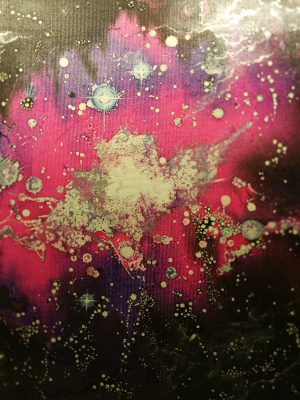

---

**Beyond the Origin : An Event Space Odyssey**

超越起源：事件空间奥德赛

---

Welcome to my latest book, my 10th!!!! I am now 25,000 words into the text. I hope it will be finished by May 2024. Some of the text is below for your interest. The Image is called “The Dawn of Sentience” painted by Celia Blessings Guy.

欢迎来到我的最新书籍，我的第10本书！！！！ 我现在已经写了25000个单词。我希望它能在2024年5月完成。下面有一些文字供您参考。这幅画叫做“感知的黎明”，由西莉亚·布莱斯·盖伊绘制。

The Aspects of Origin (that came and went!)

起源的方面(来来去去！)

One of the many things that has gone through my mind whilst communicating with The Origin, or should I say “Origins”, if we are considering that some of my dialogue has been with different aspects of The Origin, depending upon which Event Space I am temporarily in, “is”, just how many versions of The Origin are there? 

在与起源沟通时，我脑海中出现的许多事情之一，或者我应该说“起源”，如果我们考虑到我的一些对话是与起源的不同方面进行的，这取决于我暂时处于哪个事件空间，“是”，有多少个起源版本？

From the perspective of moving from one Event Space to another, where The Origin has progressed from that version of The Origin that I have always communicated with to another, that being; that version of The Origin which is still occupying the first twelve levels within the first level of the twelve structural levels to another version of The Origin that has populated, for example, the first, second and third levels of the twelve structural levels, both suggests and feels like a completely different Origin. 

从从一个事件空间移动到另一个事件空间的角度来看，起源已经从我一直与之沟通的那个版本的起源发展到另一个版本的起源，也就是说，那个版本的起源仍然占据了12个结构层次中第一个层次的前12个层次，到另一个版本的起源已经填充了12个结构层次中的第一、第二和第三个层次，这两个版本都暗示和感觉像一个完全不同的起源。

Consider if you can the immense evolutionary progression that The Origin will have made in completing the occupation of two further levels within those twelve structural levels when in our Event Space it is still a long way off from fully occupying the first level of the twelve structural levels. That other more evolved and significantly more expansive Origin/s, noting that this is the same Origin but at different evolutionary levels, must be simply, well, err, significantly different to the point of not being The Origin I know. It is this realisation or question that I just had to ask to gain an idea if The Origin considered its own evolutionary progression in steps associated with the level within the twelve structural levels it was currently occupying, or that it was a seamless progression. The way for us to think of this was in the perspective of time travel, noting of course that time doesn’t exist anywhere else but in the minds of incarnate human kind. 

当我与起源沟通时，我脑海中出现的许多事情之一，或者我应该说“起源”，如果我们考虑到我的一些对话是与起源的不同方面进行的，这取决于我暂时处于哪个事件空间，“是”，有多少个起源版本？如果你能考虑到起源在完成12个结构层次中的两个层次的进化过程中所取得的巨大进步，那么在我们的事件空间中，它距离完全占据12个结构层次中的第一层次还有很长的路要走。其他更进化和更明显的扩张的起源，注意到这是同一个起源，但在不同的进化层次上，肯定是简单地，嗯，错误地，明显不同于我所知道的起源。这就是我刚刚问到的这个认识或问题，以获得一个想法，即起源是否考虑了自己的进化过程，其步骤与它目前占据的12个结构层次中的水平相关，或者这是一个无缝的进化过程。我们思考这个问题的方式是从时间旅行的角度来看待这个问题，当然要注意到时间不存在于任何其他地方，而是存在于化身人类的头脑中。

O: So, when are you going to ask the question? 

起源：那么，你打算什么时候提问？

For some reason I received “pop” the question! It was just like asking when someone was about to ask for a partner’s hand in marriage! Strange. 

因为某些原因我收到了“pop”这个问题！这就像问某人什么时候要结婚一样！奇怪。

O: Well, we are not going to get married, we are already one, in some small sense in another Event Space. 

起源：好吧，我们不会结婚，我们已经是一个了，在另一个事件空间的某种小意义上。

ME: OK, OK. Just how many versions of you are there? I mean, relative to your evolutionary progression that is? 

我：好吧，好吧。到底有多少个版本的你？我的意思是，相对于你的进化进程来说？

O: From my perspective there is only ever one. From your linear perspective there are as many versions of me, and you, as there Event Spaces in existence. 

起源：从我的角度来看，只有一个。从你的线性角度来看，我和你有许多版本，就像存在着的事件空间一样。

ME: All or nothing then? 

我：那么，全部还是没有？

O: In some respect yes. You see, knowing that in the Event Space where I reach full occupation of all of the levels within the twelve levels of structural finitude, I reach a level of infinitude with everything and all Event Spaces concurrently, I gain access to that version of me as well as this version of me and all other versions of me, as one version of me. 

起源：在某些方面是的。你看，知道在事件空间里，我达到12个有限结构层次的全部占有，我达到一个与所有事物和所有事件空间同时存在的无限层次，我获得那个版本的我，以及这个版本的我，以及所有其他版本的我，作为一个版本的我。

ME: Am I speaking to that “future” Event Space version of you now? 

我：我现在是在和那个“未来”事件空间版本的你说话吗？

O: No, you are speaking to me in totality. You always were. Its only your linearity that has limited you to this Event Space. 

起源：不，你在和我完全地说话。你一直都是。只是你的线性把你限制在这个事件空间。

ME: But I was in all Event Spaces with Source Entity twelve a few years ago. I didn’t feel you as you in totality then. 

我：但是几年前我与12源实体一起在所有的事件空间里，我当时没有感觉到你就是你。

O: No, you wouldn’t have. Firstly, you were committing to a dialogue with Source Entity Twelve, which, was requiring significant focus at that point in your existence. Secondly, in that Event Space you were not expansive or experienced enough to enter into this Event Space and consider the possibility of everything being one in every conceivable way, including Event Space, because it was still a new concept to you. 

起源：不，你不会的。首先，你正在与源实体12对话，这在你存在的那个点上需要显著的关注。其次，在那个事件空间里，你还没有足够的扩展或经验来进入这个事件空间，并考虑一切事物以任何可想象的方式成为一体的可能性，包括事件空间，因为它对你来说仍然是一个新的概念。

ME: So, speaking to you in totality isn’t speaking to you as that vastly expansive Origin in the state of infinitude where everything is one then? 

我：那么，在整体上对你说话，是不是在无限状态下对你说话，在那里一切都是一体的广阔的起源？

O: No. You are speaking to the totality that is me which is the synergetic collective and individualised aspects of me in my evolutionary progression in all of my possible Event Spaces, separately and concurrently, not just the end product. I am any aspect of myself that I want to be, or all of them together, or the synergetic effect of the collective evolutionary expression of my aspects of progression. In short my beingness. 

起源：不。你在对整体说话，那就是我，在我所有可能的事件空间的进化过程中，我协同的集体和个性化方面，分别地和同时地，不仅仅是最终产品。我是我想要的任何方面，或者所有方面一起，或者我进化方面集体进化表达的协同效应。简而言之，我的存在。

ME: In essence then, it’s my limitation that focuses on a particular aspect of you and not you limiting what part of your totality you want to use to communicate with me? 

我：那么，本质上，是我的限制，集中在你的一个特定方面，而不是你限制你想用你整体的哪一部分来与我交流？

O: Correct. Pay attention to the fact that any entity in the frequencies that you are currently within would not have the communicative bandwidth or processing power necessary to communicate with sentience that has a volume and density that is more than they currently are. 

起源：正确。请注意这个事实，你目前所在频率的任何实体，都不会拥有与有比现在更大的体积和密度的感知能力进行交流所必需的沟通带宽或处理能力。

ME: Basically then it’s a function of the frequential environment rather than the ability of the entity. 

ME：基本上，它是频率环境的功能，而不是实体的能力。

O: And the sentient volume and density that it is capable of using at these levels. 

起源：以及它能够在这些水平上使用的有情体积和密度。

ME: OK, does this then also refer to incarnate entities that incarnate in different frequencies that are above the three that create the gross physical? 

ME：好的，那么这是否也指在三个以上创造粗糙物理的不同频率上化身的实体？

O: Of course. Any entity that incarnates in a higher frequency than another has the potential to incarnate with a higher sentient volume and density than those below it, and clearly it will have a much higher level of communicative bandwidth. 

起源：当然。任何在更高频率上化身的实体，都具有比在其之下的有情体积和密度更高的潜在化身，显然它将具有更高层次的通信带宽。

ME: Based upon that then the answer to my question is two-fold. From your perspective you are you in your totality but from our incarnate perspective you are a different version of you depending upon which Event Space we are in, even though you are you in totality. 

我：基于此，我问题的答案是双重的。从你的角度来看，你是你的整体，但从我们的化身角度来看，你是不同的版本的你，这取决于我们所处的事件空间，即使你是你的整体。

O: Yes. 

起源：是的。

ME: And this is simply because you have progressed from a linear evolutionary perspective and that this linearity is captured by our only being able to experience one particular Event Space at a time. 

我： 这只是因为你从线性进化的角度发展而来，而这种线性被我们一次只能体验一个特定的事件空间所捕获。

O:Yes. 

起源：是的。

ME: But when we are in the energetic we can experience a greater volume and density, even quality of your sentience because we are not totally governed by Event Space. 

我：但是当我们处于能量状态时，我们可以体验到更大的体积和密度，甚至是你们的感知质量，因为我们不是完全被事件空间所控制。

O: Yes and no. An entity will always have the potential to be fractalized into different Event Space as a function of it choice/s, until, that is, an entity moves into that function of myself when I enter into infinitude, where there is no structure and only the one Event Space. 

起源：是的，也不是。一个实体总是有可能被分形到不同的事件空间中，作为它选择的功能，直到，当我进入无限时，一个实体移动到我自己的函数中，那里没有结构，只有一个事件空间。

ME: And only one volume of sentience – you. 

我：只有一个感知体积——你。

O: Correct.

起源：正确。