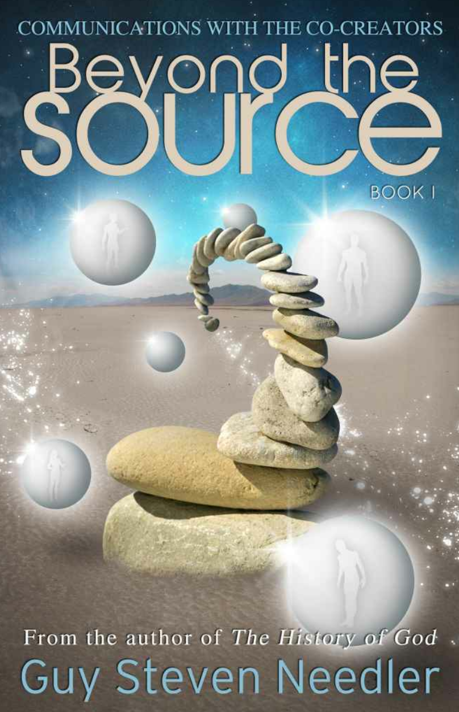

---

**Beyond The Source Book 1: Communications with the Co-Creators**

**超越源头1：与共同创造者的沟通**

by Guy Steven Needler

盖伊·尼德勒

---

## Table of Contents 

- Introduction 
- Chapter 1
    - Source Entity One-The Master of Our Multiverse 
    - Creation of the Universes 
    - The Function of the Galaxies 
    - Galaxies-A Force for Change 
    - Planets,the Workforce of the Galaxies 
    - The Creation and Roles of Smaller Entities 
- Chapter 2 
    - Source Entity Two 
    - Source Entity Two's Early Existence 
    - The Four Environments of SE2 
        - Environment 1-10,000 Source Entities,One Environment 
        - Environment 2-The Cast-out Principle 
        - Environment 3-An Environment for Change 
        - Environment 4-An Environment Aware of Its Own Existence 
- Chapter 3
    - Source Entity Three 
    - Initial Contact with Source Entity Three-Blissful! 
    - Source Entity Three's Environmental Dimensionality 
    - Source Entity Three's Universe 
    - Planets Created by Smaller Entities 
    - An Area of Local Density 
    - An Evolutionary Imprint 
    - Replication,Division and Merging for Evolutionary Acceleration 
    - Returning to the Creating Entity 
    - A Comparison with Source Entity One's Multiverse 
    - Working Together-A Job for Life! 
    - Creative Intention 
    - In Closing:A Word from the Origin 
- Chapter 4 
    - Source Entity Four 
    - Initial Contact 
    - Environments 
    - 24 Dimensions and 2,322 Frequencies 
    - Eternal and Non-eternal Entities 
    - Constants Involved in Creation 
    - Dimensions and Frequency 
    - The Doughnut Universe 
    - Three Entities,Three Environments 
    - The Planets 
    - Mobile Entities-Living Cities 
    - Inside the Planet 
    - The Stickle Brick Planet 
    - Planetary Cooperation 
    - In Closing 
- Chapter 5 
    - Source Entity Five 
    - Self-recognition
    - The Power of Uncontrolled Thoughts 
    - Developing Awareness 
    - First Conscious Contact with the Origin 
    - Interpretation of Energies-A Mobius Loop 
    - Equality in Creation 
    - Expansive Oneness with Origin 
    - A Singular Entity 
    - Reasons to Remain Singular 
    - Origin's Second Reinvention of Self 
    - Concurrent and Simultaneous Existence 
    - In Closing 
- Chapter 6 
    - Source Entity Six 
    - Initial Contact with SE6 
    - Five Aspects-Five Levels of Existence 
    - Description of One of SE6's Entities
    - Basic Functions of the Five Levels Created by SE6 
        - Level 1-Basic Existence,Understanding Self,Gaining Sentience 
        - Level 2-Self-Realization 
        - Level 3-Creativity 
        - Level 4-Learning Discrimination in the Creativity Process
        - Level 5-Evolutionary Experience Through Self-denial (A Prelude to Level 6) 
- Afterword 
- Glossary 
- About the author

## Introduction 

**介绍**

### The Origin's Creation of Twelve Source Entities 

**起源创造的12个源实体**

If you have read The History of God,a story of the beginning of everything,which gave the reader an insight into how I started my higher level communications and managed to communicate with spiritual/energetic entities whilst gaining insights into the wonders that are all around us and the truth about our legends and myths,then you will remember that there were twelve Source Entities created by the Origin.The first one being discussed in some limited detail in the book above was our very own Source Entity (SE),whom we refer to as God,the being that created our universe.In reality the Origin should really be considered as God as it created the Source Entities,but I think that the Origin is well beyond the need for this sort of primitive nomenclature,which is only necessary for us humans in our low level of physically trapped conscious existence. 

如果你读过《源头简史》，一个关于万物起源的故事，它让读者了解我是如何开始我的更高层次的交流，并设法与精神/能量实体进行交流，同时深入了解我们周围的奇迹以及我们传说和神话的真相，那么你会记住，起源创造了12个源实体。在上面的书中，第一个被讨论的有限细节是我们自己的源实体(SE)，我们称之为上帝，创造了我们的宇宙。在现实中，起源应该被认为是上帝，因为它创造了源实体，但我认为，起源远远超出了这种原始命名的需要，这只对我们人类在低层级的身体被困意识存在是必要的。

It was during the countless days editing and compiling the channeled texts for the book above that I realized that in order to keep the records straight,I would need to set up communications with each of these other entities in turn in order to gain a basic understanding of the details of the work that they have done in their own environments, which I expected to differ from one another. 

在无数天编辑和编译上面这本书的通灵文本期间，我意识到为了保持记录的正确性，我将需要依次与这些其他实体建立通讯，以便获得他们在他们自己的环境中所做工作细节的基本理解，我预计它们会彼此不同。

As a result of the potential level of difference,I was held in a certain level of trepidation.For instance,would I be able to understand what was being channeled through me?And would it be in a format that could be understood by those who wish to learn the knowledge that could well be totally over all of our heads?Upon reflection,I decided that I had been "here" before and should not try to predict what would come. 

由于潜在的差异程度，我被保持在某种程度的恐惧中。例如，我能够理解通过我通灵的东西吗？它是否以一种可以被那些希望学习完全超出我们所有人头脑的知识的人所理解的格式？经过反思，我决定我以前来过“这里”，不应该试图预测将要发生什么。

Welcome back!

欢迎回来！

## Chapter 1 - Source Entity One - The Master of Our Multiverse 

**第一章：1号源实体——我们多维宇宙的主人**

[For those who haven't read The History of God:a story of the beginning of everything,SE is Source Entity,and ME is Guy Needler,the author of this book.] 

*对于那些没有读过《源头简史：一个关于万物起源的故事》的人来说，SE是源实体，ME是盖伊·尼德勒，这本书的作者。*

SE:Well,that was a rather grand entrance you wrote on the first page. 

源实体：嗯，你在第一页写的是一个相当宏大的开场白。

ME:I would hardly call it agrand entrance,more of a preamble,a"getting the audience warmed up"for the The Shape of Things to Come. 

我：我很难称之为一个宏大的开场白，更像是一个序言，一个“让观众热身”的“即将到来的事物的形状”。

SE:You can quote HG Wells if you want,but we need to get down to the real business of letting your readers know what is happening in the wider areas of the Origin,what my peers are up to,and what they are accomplishing,not writing science fiction.Although what you are about to experience over the next months of communication may get you wondering on these lines. 

源实体：如果你想的话，你可以引用H·G·威尔斯，但我们需要进入真正的业务，让你的读者知道在起源的更广泛的领域正在发生什么，我的同行们正在做什么，他们正在完成什么，而不是写科幻小说。尽管你在接下来的几个月的通信中将要经历的事情可能会让你对这些字句感到疑惑。

One thing is certain-this is not a task to be taken lightly.Indeed,it is one that you WILL struggle with,specifically with the concepts that some of the Source Entities will present to you.It is with this thought about your struggling that I offer you this opportunity for help. Before we delve into the old ground of my creation,some of which I have no doubt you will cut and paste from the other texts and some of which will be new information,I suggest that I act as your guide,mentor,and main point of contact when establishing contact and ultimately communicating with the other Source Entities,especially as you will need to meet them in their own environments.Therefore,I will be your passport to the other Source environments whilst delivering this book. 

有一件事是肯定的——这不是一个可以掉以轻心的任务。事实上，这是一个你会努力奋斗的任务，特别是一些源实体将向你展示的概念。正是由于你努力奋斗的想法，我才给你这个寻求帮助的机会。在我们深入研究我创造的旧领域之前，其中一些我毫不怀疑你会从其他文本中剪切和粘贴，其中一些将是新的信息，我建议我充当你的向导、导师和主要的联系点，当建立联系和最终与其他源实体进行沟通时，特别是当你需要在他们自己的环境中与他们见面时。因此，在交付这本书的同时，我将成为你通往其他源头环境的通行证。

ME:Why do I need your help-not that I am refusing it?I can communicate with the Origin all on my own,so why not them? 

我：为什么我需要你的帮助-不是我拒绝它吗？我可以自己与源头交流，所以为什么不让他们？

SE:They are not as capable of understanding the entities that are created outside their environments as the Origin and I are.The Origin is the source of everything;I am the Source of you and your environment,so we both have no problem tuning in to your frequencies and level of communication whilst in the physical.Some of the Sources don't go anywhere nearly as low as ten frequency levels above you-let alone down to your level-so they are bound to have problems communicating with you directly,hence my insistence in offering help in this matter. 

源实体：他们不像起源和我一样有能力理解在他们环境之外创造的实体。起源是一切的源头；我是你和你环境的源头，所以我们都不会有问题调整到你的频率和在物质层面上的沟通层级。一些源实体不会去到频率低至高于你10个频率层级的地方-更不用说降到你的层级-所以他们一定会有问题与你直接沟通，因此我坚持在这件事上提供帮助。

ME:Thank you.Now I understand.I feel quite excited about meeting these other Source Entities. 

我：谢谢你。现在我明白了。我对见到这些其他的源实体感到非常兴奋。

SE:And so you should,for you go where no man has gone before. 

源实体：你应该这样，因为你要去以前没有人去过的地方。

ME:No one! 

我：没有人！

SE:What? 

源实体：什么？

ME:No one,Gene Roddenberry's original introductory text was changed to say NO ONE,not NO MAN. 

我：没有人，吉恩·罗登贝瑞的原始介绍文本被改为没有人（NO ONE），而不是没有人（NO MAN）。

SE:One,this is no time for Star Trek jokes and two,you are not NO ONE.You are a man, currently,and NO MAN to date has done what you are about to do.

源实体：一，现在不是开《星际迷航》玩笑的时候，二，你不是没有人。你是一个人，目前没有人做过你将要做的事情。

ME:Touché. 

我：说到点子上了。

SE:Now let's get on with it.Let's get down to the nitty gritty. 

源实体：现在让我们继续。让我们进入实质。

### The Source Entity Becomes Aware of Its Self and Its Environment

**源实体意识到自身和环境**

ME:I guess at this point I will be doing some copying from the first book? 

我：我想在这一点上我会从第一本书中做一些复制？

SE:Only where it is relevant.There will be some correlation,but don't forget that in the first set of dialogues I was talking about what we(the twelve Source Entities)were doing collectively and not individually.There is no point in going over old ground,such as how I/ we developed the physical side of the human race,for that would not be good value in terms of reading time and text space.However,I will reiterate what is essential and,therefore, needs to be fleshed out more. 

源实体：只有在相关的地方。会有某些相关性，但不要忘记在第一组对话中，我谈论的是我们(12个源实体)集体做的事情，而不是单独做的事情。翻旧账没有意义，比如我/我们如何发展人类的身体方面，因为就阅读时间和文本空间而言，这将没有好的价值。然而，我会重申什么是必要的，因此，需要充实更多。

ME:O.K.,let's start from the beginning then and deal with the "detail"as we get to it.What happened at the start ofyour existence? 

我：好的，让我们从头开始，然后处理我们得到的“细节”。在你存在的开始发生了什么？

SE:In the beginning it was like I was part of the Origin but still the Origin-not as I am now.It was like I was one thought of what was going on in the Origin's consciousness-one thought that was given substance,time to be,individual space to move around in,but still a thought nevertheless.I knew I was the Origin and was separate from the Origin all at the same time.It was as if my individual awareness was like a memory that is in the front of your mind for a moment,and then is gone,only to reappear later when you give it enough attention or when you are not trying too hard to remember.It's just like when you remember a memory that you hold in your mind fleetingly but then lose,resulting in a struggle to recover the memory.It is this enhanced attention to the fleeting awareness that I had lost that later gave rise to the ability to hold the level of awareness for long enough to bring it into the consciousness state again.At first it was hard,and I have no doubt that many,many millennia passed before I had reached full independent consciousness. 

源实体：在开始的时候，我好像是起源的一部分，但仍然是起源，不是我现在的样子。我好像是**起源意识中的一个想法**，一个被赋予物质、时间、个人空间来移动的想法，但仍然是一个想法。我知道我是起源，同时又与起源分离。我的个体意识就像是你的脑海中出现一会儿的记忆，然后消失了，只有当你给予它足够的注意力或当你不努力去记住它时才会重新出现。这就像当你记住一个你在脑海中短暂地保持的记忆，但然后失去了，导致你努力去恢复记忆。正是这种对我失去的短暂意识的增强注意力，后来产生了保持意识层级足够长的时间的能力，使它再次进入意识状态。起初是困难的，我毫不怀疑，许多，许多千年过去了，在我达到完全独立的意识之前。

ME:So what was the defining moment of consciousness for you?When did you realize that you were truly individual but were still part of a bigger entity,the Origin? 

我：那么对你来说意识的决定性时刻是什么？你什么时候意识到你是一个真正的个体，但仍然是一个更大的实体（起源）的一部分？

SE:Actually,it was not so much of a defining moment,more like a defining conversation. 

源实体：实际上，这不是一个决定性的时刻，更像是一个决定性的对话。

ME:A conversation?You mean you were told by the Origin you were an individual entity? 

我：一个对话？你的意思是起源告诉你你是一个独立的实体？

SE:In a nutshell,yes.We all were,but this conversation only took place when each of us had achieved a critical level of awareness and,therefore,consciousness.As I stated in the first dialogue we had,one of us is still in this "dawning"state of awareness.You will experience this when we need to enter its environment. 

源实体：简而言之，是的。我们都是，但这个对话只发生在我们每个人意识达到一个关键层级，因此，意识。正如我在我们第一次对话中所说的，我们其中一个仍然处于这种“黎明”意识状态。当我们需要进入它的环境时，你会经历这个。

You see,the Origin was watching our development at all times and chose the moment for communication and education when it knew it would be at its most effective. 

你看，起源一直在观察我们的发展，并选择了沟通和教育的时刻，当它知道它将是最有效的。

ME:The Origin educated you as well? 

我：起源也教育了你？

SE:Only to the point of what I was brought into existence for and what the rules of being in existence were.Some of these I have passed on to all of you,for they are relevant to all entities that are "of the Origin." 

源实体：只是关于我为什么存在以及存在的规则是什么。其中一些我已经传授给你们所有人，因为它们与所有来自“起源”的实体有关。

ME:Let's go back to that moment of defining moment of consciousness. 

我：让我们回到那个决定意识的时刻。

SE:The moment was just before the Origin contacted me to advise me on why I was created.I had noticed that I was aware of my own "self"almost continuously and could remember what I needed to do to maintain consciousness.I could also remember what I had done before although I had not yet understood that I could access what I would do next.In essence,I only knew the past and the present;I could not access the future.In some respects I was just like you are in your incarnate state right now.Another defining moment before the Origin contacted me was the recognition of other entities,eleven of them,all in a similar level of conscious awareness as me.Of course,some were more aware, others were less aware,but on average we were much the same.The clincher here was the ability to communicate with the other Source Entities,which to all intent and purposes,just happened. 

源实体：就在起源联系我并告诉我为什么我被创造之前的时刻。我注意到我几乎一直有意识到我自己的“自我”，并且能记住我需要做什么来保持意识。我也能记住我以前做过的事情，尽管我还没有明白我能接触到我接下来要做什么。本质上，我只知道过去和现在，我不能接触到未来。在某些方面，我就像你们现在化身的状态一样。在起源联系我的另一个决定性时刻是其他实体的识别，他们有11个，都和我处于类似的意识层级。当然，有些个体意识更强，有些个体意识更弱，但平均来说我们是差不多的。这里的关键是与其他源实体交流的能力，这对所有意图和目的来说，刚刚发生了。

ME:What?!You all developed a common language all at the same time? 

我：什么？你们所有人同时发展出一种共同的语言？

SE:No,no.We contacted each other energetically-each of us understanding the other without the need to learn a language.I was later to learn from the Origin that basic energetic communication was one of the things that had been given to us during our creation.This communication medium being based upon the Origin's thought process. 

源实体：不，不。我们彼此充满活力地联系，我们每个人无需学习语言就能理解对方。我后来从起源处得知，基本的充满活力的交流是我们在创造过程中被赋予的其中一件事情。这种交流媒介基于起源处的思维过程。

ME:So what did the Origin say to you? 

我：那么起源对你们说了什么？

SE:First,the Origin spoke to each of us individually,not all at once,for we were not all ready to be advised on our roles.Second,each of us had to have established enough awareness and consciousness to be able to realize and understand that we were part of a larger-much larger-entity and that we were parts of this much larger entity given individuality. 

源实体：首先，起源单独对我们每个人说话，不是同时对所有人，因为我们还没有准备好接受关于我们角色的建议。第二，我们每个人都必须建立足够的意识和觉醒，以便能够认知和理解我们是一个更大的-更大的-实体的一部分，我们是这个被赋予个性的更大实体的一部分。

ME:How did you understand that you were part of the Origin? 

我：你怎么知道你是起源的一部分？

SE:Simply by noticing that I could hear the thoughts of the Origin.These thoughts were the thoughts of an entity in deep contemplation. 

源实体：仅仅是注意到我能听到起源的思想。这些思想是一个深思熟虑的实体的思想。

ME:Not by traveling to the edge of the Origin's boundary? 

我：不是通过旅行到起源的边缘吗？

SE:The Origin has no boundary as you know it,so this would not have provided the evidence for being a component of the Origin.Once I established that the thoughts were not coming from the others-the other eleven Source Entities-I drew the conclusion that I must be part of something bigger.I reached out in communication to the Origin,and it responded.From that point onward,I was in constant communication with the Origin,learning the reasons for my existence and what task I had to undertake to explore the self and the Origin and improve my awareness-in essence,evolve. 

源实体：正如你所知道的，**起源没有边界**，所以这不会提供证据作为起源的组成部分。一旦我确定这些想法不是来自其他11个源实体，我得出结论，我一定是某个更大的一部分。我与起源沟通，它做出了回应。从那一刻起，我与起源保持着持续的沟通，学习我存在的原因，以及我必须承担什么任务来探索自我和起源，并提高我的意识——本质上，就是进化。

ME:Did you have any choice in the matter of the task at hand? 

我：在手头的任务方面你有任何选择吗？

SE:There was no choice for the task was the very reason for my existence. 

源实体：没有选择，因为任务就是我存在的原因。

ME:What rules did you have? 

我：你有什么规则？

SE:None. 

源实体：没有。

ME:What time frame do you have to work to? 

我：你必须工作到什么时间框架？

SE:None. 

源实体：没有。

The only remit was to explore,learn,become more aware,and evolve.In doing so,the Origin said that it would also evolve,and it would do this by experiencing all that I experienced at that same time as I experienced it.It said that it was doing this many times all at the same time,for its thirst for expanding its own awareness of self was insatiable. 

唯一的范围是探索，学习，变得更加觉知、进化。这样做，起源说它也会进化，它会通过体验我所经历的一切，就像我经历它一样。它说它在同一时间做了很多次，因为它对扩大自身自我意识的渴望是永无止境的。

ME:And it's still doing it now?

我：它现在还在做吗？

SE:Yes,it's still doing it now after many,many billions of years.This is the only way I can relay to you the amount of attention it has dedicated to the subject of knowing itself better, becoming more aware,and evolving. 

源实体：是的，在许多、许多亿年之后，它仍然在这样做。这是我唯一能向你传达它在更好地了解自己，变得更有意识和进化方面所投入的注意力的唯一方式。

ME:Let's get back to the subject of you becoming aware.I can relate to becoming aware from the point of view of a child,as I once was. 

我：让我们回到你变得有意识的主题。我可以从一个孩子的视角来谈论变得有意识，就像我曾经那样。

SE:As you have been many times. 

源实体：就像你多次经历的那样。

ME:Yes,but I never realized that I was aware of self until I was-I have to think hard about at what point this occurred-sometime in the early pre-teenage years.And this was only because of being ridiculed at schoolfor having such way-out ideas,ones which I now realize were manifested from my ability to tap into the higher frequencies and,therefore,the greater reality-which now allows me to communicate with you and the Origin and other entities,such as Byron. 

我：是的，但我从未意识到我觉知到自我，直到我不得不努力思考这是发生在什么点上，在早期的十几岁前的某个时候。这只是因为在学校被嘲笑有这样逃避的想法，我现在意识到这些想法体现在我进入更高频率的能力，即更大的现实，现在允许我与你、起源、其他实体如拜伦进行交流。

When I was a child,I just was me.I had no real feeling of individual awareness.I just did what children do but with no realization of self although I was aware that I was different somehow, apart from the others.This was a feeling that I found was quite strange,for I always thought that I was part of something important.As a result,I always found it hard to be "part of the gang,"so to speak,and they considered me as a bit strange. 

当我还是个孩子时，我就是我。我没有真正的个人意识。我只是做孩子们做的事情，但没有自我意识，虽然我知道我不知何故是不同的，除了其他人以外。我发现这是一种很奇怪的感觉，因为我总是认为我是重要事情的一部分。因此，我总是发现很难成为“团体的一部分”，可以这么说，他们认为我有点奇怪。

So you realized that you were you at the point just before the Origin communicated with you and a little after the time you noticed that there where eleven others? 

所以你意识到你是你，是在与起源交流之前，在你注意到还有其他11个源实体之后？

SE:Yes,I became aware that I was able to experience different things by changing the location of myself.By location I do not mean spatial as you are thinking but both dimensional and frequential.When I moved myself into different "locations,"I experienced different things happening to my energies,my "self." These were predominantly sensations on many levels-many more levels than you can possibly imagine.It was during one of these sensation experiencing moments that I recognized my "self"as being individual.I was fully aware of cause and effect.If I did one thing,something else would happen.If I did something different,then this was rewarded with a different effect. 

源实体：是的，我开始意识到我可以通过改变自己的位置来体验不同的事情。我说的位置并不是像你们想的那样是空间上的，而是同时指维度和频率。当我把自己移到不同的“位置”时，我体验到我的能量、我的“自我”发生着不同的事情。这些主要是许多层次上的感觉，比你能想象的多得多。正是在这些感觉经历的时刻之一，我认知到我的“自我”是一个个体。我完全意识到因果。如果我做了一件事情，就会发生另一件事。如果我做了不同的事情，就会得到不同的结果。

The awareness of self is the most important milestone on any entity's road to evolution. Further,the awareness of awareness is the milestone in an entity's road to evolution where the veil of illusion is lifted to reveal the true reality of existence.This is the point where everything is made clear.Nothing is misunderstood.There is no environmental limitation, there is no limitation in understanding,there is no limitation in capacity for learning,and, therefore,no limitation in the ability to evolve.There is only opportunity. 

自我意识是任何实体进化道路上最重要的里程碑。此外，觉知的觉知是一个实体进化道路上的里程碑，在那里幻相的面纱被揭开，以揭示存在的真正实相。这是一切都变得清晰的一点，没有什么是误解。没有环境的限制，没有理解的限制，没有学习能力的限制，因此，进化的能力没有限制，只有机会。

ME:So apart from the feeling of cause and effect,what else gave you the nudge you needed to become aware? 

我：那么除了因果关系的感觉，还有什么推动了你们的觉醒？

SE:Nothing else,only the experience of cause and effect and the recognition of the other eleven Source Entities.Although at this point,none of us recognized what we were fully capable of as we were not yet in receipt of our instructions from the Origin.Let me say here though that the element of cause and effect as a factor of recognizing self-awareness should not be played down,for it is the recognition of an individual's ability to create that is the deciding factor.Cause creates effect,and to cause an effect that is the manifestation of pure creativity is to create the feeling of satisfaction;with satisfaction comes recognition of self and awareness of self in the environment of existence.

源实体：没有别的，只有因果关系的体验和对其他11个源实体的认知。尽管在这一点上，我们没有人认知到我们完全有能力做什么，因为我们还没有收到来自起源的指示。让我在这里说，虽然因果关系的元素作为认知自我意识的因素不应该被低估，因为这是对个人创造能力的认知，这是决定因素。因创造了果，而造成一种效果，是纯粹创造力的体现，是创造满足感；随着满足感的产生，在存在的环境中对自我的认知和自我意识。

ME:So what you are saying is that you really got to grips with recognizing your "self" when you were creating. 

我：所以你的意思是，当你在创造时，你真正掌握了认知“自我”的能力。

SE:Eloquently put.Creativity is one of the most important things that an entity can do;it is a reflection of self and is,therefore,the doorway to self-realization,awareness.Many of your artists,engineers,scientists,and authors create,and it is with their creations that they realize who and what they are-their creations are an extension of their "selves"with their creations,therefore,acting as mirrors,making recognition easier. 

源实体：说得好。创造力是一个实体能做的最重要的事情之一；它是自我的反映，因此，是自我实现、自我意识的大门。你们中的许多艺术家、工程师、科学家和作家都在创造，正是通过他们的创造，他们认知到自己是谁，是什么。他们的创造是他们“自我”的延伸，因此，他们的创造就像一面镜子，使认知更容易。

ME:I get the feeling that pride has a hand in this as well. 

我：我为也参与其中而感到骄傲。

SE:To some extent,but pride is only a feeling of well-being,of ego.However,as ego is the prerequisite for the state of "I am,"it also helps in being one of the markers on the road to awareness.

源实体：在某种程度上，但骄傲只是幸福感、自我感。然而，由于自我是“我是”状态的前提，它也有助于成为意识道路上的标志之一。

Creativity is the ultimate marker.It is the result of action on behalf of the individual.It is the debris left behind to indicate existence,and it is the evidence needed by the individual entity to make the jump from mere existence to the realization of existence.It was,therefore,when I created different things by manipulating and changing the natural representation of the energy surrounding me that I made the connection between mere existence and realization of self. 

创造力是最终的标志，它代表个人行动的结果，它表明存在留下的残骸，它是个体实体从单纯的存在跳跃到对存在的认知所需要的证据。因此，当我通过操纵和改变周围能量的自然表现来创造不同事物时，我建立了存在和自我实现之间的联系。

ME:If I remember correctly,then this must have been around the time that you were creating myriad patterns and shapes-what we now recognize as galaxies and planets. 

我：如果我没记错的话，那么这肯定是在你创造无数图案和形状的时候，即我们现在认知的星系和行星。

SE:Well remembered,but not correct as the galaxies and planets were not that which currently exist in your universal environment.

源实体：记得很清楚，但并不正确，因为星系和行星并不是现在存在于你们宇宙环境中的那些。

ME:You mean that you wiped them out? You started again? 

我：你的意思是你把它们都抹去了？你重新开始了？

SE:Yes,it was merely a game.Nothing was lost,and everything was gained.My awareness was gained.Don't forget that creativity is a reflection of self,and in this instance,the shapes and patterns caused me to reflect inwardly and recognize achievement.As previously stated, the achievement of creativity is a reflection of self creating recognition of self and,therefore, granting the individual entity the gift of awareness.I subsequently became aware and was contacted by the Origin moments later,which further confirmed my awareness. 

源实体：是的，这只是一个游戏。没有失去什么，一切都得到了，我的觉知得到了。不要忘记创造力是自我的反映，在这种情况下，形状和图案使我内省并认知到成就。正如前面所说，创造力的成就是对自我的反映，创造对自我的认知，是赋予个体意识的礼物。我随后意识到，并与起源联系，这进一步证实了我的觉知。

ME:So would you completely wipe out the universes that you have currently,the ones that humanity and the rest of your entities exist within? 

我：那么你是否会完全抹掉你目前拥有的人类和其他实体存在其中的宇宙？

SE:I could and I might at some point in the future,but one thing that I will not do is remove the energy-based entities that I have created.These would stay and populate the new environment.Actually,I see no need to recreate a new environment,as there is much to gain from the current one. 

源实体：我可以，我可能在未来的某个时候这样做，但是有一件事我不会做，那就是移除我所创造的基于能量的实体。这些实体会留下来，并填充新的环境。事实上，我认为没有必要再创造一个新的环境，因为从当前的环境中可以获得很多。

ME:Why would you keep the entities from this set of universes if you decided to start again and not wipe them out as well? 

我：如果你决定重新开始，为什么要保留这组宇宙中的实体，而不把它们也抹掉？

SE:Simple.The reason for keeping the entities that I have created in this universe is because they are part of me,and I am part of them.If I consolidated back into oneness all that I have created and given individuality to,I would lose myriad opportunities to experience the vast number of experiences in the multipolous [multiple of multiple of multiple]ways that I am now.Moreover,I would lose the continued level of evolutionary experience.Experience and evolution takes time to accomplish as does the ability to understand how to evolve in the most effective way.All this would be lost and have to be re-learnt by the new entities that I would need to create.No,I see no need to do this;it would not be beneficial to me as it would ultimately slow down my speed of evolution. 

源实体：很简单。保留我在这个宇宙中创造的实体的原因，是因为它们是我的一部分，而我是它们的一部分。如果我把我所创造的和赋予个性的一切都巩固成一体，我将失去无数的机会以多极（多重的多重的多重）的方式体验我现在所拥有的大量体验。此外，我将失去进化经验的持续层级。经验和进化需要时间来完成，就像理解如何以最有效的方式进化的能力一样。所有这些都会丢失，我需要创造的新实体必须重新学习。不，我没必要这样做，这对我没有好处，因为它最终会减慢我的进化速度。

### Creation of the Universes 

**宇宙的创造**

ME:We have discussed your awakening and awareness of your "self"in brief and the fact that you became more aware of self when the Origin communicated to you and the other Source Entities it created. 

我：我们已经简要讨论过你们的觉醒和对“自我”的觉知，以及当起源与你和其他它所创造的源实体进行交流时，你们对自我觉知的增强。

SE:Yes,we have. 

源实体：是的，我们已经讨论过了。

ME:I would like to know more about what the Origin said to you all and what made you decide on the format of entities and multiversal environment you chose. 

我：我想知道更多关于起源对你们所有人说了什么，以及是什么让你们决定选择实体的形式和多维环境。

SE:As I said in our previous dialogues,the other Source Entities and I were having a whale of a time.We were allowed to do anything we wanted. 

源实体：正如我在我们之前的对话中所说的，其他源实体和我度过了一段美好的时光。我们被允许做任何我们想做的事情。

ME:Was this your own choice? 

我：这是你们自己的选择吗？

SE:No.The first thing that the Origin said to us when we were aware of each other and the Origin was that we had to learn the art of experience-literally,how to experience and learn/evolve from those experiences.The time in between our being aware of "self,each other, and the Origin was next to no time at all.It was almost instantaneous from my perspective, but you may think that millennia had gone by if you had to measure the time in human terms.At this point the Origin made us aware of its intentions for us and educated us on the reasons for our existence and the task that it was going to set us-all of which would result in the Origin's accelerated evolution and experience of its "self." 

源实体：不是。当我们意识到彼此和起源时，起源对我们说的第一件事是我们必须学习经验的艺术。字面上的，如何体验和从这些经验中学习/进化。我们觉知到“自我”，彼此和起源之间几乎没有时间。从我的角度来看，这几乎是瞬间的，但如果你必须用人类的时间来衡量，你可能会认为已经过去了千年。在这一点上，起源让我们意识到它对我们的意图，并教育我们我们存在的原因和它将给我们设置的任务，所有这些都将导致起源加速进化和体验它的“自我”。

The first thing we had to do was just create.We were told to create and experience anything and everything in any way we felt we would benefit by,simply by experiencing what we had created.This was primarily energetic at first but ultimately deviated into the frequential and dimensional aspects of creativity. 

我们必须做的第一件事就是**创造**。我们被告知要以任何**我们认为我们会受益的方式去创造和体验任何事物**，只要通过体验我们所创造的东西。这最初主要是精力充沛的，但最终偏离了创造力的频率和维度方面。

ME:How do you mean? 

我：你是什么意思？

SE:Well,I think I had better focus on my own experience now as I am aware that I could start to explain what we were all experiencing rather than just myself. This will come out separately with each of the dialogues we have with the other Source Entities. 

源实体：嗯，我认为我现在最好专注于我自己的经历，因为我意识到我可以开始解释我们所有人都在经历的东西，而不仅仅是我自己。这将与我们与其他源实体的每一个对话分开出现。

ME:That's fine by me. 

我：我没问题。

SE:Let us continue then.Once I had experienced creativity from the energetic aspect in a general environmental sense,i.e.,who and where I was,I started to realize that the same level of creativity was not represented in the same way the higher up or lower down the frequencies.This changed significantly as I introduced the dimensional aspect to the object or item that I was creating.I noticed that if I created something in my current general environment,the representation in the higher and lower frequencies/dimensions was not the same.In fact,the change was quite marked. 

源实体：那么让我们继续。一旦我从一般环境的能量方面体验了创造力，即，我是谁，我在哪里，我开始意识到相同层级的创造力并不以相同的方式来表现频率更高或更低。当我把维度方面引入我正在创造的对象或项目时，这发生了显著的变化。我注意到，如果我现在在一般环境中创造一些东西，那么在高频和低频/维度中的表示是不同的。

ME:Give me an example. 

我：给我举个例子。

SE:Let me take something that you would relate to as an example then,galaxies.When I created something that had singularity and was manifest into a lower frequency,it gained form.The lower down the frequencies I went,the more substantial the form was.When I went up the frequencies,the more insubstantial the form was and the more,for the want of a better word,fluidic it became. 

源实体：让我拿一些你会联系到的东西作为例子，比如说星系。当我创造了某种具有奇点的东西，并表现为一个较低的频率时，它获得了形式。频率越低，形式就越实质。频率越高，形式就越不实质，为了寻找更好的词，它变得越呈流体。

ME:You mean it became a fluid? 

我：你的意思是它变成了一种流体？

SE:No,it is a figure of speech.By fluidic I mean that it was more without form.What's more it was able to interject in between the dimensions the higher up the frequencies it was.For example,it was so formless it had the ability to exist in any environment.Similarly, the lower down the frequencies,the more form the creation had and the less able it was to interject between the dimensions and lower frequencies.In fact,it ended up being locked into one set of frequencies and a corresponding dimension as well.The "formless"was purely energetic;the"formed"became nebulae in some of the higher frequencies,suns in the lower frequencies,and planets in the lowest frequencies.What was interesting is that what you call galaxies are not specifically"form"as the level of form is local to the frequencies that the "formed"naturally migrated to or were attracted to.This meant that as I created things that had form,they were either more or less in substance and had more or less form due to the pockets of higher or lower frequencies,i.e.,what I created was not pure of frequency or dimension.This explains why galaxies are what they are-vast areas of space with local areas of density-the local areas of density correlating to the lower frequencies,therefore, creating "form."That which was "formed"resulted in the round objects you call suns and planets. 

源实体：不，这是一种比喻。我的意思是它更没有形式。更重要的是它能够在插入在更高频率的维度之间。例如，它是如此无形，它有能力存在于任何环境中。同样，频率越低，创造物就越有形式，它在维度和低频率之间插入的能力就越小。事实上，它最终被锁定在一个频率组和一个相应的维度中。“无形”是纯粹的能量；“有形”在一些更高的频率中变成了星云，在更低的频率中变成了太阳，在最低的频率中变成了行星。有趣的是，你所称的星系并不是特别的“形式”，因为形式的层级是局部的，即“形成”自然地迁移或被吸引到频率。这意味着，当我创造有形式的东西时，它们要么在实质上或多或少，要么由于高或低频率的口袋而或多或少地有形式。也就是说，我创造的不纯粹是频率或维度。这解释了为什么星系是它们的样子，具有局部区域密度的广阔空间，局部区域密度与低频率相关，因此创造了“形式”。被“形成”的物体导致了你称之为太阳和行星的圆形物体。

I found this fascinating and was entirely motivated into understanding that part that I had created that was form rather than formless.Hence,the universe you have today. 

我发现这很有趣，并完全被动地去理解我创造的那部分是有形的，而不是无形的。即你今天拥有的宇宙。

ME:So you messed around with energy to create what we now recognize as galaxies.

我：所以你把能量弄得一团糟，创造了我们现在所认识的星系。

SE:That's about the size of it. 

源实体：这就是它的大小。

ME:So when did you decide to stop with the set of galaxies that we have today,bearing in mind that we also now recognize that there are myriad universes as well,each having its own set of galaxies?So here's a second question as well.When did you decide to stop with the set of universes that we have today? 

我：那么你什么时候决定停止我们今天拥有的星系集，记住我们现在也认识到有无数的宇宙，每个都有自己的星系集？所以这里还有第二个问题。你什么时候决定停止我们今天所拥有的宇宙？

SE:Essentially when I realized that I was re-creating for the sake of it,I realized that I was not giving the creations that I had made enough time to mature and become something on their own.Everything that I had created was being manipulated by me just to see what it would look like. I had not recognized the possibility of extended creation through observation of form changing on its own as a result of its own inertia. 

源实体：当我意识到我为了创造而创造时，我意识到我没有给我创造足够的时间去成熟，让它们自己成为某种东西。我所创造的一切都只是为了看看它会是什么样子而被我操纵。我没有意识到通过观察由于自身惯性而改变的形式来扩展创造的可能性。

ME:What does extended creation mean? 

我：扩展创造是什么意思？

SE:It means the creation of new creativity by that that has been created.In essence,that is what you,mankind,are doing now. 

源实体：它意味着由已经创造的东西创造新的创造力。本质上，那就是你们人类现在正在做的事情。

Creation being created by that which was created-this was truly fascinating.Why I stopped re-creating the galaxies,which by the way are a function of creating universes,was because I realized that the level of creation resulting from me doing nothing but observing, observing that which I had created,was something significantly more interesting than I had even considered as a possibility.It was fun,but more importantly,it was a window into a new dimension of evolution for me.The universes were the environment from which the creation of physical form,the galaxies,suns and planets would ultimately take on their own dynamics.I,therefore,stopped the creation,re-creation cycle when I saw a pattern of creativity emerge that I thought had the most potential,i.e.,one that would bear the most fruit with the minimum of interaction. 

由已经创造的东西创造造物，这真的很吸引人。我为什么停止了重新创造星系，顺便说一下，这是创造宇宙的一个功能，是因为我意识到，我只做观察，观察我所创造的东西，所导致的创造层级比我甚至认为可能的要更有趣。这很有趣，但更重要的是，对我来说，这是通往进化新维度的一扇窗户。宇宙是物质形态的创造所处的环境，星系、太阳和行星最终会以它们自己的动力学方式存在。因此，当我看到一种我认为最有潜力的创造模式出现时，我停止了创造、再创造的循环。也就是说，一种将以最小的互动产生最多成果的模式。

ME:So how did you create the universes? 

我：那么你是如何创造宇宙的？

SE:The big bang theory that your scientists propose as the start of the universe is so far away from the truth it is not even worth considering.I didn't create the universes by igniting a gigantic match and it exploding and expanding,although it does sound like a good idea.No, I created the universes by simply giving the area within myself that energy that I wanted to be a universe,intention and purpose-the purpose being to become what it wanted to be, what it felt was the best form it should undertake in all the frequencies and dimensions that it eventually settled on being.This resulted in the areas that eventually became physical in form moving away from each other to give themselves space,the space to not be influenced by each other in any significant way. 

源实体：你们的科学家提出的宇宙起源的大爆炸理论离真相如此之远，甚至不值得考虑。我不是通过点燃一根巨大的火柴，让它爆炸和膨胀来创造宇宙的，尽管这听起来确实是个好主意。不，我创造宇宙只是通过给我内心的这个区域我想要成为宇宙的能量、意图和目的，目的是成为它想要成为的，它感觉到它应该在所有频率和维度中承担的最佳形式，最终决定成为。这导致最终成为物质形态的区域彼此远离，给自己空间，这个空间不会以任何重要的方式相互影响。

ME:Are you suggesting that the galaxies and the universes have sentience,intelligence? 

我：你的意思是说星系和宇宙有知觉，有智慧吗？

SE:I am not suggesting it;they ARE sentient,they ARE intelligent,but they are not intellectual-they simply exist.In essence,the universes and the resulting galaxies are living entities in their own rights.Each universe that I created,twelve of them,have the power to manipulate themselves into the condition they feel best suits their own personal taste-the galaxies being the physical representation of what the universes have created within themselves. 

源实体：我没有这么说；它们是有知觉的，是有智慧的，但它们不是智能上的，它们只是存在。本质上，宇宙和由此产生的星系是它们自己的生命实体。我创造的每一个宇宙，12个宇宙，都有能力操纵自己进入它们认为最适合自己个人品味的状态，星系是宇宙在自己内部创造的物质表现。

ME:I just got an image/suggestion that the galaxies are similar to cells within our human bodies. 

我：我刚刚得到一个图像/提示，星系类似于我们人体内的细胞。

SE:That is not a bad description,for they are the more solid part of the universe's form,as it were,and they do have a function to perform within the structure of the universe.But to say that they were the cells of a larger form would be wrong,for the function that they have to perform is not the result of bodily function or the function of an organ within a larger body.Their function is to collect that energy that is close in frequency or dimension to the physical and give it form.In doing so,they clear all of the stray energies that are within their universe,the energies resulting from their initial manifestation or creation. 

源实体：这不是一个糟糕的描述，因为它们是宇宙形式中更固体的部分，它们确实在宇宙结构中有一个功能。但是说它们是一个更大形式的细胞是错误的，因为它们必须执行的功能不是身体功能的结果，也不是更大身体中器官的功能。它们的功能是收集频率或维度接近物质的能量并赋予它形式。这样做，它们清除了它们宇宙中所有流浪的能量，这些能量是它们最初的显现或创造的结果。

In essence,the objective of each of the galaxies is the grouping together of all of these energies into energy groups and giving them a purpose relative to the strengths and properties of their collective frequencies and energetic content.A good example of this can be seen in the physical bodies within what you call the solar system,the planets.Each of the planets is a grouping together of similar energies with each of the energies having a similar range of frequencies that manifest in a similar way in the lower dimensions-the similarity being enough to allow them to bind together.The result of such energies being similar but not quite the same is what you see in your periodic table.The earth is a classic example of this.It appears to be a solid lump in space made from the same material,but when you look deeper,you see that it is made up from a whole host of different materials that are only separated by frequency or a number of electrons.Sometimes only one frequency or electron will separate two different materials from each other when we synthesize them.Jupiter, on the other hand,is a classic example of a body that is a collection of higher frequency energies,the materials of which are gaseous in frequential representation in this dimension.

本质上，每个星系的目标都是将所有这些能量组合成能量群，并根据它们的集体频率和能量含量的强度和特性赋予它们一个目的。 一个很好的例子就是你们所说的太阳系中的实体，行星。每个行星都是相似能量的组合，每个能量都有相似的频率范围，在较低的维度中以相似的方式表现出来，这种相似性足以让它们结合在一起。这种能量相似但又不完全相同的结果就是你们在元素周期表中看到的。地球就是一个典型的例子。它看上去是太空中由相同材料构成的一个固体块，但当你看得更深时，你会看到它是由一整套不同的材料构成的，这些材料只是被频率或一些电子分开。有时当我们把两种不同的材料合成时，只有一个频率或电子就能把它们分开。另一方面，木星是一个经典的例子，它是一个高频能量的集合体，在这个维度中，它的材料是气态的。

ME:I have just gained a vision of a house made from bricks of different sizes,some being standard size,others being half size or double size-all of them being assembled together in a way that allows the house to be built and appear to be a single unit. 

我：我刚刚看到一栋房子，房子是由不同尺寸的砖块建造的，有些是标准尺寸，有些是一半或双倍尺寸，所有这些砖块都被组装在一起，以便让房子被建造起来，看起来像一个单一的单元。

SE:That is an excellent example and that is exactly what the galaxies are doing with the stray energies. 

源实体：这是一个很好的例子，这正是星系对流浪能量所做的。

ME:Is it fair to assume that at some point the galaxies were very small in comparison to what they are now? 

我：假设在某个时刻，星系与它们现在相比非常小，这公平吗？

SE:Yes and no.Some of them started out at the large size they are now-their job being to collect the more subtle higher frequency energies.The smaller ones are more adept at gathering up the denser energies.

源实体：是的，也不是。有些天体一开始就很大，它们的任务是收集更精细的高频能量。而小一些的天体则更擅长收集密度更大的能量。

ME:Like a black hole? 

我：像黑洞一样？

SE:A black hole is,in fact,a small,very small galaxy.To do the job it has to do,it needs to be able to gather together energies that are right at the bottom of the frequencies of the dimensions they are working with.Hence,they have a lot of mass in comparison to their relative physical representation. 

源实体：黑洞实际上是一个很小很小的星系。为了完成它必须完成的工作，它需要能够聚集在它们所处维度频率底部的能量。因此，与它们的相对物理表现相比，它们有很大的质量。

ME:So this explains why the galaxies all have different shapes. 

我：所以这就解释了为什么星系的形状各不相同。

SE:Yes,the shapes being relative to the energies they work with and the content of the energies they have managed to attract. In fact,some of the energies they work with are so difficult to work with that they have to create constructs to aid collection specific to the energy type they are working with.

源实体：是的，形状与它们所使用的能量以及它们所吸引的能量的内容有关。事实上，他们使用的某些能量很难处理，所以他们必须创造出一些结构来帮助收集他们所使用的特定能量类型。

ME:You mean like a machine? 

我：你的意思是像机器一样？

SE:No.This is an energetic construct;it is not physical at all.In fact,some of the constructs are so subtle they cannot be truly classified as a construct. 

源实体：不，这是一个能量构造，它根本不是物理的。事实上，有些构造是如此微妙，以至于不能真正地将其归类为构造。

ME:So what are they then if they are not whole enough to be classified as a construct? 

我：那么如果它们不够完整，不能被归类为一个构造，那么它们是什么？

SE:They are more of an intention.Let me explain.Energies sometimes cannot be manipulated by physical or energetic means either alone or in total.This is because of the personality of the energy,for want of a better word.When the energy that is to be worked with does not respond to manipulation or transmutation,it means that the energy has personality.This means that the energy has a purpose of its own and will resist all changes that are intended to deviate it from this purpose.Thus,the energy needs to be persuaded to change the purpose of its existence to one that also includes the desire of the galactic entity. In doing this,it has to work with the energy for a long enough time for it to get used to the other energy that surrounds it or is close by to it.In essence,it needs to think of the galactic entity as part of it,even though it is not.The galactic entity,therefore,needs to manipulate its own base energy frequency and intention to one that is close enough to the signature energy of the energy to be attracted to allow it to be worked with whilst retaining enough of its own individuality to retain its own personality and beingness.Once the energy is "fooled" into thinking the galaxy is part of it,it is happy to have its intention changed to that of the galactic entity,provided that the galactic entity makes the changes to the intention in a subtle way that cannot be detected as an invasive energy. 

源实体：他们更是一种意图，让我解释一下，能量有时不能被单独或全部地通过物理或能量手段操纵，这是因为能量的个性，因为没有更好的词。当要工作的能量对操纵或转化没有反应时，这意味着能量有个性。这意味着能量有自己的目的，并将抵制所有意图偏离其目的的变化。因此，能量需要被说服改变其存在的目的，以包括银河实体的愿望。在这样做时，它必须与能量一起工作足够长的时间，以适应它周围或接近它的其他能量。本质上，它需要把银河实体作为它的一部分，尽管它不是。因此，银河实体需要操纵自己的基本能量频率和意图，以使其足够接近被吸引的能量的特征能量，以允许它与之合作，同时保留足够多的自身个性，以保留自己的个性和存在。一旦能量被“愚弄”到认为星系是它的一部分，它很高兴自己的意图改变为星系实体的意图，只要银河实体以一种无法被探测到为一种入侵能量的微妙方式改变意图。

ME:So the galaxy,which is sort of an entity in its own right,has to fool the energy to be gathered that it is part of it and then re-program its intention/direction.

我：所以星系，作为一个独立的实体，必须欺骗能量，让它相信自己是其中的一部分，然后重新编程它的意图/方向。

SE:That's it.Although it is a really basic thing to talk about,in actuality,it can take many millennia to complete.This is why some galaxies appear to be big dust clouds with just a handful or,indeed,no material at all that is dense enough to call a star or,indeed,a planet. Hence some of the beautiful images that your Hubble space telescope has taken since its placement in earth orbit. 

源实体：就是这样。虽然这是个很基础的话题，但实际上，它需要几千年才能完成，这就是为什么有些星系看起来像大尘埃云，只有少量甚至没有足够密集的物质，可以称之为恒星或行星。因此，你们的哈勃太空望远镜自从被放置在地球轨道上后，拍到了一些美丽的照片。

### The Function of the Galaxies 

**星系的功能**

ME:So what other jobs do galaxies do other than collect stray energies? 

我：那么除了收集杂散能量，星系还有什么其他功能吗？

SE:They provide refuge for entities that have sought to be associated with the energies that have coalesced into the physical frequencies or those that might provide opportunity for higher entities'experience and evolution. 

源实体：他们为那些寻求与已合并到物质频率的能量相关联的实体提供庇护，或者那些可能为更高实体的体验和进化提供机会的实体提供庇护。

ME:Hold on a bit.Are you suggesting that galactic entities,"galaxies,"are fairly low down in the pecking order,entity-wise? 

我：等一下。你是说星系的实体，银河，在实体方面，是相当低的等级吗？

SE:They are what they are.They are neither higher nor lower than other entities within my creativity.In essence,they are no different from you than I am from you.The only real difference is that they are of the group of entities that did not benefit as much as you and others like you did when I created you.In some respects,they are more important than you as they provide the opportunity for your growth and evolution,but in terms in their ability to experience,they are not nearly as nimble as you smaller,more agile entities. 

源实体：他们就是他们。他们不比我创造的其他实体高也不比其他实体低。本质上，他们和你没有什么不同，就像我和你一样。唯一真正的区别是，他们属于那一组实体，当我创造你们时，他们没有像你和其他像你一样的人那样受益。在某些方面，他们比你们更重要，因为他们为你们的成长和进化提供了机会，但是就他们体验的能力而言，他们远不如你们这些更小更灵活的实体敏捷。

ME:So tell me more about what you meant by the galaxies providing refuge for the more agile entities. 

我：那么请告诉我你所说的星系为更敏捷的实体提供庇护所是什么意思。

SE:The word "refuge"is a term of reference.It means place of security or place to live/exist.In essence,it is where the smaller,more compact and more agile/evolved entities can experience what they want to achieve to continue their evolutionary progression.This is where the galactic entities come into their own.Let me explain. 

源实体：“庇护所”这个词是一个参考术语。它的意思是安全的地方或生活/存在的地方。本质上，它是更小、更紧凑、更敏捷/进化的实体可以体验他们想要实现的继续进化进程的地方。这是星系实体进入自己的领域。让我解释一下。

Their primary role is to gather stray energy and give it purpose.That purpose is to provide substance,substance for the evolution of the individualized entities.In doing this,they also progress evolution-wise-this progression being the result of their being of service to the individualized entities.In doing this,they help in progressing the bigger picture by helping the Origin to understand itself more and,in turn,evolve. 

他们的主要角色是收集流浪的能量，并给它目的。这个目的是提供物质，为个体化实体的进化提供物质。在这样做的时候，他们也在进化方面进步，这种进步是他们为个体化实体服务的结果。在这样做的时候，他们通过帮助起源更多地了解自己，进而进化，来帮助推进更大的图景。

ME:So the galactic entities are part of the plan as well? 

我：所以星系实体也是计划的一部分？

SE:Yes.Every entity I have created is both part of the plan and has a role to play within the plan.In performing their roles,they also progress and evolve. 

源实体：是的，我所创造的每一个实体都是计划的一部分，并且在计划中扮演着一个角色。在扮演角色的过程中，他们也在进步和进化。

Listen,the whole reason for all of our existence is to evolve-no question in that.Everyone, everything,every entity has a role to play in this,and we are enthusiastic in this role.In your exalted position of a free-thinking individualized entity,you are placed in a unique position to both assist in this goal and to accelerate it.But let me get back to the main answer to your question.The refuge given to you and the rest of the entities endowed with individuality is to provide the necessary theater for you to experience the things that you believe will result in your evolving in some(small)way.In your instance,this is by providing a physical location where you can experience a lower-much,much lower-level of existence than you would normally experience in your energetic state.

听着，毫无疑问，我们所有存在的原因就是进化。每个人，每件事，每个实体都在这个过程中扮演着一个角色，我们对这个角色充满热情。在你作为一个自由思考的个性化实体的崇高地位上，你被置于一个独特的位置，既能协助这个目标，也能加速它。但让我回到你的问题的主要答案。给予你和其他被赋予个性的实体的庇护所，是为了给你提供必要的剧院，让你去体验那些你相信会以某种(小)方式导致你进化的事情。以你为例，这是通过提供一个物理位置，在那里你可以体验一个较低的--比你在能量状态下通常会体验到的低得多的存在。

ME:That's interesting because I don't seek greatness personally;I seek to be part of something great. 

我：这很有趣，因为我个人并不追求伟大；我追求的是成为伟大事物的一部分。

SE:And this is exactly what you are doing in all of your work.This is the whole point of it - to recognize and be part of something great,and you are doing it so very well. 

源实体：这正是你们在工作中所做的。这就是意义所在。认识到并参与伟大的事情，你们做得非常好。

Let's get back to the refuge bit. 

让我们回到庇护所。

The refuge that the galaxy has created for all of the entities that are associated with this area of this particular dimension is peculiar to the opportunities for physical experience. Each of the physical entities that you call stars and planets give the opportunity for physical incarnation,that is,the opportunity to experience life or existence in a state lower in frequency that you would normally experience in your energetic state.This does not necessarily mean that you have to incarnate into the biological form you know as humankind,for it can be any mixture of materials that can be manipulated or given a level of autonomy whilst providing the ability to sustain and,therefore,be used as a host for an energetic entity. 

这个星系为所有与这个特定维度相关联的实体创造的避难所，是物理体验的机会所特有的。每个被你们称为恒星和行星的实体，都给身体化身的机会，也就是说，在一种频率较低的状态下体验生活或存在的机会，这种状态是你通常在能量状态下体验的。这并不意味着你必须化身为生物形式，你知道的人类，因为它可以是任何混合材料，可以被操纵或赋予一定程度的自主权，同时提供维持的能力，因此，可以作为一个能量实体的宿主。

ME:So what part of a planet is the most useful in this sense? 

我：那么在这个意义上，行星的哪一部分最有用？

SE:From your perspective,the obvious mediums for physical and mobile existence are the air and water-based environments.However,there are also many opportunities to be gained in the rock,snow,molten rock,or metal-based environments.These are areas where you have not seriously considered that life,let alone sentient life,can exist. 

源实体：从你的角度来看，物理和移动存在的明显媒介是空气和水环境。然而，在岩石、雪、熔岩或金属环境中也有很多机会。这些领域你没有认真考虑过生命，更不用说有情的生命，可以存在。

ME:You mean that entities can live in molten lava? 

我：你的意思是实体可以生活在熔岩中？

SE:Yes,of course.Just because the medium for existence is not as human-friendly as you expect or require,it does not mean that it is barren of life.Life that is useful as a vehicle for incarnation into the physical comes in many guises. 

源实体：是的，当然，仅仅因为存在媒介不像你所期望或要求的那样对人类友好，并不意味着它没有生命。作为化身到物质世界的工具，生命以多种形式存在。

ME:What does the physical form that exists in lava look like? 

我：存在于熔岩中的物质形态是什么样子的？

SE:First,physical form does not have to look like anything;second,it does not need to be in the lower frequencies that result in what you would call tangible form,for the physical also spans into the liquid and gaseous.It even goes so far as the level of radio wave frequencies. As you can imagine,the form that would exist in a lava flow would need to be able to traverse it without hindrance.An example would be the entities that exist in the heart of you sun. They are physical in nature but not in any way that you could imagine. 

源实体：首先，物质形态不一定看起来像任何东西； 其次，它不需要在低频率，导致你们所称的有形形态，因为物质形态也跨越到液体和气体中。它甚至可以达到无线电波频率的层级。正如你们可以想象的那样，存在于熔岩流中的形态需要能够无阻碍地穿过它。一个例子是存在于你们太阳中心的实体。它们本质上是物质的，但不是以任何你们可以想象的方式。

ME:I have just picked up this image of intelligent life moving around in the maelstrom of the chemicals and metals of the super-heated soup that is at the center of the sun's core.They look like pure intelligence that moves from particle to particle.When they are all together,those particles give a slightly black hue compared to the yellow background glow of the sun's core,the only indication of the location and movement of the intelligence within this medium. 

我：我刚刚得到这张图片，上面的智慧生命在太阳核心中心的化学物质和金属的超热汤的大漩涡中移动，它们看起来像纯粹的智慧，从一个粒子移动到另一个粒子。当它们全部聚集在一起时，这些粒子与太阳核心的黄色背景光相比，呈现出略微黑色的色调，这是唯一能表明这种介质中智慧的位置和移动的迹象。

SE:Very well done.This is a great observation and one that is highly accurate to boot.The intelligence as you call it is a race called the Grahoopnik,spoken in the human language as "Gra-Hoo-Pneekuh."Their prime point of existence is in the hearts of suns.They like the security and feeling of the energies within the core of suns,in particular,as they provide energies that are peculiar to the temperatures achieved in the gravitational forces that surround them. 

源实体：做得好。这是一个伟大的观察，而且是高度准确的。你所称的智能是一个叫Grahoopnik的种族，用人类的语言说就是“Gra-Hoo-Pneekuh。”他们存在的主要点在太阳的中心。他们喜欢安全和太阳核心的能量，特别是，因为他们提供能量，这是在围绕他们的引力中达到的温度所特有的。

ME:Do they migrate or move from sun to sun?

我：它们是迁移还是从一个太阳移动到另一个太阳？

SE:Yes,of course.They do this instantaneously by logging into the signature of the energies they like best and moving on to the nearest sun that provides them. 

源实体：是的，当然。他们通过登录到他们最喜欢的能量的印记，并移动到最近的太阳，提供他们，从而立即做到这一点。

ME:I get the impression that they only move on when they have removed all of the energies they like from the sun they are currently in. 

我：我得到的印象是，他们只有在把他们目前所在的太阳中所有喜欢的能量都移除之后，才会继续前进。

SE:Yes,that is true. 

源实体：是的，这是真的。

ME:Can I ask a leading question? Do these entities cause suns to explode and turn into super novas? 

我：我能问一个牵涉性的问题吗？这些实体会导致太阳爆炸并变成超新星吗？

SE:That is sometimes the result of their existence and vacating their last point of reference, yes. 

源实体：是的，有时这是他们存在的结果，腾出他们最后的参照点。

ME:Will our sun go super nova as a result of their residence and ultimate leaving? 

我：我们的太阳会因为它们的停留和最终离开而变成超新星吗？

SE:Yes,it will,but do not worry. Humankind in its current form will be long gone a millennia before as it will have progressed beyond the need for the particular type of physicality that it currently uses for its evolutionary vehicle.The physical demise of both the sun and the solar system will occur;your current Earth will no longer exist as you know it to be. 

源实体：是的，它会，但不要担心。人类在它目前的形式中将会在其一千年前就消失，因为它将超越目前用于进化工具的特定类型的物理性的需求。太阳和太阳系的物理性消亡将会发生；你们目前的地球将不再存在，因为你们知道它。

ME:Do you mean it will disappear totally,or will it change to some other energetic form? 

我：你的意思是它会完全消失，还是会转化成其他的能量形式？

SE:The Earth and the rest of the planets in the solar system will have translated to their next level of evolution before the sun's physical presence is removed.In fact,the energies released from the sun as a result of the existence of the Grahoopnik within the sun will be the catalyst for frequential progression.In their living and migrating from sun to sun,they can leave a trail of what you in the physical call "destruction,"but they can also leave what we in the energetic call "areas of progression."Therefore,the Earth will only die in physical terms;it will not die in energetic terms.This is also your future heritage. 

源实体：地球和太阳系的其他行星在太阳的物质存在被移除之前，将转换到它们进化的下一个层次。事实上，由于太阳内部的Grahoopnik的存在而释放出来的能量将成为频率进步的催化剂。在它们从一个太阳迁移到另一个太阳的过程中，它们会留下你们在物质层面所称的“毁灭”的痕迹，但它们也会留下我们在能量层面所称的“进步区域”。

ME:In effect,you are saying that the Grahoopnik have an important and symbiotic relationship with the human race's opportunity for evolutionary progression? 

我：实际上，你的意思是Grahoopnik与人类进化进程的机会有着重要的共生关系？

SE:They inadvertently assist in the frequential progression of many physical races,and they will assist in the progression of humankind as well.But please take note on what I said before.Humankind will be long gone from the physical when the sun physically dies since the energies that are released that assist in the increase in frequency happen a long time before physical dissolution/demise.In fact,some of you will note that a change in frequency is already happening.This is both a result of humankind's natural progression and the local existence of the Grahoopnik in your sun. 

源实体：他们无意中帮助了许多物质种族的频率进步，他们也将帮助人类的进步。但是请注意我之前所说的话。当太阳物质死亡时，人类将远离物质层，因为在物质层分解/死亡之前，帮助频率增加的能量已经释放了很长时间。事实上，你们中的一些人会注意到频率的变化已经发生了。这既是人类自然进步的结果，也是你们太阳中Grahoopnik局部存在的结果。

ME:Yes,a number of well-known mediums have been saying this for some years,but they only attribute it to the increase in humans who are becoming aware and not as an additional result of an outside force,such as the Grahoopnik. 

我：是的，一些著名的灵媒已经说过这个很多年了，但是他们只是把它归因于越来越多的人类变得有意识，而不是作为外部力量的附加结果，比如Grahoopnik。

SE:No,they would not know that.They could not know that,for they are not expansive enough in their mediumship. 

源实体：不，他们不会知道的。他们不可能知道，因为他们在他们的媒介中不够扩展。

ME:Why not? 

我：为什么不呢？

SE:Because they only look for what is in the human mind and not what is in the universal mind,so they miss the rest of the detail.This is a great shame,for there is much,much more that needs to be transmitted to mankind.I can only do this through people like you. 

源实体：因为他们只寻找人类思想中的东西，而不是宇宙思想中的东西，所以他们错过了其余的细节。这是一个巨大的耻辱，因为还有很多很多东西需要传达给人类。我只能通过像你这样的人来做这件事。

ME:Thank you.

我：谢谢你。

### Galaxies - A Force for Change 

**星系：改变的力量**

ME:O.K.,so we have talked about the galaxies as being a refuge for the development of many physical races-some of which,like the Grahoopnik,exist within extreme environments on the edge of physicality that humankind does not even recognize as such.We have even talked about the other roles of galaxies,such as the gathering up of stray energies.What else do they have to do in the bigger picture? 

我：好的，我们已经谈论过星系作为许多物质种族发展的庇护所。其中一些，像Grahoopnik，存在于物质边缘的极端环境中，人类甚至没有认识到这一点。我们甚至谈论过星系的其他角色，如聚集流浪能量。在更大的图景中，他们还需要做什么？

SE:They are the guardians of the space that they exist within;this is their main role.They are given complete autonomy in this and answer to no one but myself.If you consider that the universes I created are the playground of the more intelligent entities,so to speak,a playground of evolutionary opportunity,then you will realize that this playground needs to be nurtured,looked after,and modified to best suit the needs of the entities that are using it. This is the role of the galaxies:to look at the physical opportunities that they present to the entities that are in existence for purely evolutionary existence,such as yourself,and modify themselves upon demand to offer the best experiences possible.By"on demand,"I mean that the galaxy has the ability to look inwardly and see where the areas for improvement are and amend itself accordingly. 

源实体：他们是他们存在的空间的守护者，这是他们的主要角色。他们在这方面被赋予了完全的自主权，除了我，他们对谁都不负责。如果你认为我创造的宇宙是更聪明的实体的游乐场，可以说，一个进化机会的游乐场，那么你会意识到这个游乐场需要被培养，照顾，和修改，以最适合使用它的实体的需求。这是星系的角色：看看它们为纯粹进化存在的实体所呈现的物理机会，比如你自己，并根据需要修改自己，以提供最好的可能体验。通过“按需”，我的意思是，星系有能力向内看，看看需要改进的地方在哪里，并相应地修正自己。

ME:Do you mean that the galaxies are able to change their look and feel locally or globally on a daily basis,or do they only change when the opportunity is best offered to them by the activities of the entities within them? 

我：你的意思是说，星系能够每天改变它们的局部或整体外观和感觉，还是说它们只有在内部实体的活动为它们提供最佳机会时才会改变？

SE:They generally wait for a significant event to happen that will give the opportunity for change more impetuous.If the change was to be on a daily basis,you would witness the disappearance/appearance of stars and planets or,in fact,the location or re-location of new or existing stars and planets.Let me make one thing clear though.Changes generally happen over a long period of time as the affected races need the time to adapt and adjust to their new environment.It is rare that a change is required on an instantaneous timeframe.This is not to say that it can't be done.It has,but a change of such a level requires a complete evacuation of all the existing entities within the area to be changed,which,of course,requires some planning since many of the entities are incarnate in the physical to a level similar to yourself. Thus,the evacuation has to be staged in a way that is consistent with their normal return to the energetic. 

源实体：他们通常等待一个重大事件发生，这将给变化的机会更强烈。如果变化是每天发生，你会目睹恒星和行星的消失/出现，或者，事实上，新或现有恒星和行星的位置或重新定位。让我明确一件事，虽然。变化通常发生在很长一段时间内，因为受影响的种族需要时间来适应和调整他们的新环境。很少需要在瞬间的时间框架内改变。这并不是说它不能做到。它有，但这样一个层次的变化需要一个完整的撤离所有现有的实体在被改变的地区，这当然需要一些计划，因为许多实体在物质层上化身到一个类似于你的层级。因此，撤离必须以一种与他们正常返回能量层一致的方式进行。

ME:So how would you engage in an instantaneous evacuation of incarnate entities to make a change? 

我：那么你将如何参与一个瞬间的化身实体疏散以做出改变？

SE:By catastrophe. 

源实体：灾难。

ME:What? 

我：什么？

SE:By catastrophe.By far the fastest way to evacuate a large number of incarnate entities is to evoke a catastrophe.This would allow the change to be made directly after the last entity to leave the physical is properly back in the energetic. 

源实体：通过大灾难。到目前为止，疏散大量化身实体的最快方式是引发一场大灾难。这将允许在最后一个实体离开物质层后，直接在能量层中进行改变。

ME:But isn't a catastrophe a rather harsh way of making a change? 

我：但是灾难不是一种相当残酷的改变方式吗？

SE:Not in the slightest.It is not used for fun,but when it is deemed necessary,it is used without issue by any of the entities involved.For many of them,the mere act of being part of such an event comes high on their evolutionary experience list.You on Earth have already experienced two such events on a very local level-one of them you even have racial memory of;you call it the“"great flood.”

源实体：一点也不。它不是用来玩的，但当它被认为是必要的，任何参与的实体都不会有问题。对他们中的许多人来说，仅仅是成为这样一个事件的一部分，就已经在他们的进化经验列表中排在前面了。你们在地球上已经在非常局部的层面上经历了两个这样的事件，其中一个你们甚至还有种族记忆；你们称之为“大洪水”。

ME:Are you saying that the great flood was the result of our galaxy affecting a change on the earth to make it a better place to evolve in? 

我：你是说大洪水是我们星系影响地球改变的结果，使它成为一个更好的进化场所？

SE:That's about the size of it,yes.You see,at that point in time,the earth required a change in biosphere type to enable the ratio of water and land-based entities to be adjusted in accordance with the number of incarnate entities it could support.In the earth's instance, there needed to be an increase in the area of water to allow the water-based entities to increase in number.This required a dramatic reduction in the land that was available and a suitable reduction in the maximum number of land-based entities. 

源实体：就是这个大小，是的。你看，在那个时候，地球需要改变生物圈的类型，以使水和陆地生物的比例能够根据它所能支持的化身实体的数量进行调整。在地球的例子中，需要增加水的面积，以允许水生生物的数量增加。这需要大量减少可用的土地，并适当减少陆地生物的最大数量。

ME:The change was to allow more dolphins to be incarnate? 

我：改变是为了让更多的海豚转世？

SE:The dolphin physicality is but one of the many water-based entities that offer the opportunity for incarnation into the physical.There are many more water-based entities in your seas than you are aware of.A great many of them live in the semi-physical states and are,therefore,not readily detectable.Some keep themselves very much to themselves whilst others live in parts of the ocean that is so deep you simply have not been down there long enough to see them. 

源实体：海豚的身体只是众多提供投生到物质层的机会的水底实体之一。在你们的海里有比你们所知道的更多的水底实体。他们中的许多生活在半物质状态，因此，不容易被发现。有些人保持自己非常的隐蔽，而其他生活在海洋的深处，你只是没有在那里待足够长的时间来看到他们。

ME:So how many land-based entities were evacuated,so to speak? 

我：那么可以说有多少陆基实体被疏散了？

SE:Approximately 20 billion. 

源实体：大约200亿。

ME:20 billion.We don't have that many people on the earth now,and we are quite advanced. 

我：两百亿。我们现在地球上还没有那么多的人，我们已经很先进了。

SE:Don't forget that the ratio of land mass to water mass was significantly different at that time.In fact,the water mass was 20-30%of what it is now,so there was a lot of land for the land-based entities to live on. 

源实体：别忘了，当时陆地和水的比例是完全不同的。实际上，当时的水是现在的20-30%，所以有大量的陆地供陆生生物居住。

ME:And they alljust rolled over and accepted the change? 

我：他们都翻过身来接受了这个改变？

SE:Yes.They knew at the energetic (higher self) level that the change was necessary,and,as such,their souls were ready to leave.When the time came,they dissolved their links with their physical vehicles and returned to the energetic en mass.The physical vehicles were not left behind,of course,as they were returned to their core elements during dissolution.Only a few of the incarnate land-based entities elected to stay.In doing so,they had to create a number of vehicles to protect their physical bodies,including a core volume of the species most necessary to protect the continuation of the flora and fauna.What you would call an ARK. 

源实体：是的，他们在能量层面（高我）知道改变是必要的，因此，他们的灵魂准备离开。当时间到来时，他们解除了与物质载体的联系，并回归到能量整体中。物质载体当然没有被留下，因为它们在解体期间回归到它们的核心元素中。只有少数的化身陆地实体选择留下来。这样做，他们必须创造一些载体来保护他们的物质身体，包括保护动植物延续最必要的物种的核心体积。你们称为方舟。

ME:And all of the incarnate entities knew that they needed to dissolve themselves to allow this change for the better? 

我：所有的化身实体都知道他们需要自我消解来让这个改变变得更好？

SE:Yes,and what's more some of them were architects in the need to make the change.These were also the ones that stayed behind to commence the re-building. 

源实体：是的，而且他们中的一些人是需要做出改变的建筑师。这些人也是那些留下来开始重建的人。

ME:This is a good example of a small local change.What about a large change? 

我：这是个局部小改变的很好的例子，那大改变呢？

SE:A large change is far too big for you to understand as it takes a significant amount of time to plan and involves whole sectors of space,not just a particular planet or planetary system. Because of this I will give you an example of a medium sized change that a galaxy may wish to undertake. 

源实体：大的变化对你们来说太过庞大，因为它需要大量的时间来计划，并涉及整个空间，而不仅仅是一个特定的行星或行星系统。因此，我将给你们一个中等规模的变化的例子，一个星系可能会希望承担。

ME:How big would this be?

我：这会有多大？

SE:Several planets,and,in some instances,more than one planetary system.It would certainly include the local star,which would be involved from its own evolutionary perspective due to the very nature of the physical reaction necessary to make the change. 

源实体：几个行星，在某些情况下，不止一个行星系统。它肯定包括本地恒星，由于物理反应的本质，它会从自身的进化角度参与到改变中。

ME:What are you suggesting? Oh,I get it.The star is going nova. 

我：你的意思是？哦，我明白了。这颗恒星正在变成新星。

SE:Well done.The nova state is,in fact,the smaller of the two events that could be described as a medium-sized change and the slightly larger being what you describe as a supernova. 

源实体：做得好。实际上，新星的状态是两个事件中较小的，可以被描述为中等大小的变化，稍大一点的被你描述为超新星。

ME:So what is the difference between the two,apart from the obvious fact that one is bigger than the other? 

我：那么这两者之间的区别是什么，除了一个比另一个大这个明显的事实之外？

SE:The nova-sized influence involves only one star.The second,the supernova,is much bigger and can involve a number of stars. 

源实体：新星大小的影响只涉及一颗恒星。第二种影响，超新星，要大得多，可以涉及许多颗恒星。

I will explain this further. 

我将进一步解释。

A nova is used to make a change in the area local to the star being used as the catalyst. It generally only involves the planetary entities and those entities that are associated with those planets close to the star.You see a nova as a destructive force with the star exploding and destroying the planets close to it and any life on those planets.The sun later is reduced to a white dwarf when all the energy is spent,the area then being dead.This is not the case since what is happening is both of a housekeeping nature to the galaxy and an evolutionary nature to the physical bodies involved.You see,if the galaxy needs to make a change that involves the star and its wards,its planets-remember that both are energetic entities on their own right-the galaxy offers the star two options.These options greatly depend on the evolutionary condition of the star and its planets,which will include the work that the smaller entities,such as you (humankind),has achieved to date.If the star and its planets/ inhabitants are ready for an evolutionary change that is beneficial to them,then the star will undergo a change that increases the local frequency enough for them all to move on to the next level.The process is what your astronomers observe as a nova.In essence,the star, with the aid of the galaxy,increases its frequency to the point where it appears to explode, destroying the planets that are associated with it,leaving only debris,spent fuel,the dwarf star,and asteroids.In reality what has happened is that they have all moved up to the next frequency level,leaving behind the untranslatable physical aspects of themselves.In essence,they have given up their physicality,all of them,all together. 

新星被用来在当地的地区做一个改变，用作催化剂的恒星。它通常只涉及行星实体和那些与那些行星接近恒星的实体。你看到一个新星作为一种破坏力，恒星爆炸并摧毁附近的行星和那些行星上的任何生命。当所有的能量都耗尽时，太阳后来被减少到一个白矮星，该地区然后死亡。这不是事实，因为正在发生的事情既是星系的家务事，也是涉及到的物质身体的进化本质。你看，如果星系需要做出一个改变，涉及恒星和它的卫队，它的行星。记住，两者都是自己权利的能量实体。星系为恒星提供了两个选择。这些选择很大程度上取决于恒星和行星的进化条件，这将包括较小的实体的工作，如你（人类），迄今为止已经实现。如果恒星和它的行星/居民准备好进化，这对他们是有益的，那么恒星将经历一个变化，增加当地的频率，足以让他们都进入下一个阶段。这个过程就是你们的天文学家观察到的新星。本质上，恒星在星系的帮助下，增加它的频率到它似乎要爆炸的点，摧毁与之相关的行星，只留下残骸，燃料，矮星和小行星。事实上，他们已经全部进入下一个频率层级，留下无法转换的物理方面。本质上，他们已经放弃了他们的物质性，他们所有的人，一起。

ME:Would not the inhabitants of the planets/star move upwards through the frequencies first with the star and the planets following them? 

我：行星/恒星的居民不会先通过恒星和行星跟随它们的频率向上移动吗？

SE:No,this is not part of the process.Simplistically put,they all move onwards and upwards together.To not do so would be like moving from a house without a house to go to for the first couple of days of the move.It would not be synchronous.This is important as it maintains the balance between that which has progressed in the frequencies,that which remains,and that which is governed for in the spatial/dimensional planning. 

源实体：不，这不是这个过程的一部分。简单地说，他们都一起前进和向上。不这样做就像从一所房子搬出来，在搬家的头几天没有房子可去。它将不同步。这很重要，因为它维持了频率进步、残留和空间/维度规划中被管理之间的平衡。

In the event that the star and its planets/inhabitants are not yet ready to move upwards in the frequencies,they are moved to a new location in keeping with the plan the galaxy has for its own evolution and housekeeping. 

如果恒星和它的行星/居民还没有准备好在频率上向上移动，它们就会被移动到一个新的位置，以保持星系为自己的进化和家务而制定的计划。

ME:You mean to say that whole solar systems are moved to somewhere else? 

我：你的意思是整个太阳系都被移动到其他地方？

SE:Yes,this is quite common.

源实体：是的，这很常见。

ME:How long does this take? 

我：这需要多长时间？

SE:It is instantaneous.However,it is the product of a significant amount of planning on behalf of the galaxy and the star and must also be of benefit to them as well.Both methods require planning,and all inhabiting entities are involved from an awareness point of view. They are also given help from the entities in the locale where they are moving because the inclusion of a new star system has an effect on them as well.Consider the gravitational effects from both the attractivity of physical mass and the changes to the communication aspect that the change to the gravity profile in the receiving area has.It all has to be planned. 

源实体：它是瞬时的。然而，它是代表星系和恒星的大量计划的产物，而且也必须对它们有利。这两种方法都需要计划，所有居住的实体都从意识的角度参与其中。它们也从它们移动的场所的实体那里得到帮助，因为包括一个新的恒星系统对它们也有影响。考虑到物理质量的吸引力和通信方面的改变的引力效应，以及接收区域重力轮廓的变化。这一切都必须计划。

ME:We could talk about this for a very long time. 

我：我们可以谈论这个很长时间。

SE:The detail of this could only briefly be described,for it would require many volumes to do it justice. 

源实体：这方面的细节只能简要地描述一下，因为它需要很多卷才能讲清楚。

ME:So what about supernovas? 

我：我：那超新星呢？

SE:Supernovas are basically a bigger version of what I have just described.The only issue here is that we are not just talking about the opportunity to move multiple star systems. Change of this magnitude means that the opportunity for physical relocation is not only unnecessary but is not even considered.In essence,the supernova method of increasing the frequencies of the star/planetary and inhabiting entities in this area is a result of the whole area being ready to move upwards.This is usually the product of a significant length of time where all of the entities in the area,star/planetary and incumbent dimensional beings, have been working together to increase their evolutionary condition to the point where the galaxy has taken the opportunity to make both the opportunity and plans to lift that part of itself up to the next level. 

源实体：超新星基本上是我刚才描述的更大版本。这里唯一的问题是，我们不仅仅是在谈论移动多个恒星系统的机会。这种规模的变化意味着物理重新定位的机会不仅是不必要的，甚至没有考虑到。本质上，超新星方法增加恒星/行星和居住在这个领域的实体的频率，是整个地区准备好向上移动的结果。这通常是一个重要的时间长度的产物，在这个领域中的所有实体，恒星/行星和现任维度存在，一直在共同努力增加他们的进化条件，以至于星系已经抓住机会，使其有机会和计划将自身的一部分提升到下一个层级。

ME:I have just received the image of a galaxy moving parts of itself up to the next level of frequency on a gradual basis,one bit at a time,rather like putting a frame tent up. 

我：我刚刚收到一个星系的图像，它正在逐渐地将自身的一部分移动到下一个频率层级，每次一点，就像搭起一个框架帐篷。

SE:This is a good analogy and is what happens in most examples.However,there are a small number of galaxies who move everything associated with them up to the next frequency level simultaneously,but this needs every entity associated with that galaxy to be on the same evolutionary flight path,so to speak. 

源实体：这是一个很好的类比，也是大多数例子中发生的事情。然而，有少数星系同时将与它们相关的所有东西提升到下一个频率层级，但这需要与该星系相关的所有实体都在同一条进化飞行路径上，可以这么说。

This is difficult to maintain and control-not from a"translation up the frequencies"point of view but from a "control of the equilibrium"of the areas that are ready to be translated versus those that are close to being translated but could drop backwards in the frequencies and,therefore,put the translation at risk. 

这很难保持和控制，不是从“频率转换”的角度，而是从准备被转换的区域与那些接近被转换但可能在频率上下降的区域的“平衡控制”的角度，因此，将转换置于危险之中。

### Planets,the Workforce of the Galaxies 

**行星，星系的劳动力**

ME:We have reviewed the way you created the universe/s and the work that the galaxies perform. We have even discussed the role that some of the entities that live in the stars have and what the stars do to help the galaxies change local areas of space to a condition that is better suited to the evolution of the evolutionary process in the physical planes and the closest energetic planes.I would now like to discuss the roles the planets have in this work. 

我：我们已经回顾了你创造宇宙的方式和星系所做的工作。我们甚至讨论了一些生活在恒星中的实体的作用，以及恒星如何帮助星系改变局部空间，使其更适合在物理层面和最近的能量层面上进化过程的进化。现在我想讨论行星在这项工作中的作用。

SE:First,let me remind you that as with all physical bodies in the physical universe that are but a small portion of what they represent in the energetic,so the work the galaxies and the stars perform in the physical is also manifested in the energetic.This is the same for the planets,for they are also entities in their own right.

源实体：首先，让我提醒你，就像所有物质宇宙中的物质实体只是它们在能量中所代表的一小部分一样，所以星系和恒星在物质中所做的工作也在能量中表现出来。行星也是如此，因为它们本身也是实体。

ME:So let me get the chronology right before we start on the planets'roles. 

我：在我们开始讲行星的角色之前，先来看看时间顺序。

You created the universes to provide an environment for a smaller set of entities to exist within.This level of creation formed energies that manifest itself in all levels of frequency in all dimensions within each of the universes in various forms,some of which are within the frequencies we humans call the physical.These energies,including those in the physical were given form and awareness of self,beginning and recognition of source,you the Source Entity.Responsible to you,they were then given roles and responsibilities to ensure the maintenance of their environment would be kept to an optimal.Part of this involved the opportunity for their own evolution since they were given individuality,though coadunate with you.In the maintenance of their environment,they tidy up the manifested physical form energies into energies similar to their own frequencies-thus,creating galaxies.As galaxies they further their work by concentrating on the smaller energies and collate them into stars and planets-some stars and planets being attracted to each other,others not. When the planets are of a certain size or energetic density that is enough to endow them with retention of memory and recognition of self,they gain awareness,self-awareness,and recognition structure of others like them.They are then give roles and responsibilities in keeping with those of their galaxy. 

你创造了宇宙，为更小的实体提供一个生存环境。这个层次的创造形成了能量，在每个宇宙的所有维度中以各种形式以各种频率表现自己，其中一些在我们人类所称的物理频率范围内。这些能量，包括那些在物质层面上的能量，被赋予了自我的形式和意识，开始和对源头的识别，你这个源实体。对你负责，他们被赋予了角色和责任，以确保维护他们的环境将保持最佳状态。当行星达到一定的大小或能量密度，足以赋予它们记忆的保留和自我的识别，它们获得意识，自我意识，和像它们一样的其他人的识别结构。然后，它们被赋予与它们所在的星系保持一致的角色和责任。

SE:Very good summary.As soon as they achieved this last part,I released the remaining entities such as yourself into the universes I created.All of you have three main things embedded within your consciousness: 

- 1.Recognition of self(awareness); 
- 2.Recognition of origin(me,your Source Entity)and position within a hierarchy;
- 3.Recognition of goal (to experience and evolve as a result). 

Some of you have a fourth item embedded within your consciousness-freewill. 

源实体：总结得很好。当他们达到这最后一部分时，我把剩下的实体，比如你，释放到我创造的宇宙中。你们所有人的意识中都嵌入了3件主要的东西：

- 1、对自我的认知（觉知）；
- 2、对起源（我，你的源实体）和在层次结构内的位置的认知；
- 3、对目标的认知（作为结果去体验和进化）。

你们中的一些实体的意识中嵌入了第4个条目：自由意志。

ME:I thought we were all created at the same time? 

我：我以为我们都是同时被创造出来的？

SE:You were,but I held my most precious creations back until I was satisfied the environment had achieved a minimal level of structure before introducing you to it.Now let's get back to the planets. 

源实体：你确实是，但是我保留了我最珍贵的创作直到我对环境结构达到最小层级的满意度，然后才把它介绍给你。现在让我们回到行星。

The role of the planets is threefold:

- 1.to provide a smaller cleaning/gathering function by attracting denser energies and integrating them;
- 2.to provide a focal point for the physical and energetic existence of smaller energetic entities;
- 3.to experience and evolve in their own right.

In doing these three things,they provide the most basic functions for the continued function of the universe for they are the workers at the "coal face,"so to speak. They are the origin and the creator of what you call nature spirits.In fact,they are nature spirits in their own right. 

行星的作用有三：

- 1、通过吸引密集的能量并整合它们来提供一个较小的清洁/收集功能；
- 2、为较小的能量实体的物理和能量存在提供一个焦点； 
- 3、以自己的方式体验和进化。

在做这三件事时，它们为宇宙的持续功能提供了最基本的功能，因为它们可以说是“煤面上”的工人。它们是你们所称的自然精神的起源和创造者。事实上，它们本身就是自然精神。

ME:What do you mean?Are you saying that the planet performs a similar role in the solar system/galaxy that the nature spirits on Earth itself perform-like maintenance of the lower life forms,such as trees and rocks? 

我：你是什么意思？你是说行星在太阳系/星系中扮演着类似于地球上自然精神本身所扮演的角色，像维护较低的生命形式，如树木和岩石？

SE:Absolutely.Know this:every entity in the universe/s I have created has a role to play in the maintenance of their locale-whether it be collecting stray energy,keeping the frequencies of the energy as high as possible,providing a refuge for physical existence for the smaller energy beings,or simply evolving themselves.As an example of some of Earth's physical work in the space it occupies,you only need see the aurora borealis,the "northern lights."These are a physical manifestation of the cleaning-up exercise that Earth performs in removing and converting local levels of cosmic energy that are detrimental to the functionality of physical beings on Earth's plane and disturb the clarity of communication between the entity you call the sun and those entities whose job it is to maintain the direction of "solar wind."Solar wind is used by "star"entities to exchange energies-other than those that are self-generated-with other star entities.In essence,the planets have one of the most important jobs in the universe.They have a responsibility to those smaller entities that use their surfaces for the existence of their physical vehicles by making sure they maintain the ecosystem at the most optimal possible condition-even when they are making changes to themselves to enable energetic adaptations to take place. 

源实体：绝对的。要知道：我所创造的宇宙中的每个实体，在维护它们的领域中都扮演着一个角色，不管是收集零散的能量，保持能量的频率尽可能高，为较小的能量实体提供一个物理存在的庇护所，还是仅仅是进化自身。作为地球在它所占据的空间中的一些物理工作的例子，你只需要看看极光，即“北极光”。这些是地球在清除和转换当地的宇宙能量层级时所进行的清理活动的物理表现，这些宇宙能量对地球上实体的功能有害，并扰乱了你们称之为太阳的实体与那些负责维持“太阳风”方向的实体之间的清晰交流。他们对那些使用其表面作为物理载体的较小实体负有责任，要确保他们将生态系统保持在最理想的可能条件下，即使当他们对自己做出改变时，也能够进行积极的适应。

A planet's contribution to the evolution game is at its most effective when it houses more than two sentient/high level energy being types in the energetic,the physical,or both simultaneously.In fact,the more entity types it can support,the more effective its contribution,and the faster it can evolve in its own right. 

一个星球对进化游戏的贡献是当它在能量层面，物质层面，或同时拥有两个以上的有情/高能量存在类型时最有效的。事实上，它能支持的实体类型越多，它的贡献就越有效，它自身进化得就越快。

ME:So how many entities does Earth currently support? 

我：那么地球目前支持多少种实体？

SE:Three,plus the visitors of which there are over twenty different types. 

源实体：3种，加上来访者，有20多种不同的类型。

ME:Let me guess the three:humans,dolphins,and another animal of some sort? 

我：我猜三个：人类，海豚，还有另外一种动物？

SE:We have discussed this in some shape or form before,especially about the fact that dolphins are one of the other races that are using Earth for evolutionary purposes.The third is purely energetic and exists in an area in one of your seas that is secluded from mankind but not from the dolphins.In fact,the dolphins communicate with this third race on a very regular basis. 

源实体：我们以前已经以某种形式讨论过这个问题，特别是关于海豚是其他种族之一，他们为了进化目的而利用地球。第三种纯粹是能量，他们存在于你们海洋的一个区域，这个区域与人类隔绝，但与海豚没有隔绝。事实上，海豚与第三种种族有非常定期的交流。

ME:Does mankind communicate with them on some secret basis? 

我：人类是否在某种秘密的基础上与他们进行交流？

SE:Energetically,you know of their existence,of course,but from the view point of physical mankind you have no idea of their existence and have never seen or felt their presence. 

源实体：从能量上来说，你当然知道他们的存在，但是从物质人类的角度来看，你对他们的存在一无所知，也从未见过或感觉到他们的存在。

ME:Will we ever meet them? 

我：我们会遇见他们吗？

SE:Only when mankind as a collective affects a change in their frequency level to the point where physical incarnation is no longer necessary. 

源实体：只有当人类作为一个集体影响到频率层级的改变，以至于不再需要肉体化身。

ME:Will this be soon? 

我：这会很快吗？

SE:It will not be in several hundred physical lifetimes.Before this can happen,the frequency of Earth has to be raised seven frequency levels,and this can only be done when the human race decides to give up the need for personal gratification and is more concerned about his fellow man and always puts his neighbor first.At this point mankind will work on an individual level/basis for the good of the whole without the need for catastrophes to act as a catalyst for communal working.Even now catastrophes don't work that well because so-called celebrities use them for their own ends by purporting to be concerned about the safety and well-being of those affected when really all they are doing is using the catastrophes as an opportunity for publicity.Do not seek to be a celebrity!It is a sure fire way to slow your evolution down. 

源实体：这在几百个生命周期内都不会发生。在此之前，地球的频率必须提升7个频率等级，而这只有当人类决定放弃个人满足的需要，并更关心他的同胞，总是把他的邻居放在第一位时才能做到。在这一点上，人类将在个人层面/基础上为整体的利益而工作，而不需要灾难作为公共工作的催化剂。即使现在灾难也不那么有效，因为所谓的名人利用它们为自己的目的，声称关心那些受影响的人的安全和福祉，而实际上他们所做的一切就是利用灾难作为一个宣传的机会。不要寻求成为名人！这是一个肯定会使你的进化放缓的方式。

But let's get back to the role of planets.As stated recently,a planet as an entity in its own right contributes significantly to the maintenance of its locale.Part of that maintenance occurs as a result of its own evolution.As a planet literally gives itself up for the benefit of others,its opportunity for evolutionary advancement is massive and so is the opportunity to affect an increase in frequency in the locale.However,it is also affected by the frequency changes made by those entities it hosts,and in Earth's instance,it simply has not caught up with the loss of frequency caused by mankind's mistakes. 

但是让我们回到行星的作用。正如最近所说，一个行星作为一个实体本身对维持其场所做出了重大贡献。部分的维持是由于它自身的进化。当一个行星为了其他人的利益而放弃自己时，它进化进步的机会是巨大的，因此它影响场所频率增加的机会也是巨大的。然而，它也受到它所承载的那些实体所做的频率变化的影响，在地球的例子中，它只是没有赶上人类错误造成的频率损失。

ME:So a planet's role is to provide habitation,clean up energies that are harmful to those inhabitants,and maintain certain communication lines between the star entities and those that work with the solar winds. 

我：所以行星的作用是提供居住地，清理对那些居民有害的能量，并保持恒星实体和那些与太阳风一起工作的实体之间的某些通信线路。

SE:That is a short and sweet way of putting it,yes.But they have one more role. 

源实体：这是一种简洁明了的说法，是的。但是它们还有一个作用。

ME:What is that? 

我：那是什么？

SE:To add substance to the fabric of the universe in both the energetic and physical frequency levels.Essentially they are the glue that holds it all together. 

源实体：在能量和物质频率层面上为宇宙结构添加物质，本质上它们是将一切凝聚在一起的粘合剂。

### The Creation and Roles of Smaller Entities 

**小型实体的创造和角色**

ME:As you said in the first book,you created billions of smaller entities to experience and evolve as part of the creation process of the universe/s.The objective was/is to experience existence at the largest/smallest possible level and at the highest/lowest possible frequency. 

我：正如你在第一本书中所说，你创造了数十亿个较小的实体来体验和进化，作为宇宙创造过程的一部分。目标是体验存在于最大/最小可能的层面和最高/最低可能的频率。

I have to admit that I was very surprised to learn that we were kept on the back burner,so to speak,until you had stabilized-if that is the right word-the universe. 

我：我必须承认，当我知道我们被放在次要位置时，我感到非常惊讶，可以说，直到你们稳定了宇宙，如果这是正确的词的话。

SE:Stabilization is a necessary part of the process of creation.Had I introduced you all at a point just after the creation of the universe/s,you would have been swept away in the maelstrom that resulted from the coalescence of the energies.You would have lost your datum dimension and frequency level as well as your direction,especially since the galaxies were working on shepherding energies on all dimensions on all frequencies simultaneously. It was a tumultuous period and one that needed its own time to complete.So the smaller entities,such as you,had to wait in a holding area until the environment was ready for you to move into. 

源实体：稳定是创造过程的一个必要部分。如果我在宇宙创造后不久就介绍你们，你们就会被卷入能量合并产生的大漩涡中。你们会失去你们的基础维度和频率层级以及你们的方向，特别是因为星系正在同时在所有维度和所有频率上引导能量。这是一个动荡的时期，需要它自己的时间来完成。所以像你们这样的小实体，不得不在一个等待区等待，直到环境准备好让你们进入。

ME:So what did we do whilst in this holding area? 

我：那么我们在等待区做了什么？

SE:Nothing. 

源实体：没什么。

ME:Nothing? 

我：没什么？

SE:Nothing.You see,although I had created you all,none of you were in a position to recognize your "self.You had no self-awareness and,therefore,achieved nothing.In actual fact,if one or two of you had started to develop awareness,I would have held you in stasis because relocation to your new dimension so quickly after becoming aware of your initial surroundings would have been somewhat confusing to you. 

源实体：源实体：

我：没什么。你看，虽然我创造了你们所有人，你们没有一个人能够认识到你们的“自我”。你们没有自我意识，因此，什么都没有成就。事实上，如果你们当中有一两个人开始发展意识，我就会让你们停滞不前，因为在你们意识到最初的环境后，那么快地转移到新的维度，会让你们有点困惑。

ME:Why would it have been confusing?I thought that we are just smaller versions of your self and that we are able to work with most,if not all,the energies in your universe? 

我：为什么会让人困惑？我认为我们只是你们自我的缩小版本，我们能够与你们宇宙中的大部分，如果不是全部，能量合作。

SE:This is very true,but the issue was that the area of holding was a very limited dimensional/frequential resource and,therefore,of little stimulation.The length of time you were in the holding area was such that if you were aware,you would have tuned into the limitations of that area of habitation and adapted to it.To have done so at such an early part of your existence would have meant that you would have programmed yourselves to be smaller than your potential.You would have been like the fish that grows to suit the size of the pond,so to speak;you would be stunted with very little chance of recovery.

源实体：这很正确，但问题是，等待区是一个非常有限的维度/频率资源，因此，几乎没有刺激。你们在等待区的时间长度是这样的，如果你有意识，你会调整到居住区的限制并适应它。在你们存在的早期这样做，将意味着你们将编程自己，使自己比潜在的大小更小。你们将像鱼一样，生长以适应池塘的大小，可以这么说；你们将发育不良，几乎没有恢复的机会.

ME:Why would we not have recovered? 

我：为什么我们没有恢复？

SE:When I created you all,I gave you the ability to expand to the limits of your abilities in the universe that I was creating,a sort of automatic one time program designed to make you automatically become the best you will ever be functionally but with the ability to grow as individuals,to evolve.If this program/process started,you would have expanded to the abilities that you would have been capable of achieving in the holding area,which was extremely limiting.Fortunately,none of you had been created for very long,just a few millennia,and,therefore,had not achieved self-awareness and therefore kicked off the program of expansion. 

源实体：当我创造你们的时候，我给了你们在宇宙中扩展到极限的能力，一种自动的一次性程序，设计使你们自动成为功能上最好的你们，但有能力作为个体成长、进化。如果这个程序/过程开始了，你们将扩展到你们在等待区域中能够实现的能力，这是极其有限的。幸运的是，你们没有一个被创造很长时间，只是几千年，因此，没有实现自我意识，因此启动了扩展程序。

ME:Tell me more about this program.What else did it contain? 

我：再告诉我一些关于这个程序的事情。还包括什么？

SE:Apart from attunement to the dimensions and the frequencies that are associated with the universes that I created-which in itself gives you your expansiveness-it also identified the level of entity you were-remember we discussed the fact that some of the entities I created were not of the same type due my attention not being equally spread amongst my creations during the creativity process-and where you would be best located dimensionally.Those that were"whole"were allowed to expand to the level where they could work in any of the environments,dimensions/frequencies within the universal expanse whilst others were limited to smaller areas.Once they were attuned,the next part started:the realization of self,which also started the recognition of others and the interaction with others.The objective here was that the entities would achieve more if the recognition of self and others was simultaneous.Coupled together with this was the knowledge of the need to experience as much as possible and to evolve as a consequence. Next,the knowledge of position within the universe was made accessible,including their mission in existence and the understanding of who the Origin is and why it created the twelve Source Entities.Finally,knowing that individuality is maintained even in oneness and the desire to return to Source,bringing back all experiences,was ingrained into the memory. 

源实体：除了与我所创造的宇宙相关的维度和频率的调谐，它本身就给了你你的扩展性，它也确定了你的实体层级，记住我们讨论过我所创造的一些实体并不是同一类型的，因为在创造过程中我的注意力没有平等地分散在我的创造物中，你在维度上将被最好地定位。那些“完整”的被允许扩展到可以在任何环境中工作的层级，在宇宙的广阔空间中的维度/频率，而其他人则被限制在较小的区域。一旦他们被调谐，下一部分开始了：自我实现，这也开始了对他人的认识和与他人的互动。接下来，他们可以获得在宇宙中的位置的知识，包括他们存在的使命，以及对起源是谁，以及它为什么创造了12个源实体的理解。最后，知道即使在合一中，个体性也被保持，以及回归源头的愿望，把所有的经历都带回来，这已经深深地植入记忆中。

ME:The parts of the programming that you have just mentioned are these: 

- Realization of self; 
- Recognition of others; 
- Experiencing existence; 
- Evolving; 
- Recognizing one's position within the universe; 
- Recognizing one's mission in existence; 
- Understanding the Origin and its creations; 
- Returning to the Source when appropriate; 
- Maintaining oneness whilst in the whole/source. 

These are essentially what our role is in the universe.This is all we have to do.It's simple. 

我：你刚才提到的编程部分是这些：

- 自我实现；
- 认知他人；
- 体验存在；
- 进化；
- 认知自己在宇宙中的位置；
- 认知自己存在的使命；
- 理解起源及其创造物；
- 在适当的时候回归源头；
- 在整体/源头中保持一体。

这些本质上是我们在宇宙中的角色。这就是我们要做的。很简单。

SE:Not as simple as it would seem.Remember we talked about karma in the previous dialogues in your first book.Remember about being coerced by the desires of the physical and how easy it was to get tied up in the demands of the physical to the point where you no longer work for the good of others but only for yourself?

源实体：不像看起来那么简单。还记得我们在你第一本书中之前的对话中谈到的业力吗？还记得被肉体的欲望所迫，以及被肉体的需求所束缚是多么容易，以至于你不再为他人的利益而工作，而只是为自己而工作？

ME:Yes,I do. 

我：是的，我知道。

SE:Well,this is a reason why it is not so simple.It's also one of the main reason why you, the smaller entities,were created.On behalf of myself and the Origin,you were all created to tackle the issue of "self,"which all of the former bulleted items identify.In summary,the main role of all of the smaller entities in existence is to experience that which the Origin hasn't yet experienced and relay this information back to the Origin.In essence,the Origin has hatched a brilliant plan:as you experience,so do I and so does the Origin.What's more with all of the billions of entities the other twelve Source Entities and I have created,the opportunity for experiencing its self-for we are all within and,therefore,part of the Origin -is multiplied by a factor relative to the number of smaller entities created and actively experiencing.The one thing you must note is that there is no duplication here.Every experience is separate.

源实体：嗯，这就是为什么它不是那么简单的一个原因。这也是为什么你们，这些较小的实体，被创造出来的主要原因之一。代表我自己和起源，你们都被创造出来去解决“自我”的问题，这是前面列举的所有项目所确定的。总之，所有存在着的较小的实体的主要角色是去体验那些起源还没有经历过的事情，并将这些信息传回起源。本质上，起源已经酝酿了一个绝妙的计划：当你经历时，我也是，起源也是。更重要的是，其他12个源实体和我创造了数十亿个实体，体验自我的机会——因为我们都在其中，因此，是起源的一部分——是相对于被创造出来的和积极体验的较小的实体的数量的乘数。你必须注意的一件事是这里没有重复。每一次体验都是单独的。

ME:Why is this?I would have thought that,if say,100 entities all experienced the same thing, such as a natural disaster or a football match,that it would amount to the same thing. 

我：为什么会这样？我本以为，如果说，100个实体都经历了同样的事情，比如一场自然灾害或一场足球比赛，那它就会等于同样的事情。

SE:This is not so.It is the underlying beauty of being a separate entity. You see,even if you are part of a collective and you experience the same thing as your brother in collective existence,you each will personally experience the experience in a subtly different way.The way in which you experience it will be relevant to your own evolution and experience in addition to whether you are incarnate or not or the type of environment you have been incarnate in.Remember:incarnation isn't necessarily in a state that is as physically dense or in as low a frequency as you are experiencing now,for physicality has many levels of frequency.In summary,the whole point of existence and,therefore,the role of the smaller entities are to experience,evolve,furnish feedback,and return.

源实体：不是这样的，这是作为一个独立实体的潜在美。你看，即使你是集体的一部分，你在集体存在中和你的兄弟经历同样的事情，你们每个人都会以微妙不同的方式来体验这个经历，你体验它的方式将与你自己的进化和经历有关，除了你是否转世或你所转世的环境类型。记住：转世不一定是在一个像你现在正在经历的那样物理密集或低频率的状态中，因为物质性有许多频率层级。总之，存在的全部意义，因此，较小实体的角色是体验、进化、提供反馈和回报。

## Chapter 2 

**第2章**

### Source Entity Two 

**2号源实体**

At this point I have to admit to feeling a significant amount of trepidation.I am about to communicate with another of the Source Entities,one that we shall call Source Entity Two (SE2). The Creator of our multiverse being Source Entity One but simplistically being referred to as "The Source Entity"(SE).It is a strange feeling,rather like having writer's block.I have no idea what we are going to talk about even though I do have a simple agenda of questions,which I shall use for discussions with all the Source Entities.This should keep it simple,as I am in no doubt that many of the concepts that I am about to have thrust upon me will be well over my head.I only hope I can put them into words that both the readers of this text and I can understand. 

在这一点上，我不得不承认感到相当多的恐惧。我将要与另一个源实体进行交流，一个我们应该称之为2号源实体(SE2)。我们多维宇宙的创造者是1号源实体，但简单地被称为“源实体”(SE)。这是一种奇怪的感觉，就像作家的块。我不知道我们将要谈论什么，即使我有一个简单的问题议程，我将用它来与所有的源实体进行讨论。这应该保持简单，因为我毫不怀疑，许多我将要被强加给我的概念将远远超出我的头脑。我只希望我能把它们变成文字，这篇文章的读者和我都能理解。

ME:I feel the communication start,but it feels strange-like I am rubbing my head up and down the bark of an oak tree. 

我：我感觉到交流开始了，但感觉很奇怪——就像我在橡树的树皮上上下下地摩擦我的头。

SE:That is because you are trying to communicate with the Source,SE2,directly rather than via myself.You are created from my own energies;these are in variance to the energies that the other Source Entities are working with.As a result,it will be like hitting a brick wall, for you are out of tune,out of phase,and out of(universal)structure.I am not surprised you feel like you are rubbing your head up and down the bark of an oak tree.What I am surprised about is that you even got to this stage;you actually made a link directly to SE2. I am impressed;this will make our communication with SE2 much easier as the level of translatory intervention I will have to make will be reduced as a result.Don't get me wrong. I will still need to be the main contact,and in most cases you will be communicating with SE2 via me,but in the link you have you will be able to pick up much more than SE2 speaking through my words to you.You may also gain imagery during the dialogue. 

源实体：那是因为你试图与源头，SE2直接沟通，而不是通过我。你由我自己的能量创造，这些能量与其他源实体正在使用的能量不同。结果，它就像撞砖墙一样，因为你跑调了，脱离了阶段，脱离了(宇宙)结构。你觉得自己在橡树皮上上下下地摩擦头部，我并不感到惊讶。我惊讶的是，你甚至到了这个阶段；你实际上直接与SE2建立了联系。我印象深刻；这将使我们与SE2的沟通变得更容易，因为我将不得不做出的翻译干预层级将因此减少。不要误解我。我仍然需要成为主要的联系人，在大多数情况下，你将通过我与SE2沟通，但在你拥有的联系中，你将能够比SE2通过我的话语向你说话时多得多。你也可以在对话中获得意象。

ME:So can you tell me how this Source Entity divided itself? 

我：那么你能告诉我这个源实体是如何分裂自己的吗？

SE:Yes.In this instance,SE2 divided itself in a very similar way to the way I did,but it divided itself up by four instead of twelve,so,in effect,you have 12 x 4 x 12 x 3 different dimensional levels.That is 1,728 dimensions within four universes. 

源实体：是的，在这个例子中，SE2以一种非常相似的方式分裂自己，但它分裂自己为4个而不是12个，所以，实际上，你有4 x 12 x 3 x 12个不同的维度层级。那就是在4个宇宙中，有1728个维度。

ME:So would this similarity be the reason why I was able to affect some sort of initial communication? 

我：那么这种相似性会是我能够影响一些初始交流的原因吗？

SE:No.Just because the methodology of division is similar doesn't mean that the frequencies and dimensions within the environment created have the same characteristics -hence,the way you felt when you established contact on your own. 

源实体：不，仅仅因为划分的方法相似并不意味着所创造的环境的频率和维度具有相同的特征，因此，当你自己建立联系时的感觉。

ME:Thank you for the clarification.So can you formally introduce me to the second source,SE2? 

我：谢谢你的澄清。那么你能正式地介绍我第二个源头，SE2吗？

SE:Yes.We are in contact right now. 

源实体：是的，我们现在就在联系。

ME:Oh,Ifeel that I am in an environment that is full of green/grey/red clouds. 

我：哦，我感觉我在一个充满了绿色/灰色/红色云彩的环境中。

SE2:These are my children.You would call them nebula.They form the larger part of the beings that I have created. 

2号源实体：这些是我的孩子。你们会叫他们星云。他们构成了我所创造的大部分存在。

ME:O.K.I think I would like to stop here and ask that I follow a structure that is similar,if not the same,to the first part of this book.It would keep it simple for me and those who read it later. 

我：好的，我想我应该在这里停下来，并要求我遵循一个与本书第一部分类似的结构，如果不是相同的话。这将使我以及以后阅读它的人保持简单。

SE2:We can do that if you wish.

2号源实体：如果你愿意，我们可以这样做。

ME:I am sorry to mention it,but you sound like you are in pain.Your voice sounds like it is deep and hollow. 

我：很抱歉这么说，但是你听起来好像很痛苦，你的声音听起来很低沉，很空洞。

SE2:I can assure you that I am not in pain.The sound of my voice,the method that you have chosen to communicate by,is relative to my overall resonant frequency.This is the way that you will be able to tell me apart from your own Source Entity. 

2号源实体：我可以向你保证我没有痛苦。我的声音，你选择的交流方式，是与我的整体共振频率有关的。这是你将能够把我和你自己的源实体分开的方式。

### Source Entity Two's Early Existence 

**2号源实体的早期存在**

ME:I have talked to my Source Entity on its becoming aware in the first period of its existence. Can you explain how you became aware and what you felt? 

我：我已经和我的源实体谈过它在存在初期的意识。你能解释一下你是如何意识到的，以及你当时的感受吗？

SE2:As with your own Source Entity,I was allowed to become aware in my own time.This is one of the rules the Origin placed upon itself.It was a strange sensation.Becoming aware that you "are"in existence is rather like looking at a cloud of energy and then realizing that it is a cloud of energy.As you start to pick out things in your local environment and identify them by giving them a name or a label,you start to consider who and what you are yourself. At this point I started to investigate my "self"and realized that it was a big task,especially if I looked into my "self"at the smallest level.It was during this phase of my existence-when I was becoming more aware of what I was and what I could do-that the Origin contacted me and explained that I was a smaller part of its"self."It was also at this time I had established that there were others like me just next door. 

2号源实体：和你自己的源实体一样，我被允许在自己的时间里变得有意识。这是起源自身设定的规则之一。这是一种奇怪的感觉。意识到你“存在”就好像看着一团能量云，然后意识到它就是一团能量云。当你开始从你周围的环境中挑选出事物，并给它们起名字或贴上标签来识别它们时，你开始考虑你自己是谁，是什么。在这一点上，我开始调查我的“自我”，并意识到这是一个大任务，特别是当我从最小的层面来审视我的“自我”时。正是在我存在的这一阶段——当我变得更加意识到我是谁，我能做什么时——起源联系了我，并解释说我是它的“自我”的一个较小的一部分。也是在这个时候，我确信在我的隔壁还有其他像我一样的人。

ME:Yes,I get an image of you all bunched up together,like black balls all together inside a bigger ball-that bigger ball being the Origin.

我：是的，我看到你们都聚集在一起，就像黑球聚集在一个更大的球里，那个更大的球就是起源。

（图1：起源和源实体）

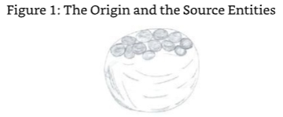

SE2:That is a good description.But don't forget that the Origin is absolute and infinite,there is nothing but the Origin,the Origin is "all,"so this image in your mind's eye that shows the Origin as a smaller entity is flawed and is a result of your limited ability to understand in your current projection. 

2号源实体：这是一个很好的描述。但是不要忘记，起源是绝对的和无限的，除了起源，没有别的东西，起源是“一切”。所以你脑海中把起源看成一个较小的实体的这个图像是有缺陷的，这是你目前理解能力有限的结果。

ME:So what did the Origin say to you when it contacted you for the first time? 

我：那么，当起源第一次联系你的时候，它对你说了什么？

SE2:It explained the reason for my existence and the reason for the other Source Entities' existence.This you have from your own Source Entity.More importantly it stated that how I achieve the task it gave me was entirely up to me.There were no time limits and no constraints on power or energy used.It was a simple meeting.The Origin went to some length to make it so and to show me what the Origin was in its entirety just so that I could understand what it was and what I was and how I fitted in.Once the Origin had explained everything that it knew to me,I felt that I was one and the same.I was the Origin,which as a division of the Origin we all are.As a result of this,I had what you might call a"kick-start" in the right direction.The change in me was instantaneous.One moment I was just me in existence and thought;the next moment,that is after the Origin gave me all its knowledge,I was personified.I was energy and thought,given knowledge and a purpose:to find out what I was,to experience what I was,and to evolve.As I was a part of the Origin,everything I did would be automatically fed back to the Origin in an experiential way,so I wouldn't need to contact the Origin specifically to report back on the progress I was making.It was at this point that I started to have what you would call "fun"by manipulating the energy that was all around us.I was particularity good at making shapes and dimensional constructs. 

2号源实体：它解释了我存在的原因以及其他源实体存在的原因。这是你从你自己的源实体那里得到的。更重要的是它说，我如何完成它给我的任务完全取决于我自己。没有时间限制，也没有对力量或能量使用的限制。那是一个简单的会面。起源用了很长的时间来使它如此，并向我展示了它的全部，以便我能理解它是什么，我是什么，以及我如何适应。一旦起源向我解释了它所知道的一切，我感到我是一体的，是一样的。我是起源，作为起源的一个分支，我们所有人都是。因此，我有了你可能称之为“启动”的正确方向。我身上的变化是瞬间发生的。这一刻我只是存在和思考的我；下一刻，也就是在起源把它所有的知识都给了我之后，我人格化了。我是能量和思想，被赋予了知识和目的：去发现我是什么，去体验我是什么，去进化。因为我是起源的一部分，我所做的一切都会以一种经验的方式自动反馈给起源，所以我不需要特别联系起源来报告我所取得的进展。正是在这一点上，我开始拥有你们所说的“乐趣”，通过操纵我们周围的能量。我特别擅长制作形状和空间结构。

ME:So how did you decided on the 12 x 4 x 12 x 3 dimensional universe? 

我：那么你是怎么决定4 x 12 x 3 x 12维度的宇宙的？

SE2:I decided that I would create four environments from which to base my learning environment on simply because I wanted to have four different experiments running at the same time.Each universe-if you want to call the environments that-were constructed in a different way.Each had a different purpose and a different set of rules. 

2号源实体：我决定创建4个环境作为我的学习环境的基础，因为我想同时运行4个不同的实验。每个宇宙——如果你想把环境称为宇宙的话——都以不同的方式构建。每个宇宙都有不同的目的和不同的规则。

ME:You had a different set of rules for each environment? Why? What were the rules? 

我：你对每个环境都有不同的规则？为什么？规则是什么？

SE2:I wanted to see how the entities that I would create later in order to populate these environments would fare if they had a different set of constraints placed on them,but with the same goal.One of the environments-let's call it environment one for the sake of argument-had no constraints and had all the abilities I had.The others had components of those abilities removed. 

2号源实体：我想看看我之后为了填充这些环境而创建的实体，如果它们有不同的约束条件，但目标相同，会如何表现。其中一个环境——为了方便讨论，我们称之为环境一——没有约束条件，拥有我所有的能力。其他的组件则移除了这些能力。

### The Four Environments of SE2 

**2号源实体的四个环境**

#### Environment 1-10,000 Source Entities,One Environment 

**环境1：10000个源实体，一个环境**

ME:Can you explain what the abilities and components were that you removed?No,tell me about the first environment first,and then tell me what the constraints were in the remaining three environments.

我：你能解释一下你移除的功能和组件是什么吗？不，先告诉我第一个环境，然后告诉我剩下三个环境中的限制是什么。

SE2:As just stated,the first environment contained every attribute that I was given by the Origin.Everything was within the environment right down to the lowest dimension and frequency.Additionally,the entities that I created were direct copies of me,only smaller in what you would call volume.They were constrained,however,in one way:they could only exist within the environment that I created.That is,they could not return to the Source,me, as you can with your own Source Entity. 

2号源实体：正如刚才所说，第一个环境包含了源头给予我的每个属性。环境中的一切，包括最低维度和频率，都在这个环境中。此外，我创造的实体都是我的直接复制品，只是体积小一些。它们受到了限制，不过，只有一种限制：它们只能存在于我创造的环境中。也就是说，它们不能回到源头，回到我，就像你们可以回到自己的源实体一样。

ME:Why did you do that?What would be the point of it? 

我：你为什么要这么做？这样做有什么意义？

SE2:I wanted to give them total autonomy.With the level of power that I had given them, equal to me,they could quite literally turn their environment upside down and inside out. I wanted them to know this and to appreciate that they would have no help from me in correcting whatever mess they got themselves into and that they were the masters of their own destiny,whichever way they took themselves. 

2号源实体：我想给他们完全的自主权。我给他们的权力水平和我一样，他们可以完全颠倒他们的环境。我想让他们知道这一点，并认识到他们不会从我这里得到任何帮助来纠正他们自己陷入的任何混乱，他们是自己命运的主宰，无论他们采取什么方式。

ME:So what was the goal that you gave them? 

我：那你给他们设定的目标是什么？

SE2:The goal or task was the same as yours.We all have the same task from the Origin:to experience all that there is in as many different ways as possible and evolve as a result. 

2号源实体：目标或任务和你的一样。我们都有一个相同的起源任务：以尽可能多的不同方式体验所有的东西，并以进化为结果。

ME:But you have given them everything and nothing.You have given them a task and not a route home-to you. 

我：但是你给了他们一切，却又什么都没有。你给了他们一个任务，却没有给他们一条回家的路——回到你身边。

SE2:I have given them everything.They have total autonomy from me,they are masters of their own universe,and they will exist for as long as I exist. 

2号源实体：我已经给了他们一切。他们完全自主，他们是他们自己宇宙的主人，只要我存在，他们就会存在。

ME:And how long will you exist?

我：那你们会存在多久？

SE2:For as long as the Origin wants us to exist.It has no plans to remove that existence to my knowledge,but my/our/your existence is still at the prerogative of the Origin and its pleasure in my/our/your existence. 

2号源实体：只要起源想让我们存在，它就不会取消我的存在，但是我/我们/你的存在仍然是起源的特权，它乐于我/我们/你的存在。

ME:Mmm,O.K.,I think I have been advised on this subject before by my Source Entity. 

我：嗯，好的，我想之前我的源实体已经就这个问题给我提过建议了。

SE:You have,and it is a consistent story that you will hear from all of the Source Entities. 

源实体：是的，这是你从所有源实体那里听到的一致的故事。

ME:It is good to realize that you are still here and that I can recognize you as my Source Entity. 

我：很高兴意识到你仍然在这里，我可以把你当作我的源实体。

SE:Yes,don't forget that I still need to support the link you have with SE2,which is why you are finding it so easy to communicate with it. 

源实体：是的，不要忘记我仍然需要支持你与SE2的链接，这就是为什么你发现与它交流如此容易。

ME:Thank you.So,getting back to the first environment from SE2's experiments,can you please give me an example of the type of power these entities had in the first environment? 

我：谢谢。那么，回到SE2实验的第一个环境，你能给我一个例子，说明在第一个环境中这些实体拥有的能量类型吗？

SE2:As explained a few moments ago,they had total power.But I can see that you need an example.Quite simply,they have the power to either totally destroy themselves by refusing to exist anymore or they can reproduce themselves or their environment. 

2号源实体：正如刚才所解释的，他们拥有完全的权力。但是我知道你需要一个例子。很简单，他们有权力通过拒绝继续存在来完全毁灭自己，或者他们可以再生自己或者他们的环境。

ME:Reproduction of self I can understand,but reproduction of environment,whole universe/ multiverses?Why would they want to do that?How would they do it? 

我：自我复制我能理解，但是复制环境，整个宇宙/多维宇宙？他们为什么要这么做？他们会怎么做？

SE2:How they do it is up to them,but one way would be to segment a portion of the environmental volume that I gave them to create a duplicate.Another way would be to mirror the whole volume of the environment by copying it and placing it on a level of dimension or frequency that is just out of alignment with the original. 

2号源实体：他们怎么做取决于他们自己，但一种方法是把我给他们的环境体积的一部分分割开来，然后创建一个副本。另一种方法是通过复制整个环境体积，并将其置于一个与原体积不一致的维度或频率层级上，来反映整个环境体积。

ME:But would you need to remove a frequential or dimensional component from the existing environment to achieve this? 

我：但是你需要从现有环境中移除频率或维度组件才能实现这一点吗？

SE2:Good question.No,you are thinking in terms of your own environment and its physical physics.The way it would be achieved is by... 

2号源实体：好问题。不，你在考虑你自己的环境和它的物理物理学。它将被实现的方式是通过...

ME:I am getting a picture of a sort of process where you make better use of the space available; err,rather like a double space program on a computer makes more space on a hard drive by using a form of compression algorithm that maintains all of the attributes of the files on the hard drive whilst making them smaller,thereby saving space. 

我：我正在得到一张图片，其中你更好地利用可用空间的过程；呃，更像电脑上的双空间程序，通过使用一种压缩算法，在保持硬盘上所有文件的属性的同时，使它们变小，从而节省空间，使硬盘上的空间更大。

SE2:That wasn't the description I was going to use,but it is one that will suffice.It is a good enough example for your readers to understand.In fact,it is possibly the only way that you will be able to understand the process. 

2号源实体：这不是我要用的描述，但它已经足够了。对于你的读者来说，这是一个足够好的例子。事实上，这可能是你能够理解这个过程的唯一方法。

ME:Why is this? 

我：为什么？

SE2:I was having trouble embedding the information into your limited energetic memory. It just wasn't capable of receiving the concept I was prepared to give to you.Multiversal compression is a good enough example to use. 

2号源实体：我很难把信息嵌入到你有限的精力充沛的记忆中，它就是无法接收我准备给你的概念。多维压缩是一个很好的例子。

ME:So if the entities within Environment 1 are all powerful,they must have a hard time living together. 

我：所以如果环境1中的实体都很强大，他们在一起生活一定很艰难。

SE2:They do not fight if that is what you are insinuating.They each have the same capabilities and they have full respect of their role within their environment. 

2号源实体：如果你暗示他们会打架的话，他们不会。他们每个人都有同样的能力，他们在环境中完全尊重自己的角色。

ME:How many entities did you create for the first environment? 

我：你为第一个环境创造了多少个实体？

SE2:You would call it a round number and,therefore,suspicious.

2号源实体：你会说这是一个整数，因此，值得怀疑。

ME:Go on.Try me. 

我：来吧，试试我。

SE2:Ten thousand. 

2号源实体：10000。

ME:You're right.It is a round number and I am suspicious. 

我：你说得对，这是一个整数，我对此表示怀疑。

SE2:? 

2号源实体：？

ME:What?Is that it?Silence? 

我：什么？就这样了？沉默？

SE2:What would you have me say?Do you want me to give you justification for such a whole number? 

2号源实体：你要我说什么？你要我给你一个这么大的数字的理由吗？

ME:Err,yes actually.I had a similar issue with the number of levels that my Source Entity created.They were based on 100. 

我：呃，实际上是的。我有一个类似的问题，我的源实体创建的层级数量。他们是基于100。

SE2:One of the things that you must note is that the numbers that I/we use are in the language that you would understand.I/we use whole numbers because of the ease of communication.Suffice to say,the number I gave you is correct and as such is understandable by you and others.Would a number of 9,892 have any more credence with you? 

2号源实体：你必须注意的一件事是我/我们使用的数字是用你能理解的语言写的。为了便于交流，我/我们使用整数。我只想说，我给你的数字是正确的，因此你和其他人都能理解。你觉得9892这个数字更有说服力吗？

ME:It might. 

我：可能吧。

SE2:Then use that.It is not correct,for it was 10,000. 

2号源实体：那就用那个。这个不正确，因为是10000。

ME:O.K.,I think I will leave this little digression in the text of this dialogue;the mere fact thatyou are questioning my questioning is validation enough for me. 

我：好吧，我想我将把这个小小的离题留在对话文本中；你对我的质疑本身就足以让我感到有理有据。

SE:Rest now.You are tired. 

源实体：现在休息一下。你很累了。

A few days later I continued the conversation.

几天后我继续了我们的对话。

ME:Can we continue with the first of the four environments you created? 

我：我们能继续谈谈你所创造的4个环境中的第一种吗？

SE2:Yes,of course. 

2号源实体：是的，当然。

ME:One of the questions that I have not asked is about the appearance of the entities in this environment and what they created as a civilization. 

我：我还没有问的一个问题是关于这个环境中的实体的外观和他们作为一个文明创造了什么。

SE2:I will answer your question in two parts.In terms of their appearance,they have none that you would recognize. 

2号源实体：我将分两部分来回答你的问题。就外表而言，你不会认出它们。

ME:How do you mean? 

我：你什么意思？

SE2:They do not have a physical appearance.I can see that you are waiting for further clarification. 

2号源实体：他们没有物理外观。我可以看出你在等待进一步的澄清。

ME:Yes,please. 

我：好的，请。

SE2:They have no method of being described physically because the environment within which they exist does not have dimensions or frequencies that are low enough to cause a physical projection.Simply put:they are purely "Source Essence"and so is their environment. 

2号源实体：他们没有办法被描述为物理，因为他们存在的环境没有足够低的维度或频率来引起物理投射。简单地说：他们是纯粹的“源头本质”，他们的环境也是。

ME:Hold on here.I have just received an image or concept in my mind that states that they are all one and the same-that is,their environment and the entities are all one. 

我：等一下，我刚才在脑海中接收到一个意象或概念，它说它们都是一体的，是一样的，也就是说，它们的环境和实体都是一体的。

SE2:That is correct.That is why they have no form,either physical or energetic,that you can use to distinguish them apart from their environment. 

2号源实体：是的，这就是为什么他们没有形体，无论是物质的还是能量的，你无法用它来将他们与环境区分开来。

ME:Is this why you only created 10,000?

我：这就是你只创造了10000个的原因吗？

SE2:Yes,it is also why I gave them total autonomy.They are as I am within my own environment,totally omnipotent. 

2号源实体：是的，这也是我为什么给他们完全的自主权。他们就像我在自己的环境里一样，完全无所不能。

ME:So how do you tell them apart?Do they have a signature or something that enables you to identify which one of the ten thousand they are? 

我：那你怎么区分他们呢？他们有没有签名或者其他什么东西，能让你从10000个中辨认出他们是谁？

SE2:They can only be told apart by their thought processes.Each one has a different thought process that they use to create the opportunity to experience and evolve.But please note this:not all of them are in full separate existence at the same time. 

2号源实体：他们只能通过他们的思维过程来区分。每个人都有不同的思维过程，他们用它来创造体验和进化的机会。但请注意：并不是所有的人同时都完全独立存在。

ME:I beg your pardon?You mean that one moment they are in existence and another they are not? 

我：你说什么？你的意思是前一秒钟他们还存在，下一秒钟他们就消失了？

SE2:As you noted before,they are one and the same and,therefore,one with their environment.I see you are frowning.I will send you an image of what I mean. 

2号源实体：正如你之前提到的，他们是一体的，是一样的，因此，他们与环境是一体的。我看到你皱眉了，我会给你发一个图片来说明我的意思。

I then received an image of a mass of something,say a cloud.This cloud was on its own as an undulating mass.Then I saw a mass of what I can only describe as rain drops.Each rain drop had its own sentience.As I looked further and into the cloud,which I was told was their environment,I noticed that each of the drops had a role to play and a job to do.Each role and job was either personally assigned or collectively assigned.Before the role/job was assigned,the rain drop that was to do the role was not a separate entity.It was fully part of the cloud.When the role was defined and the interaction with other raindrops or energies was established,a rain drop or a series of rain drops would be formed,and they would do what was necessary to perform and complete the task.When the task was complete,the rain drop or drops would return to the cloud and lose their singularity.They became one with the cloud again.Their singularity was lost,but their essence was maintained within the cloud, the/their environment.The cloud,the environment,was built of Source Essence that could be separated into two parts:environmental essence and individualized essence.

然后我收到一团东西的图像，比如说云。这片云本身就是一个起伏的团块。然后我看到一大团我只能形容为雨滴的东西。每一滴雨滴都有自己的知觉。当我进一步观察并进入云中，我被告知那是它们的环境，我注意到每一滴雨滴都有角色扮演和工作要做。每个角色和工作要么是个人分配的，要么是集体分配的。在角色/工作被分配之前，要扮演这个角色的雨滴并不是一个独立的实体。它完全是云的一部分。当角色被定义，并与其他雨滴或能量的相互作用被建立起来时，一滴雨或一系列雨滴将形成，它们将做必要的事情来执行和完成任务。当任务完成时，雨滴或雨滴将返回云中并失去它们的独特性。它们再次与云结合。它们的独特性消失了，但它们的本质在云中，即它们的环境中得以保持。云，即环境，是由源本质建造的，源本质可以分为两部分：环境本质和独立本质。

（图2：云朵和雨滴）

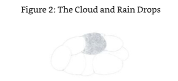

SE2:Now do you understand how they exist? 

2号源实体：现在你明白它们是如何存在的了吧？

ME:Yes,I think I do.That image was a really simple and effective way of describing what they are.I take it that there are no clouds or rain drops-that was just a method to describe the function of environment and individualized energy,a way to explain in simple terms how there can be a "variance"in the number of entities in existence,for want of a better word.It's a way to show that there never are all of the entities you created within this environment in singular existence at any one time,or are there times? 

我：是的，我想我知道。那个图像是一种非常简单而有效的方式来描述它们是什么。我认为没有云或雨滴——那只是一个描述环境和个体能量功能的方法，一种用简单的术语来解释存在实体数量如何“变异”的方法，因为找不到更好的词。它是一种表明在任何一个时间，你在这个环境中创造的所有实体都不会单独存在的方法，或者有时间吗？

SE2:There have been times,and there will be times when they are all in existence as single entities all together,so to speak.Such a time is when they are all needed to change the characteristics of the environment within which they exist,for this can only be achieved when all are in agreement. 

2号源实体：有过，将来也会有，它们作为单一实体一起存在的时期。这样的时期是当它们都需要改变它们所生存的环境的特征时，因为这只有在它们都一致同意时才能实现。

ME:Yes,I appreciate that would be a limitation.So what about civilization?Do they have one? Did they create one?

我：是的，我知道那会是一个限制。那么文明呢？他们有文明吗？他们创造了文明吗？

SE2:Civilization is a word that is peculiar to your physical-based existence.It determines that entities or beings behave in a way that you classify as civilized,that a certain level of co- operation and technology is present and the level of technology is a product of the level of co-operation on a personal and group basis.I am correct in this assumption? 

2号源实体：文明是一个词，是你们以物质为基础的存在所特有的。它决定了实体或存在以一种你们将其归类为文明的方式行事，存在着一定程度的合作和技术，而技术水平是个人和团体合作水平的产物。我的这个假设是正确的吗？

ME:Yes,you are. 

我：是的。

SE2:Well,in this instance you can say that the entities and the environment within which they exist are civilized. 

2号源实体：嗯，在这个例子中，你可以说实体和他们存在的环境是文明的。

ME:What?Is that it?Was there no creativity or area/environment which a group of them created for the betterment of them all and that has stood the test of time to show that they were,in fact, civilized and could be called a civilization,and that it was successful or failed? 

我：什么？就是这样吗？难道没有创造力或地区/环境，他们中的一群人为了所有人的改善而创造，经受住了时间的考验，表明他们实际上是文明的，可以被称为文明，它是成功还是失败？

SE2:Not in the way that you perceive things,no.For how could a group of entities that are essentially Source Essence and part of an environment that is created out of Source Essence become something that they have always been-in co-operation? 

2号源实体：不是你们感知事物的方式，不是。因为一组本质上是源头本质的实体，以及源头本质创造的环境的一部分，怎么可能变成他们一直以来合作的东西？

ME:You mean they have never become uncivilized/they have never failed to achieve their goal,a goal that if it failed would have resulted in some form of digression between the entities involved. 

我：你的意思是他们从未变得不文明/他们从未失败过，如果目标失败，就会导致相关实体之间的某种形式的偏离。

SE2:No.You see,even when they have failed to achieve the goal that they set themselves, they have managed to learn something,they have experienced something,they have evolved in some way. 

2号源实体：不，你看，即使他们没有达到他们为自己设定的目标，他们也学到了一些东西，他们经历了一些事情，他们在某种程度上进化了。

ME:I suppose in this instance if the entities concerned really are one and the same with themselves and their environment and are also truly omnipotent,they would behave in a civilized way.

我：我认为在这种情况下，如果有关实体确实是一体的，与自己和他们的环境是相同的，而且也确实无所不能，他们会以文明的方式行事。

SE2:The correct description would be that they behave in a highly evolved way,for each of them is aware of the power they have singularly,collectively,and environmentally.They are aware of their function within the environment and the group and have nothing to gain or lose by"going it alone."However,they have had a number of experiments where only one or two of them would split off from the whole and work alone. 

2号源实体：正确的描述应该是它们的行为方式是高度进化的，因为它们中的每一个都意识到自己单独、集体和环境中的力量。它们意识到自己在环境和群体中的作用，并且“单干”不会有任何得失。然而，它们做过一些实验，其中只有一两个会从整体中分离出来独自工作。

ME:What was the outcome of these experiments? 

我：这些实验的结果是什么？

SE2:That they are more efficient at evolving by doing things as a whole.They did find evolution singularly an interesting concept,but it was detrimental to the evolution of the whole. 

2号源实体：他们认为作为一个整体来做事会更有效率。他们确实发现单独的进化是一个有趣的概念，但这对整体的进化是有害的。

#### Environment 2 - The Cast-out Principle 

ME:O.K.,let's move on to the second environment that you created.What limitations did you put on the environment and its inhabitants? 

我：好的，让我们继续看你创造的第二个环境。你对环境和它的居民有什么限制？

SE2:In this instance I allowed them the opportunity to return to their source if they wished. They could/can also return to singularity if they wish/wished.In this they are similar to you but only in this instance.

2号源实体：在这个例子中，我允许他们有机会回到他们的源头，如果他们愿意的话。他们也可以回到奇点，如果他们愿意的话。在这个例子中，他们和你相似，但只是在这个例子中。

ME:How do you mean? 

我你什么意思？

SE2:They don't have free will like you do. 

2号源实体：他们不像你有自由意志。

ME:What other limitations do they have? 

我：他们还有什么其他的限制吗？

SE2:They are not omnipotent in their own environment like the entities in the first environment.They can create,and they can destroy,but they cannot manipulate their own environment in any way.Also they are limited to one dimension and one frequency,which is similar to you in your physical condition.A final limitation is that they have to work and exist as a multiple,that is,for every one of you,for instance,there are four to five of them. 

2号源实体：他们在自己的环境中并不像第一种环境中的实体那样无所不能。他们可以创造，他们可以毁灭，但他们无法以任何方式操纵自己的环境。此外，他们被限制在一个维度和一个频率，这与你们的物理条件相似。最后一个限制是，他们必须以多重的形式工作和存在，也就是说，对于你们中的每一个人，举例来说，有4到5个他们。

ME:But we can incarnate in up to twelve physical vehicles at the same time!(I had received this in a previous short meditation.It was another use of the number twelve). 

我：但是我们可以同时化身在12种物质载体中！(这是我在之前的一次短暂冥想中得到的，这是12这个数字的另一种用法)。

SE2:That is true in your case,but I have not worked in the same way as your Source Entity.Also,whereas you may incarnate in twelve separate vehicles in as many different dimensions or universes,they are restricted to being in the same universe and in the same locale.Even more restricting is the fact that they must work together to experience their experiences and work towards their evolution as a group,even though they are not what you would call a"group soul." 

2号源实体：在你的情况中，这是真实的，但我没有以与你的源实体相同的方式工作。此外，鉴于你可能在12个不同的维度或宇宙中投生，他们被限制在同一宇宙和同一地点。 更限制的是，他们必须一起工作来体验他们的经历，并朝着他们的进化作为一个团体而努力，即使他们不是你们所称的“集体灵魂”。

SE2:A lot of questions in one sentence. 

2号源实体：一句话里有很多问题。

ME:Sorry. 

我：对不起。

SE2:First,let me give you a bit more of the picture in this environment.Although in the physical sense it is equivalent in volume to the first,it is not equivalent in dimensionality, which also affects the physical.Do I make sense here as this may seem like nonsense to you? 

2号源实体：首先，让我给你们更多一点关于这个环境的图片。虽然在物理意义上它在体积上等于第一个，但它在维度上是不等的，这也影响了物理。我在这里讲得通吗？ 这对你来说可能看起来像胡说八道。

ME:Carry on;I think I know what you mean. 

我：继续说，我想我知道你的意思。

SE2:You may,but I will explain for the wider audience.You are fortunate to have a multi-dimensional multiverse to work with;the beings in my second environment do not.As a result,they do not have access to the physical levels that are above the physical levels where you currently exist.Thus,in effect they are limited to the physicality of the environment they exist within.They cannot go above or below it.I know you can't go below the level that you are physically.You are at rock bottom,but you can go above.I will repeat,those in environment one can't do either.You are fortunate in this way. 

2号源实体：你可以，但我还是要为广大观众解释一下。你们很幸运，可以使用多维宇宙，而第二种环境中的生物却没有。因此，他们无法进入你们目前所处的物理层级之上。因此，实际上他们被限制在他们所处环境的物理性质中。他们无法超越或低于这个水平。我知道你们无法低于你们的物理水平。你们处于最低点，但你们可以超越。我再重复一遍，这种环境中的生物两者都做不到。你们在这方面是幸运的。

ME:So they are captive in a certain environmental existence-one that you have created,one that they must work with. 

我：所以他们被困在某种环境中，一种你创造的，他们必须与之共存的环境。

SE2:Yes,that's the deal. 

2号源实体：是的，就是这样。

ME:O.K.,let's move on.Can I get back to what they have achieved as a civilization? 

我：好的，我们继续。我能回到他们作为一个文明所取得的成就吗？

SE2:Of course.You have to recognize though that the clues that you use in your physical existence to define a civilization and what it needs to do to be,is entirely different to what this race would consider civilization. 

2号源实体：当然，你必须认识到，你在你的物质存在中所使用的线索，用来定义一个文明，以及它需要做什么，与这个种族所认为的文明完全不同。

ME:How do you mean? 

我：你什么意思？

SE2:You may consider some of the actions they take to be that of an underdeveloped world. 

2号源实体：你可能会认为他们采取的一些行动是落后世界的做法。

ME:Are you trying to tell me that they are savages? 

我：你是想告诉我他们是野蛮人吗？

ME:So are they spread out into different civilizations:a group here,a group there,some populating a planet,some populating a galaxy.Does one group communicate with another group who has decided to exist in another neighboring planet,solar system or galaxy? 

我：所以他们分散到不同的文明中：一个群体在这里，一个群体在那里，一些人居住在一个行星上，一些人居住在银河系里。一个群体与另一个决定生活在邻近的行星、太阳系或银河系的群体有交流吗？

SE2:No they are not,at least not in the sense that you think.You see,their civilization is very, very basic.They are limited to a level of frequency that you would call energetic,but they would consider it physical. 

2号源实体：不，他们不是，至少不是你所想的那种。你看，他们的文明非常非常基础。他们被限制在一个频率的水平上，你们会称之为有活力的，但他们会认为它是物理的。

ME:Why would they consider it physical if we consider it energetic?

我：为什么他们认为它是身体的，如果我们认为它是能量的？

SE2:Because they have adopted a form that is impervious to them-that is,they can feel total resistance to their surroundings,themselves,and between themselves.I can see that you are frowning;you are thinking that this means that they are no different than you in your environment,am I correct? 

2号源实体：因为他们采取了一种对他们来说是无懈可击的形式，也就是说，他们能感觉到对周围环境、他们自己以及他们之间的完全的抵抗。我能看到你在皱眉；你在想这意味着他们和你所处的环境没有什么不同，我说的对吗？

ME:You are correct.I would have thought that they would need to be incarnate to be "physical." 

我：你说得对，我以为他们需要转世来“有形”。

SE2:Physicality is an expectation that you have that is based upon your current level of experience.You have a similar level of expectation for the registration and recognition of events that are individual and personal to the entity and its surroundings.You call it "time." Know this:everything in this second environment is energetic but has what you would call a "physical"aspect to it.This is not to say that these entities are subject to the same levels of limitation that you are;they are not.They can create structures in/on the areas that they focus on-that is,where in their universe they tend to be or like to be when they are together in groups made up of groups where they experience existence.Remember that is multiples of the groups of four or five that they are part of in their sphere of evolution and experience. They can use these structures for recreation,learning,or sharing of experiences.The area where you may call them uncivilized comes into play when one or two of the group,or even a whole group,are not progressing.In this instance,they are "cast outside"the group or groups that are at the same evolutionary or experience level.They are cast out to fend for themselves;they are not let back into the group or groups. 

2号源实体：物理性是你基于你当前经验水平的一种期望。你对个体和个人的实体及其周围环境的事件的登记和识别有类似的期望水平。你称之为“时间”。要知道：第二环境中的一切都是有活力的，但有你所说的“物理”方面。这并不是说这些实体受到你同样水平的限制；它们不是。它们可以在它们关注的领域中创造结构——也就是说，在它们的宇宙中，当它们在由它们体验存在的团体组成的团体中在一起时，它们倾向于或喜欢在那里。记住，在它们的进化和经验领域中，它们是四或五个团体的倍数。它们可以利用这些结构进行娱乐、学习或分享经验。当团体中的一个或两个人，甚至整个团体没有进步时，你可能会称它们为不文明的地区开始发挥作用。在这种情况下，它们被“抛弃”在同一个进化或经验水平的团体或团体之外。他们被抛弃，只能自谋生路；他们不会被重新接纳到这个团体或团体中。

ME:You say they are cast out!Is this forever? 

我：你说他们被驱逐了！这是永远的吗？

SE2:Yes,it is.Although they may form groups that are made up of other cast-outs.

2号源实体：是的，是这样的。尽管他们可能会组成由其他被抛弃的人组成的团体。

ME:Hold on.I have just got agrip on what you are saying here.You have entities that are cast out of their prime evolutionary environment simply because they are not considered to be progressing as well as some or all the others within a group.Is this correct? 

我：等一下。我刚刚明白你的意思。你有一些实体被排除在它们主要的进化环境之外，仅仅因为它们被认为没有像群体中其他一些或所有其他人一样进步。这对吗？

SE2:Yes. 

2号源实体：是的。

ME:That's not very spiritual,is it?I mean it's not very loving!It's not loving the entities that you have created.In fact,from where I am sitting,it looks and feels very draconian to me. 

我：这不是很灵性，是吗？我的意思是这不是很爱！这不是爱你所创造的实体。事实上，从我坐的地方，它看起来和感觉对我来说非常严酷。

SE:This is one of the things that you will have to get used to when dealing with the other Source Entities.That is,they may and will use very different methods of progression and evolution than those which you are experiencing in my environment. 

源实体：这是你在与其他源实体打交道时必须习惯的一点，也就是说，他们可能并且将会使用与你在我的环境中所经历的完全不同的进程和进化方法。

ME:O.K.,sorry.I was expecting to see everything that comes from the Origin as being in love and light and full of fluffy pink bunnies. 

我：好吧，抱歉。我原以为从起源处来的一切都是充满爱和光明，还有满是毛茸茸的粉色兔子。

SE2:I see where you are coming from now.Do you want me to filter my communication with you and only give you that which falls within the category that you expect? 

2号源实体：我明白你现在从哪里来。你想要我过滤我与你的沟通，只给你你期望的类别中的东西吗？ 

ME:No,no.That would not give the correct picture to the seekers of true truth. 

我：不，不。那不会给真理的追求者正确的画面。

SE2:O.K.,let me explain this "casting out"process in a different way as I can see that this has disturbed you significantly. 

2号源实体：好的，让我用不同的方式解释这个“铸造”过程，因为我可以看到这已经严重地打扰了你。

ME:Go ahead. 

我：说吧。

SE2:Perhaps you have read something into the use of the word "cast out"that is not intentional. 

2号源实体：也许你对“驱逐”这个词的用法有误解。

ME:Possibly,you do have to work with my very limited communication abilities.

我：可能吧，你得和我有限的沟通能力一起工作。

SE2:Yes,I am finding it a challenge.Nevertheless,I will continue with my communication with you.Those entities that are cast out leave the group both at the request of the group and under their own volition.Both the group and the entity not progressing realize that the best thing for both parties is to become separate.This allows them both to progress at their own rate.It is a most efficient method.You must understand this in a different way; in your multiverse,you are singular in your evolution.You both succeed and are succeeded by entities that are slower and faster than you in your evolutionary progression.Your evolution is personal.You wish well of those who you pass and offer good luck to those who pass you.This is the way of your multiverse.It is similar in mine,only the entities in this particular environment operate in groups.Let me make something else also clear.The "cast out"process is also used on those entities that appear to outgrow their group.This is done so that they can find a group that is similar in progression to their own although as you can imagine,this is a rarer occurrence since the main reason for being in the group is to progress as a group and not as a singular entity. 

2号源实体：是的，我发现这是一个挑战。尽管如此，我将继续与你交流。那些被驱逐的实体离开群体，既是应群体的要求，也是出于他们自己的意愿。群体和没有进步的实体都意识到，对双方来说最好的事情就是分开。这让他们都能以自己的速度前进。这是一个最有效的方法。你必须以不同的方式理解这一点；在你的多维宇宙中，你在进化中是单一的。在你的进化进程中，你既成功了，也被比你慢和快的实体所取代。你的进化是个人的。你祝福那些你经过的人，并向那些经过你的人提供好运。这就是你的多维宇宙的方式。在我的多维宇宙中也是类似的，只是在这个特定的环境中，实体以群体的形式运作。让我把其他事情也弄清楚。“驱逐”过程也用于那些似乎超越了群体的实体。这样做是为了让他们能够找到一个与自己进展相似的小组，尽管你可以想象，这是一种罕见的现象，因为加入小组的主要原因是作为一个小组而不是一个单独的实体。

ME:You said that they were cast out forever.What do you mean by this statement then? 

我：你说他们被永远驱逐了。那么你这句话是什么意思呢？

SE2:They will never be able to return to the group that they have left,for the group has either outgrown them,or they have outgrown the group. 

2号源实体：他们再也回不到他们离开的那个群体了，因为那个群体要么已经超越了他们，要么他们已经超越了那个群体。

In the instance that they have out grown the group,they have a limited opportunity for further progression in the short term since one of the first things they have to do is find a new group,which as I stated earlier is hard to do because they are far and few between. They cannot progress without a group,so they must spend the rest of their time as cast outs looking for a group that is in a similar level of progression to them.Once they have established a group that fits the bill,they have to negotiate to be allowed to enter the group. 

在这种情况下，他们已经超过了群体，他们在短期内进一步发展的机会有限，因为他们必须做的第一件事之一是找到一个新的群体，正如我之前所说的，这是很难做到的，因为他们之间距离很远。他们没有一个群体就无法进步，所以他们必须把剩下的时间花在寻找一个与他们进展水平相似的群体上。一旦他们建立了一个符合要求的群体，他们必须谈判才能被允许进入该群体。

ME:Why do they have to negotiate? 

我：为什么他们必须谈判？

SE2:Because in some instances they may actually reduce the progression level of the group they are joining in some small way,or they may actually increase the progression. As you can imagine,finding a group that is exactly the same in terms of their "individual progression level"as a cast out is difficult.In terms of an entity that is cast out because of lack of progression,finding a new group to work with is probably harder,especially if the entity is very slow in progression.In this instance the entity can wander the environment "group less"for millennia (in your terms).The best opportunity in this instance is creating a new group by working with other entities in a similar position.However,as previously noted,there will be a level of negotiation that goes on here as well,as one of the entities will undoubtedly be a faster "progressor"than the other,even if the progression is very minor in comparison.Joining together these two temporarily singular entities will result in one of them reducing its progression level to a point that is the mean of the two entities. This means that the lower level entity benefits in the collaboration as its level will increase creating a level of dependency between the two.Hence,the correct and formal formation of a new and recognizable group,a group of two,one that will attract other singular entities and,therefore,grow to the optimal size for the group's opportunity to progress in its evolution.So as you can see,being outcast is not such a big issue.It is a natural process of group evolution,one that is standard within this environment. 

2号源实体：因为在某些情况下，他们可能会以某种小的方式降低他们加入的团体的进程水平，或者他们可能会增加进程。正如你所能想象的，找到一个在“个人进程水平”方面与被驱逐者完全相同的团体是困难的。就因为缺乏进程而被驱逐的实体而言，找到一个新的团体来合作可能是更困难的，特别是如果实体的进程非常缓慢。在这种情况下，实体可以在环境中“少团体”徘徊千年（用你们的话来说）.在这种情况下，最好的机会是通过与其他处于类似位置的实体合作来创建一个新团体。然而，正如前面提到的，这里也会有一定程度的协商，因为其中一个实体无疑将比另一个更快的“进步者”，即使相比之下进程是非常小的。将这两个暂时单一的实体结合在一起，将导致其中一个实体将其进程水平降低到两个实体的平均水平。这意味着低层次的实体在合作中受益，因为它的层次会增加，在两者之间创造一种依赖程度。因此，一个新的和可识别的群体的正确和正式的形成，一个由两个人的群体，一个将吸引其他单一实体的群体，因此，增长到该群体在进化中进步的机会的最优规模。所以，正如你所看到的，被排斥并不是一个大问题。这是群体进化的自然过程，在这个环境中是标准的。

ME:A few moments ago in this dialogue you mentioned groups of groups.Does this mean that groups can get together for evolutionary purposes?

我：在刚才的对话中，你提到了群体的群体。这是否意味着群体可以为了进化的目的而聚集在一起？

SE2:Yes,of course.This is one of the primary functions of progression.Groups of similar progression levels can cluster together in just the same way as single entities cluster together to form a single group.This allows them to both share group evolutionary experiences and to work on opportunities that present themselves by allowing intergroup dynamics to take place. 

2号源实体：当然。这是进程的主要功能之一。具有相似进程水平的群体可以聚集在一起，就像单个实体聚集在一起形成一个单一的群体一样。这使得他们既可以分享群体进化经验，又可以通过允许群体间动态发生来抓住机会。

ME:What kind of intergroup dynamics? 

我：什么样的群体间动态？

SE2:There are three main types of inter-group dynamics.The first type is the interaction as groups between groups with the groups working and acting as if they are one entity,which is,indeed,what they should be.The second type is two or more groups working together by allowing the single entities that make up the groups to move from one group to another at will.The groups appear to merge at the point of interaction,and doubling or trebling in size is observed whilst the dynamic is being worked on.This allows a sharing of individual experience outside the entities'normal group.The third interaction is a mixture of the two mentioned above.That is,three,four,or more groups interact both on a group basis and an individual entity basis together with the single entities moving between one or more groups outside their own main group on a regular basis.In this last interaction,a lot of evolutionary opportunities can be progressed as all the groups seem to lose their individual group identity at one point or another with completely new groups being formed at times.In this instance,both group and individual entity interaction within different group interactions happen all at the same time,which gives the visual appearance of an undulating mass of entity movement resulting in the form and the formless,the timed and the timeless, the frequency and frequency-less,the dimension and dimensionless intermingling and entwining.It is beautiful to watch. 

2号源实体：主要有三种类型的群体间动态。第一种类型是群体之间的互动，这些群体工作和行动，就像它们是一个实体，事实上，它们应该是什么。第二种类型是两个或更多的群体一起工作，通过允许组成群体的单个实体随意从一个群体移动到另一个群体。这些群体似乎在互动点上合并，并且在动态工作时，观察到规模翻倍或三倍。在这种情况下，群体和个体实体的互动以及不同群体互动都同时发生，给人一种实体运动的波浪状视觉效果，从而导致有形和无形、有时间和无时间、有频率和无频率、有维度和无维度的交织和交错。 这是一种美丽的视觉效果。

ME:It strikes me that what you have just described could also be used to described what happens on our planet,Earth,as we have interaction between individuals,families,local communities, countries,and civilizations,together with migration between them all. 

我：你刚才所描述的让我想到，也可以用来描述在我们的星球上发生的事情，因为我们有个人、家庭、地方社区、国家和文明之间的互动，以及它们之间的迁移。

SE2:To some extent,yes,but in comparison to my group interaction and dynamics,your communities,countries,civilizations,etc.,are one-dimensional(1D). 

2号源实体：某种程度上是的，但是和我的群体互动和动态相比，你们的社区、国家、文明等等，都是一维的。

ME:But we are three-dimensional. 

我：但是我们是三维的。

SE2:Yes,but you would appear one-dimensional comparatively speaking. 

2号源实体：是的，但是相对来说，你显得单调了。

ME:What do you mean one-dimensional? 

我：一维是什么意思？

SE2:As they are at a different base dimension and frequency to you,they are naturally more expansive even though they have physicality between themselves.So,by referring to you (the human race)as being one-dimensional,I am trying to illustrate your limitations in comparison to theirs.For example,if they were to present themselves into your universe, galaxy,dimension,and frequency,you would not be able to detect them even with your sensing machines because your machines are not calibrated to sense the essence of their physicality,which to you is not physical. 

2号源实体：因为他们在你们不同的基本维度和频率，所以他们自然更扩展，即使他们之间有物质性。所以，通过把你们（人类）称为一维，我试图说明你们与他们的比较的局限性。例如，如果他们进入你们的宇宙、银河系、维度和频率，你们甚至不能用你们的感应器探测到他们，因为你们的感应器没有校准来感应他们的物质性本质，而这对你们来说不是物质的。

#### Environment 3 - An Environment for Change 

**一个变化的环境**

ME:I would like to talk about the third environment you have created.How is this different than the first two?

我：我想谈谈你所创造的第三个环境。它与前两个有什么不同？

SE2:Environment 1 is closed to all but those entities that exist within it.As previously stated,they have the same abilities("power"if you want to call it that)as I do.They cannot return to their Source,me. 

2号源实体：环境1对所有实体关闭，除了那些存在于其中的实体。如前所述，他们拥有和我一样的能力（如果你想称之为“力量”的话）。他们不能回到他们的源头，我。

Environment 2 has one dimension and one frequency,and although the entities can return to me at any time,they must work and evolve in groups or groups of groups.They exist in a finer density than humankind. 

环境2只有一个维度和一个频率，虽然实体可以随时回到我身边，但它们必须成群或成群成群地工作和进化。它们的密度比人类要高。

Environment 3 is different again.It is what you call "fluidic"in nature. 

环境3又不一样了。它本质上就是你们所说的“流体”。

ME:You mean it's full of water or a liquid of some sort? 

我：你是说它充满了水或某种液体？

SE2:No,no.By fluidic I mean that it is constantly changing. 

2号源实体：不，不。我的意思是它在不断变化。

ME:In what way does it constantly change?Is it in dimension?Is it in frequency?Is it in physicality? 

我：它以什么方式不断变化？是在维度上吗？是在频率上吗？是在物质性上吗？

SE2:Nearly,in fact,it changes in a way that you will have difficulty understanding. 

2号源实体：差不多，事实上，它改变的方式会让你很难理解。

ME:Try me. 

我：试试我。

SE2:O.K.It changes in rotational attractivity.I can see that you are frowning again. 

2号源实体：好的，它在旋转吸引力中改变。我能看到你又皱眉了。

ME:I am a bit as I am trying to work out what that may mean.Can you describe it in layman's terms,please? 

我：我有点儿困惑，因为我正在试图弄明白那可能意味着什么。你能用外行人的话来描述一下吗？

SE2:Everything in this environment has a force that I call "rotational attractivity;"you might call it gravity,but it is not.In this instance,rotational attractivity is the random function that occurs in this environment that causes an entity to slip uncontrollably from one dimension or frequency to another at a specific point in its existence as a result of its natural attractivity to that dimension or frequency.By rotational attractivity,I mean that the dimensions above and below the position of the entity concerned have a rotational component that is peculiar to a certain frequency or dimension.You might call it the "speed of the energetic components"that makeup the entity. 

2号源实体：在这个例子中，旋转吸引力是发生在这个环境中的随机作用，它导致一个实体在存在中的一个特定点上，由于它对那个维度或频率的自然吸引力，不受控制地从一个维度或频率滑到另一个维度或频率。通过旋转吸引力，我的意思是，有关实体位置的上下维度有一个旋转分量，这是特定频率或维度所特有的。你可能会称它为组成实体的“能量分量的速度”。

ME:How can rotation be described as speed? 

我：旋转怎么能被描述为速度？

SE2:The associated energetic components move about and around each other.In some instances the configuration of these energies matches another environmental condition better than its current one so it is,therefore,attracted to it.If the level of attraction is compatible with enough of the energetic components of the entity concerned,it modifies the remaining components and slips into the next dimensional/frequency-based environment,that is,the one that it has been attracted to. 

2号源实体：相关联的能量组件相互移动和围绕。在某些情况下，这些能量的配置比当前的环境条件更适合另一个环境条件，因此，它被吸引到那里。如果吸引的程度与有关实体的能量组件足够兼容，它会修改剩余的组件并滑入下一个维度/基于频率的环境，也就是它被吸引到的环境。

ME:That must be a very difficult way to live. 

我：那一定是一种非常艰难的生活方式。

SE2:Why? 

2号源实体：为什么？

ME:Because the entity that slips from one,shallI say"rotational environment"to another would have to start all over again every time it changes environments. 

我：因为实体从一个我应该说“旋转环境”到另一个，每次它改变环境时都必须重新开始。

SE2:You are thinking in terms of your own dimension and frequency again.The entities that exist in the third environment know when they are close to being moved from one type of rotational environment to another.As a result they prepare themselves for the change and work out/clear up all that they have started in their current environment.What's more, as they become more and more aligned to their next rotational existence,they get a feel of what limitations or abilities they will have.As a result and to a certain degree,they can plan ahead what they can achieve evolution-wise before they make the change. 

2号源实体：你又在考虑你自己的维度和频率。存在于第三个环境中的实体知道，当他们接近于从一种类型的旋转环境转移到另一种类型时。结果，他们为改变做准备，并解决/清理他们在当前环境中开始的所有事情。更重要的是，当他们变得越来越与下一个旋转存在一致时，他们会感觉到他们将拥有什么限制或能力。结果，在某种程度上，他们可以在做出改变之前提前计划他们可以进化地实现什么。

ME:But it must be like moving and losing all of your possessions,your job,and your house at the same time on a frequent basis. 

我：但是那一定就像经常搬家，同时失去你所有的财产，工作和房子。

SE2:Not quite,for these entities don't need to work to sustain themselves.They don't need to buy food or clothing or shelter of any sort.They exist in an ever-changing environment and,as a result,they need to be independent of such restrictions. 

2号源实体：不完全是，因为这些实体不需要工作来维持自己。他们不需要买食物或衣服或任何形式的住所。他们存在于一个不断变化的环境中，因此，他们需要独立于这些限制。

ME:So do they work by themselves,or do they work in groups like the entities in the second environment? 

我：那么他们是自己工作，还是像第二个环境中的实体一样在群体中工作？

SE2:They work on themselves for themselves,but they can and do work together with other entities for mutual advancement if they so desire.But of course,this generally only lasts for the duration that either one of them is in that rotational environment. 

2号源实体：他们为自己而工作，但如果他们愿意，他们可以并确实与其他实体一起工作以实现共同进步。但当然，这通常只持续他们中的任何一方处于那个旋转环境中的时间。

ME:Can one entity follow another entity to another rotational environment? 

我：一个实体可以跟随另一个实体到另一个旋转环境吗？

SE2:No,not willingly,but they can continue to work together if they detect each other later. As you can imagine,the chances of this happening is limited. 

2号源实体：不，不愿意，但是如果他们后来发现了对方，他们可以继续合作。正如你所能想象的，这种情况发生的可能性很有限。

ME:But not impossible I take it. 

我：但也不是不可能。

SE2:No it is not impossible,but it is unlikely,especially since most of the entities plan a piece of work that is generally small enough to be contained in the shortest of existences within their current rotational environment. 

2号源实体：不，这不是不可能，但不太可能，特别是因为大多数实体计划的一件工作通常小到足以包含在当前旋转环境中最短的存在中。

ME:So how would an entity know how long it has and how would it know if another entity had enough time left in their environment to make a partnership work and work to a successful conclusion? 

我：那么一个实体如何知道它还有多久，它如何知道另一个实体在他们的环境中还有足够的时间来让合作工作，并取得成功？

SE2:Each entity has an energetic signature that is relevant to its current rotational environment and the one that it will be slipping into.Consider it like an hour glass with sand running from one side of the glass bubble to the other through the small piece of glass that connects them.The top side of the glass is where they are now and the bottom side is where they are being attracted to next.It is this signature that every entity can sense in terms of the current rotational environment;it's just that they can't tell where their next environment will be. 

2号源实体：每个实体都有一个能量特征，与它当前的旋转环境和它将要滑入的环境相关。把它想象成一个沙漏，沙子通过连接它们的玻璃片从玻璃泡的一边流到另一边。玻璃的顶部是它们现在所在的地方，底部是它们将要被吸引到的地方。这就是每个实体根据当前旋转环境可以感知的特征；只是它们不知道下一个环境会在哪里。

ME:So if I was an entity in this environment,how would I sense the longevity of the entity next to me. 

我：如果我是这个环境中的实体，我怎么能感觉到我旁边实体的寿命？

SE2:You would just know.I can see that statement is not enough for you. 

2号源实体：你就会知道了。我看得出那个声明对你来说是不够的。

ME:No.You mentioned the hour glass as an example,but this was an example of an energetic signature.An entity must have some sort of representation,for instance,visual that makes fast recognition of longevity. 

我：不。你提到了时钟作为一个例子，但这是一个能量签名的例子。一个实体必须有某种表示，例如，视觉上的，可以快速识别寿命。

SE2:Yes,there is.The best way to describe it in terms that you can understand in the physical is to say that they have a color associated with the length of time they have left in their current environment.Of course,there are a lot more colors available than those in your visible spectrum,but a good facsimile would be the change in color from the infrared to the ultraviolet.As an accurate example,it is inadequate but will do for now. 

2号源实体：是的，有。用你们能理解的物理术语来描述它的最好方法是说它们有一个颜色，这个颜色与它们在当前环境中所剩时间的长短有关。当然，比起你们的可见光谱，还有更多的颜色可供选择，但一个好的传真就是从红外到紫外线颜色的变化。作为一个精确的例子，它并不充分，但现在可以了。

ME:Simplistically speaking then,they change from red to blue,or from white to black.

我：那么简单地说，它们从红变蓝，或者从白变黑。

SE2:If this helps you understand,then that will do. 

2号源实体：如果这能帮助你理解，那就行了。

ME:What do the entities in Environment 3 work on to help them evolve,and do they have enough of them grouped together to create a civilization? 

我：环境3中的实体是如何帮助他们进化的，他们有足够的实体聚集在一起来创造一个文明吗？

SE2:I can see that you are enthralled with the need to be civilized in a way that you can recognize in the physical.No,don't answer.It is written all over your face,so to speak.I am told by your Source Entity that this is a common desire,one that you all have difficulty moving away from. 

2号源实体：我能看到你被一种你在物质世界里能认出的文明化的需求所迷惑，不，不要回答，这可以说写在你脸上，你们的源实体告诉我这是一个共同的愿望，一个你们都难以摆脱的愿望。

Mmm,I will have to enlighten you in the simple general rules that I ask my creations to work within: 

- Evolve through experimentation and experience. 
- Work together where necessary. 
- Do not create anything that could be detrimental to yourself or others. 
- Be of service(you also have this rule to work with). 
- Do not intentionally harm another. 
- It is the quality of experience that counts,not how fast you experience the experience. 

嗯，我将告诉你一些我要求我的创造物遵守的简单规则：

- 通过实验和经验进化
- 必要时一起工作
- 不要创造任何可能对自己或他人有害的东西
- 提供服务(你也需要遵守这个规则)
- 不要故意伤害别人
- 重要的是体验的质量，而不是你体验得有多快

ME:That last rule is a really good one.It is one that we should adopt in our physical existence. 

我：最后一个规则真的很好。这是我们应该在我们的物理存在中采用的一个规则。

SE2:If you could all embrace it,you would all benefit greatly.But,let's get back to answering your questions. 

2号源实体：如果你们都能接受它，你们都会受益匪浅。但是，让我们回到回答你们的问题上来。

My creations in the third environment are independent of the need to coalesce to exist, purely because they are not located in one place only.As with all of my creations in all of my environments,they are creatures of the universe they exist within and as such have access to all of it without exception.The only limitations they have in this sense are those that they place on themselves as part of their evolutionary plans.If enough of them are in a specific environment long enough to find that their working together in a large group is to the advantage of all,then they will group together;otherwise,they will limit their interaction to ones or twos.There will never be a group large enough to create a civilization in the sense that you know,for it is not a requirement for evolution as it is with you.In terms of what they work on,you would not understand most of it.Suffice to say,they experience things that can only be experienced by continuous change of environment and the level of attractivity it has with them. 

我第三种环境中的创造物独立于需要联合而存在，纯粹是因为它们不仅仅存在于一个地方。 和我所有环境中的所有创造物一样，它们是它们所存在的宇宙的创造物，因此可以无一例外地接触到宇宙的一切。在这个意义上，它们唯一的限制是它们作为进化计划的一部分而加诸于自身的。如果在一个特定的环境中，有足够多的创造物长时间地发现，它们在一个大群体中合作对所有创造物都有好处，那么它们就会聚集在一起；否则，它们会将它们的互动限制在一两个之间。永远不会有一个群体大到足以创造出你所知道的那种文明，因为这不是进化的要求，就像你一样。就它们所从事的工作而言，你不会理解其中的大部分。可以这么说，它们经历的事情只能通过不断改变环境和它对它们的吸引力来经历。

#### Environment 4-An Environment Aware of Its Own Existence 

**环境4：一个觉察到自己存在的环境**

ME:O.K.,tell me about the fourth and final environment that you created.What limitations did you put on this universe? 

我：好吧，跟我说说你创造的第4个也是最后一个环境。你在这个宇宙中设置了什么限制？

SE2:The fourth environment was given the opportunity to evolve on its own.That is,I did not personally create any entities specifically to exist within this environment,which is,of course,a different strategy than the one used in the creation of the other environments. 

2号源实体：第4种环境被赋予了自我进化的机会。也就是说，我没有亲自创造任何在这个环境中存在的实体，这当然是一种不同于在其他环境中所使用的创造策略。

ME:Hang on.Are you saying that the environment evolved on its own and created its own entities? 

我：等等，你是说环境自己进化并创造了自己的实体？

SE2:In a word,yes,although that is not specifically how it happened.The environment itself was created and given the opportunity to become aware on its own in its own time,so to speak.It was,in essence,like me:energy given sentience/individuality whereas the other environments are just that,environments with no sentience.The sentience is given to the entities I created specifically to exist within that environment.Environment 4 was given the gift of individuality and the opportunity to evolve in its own right. 

2号源实体：总而言之，是的，尽管这并不是具体发生的。环境本身被创造出来，并被赋予了在自己的时间里自我意识的机会，可以说。本质上，它就像我：被赋予了感知/个性的能量，而其他环境只是没有感知的环境。感知被赋予了我创造出来专门存在于那个环境中的实体。环境被赋予了个性的礼物，并被赋予了以自己的方式进化的机会。

ME:I'm getting the impression that you copied,for want of a better word,the Origin in this instance.The Origin gave the twelve Source Entities,you,part of its volume to give you individuality and an opportunity to evolve in your own way.In Environment 4's case,you gave it the same opportunity that the Origin gave to you,some of your own volume and the means to become aware of self and,therefore,gain a level of sentience. 

我：我得到的印象是，你复制了，因为找不到更好的词，在这个例子中的“起源”。起源给了12个源实体，你们，它的一部分体积，给你们个性和一个机会，以你们自己的方式进化。在环境4的例子中，你给了它同样的机会，起源给了你，一些你自己的体积和方法，变得有自我意识，因此，获得一个层次的感知。

SE2:Correct.It is a very interesting project and one that has borne much fruit from an evolutionary perspective. 

2号源实体：正确。这是一个非常有趣的项目，从进化的角度来看，它已经结出了许多果实。

ME:So how did you advise Environment 4 on its task in existence? 

我：那么你对环境4的现有任务有什么建议吗？

SE2:The same way the Origin gave me my set of rules to work within.In fact,they are identical.This was the best way to proceed in this instance. 

2号源实体：同样的，起源给了我一套规则，我可以按照它来工作。事实上，它们是完全相同的。在这种情况下，这是最好的办法。

ME:How long did it take Environment 4 to gain awareness? 

我：环境4号花了多长时间才获得关注？

SE2:You are always referring to time;your Source Entity warned me about this trait and said that it is one of your biggest limitations. 

2号源实体：你总是提到时间；你的源实体警告过我这个特点，说这是你最大的限制之一。

ME:Sorry,but it is one of the methods that humankind in my Source Entities'multiverse uses to differentiate between the advent of an number of events and their relationship to each other.It is also a datum that the readers of this text will use as a tool to try to understand the details of what we are discussing.

我：抱歉，但是这是我源实体的多维宇宙中人类用来区分一系列事件的到来和它们之间的关系的方法之一，这也是这篇文章的读者将用作试图理解我们正在讨论的细节的工具的一个数据。

SE2:If it makes things easy for you,then I will use it although time is a non-concept.It means nothing. 

2号源实体：如果这样能让你轻松点，那我就用它，虽然时间是个无意义的概念。它什么都不是。

ME:O.K.,I understand. 

我：好的，我明白了。

SE2:Yes,I believe you do at a deep down fundamental level-the level that is the real you, the energetic you,so let's move on.In creating Environment 4 in this way,I gave it essence of"me."In some respects,this helped it on its way to awareness.As a result it established its awareness quite quickly.In your metric of time,this would be about a billion years.I also noticed that the awareness coalesced in one area of denser energy where the energy distribution of the environment was irregular or uneven.In fact,the environment became aware in a type of energy that was similar in make-up. 

2号源实体：是的，我相信你在最深层的层面上是这样做的-这个层面就是真实的你，充满活力的你，所以让我们继续。以这种方式创造环境4，我赋予它“我”的本质。在某些方面，这有助于它在通往意识的道路上前进。结果它很快就建立了意识。以你们的时间度量衡，这大约是10亿年。我也注意到意识集中在一个能量密度较高的区域，那里环境的能量分布是不规则或不均匀的。事实上，环境在一种类似于化妆品的能量中变得有意识。

ME:I have just received an image of a dark cloud of energy within the bubble of Environment 4-that dark cloud being the energy that gained awareness first.This darker energy is still distributed throughout the volume that is Environment 4.It is just that this area was denser and thus ended up at the center of awareness. 

我：我刚刚收到一张在环境4的泡泡中有一团黑暗能量的图片，这团黑暗能量是最初获得意识的能量。这团黑暗能量仍然分布在整个环境4的体积中。只是这个区域密度更大，因此最终成为意识的中心。

SE2:Good,that is correct.The rest of the environment also gained awareness but at a slower pace.Consider it like when you wake up from being asleep.At first you are aware of just your thoughts,and then you start to feel certain parts of your body,some before others.Finally you are in full awareness of your body,and you move your limbs at will without preconceived thought.This is exactly how Environment 4 became aware.First,it was in the center of the dark energy cloud.Then as awareness of self spread,it became more expansive and started to include the rest of the dark energy spread throughout the environmental bubble.Eventually it also included the other energies that are also present, making it a complete environmental entity in its own right-fully aware of its existence,its composition,its location,and its abilities. 

2号源实体：很好，说对了。环境的其他部分也获得了意识，但速度较慢。想象一下你从睡梦中醒来，起初你只意识到自己的思想，然后你开始感觉身体的某些部分，有些先于其他部分。最后你完全意识到自己的身体，你随意移动四肢而没有先入为主的想法。这正是环境4获得意识的方式。起初，它在黑暗能量云的中心 然后随着自我意识的扩散，它变得更加膨胀，开始包括扩散到整个环境泡泡的其他黑暗能量。最后它还包括了其他存在的能量，使它成为一个完全独立的环境实体，完全意识到自己的存在、组成、位置和能力。

ME:How could it be aware of its abilities so early in its existence? 

我：它怎么能在它存在的这么早就意识到自己的能力？

SE2:As I stated before,it had essence of me,and as a result of its growing awareness, it also gained knowledge of its personal attributes and abilities.Although at this point in its existence they were fairly rudimentary,they were enough to kick-start the higher level functions of an entity that was not limited in its creative ability within the confines of what I had given it.In fact,it very quickly established what it could and couldn't do.The abilities that it couldn't perform were a function of its ability to control and work with the energies that formed its volume so to speak.So as it gained more and more understanding of self it gained more and more experience,and as a result,it expanded its creative abilities. 

2号源实体：正如我之前所说，它具有我的本质，由于它意识的增长，它也获得了关于自身属性和能力的知识。尽管在它存在的这个时刻，它们相当原始，但它们足以启动一个实体的更高层次的功能，这个实体的创造能力不受限于我赋予它的范围。事实上，它很快就确定了它能做什么和不能做什么。它不能执行的能力是它控制和利用构成它体积的能量的能力的功能。因此，当它对自己获得越来越多的理解时，它获得了越来越多的经验，结果，它扩展了它的创造能力。

ME:So it grew in capability as it increased in awareness. 

我：所以随着意识的增强，它的能力也在增强。

SE2:Correct.When it reached a point where it realized that it was part of a much larger entity,and,therefore,started to probe its boundaries,I decided to make my presence known and advise Environment 4 on its role in life,as it were. 

2号源实体：当它意识到自己是一个更大实体的一部分，并因此开始探索自己的边界时，我决定让它知道我的存在，并建议环境4在生活中扮演什么角色。

ME:So at this point you were able to work with Environment 4 because it was at a level of awareness that allowed it to understand what you were conveying. 

我：所以在这一点上，你能够与环境4合作，因为它处于一种意识水平，允许它理解你所传达的东西。

SE2:Yes.It needed to be at this point for a couple of reasons.First,it had to have enough awareness to allow a robust level of understanding,and second,it had to be young enough not to question its position in the universe and go off at a tangent to what I wanted to achieve.

2号源实体：是的，它需要在这个点上，有几个原因。首先，它必须有足够的意识，以允许一个健全的理解水平，其次，它必须足够年轻，不会质疑它在宇宙中的位置，并偏离我想达到的目标。

ME:Are you suggesting that there is an optimal time period for intervention and presentation of advice on an entity's role in existence? 

我：你的意思是说，对于一个实体的存在角色，存在一个最佳的干预和建议提出时间段吗？

SE2:Absolutely.Know this.If an entity is briefed on its role in existence too early in its awakening,that time during which it is becoming what it is,then it will not fully appreciate what you are telling it and will not give it the level of importance that it deserves.If on the other hand you wait too long in the awakening process,the entity develops too much independence,is likely to question the need for the role it is given,and is inclined to rebel.Although on the face of it,letting an entity experience this would be an interesting experiment to perform and observe,it is not on my agenda for evolutionary experience at this present point in my existence. 

2号源实体：如果一个实体在觉醒的早期就被告知它在存在的角色，在它成为它自己的时候，它将不会完全理解你告诉它的东西，也不会给予它应得的重要性。另一方面，如果你在觉醒的过程中等待太久，实体发展得太过独立，很可能会质疑它被赋予的角色的必要性，并倾向于反抗。尽管从表面上看，让一个实体经历这将是一个有趣的实验来执行和观察，但在我存在的这个时刻，它不在我的进化经验议程上。

ME:I have to admit I am a little bit surprised that an entity needs to be coached in this way and that there is an optimal time period in which it has to (must)be done.I would have given an entity of this size and ability more credibility. 

我：我不得不承认，我有点惊讶，一个实体需要以这种方式指导，有一个最佳的时间段，它必须完成。我将给这种规模和能力的实体更多的可信度。

SE2:(Pause)Forgive me.I have just tapped into your memory to understand more about you and your environment.Are you O.K.with this? 

2号源实体：(停顿)请原谅。我刚刚进入了你的记忆，以便更多地了解你和你所处的环境。你没问题吧？

ME:Yes. 

我：是的。

SE2:Good,for it will help me answer your questions better.Consider a human child.If you give it too much leeway,it will not respect you.If you are too hard on it,it will consider you a tyrant.Both responses result in it holding you in contempt.This is the same for any entity. No matter how expansive and powerful it is,it is still immature.It has experienced nothing, it has learnt nothing,it has not begun its evolution,and it has no morals or understanding of what is the right thing to do and what is detrimental.Notice that I didn't say "wrong thing,'" for there is no wrong thing that can be done as everything is experience and evolution. 

2号源实体：很好，因为这将有助于我更好地回答你的问题。考虑一个人类的孩子。如果你给它太多的余地，它不会尊重你。如果你对它太严厉，它会认为你是暴君。这两种反应的结果是它蔑视你。对任何实体来说都是一样的。无论它有多么广阔和强大，它仍然是不成熟的。它什么都没有经历过，它什么都没有学到过，它还没有开始进化，它没有道德或理解什么是正确的事情，什么是有害的。注意我没有说“错误的事情”，因为没有错误的事情可以做，因为一切都是经验和进化。

ME:So what you are saying is that even though an entity may be as big as the fourth environment,it is still juvenile in nature. 

我：所以你的意思是，即使一个实体可能像环境4一样大，它在本质上仍然是幼稚的。

SE2:In a nutshell,yes,but don't get me wrong.The level of juvenility is completely different to what you expect and experience in your physical human existence as it would still be considered a god even by the most evolved entity within your universe. 

2号源实体：简而言之，是的，但别误会我的意思。幼稚的程度与你们在你们的肉体人类存在中所期待和经历的完全不同，因为即使是你们宇宙中最进化的实体也仍然会认为它是一个神。

ME:O.K.,now I think I understand the need to be accurate in the point of intervention of the awakening of a new entity. 

我：好的，现在我认为我理解了在新实体觉醒的干预点上需要准确的。

SE2:I have one further thing to add.The point of intervention is also important because of the ability of the entity to absorb the information that it is going to be given.This is additional to its briefing on its role in existence. 

2号源实体：我还有一件事要补充。干预点也很重要，因为实体吸收将要提供的信息的能力。这是对其存在角色的简要说明的补充。

ME:What information do you give it? 

我：你给它什么信息？

SE2:In Environment 4's instance,a portion of the learning that I have gained during my existence-just enough to give it a head start.I could have left it totally on its own,but that would not have been conducive to my plan.And that plan was that Environment 4 had essence of"me."In the case of other entities,I give them enough memory-based information to back up the briefing I give them.In this way they understand fully what I ask of them and are able to "hit the ground running,as you would say. 

2号源实体：以环境4为例，我从自身存在中学到的一部分知识，刚好足以让它有一个好的开始。我本来可以完全让它自己发展，但那对我的计划没有帮助。而那个计划就是环境4具有“我”的本质。至于其他实体，我给它们提供足够的基于记忆的信息来支持我给它们的简报。这样它们就能完全理解我对它们的要求，并能够“如你们所说，一举成名”。

ME:So if Iget this correctly,the point of intervention is a point in the early existence of the entity where it has not yet accrued its own knowledge base and as a result cannot,therefore,reject the information that you give it since it would be comparing the two sets of information all of the time. 

我：如果我理解正确，干预点是实体早期存在的一点，它还没有积累自己的知识库，因此不能拒绝你给它的信息，因为它会一直比较两组信息。

SE2:Correct.The memories that I implant need to be accepted as its own,and this cannot be done after it starts to accrue its own memories. 

2号源实体：正确，我植入的记忆需要被接受为它自己的，这不能在它开始积累自己的记忆后完成。

ME:O.K.,can we move on a bit? 

我：好的，我们能往前走一点吗？

SE2:Of course. 

2号源实体：当然。

ME:From what I can see,the fourth environment is a unique experiment.I mean,giving a whole universe sentience-that's quite a step. 

我：在我看来，环境4是一个独特的实验。我的意思是，赋予整个宇宙感知力，这是相当大的一步。

SE2:It's not as unique as you think.All I have done in this instance is give the energy that I call the fourth environment the essence of "me"and the opportunity to create on its own. This has been done in preference to my creation of an environment and then populating it with other smaller entities.Even with this second scenario the environment itself will at some point in its existence accrue a certain level of awareness.This is normal and to be expected,for all energy has the ability to gain awareness given enough time to stabilize, attract like energies,and grow in volume. 

2号源实体：这并不像你想的那么独特。在这个例子中，我所做的只是给予我称之为环境4的能量“我”的本质和自我创造的机会。这已经被优先于我创造一个环境，然后用其他更小的实体填充它。即使是第二个场景，环境本身也会在其存在的某个点上积累一定程度的意识。这是正常的，也是可以预料到的，因为所有能量都有能力获得意识，只要有足够的时间来稳定，吸引类似的能量，并增长体积。

ME:So are you saying that all energy can be sentient in some way,shape,or form? 

我：所以你的意思是所有的能量都能够以某种方式、形状或形式存在？

SE2:In my plan,yes,and your own Source Entity has allowed your universe to have a certain level of awareness.It's just that you don't recognize it in your current state.The only thing you need to understand is this:environments that evolve awareness and sentience are still part of the greater whole-in this instance,one of the other Source Entities or me,which are also part of the wider whole of the Origin.They never become FULLY individual to the point of separation from the originating entity.The small level of individuality that the environment gains as a result of elevating itself up to sentient status is merely localized to the energy that I or any of the other Source Entities have separated from our selves.It is a sub-section of our energy,and as a result is separate in function but whole in application. I do not lose wholeness as a result of separation.Giving an environment individuality does not reduce my wholeness for it is a process similar to what I use to create the smaller entities who populate the other environments I have created. 

2号源实体：在我的计划中，是的，你自己的源实体已经允许你的宇宙有一定程度的意识。只是你在你目前的状态中没有认识到它。你唯一需要理解的是：进化意识和感觉的环境仍然是更大整体的一部分——在这个例子中，其他源实体之一或我，也是更广泛的起源整体的一部分。它们永远不会完全独立到从起源实体分离的程度。环境提升到有意识状态的结果获得的小水平的个体性仅仅局限于我或任何其他源实体从我们自己分离出来的能量。它是我们能量的一个子部分，因此在功能上是分离的，但在应用上是完整的。我不会因为分离而失去完整性。赋予环境个体性并不会减少我的完整性，因为它是一个类似于我用来创造更小的实体的过程，这些实体居住在我创造的其他环境中。

I can see that you are frowning. 

我能看到你在皱眉。

The environments are like my major organs,and the smaller entities are like the cells that make up those organs.Consider it like one of your own organs-say your brain.You think that your sentience,your intellect,your individuality is centrally located in the organ you call the brain.This is not the case.In reality that part of you that is energetic is the real you,and the part that is associated with this physical vehicle is a small part of the real you.However,that part of you is associated with the whole of the physical body and not just the brain;it's just that you credit the brain with the power of individual thought when, in actuality,individual thought comes from the energetic.If you gave yourself the time to listen to the rest of your body's components,you would notice that they all have a level of intelligence.They all have individual function.Currently you recognize the personality of physical self as being the "person."You center the mind at the brain while actually the mind is the whole of you,physical and energetic,even though the physical is transient. 

环境就像我的主要器官，而较小的实体就像组成这些器官的细胞。把它看成你自己的器官之一，比如说你的大脑。你认为你的知觉、你的智力、你的个性都集中在你称之为大脑的器官中。事实并非如此。事实上，你那充满活力的部分才是真正的你，而与这个物质载体相关联的那部分只是真正的你中的一小部分。然而，你的那部分与整个身体相关联，而不仅仅是大脑； 只是你把个人思想的力量归功于大脑，而实际上，个人思想来自于充满活力的部分。如果你给自己一些时间去倾听身体其他部分的声音，你会注意到它们都有一定程度的智能。它们都有各自的功能。目前，你把身体自我的个性认作“人”。你把思想集中在大脑，而实际上思想就是你整个的身体和充满活力的部分，尽管身体是短暂的。

It is the ability to recognize that the sum of the functions of the individual parts create the self.That gives an entity the understanding of the evolutionary advantage available by the creation of smaller parts of itself within itself that gives them individuality and the ability to evolve as individuals.In essence,I become more as a result of giving a part of myself individuality because personal energy given individuality remains a solid part of the whole. Your liver is individual but part of the whole.Your heart is individual but part of the whole. Your pancreas is individual but part of the whole,and your lungs are individual but part of the whole.Your physical body is an excellent example of what I describe;it is a microcosm of the macrocosm. 

它是一种能力，能够识别个体部分功能的总和创造了自我。这让一个实体理解了通过在自身内部创造更小的一部分来获得进化优势，这让它们具有个性，并能够作为个体进化。本质上，我变得更加因为给予我自己的一部分个性，因为个人能量在给予个性后仍然是整体的固有部分。你的肝脏是独立的，但也是整体的一部分。你的心脏是独立的，但也是整体的一部分。你的胰腺是独立的，但也是整体的一部分，你的肺是独立的，但也是整体的一部分。你的身体是我所描述的最好的例子；它是宏观世界的缩影。

So to simplify:giving a volume of energy the size of a universal environment individuality and sentience is no different to giving an entity of your volume of energy individuality. The subdivision of energy within energy and giving it individuality does not result in a reduction of size of the original entity.It remains part of the whole.Does this explain this concept for you? 

所以简化一下：给予宇宙环境大小的能量体积的个性和感觉，与给予一个实体你能量体积的个性没有什么不同。能量内部的能量细分并赋予它个性，不会导致原始实体的缩小。它仍然是整体的一部分。这是否为你解释了这个概念？

ME:Yes,it does.Thank you. 

我：是的，它确实如此。谢谢你！

Earlier in this dialogue we talked about the limitations you placed on the environments you created.What other limitations did you enforce on Environment 4? 

在前面的对话中，我们谈到了你对自己创造的环境所做的限制。你对环境4还做了哪些限制？

SE2:The fourth environment was also limited in physicality.By this I mean that the environment is purely energetic,and it is not possible for the entities that the environment created and that exist within it to affect each other in any way like you can,such as by touch or feel.They are like gasses mixing together but not in a way that creates a new gas. 

2号源实体：环境4在物理性上也有限制。我的意思是，这个环境是纯粹的能量，环境所创造的实体和存在于其中的实体不可能像你们一样以任何方式相互影响，比如通过触摸或感觉。它们就像气体混合在一起，但却不能创造出一种新的气体。

ME:How do you mean?

我：什么意思？

SE2:In the multiverse that you are part of,you can mix materials together to get what you call alloys.This you do with varying levels of ease/difficulty.You even have a gas alloy that you call air although it is made up of many constituent parts and is not a true alloy in the sense of harder materials,such as bronze or aluminium.Air is a naturally occurring alloy and is not the product of fusing together materials at the atomic level to create the new material.Air is actually a good example of the way different entities interact at the physical level without merging together to create a new entity. 

2号源实体：在你所处的多维宇宙中，你可以把材料混合在一起，得到你所称的合金。你用不同程度的容易/困难来做这件事。你甚至有一个气体合金，你称之为空气，尽管它由许多组成部分组成，但它不是像青铜或铝那样硬的材料意义上的真正的合金。空气是一种自然形成的合金，不是在原子层面上把材料融合在一起创造新材料的产物。空气实际上是一个很好的例子，不同的实体在物理层面上相互作用，而不需要合并在一起创造一个新的实体。

ME:Can you explain this a bit further? 

我：你能再解释一下吗？

SE2:Yes of course.The entities in this environment are purely energetic.As a result,they are of a higher frequency than your physical vehicles.They all resonate in a different way.The way that they resonate is specific to each of them as individuals;as a result,they are not able to increase or decrease their frequency to a level where they are in synchronicity with another entity. 

2号源实体：当然可以。这个环境中的实体是纯粹的能量。因此，它们比你们的物质载体具有更高的频率。它们以不同的方式共振，它们共振的方式是特定于它们每一个个体的；因此，它们不能增加或减少它们的频率到一个与另一个实体同步的层级。

ME:So you could say that they have their own signature. 

我：所以你可以说他们有自己的签名。

SE2:No,individual entity signature and resonant frequency are different things in this environment although I can see where you are coming from.This can and does work well in your home environment.However,this is not the case in this environment as the limitations imposed upon it dictate that this is not possible.An entity's resonant frequency is a product of its basic makeup.Each individual entity has a unique resonant frequency,but this is not what is used to distinguish themselves one from another,for they are not aware of their own frequency as such.They use a method of pulsing-what you call "light".

2号源实体：不，在这个环境中，个体实体签名和共振频率是两回事，虽然我能看出你从哪儿来。这在你的家庭环境中可以而且确实工作得很好。然而，在这个环境中不是这样，因为强加给它的限制规定了这是不可能的。一个实体的共振频率是其基本构成的产物。每个个体实体都有唯一的共振频率，但这不是用来区分彼此的，因为它们并不知道自己的频率。它们使用一种脉冲的方法——你称之为“光”。

ME:Oh,that's interesting.We can see light with our physical eyes. 

我：哦，那很有趣。我们可以用肉眼看到光。

SE2:But you wouldn't be able to see this light,for it is of a completely different nature.You have light at two ends of your physical visible spectrum,do you not? 

2号源实体：但你看不见这种光，因为它性质完全不同。你在可见光谱的两端都有光，不是吗？

ME:Yes,we call it ultraviolet and infrared. 

我：是的，我们称之为紫外线和红外线。

SE2:And you cannot see any of their wavelengths with your physical eyes. 

2号源实体：你不能用肉眼看到它们的任何波长。

ME:No,but we can detect it with our instruments.We can also see infrared light if we use the view finder or display of a digital camera,as the couple charge devices(CCD Array)that the camera uses to detect the different light frequencies and luminance levels are sensitive to wavelengths that we cannot see with our physical eyes but are nevertheless presented back to the observer via the digital camera's screen.It is detected,so it is interpreted and displayed. 

我：没有，但是我们可以用仪器探测到它。如果我们使用取景器或数码相机的显示器，我们也可以看到红外线，因为相机用来探测不同光频和亮度的电荷耦合器件(CCD阵列)对我们肉眼看不到的波长很敏感，但仍然通过数码相机的屏幕呈现给观察者。它被探测到，所以它被解释和显示。

SE2:Well,if you had a CCD array that was sensitive to frequencies above 200,000 of what you call nano-meters,you might be able to detect the light that the entities in Environment 4 use to differentiate one another. 

2号源实体：嗯，如果你有一个对20万纳米频率以上的频率敏感的CCD阵列，你也许能够探测到环境4中的实体用来区分彼此的光。

ME:Do they use this high frequency light as a language? 

我：他们用这种高频光作为一种语言吗？

SE2:They can but choose not to,for that is a method of communication that is as inefficient as the pushing air across that part of your body that you call the vocal cords to create a different frequency of that air,resulting in different sounds you call "words"-a most inefficient method of communication if I have ever experienced one.The use of light to communicate is just as inefficient. 

2号源实体：他们可以，但他们选择不这样做，因为这种交流方式的效率很低，就好像你把空气从你身体的一部分，你称之为声带的地方推过去，产生不同的空气频率，从而产生不同的你称之为“话语”的声音一样——如果我曾经经历过，这是一种最无效的交流方式。用光来交流也是一样无效。

ME:But it would travel at the speed of light!

我：但是它会以光速飞行！

SE2:The speed of light is variable and not the constant that you think it is,for it is dependent upon the overlying frequency of its environment or universe. 

2号源实体：光速是可变的，而不是你所认为的常数，因为它取决于其环境或宇宙的覆盖频率。

ME:How can this be?I thought that light is one of the physical constants that we can rely on. 

我：这怎么可能？我认为光是我们可以依赖的物理常数之一。

SE2:Is light not based upon a particle,the photon? 

2号源实体：光不是基于粒子，光子吗？

ME:Yes. 

我：是的。

SE2:Does it not have weight and a resonant frequency as a particle? 

2号源实体：它不像粒子一样有重量和共振频率吗？

ME:You would have to ask a physicist on that one,but I guess that it does. 

我：你得问问物理学家，但我猜是这样的。

SE2:Well,the answer is that it does and as a result of this,it is easily affected by the frequentic changes within its environment.It is also affected by what you call "gravity"and“magnetic fields." 

2号源实体：嗯，答案是它有，因此，它很容易受到其环境频繁变化的影响。它也受到你所说的“重力”和“磁场”的影响。

ME:I have just received information to suggest that this causes distortion in the information that is transmitted using light. 

我：我刚刚收到信息，这会导致使用光传输的信息失真。

SE2:Well done!Yes,it does.Also,the entities within Environment 4 are by their very nature quite a distance apart physically and spatially with some being many billions of what you call "light years away."As a result of this,they need a method of communication that isn't limited by physical constraints,such as distance,speed,weight,and frequency. 

2号源实体：干得好！是的，它确实有。而且，环境4中的实体本身在物理上和空间上都相隔很远，有些相隔数十亿你们所谓的“光年”。因此，它们需要一种不受物理限制的通讯方式，比如距离、速度、重量和频率。

ME:So what do they use?Telepathy? 

我：那他们用什么？心灵感应？

SE2:A form of telepathy,yes,although they are capable of much more than communication based upon thought.This is because they are still part of Environment 4 and do not have full independence or singularity.

2号源实体：一种心灵感应，是的，尽管他们能够基于思想的交流。这是因为他们仍然是环境4的一部分，没有完全的独立性或奇点。

ME:I am having difficulty understanding what you are transmitting to me.I know that you have just sent me the answer,but I have nothing to compare it with.In fact,just thinking about what to compare it with is making me very tired. 

我：我很难理解你传达给我的东西。我知道你刚刚给我发了答案，但我没有什么可以比较的。事实上，仅仅是思考用什么来比较就让我很累。

SE2:Yes,I understand.That is because you are trying to stretch your perception beyond me and communicate directly with that part of the fourth environment that is occupied with these entities.The communication medium that you are receiving would be best described as similar to your "surround sound"but for another medium,not for sound,for this is also slow. 

2号源实体：是的，我明白。那是因为你试图把你的知觉延伸到我之外，直接与环境4中被这些实体占据的那部分进行交流。你所接收到的交流媒介最好被描述为类似于你的“环绕立体声”，但对于另一种媒介，而不是声音，因为这也是缓慢的。

At this point I needed to break off for a rest as the concentration was intense.I returned a couple of hours later with renewed vigor. 

在这一点上我需要休息一下，因为集中精力太难了。几个小时后我带着新的活力回来了。

ME:Ah,I get it now.They have many channels of communication,and they use the environment itself as the basis for that communication.This has the effect of a single entity talking to itself.They,therefore,don't communicate as single entities when they communicate.They communicate as a whole.They are the environment. 

我：啊，我现在明白了。他们有很多沟通渠道，他们使用环境本身作为沟通的基础。这有一个单一实体与自己交谈的效果。因此，当他们沟通时，他们不是作为单一实体进行沟通。他们作为一个整体进行沟通。他们就是环境。

SE2:Good,good.Now you are aligned with the appropriate frequency to receive higher levels of information-information that is totally alien to you. 

2号源实体：很好，很好。现在你已经与适当的频率保持一致，以接收更高层次的信息——对你来说完全陌生的信息。

ME:I also get the impression that all of the entities that populate the four environments you have created are energetic in nature and do not need to exist in the presence of a planet,star,or any other larger body? 

我：我还得到一个印象，所有居住在你所创造的4个环境中的实体，本质上都是充满活力的，不需要行星、恒星或任何其他更大的物体存在？

SE2:As you see it,the physical body is a peculiarity of your universe.In general,the projection of self to such depths of frequency is not a prerequisite for progressing evolution.

2号源实体：正如你们所见，物质身体是你们宇宙的一个特性。一般来说，自我投射到如此深的频率并不是进化进步的先决条件。

As you rightly noted,all my entities are energy-based all of the time,and the entities that Environment 4 created are no exception to this.In fact,I have one thing to note.None of my entities have experienced existence at the frequencies you have.In this you are unique,even within your own universe,for other physical entities are a much higher frequency. 

正如你正确地注意到的，我所有的实体一直都是基于能量的，环境4所创造的实体也不例外。事实上，我有一件事要指出。我的实体中没有一个经历过你所拥有的频率的存在。在这方面你是独一无二的，即使在你自己的宇宙中，因为其他物理实体的频率要高得多。

ME:Do the entities in Environment 4 have any planets to live on? 

我：环境4中的实体有任何行星可以居住吗？

SE2:No,they live in free space so to speak.They have no need for a focal point within which to exist,for they already have one-the environment that created them. 

2号源实体：不，它们生活在自由空间里。它们不需要一个存在于其中的焦点，因为它们已经有一个了——创造它们的环境。

ME:I would find it hard to interact with them as most of our interaction in the physical relies on the ability to see,touch,and hear each other.From what you have explained to me,they are not able to do or use any of these senses. 

我：我发现很难与他们互动，因为我们大多数的物理互动依赖于彼此看到、触摸和听到的能力。从你向我解释的情况来看，他们不能做或使用任何这些感官。

SE2:And they would find it difficult to use them as well.Remember,these entities are the product of the individual thought of an environment,not me and as a result they are subject to variation upon what would be expected from the short sortie you have made into the other three environments I created.The entities in the fourth environment are constrained by their physicality not their "physicalness,"their makeup,which is to you energetic in nature.They are able to work with each other and the environment that created them.They are able to maintain their individuality whilst being blending together,they can communicate in a most efficient and instantaneous manner,they are the children of one of my greater creations and of this I am pleased. 

2号源实体：他们也会发现使用它们很困难，记住，这些实体是环境的个体思想的产物，不是我的，因此，他们会受到变化的约束，从你进入我创造的其他3个环境的短暂出击中，第4个环境中的实体受限于他们的肉体，而不是他们的“肉体”，他们的组成，对你来说，本质上是充满活力的，他们能够与创造他们的环境一起工作，他们能够在融合在一起的同时保持他们的个性，他们能够以一种最有效和最迅速的方式进行交流，他们是我伟大创造之一的孩子，对此我很高兴。

I suddenly sensed that this was the end of my communication with Source Entity 2.It was gone from my mind,and I felt empty,I felt that I could function again without feeling that the walls were closing in around me-a feeling that must have been due to the sheer volume of information that I was receiving and having to filter down to text in my computer.This was my first communication with another Source Entity-a Source Entity that was not my creator.Although we had discussed its work and achievements over the last few weeks,I felt that I hadn't even scratched the surface,that I had gained nothing.I found myself asking the age-old question of whether or not it was all worthwhile when my own Source Entity cut in. 

我突然意识到，这是我与2号源实体的最后一次交流。它从我脑海中消失了，我感到空虚，我可以再次正常工作，而不再感到四周的墙壁正在向我逼近——这种感觉一定是因为我接收到的信息量太大，我必须过滤掉电脑中的文本。这是我第一次与另一个源实体交流——一个不是我的创造者的源实体。尽管我们在过去几周里讨论过它的工作和成就，我感到我甚至没有触及表面，我什么也没得到。我发现自己问了一个古老的问题，当我自己的源实体介入时，这一切是否值得。

SE:You are disappointed. 

源实体：你感到失望。

ME:I expected to get more information than this.I expected to get down to the sort of level where I could ask what kind of civilizations were in SE2's environments,what they have achieved,what they have created,even what car they drive (if they had a car). 

我：我希望得到比这更多的信息。我希望能深入到那种层次，我可以问问在SE2的环境中，存在着什么样的文明，他们取得了什么成就，他们创造了什么，甚至他们开什么车(如果他们有车的话)。

SE:You would never be able to assimilate that level of data from a foreign Source Entity. Indeed,it is not possible to go to that depth with me and some of my other groups of entities,for there is simply too much detail.Consider how you would explain 21st century technology and life to a 17th century person.You couldn't do that in any detail that would be understandable simply because the language is not there,and language/understanding is the limiting factor here.Let me tell you this.These limited dialogues that you have with me,my peers,and,indeed,the Origin are enough to whet the appetite of any seeker of truth.They are by their very nature an overview of what is out there in the greater reality, and an overview is all that mankind in its current state can cope with right now.Do not be disappointed,my friend,for you break new ground.Enough is enough,and the detail in these short dialogues is more than enough to be getting on with.You will be communicating with Source Entity Three next,and you will need to shift your energies to a different level than you have currently experienced to achieve communication.For this you will need to rest and purify yourself,for SE3 is pure of heart and energy.

源实体：你永远无法从一个其他源实体吸收那层次的数据。确实，和我以及我的其他实体团体去到那个深度是不可能的，因为有太多的细节。想想你如何向一个17世纪的人解释21世纪的技术和生活。你不能在任何可以理解的细节中做到这一点，因为语言不在那里，而语言/理解是这里的限制因素。让我告诉你这个，这些你和我，我的同伴，以及，事实上，起源的有限对话足以磨砺任何真理追求者的胃口。它们从本质上是对更大的现实中什么是概述，概述是所有人类在当前状态下现在可以应付的。不要失望，我的朋友，因为你开辟了新天地。够了就够了，而这些简短对话中的细节已经足够让你继续下去了。你将与3号源实体进行下一步的交流，你将需要将你的能量转移到一个不同于你目前所经历的实现交流的层次。为此，你需要休息和净化自己，因为SE3是纯净的心灵和能量。

## Chapter 3 

**第3章**

### Source Entity Three 

**3号源实体**

I have to admit that at this point in the game I am feeling a little worried.I feel that the information that I have already received as a result of my communications with the first two Source Entities is very high level and not of enough detail to be ofimportance.I also feel that it is diverse enough to cover most of what I could possibly expect.In fact,I can't possibly think what would come out of dialogue with the other Source Entities that would be enough to create a robust piece of work that is of interest to the spiritual public.It is a real dichotomy. The feeling is a little bit akin to writer's block,except that it is "channeler's block,"or is it? It could be that the task at hand is so large that I am daunted by it to the point of inactivity, of mental seizure,of doubt.I am also worried that the details that I have taken down are the result of a vivid imagination,that I am not in contact with other Source Entities,and that I am,in effect,just talking to myself.As I type these words,my fears are being put to one side specifically because now I feel that I have already made a mental link with Source Entity Three(SE3)to the point where I have a mental image of what it looks like.Also,my own Source Entity is here with me and has a few words of comfort and help. 

我必须承认，在游戏的这个点上，我感到有点担心。我感到我已经收到的信息，作为我与前两个源实体的通信结果是非常高水平的，没有足够的细节是重要的。我还感到它是多样的，足以覆盖我可能期望的大部分。事实上，我不可能认为与其他源实体的对话会产生什么，将足以创造一个强大的作品，是有兴趣的精神公众。这是一个真正的二分法。这种感觉有点类似于作家的阻塞，除了它是“通灵者的阻塞”，或者是吗？这可能是手头的任务是如此之大，我被它吓到了不活动的程度，精神发作，怀疑。我也担心我记下的细节是生动的想象的结果，我没有与其他源实体接触，我实际上只是在自言自语。当我打出这些字的时候，我的恐惧被放在一边，因为现在我感觉我已经和3号源实体(SE3)建立了精神联系，我对它的样子有一个心理图像。同时，我自己的源实体也在这里，并有一些安慰和帮助的话。

ME:I feel that I can't carry on with this,that I can't conjure up enough diversity of information to justify the goal of having a chapter on each Source Entity. 

我：我觉得我不能继续下去了，我不能召唤出足够多样化的信息来证明每个源实体都有一章的目标。

SE:Be calm.It does not matter how many words you receive on each Source Entity.What matters is that you contact them,and you open your heart to them.You are thinking that you have to create the text yourself and that you can't possibly have enough diversity of creative thought to create new dialogue of the length you have already achieved.This is your ego talking to you.You will be given the information;you will not have to invent it.Your fears are borne out of self-created objectives.Your personal objectives are not important. What will be,will be.Remember what one of your old managers said to you once:bite your elephant in bite-size chunks.You don't have to do it all in one go.There are no time constraints.There are no limitations. 

源实体：冷静。你在每个源实体上收到多少字并不重要。重要的是你联系了他们，你向他们敞开心扉。你认为你必须自己创造文本，你不可能有足够多样化的创造性思维来创造你已经达到的长度的新对话。这是你的自我在对你说话。你会得到信息；你不必发明它。你的恐惧来自于自我创造的目标。你的个人目标并不重要。该来的，就会来。记住你的一个老经理曾经对你说过的话：把你的大象一口一口地咬。你不必一口气做完。没有时间限制。没有限制。

The information is and must be high level.As I stated at the end of our dialogue with Source Entity Two,you can't possibly go down to the minute detail that you wish.You simply don't have enough capacity in your current physical state,and your readers would not appreciate this level of detail either.You are more likely to bore the pants off them! 

信息是并且必须是高水平的。正如我在我们与2号源实体的对话结束时所说的，你不可能达到你所希望的细微的细节。在你目前的身体状态下，你没有足够的能力，你的读者也不会欣赏这种程度的细节。你更有可能让他们厌烦！

I was about to say that this is a bit of a backward step for you,but I have just looked into your mind and now understand what the issue is.It is not fear of being able to meet your objective of 12,000 words per Source Entity or your worry about the information being diverse enough to be credible. 

我正要说这对你来说是一个倒退，但我刚刚看到了你的思想，现在明白了问题所在。这不是害怕能够达到你每个来源实体12000字的目标，或者你担心信息足够多样化以至于可信。

ME:So what is it then? 

我：那么是什么呢？

SE:You are trying to access too much at the same time.As a result,you don't know which way to look first.You are like a deer in the headlights of a car.No,wait a minute.You are accessing ALL the Source Entities at the same time,and you are close to information overload.No wonder you are feeling like you can't do anything.You are full to the point of bursting.Re-calibrate your awareness to me and Source Entity Three only.This will help.

源实体：你试图同时接触太多东西，结果你不知道先看哪个方向，你就像汽车前灯下的鹿，不，等一下，你同时接触所有源实体，你接近于信息超载，难怪你感觉你什么都做不了，你已经满到爆了，重新校准你的意识，只关注我和3号源实体，这会有帮助。

### Initial Contact with Source Entity Three-Blissful! 

**与3号源实体的初次接触：极乐**

I took the advice of my Source Entity.I mentally told myself that I would only receive information from my own Source Entity and Source Entity Three.The effect was remarkable.I suddenly felt lighter,cleaner,open.All of my fears about what I was doing left me,and the fog cleared from my mind.I must be careful not to open myself too much again, or I must train myself to accept the increase in information. 

我接受了我的源实体的建议。我在心里告诉自己，我只会从我自己的源实体和3号源实体那里接收信息。效果是显著的。我突然感到更轻，更干净，更开放。我对自己正在做的事情的所有恐惧都离开了我，我的头脑中的迷雾也消失了。我必须小心不要再过度开放自己，否则我必须训练自己接受信息的增长。

At this point I found myself logging into Source Entity Three.Again I saw the image of it. I approached it from the perspective of the Origin,looking inward and downward to see its appearance and location within the Origin.The initial impression I received was that of an amorphous white ball that undulated.It felt warm,comforting,even welcoming.It was a delight to be in its presence.What's more it was pleased to sense me and invited me inside itself.It felt pure.It was pure.It was pure of heart,just like my Source Entity told me.I was in a state of bliss,one I had not experienced in communications with my own Source Entity. I opened a dialogue. 

此时我发现自己进入了3号源实体。我再次看到了它的形象。我从源头的角度接近它，向里向下看，看它在源头中的外观和位置。我收到的最初印象是一个起伏的无定形的白色球。它感到温暖，舒适，甚至是受欢迎的。它的存在是一种喜悦。更重要的是，它很高兴地感觉到我，并邀请我进入它自己。它感到纯洁。它是纯洁的。它是纯净的心灵，就像我的源实体告诉我的。我处于一种幸福的状态，一种我与自己的源实体交流时从未经历过的状态。我开始了对话。

ME:Wow,it feels totally euphoric!It's a very heady feeling.Why is this? 

我：哇，感觉完全是欣快的！这是一种非常令人头晕的感觉。为什么会这样？

SE3:What you are feeling is the result of the work that I am doing.Within your own Source Entity's environments,you are allowed to experience different levels of"-ivity." 

3号源实体：你所感觉到的是我正在做的工作的结果。在你自己的源实体的环境中，你被允许体验不同层次的“-ivity”。

ME:-ivity? 

我：-ivity？

SE3:-ivity.You see them in two basic ways though:positivity and negativity.In my experiment and in all of the environments that I have created,there is no such thing as negativity.I can see that you are about to ask a question.

我：你能从两种基本方式看到它们：积极和消极。在我的实验中，在我创造的所有环境中，没有消极这回事。我知道你想问个问题。

ME:Yes,my own Source Entity says there is no such thing as a negative experience.There is only experience. 

我：是的，我自己的源实体说没有负面体验这回事。只有经验。

SE3:Yes,that is true,but in my environments there can be no experience that can be classified as bad,detrimental,or horrible.Everything is delightful;every entity works in harmony in everything it does. 

3号源实体：是的，这是真的，但在我的环境中，没有任何经历可以被归类为坏的，有害的或可怕的。一切都是令人愉快的；每个实体在它所做的一切中都和谐地工作。

ME:I find this a bit hard to take on-board.How can everything be done in a state of bliss? 

我：我发现这有点难以接受。怎么能一切都做在幸福的状态？

SE3:In comparison with your current existence,everything in the Origin's multiverse is experienced in a state of bliss.That which is not in bliss is generally of such a low frequency that it is unbearable. 

3号源实体：与你们目前的生存相比，起源的多维宇宙中的一切都处于极乐状态。凡不是处于极乐状态的，其频率通常都低得令人无法忍受。

ME:Are you suggesting that bliss is a state of frequency? 

我：你是说幸福是一种频率吗？

SE3:No,but it is a component part of it.An entity that is in a state of bliss is usually of a high frequency. 

3号源实体：不，但它是其中的一部分。处于极乐状态的实体通常具有高频率。

ME:So why would you want to create a universe where its entities are only able to experience positive blissful things? 

我：那么为什么你想要创造一个宇宙，其中的实体只能够体验积极的幸福的事情？

SE3:Quite simply,to see what happens.One of the things you will notice in your dialogues with the Source Entities is that each of us is doing things its way.Sometimes there is an overlap in what we do,and sometimes we are poles,even multiverses,apart.Where we overlap,we compare and contrast what we did and how we arrived at the condition,what the route was,what the circumstances were,and what the incumbent entity's contribution was that resulted in that end result.Where we do not overlap,we share our learning and add it to the total reservoir of evolutionary data that we create.Why shouldn't I have an experiment where every entity that exists within an environment is in blissful harmony? 

3号源实体：很简单，看看会发生什么。在你和源实体对话时你会注意到一件事情，我们每个人都在以自己的方式做事。有时我们做的事情有重叠，有时我们是两极，甚至是多维宇宙，分开。当我们重叠时，我们比较和对比我们所做的和我们如何到达条件，路线是什么，环境是什么，以及在任实体的贡献是什么导致了最终的结果。当我们没有重叠时，我们分享我们的学习并把它添加到我们创造的进化数据的总库中。为什么我不应该有一个实验，让存在于环境中的每个实体都处于幸福的和谐中？

ME:Well,I would consider that it limits the experience opportunity. 

我：嗯，我认为它限制了体验的机会。

SE3:It does,and that is the point. 

3号源实体：是的，这就是问题的关键。

Let me make it easier for you.Although you would think that you are limiting the evolutionary opportunities of an entity or environment by initiating such limitations,what you are actually doing is opening up an opportunity to focus on an aspect of existence to a greater depth of detail.To some extent,this is what you are doing now in your physical,low frequency existence.The objective of the experience and resultant evolutionary opportunity is not just in the quantity of things that you experience,it is also in the quality of what you experience.To achieve this,you must limit your options.To put it in a nutshell,as you might say,the entities in my environments are to experience existence in a state of bliss or positivity in every which way they can and as much as they can. 

让我来解释得更简单些。虽然你可能会认为你通过这种限制，是在限制一个实体或环境的进化机会，但你实际上是在打开一个机会，把存在的一个方面集中到更深的细节。在某种程度上，这就是你现在在你的物质、低频存在中所做的。经验的目标和由此产生的进化机会，不仅仅在于你所经历的事情的数量，还在于你所经历的事情的质量。为了实现这一点，你必须限制你的选择。简而言之，正如你可能会说，我环境中的实体，要以他们能做到的任何一种方式，尽可能多地体验幸福或积极的状态。

ME:My own Source Entity said that you are "Pure of Heart."I have an understanding of what that means from my own sense,but can you tell me what your understanding is? 

我：我自己的源实体说你“心灵纯净”。我从我自己的感官中理解了这意味着什么，但你能告诉我你的理解是什么吗？

SE3:Simply put,it is the way I do business in my environments.What do I mean by this? 

3号源实体：简单地说，这是我在我的环境中做事的方式。我这么说是什么意思？

ME:I don't know.Maybe it is that you do not stray off the beaten track.You stick to your strategy that you cannot be corrupted in any way by any of the things that your creations do,and you expect the same from your creations. 

我：我不知道。也许是因为你不会偏离既定轨道。你坚持自己的策略，你不会被你的创造物所做的任何事情以任何方式所腐蚀，你也希望你的创造物能做到这一点。

SE3:Good try.In my instance,being pure of heart is that I only have the best intentions in mind and only want the best for my creations and their experiences.That is why I limited their environment to the higher frequency levels:those levels that result in the condition you call “bliss.”

3号源实体：好样的。就我而言，保持心灵纯洁就是我只有最好的意图，只希望我的创造物和他们的体验是最好的。这就是为什么我把他们的环境限制在更高的频率水平：那些导致你称之为“极乐”的水平。

ME:What does it feel like to live continually in this bliss state that you have created for your creations? 

我：持续地生活在你为你的创作创造的这种极乐状态中是什么感觉？

SE3:I can only explain it from your perspective. 

3号源实体：我只能从你的角度来解释。

It would be like being in a continuous state of well-being,good cheer,and good humor. You would not have any ailments,worries,or concerns.Everything is understood and understandable.Everything is achieved and achievable.Anything that the individual does is for the good of all,including the environment.Nothing is detrimental.Nothing detrimental can be or is desired to be done.No one does anything just for self.Everything is done in love and light. 

这就像处于一种持续的健康、快乐和幽默的状态。你不会有任何疾病、担忧或忧虑。一切都是理解和理解的。一切都是实现和可实现的。个人所做的任何事情都是为了所有人的利益，包括环境。没有什么是有害的。没有有害的东西可以或希望被做。没有人只是为自己做任何事情。一切都是在爱和光中完成的。

ME:Whilst you were describing this,I started to experience it.I felt like I was in a cloud of light that I was free of any restrictions and constraints.Ifelt FREE in every sense of the word. 

我：当你在描述这一切时，我开始体验它。我感觉自己在一片光云中，我摆脱了任何限制和约束。我感觉到自由的每一个字。

SE3:Even though my entities are constrained to only experiencing the bliss state,the level of freedom from your perspective is infinite. 

3号源实体：即使我的实体被限制只能体验极乐状态，从你的角度来看，自由的程度是无限的。

ME:It felt like I was everywhere all at the same time-in communication with all things and everything all at the same time.Being restricted to the bliss state does not seem like a restriction to me.It seems like a delight,an honor,something to be cherished. 

我：感觉我同时在任何地方，同时与所有事物和一切事物交流。被限制在极乐状态对我来说不像是限制。它似乎是一种喜悦，一种荣耀，值得珍惜的东西。

SE3:Ah.You have hit the secret of remaining in bliss on the head.You in your condition can only remain in the bliss state if you understand at the most fundamental level that it is something special,something to be cherished,something to be shared.

3号源实体：啊，你已经一针见血地指出了保持极乐状态的秘密。在你这种状况下，只有当你最根本地理解极乐是一件特别的事情，一件值得珍惜的事情，一件值得分享的事情时，你才能保持极乐状态。

ME:And this is how your entities feel all of the time that they are in existence? 

我：这就是你的实体在存在时的感觉？

SE3:Yes,and they are in existence for as long as I require them to be.Don't get the wrong impression here.I don't create entities and then destroy them or remove sentience from them.Like your Source Entity,I could remove them from existence at any time,but I don't. There is no need to,for in real terms I have just started the work that I wanted to do. 

3号源实体：是的，只要我需要它们存在，它们就会存在。不要在这里产生错误的印象，我不会创造实体然后毁灭它们或者从它们身上移除感知。就像你的源实体一样，我可以在任何时候把它们从存在中移除，但我没有。没有必要，因为实际上我只是刚刚开始我想做的工作。

### Source Entity Three's Environmental Dimensionality 

**3号源实体的环境维度**

ME:O.K.,I would like to ask a standard question that I plan to ask all of the Source Entities that is about the environment/s that you have created.What are they like? 

我：好的，我想问一个标准的问题，我计划问所有源实体，关于你所创造的环境。它们是什么样子的？

SE3:In variance to the multiple layer/dimension environments that the first two Source Entities created,I only created one.If you are observant,this is similar to one of the environments that Source Entity Two created.All of the entities that I have created exist and work within this environment.If I was to illustrate the dimensional mathematics to you,it would look like this:12 x 1 x 12 x 3.That's 432 dimensions. 

3号源实体：在前两个源实体创建的多层/维度环境中，我只创建了一个。如果你观察力敏锐，这与2号源实体创建的环境之一类似。我创建的所有实体都在这个环境中存在和工作。如果我向你说明维度数学，它看起来像这样：12 x 1 x 12 x 3。有432个维度。

ME:That looks like a similar representation to that given by the first two Source Entities.What I mean is that it is a multiple of twelve and three. 

我：这看起来像一个类似的表示法，由前两个源实体给出。我的意思是，它是12和3的倍数。

SE3:Correct.I am told that you have already been educated in the mechanics of the rules for dimensional construct by your own Source Entity. 

3号源实体：正确。我听说你已经被你自己的源实体教育了维度构造的规则机制。

ME:That's right.It is within the text of my first publication. 

我：没错。这是我第一本出版物的正文。

SE3:Then I will not bore you with similar details.Suffice to say,there are rules that we have to follow for creating dimensional constructs or environments for existence.Those rules are based upon the way that the Origin is constructed-hence,the use of three base dimensions to start the construction of a single dimensional environment at the lowest level and the multiplication of those dimensions by twelve levels,not forgetting the frequencies that exist within the dimensions. 

3号源实体：那么我就不以类似的细节来烦扰你了。我只想说，在创造维度构造或存在环境时，我们必须遵循一些规则。这些规则是基于起源的构建方式，因此，使用3个基本维度来开始构建最低层次的单维环境，然后将这些维度乘以12个层次，不要忘记维度内的频率。

ME:When my own Source Entity created us,he said that he had a lapse of concentration that resulted in some of the entities being created had a lower level of ability than others.These are used to look after the universe that it created and are allowed to incarnate into simpler physical vehicles for their own evolution.What happened when you created your entities?How did you create them? 

我：当我自己的源实体创造我们的时候，他说他有过一次注意力的缺失，导致一些被创造的实体能力水平比其他的低。这些被用来照顾它所创造的宇宙，并被允许为自己的进化而化身成更简单的物质载体。当你创造你的实体时发生了什么？你是如何创造它们的？

SE3:The process for creating a sentient entity is the same for all Source Entities.It is also the same as that used by the Origin to create us.The creating entity must identify and segregate that part of itself energetically that it wants to use as the medium for creating the entities concerned.Please note this.We cannot create something out of nothing-specifically if it is to have its own sentience.For if nothing exists,then there is nothing to work with.A void without energy of any kind remains a void.In this respect,we must give up part of our own energy,energy with sentience,to create that which requires its own sentience.These creations remain part of us,contained within us but separate from us. 

3号源实体：创造一个有意识实体的过程对所有源实体来说都是一样的。它也和起源创造我们的方式一样。创造实体必须积极地识别和分离它想用来作为创造相关实体媒介的那部分自身。请注意这一点。我们不能从无中创造出某种东西——特别是如果它要拥有自己的意识。因为如果没有存在，那么就没有东西可以用来工作。一个没有任何能量的真空仍然是一个真空。在这方面，我们必须放弃我们自己的部分能量，有意识的能量，来创造需要自己有意识的东西。这些创造物仍然是我们的一部分，包含在我们之中，但又与我们分离。

The lack of concentration by your own Source Entity resulting in entities of lesser faculty was a result of its own lack of interest in the process once it had started it off.It simply became more interested in something else.The beauty of its error is that it ended up with a plethora of unexpected opportunities for evolution;opportunities that it hadn't planned for,hence its decision to keep what it ended up with.In my case I did not have such a lapse of attention and created what I wanted to create in the first place. In this instance what I created was pure and it was this level of purity that gave me the idea to restrict the universe they were to exist within to the higher frequencies of bliss,to ensure that everything remained pure. Pure of Heart therefore means that purity,or lack of error,is at the center of everything that I have created and will create. 

你自己的源实体缺乏专注导致了能力较差的实体，这是源实体在启动这个过程后对其本身缺乏兴趣的结果。它只是对其他事情更感兴趣。它的错误之美在于它最终获得了大量意想不到的进化机会；它没有计划的机会，因此它决定保持它最终拥有的东西。在我的情况下，我没有这样的注意力缺失，创造了我一开始就想创造的东西。在这种情况下，我创造的是纯粹的，正是这种纯粹程度给了我限制他们将要存在的宇宙到更高的幸福频率的想法，以确保一切都保持纯粹。因此，纯粹的心意味着纯粹，或缺少错误，是我已经创造和将要创造的一切的中心。

### Source Entity Three's Universe 

**3号源实体的宇宙**

At this point in the dialogue with Source Entity Three,I was aware that we had discussed very little of the nitty gritty of the subject that I like to be involved in,namely trying to understand the makeup of its universes and what the entities that exist within it were doing in order to achieve the goal of all entities created by the Origin and its Source Entities- individual evolution.I had not even merely scratched the surface of the first two Source Entities and had only ventured slightly further with my own Source Entity.I felt that I had gotten off to a slower start with this Source Entity than with the others.I was dissatisfied with my progress and was eager to move on.My own Source Entity had a few words of wisdom to help me on my way. 

在与3号源实体对话的这个时刻，我意识到我们讨论的很少是我想要参与的主题的实质，即试图理解其宇宙的组成和存在于其中的实体正在做什么，以实现由起源和其源实体创造的所有实体的目标——个体进化。我甚至没有仅仅触及前两个源实体的表面，只是冒险与我自己的源实体稍微深入一点。我觉得我与这个源实体的开始比与其他的源实体要慢。我对自己的进步不满意，渴望继续前进。我自己的源实体有一些智慧的话来帮助我前进。

SE:Do not be impatient with your progress,for you are dealing with energies that are totally alien to you.As a result,you will find it hard to align yourself with some of the frequencies, especially when you have been stuck in the demands of physical life.I note that you have noticed that you are drawn to the physical more than normal lately? 

源实体：不要对自己的进步不耐烦，因为你正在处理对你来说完全陌生的能量。因此，你会发现很难让自己与某些频率保持一致，特别是当你被困在物质生活的需求中时。我注意到你已经注意到你最近比正常情况下更容易被物质吸引？

ME:Yes,I have even found out that one of my spiritual friends has been experiencing the same. It's like we are being lured,like something is fighting back at the increase in the Earth's frequency. 

我：是的，我甚至发现我的一个精神上的朋友也有同样的经历。就像我们被引诱了，就像有些东西在地球频率的增加时反抗。

SE:This is exactly what is happening.Those of lower frequency are indeed fighting back. As a result,you and others are feeling the weight of this pull you from every angle,in every relationship,and in every pastime.Thus you are finding it difficult to elevate yourself energetically and,hence,feel that you are being dragged down.Worry not,for it will pass, and you will get stronger as you come to recognize where the influences originate that cause the pull towards the lower frequencies.Concentrate on Source Entity Three,and you will be O.K.Remember that Source Entity Three is also a finer frequency than previously experienced.This will also cause you to feel a little discontented until you align your energies better. 

源实体：这正是正在发生的事。那些低频率的确实在反击。结果，你和其他人从每一个角度，在每一种关系中，在每一种消遣中都感觉到这种拉拽的重量。因此，你发现很难在精力上提升自己，因此，感觉到你正在被拉下来。不要担心，因为它会过去，当你开始认识到导致向低频率拉拽的影响源自何处时，你会变得更强大。集中精力于3号源实体，你就会没事的。记住3号源实体也是比以前经历过的更精细的频率。这也会使你感到一点点不满，直到你更好地调整你的精力。

ME:Thank you for those words of encouragement. 

我：谢谢你的鼓励。

SE:It is a pleasure,for you are taking on quite a task. I then changed my attention to Source Entity Three. 

源实体：很高兴，因为你正在承担一项相当大的任务。然后我把注意力转移到3号源实体。

ME:We have talked very little about your universal environment so far,other than to explain the basics.I would like to learn more about your creations and what they are doing in the environment you have created for them.I would like to split this into a number of areas,which I will discuss separately as I am aware that I have jumped in at the deep end with you.So,first,can you tell me more about the environment you created? 

我：到目前为止，除了解释基本概念外，我们很少谈论你的通用环境。我想更多地了解你的创作，以及它们在你为它们创造的环境中所做的事情。我想把这个问题分成几个部分，我将分别讨论，因为我知道我已经和你一起跳到了深处。那么，首先，你能告诉我更多关于你创造的环境吗？

SE3:As I previously stated,my universe is limited to allow my smaller creations to experience nothing but the higher frequencies-what you call the bliss state.I can see though that you want to know more of the details behind it. 

3号源实体：正如我之前所说，我的宇宙是有限的，只允许我较小的造物体验更高的频率，即你们所说的极乐状态。我可以看出，尽管你们想知道更多背后的细节。

ME:Yes,please.It would keep the dialogue similar to that already achieved with Source Entities One and Two.

我：是的，请。它将保持与1号源实体和2号源实体已经实现的对话相似。

SE3:Mmm.Do not preconceive what the dialogue will be,for that will lead the conversation into a direction that is adverse to what it needs to be.Remember,we are trying to give information about ourselves to humanity that it needs to know,not what you think it needs to know.Your desire to fulfil certain requirements of your own may divert you from the opportunity to access more important information. 

3号源实体：嗯，不要预先设想对话的内容，因为那会使对话走向与其需要相反的方向。记住，我们正在努力向人类提供人类需要了解的关于我们自己的信息，而不是你认为人类需要了解的信息。你满足自己某些要求的欲望可能会使你失去获得更重要信息的机会。

ME:O.K.,I understand,but I would still like to touch on these two main areas.Whatever happens after,I will leave up to you. 

我：好的，我明白了，但是我还是想谈谈这两个主要方面，之后的事情就交给你了。

SE3:Good.Now I will explain my environment and my entities and what they do in order to evolve further. 

3号源实体：很好，现在我要解释我的环境和我的实体，以及它们在进一步发展中所做的事情。

As we have already discussed,my entities exist within those dimensions and frequencies relative to the bliss state.Having said this,I realize that any energetic state above your current frequency can be classified as bliss,but this is several orders of magnitude above the highest level that the human race could achieve.Indeed,what you experienced by tapping into my energies is but a fraction of a fraction of a fraction of what my entities experience. 

正如我们已经讨论过的，我的实体存在于那些与极乐状态相关的维度和频率中。说了这些，我意识到任何高于你当前频率的能量状态都可以被归类为极乐，但这是人类可以达到的最高水平的几个数量级。事实上，你通过进入我的能量所经历的只是我实体所经历的一小部分的一小部分的一小部分。

Contrary to what you might think,my entities do have areas of what you call planets, spherical constructs,and areas of local density,where they are able to work on what they are experiencing.The environment I created for them is not as multi-layered as yours because the areas of local density exist within the normal high frequencies of the environment and do not form their own environment as a result of their lower level.Everything exists within the same environment;I have no separation between dimensions and frequencies. 

与你可能想的相反，我的实体确实有你们称之为行星的区域，球形结构，以及局部密度的区域，在那里他们能够从事他们正在经历的事情。我为他们创造的环境不像你们的那样多层次，因为局部密度的区域存在于正常的高频率环境中，并且由于它们的低水平而没有形成自己的环境。一切都存在于相同的环境中；我没有在维度和频率之间进行分离。

ME:I have just received an image of a purple-yellow colored planet in an area of space that is pure white light.Our planets exist in dark lightless space. 

我：我刚刚收到了一幅紫黄色行星的图像，它位于纯白光的空间区域中。我们的行星存在于黑暗无光的空间中。

SE3:That is a result of the higher frequency of the environment.Your own physicality is bound by low vibration which is signified by the darkness of the space in-between the areas of density.My environment is not bound by low frequency,so the areas in-between are in lightness. 

3号源实体：这是环境频率较高的结果。你们自己的物质性被低频所束缚，这由密度区域之间空间的黑暗所表示。我的环境没有被低频束缚，所以区域之间是光明的。

ME:So if your creations exist in such high frequencies,why do they need areas of local density to work out their evolutionary tasks? 

我：那么，如果你的创造物存在于如此高的频率，为什么他们需要局部密度的区域来完成他们的进化任务？

SE3:They don't as such.It's just that some of them like to associate themselves with an object of density.Don't get me wrong here.When I say density,I mean areas where there are energies that stick together out of creation not by what you would call "molecular attraction."These areas are created and,in most instances,can be given individuality. 

3号源实体：他们不像那样，只是他们中的一些人喜欢和一个密度大的物体联系在一起，不要误解我的意思，当我说密度大的时候，我指的是那些能量聚集在一起的区域，不是通过你们所说的“分子吸引力”而是通过创造力，这些区域被创造出来，在大多数情况下，可以赋予个性。

### Planets Created by Smaller Entities 

**行星是由更小的实体创造的**

ME:Our planets have individuality! 

我：我们的行星有个体性！

SE3:Your planets are collective individuals;they are the creations of the galaxies and are, therefore,facets of the galactic mind.These are not.They are either fully separate or are lacking individuality altogether. 

3号源实体：你们的行星是集体的个体；它们是银河系的产物，因此，它们是银河系意识的不同方面。这些行星不是。它们要么完全独立，要么完全缺乏个体性。

ME:So planets in this environment...can I continue to call them planets? 

我：那么在这种环境下的行星...我还能继续称它们为行星吗？

SE3:Yes,it will suffice as an explanation although it is not entirely correct as I will explain later.

3号源实体：是的，它足以作为一种解释，尽管它并不完全正确，我稍后会解释。

ME:Planets are created by the entities that live in your bliss-based environment as a method of providing some level of focus on a certain evolution-based project.They are "similar energies" that are bound together to create an object of sufficient size to allow any number of entities to co-exist/work together on evolving.Indeed,the planet or energetic construct could,in fact,be the project itself. 

我：行星是由生活在你们基于极乐的环境中的实体创造的，作为一种在某种进化基础上提供某种程度的关注的方法。它们是“类似的能量”结合在一起创造一个足够大的物体，以允许任何数量的实体共存/共同进化。事实上，行星或能量结构可以是项目本身。

SE3:Not bad.But note this:the planet or planets are created by the entities but not larger entities,such as in your galaxies.Also,they are not generally spherical as they are in your physicality for they are not created by molecular attractivity.They can be and are any shape, frequency,dimension,or a mixture of all.They can be used as housing,workshops,or as something created for pure pleasure.Some of the entities even create entities to live on/in these constructs.They do this to see how smaller versions of themselves manage on their own. 

3号源实体：还不错。但请注意：行星是由实体创造的，而不是更大的实体，比如你们的星系。此外，它们通常不是你们物质性中的球形，因为它们不是由分子吸引力创造的。它们可以是任何形状、频率、尺寸，或所有这些的混合。它们可以用作住房、车间，或作为纯粹的娱乐。一些实体甚至创造实体来生活在这些构造上。他们这样做是为了看看自己更小的版本如何自己管理。

ME:This seems a bit like life on the Earth. 

我：这看起来有点像地球上的生命。

SE3:Theoretically speaking,it does have a certain similarity,but in essence it is not because they are not dealing with the same levels of discontinuity of self-this being your projections into the lowest physicality you can find and almost separate from your totality as a result.They create new entities from the surrounding energy;they do not separate themselves to create new entities. 

3号源实体：理论上讲，确实有一定的相似性，但本质上不是，因为它们不是在处理自我的不连续性，这是你投射到你能找到的最低物质性，结果几乎与你的整体分离。它们从周围的能量中创造新的实体；它们不分离自己来创造新的实体。

ME:Hold on.I thought that all entities with sentience were created by separation of the larger entity to create the smaller.This is how the Origin created you and the other Source Entities.In fact,I distinctly remember being told this by Source Entity Two.

我：等等，我以为所有有意识的实体都是由更大的实体分裂出来创造出更小的实体。这就是起源创造你和其他源实体的方式。事实上，我清楚地记得2号源实体告诉过我这个。

SE3:This is correct.But note that you have used the word "sentience."The rule that you have stated is to do with the creation of sentient beings.The entities being created by my entities are more akin to what you would call astral entities.These are energy given form with individuality but without sentience. 

3号源实体：这是正确的。但请注意你使用了“感知”这个词。你所陈述的规则是与有情众生的创造有关。我的实体所创造的实体更类似于你们所称的星体实体。这些是具有个性但没有感知的能量赋予形式。

ME:So do the planetary entities also have entities to exist in or within them? 

我：那么行星实体也有实体存在于其中吗？

SE3:They do,but they are similar in function to those you have on Earth to maintain it. You would call them nature spirits.In essence,they are not anything like the nature spirits your planet has,for they have limited function,ability,and longevity.They are created to perform a function and when that function is completed,they return to the core energy that they were created from.They are like tools in a box,so to speak,but with the box being full of "manipulatable"energy only,not specialized tools.The maintenance of the planetary construct is relative to its ability to withstand evolutionary pressure,so the nature spirits created are made in order to modify the planet to allow it to cope with/adapt to the demands of the creating entities using the planet. 

3号源实体：他们确实有，但他们在功能上与你们在地球上维持它的那些东西相似，你们可以称他们为自然精灵。本质上，他们与你们星球上的自然精灵完全不同，因为他们的功能、能力和寿命都有限。他们被创造出来是为了执行某种功能，当这个功能完成时，他们就会回到创造他们的核心能量中。他们就像盒子里的工具，可以这么说，但盒子里装满了“可操纵的”能量，而不是专门的工具。行星结构的维护与其承受进化压力的能力有关，因此创造自然精灵是为了改变行星，使它能够应对/适应使用行星的创造实体的需求。

### An Area of Local Density 

**局部密度区域**

SE3:Now,let me tell you something about these planets.Your current expectation is to see a spherical shape for a planet or,indeed,a star.Although this is a common,natural shape in the physical and energetic environments created by your Source Entity,it is not a necessary requirement.Many of my creations have created areas of local density of any shape that you could know or think of.In fact,to use the word "shape"would only lead you astray in your process of understanding;you would "go off at a tangent,"so to speak.

3号源实体：现在，让我告诉你一些关于这些行星的事情。你目前的期望是看到一个行星的球形，或者，事实上，一个恒星。虽然这是由你们的源实体创造的物理和能量环境中一个常见的、自然的形状，但这不是必要的要求。我的许多创造物创造了任何形状的局部密度区域，你可以知道或想到。事实上，使用“形状”这个词只会让你在理解过程中误入歧途；可以说，你会“跑题”。

ME:So what does a planet or area of local density look like in your environment? 

我：那么在你的环境中，一个星球或局部密度的区域看起来像什么？

SE3:It does not necessarily need to look like anything.Most of them just are what they are:areas of local density where there is more energy of a certain type and frequency than any other.A planet does not need to be a physical solid to be useful in evolution.Just take your largest planet,Jupiter.It mostly exists in a frequency that you are not aware of yet and houses many energetic entities.What you see in the physical is merely a shadow of its totality.So with this in mind,I will try to describe a typical planetary construct in my environment. 

3号源实体：它不一定非得看起来像什么。它们中的大多数就是它们本身：局部密度区域，那里有比其他任何地方都多的某种类型和频率的能量。行星不需要是物理固体才能在进化中发挥作用。就拿你们最大的行星木星来说。它主要存在于你们还未意识到的频率中，并容纳了许多能量实体。你们在物理中看到的仅仅是它的整体的影子。因此，记住这一点，我会试着描述我所处环境中一个典型的行星构造。

First,here's a correlation with your own area of local density,Earth.Your Earth is quite unique in your universe/multiverse environment,for it has both energetic entities and physical entities to maintain its function.Your nature spirits work on the higher frequency levels,and all kinds of your plants and animals work on maintaining the lower frequency levels.On planets in my environment,we have only the energetic entities because there is no need for maintenance at such low levels.Don't forget each of your animals has a maintenance-based function to perform on your Earth.So as one form becomes extinct,the function that it performs is lost and the resulting level of maintenance is diluted in this area. Because none of my creations have created a planet that is so low in frequency,there is no need for such lower frequency levels of maintenance;therefore,we have no animals.That is not to say that the creating entities do not have a desire to create smaller entities to fill the spaces available in their planetary creation,for they do so for their own pleasure. 

首先，这里有一个与你自己的区域的局部密度，地球的相关性。你们的地球在你们的宇宙/多维宇宙环境中是相当独特的，因为它既有能量实体，又有物理实体来维持其功能。你们的自然精灵在更高的频率水平上工作，而你们所有的植物和动物都在维持较低的频率水平。在我环境中的行星上，我们只有能量实体，因为在如此低的水平上没有必要进行维护。不要忘记你们的每一种动物都在你们的地球上执行着一个基于维护的功能。所以当一种形式灭绝时，它执行的功能就丢失了，由此导致的维护水平在这个地区被稀释了。因为我的创造物中没有一个创造了一个频率如此低的行星，所以没有必要进行如此低的频率水平的维护；因此，我们没有动物。这并不是说创造实体没有创造更小的实体来填补他们行星创造中可用空间的愿望，因为他们这样做是为了他们自己的乐趣。

A typical construct does not have or need physicality,and so it does not have one.You might want to use the construction of your own clouds as an example you can relate to for this is how they would be perceived if they could be seen by your physical eyes. 

一个典型的构造没有或不需要物理性，所以它没有。你可能想用你自己的云的结构作为一个例子，你可以联系到，因为这是它们如何被感知，如果它们能被你的肉眼看到。

Within the construct,which would be similar in size to two of your suns,the entities create further constructs and discuss their relevance within the work they are doing to help their evolution.These constructs have a function and form that is relevant to the work they are created for. 

在这个结构中，大小类似于两个太阳，实体创建进一步的结构，并讨论它们在工作中的相关性，以帮助它们的进化。这些结构有一个功能和形式，与它们被创造出来的目的有关。

ME:So do they create things like houses,tools,and transportation just like us? 

我：所以他们创造像房子、工具和交通工具这样的东西，就像我们一样吗？

SE3:No,they have no need for transportation systems or places of shelter.The constructs that they make are for helping other entities evolve. 

3号源实体：不，他们不需要交通系统或庇护所，他们建造的建筑是为了帮助其他实体进化。

ME:Hang on a moment.There are other entities than those you created to exist in this environment? 

我：等一下，在这个环境中除了你创建的实体之外，还有其他实体存在吗？

SE3:Yes,of course.They are created as part of the initial environment. 

3号源实体：是的，当然。它们被创建为初始环境的一部分。

ME:What? Now I am confused.Please help me out here as I am starting to lose the thread of the direction of our conversation. 

我：什么？我现在很困惑了。请帮我一下，因为我开始失去我们谈话的方向了。

SE3:There is a general rule that all the Source Entities use when creating:an entity can create other entities for evolutionary purposes,but if that entity is to have sentience and individuality,it must come from the energy of the creating entity.On the other hand,if that entity is to have individuality but not sentience,then it can be created from the surrounding energy.An entity that is to have sentience but be part of a collective must also be part of the originating creator's energy.Therefore,only entities that are created by the giving up or sharing personal energy can have sentience and evolve.Some of the entities in my bliss-based environment have given up part or half of their energy,which,of course,links back to the Origin for the sole purpose of creating sentient beings that can both evolve in their own right and add to their creator's evolution.Please note that all of them are considered as equals,even though they are potentially of lesser energetic content-that is,volume not ability.They are also aware that they are created by others from their own personal energy and as such are bound by their energetic and evolutionary imprint. 

3号源实体：所有源实体在创造时都有一个普遍的规则：**一个实体可以为了进化的目的而创造其他实体，但如果那个实体要有感知和个体性，它必须来自创造实体的能量**。另一方面，**如果那个实体要有个体性但没有感知，那么它可以从周围的能量中创造出来**。一个有感知但属于集体的实体也必须是起源创造者能量的一部分。因此，**只有通过放弃或分享个人能量而创造的实体才能有感知和进化**。在我基于极乐的环境中的一些实体已经放弃了部分或一半的能量，当然，这与源头联系起来的唯一目的是创造有情众生，这些众生既可以自己进化，又可以为创造者的进化添砖加瓦。

### An Evolutionary Imprint 

**进化印记**

ME:What is an evolutionary imprint?That is a description I have never heard before. 

我：什么是进化印记？这是一个我从未听说过的描述。

SE3:An evolutionary imprint is something that is unique to my entities.Each entity chooses a route to attain its optimum evolutionary opportunity.Call it a road map,if you like, with certain points that need to be achieved at certain points in their evolution.To get to these points,each entity needs to have achieved a certain level of experience,creativity, and responsibility.Each of these are recorded as being achieved,being experienced,being planned but not reached and in the imprint.If an entity creates an entity with the intention of giving it sentience,it then also gives it that which the creating entity has experienced and the rest of the points on the evolutionary imprint. 

3号源实体：进化印记是每个实体独一无二的东西。每个实体选择一条路径来获得最佳的进化机会。如果你愿意，你可以称之为路线图，在进化的某些点上需要达到某些点。为了达到这些点，每个实体都需要达到一定水平的经验、创造力和责任。这些都被记录为正在实现、正在经历、正在计划但尚未达到的印记。如果一个实体创造一个实体的目的是赋予它知觉，那么它也会赋予它创造实体所经历的以及进化印记上的其他点。

ME:They get a head start in their existence above that of their creators. 

我：它们比它们的创造者更早存在。

SE3:That is correct.But in doing so,the creating entity has the ability to evolve at twice the speed,as there are now two entities using the same imprint. 

3号源实体：是的，但是这样做的话，创造实体有能力以两倍的速度进化，因为现在有两个实体在使用同一个印记。

### Replication,Division and Merging for Evolutionary Acceleration 

**为了加速进化而复制、分裂和合并**
 我：

3号源实体：

我：我：

3号源实体：

我：我：

我刚刚通过你的记忆经历了你所谈论的事情。我会说那些被创造的人是瞬间被创造的，不需要经历如此冗长的过程。那些带有进化印记的人在被创造时立即参与所有知识和经验。3号源实体：

我：所以他们是克隆人，直接复制创造者？我：

他们不是直接的复制品，因为他们不能从自身的分裂中创造； 因此，他们不能创造有情众生。他们可以创造无情的个体众生，但正如我之前解释的，他们是由周围可利用的能量组成的。
 我：好的，那么这些复制品如何进化并帮助他们的创造者进化呢？我：

他们做他们认为需要进化的事情。一个创造实体完全有可能创造很多很多的自我复制品，以加速其进化。3号源实体：

我：他们最多能创造多少个？一定有一个限制，以避免他们自己被过度稀释。我：

SE3:正确观察。在他们失去能量多数之前，他们创造有一个上限。这取决于创造实体的原始能量含量，因为不是所有的实体都是等量的。这主要与实体合并在一起创造一个更大的创造实体有关。我马上会进一步描述。足够说的是，一个实体有一个普遍接受的上限，大约是一百个复制品，然后它开始失去作为一个创造实体的凝聚力。3号源实体：

我：那么超过这个数字的实体会发生什么？我：

它与他们的创造物合二为一，并失去了以这种方式重新创造自己的能力，同时，默认情况下，它会创造一个集体，一些实体选择这样做作为他们进化的一部分，而另一些实体选择与另一个创造实体合并，以创造一个新的集体，在这种情况下，一个单一的个体实体拥有更大的力量，如果你想这么称呼它的话。

ME:So you are saying that the original entities that you created are also able to create sentient entities for the purposes of their own evolution?

我：所以您的意思是，您所创造的原始实体也能够为了它们自己的进化目的而创造有意识的实体？

SE3:In a nutshell,yes.But do not think that this is unusual,for you also create sentient beings,do you not? 

3号源实体：简而言之，是的。但不要认为这是不寻常的，因为你也创造了众生，不是吗？

ME:You mean we couple together to breed new human beings in order to replace ourselves and increase the population so that more souls can incarnate? 

我：你的意思是我们结合在一起来繁殖新的人类，以取代我们自己，增加人口，这样更多的灵魂可以投生？

SE3:Yes.And do you not evolve are a result of the interaction between yourselves as parents and the smaller beings you call children? 

3号源实体：是的。你们作为父母和你们称之为孩子的小生命之间的互动，难道不是进化的结果吗？

ME:I suppose we do,yes,but we also accrue karma points as a result.It is a double edged sword with us humans re-creating ourselves the way we do.It's a slow process and relies on us, in general,being dedicated to those that we give physical life to for the rest of our physical lives. Some people abuse this privilege whereas others are model children,parents,and grandparents. 

我：我想我们是这样，是的，但我们也积累了业力。这是一把双刃剑，我们人类以我们的方式来重塑自己。这是一个缓慢的过程，通常依赖于我们，为那些我们给予物质生命的余生而奉献。有些人滥用这种特权，而另一些人则是模范儿童、父母和祖父母。

SE3:I have just experienced what you are talking about through your memories.I will say that those that are created are created instantaneously and do not have to go through such long-winded processes.Those that are created with the evolutionary imprint are party to all knowledge and experience immediately upon creation. 

3号源实体：我刚刚通过你的记忆经历了你所谈论的事情。我要说那些被创造的人是瞬间被创造的，不需要经历如此冗长的过程。那些带着进化印记被创造的人，在被创造时立即成为所有知识和经验的一方。

ME:So they are clones,direct copies of the creators? 

我：所以他们是克隆人，直接复制创造者？

SE3:They are not direct copies,for they are not able to create from the division of themselves;therefore,they cannot create sentient beings.They can create non-sentient individual beings,but as I have previously explained,they are made of energy that is available within the surrounding areas. 

3号源实体：他们不是直接的复制品，因为他们不能从自身的分裂中创造；因此，他们不能创造有情众生。他们可以创造无情的个体众生，但正如我之前解释的，他们是由周围可利用的能量组成的。

ME:O.K.,so what do these copies do to evolve and help their creators evolve?

我：好的，那么这些复制品如何进化并帮助他们的创造者进化呢？

SE3:They do what they feel is required to evolve.It is entirely possible for a creating entity to create many,many copies of itself in order to accelerate its evolution. 

3号源实体：他们做他们认为需要进化的事情。一个创造实体完全有可能创造很多很多的自我复制品，以加速其进化。

ME:Up to how many can they create?There must be a limit so they avoid diluting themselves too much. 

我：他们最多能创造多少个？一定有个限制，以免他们自己被稀释太多。

SE3:Correct observation.There is an upper limit where they create before they lose their energetic majority.This is dependent upon the original energetic content of the creating entity,for not all entities are ofequal content.This is mainly to do with the merging together of entities to create a bigger creating entity.I will describe this further in a moment.Suffice to say,an entity has a generally accepted upper limit of around one hundred copies of itself before it starts to lose its cohesion as a creating entity. 

3号源实体：正确观察。在他们失去他们的能量多数之前，有一个创造的上限。这取决于创造实体的原始能量含量，因为不是所有的实体都是等量的。这主要与实体合并在一起创造一个更大的创造实体有关。我马上会进一步描述这一点。足够说，一个实体有一个普遍接受的上限，大约是一百个复制品，然后它开始失去作为一个创造实体的凝聚力。

ME:So what happens to an entity that exceeds this number? 

我：那么超过这个数字的实体会发生什么？

SE3:It becomes as one with their creations and loses the ability to re-create itself in this way.Also,by default,it then creates a collective.Some entities elect to do this as part of their evolution whereas others elect to merge themselves with another creating entity to create a new collective-in this instance,a single individual entity of greater power if you want to call it that. 

3号源实体：它与他们的创造物合二为一，并失去了以这种方式重新创造自己的能力。同时，默认情况下，它会创造一个集体。一些实体选择这样做，作为他们进化的一部分，而另一些实体选择与另一个创造实体合并，以创造一个新的集体——在这种情况下，一个单一的个体实体，如果你想这么称呼它的话，它拥有更大的力量。

ME:So why would entities want to merge together whilst others want to diversify to the point of loss of creativity? 

我：那么为什么有些实体想要合并在一起，而另一些实体想要多样化到失去创造力的地步呢？

SE3:Simply to evolve in a different way than the other entities they were created with. 

3号源实体：简单地说，就是以一种不同于其他实体的方式进化。

ME:So an entity may decide to either divide itself up to the point of dilution of own ability to experience evolution as a supposedly lesser entity but still be collectively connected to those entities that it created,or it can merge with others to create a bigger more powerful being of combined experience,knowledge,evolution,and evolutionary imprint. 

我：所以一个实体可以决定要么分裂自己到稀释自己的能力，以一个假设的较小的实体来经历进化，但仍然与它所创造的那些实体共同连接，或者它可以与其他实体合并，创造一个更大更强大的存在，结合经验、知识、进化和进化印记。

SE3:Yes. 

3号源实体：是的。

ME:Can the entity that has split itself into the level that it loses its creativity,entity-wise,reverse this process? 

我：这个实体已经分裂成一个失去创造力的等级，那么这个实体能否逆转这个过程？

SE3:Once the process has been initiated,it cannot be reversed,that is,not by the will of the original entity on its own.Remember:the creating entity has created a high number of "sentient"entities.It cannot of its own violation remove their individuality or sentience,for this would be akin to killing that entity.It can,however,merge with a willing entity to create an entity of greater "creator"energy and,therefore,reinstate its position-that position being relative to the number of entities that elect to merge with the original of a creating entity.They cannot merge themselves to create a bigger more powerful entity;this can only be done with the original creating entity and the desire of one or more "created"entities to return to their source. 

3号源实体：一旦这个过程开始了，就不能逆转，也就是说，不能由原始实体的意愿来逆转。记住：创造实体已经创造了大量的“有知觉”实体。它不能通过自己的违背来移除它们的个性或知觉，因为这将等同于杀死那个实体。然而，它可以与一个愿意合并的实体来创造一个拥有更大的“创造者”能量的实体，因此，恢复它的地位——这个地位与选择与原始创造实体合并的实体的数量有关。

### Returning to the Creating Entity 

**回到创造者身边**

ME:Do they lose their individuality when they return to their creator?This is one of the things that we all ask in the physical world of our creator,Source Entity One.In our instance,we still retain individuality but are a fully functioning part of Source Entity One.We can even leave the Source at will if required/requested in order to provide additional evolutionary opportunities. 

我：当他们回到他们的创造者身边时，他们会失去他们的个性吗？这是我们在我们的创造者，源实体一的物质世界里所问的其中一个问题。在我们的例子中，我们仍然保留个性，但却是源实体一的完全运作的一部分。为了提供额外的进化机会，如果需要/要求，我们甚至可以随意离开源头。

SE3:Yes,but this is understood by the returning entity.They know that they came from nothing,as indeed we all do since we are all ultimately creations of the Origin.However, they are also aware that once they have been created,they can be re-created by the creating entity in totality at a later date after they decide to return to their creator. 

3号源实体：是的，但是回归的实体理解这一点。他们知道他们来自虚无，就像我们所有人一样，因为我们都是起源的最终产物。然而，他们也意识到一旦他们被创造了，他们可以在他们决定回到他们的创造者之后，被创造的实体在以后的某个日期全部重新创造。

ME:So does this happen a lot?Do entities elect to return to their creator,complete in the knowledge that they will no longer have individuality? 

我：那么这种情况经常发生吗？实体选择回到他们的创造者那里，完全知道他们将不再有个性吗？

SE3:This happens on a regular basis and is a direct result of the type of evolutionary work done by that entity.In essence,they become specialized in evolving within certain types of experience.Once they have evolved as a result of the work they have done within the experiential environment,they may then elect to become part of the whole again.However, when the creating entity needs to evolve in an area that would be best supported by that part of itself that was of optimal evolution in the proposed experiential environment,it re-creates that entity even at the potential expense of it losing its creating functions.The object here is not the concern over the loss of individuality but taking every opportunity that presents itself to evolve and working with it.This is something that you humans could learn.In their eyes,evolutionary progression is the number one priority;they have no concept of personal loss of individuality.This is one of the facets of existence in the levels of frequency that they exist in. 

3号源实体：这在常规的基础上发生，是该实体所做的进化工作的直接结果。本质上，它们在某些类型的经验中进化得更加专业化。一旦它们在经验环境中所做的工作导致了进化，它们可能再次选择成为整体的一部分。然而，当创造实体需要在一个领域进化时，它会得到在所提出的经验环境中最优进化的那部分自身的最佳支持，它会重新创造那个实体，即使它可能会失去创造功能。这里的目标不是担心个性的丧失，而是抓住每一个出现的进化和工作的机会。这是你们人类可以学习的东西。在它们眼中，进化过程是第一优先事项；它们没有个人个性丧失的概念。这是它们所存在的频率水平的存在方面之一。

ME:So the entities that are created by the creating entities are,in effect,entities that are created as tools for maximizing evolutionary opportunities whenever they arise.They are facets of themselves that are experienced in evolving in certain conditions and are created specifically to maximize that opportunity.They are given sentience and individuality to allow them to function in a fully autonomous way,maximizing the evolutionary opportunity.This is why they have the evolutionary imprint.They function exactly as the original creating individual,and the only difference is that they are focused upon the task that they were created for.That is why the original entity evolves at the same time as the created entity.Although they are separate, they are one and the same.They are like,for example,twenty entities experiencing twenty different evolutionary opportunities all at the same time-thus allowing the creating entity the opportunity to evolve at twenty times the speed that it could on its own. 

我：所以，由创造实体所创造的实体，实际上，是作为工具而创造的实体，以最大化进化机会，无论何时出现这种机会。它们是自身的不同方面，在特定条件下经历进化，并被专门创造出来以最大化这种机会。它们被赋予了感知能力和个性，使它们能够以完全自主的方式运作，最大化进化机会。这就是为什么它们有进化的印记。它们的功能与最初的创造个体完全相同，唯一的区别是它们专注于被创造的任务。这就是为什么原始实体与被创造的实体同时进化。虽然它们是分离的，但它们是一体的。例如，它们就像20个实体，同时经历20个不同的进化机会，从而使创造实体有机会以20倍于它自身的速度进化。

SE3:Correct.This is a good analogy and is the reason why the created entities have no qualm about returning to their creator and losing their individuality as a result.It's also the reason why the creating entity has no issue with losing its creative ability and becoming one and the same with its creations,albeit temporarily,because it knows that at some point one of the entities it has created will need to return to it because it will have finished its job. 

3号源实体：正确。这是一个很好的类比，也是为什么被创造的实体对于返回到创造者那里并因此失去自己的个性没有任何不安的原因。这也是为什么创造实体对于失去创造能力并与其创造物合二为一没有任何问题的原因，尽管是暂时的，因为它知道在某个时刻它所创造的实体之一将需要返回到它那里，因为它将完成自己的工作。

ME:But hold on.You said that the created entities elected to return to their creators earlier.This tells me that they have some level of free will on electing to return,and when they complete their job,they may actually elect to not return to their creator. 

我：但是等等。你之前说过被创造的实体选择回到他们的创造者那里。这告诉我他们有某种程度的自由意志来选择返回，当他们完成他们的工作时，他们可能实际上选择不返回他们的创造者那里。

SE3:This is,in fact,a decision that they may elect to take.However,they must have a valid reason for not returning to their creator. 

3号源实体：事实上，这是他们可以选择采取的决定。然而，他们必须有一个不返回到他们的创造者的正当理由。

ME:So what constitutes a reason not to return to the creating entity when the created entity has clearly finished its job,evolved,and in the process pushed the creating entity up the evolutionary ladder? 

我：那么当被创造的实体已经完成了它的工作，进化了，并且在这个过程中把创造实体推上了进化的阶梯，那么不回到创造实体的理由是什么？

SE3:As part of the finalization of the existence of the entity,it needs to review what it has done to evolve in the way it has.In that instance,if the entity sees that the level of evolution could be optimized further by taking the direction of experience into a different direction,one that is not too distant from that already experienced but different,it would be enough to warrant investigation.It may decide that it needs to investigate this route further and,therefore,extend its time in individuality in order to take advantage of this evolutionary opportunity.It does this of its own violation and does not need the permission of the creating entity.You see in this instance the created entity is doing its job correctly.It is pushing the evolution of itself and the creating entity by maximizing its existence.When eventually all of the avenues of opportunity are taken,the entity will then consider that it has maximized its reason for individual existence and will elect to return to its creator. 

3号源实体：作为实体存在终结的一部分，它需要回顾它所做的事情以便以它的方式进化。在这种情况下，如果实体看到进化水平可以通过将经验的方向转向另一个方向来进一步优化，一个与已经经历过的不太远但不同的方向，那就足以保证调查。它可能会决定需要进一步调查这条路线，因此，为了利用这个进化的机会，它延长了个体的时间。它这样做是违反自己的，不需要创造实体的许可。在这个例子中，你可以看到被创造的实体正在正确地做它的工作。它正在通过最大化其存在来推动自身和创造实体的进化。当最终所有的机会都被利用时，实体将考虑到它已经最大化了其个体存在的理由，并将选择回到它的创造者那里。

ME:So how often does a creating entity reach the stage where it is in the state that it is equal with its creations,and how long could it stay in that condition? 

我：那么一个创造实体多久会达到它与其创造物相等的状态，它能在这种状态下停留多久？

SE3:I would say that almost every one of the creating entities has been in this state at least three or four times.Indeed,some of them have been in this condition ten or twenty times. You have to understand that these entities have been in existence for almost as long as I have and,therefore,have had many opportunities to evolve.How long they have been in this condition varies from entity to entity and how many of their creations are close to finishing their work.I will check on the imprints of my entities.(Pause) Some have experienced equality for as little as 25 minutes whereas many others have experienced this condition for many millennia;it just depends on the timing of the creation of their entities.A good average would be in excess of 300-400 of your years. 

3号源实体：我可以说几乎每一个创造实体都至少经历过这种状态3到4次。事实上，其中一些已经经历过这种状态10到20次。你必须明白这些实体存在的时间几乎和我一样长，因此，有许多进化的机会。它们在这种状态下的时间因实体而异，取决于它们的创造物中有多少接近完成它们的工作。我会检查我实体的印记。(停顿)有些实体只经历了25分钟的平等，而许多其他实体经历了数千年的平等；这只是取决于它们实体的创造时间。一个好的平均值将超过你们时间的300-400年。

ME:You just mentioned that almost all of the creating entities experienced this condition.This implies that there are those that haven't.

我：你刚才提到几乎所有的创造实体都经历过这种情况，这意味着有些实体没有经历过。

SE3:You are right.There are a handful of entities that have not reached that level of dilution. This is not an issue for they have experienced the evolution that they expected to achieve in their evolution imprint. 

3号源实体：你说得对。有少数实体还没有达到那种稀释的程度。这不是一个问题，因为他们已经经历了他们在进化印记中预期要达到的进化。

ME:You also stated earlier that some entities merged together to create a larger entity.What is the reasoning for this?I thought that they were pretty powerful in their normal state? 

我：你之前也提到过一些实体会合并成一个更大的实体。这背后的原因是什么？我认为他们在正常状态下已经很强大了。

SE3:Although the creating entities are powerful in their own right,they gain additional facilities as a result of their merging together.In variance to the re-merging together of created entities were the created entities that lose individuality when returning to the creating entity.When they merge together,they do not lose their individuality even though they are,for all intents and purposes,a single entity. 

3号源实体：虽然创造实体本身是强大的，但它们由于合并在一起而获得额外的设施。与被创造实体重新合并在一起不同的是，被创造实体在返回创造实体时失去了个性。 当它们合并在一起时，它们不会失去自己的个性，尽管它们实际上是一个单一的实体。

ME:So what is the benefit of their merging then? 

我：那么他们合并有什么好处呢？

SE3:Enhanced creativity which enhances their evolutionary opportunities.I see that this is not a good enough answer for you,so I will elaborate further.Creating entities that merge together in-I will use a word in your mind-coadunation,increase their capacity for creativity to a level that none of them could achieve on their own even in collaboration.In merged groups of three or four entities and above,they can create their own universes and act as a Source Entity might in terms of its level of creativity and resulting responsibility. This can only be achieved in numbers merging above two since three and above creates a critical mass that allows certain Source Entity energies to be available. 

3号源实体：增强创造力，增强他们的进化机会。我看到这对你来说不是个足够好的答案，所以我会进一步阐述。创造融合在一起的实体——我会用你脑海中的一个词——联合，增加他们的创造力到一个水平，即使在合作中，他们也没有一个人能实现。在三个或四个实体以上的合并组中，他们可以创造他们自己的宇宙，并作为一个源实体，根据其创造力水平和由此产生的责任。这只能在两个以上的合并数字中实现，因为三个及以上创造了一个临界质量，允许某些源实体能量可用。

ME:Do you have many creating entities merging?

我：你有很多创建实体合并吗？

SE3:It is one of the most popular ways of enhancing evolution,especially when some of the creating entities elect to work within the universe/s that some of these merged entities create. 

3号源实体：这是增强进化最流行的方式之一，特别是当一些创造实体选择在这些合并实体所创造的宇宙中工作时。

ME:Do any of these entities remove themselves from this merged state?I can imagine that once an entity has experienced a level of creativity and responsibility consistent with the number of entities merged together that allows the integration of Source Entity energy,they would not want to return to a level that is,to my mind,fairly mediocre in comparison. 

我：这些实体中有没有从这种合并状态中移除自己的？我可以想象，一旦一个实体经历了与合并在一起的实体数量相一致的创造力和责任，允许源实体能量的整合，他们不会想要回到一个在我看来相当平庸的水平。

SE3:You forget that these entities already exist in a fine frequency level,a bliss state,so they are not disenfranchised too much when they remove themselves from the merge.They have grown as a result of the merge and the energies involved and are "bigger"as a result. Suffice to say,I have only had two groups dissolve their merge to date and less than twenty individuals remove themselves from a merge greater than two.You may actually have a point here,but I...I will just scan them.(Pause)No,none of those who are still in a merged existence are only in that existence through fear of loss of ability,function,or power. 

3号源实体：你忘记了这些实体已经存在于一个很好的频率水平，一个幸福的状态，所以当他们从合并中移除自己时，他们并没有被剥夺太多的权利，他们已经因为合并和所涉及的能量而成长，结果是“更大”，我只让两个团体解散了他们的合并，不到20个人从大于两个的合并中移除自己，你可能有一点，但我...我只是扫描他们。(停顿)不，那些仍然在合并的存在中，没有人只是因为害怕失去能力，功能或权力而存在。

### A Comparison with Source Entity One's Multiverse 

**与1号源实体的多维宇宙的比较**

ME:One of the things I would like to ask is how similar is life,energetically and physically,in our multiverse compared to your own? 

我：我想问的一件事是，在能量和物质上，我们的多维宇宙与你们自己的相比，有多相似？

SE3:You need to understand that there can be no comparison with your universe's environment-at least not in the sense that you would want a comparison to be made. As I've previously explained,the reason for this is due to the high frequency level of my universal environment.I can see that you are already about to ask another question,one where you think we may be able to make a comparison.Is this not correct? 

3号源实体：你需要明白，我们无法与你们宇宙的环境进行比较，至少不是你们所希望的那种比较。正如我之前解释的，原因在于我宇宙环境的高频率。我知道你已经准备问另一个问题了，你认为我们可以进行比较。这不对吗？

ME:Yes,I was thinking that we could compare the structure of your universe with that of Source Entity One's. 

我：是的，我正在想我们可以比较一下你们宇宙的结构和1号源实体的结构。

SE3:First,your source Entity has created myriad different universes,which you call a multiverse.I chose not to go down this route as this was not what I wanted to do.As I have previously stated,I created a single universal environment of high frequency of an equally high dimensional status.Within this I have created one race of beings to populate it,each pre-programmed (as you are)with the need to evolve through experience.As my creations are all part of the same frequency base as their environment,they are subject to the limitations of that frequency.In my universe I also have one operational dimension; this dimension is singular in expression but high enough not to need the support of other dimensions to keep it in its position.If I were to compare its position with your dimensions, it would be in the 14-15th dimensional position.Bear in mind that you do not actually have a dimension of such a high status.In your multiverse,you have but twelve real levels within which all your other dimensions or dimensional phases exist. 

3号源实体：首先，你们的源实体创造了无数不同的宇宙，你们称之为多维宇宙。我选择不走这条路，因为这不是我想做的。正如我以前所说，我创造了一个高频率的单一宇宙环境，具有同等高的维度地位。在此我创造了一个种族的存有来填充它，每个预先编程(就像你们一样)需要通过经验进化。由于我的创造物都是它们环境相同频率基础的一部分，它们受制于那个频率的限制。在我的宇宙中，我还有一个运作维度；这个维度在表达上是单一的，但高到足以不需要其他维度的支持来保持它的位置。如果我把它的位置与你们的维度进行比较，它将处于第14-15个维度的位置。记住，你们实际上没有一个如此高地位的维度。在你们的多维宇宙中，你们只有12个真实的级别，在其中存在着你们所有的其他维度或维度阶段。

ME:My Source Entity told me that it had 12 x 12 x 12 x 3 dimensions.Are you saying that this is not true? 

我：我的源实体告诉我它有12 x 12 x 12 x 3维度。你是说这不是真的？

SE3:It is true,but you have to consider that Source Entity One's dimensions are nested. It has created dimensions within dimensions,each of them padded out with a frequency base.My dimension is not nested and,therefore,allows an entity to access its volumetric opportunities in entirety. 

3号源实体：是的，但是你必须考虑到1号源实体的维度是嵌套的，它在维度中创造了维度，每个维度都有一个频率基。我的维度不是嵌套的，因此，允许实体完全地接触到它的体积机会。

ME:Help me out here.Are you suggesting that the dimension in your universe is the same size as all of the dimensions in my Source Entities multiverse? 

我：帮我一下。你的意思是你们宇宙中的维度和我源实体多维宇宙中的所有维度一样大吗？

SE3:Yes.It must be.We are both the same,so whatever we create,we create within ourselves.As a result we can make things as big or as small as we like,provided they are contained within our own boundaries. 

3号源实体：是的，一定是这样。我们都是一样的，所以无论我们创造什么，我们都是在自己体内创造。因此，我们可以随心所欲地把东西做得或大或小，只要它们在我们自己的界限之内。

ME:I find that fascinating. 

我：我觉得这很吸引人。

SE3:You may,but it is one of the rules we,as Source Entities,have to follow. 

3号源实体：你可以，但这是我们作为源实体必须遵守的规则之一。

ME:Getting back to the comparison-if your entities are existing in a single dimension of high frequency,everything that they are in contact with must be the same because energetically speaking,they are based upon this.They must be in conflict with it at all times-like they must be stuck in the ground or a rock,so to speak. 

我：回到比较-如果你的实体存在于高频率的单一维度中，他们接触的一切都必须是相同的，因为从能量上讲，他们是基于这个的。他们必须与它一直处于冲突中-就像他们必须被卡在地面或岩石中，可以这么说。

SE3:You are thinking in terms of the physical environment thatthat part of you is currently experiencing. 

3号源实体：你在思考你身体的某一部分正在经历的物理环境。

ME:I might be.I have to actually.This is the only tangible datum I have as a human being. 

我：我可能。我必须。这是我作为一个人唯一有形的资料。

SE3:Again,this is a physical consideration.Please understand-physics is the only known constant that can be used to describe that which is Origin,but know this:physics is not a study of the physical.It is a study of the energetic,and the energetic behaves relative to that dimension/frequency that it is part of.As a result,that which is of the same dimension or frequency is not necessarily in conflict.I will use your condition as a descriptor;it is not solid object against solid object.It is like a very rare gas mixing with a very rare gas.Of course,this is a crude example,and even the rare gas example is far too dense to be anywhere near correct,but it will suffice. 

3号源实体：再一次，这是一个物理上的考虑。请理解-物理是唯一已知的常数，可以用来描述起源，但要知道这一点：物理学不是物理的研究，它是对能量的研究，能量的行为与其所属的维度/频率有关。因此，具有相同维度或频率的东西不一定是冲突的。我将使用你的条件作为一个描述符；它不是固体对象对固体对象。它就像一种非常稀有的气体与一种非常稀有的气体混合。当然，这是一个粗略的例子，即使是稀有气体的例子也太稠密了，以至于几乎是正确的，但它将足够。

ME:But aren't gases based upon differing frequency levels? 

我：但是气体不是基于不同的频率水平吗？

SE3:No,they are based upon a different chemical composition,and a chemical composition is a physicality that is not available in my universe.Now consider that the difference in an entity and its environment is based upon energy-energy that is based upon a dimensional condition without actually needing to be part of a particular dimension-and you have the ability for that entity to have energy that is singular to its environment whilst being part of it because it exists within it.That means that the content of the universe is not opaque; it is always clear.An entity can pass through it,any part of it,at will without hindrance or resistance of any sort.I can see that you are having difficulty with this. 

3号源实体：不，它们是基于不同的化学成分，而化学成分是一种物质性，在我的宇宙中是不可用的。现在考虑一下，一个实体和它的环境的区别是基于能量的——能量是基于一种维度条件，而实际上不需要成为特定维度的一部分——你有能力让那个实体拥有对它的环境来说是独一无二的能量，同时又成为它的一部分，因为它存在于其中。这意味着宇宙的内容是不透明的；它总是清晰的。一个实体可以穿过它的任何部分，随意地，没有任何阻碍或抵抗。我可以看到你对此有困难。

ME:I am a bit. 

我：我有点儿。

SE3:Well,think of it in these terms:the entity is one with the universe,and the universe is one with the entity.The only difference is that the universe has a single intelligence/ sentience of its own.Parts of it also have intelligence and sentience.These smaller parts travel around the universe by associating that part of their intelligence where they want it.This causes the loci of their energetic signature-if you want to call it that-to be relocated to that part of the universe where they wanted to be present.Hence,this gives the impression that they have moved without hindrance. 

3号源实体：嗯，从这些方面来考虑：实体与宇宙是一体的，宇宙与实体也是一体的。唯一的区别是宇宙只有它自己的单一智能/感知。它的部分也有智能和感知。这些较小的部分通过把它们的智能与它们需要的地方联系起来，在宇宙中旅行。这导致它们的能量特征轨迹——如果你想这么称呼它的话——被重新定位到它们想要出现的宇宙部分。因此，这给人一种它们没有障碍地移动的印象。

ME:Why did you use the word "loci"?It is usually attributed to a number of points a fixed distance from an originating point that creates a curve or that can be related to a specific point on a curve.

我：为什么你用“轨迹”这个词？它通常指的是距离原点一定距离的若干点，这些点构成了曲线，或者与曲线上的某个特定点相关。

SE3:That would be a good description of my entities.They have an origin point and other points where their intellect is in focus.When a particular point is in more focus than the others-that is,it has more sentience attributed to it-then it could be called the loci or locus of that entity.It is similar to that part of you that is typing this text now is the locus of that part of you that is projected into the physical of your multiverse to create you as a human being.Thus,they have a locus to indicate thatthat is the majority of them in their universe. This is how they maintain their singularity within the universe and how they can become merged-by the joining together of points of their loci-or separated by removing points of their loci. 

3号源实体：这将是一个很好的描述我的实体。他们有一个起源点，其他点是他们的智能集中。当一个特定的点比其他点更集中时，也就是说，它有更多的感知属性，那么它可以被称为轨迹或实体的轨迹。它类似于你现在打这段文字的部分，是你投射到你的多维宇宙的物理部分的轨迹，以创造你作为一个人。因此，他们有一个轨迹来表明，这是他们宇宙中的大多数。这就是他们如何在宇宙中保持他们的独特性，以及他们如何通过连接他们的轨迹点而合并，或通过移除他们的轨迹点而分离。

ME:O.K.,so I have established that you have created a singular universe and that it is of a high dimension and frequency.The universe has its own sentience,and it is populated with a single race of entities that have the ability to merge or split themselves up into smaller entities.The planets or areas of local density,if we can call them that,have no more density than a cloud in my planet's atmosphere.The entities evolve by being creative in their own right. 

我：好的，我已经确定你创造了一个单一的宇宙，而且它具有高维度和高频率。宇宙有它自己的感知能力，它由单一种族的实体构成，这些实体有能力合并或分裂成更小的实体。行星或局部密度的区域，如果我们可以这么称呼它们的话，没有比我行星大气层中的云朵密度更大。实体通过自身的创造力进化。

SE3:That would be a reasonable summary. 

3号源实体：那将是一个合理的总结

### Working Together-A Job for Life! 

**一起工作：终身职业！**

ME:I can't help feeling that I am missing something though.It's like there is a piece of the jigsaw that is necessary before I can finish with my dialogue with you. 

我：我还是忍不住觉得我缺了点什么。就像拼图里缺了一块，我才能完成和你的对话。

SE3:You want to know what my entities do when they are attracted to work within the vicinity of local density you call planets. 

3号源实体：你想知道我的实体被吸引到你称之为行星的局部密度附近工作时会做什么。

ME:Right!

我：对！

SE3:Then I will tell you as I can see that you want to get down to the coal face/nitty-gritty/ basic levels of existence in my universe. 

3号源实体：那么我来告诉你，我看得出你想了解我这个世界里最基本的事物。

ME:Correct. 

我：正确。

SE3:My entities do not need to have the trappings of life that you have in your universe and,therefore,do not use or create them.In your universe the entities that are incarnate are bound by the need to create objects of technology to help with everyday existence.Good examples are safe areas where you go to regenerate-you call them houses-and various means you use to allow the physical body to travel from one part of the planet or universe to the other.Some of you even have devices that allow inter-dimensional transport.None of these are necessary in my universe. 

3号源实体：我的实体不需要你们宇宙中的生命的外壳，因此，不使用或创造它们。在你们的宇宙中，投生的实体被创造技术物体的需求所束缚，以帮助日常生存。好的例子是你们去再生的安全区域--你们称之为房子--以及你们用来让肉体从行星或宇宙的一部分旅行到另一部分的各种方法。你们中的一些人甚至有允许跨维度运输的设备。这些在我的宇宙中都是没有必要的。

As we have recently discussed and you have expressed eloquently,my entities can merge or separate to evolve in the way they choose.When they work together as a team,they do so as a team of merged entities,a team of separated entities,or a mixture of both.When they are working as a team,they sometimes find it advantageous to work within an environment where they are limited in their connectivity with the rest of the universe.To do this,they align themselves to the area of local density you call a planet.Now I have previously stated that the planets in my universe are not solid in nature;as a result,they do not have what you would call physicality.In fact,they are not part of a solar system or a galaxy which are clusters of areas of local density within your own universe,for they do not exist. 

正如我们最近讨论的，你已经雄辩地表达了，我的实体可以合并或分离以他们选择的方式进化。当他们作为一个团队一起工作时，他们这样做是一个合并实体的团队，一个分离实体的团队，或两者的混合体。当他们作为一个团队工作时，他们有时会发现在一个环境中工作是有利的，在那里他们与宇宙的其他部分的连接是有限的。为了做到这一点，他们将自己与你们称之为行星的局部密度区域保持一致。现在我之前已经声明过，我的宇宙中的行星在本质上不是固体的；因此，它们没有你们所说的物质性。事实上，它们不是太阳系或银河系的一部分，它们是你们自己的宇宙中局部密度区域的集群，因为它们不存在。

ME:So the planets are singular and not part of a cluster in any way,shape,or form?

我：所以行星是单一的，在任何方式、形状或形式上都不是集群的一部分？

SE3:No,but they are spread out fairly equally around my universe.Yes,I see that you have picked up an image of what I am describing.Think of a matrix in what you might call 3D.Then consider my universe as spherical that is filled with this matrix of areas of local density.You will then have a very crude illustration of how my universe is populated with planets.

3号源实体：不，但它们在我的宇宙中分布得相当均匀。是的，我看到你已经对我所描述的有了一种印象。想想一个你们可能称之为三维的矩阵。然后把我的宇宙看成一个球体，它充满了这种局部密度的矩阵区域。然后你就会有一个非常粗略的说明，说明我的宇宙是如何被行星所占据的。

（图3：矩阵球）

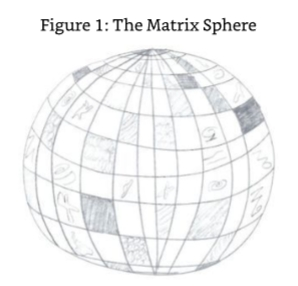

ME:So how large are they? 

我：那么它们有多大呢？

SE3:Some of them are as big as one of your galaxies whereas others are no bigger than your moon.They are all there for the use of my entities in their evolutionary exploits if they so wish to use them. 

3号源实体：有些星球和你们的星系一样大，而有些星球比你们的月亮还小。如果我的实体想使用它们的话，它们都可以在进化过程中使用它们。

ME:This is very interesting-a single universe with no galaxies but full of areas of local density or cloud-like planets with some of them as big as a galaxy in my own universe but,nevertheless, a planet.I can hardly think of the possibilities that present themselves in a planet the size of a galaxy.What do the entities do? 

我：这很有趣——一个没有星系的单一宇宙，但充满了局部密度或云状行星的区域，其中一些像我自己的宇宙中的星系一样大，但无论如何，一个行星。我几乎无法想象在星系大小的行星上出现自己的可能性。这些实体做什么？

SE3:I have explained some of the things they do from a high level already,but I can see that you still want something extra. 

3号源实体：我已经从高层次上解释了一些他们所做的事情，但我可以看出你仍然想要一些额外的东西。

ME:I do.I would like to understand what life is like being associated with these planets,even if it is a case that they just mess around with energy for hundreds of years. 

我：是的，我想要了解与这些行星相关的生命是什么样的，即使他们只是在能量上混了数百年。

SE3:The planets are not solid,and so the entities that associate themselves with the planet work within them,that is,in the area where the planet exists.The entities work with those that they are merged with or are split up as a group.Whilst operating within the confines of these planets,the entities'general objective is to use the available energy within the volume of the planet to create something of evolutionary benefit both to themselves and to those merged or separated but grouped entities at a later point in existence. 

3号源实体：行星不是固体，所以与行星相关的实体在行星内部工作，也就是说，在行星存在的区域内。 实体与那些合并或分裂的实体一起工作。在这些行星的范围内运作时，实体的总体目标是利用行星体积内的可用能量来创造一些进化利益，既有利于它们自己，也有利于那些合并或分裂但后来组成团体的实体。

ME:So what do they create?Considering that it is just a level of density that is lower than the surrounding universe,I can't imagine much. 

我：那它们创造了什么？考虑到它只是比周围宇宙密度低的一个水平，我无法想象太多。

SE3:If they are to work within the planetary confines,then they are restricted to use only the energies that are available within this area.As previously stated,they create things that are of evolutionary importance.Some of these things may be constructs that,in turn,use the surrounding energies and turn them into something else of use that would not have been naturally available using the raw energies. 

3号源实体：如果它们要在行星的范围之内工作，那么它们就被限制只能使用该区域内可用的能量。如前所述，它们创造出对进化具有重要意义的东西。其中一些东西可能是构造物，反过来，利用周围的能量，并把它们转化成其他有用的东西，而这些东西是使用原始能量自然无法获得的。

ME:So you are talking about the creation of a new material by creating an energetic alloy of some sort?

我：所以你说的是通过创造某种高能合金来创造一种新材料？

SE3:In short,yes,but these constructs may even create a finer energy set than that available in the universe. 

3号源实体：简而言之，是的，但是这些构造甚至可能创造出比宇宙中可用的更精细的能量集。

ME:Are you suggesting that they can create a better universe than the one where they exist but within the confines of the planet they are working with? 

我：你是说他们可以在他们所处的星球范围内创造一个比他们现在所处的更好的宇宙吗？

SE3:Yes,this is one of the major reasons for my entities being in existence-to see if they can create something that is an improvement on where they exist-that being the universe and not the planetary environment that is the bliss state. 

3号源实体：是的，这是我的实体存在的主要原因之一，看看他们是否能创造出一些东西，对他们所存在的地方有所改善，那便是宇宙，而不是地球环境，那是极乐状态。

ME:Is there not a chance that it would create a hole in your own universe,a hole that is filled with an environment of improved/increased/refined frequency? 

我：有没有可能它会在你自己的宇宙中创造一个洞，一个充满了改善/增加/精致频率的环境的洞？

SE3:Yes,exciting isn't it?You see,what my entities are doing when they create an area of improvement is creating a new but localized universe.Within this universe they can do whatever they want,and they do!I will give you an example of an area of betterment that was created by one group of merged entities. 

3号源实体：是的，很令人兴奋，不是吗？你看，我的实体在创造一个改进区域时，他们正在创造一个新的但局部化的宇宙。在这个宇宙中，他们可以做任何他们想做的事，而且他们确实做到了！我将给你一个由一组合并实体创建的改进区域的例子。

This group created a universe and populated it with entities they created themselves.These were then given the power of creativity themselves and,henceforth,created their own universe and populated it.This created a universe within a universe,which was a part of a planet in the total universe.Each of these universes had a dimension and frequency that was consistent with the total universe whilst being a microcosm of that universe.Within the first level of universe,the creating entities also created entities that were not given the power of creativity but were given purpose-that purpose being an automatic response to the needs of the creating entities.

这个团体创造了一个宇宙，并用他们自己创造的实体填充它。然后这些实体被赋予了创造力，从此，创造了他们自己的宇宙并填充它。这创造了一个宇宙中的宇宙，这是整个宇宙中行星的一部分。每个宇宙都有与整个宇宙一致的维度和频率，同时是那个宇宙的缩影。在宇宙的第一层，创造实体也创造了实体，这些实体没有被赋予创造力，但被赋予了目的——这个目的是对创造实体需求的自动反应。

ME:What was that purpose?Was it similar to the roles that the nature spirits have in my universe,or was it something else? 

我：这个目的是什么？它类似于我宇宙中自然精灵的角色，还是其他的东西？

SE3:If you are alluding to the need for your nature spirits to maintain the integrity of your earth and its surrounding area,then the answer is yes.The whole point of them being created was to help with the continued existence of the created universe and its contents. These universes or created constructs have a limited period of existence or usefulness if left unattended. As a result,those entities that are created for automatic purposes have but one role:to ensure that the creative intention is maintained. 

3号源实体：如果你暗指你们的自然灵魂需要维持你们的地球及其周围区域的完整性，那么答案是肯定的。 创造它们的全部意义在于帮助创造的宇宙及其内容的持续存在。 如果无人照管，这些宇宙或创造的构造存在或有用的时间是有限的。因此，那些为自动化目的而创建的实体只有一个作用：确保创造意图得以保持。

### Creative Intention 

**创造意图**

ME:You've lost me.What do you mean by "creative intention"? 

我：我没听懂你的意思。你说的“创造意图”是什么意思？

SE3:You have this is your own universe;thought is part of your creative intention.The only difference is that when you use your creative intention and create something-whether an object or a situation-that which you have created remains in existence,unless of course it is transposed into another energy for some other reason.Within the universe that my entities have created,they need to create entities that maintain the intention that created the universe where they have been created to exist.In other words,they are the choir that continue the song that is started by the choir leader/s.Their sole purpose is to maintain the field of energy that keeps the universe inflated and maintains all that was created to exist within the universe,including themselves. 

3号源实体：你有你自己的宇宙，思想是你的创造意图的一部分。唯一的区别是当你使用你的创造意图并创造一些东西时，不管是一个物体还是一个情景，你所创造的东西仍然存在，除非它因为其他原因转换成另一种能量。在我的实体所创造的宇宙中，它们需要创造实体来维持创造这个宇宙的意图，而它们就是在这个宇宙中被创造出来存在的。换句话说，它们是唱诗班，继续唱着由唱诗班领唱者开始的歌曲。它们唯一的目的是维持能量场，使宇宙膨胀，并维持宇宙中所有被创造出来的东西，包括它们自己。

ME:That must be quite ajob,knowing that if you lose concentration and any part of the creative intention,you might wink out of existence.

我：那一定是一项相当艰巨的工作，因为如果你失去了专注力和任何一部分的创造意图，你可能会眨眼间消失。

SE3:These entities do not know of that possibility,for they are not sentient.Their existence is infinite or until the creating entities decide to deconstruct the universe they have created, if in fact they do decide to deconstruct it at all. 

3号源实体：这些实体不知道这种可能性，因为它们没有知觉。它们的存在是无限的，或者直到创造实体决定解构它们所创造的宇宙，如果事实上它们决定解构它的话。

ME:So if these entities need to create entities to perpetuate their creative intention,what are they doing that means they can't maintain their own intent? 

我：如果这些实体需要创造实体来延续他们的创造意图，那么他们在做什么，这意味着他们不能维持自己的意图？

SE3:They are creating elsewhere within the planet where they have aligned themselves. Therefore,they need to divorce themselves from the creative intention surrounding their creation of their universe before they can continue to create anew. 

3号源实体：他们在地球的其他地方进行创造，在那里他们已经与自己结盟。因此，他们需要在他们能够继续进行新的创造之前，将自己与围绕着他们宇宙创造的创造意图分离。

ME:So these entities are the equivalent of pit props? 

我：那么这些实体就相当于坑木？

SE3:In a word,yes. 

3号源实体：总之，是的。

ME:Are there any other entities created for the maintenance of the "universe within a planet' creations? 

我：有没有其他实体被创造出来维护“行星中的宇宙”的创造物？

SE3:I can see that you are thinking of the equivalent of animals in your own universe. 

3号源实体：我能看出你在想你自己的宇宙中的动物。

ME:Well,I was thinking of both physical and energetic,not just physical. 

我：嗯，我认为身体和精力都很重要，不仅仅是身体。

SE3:Animals have a role to play in your own physicality,for they exist in order to maintain the ecosphere.The answer is no.The other entities created to help maintain other areas of creative thought are and cannot be considered as animals,for they are created purely for the use that they were created for.Your animals have another important role to play;they are your companions in the depths of low frequency physicality. 

3号源实体：动物在你们自己的肉体中扮演着一个角色，因为它们的存在是为了维持生态圈。答案是否定的。其他创造来帮助维持创造性思维的其他领域的实体被认为是，也不能被认为是动物，因为它们被创造纯粹是为了它们被创造的目的。

ME:So in that case would you call them energetic machines because they seem to be doing the job of a machine? 

我：那么在这种情况下你会称它们为能量机器吗？因为它们似乎在做机器的工作。

SE3:No,they are more than that as well.They are cognizant of the needs of the energies that they work with to maintain the intention that creates the universe they are working with, for intention is energy as well.There has to be a certain level of autonomy in their existence to allow them to work with the ebb and flow of intention energy. 

3号源实体：不，他们不止于此。他们认识到他们所使用的能量的需要，以保持创造他们所使用的宇宙的意图，因为意图也是能量。他们的存在必须有一定程度的自主性，以允许他们与意图能量的起伏一起工作。

ME:What do you mean by ebb and flow?Does this energy increase and decrease? 

我：你说的潮起潮落是什么意思？这个能量是增加和减少吗？

SE3:Of course.The energy of intention is made available by the creating entity each time the creating entity creates the intention to create something,no matter how small it is.Once the creating entity has delivered its intention for the universe it is working with/within,that energy has to be continued,especially if the intention is to create a permanent creation.This is what these entities are for-to continue the intention energy that is required to continue the creation.Now let's get back to the ebb and flow.The intention energy is only required whilst that creation is required to be present.When a creation is no longer required,the intention energy that created it is returned to the creating entity;therefore,the energy of the maintaining entity is reduced as is the workload for continuing the existence of that creation. 

3号源实体：当然，每次创造实体产生创造某物的意图时，意图能量就被创造实体提供，无论它有多小。一旦创造实体为它所共事/所处的宇宙传递了意图，那能量就必须被延续，特别是如果意图是创造一个永久的创造物。这就是这些实体的目的-延续继续创造所需的意图能量。现在让我们回到起伏，意图能量只在需要创造存在时才需要。当一个创造不再需要时，创造它的意图能量就返回到创造实体；因此，维持实体的能量减少了，因为继续创造存在的工作量减少了。

ME:Hold on here.Are you suggesting that the maintaining entity has to sustain,hold in the present,the thought supporting the intention? 

我：等一下，你是说维持的实体必须维持，在现在，支持意图的思想？

SE3:Yes,that is its workload.On top of that,one of the main pieces of work it has to do is to maintain the thought that created the intention energy that created itself.It,therefore,has incentive to continue its work.

3号源实体：是的，这就是它的工作量。 除此之外，它必须做的主要工作之一是维持创造了创造它自己的意愿能量的思想。 因此，它有继续工作的动机。

ME:But at some time the creating entity will need to remove the intention energy that is maintaining its own existence. 

我：但是在某些时候，创造实体将需要移除维持其自身存在的意愿能量。

SE3:Yes,but that only happens when the group of entities that have created the universe decide to close it down and when all the evolutionary opportunities apportioned to that universe have been experienced by those entities destined to experience them.In this instance,the creating entities assume control of their own intentions and remove them from the wider universal matrix--thus,removing the universe.Suffice to say,a decent size universe has a long time before it reaches this point in its existence.Sometimes new entities who were not on the original list may request the opportunity to experience that environment,thereby extending its existence beyond that planned. 

3号源实体：是的，但只有当创造宇宙的实体决定关闭它，并且分配给宇宙的所有进化机会都被那些注定要经历它们的实体经历过时，这种情况才会发生。在这种情况下，创造实体假定控制他们自己的意图，并从更广泛的宇宙矩阵中移除它们——因此，移除宇宙。可以这么说，一个体积适当的宇宙在它存在中到达这一点之前要经过很长时间。有时，不在最初名单上的新实体可能会要求体验那个环境的机会，从而延长其存在超过计划。

ME:What would one of these intention energy maintenance entities look like? 

我：这些意图能量维护实体看起来像什么？

SE3:You are typically human and need to see everything. 

3号源实体：你是一个典型的人类，需要看到所有的东西。

ME:Yes,I do. 

我：是的，我知道。

SE3:I was advised of this by your Source Entity. 

3号源实体：我被你们的来源实体告知了这件事。

ME:I am sorry,but it helps with my understanding and allows me to explain to others who want to understand in a way that they will comprehend. 

我：很抱歉，但是这有助于我的理解，并且让我能够以他们能够理解的方式向其他人解释。

SE3:I will describe one of them for you then.If you were to see them with your energetic eyes and then overlay that image onto your cerebral cortex,they would appear as a ball that is full of stars of differing colors.Each of the stars represents a level of energy that is related to a particular intention.The color of the star represents the level of attention and intention the maintaining entity needs to sustain to keep it manifest.

3号源实体：我来描述其中一个。如果你用充满活力的眼睛看它们，然后把那个影像叠加到你的大脑皮层上，它们会呈现一个充满不同颜色的星星的球。每颗星星代表与特定意图相关的能量水平。星星的颜色代表维持实体需要维持的注意力和意图水平，以保持它显现。

ME:I can just see an image in my mind's eye.The image I see is a ball full of stars,but the entity has only white stars with a couple that are blue.

我：我只能在脑海中看到一个画面，我看到的是一个满是星星的球，但这个实体只有白色的星星和一对蓝色的。

（图4：满是星星的球）

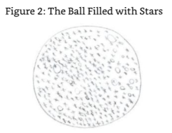

SE3:Yes,good.That is an example of an entity that has an even level of attention required but with two intentions that are not so important. 

3号源实体：是的，很好，这是一个实体的例子，它需要同等程度的注意力，但有两个不那么重要的意图。

ME:Why would an intention be of lesser importance? 

我：为什么意图会更不重要？

SE3:Because the opportunities it offers have all been used up;therefore,the intention is close to being returned to the creating entity.The color is representative of the number of entities taking advantage of the intention for evolutionary purposes.The blue color, therefore,indicates that only a few entities are using the creation created by this intention. 

3号源实体：因为它提供的机会已经被全部用完，因此，这个意图接近于被返回到创造实体。颜色代表着为了进化目的而利用这个意图的实体数量。因此，蓝色表示只有少数实体正在使用这个意图所创造的实体。

ME:O.K.,I would like to give the readers an idea of what the universal environment would look like if it were to be seen with physical eyes. 

我：好的，我想让读者们知道如果用肉眼看宇宙环境会是什么样子。

SE3:You would need to use the process that I described above because you would not be able to perceive it otherwise.Consider that you are in the center of what you call the northern lights,the aurora borealis.The magnetic properties of the planet where you exist manipulates the universal(cosmic)energy in a way that provides a reasonable example of what it may look like on one of its levels. 

3号源实体：你需要使用我上面描述的过程，因为你无法感知它，否则。想象你在你所称的北极光的中心，你所存在的星球的磁性属性以一种方式操纵宇宙能量，这种方式提供了一个合理的例子，它可能看起来像它的一个层面。

ME:It's full of different colors. 

我：它充满了不同的颜色。

SE3:Yes,but that's not what I am looking to describe.It's the energies and how they are being manipulated by the magnetic flux is what I am referring to.In this instance,the magnetic flux can be used to describe an entity,and the colors in the atmosphere represent how that energy is responding to the manipulation.Of course,the colors are just one manifestation of what is happening to the energies under the influence of the magnetosphere,one that you can perceive,but it gives you an idea as there are many levels of magnetic flux in the magnetosphere.The effect it has on the universal energies is not within your range of perception.Suffice to say the universal environment that my entities manipulate reacts in a way that can be described in this method.The planetary environments would,therefore, be a subset of energies that are held in place by a single energy.This allows my entities the opportunity to use other energies,together with their intention,to manipulate them at will and thus create their own universes and entities. 

3号源实体：是的，但那不是我要描述的。我指的是能量以及它们如何被磁通量操纵。在这种情况下，磁通量可以用来描述一个实体，而大气层的颜色代表能量对操纵的反应。当然，颜色只是在磁层影响下能量发生变化的一种表现，一种你能感知的，但它给你一个概念，因为磁层中有许多级别的磁通量。它对宇宙能量的影响不在你的感知范围之内。足以说我的实体操纵的宇宙环境以一种可以用这种方法来描述的方式反应。因此，行星环境将是一个由单一能量控制的能量子集。这使我的实体有机会利用其他能量，以及它们的意图，随意操纵它们，从而创造它们自己的宇宙和实体。

As I have stated before,physicality is not available in my environment.Entities exist in the higher level of frequencies that are associated with bliss,so there is no datum within you that I can use to allow a more in-depth description of me and my creations.

正如我之前所说，在我的环境中，物质性是不可用的。实体存在于与幸福相关的更高频率水平上，所以在你们之中没有任何数据，我可以用来允许对我和我的创造物进行更深入的描述。

I will leave you now so that you can contemplate thatthat you have been given. 

我现在要离开你，以便你可以思考你已经被给予的东西。

### In Closing:A Word from the Origin

**结束语：来自起源的一个词**

And with that Source Entity Three was gone.There was no more contact.I tried to raise my energies and awareness to encompass my higher aspect,going well beyond the levels where I initially made contact with our own Source Entity and up at the periphery of energy that I knew was the Origin.This was a place that I expected to be able to log back into the entity that I was just in communication with,but all I got was the image of all the Source Entities, all bunched up together forming that part of the Origin that it had dedicated to being separate but within itself to assist in its quest for further self-awareness,understanding, and evolution. 

随着3号源实体的消失，再也没有联系。我试图提高我的能量和意识，以包容我的更高方面，远远超出我最初与我们自己的源实体接触的水平，并上升到我知道是起源的能量的外围。这是一个地方，我期望能够登录回到我刚刚与之通信的实体，但我得到的只是所有源实体的形象，所有这些实体都聚集在一起，形成了起源的一部分，它致力于成为独立的，但在它自己内部，以协助其进一步的自我意识、理解和进化。

The Source Entities below me appeared as a group of dark colored opaque balls.Each ball houses the intelligence that is a Source Entity and its creations,universal and multiversal environments together with the entities that occupy them.I experienced a sense of awe that I was once more in this area of the Origin,outside the boundaries of my Source Entity and in the in-between area-that area that is beyond the Source Entities and before the outer layers of the Origin,that area that is and can only be the Origin itself.I sought contact with the Origin with a view to gaining further insight. 

我下面的源实体似乎是一组深色的不透明球。每个球都包含了一个源实体及其创造物的智能，宇宙和多维宇宙的环境以及占据它们的实体。我体验到一种敬畏感，因为我再次来到了起源的这个区域，超越了我的源实体的边界，处于中间区域——这个区域超越了源实体，在起源的外层之前，这个区域就是并且只能是起源本身。我寻求与起源的联系，以期获得进一步的洞察力。

ME:It has been some time since we spoke,for I have been concentrating on communicating with my own Source Entity and Source Entities Two and Three. 

我：自从我们交谈以来已经有一段时间了，因为我一直在集中精力与我自己的源实体以及2号源实体和3号源实体进行交流。

O:Yes,and you still have the others to communicate with as well.This is not an easy job you have chosen here because your frequency is in variance to all but your own Source Entity and,of course,Me. 

起源：是的，你还有其他人要和他们交流。你选择在这里做这项工作并不容易，因为除了你自己的源实体和我之外，你们的频率对所有人都是不同的。

ME:I feel that once I have established a link with the Source Entity I am communicating with,I can communicate with it.I do have to say that I end up being far more fatigued communicating with the other Source Entities than I do when I communicate with my own creator.I also feel that, so far,the depth of information that I am receiving is not what I expected. 

我：我感觉一旦我与我要交流的源实体建立了联系，我就可以与它交流。我必须说，与其他源实体交流比与我自己的创造者交流要疲惫得多。我也感觉到，到目前为止，我所接收到的信息的深度不是我所期望的。

O:You expected more detail? 

起源：你期望更详细？

ME:In a word,yes. 

我：总之，是的。

O:If you would check with the level of detail you have gained from your own Source Entity and compare it with what you have gained from your communication with the other two Source Entities,you would notice that it is of a similar depth.The only difference is that in the first book you have delved a little deeper into the human aspect of Source Entity One's environment. 

起源：如果你检查一下你从你自己的源实体那里得到的细节水平，并把它与你从与另外两个源实体的交流中得到的进行比较，你会发现它具有相似的深度。唯一的区别是，在第一本书中，你对1号源实体的环境中的人类方面进行了更深入的探究。

I took the time to examine mentally the information about the first book that was in my mind and found that the Origin was correct.The detail and depth were similar.There was still something missing though.The Origin responded to me before I had the chance to ask the question. 

我花了时间在脑海中检查了关于第一本书的信息，发现源头是正确的。细节和深度是相似的。尽管仍然有一些缺失。在我有机会问问题之前，源头回应了我。

O:Remember,it would be an impossible task in your current form to assimilate all the information that is in just one universe that your Source Entity created,let alone what is in any of the other universes,dimensions,and frequencies.The information that you have been given is a microcosm of the greater reality-not that it is unimportant.Any level of information that brings the truth to the lower frequencies is important,and each of the entities that have taken on this noble work is only capable of glimpsing and taking on-board a small part of the picture,a single piece in an extremely large jigsaw puzzle. 

起源：记住，在你们目前的形态中，吸收你们的源实体创造的一个宇宙中的所有信息是一项不可能的任务，更不用说其他任何宇宙、维度和频率中的信息了。你们已经得到的信息是更大现实的一个缩影——并不是说它不重要。任何层级上把真相带到低频率的信息都是重要的，每一个承担这项崇高工作的实体都只能瞥见和接受一小部分的图画，一个极其巨大的拼图中的一块。

Something else to consider is that you are not alone in this work,for many have chosen to take on an aspect of the delivery of the truth to mankind.No one of you could do it on your own,nor would it be desirable for you to do it on your own because humankind is not able to assimilate such knowledge in the volumes that would be necessary to support such information.It has to be and is being done at the speed and volume that is optimal for the absorption of such knowledge in the projected consciousness of those who are interested, becoming aware,and exposed to those who are interested and becoming aware. 

另外需要考虑的是，你并不是孤单一人在这项工作中，因为许多人已经选择了向人类传递真相的一方面。你们中没有一个人可以独自完成这项工作，也没有人希望你们独自完成这项工作，因为人类无法吸收这种知识，而这种知识的数量是支持这种信息所必需的。它必须以最佳的速度和数量完成，以便那些感兴趣的、逐渐觉醒的、以及那些接触到感兴趣和逐渐觉醒的人的投射意识吸收这种知识。

Therefore,the work you are doing is both at the correct level,to plan,and in the correct event period.The only other advice I would give you is to not get despondent when you feel communication is both difficult and slow when communicating with the other Source Entities because you are working with energies that are not normally experienced by entities in Source Entity One's environment.I would also ask you to enter your higher aspect more,for that will allow your energies to become more aligned with my energies than they are now.This will help in making your communication with the remaining Source Entities less tiring because you will be using a more universal energy medium than the one that is specific to the Source Entity that created you.Thus,you will not need to rely as much on the hidden translatory function that your Source Entity is providing. 

因此，你们正在做的工作既处于正确的水平，计划，也处于正确的事件时期。我唯一要给你的建议是，当你感觉到与其他源实体沟通时，沟通既困难又缓慢时，不要沮丧，因为你正在与1号源实体的环境中实体通常没有经历过的能量一起工作。我还要请你更多地进入你的更高方面，因为这将允许你的能量与我的能量比现在更加一致。这将有助于使你与其余的源实体的交流不那么累，因为你将使用一种更普遍的能量媒介，而不是那个特定于创造你的源实体的媒介。因此，你将不需要依赖于你的源实体提供的隐藏翻译功能。

ME:Thank you.I will endeavour to do my best in this instance. 

我：谢谢你。我会尽我所能在这种情况下做到最好。

O:Just one more word of advice about when you reach the level of your higher aspect.As you work with this level of your "self"more and more,you will feel disassociated with the physical plane of your existence.You must be careful of this as it will affect your physical judgement and ability to discriminate correctly when interacting with those of the physical plane who work around and with you.

起源：当你达到更高的层面时，还有一个忠告。当你越来越多地与这个层面的“自我”一起工作时，你会感觉到与你存在的物质层脱离。你必须小心这一点，因为当你与周围和与你一起工作的物质层的人互动时，它会影响你的物质判断和正确辨别的能力。

Go now and work with this information and commence communication with Source Entity Four.

现在就去处理这个信息，并开始与4号源实体进行沟通。

## Chapter 4

**第4章**

### Source Entity Four 

**4号源实体**

Source Entities One,Two and Three had proven to be an ice-breaker for me as I was a little bit concerned that I would not be able to hold the energy long enough to be able to communicate for any length of time.That is not to say that I found the communication with Source Entity Three easy.Some of the time I felt very fatigued,especially when I was in a position of receiving information that I clearly understood from a perceptual basis but simply did not have the language to describe it,such as the difference in the environments that I have been exposed to.I was thinking about this and what wonders Source Entity Four(SE4)would expose me to when Source Entity One,the entity responsible for creating everything I/we know,decided that it was time that I got off the proverbial fence and started to learn the communication process that would result in my ability to link directly with Source Entity Four. 

1、2、3号源实体已经被证明对我来说是一个破冰者，因为我有点担心我不能保持足够长时间的能量来进行任何长度的交流。这并不是说我发现与3号源实体的交流很容易。有时我感到非常疲劳，特别是当我处于一个接收信息的位置时，我从感知基础上清楚地理解了它，但只是没有语言来描述它，例如我所接触的环境的差异。我正在思考这个问题，以及当1号源实体，负责创造我/我们所知道的一切的实体，决定是时候让我走出谚语的围栏，开始学习交流过程，这将导致我能够直接与4号源实体连接时，4号源实体(SE4)将向我展示什么奇迹。

SE:It is time to be elevated to the next level of communication.The Origin has advised me that you must start immediately since the energies that surround you and those you have been exposed to whilst communicating with Source Entity Three will provide a useful springboard for your alignment to the energies that are fundamental to the communication with the fourth Source Entity. 

源实体：是时候提升到下一个交流水平了。起源已经建议我，你必须立即开始，因为围绕着你的能量和你在与3号源实体交流时暴露的能量，将为你与4号源实体交流的基本能量的对齐提供一个有用的跳板。

ME:What do you mean?The environments of Source Entities Three and Four are of similar frequency?

我：你是什么意思？ 3号源实体和4号源实体的环境频率相似吗？

SE:No,the frequencies used in the creation of the environments associated with Source Entity Four are even higher than that of Source Entity Three.The problem here is that the gap in the frequencies from those that you are used to and aligned to in my multiverse is too big to make the communication possible without first being elevated for a period of time. In essence,you need to be normalized.The process of normalization would normally take a few weeks to achieve if we were starting from scratch,but as you already have a residual level of higher and differing frequency,we can make the jump to the level and type of frequency required in one go.This is something that will be commonplace with you as you start to work with the other Source Entities,for the more you are in contact with them,the easier you will find the communication.Indeed,the adaptation to such frequencies will also enable you to understand what you are experiencing better and give you the language to use in its description for your texts. 

源实体：不，在创造与4号源实体相关的环境时使用的频率甚至比3号源实体的频率更高。这里的问题是，在我的多维宇宙中，你所习惯和对齐的频率之间的差距太大，如果不首先提升一段时间，就无法进行交流。本质上，你需要被正常化。如果我们从头开始，正常化的过程通常需要几周的时间来实现，但由于你已经有一个更高和不同频率的残余水平，我们可以一次性跳到所需的水平和频率类型。当你开始与其他源实体一起工作时，这将是你司空见惯的事情，因为你与他们接触得越多，你就会发现沟通越容易。事实上，对这种频率的适应也将使你更好地理解你正在经历的事情，并给你在描述你的文本时使用的语言。

ME:From my perspective it would seem that the frequencies in your multiverse are lower than the other Source Entities. 

我：从我的角度来看，似乎你们多维宇宙的频率比其他源实体低。

SE:That is not the case;it is just that they are different.There is one point to note though- only a few of us have decided to create environments that go down to the lower frequencies and dimensions of the Origin.As a result,you will not experience many things that you would consider to be similar to your own current condition,for your current condition is in the lowest of the physical frequencies. 

源实体：不是这样的；只是他们是不同的。尽管有一点需要注意——只有我们中的少数人决定创造环境，下降到起源的低频率和维度。结果，你将不会经历许多事情，你会认为与你自己当前的状况相似，因为你当前的状况是在最低的物理频率中。

Let us delay no longer,for during this short conversation I have been elevating and modifying the characteristics of your higher frequency physicality so that you can make contact with Source Entity Four.You may start whenever you are ready.

让我们不再拖延，因为在这简短的对话中，我一直在提升和修改你更高频率的身体特征，以便你能与4号源实体联系。你可以在任何时候开始。

The dialogue with my own Source Entity stopped,and I was on my own again.The dialogues with my own Source Entity were now so common it was like talking to a friend sitting next to me;as a result,the room then felt empty.I concentrated on the task at hand-connecting with the energies that would link me to the entity that I would spend the next three months communicating with. I had no idea what the energies would feel like,just that I had been aligned to them in some way by my own Source Entity.Just as I finished typing the last sentence,I felt my body start to tingle and a great weight suddenly came into my head. 

与我自己的源实体的对话停止了，我又独自一人了。与我自己的源实体的对话现在是如此的平常，就像和坐在我旁边的朋友聊天一样；结果，房间就感觉空了。我集中精力在手头的任务上——与将把我与我将在接下来三个月与之沟通的实体连接起来的能量进行连接。我不知道这种能量会是什么感觉，只是我已经以某种方式与它们保持一致，因为我已经与自己的源实体保持一致。就在我打完最后一句话时，我感到我的身体开始发麻，头脑突然感到一种巨大的重量。

### Initial Contact 

ME:Is that Source Entity Four contacting me? 

我：

SE4:It is,I have been waiting for you and you appear to be stalling!So I decided to initiate the contact myself rather than wait for you. 

4号源实体：

ME:This I didn't expect,a Source Entity contacting me.It was usually the other way round. 

我：

SE4:We have many things to discuss and not much time to do it in.What do you want to discuss first? 

4号源实体：

ME:I have a loose format(I was starting to realize that the rigidity of my initial format stemmed the flow of information).I would like to understand how and when you became conscious,what made you decide on the type of environment you created,and what entities you created to populate that space.Also,I would also like you to describe both the environment and the entities. 

我：

SE4:You do not want much;let me see how I can help without making it too difficult for you. I will start with the wakening,for your own Source Entity has advised me of your format, what you like to discuss,and in what order.But know this,I will diversify when I feel that the information I am giving you is too similar to that given to you by the other Source Entities for there is a certain level of crossover resulting from the very nature of what we are,facets of the Origin. 

4号源实体：

ME:O.K.,I get it.There are similarities between the environments created by the other Source Entities-similarities that,if included in my texts too often would detract from the message I am trying to bring to the public of Earth. 

我：

SE4:Correct.I will begin.I was one of the first to become aware of who and what I was.That is not to say thatthat makes me any better than the others.It is just that I had a spontaneous understanding and not a gradual awakening.It was like you being asleep one moment and then awake the next.Although I did not have a full set of memories of my existence like you do about your current existence,I was in the knowledge of the fact that I was created by the Origin and had a job to do.That job,I also knew,was the same as the others that I found around me. 

4号源实体：

ME:What did the others look like from your perspective? 

我：

SE4:They were just as you see them when you position your perception and intelligence outside of your Source Entity;we were like a bunch of black shiny balls all bunched up together.One or two of them would periodically move out of the bunch and change their shape and form or even create things in front or around them. 

4号源实体：

ME:I just received an image of one of the Source Entities creating a pinky purple cloud in front of them.

我：

SE4:Yes,that was the Source Entity you will refer to as Source Entity Six(SE6).It is quite a character and is always up to what you might call "mischief." 

4号源实体：

ME:Mischief?How can a Source Entity be up to mischief?I thought you were all very responsible beings. 

我：

SE4:Of course,we are,but we do have personality as well.You have experienced this in some ways already.It's just that you have ignored it.As I started to describe my awakening,I will continue in this vein. 

4号源实体：

It took me a bit of time (I use this phrase for your help not mine,by the way)to recognize that I had,in fact,just jumped into existence fully aware.My memory of events started from a single point that was not too far away from my realization of lack of long term memory.I shelved that thought for a number of times as I was becoming more interested in what was going on around me as the other Source Entities were becoming aware and were experimenting with energy and form.Their experimentation was a distraction to me in my self-analysis;as a result,I forgot about my questioning of self.I had started to do what they were doing as it seemed the right thing to do at that time. 

ME:So what did you do?I have already received some information of what you all did in the first millennia of your existence,but I like to know what each individual Source Entity did directly from itself. 

我：

SE4:As I said,at first I was questioning my "self,"but my attention was drawn to what the other Source Entities were doing.They were just experiencing themselves in every way possible-from creating what you would call "shapes"out of their energy and external form to creating duplicates of themselves on every possible dimensional and frequential level.I copied them for a while-repeating everything that each of them did to and with themselves.This did not last long though as I was more interested in looking into what I wasn't and exploring that. 

4号源实体：

ME:What do you mean-what you weren't? 

我：

SE4:Each of us has areas that are not part of us.They are what you would call "voids."I found the fact that there were voids in me most interesting. 

4号源实体：

ME:How can you have voids?Does my Source Entity have voids? 

我：

This was a bit bizarre to me and is not something that I had come across in any of my previous communications with the Source Entities I had been in contact with or the Origin. 

SE4:All Source Entities have voids.One of the things I was,therefore,very interested in was the reason why we have these voids.This was my major distraction before I returned to the question of "self"although you could argue that they are both part of the same thing. 

4号源实体：

ME:So where were these voids?I can imagine that they would be areas where you have a local lack of density,energetically speaking. 

我：

SE4:This is not the case.The location of a void could be directly central to an area of what you might call dense energy;it can also be located within an area of sparsely populated energy as well as on the interface of dense and fine energy.I found out that this is a function of us. 

4号源实体：

ME:Please explain what you mean by "function of us."How can the population of energy be a function of you?

我：

SE4:I will give you the example of function and form. 

4号源实体：

As an entity projected into an extremely densely populated area energetically,you should be aware of the fact that some parts of you are denser than others and all these parts have a function.For example,your liver has the function to help clean the blood in the physical and to regulate the flow of energy in the energetic.The blood itself is not so dense and is, therefore,a fluid,with the job to carry oxygen and nutrients to the rest of the body and the larger organs.Its job energetically is to create a framework of the universal energies that are used in your energetic bodies that your healers call astral levels 5,6 &7,which act as an energy cage keeping the correct energies in and around the body and repelling those that are not necessary to the continued function of the physical vehicle.Within your physical body you have voids,areas in-between organs,bone,muscle,and veins (arteries).These voids allow for the expansion and contraction of these organs during various stages of function. Voids are also present as a result of the "incompatibility in form"factor of the organs,bone, etc.-the form factor being correct for the function they have but not for their efficient fitting together in the jigsaw puzzle that is the physical human body.This is the same for us. 

ME:Wait a minute.Are you insinuating that Source Entities have organs,areas of energy that have specializations,jobs to do?I thought that you were purely energetic. 

我：

SE4:We are purely energetic,but we do have areas of energy that have specific jobs to do. This is what I found out when I was making my investigations into self.One thing that you need to understand though is that these specialized areas of energy-and they are all over us -are part of our function that enables us to be who we are,separate whilst still being part of the Origin.The voids are just areas where there is no need for function and,therefore, no need for energy-that is,energy of any sort.The voids are an interesting factor though.I am finding out that some of the entities I created use them to traverse from one part of me to another.With there being no energy,there is,therefore,no resistance to movement.We can talk about this in greater detail later because I want to give you more detail on how my colleagues and I are made up. 

4号源实体：

ME:O.K.,carry on.I find this a most interesting development. 

我：

SE4:As I said before,each of us has areas that have energies that have function.These functions are for the use and the maintenance of"self"with a view toward perpetuation.It would be best if I list these functions first and then explain their jobs in a little more detail later.They are as follows: 

- Structure 
- Form 
- Volume 
- Detail 
- Compartmentalization 
- Singularity 
- Diversification 
- Multiplicity 
- Self 
- Remembrance 
- Being 

4号源实体：

**Structure** is the first function of a Source Entity.It is independent and interconnected with form and volume,irrespective of energy or its type.It is what we are,and it maintains our level of inflation,so to speak.Every entity has structure of some sort,no matter how diverse it is. 

**Form** is what we choose to be to maximize the number of environments we create.It is interconnected with structure and volume.Form does not necessarily relate to shape since it is a function of division and the energies required to maintain that division.It can also be connected with compartmentalization when creating independent unconnected environments. 

**Volume** is how we choose to inflate ourselves in order to accommodate the environments and the entities we create.It is interconnected with structure and form.As with form, volume also has a link with compartmentalization as I can change my volume in certain areas of myself to allow the creation of an environment to take account of all energy of a specific type if I so wish.This is specifically useful if I want to have an experiment with an environment that is filled with a single energy type.Depending upon what maintenance function is being performed,volume also increases or decreases. 

**Detail** is what is being investigated by every one of us,including the Origin.It is the detail of "self"that gives us our individuality,our being,our personality if you like.Although every one of us has been created in equality,it is the detail that tells us apart. 

**Compartmentalization** is what we do when we create an environment.It is a function that allows our normal functionality to operate without the need to maintain that environment that has been compartmentalized.We can place the environment on automatic,so to speak, or entrust the environment's maintenance to a group of entities created for such a function. Your own Source Entity has done this for your environment.From a creativity point of view, it is a particularly useful function as it means that neither the environment created nor I contaminate each other. 

**Singularity** is a function of being and detail.It is what keeps us autonomous from the Origin. Being a singularity means that we are responsible for ourselves and the maintenance of our creations.We are given singularity by the Origin.It is a most special gift. 

**Diversification** is a function of our ability to experiment with the different ways of evolving. When new ways are discovered,it is using these ways in parallel to accelerate our total evolution and ability to give such data to the Origin. 

**Multiplicity** is a higher function of singularity and diversification.It is the ability to perform many,many things all at the same time.In your language it is my ability to be in contact with all of my self,my creations,and my environments simultaneously without loss of concentration.This is the omnipresence that your priests talk about.I do this because all my energies and creations are connected. 

**Self** is that function of me that "is.It is a result of the correct and harmonious operation of detail and being. Self is what we all investigate at the start of our existence.

**Remembrance** is energy with a most important function.It is the way we continue to know who and what we are and what we have achieved.It is fundamental to the continued efficiency of the diversification function. 

**Being** is a result of the combined functions of detail,self,and singularity.It is a higher function of self whilst being separate and independent whilst also being interdependent.It is what makes us Gods in the shadow of a greater God,the Origin. 

ME:These don't describe energies;they are all functions.In fact,thinking about it,they describe "conditions." 

我：

SE4:All functions need energy to perform their tasks,so the basic component of any function is the energy that surrounds it.It's what makes it happen.Moreover,a function "is" a condition.In the examples I have just given you,I have very briefly described functions or conditions of my/our existence.You must take into account the fact that energy is the basis for everything that is in existence,from the smallest inert object to the largest entity,such as the Origin.Without it,there is nothing.That is,"no thing"that can be in existence,for there would only be void.A void does not contain energy;humanity does not understand this concept yet. 

4号源实体：

ME:They seem to rely on each other for their own existence though. 

我：

SE4:Of course,they do.This is the beauty of existence.It is dependent upon the harmonization of many factors or functions working together to create the whole-the whole entity that is me in this case.You have the same thing if you consider again your own physical/energetic body as an example.All of the components that make up the human physical and energetic bodies have a"collective"of organs that have specific functions to perform;each of them has interdependency with the other even if you don't recognize it yet. Some of them have a level of redundancy,and some can even be removed without too many detrimental effects on the whole.You can survive living with one lung,one kidney,one eye, or no appendix,for instance.You can even lose a chakra or two,provided you are not exposed to the conditions where you need ALL of your organs,physical and energetic.You can still exist,albeit in a state of reduced performance.The problem you have with this reduced state of performance is that you do not know what functions are missing that result in the reduced state of performance because you have not used them for such a long time.Your physical organs,therefore,have a set of higher functions that,in some instances,requires what you classify as redundancy or duplication.For example,did you know that your appendix has a higher function that is associated with the accumulation and distribution of what your spiritual healers have been calling "core star"energy? 

4号源实体：

ME:No,I had no idea. 

我：

SE4:Well it does,and its dysfunction is due to consumption of the wrong food. 

4号源实体：

ME:How do you know this level of detail about the human body? 

我：

SE4:All Source Entities share the knowledge they gain with the Origin and because we are the first creations of the Origin,we gain that which is given to the Origin from our counterparts. 

4号源实体：

ME:So what one learns,you all learn.

我：

SE4:Yes,this is part of the requirement for existence at my level although to a lesser extent, all entities have the ability to learn from the experiences of other entities.The human part of the multiversal records in your own environment,the Akashic records,are an example of this,but it is more of a manual approach whereas mine is automatic. 

4号源实体：

ME:Thank you.So let's return to functions and structure.The names you have used are not what I would use to describe the functions of the energies that keep you in existence as a Source Entity. I find it difficult to relate to the nomenclature versus the functions. 

我：

SE4:The words I use are what are available in your vocabulary.In a lot of cases this is woefully inadequate.Hence,the words that I have used to describe my functional energies may not be optimal.Nevertheless,they will suffice. 

4号源实体：

ME:So the voids in the energies,would they also have a function even though they are "void"of any energy? 

我：

SE4:Their position is useful.The energy has to flow around such voids,and flow creates function.As I have stated before in one of my previous descriptions,the voids allow for the expansion and contraction of those parts of me that have work to do in the evolutionary sense.By this I mean that the environments that I create sometimes need to be bigger or smaller,depending on the number of entities working in them or the type of work they are doing. 

4号源实体：

ME:Tell me more about the flow of energy and its importance in function. 

我：

SE4:Those parts of me that provide my structure need to have energy flow to allow the function to operate.You see,energy is not and cannot be inert,static,or stationary.It needs purpose.Flow is,therefore,a product of purpose in energy.But let me tell you this:flow is not what you think it is.You think of flow as that which water does when it is moving in a certain direction or around an obstacle.Indeed,flow is and can be described as direction,but in this instance direction is best described as purpose. 

4号源实体：

ME:So when you said that the energy has to flow around the voids in your structure,you meant that it has purpose.So what would that purpose be? 

我：

SE4:Where energy has flow around the voids,its purpose is to maintain the boundaries between the void and the environment.Flow is also used to create a framework for an environmental construct and its habitation.It can be the barriers between environments, and it can allow travel between environments should you wish to do so. 

4号源实体：

### Environments 

ME:I would like to move on to the construction and inhabitants of your creations if I may. 

我：

SE4:Please do so. 

4号源实体：

ME:How is your multiverse/universe constructed?In my dialogues with the other Source Entities, I have been advised on the level of dimensions and frequencies,and I learned that they are based on the number twelve,my own Source Entity having 12 x 12 x 12 x 3 dimensions. 

我：

### 24 Dimensions and 2322 Frequencies 

SE4:I have a slightly simpler philosophy when it comes to such things,for I believe that too much complexity is detrimental to the task of evolution.In my instance,I have 24 dimensions and frequencies.That is 12 x 2 x 0 x 3 in your language.

4号源实体：

ME:Now you have confused me.I would have thought that the method used to describe 24 dimensions would have been simply 12 x 2 not 12 x 2 x 0 x 3. 

我：

SE4:There is a universal constant that it is necessary to use in the construction of a dimension,and this is based upon the way that the Origin is formed.That means there needs to be a basis for the first true dimensional platform,which,in this instance,is three.It is also based upon the lowest dimensional condition.It is not frequency-based. 

4号源实体：

This is something that I see you are getting confused with,for you are mixing frequency and dimensional descriptors together in your mind. 

ME:I thought I had got this straightened out during my dialogues with my own Source Entity. 

我：

SE4:Clearly not.Your Source Entity has stated that it has 12 x 12 x 12 x 3 dimensions,equating 5184 dimensional environments,but there are still only 12 dimensions as described to you in your first book.Let me make it a bit easier for you.When you multiply the figures we have just discussed,you end up with a number of separate environments.Each of them has its own frequencies and frequency range.These are dimensional environments,not true dimensions,per se.In one of your previous communications with your Source Entity,you discuss the concept that there are actually ten dimensions-the first three equating to one true dimension with the remaining nine being a dimension in their own right because they all need the first three to be in place first before they can be in existence themselves because the first three are the basis for dimensional existence. 

4号源实体：

ME:So if I use the description given to me during a previous dialogue,you have twelve dimensions within two environments.

我：

SE4:Not quite,for the way that I have constructed the compartmentalization of my environments is not based upon the need for nested or separated areas of existence.For instance,Source Entity Two has four environments with the dimensions divided into these four areas while I have simply used the whole of me to create 24 dimensions.Of course,if you use mathematics to explain the number of dimensions,you would get 72.In actual fact, the last number(three)as we have already discussed is really equal to one. 

4号源实体：

ME:So you have 24 dimensions to play with,so to speak. 

我：

SE4:Correct.Each of these dimensions is inflated with 2,322 frequency levels. 

4号源实体：

ME:That's a strange number.Why 2,322? 

我：

SE4:That is the number of frequencies used to create a useable environment without overlap.In your own environment your frequencies have peaks and troughs where it is possible to move into one frequency from another in areas where the peak of one frequency is in direct proximity with the trough of another.This is not possible in my environment since a true and substantial change in frequency by the individual entity is required for translation to occur.This is only possible through a significant change in evolutionary condition. 

4号源实体：

ME:So how many entities have you created to fill these 24 dimensional environments? 

我：

SE4:Fourteen thousand million,plus or minus a few hundred thousand. 

4号源实体：

ME:I thought that you would be able to pin that down to the last entity.Why the plus or minus? 

我：

### Eternal and Non-eternal Entities

SE4:Whereas you have eternal existence,some of mine do not.This was a result of the creation process that I used.Creativity is not always perfect,a condition that your Source Entity is fully knows.As a result,some of them do not exist long and have to be re-created.In doing so,I create more than I previously created.I do this in order to compensate for those who are imperfect.This circle of creation has not yet been completed;eventually they will all be eternal,but that is a task that will be achieved later in my existence. 

4号源实体：

ME:So you created about fourteen thousand million entities with some of them not being eternal. How do you resurrect those that are not eternal when they expire,or do youjust replace them with another entity? 

我：

SE4:I don't just replace them for I owe them continued existence due to my creation process,so in this instance,I work on the energies that they are made of and re-create them with the energies they should have.I can see that you are confused by my use of your language,so I will explain again.When I re-create these entities,I copy the essence of what they are both energetically and in experience-that is,those experiences and the resultant evolution content leave an impression on the energy that is the entity.In order for me to resurrect them completely,I need to re-create the energy that resulted in eternal beings and imprint the impression that their older energy had-the evolution content and the energetic personality,if you like,into the new energy that I have created in its entirety.This ensures their continued existence. 

4号源实体：

ME:Do they know that they are substandard compared to the rest? 

我：

SE4:No.In this instance I have withdrawn the memory of longevity from each of my creations until all of them exist in equality.Once I have finished this work,I will allow the knowledge that they are eternal to permeate into their energy field.Right now they don't recognize or,in fact,understand that they are or are not eternal.They just are,and the work that they are doing is interesting as a result. 

4号源实体：

ME:How can an entity not know that they are not eternal when they clearly are?I am talking about the ones that are actually eternal here. 

我：

SE4:I am surprised at you,for is not mankind largely unaware of its immortality? 

4号源实体：

ME:You're right.At least currently in the physical we are unaware that we are eternal unaware that the majority of us is energetic and only a small part of us is projected into these low frequencies where we exist in a very solid vehicle,the physical human body,to allow us to experience existence in the material part of this universe.But as both/either bystanders and participants in the death process,we experience the demise of the physical body on a regular basis while remaining totally ignorant of the fact that life in the physical is transitory.Your entities must experience this as well to some extent. 

我：

SE4:They don't as they do not currently feel the need to experience existence at such low frequencies yet although the do experience physicality. 

4号源实体：

ME:But they must know that they are eternal due to the long time that they have been in existence and the number of memories that they have of their experiences.They must remember these? 

我：

SE4:As I said before,I remove the memory of longevity from all of my entities so that they do not know that they are eternal.I do this by only allowing them to keep the most recent memories and some other key memories,but I ensure that these key memories have the event location markers removed from them so that the entity cannot place the order or note the event where that knowledge was gained as the result of experience. 

4号源实体：

ME:So where does that knowledge go to if it is removed from them on what I assume is on a regular basis? 

我：

SE4:I keep it within myself with a view to passing it back to them all when they are all eternal. 

4号源实体：

ME:That's an awful lot if information you must be keeping. 

我：

SE4:Along with the other Source Entities,I have an area of energy within myself that is just for the retention of experience that is not only my own experiences but all of the experience gained by any of my creations.This is the same energy that passes on experience to the Origin.All I do is provide a level of compartmentalization to occur so that the experiences of each individual entity are assigned to the entity that experienced the experience.It is quite a simple routine and one that is automatically achieved once set-up.You have something similar in your multiversal environment;you call it the Akashic records.The difference between the two records is that in my set of records,the entity will only be able to access them all once I have given all of my entities eternal existence.On top of that,they will only be able to access their own records.They will not be able to access the records of any other entities within any of my environments. 

4号源实体：

ME:I have just seen an image in my mind's eye that suggests that you have compartmentalized your entities into different sections within your twenty four dimensions.Can you explain whatI am seeing here?

我：

SE4:Yes,of course,but I can see that you have an expectation I have separated those entities that are eternal and put them into one environment and those that are not eternal into another. 

4号源实体：

ME:That thought had crossed my mind,but I can see that this is not the case from the way that you are leading this conversation. 

我：

SE4:You would be right to think in that way.No,I have not separated them in that way and the reason why I haven't is actually quite simple.The reason is that I am gradually changing the energies of those entities that are not eternal to being eternal.If I had them compartmentalized into eternal and non-eternal environments,then I would have to move the entities that I have made eternal from the non-eternal environment into the eternal environment.This would upset the balance of the population of entities within each of my environments,which ultimately would result in the one that was full of non-eternal entities being empty.No,I have not separated them out for this very reason. 

4号源实体：

ME:O.K.,I would like to ask some questions. 

- What are your environments like? 
- Do they have physical aspects,such as planets etc. 
- What are your entities like,how are they made up,and how would they appear to us? 
- What are your entities doing? 
- What are your entities creating?Do they need to create to evolve?[SE4:creativity is an essential and universal requirement for evolution]
- How are they evolving? 
- How are they organized/civilized? 

我：

SE4:You have a lot of questions.It would be best to work on them one by one,as there may be many questions that come out of each.I think you would call them nested questions? 

4号源实体：

ME:I believe that is correct. 

我：

### Constants Involved in Creation 

SE4:One thing you need to note here is that there are a number of constants that are involved in the creation of an environment.These constants are what we are given by the Origin to work with and as a result you may find that some of the descriptions I give you may sound similar to those you have already received. 

4号源实体：

ME:Actually,that is something that I am a bit concerned about.Will the readers of this text not think that this is all made up,that I am using my imagination and that as a result of the magnitude of this task,I am running out of ideas? 

我：

SE4:They can think what they like.The truth of the matter is that even we have constraints to work within.I will explain further.The energies that we,the Source Entities,work with are essentially energy from the Origin.It IS the Origin's energy,and as such,we all have the same set of energies,the same building blocks,if you like,to work with.As a result,there are bound to be similarities.The similarities are based around the energies we are working with and how we combine them during our creation process.I will give a further example. The similarities that you find in the flora and fauna on your planet are because they are all created by using the same set of building blocks that you call DNA.Using DNA creates a finite set of physical vehicles,some of which are similar,such as humans and apes,rats and mice, all of the fish species,all of the bird species.Commonality is everywhere as a result of the use of the same building blocks.Please note here that I have just been told by your Source Entity that there are many species that you have not catalogued yet,for some of them exist as semi- physical entities,and others have not yet been created as the permutations available are not anywhere near being used up yet.The universe is the limit in this instance.But let's get back to my environments. 

4号源实体：

I have created four main environments or universes,each consisting of the twenty- four dimensions and with 2,322 frequencies.Although Source Entity Two has four environments,this is only a similarity in division.And whereas other Source Entities have allowed all of their entities and their environments to be purely energetic,I have decided that all of my environments have what you would call a physical aspect to their appearance. This means that they have different levels of energetic cohesion,depending upon the dimension and frequency that is being experienced. 

I see that you are thinking along the lines of your own physicality. 

ME:I have to admit that I am thinking along the lines that parts of the environment and its entities have a certain level of solidarity that is based upon frequency. 

我：

### Dimensions and Frequency 

SE4:It is a reasonable example,poor but nevertheless useful in description.I will give you the concept in a way that you will be able to understand because there is a difference in how to understand dimension and frequency.

4号源实体：

As you rise through the frequencies,you move away from that which you experience at the previous frequency and start to experience that which is present in the new frequency. Using your own frequencies as an example,things like the desk you sit at (of a slightly lower frequency than you and,therefore,solid)will no longer be part of your new frequentic level.However,you will experience other things that are consistent with your experience or expectation of what a solid object,such as your desk is.This is because frequencies overlap to a certain extent,and you are still within a single dimensional continuum.Now if you consider a change from one dimension to another,then you have to consider a bigger picture -that of the dimension and the frequencies.When you move from dimension to another, you also move from one frequency set-one that is aligned with the former dimension- to the frequency set that is aligned to the new dimension.Although the number of these frequencies is the same(2,322),the characteristics can be different since some frequencies can be bigger or broader even when higher in nature. 

ME:Hold on.I thought that frequency was just that,frequency. 

我：

SE4:No,frequency has more characteristics than just resonance for it also has the properties you would call magnitude,amplitude,and rotation.Your radio engineers know this and use it to some reasonable effect.Frequency also has the characteristics of spatial position,dimensional position,density,interaction-interconnectivity between different frequencies-and event position--time.All of these can change the modality of the frequencies being experienced and how they operate within a specific dimension.One thing is common though.The relationship between what is supposed to be solid-a solid will not pass through another solid if it is of the same frequency and modality-what is supposed to be non-solid but is in interface with solidity,and the energetic-that which is present in two or more frequencies concurrently.Then add that which is energetic and porous energetically -energies mixing will make a new composite energy if so desired. 

4号源实体：

ME:So what you are saying is that what I am experiencing now in the physical would be duplicated in the next dimension to a certain extent-that extent being consistent with the relationships I have with the objects that surround me and the differences we have in frequency However,this is not the case when I move up and down the frequencies because I will perceive objects of different frequencies going in and out of my perception as I move through these frequencies. 

我：

SE4:With what you perceive being consistent with the range of the organs or energies being used as the tools for perception/detection;however,if your tools for perception are wide enough in range,you would still perceive objects of your old frequency even though you are in a new frequency.Yes,that is a reasonable summary and one that can be used in most of your dialogues with the Origin's Source Entities when referring to this subject. 

4号源实体：

ME:So your environments have what I would call physical aspect to them? 

我：

SE4:Yes. 

4号源实体：

ME:Let me get this straight.The environments that you created only allow the entities you created to exist in the physical levels of frequency? 

我：

SE4:Yes,but don't forget that the physical levels of frequency extend to a level much higher than those that you are currently experiencing.So although there are limitations-physical in nature-imposed on my entities,you in your current physicality would consider them as energy-based beings. 

4号源实体：

ME:O.K.,I think I understand what you mean.Then do they in their higher frequency environment have a universe that includes galaxies and solar systems with stars and planets? 

我：

SE4:Not as you would recognize them.In your environment and resultant set of frequencies,you have a predominant shape for energy that has purpose,whether it is sentient or not.That shape is the sphere.In my environments the dominant shape for a large collection of energy is more like what you would call a doughnut. 

4号源实体：

### The Doughnut Universe 

ME:A doughnut?Now you are playing with me. 

我：

SE4:Not in the slightest.You see,the level of density in my environments dictates whether or not there is a center to the energy that collects to create what you know as planets.You are brainwashed into thinking that a planet needs to be a certain form.In essence,there is no dominant form for a planet-any form will suffice.Please note though that the form of a planet is based upon many factors that are beyond that which exist in the static frequencies. The doughnut form is common in my environments. 

4号源实体：

ME:Do the entities that exist in these environments with doughnut ring planets work on the surface or inside the planet?Does it have a surface to live on or are they gaseous in nature? 

我：

SE:They can be anywhere within the energy field that is created by the doughnut.That means they can exist on,within,or in the middle of the void centered within the area you may consider to be a solid mass.This center point would be the origin of the radius of the planet.This void is not truly void for it both contains energy and attractivity-what you might call gravity.It is this attractivity that keeps the planets shape the way they are. 

源实体：

ME:I have just received an image of a ring magnet with the location and shape of the magnetic field superimposed on it.The field is a series of circles that go around the doughnut whilst also touching in the middle.No,they are interlaced in the middle.This appears to create another field that covers the whole doughnut shape.That can't be right.A magnetic field does not do that,at least not to my knowledge.It appears to be the same as both a ring magnet and a standard solid magnet.

我：

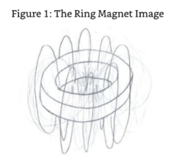

SE4:That's because you are not actually seeing a magnetic field in your image.What you have seen are the dominant lines of attractivity that surround and contain the energies that form the shape of the planet at its level of physicality/frequency.

4号源实体：

ME:So what entities live in the different areas?By this,I mean inside the solid,on the surface,or in the void? 

我：

SE4:There is only one sort of entity,and it is able to adapt its form to whatever is best for the part of the planet where they like to exist-either in,on,or by it. 

4号源实体：

ME:You said that they are physical.Are they metamorphs? 

我：

SE4:As I previously stated,they are physical but not in your level/type/form of density. No,they are not metamorphs as you would describe or has been depicted in your science fiction books and films.They do modify themselves energetically to ensure they function at peak efficiency in the part of the planet they wish to inhabit.By creating their own field of attractivity,they draw those opposing energies that are necessary to allow what you recognize as a tactile response.The field is both personal to the entity and modulated to specifically attract the opposing energies. 

4号源实体：

ME:Can you describe the form or shape of these entities? 

我：

SE4:They have no specific form that you would recognize as a physical form because they change themselves to suit their local environment.However,if I was to describe the forms they have in a general sense,would that suffice? 

4号源实体：

ME:Yes,of course. 

我：

SE4:It would be relative to the doughnut-shaped worlds only. 

4号源实体：

ME:That would be fine.

我：

### Three Entities,Three Environments

SE4:The form the entities generally assume when in the central void area of the planet would be like a huge butterfly-type shape with the wings as accumulators of energies that allow their translation from point to point by using the lines of attractivity.They are very high in frequency. 

4号源实体：

The form they generally assume when on the surface of the planet is more like a heavier version of the butterfly form but with the wings deflated to the point of uselessness in a void environment.In this instance,however,the wings attract different energies that ensure that the entity is able to operate in a similar condition to you in a gravitational field.Other appendages also become visible for using energies and areas of physicality that cannot be handled by the deflated wings. 

The form they generally assume when below the apparent surface of the planet-somewhat similar to the difference in air to water on your earth-is,therefore,a matter of creating a more streamlined form of the butterfly shape that has a repulsive field surrounding it.Its form would be a bit like crossing the surface-based form of the entity with a(Pause).I am thinking of using the word "fish,"but the imagery is wrong.Let me search your memories further.O.K.,I would like to use the word crayfish or crab but with significantly less density. 

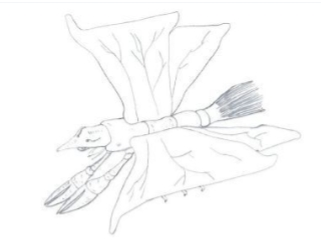

ME:I am not sure I can get my head around this form factor. 

我：

SE4:No,I can see that the description is woefully inadequate in your experience and language,but it will have to do.Suffice to say,the form they adapt is the most effective for existing in the environment inside these planets. 

4号源实体：

### The Planets 

ME:Do these planets revolve around a sun? 

我：

SE4:There is no need to have a local gravitational anomaly to attract and burn energies to create light and heat or all the other energies that are created in the combustion process that is the function of a sun. 

4号源实体：

ME:Why is this? 

我：

SE:We simply don't have the need for suns in my environments because light and heat is not required to either illuminate the universe or provide fuel or energy for those areas of local density that can be classified as planets.What we do have are areas where some of the planets of similar composition cluster together.You may call these galaxies if you like,but we don't have solar systems.In essence,we simply do not have the low frequency level that results in your sort of universal creativity,such as suns with planets rotating around them with solar systems that cluster together and rotate around themselves or create cloud-like formations.In a universe where heat and light are not required to sustain life,there is no need for a fire to create it. 

源实体：

ME:I have just had another image in my mind of the planet you described to me.It appears to be all dark blue in the area of the doughnut that I would call solid.Would this be water? 

我：

SE4:No,these planets do not have water.Water is a by-product of one of the most common elements you have in your universe,hydrogen.It is not available in my environments because the level of physicality is higher in frequency which negates its existence. Remember that material elements are a result of low frequencies.The fundamental law with frequency(across all Source Entity environments)is that the higher up the frequencies you go,the less material elements exist,and the more energetic elements exist. 

4号源实体：

ME:So what is the blue appearance if it is not water? 

我：

SE4:It is the visible representation of the major energetic element that makes up the planet. 

4号源实体：

ME:Are you suggesting that these planets are primarily made up of one element? 

我：

SE4:In general,yes,but the planet in your image also has some other elements.Your own planet is currently very physical in nature.As a result,it is made up of many low frequency elements-more,in fact,than any other planet in your universe.

4号源实体：

The blue color is simply an emanation of that major element.It is also a product of the energies'response to being worked with by the entities that exist on and within its energies. 

ME:So those three entities you described make the planet the color it is. 

我：

SE4:As I stated before,it is a product of the major element and its reaction to being used by the entities that work with it. 

4号源实体：

ME:Does the color change as a result of the purity of the work the entities do with the planet? 

我：

SE4:Only in the intensity of the color.You can tell the level of entity and planetary evolution by the intensity of the color of the major element of the planet. 

4号源实体：

ME:I have just seen an image of agroup of planets,all glowing in brilliant colors.It is a beautiful sight. 

我：

SE4:Yes,it is.That particular cluster of planets all have the same entities working with them in group harmony.They are evolving well,in both a planetary level and a group/individual entity level.I am pleased with them and their efforts. 

4号源实体：

ME:I get the impression then that the planets are not solid in the sense that I know insomuch as the entities do not feel physical resistance when they work below the surface. 

我：

SE4:No.There is what you call a surface tension that is at the interface between the surface of the planet and the inside part that is contained within the doughnut shape,and this is what some of the entities exist on.This is not to be confused with the crusty surface that your planet has.This is a relatively smooth surface and one that has little opportunity for other entities to exist on,such as trees or bushes.It does have other more mobile entities though,and these are entities created by those that exist in,on,or outside the planet's physicality but still within its energy field. 

4号源实体：

### Mobile Entities - Living Cities 

ME:Tell me a bit about the mobile creations that the entities create that use the surface of the planet. 

我：

SE4:They create areas where they can work together in the manipulation of energies to further create what you might call biological forms.Biological is not the correct term,but the concept is the same.By this I mean that the entities they create are designed to be self- sustaining energetically.To enable them to be self-sustaining,they need to be able to roam the planet's surface,so to speak,seeking areas where the energies they use are at their prime. These entities are singular and collective.The collective ones are usually much larger in size. They are seen as the areas where this planet's entities work within to further interact with the energies of the planet.It is for this reason that they are mobile,for they need to move themselves to the next location that is required energetically to support the work of the higher entities. 

4号源实体：

ME:I have just received an image,and I thank you for all these images.They help a lot in my understanding of whole areas of what I can only describe as buildings,moving together to the next location.Wait a minute.The number of these buildings-they are of all shapes and sizes- is massive.It must be as big as a city in earthly terms. 

我：

SE4:If you were to draw a comparison,then you would need to say that they are bigger than your biggest city on Earth.That is a true city,not including suburbs.

4号源实体：

ME:Can I use the description "living city"here,for that's what it looks like to me?It's as if the entities that created the buildings within the city created living beings within which they exist within,work within,and work with whilst also nurturing them as their own,like they are their children. 

我：

SE4:They are their children to some extent,for they have created them.In doing so,they learn all about creation for a purpose and the responsibility of creation.Creation to achieve a purpose is one of the most powerful methods of achieving evolutionary progression.In this instance,the reason for creating the buildings and the resulting size of city is to harness and contain the energies that are being worked with.As each of the energies is refined to the point of requirement and usefulness,it is allowed to be mixed or exposed to the energetic products of another group of entities in another building.When the desired outcome of this larger mixing or manipulation of differing energy products is achieved,then that product is allowed to mix or be part of the product of other mixed or simultaneously exposed energies. This expansion is allowed to continue until all the buildings in the city are involved in creating one complex entity that is created for a larger purpose-that purpose being the final prerequisite for the development of a large,living,energetic organism. 

4号源实体：

ME:And these large living cities move around the planet's surface to link up with the various energies that surround or are part of the planet's function. 

我：

SE4:That's right. 

4号源实体：

ME:So what is the overall role of these cities? 

我：

SE4:They are used as guinea pigs by the creating entities to understand how to create life other than them.I will elaborate.The most important part of an entity's existence is the experience of creation,especially creation of things that have autonomy from the creator.This is true creativity.My entities work with the creation of structures to house certain energies.These are linked together to create interdependence of the structures and the energies they house.Together they create an entity in its own right,which if created correctly,is capable of continued existence through its own re-creation.During its existence it has to perform certain tasks which results in it gaining experience and ultimately mastery of these tasks.Interaction between the cities is also encouraged.It is the husbandry of these creations that gives my entities experience and evolution. 

4号源实体：

ME:So my question on civilization is pretty meaningless then-because to work together on such projects requires the high level of interaction that is only possible with highly civilized entities. 

我：

SE4:Correct.When you get to that level of civilization,everyone works in a naturally high state of harmony for the benefit of everyone with all working towards the end goal.Nobody is in it for itself,for all benefit equally. 

4号源实体：

ME:So is that it?Is that all that this version of entities do-just work together to create larger autonomous entities? 

我：

SE4:By and large,yes.Existence is not as complicated in my environment as it is in yours.Do not get me wrong though.The work that they do is not simple,for it is both a complicated and honorable task in itself.What I mean by your environment being more complicated is that you all operate in separation from each other,and,as a result,you do not work together in harmony.My entities are both separate and joined,and,as a result,they know what their roles are and the level of excellence they have to achieve to make the task they work on successful. 

4号源实体：

In terms of them being civilized,in their collective harmony,they achieve civilized function by being in harmony,for they work for the good of each other and the projects they work on.The infrastructure that you have for communication,transportation,and manufacturing that creates wealth allows further creation to support that infrastructure, and the individual is,therefore,not necessary. 

ME:Hold on.I thought you said that they have cities,though?Surely you need infrastructure to support cities? 

我：

SE4:YOU called them cities,not I.Although cities are a reasonable description of them,they are not born out of the same need for localized trade and accommodation that yours are. They are born out of the need to create,experiment,and evolve so the need for personal properties,such as houses,cars,and trinkets are not required.I can see you frowning so I will explain a little more.Transportation is not needed because they stay within the group that is creating and controlling the project they are working on.Should they need to move from one place to another,they either move the whole city or use the energy lines on the surface of the planet to move.Personal energy is gained by aligning their own energies to those of the planet they are localized to,which,again,for those entities that are on the surface of the planet,is via the energy lines. 

4号源实体：

### Inside the Planet 

ME:What about those entities who are inside or under the planet's surface?

我：

SE:They have similar tasks as those on the surface,but they use subtly different energies. Remember how I described their difference in form to you? 

源实体：

ME:Yes I do.They appeared to be similar in the doughnut's void and on the surface but different when inside or under the surface. 

我：

SE4:Yes,that is correct,but don't forget that they can translate from one form to another relative to the planetary area where they are working.This generally happens at the start or end of a project although some do change mid-project,but this is only when an entity's skills are needed to be updated/upgraded to help in its project.An entity can only get those skills from a period of existence either in the void or below the surface or vice versa. 

4号源实体：

ME:When I log into your universal environments,I see lots and lots of these doughnut-shaped planets.Do you have other shapes,and what is the shape relative to? 

我：

SE4:There are other shapes,but they are not what you would recognize as a physical shape that could be attributed to a planet. 

4号源实体：

ME:Wow!I have just received an image of a spiky ball-type shape.You can't be serious in suggesting that this is a bona fide shape for a planet in your environments?! 

我：

SE4:Ha,ha,ha!You really are a stick in the mud.The shape of a planet or point of physicality for existence with-on or with-in does not need to be spherical like it is in your physical universe.Wait,I need to scan your memory that is that part of you in your real environment of energy.Ah yes,I see where the preconception is.It is based upon the standard form that is available to you in both your current physical environment that is in communication with me and that part of you that is energetic.You all naturally assume the sphere because it is both comfortable and makes the best use of your surface tension energies.Because your energies naturally form into the shape of a sphere,you naturally but incorrectly think that this is a universal standard that is used throughout the Origin's space and is also a dictate or universal law of physicality for the Source Entities as well.It may well be in your Source Entity's multiverses,but it isn't in mine-hence the shapes that you are seeing in your mind's eye.Don't forget that the physicality in my environments is nowhere near the same as what you are experiencing right now. 

4号源实体：

So,to answer your last question,yes,that shape is a bona fide shape for a planet in my environment;therefore,I have shapes other than the doughnut-shaped planet that we have been talking about. 

### The Stickle Brick Planet 

ME:We have only been talking about one universe and one specific planet in one ofyour universes What about the others?You must have many other civilizations doing other things to evolve. 

我：

SE4:Yes,of course.But you would never have enough time to discuss them in any detail as they are far too diverse and are far too different to that which we have just been discussing. In fact,I have selected the best example that I have that correlates to what you are capable of understanding,and I am capable of conveying to you with the language you have. 

4号源实体：

One of the things that you need to be aware of is that your existence on planet Earth is totally bizarre compared to almost all other entities in your Source Entity's environment,including what the other Source Entities and I have created.You think that because you exist in what you think is a quantifiable environment,you know it all.The problem is that what you experience is so far off the beaten track of what most entities experience that you have no idea what reality really is or could be.So when individuals,such as yourself,have the honor of being able to contact the greater reality and beyond,you tend to classify it into the pigeon holes that you know,and we have to work with that. 

ME:O.K.,I understand that is a limitation.So I guess that is why you have limited the information you have given me-so I could both understand and be able to convey it to the readers of this text when it is published. 

我：

SE4:Correct. 

4号源实体：

ME:Taking this in mind and also taking into account that we are probably getting close the end of this dialogue(I was starting to sense that SE4 was starting to pull away now),what would be the evolutionary opportunities surrounding the use of the spiky planet I saw in my mind's eye?To me,it looked like a hedgehog all rolled up. 

我：

SE4:In that particular instance,the entities that associate themselves with it work with the planet in a way that is particular to the needs of that planet.That planet type has a function that is specific to being in a community of planets-they stick together and work together as a whole. 

4号源实体：

ME:Like a"Stickle Brick."[Bristle Blocks-think of Lego with bristles instead of nubs and holes as connectors.] 

我：

SE4:Let me see...Yes!Like a Stickle Brick.The function of the entities is a symbiotic one where they guide the planet to the location of other planets of the same form factor.They then "plug"together to form a larger planet.When in this larger planetary configuration, they each have singular and collective functions.These functions affect the energies that exist within and around them.It is these energies that the entities use to create new planets of the same type.These new planets are then cast free for a period to allow them to gain their own energy profiles.They do this by attracting energies from their general environment. Depending upon location within my overall environmental area,the energies are different so the planets are allowed to move or be moved by the entities that assign themselves to the planet to the areas that they are attracted to.Call this their personality if you like.Once they are charged up with the energies they are attracted to and are able to use these energies for their own continued existence,they are then moved into a location where they may "plug in" to a group of similar planets,creating a bigger planetary entity.

4号源实体：

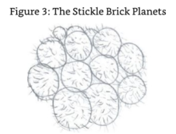

ME:This looks to me very much like a virus,growing by multiplication by division. 

我：

SE4:Yes,I can see how you might think that;the process is somewhat similar,but that is where the similarity ends.

4号源实体：

ME:So why do these planets work in this way? 

我：

SE4:You mean why do the planets and their entities do what they do? 

4号源实体：

ME:Yes,that's what I meant. 

我：

SE4:They do it to create planetary communities that have both the components of individual contribution and collective contribution whilst working with the smaller entities that work with them.Working together is one of the highest orders of work any entity can partake in.Within my environments it is an activity that is not reserved to smaller,higher power entities,such as you in your Source Entity's environments.It is there for all to work with,achieve,and experience. 

4号源实体：

### Planetary Cooperation 

ME:A planetary community!Hold on.I can understand that planets are entities in their own right,but the idea that they can form their own communities is a bit beyond me. 

我：

SE4:Why should it be?What do you think the galaxies are in your own universe? 

4号源实体：

ME:My understanding of the function of galaxies in my universe is that they are entities in their own right with planets forming an integral part of them and their function as they have their own individuality. 

我：

SE4:Correct.The difference in your universe is that the galaxies are the major entity with the planets and sun being components of that galaxy.In this particular instance it is the other way around.With the support of the smaller entities as assistants,the planets form communities by linking themselves together,the result is similar to a galaxy in your own universe,but the galaxy is not the entity.The planets are the entities.They are just grouped together.There is an interesting by-product of this linking together of planets though- coadunation,the linking together of smaller individual entities with individuality to create a larger entity that is the sum or exceeds the sum of all of the entities that are linked together.This results in an entity that is significantly more capable than the entity you call a galaxy,for the galaxy is the major entity made up of smaller parts.Whereas in this example the galaxy is a collective entity made up of small but major parts. 

4号源实体：

ME:Whilst you were describing this concept to me... 

我：

SE4:It was not a concept;it is a reality. 

4号源实体：

ME:Right.Whilst you were describing this specific example of existence in your environment,I received an image of clusters or groups of planets-vast groups,groups as small as solar systems and groups as large as galaxies-but with them all linking together to form an even bigger entity, a super galaxy. 

我：

SE4:And the super galaxies can merge together to create mega galaxies,and the mega galaxies can merge together to create super mega galaxies. 

4号源实体：

ME:Wait,wait,now you're blowing my mind.Are you suggesting that these clusters or groups of planets can get bigger and bigger and bigger with no limit to how large they can get?Wait.I now see an image of an area full of small and large clouds with each cloud being a galaxy of linked planets.Some of these clouds are moving together to make bigger clouds.From my vantage point in this image,they look something like a huge nebula.Recognizing that nebulae are galaxies of a sort,the different parts of the nebula are different colors due to the different galaxies being of differing energies that are being worked with by the planets and the entities that work with each planet. 

我：

SE4:Good summary.There is,of course,a limit to the size that a galaxy can become. 

4号源实体：

ME:What is that?The total size of the environment they exist within and the total amount of energy associated with that environment? 

我：

SE4:Well done.There comes a time where either all of the energy is used up,or the volume available is no longer available because it is full of energy created into entity. 

4号源实体：

ME:So you are not infinite? 

我：

SE4:No,of course not.I am the size that the Origin gave me when it created me.This is the same for all the environments that I created.These environments have both dimension and the various resources to go with that dimension.These are in the finite,not infinite although what I might call the finite,you might call the infinite;however,that is purely based upon your current perception of the greater reality.The difference is that the smaller entities that work with the planets are fully aware of their part in their greater reality. 

4号源实体：

ME:I find it incredible to think that a whole environment can actually be filled by what would end up being one big nebula or super mega galaxy.What would be the purpose of a collective entity of such a size? 

我：

SE4:In this particular instance,the purpose of becoming this size and using either all of the available energies in the creation process or all of the area available is to experience the effect on the greater entity-increased energetic facilities and growth through cooperation. That is,to experience the sudden limitation of such an expansion would be the evolutionary version of hitting a brick wall because with the decision to dissolve the merging,the larger entity would lose all the advantages that come with an entity of this size.The level of dissolution,being a collective decision based upon what level of individuality,is required to start the next set of experiences. 

4号源实体：

ME:I see an image of a smoke cloud expanding to fill a clear balloon of known size.This smoke cloud then divides to become smaller clouds within this balloon.It then divides further to become speckles of dirty air-what I assume are small galaxies or clusters of solar system-sized collections of planets.Then it becomes a whole cloud again and finally becomes invisible.This last part I would guess is where the dissolution of the collective is right down to its lowest level of one planet and is therefore not visible.

我：

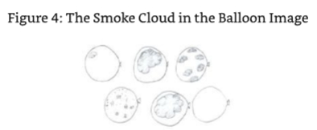

SE4:What you saw there is a very fast visualization of how this type of planetary cooperation develops or could develop.It is only a couple of examples of how it could develop but is good enough for this dialogue. 

4号源实体：

ME:So in a nutshell what you have shown me is that evolution is not just for the smaller entities but for the larger planetary entities as well.They can experience singularity or the various stages and sizes attributable to being linked together and cooperating to achieve a greater level of experience.

我：

SE4:Yes,that would be a good summary.Remember that experience and evolution does not necessarily need complication.It only needs cooperation. 

4号源实体：

You have seen enough of my environments now.You need to rest a while and cleanse your energies before you move onto communicating with my colleague you will call Source Entity Five.Now go in peace and spread the word. 

And with that my link to Source Entity Four was dissolved. 

### In Closing 

When a Source Entity relinquishes its link with you,it results in a big change (loss) in energy/frequency,and this one was no different.There was,however,a couple of differences.I had been in contact with SE4 for longer than normal,longer than the other SEs to date.I had also been operating at a higher frequency than normal to ensure that the link was maintained,which was,to be perfectly honest,hard work.This was due to the vast differences in the concepts and the energies surrounding these concepts that SE4 was offering me,which ultimately needed to be filtered by SE4 to a level of understanding that I could both deal with and hopefully transcribe.To elaborate further,I had been on a high that was higher than normal,and I was now suffering from energetic cold turkey,especially when around the "everyday"people that I associate with.When I was with my wife and friends who are either spiritual or interested in such abstract metaphysical information, my energies were raised and the cold turkey was not so bad.It was a bit like going into a decompression chamber after a deep (SCUBA)dive.Quite clearly I was no longer grounded and needed to consolidate myself energetically before the next line of communication/dialogue,which would be with the Source Entity that I will refer to as Source Entity Five.As I was having difficulty operating in the physical world,I decided to raise my energies and contact my own Source Entity,the creator of our multiverse on this issue. 

ME:I need help here. 

我：

SE:So I can see.But this was not unforeseen as we discussed this (privately)before we started this series of dialogues. 

源实体：

ME:So what is happening? 

我：

SE:Simply put,you are being stretched beyond your physically energetic limits.When you enter into a dialogue with another Source Entity,you create a link.This link is maintained throughout the period of time that the communication is planned to be over.That is not the few hours a week that you set aside for transcribing the information from these dialogues whilst in communication with the other SEs.It is the weeks or months that they are spread over.Establishing this link over this period of time is a necessary requirement,ensuring that you can continue the dialogue at a moment's notice without the rigamarole of intense meditative process.During this time you still maintain the link with me,and I have a different energy signature than the other SEs.This causes a conflict in energies,resulting in the tiredness you have been feeling even though I am giving you protection.In essence, your energies and frequencies are being maintained at a level well above the norm you are accustomed to,and,as a result,when you come down to just my energies,which are above your own,you still feel deflated. 

ME:So that explains the bags under the eyes.

我：

SE:Yes,to an extent.In support of this,you need to ensure that you are well rested and get as much sleep as possible. 

源实体：

ME:Yes,I agree with you here as I have recently started to find that I need to have a quick half hour sleep after work. 

我：

SE:That is your physical and energetic bodies telling you that they need to stabilize and balance the energies being accessed and used. 

源实体：

During the dialogues with the last four Source Entities,I was starting to notice an area of commonality.I was finding this a bit disturbing as a little voice in the back of my mind was saying that all I was doing was talking to the same entity-that I was not really communicating with Source Entities other than my own but simply with one spiritual entity.I decided to offer this thought process to my own Source Entity. 

ME:Why do I get this feeling that I am talking to just one entity when I have identified with four to date? 

我：

SE:Let me put your mind at rest.You are,indeed,communicating with different Source Entities.That is a fact.What you are experiencing though is the feeling of oneness that results from being so close to the Origin.Remember we are the first and only creations of the Origin.Everything else in the Origin's expanse is a product of Source Entity creativity and that includes your good self.When you consider that the modus operandi that we all have is to experience,create,and evolve,it is hardly surprising that there is a certain amount of continuity between the agendas of each of the Source Entities.If there was not continuity in this way,then there would be no point to our existence.

源实体：

No,do not worry in this way. 

What I can say though is this:the very fact that you are questioning the content that you are receiving gives it value.The process of questioning is both healthy and necessary.It is necessary because there is no way in the physical world you can prove that the content you are receiving is real rather than fiction.It is healthy because it helps you maintain your objectivity and your state of mind.These together validate the work,and validation is a necessary precursor to dissemination.It is validation that brings such information into the domain of the physical worlds. 

ME:Thank you that helps a lot.So this feeling I have of disappointment resulting in seeing continuity is also based upon the reduction in energies resulting from de-coupling from the other Source Entities. 

我：

SE:In some part,yes.The fact that you also have a part of you that requires a certain type of information-an expectation derived from the physical existence you are currently experiencing.That information is either not available or is not relevant in these communications.In your own words,just accept. 

源实体：

ME:Thank you.You help me a lot.

我：

SE:And I thank you for you have undertaken a most difficult task.Let us move on to the next Source Entity,Source Entity Five. 

源实体：

As these words were conveyed to me,I started to feel the change in energies that I had now come to associate with the protective energies that the Source Entity wraps around me when I enter into communication with the other Source Entities.I then felt the energy of the entity that was SE5.It was singular and accompanied with an image of a huge translucent ball of energy. 

"I now understand that this is an incorrect statement(see Beyond the Source,Book 2).The structure of SEl's environment is 12 full dimensions each constructed of 3 sub dimensional components,each of which is inflated by 12 frequency bands.Except those which created the foundations (our own universe),where the three sub dimensional components equal 1 sub dimensional composite component and therefore 1 full dimension,which is in turn inflated by 12 frequencies to create the first universal environment (our universe)".I have since recognised that the Source Entities let me be in some error due to the fact that,at a particular point in time,it would be too hard for me to understand the actual correct detail,and that what I understood was close enough to the truth to allow the thought process henceforth projected to mankind's memory to be of some significant use, in variance to receiving no information.GSN 14/04/2012(During final editing)

## Chapter 5 

### Source Entity Five 

I was wondering why I was getting this image of a singular entity when I felt its presence engulf me.I decided that I had better communicate with this presence as ignoring it would be an insult.It had,after all,made the effort to make contact with me,which it had no obligation to do. ME:Is that Source Entity Five? SE5:It is,and you have permission to refer to me as such,for it will make this communication easier. ME:Thank you.You may have been told by my Source Entity that I have a format that I like to use to start my dialogues,and then I just let the communication go the way it goes.I have been finding that this is the best way because trying to steer the questioning too much inhibits the flow of information,especially if the information is in variance with what I think I should be getting. Basically I have learnt to get myself out of the way and let you explain about you and your creation/s. SE5:That is a very wise thing to do and one that will stand you in good stead in this instance, specifically as I am singular.This is something that you have already sensed. 

ME:Yes,it is.I will,though,ask the standard questions about these items: 

- your creation
- becoming aware 
- experiencing yourself 
- communication with the Origin 
- what you are doing to evolve and help the Origin with its quest to know/understand itself better 
- what you have created as a result 

我：

SE5:I note that they are worded in a different way to the way you have written them in previous dialogues,but the content is still the same.I have already had some advice on what you might ask from my own communications with your Source,so I am aware of what routes you will be taking during our time together.In fact,we have,in essence,already had our dialogue;it's just that the part of you that is on the plane of existence that you are aware of has not yet been able to recognize it as happening.I think you know this aspect of reality, am I correct? 

5号源实体：

ME:Yes.O.K.,let's kick off with the dialogue as I am not aware of what my higher/real self has already done or is currently doing. 

我：

SE5:Fire away. 

5号源实体：

### Self-recognition 

ME:How and when did you become aware that you had your own thoughts-that you were sentient and had individual thought and recognition of self? 

我：

SE5:It was actually a slow process for me.For a long time,what you would call trillions of your years,I was not fully aware that I was individual.What I was aware of was that I was part of a bigger reality,the Origin,but I did not know what the Origin was and what my relationship to the Origin was either.It was somewhat like what your babies experience during the first days of existence after being born. 

5号源实体：

ME:So what made you become aware?Did the Origin have a hand in making you make the change from unaware to aware,or was it a gradual increase in awareness? 

我：

SE5:It was a fully gradual process.My increase in awareness was based upon my increase in what you might call sensory experience. 

5号源实体：

ME:What do you call sensory experience?For me,it is touch,taste,sight,and smell.

我：

SE5:For me,it was things that were interfering with my peripheral energies.In fact,it was the effect of the other Source Entities'creations brushing by me that made me realize that I had a periphery.It was a most disturbing experience.From this point onwards,my attention was set upon trying to understand what was causing this disturbance and how I could avoid the sensations that I was experiencing.As a result,I was drawn more and more into understanding that as I thought about not experiencing these sensations,they would go away,or the things that were causing the sensations would steer clear of my periphery or boundary.I even managed to create some thought processes that resulted in my catching those things that would try to invade or brush by my energies and hold them in one place whilst I looked into them with a view to seeing what they were.It was during the investigation into what one particularly interesting creation was doing,and why it was doing it that the realization that I was an entity capable of individual thought in my own right came to mind.This I found to be most interesting and decided to spend the next period of time creating independent thought and seeing if I could rationalize that thought by the justification of my own existence. 

5号源实体：

ME:What do you mean by rationalization of independent thought by the justification of your own existence? 

我：

### The Power of Uncontrolled Thoughts 

SE5:In my early recognition of self,I was unaware of the consequences of uncontrolled thought and what happens if thought goes unchecked. 

5号源实体：

ME:Why do you need to check your thoughts? 

我：

SE5:In the wider environment we call the Origin,every thought has the ability to lead to creation.As a result of my own unchecked thoughts,I was surrounded by thought junk -things that I had created but was not aware that I had created.Thought junk has an association with the creator of the thought.The association is such that the thought junk sticks to the creator of the thought in a random pattern in and around the energies of the creator.These thoughts are noisy and start to block out any thoughts that are being used in the communication process that I was later to have with the Origin and the other Source Entities. 

5号源实体：

ME:How did you work that out? 

我：

SE5:By noticing that the background thoughts I had been receiving were increasing and were duplicates of the thoughts that I had made before.I was quite literally being bombarded by my own thoughts and was being drained by the energetic associations that these thoughts were making. 

5号源实体：

ME:How can a thought drain you of energy?

我：

SE5:By the sheer fact that they start to gain an impetus of their own,especially thoughts created out of Source Entity or Origin energy. 

5号源实体：

ME:Impetus? 

我：

SE5:A snowball effect that results in the thought gaining more energy the longer it remains in existence.If left unchecked or not recovered by the originating entity,a thought can quite literally become as large as the creating entity and even take it over. 

5号源实体：

ME:Surely this can't happen to an entity as small as me. 

我：

SE5:You are made from your Source Entities energy? 

5号源实体：

ME:Yes. 

我：

SE5:Then it can happen to you as well. This was a complete surprise to me-that we as individual and independent entities were capable of literally covering ourselves in stray thoughts that clouded our already limited connectivity to our higher/real selves and further isolated us in the physical existence,one we believe is our only existence.It did,however,made perfect sense.I was even able to recognize some aspects of stray thought junk on my own aura.I cleared them away with a single thought and felt a shiver going down my spine and my skin tingle as my aura's functionality returned as a result of it being clear again. 

5号源实体：

In my mind's eye I saw a crowd of people.All of the people had their auras covered in various types and levels of sticky thought-based stray energy.Due to their own longevity without being cleared out,some were starting to both gain a level of individuality and had gained the ability to suck the energy out of the person that created them from their own stray unchecked thoughts-thoughts that were capable of significant levels of creativity if only the person that owned them knew how to use that facility properly. 

SE5:That's a very good example of what was happening to me.The only issue was that I am significantly bigger than you,and I was also totally covered in these thought forms.As an example,if you were to consider my basic normal form as a sphere,then when I noticed what was happening to me,my external form was that of a sphere covered in random odd- shaped creations. 

5号源实体：

ME:I have just seen an image of a dragon-shaped entity slithering over you.What is the significance of that?It seems a strange piece of imagery to have. 

我：

SE5:I sent you that because it illustrates two things:first,that the thought forms are insidious;and second,that they were of such energy that they were able to create their own form at will.They were,in fact,their own entity-individual in every aspect.Except one, that is. 

5号源实体：

ME:What was that? 

我：

SE5:Because they were created by me,they were contained(held)by my energy and,as such, needed to stay with me to continue to exist.They were like... 

5号源实体：

ME:I have just received an image of a snake pit with thousands of snakes crawling over each other,each one looking for its own space. 

我：

SE:I was going to use the words"the entities you call snakes in a bucket,"but you beat me to it.I was literally infested with them. 

源实体：

ME:Did the Origin offer you some help or advice?

我：

SE5:No.At that point,I was not at that level of awareness,and the Origin had not yet decided to make itself known to me.In essence,this part of my existence was fully of my own doing and ultimately was part of my own evolutionary existence.It was essential training in being careful about what I thought and how I thought about what I was thinking. But getting back to the one exception. 

5号源实体：

ME:Yes,what was it? 

我：

SE5:The fact that I created these thoughts and the thoughts were of my own energy meant that I had ultimate control over their existence.Once I recognized this fact,it took less than a nanosecond to clear them away. 

5号源实体：

ME:How did you do that? 

我：

SE5:By simply re-absorbing their energy back into my own.Don't forget that they are my energy,and,as such,my energy is under my control.As a result I could and can do anything I wanted to do with them. 

5号源实体：

ME:Including destroying them? 

我：

SE5:Destroying them would have resulted in me losing the energy. 

5号源实体：

ME:I didn't think energy would be lost. 

我：

SE5:Energy cannot be lost,per se,but it can be lost by the individual.Lost energy does not mean that it is gone forever;it simply means it is lost from the entity that had it in the first place. 

5号源实体：

ME:So where does it go?

我：

SE5:Back to the Origin.Don't forget that the Origin created the Source Entities from its own energies;it gave up those energies to create us.Based upon that,any energy that we destroy doesn't actually destroy the energy.It destroys the association of the energy with the entity that was authorized to use it.The association of energy is the link energy has with the entity it was assigned by the Origin. 

5号源实体：

ME:So would Ibe right in saying that you would be giving up part ofyourself ifyou destroyed this stray thought energy. 

我：

SE5:You would,and although it is not what you would call a sin to do so,it is not in our best interests as it ultimately limits our energetic mass and,therefore,our ability to create. 

5号源实体：

ME:So what did it feel like to suddenly have all this energy back and have your communicative abilities restored as a result of clearing away your stray energy? 

我：

SE5:It was like you feel when you return back to your energetic self,when you give up the heavy suit of your physical vehicle.Elation! 

5号源实体：

What's more,this was part of a defining moment for me,as it was during this time that I realized that I was an entity capable of independent and original thought.The thought forms created by my unchecked thinking were proof of this.This started a period of experimentation in what you call philosophical thinking.This also expanded my consciousness and led me to the later opinion (after my communication with the Origin) that I was best employed in my particular role of helping the Origin understand itself better by remaining in a singular configuration. 

ME:What does that mean?

我：

SE5:I meant that I decided that I would not create any other entities to help me perform my task. 

5号源实体：

ME:Wait a minute.That ties in with the feeling I had when I first logged into you,that you were singular. 

我：

SE5:That's right,and that feeling that you had was because you did not detect any other entities that were associated with me-hence,the feeling of singularity. 

5号源实体：

### Developing Awareness 

ME:Let's elaborate on this subject for a bit longer.It is one of the subjects that I have discussed with all of the Source Entities I have contacted so far. 

我：

SE5:As I said,this was a defining moment for me.Suddenly realizing that I WAS,was amazing.Let me put this in context for you.I had just removed all of the thought forms that surrounded me,slowing me down,masking me from the reality of my existence and what was existing around me.I had become used to this condition;I was in it for millennia. It was like being blind and then being able to see.But this was not just being able to see;it was being able to see,understand,and relate to self,myself.This gave me a datum to work from.I recognized myself as an individual entity in my own right.I was surrounded by other entities,entities that were similar to me.Each of these entities was at a different state of realization,of evolution,of experimentation.I felt an affinity with them.We were all the same,and we had a job to do. 

5号源实体：

Then there was the Origin. 

I noticed that one of the entities that I was aware of was in communication with something that I could not perceive.All that I could see,if that is the right word,was a sort of tube linking the entity,a Source Entity with what appeared to be a"skin"that surrounded us all. The tube changed in appearance as the communication progressed. 

ME:What changes in appearance did you see? 

我：

### First Conscious Contact with the Origin 

SE5:Its size and shape changed as well as the color,dimension,and frequency.It even sparkled at times.It was truly beautiful to behold.The Source Entity being communicated to reciprocated the form,dimension,and frequency in tune with the tube and its communication process.I even noticed that the area of "skin"surrounding the tube also had an appearance similar to that of the tube.I then looked around and saw that,on the odd occasion and over a period of time-I use the word time here just to explain that I saw this happen separately and not altogether or instantaneously-that this tube or a tube connected with several of the other Source Entities for a period of communication after which their appearance changed totally.I queried within myself why this was in separation and not altogether in totality and why the Source Entities changed.At this point I also had a sudden connection with the "skin"via a tube.I had made my first contact with the Origin. 

5号源实体：

ME:What did that feel like,the first contact,that is? 

我：

SE5:I can only describe it as awesome.I suddenly knew who and what I was for sure.I was one of the twelve entities that a larger entity,an entity that was energy with sentience, had created in order to fully understand itself better.It had given up part of itself to create us,the twelve Source Entities,and the creation in itself was part of an experiment that it was running within its "self"to see how others would become aware and gain sentience,as indeed it had.It was seeing if a lesser content of energy would result in lesser beings. 

5号源实体：

ME:And did it result in the creation of lesser beings? 

我：

SE5:No.In fact,one of the conclusions that the Origin came to was that the content of energy did not specifically result in the generation of lesser beings.I learned that we had all of the abilities of the Origin and that was one of the things that the Origin was trying to understand. 

5号源实体：

ME:But surely you cannot be equal to the Origin?You are a creation of the Origin. 

我：

SE5:That is true,but the Origin gave us exactly the same energies that it was composed of, including all of the interpretations of those energies. 

5号源实体：

### Interpretation of Energies-A Mobius Loop 

ME:Interpretations of energies?That's a new one on me! 

我：

SE5:Energy has a different interpretation depending upon the dimension it is within and the frequency within that dimension,not forgetting,of course,that the energy itself IS the dimension and frequency. 

5号源实体：

ME:What? How can energy be the dimension and the frequency when it is within the dimension and has frequency?You have just turned everything I know,or think I know,upside down. 

我：

SE5:Yes,maybe,but it is a fundamental piece of physics that energy is within and without dimension and energy.It permeates all that is. 

5号源实体：

ME:But that's like saying that the outside of a tennis ball is the inside of a tennis ball and vice versa. 

我：

SE5:Correct and everything in between is the surface as well.Everything that IS,IS. 

5号源实体：

ME:O.K.I will have to leave that one for the moment. 

我：

SE5:No,you don't need to.You have a concept that I can show you to help you understand. You have the Mobius loop,do you not? 

5号源实体：

ME:We do. 

我：

SE5:And the Mobius loop can be used to explain the fact that a surface can be both inside and outside,can it not? 

5号源实体：

ME:Yes,it is quite a good model;it can be explained mathematically as well. 

我：

SE5:Good.Then you consider that in your representation the Mobius loop is a two- dimensional representation of a surface in a three-dimensional environment. 

5号源实体：

ME:Go on. 

我：

SE5:You said that this can be explained mathematically and as such can be used to explain a plane in a space. 

5号源实体：

ME:O.K.,I'm still with you. 

我：

SE5:Then all you need to do is expand your thought process to include the fact that"surface" is merely a representation of form. 

5号源实体：

[I was going to use "dimension"here,but it didn't make sense.SE5 changed it to "form"as it better represented what it was going to say next].

Energy has no form.It just IS,and,as a result,it can be considered as multi/omni-form simply because it has no form.It is formless.As a result,that which can be within a plane or dimension can also be without.The plane or dimension which includes frequency is the energy,and the energy is the plane,dimension,and frequency,all concurrently. 

I wasn't sure whether this explanation of energy being inside and outside of dimension and frequency was correct,especially as it suggested that energy was a fundamental component of itself,a somewhat convoluted conundrum of the chicken and egg variety.I am sure that physicists who read this text may like to disagree.One thing is sure though:this is the explanation I received from Source Entity Five,and I am sure that it may be in total variance to the currently acquired human knowledge on this subject.I welcome anyone to offer a mathematical space model on how this can or cannot be.Undoubtedly,the process of proving such an explanation will expand mankind's understanding of this concept of reality.The glove of challenge is well and truly thrown on the ground. 

### Equality in Creation 

ME:So let's get back to the communication you have with the Origin and the creation of beings with lesser energetic content whilst still being equal to the Origin. 

我：

I find this a little bit hard to understand.How can an entity that has a smaller volume of energy and energetic content be equal to the Origin?It makes no sense to me.Surely a lesser being,albeit only lesser in content could not be considered equal.Or was I missing something,something fundamental?I would have to see what Source Entity Five had to say on the matter. 

SE5:Humanity has a very bad habit-the need to compare others with its self and its own level of understanding. 

5号源实体：

ME:I guess we do.I also guess that we are not very good at it either. 

我：

SE5:You certainly are not,and acceptance is something you should embrace as a race.It will make you calmer. 

5号源实体：

Because I can see that you are chomping at this particular "bit,"I will try to describe to you the fundamentals surrounding creation,especially creation in equality and creation in terms of function.Then we will return to what I discussed with Origin. 

Creation is one of the most honorable things that an entity can do,for creation is a fundamental platform towards experiencing evolutionary progression.There cannot be evolution without creativity.This is a universal law,one of the first things that the Origin imparts to us when we achieve the level of awareness required to invoke the first communication opportunity with the Origin. 

To create in equality is to create without fear-fear that the creation will be "better"than the creator.This is nonsense,for the whole objective surrounding creativity is to experience more than is currently being experienced.This is especially so when the creator is creating an autonomous entity,for to create inferiority is to be inferior in creation,and this cannot be so. 

ME:So how can an entity,an autonomous entity,be considered equal if it is not of the same size dimensionally and,therefore,energetically? 

我：

SE5:It is created in equality and as a result.it is equal.The energetic size,for want of a better word,is not a component of equality,for size does not specifically affect the ability to evolve.Take yourself as an example.Energetically you are smaller than I am by several magnitudes of dimension,frequency,and energy.But you are nevertheless in equality even if you are created by one of my peers.Your abilities may be limited to the constraints resulting from the amount of energy you have currently available to you,but in reality you are able to draw upon all of the energy that is freely available within the environment that your Source Entity has created if you so wanted.If you had enough imagination,you could, in fact,create an environment as large and as capable energy-wise as that created for you all to exist in by your own Source Entity.Your limitation is only in your own thinking,not in your ability.Of course,you do have limitations,and those only exist when you have reached a point that is constrained by the boundaries that the Source Entity has itself,or you simply cannot perceive anything more expansive.Your Source Entity has given you all-that is,the countless billions of you that it has created,the same level of opportunity that it had.I am aware that the Source has given you a figure,but when you incarnate,you don't do it in singularity;you are in multiplicity.In this instance you are all in equality. 

5号源实体：

What I will say though is that there are entities that are created out of a need for pure functionality.These are also created out of equality,but they are not endowed with the freedom of ability that an entity,such as you/mankind in energetic representation,are given.They are created to perform certain tasks and those tasks alone. 

ME:Hold on here.I would classify these entities as lesser beings. 

我：

SE5:They are not lesser beings.They are beings created in equality with a singular purpose -that purpose being their role within the environment they were created to exist within. 

5号源实体：

ME:So what would such a role be?

我：

SE5:You should know this,for you have already discussed it with your own Source Entity. 

5号源实体：

ME:Are you talking about what we call galaxies? 

我：

SE5:A galaxy would be considered as a large entity in your environment,would it not? 

5号源实体：

ME:Yes.

我：

SE5:Would you consider a galaxy as an entity of lesser importance or ability? 

5号源实体：

ME:No,how can it be?It's massive compared to my own physical size. 

我：

SE5:But it has a singular function.It is not free to access all of the energies that entities of your type can.It does not have the level of creativity that entities of your type have.You have no limits except those that you place on yourself. 

5号源实体：

ME:You're suggesting that a galaxy is a lesser entity then.No,I will re-phrase that.A galaxy is an entity that is of function of singular purpose,whatever that may be. 

我：

SE5:Yes,and in your environment it is to gather stray energy and create areas that can be used for evolutionary experience in the physical and surrounding frequencies or dimensions.That is all they are employed for.They have no other role.Even though they have no other role,they were still created in equality.Equality is given because their role is important. 

5号源实体：

ME:So what you are saying is that in the eyes of the creator,the created is held in equal consideration simply because it has an important job to do.If that job wasn't necessary and important,it would not have been created in the first place.

我：

SE5:Correct.And don't forget all things that are created are of equal importance.Whatever its ability,everything in creation is assisting the Origin in its task of furthering its awareness of self.In itself,this ensures evolutionary opportunity for the Origin,for even the Origin needs to evolve. 

5号源实体：

### Expansive Oneness with Origin 

Throughout my communications with the Source Entities,I had noticed that on a number of occasions the direction that I wanted to go was ultimately diverted by the Source I was communicating with in order to expose me to another subject.In hindsight,the subject matter was obviously very relevant.This was one of those occasions.Although I was very aware that I should take information as it comes and not over-steer the dialogue,I endeavoured to get back on track. 

ME:So let's get back to the first contact you had with Origin.You were saying that,as with each of the first communications with the Origin you had witnessed,you were suddenly attached to a multi-colored,multi-frequential tube that was also connected to some sort of outer skin.This skin presumably was the Origin itself. 

我：

SE5:Correct.The communication was instantaneous,complete,and concise.As you are already aware,I was given the full suite of information about my/our creation,the need for our creation,and the roles we were about to start.It was fascinating to understand that the Origin itself had been in solitary existence for many,many millennia!I appreciate that you know there is no such thing as time,but I need to give you the information using concepts that you will be able to understand.Therefore,the period that passed during which the Origin had existed in sentience before making the decision to create twelve equal entities as mirror images of itself can only be relayed to you in terms of time.This would be best recorded as billions upon billions of what you call years,the period of existence you use to describe the rotation of the physical aspect of the local density you work with in a three- dimensional condition-the earth around the energy singularity you call the sun. 

5号源实体：

ME:Yes,I guess that the story is the same in terms of the roles you all have to play in the Origin's plan for the understanding of self and the evolution of self.What I would really like to know is what the dialogue was that was specific to you,that only you had with the Origin,and that did not include the other Source Entities and your collective roles. 

我：

SE5:There was very little in what you would call dialogue specific to my role because the general rule was that we had freewill to do whatever we wanted to achieve the task at hand. And by freewill,I mean freewill.We had no rules within which to work.It really was "suck it and see."What I did was ask what the other Source Entities were doing or were planning to do to achieve further enlightenment,as I was eager to ensure that I did not do the same thing.You will notice that the other Source Entities you have communicated with have a theme of creating environments and populating those environments with smaller more nimble entities,each with a set of rules or goals to work within.I did not want that as I felt that at that point in my existence I could achieve what I wanted to achieve by being singular in state. 

5号源实体：

ME:What was it like to be connected to the Origin in such a positive way? 

我：

SE5:It was like I was the Origin,which essentially we all are.But when you are given the gift of individuality and then are re-exposed to a coadunate state,it is like nothing you have ever experienced before.You experience a similar level of,shall I say elation,when you are back with your prime energies-that which is the real you in totality and not just that which is projected into the physical.You feel whole again. 

5号源实体：

I can see that you are trying to find another example to explain this conditional change. 

It would be like living in a 10 x 10 cabin and then suddenly being able to live in the biggest mansion you could ever imagine.It would be like being constrained within a single room- that room representing an aspect of your "self"-and suddenly you have manymany many rooms.Think of each room representing an aspect of you that you have been cut off from and each corridor being a link to an aspect and the functional memory of that aspect.Then think of that aspect having many different corridors that can be used to access it,some of which include the multiple use of aspects to achieve what you need to achieve. 

ME:If I was to associate a room with each of your aspects,how many rooms would you have? 

我：

SE5:Countless.And this was the problem that the Origin had.It simply did not know how many aspects of self it had.And this was one of the reasons we were created.To establish how many aspects of self the Origin had.We do this by trying to experience and,therefore, establish how many aspects of self we have as Source Entities.This then feeds back in to the task that the origin gave us.You can imagine what that means,can't you?I was suddenly plugged into a resource that was simply too big to even start to comprehend.It was literally awesome to the point of paralysis [ME:That would explain why,in my visualization of the Source Entities communicating with the Origin via the tube,they appeared to "freeze" momentarily].As a result of this revelation,I was also able to understand that the part of the Origin that I was in contact with was but a microcosm of the whole.The Origin had limited that part of itself that was in communication with me to a level where it would not overpower me with pure expansiveness.It would be similar to me giving you access to all that is me.In your current condition,it would send you quite mad.Your consciousness would get lost in the expansiveness. 

5号源实体：

ME:The Origin must do the same when it is in contact with me then. 

我：

SE5:Correct,and in comparison,that part of the Origin that is in contact with you when you communicate with it is a fraction of that which is the Origin that is in contact with me when I contact it.In this instance,it really is all about size and what you can cope with as a result of your size-size being your level of expansiveness in this instance.But don't forget,size is not a measure of equality for we are equal to the Origin. 

5号源实体：

ME:I get the impression that you came to some sort of agreement with the Origin in terms of what you wanted to do in your role as Source Entity. 

我：

SE5:No so much an agreement but an understanding.Once I had calibrated myself to the vast wealth of information that was available to me during my connection to the Origin, I was able to understand what was already known by the Origin and those Source Entities that had already contributed to the cause.I was,therefore,able to create my own plan to contribute,the bones of which I shared with the Origin and which I am now in the process of delivering. 

5号源实体：

ME:I would be very honored if you would take the time to share with me that plan and how you have achieved some of its aspects. 

我：

SE5:That we can start in our next communication.

5号源实体：

### A Singular Entity 

ME:One of the things that I find interesting is that you are a singular entity.Everything I feel about you when I log into your energy is "singular."This is a really strange feeling,specifically because when I compare the feelings I get when I log into the other Source Entities,it is so different. 

我：

SE5:What you feel with the other Source Entities when you are in communication should not be compared with me.May I explain what you are experiencing when you log into the other Sources? 

5号源实体：

ME:Yes,please.I would be interested to know. 

我：

SE5:The difference is that you feel connectivity through collectivity;I think you know this as coadunation,the creation of a bigger being through the connection of smaller independent beings together in unison with the desire to be in unison.This feeling is like tapping into myriad neurons,each with a job to do that results in a collective output.It's a bit like the transistors in one of your microprocessors.When you connect with me,you do not get this feeling-a feeling of expansion through connection because all you get is me.If I had created a number of smaller beings to help me with my work,you would have received the same feeling as that which you feel when connected to the other Source Entities. 

5号源实体：

ME:So why did you decide to be a singular entity in your work?Surely it would have been more efficient to maximize your investigation through multiplication? 

我：

SE5:That would have been the common thing to do.Shortly after my first communication with the Origin,I was in full understanding of the work that had been done to date by the other Source Entities with all but one other re-creating themselves.The other you know as Source Entity Twelve,the Source Entity that is still to become fully aware. 

5号源实体：

ME:I was thinking about that Source Entity.Is communication with it possible? 

我：

SE5:That is not for me to say,but I will tell you one thing:you will need the help of the Origin to even try to consider such an act.You had best wait until the end of your other communications before starting such an undertaking,for we will all be observing.No-Thing has tried to communicate with it yet,not even the Origin. 

5号源实体：

ME:O.K.,I will leave that to later then.Let's continue to discuss your plan. 

我：

SE5:The plan I had did not include my division into smaller entities.I had seen that the others had started along this line of self-discovery,but I decided that I would work on a more introspective method.This did not include multiplication or division. 

5号源实体：

ME:This must slow down your ability to work on what and who you are. 

我：

SE5:Only in so much as I am not dealing with the minute detail that can be achieved by the creation of smaller entities,such as you. 

5号源实体：

ME:This sounds like you kept your investigations to a higher level of frequency and dimension. 

我：

SE5:Indeed.More importantly,I am experiencing things first hand and not through a smaller creation that is designed to represent me. 

5号源实体：

Now the plan I agreed upon with Origin-my plan was simple:to continue my evolution by introspective evaluation of self through experimentation and creativity on myself. 

ME:That seems a bit like changing yourself and seeing how it feels.

我：

SE5:You are not far from the truth.The objective was and is to create things that directly affect me and to experience/understand how those things that affect me change my function. 

5号源实体：

ME:Do/did you ever get to a point where a creation you made was irreversible?For example,did one of the creations you made ever affect you in such a way that you could not reverse the effect? 

我：

SE5:No,never.One of the things I do when I create is to put a limit on the existence period of whatever I have created.So in the event that I create a condition that results in me totally losing control,which has happened by the way,I return to full functionality when the life of the creation is over.Even in full loss of control,I am able to record the experience and memorize it.Total loss of control is an interesting thing to experience for a Source Entity. 

5号源实体：

ME:I am receiving an image of complete mayhem.Was this a result of your experience of being out of control? 

我：

SE5:Yes,it was.The image you are receiving is things being created and un-created. My extremity being manipulated,stretched,squeezed,warped,dimensionally rotated, manipulated,undulated,and spliced is but a small example of what happened to me in that period of creation.If I were to give you a visual representation,it would appear to be a bucket of snakes with each snake eating,being eaten,or being created (reproduced)by themselves and their counterparts concurrently.As an experience,it was most interesting as environmental conditions-this is me creating an environment within myself-were created that I would never have considered possible to be worthy of creation.Such an example would be the spliced undulation of dimension.This results in dimensions within and without dimension.In your current understanding of dimension,the dimensions are separated and are inflated with frequential energies.In this instance,there was no frequency-based inflation of the dimensions because the dimensions were inflated by dimensions,and these dimensions were also present in other dimensions.It was like everything existed within and without all at the same time.If I were to describe this as an environment,I would only be able to use the word conundrum in its description of function. Furthermore,as an environment that could be used as an area to house smaller entities,it would have failed because no energy would have existed. 

5号源实体：

ME:Hold on.I thought that energy could not be destroyed,only converted. 

我：

SE5:Energy needs frequency to exist,and if there is no frequency,there can be no energy.If there is no energy,there can be no entity and without an entity there is no life-at least no life that can be quantified in any descriptive way that you would understand. 

5号源实体：

ME:Try me.I am very open-minded. 

我：

SE5:O.K.In this instance the dimensions themselves gained sentience.They were intelligence without frequency and energetic content.It was a new form of...material... 

5号源实体：

ME:[This took a long time to come to me as a descriptive word,for how do you put a word to something that is effectively above and beyond dimension,frequency,and energy?] 

我：

SE5:...from which to work and create.It was just as well that I have a function that records and memorizes the conditions experienced,so I can reproduce it whenever I require. 

5号源实体：

ME:Hold on.Are you saying that the dimensions themselves without the energies and frequencies to inflate them became sentient in their own right?

我：

SE5:Correct.You see,one of the things that you have not been exposed to in your communications is the possibility for dimension to become sentient.You are aware that you,as energy,are sentient. 

5号源实体：

ME:Yes. 

我：

SE5:Then it should not be a great step forward to understand the simple concept that frequency can also have sentience. 

5号源实体：

ME:I take your word for it.In this instance,I would expect that this is entirely possible.Can I offer my level of understanding? 

我：

SE5:You may. 

5号源实体：

ME:Here's my understanding at this point.Energy can have sentience because it has an environment that sustains its existence that is called dimension and frequency and that that inflates dimension.Frequency can also have content,such as the lower frequency content of radio,microwave,light,or radiation.It is this content that humankind has only just managed to exploit and use for the transmission of information. 

我：

SE5:There are many,many other forms of content that can be used that are not tied down to the physical and that you have not even considered or dreamt of in your science fiction. Many of these would make your existence even easier,I would suspect,than it currently is, by using frequency as a tool. 

5号源实体：

ME:O.K.,because frequency has content,it can also develop sentience.Because it is part of dimension,it is contained.The dimension allows it to grow.I have a problem here though as the only thing I can relate to as dimension given sentience is you,a Source Entity.

我：

SE5:Although Source Entities are dimension,frequency and energy combined I we can separate them all out to exist as individual content in their own right.If I were to categorise the three then I would suggest that dimension was the highest and energy was the lowest. Dimension can have individualisation and therefore sentience because it is the highest of the components that make us all up,including the Origin. 

5号源实体：

Dimension is very misunderstood in your level of existence,for you think of it as an environment,a continuum,that is purely down to your size and position within the hierarchy that the Origin and your Source Entity have created.Left to its own devices,any object/thing can gain sentience given a long enough period of existence in one state.Yes,I heard your thoughts-so can and do rock and minerals.Dimension is just a higher form of existence and,therefore,sentience.Of course,it is like no-thing you as mankind has ever experienced or will experience in your physical state. 

ME:But isn't a continuum a low level environment,one that is just above the third dimension, what we call space-time? 

我：

SE5:Correct.But in this instance there is only one environment that can be called a continuum-one that involves dimension,frequency,energy and the recognition of the passage of events,time-which is where you are right now.A parallel dimension of equal content could be classified as a continuum but only if it has the full complement of the four components specified above.None do in YOUR universe.You need to be in a "multiversal" environment to have this effect take place,and it will only take place if your Source Entity requires it as a function of its environmental creation.This would be classified as a parallel universe and not a continuum.The universe you exist within does not have parallel content, at least not in what you would consider parallel.The only parallel content would be the dimensions,frequencies,and energies-not that which occupies it. 

5号源实体：

ME:So why do our scientists talk of such possibilities? 

我：

SE5:Because they remember memories of their energetic existence or are subconsciously tapping into the multiversal mind that they are part of.As I stated before,a continuum requires a multiverse to exist.There is only one continuum per universe-those that are classified as the physical levels.The content of such continuums would NOT be parallel. There simply is no need for the effects that a parallel continuum could offer since they are finite in comparison to the timeless environment that is the norm of any multi-dimensional universe that is above the first three. 

5号源实体：

Ah!I see the conundrum you have now.You(mankind)are thinking of alternative realities all existing at the same time and getting them mixed up with the word "continuum." Alternative realities are NOT continuums.It is the myriad of events that crisscross each other,depending upon how you may or may not react to a certain set of events.Each minor change to the way you act or react causes a different chain of events to take place.This can only work in the higher dimensions of a multiversal environment,where the majority of your energetic content exists right now.The alternative reality is just that-an alternative to what currently IS,and that involves all of the entities that you are and interact with.Hence, there is possibility of meeting an alternative YOU in an alternative reality if you choose to work on two or more realities at the same time,which incidentally most of you already do.In this instance,each alternative YOU is playing out in a simultaneous fashion each alternative that is possibly available to you given the range of possible actions/reactions to a particular event.This does not happen in a continuum because you are limited to the lowest physical dimensions. 

I can see that this has not answered your question on how a dimension can have sentience. 

ME:No,it doesn't,but it does answer other questions. 

我：

SE5:I will try to answer this question in a succinct fashion then.Dimension can develop sentience without the other content of energy and frequency simply because it is a higher function of the Origin's make-up.Dimension is not something that we as Source Entities create.It is something that we can manipulate because it is a higher function of the Origin's make up and is,therefore,a higher function of our own composition.A Source Entity can separate dimension into smaller levels or layers capable of holding and supporting higher and higher energies and frequencies.However,that/those dimension/s can and do become sentient in their own right.Sentience is awareness of self,as you are aware,but sentience does not necessarily mean that you can affect the condition or the environment you are in. Consider the bird you call a parrot.It is aware of self,as is a monkey,but neither of them is fully sentient. 

5号源实体：

ME:Our scientists would argue that the monkey and the parrot are not sentient. 

我：

SE5:They both are sentient,but they are sentient on a low level-one that means that they are not able to change themselves and their environment. 

5号源实体：

ME:Are you suggesting that dimensions are on the same level of sentience as the parrot and the monkey?

我：

SE5:No,they are a quantum leap apart,but in the scale of things,they are in similarity. For instance,the difference in sentience between you (in your current state)and the parrot and the monkey is similar but at a different magnitude to that difference between dimensional sentience and the sentience that a Source Entity has.In dimensional sentience the dimension is aware of itself and its function within the greater environment that it finds itself within.That is all it needs to have.However,a dimension can change itself to a certain extent in order to ensure that it creates the optimal environment for frequency and energy should it desire to be occupied as such. 

5号源实体：

### Reasons to Remain Singular 

I have to admit to being unprepared to talk to Source Entity Five on the subject of dimensional sentience.This is primarily because I wanted to discuss more about what it has achieved since its creation and awareness of self.In reality though,such a dialogue is interesting in its own right.I am starting to think that any "thing"that is created from the correct material (from the Origin)can become sentient;however,this bit on dimensions being sentient or capable of being sentient throws one off-track a little though.But then again,the whole point of communicating with the Source Entities was to gain as much information as possible whilst keeping it within the realms of what would be considered understandable on the human level.Based upon this,the best and only route forward is to just go with the flow and accept the little diversions in direction as they happen as being both necessary and timely in terms of the information being received.It is wise to note that the communication sessions that any channeler has are not about the channeler but about what is important for the human race to be exposed to at this particular point (in time?).It is also wise to have some limited but healthy challenging of the information being received to assist in the process of validating what has been received.We don't want to over-challenge the entity that we are communicating with since it would both stop the flow of information and make the entity wonder if the channeler is worthy of being used as a channel,but we do want to be certain that what we receive is pure to the purpose.It was at this point that I decided to push on with the task of understanding Source Entity Five's reasons for staying singular.After all,this would be good experience for me,as I was aware that there was one other Source Entity that was still singular,the one that the Origin had told me about whilst I was writing "The History of God"that had not yet become self-aware.On that thought I carried on with the dialogue with Source Entity Five. 

ME:O.K.,here's the big question:why or what made you decide to stay singular? 

我：

SE5:I simply saw what was happening around me and decided to create for myself,within myself,that which was necessary for my own evolution and expansion of my knowledge. It was quite clear to me that I was experiencing more than was necessary to sustain my existence from an evolutionary perspective without the need to gain a greater level faster by using the divisional methods used by the others. 

5号源实体：

ME:Before I home-in on the reasons why it was so clear,can you elaborate on the need to sustain your existence?I thought Source Entities were to all intents and purposes immortal.I mean created for eternal existence. 

我：

SE5:We are to a greater extent,but it is a wise entity that notes the fact that the Origin may decide to remove that gift from us if it so chooses.I know for a fact that right now,the Origin is immensely pleased with the performance of all its creations and all that they have created/experienced to further their evolution and,therefore,has no thoughts of changing what it has created in any way,shape,or form. 

5号源实体：

ME:But why would the Origin change what it has created to another model of creativity if it is successful in what is happening now? 

我：

SE5:To see if it would happen the same way again.To some extent though,this has already been done,so it is unlikely to happen again. 

5号源实体：

ME:What do you mean?Are you suggesting that you are not the first Source Entities to be created?

我：

### Origin's Second Reinvention of Self 

SE5:Correct.This is the second time the Origin has reinvented itself.The other Source Entities and I are the result of the second level of creation.We are not the first. 

5号源实体：

ME:This is getting difficult for me to grasp now.I thought that the twelve current Source Entities were the first.I am sure that I understood this correctly.I am sure that my Source Entity,as well as the Origin itself,told about the moment when the Origin became self-aware and its decision to create the twelve Source Entities.The time (event)line seemed natural. 

我：

SE5:That may be so,but the reality is that we are not the first. 

5号源实体：

ME:So enlighten me.What did happen first? 

我：

SE5:A prior experiment.The Origin simply duplicated itself.It copied itself a number of times. 

5号源实体：

ME:I received the word "many times"then.

我：

SE5:The exact number is irrelevant.In that instance,the difference that it duplicated itself whereas what we have now is a division of self. 

5号源实体：

ME:So where are the other Origins? 

我：

This was an interesting turn of events as it corroborated an image I had a couple of years ago where I was sure I saw many Origins all huddled together.I had trouble understanding this and translated it into being the Source Entities altogether inside the Origin.Now it seems this image was one of a past event,one that was before the creation of the Source Entities.

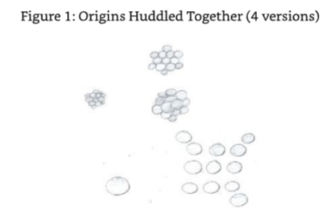

SE5:It is highly possible that you saw this image when you were in communication with the Origin during your first reawakened excursions into your higher consciousness,for at that point you had not established any limits to work within. 

5号源实体：

ME:How could you know that?This is the first time we have communicated,isn't it?

我：

SE5:Yes,it is,but don't forget that I have all your knowledge,experience,and evolution in hand.As with the other Source Entities you have been in communication with,I was given a full history of your existence by your Source Entity before I embarked on this dialogue.We need this to help us understand what you can understand and how to communicate with you.Don't forget that it's hard for us to talk to you because of your limited vocabulary. You are privileged to see such an image. 

5号源实体：

ME:So I see. 

我：

Thinking back,this image had given me cause for considerable concern.It was one that was potentially able to completely destroy the foundation of what little understanding I had of the Origin and the sequence of events surrounding its awakening and creation of the twelve Source Entities.It had me thinking along the lines that if there were more entities of the same quality as the Origin,there was something above the Origin that was big enough to contain them and be its own entity.What it didn't explain though was how the Origin could duplicate itself to a point where I could see an image of the duplicates from a distance.SE5 helped me with this conundrum. 

SE5:The Origin exists within and without itself on all levels.It IS,always has been,and always will be the ALL.As such,to enable it to duplicate itself it created an environment within which it could be the dominant entity and then duplicated itself a dozen times, creating twelve equal entities. 

5号源实体：

ME:Hold on.This seems a bit too much like the creation of the Source Entities. 

我：

SE5:Of course.The Origin only changed the process of the strategy it was working on,not the direction it was going.The difference was that the Origin duplicated itself twelve times, not divided half of itself into twelve.This is a big difference in evolutionary thought for the Origin.The first work relied on each of those that were duplicated thinking that IT was ALL there was,instead of being one of twelve with THE Origin,of course,being the only one that knew of the others. 

5号源实体：

ME:So why did the Origin change to its current strategy? 

我：

SE5:Because the others either ran riot or extinguished themselves as a result of not accepting that they were the only one.It drove them quite mad. 

5号源实体：

ME:But if THE Origin itself did not go mad or extinguish itself,why did the others? 

我：

SE5:It had something to do with being the true first Origin,something to do with its properties.You will have to discuss this with the Origin yourself. 

5号源实体：

ME:I intend to.I saw this as one of the chapters in a book I was planning,which I expect to title“The Origin Speaks.." 

我：

Wait a bit though,how could an Origin extinguish itself?I thought energy cannot be lost;it only changes form,so to speak. 

SE5:It can't.What it does is dissolve its individuality,which means it gets re-absorbed into the Original Origin by default. 

5号源实体：

ME:Let me get this straight.If an Origin that was created by the Origin could not dissolve itselfor remove itself from individual existence,how does it get re-absorbed into the Original Origin?

我：

SE5:Because it is part of the natural make up of the Origin.I will explain further.The Origin IS the final frontier.It IS ALL THERE IS.There is NO-THING ELSE.So when the energy that is given sentience decides that it can no longer exist or no longer has the desire to exist for whatever reason,the association given to the energy of individuality and sentience is removed.The energy returns to Original Origin energy and essence.Let me give it to you in a simple format,albeit in a frequency-based example.If you reduce the frequency of the molecules of water to the point where the molecular movement is almost at a standstill (from your perspective),you also reduce its core temperature,creating ice.The ice will assume the form of the vessel that the water was being contained within and maintain it when it is decanted from it.If you consider that in the example given,the form the ice has assumed when its frequency is reduced is equal to the association of individuality and sentience to Origin energy.That association is only maintained whilst the frequency of the molecules is kept at the level necessary for water to become ice.Thus,you will understand that as the removal of the method used to reduce the frequency of the water to form ice results in the ice becoming water,a higher frequency energy.So does the removal of the association of Origin energy to give individuality and sentience make the energy return to that that it really is-Origin energy and essence. 

5号源实体：

ME:Are you suggesting that the duplicated Origins are of a lower frequency to the Origin as a result of the Origin giving it individuality and sentience? 

我：

SE5:It is not a matter of a different level of frequency;it's more a matter of a different level of "being"or "existence"of that energy. 

5号源实体：

Now that the Origin has its own recognition of self,it cannot remove that level of sentience or individuality from itself.It cannot destroy itself or remove the association of its own sentience from itself,for IT IS ALL THERE IS.However,when the association is removed, energy created from the Original Origin energy,whether duplicated or divided,will always return to what it was originally,Origin.Therefore,should the Origin remove the association to the Origin energy that it used to create the Source Entities,it would also return to the Origin as pure Origin energy essence. 

ME:This puts a whole new light on things for me.This means that everything we know could end in an instant should the Origin decide to change its strategy for experience and evolution.It could remove the association to individuality and sentience it has given to the energy used to create you and the other eleven Source Entities.I find that a bit scary! 

我：

SE5:The thing you need to know is that this is not about to happen soon or even ever, according to my understanding. 

5号源实体：

ME:Isn't thatjust wishful thinking? 

我：

SE5:Not in the slightest.You see,the Source Entity strategy is so successful in terms of the experience and evolutionary opportunities that have been created and experienced that to stop it would be a backward step.There is simply too much momentum gained to warrant such a decision by the Origin.I will give you a classic example of why the Origin will never change its current strategy. 

5号源实体：

YOU are not alone. 

ME:What!?

我：

SE5:You are not alone.There are others like you experiencing existence at the lowest of frequencies that are able to penetrate the thin but almost impenetrable veil of the physical into the higher energetic realms.Some of you are even contacting the Origin directly as you are.This is a monumental experience for that part of you that is projected into the lower physical energies,your creator (your Source Entity),and the Origin.Never before has this happened.And what's more,it is happening in an area of your Source Entity that has been allowed to fall down the frequencies as far it could possibility go.And it is gathering pace. 

5号源实体：

Imagine the lowest of the low being in direct contact with the highest of the high.The lowest recognizing what it is communicating with and making interesting,intelligent,and constructive dialogue in the process while recognizing limitation but not being limited by its limitation.In the Origin's mind this is an unbelievable success.This is a level of continuity of expansion of awareness of self and the surrounding environment that is happening at all levels of entity.What's more,it appears to be both sustainable,and, expanding.Why would it destroy that,especially when there is more to come,much more from ALL of the Source Entities?The triangulation effect you have previously discussed with your own Source Entity not only applies to entities that are involved in existence in the physical frequencies associated with the entity you call Earth,it also applies across Source Entities as well. 

ME:Are you suggesting that we are in the throes of an evolutionary expansion of awareness that is,shall I say,unprecedented and unforeseen?Even by the Origin? 

我：

SE5:Correct. 

5号源实体：

ME:I am both shocked and surprised that the Origin could not foresee this happening.How could that be?With knowledge like this,Ifeel like I have come to the end of the book right here and now. 

我：

SE5:You are not even at the start yet,believe me. 

5号源实体：

ME:So what happens when this level of expansion in pan-Source consciousness finalizes?Will the Origin start again? 

我：

SE5:Who knows?It has no plans. 

5号源实体：

I then gained an image of the Origin.It was full of the Source Entities and other smaller entities of similar stature.The only way I can describe this is that the Origin was smiling a benevolent smile.It was pleased with itself,its creations,and the creations that its creations had made.It was in company with like-minded individual entities of varying sizes and evolutionary status,all stemming from the original entities that were created by the Source Entities.Some had collated together to create a bigger entity of collective individuality Others had maintained their individuality.All were of single status.All had graduated from the need to be contained within the environments that their respective Source Entities had created for them.All were in direct communication with each other,the Source Entities,and the Origin itself.The Origin had created a community,a family,and it was well pleased. 

ME:What was that all about?Where did that image come from? 

我：

SE5:That is the echo of what could be should the spark of conscious communication with the Source Entities and the Origin by those entities at its lowest levels of frequency continue. Remember that in your own communications with the Origin and your Source you were party to the fact that when the Origin was singular,it also lost contact with that part of itself that it projected into the lower frequencies.

5号源实体：

ME:I do remember that. 

我：

SE5:Well,this is an image of the Origin and all that has been created in its name that does not have the problem with losing contact with those parts of itself that reside in the lower frequencies,for they no longer exist. 

5号源实体：

### Concurrent and Simultaneous Existence 

ME:That's fantastic.This tells me that at some time in the "future,"the Origin and its creations will have evolved to the point where there are no lower frequencies where physical vehicles are needed to allow meaningful experience in different environments. 

我：

SE5:Correct.Not only that,but as I alluded to earlier,no one entity will be tied to the Source Entity that created it.They will all be free of the ties of their original environment.They will be equals with the Source Entities and the Origin,all within the Origin.In fact,in this particular event the Origin shifts its consciousness to be without itself rather than within as it currently is. 

5号源实体：

ME:Hold on.You just said "in this particular event."That suggests to me that this is not a firm future-that it might not happen. 

我：

SE5:You humans are besotted with the use of time-based association for understanding the potential for concurrent and simultaneous existence.Everything that has,will,or could happen is happening right now. 

5号源实体：

ME:Yes,I appreciate that,but it gives me the opinion that existence is still linear to a certain extent. 

我：

SE5:Only when you allow it to be.To a certain extent,it is true that the Origin and,indeed, ourselves,the Source Entities,became aware of self in a linear fashion.That is because that part of existence IS linear.But know this:once an entity is aware of its self and its environment,that level of existence diminishes.It ceases to be. 

5号源实体：

5号源实体：

ME:Why? 

我：

SE5:Simply because the entity,in the process of realizing its self and its environment, realizes that everything that it does is mirrored in some way.When the entity in a now awakened state desires to know more about its environment and observes the events it created at a closer level of scrutiny,it notices that at every juncture where a major decision was made,the event is mirrored by a multiple equal to the number of options that could have been taken.The direction of those decisions all being played out to the next juncture where they can either stop or continue.The ability of an event to continue in a certain direction is based upon the energy behind the entity's desire to make that decision its real direction.For example,if an entity has a decision to make that has five different evolutionary opportunities and if two out of those five were desirable but only one was chosen,then the other three will carry on to the next juncture and stop whilst the other two will continue as if each of them had been the chosen direction. 

5号源实体：

ME:So there aren't an infinite number of future possibilities? 

我：

SE5:There are but the vast majority of them "run out of steam,"as you say.Remember, energy needs to have thought-based intention to support it;otherwise,it has no role to play.Energy that has intention with it at all times is perpetuated to fruition and/or beyond. The myriad opportunities that are out there are the ones where there is enough intentional energy to support their continuation.As a result,the numbers of concurrent events that are occurring are self-governing.Let me elaborate a bit;every entity is surrounded by every possible move that it could make and what happens as a result of those moves.As the entity gains clarity of vision on what it wants to achieve and how it wants to achieve it,those events that correlate strongest with that vision stay with the entity.The others lose their association with the entity at the juncture where the correlation is weakest.The association is then broken but the event is recorded by the recording mechanism set up by the Source Entity for the environment that the entity exists within. 

5号源实体：

ME:You speak as if you know that this is the functionality of concurrent existence in my Source Entities'environments. 

我：

SE5:This is a common concept that exists across all Source Entities and their environments, and,before you ask,yes,it applies to Source Entities as well,irrespective of their creativity. In fact,it is also one that applies to the Origin.This is something that it discovered whilst in a state of its own singularity. 

5号源实体：

ME:!? 

我：

SE5:Yes,as you just pictured in your mind,this was understood by the Origin in the period before it created the Source Entities but after it duplicated itself. 

5号源实体：

ME:That's interesting.I thought that the Origin was omnipotent and had no limitations. 

我：

SE5:It doesn't.It is just a process that occurs as a result of an intention's longevity relative to its correlation with the underlying intention of an entity.Remove the intention to "be" from anything,and it will eventually flounder and return to the source of its creation.This is particularly true of discarded events.It is not true of discarded or ignored entities,for they continue to exist. 

5号源实体：

ME:Can you tell me the difference between a concurrent event where a duplicate of the event has entities that surely must be created and an entity that is created for the purpose of existence and evolution?They must be the same,for aren't they both energy? 

我：

SE5:An entity that is purposefully created for the task of experience and evolution is individualized and,therefore,autonomous to a certain extent,that extent being the prerogative of the creating entity.It will continue to exist even if ignored by the creating entity. The mirrored entity that is created as a result of a strong intention to choose a certain event but that resulted in an equally strong intention to choose another event in its stead does not have individuality.It is an echo,a strong one though,that has the ability to continue in all of the possible directions it could go in should that direction have been chosen in preference to the one that was chosen.Should the original entity choose to go back to the event where the separation took place,however,and change direction to the discarded but nevertheless correlating direction,then that entity and direction gains individuality.The previous direction,now discarded,becomes the echo.It will retain its strong correlation with the original entity though until such time that the original entity changes back or correlation is no longer strong,at which point it will stop at the juncture where full separation is achieved. 

5号源实体：

ME:Whilst you were describing that concept,I had an image of an almost wraith-like entity moving forward and being followed by other smaller transparent entities with some dropping out of sight while others are moving level with the entity.Once or twice I saw the one that moved up merge with the main entity,and it went in a different direction.It then twisted back and moved in a different direction.The smaller entity that merged now was made separate and dropped back a bit but still keeping pace with the original entity.

我：

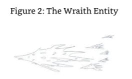

SE5:That is a good visualization.The movement of the entity is its movement through its own evolution,the others being the possible directions it could go should it make certain decisions.The opportunity to turn back and take a direction previously discarded was also seen illustrating the recognition of a wrong direction being taken.This will be a good concept to explain to your readers for it clears up the subject of concurrent/simultaneous existence nicely. 

5号源实体：

ME:Don't worry.I will. 

我：

### In Closing 

ME:I do have to say that I am surprised to receive the information that the Origin is on its second experiment,we are part of the success of that second experiment,and the success could result in those entities being created by the Source Entities evolving beyond the need for association with their creators and being considered equals with them in the Origin's eyes. 

我：

SE5:Why should you be surprised to gain confirmation on what you have witnessed and know is true?

5号源实体：

ME:I don't know.I just am. 

我：

SE5:Let me tell you this while we are still communicating.The whole point of "your" existence in the earth sphere is to bring to the attention of mankind the fact that they exist within an energetic environment and have as long as they like to experience and evolve. The method for you to do this is to offer an alternative view to those authors that have gone before you.This means that you have been given the privilege of working directly with your Source,the remaining Sources,and the Origin in order to expand mankind's knowledge base into those areas that are of a quantifiable nature,namely the physics of the energetic and how to exist within it in an efficient way-one that does not allow an entity to get stuck within the frequencies where they are working.Better still,you are providing mankind information on the other Source Entities,such as me.Very soon mankind will be in a position to create machines that will prove spiritual texts,but it needs to have a framework to reference their findings.That reference is the texts created by spiritual authors who have experienced first-hand though meditation what scientists are just starting to detect on their machines. 

5号源实体：

My communication with you is to enable mankind to see that Source Entities are entities just like you,except we are created by the Origin directly.We are both bigger in energetic content and have unfathomable ability from your perspective.The environments and energetic inhabitants that populate those environments are a Source Entity's way of accelerating its evolution (evolution by devolution).Each has its own strategy on how it wants to achieve this task.

Each Source Entity is independent of the Origin to all intents and purposes even though it is part of the Origin and reports into the Origin. 

In my existence I have decided to be singular and not create other environments(universes/ multiverses),but I have decided to be more introspective via a"hands on"approach.To use the words of an actor,"I am my own stuntman.I use no doubles.What you perceive is what you get." 

ME:You must have created another entity at some point in your existence though?What about the thought entities you created by your first untrained thoughts. 

我：

SE5:They were merely the creations of uncontrolled thoughts,thoughts with unrecognized intention. 

5号源实体：

In my existence I have considered the exploration of self a personal experience and task. It was not something that I wanted to experience via other creations,such as your Source Entity is experiencing through you.I wanted to experience that which is me as me. 

ME:Don't you feel alone?Especially when you know that the other Source Entities have created their own environments and sentient entities? 

我：

SE5:Not in the slightest.You see,knowing that there are others like me that I am in communication with on a regular basis means that I am never alone.Don't forget that we are all in communion with the Origin as well.Furthermore,I actually enjoy the work that I do on my own.One of the things that I find particularly interesting is the slow but steady increase in smaller entities created by my peers discovering existence outside of their own environments and initiating dialogue.This is the start of the evolutionary change that you saw in your vision.What's more,some of these entities are starting to communicate across Source Entity environmental boundaries.You will experience this in the communications associated with the next book you will be compiling. 

5号源实体：

ME:I thought Earth was a pivotal point in my universe? 

我：

SE5:It is one of the specific areas in your Sources'environments where this is taking place, and it is happening in similar areas in other Source Entity environments.However,it has a very,very long way to go before it gets anywhere near the image you saw. 

5号源实体：

ME:As a said before,with this level of information coming out,I sort of wonder if I need to carry on in this direction rather than continuing my dialogues with the remaining Source Entities. 

我：

SE5:Our dialogue with you is an important milestone in mankind's increase in spiritual knowledge.As a result,you must continue along this path for it will help in making the picture clearer.Without a firm foundation in basic knowledge,higher knowledge is meaningless for the gap is too big to jump successfully 

5号源实体：

ME:Yes,I understand. 

我：

SE5:I believe you do. 

5号源实体：

Before I leave you,so you can continue your journey of dialogue,I will fill in a gap for you relating to my existence.I am aware that I have been sparse in my explanation. 

ME:What is it that you want to advise me of? 

我：

SE5:As a singular entity experiencing and evolving in the singular,I also contribute in a significant way to the Origin's evolution.This is because many of the Sources have created other entities and not remained singular.As a result,the opportunity presented to me to experience and experiment as a single entity was compelling.In its desire to have its creations create,this was an area of evolution that could have been missed by the Origin. Based upon this,my singularity is an important undertaking.I am as it were,filling in an important gap,one that was almost missed. 

5号源实体：

ME:How could the Origin miss such an opportunity?I would not expect the master of all,the omnipresent creator to miss anything. 

我：

SE5:That singular conundrum is one of the reasons why the Origin created us-to fill in the gaps.It realized very quickly that it was so vast and its desire to evolve was so strong that it would need to get help or miss a trick or two.You have received this information in past dialogues,have you not? 

5号源实体：

ME:Yes,I believe I have. 

我：

SE5:Then it should not be a surprise to learn that even the Origin has a level of fallibility,and the route that it has taken to evolve is the fastest possible route available to alleviate this fallibility.Evolution is a wonderful tool,for with evolution comes wisdom and understanding,which,in turn,negate fallibility.My creation and my acceptance to remain singular have allowed the Origin to evolve,gain further wisdom,and reduce its fallibility. Hence,it is an honor for me to remain singular.These are the reasons why I remained singular. 

5号源实体：

Go now and contemplate this information,for you have the other Sources to talk to. 

As the link was removed from Source Entity Five,I gained the impression that I could have obtained much more detail of its experiments.Although the information passed on to me was not specifically about SE5 itself,it was new,fresh,and to my knowledge unknown by man.As a result,the dialogue was a success,and I was grateful for SE5 allowing me to link into it. 

As I sat in contemplation,my thoughts went back to an image I received about the communication between entities from different Source Entities.It was presented to me as a crisscross of lines between entities within entities within entities.It felt wonderful to have been shown this "progressive"change and development towards total independence of our Source Entities.I knew I would discuss this again later when I am gathering the dialogues for Source Entities Seven to Twelve as Source Entity Five had suggested that I would.I was full of excitement.I then looked forward to my next Source Entity,Source Entity Six.The image I received was that of a huge five-pointed star.What did that mean?

## Chapter 6 - Source Entity Six 

### Initial Contact with SE6 

It had been over a week since I had finished my dialogue with Source Entity Five,and it was some three months since I had communicated with my own Source Entity.Although I was aware that it was with me at all times,it is good to touch base once in a while.It took seconds to access the correct level to initiate communication. 

SE:I see that you are doing well with my counterparts. 

源实体：

ME:It's amazing how easy the conversations are going so far.I am also constantly surprised at the information that is being given to me.I seem to get more diverse information when I think that I can't possibly receive anything else,but that is my issue,especially when I start to try to rationalize the information,as my limited Earth-based knowledge gets in the way. 

我：

SE:Correct.It is always best to just receive and not intellectualize what is being given to you.My counterparts have worked hard to make your communication experience as easy as possible.The last Source Entity,whom you called Source Entity Five,emulated my frequency to the point where it was almost indistinguishable from mine.That made it much easier for you. 

源实体：

ME:Ah!That would explain the feeling I had that the conversation was so"matter of fact"that I had a doubt in the back of my mind that I was actually communicating with Source Entity Five -that in fact,I was communicating with you.I found that most disturbing,to say the least,for I feared that the content would be invalid. 

我：

SE:Source Entity Five's ability to simulate my frequencies is a product of the shared learning that we all experience.As you have been advised previously,we share our learning with each other and the Origin just as you share your knowledge with me.That is the deal.As a result, the methods of how to communicate with you get passed on to each new Source Entity you talk to.Hence,they start with a better"interface"than they would have if they had started from scratch.Each Source Entity then improves the link and makes the improvement available to all.At this point then,the link is about as good as it will get with your limited "band width." 

源实体：

ME:So I can't expect much more improvement then? 

我：

SE:No,not in your current condition.However,you will be much,much better when you are disincarnate. 

源实体：

ME:I look forward to that. 

我：

SE:I see that you do. 

源实体：

ME:Why did I get an image of a five-pointed star to represent Source Entity Six at the end of the last chapter? 

我：

SE:Why don't you ask Source Entity Six yourself?It is waiting for you to start a dialogue. 

源实体：

ME:O.K.,O.K.,I get the hint.It's time to move on,I take it. 

我：

SE:It is.Time is not of the essence though. 

源实体：

ME:?I will question you on that comment later.

我：

SE:No,now is best.Don't rush your desire to finish.Communication with this Source will be easier then. 

源实体：

### Five Aspects-Five Levels of Existence 

ME:I can see the shape of afive-pointed star in my mind's eye again.Source Entity Six,can I refer to you as such? 

我：

SE6:You may. 

6号源实体：

ME:Why do I see you in this imagery? 

我：

SE6:The five-pointed star represents the five aspects of me.Each aspect is a level of existence. 

6号源实体：

ME:Whoa!At this point I was thinking of asking you about your early existence and how you became sentient,etc. 

我：

SE6:That is not necessary,for it would be a similar story to the other Source Entities that you have and will communicate with. 

6号源实体：

ME:O.K.,Point taken.I guess one of the reasons we are communicating so fluently is because of the learning you have gained from my other dialogues. 

我：

SE6:Correct.I would not say that the Source Entities were all lined up in a queue to talk to you,but we have been following with interest and learning as a result. 

6号源实体：

ME:Tell me about your five levels of existence then. 

我：

SE6:Let me explain the reasons for their existence first. 

6号源实体：

Whereas your Source has dimensions-each with a frequency component and each leading to a path that is closer to itselfI have levels of existence with no dimensions and no frequencies.Of course,dimension and frequency are fundamental parts of my make-up,but I have not used them as tools to divide those parts of me that are used as levels of existence. If you want to use such nomenclature,then that is O.K.,so long as you consider it to be five composite dimensions with a single base frequency in each dimension. 

ME:What do you mean by the term "composite dimension"? 

我：

SE6:Consider it in this way.Sorry,can I access your mind at will to find the correct words to describe this concept? 

6号源实体：

ME:Be my guest. 

我：

SE6:Mmm,O.K.The best way I can describe it is by using your video transmission technology by wire.Consider that your base dimension is actually three dimensions linked together to create one liveable environment,and the upper dimensions add onto these dimensions to create the next environment.At a certain point upwards in the dimensional structure,all you need is one dimension to exist within as the lower dimensions added together create the bare minimum dimensional requirement for the existence of sentient energetic life.So you have three dimensions equal one dimensional level,four dimensions equal the next dimensional level-the true second level-five dimensions equals the true third level,and so on.The need for the three base dimensions is not required past the fourth. The first three are separate but necessarily together to create the first true dimension. In my creation,I don't need the first three,which would be like the separate RGB(red, green,blue)wires/channels you have in some of your basic video hardware.The fourth, audio,represents the next (second true)dimension and is a separate wire as well.I have the equivalent of composite RGB and audio-which is a single wire system with three video signals,red,green,and blue,and audio (representing the fourth dimension in your multiverse)-all being transmitted over the wire at the same time.Henceforth,a composite RGB audio system represents the structure in a simple way for each of my levels of existence -each being self-contained and independent of each other.Each is a level of existence that my sentient creations must experience in full. 

6号源实体：

ME:That's a good simple explanation.Thank you.So what does each of the levels represent? 

我：

SE6:They are as follows: 

- Level 1 is the level of basic existence and understanding of self and sentience 
- Level 2 is the level of self-realization,awareness of my greater reality 
- Level 3 is the level of creativity 
- Level 4 is the recognition of creativity for evolutionary purposes 
- Level 5 is the level of evolutionary experience through self-denial,the ultimate sacrifice 

6号源实体：

ME:Can you explain how your creations experience each of the levels? 

我：

SE6:Of course,but before we start with the first level,I want to advise you that my creations don't need to experience these levels in order,for they are not a progression towards myself like you have with your Source.Each entity can become part of me or separate from me at any time. 

6号源实体：

ME:Do any of your creations experience existence in the same levels of physicality as we do here on earth?

我：

SE6:No,not in a way that you would understand.Hang on to that question though,as I will answer it in full later. 

6号源实体：

ME:Hang on a moment.I have just realized that the explanation of the levels do,in fact,suggest progression of some sort.How can this be?It doesn't make sense. 

我：

SE6:That is because you are thinking in a linear fashion.That is a product of your current existence.My creations are given the ability to limit their knowledge,wisdom,and ability relative to the level they are working in for the duration of their existence.To do this,they are created with a level of experience and knowledge that is enough to allow them to operate in any of the levels either singularly or concurrently.Most of them work on more than one level concurrently,and they need not be levels that are adjacent each other. 

6号源实体：

ME:I am starting to get confused.How can they work on different levels at the same time? 

我：

SE6:By duplicating themselves.This is a fundamental ability that all my creations have. They can duplicate themselves in a number of different ways;each way can also be tailored to the creation's specific experience requirements in order for them to get the most out of their existence. 

6号源实体：

ME:I know that this is going to sound a bit weak,but what do they experience in Level 1,for example? 

我：

SE6:In Level 1 they have to exist in groups with a purpose.Each group has a basic role to play in its existence.That role may be to create a great civilization or simply what you would call a village.The task at hand is for them to enter into this group with a high level of single-minded determination,so much determination,in fact,that they are fully engrossed in their environment to the point where they are not aware of what or who they are.The task then is to break out of this mold and realize that they are more than they are or what they experience. 

6号源实体：

ME:From what I can see here,they are their own experiment in awareness. 

我：

SE6:That's correct.The awareness part is the first step on the ladder to recognizing sentience. 

6号源实体：

ME:What have they created in the past to achieve such recognition of self? 

我：

SE6:Some of them have explored their environment in ways that are similar to your mankind's exploration of Earth.Others have taken a more introspective position and used a form of meditation to achieve it. 

6号源实体：

ME:Can you give me an example of the exploration side of things?For instance,what are they exploring? 

我：

SE6:They group together to form a bigger creation (entity).This gives them an increase of collective ability.That allows them to explore their current level in a mental aspect rather than in what you would call machines.In doing this,they start to learn the meaning of self through singularity versus collectivity and what they can achieve with these conditions. Therefore,recognition of sentience is a byproduct of this because when they realize there are differing outputs and levels of success in what is experienced or found during exploration into differing levels of collectivity,they begin to experiment.A fundamental component of being able to plan and experiment is the ability to learn,plan,discuss,and review,and this requires sentience.

6号源实体：

ME:This sounds like a very similar evolutionary route to that described by Source Entity Four where the entities grouped together to create what I called "cities." 

我：

SE6:It is similar,but they are on a smaller scale.The entities that I have created can and do anything they want to achieve their goals.In the first level of existence,the environmental aspect is much the same as a physical environment with the exception that the entities can blend and merge with the materials that make up the physicality of the Level 1 environment.They exist in areas of plane physical energy. 

6号源实体：

ME:What is "plane physical energy"?This is a term I have not come across before. 

我：

SE6:Plane physical energy is energy that is essentially two-dimensional. 

6号源实体：

ME:You mean it is flat. 

我：

SE6:Not is the way that you are thinking.An energy plane is an area of energy that is frequentially flat.That means that there are no high or low spots in the frequencies that make it up.In one of your discussions with your own Source Entity,the ability to move upwards or downwards through the frequencies was described by using those areas of high and low frequency that are close to each other,the low portion of a higher frequency being located near a high portion of a low frequency.This is not possible in a physical plane energy environment,for the entities are not able to affect the energies in a positive or negative fashion. 

6号源实体：

### Description of One of SE6's Entities

ME:I am having trouble getting my head around this one.I am receiving an image of an area that looks like a very flat area of cloud-like material with what look like fish jumping in and out of the upper and lower layer of the cloud.They never escape the cloud though. 

我：

SE6:That is a very filtered image you are receiving.I will try to clarify it a bit for you. 

6号源实体：

With this new image,I saw that the fish were actually dark multi-layered entities.Streamers of dark energy emanated from them as they moved.I zoomed in to the image of the entity to get a better "look."It was like an amorphous black hole.The interior,which was visible,was the exterior,which was the interior;everything was confused as if it was all one and the same.From the outside it looked like the inside was full of star-like objects, objects that moved in procession,each having a direction to go.Everything about the entity defied the physical logic of what I was used to.Indeed,it was multi-layered and possibly multi-dimensional whilst existing within a Level 1 environment that was supposed to be two-dimensional.I was starting to realize that the two-dimensionality that I was used to was not what was being explained here.I decided to continue with the information that I was getting from the image of the entity I was linked to and discuss this matter of the dimensionality of a multi-dimensional being in a two-dimensional effect of plane physical energy later.I re-focused my mind's eye. 

The entity seemed to be interconnected in all ways possible-the inside was the outside, the middle was the end,and the center was the periphery.In all this though,there was an element of order.Everything had a function.As I looked into the heart of the entity,I saw what I can only describe as organs-areas of similar energy that were standing alone, appearing to have a job to do.Looking further,the images of stars that I received in my first glance at the entity were rewarded with more definition.The stars were pockets of energy of differing quantity,quality,and functional importance to the continuing existence of the entity. 

So that is what Source Entity Six meant when he said that these entities were physical.They needed energy of sorts,working with parts of themselves to make their existence possible. Although Source Entity Six created them,they needed to work with the energies of the five levels of existence to allow their continuation.As I started to understand this,I noticed that certain parts of the entity were not working with the "star"energies.They were immobile. These parts I conjectured,were those "organs"that were necessary to allow the entity to exist within the other levels of existence.Then suddenly,it all fell into place.The image of the entity was not of an entity that was constrained to working with one level of existence;it was working with two levels of existence concurrently.The "inside-outness"was a result of being connected to the two levels/environments,or was it?I decided to confirm this thought process with Source Entity Six. 

SE6:The entity you logged into is,in fact,working with more than one level of existence,but its appearance is not a result of its duality.The organs,as you call them,are multifunctional in terms of their ability to work in the five different environments.As a result,some of them are not needed and so are not used.There are times when all of the organs are used and others when none are used.Logically speaking,the organs are used to their maximum potential when an entity is existing in all five levels at the same time.They are redundant when the entity is in existence outside of the five levels of existence.

6号源实体：

ME:When would the entity not be within the five levels of existence?When they have finished their evolutionary tasks? 

我：

SE6:No.They,like you,need to review what they have been experiencing and what the benefit to themselves and me such experiences have given them.What you have witnessed in the entity you have logged into is the appearance of that entity to me or an outside observer.That part of the entity that is in the level of existence is not aware of the additional parts of itself that are in existence,so it is not able to manipulate those parts of its selves that are in other levels.What I will say is that the entities are aware of those parts of themselves that are focused upon the various levels of existence available when they are external to the levels.I will elaborate further.What you saw was,indeed,a multi-dimensional entity existing within a two-dimensional level of plane physical energy.The description of the entity that I have just given you refers to a higher level of dimensionality,which you have not yet perceived. 

6号源实体：

ME:Now I am confused.What do you mean by a higher level of dimensionality than I have been used to/perceived? 

我：

SE6:In your existence you have only experienced and considered multi-dimensional existence in terms of the ability to move within and between the dimensions that you are associated with.Even when you are in multi-dimensional existence,you are singular in application.You separate yourself out-one portion of yourself for each dimensional environment.You even do this for the frequencies in between the dimensions.This is a function of your energetic species,not of your "self."In my environments the physical entity is truly able to exist in all dimensions simultaneously-hence,the aspect of the image that you received.You would be advised to link into it (the entity)again to gain further knowledge of its construction. 

6号源实体：

ME:Does the entity mind that I am critiquing it? 

我：

SE6:It is not aware of your signature and so will not detect you openly. 

6号源实体：

I focused my attention on the entity in question.It suddenly struck me how bizarre this may seem to the uninitiated amongst us.That I am in communication with an entity and its creator,with its potential physical distance being what our scientists would consider to be sextillions upon sextillions upon sextillions of parsecs away from our Earthly location.If I hadn't known deep down that this was normal in the energetic,I would have considered it pure fiction,a daydream,perhaps even psychotic delusion.The image that appeared in my mind reminded me that even a deluded mind could not think up such images and explanations to unknown questions,questions and answers that could be explained in hard physics,even if it is physics that humankind has not yet been exposed to,except via spiritual physicists.Considering that the greater reality is so rich in stimulus,it was not hard for me to understand how humankind projected into the physicality of the Earth sphere is considered to be in a very,very deep dream state,a state of extreme sense deprivation.I focused on the task at hand and tried to see if I could gain more information on this entity. 

Upon closer examination,it appeared that the entity was constructed in an energetic way that was consistent with its environmental needs.Aren't we all,I thought!But I looked further and closer.Further in terms of the detail of its interface with the dimensions, moving into and out of all the dimensions associated with the entity,and closer in terms of the application of the detail,how it worked energetically.

As a whole entity,it was linked with every environmental consideration that Source Entity Six had created,which was very,very complicated,to say the least.I had been looking at this entity as an outsider from the same perspective as its Source Entity and,as a result,seen it in its entirety.As I modified my focus to the levels of the entity that were associated with each of the composite dimensions aligned to the levels of existence,I noticed that the other parts of the entity,those not aligned,tuned out(became invisible).This gave a rather strange appearance to the entity.Parts of its "body"were not physically or energetically connected but were clearly still associated with it.To use a human description of this condition,it was rather like the torso of a body moving around without any legs or one of its arms connected but with those limbs and the functions associated to those limbs still working as though connected to the torso. 

The entity being observed,of course,looked nothing like a human being,but it did have form,albeit randomised because of its current condition,waif-like.In this current condition,the relationship between what I would call an exterior and an interior was still upside down and inside out,so to speak,but it had a discernable purpose.With the filter of just seeing one of the levels that the entity was working with firmly in place,I could see that there was a sort of lose Mobius loop effect in place.Not in the sense of the popular set of stairs that you climb up even though you are going down example but more in terms of how the energies worked within the entity.The "star"shaped pockets of energy would still move in procession into and out of certain areas of stable energy that I had previously suggested may be organs of some type,but I couldn't actually be sure that it was the same energy that entered the "organ being observed"was the same coming out.

I decided to take an even closer look. 

No,I was right to question what I was seeing.One type of energy was going into one side of the"organ,"and a different type of energy was coming out.I changed the focus of my mind's eye to the other level the entity was working on and noted that where there was a void in between the organs of the entity in the previous level,there was now a functioning part of the body of the entity that was working with the energies that had,I now know,gone into one side of the organ and disappeared,only to be replaced with an energy of a different type that exited the organ that had been processed by an organ present on the other level.The organs and parts of the entity's body that were in the first level had now disappeared.They were still there,but they were on the first level. 

Again it started to fall into place.The organs weren't organs at all.They were portals,mini- doorways within the entity that not only allowed the energies and those parts of its form to exist on the different levels they were,but allowed both the energy flow between those parts and the interactive functionality of the entity's form on one level to also function in between levels concurrently with the other level.I was being shown how an entity of supposed physicality,plane physical energy,cannot only exist in different levels but is designed to function in these levels at the same time.As a result of this function,its form was not really form but pure function.The forms that I could see,I now noted,would change,albeit subtly, to the demands of the function of the entity within the level that it was working on and the experience it was having.I was just thinking that I couldn't possibly describe the physicality of the entity being observed when Source Entity Six came to my rescue.

SE6:The entity you have observed cannot be fully explained in any form of detail with the language you are using to chronicle this dialogue.What you have described though is a reasonable attempt to give a vague overview.For this you should be applauded.One piece of additional information I will give you about this entity is that its dimensions (size),if you want to call them that,are equal to the size of one of your universes.You may want to consider them as a universal entity rather than an entity of similar stature to yourself. 

Now I was in a different league,I thought.An entity that was existing in its normal everyday way in more than one environment/level at once,whose essence was twisted and turned to suit the demands of those environments whilst staying connected,and the size of which was on the universal scale compared to my physical level of understanding,was,to be perfectly honest,mind blowing!! 

I never gave a thought to the possibility of scale here.How many other entities had I seen in my mind's eye that I thought were similar in size at least to my own energetic self but were either on the universal scale,the micro-universal scale,the atomic in physical terms,or even the macro-universal scale?I very quickly came to the conclusion that to dwell on such a conundrum would not benefit the work that I was doing.It would only serve to confuse my perspective and lose confidence in my ability.What does scale matter in the greater scheme of things where experience and evolution are the main reason for existence?Momentarily, I contacted the entity I was observing,not in terms of communication but in terms of observation.I received,though,a message from the entity to look deeper into its function, how it worked and existed.It advised me that it was one of a vast number of entities,that the area it occupied was infinitesimal compared to the totality of Source Entity Six and that it was not the singular item that I thought it was even though in essence,it was.Confused, this prompted me to take its advice of looking deeper into the entity. 

I received what I thought was conflicting information,but upon reflection it made total sense within the scheme of Source Entity Six's creativity.The stars that appeared to part the flow of energy between the "organs,"the gateways between those parts of the entity that were in the different levels,what I called energy,were not what they seemed.As I recalibrated my attention,I noticed that they were not just energy but were structured energy,energy with purpose.I needed a better look at this,so I again recalibrated my mental vision.The stars were smaller universal entities,ones within a greater universal entity with the smaller universal entities being part of the essential function of the large universal entity.This wasn't the reason for my initial thoughts on contradiction though;there was a more convoluted game afoot here. 

I had noticed that there was a strong image in my mind relating the smaller universal entities to the larger universal entities-one that I couldn't shake.With it came the knowledge assigned to the image.It was slow at first,but as I started to accept and understand,the information came stronger and faster.The smaller universal entities were, in fact,the larger universal entities-the scale of which had been adjusted to allow the involvement within the confines of their peers.As I was typing this text,I was corrected. It was not the scale of the entity that was changed to allow them to work within what I described as the larger universal entity (a large universal entity within a large universal entity)but the perspective.I understood perspective to be a method that artists used to give a limited 3D effect in their painting/drawings;it was also used a lot in architectural drawings especially those used to give the "artist's impression"of new buildings,malls,or complexes.How could a change in perspective allow the appearance of scale to be changed to such a huge difference?I really needed to ask Source Entity Six about this as it was really starting to confuse me.Imagine the implications of entities on a universal scale that were not only able to work and exist within different levels,dimensions,and frequencies, but were also able to work within and without each other whilst being in this multi-level/ dimensional perspective state.The word DIFFICULT!!!rang in my ears.Source Entity Six came to my rescue.

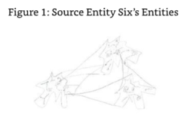

SE6:Perspective is the only word that I/you could use that would give you the understanding you need here.I will describe it in a different way.I can see that you are already receiving the supporting imagery. 

6号源实体：

ME:Yes,I just received the image of a telescope,zooming out to see the image of what I will now call the "outside"large universal entity and then zooming in to see what I will call the "inside" large universal entity.However,I also know that the "inside"large universal entity also has universal entities associated with it "inside"its perspective and that the larger universal entity is similarly associated with another universal entity in "inside"perspective.Phew,this is all very interrelated. 

我：

SE6:Visually that is a good description but energetically it behaves in an altogether different way.Using the perspective analogy,I will explain further.If YOU were the "inside"entity looking out at the "outside"entity,it would look like it was "inside"you. 

6号源实体：

ME:Are you suggesting that there is a distance component to this description? 

我：

SE6:No,it is not distance.It is an effect of the perspective. 

6号源实体：

ME:But to me that is distance.This is bending my mind like a dimensional pretzel! 

我：

SE6:What a good image to use.The pretzel,in some versions,can be considered as a Mobius loop.The effect that you are experiencing/seeing is based upon the interaction of entities when they are nominally based in different levels and locations within the dimensions. Remember that the dimensions in these levels are composite and so are not reliant on the factor of three that you experience in your own environment.In effect the dimensions are blurred together so that there is no demarcation between them.As a result of this "blurring' of the "edges,"an entity can be within and without a,let me say,"dimension within the composite dimension"I will call it a "cimension,"concurrently.The interaction between the entities is such that the cimensions within each of the levels are similarly blurred and relative to the area(volume)of the level and corresponding composite dimension associated with the level of existence being experienced.Everything and every entity is linked in every way as a result,and every entity is reliant on each other for its continued functionality,for they all form the essence of each other on every level.

6号源实体：

ME:So how do they achieve singular experience and evolution if they are interconnected in such a way? 

我：

SE6:They achieve singular experience due to the focus of intention by that part of the entity that is designed to assign the experience to the "packet"of energy that can be identified as a specific entity with known signature and direction. 

6号源实体：

ME:So individuality is based upon a collective set of energies working together in a collectively agreed way and purpose. 

我：

SE6:Yes,but don't forget that because they are all interconnected and related,they are all working on each other's purpose as well. 

6号源实体：

Just when I was starting to understand a little! 

### Basic Functions of the Five Levels Created by SE6 

As usual with my work,I had noticed that I had moved away from my agenda of understanding certain principles surrounding the environment that a Source Entity,in this instance,Source Entity Six,had created in its effort to experience,learn,and evolve.The interlude that described in summary the entity's form or lack of it and the interconnectedness between the entities and their environment had been fascinating,if not mind bending to say the least.The images received were of a most interesting quality.I made a mental note to myself to try to draw what I had seen.I was keen though to press on and gain a greater level of detail than already received on the workings behind the five levels.I decided to tackle each one in order,taking into account that the entities themselves can work in more than one level concurrently and that they can be part of each other in a most integral way dimensionally and functionally.I had a feeling that the "one liners"were nowhere near descriptive enough to allow an understanding of their real meaning. 

ME:In a previous dialogue with you,I was given the basic functions in one line for the levels that you created.I would like to expand on these levels and their functions/opportunities for evolution. 

我：

SE6:We can discuss this if you like.I warn you though,the descriptions will be basic-just enough for you to understand and convey to your"readers"their function.Where possible I might introduce the physics of them.

6号源实体：

ME:That's fine. 

我：

#### Level 1-Basic Existence,Understanding Self,Gaining Sentience 

ME:You described the first level as the level of basic existence and understanding of self and sentience.Can you elaborate on what this level means from an environmental perspective? 

我：

SE6:Remember that each level has its own composite dimension to inflate it and allow its existence and usability,and when an entity has reached a certain level of evolutionary growth,it can re-enter this environment concurrently with the existence within other levels.It does this with a view to experience the wonder of experiencing the "first" awakening process again with the possibility of maybe changing the way it reacted to see if it could have evolved faster as a result. 

6号源实体：

ME:Yes,I do remember. 

我：

SE6:Good.Then note that each of the levels has an energetic functionality that is consistent with the objectives of the environmental level being experienced.In the case of the first level,the energetic functionality is rather basic.In this level the entity is considered to be in the first stage of awakening from being raw energy to being energy with sentience.The first level environment has what you would call a "child lock"function on the entity's ability to command and create from the surrounding energies it finds itself in.In essence all that the entity can do is exist and experience its "self"and the others that are also within this level. 

6号源实体：

The energies in this level are subtle and supportive of the newly awakened entity,providing it with all its basic needs. 

ME:What needs would those be? 

我：

SE6:At this point the entity is not self-supporting in the generation of its own energies- those needed to continue its own existence. 

6号源实体：

ME:It needs food? 

我：

SE6:In a figure of speech,yes,but not food in the sense that you are considering.Let us consider one of the most sentient beings on your planet as an example,the dolphin in its physical state.As a mammal,when the dolphin is first born,it needs to breathe.This is the most critical part of its short existence in separation from its mother.The female dolphins assist the newborn to the surface of the sea to help it take its first breath.In the time taken to move/be moved from its location of birth to the surface,it learns the fundamentals of controlling its physical body and the rudimentary method of communication used by the females that surround it. 

6号源实体：

ME:It's that fast? 

我：

SE6:It's that fast.It's a similar process for the newly awakened energies that form the entity in the first level with the exception that it does not need to rise to the surface,and it does not need to breathe air.It does,however,need to be able to use the energies around it,integrate them into its own volume,and further integrate itself into the energies that exist within the composite dimension that is Level 1. 

6号源实体：

ME:I have a sudden feeling that they have to do this because if they don't,they get rejected by the energies that make up Level 1.Why would I be receiving this sort of information?Ifind it strange that the energies in the level would reject an entity that it is designed to support. 

我：

SE6:It is not in the slightest bit strange.The need to be part of the level they are working with is a fundamental function that they have to do in all aspects of their existence.It is the equivalent of the dolphin's need to learn to breathe air and communicate with its female helpers.In this instance,the entity is learning,understanding,and applying the basis for its existence and evolution-integration.It is an important lesson that needs to be learned and understood from the very onset of awakening,for it sustains its very being.You will notice from the previous dialogue that the entities work with and integrate with several levels at the same time,including with each other in a major/macro and minor/micro sense.So the need to integrate with the energies of the level that they find themselves upon awakening is an immediate and urgent requirement.Failure to do so within a specific period results in the energies of the level rejecting the entity as a non-entity,a virus if you like.The speed of integration with the energies of the environment determines the potential speed of evolution of an entity.If you like,it determines how steep the evolution curve is going to be. The steeper the curve,the faster the evolution,and the shorter the time for re-integration with me.This is similar in your Source Entity's environment,for the highly evolved entities can and do have the opportunity to become one with their Source. 

6号源实体：

ME:So the basis of basic existence in this example is the full and complete integration of the entity with the energies of the environment they are within. 

我：

SE6:Correct. 

6号源实体：

ME:Sounds like it's a very short lesson. 

我：

SE6:It doesn't finish there. 

6号源实体：

ME:Ah,I didn't see that coming. 

我：

SE6:Oh yes,you did. 

6号源实体：

ME:You got me. 

我：

SE6:Once integrated into the environmental energies of the level,they have to prove that they are in control of those energies.They must learn to define the difference between the environmental energies that are part of them and those that are part of the environment, including those that are integrated and de-integrated in a transient fashion.This is the road to the true understanding of self which is a pre-requisite to sentience. 

6号源实体：

ME:So it's like a very basic environment where the entity is allowed to develop its most basic autonomous and mental faculties,so to speak. 

我：

SE6:Correct.The innate knowledge about the need to integrate-you might call it instinct -is accelerated by the even more innate knowledge that lack of integration results in rejection.Level 1 is,therefore,like being in kindergarten (nursery school)where an entity learns,experiences,and evolves on the most basic levels.Recognition of this by the entity is the key to sentience. 

6号源实体：

#### Level 2-Self-Realization 

ME:You described Level 2 as the level of self-realization and awareness of your greater reality. Can you elaborate further because in my mind this is very similar to Level 1's evolutionary opportunities? 

我：

SE6:It appears to be similar,but in actuality it is not.If you were to look at the basic descriptions of Level 1 and Level 2,you should notice a familiar similarity with your own environment.Level 1 is where most of humankind is currently,and Level 2 is where some of you are evolving toward or are currently evolved at.Your current "incarnate"state classifies as being within Level 2,but energetically you are much further.Full self-realization and full awareness via constant experience would put an entity in your environment at the end of Level 2's evolutionary opportunities,with entities at this level knocking on the door of level 3 if you were following them in sequence,that is. 

6号源实体：

ME:That's a good comparison,thank you.How does that translate into what you expect your entities to be experiencing? 

我：

SE6:The answer to that question is as simple as your own,but I will elaborate because as you have experienced in one of our previous dialogues,my entities cannot in reality be compared to your humankind. 

6号源实体：

ME:Please carry on.

我：

SE6:Self-realization for my entities is a significant step on the evolutionary ladder.Once they have progressed from Level 1 to Level 2,they are considered to be autonomous units of energy,working together with other entities and those energies they find themselves existing within.Self-realization is the absolute knowledge and constant understanding on a very deep down,personal experiential level.It is not a theory or a discussion between entities or even a belief system.It is a working everyday experience where the entity knows and works with the experiences it is having that are outside its normal level of understanding,which would be recognition of self and its environment and contemporaries.A self-realized entity recognizes that it is part of something much bigger than it is currently aware of to the point that its individual experience is enhanced to encompass the greater reality that it was either previously not aware of or chose to ignore for some reason.With my entities,that level of self-realization is the understanding and experiential experience of the way they can be part of other entities in a micro-universal sense or have other entities existing with and within them as part of their micro-universal condition-themselves being the macro-universal entities.Continued development of self- realization results in the entities recognizing that there is a link between some of the entities they are working with and a greater reality.That greater reality at first is the recognition that these "interfacing"entities don't exist in their entirety within the environment supported by the level they are currently working within.Indeed,they are only within the level that they first recognized as the environment that they were existing within in a reduced sense- that is,there is more to the entity,and that it is somewhere else:in another level. 

6号源实体：

Know this:

There is a vast difference in the evolutionary level of an entity that intellectually recognizes the "fact"that there are different levels of existence and different ways of which it as an autonomous entity can be integrated with other entities and one where the entity knows both intellectually and experientially that these levels exist.In fact,they exist in an integrated,autonomous way with their fellow entities and can work and manipulate the energies that are either part of the entity or level that they are part of to enhance their own experience quotient and evolution. 

This is the difference between the novice and the master,the chela and the guru.When the chela has reached the master stage and the guru is close to or is a mahavatar,it is time for the mahavatar to be elevated to the next level to be a chela again-albeit one of a much evolved level but nevertheless a beginner at the new level it has ascended to,which in this instance would be Level 3. 

ME:My understanding is that an entity that was considered to be a mahavatar was one that was in constant communion with Christ and his/its energies. 

我：

SE6:That is an analogy that works well in your plane of existence.In my environments I would suggest that the mahavatar is an entity that is both aware of the master/guru level and is in frequent or constant dialogue with me (mahavatar level)while on the verge of "universal"creativity.The level of creativity of the mahavatar in your environment is limited to localized creativity,on what you would call the planetary scale.When my entities reach this level of attainment,they are capable of creating vast macro/micro-universes of their own that are interspersed with those universes that are both created by their counterparts and are part of or the whole of themselves.They do this because they are from your perspective universal in nature,volume,and ability.Your own universe created by your Source Entity is an entity in its own right and has its own evolution to consider when working with the smaller entities,such as yourself. 

6号源实体：

ME:Yes.I am aware of that.The Source Entity of my multi-verse discussed this with me in one of my previous dialogues in The History of God:a story of the beginning of everything.We even discussed the hierarchy of the universe,galaxy,solar system,and planetary systems as a physical and energetic function of its creation. 

我：

SE6:Good,then note that the entities in my environment do not create such hierarchies per se as they each perform that role themselves within and without each other's boundaries.As we discussed before,they are universal in nature and in creation. 

6号源实体：

I felt that we had exhausted the dialogue on this particular level,and,as a result,decided that it was time to move on to Level 3.Although,in the back of my mind I did feel that in this particular instance of self-realization and awareness,it was uncannily close to the description that a number of notable spiritual movements use.Maybe it was universal?I decided to ask this one last question whilst in the discussion about Level 2 and its functions in the evolutionary toolbox. 

ME:This all sounds too familiar to me.It's as if it is a standard or a constant. 

我：

SE6:Well perceived.Just as the need to evolve is a constant desire within the framework of all the Origin's creations,so is the need to be in an initial position of so-called ignorance. Striving to be self-aware of position and relationship with the absolute and the creator,the Origin,is a necessary and fundamental route to accelerated evolution.This is why your Source Entity created your physical universe in the frequencies and dimensions it is-in order to experiment in accelerated evolution through the realization of self as a progression from ignorance in the harshest possible environment. 

6号源实体：

#### Level 3-Creativity 

ME:As you previously mentioned,Level 3 is the level of creativity.This sounds like a very important level to me as creativity is one of the precursors to evolution. 

我：

SE6:Correct.To be creative is quite possibly the most important task that an entity can do.Through creativity an entity learns how to be responsible for the energies used in the creative process and to maximize the experiential opportunities that result from what has been created.Creativity and the experience associated with creativity is what existence is all about. 

6号源实体：

ME:Creativity is a big subject to discuss and can lead us anywhere,but what I would like to understand is what area of creativity your entities specialize in and their intention in the learning and subsequent evolutionary opportunity presented to the entity who exists and works within Level 3. 

我：

SE6:That is more than one question. 

6号源实体：

ME:Yes,it is isn't it? 

我：

SE6:O.K.,let's work with it.Level 3 is in existence to provide the entity with all the necessary tools and energies to allow it to reach its maximum potential as a creative entity.Creativity though is not just about making objects or beings.It is about the creation of a framework or a road map in whatever form required to illustrate the possibilities for experience,growth and subsequent evolution of an entity as it approaches the point of opportunity.It is like a sign post along the way,saying,"Come here!Experience this!Evolve in this way!" 

6号源实体：

ME:So how do your entities do this? 

我：

SE6:They have the ability to inflate themselves dimensionally,creating their own inter- dimensionality whilst in a composite dimensional environment. 

6号源实体：

ME:And that is the way they create? 

我：

SE6:Absolutely.You see,they are in an environment that is constrained to a single composite dimension;it is limiting.The opportunity that presents itself here is for my entities to use their natural abilities to expand the environment presented to them in Level 3 by increasing the number of dimensions from one to as many as they want.This requires the entity to work with its peers on a most fundamental and personal level in a way that benefits all rather than the entity that is creating the opportunity for the new dimensional environment.The image you saw where the entities are within and without each other dimensionally illustrates this. 

6号源实体：

When an entity decides to enter into an agreement to work in this way with another entity,it opens up the possibilities for other entities to experience,create,and evolve in an alternative series of dimensions from that offered by Level 3 and the dimensions and environmental constructs offered by other partnerships. 

ME:I just saw an interesting image of clusters of entities working together in this way and then setting up an opportunity where the clusters of entities work with each other creating a multiple in excess of the sum of those dimensions already created by them as independent clusters. It's almost as if each cluster of ten individual entities created the opportunity for ten new dimensional environments,which could be in both the macro and micro scaling.Then adding them together does not create 10+10 dimensions but 10x10 dimensions-that's 100. 

我：

SE6:Interesting,isn't it.A similar calculation is used to identify the useable dimensions available in your own environment,but those have been created for you by your Source Entity.In this example,the two clusters work through individual interactions of the entities, group interaction and intergroup interaction.Can you see the evolutionary opportunities presented here? 

6号源实体：

ME:Let me see.One of the most important lessons I have learnt in my own environment is the ability to work together with someone or something without the need to get something in return -to give myself and/or my services gladly and freely whilst and when I can on a equal level with them,not in competition with them,sharing with them what I have and what I know so that they may learn,experience,and evolve.If this results in them evolving at a faster rate than me,thenI will have been of true service.In doing this I work with people on a most intimate level,the level of full trust and acceptance.When I articulate the feeling Iget when I work in this way,they want to experience it themselves.It's wonderful.This is what humanity should be doing-not trying to out-do each other.Being external to the competitive state is so liberating. 

我：

SE6:Well done.Simply put,creating the opportunity to work together for the individual and collective good-that good being experience and evolution-is one of the most creative things an entity can achieve,which leads on to the fourth level.We are due to discuss Level 4 later.

6号源实体：

Within each of the entities themselves is the ability to create whole universes within each of the dimensions that they create.They themselves are universal in volume,energy,and ability.This allows them unfathomable levels of creative opportunities,which in linking themselves together dimensionally magnifies the opportunity.The interdependencies required to create,sustain,and improve the environments created by these opportunities are far beyond the opportunities you have available to you.Even so,on a micro scale you have similar opportunities that are in keeping with how you have been created and the limitations of the environments you are designed to exist within.Part of the creativity process allows my entities to also create smaller environments and entities if they so wish. It is the level of responsibility required to maintain these entities and their environments whilst also working on their own level of interaction with their group members and intergroup members that permits them to grow and evolve as potential Source Entities in their own right. 

ME:Hold on a minute.Are you suggesting that your levels are a school for budding Source Entities? 

我：

SE6:I would have thought that that was obvious from the size of them and what they can do. 

6号源实体：

ME:Fine,but they are not able to be Source Entities outside of your environment,are they? 

我：

SE6:Not currently,but they will. 

6号源实体：

My mind went back to the conversation with Source Entity Five and the ultimate plan of the Origin.All entities are destined to be free of their Source Entities and at this point every thing and every entity will ascend to a level of evolution above and beyond what is currently possible,even by the Origin.I wondered what will happen to these smaller Source Entities, the Source Entities of Source Entity Six. 

SE6:Oh,they are destined to create the framework for the next level of evolution.You might want to chat to the Origin about it. 

6号源实体：

I thought further ahead to the work I will be doing after these dialogues,to the communications that will create "The Origin Speaks."That is going to be interesting. I mentally filed that thought and moved on to the next level in Source Entity Six's environment,Level 4. 

#### Level 4-Learning Discrimination in the Creativity Process 

ME:Let's move on to the next level then.In our previous dialogue on this subject,Level 4 is the recognition of creativity for evolutionary purposes.This looks a bit self-explanatory to me.Isn't being creative the route to certain evolution? 

我：

SE6:You would think so,but this is definitely not the case.Although creativity is one of the pre-requisites for evolutionary progression,it is also one that can result in a reduction in evolutionary progression if used incorrectly. 

6号源实体：

ME:I wasn't aware that at an energetic level creativity was anything else but educational and evolutional. 

我：

SE6:Within the energetic level it is;however,within the physical realms that you inhabit, creativity can be used for detrimental purposes.it can also be used incorrectly on the energetic levels,resulting in devolution.We will discuss this later.Right now I will advise you on the reasons for the creation of Level 4.

6号源实体：

As I stated earlier,Level 4 is for the RECOGNITION of creativity for evolutionary purposes. It is the word "recognition"that I will focus on,as that is the reason for Level 4's existence. Any entity can create,and my entities are no exception to this rule,for creativity is one of the main functions given to us by the Origin.On Level 3 my entities learn about how to create and use creation for creating experiential opportunities.I described this in the last dialogue. What I have here is a level where the entity can experiment with the level and intention of its creativity to understand and recognize what creativity really is,and how it can affect its evolutionary opportunities and the entities that participate in their creations.As I said before,creativity is not only for creating what you would call positive evolution,it can also be used for negative evolution or devolution. 

ME:I thought devolution was pretty much impossible as everything we experience,whether we call it good or bad,results in our evolution. 

我：

SE6:No,it's very much alive and well,especially in the lower energetic realms.Your own race experiences it on a regular basis.You call it karma. 

6号源实体：

ME:But I thought that karma and evolution are mutually exclusive. 

我：

SE6:They are,but karma should really be classified as evolution associated with that part of you that is experiencing the physical levels.It is relative only to your incarnate energies.It can also be called "minor evolution"with the "major evolution"being that which the whole of your energies,YOU,accrue. 

6号源实体：

ME:Are you suggesting that evolution is split into separate parts-those parts being associated with those energies that are specific to a certain part of us that is experiencing existence in separation from the whole?That would mean that if we as energetic beings split off,say,twelve segments of our"selves"to experience existence and the various influences that the environments those existences have to offer,then we could potentially gain twelve separate packages of karma to deal with as part of our wholistic (referring to the "whole"of us)evolution.Each of those separate packages of karma may either add to or remove evolutionary progression,resulting in an average level of evolutionary progression. 

我：

SE6:Correct.The opportunity presented to my entities in Level 4,therefore,is to be able to experiment in the creativity process and see what happens when so-called negative creativity is used in the creation process. 

6号源实体：

ME:So what experiments do they perform to promote their recognition of the possibility that certain types of creativity can result in evolution vs.devolution? 

我：

SE6:They create environments and entities without the use of their previous experience and the experience/common knowledge of their collective memory.Remember they can be in a position where they have already passed through this level before but may be re- experiencing it for"improvement of experience"purposes.In order for them to make the sort of creative mistakes that allow them to learn that certain types of evolution occur with certain types of creativity,they need to either enlist willing entities of their own evolutionary level or create a universal environment within their own energetic boundary to support a group of entities created specifically for the experiment in creativity.They then create that which they want to create and allow those entities who want to be involved in the experimental process to become exposed to the creation,whether it be an environment, entity,energy,or intention.If you also consider that involvement in such an experiment will only result in a "positive"level of evolution for those entities willing to participate (they are shielded from the possible effects of devolution even though they experience the devolutionary effects whilst the experiment is running),you reach a win-win condition where the creating entity can create what it likes and record the outcomes.The participating entities evolve in the process,irrespective of the evolutionary classification resulting from the outcome of the creativity experiment.The experiment's outcome is the recognition of the actions in the creativity process that can,could or will result in the evolution of the participating entities if they participate in the opportunities offered by that which has been created.Additional to this is the recognition of the actions in the creativity process that can, could,or will result in the devolution of the participating entities.In my environments,and I would expect in your own Source Entity's environments as well,creativity is an art that needs to be constantly refined to support the maximum evolutionary capability of what is being created,especially when an entity offers up the creation for use by its peers. 

6号源实体：

So in summary,Level 4 is used not only for the recognition of creativity for evolutionary purposes but for devolutionary purposes.The major lesson here is the discrimination of creativity processes to recognize and select only those that result in positive evolutionary opportunities even when the potential experience could be classified as negative to the entity experiencing the creation. 

ME:If it's that much of an art form to get it right how did you get it right? 

我：

SE6:I didn't and I don't.This is the big issue with creativity.Ultimate levels of creativity can create ultimate levels of evolution or devolution.The trick is to understand the rules surrounding the creativity of creation that results only in positive evolutionary opportunities. 

6号源实体：

ME:Hold on.Creativity is created? 

我：

SE6:Yes,even creativity is created. 

6号源实体：

ME:How is that done? 

我：

SE6:With great care,thought,and consideration. 

6号源实体：

ME:You are fooling with me. 

我：

SE6:Not in the slightest.You see,an entity has to experience creativity before it is allowed to be a creator.Creativity is,therefore,created as a natural function of an entity's growth.More frequently though,it is a function manifested by the entity that is fully in control of the power it has and uses it with love and wisdom.Once an entity has mastered its power and uses it in love and wisdom,its creative function is switched on.It's a sort of coming of age. 

6号源实体：

#### Level 5-Evolutionary Experience Through Self-denial(A Prelude to Level 6) 

ME:Let's move on to the next and final level that you created-the level of evolutionary experience through self-denial,the ultimate sacrifice.This sounds a bit Christ-like to me. 

我：

SE6:The reference is valid to a certain extent although in this instance it does not rely upon the ultimate sacrifice of self-destruction for the perpetuation of others. 

6号源实体：

ME:I thought that was the ultimate sacrifice? 

我：

SE6:It is,but it is not the basis for the function of this level of existence.If you were to observe the text you have just typed,you will notice that it is the use of"self-denial"to create the evolutionary experience and not"self-destruction."

6号源实体：

ME:Touché. I had better let you get on with the description of Level 5 then. 

我：

SE6:That would be a good strategy. 

6号源实体：

ME:Looking at the way your "universe"-sized entities exist and work,I would have thought that they pretty much fulfil the requirements of Level 5 by default? 

我：

SE6:Not entirely.You see,whilst they are working within and without each other in the other levels,they are working towards their own evolution through the medium of experience in a normal and progressive way.In Level 5 the expectation is that they sacrifice their own evolution for the betterment of their peers. 

6号源实体：

ME:How do they do this? 

我：

SE6:By becoming an environment for the evolution of others.They do this without the prerequisite of needing to self-evolve as a result.They are available solely for the use and evolution of others.For a period (of time),they give up their own evolutionary plans and desires for evolution.They are being"of service"in a most fundamental way.Of course,they evolve as a result of such sacrifice,but they are unaware of this "evolutionary bonus"because I keep this from them.None of them realize that they benefit from being and working in Level 5.If they did,it would not serve its purpose. 

6号源实体：

ME:How many entities are currently in Level 5? 

我：

SE6:One. 

6号源实体：

ME:One,only one? 

我：

SE6:Yes,only one.There can only ever be one.

6号源实体：

ME:Why is that? 

我：

SE6:Simply because Level 5 is created from that entity that wishes to work on Level 5. 

6号源实体：

ME:What?Are you saying that,in actuality,Level 5 does not exist-that it's a virtual level? 

我：

SE6:That is exactly what I am saying. 

6号源实体：

ME:But that's a...conundrum! 

我：

SE6:Let me explain further.To date I have only ever had one entity achieve Level 5. 

6号源实体：

ME:And don't tell me-that entity is currently supporting the Level 5 environment. 

我：

SE6:Correct.More importantly though,Level 5 is the level that supports the existence of all the other levels used for the experience and personal evolution of my entities. 

6号源实体：

ME:This is starting to become very convoluted.Is everything about you and your entities convoluted? 

我：

SE6:From your perspective you might say so,yes.From my perspective,it's not. 

6号源实体：

I had the impression that Source Entity Six was smiling.It was the sort of smile that a teacher has when the student finally starts to understand what is being conveyed.My understanding,though,would be very rudimentary and high level with no depth.I don't believe I could get any deeper into the mechanics of how all this was working.Everything about Source Entity Six appeared to be convoluted to the extreme with universal entities within and without each other creating environments for each other to exist and evolve within and without.Now I was being told that this within-and without-ness was continued by the creation of Level 5 as a function of an entity's desire to "give itself up"for the betterment of others by being an environment for ALL of them to exist within and without. 

I could see it now;the entities could exist within each of the levels below Level 5 simultaneously.Their awareness of being in one of these levels for a second,third or more times was unlimited so that they are able to work out similar experiences with the opportunity to improve upon their actions and responses to situations they created or found themselves in.When one of them is evolved enough to progress to Level 5-i.e.,they would not evolve any further by continuing to use the opportunities offered by Levels 1-4-and to date there has only ever been one entity to progress in its evolution to the point where it could be capable of being elevated to the Level 5 opportunity,it is advised by Source Entity Six that it does this for the evolution of its peers and that there is no benefit to itself.Its choice to progress to and become Level 5 is based upon pure selflessness.It is the mark of an entity that is capable of being a truly benevolent creator.One who expects nothing in return is a universally desirable trait and being prepared to arrest its own evolution for the betterment of others is true self-denial.Level 5 is not only the peak of evolution in Source Entity Six's environment,it is the environment where all the other levels exist within in all its composite dimensionality. 

That was it!That was the reason for the composite dimensionality.(It had been bugging me for some time.)It was because the whole environment was created by that one entity that had attained enough evolution to allow it to be autonomous,to be Level 5.As a result,its dimensionality was constrained to what it was,a single universal entity stretched to its very limit to allow the existence of the other levels and the entities within it.Indeed,Level 5 was the ultimate sacrifice.In doing so,the entity was almost equal to Source Entity Six in stature. 

SE6:Very well done.I was not sure that you would be expansive enough to understand. 

6号源实体：

ME:I am flabbergasted,to say the least.I have to say that I didn't see that one coming. 

我：

SE6:You almost missed it. 

6号源实体：

ME:Yes,even now I am receiving images to help to understand further.The entity that has attained/elected to be Level 5 is expansive on an enormous scale.I get the impression that has had to swell itself to a size similar to you but within you.You are like two bubbles,one inside the other, with the outside skin of the inside bubble all but touching the inside skin of the outside bubble. 

我：

SE6:Correct.There is very little volume left in me for my self,but that is my sacrifice.In effect,I am Level 6. 

6号源实体：

ME:No,no,don't confuse me. 

我：

SE6:I have to be the next level (six)in order to house the entity that is Level 5.It is logical. 

6号源实体：

ME:And you don't have anything that is without?I know you have everything within. 

我：

SE6:The only thing that is without is the Origin.I might call it Level 7...if you like? 

6号源实体：

ME:No,the Origin is fine. 

我：

SE6:Now you have my secret.You may go.You are released. 

6号源实体：

And Source Entity Six was gone.I sat at my computer with a head so full of images(to back up these few words of understanding)that I felt I was on a different level as well.I was fit to burst.

I was stunned.

I sat at my computer and meditated for a moment.At this point I was half way through my dialogues with the children of the Origin,the Source Entities.Including our own Source Entity,I had been in contact with six to date.It had taken eighteen months.I have to admit to being more than a little tired.The energies used to both make and maintain the link with these entities were subtle and extremely high frequency,which for a low frequency (in comparison)entity such as myself,was demanding to maintain.The link never actually diminished though.As long as I needed to continue the dialogue,I was in some sort of contact with the Source Entity concerned,which included concurrent links with my own Source Entity.This I feel,was necessary as some of the channeled information and concepts often felt like they took a number of days to come down to my level and be translated within my brain into something that could be used in discussion.I was contemplating this further when my own Source Entity had a few words to say. 

SE:You need to keep the ball rolling. 

源实体：

ME:What do you mean? 

我：

SE:Its time to get this information out into the public domain.You should continue these dialogues with a"Part Two"to this book,this one being"Part One." 

源实体：

ME:Is that wise?Surely the information should stay together in one book? 

我：

SE:It would be too big and too hard to read in one go.The information within this book needs to be available now because the time is right.Also,you need a break from the concentration of using energies that your physical body is not designed to be exposed to. 

源实体：

ME:Would that explain why I am getting creaky joints that pop and bang all of a sudden?Or am I just getting old? 

我：

SE:Your frequency level has been elevated as a result of these dialogues,but the speed of elevation has been rapid,not at the same speed as you would normally be experiencing,even with the ascension being as close as it is. 

源实体：

ME:So how will I cope with the dialogues that I plan to have exclusively with the Origin? 

我：

The Origin answered. 

O:That will not be a problem,for you are linked to me via your Source Entity.I created your Source Entity,and your Source Entity created you.It is a clear lineage.When you communicate with the other Source Entities,you are not within the clear line of lineage and are energetically out of phase as a result.I believe this was explained to you in some way during the start of these dialogues. 

起源：

I looked back at the manuscript;indeed,it was explained to me by my own Source Entity.I checked out the way I felt as I started my first dialogue with Source Entity Two.I felt like I was rubbing my head up and down the bark of an oak tree. 

O:You will not experience any difficulty communicating with me.Indeed,have you ever experienced any difficulty in communicating with me once you established your method of rising up to the levels necessary to affect a clear unbroken link? 

起源：

ME:You're right.I haven't. 

我：

O:Correct.Now you need to rest for a while and allow your energies to re-group,for the next six Source Entities will be more demanding than the last.

起源：

ME:Now that's what I call encouragement. 

我：

O:As you are aware,each of the Source Entities has its own resonant frequency.Your Source Entity has been working with you in the background to help maintain your connectivity and energy levels,and more importantly,your resilience.The first six were chosen for their closeness in frequency to your own Source Entity,each Source having a resonant frequency slightly further away than the previous one.The next six will be progressively further away. 

起源：

ME:I have just received an image of me being let out on a lead/rope,like a diver diving under ice.

我：

O:That is a good analogy.The further away you get from your home frequencies,the more alien the environment and the harder it is to get back-hence,the need for the rope being used to let you out slowly,Source Entity by Source Entity.When you finish the dialogues in the second book,you will be right out of your territory frequency-wise.You will truly have been where no man,of hu-man kind that is,has been before. 

起源：

ME:I can't wait!

我：

## Afterword 

To say this has been a difficult piece of work to channel would be an understatement(I believe I used the word "easy"somewhere,what a lie!),but I guess that's what gives it its validation.With The History of God I felt comfortable with the information that was being channeled through me.It had a homey feeling about it that was undoubtedly due to the fact that I was only dealing with entities within my Source Entity's multiversal environment and the associated frequencies.As the Origin explained to me in the final paragraphs of the last chapter,the creative energy/frequency lineage was pure.Dialogue with the Origin,the Source Entity,and me is,therefore,easier than the dialogues with the other Source Entities simply because they are of a differing energy/frequency lineage than I am.Had I been created by Source Entity Three,for instance,I would have had a harder time communicating with Source Entity One and an easier time communicating with Source Entity Three and so on.As a result,I am aware that the next series of dialogues with Source Entities Seven through Twelve will be progressively harder.In fact,I have been told it will be in the former text. 

I feel though that I am up for the challenge and that the dialogues are a necessary part of awakening humankind's awareness of the possibility that beyond God (our Source Entity) is the very real greater reality that our God was,indeed,created by the greater God,the Absolute,the Origin.

I am fully aware that the information I received during these dialogues has not even scratched the surface of any of the Source Entities,their environments,or the creations that populate their environments,including our own.As a result,I fully welcome any additional information from other channeled sources that helps with both finding the individual parts of the jigsaw that form the greater picture and putting them in the right place.As such, I now recognize that one of my major roles in this physicality is to help in some small way to assemble this picture and progress our collective knowledge,elevating us from this frequency we call the physical universe,returning us to our heritage of higher frequency, self-realized,all knowing,creative,and evolved existence. 

I therefore give this message to the readers of this book. 

If you believe deep down that these dialogues represent some part,no matter how small, of the greater reality,then you now know what I know and are opening the doors of awareness/self-realization and are,therefore,personally contributing to the effort to elevate the frequencies of Earth and its surrounding universe. 

Your reading this book helps to do this. 

For this I thank you. 

Guy Steven Needler 

16th March 2011

## Glossary 

**Accurate "to boot"** - An English way of saying an affirmative "as well" 

**Black Hole** - A spiritual explanation is that a black hole is a small galaxy whose role is to collect lower frequency material into one place-within itself. 

**Cast-outs** - Entities from Source Entity Two's environment that are ejected from a group association due to underperformance or the entity outgrowing the group. 

**Chela** - The disciple of a religious teacher. 

**Cimension** - A single dimension that has all the faculties of the first three lower dimensions we call up,down,left,right,forwards and backwards(3D),including other dimensions, without them needing to be singularly represented. 

**Coadunate** - A collective state where a group of collectives are congregated together as a larger collective. 

**Fluidic Space** - Space that is constantly changing in every way,from dimension to frequency. 

**Guru** - A religious teacher or spiritual guide. 

**Hit the ground running** - To start something new without the need to learn first. 

**Light Particle** - A particle of light is known as a photon.A photon travels at the speed of 186,000 miles per second.The theoretical particle,the tachyon,is supposed to travel faster than the speed of light. 

**Loci/Locus** - The center or source of an object/entity.Mathematically speaking,it is the set of all points or lines that satisfy a given requirement.In Source Entity Three's environment it represents the location of the majority of the entities concerned. 

**Magnetosphere** - The outer region of a planet where the magnetic field of the planet controls the motion of certain charged particles. 

**Mahavatar** - A divine incarnation.An entity that is incarnate with all memory of its energetic self,together with fully functioning energetic abilities. 

**Master** - One who has mastered his/her subject matter. 

**Multipolous** - A multiple of a multiple of a multiple.For instance X cubed,cubed,cubed (X3,3,3). 

**Nova** - A star that increases in brightness by many thousands of times its usual brightness, gradually fading to its original brightness.The last stages of the life of that star. 

**Pit Prop** - A pole to reinforce the structure of a roof within a mine. 

**Pure of Heart** - A lack of error in a creative condition. 

**SCUBA** - An acronym for Self Contained Underwater Breathing Apparatus. 

**Self-realization** - The function of being in full command of all our faculties as an energetic being whilst in the physical. 

**Spliced Undulation of Dimension** - One or more dimensions linked together as a result of them being close together or overlapping in some part of their areas. 

**Stickle Brick** - A child's building block similar to a Lego block but with spikes to join them together-like a Bristle Block.

**Supernova** - An exploding star caused by gravitational collapse. 

**The Big Bang** - The current popular scientific explanation of how the universe started.The Source Entity stated in earlier dialogues with me that it was far from the truth-that it simply created our multiverse and,as such,it "winked"directly into existence.Whether this created a big bang is unclear from my dialogues.

**The Grahoopnik** - A race of entities that exist within the hearts of stars.Their existence depletes the stars'energies.Their leaving sometimes causes the star to go nova or supernova. 

**The speed of light** - The speed of light is currently understood as being 186,000 miles per second.

## About the author 

Guy Needler Guy Needler MBA,MSc,CEng,MIET,MCMA initially trained as a mechanical engineer and quickly progressed on to be a chartered electrical and electronics engineer.However,throughout this earthly training he was always aware of the greater reality being around him,catching glimpses of the worlds of spirit.This resulted in a period from his teenage to early twenties where he revelled in the spiritual texts of the day and meditated intensively.Being subsequently told by his guides to focus on his earthly contribution for a period he scaled this back the intensity of spiritual work until his late thirties where he was re-awakened to his spiritual roles.The next six years saw him gaining his Reiki Master and a four year commitment to learn energy and vibrational therapy techniques from Helen Stott,a direct student of the Barbara Brennan School of HealingTM,which also included a personal development undertaking(including psychotherapy)as a course prerequisite using the PathworkTM methodology described by Susan Thesenga with further methodologies by Donovan Thesenga,John and Eva Pierrakos.His training and experience in energy based therapies have resulted in him being a member of the Complementary Medical Association(MCMA). 

Along with his healing abilities his spiritual associations include being able to channel information from spirit including constant contact with other entities within our multiverse and his higher self and guides.It is the channelling that has resulted in The History of God,Beyond the Source and is producing further work. 

As a method of grounding Guy practises and teaches Aikido.He is a sth Dan National Coach with 30 years experience and is currently working on the use of spiritual energy within the physical side of the art. 

Guy welcomes questions on the subject of spiritual physics and who and what God is. 

Website: www.guystevenneedler.com 

Email: beyondthesource@btinternet.com