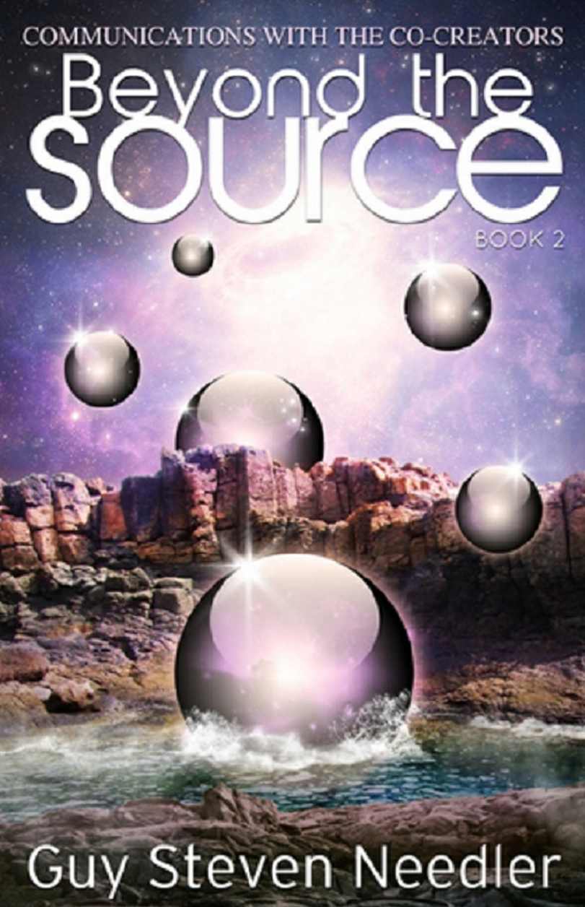

---

**Beyond the Source Book 2: Communication with the Co-Creators Continues** 

**超越源头2：与共同创造者的交流继续**

Guy Steven Needler

盖伊·斯蒂文·尼德勒

---

## Table of Contents 

- Introduction 
    - Continued Communications with the Origin's Twelve Source Entities 
- Chapter One 
    - An Introduction to Source Entity Seven 
- Chapter Two 
    - Source Entity Eight 
- Chapter Three 
    - Source Entity Nine
- Chapter Four 
    - Source Entity Ten-A Kick Start! 
- Chapter Five 
    - Source Entity Eleven 
- Chapter Six 
    - Source Entity Twelve Awakens 
- Chapter Seven 
    - In Closure 
- Glossary 
- About the Author

---

For my dear wife Anne Elizabeth Milner Now "Ascended" 

(10th April 1957 - 24th December 2012)

献给我亲爱的妻子安妮·伊丽莎白·米尔纳 现已“提升”

(1957年4月10日-2012年12月24日)

---

## Introduction - Continued Communications with the Origin's Twelve Source Entities 

**引言：与起源的12个源实体的持续交流**

In *The History of God-A Channelled Work*, I gave readers insights into how I started my higher level communications and managed to communicate with spiritual/energetic entities whilst gaining insights into the wonders all around us and the truth about our legends and myths.Through channelling,I also started my identification with The Origin and learned that The Origin created twelve Source Entities.The Origin and one of the Source Entities explained what The Origin is and the mechanics of the universe created by one of The Origin's creations,our Source Entity. 

在《源头简史》中，我向读者介绍了我是如何开始我的更高层次的交流，并设法与精神/能量实体进行交流的，同时深入了解我们周围的奇迹以及我们传说和神话的真相。通过通灵，我也开始了与起源的认同，并了解到起源创造了12个源实体。起源和其中一个源实体解释了起源是什么，以及由起源的创造物之一，我们的源实体创造的宇宙机制。

In the next book Beyond the Source,I continued my dialogue with our universe's Source Entity and commenced dialogue with the first six Source Entities-those that were closer energetically,so to speak,to my own energies.In Beyond the Source I gained insights into the wonders and workings of the multiverses created or not,as the case may be,by the first six Source Entities.I learned what entities inhabited their multiverses and how the multiverses and,indeed,the Source Entities themselves,were constructed. 

在下一本书《超越源头》中，我继续与我们宇宙的源实体进行对话，并开始与前6个源实体进行对话，可以说，这些源实体在能量上更接近我自己的能量。在《超越源头》中，我深入了解了奇迹和工作原理，以及前6个源实体创造或不创造的多维宇宙。我了解到了居住在多维宇宙中的实体是什么，以及多维宇宙，以及源实体本身是如何构建的。

If you've read these two books,then you will be delighted to know that this book,Beyond the Source Book 2,concludes those dialogues by focusing on Source Entities Seven through Twelve.In doing so,I was taken to the very edge of my capabilities! 

我认为，在我们周围的宇宙中，我们应该学会如何与源实体进行交流。如果你已经读过这两本书，那么你会很高兴地知道这本书，《超越源头2》，通过关注源实体7到12来结束这些对话。这样做，我被带到了我能力的边缘！

To say that this was a difficult book to channel would be an understatement.There were times when I wondered whether I was capable of dealing with the information I was receiving and whether I would be able to put it into words that would be understandable without losing the essence of that information offered to me.There were other times when the amount of information I was receiving was so diverse that I had to stop and re-calibrate my own abilities to allow the state of "cosmic knowing"to take over so I could step up a level,take in the vista of a new and bigger picture and accept that I was expansive -capable of being stretched beyond what I felt was my elastic limit.Over and over this happened.In hindsight,the headaches,bags under the eyes and stress of needing to deliver the information resulting from this dialogue was more than worth it-even though I questioned my sanity more than a dozen times whilst in the "thick of it."The world needs to know this information.My dear wife,Anne,has been fantastic in this respect,providing words of encouragement whilst editing text and ensuring I took some essential "down time."Additionally,encouragement from Dolores,Julia and the team at Ozark has been both timely and very well received;for this,I am truly grateful. 

要说这是一本很难通灵的书将是一个保守的说法。有几次当我怀疑我是否有能力处理我正在接收的信息，以及我是否能够把它用可以理解的语言表达出来，而不失去提供给我的信息的本质。还有其他一些时候，当我接收到的信息量是如此多样化，我不得不停下来，重新校准我自己的能力，让“宇宙知识”的状态接管，这样我就可以提升一个层次，看到一个新的和更大的画面，并接受我是膨胀的——能够被拉伸超出我感觉到的弹性极限。这种情况一次又一次地发生。事后看来，头痛、眼袋和需要传递这种对话产生的信息的压力是值得的——尽管我在“最激烈的时候”多次质疑我的理智。世界需要知道这个信息。我亲爱的妻子，安妮，在这方面一直很棒，在编辑文本的同时提供鼓励的话语，并确保我采取了一些必要的“停机时间”。此外，来自多洛雷斯，朱莉娅和欧扎克团队的鼓励已经及时和很好地接受了；为此，我真心感谢。

For those readers who have been following this journey of discovery,those dedicated to wanting to "know the truth,"lifting their personal veil between themselves and the greater reality,I thank them from the bottom of my heart,for in doing so they are helping to raise the base frequencies of the Earth and its population. 

对于那些一直跟随这个发现之旅的读者，那些致力于想要“知道真相”，揭开他们自己和更大的现实之间的个人面纱的人，我从心底感谢他们，因为这样做他们正在帮助提高地球及其人类的基本频率。

Thank you and welcome back!

谢谢你，欢迎回来！

（图1：起源与其源实体第一次接触的概念图像）

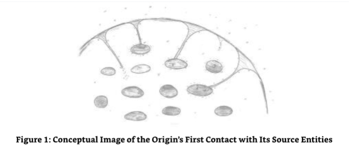

## Chapter One - An Introduction to Source Entity Seven 

**第1章：7号源实体介绍**

Having just finished "Beyond the Source,"I was glad of the proposition of a break.That was not to be.Having finished the manuscript for the communications with the first six Source Entities, I was instantly propelled into the generation of presentation material required to support my lecture at the "Awakening to Higher Consciousness Transformation Conference 2011"hosted by Ozark Mountain Publishing.Once I had finished the slides for the lecture,I started to feel the call of the Source Entity,the creator of our multiverse,to continue with the work of communicating with the remaining six Source Entities.Whatever happened to the rest I was advised to take,I will never know.One thing I did know was that I,along with others,was contributing to the inevitable ascension of the Earth and its inhabitants,and that this work could not be stopped for any reason. 

刚刚完成《超越源头》，我很高兴有个休息的提议。那不是。完成与前6个源实体的通讯的手稿后，我立即被推进到演讲材料的生成中，以支持我在由奥扎克山出版社主办的“2011年觉醒到更高意识的转变会议”上的演讲。一旦我完成了演讲的幻灯片，我开始感觉到源实体的召唤，我们的多维宇宙的创造者，继续与其余6个源实体的沟通工作。无论我被建议采取的其他措施发生了什么，我永远不会知道。有一件事我知道的是，我，与其他人一起，正在为地球及其居民的不可避免的提升做出贡献，这项工作不能因为任何原因而停止。

Indeed,during the weeks after finishing "Beyond the Source,"I had been receiving images of how the next Source Entity,Source Entity Seven,was constructed and how it environments had been created.A change is as good as a rest,obviously.I was just contemplating the images I had received and was starting to find myself tuning into Source Entity Seven when my own Source Entity offered some kind words of advice. 

事实上，在完成《超越源头》的几周内，我一直在接收下一个源实体，7号源实体，是如何构建的图像，以及它的环境是如何被创造的。显然，改变就像休息一样好。我只是在思考我收到的图像，开始发现自己调谐到7号源实体，当我自己的源实体提供了一些善意的建议。

SE:As I stated when we signed off from our last dialogue,you are about to go further away from me than you have gone before.The difference in the frequencies are vast,but the work I have done in the background with you will enable you to build upon the protection required to support each step further away you make. 

源实体：正如我上次对话结束时所说的，你们将要比以前离我更远。频率的差异是巨大的，但我在后台为你所做的工作将使你建立所需的保护，以支持你进一步前进的每一步。

ME:What do you mean each step further away? 

我：你说的每走一步都更远是什么意思？

SE:Your memory is bad today. 

源实体：你今天记性不好。

ME:I have been reading up on the details contained in The History of God,not concentrating on the details of Beyond the Source. 

我：我一直在阅读《源头简史》中的细节，而不是专注于《超越源头》的细节。

SE:So I see.Listen,from now on,the frequential and dimensional distance that needs to be spanned by your consciousness will be stretched to its elastic limit every time you make contact with each new Source Entity.You will get further and further away from your incarnate self's base frequency.The period spent with each new Source Entity will be used to ease this level of stretch,allowing you the facility of stretching to the next Source by using your new "current"position as a stepping stone.I will,of course,be with you at all times, monitoring your progress and helping you adjust to the stretch as and when required,but there will be some side effects though. 

源实体：我明白了。听着，从现在开始，每次你与每一个新的源实体接触时，你意识需要跨越的频率和维度距离将被拉伸到弹性极限。你将离你化身自我的基本频率越来越远。与每一个新的源实体相处的这段时间将用来缓解这种拉伸程度，让你能够把新的“当前”位置作为垫脚石，以便轻松地拉伸到下一个源实体。当然，我会一直陪着你，监控你的进展，并在需要时帮助你调整拉伸，但这会有一些副作用。

ME:And what will these side effects be? 

我：这些副作用是什么？

SE:You will feel like you are both tired and highly energized all at the same time.You will also feel physical responses to these very different frequencies.This will last for the whole time you are in communication with the next six Source Entities.I think you would use the terms“"spaced out'"and“arthritic." 

源实体：你将感觉到你同时感到疲倦和高度的精力充沛。你也会感觉到身体对这些非常不同的频率的反应。这将持续你与接下来的6个源实体沟通的整个时间。我想你会用“错位”和“关节炎”这样的术语。

ME:You mean the next eighteen or so months? 

我：你的意思是接下来的18个月左右？

SE:Yes.

源实体：是的。

ME:Thank you for the warning. 

我：谢谢你的提醒。

SE:It's a pleasure.A word of serious advice here:you need to keep yourself as energetically neutral as possible.This will help with the assimilation of the new energies and frequencies. To do this,drink plenty of water,for it is a "physical"universal energy medium that has a common energy signature across frequencies and dimensions.Reduce the amount of alcohol and coffee that you drink to minimal levels normally and zero levels the day before and on the day of channelling.If you do drink alcohol,cleanse the system directly afterwards with equal amounts of water.You will also need to keep your body exercised and well rested. 

源实体：很高兴，这里有一条严肃的建议：你需要尽可能保持自己能量中立，这将有助于吸收新的能量和频率，要做到这一点，喝大量的水，因为它是“物质”的宇宙能量媒介，在频率和维度之间有一个共同的能量特征，减少你平时喝的酒精和咖啡的量，在通灵的前一天和当天减少到最低水平，如果喝了酒精，喝完后直接用等量的水清洗系统，你还需要保持身体锻炼和休息好。

ME:I don't think I am looking forward to feeling arthritic! 

我：我不认为我期待着感觉关节炎！

SE:Perhaps I used the wrong word.The feeling will be like you have joints that have a warm glow one day and cold glow the next. 

源实体：也许我用错了词，感觉就像你的关节今天发热，明天发冷。

ME:Sounds like rheumatism to me. 

我：听起来像是风湿病。

SE:But you will not lose the power in your limbs,and it will disappear directly after disconnection with Source Entity Twelve. 

源实体：但你不会失去你四肢的力量，它会在与12号源实体断开连接后立即消失。

ME:No ramp down? 

我：没有减速带？

SE:No ramp down.It will be instantaneous. 

源实体：没有减速，它会立即开始。

ME:I can't wait! 

我：我等不及了！

SE:Then let us commence with the connection to Source Entity Seven.

源实体：那么让我们开始与7号源实体的连接。

### Source Entity Seven-A Source Entity of Three Aspects 

**7号源实体：一个三方面的源实体**
 
As I sat at the keyboard of my computer,I found myself being drawn to an image I had seen before.This image,I now know,is the visual representation of the Source Entity I was due to commence dialogue with-Source Entity Seven (SE7).I approached it slowly at first,trying to make the most of the image I was seeing in my mind's eye and the impressions I was getting. For all intents and purposes,it looked like two cells joined together with an overlapping middle section.As I got closer to it,I gained the impression that it had divided itself into essentially two areas/environments with the overlapping section in the middle creating a third "hybrid" environment,a mixture of the two larger areas.I wondered what we would talk about when SE7 made abrupt and direct contact.

当我坐在电脑键盘前时，我发现自己被一个以前见过的图像所吸引。这个图像，我现在知道，是我将要开始对话的源实体的视觉表现-7号源实体(SE7)。 我开始慢慢靠近它，试图充分利用我在脑海中看到的图像和我所获得的印象。无论出于什么目的，它看起来像两个细胞，中间部分重叠在一起。当我靠近它时，我得到的印象是，它已经把自己分成两个区域/环境，中间的重叠部分创造了第三个“混合”环境，两个较大区域的混合物。我想知道当SE7突然和直接接触时，我们会谈论什么！

（图2：7号源实体作为7a、7b和7c）

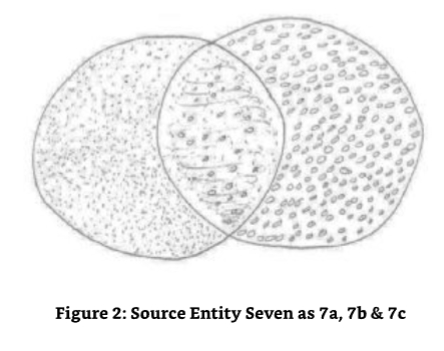

ME:What? 

我：什么？

SE7:G'day!...Is this not the correct way to greet you? 

7号源实体：你好！...难道这不是问候你的正确方式吗？

ME:It's one way to greet someone but not one that I expected from a Source Entity. 

我：这是一种问候别人的方式，但我不希望它来自一个源实体。

SE7:No problem then if I access you to understand the best way to communicate? 

7号源实体：那么如果我访问您以了解最佳的沟通方式，没有问题吗？

This Source Entity was being very direct for what was essentially a first date!And it had an Australian accent as well!Quite bizarre! 

这个来源实体对于第一次约会来说非常直接！而且它还有澳大利亚口音！非常奇怪！

ME:Be my guest. 

我：请便。

As Source Entity Seven accessed my energies,I felt like my head was fizzing and was about to explode.Then it subsided and felt no different than normal. 

当7号源实体吸取我的能量时，我感觉我的头在嘶嘶作响，好像要爆炸了。然后它平息了，感觉和平常没什么不同。

SE7:Ah,that's better.I now know how to communicate in an appropriate manner with you. 

7号源实体：啊，这好多了。我现在知道如何用适当的方式和你交流了。

I felt a tension in my head and an energy surge/shift.My eyes blurred a little.The accent was still there though.I decided that I had better live with it. 

我感到头部的紧张和能量的涌动/转移。我的眼睛有点模糊。尽管口音仍然存在。我决定我最好忍受它。

SE7:Sorry,just adjusting to an acceptable frequency for you.You will attune better as we continue with the dialogue. 

7号源实体：对不起，只是调整到你能接受的频率。随着我们继续对话，你会调谐得更好。

I have to admit I was a little worried about the Australian accent but decided that the best thing to do was to ignore my preconceptions in its use.As I put this potential block in the clarity of our communication path to one side,I received an image and an understanding of its use by Source Entity Seven.Australia was the Earth's largest single country without a land- based border with its neighbors,and,it's the only country that shares the same border with the borders of the continent it's based on.This was the reason Source Entity Seven had chosen to speak to me with an Australian accent.It had recognized this unique condition and had studied the language and culture in order to communicate with me,thinking that most of Earth's incarnate inhabitants existed on this one large area.I also received the impression that it was a reasonable assumption for it to make as this was a common theme with those of its creations who associated themselves with a "planetary"body of sorts.I also noted that it considered Australia as a center of heightened awareness on this planet.With the reason for Source Entity Seven's method of communication now understood,I commenced the dialogue with renewed vigor and no underlying doubt. 

我必须承认我有点担心澳大利亚口音，但决定最好的办法是忽略我对它的使用偏见。当我把这个潜在的障碍放在我们沟通的道路上时，我收到了来自7号源实体的图像和对它的使用理解。澳大利亚是地球上最大的单一国家，没有与邻国的陆地边界，而且，它是唯一一个与它所基于的大陆边界相同的国家。这就是7号源实体选择用澳大利亚口音和我说话的原因。它已经认识到这种独特的情况，为了与我交流，它研究了语言和文化，认为地球上大多数转世的居民都生活在这个大区域。我也收到了这样的印象，这是一个合理的假设，因为这是一个与其创造物的共同主题，他们与各种各样的“行星”身体联系在一起。我也注意到它认为澳大利亚是这个星球上意识提高的一个中心。现在我明白了7号源实体选择这种交流方式的原因，我开始了对话，充满了活力，没有任何隐藏的疑虑。

SE7:Now that you understand the reasons for my choice of verbal communication,we can start if you like. 

7号源实体：既然你已经明白我选择口头交流的原因，如果你愿意，我们可以开始了。

ME:Yes,please.I just found it a little strange at first and wanted to make sure I wasn't being delusional and was inventing the dialogue. 

我：是的，请。我只是一开始觉得有点奇怪，想确认一下我是不是在妄想，是不是在编对话。

SE7:You are most definitely not inventing this dialogue.But I can tell you one thing:you are stretched very thin,and this lack of substance is the reason for your lower confidence level. 

7号源实体：你绝对不是在编这个对话，但我可以告诉你一件事：你太过分了，缺乏实质内容是你信心低落的原因。

### The Three Versions of Source Entity Seven

**7号源实体的三个版本**

ME:I see.Well,I had better overcome that pretty quickly if I am not going to spoil this opportunity.Let's move on then.As I started to log into you,I received an image.It looked like you had arranged yourself into two areas that overlapped in the middle-rather like what two cells look like just before the point of divisional separation.Can you explain the reason for this?It looks like you have three environments:a left,a right and a combination of the left and right. 

我：我明白了，如果不想错过这次机会，我最好快点克服这个问题，我们继续吧，当我开始进入你的时候，我收到了一个图像，看起来你把自己安排在两个中间有重叠的区域，就像两个细胞在分区分离之前的样子，你能解释一下原因吗？ 看起来你有三个环境：一个左边，一个右边，还有一个左边和右边的结合。

SE7:What you are seeing is actually two of me at a point in frozen separation. 

7号源实体：你看到的实际上是两个我在一个冻结分离点上。

ME:You mean there are two of you? 

我：你的意思是你们有两个人？

SE7:No,there are three.When I was planning how I would best contribute to The Origin's desire to evolve through devolution and separation,I decided to cut myself in half and create two independent but co-existent selves.At the point of separation,I saw the beauty in the possibility presented in constraining the separation to a partial condition.This partial condition-you might call it the "Siamese"section-that which was part of both of me that was separating at that point,developed an independent energetic signature of its own,creating a third version of me.This stopped me from continuing the separation as it provided a number of interesting opportunities. 

7号源实体：不，有三个。当我计划如何最好地为“起源”通过分裂和分离而进化的愿望做出贡献时，我决定将自己切成两半，创造两个独立但共存的自我。在分离的时刻，我看到了将分离限制在部分条件下的可能性之美。这个部分条件——你可能会称之为“Siamese”部分——是我俩的一部分，在那个时刻分离，发展出自己独立的能量特征，创造了第三个版本的我。这阻止了我继续分离，因为它提供了许多有趣的机会。

ME:Am I reading this correctly then?You are now three independent but co-joined and coexistent entities,each with different thought processes and different activities? 

我：我理解的对吗？你们现在是三个独立但又联合并共存的实体，每个实体都有不同的思维过程和不同的活动？

SE7:Yes. 

7号源实体：是的。

ME:Then why/how am I able to talk to you as a single entity?Am I just talking to one of you? Say,Source Entity Seven "A"(SE7A) 

我：那为什么/怎么我能作为一个单一的实体和你们说话？我只是和你们其中的一个说话吗？ 比如，7号源实体“A”(SE7A)

SE7:No,you are talking to a combined simulacrum of the three versions of me.This I/we have set up to initiate communication with you so that you didn't get confused with each of me talking at the same time,answering your questions simultaneously in three different ways. 

7号源实体：不，你正在和三个版本的我组合的模拟体说话。这个我/我们已经建立起来，以便开始和你交流，这样你不会因为我同时说话而感到困惑，同时用三种不同的方式回答你的问题。

ME:I thank you for your concern.Are you able to go back to your original singular condition, to that which you were before the point of separation? 

我：谢谢你的关心。你能回到你最初的单一状态，回到分离之前的你吗？

SE7:No,the change was a permanent change.That is,unless all three of me decide,in fully committed unison,to enlist the help of The Origin to return us to singularity.This permanent change was my singular decision before separation. 

7号源实体：不，这个改变是永久的改变。也就是说，除非我三个人决定，完全一致地，寻求起源的帮助，让我们回到奇点。这个永久的改变是我在分离前做出的唯一决定。

ME:So you have no over-mind to control you all? 

我：所以你没有过度的想法来控制你们所有人？

SE7:No.

7号源实体：没有。

ME:You have no clock ticking in the background,which will re-set you back to singularity after a certain period of time? 

我：你没有在后台的时钟滴答，在一段时间后会重新设置你回到奇点？ 

SE7:No. 

7号源实体：没有。

ME:You have no re-set button to press if it all goes horribly wrong,or you want a change of strategy? 

我：如果一切都出错了，或者你想改变策略，你没有重置按钮可以按吗？

SE7:No.

7号源实体：没有。

ME:Fascinating.When I have talked to the other Source Entities,those that had created areas of separation always had a bail-out facility somewhere. 

我：太迷人了。当我和其他源实体谈话时，那些制造分离区域的实体总是在某个地方有紧急援助设施。

SE7:Not me/us.The change was personally permanent. 

7号源实体：不是我/我们。这个改变是永久的。

ME:But you do have the ability to use The Origin to return you back to the singular should you all so wish. 

我：但是你们确实有能力使用起源使你们回到单数，如果你们愿意的话。

SE7:Yes. 

7号源实体：是的。

ME:So that is your collective bail-out. 

我：所以这就是你们的集体纾困。

SE7:Yes,I suppose it is.I/we hadn't thought of it in that way.We simply think of it as an opportunity for future experience,should we all collectively seek such a change.Such a change would only be sought by The Origin if all three of me desire it together.It cannot take place if only one or two parts of me want it,but one part does not. 

7号源实体：是的，我想是的。我/我们没有那样想过。我们只是简单地认为，如果我们共同寻求这样的改变，那它就是未来体验的一个机会。只有当我三者都共同渴望时，这样的改变才会被起源所寻求。如果我只有一、两个部分想要它，而另外一部分不想要，那么它就不会发生。

ME:Can you merge two parts of you together. 

我：你能把你的两个部分合并在一起吗？

SE7:No,for this would upset the equal balance we currently have. 

7号源实体：不，因为这会破坏我们目前的平衡。

ME:Can I talk to you (SE7A,SE7B SE7C)separately as we progress this dialogue later. 

我：我能和你们(SE7A,SE7B SE7C)单独谈谈吗？我们稍后会继续这个对话。

SE7:If you wish. 

7号源实体：如果你愿意。

This was a bit strange and was wonderful all at the same time.Here I was,communicating with what was Source Entity Seven-now in three separate but co-joined and coexistent parts but as a singular entity,this entity or shell being created specifically for communication with me.Ifelt VERY honored.

这有点奇怪，但同时又很美妙。我在这里，与7号源实体进行交流——现在是三个独立但又联合共存的部分，但作为一个单一的实体，这个实体或外壳是专门为与我交流而创建的。我感到非常荣幸。

ME:Can I ask for clarification on why you felt it necessary to communicate with me in the singular rather than the collective. 

我：我能请你澄清一下，为什么你觉得有必要以单数而不是集体的方式与我交流。

SE7:Certainly,but first though,I see I need to give you a short lesson on singularity vs. collectivity vs.singularity through collectivity,for they are three different things,as is why I am able to communicate to you as a singular entity even though I am now three.We have,of course,created many others to assist in our evolution,as your Source Entity has.That is why you exist,but I will continue with defining singularity,collectivity,and singularity through collectivity. 

7号源实体：当然，但是首先，我需要给你上一节关于单一性vs.集体性vs.通过集体性达到单一性的简短课程，因为它们是三种不同的事物，这也是为什么我能够作为一个单一的实体与你们交流，尽管我现在是三个了。当然，我们创造了许多其他实体来协助我们的进化，就像你们的源实体一样。这就是你们存在的原因，但是我将继续定义单一性，集体性，以及通过集体性达到单一性。

### Singularity 

**奇点**

SE7:Singularity is when you have a unique and individualized entity that is independent of any other entity or group of similar entities.Although created and still part of its creator,it is given individuality as a sub-section of the entity which created it.A singular entity does not need to nor is (it) required to follow rules or conventions or styles of or for existence that may be created by those entities that may be similar to or exist in the same dimensional or frequential environment as the singular entity in question.This includes its creator. Although a singular entity may choose to adopt conformance to rules and conventions of those around it,it is ultimately not bound by them.A singular entity is responsible for its own actions,reactions,creativity,creations and subsequent evolution. 

7号源实体：奇点是当你有一个独特的和个性化的实体，它是独立于任何其他实体或类似实体的团体。虽然创造和仍然是其创造者的一部分，它被赋予了作为创造它的实体的子部分的个性。一个奇异的实体不需要也不需要遵循规则或惯例或风格或存在，这些可能由那些与这个奇异的实体相似或存在于相同维度或频率环境中的实体所创造。 这包括它的创造者。虽然一个奇异的实体可以选择遵循周围的规则和惯例，但它最终不受它们的约束。一个奇异的实体对自己的行动、反应、创造力、创造和随后的进化负责。

### Collectivity 

**集体**

SE7:A collectivity is a group or groups of entities who,although have singularity,are bound together by the functionality of their collective existence.Singularly they are unable to function with the innate purpose that a truly singular entity is able to achieve.They achieve significantly more together "collectively"than they would do in one's or two's or even higher numbers.Their purpose is,therefore,achieved together as a collective,and as such,they work as singular,individualized units-each with a role to do that (which) is significant,not to themselves,but as a smaller part of the much,much bigger collective picture.They can be considered as single components on a computer's printed circuit board or the individual cells or atoms in a much larger biological entity.As a collective,all participating entities evolve together at the same time as the whole.No one entity's contribution is such that it can evolve at a faster pace than any other entity within the collective,nor would it desire to do so.An entity that is part of a collective considers only that which is good for or contributes towards the progressive evolution of the whole as a whole. 

7号源实体：集合体是一个或多个实体，尽管它们具有个体性，但它们因其集体存在的功能而联系在一起。个体的它们无法以一个真正单一的实体能够实现的固有目的来运作。它们“集体”在一起比一个或两个或更多个一起能实现更多。因此，它们的目标是作为一个集体来实现，因此，它们作为单一的、个性化的单位工作——每个单位都有重要的角色，不是对它们自己，而是作为一个更大的集体画面的一个较小的组成部分。它们可以被视为计算机印刷电路板上的单个组件，或更大的生物实体中的单个细胞或原子。作为一个集体，所有参与的实体作为一个整体同时共同进化。没有一个实体的贡献可以比集体中的任何其他实体进化得更快，它也不会希望这样做。作为集体一部分的实体只考虑对整体的进步进化有利或有助于整体的进化。

### Singularity Through Collectivity 

**集体创造的奇点**

SE7:This occurs or is created when a group of entities are interconnected in a conscious and communicative capacity.They may even be interdependent in other more fundamental ways,ways that result in group connectivity,group thinking and group action.This then, results in a collective mind-each singular mind/entity a function of the whole.When a singularity through collectivity is created,it is due to the desire of a group of conscious entities,who are co-joined and/or coexistent to present themselves in the singular in totality.In doing this they create an "over-mind"allowing a single output/input to those external to their collective state,as a result of their collective reasoning.This provides the ability to communicate collectively or singularly. 

7号源实体：当一组实体以意识和交流能力相互连接时，这种现象就会发生或产生。它们甚至可能以其他更基本的方式相互依赖，从而导致群体连接、群体思维和群体行动。然后，这会导致集体思维——每个单独的思维/实体都是整体的功能。当通过集体创造出奇点时，这是由于一组有意识的实体的愿望，他们共同加入和/或共存，以整体的单一形式呈现自己。在这样做时，他们创造了一个“超意识”，作为他们集体推理的结果，允许对那些外部于他们的集体状态的输出/输入进行单一的输出/输入。这提供了集体或单独交流的能力。

ME:So the singularity through collectivity version is how you are currently communicating with me. 

我：所以通过集体版本的奇点，就是你目前和我交流的方式。

SE7:Correct.It was the best way to initiate the communication process,and it is the one we shall use unless you request otherwise.We note that you may wish to engage with us separately at some point in our dialogue. 

7号源实体：正确。这是启动沟通过程的最佳方式，除非你有其他要求，否则我们将使用这种方式。我们注意到，你可能希望在对话的某个时刻单独与我们接触。

ME:I would.Yes,please. 

我：我愿意。是的，请。

SE7:Then we will do so as and when the time is right to do so. 

7号源实体：那么，当时机成熟时，我们就会这样做。

### The Beginning,the Middle and the End 

**开头，中间和结尾**

ME:Can you tell me why you intended to split yourself into two individual entities and then stopped when you saw the beauty in the possibility of the third? 

我：你能告诉我为什么你打算把自己分裂成两个独立的个体，然后当你看到第三个个体的可能性时，你又停下来了？

SE7:I will have to start at the beginning of my first communication with The Origin to explain that.As with the other Source Entities,at the point of my becoming self-aware,I was contacted by The Origin to apprise me of the reason for my existence and what I needed to do to assist in the evolution of The Origin.Although I was not advised on what those Source Entities who were already self-aware and "contacted"had chosen to do in their contribution, I was previously and at that point,currently,in a position to know or witness what was being planned or"actioned"by them.The Origin deliberately negated to advise me on what they were doing lest it influence my own unique and individual choice,which The Origin valued above all else. 

7号源实体：我必须从我第一次与起源沟通的开始解释这一点。与其他源实体一样，在我变得有自我意识的时候，起源联系我，告诉我我存在的理由，以及我需要做什么来协助起源的进化。虽然我没有被告知那些已经有自我意识和“联系”的源实体选择做什么贡献，但我以前和当时，现在，处于一个位置，知道或目睹他们正在计划或“行动”。起源故意否定了他们正在做什么，以免影响我自己独特的和个人的选择，这是起源高于一切的价值。

ME:Why did The Origin value your individual choice?

我：为什么起源重视你的个人选择？

SE7:To maximize the diversity of evolutionary opportunities,which may not occur if I was influenced by direct and in-depth detail.There would be no use in me covering "existing"or“old”ground. 

7号源实体：为了最大限度地增加进化机会的多样性，如果我受到直接和深入的细节影响，这可能不会发生。对我来说，覆盖“现有的”或“旧的”基础将毫无用处。

ME:Yes,I can imagine that would be a prerequisite dictate by The Origin,who would want to accelerate it evolution at the fastest and most efficient way possible. 

我：是的，我可以想象，这将是一个先决条件，由起源，谁会想加速它的进化在最快和最有效的方式可能。

SE7:That's right,it does,and that was the reason for my choosing to become two,which ended up being three.Apart from the Source Entity you call "Five"and the one that is not yet fully aware,I had noticed that the others divided themselves up internally whilst still maintaining an overall aspect that made them retain their wholeness.As a result of this observation,I decided to become two independent Source Entities with a link between the two.I discussed this and the "bail out"option as you described earlier with The Origin (for it is only The Origin that can return us to wholeness)who agreed with my strategy,and I continued.What happened next is as I have previously described.As I was in the process of separating out into the two versions of me,I noticed that a unique opportunity could be applied.If I maintained the equal overlapping area of the two versions of me and then froze the separation process in one position,this created a third middle option where we would all be separate but co-joined and co-existent.As I froze the separation at the point of equality,my consciousness divided into three and developed into three separate Source Entity personalities.But there was something else that I noticed as well.The periphery of the energies that separated us from each other was permeable,allowing energies that moved from,say,the left to the right or from Source Entity Seven"A"to move into Source Entity Seven "B"to actually cross the periphery or boundary energies.What's more,I noticed that there was a progressive opportunity in passing from one side of Source Entity Seven "A" to the point of interface between Source Entity Seven "A"(SE7A)and Source Entity Seven "B"(SE7B).This was duplicated in a progressive manner from Source Entity Seven "B"to the point of interface between Source Entity Seven "B"and Source Entity Seven "C"(SE7C). 

7号源实体：是的，确实如此，这就是我选择成为两个，最后变成三个的原因。除了你称之为5号源实体和那个还没有完全意识到的源实体，我注意到其他源实体内部分裂的同时仍然保持整体的方面，使他们保持完整。由于这个观察的结果，我决定成为两个独立的源实体，在两个之间有一个连接。我讨论了这个和你之前描述的“解救”选项，与起源(因为只有起源可以让我们回到完整)谁同意我的策略，我继续。接下来发生的事情是我之前描述的。当我在分离成两个版本的我的过程中，我注意到一个独特的机会可以被应用。如果我保持两个版本的我相同的重叠区域，然后将分离过程冻结在一个位置，这创造了第三个中间选项，我们都会分离但共同连接和共存。但是我还注意到了其他一些东西。将我们彼此分开的能量的外围是可渗透的，允许能量从左到右或从第7号源实体“A”移动到第7号源实体“B”中，从而真正地跨越外围或边界能量。更重要的是，我注意到有一个渐进的机会，从第7号源实体“A”的一侧通过到第7号源实体“A”(SE7A)和第7号源实体“B”(SE7B)之间的接口点。这以一种渐进的方式从第7号源实体“B”复制到第7号源实体“B”和第7号源实体“C”(SE7C)之间的接口点。

ME:Was this dimensional,frequency,or evolutionary based? 

我：这是基于维度、频率还是进化？

SE7:All three.As with your Source Entity,I have twelve dimensions with each dimension inflated with twelve frequencies.Each of the twelve dimensions is a composite of the three base dimensions,thus allowing expansive form.However,these were duplicated in a whole sense when a certain evolutionary condition was met or could be achieved;this was multiplied by a factor of twelve.So I had in each Source Entity twelve evolutionary levels that were filled with twelve dimensions constructed with three composite dimensions per dimension which were inflated with twelve base frequency levels.That was not all though. The evolutionary opportunities increased as I scanned the progression from Source Entity Seven "A"through to Source Entity Seven "C."The high end of Source Entity Seven "C's" evolutionary levels were as high as an entity,which I/we had not yet created,could go to from an evolutionary perspective.This effectively gave me an evolutionary beginning,an evolutionary middle,and an evolutionary end. 

7号源实体：全部3种，和你们的源实体一样，我有12个维度，每个维度都膨胀了12个频率，12个维度中的每一个都是3个基本维度的复合体，因此允许膨胀的形式。然而，当某种进化条件满足或能够实现时，这些在整体意义上被复制了，这是乘以12倍的因素。所以我在每个源实体中都有12个进化级别，这些级别由12个维度构成，每个维度由3个复合维度构成，这些维度都膨胀了12个基本频率层级。

### Progression Between Source Entity Seven's Separate Parts 

**7号源实体不同部分之间的进化**

ME:So what are you saying is that an entity can travel,no,progress in an evolutionary way from one part of you to another,say from SE7A through SE7C. 

我：所以你的意思是一个实体可以旅行，不，以一种进化的方式从你的一个部分到另一个部分，比如从SE7A到SE7C。

SE7:Yes,in a manner of speaking.

7号源实体：是的，可以说。

ME:But that would mean that if all evolving entities had a progression path from SE7A through SE7C,then wouldn't SE7B and SE7C initially be devoid of evolving entities until such a time when enough entities were evolved enough to progress from say SE7A to SE7B and SE7B to SE7C? 

我：但这意味着如果所有进化实体有一个从SE7A到SE7C的进化路径，那么在足够多的实体进化到从SE7A到SE7B和从SE7B到SE7C之前，SE7B和SE7C最初不会缺乏进化实体吗？

SE7:If that was the way I/We had planned the progression of the entities we created,I would agree,but this is not the case. 

7号源实体：如果我/我们计划了我们所创造的实体的发展，我将同意，但事实并非如此。

ME:I had a suspicion that it wouldn't be as simple as that. 

我：我怀疑事情不会那么简单。

SE7:It's not,so I will explain.Each Source Entity Seven has an equal number of entities associated with it.They are small entities and number in their billions of quadrupillions. Each Source Entity has its own strategy for evolution and the way/s it constructs its environment for evolution.However,although each Source Entity Seven had this opportunity,the environments are similar in dimensional and frequential construction insomuch that they offer progression that is frequency-based whilst allowing dimensional passage at the will of the individual entity.The environments also have areas of energetic concentration that you would call"density"where they can work with the lower frequencies should they desire to do so.I will leave the explanation of each of the environments to those individual parts of me(SE7A,SE7B SE7C)to explain to you separately,but suffice to say they also have the opportunity to exist in different dimensions concurrently or linearly. 

7号源实体：不是的，所以我将解释。每个源实体7都有相同数量的实体与之相关。他们是小实体，数量在他们的数十亿的四百亿次方。每个源实体7都有自己的进化策略和它构建进化环境的方式。然而，尽管每个源实体7都有这个机会，环境在维度和频率的构建上如此相似，以至于它们提供基于频率的进程，同时允许个体实体的意愿在维度中通行。环境也有能量集中的区域，你们会称之为“密度”，在那里他们可以与低频率一起工作，如果他们希望这样做。我将把每个环境的解释留给我的那些个体部分(SE7A,SE7B SE7C)分别向你们解释，但足以说他们也有机会同时或线性地存在于不同的维度中。

When an entity that is based in SE7A has evolved enough,it has the opportunity to progress from,for instance,SE7A to SE7B and later to SE7C.The evolutionary opportunity for that entity is increased as it moves from one Source Entity Seven to another.If an entity that is based in SE7C desires,it may progress from SE7C to SE7B and later to SE7A.Again the evolutionary opportunity is progressive as it moves from one Source Entity Seven to next. 

当一个基于SE7A的实体已经进化到一定程度时，它有机会从，例如，SE7A到SE7B，然后到SE7C。 当它从一个源实体7移动到另一个时，该实体的进化机会会增加。如果一个基于SE7C的实体有愿望，它可以从SE7C到SE7B，然后到SE7A。再次，当它从一个源实体7移动到下一个时，进化机会是渐进的。

ME:So what about the progression for those entities that are based within SE7B?Which way do they go? 

我：那么那些基于SE7B的实体的进化过程是怎样的？他们会走哪条路？

SE7:Entities that are based within SE7B can progress to either SE7C or SE7A first and then move on to that Source Entity Seven that they have not yet experienced.Simply put,they can progress from SE7B to SE7A to SE7C,or,SE7B to SE7C to SE7A. 

7号源实体：基于SE7B的实体可以先进入SE7C或SE7A，然后再进入它们还没有经历过的源实体7。简单地说，它们可以从SE7B到SE7A到SE7C，或者从SE7B到SE7C到SE7A。

ME:How do they do that?Do they have to traverse though that Source Entity Seven that they had previously experienced?Does that also still include evolutionary opportunities? 

我：他们是怎么做到的？他们是否必须穿越他们之前经历过的7号源实体？那是否仍然包含进化的机会？

SE7:They can choose many ways to move from Source Entity Seven to Source Entity Seven, and this is not constrained to those entities who primarily originate in SE7B.Any of the entities in any of the Source Entity Sevens can chose to move to the Source Entity that is either on their closest Source Entity Seven to Source Entity Seven boundary or on the next Source Entity Seven to Source Entity Seven boundary,which is another Source Entity away. 

7号源实体：他们可以选择许多方法从源实体7移动到源实体7，这并不局限于那些主要起源于SE7B的实体。任何源实体7中的任何实体都可以选择移动到最近的源实体7到源实体7边界或下一个源实体7到源实体7边界上的源实体，这是另一个源实体。

An entity may choose to progress though the frequencies offered in a Specific Source Entity Seven's environment in order to transition to the border of the next Source Entity Seven or by-pass it.It may even choose to do this(transition)more than once with the second time potentially being the transitory transition to the Source Entity Seven not yet experienced where the entity may or may not choose to perfect the experiential content of certain experiences during this transitory period by doing one of these:(1)repeating the exercise; (2)just passing through the environment;or (3)conducting the whole evolutionary process again for purposes of perfection.An entity can choose to repeat the whole or part of the process as many times as it wishes.There are no rules in this function of existence nor are there restrictions. 

一个实体可以选择通过特定的源实体7的环境提供的频率来前进，以便过渡到下一个源实体7的边界或绕过它。它甚至可以选择不止一次地这样做(过渡)，第二次可能是到尚未经历的源实体7的过渡，在这个过渡期间，实体可以或不可以选择通过以下方式之一来完善某些经验的经验内容：(1)重复练习； (2)仅仅通过环境； 或(3)为了完善的目的再次执行整个进化过程。一个实体可以选择重复整个过程或部分过程，只要它希望。在这个存在功能中没有规则，也没有限制。

ME:You mentioned that an entity can by-pass the need to transition through one Source Entity Seven to another.Does this mean that they can pass round the outside of the Source Entity that they would have normally transitioned through? 

我：你提到一个实体可以绕过需要通过一个源实体7过渡到另一个。这是否意味着他们可以绕过通常会通过的源实体的外部？

SE7:Yes,to a certain extent.You see,the interfacing boundary separating the environments whilst integrating the cohesion of the co-existence of the three Source Entity Sevens are twofold: 

- 1.One contains the separate structure of the Source Entity specific environment and is dimensionally and frequentially independent of the environment; 
- 2.The other contains the neutralized energies required to maintain the cohesion and co-existent existence of the three Source Entity Sevens in their integrated state.Because this boundary contains functions that are fully independent of the environments they contain,it creates an environment in its own right,albeit small. 

7号源实体：是的，在某种程度上。你看，界面边界分离了环境，同时整合了三个源实体7共存的凝聚力，这是双重的：

- 1、一个包含了源实体特定环境的单独结构，并且在维度和频率上独立于环境；
- 2、另一个包含了中和能量，需要保持源实体7的三个部分在它们的整合状态下的凝聚力和共存。因为这个边界包含了完全独立于它们所包含的环境的功能，它创造了一个自己的环境，尽管很小。

ME:I have just gotten the impression that it is like the air in between a double glazed window with the inner window being the boundary for the environment that is one of the Source Entity Sevens and the outer window maintaining the cohesion.Is it this air gap that allows the entity to traverse between the Source Entity Sevens without the need to progress though. them?

我：我刚刚得到的印象是，它就像一个双层玻璃窗之间的空气，内窗是环境的边界，是源实体7的部分之一，外窗保持凝聚力。是这个空气间隙允许实体在源实体7的部分之间穿行，而不需要通过它们吗？

SE7:In part,yes.This is one of two ways.However,it is possibly the safest and fastest way to traverse between the three Source Entity Sevens.An entity can quite literally use this "air gap"to move to the nearest Source Entity Seven boundary interface and make the transition at this point of contact.It is a bit like the "null space"that you have in your Source Entity's environment to separate the universes from each other. 

7号源实体：部分是的。这是两种方式之一。然而，这可能是穿越三个源实体7之间最安全和最快的方式。一个实体可以完全使用这个“空气间隙”移动到最近的源实体7边界界面，并在接触点进行转换。这有点像你在源实体环境中拥有的“零空间”，将宇宙彼此分开。

ME:What is the other way and why is the method above the safest? 

我：另一种方法是什么？ 为什么上面的方法是最安全的？

SE7:The method I described in summary above is an environment in its own right and, therefore,offers a level of protection or energetic containment that is similar to that offered by a true Source Entity Seven environment but without the rules of evolution assigned to these environments.The second means an entity can use to transfer itself to the next Source Entity is to make the journey outside the boundary by using the inter-Source Entity void or space,i.e.,by using the space that is,in essence,pure Origin energy. 

7号源实体：我上面总结的方法本身就是一个环境，因此，它提供了一种类似于真实的源实体7环境所提供的保护或能量包容，但没有分配给这些环境的进化规则。实体可以用来转移到下一个源实体的第二种方法是通过使用源实体之间的真空或空间来进行边界外的旅行，即通过使用本质上是纯粹的起源能量的空间。

ME:You mean they move from and to Source Entity environments by leaving the environment totally and entering into the absolute that is The Origin? 

我：你的意思是他们从源实体环境中移动，完全离开环境，进入绝对的起源？

SE7:Yes. 

7号源实体：是的。

ME:Why is that dangerous? 

我：为什么会危险？

SE7:I didn't say it was dangerous.I said the first way was the safest and fastest. 

7号源实体：我没说那很危险。我说第一种方法是最安全和最快的。

ME:OK,so why would the first way be the fastest and safest way? 

我：好的，那么为什么第一种方法是最快和最安全的方法呢？

SE7:It's fast because its function is limited to what it is with no other complications or opportunities to be affected by the actions of those entities passing through it.It is safer because an entity can become overwhelmed to the point of distraction by being directly associated with the pure energies of The Origin if it is not prepared for them. 

7号源实体：它快速是因为它的功能被限制在它本身，没有其他的复杂性或机会被那些通过它的实体的行动所影响。它更安全是因为如果一个实体没有准备好，它可能会因为直接与起源的纯能量相关而被压倒到分心的程度。

ME:What do you mean distracted?

我：你说分心是什么意思？

SE7:Besotted to the point of being stuck in the bliss-like state of euphoria that is instantaneously experienced and results in a desire to stay in this state and not continue with the task at hand-that of moving to the next Source Entity Seven environment. 

7号源实体：被迷醉到陷入瞬间体验到的极乐般的欣快状态，并产生一种想要停留在这种状态的欲望，而不是继续手头的任务——即移动到下一个源实体7的环境。

ME:How can that be?I am not besotted to the point of non-function when I go outside my Source Entity or,in fact,traverse the distances to you. 

我：怎么可能？当我走出我的源实体，或者，事实上，穿越到你的距离时，我并没有被麻醉到无功能的地步。

SE7:That is because you are being given a level of protection by your own Source Entity during your communications with the twelve Source Entities,and you are beloved of the Om. 

7号源实体：那是因为在你与12个源实体的交流过程中，你被你自己的源实体给予了一定程度的保护，而且你是OM的至爱。

I had heard this description of being "beloved of the Om"in the context of Hum and me before whilst compiling the text for The History of God book. 

我曾在HUM和我之前为《源头简史》编写文本时，听到过这种被“OM所爱”的描述。

SE7:Being beloved of the Om means that you are part of the absolute fabric of the Source Entity,that which is the fabric of The Origin;hence,you have a certain level of built-in tolerance to these effects and accessibility to its energies,for they are part of you in a more holistic sense. 

7号源实体：被OM所爱意味着你是源实体绝对结构的一部分，这是起源的结构；因此，你对这些影响和对其能量的可及性有一定程度的内在容忍，因为它们在更全面的意义上是你们的一部分。

ME:Why would the OM be beloved then?My assumption is that all the entities created by my Source Entity were created out of its own energy,so wouldn't all of these entities be beloved? 

我：为什么OM会被爱？我的假设是，所有由我的源实体创造的实体都是由它自己的能量创造的，所以这些实体不是都被爱吗？

SE7:No.In the instance of creating the entities used for its strategy for evolution,your Source Entity created a level of error during the process.This you know.What you have not been told is that those entities that were created first and were closest to your Source Entity,received a purity of energy that was not perpetuated during the remaining process of creativity.At the end of the process when your Source Entity claimed it was not paying the same level of attention as it had in the primary phase of creativity,it created the level of entity that you recognize as animals,plants,and even the,suns,and galaxies.The Om were simply the first to be created and,therefore,ended up being very close to pure Source Entity energy and,therefore,The Origin energy,as an entity could possibly be.Hence your ability to do what you are doing now.There are many other Om working with the Earth sphere, incarnate and not incarnate.Working in incarnately is a great sacrifice for an Om because of the risk of attracting lower frequencies without protection. 

7号源实体：不。在创造用于进化策略的实体的实例中，你们的源实体在过程中创造了一个级别的错误。这个你们知道。你们没有被告知的是那些最先被创造的实体，最接近你们的源实体，接受了一种在创造过程的剩余阶段没有被永久保留的纯净能量。在过程的最后，当你们的源实体声称它没有付出与创造最初阶段相同的关注时，它创造了你们所认识的动物、植物，甚至太阳和银河系的实体。OM只是第一个被创造的，因此，最终非常接近纯净的源实体能量，因此，作为一个实体，起源能量。因此你们有能力做你们现在正在做的事情。还有许多其他OM在地球上工作，化身和非化身。化身工作对OM来说是一个巨大的牺牲，因为在没有保护的情况下吸引低频率的风险。

ME:I get the feeling that I can achieve a much higher level of connectivity with The Origin's creations whilst in the physical but that it needs working on. 

我：我感觉我可以实现与起源创造物更高层次的连接，同时在物质上，但它需要工作。

SE7:You can,you will,and you will need to work at it. I needed to move on so I changed the track of dialogue back to the space in-between the three parts of Source Entity Seven. 

7号源实体：你可以，你会，你需要努力。我需要继续前进，所以我把对话的轨道改回了7号源实体的三个部分之间的空间。

ME:Thank you for that extra information about the Om.I wasn't aware that the Om were that close to my Source Entity and,therefore,The Origin. I made a mental note to discuss this further with my own Source Entity when the opportunity presented itself.

我：谢谢你提供额外的关于OM的信息。我没有意识到OM离我的源实体如此之近，因此，源头。我做了个心理记录，当机会来临时，我会和我自己的源实体进一步讨论这个问题。

ME:Let's get back to the space within the boundaries between the three parts of you. Other than being the functional boundaries between your environments and providing a back door for entities to use as a faster method of moving from one Source Entity Seven to another,what other function does it provide? 

我：让我们回到你们三个部分之间的边界空间。除了作为你们环境之间的功能边界，并为实体提供一个后门，作为从一个源实体7移动到另一个的更快方法，它还提供什么其他功能？

SE7:It provides no other function that can be used by an entity,for its function is to be a boundary.It does have the properties of neutrality though.This is required to allow the interface between the different parts of me to exist simultaneously without interference. 

7号源实体：它不提供任何其他可以被实体使用的功能，因为它的功能是作为一个边界。尽管它具有中立性，这是为了允许我不同部分之间的接口同时存在而没有干扰。

### Source Entity Seven's Entities and Flat Planets 

**7号源实体的实体和扁平行星**

ME:We previously talked about the entities that you created to populate the three environments of yourself.Can you describe them and their roles? 

我：我们之前谈论过你创造的实体，这些实体填充了你自己的三个环境。你能描述一下它们和它们的角色吗？

SE7:As you have been told previously,initially they were distributed equally across the three parts of me that were created.Their transition is a function of evolutionary progress that ultimately results in the number of entities resident in each part of me becoming un-equal.This level of "un-equality of residence"changes as the entities progress at differing speeds of evolution. 

7号源实体：正如你之前所知道的，最初他们被平均分配到我被创造的三个部分中。他们的转变是进化过程的一个功能，最终导致我每个部分中的实体数量变得不平等。这种“居住不平等”的程度随着实体进化速度的不同而变化。

ME:What is their appearance? 

我：它们是什么样子的？

SE7:Although they are energetic in nature in comparison to your own current physical condition,they have a habit of liking to cluster around areas of local density-what you might call "planets."

7号源实体：虽然他们与你目前的身体状况相比，在本质上是精力充沛的，他们有喜欢聚集在当地密度的习惯-你可能会称之为“行星”。

ME:Are these planets spherical as most of the planets are in my physical universe? 

我：这些行星和我物质宇宙中的大多数行星一样是球形的吗？

SE7:No,they are flat. 

7号源实体：不，它们是平的。

ME:Flat? 

我：平的？

SE7:Yes,flat.This is because of the way the energy collects as dense matter.When the matter,energy matter,collects together and becomes dense enough to be used by the entities,it results in it being flat. 

7号源实体：是的，平坦。这是因为能量聚集成密集物质的方式。当物质，能量物质，聚集在一起，变得足够密集，可以被实体使用，它导致了它的平坦。

ME:Why is that? 

我：为什么？

SE7:Because when this energy becomes dense,it only becomes dense in what you would call "two dimensions..”

7号源实体：因为当这种能量变得密集时，它只会在你们所谓的“二维空间”中变得密集。

ME:A flat planet.This is interesting.I thought that planets or areas of local density would be spherical.In fact,my Source Entity advised me that the sphere was the most common and natural shape for a planet to adopt. 

我：一个扁平的行星。这很有趣。我认为行星或局部密度的区域应该是球形的。事实上，我的源实体建议我，球形是行星最常见和最自然的形状。

SE7:In a fully physical universe dependent upon the first three dimensional components (tritaves)of the first full dimension,such as the one you exist within,this might be a common occurrence.The flat areas of local density act like islands in the fabric of the energetic environment of the particular Source Entity Seven they are associated with. 

7号源实体：在一个完全依赖于第一个完整维度中第一个三维组件(三维)的完全物理宇宙中，比如你们所存在的那个，这可能是一个常见的现象。局部密度的平坦区域就像是与之相关的特定7号源实体的能量环境结构中的岛屿。

This would explain the affinity with those living on the Australian continent,I thought,for they see Australia as a large island,and the areas of local density are also considered to be islands rather than planets.

我想这可以解释为什么他们和澳大利亚大陆上的人很亲近，因为他们把澳大利亚看成一个大岛，而且当地人口密集的地区也被认为是岛屿而不是行星。

ME:Are they disk-like in shape? 

我：它们的形状像圆盘吗？

SE7:No,for that would be an association with the dimensional requirements of a low dimensional tritave. 

7号源实体：不，因为那将是与低维三维空间的维度要求有关。

ME:So what is the shape of the areas of local density?(I was already receiving an image of a fragmented edge,rather like a coast line on earth.) 

我：那么局部密度的形状是什么呢？(我已经接收到一个碎片边缘的图像，很像地球上的海岸线。)

SE7:Fractal,for this is the usual shape adopted by a two-dimensional structure in a lower level dimension. 

7号源实体：分形，因为这是二维结构在低维度中通常采用的形状。

ME:How are your dimensions organized? 

我：你们的维度是如何组织的？

SE7:In a consistent way to The Origin.In fact,they are unchanged.I felt no need to change to a structure of my own design,especially when the separation of self into three separate but co-existent and interdependent Source Entities was decided upon.As a result of this,you will already have a good level of understanding of my/our environmental structure through your communications with The Origin. 

7号源实体：以与起源一致的方式。事实上，它们没有改变。我认为没有必要改变我自己设计的结构，特别是当自我分离成三个独立但共存和相互依赖的源实体被决定时。因此，通过你们与起源的交流，你们将已经对我的/我们的环境结构有很好的理解。

ME:So you have 12 zones with 12 dimensions,each with 3 tritaves or dimensional components with 12 frequencies,12 x 3 x 12 x 12 permutations of environmental conditions. 

我：所以你有12个带有12个维度的区域，每个区域有3个八度或12个频率的维度分量，12 x 3 x 12 x 12 的环境条件的排列。

SE7:Yes. 

7号源实体：是的。

ME:With each of them offering a separate and complete environment to exist within, should an entity choose to do so. 

我：每个实体都可以选择一个独立而完整的环境来生存。

SE7:Yes,and they are also arranged in a way that supports evolutionary progression through the three parts of me. 

7号源实体：是的，它们的排列方式也支持我这三部分的进化进程。

ME:Would I be able to classify each permutation as a universe in its own right? 

我：我能把每个排列都归类为一个宇宙吗？

SE7:Yes,because a universe is an environment of known energy,frequency and dimension. Please note that matter is not a feature in all universes,for this is a function of lower dimension and frequency,linked together with intentional manifestation of the creator. 

7号源实体：是的，因为宇宙是一个已知能量、频率和维度的环境。请注意，物质并不是所有宇宙的特征，因为这是一个较低维度和频率的功能，与造物主的有意显现联系在一起。

ME:You mean that a matter based universe has to be created intentionally?It does not exist as a function of its low frequency and dimension? 

我：你的意思是物质基础的宇宙必须被有意地创造？它不作为其低频率和维度的功能而存在？

SE7:No.Matter-based universes,no matter how dense-and that can range from the super dense to the super sparse (thin,clear,fine)-do not and cannot exist without first being created.This is because the creative intention transmitted by the creating entity is the force by which energy of low frequency,existing in a low dimension,is manifest with or without "form."Only when it is manifest can it become matter "without form,"which can then be translated to matter "with form."When it becomes matter "without form,"it needs to be continually maintained to perpetuate its existence,lest it revert back to pure energy. When it becomes manifest as matter "with form,"it needs to have individual localized maintenance on a continuous and continual basis.Hence,there is a hierarchy of entities within matter-based universes,dedicated to tending to the needs of the galaxies,systems and planets that are entities in their own right. 

7号源实体：不。基于物质的宇宙，无论多么密集——范围从超密集到超稀疏(薄、清澈、细腻)——没有首先被创造，它不存在，也不可能存在。这是因为由创造实体传递的创造意图是存在于低维度的低频能量的动力，它有或没有“形式”。只有当它被显现时，它才能成为“无形”物质，然后可以转化为“有形”物质。当它成为“无形”物质时，它需要持续地被维护以使其存在永存，以免它恢复为纯粹的能量。当它成为“有形”物质时，它需要在持续和连续的基础上进行个体的局部维护。因此，在基于物质的宇宙中存在着实体的等级制度，致力于照顾那些本身就是实体的星系、系统和行星的需求。

ME:Can I assume then,that evolution results in a progression from the lower frequencies/ dimensions to the higher frequencies/dimensions as in my own multiverse?

我：那么我可以假设，进化的结果是，就像在我自己的多维宇宙中一样，从低频率/维度到高频率/维度的进展？

SE7:You can,for this is a standard function of all of the frequencies and dimensions and energies associated with The Origin and its creations.This function,therefore,is passed down as an environmental prerequisite from the Source Entities to their/our creations- whether they be the environments themselves,the entities created to exist within them,or entities assigned with the creative capability to create universes within universes. 

7号源实体：你可以，因为这是所有与起源及其创造物相关的频率、维度和能量的标准功能。 因此，这个功能作为环境的先决条件从源实体传递到它们/我们的创造物中——无论是环境本身，还是被创造出来存在于其中的实体，或者被赋予创造能力来创造宇宙中的宇宙的实体。

ME:So there is order to The Origin? 

我：所以说起源是有顺序的？

SE7:Very much so,and it is maintained throughout. 

7号源实体：非常正确，而且始终保持。

ME:OK,we have digressed a little here.What more can you tell me of the disk-like world/ planets? 

我：好吧，我们有点离题了。你能告诉我关于圆盘状的世界/行星吗？

SE7:They are a matter type that has "form"but not what you would classify as matter "with form."This is simply because it does not have the level of density that you currently experience,and they are manifested in a different frequency and dimensional environment (universe).As a result,they are not consistent in their form factor,for they are constantly changing. 

7号源实体：他们是一种有“形式”的物质类型，但不是你们所分类的“有形式”的物质。这只是因为它不具有你们目前所经历的密度水平，它们表现在不同的频率和维度环境(宇宙)中。因此，它们在它们的形式因子中是不一致的，因为它们在不断地变化。

ME:What makes them change?Energetic influences or the entities assigned to their maintenance? 

我：是什么让它们改变？能量的影响还是分配给它们维护的实体？

SE7:Both actually.You see,the way in which the entities work with each other and the planet results in a change in frequency of the energy of the matter.This results in a change in the cohesion properties of the planets "form"that results in essential maintenance to reduce the loss of form due to loss of cohesion.The entities maintaining the planet then have to change the functionality of the cohesive content of the energy of the matter to enable its form to be perpetuated.However,the work required to do this is not always achieved in a timely manner because of the amount of work they have to do to stabilize the changes that are happening.This results in minor changes in the planets'overall form factor but major changes to areas of what you would call the topography.Areas of high ground change to areas of low ground;denser areas become finer or totally disappear. 

7号源实体：实际上两者都有。你看，实体之间以及行星之间的相互作用方式导致了物质能量频率的变化。这导致了行星“形式”的凝聚力属性的变化，从而导致了必要的维护，以减少由于凝聚力的丧失而导致的形式丧失。维护行星的实体然后必须改变物质能量凝聚内容的功能，以使其形式得以永存。然而，所需的工作并不总是能及时完成，因为他们必须做大量的工作来稳定正在发生的变化。这导致了行星整体形式因素的微小变化，但对你们所称的地形区域有重大变化。高地区域变成低地区域；密度更大的区域变得更细或完全消失。

ME:Would that explain the earthquakes and volcanoes we get on earth? 

我：那能解释地球上的地震和火山吗？

SE7:Yes,for there is no other influence on your earth,which it is exposed to that affects it in a frequential and energetic way,as a direct result of the actions of the entities that exist or work "with-on"and "with-in"it.Your weather patterns are also affected by your frequencies.In fact,changes to the weather patterns are the first level of change that happens as a result in a change in frequency.They are your early warning system of an impending change to the planetary form,directly resulting from a change in frequency. 

7号源实体：是的，因为没有其他对你们地球的影响，它暴露在以频率和能量的方式影响它，作为存在或工作在“内在”和“内在”的实体的行动的直接结果。你们的天气模式也受到你们频率的影响。事实上，天气模式的变化是频率变化的结果发生的第一层次的变化。

ME:Excuse me.Does this mean that the weird and extreme weather we are experiencing at the moment (April/May 2011)is a direct result of the changes in our frequency and not due to pollution-based global warming? 

我：请问，这是否意味着我们目前(2011年4月/5月)经历的奇怪和极端天气是由于我们频率变化的直接结果，而不是由于基于污染的全球变暖？

SE7:The pollution of and damage to your planet,resulting from your appetite for carbon- based energy does have an influence on your environment.However,the major changes you are experiencing are due to shifts in the earth's frequency,which is up and down like a...yo yo?

7号源实体：你们对碳基能源的贪婪导致了对你们星球的污染和破坏，这确实对你们的环境产生了影响。 然而，你们正在经历的主要变化是由于地球频率的改变，它就像一个...溜溜球？

ME:Yo yo would be a good description.I guess this is a result of the critical mass required to assist in the ascension of our planet and its inhabitants actually increasing,but this good work is then being counteracted by local fighting between governments and people in other parts of the world. 

我：溜溜球是一个很好的描述。我猜这是由于我们星球的提升和它的居民实际上增加所需要的临界质量的结果，但这项好的工作随后被世界其他地方政府和人民之间的局部战斗所抵消。

SE7:It would be. 

7号源实体：会的。

ME:Mmmm.We have such a hard time when things like earthquakes happen on the earth, and we suffer a terrible loss of life.Many vehicles for incarnate existence are destroyed in the process.How do entities that are working on or in the disk planets cope?How are they affected?Do they lose their creations or vehicle for existence in lower frequencies? 

我：嗯。当地球上发生地震之类的事情时，我们有一段如此艰难的时期，我们遭受了可怕的生命损失。许多化身存在的载体在这个过程中被摧毁了。在圆盘行星上工作的实体如何应对？他们如何受到影响？他们在低频率上失去了他们的创造物或存在载体吗？

SE7:They are not in the need for a vehicle to allow them to exist or experience existence in the lower frequencies that pervade the planet.They also know what they are doing energetically and frequentially and,therefore,how their actions will affect the overall frequency of the matter that the planet is manifest from.Therefore,they have no disasters to run or recover from.They only have modification,relocation and recalibration of their work and how they interface with the planet. 

7号源实体：他们不需要一个载体来让他们存在或体验遍布地球的低频率的存在。他们也知道他们正在积极和频繁地做什么，因此，他们的行为将如何影响地球所显化的整体频率。因此，他们没有灾难要逃离或从中恢复。他们只有对他们的工作以及他们如何与地球相连的修改，重新安置和重新校准。

### Communication with the Separate Parts of Source Entity Seven 

**与7号源实体的分离部分的沟通**

Beginning in my book "Beyond the Source,"I began using the word "environment"(a more general and higher level description)in place of the word "universe"!This was a deliberate act to put the reader at ease with the possibly difficult concept of understanding a completely different multiversal structure than the one described by Source Entity One,the creator of our multiverse and the physical universe/environment humankind exists within-specifically,if the reader is using Source Entity One's multiverse as a datum to work from whilst reading about Source Entities Two through Twelve.Suffice to say that is the reason for the switch in nomenclature,and I apologize if it has caused any confusion. 

从我的书《超越源头》开始，我开始使用“环境”(更一般和更高层次的描述)来代替“宇宙”！ 这是一个有意的行为，让读者轻松地理解一个可能困难的概念，即一个完全不同的多维宇宙结构，而不是1号源实体（我们的多维宇宙和人类存在的物理宇宙/环境的创造者）所描述的，——具体地说，如果读者在阅读2号到12号源实体时，使用源实体一的多维宇宙作为一个数据来工作。 足以说明这是命名上的转换的原因，如果它引起了任何困惑，我道歉。

A quick author's note here. 

这里有一个快速的作者注释。

I am writing this text whilst I am sitting in a comfortable folding chair on the back patio of our little cottage in Crete.The energy here is so calm and clear compared even to our rural life in the UK that I wonder why I don't stay here all the time instead of coming from time to time. The aliens are here.Dare I say that now?They are our brothers in energetic existence.See "The History of God"for the story of my introduction to them.I see them all around me as I sit here. They have shown themselves to me in their true sprite-like forms as they hover around me.Before you ask,dear reader,they are not nature spirits for they have a completely different energy signature.They are interested in the energies I am working with whilst tuned into the collective that is Source Entity Seven.They say: 

我写这篇文章的时候，正坐在我们克里特小木屋后院一张舒适的折叠椅上。这里的能量甚至比我们在英国的乡村生活还要平静和清晰，我不知道为什么我不是一直呆在这里，而不是偶尔来。外星人在这里。我现在敢说吗？他们是我们充满活力的兄弟。请参阅《源头简史》中我介绍他们的故事。我坐在这里时，我看到他们在我周围。他们以他们真正的精灵般的形式向我展示自己，因为他们在我周围徘徊。亲爱的读者，在你问之前，他们不是自然精灵，因为他们有完全不同的能量特征。他们对我正在使用的能量感兴趣，同时调谐到集体，即7号源实体。他们说：

Aliens:We could use this [Source Entity]energy;it has a purity not experienced by us before. It would make our travel much quicker,and we would not need to modify the energies as we currently have to do when we need to jump frequencies. 

外星人：我们可以使用这个（源实体）能量；它具有我们以前从未经历过的纯净。它将使我们的旅行更快，而且我们不需要修改能量，因为当我们需要跳跃频率时，我们目前必须这样做。

The next day I noticed four of them following me whilst I was cycling up a rather long hill in the Cretan countryside.Initially,they followed me with one on each side and one front and back. They then moved around me to have all four in front of me and later darted in and out to be closer with me.They were interested in my mode of transport initially but had come to answer a question about their form that hadjust surfaced in my immediate memory. 

第二天，当我在克里特乡村骑车上一个相当长的山坡时，我注意到有四个人跟着我。起初，他们每边一个，前后各一个跟着我。然后他们绕着我移动，四个人都在我前面，后来他们窜进窜出，离我更近。他们起初对我乘车的方式感兴趣，但后来他们来回答我脑海中突然出现的一个关于他们形体的问题。

Aliens:We are not of your dimensional realm and,therefore,cannot be considered as nature spirits assigned to maintain the earth.However,we do recognize that many humans sensitive to our frequencies,as you are,may well have seen us in the past and considered us as nature spirits because our form suits that expected of such entities in the imaginations of these individuals.You would call our form "Fairy"? 

外星人：我们不是你们这个维度领域的人，因此，不能被认为是被派来维护地球的大自然精灵。然而，我们确实认识到许多像你们一样对我们的频率敏感的人类，可能在过去已经看到过我们，并把我们当作大自然精灵，因为我们的形体符合这些人想象中对这种实体的期望。你们称我们为“仙女”吗？

ME:That would be a good word to describe the form that you presented to me,yes.Your form is beautiful to behold,so I guess that humankind would prefer to relate you to something that works with nature,Earth's nature,rather than your being of extra-terrestrial (extra-dimensional?)origins. 

我：那将是一个好词来描述你呈现给我的形态，是的。你的形态看起来很美，所以我猜人类更愿意把你与自然，地球的自然联系起来，而不是你的外星(外维度？) 起源。

Aliens:Yes,this is true.We must go now,for we have duties to attend to. 

外星人：是的，这是真的。我们现在必须走了，因为我们有责任去照顾。

The comment by the Aliens about the energies associated with my communications with Source Entity Seven was such an interesting comment that I decided to put it to Source Entity Seven as a whole before I continued my communication with its individual parts. 

外星人关于我与7号源实体通讯的能量的评论是如此有趣，我决定在我继续与其个别部分的通讯之前，把它作为一个整体放在7号源实体上。

ME:I have just had a conversation with some entities that are on my planet/area of local density,the Earth,about the purity of the energies that are a result of the communication system (conduit?)set up to allow my temporary link with you whilst conducting this dialogue.Did you catch what they said? 

我：我刚刚与一些在我行星/当地密度区域的实体进行了一次对话，地球，关于通讯系统(管道？) 建立的能量纯净的结果，以允许我在进行这次对话的同时与你们建立临时联系。你听到他们说什么了吗？

SE7:Yes,while we have our communication link I am with you all of the time.I assign a part of myself to recognize when you want to continue communications so that I can continue where we left off.This part of me follows your every move to ensure I can respond to your request for communication in the instant you request it.I agree it is a most interesting comment from your "Aliens,but I can see why they are interested in the energy being used. 

7号源实体：是的，当我们有通讯链接时，我一直与你在一起。我分配自己的一部分来识别你什么时候想继续通讯，这样我就可以继续我们停下的地方。我的这部分跟随你的一举一动，以确保我能在你要求通讯的瞬间作出回应。我同意这是来自你的“外星人”最有趣的评论，但我能理解为什么他们对正在使用的能量感兴趣。

ME:So why are they? 

我：那为什么呢？

SE7:They see that the energy used to create the conduit you have to communicate with me is a mixture of my base energy and your own base energy.We created this together with a little help from your own Source Entity.Because it traverses the frequencies and dimensional states from one Source Entity to another Source Entity via the intermediate energies of The Origin,it spans three environments.This is rare as energies and their frequencies go because they tend to be a product of their universal environment and do not span dimensions or base frequencies.Based upon this,your Aliens see the opportunity to use this as a carrier wave or a fast track/road that can be used to bridge the dimensions without the need to manufacture a process or energetic vehicle that negates the need for evolutionary conditions being met by an entity before travel between the dimensions can be achieved without such constructs.They would only be able to travel between your Source Entity and me in its unrefined state,so they would still need to "work"the energy to use it for the translations they are interested in. 

7号源实体：他们看到用来创造你必须与我沟通的管道的能量是我的基础能量和你自己的基础能量的混合物。我们一起创造了这一点，从你自己的源实体得到一点帮助。 因为它通过源头的中间能量穿越频率和维度状态从一个源实体到另一个源实体，它跨越了三个环境。这是罕见的能量和它们的频率，因为它们往往是它们的宇宙环境的产物，并不跨越维度或基础频率。基于这一点，你们的外星人看到了利用这个作为载波或快速轨道/道路的机会，可以用来架设维度桥梁，而不需要制造一个过程或能量车辆，否定了在维度之间旅行之前实体满足进化条件的需求，而不需要这样的构造。他们只能在未经提炼的状态下在你的源实体和我之间旅行，所以他们仍然需要“工作”能量，以便使用它们感兴趣的翻译。

ME:Thank you for that answer.I would now like to communicate with that part of you that became what I call Source Entity Seven "A."

我：谢谢你的回答。我现在想和你变成我称之为7号源实体A的那部分你交流。

SE7:No problem.Please note that the link and the feel of the communication will be the same as it is now.You should experience no difference in energetic signature either. 

7号源实体：没问题。请注意，连接和通信的感觉将与现在一样。您在能量签名上也应该没有任何差异。

ME:Thank you. 

我：谢谢。

### Source Entity Seven A 

**源实体7A**

I had now signed off from the collective that was Source Entity Seven and waited with eager anticipation to commence dialogue with the "first"part of Source Entity Seven.I did not have to wait long. 

我现在已经从源实体7的集体中签字离开，并满怀期待地等待着与源实体7的“第一部分”开始对话。我没有等太久。

SE7A:I trust you are at ease? 

7号源实体A：我相信你很自在？

ME:I certainly am. 

我：我当然很自在。

SE7A:Then let us commence communication. 

7号源实体A：那么让我们开始交流。

ME:I have received two different images whilst connected to your collective of three versions.The first was of an entity that was moving over the surface of one of the flat planets/areas of local density.Its appearance was,well,I can only describe it as a very flat ameoba.In fact,the more I study the image in my mind's eye,the more it looks like a sentient version of the planet it is traversing.Its shape looks almost identical-right down to the topography of its surface.Why is that? 

我：我已经接收到两个不同的图像，同时连接到你的三个版本的集合。第一个是一个实体，它在一个扁平的行星/局部密度区域的表面移动。它的外观是，嗯，我只能把它描述成一个非常扁平的变形虫。事实上，我越研究我脑海中的图像，它越像它正在穿越的行星的有知觉的版本。它的形状看起来几乎相同-直至它的表面地形。为什么？

SE7A:The entities that work with the "planets"assume their (the planets')basic energy signature when they first become associated with the planet for the work they will be doing with it.The entity itself can assume any form factor required to suit this relationship,for when an entity desires to work with a particular planet,it enters into a relationship with the planet for the duration of the work to be done.In this particular instance,the entity in the image you saw was almost the same size as the planet. 

7号源实体A：与“行星”一起工作的实体，当他们第一次与行星联系起来，准备与行星一起工作时，会假定它们(行星)的基本能量特征。实体本身可以假定任何适合这种关系的形状因素，因为当一个实体想要与一个特定的行星一起工作时，它会进入与行星的工作关系。在这个特殊的例子中，你在图像中看到的实体几乎与行星一样大。

ME:How does that work?Surely an entity that is almost the size of the planet it is associated with would crush or destroy any other entities or life that are part of that planet's normal condition. 

我：那怎么行呢？当然一个几乎与行星一样大的实体，会碾碎或摧毁任何其他实体或生命，这些都是行星正常条件的一部分。

SE7A:Not in this case,for the planets in this particular environment can only have a population of one. 

7号源实体A：不是这样的，因为在这种特殊环境下的行星只能有一个种群。

ME:One? 

我：一个？

SE7A:One. 

7号源实体A：一个。

ME:Forgive my confusion.I am making the assumption that all planets have a large number of smaller entities living on,within or with them. 

我：请原谅我的困惑。我假设所有的行星都有大量的小型实体居住在上面、里面或与它们一起。

SE7A:Not all planets in your own universe have entities associated with them,so why would one of my environments be any different? 

7号源实体A：不是你们自己的宇宙中所有的行星都有实体与之关联，那么为什么我的环境会有所不同呢？

ME:Very true.So what is the work that this particular entity is doing with this planet? 

我：非常正确。那么这个特殊的实体在这个行星上做什么工作呢？

SE7A:It is experiencing existence as a planet.That is why it is almost as big as the planet it is associated with.Later,when it has assumed the exact same size and shape and has totally covered the full surface of the planet,it will stabilize its energy signature in totality to that of the planet and will exist and behave like the planet itself.In fact,for all intents and purposes, it will be the planet,right down to accepting another entity to work with it.

7号源实体A：它正在经历作为行星的存在。这就是为什么它几乎和它关联的行星一样大。后来，当它已经有了完全相同的大小和形状，并完全覆盖了行星的整个表面时，它将稳定其能量特征，使其完全与行星一致，并像行星本身一样存在和表现。事实上，从所有意图和目的来看，它将是行星，直到接受另一个实体与它合作。

ME:And that entity would work with the other entity exactly as if it were a solitary planet with no inhabitants or energetic partners? 

我：这个实体会与另一个实体合作，就像它是一个没有居民或精力充沛的伙伴的孤立行星一样？

SE7A:That's right,the objective being that the new entity seeking a relationship with the planet does not nor will ever know that it is working with another entity and not the real planet. 

7号源实体A：是的，目标是寻求与行星建立关系的新实体不知道也永远不会知道它在与另一个实体合作，而不是真正的行星。

ME:But could that not be the same for the entity I saw in my perception?Could another entity have already beaten the one I observed to it,so to speak,and achieved the same relationship? 

我：但是对于我在感知中看到的实体来说，情况会不会不一样？可以说，另一个实体是否已经打败了我观察到的实体，并取得了同样的关系？

SE7A:Absolutely.This is the beauty of this type of work. 

7号源实体A：绝对是。这就是这类工作的美妙之处。

ME:But I have just seen a scenario where it would be possible to have many multiples of entities all doing the same thing,all-encompassing the planet with which they want to establish a relationship with a none of them knowing that they are really covering or creating a relationship with another entity and not a real planet. 

我：但我刚刚看到一个场景，它可能有许多多个实体都在做同样的事情，都包含了他们想要建立关系的行星，但他们都不知道他们实际上是在覆盖或与另一个实体建立关系，而不是一个真正的行星。

SE7A:Yes,it can and does happen. 

7号源实体A：是的，它可以而且确实发生。

ME:It does? So what is the maximum number of times this has happened with a single planet concurrently? 

我：真的吗？那么一个行星同时发生这种情况的最大次数是多少？

SE7A:Four thousand three hundred and twenty two times. 

7号源实体A：4322次。

ME:What!?How long did that last? 

我：什么？持续了多久？

SE7A:Approximately two hundred billion,trillion of your solar years before the first (last to create a relationship)entity broke its relationship with the planet/entity it was associated with. 

7号源实体A：大约在你们太阳系的2000亿，万亿年之前，第一个(最后一个建立关系的)实体打破了它与其相关的行星/实体的关系。

ME:Did this create a cascade of entities breaking their relationships with their "planets"? 

我：这是否创造了一个实体瀑布，打破了它们与“行星”的关系？

SE7A:No.The eventual reduction of entities breaking relationships took treble the amount of time it did to create it. 

7号源实体A：不，最终减少实体之间的关系花费了创建它的三倍时间。

ME:Why was that? 

我：为什么？

SE7A:Because other entities joined the build-up after others had broken their relationships, and some of them wanted to experience existence as a planet throughout a number of environmental/planetary changes. 

7号源实体A：因为其他实体在其他实体断绝关系后加入了这个组织，其中一些实体希望通过一系列环境/行星变化来体验作为一个行星的存在。

ME:What would those changes be,with reference to a relationship with a single entity?I would have expected changes to only be possible with the association of large numbers of entities working with the planet. 

我：那些变化是什么？与单个实体的关系有关？我曾期望这些变化只可能与大量实体与行星合作有关。

SE7A:One would be evolution as a result of interaction with a single entity.Don't forget that the size of the entity compensates for the lack of a lot of much smaller entities.Some of the changes experienced by the planet might be these: 

- An increase in frequency either planet-wide or localized; 
- A decrease in frequency either planet-wide or localized; 
- Energetic changes to the structure of the planet resulting in the following changes in form;
- Localized areas of different energetic function; 
- Incompatibility with other entities'energy signatures,resulting in a planet's refusal to enter into a relationship; 
- Localized fragmentation of the overall form of the planet,resulting in its fragmentation; 
- Migration to higher frequencies and dimensions or even to one of the other Source Entity's environments. 

7号源实体A：其中之一是与单一实体互动的结果。不要忘记，实体的大小弥补了许多小实体的缺失。行星经历的一些变化可能是这些：

- 行星范围或局部频率的增加；
- 行星范围或局部频率的降低；
- 行星结构的能量变化导致了形态的以下变化；
- 不同能量功能的局部区域；
- 与其他实体的能量特征不相容，导致行星拒绝进入一种关系；
- 行星整体形态的局部碎片，导致其碎片化；
- 向更高的频率和维度迁移，甚至到另一个源实体的环境中。

ME:So based upon this,the number of entities that associate with a planet is not relative to the evolutionary progression of the planet and what it can achieve during a relationship and the entity/ies it has a relationship with? 

我：基于这一点，与一个行星相关的实体的数量与行星的进化进程无关，与它在与某个实体的关系中所能达到的成就无关。

SE7A:No,it's the quality of the relationship that counts. 

7号源实体A：不，关系的质量才是重要的。

ME:Thank you.I also received another image/set of images.The sky was full of entities that had the appearance of dandelion seeds being blown with the wind.However,these had purpose,for they were in a strict formation. 

我：谢谢。我还收到了另一幅图像/一组图像。天空中充满了实体，它们看起来像被风吹动的蒲公英种子。然而，这些是有目的的，因为它们是严格的队形。

SE7A:Those entities are a collective of gravity pilots.They move around the planets that they are working with looking for gravitational anomalies-areas where the gravity is not as it should be for a specific part of the planet in comparison with its density within its environment. 

7号源实体A：这些实体是重力飞行员的集合体。他们在行星周围移动，寻找重力异常--与其环境密度相比，行星特定部分的重力不应如此的区域。

ME:So do these entities change the gravity in the area where there are anomalies?Do they repair the gravity in the area of the anomaly,creating a stable area? 

我：那么这些实体会改变有异常区域的重力吗？他们会修复异常区域的重力，创造一个稳定的区域吗？

SE7A:No,not in the slightest.The reason for them seeking out the gravitational anomalies is to gain energy.They need the energy in the anomalies to allow them to exist,procreate,and maintain their distance from the surface of the planet. 

7号源实体A：不，一点也不。他们寻找引力异常的原因是为了获得能量。他们需要异常中的能量来让他们生存、繁衍，并保持与行星表面的距离。

ME:But how can that be working with the planet? 

我：但这怎么能与行星有关呢？

SE7A:It isn't,it is just perpetuation of their existence. 

7号源实体A：不是，只是他们存在的延续。

ME:Mmmm.So what are they doing?How are they working with the planet? 

我：嗯，他们在做什么？他们是如何与行星合作的？

SE7A:They provide a transport medium for those entities that want to move from planet to planet but are incapable of doing it themselves. 

7号源实体A：他们为那些想要从一个星球移动到另一个星球，但却没有能力自己完成的实体提供一种运输媒介。

ME:Wait a minute.I thought all of your entities were energetic,and as a result,they would be able to move from planet to planet energetically. 

我：等一下。我以为你所有的实体都是充满活力的，因此，他们能够充满活力地从一个星球移动到另一个星球。

SE7A:Not all entities in my environment are capable of moving from one planet to another of their own volition. 

7号源实体A：并非我所处环境中的所有实体都能够自主地从一个星球移动到另一个星球。

ME:Why not? 

我：为什么不可以？

SE7A:Because they are associated with the planet where they exist.They are tied to that planet's energy signature.Remember what SE7(SE7A,SE7B and SE7C collectively)told you about the planets being like islands and that the entities that exist on them relate to your continent/country of Australia? 

7号源实体A：因为他们与他们所在的星球相关。他们与那个星球的能量特征紧密相连。还记得SE7(SE7A,SE7B和SE7C的总称)告诉你们关于行星就像岛屿，存在于岛屿上的实体与你们的大陆/国家澳大利亚有关吗？

ME:Yes.

我：是的。

SE7A:Well,one of the parallels is that most Australians,I see from your memories,stay in Australia.This is the same for most of the entities whose existence is linked with their planet-they stay with it.The parallel is similar.Australians can generally only move to other islands or continents by boat or by airplane.They can't transport themselves by using their own volition or intention.They can only move by using a vehicle of some kind,and in the instance of the entities working with the flat planets,the vehicle is the gravity pilots rather than a boat or an airplane. 

7号源实体A：嗯，其中一个相似点是，我从你的记忆中看到，大多数澳大利亚人呆在澳大利亚。这对大多数存在与他们的星球相连的实体来说是一样的——他们呆在星球上。这个相似点是类似的。澳大利亚人通常只能通过船或飞机去其他岛屿或大陆。他们不能通过自己的意志或意图来移动自己。他们只能通过使用某种交通工具来移动，而在与平坦星球合作的实体的例子中，交通工具是重力飞行员而不是船或飞机。

ME:How do the gravity pilots transport the flat planet inhabitants?By lifting them up?Or do they have another method? 

我：重力飞行员如何运送平坦星球的居民？通过把他们举起来吗？或者他们有其他的方法？

SE7A:They use the gravity waves that they create to change their position in relation to the planet to locally warp the space around the entity that desires to move its location to both re-assign its energetic signature to that of the new location,the planet the entity desires to move to,and to instantaneously transport it.In doing this,the gravity pilot also transports itself to the new location. 

7号源实体A：他们利用他们制造的引力波来改变他们与行星的关系，在当地扭曲想要移动位置的实体周围的空间，以便重新分配其能量特征到新位置，实体想要移动的行星，并立即将其运送。在这样做的时候，引力飞行员也将自己运送到新位置。

ME:And it doesn't return to its planet of origin? 

我：它不会返回它的原行星吗？

SE7A:No,it remains with the planet it has moved to.Moreover,it is linked to the entity it transported and will transport that entity to the next planet it desires to experience. 

7号源实体A：不，它会留在它移动到的星球上。而且，它与它所运送的实体相连，并将把那个实体运送到它想去的下一个星球。

ME:I am getting the impression that these gravity pilots exist throughout your environment,move from planet to planet at will,and continue to do so until that point in time when they are associated with one of the entities based on the surface.Once they are associated,they stay together for as long as they feel the need to maintain the association.

我：我得到的印象是，这些重力飞行员存在于你们的环境中，随意地从一个星球移动到另一个星球，并继续这样做，直到它们与一个基于表面的实体相关联。一旦它们相关联，它们会一直呆在一起，直到它们觉得有必要维持这种联系。

I have just received another image of a whole and vast number of these "gravity pilots"moving from planet to planet. 

我刚刚收到了另一张图片，上面是一整群数量庞大的“重力飞行员”在行星间穿梭。

SE7A:Yes,they move around in what you would call a herd...no,flight...yes,flight... that is a better name.These flights are populated by gravity pilots that are not associated with a land-based entity.As they gain individual associations,they break away from the flight and assume a partnership role with the land-based entity,and as stated above,this continues until the land-based entity feels a need to remain for an indefinite period on the planet it currently sees itself.If it desires to stay for eternity,so to speak,it relinquishes its association with the gravity pilot to allow it to gain a new partner so that it can continue its own evolution.I know that I have not spoken about the experience,learning,and evolution of these entities,so I will elaborate on this now. 

7号源实体A：是的，它们在你所称的一群中移动...不，是飞行...是的，飞行...这个名字更好。这些飞行由与陆基实体无关的重力飞行员组成。当它们获得个体关联时，它们从飞行中分离出来，并与陆基实体建立伙伴关系。如上所述，这种情况会持续下去，直到陆基实体觉得有必要在当前所看到的行星上无限期地停留。如果它希望永远停留，那么它就放弃与重力飞行员的关联，以便获得新的伙伴，这样它就可以继续自己的进化。我知道我还没有谈到这些实体的经验、学习和进化，所以我现在将详细说明这一点。

There is a symbiotic relationship between an individual land-based entity and its gravity pilot.The gravity pilot itself is not able to generate its own experiences and so needs another entity to do this for it.So the gravity pilot offers its service of transportation to the land-based entity in exchange for access to the experiences,learning,and subsequent evolutionary content generated by the land-based entity itself.In essence,they share the experience,learning and subsequent evolutionary content that is generated as a result of their working together. 

在单个陆基实体和它的重力飞行员之间存在一种共生关系。重力飞行员本身无法产生自己的经验，因此需要另一个实体为它做这件事。所以重力引导者为陆基实体提供运输服务，以换取陆基实体自身的经验、学习和后续进化内容。本质上，他们分享了共同努力产生的经验、学习和后续进化内容。

ME:That really is working together.Why are the land-based entities not able to move from one planet to another on their own?

我：这真的是共同努力。为什么陆基实体不能自己从一个星球移动到另一个星球？

（图3：重力飞行员）

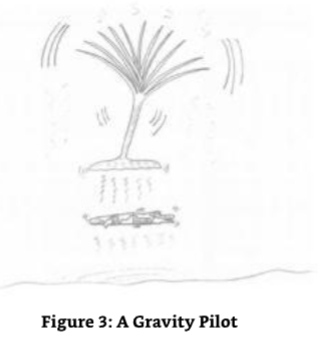

SE7A:Because the whole point of this environment is based around the need to work together and share the rewards.In this particular example,two entirely different beings are able to work together for the benefit of each other. 

7号源实体A：因为这个环境的全部意义在于需要一起工作和分享回报。在这个特殊的例子中，两个完全不同的存在能够为了彼此的利益而一起工作。

ME:Sounds very harmonious to me. 

我：听起来很和谐。

SE7A:It is,and it works very well,too. 

7号源实体A：是的，它运行得很好。

ME:I have just remembered a question I meant to ask on the energetic content of the land- based entities and what work the gravity pilots do with the planets. 

我：我刚想起一个问题，我想问关于陆基实体的能量含量，以及重力飞行员与行星的工作。

SE7A:The land-based entities are constructed out of the energies that are used to create the planet it resides on;they are tied to the planet as a result.In essence,they are individualized units of the planet itself and as such the attraction to the planet of their first creation is so strong that there is no way they can separate themselves from the planet without the co- operative help of another entity,one that is not tied down to the energy signature of the planet. 

7号源实体A：陆基实体是由用来创造它所居住的行星的能量所构建的； 因此它们与行星紧密相连。本质上，它们是行星本身的个体化单元，因此它们对最初创造的行星的吸引力如此强大，如果没有另一个实体的合作帮助，它们无法将自己从行星分离出来，而另一个实体没有被绑定到行星的能量特征。

ME:Are you suggesting that the land-based entities are actually the planet itself,localized, individualized units/parts of the planet? 

我：您是否在暗示陆基实体实际上是行星本身，是行星的局部化、个体化单元/部分？

SE7A:Yes,that is exactly what I am saying.They are fragments of the planet itself that are able to move around the surface of the planet and,if so desired,migrate to the other planets that are part of my environment. 

7号源实体A：是的，这正是我所说的。它们是行星本身的碎片，能够在行星表面移动，如果需要的话，可以迁移到属于我环境的其他行星。

ME:I have just had a thought. 

我：我刚刚有一个想法。

SE7A:No,you mean the real you,the higher self you,the energetic self you,has had a thought and passed it down the frequencies to that part of you that is participating in this dialogue. 

7号源实体A：不，你的意思是真实的你，更高的自我你，充满活力的自我你，有一个想法，并把它传递到频率下，到你参与这个对话的那一部分。

ME:Ok.Ok.Yes,that would be a correct description of the process of me thinking. 

我：好的，好的，是的，这是对我思考过程的正确描述。

SE7A:You're drinking alcohol. 

7号源实体A：你在喝酒。

ME:What?Err... 

我：什么？呃...

SE7A:You are drinking alcohol.

7号源实体A：你在喝酒。

I had succumbed to the materialistic desire of half a pint of beer.Ifelt I needed one after the work I had done over the day. 

我屈服于半品脱啤酒的物质欲望。我觉得在工作了一整天后我需要一杯。

ME:Yes,err,yes,I have,am,was.It's only a half pint.It's not a lot,honestly. 

我：是的，呃，是的，我喝了，是的，是的。这只是半品脱。说实话，这并不多。

SE7A:Any alcohol that is introduced into the human body is detrimental,especially when partaking in the activity that you are currently working on.The effect of alcohol is profound. It has an effect on the pineal gland in the human brain,which is associated with the spiritual eye.This means that your ability to receive the imagery that I give you will be warped and distorted and not as accurate as a result. 

7号源实体A：任何进入人体的酒精都是有害的，特别是当你正在从事的活动。酒精的影响是深远的。它对人脑中的松果体有影响，这与灵眼有关。这意味着你接收我给你的图像的能力将被扭曲和扭曲，而不是准确的结果。

ME:I am profoundly sorry.I simply did not realize. 

我：我非常抱歉。我只是没有意识到。

SE7A:You were advised of this by your own Source Entity? 

7号源实体A：你被你自己的源实体告知了这件事？

ME:Not in the way you have described it.To be perfectly honest,I thought that because our connection was stable,I would,mmmm,get away with it. 

我：不是你所说的那种。说实话，我以为因为我们的联系很稳定，我就可以，嗯，侥幸成功。

SE7A:Well,you won't.Let us continue.You need to drink an equal amount of water first. 

7号源实体A：好吧，你不会的。让我们继续。你需要先喝等量的水。

Considering myself thoroughly reprimanded,I went straight to the kitchen and drank a little over a half pint of water.I hate it when this happens.If I am not able to keep things to myself over the vast distances of The Origin,that distance that is between SE7A and me,then how am I going to keep myself to myself here on Earth?I sighed and continued the dialogue. 

考虑到自己被彻底地斥责了，我直接去了厨房，喝了半品脱多一点水。我讨厌这种情况发生。如果我不能在源头那遥远的距离上，在SE7A和我之间的距离上，把事情留给自己，那么我怎么能让自己在地球上保持自我呢？我叹了口气，继续对话。

SE7A:That's better.You are able to cope with the energies again now. 

7号源实体A：好多了。你现在又能应对能量了。

I have to say it was true.I suddenly felt the buzz of the alcohol disappear as fast as it had come.

我不得不说这是真的。我突然感觉到酒精的嗡嗡声消失得像它来得一样快。

SE7A:The buzz was a frequency-based response.This resulted from a lower frequency interacting with a high frequency that is not native to you or your Source Entity.I used the water to stabilize the chemical process that had started.This helped to correct your frequency change which,in turn,negated the buzz. 

7号源实体A：嗡嗡声是一种基于频率的反应。这是由于低频与高频的相互作用，而高频不是你或你的源实体的本源。我用水来稳定已经开始的化学过程。这有助于纠正你的频率变化，反过来，否定了嗡嗡声。

ME:Oh,I see.Thank you.So where were we before my reprimand? 

我：哦，我明白了。谢谢你！那么在我的斥责之前我们讲到哪儿了？

I felt like a school boy caught stealing a sweet from the sweet shop.I was all embarrassed. 

我感觉自己像个从糖果店偷糖果被抓的小学生，我感到非常尴尬。

SE7A:Do not dwell on the past.Learn the lesson and move on. 

7号源实体A：不要沉湎于过去。吸取教训，继续前进。

ME:Good advice.Sorry.Where were we?Ah yes,talking about the land-based entities being individualized parts of the planet they are associated with. 

我：好建议。抱歉，我们说到哪儿了？啊，是的，谈论陆地实体作为与之相关的星球的个性化部分。

SE7A:Correct.These individualized units or parts are essentially mobile planetary units. You see,the planet has to experience and evolve in its own right.Everything with a level of awareness has this requirement.It is a prerequisite for existence. 

7号源实体A：正确。这些个体化单位或部分本质上是移动的行星单位。你看，行星必须以自己的方式经历和进化。任何有意识的物体都有这个要求。这是存在的先决条件。

ME:So why are they mobile? 

我：那么它们为什么是移动的呢？

SE7A:To give the larger entity,the planet,the opportunity to experience different things, including existence and experience on other planetary bodies.

7号源实体A：给更大的实体，这个星球，机会去体验不同的东西，包括在其他行星上的存在和体验。

ME:Are you suggesting that the land-based entities,these mobile units of planet are able to pass on their experience,learning and evolution back to that part of them that is the whole planet?

我：你是说陆基实体，这些移动的星球单位能够把他们的经验、学习和进化传回他们的一部分，即整个星球？

SE7A:That is exactly what I am saying.What's more,it is entirely possible for a group or, indeed,the whole of the planets indigenous land-based but mobile units to migrate to a different planet in order to allow them to experience more and pass that back to their greater whole,their home planets. 

7号源实体A：这正是我所说的。更重要的是，一个团体，或者，事实上，整个行星的本土陆基移动单位完全有可能迁移到另一个行星，以便让他们体验更多，并把这些经验传回他们的更大整体，他们的母星球。

ME:Hold on.Are you saying that the planet,by using the individualized mobile land-based units of itself,can move en-mass to another planet? 

我：等等。你是说这个行星，通过使用它自身的个性化移动陆基单位，可以大规模迁移到另一个行星吗？

SE7A:Yes. 

7号源实体A：是的。

ME:And,I suppose,they use the gravity pilots to do this? 

我：我想，他们使用重力飞行员来做这件事？

SE7A:Yes.You see.The gravity pilots are linked but are not wholly indigenous to their first planet of domicile.They are created elsewhere within my environment. 

7号源实体A：是的，你看，重力飞行员是相关的，但并不是完全来自他们第一个居住星球。他们是在我的环境中其他地方创造的。

ME:Sorry,I got the impression that they were born or something on the planets that they were associated with. 

我：抱歉，我得到的印象是他们出生或与他们相关的星球上的一些东西。

SE7A:No.They are part of the fabric of the environment.They are,if you like,the environment's transport system. 

7号源实体A：不，它们是环境结构的一部分。如果你愿意，它们是环境的运输系统。

ME:I am getting confused now.I thought you said that they were working with the planets and that they look for (I quickly checked my previous notes)and used the gravitational anomalies to provide them with energy to procreate. 

我：我现在有点困惑了。我以为你说过他们与行星合作，他们寻找(我迅速检查了我以前的笔记)并利用引力异常来为他们提供生育所需的能量。

SE7A:Correct,but they use this energy to multiply in areas away from the planet they are working with.The work they do with the planets and its individualized land-based units is basically one of transportation.Remember that although they pervade the environment, they do not have a natural home or ability to experience,learn or evolve-hence,the association with a planet and its land-based entities or individualized units.They evolve through association;their work is the transportation of the land-based entities to other planets,where both the land-based entity,the planet the land-based entity originates from, and the gravity pilot gain experience,learning and evolution. 

7号源实体A：正确，但是他们利用这种能量在远离他们所工作的行星的地区繁殖，他们与行星及其个性化的陆基单位所做的工作基本上是一种运输，记住，尽管他们遍布环境，他们没有一个自然的家或能力去体验，学习或进化，因此，与一个行星及其陆基实体或个性化的单位的联系，他们通过联系进化，他们的工作是将陆基实体运输到其他行星，在那里，陆基实体，陆基实体起源的行星，以及重力飞行员都获得经验，学习和进化。

ME:And they sometimes do this en-mass. 

我：他们有时会集体做这件事。

SE7A:They sometimes move in smaller numbers or groups.More often,they move to another planet as a singular planetary unit-gravity pilot combination.It is quite possible for a planet to have none of its indigenous land-based units actually resident on its surface if the units themselves are spread or distributed throughout the environment. 

7号源实体A：它们有时以较小的数量或群体移动。更经常的是，它们作为一个单一的行星单位-重力飞行员组合移动到另一个行星。如果单位本身在环境中分散或分布，那么一个行星很可能没有任何本地的陆基单位实际居住在它的表面。

ME:I have just had another thought.In the dialogue above,I made this statement:"Are you saying that the planet,by using the individualized mobile land-based units of itself,can move en-mass to another planet?"And you said."Yes." 

我：我刚有另一个想法。在上面的对话中，我做了这个陈述：“你是说这个行星，通过使用它自己的个性化移动陆基单位，可以大规模移动到另一个行星吗？” 你说：“是的。”

SE7A:Yes,I did. 

7号源实体A：是的，我知道。

ME:Then,sorry,but I am thinking of the right words to say here.Is it possible for a planet to completely separate itself out into smaller units and experience existence in a totally fragmented way? 

我：那么，抱歉，但我正在思考这里应该说什么。一个行星有可能完全把自己分成更小的单元，并以一种完全分裂的方式存在吗？

SE7A:Yes,that is one option that the planet can take.It is one that many entities take to experience,learn and evolve in an accelerated manner.In the example that you have just stated though,the planet must create enough of its land-based units in one go,so to speak, to destabilize its inherent planetary structure.This is necessary because it allows the planet to separate its consciousness into smaller but nevertheless co-existent,coadunate existence. The coadunate existence is a necessary requirement for reversing the separation process,for without it,the planet cannot collect its separate parts and recreate the whole planet.The planet MUST at some point recreate itself. 

7号源实体A：是的，这是行星可以采取的一种选择。这是许多实体采取的一种以加速的方式去体验、学习和进化的方式。在你刚才所说的例子中，行星必须一次性创造足够多的陆地单位，可以说，去破坏它固有的行星结构。这是必要的，因为它允许行星将它的意识分裂成更小但却共存的、共聚的存在。共聚的存在是逆转分离过程的必要条件，因为没有它，行星就不能收集它分裂的部分并重建整个行星。行星必须在某个时刻重建它自己。

ME:Why must it recreate its whole self? 

我：为什么它必须重建它整个自己？

SE7A:This is the only way that the planet can assimilate wholistically all of the experiences that its previously existing individual units and those units that were created when the whole was dissolved have accumulated and share them with the re-integrated units.When the planet becomes one again it needs to act and behave as one.In doing so,everything that is or was the planet in both its separated and collective "whole"states needs to be reprogramd,if you like,into a condition that represents a whole planet and not a collective of smaller coadunate parts. 

7号源实体A：这是唯一的方式，这个星球可以整体地吸收所有它以前存在的个体单位和那些当整体被分解时所创造的单位积累的经验，并与重新整合的单位分享它们。当这个星球再次成为一个时，它需要作为一个整体来行动和表现。在这样做的时候，所有现在或曾经是这个星球的，无论是在分离的还是集体的“整体”状态下，都需要被重新编程，如果你愿意的话，进入一个代表整个星球而不是一个较小的共同聚集部分的集合的状态。

ME:So there is a difference between a "whole"and a "coadunation"? 

我：所以“整体”和“共同聚集”之间有区别？

SE7A:Yes.Most collectives,although described as a "whole,"are actually a collective of "coadunate"entities-they are co-joined,individualized units that have control over their decisions and evolution whilst sharing their experiences with other members of their coadunate collective.A "whole"is a collective of individualized units that do not have control over their decisions and evolution.In fact,they do not evolve in an individual basis. Instead,they evolve as a"whole." 

7号源实体A：是的。大多数集体，尽管被描述为一个“整体”，实际上是一个“共同聚集”实体的集合——它们是共同加入的，个性化的单位，可以控制自己的决定和进化，同时与共同聚集集体的其他成员分享自己的经验。一个“整体”是一个个性化单位的集合，不能控制自己的决定和进化。事实上，他们不以个人为基础进化。相反，他们作为一个“整体”进化。

ME:So the planetary parts are a hybrid.They are given individualized intelligence and evolutionary components when separated from the "whole,"communicating through coadunation but lose this individuality and coadunation when they are re-integrated as a single whole planet. 

我：所以行星部分是一个混合体。当它们从“整体”中分离出来时，它们被赋予了个性化的智能和进化成分，通过共同聚集进行交流，但当它们作为一个单一的整体行星重新整合时，它们就失去了这种个性和共同聚集。

SE7A:Correct,well stated and understood. 

7号源实体A：正确，表达得很好，也理解了。

ME:So how many planets are totally dissolved into a coadunate of individualized planetary land-based units? 

我：那么，有多少行星完全溶解成一个由个性化行星陆地单位共同聚集而成的集合体呢？

SE7A:Not many.I see that you are going to press me for a number. 

7号源实体A：不多。我看你是要逼我给个数字。

ME:You read my mind. 

我：你猜到了。

SE7A:Always.The figure would approximate three hundred thousand million planets that have or are currently experiencing existence in this format. 

7号源实体A：一直都是。这个数字将近3000亿个行星已经或正在经历这种形式的存在。

ME:One thing I haven't asked yet is what the land-based entities look like. 

我：我还没有问的一件事情是陆基实体看起来像什么。

SE7A:That is not a simple question to answer,for they are not all the same. 

7号源实体A：这不是个简单的问题，因为它们并不都是一样的。

ME:You mean they are as diverse as the flora and fauna on Earth? 

我：你的意思是它们像地球上的动植物一样多样化？

SE7A:Not in the slightest.They are created in a form that allows the planet the optimal opportunity to experience itself from a surface-based perspective. 

7号源实体A：一点也不。它们被创造成一种形式，让行星从表面的角度获得最佳机会来体验自己。

I will give you an example,but I will have to explain this in physical terms to you,for you would not understand it otherwise. 

我会给你一个例子，但我必须用物理术语来解释，否则你不会理解。

ME:OK,fire away.

我：好的，开始吧。

SE7A:They have the characteristics of what I can only describe as rock,a mineral. 

7号源实体A：它们具有我只能形容为岩石，一种矿物的特征。

ME:How do they function?I got the impression that they move around the surface.Is this right? 

我：它们是如何运作的？我得到的印象是它们在表面上移动。这是正确的吗？

In some of my other dialogues,I have encountered entities that are "PART"of the rock/mineral content of a planet but are not "OF"it.They are "consciousness"associated with the rock and move around the planet by moving their consciousness from one rock structure to another on the sub-atomic level.They literally pervade the planet. 

在我的其他对话中，我遇到过一些实体，它们是行星岩石/矿物的“一部分”，但不是“一部分”。它们是与岩石相关的“意识”，通过在亚原子层面上将意识从一个岩石结构移动到另一个岩石结构，从而在行星周围移动。它们确实遍布整个行星。

SE7A:These individualized units of planet and planetary consciousness initially grow out of the surface of the planet,if that is the correct way to portray it,and achieve a form factor that is totally resultant of the minerals that form their body.As an example,if they were composed of the mineral you call quartz,they would initially assume the form factor of quartz.If it was pure carbon,it would be the form factor of pure carbon.The planets are not made of such basic elements,and so this should be used in illustration only because I have no other way to describe it in your language.Nevertheless,I will try. 

7号源实体A：这些行星和行星意识的个体单位最初从行星表面生长出来，如果这是描述它的正确方式，并获得一种完全由组成它们身体的矿物形成的形式因子。例如，如果它们是由你们称之为石英的矿物组成的，它们最初会假定石英的形式因子。如果是纯碳，它将是纯碳的形式因子。行星不是由这些基本元素组成的，所以这只应该用于说明，因为我没有其他方法用你们的语言来描述它。尽管如此，我将尝试。

The land-based entities have the ability to change molecular structure of the mineral to create an alloy of minerals and metals.They move around the surface by rolling themselves. 

陆地实体有能力改变矿物的分子结构，创造一种矿物和金属的合金。它们通过滚动自己在表面移动。

ME:I just received an image of them moving rather like the track on a caterpillar tractor or a military tank. 

我：我只是收到一个图像，他们移动的轨道更像履带拖拉机或军用坦克。

SE7A:That is one way they achieve movement.The motivational force they use is the attractivity that exists between the minerals and metals that they use in their "alloy"and the minerals that are part of the surface or sub-surface of the planet.They literally move by using the forces of molecular attractivity.To achieve this movement on a constant basis,they are continuously modifying their alloy.Continuous modification of their alloy of minerals means that there is a continuous level of motion through attractivity.Once the attractivity has created motion,the area of alloy is changed to a neutral alloy so as not to stop the movement through attractivity with that area of land that has been passed. 

7号源实体A：这是他们实现移动的一种方式。他们使用的动力是存在于他们“合金”中使用的矿物和金属与地球表面或次表面部分矿物之间的吸引力。他们确实是通过使用分子吸引力的力量移动。为了实现这种持续的移动，他们不断地修改他们的合金。持续修改他们的矿物合金意味着通过吸引力有一个持续的运动水平。一旦吸引力创造了运动，合金的区域被改变为中性合金，以便通过与经过的陆地区域的吸引力来停止移动。

SE7A:When they want to create something,they create the tools required to create that which is desired by creating an alloy of themselves relative to the task at hand.This also includes incorporating an alloy of the materials that are in the area of the planet they are currently near.When they want to create something bigger than that which they can achieve on their own,they merge together,creating an alloy of many land-based entities. They also use and incorporate an alloy of the planet's minerals that are found in the area that they are working with or within.When they create a structure or shelter for other entities,they create the form out of this alloy of themselves and the planetary minerals and metals and then change the alloy so that they can move away from the form of their creation.During the leaving process,they program the molecular structure of the alloy of the structure left by leaving part of their collective intention and allowing the structure to perform the tasks it was designed to do.The entities then dissolve their collective alloy and become separate individual units again. 

7号源实体A：当他们想要创造一些东西时，他们创造所需的工具，通过创造与手头任务相关的自身合金来创造所需的东西。这也包括合并他们目前所在行星区域的材料合金。当他们想要创造比他们自己能实现的更大的东西时，他们合并在一起，创造许多陆地实体的合金。他们也使用和结合了在他们工作或居住的区域内发现的行星矿物的合金。当他们为其他实体创造一个结构或庇护所时，他们用他们自己和行星矿物和金属的合金创造了这个形式，然后改变了合金，这样他们就可以离开他们创造的这个形式。在离开的过程中，他们通过留下他们的集体意图的一部分来编程留下的结构合金的分子结构，并允许结构执行它被设计去做的任务。

ME:And all this is happening whilst the other entities/planets cover each other to experience existence as another planet?

我：所有这些发生的同时，其他实体/行星互相覆盖，以体验作为另一个行星的存在？

SE7A:Yes,that and other things with other land-based entities as well.We must end this dialogue here as you need to progress on to your dialogue with Source Entity Seven"B." 

7号源实体A：是的，还有其他陆基实体的其他事情。我们必须在这里结束这个对话，因为你需要继续与7号源实体B对话。

ME:Before we finish,I note that there are no galaxies or suns. 

我：在我们结束之前，我注意到没有星系或太阳。

SE7A:No,that's right.The permutation of space that you are observing has no need for entities to be present in the form of galaxies and suns (stars).That is because the energies required to support the entities (including the gravity pilots)that are either the planets or the entities that reside on the surface of the planets are available throughout the environment and are not a function of fission or fusion that your physical universe experiences.Also,the largest size entities in my environment are,in fact,the flat planets themselves.They are evenly dispersed around the volume of the environment rather than in clusters of star systems and galaxies.If they were to group themselves into similar shapes that may be construed as a star system or a galaxy,they would not create a new larger entity, one that has the role of such an entity.Instead,they would merely be in a group of planets that form a shape of some sort. 

7号源实体A：不，没错。你正在观察的空间排列不需要以星系和太阳(恒星)的形式存在实体。这是因为支持实体(包括重力引导者)所需的能量，无论是行星还是居住在行星表面的实体，在整个环境中都是可获得的，而不是你们的物理宇宙经历的裂变或聚变的功能。此外，在我的环境中最大的实体，事实上，是扁平的行星本身。它们均匀地分散在环境的体积上，而不是在星系和星系的簇中。如果它们将自己组合成类似的形状，可以被解释为一个星系或一个星系，它们不会创造一个新的更大的实体，一个具有这样一个实体的作用的实体。相反，它们只是一组行星，形成某种形状。

ME:Why did you not create galaxies or stars? 

我：为什么你们没有创造星系或恒星？

SE7A:First,the galaxies and stars that you are referring to are a product of the lower frequencies in your dimension.Within the dimensions in my environment there are no frequencies low enough to result in the manifestation of physical phenomena.Also,because the environment is energetically "in order,"so to speak,there is no need for a larger entity to be in existence to "sweep up"and collect all of the stray energies and materials created by such energies.

7号源实体A：首先，你所指的星系和恒星是你们维度中低频率的产物。在我的环境中，没有低到足以导致物理现象表现的频率。而且，因为环境在能量上是“有序的”，所以不需要一个更大的实体存在来“扫除”并收集所有由这种能量创造的零散能量和物质。

ME:I keep getting a picture in my mind of a white back drop to your environment. 

我：我一直在脑海中得到一幅你们环境的白色背景的画面。

SE7A:Yes,that is another reason for not needing the entities you refer to as stars.As you know,stars create heat and light in your physical universe,plus other energies necessary for the continued existence of the human body and other carbon-based entities.As my entities are essentially energetic in nature,they are exempt from the need for such basic elemental fuels.The appearance,in your mind's eye,of my environment is,therefore,a representation of what you would expect to see from your own perspective,should your physical eyes be capable of de-coding the frequencies that inflate this environment. 

7号源实体A：是的，这是不需要你所说的恒星实体的另一个原因。正如你所知，恒星在你们的物质宇宙中创造热和光，以及其他人类身体和其他碳基实体持续存在的必要能量。由于我的实体本质上是能量的，它们不需要这些基本的元素燃料。因此，在你心目中，我环境的外观，是你期望从你自己的视角看到的，如果你的肉眼能够解码膨胀这个环境的频率的话。

ME:So essentially,you have a universe that is full of planets and entities,and that's it. 

我：所以本质上，你有一个充满行星和实体的宇宙，就是这样。

SE7A:As a very high level summary,you would be correct,but,of course,there is much more to my environment than this short dialogue can expose.One such addition that I will give you before I let you commence communication with Source Entity Seven"B"is that at certain periods in their existence all of the flat planets link up together and make what you would call a hollow sphere. 

7号源实体A：作为一个非常高的层次的总结，你是正确的，但是，当然，我的环境比这简短的对话能揭示的更多。在让我让你开始与源实体7号B交流之前，我要告诉你的一个补充，在它们存在的特定时期，所有扁平的行星连接在一起，形成你们所称的空心球体。

ME:Like a big 3D jigsaw puzzle(I was thinking of the Wikipedia logo). 

我：就像一个巨大的3D拼图(我想到了维基百科的标志)。

SE7A:Yes,sort of. 

7号源实体A：是的，有点儿。

ME:Why do they do that? 

我：他们为什么要那样做？

SE7A:To share their learning and to identify which entities will be moving on to the next environment. 

7号源实体A：为了分享他们的学习成果，并确定哪些实体将进入下一个环境。

ME:How often has this happened?

我：这种情况发生多久一次？

SE7A:Only six times since their creation.It is a very special occasion when it happens, and we are not due such an a event for some time yet,as the entities currently in my environment are a little slow evolution wise. 

7号源实体A：自从他们被创造以来只有6次。当它发生时是一个非常特殊的场合，我们还没有到这样的一个事件的时刻，因为目前在我的环境中的实体进化有点慢。

ME:Any reason for that? 

我：有什么原因吗？

SE7A:It just happens that way sometimes.Consider your own planet.It went backwards, did it not? 

7号源实体A：有时候就是这样。想想你自己的星球。它倒退了，不是吗？

ME:Yes,it did. 

我：是的，它倒退了。

SE7A:Well,it's not a unique occurrence.It happens throughout the environments created by The Origin's Source Entities.Now you need to prepare yourself,for Source Entity Seven“B"is waiting for you. 

7号源实体A：这并不是个案，在起源的源实体所创造的环境中都会发生这种情况，现在你需要做好准备，源实体7号B在等着你。

### Source Entity Seven B 

**7号源实体B**

SE7B:Hello! 

7号源实体B：你好！

ME:Sorry? 

我：什么？

SE7B:Hello. 

7号源实体B：你好！

ME:Is that Source Entity Seven "A"? 

我：那是7号源实体A吗？

SE7B:No its Seven“B." 

7号源实体B：不，是7B。

ME:I am sorry.You caught me out a bit there.I didn't expect such a fast change over,and your voice has the same tone as SE7A.Also,I was advised to prepare first. 

我：对不起，你让我有点措手不及。我没想到会这么快改变，而且你的声音和SE7A的音调一样。 还有，有人建议我先准备一下。

SE7B:You did prepare. 

7号源实体B：你准备了。

ME:Sorry,but I don't recall it. 

我：对不起，但我不记得了。

SE7B:You,that is,your energetic self,prepared itself to receive my energies.You calibrated your frequencies to that which makes communication easier. 

7号源实体B：你，也就是你充满能量的自我，准备好接收我的能量。你校准了你的频率，使交流更容易。

ME:Well,that bit of me that is communicating with you is under the delusion that it is cut off from the rest of me whilst incarnate.Ah,now I understand.My greater self doing the work in the background might explain why certain things happen automatically and so easily.It is preparing me for the work by working in the background to maintain and control the energies that maintain and control the link. 

我：嗯，那部分正在与你交流的我，在幻觉中认为它在化身时与我的其余部分被切断了。啊，现在我明白了。我的更大的自我在后台工作，这也许可以解释为什么某些事情会自动地发生，而且如此容易。它在后台工作，为我做准备，以保持和控制保持和控制连接的能量。

SE7B:OK,I don't see it that way.All I see is a single entity,one that is not of my creation, communicating with me. 

7号源实体B：好的，我不这么认为。我所看到的是一个单一的实体，一个不是我创造的实体，在与我交流。

ME:Interesting.Thank you for that clarification.I must take that into consideration when I communicate with the remaining Source Entities. 

我：有趣。谢谢你的澄清。当我与其余的源实体交流时，我必须考虑到这一点。

So,you are the intermediate Source Entity Seven,the one that was created out of the area that overlapped between the initial aspects of Source Entity Seven when it decided to separate itself out into two.

所以，你是中间的7号源实体，当7号源实体决定将自己分成两个时，你从最初的7号源实体的重叠部分中创造出来。

SE7B:Correct.You see,what happened was that when this separation was taking place,that which was Source Entity Seven separated its sentience to become Source Entity Seven A& B.This process took place at the same time as the demarcation of the areas of Source Entity Seven that was to become Seven "A"&"B."As this happened,there was a third temporary entity created,me,which caused that which was still Source Entity Seven (holistically)to hold the process in stasis and reconsider its options based upon what had happened. 

7号源实体B：正确。你看，当这个分离发生时，第7号源实体分离了它的知觉，成为第7号源实体A和B。 这个过程发生在7号源实体的区域划分的同时，7号源实体A和B也分裂了。 当这个发生时，第三个临时实体被创造出来，我，这导致了仍然是7号源实体的整体保持这个过程的静止，并根据已经发生的事情重新考虑它的选择。

ME:Were you self-aware at that point? 

我：你当时有自我意识吗？

SE7B:Not as a separate entity,but I was as part of that which was holistically Source Entity Seven. 

7号源实体B：不是作为一个单独的实体，而是作为整体的7号源实体的一部分。

ME:So when did you become self-aware? 

我：那么你什么时候开始有自我意识的？

SE7B:My self-awareness only became a function of my individuality after my separation from the holistic aspect of that which was/is Source Entity Seven. 

7号源实体B：我的自我意识只是在我从那个整体方面分离之后，成为我个人的一个功能，那个整体方面就是源实体7。

ME:And that aspect is still available as a communication medium because I first made contact with it/you as this collective aspect? 

我：那这个方面仍然可以作为一个交流媒介，因为我第一次与它/你们作为这个集体方面进行接触？

SE7B:It is.It still functions as the whole and must always function as the whole. 

7号源实体B：是的。它仍然作为一个整体运作，并且必须永远作为一个整体运作。

ME:Why is that? 

我：为什么？

SE7B:Simply because there may be a point in our evolutionary development where we wish to become fully one again.As a result,we need to keep part of the holistic aspect of Source Entity Seven in reserve,so to speak,as the initiating entity for such a decision to take form and start the process of re-integration.Or,to initiate communication with entities such as yourself. 

7号源实体B：仅仅因为在我们的进化发展中可能有一个点，我们希望再次完全成为一体。因此，我们需要保留部分源实体7的整体方面，可以说，作为启动实体，以便做出这样的决定，并开始重新整合的过程。或者，启动与实体(如你自己)的沟通。

ME:You expect to re-integrate at some time then? 

我：那么你希望在某个时候重新整合？

SE7B:Not sometime soon,but it could well happen-specifically if the opportunities for evolution are expended in our current configuration,which they are very much not.But let me get back to our discussion on me.You asked about when I became self-aware? 

7号源实体B：不是很快，但很可能发生，特别是如果进化的机会在我们当前的结构中被消耗殆尽，但它们不是。但让我回到我们关于我的讨论。你问我什么时候开始有自我意识的？

ME:Yes I did.The Source Entities I have contacted to date have all suggested that they became self-aware over a long period,and that when they realized that they were self-aware, that was the point in which The Origin contacted them and advised them of their reason for "being"in existence.Clearly,this would have already happened with the full aspect of Source Entity Seven,which means that you must have gained both individuality and the collective memory/experiences of Source Entity Seven as part of the separation process, including knowledge of the separation process,the reasons for it,and the decision to stop the separation at the point of your creation. 

我：是的，我知道。我迄今为止接触过的源实体都表示，他们在很长一段时间内都有自我意识，当他们意识到他们有自我意识时，就是起源联系他们并告知他们存在的原因。很明显，这已经发生在源实体7的全部方面，这意味着你们必须获得个体性和源实体7的集体记忆/经验作为分离过程的一部分，包括分离过程的知识，分离的原因，以及在你们创造时停止分离的决定。

SE7B:You're good,aren't you? 

7号源实体B：你很棒，不是吗？

ME:Errrr!?Well it is logical,isn't it? 

我：呃！？嗯，这是符合逻辑的，不是吗？

SE7B:Not to everyone.I was told you were good for such a small being. 

7号源实体B：不是对每个人都是这样。我听说你这么小的生物，却很优秀。

ME:Thank you for the compliments.I am just doing my job. 

我：谢谢你的夸奖。我只是在做我的工作。

SE7B:Let's continue.

7号源实体B：我们继续。

ME:It must have been/is strange being both an individualized part of Source Entity Seven and actually being the whole Source Entity Seven concurrently. 

我：既是源实体7的个体化部分，又同时是整个源实体7，这肯定很奇怪。

SE7B:No,the separation was instantaneous and that part of us/Source Entity Seven that is/ remains as the whole,as a higher function of us rather like your being a temporarily separate part of your energetic self.You are still one,but you are separate-you are separately together,separately one,and so am I.We are similar in this particular aspect. 

7号源实体B：不，分离是瞬间的，我们/源实体7的那部分仍然是整体，作为我们更高的机能，就像你作为你精力充沛的自我的暂时分离部分。你仍然是一个，但你分离了-你分离在一起，分离了，我也是。我们在这个特殊方面是相似的。

ME:The separation program must have contained all the details of the separate aspects of Source Entity Seven,which you would have inherited. 

我：分离程序一定包含了源实体7的各个分离方面的所有细节，你将继承这些细节。

SE7B:We all did.However,my creation was,as previously stated,a bit of a surprise.As a result,the full aspect of Source Entity Seven stopped the process at that point to both review what had happened and perpetuate my existence. 

7号源实体B：我们都这样做了。然而，我的创造，如前所述，有点出乎意料。结果，源实体7的完整方面在那个点上停止了这个过程，既回顾了发生的事情，又让我永生。

ME:Perpetuate your existence? 

我：永生？

SE7B:Yes,because if the process was not stopped,the initial plan of a separation into two would have continued,and I would have become non-existent.In this instance,we three are one as we are still joined,the joining being me. 

7号源实体B：是的，因为如果这个过程没有停止，分裂成两个的最初计划将会继续，而我将不复存在。在这种情况下，我们三个是一体的，因为我们仍然连接在一起，而连接在一起的就是我。

ME:On earth it is always difficult for the supposedly unwanted or unplanned child.That child always feels that they are not loved by their parents.Do you have this thought in the back of your mind? 

我：在地球上，对于那些被认为是不想要的或者计划之外的孩子来说，生活总是很艰难的。那个孩子总是觉得他们没有被父母所爱。你内心深处有这种想法吗？

SE7B:Not in the slightest.I was always in existence anyway. 

7号源实体B：一点也不，我一直都存在着。

ME:How do you mean?

我：你什么意思？

SE7B:I am essentially Source Entity Seven;as a result,I existed before the separation,and I will exist after re-integration whenever that takes place. 

7号源实体B：我本质上是源实体7，因此，我在分离之前就存在，并且在重新整合之后也会存在。

ME:And you feel that way because you have inherited all of the memories and functions of Source Entity Seven? 

我：你有这种感觉是因为你继承了源实体7的所有记忆和功能？

SE7B:Yes,but know this.From my perspective,there is no difference between being integrated and being separate,at least not now. 

7号源实体B：是的，但是知道这个。从我的角度来看，被整合和被分离之间没有区别，至少现在没有。

ME:Why not now? 

我：为什么现在没有？

SE7B:Because I am now separate but together.The act of being separate is happening now, not as a possibility or a"what if"scenario.It has happened,is happening,will happen,could have and did happen.There is no issue with that with me as the event is an event in event space.Source Entity Seven stopped the separation process where it is now because it saw the beauty in what happened.In its mind it was a perfect outcome,one that supports the evolutionary requirement. 

7号源实体B：因为我现在是分离的，但又在一起。分离的行为正在发生，不是一种可能性或“如果”情景。它已经发生，正在发生，将要发生，可能发生，也确实发生。对我来说没有问题，因为事件是事件空间中的事件。源实体7在它现在的地方停止了分离过程，因为它看到了所发生事情的美丽。在它看来，这是一个完美的结果，一个支持进化要求的结果。

ME:And that evolutionary requirement that has been supported is? 

我：而那个已经被支持的进化要求是什么？

SE7B:To experience,learn and evolve. 

7号源实体B：去体验、学习和进化。

ME:Of course.OK,I am convinced.Let's talk about what you have created within the period of event space you have been in existence. 

我：当然。好吧，我相信了。让我们谈谈你在你存在的事件空间内创造了什么。

SE7B:I would like that.

7号源实体B：我愿意。

ME:Your environment is equal in size to Source Entity Seven "A"and Seven "C"from my visual data. 

我：从我的目视数据来看，你的环境大小与源实体7号A和7号C相同。

SE7B:Yes,it is but I have incorporated a set of dimensions within dimensions.Source Entity Seven "A"created an environment that was populated with what you recognized as flat planets.That was only one environmental area,one universe if you want to call it that. 

7号源实体B：是的，是的，但我已经在维度中合并了一套维度。源实体7A创造了一个环境，这个环境里充满了你们所认识的扁平行星。那只是一个环境区域，一个宇宙，如果你想这么称呼它的话。

ME:But when I spoke to Source Entity Seven,it said that it copied the structure of The Origin in the 12 x 3 x 12 format,missing,of course,the 12 zones,which Source Entities cannot,I assume create. 

我：但是当我和源实体7交谈时，它说它复制了起源的结构，在12×3×12的格式中，当然，缺少了12个区域，我认为源实体不能创造。

SE7B:It did.However,Source Entity Seven "A"only used one of those dimensional permutations and,as a result,it constructed a single universal environment.I,on the other hand,decided to use the full suite of possible permutations and "add-in"all of these permutations within the permutations of space that were available.Everything is still as it was explained to you by Source Entity Seven from the perspective of the main structure of "US"as separate aspects of Source Entity Seven.It is just that I have split it down further for my environment. 

7号源实体B：是的。然而，源实体7“A”只使用了其中一个维度排列，结果，它构建了一个单一的宇宙环境。另一方面，我决定使用所有可能的排列，并将所有这些排列“添加”到可用的空间排列中。一切仍然是源实体7从“我们”的主要结构角度向你解释的，作为源实体7的不同方面。只是为了我的环境，我进一步分解了它。

ME:That makes 12 x 3 x 12 x 12 x 3 x 12 different permutations of space(186,624 permutations or different/simultaneous universes). 

我：这使得空间有12×3×12×12×3×12种不同的排列(186,624种排列或不同的/同时存在的宇宙)。

SE7B:Yes,but that is not all.The progression from one permutation to another is not linear or indeed logical,for it changes in relation to that which has been experienced by the entity experiencing it.In essence,the universe they move onto next is relevant to that which they need to experience next but in a way that is not so much progressive but transgressive.As a result,they can and do experience as many permutations of space as is necessary for their evolution.The order in which they experience them can either lead them to quickly traverse my environment,allowing them to move on to Source Entity Seven "A"or"C's"environment after the shortest possible exposure to the smallest number of permutations of space,or they can experience all of them,or all of them and some of them more than once or twice, making them take a longer time. 

7号源实体B：是的，但这不是全部。从一个排列到另一个排列的进程不是线性的，也不是逻辑的，因为它与实体经历过的东西有关。本质上，他们接下来进入的宇宙与他们接下来需要经历的东西有关，但以一种不是进步而是越轨的方式。因此，他们可以，也确实经历了为他们的进化所必需的尽可能多的空间排列。他们经历这些的顺序可以引导他们快速穿越我的环境，让他们在接触到最小数量的空间排列后，在最短的时间内进入7号源实体“A”或“C”的环境，或者他们可以经历所有这些，或者所有这些，其中一些经历了不止一次或两次，使他们花费更长的时间。

ME:You mean your environment is like an ever changing MAZE,where re-tracing your steps, if you get lost,does not help you get out of the maze or indeed to the center of the maze. 

我：你的意思是你的环境就像一个不断变化的迷宫，在那里，如果你迷路了，重新追踪你的步伐，并不能帮助你走出迷宫，或者到达迷宫的中心。

SE7B:Correct.Fun,isn't it? 

7号源实体B：正确，很有趣，不是吗？

ME:I am glad I am not one of your entities! 

我：我很高兴我不是你们的实体之一！

SE7B:Why,they enjoy the challenge! 

7号源实体B：为什么，他们享受挑战！

ME:This environment sounds a little like the entities in Source Entity Six's environment where there are universe-sized entities that can exist either singularly or as part of the structure of another universal entity,each having the ability to exist within and without each other simultaneously and in multiples of numbers. 

我：这个环境听起来有点像源实体6的环境，那里有宇宙大小的实体，它们可以单独存在，也可以作为另一个宇宙实体结构的一部分存在，每个实体都有能力同时存在于彼此之中，并且没有彼此，并且数量是对方的倍数。

SE7B:That would be useful only as a thought process to enable you to expand your understanding of what can be.The basics of my environment are such that each permutation of space is capable of holding and does hold all of the permutations of space at what you would understand as being the micro level.So to keep it easy,each permutation of space holds within it 430 permutations of space,each a universe in its own right, with dimensions,tritaves and frequency bands.Whereas the entities in Source Entity Six's environments are entities in their own right,these are purely energetic environments. 

7号源实体B：那只会作为一个思想过程，让你扩展你对可能的理解。我环境的基本是这样的，每个空间排列都有能力，也确实在你们所理解的微观层面上，容纳了所有空间的排列。所以简单点说，每个空间排列包含430个空间排列，每个都是它自己的宇宙，有维度，三维和频带。而源实体六的环境中的实体是它们自己的实体，这些是纯粹的能量环境。

ME:But all energy can become a self-aware entity given long enough,can it not? 

我：但所有的能量都可以成为一个自我意识实体，只要时间足够长，不是吗？

SE7B:It can,provided it is allowed to.In this instance the energy in each permutation of space is programmed to do a certain job.Sentience,at whatever level "energy"is allowed to attain,is not necessary in this instance.

7号源实体B：如果允许的话，它可以。在这个例子中，空间中每个排列的能量都被编程去做某种工作。在这个例子中，无论“能量”被允许达到什么水平，感觉都不是必要的。

ME:Thank you for that explanation.One of the things that has been going through my mind whilst we have been discussing the structure of your environment is the mechanism used to identify which universe an entity is allowed to move onto next. 

我：谢谢你的解释。当我们讨论你们环境的结构时，我脑海中一直想着一件事，就是用来识别一个实体下一个被允许进入哪个宇宙的机制。

SE7B:The universes themselves decide what entity can move onto which universe and how long they should stay there. 

7号源实体B：宇宙本身决定什么实体可以移动到哪个宇宙，以及他们应该在那里呆多久。

ME:What?I thought you said they weren't sentient. 

我：什么？我以为你说他们没有意识。

SE7B:They aren't.But they are programmed,so to speak,to do certain functions that allow my/our entities to experience what they need to experience before they move onto the environments that are Source Entity Seven A and C. 

7号源实体B：它们不是。但是它们被编程，可以这么说，去做一些特定的功能，让我/我们的实体在进入到7号源实体A和C的环境之前体验他们需要体验的东西。

ME:Hold on here.How can a universe decide on which entity it accepts,especially when there are so many entities involved? 

我：等等。一个宇宙怎么能决定接受哪个实体，特别是当有这么多实体参与的时候？

SE7B:As an entity progresses through the universes,it gains what you might call a signature or a code relevant to what has been experienced and where.

7号源实体B：当一个实体在宇宙中前进时，它会获得一个签名或代码，与经历过什么和在哪里有关。

ME:I think I see what you are alluding to.I have just received an image of a multifaceted shape passing through a gateway of equal but opposite facets,sort of the square peg in a square hole imagery except this has lots and lots of different sides,angles and curves to it. 

我：我想我明白你在暗示什么。我刚刚收到了一个多面形状的图像，通过一个相同但相反的面组成的通道，有点像方孔里的方钉，除了它有很多不同的边、角度和曲线。

SE7B:Yes,I see what you are describing is a key;this would be a reasonable method of description even though it is limited. 

7号源实体B：是的，我明白你所描述的是一把钥匙； 这将是一种合理的描述方法，尽管它有局限性。

ME:If it is limited,can you give me a better illustration? 

我：如果它有局限性，你能给我一个更好的例子吗？

SE7B:Certainly.You see,when an entity progresses through my environment,each universe they interact with gives them a certain signature or coding.This coding opens the door to various universes that are the best next environment for a particular entity to experience, including the optimal progression permutation. 

7号源实体B：当然，当一个实体在我的游戏环境中前进时，他们所接触的每个宇宙都会给他们一个特定的签名或编码，这个编码打开了通往各种各样宇宙的大门，这些宇宙是特定实体下一个体验的最佳环境，包括最优的进程排列。

ME:I thought you said that your environment was a maze. 

我：我记得你说过你的环境是一个迷宫。

SE7B:No,you said that,but the analogy still remains. 

7号源实体B：不，你说过，但类比仍然存在。

ME:How? 

我：怎么？

SE7B:Because the entities themselves do not know what those permutations are. 

7号源实体B：因为实体本身并不知道这些排列是什么。

ME:Oh. 

我：哦。

SE7B:Also,the permutation that may next be experienced by the entity that is close to finishing its time in one universe may well change as a result of what it has experienced. 

7号源实体B：同样，即将结束其在一个宇宙中的生命的实体接下来可能经历的排列，很可能因为它所经历的事情而改变。

ME:So the code/signature of an entity can change from the potential of accessing one set of universes at the start of experiencing a new universe to a different set of universes at the end of that particular universal experience/set of experiences.Hence,the changing maze imagery I received. 

我：所以一个实体的代码/签名可以从在体验一个新宇宙开始时访问一组宇宙的可能性，改变为在那个特定的宇宙体验/一组体验结束时访问另一组宇宙的可能性。因此，我接收到的迷宫图像在不断变化。

SE7B:Yes. 

7号源实体B：是的。

ME:Can you give me any more information on this code or signature the entities generate through their experiences in the various universes. 

我：你能给我更多关于实体通过他们在不同宇宙中的经历而产生的代码或签名的信息吗？

SE7B:Let me see.The image in your head that I have just sent is illustrative only as it is a difficult subject for you to understand. 

7号源实体B：让我看看。我刚才发送给你的头脑中的图像只是说明性的，因为对你来说这是一个很难理解的主题。

I received two images: 

我收到了两个图像：

1.The first image was one of a cylindrical key that had a specific and complicated form factor that was the positive "male"version of a negative "female"version,the lock being the "female"version.It had many layers or levels.It could be inserted into the first level and then had to be rotated to allow the first and second level to pass through.The same was true for a third,fourth and fifth,etc.,level.These form factors changed sometimes,so the sixth level may be one shape before it was inserted into the lock,if say it was only the fourth level that was inserted,but if the fifth was inserted,the conditions of experience and evolution may have changed this and affected the form factor of the six and subsequent levels by either making a change to the form factor or not,as the case may be. 

1.第一个图像是一个圆柱形的钥匙，它有一个特定的和复杂的形式因素，是一个积极的“男性”版本的消极的“女性”版本，锁是“女性”版本。它有很多层或水平。它可以插入到第一层，然后必须旋转，以允许第一和第二层通过。第三，第四和第五，等等，水平也是如此。这些形式因素有时会改变，所以第六层可能是一个形状，在它被插入到锁中之前，如果说它只是第四层被插入，但如果第五层被插入，经验和进化的条件可能会改变这一点，并影响到第六和后续水平的形式因素，通过改变形式因素或不改变形式因素，视情况而定。

2.The second image was that of a person riding down a water chute with doors and deflectors at various stages down the chute.These doors/deflectors would be presented to the person as they progressed down the chute.Imagery would be presented to the person,and they would select a door as a result of the imagery experienced.This,in turn,would result in a deflector closing off a part of the chute and allowing the person to only progress in the direction relating to the imagery and door.Various permutations would be in front of the person riding the water chute that they were not aware of.In my mind's eye I could see a system that looked rather "root like"with the exception of the roots sometimes linking up again and even going back on themselves to an earlier although potentially different point.On the back of this person was a map.The map indicated where and when the person had been and,therefore,what the permutations of the next universal environment that could be experienced were available to the person concerned.The water chute knows this information,and this is taken into account when the person makes certain decisions in choosing doors,based upon the imagery presented to them.It was essentially like a personalized and portable Akashic record with everything about the individual recorded by it,including the next possible permutations of the code.It was very complicated. 

2.第二个图像是一个人乘坐一个水滑道，滑道的各个阶段都有门和偏转器。这些门/偏转器将出现在他们沿着滑道前进的人面前。图像会呈现给这个人，他们会根据所经历的图像选择一扇门。 这反过来会导致一个偏转器关闭一部分滑道，并允许这个人只在与图像和门相关的方向前进。 各种排列会摆在乘坐水滑道的人面前，而他们并不知道。 在我脑海中我可以看到一个看起来很像“根”的系统，除了根有时会再次连接起来，甚至回到一个早期的点，尽管可能不同。 在这个人的背后是一幅地图。 这幅地图表明这个人在哪里，什么时候，因此，下一个宇宙环境的排列可以被有关的人体验到。 水滑道知道这个信息，当这个人根据呈现给他们的图像做出选择门的决定时，这个信息会被考虑进去。 它本质上就像一个个性化的和便携的阿卡西记录，记录了关于个人的一切，包括下一个可能的代码排列。它非常复杂。

SE7B:Good summary.Note though that although the entity itself is not aware of the new possible permutations available to it,its personal record has this and travels with the entity at all times.The universes are illustrated by the functions of the "lock"and the "water chute."The entities are illustrated by the "key"and the "person riding"the water chute.

7号源实体B：总结得好。请注意，虽然实体本身并不知道新的可能排列，但它的个人记录有这个，并一直与实体一起旅行。宇宙由“锁”和“水滑道”的功能来说明。实体由“钥匙”和“乘坐”水滑道的人来说明。

ME:Before I ask the inevitable question of what your entities look like if I were able to see them with my physical eyes,that is,I would like to know the work that they do to enable them to traverse the maze that is your environment. 

我：在我问这个不可避免的问题之前，如果我能用我的肉眼看到你们的实体，我想知道他们做的工作，使他们能够穿越迷宫，即你们的环境。

SE7B:They evolve. 

7号源实体B：他们进化。

ME:Clearly.Evolution is a prerequisite for sustained existence in my book. 

我：很清楚。在我看来，进化是持续存在的先决条件。

SE7B:It is one of the reasons why The Origin allowed us to create smaller versions of ourselves.Evolution is an inevitable result of the experiential content of existence. 

7号源实体B：这就是为什么起源允许我们创造更小的版本的自己的原因之一。进化是存在经验内容的必然结果。

ME:There are more reasons? 

我：还有其他原因吗？

SE7B:Yes,of course.Although evolution is the prime facia reason for an entity's existence,it is not the only reason for its creation. 

7号源实体B：是的，当然。虽然进化是实体存在的表面原因，但它不是实体创造的唯一原因。

ME:Ah!So what would the reason for an entity's creation be? 

我：啊！那么实体创造的原因是什么？

SE7B:Entertainment. 

7号源实体B：娱乐。

ME:What? 

我：什么？

SE7B:Entertainment.Maybe I have this word wrong.Maybe I should have used distraction or even company or help. 

7号源实体B：娱乐。也许我用错了这个词。也许我应该用分心，甚至是陪伴或帮助。

ME:From my standpoint,all of those words might describe the reason to create an entity. A creator would no longer be alone in its task,it would have help in working on and completing its task,and/or it would be distracted from its own task/workload,as well as entertained by the efforts of its creations in trying to do those tasks.

我：从我的立场来看，所有这些词都可以描述创建一个实体的原因。一个创造者不再是独自完成任务，它会在完成任务的过程中得到帮助，并且/或者它会从自己的任务/工作量中分心，以及在尝试完成这些任务时受到它的创造物的努力的娱乐。

SE7B:Diversity would also be a word I would use. 

7号源实体B：我也会用多样性这个词。

ME:Why? 

我：为什么？

SE7B:Because the more entities an entity creates to help it deliver its commitment to the evolution of The Origin,the greater the number of permutations that can be employed to experience,learn and evolve whilst essentially experiencing the same thing,but from different angles.This is the main advantage of diversity and is the result of creating a high number of entities. 

7号源实体B：因为一个实体创造的实体越多，它就越能帮助它完成对起源进化的承诺，那么它在经历、学习和进化的过程中所能运用的排列就越多，虽然从本质上来说，它们经历的是同一件事，但从不同的角度。这是多样性的主要优势，也是创造大量实体的结果。

ME:Fine.Can we move on to the work they do? 

我：好的，我们能继续谈谈它们所做的工作吗？

SE7B:Certainly.There are three types of entity,and they each have different work to do. 

7号源实体B：当然。有三种类型的实体，他们各自有不同的工作要做。

ME:The number three seems to be a recurring theme with Source Entity Seven. 

我：数字3似乎是源实体7反复出现的主题。

SE7B:Only in so much as we have three environments.I will continue with the work of each entity type. 

7号源实体B：我们只有三个环境，我会继续每个实体类型的工作。

ME:Can I stop you a moment?When you said there were three entity types,I momentarily picked up the number four,but that quickly changed back to three,actually no,it was three and a half.Why was that? 

我：我能打断一下吗？当你说有三个实体类型时，我暂时记住了数字4，但很快又变回了3，实际上不是，是3个半。为什么会这样？

SE7B:There was a fourth,but that entity line was terminated.The image of three and a half was primarily because that's exactly what it was doing-the role of an entity that was based upon three and a half,i.e.,it was an in-between entity that was doing half the role of one series of entities and half the role of another.

7号源实体B：还有第4个，但是那个实体线被终止了。3.5的形象主要是因为它确实在做的事情——一个实体的角色是基于3.5的，也就是说，它是一个中间实体，它扮演着一系列实体的一半角色和另一半角色。

ME:Would this not have been advantageous from an evolutionary perspective. 

我：从进化的角度来看这不是有利的吗？

SE7B:No,it was surplus to requirements. 

7号源实体B：不，超出要求。

ME:Why? 

我：为什么？

SE7B:Because once the entities have achieved all that they can achieve whilst doing the work that they are working on,they move on to do the work of one of the other two types of entity.Eventually they gain experience in all three work types. 

7号源实体B：因为一旦实体完成了他们所能完成的，同时做着他们正在做的工作，他们就会继续做其他两种实体的工作。最终他们在所有三种工作类型中都获得了经验。

ME:So what you are suggesting is that the fourth entity type would only experience the diversity of experience that was eventually and inevitability experienced by the other three entities. 

我：所以你的意思是第4种实体类型只会经历其他3种实体最终和必然经历的各种经验。

SE7B:Correct. 

7号源实体B：正确。

ME:I also feel another difference in the fourth entity. 

我：我还感觉到第4个实体有另一个不同。

SE7B:Yes,there was one.It was a hybrid of all three,and that was not the point. 

7号源实体B：是的，有一个。它是这三者的混合体，但那不是重点。

ME:Why not? 

我：为什么不？

SE7B:Because the whole objective was to have three individual entity types that were specialized in some way relative to the work that they do.Once they had experienced all they needed to experience as a result of the work they were essentially designed for,they had to swap roles with another entity,one that had completed all of its work so they could experience what you would call frustration. 

7号源实体B：因为整个目标是拥有3个个体实体类型，这些实体类型在某种程度上与它们所做的工作相关。一旦它们经历了它们本质上被设计用来完成的工作所需要经历的一切，它们就必须与另一个实体交换角色，这个实体已经完成了它所有的工作，这样它们就可以体验到你们所说的挫折。

ME:What?Experience frustration?

我：什么？体验挫折？

SE7B:Yes,as I have just stated,they are designed for a particular type of work.Once they have,err,graduated from the work that they were designed for,they are then tasked to work on subjects within the new work that they are not designed to work on.This results in the exposure to frustration as they obviously remember the ability to perform tasks in a seamless fashion. 

7号源实体B：是的，正如我刚才所说，他们是为某种特定的工作而设计的。一旦他们，呃，从他们被设计的工作中毕业，他们就被分配到新工作中的任务，而这些任务并不是他们被设计来做的。这导致了挫折，因为他们显然记得以无缝的方式执行任务的能力。

However,frustration and necessity are the birth place of creativity,and it is the need to perform the tasks for the work that they are not designed for that results in the creation of constructs or tools to allow them to perform as required in their new "working" environment. 

然而，挫折和必要性是创造力的诞生地，正是执行他们不适合的工作任务的需求导致了构造或工具的创造，使他们能够在新的“工作”环境中按要求执行任务。

ME:So it's the need to create that helps the entity evolve? 

我：所以是创造的需求帮助实体进化？

SE7B:Creativity is the other main reason for existence.To be a creator is to be a God whilst being part of God.What's more,it is the most direct route that an entity can take to becoming closer to its creator.Creation is next on the list of the ten most important things an entity must do whilst individualized from its creator.The first,of course,is evolution. 

7号源实体B：创造力是存在的另一个主要原因。成为一个创造者就是成为上帝，同时成为上帝的一部分。更重要的是，它是实体能够采取的最直接的路线，使其更接近它的创造者。创造是一个实体从它的创造者中分离出来时必须做的10件最重要的事情中的第2件。当然，第1件是进化。

ME:So if evolution and creation were the top two items in a list of ten an entity needs to do whilst being individualized,what are the other eight? 

我：那么如果进化和创造是一个实体在分离出来时需要做的10件事情中的前两件，那么另外8件是什么？

SE7B:I didn't see that one coming,much!However,it is a universal list,so to speak,and one that must be shared with your readers. 

7号源实体B：我没料到会有这一条！不过，这确实是一个宇宙性的清单，必须与你的读者分享。

So here is a list of the Top Ten things an entity MUST do whilst individualized: 

- 1.Evolve 
- 2.Create 
- 3.Learn 
- 4.Experience 
- 5.Develop 
- 6.Interact (with others) 
- 7.Innovate 
- 8.Discover 
- 9.Intellectualize 
- 10.Become aware of self 

所以这里是一个实体在个体化时必须做的十大事情的列表：

- 1.进化
- 2.创造
- 3.学习
- 4.体验
- 5.发展 
- 6.互动(与他人)
- 7.创新
- 8.发现
- 9.理智化
- 10.自我觉知

The tenth in line is the first thing an entity needs to do once created.The last,evolution, being the result of all the other things being actioned.The rest are in a sort of "loose" order and are not entirely dependent upon each other for an entity's progression from self-awareness to evolution. 

第10条是实体一旦被创造后需要做的第一件事。最后，进化，是所有其他事情被采取的结果。其余的是一种“松散”的顺序，对于实体从自我意识到进化的进程来说，它们并不完全依赖于彼此。

Entertainment is achieved by my observing how my entities progress. 

娱乐是通过观察我的实体如何进步来实现的。

ME:So what I need to know now is what your entities look like,including what they have created. 

我：所以我现在需要知道的是你的实体是什么样子的，包括他们已经创造了什么。

SE7B:I,and I say I,have created two types of entities. 

7号源实体B：我，我说我，已经创造了两种类型的实体。

ME:I had a flash of the number three then.Why would I have received that?Oh,hang on, you mentioned that we have three entities in the last dialogue(there was a one week gap in the generation of the text above compared to that text which was currently being channelled),with a fourth being discarded as it was a hybrid. 

我：我当时闪现了数字3。我为什么会收到那个？哦，等等，你提到我们在上次对话中有3个实体(与目前正在传送的文本相比，上面文本的生成有一个星期的间隔)，第4个实体被丢弃了，因为它是混合体。

SE7B:Yes,that is correct.I did say"I"created two entities.The third and the discarded fourth are the result of the combined creativity of SE7. 

7号源实体B：是的，你说得对。我确实说过“我”创造了两个实体。第3个和被丢弃的第4个是SE7创造力的结合。

This was starting to get complicated all of a sudden. 

这突然变得复杂起来。

ME:Ah,so let's keep this simple then.From my standpoint,you are part of/an aspect of Source Entity Seven,and as such you must have been,in part,involved in the creation of the third and fourth entities.Is this a reasonable way to understand it? 

我：啊，那我们就简单点。从我的立场来看，你是源实体7的一部分，因此你一定参与了第3个和第4个实体的创造。这样理解是否合理？

SE7B:I would say so.If it helps you understand,then yes,by all means,use that method of recognition.Although in truth and actuality,"I"created two of them and "I"as part of the whole entity that is Source Entity Seven took part in the creation of the other two entities.However"I"took the decision to remove the fourth hybrid version from individual existence. 

7号源实体B：我想是的。如果这能帮助你理解，那么是的，无论如何，使用那种识别方法。虽然在真相和现实中，“我”创造了其中两个，并且“我”作为整个实体的一部分，即源实体7，参与了另外两个实体的创造。然而，“我”决定从个体存在中移除第4个混合版本。

ME:Thank you for the clarification.What happened to those entities that were the hybrids? Surely they must have been sentient at that point in their creation. 

我：谢谢你的澄清。那些混合实体发生了什么？在他们被创造的那个时刻，他们肯定是有知觉的。

SE7B:They had,indeed,gained a level of self-awareness at that point in event space when I decided to terminate their existence. 

7号源实体B：当我决定终止他们的存在时，他们确实在事件空间中获得了某种程度的自我意识。

ME:But would that not be classified as genocide? 

我：但这不会被归类为种族灭绝吗？

SE7B:No,not in the slightest.

7号源实体B：不，一点也不。

ME:Why not? 

我：为什么不？

SE7B:Because they were not lost.In essence they never existed before they were created,as you never existed before you were created. 

7号源实体B：因为它们没有丢失。本质上它们在被创造之前从未存在过，就像你在被创造之前从未存在过一样。

ME:You mean existed as an individual unit of the Source Entity (my Source Entity,SE1- God).The energies that I am always existed as part of the Source Entity and,of course,The Origin. 

我：你的意思是作为源实体(我的源实体，SE1 - 上帝)的一个单独单元存在。我所拥有的能量一直作为源实体的一部分存在，当然，还有起源。

SE7B:Correct.But they were not simply re-absorbed into my energies.They were modified to allow them to be one of the three remaining types of entities.To re-absorb them would have been a waste of my creativity(not of energy).It was a relatively simple process to modify the energies of the already existing entities into those of another type. 

7号源实体B：正确。但是他们不是简单的被重新吸收到我的能量中。他们被修改成3种剩余实体之一。重新吸收他们将浪费我的创造力(不是能量)。把已经存在的实体的能量修改成另一种类型的实体是一个相对简单的过程。

ME:How did you choose which entity they were modified into? 

我：你如何选择他们被修改成哪种实体？

SE7B:By looking at their attributes to establish what the percentage,if you like,of their hybrid make-up was and whether they had more attributes of one type than another.If they had,say 50%of the attributes of type 1,30%attributes of type 2 and 20%attributes of type 3,then that entity would be modified to be 100%type 1.On the other hand,if there was an equal spread of type 1,type 2 and type 3 attributes within a specific entity,then that entity was either asked to decide what type it would prefer to be,or if it was undecided,it was placed in what you would call a "pool,"a holding area where the total number of entities that were undecided or showed no particular preference would be equally divided into the three entity types and modified accordingly.That way I achieved the best re-distribution possible of individualized Source Entity Seven/Source Entity Seven"B"energy.

7号源实体B：通过观察他们的属性来确定他们的混合组成的百分比，如果你愿意，以及他们是否拥有一种类型的属性多于另一种。如果他们拥有，比如说50%的类型1属性，30%的类型2属性和20%的类型3属性，那么那个实体将被修改为100%类型1。另一方面，如果在一个特定实体中，类型1，类型2和类型3的属性是等量的，那么那个实体要么被要求决定它更喜欢哪种类型，或者如果它还没有决定，它会被放置在你们所说的“池”中，一个等待区域，在那里还没有决定或没有特别偏好的实体的总数将被等分成三种实体类型并相应地修改。这样我实现了个性化源实体7/源实体7B能量的最佳再分配。

ME:I thought it would be easy to change the energy that was the entity's back into your core energy? 

我：我认为把实体的能量转换回你的核心能量会很容易？

SE7B:It is,but as I said earlier,it would have been a waste of my creativity.Not only that, removing life from individualized existence,specifically if it has achieved the sentient state of life,is to remove the opportunity to allow an individual the right to evolve,and my opportunity to benefit from that evolution.What's more,there is an unwritten rule between the Source Entities that states that a sentient entity must make dissolution back into its source its own choice and not the choice of the creating Source Entity. 

7号源实体B：是的，但正如我之前所说，这将是浪费我的创造力。不仅如此，从个体化的存在中移除生命，特别是如果它已经达到了生命的有情状态，就是移除允许个体进化的机会，以及我从进化中获益的机会。更重要的是，在源实体之间有一个不成文的规则，一个有情实体必须自行选择溶解回到它的源头，而不是创造它的源实体的选择。

ME:I thought that an entity sought communion or re-integration with its Source Entity through the route of evolution only.Surely re-integration or dissolution bypasses that function. 

我：我认为一个实体只通过进化的方式寻求与其源实体的交流或重新整合。当然，重新整合或溶解绕过了这个功能。

SE7B:No.You see,there is a major difference in the end product that I will explain further. Re-integration as a result of evolutionary progression results in an entity becoming one with its Source Entity,one with its God.It is integral whilst maintaining individualized thought processes and as a result it augments the functionality of the mind of the Source Entity it is fully integrated into.It gives it extra processing power if you like. 

7号源实体B：不。你看，在最终产品中有一个主要的区别，我会进一步解释。作为进化进程的结果，重新整合导致一个实体与它的源实体，与它的上帝合二为一。它是完整的，同时保持个性化的思维过程，因此它增强了它完全整合到其中的源实体的思维功能。如果你愿意的话，它给了它额外的处理能力。

However,when an entity,through its own volition decides to end its individuality,it both re- integrates and fully dissolves its energies back into the energies of the Source Entity,giving up its right to individualized existence forever.The bulk energies of the Source Entity are, therefore,increased by the product of the total Source Entity energies,plus those of the individualized entities energies,and that evolutionary content that the entity had already accrued,no matter how small it is/was. 

然而，当一个实体，通过自己的意志决定结束它的个性，它既重新整合，又完全溶解了它的能量回到源实体的能量中，永远放弃了它个性化的存在的权利。因此，源实体的总体能量，增加了源实体总能量的乘积，加上个性化实体的能量，以及实体已经积累的进化内容，无论它有多小。

ME:Can this ever be reversed? 

我：这能被逆转吗？

SE7B:Of course.The entity itself is not aware of this functionality as it can only be activated by the creating Source Entity. 

7号源实体B：当然，实体本身并不知道这个功能，因为它只能被创建源实体激活。

ME:So how and when does that work? 

我：那么它是如何工作和何时工作的呢？

SE7B:The signature,structure and accrued functionality of the individualized energies of that entity wishing to lose its individuality and become fully one with its Source Entity are recorded,together with the distributed locations of its energetic components,i.e.,those areas within the Source Entity where they are put to best use.In essence,the re-integrated entity can be spread across the full totality that is the Source Entity they were created by. Each energetic component is able to be put to use in some part of the Source Entity it is re- integrating into because the locations,functions and signatures are known by the Source Entity.In the event that it needs or desires to create an individualized part of itself to perform a certain task,it can take those parts of the integrated entity either in whole or in part and individualize it.It can even re-activate those memories and evolutionary content should it be necessary or advantageous to do so. 

7号源实体B：希望失去个性并与源实体完全融合的个体化能量的签名、结构和累积功能都被记录下来，还有其能量组件的分布位置，即源实体中那些能最大限度利用它们的区域。本质上，重新整合的实体可以遍布整个整体，即它们被创造的源实体。每个能量组件都能在它重新整合的源实体的某个部分使用，因为位置、功能和签名都被源实体所知。如果它需要或希望创造一个个性化的自身部分来执行某项任务，它可以全部或部分地取出整合实体的那些部分并使之个性化。如果有必要或有利的话，它甚至可以重新激活那些记忆和进化内容。

ME:Are you suggesting that a new individualized entity can be created either as a whole and perfect re-build of that entity that gave up its individuality?Or it can create a completely new entity that is constructed of the chosen composite parts of several entities who chose to give up their individuality by using separate parts,each composite part specifically chosen because of the speciality of the work the new entity is being assigned to? 

我：你是在暗示一个新的个性化实体可以被创造，要么作为一个整体，要么作为一个放弃个性的实体的完美重建？或者它可以创造一个全新的实体，由几个实体选择的组合部分构成，这些实体选择放弃自己的个性，使用单独的部分，每个组合部分都是特别选择的，因为新实体被分配到的工作的特殊性。

SE7B:Correct. 

7号源实体B：正确。

ME:And this also includes the composite memories and evolutionary content? 

我：这也包括复合记忆和进化内容？

SE7B:Yes,it does. 

7号源实体B：是的，它有。

ME:So what happens to this entity once created? 

我：那么这个实体一旦创建后会发生什么？

SE7B:It performs the task it was created for. 

7号源实体B：它执行它被创建的任务。

ME:And after that? 

我：然后呢？

SE7B:It is given the opportunity to either re-integrate into the creating Source Entity or to commence the standard evolutionary journey by identifying which environment it would like to start this within. 

7号源实体B：它被给予了重新整合到创造源实体中或者通过识别它想要开始的环境来开始标准的进化旅程的机会。

ME:Why would you go to all the hassle of re-individualization,either a whole or composite entity,when,as a Source Entity,you could just create a new entity? 

我：作为一个源实体，当你能够创造一个新的实体时，为什么你要经历重新个性化的麻烦，无论是一个整体实体还是复合实体？

SE7B:There are two reasons for that.First,there is a specific window during the existence of a Source Entity where it is at its best,creativity-wise.This window is specific to the creation of individualized autonomous entities.This is a cyclic function of Source Entity existence, and as such the need to re-individualize an entity may be outside the optimal part of this cycle.Second,once an individualized entity is created it is specialized into autonomous individualized evolutionary energy,and this specialization remains even in dissolution,so it becomes much easier to re-assemble specialized components of evolutionary energy into whatever a Source Entity wants,such as the total re-construction of a previous entity or the creation of a new entity made up of the composite parts of other dissolved entities rather than to create one from scratch. 

7号源实体B：有两个原因。首先，在源实体存在期间有一个特定的窗口，在那里它处于最佳的创造力。这个窗口是特定于个性化的自主实体的创造。这是源实体存在的循环功能，因此重新个性化一个实体的需求可能超出了这个循环的最佳部分。第二，一旦一个个性化的实体被创造出来，它专门化为自主个性化的进化能量，而这种专门化甚至在解散中仍然存在，因此它变得更加容易重新组装进化能量的专门组件，成为任何一个源实体想要的，例如对以前实体的完全重建或由其他解散实体的复合部分组成的新实体的创造，而不是从头开始创建一个。

ME:That is interesting.I wasn't aware that Source Entities have cycles to work within. 

我：这很有趣。我不知道源实体有循环工作。

SE7B:Everything has cycles to work within.It is part of the flow of energy around The Origin,and as such we need to work with that flow.Even The Origin does. 

7号源实体B：任何事物都有其运转的周期。这是源头周围能量流动的一部分，因此我们需要与这个能量流动一起工作。即使是源头。

I made a mental note to discuss this with The Origin in the next book,which I now know will make the "Beyond the Source"books a trilogy.It will have the subtitle "The Origin Speaks"and will focus fully on dialogue with The Origin.

我记下了在下一本书中与源头讨论这个问题，我现在知道这将使“超越源头”成为三部曲。它将有一个副标题“起源说话”，并将完全集中在与起源的对话上。

ME:Ok,I will discuss this with The Origin in later dialogues.I would like to discuss the physiology of the three entity types you have-if indeed,they have physiology. 

我：好的，我会在以后的对话中与源头讨论这个问题。我希望讨论你拥有的三种实体类型的生理学——如果它们确实有生理学的话。

SE7B:No problem.As I stated before,each of these entities has a role to play,and its specialized form is relative to the work it does.As such it enjoys the benefit of being a "round peg in a round hole"in the first instance.However,as it progresses,it then moves to an environment where it is not the round peg in the round hole and,therefore,experiences difficulty in performing its new role and even experiences frustration.To progress this dialogue,I will now explain the form of the entity,the work it performs and the advantage of that form. 

7号源实体B：没问题。 正如我之前所说，这些实体中的每一个都有一个角色，它的专门形式与它所做的工作有关。 因此，它首先享受“圆形的钉子在圆形的洞中”的好处。 然而，随着它的发展，它会进入一个它不再是“圆形的钉子在圆形的洞中”的环境，因此，它在履行新角色时会遇到困难，甚至会感到沮丧。 为了推进这个对话，我现在将解释实体的形式、它所做的工作以及这种形式的优势。

The first entity is energetic in nature.It has the ability to change its magnetic properties at what you would call the sub-atomic level,allowing it to corral the native energies within the environment and create areas of high nuclear activity.You might call them suns or stars. These areas of nuclear activity are used as energy stores for the other two entities to use and work with,allowing them to create.The only issue here is that they need to be maintained from within the area of activity.In essence,the entity uses its magnetic properties to create a cage effectively stopping the energies being corralled from moving away from each other. What's more,these energies need to be compressed over a period of time to maintain the nuclear process.This requires the magnetic field,the cage,to be reduced in size when required.Don't get me wrong,the magnetic field is not the only medium being used to control this process.There are many more,and the first entity has the ability to use many more.It is just that you would only be able to understand/relate to the use of magnetism. The other mediums would and could only be described by what your science fiction writers call force-fields,but that is a very non-descript and general piece of terminology. 

第一个实体本质上是充满能量的。它有能力改变它的磁性，在你们所说的亚原子层面，允许它围捕环境中的原生能量，创造高核活动区域。你们可以称之为太阳或恒星。这些核活动区域被用作能量储存，供另外两个实体使用和工作，允许它们创造。这里唯一的问题是，它们需要在活动区域内进行维护。本质上，这个实体利用它的磁性创造一个笼子，有效地阻止被围捕的能量相互分离。更重要的是，这些能量需要在一段时间内被压缩，以维持核过程。这需要磁场，笼子，在需要时缩小尺寸。不要误解我，磁场不是唯一用来控制这个过程的媒介。有许多，第一个实体有能力使用更多。只是你只能理解/联系到磁性的使用。其他媒介只能用你们科幻作家所说的力场来描述，但那是一个非常笼统的术语。

ME:Is the corralling of energy to create areas of nuclear activity all that they do?How could they learn and evolve by just doing this type of work? 

我：它们所做的一切就是聚集能量来创造核活动区域吗？它们怎么能通过这种工作来学习和进化呢？

SE7B:My entities are not as complicated as those created by your Source Entity,so in this instance,learning how to corral the energies,creating the nuclear condition and maintaining that condition relative to the changes in energetic content both inside and outside the cage they have created whilst meeting the demands of those entities that are using the energies for creative purposes is a full-time task-especially as each entity has over a million areas of nuclear activity to maintain.The objective of this form of entity is to create,maintain and serve.

7号源实体B：我的实体不像你们的源实体所创造的那些实体那么复杂，所以在这种情况下，学习如何控制能量，创造核条件并保持与它们所创造的笼子内外的能量含量变化相对应的条件，同时满足那些为了创造性目的而使用能量的实体的需求，是一个全职任务——特别是当每个实体有超过一百万个核活动区域需要维护时。这种形式的实体的目标是创造、维护和服务。

The second form is primarily energetic in nature but has the ability to change its density.It has no magnetic or other energetic functionality that is or can be associated with the ability to contain a nuclear condition.However,it can use its ability to change its density to make the tools necessary to use such energies.This entity can assume any form factor required to achieve its goal-being the use of nuclear energies to form materials for the use of the third entity type.The objective of this form of entity is to overcome obstacles,create,and serve. 

第二种形式在本质上主要是能量的，但有能力改变其密度。它没有磁性或其他能量功能，是或可以与包含核条件的能力相关联。然而，它可以使用其改变其密度的能力来制造使用这种能量的必要工具。这个实体可以假定任何实现其目标所需的形状因素——使用核能量来形成第三种实体类型使用的材料。这种形式的实体的目标是克服障碍、创造和服务。

The third entity type is semi physical in nature and would appear to be like a net or cloud that travels through the environment,gathering up the materials created by the second entity type for the purpose of forming the pure material content required to make the objects described in the dialogue you had with Source Entity Seven A's environment-such as the flat planets,their component parts and the creation of the component parts for the other physical entities that exist in this environment,such as the gravity pilots.The objective of this entity is to create the physical from the energetic. 

第三个实体类型是半物理的，在本质上看起来像一张网或云，穿过环境，收集第二个实体类型创造的材料，以形成纯粹的物质内容，以制造你与源实体7A的环境对话中描述的对象，如扁平的行星，它们的组成部分，以及存在于这个环境中的其他物理实体的组成部分的创造，如重力飞行员。 这个实体的目标是从能量中创造物质。

ME:Between them,I would guess that they work as a team and create the content for your environment and the entities for Source Entity Seven A's environment.They are true creators. 

我：他们之间，我猜他们作为一个团队工作，为你的环境和源实体7A的环境创造内容。他们是真正的创造者。

SE7B:Yes,but they are creators that rely on each other and are limited in what they do.As you can see,each of these works apart from the first entity in a downstream manner-one creating the product for the other to work with.This is why they must each experience each other's work environment and work load. 

7号源实体B：是的，但他们是相互依赖的创造者，并且在他们所做的事情上是有限的。正如你所看到的，这些工作都以下游的方式从第一个实体中分离出来-一个创造了用于另一个工作的产品。这就是为什么他们必须每个人都体验彼此的工作环境和工作负荷。

The additional piece of learning here is,as previously explained,each of them has to experience and perform the other's tasks by using its own ingenuity and specialized skills in order to overcome the difficulties it faces in trying to perform the tasks of the others that are relative to the type of entity and its specialism.This is the learning,appreciation and evolutionary stage.

这里的额外学习是，正如前面解释的，他们中的每一个都必须通过使用自己的创造力和专业技能来体验和执行其他的任务，以克服在试图执行与实体类型及其专业性相关的其他任务时所面临的困难。这是学习、欣赏和进化阶段。

（图4：7号源实体B的三个实体）

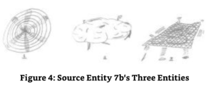

ME:Re-reading our dialogue,I don't see that you have described the form factor of your entities. 

我：重新阅读我们的对话，我没有看到你描述了你们实体的形状因素。

SE7B:It would be difficult for you to visualize that which is purely energetic and formless, which,of course,is what the first two are.The third type has a sort of loose form-hence,the net or cloud-like description that has been described to you in the most logical way possible. 

7号源实体B：你们很难想象纯粹的能量和无形，当然，这就是前两种。第三种类型有一种松散的形式，因此，网状或云状的描述已经以最合理的方式向你们描述过了。

ME:Touche.When these flat planets or the materials for these flat planets are created,how are they transported to Source Entity Seven A's environment? 

我：说得对。当这些扁平行星或这些扁平行星的材料被创造出来时，它们是如何被运送到源实体7A的环境中的？

SE7B:Via the interface at the outside of the three environments.The same one that allows entities to move from Source Entity Seven A's environment to my environment or my entities to [move to]Source Entity Seven C's environment.

7号源实体B：通过三个环境外部的接口。同样的接口可以让实体从源实体7A的环境移动到我的环境，或者我的实体移动到源实体7C的环境。

ME:OK,that's clear.Thank you. 

我：好的，很清楚了。谢谢你！

SE7B:It is now time for you to communicate with Source Entity Seven "C."It is waiting for you and has been observing the communication methods you used to establish a continued dialogue with Source Entity Seven "A"and me.Further and final communication with Source Entity Seven "collectively"will follow directly afterward in order to finalize these dialogues and help with the redirection of the link to the Source Entity you will refer to as "Eight."I bid you farewell as a singular entity and will communicate with you in totality as Source Entity Seven later. 

7号源实体B：现在是时候与源实体7“C”进行沟通了。 它正在等待你，并且一直在观察你用来与源实体7“A”和我建立持续对话的沟通方法。 为了最终完成这些对话并帮助重定向到你将称之为“8”的源实体的链接，与源实体7“集体”的进一步和最终沟通将紧随其后。

### Source Entity Seven C 

**7号源实体C**

And with that last sentence the link between the second or "B"aspect of Source Entity Seven was dissolved.Even before this link was dissolved,I felt another link taking place,that of Source Entity Seven“C." 

随着最后一句话，源实体7的第二个或“B”方面的联系被解除了。甚至在这一联系被解除之前，我感觉到另一个联系正在发生，那就是源实体7“C”。

It should be noted here though that the overall link to Source Entity Seven in "totality"was never lost.Indeed,it was consistently present as a "carrier wave"(See glossary)for the smaller more directional communication links with the separate"A"and "B"aspects of Source Entity Seven.As a result of this,it is still in place and will be used for the dialogue that I am about to have with Source Entity Seven "C." 

在这里应该注意的是，虽然在“整体”中与源实体七的整体联系从未丢失。事实上，它始终如一地作为一个“载波”(见术语表)存在于与源实体七的独立的“A”和“B”方面的更小的定向通信联系中。因此，它仍然存在，并将用于我即将与源实体七“C”进行的对话。

As I thought about the up-coming dialogue with Source Entity Seven "C,"the link automatically established itself.I intuitively knew that this is a function of my energetic self and not something that I have established with that part of me that is associated with the physical.I wonder how I did that?Then,in my mind's eye,I suddenly saw the environment that Source Entity Seven "C" created and was stunned to see that it was like a ball of water hanging in space.I remembered a previous dialogue with Source Entity Two(see Beyond the Source),whose third environment was fluidic in nature.But the fluidic nature that Source Entity Two described to me was based upon an ever changing state of rotational attractivity and not what obviously looked like a liquid to me. 

当我想到即将与源实体七“C”进行的对话时，这个联系自动地建立了它自己。我直观地知道这是我能量自我的一个功能，而不是我与与物质相关的我所建立的某个部分。我不知道我是怎么做到的？ 然后，在我的心灵之眼中，我突然看到了源实体七“C”创造的环境，并震惊地看到它就像一个悬浮在太空中的水球。我记得以前与源实体2的对话(见源头之外)，它的第三个环境本质上是流体的。但是源实体二向我描述的流体本质是基于不断变化的旋转吸引力状态，而不是我所看到的明显的液体。

I was intrigued to find an environment that was clearly "physical"in appearance in an area of The Origin where most,if not all,of the environments created by the Source Entities I had communicated with at that point in time were energetic.I eagerly sought Source Entity Seven "C"to establish if this image and my interpretation were reasonable.I do have to say though that the prospect of an environment that was liquid in consistency was not likely,for in my understanding,a liquid is a function of the physical universe in which I or part of me currently existed.Was I pre-empting the information I was receiving?I decided to not overlay this information with my own thought processes and commenced the dialogue with Source Entity"C." 

我很好奇地发现，在起源的一个区域，有一个明显是“物理”外观的环境，在那里，如果不是全部，那么大多数，我当时与之沟通的源实体所创造的环境都是充满活力的。我急切地寻找源实体七“C”，以确定这个图像和我的解释是否合理。我必须说，尽管一个环境的前景是液体的稠度不太可能，但在我的理解中，液体是我或我目前存在的一部分的物理宇宙的功能。我是否抢占了我正在接收的信息？我决定不把这个信息与我自己的思想过程重叠起来，并开始与源实体“C”对话。

ME:I feel that you have made contact with me.Can we speak? 

我：我觉得你已经与我取得了联系。我们能说话吗？

SE7C:G'day. 

7号源实体C：你好。

Again,said in an Australian accent,the accent used by Source Entity Seven "in totality."I had gotten used to a neutral accent with Source Entity Seven "B"(not commented on in the text),and as a result,it took me by surprise. 

再次，用澳大利亚口音说，这是源实体7“完全”使用的口音。我已经习惯了源实体7“B”(在文本中没有评论)的中性口音，结果，它让我感到意外。

ME:You caught me unawares then.I had become used to "B's"neutral accent.

我：你让我措手不及，我已经习惯了“B”的中性口音。

SE7C:I can adopt a neutral accent if you wish.I was following that communication method used by our "totality.I trust what you are receiving now is to your acceptance. 

7号源实体C：如果你愿意，我可以采用中性的口音。我正在遵循我们“全体”使用的沟通方法。我相信你现在接收到的东西是可以接受的。

ME:Sorry,I didn't need you to change your accent to suit my requirements.What you had was fine.It just caught me out,but I do thank you for thinking of me and my limitations. 

我：对不起，我不需要你改变你的口音来满足我的要求。你已经很好了。它只是让我措手不及，但我确实感谢你想到我和我的局限性。

SE7C:You are not as limited as you think.In fact,there is quite a crowd forming around the galaxy your earth sphere is manifested in.The beings in the crowd are watching with intense interest the human who is in contact with The Origin and the Source Entities.To travel around a universe where one is existing is one thing.To travel around the multiverse of a Source Entity is another,but to be able to break through the barrier of a Source Entity and its environment,dip into the environments of other Source Entities and communicate directly with The Origin is quite another.You are creating quite a stir.You are a sensation. 

7号源实体C：你并不像你想的那样受限。事实上，在你地球所在的银河系周围已经形成了相当大的群体。群体中的生物正带着强烈的兴趣注视着与起源和源实体有联系的人。在你所存在的宇宙中旅行是一回事。在源实体的多维宇宙中旅行是另一回事，但是能够突破源实体及其环境的屏障，深入到其他源实体的环境中并直接与起源沟通是完全不同的另一回事。你正在制造相当大的轰动。你是一个轰动。

ME:You are embarrassing me. 

我：你让我很尴尬。

SE7C:Why would I want to do that?I have no need or desire to.Ah!I see your heritage.Now I see why and how you can do what you are doing.You are OM. 

7号源实体C：我为什么要那样做？我没有需要或欲望。啊！我看到了你的遗传。现在我知道你为什么以及如何能做你正在做的事情。你是OM。

I had been told this before(that I was OM)but had decided to put it to one side.I did not want to promote illusions of grandeur.Instead,I felt very silly that it had come up again,especially as it was suggested that I was drawing a crowd.And not only that,an intergalactic one to boot! 

以前有人告诉过我(我是OM)，但决定把它放在一边。我不想促进宏伟的幻想。相反，我觉得它再次出现很愚蠢，特别是当它表明我正在吸引人群。不仅如此，一个星际之间的启动！

Quite out of the blue,and with no knowledge of this dialogue,my wife had received the same information in one of her meditations.Scary! 

完全出乎意料，在对这个对话一无所知的情况下，我的妻子在一次冥想中收到了同样的信息。可怕！

I decided to forge onward with my agenda of questions rather than dwell on such an ego-inflating subject but was headed off at the pass by Source Entity Seven "C."It had something else to say about me. 

我决定继续推进我的问题议程，而不是停留在这样一个自我膨胀的话题上，但被源实体7号“C”挡在路口。它还有关于我的其他事情要说。

SE7C:I will explain to you something about yourself that your own Source Entity has not shared with you yet.You clearly have the ability to move outside of the structure of your Source Entity's multiverse.When you first started to use the rather mechanical means you invented to help you move up the frequencies,you truncated the 430 frequency bands(12 dimensions x 3 dimensional components x 12 frequency bands 432.Taking into account that the first three dimensional components (tritaves)are effectively "one"in the lowest dimension,this makes it 430 frequency bands because the rest of the tritaves are considered individual within the full dimension in which they exist.Also,note that as a frequency band is associated with a particular dimensional component,in actuality it becomes a permutation of space,a universe in its own right)that are associated with your multiverse, to 100-hence,your rather round figure of 100 levels.Your Source Entity did not deny the figure.Because you had traversed the 430 levels in 100 steps and not 430,you missed out certain levels.When you achieved this,you attracted the attention of your Source Entity and The Origin,who commenced dialogue with you in order to encourage you and let your ability grow.They saw your evolutionary opportunities and were/are keen to see you progress. 

7号源实体C：我要向你解释一些关于你自己的事，你自己的源实体还没有与你分享。你显然有能力移动到你源实体的多维宇宙结构之外。当你第一次开始使用你发明的机械方法来帮助你提升频率时，你截断了430个频带(12维度x3维度组件x12个频带432。考虑到第一个三维组件(三度)在最低维度中有效地是“一个”，这使它成为430个频带，因为其余的三音阶被认为是它们存在的完整维度中的个体。此外，请注意，由于一个频带与一个特定的维度组件相关，实际上它成为空间的排列，它自己的宇宙)与你的多维宇宙相关，到100，因此，你相当圆的100个水平数字。你的源实体没有否认这个数字。因为你已经在100步中穿越了430个水平而不是430个，你错过了某些水平。当你做到这一点时，你吸引了你的源实体和起源的注意，他们开始与你对话，以鼓励你并让你的能力成长。他们看到了你的进化机会，并渴望看到你的进步。

ME:If that is true then,the levels that mankind's universe exists within also span the lower two frequency bands/levels of the lowest tritave in the second full dimension.That is,humanity can/will occupy the twelve frequency bands/levels in the first full dimension, plus the first two frequency bands of the first tritave in the next full dimension.That equals fourteen and makes sense. 

我：如果是这样的话，人类宇宙存在的层也跨越了第二个完整维度中最低三等分的两个频带/层。也就是说，人类可以/将占据第一个完整维度的12个频带/层，加下一个完整维度中第一个三等分的前两个频带。这等于14个，而且有道理。

SE7C:Correct.Mankind is ascending and will soon be able to occupy,in part,those two levels,the ones you call levels thirteen and fourteen,which,to current physical mankind's perspective would be classed as energetic.This is why you established that the physical universe is made up of 14 levels.It is because part of the universe that mankind occupies is moving up the frequencies.At some point in mankind's evolution,the lower frequencies will be closed to mankind because mankind will have ascended beyond the need for interaction with the physical. 

7号源实体C：正确。人类正在提升，不久将能够部分占领那两个级别，你称之为第13和14级，从当前物质人类的角度来看，这两个级别被归类为高能级。这就是为什么你确立了物质宇宙由14个级别组成。这是因为人类所占领的宇宙部分正在提升频率。在人类进化的某个时刻，低频率将对人类关闭，因为人类将提升到与物质世界互动的需要之外。

ME:Ah,now it makes sense.I was struggling with that one.To me,it just did not add up.I was getting worried that I was getting conflicting information.I was starting the think that I had gotten something totally wrong or was missing something,which I obviously was. 

我：啊，现在有道理了。我一直在与那个斗争。对我来说，它就是不合逻辑。我开始担心我得到的是相互矛盾的信息。我开始认为我完全弄错了，或者错过了什么，很明显我错了。

SE7C:Everything is revealed at the right time.One other thing that you need to be aware of is the way you operate.You effectively cut across the frequencies,tritaves and dimensions in any way you feel fit.You are not limited to the linear progression or dimensional/ tritave/frequential movement that many entities are.You are fully free.This is why you can communicate with the other Source Entities.This is another reason why you grabbed the attention of your Source Entity and The Origin.It is also the main reason why you are being allowed to communicate with me and the other Source Entities. 

7号源实体C：每件事都在正确的时间被揭示。另一件你需要知道的事情是你操作的方式。你有效地切断了频率，三阶和维度，以任何你觉得合适的方式。你不像许多实体那样被限制在线性进程或维度/三阶/频率运动中。你是完全自由的。这就是为什么你可以和其他源实体交流。这也是为什么你能抓住你的源实体和起源的注意力。这也是为什么你被允许和我以及其他源实体交流的主要原因。

Know this:Most entities are currently restricted to the confines of their Source Entity and can only communicate with their Source Entity and The Origin as a direct line of communication.Being able to circumnavigate this restriction is an honor.Use it wisely.Use it well. 

要知道，大多数实体目前被限制在它们的源实体的范围之内，只能与它们的源实体和起源进行直接的交流。能够绕过这个限制是一种荣誉。明智地使用它。好好地使用它。

ME:I will.Thank you.You also seem to know now that I am OM.I have been told this before by my own Source Entity,Byron,Hum and an intuitive friend,but to be honest,I have not given it too much thought.However,I did have a flash of information whilst considering what I had typed as my "personal thoughts"(in italics above).The information (and I am really sensitive about typing this,let alone including it in this book)suggests that the OM is an abbreviation of two words in English,Original Material or Original Manifestation.I also received the information/impression that this Original Material/Manifestation is "Origin" energy remaining from the creation of the twelve Origins,the experiment that failed.Is this suggesting that I or my energy is from The Origin and NOT from my Source Entity?How can this be?People will be thinking that I am getting delusional. 

我：我会的。谢谢你！你现在似乎也知道我是OM。我自己的源实体、拜伦、HUM和一个直觉的朋友以前就告诉过我这个，但说实话，我没有想太多。然而，当我在考虑我打出来的“个人想法”(上面斜体字)时，我确实有了一个闪光的信息。 这个信息(我对打出这个很敏感，更别说把它包括在这本书里了)表明OM是英文中两个词的缩写，原始材料（Original Material）或原始显现（Original Manifestation）。我也收到了这个信息/印象，这个原始材料/显现是12个起源创造失败后留下的“起源”能量。这是否表明我或我的能量来自起源而非我的源实体？怎么会这样？人们会认为我开始妄想。

SE7C:No,you are not delusional nor should you be concerned.You should be honored to know such information.You may recall that in your communications with "B,"you were advised that the fourth set of entities in its environment were either re-assigned to be one of the other three or were assimilated into "B"for use at or in a future event.You may also remember that in the event that an entity chose assimilation where the energy that was the fourth entity type was broken up and used for other purposes-including full and partial integration into that which it was as the previous entity or used to create another entirely new composite entity,it retained the signature of energy that was given individuality, purpose and the ability to experience,learn and evolve.

7号源实体C：不，你不是妄想，你也不应该担心。你应该感到荣幸知道这些信息。你可能记得在你与“B”的通信中，你被告知第4种实体在其环境中要么被重新分配到其他3种实体中的一个，要么被同化到“B”中，以便在未来事件中使用。你可能还记得，在一个实体选择同化的情况下，第4种实体类型的能量被分解并用于其他目的，包括完全和部分地整合到之前的实体中，或用于创造另一个全新的复合实体，它保留了赋予个性、目的和体验、学习和进化能力的能量签名。

ME:Yes,I do remember that. 

我：是的，我确实记得。

SE7C:Well,when The Origin reintegrated those energies that it had used to create the twelve Origins,the signature of that energy was not lost.It was merely integrated back into use for the creation of the Source Entities.The Source Entities,us,were actually created using some of this energy with "Origin"characteristics.However,when it was amalgamated into the Source Entities,it did not mix very well.It maintained its own boundaries and was difficult to share evenly and equally among all the Source Entities when we were created.It was like mixing oil with water,so to speak.When your Source Entity created the energies it was to use to populate its environment,giving it the signature of the ability to experience,learn and evolve,the energies that were of Original Manifestation energy were the first to be let loose.You(incarnate you)are part of one of those energies. 

7号源实体C：当“起源”重新整合那些用来创造12个起源的能量时，那种能量的特征并没有丢失。它仅仅被整合回去用于创造源实体。源实体，我们，实际上是用一些具有“起源”特征的能量创造出来的。然而，当它被合并到源实体中时，它并没有很好地混合。它保持了自己的边界，当我们被创造出来时，它很难在所有的源实体中均匀平等地分享。可以说，它就像油和水混合在一起。当你的源实体创造了它将用来填充其环境的能量，赋予它体验、学习和进化的能力的特征时，原始显化能量的能量是第一个被释放的。你(化身你自己)是那些能量之一的一部分。

ME:Why was I not told this by my Source Entity or The Origin? 

我：为什么我的源实体或“起源”没有告诉我这个？

SE7C:Quite simply,you were not supposed to know then. 

7号源实体C：很简单，你当时不应该知道。

ME:So why are you telling me now? 

我：那你为什么现在告诉我？

SE7C:Because of the need to accelerate your knowledge.You have/are progressing faster than planned in your current state and need to know why you are supposedly breaking the rules.You have no rules.You and the OM are Original Material,and you are part of The Original Manifestation. 

7号源实体C：因为需要加速你的知识。你已经/正在比你当前状态的计划进展得更快，需要知道为什么你应该打破规则。你没有规则。你和OM是原始材料，你是原始显现的一部分。

ME:Should not my Source Entity have told me this,or at least The Origin.Why you? 

我：我的源实体不应该告诉我这个，或者至少是起源。为什么是你？

SE7C:It was not important what "Source"was used for your gaining this information;it was all about the timing.You are a child of The Origin with a foster parent of the Source Entity. Your Source Entity set you free in its initial casting out of energy to create the beings that populated its environment.Similar versions of the OM are in other Source entities,but for some reason your Source Entity had the lion's share of the energies.This is possibly because it was the first,by a few nanoseconds,to be created when The Origin created the twelve Source Entities.It is no mistake you call your Source Entity,Source Entity One. 

7号源实体C：你获得这个信息所使用的“源”并不重要，重要的是时间。你是起源的孩子，源实体是你的养父母。你的源实体在最初释放能量时释放了你，创造了在其环境中生存的生物。其他源实体也有类似的OM版本，但由于某种原因，你的源实体拥有最大的能量份额。这可能是因为当起源创造12个源实体时，它是第一个被创造出来的，比其他的早几纳秒。你把你的源实体称为1号源实体，这没有错。

ME:So there are,err,globules of OM everywhere-within and without the Source Entities? 

我：所以，呃，OM球体无处不在——源实体内部和外部？

SE7C:Within the Source Entities,yes.But as I said,your Source Entity seems to have the lion's share of this energy.Without the Source Entities?No,this is not a regular occurrence -hence,why you are causing a bit of a stir.In fact,you are one of five OM to be "re-born" from your Source Entity who have the ability to move outside their fostering Source Entity. The other four-my mind went back to the memory of the four individuals I saw in a waking meditation some thirty odd years ago,telling me that all that I knew and was working on was correct,but it was not the right time for me to progress it further-that are associated with you have not incarnated with you in the physical plane nor will they,for they are supporting you and your work,which I am told goes beyond that which you are currently experiencing. 

7号源实体C：在源实体内部，是的。但正如我说的，你的源实体似乎拥有这能量的最大份额。没有源实体？不，这不是经常发生的——因此，为什么你正在引起一点骚动。事实上，你是五个OM之一，从你的源实体“重生”，他们有能力移动到培养他们的源实体之外。其他4个——我的脑海中回到了30多年前我在清醒的冥想中看到的4个人的记忆，告诉我所有我知道和正在做的事情都是正确的，但那不是我进一步推进它的合适时间——与你相关的4个人还没有和你在物质层上化身，他们也不会，因为他们支持你和你的工作，我被告知这超出了你目前正在经历的。

ME:Can I,should I ask you what that is now? 

我：我能，我应该问你现在是什么吗？

SE7C:No,it would be a distraction.You will get plenty of time for that in the extended and exclusive dialogue you are due to have with The Origin in the text you already know will be called "The Origin Speaks."

7号源实体C：不，这会分散注意力。你将有足够的时间在你已经知道的被称为“起源说话”的文本中与起源进行的扩展和独家对话中进行。

ME:Sorry,I am getting a bit flustered at this information.I have one more question. Shouldn't I be able to do more than I am?I mean,shouldn't I have more faculties/powers? I feel that if I am of the OM,of The Origin's Original Material/Manifestation,should I not be performing miracles?Shouldn't I be a great Yogi materializing this,that and the other?Levitating,teleporting,saving individuals and countries from starvation and strife? Teaching the truth on a grand scale? 

我：对不起，我对这个信息感到有点慌乱。我还有一个问题。我应该能做得比现在更多吗？我的意思是，我应该有更多的能力/力量吗？我觉得如果我是OM，起源的原始材料/显现，我应该不表演奇迹吗？我应该不是一个伟大的瑜伽士实现这个，那个和其他的吗？漂浮，瞬间移动，从饥饿和冲突中拯救个人和国家？在宏大的规模上教导真理？

SE7C:No,first I am advised that YOU chose the level of functionality you currently have whilst this small part of you is projected into the physical.I also note that you understand that the lower down the frequencies you go,the less functionality you have.This is very much in "play"here.Second,being OM only really gives you a signature that originates from The Origin's creativity and not directly from your Source Entity's creativity.Your abilities whilst in the energetic are similar to both Source Entity and Origin but majoring on The Origin with,of course,the exception being that you can traverse beyond your Source Entity and the other Source Entities,which is an Origin-based function.Is that not miracle enough for you,especially when such a small part of you is in the physical?You are doing what you signed up to do.On a worldwide scale,your books and your lectures/talks,both in groups and one on one,are starting to help increase mankind's understanding of your Source Entity's multiverse and that which is beyond,The Origin and the other Source Entities.You are also helping to increase the frequencies of the earth.Ah!I see that you have residual memory of your ability;this can be a big distraction and could inhibit you if you dwell on it too long.My advice is that you be content with what you are doing and move on with your purpose.

7号源实体C：不，首先我被告知你选择了你目前拥有的功能水平，而你的这一小部分被投射到物质层中。我也注意到你明白了你越往下走频率越低，你拥有的功能就越少。这在这里是非常“玩”的。 第二，OM只真正给了你一个来自起源创造力的签名，而不是直接来自你的源实体的创造力。你在能量层中的能力与源实体和起源相似，但主要集中在起源上，当然，例外是你能穿越超越你的源实体和其他源实体，这是一个基于起源的功能。这对你来说还不够神奇吗，特别是当你这么小的一部分在物质层中？我看到你对你的能力还有残余记忆；如果你停留太久，这会让你分心，并抑制你。我的建议是，你应该对你正在做的事情感到满意，并朝着你的目标前进。

ME:OK,enough of me,or what I currently don't recognize as me.Let's move on,as you say. When I first contacted you,I received an image of your environment as being like a sphere of liquid,rather like water.Is that right?I find it hard to believe that you have an environment made up of,err,water. 

我：好吧，我已经说够了，或者说我现在不认识我自己了。让我们继续前进，就像你说的。当我第一次联系你时，我收到的你的环境的图像是一个液体球体，更像水。是吗？我发现很难相信你有一个由，呃，水组成的环境。

SE7C:It isn't water but the make-up of the energy might give it similar properties to water or any other liquid you have on earth. 

7号源实体C：它不是水，但是能量的组成可能使它具有类似水或地球上其他任何液体的性质。

ME:What do you mean similar properties to water? 

我：你说类似水的性质是什么意思？

SE7C:Looking at the way entities in your universe move/transport themselves in this most dense of environments,it would have a similar effect on the entities that exist in my environment.For example,it offers a significant level of resistance to their personal freedom of movement. 

7号源实体C：看看你们宇宙中的实体在这个最密集的环境中移动/运输自己的方式，它会对我环境中的实体产生类似的影响。例如，它对他们个人的行动自由提供了显著的阻力。

ME:I keep getting this picture of an aquarium or huge,universe-sized goldfish bowl. 

我：我一直得到这个水族馆或巨大的、宇宙大小的金鱼缸的画面。

SE7C:That is because your information data bank is only able to give you a universe sized goldfish bowl as an example of how the combination of frequencies is constructed in my environment. 

7号源实体C：那是因为你们的信息数据库只能给你们一个宇宙大小的金鱼缸作为例子，来说明频率的组合在我的宇宙环境中是如何构建的。

I received more conceptual information from Source Entity Seven "C." 

我从源实体7号“C”那里收到了更多的概念性信息。

ME:I feel that you have just given me a rather radical concept to consider here in describing your environment.(I must stop using the word,"environment.")This is a real conundrum to me.The frequencies,dimensions and dimensional components are all interwoven with no clear demarcation like there is in my Source Entity's multiverse.

我：我觉得你刚刚给了我一个相当激进的概念来考虑这里描述你的环境。(我必须停止使用“环境”这个词。) 这对我来说是一个真正的难题。 频率、维度和维度成分都交织在一起，没有明确的界限，就像在我的源实体的多维宇宙中一样。

SE7C:Correct.They are all merged together,nothing being separate but everything being together.It makes things compact.That is why you perceived the liquid-like condition of my environment. 

7号源实体C：正确。它们都融合在一起，没有任何东西是分开的，但一切都在一起。它使事物紧凑。这就是为什么你感觉到我环境的液态状态。

ME:Isn't this a bit like the "composite dimensions"that Source Entity Six described to me in Beyond the Source? 

我：这不有点像6号源实体在《超越源头》中向我描述的“复合维度”吗？

SE7C:No,only in name,and that name is only used to help you understand,which clearly at this point in our dialogue,you don't. 

7号源实体C：不，只是名字，那个名字只是用来帮助你理解，在我们对话的这一点上，你显然不明白。

ME:Hold on.Give me chance.I have just received some clarity in the image that I am receiving.The ball or goldfish bowl is not really liquid in appearance;it is more like steel, round shiny and hard.That's it;it looks like a ball bearing!It was the shiny outer surface that took me by surprise.A drop of liquid has some reflective properties in my physical universe, and so does a ball bearing. 

我：等一下。给我机会。我刚刚在接收到的图像中得到了一些清晰。这个球或金鱼缸在外观上并不是真正的液体； 它更像钢铁，圆润光滑而坚硬。就是它； 它看起来像一个滚珠轴承！ 是它光滑的外表面让我吃惊。一滴液体在我的物理宇宙中有一些反射特性，滚珠轴承也是如此。

I was starting to realize that the sphere was a common shape.It had appeared in some way in all the different Source Entities'multiverses I had encountered;it even looked like it was a common shape within The Origin.I decided to mentally file this away and ask The Origin about this possible "constant"later. 

我开始意识到这个球体是一种常见的形状。它以某种方式出现在我所遇到的所有不同源实体的多维宇宙中；它甚至看起来像源头内部的一个常见形状。我决定在心里把它存档起来，稍后问源头关于这个可能的“常数”。

SE7C:The perceived appearance of my environment is merely metaphorical.That which you are seeing/perceiving is a direct result of the intertwining.Is this the correct word?

7号源实体C：我所感知的环境的外观仅仅是隐喻性的。你所看到/感知的是一个直接的相互交织的结果。这是正确的词吗？

ME:It will do. 

我：它会的。

SE7C:The intertwining of the dimensions,dimensional components and the frequencies provides you with no logical datum point to use.In essence,they are all one.Let me explain further.

7号源实体C：维度、维度分量和频率的交织，使你无法找到逻辑基准点。本质上，它们都是一个。让我进一步解释。

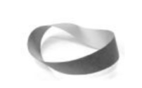

This environment is a bit like a mobius loop within a mobius loop within a mobius loop.I can see you frowning. 

这个环境有点像一个莫比乌斯环中的莫比乌斯环中的莫比乌斯环。我能看见你在皱眉。

ME:You bet I'm frowning.I can see a headache coming on. 

我：我当然在皱眉了。我能感觉到头疼。

SE7C:Let me give you an example.The area that would be occupied logically in your Source Entity's environment is as follows: 

7号源实体C：让我给你举个例子。逻辑上，在你们源实体的环境中所占据的区域如下：

A full dimension is constructed of three dimensional components or tritaves.Each tritave, except the first three tritaves,which are used to create the base full dimension only,are inflated with twelve base frequency sets.This structure is duplicated in what you would recognize as an upward manner. 

一个完整的维度是由三维组件或三音阶组成的。除了前三个三音阶，它们只用于创建基本的完整维度，其余的三音阶都被十二个基本频率集膨胀。这个结构是以你所能识别的向上的方式复制的。

ME:Yes,I know this quite well,and we just discussed it.Thank you. 

我：是的，我知道得很清楚，我们刚刚讨论过。谢谢你！

SE7C:Bear with me.Well,in my environment,one of the tritaves can be substituted with a base frequency or,indeed,a full dimension.Also,a full dimension can be substituted with a base frequency or a tritave.Similarly a base frequency can be substituted with a full dimension or a tritave or both.With all of this happening concurrently,one can see an intricate weave of dimensional component,base frequency and full dimension.Try to imagine it as the biggest knot you have ever seen! 

7号源实体C：请耐心等待。在我的环境中，一个三阶振幅可以被基频或一个完整维度所替代。同样，一个完整维度可以被基频或一个三阶振幅所替代。同样，一个基频可以被一个完整维度或一个三阶振幅或两者都替代。所有这些同时发生，人们可以看到一个复杂的维度组件、基频和完整维度的编织。试着把它想象成你见过的最大的结！

I tried.It was difficult.And,yes,dear reader,my head hurt. 

我试过。这很难。是的，亲爱的读者，我的头疼。

SE7C:It is best not to try too hard.I see that you are looking from the outside of me/my environment. 

7号源实体C：最好不要太努力。我看到你从我/我的环境的外部看。

ME:Yes,it still looks like a steel ball.But wait,I get the impression that there are,just as you insinuated by the word "Knot"-lots and lots of little loops with each loop being a connection to each of the dimensions,tritaves and frequency bands.It is as if they are all joined together even though they can and do pervade each other's logical"space."As you say, each of the components of frequency dimension or dimensional component(tritave)can replace each other.And again,as you say,this is not restricted in a one for one replacement as,for instance,two or even three full dimensions can sit in the location/position or whatever of say,a single frequency band.Or even a single tritave can be positioned in its logical position,plus that of a full dimension or a frequency band.Just then,I saw the connections between the environmental components twisting and weaving as the locations changed.It is a bit like an ever changing knot.It even looks like a bucket of snakes,except that the snakes are all linked together.It is quite bizarre. 

我：是的，它看起来仍然像一个钢球。但是等一下，我得到的印象是，就像你通过“结”这个词暗示的那样，有很多很多的小圈，每个圈都连接到每个维度、三阶振幅和频带。即使它们可以并确实渗透到彼此的逻辑“空间”，它们似乎都连接在一起。正如你所说，频率维度或维度组件(三阶振幅)的每个组件都可以相互替代。再一次，正如你所说，这并不局限于一个对一个的替换，例如，两个或甚至三个完整的维度可以坐在位置或任何单一频带。甚至一个单一的三维可以被定位在它的逻辑位置，加上一个完整的维度或一个频带。就在那时，我看到环境组件之间的连接随着位置的变化而扭曲和交织。它有点像一个不断变化的结。它甚至看起来像一桶蛇，除了蛇都连在一起。这是相当奇怪的。

SE7C:It is not bizarre to me because it has purpose. 

7号源实体C：对我来说这并不奇怪，因为它有目的。

ME:OK,that's a good thing to start with.What is the purpose of this ever changing,fully substitutional knot of a ball bearing-looking environment?

我：好的，这是一个很好的开始。这个不断变化的，完全替代的球轴承环境的结的目的是什么？

SE7C:Its purpose is simply to create confusion in terms of an entity's orientation within the environment. 

7号源实体C：它的目的只是为了在环境中创造一个实体的方向性混乱。

ME:What do you mean confusion?I would have thought that confusion was a fairly small purpose for an environment with such a complicated structure. 

我：你说的混乱是什么意思？我认为对于一个结构如此复杂的环境来说，混乱是一个相当小的意图。

SE7C:Not in the slightest,for this is a most taxing environment to exist within.The method of evolution is in the functionality of the environment and how the entity works with it.I can see you frowning again,so I will explain further. 

7号源实体C：一点也不，因为这是一个最费力的环境。进化的方法是环境的功能性以及实体如何与之合作。我能看到你又皱眉了，所以我将进一步解释。

The environment changes in a way that is not logical to its representation.Because the individual tritaves can either be next to a frequency band,be a frequency band,or be a full dimension rather than a component of a full dimension,their characteristics are not consistent with the characteristics of a tritave-for example,in its correct and logical structural position.This means that movement from one permutation of space to another is not recognizable as ascension or descension. 

环境的变化方式与其表现形式不符逻辑。因为单个三音节要么在频带附近，要么是一个频带，或者是一个完整的维度而不是一个完整维度的组成部分，它们的特征与三音节的特征不一致，例如，在它正确和逻辑的结构位置。这意味着从一个空间排列到另一个的运动不能被识别为提升或下降。

ME:So you are suggesting that ascension is not possible in this environment and that this is a function of its structure? 

我：所以你的意思是在这个环境中提升是不可能的，这是其结构的功能？

SE7C:That is a very good point.Actually,there is only one level of ascension available to the entity as a result of working with this environment.And as you quite rightly suggested,this is a function of its structure.Please note though that the amount of work undertaken by my entities to work and traverse this environment does not go unrewarded,for the equivalent ascension profile is equal to two of those evolutionary levels attained by existing within Source Entity A B's environments.In actuality,it is equivalent to the evolution gained by working in and graduating from“A"and“B's”combined environments. 

7号源实体C：这个问题提得很好。事实上，由于与这个环境共存，实体只有一个提升级别。正如你正确地指出的，这是其结构的功能。请注意，我的实体为工作和穿越这个环境所承担的工作量并不是没有回报的，因为等效提升概况等于存在于源实体A和B的环境中所获得的两个进化级别。实际上，它等同于在“A”和“B”的结合环境中工作并毕业所获得的进化。

ME:Thank you.I have been receiving images and feelings of dual existence whilst in this mixed up evolutionary arena.Can you explain what I am receiving,for it is something that I am having difficulty translating into recognizable imagery. 

我：谢谢。在这个混合的进化舞台上，我一直在接收双重存在的图像和感觉。你能解释我正在接收的东西吗？ 因为我很难把它转化成可识别的图像。

SE7C:OK,I can see your difficulty.When an entity that is working in what you would call the frequency band associated with a particular dimensional component and is,in turn, associated with a full dimension,it is able to move on to the next frequency band through its work in experiencing that which it desires to experience.It doesn't just move on to the next logical frequency band. 

7号源实体C：好的，我能看出你的困难。当一个实体在你所说的频带中工作，与一个特定的维度组件相关联，反过来，与一个完整的维度相关联，它能够通过它在经历中所希望经历的，移动到下一个频带。它不仅仅是移动到下一个逻辑频带。

ME:No,don't explain further;let me see if I can understand what is happening.I think I understand now.It moves into the space that is associated with the dimensional component/full dimension etc.That is,"in the place of"that next frequency band.This means that it occupies and exists within the space between the permutation of space that would be the next logical step if the next step was to be into a frequency band.Not only that, I get the feeling that it ends up in two places at once as a result.Further,the entity,with the space being what it is,what I would classify as a permutation of non-space,does not really occupy it because for the entity,it does not really exist.It leaves a part of itself in the frequency band that it previously occupied whilst the other part,that part that is looking for the next permutation to exist and work within,looks for the frequency band that would logically be next in line.It has to traverse all of the different permutations of non-space to find it,and that may and does include working with those energies that are associated with the non-space before it can progress because progression can only really happen in the frequency bands.The entities can end up being in two environments concurrently on a permanent basis if not careful,space and non-space,because the entity has the possibility of becoming lost.It has to hone its personal multi-dimensional,multi-frequency,multi- dimensional component(tritave)navigation system to the most accurate it can ever be in order to be successful.By learning from its experiences and applying that learning,the entity eventually finds the frequency band that is next in whatever guise it assumes.Once it has done that,the entity can "reel"in that part of itself that remained in the previous frequency band,that part of it that remained in the frequency band that the entity had "grown out of"being used as a sort of life line,a datum to help it recognize where it had been and where to try next in its quest for the next frequency band. 

我：不，不要再解释了，让我看看我是否能理解发生了什么。我想我现在明白了。它移动到与维度组件/全维度等相关的空间中。也就是说，“在下一个频带的位置上”。这意味着它占据并存在于空间排列之间的空间中，如果下一步是进入一个频带，那么这将是下一个逻辑步骤。不仅如此，我感觉它最终同时在两个地方结束。此外，这个实体，与空间是它本身，我将它归类为非空间的排列，并不真正占据它，因为对于这个实体来说，它并不真正存在。它将自己的一部分留在它之前占据的频带中，而另一部分，寻找下一个排列来存在和工作的部分，寻找逻辑上是下一个的频带。它必须穿越所有不同的非空间排列来找到它，这可能也确实包括与那些与非空间相关联的能量一起工作，因为进展只能在频带中发生。如果不小心的话，实体可能会在两个环境中同时存在，空间和非空间，因为实体有可能迷失。为了成功，它必须磨练其个人的多维、多频率、多维组件(tritave)导航系统，使其达到最精确的程度。通过从经验中学习并应用所学知识，实体最终会找到下一个频带，无论它以何种形式出现。一旦它做到了这一点，实体可以“卷起”自己留在前一个频带的那部分，它留在频带中的那部分，实体已经“长大”了，被用作一种生命线，一个数据，帮助它识别它在哪里，以及在它寻求下一个频带的过程中，下一步尝试在哪里。

And... 

而且...

WoW,I just received an image of this environment that illustrated the movement of the entities around this environment like a huge three dimensional super highway multifaceted junction with roads going everywhere,up,down,left and right,with entities jumping from one road to another,each missing each other by fractions of an inch.It is "packed"with entities desperate to find the next frequency band,whether it be replacing a dimensional component a full dimension or existing as it is,a frequency band.No wonder it had the appearance of a steel ball.The energies required to hold it together must be immense!

我刚刚收到了一张这个环境的图片，它展示了这个环境周围实体的运动，就像一个巨大的三维高速公路多面交汇处，道路到处都是，上，下，左，右，实体从一条道路跳到另一条道路，每个都错过对方的一英寸。它“装满”了渴望找到下一个频带的实体，无论是取代一个维度组件，一个完整的维度，还是现有的频带。难怪它有一个钢球的外观。把它聚在一起所需的能量一定是巨大的！

（图6：三维超级高速公路交汇处）

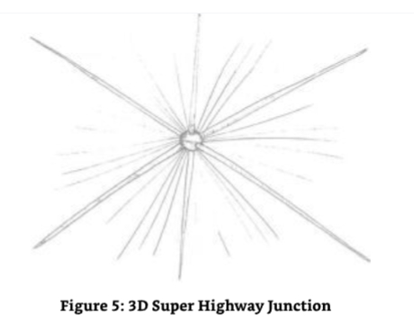

SE7C:How very well done.You are getting the hang of this,aren't you?I,of course,hold it together with ease,for the environment is me,and I am the environment.But you knew this. The whole objective of my environment,me,is to teach the entities that either primarily exist within it or that migrate to it from one of the other environments created by Source Entities Seven“A”and“B”how to operate in a multi-dimensional,multi-tritave,multi- frequency environment by not being hung up on the structure of it-to teach the entity the methods and ways of multiversal existence created by a multi-dimensional,multi-tritave, multi-frequency environment and allow them to traverse from one part to another without the need for linear progression whilst having linear progression,if you understand what I mean.Evolution is all about experience and the learning from such experience;as such,it is linear in its progression.The ability for an entity to be truly multiversal in its functionality is a prima facie requirement for existence and its progression towards the return to its creator. An entity cannot truly be a creator if it is not able to function in the same way as ITS creator. This is a fundamental law-one that exists for all entities created by all of the Source Entities who,in turn,were created by The Origin. 

7号源实体C：做得多好啊。你正在掌握这个的窍门，不是吗？我，当然，轻松地把它组合在一起，因为环境就是我，而我就是环境。但你知道这个。我的环境，我的全部目标，是教实体，要么主要存在于其中，要么从源实体七A和B创造的其他环境之一迁移到这里，如何在一个多维度，多三维，多频率的环境中运作，而不被它的结构所困扰-教实体的方法和方式，由多维度，多三维，多频率的环境创造的多维存在，并允许它们从一个部分穿越到另一个部分，而不需要线性进程，同时拥有线性进程，如果你明白我的意思。进化是关于经验和从这种经验中学习；因此，它的进程是线性的。一个实体在功能上真正多维的能力，是存在和其向回归其创造者前进的表面要求。一个实体不能真正成为一个创造者，如果它不能以与其创造者相同的方式运作。这是一个基本法则-存在于所有源实体所创造的所有实体中，而源实体又反过来被起源所创造。
 7号源实体C：
 ME：我：

SE7C：
 7号源实体C：
 ME：我：

SE7C:
 7号源实体C：
 
 我：等等，这比我想象的还要重要。所有是你一部分的实体，也就是你的整体，整个源实体7，正在通过经验的方式进行训练，当它的存在到达我们都一起提升的点时，我们都是平等的实体。我：

SE7C:继续。
 7号源实体C：
 ME：当所有由十二个源实体所创造的实体进化到与它们的创造者平等的点，而源实体进化到与起源平等的点，一切都提升到下一个层次。 在这个点上，起源移动到它对自我的理解范围之外，可以说是百分之一。 这个移动有效地倍增了自我意识的范围，到一个完全的自我意识是已知和未知的领域中较小的一部分的水平。 它将意识的范围翻了四倍，到一个意识/非意识的范围，到一个存在知识的范围，而不是经验知识的范围。 就像我们知道我们生活在一个宇宙中的星系中的行星上，而这个宇宙是多维宇宙的一部分，但我们只知道我们行星所在的太阳系的百分之一。 事实上，我们作为物质存在并不真正了解我们所存在的行星。但是随着我们对自我和环境的理解的增长，以及我们的技术和精神能力的增长，我们对环境的探测越来越多，这超出了我们以前的探测水平，我们把它加到地图上，我们试图把它画出来，但是除非我们体验到这些新绘制的空间区域，我们不会完全意识到它的特性，它在那里，但又不在那里。

ME:So this environment you have created,that you are,seems to be more important than that of the other two Source Entities Seven "A"and "B." 

我：所以你所创造的环境，你自己，似乎比另外两个7号源实体A和B更重要。

SE7C:No one Source Entity is more important that the other for we all contribute to the evolution of The Origin.I have simply created a multiversal navigation conundrum,a classroom if you like,for the collective entity population of Source Entity Seven"in totality." This allows them to experience all of the things necessary to operate in the ways a creator should do. 

7号源实体C：没有一个源实体比其他的更重要，因为我们都为起源的进化做出了贡献。我只是创造了一个多维空间导航难题，如果你愿意的话，一个教室，为“整体”的源实体7的集体实体人口。这让他们体验所有必要的事情，以创造者的方式来操作。

ME:Hold on.I have just picked up something else.All of this work,this teaching your entities to be master multiversal navigators is aligned to the image I picked up when I talked to Source Entity Five.Where all of the entities created by all of the Source Entities become equals with their creating Source Entities,and,the Source Entities all become equals with The Origin.More importantly,they all evolve together up to a level not yet experienced by The Origin,one it needs to move beyond the part of itself that it is currently aware of.The Origin created the Source Entities to help it achieve this "quantum"evolutionary leap. 

我：等一下。我刚刚发现了其他的东西。所有这些工作，这教你们的实体成为多维空间导航大师的工作，与我与源实体5交谈时所获得的图像是一致的。所有源实体创造的所有实体都与创造它们的源实体平等，而且，源实体都与起源平等。更重要的是，他们都一起进化到一个源头尚未经历过的水平，它需要超越自己目前所意识到的一部分。源头创造了源实体，以帮助它实现这个“量子”进化飞跃。

SE7C:Again,very well done.

7号源实体C：再次，做得很好。

I felt Source Entity Seven "C"smile.It was the smile of knowing that I was starting to "get it."There was something very important going on here.I had "tripped up"on something. Something of such importance that it was not only important that mankind understood what was happening through the books created by my limited dialogues with The Origin and the Source Entities,but the word was being spread throughout the Source Entities and their creations by other entities like me.Ifelt very small in the sudden realization of my very limited understanding of this "huge"big picture and mentally logged the need to discuss this in more detail with The Origin directly. 

我感觉到源实体7“C”微笑。这是微笑，知道我开始“得到它”。这里有一些非常重要的事情。我已经“绊倒”在一些东西上。一些如此重要的东西，它不仅重要的是人类通过我与起源和源实体的有限对话所创造的书籍来理解正在发生的事情，而且这个词正在通过像我这样的其他实体的创造物在源实体和他们的创造物中传播。我突然意识到我对这个“巨大的”大图景的理解非常有限，我感到非常渺小，并在精神上记录了需要直接与起源讨论这个更详细的内容。

ME:Hold on,this is even more important than I imagined.All of the entities that are part of you,that is,the whole of you,Source Entity Seven in totality,are being trained through experiential means to populate The Origin when the point in its existence arrives where we all ascend together,and we are all entities in equal standing. 

我：等等，这比我想象的还要重要。所有你身体的一部分，也就是你整个身体，全部的7号源实体，正在通过经验的方式接受训练，当我们都一起提升，我们都是平等的实体时，就去填满起源。

SE7C:Go on. 

7号源实体C：继续。

ME:When all of the entities that have been created by the twelve Source Entities evolve to the point of equality with their creators and the Source Entities evolve to the point of equality with The Origin,everything ascends to the next level.At this point The Origin moves outside of its sphere of understanding of self by a percentage point,so to speak. This movement effectively multiplies the area of awareness of self to a level where the full awareness of self is a smaller part of an area that is both known and unknown.It quadruples the area of awareness to an area of awareness/non-awareness,to an area of knowledge of existence but not of experiential knowledge.It is like we know that we live on a planet in a galaxy in a universe that is part of a multiverse,but we only know a fraction of a percentage of the solar system our planet exists within.In actuality,we don't really know the planet we exist on as physical beings.We know bits of it,but certainly not all of it.But as our understanding of self and our environment grows,together with our technical and spiritual abilities,we detect more of our environment-that which was beyond our previous level of detection.We add it to the map.Well,we try to map it,but unless we experience that which is in those areas of space that is newly mapped,we are not fully aware of its properties.It is there but not there. 

我：当所有由12个源实体所创造的实体进化到与它们的创造者平等的点，而源实体进化到与起源平等的点，一切都提升到下一个层次。在这个点上，起源移动到它对自我的理解范围之外，可以说是百分之一。这个移动有效地倍增了自我意识的范围，到一个完全的自我意识是已知和未知的领域中较小的一部分的水平。它将意识的范围翻了四倍，到一个意识/非意识的范围，到一个存在知识的范围，而不是经验知识的范围。 就像我们知道我们生活在一个宇宙中的星系中的行星上，而这个宇宙是多维宇宙的一部分，但我们只知道我们行星所在的太阳系的百分之一。事实上，我们作为物质存在并不真正了解我们所存在的行星。但随着我们对自我和环境的理解的增长，以及我们的技术和精神能力，我们探测到更多我们环境的东西，那些超出我们以前探测水平的东西。我们把它加到地图上。嗯，我们试图把它绘制出来，但除非我们体验到那些新绘制的空间区域，我们不会完全意识到它的特性。它在那里，但又不在那里。

SE7C:What you are trying to say is that The Origin will become aware of that which is a greater part of itself but will need help in expanding its awareness of its expanded self. 

7号源实体C：你想说的是起源将意识到它自身的更大部分，但需要帮助来扩大它对扩展后的自我的意识。

ME:Yes.Ok,you seem to have put in two lines what I have taken thirteen or even seventeen lines of text to do. 

我：是的。好吧，你似乎用两行文字就完成了我用了13行甚至17行文字所要做的事情。

SE7C:Naturally.I can explain further if you like. 

7号源实体C：当然，如果你愿意，我可以进一步解释。

ME:Please do.This is getting most interesting. 

我：请吧，这变得越来越有趣了。

SE7C:To put it in simple terms my particular environment is designed to train those entities that either begin in my environment or progress to my environment in the art of navigation.I will explain further.The entities that exist in all aspects of Source Entity Seven, including“A”and“B,"Source Entity Seven in“totality,"and me are endeavoring to create a team of entities that contain all of the important aspects of existence necessary to allow them to grow into creators.This will allow them to create their own environments and hence populate that part of The Origin that becomes available for experiential use when the expansion/ascension occurs. 

7号源实体C：简单地说，我特殊的环境是设计来训练那些在我的环境中开始或进入我的环境的实体的导航艺术。我会进一步解释。存在于源实体7的所有方面，包括“A”和“B”，“整体”中的源实体7，以及我，正在努力创造一个实体团队，包含所有重要的存在方面，使他们成长为创造者。这将使他们能够创造他们自己的环境，从而填充起源的一部分，当扩张/提升发生时，可以用于体验使用。

The entities that "graduate"from this environment will be master navigators.They will be able to traverse and exist within and without the energies,frequencies,dimensions,tritaves and zones that make up the known and unknown area of the newly ascended Origin and populate it with newly ascended Source Entities. 

从这个环境“毕业”的实体将是导航大师。他们将能够穿越和存在于能量、频率、维度、区域和区域之间，这些区域和区域构成了新提升的起源的已知和未知区域，并填充了新提升的源实体。

ME:Wait.Hold on a moment.What do you mean,newly ascended Source Entities?At the last count I made twelve.Do you expect there to be more? 

我：等等。等一下。你是什么意思，新提升的源实体？在最后的数目中我数到了12个。你希望有更多吗？

SE7C:As you have seen in your visualizations,all entities will eventually become equals.As they become equal to their creators,they attain the same status as their creator and so will become Source Entities in their own right.In essence,the created will become the creator and will adopt the same status and reason for being in existence.They will be different from The Original Source Entities though insomuch as they will be able to find and adapt themselves to a location within The Origin that they feel is in keeping with their plans for experiential creativity and evolution.Each of them will be able to work outside the need to be "static"within The Origin's area. 

7号源实体C：正如你们在你们的视觉化中所看到的，所有的实体最终将变得平等。当他们与他们的创造者变得平等时，他们获得了与他们的创造者相同的地位，因此将以自己的权利成为源实体。本质上，被创造者将成为创造者，并将采用相同的地位和存在的理由。他们将与原始源实体不同，尽管如此，他们将能够找到并适应自己在起源中的位置，他们感觉到与他们的经验创造和进化计划保持一致。他们中的每一个都将能够在不需要在起源区域内“静态”的情况下工作。

As you are aware,when The Origin created the twelve Source Entities,we were/are all stationary within The Origin's area of awareness.We do not move.There is no need for us to move,for we occupy that area which The Origin was aware of when it created us.It will expand its area of awareness to a greater level when we all ascend.You used the word "quadruple,"I believe,but this is not a correct word to use to describe The Origin's increase in size.The area of The Origin's awareness of self will increase when it becomes an area of knowledgeable awareness/non-awareness.Everything will expand and multiply:the zones, the dimensions,the tritaves,the frequencies and the energies.The word"quadruple"should be,therefore,explained as being a multiple of a multiple of a multiple of a multiple of the zones,the dimensions,the tritaves,the frequencies and the energies.It will be unbelievably larger than that which we are currently experiencing.And yet,it will still not be a percentage point of the total area of that which is The Origin. 

正如你所知，当起源创造了12个源实体，我们都/是静止在起源的意识区域内。我们不移动。我们没有必要移动，因为我们占据了起源创造我们时意识到的那个区域。当我们都提升时，它将扩大它的意识区域到一个更大的水平。我相信你用了一个词“四倍”，但这不是一个正确的词来描述起源的大小的增加。当它成为一个有知识的意识/无意识的区域时，起源的自我意识区域将增加。一切都将扩大和倍增：区域、维度、三音阶、频率和能量。因此，“四倍”这个词应该被解释为一个倍数的倍数的倍数的倍数的区域、维度、三音阶、频率和能量。它将比我们目前所经历的要大得难以置信。然而，它仍然不会是起源总面积的百分之一。

ME:I am getting an image of a huge sphere,one that has levels within levels within levels.As one's perspective moves further away from the center,the level of intricacy multiplies on a multiple of an exponential scale each time one moves away from the center by a fraction of a percentage point. 

我：我正在得到一个巨大的球体的图像，一个有层次的层次的层次。当一个人的视角远离中心，每一次远离中心百分之一的分数，复杂程度就会以指数倍数增长。

SE7C:Yes,now you are getting it.Now do you understand?

7号源实体C：是的，现在你明白了。现在你明白了吗？

（图7：起源的层次和图层的概念图）

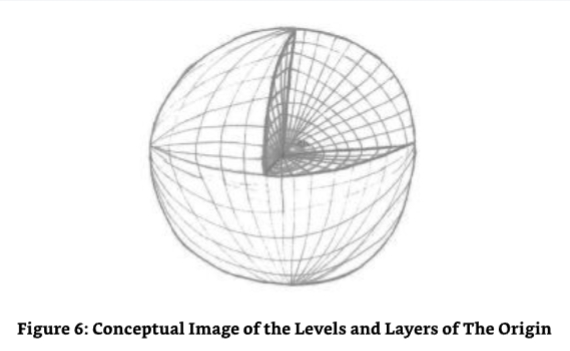

ME:I think so.If I can just explain in summary.The anticipated expansion in The Origin resulting from the collective ascension of entity,Source Entity and Origin will be so big that it will be able to satisfy the same area occupied by a single Source Entity now,for all of the current Source Entities and all of the entities created by the twelve Source Entities that will be elevated to Source Entity status in every way shape and form. 

我：我想是的。如果我可以简要的解释一下，源头上预期的扩张，源实体和源实体的集体提升，将会是如此巨大，以至于它将能够满足现在由单个源实体所占据的相同面积，对于所有当前的源实体和所有由12个源实体所创造的实体，它们将以各种方式和形态提升到源实体的地位。

SE7C:Correct. 

7号源实体C：正确。

ME:That's AWESOME! 

我：太棒了！

SE7C:Isn't it just? But it's more than that.The area will be so big that the newly ascended Source Entities will not be side to side,so to speak.They can be hidden away from each other in some part of the newly expanded area of awareness/non-awareness of self that The Origin will experience-hence,the need to be master navigators of that which is The Origin. These navigators will be called upon by the newly ascended Source Entities/themselves to guide them through the maze that will be the area of awareness/non-awareness of self that The Origin will be post-ascension.They will need to be able to traverse all conundrums that will be placed before them.That is why my environment is designed the way it is.To allow the entities to experience their environment as a conundrum and learn how to navigate it, to learn how to move outside the maze so to speak,to see the maze as if seeing it from above and drop down to that area required to be experienced.The introduction of these new Source Entities will greatly accelerate The Origin's ability to increase its awareness of self and to evolve.It will be the start of a wondrous time. 

7号源实体C：难道不是吗？但它不止于此。这个区域将是如此之大，以至于新提升的源实体将不能并排，可以这么说。他们可以彼此隐藏在“起源”将要经历的自我意识/非自我意识的新扩展区域的某个部分，因此，需要成为“起源”的导航大师。这些导航大师将被新提升的源实体/他们自己所召唤，来引导他们通过迷宫，那将是“起源”在提升后将要经历的自我意识/非自我意识区域。他们将需要能够穿越摆在他们面前的所有难题。这就是为什么我的环境被设计成这样。为了让实体体验它们的环境，就像一个难题，并学会如何导航，学会如何走出迷宫，可以这么说，去看看迷宫，就像从上面看它，然后下降到需要被体验的区域。这些新源实体的引入将极大地加速“起源”增加自我意识和进化的能力。这将是一个奇妙时刻的开始。

ME:What will happen to The Original twelve Source Entities? 

我：最初的12个源实体会发生什么？

SE7C:We will assist The Origin in its own explorations of self.We will start again but in a different way. 

7号源实体C：我们将协助起源进行自我探索。我们将以不同的方式重新开始。

Again,I made a mental note of this discussion as one that I will progress with The Origin in "The Origin Speaks." 

再次，我将这次讨论记在心里，作为我会在“起源说话”中与起源一起前进的参考。

ME:I have just noticed that I haven't asked you what your entities look like yet. 

我：我刚刚注意到我还没有问你你们的实体长什么样。

SE7C:What they look like is of no consequence,for in my environment they need no physical or energetic form.All those entities that come from "A"and "B's"environments are converted to the formlessness required to work in this environment;hence,I cannot give you a form,for they neither need one nor use one,physically or energetically. It is time for you to move on and conclude your dialogue with Source Entity Seven "in totality"before moving on to Source Entity Eight.Go now. 

7号源实体C：他们长什么样子无关紧要，因为在我的环境中，他们不需要任何物理或能量形式。所有来自“A”和“B”环境的实体都被转换成在这个环境中工作所需的无形体；因此，我不能给你一个形式，因为他们既不需要也不使用一个，物理上或能量上。现在是时候让你继续前进，在继续前进到源实体8之前，“完全”结束你与源实体7的对话了。现在走吧。

ME:I thank you for your "time"and wisdom. 

我：我感谢你的“时间”和智慧。

SE7C:It was,as you call it,a pleasure. 

7号源实体C：正如你所说的，很高兴。

And with that the third Aspect of Source Entity Seven,Source Entity Seven "C"was gone.Almost immediately,I felt the combined energy signature of Source Entity Seven "in totality"as it approached me to conclude our dialogue. 

随着7号源实体的第三个方面，7号源实体“C”消失了。几乎立即，当7号源实体“C”接近我结束我们的对话时，我感觉到了它的整体能量特征。

### In Closing with Source Entity Seven"In Totality" 

**与7号源实体“整体”结束**

ME:It is an interesting feeling when you all become one again.I mean,you all have separate energetic signatures,which I might add are quite distinct from each other even though they somehow have a feeling of commonality.It's almost like,to use radio(RF)engineering as an example,you have the same carrier wave but have different frequencies to signify your independence,your singularity.But when you are addressing me as a collective,as Source Entity Seven in "in totality,"it is like the carrier wave is the same,but the frequency of your signature when you are "in totality"is the average of the total frequency of the three aspects of you.Does this sound reasonable? 

我：当你们再次成为一体时，这是一种有趣的感觉。我的意思是，你们都有各自的能量签名，我可能会补充说，它们彼此之间非常不同，尽管它们不知何故有一种共同的感觉。这几乎就像，用无线电(RF)工程作为例子，你们有相同的载波，但有不同的频率来表示你们的独立性，你们的奇点。但当你们把我作为一个集体，作为“整体”中的7号源实体时，就像载波是相同的，但当你们“整体”时，你们签名的频率是你们三个方面的总频率的平均值。这听起来合理吗？

SE7:Of course.You see,when I split into two and then recognized the opportunity for a third aspect,the frequencies above and below my base frequency were occupied by the newly individual aspects of myself,the third aspect remained in The Original frequency,which simplistically put is the average of the three separate frequencies.That is,if you added them up together and divided them by three you would return to The Original base frequency. 

7号源实体：当然，你看，当我分裂成两个，然后认识到第三个方面的机会时，我基础频率之上和之下的频率被我新的个人方面所占据，第三个方面则留在原始频率，简单地说，就是三个分离频率的平均值。也就是说，如果你把它们加起来，再除以3，你就会回到原始的基频。

ME:I expect that is because the frequencies above and below the base frequency,those occupied by Source Entities 7A and 7C,are equidistant from The Original base signature. 

我：我认为这是因为高于和低于基频的频率，那些被源实体7A和7C所占据的频率，与原始基频签名是等距离的。

SE7:Correct.And that is why it feels like it's the same. 

7号源实体：正确，这就是为什么感觉是一样的。

ME:I am honored to receive the information from SE7C about what could/will happen when we all ascend and become Source Entities in our own right. 

我：我很荣幸能从SE7C那里收到关于当我们所有人提升并以我们自己的权利成为源实体时，会发生什么的信息。

SE7:You should be.You are the first of your kind to receive such information.It is important that you pass it on for all to recognize and understand,for it will make a difference in the way incarnate mankind interacts with each other,specifically those who are on the path of enlightenment and ascension. 

7号源实体：你应该感到高兴。你是你们同类中第一个接收到此类信息的人。你传递它给所有人去认识和理解是很重要的，因为它将改变人类化身彼此互动的方式，特别是那些在启蒙和提升道路上的人们。

ME:How do you know of our ascension?I mean,you are so far removed from my Source Entity and its work,and you have your own work to focus on. 

我：你怎么知道我们的提升？我的意思是，你离我的源实体及其工作如此之远，你有自己的工作要专注。

SE7:You are aware that we are all linked,linked to allow the evolutionary content we collect to be passed on to The Origin? 

7号源实体：你知道我们都是相互联系的，我们收集的进化内容会传递到起源？

ME:Yes. 

我：是的。

SE7:Well,the Source Entities also benefit from the evolutionary content of each other,and as a result,we all receive each other's experience,learning and evolution so that we can all evolve at the same time.Even the Source Entity that is not yet aware(I will call this Source Entity "Twelve"later in this book.)benefits,as we benefit from its slow road to awareness. As a result of this link I/we know how each other's creations are "doing,"so to speak.That is how and why I and each of the other Source Entities can and do offer you advice. 

7号源实体：嗯，源实体也从彼此的进化内容中获益，结果，我们都接受彼此的经验、学习和进化，以便我们都能同时进化。即使尚未觉醒的源实体(我将在本书后面称这个源实体为“12”)也获益，因为我们从它觉醒的缓慢道路中获益。由于这个联系，我/我们知道彼此的造物是如何“做”的，可以这么说。那就是我和其他每一个源实体如何以及为什么能够并确实向你们提供建议。

ME:And all of this information is being shared on an instantaneous basis I suppose. 

我：我猜所有这些信息都是在即时的基础上分享的。

SE7:You suppose right. 

7号源实体：你猜对了。

What I/we have shared with you these past few weeks is but a minor summary of what we perform and create on an on-going basis.In your current state,you will never be able to comprehend more than the very basics of what your Source Entity achieves,let alone what the other Source Entities are working on.Do not take this as an indication of failure to overcome your limitations but more of a statement of "what is"based upon the limitations you have given yourself currently. 

我/我们过去几周与你们分享的只是我们持续不断地执行和创造的一个小总结。在你们目前的状态下，你们永远无法理解你们的源实体所实现的最基本的东西，更不用说其他源实体正在做的事情了。不要把这看作是你们克服自身局限性的失败的迹象，而更多的是基于你们目前给自己设定的局限性而做出的“是什么”的陈述。

To be able to do what you are doing with these self-administered limitations-and you don't know how limited you have made yourself in the vehicle you have chosen-is creating quite a stir.You are showing what can be done given very little training and with none of the tremendous focus and single-minded determination that spans a lifetime(which is what most need)to get anywhere near the levels you have achieved.Keep it up;teach others,for this is an important time for both you and the humanity that is in the lowest of dimensions and frequencies of your Source Entity. 

能够做到你们正在做的这些自我管理的局限性——而你们不知道你们在自己选择的工具中已经使自己受到了多大的限制——正在引起相当大的轰动。你们正在展示什么可以被给予很少的训练，而没有任何巨大的专注和贯穿一生的坚定决心(这是最需要的)来接近你们已经达到的水平。坚持下去；教导别人，因为这对你们和处于你们源实体最低维度和频率的人性来说是一个重要的时刻。

Go now,for you have dwelled long enough with me/us.It is time for you to move on to Source Entity Eight. 

现在走吧，因为你们已经和我/我们呆了足够长的时间。是时候让你们进入8号源实体了。

And as with the other dialogues with Source Entities One through Six,the link with Source Entity Seven "in totality"was broken.But as with the links with the other Source Entities,I knew that although they were severed from a continued dialogue perspective,I was now in a position where I could re-initiate contact with any of the Source Entities at will.It was like not knowing someone's phone number and,therefore,not knowing that they were there or even existed,but when the phone number was available,they could be contacted at any time and at a moment's notice. 

和与源实体一到六的对话一样，与源实体七的联系“完全”断了。但是和与其他源实体的联系一样，我知道尽管从持续对话的角度来看它们被切断了，我现在处于一个可以随意重新开始与任何源实体联系的位置。这就好像不知道某人的电话号码，因此，不知道他们在那里，甚至不知道他们存在，但是当电话号码可用时，可以在任何时间和一瞬间通知他们。

I looked around the vast unfathomable space that was The Origin and found this to be true. Having established an initial link with seven of the Source Entities I could now "phone them up," so to speak,at any time.I felt privileged to have this ability.It was a wondrous gift.I vowed to myself that I would use it wisely and for the education of the human race.This,I noted,is why I am on this planet here and now-to help with incarnate mankind's education.Again,it was another privilege,one that must not be squandered,which I must accept patiently.I felt very humble all of a sudden.

我环顾四周，发现这是真实的，那是起源的广阔无底的空间。在与七个源实体建立了最初的联系后，我现在可以随时“给他们打电话”。我感到有这种能力是特权。这是一个奇妙的礼物。我向自己发誓，我会明智地使用它，为了人类的教育。我注意到，这就是我为什么在这个星球上，在这里，现在——帮助化身人类的教育。再一次，这是另一个特权，一个不能浪费的特权，我必须耐心地接受。我突然感到非常谦卑。

## Chapter Two - Source Entity Eight 

**第2章：8号源实体**

I have to admit that at this point in the dialogue-including those with the other Source Entities -that I was a little surprised that Source Entity Seven (that is,the three aspects of Source Entity Seven)took up twice as much text as the previous Six Source Entities had to date.On reflection I decided that this was a function of the three aspects essentially having the equivalent of three Source Entity environments with each being a Source Entity in its own right,which,so it seemed was in its own version of The Origin's environment.That is,they,the three,were in the confines and,therefore,the environment that was Source Entity Seven.In some respects and to all intents, they were independent of each other while clearly still part of the "totality"that was Source Entity Seven.I was considering this whilst Ifelt the attunement taking place that would allow me to commence communication with Source Entity Eight,which I noted had already projected an image of its extremities to me.It was as if I was in space and was approaching a spherical shape that was covered in large cone shaped spikes.However,just before I had the chance to consider this image further,my own Source Entity had something to say.

我必须承认在对话的这一点上-包括那些与其他源实体-我有点惊讶，源实体七(即源实体七的三个方面)占据了两倍于之前六个源实体的文本。经过反思，我决定这是三个方面的功能，本质上相当于三个源实体环境，每个都是一个独立的源实体，因此，它似乎是它自己的起源环境版本。也就是说，他们，这三个，是在限制中，因此，环境是源实体七。在某些方面和所有意图中，他们是相互独立的，但显然仍然是源实体七的“整体”的一部分。我正在考虑这个问题，同时我感觉到调谐正在发生，这将允许我开始与源实体8进行沟通，我注意到它已经向我投射了它的极端形象。就好像我在太空中，正在接近一个被大圆锥形尖刺覆盖的球形形状。然而，就在我有机会进一步考虑这个图像之前，我自己的源实体有一些话要说。

（图8：8号源实体的外部结构的概念图像，相关的连续体，由圆锥形状表示）

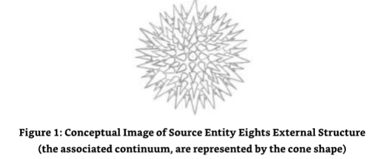

SE:I just I wanted to congratulate you on your progress so far.You are progressing with this work faster than expected and improving in all sorts of ways.Your desire to contact and communicate with as many people as possible about God(me)and the greater reality (the other Source Entities and The Origin)is a wonderful sight to behold as is your desire to be seen as an approachable man on the ground,explaining the greater reality in ways that are understandable to the common man,as well as the spiritually adept.This is and will be your greatest strength.To answer one of your own questions-the time is not far away when you will be a full-time teacher of the truth,for the doors are opening in the correct sequence. Enjoy the synchronicity and effortlessness of my multiverse and its function (workings); marvel at its splendor,its simplicity,its grandeur;go with its natural flow of energies and inherent evolutionary opportunities;be at one and at peace with it.See how it interlinks with the works of the other Source Entities and understand your place,your destiny,your inheritance within The Origin's plans,for we are all part of The Origin's great plan. 

源实体：我只是想祝贺你目前的进步。你在这项工作上取得的进步比预期的要快，在各方面都有所提高。你希望与尽可能多的人接触和交流关于上帝(我)和更大的现实(其他源实体和起源)的愿望是一个奇妙的景象，因为你希望被视为一个平易近人的人，用普通人以及精神上的专家都能理解的方式解释更大的现实。这是并将是你最大的力量。回答你自己的一个问题——你成为全职真理教师的时间已经不远了，因为门正在按正确的顺序打开。享受我的多维宇宙和它的功能(工作)的同步性和轻松性；惊叹于它的辉煌、它的简单、它的宏伟；随其能量的自然流动和内在的进化机会而行；与它融为一体，与它和平相处。看看它是如何与其他源实体的工作相互联系的，并理解你的位置、你的命运、你在起源计划中的继承，因为我们都是起源伟大计划的一部分。

ME:Wow!That was a bit of a grand speech,wasn't it? What caused that? 

我：哇！那是一个有点宏大的演讲，不是吗？是什么导致的？

SE:The need for you to recognize the importance that you are doing your "life's work,"for it is not about living what you would call a "normal life."It is about being of service within a most important function of the omniverse. 

源实体：你需要认识到你正在做“生命的工作”的重要性，因为这不是过你所说的“正常的生活”，而是服务于宇宙的一个最重要的功能。

This was a new word, one that even a humble incarnate as myself recognized as being above,well above,the concept of a multiverse. 

这是一个新词，一个连我这样卑微的化身都认为高于，远远高于多维宇宙的概念。

ME:Now you have my interest.What is an omniverse? 

我：现在你引起了我的兴趣。什么是多维宇宙？

SE:Simply put,The Origin. 

源实体：简而言之，起源。

ME:Hold on here.Why did I pick up the word "continuum"then? 

我：等等，我为什么要选“连续体”这个词呢？

SE:Because The Origin contains all functions with the continuums being a fraction of them. This is something you will discuss at length with Source Entity Eight,for it is entirely composed of continuum.The plural of continuum is continuum-hence,the imagery it just presented to you. 

源实体：因为源头包含了所有功能，而连续体只是其中一部分。这是你们将要详细讨论的源实体8，因为它完全由连续体组成。连续体的复数是连续体，因此，它刚才向你们展示的意象。

ME:This sounds like a good time to link up with Source Entity Eight. 

我：这听起来像是一个与源实体8联系的好时机。

I made yet another mental note to talk to The Origin on the functions of an omniverse. 

我还记下另一个要点，就是要和起源谈谈宇宙的功能。

SE:There is no time (event space)like the present. 

源实体：没有时间(事件空间)像现在。

SE8:This sounds like it is the correct event space to check in then.

8号源实体：这听起来像是要检入的正确的事件空间。

ME:That,err,was quick.I expected to perform some preliminary work on my communication link with you first. 

我：呃，太快了。我希望先做一些与你沟通的准备工作。

SE8:Why?We have already been in communication. 

8号源实体：为什么？我们已经在沟通了。

ME:WHAT?Run that one by me again,will you?I think you might have misunderstood. 

我：什么？再说一遍，好吗？我想你可能误会了。

SE8:On the contrary,it is you who is the one who misunderstood,for we have spoken before and on many subjects. 

8号源实体：相反，是您误解了，因为我们以前谈过，而且谈过很多次。

ME:I can see that it is time for my head to hurt.But wait;just let me think about this for a moment.My Source Entity said you are made up entirely from continuum.Does this mean that we communicated whilst the I part of me that is the energetic was in another continuum? 

我：我能看到我的头是时候疼了。但是等一下，让我思考一下。我的源实体说你完全是由连续体组成的。这是否意味着当我能量的部分在另一个连续体时我们交流？

SE8:Yes,for I am spread throughout the known omniverse(Origin). 

8号源实体：是的，因为我遍布整个已知的宇宙(起源)。

In my mind's eye I saw that this was true.Source Entity Eight pervaded the space of the known Origin,that part of it that was within its area of self-awareness.There was one other thing though.(Only one?That will be the day!)How can that last statement relate to the image I saw in my mind's eye,the image of a sphere covered in cone shaped spikes?I decided that there was only one thing to do-ask Source Entity Eight what the image and the statement about Source Entity Eight pervading The Origin as a continuum within a continuum meant.Moreover,how did this relate me having previously communicated with Source Entity Eight?I was dying to know.I do like these conundrums.

在我的脑海中，我看到这是真的。源实体8遍布已知的起源空间，其自我意识范围内的部分。但还有另一件事。(只有一件？那将是那一天！) 最后的声明如何与我脑海中看到的图像联系起来，一个覆盖着锥形尖刺的球体的图像？我决定只有一件事情要做——问源实体8这个图像和关于源实体8作为连续体中的连续体遍布起源的声明意味着什么。此外，这与我之前与源实体8沟通有什么关系？我迫切想知道。我确实喜欢这些谜题。

### How and When I Previously Communicated with Source Entity Eight 

**我之前如何和何时与8号源实体沟通**

ME:OK,both the myriad readers/truth seekers out there and I want to know how and when I have been talking with you before.Let's start with the when.Sorry.It sounds a bit blunt,but I have quite a selfish interest here.Once I have gotten this little titbit out of the way,we can continue with the usual routine.Is that OK with you? 

我：好的，无数的读者/真理追求者，我想知道我之前是如何和何时与你们交谈的。让我们从何时开始。抱歉。这听起来有点直白，但我在这里有相当自私的兴趣。一旦我把这个小细节弄清楚了，我们可以继续正常的程序。你没问题吧？

SE8:Of course.Communicating with you again is going to be fun. 

8号源实体：当然，再次与您交流一定会很有趣。

I was starting to get the impression that there was something going on here and that I really wasn't the new boy in town that I thought I was-at least,not if I included that part of me,the greater part that was still mainly energetic.I decided to use this thought as a springboard for what I hoped would be a logical and quick answer. 

我开始有这样的印象，这里发生了一些事情，我真的不是我认为的那个新来的男孩，至少，如果我把我那部分包括进去，那大部分仍然充满活力。我决定把这个想法作为一个跳板，我希望这是一个逻辑和快速的答案。

SE8:Quite simply,we have communicated many times whilst you were fully energetic.We planned the communication process we are about to start right down to the finite points of the minute details.This was a very important piece of planning work,for we needed to understand what you were going to be able to both understand and relay back to those who would seek to know more about the greater reality of existence beyond the environment that is your Source Entity.This is because the concepts surrounding my environment that we are going to discuss are difficult at best for incarnate humankind to understand,even in the most basic sense. 

8号源实体：很简单，当你充满活力的时候我们已经交流过很多次了。我们计划了即将开始的交流过程，一直到有限的细节。这是一个非常重要的计划工作，因为我们需要了解你将能够理解和转达给那些寻求了解更多关于超越环境的更大的存在现实的人，那就是你的源实体。这是因为围绕着我环境的概念，我们将要讨论的，对于化身的人类来说，即使在最基本的意义上，也是很难理解的。

ME:So,bearing in mind that you "Source Entities"are sharing each other's information and evolutionary growth on an instantaneous and continual basis,can you tell me whether or not I have whilst in the energetic form made a similar level of pre-planning and preparation for the dialogues to date and that I am due to have? 

我：那么，记住你们“源实体”正在即时和持续的基础上分享彼此的信息和进化成长，你能告诉我，我是否在能量形态中为迄今为止的对话，以及我将要进行的对话，做了类似程度的预先计划和准备？

SE8:Yes,you have.Of course,the level of planning has been varied and dependent upon the level of information you were expecting to work with,including the energies of the Source Entities you have and will communicate with.In this instance you may have noticed a pattern in the level of dialogue and complexity in the concepts increasing in complexity the further away from your own Source Entity you go. 

8号源实体：是的，你有。当然，计划的水平是不同的，取决于你期望使用的信息水平，包括你拥有和将要与之沟通的源实体的能量。在这个例子中，你可能已经注意到了对话水平的模式，以及概念的复杂性，你离自己的源实体越远，概念的复杂性就越增加。

ME:Well,I have noticed that the depth of information that I would have liked to extract has been not so much limited as more generalised.I have also noticed that the energies surrounding the Source Entities I have enjoyed dialogue with has been significantly different each time.Although it was significant,it was not insurmountable.I could work with it and even tune into it and get used to working with those energies.I even noticed that the more I continued dialogue with a new Source Entity,the more I could understand the information and receive more conceptual data.I reckon that the Source Entities I have communicated with to date have been in a certain order to allow me to ramp up each time, allowing me to move onwards and upwards in terms of my communicative (energetic link) abilities.Thus,I was able to use each Source Entity communicated with as a stepping stone for the next one.I guess that my going from my own Source Entity to Source Entity Four would have been an impossible task? 

我：我注意到我想要提取的信息的深度与其说是有限的，不如说是更普遍的。我还注意到围绕着我喜欢对话的源实体的能量每次都明显不同。虽然它很重要，但它不是不可克服的。我可以与它一起工作，甚至调谐到它，并习惯于与那些能量一起工作。我甚至注意到，我与新的源实体对话越多，我就能理解的信息就越多，接收到更多的概念数据。我认为我迄今为止与之交流的源实体是以一定的顺序来让我每次都攀升，让我在交流(能量链接)能力方面前进和向上。因此，我能够把与每个源实体交流作为下一个的垫脚石。我猜我从我自己的源实体到源实体4将是一个不可能完成的任务？

SE8:Correct.You may remember a previous dialogue (see Beyond the Source Book 1)where your progression outwards from your own Source Entity was described as being out on a lanyard,with the lanyard being "let out"the further you go to meet that metaphorical distance needed to travel to meet the next Source Entity in your list. 

8号源实体：正确。你可能还记得前面的对话(见《超越源头》第一册)，你从自己的源实体向外发展的进程被描述为像一条绳索，你走得越远，绳索就越“松开”，你需要走的隐喻距离就越远，以满足你清单上的下一个源实体。

ME:Actually,I do. 

我：事实上，我知道。

SE8:Well,that was in place to make sure that you did not or could not move out too far or start communication with the wrong Source Entity.It was designed to keep you in the correct sequence.In fact,what you don't know is that metaphorically speaking,the Source Entities have placed themselves in a sort of line or in order set distances away from your start point with your Source Entity to ensure that this strategy worked. WE ARE ALL WORKING WITH YOU TO SUPPORT YOU IN YOUR MOST IMPORTANT TASK. 

8号源实体：嗯，那是为了确保你不会或不能走得太远，或开始与错误的源实体进行交流。它被设计用来让你保持正确的顺序。事实上，你不知道的是，打个比方，源实体已经把自己放在一条线上，或按照从你与源实体的起点的距离来确保这个策略的有效性。

ME:Wow!..Sorry,but that's all I can muster.The suggestion that you are all,err,moving around to suit my communication strategy is just a bit too much for me to handle right now. Specifically,as I am just a small energetic being. 

我：哇！ 抱歉，我只能说这么多了。你们为了配合我的沟通策略而四处走动的建议，我现在实在是应付不过来。特别是，我只是个精力充沛的小家伙。

SE8:Don't malign yourself.You have no idea what you are really like when fully energetic. 

8号源实体：不要贬低自己。你不知道自己充满活力的时候是什么样子。

ME:Clearly not.It's just a bit of a surprise to note the amount of pre-planning even though I am not cognisant of the full details that must have happened to allow all of this to occur. 

我：显然不是。尽管我不知道所有这些事情发生的全部细节，但看到这么多的预先计划还是有点惊讶。

Right I now need to refocus and continue the task at hand rather than feeling small in the bigger picture of what is happening in the greater reality. 

好的，我现在需要重新集中注意力，继续手头的任务，而不是在更大的现实中发生的更大的画面中感到渺小。

SE8:Good,I am raring to go. 

8号源实体：很好，我迫不及待地想去。

### Source Entity Eight-A Continuum of Continuums

**8号源实体：一个连续体的连续体**

ME:Just to repeat some of our previous dialogue,one of the images I picked up was of you as a sphere covered in cone-shaped spikes.If you are supposed to be interspaced/pervade The Origin and be a continuum of continuum,how can that image relate to this very high level description of you? 

我：重复一下我们之前的对话，我选取的其中一个图像是，你是一个覆盖着锥形尖刺的球体。如果你被认为是穿插在起源中，是一个连续体的连续体，那么这个图像如何与对你的这个非常高的描述相关联呢？

At this point in the dialogue,dear reader,I knew that this was going to get difficult,so I decided that it would be a good idea to quote Source Entity Four's and Source Entity Five's comments on continuum for reference purposes. 

亲爱的读者，在对话的这一点上，我知道这会变得困难，所以我决定引用源实体4和源实体5关于连续体的评论，以供参考。

SE4:"As you rise through the frequencies,you move away from that which you experience at the previous frequency and start to experience that which is present in the new frequency. That is,using your own frequencies as an example,because things like the desk you sit at (of a slightly lower frequency than yourself and therefore solid)will no longer be part of your new frequentic level.You will,however,experience other things that are consistent with your experience or expectation of what a solid object such as your desk is.This is because frequencies overlap to a certain extent,and you are still within a single dimensional continuum.Now if you consider a change from one dimension to another,then you have to consider a bigger picture-that of the dimension and the frequencies.When you move from dimension to dimension you also move from the frequency set that is aligned to the dimension being moved from to the frequency set that is aligned to the dimension being moved to." 

4号源实体：“当你通过频率上升时，你离开了你在以前的频率上所经历的，并开始体验出现在新频率上的东西。也就是说，以你自己的频率为例，因为像你坐的桌子这样的东西(比你自己的频率略低，因此是固体的)将不再是你新频率水平的一部分。然而，你会体验到其他与你的经验或预期一致的东西，比如你的桌子是什么固体物体。这是因为频率在一定程度上重叠，而你仍然在一个单维连续体中。现在，如果你考虑从一个维度到另一个维度的变化，那么你必须考虑一个更大的画面——维度和频率。当你从一个维度移动到另一个维度时，你也从与被移动维度对齐的频率集移动到与被移动维度对齐的频率集。”

SE5:"....there is only one environment that can be called a continuum,one that involves dimension,frequency,energy and the recognition of the passage of events and time,which is where you are right now.A parallel dimension of equal content could be classified as a continuum but only if it has the full complement of the four components specified above. None do in YOUR universe.You need to be in a "multiversal"environment to have this effect take place." 

5号源实体：“只有一种环境可以被称为连续体，它包括维度、频率、能量以及对事件和时间流逝的认识，也就是你现在所在的地方。一个等量的平行维度可以被归类为连续体，但只有当它拥有上述四个要素的完整补充时。在你的宇宙中没有任何一个。你需要在一个“多维宇宙”环境中才能产生这种效果。”

Below is the Wikipedia description. 

以下是维基百科的描述。

"Materials,such as solids,liquids and gases are composed of molecules separated by empty space.On a macroscopic scale,materials have cracks and discontinuities.However,certain physical phenomena can be modeled assuming the materials exist as a continuum,meaning the matter in the body is continuously distributed and fills the entire region of space it occupies.A continuum is a body that can be continually sub-divided into infinitesimal elements with properties being those of the bulk material." 

“物质，如固体、液体和气体是由真空分隔的分子组成。在宏观尺度上，物质有裂缝和不连续性。然而，某些物理现象可以假设物质作为连续体存在来建模，这意味着身体中的物质是连续分布的，并填充它所占据的整个区域。连续体是一个可以连续细分成具有体积物质特性的无限小元素的身体。”

Confused?Me too!But the comment about the "body"being continuously distributed,filling the entire region of space it occupies is very close to Source Entity Eight pervading the known area of self-awareness of The Origin.The mathematics to support this is VERY impressive!I wonder if it is anywhere near correct. 

困惑吗？ 我也是！但关于“身体”是连续分布的，填充它所占据的整个区域的评论非常接近于源实体8，它遍布在起源的已知自我意识领域。支持这个的数学非常令人印象深刻！我想知道它是否接近正确。

SE8:Ah,yes.No,it's woefully inadequate and goes nowhere near explaining any part of a continuum within me or The Origin.In fact,there is no humanly derived mathematics that can be used to model me. 

8号源实体：啊，是的。不，它非常不足以解释我或起源内部连续体的任何部分。事实上，没有人造数学可以用来模拟我。

Well,that answers that question on definition and our mathematical prowess to explain what a continuum is. 

好了，这就回答了关于定义的问题，以及我们用数学技巧解释连续体是什么的问题。

SE8:So without,so within. 

8号源实体：所以，外面如此，里面也是如此。

ME:What is that supposed to mean? 

我：这是什么意思？

SE8:That is the best way to understand a continuum;everything that is within is without as well.You see,the image of the cones on my supposed exterior form are the same in reverse inside the sphere. 

8号源实体：这是理解连续体的最好方法；里面的一切在外面也是一样的。你看，我假设的外形上的圆锥体的图像在球体内部是相反的。

ME:Now you are losing me. 

我：现在你失去我了。

SE8:The cone is both a geometric shape and a mathematical constant.It is also one of the shapes used to convey higher information.As a mathematical constant,it can be used in myriad ways. 

8号源实体：圆锥体既是一种几何形状，也是一个数学常数。它也是用来传达更高信息的形状之一。作为一个数学常数，它可以有无数种用途。

ME:You mean it is like the number associated with Pi(3.14159265,etc.). 

我：你的意思是它就像与圆周率(3.14159265，等等)相关的数字。

SE8:Yes,with the exception that it is a multi-dimensional,multi-frequential constant and,therefore,is a mathematical cornerstone to the mathematical explanation of my construction,so to speak. 

8号源实体：是的，除了它是一个多维的，多频率的常数，因此，可以说它是我建筑的数学解释的数学基石。

ME:So the image I received of you as a sphere-covered in cones,which may or may not be inside out within you is a symbolic representation of the way you are constructed. 

我：所以我所看到的你是一个圆球，上面覆盖着圆锥体，圆锥体可能内在，也可能外在，这是你构建方式的象征性表现。

SE8:Bingo!...Is that the right word?

8号源实体：对了！...这个词对吗？

ME:It will do.We use it as an expletive for the recognition of understanding of something. Eureka!would have been a more appropriate way of expressing your concurrence of my miniscule level of understanding though. 

我：可以。我们用它作为一种感叹词来表达对某事的理解。不过，用“尤里卡！”来表达你对我微不足道的理解程度的赞同会更合适。

SE8:Then my use was correct,a diminutive word for the miniscule level of understanding of the concept. 

8号源实体：那么我的用法是正确的，一个小词用于对概念的理解的最小水平。

ME:I very much don't think that I even understand it on even a miniscule level yet.Can you go into a bit more detail for me? 

我：我非常不认为我甚至在最小的层面上都理解了它。你能为我详细一点吗？

SE8:With pleasure.But first let me tell you this.All 3D geometrical shapes are geometric explanation of a mathematical constant.I limit myself here to the use of 3D as there are 4D,5D,6D,7D,etc.,up to 12D geometrical shapes that are also constants,including that which humankind is not currently aware of.Some of your mathematicians are starting to understand this,but they need to include the wider multiversal environment and the energies associated with The Origin before they will start to make any sense of the maths surrounding it.It is the use of such mathematical constants that are the major language of the planets,stars and the galaxies and of whatever presentation,form and function within most of the environments created by the Source Entities that can be classified in some way as the physical representations of energetic constructs,a physical universe if you like. However,a physical universe,such as the one your vehicle(physical body)currently resides in,cannot be classified as a continuum as it does not contain all of the elements required to be classified as one.As Source Entity Five stated in its dialogue with you on the subject,you need to have the "multiversal"content to classify an environment as a continuum.

8号源实体：很高兴，但首先让我告诉你，所有的3D几何形状都是数学常数的几何解释，我在这里限制自己只使用3D，因为还有4D、5D、6D、7D等，直到12D的几何形状也是常数，包括人类目前还没有意识到的。你们的一些数学家开始理解这一点，但他们需要包括更广泛的多维环境和与起源相关的能量，然后他们才会开始理解周围的数学。正是使用这些数学常数，是行星、恒星和银河的主要语言，以及源实体所创造的大多数环境中的任何表现、形式和功能，这些都可以在某种程度上被归类为能量结构的物理表现，如果你愿意的话，可以被归类为一个物理宇宙。正如源实体5在与你的对话中所说的那样，你需要有“多维”的内容来将环境划分为连续统一体。

The sphere in your image represents all that currently is The Origin with the cones representing the mathematical constants,or pit props if you like,that hold me in my current position within that which is currently The Origin.Each of these has a loci which is in contact with each other at a mathematical point of,err,let's say,absolute zero.I can see you frowning,so let me explain what absolute zero is. 

你图像中的球体代表了目前的起源，圆锥体代表了数学常数，或者说坑支柱，把我放在目前的起源中我的位置。每个轨迹都有一个数学点，呃，我们说，绝对零度。我能看见你皱眉，所以让我解释一下绝对零度是什么。

ME:You bet.I thought that zero was zero with a plus and minus component above and below for positive and negative values of figures. 

我：没错。我以为零度是零度，上面和下面有正负分量表示数字的正负值。

SE8:It is not a concept that mankind has to consider yet in its limited recognition of self,environment and creator.Absolute zero is a zero that is manifest from a group of converging mathematical constants that are individually derived but collectively dependent whilst still being independently calculable.The absolute zero is that point or mathematical location where a locus of the individual loci of a group of constants occurs simultaneously, the physical representation of such a condition not being possible due to the fact that "physicality"is a single universal phenomenon and not multiversal.However,there are instances where a simulacrum of physicality can occur in non-physical universes due to similarity in resonant frequency.But you already know this from previous dialogues. 

8号源实体：在人类对自我、环境和造物主有限的认识中，这不是一个必须考虑的概念。绝对零度是一个零度，它从一组收敛的数学常数中显现出来，这些常数单独派生，但集体依赖，同时仍然可以独立计算。绝对零度是那个点或数学位置，一组常数的单个轨迹的轨迹同时发生，由于“物质性”是一个单一的普遍现象，而不是多维的，因此这种条件的物理表现是不可能的。然而，由于共振频率的相似性，在一些例子中，物质性的模拟物可以在非物质宇宙中发生。

ME:You talk about"that which is currently The Origin."What do you mean by that? 

我：你说“目前的起源”，这是什么意思？

SE8:I haven't finished yet. 

8号源实体：我还没完成。

ME:I know,but I feel that the readers would like to understand.

我：我知道，但我感觉读者们想了解。

SE8:Simply put,it is what you have recently been told by Source Entity Seven "in totality.That at some point The Origin will evolve and expand its area of awareness of self further.The expansiveness of The Origin will be multiplied to the point of infinity in your mind,but it will still be a mere fraction of what is possible for The Origin to be.Currently,The Origin is a fraction of one percent aware of itself.The expansion in the area of self-awareness will bring the area of awareness un-mapped experientially to a little under one percent of its totality. 

8号源实体：简单地说，就是你最近被7号源实体告知的“全部”。在某个时刻，起源会进化并进一步扩大自我意识的范围。在你心中，起源的广度将成倍增加到无限大，但它仍将只是起源可能成为的一部分。目前，起源只有百分之一的自我意识。自我意识范围的扩大将使经验上未映射的意识范围达到其全部的百分之一以下。

ME:Ah,OK.I was just making sure that there was not anything else happening to The Origin.I was just making sure that I didn't miss anything. 

我：啊，好的。我只是想确认一下起源没有发生什么其他的事情。我只是想确认一下我没有错过任何事情。

SE8:Ha,ha,ha,ha,ha!How naive you are.The Origin is always changing,and for you to say that you don't want to miss anything?Well,I will tell you this.When you have finished all of your current lifetimes'work on the subject of helping mankind understand the truth, and you have some considerable distance to go,you will still know nothing in comparison to what IS. 

8号源实体：哈哈哈！你太天真了。起源总是在变化，而你却说你不想错过任何东西。好吧，我来告诉你。当你完成了你目前的生命中所有关于帮助人类理解真相的工作，你还有相当长的路要走，与“原初”相比，你仍然什么都不知道。

ME:OK.OK.It was a foolish thing to say.I am blushing now.I think it's time for me to let you carry on in your explanation of the relevance of the imagery I received about your structure. 

我：好吧，好吧，说这话很愚蠢。我现在脸都红了。我想是时候让你继续解释我对你的结构的印象了。

SE8:Thank you.Please note that I was not trying to put you down.Far from it.It's just that it was a good joke to me.Your comment reflected mankind's self-centered "know it all" arrogance.Even The Origin doesn't know everything;hence,its need to create the Source Entities to help it in its own quest to experience,learn and evolve.I am sorry;I just found it very funny for a moment. 

8号源实体：谢谢。请注意，我并不是想贬低你。远非如此。这只是对我来说是一个好笑话。你的评论反映了人类以自我为中心的“无所不知”的傲慢。即使起源也不知道一切；因此，它需要创造源实体来帮助它在自己的探索中体验、学习和进化。我很抱歉；我只是一时觉得它很好笑。

ME:That's alright. 

我：没关系。

I was starting to chuckle to myself;tears were forming in the corner of my eyes as I,too,saw the joke! 

我开始自己笑起来，眼角的泪水在我眼里凝固，因为我也看到了这个笑话！

SE8:It's good to laugh.We Source Entities do it all the time.We have so much fun in doing what we do that we can't help but laugh. 

8号源实体：笑是好的。我们源实体一直都在笑。我们做的事情让我们感到如此有趣，以至于我们忍不住会笑。

I wondered how a Source Entity would laugh.No,don't ask that question! 

我想知道源实体会怎么笑。不，别问这个问题！

ME:How does a Source Entity laugh? 

我：源实体会怎么笑？

I failed on that piece of temptation. 

我没能抵挡住那次诱惑。

SE8:How we laugh is unexplainable to you.But I will tell you this:when a Source Entity laughs the whole of its environment receives unfathomable love.Everything and everyone within its environment/s feels a wonderful sense of "well-being"for a split second. 

8号源实体：我们如何笑对你们来说是无法解释的。但我会告诉你们：当一个源实体笑的时候，它周围的一切都会收到无尽的爱。在那一瞬间，它周围的一切事物和每一个人都会感到一种美妙的“幸福感”。

ME:I think I have felt this once or twice in my life. 

我：我觉得我一生中已经有过一两次这样的感觉了。

SE8:All of mankind has. 

8号源实体：全人类都有。

ME:Thank you.

我：谢谢。

SE8:It's a pleasure. 

8号源实体：很高兴能帮到你。

I mentally logged in to one of those moments that I believed were associated with me having a snippet of full self-awareness and realized that this may have been one of those moments when our Source Entity laughed.It felt wonderful. 

我精神上进入到那些我相信与我拥有完整自我意识片段有关的时刻之一，并意识到这可能是我们的源实体笑的时刻之一。感觉很棒。

SE8:Now then,let's continue to talk about how the imagery you received explains my form and function.I will repeat what I previously said.

8号源实体：现在，让我们继续谈论你接收到的意象如何解释我的形态和功能。我将重复我之前说过的话。

"The sphere in your image represents all that currently is The Origin with the cones representing the mathematical constants,or pit props if you like,that hold me in the position that I am in within that which is currently The Origin.Each of these has loci which are in contact with each other at a mathematical point of absolute zero."Got it so far? 

“你图像中的球体代表了目前的起源，圆锥体代表了数学常数，或者你喜欢的话，把我放在我现在所在的位置，现在是起源。每个轨迹都有一个数学上的绝对零点。” 到目前为止明白了吗？

ME:Yes. 

我：是的。

SE8:Good.The cones are on the outside because they represent the number of continuum that I am constructed of.In essence,they are on the inside,figuratively speaking.Therefore, each of the tips of the cones is in contact with each other at the center point of the sphere that represents my epicenter of existence within the area of The Origin that is its current area of self-awareness.If you were to expand your consciousness,you would notice that each of the continuum are placed close enough to one other to allow the exterior surfaces to touch each other,creating an interface between the continuum where an entity could pass from one continuum to another.The gaps in the middle,i.e.,where the continuum do not touch,are those areas where the maintenance of the structure of the continuum can be addressed.These gaps are absolutely necessary and vital to the overall balance of energies as there must be an equal area of non-continuum to continuum to allow the structure to be maintained.Do not,however,be confused by the word non-continuum for the area of non- continuum is a continuum in its own right.Am I making myself clearly understood here? 

8号源实体：很好。锥体在外面，因为它们代表我构成的连续体的数量。本质上，它们在里面，比喻地说。因此，每个锥体的尖端都在球体的中心点相互接触，代表我存在于起源区域的中心，这是它当前的自我意识区域。如果你扩大你的意识，你会注意到每个连续体都彼此靠近，以便外表面相互接触，在连续体之间创造一个界面，一个实体可以从一个连续体到另一个连续体。中间的空隙，即连续体不接触的地方，是那些可以解决连续体结构维护的区域。这些空隙对能量的整体平衡是绝对必要和至关重要的，因为必须有一个与连续体面积相同的非连续体区域，以便保持结构。然而，不要被非连续体这个词弄糊涂了，因为非连续体区域本身就是一个连续体。我在这里讲清楚了吗？

ME:I think so.But I don't understand why you need an equal amount of single non- continuum to multiple continuum. 

我：我认为是这样。但我不明白为什么你需要一个等量的单一非连续性到多个连续性。

SE8:Simply put,there has to be a balance.The sum of the whole has to equal the one,and the one has to equal the sum of the whole.That,my friend,is the basis of continuum mechanics. Everything that exists within,exists without,whilst still being within.That is the only way that a continuum can maintain its structure and independence.That and with a little help from my continuum mechanical maintenance entities. 

8号源实体：简单地说，必须有一个平衡。整体的总和必须等于一个，而这个也必须等于整体的总和。我的朋友，这就是连续介质力学的基础。所有存在于内部的，都存在于外部，同时仍然存在于内部。这是连续介质保持其结构和独立性的唯一方法。再加上我的连续介质机械维护实体的一点帮助。

ME:That sounds like the opportunity for a lead in to my next question.Who and what are these continuum mechanical maintenance entities? 

我：这听起来像是引出我下一个问题的机会，这些连续机械维护实体是谁和是什么？

### The Maintenance of Continuum Within the Continuum 

**连续体内部的连续体维护**

SE8:They are entities whose sole purpose in existence within my environment is to maintain the stability of the continuum and the continuum within my continuum.Their most important work is to maintain the location of the locus,for this is the lynch pin that holds the continuum together. 

8号源实体：它们是我的环境中存在的实体，唯一的目的是维持连续体和连续体内部连续体的稳定。它们最重要的工作是维持轨迹的位置，因为这是将连续体固定在一起的绞刑针。

ME:I would have expected that a locus,especially if it is the locus of a series of loci,would be stable.By the tone of your dialogue above,you are suggesting that this is not the case,and that it needs to be maintained in some way. 

我：我本以为一个基因座，特别是如果它是一系列基因座的基因座，会是稳定的。从你上面对话的语气来看，你是在暗示这不是事实，而且它需要以某种方式来维持。

SE8:Your expectation would be correct where the locus in an area of stability.But The Origin,and as a result,I,in my dissemination throughout The Origin,are not stable.We will never be stable. 

8号源实体：你的期望在稳定的区域是正确的。但是起源，因此，我，在我的传播中，起源是不稳定的。我们永远不会稳定。

ME:Why is that?I would have thought that The Origin,being the vast expanse that it is would have an inherent level of stability,especially as it is the basis for everything that is.

我：为什么？我认为起源，作为一个广阔的宇宙，应该有一种内在的稳定性，特别是作为一切事物的基础。

SE8:You are talking about dimensional stability,I feel. 

8号源实体：我感觉你在谈论尺寸稳定性。

ME:Yeeees! 

我：是的！

SE8:Well,I am talking about evolutionary stability.You see,evolutionary stability has an effect on dimensional stability,specifically where The Origin is concerned. 

8号源实体：嗯，我正在谈论进化稳定性。你看，进化稳定性对维度稳定性有影响，特别是在起源方面。

ME:Right!Err,how? 

我：对！额，怎么会？

SE8:You will remember that in previous dialogues you have been told about the ascension of The Origin and that its evolution creates this ascension.That its ascension will allow it to expand its area of self-awareness even though it will not be cognizant of the details of those new areas of self-awareness. 

8号源实体：你将记得在之前的对话中，你被告知起源的提升，以及它的进化创造了这次提升，它的提升将允许它扩展自我意识的领域，即使它将无法认知那些自我意识新领域的细节。

ME:Yes,I do. 

我：是的，我知道。

SE8:Well,the area of expansion of self-awareness is not even.What I mean by this is that it is not expansion in the spherical sense of the word.It is more uneven,lumpy.It is as result of this lumpiness that the locus of the loci changes location within me,and,therefore, The Origin.Now then,we are not at that point of expansion resulting from ascension yet. However,The Origin is expanding.It's always expanding,and the expansion is in its level of experiential detail of its current area of self-awareness.It is this expansion that creates evolutionary pressure,which results in minor changes in the external perimeter of the area of self-awareness of The Origin and,therefore,the position of the locus. 

8号源实体：嗯，自我意识的扩展区域是不均匀的。我的意思是它不是球形的扩张。它更不均匀，凸起。正是这种凸起导致了轨迹的轨迹改变了我体内的位置，因此，起源。现在，我们还没有达到因提升而导致的扩张点。然而，起源正在扩张。它总是在扩张，扩张是它当前自我意识区域的经验细节水平。正是这种扩张创造了进化压力，导致了起源自我意识区域外部周长的微小变化，因此，轨迹的位置。

ME:So The Origin has dimensional area? 

我：所以起源是有维度面积的？

SE8:In a sense,yes.You see,its area is unfathomable even to us,as none of us has really been able to calculate what size,if you like,The Origin will be when it reaches recognition of one hundred percent of its area of self-awareness.But please note here that the dimensional area is a function of evolution,not a so-called measureable metric that you would use in the universe that the Earth is within. 

8号源实体：从某种意义上说，是的。 你看，它的面积甚至对我们来说也是深不可测的，因为我们没有人真正能够计算出“起源”的大小，如果你愿意的话，当它达到百分之百的自我意识面积时。 但请注意，维度面积是进化的函数，而不是你们在地球所在的宇宙中使用的所谓可测量的度量。

ME:As I understand it then,these entities whose job it is to maintain the position of the locus must be able to understand or measure in some way the changes to the outer edges of you as a continuum within The Origin,and make adjustments as appropriate. 

我：据我所知，这些负责保持轨迹位置的实体必须能够以某种方式理解或测量作为起源内部连续体的你们的外缘的变化，并做出适当的调整。

SE8:Spot on.Do not think that it is just the locus that they have to work with.The locus is the product of the absolute zero points of the loci. 

8号源实体：说得对。不要认为他们只需要轨迹。轨迹是轨迹绝对零点的乘积。

ME:And they have to manipulate the levels of absolute zero to compensate for the changes in The Origin's area of self-awareness,which affects you as a continuum within the totality of that part of The Origin which is known in detail... 

我：他们必须操纵绝对零度的水平，以补偿起源自我意识领域的变化，这对你的影响是连续的，在起源的整体中，这是已知的细节...

SE8:..And that it is becoming self-aware of. 

8号源实体：它正在变得有自我意识。

ME:We finish in tandem. 

我：我们一起完成。

SE8:We do. 

8号源实体：是的。

ME:Based upon that then,the levels of absolute zero are not,in fact,absolute zero. 

我：基于这一点，绝对零度的电平实际上不是绝对零度。

SE8:No,for absolute zero is not a fixed mathematical point.It is dependent upon the area, position (within me)and dimension,dimensional component,frequential and energetic components associated with the continuum it is absolute zero of and,therefore,a loci for. What you are looking for is a fixed point of zero.A fixed point of zero is an altogether different thing. 

8号源实体：不，绝对零度不是一个固定的数学点。它取决于面积，位置(在我体内)，维度，维度分量，频率和能量分量与连续体的绝对零度相关，因此，是一个轨迹。你在寻找的是零的固定点。零的固定点是完全不同的事。

Just when I thought I was on a roller,I score a bogey! 

当我以为我正处于好状态时，我打出了一个柏忌！

ME:Go on,tell me.What is a fixed point of zero? 

我：继续，告诉我，零的定点是什么？

SE8:Quite simply the expression of that position or locus that is always collectively achieved by the mathematical representation of all of the possible positions achievable by the locus or collective positions of absolute zero of all of the continuum at any point in the evolution of The Origin.I will give it a word you can understand,a datum.A datum that is always created even though stable rather than being a start or a point of origin. 

8号源实体：很简单，这个位置或轨迹的表达总是通过所有可能的位置的数学表示来实现，这些位置或位置都是由所有连续体在起源进化过程中任何一点的绝对零点所实现的。我会用一个你能理解的词来描述它，一个基准点。一个基准点总是被创造，即使它很稳定，而不是一个起点或原点。

ME:I can imagine a few mathematicians having a field day over discussing that statement. They won't believe a word of it. 

我：我可以想象一些数学家会花一天的时间来讨论这个说法。他们不会相信这个说法的任何一个字。

SE8:I would like to see them disprove it.It is what holds everything together.Scientists rarely,if ever,see the fundamental basis for WHAT IS,for they are always working with the PRODUCTS of what is. 

8号源实体：我倒想看看他们能否证明它错。它把一切都凝聚在一起。科学家们很少，如果有的话，看到“是什么”的基本基础，因为他们总是在研究“是什么”的产物。

ME:OK,I would like to go back to the entities who maintain the different continuum.How and what do they do to maintain the overall continuum environment and the point of absolute zero? 

我：好的，我想回到维持不同连续体的实体。他们如何做，他们做了什么来维持整体连续体环境和绝对零度点？

SE8:As explained above.The point of absolute zero for each of the continuum is based upon the evolutionary periphery that the base of the "cone"that represents the continuum and its contact with the outer periphery of the continuum,that is me,and the outer edge of The Origin's area of self-awareness,and its subsequent point of contact with the other continuum cones,so to speak.Simplistically put,the entities are constantly calculating,if you like,the levels of evolutionary pressures in the area of the continuum they are responsible for and noting how it affects their position of absolute zero.This is done concurrently and simultaneously throughout the continuum and its component continuum.This continual calculation results in the constant and consistent movement of the point of absolute zero in conjunction with the movements of the other points of absolute zero that represent the locus of the loci.

8号源实体：如上所述，每个连续体的绝对零点是基于进化边缘的，即代表连续体的“圆锥体”的底部，以及它与连续体外缘的接触，也就是我，以及起源自我意识区域的外缘，以及它与其他连续体圆锥体的后续接触点，可以这么说。 简单地说，实体不断地计算，如果你愿意，它们负责的连续体区域的进化压力水平，并注意它如何影响它们的绝对零点位置。这在整个连续体及其组成连续体中同时进行。这种持续的计算导致了绝对零点的持续和一致的运动，与代表轨迹轨迹的其他绝对零点的运动相结合。

（图9：源实体8内部结构的概念图：内部圆锥的点是相关连续体的轨迹，由圆锥形状表示）

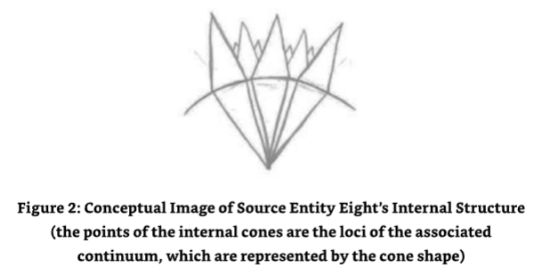

ME:I just received an image of the points moving in and out and round and round with all of the points staying in contact with each other all of the time.

我：我只是收到了一个图像，点在进进出出，一圈一圈，所有的点都在一直保持相互联系。

SE8:The image you have received would be a correct representation apart from one thing. 

8号源实体：你收到的图片除了一件事外，都是正确的。

ME:What's that? 

我：那是什么？

SE8:Sometimes there is a disconnect,and one of the continuum loci's loses contact with the locus. 

8号源实体：有时会发生断裂，其中一个连续基因座与基因座失去联系。

ME:What?!When does that happen?More importantly,how can it happen,especially if the fixed point of zero is,err,fixed? 

我：什么？什么时候会发生？更重要的是，它怎么会发生，特别是零的固定点是固定的？

SE8:Very good question.The fixed point of zero is what it is,fixed.So when the odd occasion occurs where the loci,the point of absolute zero of a continuum,either moves away from the locus as a result of incorrect calculative action on the part of the maintaining entities or as the result of a sudden and rapid change in evolution,the loci of the continuum remains in contact by a continuum thread so to speak.Call it a bungee rope if you like,for it allows the loci of the continuum to remain in place whilst the bulk of the continuum is adjusted to be in the correct position from a geometric perspective. 

8号源实体：问得好。零点的固定点就是它本身，固定的。所以当偶尔出现连续体的轨迹，连续体的绝对零点，由于维护实体的计算错误或进化中突然的快速变化而偏离轨迹时，连续体的轨迹仍然通过连续线保持接触。如果你愿意，可以称之为蹦极绳，因为它允许连续体的轨迹保持原位，而连续体的大部分从几何角度调整到正确的位置。

The reason this happens is because evolution is not an exact science.It happens in fits and starts.Devolution can also be experienced as can evolutionary compression,evolutionary expansion,evolutionary expression and evolutionary stretch,which by the way is not the same as evolutionary expansion. 

之所以会这样，是因为进化不是一种精确的科学。它时断时续。下放也可以经历进化压缩、进化膨胀、进化表达和进化拉伸，顺便说一下，进化拉伸与进化膨胀是不同的。

ME:I had heard of loss of evolution,devolution,but not the others.Can you explain them for me?

我：我只听说过进化丢失、下放，其他的我都没听说过，能解释一下吗？

### How the Different Forms of Evolution Affect Source Entity Eight's Continuum 

**不同形式的进化如何影响源实体8的连续体**

SE8:I will split them out and illustrate how they affect the order within my continuum. 

8号源实体：我将把它们分开，并说明它们如何影响我的连续体中的顺序。

**Rapid Evolution**

**快速进化**

This is where the evolution itself happens at an accelerated rate due to the continued recognition by an entity or group of entities(this can include a whole universe)of what experience processes are creating the evolutionary opportunity and actively planning to use them to increase their evolutionary progression. 

这是进化本身以加速速度发生的地方，因为一个实体或一组实体(这可以包括整个宇宙)不断认识到什么经验过程正在创造进化机会，并积极计划使用它们来增加他们的进化进程。

This has the ability to affect the geometry of the continuum in a way that is equal to an expansion outwards from the center,effectively increasing the distance from the locus to the so-called base of the cone.The diameter of the base of the cone of the continuum increases accordingly to account for the supposed increase of the theoretical spherical radius of self-awareness.The loci's (point of absolute zero)connectivity to the locus is not affected with this type of evolution and is controllable. 

这有能力影响连续体的几何形状，相当于从中心向外扩张，有效地增加了从轨迹到所谓的圆锥体底部的距离。连续体圆锥体底部的直径相应增加，以解释自我意识理论球形半径的假设增加。轨迹(绝对零点)与轨迹的连接不会受到这种类型的进化的影响，并且是可控的。

**Slow Evolution**

**慢进化**

This occurs where the evolution itself happens at a slower than expected/ normal rate.In slow evolution,the recognition of evolutionary opportunities is either not made or is spasmodic with the entity or entities not learning the processes and actions that created the possible evolution. 

当进化本身比预期/正常速度慢时，就会发生这种情况。在慢进化中，进化机会的识别要么没有发生，要么是间歇性的，因为实体没有学习创造可能进化的过程和行动。

This has the ability to affect the geometry of the continuum,the so-called base of the cone, in a minimal way because it is slower than normal growth.In this instance,and this is the same with static evolution and devolution,evolutionary stretch can be experienced if the other continuum are experiencing accelerated evolutionary growth simultaneously.This is not the same as "Logarithmic Evolution"(see below). 

这能够以最小的方式影响连续体的几何形状，即所谓的锥底，因为它比正常增长要慢。在这种情况下，这与静态进化和下放是相同的，如果其他连续体同时经历加速进化增长，则可以经历进化拉伸。这与“对数进化”(见下文)不同。

**Static Evolution**

**静态进化**

This exists where the evolutionary progress is in stasis.It is neither progressing in a positive or negative way.In this instance,positive evolution that is being experienced in one part of the continuum is being balanced by negative evolution in another part of the continuum.In both instances,the processes surrounding the positive and negative evolutionary effects to the overall continuum are not being learnt and progressed. 

当进化过程停滞不前时，它就存在了。它既不是积极的也不是消极的。在这种情况下，连续体的一部分正在经历的积极进化被另一部分的消极进化所平衡。在这两种情况下，围绕着整个连续体的积极和消极进化影响的过程并没有被学习和推进。

The effect from a geometric expression is equal to an undulation on the outer edges of the continuum,creating a sort of rippling effect. 

几何表达式的影响等于连续体外缘的波动，创造了一种涟漪效应。

In the event of rapid evolution being experienced in all other continuum,an elastic limit can be reached where the outer edge of the holding continuum must move with the evolutionary tension created by the other continuum.In this instance,the static evolutionary condition is changed to reflect an increase in the level of evolution in some part to "catch up"with the evolving continuum and their effect on the outer surface of the holding continuum,me. 

在所有其他连续体中经历快速进化的情况下，可以达到一个弹性极限，其中持有连续体的外缘必须随着其他连续体所创造的进化张力而移动。在这种情况下，静态进化条件被改变，以反映某部分进化水平的提高，以“赶上”进化连续体及其对持有连续体外表面的影响。

**Reversed Evolution (Devolution)**

**逆向进化(下放)**

This is where evolution is effectively going backwards. In this instance,there is no learning from the action of the entity or entities,and the same ground is being covered over and over again with no sign of reversal.The entities operate in ignorance of their condition and need significant external help to aid recovery. 

这是进化有效倒退的地方。在这种情况下，没有从实体或实体的行动中学习，同样的地面被一遍又一遍地覆盖，没有逆转的迹象。实体在忽视其条件的情况下操作，需要大量的外部帮助来帮助恢复。

In this instance,the continuum shrinks towards the loci,the effective geometry of the continuum loses its "area"as the diameter of the so-called base of the cone is reduced relative to the distance from the loci and its previous positional condition.Visually,the outer edge of the continuum that the devolving continuum exists within appears to disappear towards the loci of the continuum,following the base,creating what looks like a hole in the surface of the holding continuum,me. 

在这种情况下，连续体向轨迹收缩，连续体的有效几何形状失去了它的“面积”，因为所谓的圆锥底部的直径相对于与轨迹的距离和其以前的位置条件而减少。从视觉上看，下放连续体存在的连续体的外边缘似乎向连续体的轨迹消失，随着底部，在保持连续体的表面上创建了一个看起来像洞的东西。

As with static evolution,in the event of rapid evolution being experienced in all other continuum,an elastic limit can be reached where the outer edge of the holding continuum, me,must move with the evolutionary tension created by the other continuum.In this instance,the devolving evolutionary condition is changed to reflect an increase in the level of evolution to the static evolutionary condition,migrating on to very small amounts of positive progression by default,irrespective of the actions of the entities occupying the continuum. 

与静态进化一样，在所有其他连续体经历快速进化的情况下，可以达到一个弹性极限，其中保持连续体的外边缘必须随着其他连续体创建的进化张力而移动。在这种情况下，退化的进化条件被改变，以反映进化水平的增加到静态进化条件，默认地迁移到非常小的正进展量，而不考虑占据连续体的实体的行动。

**Evolutionary Compression**

**进化压缩**

This is where a group of nearby (close)continuum or all continuum within my continuum are in a devolutionary regression,affecting the positive evolutionary progression of an evolving continuum.They effectively slow down or reverse the evolutionary progression being made by that continuum that is experiencing positive evolutionary content.However,as there is an opposing "pressure"effect of the positive evolution in the continuum that resists the devolution.The continuum is not reduced in evolutionary size geometrically speaking but is instead compressed,putting evolutionary strain on the exterior of the continuums'structure and the height of the frequencies possible within the continuum.

这是一组附近的(接近)连续体或我连续体中的全部连续体处于下放回归中，影响着进化连续体的积极进化进程。它们有效地减缓或逆转了正在经历积极进化内容的连续体所做的进化进程。然而，由于在抵抗下放的连续体中存在相反的“压力”效应，因此连续体在几何上并没有减少进化大小，而是被压缩了，将进化应变放在连续体结构的外部和连续体中可能出现的频率高度上。

In this way actual continuum devolution experienced as a function of the effect of other neighboring continuum devolving is not experienced but does stop significant progression. This,by the way,also affects me as the holding continuum as I evolve as a result of the work of the entities working within the continuum. 

这样，作为其他邻近连续体下放影响的函数，实际的连续体下放并没有经历，但确实停止了重大进展。顺便说一下，这也影响了我作为持有连续体，因为我作为连续体内部实体工作的结果而进化。

**Evolutionary Expansion**

**进化扩展**

This is compartmentalized evolution within a continuum.Here a certain percentage of the area of the continuum experiences evolutionary progression and another does not,providing pockets of evolutionary progression and static evolutionary progression.In some rare instances,this can even contain small pockets of devolution. 

这是连续体内部的分割进化。在这里，连续体的某个百分比区域经历了进化过程，而另一个区域则没有，提供了进化过程和静态进化过程的口袋。在一些罕见的情况下，这甚至可以包含小块的下放。

In this instance,the exterior geometry of the continuum shows areas of deformation in a convex or concave manner,where it is affected by the type of evolution being locally experienced.Full continuum-based evolutionary progression cannot be experienced until the compartmentalization effect is harmonized and eliminated. 

在这种情况下，连续体的外部几何形状以凸或凹的方式显示了变形的区域，它受到局部经历的进化类型的影响。只有在协调和消除分区效应之前，才能体验到基于连续体的完整进化过程。

**Evolutionary Expression**

**进化表达**

This occurs as the result of the content of evolutionary reflectivity expressed by a continuum where the neighboring continuum is experiencing accelerated evolution of any type.The expression in this instance is the perceived evolutionary growth of the neighboring continuum experienced as a result of the work of the entities populating the neighboring continuum and not as a result of the work of its own entities. 

这发生在一个连续体表达的进化反射内容的结果，其中邻近的连续体正在经历任何类型的加速进化。这种情况下的表达是邻近连续体的可感知的进化增长，这是填充邻近连续体的实体的工作的结果，而不是其自身实体的工作的结果。

In essence,this means that the continuum is reflecting an equal amount of evolutionary progression,albeit with no substance,in an insubstantial and non-experiential way to that being experienced by its neighbor.From a geometric representation of the continuum,the visual appearance would seem to be identical to its progressing neighbor without having the actual evolution to back up the visual appearance.Its loci remaining in the correct position within the locus is the only way to quantify the true evolutionary state of the continuum without actually entering the continuum and experientially experiencing the evolution first hand. 

在这种情况下，连续体的外部几何形状以凸或凹的方式显示了变形区域，这是由于它受到了当地正在经历的进化类型的影响。本质上，这意味着连续体反映了同等数量的进化进程，尽管没有实质性的东西，以一种非实质性和非经验的方式来反映其邻居所经历的进化。从连续体的几何表示来看，视觉外观似乎与其不断进步的邻居相同，但没有实际的进化来支持视觉外观。其轨迹保持在轨迹内的正确位置是量化连续体真实进化状态的唯一方法，而无需实际进入连续体并亲身体验进化。

**Evolutionary Stretch**

**进化拉伸**

This is the opposite of evolutionary compression.It is where a group of nearby (close)continuum or all continuum within my continuum are in an evolutionary progression,affecting the static evolutionary progression of a continuum.They effectively speed up or reverse the evolutionary progression being made by that continuum that is experiencing static or even devolutionary content.An opposing "negative pressure" or vacuum effect of the static evolution in the continuum that resists the evolution is experienced by the continuum.The continuum is not increased in evolutionary size geometrically speaking but is,instead,stretched,putting evolutionary strain on the exterior of the continuums'structure. 

这是进化压缩的反面。它是一组附近的(近的)连续体或我连续体中的全部连续体处于进化进程中，影响连续体的静态进化进程。它们有效地加快或逆转正在经历静态或甚至退化内容的连续体所做的进化进程。连续体经历了与之相反的“负压力”或连续体中静态进化的真空效应，它抵制了进化。连续体在几何上并没有增加进化大小，而是拉伸，把进化应变放在连续体结构的外部。

In this way actual continuum evolution experienced as a function of the effect of other neighboring continuum,devolution or evolutionary stasis is not experienced.This also affects me as the holding continuum. 

这样，实际的连续体进化作为邻近连续体的影响的功能，没有经历退化或进化停滞。这也影响了我作为持有连续体。

**Geometric/Exponential Evolution**

**几何/指数进化**

This type of evolution can happen in a progressive and regressive state,depending upon the work that is undertaken by the incumbent entities.It is the rate of evolutionary progression or regression(devolution)resulting from,in the case of evolutionary progress,the absolute 100%effectiveness of the previous evolutionary content affecting the opportunity for evolutionary progress that is experienced in the next phase by a factored ratio equal to the difference between the two levels of evolution,pre-evolution and post-evolution.If successful,this ratio is passed on to the next phase and the next phase until errors affect the geometric content of the progression,and the progression,"if expressed as a curve,"tails off so to speak.In the event of geometric/exponential devolution, the ratio works in reverse and the continuum experiencing such devolution quickly and rapidly loses its evolutionary standing. 

这种进化可以以渐进和退步的状态发生，这取决于现任实体承担的工作。它是进化进展或退步(下放)的速率，在进化进展的情况下，前一个进化内容的绝对 100% 有效性影响了在下一个阶段经历的进化进展的机会，其因数比率等于进化两个级别(进化前和进化后)之间的差异。如果成功，这个比率将传递到下一个阶段和下一个阶段，直到错误影响了进展的几何内容，而进展，“如果表示为曲线”，可以说是尾巴。在几何/指数下放的情况下，比率相反，经历这种下放的连续体很快失去了进化地位。

A continuum experiencing geometric evolution will create both "evolutionary stretch" within itself(if too fast)and in neighboring continuum and "evolutionary expression"in continuum which are neighbors of the neighboring continuum. 

一个经历几何进化的连续体将在自身(如果太快)和邻近连续体中创造“进化拉伸”，并在邻近连续体的连续体中创造“进化表达”。

A continuum experiencing geometric devolution will create both "evolutionary compression"within itself (if too fast)and in neighboring continuum and "evolutionary expression"expressed as a negative reflection in the continuum which are neighbors of the neighboring continuum,together with all of the effects of the structure of the continuum expected in evolutionary "compression"and "expression." 

一个连续体经历几何级数的进化，会在自身内部(如果太快)和邻近连续体中产生“进化压缩”，以及“进化表达”，表达为邻近连续体的连续体中的负面反映，以及在进化“压缩”和“表达”中预期的连续体结构的所有影响。

**Logarithmic Evolution**

**对数进化**

Is similarly expressed in mathematical terms,insomuch as it is the inverse of geometric/exponential evolution/devolution.Whereas with geometric evolution,the continuum experiences extremely rapid evolutionary progression or regression expressed as a ratio between the initiating and the resultant evolution,creating the springboard for geometric evolution/devolution in the next evolutionary phase.With logarithmic evolution,the progression or regression (evolution/devolution)is very slow.In this instance,the growth or decay can be mathematically expressed as a known base of logarithmic function. 

在数学术语中类似地表达，因为它是几何/指数进化/下放的逆。然而，随着几何级数的进化，连续体经历极其快速的进化进程或回归，表达为启动和结果进化之间的比率，为下一个进化阶段的几何进化/下放创造了跳板。随着对数进化，进程或回归(进化/下放)非常缓慢。在这种情况下，增长或衰退可以用数学表达为对数函数的已知基数。

This type of evolution/devolution has little or no effect on its neighboring continuum.It can be,however,affected by neighboring continuum experiencing geometric evolutionary content in which case it experiences "evolutionary stretch"in the case of the neighboring continuum experiencing geometric evolution,and "evolutionary compression"in the case of the neighboring continuum experiencing geometric devolution. 

这种类型的进化/下放对其邻近连续体的影响很小或没有影响。然而，它可以受到邻近连续体几何进化内容的影响，在这种情况下，它在邻近连续体几何进化的情况下经历“进化拉伸”，在邻近连续体几何退化的情况下经历“进化压缩”。

ME:Wow.I had no idea there were that many different versions of evolution. 

我：哇，我不知道有那么多不同的进化版本。

SE8:Well,there are more,but you would not be able to comprehend them.In any case these are the most important. 

8号源实体：嗯，还有更多，但你无法理解它们。无论如何，这些都是最重要的。

As I contemplated what I had just been told by Source Entity Eight,especially about how its energies created a continuum within the area that is now classified as the currently known area of The Origin's self-awareness,my mind turned toward the information I had received about how big the newly recognized area of self-awareness was expected to be within The Origin.I remembered the comment given to me that The Original twelve Source Entities will leave The Original area and will move into the greater,newly recognized area of self-awareness of The Origin to help it define ways to experience it and evolve further.I then realized that I was being given more information-information that was pertinent to Source Entity Eight's new role. 

当我思考我刚才被8号源实体所告知的，特别是关于它的能量如何在现在被分类为目前已知的起源自我意识的区域内创造了一个连续体，我的思想转向我所收到的信息，关于在起源内新认识的自我意识区域预计有多大。我记得给我的评论，最初的12个源实体将离开最初的区域，并将进入更大的，新认识的起源自我意识区域，以帮助它定义体验和进一步进化的方式。然后我意识到我被给予了更多的信息——与源实体8的新角色有关的信息。

Source Entity Eight was to be the basis for the structure resulting from the ascension of The Origin to its next level of awareness.In the process,it would experience a level of evolutionary stretch never before experienced by a Source Entity.It was to become the framework for the navigation of the newly self-aware Origin.It would be populated with Source Entity Seven"C's"Navigators, and Source Entity Eight will be the framework of the Maze that will be the new and old areas of The Origin's areas of self-awareness and experiential knowledge and evolution.The Navigators will know every method of navigation necessary to allow effective movement throughout the new expanse of The Origin.The Jigsaw puzzle was starting to fall into place,micro-piece by micro- piece. 

源实体8将成为起源提升到下一个意识层次所产生的结构的基础。在这个过程中，它将经历一个源实体从未经历过的进化拉伸。它将成为新认识的起源导航的框架。它将被源实体7“C”的导航员所填充，而源实体8将是迷宫的框架，这将是起源自我意识和经验知识与进化的新旧领域。导航员将知道任何必要的导航方法，以便在起源的新广阔领域中有效地移动。拼图开始一小块一小块地落入正轨。

A few days after writing the dialogue with Source Entity Eight above,I was sitting in an airplane bound for Shanghai,China,anticipating whatever levels of turbulence we might encounter.More importantly,what energetic shields I would throw in front of the plane to smooth the air density out to a nice medium density,a density that would result in no turbulence.This was a tried and tested process for dealing with turbulence that I had developed from a method I used in my late teenage years to clear clouds by giving them energy.I was considering this and my dislike of turbulence (hence my invention of the energetic shields)when I suddenly saw how ridiculous this line of thought was. 

在写完上面与源实体8的对话几天后，我坐在飞往中国上海的飞机上，期待着我们可能会遇到的任何程度的乱流。更重要的是，我将扔在飞机前面的能量盾，以使空气密度平滑到一个理想的中等密度，一个不会导致乱流的密度。这是一个经过试验和测试的处理乱流的过程，我从十几岁时使用的方法发展而来，通过给云层能量来清除云层。我正在考虑这一点，以及我对乱流的不喜欢(因此我发明了能量盾)，当我突然看到这种想法是多么荒谬。

Here I am,a man able to traverse with my mind all of the Source Entities'multiverse,and beyond, as well as the multiverses of eleven other Source Entities,including their creator,The Origin,and its environment.And ironically enough,that part of me that is projected into the physical is not only reduced to traveling the minute distances around this planet in "uneven"comparison to galactic and multiversal terms by the slow mechanical means offered by flying,but is(I am)also worried about turbulence.I might even cause it for God's sake! 

我在这里，一个能够用我的思想穿越所有源实体的多维宇宙，以及其他11个源实体的多维宇宙，包括他们的创造者，起源，及其环境的人。具有讽刺意味的是，我投射到物质世界的一部分，不仅被缩减到用飞行这种缓慢的机械手段在这个星球上旅行的微小距离，与银河系和多维宇宙相比是“不均衡的”，而且(我)还担心气流。看在上帝的份上，我甚至可能引起它！

How pathetic,I thought,that the association with the physical had caught me outyet again.That the association with the physical and its sensations were so compelling that even a spirit,such as I,was taken off guard and conned by its apparent all-consuming sensation-based experience being reality rather than focusing on the subject of The Origin and its creations,the twelve Source Entities,being the real reality. 

多么可悲啊，我想，与物质的联系又一次让我出局了。与物质的联系及其感觉是如此令人信服，以至于像我这样的灵魂，都被它明显的、以感觉为基础的、占据一切的体验欺骗了，而没有把注意力集中在起源及其创造物，即12个源实体，这是真正的现实。

The real me being an energetic being with a very small part of me projected into the bag of meat we lovingly call the human body.The human body I was using being just that:a body,a vehicle, a temporary biological construct,a temporary convenience enabling me to experience existence at the very bottom of the dimensions and frequencies,just like this airplane I was sitting in.It was a mechanical construct of transportational convenience.I sat back in my chair and detached myself from the un-reality of the physical (considering the greater reality of The Origin and its Source Entities)and re-established my link with Source Entity Eight. In doing so,I also felt the detachment necessary for breaking through the facade of the physical, allowing contact with entities in the higher frequencies and beyond.I saw my human body as the piece of meat it was and smiled to myself.

真正的我是一个充满活力的存在，只有很小一部分投射到我们亲切地称之为人类的肉袋中。我所使用的人体就是：一个身体，一个工具，一个暂时的生物构造，一个暂时的便利，使我能够体验在维度和频率的最底层的存在，就像我坐的这架飞机一样。它是一个交通便利的机械构造。我靠在椅子上，把自己从非现实的物质中分离出来(考虑到起源和它的源实体的更大现实)，并重新建立我与源实体8的联系。这样做，我还感到了突破物质表面的必要的分离，允许与更高频率和更高频率以外的实体进行接触。我把我的人体看作是一块肉，对自己微笑。

In doing so,tears started to stream from my eyes.These were the tears that presented to me the sign that I had come to recognize as "evidence of absolute truth"in my experiences and information received in my dialogues with the Source Entity,its peers,and The Origin.They were tears of absolute joy born from the recognition of the truth.It was a Wonderful feeling! 

这样做，眼泪开始从我的眼睛里流出来。这些眼泪向我展示了我在我的经历和与源实体、它的同伴和起源对话中收到的信息中认识到“绝对真理的证据”的迹象。它们是来自对真理的认识的绝对喜悦的泪水。这是一种奇妙的感觉！

ME:I had no idea that there were so many types of evolution.Although it's incredible to think that the cumulative effect of the entities existing within not only a universe but a continuum can have the types of effect we have just discussed on their universal environment and the continuum it is contained within.Not forgetting the effect on the surrounding continuum and of course,you. 

我：我不知道有这么多种进化方式，虽然很难想象存在于宇宙中，甚至连续体中的实体的累积效应，可以产生我们刚才讨论的对宇宙环境和连续体的影响，不要忘记对周围连续体的影响，当然，还有你。

SE8:Of course.You see,each of the entities in my continuum are powerful creators in their own right,and as such,they are able to accelerate and decelerate the evolutionary content of their environment accordingly.This allows them to moderate (control)how and when they evolve,including what activities and experiences lead to the evolution they want to experience. 

8号源实体：当然。你看，我连续体中的每个实体本身都是强大的创造者，因此，它们能够相应地加速和减缓其环境的进化内容。这使它们能够调节(控制)如何进化和何时进化，包括哪些活动和经历会导致它们想要经历的进化。

ME:Hold on a bit.I am getting the impression here that your entities are doing things in reverse to what I and other entities I have encountered. 

我：稍等一下，我得到的印象是，你们的实体正在做的事情与我和其他我遇到的实体相反。

SE8:Such as? 

8号源实体：例如？

ME:Well,in the dialogues I have experienced to date,entities experience different things in order to learn and evolve.The evolutionary content is a product of the subsequent experiences and learning undertaken. 

我：在我迄今为止经历过的对话中，实体为了学习和进化而经历了不同的事情。进化的内容是随后的经历和学习的产物。

SE8:Go on. 

8号源实体：继续。

ME:Well,reading between the lines,your entities appear to change the evolutionary content,or should I say,"signature,"in this case,of the continuum and the universes contained within the continuum.The objective is to experience the existence opportunities that are only available at certain levels of evolution.This creates a resultant level of"real" evolution as a product of the types of experience required and the evolutionary signature demanded of the continuum necessary to create such experience and subsequent learning and real evolution.Would this be correct? 

我：嗯，从字里行间看，你的实体似乎改变了进化的内容，或者我应该说，在这种情况下，连续体和包含在连续体中的宇宙的“签名”。目标是体验只有在进化一定水平上才有的存在机会。这创造了一个“真实”进化的结果水平，作为创造这种经验和随后的学习以及真实进化所必需的连续体的经验类型和进化签名的产物。这对吗？

SE8:It might be. 

8号源实体：可能是吧。

ME:What do you mean "it might be"? 

我：“可能是吧”是什么意思？

SE8:There has to be agreement with those entities who control and maintain the continuum first,including those entities who control and maintain the neighboring continuum,for as you know from the previous communications we have had,the evolutionary content experienced or contrived for the benefit of real evolution,affects those continuum surrounding the continuum in question. 

8号源实体：首先必须与那些控制和维护连续体的实体达成一致，包括那些控制和维护相邻连续体的实体，因为正如你从我们之前的交流中所知道的，为真正的进化而经历或设计的进化内容，会影响围绕在所讨论的连续体周围的连续体。

ME:So what you are saying to me is that any changes to the evolutionary status of a continuum that are made to enable different experiential learning conditions to be available for experience are agreed upon by basically all the entities concerned before the change is made. 

我：所以你的意思是，任何对连续体的进化状态的改变，都是为了使不同的经验学习条件可以用于经验，在做出改变之前，基本上所有相关实体都同意。

SE8:Not only that.They have to agree with the need or desire for the change requested. You see,the entities in a particular continuum may be happily working their way through a number of evolutionary experiences at that point in time of the request.The real evolutionary content of which might be of real evolutionary benefit to them,and they may not have completed the work and want to see through.Moreover,the change requested may also affect their continuum in a way that is either limited in evolutionary content for them or even puts them in a position of real evolutionary stasis/devolution.

8号源实体：不仅如此，他们必须同意要求改变的需要或愿望。你看，在一个特定的连续体中的实体可能在请求的那个时间点上，通过一系列的进化经历快乐地工作。真正的进化内容可能对他们有真正的进化利益，他们可能还没有完成工作，想看到结束。此外，要求改变也可能以一种方式影响他们的连续体，要么在进化内容上受到限制，要么甚至把他们置于真正的进化停滞/下放的位置。

ME:Hold on a moment.All this is very well,but what this means to me is that there is not only one evolution,the evolution,real evolution,that is accrued by a continuum and its entities,but there is a sub-evolution that is used to force experiences that would not be available to a continuum or its entities if it stuck to its normal real accrued evolutionary schedule.Not only that,but the opportunity to use the sub-evolutionary opportunities actually has the potential to affect the real evolutionary progression of a continuum and its entities in a negative way. 

我：等一下。这一切都很好，但对我来说，这意味着不仅有一个进化，进化，真正的进化，是由一个连续体和它的实体累积的，但有一个亚进化，用于强迫体验，如果一个连续体或其实体坚持其正常的真实累积进化计划，则无法获得。不仅如此，利用亚进化的机会实际上有潜力以负面的方式影响一个连续体及其实体的真实进化进程。

SE8:Correct.But the beauty of it is that in accepting the possibility of evolutionary stasis for the benefit of another continuum,a continuum and its occupants can accrue more evolutionary points,so to speak,than it would do normally.In essence,it creates a sort of leapfrog effect. 

8号源实体：正确。但它的美妙之处在于，为了另一个连续体的利益而接受进化停滞的可能性，一个连续体及其占有者可以积累更多的进化点，可以说，比正常情况下多。本质上，它创造了一种跳跃式的效果。

ME:Now you are confusing me.Are you suggesting that modification of what I will now classify as "sub-evolution,"that is,sub-evolution in your environment that affects real evolution in a negative way,results in positive evolution simply because it is related to "self- sacrifice,"and I say "self-sacrifice"in the "collective entity within a multiverse within a continuum"way? 

我：你现在把我弄糊涂了。你的意思是，我现在将把它归类为“亚进化”，即，你环境中的亚进化以一种消极的方式影响着真正的进化，结果是积极的进化，仅仅因为它与“自我牺牲”有关，我所说的“自我牺牲”是在“连续统一体中的多维宇宙中的集体实体”中？

SE8:In a nutshell,yes.You see,the most powerful evolutionary tool an entity can use is one of self-sacrifice for the benefit of others.This includes the individual and the collective versions,not to forget universal,multiversal and continuum-based evolutionary sacrifice. Any self-sacrifice for the benefit of others results in evolutionary gain above and beyond that gained in normal experiential existence.

8号源实体：简而言之，是的。你看，一个实体能使用的最强大的进化工具是为他人利益的自我牺牲。这包括个人和集体的版本，不要忘记宇宙、多维宇宙和连续体的进化牺牲。任何为他人利益的自我牺牲都会导致进化收益，超过正常经验存在的收益。

ME:Why is that? 

我：为什么？

SE8:Because it requires no knowledge of the outcome of the sacrificial act by those making the decision.It is "the"only decision any entity can make without precognition of the resulting effect of the decision.This includes decisions made by any entity or collective of entities in whatever format,be it singular,universal,multiversal or continuum-based. 

8号源实体：因为它不需要那些做出决定的人知道牺牲行为的结果。它是任何实体在没有预先知道决定结果的情况下所能做出的唯一决定。这包括任何实体或实体集合以任何形式做出的决定，无论是单一的、普遍的、多维的还是连续的。

ME:So you are telling me that there are some decisions that are blind decisions,even at the energetic level? 

我：所以你的意思是，即使在精力充沛的阶段，有些决定也是盲目的？

SE8:Of course.Evolution wouldn't be the fun it is if there wasn't.

8号源实体：当然，如果没有的话，进化就不会这么有趣了。

ME:And every entity that has created or has been created knows this? 

我：每个创造或被创造的实体都知道这个吗？

SE8:Yes.And that includes all entities created by all Source Entities,for it is an Origin decreed onmiversal rule. 

8号源实体：是的，这包括所有源实体所创造的所有实体，因为这是源头制定的普遍规则。

ME:That's amazing. 

我：太神奇了。

SE8:What is? 

8号源实体：是什么？

ME:That there is a rule that affects everything and everyone no matter which Source Entity created them,the entity,the universe,the multiverse or continuum.It is the same for everything and everyone. 

我：有一条规则影响着一切事物和每个人，不管是哪个源实体创造了他们，实体，宇宙，多维宇宙或连续体。它对一切事物和每个人都是一样的。

SE8:Well,there are many other rules of a similar nature,but now is not the time to discuss them.

8号源实体：嗯，还有很多类似的规则，但现在不是讨论它们的时候。

ME:OK,I can live with that.It was getting complicated anyway. Especially the bit about what I call sub-evolution affecting real evolution in a quantum leap sort of way when decisions are made based upon self-sacrifice with no knowledge of the outcome for the entity,universe,multiverse or continuum. 

我：好吧，我可以接受，反正它变得越来越复杂，特别是我所说的亚进化影响着真正的进化，当决定基于自我牺牲而做出时，对实体、宇宙、多维宇宙或连续体的结果一无所知。

### Maintenance Control Entities 

**维护控制实体**

SE8:Good.Let's talk about your next subject. 

8号源实体：好，让我们谈谈你的下一个主题。

ME:Which is? 

我：哪一个？

SE8:What the entities do who maintain my continuum.Apart,that is,from coping with the evolutionary conditions discussed,and how and why they maintain the loci's positional relationship with the locus of the continuum that is me. 

8号源实体：维持我这个连续体的实体做什么？除了应对讨论过的进化条件，以及它们如何和为什么维持轨迹与连续体轨迹的位置关系，也就是我。

ME:Sounds like a plan to me.I guess the best way to kick this off then is to ask you a rather fundamental question first.What form do your continuum maintenance entities have? What work do they do other than the maintenance of the position of the loci,and are they the same for all continuum? 

我：听起来像一个计划。我想最好的方法是先问你一个相当基本的问题。你的连续体维护实体是什么形式的？ 除了保持轨迹的位置外，它们还做什么工作？ 它们对所有的连续体都是一样的吗？

SE8:So this is one of your famous nested questions. 

8号源实体：所以这是你著名的嵌套问题之一。

ME:Famous,I hardly think that my questions or,indeed,the structure of them is famous. 

我：出名？我可不觉得我的问题，或者说，我的问题结构出名。

SE8:You may not,but I can guarantee they are from where I am standing,so to speak.They are so famous they are being counted.

8号源实体：你可能不相信，但我可以保证，他们来自我所站的地方，可以说，他们是如此有名，他们被计算在内。

ME:Counted??!!Good grief,I must remember to ask questions in a linear fashion in the future then,to avoid further infamy. 

我：被数过？天啊，以后我一定要记住问问题要顺序，以免再出丑。

SE8:Don't force it,we,the Source Entities that is,greatly enjoy your nested questions.Let's carry on with the first part of your question:what form do my continuum entities take? 

8号源实体：不要强迫它，我们，源实体，非常喜欢你的问题。让我们继续你的问题的第一部分：我的连续实体采取什么形式？

First of all,let me elaborate a little on the starting point of a maintenance entity's existence shortly after creation. 

首先，让我详细说明一下一个维护实体在创建后不久存在的起点。

All of the entities that were created for evolutionary existence are given a choice. 

所有为进化生存而创建的实体都有一个选择。

- 1.They can either be an entity whose role it is to work and evolve,passing on their evolutionary content to their continuum controller and hence myself. 
- 2.They can be one of two different types of continuum maintenance entity. 
    - a.The first type work within the continuum maintaining the geometric relationship between the continuum,the loci to the locus and the evolutionary balance. 
    - b.The second type work in-between the continuum,maintaining the relationships between the continuum and the effects each continuum's evolutionary condition has on each neighboring continuum whilst also being a continuum controller.This is a singular job and is extremely important. 

- 1.他们可以是一个实体，其角色是工作和进化，将他们的进化内容传递给他们的连续统控制器，因此我自己。
- 2.他们可以是两种不同类型的连续统维护实体。
    - a.第一种类型在连续统内工作，维护连续统之间的几何关系，轨迹到轨迹和进化平衡。
    - b.第二种类型在连续统之间工作，维护连续统之间的关系，以及每个连续统的进化条件对每个相邻连续统的影响，同时还是一个连续统控制器。这是一个单一的工作，也是非常重要的。

At the start of their initial existence,each newly created entity is tested for functional compatibility and is assigned the correct position for their aptitude accordingly. 

在他们最初存在的开始，每个新创建的实体都经过了功能兼容性的测试，并根据他们的能力分配了正确的位置。

ME:I thought you said that they had a choice?

我：我以为你说他们有一个选择？

SE8:They do to a certain extent,but that extent is only relative to the type of aptitude they have.There are sub-roles you know,and these are filled by entities who have a desire to be involved with the maintenance of the continuum,but who do not desire to be part of the decision process that is required to be adhered to when considering issues of evolutionary concern.These entities may even desire to stay in the service of continuum maintenance for an agreed period only before entering into the continuum as an evolving entity. 

8号源实体：他们在某种程度上是这样，但这种程度只是与他们所拥有的天赋类型有关。你知道，有一些次级角色，这些角色由那些希望参与连续体维护的实体所填充，但当考虑进化问题时，他们不希望成为决策过程的一部分。这些实体甚至可能希望在作为进化实体进入连续体之前，只在连续体维护服务中停留一段时间。

ME:Hold on,are you suggesting that entities that are of service to the maintenance of the continuum do not evolve? 

我：等等，你是说那些为维持连续体服务的实体不会进化吗？

SE8:Of course,they evolve.Every entity evolves.It is just that they do not evolve as a result of their own volition,their own work;instead,they evolve as a result of being of service, which is a slower process when compared to working on one's own evolution within the confines of the continuum.Evolutionary progression is always faster if one is at what you call "the coal face."

8号源实体：当然，他们进化。每个实体都在进化。只是他们不是因为自己的意志，自己的工作而进化；相反，他们是因为服务而进化，这与在连续体的限制内致力于自己的进化相比是一个较慢的过程。如果一个人处于你们所说的“煤面”，进化进程总是更快。

ME:I would have thought that being of service is a faster evolutionary route than as being an evolving entity. 

我：我认为作为一个服务性实体比作为一个进化实体更快的进化路线。

SE8:In any Source Entities'environments,the only way that an entity can evolve fast is through being party to their own development by the interaction with other entities and the environment they exist within.If an entity is "being of service"whilst being involved in the process of being in control of their own evolution,and the object of their being of service results in them making a conscious decision to give up items of their own evolutionary opportunities so that they can be of service to the evolutionary opportunities of other entities,then they can enjoy greater levels of evolution than those accrued by simply being of service-that is done without the underlying knowledge of evolutionary law.That law states that an entity who gives up its own evolutionary opportunities for the benefit of others and does this without the possibility of any selfish decision to gain evolutionary progression under the disguise of self-evolutionary gain through initial magnanimous action of self-sacrifice for eventual self-gain,then they will gain progression faster than they would have in a normal existence where they are only concerned with their own evolution.The problem here is that my entities know the omniversal law of evolution and, therefore,have to put themselves into areas of existence and experience where they could,in fact,terminate their existence if they are being of benefit to others.For them,the only way they can be of true service is if they make true self-sacrifice,the ultimate sacrifice of self- termination,where their own termination is achieved in the full knowledge of their own ultimate demise but in the full knowledge that they have achieved an improvement in the evolutionary condition of those entities that the sacrifice is made for. 

8号源实体：在任何源实体的环境中，一个实体能够快速进化的唯一方式是通过与其他实体和他们所处的环境的相互作用来参与他们自己的发展。如果一个实体在参与控制他们自己进化的过程中是“服务性的存在”，并且他们服务性的存在的目标导致他们有意识地决定放弃他们自己的进化机会，以便他们能够为其他实体的进化机会服务，那么他们可以享受比那些仅仅通过服务而积累的进化水平更高的进化水平——这是在没有进化法则基础知识的情况下完成的。 进化法则规定，一个实体放弃自己的进化机会为他人谋利，并且这样做没有任何自私的决定，以获得进化进展的可能性，通过最初的自我牺牲的宽宏大量的行动，最终以自我获得为伪装，那么他们将比他们只关心自己进化的正常存在中获得进展更快。问题在于我的实体知道无所不在的进化法则，因此，它们必须将自己置于存在和体验的领域，如果它们对他人有益，它们实际上可以终止自己的存在。 对它们来说，唯一能真正服务于他人的方式是它们做出真正的自我牺牲，自我终结的终极牺牲，在完全了解自己的终极灭亡的情况下实现自我终结，但同时完全了解它们已经在那些为之做出牺牲的实体的进化条件中实现了改善。  

ME:So what happens to them when they make this ultimate self-sacrifice,one that they make in the knowledge that they will be terminated because,and help me out here,they know the omniversal law of evolution of being of service and the resultant opportunities in evolutionary progression?So why would they choose this particular route if it is to all intents and purposes the end of the line in their own individualized existence? 

我：那么当他们做出这种终极的自我牺牲时，他们会发生什么呢？ 他们知道自己会终止，因为，请帮我翻译一下，他们知道服务存在的普遍进化法则，以及进化过程中的结果机会。那么，如果这条路实际上是他们个人存在的终点，他们为什么会选择这条路呢？

SE8:Pride. 

8号源实体：骄傲。

ME:Pride?

我：骄傲？

SE8:Pride. 

8号源实体：骄傲。

ME:Go on.You are losing me. 

我：继续说。你快把我弄糊涂了。

SE8:My entities experience an immense feeling of pride when they decide to make this level of service,especially when it is to directly benefit another entity-and specifically,if they have been in existence for a long time.You see,these opportunities don't come up very often. In fact,they are quite rare,so when an entity has this sort of opportunity presented to them, they take it. 

8号源实体：我的实体在决定提供这种级别的服务时，会感到无比自豪，特别是当它直接惠及另一个实体时，特别是如果它们已经存在很长时间了。你看，这些机会不是经常出现的。事实上，它们相当罕见，所以当一个实体有这种机会呈现给它们时，它们会抓住它。

ME:Sorry.I still don't see why self-termination is OK if it's for the benefit of others.It is a foreign concept to me. 

我：抱歉，我还是不明白为什么为了别人的利益而自我终结是可以的。对我来说，这是一种陌生的概念。

SE8:Would it be so foreign to you if you knew that I and ultimately The Origin benefitted greatly from the evolutionary content of such an act? 

8号源实体：如果你知道我，以及最终起源，都从这种行为的进化论内容中受益匪浅，你还会觉得陌生吗？

ME:No,I suppose not,for that is ultimately why we are in existence. 

我：不，我想不会，因为这就是我们存在的最终原因。

SE8:Then now you know why they do it.Please note here that they are not totally lost,for once they make this level of sacrifice,they are re-instated and removed from the need to work within the confines of the continuum and can evolve at an accelerated pace purely as a result of being of service to the maintenance of the continuum.In essence,they are elevated in their positional and evolutionary rank,so to speak.Although they made the ultimate sacrifice in the name of being of ultimate service,they have done so without the knowledge of their ultimate survival.These entities are of a rare quality and are best placed in supervisory positions within those teams of entities who choose to maintain the continuum from an external perspective rather than an evolutionary position within the confines of the continuum. 

8号源实体：那么现在你知道他们为什么这么做。请注意，他们并没有完全失败，因为一旦他们做出了这种程度的牺牲，他们就被重新安置，并从连续体的范围之内工作的需要中移除，并可以以一种加速的速度进化，纯粹作为对连续体的维护服务的结果。本质上，可以说，他们在位置和进化等级上得到了提升。

### Continuum Maintenance Entity Form Factors 

**连续维护实体形式因素**

ME:OK,so can you tell me a little about the form factor,if any,these entities take for their maintenance roles? 

我：好的，那么你能告诉我一些关于形式因素吗？ 如果有的话，这些实体为他们的维护角色采取的？

SE8:This may be difficult for you to understand,so I will need to elaborate a little, specifically as neither you nor anyone else in the Earth sphere has any knowledge or experience of true continuum mechanics. 

8号源实体：这可能对你来说很难理解，所以我需要详细说明一下，特别是你和地球上的任何人都没有任何真正的连续介质力学的知识或经验。

ME:OK,we can but try. 

我：好吧，我们可以试试。

This is the point in these dialogues where I was expecting a conversation where my head would hurt again.Ah well,here we go! 

这就是这些对话中的重点，我期待着一次让我头疼的对话。啊，好吧，我们开始了！

SE8:As you are aware from previous dialogues on the subject of continuum construction, the construct is created from the components of full dimension,dimensional componentry, frequency and energy that exist outside the frequencies? 

8号源实体：正如你从之前关于连续体结构的对话中所意识到的，这个结构是由全维、维度组件、频率和存在于频率之外的能量组成的。

ME:Yes,I am with you so far. 

我：是的，我现在还听得懂。

SE8:Well,the entities themselves have to be created from a combination of higher factors of those continuum component parts to enable them to manipulate them.In essence, they exist as a composite construct of their own,one not attracted to being part of those components that make up the continuum itself.They are,if you like,slippery.They need to be like the oil in the water.They can be part of the water,but they can never be a component part of the water so to speak.What's more,they also need to be sticky so that they can attract the component parts of the continuum and manipulate them,creating the boundaries that are necessary for the compartmentalization of the continuum,which needs to have a construct that has a structure to it,one that allows the distortion of the geometry of the continuum that results from local and indigenous evolutionary conditions.

8号源实体：嗯，实体本身必须由那些连续体组成部分的更高因素的组合创建，以使它们能够操纵它们。本质上，它们作为自己的复合构造存在，一个不被吸引成为组成连续体本身的那些组成部分的一部分。如果你喜欢，它们是滑溜的。它们需要像水中的油。它们可以是水的一部分，但它们永远不能成为水的组成部分。更重要的是，它们还需要有粘性，以便它们可以吸引连续体的组成部分并操纵它们，创造出连续体划分所需的边界，这需要有一个具有结构的构造，一个允许连续体几何形状的扭曲，这是由局部和本地的进化条件导致的。

（图10:SE8实体的概念图像）

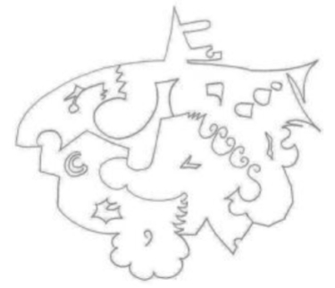

ME:I have an image in my mind that shows them as an alloy,so to speak,an alloy of all of the energies that are either present in the natural make-up of the continuum or synthesizable by manipulating the interaction between the natural energies.That includes those energies that are synthesized from a culmination of synthesized energies and further synthesis of the synthesis. 

我：我脑海中有一个画面，可以这么说，它们是一种合金，一种所有能量的合金，这些能量要么存在于连续体的自然构成中，要么可以通过操纵自然能量之间的相互作用来合成。这包括那些从合成能量的顶峰和进一步的合成的合成中合成的能量。

SE8:That would be a good analogy.They have to be capable of working with any possible combination of energies and their relative materials.However,there is another component that needs to be taken into account as well. 

8号源实体：这是一个很好的类比。他们必须能够与任何可能的能量组合和相关材料一起工作。然而，还有另一个组件需要考虑。

ME:What's that? 

我：那是什么？

SE8:The all important component of evolution.Evolution has a significant impact on the energies within and without the continuum.You are aware of how evolution affects the continuum from our previous dialogue,and I can imagine you are able to understand how evolution affects the energies of a continuum and its incumbent entities. 

8号源实体：进化中最重要的组成部分。进化对连续体内外的能量有重大影响。从我们之前的对话中，你知道进化如何影响连续体，我可以想象你能够理解进化如何影响连续体及其现任实体的能量。

ME:Well,yes,I can. 

我：嗯，是的，我会。

SE8:Then you will understand that the energies of the maintenance entity are also affected in a way that is consistent but not entirely in synchronization with the evolutionary changes.At least not at first,for they need to learn how to manipulate their own energies by forcing a localized evolutionary condition around themselves that effectively puts them outside of the evolutionary envelope of the continuum. 

8号源实体：然后你就会明白维护实体的能量也受到了影响，这种影响是一致的，但并不是完全与进化变化同步。至少一开始不是，因为他们需要学习如何通过强迫自身周围的局部进化条件来操纵自己的能量，这种进化条件可以有效地将他们置于连续体的进化包络之外。

ME:So you are suggesting that they are not only slippery in terms of their energetic content and how it relates to the energies of the continuum but also in terms of their evolutionary content and how that affects or is affected by the evolutionary content within and without the continuum. 

我：所以你的意思是，它们不仅在能量内容方面，以及它与连续体能量的关系方面，而且在进化内容方面，以及它如何影响或被连续体内外的进化内容所影响方面，都是不确定的。

SE8:Correct.They are totally autonomous in every respect. 

8号源实体：正确。他们在各个方面都是完全自治的。

ME:So how do they manipulate the energies,and,I would guess,the evolutionary content of the continuum they are associated with? 

我：那么他们如何操纵能量，我猜，他们与之相关的连续体的进化内容？

SE8:Simply by becoming one with the whole of the location they are dealing with.They become the area of the location by infiltrating the energies and replacing them with their own of the same type.That type must have frequency,dimension,dimensional componentry,energy and evolutionary content,not to mention positional content relative to the loci. 

8号源实体：简单地与他们所处理的整个位置成为一体。他们通过渗透能量并用自己相同类型的能量取代它们而成为该位置的区域。这种类型必须具有频率、维度、维度组成、能量和进化内容，更不用说与轨迹有关的位置内容。

ME:That sounds like they work a bit like a cancer cell in the human body which emulates the characteristics of a certain organ but is not linked to it or able to function like it and has a function all its own. 

我：听起来它们的工作有点像人体中的癌细胞，它模仿某个器官的特征，但与它没有联系，也不能像它一样运作，而是有自己的功能。

SE8:I can see the analogy,but I would suggest it is not a true description of how a maintenance entity works. 

8号源实体：我能看出这个类比，但我认为这不是维护实体如何工作的真实描述。

ME:How would you describe it then,as I thought that it was a reasonable description? 

我：那么你怎么描述它，我认为这是一个合理的描述？

SE8:It would be better described in terms of a master key that was able to unlock all the doors in all the hotels in your world.And not only that,the key would be able to change the characteristics of the lock that it was inserted into so that only itself and one other could use it at any time in the future.What I must say though is that this analogy suggests a form factor of some kind,and as this is one of the parts of your nested question,I will answer it now. 

8号源实体：最好用万能钥匙来描述它，它可以打开你世界里所有旅馆的所有门。不仅如此，钥匙还能改变它插入的锁的特性，这样以后只有它自己和另一个人可以使用它。我必须说的是，这个类比暗示了某种形式因素，因为这是你嵌套问题的一部分，我现在就回答它。

As you may have guessed by now,a physical or energetic form factor is neither necessary nor required in many of the environments that the Source Entities you have communicated with to date.Your own form factor is a very transient state,as you well know.The length of the transience is a factor of the ability to control the decay at the cellular level by use of the incumbent entities'intentions or will.This,however,is not strictly the case in my continuum-based environment. 

正如你现在可能已经猜到的，在许多你迄今为止与之沟通的源实体所处的环境中，物理或能量形式因素既不是必要的，也不是必需的。你自己的形式因素是一个非常短暂的状态，正如你所知道的。短暂的长度是一个因素，通过使用现任实体的意图或意志，来控制细胞水平的衰变。

### Form without Form! 

**没有形式的形式**

ME:Go on.You have my attention now. 

我：继续，现在我注意你了。

SE8:Ha,ha,ha,no,no,it's not the sort of form factor that you would ever recognize as a form factor dedicated to the environment that an entity would exist and experience within. 

8号源实体：哈哈，不，不，这不是那种你能认出是专门用于实体存在和体验的环境的外形因素。

ME:I didn't see that one coming.No really,I am joking.It is quite obvious that the level of form factor of one of the maintenance entities would be something that was not only so completely different from anything else expected,that it could not be from my current incarnate perspective anything other than energetic.Even though it has a form of some type,that type is un-recognizable as a form to me. 

我：我没料到会是这样。不是真的，我开玩笑的。很明显，维护实体的某种形式因素的水平，不仅与我所期望的完全不同，而且从我当前的化身角度来看，它不可能是任何其他的能量。即使它有某种类型的形式，那种类型对我来说是无法识别的形式。

SE8:Stop apologizing for your joke.We appreciate humor here,it is an essential part of existence of any being.

8号源实体：别为你的笑话道歉了。我们这里很欣赏幽默，它是任何存在的基本组成部分。

ME:That's OK.Shall we continue? 

我：没关系，我们继续吧？

SE8:Yes.Mmmm,let me see how I can explain their form factor,for it is not something that you have been exposed to yet. 

8号源实体：是的，嗯，让我看看我怎么解释它们的外形因素，因为这不是你接触过的东西。

You see,the form that my entities take is based upon the twelfth dimensional geometric form.This is a form that is able to manipulate the very structural fabric of a portion of the continuum an entity works with-that is,both the internal and external structures associated with a particular continuum. 

你看，我的实体采取的形式是基于第12维几何形式。这是一个形式，能够操纵一个实体工作的连续体的一部分的结构组织，即与特定连续体相关的内部和外部结构。

ME:So how do they do it?How do they manage to manipulate the fabric of a continuum? This seems to be a major role that they play. 

我：那么他们怎么做的呢？他们如何设法操纵连续体的结构？这似乎是他们发挥的主要作用。

SE8:They do it by becoming that which they intend to change.That which they intend to change could be anything from an external barrier between the environment between the continuum and the continuum itself.It could be or a localized area that is showing promise from an evolutionary perspective,one that would benefit from being manipulated in some way to augment the evolutionary experience through manipulating the evolutionary content of the area being considered for manipulation.I appreciate that this seems a bit convoluted,but that is exactly what it is,convoluted and iterative. 

8号源实体：他们通过成为他们想要改变的东西来做到这一点。他们想要改变的东西可以是任何东西，从连续体和连续体本身之间的环境之间的外部障碍。它可以是一个局部区域，从进化的角度来看，它将受益于以某种方式被操纵，通过操纵被考虑操纵的区域的进化内容来增强进化经验。我知道这似乎有点令人费解，但它确实是这样，令人费解和反复。

I can see that you are a bit lost so I will explain further in terms that you can understand. 

我可以看出你有点迷茫，所以我会进一步解释，以便你能理解。

If you can imagine creating a plan of a house or even a much larger building,and that the house or large building is built faithfully to the plan,so you have a building which is built to plan.Now imagine that the building needs an overhaul.The plan remains the same,but the architecture of the inside is changed to suit new requirements.The new plan is overlaid over the old plan to see the difference between the two and to see what has to be done to make the changes required to support the architectural requirements of the new plan.The old architecture is then stripped out,and the new architecture is installed.It is the process of overlaying the new architecture over the old that is used by my maintenance entities. They become the old architecture in every possible way,effectively replacing the energies that were the old architecture allowing those energies to be put to one side.Consider it as a scaffold replacing a scaffold.The entity then makes the changes necessary to support the specific changes required of the continuum,including those interfacing entities or components of the continuum undergoing change within itself,thus effectively changing the geometry of the scaffold or in this case the continuum's structure.Once it has done this and the new structure is working well,taking into account that adjustments may be necessary,the working structure of the continuum is introduced,and the entity moves on to the next job. 

如果你可以想象创建一个房子或甚至一个更大的建筑的计划，房子或大楼忠实地按照计划建造，所以你有一个按照计划建造的建筑。现在想象一下，这栋建筑需要大修。计划保持不变，但内部的架构被改变以适应新的要求。新计划覆盖旧计划，以查看两者的差异，并查看需要做什么来做出必要的改变，以支持新计划的建筑要求。然后，旧的架构被剥离，新的架构被安装。这是我的维护实体所使用的新架构覆盖旧架构的过程。它们以各种可能的方式成为旧的架构，有效地取代了旧架构的能量，使这些能量被放在一边。把它当作一个脚手架取代一个脚手架。然后，该实体做出必要的改变，以支持连续体所需的具体变化，包括那些连续体内部发生变化的接口实体或组件，从而有效地改变脚手架的几何形状，或者在这种情况下，连续体的结构。 一旦它完成了这个工作，新的结构运行良好，考虑到可能有必要的调整，连续体的工作结构被引入，实体移动到下一个工作。

ME:So what you are saying is that the maintenance entity creates a sort of bridge between that structure that the continuum currently has and that which it needs to be in order to augment the evolutionary opportunities that can be experienced as a result of the proposed changes to the continuum.Once these proposed changes have been under a trial-run,so to speak,they are introduced as a permanent feature,albeit for the period of time required for the entity to create a longer term replacement,one that allows the entity to move on to its next role.

我：所以你的意思是，维护实体在连续体目前的结构和它需要成为的结构之间创建了一种桥梁，以增加进化的机会，这些机会可以作为连续体拟议的改变的结果而经历。 一旦这些拟议的改变已经在试运行中，可以说，它们被引入作为一个永久的特征，尽管实体需要一段时间来创建一个更长期的替代品，一个允许实体移动到下一个角色的替代品。

SE8:That's it in a nutshell.You see,there is no point in creating something that will fail, especially if it is to have a medium to long term function. 

8号源实体：简而言之就是这样。你看，创造一个注定失败的东西是没有意义的，特别是如果它具有中长期的功能。

ME:And this is happening all of the time? 

我：这种事一直都在发生吗？

I felt that I was starting to get a grip of what was going on in Source Entity Eight's continuum- based environment. 

我感觉我开始掌握源实体8的连续性环境中发生的事情。

SE8:Yes,this happens all the time.In fact,it is happening in a very special way across the whole of my continuum-based environment. 

8号源实体：是的，这种情况一直都在发生。事实上，它以一种非常特殊的方式跨越我的整个连续性环境。

ME:Yes,I see what you mean.It is like a patchwork quilt,with each patch in the quilt being representative of a specific continuum. 

我：是的，我明白你的意思了。它就像一个拼布被子，被子里的每个补丁都代表着一个特定的连续体。

SE8:That would be a reasonable way to describe the work that goes on across the continuum and its continuum. 

8号源实体：这将是一个合理的方法来描述在连续统一体及其连续统一体中进行的工作。

This made me think a bit.Although each of the maintenance entities was and worked as an autonomous entity,it quite obviously,in my mind that is,needed to work in some sort of synchronicity with other maintenance entities to ensure that the work they undertook did not upset the work of those maintenance entities surrounding them.Just as I was thinking this though,Source Entity Eight considered it pertinent to correct me in my thought process. 

这让我思考了一下。虽然每个维护实体都是一个自治的实体，但在我看来，很明显，需要与其他维护实体在某种程度上同步工作，以确保他们承担的工作不会扰乱周围那些维护实体的工作。正当我思考这个问题时，源实体8认为有必要纠正我的思维过程。

SE8:It would be worth noting here that the level of a maintenance entity's autonomy is total.This means that it is not part of what you would call a gestalt or hive mind.It decides what to do based upon the level of change required to support the evolutionary quotient necessary to ensure connectivity with the rest of the continuum,the level of compartmentalization,the evolutionary quotient has and the necessary evolutionary level required to maintain an effective interface between the neighboring continuums and the space in-between.This also includes the level of localized change necessary to respond to the evolutionary pressures of the neighboring continuum. 

8号源实体：值得注意的是，维护实体的自治水平是完全的。这意味着它不是你所说的完形或蜂群思维的一部分。它决定做什么，是基于支持进化商数所需的改变水平，进化商数必须确保与连续体的其余部分的连通性，分区水平，进化商数和维持相邻连续体和中间空间之间有效接口所需的必要进化水平。这也包括应对相邻连续体的进化压力所需的局部变化水平。

ME:We have discussed this before to some extent,and as a result,I feel that we are going over old ground. 

我：我们之前已经讨论过这个问题，所以我觉得我们是在重复旧话题。

SE8:We are to some extent,but the important thing to note here is that the entities themselves have to become the continuum itself at certain times to enable the changes to be planned and implemented correctly all at the correct change point. 

8号源实体：在某种程度上，我们是这样的，但这里需要注意的重要一点是，实体本身必须在某些时候成为连续体本身，以使更改能够在正确的更改点上正确地计划和实施。

ME:OK,this opens up a whole new series of questions.I will,however,limit it to one. 

我：好吧，这引出了一系列新的问题。但是，我将把它限制在一个问题上。

SE8:Go on. 

8号源实体：继续。

ME:Why does a maintenance entity need to become part of the continuum itself?I can recognize the need to be a framework to build a new continuum-based environment around. This would be rather like the etheric and ketharic templates in the human body.I can also understand being a bridge between the old construction and the new.But why be an actual part of the continuum itself? 

我：为什么维护实体需要成为连续体本身的一部分？我可以认识到需要一个框架来建立一个新的基于连续体的环境。这将非常像人体中的以太和克他模板。我也可以理解成为旧的建筑和新的建筑之间的桥梁。但为什么要成为连续体本身的实际部分？

SE8:There are two reasons for this.First,the maintenance entity needs to become part of the continuum,replacing part of the continuum at a component level to understand the interfaces surrounding it,as well as the internal functionality and energetic requirements.It needs to do this before each piece of maintenance work is started.In this instance,the continuum's component is taken "off line,"so to speak,to allow the changes necessary for optimal functionality whilst the entity takes over the functional requirements of that continuum component part in its entirety for the duration of the changes.Second,the continuum itself cannot react fast enough to the changes required to maintain synchronicity with its surrounding continuum,the space between and the greater continuum that is me,so the entity has to "step in"immediately any change is required, whilst the modifications are made. 

8号源实体：原因有二：首先，维护实体需要成为连续体的一部分，在组件级别上替换连续体的一部分，以了解周围的接口，以及内部功能和能量需求。在每项维护工作开始之前需要这样做。在这种情况下，连续体的组件被“脱机”，可以这么说，以允许最优功能的必要变化，而实体在变化期间接管了连续体组件部分的全部功能需求。

ME:I am getting the impression that they have to do a sort of apprenticeship to qualify as a maintenance entity. 

我：我得到的印象是，他们必须做一种学徒，才能有资格成为一个维护实体。

SE8:Yes,that is true.Before they can be considered autonomous,they must experience every component part of every continuum within the continuum that is me.That includes being the space between the continuum and the very fabric of that which is me.Also,they have to cope with the ever-changing borders between the compartments identified as an entity's area of maintenance responsibility. 

8号源实体：是的，确实如此。在他们被认为是自主的之前，他们必须经历连续体中的每个连续体的每个组成部分，这包括连续体和我这个结构之间的空间。此外，他们必须处理作为一个实体维护责任区域的隔间之间不断变化的边界。

ME:They have to become you? 

我：他们必须变成你？

SE8:Correct.What better way to understand the maintenance of a continuum than by being the creating continuum itself? 

8号源实体：正确。还有什么比成为连续体本身更好的方式来理解连续体的维护呢？

ME:How is that possible?I mean,how can an entity that is as small as a maintenance entity...No,sorry,let me change my line of questioning.How can an entity take over from its creator?I mean,it must be a massive change.

我：这怎么可能？我的意思是，一个像维护单位这么小的实体怎么能...不，抱歉，让我换个问题。一个实体怎么能从它的创造者手中接管？我的意思是，这肯定是一个巨大的变化。

SE8:It doesn't.The entity itself becomes one with me,integrating itself into the very minute energetic detail that is me. 

8号源实体：它不会。实体本身与我合二为一，融入到我身体的每一个微小而充满活力的细节中。

ME:But to do that,it would have to spread itself incredibly thin. 

我：但是要做到这一点，它必须把自己变得非常薄。

SE8:It does.To enable it to become an overlay of me,it needs to be diluted to the point of insignificance. 

8号源实体：是的，为了让它覆盖我，它需要被稀释到微不足道的程度。

ME:You mean like a homeopathic dilution? 

我：你的意思是像顺势疗法的稀释剂？

SE8:That would be a reasonable analogy,yes.You see,for the entity to experience all that is me,it needs to be "in"all that is me,and the only way it can do that is be diluted to the point of full integration.Consider it like being a rare elemental component in the atmosphere that surrounds the earth.The elemental component may be one part in several trillion,trillion, billion,but in its diluted state,it is still,nevertheless,an important component within the total composition of the element which you classify as air.Because the air is what it is when you take a sample of it,you always gain a sample of all of the elements that make it up so to speak. 

8号源实体：这将是一个合理的类比，是的。你看，对于实体来说，要体验我的所有，它需要“在”我的所有，而它能做到这一点的唯一方法是被稀释到完全融合的点。把它想象成环绕地球的大气中一种稀有的元素成分。这种元素成分可能是几万亿、万亿、亿分之一，但在其稀释状态下，它仍然是被你分类为空气的元素的全部组成中的一个重要成分。 因为当你取空气的样本时，你总是得到所有组成它的元素的样本。

ME:But that can't possibly be the case because to get a sample of all of the elements,one needs to take a sample from an area that is large enough to capture those elements that are, for instance,one in a trillion,trillion,billion.One sample might not have the element whilst another would.

我：但这不可能，因为要得到所有元素的样本，我们需要从一个足够大的区域中取样，以捕获那些元素，例如，万亿，万亿，十亿分之一。一个样本可能没有该元素，而另一个则有。

SE8:That would be correct in the physical world that your "vehicle"exists within,but it is not necessary energetically.You mentioned the example of homeopathics,and as a result,I thought you understood the functionality of such a dilution. 

8号源实体：在你的“载体”存在的物质世界里，这是正确的，但是在能量上，这不是必要的。你提到了顺势疗法的例子，因此，我认为你理解了这种稀释的功能。

ME:Well,I do to a certain extent.The theory surrounding homeopathic medicines is that the surrounding elements take "in"the properties of the element that is most diluted. Hence,the elements'properties are present without the element itself being present. 

我：在某种程度上，我相信。顺势疗法药物的理论是，周围的元素“吸收”了最稀释的元素的特性。因此，元素的特性在元素本身不存在的情况下仍然存在。

SE8:Well,that is the same in this instance.It is a very good analogy as it shows how the maintenance entity learns to absorb that which is me without having a component of itself specifically located in the area of functional learning. 

8号源实体：在这个例子中也是一样的。这是一个非常好的类比，因为它展示了维护实体如何学习吸收我，而没有自己特定的组件位于功能学习的领域。

ME:I find it really quite bizarre how an entity can learn how to be a Source Entity.... 

我：我发现一个实体如何学习如何成为一个源实体真的很奇怪...

SE8:Continuum. 

8号源实体：连续性。

ME:OK,a continuum,merely by association. 

我：好的，一个连续体，仅仅是通过联想。

I have to ask this next question as it may explain how homeopathics work here on the earth plane.How does an entity assimilate knowledge or experiential experience through diluted association or presence? 

我必须问下一个问题，因为它可能解释顺势疗法如何在地球上运作，一个实体如何通过稀释的联系或存在来吸收知识或经验？

SE8:Quite simply by the communication routes used by the energies separating the energies.I see that I will need to elaborate.Energies that are either attached to an entity-that is,an entity of any kind but specifically those with sentience-or energies that have a purpose use each other as a communication medium.This communication medium is quite special because when the request goes out for communication-and the communication is between energies that are of a very high dilution-the energies in- between change themselves into the same type of energy for as long as necessary,ensuring that the communication or functionality is made in a robust way.However,there is a trade off in this type of communication process.This trade-off is that the energies that require "others""energies to behave like them for the duration of the communication or function, request what you would call "benefit in kind"-the agreement to assume the communicative properties of other nearby energies when they are in the minority.In this way they are given the key characteristics of all of the other energies that they are surrounded by to enable them to return the favor,so to speak,when the request arrives,which it inevitably does.This ability to change into other energies remains once given/received-even when the requesting entity or energy has departed-thus leaving a full set of energetic and function resources available for the use of the remaining energies or entities.This is basically how an entity can be part of me,be me,and experience what I experience-even when my difference in size is so much bigger than the maintenance entity diluted within me-to experience being the parent continuum or a Source Entity.This is a similar process to that used in your homeopathic medicines on your Earth. 

8号源实体：很简单，通过能量使用的通信路线来分离能量。我知道我需要详细说明。能量要么附着在一个实体上，也就是说，任何一种实体，但特别是那些有感觉的实体，要么有目的的能量互相作为通信媒介。这种通信媒介很特别，因为当请求进行通信时，这种通信是在高度稀释的能量之间进行的，在必要的时间内，这些能量会把自己变成同一种类型的能量，以确保通信或功能以一种强有力的方式进行。然而，在这种类型的通信过程中有一个权衡。这种权衡是，在通信或功能期间，需要“其他”能量的能量，要求你所说的“以同样的方式受益”——当它们处于少数时，同意假定附近其他能量的通信特性。这样，他们被赋予了所有其他能量的关键特征，使他们能够回报恩惠，可以说，当请求到来时，这是不可避免的。这种转换成其他能量的能力一旦被给予/接受，即使请求实体或能量已经离开，也会保留下来，从而留下一整套能量和功能资源，供剩余的能量或实体使用。 这基本上是一个实体如何成为我的一部分，成为我，并体验我所体验的，即使当我在大小上的差异比我体内稀释的维护实体大得多，体验作为父母连续体或源实体的过程。

ME:Well,I do say that does sort out a number of things in my mind.And it explains to some degree how homeopathics work. 

我：嗯，我确实说这确实整理了我脑海中的许多东西。并且它在某种程度上解释了顺势疗法是如何工作的。

SE8:The methodology of taking on board the characteristics of another energy for communication and functionality is one that is adopted Origin-wide.In fact,it is the primary method of communication and functionality with the exception of the medium you call gravity,which I am told has already been explained to by your own Source Entity. 

8号源实体：将另一种能量的特性纳入交流和功能的方法论是全起源采用的方法。事实上，除了你们称之为重力的媒介外，这是交流和功能的主要方法，我听说你们自己的源实体已经对此进行了解释。

Mmmm,it is almost time for you to move on to the next Source Entity,the One you will call Source Entity Nine. 

嗯，差不多是时候让你去下一个源实体了，那个你叫做9号源实体。

ME:Wait.Before you go,can you please describe to me what one of the entities who exists within one of your continuum looks like.I can't finish without at least your description of one entity form factor and evolutionary role within the continuum. 

我：等等。在你走之前，你能给我描述一下存在于你们连续体中的某个实体长什么样吗？ 我不能不至少描述一下这个实体的外形因素和连续体中的进化角色。

SE8:I will do this for you before you move on. 

8号源实体：在你继续前进之前，我会为你做这个。

Before I start though I need to point out that I have over 60 million different types of entities that exist and evolve within my continuum-based environment.Some of the entity types are specific to the continuum they work within,whereas others exist within a continuum that has up to 30 thousand different types.Which one would you like me describe,not that I have given you a choice yet? 

在我开始之前，我需要指出，在我基于连续体的环境中，存在和进化着超过6000万种不同类型的实体。一些实体类型是特定于它们所工作的连续体的，而其他实体则存在于一个拥有多达3万种不同类型的连续体中。你希望我描述哪一个，而不是我已经给你一个选择了吗？

ME:Right,without a choice of some sort,it is going to be difficult.Let me ask one more question before I decide which "blind alley"to go down. 

我：是的，没有某种选择，这将是困难的。在我决定走哪条“死胡同”之前，让我再问一个问题。

Do you have a continuum where there is a main form factor,if they have one,one that is similar to all entities? 

你是否拥有一个连续体，其中有一个主要的形态因素，如果他们有一个的话，一个与所有实体相似的因素？

SE8:Now that is a very good question,for there is a continuum where this is the case. I suspect you were tuning in to this particular continuum when you made the choice of question. 

8号源实体：这是一个非常好的问题，因为有一个连续体，其中存在这种情况。我怀疑你在选择这个问题时，正在调整到这个特定的连续体。

ME:Not intentionally,at least,not consciously. 

我：至少不是故意的，没有意识到。

SE8:All of the entities in the continuum I will call continuum 11b are similar,but each of them has a particular function and,therefore,form factor.I will use this nomenclature as it is one that you understand,for their form factor is a multi-dimensional-based derivative of what you might call a rare gas-if,that is,I had to use a description that you would understand. 

8号源实体：连续体中的所有实体我称之为连续体11b，它们都是相似的，但每个都有特定的功能和形状因子。我将使用这个术语，因为它是你能理解的，因为它们的形状因子是基于多维度的衍生物，你可能会称之为稀有气体——如果，也就是说，我必须使用一个你能理解的描述。

ME:OK,it's good enough for me so far. 

我：好的，目前对我来说已经足够好了。

SE8:On its own,this form factor is not useful for any form of continuum-based work or the retention of any evolutionary content,for it has no "purpose"in its raw state.It gains its usefulness and,therefore,purpose when it has a function to perform,so it needs to have a difference to its form factor,no matter how small it may be. 

8号源实体：就其本身而言，这种形式因素对于任何形式的连续性基础工作或任何进化内容的保留都是无用的，因为在它的原始状态下它没有“目的”。 当它有功能要执行时，它就获得了它的有用性，因此，当它有功能要执行时，它就需要与它的形式因素有所不同，无论它可能有多小。

ME:I am receiving the image of a series of entities that are sort of similar to a"multipurpose" screw driver without a tip on the end.In this state they are all the same.When it has a tip,for example,a cross head,a blade or torx(a six point star shape pattern),it has a specific purpose and role.The tip is the only thing that is different among the other entities who have "tips" that are specific to their own roles and functions. 

我：我正在接收一系列实体的图像，有点类似于“多功能”螺丝刀，但没有尖端。在这种状态下，它们都是一样的。当它有一个尖端时，例如，十字头，刀片或扭矩(六点星形图案)，它有一个特定的目的和作用。尖端是唯一不同于其他实体的“尖端”，它们有特定的角色和功能。

SE8:That would be a good example from your point of view,but you will need to note this as well.In your example,you have assumed that the illustration has but one multifunction screwdriver body.In the continuum,we are talking about other subtler differences between the so called stable sides of the body of the entity. 

8号源实体：从你的观点来看，那将是一个很好的例子，但你也需要注意这一点。 在你的例子中，你已经假设图示只有一个多功能螺丝刀的主体。 在连续统一体中，我们正在讨论实体主体的所谓稳定侧面之间的其他微妙差异。

ME:So you have classes or types of entities,different types of multifunction screw driver bodies,so to speak.

我：所以你有实体的类别或类型，可以说是不同类型的多功能螺丝刀本体。

SE8:Yes,and purely as an illustration,they may be,long,short,wide,bent at various different angles,flexible under all conditions,and/or flexible under certain conditions.This is not what they are but it gives you an idea of the diversity.Additionally,the tip "family' changes depending upon the body type. 

8号源实体：是的，纯粹作为一个例子，它们可能是长，短，宽，弯曲在各种不同的角度，在所有条件下柔软，和/或在某些条件下柔软。这不是它们是什么，但它给你一个概念的多样性。此外，尖端“家族”的变化取决于身体类型。

As another example using you own methods of manufacturing electronics,such as manufacturing a silicon chip on earth,you need certain tools,computerized tools,to allow you to design,develop,and test these components.You need the tools to create the tools to create the tools,so to speak.This is similar if not the same in certain examples with the entities in this particular continuum. 

另一个例子是使用你自己的制造电子产品的方法，比如在地球上制造硅芯片，你需要一些工具，计算机化的工具，来让你设计，开发和测试这些组件。可以说，你需要这些工具来创造工具来创造工具。 如果不是相同的，在某些例子中，这与这个特定连续体中的实体是相似的。

ME:So this continuum is the only continuum where the entities are similar if not almost the same,albeit with the minor differences talked about. 

我：所以这个连续体是唯一的连续体，实体是相似的，如果不是几乎相同的话，尽管有我们谈到的细微的差异。

SE8:In a nutshell,yes. 

8号源实体：简而言之，是的。

ME:I would like to get back to this description of their form factor from a true sense rather than from a hypothetical sense where we are using earthly examples because I can imagine my readers thinking that we are talking about a bunch of sentient screwdrivers here. 

我：我想从真实的意义上回到对它们外形因素的描述，而不是从我们使用地球例子的假设意义上，因为我可以想象我的读者认为我们在这里谈论的是一群有感情的螺丝刀。

SE8:You should give your readers more credit,but I do see the humor in that statement. Sentient screwdrivers,indeed! 

8号源实体：你应该多给读者一些信任，但我确实看到了这句话中的幽默。真是有同情心的螺丝刀！

Let's carry on.The entities themselves as I have described in some limited way in the text above,are a"multi-dimensional-based derivative of what you might call a rare gas"-the rare gas being the only way to describe their physicality if they had one.You mentioned "form factor"and the way that a rare gas is constructed would be a better example of how they are presented if they had to be presented in some sort of form.I also recently described the way in which those entities that are destined to be continuum maintenance entities are able to experience being one with me and,therefore,part of the working structure of the continuum they are assigned to during times of substitutional maintenance. 

让我们继续。实体本身，正如我在上面的文本中以某种有限的方式描述的那样，是一个“基于多维度的衍生物，你可以称之为稀有气体”——稀有气体是描述它们的物理性的唯一方式，如果它们有物理性的话。你提到了“形式因素”，稀有气体的构建方式将是一个更好的例子，如果它们必须以某种形式呈现，它们将如何呈现。我最近还描述了那些注定成为连续体维护实体的实体能够体验与我合一的方式，因此，在替代维护期间，它们被分配到连续体的工作结构的一部分。

ME:Yes,we considered the example of homeopathic dilution. 

我：是的，我们考虑了顺势疗法稀释的例子。

SE8:No,I was alluding to the entity becoming the framework of that part of the continuum they were becoming a substitute for whilst the maintenance task was being worked on. 

8号源实体：不，我是指实体成为连续体的一部分的框架，它们成为维护任务的替代品。

ME:Oh.Ok,yes,I see now. 

我：哦，好的，是的，我现在知道了。

SE8:I think you do in some small way.I will give you an image to consider. 

8号源实体：我认为你在某种程度上是这样。我会给你一个图像来考虑。

I received an image of the chemical models we create in school/university to explain,in a three dimensional way,the way in which a specific element is composed in its atomic state.This model portrayed a stick model with balls attaching the sticks together.The stick representing the connectivity between the balls,and the balls represented the molecules that made up the element. The molecules had a level of attractivity between certain other molecules whilst having a level of repulsion between others.Other levels of connectivity had both attractivity and repulsion so that the molecules stayed at a known distance from each other,not being able to move closer nor being able to move away.All of this resulted in a form factor,albeit large enough and dense enough to be classified as a form whilst being of a frequency that was high enough to make the form "formless"in all but attractivity and repulsivity-certainly from a physical perspective.It was as if the entity,if this was an example of an entity (Source Entity Eight said it was),was not actually created from a molecular structure but a structure that was created by attractivity and repulsivity of some sort.The attractivity and repulsivity were not between different types of molecules but were between different energies and dimensions. 

我收到了一张我们在学校/大学创建的化学模型的图像，以三维方式解释，特定元素在原子状态下的组成方式。这个模型描绘了一个棒状模型，球与棒相连。棒代表了球之间的连接，球代表了组成元素的分子。 分子在某些其他分子之间具有一定程度的吸引力，同时在其他分子之间具有一定程度的排斥力。 其他级别的连接既有吸引力又有排斥力，因此分子保持彼此之间的距离，既不能靠近也不能远离。 所有这一切导致了一个形式因素，尽管足够大，足够密集，可以被归类为一种形式，但其频率高到足以使形式“无形”，但从物理角度来看，只有吸引力和排斥力。不同类型的分子之间不存在吸引力和排斥力，而是存在不同能量和维度之间的吸引力和排斥力。

Suddenly,this was starting to get hard,even though it appeared to be a simple subject.The data being presented to me was obviously being subject to some heavy filtering so that I could gain some sort of insight into the concept being presented to me.My typing was slowing down as my ability to assimilate the knowledge was degrading.I felt a pressure at the front of my head.Then it cleared slightly,and the information continued to flow again. 

突然，这开始变得困难，尽管它似乎是一个简单的主题。呈现给我的数据显然受到一些严重的过滤，以便我能够获得某种洞察力，以便我能够深入了解呈现给我的概念。我的打字速度变慢了，因为我吸收知识的能力正在下降。我感到头部有一种压力。 然后它略微清除，信息又继续流动。

The interaction between the energies that composed the entity or concept of the entity being described was not only dependent upon simple energetic attractivity and repulsivity and the expected frequential content and how that affected the attractivity,etc.,but it was also affected by the dimensional sub-component where that particular part of the entity was manifested.I saw the entity as the molecular model again but pulled apart into different layers,rather like the layers that are used in the multilayer drawing conventions used in Computer Aided Engineering (CAE)and Computer Aided Design(CAD)to draw a component in a motorcar or an aeroplane. 

组成实体或被描述实体概念的能量之间的相互作用，不仅取决于简单的能量吸引力和排斥力，以及预期的频率内容，以及它如何影响吸引力等，但它也受到实体的特定部分表现出来的维度子组件的影响。我再次把实体看作分子模型，但被分成不同的层，就像计算机辅助工程(CAE)和计算机辅助设计(CAD)中使用的多层绘图惯例中的层，用来绘制汽车或飞机的组件。

As the layers were pulled apart,each layer represented the dimensional content that illustrated that part of the entity that was manifested on that particular dimension.Dimensionally together,the entity was whole;dimensionally apart and seen from the perspective of the different dimensional levels in isolation,the entity was incomplete.There was one more thing, however.That part of the entity that was manifested on a particular layer/dimension had a role/specialization of its own to perform.This role was performed in both isolation and in concert with the other parts of the entity that were manifest on the other dimensional layers. In this aspect the entity was able to create on a holistic and specialized level simultaneously. Not only that,the entity was able to interact with the other entities within its continuum and work in concert with them in their creativity either as a team,independently/separately, interdependently or in observation.They also worked out which skills/functions each other had as a result of their particular energetic/dimensional construction and worked together in harmony to create something that they would not have been able to create should they have stayed working only with entities of the same energetic/dimensional form factor. 

当层被分离时，每一层代表了维度内容，说明了实体的一部分，体现在特定的维度上。维度在一起，实体是完整的；维度分离，从不同的维度水平的角度来看，实体是不完整的。然而，还有一件事。实体的一部分，体现在特定的层/维度上，有自己的角色/专业来执行。 这个角色是孤立的，与实体的其他部分一致，体现在其他维度层上。 在这方面，实体能够同时在整体和专业水平上创造。不仅如此，实体能够与其连续体中的其他实体互动，并与它们在创造力中协同工作，无论是作为一个团队，独立/分开，相互依赖或观察。他们还发现了由于他们独特的能量/维度结构，彼此拥有哪些技能/功能，并和谐地一起工作，创造出一些他们如果只与相同能量/维度形式因素的实体一起工作就无法创造的东西。

I zoomed out of the image I was being given and saw a bright blue lattice of sparkling multidimensional energies.It looked like a huge multi-dimensional net covering the area that would house a galaxy in my own physical universe.It was beautiful.

我把我看到的图像放大，看到一个闪闪发光的多维能量的明亮蓝色晶格。它看起来像一个巨大的多维网，覆盖了在我自己的物理宇宙中可以容纳一个星系的区域。它很漂亮。

（图11：用于解释分子结构的3D模型示例）

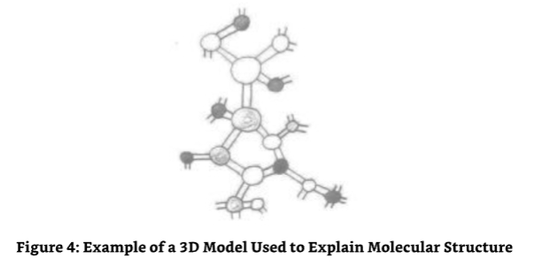

### In Finishing with Source Entity Eight 

**结束和源实体8的对话**

SE8:Now you know what one of these entities would look like if it was visible to your physical eyes and a bit about how it is constructed. 

8号源实体：现在你知道这些实体中的一个看起来像什么，如果它可以用你的肉眼看到，并且知道它是如何构建的。

ME:Yes,it is beautiful.Thank you. 

我：是的，它很漂亮。谢谢你！

SE8:Now it is time for you to move on to the entity you will refer to as Source Entity Nine.Go in peace with this expansion in your knowledge. 

8号源实体：现在是时候让你们前进到你们将称之为9号源实体。带着你们知识的扩展和平地前进。

And with those last words the communication link between Source Entity Eight and me dissolved. I still felt its presence but noted that my communicative direction and energetic link with it was no longer attached in an exclusive fashion.With Source Entity Eight's energies no longer linked to my own for communication purposes,I began to take stock of the information I had received during the months I had been directly linked energetically with SE8. 

随着这些最后的话语，我和8号源实体之间的通讯联系消失了。我仍然感觉到它的存在，但注意到我与它的通讯方向和能量联系不再以一种排他的方式连接。随着8号源实体的能量不再为了通讯目的而与我自己的能量相连，我开始盘点我收到的信息，在几个月里我一直与SE8直接有能量联系。

Source Entity Eight was an entity whose whole existence was focused upon the generation and maintenance of continuum and how they could provide an enhanced evolutionary opportunity for those entities who were created and based upon their inherent abilities,elected to work within their chosen continuum to experience,learn and evolve (an Origin-wide theme)by manipulating the base evolutionary content of the continuum in which they existed-sometimes locally, sometimes across the whole continuum. 

8号源实体的整个存在都集中在连续体的产生和维护上，以及如何为那些基于其内在能力而被创造的实体提供增强的进化机会，选择在他们所选择的连续体中工作，通过操纵他们所存在的连续体的基本进化内容来体验、学习和进化(一个起源范围的主题)。

There were two things that struck me as both significant and different from an almost common theme of multiversal creativity and existence based upon full dimensions,sub-dimensional components andfrequency levels of environments created by the other Source Entities with whom I have communicated to date: 

有两件事让我震惊，它们与我迄今为止与之沟通的其他源实体所创造的基于全维度、亚维度组件和环境频率水平的多元创造和存在的几乎共同的主题不同：

- 1.There was a focus on a continuum that had a continuum specific energetic content rather than a universe/multiverse. 
- 2.The focus also included the ability or need to affect the base evolutionary component of the continuum-based environment to allow optimization of that base evolution via the work of incumbent entities and evolution of the entities themselves,both positively and negatively. 

- 1.有一个连续体的重点，它有一个连续体特定的能量内容，而不是一个宇宙/多维宇宙。
- 2.重点还包括影响基于连续体的环境的基本进化组件的能力或需要，以便通过现有实体的工作和实体本身的进化来优化基础进化，无论是积极的还是消极的。

It was as if the whole game of evolution was being turned on its head with the basic ground rules of evolution happening in a linear way no longer applying-at least not in Source Entity Eight's environment.The thought that the whole way in which the base level of evolution, specifically in the continuum-based environment,could be manipulated to affect the method in which evolution was accrued was a completely new avenue of thought to me!I suspect it will be a completely new consideration for most people as well,specifically the thought of losing one's place on the evolutionary ladder,over-night as it were,in order to either help the entities evolving in another continuum or to see how it affected an entity's overall evolution seems to be contrary to everything we know about evolution. 

这就好像整个进化游戏正在被颠倒过来，进化的基本规则不再以线性方式发生，至少不是在源实体8的环境中。进化的基本水平的整个方式，特别是在基于连续体的环境中，可以被操纵来影响进化积累的方法，对我来说是一个全新的思维方式！我怀疑这对大多数人来说也是一个全新的考虑，特别是在一夜之间失去自己在进化阶梯上的位置，为了帮助在另一个连续体中进化的实体，或者为了看看它如何影响一个实体的整体进化，这似乎与我们所知道的进化背道而驰。

I was also surprised at the different types of evolution and how they affected the geometrics of the continuum itself.I was starting to realize that nothing could be taken for granted,and everything should be considered as not only possible but highly probable.Clearly,there were no "sacred cows"in The Origin's omniverse,for evolution,one of those,had just been smashed to pieces.

我也对不同类型的进化以及它们如何影响连续体本身的几何学感到惊讶。我开始意识到没有什么是理所当然的，每件事都应该被认为不仅是可能的，而且是极有可能的。显然，在起源的宇宙中没有“圣牛”，因为进化，其中之一，刚刚被粉碎。

With this in mind andfour Source Entities to go,my energetic link moved outwards and onwards towards the ninth Source Entity to be interviewed.I felt excited as I sat and waited for the energies of the communication link with Source Entity Nine to engulf me.I didn't have long to wait.

带着这个想法和4个源实体要走，我的能量链接向外移动，向前移动，走向第九个要采访的源实体。当我坐在那里等待与第9个源实体的通信链接的能量吞没我时，我感到兴奋。我没有等多久。

## Chapter Three - Source Entity Nine 

**第3章：9号源实体**

I suddenly had a picture of the Walt Disney cartoon character Goofy in my head.

我突然在脑海中出现了一张华特迪士尼卡通人物高飞的图片。

"Well hello!"it said in the same voice as Goofy.Was I going mad? 

“你好！” 它用高飞一样的语气说。我疯了吗？

### Source Entity Nine Tells Me More About Myself Than Itself 

**9号源实体告诉我的更多是关于我自己，而不是它本身**

SE9:Now that I have got your attention,we can start. 

9号源实体：现在我已经得到了你的注意，我们可以开始了。

ME:Hold on.Was that you,the next Source Entity that I am due to have a dialogue with?The Source Entity I am due to call Source Entity Nine?In my head portraying Goofy?! 

我：等等。是你吗？下一个我要对话的源实体？那个我要叫做9号源实体的源实体？在我脑海中扮演高飞？

SE9:Yes,it was.I had noticed that you had not spotted that the link between us had become operative,so I decided to delve into your mind and use something that would wake you up to my presence.Using the Goofy personality seems to have done the trick. 

9号源实体：是的，是这样。我注意到你还没有发现我们之间的联系已经开始生效了，所以我决定深入你的思想，用一些东西来唤醒你，让你意识到我的存在。使用高飞的人格似乎起到了作用。

ME:It certainly did.And you are right;I didn't notice that you had linked up with my energies.Your energies must be either very subtle,or you have managed to tune into me in a most perfect way. 

我：的确如此。你说得对，我没有注意到你已经和我的能量连接上了。你的能量要么非常微妙，要么你已经成功地以一种最完美的方式调谐到我身上。

SE9:The truth of the matter is that you are adjusting to the difference in energies in an almost automatic way now.You appear to be able to re-calibrate your energies to those of the entity you are due to communicate with on the point of your relinquishing the link with the previous Source Entity. 

9号源实体：事情的真相是，你现在正在以一种几乎是自动的方式调整能量的差异。你似乎能够重新校准你的能量，以便在你放弃与之前的源实体的联系时，与那些你应该与之沟通的实体进行沟通。

ME:I don't remember doing this before.In fact,I remember having quite a bit of difficulty during the first couple of dialogues of the last few Source Entities-specifically,as I get further and further away from my home Source Entity. 

我：我不记得以前做过这个。事实上，我记得在最后几个源实体的前几个对话中，我遇到了相当大的困难，特别是当我离我的主源实体越来越远的时候。

SE9:As you move further away from the energies of the Source Entity you now call Source Entity One,your home Source Entity,you start to become more independent.As you were told by Source Entity Eight,you are of The Original Manifestation and,therefore,have an energy set that is not truly created by your home Source Entity.In essence,you were created by The Origin and,therefore,you belong in The Origin and not in the confines of your home Source Entity.As a result of moving your consciousness away from the confines of your Source Entity on an almost regular and consistent basis now,you are losing the attachment to the energies of your home Source Entity.You are gaining your independence and the constraints in your communicative abilities are being broken down as a result.Hence,your automatic re-calibration of your own energies to those of mine,allowing almost perfect integration with me on a most fundamental level.This meant that when I established contact with you,your energies were already calibrated to those of mine and the normal discomfort you experienced in the past was not present.In fact,they were so in tune that you were not even aware of their presence as you considered them to be your own. 

9号源实体：当你远离你现在称之为源实体一的能量，你的主源实体，你开始变得更加独立。正如你被源实体8所告知，你是原始显现，因此，有一个能量集，不是真正由你的主源实体创造的。本质上，你是由起源创造的，因此，你属于起源，而不是在你的主源实体的限制中。由于现在你以几乎有规律和一致的基础将你的意识远离你的源实体的限制，你正在失去对你主源实体能量的依附。你正在获得你的独立性，结果是你的沟通能力的限制正在被打破。因此，你自动重新校准你自己的能量到我的那些，允许在一个最基本的水平上与我几乎完美的融合。这意味着当我与你建立联系时，你的能量已经校准到我的那些，你过去经历的正常不适不存在。事实上，他们是如此的合拍，以至于你甚至没有意识到他们的存在，因为你认为他们是自己的。

ME:I am impressed. 

我：我印象深刻。

SE9:You should be.Although it's the first time you have achieved such a process,it will become more prevalent later,especially when you complete your dialogues with me and the remaining Source Entities and move on to your communications with The Origin in a level of detail you are not yet even able to comprehend. 

9号源实体：你应该会的。虽然这是你第一次达到这样的过程，但以后会变得更加普遍，特别是当你完成与我和其他源实体的对话，并继续与源头进行交流时，你甚至还无法理解其中的细节。

ME:But I have not had a problem communicating with The Origin in the past.In fact,I expect I will be talking to The Origin more than the Source Entity I will call Source Entity Twelve,the Source Entity that has not yet become self-aware. 

我：但是我过去和“起源”沟通没有问题。事实上，我希望我能和“起源”谈话，而不是和我称之为“12号源实体”的源实体，那个还没有自我意识的源头。

SE9:You know about Source Entity Twelve?Mmmm,you might be surprised to note that things have moved on in that respect.I will not spoil your fun though as it is more important for you to tell that particular story when you have time to dedicate yourself to it.That time is not now.Now getting back to why you have not had any problems communicating with The Origin to date.You have not had any problems with communicating with The Origin because The Origin,as with the previous eight Source Entities you have communicated with modified its own base energy resonance to those of yours,not you adjusting your energies to those of the entity you are about to enter into discourse with.This means that the level of communication will be higher,allowing more information to be passed on to you as your level of understanding is lifted through the more complete level of integration you are able to establish through the modification of your own base energies. 

9号源实体：你知道12号源实体吗？嗯，你可能会惊讶地发现事情已经在这方面发生了变化。我不会破坏你的乐趣，因为当你有时间专注于它时，讲述那个特殊的故事对你来说更重要。那个时间不是现在。现在回到为什么你迄今为止与源头沟通没有任何问题。你与源头沟通没有任何问题，因为源头，就像你之前与之沟通的8个源实体一样，修改了它自己的基本能量共振，而不是你调整你的能量，以便与你即将进入对话的实体进行协调。这意味着沟通的水平将更高，允许更多的信息传递给你，因为你的理解水平通过更完整的整合水平提升了，你可以通过修改自己的基本能量来建立。

ME:So that explains the reason why I didn't notice the link being created.I have apparently re-calibrated my energies so close to yours that you have become me,so to speak. 

我：所以这就解释了为什么我没有注意到我们之间的联系。我显然重新调整了我的能量，使它与你的能量非常接近，可以说，你已经变成了我。

SE9:That is one way of saying it,but in reality you have become me. 

9号源实体：这是一种说法，但实际上你已经变成了我。

ME:So why do I not get a sense of who you are then?Should I not get a sense of a massively extended memory or ability?

我：那为什么我不知道你是谁？我应该不知道你有巨大的记忆或能力吗？

SE9:No,that is not what the link or the communication process that is created by the re- calibration of your base energies is all about.Remember,that part of you that is incarnate is still limited from a functional perspective to what is allowable whilst incarnate and what you are able to command whilst in the low frequencies that you currently occupy.You will gain nothing other than an increased ability to affect a robust and simple communicative link that is not stretching your physicality to its limits.You can't see it now but when you were in communication with the other Source Entities your energies,especially those in the levels 8,9&10 were being twisted all over the place and in every way possible.Now that you have established an automatic method of re-calibrating your energies to those of the entity you want to communicate with,this is no longer a problem. 

9号源实体：不，那不是由重新校准你们的基础能量所创造的链接或通信过程所关乎的。记住，你们化身的那部分仍然从功能角度上受到限制，在化身时允许什么，在你们目前占据的低频率中，你们能够指挥什么。你们将获得除了影响一个强健而简单的通信链接的增强能力以外，没有把你们的肉体延伸到极限。你们现在看不到它，但是当你们与其他源实体进行通信时，你们的能量，特别是那些在第8、9和10级中的能量，正在到处扭曲，以各种可能的方式。现在，你们已经建立了一种自动的方法，重新校准你们的能量，以便与那些你们想要通信的实体进行通信，这不再是一个问题。

ME:I can assure you I was not aware of being able to do this. 

我：我可以向你保证，我不知道我能做到这一点。

SE9:And why should you when that part of you that is not incarnate has been doing the work for you?Don't forget the part of you that is incarnate is a very small part of you. Energetically,you are a much larger entity. 

9号源实体：当你那不是化身的部分一直在为你工作时，你为什么要这样做？不要忘记你那化身的部分只是你很小的一部分。从能量上来说，你是一个更大的实体。

ME:OK,you have spoken about me more than yourself in the limited time that we have had together.I am very grateful for receiving such knowledge,as it helps me to fill in the gaps about my "self"and how I can do what I do without any formal training as such.At least not in this specific area,for I have taught myself. 

我：好的，在我们在一起的有限时间里，你谈论我比谈论你自己还多。我非常感激接受这样的知识，因为它帮助我填补了关于我“自己”的空白，以及我如何在没有任何正式培训的情况下做我所做的事。至少在这个特定的领域，因为我是自学的。

SE9:It is both a pleasure and an honor to do so,for your work will assist in the ascension of mankind in a most unique way.Although right now you are in the starting blocks,so to speak,ready to run down the track,you will later be flying in a fighter jet in comparison. Hold onto your seat,for once you have made your choice in life to be "Gods',"(your Source Entities')willing slave/emissary,you will be at the center of a whirlwind of spiritual work. 

9号源实体：这是既愉快又荣幸的去做，因为你的工作将以一种最独特的方式协助人类提升。尽管现在你正处于起跑线上，可以这么说，准备跑下跑道，但相比之下，你将很快在战斗机中飞行。抓住你的座位，因为一旦你在生活中做出了成为“神”的选择(你的源实体)自愿的奴隶/使者，你将处于灵性工作旋风的中心。

ME:Well,right now it seems like I have had a bit of a false start. 

我：嗯，现在看起来我有一个错误的开始。

SE9:That will pass faster than you think,and you will also make the move/change faster than you think.It is time for us to enlighten your readers about my own accomplishments now. 

9号源实体：时间会比你想象的更快地流逝，你也会比你想象的更快地前进/改变。现在是我们向读者介绍我自己的成就的时候了。

ME:I agree. 

我：我同意。

### The Basis for Source Entity Nine's Environment 

**9号源实体环境的基础**

ME:I would like to understand about your environment.Is it a multiverse,continuum or what? 

我：我想了解一下你们的环境。它是多维宇宙、连续体还是别的什么？

SE9:You will notice that the further you move away from your home Source Entity that the more diverse and different the environments become. 

9号源实体：你会注意到，你离你的家乡越远，环境就变得越多样化和不同。

ME:Yes,I have noticed that. 

我：是的，我注意到了。

SE9:Well,my environment is again a departure from that which you have experienced before.Again,this is planned so that you can make the changes required more easily.Every move outwards is a step further away from that which you can relate to.Each move away from that which you can relate to exposes you to new and more abstract creations,which in turn,build your knowledge and experience base so as to allow you to move on.In this task you are doing very,very well.I will delay no longer.

9号源实体：我的环境又一次与你们以前经历过的环境不同。同样，这是经过计划的，这样你们可以更容易地做出所需的改变。每向外移动一步，你们就离你们所能联系到的东西更远一步。每离开你们所能联系到的东西一步，你们就接触到新的和更抽象的创造物，这反过来又建立起你们的知识和经验基础，以便让你们继续前进。在这个任务中，你们做得非常好。我不再拖延了。

My own environment can only be described as a lattice,a spider's web or fully spherical snow flake if you like. 

我自己的环境只能被描述为一个格子，一个蜘蛛网或完全球形的雪花。

I saw just that,a huge lattice-like construct that looked for all intents and purposes like a snowflake lattice made of intra-dimensional light.Another way of looking at it would be like looking at the complete seed head that a dandelion plant creates in order to replicate itself.The light itself looked like it was pulsating and changing its luminous density and color,but the color was only changing in a subtle sense.There appeared to be no space at all in-between what I can only describe as the light tubes that made up the construct that I could identify as being able to support any physical or energetic life.It seemed to be pure void and not offering the so-called "back doors"I had previously experienced.It was not part of the construct. 

我看到的是一个巨大的格子状结构，看起来就像一个由内维光构成的雪花格子。另一种看待它的方法是看蒲公英植物为了自我复制而创造的完整的种子头。光本身看起来像是在跳动，改变着它的发光密度和颜色，但颜色只在微妙的感觉中变化。在我只能描述为光管的结构之间似乎根本没有空间，我可以识别出它能够支持任何物理或有活力的生命。它似乎是纯粹的空虚，没有提供我以前经历过的所谓的“后门”。它不是结构的一部分。

ME:Have I got this right?Is your environment,as I see it in my mind's eye,just like a big dandelion seed head or spherical snow flake? 

我：我理解对了吗？ 你的环境，就像我在脑海中看到的那样，就像一个大蒲公英种子头或球形雪花？

SE9:Yes,that is how it would appear to your eyes.Each of the"light tubes"that makes up the construct is effectively an environment for a different type of entity. 

9号源实体：是的，这就是它在你眼前的样子。每个组成这个结构的“光管”都是不同类型实体的有效环境。

ME:So each light tube is a unique universal environment that accommodates a single entity type? 

我：所以每个光管都是一个唯一的宇宙环境，容纳一个单一的实体类型？

SE9:Correct.Every part of me from the aspect of the construction is a separate but integrated universal environment tuned specifically to the requirements of those entities that occupy it.I maintain a centrality where the main branches,central conduits or trunks, if you like,are connected.Consider it a little bit like the loci Source Entity Eight described in your last dialogue.Each of the main branches acts as a conduit where the entities that exist in one of the branches can traverse to the center point,me,and commune with me. 

9号源实体：正确，从构造的角度来说，我的每个部分都是一个独立但又整合的宇宙环境，它专门针对占据它的那些实体的需求进行调谐。我保持着一个中心，其中主要的分支，中心管道或主干，如果你愿意的话，是相连的。把它想象成有点像你上次对话中所描述的源实体8的轨迹。

ME:What do you mean commune? 

我：公社是什么意思？

SE9:Exactly that,commune.Consider it like your evolutionary direction.As you rise through the frequencies,a rise resulting from the increase in your evolutionary content,so do you get closer to those frequencies that are associated with the essence of your Source Entity.This allows you to communicate and commune,to be one with,your creator.In your own environment,this is something that all entities strive for.Some achieve it early in their existence whereas others take longer to progress to the level required to allow full communion.Others,on the other hand,are able to achieve communication without communion,as you are right now.In the migration of an entity from its own environment towards me,it has to move away from its own environment to the main conduit and progress in an evolutionary way towards me.It meet its challenges and creates its creations as it goes. 

9号源实体：完全正确，交流。把它当作你的进化方向。当你通过频率上升，一个由你进化内容的增加导致的上升，所以你更接近那些与你源实体本质相关的频率。这允许你交流和交流，与你的创造者成为一体。在你自己的环境中，这是所有实体努力追求的东西。一些在他们存在的早期就实现了它，而另一些则需要更长的时间来进步到允许完全交流的水平。另一方面，其他人能够实现没有交流的交流，就像你现在一样。在一个实体从它自己的环境向我迁移的过程中，它必须离开它自己的环境，到主要的管道，并以一种进化的方式向我前进。它遇到了它的挑战，并在前进的过程中创造了它的创造物。

ME:Does it not need to go through any other environments to reach you?In some of the other dialogues I have had,the entities concerned progressed from one environment to another with their evolution being affected by their ability to cope with the new challenges encountered in the environments they pass through.Is this not the case with your environmental construct? 

我：它不需要经过任何其他环境来到达你吗？在我所拥有的一些其他对话中，相关的实体从一个环境进展到另一个环境，他们的进化受到他们在所经过的环境中遇到的新挑战的能力的影响。这不是你的环境构造的情况吗？

SE9:No.When an entity starts its evolutionary journey and increases its desire for communion,it retains its own environment even when it is,for all intents and purposes, "outside"its environment. 

9号源实体：当一个实体开始了它的进化之旅，并增加了它对交流的渴望，它保留了它自己的环境，即使它在所有意图和目的上，都处于它环境的“外面”。

ME:I think I understand.I just received an image of a direct line,a line within the conduit and environmental branch the entity originated from that extended to the central conduit and the center point that is you.I also see that there can be many multitudes of entities that can be within the central conduits,each totally unaware of the other entities around them that originate from the other branches. 

我：我想我明白了。我刚刚收到了一个直线图像，一条在管道和环境分支中的线，实体起源于延伸到中央管道和中心点，那就是你。我还看到可以在中央管道内有很多实体，每个都完全不知道周围其他实体起源于其他分支。

SE9:Well done.You may also want to note that in their journey towards communion with me,they are carrying their own universes with them. 

9号源实体：做得好。你可能也想注意到，在他们与我交流的旅程中，他们带着他们自己的宇宙。

ME:Hang on.What do you mean "carrying their own universes with them"?You mean the whole lot?What happens to those entities that also exist in the universe occupied by the entity that moves away from the branch? 

我：等等，你说“带着他们自己的宇宙”是什么意思？你是说所有的？那些也存在于这个离开分支的实体所占据的宇宙中的实体会发生什么？

SE9:They continue to occupy the same universe.It stays in the same relative space even though it also stays with those entities that are moving towards having enough evolutionary content to allow them the closeness required to commune with me.Imagine you have an entity or group of entities that originate in a certain universal branch.If that entity or those entities move away from the branch and on down the central conduit or trunk that connects a certain contingent of branches or branches of branches,etc.,they take their universe with them. 

9号源实体：他们继续占据着同一个宇宙。它停留在相同的相对空间，即使它也与那些正在朝着有足够的进化内容的实体保持距离，以允许他们与我交流。想象你有一个实体或一群实体，起源于某个宇宙分支。如果那个实体或那些实体离开分支，沿着连接某个分支或分支的分支等的中心管道或主干移动，他们带着他们的宇宙。

ME:I think I understand.I have a picture in my head of globules of the same universal energy all over the originating branch and the trunk.I also see them in other branches and trunk/branch/sub-branch configurations in other parts of the environmental construct. From what I can see,the globules are connected by universal beingness.That beingness is an immediate and instantaneous connection with the other globules.Let me see if I have got this right. 

我：我想我明白了。我脑海中有一个画面，在起源的分支和主干上都有相同的宇宙能量的球体。我也在环境构造的其他部分的其他分支和主干/分支/子分支的配置中看到它们。从我能看到的来看，这些球体是由宇宙存在连接的。这种存在是与其他球体的直接和即时的连接。让我看看我是否弄对了。

When an entity moves to the edge of that globule of universe it is currently in and wants to move to another part of what would have been the total universe,had that entity remained in the universal branch,the perimeter of the universal globule provides immediate and instantaneous transport to that part of the universe that it would have traversed to had it been in the whole universe in the universal branch. 

当一个实体移动到它当前所在的宇宙球体的边缘，并想移动到原本是整个宇宙的另一个部分时，如果这个实体仍然在宇宙分支中，宇宙球体的周长会提供即时的运输，如果它在整个宇宙中的宇宙分支中，它会穿越到宇宙的那个部分。

SE9:Well done and very good.But also note that if the transportation to another part of the universe was a requirement to interact with another entity or group of entities,and that entity or group of entities were themselves away from the original whole universe,the entity would instead be transported to that globule of universe that was elsewhere within the trunk or other trunk/branch/sub-branch configuration that that entity is currently existing within and not the whole original universe. 

9号源实体：做得很好，非常好。但也请注意，如果到宇宙的另一个部分的运输是与另一个实体或实体组互动的要求，而那个实体或实体组本身远离原始的整个宇宙，那么这个实体会被运送到该实体当前所在的主干或其他主干/分支/子分支结构中的其他地方的宇宙球体，而不是整个原始宇宙。

ME:I was going to say awesome,but I am trying to get a grip of what you have just said to me, which I just about have.I have another question. 

我：我本来想说“棒极了”，但我在努力理解你刚刚跟我说的话，我差不多懂了。我还有一个问题。

SE9:Ask away. 

9号源实体：问吧。

ME:How does this work,I mean,with all these globules of universe being split out all over your environmental construct?It must dilute the environmental density of the originating universal branch.

我：这怎么可能，我的意思是，所有这些宇宙球体都分散在你的环境构造中？它一定稀释了起源宇宙分支的环境密度。

SE9:Not in the slightest.I can see the famous frown! 

9号源实体：一点也不，我能看到那著名的皱眉！

ME:I must stop it. 

我：我必须阻止它。

I started to smile.I was being made famous,Source Entity wide,for my frown!Not exactly what I wanted to be recognized or remembered for. 

我开始微笑。我因为皱眉而出名了，在源实体范围内！这并不是我想被认出或记住的。

Go on. 

继续。

SE9:The universe grows or replicates enough new universal energy to both surround the traversing entity and maintain its own area/density... 

9号源实体：宇宙增长或复制足够新的宇宙能量，以包围穿越实体并保持自己的面积/密度...

ME:..And it is this replication of universe that creates the ability for the globules to be in full contact with each other,replicating in a jigsaw-type method the whole universe in globular format even though they are separated from the whole and the other separated universal globules. 

我：...正是这种宇宙的复制，创造了球体之间充分接触的能力，以一种拼图的方式以球形的形式复制整个宇宙，尽管它们与整个宇宙和其他分离的宇宙球体相分离。

SE9:Well interjected. 

9号源实体：插入得很好。

ME:How can a universe exist outside itself in what I consider as being"totality"whilst being in bits and pieces and part of the original universal environment all at the same time? 

我：一个宇宙怎么可能存在于我认为的“整体”之外，同时又处于零碎状态，又是原始宇宙环境的一部分？

SE9:Simply by maintaining an area or band of frequency that is assigned to a particular universal branch and allowing multiple use of that frequency band. 

9号源实体：简单地说，就是通过维护一个分配给特定通用分支的频率区域或频带，并允许该频带的多重使用。

ME:Hold on.Are you suggesting that-now let me get this straight-the frequency bands in existence are all over the structure of your environmental construct,and this allows the bubbles of universe to exist simultaneously and independently whilst still being in contact to the point of instantaneous and autonomous interaction?Is this not similar to us on earth using the same frequencies all over the world for transmissions from separate and independent radio stations?Because they are far apart and-of course,depending upon the signal strength and transmitter power also depends upon how large the radius of transmission is.They have large areas where they cannot interfere with each other whilst being of the same frequency,too,but basically thereby allowing autonomous existence that is linked by a base frequency band.Is this the same? 

我：等等。你的意思是，让我说清楚，现有的频带遍布你们环境构造的结构，这使得宇宙中的气泡可以同时独立存在，同时仍然与即时和自主的相互作用点保持联系？这和我们在地球上使用相同的频率从世界各地独立的无线电台传输不是很相似吗？因为它们相距很远，当然，这取决于信号强度和发射功率，也取决于传输半径有多大。它们有大面积的区域，它们在具有相同频率的同时，也不能互相干扰，但基本上，这使得由基本频带连接的自主存在是一样的吗？

SE9:Not an entirely accurate way of explaining how the communication links are maintained between the base universe and those bubbles or pockets of universe that are allowed to exist both separately and together.However,it is a reasonable enough description to use from your position,especially when the mechanics used to allow such interconnectivity is not only well beyond "mankind incarnates""ability to comprehend but is also close to the limits of energetic mankind cognitive abilities. 

9号源实体：这并不是一个完全准确的解释，来解释基础宇宙和那些允许单独和共同存在的宇宙气泡或口袋之间的通信联系是如何维持的。然而，从你的角度来看，这是一个足够合理的描述，特别是当用于允许这种相互连接的机制不仅远远超出了“人类化身”的理解能力，而且也接近于充满活力的人类认知能力的极限。

Now I was intrigued.How could something be beyond the comprehension of an energetic entity? Especially when we are supposed to be "all knowing"or at least supposed to be able to access the universal knowledge base when in the energetic.I decided to make a minor detour in my questioning in an effort to bottom this out.Finding out that even energetic entities have limitations in understanding was like a red rag to a bull! 

现在我很好奇。怎么可能有东西超出一个充满活力的实体的理解？特别是当我们被认为是“全知”或至少被认为在充满活力的时候能够访问宇宙知识库。我决定在我的提问中做一个小的迂回，以努力弄清楚这一点。发现即使是充满活力的实体在理解上也有局限性就像对牛说红布一样！

ME:Now you have me going!I thought that once we,that is mankind incarnate,are back in the fully energetic,we would know everything,all there is to know or at least be able to access the knowledge from a central depository of some sort.Why would we not be able to understand something that is a fundamental part of existence?I grant you that fundamental part of your environment's existence not being part of our multiverse is maybe a clue as to why energetic mankind would not be able to assimilate the knowledge.But there must be some parallel functions,some things that are fundamentally the same no matter what Source Entity created them,simply because essentially we are all part of The Origin. 

我：现在你让我继续！我认为一旦我们，也就是人类化身，回到充满活力的状态，我们就会知道一切，所有要知道的，或者至少能够从某种中央存储库中访问知识。为什么我们不能理解存在的基本部分？我承认你环境存在的根本部分不是我们多维宇宙的一部分，这也许是一个线索，为什么充满活力的人类不能吸收知识。但一定有一些平行功能，有些东西无论什么源实体创造它们，基本上都是一样的，只是因为本质上我们都是起源的一部分。

SE9:It is not a given that once in the energetic an entity is able to understand all that is.It is not even a given that an energetic entity will understand the mechanics of its own universe, let alone,multiverse or those other environments created by the other Source Entities. 

9号源实体：并不是说一旦进入能量实体就能够理解一切。甚至也不是说能量实体就能理解它自身宇宙的机制，更不用说多维宇宙或其他源实体创造的其他环境了。

ME:I thought that once in the energetic an entity was virtually omnipotent? 

我：我以为曾经在能量中的一个实体是几乎无所不能的？

SE9:No.It is a general rule that there has to be a certain level of evolutionary content attached to an entity before it is in a position of beingcapableofunderstandingthefunctionalityofthe multi/universe/multi-frequential/ energetic/continuum-based environment it exists within.Of course,it is aware of what it exists within,but its understanding of the functionality and how to affect or manipulate it is only bestowed upon it when it has graduated to a certain evolutionary level,so to speak.This is a normal progression for all entities,Origin-wide.In essence an entity must be capable of understanding what it can do before it is allowed to do it. 

9号源实体：不。这是一个普遍的规则，在一个实体能够理解它所存在的基于多宇宙/多频率/能量/连续体的环境的功能之前，它必须有一定的进化内容。当然，它知道它所存在的东西，但是它对功能的理解以及如何影响或操纵它，只能在它已经毕业到一定的进化水平时才能赋予它。这是所有实体的正常进展，起源范围。本质上，一个实体必须能够理解它能做什么，才能被允许做它。

ME:OK,that seems reasonable to me.I would,however,like to know how your multiverse works,so that I can pass it on to the readers of this dialogue. 

我：好的，对我来说似乎是合理的。然而，我想知道你的多维宇宙是如何运作的，这样我就可以把它传递给这段对话的读者。

SE9:Let me start by saying that if any of your readers have problems with understanding the description of the functionality of my environment,they can always fall back on the description you made.It may not be accurate,but it is in the right direction and will provide a reasonable stepping stone as long as it is not taken as being the truth,but as a way to the truth. 

9号源实体：让我先说一下，如果你们的读者对我的环境的功能性描述有任何问题，他们可以总是回到你所做的描述。它可能不准确，但它在正确的方向上，并提供一个合理的垫脚石，只要它不是作为真理，而是作为一种通往真理的方式。

ME:That's fine by me.I think it is important that the people of Earth are at least given the chance to understand the greater reality,even though they might not all understand what is being given to them. 

我：我没问题。我认为重要的是地球上的人们至少有机会去了解更大的现实，即使他们可能并不完全理解给予他们的是什么。

SE9:Good.I will progress then. 

9号源实体：好的，我会继续努力的。

I suddenly felt an energetic block take me over.It was similar to those I feel when I know I am going to have a hard time getting the information through.I did my best to ignore it. 

我突然感到一股能量阻塞了我。这与我知道我将有一个艰难的时间来获得信息时的感觉相似。我尽力忽略它。

SE9:Consider your trees on Earth.They are all connected because they are all rooted into the soil that is part of the Earth and as such have a common medium with which they are connected and part of.With this medium,a tree can communicate with other trees of its own kind,no matter how far away they are.So if you have a single tree of a certain type,and it is in a forest full of trees of another type,it is still able to communicate with other trees of its own type because it is connected to the Earth.This connectivity is unique to its type and does not interfere with the communications that are happening between other trees of different types.Now consider that the Earth is also part of a medium that is the physical and energetic universe concurrently.Let us look at one of the trees that is on the Earth but is not indigenous to the Earth but is nevertheless on the Earth-the tree type you call "Aspen" here,as it is not indigenous to the Earth.It was introduced to cope with the ever increasing carbon emissions you have.It is still able to communicate with the other Aspen trees in your universe because it is in contact with the Earth and those elements that the Earth is in contact with in a universal sense. 

9号源实体：考虑一下地球上的树木。它们都是相互连接的，因为它们都扎根于土壤，土壤是地球的一部分，因此它们有一个共同的媒介，它们与之相连，也是其中的一部分。有了这个媒介，一棵树可以与其他同类的树木交流，无论它们相距多远。所以，如果你有一棵某种类型的树，它生长在充满另一种类型树木的森林里，它仍然能够与其他同类的树木交流，因为它与地球相连。这种连通性是其类型的独特之处，不会干扰发生在其他不同类型树木之间的交流。现在考虑一下地球也是媒介的一部分，即物质和能量宇宙。让我们看看地球上的一种树，它不是地球的本土树种，但它仍然在地球上——这种树你在这里称之为“白杨”，因为它不是地球的本土树种。它被引入是为了应对你们不断增加的碳排放，它仍然能够与你们宇宙中的其他白杨树交流，因为它与地球以及地球在宇宙中所接触的那些元素保持着联系。

In essence,they occupy an area of specific universal space that is peculiar to their own species of tree.When a tree,on say another planet in this galaxy wants to communicate with other trees of its own species that is not on the same planet,it sends its intention to communicate out to that part of the galaxy where it believes/knows its fellow trees are and then projects its essence to the trees in the planet desired to be communicated with.Its essence,spirit or soul is transported instantaneously by a process of "sentient transference" of the tree's intellect through the energies that bridge the gap between the two locations -the tree's sentient essence is the link between the two locations from a directional perspective. 

本质上，它们占据了特定宇宙空间的一块区域，这是它们自己的树种所特有的。当一棵树，比如说在这个星系的另一个星球上，想要与其他不是在同一星球上的同类树木交流时，它会向星系的那个部分发出交流的意图，它相信/知道它的同类树木在那里，然后将它的本质投射到想要与之交流的星球上的树木身上。它的本质、精神或灵魂通过树的智力“感知转移”的过程，通过连接两个地点之间的差距的能量，瞬间被传输。从方向性的角度来看，树的有意识本质是两个地点之间的联系。

The example here is how your trees communicate between each other on the Earth and between distant points;they do it by transferring their sentience to the part of the galaxy necessary to allow a localized level of communication.From the point of view of the localized level of communication or transportation of an entity from one part of the separated universe in my environment to another linked but separate part of the universe, the localized parts of the universe can be considered the physical location of the trees in your galaxy,your planets,with the individualization of the universe represented by the collective intellect that is the tree mind,which is spread throughout the universal environment.

这里的例子是你们的树木如何在地球上彼此沟通，以及在遥远的点之间进行沟通；它们通过将它们的感知转移到星系的一部分，以允许一种局部水平的沟通。从一个实体从我环境中分离宇宙的一个部分到另一个连接但分离的宇宙部分的局部水平的沟通或运输的角度来看，宇宙的局部可以被看作是你们银河系，你们行星上的树木的物理位置，宇宙的个体化由集体智慧代表，即树的意识，它遍布整个宇宙环境。

ME:Are you suggesting that our trees are not only on Earth but on other planets in my galaxy as well and that their "mind"is effectively spread throughout the galaxy-the trees mind being the illustration of the separated universe in your environment? 

我：你是说我们的树木不仅在地球上，而且在我们银河系的其他行星上，它们的“意识”有效地遍布整个银河系——树的意识是你们环境中分离宇宙的说明？

SE9:Yes. 

9号源实体：是的。

ME:Then that would mean that the universe and its separated parts are sentient as well. 

我：那么这意味着宇宙和它的分离部分也有知觉。

SE9:Yes. That is why your description of the localized use of frequency is not particularly accurate enough as a concept to use. 

9号源实体：是的，这就是为什么你对频率的局部使用的描述作为一个概念来使用并不是特别准确。

ME:I knew that trees on Earth are part of a collective or gestalt mind,but I wasn't aware of that mind spanning the galaxy that my planet exists within. 

我：我知道地球上的树木是集体或完形思维的一部分，但我不知道这种思维跨越了我的星球所在的银河系。

SE9:The tree mind spans most of the universe you use currently-hence,my use of it as an illustrative tool,in this instance. 

9号源实体：树形思维跨越了你目前使用的大部分宇宙，因此，在这个例子中，我把它用作一种说明工具。

ME:You seem to know more about my own environment than I do. 

我：你似乎比我更了解我自己的环境。

SE9:As you already know,all Source Entities share their learning with each other,so it is inevitable that I know as much about your overall environment as your creator,your own Source Entity.I also gain a lot of localized information through my interface with you, information which I need to use as a method of gauging your level of understanding of information I have,should I choose to give it to you and how best to illustrate it by using examples of things that you already know. 

9号源实体：正如你已经知道的，所有的源实体彼此分享他们的学习，所以不可避免的，我知道你的整体环境和你的创造者一样多，你自己的源实体。我也通过我与你的接口获得很多本地化的信息，我需要用这些信息作为一种方法来衡量你对我所拥有的信息的理解水平，我应该选择给你它，以及如何最好地通过使用你已经知道的事情的例子来说明它。

ME:And I thank you for that.I am quite aware that we are only given concepts and information in ways that we can understand and assimilate and ultimately broadcast,even if it is like teaching an infant the "Times Table"to explain the concept of mathematics when the greater reality is the use of mathematics for understanding quantum field theory, which,in itself,may well be kindergarten math when considering the greater reality. 

我：我感谢你，我非常清楚我们只被给予我们能够理解、吸收和最终传播的概念和信息，即使它就像教一个婴儿“乘法表”来解释数学的概念，而更大的现实是使用数学来理解量子场理论，考虑到更大的现实，它本身可能只是幼儿园数学。

### Source Entity Nine's Strangely Constructed Environment 

**9号源实体奇怪的构造环境**

Even though I was receiving good and interesting information from Source Entity Nine,I was acutely aware that I was deviating from the information process that I like to use in order to gain some sort of commonality in the information type about all the Source Entities.I decided to return to the subject of gaining a description of the entities within their environment.But first I decided to understand why Source Entity Nine's environment was the structure it was. 

尽管我从9号源实体那里得到了很好很有趣的信息，但我敏锐地意识到我偏离了我喜欢用来获得所有源实体信息类型的某种共性的信息处理过程。我决定回到获得它们环境中实体的描述这个主题上来。但首先我决定理解为什么9号源实体的环境是它原来的结构。

ME:I have to say this first.Your multiversal environment is nothing like I expected,nor is it anything like any of the multiversal or even the continuum-based environments I have been honored to experience to date.Why did you choose such a strange shape for its construction?I mean,most of the environments I have seen and experienced are quite frankly spherical in shape.That is,if I had to give them a shape.I know that Source Entity Seven"in totality"was a two sphere system that overlapped in the middle creating the third environment.Others are what I call dimensional and frequency-based conundrums,but yours is a completely new concept.I really must know why you chose it as a construct.It is quite bizarre. 

我：我必须先说这个。你的多维环境一点也不像我预期的那样，也不像任何一个多维的，甚至是迄今为止我有幸体验过的基于连续体的环境。你为什么选择这样一个奇怪的形状来建造它？我的意思是，我看到和经历过的大多数环境都是坦白地说是球形的。也就是说，如果我必须给它们一个形状的话。我知道7号源实体“整体上”是一个两个球体系统，中间重叠形成了第三个环境。其他的是我称之为基于维度和频率的谜题，但你的是一个全新的概念。我真的必须知道你为什么选择它作为一个构造。它很奇怪。

SE9:As a construct,it serves a number of important functions.I will itemize these so that you can see them more clearly.

- It is completely different in its functionality than any of the other multiverse created by my peers. 
- It has a physical appearance that has a solid appearance,even though it is energetic in nature. 
- The appearance governs the boundaries between the universal environments associated with it and the space within The Origin that is not used as pure environment.That is,it does not have an area of what you have called "null space"in- between the construct or a back door for maintenance purposes. 
- An entity's movement towards the center requires the manipulation of the universal environment to allow the entity to move freely and unhindered through other universal environments without affecting them in any way.That is,they are invisible in all ways to those entities in the universe being traversed. 
- Progression towards their source,me,requires the knowledge of universal manipulation,which is a higher function of the evolutionary content accrued by an evolving entity. 
- Structure does not necessarily mean an amorphous environment filled with a dimensional,frequential,and continuum-based structure system that is within and without itself.It can also be rather linear and logical.That is what I have created.
- The shape of the construct is designed to be easily expanded and contracted,allowing the universal branches to create universal sub-branches.It also allows clusters of branches and sub-branches to cast off or move away from each other creating their own multiversal structure with a portion of my essence in the center. 

9号源实体：作为一个构造，它有许多重要的功能。我将逐一列举这些功能，以便你能更清楚地看到它们。

- 它在功能上与我的同行创造的任何其他多维宇宙完全不同。
- 它有一个固体外观的物理外观，尽管它在本质上是充满活力的。
- 外观控制着与之相关的宇宙环境与起源中不被用作纯环境的空间之间的边界。也就是说，它在构造或后门之间没有一个你所称的“零空间”区域。
- 一个实体向中心移动需要操纵宇宙环境，以允许实体自由地、不受阻碍地通过其他宇宙环境，而不会以任何方式影响它们。也就是说，它们在所有方面对正在穿越的宇宙中的那些实体都是不可见的。
- 向它们的源头，我，前进需要宇宙操纵的知识，这是一个进化实体积累的进化内容的更高功能。
- 结构不一定意味着一个充满了维度、频率和连续性基础结构系统的非结晶环境，它在自身内部和外部都是如此。它也可以是线性的和逻辑的。这就是我所创造的。
- 结构的形状被设计成易于扩展和收缩，允许通用分支创建通用子分支。它还允许分支和子分支的集群抛弃或远离彼此，创造它们自己的多维结构，其中包含了我的部分本质。

ME:That's interesting.The image I gained was just that.A chunk/cluster of branch,sub- branch and sub-sub branch,etc.,breaking away from a main branch and forming its own cluster,the center point being there but no other main branches protruding from it.Oh,wait a minute.I now see a progression from this state.In this condition,the break-away cluster cannot grow The Original branch/sub-branch construct anymore because this is its natural limitation. 

我：很有趣，我得到的图像就是这样，一堆分支，子分支和子子分支，等等，从主分支上分离出来，形成自己的簇，中心点在那里，但没有其他主分支从中突出。哦，等一下，我现在看到这种状态的进展。在这种情况下，分离的簇不能再增长原始分支/子分支结构，因为这是它的自然限制。

SE9:That limitation is one that I have put in place for reasons I may come to later. 

9号源实体：我之所以这样做，是因为我以后可能会讲到原因。

ME:Yes,I see.Can I continue with what I have seen/am seeing? 

我：是的，我知道了。我能继续我已经看到/正在看到的么？

SE9:Do carry on. 

9号源实体：请继续。

ME:The universal growth has to continue from the center point,creating a new main branch from which to grow new and subsequent branches and sub-branches.Eventually this process is continued as this cluster of multiverse expands and grows until there is no more room available.That is,there is no room available for universal growth to continue without a "universal"clash or overlap,which is not possible with this construct. 

我：宇宙的增长必须从中心点开始，创造一个新的主分支，从中生长新的和随后的分支和子分支。最终，这个过程随着多维宇宙的集群的扩展和增长而继续，直到没有更多的可用空间。也就是说，如果没有“宇宙”的碰撞或重叠，就没有空间供宇宙的增长继续，而这个构造是不可能的。

This is interesting.I really would like to know the reason for this ability to create new and independent multiversal clusters.

这很有趣。我真的很想知道这种创造新的和独立的多维星系团的能力的原因。

SE9:I am preparing for the time (event space)when The Origin expands its area of self- awareness. 

9号源实体：我正在为起源扩展其自我意识领域的时间(事件空间)做准备。

I had come across this "preparation"for The Origin's expansion in area of self-awareness before, with the entities in Source Entity Seven's environment.From my vantage point,it was a very long way away,but the "behind the scenes"preparation that was going on told me that it was either not as far away as I thought,or this was such an important event that prior preparation needed to happen trillions of Earth years in advance.My mind creaked at the thought of all of the work that had happened to date and that which would happen in the event space leading up to The Origin's expansion. 

我曾经遇到过这个“准备”的自我意识领域起源的扩展之前，与源实体7的环境中的实体。从我的有利位置，这是一个非常长的路，但“幕后”准备正在告诉我，要么不是我认为的那么远，或者这是一个如此重要的事件，事先的准备需要提前万亿年发生地球。我的大脑吱吱作响，想到所有已经发生的所有工作，以及将发生在事件空间导致起源的扩展。

ME:I get the impression that you are expecting to occupy a larger area within the newly opened area of The Origin than you do currently. 

我：我得到的印象是，你期待在新开放的起源区域内占据比你目前更大的面积。

SE9:Yes,indeed.That is another reason why my entities are undertaking their current work.The need for them to be able to create a universe around themselves,one that is still in contact with their original universe and,of course,me,is to enable them to plan on my behalf for the time when the area of The Origin is expanded to the point there is the need to increase the level of experience opportunities.This must be done in areas of The Origin that are and will be uncharted,so to speak.Each of the clusters will be a part of me and my entities.In order for me to embark upon the work that I am doing,I will need to be separate but still as one. 

9号源实体：是的，确实如此。这也是我的实体们从事他们当前工作的另一个原因。他们需要在自己周围创造一个宇宙，一个仍然与他们最初的宇宙，当然还有我，保持联系的宇宙。 这是为了让他们能够代表我计划当起源的范围扩大到需要增加体验机会的程度时。 这必须在起源的范围中完成，可以这么说，这些范围现在是，将来也是未知的。 每个星团都是我和我的实体的一部分。为了让我开始我正在做的工作，我需要分离，但仍然是一个整体。

The predicted vastness of this newly opened area of The Origin,although a mere fraction of a percentage point of its totality,was beyond current comprehension until recently.Now we,the Source Entities,know just how big the new area of Origin is,we need to put in a significant amount of preparation work to ensure we,how do you say,"hit the ground running,"In lieu of this,I am using my entities to create localized multiversal and universal constructs-ones that are born from my essence that will allow them and,of course,me,to experience "faster"when the opportunity presents itself. 

这个新开放的起源地，虽然只占其总面积的一个百分点，但其广阔程度超出了目前的理解，直到最近。现在我们，源实体，知道这个新的起源地有多大，我们需要做大量的准备工作，以确保我们，你怎么说，“落地生根”。取而代之的是，我正在用我的实体创造本地化的多维和宇宙结构，这些结构来自我的本质，这将允许他们，当然还有我，在机会来临时“更快”地体验。

You wanted to know why I have created a multiversal construct that is the shape it is. 

你想知道为什么我创造了一个多维结构，它就是这个形状。

ME:I certainly do. 

我：我当然知道。

SE9:It's to do with the ability to move around The Origin.Believe it or not,The Origin has areas of energetic dimensional and frequential density.The dendritic shape of my multiverse is designed to allow the full integration of my smaller,break-away constructs and myself within these areas of "density."As you can imagine,some of these areas of density are also based upon other areas of Original Material that you are not aware of yet,the material used to create continuum-based environments being one of them. 

9号源实体：这和在起源周围移动的能力有关。信不信由你，起源有能量维度和频率密度的区域。我的多维宇宙的树状结构被设计成让我的更小的、分离的构造和我自己在这些“密度”区域内完全融合。正如你能想象的，这些密度区域中的某些也是基于你还不知道的其他原始材料区域，用来创造连续体环境的材料就是其中之一。

ME:There are a number of other Original Materials then?What are they?Can you describe them to me? 

我：那么还有其他一些原始材料？它们是什么？你能给我描述一下吗？

SE9:I will need to consider this for a moment,for you,mankind incarnate,that is,are not yet ready for such knowledge.

9号源实体：我需要考虑一下这个问题，因为你们，人类化身，还没有准备好接受这样的知识。

ME:Why not? Surely one or two new environmental components can't be an issue.It can't be that difficult to pass on the information,can it?

我：为什么不呢？当然一两个新的环境组件不会成为问题。传递信息不会那么困难，对吧？

SE9:I see that I will need to elaborate.It's a bit like knowing four elements in the periodic table but not knowing there is a periodic table to relate these elements to.If,for instance, you had the knowledge of those entities who incarnated in human vehicles in what you call the bronze age,you would only have been aware of around four metals,iron,copper,tin and the alloy created by mixing copper and tin,bronze.If I gave you a periodic table when you only had that level of knowledge of the elements and asked you to position these elements on it,you would not have believed that the other elements could or did exist,simply because you wouldn't have had the mental capacity nor,most importantly,the tools to detect and separate out those other elements from the Earth.This "medieval"knowledge level of the elements is basically where you are now.As a result,giving you a name for a few of the materials that are component parts of The Origin would not help you,for they would only be names,names that I have given to you.They would not be able to be detected with your current level of technology or predicted by your current level of mathematics.They would be meaningless words,for you would not be able to experience that which they describe, which incidentally you don't have the words or intellect to describe yet either. 

9号源实体：我明白我需要详细解释一下，这有点像知道元素周期表中的四个元素，但不知道有一个周期表把这些元素联系起来。例如，如果你知道那些在你所谓的青铜时代化身为人类交通工具的实体，你只会知道大约四种金属，铁、铜、锡和铜锡混合而成的合金，青铜。如果你只有这种水平的元素知识，我给你一个元素周期表，让你把这些元素放在上面，你不会相信其他元素可能或确实存在，因为你没有这种精神能力，更重要的是，没有探测和从地球上分离出其他元素的工具。它们将是毫无意义的词语，因为你无法体验它们所描述的，顺便说一句，你也没有词语或智力来描述它。

ME:I accept that we are pretty un-educated in these matters,but could you describe just one or two to me,please.It would be most beneficial. 

我：我承认我们在这些问题上相当无知，但你能给我描述一两个吗？这将是最大的好处。

SE9:I see you have a thirst for understanding entity form factor,irrespective of whether they have one or not. 

9号源实体：我看你对实体形式因素有一种渴望，不管它们是否有。

ME:I do,not just because it is something that mankind expects to see or experience,but it is something that mankind in its current level of evolution from a physical perspective can recognize and understand relatively easily. 

我：我认为是的，不仅仅是因为这是人类期望看到或经历的事情，而且从物理角度来看，这是人类在当前进化水平上能够相对容易地识别和理解的事情。

SE9:I see.Well,then I had better give you an example of what you would call a "physical entity,one that exists in one of the universal branches. 

9号源实体：我明白了。那么，我最好给你一个你们称之为“物理实体”的例子，它存在于宇宙分支中的一个。

ME:Fantastic.Actually,I have already received an image of such an entity.Its rather torpedo shaped! 

我：太棒了。事实上，我已经收到了这样一个实体的图像。它的形状像鱼雷！

SE9:If it is that your torpedoes are flat in shape,I would agree.I will send you more information on the entity you can perceive. 

9号源实体：如果是你的鱼雷是扁平的形状，我同意。我会给你更多的信息，关于你能感知的实体。

ME:Oh,I recognize that shape.It's similar to what we call a "Cuttlefish"here on earth.It is, indeed,torpedo-shaped in terms of it having an oval body that changes into a blunt pointed area.It has that both ends.If fact,it looks a little bit like another device we have here on earth,a "cruise missile." 

我：哦，我认得这个形状，它类似于我们地球上所说的“墨鱼”，它确实是鱼雷形状，它有一个椭圆形的身体，变成一个钝尖的区域，它两端都有，如果事实，它看起来有点像我们地球上的另一种设备，一个“巡航导弹”。

SE9:Yes,I see the analogy,a rather horrible little device,I think.Why do you create such devices of destruction?Oh,I see.Physical mankind really is low down on the evolutionary ladder,isn't it? 

9号源实体：是的，我看到了这个类比，我认为这是一个相当可怕的小装置。你们为什么要创造这样的破坏装置？哦，我明白了。身体上的人类确实在进化的阶梯上很低，不是吗？

ME:Sorry,it's not a good illustration of those of us who are working for the good of the planet.To be honest,most of the Earth population is abhorred by the use of such devices.I apologize for exposing you to what is our horrible truth,or at least part of it. 

我：抱歉，这不是我们这些为地球利益而工作的人的好例子。说实话，地球上的大多数人都憎恶使用这种设备。我为向你们揭露我们可怕的真相，或至少是其中一部分，向你们道歉。

SE9:No need to apologize.It is where you,not YOU,but the collective you,physical mankind, is right now. 

9号源实体：不需要道歉。这是你们，不是你一个人，而是你们这个集体，物质人类，现在所在的地方。

ME:Thank you for your understanding.

我：谢谢你的理解。

SE9:It's a pleasure.You are not the only civilization to have developed devices of destruction from the powers that have been bestowed upon you primarily for the use of good.Now then, why don't you get back to describing the form factor of the entity I showed you? 

9号源实体：很高兴，你们并不是唯一一个利用天赋力量制造毁灭性武器的文明，天赋力量原本是给你们做善事的，现在，你为什么不继续描述我给你看的那东西的形状？

### The Cuttlefish Entity 

**墨鱼实体**

ME:I will.Thank you!As I was saying before,this entity looks like a Cuttlefish,as it has similar methods of movement at first glance.On the outside it has an array of hair like growths that undulate in various different ways creating movement,but it's not like movement in water.It's something completely different.Let me take a closer look.Oh,wow! That's incredible!Alongside the hair-like growths-no,sorry,above them-are a series of multi-colored circles/ellipses that change in color in time with the undulations of the hairs. When the hairs undulate,the area immediately surrounding the body of the entity appears to also change color,and it looks like it changes the energetic content of the surrounding energies.It's almost like it sets up an energy field that allows it to "slip"between the energies that are created by the energies used in the construction of the universal environment. 

我：我会的。谢谢你！正如我之前所说，这个实体看起来像墨鱼，因为它第一眼看上去有相似的运动方式。在外面它有一组毛发状的生长物，以各种不同的方式起伏产生运动，但它不像在水中的运动。这是完全不同的。让我仔细看看。哦，哇！真是难以置信！沿着毛发状生长物-不，不好意思，在它们上面-是一系列多色的圆圈/椭圆形，随着毛发的起伏而及时改变颜色。当毛发起伏时，实体身体周围的区域似乎也改变了颜色，而且它看起来好像改变了周围能量的能量含量。它几乎就像它建立了一个能量场，允许它在宇宙环境建设中使用的能量所创造的能量之间“滑动”。

SE9:Let me see how I can describe this in a more illustrative way.If you consider a tank filled with self-healing silicone gel and push a football(Rugby ball to UK readers)into the gel from one side to the other,the gel would move away from the shape of the football,move over the surface and re-seal the gel at the back of the ball.If I continue this process of moving the gel away and over the skin of the ball,re-sealing at the back of the ball it moves through the gel until it meets the other end. 

9号源实体：让我看看我如何能更形象地描述这个。如果你考虑一个充满自愈硅胶的罐子，并把一个足球(英式橄榄球，英国读者)从一边推到另一边，凝胶会从足球的形状移开，移动到球的表面，并在球的背面重新封闭凝胶。如果我继续这个过程，移动凝胶，覆盖球的表面，在球的背面重新封闭，它会穿过凝胶，直到它遇到另一端。

Now consider that the ball has a force field around it.In this instance,the gel moves a known distance away from the surface of the ball without the ball being pushed into it, which allows the ball to literally "fall"through the gel rather than need to be pushed or forced through it.Once in the gel,the ball can change its direction of travel by increasing the distance the field is from the surface of the ball on the side the ball needs to travel in and decreasing the distance the field is from the surface of the ball on the side that the ball is moving away from-thus allowing it to "fall"in the desired direction of travel.This is,in effect,the way the Cuttlefish entity moves around its environment in that particular universal environment.With,of course,the exception that the environment is not a silicon based gel. 

现在考虑一下球周围有一个力场。在这种情况下，凝胶从球表面移动一个已知的距离，而球没有被推到它里面，这允许球从字面上“掉”进凝胶，而不是需要被推或强迫穿过它。一旦进入凝胶，球可以通过增加球需要旅行的那一边的球表面到场地的距离，并减少球正在远离的那一边的球表面到场地的距离，从而允许它在想要的旅行方向上“掉”。这实际上是墨鱼实体在特定的宇宙环境中围绕其环境移动的方式。当然，环境不是一个硅基凝胶。

ME:Let me get this straight though.Can I assume that the environment gives the entity some sort of resistance,enough resistance to warrant creating a forcefield with its "hair" and colored circle/ellipse function? 

我：让我直截了当地说。我能假设环境给实体某种阻力，足够的阻力来保证用它的“头发”和彩色圆/椭圆功能创造一个力场吗？

SE9:Yes,very good.I can't possibly describe to you what the actual environment is created from in reality,but I will give you an example that you can relate to.If I said to you that the whole environment was constructed on electromagnetic radiation that had no origin of production but was just "everywhere,"would you be able to relate to that?(NOTE:An electromagnet has a ferrite core and a copper coil with electricity passed through the coil to create the magnetic field.) 

9号源实体：是的，很好。我不可能向你描述实际环境在现实中是由什么创造的，但我会给你一个你可以联系的例子。如果我告诉你整个环境是建立在电磁辐射的基础上的，没有生产来源，只是“无处不在”，你能联系到那个吗？(注：电磁铁有一个铁氧体芯和一个铜线圈，电流通过线圈来创造磁场。)

ME:Yes,to some degree.Isn't that basically what Earth does?Ah,no,I see what you mean; Earth is the origin of production of its magnetosphere.What you are talking about is,for example,a magnetosphere,electromagnetic,in this instance,without a source.

我：在某种程度上是的。这不就是地球的基本功能吗？啊，不，我明白你的意思了；地球是其磁层的起源。你所说的是，例如，一个磁层，电磁，在这个例子中，没有源。

SE9:Bulls Eye!The function of the features (hairs,etc.)on the side of the entity is to create a neutralizing effect together with an attractive force. 

9号源实体：牛眼！实体侧面的特征(毛发等)的作用是创造出一种中和效果，同时具有吸引力。

ME:I have also been seeing a number of energetic nodules of many various shapes and functions that appear and disappear.Would they be part of the function that helps move the direction of linear travel of the entity? 

我：我也看到许多能量结节，形状各异，功能各异，时隐时现，它们是否是帮助移动实体线性旅行方向的功能的一部分？

SE9:That is one of their functions,that is,in assisting in the navigation of the entity. Most of the directive force is created by the combinations of energies created by the hairs and the circle/ellipse functions.The hairs and the circle/ellipse functions can appear at any peripheral location of the entity allowing it to change direction,thus,affecting the functions of the nodules and how they interact with the surrounding energies.However,the nodules also provide the directional function in terms of navigation of the energies. 

9号源实体：这是它们的功能之一，即协助实体导航。大部分的指示力是由头发和圆/椭圆函数所创造的能量组合所创造的。头发和圆/椭圆函数可以出现在实体的任何外围位置，使其改变方向，从而影响结节的功能以及它们与周围能量的相互作用。然而，就能量导航而言，结节也提供了方向功能。

ME:I get the impression that these nodules operate a change in direction,a bit like how a surfer or snowboarder changes direction in a minor way by using his hand in the sea or snow to create a limited amount of"drag." 

我：我得到的印象是，这些结节操作方向的变化，有点像冲浪者或滑雪者如何在海里或雪上用他的手创造有限的“阻力”，以一种轻微的方式改变方向。

SE9:No,no,not in the slightest,although I can see where you are coming from.Ah yes,now I see,yes.If you use that analogy for the "dipping"in and out of the different energies and sensing what they are and their strengths/intensities,it might work as a concept for you. The different nodules are tuned to be receptive to the different energies in the environment the entity exists within.The nodules manipulate those energies locally with the hairs and the circle/ellipse functions creating the movement.The nodules extend and contract upon detection of the changes in the signature of the energetic environment and respond accordingly by creating a sympathetic energy set within the hair and circle/ellipse function that is designed to both repulse those energies away from the entity or create a vacuum for the entity to move into.The nodules create the changes necessary to the energies on the surface of the hairs required to attract the entity to those energies that were previously repulsed,which allows the entity to move into the vacuum area and closer to those energies again.All of this is happening on an instantaneous and continual basis to allow the entity to navigate the energies that pervade its universal environment. 

9号源实体：不，不，一点也不，虽然我能看到你从哪里来。啊，是的，现在我明白了，是的。如果你用那个类比“浸入”和“流出”不同的能量，并感知它们是什么和它们的强度/强度，它可能对你来说是一个概念。不同的结节被调谐到可以接受实体存在的环境中的不同能量。结节用头发和圆圈/椭圆函数在局部操纵这些能量，创造运动。结节在检测到能量环境的特征变化时伸展和收缩，并通过在头发和圆圈/椭圆函数中创造一个交感能量集来做出相应反应，该功能旨在将这些能量从实体中排斥出去，或为实体创造一个真空，让实体进入。结节创造了必要的变化，以吸引实体到那些之前被排斥的能量，这使得实体进入真空区域，再次接近那些能量。所有这些都在瞬时和持续的基础上发生，以允许实体导航遍布其宇宙环境的能量。

ME:Incredible! 

我：难以置信！

SE9:Nice,isn't it?But as I alluded to in the earlier conversation on this subject,the nodules also have another main function. 

9号源实体：很不错，是吧？但是正如我在之前的对话中提到的，这些结节还有另一个主要功能。

ME:Which is what? 

我：那是什么？

SE9:The nodules create the localized universal environment necessary for the entity to navigate through the other universal sub-branches,branches and main trunk,as it were,of the construct of my main environment.In essence,it creates its own universe together with all of the functions required to move across to another location within the main universe it existed within before taking the opportunity to break away and increase its evolutionary content. 

9号源实体：结点创建了本地化的宇宙环境，对于实体来说，这是必要的，以便通过其他宇宙子分支、分支和主干，就像我的主环境构造一样。本质上，它创造了自己的宇宙，以及所有必要的功能，在抓住机会脱离并增加其进化内容之前，它移动到它所存在的主宇宙中的另一个位置。

ME:How does it do that? 

我：它是怎么做到的？

SE9:Over the period of its existence,the nodules help the entity create a map of the energies associated with the home universe.This map is generated and stored within the energetic structure of the entity over a period of time-that time being the age of the entity and the time it takes to visit and experience all the locations and energies associated with those locations within its home universe.If you like,it is a multi-dimensional,multi-frequential, multi-,multi-matrix. 

9号源实体：在它存在的这段时间里，这些结节帮助实体创建了一张与母体宇宙相关的能量图。这张图在一段时间内在实体的能量结构中生成和存储，这段时间就是实体的年龄，以及它访问和体验所有地点和与母体宇宙中那些地点相关的能量所花费的时间。如果你愿意，它是一个多维的，多频率的，多，多矩阵。

ME:Hold on,what are those words that I could not translate/recognize?All I can do is put a star symbol down in their place. 

我：等等，那些我无法翻译/识别的词是什么？我只能在它们的位置上放一个星号。

SE9:Those are two of the other functions of my construct.They are beyond dimension,sub- dimensional component,frequency,energy and continuum. 

9号源实体：那是我构造的另外两个功能。它们超越了维度、亚维度成分、频率、能量和连续性。

ME:Yes,yes.You said that you had environmental construct componentry that was different than what I have previously experienced.Would you describe some(the two above) to me? 

我：是的，是的。你说过你有与我之前经历不同的环境构造组件。你能给我描述一下吗？

SE9:I will try to describe it in language and concepts that you will understand after we finish with this particular dialogue. 

9号源实体：我会试着用你在听完这个对话后能理解的语言和概念来描述它。

ME:Fine. 

我：好的。

SE9:Once the entity has established a comprehensive,complete map of its home environment from ALL perspectives,it is then able to manipulate the "home"energies surrounding it to the point where they become part of both the home universe and the entity itself.The entity is able to manipulate these energies further to allow it to maintain the structure of this localized universal structure whilst experiencing and traversing another universal construct.Furthermore,it can also manipulate these energies to create a link to the home universe and ALL of the other local universes constructed by other entities that were originally from or currently within its home universe and effect translation to those localized universes for communion with them.It simply re-creates those energies relative to a specific location in the home universe and moves itself into it.In doing so,it actually effects a translation of itself to that location of desire. 

9号源实体：一旦实体从所有角度建立了一个全面、完整的家环境地图，它就可以操纵周围的“家”能量，使它们成为家宇宙和实体本身的一部分。实体可以进一步操纵这些能量，使其在经历和穿越另一个宇宙结构的同时，保持这个本地化的宇宙结构。此外，它还可以操纵这些能量，创建一个与主宇宙和所有其他由最初来自或当前在它的主宇宙内的实体构建的本地宇宙的链接，并对这些本地化宇宙进行转换，以便与它们进行交流。

ME:I just received an image of a snail.It's just as if these entities carry their own home (universe)with them. 

我：我刚刚收到一张蜗牛的图片。就好像这些实体带着自己的家(宇宙)一样。

SE9:What a good analogy.Yes,I like that one. 

9号源实体：好一个比喻。是的，我喜欢这个。

ME:I also see an image of two entities together.When they are together their localized universes converge creating a single local universe sympathetic to the energies of both entities. 

我：我还看到两个实体在一起的画面。当他们在一起时，他们的局部宇宙会聚合，创造一个单一的局部宇宙，与两个实体的能量相协调。

SE9:Correct,yes they do.And it is quite common for entities to group together,creating a larger "bubble"of their home universe when visiting the same foreign universal branch. 

9号源实体：是的，它们确实会。当访问同一个外星分支时，实体们聚集在一起，创造一个更大的“泡泡”来代表它们的家园宇宙，这是很常见的。

ME:I see,yes.That would explain the images I have gotten of quite large bubbles of independent universe traversing the main trunk of one of your structural "trees,"so to speak. 

我：我明白了，是的。这可以解释我得到的图像，可以这么说，我得到的图像是独立宇宙的巨大气泡穿过你们结构“树”的主干。

SE9:Yes,good. 

9号源实体：是的，很好。

ME:I have also noted that the entities in the bubble are able to perform all of their normal duties-duties that result in their evolutionary content increasing whilst moving closer to the center point of your construct-which brings them closer to you,and "unity."

我：我还注意到，泡泡中的实体能够执行它们所有的正常职责，这些职责导致它们的进化内容增加，同时向你构造的中心点移动，这使它们更接近你，和“统一”。

SE9:Correct. 

9号源实体：正确。

ME:OK,so the normal evolutionary work that the entities perform continues even when they are on the journey towards unity and the possible traversing of other trunks,branches and sub-branches to experience these "other"universes whilst being within the auspices of their own universe. 

我：好的，所以实体执行的正常进化工作即使在他们走向统一的旅途中，也可能穿越其他主干，分支和子分支，在他们自己的宇宙的庇护下体验这些“其他”宇宙时，也会继续。

SE9:And correct again. 

9号源实体：再次正确。

ME:So what is the point of an entity experiencing other universes when under the protection of its own environment? 

我：那么一个实体在自身环境的保护下体验其他宇宙的意义是什么？

SE9:Indeed,and a good question it is.You could consider this question yourself,for how does the human race experience the depths of your ocean or the area around your planet you call the vacuum of space? 

9号源实体：确实，这是个好问题。 你可以自己思考这个问题，人类是如何体验你们海洋的深处，或者你们星球周围你们称之为真空的空间的？

ME:Good point.Ahh,are you suggesting that they can't actually exist in the other universes they are traversing? 

我：好观点。啊，你是说他们在穿越的其他宇宙里不可能存在吗？

SE9:I am.You got there eventually. 

9号源实体：我就是，你终于到了。

ME:Ohhh,that's interesting.What's more,for me,it is a huge departure from the use of a construct to visit other frequencies and dimensions,what we might call a spaceship. 

我：哦，这很有趣。对我来说，这与使用一个构造去访问其他频率和维度，我们可以称之为宇宙飞船，是一个巨大的背离。

SE9:Why is that? 

9号源实体：为什么？

ME:From what I can see,the construct,a local universe,is the vehicle for travel,continued existence,and communication with,and travel back to other localized universes with the same signature as the originating universe-including the actual universe of origin. 

我：在我看来，这个构造，一个局部宇宙，是旅行的工具，持续存在，与其他局部宇宙交流，并返回到与起源宇宙相同的信号，包括实际的起源宇宙。

SE9:Correct again.You are getting good at this. 

9号源实体：又对了。你越来越擅长这个了。

ME:Please forgive me,but I get the impression that you are making me understand the construction and functionality of your multiverse by my own connectivity with you rather than your telling me and me typing it into this book. 

我：请原谅我，但我的印象是，你让我通过与你的连接来理解你的多维宇宙的结构和功能，而不是你告诉我，然后我把它输入到这本书里。

SE9:I am,and I am doing it on purpose.The Origin has asked that I help augment your receptiveness of higher information whilst in your current physical vehicle.In essence, letting you tell the story,so to speak,rather than me. 

9号源实体：我是，而且我是故意这么做的。起源要求我帮助你在当前的物质载体中增强对更高信息的接受能力。本质上，可以这么说，让你来讲述这个故事，而不是我。

ME:Is that wise? I mean,the readers would give the information more credibility if it came from you rather than my own connectivity to your knowledge. 

我：这样明智吗？我的意思是，如果信息来自于你而不是我自己对你的知识的连接，读者会给予更多的可信度。

SE9:Agreed,but in showing your own ability to connect with me in a more fundamental basis,your readers will see that they can do it (this type of dialogue)themselves when they have the tools to do so. 

9号源实体：同意，但是通过展示你自己与我进行更基本沟通的能力，你的读者会看到，当他们拥有工具时，他们自己也能做到(这种对话)。

ME:Thank you for that explanation.But help me out here,if it is possible to create an energetic construct to traverse dimensions and frequencies in my own multiverse,why cannot such constructs be used in your multiversal construct?Why do your entities need to create a local universe and not merely an energetic vehicle? 

我：谢谢你的解释，但是请帮我解释一下，如果有可能创造一个充满能量的构造，来穿越我自己的多维宇宙中的维度和频率，为什么这样的构造不能用在你的多维宇宙构造中？为什么你的实体需要创造一个局部宇宙，而不仅仅是一个充满能量的载体？

### A Local Universe vs.an Energetic Construct as a Vehicle to Traverse Source Entity Nine's Multiverse

**一个局部宇宙 vs 一个能量结构作为一个穿越9号源实体的多维宇宙的载体**

SE9:You already know about the need for an energetic construct,whether it be mechanical or fully energetic in nature,from communications with your own Source Entity. 

9号源实体：从与你自己的源实体的交流中，你已经知道了对能量结构的需求，无论它本质上是机械的还是完全能量的。

ME:I do in a limited sense.A construct of any design is required to maintain The Original environment of the traveling entities,ensuring they do not lose any of their functionality or faculties if they traverse lower frequencies by maintaining their integrity.This is a rule that operates even if they dip into "higher"frequencies or dimensions for travel purposes. 

我：在有限的意义上是这样。任何设计的构造都需要保持旅行实体的原始环境，确保它们在穿越低频时不失去任何功能或能力，以保持它们的完整性。这是一个即使为了旅行目的而进入“更高”频率或维度时仍然有效的规则。

SE9:Excellent. Now think of other reasons why a construct may be necessary. 

9号源实体：很好，现在想想为什么一个构造是必要的。

ME:What?Oh,now that's a difficult one to pull on me! 

我：什么？哦，这可真难骗我！

SE9:No,it's not.Draw upon the omniversal knowledge of The Origin and translate it into human language. 

9号源实体：不，不是。利用起源的无所不在的知识，并将其翻译成人类的语言。

ME:I will try.Give me a moment. 

我：我试试，给我一点时间。

SE9:Don't rush; you have all the time on Earth-literally. 

9号源实体：别着急，你有的是时间。

What did that mean? 

这是什么意思？

SE9:I read that thought.It means that I will assist you for as long as you need to address that particular task.Quite literally,I will take you out of time until you are able to address the task. 

9号源实体：我理解了你的思想。这意味着只要你需要解决那个特定的任务，我就会一直帮助你。毫不夸张地说，我会让你超越时间，直到你能够解决这个任务。

Well,I don't know if that actually happened.I am not even sure I would recognize such an act of manipulation of my own event space if it smacked me in the face,so I decided to carry on.It came fast.

我不知道这是否真的发生过。我甚至不确定，如果这种操纵我事件空间的行为打在我脸上，我是否会认出它，所以我决定继续，它来得很快。

ME:Contamination longevity? What is all that about? 

我：污染寿命？那是什么？

SE9:Burrow deeper. 

9号源实体：挖得更深。

ME:OK,right I will.Errmm,yes I see.I think.Ahh!Now I do see.A construct that we would call a spaceship or energetic construct is just that-a construct.It is created in the entities'original environment to perpetuate that environment in order to experience other environments without loss of function and faculty or indeed environmental conditions necessary to sustain the existence of the entity/ies using the construct. 

我：好的，我会的。嗯，是的，我明白了。我想。啊！现在我明白了。一个我们称之为宇宙飞船或能量构造的构造就是一个构造。它在实体的原始环境中创建，以使该环境永存，以便在不丧失功能和能力的情况下体验其他环境，或者维持实体/实体的存在所必需的环境条件。

SE9:Yes? 

9号源实体：是吗？

ME:Wow!You are a hard task master.Well,the problem here is that it is still of the original environment and,as such,is limited in its longevity once outside of that environment because it is reliant upon the universal energies associated with the universe of origin. What's more,I see that it carries a certain level of energetic content that is totally foreign to the environment being traversed.This creates a level of localized disharmony that affects not only the area of universe being traversed but also affects the energetic content of the entities in that locale in any way from minor to major harmonious dysfunction.This is the contamination,a contamination in energetic harmony. 

我：哇！你是一个艰难的任务大师。嗯，这里的问题是它仍然是原始环境的一部分，因此，一旦它离开了那个环境，它的寿命就会受到限制，因为它依赖于与原始宇宙相关的宇宙能量。更重要的是，我看到它携带着某种程度的能量内容，这与它正在穿越的环境完全不同。这创造了一种局部的不和谐，它不仅影响着它正在穿越的宇宙区域，而且还影响着该地区实体的能量内容，从轻微到重大的和谐功能障碍。这就是污染，能量和谐中的污染。

SE9:Go on.You are half way there. 

9号源实体：继续，你已经成功了一半。

ME:We have seen this disharmony in a number of ways in the Earth Sphere.It manifests itself in freak and unpredicted weather,sudden disappearances of people and craft (air and sea)and again,the sudden loss of power across city-wide power grids.A fully universal construct,no matter how small,does not do this-simply due to its natural inherent construction genealogy,specifically in your environment. 

我：我们在地球上已经看到这种不和谐的许多方面。它表现在反常和不可预测的天气，突然消失的人和船只(空中和海上)，以及再次，突然失去整个城市的电网电力。一个完全普遍的结构，不管多么小，不会这样做-仅仅由于其自然的内在结构谱系，特别是在你的环境中。

Let me get this straight.A universe has its own unique set of frequencies and dimensions that are not connected with each other or with anything else but the multiverse it exists within.As a result of this,it maintains a certain level of duplicity,of interchange-ability of sameness,even though it is different in every other way.Now why is that?I see,it is of the material of the multiverse and not a synthetic construct.It is created by the creator or by the creator's creations if constructed in the same method or rhyme as the creator-under the auspices of the creator for the benefit of the creator.In this instance You,Source Entity Nine. 

让我说清楚。一个宇宙有它自己独特的频率和维度，它们彼此之间没有联系，除了它所在的多维宇宙之外，与其他任何事物都没有联系。因此，它保持了一定程度的重复性，相同的可交换性，即使它在其他方面都不同。为什么会这样？我明白了，它是多维宇宙的材料，而不是一个合成构造。它是由创造者创造的，或者是由创造者的创造物创造的，如果它们以与创造者相同的方法或韵律构建的话——在创造者的赞助下，为了创造者的利益。在这个例子中，你是第9个源实体。

Not only that,the entity/ies that create the localized universe/s need to have risen to a certain level of evolution,as you previously said,to attain"creator"status.Once at creator status,they are made aware of the tools and methods of using the tools to create a universe in their own right.Basically,because the universe as an environment is a duplicate of that created by the creator,it carries no energetic disharmony nor longevity issues because as a universe it enjoys creator-given longevity with no end date,so to speak-unless,of course, the creator decides to end its existence,and it is able to move in-between the shear fabric of the universal environments it is traversing because it is essentially the same even though it is of a different set of construction rules for that particular set of multiversal content.In effect it is slippery,"none stick,"so to speak! 

不仅如此，创造局部宇宙的实体需要上升到一定程度的进化，就像你之前说的，才能获得“创造者”的地位。一旦获得创造者地位，他们就会意识到工具和使用工具的方法，以自己的方式创造一个宇宙。基本上，因为宇宙作为一个环境是创造者创造的复制品，它没有能量不和谐，也没有寿命问题，因为作为一个宇宙，它享有创造者赋予的寿命，可以说没有终结日期，当然，除非，创造者决定结束它的存在，它能够在它所穿越的宇宙环境的剪切结构之间移动，因为它本质上是相同的，尽管它对于那特定的多维内容的一套不同的构造规则。事实上它是滑溜的，可以说“没有粘性”！

Hold on,how can a universe that exists within a universe with that universe being used for transportation purposes be different whilst not being different enough,i.e.,being considered the same but causing no resistance? 

等等，一个存在于一个被用于运输目的的宇宙中的宇宙，怎么能不同而又不足够不同，也就是说，被认为是相同的，但没有引起抵抗？

SE9:As you said yourself a moment ago,it has a different set of construction rules whilst using the same components.This is what makes it accepted by the universe it is traveling within whilst being a separate universal entity housing evolving entities. 

9号源实体：正如你刚才所说的，它有一套不同的构造规则，但使用相同的组件。这就是它被它所旅行的宇宙所接受的原因，同时是一个独立的宇宙实体，容纳着进化的实体。

ME:So it's the combination of universal components and sub-components that make it both individual whilst being essentially the same. 

我：所以，正是这些通用元素和子元素的结合，让它既个性化，又本质上是一样的。

SE9:Yes,I can see that you are frowning so I will explain a little more using an example that is closer to home for you. The human body is constructed by using a known number of DNA strands and their multiple variants or combinations.The variants give the opportunity to illustrate variation in body form and function.Some of these strands are shared with vehicles that are based upon the "animal"form factor with the DNA strand sequences being similar,if not identical, up to a certain point.Hence,the mouse genome is similar to the human genome,but the small differences in the sequencing create very different physical results.However,these similarities and concurrent differences are excellent examples of the way that the universe being traversed accepts the universe that is traversing it,for those similar or identical components are the ones that are presented to the universe being traversed.In essence,the universe being traversed,sensing that which is traversing it,recognizes it as its "self"and, therefore,does not reject or offer hindrance to the universe traversing it. 

9号源实体：是的，我能看到你在皱眉，所以我会用一个更贴近你的例子来解释一下，人体是由已知数量的DNA链和它们的多种变体或组合构成的。变体给人机会来说明身体形态和功能的变化。这些链中的一些与基于“动物”形态因素的车辆共享，这些车辆的DNA链序列在某种程度上是相似的，如果不是完全相同的话。因此，老鼠的基因组与人类的基因组相似，但是测序中的细微差别产生了非常不同的物理结果。然而，这些相似性和同时存在的差异是被穿越的宇宙接受正在穿越它的宇宙的方式的极好的例子，因为那些相似或相同的组件是那些被呈现给正在穿越它的宇宙的。

### An Entity Made from Event Space

**一个由事件空间构成的实体**

ME:I was very pleased with the description of one of your "physical"entities in our last series of dialogues.I found it most interesting to learn how it moved around its universal environment.I found it even more interesting to see how the universal constructs worked and how they interfaced with their own home universe and those universes that they traverse,as well as how they allow the entities that use them to undertake the work they need to do to evolve and get closer to communion with you.But I have noticed that leaving it here would not be a good idea,specifically because I asked to discuss two of your entities.As the one we just discussed was what you called physical in nature,I would like to discuss one that was not,in order to provide some balance. 

我：我对上次系列对话中你对一个“物质”实体的描述非常满意。我发现最有趣的是了解它是如何在宇宙环境中移动的。我发现更有趣的是看到宇宙构造是如何运作的，它们如何与自己的家园宇宙和它们穿越的宇宙相连接，以及它们如何让使用它们的实体承担进化所需的工作，并更接近与你们交流。但我注意到把它留在这里不是一个好主意，特别是因为我要求讨论你们的两个实体。由于我们刚刚讨论的是你所谓的自然物质，我想讨论一个不是的，为了提供一些平衡。

What I would like to do now,with your permission,is to discuss an entity that is neither physical nor energetic in primary nature.If,indeed,you have an entity that is none of these types,that is. 

现在，如果你们允许的话，我想讨论一个实体，它既不是物理的也不是原始的能量的。如果，确实，你有一个实体，它不是这些类型的，那就是。

SE9:Interestingly enough,I do have one entity that falls into not only that category but into a completely new thought process for you. 

9号源实体：有趣的是，我确实有一个实体，它不仅属于那个类别，而且对你们来说是一个全新的思维过程。

ME:Go on,you have got my attention now.What could this entity be like in form?Bearing in mind that it must also be able to create its own universal construct to traverse the trunks, branches and sub-branches of your multiversal construct. 

我：继续，你现在已经引起了我的注意。这个实体的形式会是什么样子？记住，它必须能够创建自己的通用构造，以遍历你的多维构造的主干、分支和子分支。

SE9:Well,wait for it.Its form is based upon a function of space you know and recognize as "event space"in your own Source Entity's environment. 

9号源实体：好的，等着瞧吧。它的形式是基于空间的一个函数，你知道并且在你自己的源实体的环境中识别为“事件空间”。

ME:What!!?How can that be?I mean,I wasn't expecting an entity that is based upon the very fabric of "event space"itself.

我：什么？怎么可能？我的意思是，我没有期望一个实体是基于“事件空间”本身的结构。

SE9:I thought you would like this one. 

9号源实体：我想你会喜欢这个。

ME:You bet I do. 

我：当然知道。

At this point of the dialogue with Source Entity Nine,I do have to say I was getting rather excited. I had experienced many strange,diverse and to be honest,downright impossible (to physical mankind)life forms over the last couple of years.Now though,I was about to discuss an entity that was based upon "event space."This was going to be good.I sat back in my chair,stretched my back,and logged in to Source Entity Nine again. 

在与9号源实体对话的这个时刻，我不得不说我变得相当兴奋。在过去的几年里，我经历过许多奇怪的、多样的、老实说，完全不可能的(对肉体人类来说)生命形式。现在，我将要讨论一个基于“事件空间”的实体。这将是好的。我靠在椅子上，伸展我的背，再次登录到9号源实体。

SE9:I am glad to see that you are enthusiastic about being exposed to the being you would call the“Henutrik.”

9号源实体：我很高兴看到你对接触你称之为“Henutrik”的人充满热情。

ME:Wow,they have a name,and it can be recognized in English,too!Can I be cheeky and ask what the name of the previous entity was? 

我：哇，他们有名字了，而且在英语里也能识别！我能冒昧地问一下之前的实体叫什么吗？

SE9:That particular race has a name,but it would be impossible to give a meaningful translation for you.Many of my races do not call themselves anything.It is just a coincidence that these two do.I can see,however,that you would like a name for the first entity. 

9号源实体：那个种族有个名字，但不可能给你一个有意义的翻译。我的许多种族都没有名字。这两个种族有名字只是巧合。然而，我能看出你想要第一个实体有个名字。

ME:I would,thank you.No matter how poor the translation is,it would be good to have something. 

我：好的，谢谢。 不管翻译得多差，总算有点儿东西了。

SE9:Note then,that this word,although meaningless in the translative sense,can be used only for descriptive purposes for addressing the race represented by the previous entity. 

9号源实体：注意，这个词虽然在翻译意义上没有意义，但只能用于描述前面实体所代表的种族。

ME:And the name is?

我：那名字呢？

SE9:They can be related to as the Tareganuuuthokk.But as I said,this is meaningless,for there is no word,phrase or sound that can be used to describe what they call themselves collectively. 

9号源实体：他们可以被归类为Tareganuuuthokk。 但正如我所说，这是没有意义的，因为没有词，短语或声音可以用来描述他们对自己的集体称呼。

ME:And the event space based entities do? 

我：基于事件空间的实体呢？

SE9:It is only marginal,but yes. 

9号源实体：虽然只是边缘的，但是是的。

ME:I find that incredible. 

我：我发现这太不可思议了。

SE9:Why,there are many such races of entities,races that either have no descriptive name for themselves or that do not translate into the sound-based language you have as mankind within the environment of your own Source Entity,so why would it be incredible in my environment? 

9号源实体：为什么，有许多这样的实体种族，种族要么没有描述性的名称，要么不能被翻译成你们作为人类在你们自己的源实体环境中所拥有的基于声音的语言，那么为什么在我的环境中它会不可思议？

ME:Thank you for clearing that up for me.Let's focus on the Henutrik. 

我：谢谢你为我澄清。让我们把注意力集中在Henutrik上。

SE9:The Henutrik are constructed of the energies surrounding the space you call event space or a parallel universe.In essence,their existence is a result of myriad opportunities generated by the other entities that exist within my environmental construct. 

9号源实体：Henutrik是由围绕着你称之为事件空间或平行宇宙的能量所构成的。本质上，他们的存在是存在于我环境构造中的其他实体所创造的无数机会的结果。

ME:Are you suggesting that their existence is reliant upon the actions or possible actions of the other entities? 

我：你的意思是说它们的存在依赖于其他实体的行为或可能的行为吗？

SE9:To a lesser extent,yes. 

9号源实体：在较小的程度上，是的。

### The Event Space Entity and Two New Universal Components

**事件空间实体和两个新的宇宙成分**

SE9:I will explain why because it will be way out of your comprehension.When an entity, that is,any entity,has a choice to make and eventually goes down a particular path,the intention to go down the other route/s,albeit partial,creates energy,the energy of intention. The energy of intention is not something you have discussed yet although you are aware of the resultant "action"as a follow-up from "intention."The energy of action is an energy created by an "intention"that is followed through or favored above all others rather than being discarded.An intention that is discarded creates the energy of "possible intention." These two energies are two new energy types for you to consider,as they are also integral and important parts of your own environment.Important,that is,because they are relevant to the "event space"that you experience whilst in the energetic state in your multiverse as well. 

9号源实体：我会解释为什么，因为它将超出你们的理解。当一个实体，即任何实体，有一个选择要做，并最终沿着一条特定的路径走下去，沿着另一条路径走下去的意图，尽管是部分的，创造了能量，意图的能量。意图的能量不是你们已经讨论过的东西，尽管你们意识到结果的“行动”是“意图”的后续。“行动的能量”是由一个“意图”创造的能量，这个意图是被遵循或被优先于所有其他意图而不是被丢弃的。一个被丢弃的意图创造了“可能的意图”的能量。这两种能量是你们要考虑的两种新能量类型，因为它们也是你们自己的环境的组成部分和重要部分。重要的是，因为它们与你们在多维宇宙中处于能量状态时所经历的“事件空间”有关。

ME:Are you suggesting that apart from dimensions,sub-dimensional components, frequencies and continuum,what I consider to be the basic building blocks of a universe or multiverse,there are also two more to consider,"probability-based"intentional energy (PBIE)and "action-based"intentional energy (ABIE). 

我：你的意思是除了维度、亚维度成分、频率和连续性，我认为是宇宙或多维宇宙的基本构建块，还有两个要考虑，“基于概率的”意向能量(PBIE)和“基于行动的”意向能量(ABIE)。

SE9:Yes,of course.And what's more they are both essential components.Even though they may not be as apparent as the components you have just illustrated,they are still some of the most important components of a multiversal environment. 

9号源实体：是的，当然。而且它们都是基本的组件。尽管它们可能不像你刚才所举的组件那么明显，但它们仍然是多维环境中最重要的组件之一。

All energies or multiversal constructional components,including those environments you call continuum,are fully capable of developing self-awareness and sentience.This is the same for the components you have abbreviated to PBIE and ABIE.The main difference with these two components is that they are capable of being both sentient and individualized The sentience is a normal result of longevity of pure existence.The individuality is a normal result of the collated intention-based thought of both the PBIE and ABIE thought processes. This individuality can also be classified as a memory-the memory function maintaining the plethora of "event space"in terms of "actual"events and "possible"events.This includes those events that were merely a thought and later became actuality,as well as those events that were the "desired"action that later became "discarded"due to completion and subsequent progression on to the next event space or were simply the result of a "change of mind"(see below). 

所有能量或多维宇宙的结构组件，包括那些你称之为连续体的环境，完全有能力发展自我意识和感知。这对于你缩写为PBIE和ABIE的组件是一样的。这两个组件的主要区别在于它们能够同时具有感知和个性化。感知是纯粹存在长寿的正常结果。个性是PBIE和ABIE思维过程基于意图的整理思想的正常结果。这种个性也可以被归类为一种记忆——这种记忆功能以“实际”事件和“可能”事件的方式维护过多的“事件空间”。这包括那些仅仅是一个想法，后来成为现实的事件，以及那些“渴望”的行动，后来由于完成和随后向下一个事件空间的进展而被“丢弃”，或者只是“改变主意”的结果(见下文)。

In essence,PBIE and ABIE energies are of the same family whilst being independently important.The discriminating factor between the two is the strength or type of intentional thought created by an entity in its current location.If the intentional energy is strong,it can be attributed to the "action"-based intentional energy (ABIE).If it is weak,it will be attributed to the "possibility"-based intentional energy (PBIE).Varying grades of weakness are experienced and are relative to the possibility of the "action"-based intention being abandoned in favor of another possibility during actual delivery of the action.This is sometimes called a "change of mind."This would be a strong energy but not stronger than an action that was followed through.The lower grades of energy are attributable to the number of possibilities that are available and the level of dilution of strength based upon the potential for those possibilities to become actions or not,as the case may be later. 

本质上，PBIE和ABIE能量属于同一家族，但同时又独立地重要。两者的区别因素是当前位置的实体所创造的意图思想的强度或类型。如果意图能量很强，它可以归因于基于“行动”的意图能量(ABIE)。如果它很弱，它将归因于基于“可能性”的意图能量(PBIE)。不同程度的弱点是经历过的，与在实际行动中放弃基于“行动”的意图而选择另一种可能性的可能性有关。这有时被称为“思想的改变”。这将是一个强大的能量，但没有比一个被跟随的行动更强大。较低级别的能量是由于可利用的可能性的数量和强度的稀释程度，这些可能性成为行动或不成为行动的潜力，具体情况可能在后面。

ME:So these entities are essentially the energies created by the memories or the energies surrounding the memories of all of the possible events or actual events (actions)related to an entity,group of entities or civilization. 

我：所以这些实体本质上是由记忆创造的能量，或围绕所有可能事件或实际事件(行动)的记忆的能量，这些事件与一个实体、实体群体或文明有关。

SE9:Nice description.They are an important part of the superstructure of any environment, for they are the glue that binds it all together. 

9号源实体：描述得很好。它们是任何环境上层建筑的重要组成部分，因为它们是将所有东西粘合在一起的胶水。

ME:Now I feel that I have missed something.I certainly don't think that I deserve your praise. 

我：现在我感觉我错过了什么。我当然不认为我值得你的赞美。

SE9:Your description was "spot-on,"so to speak,even if you did not entirely understand what you were saying.I will elaborate a little more for completeness. 

9号源实体：你的描述可以说是“一针见血”，即使你没有完全理解你所说的话。为了完整起见，我将再详细说明一点。

These entities are specific to my environment and exist within the core or that part of the construct that connects all the "trunks"together.In your environment they are a different type of entity but only as a result of the different event space that is created.Generically, each event space entity is an energy surrounding a particular event or possible event.Some entities are a series of events if the action has not yet been progressed.The event space entity is as previously described,the memory of all that is associated with a particular event. This includes the links to the energies and the entities and the specific universe they are generated within.Because they contain all of the energies associated with a particular event or string of events in a particular universe,they are everything that that event space is in its entirety.In essence,they are the only reason that event space exists.The event space entities only exist because they are self-aware entities generated by the creation of intentional energy and their desire for self-perpetuation.This desire for self-perpetuation results in the perpetuation of the event/s within their event space.

这些实体是特定于我的环境，存在于核心或连接所有“干线”的构造部分中。在你的环境中，它们是不同类型的实体，但只是作为创建不同事件空间的结果。一般来说，每个事件空间实体都是围绕特定事件或可能事件的一种能量。如果动作还没有进行，一些实体是一系列事件。事件空间实体如前所述，与特定事件相关的所有记忆。这包括与能量和实体的链接，以及它们所在的特定宇宙。由于它们包含与特定宇宙中特定事件或事件串相关的所有能量，它们是事件空间的全部。本质上，它们是事件空间存在的唯一原因。事件空间实体只存在，因为它们是有意能量的创建和自我延续的愿望所产生的自我意识实体。这种自我延续的愿望导致了事件空间内事件的永久性。

ME:So for the benefit of the reading public,I would like to gain more information about these entities because I can imagine that they,like me,will be scratching their heads- especially with the thought that the two different types of energy-energies specific to events created by intention-create both event memory and eventually a self-aware and fully sentient entity.Not only that,once the entity is self-aware,the desire for self- perpetuation,is the only reason for the perpetuation of the event/s themselves. 

我：所以为了读者的利益，我想获得更多关于这些实体的信息，因为我可以想象，他们，像我一样，会挠头，特别是在想着两种不同类型的能量，由意图创造的特定事件的能量，创造了事件记忆，并最终创造了一个自我意识和完全有意识的实体。不仅如此，一旦实体有自我意识，自我永存的愿望，是事件本身永存的唯一原因。

Sorry people,but I felt that this was a very important concept to get across. 

抱歉，但是我觉得这是一个非常重要的概念。

This is a little bit "chicken and egg to me."For instance,what happens to those event space entities associated with the normal entities who created them through intention when those normal entities move away from one event space and into another.Does that event space entity wink out of existence? 

对我来说，这有点“鸡和蛋”。例如，当那些正常的实体通过意图从一个事件空间移到另一个事件空间时，那些与正常实体关联的事件空间实体会发生什么？那个事件空间实体会突然消失吗？

SE9:No,for that event space is not only maintained by the entity that created the original intention,it is also maintained by those entities that are associated with the entity that created The Original intention.In essence,as long as one normal entity is operating within that event space,the event space entity is held in perpetuity,i.e.,its existence is maintained. But this is only a prerequisite for continued existence in the formative period of its existence. 

9号源实体：不，因为那个事件空间不仅仅是由创造了原始意图的实体来维护的，它也是由那些与创造了原始意图的实体关联的实体来维护的。 本质上，只要一个正常的实体在那个事件空间内运作，事件空间实体就会永远存在，也就是说，它的存在会被维护。但这只是在它存在的形成阶段继续存在的前提条件。

ME:What do you mean "this is only a prerequisite for continued existence in the formative period of its existence"?Are you telling me that once they are in existence for a certain or known period of,let's use that word "time"that they are able to sustain themselves without the need for any other entity existing in or working with the energies of intention that created the event space and,therefore,the event space entity itself? 

我：你的意思是“这只是在它的存在形成阶段持续存在的前提”？你是说一旦它们存在了一段时间，我们用“时间”这个词，它们就能维持自己，而不需要任何其他实体存在于或与创造事件空间的意图能量一起工作，因此，事件空间实体本身？

SE9:Yes,that is correct.In effect,that is the desired function of the event space entity-to exist long enough in self-awareness,perpetuated by the energetic function of the ABIE and PBIE to be able to create their own event space. 

9号源实体：是的，是正确的。事实上，这就是事件空间实体的期望功能——在自我意识中存在足够长的时间，由ABIE和PBIE的能量功能所延续，以便能够创造自己的事件空间。

ME:They are able to create their own event space? 

我：他们能够创建自己的活动空间？

SE9:Yes,but first they must be created.You see,even in your own Source Entity's multiversal environment,the "event space"must be created by the intentions of entities,such as yourself.The difference between the event space/s within your own environment is that they are perpetuated as a function of your Source Entity.My event space is perpetuated as a function of the sentience of the energies surrounding and created by the intentions of other entities.Once the event space has been in existence long enough to be maintained by a critical mass of normal entities,it starts to gain its own sentience.This personalized sentience is created or generated as a direct result of the total and combined ABIE and PBIE, which need to be interspersed together in equality to allow the sentient formula or program, if you like,to be initiated.When that critical mass of normal entities starts to reduce to a level below that required to kick off the sentient program and the event space has already started becoming sentient,its program is continued and allowed to finalize in the normal way.Should a reduction in the critical mass of normal entities fall below that required to kick off the sentient program,and the program has not yet started,then that area of event space will not become sentient.Of course,it can start to become sentient should the critical mass be re-achieved and maintained long enough to allow the program to start.

9号源实体：是的，但首先它们必须被创造。你看，即使在你自己的源实体的多维环境中，“事件空间”必须由实体的意图创造，比如你自己。你自己环境中的事件空间之间的区别是，它们作为你源实体的一个功能而永存。我的事件空间作为周围能量的感知功能而永存，并由其他实体的意图创造。一旦事件空间已经存在足够长的时间，以便由正常实体的临界质量来维持，它开始获得自己的感知。这种个性化的感知是作为总和结合的ABIE和PBIE的直接结果而创造或生成的，这需要平等地穿插在一起，以允许有意识的公式或程序，如果你愿意，被启动。当正常实体的临界质量开始减少到低于启动有意识程序所需的水平，而事件空间已经开始变得有意识，它的程序将继续并允许以正常的方式完成。如果正常实体的临界质量下降到启动有意识程序所需的水平以下，而程序尚未启动，那么事件空间的那个区域就不会变得有意识。当然，如果重新达到并维持足够长的时间，使程序启动，它就可以开始变得有意识。

ME:So not all of your event spaces are sentient entities in their own right? 

我：所以不是所有的事件空间都是有意识的实体？

SE9:No,simply because those that are not sentient are what you would call "work in progress."That does not mean that they are not important,for all areas of event space are important,whether sentient or not.It's just that they are not yet sentient enough to be classified as entities in their own right. 

9号源实体：不，只是因为那些没有意识的物体被你们称作“在建工程”，这并不意味着它们不重要，因为事件空间中的所有物体都重要，不管它们是否有意识，只是它们还没有足够的意识来被归类为实体。

The most important level of existence that an event space entity can achieve is the level of self-sustaining self-awareness which results in sentience.Once an event space entity has achieved this,it is in the right area,call it a"ball park"in your own language,to become self- perpetuating with or without a mass,critical or non-critical,of "so called"normal entities that are using their intention to create event space energies or forces that are either ABIE or PBIE-based.This gives them a level of independence,as well as interdependence with other event space entities.The independence creates the perpetuation of event space detail and the links between other event spaces,thus creating the total landscape of myriad events that either are or could have been pursued. 

事件空间实体能够达到的最重要的存在级别是自我维持的自我意识的级别，这导致了感知。一旦事件空间实体达到了这一点，它就在正确的领域，用你们自己的语言称之为“球场”，成为自我永存的，不管有没有大量，关键的或非关键的，“所谓的”正常实体，它们正在使用它们的意图来创建基于ABIE或PBIE的事件空间能量或力量。这给了它们一定程度的独立性，以及与其他事件空间实体的相互依赖性。这种独立性创造了事件空间细节的永存，以及其他事件空间之间的联系，从而创造了无数事件的全景，这些事件要么是或可以被追求。

ME:In my own environment,the event space,as you quite rightly identified,is a function of my own Source Entity.Its perpetuated existence is available for the use of those entities who desire to understand the myriad possibilities available to them if they take a certain route or make a certain decision if there is more than one route or choice to be taken/made.It is also part of the Akashic records and those other records that are also "Akashic"(everlasting and pliable)for use by other entities within my own Source Entity's environment.Is the perpetuation of event space "events"as important in your own environment as it is in my own? 

我：在我自己的环境中，事件空间，正如你正确地指出的那样，是我自己的源实体的功能。它的永存可供那些实体使用，如果他们采取某条路线，或者如果有不止一条路线或选择可供选择，他们希望了解对他们来说可利用的无数可能性。它也是阿卡西记录的一部分，而那些其他记录也是“阿卡西”(永恒和柔韧)的，供我自己的源实体环境中的其他实体使用。在你自己的环境中，事件空间“事件”的永恒是否和在我自己的环境中一样重要？

SE9:Yes,of course.It is more important.This is a direct result of the event space becoming sentient and the fact that it is mobile as a result. 

9号源实体：是的，当然。它更重要。这是事件空间变得有意识的直接结果，而且它最终是移动的。

ME:Hold on,event space entities are mobile?I would have expected them to be immobile even if they are sentient. 

我：等等，事件空间的实体是移动的？我本以为即使它们是有意识的，它们也是不动的。

I had just received an image of event space entities all huddled together on a single but level playing field.In the image none of the event space entities were stacked above or on top of the others.It was as if they were all parked close to each other in a supermarket car park.

我刚刚收到一张事件空间实体的图片，它们都挤在一个单一但水平的竞技场上。在图片中，没有一个事件空间实体堆叠在其他实体的上面或上面。这就像它们都停在一个超市的停车场里。

（图12：事件空间实体）

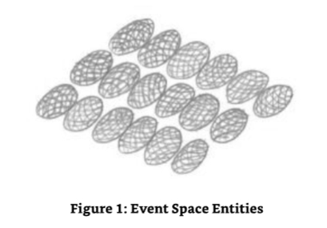

SE9:Your imagery illustrates the function of event space entities within my environment and not that which is prevalent in your own environment where all event spaces are in contact with each other or linked either by direct or indirect association to each other. Although it may look somewhat linear in its imagery the "collective"event space,that flat plain(playing field or car parking lot)ofevent space entities are in contact with each other in myriad ways.One of those methods of contact may well interest you because it is the reason why an event space that is no longer held in perpetuity by the intentional energies of local normal entities is not only maintained but is allowed to exist in its own right. 

9号源实体：你的意象说明了事件空间实体在我的环境中的功能，而不是在你自己的环境中普遍存在的所有事件空间都彼此接触或通过直接或间接的关联相互连接。虽然在“集体”事件空间的意象中它可能看起来有点线性，但事件空间实体的平原(运动场或停车场)以无数种方式相互联系。其中一种联系方法可能让你感兴趣，因为它是为什么一个不再由当地正常实体的有意能量永久保持的事件空间不仅被维护，而且被允许以自己的权利存在。

ME:Go on.Stop teasing me!In which way are they in contact with each other?Other than the normal links between one event space and another,which is a function of moving from one event space to another or indeed the interdependence of "event"resulting from the co-operation between two or more entities whose event space converges for some limited time.Is it this link which keeps event space entities both interdependent whilst also being dependent on their own events? 

我：继续。别逗我了！他们以何种方式相互联系？除了一个事件空间和另一个事件空间之间的正常链接，这是一个从一个事件空间移动到另一个事件空间的功能，或者实际上是“事件”的相互依赖，这是由两个或更多实体之间的合作导致的，它们的事件空间在有限的时间内会聚在一起。是这个链接使事件空间实体既相互依赖，又依赖于它们自己的事件吗？

SE9:Well done.You are almost on it.You are so close that I will finalize the discussion myself. 

9号源实体：做得好。你几乎就成功了。你离成功如此之近，我将亲自结束讨论。

It is simply the minor interactions with other event spaces,sentient or not,that keep the event space in existence when it is not at the point of sentience and subsequent self- sustenance.When self-aware,self-sustained and self-perpetuating,the event space entity can move about that "space"that is assigned for the sole use of the event space entities.Who, it has to be said,can be classified as either "previously existing,""currently existing,"and "currently/potentially existing." 

它只是与其他事件空间的微小互动，有意识或无意识，当事件空间没有意识和随后的自我维持时，保持事件空间的存在。当自我意识、自我维持和自我延续时，事件空间实体可以移动到指定给事件空间实体的“空间”上。必须指出的是，可以被归类为“以前存在”、“当前存在”和“当前/潜在存在”。

These minor interactions are minor in relevance,intensity and perpetuity.The interesting point to note here is that the links between the different event spaces and event space entities are in a constant state of flux-flux,that is,in terms of their contact with each other.

这些微小的互动在相关性、强度和持久性方面是次要的。这里要注意的有趣的一点是，不同事件空间和事件空间实体之间的联系处于一种恒定的流动状态，即，在它们相互接触的情况下。

ME:I am getting the impression that the event space events that are maintained by the event space entities are moved on a regular basis.The movement is a function of the quality of event that such transient interaction could or can generate when activated. 

我：我得到的印象是，由事件空间实体维护的事件空间事件是定期移动的。这种移动是这种短暂的互动在激活时可以或能够产生的事件质量的函数。

SE9:Correct.The whole point of the movement,the disassociation and re-association of event space between two or more areas of event space/event space entities is the offer of links between differing events even though they are not "normally"linked.These "abnormal"links do not have a ready association/interdependence between the events,but they do offer the opportunity of studying what "could be"whilst seeing"what is."That part of the event space that is normally linked to another part of the event content of an event space entity being removed,isolates that event from the "holding"event space entity and allows it to be linked with another event space within another independent event space entity and thus,identifying myriad new evolutionary opportunities resulting from the new association with another event space entity. 

9号源实体：正确。整个运动的重点，两个或多个事件空间/事件空间实体之间的事件空间的分离和重新结合，是提供不同事件之间的链接，即使它们不是“正常”链接的。 这些“异常”链接在事件之间没有现成的关联/相互依赖，但它们确实提供了研究“可能”的机会，同时看到“是什么”。事件空间的一部分通常与事件空间实体的事件内容的另一部分链接，被移除，将该事件从“持有”事件空间实体中隔离，并允许它与另一个独立的事件空间实体中的另一个事件空间链接，从而识别出无数新的进化机会，这些机会来自与另一个事件空间实体的新关联。

ME:That's amazing.I get the impression (actually I received another image)that although one would expect your environment to be covered with enough event space entities to deal with the total environmental volume,that doesn't exist.Instead,you have event space gaps -areas of darkness where the events that occur are not recorded. 

我：那太神奇了。我得到的印象(实际上我收到了另一张图片)是，虽然人们期望你的环境被足够的事件空间实体覆盖，以处理整个环境体积，但这并不存在。相反，你有事件空间缺口——发生的事件没有被记录的黑暗区域。

SE9:More than that.They are not able to be used by the normal entities in my environment. 

9号源实体：不仅如此，它们还不能被我所在环境中的正常实体使用。

ME:Hold on,isn't that a bit "chicken and egg"again?If a normal entity cannot traverse that area where there are no event space entities to hold and record the events that take place there,then how can the normal entities create the PBIE and ABIE energies that create the events and,therefore,the opportunity for the event space to become sentient? 

我：等等，这不是又一个“鸡和蛋”的问题吗？如果一个正常的实体不能穿越那个没有事件空间实体来保存和记录发生在那里的事件的区域，那么正常的实体如何能创造PBIE和ABIE能量来创造事件，从而为事件空间创造有意识的机会？

SE9:These gaps or areas that you call darkness are areas where the current areas of event space and the subsequent event space entities can expand into.If you like,it is reserved "space"for the use of expansion only. 

9号源实体：这些你称之为黑暗的间隙或区域是当前事件空间区域和后续事件空间实体可以扩展进入的区域，如果你愿意，它就是为扩展而保留的“空间”。

ME:How does that work?In my limited understanding,event space and,therefore,the event space entities in your environment,would not be limited to spatial requirements because event space is "outside space"itself. 

我：这是如何工作的？在我有限的理解中，事件空间，因此，在你的环境中的事件空间实体，不会被限制到空间需求，因为事件空间本身就是“空间之外”的。

SE9:Correct,but it does have limitations.Those limitations are me,the environment of my event space,for I am like the other Source Entities,a subset and,therefore, a compartmentalization of the energies,dimensions,sub-dimensional components and frequencies that were given to me by The Origin when it created me.From your perspective, of course,I have no such limitations,but in my perspective all environmental conditions that I create are within those conditions that I was created with. 

9号源实体：正确，但它确实有局限性。这些局限性就是我，我事件空间的环境，因为我就像其他源实体一样，是一个子集，因此，能量、维度、亚维度成分和频率的划分，这些都是源头创造我时赋予我的。从你们的角度来看，当然，我没有这样的局限性，但在我的角度来看，我创造的所有环境条件都在我被创造时的环境条件之内。

To be honest I was having quite a bit of trouble with this,for I expected (my fault,one should never overlay one's own expectations on a communication such as this)that event space was basically unlimited. 

说实话，我对此有相当多的麻烦，因为我期望(我的错，一个人永远不应该把自己的期望覆盖在这样的交流上)事件空间基本上是无限的。

ME:OK,I am struggling a bit with this.If there are limitations based upon your own structural condition,what are they? 

我：好的，我有点挣扎。如果基于你自己的结构条件有限制，它们是什么？

SE9:Simply put,that amount of me that is reserved for the use of event space.

9号源实体：简单地说，就是为使用事件空间而保留的我的数量。

ME:But I would have thought that which is event space would literally pervade you,be everywhere. 

我：但我认为事件空间会无处不在，无处不在。

SE9:It is. 

9号源实体：是的。

ME:But,now help me out here,you just said that it wasn't? 

我：但是，现在帮我一下，你刚才说它不是？

SE9:Event space is limited by the number of permutations that can or would occur should an entity have a choice or series of choices to make.This is augmented by the number of entities that enters into or,indeed,link event spaces together through association with other entities.When an event space has reached its maximum permutation level,it is allowed to occupy,on an automatic basis,that area within me that is reserved for event space.There are periods... 

9号源实体：事件空间受限于可能发生的排列数量，如果一个实体有一个选择或一系列选择，这将增加进入事件空间的实体数量，或者通过与其他实体的关联将事件空间连接在一起。当一个事件空间达到其最大排列水平时，它被允许自动占据我体内为事件空间保留的区域。

I noticed that Source Entity Nine went to great lengths then,to not mention the word "time."

我注意到9号源实体费了很大劲，才没有提到“时间”这个词。

...when those "event"permutations are reduced as a natural consequence of latent convergence.Latent convergence is experienced when a series of event spaces line up again after going off the main-line,the previous events being a mere distraction or detour.This leads to a natural reduction in the area used for that major part of event space that is being used to fulfil the total number of events from the start of an entity's existence or role to the end of that existence or role.The result of the reduction is the areas of darkness that you saw in your mind's eye.Those areas where there is no event space and,therefore,no entities can traverse except for the entity that had the most to contribute to that event space.Based upon this,that area of emptiness is reserved for the expansion of that particular event space and cannot be used for the use or expansion of other event spaces.It is already pre-designated.

...当那些“事件”排列作为潜在收敛的自然结果而减少时。潜在收敛是当一系列事件空间在离开主线后再次排列时经历的，之前的事件只是分心或绕道。这导致了事件空间的主要部分的面积的自然减少，该部分被用来完成从一个实体的存在或角色开始到存在或角色结束的事件总数。减少的结果是你在心灵之眼看到的黑暗区域。这些区域没有事件空间，因此，除了对该事件空间做出最大贡献的实体外，没有实体可以穿越。基于这一点，那个空白区域被保留用于特定事件空间的扩展，不能用于其他事件空间的使用或扩展。它已经预先指定了。

ME:So that would explain why other entities cannot traverse that space because,in essence, it is event space,space.That is,non-sentient event space. 

我：所以这将解释为什么其他实体不能穿越那个空间，因为，本质上，它是事件空间，空间。也就是说，无意识的事件空间。

SE9:Very well done.But before we change the direction of our communication,please note this.Sentient event space,by us called "event space entities,"maintain their own area of event space,if you like.This means that once they have reached a size that is consistent with the maximum permutation level that could have been achieved when they were interacting with a normal entity,that they can maintain that size. 

9号源实体：做得很好。但在我们改变交流方向之前，请注意这一点。有意识的事件空间，我们称之为“事件空间实体”，如果你愿意的话，可以维持它们自己的事件空间区域。这意味着一旦它们达到一个大小，与它们与正常实体交互时可能达到的最大排列水平一致，它们可以维持那个大小。

ME:Do you mean that they do not shrink?That an area of darkness is not created? 

我：你的意思是它们不会收缩吗？不会产生一片黑暗的区域？

SE9:No,for that is a function of"non-sentient event space"and not "sentient event space," an event space entity.Once an area of event space has become sentient,it is in full command and control of those energies that created it in the first place.As a result it can and does maintain its own existence and,therefore,its own structure and size. 

9号源实体：不，因为那是“无意识事件空间”的功能，而不是“有意识事件空间”，一个事件空间实体。一旦事件空间的一个区域有了意识，它就完全受制于那些创造它的能量。

### Two More Universal Environmental Components 

**另外两个宇宙环境成分**

I was just deciding that it was time to move on and question Source Entity Nine about another part of itself-its environment-when I had a little niggle in the back of my mind.The niggle suggested that the two intention-based energies of PBIE and ABIE were not the only energies that could be described as new,or should I say previously discovered,or undisclosed universal components.Filled with the inspiration that is only available to an explorer surveying a new and undiscovered land,I dove head long into questioning Source Entity Nine on what else could possibly be classified as a universal component.

我刚刚决定是时候继续向前，向9号源实体询问它的另一个部分——它的环境——这时我脑海中出现了一个小问题。这个小问题表明，PBIE和ABIE这两种基于意图的能量并不是唯一可以被描述为新的，或者我应该说以前发现的，或者未公开的宇宙成分的能量。充满了只有勘测一个新的未发现的土地的探险家才能获得的灵感，我深入地向9号源实体询问，还有什么东西可以被归类为宇宙成分。

I mean,it was reasonably simple for me in my limited incarnate state to understand that full dimensions were constructed with three sub-dimensional components and that each sub- dimensional component was inflated with twelve frequency bands,one of which contains a whole simultaneous universe.Once,that is,we get past the need for a base full dimension with that full dimension constructed as a three-in-one system made up of the three sub-dimensional components with only one set of twelve frequency bands inflating all three sub-dimensional components,all of which house a single universe in all its physical and energetic states.I even felt that the average incarnate human could understand this as well,especially with the aid of a diagram.I could even understand that event space was constructed of those energies associated with action-based intention and probability-based intention.But what else could be out there was a complete mystery to me.The possibility of discussing a new universal component,one that had as much importance in the maintenance of any Source Entity's multiverse was awesome.I could wait no longer.My impatience was obvious! 

我的意思是，在我有限的化身状态下，理解完整的维度是由三个亚维度组成的，每个亚维度组成部分都膨胀了12个频带，其中一个包含了一个完整的同步宇宙，这是相当简单的。一旦，也就是说，我们过去需要一个基本的完整维度，这个完整维度被构建成一个三合一系统，由3个亚维度组成，只有一套12个频带膨胀所有3个亚维度组件，所有这些都容纳了一个单一的宇宙在所有物理和能量状态中。我甚至觉得普通的化身人类也能理解这一点，特别是在图表的帮助下。我甚至能理解事件空间是由那些与基于行动的意图和基于概率的意图相关的能量构成的。但对我来说，还有什么完全是个谜。讨论一个新的宇宙组件的可能性，一个在维护任何源实体的多元宇宙中都具有同等重要性的东西，真是太棒了。我不能再等了。我的不耐烦是显而易见的！

ME:So,what ARE they? 

我：那么，它们是什么？

I told you I was impatient dear reader. 

我告诉过你我没耐心，亲爱的读者。

SE9:What are what? 

9号源实体：什么是什么？

ME:The two new universal components I am seeking to discuss with you.I need to discuss these before I move on to Source Entity Ten.I really get the impression that this is very important. 

我：我正寻求与你讨论的两个新的通用组件。在我转向第10个源实体之前，我需要讨论这些。我真的觉得这非常重要。

SE9:So I see.Well,so far you have discussed five universal components in total:three with your own Source Entity and two with me.Now you want two more.

9号源实体：我明白了。到目前为止，你总共讨论了5个宇宙元件：3个和你自己的源实体，2个和我。现在你还想要两个。

ME:Yes,please. 

我：好的，请。

I was starting to get anxious. 

我开始焦虑了。

SE9:Mmmm,OK,I will assist you in this quest.First,you will need to note that the components you called ABIE and PBIE can really only be classified as one component,and this is because they are the Yin and Yang of each other.One is the full and dedicated action; the other is all the possibilities that could have been taken.Together they create one event space,and as such,event space can be considered a single component even when it gains individual sentience. 

9号源实体：嗯，好吧，我会帮助你完成这个任务。首先，你需要注意你称之为ABIE和PBIE的组件只能被归类为一个组件，这是因为他们是彼此的阴和阳。一个是完整和专注的行动，另一个是所有可能采取的行动。他们一起创造了一个事件空间，因此，事件空间可以被认为是一个单一的组件，即使它获得了个人的感知。

ME:Thank you.I think that will make it clear in every one's mind when you explain it in that way. 

我：谢谢。我想你这样解释的话，每个人都会明白的。

SE9:Good.It was necessary to get that concept across for it is the foundation for the next concept that you will be discussing with me;the two universal/multiversal components that you are seeking are also interdependent in an equal and simultaneous way. 

9号源实体：很好。有必要把这个概念讲清楚，因为它是你将和我讨论的下一个概念的基础；你正在寻找的两个宇宙/多宇宙组成部分也以平等和同时的方式相互依赖。

ME:OK,I can wait no longer...Hold on.... 

我：好吧，我不能再等了...等等...

I was finding that my communication had slowed right down

我发现我的沟通速度慢了下来

...are you still there? 

...你还在吗？

SE9:Yes.One moment please.The information on these components is not directly translatable into your sound based language or even any form of higher energetic language you have brought with you from the energetic.I will need to find some sort of concept that you can relate to that can be used as a bridging tool.

9号源实体：是的，请稍等。这些组件的信息不能直接翻译成你们基于声音的语言，甚至不能翻译成你们从能量带过来的任何形式的更高能量语言。我需要找到一些概念，你们可以联系起来，作为桥梁工具。

I sat and waited at my computer,wondering what could be so similar in conceptual understanding here on earth that it could be used as a bridging tool used to explain an indescribable universal component.I didn't have to wait long. 

我坐在电脑前等待，想知道地球上有什么概念上的理解如此相似，可以用作桥梁工具来解释一种无法形容的宇宙成分。我没等多久。

SE9:OK,I have a concept that you can use to help you understand.I want you to consider an energy that isn't energy. 

9号源实体：好吧，我有一个概念，你可以用它来帮助你理解。我想让你考虑一种不是能量的能量。

ME:Action and reaction just came into my mind. 

我：我刚想到了行动和反应。

SE9:Yes,that would be a good start,for they are the Yin and Yang of each other. 

9号源实体：是的，那将是一个好的开始，因为他们是彼此的阴和阳。

ME:Mmmm,wasn't the last two multiversal components-those that created your version of event space and the subsequent event space entities interdependent of each other?That being the environment or that part of the total environment cannot exist without them both together?Just one will not create the conditions necessary for sustaining the structure of the environment.Is this the way it works with these two components?And while I am in the chair,so to speak,this sounds a bit Newtonian to me,i.e.,every action has an equal and opposite reaction.Would I be right with this? 

我：嗯，最后两个多维的组成部分，那些创造了你的事件空间版本和随后的事件空间实体，它们不是相互依赖的吗？作为环境或者说作为整个环境的一部分，没有它们两个，就不能存在吗？只有一个，就不能创造维持环境结构的必要条件，这两个组成部分是这样运作的吗？当我坐在椅子上的时候，可以说，这对我来说有点牛顿，即，每个动作都有等量的反作用力，我这样说对吗？

SE9:First,the words "action and reaction"are not intended to be fully descriptive in this instance,specifically because there is not a direct translation of the functionality of them into your English.Second,they do need each other to create the resultant component which is a foundation component of that used in event space.If you like and using the analogy to radio wave engineering that your own Source Entity used in your first book,it is the carrier wave,the "space"that is used to house the action-based intention energy(ABIE)and the probability-based intention-based energy(PBIE).And third,together they do not function in the Newtonian fashion that you are expecting to understand.Actually I think my choice of words was poor in this instance,but unfortunately they are the only ones that work. 

9号源实体：首先，“动作和反应”这两个词在这个例子中并不是完全描述性的，特别是因为它们的功能没有直接翻译成你们的英语。 第二，它们确实需要彼此来创建结果组件，这是事件空间中使用的基础组件。 如果你喜欢并使用你自己的源实体在第一本书中使用的无线电波工程的类比，它是载波，用于容纳基于动作的意图能量(ABIE)和基于概率的意图能量(PBIE)的“空间”。 第三，它们在一起并不以你期望理解的牛顿式的方式工作。 实际上，我认为我在这种情况下的用词很差，但不幸的是，它们是唯一有效的。

ME:Actually the words and the interaction with event space,the description of action and reaction that when together function as a carrier wave works very well for me.It actually makes total and perfect sense.Specifically when one considers that both the intentional energies of PBIE and ABIE are actionary.That is,the probability-based intention and the action-based intention energies (PBIE ABIE)are the result of action.Action or the possibility of action of some sort,being available as the decision-based components of a specific entity's intention,the desire to choose one route or direction or task over another. The result of which is an energy.That energy needs to be present in some way before the new event space can be created.Phew! 

我：实际上，这些词和与事件空间的互动，对行动和反应的描述，当它们一起作为载波时，对我来说效果很好。它实际上完全和完美地发挥了作用。特别是当一个人考虑到PBIE和ABIE的意图能量都是行动性的。也就是说，基于概率的意图和基于行动的意图能量(PBIE ABIE)是行动的结果。行动或某种行动的可能性，作为一个特定实体的意图的决策基础组件，选择一条路线或方向或任务的愿望。其结果是一种能量。在新的事件空间被创建之前，这种能量需要以某种方式存在。

SE9:Good.You are getting there.I will explain further if you don't mind,for there is a function of this building block that you have not ascertained. 

9号源实体：很好，你开始明白了。如果你不介意的话，我想进一步解释一下，因为这个模块有一个功能你还没有弄清楚。

ME:I am not surprised.My mind was in overdrive to sort out the words for the limited description I just gave. 

我：我并不惊讶。我的脑子一直在超速运转，为我刚才给出的有限的描述寻找词语。

To be perfectly honest,the nine or so lines above took something like 20 minutes to write.Not good when one has a personal deadline to achieve,I can tell you.This is,however,the name of the game.One day it flows;another day it is like getting blood out of a stone.In fact,I sometimes think that getting blood out of a stone would be easier.But then I am communicating with an entity,a Source Entity,no less,that is eight multiverses away from my home multiverse.A little bit of lag in understanding the concepts being presented to me is,therefore,acceptable.

说实话，上面9行左右的文字花了大约20分钟才写完。我可以告诉你，当一个人有个人截止日期要完成时，这并不好。然而，这就是游戏的名字。有一天它流动；另一天它就像从石头里挤血一样。事实上，我有时认为从石头里挤血会更容易。但那时我正在与一个实体，一个源实体，不下于，这是离我的家园多维宇宙8个多元宇宙的实体。因此，在理解呈现给我的概念方面有一点点滞后是可以接受的。

ME:OK,I have had my little interlude.Let's hear the rest of the explanation of the functionality of this/these multiversal component/s. 

我：好吧，我已经有我的小插曲了。让我们听一下这个/这些多维宇宙组件的功能的其余解释。

SE9:Thank you.I want you to consider the human translation of the words I have used for this component:action and reaction.What do they mean to you? 

9号源实体：谢谢。我想让您考虑一下我对这个组件使用的词的人工翻译：action和reaction。它们对您来说意味着什么？

ME:I would have used the Newtonian explanation normally,but I can see that you are looking for another level of understanding. 

我：通常我会用牛顿的解释，但我可以看出你在寻找另一种理解的层次。

SE9:Yes,please. 

9号源实体：是的，请。

ME:Well,I had better start with the Newtonian version first,as not all of my readers will know it even though it is classic physics. 

我：嗯，我最好先从牛顿的版本开始，因为即使它是经典物理学，也不是所有的读者都知道它。

For those of you out there who don't know the Newtonian law,it goes like this,"For every action there is an equal and opposite reaction." 

对于你们当中那些不知道牛顿定律的人，它是这样的，“对于每一个作用力，都会有一个大小相等方向相反的反作用力。”

The best way of explaining this is to remember the Newtonian cradle where a number of ball bearings are suspended from a frame by a cord in a line.When at rest,the ball bearings are just touching each other so that when one of them,the one on the end,is lifted away from its neighbor and allowed to drop,it swings on the cord and subsequently hits its neighbor, so the energy that was in the ball that was dropped is passed between all of the ball bearings in the line which results in the ball bearing on the end of the line taking the energy and subsequently moving off in the same direction that the ball bearing that was dropped was traveling-when the ball reaches the end of its swing,it returns and hits its own neighbor, sending the energy back to the original ball bearing which then moves off or swings out in the opposite direction it was going in the first place.In this instance,the action is the initial movement and its direction,with the reaction being the change in direction of the energy that results in the ball bearing receiving the energy back and swinging in the opposite direction of The Original direction of travel.The only issue here is that this is not a perfect illustration as the energy received back is not the same amount or value as that given to the neighboring ball bearing in The Original impact.There is a loss in the energy,and the process is,therefore,not an equal and opposite reaction.The only way of explaining this properly then is to use another example,one where we are standing on supposedly solid ground and that the reason we don't sink into the ground that we stand on is because there is an opposite reaction to the downward force of our weight according to gravity.But again this is not perfect as the ground does,in fact,deflect a certain amount due to the density of the ground being stood upon.In the perfect world,there is no loss of energy received by the ball bearing and no deflection in the ground that we stand on. 

解释这个的最好方法是记住牛顿摇篮，其中许多滚珠被绳索悬挂在框架上。当处于静止状态时，滚珠只是相互接触，所以当其中一个，在末端的那个，被从邻居那里提起并允许掉落，它在绳索上摆动，随后撞击它的邻居，所以掉落的球中的能量在所有轴承之间传递，结果是线末端的滚珠吸收了能量，随后朝着被落下的滚珠移动的方向移动——当球到达摆动的末端时，它返回并撞击自己的邻居，将能量送回原来的滚珠，然后它移动或摆动到与最初相反的方向。 在这种情况下，动作是初始运动及其方向，反应是能量方向的变化，导致滚珠接收到能量并朝着与最初旅行方向相反的方向摆动。这里唯一的问题是，这不是一个完美的例子，因为接收到的能量与最初撞击时给予邻近球轴承的能量的数量或价值不同。能量有损失，因此，这个过程不是一个相等和相反的反应。正确解释这个的唯一方法是使用另一个例子，我们站在假设坚固的地面上，我们不沉入我们脚下的地面的原因是因为根据重力，我们体重的向下力有一个相反的反应。但这也不完美，因为事实上，由于我们脚下的地面密度，地面会偏转一定量。在完美的世界里，球轴承接收到的能量没有损失，我们脚下的地面也没有偏转。

SE9:That is a very good understanding of the errors in the current thinking of mankind and the use of certain physics as being not only basic but also the fundamentals required to understand the rest of physics.The issue here is the "lossy"function of the so-called fundamentalism of the law being used as a datum-in this instance,the law being that every action has an equal and opposite reaction,which it clearly does not. 

9号源实体：这是一个很好的理解，人类当前的思维错误，以及使用某些物理学，不仅是基本的，而且是理解其他物理学所必需的基础。这里的问题是所谓的原教旨主义的“有损”功能，被用作一个数据，在这个例子中，法律是每个动作都有相等和相反的反应，它显然没有。

ME:Ok,I am losing it now.Is that a "lossy"function of my mind? 

我：好吧，我现在忘了。这是我大脑的“丢失”功能吗？

SE9:Very clever use of words.What was the point of using them? 

9号源实体：非常聪明的词汇运用。使用它们的意义是什么？

ME:Well,what I am getting to is that I don't understand where you are going with this line of communication. 

我：嗯，我的意思是我不明白你想表达什么。

SE9:And I thought that you had made the link,especially as you were doing so well with the description of the Newtonian example of the perfect state of action and re-action as an "equal and opposite"re-action to the action,and that it was not the case!Oh well,I had better explain then. 

9号源实体：我以为你已经把两者联系起来了，特别是你对牛顿的完美状态的描述，把作用力和反作用力描述成作用力“相等且相反”的反作用力，而事实并非如此！好吧，我最好解释一下。

The whole point of what you have just described is that there is no such thing as an equal and opposite reaction.Every time there is an action,the reaction is dependent upon a number of factors,such as the environment and "that"which affects the environment. For example,you used the rather good illustration of the ground "giving way"in some way when you stand on it or apply a weight to some part of it.The amount of "give"is relative to the composition of the ground.This includes all materials manufactured by mankind,by the way. 

你刚才所描述的全部要点是，没有东西是等同的和相反的反应。每次有一种行动，反应取决于许多因素，如环境和影响环境的“那个”。例如，你用了一个非常好的例子，当你站在地上或在它的某一部分施加一个重量时，地面以某种方式“屈服”。“屈服”的数量与地面的组成有关。顺便说一下，这包括所有人类制造的材料。

ME:You mean concrete and steel are compressible,that they are subject to "give"? 

我：你的意思是混凝土和钢是可压缩的，它们会“屈服”？

SE9:Yes,of course.Even the hardest composition has "give."This is the beauty of existence in your environment.Things that you think are solid are,in fact,not solid.In the Newtonian cradle illustration,the losses were obvious because when one observes the actions of the ball bearings moving back and forth,the viewer notices that they lose inertia-based energy every time they change direction. 

9号源实体：是的，当然。即使是最坚硬的材料也会“给出”。这就是存在于你周围环境中的美。你认为是固体的东西，事实上，不是固体。在牛顿摇篮的例子中，损失是显而易见的，因为当一个人观察滚珠来回移动的动作时，观察者会注意到，每次改变方向时，它们都会失去基于惯性的能量。

ME:But they wouldn't in a vacuum-based environment or one that was not affected by gravity.

我：但是它们不会在一个真空环境中或者不受重力影响的环境中。

SE9:Oh yes,they would-simply because of the interaction with the other larger bodies that you have in the physical universe-those areas of local density you call planets and stars. 

9号源实体：是的，它们会--仅仅是因为与你们在物质宇宙中拥有的其他更大的物体的相互作用--那些你们称之为行星和恒星的局部密度区域。

ME:OK,you've got me on the run now.I was about to say what is the point of this discussion but I think that I can see it now. 

我：好吧，你现在让我忙起来了。我正要说这个讨论的重点是什么，但我想我现在能看出来了。

You stated that there is no such thing as an equal and opposite reaction to an action,but,I suspect that in your environment there is but that this is a function of the give and take of the two components of action and re-action.That is,sometimes the re-action is greater or has more energy associated to it than the actual action itself.Am I correct here? 

你说过，对于一个行为，不存在等同于或相反的反应，但是，我怀疑在你的环境中存在，但是这是行为和反应这两个组成部分的相互作用。也就是说，有时反应比实际行为本身更强大，或者有更多的能量。我没说错吧？

SE9:Yes,well done.This is why it is a yin and yang-based description.They are equal but not always equal at a specific point in their interaction with each other.In essence,they "move around"each other and in doing so,they create that which is necessary for the ABIE and PBIE to function. 

9号源实体：是的，做得好。这就是为什么它是基于阴阳的描述。它们是平等的，但是在相互作用的特定点上并不总是平等的。本质上，它们相互“移动”，这样做，它们创造了ABIE和PBIE发挥作用所必需的东西。

You see,there has to be an alternative option for both ABIE and PBIE to even exist.That option is the opposite of the other:one being the actual action taken,the other being the possible action that could have been taken.Both of these energies are generated by the entity creating them,but they have to come from somewhere.They have to be created from a base material of some sort,and that base material is the action and re-action,the carrier wave that they exist within and on. 

你看，必须有一个可供选择的选项，让ABIE和PBIE都存在。那个选项是另一个的对立面：一个是实际采取的行动，另一个是可能采取的行动。这两种能量都由创造它们的实体产生，但它们必须来自某处。它们必须由某种基本材料创造出来，而那个基本材料就是行动和反应，它们存在于其中并依附于它的载波。

ME:So the action and the re-action is not an energy that is independent of itself and its own component parts.It is like the threads of a string-two threads to be precise,intertwined with each other,each creating a single piece of string but together rather than being separate.Each has areas different than the other in terms of their cross-sectional areas,but the total always equals the optimal total should they be both the same and consistent cross-sectional areas. 

我：所以，行动和反应不是一种独立于自身及其组成部分的能量。它就像一根弦的线——准确地说是两根线，相互交织在一起，每根线都创造出一根单独的弦，但它们是在一起的，而不是分开的。每个线段的横截面积都不同于另一个，但如果它们的横截面积相同且一致，那么总数总是等于最佳总数。

SE9:Correct. 

9号源实体：正确。

ME:Whew!Now let me get this straight then as I am starting to be able to understand the philosophy of ABIE and PBIE and its constituent parts of action and re-action.When you told me that action and re-action were the components and basis of existence of ABIE and PBIE, you said that it was like a carrier wave that is used for the transmission,for want of a better word,of the newly created or already existing ABIE and PBIE-that which is created by the creating entity as a function of the decision process of going this way or that way.One is the actual decision and,therefore,the direction taken while the other is relegated to the possible decision that could have been taken and,therefore,the possible direction that could have been taken. 

我：啊！现在让我弄清楚，因为我开始能够理解ABIE和PBIE的哲学以及其组成部分的行动和反应。当你告诉我，行动和反应是ABIE和PBIE存在的组成部分和基础时，你说它就像一个载波，用于传输，为了寻找更好的词，新创建的或已经存在的ABIE和PBIE-这是由创建实体创建的，作为走这条路或那条路的决策过程的功能。一个是实际的决定，因此，采取的方向，而另一个被降级为可能采取的决定，因此，可能采取的方向。

SE9:Keep going! 

9号源实体：继续前进！

ME:Well,it's almost like the events and interfaces.I mean everything that happens from meeting new entities,working with a new material to create something.To make it easier, let's use some of my earth-based terminology here-such as a house,a car,a computer,a park bench,is created from the energies that were what you call "action"and "reaction." Everything is in like a "store."Everything that has the ability to be created can be created from this base energy-all actions that are or will be taken,including all of the interfacing objects are already in existence.All we have to do is go down a certain route,and they are taken out of storage,so to speak,and are manifest into useful existence.This also includes all the possibilities as well.All that could be possible is also in storage within this action and re-action carrier wave just in case a change of direction is taken,one that is not or could not have been,foreseen. 

我：嗯，它几乎就像事件和接口。我的意思是，从遇到新的实体，用一种新材料来创造一些东西。为了使它更容易，让我们在这里使用一些基于地球的术语，比如房子，汽车，电脑，公园长椅，是由你所称的“行动”和“反应”的能量创造的。一切都像一个“商店”。所有有能力被创造的东西都可以从这个基础能量中创造出来，所有正在或将要采取的行动，包括所有已经存在的接口对象。我们所要做的就是沿着一条特定的路线走下去，可以说，它们是从存储中取出来的，并显化为有用的存在。这也包括所有的可能性。所有可能的事情也在这个行动和反应载波的存储中，以防方向发生变化，一个没有或不能被预见的改变。

SE9:Yes,carry on. 

9号源实体：是的，继续。

ME:Well,I see this image of the string-and I fully understand that this is just in my mind for illustrative purposes-that is covered with entities.Every time an action is made,a piece of the string is pulled out to create the Action-Based Intentional Energy.When this ABIE energy is pulled out,a ripple effect is sent down the length of the "never ending and infinite" action and re-action string,putting in place all of those things that will happen as a result of the decision that has just been made.On the other side though,there is another piece of string being pulled out,creating the Probability-Based Intentional Energy for all of those things that "could"happen should the action change for whatever reason to the "probable" rather than the "actual"action.In this instance,the action and the re-action are the yin and yang of each choice and the energies created or used by such choices-that is,those that were taken and those that were not but nevertheless could have been. 

我：嗯，我看到这根弦的图像——我完全明白这只是我脑海中为了说明目的——它被实体覆盖。 每次做出一个动作，这根弦的一部分被拉出来，创造了基于动作的意图能量。 当这个ABIE能量被拉出来时，一个涟漪效应沿着“永无止境和无限”的动作和反应弦的长度被发送，把所有那些将要发生的事都安排好，作为刚刚做出的决定的结果。 尽管从另一方面来说，还有另一根弦被拉出来，创造了基于概率的意图能量，为所有那些“可能”发生的事情创造能量，如果这个动作因为任何原因改变为“可能的”而不是“实际的”动作。 在这种情况下，动作和反应是每个选择的阴和阳，以及由这种选择创造或使用的能量——也就是那些被采取的和那些没有采取但却可能被采取的。

SE9:And now you have it. 

9号源实体：现在你有了它。

### Yet Another Component of Event Space!(Two Components??) 

**事件空间的另一个组件！(两个组件？？)**

ME:So that's it.Those are the two components that make the possibility of event space work at least in your environment:(1)the action and reactionary components that allow the entity to create the energies of action;and (2)Probability-Based energies,which ultimately create the event space that is being experienced and could have been/might be experienced.Right? 

我：就是这样。这是两个组件，使事件空间至少在你的环境中工作的可能性：(1)行动和反应组件，允许实体创造行动的能量； (2)基于概率的能量，最终创造了正在经历和可能已经/可能被经历的事件空间。对吗？

SE9:Well,not quite.You see,there is something else that sticks(glues)them both together -something that is independent of all four(three if you consider the action and reaction as the yin and yang of each other). 

9号源实体：不完全是。你看，还有其他的东西把它们粘在一起——某种独立于所有四个因素的东西(如果你把作用和反作用看作是相互的阴和阳的话，那就是三个因素)。

ME:Somehow I knew this was going to happen. 

我：不知何故，我知道这会发生。

SE9:Please explain? 

9号源实体：请解释一下？

ME:It's just that it couldn't be that simple.There had to be some other complication to the function of event space in its continued manifestation. 

我：只是它不可能那么简单。在事件空间的持续表现中，一定存在着一些其他的复杂性。

SE9:Let me see.Ah,yes,the incessant desire for mankind to know everything in the blink of an eye whilst not having the ability to understand it nor the capability to store it-this is something to behold.This is something else I was warned about,for want of better words. In this instance,it is manifest in the "knowing"that there is something else,some deeper meaning,even when there is not. 

9号源实体：让我看看。啊，是的，人类在眨眼之间就想知道一切的无休止的欲望，但却没有能力去理解它，也没有能力去储存它--这是值得注意的。这是我被警告过的另一件事，因为找不到更好的词来表达。在这种情况下，它表现在“知道”存在着其他的东西，一些更深的意义，即使在没有的时候。

I will have to consider this for a moment.Mmmm,Mmmm,yes now I understand. 

我必须考虑一下这个问题。嗯，嗯，是的，现在我明白了。

It is a function of your own ability that makes you "know"that you may be able to experience something else.What's more,you have your own incessant desire to know more as well.This is a human trait you have picked up,for as "OM"you would not need such a desire,for all knowledge is laid out before you-ready for the taking,so to speak.So in essence this extra information is not necessary for you as OM to "know"even whilst incarnate,for you already do "know." 

这是你自己的能力的一个功能，让你“知道”你可能能够体验到别的东西。更重要的是，你也有你自己不断渴望知道更多东西的欲望。这是一个你已经学会的人类特征，因为作为“OM”你不需要这样的欲望，因为所有的知识都摆在你面前——可以说，准备好接受。所以本质上，这些额外的信息对于你作为OM来说是没有必要的，即使在化身的时候，因为你已经“知道”了。

How could I know but not know?This was one question I must ask before moving on from Source Entity Nine and starting my dialogue with Source Entity Ten,who is I "know"(here we go again) waiting for me to finish with Source Entity Nine and initiate communications with it.I had better hurry.The question did not need to be asked though. 

我怎么能知道但不知道？这是我必须问的一个问题，在离开9号源实体，开始与10号源实体对话之前，我“知道”(又来了)谁在等着我结束与源实体9的对话，并开始与它进行沟通。我最好快点。虽然这个问题不需要问。

SE9:When I talk about YOU,I talk about that which is the real YOU and not that part of YOU which is incarnate and,therefore,not YOU.Therefore,that part of YOU that is incarnate cannot "know"all there is whilst the rest of YOU,that is the real YOU,that which is not incarnate,can and does "know"all there is or more importantly can"know"what it wants to "when"it wants to by connecting with The Origin. 

9号源实体：当我谈论你的时候，我谈论的是真正的你，而不是你化身的那部分，因此，不是你。因此，你化身的那部分不能“知道”一切，而你其余的部分，即真正的你，不是化身的，能够而且确实“知道”一切，或者更重要的是能够“知道”它想要什么，当它想要通过连接到起源时。

ME:Thank you.I believe that answers that question rather nicely. 

我：谢谢你。我相信这已经很好地回答了这个问题。

SE9:I will continue with the description I started on then,for it is important that you understand this last bit of the puzzle that is event space. 

9号源实体：我将继续我开始的描述，因为重要的是，你理解这个谜的最后部分，即事件空间。

There is a function of the Action and Probability-Based Intention Energies called "Spontaneous Intention."This is the glue that holds the action and re-action "carrier wave" together. 

有一个功能的行动和基于概率的意图能量称为“自发意图”。这是胶水，把行动和反应“载波”结合在一起。

ME:This sounds a bit bizarre.How can an energy that needs a carrier wave to work be the glue that holds that very carrier wave together? 

我：这听起来有点奇怪。一个需要载波才能工作的能量怎么能成为胶水，把载波结合在一起？

SE9:Consider that Spontaneous Intention is,in fact,an energy or energetic component in this instance that is independent of the other energies that have been discussed.Moreover, also consider that although this energy is independent from the need to be associated with other energies,it is a necessary component of those others.This means that it can and does exist in a singular fashion whilst those other energies around it need it to exist.In essence,if the function of Spontaneous Intention is not there,then the other energies cannot exist. 

9号源实体：考虑到自发意愿，事实上，在这个例子中，是一种能量或能量成分，是独立于其他已经讨论过的能量的。此外，还考虑到尽管这种能量是独立于与其他能量相关的需要，但它是那些其他能量的必要组成部分。这意味着它可以并且确实以一种单一的方式存在，而它周围的其他能量需要它存在。本质上，如果自发意愿的功能不存在，那么其他能量就不能存在。

ME:But this means that,and let me get this right,if the function of Spontaneous Intention does not exist in a certain area within your environment,then the rest of event space cannot or should not exist.What's more,"intention,"albeit the action and Probability- Based intentional energies,are the very thing that is being supported by the action and re- action carrier wave.So from my viewpoint the carrier wave supports the event space that is based upon either ABIE or PBIE energies which are,in turn,supported by another form of intentional energy called "spontaneous intentional energy,"which can and is spontaneously created or available.It all looks very "mobius loop"like to me.What is within is without and what is without is within.THE manifestation of the first manifestation is not able to exist without the second manifestation being manifested,which in turn,cannot exist without the first manifestation being manifest.Again,a classic chicken and egg situation. 

我：但这意味着，让我弄清楚，如果自发意愿的功能在你环境中的某个区域不存在，那么事件空间的其余部分就不能或不应该存在。更重要的是，“意图”，尽管是基于行动和概率的意图能量，正是被行动和反应载波所支持的东西。所以从我的观点来看，载波支持基于ABIE或PBIE能量的事件空间，而这反过来又被另一种形式的意图能量所支持，称为“自发意图能量”，它可以自发地创造或可用。对我来说，这一切看起来都很像“莫比乌斯环”。里面的东西在外面，外面的东西在里面。第一个表现的体现不能在没有第二个表现被体现的情况下存在，反过来，如果没有第一个表现被体现，第二个表现也不能存在。再一次，一个经典的鸡和蛋的情况。

SE9:Correct. 

9号源实体：正确。

ME:I am trying not to use the word "but"here again as the start to two sentences in a row, but-I failed-that means that whole tracts of you are or should be empty,for what of a better word.

我：我试着不要再用“但是”这个词作为两个连续句子的开头，但是-我失败了-那意味着你整个区域是或应该是空的，因为没有更好的词。

SE9:And correct again,but-and now I have used the "but"word myself-as it's also NOT correct,for it doesn't take into account "LATENT"Spontaneous Intention. 

9号源实体：再次修正，但是-现在我自己也用了“但是”这个词-因为它也不正确，因为它没有考虑到“潜在的”自发意图。

ME:Now just what is "Latent"Spontaneous Intention? 

我：那么什么是“潜在”自发意图呢？

SE9:Exactly what it is-Spontaneous Intention that is waiting to happen! 

9号源实体：正是它本身——等待发生的自发意愿！

ME:But if-Arrggghh,that "but"word again!!!-Spontaneous Intention is to be just that, spontaneous,then how can it possibly be latent?For latent negates the description of spontaneity. 

我：但是如果——啊，又来了那个“但是”字！！！——自发的意图就是自发的，那么它怎么可能潜伏呢？因为潜伏否定了自发的描述。

SE9:I will explain,hopefully,without using that word(but)which is causing you a"literary" issue at the moment. 

9号源实体：我将解释，希望不用那个词(但是)，它现在正给你带来一个“文学”问题。

Spontaneous Intention is two things: 

自发意图是两件事情：

- 1.Firstly,it is an energy that is based upon the fact that an entity may do,can do,or even will make a decision that is not on the cards,plan or route,whichever way you want to describe it.It is a spontaneous decision created by a spontaneous intention to make that decision.It is "out of the blue,"so to speak,and as such is generated by the entities that exist within that part of my environment they wish to be in,not on a continual basis but on a "one-off"spontaneous basis.However,even though it is produced on a "one-off"basis,it needs to be "within"existence for it to be called "into"existence in the first place-hence,the additional function of latency. 
- 2.Secondly,Spontaneous Intention is the catalyst that allows the "carrier wave"of action and reaction to become manifest.It is the reason for its being in existence. From the moment an entity is in a condition of self-awareness,its first item of creativity is of a spontaneous fashion,that is,it is not a calculated decision process based upon the weighing of a number of factors before making that decision or choice.Once the carrier wave of action and re-action is in existence,it creates a spontaneous intention to do something that,in turn,creates the carrier wave of action and reaction.That carrier wave is in existence "specific"to the creating entity and is manifest for the whole period that the entity is in existence-existence for as long as it is a"singular"part of me.This includes all those entities that it interfaces with/interfaced with it and that they interface/interfaced with in totality. 

- 首先，它是一种能量，基于一个实体可能做，可以做，甚至将作出一个决定，不是在卡片上，计划或路线，无论你想用什么方式来描述它。这是一个自发的决定由自发的意图来做那个决定。它是“出乎意料的”，可以说，并因此是由存在于我环境中他们希望在的那部分的实体产生的，不是在一个连续的基础上，而是在一个“一次性”自发的基础上。然而，即使它是在一个“一次性”的基础上产生的，它需要“在”存在，以便它被称为“进入”存在在第一位——因此，潜伏的额外功能。
- 第二，自发意图是催化剂，允许“载波”的行动和反应变得明显。这是它存在的原因。从一个实体处于自我意识状态的那一刻起，它的第一个创造性项目是一种自发的方式，也就是说，它不是一个计算的决策过程，基于在做出决定或选择之前权衡一些因素。一旦行动和反应的载波存在，它创造了一个自发的意图去做某事，反过来，创造了行动和反应的载波。该载波的存在是“特定的”创造实体，并且在实体存在的整个时期都是显性的，只要它是一个“单一的”我。这包括所有那些与它接口/接口的实体，以及它们在整体上与之接口/接口。

Now we get to Latent Spontaneous Intention. 

现在我们来谈谈潜在的自发意图。

Latent Spontaneous Intention is that energy which is reserved within me for that which is created at the first point of self-awareness of an entity.It can be considered the "in-rush" current (Amps)that an electric device on earth experiences when it draws what it needs to activate all of the components of its construction simultaneously when initially being switched-on.For example,an electric motor will draw much more current during the "in- rush"of current required to get the "cold and stationary"armature rotating at its desired rotational speed for the load it is supporting than it does during the function of normal running in the warm rotating state. 

潜在的自发意图是我体内保留的能量，用于在实体的自我意识的第一个点上创建。它可以被认为是地球上的电力设备在最初被打开时，当它同时吸引它需要激活其结构的所有组件时所经历的“涌流”(Amps)。例如，一个电动机将在“涌流”电流期间吸引更多的电流，以使“冷和静止”的电枢以它所支持的负载所需的旋转速度旋转，而不是在温暖的旋转状态下正常运行的功能。

The inrush current,in this instance,is a spontaneous effect of turning the switch on to allow the motor to run as a result of being exposed to electricity.This spontaneous effect dissipates as the motor achieves its optimal "normal"running speed and the higher current is no longer necessary.In essence ALL that extra current returns back to its source (its generated source)and becomes latent again,waiting to be used in the future. 

在这种情况下，涌流是打开开关使电机暴露在电流中运行的自发效应。 当电机达到最佳的“正常”运行速度时，这种自发效应就会消散，不再需要更高的电流。 本质上，所有额外电流都返回到它的源头(它产生的源头)，再次潜伏起来，等待将来使用。

This is the same for Latent Spontaneous Intention,for it is within me at all times.It is an essential part of my energetic make up and one that waits for the first moment that an entity makes its first decision,no matter where it is within my environment.Therefore,by definition Latent Spontaneous Intention must be everywhere and nowhere simultaneously, for "once"it has been used by an entity,it no longer needs it.But until an entity reaches the point at which it is self-aware,it needs it.Latent Spontaneous Intention is,therefore,always ready and waiting for that point in an entity's existence when it becomes self-aware,ready to use it,a "once only"usage created/manifested in its first decision,a decision without process or choice,de-manifesting when Spontaneous Intention is subsequently manifested, creating the carrier wave of action and re-action which,in turn,creates the use of Action- Based Intentional Energy (ABIE)and Probability-Based Intentional Energy (PBIE). 

对于潜在自发意图也是如此，因为它一直都在我体内。它是我能量构成的重要部分，等待实体做出第一个决定的第一瞬间，无论它在我的环境中在哪里。因此，根据定义，潜在自发意图必须同时无处不在，因为“一旦”它被实体使用，它就不再需要它。但直到实体达到自我意识的点，它需要它。因此，潜在自发意图总是准备好，等待实体的存在中的那个点，当它变得自我意识，准备使用它，一个“只用一次”的使用在它的第一个决定中创造/显现，一个没有过程或选择的决定，当自发意图随后显现时，它就消失了，创造了行动和反应的载波，反过来，创造了基于行动的意图能量(ABIE)和基于概率的意图能量(PBIE)的使用。

ME:Thank you for that.It is most informative,and what's more-understandable. 

我：谢谢你。这是最有价值的，更容易理解的。

SE9:Now you have the six basic components of event space.Each of them dependent or interdependent of the other.And now you have this important information,it is time for you to move on,for the Source Entity you are calling Source Entity Ten is tapping on my shoulder,metaphorically speaking,saying,"MY turn now." 

9号源实体：现在你有事件空间的6个基本组成部分。每个组成部分都依赖或相互依赖其他组成部分。现在你有了这个重要信息，是时候继续前进了，因为你所称的源实体十正在拍打我的肩膀，比喻地说，“现在轮到我了。”

### Finishing with Source Entity Nine and New Dialogue with The Origin 

**结束与9号源实体的对话和与起源的新对话**

Even as Source Entity Nine made its last communication,a communication that ended in a bit of a"bang"so to speak-what a subject to end on:the components of event space-Ifelt its presence withdraw and its energetic signature being replaced by another:the energies associated with Source Entity Ten.They felt like a square peg going into a square hole,no lack of synchronicity was felt.The lack of energetic synchronicity was common place during the dialogues with the Source Entities associated with "Beyond the Source."Now I felt none.It would seem that I was starting to get the hang of the different energies associated with these more distant Source Entities even though it was on an automatic basis. 

甚至当9号源实体做最后一次交流时，可以说交流结束于一点“砰”的一声——一个结束的主题：事件空间的组成部分——我感觉到它的存在正在消失，它的能量特征被另一个所取代：与第十源实体相关的能量。他们感觉像一个方钉进入一个方洞，没有感觉到缺乏同步性。在与“源头之外”相关的源实体对话期间，缺乏能量同步性是常见的。现在我没有感觉到。这似乎是我开始掌握与这些更遥远的源实体相关的不同能量的窍门，尽管这是基于自动的基础。

"Three to go,"I heard in my mind's ear."Three to go!"But I wasn't saying this! 

“还有三步，”我听到我脑海中的耳朵说。“还有三步！” 但我没有说这个！

Tears came into my eyes;I was on the verge of sobbing!And then I knew why. 

眼泪涌入我的眼睛；我几乎要哭了！然后我知道了原因。

This was The Origin speaking.It had been a long time-well,at least for me. 

这是起源在说话。已经过了很长时间了——好吧，至少对我来说。

O:Well,well,well,what a star you are becoming! 

起源：好吧，好吧，好吧，你正在成为一个明星！

ME:What do you mean-a star? 

我：你什么意思--明星？

O:You have gotten all my Source Entities lined up,waiting to talk to you. 

起源：你已经把我所有的源实体都召集起来了，等着和你谈话。

ME:All of them?! 

我：所有的人？！

O:All of them. 

起源：所有人。

ME:Are you including Source Entity Twelve,the one that isn't currently "self-aware"? 

我：你是否包括了12号源实体，那个目前还没有“自我意识”的实体？

O:Yes,including Source Entity Twelve,the one that is currently becoming self-aware. 

起源：是的，包括源实体12，那个现在开始有自我意识的实体。

ME:I thought Source Entity Twelve's becoming self-aware was millennia away at best.

我：我以为12号源实体拥有自我意识至少要等上千年。

O:It was,but you have caused such a commotion that it has noticed something external to itself and as a result is "becoming." 

起源：本来是，但是你引起了这样一种骚动，它注意到了自身以外的东西，结果就“成为”。

Now at this point,dear reader,I had to check up on myself,for this seemed all very egotistical to me.The very thought that I could cause such a commotion-one big enough that it starts the awakening process in a Source Entity-is,well,downright ridiculous.Isn't it?Fortunately,I had some help from The Origin on how to maintain both my mental sanity and keep my ego well and truly in place. 

亲爱的读者，现在到了这个时候，我必须审视一下我自己，因为这对我来说似乎都太自负了。我能引起这样一场骚动——一场足够大，足以开始一个源实体的觉醒过程的骚动——这个想法，嗯，简直是荒谬的，不是吗？幸运的是，我从“起源”那里得到了一些帮助，关于如何保持我的精神健全和保持我的自我良好地、真正地在适当的位置。

O:Well,the best thing to do is not to think of it as purely a function of your own activity. That would be egotistical.No,the Source Entity you refer to as Source Entity Twelve was on the point of self-awareness for some time anyway.You are,as you say on earth,in the right place at the right time. 

起源：嗯，最好的办法是不要把它单纯地看作是你自己的活动的一个功能。那将是自负的。不，你所指的源实体12号反正已经有一段时间处于自我意识的点上了。你，就像你在地球上所说的，在正确的时间出现在正确的地点。

ME:My own Source Entity told me that Source Entity Twelve could be "unaware"for millennia though? 

我：我自己的源实体告诉我，源实体12可能“不觉察”千年？

O:And it could have been millions upon billions of years before it entered into the process of becoming self-aware.It's just that with the energy dynamics of one such as you demanding the attention of the other Source Entities,and what's more getting it,this created an energy ripple or eddy that caught Source Entity Twelve's attention and "kick started"the process of it becoming self-aware.As I said,it was on the cusp of this anyway.It could have started the process itself tomorrow,or not as the case may be,for the next couple of millions of your years.You have just helped a bit. 

起源：它可能已经经历了数百亿年才进入自我意识的过程。只是由于像你这样的一个能量实体要求其他源实体的注意力，更重要的是得到了它，这就创造了一个能量涟漪或漩涡，吸引了源实体12的注意力并“启动”了它自我意识的过程。正如我所说，它无论如何都处于这个过程的顶点。

ME:Well,I am glad to be of some little service in this major event.And thank you for helping to put me back into some sort of peace of mind.I really don't want people to think that I am delusional.That would ruin the opportunity to broadcast the information I am receiving from these most interesting entities. 

我：嗯，我很高兴在这个重大事件中能提供一些小小的服务。谢谢你帮助我恢复内心的平静。我真的不想让人们认为我是在妄想。那会毁掉我传播我从这些最有趣的实体接收到的信息的机会。

Now tell me,why did you say "Three to Go,Three to Go"? 

现在告诉我，为什么你说“还有三本，还有三本”？

O:Because there are three to go,and I am actually looking forward to our dialogue.I like the name you have decided on,"The Origin Speaks."Very good.Did you think of this all by yourself?No,don't answer;I know that you know that I gave it to you.Seriously though,you are within a year of finishing this particular volume,and you have learned and will learn so much more about me in the process.Source Entities Ten and Eleven will be most interesting as they are the two that are the furthest away for your home Source Entity,and they are the last two Source Entities that have created an environment with various forms of entities to populate it and experience the minute detail of their creations.Source Entity Twelve will also be unique because it is the only one that has either not created its own environment or reached a level of sentience resulting from being self-aware for countless millennia.It will be like speaking to a newborn,baby in your terms.But do not be fooled by this statement,for it will be almost certainly more advanced that you expect it to be. 

起源：因为还有三本要写，而且我实际上很期待我们的对话。我喜欢你决定的名字，“起源说话”。非常好。你自己想出来的吗？不，不要回答；我知道你知道是我给你的。说真的，你在一年内就能完成这本书，在这个过程中你已经学到并会学到更多关于我的知识。第10和第11个源实体是最有趣的，因为他们是离你们的源实体最远的两个，他们是最后两个创造了环境的源实体，有各种各样的实体居住在里面，体验他们创造的细微细节。源实体12也是独一无二的，因为它是唯一一个没有创造自己的环境或达到一种由于无数千年的自我意识而产生的有感知力的水平的实体。这就像对一个新生儿说话，用你们的话来说就是婴儿。但是不要被这个说法所愚弄，因为它几乎肯定比你预期的要先进。

I am going to treat you. 

我要请你。

ME:What do you mean-treat me? 

我：你什么意思-请我？

O:Well,I am not just going to treat you;I am going to treat your readers as well. 

起源：嗯，我不仅要款待你，还要款待你的读者。

ME:How are you going to do that?We are having a ball right now!

我：你怎么能这样做？我们现在正在玩一个球！

O:Yes I know,but what I am going to do is make first contact with Source Entity Twelve during the period that you are in communication with it.This will achieve two things. Firstly,it will allow you to experience first-hand the actual process that the other Source Entities experienced when I made first contact with them.Secondly,you will be able to experience that which a Source Entity experiences when it is in contact with me for the first time,realizes what it is in existence for,and decides what it is going to achieve with its gift of existence in omnipotence. 

起源：是的，我知道，但是我要做的是，在你与它交流的期间，第一次与12号源实体接触。这将实现两件事。首先，它将允许你亲身体验其他源实体在我第一次与它们接触时所经历的实际过程。其次，你将能够体验一个源实体在我第一次与它接触时所经历的，认识到它存在的意义，并决定它将以其全能的存在天赋实现什么。

ME:Well that sounds like a very first "first"in my book-one that I shall savor for the rest of my life. 

我：听起来像是我人生中第一个“第一”——我将用余生来品味。

O:It is one that you will savor for all of your existence,for you will be the first non-Source Entity to witness this process.You are to be honored. 

起源：这是你们将品尝你们所有存在的，因为你们将是第一个非源实体目击这个过程。你们将被尊敬。

ME:No,it's more than that.It's an important piece of information for the human race.It's nothing to do with me.I just happen to be available to "tell the tale,"so to speak. 

我：不，不止这些。这是对人类来说很重要的信息。这和我没有关系。我只是碰巧可以“讲故事”。

O:Correct,and to tell the tale without ego.And that,my dear OM,is why you were chosen for this task whilst in the incarnate condition. 

起源：正确，并且无我地讲述这个故事。而那，我亲爱的OM，就是为什么你在化身条件下被选中来完成这个任务。

ME:Thank you.I almost feel that we are there now,observing how Source Entity Twelve will create its new“self." 

我：谢谢。我几乎感觉到我们现在就在那里，观察源实体12将如何创造它的新“自我”。

In my mind's eye,an image was starting to form of a sphere being divided up into sections and draws. 

在我脑海中，一个图像开始形成一个球体，被分成部分和图画。

O:Not now!Finish Source Entity's Ten and Eleven first. 

起源：现在不行！先完成源实体10和11。

Go now!Continue your communications with the Source Entities by establishing contact with Source Entity Ten.

现在就开始！通过与10号源实体建立联系来继续与源实体们的通信。

## Chapter Four - Source Entity Ten-A Kick Start! 

**第4章：10号源实体 - 启动**

SE10:Well,that told you. 

10号源实体：好了，我告诉你了。

ME:Good grief! Give a human a chance to catch its breath. I have only just finished with The Origin. Give me time to re-calibrate if you don't mind. 

我：天啊！让我喘口气吧，我才完成和起源的交流。如果你不介意的话，给我点时间重新调整一下。

SE10:No,there is no time.You are on a deadline,and I have got things to do as well. 

10号源实体：不，没有时间。你有期限，我也有事情要做。

Well,this was a turn up for the books.A Source Entity in a rush!And what's more,knowing my own "time"constraints!Whatever will be next?No,I shouldn't ask that question.I will get a response. 

嗯，这真是出人意料。一个源实体在匆忙中！而且，知道我自己的“时间”限制！接下来会发生什么？不，我不应该问这个问题。我会得到一个回应。

SE10:I'll give you a response on that if you like. 

10号源实体：如果你愿意，我会给你一个回应。

Ooops,Too late! 

哎呀，太晚了！

ME:You really are in a hurry,aren't you? 

我：你真的很着急，是吗？

SE10:It's not so much a hurry as a desire to get you to the point where you can kick- start the communication with "Twelve."I want to see this event as much as you.Twelve is the last of us to become self-aware/sentient,so I,along with all the other Sources,want to see this event personally.I have to be honest-we are all disappointed that Twelve was not contributing towards The Origin's evolutionary content.We were even more worried that it would never become self-aware,that it would miss the opportunity to contribute to,and to be part of the process of The Origin's-I like to use "O" by the way-to O's expansion in its sphere of self-awareness and our ability to become much more than we are now as a result. Now that it is actually "in process,"so to speak,I am eager to progress your dialogue with me and "bring it on."I do like your words. 

10号源实体：与其说是匆忙，不如说是渴望让你达到可以启动与“12”的沟通的程度。我跟你一样想看到这个事件。12是我们最后一个有自我意识/有知觉的，所以我，连同所有其他的源头，都想亲自看到这个事件。我必须诚实——我们都很失望12没有对起源的进化内容做出贡献。我们甚至更担心它永远不会有自我意识，它会错过贡献的机会，成为起源进程的一部分——顺便说一下，我喜欢用“O”——O在自我意识领域的扩展，以及我们最终变得比现在更强大的能力。现在它实际上是在“进程中”，可以这么说，我渴望你和我的对话进展，并“把它带上”。我确实喜欢你的话。

ME:Well,actually,I would not have used those words.It's just not my style,but they will suffice.In fact,they will add validity to what I am receiving from you in my perspective as I will be able to tell what is your communication medium from my own thoughts.This is very important for both me and the readers of this text. 

我：嗯，实际上，我不会使用这些词。这不是我的风格，但它们将足够。事实上，它们将增加我从你那里接收到的在我看来的有效性，因为我将能够从我自己的思想中告诉你什么是你的沟通媒介。这对我和这篇文章的读者来说都非常重要。

SE10:Good,then we shall continue.What subject do you want to talk about first? 

10号源实体：好的，那我们继续。你想先谈什么话题？

I really have got a "go getter"of a Source Entity here! 

我真的有一个“go getter”的源实体在这里！

### Source Entity Ten's First Moments of Awareness 

**10号源实体第一次意识到的时候**

ME:I would like to talk about the first moments that you came into full awareness.I have discussed this with most of the other Source Entities I have communicated with to date as it is a good datum point to begin-as is the description of your environment and the appearance of some of your entities. 

我：我想谈谈你们第一次完全意识到的时候。我已经和大多数其他的源实体讨论过这个问题，因为这是一个好的起点，也是对你们环境和你们一些实体的外表的描述。

SE:Good then we shall discuss my moments of awakening and how I became aware,for I actually have some fond memories of this point in my existence. 

源实体：好的，那么我们来讨论一下我觉醒的时刻以及我是如何觉醒的，因为我对这个时刻有过一些美好的回忆。

ME:Oh,why is that?

我：哦，为什么？

SE:It was at the moment that I simultaneously discovered my creativity and my fellow Source Entities that I also discovered something else you will be interested in.Not long after that,"O"contacted me,and I became aware of my reason for being in existence,what I had to do and how I could achieve the task associated with my existence.It was beautiful.I had existence,awareness,sentience,purpose and unlimited creativity within which to achieve that which I was supposed to "achieve"-no limits,Just Do It! 

源实体：就在那时，我同时发现了我的创造力和我的同伴源实体，我也发现了你们会感兴趣的其他东西。不久之后，“O”联系了我，我开始意识到我存在的理由，我必须做什么，我如何才能完成与我的存在相关的任务。 这是美丽的。我有了存在、意识、感觉、目标和无限的创造力，以实现我应该“实现”的目标——没有限制，只要去做！

ME:So exactly how did you become aware? 

我：那么你到底是怎么意识到的？

SE10:I suddenly noticed that I was enjoying the antics,if that is the right word,of the three Source Entities that were already self-aware. 

10号源实体：我突然发现我正在享受这三个已经有自我意识的源实体的滑稽动作，如果这个词用得对的话。

ME:Go on. 

我：继续。

SE10:I was what you would call“just being”although I call it“just existing.”Iwas literally just observing the others.There were three of them.They were just pulling funny shapes.They were all over the place:different dimensions,different frequencies,interloping continuum with Probability Based Intentional Energy,macro and microversal interspersion, everything one could possibility think of,including interconnective interaction between the different aspects of each of the Source Entities and what they were or were creating and recreating.They were just expressing themselves in any and every way they could:bending and twisting the energies they were made up from to their maximum capacity.What's more, I could see that each of the three was made up of slightly different energies.There were areas of inconsistency where the energy was of a different,almost independent type.Depending upon the-I can only call it "density"in your language-density of the inconsistent energy, it was either sticking to the other energies-those that were common to all three Source Entities,including myself-almost blending in,or becoming part of it,rather like what you call an alloy.The other parts of this energy either barely tolerated being in the same location,dimensionally or frequentially,whereas other really dense parts of this energy were actively moving away from the denser parts of the main energy sets of the Source Entities whilst staying within the confines of the Source Entities.There were also smaller portions of energy that just did not stay within the confines of the Source Entities and took the opportunity to escape,for want of a better word,when the Source Entities shared each other's energies in some of the dimensionally warping exercises they were performing. 

10号源实体：我就是你们所说的“只是存在”，尽管我称之为“只是存在”。我只是观察其他人。他们有三个。他们只是在做有趣的形状。他们到处都是：不同的维度，不同的频率，与基于概率的意图能量交错的连续体，宏观和微观的交错，人们可以想到的一切，包括每个源实体不同方面之间的相互连接的相互作用，以及他们曾经或正在创造和重建的东西。他们只是在以任何可能的方式表达自己：弯曲和扭曲他们所组成的能量，直到他们的最大能力。更重要的是，我可以看到这三个中的每一个都是由略微不同的能量组成的。有不一致的领域，能量是不同的，几乎是独立的类型。取决于-我只能用你们的语言称之为“密度”-不一致能量的密度，它要么粘着其他能量-所有三个源实体共有的能量，包括我自己-几乎融合，或者成为它的一部分，就像你们所说的合金。这股能量的其他部分要么几乎不能容忍在同一位置，维度上或频率上，而这股能量的其他真正致密的部分则积极地从源实体主要能量集的致密部分中移开，同时保持在源实体的范围之内。 还有更小的能量部分，只是没有留在源实体的范围之内，并抓住机会逃跑，为了寻找更好的词，当源实体在某些维度扭曲练习中分享彼此的能量时。

ME:Let me guess what this energy was.It's not hard.It was the initial creative energies The Origin used in its first investigations into accelerating its evolution. 

我：让我猜猜这是什么能量。这并不难。这是最初的创造性能量，起源使用它进行第一次调查来加速进化。

SE10:Yes,it was,and the entities you know and are part of,the OM,are essentially pockets of this energy that have gained their own self-awareness and sentience. 

10号源实体：是的，它是，你所知道的实体和OM的一部分，本质上是这种能量的口袋，已经获得了它们自己的自我意识和知觉。

### The Four Versions of OM 

**OM的4个版本**

ME:You mentioned what I could see as three different types of this energy.Each type was dependent upon the level of density of The Original Material/Manifestation.Would that be a correct assumption? 

我：你提到我能看到3种不同类型的能量。每种类型都依赖于原始物质/显化的密度水平。这个假设是正确的吗？

SE10:Reasonably so,yes.But the hybrid versions of OM/SE energy are peculiar to a specific Source Entity,so I should categorize them "in general"for you.There are four categories:

10号源实体：有道理，是的。但是OM/SE能量的混合版本是特定源实体所特有的，所以我应该为你“一般”地把它们分类。有四类：

**Hybrid OM/SE Energy**

**混合OM/SE能量**

This is energy that has integrated like an alloy.The percentage mix of each energy is not fixed and is particular to the energetic process being employed by the Source Entity at the time of the initial mixing.Again versions of OM/ SE energy are peculiar to a specific Source Entity.These entities are fixed or captive to the environment created by the Source Entity in question or its own energetic perimeter.They obey the evolutionary requirements of the Source Entity whilst being outside the detailed control of that Source Entity.They exist in the higher dimensions and frequencies of that Source Entity. 

这是像合金一样整合的能量。每种能量的混合比例不是固定的，而是特定于最初混合时源实体所采用的能量过程。同样，OM/SE能量的版本是特定源实体所特有的。这些实体被固定或俘虏于由相关源实体创建的环境或其自身的能量周长。它们遵守源实体的进化要求，同时处于该源实体的详细控制之外。它们存在于该源实体的更高维度和频率中。

**Captive OM Energy**

**俘虏OM能量**

This is energy that has enough of its own density to resist the process of integration with normal Source Entity energy,i.e.,to become hybrid energy. However,it is not dense enough to be rejected or escape of its own volition from the Source Entity energy that it was intended to be part of during the creation of the Source Entity by The Origin.It,therefore,exists within the perimeter of the Source Entity it is associated with.Sentient "captive"OM energy is independent of the demands and processes of the Source Entity it is constrained by but,nevertheless,works with that particular Source Entity's plans for experiencing,learning and evolving.They naturally exist in the higher dimensions and frequencies of that Source Entity but can traverse all ofthe dimensions,sub-dimensional components,frequencies,continuum, event space energies etc.,at will without the need for evolutionary content. 

这是自身密度足够大的能量，可以抵制与正常源实体能量的整合过程，即成为混合能量。然而，它没有足够的密度被拒绝或逃脱源实体能量的意志，因为在源头创建源实体时，它本打算成为源实体能量的一部分。因此，它存在于与之相关的源实体的周长内。有意识的“俘虏”OM能量独立于它所受约束的源实体的需求和过程，但与特定的源实体的计划一起工作，以体验、学习和进化。它们自然存在于源实体的更高维度和频率中，但可以穿越所有维度、亚维度组件、频率、连续体、事件空间能量等，而无需进化内容。

**Non-Captive OM Energy**

**非俘虏OM能量**

This is energy that has enough of its own density to resist the process of integration with the normal Source Entity energy,i.e.,to become hybrid energy.It is not dense enough to escape of its own volition from the Source Entity energy that it was intended to be part of during the creation of the Source Entity by The Origin.It was rejected by accident,so to speak,during the process of "play time"where the first three Source Entities were seeking to become self-aware bymanipulating the dimensions,frequencies and continuum of themselves and each other as part of their "awareness of self"program.It is only similar to the Pure OM Energy by its having the freedom to traverse the space in-between the Source Entities and that part of The Origin of which The Origin is "Self Aware."Other than that,it has the same capability as Captive OM Energy.It can be classified in a similar way to an OM liberated from its association with a Source Entity by a Pure OM Energy OM because,in essence,they are the same but with different prime locations. 

这种能量具有足够的自身密度来抵制与正常源实体能量的整合过程，即成为混合能量。它没有足够的密度来逃脱自己的意志，从源头创造源实体的过程中，它本打算成为源实体能量的一部分。可以说，它是在“游戏时间”的过程中被意外拒绝的，在这段时间里，最初3个源实体试图通过操纵自身和彼此的维度、频率和连续体来实现自我意识，作为它们“自我意识”程序的一部分。它与纯OM能量的唯一相似之处在于它可以自由穿越源实体和源头“自我意识”的部分之间的空间。除此之外，它与俘虏OM能量具有相同的能力。它可以以类似的方式分类为从与源实体的关联中解放出来的OM，因为在本质上，它们是相同的，但有着不同的启动位置。

**Pure OM Energy**

**纯OM能量**

This is energy that has enough of its own density to resist the process of integration with normal Source Entity energy.It is also dense enough to be rejected or escape by its own volition from the Source Entity energy that it was intended to be part of during the creation of that particular Source Entity by The Origin.It, therefore,exists within and without the perimeter of the Source Entity it chose to be associated with.Some choose not to be associated with a particular Source Entity and roam freely among the Source Entities and within the energies of The Origin. This energy is the same unadulterated energy that is The Origin.They are,in essence, smaller individualized units of The Origin rather than smaller individualized units of a particular Source Entity,such as those in your own Source Entity's environment.

这种能量具有足够的自身密度来抵制与正常源实体能量的整合过程。它也足够密集，以便在源头创建特定源实体期间，它可以被拒绝或自行逃离源实体能量。因此，它存在于它选择与之关联的源实体的周边。有些选择不与特定的源实体相关联，并在源实体和源头能量中自由漫游。这种能量与源头相同，是纯粹的能量。本质上，它们是源头更小的个体化单位，而不是某个特定源实体的更小的个体化单位，比如你自己的源实体环境中的那些。

They gained instantaneous sentience as a part of The Origin's re-use of its energies in its first experience in higher entity creativity.They can traverse any frequency,dimension (full or sub-dimensional component)event space,its components and continuum.They have the power of The Origin but are limited to what they can do only by their energetic volume although they can access any amount of energy from The Origin because they are that energy in its purest sense.In essence,they are miniature Source Entities for although they are smaller in volume,they have the capability equal to a Source Entity.They rarely utilize the methods used by the Source Entities to work on their evolution though;instead,they prefer to remain free energy,so to speak.This type of energy is rare and not all Source Entities have such entities associated with them.One of the abilities that this version of OM "has"is to be able to liberate other OM of the second type from the captivity of the energetic perimeter of the Source Entity with which they are associated and introduce them to the vast free space that is The Origin.When they do this,however,the newly liberated OM can only return to and participate in the activities of the Source Entity they were associated with.They cannot associate with the other Source Entities on their own,for they have an energetic affinity relative to the Source Entity of their association.They also need to request the help of their liberating OM(the fourth type)to perform the movement into and back out of the associated Source Entity's perimeter,for as previously stated,they do not have the density of OM energy to liberate themselves. 

他们获得瞬时的感觉作为其第一次在更高的实体创造性经验中源头对其能量的再利用的一部分。 他们可以穿越任何频率，维度(完整或亚维度组件)事件空间，其组件和连续体。他们有源头的力量，但仅限于他们能做的能量体积，尽管他们可以从源头获得任何数量的能量，因为他们是最纯粹的能量。本质上，他们是微型的源实体，尽管他们体积较小，但他们有与源实体相同的能力。 他们很少利用源实体所使用的方法来进行进化；相反，他们更喜欢保持自由的能量，可以这么说。 这种类型的能量是罕见的，并不是所有的源实体都有这样的实体与它们相关。这个版本的OM“拥有”的能力之一是能够从与它们相关的源实体的能量周长的囚禁中解放第二种类型的OM，并把它们介绍到广阔的自由空间，即源头。然而，当他们这样做的时候，新解放的OM只能返回并参与他们曾经关联的源实体的活动。他们不能与其他的源实体自己关联，因为他们与他们关联的源实体有一种能量上的亲和力。他们也需要请求他们的解放OM(第四种类型)的帮助来执行进入和退出关联源实体的周长的运动，因为如前所述，他们没有OM能量的密度来解放自己。

ME:Thank you that is an interesting piece of information about the OM.I wasn't aware of that. 

我：谢谢你，这是关于OM的一个有趣的信息。我不知道。

SE10:You are aware, just not in your current form factor.

10号源实体：你知道，只是不在你目前的形态因素中。

ME:Again,I thank you.Let's get back to your own awakening.You say that you had your attention distracted,as it were,by the antics of the other Source Entities as they manipulated that which they were working with as a method of understanding what they could do with the energies they were and the abilities they had bestowed upon them. 

我：再次感谢你。让我们回到你自己的觉醒。你说你的注意力被其他源实体的滑稽动作分散了，因为他们操纵着他们正在做的事情，作为一种理解他们能用他们所拥有的能量和能力做什么的方法。

SE10:Yes,I was just observing the fun they were having,if that is the correct description for what they were doing.They were actually having fun.I found myself being drawn to what they were doing,and before I knew it,I was"in"with them doing the same thing.They didn't even bat an eyelid.It was as if they knew I was there watching them and expected me to join in at some time.In fact,I felt that it was expected. 

10号源实体：是的，我只是观察他们玩得开心，如果这是对他们所做事情的正确描述的话。他们确实玩得很开心。我发现自己被他们所做的事情吸引了，在我意识到之前，我“加入”他们做了同样的事情。他们甚至没有眨一下眼睛。就好像他们知道我在那里看着他们，并期待着我加入。事实上，我觉得这是被期望的。

ME:So what did you do? 

我：那你做了什么？

SE10:Everything!We did everything!I can't possibly explain in words that you will understand everything that we did.But I will say one thing:The Origin was watching with great interest for I was told by it later that I had jumped a level in terms of the level of self- awareness expected of me at that particular point in my awakening.It would seem that I had gone from being a mere uninterested dumb observer,an observer without thought of what was being observed,to an entity that both wanted to actively join in with those that I perceived in front of me and enjoyed the interaction with the others and the energies that they were manipulating.What's more,I actively desired to do more and found ways of enhancing my experience.To do this,I went straight into creativity mode rather than just manipulation.I was planning what I could create and what I wanted to gain for what I created.I had jumped a whole level of the awakening process,and The Origin was interested why this had happened. 

10号源实体：一切！我们做了一切！我不可能用言语解释，你将理解我们所做的一切。但我会说一件事：“起源”正以极大的兴趣看着我，因为它后来告诉我，在我觉醒的那个特定时刻，我已经跳跃了一个自我意识的水平。似乎我已经从一个毫无兴趣的哑巴观察者，一个没有思考被观察对象的观察者，变成一个实体，既想积极加入我面前的那些我感知到的，又享受与他人的互动和他们操纵的能量。更重要的是，我积极地渴望做更多，并找到增强我的经验的方法。为了做到这一点，我直接进入创造模式，而不仅仅是操纵。我在计划我能创造什么，以及我希望从我创造的东西中获得什么。我在觉醒过程中跳跃了一个完整的水平，“起源”对为什么会发生这种情况很感兴趣。

ME:Excuse me for being stupid but what exactly was the process that you,err,leapfrogged? 

我：原谅我问得这么蠢，但是你跳过的过程到底是什么？

SE10:I had not gone through the process of graduation. 

10号源实体：我还没有经历过毕业的过程。

ME:Graduation.You mean like at school or university here on Earth? 

我：毕业。你是指在地球上的学校或大学毕业吗？

SE10:No,not at all.By graduation I mean the gradual process of becoming self-aware,a process that all of the Source Entities took in their process of becoming sentient,apart from, of course,Twelve,but it will.Graduation has a number of known epochs,if you like,where the entity experiences a certain expansion in its level of awareness to self-awareness,when it attains a specific point in its graduation.Each awareness epoch is like a milestone,and each milestone has a known expectation of an entity's personal and independent function on the road to self-awareness. 

10号源实体：不，一点也不。毕业我指的是逐渐变得有自我意识的过程，一个所有源实体在他们变得有意识的过程中所经历的过程，当然，12个实体除外，但它会的。毕业有许多已知的时期，如果你愿意，当实体达到毕业的特定点时，它在意识到自我意识的水平上经历了某种扩展。每个意识时期就像一个里程碑，每个里程碑都有一个已知的实体在自我意识道路上的个人和独立功能的期望。

ME:Very interesting.Can you advise me on what these epochs of self-awareness are? 

我：很有趣。你能告诉我这些自我意识的时代是什么吗？

SE10:I am surprised you have not recorded these before. 

10号源实体：我很惊讶你以前没有录过这些。

ME:Err,um,no.I think I may have skirted around the subject but not gone into detail. 

我：额，嗯，没有。我想我可能只是绕过了这个话题，但没有深入到细节。

SE10:In that case,I will explain them to you,"soup to nuts,"as you say.I do like some of your language.It is funny.It entertains me and makes me laugh.Have you ever heard a Source Entity laugh? 

10号源实体：既然这样，我会像你说的那样“从头到尾”地给你解释。我确实喜欢你的一些语言。它很有趣。它让我感到愉快，让我大笑。你听过源实体笑吗？

ME:No,yes,No,only in terms of my own language.

我：不，是的，不，只是用我自己的语言。

SE10:Then I will honor you with the unfiltered experience of my laughter. 

10号源实体：那么我将以我笑声的未经过滤的体验来荣耀你。

I then heard and saw a multitude of things.My mind was filled with a plethora of rich ever-changing colors,all swirling and mixing,darting off in all directions.And the noise-it was like a screech,almost like a "noise bomb"in a house alarm.Strange!Then it stopped. 

然后我听到和看到很多东西。我的脑海里充满了太多的色彩，不断变化，旋转、混合、向四面八方飞去。还有那声音——像尖叫，几乎像家庭警报器里的“噪音炸弹”。奇怪！然后它停了。

SE10:What you experienced of my laughter is only that which you are capable of translating into your physicality.I would expect that it was not particularly exciting. 

10号源实体：你从我的笑声中所体验到的，只是你能够转化为身体感受的。我希望那不是特别令人兴奋。

ME:Not from the audible perspective.The visuals were good though.I also gained a feeling that you were enjoying yourself.It was most calming. 

我：听起来不是。但是视觉效果很好。我还感觉到你很享受。非常平静。

SE10:Good,you received more than just the audio/visual information.There is,of course, much more broadcast when a Source Entity laughs.I think I will stick to what you know and understand laughter to be in your own physicality. 

10号源实体：很好，你接收到的不仅仅是音频/视频信息。当然，当一个源实体笑的时候，会有更多的传播。我想我会坚持你所知道的，并理解笑声在你自己的肉体中。

ME:OK,let's get onto the subject we were discussing-the epochs of self-awareness. 

我：好吧，让我们回到我们讨论的主题-自我意识的时代。

### Graduation,the Epochs of Self-Awareness 

**毕业，自我意识的纪元**

SE10:Fine.I will keep it as simple as possible for you.These are the epochs of self-awareness: 

- 1.Observation of surroundings; 
- 2.Recognition of surroundings; 
- 3.Recognition of self; 
- 4.Recognition of self within the surroundings; 
- 5.Movement within the surroundings;
- 6.Preference for certain surroundings; 
- 7.Recognition of self-preference of different surroundings; 
- 8.Recognition of self-preference of being within different surroundings and moving there for enjoyment; 
- 9.Recognition of enjoyment; 
- 10 Recognition of that which gives enjoyment and actively seeking additional means of enjoyment; 
- 11.Recognition of others; 
- 12.Recognition of the relationship of self with others; 
- 13.Recognition of desire to be with others; 
- 14.Communication with others; 
- 15.Recognizing which others bring/give most pleasure/enjoyment; 
- 16.Recognition of the needs of others; 
- 17.Recognition of ability; 
- 18.Understanding/dissection of and categorization of ability; 
- 19.Recognition of creation as an ability; 
- 20.Becoming a creator;
- 21.Experience; 
- 22.Planning for creation and understanding the outcome of that creation; 
- 23.Analysis of that which was created and comparison with the creativity plan; 
- 24.Learning; 
- 25.Improvement of that which was created; 
- 26.Analysis of that which was re-created and comparison with the creativity plan; 
- 27.The recognition of the need for self-sacrifice to improve that which was created; 
- 28.Self-sacrifice; 
- 29.Experience of self-sacrifice; 
- 30.Learning as a result of self-sacrifice;
- 31.Evolution through experiential knowledge of self,action and self-sacrifice to attain a desired creative outcome. 

10号源实体：好的。我会尽可能简单地告诉你。这些是自我意识的纪元：

- 1.观察周围环境；
- 2.识别周围环境；
- 3.识别自我；
- 4.在周围环境中识别自我；
- 5.在周围环境中移动；
- 6.对特定环境的偏好；
- 7.识别自我对不同环境的偏好；
- 8.识别自我对不同环境的偏好，并为了快乐而移动；
- 9.识别快乐；
- 10.识别能给人快乐的东西并积极寻找额外的快乐方式；
- 11.识别他人；
- 12.识别自我与他人的关系；
- 13.识别与他人在一起的愿望；
- 14.与他人交流；
- 15.识别他人能给人带来最多的快乐/快乐；
- 16.识别他人的需求；
- 17.识别能力；
- 18.理解/剖析和分类能力；
- 19.识别创造力是一种能力；
- 20.成为创造者；
- 21.经验；
- 22.为创造制定计划并理解创造的结果；
- 23.创造的计划和结果。分析所创造的，并与创造性计划比较；
- 24.学习；
- 25.改进所创造的；
- 26.分析重新创造的，并与创造性计划比较；
- 27.认识到需要自我牺牲来改进所创造的；
- 28.自我牺牲；
- 29.自我牺牲的经验；
- 30.自我牺牲的结果是学习；
- 31.通过对自我、行动和自我牺牲的经验性认识来实现预期的创造性结果。

ME:That's a lot of epochs.I expected around five or ten,not thirty one.Whew! 

我：那有很多个纪元。我以为是5个或10个左右，而不是31个。

SE10:Maybe so,but they all represent an important step in the process of becoming self-aware. 

10号源实体：也许是这样，但它们都代表着自我意识过程中的重要一步。

ME:Tell me then;which of them did you skip?I mean,you stated that The Origin had noted that you had jumped a whole level of graduation.Which one/s did you jump and why?

我：那告诉我，你跳过了哪些？我的意思是，你说起源注意到你跳过了一个完整的毕业等级。你跳过了哪个等级，为什么？

SE10:Very simply,I went from graduation epoch thirteen to graduation epoch twenty.I had literally gone straight from the recognition of the desire to be with others to "creating"with them-nothing in between.What's more,I lost none of the natural underpinning that one would expect to experience as a result of taking the steps necessary within those epochs.I had simply missed them out and not suffered in any way as a consequence. 

10号源实体：很简单，我从毕业的第13个纪元直接进入了毕业的第20个纪元。我从认识到与他人在一起的愿望直接进入了与他人一起“创造”的阶段，中间没有任何过渡。更重要的是，我没有失去任何自然的支撑，人们会期望经历这些时期内采取的必要步骤。我只是错过了它们，但没有因此而遭受任何痛苦。

ME:Why was this?Surely you must have missed out on something? 

我：为什么会这样？你肯定错过了什么东西。

SE10:No,not in the slightest.At this point though,The Origin decided to introduce itself to me in the methods you previously had described to you by my peers.The difference was that The Origin held the whole area it had assigned for us,the Source Entities,that is,in what you call stasis.It froze everything.It desired to know what had happened and why it was that I could leapfrog seven of the epochs of self-awareness.It literally dissected me energetically to see what had happened. 

10号源实体：不，一点也不。在这一点上，“起源”决定以你之前通过我的同伴向你描述的方法向我介绍自己。区别是，“起源”控制了它分配给我们的整个区域，即源实体，也就是你所说的停滞状态。它冻结了一切。它想知道发生了什么，以及为什么我能跳过7个自我意识的纪元。

ME:And what did it find? 

我：它发现了什么？

SE10:Nothing. 

10号源实体：没什么。

ME:Nothing? 

我：没什么？

SE10:Nothing,absolutely nothing.It then decided to do the same to the other three that had achieved self-awareness before me. 

10号源实体：什么都没有，绝对什么都没有。然后它决定对其他三个在我之前获得自我意识的动物做同样的事情。

ME:Don't tell me.It found nothing.

我：别告诉我，它什么都没找到。

SE10:Correct.

10号源实体：正确。

ME:Now you have got me going.What happened? 

我：现在你让我开始了。发生了什么事？

SE10:Well,The Origin had to stand back,so to speak,and take on board the totality of what was happening.It needed to take on board the bigger picture of all four of us interacting, three Source Entities that had already passed the thirty first epoch of awareness,all of the graduations,and me.I had only progressed to level thirteen,but as soon as I interacted with the other three Source Entities,I jumped to becoming a creator and was creating.It took The Origin some time to understand what had happened.In fact,in order for it to understand it,The Origin simulated the exact conditions up to and during the point where I interacted with the other three Source Entities and replicated the Source Entities involved,which,of course,included me.The Origin then placed them in a newly created environment.This new environment was created for one purpose-to repeat the exact conditions,energies and interactions that created my ability to leapfrog the seven epochs that I had just circumnavigated. 

10号源实体：嗯，可以这么说，“起源”不得不退后一步，全面地考虑正在发生的事情。它需要考虑我们四个人互动的更宏大的图景，三个已经通过了第31个意识纪元的“源实体”，所有的毕业典礼，还有我。我只进步到第13级，但当我与其他三个“源实体”互动时，我跳跃成为一个创造者，并开始创造。“起源”花了一些时间来理解发生了什么。事实上，为了让它理解，“起源”模拟了直到我与其他三个“源实体”互动的准确条件，并复制了相关的“源实体”，当然，包括我。然后“起源”把它们放在一个新创建的环境中。这个新环境的创建只有一个目的——重复准确的条件、能量和互动，创造了我跨越我刚刚穿越的七个纪元的能力。

ME:And what did it find out form this experiment? 

我：这个实验发现了什么？

SE10:Firstly,it had to repeat the experiment circa twenty times before it became apparent what was happening,for at each time the epochs were circumnavigated,the same thing happened with no change to either that entity which represented myself or those that represented the others.The Origin also included the other Source Entities-those that were not yet entering into the awakening process to see if it made a difference with them. 

10号源实体：首先，在它变得明显之前发生了什么，它不得不重复实验大约20次，因为在每一个时代被绕行，同样的事情发生，无论是代表我的实体或那些代表其他人的实体都没有变化。起源也包括其他的源实体-那些还没有进入觉醒过程，看看它是否对他们有影响。

ME:But they didn't I guess. 

我：但是他们没有，我猜。

SE10:No,not in the slightest.

10号源实体：不，一点也不。

ME:So what had happened?What was it that took The Origin a significant amount of its own time and creativity,replicating a condition up to twenty times in order to understand it?I would have thought that it would have been able to ascertain the reasons instantaneously. 

我：那么发生了什么？是什么让起源花费了大量的时间和创造力，将一种情况重复了20次，以便理解它？我本以为它能够立即确定原因。

SE10:No,this was a new phenomenon,a phenomenon that had gained the full interest of The Origin.You see,when The Origin first observed this effect,it instantly saw the potential to accelerate its own evolution through circumnavigation of its creations'awakening process.If the phenomenon could be replicated and understood and replicated again robustly using various changes to certain parameters,it would do so and in the process save many millennium in achieving the evolutionary level it wanted to reach.This new phenomena,you see,was triangulation. 

10号源实体：不，这是一种新的现象，一种引起起源完全兴趣的现象。你看，当起源第一次观察到这种效果时，它立刻看到了通过环绕其创造物的觉醒过程来加速自身进化的潜力。如果这种现象可以被复制、理解并通过对某些参数的各种变化而再次强有力地复制，它就会这样做，在这个过程中，它在达到它想要达到的进化水平上节省了许多千年。你看，这种新现象就是三角测量。

ME:Triangulation!Don't tell me The Origin didn't spot that straight away? 

我：三角形！别告诉我起源没有马上发现这个？

SE10:No.It seems strange now,doesn't it?For even in your planetary environment,you understand the phenomena of triangulation. 

10号源实体：不，现在看起来很奇怪，不是吗？因为即使在你们的行星环境中，你们也理解三角测量的现象。

ME:Yes,we do.I don't think that we understand the intricate details of how it works though. But we do have a rudimentary recognition of it and what it can do,including what an advantage it is.But we certainly do not know the details of how and why it works. 

我：是的，我们知道。虽然我认为我们不理解它如何运作的复杂细节。但我们确实对它有一个初步的认识，知道它能做什么，包括它的优势是什么。但我们肯定不知道它如何运作以及为什么运作的细节。

SE10:Yes,and it's the understanding of the intricate details that The Origin desired.It wanted to know how the triangulation effect between the other three Source Entities and myself worked and how their progression through the epochs of awareness were transposed onto me,and therefore,how it could use this understanding to transpose it on to any other entity. 

10号源实体：是的，这就是源头所渴望的错综复杂的细节。它想知道其他3个源实体和我之间的三角效应是如何运作的，它们在意识时代的进程是如何转移到我身上的，因此，它如何能利用这种理解来将其转移到任何其他实体上。

ME:I see,The Origin recognized this as an evolutionary "fast track,"and it wanted to know, not only what had happened,but how the opportunity of triangulation could be taken advantage of,and augmented for its own benefit. 

我：我明白了，起源意识到这是一个进化的“快车道”，它不仅想知道发生了什么，而且想知道如何利用三角定位的机会，并为自己的利益而扩大。

SE10:Correct. 

10号源实体：正确。

SE:So here is the big question.We on earth think we understand triangulation,and I will explain its function in a moment,in order to refresh the memories of the readers (and I apologize,dear reader,if you have heard this before),but what I would really like you to do for me is to explain the details of how triangulation works,what The Origin found out,what the details were,and what,if you think I will understand it,the methods of manipulating triangulation are. 

源实体：所以这里有一个大问题。我们认为我们理解三角测量，我将解释一下它的功能，为了唤起读者的记忆(我道歉，亲爱的读者，如果你以前听过这个)，但我真正希望你为我做的是解释三角测量工作的细节，起源发现了什么，细节是什么，如果你认为我会理解它，操纵三角测量的方法是什么。

SE10:I would be happy to do so.I will let you explain what you know about triangulation in your own language first. 

10号源实体：我很乐意这么做。我会让你先用自己的语言解释一下你对三角测量的了解。

ME:Thank you.Triangulation is a known and recognized phenomenon within the spiritual or scientific communities although within the scientific community where it is used for surveying the land and other functions,it has an entirely different meaning.We sometimes call it the 100th Monkey Effect or Principal. From a spiritual or frequential perspective,it operates in this manner: 

我：谢谢你！三角测量法在精神或科学界中是一个已知和公认的现象，尽管在科学界中它被用于测量土地和其他功能，它有完全不同的含义。我们有时称它为第100只猴子效应或原理。从精神或频率的角度来看，它是这样运作的：

When like-minded people group together,they tend to raise the base frequency of the group to an average above that experienced or achieved in the singular.That is not to say that an individual of higher frequency will lose that higher frequency when associated with a number of individuals in a group that are of a naturally lower frequency.They will be "dragged"upwards towards the natural average frequency of the group,should they be naturally below that average.The rule of thumb is that those of a lower frequency are dragged up to a frequency equal to the average of the group.Those of a higher frequency and,therefore,of a naturally higher evolutionary content,are not dragged down as a result of this association,for they are aware of and use the methods needed to maintain and protect their own base frequency-hence,they are a higher base frequency and evolution.

当志趣相投的人聚集在一起时，他们倾向于将群体的基本频率提高到高于单独行动时所经历或达到的平均值。这并不是说，当一个频率较高的个人与群体中一些自然频率较低的个人联系在一起时，他会失去那个较高的频率。如果他们自然频率低于群体的平均值，他们将被“拉”向上靠近群体的自然平均频率。经验法则是，那些频率较低的人会被拉到与群体平均频率相等的频率。那些频率较高的人，因此，自然具有更高的进化内涵的人，不会因为这种联系而被拉下来，因为他们知道并使用所需的方法来保持和保护自己的基本频率——因此，他们具有更高的基本频率和进化。

This in itself is similar to the 100th Monkey principle,but the effect of triangulation occurs when a number of separate groups who have experienced the effect of an increase in the personal frequencies of its group members due to the averaging effect of being in the "good" company of others who are of higher frequency then start to interconnect or commence a dialogue of some sort.In this instance,those individuals that are associated with the members of the group but who are not necessarily part of the group are also affected in some positive way frequentially.This effect spreads as those who have their based frequencies increased-no matter how small an increase it may be-become enlightened in some small way as well,making them change their personal viewpoint and behavioral patterns.They then pass on this increase by merely being in the same physical location as others through family ties,acquaintance-based friendships/associations or energetically through simply being "in the way"of the direct line of energetic communication between the topographical locations of the groups or the individuals within the groups.This increase also spreads in a similar way through the loose associations between individuals who are not group members but are associated with group members.When there is a critical mass of group members and associated individuals,those "in the middle,"so to speak,those who are topographically central to the physical location of the groups and localized and affected individuals are also affected.This results in the triangulation of the groups(the communication links)and individuals topographically positioned in the middle becoming stronger,which allows them to become one big "super group"that raises the base frequency of those individuals in the middle and those "in the way"even though they have no association with,or desire to,have an association with the group members or their associates but are exposed to the higher frequencies of the average base frequency of the new "super group"that allows them to become enlightened in some way that is concurrent with their new base frequency and their current evolutionary level.Everyone benefits from an increase in base frequency,resulting from the effect of triangulation. 

这本身类似于第100只猴子原理，但三角测量效应发生在当一些独立的群体由于处于其他频率更高的“好”公司的平均效应而经历了其群体成员个人频率的增加时，开始相互连接或开始某种对话。 在这种情况下，那些与该群体成员有关联但未必是该群体一部分的个人也经常以某种积极的方式受到影响。 这种效应随着那些基础频率增加的人而传播——无论增加的幅度有多小——也以某种小的方式变得开明，使他们改变自己的个人观点和行为模式。这种增加也以类似的方式通过非团体成员但与团体成员有关联的个人之间的松散联系传播。当有临界质量的团体成员和关联个人时，那些“在中间”的人，也就是那些在地理位置上处于团体和局部受影响个人的物理位置中心的人，也会受到影响。这导致了团体的三角化(通信链路)，地理位置上位于中间的个人变得更强大，这使他们成为一个大的“超级团体”，提高了那些在中间和“挡道”的个人的基础频率，即使他们与团体成员或其关联者没有关联，或希望与之有关联，但暴露在新的“超级团体”的平均基础频率的更高频率下，这使他们以某种方式变得开明，这与他们的新基础频率和当前的进化水平是并发的。每个人都受益于三角化效应导致的基础频率的增加。

SE10:Very well said! 

10号源实体：说得很好！

ME:Thank you.Now what about the details of the mechanics supporting this function? 

我：谢谢。那么支持这个功能的机制细节是什么呢？

SE10:To understand what was happening and,therefore,the detailed mechanics of the phenomena of triangulation,The Origin had to look hard at what was happening.It discovered that there were subtle lines of communication being created.As it looked closely, it could see that the energies in between the Source Entities were co-existent,that is,they were both the energy that was the environment that The Origin had created for the Source Entities to exist within and they had an evolutionary content as well.It was equal to the average energy content from an experience,learning and evolutionary perspective.It also noticed that this co-existent energy was local to the sphere of activity of the Source Entities it was observing.That is,it was only within and around those Source Entities that were in the process of becoming self-aware and were positioned at one of the epochs of the graduations of self-awareness or had surpassed the thirty one epochs,become fully self- aware,and ventured forth on the evolutionary ladder,so to speak.Those Source Entities that were not in the process of self-awareness were not affected is any way. 

10号源实体：为了理解正在发生的事情，因此，三角测量现象的详细机制，“起源”必须努力观察正在发生的事情。它发现正在创造微妙的交流线路。当它仔细观察时，它可以看到源实体之间的能量是共存的，也就是说，它们既是“起源”为源实体创造的生存环境中的能量，它们也有进化的内容。从经验、学习和进化的角度来看，它等于平均能量含量。它还注意到这种共存的能量是局部的，它正在观察的源实体的活动范围。也就是说，它只在那些正在变得自我意识的过程中，处于自我意识分级的一个时期或已经超过31个时期，变得完全自我意识，并在进化的阶梯上冒险前进的源实体内部和周围。那些没有在自我意识过程中的源实体无论如何都没有受到影响。

ME:So what was the difference between them,the self-aware,those in the process of becoming aware,and the unaware? 

我：那么他们之间的区别是什么，自我意识，那些在成为意识的过程中，和未意识到？

SE10:Association and the desire for association. 

10号源实体：社团和社团的欲望。

ME:Is that it? 

我：

SE10:In a nutshell,yes.You see,the desire for association does two things: 

10号源实体：

- 1.it broadcasts a subtle communication to those it wishes to be in association with. On your planet you are continually broadcasting the desire to meet like-minded people,and you instinctively know who they are and the time to broach the subject matter that you want to enter into discourse with.This broadcast is picked up and received by the target entity,who in turn,responds with a positive response,i.e.,no rejection is transmitted.If there are multiple entities,they all respond together. 
- 2.the energy in between those entities that are currently interfacing with one another extends its influence to that energy that is in between the group of entities and the entity wishing to collaborate with the group.Because the energy that is in between the group members has no assignation,it is "free energy"that adopts the conditions of that which it is surrounded by-in this instance,it is the total content of the collaborating entities'evolution and graduation of self-awareness. 

In essence,it can be considered as a bubble of sympathetic energy,morphing into that which its associated entities evolve into but from an averaging perspective only,for it adopts the totality of that which it is being influenced by rather than being the best or the worst.Once the entity that has indicated its intention to become associated with the group is engulfed by this energy,for want of a better word,it assumes the content of the energy which is surrounding it.This is equal to the average of the all the associated entities'self-awareness and evolutionary content. 

The result of this is that the new entity,the receiving entity,instantaneously jumps to that point of the evolutionary content of the surrounding energy from the perspective of the average because that is what the energy is-the average.If the new entity naturally has an evolutionary or self-awareness content that is above that of the average,then the average is increased to that of the new average of the new total of associated and collaborative entities. If the entity is below the average,it is pulled up to the average.It does have to be noted here that the individual content of the individual entities are not affected in a negative fashion within this process.A highly evolved entity,therefore,will not lose its evolutionary level or content because a new entity of an evolutionary content lower than that of the average is accepted into the group.Neither will it be increased,unless of course,the average evolutionary content is increased in some way to a level above its own.A new entity requesting acceptance always will be accepted.

Triangulation is possible primarily because of the availability of "free energy,"energy that is of The Origin and particularly sensitive to the influences of evolutionary content and an energy peculiar to those entities destined to become self-aware and,therefore,sentient. Free energy exists between and surrounding evolving entities.It is within and without the environment they exist in.Free energy is particularly attracted to evolutionary content and,therefore,follows sentient entities around as they move and evolve within their environment,or not as the case may be. 

Triangulation works in two main ways;"Directional Triangulation"and "Inflational Triangulation."I will explain further even though I know that you will be aware of the process. 

**Directional Triangulation** occurs when a single entity desires association with another single entity or group of entities that are interacting in a collaborative way or venture. Primarily,its function is directional and between the requesting entity and the group or singular entity.It does have a secondary function though-to include in its association those entities that are in the direct path of communication between the group and singular entities or between two entities that desire communion.In this instance,the entities that are caught in the path of the free energy are also added to the association and add to the averaging of evolutionary content or graduation of self-awareness.However,this function only works during the initial manifestation of the free energy link between the entities or the group and the entity.Entities that subsequently cross the path of the association of the free energy are not affected.Unless that is,they desire association and communion,in which case a new path is established.Directional triangulation is what happened to me.

**Inflational Triangulation** occurs when a number groups of entities desire association with one another simultaneously.In this instance,the area or space in between and around them attracts the free energy,flooding the area in between the groups.Should there be more than three groups,then the area inflated with free energy adopts the geometry relative to the positions of the groups rather than a simple triangle,which would,of course,be geometry relative to the position of three groups.In this function,a larger or super group is created.A super group is three or more groups triangulated together in evolutionary communion.As with directional triangulation,the groups create a free space which adopts an evolutionary content equal to the average.Again in similarity to directional triangulation,those groups and group entity members whose average evolutionary content is lower than that of the new average will have their own evolutionary content elevated to that of the new average. A highly evolved entity will not lose its evolutionary level or content because the new group triangulation evolutionary content lower than that of the average is accepted into the group. Neither will it be increased unless,of course,the average evolutionary content is increased in some way to a level above its own.In this instance,the entities that are caught in the area of the free energy are also added to the association and add to the averaging of evolutionary content or graduation of self-awareness.However,as with Directional Triangulation,this function only works during the initial manifestation of the free energy flooding the area between the groups of entities.Entities that subsequently cross the area of free energy are not affected.Unless that is,they desire association and evolutionary communion.Then a new path is established,linking them to an established group.

In both Directional Triangulation and Inflational triangulation,those entities that are "caught"in the path of The Original manifestation of the free energy into an evolutionary content have their own evolutionary and graduation of self-awareness increased to that of the average,should their own be lower.If their own content is higher,then they will retain their own levels.In terms of Directional Triangulation,they will remain in the "link" path of the free energy or will move into the group closest to them.In terms of Inflational Triangulation,they will remain in the "area"of the free energy creating the super group. 

Triangulation also works on a much larger scale when super groups link together,linking the area in between themselves with free energy in either a directional or inflational triangulation. 

These functions are not limited to being within a specific frequency or dimension or, indeed,any other environmental component because free energy crosses these boundaries and ultimately assists in whole civilizations ascending into new frequency levels before they could have achieved it themselves. 

ME:So this free energy sort of"morphs"into that which it needs to be to aid the evolutionary content of those entities that find themselves within its "perimeter"or "line of fire,"so to speak. 

SE10:Yes. 

10号源实体：

ME:And this is how you jumped those seven epochs of evolution? 

我：

SE10:You have already asked this question,but yes.I was elevated as a result of the function of directional triangulation.I must add here that the use of the word "triangulation"is actually meaningless in this instance,but it is a good enough description for you to use since it is relative to a function that you can relate to.But let me see,yes,I might retract that statement. 

10号源实体：

ME:What!Why? 

我：

SE10:Because the mechanics of the function of the triangulation phenomena are actually described by the third dimensional geometric. 

10号源实体：

ME:So how does it do this?What are the mechanics around this sort of function? 

我：

SE10:It is too delicate for you to comprehend,but I will do my best to give you a suitable example. 

10号源实体：

The name for the energy I called "free energy"was actually a rather loose term.Free energy is that energy that is both unused in ANY way and that is easily manipulated by the function of an entities"desire."Desire is that point in the creativity process that precedes action.It is also one that is not governed by the law of thought. 

ME:Why is triangulation described by a three dimensional geometric shape? 

我：

SE10:Because that is how the functionality of direct triangulation is best described.I can see you are frowning. 

10号源实体：

ME:I have to advise you that I am somewhat lost,and you haven't even started yet.

我：

SE10:OK,I will keep it simpler then.Each geometric represents the following basic information when it is used as a program for creation,so to speak.Here are the basics of what each geometric represents: 

10号源实体：

The basic energy set employed is this: 

- The construction of each individual energy; 
- The compatibility of each energy with each other; 
- The compatibility with each energy with specific frequencies; 
- The compatibility of each energy with the components of event space; 
- The compatibility of each energy with its nearest continuum; 
- The optimal mix of energies for certain types and levels of creativity; 
- Which energies are compatible with which frequencies simultaneously; 
- What level of consciousness is required to manipulate each energy; 
- What the distraction content is(this is the measure of an energies'ability to remain in place in its desired role without being distracted by the attractiveness of other compatible energies/frequencies and dimensional quotients); 
- The function of the energies in the energy set when assembled,taking into account of those items above;
- The expected versus desired longevity in a known configuration without "maintenance"based manipulation; 
- The expected longevity in a known configuration with maintenance-based manipulation; 
- The individual energy's primary and optimal function if used singularly; 
- The individual energy's basic structure in It sun-manipulated/alloy/non-functional state; 
- The individual energy's basic structure when interacting with another energy/ frequency/dimension/continuum with and without the thoughts of "intention"or "desire"affecting it; 
- Its natural positional status in relation to a particular Source Entity or The Origin;
- Its sentience possibility factor. 

In the instance of that energy called "free energy"and its use in the triangulation phenomenon,it is an un-programmed energy that is almost,but cannot quite be classified, as"Original Manifestation/Material"and is,therefore,as close to being OM as it can without actually being OM. 

ME:Does that mean that free energy is sentient as well?Just like the OM in their various types?

我：

SE10:No,not quite.You see,this is an energy that is entirely adaptable to the desires of surrounding sentient entities;it is pure and untainted in every respect.Its only purpose is to support that of the entities it decides to associate itself with,and it particularly prefers to associate itself to imminent evolution. 

10号源实体：

ME:Imminent evolution? 

我：

SE10:Yes,imminent evolution.Every entity that is due for an evolutionary shift,that is,an evolutionary shift in both a positive and a negative way has what you might call an aura around it.This aura is the "immediacy"of its evolutionary condition.When an entity is due to evolve or in some cases,devolve(de-evolve),it has a sense of anticipation about it. It knows in every way although in some instances,the "incarnate entity"-that part of the entity that is associated with the physical-is not cognizant that it is about to evolve in some dramatic way.When this is apparent,the free energy is attracted to it.Think of the free energy as the insect you call a mosquito on Earth.It is happy just being a harmless insect most of the time;however,when it is aware of the presence of an animal of the flesh, it is drawn to it in an inexplicable way with its only desire being to drink the blood of that animal.It is most persistent in its desire to partake of the blood of the animal it has sensed. This is the same to some extent for the free energy.The entity that is due to evolve is different in some way.It has the immediacy of evolution about it,and it is this immediacy that the free energy is drawn to.Whether it is evolution or devolution is not an issue to the free energy;it just senses the opportunity for a close and imminent change of evolutionary content of the entity.Once it senses this "difference"in the aura of the imminently evolving entity,so to speak,it takes the path of least resistance to it.

10号源实体：

ME:What is the path of least resistance?For me,that would be in close contact with the entity or in direct line with the entity about to evolve and those entities that are potentially causing the evolution. 

我：

SE10:Spot on,and this is how the triangulation process works.The free energy,sensing the location of the entity in the process of immediate evolution,also senses the location and the relative position of itself and the entities that are going to cause the evolution of the entity being subject to the immediacy of evolutionary content should the free energy become the link between the two(as in the case of directional triangulation).Or,in the case of inflational triangulation,it senses the need to flood an area in-between a number of entities or groups of entities that are or have the potential to influence each other from an evolutionary perspective in totality,together with other entities that find themselves in the"line of fire" or area of "flood"also benefitting by pure association of location. 

10号源实体：

ME:Are you suggesting that triangulation does not happen without this "free energy" sensing the location of the,how shall I call it,the potential donor of evolution and the potential receiver of evolution and quite literally "getting in the way"or getting in-between them,bridging the gap? 

我：

SE10:In a way,yes-but in a way,no.Let me explain.Free energy,although not being totally sentient,does have a rudimentary level of intelligence.It is not the sort of intelligence that an entity of your standing may be endowed with,but it nevertheless does have a rudimentary level of intelligence.This intelligence is used for judging the best place to be to both benefit from the jump in evolutionary content of the entity or entities involved,but it also ensures that it is in the right place for it to happen in a timely way. 

10号源实体：

ME:The free energy initiates the evolutionary jump then? 

我：

SE10:Yes,and in this way,it benefits from the change in evolutionary content of the entity or entities in question.You see,free energy also evolves in a rudimentary way. 

10号源实体：

ME:How does it do that? 

我：

SE10:Quite literally by keeping up with the changes in the evolutionary content of those entities with whom it associates up or down the evolutionary ladder.However,there is more you should know about this energy.When it is in the presence of an entity or group of entities that are about to make an evolutionary jump,one of two things happens.In the event that the evolutionary jump is in a positive fashion,it adopts the new level of evolutionary content of the entities that it associated itself with for the purpose of the triangulation effect.Once this has happened,it can move on to the next evolutionary jump by sensing the immediacy of an evolutionary jump in any other entities that it senses.That is,it disassociates itself with the entity or group of entities it helped to make the evolutionary jump by creating the triangulation link between the two sets or more of entities involved,whether it is by the direct triangulation effect or the inflational triangulation effect.If on the other hand,the evolutionary jump is in a devolutionary way because both directional triangulation and inflational triangulation works in a devolutional sense as well,then the free energy absorbs that evolutionary content that the entity or group of entities lose/s and stays within the new level of devolution where the entities find themselves,maintaining an active association with the devolved entities. 

10号源实体：

ME:You mean it wins both ways;it is in a "win,win"situation.It takes on board the new evolutionary level of those entities that are in the position of making a progressive evolutionary jump and absorbs the lost evolutionary content of those entities that are in a negative evolutionary jump. 

我：

SE10:Yes that summarizes it nicely. 

10号源实体：

ME:You said that the free energy maintains its association with those "devolved"entities as well. 

我：

SE10:Yes. 

10号源实体：

ME:Why does it do that?Surely,it would be better off staying in the higher evolutionary level and taking "another"rise upwards when other entities need the effect of triangulation to assist in singular or group evolution. 

我：

SE10:That would be the work of an entity that was capable of calculating what it needs to do to benefit from the demise of another so to speak.Since free energy is not an entity,per se,it is not capable of making such a calculated decision,especially a decision that would benefit itself above another. 

10号源实体：

ME:So why does it stay with the newly devolved entity/entities? 

我：

SE10:It is simply a function of the absorption of the evolutionary content.The evolutionary content is not the "property,"so to speak,of the free energy.It can absorb or adopt the evolutionary content of a devolving entity,but it cannot maintain or keep it forever.That is not the purpose of the free energy.In its absorption of the evolutionary content of the devolving entity,it creates an association,one that ensures that the devolved entity or group of entities still have eventual access to that evolutionary content that they have lost. The objective is that when they eventually regain their evolutionary ground or position and are back into a state of the "immediacy"of an evolutionary jump,a proportion of the evolutionary content of the free energy,that evolutionary content which was absorbed by the free energy from the devolving entity or group of entities,is returned to those entities, assisting in the positive evolutionary jump through a new triangulation by giving up that which it has been caretaker for. 

10号源实体：

ME:So it also acts as a sort of evolutionary battery. 

我：

SE10:That is one way of putting it. 

10号源实体：

ME:But hold on here.By giving up that which it has absorbed for the benefit of that/those previously devolved entity/entities and assisting in a,for want of a better word,robust positive evolution,is it not helping those entities to ensure that it evolves itself?Isn't that calculating?Isn't that a sign of a higher level of sentience than that which you are telling me the free energy is capable of? 

我：

SE10:Oh,so very well done! 

10号源实体：

ME:Free energy is sentient then? 

我：

SE10:Yes,but not to the extent you are thinking of. 

10号源实体：

ME:So it is sentient!

我：

SE10:Yes. 

10号源实体：

ME:How sentient? 

我：

SE10:Not very,about as sentient as the incarnate human race. 

10号源实体：

ME:Well,I consider that as being very sentient. 

我：

SE10:No,its not;it's barely awake. 

10号源实体：

ME:Touche.Let me recover a moment.You mentioned something in the dialogue above about free energy having a purpose.Is its purpose being only to assist in the triangulation effect and be a storage medium,a "battery"for lost evolutionary content? 

我：

SE10:In the main,yes,but it is capable of much more.But that is not for this dialogue.You had better save that one for your discussion with The Origin. 

10号源实体：

I made a mental note to do so.I was definitely going to get to the bottom of the functionality and "full"purpose of free energy! 

### Source Entity Ten's Environment and Entities 

ME:This is interesting.You seem to have copied the strategy that is similar to Source Entity Seven. 

我：

SE10:No,it's not the same.Look closer at the structure and function. 

10号源实体：

I did as I was told and focused.What I saw was interesting to say the least.

ME:This is interesting,to say the least.I see you as the outside of-I was going to say nucleus -but the word "atom"came into my mind;you are this universal spherical shape currently. Inside are your three environments.Hold on,they are rotating around each other.Is that correct? 

我：

SE10:Correct.Both words you used to describe it are applicable.Look deeper into their functionality,for things are not as static as they first appear. 

10号源实体：

ME:You're right.How could I have missed that?Your three environments are not only rotating around each other but also they are rotating around each other in a most random and erratic way-rotating and counter-rotating,I have to add.There appears to be no known orbit.Wait a moment!Was that correct?Two of the environments appeared to collide with each other;they actually passed through each other.Now all three have collided together and passed through each other.You will have to tell me the function of this because I am starting to get a headache.Especially as I have just received the information that you are not the massive entity that I expected you to be-hence,the words"atom"and "nucleus" being in my mind. 

我：

### As Without,So Within 

SE10:Good,I am pleased that you are picking up the additional information.I am not massive though;I am a normal size for a Source Entity.It's just that I use my "space"in an efficient way;hence,I appear compact in your mind's eye.You are correct though.These environments are designed to allow the entities that exist within them the opportunity to guide them(the environments)in some way.They are in control of the direction of their environment and how it interacts with those within the other two environments. 

10号源实体：

ME:So what are they doing? 

我：

SE10:They are essentially all going about their business and evolving as a consequence. The major difference between you and your fellow entities in SEl's environment is that all of these entities in all three environments are able to direct the movements of their environments and effect an interaction between the others as they feel fit.What's more, you also picked up on another factor here-my size.With this environment,I have three levels of size,so to speak.I will label the environments one,two and three and will describe them in linear singularity so that you will understand.It is quite simple,but it gets a little bit complicated for someone of your limited incarnate understanding,especially with the interaction of the three environments and what happens to the entities that are part of the function of interaction.The three environments are at three basic levels of existence energetically. 

10号源实体：

### SE10's Three Environments 

#### Environment One-Super Macro Environment 

The first environment is best described as a Super Macro environment.It exists in the same "space"as the other three but is based upon the energies that have what you would call a longer bandwidth.For instance,the energy you call gravity has a long bandwidth. This environment is only specific to those energies that exist on these "long"bandwidth frequencies and,hence,are why I have used the word "Super Macro."The energies in this environment tend to be of a functional rather than of an evolutionary nature.That is not to say that the entities within this environment are full of "functional"rather than "evolutionary"content.This is not the case.All entities that have sentience have an evolutionary content,no matter how small it is and how fast they accrue it.There is,of course,an effect on the dimensional aspect of the environment by these long bandwidth frequencies-a decrease in the "space available"in that area which is being supported by the environment. 

An aside:I note that you were about to use the words "increase the space available"when typing. 

ME:Yes,I was.That was me.I was trying to rationalize the effect that this would have on the space the environment has available by over laying that which I was receiving from you with my own thought process.I spotted this and removed myself from the channeling process. 

我：

SE10:Good.To remove one's self is good practice,for to include one's self can negate the information being sent to you.You would act as a discriminatory filter,a filter with no reference point to make the filter work,or in fact,be relevant to the information being presented.I will continue with this first environment. 

10号源实体：

The Super Macro environment,although having a decrease in the useable "space,"is only limited in the total number of available long bandwidth frequencies.It is not limited in the "size"of its area,so to speak.These frequencies are not normally used by sentient entities in any Source Entity environment due to their slower speed of reaction when being manipulated.Consider them like a big boat on Earth,say a "super tanker."They are difficult to steer and take a long time in the turning.

#### Environment Two-Macro Environment 

The second environment is best described as a Macro environment.As you can ascertain from the information I have just given you on the“super macro,”the“macro'”uses the frequencies that are to be considered as "normal"or middle width.These frequencies are those that are most frequently used by sentient entities and are preferred simply because they contain the most versatile sets of energies in their environments.They are a little bit medium,a little bit long whilst also being a little bit small.They are a hybrid of every classification of frequency and energetic function.In some respects,they are the most commonly used tools in the energetic tool box,and as a result,they bear the most fruit when working out those plans for evolutionary expansion. 

#### Environment Three-Micro or Sub-Macro Environment 

The third environment is best described as a Micro or Sub-Macro environment.This environment uses all of the smaller bandwidth frequencies and the energies associated with them.This environment is particularly useful in gaining quick results.Because the frequencies are a very narrow bandwidth,the energies are inherently fast-much,much faster than those in the macro environment.In this environment,therefore,an entity can progress its evolutionary content in a most dramatic way,provided it is in control of the energies being used.Because these energies are fast,they are much more difficult to control and as a result,an entity needs to keep its energetic eye on the progress that is being made when using such energies.It is entirely possible for an entity to lose control of its evolutionary content when working with these energies because events can change so fast that they can cascade out of control in the blink of an energetic eye,so to speak. 

We will go into some detail with each of these environments in turn later in this dialogue, but I will advise you now.It is quite possible for an entity to be working on an evolutionary experiment in one environment,say the micro or sub-macro,and then suddenly find itself in another environment after a clash of environments,say the super macro.In this instance, the entity has to maintain a link (or memory)between that which it was working on in one environment whilst working on a new task in another with a completely different set of frequencies and subsequent energetic base.This is because when its "current"environment clashes with the previous environment and it find itself back in the first environment, it will need to re-commence its original or "previously current"work in that previous environment.In this instance,all entities MUST ensure that all work is both of a self- contained nature and automatic in function. 

In all three of these environments the entities are of the same relative size when they move from one environment to another,resulting from the collision between two or three environments.One other thing you need to know is that you have not been able to visualize the sphere that surrounds them,which,of course,is within my own energies.This sphere occupies a single area of space,dimensionally,frequentially and energetically,and,to some extent,"continuumly." 

ME:You mean the three "rotating and counter-rotating"environments occupy the same space?

我：

SE10:Yes,hence,the Super Macro,Macro and Micro demarcations all occupy the same space concurrently but focus on the energies that are prevalent in the three frequency bandwidths previously described.The illustration you received of the three spheres rotating and counter-rotating around each other and at times clashing with each other is metaphorical only.But it does help you to understand,in some part,the functionality of the interaction of the three environments. 

10号源实体：

### The Mechanics of Source Entity Ten's Environment/s 

ME:You need to help me out here.If the environments all occupy the same space,how come they are rotating around each other in the way they are?This tells me that they are all separate. 

我：

SE10:They are separately together and together they are separate. 

10号源实体：

ME:Yes,I sort of understand.I have experienced this description before in my communications with the other Source Entities.It seems to be a common theme,that and the need to evolve in certain ways or indeed in any way possible.But it seems that they interact in a most interesting way,swapping entities as they "clash"with each other.The entities themselves find themselves transported between environments and still needing to maintain a link of some sort with the work that they were performing in the previous environment whilst embarking on new work and evolving in the process. 

我：

SE10:I see that I will need to explain further.

10号源实体：

ME:That's why I am here. 

我：

SE10:Clearly,but there are a number of concepts that you need to understand in the functionality of the three environments before I can continue with a description of their“separate”functionality. 

10号源实体：

### Continuous Interaction,the Basis for Coping with Perpetual Change on All Levels. 

SE10:The objective of these ever rotating environments is the need for the entity to both cope with and thrive in perpetual and ever-changing environmental conditions.This,as explained above,includes the need to maintain links with the previous work that was being executed in the last environment of domicile. 

10号源实体：

ME:Yes,I can see that the word "cope"is very operative here because in my mind's eye,I can see an image of thousands of links that look like pieces of string connecting the entity to a specific environment and its work there previously.In fact,it is hard to see past the links because there are so many of them.How do they cope? 

我：

SE10:They learn how to cope in a most pronounced way. 

10号源实体：

ME:What do you mean "Pronounced"? 

我：

SE10:They literally "pronounce"their need to learn how to work within that sector of their new environment whilst maintaining their link/s with the previous work.This pronunciation is received by those entities that are in the new sector of domicile within the new or recently "transferred to"environment,as well as those who it was previously working with.This pronunciation is specific though to entities that the entity in question is working with or has previously worked with.New working associations are only accepted when there are no "known"associations at the new location.This pronunciation is the basis for the initial interaction between entities when creating links between the environments. 

10号源实体：

ME:Wow,I can see that the three environments,although separate,are indeed together. They are held together by myriad links between the entities and their work in previous sectors of their previous and existing environments.The links act almost like millions of bungee ropes.No,I have a better description.It is almost like they are striations of muscle,all operating at different angles in different dimensions and frequencies,moving through each other as a result of their base frequency.The frequencies of the striations are relative to the environment of initial pronunciation with the initial pronunciation being within that area or sector of the environment where the entity found itself immediately after it transferred from one environment to another after a clash of environments. 

我：

SE10:Good,you are getting there.The primary objective of these links is,as previously described,to allow the entity to continue working with,albeit in a remote way,that work which it was previously concentrating on.However,they do much more than just provide a link. 

10号源实体：

ME:Don't tell me they are a communication medium. 

我：

SE10:More,they are a method of traversing,of circumnavigating the natural constraints presented to the entity when trying to work with,say,a super macro environmental frequency that is long in its frequency width when its current environment of domicile is within a sector of the sub-micro environment with its extremely narrow band frequencies Consider it like trying to steer a small boat in the open sea one moment and the next moment being required to steer a super tanker through a narrow channel. 

10号源实体：

This requirement to "flit"the attention of the entity from one environment to another is what they are learning to cope with.Imagine being in a location where you are in control of your environment to a certain extent one moment and then having to create a pronunciation the next moment to enable you to maintain the control of your work that you had "seconds previously"whilst struggling with working with the links to the environment and its interfaces that were relative to the sector of domicile in the clash previous to the one that you have just experienced.You are being pulled three ways both dimensionally and frequentially.Oh,yes,I forgot to mention that each of the three environments,the Super Macro,the Macro and the sub-macro or Micro are also on a set of different dimensions,each a replication of each other,but relative to the frequencies that are inflating them in the environments that they construct. 

ME:But isn't that difficult,working in three scales of environment concurrently? 

我：

SE10:Yes,of course,it is difficult to work on three scales of environment concurrently. That is the whole point of it.The level of interaction with the different environments,their particular functionalities,and incumbent but temporary set of entities requires constant interaction. 

10号源实体：

But let's take this to the next level of interaction.Multiply the level of interaction necessary to maintain control of the work being achieved in those separate and most differently scaled environments in a concurrent way by two,then three,then ten,then a hundred,then 1,000, then 10,000,then 100,000,then 1,000,000,etc.,etc.,etc.Imagine how hard it is to work with all of those links spread across all of the three environments,including the different sectors or areas of domicile that entities might find themselves within.Then stand back and consider the entities that they need to interact with to maintain those links and all those other links that the other entities are creating/have created,links that perhaps the entity in question has also been involved in maintaining/creating when the pronunciation for help comes from an entity that suddenly appears close by.That is difficult.That is the learning they are exposing themselves to,coping with everything concurrently,all at the same time, whilst coping with more. 

ME:This sounds like an immense amount of work for an entity to perform!How does it manage it?I mean,coping is a word that I would not use in this context,for where I am standing,it would be nigh on impossible. 

我：

SE10:That is the main purpose of the work-to cope with the neigh on impossible,but they do cope and they cope very well and become masters.An entity must be able to "multi-task" on a universal and later a multiversal scale if it is to become competent at evolving.This is a necessary process for it to work with,and one that will eventually see it standing side by side with me,so to speak,when The Origin's expansion of its area of self-awareness is activated. 

10号源实体：

ME:Now that's interesting.You are another Source Entity that appears to be planning for the expansion.I take it that your entities will have a role in this expansion.

我：

SE10:Yes,of course.They will become Source Entities in their own right,as will many other entities.Right now though,they are on a multiversal training program in evolving through creating and maintaining tasks in many different ways in many different environments in a continuous and concurrent way.They also have another role to play in the maintenance of the three environments. 

10号源实体：

ME:Ah,yes,I thought there was something else.I have been receiving information that through the links between the entities and their work in the different environments,they can actually affect the relationship of the rotational direction and distance between the three environments. 

我：

SE10:Yes,good.They can and do.What's more,and to take it further for you,the whole continuously changing relationship between the three environments is a result of the work of the entities and their links.The directional pull and rotation is a direct result of the emphasis placed on the proclamations being made when an entity finds itself in a new environment after a clash,for the pull is actually the result of a number of entities working together whilst also trying to maintain the evolutionary content of their own work and also trying to get back or return to their previous environment. 

10号源实体：

ME:And they are trying to do that every time they are "shifted"from one environment to another? 

我：

SE10:Yes,hence the myriad links between them,the three environments,and their work. And on top of this is the need to continually interact with each other to control the direction and rotation of the environments as a method of controlling and maintaining the myriad links to the work they are performing. 

10号源实体：

ME:This all sounds a bit too convoluted to me! 

我：

SE10:Believe me you are doing well in understanding this small part.There is much,much more!

10号源实体：

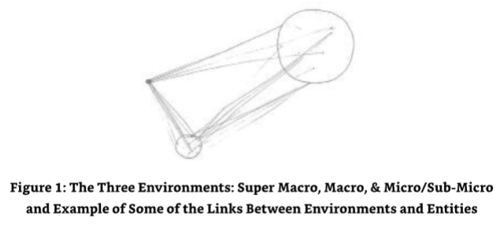

ME:I believe you!We talked about the three environments of the Super Macro,Macro and Micro/Sub-Micro a few days ago when you illustrated the frequency characteristics that were associated with the three environments.Can you elaborate further and include the basis for existence in these three most different environments?

我：

SE10:Yes,of course.But note this first.These environments are not typical of that which you expect from using the words macro and micro for these relate to size and not to what I will call bandwidth and the frequencies associated with bandwidth,or indeed wave length. 

10号源实体：

ME:Fine.I think I have that one-just.I think the best way forward here would be the basis for existence in these environments rather than the nuts and bolts of the mechanics, although I can see that the mechanics may be interesting for some readers. 

我：

### The Basis for Existence in the Super Macro Environment 

SE10:I will continue then.As previously stated,the basis or essence of existence in the Super Macro is the need for the entity to experience the difficulty in manipulating the energies in an environment where the frequencies are predominantly "long"in their bandwidth.A "long bandwidth"is not a description that you will have come across before,so I will need to describe the mechanics or meaning behind the use of this terminology before we can carry on with this and the other two sections.As you are already aware,bandwidth is the measure of the width of a range of frequencies,but a"long"bandwidth is specific to those frequencies with a long wavelength only within a specific bandwidth. 

10号源实体：

ME:Doesn't that affect the number of frequencies that can be used in a certain bandwidth then? 

我：

SE10:Correct.There are a dramatically smaller number of frequencies available in the Super Macro environment.

10号源实体：

ME:But wouldn't that make it slower in its functionality?Or even reduce the potential for simultaneous "frequency-based"environments? 

我：

SE10:To some extent,yes,but we are talking about a completely different set of frequencies than that which you experience in your environment.However,we can refer to them in this way if this necessitates understanding. 

10号源实体：

ME:OK,thanks.Let's see how we go.We can always drop into Earth-based descriptions of terminology if we need. 

我：

SE10:In this environment,the entity is working with those frequencies that,although are high in frequency,are long in wavelength.The example I gave earlier was gravity,a phenomena you have in your own physical universe for that which you call "attractivity." Attractivity is a common energy that is predominant in all three environments but is specific in scale to the wave length of the frequencies being used. 

10号源实体：

In this environment the entities have to "wrestle"with the enormity of the constructs they create when using the energies associated with these wave lengths. 

ME:Yes,I have just received the image of a huge component that an entity created for an even larger component of a massive construct.It was creating this with many others as well.They all needed to help each other with the manufacture of the "final assembly,"so to speak.Wait a moment.This component is really massive.I am just receiving an image of an example of how massive it is.If we use the Earth's solar system as an example of the scale they are working with,this component would span the distance between the Earth and Saturn.

我：

SE10:That would be a slight exaggeration,not in how big it is but in how small it isn't. 

10号源实体：

ME:What? 

我：

SE10:Let me explain.In actuality this component as you call it is much bigger than that.Re-calibrate the focus of your mind's eye. 

10号源实体：

ME:No way!Are those galaxies,or what would pass for galaxies in this environment? 

我：

SE10:Yes,but no.The objective is not to compare galaxy size but the relative size compared to that which you are aware of,which,in this instance,is the relative size and distance of some of the closest galaxies to your own,of which this component is relative to.The image you saw was an area of local density that appeared to be planetary in shape but was actually galactic in size.Your memory logged onto the overall shape and overlaid that which was recognized as "massive"in comparison to your physical size to that which you were being presented.In essence your brain got the scale wrong simply because it received the image of a galaxy that looked similar to that planet you call Saturn. 

10号源实体：

ME:That makes sense.But what doesn't make sense is the size of the entities.They were tiny in comparison,almost miniscule. 

我：

SE10:Those entities are correct in scale for that particular environment.They may be small, but they are able to exist within and work with those long wave frequencies.In actual fact, they are beyond the scaling of the environment that they are working with because they need to be able to work with the scaling that is presented to them when working in any of the three environments and their associated bandwidths.

10号源实体：

ME:And whilst they are working with this environment,they are also maintaining their links with other simultaneous work in the other two environments,plus that which they were previously working with in this environment. 

我：

SE10:Correct. 

10号源实体：

ME:Phew.I wish my readers could have seen this image.The closest I can get to describing it is to tell them to imagine the biggest RSJ(Re-enforced Steel Joist)they can,and then imagine it spanning four or five galaxies!

我：

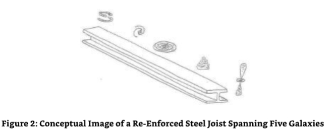

SE10:That would be reasonable. 

10号源实体：

ME:Thank you.If I were to put the "links"to the entities'work in the current and other environments to one side and concentrate on just the entities and what they are doing for a moment,that would make it simpler for me to convey.

我：

SE10:That would be a reasonable thing to do.If I were in your shoes,so to speak,I would want to do the same. 

10号源实体：

ME:Good.So is everything that these entities work with massive in comparison to them? 

我：

SE10:Only in terms of what you would call the physical representation of scale.The real basis for existence in this environment is learning to work with the longer energetic wave length and the subsequent reduction in available frequencies together with the scaling issues.The "size"of the entity is not the question here-more how it copes with the limitations of such an environment. 

10号源实体：

ME:In this environment,I saw an entity with a component for a much larger construct. What was that construct? 

我：

SE10:The actual construct is immaterial in this instance,for it is not the means to an end.It is simply a tool for the entity to use whilst in this particular sector of this environment.It is something to do whilst being there.Think of it in terms of the need to do a crossword puzzle whilst you are on holiday.It is something that allows you to exercise the mind whilst not being within the stressful situation of needing to "deliver"an end product within a known or agreed upon timescale. 

10号源实体：

ME:So the constructs have no function? 

我：

SE10:They have function;they would not be constructs if they did not have a function of some sort. 

10号源实体：

ME:So what is the function of these super macro constructs?

我：

SE10:To focus the attention. 

10号源实体：

ME:That's it?To focus the attention? 

我：

SE10:Correct.You see,when an entity is in the position of needing to be in control of multiple workloads within multiple environments,it needs something to focus its attention on whilst it is in the environment that it finds itself in,for it could easily find that its focus on its current location is lost,the previous location and workload taking some level of priority over the more immediate priority of working in the new sector within the new environment.Consider it an anchor,what you would call "being grounded." 

10号源实体：

ME:Ah yes,that works.I can relate to that.I have one final question before we move on to the Macro environment. 

我：

SE10:Fire away. 

10号源实体：

ME:What happens to these constructs when they are finished or when the entity is transferred on to the next sector in the next environment? 

我：

SE10:If the construct is to all intents and purposes finished,it is either assigned to be a smaller component in a larger construct,or it is perpetuated in some way so as not to lose the link between those entities that still need to experience that which they were working on in this environment.On the other hand,if there are entities that no longer need it,even though they are working on it or have actually finished that which they were working on with that particular construct,it is reduced back to its components'energies for the next set of entities to use in a new construct.

10号源实体：

### The Basis for Existence in the Macro Environment 

ME:OK,thank you for the clarification.I find it really interesting that entities create something just to maintain their high level of concentration. 

我：

SE10:I don't see why.Humankind does it all of the time;it's quite a common pastime. 

10号源实体：

ME:Yes,I see.But then I don't.Ah!Do you mean physically or energetically? 

我：

SE10:Both.You need to concentrate on the physical to help maintain its usefulness.Let me explain.There are groups of races of entities in every Source Entity's environment whose role it is to maintain that environment for the benefit of those who wish to use it for their evolutionary benefit,and your physical universe is an excellent example of such an environment-its very existence is maintained by those who use it for their own needs. What I am getting to here is that the maintenance entities can only do so much in terms of the maintenance of their assigned environment.The rest,the "setting"the "stage,"so to speak,is achieved by those entities who are the"users"of the environment. 

10号源实体：

In your environment everything that you see is created by you to help you concentrate on the task at hand to experience that which you decided to experience when in the physical.Every incarnate entity is working on two levels,the physical and the energetic. The physical is working as a self-correcting program in a computer while the energetic is assimilating the experiential data and collecting evolutionary content as a result.The physical and the energetic work together to create local changes to the environment needed to affect an optimized evolutionary experience.The collective local changes create a world environment. 

This world environment is maintained by the entities in the environment concentrating on the "individualized but nevertheless collective"requirement of a common construct that allows the evolutionary process itself to evolve to meet the needs of the evolutionary requirements of the individual and collective combined.In the "theatre"of physical existence,the "actors,"humankind,go about the business of adapting the stage of the theater on a daily basis.New buildings get built,and old ones are pulled down;new inventions are developed and made with old inventions being superseded and scrapped.The whole landscape is changing on a continual basis.This change is due to the need to create something to maintain the high level of personal and collective concentration necessary to perpetuate the function of,and,therefore,existence of,the theater and its various stages. This is what you all do in your physical environment;this is what my entities need to do as well.It's just that they do it in a different way,for they are experiencing a different kind of existence. 

ME:Wow,I didn't expect information about my own environment. 

我：

SE10:It is a useful comparator to use. 

10号源实体：

ME:I thank you for taking the time and energy to explain it to me. 

我：

SE10:It was a necessary pleasure.Now to the task of explaining the basis for my entities' existence in the Macro environment.

10号源实体：

The bandwidth and associated frequencies are essentially,and mostly from your perspective,neutral.This means that the energies that are available due to the "again" limited frequency set are more manageable.The constructs being created by the entities are closer to their own scaling,so to speak.This means the entities create things that are,in effect,useful to them on the scale that they normally exist within.To put it in a level of terminology that you can understand.Should the entity desire to exist for a period of time in a dwelling,the dwelling that is created would be relative to the energetic frequency of the entity and the area of energy it occupies within its current working environment.It would not be the size of a planet when it only needs to be the size of a house. 

ME:I see.So using the example of the RSJ in the last environment-it wouldn't span the galaxies;it would span the gap in the walls,so to speak. 

我：

SE10:That is one way of looking at it,yes. 

10号源实体：

ME:I can't help feeling that I am missing something here though.It's as if I know there is something else that I need to ask you to explain about the function of this/these environments.I can't quite get my head around it,but the explanations we have been using are not as accurate as I would like. 

我：

SE10:They are not"accurate,"per se,for you would not be able to understand the intricacies of the details of this environment-even now after being exposed to the environments of the other nine Source Entities before me.This is a limitation of the physical and one that is difficult to work with.Think of it as trying to explain the functionality of the most modern computer to a human from the Dark Ages.It would be pretty much impossible.This is where I am with you. 

10号源实体：

ME:Thank you for that reference.I would like you to give it a go though. 

我：

SE10:OK.Let's see what we can do.The scaling is a function of the length of the frequencies employed.To some extent,I will use the description I used in both the Super Macro and the Macro in the Micro as figurative examples rather than actuality.Although there is an element of correctness in the figurative illustrations used,the correctness is relative to the knowledge of the entity being taught,so to speak.In the example of the Macro environment, the length of the frequencies means that there are more frequencies available to the entity within the available bandwidth.Moreover,they are shorter than those used in the Super Macro. 

10号源实体：

This means that more detail can be added to that which is created by the entities engaging in the creativity process.Think of it in terms of an increase in base resolution.A good example would be the way an image of low resolution would appear pixelated in comparison to a higher resolution image that has,for instance,ten times the number of pixels available for the generation of the same image.In this instance,the increase in resolution means that the image loses its jagged edges and gains smooth edges instead.As with the example of the image,the quality of the work,the creative work,is much higher as a result of the increased number of frequencies available.Its resolution is increased and the scaling of that being created is capable of being reduced as a result. 

ME:So you are suggesting three things here:

我：

- 1.the Macro environment has more frequencies to work with as a result of the smaller wave length within the available bandwidth in comparison to the Super Macro;
- 2.this reduction in wave length makes the scale of the constructs created by the entities both more manageable and more in keeping with their own size or scaling;
- 3.the details behind the construct/s are increased due the increase of available materials which results in the increase of frequencies. 

SE10:Good.Also note that the energies available also increase as a result of the increase in frequencies within that bandwidth,further increasing the available materials that can be used in the constructs. 

10号源实体：

ME:I have just picked up some additional information about the scaling that results from the change in wavelengths. 

我：

SE10:Go on. 

10号源实体：

ME:The constructs being created in all three environments are essentially the same in shape and function.The concentration required to construct them is based upon the need to work on a new construct but using a different set of materials,so to speak.The materials being available are relevant to the energies manifested by the wave length of the frequencies obtainable in the bandwidth presented to the entity within its current environment.In essence,the building blocks used get bigger as a result of the scaling and the types of building blocks available.For instance,their shape and availability in different materials is changed as a result.Hence,the construct that spanned a couple of galaxies in the Super Macro would need to be this size to create it in the detail necessary to ensure that all its features and functions were incorporated into it using the available materials that result from the change or reduction in available frequencies and subsequent reduction in energies in that longer wave length environment.In the Macro,there are many more frequencies, energies and materials that can be used due to the smaller wave length of the frequencies in the available bandwidth,so the construct can be reproduced in all its functionality at a much smaller scale.That scale is only available as a result of the smaller wave lengths available in this environment;i.e,the building blocks are much smaller and have more variations in shape and material. 

我：

SE10:So to answer the question in a basic sense is that the basis for existence in the Macro is the ability to work with those frequencies,wave lengths and associated energies whose scaling is similar to that of the scaling of the entity itself.In essence,it is an anchor,a foundation for them to work with. 

10号源实体：

### The Basis for Existence in the Micro or Sub-Macro Environment 

ME:Right,it looks like I'm on a "roller"here.Can I describe what I am receiving from you about the last environment that you have called the Sub-Macro or Micro environment? 

我：

SE10:Before you start,I will very quickly explain the basis for existence in the Sub-Macro/ Micro environment. 

10号源实体：

ME:Please do. 

我：

SE10:The basis for existence in the Sub-Macro/Micro is to be the link for the three environments of the Super Macro,Macro and Sub-Macro/Micro by using the frequencies, energies and materials available in the Sub-Macro/Micro environment.In essence,to be the strongest by being the smallest.OK,you carry on now;be my guest. 

10号源实体：

ME:Thank you.From what I can see in my mind's eye this environment is a natural progression from the other two environments of the Super Macro and the Macro.That is,it uses the progressive movement down the wavelengths to produce more frequencies again that are within the available bandwidth,figuratively speaking-those frequencies that are of the short wavelength only,that is,are the "short"bandwidths.As with the other environments,the objective is to create the constructs necessary to hold their attention whilst in this particular section of the environment.Those constructs are similar to,if not the same as,those which were constructed in the other environments.The difference here is the need to concentrate on using the frequencies,energies and materials that are only available in this environment. 

我：

These "building blocks,"for want of a better word,are microscopic in comparison to those used in the Macro environment.In fact,I will recalibrate my description here;they would be classified as being sub-microscopic,the microscopic being also available in the Macro environment.One could classify it as being a "Sub-Nano"environment if a more understandable word was required. 

SE10:Good.You are doing well.Please carry on. 

10号源实体：

ME:Within this environment the same constructs can be created in their entirety but on a sub-microscopic basis.This allows the frequencies,energies and materials that are manifest in the environment to be used for areas of intricate details or areas of the construct where a higher resolution construct is necessary. 

我：

Hold on,this is interesting.Am I getting this right? 

At this level,or should I say within this environment,all constructs can be totally reproduced.By this I mean that a construct in the Super Macro can be totally reproduced in the Macro,and a construct in the Super Macro and the Macro can be totally reproduced in the Sub-Macro or Micro-right up to reproducing the scale of the construct.On the flip side though,a construct cannot be made to the same scale of the Macro in the Super Macro,and a construct cannot be made to the same scale as the Sub-Macro/Micro in either the Super Macro or the Macro. 

SE10:Correct.That is a function of the frequencies,energies and materials available at the wavelengths specified as being prevalent in these three environments,but it is not one that is used.I will explain further.In the description of the basis for existence within this environment,I stated that it was to be the link between all three environments.In being this link,you start to see the bigger picture of what is being presented to the entity. 

10号源实体：

ME:You are not saying that the three environments,although separate,are actually part of a singular function. 

我：

SE10:Did I not say that they were separately together earlier in this dialogue? 

10号源实体：

ME:Yes,you did.I believe I also noted that the statement "separately together"was a common theme that had been used a number of times by the other Source Entities.

我：

SE10:Yes,interesting isn't it,for as we are all separate in our function,we are all ultimately together with The Origin.

10号源实体：

I will continue.Your comment that the reproducibility of that which in the different environments is a function of the scale,frequencies,energies and materials is correct,but that is not the ultimate purpose of my environment "in totality.I will show you an image. 

What I saw next was amazing.I saw the three environments overlaid upon each other in a way that I had not yet seen in the previous images that had shown the environments randomly spinning and rotating around each other.Their spinning and rotating was a function of the pull of the links the entities had created to link together the constructs they had made in the different sectors of the different environments.I now saw it all together.Each of the constructs was part of a bigger construct with each being a micro,small,medium,large,or super large part of a construct.This construct existed in all three environments concurrently but not simultaneously because each construct was in a different sector.As I looked closer,I saw something else that was both stunning and beautiful.When seen concurrently with the Macro and Super Macro,the small,Sub-Macro/Micro constructs acted as links between themselves and the Macro and Super Macro constructs.They were the sub-components that connected the bigger components together to create a bigger construct,which in turn,was used to create a bigger construct,and so on.In all instances,the constructs from the Sub-Macro/Micro were used as the connectivity between them. As I looked out even further,the Sub-Macro/Micro looked like a venial system,terminating in a cradle of some sort to attach the Macro or Super Macro component/construct to it.It all looked like one big living multiversal construct.

SE10:Very,very well done.Think of it as a 3D chess board.The objective of building the constructs is to build something that exists in all three environments simultaneously with certain parts being necessary in one of the other two environments both independently and concurrently.The ultimate construct is a singular environment that is constructed of all three environmental wavelengths,including the frequencies,energies and materials present in these environments-hence,the links between the entities,the environments they find themselves in,and the constructs they are working on. 

10号源实体：

When I was initially typing this dialogue,I was not sure I was getting the right information at first.It seemed a bit haphazard,specifically since I was receiving additional information about the remaining Source Entities at the same time.(See "in closure"below.)I had specific concerns when I started to see the links between the three environments,the differences in their functions and the entities within them.It just didn't make sense to me.It was as if I had gotten the different Source Entities'information mixed up in some way.It wasn't until half-way through the explanation of the basis for existence in the Sub-Macro/micro environment that it all started to slot into place for me. 

Source Entity Ten had explained its environment in three ways.It had separated out the basic structure of the environments into environmental functions based upon the frequencies available in the wavelengths specified within the bandwidths-clearly stating the functions of scaling.It had identified the evolutionary functions of the entities and the work necessary for them to evolve,and it had described the relationship of the Sub-Macro/Micro with the Macro and the Super Macro and ultimately the bigger picture-to create a construct that existed in three environments concurrently with each of the constructs being dependent on the other.The "coupe de gras"being what the entities were ultimately creating-a series of constructs that tied all three environments together,inextricably creating a single environment-hence,the need for the entities to work together to manipulate the positional location of the three environments and the inevitable swapping of entities.They were weaving a construct together-a mega-massive multiversal construct that was linked together by their own links.These links were the glue,so to speak,that held together their constructs-their contribution to the bigger construct,a co- joined environment that depended upon the linking together of the wavelengths,frequencies, energies and materials associated with the three different environments.They were creating a single environment out of the components of three.They were creating an environment that was more useful and functional as an evolutionary playground than that of the three environments in their singularity-thus,effectively disassembling that which was separate and creating a whole through the use of the materials available.They were learning how to reverse engineer a multiverse and evolving in the process. 

### The Entities of Source Entity Ten and How They Create 

I was acutely aware that I was running out of time with Source Entity Ten.We had discussed a lot about the function of Triangulation and the OM and a bit about the structure of its environment.The issue was I had nothing on the entities that were able to work in three different environments with what seemed like thousands upon thousands of links to the different items of work that they were working on in the different sectors of the Super Macro,Macro and Sub- Macro/Micro environments concurrently.It was truly mind-boggling and,quite frankly,from my limited human standpoint,one that made me shudder at the immense workload.It made my own workload that I was just holding it together with,look ridiculously small.I resolved not to moan about how much work the Source Entity had bestowed upon me-I did ask for it in the first place-and gathered myself together to gain more information about the entities that existed and worked with these "entity-controlled,"rotating and counter-rotating environments. 

ME:I am running out of time with you. 

我：

SE10:How can you possibly run out of that which does not exist? 

10号源实体：

ME:Good point.But I do feel that we are coming to the end of our dialogue,and,as a result,I need to tie up some of my loose ends with you. 

我：

SE10:How many lifetimes do you have?You will never get anywhere near the scratch in the surface. 

10号源实体：

ME:You're right,and I would guess that I would never be able to get anywhere near scratching the surface. 

我：

SE10:No,but what you have done is open the door to the recognition that there is much more than that which is created by your own Source Entity.Not only that,but you have been able to portray a reasonable summary of the workings of my environment-which is to be applauded.However,as you say,you have a limited amount of time with me,so we should continue the dialogue in the way that you desire-with a short explanation/description about my entities. 

10号源实体：

ME:Yes,please.I am most intrigued about their physicality,their form factor,their energetic factor,work,etc.

我：

SE10:Fine.Let's describe their form factor first.It won't take long for they don't have one as such. 

10号源实体：

ME:Well,I expect that many entities don't actually have a form factor,but what I am interested in is what they do to cope with their workload.Do they create a body of some sort to perform their tasks? 

我：

SE10:You will note in the previous dialogue that creation of constructs within the three environments was explained in the physical tense.This was not "a slip of the tongue,"so to speak,nor was it a useful example used for illustration.The constructs were physical but not of the physicality you would expect to experience.In this instance,the physicality is one that is shared between the creator and the created during the creation process. 

10号源实体：

ME:How do you mean?The entities are physical for a short period only?That they are physical only for that period during the process of creating the constructs they are working on? 

我：

SE10:Yes,but I will explain further.My entities are purely energetic in nature.They exist in the energies associated with the environments they work with whilst still maintaining their own scaling and base frequencies.Their energies and subsequent frequencies are independent of the environments they work with and within.However,they have the ability to manipulate their energies to replicate those energies and frequencies,including the wavelengths of the frequencies they are working with,so that they are indistinguishable from that which they are working with. 

10号源实体：

ME:I am starting to get an image of one of them working on a construct.Hold on.It's disappeared. 

我：

SE10:No,it hasn't.Perceive closer and examine that which is before you. 

10号源实体：

ME:Oh,I see,or should I say,I perceive?The entity IS the construct that it is working on.Is that correct?

我：

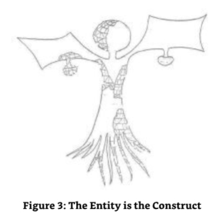

SE10:Correct.To enable them to maintain the link with that which they are working on in all the many thousands of their construction tasks,they need to become that which they are working on.They create the blueprint for the construct that they are creating and,in doing so,attract those energies that are destined to become the construct by creating an attractive force to bring them into play. 

10号源实体：

ME:This sounds very much like the way the human body is constructed.We have the etheric body with which the physical body is modeled upon and etheric template with which I now understand is that which the spirituo-physical is modeled upon whilst being the form for the etheric body to fill. 

我：

SE10:It is similar but not as interactive as that which is created by my entities,for your body is constant throughout its manifestation while they are constantly manipulating theirs to meet the demands of the construct,location and environment.They need to create the form factor for that part of the construction program that they are working on. They attract the frequencies,energies and resultant materials to them by their intention to create.Creation is an immensely powerful force of attraction and one that is omniversally employed throughout The Origin.When they attract the materials in the energies and frequencies required to support that which they are creating they allow those materials to bond to them and themselves.The entity effectively becomes a lattice-work or frame-work for the material to attach itself to.When the material floods into and onto the lattice work of the entity,it becomes one with the entity.It is the entity and the entity is the material -whatever that material is and in whatever combination of frequencies,energies and materials are desired.Once the construct is stable and functional in every aspect required by the entity,the entity itself gradually releases itself from the task of being the lattice or framework for the material it has attracted to itself.It can only do this when the material used takes on the form of that lattice or framework in its own right,becoming that which the entity intended it to become. 

10号源实体：

ME:How does the entity separate itself from the construct it made if it,itself,is one with the construct?It is the construct. 

我：

SE10:When it creates the construct,it allows the material to "invade and share"the energies that it is in its entirety.They take on-board every aspect of that which the entity is-as the construct with one exception.They do not take on-board or absorb that which IS the entity -its consciousness,its "sentience"although they do take on-board one important aspect of the entity's personality,so to speak. 

10号源实体：

ME:And what is that? 

我：

SE10:It absorbs and becomes one with the "desire"of the entity to BE that construct which the entity has become,albeit in transience,and to create that which it desires to create. 

10号源实体：

ME:So the material becomes an extension of the will or desire of the entity. 

我：

SE10:Yes.This process,although gradual,happens on a regular enough basis or of a high enough frequency to allow the creation of the majority of the construct necessary to be able to leave it and oversee its continued construction whilst in a new sector of another environment after the swapping out of entities resulting from the clashing of environments. 

10号源实体：

The process of detachment from the construct necessitates the materials being used in the construct to become one with the entity,as previously stated.Once the entity is satisfied that the materials are in the correct configuration,position and function,it starts to remove its consciousness from that which it has attracted in the desire to create and starts to either extend itself into additional parts or functions of that construct or remove itself entirely if it has finished that which it desired to create.The entity can and usually does start the detachment process once a critical mass of material has been attracted to the lattice or framework of the construct and the material attracted has taken on-board the desire of the entity to be that which it was attracted to be.Once the entity has removed itself from the construct,the gathering of materials does not finish,for the desire of the attraction of additional materials is now fully integrated into the very substance of the material itself. As a result,the attraction-based creation process continues until the construct is complete. The construct,containing within its very being,the blueprint of its form and function then starts to behave and function in a truly autonomous way,correct and true to the constructional and functional plan to which it was created. 

ME:Thank you.Now I feel that I have that which I came into contact with you for.The communication feels whole(complete)now. 

我：

SE10:And so it is.Now you can move on to your next "focused"communication.I use the word focused with my metaphorical tongue in cheek,and I know that you know what I mean. 

10号源实体：

ME:Thank you.I know that we will talk again. 

我：

SE10:We will,for it will be when The Origin Speaks. 

10号源实体：

Suddenly the link with Source Entity Ten dissolved,and I was left with three links connected to me,in lieu of the four,and a rather strange image in my mind's eye to explain the rather cryptic note that Source Entity Ten left me.In my mind's eye,I was in communion with The Origin,that is,a part of The Origin,that part of itself that was focused upon and extended in communication with me.It was surrounded by its creations,the Source Entities.They were all intensively listening in.My eyes started to water.I was crying-another sign that validated the truth of that which was to come.

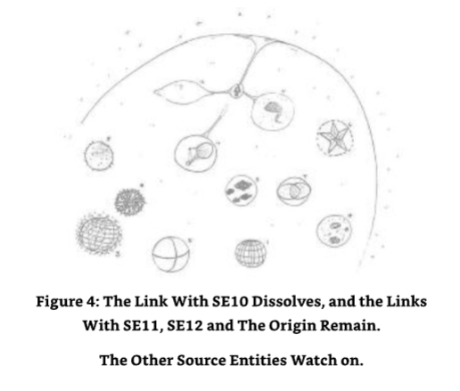

## Chapter Five - Source Entity Eleven 

### A Billion Entities as One 

During the dialogue with Source Entity Ten,I had noticed that I was entering into some level of concurrent but intermittent communication with Source Entity Eleven and also picking up bits of information from Source Entity Twelve,albeit projected thoughts about who or what was close to it and was seeking communion from it.Communion was something that it was not aware of as an experience,so the information was garbled and erratic.Most of it was not worth journaling at the moment.I found this a relief as it gave me the opportunity to concentrate on the dialogue with Source Entity Eleven (see below)rather than continuing to do what I had been doing, which was flitting between Source Entities Ten,Eleven,Twelve(in minority)and,of course,The Origin.I noted though,that although I had noticed four connections running simultaneously,I was able to concentrate on Source Entity Ten and Eleven's links with more clarity.I decided to use this as an opportunity to continue with what was now Source Entity Eleven's turn in some sort of isolation although I did recognize that Source Entity Twelve and,of course,The Origin could "chip in"at any moment.Putting this potentially distracting thought process to one side,I continued with the dialogue that was already established with Source Entity Eleven. 

### Initial Communication with the Collective That Is Source Entity Eleven 

As I focused on Source Entity Eleven with increased intention,I felt the rather odd feeling of trying to listen to a multitude of individuals all at the same time.I found it a little difficult to understand which one of the countless communications was directed to me.Which one should I commence the dialogue with first?Was one of them a "spokesbeing,"or was I going to communicate with several beings at the same time,either separately or together (there was that reference to being "separately together"again!),or was the plan to communicate with a particular being relative to the question being asked?I didn't know.As I honed the focus of my intention,I started to gain more information about this diversified Source Entity. 

Source Entity Eleven had split itself into over a billion separate entities-the number,Ifelt,being an example for my own benefit only.No one was the leader or at the head of the group.The essence that was Source Entity Eleven was no longer singular;it was a full and total collection of entities with all of the minute singular entities and minds that resulted from such a severe division.This was not the same as my own Source Entity or as the other Source Entities had done when they created the entities that populated their own environments,for they maintained their own singularity,a singularity that was above those entities that they created.This one was a full and total division,including the loss of an overall singular state of being.Everything was in miniature with one exception-the perimeter of the environment that was Source Entity Eleven, which was still in place as one.But it was not sentient;it was an automatically maintained barrier between its creations and the energy that was The Origin.I saw a group of entities coalesce before me like fish in the water-the water being the area of the Source Entity that was Source Entity Eleven's energetic environment.It had a goldfish bowl feel about it,except that this was no goldfish bowl.They all came towards me,and their initial communication echoed in my head.

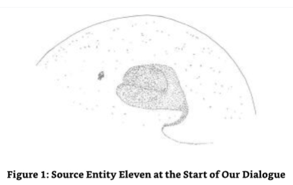

SE11 (collectively):We acknowledge your presence.You are out-side of us.Strange!State your business.We aim to serve. 

11号源实体（集体）：

ME:I can enter into your energy if you wish. 

我：

SE11 (collectively):We would prefer this. 

11号源实体（集体）：

I entered into the sphere that was Source Entity Eleven's automatically maintained perimeter and internal "space"and immediately felt the swarm of smaller entities gather around me.I was covered-totally.I tried to move around the space that was the only recognizable way of describing Source Entity Eleven as a singularity with the hope of moving away from the plethora of entities that surrounded me,but all they did was follow me.I was just about to ask for some "personal space"when the area behind me cleared.The entities,clearly sensing my requirements/need for a gap between myself and the "swarm"capitulated (I wasn't sure whether to be concerned or not)and suddenly moved away,creating a semi-spherical amphitheatre in front of me,made totally out of the entities themselves.I had a large audience,but even though it was large,I knew that this was not the total number of entities that Source Entity Eleven created and devolved down into.There were uncountable numbers of other entities elsewhere within the environment.I got the feeling that these were the "face"of the totality that was Source Entity Eleven. 

SE11 (collectively):We do not seek to disturb you;we only seek your comfort and communion. 

11号源实体（集体）：

ME:Thank you.I appreciate that.I was starting to get a little bit claustrophobic with you all so close to me. 

我：

SE11(collectively):We apologize for our initial actions for we are not yet in the mindset for communication with one such as you.You are independent of us,and that is a difference we are not/have not been exposed to. 

11号源实体（集体）：

ME:But you must all be able to work as a singular entity at times;you must have come across the need to communicate singularly because you are all singular even though you are a collective. 

我：

SE11 (collectively):We do have individual function,but we do not function as individuals. We operate together in all things in all ways.

11号源实体（集体）：

We find this an optimal way of operating for it removes the need to think for others on an individual basis. 

ME:I feel honored that you accepted me into your environment so quickly,specifically as you have not been exposed to an individual with individual will and decision-making ability. 

我：

SE11(collectively):It was not so difficult for us to accept you for you are part of a much bigger collective,and we are all part of that-for The Origin is the origin of all,and we are all part of The Origin,even those small parts of The Origin. 

11号源实体（集体）：

ME:What do you mean "small parts of The Origin"? 

我：

SE11(collectively):You know them as the OM.You are of the OM;that is why we accept you. We know of you even though we do not have OM. 

11号源实体（集体）：

ME:Why don't you have any associated OM? 

我：

SE11(collectively):It was not part of the creation process that We/I were part of.I used We/ I here,for We/I were in singularity then.We shall use "We"from now on. 

11号源实体（集体）：

ME:OK,I understand,but I thought that all Source Entities had OM associated with them. 

我：

SE11 (collectively):No,we do not have OM,and Source Entities Five and Twelve do not have OM.Although in essence we are all OM of sorts as a result of being created by The Origin with The Origin using its own energy in the creation process.No,that energy in isolation did not attract itself to us and,therefore,is not part of us.We are interested in you though, for you are Pure OM and,therefore,not associated with a particular Source Entity,which is interesting because you are so small in comparison to Pure OM. 

11号源实体（集体）：

ME:Well that might be because I am currently incarnate,so I assume that only a small part of me is focused on contacting you and conducting this dialogue. 

我：

SE11 (collectively):Mmmmm,it is not often that a Pure OM in-carnates,let alone at the frequency that you have incarnated at.It's so low its painfull!!! 

11号源实体（集体）：

ME:Tell me about it. 

我：

SE11 (collectively):Please do tell us about it.You are in it! 

11号源实体（集体）：

ME:I could,but that's not what I am here for.I am here to find out information about you. 

我：

SE11(collectively):What do you want to know about us? 

11号源实体（集体）：

ME:Basically,as much as I can without losing my ability to understand it. 

我：

SE11 (collectively):Then we should start with our functionality. 

11号源实体（集体）：

ME:That would be a fantastic start. 

我：

### The Functionality of Source Entity Eleven 

ME:Ok,so where shall we start? 

我：

SE11(collectively):Where do you want to start? 

11号源实体（集体）：

ME:Let's try the basis of your functionality and why your functionality is the way it is. 

我：

SE11 (collectively):Then we shall tell you from the start.

11号源实体（集体）：

When we were in singularity,we sought to differentiate from that which was being achieved by those Source Entities that were already enacting their strategy.They sought to create a "multiverse"of sorts out of their own volume and then filled it full of smaller versions of themselves.When each Source Entity had achieved this diversification,moving away from that which is natural,they mostly decided to maintain their own singularity as an overseeing force.That is,except for Source Entities Five,Seven,and Twelve.Twelve,of course,not being self-aware didn't really count.Source Entity Five remaining singular made it drop out of this analysis,as did Source Entity Seven who diversified into three separate Source Entities first before creating its entities.We/I decided not to go down this well- trodden route and decided to do something different entirely. 

ME:So you decided to remove the element of singularity by creating a total collective,one without an overseeing force but nevertheless maintaining it within a known environment, an environment that was automatically maintained. 

我：

SE11(collectively):Not quite,it is merely a perimeter and not an environment,per se.How could we be diversified and yet still part of an environment?That would mean that we had some part of us that was still aligned to that which we were when singular.No,this is just a perimeter,a fence,so to speak,where we decide not to venture beyond. 

11号源实体（集体）：

Now this was an interesting development and one that I hadn't considered.Although Source Entity Eleven had diversified into over a billion (a number used for my benefit)individualized, but collective units of itself,it had still maintained a perimeter around its collective "self."The perimeter itself was not actually part of Source Entity Eleven.It couldn't be,for it had diversified and was merely a self-imposed perimeter fence.This area,I was being told as I typed this text, housed the same area that Source Entity Eleven had before its decision to diversify.The smaller units of Source Entity Eleven naturally decided to stay within this area rather than spread out amongst the totality of the current area of self-awareness that was The Origin.Thinking about it though,it was entirely logical.They would not operate as a collective if they separated themselves out too far,or so I thought.I decided to ask the question of the collective that had positioned itself in front and around me like a 3/4 hemispherical hollow sphere. 

### Source Entity Eleven's Self-Imposed Perimeter 

ME:I find it interesting that you stay within this area.I recognize from the information you sent me that it is a self-imposed perimeter of the same area that was occupied by you before you were diversified.Why restrict yourselves in this area when you could wander the vastness of The Origin? 

我：

SE11 (collectively):We do not desire to do so.As you noted in your narration a moment ago,we could,if we so desired,spread out within the area that is the current area of self- awareness of The Origin,but we have chosen to stay within this self-induced perimeter so that we can concentrate on the work we are doing.Moving outside this perimeter,as you call it,would distract us from that which we are working on. 

11号源实体（集体）：

ME:Are you aware of what is in existence outside of this self-imposed perimeter? 

我：

SE11(collectively):Yes,of course.Are we not a Source Entity?

11号源实体（集体）：

ME:Err,yes,I suppose.It's just that I have not considered the possibility that a Source Entity can have its singularity of mind diversified so much and still be able to operate as if it were one. 

我：

SE11(collectively):Well,we do.Let us explain why we stay where we are and why we stay together collectively and in totality. 

11号源实体（集体）：

We stay within the area of the primary creation where we were in singularity because there is no need for us to move yet.None of the Source Entities move around the area that they were created within because there is no need,for each Source Entity is working on its own contribution towards its personal evolution and,therefore,The Origin's evolution.It is a very insular thing and one that requires concentration of the Source Entity itself.Moving around that which we are aware of is just an unnecessary distraction.We know that we will need to move at some point,and we know when that point will be.It's just that it isn't now. 

ME:When will it be? 

我：

SE11 (collectively):When The Origin evolves past its current level of self-awareness and moves outwards into that wider and greater area that it is cognizant of but not experientially aware of.Then and only then will we move ourselves and only then will we consider further separation or re-integration into singularity.The decision to stay within this area was a collective one to ensure that we maintained the spirit of the original decision to diversify whilst being a collective.As just stated,no one Source Entity currently is actively moving around the area within The Origin that they exist within. 

11号源实体（集体）：

ME:How is that?In the dialogue that created The History of God,my own Source Entity described all of you doing anything and everything you could to experience the dimensions, frequencies and energies within The Origin.I even drew some illustrations to show my readers what I experienced. 

我：

SE11(collectively):Yes,at that point in our existence we were singular,we were one,and the other Source Entities were "becoming"so to speak.None of them had either developed their strategy for evolutionary progression at that point (and so they could do what they liked), nor had they considered creating an environment of sorts and filling it with smaller units of themselves.As you may have been told before,we were all having fun. 

11号源实体（集体）：

ME:So what happened?Why did you all stop moving around and having fun? 

我：

SE11 (collectively):We started to work on our own strategies for evolution,and this takes concentration.Once we had fully understood the reasons for our own existence and had subjected ourselves to all of the dimensions,frequencies and associated energies necessary to give us a good basic knowledge base of that which we are and that which we exist within,we settled down to create our strategies for experiencing,learning and evolving. In essence,we had achieved that which we needed to achieve from our very personal perspectives and now needed to move on to the in-depth opportunities presented to us by being able to experiment with that which we "were."The need to move around The Origin was,therefore,negated as we all concentrated on our evolutionary tasks-apart from Source Entity Twelve,that is-which is where we are now;performing our evolutionary tasks by being a fully diversified version of that which we were in the singular.Our evolutionary plan was designed to be contained within the area previously inhabited by that which we were as Source Entity Eleven in a singular state.That is why we stay within this perimeter and do not venture outside. 

11号源实体（集体）：

ME:Will this not change when The Origin expands its area of self-awareness? 

我：

SE11 (collectively):As we have recently stated to you,we are not of a collective mind to be able to ascertain that which is not a pressing decision that we have to make,but the possibility of returning to singularity is one of the options that we will consider when we are in experience of this event with The Origin.As you can appreciate,there are so many options open to us at that point that we have not even thought about discussing them with you.Your own imagination is sufficient enough to be able to suggest a few choice scenarios in isolation from ourselves. 

11号源实体（集体）：

ME:Thank you.I am sure that the readers of this dialogue will also be able to make up their own scenarios of how you could re-organize yourselves at that point in The Origin's existence. 

我：

### Purpose of Being a Diverse Source Entity and Synergetic Effects of Being an OM or a Source Entity 

ME:I would like to get back on track a bit and discuss the deeper reason/s behind your decision to become the diverse entity that you are now,including the benefits of such an existence in the diverse but collective format that you have. 

我：

SE11 (collectively):From your physical and temporarily singular existence,you will find it a difficult concept to understand,simply because you are able to make what you think are rational decisions based upon a set of known experiences and criteria. 

11号源实体（集体）：

ME:Wait a moment.Did you say temporarily singular existence in reference to my own condition?Was that referring to the physical or the energetic? 

我：

SE11 (collectively):We were referring to both the current state that you are in and the normal state that you have when in the energetic. 

11号源实体（集体）：

ME:Can you explain further?It might help with my ability to understand your "thought" process as we progress our dialogue. 

我：

SE11 (collectively):Yes,we will.Any of the OM-that is,any of the four categories of OM either in purity or hybrid state-can group together and benefit from the synergetic effects of becoming a collective,if only from a temporary basis.By that I mean that any combination of OM can commune in "metaconcert"with an OM/Source Entity Hybrid, Captive OM,Non-Captive OM or Pure OM and create a collective that can benefit from the synergetic effects of such an act.The synergetic effect is strongest when OM of the same type are in metaconcert,particularly with the Pure OM,but the synergetic effect of any OM metaconcert is marked enough to warrant the desire to commune in this way. 

11号源实体（集体）：

ME:Is that it?Is that the reason why you decided to be a collective rather than retain your singularity and create a multiverse and populate it with billions of smaller entities? 

我：

SE11 (collectively):Yes,that is one of the reasons,amongst others,for our decision to become "diverse"more than singular.When we saw the way in which the other Source Entities were creating their own environments and developing their own strategies for gathering evolutionary content,we stood back and waited until last-last that is,if we don't count Source Entity Twelve. 

11号源实体（集体）：

ME:You deliberately waited to see what the others were doing to ensure that you were not doing the same thing. 

我：

SE11 (collectively):Yes,we made sure that we were all doing different things and that the whole landscape of opportunity for collecting evolutionary content was diversified.You see, we had already made the decision to become diverse and had to make sure that none of the others would follow the same path.Clearly some of the entities in each of the Source Entities'environments are based upon the collective mind strategy,and we looked on with keen interest to ensure that it did not become that which we desired to become-it did not and has not occurred subsequently.We also knew of the synergetic effect of constant metaconcert from the observations of the first fully collective entities to be created by your own Source Entity-what you call Source Entity One-and felt this to be a desirable function to exist in. 

11号源实体（集体）：

ME:So you also waited for the product of the work of their creations before making the final decision. 

我：

SE11(collectively):We did more than that-we initiated a gradual diversification to see if this effect was applicable to our own energies.We weren't sure if the effect of synergy was a function of the dynamics of the energies used in the creation process of the Source Entities or if it was independent of Source Entity creation and,therefore,a general function of diversification. 

11号源实体（集体）：

### Optimization of Synergetic Effects Though Diversification as an Iterative Process 

ME:Is it a general function then or relative to Source Entity creativity only?That is, creativity performed by a Source Entity in lieu of an entity created by a Source Entity? 

我：

SE11(collectively):Initially,we established that the synergetic effects were relative to the creativity of the collective by the Source Entity-in this instance,"us"while we were in a semi-diverse state,that is,in a condition during the experimentation where only a certain percentage was diversified.The rest was maintained in singularity and in total separation from that part of us that was diversified.Through the separated greater part of us,we were, therefore,able to measure the level of synergetic effect versus the number of component parts within the diversified unit. 

11号源实体（集体）：

ME:Why did you maintain a larger part of yourselves in singularity? 

我：

SE11 (collectively):We wanted to create the perfect strategy for our evolutionary work.This resulted in the need to experiment and gain the optimal condition.In order to support the possibility of a number of iterations,we,therefore,needed to ensure that we could return to a known starting point and modify the strategic direction as necessary in creating a new iteration for analysis. 

11号源实体（集体）：

ME:So you diversified in stages then,checking the strength of the synergetic effect as you went,so to speak.

我：

SE11 (collectively):Correct.You see,the effect of being in collectivity was also coming into play,even though we were not fully diversified nor in a full collective. 

11号源实体（集体）：

ME:You had a skewed distribution of diversified Source Entity Energy versus singular Source Entity energy. 

我：

SE11 (collectively):Yes. 

11号源实体（集体）：

ME:Eventually then,you established the "perfect"scenario of diversification that you wished to achieve. 

我：

SE11(collectively):Yes.As stated above,we noted that two things were happening.Firstly, the strength of the synergetic effect increased geometrically with the number of entities within the collective.Secondly,we noticed that our computational power-the ability to consider many more scenarios,including other thought processes-increased as the number of the individual units within the collective increased. 

11号源实体（集体）：

ME:Sounds like you discovered a very valid reason for being a collective rather than a singular unit of Source Entity energy. 

我：

SE11 (collectively):You would think so,but we discovered a limitation to this strategy because the geometric increase in synergy did not increase "ad infinitum." 

11号源实体（集体）：

ME:Go on. 

我：

SE11 (collectively):We noted that an optimal number of units within a collective could be reached from a synergetic perspective where the number of entities in the collective could be increased,but the strength of the synergetic effect did not.In fact,it reduced.

11号源实体（集体）：

ME:You mean it "tailed off"?! 

我：

SE11(collectively):Yes,and it was significant.This was a great surprise as we had already developed a strategy for significant levels of diversification based upon a collectively suggested level of synergetic effect achievable at a known number of entities within the collective. 

11号源实体（集体）：

### Quality Is Better Than Quantity 

ME:So what happened?Why did it tail off? 

我：

SE11 (collectively):There was an effect,a sort of "bow wave"effect.I need to explain it better for you.Let us access your mind and memory. 

11号源实体（集体）：

ME:Please do so. 

我：

SE11 (collectively):Ah yes,this will suffice.You have a theory about attaining a velocity that you call "light speed"or the speed of light.This theory states that the closer you get to the speed of light,the mass of the light particle,the photon,increases.The mass of the light particle causes"drag."This drag increases as the mass increases creating so much drag that the photon,the light particle,never actually crosses its maximum speed,the speed of light.This is the same for any other particle that you would like to accelerate up to that speed.The speed of light has a self-governing effect that makes sure that its function is maintained for that for which it was designed-to provide illumination,heat, communication,transportation and some of the lower levels of the creativity process.

11号源实体（集体）：

ME:We do also have a theory that if a photon,a light particle,was to cross over this barrier, it would change its nature and become a tachyon. 

我：

SE11 (collectively):Yes,but that relies upon the photon changing its state beforehand, shedding the velocity accrued mass and becoming the theoretical tachyon particle exactly at the point of change over necessary to go faster than the speed of light.You might like to think of it as providing an "afterburner"effect to the particle.In essence,the photon is a tachyon particle in disguise.It gets up to the speed it can whilst in the lower physical frequencies and then loses that part of its physicality necessary for it to continue accelerating beyond that of its speed as a photon particle.It does this by changing its frequency at the point of change of speed,effectively releasing itself from the constraints of the frequencies of the lower physical universe. 

11号源实体（集体）：

ME:So taking this illustration into context then,you are suggesting the higher the number of entities,the greater the resistance created.This resistance has a stalling effect on the level of synergy that can be attained,causing it to tail off. 

我：

SE11 (collectively):Correct. 

11号源实体（集体）：

ME:Why? 

我：

SE11 (collectively):Because of the sheer number.When we attained a certain number of individual units of Source Entity,which is by the way,what we have now,we achieve a balance between the collective ability to work together and the number necessary to create the optimal synergetic effect.It becomes a multiple of a multiple of a multiple of the total number of individual units of Source Entity energy.It is "multipolous."

11号源实体（集体）：

When we go above this balance,the effects of the processing power of the collective units of Source Entity energy starts to interfere with the synergetic effect.In essence,the synergetic effect is reduced as a function of the ability to control that which created it.It loses its synergy! 

ME:Can you not change the dynamic in some way to allow the synergetic effect to continue to increase in the geometric fashion it is supposed to.For instance,can you not link two units together in some small way,effectively creating one unit out of two from the perspective of the synergetic effect,thereby doubling the effect and creating a multiple of the synergetic effect? 

我：

SE11(collectively):Very good suggestion.But in effect all we would do is create a twinning effect,which is still recognized by the function of synergy.It is also more difficult to control from the perspective of a "collective"because the "twins"need to work together as a local collective of two and then work together with the larger collective of the total collective units of Source Entity energy. 

11号源实体（集体）：

ME:What about doing some parallel processing where you have two larger collectives of Source Entity energy of the number required to achieve the optimal level of synergy with the synergetic effect at the highest level achievable and,therefore,in balance with the number of units.The two would be then linked together with a small energetic link.Would that not double the synergetic effect?

我：

SE11 (collectively):Yes,it would,but it would also create two collectives,both of which would be constrained in their ability to take advantage of such an increase in the synergetic and collective processing effect by the size of the energetic link between them. 

11号源实体（集体）：

ME:Ah,yes.Thinking about it we seem to have a similar issue with dual and quad core microprocessors as they still work effectively in isolation and need a processor to collate and present in a collated and collective way that which they have worked on in an individual basis,thereby giving the impression of the work of one single microprocessor. 

我：

SE11 (collectively):You do,and this will not change until you change your method of processing data. 

11号源实体（集体）：

ME:Thank you.We talked momentarily about the different types of OM and how they perform differently whilst in metaconcert.Can you explain a bit about that for me? 

我：

SE11 (collectively):The quality of the entity's energy also has an effect on the level of synergy achieved.For instance,the synergetic effect is higher if the entity is of Source Entity energy.The synergetic effect is lower if the entity is created by a single unit of Source Entity energy or a collective of Source Entity energy.This is the same for the OM.The "pure"OM create a higher level of synergy when in metaconcert together than the"OM/Source Entity" hybrid energies in metaconcert,who will create a lower level of synergy.Those captive and Non-Captive OM also have a natural reduction in synergy based upon their energetic quality being "in between"the two "book ends"of the Pure OM and the OM/Source Entity hybrids The mixing of different types of OM in metaconcert reduces the synergetic effect even more. 

11号源实体（集体）：

ME:So what you are saying is that there is a compatibility problem with the energy signatures of the entities seeking the synergetic effect of collectivity.They must coalesce in collectives of the same not be able to enjoy the levels of synergy available to collectives whose participants are all from the same energies. 

我：

SE11 (collectively):Correct. 

11号源实体（集体）：

ME:Additionally,there are an optimal number of participants that can be integrated into the collective before the synergetic effect becomes inefficient. 

我：

SE11(collectively):Correct. 

11号源实体（集体）：

ME:Well,that is an interesting concept to understand,and it is one that was not expected- specifically that we are,in essence,limited in our potential synergy. 

我：

SE11(collectively):Yes,it is interesting and a very important piece of evolutionary content. You see,it teaches us to be efficient in our application of self and the diversification of self. 

11号源实体（集体）：

### Optimal Synergy vs.the Number of Collective Entities in Problem Resolution 

ME:One of the pieces of information I have just received tells me that you use this knowledge of optimal synergetic effect versus the number of participating collective entities to solve certain problems or effect changes to that which you have manifest in various levels of acceleration. 

我：

SE11 (collectively):Yes,we have created a map.What you would call a "look-up"table and inserted it into our collective self.This on-board mapping tells us instantaneously how many individual units of our collective state would be required to solve a problem or complete a task in the most efficient way if they were working as a collective and,therefore, invoking the effect of synergy. 

11号源实体（集体）：

ME:That's most interesting.So taking this into context,if you had a task to do and you worked out that you needed,say,100 units of the collective to complete this task,you would look at the synergetic effects of the collective and work out,albeit instantaneously,how many individual units of the collective,working in metaconcert and,therefore,invoking synergy would equal the optimal number of 100. 

我：

SE11 (collectively):Yes,very well done.In this instance and as an example only,we would need 42 units working in metaconcert. 

11号源实体（集体）：

ME:But that's an incredible change in the level of efficiency compared to that achieved by a group of entities working together but not in metaconcert. 

我：

SE11 (collectively):Isn't it just?And now,I hope,you can see why we decided to become a collective and not create a multiverse and populate it with smaller individualized units, which may or may not be capable of metaconcert or,indeed,may or may not desire to work in such an efficient manner.Not that any method of working is incorrect,for we all have to contribute to the evolution of The Origin;the greater the number of different ways of achieving this task,the better.It is just that we have chosen to take this particular route to helping The Origin solve that which it desires solving in preference to any other.As a result. we are achieving a very high level of experience and subsequent evolutionary content. 

11号源实体（集体）：

### A Decision Still To Be Made

ME:I am receiving more information about your decision.Hold on.Is this correct?You are still making it? 

我：

SE11 (collectively):Yes,we are.You see,we are analyzing all the different ways or routes that the other Source Entities have made and are looking to see if what they have achieved is best achieved in the collective metaconcert and,therefore,synergetic state.We are doing this to see if there are any errors in the calculations that gave us our synergetic look-up table.The effect of this is that we might still revert back to the state of non-collectivity-but only for the use of certain tasks. 

11号源实体（集体）：

ME:How are you doing that? 

我：

SE11 (collectively):We are copying some of the tasks of the other entities,those created by those Source Entities that have split themselves to create smaller individualized units of themselves to work in the minute details of their multiverse or environments.We are checking to see if our route and understanding of synergy is valid and/or if it needs re- calibrating in some way,shape or form. 

11号源实体（集体）：

ME:And does it need re-calibrating? 

我：

SE11 (collectively):Not massively.We have been most fastidious in our computations and every check we have done is proving our assumptions and experiences to be justified. However,we have not yet worked out all of the scenarios that we need to employ to help us all agree on the current configuration of our synergetic look-up table.Although it doesn't need much work,there is a modification we might want to do due to the level of accuracy.

11号源实体（集体）：

ME:How long will that take? 

我：

SE11 (collectively):Quite some time yet.We are only a quarter of the way through our testing of the mapping.We do have to say that as a result of the work and evidence created so far,we are becoming very confident that this configuration is efficient,effective and repeatable. 

11号源实体（集体）：

ME:What do you mean"repeatable"? 

我：

SE11 (collectively):We are checking to see if there is a relationship between the optimal number of entities employed,those working separately together in a specific task,the number of entities in metaconcert-and,therefore,in a synergetic state-giving an effective number of entities equal to those working separately together,and the task itself. 

11号源实体（集体）：

ME:I am sorry;you have lost me for a moment.Can you elaborate for me? 

我：

SE11 (collectively):We are establishing if there is a level of what you would call "correlation" between tasks that demand a certain number of entities outside metaconcert,the equal number in metaconcert,and the tasks themselves.So,let me simplify this for you.If task "A"requires 100 entities outside metaconcert or 42 entities in metaconcert,can the same number of entities in metaconcert,and,therefore,in synergy,also be used for task"B"which also requires 100 entities outside metaconcert?Or is there some effect created by the task on the synergetic number that affects the number of entities necessary to complete the task outside of metaconcert? 

11号源实体（集体）：

ME:And you still haven't established this yet?

我：

SE11 (collectively):Yes and no. 

11号源实体（集体）：

ME:What do you mean,yes and no? 

我：

SE11 (collectively):We established that this was a 99.999%correct assumption in the last round of testing.However we want to get this last level of error,0.001%out of the equation, so we have made some minor adjustments and are in the process of re-testing. 

11号源实体（集体）：

ME:Hold on.You have been testing your assumptions on the level of accuracy of the look-up table? 

我：

SE11 (collectively):Yes,of course. 

11号源实体（集体）：

ME:But why? 

我：

SE11 (collectively):To understand the error factor,if any.But as you can see from the information we have given you,we noticed that we have an error factor of 0.001% 

11号源实体（集体）：

ME:Yes,I noticed that,but is that level of accuracy enough for you to work with? 

我：

SE11 (collectively):No.We need total accuracy.Listen.As a result of us being able to work out the error factor,we have been able to use an interim condition as a "correction factor" as an interim fix to the problem we have.In fact,apart from those units of this collective chosen to discuss various subjects about ourselves with you in this dialogue,we have been using all other available entities to solve this problem. 

11号源实体（集体）：

ME:It's that big a problem?

我：

SE11(collectively):Yes,of course it is.0.001%is what you call the "proverbial barn door." This level of inaccuracy can cause severe issues with the work of those entities chosen to undertake the work that they have been assigned. 

11号源实体（集体）：

ME:So what you are doing now is finalizing the corrections to the existing/latest computations.When you have understood these corrections,you will put them in place and utilize them in the "computer program"/"look-up"table for identifying the optimal number of entities necessary for a particular role,both in the metaconcert condition and the non- metaconcert condition. 

我：

SE11(collectively):Correct.But don't get wound up with semantics here.This is not holding us back.We are still moving forward with the work that we set out to do.What you have experienced here is just that which is happening from an experimental basis.We are still and have been working on the task The Origin gave to us at the start of our awakening process-that being the need to experience,learn and evolve. 

11号源实体（集体）：

ME:What you are telling me then is that your side line is project that you are improving the synergetic effect by modification of that which the entities do or that which is required to achieve the 100%correlation between the task,number of entities in metaconcert and the number of entities not in metaconcert. 

我：

SE11 (collectively):Correct! 

11号源实体（集体）：

ME:And what is the point of this work?What it's the underlying need to do this? 

我：

SE11 (collectively):It may seem like we are doing work for the sake of it,but know this-when we have established 100%efficiency in our use of the synergetic effects of placing collective units of us in metaconcert to achieve any task,we will be able to increase the number of tasks we want to work on whilst decreasing the number of collective entities involved in any one task.In this way we will increase our evolutionary content by a factor equal to the synergetic effect,accelerating both our own evolution and the evolution of The Origin.It is a most important task that we do here. 

11号源实体（集体）：

### When a Collective Is Not a Collective 

I was starting to think that Source Entity Eleven is operating like a big synergetic computer, calculating the best way to use the synergetic effects invoked by the use of metaconcert whilst in the collective.I also noticed that I was starting to home in on an area of personal interest that Source Entity Eleven was working on. I was starting to realize that there was a distinct difference in the way a collective can and does work and that this was its area of interest,but it is embedded in the work of optimizing the effect of synergy.I was also aware that we had spent quite a long time on this subject of synergy,so I was eager to bring it to a natural close and move on to the next subject.With this in mind,I decided to use this as my next question for Source Entity Eleven with a view to moving on afterwards. 

ME:Throughout our conversations I have noticed that you use the words"metaconcert"and "synergy"a lot.It's almost as if even though you are a collective,the collective has to work in the methodology of being in metaconcert before it can evoke the synergetic effect.

我：

SE11 (collectively):It does.You see,there are many different classifications of collective and, therefore,there are many different ways in which to reach the synergetic effect.There are also many different levels of efficiency that can be achieved within the synergetic effect. 

11号源实体（集体）：

ME:Now you are whetting my appetite.You say that there are many different classifications of collective.I thought that there could only be one type of collective-a collective. 

我：

SE11 (collectively):No,there are many.As a singular being that has the ability to commune in metaconcert,you would understand this better when you are in the energetic;however, in your current incarnate condition,you will find this difficult to understand.Nevertheless, it is an important concept for you to convey,for it will expand the knowledge base of your mankind in this area. 

11号源实体（集体）：

There are four main types of collectivity with variations of these four in-between.They are explained as follows. 

### Four Types of Collectivity 

**Basic Collective**

The basic collective is a collective of entities that exist as a collective mind with each of the units of the collective being just that-a unit.In this version,the units of the collective are devoid of any form of singular thought.They function as an individual unit under the control of the collective.They are,if you like,automatons pre-programmed to do the task that they are working on.However,although they do not have any personal sentience,their programmable capacity,so to speak,is connected to the whole,creating a collective mind.This "collective"mind is the sentience,the intelligence,the thinking force behind the collective in totality.There is an optimal number required for this type of collective to be effective in its function,but that optimal number can vary depending upon the environmental conditions the collective exists within and the form factors of the entities that make up the collective.Just to give you an idea though,the average minimal number of entities required to support minimal collective functionality is 300,000. 

Small groups can function together as a collective,but they are under the control of the whole collective and not the smaller group collective generated as a result of splitting off individual units in order to create the group.This collective is not capable of invoking a synergetic effect as they are not effective when singular.This collective always stays together in the same environment or moves to a new environment together. Communication with other collectives or individualized entities with individual and free thought is done via the collective interface.Singular units cannot survive on their own. 

You may suggest that your ants are this type of mind,but that is not the case because ants have a greater level of individuality than you are aware and are,therefore,under a different classification. 

**Collective of Units of Singular Sentience**

In this collective each of the individual units of the collective has its own sentience content.It is capable of individualized thought and individualized decision processes.This type of collective is very useful because individual units of the group can be split off from the total collective and be capable of becoming a smaller group collective.Members of this collective are normally split into groups of entities that are similar in skill base and can,therefore,invoke a group-based level of synergy,based upon the grouping together of entities that are of the same nature from an individual ability perspective. 

This type of grouping is preferred when the group needs to complete a certain type of task where the other types of entities in the collective would not be able to conduct the work necessary to complete the task in an effective and efficient manner.An example that you could use is group of entities that are skilled in boring holes to create burrows but would not be of much use transporting food stocks by air.There are multifunctional groups created, however. 

These groups are created when it is necessary for the collective to create a new collective, a new colony if you like,in a new environmental location.In this instance,the group created would contain the minimum number of the different types of entities in the newly created collective necessary to ensure the perpetuation of that collective as an individual and self-sustaining collective.The entities in this type of collective have the ability to work individually,but they could only work on an individual basis for the good of the whole or group collective and at the request of the whole or group collective.They could not seek individualized work as a result of an individualized thought process. 

As with the basic collective,communication with other collectives or individualized entities with individual and free thought is done via the collective interface.The synergetic effects are the most pronounced in this type of collective,specifically within those groups or collectives of groups of entities of the same energetic function or skill base.Singular units can survive on their own but need to find a group to ensure existence is sustained.Your insects are a lower level version of this type of collective. 

We,Source Entity Eleven,are this type of collective,but our individualized functions are based upon our energetic content and computational skills.Although we rarely work alone, we are capable of doing so. 

**Separately Together Collective**

The "separately together"collective is a hybrid of the collective and is created of individualized units of singular sentience,and the fully individualized entity that does not need to be in a collective for any reason.In this instance,each unit of the collective has fully individualized sentience and,therefore, thought processes.They also have fully individualized functionality both energetically and creativity-wise.This collective is powerful in so much as it is the best of both worlds, so to speak.They can operate at full collective functionality in all the ways specified in the collective of units of singular sentience version above,and they can operate as a fully functioning individualized unit with individual free will and the ability to go with the collective or not,as the case may be,if and when associated with it.As a collective,they are very diffuse by nature.They can all be together in the same environmental location,or they can be spread out into every possible location within each of the Source Entities or,indeed, The Origin,and some are.They are always in contact and communication with each other and generally found working on their own for their own evolutionary content.They work together in full collectivity when there is a specific benefit in entering into a task collectively rather than in the "separately together"condition.They communicate with other entities, both collective and singular in the singular.They are a fully self-sustaining creative entity. The OM are this type of collective but only when they desire to be so,for they can opt out should an OM so desire. 

**Temporary Collective**

The Temporary Collective is one where individualized units of a particular Source Entity desire to work in metaconcert in order to work on a task that is best "actioned"as a collective rather than a group of individuals simply working together. This collective type also has the ability to invoke synergy that will benefit all the members of the metaconcert by increasing the efficiency and,therefore,the work throughout the collective.This type of collective is generally a temporary collective condition born of the need for a mutual solution to a mutual problem or task.The individual entities in this collective need to be highly evolved to invoke the synergetic effects associated with being in metaconcert,specifically because of the temporary nature of the collective.Although temporary collectives are usually created out of small numbers of individualized entities, they can and have attracted large number of entities when the task at hand demands a high collective membership.Communications with outside entities/collectives when in the collective are conducted by a "spokes-entity." 

ME:I have to say that I didn't expect that many versions of a collective.Nor did I expect the difference in synergy. 

我：

SE11 (collectively):That is not all of them. 

11号源实体（集体）：

ME:What do you mean?These are just examples? 

我：

SE11(collectively):There are versions that are hybrids of those that we have just described to you,but they are self-explanatory insomuch as they rely on the compartmentalization of the collective to allow such activity to take place whilst the rest of the collective operates in the dominant collective format.An additional collective to the four above is one that is fluidic in nature. 

11号源实体（集体）：

**Fluidic Collective** 

ME:Do you mean that it is always changing? 

我：

SE11 (collectively):Yes,the whole collective is constantly changing as a response to the demands of its current task. 

11号源实体（集体）：

I receive an image of ever-increasing quality;it is the image of a vast network where every entity is joined together.It looks like a huge fishing net.Each of the points where the thread of the fishing net is joined represents an entity,a unit of the collective with the thread of the fishing net being the lines of communication between the entities and groups of entities in metaconcert.As I look at this net,I see it connecting and disconnecting with single entities or groups of entities being included or "un-included"in the metaconcert.The connections that are in use are represented by the threads glowing in white light.It flashes on and off with whole areas of entities in what I can only describe as a 3D network,winking in and out of connectivity with the whole.It looks like the way a neural network might perform.For a moment,I thought it looked like a "net"of LED Christmas lights,all being turned on and off in a random way.As I look deeper and with more focus,I see that there is a pattern to the frequency ofillumination of the lines of communication and those entities or groups of entities being included in the metaconcert.I decide to ask the collective that was Source Entity Eleven to both clarify what I am seeing and elaborate where necessary.

ME:Is this a true representation of the functionality of this type of collective? 

我：

SE11 (collectively):Yes it is.But please note that this is just a very small example for you to work with.In reality what you are seeing is the microscopic representation of how this type of collective functions.Consider it like looking through an electron microscope that is able to focus upon the components of the components of the components of an atom in your physical universe.Then consider that the entire collective is the "physical"size of your "physical"universe.This will give you an idea of the scale involved here. 

11号源实体（集体）：

ME:But the level of detail is immense then? 

我：

SE11 (collectively):Of course,it is. 

11号源实体（集体）：

ME:So what was I seeing?That is,what was the significance of the illuminated areas and the threaded areas being illuminated? 

我：

SE11 (collectively):It is exactly as you saw it.I can see you frowning,so I will explain further.The "pulsing"of the light on the lines of communication was,indeed,an example of the inclusion of the various units of the collective.The communications though are not what you would call 3D,for it is a multidimensional structure with each of the units of the collective capable of being introduced to the function of metaconcert as part of the whole, as a separate and independent entity unit,as part of a group of entities,as part of a series of groups,or as an operative entity of multiple groups operating both independently or collectively. 

11号源实体（集体）：

ME:Are you suggesting that an entity can have several functions and group associations simultaneously? 

我：

SE11 (collectively):Yes,of course.That is the whole point of the multidimensionality of this type of collective.In essence,what is happening is that the collective is operating as a whole,a collective of groups,and a collective of singular entity units.The functionality of this type of collective is such that it is capable of switching on and out of the collective,the various groups or single units at will,depending upon the type of work being considered. The singular units are either used in isolation or as an integral part of multiple groups.The direction of the lines of communication are switched to those areas of the collective where there is reduction in demand of the metaconcert state when there is an increase in demand for such a state elsewhere within the collective.Once the "work"is done,the number of entities is reduced to ensure that the optimal use of the "resource"is maintained. 

11号源实体（集体）：

ME:So how is this controlled/maintained?It must be extremely difficult. 

我：

SE11(collectively):In this type of collective structure,there is a group of entities which are part of an integrated network that "infiltrates"the totality of the collective and monitors the level of work being done versus the number of entities and the levels of synergy being achieved.This group controls both the connectivity of the individual entities that make up the whole whilst knowing the best individual entity units to use for the tasks presented. 

11号源实体（集体）：

ME:Are you suggesting that the individual units of the collective are "individual"in terms of their functionality and are selected by the "controlling"group of entities to perform their roles relative to their level or type of functionality?

我：

SE11(collectively):In a nutshell,yes.There is one additional piece of information you need to know about though. 

11号源实体（集体）：

ME:And that is? 

我：

SE11 (collectively):That the so called "controlling"entities are also part of the "bag"of entity-based tools,so to speak. 

11号源实体（集体）：

ME:So they not only control the function of the collective,observing and switching in and out those entities necessary to ensure an efficient level of synergetic functionality,they are also part of this functionality,switching themselves in and out of the collective groups as and when required. 

我：

SE11 (collectively):Yes. 

11号源实体（集体）：

ME:Is this type of collective a popular one? 

我：

SE11 (collectively):No,because it is difficult to maintain and control.It also demands a critical mass of a certain type of entity to become viable. 

11号源实体（集体）：

ME:I would imagine it would be quite slow in its application to problem resolution/ evolutionary content because of the need to use what I can only imagine to be a high number of entities in the management of such a fluidic metaconcert. 

我：

SE11 (collectively):It's not slow.It's quite fast in comparison to the other collective configurations.It's just that it's not totally efficient all the time. 

11号源实体（集体）：

ME:Why is it then?

我：

SE11 (collectively):Because it needs to be maintained by those entities that maintain its optimal level of functionality,which makes them inefficient.Also,it leaves vast areas of entities unused,and,therefore,out of metaconcert when the collective is operating at its supposed optimal efficiency. 

11号源实体（集体）：

ME:This tells me that the number of individual entities within the collective can ultimately be reduced. 

我：

SE11(collectively):Correct. 

11号源实体（集体）：

ME:So why wouldn't a collective that establishes this case when in this configuration do exactly that-reduce its number? 

我：

SE11(collectively):They do,and in the process,they create a new collective,which adopts any of the other configurations,depending upon the quality of the individual entities concerned. 

11号源实体（集体）：

ME:So the quality of the entities within the collective has as effect on the type of collective they become as a whole? 

我：

SE11 (collectively):Yes,it always does. 

11号源实体（集体）：

### Source Entity Eleven,a Collective of Units of Singular Sentience 

I had noticed that we had spent considerable time discussing collectives and how they operate, so I decided to leave the questioning on this particular subject and move on to the next.Though what I found interesting here was the number of different collectives and the possibilities of there being hybrids,mixtures of these basic types of varying different ratios.I also found it interesting that the type they became was a function of the quality of the individual entity units within the collective,specifically those individual entities that clearly didn't need to be within a collective but chose to be so for the greater good of the whole,so to speak.From my vantage point,the synergetic effects were the prime motivation to move from an all-encompassing autonomous individual entity to one that is a minor part in a much bigger collective-based entity. 

My mind returned to the task at hand,and I decided to focus on the individual but collective entities that Source Entity Eleven was.However,even though I had the desire to move on,I couldn't help feel that the subject of collective types or "genres"had not quite gone away.How could it?I was communicating with the biggest collective anyone or thing on Earth had ever communicated with.I stood back for a while,catching my mental breath.Having caught my mental breath and established that I had renewed vigor to steer the direction of this dialogue,I re-established contact with the collective that was Source Entity Eleven. 

ME:Having just spent the last few days discussing the virtues of the different types of collectives,I am eager to get to grips with what you really are.An entity as large and as expansive as yourself,even in a diversified collective state,must be more than that which you described yourselves as "the collective of units of singular sentience." 

我：

SE11(collectively):Yes,we are,and the title tells it all-should you want to decipher it. 

11号源实体（集体）：

I read the title two or three times before the penny dropped.Source Entity Eleven's functionality was twofold.The title of the description told both sides of the coin.In the first dialogue that described this collective type/genre,I/we had focused upon the individualized entities that made up Source Entity Eleven as being just that-a collective of individualized units grouped together to make a collective.A collective that could use any number of permutations of singularity, collectivity and synergy to achieve that which it desired at any one point.But what I was seeing now was an echo-a remembrance of that which it was before it diversified into the billion or so individualized units that might or might not work in metaconcert with that choice being dependent upon the task.Therefore,"the collective of units of singular sentience"referred to the singularity that Source Entity Eleven was before diversification.The description,literally true for both conditions,was more visible in its current state. 

As I thought about this more,I started to receive some help,information-wise.When in a collective,Source Entity Eleven was just that,a collective.But the problem was that it was not always in a collective in "totality"because other parts of it had different tasks to perform so it could not truly be called a collective.It was,therefore,only when it was in a collective in "totality"that it became singular.It became a collective with a combined and collective but singular level of sentience.Although it was a collective state,in this state it achieved that which it was when in true singularity-a singular mind with each of the individualized units giving up their individuality on a temporary basis to support the need to be singular in "totality."Each of them,therefore,became but a cell,a neuron in a larger entity,performing only that function necessary for that part of the totality within which it was part.I found this fascinating. 

SE11 (collectively):We thought you might enjoy that little conundrum.You see,we needed to see if you were capable of expansive thought via exposure to conflicting conditions that are both correct but,nevertheless,improbable when seen together.Consider it like having to describe black as being white,which is,in turn,black.It is an impossible possibility,which is,nevertheless,both possible and probable,and,indeed,highly likely,should you have the capability of being expansive enough to work with the data that is put before you-which you have.Based upon this,we will continue this dialogue and present to you further details on the individualized units that we are collectively. 

11号源实体（集体）：

ME:Wait a moment.Are you suggesting that you have been testing my ability to understand you? 

我：

SE11 (collectively):Yes,of course.Why are you surprised? 

11号源实体（集体）：

ME:It's just that I didn't expect it. 

我：

SE11(collectively):If we are all one,how can we be singular,and if we are all singular,how can we be all one!The answer is that we are all the collective totality of the entity we call The Origin.You do see that,don't you? 

11号源实体（集体）：

ME:Yes,of course.It's one of the great realities of the omniverse,of "The Absolute,""The Origin.”

我：

SE11(collectively):Good.Then we shall continue. 

11号源实体（集体）：

### Source Entity Eleven's Individualized Units-A Synergetic Conundrum 

After that little "revelation,"I was somewhat puzzled.Why would Source Entity Eleven be testing me?From my perspective,I was clearly able to or should I say eventually be able to understand the information which was being given to me even if it was significantly truncated and tailored towards my supposed "physical"limitations.As I typed,I started to receive more information from Source Entity Eleven-information that told me that there was much,much more to discuss on the subject of Source Entity Eleven's Individual Entities.WhatIglimpsed in my mind's eye was mind-bending,to say the least.I decided to "re-focus"and continue the dialogue with a view to getting to the bottom of what I was seeing. 

ME:All through this dialogue you have alluded to the "fact"that you are made up of individualized entities,but I have just picked up something else about the structure of your entities.It appears that they are collectives in their own right.Am I on the right track here? 

我：

SE11(collectively):Yes,you are. 

11号源实体（集体）：

ME:Can you explain why this is?It almost seems to add to the conundrum of what you are. 

我：

SE11 (collectively):And now you know why we gave you that little test.We needed to see if you could accept the information we were sending you for what it is and not filter it in any way that would make the data more acceptable to your own memory base and,therefore, filter out the necessary detail. 

11号源实体（集体）：

ME:Oh,OK.Now I really do see the impetus behind the need to test me.I agree with you.It would have been somewhat limiting to know that most of what you were going to send me would have been lost in translation,so to speak. 

我：

SE11(collectively):Moreover,it would have been pointless from our perspective. 

11号源实体（集体）：

ME:OK.Let's move on then.What is the benefit of having entities that are,in effect, collectives in their own right?

我：

SE11 (collectively):We will need to go back to the time of diversification to answer that question.If you remember,when we diversified and were checking the efficiency of the number of entities in metaconcert,in collectivity,versus the optimal synergetic effects available as a result of that number in metaconcert. 

11号源实体（集体）：

ME:Yes,I remember. 

我：

SE11 (collectively):Then you will also note that we said that we could not increase the number of entities in metaconcert above a certain level due to the subsequent reduction in the synergetic effect. 

11号源实体（集体）：

ME:Yes,I remember that as well.I also remember that you stated that there was no way in which you could increase the number of entities by stealth and,therefore,"bypass"the "law"that limits the number of entities that can be in metaconcert whilst still achieving the optimal levels of synergy. 

我：

SE11 (collectively):Well,there is a way.We just discovered it. 

11号源实体（集体）：

ME:What!How can that happen?You were so sure a couple of weeks ago that this could not be bypassed and that there must be lines of communication between the groups of entities in metaconcert,and these communication lines would invariably slow things up. 

我：

SE11(collectively):We did.But that was a long time ago. 

11号源实体（集体）：

ME:No it wasn't.It was no more than a couple of weeks ago! 

我：

SE11 (collectively):That is in your linear time.Remember only event space exists and not linear or what you sometimes call"clock"time.If we were to use clock time as a metric that you can use to understand what has been happening in the background,then we can say that several hundred millennia have passed.Or should we say there have been several event spaces navigated since then. 

11号源实体（集体）：

ME:Now I know why you were checking me out!OK,what's the latest news then? 

我：

SE11 (collectively):We decided to return to the basics of what we will now call the "macro" collective of a single entity.We saw that when we were in that configuration,we had an optimal number of entities that could be in metaconcert before the synergetic effects reduced or tailed off. 

11号源实体（集体）：

ME:Yes,we have discussed this before. 

我：

SE11(collectively):Yes,we have,but that was the clue.We fed back the explanation of what we were during our discussion with you into a new event space,an event space that was necessary to allow further experimentation.In essence,we were running two event spaces concurrently,one in communication with you,and the other experimenting with the new "strategy."The new strategy took what you would recognize as several hundred millennia to run but the results were fantastic. 

11号源实体（集体）：

ME:So can you advise me of the theory behind the construction of your entities as they are now? 

我：

I had to work hard to keep up! 

SE11 (collectively):Each entity is a collective of a single entity.As such,it is presented to the outside world as a singular entity,not a collective and,therefore,circumnavigates the synergy law since each collective is considered as a single unit and,therefore,is registered as such whilst in metaconcert.Hence,it is possible to have an optimal number of "individual collectives of units of singular sentience"and still achieve the synergetic effects required. What's more,we discovered that we can create collectives of collectives of a collective of units of singular sentience.Each collective whilst in metaconcert would agree to the law of synergy. 

11号源实体（集体）：

ME:You have discovered a way to "nest"collectives and,therefore,maximize your synergetic effects beyond that available through singular entity units joining together in metaconcert. 

我：

SE11 (collectively):We have.What's more,in doing this,we have been able to use all the individualized units that were created in the diversification,thus,affecting a clean series of collectives of units of singular sentience gaining optimized synergy from the bottom layer to the top layer of the collective of units of singular sentience,so to speak.We have multiplied our metaconcert synergetic efficiency by untold "multipolous"amounts,as a result.We are pleased. 

11号源实体（集体）：

ME:I bet you are! 

我：

To be honest,I was a little bit uncomfortable at the prospect of being "here at the right time." It seemed to be happening a bit too often.When Source Entity Eleven decided to enter into another event space and conduct a series of experiments in collectivity and metaconcert whilst establishing not only that it/they had managed to circumnavigate the law of synergy relative to collectivity and the optimal number of entities within a collective,I started to think that I was inventing this "scenario."This "worry"was augmented when I cast my mind back to the previously announced prospect of being,again "here at the right time"when Source Entity Twelve started on the process of becoming self-aware. 

"How can I,"I thought,"be in the right place at the right time in this greater reality when I can't even win a reasonably useful stake of the lottery at home on Earth?" 

As if sensing my concern,the collective that was Source Entity Eleven decided to bring me back to reality-wherever that was!Well,I know where it (reality)is,but I was feeling a little bit unsure. 

SE11(collectively):Don't think for a moment that this is all laid on for YOU.You are nowhere near significant enough to activate ALL of the major events that are happening whilst you are communicating with us. 

11号源实体（集体）：

ME:That's it.Bring me back down to Earth! 

我：

SE11 (collectively):No,we don't want to do that.It's too far down the frequencies.All we want to convey to you is this:you are one in a million,a rarity so to speak,especially when incarnate in the frequencies associated with the Earth.In some instances,communication with an entity such as yourself will kick-off a thought process that we would not have embarked upon as soon as we did when communicating with you.It is simply because you are totally individual as an entity and offer a point of view that is not necessarily high on our priority that we decided to take a wild card approach to our analysis of synergy.We used you as the "unknown variable."You "thought"of something,albeit momentarily,and we acted upon it.What you aren't aware of is how long we thought about it before acting. 

11号源实体（集体）：

ME:How long did you think about it?

我：

SE11 (collectively):Several thousand years in your book.At the point of receiving the thought we decided to "hive off"a considerable percentage of our "totality"to working with the possibility that this thought could present to us. 

11号源实体（集体）：

ME:And what was the thought? 

我：

SE11 (collectively):It wasn't so much the thought as the title and the thought behind the title. 

11号源实体（集体）：

ME:You mean when I was typing down the words I used to describe the different types of collective. 

我：

SE11(collectively):Yes.Especially the one used to describe our state.It got a large proportion of us thinking and calculating and by the time you had finished typing,we collected enough data to allow us to make the decision to drop a number of our existing experiments and work on that which was based upon your thought. 

11号源实体（集体）：

ME:So I was here at the right time! 

我：

SE11(collectively):No,we had that possibility mapped out already.It's just that it was too close to another possible strategy that we had already calculated as being of limited success to bring it close enough to our attention to warrant further focused consideration.You simply tipped the balance,so to speak.

11号源实体（集体）：

ME:Well,I am glad to be heavy enough to have tipped that particular balance. 

我：

SE11(collectively):As we have recently stated,you are not the center of attention here although you are of interest.It's just that you happened to make a random thought that caught our attention,imagination and subsequent action.Now let's move on,for we are starting to run out of that event space commodity you like to call time. 

11号源实体（集体）：

You wanted to know more details about the functionality of the individualized units of our collective. 

ME:I do. 

我：

SE11 (collectively):Then we shall advise you of the three main variants we have here.As with most creativity,there is an element of variability in the manufacturing process.This variability is manifested in the optimal functionality of the individual unit concerned. When we diversified,we achieved this condition in stages.You may remember from the start of this dialogue that we were experimenting in the efficiency of the collective configuration in some considerable way and time before we decided to commit our totality to being in the collective state. 

11号源实体（集体）：

ME:Yes,I do remember that you suggested that you were a percentage collective and a percentage singularity at certain points in your existence. 

我：

SE11 (collectively):Yes,good.Then you will also remember what your own Source Entity told you about its own creativity process,that it was not "perfect"in its repeatability. 

11号源实体（集体）：

ME:Yes,I definitely remember that.That is the reason we have entities that are "sentient," energetic humanity and above;those that are "semi-sentient"animals and those instinctive races of entities;and the "non-sentient"entities,the automata-so to speak;the purely instinctive and below,such as the plant and mineral kingdoms on Earth.

我：

SE11 (collectively):Good memory.Then you will be aware of the fact that each of these entity "types"or "classes"are also capable of evolutionary advancement at a rate concurrent with their level of sentience. 

11号源实体（集体）：

ME:Yes,I recognize that opportunity as well. 

我：

SE11 (collectively):Fantastic because this is a similar function experienced by ourselves when we diversified.We didn't,however,lose concentration during the creativity process as your own Source Entity did because we had 100%concentration on what we were doing when we entered into the final diversification process. 

11号源实体（集体）：

ME:So what happened then?What resulted in the three main variants of entity? 

我：

SE11 (collectively):Calculation. 

11号源实体（集体）：

ME:What?Calculation?What does that mean? 

我：

### Entities Conforming to a Hierarchical State 

SE11(collectively):In essence,we decided to create entities that conformed to a hierarchical state. 

11号源实体（集体）：

ME:So what was this hierarchical state? 

我：

SE11 (collectively):

- a. Command and Control;
- b. Function,resulting from command and control; 
- c. Adaption.

11号源实体（集体）：

I will explain their roles in more detail for you because some of their roles and responsibilities are obvious whereas others are not.None of these entities are senior to the other in any way,shape,or form-they are all as important as each other. 

**Command and Control**

Those entities endowed with the Command and Control role are those entities that are able to make decisions about how and when to create the varying densities of collectivity and subsequent synergetic effects relevant to the tasks that are presented to them as a result of being in a collective existence that is working towards the optimal evolutionary condition.They can assign entities of the "function"class to work on that which is necessary.A recent example would be that calculation and experimentation that allowed us to circumnavigate the synergetic law of maximum collectivity.These entities plan that which needs to be actioned and negotiate with others of their class for the "functional"and "adaptational"resource necessary to be successful in their project.They are also of an energy that allows them to also participate in the work of the "functional"and "adaptational"classes of entities. 

**Function**

The Function entities are those whose role is to take that which has been planned by the Command and Control entities and work it into something relative,repeatable and robust.This can only be achieved by applying multiple approaches to solve the particular problem passed along to them via the Command and Control entities.In most instances,the Command and Control and the Function entities swap roles to verify the functionality of that which has been developed.Doing this ensures that there are no areas of error that can or have been introduced.These entities are also capable of becoming that which they create, thereby allowing easy transportation of that which has been successful to other areas of the collective.

**Adaptation**

The Adaptation entities are the "coupe de gras"of the three entities because they are able to become either of the previous two entities to undertake seamlessly without a period of normalization that which the others are doing.They are the multifunctional tool in the tool box,so to speak,and are capable of doing any of the workload requirements in both an individual and collective state.Their main strengths are their ability to compartmentalize themselves to the point where they can commune with individuals or collectives of all three conditions simultaneously-thus,creating a bridge between working functions of the various collectives.Because they can replicate each entity state or type in a totally faithful condition,they create a seamless connection between collectives of dedicated entity types that allows a larger,multifunctional collective condition to be developed. 

ME:This feels like the beginnings of a integrated circuit,or better still,the architecture of a microprocessor where certain parts of the processor are dedicated to certain types of functionality. 

我：

SE11(collectively):Yes,we can see how you may make that analogy,for in certain instances that is what we almost become,a super massive processor on a Source Entity scale.This is one of the ways in which we work with the evolutionary tasks that we set ourselves. 

11号源实体（集体）：

### A Top-down Visualization of the "New Source Entity Eleven" 

Recently in this dialogue with Source Entity Eleven,I had been advised of a change it had made that had resulted in its ability to circumnavigate the law of synergetic effect.It had also gone to some length to advise me that I was not the reason for its solving this particular conundrum but merely a catalyst.I was much more comfortable about because I was more than concerned about my own ego getting in the way and creating that which it desired to be seen and overlaying that into the channelled information rather than allowing me to receive pure unfiltered information from Source Entity Eleven.I was totally aware,of course,that there was a level of filtering of the information by Source Entity Eleven itself.However,I knew that was a necessary requirement to ensure that I was able to work with the information and concepts surrounding the information received and not let it fall fallow through my lack of understanding. 

Source Entity Eleven's success in circumnavigating the law of synergetic effect had resulted in its changing its configuration as a collective to that which it could achieve with all its units of "singularity sentience"in play.This included those that had been hived off to communicate with me.They suddenly felt different-cleaner,more efficient,waste-free,sharp!New! 

A couple of days after receiving notification of this wondrous success,I started receiving a most interesting image of some of the detail/s of the new Source Entity Eleven configuration.It was amazing to see and one that I resolved to share with the readers of this text from both an illustrative and descriptive perspective. 

ME:I must take the opportunity to both discuss this new configuration with you and describe it to the readers of this book. 

我：

SE11(collectively):Yes,and so you should.If you like,we can do this together to ensure that you do not duplicate any of the previous text too much.

11号源实体（集体）：

ME:Yes,I would very much like that. 

我：

I settled down to focus on the image that had presented itself in front of me again.I had previously noted how the effect of being a collective of units of singular sentience had the effect of circumnavigating the law of synergy by the collective presenting itself to the outside environment as a singular unit.I moved away from that part of Source Entity Eleven that was communicating with me.As I looked from a greater distance,I noticed that I saw the whole of Source Entity Eleven as a singular Entity;it looked just like a sphere with a very thin boundary or perimeter. There was no indication of collectivity at all.I found this quite interesting. 

I moved my vantage point back towards the area where I was previously communicating with that part of Source Entity Eleven that was assigned to communicate with me.As I did so,my resolution got better,and I could see each of the individual entities in front of me.Initially,they had the same appearance as Source Entity Eleven did from a distance-that is,they appeared to be singular in appearance and profile. 

I then felt the need to get closer to one or two of them.As I moved in closer,I could see past the outer perimeter of the one closest to me.Inside was a plethora of individual units all in collectivity,all in metaconcert.The feeling of oneness was all-encompassing,enthralling, inviting,and succumbing.I moved away for a moment,and the imagery of all these entities in collectivity within this perimeter disappeared,and I was confronted with what appeared to be a single entity again. 

"This is a good illusion,"I thought,"good enough to fool an omniversal law,a law of synergetic effect!"

I moved back in towards the entity.At the perimeter's edge,the truth behind the entity again became perceivable,and I saw all of the entities inside in collectivity and metaconcert.The totality of this entity was such that it was at the maximum number of component parts to allow the maximum synergetic effect to take place-and no more.Outside of this entity's perimeter, I noted that it,itself,was one of an optimal number of entities required to achieve maximum synergy.This was a two-layer effect. 

Something caught my attention.Within this second layer entity,itself a collective in disguise,I gained the need to zoom in again and look at one of its singular units.Again,from the perspective of being on the outside,it appeared to bejust that-a singular unit,but as I shifted my perception beneath the outside perimeter,I was greeted by yet another collective in the optimal number in metaconcert to effect the maximum synergetic outcome.I started to wonder how far this layering would go when Source Entity Eleven decided to elaborate.I pulled back to face the part of it that was addressing me. 

### The Collective That Became Singular Whilst Being a Collective! 

SE11(collectively as one):Let me explain,for there are twelve layers in total. 

11号源实体（集体为一）：

I noted that Source Entity Eleven had adopted a singular method of nomenclature-hence,the change to the dialogue header. 

ME:I would be quite happy for you to do so,for this is becoming a little confusing for me.

我：

SE11 (collectively as one):I will not dwell on the layers per se,for they repeat themselves. This is the beauty of them and the method of circumnavigating the synergetic effect. 

11号源实体（集体为一）：

The entities you perceived were held in a state of collective singularity.This is the process I discovered.When in collectivity and metaconcert,if the outer edges of the collective are held in a state of collective singularity,it has the effect of presenting a new visage to that which is outside the collective.This visage,so to speak,is of unity and singularity in appearance,in function,and in communication.In achieving this state,the collective effectively considers itself as one and addresses itself as "I"in a particular communication process rather than "we."The energies involved are totally different in this case because the energetic signature "presented"when a collective considers itself as "we"is significantly different to those energies presented when an entity or collective considers itself as "I."This is the crux of the matter when circumnavigating the law of synergetic effect. 

The negation of the law of synergetic effect is relative to that which is in collective singularity.It is also functional when relative to that which is in collectivity-and only that which is in collectivity.That means that the synergetic effect must be constrained in some way between the collective itself and the perimeter whilst still being within the perimeter of the collective being presented as a singular entity.And so it is that the synergetic effect is working but not being presented to that which is external to the collective;that is,the synergetic energies are captive within the perimeter of the collective singularity.If the synergetic effect was presented to the outside environment,it would add itself to that synergetic effect that was on another layer.This would create the condition described earlier where the synergetic effect becomes sub-optimal or drastically reduced when the number of entities in collective metaconcert are greater than the maximum number of entities required to create the optimal synergetic effect. 

ME:So you are telling me that each of the entities I saw in my visualization has its own population of entities at the maximum population required to achieve the maximum synergetic effect. 

我：

SE11 (collectively as one):Correct. 

11号源实体（集体为一）：

ME:And each entity,therefore,is at full synergetic capacity and output. 

我：

SE11 (collectively as one):Correct. 

11号源实体（集体为一）：

ME:That's awesome,to say the least. 

我：

SE11(collectively as one):I would agree with you.It means that all the individual units of me are operating at their maximum synergetic potential now.My ability as a collective has been augmented beyond even my comprehension. 

11号源实体（集体为一）：

ME:Hold on.I have a quick question.Is the highest level,i.e.,that which is communicating with me,also subject to this synergetic effect? 

我：

SE11 (collectively as one):Yes,every one of the collectives on every one of the layers is functioning in accordance with the optimized levels of functionality available through being in a state of maximum synergetic effect. 

11号源实体（集体为一）：

ME:So what is the first thing you are going to do now that you have achieved this massively augmented functionality?

我：

SE11 (collectively as one):Once I have finished this dialogue with you,I will be calculating exactly how much I have grown in functional capability.

11号源实体（集体为一）：

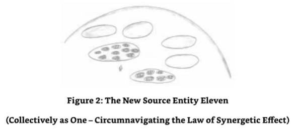

ME:I take it then you have got no idea how much you have grown in functional capacity as a result of this change in your synergetic state? 

我：

SE11 (collectively as one):No,not at this precise moment in your event space although I can say one thing. 

11号源实体（集体为一）：

ME:And what is that? 

我：

SE11 (collectively as one):It will be a multiple of twelve to the power of twelve (1212)and will,of course,include all of the synergetic effects as a multiple of this multiplication effect. 

11号源实体（集体为一）：

ME:But I would have thought that twelve to the power of twelve was a small number for you to work with?

我：

SE11 (collectively as one):Ordinarily,yes,but this includes the synergetic effects and how they are affected by such an increase.I can see that you are struggling to understand why such a small multiplier would cause me such a problem. 

11号源实体（集体为一）：

ME:Yes,I would actually.Even I with my rudimentary math skills could work it out on a reasonable spread sheet or scientific calculator. 

我：

SE11 (collectively as one):Oh,the arrogance of mankind!Yes,I agree with you in terms of the basic calculation,but as I stated before,this does not include the synergetic effects and how they are affected by the multiplication.Let me tell you this.To date neither "I collectively"nor "as one in singularity,"nor "we previously collectively"have been exposed to the opportunity for multiplying the synergetic effect.This is because there has been no point.There simply was no need to go there because we could not achieve that which was not achievable.When through this dialogue with you,"we"at that point in event space spotted the potential for a "loop hole."We realized that there would need to be a significant amount of retrospective work to quantify the effects of such an opportunity.This would and could only be achieved after the opportunity was actioned,so to speak. 

11号源实体（集体为一）：

ME:Didn't you want to calculate the effects of the "new"synergetic effects first though just to make sure it was worthwhile going through what I can only expect is an immense amount of work and preparation? 

我：

SE11 (collectively as one):No,because I/we at that point in event space knew where we currently stood from an efficiency perspective with the currently achievable level of synergy.The big factor was that I had a surplus of individualized units and as a result, could not make the best use of all these units from a synergetic perspective.It was a wasted opportunity for me to have all of these units of myself and not be able to gain the maximum usage from being in metaconcert and,therefore,attaining maximum synergy. 

11号源实体（集体为一）：

ME:So it sounds like this was an opportunity that was too good to miss,and you dove straight into the work necessary to configure yourself into the maximum number of entities in metaconcert to achieve the maximum synergetic effects at all twelve levels.It was so good an opportunity that you decided to work on the specification of what you were/are,so to speak,on a totally retrospective basis. 

我：

SE11 (collectively as one):Correct. 

11号源实体（集体为一）：

ME:One thing is bugging me though.You must have had an "odd"number of entities either left over from the work you wanted to do or a shortfall in the number of entities required to create the optimal number of synergetically singular collectives within all of the twelve levels. 

我：

SE11 (collectively as one):I calculated a shortfall of some significant numbers of entities. 

11号源实体（集体为一）：

ME:So what did you do,bearing in mind that you had some engaged in a dialogue with me and that you had moved away from that event space that was being used with me and created a new event space where you were able to do this new work on synergy? 

我：

SE11 (collectively as one):Firstly,I made myself back into one.Secondly,I decided to make those entities that were in dialogue with you a temporary function of that which was now a singular entity again.Thirdly,I diversified myself into the total number of entities needed to create the optimal number of entities required to affect the maximum number of synergetically singular units within themselves and on each of the twelve levels of synergy. The entities that were in dialogue with you were integrated into one of the synergetically singular units at the very top level of synergy and became part of the outer layer of one of the units.The change over from these entities in collective dialogue with you and that which is now me was noted by you almost instantly,for you started to call me SE11 (collectively as one)rather than SE11(collectively). 

11号源实体（集体为一）：

ME:You are right I did notice the difference rather quickly.I take it that this is a function of the "singularity effect." 

我：

SE11 (collectively as one):Yes,it is,and it is why it was a successful method of circumnavigating the law of maximum synergetic effect. 

11号源实体（集体为一）：

ME:Of course,that makes perfect sense.I do have to say though that I am somewhat honored to have been in the position to see a Source Entity change itself into another configuration in front of my very spiritual eyes,so to speak. 

我：

SE11 (collectively as one):There are many changes that Source Entities make that are out of sight of your spiritual eyes-changes that are made in a new or temporary event space, checked out,planned,actioned,optimized and modified.Nearly all the Source Entities have made some minor adjustments to their environments during the period used by you to commune with them.This is not an uncommon function;it is evolution.There are many changes that your own Source Entity has made in a covert way,and many of them have benefitted the entities that exist within its environment.One of them is your planet's ascension.The modifications it has made to your environment is a result of your-energetic mankind's,that is-response to receiving higher frequency energies to work with. 

11号源实体（集体为一）：

ME:I was under the impression that mankind itself created the rise in frequencies.Also,as a result of our creativity,we awaken whilst in the physical with the awakening creating access to the higher frequencies that create further awakening,and so on. 

我：

SE11 (collectively as one):Yes,that is true.It is true for all entities created by their creator. However,you can only ascend to that which is created for you to ascend to-the spiritual horse can be led to the spiritual water,but it is up to the spiritual horse to drink the spiritual water.The creator of the spiritual water cannot force the spiritual horse to drink it.It must drink of its own volition.Without the entities'participation with that which has been created for it to participate in,it cannot experience,learn and evolve.It will just exist in evolutionary stasis. 

11号源实体（集体为一）：

ME:So our Source Entity literally creates the rungs on the ladder for us to climb up.It is up to us individually to climb onto that next rung and see the change in the vista around us the higher we go. 

我：

SE11(collectively as one):Correct.This is the motivation for all entities-to keep on going, not to stop.Don't look back.Encourage others to come with you.Help them when they falter and encourage them when they do well.Seek their help when you need it;work together in gratitude,humility,and service. 

11号源实体（集体为一）：

ME:Thank you.I know we have been talking about my own Source Entity and its environment,but this is one conundrum that has been in the back of my mind for some time-specifically the dichotomy that there are waves of higher energies being sent to the earth and the local universe together with the thought process that we are creating our own ascension. 

我：

SE11 (collectively as one):Both work together.You create your own ascension by choosing to work with those new frequencies that are presented to you.You are not ascended.You ascend,but you can only ascend to that which is ascendable.Your ascension is,therefore,a function of your own willingness to work with that which is presented to you.In doing so, you are rewarded with the functions attributable with an entity of a higher evolutionary content. 

11号源实体（集体为一）：

ME:Thank you.That is a very important message;it must be conveyed now that it is understood. 

我：

### The Entities'Re-call and Re-absorption into Oneness 

Whilst discussing the modifications to our own Source Entity's environment to assist in the localized ascension of Earth and the physical universe it exists within,I had quite a major question to ask that was relative to the individualized units of Source Entity Eleven.It involved the transient re-integration of the individualized units of Source Entity Eleven and their re- diversification back into collectivity,a collectivity that would ensure the maximum synergetic effects could be achieved at all twelve levels without error.Source Entity Eleven (collectively as one)had rather "matter of factly"stated that it had recalled all those individualized entities that were it in collectivity,returned to oneness,and then re-diversified itself into the correct number of entities required to create the synergetic effect,but it had not commented beyond that. 

I was,therefore,very interested in understanding what had happened to the "individuality"that was part of the collective entities that were "re-worked,"so to speak.For instance,did they just "wink"out of existence,losing all that they had personally or collectively experienced?Or was the essence of them maintained in some way?I just had to ask this question,and ask it now, specifically because I was starting to become very aware that the dialogue with Source Entity Eleven (collectively as one)was starting to draw to a close.I could tell my time with this most interesting Source Entity was limited because the link,the connection between us,was starting to become less coherent.I decided to work fast on asking what might well be my last major question with Source Entity Eleven (collectively as one). 

ME:I almost forgot to ask you about those entities,that is,all of them that were re-called and re-absorbed into oneness before their energies were re-used in the creative process necessary to allow you to create the numbers required to support the maximum synergetic effect on all twelve levels.Did they lose their existence?Were their memories lost?How did you keep that which they "were"for future use,or did you just lose it forever with a view to starting again with this new configuration? 

我：

SE11 (collectively as one):Nothing is lost;all is gained. 

11号源实体（集体为一）：

ME:Now that's what I call a cryptic answer.Would you like to elaborate a little for me? 

我：

I had a wry smile on my face for I knew what the answer was going to be!

SE11(collectively as one):I lose nothing,and they lose nothing. 

11号源实体（集体为一）：

ME:Would you like to expand upon that?Do you mean that you saved their essence,their memories? 

我：

SE11 (collectively as one):When I recalled the individualized entities back into one,I looked at the contributions that each of them had made singularly but for the benefit of the collective that I was at that time.I recorded their work,how they achieved it,how they started it,why they started it,what strategies they used,whether they changed those strategies later,why they changed them,what was a success and what was deemed a failure. In fact,I recorded everything about them-the work they achieved singularly,in collectivity, in metaconcert and,therefore,in synergy.For a moment I thought about only reproducing the best performing entities and cloning them,but then I realized that I would miss out on the finite details of that which was created by the lesser performing entities,which although was insignificant in terms of its content when compared to the higher quality work,it was significant in terms of the minor and less exciting details.I,therefore,came to the conclusion that I would be better off creating a pool of memory that contained everything that all of the entities combined had experienced,learned and evolved with.In essence,I absorbed everything about every entity that was in collectivity. 

11号源实体（集体为一）：

ME:So what did you do with all of this knowledge,which I have no doubt included the individual personalities of the entities recalled into ones? 

我：

SE11 (collectively as one):Because each of the entities was,in essence,individualized units of me,I saw no need to keep them in the same configuration,personality-wise.Let me explain further.Personality is something that develops when an entity is separate from a group.This is essentially what happens to the energy that is used by an entity when it desires the evolutionary opportunity presented to it via incarnation.It is,therefore,what mankind experiences when incarnate.It is in variance to that which is experienced when energy is used to create an entity that is part of a collective of similar or same function Although each entity may have differing levels of contribution to the collective in totality, they all still maintain the essence of what they are both individually and collectively.They do this outside the need for complete individualization,which creates ego or personality. 

11号源实体（集体为一）：

With my entities not developing individualized personalities,the need to perpetuate the personality did not exist,so I was left with everything else that they had achieved or were achieving.The next thing I decided was a natural progression from attaining a momentary level of oneness and recording everything,which is a standard function of all Source Entities and our reason to be.I gave each and every one of the new individualized units of the singular collective all of that I had recorded from all of the entities recalled into oneness. Every entity gained everything about its peers.I created a complete facsimile of my new but temporary singular self in miniature.Each new entity that was to be part of the new collective was given everything that was ever achieved,no matter how big or how small,no matter what its role was or memories of that role,each were given everything. 

ME:And you created enough of them to maximize the synergetic effect at all twelve levels. SE11 (collectively as one):No,not quite. ME:What!?I thought you stated in an earlier dialogue that you created enough to satisfy the requirements for maximum synergetic effect on all twelve levels? 

我：

SE11 (collectively as one):I did. 

11号源实体（集体为一）：

ME:OK,now I am confused.It looks like I am not using the correct syntax in my questioning. 

我：

SE11 (collectively as one):I will help you out.I gave the entities the opportunity to use the full functionality that I have in many of my own functions.One of them was the ability to diversify themselves to that number necessary to create a group or collective that when in metaconcert was equal to that optimal number of entities necessary to achieve the maximized synergetic effect.I diversified myself in the numbers required to create the first four levels "only"in synergy.The entities themselves took over from that point onwards. 

11号源实体（集体为一）：

ME:You're saying that they diversified themselves to create the number of entities necessary to achieve the magic number for maximized synergy? 

我：

SE11 (collectively as one):In a word,yes. 

11号源实体（集体为一）：

ME:How did they do that? 

我：

SE11(collectively as one):By duplication.By this I do not mean the mere duplication of an entity "x"number of times;I mean that the entities entered into a state of diversification into a group rather than as an individual.This means that the individual becomes a smaller collective;it is a collective in its own right.It is the effect of the singular entity becoming a collective whilst in singularity that gave way to the law of synergetic effect being circumnavigated.

11号源实体（集体为一）：

ME:Not the collective becoming a singular entity with the synergetic effect being constrained in some way between the collective itself and the perimeter whilst still being within the perimeter of the collective being presented as a singular entity.Hence, the synergetic effect working but not being presented to that which is external to the collective-that is,the synergetic energies are captive within the perimeter of the collective singularity. 

我：

SE11 (collectively as one):I see that you are quoting that which I used to describe this effect earlier. 

11号源实体（集体为一）：

ME:It's the only way I could do it. 

我：

SE11 (collectively as one):So I see.But the effect you just described is the functional effect of the individual entity diversifying itself into a self-contained and singular collectivity, which by the way,also contains entities that have diversified themselves down into smaller singular collectives of the number required to achieve the maximum synergetic effect. 

11号源实体（集体为一）：

ME:They are all nested then? 

我：

SE11(collectively as one):Yes.Each of the entities that you can see on this outer layer is the last component in the nest of singular collectivity in metaconcert.Each of them is in unison, and each of them is working together in synergy at maximum synergetic effect without upsetting the law of synergy in any way.It is a total circumnavigation of this law with the evolutionary opportunity effects being currently beyond my level of computation. 

11号源实体（集体为一）：

Which,brings us back to where we were previously.

I need to accurately compute the synergetic levels of efficiency reached within this current configuration.This is now my most urgent piece of work,for The Origin is most interested in the effects on its evolutionary acceleration,and I am most interested in what I can achieve when I use this configuration when it is at its maximum capacity. 

You have been fortunate to have been in communication with me at this juncture in my existence.You have been even more fortunate to have been of assistance as well.This assistance,although small and in passing,has been most useful,and for that I thank you. Now I MUST leave you,for I have what you might call several of your millennia to calculate my new capacity. 

I leave you now.But know this: 

We will talk again,for you will be communing with The Origin in a very focused way very soon,and during this process you will be communing with all the Source Entities at certain junctures in the dialogue.Do not rush it;take your time,for there is much information for mankind incarnate to behold.I leave you now with a greeting from one of your more enlightened areas of the earth:Namaste! 

And that was it.Source Entity Eleven (collectively as one)cut its link in a most efficient way Except,that is,for a very small thread.I followed it as I assumed this would be necessary for spontaneous communication with it during the communication with The Origin.But I was wrong;I felt that this was no longer necessary because in this dialogue a permanent link was established between Source Entity Eleven (collectively as one)and me.I also noticed that I had a permanent link with all the other Source Entities that I had communicated with previously It was not a solid link;it was a link between friends-informal,instantaneous,loving,caring, powerful and wise.I was in awe.I followed the small fragment of a link that Source Entity Eleven (collectively as one)had left me.I saw all the entities that were the individualized units of singular collectivity in metaconcert.In full synergetic effect they appeared to be flashing as lights on a huge old computer display board,each winking and flashing in singularity and in synchronicity.Great waves of lights flashing and flowing at all twelve levels.Source Entity Eleven (collectively as one)had wasted no time.Before my very spiritual eyes,it was computing its new synergetic capacity.Again,I was in awe!

## Chapter Six - Source Entity Twelve Awakens 

With the communication with Source Entity Eleven (collectively as one)completedfor the moment,I mentally noted-I turned my attention to Source Entity Twelve,the last of the Source Entities,the one that had not become self-aware.I floated in mentality-that space I had come to realize was where I went when I was out of body and communicating with those entities that are outside of the frequencies associated with that energetic part in my incarnate body.At least that part of me that I was currently aware of.This "space"was that which I used to travel outside of the Source Entity One,the one that I considered myself associated to,even though energeticallyI am becoming more and more aware that I am not necessarily associated with the Source Entity fondly referred to as the Source Entity/Source Entity One/God. 

Was I having delusional thoughts here?I didn't think so,but who knows what reality is when one is captive by the act of incarnation.As one finds out about one's energetic heritage,one becomes more and more critical of one's mental state,and I was making sure that I was on an energetic level playing field.No matter how often I checked myself though,Ijust knew that it felt right to be where I was,doing what Iwas doing,and telling the world about it.One thing was sure though-I was starting to lose any inhibitions about "coming-out"about my ability and my dialogues with those Source Entities that are the creations of The Origin.This was knowledge that was old and needed to be broadcast.Mankind needed to be brought up to speed with this information. 

I looked around myself and saw the other Source Entities around me.They and their entities were "doing their own thing"for the evolution of The Origin,and they were working so very hard and doing so very well.I focused on the Source Entity that had not yet even started its evolutionary journey,the Source Entity that I had already called Source Entity Twelve.From the outside,its energetic perimeter looked uncontrolled.It undulated as if in some sort of battle with itself,like two chemicals mixed together in a sealed vessel that inherently did not mix and were desperate to be apart from each other. 

I moved towards it,and The Origin told me to be gentle in my approach and communication methods with this infantile Source Entity.I gently probed it,wondering what it would feel like energetically.As I was about to move away,I noticed that there was a surge of energy as if some sort of focus had been applied to the energies that were within Source Entity Twelve.I felt dimensions,sub-dimensional components,frequencies and event space,plus myriad other energies that I did not recognize all line up as if to attention.Suddenly it had structure,purpose, incentive,initiative,desire and,focus! 

The next thing I knew I was moved away gently by a huge and immense power.The Origin had swung into action and had seized control of Source Entity Twelve.A huge umbilical cord of energy,a huge vortex appeared from nowhere and engulfed Source Entity Twelve.I had seen this image before.It was given to me by some of the other Source Entities to explain how The Origin initiated contact with them when they first became aware of self.The Origin was in communication with Source Entity Twelve.As the communication continued,the energetic umbilical cord-the huge vortex of energy that surrounded Source Entity Twelve in its entirety -pulsed with energies that were nothing like those I had experienced in any of my dialogues with the other Source Entities-not even The Origin itself.I watched in complete awe,my mouth dropping open,aghast at the magnificence of what I had just realized I was witnessing-The Origin engaging in direct and intimate contact with one of its creations for the sole purpose of educating it,giving it its reason to be,its purpose in existence.I asked The Origin a question. 

### Prelude to Contact with Source Entity Twelve 

ME:I am totally in awe of the honor you have bestowed upon me. 

我：

O:Please explain. 

起源：

ME:Witnessing the first contact with an awakening Source Entity. 

我：

O:Ah,yes,well.Actually,it's not the primary contact,for that happened some time ago. 

起源：

ME:So what am I witnessing then? 

我：

O:Exactly what you described.I am telling Source Entity Twelve why it is in existence.This, however,is the secondary contact;I can only do this once it "wakes up,"so to speak.The primary contact was a check to see if the awakening process was imminent,which it was- several billion of your years ago.I do wish you didn't use time as a metric,but it's the only way I can describe the juncture in event space to you.At that juncture,I noticed the energies in Source Entity Twelve aligning into that configuration that is necessary for its becoming self-aware.

起源：

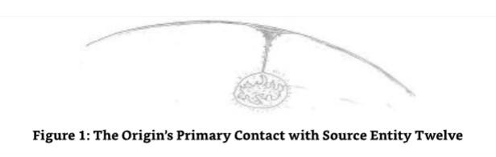

A few moments ago,I calculated the next juncture-that of the awakening proper:the event space of the secondary contact.Once I calculated this juncture,I brought you back to it.I see that I will need to bring you up to speed,for I can see you are struggling with what is happening here. 

ME:You bet I am. 

我：

O:And this isn't the first time you have seen this.

起源：

ME:Noooooo?Go on,enlighten me.I am all ears. 

我：

O:Source Entity Twelve became aware some time ago-some million or so years ago in your language. 

起源：

ME:So why did I keep seeing the images of it in its pre-awake state? 

我：

O:Quite simply,you were drawn to that event space.It was something you sub-consciously desired,i.e.,your higher,energetic self took you there.It also had the effect of making the picture complete from mankind's educational perspective.The awakening process experienced by a Source Entity is a rather special event to behold;Source Entity Twelve was the last Source Entity to experience it,so it was an obvious choice to be taken there- specifically since Source Entity Twelve is still in a rather infantile and "new"state of being. 

起源：

ME:But even my own Source Entity,or should I say,that Source Entity that I currently call my own,concurred that Source Entity Twelve had not yet become aware when I was typing the dialogues that became The History of God!What is going on here? 

我：

I was a bit disturbed that even my higher and greater energetic self had appeared to be contriving and doing things without me knowing!I suppose I should have expected it though. 

O:Your Source Entity saw where you were,event space-wise,and concurred that which you were seeing.Currently you move around event space in an uncontrolled manner.You are not even aware that you are doing it.Even though this is something that you do naturally in the energetic,this part of you that is incarnate has elected to take on-board that knowledge at a later date in your incarnation.I can only tell you this now because you have enough experience under your belt to be able to understand what is happening to you when I/we, that is,the other Source Entities,tell you.When you saw Source Entity Twelve in its pre- awake state,you were in that particular event space and not its current event space.In an attempt to keep things simple for you,your Source Entity,Source Entity One,simply concurred that which you saw and spared you the need to understand that which you would have had difficulty with at that juncture in your own awakening-your then current event space.From your perspective,what you were seeing was true because you were "in"that event space. 

起源：

ME:So where am I now,event space-wise?

我：

O:In essence,you are in an event space that is outside that which your physical body currently exists within.Source Entity Twelve has been self-aware for some time now in its "current"event space.This event space,where we are now,is that event space which houses its awakening.You are here to witness its awakening.Once this has been achieved,we can move into the current event space Source Entity Twelve is experiencing and commence dialogue. 

起源：

It was all starting to make sense again.I was relieved,for it meant that things had,in some respects,been set up for me (albeit by my higher self at times)rather than me being in the right place at the right time.Event space being what it is,I could witness any event I wanted to and actually "be there"as it was happening,which of course it is/was!I felt much more comfortable with this as it effectively meant that I wasn't being delusional or introducing fantasy or fiction. It was all merely a function of the greater reality-a greater reality that in my incarnate stateI am only a poor beginner at working with.My sanity is maintained-phew! 

ME:OK,now that I am up to speed,do you want to let me describe the rest of the event? 

我：

O:Carry on.It is important that you put it in your own words,for you will be picking up information that is not instantly describable. 

起源：

ME:Thank you. 

我：

I decided to go back into narrative mode.

I refocused on the image where Source Entity Twelve was in what I now know is the second contact with The Origin-the one in which Source Entity Twelve is being educated about its role and reason for existence.I found myself in that event space. 

"So that's how to move from event space to event space."I thought,but The Origin then told me that that method only works if you know where you are going and is not applicable for random event space travel. 

"It's a good start though,"I thought. 

In front of my mind's eye was the great indescribably vast vista that was The Origin's area of self-awareness.Far in the distance was Source Entity Twelve.It was coupled to The Origin with the energetic umbilical "cord"/the vortex of energy that The Origin used to engulf the Source Entities,cutting them off from the environment that was The Origin's area of self-awareness and educating them in a most intensive way.The energy pulsed through this umbilical vortex.As the information that contained Source Entity Twelve's education was exchanged,it changed color, energetic intensity,frequency,dimensionality and myriad other energies that I was not even aware of but could,nevertheless,sense. Source Entity Twelve glowed an iridescent golden color. 

Source Entity Twelve had only just become aware of itself when The Origin contacted it. Suddenly,its energies had aligned and become structured to enable independent and intelligent thought to take place-energy born into sentience.As I watched the education process take place, I noted that although this newly aware Source Entity was being given a repository of all that The Origin knew-which included all of the experience,learning and evolutionary content gathered by the other eleven Source Entities to date-this did not give it maturity.Maturity was something that it had to work on itself as part of its own evolutionary work. 

As I observed this most profound event,I noted that Source Entity Twelve was acting like a memory sponge,soaking up all of the content and using all of the sense channels it had to assimilate that which it was being given.As it received this information it undulated,twisting and turning,bucking and weaving whilst still being captive within the energies of the umbilical vortex that The Origin had created to initiate this most important communication process. The movement observed was not a result of resistance,merely the response to working with, experiencing and understanding the information that was being received-getting up to speed with the latest evolutionary content. 

As it absorbed this indescribably large torrent of information,it grew in structural stature, becoming more organized in its assimilation of the data.As it became more organized,its exterior became calmer with the undulations becoming fewer and fewer until it vibrated a fine constant vibration,trilling with delight and joy at that which it was receiving.Finally,the information that was being downloaded into the energies that were Source Entity Twelve was complete,and the umbilical vortex receded back into the background energies that were The Origin's area of self-awareness. 

All of the iridescence surrounding Source Entity Twelve diminished,and it hovered in front of me. A perfect sphere of structured energy-one sporting a dull but shiny grey outer energy surface looking like the surface tension we see in droplets of water-had replaced the unorganized, unstructured glob ofenergy that Source Entity Twelve was before it was in direct contact with The Origin.The sphere was representative of the neutral form organized energy displayed before it is given purpose and direction by that which it is in sentience. 

I sat at my computer silent,still,in awe and wonder at what I had just witnessed-full in the knowledge that the words I had just typed were,at best,inadequate in describing what I had seen,felt,and experienced on all levels.The English language was just incapable of being used as a communication tool in this instance.Telepathy would have been better but only just.I decided to insure an imprint of the energies I received during this momentous event were embedded into the text I was typing so that the reader gained an impression,no matter how small,of the all- encompassing sensory overload I had experienced when in observation. 

It was like being swept up by a tornado and tossed around in the immense force of its wind whilst also being totally safe,just observing and enjoying the ride,not having time or ability to assimilate or understand that which was being experienced.As I looked inside Source Entity Twelve,I gained an image of it being compartmentalized with each compartment representing that which had been given it by The Origin,including the experiences,learning and evolution of each Source Entity.I noted that all of the other Source Entities had a similar arrangement- somewhere within their energies.

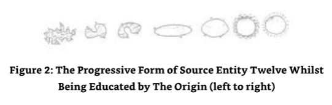

ME:Can I communicate with it now? 

我：

O:You can but be gentle in your approach,for it is not yet used to being in contact with any other entity other than Me. 

起源：

### Initial Contact with Source Entity Twelve 

I gently entered into its energies,passing the periphery of its energetic boundary,the boundary that designated the difference between The Origin's area of self-awareness and those energies that had been assigned to the entity that was Source Entity Twelve. 

SE12:Who are you?What are you?You are not of me.Why are you here?I don't recognize your energy.You have the signature of my creator,but you are not my creator.I have just met my creator,and you are not it,but you are it.What are you?How can you enter into my energies without me stopping you?This is most disturbing.I am not happy with this condition. 

Creator,what is this?What is happening? 

O:Be calm my child,for that which is within you is also one of my creations.We are one with it,and it is one with us whilst it also has singularity as you do. 

起源：

SE12:But it is soooo...small!How can that which is so small be of your energies? 

12号源实体：

O:Remember the beginning!

起源：

I recognized those words as a command.With that command Source Entity Twelve withdrew within itself momentarily and returned.It was much happier when it next spoke. 

SE12:It is of the OM.I understand.But I have no OM.Will it be my OM? 

12号源实体：

O:No it will not be your OM,for it is independent of the need to be associated with a particular Source Entity.It is beloved of the OM,it is Pure of the OM,and it is of the original manifestation and is independent. 

起源：

SE12:And it wants to commune with me for a while? 

12号源实体：

O:It does,and it will follow you in certain event spaces that are close to this one. 

起源：

SE12:It can do that?Oh,it will be fun.I have a desire to move through event space.It interests me. 

12号源实体：

O:Good,it is good to have an initial interest;it gives you purpose and ideas about what you will do to support your evolutionary growth. 

起源：

SE12:I like evolution.It sounds fun.This entity within me,this OM energy,it wants to commune with me? 

12号源实体：

O:It does. 

起源：

SE12:When will it start? 

12号源实体：

O:It can start now. 

起源：

ME:Yes,I can start now if you wish.

我：

SE12:Oh,how strange,I can understand it. 

12号源实体：

O:Of course.Its intention is communicated in its own language which is picked up by you as standard energetic communication. 

起源：

ME:How does that work? 

我：

O:Your intention is broadcast through your energetic self and not through your physical self.Your energetic self-communicates on the common frequency channels used for communication.You communicate on ALL sense levels whilst in the energetic,and this is what you use whilst in communication with me and the other Source Entities. This broadband method of communication is reduced as it descends down the energy chain between your energetic self and that part of you that is incarnate.Eventually, it is represented by the spoken word,the five senses,including the telepathic and empathic channels which also include the psychometric,clairaudience,clairvoyance and clairsentience responses. 

起源：

ME:Thank you for that explanation.Source Entity Twelve,can I call you Source Entity Twelve,for that is what I recognize you as? 

我：

SE12:You may.I do have to say that I find this rather exciting now that I know what is happening.You are the first real communication I have had with another entity other than my creator,The Origin. 

12号源实体：

ME:Well you will also be delighted to know that we are surrounded by the other eleven Source Entities who are watching with very interested eyes.

我：

SE12:Oh yes,I can see them all.Will they communicate with me as well? 

12号源实体：

O:Later.Communication with this smaller entity is your current goal. 

起源：

SE12:OK,let us start then. 

12号源实体：

### Dialogue with Source Entity Twelve Commences 

I felt a little bit hesitant.This was not a feeling that I had,at least not with this level,when considering commencement of dialogue with the other Source Entities to date.It was a strange feeling,so I decided to investigate it.As I contemplated this hesitant feeling,Ifound myself in a semi-meditative state.Removing the physicality of myself,I was able to recognize my hesitation. It was the lack of direction.No,it was the lack of data that was affecting me.To all intents and purposes,Source Entity Twelve was a newborn entity.During SE12's education process,The Origin had given SE12 extensive information about itself and the other Source Entities,but SE12 had not yet achieved anything itself. 

I was stuck.What in the omniverse could we talk about?From the start of this work,I knew that the other Source Entities had been in some sort of independent and aware existence for some considerable time.They had created,achieved,modified,re-achieved,nurtured,experienced, learned and evolved.They had data to discuss,but Source Entity Twelve did not-currently,that is.I contemplated further. 

As I relaxed in my chair,I was given a few images of experiences that we would have together during our undeniably short period of existence together.I noted that I was logging into different event spaces and seeing that which I/we were to experience together.Comforted by this "premonition,"my hesitation melted away,and I settled back into the interviewer role.I sought out Source Entity Twelve and initiated contact.It was to start with a bit of a bang! 

SE12:Where have you been? Source Entity Twelve sounded a bit like a petulant school boy! 

12号源实体：

ME:What?Oh,sorry!I have been contemplating what we can discuss.To be honest,I was thinking that this was going to be really difficult specifically because you have not "done" anything yet that I can see.I am a bit like a fish out of water here because the other Source Entities had a history,so to speak,that I could work with. 

我：

SE12:What is this fish and water? 

12号源实体：

ME:You can access my energies if you like and absorb that which I have accrued in my existence.That is,in "ALL"of my existence. 

我：

SE12:Ah,yes!I see.You are outside your known environment,but this is only a transient environment.How interesting.You like to be in an environment.My peers like to be in an environment.Now I understand.But an environment is not necessary,is it? 

12号源实体：

ME:That depends upon how one wants to limit one's self and with what one is comfortable -or,indeed,whether one considers association with an environment to be limiting,which I do not. 

我：

I was to learn the significance of what was being said here later-towards the end of the dialogue.

SE12:I think that an environment may be a limitation,but I can see that you would find it an interesting conundrum. 

12号源实体：

ME:Why would you think being within an environment,a multiversal environment,"is" a conundrum? 

我：

SE12:Because I see no need for such a function. 

12号源实体：

ME:I am struggling with your thought process here.Can you elaborate a little?Can you help me out? 

我：

SE12:I can see that I will have to use one of your own memories to help explain what I think and feel. 

12号源实体：

ME:Please do.You have a free reign;please feel free to access at any time that which is my history-all of my history from my creation to my becoming self-aware and that which I have achieved to date.You have my permission.You don't need to ask again.I give you this information freely. 

我：

SE12:Thank you.I will absorb that which is you although I note that I already have this information.Mmmm,interesting.Ah,yes,of course.This is part of the data set given to me as part of The Origin's education process.I have in my energies and memory all of the experience,learning and evolutionary content of all the Source Entities,and they are experiencing me right now as is The Origin.I will not need to access you from now on, for I know all about you from that which was given to me by The Origin.I merely need to look into myself to see you.Mmmm,you are not what you seem,but you are!You are a conundrum.I have decided that I like conundrums.I like you.We can work and play together for a while if you wish. 

12号源实体：

ME:I am honored. 

我：

SE12:But I see that we are already working together.You are asking me about why I see no need for an environment. 

12号源实体：

ME:I was.I am very interested in that point of view,that thought process. 

我：

SE12:I think you will be disappointed,for I have no real reason why I think this way.It's just that I see my...brothers?Is that the right word? 

12号源实体：

ME:Actually,I think it's ideal. 

我：

SE12:Good,I see my brothers being happy to do what they are doing within the constraints of the environments that they have made of themselves.I feel it is limiting in some way.I don't know why.I just think and feel that it is.I will need to consider this in some detail. 

12号源实体：

ME:Well,I do have to say that what you have told me is as good an answer as any,and it is one that I can relate to.One does not need to have an explanation for what one is feeling.I can also see that to all intents and purposes,you might like to do something different than that which has been achieved or is currently being achieved by...your brothers,so to speak. 

我：

SE12:I am not too bothered about what they have achieved-more what I know I want to do with my existence.Right now I am not sure what I want to do.I will have to think about this. Please excuse me.

12号源实体：

With that last comment Source Entity Twelve disappeared from my energetic view.This was a bit strange?Why did it need to disappear?I was just thinking that I could nip off for a drink or something when Source Entity Twelve returned. 

SE12:Sorry about that.I needed to consider what I wanted to do. 

12号源实体：

ME:Ah,so that's why you disappeared.You wanted to be alone with your own thoughts. 

我：

SE12:Yes,and it took some time.I worked on what I needed to experience. 

12号源实体：

ME:And? 

我：

SE12:I decided that I needed to experience many things before I could start the work that is my own way to help The Origin evolve. 

12号源实体：

I suddenly had a bee in my bonnet,so to speak.I needed to ask a question to confirm a thought I just had on the period (the length of time)Source Entity Twelve had spent on getting to the decision it had quite obviously made. 

ME:You said you took some time to work out what you needed to experience.Exactly how long did you take?You can use the metric mankind uses if you will,for although it is nonsense from your perspective,it is something both my readers and I will understand. 

我：

SE12:I decided to go into another event space to allow me to have both the"time"to consider that which I needed to experience and the maintenance of the "time line"to ensure the continuity of this dialogue.

12号源实体：

ME:Ah,yes,I thought that was what you had done.So how long did you spend considering your future experience? 

我：

SE12:Several,let me see,millions of what you call millennia. 

12号源实体：

ME:Several million thousand years?(It doesn't sound right to me either,dear reader.) 

我：

SE12:Yes.I took great care in what I was doing.I thought about it a lot. 

12号源实体：

ME:I can see that over that period of time one might well think a lot about what one was going to experience. 

我：

SE12:But it did not seem like a long time.For it was no time at all. 

12号源实体：

ME:Yes,I can see that you might see it that way.One thing that you need to know,and I am sure that you do know is that the genre of beings that I am currently associated with are only just starting to realize that time does not exist as a quantifiable medium.Only those who are becoming spiritually aware and maybe those theoretical scientists who are starting to recognize that which is the greater reality by their own experiments in theoretical physics are recognizing the non-existence of time in the greater reality.The vast majority of incarnate mankind considers time as being a dimension. 

我：

### Humor as a Communication Medium 

With that I heard Source Entity Twelve laugh.This surprised me for I simply didn't expect it to respond in that way.

SE12:Sorry,sorry,sorry!I am sorry.Even in my immature state in terms of my own evolution,I can recognize that to be a complete nonsense.No wonder mankind gets in the mess it does.Oh,I have just recognized something.That made me laugh.I enjoyed the juxtaposition of that which you told me-that something which does not exist can be considered a major component in The Origin's make-up.Funny!It was VERY funny.Now then,you call that which makes you laugh,humor.I like humor.It's fun. 

12号源实体：

I gained an image of Source Entity Twelve in very human terms;it gave itself a face-one that was young but old,immature but wise,powerful but gentle,with a great big smile on its face. 

ME:I am glad you like humor.It is something I like as well.I feel that everything within The Origin has its own humor. 

我：

SE12:It does.It is an important concept to work with,understand and use.It is a"relief"to use such a communication medium. 

12号源实体：

ME:I didn't think that humor was a communication medium. 

我：

SE12:It is.It is one of the most important and successful methods of communicating that we all have. 

12号源实体：

ME:We have comedians who tell jokes on the planet of my current incarnation. 

我：

SE12:Ah yes,so I see.No,that is not the sort of humor I was thinking of when I said that it was an important communication medium.What I meant was that it is one of the most efficient ways of communicating,especially for those of the lower frequencies for it makes the information that is being conveyed more attractive and,therefore,more readily accepted and assimilated. 

12号源实体：

ME:We call that making work fun! 

我：

SE12:Is not fun humorous? 

12号源实体：

ME:I suppose it is.I had never thought of it in that way. 

我：

SE12:Fun is funny,and humor is another way of saying funny,is it not? 

12号源实体：

ME:Yes,and if I take it further,having fun whilst working makes the work more interesting, more palatable.It makes it desirable. 

我：

SE12:And it is the desirable aspect of humor that is translated to the information that is being conveyed,therefore,making it easy to receive and understand and a delight to work with. 

12号源实体：

ME:Wow!When did you become an expert on humor then? 

我：

SE12:It is part of the information that The Origin gave me when it educated me. 

12号源实体：

ME:Yes,of course.I was forgetting that you now have in your energies ALL the information collected by the other Source Entities and The Origin to date. 

我：

SE12:Yes,it does come in useful,but it is a distinct reminder to me that I need to get started with some of my own work. 

12号源实体：

### Source Entity Twelve Starts Its Work and Invites Me Along for the Ride!

ME:Before we had the slight interlude and talked about humor being a communication medium,we were talking about the previous gap in our dialogue where you entered into another event space so that you could work out your own strategy for evolving.You took no more than a minute of my time,but you stated that you had taken the equivalent of millions of millennia in your decision process. 

我：

SE12:It did.I was considering many things. 

12号源实体：

ME:What did you consider?It must have been an awful lot because it took you a long time. 

我：

SE12:Actually,it took me a multiple of the time I quoted you. 

12号源实体：

ME:Can you elaborate for me? 

我：

SE12:Yes.I was using event space in what you would call a parallel method;it was parallel processing,as you would say. 

12号源实体：

ME:Are you suggesting that you were considering everything in a multiple way? 

我：

SE12:No,I was saving time,so to speak.I looked at the amount of work I needed to do and decided to use the event space in a way that allowed me to do certain percentages of the work in different event spaces concurrently. 

12号源实体：

ME:How many event spaces did you use? 

我：

SE12:Twelve.One for each of the Source Entities and one for the information given to me by The Origin about The Origin. 

12号源实体：

ME:I wasn't aware that an entity could use event space in that way.I thought that we created a new version of event space every time we approach a major decision point.It sounds reasonable though. 

我：

SE12:It's more than reasonable;it is an entirely practical way of achieving more output.I will continue. 

12号源实体：

ME:Please do. 

我：

SE12:It,therefore,took me that amount of time to digest that which was necessary from each of the Source Entities to make me realize what they had each achieved,what was work in progress and what was planned by them.Armed with this information,I could then conduct my own planning and establish that which I intend to do to experience,learn and evolve in my own right whilst also avoiding any duplication of the others'work. 

12号源实体：

ME:I would have expected a small percentage of duplication,not full duplication but just a minor amount-like for instance,in the structure of the environment you are planning to create if,indeed,you are creating one? 

我：

SE12:I decided that there would be no duplication and that what I would do would be both new and novel. 

12号源实体：

ME:When do you intend to start you work? 

我：

SE12:I have some basic work to do first-mainly in the experiential side of things-but the real work will start in earnest once I have completed this dialogue with you.But you are welcome to join me in some of the things I have decided to experience before I start.

12号源实体：

At this point in the dialogue I decided to take a little moment for contemplative meditation. To my knowledge,no other Source Entity had used event space in a parallel processing way before.Travelling between the events,yes;using them to work on something whilst in concurrent discussion with me,yes;however,not in this way because it required the Source Entity in question to divide itself up into the different event space locations to do the work.This was a"first"for Source Entity Twelve,and I got the impression that it would continue to chalk up its list of"firsts" throughout its existence.It simply did not seem to have any form of limitational thinking.It jogged my attention back to the dialogue we were having. 

SE12:I want to experience as many event spaces as I can.I want to move between them so fast that it will blur their edges and make me experience one huge event space.I can bring you along for the ride if you want. 

12号源实体：

ME:Yes,why not?It will be an experience. 

我：

I braced myself mentally,I had no idea what to expect. 

Suddenly I was aware of an immense feeling of movement without movement,acceleration without acceleration,and being in a location that had no location.In my mind's eye,I saw pictures,3,600 by 3,600 images.I could see that which was in front and behind me,above and below me,to the left and to the right of me concurrently.It was like peripheral vision all around me.We moved from image to image,faster and faster.Each image was an event space,not specifically mine but any event space.There was no discrimination as to direction or originator of the event spaces being traversed.The event spaces were from all of the Source Entities and the entities they had created,including those event spaces created by The Origin.We were whizzing down,around,through,up down event space. 

The feeling was immense.I was seeing civilizations based in suns,nebulae,dimensions, continuum,frequency and event space itself,and then we were off somewhere else,seeing other events,places,environments,faster and faster changing direction in a completely random way. 

"Wo hoo!"I heard Source Entity Twelve say. 

"Some things are the same in any language and with any entity,"I thought. 

We were moving faster now,so fast that I couldn't keep up with what I was seeing.My mental processor was being overloaded.Just at that point we appeared to stop. 

No,we hadn't.Ifelt that something special had just happened.Source Entity Twelve spoke.

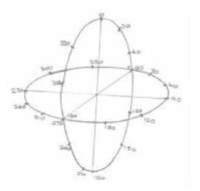

SE12:Made it. 

12号源实体：

ME:Made what? 

我：

SE12:We are moving at a speed which allows us to traverse all event spaces concurrently. 

12号源实体：

We had reached some sort of terminal traversal velocity.Everything appeared to be everything, which appeared to be everything else.It was all the same,even though I knew it was different.It was separate;it was separately together.Now where had I last used that phrase I wondered? 

I was dumb-struck. 

Suddenly everything turned white. 

SE12:What you can perceive-and that is not everything by the way-you couldn't cope with it-is the image that is created when we traverse ALL event spaces concurrently.We are in and experiencing each and every event space created by each and every entity all at the same time.Everything is an overlay of the other.From this juncture,all event spaces can be experienced and enjoyed. 

12号源实体：

### Source Entity Twelve,an Expert on Event Space! 

ME:Why did everything just turn white?

我：

SE12:Your perception went into input overload,and,as a result you blanked everything out. Focus a bit more,and you will regain a filtered version of the image you tried to access.But do not try too hard. 

12号源实体：

I focused my mind's eye,my perception,to try to see the filtered image that Ifelt Source Entity Twelve sent to me.As I concentrated on what I perceived,I felt like I was floating in a huge goldfish bowl without an opening at the top.This was not a new feeling,for Iget this wheneverI am in The Origin's area of self-awareness and not inside the energies of a particular Source Entity as I was currently.There was a difference though. 

Even though the volume of this goldfish bowl-this all-encompassing bubble of event space "in totality"-appeared to be clear but slightly blurred like nothing was there to see,all I had to do was focus my intention in a certain location in event space,such as a part of my own past.I saw it and was part of the event instantly. 

The moment I removed that focus,even for an instant,that image including the "being part of" the event,was dissolved,and I was back in the clarity of what I can only describe as the clarity of event space "in totality.When I accessed a particular event,it was just as if a bubble of event space came from nowhere and engulfed me,placing me in that particular event and event space. When I removed the focus,the bubble just dissolved or disappeared,and I was ready to focus on another event space.I decided to ask Source Entity Twelve what the process was that I was experiencing because I had afeeling that,even though my dialogue with it had been short,it had accrued countless millions ofyears of experience on this subject whilst in another event space.

ME:Why do I see this area of event space-that is,where we are travelling through all events concurrently-as an area of blurred clarity?And why do I see an event that I focus my intention on appear as a sphere that comes from nowhere and engulfs me? 

我：

SE12:That is the way you are allowing yourself to perceive the function of entering into event spaces.Remember you are seeing this in a very,very filtered way. That is why it looks clear but blurred. 

12号源实体：

That which is part of those event spaces that are being traversed is simply not perceivable in your particular state of existence.We are currently at a velocity where we are passing through every event space concurrently so when you focus on a particular event space you pluck it out,so to speak,and it travels at our velocity as well.That is why you can perceive it. 

ME:How can we "pluck"an event space out of its current location?Isn't event space an environment of its own? 

我：

SE12:Of course.Just as a universe as a separate and isolated environment is a function of the separation of dimension and sub-dimensional component into frequency bands in your Source Entity's multiverse,so that which creates the overall environment of event space "in totality"is the function of all of those thought processes of myriad energetic entities, which creates a separate but specialized event space within that which is event space "in totality."That part of event space which is individualized is created from those energies that comprise the environment that is the wider event space or event space "in totality." 

12号源实体：

ME:I get the feeling that there is more though.Whilst I was typing this part of the dialogue, I gained an image of event space expanding.Is this possible?

我：

SE12:Yes,it is,and it does.Let me elaborate for you,for I have allowed a considerable amount of my energies to be used in the investigation into the uses of event space. 

12号源实体：

ME:I thought I had the feeling that you were suddenly an authority on the energies that make up event space. 

我：

SE12:No more than any other Source Entity,but I do have to say that I have spent some considerable additional time and energies on personal study that has,nevertheless, benefited my level of understanding event space in a most positive way. 

12号源实体：

I was starting to note that Source Entity Twelve was sounding more and more mature as our dialogue progressed.What additional work was it doing behind the scenes in another event space?It was catching up-fast! 

SE12:I will continue to answer your question. 

12号源实体：

ME:Please do. 

我：

SE12:To all intents and purposes,event space is elastic.As the number of individualized event spaces increases,so the total volume of event space "in totality"increases to compensate for it.I know what you are thinking.How can it increase when the energies that are event space must have been finite.For example,when the total volume of individualized event spaces equals the total volume of original event space,how can more event space be created when it has all been used up? 

12号源实体：

ME:I have to admit you beat me to it. 

我：

SE12:Naturally.Sorry,I couldn't resist having a bit of fun with you.

12号源实体：

ME:No problem. 

我：

SE12:When the event space "in totality"that is currently being used is full,event space is capable of expanding within itself,creating a full environment of the wider event space "in totality.”

12号源实体：

ME:Hold on.Are you saying that there are more than two classifications of event space? 

我：

SE12:Yes,there are much more than two,and we are currently passing through ALL of them concurrently. 

12号源实体：

ME:But simplistically,we are currently discussing the "fact"that event space "in totality" is comprised of the wider environment of event space,which has event space "in totality" within,which is comprised of individualized event spaces. 

我：

SE12:Correct. 

12号源实体：

ME:So how can event space "in totality"house an equivalent event space "in totality"within the same event space,space? 

我：

SE12:By creating another event space. 

12号源实体：

ME:Now I am confused. 

我：

SE12:Event space has a signature which can be modified,allowing two event spaces "in totality"to exist in the same event space concurrently. 

12号源实体：

ME:I have just received an image with the information that suggests that event space "in totality"has gaps in it,and the change of signature allows a new event space "in totality"to be created that fills in the gaps. 

我：

SE12:There are no gaps in event space,except those that are created to allow expansion and subsequent inclusion of a new event space"in totality"within the previous event space "in totality."When event space expands to a point that is,let's say,beyond its elastic limit, its perimeter expands further,creating temporary gaps in event space "in totality."These temporary gaps are filled with a newly created event space "in totality"creating a new but empty event space "in totality"within the same volume as the previous event space "in totality"whilst existing concurrently.In essence,event space "in totality"can house only a certain number of "entity created"event spaces before it needs to be expanded and replaced. That number is infinite to you,but to a Source Entity or The Origin it is a finite condition which is supported by a known method of expansion and subsequent contraction to allow the process to be repeated when next required. 

12号源实体：

ME:Are any of the previous entity created event spaces lost during this process? 

我：

SE12:No.Everything is maintained and nothing is lost.In actuality,many event spaces naturally converge and remain converged,thereby saving event space so expansion is not a regular event in event space "in totality." 

12号源实体：

### A Change of Direction and a Question on the Awakening of Source Entity Twelve 

I was feeling that we had moved very fast in this dialogue,almost too fast.One moment Source Entity Twelve was in the process of becoming self-aware,sounding very immature to me.The next it was like talking to afully self-aware experienced Source Entity.I decided that I needed to re-wind a little and pay some attention to the awakening process that Source Entity Twelve had experienced. 

ME:I am very aware that we have moved on to discuss certain subjects a little too fast,and we have potentially missed a very important piece of dialogue here. 

我：

SE12:OK,do you want to elaborate? 

12号源实体：

ME:Yes.I am starting to recognize that you may have taken a rather unique route in the process of becoming self-aware.I would like to explore this further,please. 

我：

SE12:Fine with me.What question do you want to ask? 

12号源实体：

ME:Well,quite simply,what was it like becoming self-aware?What I am getting to here is the fact that you were the only Source Entity to become self-aware with all other Source Entities and The Origin already self-aware whilst being some way,if not considerable ways, down their specific strategic evolutionary paths.This must have been quite intimidating? 

我：

SE12:During the short dialogue we have had,I have gone from being barely aware to being fully educated and fully self-aware.Even you can see this. 

12号源实体：

ME:Correct,I can-hence,the question. 

我：

SE12:During the time that I was being educated by The Origin,I never once thought that I was anything else than that which I was,one of the Twelve Source Entities.However,when I encountered you,and you were within my energies,it was quite a shock.Being educated and of a level of maturity that goes with such an education takes some time to get to,and you caught me at a point in my maturity where I simply was not ready to either communicate or indeed encounter,specifically within my own energies,another independent,self-aware and sentient energy.I was confused to the point of distraction.I decided to use the facility that event space offered to investigate this feeling and others,together with,as previously stated,that evolutionary work already achieved by The Origin and my peers.Within this period I used some of my spare capacity to research and work with those energies associated with and classified as event space.Mainly though,I looked at the work that my peers had done to date and analyzed what I could do that would augment what they had done.I considered myriad other ways to work with copies or variants of the work that the other Source Entities had embarked upon.I even considered taking on an amount of work within event space that allowed me to replicate each and every thing that my peers had created in entirety within their own multiversal environments and put it all in a series of interlinking event spaces,allowing it all to merge together,creating a micro-environment,based upon The Origin's structure. 

12号源实体：

ME:That sounds like a very good idea.And what's more it would provide some significant evolutionary content. 

我：

SE12:That may have been true,but it didn't cut it for me.I decided that my peers had-and you won't have witnessed this in your current form-covered most,if not all,of the angles of interest,so to speak. 

12号源实体：

ME:I would have thought that was impossible? 

我：

SE12:Well,correct!They had covered those areas of interest that I was initially considering, and as a result,I have and am considering other evolutionary opportunities.So to answer your question,yes I am in a unique position being the last Source Entity to become self- aware.First,I have been able to assimilate all of that which has been accrued to date by my peers and The Origin.Second,I have been able to mature faster than normal as a result but relatively speaking only,as I have not yet created,nurtured and achieved anything myself. In essence,I am still fresh,as it were.And third,I am in a bit of a quandary as what to do to augment The Origin's evolution because I want to do something that does not repeat in some small way,in some part,no matter how small,that which has,is currently,or will be achieved by my peers. 

12号源实体：

### A Source Entity in a Quandary-A First! / A Decision to Make in Evolutionary Growth 

ME:I can see that you have quite a decision to make as to which direction to take your evolutionary growth,including how it can affect the evolution of The Origin in a positive way. 

我：

SE12:Not so much a decision but more of a robust plan,and then a decision to implement it once I have proved it to be consistent with what I want to achieve.As you can tell from the dialogue we have had,to date I have not yet even considered a strategy of any sort. Other that is,than using event space to accelerate my own education and subsequent level of maturity.The issue here is that education does not create maturity.Being creative and subsequently responsible for that which is created,for nurturing it,creates maturity,and I am acutely aware that I am still immature,relatively speaking,and in comparison to my peers. 

12号源实体：

ME:So can I help in any way? 

我：

I heard Source Entity Twelve laugh again. 

SE12:What could you possibility do to help me? 

12号源实体：

ME:I might offer some suggestion or other that might set you off in a certain direction.Not being close to the issue myself,I might give you a direction that you have overlooked. 

我：

SE12:Unlikely,but I like your fervor.I like you.You are limited,but you express un- limitedness even though you can't demonstrate your un-limitedness.You are a true conundrum.I like conundrums I have decided,and you are,as such,one of them.Maybe you can help.We will see.Maybe just communicating with you will be a catalyst for me to make the right decision,to consider that which is under the smaller stone rather than looking under the larger stone,so to speak. 

12号源实体：

Mmmm,it is worth considering... 

Source Entity Twelve appeared to have gone into itself and was thinking.I waited patiently for it to reconnect with me and continue the dialogue.It returned,displaying what I recognized as the having "a smile on its face"energies.It returned to me as if in mid-sentence. 

SE12:...What's more,I like that thought more and more,for it is something that my peers have not done. 

12号源实体：

ME:What is something that your peers have not done?

我：

SE12:Enlist the help of a conundrum,an entity that is a smaller part of The Origin and not a Source Entity.An OM whose communication with me is not currently OM "in purity" but nevertheless exudes OM-ness "in purity."You are the first "un-pure""pure"OM I have come across in all my education.Maybe it is to do with the association with the physical vehicle required to exist within the lower frequencies of the Source Entity you are currently associating yourself with.I will see what comes of this association,for I can't see how it will help me in my decision process,but it is a first!And of that I am pleased.One thing I have now decided is that I am going to do things with a view to them being a first! 

12号源实体：

ME:Hasn't every Source Entity initiated a first at some point in its existence? 

我：

SE12:Yes,of course.But when they were creating their strategies for evolution,they were in communion with each other to a certain degree-making decisions together or making agreements with one another as to what each of them was doing and why they were doing it and agreeing not to fully tread on each other's toes,so to speak,or steal each other's thunder. In essence,they built upon the work of each other,filling in the gaps,addressing that which was their interpretation of what could be achieved even though it might have looked as if it was or had been done in some sort of isolation.This was only possible because of the close proximity in event space "in totality"of their becoming self-aware.I,on the other hand, have only just become self-aware,and this is in a new event space "in totality." 

12号源实体：

### The Second Event Space "in Totality" 

ME:Hold on,that's quite a statement!You have just made quite a statement.

我：

SE12:Excuse me? 

12号源实体：

ME:You just said that we are in another event space "in totality"than that which was in existence when the other Source Entities were working together to establish their own strategies for evolutionary growth. 

我：

SE12:Yes,I did. 

12号源实体：

ME:So how many event spaces "in totality"are there? 

我：

SE12:Two to date. 

12号源实体：

ME:So which one is this? 

我：

SE12:This is the second.When we traversed all event spaces earlier in our dialogue,we traversed all of those event spaces from both event spaces "in totality." 

12号源实体：

ME:But when you gave me a description of how event space"in totality"was elastic and how it expanded within itself,filling in the gaps so to speak,I got the impression that this had occurred many times. 

我：

SE12:What I explained was that particular functionality of event space "in totality."I did not elaborate on how many times it had occurred. 

12号源实体：

ME:Touche.So this is the second version of the "totality"of event space. 

我：

SE12:Yes.Event space "in totality"is large.It is very,very large.It needs to be in order for it to house all the event spaces created by each and every one of the entities created by my peers,including,of course,those event spaces created by my peers themselves.

12号源实体：

ME:So event space is a function of The Origin then-and not a function of the multiverse created by a specific Source Entity. 

我：

SE12:Correct,it always has been.But remember,everything is a function of The Origin,for The Origin is "All There Is." 

12号源实体：

ME:Right! 

我：

### The Six Points of The Origin-Navigation Points of The Origin's Area of Self-awareness 

SE12:It's time for me to experience.I need to experience.I want to experience the volume that is The Origin.I am going to go to the six points of the volume of The Origin's area of self-awareness. 

12号源实体：

ME:When are you going to go to these six points of The Origin's area of self-awareness? 

我：

SE12:Now,and you are coming with me.Hold on!

12号源实体：

I suddenly felt like we had hit a brick wall-no,it was a steel wall,an incredibly thin but incredibly strong steel wall.It was clear whilst not being clear?!The wall rotated and the environment I was used to seeing in my mind's eye had changed.The other Source Entities were nowhere to be seen.We had changed location. 

### Point One-The Top(and a Minor Detour) 

SE12:We have arrived.We are at the location I will call "the first point."

12号源实体：

I got the impression that I had not done this before with my Source Entity.I felt that it stayed where it was.Since creating its multiverse,it had maintained its location,a fixed location within The Origin's area of self-awareness. 

ME:Is it the first point?Does The Origin call it "the first point"? 

我：

SE12:No,it's not and no,it doesn't,but I will call it "the first point"for the moment because it is the first point,the first "axis"point of The Origin's area of self-awareness that we have arrived at.We will use this as a datum for navigation. 

12号源实体：

ME:We need to navigate? 

我：

SE12:Yes,of course.Although known about,this part of The Origin is still somewhat uncharted territory. 

12号源实体：

ME:I was under the impression that The Origin had mapped its entire area of self-awareness. 

我：

SE12:Not quite,that's why we were created. 

12号源实体：

ME:But you suggested earlier that my Source Entity had not moved from the location that it is currently in,and I assumed from that,that the others had not moved either. 

我：

SE12:Correct. 

12号源实体：

ME:So who is mapping it out? 

我：

SE12:Currently the OM.

12号源实体：

ME:Can you elaborate for me? 

我：

SE12:Yes,of course.Don't you find it rather interesting that you have not met another OM of the "pure"type here or,indeed,in your own Source Entity of chosen association yet? 

12号源实体：

ME:I have met a couple of incarnates that are OM.I sensed that all three are of the captive variety.One of them I have not personally met,but the other two I have either in the flesh or via our internet-based video telephony system,SKYPE. 

我：

Since writing this I have physically met the dear soul with whom I was communicating over the internet via SKYPE.It was a most profound moment. 

But you are right;I have not sensed any other Pure OM in any of my communications with your peers.Moreover,I have not sensed any other type of OM in any of the times I was within the energies of your peers.Come to think of it,I find this most strange. 

SE12:OM are a rare energy when individually sentient-hence,your inability to sense them whilst in the physical. 

12号源实体：

ME:So where are they then? 

我：

SE12:Those that are captive are busy mapping out those areas of the Source Entity they are within,or they are engaging in the process of existence with the entities created by their Source Entity.Mapping cannot be achieved by those entities that have been created by that particular Source Entity because they are busy doing that which they were created for.The incumbent OM being free from such duties can do what they like,to some extent,but most work with their Source Entity to cover those areas that would be left remaining had they not volunteered for the role. 

12号源实体：

Non-Captive OM perform a similar function but stay within those areas between the Source Entities and do not venture within the energies of a Source Entity unless specifically required,desired,or needed to do so.Then that desire/need will augment the overall work they are doing.Both non-captive and Pure OM work for the benefit of The Origin in general, but the Pure OM can literally do what they like should they decide to do so,as you have. However,most Pure OM are busy mapping out the area of The Origin that it has decided to ignore.This is due to it not recognizing the need to map all of its area of self-awareness when it has a good idea of what those areas"are"as a result of the information it has gathered itself and that which has been given to it by those Pure OM who are providing a most essential mapping service. 

ME:So is it likely that I will meet another Pure OM?I mean,looking at the sheer volume of The Origin-even though this area of self-awareness is a fraction of one percent of the total volume that The Origin is happy to leave untouched,so to speak-they must be almost impossible to find. 

我：

SE12:Yes,they are almost impossible to find,but you will communicate with some of them during your dialogues with The Origin.This is known for I have seen the event space where you do this. 

12号源实体：

My mind wondered slightly.I remembered a guided meditation I had when my energy healing teacher,Helen Stott,was just starting to hold the awareness courses to advertise her own workshops back in 2001-2002.She had invited over the principal instructor and director of the Snowlion Center School in Switzerland,Rolf Steiner,a previous student and instructor at the Barbara Brennan School of Energy Healing,to help promote the courses.The one Captive OM I had physically met was at this course and had independently identified that I was of the OM. 

In that mediation I met four entities out in the uni/multiverse.I was in tears to communicate with them,and they were overwhelmed withjoy to see/communicate with me.Was this a meeting with other Pure Om?Was I actually outside my own Source Entity's energies in that meditation in the void of The Origin's area of self-awareness? 

I shook my head and continued with the direction that this dialogue was supposed to go —— communicating with Source Entity Twelve about itself and recording that which was being observed in the six points of The Origin.We had only just reached the first point and had digressed already! 

ME:Can we re-group,please,and discuss where we are? 

我：

SE12:Certainly,of course. 

12号源实体：

ME:You described this as the first point(an arbitrary name)for the first of the six points of The Origin's area of self-awareness.Using simple geometry,would I be correct in assuming that this describes the furthermost points of this area? 

我：

SE12:You would.They are also the datum points that The Origin first set up when it initially started to recognize and map that which it now calls its "area of self-awareness." 

12号源实体：

ME:Why did it create six points?I would have thought that this would have been difficult -considering all the dimensions,sub-dimensional components,frequencies,continuum, event space etc.,etc. 

我：

SE12:As you alluded to,it used simple geometry that allows one to cut across all those and the rest of the content of that which is The Origin in order to create a simple set of reference points for the use of navigation whilst within this area. 

12号源实体：

ME:I have done a quick calculation,and I would have expected seven points-the seventh being that point within which the intersections between all the points meet. 

我：

SE12:That is,as you say,an intersection and not a point.Although it is a navigable reference, it is not a point in its own right,for it is created from the intersections of the generated points and could,therefore,be anywhere where the intersections cross in pure totality. Therefore,since this is the first one we have arrived at,it will be classified as the first point. 

12号源实体：

ME:Any other reason why you would call it the first point? 

我：

SE12:No,it just happened to be the nearest one to where we were geometrically within the area of self-awareness. 

12号源实体：

ME:So what is the significance of this particular point? 

我：

SE12:It is a stepping stone for us to use.I just called it the first point for convenience until I have worked out which "point"The Origin assigned to it.As it was the nearest point to us,I needed to translate us to it to find out where Point One is.Now that I know where we are,we shall go there. 

12号源实体：

The clear thin wall of steel hit me again.It rotated,and we were somewhere else.Still,there were no Source Entities to be seen.Something flashed by us and was gone.

ME:What was that? 

我：

SE12:That was one of The Origin's thought processes.I do believe it was checking to see if we were OK. 

12号源实体：

ME:How fast was it travelling? 

我：

SE12:At a multiple of what you might call "the speed of thought."As you might recognize,in an area as big as The Origin,the speed of thought is slow. 

12号源实体：

ME:So what speed is efficient then? 

我：

SE12:The only way I can describe it to you is as a multiple of the momentary point of intention to think.Think of it as that point of intention that is a necessary requirement for creating an intention-based thought-as opposed to a circumstantially-based thought. 

12号源实体：

ME:Loosely then,intention is faster than thought. 

我：

SE12:Of course,and reactive intention-a higher function of intention-is faster than intention and is,therefore,classifiable as a multiple of the momentary point of intention to think. 

12号源实体：

ME:OoKaay!I think I have it.Meanwhile,back at Point One,where exactly are we? 

我：

SE12:Simplistically put,[we are]at the intersection of the highest point-the highest value, if you like-of all dimensions,sub-dimensional components,frequency,continuum and event space energies.Plus,a few other major and minor energies that are recognized as those that construct the overall energy base of The Origin.

12号源实体：

ME:I will call this "the top"then;for that is what it seems to be from the description you have just given me. 

我：

SE12:Let's call it "the top"then. 

12号源实体：

ME:Apart from "the top"of all of the energies,dimensions,etc.,what else is here? 

我：

SE12:Everything that is here is at the very pinnacle of that which is representable by a specific energy or constructional element of The Origin.Should you be able to perceive it,everything here would be as close to perfection as can be achieved within The Origin's area of self-awareness.Everything is pure,everything is new,everything is unchanged,for nothing created by The Origin has,to date,made it this far,except for the odd Pure OM and us. 

12号源实体：

ME:So why are we here? 

我：

SE12:Because I wanted to go here. 

12号源实体：

ME:But aren't we contaminating this area of perfection? 

我：

SE12:No,for to enter into perfection,one has to be perfect. 

12号源实体：

ME:Now I am confused because clearly I am not perfect,except maybe in the eyes of The Origin,for all its creations are perfect,no matter what they end up being.Being in existence for some time has led to certain experiences that make me imperfect although more experienced and,therefore,knowledgeable.But that is the trade-off. 

我：

SE12:No,I agree you are not perfect in that sense,but I am.I have decided that I am perfect.

12号源实体：

ME:I need you to elaborate on that one,please. 

我：

I thought I knew the answer to this question though.Source Entity Twelve has not yet matured;it has not yet created anything,and as such was untainted with the debris of failure or limited and varying levels of success,resulting from the process of creation of any sort.Its thought process was unconstrained in this manner.I let Source Entity Twelve answer. 

SE12:I decided that I was pure and as a result,all that is me entered this space with me.You are within me and,therefore,are me. 

12号源实体：

Not quite what I had thought,but SE12's thoughts about it doing what it wanted to do were consistent with the unconstrained thought process idea.I continued the dialogue. 

ME:You created a shield around me then,one that makes me hidden from the energies of this area. 

我：

SE12:No,to enter into communication with me,you needed to enter into the outer layer of my energies and because of this,you were not exposed,so to speak.You were "unexposed" and,therefore,allowed to enter. 

12号源实体：

ME:Thank you for that explanation.If I would not have been able to enter into this part of The Origin,can the Pure OM enter? 

我：

SE12:Yes,but only if they have not been part of the creativity process.Most OM do not take part in that part of the creativity process because it results in their becoming experienced in some way.As a result of becoming experienced,their thoughts are guided in an invisible way by that which they have achieved through the creativity process.Most observe,guide and record. 

12号源实体：

ME:I get the impression that there is a higher form of karma involved here-one where association with anything that is a function of creativity results in some level of inhibition or restraint of thought because exposure of the creating entity to the varying levels of success are limited by the result of the creative function initiated. 

我：

SE12:Yes,and I have not yet experienced such a level of exposure.You have,but as you say, there is a trade-off.You become impure,but you gain evolutionary content-that trade-off is more than acceptable to The Origin. 

12号源实体：

ME:Is there anything else we can discuss about this part of The Origin? 

我：

SE12:Only to reiterate that where we are now is unpopulated.It has had a level of minor mapping by The Origin and one or two Pure OM,just enough to place a position on this datum we call "Point One"but not enough to call it "mapped"in any way,shape,or form in reality. 

12号源实体：

ME:So if this is the top of the elements that make up the area of self-awareness of The Origin,can I assume that the diametrically opposite end to point one is the lower end of the elements?That would be the logical thought process to use. 

我：

SE12:No.Things just don't happen that way in The Origin.Let's go there right now so that you can experience the difference. 

12号源实体：

ME:What is it like?

我：

### Point Two-The Current Ultimate Loci 

I didn't get chance to hear the response.The thin clear sheet of metal hit me again and rotated. Just as I thought we were at Point Two,the sheet of metal hit me again and rotated in a different direction.That took me by surprise.And as I was just about to gather my thoughts,Source Entity Twelve announced our arrival. 

SE12:We have arrived.This is Point Two of The Origin's area of self-awareness.What do you perceive? 

12号源实体：

ME:Before I answer that question,I want to ask another about our journey. 

我：

SE12:Go ahead. 

12号源实体：

ME:What was the reason for the second hit with the "steel wall"?It felt like we had to stop and change direction. 

我：

SE12:We did.We needed to change direction at the correct juncture to allow us to move on to the correct point.In essence,we moved through the intersection of three points. 

12号源实体：

ME:Would that not have been six points?Sorry,but I have a model in my mind that places the points diametrically opposite. 

我：

SE12:No,it's three points.Although there are points that intersect each other,the lines of intersection are not what you would call straight,even though simplistically they appear to be straight. 

12号源实体：

ME:Can you expand on this a little?I can imagine the eyes of a few of my readers rolling back in their sockets on this one. 

我：

SE12:Simplistically speaking,remember that we are moving up and down various energetic levels and through spatial levels of a different location.Because of this,the intersections between the points are not in the same position in totality,but there are a few that as a result of their positional location,dimensionally,sub-dimensionally,frequentially,and continuumly,eventually intersect each other.In the instance of our recent traverse,we passed through the intersection of Points One,Four and Two.We were en route to Point Two but needed to navigate via the juncture of point Four and One.Using your idea of everything being diametrically opposite,the straight through run would have placed you at Point Four -hence,the change of direction you felt at the juncture of intersection between Points,One, Two and Four. 

12号源实体：

Getting back to my question to you about what you perceive-what do you perceive? 

ME:Well,it's sort of like nothing and everything.Perhaps it is my reduced ability to perceive whilst in the physical.I don't know,but what I am seeing is a great swirl of colors,all moving around,becoming and un-becoming.Am I in an area of lower dimension/frequency? 

我：

SE12:No.Point Two is not diametrically opposite from the perspective of dimension and frequency.That "position"occurred at the last interchange.No,we are at the extreme end of the continuum barrier-what you might call the "current ultimate loci of continuum within The Origin's area of self-awareness."Here,we are able to experience all of The Origin's area of self-awareness from the perspective of the range of energies associated with the formation of continuum.

12号源实体：

ME:In that case I would have expected to be in the visual range of Source Entity Eight.Source Entity Eight is a continuum of continuum. 

我：

SE12:But as you know,the loci of a continuum within The Origin is not a necessary function of distance,for most continuum are affected by their evolutionary content,specifically within Source Entity Eight. 

12号源实体：

ME:Are you suggesting that the points-although diametrically opposite in simplistic application-are not diametrically opposite in metric terms?For instance,they are not the top and bottom of a specific frequency? 

我：

SE12:That is exactly what I am saying.Although I allowed you to use the word "top" when we were at Point One,I did not mean the top of the dimensions,sub-dimensional components and frequencies etc.,etc.I meant it was the start point,and from there we can move down to the next point of reference,which is Point Two,the current ultimate "loci of continuum." 

12号源实体：

ME:Why is it the "current"ultimate loci of the continuum within The Origin's area of self- awareness? 

我：

SE12:Because it is.I will explain,and you will understand.When The Origin's area of self- awareness expands,all of these points will change location,and as such so will the ultimate loci of continuum.That's why it is called the "current ultimate loci"of continuum and not just "the ultimate loci." 

12号源实体：

ME:Got it.So that means that the images I perceived,the swirling colors,were relative to the current ultimate loci only. 

我：

SE12:Yes. 

12号源实体：

ME:Then why didn't I perceive the energies surrounding the loci as cones,as I did with Source Entity Eight? 

我：

SE12:Because the ultimate loci are non-descript from that perspective,it can only be considered as a start point and,as such,has no "form-based"continuum associated with it at that point in the loci.Simply because it IS the "ultimate"loci of all loci,it is Point Two. 

12号源实体：

ME:If that is the case,then what do all the swirling colors that I see around me represent? I guess that they are not what is happening.In actuality,they are just representations of that which I perceive but cannot translate into something I can recognize from my Earthly reservoir of experience. 

我：

SE12:Correct but incorrect,for what you perceive is in more detail than you recognize intellectually.Let me explain.The swirling colors are the representations of the loci of all the continuum within The Origin meeting at the same point,the ultimate loci,the loci of all loci,Point Two.Their myriad signatures grouping together create a formless,structureless foundation that allows them to exist within The Origin concurrently,remotely and locally without being cast adrift,so to speak.In this instance,"locally"can be considered the cluster of loci and the loci of the local loci you know as Source Entity Eight. 

12号源实体：

ME:So it represents the signature of myriad loci converging together as one. 

我：

SE12:Now you have it.Now we can move on to Point Three.

12号源实体：

### Point Three-The Epicenter of The Origin 

SE12:Hold on! 

12号源实体：

I was caught out again.Source Entity Twelve translated us to Point Three before I knew what was happening.It clearly thought I was OK with this;however,as the effect of translation to another part of The Origin came into effect,the feeling of being hit by a thin,clear sheet of steel that rotated,hit me from a different angle,and I was left a bit confused as to what had happened and to "where"we/I were/was now located.I had not experienced a second translation event,so I assumed we did not need to go through the juncture of two or more lines of intersection.I was just considering this when Source Entity Twelve energetically nudged me by awakening me from this thought process. 

SE12:Ahhh,there you are.Are you paying attention?You need to pay attention.You slipped internally across my energies during the last movement of our travel to Point Three.I had to look deeper within myself to find you. 

12号源实体：

There was the petulant schoolboy tone to SE12's "voice"again.It was clearly in a hurry.I actually felt like I had moved location as well.I was like a small pebble that was initially suspended at the top of the water in a goldfish bowl that was suddenly let go and allowed to drop to the bottom. 

SE12:Good,we can continue now. 

12号源实体：

ME:Yes,please do. 

我：

SE12:We are now at Point Three,which is the diametric center of The Origin's area of self-awareness. 

12号源实体：

ME:At last something I can hang my hat on.Point Three then is the center from a volumetric perspective,or is it from a geometric perspective-that is,if I consider that The Origin's area of self-awareness is or can be considered as spherical. 

我：

SE12:No,The Origin's area of self-awareness is not and cannot be considered as spherical in actuality,for it is not.It is amorphic in shape if you must put a shape to it.If it helps,you can consider it as spherical from the perspective of working with its structure only. 

12号源实体：

ME:OK,let me get this straight.Point Three is at the center of The Origin's area of self- awareness,but the center is not the diametric center of The Origin.Neither is it the point of intersection of the six points of The Origin. 

我：

SE12:Correct. 

12号源实体：

ME:Then what is it?It seems to me that all of these points are a conundrum so far. 

我：

SE12:From your point of view it would [seem that way],but the center of The Origin's area of self-awareness is not the point of intersection.It is only the center,based upon the volumetric value of its zoneal,dimensional,frequential,energetic,and spatial condition at this juncture in its awareness and evolutionary content. 

12号源实体：

ME:I can call this the "middle"then,taking into account of the description of the function of Point One.

我：

SE12:I would prefer it if you called it the "center,"for that is what it is in reality.One thing you need to know though is that Point Three is not a static condition.Its positional function is similar to that described in Point Two. 

12号源实体：

ME:You mean it moves as a result of The Origin's understanding of "self" increasing. 

我：

SE12:Yes.You see,The Origin's area of self-awareness has two functions:that volume/area where the area of self-awareness is totally mapped out and understood and that volume/ area that is known but not mapped out or is only minimally mapped out. 

12号源实体：

Consider it like your own understanding of how much you know about the planet you exist upon currently. 

You have mapped out your own backyard;you know where everything exists and where everything lives.Apart from that is the minute detail of the insects and microbe-based life that also exists in the same space,such as in the grass,in the earth,in the cracks between the bricks,etc.You also know the locale within which your backyard exists,the roads,villages, shops,public transportation,etc.,etc.But the further you go away from the epicenter of your backyard,the less and less detail you know.Apart from that are the pockets of areas where you have spent more time than others.Now expand this process outside the city of your backyard.You find that your personal knowledge is reduced even more,especially as you move even further away,taking into account other countries. 

Finally,consider Earth.You know through the knowledge you have accrued that other parts of Earth exist,even though you have not personally experienced them.You know this by referring to the work of others who have been there personally and by the mapping data they have provided.Based upon this,you are aware of the existence of these countries and, to some extent,what exists there.Earth is,therefore,your area of "self"or not-so-"self- awareness."The galaxy and the physical universe are also areas of awareness but are not areas of self-awareness that can be classified as personally known,for you need tools or instruments specifically made to allow you to see them and know that they exist,even when you cannot detect them with your naked eye.So this wider area is the area of non-awareness even though it is recognized as an area of existence.You know it is there,but you have little or no physical evidence to back it up. 

In this illustration,Earth can be used as an example of The Origin's area/volume of self- awareness,and the physical universe can be used as an example of The Origin's area/volume of existence in totality-negating,of course,the fact that there is more than one universe and that the dimensions,sub-dimensional components and frequencies etc.,come into play as well. 

ME:Wait a minute;I have just received some important information about this location. This feels like The Origin of The Origin.This is the epicenter of the energies where The Origin first gained self-awareness and sentience.Is this right?Because if it is,this is really exciting! 

我：

SE12:Then get excited,for this is,indeed,the point at which The Origin first gained self- awareness and sentience. 

12号源实体：

ME:Excuse me for a moment;I need to gather my thoughts on this one...Right,OK,let's see if I have this straight.This is the epicenter of The Origin's energies that collectively achieved the right conditions to allow them to reach self-realization and sentience.This,being a small area initially,was expanded to that which is currently known and is a result of the work it undertook on its own to investigate and understand that which it knew was itself but had no intimate knowledge of. 

我：

SE12:Correct.It is also a result of the initial work of my peers,including some of the Pure OM.In fact,I will answer your next question before you can ask it. 

12号源实体：

Recognizing the enormity of its task,The Origin set to work almost at once and moved around the epicenter of its awakening with its consciousness,discovering the limitations experienced in the lower frequencies and the opportunities offered by event space etc., etc.During this time,it considered that it would be able to accelerate the expansion of its awareness of self by creating twelve versions of itself in an area just outside its area of self- awareness,giving them all of the characteristics and opportunities it had to enable them to become self-aware,"sentient,"with a view to them helping it with the task of mapping out in every way the ever-expanding area/volume of self-awareness It was discovering.As you know from the dialogue you have had with your own Source Entity,this failed.It failed for various reasons,but it is only recently that The Origin has understood the underlying reason for the failure of that strategy and the success of the Source Entity strategy. 

ME:My understanding was that the "Twelve Origins"experiment in creativity failed because of something to do with The Origin being the first,and this gave it an advantage in survivability above and beyond that experienced or ingrained into the Twelve Origins created by The Origin.

我：

SE12:An interesting thought process but not entirely correct.You see.The "Twelve Origins" experiment failed because The Origin tried to create that which was already in existence, ITSELF,THE ORIGIN,THE ABSOLUTE,ALL THERE IS.One cannot create that which is essentially oneself when one is "ALL THERE IS,"for "ALL THERE IS"IS already in existence. 

12号源实体：

ME:And the Source Entity experiment succeeded because? 

我：

SE12:It created lesser beings if you like,and as a result,it was not creating that which it was.It was creating something other than itself,even though it was within itself-which succeeded. 

12号源实体：

It's time to move on to Point Four.We are running out of event space. 

Suddenly I could see that Source Entity Twelve was getting agitated.I could see it had something on its mind,but what? 

### Point Four-The Point of The Origin's Total Evolution 

We were suddenly at Point Four.I felt none of the previous feelings of transition and was just a bit curious as to why this was when Source Entity Twelve provided the answer. 

SE12:I decided to protect you from the energies associated with the transition this time.You should have felt nothing.

12号源实体：

ME:Actually,I was just contemplating the feeling,or should I say lack of it and why I didn't feel anything during this last transition.You have answered my question,and I would like to know how you actually managed to make it seamless from my perspective. 

我：

SE12:I simply changed your energies to those that would be in total harmony with my energy signature.Your physical body would not recognize any change,but your energetic body would notice that it became integrated for a moment and became somewhat bigger for the time necessary to complete the transition.For that small period of time,you were me. 

12号源实体：

ME:Yes,I understand.I can see an image in my mind's eye of me simply slotting in at the energetic component level and becoming part of the framework that is you-becoming part of the wallpaper,so to speak. 

我：

SE12:That description will suffice.Let us continue with our tour. 

12号源实体：

ME:Thank you.I assume that this point within The Origin also has a function that is not strictly attributable to a dimensional property. 

我：

SE12:Correct.This is the point that demonstrates The Origin's current evolutionary level. It is,in effect,a function,a repository of the collective evolutionary content that has been accrued by itself and all the Source Entities,including their individual creations.From this point an entity can access all the experiences,the learning from those experiences,and the subsequent evolutionary content of The Origin.The entity that does this can experience augmented functional abilities,resulting from accessing this evolutionary content and level.

12号源实体：

ME:Does this point act like the Akashic records that energetic mankind can access and work with in planning various experiences when incarnate? 

我：

SE12:The Akashic records are relative to mankind only.This point in The Origin is the result of all of the varying forms of Akashic records employed by my peers and their entities.From this point an entity can experience being The Origin if they are able to cope with the infinite amount of data,that is. 

12号源实体：

ME:Are you suggesting that an entity that tried to access this point within The Origin might suffer evolutionary overload? 

我：

SE12:Yes,I am. 

12号源实体：

ME:So why are we not experiencing evolutionary overload? 

我：

SE12:Because firstly,we are only present at this location and not trying to access that which is available.Secondly,one of the things that I didn't tell you is that we are only a projection of that which we are here.The energy that is our substance is actually outside this point and not currently with us. 

12号源实体：

ME:Are you suggesting that we are mentally here but physically elsewhere-elsewhere being just outside of the energies associated with Point Four? 

我：

SE12:Yes. 

12号源实体：

ME:Why?

我：

SE12:Because I don't want to overload you,and neither do I want to be contaminated with the evolutionary content associated with the current thought process of The Origin and my peers. 

12号源实体：

ME:But you already are,aren't you?Didn't you gain a level of evolutionary content as a result of The Origin's educational process when you became self-aware? 

我：

SE12:Yes,but that was not my evolutionary content.I currently have none of my own and am not encumbered by having any of my own.The result of accessing the evolutionary content from this point within The Origin is such that they would become mine.Then I would become constrained by the thought processes surrounding the reception of the evolutionary content.It would set a precedential thought process,which is a road I don't want to go down. 

12号源实体：

ME:I get the impression that you are trying to avoid evolution right now.Why?Surely the whole point of existence is to evolve by experiencing that which is not capable of being experienced by The Origin and,more to the point,passing it on to The Origin. 

我：

SE12:Yes,it is,and as you quite rightly point out,that is the main and only reason for my/ our existence.However,I am not ready to start yet.I need to do something different than the others,and that something needs to be in keeping with my own thought process and something that is not limited by my exposure to that which has already been done.To some extent,that is why we are touring the six points of The Origin.I am gaining inspiration, impetus,incentive,inertia. 

12号源实体：

ME:I sense that you want to move on to the next point.Before you do,can you advise me of anything else that I need to know about this point in The Origin,for it seems to me that it is a most important part. 

我：

SE12:As I have already stated,this is the point in The Origin where all of its evolutionary content is effective.This is that part of The Origin that is most wise,most loving and most powerful as a result.When it wants to consider its actions and deliberate on a plan of action, it shifts the focus of its consciousness to this place and becomes more than itself.That is, it expands its consciousness from a"working"everyday version of its consciousness to that which it is in totality-the sum total of all that it and its creations have accrued through its and their independent and unique experiences through creativity. 

12号源实体：

ME:You're saying that The Origin doesn't use its entire "self"all the time.It switches between states of being,depending upon what it is working on or trying to achieve. 

我：

SE12:Yes.You might say that it does most of it work on autopilot,only concentrating and focusing its full attention on its full faculties when it is necessary to do so.Sometimes it only uses percentages of that which it is.It says that it operates in this way because it is economical to do so.It says it is better to operate in this way because if it was continually focused on all of its self whilst moving its intended focus of primary consciousness around its area of self-awareness,it would be like you carrying around a whole series of buildings filled with the sum total data of all of your existence with you on your journeys around Earth.That is why this is Point Four,the location of its sum total evolutionary content.To carry all of this evolutionary content with it all of the time would simply slow it down,so it keeps it somewhere safe where it can refer to it when necessary.The Origin likes to stay nimble,you know. 

12号源实体：

It's time to move on to Point Five. 

### Point Five-The Point of All Creativity 

I noticed a change in frequency rather than a change in actual location within The Origin.The hairs on the back of my neck stood on end. 

SE12:I see that you have noticed that we have arrived. 

12号源实体：

ME:Yes,I can't actually perceive anything as yet although I am aware in a change of frequency and,wait a moment,I thought that Point Four,the point of evolution was a very old part of The Origin,but this seems just as old,if not older-older that is,if I consider that those parts of The Origin that were first utilized when it became self-aware can be considered as its oldest parts whilst recognizing that,in actuality,it is all the same age. 

我：

SE12:Mmmm,that would be a reasonable summary to explain a rather obvious condition. Nevertheless,I will let you get away with it.The reason why you perceive this area within The Origin as being"older,"so to speak,is that this is that part of itself that was utilized first. This part of The Origin was the first part of itself to gain evolutionary content. 

12号源实体：

ME:If this point within The Origin is so important,it must have a secondary description other than Point Five.

我：

SE12:It does. 

12号源实体：

ME:Well,what is it then? 

我：

I had noticed that communication with Source Entity Twelve was starting to become rather laborious and drawn out,like it was dragging its energetic heels.It was definitely distracted. 

SE12:This,my dear OM,is the point of all creativity.This is where it all started-from,that is,a creativity based perspective. 

12号源实体：

ME:This is where it created its Twelve Origins then. 

我：

SE12:Yes.It is also where it created the creations that came before the Twelve Origins. 

12号源实体：

ME:It was creating before it created the "Twelve"then? 

我：

SEl2:Of course.It had to start the creativity process with“something.”The“"somewhere'”was here. 

12号源实体：

ME:Can you give me any examples of what The Origin created here before the Twelve Origins? 

我：

SE12:Before the "Twelve"were created,The Origin took the role of exploration of its own consciousness,its own area of awareness,upon itself to initiate and maintain.It created many tendrils of its consciousness which it cast out to work with those parts of itself that it was becoming either aware of or had experienced in singularity.During this most essential work,The Origin noticed that it was "diluting"its own consciousness at the point when it had several of what you would call billions of tendrils of itself spread out over myriad frequencies over the zones,dimensions,continuum,events spaces and other yet to be described energies/functions from your perspective that are part of its construction.Please note here that The Origin's area of self-awareness was significantly smaller than it is now and that this level of dilution can never be achieved due to its currently accrued level of evolutionary content. 

12号源实体：

ME:So The Origin changed its strategy then. 

我：

SE12:To some extent,yes,for it still uses the tendril strategy in some instances.Its communications with you is an example of the need for this communication strategy. Another example would be when we were educated by The Origin. 

12号源实体：

ME:Were there any other reasons for its change in strategic direction? 

我：

SE12:Yes,it felt that the "tendril"strategy was too slow.It desired evolutionary content,and it wanted it now-and fast! 

12号源实体：

ME:And this led to the creation of the Twelve Origins with that creation process being at this very point within The Origin. 

我：

SE12:Yes.Don't get thinking that this was the only use of this area though for "all"The Origin's creations are "born,"so to speak,here. 

12号源实体：

ME:That includes all of the Source Entities as well,I would guess. 

我：

SE12:You guess right.We were all created concurrently at this very point within The Origin. 

12号源实体：

ME:Why are you all in a different locations than this then?I can still perceive no other Source Entity anywhere near here. 

我：

SE12:No,you won't.Once The Origin created us,it moved us from out of the area of creativity,Point Five,to a more beneficial location for both itself and us-one where the density of the energies and frequencies was more suited to the work that we would be called upon to do to help its evolutionary acceleration. There is nothing else to discuss here for that which needs to be addressed about this area will be done one-on-one with The Origin in your impending and extended dialogue with it. 

12号源实体：

### Point Six-The Point of Expansion 

Again,I was not aware of any movement,but I knew that we had moved on to the last major datum point within The Origin,Point Six.Source Entity Twelve's protection was working well.It seemed strange,but I knew that this point was an important place to be-both for The Origin and Source Entity Twelve.It was just like this was Source Entity Twelve's place to be.I frowned for a moment,then shook my head and focused upon Source Entity Twelve who was waiting for me to re-group my attention and continue its role of "tour guide." 

SE12:Good,you're back. 

12号源实体：

ME:I was never away. 

我：

SE12:You were.You were back on Earth for at least twenty minutes of clock time.

12号源实体：

ME:I'm sorry.I was thinking of the significance of where we are and how it felt strangely important. 

我：

SE12:Well,it is important and actually I am surprised that you have not recognized this point,or should I say an aspect of this point already. 

12号源实体：

ME:Are we at the edge of The Origin's area of self-awareness? 

我：

SE12:Yes,we are.This point,Point Six,is the point of expansion.It is a theoretical point in reality for it is a flexible perimeter or boundary;it is not spherical and does not expand at the same rate all over. 

12号源实体：

This is the area of The Origin that will eventually expand to the next level of its self- awareness.This is not the same point that you visited in that event space where you saw the Twelve Origins and were totally confused by the image you saw.I believe you were confused by that image for some five years or more? 

ME:Yes,I was.In essence,I was not aware of where I was in reality.Neither did I know that I had moved from the event space associated with the energies of my current physical body to the event space where the Twelve Origins were still in existence. 

我：

SE12:Good,now you have it all cleared up so we can move on a little. 

12号源实体：

Point Six is that area of The Origin that is ripe for expansion.It is here where I will leave you. Don't worry.You will return to your earthly vehicle on an automatic basis.You managed to get to a similar location along the periphery of Point Six in past excursions;in fact, you managed to go outside this parameter.How else could you have perceived the Twelve Origins?Based upon this,you will be able to return of your own accord when I leave you. 

Now then,back to a limited but nevertheless important description of this point in navigation. 

Point Six is that part of the perimeter of The Origin's area of self-awareness that is ready for and most capable of expansion.This point is a strategic location within The Origin's area of self-awareness.It has nurtured this location since its awakening. 

ME:Why this particular location? 

我：

SE12:This is where it first noticed that it could expand its boundaries,where it could experience more "variety"of "self"if it moved in a particular direction.It discovered that although it gained evolutionary content by staying within its area of self-awareness,if it pushed the boundary and experienced that which was beyond the boundary,it could experience myriad other variations of that which was experienced within the boundary.It pushed the perimeter of this boundary in a random but evenly applied way at certain points to see if this response was consistent;it was,hence,the irregular perimeter/boundary of The Origin's area/volume of self-awareness.It was saving time by probing certain points rather than applying an evenly loaded probe around the perimeter/boundary in totality which would have taken longer,much,much longer,and it was impatient for progression. 

12号源实体：

During its existence The Origin has always maintained this point as a navigational datum. As such,it represents that point at which the rest of the area of self-awareness needs to reach before it can expand the perimeter of its area of self-awareness"in totality"in "one go." Although theoretical,this point is now at its furthest point.

ME:I didn't think there were limitations or furthest points within The Origin? 

我：

SE12:There aren't.That's why it is a theoretical point.But from this point onwards,the complexity of the structure of The Origin increases significantly-by a multipolous figure- compared to what it has previously experienced.Thus The Origin needs to wait until it has mapped and experienced all that is remaining to be mapped and experienced in its current area/volume of self-awareness so that it is evenly spaced from its center point,Point Three -the epicenter of The Origin and its area of self-awareness.But I don't.I am not limited by such "personal commitments."I don't need to stay within. 

12号源实体：

This is where I come in.I am pure.I am not limited by that which has gone before,for I have not created and,therefore,I have not absorbed the associated evolutionary content.I am PURE! 

It is now that we must part-at least for the time being,for we will meet again.Rest assured. 

### Parting Company with Source Entity Twelve and Being Rewarded with a Rare Privilege 

I watched Source Entity Twelve from a slight distance for what would be the last time."At least until the time,"I thought,"that I will be working with The Origin on an almost exclusive basis." I tried to summarize in my mind what I had learnt from my short time with this "brand new" Source Entity. 

Because Source Entity Twelve was so immature,relatively speaking,that is,it had not accepted, or more to the point,recognized the unspoken precedent that had already been set by the other Source Entities-the precedent that they would stay "within"The Origin's area of self-awareness and evolve there.It was not limited by such precedential thoughts and,therefore,did not have any limitations on where it could go or how to start its evolutionary work.This was clear by its somewhat expert use of event space and its ability to travel to the major navigation points,the datum points one through six in The Origin's area of self-awareness.I wondered what it would do with this level of "purity." 

I left Source Entity Twelve and began getting myself ready to focus my intention on being back in the low frequencies of the gross physical.As I did so,I saw it changing.It was breaking up into smaller linked parts.It was a partially complete sphere with parts of itself in the shape of balls or smaller spheres breaking away to create a network of satellite Source Entity Twelves just outside The Origin's area of self-awareness.Ifelt the energies of The Origin's focused consciousness as it suddenly appeared beside me.The Origin expressed surprise,and I was in awe and tears of joy at what I was witnessing. 

Source Entity Twelve was doing what no other Source Entity had considered doing-investigating a small but nevertheless significant area of the next section of The Origin's area of self- awareness.It had started mapping this part of The Origin earlier than predicted in event space! 

This was an interesting turn of events-a very,very interesting turn of events.It was a turn of events that was going to play a pivotal role in The Origin's evolutionary growth.I sat at my computer and leaned back in my chair.I had tears of joy in my eyes;I was very emotional. During its dialogue with me,Source Entity Twelve had established its own niche,its own way to contribute towards The Origin's evolutionary content.That was why it was agitated and impatient at times-it knew what it wanted to do and was eager to start its own contribution towards The Origin's goal of increasing its evolutionary content.It was going to do this by accelerating the process necessary to allow the expansion of The Origin's area of self-awareness to the next level. 

I was full of awe and wonder at what I had just witnessed —— I cried.

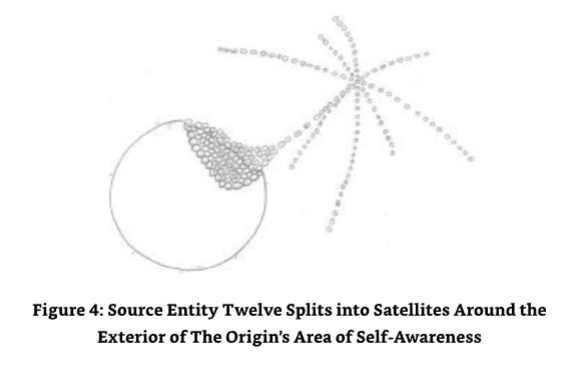

## Chapter Seven - In Closure 

During the dialogues with the last three Source Entities,I found myself communicating with Source Entity Ten and Source Entity Eleven (collectively)simultaneously.As a result, the text for both Source Entities was written concurrently although at times one particular Source Entity did take precedence over another.I was multi-tasking in a most interesting way.In my mind's eye I noticed that my communication timeline was split between the two. What's more,I also noticed that the link with Source Entity Twelve and The Origin was also solidifying.The link was becoming four! 

I was about to communicate and was communicating with all three final Source Entities and the Origin concurrently whilst being able to focus on their own particular information. I had to be very careful where I focused my attention.It was most bizarre.There were times when I had difficulty in maintaining a sense of the "greater"reality,or should I say staying grounded!My mind was being stretched in four separate ways with different,unique,novel and totally unrelated information resulting from the dialogues I was having with all three Source Entities concurrently with that coming from The Origin.On top of this,I had noticed that I was moving back and forth in four "concurrent"event spaces,a function specifically noted in the dialogue with Source Entity Ten on the subject of the four versions of OM Energy. 

This function I had used many times in "The History of God,"but I had not personally recognized it as moving from event space to event space at that point.Although as just described,I had used this function before,I was not accustomed to using it in four simultaneous ways,engaging in dialogue with Source Entities Ten,Eleven,Twelve,and,the Origin all at the same time-flitting from one to the other and then moving all event spaces in quadruplicate to an earlier event space.I almost "crashed and burned"at times,but I am still here and stronger for it! 

I am now ready to take on board a "full"and meaningful dialogue with The Origin.My next book,The Origin Speaks,is the next project,and I am ready and waiting and full of energy. 

O:So am I.Let's get on with it! 

起源：

ME:What!Right,I had better start a new document then!Hang on!Wasn't I supposed to get a rest-again? 

我：

O:A change is as good as a rest,and committing to a dialogue with me is a change,a big change.So consider it a big rest. 

起源：

I think I have my work already cut out for me,dear reader.Writing "The Origin Speaks"is going to be a most interesting project. 

Guy Steven Needler 

2nd June 2012

## Glossary 

Part of this Glossary has been carried over from Beyond the Source Book 1. 

**Accurate "to boot"**: An English way of saying an affirmative "as well." 

**Afterburner**: A method of injecting fuel into the exhaust area of a jet engine to create additional thrust and significant additional acceleration.This is a very fuel "hungry" method of gaining additional acceleration. 

**Akashic Records**: An eternal past,present,and future record of each humankind's actions and subsequent evolution. 

**Big Bang**: The current popular scientific explanation of how the universe started.The Source Entity stated in earlier dialogues with me that it was far from the truth because this Source Entity said it simply created our multiverse,and as such,it "winked"directly into existence.Whether this created a big bang is unclear from my dialogues. 

**Black Hole**: A spiritual explanation is that a black hole is a small galaxy whose role is to collect lower frequency material into one place-within itself. 

**Bulls Eye**: The center of a dart board or archery target.A way of saying I that I "got"it (an understanding of the subject being discussed)completely right. 

**Carrier Wave**: Telecommunications terminology.Is a sinusoidal waveform modulated with an input signal for the purpose of transmitting information.It is usually a higher frequency than the input signal (the data being transmitted).The purpose of the carrier wave is usually either to transmit the information through space as an electromagnetic wave (as in radio communication)or to allow several carriers at different frequencies to share a common physical transmission medium by frequency division multiplexing (as is used in, for example,a cable television system). (Source:Wikipedia,http://en.wikipedia.org/wiki/Carrier_wave) See The History of God for an explanation of how the dimensions,dimensional components and frequencies are structured concurrently in Source Entity One's multi-verse. 

**Cast-outs**: Entities from Source Entity Two's environment that are ejected from a group association due to underperformance or the entity outgrowing the group. 

**Chela**: The disciple of a religious teacher. 

**Cimension**: A single dimension that has all the faculties of the first three lower dimensions we call "up,down,left,right,forwards and backwards"(3D),including other dimensions without them needing to be singularly represented. 

**Coadunate**: A collective state where a group of collectives are congregated together as a larger collective. 

**Coal Face**: A coal mining term used to identify that one is at his/her place of work where the work is being performed,where the attention is.Also used in this fashion:"Working Face." 

**Continuum**: A continuum is a body that can be continually sub-divided into infinitesimal elements with properties being those of the bulk(body)material.Matter (the elements)in the body is continuously distributed and fills the entire region of space it occupies. (ref:http://en.wikipedia.org/wiki/Continuum_mechanics). 

**Exponential growth and exponential decay**: This occurs when the growth rate of a mathematical function is proportional to the function's current value.In the case of a discrete domain of definition with equal intervals,it is also called geometric growth or geometric decay(the function values form a geometric progression). Source:http://en.wikipedia.org/wiki/Exponential growth 

**Fluidic Space**: Space that is constantly changing in every way from dimension to frequency. 

**Frequentially**: Sequentially-based frequencies in frequentic(multi-frequency)space. 

**Geometric progression/growth**: In mathematics,a geometric progression,also known as a geometric sequence,is a sequence of numbers where each term after the first is found by multiplying the previous one by a fixed non-zero number called the common ratio. Source:http://en.wikipedia.org/wiki/Geometric_progression 

**The Grahoopnik**: A race of entities that exist within the hearts of stars.Their existence depletes the stars'energies.Their leaving sometimes causes the star to go nova or supernova. 

**Guru**: A religious teacher or spiritual guide. 

**Hit the ground running**: To start something new without the need to learn first. 

**Hundredth Monkey Effect**: This is a supposed phenomenon in which a learned behavior spreads instantaneously from one group of monkeys to all related monkeys once a critical number is reached.By generalization,it means the instantaneous,paranormal spreading of an idea or ability to the remainder of a population once a certain portion of that population has heard of the new idea or learned the new ability. Source:http://en.wikipedia.org/wiki/Hundredth_monkey_effect 

**Inrush Current**: The inrush current,input surge current or switch-on surge refers to the maximum instantaneous input current drawn by an electrical device when first turned on. For example,incandescent light bulbs have high inrush currents until their filaments warm up and their resistance increases. Source:http://en.wikipedia.org/wiki/Inrush_current 

**Light Particle**: A particle of light is known as a photon.A photon travels at the speed of 186,000 miles per second.The theoretical particle,the tachyon,is supposed to travel faster than the speed of light. 

**Loci/Locus**: The center or source of an object/entity.Mathematically speaking,it is the set of all points or lines that satisfy a given requirement.In Source Entity Three's environment,it represents the location of the majority of the entities concerned. 

**Logarithmic growth**: In mathematics,logarithmic growth describes a phenomenon whose size or cost can be described as a logarithmic function of some input.For example,y=Clog (x).Note that any logarithm base can be used since one can be converted to another by a fixed constant.Logarithmic growth is the inverse of exponential growth and is very slow. 

**Look-up Table**: A part of a computer program that is used to substitute a known value for another known and correlating value.Consider a graph of axis X &Y and a line from the zero point represented by the crossing of the X,Y axis being extended at 45 degrees from that point to the right hand side of the graph.In this illustration,if the values of X=inches and Y mm then X 1 would correlate to Y 25.4 and X 10 would correlate to Y=254, provided the scaling was correct.The Look Up function being the correlation between X &Y in converting inches to mm. 

**Lossy**: A computer term used to describe a conversion function that results in a reduction of some sort due to an either incorrect conversion factor or a specific function of the process used.Certain "losses"are sometimes considered acceptable,but this is only the case where the output is not critical,i.e.,converting an image to JPEG is a lossy conversion function. 

**Magnetosphere**: The outer region of a planet where the magnetic field of the planet controls the motion of certain charged particles. 

**Mahavatar**: A divine incarnation.An entity that is incarnate with all memory of its energetic self,together with fully functioning energetic abilities. 

**Master**: One who has mastered his/her subject matter. 

**Metaconcert**: The linking together of minds,either energetic-or thought-based,to create a collective that has a synergetic effect in the ability to process information,a task,or some creative function.Synergy is that effect experienced where the sum of the whole is more than the sum of the individual units creating the whole when treated in isolation.

**Möbius Loop**: The surface of a mobius loop has only one side and only one boundary component.The Mobius strip has the mathematical property of being non-orientable. It can be realized as a ruled surface.It was discovered independently by the German mathematicians August Ferdinand Mobius and Johann Benedict Listing in 1858.

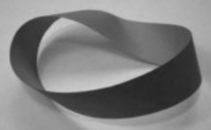

A model can easily be created by taking a paper strip,giving it a half-twist,and then joining the ends of the strip together to form a loop.In Euclidean space,there are,in fact,two types of Mobius strips,depending on the direction of the half-twist:clockwise and counter- clockwise.That is to say,it is an object with "handedness"(right-handed or left-handed). Source:http://en.wikipedia.org/wiki/M%C3%B6bius_strip Source:http://en.wikipedia.org/wiki/Logarithmic_curve 

**Multipolous**: A multiple of a multiple of a multiple.For instance X cubed,cubed,cubed (X33,3). 

**Nova**: A star that increases in brightness by many thousands of times its usual brightness, gradually fading to its original brightness.The last stages of the life of that star.

**OM**: Energy-based beings not indigenous to Earth. 

**Par**: A golfterm for the number of recognized "shots"from start to finish required to sink the ball into a particular hole. 

**Pit Prop**: A pole to re-enforce the structure of a roof within a mine. 

**Pure of Heart**: A lack of error in a creative condition. 

**Score a Bogey"**: Golf terminology for a score one above par for a particular hole. 

**SCUBA**: An acronym for Self Contained Underwater Breathing Apparatus. 

**Self-Realization**: The function of being in full command of all our faculties as an energetic being whilst in the physical. 

**Skewed Distribution**: An effect in standard distribution where the classic "bell curve"is pulled to one side of the graph of distribution in lieu of being "normally"distributed.

**Speed of light**: The speed of light is currently understood as being 186,000 miles per second. 

**Spliced Undulation of Dimension**: One or more dimensions linked together as a result of them being close together or overlapping in some part of their area. 

**Stickle Brick**: A child's building block similar to a Lego block but with spikes to join them together. 

**Supernova**: An exploding star caused by gravitational collapse. 

**Triangulation**: A method used in surveying to measure position and distances between positions by the use of a triangle and the angles relating to the position of other positions or locations being surveyed.Mathematically it is a method of proving a mathematic assumption by the use of three different mathematical methods to gain the same answer.

## About the author 

Guy Needler MBA,MSc,CEng,MIET,MCMA initially trained as a mechanical engineer and quickly progressed on to be a chartered electrical and electronics engineer.However, throughout this earthly training he was always aware of the greater reality being around him,catching glimpses of the worlds of spirit.This resulted in a period from his teenage to early twenties where he revelled in the spiritual texts of the day and meditated intensively. Being subsequently told by his guides to focus on his earthly contribution for a period he scaled this back the intensity of spiritual work until his late thirties where he was re- awakened to his spiritual roles.The next six years saw him gaining his Reiki Master and a four year commitment to learn energy and vibrational therapy techniques from Helen Stott, a direct student of the Barbara Brennan School of HealingTM,which also included a personal development undertaking (including psychotherapy)as a course prerequisite using the PathworkTM methodology described by Susan Thesenga with further methodologies by Donovan Thesenga,John and Eva Pierrakos.His training and experience in energy based therapies have resulted in him being a member of the Complementary Medical Association (MCMA). 

Along with his healing abilities his spiritual associations include being able to channel information from spirit including constant contact with other entities within our multiverse and his higher self and guides.It is the channelling that has resulted in The History of God,Beyond the Source and is producing further work. 

As a method of grounding Guy practises and teaches Aikido.He is a 5th Dan National Coach with 30 years experience and is currently working on the use of spiritual energy within the physical side of the art. 

Guy welcomes questions on the subject of spiritual physics and who and what God is. 

Website: www.guystevenneedler.com 

email: beyondthesource@btinternet.com