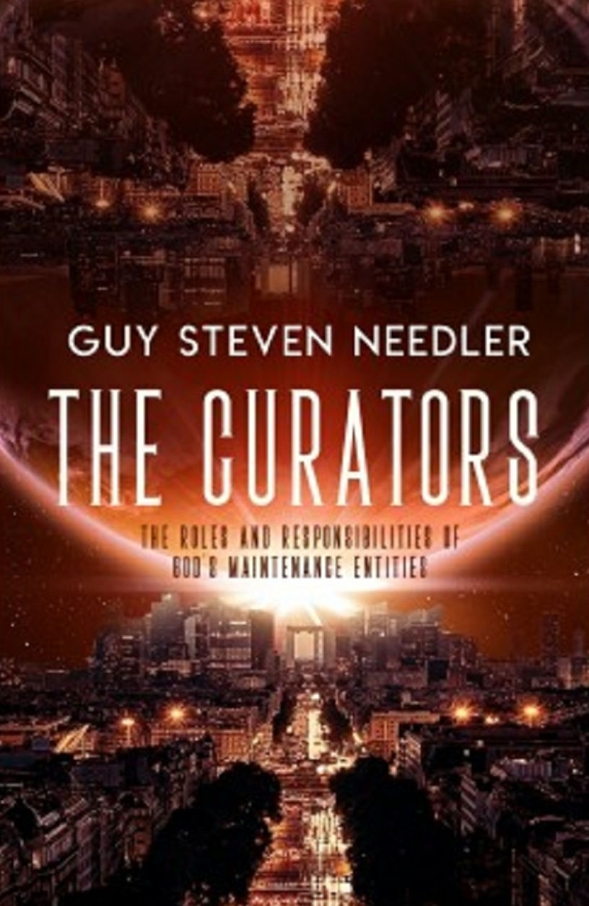

**基于[DeepL](https://www.deepl.com/)翻译**

The Curators The Roles and Responsibilities of God's Maintenance Entities A Channeled Work By Guy Steven Needler

## Table of Contents 

Foreword A Myth Buster The Structure of the Multiverse We Exist Within: A Deeper Understanding A General Understanding of God's Helpers as Currently Understood The Hierarchy of Maintenance Entities The Multiversal Hierarchy The Devil Is in the Detail From the Top The Architects The Illustrators The Planners The Orchestrators The General Maintenance Entities The Beginners The Enders The Deliverers The Waymakers

The Integrators The Seed Makers The Seeders The Beleaguerers The Recorders The Interfacers The Initiators The Observers The Producers The Generators The Environmentalists The Universalists The Parallelism Engineers The Concurrence Engineers The Frequential Barrier Engineers The Attractionists The Caretakers-of the Physical Universe Afterword Glossary About the Author

2019 by Guy Steven Needler All rights reserved.No part of this book,in part or in whole,may be reproduced,transmitted or utilized in any form or by any means, electronic,photographic or mechanical,including photocopying,recording,or by any information storage and retrieval system without permission in writing from Ozark Mountain Publishing,Inc.except for brief quotations embodied in literary articles and reviews. For permission,serialization,condensation,adaptions,or for our catalog of other publications,write to Ozark Mountain Publishing, Inc.,P.O.Box 754,Huntsville,AR 72740,ATTN:Permissions Department. Library of Congress Cataloging-in-Publication Data Needler,Guy Steven-1961- The Curators by Guy Steven Needler In the Curator's the reader is exposed to the mechanics of the multiversal environment we exist within and those entities that maintain it.

1.Spiritual 2.Channeling 3.Entities 4.Metaphysical I.Needler,Guy Steven,1961-II.Metaphysical III.Channeling IV.Title Cover Art and Layout:Victoria Cooper Art Book Design:Tab Pillar Published by: HING PO Box 754,Huntsville,AR 72740 800-935-00450r479-738-2348:faX479-738-2448 WWW.OZARKMT.COM

## Foreword 

I am here again,staring at the very empty first page of my next book.This will be the first time I have worked on a book for four months-they have flown by.Having had the break that was promised to me,I now sit here with some trepidation.I learned in the last few pages of The Anne Dialogues and received some level of warning in The Origin Speaks that I needed to write another six books!That this book is the first of these six is the daunting part. Why is it daunting,you may ask,when I have already written six books?The answer is simple.The first books came one by one with no precognition of the books to follow until the very end of the book being finished-that is,apart from the Beyond the Source books.I wasn't seeing the bigger picture.Then,slowly,toward the end of The Origin Speaks,I started to gain an insight into the rest of the work I had to do and over the last eighteen to twenty months I have been given not only the titles for these books,but also an idea of the content. Two books are due to be in a similar"deep"vein to the ones I have written to date,insomuch as they will deal with the Om and provide more information on The Origin.Two are going to be controversial,as they are going to touch and expose information on subjects that are taboo on many levels.They will be "stand alone"and I am told I will write these two last!!! No,I will not be saying what the subject matter is yet,but I am sure that I have spoken to one or two people about them over the last year or so.The last two are also "stand alone" subject-matter-wise but will work on subjects that I have touched on in my previous books; one being this book and another dealing with healing and with how the way we incarnate affects our energies in a dysfunctional way.Deal with them one by one,I hear you say,and I agree with you,but knowing what one has to do and moreover,the time frame that I have to work with,is the daunting part,especially as I know what to expect in terms of the difficult concepts and theories surrounding the subject matter. All this being said,I am looking forward to working on the content of this book-The Curators,the title of which I have only just been given,even though I have known the subtitle for some time.It promises to be interesting,enlightening,educational,fun,and I have no doubt will have a number of areas where we go deep into the detail of the subjects being discussed.I am also expecting to provide a number of illustrations to let you see what I can see while providing links with previous imagery where possible. Again I sit here.Having rambled on a bit,I am not only wondering when I will actually start the first words of text attributable to the title,but I am also wondering who I will be communicating with.As usual,I didn't have to wait long! SE1,O,A:[altogether]Surprise!!! I suddenly felt like the man who came home from a rough day at the office to open the door of his house to find a"“party"waiting for him!! ME:OK,so you are all here.Which of you will I be talking to? SE1:Predominately myself...

O:Although we will all... A:Contribute at some point. I must admit that I didn't expect to feel Anne's energies. A:It is planned that I will make the odd "guest"appearance in the dialogue where and when it is appropriate.This will be especially when you are communicating with some of the Elementals that work with the Earth. SE1:Suffice to say,most of what we will be discussing will be relevant to the multiversal environment that I created and that most of your readers will relate to.

O:However,there will be times when the bigger picture of my polyomniscient area of sentient self-awareness will need to be taken into consideration,and so at these junctures in the dialogue I will communicate with you. ME:Feels good to me. SE1:Good.We will start whenever you are ready. ME:How about right now! SE1:Why not.

## A Myth Buster 

ME:I want to start first with a base-line understanding of the structure of what we call the Angelic realms.I just want to show the truth-seeking world that we have interacted with these beings before and have given them labels-names and descriptions of their functions.But,I don't want to go down the route of justifying,or not,as the case may be, the imagery and descriptions of those entities mankind has classified to date,no matter how close or far away from the truth it is.What I want is,as normal,the Greater Reality that supports the current understanding,along with a little bit more if possible. I have to admit here to cheating a little because some of this information was in a document I wrote in 2005.Note that I am still drawn to use the abbreviation for The Source as SE1 and not just SE as in The History of God. SE1:We can look at them first if you wish,but note that we may not deal with them on an individual basis,or for that matter,on a group basis either in some cases. ME:Why not? SE1:Because this may not be the reality of the structure of entities who have committed to be in service in my multiversal environment. ME:OK,let's treat it as what mankind knows to date by drawing upon my previous work and you commenting where you wish to,busting the myths as we go.

SE1:That will be a starting point at least. ME:Thank you. SE1:Are you sure that you want to start now? ME:No.I am changing my mind. SE1:I thought you might be.You are realizing that you cannot quote the information from one religion without also quoting the corresponding information from the other major religions. ME:You still have me cornered,don't you!Even after all these years,you still know when I haven't understood the issue-even before I realize it! SE1:Of course.Don't forget that I know everything that you have asked,are asking,and will ask.It's an interestingly small but effective advantage that I have over you in this incarnate state.What I would suggest is that you use the overall structure from the document you created in 2005 as a minor reference to that which some of mankind knows. Later in the dialogue you can look at the bigger picture.[The 2005 document was created as a dissertation as part of my healing examinations.-GSN] ME:OK,it sounds like a plan. SE1:Good.The first thing I want to state is that,irrespective of its level of correctness, the information you have refers only to the physical universe and has no reference to the rest of the structure of my multiversal environment.This in itself is a major limitation in the ability of existing information to express the aspect of the Greater Reality that it is supposed to be describing. ME:So the first myth to be broken is that of the structure of the higher realms.Those realms or environments that are classified as the areas within the universe where the angels exist in all their hierarchical variations are not only limited to the physical universe,they are limited to mankind's knowledge and thinking ability. SE1:Yes.Remember that the information that most of incarnate mankind has is the product of its recent frequential state,educational levels,and subsequent expansiveness, the frequential levels only being elevated in the last forty years with real changes happening in the last ten to fifteen years. ME:So what is the structure?And,what are the names or roles of the entities that work with this structure? SE1:Describing the roles,responsibilities,and functions of those entities that have chosen to be of service by maintaining the structure of the multiverse and its evolutionary efficiency is the whole point of this dialogue,and,as a result,the detail will be presented to you in a way that will be both progressive and logical in its application.Moreover,it will need to be described in summary from the top down and explained in detail from the bottom up.In this way the readers will gain an idea of the breadth of the subject matter we will discuss,allowing the depth to become more digestible as we move along.

Do note,though,that we are talking about those entities that are not only maintaining the structure and its detail,but also those that are involved in the perpetuation of the structure. ME:What do you mean the perpetuation of the structure?I would have thought that maintaining it perpetuated it? SE1:No,those entities that maintain the structure of the multiverse do just that,maintain it.They maintain it for those entities that use the multiverse for evolutionary purposes. Because a number of entities want to use it for evolutionary purposes,their focus is on being within the structure of the multiverse,experiencing it,using it,creating within it, progressing through it-not maintaining it. However,in their desire to be within the multiverse to evolve by experiencing its environments in both its linear and parallel states,parallel states are created by invoking the functionality of Event Space,if you remember;they create an energy that provides what you would call a memory.This "Memory"energy is that which sustains the perpetuation of the structure and the creative and created detail behind the structure.It is these entities that enter into the evolutionary cycle that create the myriad variations of the environmental,experiential conditions and personal interactional opportunities necessary to allow balanced evolutionary progression,and not a skewed evolutionary progression that maintains the need for its existence.The entities in the evolutionary cycle subconsciously want these environmental,experiential,and personal interactive conditions to continue so that they can play out all of the variations that may be on offer and as a result,expose themselves and others to the full depth or quality of experience. I created the multiverse out of the structure and sentient energies that The Origin assigned to create me as an independent but integrated function of myself,allowing smaller individualized parts of me to delve into the detail of that which is me.The beauty of this creation is that it is not the same multiverse that I created in the first instance.It has changed;it has evolved.This is a result of its manipulation,manipulation by those smaller individualized versions of me-you-who wanted to experience the multiverse in different configurative states.These configurative states are transient because the creative force behind them is not as strong as my creative force and so they cannot be maintained unless there is a focus on their continued existence,for without the desire for them to be in existence,the multiversal structure returns back to its original state,that state which I created in the first instance. ME:So even those who use the multiverse for evolutionary purposes are maintenance entities-by default! SE1:Correct.Every entity that is created by me has a role in the maintenance of the multiverse and its perpetuation as a creation of the collective of smaller individualized versions of me.Don't forget,everything,every entity and every environment,is a function of me. ME:Thank you.It is always good to be reminded of this most basic but most forgotten or ignored truth. SE1:Good.So,the first thing I am going to do is expose a few myths. The first myth to be exposed is that the entities that are called Angels are based upon the human form;they are not. The second myth to be exposed is that I have a human form and that the Angels sit beside me;I do not and they do not. The third myth to be exposed is that these entities exist next to me in something called a mobile [see religious texts-GSN],which is a section or location within the divine mind and it is also part of a hierarchy;they do not and it is not.Although I do have to say,it's not a bad guess if you think that the total volume of my sentient energies,that is all of me,can be classified as "Mind,"so if you think in this way,every entity is next to my mind simply because it is part of my mind or sentience. The fourth myth to be exposed is that the Angels are distributed in the hierarchy that religion describes them in-the nine choirs;they are not. The fifth myth to be exposed is that the Angels work only for the maintenance and guidance of those who incarnate on the Earth,and its environment,the physical universe; they do not.They have myriad responsibilities that include the Earth,the physical universe,and many other bodies that are made from locally low-frequency energy which do not specifically exist in the physical universe. The sixth myth to be exposed is that the entities that work with the details of the earthly environment,the Elementals,what humankind calls fairies,leprechauns,and other similarly descriptive names,are based upon the human form;they are not.Other names for mythical forms such as pixies,elves,and the like are simply the memories of those who observed other humanoid forms,those incarnates that also exist within the physical universe and that have visited the Earth from time to time. The seventh myth to be exposed is that those entities that are called Ascended Masters have human form;they do not. ME:That's a lot of myths to consider. SE1:In reality,this is only a small number of the things associated with the description of the names,roles,and functions surrounding those entities that are created by me and chose to be of service to me and those entities that entered into the evolutionary cycle. There are names,roles,and functions in other religions to describe similar entities but in essence they are all the same.You see,mankind in its use of different teachers to educate itself on how to exist in the incarnate state without becoming addicted to it, to not accrue karma,ends up moving away from the original teaching.Descriptions of the teachings change simply as a result of the teaching style of the teacher,its specialist subjects,and its own preferences to what is taught and how it is presented to its students. This quickly results in dilution and diversification from the original subject matter.So, although there may be some crossover or correlation in the information broadcast by different religions,the emphasis and focus may be completely different,and some or all of the detail may be completely different.One thing is certain,though;all religions recognize a creator and those entities that support the creator,irrespective of what they are called and what their roles and responsibilities are.The function of this dialogue is therefore to offer a religion-free,neutral,and up-to-date rendition of the mechanics of the environment you exist within,what maintains it,and how it is maintained.

## The Structure of the Multiverse We Exist Within: A Deeper Understanding 

I have no doubt that this part of the book will be all too familiar to those dear souls who have read my other books and as a result I note that it will be tempting to bypass this chapter.For those that have not read the previous books,it will be essential to the understanding of the rest of the content.I do,however,urge all readers to read this chapter,notjust because it will act as a refresher,but because Ifeel that we will be exposed to new and deeper details about the structure of the multiverse and its functionality. SE1:That was a good introduction. ME:I only said what I felt! SE1:Maybe,but it is accurate to state that we will be going into some more depth about the finer structure of the multiverse,specifically where and how the maintenance entities come into it.What I would suggest first is that you give an overview of the structure in your own words and I will add the additional understanding of the structural content at the end, when you have finished your description. ME:OK,here we go. The multiversal environment within which we exist was created by The Source,from its own energies and structural references and is located within The Source.The multiverse