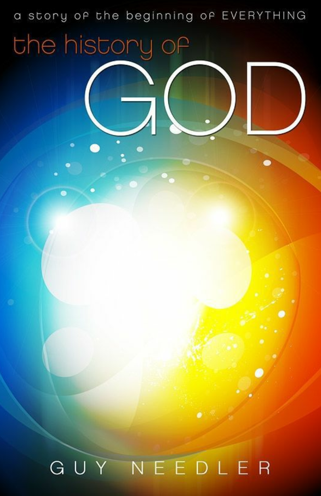
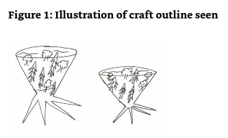
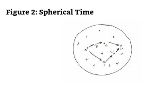
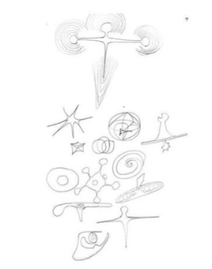
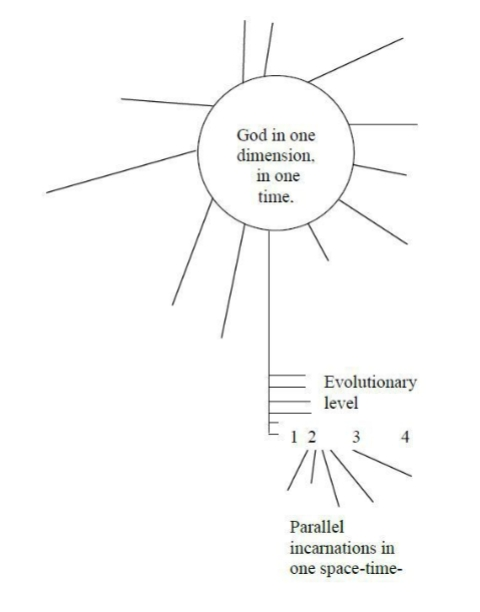
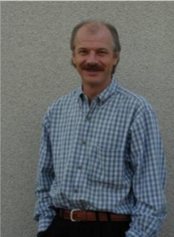

**The History of God** 

**by Guy Steven Needler**

**《源头简史》**

**作者：盖伊·斯蒂文·尼德勒**

---

### Table of Contents（目录） 

- Foreword（前言） 
- Part 1 - The Mechanics of the Origins Universe and Where We Fit In（第一部分：原初宇宙的运作机制与我们的安身之所） 
    - Chapter 1 - Sweden, a Reawakening（瑞典，觉醒） 
    - Chapter 2 - Contacts with Beings on the 14th Through the 27th Levels（与第14级到第27级的存有接触）
    - Chapter 3 - Byron and the Source Entity（拜伦与源实体） 
- Part 2 - The History of God（第二部分：神的历史） 
    - Chapter 4 - The History of God（神的历史） 
    - Chapter 5 - In the Beginning（一切的开始） 
    - Chapter 6 - The Source Entities Become Aware of Themselves and Their Environment（源实体们觉知到自身及环境） 
    - Chapter 7 - The Source Entity on Creating Its Universes（源实体谈宇宙创生） 
    - Chapter 8 - The Source Entity on the Theories of Creation（源实体谈创造论） 
    - Chapter 9 - The Source Entity on Slipping Between Dimensions（源实体谈游走在维度之间） 
    - Chapter 10 - The Source Entity on the Development of Human Beings（源实体谈人类的发展历史） 
    - Chapter 11 - Karma（业力） 
    - Chapter 12 - Galaxies, Solar Systems, Planets, and Creation（星系、太阳系、行星和创造） 
    - Chapter 13 - On the Outside 
    - Chapter 14 - Other Major Civilizations on Earth
    - Chapter 15 - The History of Humanity
    - Chapter 16 - Space-faring Humans
    - Chapter 17 - The Second Silver Cord 
    - Chapter 18 - The Records/Database, Akashic and Others 
    - Chapter 19 - Living Many Incarnations Simultaneously 
    - Chapter 20 - Illness 
    - Chapter 21 - Relaxation, Meditation, and the Core Star 
    - Chapter 22 - Souls Returning to the Source Entity 
    - Chapter 23 - The Source Entity’s Observations of 
    - Chapter 24 - A Bit about the Author’s Past Lives 
    - Chapter 25 - Stars, Incarnating Souls, and Root Races 
    - Chapter 26 - No Such Thing as Psychic Powers 
- Part 3 - Communication with Aliens 
    - Chapter 27 - Hum on Other Entities Commonly Called Aliens 
    - Chapter 28 - Hum on the Om 
    - Chapter 29 - Aliens/Other Entities and Intention 
    - Chapter 30 - Aliens/Other Entities on Universes, Null Space, Hyperspace, Collective Beings, and Hillside Space Bases 
    - Chapter 31 - Extended Dialogues with the Aliens/Other Entities 
    - Chapter 32 - The Source Entity and the Council of Twelve 
- Part 4 - The Less Than Mechanical Side 
    - Chapter 33 - Nature Spirits in My Garden 
    - Chapter 34 - Choice 
    - Chapter 35 - No Coincidences 
    - Chapter 36 - Coming into Our Power 
    - Chapter 37 - Religion 
    - Chapter 38 - Christ Consciousness 
    - Chapter 39 - To Be of Service 
    - Chapter 40 - Accelerated Spiritual Awareness 
    - Chapter 41 - Forgiveness as a Rule for Life in the Physical 
    - Chapter 42 - More on Communication with Our Higher Selves 
    - Chapter 43 - Angels, Oranges, and Apples 
- Letter to the Reader 
- Appendix 
- Glossary 
- About the Author 

---

### Foreword（前言） 

When I initially started to write this book, I fully expected to focus on the technical aspects of the universe and not the personal progression side as well. Indeed, the start is very mechanical in nature, which can be seen from the way I initially prepared myself to talk about content that was based upon the physics of the universe with the entities, the Origin and the Source Entity. In the early days I needed to literally count myself up the energetic levels to reach those with whom I would spend the next couple of years communicating. The process would occur via my computer on Friday afternoons unless I was on holiday or out of the UK. The subject matter that we discussed over the years chopped and changed from week to week and has had to be edited to make it flow. I also seemed to develop a style of contacting the entities only long enough to generate only a thousand words or so, plus or minus 10-20%, which was interesting, to say the least. 

最初写这本书时，我一心聚焦于宇宙的技术层面，并没有打算谈及个人提升方面的事。的确，本书一开始大概会有些无趣，从我与各类实体、源头实体（以下简称源实体）以及起源谈论内容的方式可见一斑，因为这些内容主要是基于宇宙的物理学原理的。在最初的一段时日，我需要一层一层的让自己在能量层级上往上提升，才能接触到那些后来与我沟通数年的实体。每周五下午，这个过程都会在我的电脑上上演，除非我在度假或者不在英国。在过去的几年中，我们之间所讨论过的主题内容每周都可能会中断或改变，因此我不得不重新编辑以使其流畅。我似乎也养成了一种习惯，即和实体们联络的时长总是只能够写出千字左右的内容，上下浮动10%至20%。这其实也蛮有趣的。

Some of the chapters are clearly longer than 1,000 words while others are 2,000+ words. This depended upon the difficulty of the subject being discussed, or, in fact, how broad it was. Sometimes these words took a couple of hours to generate with every word being painful. At other times it flowed like a river, and it was all that I could do to keep it in my memory long enough to type it into my computer. As you can imagine, this, in itself, generated a level of frustration that at times could stem the flow of communication. 

当然也有些章节显然是多于1000字的，有些甚至2000多字，字数多少取决于所讨论主题的难度，或更准确的说，取决于主题的深度和广度。有时，一些内容要花好几个小时才能诞生出来，每个字都似乎伴随着阵痛。但有时候，他们又如何留般一泻千里，一发不可收拾。我所做的只是尽量记住它，好敲进我的电脑里。你可以想象这个过程本身会产生一定的挫败感，因为输入这件事只会阻碍沟通的流动。

Nevertheless, I have gotten to the stage now where it is time to cut and run, to publish and be damned. I am not a fan of books that are as thick as door stops as they tend to bore me. As a result, I have a deep sense of not wanting to bore my readers with 600+ pages when they could get more enjoyment out of the staggered introduction of the information that I received. It also gives me a break and allows me to pass it on to my editor, who while I am writing this text, does not know this is about to come over the wall. In actual fact, the reason for stopping here is this:(1) I need a rest; and (2) I want to contact the other Source Entities that have been mentioned in this text with a view to describing their universes and giving the world the opportunity to see the wider reality through their senses and achievements. 

不管怎样，现在到了我该放手抽身的时候，是时候让它出版并接受大众的品评了。我个人可不是个对鸿篇巨制的作品甘之如饴的人，因为他们常常会让我的气力吃不消。所以，如果我的读者可以通过阅读我这些原汁原味的接收到的信息而乐在其中时，何必要用一本六百多页的绞尽脑汁润色修饰的巨著来赶走读者呢？这样，我本人就可以喘口气，并把书稿丢给我那在我落笔的此刻还对本书即将交付一无所知的出版编辑。开个玩笑。事实上我在此时执笔的原因有两个：一，我需要休息；二，我想连接在本书中提到过的其他源实体，好一瞥他们描述的宇宙，使世界有机会通过他们的知觉与成就窥见更广阔的实相。

I apologize for the changes in style as I progressed, but this is how it came to me. I guess that this in some way adds authenticity to it. Nevertheless, I hope you enjoy the reading the text and the things that I gleaned as a result of being able to communicate with these entities. 

因此，我要为我写作过程中的多变的文风表示抱歉。但它们原本就是这样来到我这里的，我想这在某种程度上也证实了它的真实性。不过，我希望你们能真正享受这本书，享受我在与各类实体交流中获得的一些感受。

So just what does one do when a channeled work is finished? For one thing, I knew that this would not be the last, for I knew that I personally was interested in the universes that were indicated to be controlled by the other 11 Source Entities, each one trying to understand itself and its creativity and feed its own learning back to the Origin. 

那么当传导工作结束以后，接收者还能做什么呢？首先我知道这不会是我的最后一次传导，因为我个人对其他11个源实体主宰的各个宇宙也很感兴趣，他们的每一员都在努力了解自己和自己的造物，并将所学所获反馈给起源。

Next, it was clear that the concepts that were being presented to me would, in a lot of instances, go straight over my head. Indeed this was the most annoying side of what I was doing, for I really like to understand the mechanics of what I am being shown, no matter how rudimentary that understanding may be. I felt that if I could understand the information being presented to me, then those who read these texts will also understand. I guess the fact that my dear wife, Anne, also understands a great deal of what I have channeled in this book is a result of the high level of understanding that the Source Entity and the Origin have of humanity’s ability to assimilate information in our low frequency existence. In essence, they know what we can digest and offer concepts to wake us up in a manner that we can understand in our limited capacities. 

再者，显然那些呈现给我的概念很多时候都让我无法理解，这的确是我所做的事情中最令人头疼的一面。因为我真的很想了解呈现给我的那些事物的运作机制，哪怕只是粗浅的理解也好。我觉得如果我能理解呈现给我的信息，那么所有阅读本书的读者也会理解。我猜想我挚爱的妻子安妮，也能理解我在本书中传导的大部分内容的原因是源实体和起源非常清楚人类有限的领悟能力，从而能将很多深奥的信息融入到我们所处的低频环境能接受的信息中。实际上，他们知道哪些是我们能消化的，因此会提供在我们有限的能力范围内可以理解的概念来唤醒我们。

I was surprised at the duality of the book as it unfolded. First, I would like to remind the reader that this was supposed to be a work that focused upon the history of God and the universe He/She/It has created. I was not comfortable with the dialogue dipping into the more esoteric aspects of how to live our lives to the best of our ability while being of service to others. Also, there seems to be a strong link between the two subject areas, not because of its spirituality but because of the interconnectedness of living life according to the rules of the universe. Going against the physics of the universe ultimately results in our early demise as physical beings but also irrevocably links us to the lower energies of the physical in a way that is truly difficult to reverse without a significant change in our personal nature. Learning to forgive what others do to us is one of the hardest things to do as is shrugging off the greed that we have acquired from living in a materialistic society; however, these two together are without doubt the route to our own personal evolution and ultimately the evolution of humankind incarnate, the route back to the Source and the Origin. 

另外，我也没想到随着本书的展开，会有如此偶然性的呈现。首先我想提醒读者，这本该是一本有关神及其所创造的宇宙的作品。而对于像如何在服务他人的同时尽可能过好自己的生活这种深奥的对话我其实不太擅长。但是这两方面主题之间似乎又存在很强的关联性，这种关联不单来自于灵性层面，而是来自于跟随宇宙法则生活的内在逻辑。因为违背宇宙的物理学原理不仅会最终导致我们作为物质生命的过早终结，而且还不可避免的将我们与物质世界的低频能量连接起来，这种连接难以反转，除非我们在个体层面上的人性发生了巨大转变。学会宽恕他人对我们的所作所为也是其中最困难的事情之一，这和摆脱我们在物欲横流的社会中养成的贪婪习性一样艰巨。但是毫无疑问，这两者是我们的个人进化以致整个人类化身种族进化的必经之路，也是回归源头和起源的唯一道路。

We have to understand the physics of the universe to understand the esoterics. The two are intertwined as they create the path to correct efficient existence in the other. This helps us go with the flow rather than against it. For this reason, I decided to keep the two types of channeled work under the same cover. The physics and the esoterics. The one provides the living space and how it evolved; the other provides the rules for existence in this space. It would have been logical to create two books and maximize on the sales potential, but that would have been materialistic and would have missed the opportunity for people to have it all in one place, for why would you buy a book when it has only provided one side of the argument and not offered an answer or a way forward? 

有趣的是，为了更好理解所谓的神秘学，我们一定要懂得宇宙的物理学原理。二者互相交织着，创造了校正对方的有效通道。得益于此，我们才能顺流而行，而非逆流而动。因此，我决定在这同一本书中保留两种信息，物理学与神秘学，一个讲述我们生存的空间及其如何演进，另一个讲述我们在此空间中的存在法则。在这个话题上，创作两本书并最大化销量似乎更加选择，但那不仅将是一种唯利是图的行为，也会有读者措施一次性得窥全貌的机会。试想，有谁会买一本只呈现一方论据，却没有给出答案和指引的书呢？

Approximately two years prior to starting this work, I had written some 180 pages of my “meditational meanderings,” some of which I noted later were relevant to this work. These I have also included as I now know that they were, in effect, the start of this dialogue and have their own relevance within the text. As such, they are now fully integrated and help to provide a fuller picture of God’s universes and the energetic creatures that exist within them, each of them helping the Origin to understand Its Self and the universe It created through the Source Entities and ourselves. The universes are truly full and vibrant environments, offering myriad opportunities for entities to evolve and, therefore, grow closer to the Source and go home to be part of the whole, but this can't be done without understanding and working with the rules. In reality, this is what this book tries to do—offer us all a way out of the darkness with a light to help us on our way home.

事实上，在创作本书约两年之前，我已经写过180多页的冥想漫谈。后来我发现其中一些内容与本书有关，因而也将它们囊括进来。我现在理解了，其实那些冥想正是本书对话的开始，而且与本书的内容都有紧密的内在关联。有鉴于此，我将他们做了整合。以便提供一幅更加完整的神之宇宙以及存在其中的能量体造物的画卷，这些造物的每一个都在帮助起源理解自身，理解通过源实体和我们自己所创造出的宇宙，这些宇宙生机勃勃，为各种各样的智慧实体提供了无数进化机会，使他们成长向源头靠近，并最终回归为整体。但是，如果没有对宇宙法则的理解和遵循，这些就无从谈起。事实上，这正是本书想要传达的内容，为所有人指出一条走出黑暗的大道，用光明帮助我们所有人回家。

---

## Part 1 - The Mechanics of the Origins Universe and Where We Fit In

**第一部分：原初宇宙的运作机制与我们的安身之所**

### The Author Awakens 

**作者的觉醒**

Throughout my life I have been interested in the paranormal; indeed, I had a constant feeling that I was more substantial than my current self. In one of my earliest memories on this subject I distinctly remember being told by my mother that I could not see the wind when I clearly saw it whistling up and over the roof of a building. I practiced meditation as a young teenager and felt that I could astral travel and levitate/perform telekinesis, even though I couldn't when I tried. I had previously awakened several times in dreams to find that I was out of my body, levitating at will, outside our house. In my late teens I practiced meditation diligently every night trying to gain control of the faculties I was sure I had. Then one morning I had a waking dream. In this dream four white robed individuals stood before me, each of them smiling. They communicated with me by telepathy and told me that all that I believed in was correct. I could do everything I felt that I could do, but not yet! They told me that it was not the right time and that I needed to learn my Earthly lessons first. From that day forward, my interest in the paranormal waned, and I concentrated on doing the best I could in the physical world. That is, until a friend introduced me to Reiki, which led me to other energy healing arts. I became a student of a direct student of Barbara Brennan. My interest was reawakened! 

纵观我的一生，我一直对超自然现象感兴趣。事实上我一直有种感觉，那就是我比目前的自己更广大。在我早期的记忆中，我清楚的记得母亲告诉我说风是看不见的，但是我却清楚的看到呼啸而起的风从建筑物的屋顶上翻过。十几岁的时候，我练习冥想时，感到我能进行星光体旅行，漂浮，还能心灵感应，尽管在现实中我屡试不成。我曾有几次在梦中醒来，发觉自己离开了肉身，可以随意在房子外面漂浮。在接下来的少年时光，我每晚刻苦练习冥想，想掌握这些我确信自己拥有的能力。后来一天早上，我做了一个清明梦，在梦里有四个身穿白色长袍的人站在我面前，每个人都面带笑意。他们用心灵感应和我交流，告诉我说，我相信的那些事情都是真的，我能做到一切我认为自己可以做到的事情，只是暂时还没有做到而已。他们告诉我时间未到，我首先要学习地球上的功课。从那天开始，我对于超自然现象的兴趣消退了，我则竭尽所能致力于在物质世界做到最好。就这样直到多年以后，一个朋友将灵气介绍给我，我又因此接触到另一些能量疗愈技术。我跟随芭芭拉布莱能的亲传学生学习，而我对超自然现象的兴趣也再次被唤醒。

During the years of being trained in the energy healing arts, I noticed that I could sense and feel energies. Not only this, I could talk to the chakras to find out what was wrong with them and sense other entities. I also noticed that I could go well above the energy levels taught me by my teacher and was, subsequently, reprimanded for not staying grounded. The problem was that it felt right to be up there. 

在接受能量疗愈技术训练的几年间，我发现自己能感知到能量。不仅如此，我还能与脉轮对话，以找出其问题所在，还能感知到其他实体。我还发现我能够超越老师教导的能量层级，当然也因此被谴责为不够脚踏实地。问题是我觉得我在那些更高层级上的感觉是对的。

### The Author Meets the Om

**作者与OM相遇**

It was during one of my initial healing course meditations with a guest instructor that I first met the Om and was identified by a fellow student as being one of them. Little did I know that during a trip to see a friend who was working in Sweden, I would have the connections I required to communicate with energy beings and manipulate energy, thanks to a group of aliens.

我第一次与OM相遇是在我早期与一位客座老师一起做疗愈课程冥想时，被一个同学确认说我是OM的一员。我完全不知道自己会在去看望一位在瑞典工作的朋友时，在一群外星人的帮助下，建立起与能量存有沟通的连接，并能操控能量。

### Chapter 1 - Sweden, a Reawakening 

**第1章：瑞典，觉醒**

The energy at my friend’s house in Sweden was high. It was surrounded by ley line energy which was not connected and was moving around wildly, rather like a high tension wire whipping across the land, grounding out. The stones at the bottom of his garden felt like they were part of a shrine that focused and directed the ley line energies (rather like the stones at Avebury and Kilmartin). I felt energized. 

瑞典朋友家中的能量很强，周围环绕着的地脉能量像是没有连接般的四处移动，如同没有接地的高压电线抽打着碾过地面的样子。花园尽头的岩石感觉就像是聚焦和引导地脉能量的圣地的一部分（像埃夫伯里和基尔马丁巨石阵中的石头）。我感觉被充满了能量。

#### The Author’s Attunement by Aliens to Balance Other World and Earth Energies 

**作者被外星人调谐以平衡其他世界和地球的能量**

One day, during a walk with my wife and my friend, I felt the need to go to a certain rock which was by the river. The river was in a small valley. At the rock I had a desire to sit in the lotus position whilst meditating. During the deepest meditation that I had ever experienced, I sensed a lot of light come into my head and my eyes flicker uncontrollably. A voice in my head told me I was being attuned to the Earth energies and that I should stay calm. I also had the impression that a craft of some sort was hovering in front of me. The impression was validated when I saw the strange movement of the water just after I came out of the meditation. 

一天在与妻子和友人散步时，我感觉需要去河边的一块岩石那里。河流位于一个小山谷中，到了岩石那里，我强烈的想采用莲花座进行冥想。这次的冥想是我所体验过的最深入的一次，当时我感到有大量的光照射进头部，眼睛也不受控制的闪动着。这时脑子里有一个声音告诉我，我正在被调节至地球能量，并要我保持镇静。我还有个印象是面前有某种飞行物在盘旋，冥想结束时我看到了水流的移动，这证实了这一印象。

During the time I was in meditation on the rock, my wife, who is also quite sensitive, was standing on a suspension bridge upstream. She said she perceived a number of UFOs approach the area, which was a portal between universes. The bridge was at the point of a triangle/cone, and the UFOs were coming in towards the point. She further stated that she was told that the aliens wanted to communicate with me to give me “other world ways of using energy.” To do this, she said they worked directly on me (particularly my brain)—the word rewiring came into mind. After a while, she felt the UFOs leaving and the portal closing. My friend, who also practices the healing arts, said that the stone I was on was aligned to a point on the bridge, and that this was where the energy flow was. He said it was as though the energy collected at the point by the bridge was channelled into the hill via the stone in the river. 

我在石头上冥想期间，我的妻子一直站在上游的一座吊桥上，他也对能量十分敏感。她说，她感知到有相当数量的不明飞行物靠近这片区域，而这里是宇宙间的门户。吊桥位于三角形锥形的顶点，不明飞行物正是朝着这个点飞过来。她还说她被告知外星人想要与我沟通，告诉我另一个世界运用能量的方法。为此，他们直接对我（尤其是大脑）施工，重新接线这个词进入脑海。片刻之后，她感到了UFO的离开和宇宙门户的关闭。我的朋友也是从事疗愈工作的，他说，我打坐的那块岩石正好与桥的一个点对齐，而那个点也正是能量流所在之处。他说能量好像是被桥聚集在那个点，然后通过河里那块石头流向小山。

A year later I was travelling to Sweden again with my friend as a travelling companion as he had moved back to the UK. During the journey I meditated. I logged into the aliens; they were excited that I was coming, and I heard a voice in my head saying, “He is/they are coming.” Beforehand, a strange feeling had come over us in the hours around 11:00 A.M. to 12:00 P.M. before the flight. Both my friend and I felt a bit lethargic (stunned) and weren't able to think straight. I now know that this was a result of tapping into the energies that the aliens were using, which at that time were overwhelming. I thought I was coming down with a bug or something. As a result, I mixed up the flight times, and we missed the flight. I wondered if perhaps we were supposed to miss the flight for other reasons. Maybe we missed an accident or something. I never did check to see if there were any traffic accidents. Maybe I would have arrived at the wrong time for the aliens and their plans. Maybe I’ll never know. I’m sure there was a reason. We finally caught a flight the next day and arrived without issue. 

一年后，朋友搬回了英国，我们再次结伴前往瑞典。旅行途中我进行冥想。在那次冥想中，我去见了那些外星人，他们对我的拜访甚感兴奋。我听到一个声音在我脑子里说，他们到来了。在这之前，也就是飞机起飞前的上午11点到中午12点前，曾经有种奇怪的感觉向我们袭来，我和朋友都感到无精打采，昏昏欲睡，无法清晰思考。我现在才知道，那是因为我们接入了外星人所使用的能量，这能量对我们来说太强了。我以为是我的身体哪里出了问题。结果把航班时间搞混了，导致错过了飞机。我当时还想是不是有什么别的原因注定让我们错过那次航班，比如避开事故什么的，我后来也没有特意去核实是不是发生了什么交通事故。也许对于外星人及他们的计划来说，我以原定的时间到达会不合适，也许是我永远不会知道的原因，但我确信这件事是有原因的。终于，我们在第二天赶上另一班飞机，顺利抵达瑞典。

The next day while we were walking towards the river and bridges where the aliens' portal was located, I had the feeling that they were accessing me, especially my autonomic functions. As we walked along the river side path, I felt energy in my hands and arms increase. My friend said that he felt we were going through waves of energy. When we arrived at the bridge, we both knew that the aliens were coming through the portal. I then received a command in my head and walked back down to the rock I had sat on the previous year. I was told that I should expect nothing strange or anticipate anything special/strange happening because this would block the work that they would be doing—more fine tuning and opening of my skills and abilities/functions. As I continued my walk to the rock, I saw images in my mind’s eye of aliens working with machinery and computers. They were getting the machine and equipment ready and tuned into me for when I arrived at the allotted place. 

第二天，当我和朋友走向外星人门户所在的河与桥，我感觉他们在连接我，特别是连接我的自主功能。因为当我们沿着河边小路行走时，我感到双手与双臂的能量在增强。朋友则说，他觉得我们像是在穿过一波又一波的能量。当我们到达桥那里时，我们两个都知道外星人正在通过门户过来。接着，我脑中接到指令，让我回到一年前曾经坐过的那块石头上。我被告知不要期待什么奇异的事，也不用指望发生什么特别的事，因为这会阻碍他们所要进行的工作，也就是更精准的调教与开启我的能力和功能。当我继续朝着岩石走时，我的意识眼中浮现出了外星人正在用机械和电脑工作的画面。他们要在我到达指定位置的时候做好准备工作，将这些机器设备调成适应于我的状况。

Once at the rock, I made myself comfortable, sat in a lotus type position and meditated. I eventually had the impression that the aliens were working on my third eye and were fully opening it so that I could see properly. I was told that this would happen slowly over the next five to ten years. They further told me that they had to attune my third eye to the present time line as it was capable of seeing past, present, and future. They said that I would get confused with seeing this more complex level of information. Suddenly I felt they had turned on my hearing and noticed that, for a split second, I could hear my friend’s thoughts as he stood by the bridge. Then a series of instructions were transmitted to me. I was being told that I should not hang onto any one function that I would receive and that I was to treat each one as a tool and not as my world task or my work or only ability. The initial attuning work in 2002 needed some time to stabilize before it could be turned on. 

走到岩石那里，我让自己舒服的以莲花坐盘坐在石头上面开始冥想。我最后的印象是外星人对我的三眼轮做工作，并使它完全开启，以便我能真正看见。我被告知这是一个缓慢的过程，将会持续5到10年。他们还告诉我，他们必须将我的第三眼调教到当前时间线，因为我原本能够看到过去、现在和未来。他们说，看到太复杂的信息会让我感到困惑。这时我突然感到外星人开启了我的听觉系统，并注意到自己瞬间能听到站在桥边的朋友的内心想法，接着又传来一系列指令。比如我不能执着于任何一种我即将接收的功能，我应当把每项能力当做是工具，而不是我在这个世界的使命、事业或者唯一能力。2002年的首次调节需要一段时间的稳定之后，能力才会完全开启。

#### Alien Dimensional Warping Device

**外星维度扭曲装置**

I opened my eyes, and as I did, I noticed my vision was a bit wobbly at my left and right hand side as if my vision was out of phase with the normal visible spectrum. I thought I saw a large orange object in front of the trees in front of me. The object had no form. I just managed to see similar objects in other parts of the tree-lined bank. Suddenly I picked out the outline of an object that I can only describe as machine like. It was totally invisible, but for a split second or two, I saw its outline and its 3D depth of perception. The aliens told me that they were using some sort of dimensional warping device that made it blend into the background. However, if you had the ability, you would just be able to see its outline as it mirrored the visual appearance of its surroundings. I also noticed that although there was a bit of wind, the trees in the area of the objects were moving like they were being blown by the downwash of a helicopter’s blade. I was then told that I shouldn't try to see these things too hard as I would put too great a strain on the tuning and alignment work they had done. 

当我睁开眼睛，我发现视觉在左右两侧有点晃动，好像视力不在正常的可见光谱内。我觉得我看到一个巨大的橙色物体就在我面前的树的前方，这个物体没有形状可言，我在树木成型的河岸等其他地方也看到了类似的物体。突然，我看清了这个物体的轮廓，看上去像是个机器模样，但是完全隐形的。但在某一瞬间，我得以看到它的轮廓，感知到它的三维形态。外星人告诉我，他们使用某种维度扭曲装置，使它可以融入背景环境。当然，如果你有能力，就可以看到它的轮廓，因为它像镜子般反射了其周围环境的视觉外观。我还注意到，尽管这个地方只有一些微风，但是那个物体所在区域的树木都摆动的像是被直升机螺旋桨的下降气流所煽动一样。我被告知，不要太过用力的去看这些东西，这会给他们刚刚做好的调谐和校准工作制造太多压力。

Its visual appearance was like an upside down triangle with a round top and some protrusions on the bottom that I can only describe as being sensor or antenna-like. The trees and surrounding rocks looked as if they were on a convex plate or lens. 

它的外形像一个倒置的三角形，顶部是圆的，底部有一些突出，我觉得像是传感器或是天线一类。树木以及周围的岩石看上去就好像处在一个凸起的平面或者透镜上。
 
To help the reader understand what I saw, the outline of the craft is in the illustration below. 

为了帮助读者理解我所看到的，飞行器的轮廓如下图所示。

 
The trees within the internal vicinity of the outline of the craft effectively stood out from their usual environment. 

飞船轮廓内部的树木与它们通常所处的环境截然不同。
 
#### A Dimension Within a Dimension 

**维度套叠**
 
As we sat on the rock before going back to my friend’s house, we both felt that the aliens lived here in a complex that was within the hillside and supported by dimensional mechanics. That is, it is a dimension within a dimension, and that this was a local phenomenon.

在返回朋友住处之前，我们坐在石头上，我们都觉得外星人的住所就在这里，在位于山腹的有维度设备支持的建筑群中，也就是说这是一个维度套叠，是一种此处的特有现象。
 
My friend said that he thought the rock was a focal loci for energy between two dimensions and that the rocks either side of the bridge were special because they allow the transference of energies (spiritual, cosmic and Earth) to occur and blend together, creating an inter-dimensional portal. He also thought the abilities of these rocks in this configuration on Earth was rare; therefore, this was a special place. 

朋友认为那块岩石是两个维度之间的能量焦点，而且桥两侧的石头也是与众不同的，因为他们可以让灵性的、宇宙的和地球的能量得以传导并融合，从而创造出一个跨维度的门户。他还认为地球上这种结构的岩石所拥有的能力十分罕见，因此这里肯定是一个殊胜之地。

For a day or so after both of these attunements, I felt very wobbly and could hardly string a sentence together, like being mildly drunk. It was a very strange feeling. 

在这两次调节后的一两天，我感到精神恍惚，几乎不能把一句话说完整，像是轻度醉酒的感觉，那是一种不可思议的感受。

#### Some Independent Proof：A Contract with Aliens 

**与外星人接触的一些独立证据**

A few months later, I showed some pictures of the landscape around the river and rock in Sweden to a medium I was visiting in the College of Psychic Studies in London. I had not previously talked to her of aliens and my association with them. She immediately recognized the presence of aliens there and clearly stated that I had a contract with them. It was shortly after the visit to the College of Psychic Studies that I started the Barbara Brennan-based energy healing courses where I learned to use some of my abilities and started communication with energy-based entities, two of which are the Source Entity and the Origin.

几个月后，我在拜访伦敦灵学研究学院时，给一个灵媒看了一些瑞典那条河和岩石周围的风景照片。事先我并没有跟她提过外星人以及我与外星人的联系，她立刻就认出那里有外星人出现，并且很肯定的说，我和外星人之间定有契约。在访问伦敦灵学研究学院后没多久，我开始学习芭芭拉·布南能体系的能量疗愈课程，并学会了使用我的一些能力，开始与一些能量形态的实体交流，其中就包括源实体和起源。

### Chapter 2 - Contacts with Beings on the 14th Through the 27th Levels 

**第2章：与第14级到第27级的存有接触**

#### Building My Link to Spirit and the 20th Level 

**建立通往灵与第20级的连接**

Over the course of many meditations I often tried to clear my mind to help allow the helpers and other entities from all the other dimensions to connect me or make my link to Spirit. It was during one of these meditations that I noticed their help in action. At the start of this particular meditation, as I allowed myself to be at peace, I noticed a couple of cherub-like entities building what I can only describe as a scaffold of one pole or an antenna like that on a car or transistor radio. It was as if they were putting all the pieces or links together one by one—putting them together until they eventually were high enough to go into the ionosphere and beyond. Each time I let my mind wander and lost focus on the greater reality, it would be as if they would be held in suspended animation. When I pulled myself back into meditation, I would see them start up again with vigor, delighting in the fact that they were able to start building again. As I came back each day, the antenna or link got higher and higher until it was outside our solar system. When I projected myself to the top of it, I could see the rest of my home galaxy below me. When I looked at this construction (2004), I started to see the rest of the other galaxies in my universe coalescing into a single ball of light. When I asked Earth’s Source Entity (you’ll hear more about this Entity soon) about this, He/She/It was very pleased and was surprised at the speed at which I was able to make progress in my meditations—which subsequently helped my helpers to make my link. 

多数时候在冥想的过程中，我会清空头脑，以便允许各个维度的帮手以及实体与我连接，或者让我连接灵体。正是在某一次冥想中，我发现了他们帮助我的过程。在那次冥想开始时，当我让自己平静下来，我发现有几个像小天使一样的实体在建造一种装置，我只能形容为一根杆子做的支架，像汽车或晶体管收音机天线的东西，他们像是在把所有部件或连接一个个拼起来，直到穿过电离层。每当我杂念纷飞，忘记了专注于更大的实相时，他们就好像暂停了。而当我将自己拉回到冥想状态，我就会看到他们又活跃起来，未能重新开始建造而欢欣鼓。我每天冥想这个天线或连接就变得越来越高，直到超出了太阳系。当我以星光体投射的方式来到它的顶端，看到我所居住的星系在我下方一览无遗，我继续盯着这个构造看（当时是2004年），于是看到我们这个宇宙的其他星系正聚集融合成一个光球。当我询问地球所处的源实体（接下来你会了解到关于这个实体的更多信息）这是怎么回事时。他/她/它非常高兴，并对我的冥想进展如此神速感到惊喜，因为这将有助于我的守护灵帮我建立连接。

Note: During the editing of this text for publication (February, 2011), I noticed that the link had progressed beyond the physicality of our universe. The single pole had split off like the branches of a tree, creating a web-like network of connections that ventured through the multiverse of our Source Entity and beyond to the Source Entities’ creator, the Origin, and the eleven other Source Entities (again you will read about the Origin and Its creations later), and the environments They created. It was an amazing sight to behold. Momentarily I felt the Origin as It smiled Its approval. GSN. 

注：在2011年2月编辑的这些内容准备发表时，我发现连接已经进展到超出了我们这个宇宙的物理状态。原本的一根天线也如同树枝般分岔，形成网络状的连接，它穿过源实体的多维宇宙，到达源实体的创造者，即绝对起源（稍后，你将了解绝对起源及其更多内容），以及其他11个源实体和他们所创造的多样环境。这真是令人叹为观止的景象。此时，我瞬间感受到绝对起源正微笑着对我表示嘉许。

#### The 20th Level - Traveling Through the Crown Chakra to the 20th Level 

**第20级 - 穿越顶轮到第20级**

The extension of my ability resulting from the construction of this scaffold was illustrated during a morning meditation by an old apple tree in our garden, I had grounded myself by taking in Earth hara line energy through my Tan Tien and was opening up all my chakras when I received the impression that I should also open my higher chakras. To do this, I imagined a trap door that opened upwards above my crown chakra, and I would go through it to the next level. Opening and spinning the chakras was a method I was taught as part of my healing training to assist in raising my frequency levels to those of the levels in the aura or chakra I wanted to work with. I counted up, eight, nine, ten, eleven, etc., to the 15th level where I had been before and then had the impression that I could go higher. I continued to count up the chakras to level 20. At this point I could go no further and felt that this was the highest level I could go to at the moment. 

一次在花园老苹果树旁的晨间冥想，说明建造这个连接的脚手架使我的能力得以拓展。我让地球哈拉线能量线通过我的丹田使自己接地，并且打开我的所有脉轮。同时我接受到一种感觉，需要开放我的更高脉轮。为了做到这一点，我想象在顶轮上方有一个向上打开的天窗，我可以通过它到达下一个层级。打开与旋转脉轮是我在疗愈课程中所学的一部分，它能帮助我提升频率，到达我想要运作的能量场或脉轮所在的层级。我不断提升，8、9、10、11，直到我曾到过的第15级，然后我有种感觉我可以去到更高，于是我继续往上计数，将脉轮提升到第20级，这时我无法继续往前，我感到这应该是此时此刻我能达到的最高层级了。

#### A Bypass from the 14th to the 20th Level 

**第14级到第20级之间的支路**

Upon arrival, I thought about the level where the Om came from and realized that I had just gone straight past it (the 14th level is where I first encountered the Om). I then had the impression that I could create a link of pipe between the 14th and 20th levels so that the Om could come up to the 20th level. I then received the impression that they had, in fact, come up the pipe to my level. I also had the impression that this was the way wormholes are used in the physical levels. A pipe goes from one level to another and then back to the original level but in a different location which then allows instantaneous travel between distant points in the same reality. The Om answered. 

到达第20级时，我想着OM是从哪个层级来的，马上就意识到我刚刚经过（我第一次遇到OM是在第14级）。于是我觉得我可以在第14级与第20级之间建立一个连接管道，这样OM就可以直接上到第20级了。然后我感觉到他们其实已经通过管道来到我所在的层级了。我还感觉到这就是物质层面虫洞的使用方式，即管道从一个层级到达另一个层级，然后再从不同位置返回最初的层级，这样就可以实现同一实相内相距遥远的两点之间的瞬间移动。这是OM给我的回答。

Om: Om originally came from the 14th but can go up to the 20th and beyond. The only reason that you first encountered us on the 14th was that we needed to go down to the 14th to meet you. You only just understood that there was a 14th level and didn't even consider that there was a 20th. The 14th level is the lowest we can descend because going lower is painful and energy-depleting for us. Going any lower requires incarnation into the physical bodies relative to that frequency. The Om made a big sacrifice by coming this far down in the frequencies, and because of that, you are special. Although it was a big sacrifice, it was essential to their work here on Earth. 

OM：OM原本是来自第14级的，但也能上升到第20级甚至更高。你之所以会在第14级首次遇到我们，只不过是因为我们需要下降到那个层级才能和你相遇，你那时才刚刚知道有个第14级，连想都没想过还有第20级。第14级是我们能去到的最低层级，因为对我们来说，去的层级越低就越痛苦，也越耗费能量。要降到再低的层级中都需要转世化身为与那个层级频率匹配的物质身体中。为了来到如此之低的频率与你相见，我们做出了巨大牺牲。所以你真的很特殊，尽管牺牲很大，这对我们在地球的工作来说还是很有必要的。

I felt that other beings, including my guides, were present as well. I asked them why I couldn't see any stars or galaxies at this level (the 20th). They said there weren't any as such at this level and that if I dropped down to the 14th level, I would see them again. This I did momentarily, and I again found myself at the far end of the galaxy (the Om were with me). I returned to the 20th. 

我感到还有其他实体，包括我的指导灵也都在场。我问他们为什么这里（第20级）看不到恒星或者星系？他们说在这个层级不会有这些，当然如果我降到第14级，那么我会再次见到它们。一瞬间我就降到了第14级，果然发现自己又站在银河系的尽头了，（OM一直和我在一起），我又返回到第20级。

Om: You are not ready to and are not able to perceive or understand at this level whilst in your earthly body, so the area looks black; however, it serves its purpose. You can get up to that level and communicate without a problem. 

OM：你在地球身体里是无法感知与理解第20级的，所以这个区域看起来一片漆黑。不过它有它存在的意义，现在你可以上升到这个层级，并且无障碍的交流了。

I was then told that this was enough for that day, and I zipped down the levels and back into my body. 

然后我被告知那天的接触已经足够多了，于是我快速穿过那些层级回到身体中。

#### Slipping into Various Dimensions and Universes 

**滑入多样的维度和宇宙**

Another meditation saw me rising up to the 20th level. I looked around in my mind’s eye to see if anyone was there, only to find that I was surrounded by entities. Om and others whom I could not identify were present. They were all pleased and honored to meet me. (I was starting to be embarrassed by this.) I also expected to see many stars and galaxies as I do when I visit the 15th level, but I received the answer that the neutral color I was seeing in place of the stars and galaxies was because I was in all levels and all universes/dimensions at the same time. This surprised me, but it did make sense. I then made sure that I was grounded. When I focused my attention on a star system in a particular galaxy, I found that I could go there at will. Slipping into different dimensions/universes was like slipping through the layers of a spherical Russian doll. On my way to another planet, I saw a couple of space ships; one was like a flying saucer and the other like an orb of light. I went into the ship that was like an orb and found myself in a control room of sorts. There I was met by three beings of humanoid shape with big black eyes who bowed with hands together as if in prayer when they noticed I was with them. They also said that they were pleased to see me. I asked them if they knew why I was on Earth, and they said that I was there to evolve. I then asked what my job on Earth was, and they said it was to help the Earth and its inhabitants to evolve. They said that everything would become apparent when the time was right, when I had learned my lessons and had a firm foundation. I then thought about my task in life, and they said I could do two or three world tasks, including my own evolution, all at once because I am multidimensional. This was funny to me because at that time I had been having the feeling that I had been living three or four lives at once! 

还有一次冥想中，我上升到第20级，我用意识眼环顾四周，看是否有人在这里。我发现自己被一群实体围在中间，OM以及其他我无法辨认的实体都在场，他们对与我相遇都感到高兴和荣幸（这倒让我开始有点不好意思了）。我原本以为我会在第15级看到很多恒星和星系，但是我得到的回答是，在原本恒星和星系所在之处我看到的中性无彩色，是因为我同时处在所有层级、所有宇宙和所有维度。这令我感到惊奇，但确实言之有理。接下来，我确保自己做好了接地。我发现，当我将注意力集中于某一星系的恒星系统，我可以随意去到那里。滑入不同的维度或者宇宙，就好像是在一层层的球形俄罗斯套娃中穿行。在去另一个行星的途中，我看到两艘太空船，其中一艘像是飞碟，而另一艘则像个光球。我进入了那艘像是光球的飞船，发现自己来到一个像控制室一样的地方，我在那里遇到了三个实体，他们是人形的，但有着大大的黑色眼睛。当他们发现我来到他们身边时，就双手合十鞠躬致意，说很高兴见到我。我问他们是否知道我为什么要生活在地球，他们说我在那里是为了进化。接着我问我在地球上的使命是什么，他们说是帮助地球及其居民进化。他们还说，当我完成了自己的功课，有了稳固的根基，时机成熟，一切都会明了。当我思考到自己的人生使命时，他们说，我可以做2或3个世界任务，包括我自己的进化。这些能同时完成，因为我是一个多维度的实体。这很有意思，因为那时我确实有一种感觉，就是我同时过着三四个不同的人生。

Later when walking to my car to go to work, I had the impression that we evolve faster by incarnating here on Earth because of the short life span and subsequent accelerated learning opportunities. I then noticed that I felt a bit spaced out and heady. This I supposed was because of the level that I was working with. It was good that I was grounded! 

后来，当我走向我的车子要去上班的时候，我有了一种感觉，即投胎地球使我们进化更快，是因为人类短暂的生命以及随后的不断加速出现的学习机会。然后我又觉得自己有些恍惚和头晕，我猜这是受到我所去过的能量层级的影响，还好我接地做的不错。

#### The Power of Thought 

**思想的力量**

The next day when I opened my chakras in the same way, I was aware that I was literally bursting my way through the trap doors that allowed access to the higher levels. When I got to level 20, I stopped and looked around. Again I was surrounded by beings, but this time I had the impression it was just the Om. 

第二天，当我以同样的方式开启我的脉轮，我发现自己几乎是迸射着穿过了顶轮的那个顶部天窗，进入了更高层级。当我到达第20级时，我停了下来，环顾四周，这次我仍然是被一堆实体们环绕着，不过这次我觉得他们都是OM。

Om: We are both surprised and pleased in the progress you have made in this short period of time. You are progressing faster than anticipated. 

OM：我们对你在短时间内取得的进展感到惊喜，你进步的比预期要快。

ME: Why do you say “we”? 

我：为什么你说“我们”？

Om: Because We answer collectively, not singularly. 

OM：因为我们是集体在回答，而非以单独个体。

ME: Why are you surprised? 

我：你们为什么会感到惊讶？

Om: Because the 20th level is very high, and you have to be very grounded. You are learning fast; you are awakening fast. It will not be long before you are fully aware. But don't try too hard as this will block your progression. 

OM：因为第20级是非常高的，你必须事先很好的接地。你学得很快，觉醒得也很快，很快你就能彻底觉醒。但是也不要用力过猛，因为这样反倒会阻碍你前进。

ME: So where am I now? 

我：那么我现在是在哪里？

Om: You are everywhere, in all places at once. 

OM：你同时在所有地方，你无处不在。

I looked out at the universe and found that each universe was represented as a separate sphere. 

我朝外望向宇宙，发现每个宇宙都呈现为一个单独的球体。

ME: It must take a long time to travel between the universes? 

我：在宇宙间穿行要花很长时间？

Om: Traveling in a higher frequency is easier because the molecules are further apart and create less friction; therefore, they allow you to travel much faster—as fast as the speed of thought. 

OM：在较高的频率中穿行会比较容易，因为分子之间距离较大，产生的摩擦较小，所以你可以穿行的更快，就像思想的速度那么快。

This confirmed what I had previously received and understood in meditation. 

这也证实了之前我在冥想中所获得与理解的信息。

Om: We use the power of thought a lot. Thought has three parts: thought, intention and action. Thought is the start of the process and initiates the desire. Intention focuses the thought and gives it inertia. Action is the end product, thought taken form. 

OM：我们大量使用思想的力量，思想由三部分组成：思想、意愿和行动。思维是整个过程的起点，它启动了欲求。意愿使思想聚焦，赋予其惯性。而行动是最终的产物，使思想得以显化。

ME: Why do I need to know this? 

我：为什么要知道这些呢？

Om: Because it is a universal process, and it is one that you will need to understand and fully believe in the future. 

OM：因为这是一个普遍的宇宙法则，也是你将来需要理解并全然相信的一点。

#### The Effect of Alcohol on Evolution 

**酒精对进化的影响**

I had been thinking about being able to drink the real ale that I love and how it affects contact with my higher self and other beings, including my ability to rise up to the higher levels. I asked the Om a question on this. 

我一直在想我还能不能喝我喜爱的鲜啤酒，不知道这会如何影响我与我的高我和其他实体的连接，以及对我提升到更高层级能力的影响，我向OM提出了这个问题。

ME: What part does alcohol have with me? 

我：酒精对我会有什么影响？

Om: It clouds the communication between your physical and higher self. It removes your intention and, therefore, your focus. 

OM：会遮蔽你的物质身体与高我之间的交流，它会移除你的意愿，并因此使你失去聚焦。

ME: Do I drink too much? 

我：我算不算喝的太多？

Om: You were on the verge of it. We do not understand this need to poison your bodies, but your method of limitation and extending your “dry days” slowly over a period of time is a good way of removing dependence. 

OM：你算是接近了。我们不理解为什么要毒害自己的身体，但是你所使用的限制饮酒量逐渐延长无酒日的方法，可以很好的戒除对酒精的依赖。

ME: I try to give myself three to four dry days a week now, but I still like a tipple with my friends. 

我：我现在尽量让自己保持一周有三四天不沾酒，但是我仍然喜欢和朋友们一起来两杯。

Om: Poisoning yourself to be sociable is a very foreign concept to us. 

OM：为了社交而毒害自己，对我们来说实在是一个陌生的概念。

I had to go to work then and came down the frequencies by diving down through the trap doors that represented the higher levels until I got to the 7th and my body. The grounding must have worked as I did not feel heady this time. 

我要去上班了，于是我从高频率层级往下俯冲，穿过那个象征更高层级的顶轮天窗，直到第7级，回到我的身体。这次的接地看来起作用了，因为我没有感到头晕。

#### The God Collective 

**神之集体**

Another meditation saw me rising through the levels to the 20th level. I was jumping up the levels in a series of uneven numbers: 7, 9, 12, 13, 15, 17 & 20th. This I found surprising and wondered for a moment why this was. I was suddenly told that this was because of my intention. I was reminded of the three stages of thought: thought, intention, and action. 

在另一次冥想里，我上升到第20级，我是按照随机的级数跳级上去的，第7、9、12、13、15、17，直到第20级。这让我很惊奇，想了一下为何如此突然。有个声音告诉我，这是由于我的意愿。我因此会想起了思想的三个阶段：思想、意愿和行动。

ME: Who am I talking to? One of the Om? 

我：谁在和我讲话？是OM，或是其中的一员吗？

HSME (Higher Self ME): In a figure of speech, yes, but it is you. You are speaking to your higher self and your higher self is Om. 

高我：从修辞角度来说，是的，但其实就是你自己，你在与你的高我对话，而你的高我就是OM。

ME: I wonder what we are going to talk about today? 

我：我好奇今天我们会聊些什么呢？

HSME: We can talk about whatever you like. It depends upon whether you want it to be about mundane or interesting things. 

高我：我们可以聊任何你喜欢的话题，这取决于你想让它单调还是有趣。

ME: Should I wait until I am at my computer before I start to talk to you, so that I can remove the forgetting bits and pieces process. 

我：等我在电脑旁边时，我们再开始对话行吗？这样可以防止我遗忘与你交谈的细节。

HSME: You can if you want, but would you have the time to do it? This works for you and not all of the information you get will be required to be presented in the conversational format. 

高我：如果你想这样做，当然可以，但你来得及吗？这方法虽然管用，但不是所有你获得的信息都必须以对话的形式呈现出来。

ME: Why pick that method? 

我：那为什么还要选择对话方式呢？

HSME: Because it makes it easier to read and, therefore, accessible to everyone, not just the intellectuals. The conversational method is a very good way of conveying the information you will be receiving to the general public. 

高我：因为这样比较方便阅读，因此它适合所有人，而不仅仅是知识分子。对话方式可以很好的向大众传达你将接收到的信息。

I then saw an image of a bacterium, which was round in shape, with billions of small tentacles surrounding its periphery. 

于是我看到一个圆形细菌的画面，它的外围长满了无数细小的触须。

HSME: That’s right. That is a good image to use to describe what we are. We are all tendrils or sensors of the main entity going out to learn information and bring it back to the whole. Some of us want to return, and some want to remain in the learning/experiencing loop or even help other tendrils in their process of learning/experience. Do note that we still retain our singularity even though we are part of a collective, as our knowledge gained is specific to one Source and that Source can be recognized. 

高我：没错，这个图像可以恰到好处的描述出我们是什么，我们就像是主实体的触须或传感器或去获取信息，并把信息带回给整体。我们中有些想要回到源头，有些则想要留在学习和体验的循环中，或者帮助其他在学习和体验中的触须。请注意，尽管我们是集体的一部分，但我们仍然保有自己的独特个性，因为我们所获取的知识对于所属源头来说是独一无二的，这个源头也因此而与众不同。

ME: You just said “we.” I thought we are all one. How can God be “we”? Does that mean there are other Gods? 

我：你刚才说“我们”，我以为我们都是一起的，但神怎么能是“我们”？难道说还有其他神？

I was having difficulty seeing how big this was in terms of how the universes/or continuum could create more than one god-like entity. My limited Earth mental capacity was truly limiting my ability to understand this concept. 

我当时很难想象到，宇宙或者无限连续体要创造出更多神一样的存在，需要多宏大的工程？我这有限的地球心智能力真是限制了我对这个事情的理解。

HSME: If you would take a temporal or dimensional slice of the cake at any one time, you would see Us, we the God collective, as separate entities separated by thin slices of dimensional layers or time. Don't forget that although time is an Earth concept, it will do for this explanation. All you would be doing is seeing parts of Us, We, Me, God (the bigger part of us) through different layers of reality. Separate out all these realities, and you have many Gods/beings. Put them all together, and you get one being, one God that exists in all times, in all spaces, in all dimensions, in all continuums at the same time. Consider the total entity or God as a tall building, the number of floors representing the total number of dimensional realities that I, We, God encompass. Each floor is a reality all of its own with people/civilizations working and living on that one level only. The beings on a particular floor experience Me, We, God only at that one level, that one part of God that covers all of their level of existence, one level of the building. Put all the levels together, and you make a tall building or an entity that covers all of the beings in all of the levels all at the same time. That is what We, You, God is—an entity that is literally everywhere simultaneously. The point is to get as many people in the world questioning their environment and paradigm as possible. 

高我：任何时候，你在时间或空间的薄片里都可以看到我们神的集体，我们就像是被维度层或时间薄片分开的单独实体。不要忘记，虽然时间只是地球上的一个概念，但对于这个解释也是适用的。你将要做的一切就是通过不同层级的实相去看清我们的各部分，你可称之为我们、我或者神，我们更大的那一部分。将所有这些实相分开来，你就得到了许多神或实体。将它们置于一体，你又会拥有一个唯一的实体，一个同时存在于所有时间、所有空间、所有维度、所有连续体的神。你可以把全部实体或神想象成一座高楼，楼层数代表我们和神所包含的所有维度实相的总数。每层楼都是自成一体的实相，其中生活和工作着只属于那一层级的人或者文明。所以某个楼层的实体只会经验那一层的我、我们和神，涵盖了他们所在那一楼层存在的神的那部分神。将所有楼层合在一起，你就得到一个同时包含所有层级的所有存在的建筑或者实体。这就是我们，你们，神之所是，一个真正无时无处不在的实体，要点就是要让世界上尽可能多的人去质疑并检视他们的环境和范式。

ME: I have to go now. I need to get to work, and I am late. I hope I don't forget this stuff. 

我：现在我得走了，我还要去上班，已经迟到了。但愿我别忘了这些内容。

HSME: You won't. I will make sure that you remember. Let’s go over it again in brief indicating topic headings. 

高我：你不会忘记的，我会确保你记得这些。让我们用简短的主题标题把今天的谈话再重温一遍。

This we did, and it only took a few seconds to get some topic datum so that I could remember. I then went back down the frequencies, again missing a couple of levels at a time until I arrived at the physical levels. 

我们只花了几秒钟的时间就弄好了一个主题大纲，这样我比较容易记住。接着，我降低频率，仍然掠过几个层级，直至回到物质层。

I walked to my car and thought, “I hope I don't forget.” 

我边走向我的车边想，“但愿我别忘了”。

“You won't,” came the reply from a distant place in my mind. My higher self was still in communication with me! 

“你会记得的”，一个声音从我内心深处回答道，原来我的高我仍然和我交流着。

#### The Myriad Shapes and Sizes of Galaxies 

**星系的无数形状与大小**

Another meditation saw me once again soaring up through the levels and landing in the 20th level rather like jumping on the edge of a rather comfortable bed. As I sat there, I saw all the other galaxies in the third dimension and was told by an entity that I could change my view at will. I zoomed in on one of the other galaxies rather than the one I was currently close to. I had no idea which galaxy it was; it looked pretty similar to our own Milky Way, but I was told that it wasn't. I was then advised that I could see the galaxies in another dimension, one where the ambient light was actually white rather than the black of interstellar space. In this dimension there were many different shapes and sizes of galaxies: from flat shapes to totally round shapes to shapes that were like a red ball in the middle with two corkscrew-like tendrils of stars trailing off in an upwards and downward fashion, and others looking like they were just pillars of light. I was told that there are as many sizes and shapes of galaxies as there are stars in the galaxy that Earth inhabits. On this note, I descended down the levels to my 7th level home and went to work. 

在另一次冥想中，我再次飞越过若干层级，停在第20级，就像跳落在一张舒适无比的床的边缘。我坐在那里看到了第三维度的所有其他星系。一个实体告诉我说，我可以任意变换我的视野，于是我放大了其中一个圆点的星系，一个我不认识的星系，它看起来和我们的银河系很像，但我被告知这不是银河系。随后那个实体又提议，让我从另一个维度看这个星系，那里的背景光是白色的，而不是像星际空间的这种黑色。在这个维度中有很多不同形状和大小的星系，从扁平到浑圆的都有，有的像是中间一个红球，有两只分别向上和向下间隙的恒星组成的螺旋状触须，还有的看起来就像是光柱。它还告诉我，这里星系的形状和大小多种多样，就像地球所在的银河系里的恒星一般数不胜数。记下这些后，我回落至第7级的家中，然后就去上班了。

#### The 27th Level - Meeting the Dragon

**第27级：与龙相遇**

The next day I was opening my chakras and realized that I was not totally in my body. I was slightly beside and above myself. I raised my level up to the 20th level, this time going one level at a time. When I reached the 20th level, I felt that I could go further because the 21st level felt easy to penetrate. I pushed harder and established that the next levels up to the 27th level were pretty much the same in response. Moving from one level to another was like pushing my hand through an elastic curtain that suddenly gave way when I pushed past its elastic limit. At this point I realized that I needed to be grounded and quickly sent a line down the levels to the Earth plane and imagined that I had placed an anchor in the ground with the line attached to me. When I completed the grounding work and looked around the 27th level, I noticed that there was another being by my side. The level looked black all around me, and I perceived the being as being black on black and rather dragon-shaped. 

第二天当我开启了脉轮，发现自己并没有全然在自己身体里，而是在身体的侧上方，我把自己提升到第20级。这一次是一次一级的升上去的，当我到达第20级时，我感到还能再前进，因为第21级好像挺容易穿越的，于是我更努力推进，结果确认了直到第27级都像前面的一样能被轻易穿过。从一个层级移动到另一个层级，就像用手去推一个有弹性的屏障，当我将它推过弹力极限时，它就会突然松动让路。这时我意识到我需要做好接地，于是我迅速向下将一条线发送到地球层级，并且想象将一只锚放入地面，通过这根线连接着我。当我完成接地工作后，我环顾第27级，发现还有一个实体在我身边，我在这个层级完全被黑暗包围着。我所感受到的这个实体，就像是黑色底上的黑色实体，外形有点像龙。

D: What are you doing here? You shouldn't be here. 

龙：你在这里做什么？你不该在这里的。

ME: Why not? 

我：为什么不能？

D: You are not the right vibration level. 

龙：你的频率与层级不符。

ME: Why is it so black and dark here? I thought that the 27th level was full of light. 

我：为什么这里又黑又暗？我之前一直以为第27级充满了光。

D: It’s black because that is all you can perceive here. 

龙：黑暗是因为你只能在这里感受到这个。

ME: Why are you dragon-shaped? 

我：为什么你看起来像条龙？

D: I am trying to frighten you away, but it obviously didn't work. 

龙：我想要把你吓跑，但显然无效。

ME: I thought everything here was supposed to be good. 

我：我还以为这里的一切都应该是美好的。

D: We are mostly, but you shouldn't be here. 

龙：大部分是的，但你不应该在这里。

ME: If I am not the right vibration level, how did I manage to get here? 

我：如果我与这里的频率不符，那我又怎么能来到这里呢？

D: You just used brute force and pierced the veils between levels. I sense that you are stronger than you could possibly know. 

龙：你是用蛮力穿过了层级之间的屏障，我觉得你比你自以为的要更加强大。

ME: O.K., I must go. I also have things to do on the Earth level (go to work). 

我：好吧，我得走了。我在地球层面还有事情要做（上班）。

#### The Difficulty of Decoupling from Levels Above the 20th Level 

**脱离第20级以上的层级有点难度**

As I descended, I got the impression that it was actually difficult to decouple myself from the levels above the 20th. I felt that I was traveling down a tube with graduations printed on the outside and that the journey down was constrained to being in this tube. I think upon reflection that I had found another shortcut or was allowed to use this shortcut to get me out of the 27th level ASAP. 

我往下降频时，我感觉很难与第20级以上的层级相脱离。我觉得我像是在沿着一根管子往下降落，管子外面印着层级的刻度，而下降的路径被限制在这根管子里。我回想起来以前我曾找到或是被允许使用另一条捷径，让我能尽快离开第27级。

#### The 60th Level - The Necessity of Grounding on the 60th Level

**第60级：接地的必要性**

The next day after the trip to the 27th level, I opened all my chakras and decided to go up to the 27th level again just for a look-see. I shot up the levels and hardly saw the numbers in my mind indicating where I was. I noticed that I was missing numbers and that I was leap-frogging levels. When I got to the 20th level, I kept going and noticed that I had accumulated quite alot of momentum and was literally tearing up the levels as I went—so much in fact that I completely missed the 27th level. I had a mere glimpse of the outline of the dragon on the 27th level as I flew past! Surprised, I saw the 30th, 40th and 50th levels go past me before I finally managed to focus my attention on stopping. I finally stopped on the 60th level and realized that I should send out a line to the Earth plane to ground me. I quickly did this as I envisioning a hook truly embedded in the ground and a rope leading up to me. I wondered how I could have gotten so far when the dragon on the 27th level had told me that I shouldn't have been there. I looked around, and it felt like I was on the outer edge of what looked like a very big onion with all the layers representing the levels I had just traversed. A voice then spoke to me. 

从第27级回来后的第二天，我开启所有脉轮，决定再去27级那里查看查看。我像子弹那样被发射出去，向上飞速穿过一个个层级，几乎来不及看清脑海中指示所在层级的编号。我发现我漏掉了计数，开始蛙跳着穿过这些层级。到了第20级时，我继续前进，此时我发现自己已经积累了一股相当大的冲力，直接冲破了若干能量层级。实际上我冲的太过，已经完全与第27级失之交臂了。当我飞跃第27级时，我只来得及瞥了一眼那条龙的轮廓，我惊呆了。我看到第30、40、50级呼啸而过，直到我终于设法集中注意力停下来时，已经是第60级了。这时我意识到应该向地球层面发送一条线让自己接地，于是我立刻就这么做了。想象有一个钩子牢牢嵌入地面，一根绳子连接着它和我。我很奇怪，那条龙说我甚至不该在第27级的，那我现在是怎么跑到这么高层级的地方来的呢？环顾四周，我感觉自己像是在一个巨大无比的洋葱边缘，它的每一层就代表着我刚刚穿越过的那些层级。这时一个声音对我说话。

#### The Author’s Home Base 

**作者的故乡**

V: You got here because you can. 

声音：你来到这里是因为你可以做到。

ME: How can I get to this level when the dragon entity on the 27th said that I shouldn't be there? 

我：可是我又是怎么来到这一层的？第27级的龙说我都不该在那里。

V: Because you live here, you come from here, and you traverse all these levels all of the time. 

声音：因为你生活在这里，你来自这里，而且你一直在所有层级中穿行。

ME: Who are you? Are you my higher self? 

我：你是谁？是我的高我吗？

V: In a way I am you, and you are me. 

声音：在某种意义上，我是你，你也是我。

ME: So you are not my immediate higher self then. 

我：那么你不是我的直接高我了。

V: No, but we are one in the higher sense. 

声音：不，但在更高意义上我们是一体的。

ME: So are you the entity we refer to as God or the Source Entity? 

我：那么你是我们所说的神或者源实体吗？

V: Yes, you could call Me that. 

声音：是的，你可以那么称呼我。

ME: If this is the 60th level, are there any more levels? 

我：如果这是第60级，那么还有比这更高的层级吗？

V: There are many above and below your current position. 

声音：在你目前位置的上方和下方还有很多层级。

ME: Why did the dragon entity not know that I could traverse to his level and stay there? 

我：为什么那条龙不知道我可以穿越到第27级并且待在那里呢？

V: Because it saw you for what you currently are, an incarnate being in the lowest levels. 

声音：因为他只把你看作是你目前所是，一个在最低频率中的化身实体。

ME: Oh, I see. Can I come here again? 

我：我明白了，那我能再来这里吗？

The next response came to me as I typed this. 

我刚一输入这些内容就得到了以下回答。

V: Yes, but remember where you come from and the work you have to do. Don't get distracted. It's easy to get distracted. 

声音：是的，但是你要记得你来自哪里，有什么使命。不要三心二意的，因为分心是很容易的事。

ME: O.K., I will try not to get distracted. I had best be going now—low level work to do. 

我：好的，我会尽量做到不分心。现在我要离开了，低频世界里还有工作要做。

V: Go in peace. 

声音：去吧，一路平安。

As I descended the levels, I noticed that I was again dropping down the levels in decades rather than in single-level numbers. As I passed the 27th level, the dragon entity noticed me passing and issued a friendly word of advice. 

当我下降时，我注意到我一次跳过了几十级，而不是逐级降落的。在第27级，那条龙发现我正经过那里，就给了我善意的建议。

D: Be careful. Don't get lost! 

龙：当心点，别迷路。

ME: I will. Thank you. 

我：我知道，谢谢你。

I then slowed down as I got to the sub-20 levels and finally stopped as I integrated with my Earthly body. This is one trip I didn’t expect. 

低于第20级时，我开始减速，并在与我肉身融为一体时彻底停了下来。这真是一次意料之外的旅程啊。

#### An Explanation of the Levels - Reasons for the Presence of 100 Levels 

**各层级的说明：存在100个层级的原因**

A morning meditation in August 2003 saw me connected with my hara line. I opened up my chakras and wondered what I was going to receive this time. As my thoughts went to the number of levels and the Source Entity’s comment that there were levels above and below the 60th level, I found myself being told that there are 100 levels. I was a bit suspicious of this as it is too round a number. I then heard the voice of the Source Entity in my mind: 

在2003年8月的一次晨间冥想中，我连接了自己的哈拉线并开启了脉轮，想着这次会接收到什么。当我思索着层级的数字以及源实体曾经说过的话，他说在第60级之上和之下还有很多层级，于是我收到一个信息说一共有100层。我对此有点怀疑，因为这个数字也太整了吧。这时我听到源实体的声音在我脑海中响起。

SE: Why not a hundred? It suits my purpose. 

源实体：为什么不能是100呢？它很符合我的目的。

ME: It's a bit of a round number, that’s all. It would provide suspicion. I am surprised that you can contact me at this level (I was only at the 7th, maximum). 

我：它太整了，仅此而已，会让人怀疑。我没想到在这个层级（当时我最多只是在第7级）你也能与我联系。

SE: I can talk to you at any level. 

源实体：我可以在任何层级与你交谈。

My thoughts went to the 27th level and the dragon entity. 

我的思绪飘到了第27级与那条龙。

SE: That entity no longer has the appearance of a dragon, but he will use it when you need to contact him. It will help you to discern/recognize who it is. 

源实体：那个实体已经不再是龙的外形，但是它会在你需要与他联系时使用龙形，这有助于你辨认它。

ME: O.K. Why did you choose 100 levels? Why not 12 or 96? 

我：原来是这样。那你为什么选择100作为层级数，而不是12或者96呢？

SE: I chose 100 because it gives the individual soul something to strive for. I could have had as many levels as there are souls in the multiverse, but 100 sounded like a nice number. It's also a number which is recognized by most of the incarnate beings in the multiverse. Each level gives an increase in possible knowledge, ability, and understanding. A soul can only progress through the levels by the process of experience gained. 

源实体：因为100能够给予每个灵魂奋进的目标。我们可以把层级数设定的像多维宇宙中的灵魂数那么多，但是100这个数字听起来更好一些，它也是多维宇宙中大多数化身实体能够认可的数字。每一层级都在可能的知识能力和理解上有所扩展。灵魂只有通过所获得的体验过程，才能一级一级的进步。

#### Differences Between Levels 

**层级之间的区别**

ME: So what is the difference in the levels? 

我：那么层级之间有什么区别吗？

SE: They are a distance away from Me. The closer a soul gets to returning to me, the higher up the levels it is able to access or live within. Each level is like the differences in the auric and body levels with the exception that once you have evolved past the need to incarnate in the lowest form (what you are in now) or you no longer need to help out in the physical levels, you move upwards and exist in the higher levels, but you are still subject to the need to evolve to get closer to Me. It's just that the evolution is done on a much finer scale. The difference between the levels that you currently exist in (1 to 7) is quite marked. The difference in the levels above, say in the 50s is much more subtle as you are now focusing your evolutionary attention to specific issues, issues that are really the very fine detail. 

源实体：它们代表着距离我的远近。一个灵魂越是回归、接近我，所能到达或居住的层级就越高。每一层级的区别就像你的辉光层（亦称气场或能量场）与肉体（亦称物质身体）之间的不同。除非你进化到不需要转世于你现在所在的最低形式的化身，或者你不再需要在物质层级中帮助别人，你就会上升而存在于更高层级，但你仍然需要不断进化来接近我，只是那时候的进化会在更精细的范围内进行。你当下所处层级1至7级之间的差异是很明显的，再往上的层级之间，比如在50多级之间差异就细微得多。因为这时你的进化关注点会聚焦于一些特别的问题，一些非常具体而微小的细节问题。

#### Relationship of Levels and Dimension 

**层级与维度的关系**

ME: How does this relate to the need for dimensions? 

我：这与维度有什么关系？为什么还需要维度呢？

SE: Dimensions allow for many things to be done at the same time. To put it another way, it allows the individual part of Me, You, the soul to evolve faster as you are learning and experiencing many things at the same time. Call it parallel processing. 

源实体：维度可以使很多事情在同一时间得以完成。用另一种方式表述就是这可以让我的个体部分，你们，也就是灵魂进化的更快。因为你们可以在同一时间学习和经验，许多事情可以称其为平行处理。

ME: Fascinating, so we really are multidimensional. 

我：太棒了，我们真的是多维度的。

SE: Of course. 

源实体：当然。

#### The Mission of Enlightenment 

**开悟使命**

ME: Is it O.K. for me to put this stuff in a book that I propose to write? 

我：把这些内容放进我将要写的书里可以吗?

SE: Yes, of course. It all helps in the mission to enlighten people. I am not saying it will make you famous or make money, but it will fill in some of the gaps that others have left out. It is important for the whole picture to be made available rather than just parts of the picture. Everyone who is helping to accelerate the evolution of humankind on Earth at the moment is one part of the jigsaw; each is just as important as the other. It's just that some will resonate with more people than others, and, as a result, they will become more popular, making the individual writer more money by default. But they all are important; they all add to the whole. Money is NOT the issue here. 

源实体：当然可以。所有这一切都有助于帮人们觉醒。我说的不是它会给你带来名利，而是说它可以弥补一些其他人未顾及到的空缺。重要的是完成整个蓝图，而不只是此图的一些碎片。每一个此刻帮助地球上的人类加速进化的人都是拼图中的一片，每一片拼图都同等重要。只不过有些人也从大众获得更多共鸣，而这些人也会因此变得更多共鸣，自然也会给该作者带来更多金钱收益。但他们都是重要的，他们都在为整体添砖加瓦。金钱并不是此处的问题所在。

ME: O.K., I have to go now. Can I talk to you on this subject again? 

我：好的，现在我该走了。我还能再跟你讨论这个话题吗?

SE: You can talk to Me at any time. You don't need to rise up to the 20th or 60th level to contact Me; all you need is the intention. 

源实体：你任何时候都可以和我讨论，你不必非要上升到第20级或者第60级来找我，你需要的只是意愿。

#### Back to the 27th Level - The Dragon Entity on Helping Others Awaken 

**回到第27级：龙对帮助他人觉醒的见解**

The following day I connected with the hara energy and opened up my chakras and waited a moment before going up the levels. When I eventually decided to move up the levels, I moved straight to the 20th. I thought this was a bit too fast, so I decided to start from the bottom (7th) and work my way up level by level. I have to admit I was surprised by how fast I went to the 20th. Then I decided to move to the 27th level to visit the dragon entity. When I got there, the entity welcomed me and I gave him my love. He then transformed into the light being I had expected to encounter at this level. He had the appearance of a human figure wearing brilliant white robes. His skin and the robes emitted a brilliant white light. Even though he was now transformed, I will still refer to him as the dragon entity for continuity. 

第二天我连接哈拉能量并打开脉轮，等了片刻才出发去更高层级。当我终于决定要向上升时，直接就向第20级飞去。我觉得这有点太快了，因此我决定从底部（第7级）开始一点点往上升。那么快就上升到第20级，我自己都很惊讶。然后我决定去第27级拜访一下那条龙。到了那里，这位实体很欢迎我，我也表达了对他的爱。接着他变成我预想中会在这个层面见到的那种光之实体，他变成了穿着闪闪发光白袍的人形，他的皮肤和袍子散发出灿烂的白光。虽然他现在变化了样貌，为了表达的延续性，我仍会将他称为龙。

D: The Source Entity is pleased with you. 

龙：源实体对你很满意。

ME: Why is that? I haven't done anything special. 

我：为什么？我并没有做什么特殊的事情呀。

D: He was pleased that you were able to contact Him. There are not many people who have managed to do that. Although all are able to, very, very few do. This is because most people are tied up with living their lives and doing what they need to do to evolve; they are totally engrossed with living on the Earth plane. People who contact Him/It are starting to or have already awakened to who they really are. When they do this, they naturally want others to experience the same wonders they are experiencing and then dedicate themselves to the greater task of enlightening the rest of humanity. Their ultimate aim then is to raise the vibration levels to a point where everyone is enlightened or awake again. They do this by spreading the word as you are with this book and discussing this subject with others who are open-minded enough to also spread the word. 

龙：他对你能够与他连接感到高兴。没有多少人可以成功做到这一点，尽管所有人都有这个能力，但极少人能够真正做到，这是因为多数人忙于生活以及完成进化所需的任务，他们完全被地球层面的生活占据了。那些可以与他接触的人都是开始或已经觉醒意识到自己真正是谁的人。当他们达到时，他们自然也想让其他人体验到他们正在经验的美妙事情，因此他们会投身于帮助其他人类觉醒的伟大使命中，他们的终极目标就是提升频率，使所有人都再次觉醒。他们所用的方式就是像你写这本书那样传播觉醒信息，以及与思想开明能跟他们一起传播的人讨论这些话题。

#### The Great Catastrophe 

**大灾难**

ME: Why would they want to do this? 

我：他们为什么想要这么做呢？

D: It is just the same as anyone who has been involved in an accident or a great catastrophe (such as the great forgetting—that was a huge catastrophe!). The survivors naturally help those who are injured with a view to saving their lives because they would want someone to help them if they were in the same situation. 

龙：这就和一个人遭遇意外事故或者大灾难差不多，幸存者很自然想要帮助那些受害者拯救他们的生命，因为他们也希望自己处于同样境地的时候也有人能伸出援手。

ME: So this is the same for those who either are enlightened or in the process of waking up. They naturally want to help others become the same? 

我：所以那些已经觉醒或者正在觉醒的人也是这样，他们很自然的想让其他人一样觉醒，对吗？

D: Yes, and this is why the Source Entity is pleased with you. He now has someone else helping Him/It to get the other parts of Himself/Itself back to Himself/Itself faster. 

龙：是这样的，这就是源实体对你感到满意的原因，现在又多了一个人帮助他，使他的其他部分能更快回归。

ME: Oh, that’s beautiful. 

我：哦，那太美好了。

D: It certainly is. 

龙：确实。

ME: O.K., I must go now. 

我：好的，我得走了。

I started to go down the levels one by one, and as I did so, I heard the dragon entity call to me. 

我开始一级一级的下降，当我这么做时，我听见龙给我发来的讯息。

D: You can go straight to the level you want, you know. All you need is the intention, but you already know this. 

龙：你知道吗？可以直接去到任何你想去的层级，你只需要有意愿就可以了。你已经知道这点了，不是吗？

I dropped down to the Earth plane thinking, “He's right. I don't need to go through each level. I can just pick a number.” 

我下降到地球思考着，“他说的对，我不用穿过每一层级，只需选好要去的层数就行了”。

#### The Source Entity Identifies the Dragon Entity as Byron 

**叫拜伦的龙**

The next meditation was short but nevertheless interesting. I connected with the hara, opened my chakras, and went directly to the 27th level where the dragon entity being was. Again he was radiating a brilliant white light. I then perceived an iridescent golden light in the shape of a sphere next to him (I will refer to this entity in the masculine as it is easier to have one point of reference). I knew instantly that this was the Source Entity. 

接下来这个冥想不长但很有趣，我连接了哈拉开启了脉轮，直接去到了第27级，也就是龙所在的地方。这次他又是放射耀眼白光的样子，我感觉到他旁边有一个散发着彩虹光芒的金色光球（我将以阳性来指代这个实体，因为有一个参照会比较容易理解）。我立刻明白，那就是源实体。

SE: I am gold because this is what people expect to see. Also, it differentiates Me from the other entities when we are together, and I represent Myself as a similar size to My creations. 

源实体：我之所以是金色，是因为这是人们期望看到的。当然，当我和其他实体在一起时，这色彩使我能够与它们分开，并且我会把自己展现为与我的造物相似的大小。

He appeared to be hovering above and to the right of the dragon entity. 

他在空中盘旋了一下，来到龙的右边。

SE: His name is Byron, and he will help you with your questions. This is a better name than the dragon entity, is it not?

源实体：他叫拜伦，他会解答你的问题。这名字比龙好听，对吗？

ME: Yes. I thought I could contact You personally.

我：对，但我原本以为我可以自己和你联系。

SE: You can. You are contacting Me through him through yourself. We are all connected, and We are all one, are We not? He will be your guide. When you need to speak to Me directly, you will. 

源实体：你可以。你此刻就在通过他通过你自己与我联系，我们都是连接在一起的，我们都是互相连接的，我们本是一体，难道不是吗？他会是你的向导，当你需要与我直接对话的时候，你也可以。

ME: I have to go now. 

我：我得走了。

I was late anyway. 

我已经迟到了。

SE: You always need to go, but even these little sessions are useful. 

源实体：你总说要走，不过这些冥想就算很短也是有益的。

#### Characteristics of the Om Entities 

**OM的特征**

The next meditation I had saw me going straight to the 27th level and seeing Byron immediately in my mind’s eye. I was interested in what Byron did in his level, so I asked him. 

在接下来的冥想中，我直接上升到了第27级，我的意识眼立即看到了拜伦。我对拜伦在这个层级所做的事情很感兴趣，于是我询问了他。

ME: Where do you live in your level? 

我：在你的层级上你住在哪里？

B: On a planet in a solar system in a galaxy in a different universe than you and, of course, in a different dimension. 

拜伦：在另一个宇宙的太阳系的一颗行星上，当然，在另一个维度。

ME: Do you have a physical existence? 

我：你们有物质存在吗？

B: Not in your sense of the word, but things can be considered as physical in the dimension and level that I exist within. 

拜伦：就你所用这个词的本意来说，没有。不过在我所在的维度和层级的语境中也可以这么说。

ME: What do you do on your planet? 

我：在你们的星球上都做些什么？

B: We do things similar to you. We live to evolve and get closer to the Source Entity. We work on a universal level. 

拜伦：我们做的事和你们差不多，我们生存以进化并趋近源实体。我们在宇宙层面工作。

ME: Do you incarnate into bodies? 

我：你们会在肉体中投胎吗？

B: Not in the way that you do. We exist for as long as we want in the form that is necessary for the environment for as long as we need to do our job. 

拜伦：不会用你们这种方式，我们可以根据工作目的以及环境需要在合适的形体内想存在多久都可以。

ME: What is your job? 

我：你们的工作是什么？

B: To evolve and to help the planet evolve and to keep the frequencies high. We all work to keep the frequencies high. Most of what we do is for the whole; we work for the whole to ensure that the whole is able to progress together. 

拜伦：自我进化，帮助星球进化，还有保持高频。我们都为保持高频而工作。我们所做的是大多是为了整体，为了确保整体能够一起进步。

ME: How do you do this? 

我：你们是怎么做的？

I was receiving pictures of people working with the Akashic records. 

我于是收到一些人们使用阿卡西记录工作的画面。

B: We are collective beings; all of us are linked so all work we do is for the good of the whole. 

拜伦：我们是集体实体，我们所有人都连接在一起，所以我们所做的所有工作都是为了整体的利益。

ME: So you are part of a gestalt collective? 

我：那么你们是格式塔集体的一部分喽？

B: We are still individual, but we are one and all. We do not ignore one another or work against each other as your race does for the benefit of the individual. We work for the all; we all want to progress towards the Source Entity at the same time. We get great satisfaction in this goal. 

拜伦：我们依然是个体，但是我们是一体的，也是全体。我们不会像你们的种族那样，为了一己私利而无视对方互相对抗。我们为整体工作，我们都想同时共同向源实体前进。在这个目标中我们获得了巨大的满足。

ME: Can you create things by pure thought? 

我：你们能以纯粹的思想创造事物吗？

B: Of course, one only needs the intention. 

拜伦：当然能，这只需意愿。

#### The Om’s Work with the Akashic Records 

**OM的阿卡西工作**

ME: Do you work with the Akashic records? 

我：你们使用阿卡西记录吗？

B: That is some of the work we do, but this is for the greater whole. We look after histories and knowledge. 

拜伦：这是我们工作的一部分，但这是为了更大的整体，我们守护着历史与知识。

ME: I get the impression that the histories are past, present, and future. 

我：我有种感觉就是历史包括了过去、现在与未来。

B: That is a reasonable assumption for a being that is tied in one dimensional time for most of his consciousness in this incarnation. There is more to it than that because we record the full range of experiences (emotion, pain, joy, love, stress, telepathic communications, etc.) that go with the knowledge. The list of experiences we record is too long to mention here, and again this is only some of the work we do for the greater whole. 

拜伦：对于像你这样的此生大部分意识都被束缚在单一时间维度里的实体来说，这种说法也很合理。我们所记录的远比这个更多，除了知识，还有与之相关的全部体验（情感、痛苦、欢乐、爱、紧张、心灵感应等等）。所记录内容的清单太长了，以至于无法在此一一列举。再次强调，这只是我们为更大的整体所做的一部分工作。

#### The Author as an Om 

**作者也是OM的一员**

ME: Do I always have to meet you at the 27th Level? 

我：我是不是只能来第27级见你？

B: To initiate communication, yes, but once you have linked in and your intention is to communicate with me, you can move around to the other levels and still communicate with me. 

拜伦：发起沟通的时候需要这样。但是，一旦你连接上了，只要你有意愿与我交流，那么即使你四处移动到其他层级，你仍然可以与我沟通。

ME: Why is this? 

我：为什么会这样？

B: You are of the Om, and you are able to move around a number of levels. I think you can go up to the 80th. 

拜伦：因为你是OM的一员，你可以在很多层级之间移动。我觉得你应该可以上升到第80级。

ME: Are we the same type of entity? 

我：我们是同一类型的实体吗？

B: We are similar but not the same. The similarity is insomuch as we are energy-based beings and not of the low density/vibrations and levels needed to become incarnate as you currently are. 

拜伦：我们相似但不同。相似之处在于我们都是基于能量的实体，不同之处是低密度或频率和层级中的实体需要化身，就像你当前的实体。

ME: What do the Om do? 

我：OM都做些什么呢？

#### The Focus of the Om 

**OM的关注点**

B: They do what most highly evolved beings do; they work for the good of the whole with the express goal of returning to the Source Entity. The Om also help the spirits on the Earth plane since this is a pivotal experiment. There are many Om working with the Earth, and you are one of them. 

拜伦：大多数高度进化的实体所做的事情他们都会做，他们为整体利益而工作，带着回归源实体这一明确目标。OM也会协助地球上的灵体，毕竟这是一个关键实验，有很多OM在与地球一起工作，你就是其中之一。

ME: Earth is an experiment? 

我：地球是一个实验吗？

B: Yes. 

拜伦：是的。

ME: What is the experiment? 

我：是什么实验呢？

B: To pave the way for individual free choice rather than collective choice. This is required as it allows faster evolution of the entities involved. It has been interesting to see the progression up and down the frequencies. 

拜伦：为个人自由选择，而非集体选择铺平道路。之所以如此，是因为它使参与其中的实体能进化的更快。观察频率上上下下的波动很是有趣。

ME: I hope I will be able to remember all of this when I finally type it up. 

我：希望当我最后把这些敲进电脑的时候我还会记得。

B: You will always remember, and I will always be with you when you are typing. 

拜伦：你会一直记得的，并且当你打字时，我会一直与你同在。

ME: Thank you. 

我：谢谢你。

I went down the levels to the Earth plane, and as I reached the Earth level, I heard his voice in my head say: 

我向下回到地球层级，我听见他在我脑海里说：

B: Be careful on your motorcycle. 

拜伦：骑摩托车时当心点。

It was a nice day, so I was going to work on my old 1977 Triumph Bonneville. 

那天天气很好，所以我要骑着我的1977年老凯旋摩托去上班。

ME: I will. 

我：我会的。

#### Byron on Intention and Mental Constructs 

**拜伦谈意愿与心智构造**

A week later I went straight to the 27th level, and Byron was there waiting for me. I greeted him. I then perceived that we were standing on a balcony with a steel railing and looking out into space with a couple of planets very, very close by. 

一周后，我直接去了第27级，拜伦正在那儿等我。我向他问好，然后就觉得我们正站在一个带铁栏杆的阳台上望向太空，有一些行星离得非常近。

B: This is an example of what we can do by using a mental construct. 

拜伦：这是我们使用心智构造的一个例子。

The next thing I knew we were looking over a gorge or valley that looked like it could be Earth. 

紧接着，我便发现我们正看着一个像是峡谷的东西，看上去可能就是地球。

ME: This is impressive. How do you do this? 

我：真厉害，你是怎么做到的？

B: We simply have the intention and follow through. 

拜伦：我们只需要启动一个意愿并跟随它。

We were then back in space. Byron had taken me back to the same position with the planets close by. 

我们又回到太空中，拜伦把我带回到刚刚那个靠近行星的位置。

B: This is your solar system. 

拜伦：这是你们的太阳系。

ME: How can the planets be so close to each other? 

我：行星之间怎么会离得那么近？

B: I have brought you to a point in time in your vibration level where they were close together so that you can have a good view. 

拜伦：因为我把你带到了你所在振动层级的一个时间点，此时正好这些行星运行到彼此靠近的位置，这是为了让你可以更好的观看。

ME: Do you use space ships to travel in space? 

我：你们使用太空船做太空旅行吗？

B: Not usually. We generally just go wherever we need to go by using our intention. If we need to come into your vibration levels and travel in physical space, we need to construct a mental barrier to protect ourselves. 

拜伦：不常用，我们通常用意愿去我们需要去的任何地方。如果我们要进入你们的频率层级在物质空间穿行的话，我们就需要建造心智屏障来保护我们自己。

ME: Are these what we call UFO's? 

我：那是我们所说的不明飞行物吗？

B: You have many ways of perceiving them. You see them as golden orbs and even disk-like space ships. You interpret the information in your own ways, depending on what your physical knowledge is and what your mental capacity is for dealing with such information. The object is to show you that you are only limited by your own imagination—an imagination that is limited by your experience of what you believe can be done here on the Earth plane. You could do quite a lot, but you don't fully and unequivocally believe that you can do certain mental tasks and functions, and so, therefore, you fail. 

拜伦：你们有很多种方式感知到他们，你可能会把他们看成是金色的球或者碟状的飞船。你们以自己的方式理解这类信息，用怎样的方式只取决于你们处理这类信息的物理知识和心智能力。我们的目标是向你们传达，唯一会限制你的是你的想象力，而想象力会被你所相信的对于在地球上能做什么的那些经验所限。你完全可以做到更多，但你没有全然坚定的相信你能用心智实现一些任务和功能，所以你就做不成。

#### Byron on Spherical Time 

**拜伦谈球形时间**

Today Byron said as I reached the 27th level, “I am going to tell you about time.” This I thought would be interesting as I believed I was quite adept in the philosophy of how time worked. 

今天当我到达第27级时，拜伦对我说，“我要跟你聊一聊时间”。我想这会是个很有趣的话题，因为我自信相当精通时间运作的哲学。

B: Time is spherical. 

拜伦：时间是球形的。

ME: What? (Out for a golden duck!) How do you mean? 

我：什么？零蛋出局！你什么意思？

B: Time is spherical. All the events in time that have ever happened or will ever happen are happening now or are all happening at the same time. 

拜伦：时间是球形的。时间里的所有事件，无论是已经发生的还是将要发生的，都正在发生，或者它们都在同时发生着。

ME: Can you explain what you mean? 

我：你能解释一下？

B: Basically your perception of time is linear with three points: a past, present and future. You don't perceive an end point, and you can't remember a starting point. However, you do know where you are currently, or so you think, so you perceive the future as in front of you and the past as behind you. 

拜伦：一般来说，你对时间的感知是线性的，它有三个节点，过去、现在和未来。即使你感知不到终点，也无法记得起点，但是你知道自己当下身处何处，或者你以为你知道，即使在你的感知中，未来在你前方，而过去在你身后。

ME: You mean we think of time as in a straight line. 

我：你的意思是说我们把时间想成了一条直线？

B: Yes, but this is not the case. Everything that has already happened and will ever happen is happening all at the same time. Call time a finite series of happenings. If you travel in one direction in the sphere, you will experience the events that are a result of that which has gone before in that direction. But if you change direction . . . 

拜伦：是的，但事实并非如此。一切已经发生或者将要发生的事情，其实都在同时发生着。可以把时间称为有限事件序列。如果你在球体中顺着某个方向行进，你将会经历这个方向上事先发生的事件的结果。但是如果你换一个方向的话...

ME: A whole set of other interactions take place that causes that event to take place? 

我：这样就会发生一系列其他事件，成为那个事件发生的原因？

B: That’s correct. If you travel from event point A to event point D via event points B and C, you know what other events took place to get to point D. However, if you went from event points A to D via B1 and C1, another set of events could have occurred to change the event point D, or not change it, as the case may be. Actually you can also use the term “holographic” to explain the happening of events since the sphere has an interior and not just a surface. 

拜伦：正是。如果你从事件点A到事件点D，途中经过事件点B与C，你就会知道是其他哪些事件的发生使我们到达了D点。然而，如果你从事件点A到D经过的是B1和C1，就会有另外一系列事件发生，而改变了事件点D，或者并没有改变它。正如例子中的情况，实际上你也可以用“全息”这个术语来解释事件的发生，毕竟球体不只有表面，还有内部。

ME: Why is time finite? 

我：为什么时间是有限的？

B: Because the Source decided when our departure would end, and we would all be together with the learning and experiences completed. Hence, the task is finished and the individual concept of events happening is, therefore, no longer necessary and is removed. 

拜伦：因为源头决定了我们的分离何时结束，那时我们将带着所获得的知识和经验重聚一堂。使命既已达成，所谓事件发生的个体概念也就不再必要，因此会被删除。

#### Overlapping/Simultaneous Time and Space 

**重叠同步的时空**

ME: How does this relate to space? 

我：这和空间有什么关系吗？

B: Obviously there is physical space, non-physical space (higher frequency or spiritual), dimensional space, and level space—all happening at the same time. All happening together is a better way of putting it. You can travel to wherever at whatever event point instantaneously and experience what is happening at that event point when you get there. 

拜伦：很显然，存在着物质空间、非物质空间（高频空间或灵性空间）、维度空间，以及层级空间，这一切都是同时发生的。更好的说法，是所有一切是一起发生的，你可以即刻穿越到任何地方的任何事件点，体验那个点在那个时刻正在发生的事情。

ME: How does level space come into it? I thought the levels were relative to the auric bodies. 

我：层级空间又是怎么加进来的？我以为层级是与辉光体有关的概念。

B: They are up to a point, but when you get past the relationship with the physical worlds and you get closer to Me . . . 

拜伦：在一定程度上是的，但当你超越了与物质世界的关联，更接近我时...

#### Levels of Perception 

**感知的层级**

ME: Hang on. Who am I talking to now? (I had noticed the voice change). Am I talking to the Source Entity? 

我：等等，我现在是在和谁说话？（我注意到声音发生了变化）是源实体吗？我这么问道。

SE: Yes. You see, the closer you get to Me, the more like Me you become as an individual, so you go higher up the levels until your bodies are My body. They are anyway, but it will help your conception to consider them as being separate for a moment or two. Essentially, the higher your perceptions of the levels between us, the closer to Me you get. This distance is called the levels of perception or auric body levels at your position in the game. 

源实体：是的，要知道你们距离我越近，作为一个个体的你就越和我相似，你们的层级也因此不断提升，直到你们的身体成为我的身体。当然你们的身体本来就与我是一体，你在观念上把他们一度当做是分离的。本质上你能感知我们之间的层级越高，你就越接近我。这个距离就是感知的层级，或者以你们在游戏中的位置来讲，可以称作辉光层。

ME: And all this is happening at the same time. 

我：而所有这一切都是同时发生的。

SE: Yes. You can perceive or visit any point in time in any level of perception in any dimension in any spiritual frequency you want. If you had the mental capacity (and at this point in time you haven't), you could experience it all at the same point or from all the different points. I refrain from using the word time here, as it is misleading. 

源实体：是的，你可以在任何灵性频率的任何维度的任何感知层级感知或访问时间中的任意一点。如果你有足够的心智能力（在这个时间点你还不具备），你就可以在同一点或者从所有不同的点经验这一切。这里我回避了时间这个词，因为它具有误导性。

My head was spinning as I thanked them both and came down the levels to the Earth plane. This head wasn't big enough. 

我谢过他们两个，回到地球层面，头脑还在不停运转着。感觉脑子真的不够用啊。

#### The Fallacy of the Time Loop 

**时间循环的谬论**

The next day we talked about time again. I was back with Byron. 

第二天我们又谈起了时间，我还是在拜伦那里。

B: Time is not linear as you now know, and because of this, the popular depiction of the time loop doesn't exist. 

拜伦：你现在已经知道时间不是线性的了，正因为如此，流行的时间循环的描述其实并不存在。

ME: What? I thought that this was a well-proven theory. What about the classic grandson killing the grandfather scenario? 

我：什么？我还以为这个理论已经被充分证明了呢。那么经典的孙子杀死祖父的情节又怎么说？

B: Yes, provided that you are in linear time, and you assume that the time line change is such that the grandson’s existence is terminated, but time isn't linear. When you consider that the time line—really a series of events—is changed and the effect is that the grandson is still born but has a different grandfather, then the need to go back in time to kill the grandfather may not exist, and the time line continues. You could also consider that once the grandfather is killed, the grandson stays alive in that time event because that has not changed his personal time line. The series of events after this event, i.e., that his parents were the same, compensate for the change. Everything that has ever happened or will happen is happening now, so the natural thing for the event stream to do is go from the nearest event to the next event that should have happened because it has already happened. 

拜伦：如果你确实处于线性时间中，因此假设时间线改变会导致孙子的生命终结，这种情节是可能的。但时间不是线性的，当你考虑到时间线其实是一系列事件变了，所以孙子依然得以出生，但是他的祖父已经不是原来那个了，那么回到过去杀死祖父的需要也就不存在了，因此时间线会继续下去。你也可以认为，一旦祖父被杀，而孙子在那个时间事件中仍然活着，是因为孙子的个人时间线并没有改变这件事之后的一系列事件，比如他的父母没有改变弥补了这一变化。但是一切已经发生或者将要发生的事情都正在此刻发生。所以对应事件流的最自然的做法是从最近的事件去到下一个应该会发生的事件，毕竟它已经发生了。

ME: Has this something to do with time being spherical or holographic? 

我：这是不是和时间是球形的或者全息的也有关系？

B: Yes, remember that you experience time as a number of events and that each event and all its variations are happening all together. Hence, the individual who traverses the events to affect an individual person in one event switches to another event automatically, one that is similar to but not exactly the same as the one he was just part of. 

拜伦：是的，记住，你将时间体验为一组事件，而每一个事件及其所有不同的变化都是一起发生的。因此，一个人为了影响某个事件中的某人而穿越这组事件时就会自动跳转进另一个事件，一个与此人刚才所处的事件相似但不同的事件。

ME: So this means that the loop theory fails. 

我：这就意味着时间循环的理论是错的。

B: Yes, of course. 

拜伦：那是当然。

ME: This is taking some time to get my head around, even with my interest in temporal concepts. 

我：虽然我对时间方面的概念真的很有兴趣，但我还是需要点时间来消化。

B: It’s bound to. You exist in an environment where it is hammered into you that time is linear.

拜伦：这是必然的，毕竟你所生活的环境让你习惯性的认为时间是线性的。

### Chapter 3 - Byron and the Source Entity 

**第3章：拜伦与源实体**

#### Visits at the 100th Level - Appearance/Forms of The Source Entity and Byron 

**拜访第100级：拜伦与源实体的外貌**

In a later meditation I decided to go to the 60th level bypassing all the other levels on the way up. I then decided to go up to the 100th level. When I arrived, I sensed the Source Entity. The Source Entity visually appeared to be like a galaxy or nebula in a space that was all black. I was positioned on the edge of this nebula. I spoke to the Source. 

在后来的一次冥想中，我决定绕过上行路上的其他层级去第60级，接着我又决定上到第100级。我一到那儿就感觉到了源实体，源始体看起来像一个处于全黑空间中的星系或星云，而我正处于这个星云的边缘。我与源实体交谈。

ME: So this is what you look like. 

我：原来你是这个样子的啊。

SE: Yes. I have no form, but I have form. 

源实体：是的，我无形，但可成形。

Byron suddenly appeared by the side of me, but his appearance was not that of a humanoid. He also looked like a loose ball of energy. 

突然，拜伦出现在我身旁，看起来不像人类。他看起来像是一个由能量构成的松散球体。

SE: This is what Byron really looks like. When he is with Me, he has no need to look as you or any other being that communicates with him would expect him to appear, so he adopts his natural state. 

源实体：这才是拜伦真实的样子。你或其他存有在与拜伦交流时，他会采用你们希望他看起来的样子，会更贴近你们的样貌。但当他与我在一起时则无需如此，所以他就采用原本的样子。

ME: I thought he lived on the 27th level. 

我：我以为他在第27级。

SE: He does, but I brought him here to let you see what he really looks like. 

源实体：他是在那里，我叫他来这里是为了让你看看他真实的样子。

ME: Can only people who access the higher levels, the 60th and above, speak with You? 

我：是不是只有那些能上到更高层级，能上到60级以上的人才能和你对话？

SE: I will speak to anyone on any level if they wish to speak to Me, but generally it is only people who are evolved enough or remember who they are that are able to visit the 60th level and above that manage to contact Me the way you have just done. I use the 60th level as a buffer. 

源实体：我可以和任何层级的任何人对话，只要他们愿意与我交谈。但往往只有充分进化或者能够记得自己是谁的人才能来到第60级或者更高层级，并设法与我联系。就像你所做的这样，我把第60层级看作一个缓冲区。

ME: That’s interesting. I will chat about this some more tomorrow. 

我：这很有趣，明天我想多聊点这些内容。

SE: I will be here. 

源实体：我会恭候。

#### The Source Entity — Time as an Event Stream 

**源实体：时间是事件流**

The next day I decided to go back to the 100th level and talk with the Source Entity again. I went straight there with no need to jump up one level or a series of levels at a time. 

第二天，我决定回到第100级，再次与源实体对话。我没有一级或几级的跳，而是直接去了那里。

SE: Ah, you're back. 

源实体：啊，你回来了。

ME: It's been exactly a day on Earth. How long has it been for you? 

我：在地球上刚好过去了一天，在你这里是多久了？

SE: No time and all time. It is as if you were never away, or you have been gone two years. 

源实体：瞬间或永恒，就好像你从来没有离开过，又或者你已经离开了两年。

ME: Oh, where is Byron? I expected him to be here. 

我：咦，拜伦在哪里？我还以为他也在这里。

SE: He is doing things in his realm. 

源实体：他正在自己的地方。

ME: So did You notice me gone? 

我：那你注意到我离开了吗？

SE: I noticed a lack of attention on your behalf. 

源实体：我注意到你这边有一段注意力的不在。

ME: How do You experience time? 

我：你是如何体验时间呢？

SE: All at the same time and one event at a time. It depends on what I want to focus on; it can be fast or slow. You will also experience time this way when you return to the energy state and to the Source/Myself. 

源实体：可以同时体验所有事情，也可以一次经历一件事，这取决于我关注的是什么。时间可快可慢，当你回到能量状态并且回到源头/我这里时，你也会这样体验时间。

My thoughts went to the comments that the late Adrian Divir made in is his book “X3, Healing Entities and Aliens” about communicating with aliens. He talked about only a week having passed between communications with a particular individual, but the alien he was communicating with said that a year had gone by in his dimension. The Source Entity picked up on my thoughts. 

我想到了已故的阿德里安·德维尔，在他的《X3: Healing, Entities and Aliens》一书中有关于与外星人交流的描述。他说，与某个外星人的交流只间隔了一周的时间，而那个外星人则说在他的维度已经过去了一年。源实体看出了我的想法，接着说。

SE: That is because they are experiencing the event stream (or time as you call it) at a different speed. It is also why they appear to travel and change direction very quickly when they are seen in their craft in your dimension. They are going in and out of their event stream and your event stream to aid their travel in your dimension. The result is that they seem to appear and disappear or move and change direction very fast. The aliens haven't contacted you yet, but they will. 

源实体：这是因为他们以不同速率体验事件流（或者你所称为的时间），这也是为什么从你的维度看身在飞行器中的他们，会觉得他们航行和改变方向都如此快速。为了便于在你们的维度中旅行，他们在自己的事件流与你们的事件流中进进出出，其结果就是他们看起来时隐时现或非常快速的移动和转向。外星人现在还没有联系你，但是他们会联系你的。

As I pondered on this comment, I saw the Source from a distance. It appeared as a vast galaxy of energy in the darkness. I tried to enter its light, and the Source spoke to me. 

当我在思考这些描述时，我从远处看着源实体，它看起来像是黑暗中一个巨大如星系般的能量。我试着进入他的光芒，这时源实体和我说话了。

SE: You can't come in here yet. You are not capable of experiencing the total unconditional love of the Source in your current incarnate form. You will, of course, when you are disincarnate (in between lives) and when you return to Me but not now. It will distract you. 

源实体：你现在还不能进来，你现在的化身还没有能力体验源头完全无条件的爱。当然以后你可以，也就是当你脱离化身但尚未转世前回归我的时候。但现在还不行，这会让你分心。

#### Contact with Aliens 

**接触外星人**

ME: O.K., I understand. What about the aliens? Why have they not contacted me yet? 

我：好的，我明白。那外星人呢，为什么他们还没有与我联系？

SE: They have on the subconscious level, but they find it hard as your mind is too busy. You are truly multidimensional in your mental activity, but you need to allow yourself to focus on one thing at a time. This will allow them access to you. The “Violet Flame” meditation you are doing is helping, but you need to be more resolute. Only when you have quietened your mind will they be able to contact you properly. Also, you try too hard when you start things. You are too intense; this acts as a block. You need to let go and go with the flow. Only then will things happen. You are getting there, but do it slowly and don't try to force it. 

源实体：他们在潜意识层面联系过你，但是感到很困难。因为你的头脑太忙乱了，你的心智活动确实是多维度的，但你需要让自己一次只聚焦在一件事情上，这样他们才能与你连接。你正在进行的“紫焰”冥想很有用，但是你需要更坚定一些，只有当你的头脑安静下来，他们才可能与你接触。还有你做事时太用力也太紧张了，这会造成阻碍。你需要放松，顺其自然，只有这样，事情就会自动发生，你会达成所愿。慢慢来，不要勉强。

ME: Thank you. I will do my best. 

我：谢谢你，我会尽力做到最好。

SE: Don't try your best, just be. Sometimes just “being” is the best thing to do. This is at the heart of meditation. You should try it. 

源实体：无需最好，只需如之所是。有时候顺其自然就是最好的状态，这是冥想的核心所在，你应该尝试一下。

#### Byron on Just Being 

**拜伦谈如之所是地存在**                    

One morning meditation I found myself just being and not trying to contact anyone, such as the Source or Byron. 

一天早上冥想时，我就处在如之所是地存在的状态，发现自己没有试图去连接任何人，比如源头或者拜伦。

B: Just being is sometimes the best thing to do. It slows the mind down. 

拜伦：如之所是地存在有时就是最好的事，它可以放慢你的思维。

ME: Who is that? Is that the Source? Where is Byron? 

我：是谁？是源头吗？拜伦在哪？

B: This is Byron. 

拜伦：我就是拜伦。

ME: Oh, hello. How can you contact me on this level? I am still on the Earth plane. 

我：你好，你怎么会在这里与我联系？我还在地球。

B: I can contact you on any level; it is only you that have decided to come up to my level to communicate, and you think this is the only way. This is no longer necessary. 

拜伦：我可以在任何级与你联系，是你每次到我的层级来与我交流，让你以为这是唯一的方法，但现在不再是了。

Not convinced, I shot up to the 27th level to see Byron. We walked in a lovely wooded glade filled with flowers. 

我不敢相信，于是我又冲到第27级去找拜伦。我们走进一个美丽的林间空地，那里长满了鲜花。

B: Just being is one of the best things you can do. It allows you to just be yourself without the urgencies of the material world. It allows you to think and rationalize and communicate with yourself properly. It will slow YOUR mind down, allowing you to access the spiritual side of yourself, the real you. 

拜伦：如之所是地存在，这是你能做的最好的事情之一。它让你不受物质世界的干扰，只是做你自己。它让你适当的思考，有理性，以及自我交流。它会放慢你的思维，让你进入自己的灵性层面。也就是进入你真正的自我。

ME: How is this? 

我：这是为什么？                                                       

B: Your mind races with a list of things to process; it is constantly planning and scheming on things/jobs that you believe are more important. They appear to be so important that they even override your ability to meditate. This is your conscious mind fighting for supremacy, for it knows that it will eventually lose control of your Earthly existence as you become more spiritual. It wants to perpetuate itself. It will even try to disguise itself by being part of your spiritual agenda and making you think that you need to have your abilities now. In effect, it will make you try too hard and subsequently block your progression—a perfect way to maintain its existence. 

拜伦：你的思维总是忙于一系列要处理的事情，为你认为更重要的事物做计划、定方案。那些事情显得如此重要，甚至压过了你冥想的能力。这是你的潜意识头脑在争夺主导权。因为它知道随着你灵性的增强，它将最终失去对你尘世生命的控制。它想让自己长存，甚至不惜将自己伪装成你灵性的一部分，让你认为自己必须马上就拥有能力。实际上它这样做会让你用力过猛，反而会阻碍你的进步，这就是它维持存在的完美方式。

ME: So just being really is good for you? 

我：对你来说，如之所是地存在真的有那么好吗？

B: Yes, provided you don't focus on it as a means to an end and make it formal. Just enjoy the moments when they appear and don't think that you need to communicate with me or the Source and write something every day. 

拜伦：是的，只要你不把它当作是达到某种目的的手段，也不要正式的看待它。当它们出现时，你只需享受那个时刻。不要想着要与我和源头连接，也不要想着要每天写点什么。

#### Accessing One’s Core Essence/Core Star 

***连接核心本质/星核**

I discussed the just being principle with my wife one night, and I mentioned the information I received about it being an essential part of getting in contact with our core essence. I also talked about the feeling that I had been getting that the material world was feeling more and more like an illusion. I said that I thought “The Matrix” movie was a very important concept for people to think about in terms of understanding the difference between the realities of the spiritual world compared to the great illusion of the material world. We also discussed the need to access levels individually when we are in contact with our core star. We considered that when we are in contact with our core essence, we will be operating on all levels at the same time and will not, therefore, need to think about going to a level to communicate with an entity or being. This also came up in my morning meditation the next day. 

一天晚上，我与妻子讨论如之所是地存在。我说起我所接收的信息是与我们核心本质保持连接的一个必须的部分。我还谈到了我的感觉，物质世界越来越像是一个幻相。我说我觉得电影《黑客帝国》提出了一个发人深省的重要概念，有助于人们理解灵性世界的实相与物质世界的巨大幻觉之间的不同。我们还讨论了当我们与自己的星核相连时，是否还需要单独连接那些能量层级。我们都认为当与自己的核心本质相连，我们就同时在所有层级上了，因此不需要考虑去某个层级与某个存有之间的沟通问题。第二天早上冥想时，这个问题又冒了出来。

SE/B: Just being is a key part of getting in contact with your core essence. 

源实体/拜伦：如之所是地存在，是与你的核心本质保持连接的关键一步。

ME: Who am I speaking to? The Source or Byron? 

我：谁在和我说话？是源实体还是拜伦？

SE/B: Both of us and one of us, for we are one and the same. You understand this on a deeper level. 

源实体/拜伦：是我们俩，也是我们中的一个，因为我们是一体的，是同一个。你对这点理解的更深了。

ME: I am getting the feeling that I no longer need to “go” to a level to communicate with you. 

我：我有种感觉就是我不再需要专门“去”某个层级与你们交流了。

SE/B: That is correct, for when you are in contact with your core essence, you are truly everywhere and at all levels at the same time. You just are. You don't need to go to the 127th level to contact Me. 

源实体/拜伦：的确如此，因为当你与你的核心本质连接时，你确实无处不在，同时处于所有层级，你就是存在着，你无需去127级找我。

ME: Hang on. I thought there were just 100 levels. 

我：等等，我以为只有100级。

SE/B: There are only 100; it was a figure of speech. However, an individual may want to split the levels up so that he/she is able to take the evolutionary level jump at an easier pace. 

源实体/拜伦：只有100级这只是一种说法。不过一个人可能会想分级，这样他就能更为轻松的实现进化阶段的跃升。

ME: O.K. You were talking about the core essence. 

我：好吧，你刚才说到核心本质。

SE/B: Yes, the core essence is the real you. It is your essence in the fullest sense of the word. The core star can be considered as a database of all your experience and existence—all that you have done, will do, and are doing. Once you access this, you will fully understand and believe that the material world really is the great illusion. You will understand that you are energy and that you can manipulate energy. In being able to realize and fully believe this, it will become your ultimate reality. You will realize that you can manipulate energy in the material world, as well as affect the material world reality. A master knows and fully understands and believes this, for he is who he really is. This is how a master can do things, like dematerialization, teleportation, and telekinesis, etc.—all the things that will get the attention of the people in the material world, the so-called hard evidence of a higher order of things. A master can do this because his belief is unequivocal. He is himself incarnate in the material world together with all the knowledge, understanding, and experience of the universe and God, for he is one with God and the universe, and the universe and God are one with him. 

源实体/拜伦：是的，核心本质就是你的本我。这是你的本质这个词最完整的理解，星核可以被视为你所有经验与行为的数据库，一切你做过的，即将做的以及正在做的一切。一旦你连接上它，你就会完全理解，并坚信物质世界真的只是一个巨大的幻相。你会明白你是能量，你可以操纵能量。当你能够意识到并完全相信这一点时，他就会成为你的终极实相。你将会发现自己能在物质世界中操控能量，并且可以影响物质世界的现实。大师就是知道并完全理解和相信这一点的人，因为他就是本我。这就是为什么一个大师可以做到诸如使物质消失、瞬间移动、心灵感应等事情的原因。这些事情都会引起物质世界里人们的注意，是证明事物的更高秩序的所谓铁证。大师之所以能做到这一点，是因为他内心确信，他带着关于宇宙和神的所有知识、理解以及经验，化身在物质世界中，因为他与神和宇宙是一体的，宇宙和神与他合一了。

ME: Thank you. That is both beautiful and interesting. 

我：谢谢你，这很美妙，也很有趣。

SE/B: Of course, it is the nature of everything. All is in balance when understanding is finally achieved, and belief is replaced by knowing. Getting in contact with your core star/core essence allows you to get in contact with the real you. It allows you to access who you really are. 

源实体/拜伦：当然，这是一切事物的本性，当你有了透彻的理解，用理解取代了相信，那么一切都是平衡的。与你的星核或核心本质连接，可以让你接触到你的本我，它让你进入你真正的自己。

#### Removing the Veil of Separation from Our Real Self 

**移除分离的帷幕**

ME: But what happens if we remove the veil that separates us from our real self and what we think is reality? Would this not cause mayhem? People would think that all that they have strived for is to no avail. They would realize that there is life after death and that everything is love and light and that this real reality is infinite. Then they’d come to the conclusion that if everything is love and light, then why not have a good time while they are here on Earth. They would abandon the need to strive and work for the evolution and experiences that they came to Earth to experience in the first place. 

我：但是，如果拿掉隔离本我与我们所认知实相之间的面纱，这会有什么后果? 这不会造成混乱吗？人们会认为努力不过是徒劳，他们会意识到死后还有生命，一切都是爱与光明，实相是无限的。接着他们会得出这样的结论，如果一切都是光和爱，那么为什么不在地球享受生活呢？他们会放弃努力，忘记进化及体验最初转世地球时想要体验的事。

SE/B: That is correct, and that is why a few, and only a few, individuals are able to access both worlds: reality and the material world at the same time. This is because they understand that they are here for a reason and that they must also commit themselves to finish what they started, as well as work with the spirit realms. To do this, they need to be grounded and be able to balance the two worlds of the reality and material. 

源实体/拜伦：对，这就是为什么少数人，只有少数人能够同时进入实相世界和物质世界的原因。因为他们明白，到地球来是有原因的，必须致力于完成他们已经开始的事情，以及致力于灵性领域的工作。要做到这一点，他们需要脚踏实地，并能够平衡实相和物质两个世界。

My thoughts went to the Chinese dynasties of the past. 

我的思想跳到了中国古代的那些王朝。

SE/B: Yes, that is right. They realized that they were going to reincarnate and that life and their real selves were perpetual. Once they had established this, they decided that it was best to have jam today rather than tomorrow, so they abandoned the need to complete their Earthly experiences and delayed evolution until their next incarnation. They chose to have a life of decadence instead. The result was that this belief was perpetuated beyond the normal life and death cycle associated with reincarnation, and they didn't evolve for several lifetimes. In fact, they incurred quite a lot of karma which has taken some of them many lives to work out. Some are still catching up. 

源实体/拜伦：是的，没错，一旦他们知道会再次转世，生命与本我是永恒的，他们就会及时享乐，放弃了今世要在世俗间完成的体验，而将进化推迟到下一次。他们会选择颓废生活，而结果就是人们的这种信念已超越世俗生活及生死轮回的状态，一直延续着，导致他们很多世也难以进化。实际上,这还招致了很多业力，多次轮回也难以清理，有些人仍然陷入其中。

ME: So you really do have to be special to work with the spirit worlds within the material. 

我：所以，要在这个物质世界里正确地对待灵性世界，你必须要有一些不同的想法。

SE/B: Yes, you need to be quite a way up the evolutionary scale and be dedicated to both causes you have taken responsibility for. 

是的，你既需要保持一定的进化速度，也要同时认真对待你来到人世间所负有的责任。

#### The Role of the Aliens 

**外星人的角色**

One Tuesday I opened my chakras and wondered what the subject for today would be. As I thought about discussing aliens, I sensed a presence in my consciousness. 

在一个星期二，我开启了脉轮，畅想着今天的主题是什么？当我想到外星人的时候，我感觉到意识里有一个临在。

ME: Who is there? Byron? The Source? 

我：谁在那儿？是拜伦吗？还是源头？

SE/B: The Source, Byron, both of us, as we are one as we are one with you. 

源实体/拜伦：既是源头也是拜伦，是我们两个。因为当我们与你一起时，我们是一个。

At this time I wasn't concerned with what levels I was on as I now knew that communication was independent of which level I was on. All I needed was the intention and the belief. 

这次我并不关心所处的是哪一级，因为我知道无论处于哪一级都不会影响交流，需要的只是意愿与信念。

ME: What do aliens have to do in the scheme of things? 

我：外星人在这个计划中要做什么？

SE/B: They are a part of the bigger picture. They work for the good of the All. Of course, some of them are as ignorant as humans and, therefore, only work towards their own ends. But mainly many of them are highly evolved and are doing everything they can do to support their own evolution and the evolution of others and the universe. They are dedicated to increasing the vibration levels of the universe to bring it back to what it used to be during the time after the separation of My/our self. Humans are part of this because, as you know, independent free will is the great experiment that will allow the universe to evolve faster. 

源实体/拜伦：他们是更大蓝图的一部分，他们为了全体利益而工作。当然，他们中的一些人也会与人类一样的无知，仅仅是为了自己的目的而活着。当然，他们中的大部分已经是高度进化了的，并且在尽其所能支持他们自身、他人，乃至整个宇宙的进化，他们致力于提高宇宙的频率，使其返回自我分离前的那个状态。人类是其中的一部分，因为你知道独立的自由意志是这个伟大实验，它让宇宙进化的更快。

#### Byron on the author as an Om 

**拜伦谈作者是OM的一员**

This communication ended as fast as it started, but I was to talk further on the subject the next day with Byron on his own time but with a difference. I was still on the Earth level, but I was talking to Byron via what I visualized as a tube or bypass between the 27th level and the Earth level (level 1). 

交流很快结束，但我在接下来的一天，在拜伦闲暇的时候，就同一个话题进行了更多的交流。我依然在地球层级，但是我能通过构想一个第27级与地球层级（第1级）之间的管道或旁路来与拜伦对话。

ME: Hi Byron, I am still on the Earth level. How can I talk to you? Are you on the Earth level? 

我：拜伦，我还在地球上，我怎么能说与你对话呢？你在地球上吗？

B: No, I am still on the 27th level but am communicating to you through a bypass that you have created. 

拜伦：我不在地球，我依旧在27级，我正通过你建立的管道与你交谈。

ME: Oh, how did I do that? 

我：哦，我是怎么做到的？

B: I don't know, but it works. 

拜伦：不清楚，但确实可以用。

A bit confused as to how I created a bypass without knowing how or even that I had created it, I continued with my intended dialogue. 

有些困惑，我不知道是怎么创建的这个通道，我甚至不知道已经创建了它。我继续我们之间的谈话。

ME: I wanted to talk next about aliens and how I fit in. 

我：接下来我们谈谈外星人以及我要如何适应。

B: O.K., but I will start with a statement of reality first. You are part of a race of beings called the Om. You are a race of light beings that travel the universe visiting different galaxies. 

拜伦：好的，但首先我要陈述一个事实，你是OM种族的一部分，你属于一个光之存有，是一个种族，这个种族在宇宙中穿梭拜访不同的星系。

ME: How did I get involved in being here on Earth? 

我：我是如何来到地球上的？

B: You were made aware of the work that was going on in the Earth plane and understood how important it was and that it was pivotal to the evolution of the universe. In realizing this, you undertook sacred work under the guidance of the Source Entity to help the occupants of Earth remember the knowledge, the truth. 

拜伦：你知道了地球上正在进行的工作，知道了它的重要性，它是宇宙演化的关键。当意识到这一点时，你在源实体的指导下，从事了这份神圣的工作，帮助地球人回忆起知识真理。

ME: It doesn't seem to have worked very well. 

我：看起来效果并不好。

B: It has but not in the way you wanted it to. You expected there to be centers of excellence for retaining the knowledge and the truth. This happened, but it was abused by the Egyptians and other notable races that used it to control others. Over a number of lifetimes, you have been able to assist in keeping this knowledge and truth alive in the minds of a few dedicated and aware (awake) individuals, Masters, and believers in the truth. 

拜伦：有效果，但不是你想要的那样。你期望世界上有些卓越的中心来保留知识和真理，也确实有过，但被埃及人和其他知名的种族滥用来控制他人。在你的几次人生中，你已经帮助将这知识和真理保存于少数献身于觉知觉醒的个人、大师，以及信仰真理者的意识当中。

ME: So where are we now? 

我：那么我们现在在哪里？

B: You and the Om have assisted in getting the Earth back to the condition where knowledge and truth are becoming known and believed by more and more people. We are now at a point where we almost have the critical mass necessary to allow us to raise the frequency of the Earth back up to the levels that it should be. You have reincarnated into a very important time period. The Om are a race of light beings that are one with God. All beings are, of course, one with God, but the Om are higher up the frequencies. When you took on-board the most sacred and important work on Earth, you made a special and massive commitment that has lasted many lifetimes. 

拜伦：你和OM已经帮助地球回到这样一个阶段，知识和真理被越来越多的人所熟知和相信。我们现在正处在一个关键点，几乎已经到达临界点，使地球频率提升，回到它过去应有的水平。你转世到了一个非常重要的时期。OM是一种光之存有的种族，与神一体。当然，所有存有都是与神一体的，但OM的频率更高。一旦你从事了地球上最神圣最重要的工作，你就许下了一个特殊伟大的承诺，持续很多世。

ME: So what is my work in this lifetime if the critical mass is almost achieved? 

我：如果临界点即将到来，那么我在这一世的工作是什么呢？

B: You are to help in the realization process. This is showing the general public the things concerning spirituality that they can relate to and measure. You will show them that this is but just a small part of spiritual matters and that although there is a more physical side to spirituality, this is just for demonstration—to get their attention. Once you have their attention, you will be able to tell and teach them about the reality and truth, the big picture. You will need to be pure of mind, body, and soul, so you had better start cleansing yourself. 

拜伦：你将帮助实现这个过程，你的工作正向公众展示与他们有关以及他们可以理解的灵性事物。你将会告诉他们，这只是灵性世界的一小部分，即使灵性也有更靠近物质的一个方面，这只是为了引起他们的注意。一旦吸引了他们的注意，你就能告诉并教授他们更大层面的实相、真理、大景象，你的心智、身体，与灵魂需要纯净。因此，你最好开始着手清理净化自己。

#### Byron Introduces Hum 

**拜伦介绍Hum**

The next morning I was grounding myself and opening my chakras when I got the impression that Byron was close to me with there was another entity by his side. He was wearing a silver suit that appeared to have no seams but gave the appearance of a space age pullover type garment. I increased my frequency to that of the 27th level and greeted Byron. 

第二天早上我开启脉轮，这时我感到拜伦正在靠近我，并且拜伦身边还有一个实体。他穿着似乎无缝的银色套装，看起来像太空时代的套装，我将频率提升到27级迎接拜伦。

B: Hello, this is *******. 

拜伦：你好，我是...

I couldn't pronounce his name. 

我不会他名字的发音。

B: You probably can't pronounce his name, so we will call him Hum. 

拜伦：你可能不会他名字的发音，那么我们称他Hum好了。

ME: O.K. Why is Hum here? 

我：好的，Hum为什么在这里？

B: He is beloved of the Om, as are you, and he will be able to help you in all your questions about alien races in the universe/s. He will also help you communicate with them so that you can further your knowledge. 

拜伦：他和你一样，也为OM所爱，他将为你解答本宇宙或所有宇宙中有关外星种族的所有问题。他也会帮助你和外星人交流，这样你就能进一步了解他们。

ME: Why does he wear the silver suit? 

我：为什么他穿着银色的套装？

B: That is so you can discriminate me from him. He will help you with the other races. 

拜伦：这是为了你能将我们两个区分开来，他会在其他种族问题上助你一臂之力。

ME: I have to go now. 

我：我要离开了。

B: That is O.K. The objective was to introduce you to Hum, and this has been done. 

拜伦：也好，目的是向你介绍Hum，这已经完成了。

ME: Thank you both. 

我：谢谢你们。

#### Byron on Oneness with Our Higher Self 

**拜伦谈与高我合一**

My first morning meditation after coming back to the UK from Crete saw me literally shooting up to the 27th level to see Byron. When I arrived, I felt that I was distanced from myself and was bouncing around like I was on a trampoline. 

从克里特岛回到英国后的第一次晨间冥想中，我像子弹一样窜上27级去见拜伦。当我到达的时候，我觉得我已经远离了我自己，并像在蹦床上一样蹦蹦跳跳。

B: Your movement up to my level was too fast for your conscious mind to keep up with. That is why you feel at a distance to yourself and see yourself bouncing around. 

拜伦：你来我这级的运动速度太快了，你的潜意识头脑无法跟上这样的速度，这就是你感觉距离自己很遥远，像是在弹跳的原因。

ME: This is interesting. 

我：这很有趣。

B: Yes it is. It is one of the ways in which you can contact your higher and true self. You can do this by moving up the frequencies too fast and literally leaving your conscious mind behind. Your conscious mind usually stops you from doing this by making you think of other things, such as those small jobs around the house or garden that you end up doing. You can use this method to get in contact with your higher and true self, which will allow you to operate more in your higher self's consciousness than your physical mind’s consciousness. 

拜伦：是的，很有趣。这是你与高我和本我接触的方式之一。你可以通过在频率中快速移动，将潜意识头脑丢在后面，通常你的头脑会通过让你想其他事阻止你这么做。比如让你惦记在房子或花园周围做的那些即将收尾的小工作，你可以用这个方法与高我和本我接触，这将使你能够在比物质头脑意识更高层面的高我意识中运作。

ME: I have a question based upon the duality of the two minds. On page 259 of Adrian Divirs' book X3, Healing Entities and Aliens, the author mentions that the physical mind and the higher self mind operate in parallel. The higher self mind has a copy of all that’s experienced and recorded by the physical mind and adds it to the larger memories and past life knowings of the higher self and Spirit. When the physical body dies, the physical memories die, and the memories that were recorded by the higher self mind are retained. I find it really disturbing that the person that I currently am appears to really die and that what is retained is just a copy. (My mind went to Arnold Schwarzenegger’s film The 6th Day where people were having their memories preserved and transferred to a clone.) This appeared to give the individual immortality until a clone was released before the original was dead, which illustrated the fact that they were really two people with two memories and not one memory being transferred from one body to another. 

我：我有个关于两种意识二元性的问题要问。在阿德里安·德维尔的《X3: Healing, Entities and Aliens》一书的第259页，作者提到了物质界意识和高我意识是平行运作的。高我意识储存了所有物质意识的经验和记录，并将其加入到高我及灵体的多世记忆当中。当肉体死亡时，物质世界的记忆就会消失，高我记忆则会保留。我觉得令人很不安的是，目前的我也许已经死了，留下来的只是一个备份而已。（我的脑海中出现了阿诺德·施瓦辛格的电影《第六日》，电影中，人们把他们的记忆保存下来，并将其转移到一个克隆人身上。）这似乎是一种永生之法，直到出现在原个体死亡之前，克隆人就被释放来到世间。这种情况说明，实际上是两个人带着两套记忆，而不是一套记忆从一个人转移到另外一个人身上。

B: Yes, that is mostly true and is correct for the general population of incarnate entities who are never aware of their higher selves. However, when you are truly in contact with your higher self, you are in total control of who you really are and tend to focus your attention more and more within your higher self's consciousness. You are totally able to access all your previous lives’ memories and information accumulated in your higher self's mind. When this happens, you see the human body for what it is—a vehicle for evolution and not who you really are. Because your attention is now in the higher self rather than the physical self, you experience yourself as your higher self. Your attention is shifted from one part of you to another, the real you. The only problem here is that the individual must try to stay grounded when in this state; otherwise, he/she will appear to become distant (or spaced out) from the physical body. Then it will lose control of it. When your attention is focused on the higher self, you will not experience the feeling and fear of this kind of mental duality. You will be able to move your consciousness freely between the physical and higher self, effectively creating one mind, one set of new cumulative higher self and physical memories and thus perpetuating a feeling of oneness. The greater picture is that once you can do this, you will be able to interface and integrate with the other parts of yourself that are either incarnate or in spirit experiencing the total oneness of your true, true self as a multidimensional being experiencing many things and many incarnations on many planets and many dimensions all at the same time. 

拜伦：是的，对于那些从没觉知道高我的轮回转世的普通大众来说，这多半是正确的。但是当你真正与高我连接，你会完全掌控你自己，并且会将注意力集中转向内在的高我意识，你完全可以知道所有前世记忆以及高我积累的信息。这时你会这样看待人类身体，它是进化的工具，而不是你真正的身份。因为现在你的注意力是在高我，而不是物质自我。你是作为高我在经验自己，你的注意力就从你的一部分转移到另一部分，那个真实的你。唯一的问题是，在这种状态下，个人必须努力保持接地，否则它将会远离，脱离物质身体，会失去对肉体的控制。当你的注意力集中在高我时，你将不会经历此类二元性导致的情绪和恐惧，你将能够在肉体和高我之间自由地切换你的意识，并且可以有效的创造一种意识，一套新的高我和物质界记忆积累，从而产生永存合一的感觉。一旦你能做到这一点，你能与自己的其他部分互动与整合。你的这些部分要么也处于化身状态，要么是灵的状态，体验着与你本我的合一。本我就是这样一个多维存有，他同时存在于很多星球，很多维度，同时经验着很多事情，有很多化身。

ME: Wow! Thanks a lot. Now I understand. 

我：哇，太感谢了。现在我懂了。

B: Not bad for a six minute meditation, but, of course, time is different when meditating. And don’t forget that concepts, knowledge, and understanding are transmitted in more than the spoken or written word. 

拜伦：对于六分钟的冥想来说已经不错了，但冥想中的时间是不同的，不要忘了概念知识与理解的传递，不仅仅是所说或所写文字的语言形式。

#### Byron on Accessing Higher Self Memories 

**拜伦谈及连接高我记忆**

The next day I again went to see Byron on the 27th level and decided to prove the comments he made about moving too fast through the frequency levels. I moved through the levels bouncing around from the 27th to the 15th to the 30th to the 50th to the 100th and down again. I moved so fast that I (my physical mind) was starting to lose sight of my higher self’s mind. I moved from galaxy to galaxy in the blink of an eye. 

第二天我又去了27级找拜伦，并决定验证一下他所说的在频率层级间飞速移动的问题，我从27级弹跳到15级，再到30级，再到50级，再到100级。我移动地如此之快，以至于我的肉体意识开始无法看到我的高我，一眨眼的功夫，我就从一个星系移动到了另一个星系。

B: You’re losing me, too. I can't keep up with you! 

拜伦：你移动地太快了，我跟不上你了。

I then moved back up to the 100th level where I saw another galaxy form. This I recognized as the Source Entity. He/She/It spoke to me. 

然后我又回到了100级，在那里，我看到了另一个星系形体，我觉得这是源实体。他和我说话。

SE: Remember who you are! 

源实体：回忆起你是谁！

I then experienced something totally unexpected. I received impressions of many, many, many lives being lived. I gained glimpses and impressions of pictures and feelings of where I was and where I had been. I was a Byzantine warrior, a Roman, an Egyptian. I saw an aircraft go over my head in Atlantis, I saw structures of buildings on another planet, and I met up with the Om and embraced them. 

接着我经历了一些完全出乎意料的事情，我接收到了许多、许多、许多次前世影像。我浏览了很多照片和影像，在这些照片中，我感受到我曾在哪里，又曾去过哪里？我曾做过拜占庭武士，做过罗马人，做过埃及人，在亚特兰蒂斯，我看到一架飞机飞过头顶，我看到了另一个星球上的建筑结构，我遇见了OM并拥抱了他。

I received the impression that there was far too much for my physical consciousness to comprehend so only fleeting impressions were received and interpreted. Mere snapshots of what was being given to me were grabbed by my physical consciousness and relayed to me. As I write this, I feel that I have been given a gift. When I de-focused my attention from my physical mind to my higher self-mind via core star meditations or simply moved too fast through the frequency levels for my physical consciousness to keep up, I effectively diffused the concentration of physical consciousness to the more diffuse requirement of the spiritual or higher self-consciousness. In effect, I raised my vibration level and expanded my consciousness to encompass the wider corners of self by expanding the horizon of my awareness through diffusion of concentration. In eyesight terms, it would be like fully using your peripheral vision. I was told that this technique would allow me to focus on my higher self’s consciousness to access my higher self’s memories. 

我接收到一种感觉，那就是我的肉体意识理解不了这么多，所以只接收和解读出一些飞快闪过的影像，我的肉体意识仅能捕捉到很少的一部分内容，接着再转达给我。当写下这些时，我感觉收到了一份礼物。为了让我的肉体意识跟上，我通过星核冥想或者仅是在频率层级间快速穿越，把我的注意力从肉体意识转移到高我意识中。这样的话，我就有效的扩散了肉体意识的凝聚度，将其用于灵性或高我意识中。实际上，通过扩散我的专注力，我扩大了意识的边界线，这让我提升了频率级别，也扩大了我的觉知，意识到更广阔的自我。换作视力来说，它就像是完全使用了你的边缘视力。我被告知说，这个技术能使我专注于高我意识，从而进入高我记忆系统。

#### The Om on Concentration, Focus, and Meditation 

**OM谈专注、聚焦与冥想**

My morning meditation was proving to be difficult with my mind wandering onto more Earthly pursuits. After I finally managed to calm my mind down, I projected myself up to the 20th level again and looked around. The gap between the 20th and 21st was narrow, so I expanded it so that it was more comfortable. I saw the usual black/grey appearance of this level and then decided that I would expand my awareness to what the real appearance of the 20th level was. It instantly went into a bright white light and at the same time two of the Om came to greet me. They were pleased that I had been able to see what the real 20th level environment looked like. In contrast they looked like wispy black entities, but I perceived that this was only in comparison to the very, very iridescent bright light of the 20th. They told me that this light was pure celestial light. They then said they would give me a lesson in concentration. I thought this was very appropriate. 

这个晨间冥想有些困难，因为我的头脑不停地在地球生活的琐事中游荡。但最后我终于使自己平静下来，接着我再次投射到20级，并环顾四周。20级与21级之间的间隙非常狭窄，为了更舒服，我就把它扩展了一下，我看到这一级呈现出常见的黑灰色。接着我决定将觉知扩展到整个20级，以便看到它真实的样子。我瞬间进入一束明亮白光之中，这时两个OM过来向我问好，他们很高兴我能够看到20级真实的模样。相比起来，他们看起来像微黑的实体，但我觉察到这仅仅是与20级非常明亮的彩虹光相比他们才偏黑。他们告诉我，这个光是纯净的天光。接着他们说会教我一个集中注意力的训练，我想这正合适。

I suddenly found myself on a tight rope (without stabilizers) crossing a canyon in the US with the knowledge that I had to concentrate 100% on the task at hand or risk losing my life. I felt the level of concentration as being total engrossment. I was one with the wire I was walking on and knew exactly where to place my feet and how to distribute my weight. There was nothing else in the universe that mattered; I wasn't even interested in the wonderful view or the birds that flew by me. I was totally focused on the task at hand. 

我突然发现自己走在一根绷紧的绳子上，手中没有平衡杆，正在穿过美国的一个峡谷。我知道必须100%专注于当前任务，否则就有性命之危。我感到自己全神贯注，我与脚下的绳子合为一体，完全知道脚要放哪里，以及如何分配自己的体重。宇宙中再没有更重要的事了，我甚至对那美妙的景色或飞过的鸟儿都不感兴趣，我完全专注于当下的事。

Afterwards, I returned to the 7th Earth plane levels. What an excellent example of concentration and focus! This experience helped me tremendously to understand this concept. 

随后我回到了地球第7级，这真是一个专心与专注的好经历，这个经历极大地帮助了我来理解这个概念。

The next day I started my meditation and closed all of the doors off on the downwards spiral staircase that represented my thoughts. Each door represented a different thought and, therefore, a different distraction. I opened up all my chakras and rose up to the 20th level pulling up some friends (who I assumed were some of the Om, who were on the 14th level) at the same time. They then re-emphasized the previous day's lesson on concentration. They stipulated that the tightrope walker was an excellent example of pure 100% concentration. The level of concentration was such that nothing outside of doing the task at hand was important. A tightrope walker needs to dedicate those minutes of his life purely to walking the rope. He/she cannot allow any outside influences to intrude or distract his concentration. 

第二天我开始冥想，关闭了下行旋梯的每一扇门。它们代表着我不同的思绪，是一种注意力的分散。我开启了所有的脉轮升到20级，同时拉上了一些朋友，我觉得他们是在14层级的OM，他们再次强调了前一天关于凝聚注意力的训练，他们确定走钢丝是极佳的例子。可以训练百分百集中注意力，他专注程度如此之高，以至于除了正在做的事情，其他都不重要。走钢丝的人需要把他人生的这几分钟时间完完全全贯注在绳子上，他不能允许外界任何的影响，干扰他的注意力。

This is the level of concentration that is necessary when meditating. 

这就是冥想时所需要的意识的专注程度。

Om: You must be dedicated enough to allow the short period of time to be used in the meditation process and nothing else. 

OM：你必须足够专注，使这短短的一段时间只用于冥想，没有其他杂念。

I then had a fleeting thought about looking at my watch to find out what time it was since I had to go to work soon. The Om picked up on this instantly and said that this is exactly what they were talking about. Even this minute distraction was enough to cause a downward spiral of lack of concentration. 

我突然想看一下时间，因为不久就要回去工作了，这马上就被OM发现了，并说这正是他们要说的，即使是一刹那的分神也足以引起注意力的螺旋式下降。

Om: The ten or so minutes of meditation should be considered sacred, and no other thoughts should be allowed to interfere with it. The distractions are only the conscious mind’s desire to take control again. It feels that when you are accessing the higher self-mind, it is somehow losing control and is frightened that it somehow may not get it back. 

OM：十分钟左右的冥想应该被认为是神圣的，不要让杂念干扰，注意力的分散就是大脑想要再次掌控。当你连接高我时，大脑在某种程度上感觉失去了控制，并且害怕可能再也无法收回控制权。

#### The Source Entity on Preparing for Meditation

**源实体谈冥想准备**

SE: A number of different ways can be used to still the mind as a prelude to meditation. One is to count the heart beats; the other is to concentrate on the breathing rhythm. A further method is to imagine you are stroking a favorite animal or throwing a ball for a dog. All of these focus the mind on one thing only. You could also think of a big yellow ball above your head and then imagine your spirit rising up to join with it. This also works. 

源实体：有许多不同的方法，可以用于冥想前平息头脑。一种是数心跳，另一种是专注于呼吸节奏，还有一种是想象你正在抚摸一只喜爱的动物或者和狗抛球，所有这些都会将思想集中于一件事。你也可以想象一个大大的黄色球在你的头顶上方，想象你的灵体上升，直到它他合一。这些都可以。

Concentration can also be considered a vital part of meditation, and, even classed as meditation in its own right. When you meditate, you need to focus on the meditation and not the idle chatter of your mind that wants to continue to control you and prevent you from accessing your real self. Only when you are fully focused can you meditate properly; focusing requires you to concentrate on the meditation process and only that. Give yourself a little mental note to know when your meditation/concentration is wandering and drag yourself back into focus. Concentrating on something simple is the best route. 

专注，也被认为是冥想的关键部分，甚至你可以认为专注就是冥想。当你冥想时，你需要集中于冥想，而不是那些扰乱你大脑的杂音。因为那些杂音想继续控制你，并且阻止你接近本我。只有全神贯注才是正确的冥想。专注要求你集中注意，且只集中于冥想过程。为自己设计一个心理便条，以便知道在冥想，专注中何时注意力分散并重新回到专注中。把注意力集中在简单的事情上是个好方法。

#### Celestial Light 

**天光**

With this lesson well and truly learned, I commented on the bright light that was the 20th level, and the Om again said this was celestial light. It was not the same as the celestial love experienced on the 6th level. It was the light of all things and nothing, all places and no place, all universes and no particular universe, all times and no time, all dimensions/frequencies and no dimensions/frequencies, all beings in all times, dimensions, frequencies, and universes all at the same time. This is what made the light so bright; everything and everyone was burning so very brightly. I then saw some bright spots that moved around, and I was told that these were other beings that were specifically aligned with the 20th level. That's why they were brighter than the ambient light. My fellow beings looked dark in lieu of all this brilliant ambient light. On the Earth plane they would look like brilliant white/golden light, but here they looked dull in comparison. I wanted to embrace them all and thank them for the lesson and their patience in teaching me. I felt them smile, and I sensed that it really was time to hit the road and go to work. 

这一课我收获颇多，我提到了在20级碰到的亮光。OM再次说那是天光，它与我在6级经历的天体之爱不同。这光源自万物与无物，遍处与空处，一切宇宙与个别宇宙，永恒时间与无时间，变维度/频率与无维度/频率，同一时刻所有宇宙维度、频率及宇宙的所有存有，这就是这光如此明亮的原因。所有的东西都在燃烧着，如此明亮。我看到了一些四处移动的亮点，我听说这些亮点是其他一些20级的特定存有，这就是为什么他们比背景光更亮的原因。与这些明亮的背景光相比，我的同伴们看起来相对较暗。在地球上，他们看起来应该会发出白色金色的亮光。但相比之下，在这里，他们则很暗色。我想要拥抱他们，感谢他们给我上的这一课，以及他们在教导我时的耐心。我感到了他们在微笑，但也真的是时候去上班了。

#### Mixed Remembrance of Memories and Abilities 

**记忆与能力的混合追忆**

At my next mediation I was more focused and determined not to be distracted. I opened up my first seven chakras to associate myself with the auric levels and then swooped up to the higher levels. When I arrived at the 14th level, I noticed the tube (bypass) that I had put in place to allow the Om to pass up to the 20th level. Upon my arrival, I felt the presence of another being who I assumed was one of the Om. 

在这次冥想中我更专注，下决心不再分心。我开启了前七个脉轮，将自己与辉光层相连接，接着又升到更高的层级。当我到达14级时，我看到之前安装的管道（或者旁路），这个管道是让OM去20级时使用的，我一到达就感到另一个存有的存在，感觉像是OM的一员。

Om: We are impressed with your ingenuity; you are remembering. 

OM：我对你的创意印象深刻，你正在回忆起更多的东西。

ME: Thank you. I am starting to remember stuff but not remember it in the way that I want to. 

我：谢谢你，我开始回忆起一些东西，但却不是以我自发意愿的方式。

Om: Define. 

OM：讲一下吧。

ME: Well, I just know that I can do things, such as constructing the link between the 14th and 20th levels, but I can't remember past lives or the places/planets/galaxies/ dimensions where I used to live or even my previous time with the Om. 

我：好的，我知道可以做一些的事情，比如在14级与20层级之间建立联系。但是我不记得过去的生活，或者我曾经住过的地方/行星/星系/维度，甚至记不起以前和OM一起的日子。

Om: It is interesting that you mention the time before. You really must be next to a computer when you are meditating so that you can write our discourse straight away, but if you can’t, we will make sure that you can remember what we say to you. 

OM：你提到以前的时间，这很有趣。当你在冥想的时候，你应该在一台电脑旁边冥想，这样你能直接把我们的对话写下来。但是如果你没在电脑边，我们会确保你能记得对话内容。

ME: How will you do that? 

我：你怎么做到呢？

Om: We will program you with a long term memory function so that you can download what was communicated to you. 

OM：我们将为你编程一个长期记忆功能，以便你可以下载我们与你交流的内容。

This dialogue was typed a few hours after the meditation. The conversation flowed back from my mind and into the keyboard. It felt like I was having total recall! 

这段对话是在冥想的几个小时后打出来的，谈话内容从我的脑海中自然浮现来到键盘，我感觉自己好像处于全身心回忆状态中。

#### The Om on an Image of Om as a Ball of Light

**OM谈光球的形象**

I then decided that I wanted to see the celestial light of the 20th level and that I wanted to see the image of the Om. 

接着，我决定去看看20级的天光和OM的形象。

ME: Oh, you look almost human (angelic) to me. 

我：哦，对我来说，你看起来几乎是天使般的人类一样。

Om: That is because this is all your mind is able to cope with in its existing incarnate form. 

OM：这是在你现有转世形体内你的头脑所能感受到的。

ME: Can I see what you are? 

我：我能看看你是什么样子吗？

Om: Yes, but you will only see us as something you can translate into your current limited understanding, but, you will SEE later. 

OM：能，但你只会看到当前你有限的理解力所能解读的形象，不过，你随后会看到的。

ME: I see you as a ball of light energy. 

我：我看到你是一个光能量球。

Om: Yes, this is a good example and one that your mind can use as a translation substitute for something that it can't directly place into a recognizable context. You need some form of reference point, a datum from which to work. If you don't have the experience in this incarnation of what an energy being looks like, your brain will use a substitute, one that you can understand as meaning “This is an energy being.” 

OM：是的，这是一个很好的例子，是你的大脑解读它不能识别的东西时的一个替代物。你需要某种形式的参照物，一个基准。如果你此次转世中对能量存有的外形没有经验，你的大脑将使用一个替代物，以让你理解“这是一种能量存有”。

#### Seeing an Energy Being 

**看到一个能量存有**

ME: Oh, do I have to see an energy being, or do I only need to sense or communicate with one? 

我：哦，我是否需要看到一个能量存有，或者我只需要感觉它，或与其交流呢？

Om: There are energy beings that you will not be able to see because the energy is not visible. It is too refined, too fine to be picked up even with spiritual eyes. You don't really need to see them anyway for you will know their presence and be able to communicate with them, albeit in a limited way. 

OM：有些能量存有你是看不到的，因为它是不可见的。它太精微了，即使用灵眼也不能识别。其实你并不需要去看他们，因为你会知道他们的临在，并且能够与他们交流，虽然是以受限的方式。

ME: Thank you. I must go now. 

我：谢谢你，我得走了。

During these meditations and subsequent recalls, especially when I am typing up the text that forms the dialogue, I am constantly thinking that I am deluding myself, that I am only talking to myself. But it is the speed and subject matter of the information that comes through that tells me that this is more than just talking to myself. Also, some of the information is said in such a way that it is foreign to me. It is then that I know this is not the Earthly me speaking.

在这些冥想和随后的回忆中，尤其是当我在输入这些已经形成对话的文字时，我一直在想，我在欺骗自己，我只是在自说自话，但记录这些信息的速度和内容主题又说明我不仅仅是与自己谈话，而且有些信息对我来说是陌生的。那时我知道这不是我正在地球上自言自语。

#### The Source Entity on Intuition and Common Sense 

**源实体谈直觉与常识**

ME:I have had a number of occurrences over the years when the correct answer to a question has popped into my head before I have had chance to work out the answer by logic and calculation. 

我：多年来，有很多这样情况发生，我的脑海中会突然跳出一个问题的正确答案，我甚至来不及通过逻辑和计算得出答案。

SE:Yes,I have seen you do this.You must learn to trust intuition and use it as much as possible.When you use this faculty often enough,it will become second nature to you and will lead you to instant communication with the higher self.Intuition is the higher self's way of giving you internal guidance. It is the way that the higher self(the larger part of you that is still in the energetic)tries to train you to start using the information that is not available by logic or from your Earth experience/s but from your higher self.It makes you trust your feelings by putting you into a situation where the intuitive information is correct,and this was only apparent when you have arrived at the same conclusion by Earthly logic.Hence,you learn to trust your intuition as you see more and more evidence that the information given is both correct and accurate. 

源实体：是的，我见过你这样做，你要学会相信直觉并尽可能的使用它。当你经常使用这种能力时，它将成为你的第二天性，并将引导你与高我进行及时沟通。直觉是高我给予你内在指导的途径，它是高我能量层面更大部分的自己试图训练你使用信息的一种方式。这种信息来自高我，而非来自逻辑头脑或人类经验。通过把你放置于一个情况中，同你通过人类逻辑也得出与直觉信息同样结论的时候，你才能发现直觉是正确的，这样你就会更相信你的感觉。因此，当你看到越来越多的证据表明直觉所提供信息的正确和准确，你就学会相信自己的直觉。

Using one's common sense is similar. 

这和个人常识的使用类似。

When people say "Why don't you use your common sense?"they don't actually know what they are say- ing.The common sense is actually all the total learning and experience of all incarnate spirits in the universe, a true reservoir of knowledge.Thus,when people use their common sense,they intuitively tap into the wealth of knowledge that is available to them via the universe.For example,when individuals use their common sense for servicing their car,they might not actually have the knowledge and experience themselves,but they are able to do the work when they intuitively tap into universal knowledge.They might not actually need to have experience of the learning themselves but can benefit from the learning of others.This is also true of an evolved and aware spirit who may need the knowledge of a great inventor or leader of people but doesn't have the time or need to go through a whole life to gain the experience or knowledge to help him address a certain life issue. 

当人们说，“你为什么不使用常识？”他们实际上并不知道在说什么。常识实际上是宇宙中所有转世灵体的全部所学和经验，常识是一个真正的知识库。因此，当人们使用常识时，他们会本能的连接宇宙中可用的知识财富。例如，当人们使用常识修车时，实际上他们可能并没有修车相关方面的知识和经验，但是他们能够用直觉接入宇宙知识库就能完成工作。他们不必学习，但可以从别人的学习中获益。当一个进化的有觉知的灵体需要伟大发明家或领导者的经验与知识，但没有时间去经历整个人生来获得这些经验或知识时，也可以这样获取知识，解决某个生活问题。

Common sense can also apply to recently gained knowledge,i.e.,what a spirit learns two minutes ago, could be used as common sense by another at the same time or two minutes later. 

常识也可以适用于刚刚获得的知识。比如两分钟前一个灵体学到的东西，在同一时间或两分钟后可以被另一灵体用作常识。

#### The Source Entity on the Twelve Source Entities 

**源实体谈12个源实体**

The next day I was again outside the universe and talking to the Source Entity,one of twelve entities that were split off from another larger entity,the Origin.Of course,the objective of Their creation is to find out as much about Themselves and the universe as possible and report back to the Origin for Its and Their collective learning and knowledge. 

第二天，我又来到宇宙之外与源实体进行交谈。它是由另一个更大的存有（起源）分离出来的12个存有之一。当然，他们创造的目标是尽可能多地了解自己和宇宙，并向绝对起源反馈个体与集体所学。

ME:So how many of You are there? 

我：你们一共有多少个？

SE:There are twelve of Us. 

源实体：我们有12个源实体。

ME:And your purpose is to learn. 

我：你们的目的是学习吗？

SE:Yes,this is the purpose of all beings given individuality from the Origin. 

源实体：是的，这是所有由起源赋予了个体性的存有的共同目的。

ME:So what are the others doing? 

我：那么其他源实体做什么呢？

SE:They are doing the same as Me and you,trying to find out about Themselves and give the collective knowledge to the Whole,so that the Whole can progress. 

源实体：他们和你我一样努力去发现自己，将收集的知识反馈给整体，这样整体就可以进步。

ME:So how are the others doing this? 

我：那么其他源实体是怎么做的呢？

SE:Each of Us has decided upon a different route of evolution.I have chosen to split into two with one side of Me being whole and the other being many billions of souls in a number of universes in a finite (but nevertheless infinite to you)number of dimensions.Each has its own individuality and collectivity.Another has decided to be one and contemplate the reasons for self on Its own.Another has split Itself into four,whereas another has split Itself into a billion souls totally,etc. 

源实体：我们每个都有不同的进化路线。我选择了分裂成两部分，一部分是整体，另一部分成为有限的（但对你来说是无限的）维度中的宇宙中的无数灵魂。每个源始体都有自己的个性和共性。而其中另外一个源实体决定保持整体性，并独自思考自身的原由。另一个分裂成4份，也有一个分裂成11个灵魂，等等。

ME:So why are there only twelve of you? 

我：那么为什么只有12个呢？

SE:Why not? That is the number of entities the Origin decided to split off from Itself. 

源实体：为什么不呢？这就是起源将自己分裂成实体的数量。

ME:The number twelve seems significant!Weren't there twelve apostles and twelve ascended masters and even a council of twelve? 

我：12这个数看起来意义重大！不是有12使徒，12扬升大师，甚至12长老议会吗？

SE:Yes,and this is all due to the other Sources visiting My area of responsibility,including Myself.Each ascended master was a Source Entity trying to learn outside Its own area of responsibility.You will also find that there are only twelve dimensions used in My universe although in reality they are infinitely finite(finite but infinite to you). 

源实体：是的，这一切都是来源于参观我负责区域的其他源头，包括我自己。每一位扬升大师都是一个到自己负责的领域范围之外去学习的源实体。你也会发现，在我的宇宙中只使用了12个维度，尽管在现实中它们是无限之有限的。（它有限，但对你来说是无限的）

ME:So when do you expect the learning to finish and You twelve return to the Origin? 

我：那么什么时候你们12个结束学习返回起源呢？

SE:Who knows?There is no plan.

源实体：谁知道呢？还没有计划。

## Part 2 - The History of God

**第二部分：神的历史**

### Chapter 4 - The History of God

**第4章：神的历史**

#### Meeting the Origin 

**会见起源**

During a morning meditation,I found myself asking the question about whether or not the material I was taking down as a result of countless meditations was worth publishing. Bearing in mind that many others had already written these sort of books,and they num- bered in the thousands,I felt that another book of the same genre would not make enough impact to progress this "good"work to another level of awareness/discussion.I,therefore,needed direction on which way to go. 

在一个晨间冥想中，我发现自己在问这样一个问题，我在无数次冥想中记录下的内容是否值得出版？考虑到成千上万人已经写过这类书。我觉得一本同样题材的书可能不会产生足够的影响，来使这个好作品达到另一个更高的觉知讨论水平。因此，我需要方向上的指引。

I had previously found that I could explore different levels of consciousness up to and past 100 levels.Each level was a frequency level equal to that experienced by healers who have the ability to sense the seven frequency levels of the human aura(based on current popular understanding).After some thought on this,I found myself focusing on the frequency that led me to the Source Entity(an energy being that I had previously been in contact with during a number of meditations and subsequent channeling opportunities)and zoomed up past the 100th level to talk to Him/Her/It. 

之前，我发现可以探索不同层级的意识水平，可以达到甚至超过一百级。每一层级都是一个频率级，与那些有能力感知人类能量场7层频率，基于当前流行的理解的疗愈师们所经历的频率相同。经过一番考虑，我发现自己正专注于可以让我接近源实体的频率（这位以前冥想中多次接触过的能量存有）的频率上。接着，我就冲到一百级与他对话。

ME:I want some direction on what I should be writing about for my book. 

我：有关我的书应该写些什么？我需要一些指导。

SE:You should write about the history of God. 

源实体：你应该写关于神的历史。

ME:What?! 

我：什么？

SE:This has not been done yet since most people who are in contact are actually in contact with Me and not the Origin. 

源实体：因为这还没有人做过，因为大多数人实际上都是和我接触，而不是和起源接触。

#### Who Is the Origin?

**起源是谁？**

ME:Who is the Origin? 

我：谁是起源？

SE:The Origin is the entity that I am part of;it is the one that we twelve are split away from to understand what I/We are. 

源实体：我就是起源的一部分，它就是那个一，我们12个从中分裂而来，探索自我是什么。

ME:I have not been in contact with the Origin yet? 

我：我还没有接触过起源吗？

SE:You have but only fleetingly. 

源实体：你接触过，但很短。

ME:Should I be speaking with It/Him/Her? 

我：我可以和他说话吗？

SE:Yes,it is the best place to begin. 

源实体：是的，现在就是最佳时机。

I then called the Origin in my mind hoping that he would speak to me.At this time I found myself outside the multiverse controlled by the Source Entity I associated with as God and looked further afield.In the distance I saw a coalescence of light. 

接着，我在心里呼唤了一声起源，希望他能和我说话。此时，我发现自己已处于被源实体控制的多维宇宙之外，我看到了远处有一团光。

ME:Origin,can I speak to you? 

我：起源，我可以和你说话吗？

O:You may. 

起源：你可以。

ME:Where are you? 

我：你在哪儿？

O:Everywhere and nowhere. 

起源：无处不在，又无处可寻。

ME:I want to know about the history of you.

我：我想知道你的历史。

O:Do you have the time and patience? 

起源：你有时间和耐心吗？

ME:I think so. 

我：我有。

O:Then I will begin. 

起源：那么我要开始了。

I chuckled to myself.This all sounded a bit "story tellerish” tome..

我不禁轻声笑了出来。对我来说，这一切听起来有点像在讲故事。

### Chapter 5 - In the Beginning 

**第5章：一切的开始**

#### The Origin on Creating Greater Awareness of Self Via the Twelve 

**起源由12源实体创造更多自我觉知**

O:In the beginning I was not aware that I was aware and just existed.You can consider this by just "being"and listening to everything that is going on around you without making any judgements about anything or trying to work out what is going on.At some point over the millennia,I decided that I was aware of wanting to know more about what was going on around and in Me. 

起源：一开始，我对自我觉知没有意识，只是存在着。你可以这样理解，即只是如之所示地存在，并倾听周围发生的一切，但不评判任何事，也不需要努力思考到底发生了什么。在某一时刻，我决定，我意识到我想更多了解我周围以及我内在发生的事。

ME:Were there any other lifeforms around then? 

我：周围还有其他的生命形式吗？

O:Where there is energy,there is eventually consciousness and there is life,but consciousness is not true life until it is aware.There was lots of life at what you would call the "vegetable level of consciousness,"but this to Me was only like the cells that are in your body.You know they are there,but you can't communicate with them since they don't yet have that level of awareness,and neither do you.As I further reflected on this need for awareness,I decided that I would split Myself into thirteen,one being Me and the other twelve being other smaller parts of Me that had individual consciousness and aware- ness,plus an inherent need to search and learn about consciousness and awareness.How They did this was up to Them,but They were charged with returning to me with an answer of some kind. 

起源：哪里有能量，最终哪里就有意识，就有生命。但有觉知的意识，才算是真正的生命。你们所说的“植物意识水平”上有很多生命，但对我来说，这些生命就像你身体里的细胞一样，你知道它们在那里，但是你不能和他们交流，因为他们还没有那个觉知水平，你也没有。当我进一步思考这一觉知的需求，我决定将自己分成13个，一个是我自己，另外12个是我较小的其他部分，每一个都拥有自己的意识和觉知，并且有探索了解意识以及觉知的内在需求，如何做到就取决于他们了。他们的任务是带着某种答案回到我身边。

ME:So You became aware and wanted to know more? 

我：那就变得有觉知，并且想知道更多？

O:Yes,that's right.The task for the other twelve parts of Me was to find out more about the environment that was Me.

起源：是的，就是这样。我的另外12个部分的任务是找出更多身为环境的我的信息。

ME:Are there others like You?I only sense You. 

我：还有其他像你这样的吗？我只感觉到了你。

O:That is because you are within Me now. 

起源：那是因为目前你在我里面。

ME:There must be an end to the number of times I can go up to see other higher beings,and You must be it be- cause I can't imagine any more than Your level. 

我：更高层级的存在一定也有个尽头，你应该就是最高的。我无法想象还有比你的层级更高的存在。

O:That is because of your limited point of view. 

起源：这是因为你的视野有限。

ME:Are there more?Is there a higher level? 

我：还有更多吗？还有更高的层级吗？

I tried to look further and suddenly found myself in another environment where there were more Origins. This was freaky,and I was feeling very spaced out. 

我试着向更远处望去，突然发现自己处在另一个有很多个起源的环境中，这是一种怪异的感觉，我感到非常的迷惑。

#### A Starting Point Where Everything Just Is 

**万物的起始点**

ME:There has to be an end somewhere? 

我：一定会有个终点的吧。

O:Yes,there is,but you will not accept it when it happens because your brain considers that there must be something bigger.How can I explain that there has to be a start,a point where everything just is until it becomes aware? 

起源：是的，有，但看到终点时，你也不会接受，因为你的大脑会认为一定还有更大的。我如何解释这一点呢？也就是必须有一个起点，在这个点上，万物没有觉知，只是：是。

ME:I have real difficulty with this.I feel like my brain is about to explode under the strain. 

我：理解这一点，我真的有困难，我的大脑要爆掉。

O:I can see.

起源：我能理解你。

ME:So if there are many entities that are controlling the multiverses to learn about what awareness means and to experience different things,how can They call them- selves God when a person like me or some other person says they are in contact with God? 

我：那么，如果有很多实体控制着多维宇宙去学习、觉知以及体验不同的事物。当像我这样的人或其他人说，他们正在与神联系时，这些存有怎么能称自己为神呢？

O:That is because we are all part of the total.If you call the total a name and that name is "God,"then We are all God.We know We are God because We are in contact with the total and Ourselves all at the same time.We don't know any different because We are not"cut-off"from God like you are;therefore,We call ourselves God because that is who We are.We are all one entity;We are all God.

起源：那是因为我们都是整体的一部分，如果赋予整体一个名字：神，那么我们都是神。我们都知道自己是神，是因为我们同时与所有存在和我们自己保持着联系，我们不知道这有什么区别，因为我们不像你那样从神身上隔离。因此我们称自己为神，因为那就是我们的真实身份。我们都是一体，我们都是神。

#### The Origin Looks Within Self 

**起源的自我审视**

Me:So how did You become aware and decide that You wanted to know more about Yourself? 

我：那么，你是如何变得有觉知，并且决定要更多了解自己的呢？

O:When I became aware that I was,I decided to look into Myself and see what I was.I was surprised to see that I was many things. 

起源：当我觉知到自己的是，我决定审视自己，看看我是什么。我很惊讶的发现，我可以是很多东西。

ME:How did You do this?It must have been a massive task? 

我：你是怎么做到的？这肯定是一项浩大的工程。

O:It was...Consider yourself as the sea and imagine the wonder that I had when I found out that the equivalent of fish and crustaceans were also part of Me. 

起源：是这样的，假如你是大海，想象一下，当你发现鱼和甲壳类动物也是自己一部分时，会有多么惊奇。

I then found myself looking into me,looking at the very heart of myself.Suddenly I felt as if I was floating in space and looking at things as small as cells and bacteria and wondering at the diversity of life within me that I had no prior realization about on the personal experience level. 

接着，我审视着自己的内在，观察自己内心深处。突然间我感觉自己仿佛漂浮在太空中，正看着体内像细胞和细菌一样小的东西。我对内在生命的多样性感到惊奇，这在以前的个人经验层面上是没有领悟到过的。

O:Yes,that's it,except that what I saw was different types of energy in different densities and different frequencies,and some were only present on certain dimensional levels.Some of them spread across many dimensions and changed in their appearance when they were present in different dimensions. All of them behaved differently,depending on the dimension they were in or how many they were linked to. 

起源：是的，就是这样。除了我看到的是不同密度、不同频率、不同类型的能量，还有一些只存在于特定的维度。他们中的一部分分布于多维度中，并且在现身不同维度时会改变外貌。他们行为各异，这其取决于他们所处的维度，或者取决于他们连接维度的数量。

ME:So did they also have awareness? 

我：他们也有觉知吗？

O:No,but some parts were developing rudimentary consciousness,which is the first step towards awareness.The task was so big that it literally took millennia to go through every part of My "different levels."To move around within Myself,I would focus my attention,and I would be there instantaneously traveling within Myself and able to create within Myself anything that I wanted without barriers or limitations. 

起源：没有，但是有一些是在发展初级意识，这是朝向觉知的第一步。这项任务太大，实际要花上很久才能经历我不同层级的每一部分，要在我内在四处活动。我会集中注意力，我可以瞬间在我内在穿行，并可以毫无障碍地创造出我想要的东西。

#### The Origin as the End 

**起源即终点**

I then suddenly saw the truth.The Origin was the end, and everything was taking place within the Origin.All of the other twelve "Source entities"were split off from the Origin but were still contained within the Origin. They even appeared to pass around the outer edge of the Origin.This is where I was getting confused and muddled up.I could see the others and their own experiments happening in front of me,and around me was the environment that was the Origin. 

我突然看到了真相。起源就是终点，一切都发生在起源之内。所有其他12个源实体都是从起源分离出来但仍然包含在起源内。他们似乎在起源的外缘附近，这就是我感到困惑和错乱的地方。我可以看到他人以及他们的经历就在眼前，而周围的环境就是起源。

O:It was fantastic to see different parts of me doing things that I had absolutely no knowledge about. Eventually I got to the point that I needed to dig deeper and deeper within Myself to see what was going on.As I was doing this,I noticed the lower dimensions or frequencies and realized it was possible to have different frequency levels in a single dimension. 

起源：看到我自己的不同部分做一些我完全不了解的事，真是太棒了。最后，我终于明白了，我需要更深入的向内挖掘自己，看看到底还会发生什么。当我这样做的时候，我发现了较低的维度或频率，并明白在单一维度中可能有不同的频率层级。

ME:You mean dimensions within dimensions? 

我：你的意思是说维度中的维度吗？

O:Yes,I noticed that at some level I was much slower and had difficulty in accessing the rest of Myself. 

起源：是的，我注意到在某些层级上，我的频率要低很多，而且很难连接到我的其他部分。

#### The Origin Breaks Off Twelve Parts of Itself 

**起源将自己分为12份**

ME:Would this be the physical levels? 

我：这是物质层吗？

O:Yes,and others like it.It was at this point that I thought it would be interesting to discover how I would react if I was in a position where I was totally cut off from Myself.This I did for a certain indiscernible amount of time but discovered that I actually didn't learn much since I didn't have a task to do.I then decided that I would create the others and give these other parts of Me the opportunity to do the same but with both of Us observing and learning/experiencing what was occurring.Your level is the lowest and most difficult and most fruitful in terms of the learning experience.

起源：是的，还有其他类似的。这时我想，如果我完全与自己隔离会发生什么，这一定很有趣。我这样做过数不清多少次，但我发现实际上并没有学到很多东西，因为没有确定目标。然后，我决定要创造一些我的其他部分，给这些部分同样的机会。同时，我们都观察和学习，体验发生的事情。你的层级是最低的，也是最困难的，但就学习经验而言是最富有成效的。

ME:So what made you decide upon the number 12 as the number of different parts of yourself to split off?

我：那么，是什么让你决定用12这个数字，将你自己分离成12个部分呢？

O:This was based upon distinction in the different levels of the dimensions within Me.I noticed that there was a specific difference,and that this was in twelve parts.So when I decided that I wanted to know more about Myself,I decided it would be a good idea to have parts of Me focus its attention on each one of these twelve dimensional zones. As I delved further into Myself,I also noticed that these twelve zones were also divided by twelve with each zone being separated by twelve dimensional octaves with each octave being a group of three dimensions. 

起源：这基于我内在维度层级的区别，我注意到一个独特的区别，就是有12个部分。因此，我决定要多了解自己时，就觉得将注意力集中在12个维度的每一区域会是个好主意。当我进一步深入研究自己的时候，我也注意到12个区域亦分为12份，每一份又被12个八度分割，每个八度又由一组3个维度构成。

（注：octave，八度，在电子学上是指频率加倍或是除以2）

Me:Wouldn't you be better calling it a tritave? 

我：难道你不应该把它叫做三度吗？

O:Possibly,but I decided that octave sounded better and could be more easily understood by you in your current level of incarnation and ability to access the common knowledge base whilst using your conscious mind. 

起源：可以吧，但我认为就你当前化身的意识理解程度来说，用八度比较好，你也更容易理解。

#### The 12 x 12 x 12 x 3 Different Dimensional Levels 

**12 x 12 x 12 x 3个不同维度层级**

ME:So in effect you have 12 x 12 x 12 x 3 different dimensional levels.That is 5,184 dimensions. 

我：那么实际上有12 x 12 x 12 x 3个不同维度，也就是5184维度。

O:Yes,and each is divisible by the major dimension or an octave.This is why the numbers 12,4 and 3 are important.12 a dozen (a baker's dozen 13,the 12 plus 1 Me!)the twelve disciples and 1-Jesus- Me!3 days for the spirit to totally leave a dead body, 4 octaves to a dimension(the three physical planes in your case,plus 1 "time")Also,you can make any number you like out of the manipulation of the numbers 4,3,and 1. 

起源：是的，每一个维度都能被主维度或一个八度所整除。这就是为什么数字12、4、3很重要。12等于一打，面包师的一打等于13，12个源头加一个我，12个门徒和一个耶稣，我。灵体需要3天完全离开死去的身体，一个维度含4个八度因素，你们世界中有3个物质频率层次加上1个时间维度。你可以用数字4、3、1来创造任何你喜欢的数字。

I tried it,and He/She/It was right.You could make any number. 

我试过了，它是对的，你可以创造任何数字。

ME:What about different frequency levels?

我：那么不同的频率层级呢？

O:The dimensions and the frequencies are,in effect, the same thing;however,one is separate whereas the other is together. 

起源：维度和频率实际上是一回事，只是一个是分离的，而另一个是同一的。

ME:Can you explain? 

我：你能解释一下？

O:With a frequency change,the matter(spiritual or physical)is further apart from its lower frequency self;whereas,with a higher dimensional level,the matter(spiritual or physical)is in the same place as its lower dimensional part.A dimension is,therefore,overlaid by time rather than frequency,which is separated by a molecule's speed and the space it occupies. 

起源：当频率变化时，灵性的或物质的事物与较低频的自我分离地较远。但是在更高维度，灵性的或物质的事物与其较低维度的部分处于同一位置。因此，维度是按时间重叠，而不是按频率，它被单个分子的速度及其占据的空间所分隔。

I tried to see how this would look,and my head started to hurt with the stretching of my mental boundaries. 

我尝试着去观看它的画面。当我拓宽意识边界时，头开始疼起来。

O:You are trying too hard.Try to think of it in these terms.Each of the twelve Mes was assigned to work within a certain range of dimensions;these were split into twelve levels.There are twelve more levels separating the levels between each of these levels, and these were split again by 3 to bring the structure down to the lowest dimensional or frequency level.Three of these together create a workable environment that I call an "octave."You humans happen to live in the bottom three frequencies that make up the first dimensional level in a particular Source Entity's area of evolutionary responsibility. 

起源：你过于紧张了，试着用一些术语来思考这些。这12个我，每个都会在一定范围的维度内工作，因此被分为12个层级。每个层级之间又分为12个层级，每个又分为三个，直到最底层的维度或频率。这3个一起创造了一个可运行的环境，我称之为一个八度（octave）。你们人类碰巧生活在底部组成第一维度的3个频率中，处于某一源实体的进化责任区域。

ME:How does this relate to the existence of different universes? 

我：这与不同宇宙的存在状态有什么联系？

O:As previously stated,each Source created as many universes as He/She/It needed to gain experience and evolve.Simplistically,within each dimensional level there can exist a totally separate universe with each equally important and addressing the issue of evolution in a different manner.Each is independent of the other but equally dependent and interlinked with one another. 

起源：之前已经说过，每个源头会根据获取经验和进化的需要而创造足够数量的宇宙。简单说，在每个维度层级内部都可能有完全独立的宇宙，每一个独立宇宙都同样重要，而且都在用不同的方式解决进化的问题。每一个都彼此相互依存，相互关联。

ME:So this linking is why it is possible to travel through other dimensions or use other dimensions for traveling instantaneously in our dimension? 

我：那么，之所以有了这种连接，我们才能穿越其他维度，或借助其他维度实现本维度内的瞬间穿越。

O:Yes,as I said before,you have to have a back door. 

起源：是的，我之前说过，你必须得有个后门。

ME:So why did You allow all of the Source Entities to split the dimensions into the octave parts? 

我：那么，为什么你允许所有源实体将维度又分成八度（3个一组）呢？

O:To allow Me to experience everything about Myself right down to the quark level,as you would put it, and below.I felt the need to do this when I found that parts of Me lost contact when they were at the lower levels.This is what you experience as humans incarnate and are projected into the very lowest levels.You start to lose contact with the rest of your higher selves and develop individual consciousness and even limited awareness that is separate from the rest of yourselves.Your higher self was,of course,aware of what was being experienced at the lower levels,but that part of you that is actually in these lower levels loses the ability to communicate because of the limitations that present themselves in these lower frequencies.It is like a worm that is cut in two but is still connected by its skin.The worm develops as two separate worms and eventually becomes two,but you don't because that skin that holds you together,the aura never withers and dies.The information accrued in the physical is in both zones,so when the physical dies,the information contained in the "physical consciousness"is still maintained in the spiritual consciousness,and your attention is presented back to the spirit rather than the physical.This is the reason why you should not be afraid of dying in the physical because your projected consciousness is withdrawn and not lost,unlike the worm's body that eventually becomes separated from the origi- nal when the skin withers and dies. 

起源：为了让自己体验到一切，直到你所谓的夸克层级及以下层级。当我发现自己的一些部分处于较低层级时会失去联系，我就感到有必要这么做了。这就是你投射到非常低的层级作为人类化身所体验到的，你开始与你高我的其他部分失去联系，发展出独立的意识，甚至一种有限的与本我的其他部分相分离的觉知。当然，你的高我能觉知到在较低频率层级的体验但实际处于较低层级中的那部分自己。由于受到低频限制，失去了交流的能力。就好像一条蠕虫虽然被切成两段，但皮肤仍然相连，接着会成为两条蠕虫，最后独立分开。但是你不会分开，因为连接你的皮肤及能量场光环不会衰弱与灭亡，肉体信息会同时处于这两个区域。因此，当肉体死亡，肉体意识仍然会保留在灵性意识之中，并且你的注意力会回到灵体中，而不是肉体中。这就是为什么你不应害怕肉体的消亡，因为你的意识只是被从肉体撤出，不会丢失。这和蠕虫在皮肤衰退或者死亡后彻底分离是不一样的。

#### The Origin on the Purpose for Humanity's Incarnating 

**起源谈人类化身的目的**

I decided to ask the main reasons for our incarnations.

我决定针对转世化身问几个重要问题。

ME:What is the main reason for us being here on Earth? 

我：我们来到地球的主要原因是什么呢？

O:To experience and learn from those experiences and in the process evolve whilst contributing to the whole. 

起源：体验，并且在经历中学习，在自身进化的同时，对整体做出贡献。

ME:What do I have to do? 

我：我必须做点什么呢？

O:You have to do a number of things,and the fact that your discussions with me are limited to small amounts of time means that you are experiencing many things,which is good. 

起源：你要做一系列的事，而你我的讨论仅占少量的时间这一事实意味着你在体验许多事情，这样很好。

ME:So what is one of things that I have to learn? 

我：那么，我必须学习的一件事是什么呢？

O:What is your pleasure? 

起源：你喜欢什么？

ME:What? 

我：你指什么呢？

O:What is your pleasure?You need to experience pleasure and joy.This is one of the things that you really haven't grasped yet.Sometimes it is best to just sit back,be,enjoy the fruits of your hard work and feel the pleasure and joy that comes with relax- ation.Try to ensure that you aren't too engrossed in striving for more or trying to be better because as a result you are never happy with what you have. 

起源：什么是你的快乐？你要经历欢乐与喜悦，这是你目前还没理解的事情之一。有时只是坐下来享受你辛勤工作的成果，感受放松所带来的愉快与喜悦，这就是最好的。确保不要太限于努力争取或变得更好，因为你会因此永不能满足于已经拥有的。

ME:I can relate to that.I think I know exactly what you mean. 

我：我能领会，我想我知道你确切的意思。

O:Do you?You are still not grasping the nettle! 

起源：是吗？你仍然需要提高理解水平。

#### The Twelve Sources - Varied Approaches to Learning 

**12个源实体各自不同的学习方法**

ME:So the twelve Sources have different approaches to the way They learn about Themselves and Their environment,YOU. 

我：那么，12个源头有不同的方式来了解自己，了解他们的环境，也就是你。

O:That's correct;the Source Entity that you are working with decided to duplicate the way that I split Myself up into twelve.

起源：是的，你所在的源实体决定模仿我的方式，将自己分成12个部分。

ME:Is that why we have 12 x 12 x 12 x 3 dimensions? 

我：那就是为什么有12 x 12 x 12 x 3个维度。

O:Yes,that's right.If you look at one of the other Source Entities structures,you will find that They are 12 x 4 x 12 x 3 with the multiplication by 4 that comes from the number of times They have divided Themselves,i.e.,the number of universes that They have decided to use as the medium that They are using to work out all about Themselves. 

起源：是的，如果去看其中其他源始体结构，你会发现他们是12 x 4 x 12 x 3，乘以4是他们分裂自己的次数。也就是说，他们决定用哪一数量的宇宙作为媒介来了解自身。

ME:Looking at the number of universes created by my Source Entity and the position that we humans are working in,I would say that we are right at the bottom of the universe,dimension,andfrequency pile. 

我：看看源始体创造宇宙的数量，以及人类所处的位置，我想说人类正处于宇宙、维度及频率的底部。

O:Yes,you are,but that is where you score the most evolutionary points,so to speak.As I have said before,you,or at least part of you,is totally cut off from the rest of yourself,so you have to do an awful lot without your higher functions.It's a bit like what I explained before;it's your equivalent of having no eyes,ears,touch,smell,or taste and still trying to build the Eiffel Tower. 

起源：是的，是这样。但说起来，这也是你们最能获得进化的地方。正如我之前说，你，或者至少是一部分的你，已经完全与其他部分分隔开，所以你必须在没有高我指导下自力更生。这有点像我之前解释的，相当于没有视觉、听觉、触觉、嗅觉或味觉，却试图建造埃菲尔铁塔。

ME:It's an almost impossible task. 

我：这是一个几乎不可能完成的任务。

O:That's right,but somehow all of you manage to succeed. 

起源：是的，但不知为何你们所有人都成功了。

#### The Origin on The Author's Writing about the History of God 

**起源谈作者的写作**

ME:How do you want me to tell the world about the history of God? 

我：你怎么会想到让我向世界讲述神的历史呢？

O:That is entirely up to you.You can write it as twelve or thirteen books with each book dealing with the works of each of the Source Entities and,of course, Me.Or you can write one book with thirteen chap- ters,each with a summarized version of the story of each Source and Me.This would give you and your audience a taste of what is to come and give them an appetite for buying other books.

起源：这完全取决于你，你可以写成12或13本书，每本书介绍一个源实体，以及我。你也可以写一本书，里面有13个章节，每一章节要介绍每个源实体和我的故事，这是让你以及你的读者先尝尝鲜，让他们有兴趣购买其他书。

ME:But which one should I write first? 

我：但是我首先要写哪一本？

O:You could write about Me and the Source Entity that looks after your universes first.This will be the most popular.The other books will only be popular with those people who want to know the truth about the rest of Me,but people will read them.I can hear your thoughts now.No,they don't need to be massive novels.Just write enough to make people feel that they are getting value for money and big enough for you to convey what you need to convey. 

起源：你可以先写我和照顾你当前宇宙的源实体，这本会最受欢迎。而其他书只有想知道有关我其他部分真相的人们才会喜欢，但人们会阅读这些书。我现在知道你的想法，不，它们不需要长篇大论，传达你想表达的东西就好，内容足以让人们觉得物有所值。

#### The Origin on Its Sphere of Twelve and the Termination of Our Universe - The Source Entity as Independent and Yet Integral with The Origin 

**起源及本宇宙的终结：既独立又与起源一体的创造地球的源实体**

My mind suddenly saw the rest of the Source Entities, and then I just as suddenly zoomed into the memory of the Source Entity that looks after the universes that the Earth plane is within.I suddenly had the feeling of joy and awe associated with realizing that a part of it now had focused consciousness;it was independent but still integral with the Origin.It was a strange overwhelming feeling that came over me.One that was all encompassing.

我大脑中突然看到了其余的源实体，接着，突然进入了照看地球的源实体的记忆中。我突然感到快乐和敬畏，并意识到它的一部分拥有聚集的意识。它是独立的，但仍与起源一体，这种奇怪的感觉扑面而来，围绕着我。

I looked back again at the Origin and saw that the con- figuration of the different Source Entities was not as I had previously seen them:as individual spheres within the sphere of the Origin.They looked like the sphere of the Origin that had been segmented into twelve. 

我回看起源，发现不同源实体的构造与我之前所见不同，是起源领域内独立的领域，看起来像是起源领域被分成了12个部分。

Me:Why has this changed? 

我：为什么发生这样的变化？

O:Because you are now able to understand what happened to a greater depth.Look at your own Source Entity;it is a direct copy of My own division. 

起源：因为现在你更深地理解了所发生的一切，看看你自己的源实体，它直接复制了我的分裂。

I looked at the Source Entity that we refer to as God and saw that this was true.Each of Its twelve divisions was also layered into the twelve dimensions.They appeared like the individual veins of a set of retractable blinds,each one signifying another plane of existence, another dimensional level.Each one occupied the same space and time but did not interfere with the other. Each plane of existence split into the three levels that allowed the 3rd dimensional world approach that we are aware of with each three levels together representing a single dimensional octave in Origin space.It was beautiful. 

我注视着我们称为神的源实体，发现这是真的。它12部分的每一份也被分为12维度，它们像一组百叶窗，每一个都象征着一个存在层面，一个维度层级。它们占据着同样的时空，但又互不干扰。这12维度的每一层又分成3个层级，以便我们认知的三维世界得以展开。这三个维度代表着一个八度空间，真的很美妙。

ME:I have been thinking about the universe and the popular belief that there will be an end to the universe. What can you tell me about that? 

我：我在想有种流行的说法，即会有宇宙终结的一天。对此你有什么想说的吗？

O:Well,the answer to the question that there might be an end to your universe is the choice of the Source Entity who created your universe. 

起源：哦，这个问题的答案取决于创造你所在宇宙的源实体的抉择。

#### The End of Earth's Universe 

**地球所在宇宙的终点**

ME:Do you think It would end the universe? 

我：你觉得他会让宇宙终结吗？

O:That would depend upon the circumstances of what It's trying to achieve.Remember,I created the Source Entities to help Me explore Myself and to know more about Myself on all levels.The Source Entities created Their own versions of Me in order to duplicate the effort behind the exercise of knowing Myself.They had free will in how They chose to achieve it.If that means that They disassemble the environments that They have created,then that is up to Them. 

起源：视他想达到的目标而定。要记住，我创造源实体的目的是帮助我探索自己，更加了解各层级中的我。源实体创造出属于自己版本的我，是为了复制自我了解这一活动背后的动机，他们有自由意志选择如何达成。需要毁掉自己所创造的环境，也随他们。

ME:Why would They disassemble the environments They have created? 

我：为什么他们要毁灭自己所创造的环境？

O:That is a question that you would need to answer by asking all of Them yourself.In essence,They would only disassemble the environment They have constructed if it had finished the job it was constructed to do,if it was not meeting its objectives (and, therefore,needed to be modified in some way),or if a complete change of direction was required to make the exploration process more efficient. 

起源：这个问题需要问他们自己了。本质上说，他们只有这种情况下会毁灭所构建的环境，其任务已经完成或不符合目标要求，需要在某种程度上进行更改，或为了更有效的探索而彻底改变方向。

ME:What would happen to the other entities like me, for instance,if the Source Entity that controls our universe decided It had either completed Its job or It was so far off track that It needed to be broken up and started again? 

我：如果控制我们宇宙的源实体决定终结本宇宙并重新开始，其他实体比如我会发生什么呢？

O:You are part of It.All of you are,just as all of Them are part of Me.Once you are given sentience,you are considered separate.A return to the Source Entity is not something that is enforced upon a sentient being.It is something that the being either strives to achieve or believes that it is happy in its singularity.Everything is down to free will. However,once you return to the Source,you are not stuck there.You can break away and experience whatever you want to experience on your own at any time.You do not lose your individuality by becoming part of the whole again.In essence,you never really had your own singularity because you are always part of something bigger,the Source Entity/Me,but by the Source Entity allowing you to have your own energy system,you achieve complete singularity by association with a local nucleus.This nucleus is the singularity which allows the energy that is you to stay together.It is in a similar way that the universe is held together. So you become your own entity whilst being part of a bigger entity.Together with this is the ability to group together to solve problems or experience different things,as well as return to your creator, the Source Entity,when you desire.This gives you the ultimate flexibility of being a singular part of a smaller whole or part of the greater whole,Me. 

起源：你是其中的一部分，你们所有人就像他们也是我的一部分一样。一旦你被赋予了知觉，就相当于分离了。返回源实体并不是知觉存有的强制任务，它是该存有去努力实现或认为快乐的事，一切都取决于自由意志。但是返回源实体也不会被困在那里，你随时可以离开，体验任何你想体验的东西，你不会因为返回整体而失去你的个性。从本质上说，你从来没有真正独立的个体性，因为你永远是更大的存有，即源实体/我的一部分。但通过源实体的允许，你拥有自己的能量系统，你经由连接自己的核心，达到完全独立的个体性。这个核心是独立性，它将组成你本人的能量保持一体，这与宇宙组成是同样的道理。这样你就成为一个独立实体，同时又身为更大存有的一部分，随之还有团结合作解决问题或体验不同事物的能力，以及回归造物主/源实体的能力。如果你有意愿，这赋予与你终极的灵活性，成为独立性的小整体，或者成为更大整体/我的一部分。

#### Grouping to Create 

**群体创造**

ME:I just got a picture in my mind's eye showing lots of entities clumped together to make a bigger entity than they could ever make on their own. 

我：我心灵视野中有一幅画面，许多存有聚集在一起，形成一个比他们自己更大的存有。

O:Yes,this is a common occurrence and one that is useful to the entities taking part in the grouping because together they can achieve much more than they could in ones and twos.In essence,they are able to create a smaller version of the Source Entities by being in concert together.Remember the old saying that birds of a feather stick together.Well, there is not a truer saying,for all those entities grouped together in concert that you saw in your mind's eye were of the same opinion. 

起源：是的，这很常见。对于参与群体的存有来说是很有用的，因为聚合起来比一两个人单打独斗可以完成更多的工作。本质上讲，当他们一致聚合时，可以创建一个较小版的源实体。记住那句老话，物以类聚。没有比这更准确的说法了，因为能聚合协作的存有都拥有相同的观念。

ME:What were they doing? 

我：他们在做什么呢？

O:They were solving a problem. 

起源：他们正在解决一个问题。

ME:What was the problem they were solving? 

我：他们在解决什么问题呢？

O:Inter-dimensional connectivity between the universes created by the twelve Source Entities.They are trying to understand the mechanics of how it all stays together as a singularity and a whole.They are also interested in why entities that are integral to the universe that a specific Source Entity has created have not yet migrated from their environment to another Source Entity's environment,especially as it is not only possible but desirable from an evo- lutionary and experience point of view.The cross- fertilization of entities created by another entity experiencing existence in a universe that is alien to their creation is a most interesting opportunity for indepth evolution. 

起源：在12源实体所创建的宇宙之间进行维度内连接。他们试图弄懂一切如何作为一个整体又各自有独立性。他们还感兴趣的是，为什么特定源始体所创建宇宙中的存有不会从他们所属的环境迁移到另一个源始体的环境中，尤其是这件事不仅是可能的，而且从进化和体验来看也是被鼓励的。某一存有来到陌生宇宙体验并得到交叉影响的滋养是进行深度演进最有趣的机会。

ME:Could it be that we,as our own entity,are happy to be within our own environment and not move into another?After all,the universe created by my Source Entity has more than one universe and a heck of a lot of dimensions and frequencies.It must be a really large place to exist.So large,in fact,that I can imagine it is quite a thing to meet another entity at all-let alone have enough around you to inhabit a planet. 

我：作为我们自己，我们是否愿意在自己的环境中生存，而不愿进入另一个环境呢？毕竟，由源实体创造的宇宙不止一个，还有很多维度和频率，可以生存的地方非常大。事实上，我觉得大到与另一个存有相遇都是件难事，更别提在你周围还要有足够的居民居住在同一个星球上。

O:Good observation.This is one of the reasons why your Source Entity is not likely to end this universe quite yet.There is so much to do and so little populace to do it with.There are several eternities yet before the time comes for the disassembly of your universe.In any event,now that you have your own nucleus and surrounding energy to exist on your own as a single entity,you will not just disappear when the Source Entity disassembles the universe if and when the time comes to do so.You will still be present and held within the space that is part of the Source Entity that is not associated with a dimension-spatial environment.You will be waiting patiently to occupy the new environment when it is constructed.I guess this is the question you wanted to ask,i.e.,will we exist past the end of the universe?Well,as I have explained above,the answer is yes.Of course,a Source Entity may create entities that are not singular like you and,as such,these entities would,in fact,return to their base energetic condition when a universe is disassembled.How- ever,that is the choice of the Source in question for He/She/It has the free will to create and change at will. 

起源：观察的不错，这就是为什么源实体还不太可能终结宇宙的原因之一，有这么多的事情要做，涉及的存有又很少，还需要经历无尽的永恒，才会到达你们宇宙被终结和分解的时候。但无论怎样，既然你有了自己的核心以及周围的能量场作为独立实体而存在，当源实体真的要终结宇宙的时候你不会就那样消失了，你仍然会存在，保持在源始体中一部分与维度空间环境没有关联的空间中，你要耐心等待新环境的构建。我想这就是你下面想问的问题，我们是否超越宇宙尽头而存在。那么正如我上面所解释的，答案是肯定的。当然源始体也可能会创造不像你们这样拥有独立性的存有，当宇宙被分解时，这些存有会回到基本的能量状态。然而这是源头的选择，因为它有自由意志进行创造和改变。

ME:Would an entity from my Source Entity be disassembled if it was visiting the universe of another Source Entity which was disassembled? 

我：如果来自我们源始体中的一个存有，正在访问另一个被分解的宇宙，会被分解吗？

O:This has not happened yet because there has not been migration between the different Source Entities'environments.But if this did happen,then that entity would be transported back to its en- vironment of origin by the Source Entity making the universal change,for all Source Entities know which entity is one of Theirs and which is not. 

起源：这种情况还没有发生，因为不同源实体环境之间的存有还没有发生过迁移。但是如果发生了，那么这个存有就会被主导宇宙分解的源实体送回它原来的环境，因为所有的源实体都知道谁属于哪里。

#### The Origin on Dimensions,Frequencies,and Space 

**起源谈维度、频率与空间**

Another meditation led me to being in contact with the Origin again,and I received a short lecture on mass and frequency.I had just gone through the frequency barrier that I see leading up to the 100th level and into the mass of stars that represent all of the returning souls when I found myself outside of the sphere that I knew represented the Origin in Its entirety.

一次冥想中，我再次接触到起源。我刚刚穿越了100层级的频率界限，进入了恒星群中，它代表了所有回归的灵魂，但我发现自己处于起源的范围之外。

ME:Why can I see you as the sphere?Why is there darkness all around? 

我：你为什么看起来像个球体？为什么四周都是黑暗？

O:You are tapping into the ability to see beyond yourself/Me.The darkness that you see is merely a reflection of you/Me and is not real dimensional/“frequentic”space. 

起源：你开始看见你自己/我以外了。你所看到的黑暗仅仅是你/我的反映，并不是真实的维度频率空间。

My mind then turned to the dimensions and frequencies.I wondered if I would occupy the same space if I was accelerated up to the next frequency/dimension. 

然后我的思维转向了维度和频率。我想知道如果加速到达下一个频率/维度，我是否会占据同样的空间。

O:You would,of course,occupy the same space.Dimen- sional increase and frequency increase do not affect the area occupied by a being. 

起源：当然，你会占据同样的空间，空间的增加和频率的提高，不会影响到一个存有占据的区域。

ME:But what about the increase in frequency that ice has to be turned into steam?This increases the area in which it exists because of the increase in energy and the resultant movement of the molecules. 

我：但是，频率增加导致冰转化为蒸汽的这种现象怎么解释呢？能量和分子运动程度的升高，增加了它所占据的空间。

O:This is only true for some matter(matter not associated with a soul or being).The law of the universe is totally different from that currently known and understood by man.A person accelerated up to the next level would occupy the same area because of the will or intention of the being to exist in the same area.This is an automatic function of all beings,no matter what their evolutionary experience and is, therefore,a universal law.

起源：这只适用于有限的一些物质，与灵魂和存有无关的某些物质。宇宙法则与人类目前已知及能理解的是完全不同的。一个人加速到下一层级，还是会占据同样的空间，是由于其持有存在于同一区域的意志或意愿。这都是所有存有的一种自动的运作机制，无论他们经历了什么样的进化体验，以及，它是一种普遍的宇宙法则。

### Chapter 6 - The Source Entities Become Aware of Themselves and Their Environment 

**第6章：源实体们觉知到自身及环境**

#### The Source Entity on the Twelve Source Entities'Initial Experiences 

**源实体谈及12个源实体的最初体验**

During another meditation,I moved from talking to the Origin to talking with the Source Entity Who created the universe in which the Earth plane is located.The Source Entity shared "the early days/millennia"of the creations of the twelve Source Entities. 

在另一个冥想中，我先与起源交谈，后来与创造地球所在宇宙的源实体交谈，源实体分享了创造12个较小源实体的“早期/黄金时代”。

SE:We were whooshing around all over the place for ages when we were first created by the Origin.Having a part of the Origin to ourselves and having singular and connective consciousness was fantastic. 

源实体：起源刚将我们创造出来以后很长一段时间，我们在这个地方来来去去，对我们自己来说，作为起源的一部分，又有着独立性与互联的意识简直太棒了。

ME:What else were You doing? 

我：你还做了什么？

SE:We were fascinated with the different dimensions and the shadows that were created by things in one dimension that had their origins in another dimension.

源实体：我们被一些事吸引，不同的维度，以及某一维度中事物的投影，这些事物的本体又身处另外一个维度。

ME:You mean that for everything that is in my dimension there is something else manifested in all the other dimensions? 

我：你的意思是说，我维度里的所有东西在其他维度上都有显化？

SE:Yes.This is the link between all of the dimensions that were recognized as being the Origin. 

源实体：是的，这是所有起源维度之间的联系。

ME:Is this correct for everything? 

我：这对一切都是适用的吗？

SE:Yes,even down to the smallest item. 

源实体：是的，甚至是最小的物品也是。

ME:So why can't I see many things in my dimension? 

我：那么，我为什么不能在我的维度上看到很多的东西呢？

SE:Because your dimension is rock bottom in the frequency pile.No,sorry,I mustn't get you confused.You already know that dimension and frequency can exist mutually and independently.I shall not use frequency again to describe the level of functionality and manifestation of existence between the dimensions because this is misleading. Suffice to say,your dimension is at the bottom and has a limited capability to show the shadows manifest from other dimensions.It is more likely for your dimension to have many shadows in the higher dimensions.These,of course,diminish as you go up the dimensional levels. 

源实体：因为你的维度在频率层级中是最低的。不，对不起，我不能把你弄糊涂了。你已经知道维度和频率即相互依存又独立存在，我不能再使用频率来描述维度之间存在的功能和显化层级，因为这是有误导性的。可以这么说，你的维度在底部，显示其他维度投影的能力有限，而你的维度在更高维度看起来存在很多投影。当然，当你沿维度层级上升时，这些投影就会减少。

#### Shadows in Earth's Dimension

**在地球维度的投影**

ME:So there are some shadows in my dimension?

我：那么我的维度中还是有投影的。是吗？

SE:Yes,but you can only perceive them and not see them with your physical eyes.Some animals can see them,however,because they have not shut down their connection to the universe.Have you not seen cats look up and track the movement of something that you cannot see? 

源实体：是的，你只能感知它们，肉眼看不到。但有些动物可以看到，因为动物并没有关闭与宇宙的连接。难道你没有发现猫可以看到一些你看不到的东西，有时候还跟着它移动视线吗？

ME:Yes. 

我：是的。

SE:Well,they are looking at the shadow (or what you might call "spirit"if it's the shadow of a being). 

源实体：这些猫正在看投影，如果是一种存有的投影，则可以称为“灵”。

ME:I thought all beings higher than our dimension could move in our dimension? 

我：我还认为所有高于我们维度的存有，都能在我们的维度中移动呢？

SE:Not all of them,but some actually live in your dimension but at a higher frequency. 

源实体：不是所有的都会这样，确实有一些生活在你们的维度，只不过在更高的频率中。

ME:O.K.,now can I get the frequency/dimension stuff sorted later?Can we talk about the history of what you did when first created? 

我：好的，我能稍后再搞定频率或者说维度的问题吗？我们可否谈谈你刚刚被创造时所做的事。

SE:Yes,of course.You only need log into Me and ask the question. 

源实体：当然可以，你只需要连接我，然后问问题。

#### The Source Entities'First Creation Experiences 

**源实体的初生体验**

ME:So what were You doing when You were first created? 

我：那么，当你刚刚被创造出来的时候，你在做什么呢？

SE:We were all so new and everything was so wonderful.We were whizzing up and down the frequencies and experiencing everything that was Us.We knew that everything We experienced and learnt from was being passed on to the Origin and between Ourselves,so to make the best of this,We did absolutely everything We could think of. 

源实体：我们都那么年轻，一切那么美好，我们在频率中飞速升降，体验着我们所是的一切。我们知道我们体验和学习的一切就会传递到起源并互相分享。因此，为了充分利用这一点，我们做了所有能想到的事情。

ME:O.K.,we can talk about what you did specifically later.What made you decide to divide yourself into twelve as the Origin had? 

我：好的，我们可以谈谈你后来具体做了什么。是什么让你决定把自己分成12份，就像起源做的那样？

SE:When We all got over the joy of everything,We got together and decided on the best way to begin the task at hand-that of experiencing the Origin and Ourselves and everything that was.I copied the Origin and added to the division,whereas the Others chose different ways.We were all so impressed by what We could do with the energies! We found that We were enthralled for ages (literally)! 

源实体：一切喜悦都经历过以后，我们聚在一起决定开启最佳任务方式，就是亲身体验起源、我们自己，以及所有的一切。我重复起源所为，将自己分割成12份，而其他源实体则选择了不同的方式。我们对我们可以通过能量做到的一切感到印象深刻。后来我们发现我们真的着迷了很久很久。

ME:What do you mean? 

我：这是什么意思？

SE:We saw that We could manipulate the way that matter manifested itself when We gave an area of matter in a specific dimension more or less energy.We were impressed by the shapes and patterns We could make.When We looked more closely at these shapes,We could see that We had made what you call galaxies,and that within these galaxies there were many little balls that burned. 

源实体：我们发现在一个特定维度中，当我们对物质某一区域施加或多或少的能量时，就可以控制物质显化自身的方式。我们对那些我们创造的形状和样式着迷。当我们更仔细观察这些样式时，我们看到我们创造的就是你称为星系的东西，而且在这些宇宙中有很多燃烧的小球。

ME:Suns?

我：你指太阳吗？

SE:Yes,suns.We noticed that these would live longer or shorter if We gave them more or less energy and that this depended upon their size and how they interacted with other dimensions. 

源实体：是的，太阳，我们发现它们的寿命有长有短，取决于我们给它们能量的多少，还有它们的大小以及与其他维度的互动。

ME:The suns interact with other dimensions? 

我：太阳会与其他维度互动？

SE:Yes,of course they do.They have to because of the level of change that is happening at a quantum level to make them burn like they do. 

源实体：是的，由于在量子水平上正在发生的变化，才使得它们像现在这样燃烧，这使得它们必然与其他维度产生互动。

ME:O.K.,what about planets? 

我：好吧，那行星呢？

SE:Yes,We also found that after some time other objects became visible and that this was a result of the un-burned matter or that matter that was not sucked up by the burning balls. 

源实体：是的，我们还发现经过一段时间后其他一些物体也变得可见，这是不燃烧的物质，或是那些没有被燃烧的恒星吞噬的物质。

ME:What else did you notice? 

我：你还注意到了什么？

SE:We noticed that We could affect the outcome of the movement of certain chemicals when We used certain energies to move them or view/scan them. 

源实体：我们还发现当使用特定的能量来移动或查看、扫描它们时，这可能会影响某些化学物质运动产生的结果。

ME:How do you mean? 

我：你指什么？

SE:Some of the chemicals paired up together.Chemicals and molecules that were totally unrelated appeared to have a level of attraction that was most interesting,especially when the chemicals were manifested on the lowest frequency possible.

源实体：有些化学物质结合在一起，尤其是当化学物质显化到最低频率当中时，那些原本毫不相关的化学物质和分子之间似乎产生了某种有趣的吸引力。

#### The Building Blocks of Biological Life 

**生命体的基石**

ME:What?!Do you mean that there are chemicals and molecules on other dimensions as well? 

我：什么？你是说在其他维度也有化学物质和分子吗？

SE:Of course,everything is manifested in every dimension in some way;the building blocks of biological life and other life are not exempt from this process. 

源实体：当然，一切事物都以某种方式显化于各个维度，生物生命和其他生命的成分也不例外。

ME:You mean that you actually experienced the process that started biological life? 

我：你的意思是你真的经历了生命起源的过程。

SE:Yes,in the most basic sense of the word;all that We were seeing was the first basic life forms of viruses and amoeba.This was particularly seen in areas of dense matter. 

源实体：是的，从最基本的意义上说，我们观察到病毒和变形虫是第一种基本生命形式。这在稠密物质的频率区域尤为普遍。

ME:You mean planets? 

我：你的意思是在行星上？

SE:Yes,but also in areas that you would call stellar clouds and other dense matter areas,such as gravity wells(black holes). 

源实体：是的，但也包括你所说的恒星云和其他致密物质区域，比如引力井、重力井、黑洞。

ME:There was life in black holes? 

我：黑洞里也有生命？

SE:Yes,of course.There is life everywhere. 

源实体：是的，当然，到处都是生命。

ME:Were you actually creating life by changing the energy flow of certain physical and non-physical matter? 

我：你是否真的通过改变某些物质和非物质的能量流来创造生命？

SE:Yes,it was great fun to see things become animate and take on a life of their own.

源实体：是的，看到事物出现生机，并且开始自己的生命，是非常有趣的。

ME:Did these animate objects have souls?Were they immortal as we are in our energy state? 

我：这些有生命的物体有灵魂吗？他们和我们一样在处于能量状态时是不朽的吗？

SE:No,these entities were only as rough forms.They did not have the grace of God in them. 

源实体：不，这些存有只是很粗糙的形式，他们并不拥有神的恩宠。

ME:So they lived and died? 

我：他们就这样活着，然后死去吗？

SE:Yes,although it is not death as you know it because they were never really alive in the first place,just thought given form. 

源实体：是的，尽管不是你知道的那种死亡，因为他们从一开始就没有真正的活着，只是一种思想产生的形式而已。

ME:So when did you decide to split yourself out like the Origin? 

我：那你是什么时候决定像起源一样把自己分开来的呢？

SE:Oh,much,much later.There were many more things that We went through and experienced before We went our separate ways for seeking knowledge about the Origin. 

源实体：哦，很久很久以后，在我们经历了很多很多事情以后才决定分开，各自去寻找关于起源的知识。

#### The Earth's Source Entity's Experience of a Sense of Self 

**地球的源实体的自我体验**

ME:So what was it like when You first noticed that you had your own "oneness"?That You were no longer part of something bigger?That You now had your own sense of self? 

我：当第一次注意到你有自己有“一”的完整性时是什么感觉？你不再是更大的东西的一部分了，你现在有了自我感吗？

SE:Strange.We were so used to not having the focus of attention on Ourselves,of being part of something bigger,much bigger and not being able to ascertain who or what We were,that to suddenly have Our own consciousness and know what We were like before and after the Origin separated Us out was amazing,even for Us.We had received our Own thought processes and Our own ability to reason.Seeing what We were before Our individualization was strange and a little frightening. 

源实体：我们很惊讶，就当我们已经很长时间习惯于不把注意力聚焦于自己上，习惯于身为更大的一部分，无法确定我们是谁或是什么的时候，我们突然有了自己的意识，知道了从起源分离出来以前和以后我们是什么样的，这太震惊了。我们已经有了自己的思维以及推理能力。看到我们在个体化之前的样子，我们感到惊奇，甚至有点害怕。

ME:So what was it like to be part of a whole without your own individuality? 

我：那么，作为一个整体的一部分，没有自己的个性是什么感觉呢？

SE:Strange.I don't think that you can understand the feeling in your current focus of self. 

源实体：很奇特，在你现有的自我专注度下，我想你理解不了这种感受。

ME:Try me! 

我：挑战一下！

SE:Well,it's like being able to focus on one thing rather than being focused on all things at the same time.It's like you are constrained to a point where you know that you are smaller but still part of the whole.It felt very small. 

源实体：好，这就像是专注于一件事，而不是同时专注于所有事。就像你被限制在一处，你知道自己更小了，但也仍然是整体的一部分，这会让你感觉起来非常渺小。

ME:I still don't get the feeling of being nothing but everything and then something but still able to access everything out of you! 

我：我仍然没有体会到什么都不是但又是一切，以及，是某物但仍然能接触到身外一切事物是什么感觉？

SE:You have described the transition phase perfectly.The being nothing but everything was as if We were not in existence but were in existence because We were part of the whole.When the Origin split Us off from Our/Itself,We felt a focus that coalesced Us into awareness of the focused self.The self was that part of the Origin's energy that It had decided to be "set to one side."Don't get Me wrong.We did not have what you would call "consciousness"straight away.We had to develop/evolve our own awareness over billions of years.Some of Us took longer than others.This was all part of the great experiment that the Origin was performing.

源实体：你已经完美的描述了这几种过渡阶段。什么都不是但又是一切，就好像我们不存在但又存在着，因为我们是整体的一部分。当起源将我们从它自己分开时，我们感受到一个使我们汇聚进入自我觉知的焦点中，这个自我是起源的能量的一部分，但它决定独挡一面了。别误会我的意思，我们并没有直接拥有你称之为意识的东西。我们必须在数十亿年的时间里发展进化我们自己的觉知，我们中的一些花了更长的时间。这都是起源伟大实验的一部分。

#### The Origin on Observing the Evolution of the Twelve Entities 

**起源谈观察12个源实体的进化**

I then moved my attention back to the Origin. 

接着，我把注意力转移回到起源。

ME:So You split Yourself into twelve parts to find out more about Your Self. 

我：因此，你把自己分成12个部分来更多探索自我。

O:Twelve points plus Myself,to be precise. 

起源：精确的说是12份，再加上我自己。

ME:Was the intention to give the twelve points intelligence straight away,or were You waiting to see what would happen? 

我：你的意图是直接把智能赋予12个部分，还是你等着观察会发生什么？

O:The intention was to give the others the same "start"in existence that I had experienced Myself.I wanted to see whether or not they would follow the same path.The outcome was interesting. 

起源：我的本意是赋予其他源实体和我一样的“开始”存在状态，我想看看他们是否会走同样的路，结果很有趣。

ME:What do You mean? 

我：你的意思是？

O:Well,in previous communications I have explained a little bit of what happened and even let the part that is now the Source Entity (SE)for your multiverse talk to you about what it felt,but I have not explained it all because you have not asked all of the questions. 

起源：在之前的沟通中我解释过一些所发生的事情，甚至让你那个多维宇宙的源实体和你谈谈他是什么感觉。但我没有全部解释，因为你没有问。

ME:O.K.,so tell me. 

我：好了，那告诉我吧。

O:I just let them be.The idea was to see if They would evolve Their own individuality and awareness and how they would take to awaken.I wondered how long it would take Them to realize that They were part of a bigger picture,so to speak,and whether They would want to return to the whole.I found it rather interesting from my Own perspective at first because I felt like there was more of Me that was able to think.It was like the parallel processing that you use in your computers but on a much larger scale.I will further explain this if you wish. 

起源：我只是让他们做自己，我想看看他们是否会进化出自己的个性和觉知，以及他们将如何觉醒。我想知道需要多长时间他们才能意识到自己是更大蓝图的一部分。我也想知道他们是否想要回到整体。一开始我觉得这很有趣，因为我觉得会有更多的我能进行思考。这就像你在电脑中使用的并行处理，只不过范围更大。如果你愿意，我将进一步解释这一点。

ME:Yes,please. 

我：好的，请讲吧。

O:As I said,it was interesting to see the speed at which They became aware.Some took millennia after millennia whilst others took a fraction of the time.After some millennia of being aware,One even came back to the source (Me)and found that It still retained Its individual memories of self even though It was back in the whole. It then decided to go back into self again.A couple of others even duplicated the experiment that I had done with them.Later They expanded the idea beyond what I had envisioned them capable of expanding.Your Source Entity is one of those that did, and that is why you are in existence.I am delighted that even in your restricted states, you are able to contact the Whole to some extent.It was very interesting seeing them play with their forms and awareness of selves on all the dimensional and frequency levels. 

起源：正如我说的，观察他们觉醒的速度是很有趣的。有些花了万亿年又万亿年，而另一些只花了少量的时间。他们中有一个在出现觉知的万亿年之后返回到了起源中，却发现即使他回归整体，也仍然保留着对个体的记忆，接着他决定重新回到自我。还有一些甚至复制了我对他们做的实验，后来他们把这个想法扩展到我所设想的他们自身能够扩展的范围之外。你的源实体就是其中之一，这就是你存在的原因，我很高兴即使你身处限制，你也能在一定程度上连接到整体。看着他们在所有的空间和频率层级上进行自己的形态以及觉知的游戏，是件非常有趣的事情。

#### The Origin on the Twelve Spherical Source Entities

**起源谈12个球状源实体**

ME:What did They do and what did They look like? 

我：他们做了什么？他们看起来像什么？

O:I will show you. 

起源：我会展示给你看。

I then got an image of the parts of Itself and what They were doing. 

接着，我收到了它自己的部分和它们正在做的事情的影像。

ME:They are spherical. 

我：他们是球形的。

O:Yes,all energy is spherical in physical appearance and energetic cohesion.This is consistent throughout the dimensions and frequencies. 

起源：是的，所有的能量在物质形态以及能量聚合上都是球形的，所有维度和频率都是如此。

I then saw more.They were literally playing with Themselves on all frequencies on all dimensions.One of Them was squashing Itself really flat and thin whilst another was extending parts of Itself into nodules with very,very thin links to them from Its main body.This reminded me of the description of what happens when we squeeze ourselves into our physical bodies,and the link is just the so-called "silver cord."This link is so small that we have very,very limited access to ourselves,so much so that we can't access our higher selves even with our extreme concentration.I then got a quick thought from the SE that I was correct,and that It was a very good comparison. 

接着，我看到了更多。他们实际上是在所有维度中的所有频率上与自己玩耍。其中一个把自己压的扁平而薄，而另一个则是将自身的一部分延伸成许多结节，其间有非常非常细的连接连到主体。这让我想起了当我们挤进我们的肉体时所发生的事情，而这个连接就是所谓的“灵带”。这种连接非常细，以至于我们对本我的接触非常有限，导致即使我们极度专注也无法接通高我。我很快就从源实体得到了确认，说这是一个很好的类比。

The images of what I saw in my mind's eye are illustrated below:

我意识眼中看到的景象：

ME:So how long did the new Source Entities mess around with Themselves? 

我：那么，这些新的源实体和自己嬉戏了多久？

O:Many,many millennia,more time than you can appreciate in your current physical state.You do not have a concept for the amount of time that they spent just being Themselves and exploring what They could do with Their energies. 

起源：很多亿万年，比你目前肉体能理解的还要久。关于他们是如何做自己并探索使用自己的能量，用了多少时间，你是没有概念的。

ME:Why not give me a chance?

我：为什么不给我一个理解的机会呢？

O:The amount of time is infinitesimally larger than the largest amount of time that your scientists have conceived.They can only think in terms of the amount of time that the area of space they call the "universe"has been in existence. 

起源：所花费的时间比你们的科学家所设想的最大时间还要大无穷倍。就时间而言，他们只能基于他们称之为“宇宙”的存在范围去衡量时间的长度。

ME:You mean the Big Bang? 

我：你是指大爆炸？

O:It wasn't a big bang.You will find this out when you start to dialogue with your Source Entity,but it is a good reference point for you. 

起源：那并不是一场大爆炸，当你开始与你们的源实体对话后你就会发现这一点，但对你来说它是一个很好的参考点。

ME:When did you decide to get the Source Entities together and give Them the task of experiencing everything down to the Nth degree so that You could understand Yourself more? 

我：你什么时候决定把源实体集中在一起，赋予他们任务，让他们体验一切，直到第N层，以便你能更了解自己的？

O:I didn't. 

起源：我没有那么做。

ME:What? 

我：什么？

O:I didn't.That was the whole point of the exercise.The exercise was to create Them and then see what happened. 

起源：我没有那么做，这就是练习的全部意义。创造他们，接着看看发生了什么。

Just at that point I got a quick image of one of the SEs that didn't do anything.It just sort of withered and died away stuck in some sort of limbo state. 

就在那一刻，我很快的看到了一个没有做任何事情的源实体，它好似枯萎与死亡，处于某种边缘状态。

O:That's interesting.I am very surprised that you picked that up.

起源：很有趣，你能理解这点，我感到很惊讶。

ME:I thought that all of the SEs were successful in some way or other. 

我：我还以为所有的源实体在某种程度上都是成功的。

O:That is correct.They were all successful. 

起源：不错，他们都是成功的。

ME:But I just got the image of an SE that appeared to have failed! 

我：但我却看到一幅好像失败了的源实体的影像。

O:It didn't fail;it hasn't failed. 

起源：它没有失败，它未曾失败。

ME:So It managed to get out of that state? 

我：那么它成功脱离那个状态了吗？

O:Oh no,It's still there. 

起源：哦，不，它还在那个状态中。

ME:Then It has failed! 

我：那它就是失败了呀。

O:No,It hasn't.It merely hasn't moved on to Its next experience yet. 

起源：不，它没有失败，它只是还没有进入下一个体验而已。

ME:So It will move on and experience more. 

我：那么它会继续前进，体验更多。

O:Who knows? 

起源：谁知道呢？

ME:Surely You must know,You of all entities.You told me Yourself that you exist on all levels of frequency/time/dimensions/space all at the same time,so You must know. 

我：当然，你肯定知道，你是一切万有。你说过，你在同一时间存在于所有层级的频率、时间、维度、空间，那么你肯定知道。

O:Of course,I know,but the best part is in sometimes not knowing.That is why you were created by your Source Entity.Not knowing makes it so much more fun.

起源：当然，我知道。但有时候在不知道中才有最好的部分，这就是为什么源实体创造了你，不知道使得这更有趣。

ME:It makes it more frustrating in my mind! 

我：但这让我的头脑感觉更沮丧！

O:Maybe,but it is the achievement of doing something that you want to do without knowing what is around the next corner and succeeding against the odds that make the achievement all the more worthwhile.This is one of the things that your immortal spirit was created for,and,this is one of the most important things you are experiencing and feeding back to your Source Entity and Me.Moving forward without knowing the future with all but the very rudimentary senses available to you from a physical form is one of the hardest things that any entity can do.It is a very noble act that you are all doing to limit yourselves so much in order to enable you and the rest of your peers to progress,evolve,experience and teach Us more about Ourselves. 

起源：也许吧。但面对未知前进以及冲破困难的成就使这一切更值得，这是你们的不朽灵体被创造的目的之一，也是你正在经历的最重要的要反馈给源实体和我的事情之一。仅仅靠着心中模糊的意向，朝着不确切的未来勇猛前进，这是任何存有所能做的最困难的事情。这是极崇高的行为，因为你们为了自身和同伴的进步、进化、体验以及教导我们更多关于我们自己的事，而将自己置身于如此限制当中。

ME:Oh,thank you! 

我：哦，谢谢你！

#### The Source Entity on the Fun of Creation and Manipulation 

**源实体谈创造与操控之乐趣**

Later I was thinking about getting my head around this idea of being able to touch all dimensions and spaces and times simultaneously whilst thinking of the Source Entity during its first few millennia.The Source Entity decided to comment. 

后来有一次，我在琢磨能同时接触到所有的维度、空间和时间的这个主意，并回味源实体在自己最初的创造过程中经历了什么的时候，源实体决定对此说两句。

SE:Oh,yes,you can't believe the fun we had in those first few millennia when We realized Who and what We were.We were twisting and manipulating time/space and dimensions all over the place.

源实体：是的，在最初的几千年里，当我们意识到自己是谁以及自己是什么的时候，你无法想象那种快乐。我们随时随地可以扭转和操纵任何地方的时间、空间以及维度。

ME:My mind has a bit of trouble trying to visualize this. 

我：我想象这些画面有点困难。

SE:You will.Your ability to grasp such concepts or realities is significantly reduced whilst you are incarnate in the physical without the ability to access most of your true self. 

源实体：你会做到的。但是当你处于化身肉体无法连接大部分本我的时候，掌握这些概念或实相的能力会大大降低。

I then had a picture of a sphere.The sphere had many,many levels like a sphere within a sphere within a sphere etc.,etc.,until there were 10s of dimensions.I then saw that if you squeezed the sphere hard enough you could get one end to touch the other,and,at the same time all of the dimensions touched at the same point.They were all in contact with each other!!!You could travel from one dimension to another really easy;galaxies could be "transversed"easily,too. 

接着，我看到一个球体的画面，这个球体有很多很多层次，就像球内部有球、球内还有球的形状，直到有10个维度。接着，我看到如果用力挤压球体，球的一端就能接触球的另一端。与此同时，所有的维度在一个点触碰在一起，它们全都联系起来了，你可以轻而易举的从一个维度穿越到另一个维度，同时你也会轻轻松松横穿星系。

SE:Yes,yes,that is a good way of understanding it.Well done! 

源实体：是的，是的，这是一个很好的理解方法。做的好！

I then had an image of the link between the points on the same dimension and the others being a conduit to them.The picture/film I then had in my head was like traveling down a wormhole in a science fiction film. 

接着，我就看到在同一维度上的点与其他维度之间有管道连接的图像。那是我脑海中的画面，就像是在科幻电影里的虫洞中旅行一样。

SE:Ha,ha,ha,that is just fanciful thinking.The actuality is much more boring,and the travel is instantaneous.There is no travel down a colorful "hole."That is just artistic licence to fill a few film minutes. 

源实体：那只是人类丰富的想象罢了，实际的情况要无聊的多。穿越维度的旅行是即时发生的，并没有什么色彩缤纷的洞供你旅行。那些仅仅是用来凑时长的艺术电影效果而已。

ME:Oh.

我：哦。

SE:Don't sound so "put out."You do it all of the time when you are back in spirit.You are free to travel the whole of the Origin and the fragments of It,Me Us,the 12. 

源实体：不要那么沮丧。当你回到灵体状态，对你来说这都是家常便饭，你可以自由的在起源的整体及其各部分，及我、我们和12个源实体之间旅行。

ME:So how do I do it? 

我：那我该怎么做呢？

SE:With ease. 

源实体：放松。

#### The Source Entity on the Loss of Connectedness in the Lower Dimensions 

**源实体谈在较低维度中的失联**

Later dialogue gave further clarification on the loss of connectedness with the total being when probing into the lower dimensions. 

后来的对话进一步阐明了进入低维度时与整体失联的问题。

SE:We found the lower dimensions very interesting. 

源实体：我们发现较低的维度非常有趣。

ME:Why? 

我：为什么？

SE:Because when We probed into the lower dimensions,We felt that We had lost part of Ourselves.It was like your leg going numb.I had to literally pull out that part of Myself that was protruding into the lower dimension as I could not communicate with it. 

源实体：因为当我们探索低维度时，我感到失去了自我的一部分，就好像腿变的麻木。因为我不能与它交流，我必须把探索低维度的那一部分拉出来。

ME:You couldn't communicate with it? 

我：他不能和它交流吗？

SE:No,I could talk to it.I could hear it,but it could not hear me.And when I left that part of Me in the lower dimensions for a long time,say a millennia,it developed its own personality as it felt that it was cut off from its self.It did not remember being part of a whole and had to fend for itself in the energies of the lower levels the best it could.I/ We found this an interesting learning experience as I have previously told you. 

源实体：不，我可以跟它说话，我能听到它，但它听不见我的声音。我把那一部分我留在较低维度中很长很长的一段时间，它发展出了自己的人格个性，因为它觉得与自我隔绝了。它并不记得自己是整体的一部分，并且必须在较低层能量中尽最大努力照顾自己。正如我之前告诉你的，我们觉得这是一个有趣的学习经历。

I then got an image in my head of how the Source Entity looked as It was delving into the lower dimensional levels.It was like a blob of paint dripping ever lower and lower and then the thickness of the paint between the blob and the major part of It became thinner and thinner so that It was hardly discernable. 

接着，我脑海里出现一幅图像。源实体在深入更低维度时的样子看起来就像一滴浓稠的油漆滴了下来。随着低落的越来越低，这滴油漆与油桶之间连接的拉丝越来越细，以至于快分辨不出来了。

SE:We experimented with this several times and found that We could actually protect that part that was projected into the lower levels by placing an intermediary dimensional field around it.That allowed the protrusion to both experience the lower levels and be in direct communication with the rest of Me and the Origin.A similar method of using differing energy frequencies surrounding their crafts has been developed mechanically recently by some of the beings that live in other dimensions. 

源实体：我们对此做了几次实验，发现可以通过在它周围增加一个中间维度场域来保护被投射到较低层级的部分。这使得进入低频的那部分既能在较低层级中体验，又能与我的其他部分以及起源进行直接的交流。最近在其他维度生活的一些存有也发展出了一个类似的方法，利用不同能量频率来包裹他们的飞船。

ME:So how did You make the change from delving into the lower dimensions/frequencies Yourselves and breaking Yourself up into smaller parts,Us? 

我：那么你是如何从通过自己深入较低维度或频率，改变成将自己分为更小的部分来体验的呢？

SE:Once We had all tried this a few million times,We decided to experiment with differing ways to investigate Ourselves.My way was to replicate the segmentation that the Origin had done and then break it down even further into billions upon billions of little Mes.I thought that it would be interesting to see what would happen if They were left to Their own devices,especially if They were allowed to project Themselves into the lower dimensions.

源实体：当我们把这些都尝试了几百万次之后，我们决定用不同的方法来研究我们自己。我的方法是重复起源所做的事，甚至更加细分，细分成数十亿，再细分成数十亿的更小的我。我觉得让他们自己做主会很有趣，尤其是允许他们将自己投射到更低的维度当中的话。

Specifically,I was interested in knowing the answers to these queries: 

具体来说，我对以下问题的答案比较感兴趣：

- 1.How long would it take them to get back to the higher dimensions? 
- 2.How long would it take them to be in contact with the higher dimensions whilst still in the lower? 
- 3.What diversity of experiences would they have? 
- 4.What could they pass on to Us and the Origin about Itself as a result of their experiences? 

- 1.他们需要多长时间才能回到更高的维度？
- 2.他们需要多长时间才能身处较低维度的同时联系到更高维度？
- 3.他们会有什么样的多样化体验？
- 4.做为他们体验的结果，会给我们以及起源带来什么样的收获？

We were so very interested in the way that different densities of matter acted depending on which dimension or frequency they were projected into. 

我们对不同密度物质因所投射的维度或频率不同而表现不同这件事也十分感兴趣。

ME:What do you mean,how they acted? 

我：这是什么意思？他们是怎么表现的？

SE:The lower the dimension or frequency,the more they coalesced. 

源实体：维度或频率越低，他们聚合地越紧密。

ME:They made planets and suns,of course. 

我：当然，是他们构成了行星和太阳。

SE:Yes,but it was new to us.We were used to seeing things on the higher frequencies.As we looked into the lower frequencies and dimensions,things responded differently. Things "came together."

源实体：是的，但这点对我们来说很新鲜。我们习惯于从更高频率层去观察事物。当我们研究低频率和维度时，事物的反应是不同的。事物“在一起”。

#### The Source Entity on Coalescence in the Lower Frequencies and the Creation of Humankind 

**源实体谈低频中的聚合物及人类的诞生**

ME:We understand this as gravity,an attractive force caused by the mass of one particle or object relative to another. 

我：我们把它理解为引力，是一种由一个粒子或物体的质量相对于另一个物体的质量的吸引的力量。

SE:Mmm,this is not the case though;gravity is not an attractive force in its own right. 

源实体：事实并非如此，引力本身并不是一种吸引力。

ME:So what causes the attraction of one mass to another? 

我：那么是什么引起了一个质量对另一个质量的吸引？

SE:It's all to do with the distortion in local space.In all dimensions and frequencies,this occurs but to differing levels.This creates a sort of curved space around the object. Let's use three dimensions for this example.Once another object is caught in the curved space,its direction of movement gets changed due the intersection of the line of movement with the amount of space curved.Speed is also important because if the speed of the object intersecting the curved space is slow enough,it will be distracted enough to get closer and closer to the object distorting the local space.If the object is faster than that required to affect the line of movement,it will either be un-affected or its direction will be changed but not stopped.Your astrophysicists know this as the "sling shot effect.”

源实体：这和局部空间的扭曲有关。在所有的维度和频率中都会发生，只是程度不同。这在物体周围创造了一种扭曲空间，我们用三维来说明一下这个例子。一旦扭曲空间中捕获了另一个物体，它的运动方向会因运动路线和空间曲线的相交而改变。速度也很重要，因为如果物体穿越扭曲空间的速度够慢，它就会转向，越来越接近那个扭曲了局部空间的物体。如果物体的速度够快，超过影响运动路线所需的速度，则不会受到影响。或者它会有所转向，但不会停止。这就是你们天体物理学家们所说的抛射效应。

ME:So this is due to curved space rather than attraction due to mass. 

我：那么这是因为扭曲空间，而不是质量引起引力。

SE:Yes,and you can prove this by performing a simple experiment in two dimensions.

源实体：是的，你可以通过在二维中做一个简单的实验来证明这一点。

ME:You can prove this in two dimensions? 

我：你可以用二维来证明这个？

SE:Yes,it's simple.All you need is an area of water like a large bucket or a pool.Put one large ball in filled with some water to increase the weight(mass)and a smaller ball in at the same time.With the water perfectly still,the local area around the large ball will be distorted by the mass of the ball.This locally curves the surface of the water(2D). The curve is more severe the closer to the ball you get and less severe the further away you get.But nevertheless the curve in the surface(this represents space)is enough to change the direction of movement of the smaller ball,which (if the speed of the small ball is right)is attracted to the larger ball.This is attraction due to mass curving space and is not due to attraction due to size or mass.Attraction due to curved space is gravity not attractivity due to mass.This is what we found to be interesting. 

源实体：可以证明，这很简单。你需要一个水面，一个大水桶或一个游泳池都可以。将一个大球放入水中，大球中放些水来增加重量（质量），再放入一个较小的球。水面完全静止时，大球周围的水面会因球的质量而扭曲，这时水平面局部呈现为扭曲的表面。距离球越近，水面扭曲就会越明显，越远则越不明显。但无论如何，水面的扭曲，这代表空间足以改变小球运动的方向。如果小球的速度不高，它就会被大球所吸引，这是由质量引起空间扭曲产生的，而不是由于球的大小或质量引起的引力。重力是扭曲空间产生的引力，而非质量产生的引力。这是我们发现的有趣之处。

ME:So space must be "locally curved"all over the place. 

我：那么，空间里一定到处都是“局部扭曲”。

SE:Yes,and small objects can curve space more than some larger objects. 

源实体：是的，小的物体比一些较大的物体更能扭曲空间。 

ME:Yes,I think we know that. 

我：是的，我们知道这一点。

SE:We were particularly interested in the way that molecules of the same type started to group together. 

源实体：我们对同一类型的分子开始聚集在一起的方式特别感兴趣。

ME:How does that happen?

我：它们是怎么开始聚集的？

SE:Each molecule has a "key,"so to speak,that only allows molecules of the same type to join together.This is well known by your chemical engineers,but this was the first time We saw this since it is a physical level phenomena.We saw this with all sorts of molecules,argon,neon,krypton,gold,iridium,etc.,including thousands upon thousands of other materials in solid,semi-solid,and gas forms that you have not yet discovered.We also found that we could collect these "same"molecules ourselves by applying Our own "influence and intention." 

源实体：每个分子都有一个键，也就是说，它只允许相同类型的分子连接在一起。这是你们的化学工程师们所熟知的。但这是我们第一次看到这些，因为它是物质现象。我们在各种分子里观察到这种现象，氩、氖、氪、金、铱，等等，包括成千上万的其他固态、半固态和气态的你们没发现的分子。我们还发现可以通过运用我们自己的影响力和意愿来收集这些相同的分子。

ME:This must have been quite interesting. 

我：这一定很有趣。

SE:Of course.Don't forget that We were only just "aware"of who We were ourselves since the Origin had only separated Itself into Us plus Itself recently.So all this was new as was Our mission to understand more of Ourselves and Our environment.As the planets started to form from all of the molecules collecting together,which included those "hybrid"molecules that had keys to more than one molecule and,therefore, allowed bigger molecular constructs to grow (hence the planets and star systems),We decided that We needed to experience what it was like to exist on that dimensional level in its entirety. 

源实体：当然。别忘了，因为起源将自己分裂成我们的时间并不长，我们才觉知到自己是谁。这一切都是崭新的，因为了解我们自己与环境就是我们的使命。当所有分子聚集在一起，包括那些有多个分子键的杂合分子开始形成行星的时候，就形成了更大的分子结构，比如以后形成的行星和恒星系统。我们决定要全面体验在源实体的那个维度层级上存在的感觉。 

ME:So how did You do that? 

我：那你是怎么做到的呢？

SE:We had to develop something that would both house a part of the energetic side of Us and allow Us to experience the physical dimension exactly as it was.This needed to exist long enough for Us to make the transition into this dimension worthwhile.It had to be self-sustaining,repairing,and able to have all the possible sensory opportunities that were available. 

源实体：我们必须开发出某种东西，既容纳部分能量层面的我们，又能允许我们切实体验物质维度。它需要存在足够长的时间，以便我们可以转换到这个维度。它必须能够自我维持、自我修复，并且具有所有可能的感官。

ME:Are you talking about creating human beings? 

我：你是在说创造人类吗？

SE:No,not at first.We had simpler vehicles at first,and it was only as We became more adept at the design process that We eventually got to the point where the vehicle is as you are currently experiencing. 

源实体：不，起初并不是这样。一开始我们有更简单的载具，只有当我们更加熟悉载具的设计过程以后，最终才达到你现在熟悉的这一步。

ME:Does this include animals and plants? 

我：包括动物和植物吗？ 

SE:And the mineral world as well.We very quickly discovered that We needed to have a vehicle that could be more flexible and able to experience the dimension that we had projected ourselves into.This required a lot of thought and development over a long period of time.

源实体：还有矿物世界。我们很快发现需要有一种更灵活的载具，才能更好的体验我们自己投射进入的那个维度，这需要很长一段时间的思考和开发。

ME:So what were You developing? 

我：那么你在开发什么呢？

SE:A vehicle that,as I stated previously,was self-sustaining and self-repairing.We later found out that the vehicle must be able to take on more of the spirit to be useful in this dimension and that needed to be of a certain design to be useful.This meant that We had to design something bigger.Also,the vehicle We made was dependent on this dimension so much that it couldn't survive on "Spiritual"Energy on its own.It had to be able to process energy from the most basic level to survive long enough to be useful.

源实体：一个载具，正如我之前所说的，可以自我维持、自我修复。我们后来发现，载具一定要能够在这一维度承载更多的灵体能量，并且需要有一种特别的设计来正常运转，这意味着载具必须设计的更大。同时，我们制作的这个载具依赖于这个维度，不能只依靠自我的灵性能量存活，它必须能够处理基础能量，以便存活足够长的时间，这才能有用处。

ME:You mean eating plants,etc. 

我：你的意思是只吃植物等。

SE:Exactly,We changed the design of the vehicle so that it took what it could from the energy of the spirit world and augmented it with the energy that could be taken from the dimension We were working in,thus making the vehicle dependent on two energy sources:one that was readily available in the dimension it operated in and the other that it could attract from receptors that protruded into the lowest of the spiritual dimensions. 

源实体：没错，我们改变了载具的设计，这样它就能在灵界获得能量，同时也可以吸收来自所处维度的能量来增强自己。这样载具就可以依靠两种能量，一种是它所处维度容易获得的能量，另一种能量可以通过深入到最低灵性维度中的受体来提取。

ME:Chakras? 

我：脉轮？

SE:Yes,that is your description/name for them.As with the physical vehicle,We needed to change the design of these to fine tune them to work the most efficiently.You have two energy systems operating within the human body.One works with the cardiac system of distributing the denser physically-based energy that is distributed by the blood.This is primarily to feed the physical part of the vehicle.The other is an energy-based cardiac system(for want of a better word)to distribute the "spiritual"higher dimensional energy that is required by the other interfacing bodies that you have. To allow the communication(albeit limited)between your real selves and that part of you that is projected into this small physical body.There are also other smaller distribution points for the energy system that you call "meridians."These are smaller chakras and are mainly used to act as distribution points to the other areas of the spiritual bodies that need energy.These smaller chakras are important as they can be used to transmit energy away from the body as well as distribute it around the body.Hence,you can use this energy to do other external things such as healing, transmutation,transmigration of objects,psychometry,and energy sensing,to name just a few things. 

源实体：是的，那是你对他们的描述。在物质载具上，我们需要改变它们的设计，精准调节它们以便使其最高效的运作。人体内部有两种能量系统。一种是与心脏系统配合，随着血液循环向人体输送较稠密的基于物质的能量，主要为了满足载具的物质需求部分。另一种是基于能量的心脏系统（也许需要一个更好的词），向身体分配所需要的灵性的较高维度能量，让你的本我与投射进这个小物质身体的那部分自我进行交流，尽管这种交流是有限的。还有其他更小能量分布点，你们称他们为穴位，这些是较小的脉轮，主要作为向灵体其他区域分配能量的节点。这些小脉轮非常重要，因为它们既可以将能量分布到全身，也可以将能量从身体传递出去。因此你可以利用这些能量去做一些其他的事情，例如疗愈、转化、物体的转移、心灵占卜和能量感知等类似的事情。

ME:So you are talking about humankind. 

我：那么你说的是人类。

SE:Of course,but the first humans were nowhere near what you would call "human." 

源实体：当然，但第一批人类远不像你所说的“人类”。

ME:What do you mean-different? 

我：你是什么意思？有不同吗？ 

SE:We have modified the size,shape and complexity over the ages to account for the changes in the dimensional structure that you exist within. 

源实体：在过去的一些年中，为了适应所处维度的结构的变化，我们已经修正了相关的大小、形体以及复杂度。 

ME:So what are the auric levels for? 

我：那么人体辉光层是用来做什么的呢？

SE:They are there to act as an interface between the reducing levels of consciousness and communication with the true self.We had to gradually scale down the interaction between the projected self and the true self at different levels of frequency so that a level of translation could occur between levels that could be recognizable between the higher and lower level.It's a sort of reduction in the available language going from the use of six words that basically mean the same thing but have a different emphasis, down to one word that can be used to describe all of them in a general sense.

源实体：接口作用，逐级下降的各意识层级与本我交流的一个接口。在不同频率层级上，我们必须逐渐减少投射自我与本我之间的相互作用。只有这样，高低层级之间才会有可分辨的层级过渡。这类似于减少语言中可用的词语，从使用各有侧重的六个词来表达同一个意思，变成使用一个词来表达这六个词的一般含义。 

ME:So the lower down the vibration levels,the more general the level of communication used to act as an interface between the levels. 

我：那么振动水平越低，层级之间的交流接口就越具有一般性。

SE:Yes,that is correct. 

源实体：是的，没错。

ME:But wouldn't that mean that there was a lot of difficulty communicating between the 7th and 1st levels? 

我：但是这意味着在第7层级与第1层级之间交流会存在很多困难。

SE:Of course,and that is why We have such a poor level of explanation when we use "mediums"to channel information to you. 

源实体：当然，这就是为什么我们在使用“媒介”向你传递信息的时候会有那么糟糕的解释。

ME:Does this also happen from an energetic point of view? 

我：从能量视角来看，也是这样吗？

SE:Yes,of course.You have heard people say that energy is finer the higher up the levels you go? 

源实体：是的，当然。你听过有人说层级越高，能量越精细吗？

ME:Yes. 

我：是的。

SE:Well,that is because the energy is more narrow band.As you go down the levels,the frequencies are not available,so We have to use one lower frequency to translate a number of higher frequencies.For example,on the 7th level We may have ten frequency bands that are reduced down to 1 on the 6th.We may then get a further reduction from ten frequency bands down to one from the 6th to the 5th.With this continuing down to the 1st level (the physical),you can understand that the frequencies are pretty coarse at this level because the resolution of the frequencies has been reduced by a factor of 10-7,or to put it into context,we have gone from 10,000,000 frequencies that can be used down to 1.It's hardly surprising that you can't communicate with yourself if you only have access to 1 in 10,000,000 frequency channels!Especially if that one channel is supposed to represent the functions of all the other 10,000,000 channels!

源实体：这是因为能量的频带更窄。当层级降低时，很多频率就消失了，所以我们必须用一个低频率来翻译和表达很多更高的频率。例如，在第7级上我们可能有10个频带，但在第6层级时频带有可能减少到1个。同样，从第6级的10个到第5级减少成1个，如此减少到第1级（物质层级）。你可以理解这时的频率带已经很粗了，因为分辨率已经降低了10的7次方。换句话说，由1000万个频率减少到了1个，所以不能和自己沟通就没什么奇怪的了。毕竟在1000万个频道当中，你只能连接到1个，尤其是这1个通道还用来代表所有1000万个通道。

### Chapter 7 - The Source Entity on Creating Its Universes 

**源实体谈宇宙创生**

#### The Mirroring Effects of Creating in the Physical 

**物质创造中的镜像效应**

A later meditation had me going back to the time that the Origin's children,the Source Entities,were looking at the mirroring effects of producing a physical environment.In particular,I was interested in communicating with the Source Entity that had created our universe.The others,I decided,would wait until I had enough material to dedicate a sizeable portion of the book I was now sure I was writing. 

后来的冥想中，我回到了这样一个时期，起源的孩子（即源实体）正在研究生成物质环境的镜像效应。尤其是我对与创造本宇宙的源实体交流十分感兴趣，至于其他的源实体，我决定等有足够的素材时，再将其写入本书的某一部分。

We talked further of the birth and experimentations with the energies that It had created as part of Its experiment in trying to understand what It and the Origin was. 

我们进一步讨论了为了探索其自身与起源所做的创生与能量实验。

SE:The lower the vibrations,the more dense the material I was observing and creating. 

源实体：频率越低，我观察和创造的物质就越稠密。 

ME:You were creating on the lower levels as well? 

我：你也在较低层级上创造吗？

SE:Of course.It was more cumbersome but nevertheless interesting.

源实体：那是自然。它虽然更麻烦，但也很有趣。

ME:Why was it interesting? 

我：为什么有趣？ 

SE:There were things happening as a result of my creating differing physical dimensions that I had not expected.I would have expected them had I given Myself the time to look into the right level of the time line. 

源实体：因为我创造了不同的物质维度，而发生了一些事情是我未曾预料到的。我如果事先进入正确的时间线去查看，是应该能预料到的。 

ME:I thought you didn't use the term "time." 

我：我以为你不会使用“时间”这个词。

SE:I do it for you.In reality it was that I didn't focus my attention on the events that would have been completed had I thought about it,i.e.,I wanted to experience what you call "wonder,"the wonder of not knowing.This is why all of you queue up to incarnate in the physical planes for now.You desire to experience the wonder of achieving things without knowing what is going to happen.What can happen if I change my mind, and what will ultimately happen?I simply didn't focus on the after part of the event because I was too interested in what was happening. 

源实体：我是为了你才这么说的。事实上应该说是我没有把注意力集中在那些我以为该完成的事情上，我想体验你所谓的惊奇，那种未知的惊奇。这就是为什么你们现在都要争先恐后等待转世的原因，你们渴望体验惊奇，那种在未知中达成目标的成就感。如果我改变主意会如何？最终又会发生什么？因为我对正在发生的事情太感兴趣了，就没有把焦点放在事件的后半部分。 

ME:So tell me,what was happening that got you so interested? 

我：那么请告诉我吧，发生了什么事情，让你如此感兴趣？

SE:I noticed that as I created on the macro level,this creation was reproduced on the micro and sub-micro levels. 

源实体：我注意到，当我在宏观层面上创造时，这种创造也会重现于微观以及亚微观层面。

ME:What!You mean that everything was duplicated?

我：什么？你是说所有的东西都是复制而来的吗？

SE:Yes.It was like a small universe was being created every time the quantum level was such that this could take place. 

源实体：是的，这和每次量子层级发生变化时会创造出小宇宙是一样的道理。

ME:Some of our scientists believe that once you get beyond the level below the quark level,the energy that makes up the larger objects of the quark components is so fine that it is made up of objects so small that they effectively could be classed as a universe trapped in the sphere that makes up the quark. 

我：一些科学家认为，一旦你超越了比夸克级还细微的层级，构成这些的能量是如此细微，其构成部分非常小，看起来就像夸克内部的一个宇宙。

SE:Well done.This is not too far from reality on the physical planes.These smaller universes also exist in other dimensions,and it was this that I found interesting.What was really interesting was that the duplication went right down to the point where physical matter met with the first of the dimensions that are higher than this one,the“third”as you call it. 

源实体：没错，在物质层面这一事实相去不远。这些较小的宇宙也存在于其他维度中，这就是我觉得有趣的地方。更有趣的是这种复制的情况一直向下，到达物质与比当前维度高一级的第一个维度相遇的地方，也就是你们所说的三维。 

ME:So how many times did this reproduction occur? 

我：那么这个重复复制的过程会发生几次？

SE:Three times. 

源实体：三次。

ME:Did you find life on these levels the same as life on this level? 

我：这些层级中的生命与我们这个层级的生命一样吗？

SE:No.Don't forget that all bio life has been created by Me and some of My helpers,the first souls that I created. 

源实体：不。别忘了，所有的生物生命都是由我以及我的一些协助者，我创造的第一批灵魂所创造的。

ME:So they are barren of life then?

我： 那么他们是无生命的吗？

SE:Not quite.There is energy given form but nothing to the level of complexity that is available at this level.It is simply energy that has coalesced and is attracted to other energies.You might call them "clouds of energy." 

源实体：不完全是。是一种赋能形态，但并未达到现在的复杂程度。它仅是一种聚合的简单能量形式，并且会吸引其他能量，你可以称之为“能量云”。

#### Lower Energy Beings(Animals) 

**较低等级能量存有（动物）**

ME:I mentioned life on/in the micro mirrored levels of our universe,and you said that it was energy given form.But aren't we energy given form? 

我：我提到了存在于宇宙微观镜像层级中的生命，你说它们是一种赋能形态，但我们难道不也是一种赋能形态吗？

SE:Yes,of course,but the major difference is that you are energy given form and intelligence in a more dramatic sort of way,for you are all smaller parts of Me and because of this, you have intelligence.I have followed that which the Origin did when He created Me and My 11 other counterparts in so much as I have created a universe and decided to populate it with trillions of smaller Mes.To do this,I gave up over half of my bulk and divided it until each part was at the lowest level that it could be before it stopped being part of me and the Origin. 

源实体：是的，当然是。但主要的区别在于你们在某程度上更具智能，因为你们是我较小的一部分，因此你有智能。自从起源创造了我以及其他11个部分后，我就开始模仿起源所做的事情。我创造了一个宇宙，并且决定用数十亿的微小的我来作为居民。为了做到这一点，我放弃了自己的大半部分，将其分割，直到最小的层面。小到如果再分割它，就不再是我和起源的一部分为止。

ME:So there is a level lower than us? 

我：还有比我们层级更低的层级？

SE:Yes,the spirit energy of animals and trees and rocks are successively lower levels of spirit than you are.They,therefore,have lesser abilities. 

源实体：有的，动物、树木和岩石的灵体层面比你们要低，因此它们的能力较弱。

ME:Is it possible for these lower energy level spirits to cross over into our levels?

我：这些较低能量的灵体是否有可能进入到我们的层级水平？

SE:Yes,but only in extreme circumstances where there has been a lot of energy given by a higher energy level spirit to an individual lower level energy for a protracted period. Since some of the entities on Earth are gifts to you to learn how to cherish and act in selflessness,some of these are also allowed to turn into a physical vehicle.Your dogs and cats are examples of this. 

源实体：可以，但只有在极端的情况下会发生，也就是某个高层级能量体灵体在一段时间期内持续给予某个低层级很多能量。因为地球上的一些存有是送给你们的礼物，为的是让你们学会珍惜与无私。其中一些存有已经被允许转化成为物质载具，比如你的狗和猫就是这样的情况。 

ME:So in this instance,if a particular energy has been given the ability to absorb this higher energy on a protracted and consistent basis,then it has the ability to cross over to our level and become one with You? 

我：那么在这种情况中，如果某个特殊的能量体持续吸收来自高层级的能量，那它会有可能跨越我们的层级并与你合为一体吗？ 

SE:Again,yes.But I say they are also one with Me but at a residual level rather than micro level.They simply don't have enough bulk,so they coalesce together to experience Me/ you and the rest of the higher energies in order to try to increase their bulk. 

源实体：再次肯定，是的。它们与我是一体的，但是在一种残余层级并非是微观层级，它们的知觉内容没那么多。因此，它们聚合在一起去体验我/你以及其他较高层级的能量体，以尝试增加它们的知觉内容。

ME:Is this where the theory of animals having group souls comes from? 

我：这就是动物具有集体灵魂理论的由来吗？ 

SE:Yes,and the coalition sends out many tendrils at a time to allow those tendrils to be placed in physical vessels to maximize their opportunities and to experience your energy when you are in a position of rapid evolutionary opportunity,i.e.,when you are incarnate. 

源实体：是的，当处于能获得高速进化机会的时候，例如你转世的时期，这种联合体会释放出很多触须进入物质载具，最大化它们体验你们的能量的机会。 

ME:So does the whole coalition cross over to our level,or is it just the tendril? 

我：那么是它们的整个联合体跨越了我们的层级，还是仅仅是那些触须呢？ 

SE:Generally it is the whole but in even rarer cases the tendril can also gather its own bulk and over time can cross over on its own.Your Sooty (our black cat)is one such tendril that is about to do so,and it has only been possible in this life. 

源实体：通常情况下是整个联合体，但在更罕见的情况下，触须也能聚合自己的觉知内容，随着时间的推移，能自行跨越到高能量层级。你家的小猫就是打算这样做的一个触须，并且在今世就有可能完成。

#### The Further Development of the Universes,Dimensions,and Frequencies 

**宇宙、维度、频率的进一步发展**

In another meditation I asked about the start of the development of the universe that our Source Entity controls for its own evolution.I wished to learn a bit more about this. 

在另一个冥想中，我问了一些有关本宇宙创生之初的问题，我希望能更多地了解这些方面的信息。

ME:So at what point did You decide to create Your own universe(s)to aid in Your evolution? 

我：那么，你在什么时候决定创造自己的宇宙群来帮助自己进化的呢？

SE:When it was apparent that everything I could learn from being in the same space,the Origin needed my own input to allow further progression. 

源实体：当发现这样做可以学习到的一切，以及起源需要我为协助其进化做出贡献时。

ME:How did you decide that? 

我：你是怎么决定的？

SE:When I and the other eleven entities that the Origin had created had explored all that They/We could in the environment where We found Ourselves.We were confined to all the dimensions and frequencies that were available to Us as part of the Origin but needed to seek other stimulus to fulfil the task that the Origin had placed upon Us. 

源实体：当我和其他11个源实体已经探索了我们现有环境的一切，我们受限于起源所有的维度和频率，我们要寻求其他刺激来完成起源所赋予我们的任务。

ME:Can you remind me on what that was? 

我：你能提醒我一下那是什么吗？

SE:To learn as much about Myself so that through me the Origin could learn about Itself faster and in more detail than It would have on Its own.

源实体：尽可能多的了解自我，以便起源可以通过我能更快与更细致的了解他自己。

ME:O.K.,so let's continue with your story. 

我：好的，请继续讲。

SE:As part of the work that I had done with the other eleven SEs,I had established the number of dimensions that I wished to explore and the subsequent number of frequencies within each dimension. 

源实体：作为我和其他11个源实体所做工作的一部分，我已经确定了想要探索的维度数量，以及每个维度中频率的数量。

ME:Yes,I remember talking about the octaves of dimensions/frequencies. 

我：是的，我记得讨论过维度/频率的八度。

SE:So with the experience that I had established by experimenting,I decided that I could evolve/learn the fastest by creating a number of universes and dimensions that allowed a duplicate of what the Origin was while also being contained within the Origin. 

源实体：因此，根据我从实验中得到的经验，我决定这样才能最快的学习/进化，即创造一些宇宙和维度，既复制了起源，又包含于起源内部。

ME:I get a picture of a sort of bubble within a bubble. 

我：我想象到一幅泡中有泡的图片。

SE:Yes,that is correct and all that happens within my bubble does not affect what happens in the Origin's bubble. 

源实体：是的，没错，在我的气泡中发生的一切不会对起源气泡中所发生的事情造成影响。

ME:So you are saying that the evolutionary opportunities were contained within your bubble and that they would not be experienced by the Origin. 

我：你是说一些进化机遇只存在于你的气泡内，起源不会体验到这些机遇。

SE:The Origin experiences all.It is just that what the Origin does will not affect what is in My bubble if I think it will affect My experiment. 

源实体：起源体验一切。只是如果我认为会影响我的实验的话，起源的所做不会影响到我的气泡。

ME:So how does that work?I am in contact with the Origin at some stage,so I must be influenced by the Origin,which means that there is a hole in your bubble/filter process. 

我：这是怎么做到的呢？我在某个阶段接触到起源，因此我肯定受到起源的影响，这是不是意味着你的泡泡/过滤器中存在漏洞？

SE:Not so.I have allowed certain levels of communication to be available to parts of Me that have reached certain stages of their own evolution. 

源实体：不是这样的。当我的某些部分进化到一定阶段，我允许某种程度的交流。

ME:So the more I evolve,the more access to the Origin I get. 

我：所以我越进化就越接近起源。

SE:Whilst you are incarnate,and,yes,of course,you have access to the Origin through being in your energy state.But again this is limited to the level of evolution you have achieved. 

源实体：当你在转世化身中，当然是的。你在能量状态中已经连接过起源，但再次的，这受限于你个人所达到的进化层级。

ME:Hang on!This all seems a little contradictory.How can you have a bubble that is separate from the Origin but allows things to happen within it without being influenced by the Origin and yet still be in contact with it? 

我：等等，这似乎有点矛盾。你有一个与起源分离的气泡，事情可以在其中发生却又不受起源影响，并且还与起源保持着连接。这是怎么做到的呢？

SE:Consider the levels of access that you are allowed when working with your computer. Some parts you have complete access to because you have administrator rights,but others where you don't have such rights,you can only affect(or manipulate)certain parts. 

源实体：想象一下，使用电脑时允许访问权限的级别。有些部分你完全可以访问，因为你拥有管理员权限。但是有些地方你没有这样的权限，只能影响或控制其中某些部分而已。

ME:So you are saying that access to the Origin is filtered out to those entities,spirits,and souls that have certain rights? 

我：你是说那些能够接近起源的某些存有、灵体、灵魂是被筛选出来的，他们有某些权限？

SE:Yes,and the level of authority is based upon the level of evolution you have achieved.

源实体：是的，权限级别的高低取决于你达到的进化层级。 

ME:But I thought that all spirits have access to you and the Origin? 

我：我还以为所有的灵都能接触到你和起源？

SE:They do,but the level at which they can gain full access is entirely up to them and how well they are working on their evolution.Take yourself and the conversation we are having. 

源实体：是这样，但是他们获得完全访问权限的程度完全取决于他们自己，以及他们在进化过程中的工作。比如刚才提到的你。

ME:I also have contact with the Origin. 

我：我也与起源有连接。

SE:Yes,taking yourself as an example,you must have reached a certain level of evolution to be able to be having this dialogue.You have reached a point where,even in your physical incarnate state you are aware of something else going on and have decided to dedicate some time to go inwards to the point where you can contact "THE ALL"that is the Origin and all that is part of It.In this instance I am part of it as well,and I have created a series of universes to enable me to evolve further. 

源实体：是的，以你自己为例，你必须达到一定的进化水平才能进行类似这样的谈话。你已经达到了这个阶段，即使你在肉体化身状态也能意识到其他正在发生的事情，并且决定花一些时间向内探索去接触起源（一切万有）以及源实体。我也是这个例子中的一部分，为了使我能够进一步进化，我创造了一系列的宇宙。

ME:So are you saying that our level of access to everything outside the bubble of your created universes is entirely dependent upon ourselves and our desire to evolve at whatever rate we desire? 

我：你是说，我们接触你所创造的宇宙泡泡之外的一切事物的能力水平，完全取决于我们自己以何速度去进化的渴望，对吗？

SE:Yes,you are self-governing in that respect.If,for instance,you want to be totally cut off from the rest of yourself and "THE ALL"in order to evolve,then you incarnate into the physical dimensions and the frequencies that are associated with these levels. Some of you(nearly all actually)get engrossed so much with the physical that you totally forget who and what you are to the point of thinking that physical life is all there is.Others get even more engrossed to the point where they still cling to the physical after their physical body has finished its purpose (died).These poor souls hang around at the lower spiritual levels because they feel the association with the physical frequencies more by staying low.They are so engrossed in the sensations that the physical gives them that they are blinded to the fact that they are now back in the energetic or spiritual world/universes.In effect they have regulated their evolution to the point where they are not able to access the reality of their energetic state and the ability to be in contact with their higher selves or communicate with Me and the Origin. 

源实体：是的，在这方面你是完全自主的。例如，如果为了进化，你想完全从自我和一切万有隔离，你便会转世化身进入物质维度，以及与这些层级相关的频率中。你们中的一些人或者说几乎所有人都过于沉迷物质世界，以至于完全忘记了自己是谁，认为物质生活就是一切。另一些人则更加沉迷，以至于即使肉体已经完成任务死亡之后，他们仍然对物质执着不放。这些可怜的灵体徘徊在较低灵性层面，因为他们感觉与低层次的物质频率关联更多。他们对物质提供的感觉太过痴迷，以至于看不到实际上他们已经回到了灵性能量或灵性世界或者宇宙。实际上他们已经不能进入能量状态的实相，也不能与他们的高我、我和起源沟通。

ME:So our level of awareness and ability to contact the Origin and be aware of what is outside your bubble with all the influences that the Origin has on the inside of your bubble are due to our own level of evolution,which dictates our level of access? 

我：因此，我们的觉知程度、和起源连接的能力，以及在起源对你气泡内影响之下觉知气泡外事物的能力，取决于我们自己进化的程度，也就决定了我们到达的层级。

SE:In a nutshell,yes.

源实体：简单说，是的。

### Chapter 8 - The Source Entity on the Theories of Creation 

**源实体谈创造论**

#### Creationists'and Scientists'Views of Creation 

**创造论者们与科学家们关于创世的观点**

ME:In the first part of our dialogue on the creation of the universe,we talked about how you copied to a certain extent what the Origin had done in creating You and the other twelve Source Entities.Like the Origin,you separated yourself into smaller parts,much smaller parts.What can you add to this that would convince the scientific world that the universe was created by a single being?Bear in mind the issues surrounding the Creationists'view that the world was created approximately 10,000 years ago and the scientists'view that the universe was created millions upon millions of years ago by a spontaneous combustion they are currently calling the Big Bang. 

我：在对话第一部分有关宇宙创生的内容中，我们说到了你在一定程度上重复了起源在创造你和其他12个源实体时所做的事情。和起源一样，你把自己分成较小的部分或更小的部分。对此，你能补充些什么来说服科学界相信宇宙是由一个单一存有创造的吗？请注意，宗教或者说神造论者们的观点是世界是在大约一万年前创造的，而科学家们认为宇宙是从很多亿年以前的大爆炸产生的。

SE:I would say that they are both right.You see,scientists only see what they can quantify by measurement of hard facts that are presented to them by their detecting machines. These machines are limited by the limited thinking of the individual making them and the technology at the point in time in which they are working.Were they working from the energetic levels,they would see a completely different picture.In essence,though,they need to have things explained to them in terms of what can be proven from the evidence furnished by these machines.As a result,they are looking for answers to questions that are not appropriate to the question.You need to ask the right question to get the right answer to the problem you have.From a physical perspective,your particular universe was created by me,the Source Entity,as you call me or God,as the religious leaders would call me although in this context I am not God as such but a part of the larger entity we call the Origin.From the perspective of the religious leaders,I created the universe,and from the perspective of the scientists, the universe created itself,which is not so far from the truth.The only issue here is when was it created?Bear in mind the overwhelming evidence that you have around you that your planet is very much older than 10,000 years.I speak of such evidence as the pyramids,the dinosaurs,and other fossilized remains of animals and buildings created by man that you have discovered and are yet to understand.The Earth cannot be 10,000 years old as the Creationists would have you believe. 

源实体：我想说他们都是对的。你看，科学家们只相信可量化能通过仪器验证的东西，但仪器也受仪器制造者的思维以及当时技术的限制。如果他们从能量层面上进行研究，他们会看到完全不同的画面。然而，从本质上说，他们需要用仪器可以提供的验证来解释问题，结果就是他们正在寻找的答案并不适合回答这些问题。为了得到问题的正确答案，你要问对的问题。从物理学的角度来看，你们的宇宙是由我创造的。你称我为源实体，你们宗教称我为神。其实我不是神，只是一个更大的存有（起源）的一部分。从宗教角度来看，我创造了宇宙；从科学家的角度来看，宇宙是自发生成的，这都与真相并没有太大的差距。唯一的问题是宇宙是什么时候创造的？请记住，你的星球有随处可见的证据，说明它的历史早已远超过一万年。这些证据如金字塔、恐龙、其他动物化石，以及人类已经发现但有待理解的建筑遗迹，地球自然不可能像宗教神造论说的那样，只有一万年的历史。

I simply did not create this universe that recently! 

我当然不是在这么短的时间内创造这个宇宙的！

However,I did create this universe and so in this context,they are right.Even the scientists agree that "something"created the universe,and this is ultimately the key to their understanding,provided they use it to open the door/s presented to them. To create something is the most important thing that an entity can do,especially when that creation has both purpose and function.This universe in all its dimensions and frequencies has both purpose and function.Its purpose is to help in the Origin's understanding of self.I created this universe to help Me in this task,for that is why the Origin created Me and my 11 Co-Source Entities,and I,in turn,created this universe and you.The universe's function is to allow opportunities for entities to evolve singularly as entities in their own right.It is a workshop theater full of all the tools and materials necessary for you to experience all that is from the very highest frequencies/dimensions to the very lowest frequencies/dimensions.This is where you find yourself now,and this workshop theater is so rich with opportunity to evolve and expand. 

然而，我确实创造了这个宇宙。所以在这个背景下，他们是对的。即使是科学家也同意某种东西创造了宇宙。如果他们能通过这一点去理解所呈现的一切，这一点将成为打开大门的钥匙。一个实体所能做的最重要的事情就是创造，尤其是这个创造有其目的和功能的时候。本宇宙的所有维度和频率都既有目的，也有功能。其目的是**帮助起源自我了解**，我创造了宇宙来帮助我完成这个任务。这就是为什么起源创造了我以及我的其他11个源实体伙伴，我又创造了宇宙与你的原因。宇宙的功能是**允许各个实体独立进化**。它就像是一个工作房的大剧院，由你体验所需的各种工具和材料，从最高频率/维度到最低的频率/维度。这就是你现在所处的位置，并且这个工作房剧院里充满了很多进化与发展的机会。

In creating this universe,I have created the perfect opportunity for all of you,and,in so doing,I have maximized the effectiveness of the purpose and the function.Many times you (humanity in physicality)have risen and fallen only to pick yourselves up from the gutter,dust yourselves off,and start again.Although this is your lowest ebb,you are on the cusp of achieving a higher level of greatness than any series of entities has ever achieved.This could only have happened by your being given the freedom to make up your own minds,to make your own mistakes,and to make your own successes and build upon them.I created this universe countless millions of years ago,in your understanding, to maximize the need to understand the self of the Origin from the point of view of the Origin Itself(Who is still investigating Itself in Its own ways)to the smallest of the contributing entities,yourselves,and the entities that are of the next level down to you.

在创造这个宇宙的过程中，我为你们所有人创造了一个完美的机会，并且在这个过程中，我将目的和功能的有效性最大化。你们物质界的人类曾多次扬升和堕落，只是为了从泥坑里振作和精进，重新开始。尽管你们处于最低潮，但你即将达到比任何实体的成就都更宏伟的层面。只有你被赋予了自由，拥有自己的思想，允许自己犯错，创造自己的成就时，这些才会发生。无数时间以前，我创造了宇宙。如你所理解的，是为了从起源自己的角度，它也用自己的方式在探索自身到最小的实体、你们自己以及你们层面以下的实体的角度，最大化的理解起源自身。

So was the universe created in six days with one as a rest day?No!It was created in less than a nano second once I knew what I wanted to do to contribute towards the job I was created to do.Did the universe expand?No!It has always been the "dimensions" it currently is.The only thing that has expanded is the understanding of self by all the entities that I created when I created this universe. 

那么宇宙是在六天内创造出来，另外加一天休息吗？不，它是在一纳秒内创造出来的。一旦我知道要做什么才能满足我的创造目的，宇宙就诞生了。宇宙会扩张吗？不，它一直是现在的尺寸及维度，唯一在扩展的是我创造的宇宙以及实体们对自我的深入理解。

ME:So,was it a Big Bang as the scientists think? 

我：那么科学家认为的大爆炸存在吗？

SE:No,it came into existence in a wink,no big bang,no expansion,no binding together of atoms or chemicals,at least not then,and no evolution of biological entities from the primeval soup.Every thing was created in perfection to start the job instantly,to hit the ground running,as it were.The only changes are what you and your opposite entities have created,including the human physical vehicle.This is the only change that has happened.This is the only evolution-the evolution through energy-based humankind's desire to understand the self and evolve.It fulfils the promise I gave to the Origin-to help It understand Itself at the fastest possible rate with a maximum of experience.

源实体：不，宇宙转瞬即成，没有大爆炸，没有膨胀，没有原子或化学物质的结合，至少那时候没有，也没有生物体从原始的汤中开始进化。所有事物都在瞬间以完美形式创造出来。唯一的变化是你们以及与你们的相应实体创造出的东西，包括人类肉体载具，这是唯一的变化。基于能量状态的人类渴望进化与自我了解而进行的实验，这是唯一的进化。我履行最初对起源的承诺，帮助它尽可能最快以及最大限度地体验与了解自己。

### Chapter 9 - The Source Entity on Slipping Between Dimensions 

**源实体谈游走在维度之间**

#### The Source Entity on Emulating the Creation Process of the Origin 

**源实体谈模仿起源的创造过程**

ME:So let's get back to how you split the (your)universe. 

我：那么我们回到当初你是如何创立（你的）宇宙的话题。

SE:The idea was that I would try to emulate all that I had experienced as part of the Origin. This means that I wanted to reproduce everything down to the last frequency and dimensional anomaly. 

源实体：想法来自于我想模仿作为起源一部分已体验到的一切，这就意味着我要复制一切，甚至包括所有的频率和维度的异常。

ME:Dimensional anomaly? 

我：维度的异常吗？

SE:Yes,these are the rifts that appeared to Me/Us when we looked at more than two dimensions at the same time. 

源实体：是的，当我们同时观察两个以上的维度时，就会发现裂缝。 

ME:You can do this,I mean,look at more than one dimension at the same time? 

我：你可以做到这点。我的意思是同时观察多个维度？

SE:Of course,and all of you can do this at the same time when you are back in your energetic state.

源实体：当然，当处于能量状态时你们都可以同时做到。

ME:So what was/were the anomalies? 

我：这些异常是什么呢？

SE:These were what you would call"worm holes"between the dimensions where you could move from one dimension to the other by this link. 

源实体：这就是你所说的“虫洞”，通过这个连接通道可以从一个维度进入另一个维度。

ME:So what is the link? 

我：连接通道是什么？ 

SE:It is an area where the dimensional frequency at some part of the dimensional area(you have frequencies within dimensions as well,of course)is close to the dimensional frequency of a neighboring dimension-either up,down,left,right or any rotational distance from the dimension where the area is not as dense. 

源实体：它是一个区域，在有些维度区域的部分。当然，维度内部还有频率，这些部分的维度频率与临近上、下、左、右或周围部分的维度频率接近。 

ME:I get the image of a sphere with longitude and latitude rather like the Earth mapping system. 

我：我想象到一幅带有经度和维度的球体的图像。

SE:Correct imagery.Each of the crossover points is where there may be a connection between two or more dimensions,and these points are where the dimensional stability is not as dense(firm)as it should be,allowing the opportunity to slip from one to another easily because they are so alike. 

源实体：你想的很对，每一个交叉点都是两个或多个维度之间可能存在联系的地方。这些交叉点的维度的稳定性并不是很牢固，因为维度相似，所以容易从一个维度滑到另一个。

ME:Is this where we see reports of UFOs suddenly appearing and disappearing. 

我：这是报道中UFO突然出现又消失的地方吗？

SE:Yes,these beings have recognized this anomaly and have developed a way to use this to their advantage.In fact,when they use the crossover points to travel between dimensions,they can use the periphery of the dimension(i.e.,the line of dimensional latitude or longitude)to travel to any dimension they please. 

源实体：是的，这些存有已经意识到这种异常现象，并已开发出使用方法。事实上，当他们利用这些交叉点穿行于维度之间，可以用维度的外围（即维度的经线或纬线）到他们想去的任何维度。

ME:I get the impression that they must follow the lines and crossovers and not go there diagonally.Why is this? 

我：我有一个画面，他们必须沿着线和交叉线，而不是沿对角线斜着走。这是为什么呢？

SE:Because they must use the route of least dimensional resistance,and this is the periphery of the dimension they are traveling in (the line),and because of this,they must travel on either the longitude or latitude and not try to cut the corners. 

源实体：因为他们必须选择维度阻力最小的路径，这就是维度边缘。因此，他们必须在经度或纬度上移动，而不是沿对角斜着走。

ME:Could they try? 

我：他们能试着沿对角线走一走吗？

SE:Of course,but it would be like hitting the proverbial dimensional brick wall,and, in doing so,they would damage the vehicle that they are using to traverse the dimensional anomaly. 

源实体：当然，但这就像谚语中所说的头撞南墙，这样做会损毁他们用于旅行的交通工具。

#### The Source Entity on Splitting Its Mass and Creating Entities of Multiple Frequencies 

**自我分割与创建多频率实体**

ME:O.K.,so let's get back to the question that I have been trying to ask for the past couple of sessions.Please tell me more about how you split the universe. 

我：好的，让我们回到在之前几个环节中我一直在问的问题，告诉我你是如何分割宇宙的？

SE:That is easy.I wanted to replicate what the Origin had done.

源实体：很容易的，我重复了起源所做的事。

ME:In every way. 

我：在各个方面重复吗？

SE:Yes,right down to the last dimensional level and right down the lowest frequency.I had to do this,as it would not be a replication experiment if I did not.As I have previously stated,the whole point of it was for Me to create an environment that was exactly the same but separate from the Origin to all but those (to be created)entities that had evolved to the level where they could recognize the greater picture and work accordingly within both the smaller and larger realities of My universes and the Origin's universes.In some respects,it was a bigger experiment than that which was started by the Origin.I effectively split up half of My mass to create over 10 billion zillion smaller parts of Me.The only issue here was that when I split,not all of the entities ended up at the same level of quality. 

源实体：是的，直到最后一个维度和最低频率。我必须这样，否则就不是复制实验了。正如我之前所说的，实验的整个意义是我为一切万物创造一个环境，与起源完全相同，但又与起源分离。除了那些进化到一定层级，能意识到更大蓝图，并与我和起源的宇宙的大小实相都协调的实体们。从某些方面来说，这比起源开始做的实验更大。 我将我的一半分割出来，创造出无数万亿个我的较小部分。唯一的问题是，当我分裂的时候，并不是所有的实体都是同样水平的质量。

ME:What do you mean?There is a lower quality of spirit?! 

我：什么意思？有些灵体的质量较低吗？

SE:Yes,in terms of their ability to evolve and navigate the different dimensions and frequencies.

源实体：是的，就他们进化和穿行不同维度和频率的能力而言，是这样的。

ME:So what happened to them?How did you categorize them? 

我：他们怎么了？你是如何对他们进行分类的？

SE:Some of them were as you are now-able to do everything that I wanted to do to achieve the plan of evolution through experience.Others were displaying lower abilities but were,nevertheless,able to exist in some of the dimensions and frequencies.Others were not so good and were only O.K.for much lower frequency work.

源实体：其中一些就像你现在这样，能够做我想做的任何事，从而通过体验完成进化计划。其他部分则表现出较低能力，但也能存在于某些维度和频率。还有一些部分则没有这么好，主要只适用于频率低得多的工作。

ME:Can you categorize them for me? 

我：你能将他们分类吗？

SE:Yes.They are as follows: 

源实体：好的，以下就是：

- Smaller replications of Me 65%(later these could be projected into the lower frequencies for incarnation purposes). 
- Entities that were able to work with these entities as a group but were able to progress to the first level given the right circumstances-later these could be projected into the lower frequencies for incarnation purposes. These would be what you would call the collective mind types of entities,your hive type of mentality. 
- Entities that were able to work with the first entities at a group level-later these could be projected into the lower frequencies for incarnation purposes.These could not incarnate in the more complicated physical bodies,such as the human but on the odd occasion would be able to progress to this level,again with the correct level of circumstances.This would be what you call the animal level. 
- Entities that could not enter the physical levels but could work with the physical on the energetic level.These would later be called nature spirits. 
- Entities that could enter a living item but not one that was human-based.These would be plants,trees,etc. This is what you call the plant level. 
- Entities whose thought processes were so low that they could only gain experience or evolution on a very low scale,and this was by being part of larger objects that appear in all dimensions,such as planets.This is what you would call the mineral level. 

- 1、更小的我的复制品，占65%，他们之后可以投射到较低频率来进行转世的实验。 
- 2、可以群居协作的实体，但只要环境合适，就能进化到第1层级，后来他们能被投射到更低的频率进行转世。这就是你所说的集体心智类型的实体们，也就是蜂窝式心智模式类型。
- 3、可以集体与第一类实体协作的实体们，后来他们能被投射到更低的频率转世。它们不会转世成比较复杂的肉身，比如人类，但在一些特殊情况下会达到一定的层级。 这就是你说的动物的层级。
- 4、不能进入物质层级，但可以在能量层级上与物质层协作的实体，这些实体后来被称为自然精灵。
- 5、可以进入物质生命体中，但并非人类载具中的实体，这些可能是植物、树木等，你们称之为植物层级。
- 6、思维过程非常缓慢，只能在很缓慢的尺度上进行体验而获得进化的实体，它们作为存在于所有维度的大物体，如星球的一部分而存在，也就是你所说的矿物层级。

ME:Wow!So that is how we get the plethora of entities here on Earth 

我：哇，这就是地球为何拥有这么多实体？

SE:Not just on Earth but other planets and in other universes and dimensions.At first I was disappointed in what had happened,but later I saw the beauty of it and the better learning/evolutionary opportunities that had presented themselves. x

源实体：不仅仅是在地球上，还有其他行星、宇宙和维度也如此。一开始我对所发生的事情感到失望，但后来我看到了它的美妙之处，以及它自然层现出的更好的学习/进化机会。

ME:So how did it happen? 

我：那么这一切是怎么发生的呢？

SE:By not focusing all of My attention on all of Me at the same time,I created what you would call a watering down of the programming due to lack of time I spent doing it. 

源实体：是这样的，由于缺少时间，我没有同时将所有注意力都集中在全部自我之上，于是创造出了一种你们称之为淡化稀释程序的现象。

ME:So you are fallible? 

我：所以你犯了个错误。

SE:Fallibility doesn't come into it.This is all part of the evolutionary process. 

源实体：这里没有犯错这个概念，这全都是进化过程的一部分。

ME:That sounds like a bit of an excuse to me. 

我：对我来说，这听起来像是借口。

SE:The Origin would say that excuses are not required.Everything that happens,happens and should be used as an opportunity for learning and,therefore,evolution.The whole point of being is being-that is universal law.You humans are so hard on yourself for making mistakes that you make a mistake by taking up more of your time than is necessary to resolve the initial mistake.What you are missing is the evolutionary side of making that mistake.Learning from mistakes is only a small part of the picture.Being able to stand back and see the process that leads to the mistake and seeing the beauty in it is another.Seeing the further process that leads to the resolution is even more beautiful.Once you have all this,you are able(may be able?) to understand the process of cause and effect,which will result in the understanding of cause from a universal point of view where you will realize that it is all part of evolving and is yet another step.Evolution is not just about learning your lessons; it's about applying the principles that turn the event experienced into an evolutional opportunity.Fallibility,if you want to use that term,is,therefore,an evolutionary opportunity. 

源实体：起源会告诉你，借口的需求是不存在的。一切事情发生就发生了，应该被视为学习和进化的机会。存在的意义就在于**如之所是地存在**，这是宇宙普遍法则。人类对自己犯的错误是如此苛刻，以至于犯错后你花了更多的时间来弥补错误，相比最初犯的错又错上加错，你们错过了经由犯错所能得到的进化机会。从错误中学习经验只是更大画面的一小部分，学会退后一步，审视导致错误的过程，能看到其中的美，又是另一回事。看到进一步解决的过程会更美妙。一旦你知道了这些，你就能够（也许能够）理解因与果的过程。这样你就能用宇宙的视角去理解结果，就会意识到它是进化的一部分，是其中一个步骤而已。进化并非只是学习经验教训，它是对将所经历的事件转化为进化机会的原则的应用。因此，犯错，如果你想用那个词，实际是一次进化的机遇。

ME:This is starting to blow my mind a bit. 

我：这有点颠覆我的看法。

SE:Yes,I can see that you are struggling.You are trying to intellectualize it,trying to apply reason.Reason doesn't come into it. 

源实体：是的，看得出你的挣扎。你试着用理性思维去推理，但推理在这里并不适用。

#### The Source Entity Defines Evolution 

**源实体定义进化**

ME:So what is evolution? 

我：那进化是什么呢？

SE:Growth! 

源实体：成长！

ME:What?!Is that it? 

我：什么？就只是这样吗？

SE:Yes. 

源实体：是的。

ME:Oh.I thought there was more to it than that. 

我：哦，我以为除了成长还有别的。

SE:No,why should there be?Growth is the best way to describe it.Growth is accepting that everything is what it is.It is going with the flow.It is absorbing knowledge,feeling, passion,pride,love,experience,power,compassion,emotion,understanding...

源实体：不，为什么还会有其他的呢？成长是描述它的最好方式。成长就是接受一切如实如是，顺势而生，是吸收知识、感觉、感情、骄傲、爱、经验、力量、同情、情感、理解...

ME:Why have you stopped? 

我：你为什么停下来？

SE:Because that's it.There are a whole host of other mental senses that you are not aware of and,therefore,have no words to communicate them,so those specified above will suffice.The words above describe the feelings of experience.Growth is,in short, having wide enough shoulders to accept what is and rejoicing in its wonder.The more you experience,learn,and understand,the more you grow.This is what I intended to do when creating My own universe/s.When I created the other beings,such as you,I also created others that were not of the same quality.This is not failure or fallibility but an opportunity that presented itself for further growth.The process that led to that event in creation was truly beautiful,and experiencing this beauty resulted in my growing and evolving further. 

源实体：因为就这些。还有很多其他你未觉知的精神感觉，因此没有语言能描述它们，所以上面的这些就足够了。上面的文字描述了体验的感觉。简而言之，成长就是有够宽的胸怀去接受事情的本然，并且对其惊奇感到欣喜。你经验学习和理解越多，成长就越多。这就是我在创造自己的宇宙时想要做的，我在创造其他实体比如你时也创造了一些质量不一样的东西，这不是失败或失误，而是自发呈现的进一步成长的机会。创造中产生这一点的过程非常美好，体验这种美好更进一步带来了我的成长和进化。

#### Different Dimensions and Frequency Levels 

**不同维度与频率层级**

ME:What is the next part of the development of the/Your universe You are going to tell me about? 

我：你接下来想告诉我关于宇宙/你的宇宙的下一步发展是什么呢？ 

SE:Interesting,you had the preconception that we were going to talk about why and what the development for the physical representation of the human form was.This is pre-conception and does not assist us in this dialogue.It is not true channeling.However, you have also seen a picture in your mind's eye of the levels/dimensions that are present in My universes,and so I will discuss this with you.

源实体：很有意思，我发现我们接下来要谈的人类肉体的体现形式的发展有一种预想，但这是一种先入之见，对我们的对话无益。这并不是真正的传导内容，但在你的意识眼中，你看到了我的宇宙中呈现的层级/维度图，因此我将和你讨论这个问题。

ME:Great!So how many are there and why did you create so many? 

我：很棒，那么一共有多少？你又为什么要创造这么多？

SE:There are essentially twelve dimensions and twelve frequencies within each dimension. 

源实体：实际上有12个维度，每个维度有12个频率。

ME:I just looked back at my previous notes,and You mentioned zones and octaves. 

我：我回顾了之前的笔记，之前你提到过区域和八度。

SE:Yes,this is correct.Each zone has twelve dimensions which are split into packets of three dimensions,which you called "tritaves"? 

源实体：是的，正确。每个区域都有12个维度，每个维度又是3个更小维度的集合，你称之为三度。

ME:Yes,I did.But you said that there were twelve zones! 

我：是的，我知道，但是你说有12个区域。

SE:Well,there are twelve zones in the Origin's universe/self,but I have only created one zone:Mine.Each of My dimensions has twelve frequencies attached to it with each group of three dimensions called a "tritave."Each group of three,therefore,has 36 frequencies within which energies and beings can exist. 

源实体：在起源的宇宙中有12个区域，但我只创造了一个区域：我的区域。我的每一个维度都包含12个频率，每3个维度组成一组，称为“三度”。因此我的区域中12个维度的每一个维度都包含36个频率，而提供给能量和存有赖以存在的环境。

ME:Why did you only create one zone and not copy the whole of the Origin's universe/self? 

我：为什么你只创造了一个区域，而没有复制整个起源的宇宙？

SE:What already is-I can't create that which is already there! 

源实体：那是已然存在的一切，我不能创造已经存在的东西。

ME:What?! 

我：什么？

SE:I cannot create the Origin.He/She/It is already there,so all that I can do is copy It the best that I can,and that means that I had to be limited to what I could do.

源实体：什么我不能创造起源。因为它已然存在，所以我能做的就是尽力复制，这意味着我会受限于我所做的事情。 

ME:I just had an image in my mind of what would happen if You did.That image was of a 2 in 1 set up that would even get the Origin a bit confused.A little bit like being schizophrenic? 

我：我在脑海中有一个画面，想象假设你这样做会发生什么？这个图像是一个甚至会让起源感到有点混乱的二合一的结构，感觉有点像精神分裂。

SE:More than that.He would get blurred around the edges of all parts of Himself. Everywhere there are rules that We have to follow.You can only work with what you have,and as I have to work within the confines of the Origin because I am part of the Origin,as you are.I have limitations and rules,construction rules,if you call it that.

源实体：不仅如此，它身体各个部分的边缘会变得模糊，每一处都有我们要遵守的规则。你只能在现有范围内运作，而我必须在起源规定的范围内工作，因为我是起源的一部分，你也是。我同意有限制与规则，或者说施工规范，如果你想这么叫的话。

ME:So you created a 12th of the universe that was the Origin within the Origin that is actually within yourself. 

我：因此你创造了一个12层级的宇宙，起源内的一个起源，但其实位于你自己的内部。

SE:Well done! 

源实体：理解的很好！

ME:And the whole point of this was to create a simulacrum of the Origin to allow You to delve into the intricacies of self at a faster rate by creation and division of self-contained parts of yourself. 

我：这一切的目的就是要创造出一种对起源的模拟，让你能通过创造和自我分割，以更快的速度深入了解自我的复杂性。

SE:Yep. 

源实体：不错。

ME:Can you next tell me what the role of each of the twelve dimensions is? 

我：你接下来能不能告诉我，这12个维度中，每个维度的角色是什么？

SE:Later,it's time for you to rest. 

源实体：稍后再说，你该休息了。

#### The Source Entity on Stephen Hawking's Eleven Dimensions Theory 

**源实体谈史蒂芬·霍金的11维理论**

Quite some time later I was discussing the flagrancies of the universe with a friend of mine at one of my local pubs when he agreed that there must be lots of other dimensions out there.He qualified this by stating that Prof.Stephen Hawking had made some changes to his theory of the universe and had established that there must be eleven dimensions.Moreover, he also thought that he was close to having this whole universe thing sewn up and that he (Hawking)might just do it before he died.I put this to the Source Entity to find out why the great Stephen Hawking was at variance with my channeled information.

过了一段时间，我和一个朋友在当地的一家酒吧里讨论宇宙话题，他赞成宇宙中一定还有很多其他维度的说法。他引用了斯蒂芬·霍金的话，说他对宇宙理论做出了一些更正，认为宇宙中存在11个维度。此外，我这位朋友还认为霍金的整个宇宙理论已经接近完善，而在霍金死前也许就能够做到这一点。为了搞清楚为什么伟大的史蒂芬·霍金与我的传导信息不一致，我把这些告诉了源实体。

ME:So Professor Hawking believes there are eleven dimensions;you have stated that there are twelve.Why the difference?Who is correct?

我：霍金教授认为有11个维度，你说过有12个维度，为什么会有这样的差异呢？谁是正确的？

SE:For a start off,our dear spirit Stephen Hawking is very close to gaining a very good personal but limited understanding of the local universe.This he has done with help from his guides in spirit and the ability to think and meditate on unanswered questions for long uninterrupted periods of time,which only a person in his condition has the ability to do.First,the error is a simple one.One forgets that there has to be a base dimension,the one that one exists within.All the others are additional and help to keep the zone intact and in keeping with the need for the tritave principle that we discussed earlier.Second,if you consider that the physical universe actually needs the first of the four tritaves to exist,then the question goes the other way.Why does Prof. Hawking have one dimension too many? 

源实体：首先，我们亲爱的灵体斯蒂芬·霍金已经非常接近于获得关于本地宇宙有限的个人化理解，这归功于指导灵的帮助，并坚持在长时间无打扰的条件下冥想和思考这些未解的问题，只有在像他的这种生活条件下才能做到这一点。首先，他犯了一个很简单的错误，他忘记了首先必须有一个基本维度，其他维度存在于其中。所有其他维度都是额外的，用于保持该区域的完整性，并且确保符合我们之前讨论的三度原则的需要。第二，如果你认为物质宇宙确实需要存在于4个三度中的第一个的话，问题就变了。为什么霍金教授理论中存在那么多一维？

ME:What do you mean?You seem to have turned things around a bit here.

我：你是什么意思呢？你似乎有点兜圈子。

SE:As I previously stated,the dimensions each have twelve frequencies within them.These frequencies are areas within which you live as energetic and incarnate individuals. To move up the frequencies,you have to live in accordance with the rules.The rules ensure that you don't lose your resonant frequency and start to drop down within your dimension of existence.Once you achieve a high state of frequency,you can move up to the next dimension,provided the area of frequency you position your existence within is close to an area of low frequency in the next dimension.As energetic beings,you can,of course,move around to find these areas and move up and down at will-provided,of course,that you move within your allotted dimensional and frequential range,which your level of evolution has given you permission to do so within. 

源实体：正如前面所说的，每个维度都有12个频率。你作为能量和化身个体，就生活在这些频率区域。为了提高频率，你必须按照规则生活。规则确保你不会失去共振频率，在所生存维度中下降。一旦你达到了一个高频率状态，你就可以移动到下一个维度，只要你存在的频率区域有下个相近维度的话。当然，作为能量体，你可以四处寻找这些区域，并随意上下移动。当然，你会在自己进化层级所规定的维度和频率范围内移动。

The first dimensional system,the physical,actually needs three dimensions to exist, including the twelve frequencies of each dimension,that's thirty-six frequencies.The remaining dimensions do not. 

第一个维度系统，也就是物质层级，实际上需要3个亚维度来维持，包括每个亚维度中的12个频率，即36个频率，其余的亚维度则不是这样。

ME:Why not?I thought that they needed to be in threes? 

我：为什么呢？我还以为它们也是3个一组的结构。

SE:They do,but they do not need to be in threes to create an environment to exist within. 

源实体：它们是，但它们不需要以3个一组的结构来创造一个可生存的环境。

ME:Why not? 

我：为什么不需要呢？

SE:Because after and including the fourth dimension,everything else is energetic in nature-energetic,that is in comparison to the first three.So in essence you have twelve dimensions of which ten are workable/habitable dimensions,the first three being equal to one. 

源实体：因为在第4个亚维度及之后，与前3个亚维度相比，一切都呈现出能量的本质特性。因此本质上你有12个亚维度，其中10个是可运作或居住的亚维度，而前3个亚维度只相当于1个亚维度，也就是物质层级。

ME:So three plus nine equals ten. 

我： 那么3个变为1个，加9等于10，是吗？

SE:That's about the size of it.The other dimensions work as complete dimensions in their own right.This is because they are higher up the frequency ranges. 

源实体：这与它的大小有关。而所有其他层次的维度自身是作为一个完整的维度在运行，他们属于高频区域。

#### The Source Entity on Dimensions'Reliance upon Frequency and How a Multiverse Works 

**源实体谈维度依赖于频率与多维宇宙如何运作**

ME:Are you saying that dimensions are reliant upon frequency? 

我：你是说维度是依赖于频率吗？

SE:Of course,frequency is the padding that keeps dimensions inflated.Dimensional relationship is relative to frequency,and frequency bands are collated and collected into dimensions.This is how a multi-dimensional universe works.If we go back a step and look at the dimensions in their own right,we see that as with the first three dimensions,the second three are linked together,The third three are linked together, and the fourth three are linked together,each in its own tritave.Entities that exist in, say the seventh dimension,will be able to move between the seven and eighth (if at the right frequency).Whereas entities that exist in the eighth will be able to move in the seventh and the ninth (if at the right frequency).In essence the dimensions are linked in threes,as follows:

源实体：当然，频率是保持维度的填充物。维度之间的关系取决于频率，频率带将聚合成为维度，这就是多维宇宙的运作方式。如果我们退后一步审视维度自身，我们会发现，就像第一个三维度群组一样，第二个三维度群组也是连成一体的。第三个第四个也各自连成一体，各处于其三度之中。比如，存在于第7维度的存有有能力在第7和8维度之间移动（如果处于合适的频率上）。而存在于第8维度的存有能够在第7和第9维度之间移动（如果处于合适的频率上）。本质上这些维度是三组互连的，具体如下：

- 1,2,3 are linked; 
- 4,5,6 are linked; 
- 7,8,9 are linked;
- 10,11,12 are linked. 

- 1、2、3维度互联；
- 4、5、6维度互联；
- 7、8、9维度互联；
- 10、11、12维度互联。

So a 7th dimensional entity can move in the 7th,8th dimensions but will not be able to transverse the 6th without a construct to assist the entity to transverse to a much lower dimension,nor will it be able to move to the 9th as it is too high a jump.This would also be true for a 4th or 10th dimensional entity. 

第7维度的存有可以在第7与第8维度移动，但是不能在没有其他协助的情况下横跨第6层级或者去到更低的层级，也不会跳跃到第9层级，因为它太高了。这对于一个第4或第10维的存有也是成立的。

It is easier to move down the frequencies than up,so an entity that moves into the seventh dimension from the eighth must give up some of his/her/its higher frequencies to move down but also have enough higher frequency in reserve to move back up.In essence,although they can move down to a lower dimension,they can only do so at the detriment of their own frequency,and when moved,they must stay in the highest frequencies of that lower dimension.This same entity will be able to move up to the ninth dimension only with a good level of high frequencies and then he/she/it will only be able to move in the lower frequencies of the higher dimension.Ninth dimensional entities can move into all dimensions within their tritave but would need to surround themselves in a bubble of energy that both permits travel into the lower dimensions and frequencies and protects their intrinsically higher frequencies.

降低频率比提高频率要容易一些。因此，一个从第8维度进入第7维度的存有，必须放弃一部分高频才能下降，但同时也保持了足够的高频用来返回。其实，尽管它们能降到更低维度，但会有损自己的频率，且也必须处于该维度中最高的频率中。依然是这个存有，它也能向上移动到第9层级，但必须达到良好的高频水平，并且它也只能在高维度的较低频率中移动。第9维度的存有可以进入所在三度中的所有维度，但他们需要置身于一个能量泡中，其作用是确保进入较低维度频率的同时保护自身的较高频率。

Jumping between tritaves (lower to upper)is a function of evolution.Achieving the reverse requires protection of the sort described above and can lead to de-evolution if care on behalf of the traveling entity is not taken. 

在三度之间跳跃（从下到上）是进化的一个功能。这个功能的反向从上到下，需要上述保护，如果不采取保护措施的话，就会导致退化。

ME:So based upon this,is Prof.Hawking wrong? 

我：根据这些内容的话，霍金教授错了吗？

SE:I would say that he is getting there.More importantly he is in a position to promote thought on this question,which is good.As for Stephen,he will understand when the time is right for him to understand because for him to understand,he needs the mathematics to back it up and the mathematics required is not available yet. 

源实体：我想说他正在接近正确答案，更重要的是他促进对这个问题的思考，这已经很好了。对于斯蒂芬，时机成熟时，他会明白的，因为他需要数学运算来支持理解，但这个问题所需的数学运算目前还未出现。

#### The Source Entity on Further Clarification of Dimensions and Frequency 

**源实体谈进一步澄清维度与频率**

Later on in the year I was thinking about whether all this held water.I was confused. I believed that what the Source had told me earlier was correct,but I had no real understanding of it.

那年晚些时候，我在想这一切信息是否合理，我被搞糊涂了。我觉得之前起源告诉我的信息是正确的，但是我没有真正理解它。

I personally don't like to be in a position where I don't understand a principle because if I don't understand it,how can anyone else reading this text understand it?That is the point of my writing about it!I decided that I needed further clarification on this whole dimensional and frequency subject and contacted the Source with the view to clearing up all of it in an easy to understand way. 

我个人不喜欢处在似懂非懂的状态，如果我都不理解它，那么其他人怎么能理解呢？这就是我写作的重点。我决定与起源连接，以一种易于理解的方式，进一步澄清整个空间和频率的主题。

ME:I am confused with the whole issue of dimensions and frequency.I still can't imagine it in my mind's eye.I can understand how frequencies work,but I can't see how the dimensions work.I understand that You can have many dimensions occupying the same space,but I just can't see the mechanics of it. 

我：我对整个维度和频率的问题都感到困惑，我仍然无法在意识眼中看到它们。我能明白频率，但无法想象维度是如何运作的。我知道很多维度占据同样的空间，但我还是不懂其中的机制。

SE:Mechanics is a good word,for it is simple mechanics that I will use to describe the functionality of dimensional existence.You remember the dialogue we had on the description of frequency where the increase in frequency turns ice into water and then water into a gas?The vibrational frequency of the ice is low so you can both see and touch the ice as a solid object.The water has a slightly higher vibrational frequency and can still be seen and touched,although it is losing its cohesion and is fluidic in nature.The increase in frequency to turn the water into a gas is also small, but it creates a substance that is neither visible nor touchable but is nevertheless present.It's just that you can't identify it with your five basic senses.You understand this because it is basic physics.You know that it has turned into a gas,and a gas has substance that can be detected by machines.This explains how a frequency change removes the object being changed in frequency out of the visible spectrum and out of the physical touch and feel spectrum. 

源实体：机制是一个好词，我将用它来描述空间存在的功能。你应该还记得我们在描述频率时的对话，提高频率冰会变成水，接着水会变成的气体。冰的频率很低，因此你可以看到并触摸到它的固体。水的振动频率略高，尽管它失去了内聚力呈现为流体性质，但仍然可以看到和触摸到它。将水转化为气体需要增加的频率也很小，但它创造了一种既看不见也摸不着但又存在的物质，这种物质不能用五种基本的感官来识别。我想你是理解这一点的，因为它是基础物理学。你知道它变成了气体，气体可以被仪器探测到，这就解释了频率变化如何将物质移出可见、可触、可感的范围之外。

The best way to describe the functionality of dimension is to use the mechanics of radio waves or electricity used for transmission of audio/visual content through copper wires.An analog radio wave,as with electricity,has both amplitude and frequency.The amplitude determines the signal content,and the frequency determines the transmission speed of the content.Information transmitted in this way can be overlapped with other information simply by changing the frequency enough above or below the first frequency not to interfere with the original information transmitted on it. This allows the basis of radio transmission for many radio stations. 

描述维度功能的最好方法，是通过无线电波或电线传输音/视频内容。模拟信号的无线电波就像电流一样，具有振幅和频率。振幅决定信号内容，而频率决定了内容的传输速度。以这种方式传输的信息可以互相叠加，只要第二个频率低于或高于第一个频率足够多，就不会干扰到第一个频率信号的传输，这就是无线电台信号传输的基础。

If you consider that a frequency high enough to not interfere with the one below or low enough not to interfere with the one above is an environment for energetic life to exist within,then you have a basis for further understanding the use of frequency to create a number of living environments within a known frequency range,but this does not explain dimensional existence.Dimensions exist by the rotation of a frequency range. This can be best described in the use of phasing to increase the amount of information transmitted on the same frequency.If the frequency is also rotated by a single degree of angle,then that frequency is also placed in a position of non-interference with the frequency that is at the,let's say,zero angle of rotation.This gives access to all of the frequency ranges possible in the zero angle of rotation in the 1st degree of rotation as well.This would be the same for 5 degrees of rotation,15 degrees of rotation or 200 degrees of rotation,thus giving the opportunity for many phases,up to 360 if you use degrees as your angle of phase.

如果你将一个频率足够高、不影响其下方频率的信号，或将一个频率足够低、不影响其上方频率的信号当成能量生命的生存环境，这此基础上就能进一步理解频率如何用来创造其范围内的各种生命环境，但这还不能解释维度的存在。**频率的旋转形成的维度**。这就类似于使用相位调整以增加同一频率所能传输的信息量。如果某个频率旋转了1度，这个频率就不会干涉到另一个旋转角仍为0度的相同频率，这样0度旋转的信号也能拥有和第一个角度旋转信号一样的频率范围。这对于5度、15度、200度角旋转，以及许多其他的相位是同样道理，直到360度，如果你用度数作为相位单位的话。

Now if you consider that the degree of rotation equals a different dimensional state then you have an understanding of how a number of different dimensions and subsequent frequencies can exist at the same time in the same space.Simplistically speaking,they are separated by angles of phase.Of course,there are not 360 dimensions.There are twelve with the first three creating the basis for one physical dimension and the remaining nine being higher dimensions in their own right.So the space between the dimensions is large enough to ensure that they do not allow any interference with each other,except by local increase in frequency and phase in areas where the local entities are working at a high level of frequency/phase due to their being in harmony with the universe.Therefore,this allows the opportunity to move up the frequential or dimensional ladder or to decrease in frequency and phase in areas where the local entities are working at a low level of frequency/phase due to their being out of harmony with the universe.Then this allows the opportunity to move down the frequential or dimensional ladder. 

现在，如果你把旋转角度等同于一个不同维度状态，那么你就能理解不同维度以及相应频率是如何在同时存在于同一时空的。简单的说，它们是被相位角度划分的。当然，不会存在360个维度。有12个维度，前3个维度作为基础，创造了一个物质维度，剩下的9个分别是较高维度。所以维度之间的空间足够大，确保他们不会互相干扰，除非当某些实体和宇宙和谐相处而处于高频，从而使局部地区的频率和相位增加，因此产生提升频率或维度的阶梯。也可能因为某些实体与宇宙处于不协调的状态，而导致一些局部频率和相位降低，而这样就会产生沿着频率或维度下降的阶梯。

ME:So what you are saying is that dimensional separation is due to an angle of phase. 

我：那么你是说维度是通过相位角度划分的。

SE:Simplistically speaking,yes.Although there are many other ways of achieving the same thing,and these other ways are in use in some of the other universes created by my peers,the eleven other Source Entities.Maybe we can discuss these methods in future dialogues,but right now this helps to briefly explain my construction of this universe. 

源实体：简单说是这样的。尽管我的那些同伴，其他11个源实体在创造其他宇宙的过程中，也使用了其他方法来达到同样效果。也许我们可以在今后谈话中在讨论这些方法，但现在这有助于我简单的解释宇宙的构造。

ME:I have read a number of science fiction books where the characters in the story line move from one dimension to another by "rotating"out of this dimension.Ifind that quite bazaar.It's so close to the description that you have just given me that it could be contrived from my memory and not channeled as part of this dialogue. 

我：我读过许多科幻小说，故事中的人物通过旋转脱离一个维度，移动到另一个维度。我觉得这事很光怪离奇，与你刚刚向我描述的非常接近。这是不是来源于我的记忆，而不是传导所得呢？

SE:Believe me,it's not.The description used by the science fiction writers all of you allude to is but a word used to make the transition from one dimension to another believable from a storyteller's point of view.The fact that the description is close to the truth is not due to the knowledge of the author but is due to the author's higher self having subconscious access to the reservoir of universal knowledge that every entity has access to.Hence,the use of a word that is close to the truth.The very fact that you have been having trouble understanding the functionality of dimensional existence justifies that fact that the description in this dialogue has come from me and not from your memory of a science fiction book you once read.Does this dialogue make an attempt to help you understand the dimensional function of this universe? 

源实体：相信我，不是这样的。你提到的科幻小说作家所使用的描述，只是从讲故事的角度来使维度转换看起来更可信。这种描述与事实接近，并不是因为作者自身的知识，而是由于作者的高我在潜意识层面连接着宇宙知识库。我们每个人都是如此，因此使用了这个最接近真相的词。事实上，正因为你在理解维度功能方面一直有困难，反而证明了对话内容来源于我，而不是你读过的科幻小说的记忆。这个对话能帮助你理解这个宇宙的维度功能吗？

ME:Yes,it does.It helps a lot. 

我：是的，确实帮助很大。

SE:Then I have succeeded in helping you understand. 

源实体：我成功地帮助你理解了他。

#### The Source Entity on the Roles of the Twelve Dimensions of Consciousness/ Awareness 

**源实体谈12个意识/觉知维度的角色**

ME:Now,what about the twelve dimensions.I thought that there were an infinite number of dimensions? 

我：为什么是12个维度呢？我还以为有无数维度。

SE:There are,of course,but I decided that I would apply twelve to the universes that I created.I primarily decided this because there were twelve Source Entities created.It seemed like a good idea at the time. 

源实体：是有无数个维度，但是我决定在我创造的宇宙中使用12。我这样决定主要是因为有12个源实体被创造出来，在当时这似乎是个好主意。

ME:So what are the reasons for the twelve dimensions in an operational sense? 

我：那么，在操作层面上，12个维度有什么意义呢？

SE:Each one is a layer that is closer to the Origin/God,if you like.Each one is special in its own right.They all have a job to do,and as you progress towards the Origin, not only do you progress through the frequencies but you also progress through the dimensions. 

源实体：每一个维度是更接近起源/神的一层，如果你喜欢那么叫的话。每个人都有自己的独特之处，他们都有自己的活要干，当你朝着起源不断前进的时候，你不仅通过频率在前进，也通过维度在前进。

As was previously stated by the Origin,each of the dimensions has twelve dimensions associated with it and nested within it.These are grouped in octaves (tritaves)of three dimensions.This is particularly important for the lower dimensions as they are closely associated with the physical levels.Don't forget that the Origin has 12 x 12 x 12 x 3(tritaves); without this basic structure,they would not be able to function properly. 

正如起源在前面提到的，每个维度内部还有相应的12个维度，这些被分成3个维度的八度一组。这对于较低的维度尤其重要，因为它们与物质层密切相关，别忘了起源有12 x 12 x 12 x 3（三度）。如果没有这种基本结构，它们的功能就不正常。

ME:I got the word "work"rather than "function"properly. 

我：我接收到的是“工作”这个词，而非“功能”。

SE:Don't get confused with this information and the information that I am going to give you.It is different from what the Origin gave you.Also,your own level of reference is so lacking in detail that you won't possibly be able to understand some of it(maybe most of it at times will be right over your head).The difference between work and function is significant,to say the least.Work suggests a task with a pre-set profile, whereas function means that it is...functioning.It does not need to have work to do to allow it to function.It just needs to be!In the instance of a dimension,it functions as a dimension;it does not work as a dimension.It just is.Now then,what makes a dimension work is what the entities that exist within that dimension do within it insomuch as how they relate to it and what they do with it.Many entities that have progressed up the dimensional ladder away from where you currently are projected are able to understand their function and work it to their own advantage.This is also correct for entities that have never felt the need to project themselves down to the lowest levels,as you have,to accelerate their evolution.If you considered that water was a dimension,you would see what I am talking about.Water just is,but you use it for all sorts of things.You work with it to create ice,steam,gases,differing concoctions for personal consumption,washing,cooling etc.,etc.The list is endless. So you see,a dimension IS,and it is what you make it.The twelve dimensions are not specifically what you think they are. 

源实体：不要对这些信息以及我打算传递给你们的信息感到困惑，它与起源给你的信息是不同的。另外，由于你的参考层缺乏细节，因此你可能无法理解其中的一些内容，有时大部分信息你无法理解。工作和功能的区别很明显，工作意味着有预设的一项任务，而功能则意味着它只是在运作，它不必非要有一个工作才能运转，它仅仅是以其所是的状态在运作。在维度中，它作为维度在运作，而不作为维度在工作，就是这样。现在，能让维度工作的，是维度中存在的实体所做的事情，以及其如何关联、如何适应。许多已经进化到超越你所在的维度层级的实体够理解自身的功能，并且将之作为自己的优势而运用在自己的工作中。对那些从未想投射到最低层级来加速进化的实体来说同样如此。如果你设想水是一个维度，你就会明白我在说什么。水就是水，但你可以用它来做各种各样的事情，制造冰、蒸汽、气体、用于个人消费各种的混合物、洗涤、冷却等等无数用途。因此你看，维度就是维度本来的样子，就看你如何使用及塑造它，12个维度并不是你所想象的。 

ME:I would have thought that there are different levels of dimension and that they are parallel to each other,just like we are told by our science fiction writers and physicists. 

我：我认为有不同层级的维度，并且他们是相互平行的，就像科幻小说作家和物理学家告诉我们的那样。

SE:Mmm,they are sort of correct,but I will explain them below. 

源实体：很正确，我会在下面解释。

Dimension Function 

- 1 Height(1st of the physical dimensions) 
- 2 Width(2nd of the physical dimensions) 
- 3 Depth(3rd of the physical dimensions) 
- 4 Event(Time)(4th of the physical dimensions but bordering on the intangible) 
- 5 Thought given form (Creation)(5th of the physical dimensions-both tangible and intangible) 
- 6 Belief(Knowledge that you can do what you can do) 
- 7 Harmony(Understanding and going with the flow of the universe) 
- 8 Hope(Transform different ideals into form) 
- 9 Interconnectedness (Access to other dimensions below dimension 9.The first of the free access dimensions) 
- 10 Temporal Stability-Static function,the ability to change the universe forever(no turning back) 
- 11 Universal Creation (The dynamic sphere of creation,ever changing-no stability “Chaos”, SE level) 
- 12 Total Awareness Constant connection with all dimensions at all times.Oneness with the SE & Origin 

**维度的功能**

- 第1维度：高度（第一层级物质维度）
- 第2维度：宽度（第二层级物质维度）
- 第3维度：深度（第三层级物质维度）
- 第4维度：事件（时间）（第四层级物质维度，但处于无形的边缘）
- 第5维度：思维形态（创造）（第五层级物质维度，既有形又无形）
- 第6维度：信念（认知自己能做所能做的）
- 第7维度：和谐（理解并顺随宇宙流动）
- 第8维度：希望（将不同的理念转化为有形）
- 第9维度：内部互联性（随意拜访9以下的其他维度，第一个可自由访问的维度）
- 第10维度：暂时稳定（静态功能，永久改变宇宙的能力）（不能撤回）
- 第11维度：宇宙创造（球状的动态创造，永恒变化）（不稳定，混沌）（源实体级别）
- 第12维度：完全觉知，不间断同时连接所有维度，与源实体及起源合一

ME:What!These aren't dimensions! 

我：什么！这些不是维度！

SE:Yes,they are.You see,the dimensions are dimensions of consciousness/awareness.These are only available as your level of evolution increases upwards.

源实体：它们是的。你看，维度是意识/觉知的维度。只有当你的进化层级上升时，它们才会可用。 

ME:But I thought they were like different levels of physicality. 

我：但我认为它们就像不同的物质层。

SE:They are to a point-this point is where you leave the tangible and move into the intangible,i.e.,you move away from the levels that manifest themselves in physicality as you know/perceive them and move into the non-physical levels that require perception based upon evolution.Only when you have this do you have the ability to use/move through the other dimensions. 

源实体：在某一点上它们是物质的，这个点就是你脱离有形，进入无形，也就是你脱离显化在眼前的物质层面，进入非物质层面，而认知这些层面取决于你的进化程度。只有当你达到了这样的进化程度，才有能力使用或移动到其他维度。

ME:Referring to a conversation I had previously with you,how about aliens and their travel between dimensions-how does this work? 

我：这让我想到我们之前讨论过的话题，外星人以及他们如何穿越维度旅行，那是如何运作的？

SE:[It works]because they are working from the 9th dimension and use the bottom five to help them experience things.You also assume that they are ALIENS.They are not. They are just entities dipping into the lower levels to experience certain things to advance their own evolution without the need for the lengthy/complicated process of being incarnated.They don't achieve the same level of inertia in terms of speed of evolution that those who incarnate do because they never experience the "cut-offness"that you experience and feel.But they are nevertheless living,working, moving,and evolving through the dimensions. 

源实体：他们之中很多在第9维度中运作，并使用底部的5个维度来帮助他们体验事物。你们认为他们是外星人，但他们不是。他们仅仅是可以不经历漫长复杂的转世化身的过程，而蜻蜓点水般进入较低层级去体验某些事物来促进自身进化的存有。从获得进化的速度的角度来说，他们没有转世化身存有们获得的速度那么快，因为他们从未体验过那种分离感。但他们同样也是在不同维度中生活、工作、移动并进化着的。

ME:So hold on a moment.My understanding is that we are all parts of YOU,and that we are,when we are not incarnate,part of everything that is,including the full suite of dimensions.

我：稍等一下。我的理解是我们都是你的一部分，当我们不是肉体化身时，我们是所有一切的一部分，包括整个维度。

SE:That is correct.You are.However,you have to evolve to a certain level before you can move on.You can do anything you want but that is only truly available to you when you have the experience and wisdom to be able to use the power properly. 

源实体：对的。但必须先进化到达一定的层级，你才能继续前进。你是能做任何事情，但也只有当你有经验与智慧去合理使用力量的时候，你才能真正达到随心所欲。

ME:Hang on.This sounds like you are talking about evolution in the physical and not reality! 

我：等等。你谈论的像是物质层次中的进化，而不是实相中的。

SE:It may sound like that,but it is not so.The whole point of you being "individualized" is so that you can all experience things.These experiences are fed back to the Origin and Me for the Origin's benefit,in terms of learning more about Itself and Me because I am interested in achieving the same thing,except by diversifying Myself down into billions of parts.Part of your creation requires you to fully understand yourself as well,in a similar vein to the Origin and Myself.And this only happens through experimentation leading to expanded knowledge and subsequently,evolution.Part of your evolution requires you to understand your limitless limitations,but the limitlessness takes some understanding.For instance,you only know that you can ride a bike when you have learnt how to ride a bike.This is the same for the awareness of the dimensions and your ability to work within and without them and manipulate them at will.Further,your level of evolution allows you to access parts of or all of the dimensions from any particular point.This means that you are able to access the knowledge you have of the manipulation of the energies surrounding and making up the dimensions from any point as well,including that part of you that is projected into the physical.This is the reason why you can communicate with me,and it also justifies the reports of some people's ability to do supposedly fantastic things,such as telekinesis,telepathy,clairvoyance,etc. 

源实体：听起来可能是这样，但事实并非如此。你成为“个性化”的整个意义就在于你可以体验，这些体验经验会反馈回起源与我，让起源对自身有更多了解。因为除了把自己分成几十亿份，我也对同样的事感兴趣。你的部分创造也同样要求你完全了解自己，类似于起源与我自己，这也只有通过实验产生的知识拓展以及进化才能达到。你的一部分进化需要你去理解你无限的有限性，但是理解无限性需要一些理解力。例如，你只有学会骑自行车时，才知道自己会骑自行车。对维度的觉知，在维度内外运作的能力，以及随意操纵它们的能力也是如此。更进一步讲，你进化的层级决定了你可以从任何一个特定点进入部分或所有维度。这意味着你可以从任意点，包括投射到物质界的那部分你获取操控能量的知识，这就是你能和我交流的原因。而且它也证实了为何一些人有所谓的异能，比如心灵制动、心灵感应、遥视等等。

ME:So what you are telling me is that the scientific explanation of dimensions is incorrect? 

我：你的意思是现有对维度的科学解释是不正确的吗？

SE:Not in the slightest.The physical manifestation of what you are experiencing is, therefore,the datum from which your scientists are working.The answer is that the perception of such dimensions is based upon personal growth,and the descriptions of what the dimensions represent are in the former table.Remember the physical side of the dimensions is but a small part of what they are.The rest is literally intangible to you in your current state unless you are evolved enough to be able to cut through and manipulate what is there.Thus,you are allowed to return to your real state whilst in any state,including the incarnated state.This is what is meant by being one with God; this is what is meant by heaven on Earth because it truly is part of the whole.All you have to do is unlock the doors of perception,and you do this through evolution.The level of evolution you have achieved dictates the level of perception that you can bring with you into the lowest physical levels of energy state.This is only possible when you are highly evolved. 

源实体：一点也不正确。科学家们的研究基准是你们现在所体验到的物质性的显化。答案是对这些维度的感知是基于个人成长的，维度的描述我已经在前面列出。记住，维度的物质层面只是它们的一小部分。就你当前的状态来说，剩下的维度部分对你来说还是无形的、无法接触到的，除非你已经进化到足够程度才能够进入并操纵那里的一切。因此，你可以在任何状态下，包括物质化身状态返回到真实状态，这就是与神合一的意义，这就是天堂出现在地球的意义，因为它确实是整体的一部分。你所要做的就是通过进化打开感知之门，你所达到的进化层级决定了你身处最低物质界时所具有的感知层次，只有在高度进化的时候才有这种可能。

#### The Origin's Clarification of the Role of the Dimensions 

**起源澄清维度的角色**

I was starting to get very confused over the dimensions and what they represented.On the one hand,I was being told that they represented different levels of awareness;whereas, on the other side I was being told that they were levels of division in a holistic sense of the Origin-a division of self that was copied to some extent by the Source Entity that looked after (managed?)our universe/s.I was also being confused by the continual reference within myself to the more physical explanation of the dimensions that human science offers us.For instance,the type of science that I was used to,using "human terms"to explain dimensions and their relationship to each other,is more akin to science fiction with its continual reference to parallel universes and wormholes in space time and assumptions that are continually being updated by new discoveries in quantum mechanics-the research of which seems to be,at least in my mind,spurred on by assumptions made by science fiction writers.As hard science in this area always appears to be "catching up with fiction"(are the authors tapping into the Source/Origin?Mmm.I wonder),I am being told from the highest authority,our GOD,the Source Entity and its creator,THE ORIGIN who is arguably God personified and "in total,"that the dimensions are levels of awareness.How could this be? Which is correct?I stood perplexed and even more confused.As a result of this,I resolved to go to the top and ask the Origin what the dimensions were.As I type this last sentence,I start to hear the answer already.I prepared myself for the clarity of mind needed to make contact with the Origin,but the contact was already there. 

我逐渐对维度以及它们代表什么感到困惑。一方面，我被告知它们代表不同的觉知层级；但是另一方面，我又被告知它们是起源在整体意义上的一种自我分裂的层级。这种分裂在某种程度上被看管（管理）我们宇宙的源实体所模仿。我也对自己不断冒出的人类科学对于维度的更加物理学的解释感到困惑。例如，我曾经用熟悉的科学语言，用人类术语去解释维度和它们之间关系的那种科学，更类似于科幻小说，且不断引用平行宇宙和时空虫洞以及一些假想，这些假想正不断被新的量子理论所证实。但量子理论在我看来，很像一种由科幻小说的假想所驱动的理论，这一领域的科学似乎总是在追赶小说。（那些作者连接到了源头/起源吗？我曾这么想过）我被最高权威，我们的神、源实体和它们的创造者——起源所告知，维度就是觉知的层级。这怎么可能呢？哪个是正确的，我感到不知所措，更困惑了。因此我决定去到最高层级向起源询问一下维度是什么？当我输入最后一个句子时，我已经开始听到答案，我理清头脑准备与起源连接，但连接已经在了。

ME:O.K.O.K.,so what is the answer then?I can imagine that there are many scientists lining themselves up to shoot me down on this in a couple of years,so it had better be good. 

我：好的好的，那么答案是什么呢？我可以想象，未来几年中会有许多科学家排着队要把我拨倒。因此，它需要好一点。

O:They would have difficulty in doing so since they don't really understand the data that they are gaining now.They don't have the right reference point to start from,so how can they comment on something that they know nothing about in the most fundamental sense?Remember,they are searching in the dark for something they can't see or feel or even know what it looks like.As a result,when they bend down and pick up a piece of string,they think because they found it in the dark,that it is part of what they are looking for,and,therefore,give it a quantum name,quantum string,or super string. 

起源：他们很难这样做，因为他们并不真正了解他们正在获得的数据，他们没有正确的参照点来开始，那么怎么能评论他们从根本上并不了解的东西呢？记住，他们是在黑暗中寻找他们既看不到、感知不到，甚至也不知道那是什么样子的东西。结果当他们正好遇到一小段绳子时，他们会想，既然在黑暗中发现了它，那它就是他们正在寻找的东西的一部分，因此给了它一个量子类的名称，比如量子弦或者超弦。

ME:I got a picture of a banana then.Why did I type "string"? 

我：我看到了一个香蕉的画面，为什么我会打出“弦”这个词？

O:I guided you because people would not understand the reference to a quantum banana even though the explanation has the same value.Using a name like Quantum Banana Theory would not carry the same level of respect within the circles of quantum scientists.Having said that,I have difficulty in giving string the same level of respect as well.The reality of the matter is "matter."And this gets in the way of awareness and understanding. 

起源：是我引导你这么做的，因为人们不会理解量子香蕉的意思，尽管这个解释其实是等价的。使用像量子香蕉理论这样的名字，在量子科学家的圈子里可不会得到同等级别的尊重。既然这么说了，对于弦这个词，我同样觉得很难给予尊重。这件事的问题就是物质，而这个问题会干扰觉知和理解。

ME:Why? 

我：为什么？

O:Human science is based upon what can be seen,touched,or (more recently)detected. The issue here is that the detectors only detect the physical manifestation of the dimensions and the frequencies that operate within them.This is a much,much smaller piece of the picture than they can possibly imagine.However,there is a clue being given here.That is the use of detectors to detect and present things or events that the ordinary physical senses of the human body cannot normally see,feel,touch,taste,or smell.There are other things happening that scientists were not AWARE of. 

起源：人类科学是基于眼睛能看到、手能摸到，或者仪器可探测到的东西。这里的问题是，探测器只能探测到维度和频率在物质层次显现出来的部分，然而这是超越他们想象的一个大得多的途径中一个很小部分而已。这里的线索就是利用探测器来检测和呈现那些普通肉体感官无法正常看到、感觉到、触摸到、尝到或嗅到的事物。然而还有一些科学家完全觉察不到的事情。

Now here is an exercise in expansive thought.Because scientists can use mechanical means to detect things that they were not previously able to detect,it gives them physicality.It gives them substance,but more importantly,it gives them the door to the truth and the fact that there is more to what they are experiencing than they can detect by physical means alone.They are,therefore,more aware that there is more and that "the more"may not be in the quantifiable physicality of the physical world,and,therefore, must belong somewhere else.That somewhere else is "yet to be defined." 

现在来做一下拓展你思维的练习吧。正因为科学家可以使用机械方式检测他们以前无法探测到的东西，提供物质性验证或内容。但更重要的是，这给予了他们通往真理的大门，其还有更多超出物理检测范围却为他们所体验的事物的这一事实。他们因此更觉察到还有更多不属于这个可量化的物质世界的内容，因此他们属于某个其他地方，而这个其他地方还有待定义。

So to put it in a nutshell,the dimensions are,indeed,levels of awareness,and these levels of awareness are relative to aspects of the universe that are accessible as a direct result of the individual's personal evolution. 

所以简单的说，**维度其实是觉知的层级**，觉知的层级与宇宙的一些面向相联系，而这些面向只有在个体进化以后才可以接触到。

ME:O.K.,let's talk further about the dimensions and my confusion over what they really are. 

我：好的，我想进一步讨论一下关于维度和它们到底是什么的困惑。

O:As I said before,the dimensions are layers of awareness. 

起源：就像我之前说的，维度是觉知的层次。

ME:You said "levels"last time. 

我：上次你说的是“层级”。

O:Levels/layers,they're all the same thing.The level of awareness behest/command in the individual dictates their level of awareness.By this I mean what they perceive as reality measured against what they experience as reality is based upon where their "consciousness"is focused.It is difficult for you to grasp in your current state because of the extreme limitations that are placed upon you in this dimension/level of awareness. 

起源：层级/层次，它们是一回事。个人的觉知水平决定了他们的觉知层级。我的意思是，他们感知的实相与他们体验到的实相是不是相同，是基于他们将意识集中于哪里。当前的状态下你很难理解，因为在当前维度觉知水平中，你受到了极大的限制。

Your level of awareness increases as you progress through the frequencies of lightness. 

当你在光的频率上取得进步时，你的觉知水平就会提高。

ME:But...

我：但是...

O:Before you say that I have switched to a physical description,hear me out.In what you call "spirit,"you have no form or substance,at least not what you recognize as form and substance.You are part of the whole,ME,your SOURCE and every "thing"that is created by us,and all the other entities I have given form [individual identity]. The level of awareness you have is a direct result of the level of experience of other things,things that have been created by you or others.This gives you a capacity for understanding what is created within creation itself,i.e.,what I have created.This removes the limitations of self and mind(spirit)and allows the individual to access information and experience what can only be accessed on the nine physical spiritual levels.The frequencies are levels of physicality whereas the dimensions are levels of awareness-awareness of and experience of the fact that everything is happening all at the same time.Humanity's need for separation of the dimensions into levels or parallelism is a result of a deep down knowing of the greater truth,due to some of the experience and knowledge of the higher self that trickles through the pipe to the subconscious.An inability to intellectualize it is due to a lack of evolution and subsequent awareness.

起源：在你继续说之前，我换一个物质性的描述，请听好。在你所说的“灵”来说，它没有任何形态或内容，至少不是你所认知的形态或内容。你是整体/我/你的源头以及我们创造的万物的一部分，你所拥有的觉知水平是体验其他事物水平的直接结果，这些事物是由你或其他人创造的。这时你能够理解在创造本身中所创造的内容，比如我所创造的东西。这消除了自我和心智（灵）的局限，允许个人获得只有在9个物质灵性频率层次上才能获得的信息和经验。**频率是物质性的层级，而维度是觉知的层级**——对一切都在同时发生着的觉知及体验。人类意识中将维度分成层次的需要，是基于内心深处对更大的真相的直觉和理解，这是来自高我的经验和知识，而无法将其知识化则是因为缺乏进化以及相关觉知。

ME:So when you have a cluster of dimensions together,i.e.,12,you also have a level or levels of physicality associated with them. 

我：因此，当你有一堆比如12个维度的集合体时，也会有与它们相关联的一个或者多个物质层级。

O:Sort of,except that the levels of physicality are not what you expect,i.e.,not at the same level of density. 

起源：某种程度上是这样，但物质层级不是你所想的那样，例如，不是相同的密度水平。

ME:So what level of density are we talking about here? 

我：那么它们是什么样的密度？

O:Levels of spiritual density rather than levels of physical density. 

起源：它们是灵性密度层级，而不是物质密度的层级。

ME:What?You mean there are levels of density in spirit as well!? 

我：什么？你的意思是灵也有一定密度层级？

O:Of course. 

起源：当然。

ME:Are these frequencies as well? 

我：这些也是频率吗？ 

O:Yes,of course,but they only apply to the lower levels of dimension (awareness).After these levels there is no density attached to awareness. 

起源：是的，当然。但它们只适用于较低层级的维度，在这些层级之上，觉知是没有密度的。

ME:Where are these levels in the scheme of things then? 

我：这些有密度的层级在哪里呢？

O:They are what you might call the upper and lower astral levels-the areas where the interface between the true spiritual levels start and the highest physical frequencies end.

起源：它们位于你所说的上层和下层星光层，是较高的物质频率结束并与真正灵性层级开始交界的地方，

#### The Source Entity on Links Between Frequency-Based Universes(Wormholes?) 

**源实体谈基于频率的宇宙之间的联系（虫洞）**

ME:One of the things that has bugged scientists and me for some time is the function of a science fiction phenomena turned scientific theory called "wormhole theory,"the so-called link between dimensions or frequencies to aid the travel between distances in our universe to the point where it is almost instantaneous.I guess it was once called hyperspace,but we have gotten sexier in our use of words. 

我：有件事一直困扰着科学家和我很长一段时间，那就是科幻小说中的情节转变成了科学理论中的“虫洞理论”，也即维度或者频率之间的连接，用来协助宇宙间的顺势旅行。我想它一度被称为超空间，但我们使用了更性感的表达。

SE:I don't think you have gotten sexier but possibly more accessible to the common man with the description of scientific data to aid understanding,and,dare I say,allow those with the research purse strings to get a grip on what they are spending their money.For you are more likely to spend money on what you think you can understand than what you don't feel you will ever understand,hence,the use of more basic nomenclature. 

源实体：我不认为你们在这件事上变得更性感了，不过这种科学描述的确有助于普通人理解。请容我这样说，这让那些掌握研究经费钱袋子的人能大致了解一下他们把钱花在哪了。因为你更有可能把钱花在你能理解的东西上，而不是花在你觉得永远不会理解的东西上。因此，要使用比较通用的命名法。

ME:So is it possible to transverse the frequencies or dimensions?Sorry.Of course,it is.You have explained all of this before. 

我：有没有可能穿越维度？抱歉，的确能够穿越维度的。你之前说的一切都是在解释这个。

SE:I have,but let me explain the function in another way,a way that is in keeping with the Wormhole Theory. 

源实体：是的，但让我用另一种方式来解释这个机制，一种可以与虫洞理论保持一致的解释。

If you can consider the universe is made up of many frequencies and that the top frequency allows transition to the next dimension "UP,"you will understand that the bottom frequency allows transition to the next dimension "DOWN,"so to speak.Now it is possible to travel faster by increasing your vibrations or frequencies to those that are higher or lower than those in which you currently exist.But this requires an entity that is advanced in evolution or the use of a specially designed and manufactured machine to do it for you. 

如果你认可宇宙都是由许多频率组成的，你会明白某一维度的顶部频率可以向下一个维度上升，也可以通过下一个维度的底部频率向上一个维度下降。通过提高频率达到比你当前所处频率或高或低的层级，你可以更快的在维度中旅行。但这需要你处于更高的进化水平，或者使用专门设计与制造的机器。

Or...

或者...

You can use what is naturally occurring in the nature of the frequencies and dimensions. You can use what you call "wormholes". 

你可以使用频率和维度上天然存在的东西，可以使用你所说的“虫洞”。

ME:So,what are wormholes? 

我：那么，虫洞是什么？

SE:Well,what I can tell you is that they are neither holes nor worm-shaped,so this will bugger up a few theories and science fiction film footage.They are,however,an area of frequential weakness between frequencies. 

源实体：好的，我能告诉你的是，它们既不是洞，也不是虫状的，所以这将会破坏一些理论和科幻电影情节。然而，它们是频率之间的一个频率薄弱区域。

I shall explain this further. 

我将进一步解释这个问题。

Imagine that the frequency that you exist within is flat,like a huge blanket all over the universe.Now imagine that the frequencies above and below are not only flat as well but spaced equally above and below the frequency that you exist within.We now have three frequencies,a middle "you,"an upper,and a lower,each having its own nominal frequency.Now imagine that we have anomalies within this flat frequential surface where the frequencies are either higher than the nominal or lower than nominal. These are locally higher or lower frequencies that are still part of or in tolerance with your frequential surface.These would look like dips in the surface or lumps in the surface where the higher frequencies or lumps are representative of the local increases in frequency,and the lower frequencies or dips are representative of the local decreases in frequency.The areas of higher frequency are a product of the entities that work in that area who are generally more evolved and,therefore,working at a higher level or frequency.And the areas of lower frequency are a product of the entities who work in that area that are generally less evolved and,therefore,working at a lower level or frequency. You could relate these to two differing races where one race is working in harmony with each other and their neighbors,whereas the other is at war with their neighbors or in disharmony with each other. 

想象一下，你所存在的频率是平的，就像一个铺满宇宙的巨毯。现在想象一下，上面和下面的频率不仅是平的，而且在你所存在的频率中上下是等分隔开的。我们现在有三个频率，中间是你，在你之和之下的频率每个都有自己的标称频率。现在想象一下，在这个平坦的频率面出现了异常，要么高于要么低于标称值。这些局部偏高或偏低的频率，仍然是你们频率面的一部分，或者说可以被容纳。看起来就像是平面上的凹陷或凸起，高频或凸起代表了局部频率的增加，而低频或凹陷代表了局部频率的下降。局部频率升高，是因为在该区域运作的实体更加进化，也因此能在更高的层面或频率上工作。局部频率下降，则是因为该区域工作的实体不那么进化，在较低的水平或频率运作。你可以将他们认为是不同的种族，其中一个种族成员之间与其邻居均和谐相处，而另一个种族则内争外斗，处于不和谐中。

Imagine also that there are dozens or hundreds of areas like this all over the surface, making it more lumpy than flat.The picture you should now be able to visualize is a sheet with lots and lots of lumps and bumps and dips all over it,rather like the surface of a choppy sea.Now imagine that this is also possible in the two frequential planes above and below your plane,and that they also have localized areas of both higher and lower frequencies.You should now have three choppy seas with one above and one below your sea.With the sea,the level of choppiness changes as a direct product of the local wind.As with the sea,the number of and the height and depth of the higher and lower frequency lumps within these other two planes changes as a direct result of the work of the incumbent entities;therefore,the bumps change as does their location.It can,therefore, be seen to undulate in shape.

想象一下，在平面上有几十几百个这样的区域，这使得它更加凹凸不平。你现在应该能想象到的是一张纸，上面有很多很多凸凹起伏，就像波涛汹涌的海面。现在想象，在你频率层上下的两个频率层也可能如此，也有局部偏高和偏低频率存在。现在，你有三个波涛汹涌的海面，一个在你的海域上面，一个在你的海域下面。在海面上局部风向的变化会直接影响海面的波动变化，而频率的海面其较高与较低频率的高度和深度是由所处实体的工作直接造成的。因此，这些凸起会随着这些实体的位置而变化，因此可以看见其形状的起伏。

This movement is a result of the migration of entities of higher and lower frequency around the plane of their existence or their rise or fall in evolutionary levels for one reason or another.The product of this is that at certain points at certain times a higher area of the middle frequency(your frequential plane),may touch or overlap that of a part of the higher frequential plane that is both at a lower frequency and in the same spatial area.This allows an entity to translate from one higher part of a lower frequency to the lower part of a higher frequency,effectively translating to an overall higher frequential plane in the process.However,that entity may not find it particularly comfortable because the natural movement of the plane moves upward in frequency as a result of natural evolutionary movement.It may well move too quickly for it. 

这种情形产生的原因是一些频率或高或低的实体在所处层界中迁移，或者是他们因各种原因在进化层级中提升或下降。其结果是在某一特定时间点中间频率层，也就是你的层面上，某个频率偏高的点可能会接触或重叠上层频率层次中频率偏低同时又处于同一空间的某个点，这会让一个实体能从较低频率层次的高频部分转到较高频率界的低频部分，从而有效转入一个频率普遍高一层的界中。但是，这个实体可能并不觉得特别舒服，因为频率面自然提升运动是自然进化的结果，对于他来说，可能移动的太快了。

Similarly,this can also operate in reverse with a lower frequency allowing an entity to translate to a lower frequency and,subsequently,endure a lowering of its own frequencies,which it will also not find particularly comfortable.Both conditions happen on a continual basis up and down the frequencies and,indeed,up and down the dimensions in a similar way. 

同样的，他也可以反过来进入较低的频率界，也因此需要承受自己频率的降低，并同样会感到不舒服。在频率和维度中，这种上上下下的情况会不断地发生。

Interestingly enough,however,it does have to be said that the higher up the frequencies you go,the flatter the surfaces and the more remote the opportunities to transverse up or down the frequential levels.So the appearance of the level of choppiness is reduced the higher up the frequencies you go.This is a general representation of the increase in harmony,resulting in the reduction in the distance between the entity and the Origin.

但有趣的是，有一点不得不说，那就是你上升的频率越高，频率面就越平坦，在频率间上下横穿的机会就会越小。频率越高，波动越小，这通常代表着和谐性提高了，和谐性的提高使实体与起源之间的距离拉近。

#### Life in Other Dimensions 

**其它维度中的生命**

ME:We have talked a lot about dimensions and frequencies,what they are and how they are separated,but we have not talked about life in these altered states. 

我：我们已经讨论了很多维度和频率，它们是什么以及他们是如何被分开的，但是我们还没有谈到在这些变异状态中的生命。

SE:First,they are not altered states in terms of an environment for existence although to you they may seem to be.They are states in their own right with their own sets of entities that exist within them. 

源实体：首先，就生存环境而言，他们并不是变异的状态，虽然对你来说很像是。他们是独立的状态，有自己的实体生活其中。

ME:Do they have a physical aspect to them as well? 

我：他们也有物质性的属性吗？

SE:In terms of them having differing frequency levels as well,they do,of course,have physical levels as your own dimension.Remember,everything is duplicated;it is just at a different rotational position of phase.The issue for you is this:do entities in other dimensions incarnate into bodies created to exist in lower frequencies,and if they do, what do they look like? 

源实体：就他们也有不同频率的层级而言，他们当然也有物质层级，就如你的维度一样。记住，一切都是复制的，只是处于不同的旋转相位。你的问题是在其他维度上的实体是否也会转世于适合较低频的物质肉体中，如果有，他们看起来是什么样子？

ME:Yes,sort of. 

我：是的，差不多。

SE:Well,the answer is that all but three of the dimensions have entities that exist above the need to be incarnate in physical bodies.They simply do not need to go down to that level. 

源实体：好的，答案是只有三个维度中的实体需要转世化身于物质肉体中，其他维度的实体并不需要这样做。

ME:Are they more highly evolved?

我：他们的进化程度会更高吗？

SE:Not necessarily,it's just that they have not exposed themselves to the experiences that have given you the opportunity to drop down to the physical levels and experience existence at its lowest level of useful frequency. 

源实体：不一定，只是他们没有给自己去经历你们的那些体验的机会，这些体验提供了转世到较低物质界的机会，以及在最低的可用频率中去体验。 

ME:So what do they look like? 

我：他们看上去是什么样的呢？

SE:They are too many and varied to describe in one book,let alone one dialogue,and to be honest,it would not be very useful to you.Humanity has enough imagination to make extremely good guesses at the physiology of physical entities,no matter what dimension they come from.Just look at the creatures you have in your science fiction films.No,it would not be useful to you.However,what I am prepared to share with you is that in every dimension and every frequency,no matter how high,the entities that exist in them have the same level of constraints,physically. 

源实体：他们数量很多，种类也多，一本书都写不过来，更不用说用一段对话了，说实话，这对你来说也不是很有用。无论存有来自于什么维度，人类都有足够的想象力来猜想各种维度中物质实体的样子，只要看看科幻电影里的生物就可以了，这问题对你没有用处。但是我想与你分享的是，在每一个维度和每一个频率中，无论他们层级有多高，在其中的存有在身体上都具有相同层级的约束条件。

Let Me explain more.In your dimension and frequency,if you touch one another or a door or a table top,you feel resistance.This is because you and the objects around you are all at the same frequency.These are your physical boundaries,your physicality. Now if you use the word physicality to describe this resistance to the point of inability to pass through an object,then you have what is called "substance."The more solid or dense an object or entity,the more substance it has and the less opportunity you have for physical "interfraction."Interfraction is a word I use to describe the ability of two objects of differing frequency to mix and merge in the same space at the same time whilst being manifested in both frequencies at the same time,as well.This means that together they occupy space in two separate frequencies simultaneously.They mix atomically, sub-atomically,and energetically to create a single entity or object but are made from two different and independent entities/objects from two independent and different frequencies.This is a rare occurrence at your frequency,but it happens alot in the higher frequencies,especially with entities that wish to share the same experience at the same time.This,in fact,was a method used by human entities some millennia ago when the physical human body was at a much higher frequency than it is today.And is one of the causes of your demise frequency-wise. 

我再解释一下，在你的维度与频率中，如果你们彼此接触，例如接触一扇门或是桌面，你会感到阻力。这是因为你和周围的物体的频率是相同的，这些是你的物质边界，你的物质性。现在，如果你用物质性这个词来描述不能穿越某个物体的阻力，那么你就有了所谓的物质。一个物体或实体的固体性或密度越大，它所拥有的物质性就越多，就越不容易发生物质交存。我用交存这个词来描述在同一空间，同一时刻，两个不同频率物体混合或者融合在一起，以及同时显现在两个频率上的能力。这意味着它们同时在两个单独的频率中占据空间。它们在原子、亚原子、能量上融合在一起，创造出一个独立的实体或物体。这个新事物完全来自两个不同频率的独立物体，这在你的频率上很罕见，但是在较高的频率中很常见，特别是那些希望同时共享同一经验的存有。事实上，这是几千年前人类使用的一种方法，当时人体的频率要比现在高得多，这也是导致你们之前频率终结的原因之一。

However,let's get back to the interaction between entities of the same frequency.In essence,the boundaries between them are similar to those you experience between yourselves and the world around you,insomuch as you can manipulate them physically The main difference with the entities in the other dimensions is that they are able to manipulate the objects around themselves,including themselves,energetically.This means that they don't need to,say,pick things up with an appendage of some sort because they manipulate it with their will just like you do when in spirit or when you are in the lower frequencies and are in complete control of your true abilities.Indeed,to indulge you a little with a description of an entity from an alternative dimension,I will offer the following simple description of an entity that is in one of the other dimensions where the entities are experiencing life in the lower frequencies by choice rather than by karma. 

还是让我们回到相同频率实体之间的互动。本质上，它们之间的界限类似于你自己和周围世界之间的体验，正如你可以在物质上操控他们一样。与其他维度存有的主要区别在于，他们能够在能量上操纵周围的物体，包括他们自己，这意味着他们不需要用某种附件去控制另一种东西，因为他们能一直操纵，就像你在灵的状态或当你处于较低频率时，能完全控制自己的能力。事实上，为了让你对来自另一个维度存有的描述有一点了解，我将为你描述另一个维度。在那里的实体是出于自主选择，而非业力在较低的维度体验生命。

The particular entity I have in mind is physical in appearance in your type of dimensional existence to the point of using a host body,just as you do.However,rather than having a complicated series of energetic and physical levels to work with,it exists independently within each of the levels within which it needs to exist.It is totally fluidic in this sense. As a shape,it is formless but nevertheless physical.The dominant shape is a sphere made of pinky red skin.The organs are entirely designed to take energy from the universe directly rather than by energy transformation,such as the chemical metabolic process of digestion.They are also able to change their structure relative to the needs of the job they have been asked to do by the incumbent spirit.Indeed the whole physical entity could be classed as a single organ that splits itself off to let those parts specialize in certain jobs for the period of time they are required.When they have finished their job, they are re-absorbed back into the whole.Appendages of all shapes and sizes are either grown or manifested when required,as are sensing functions,which are not limited to the five senses that you have in your frequency in your dimension.Its shape and form is purely arbitrary.It is what it needs to be to complete the task it wants to experience.The appendages or limbs that are manifested are created out of the surrounding atomic and sub-atomic material by the direct will of the entity.They are then used for working with substances that are difficult to work with on a physical level with the standard substance that the body is created from. 

我想说的这个特别的实体具有和你们一样的物质外表，它也使用一种肉体载具。但是相比你们需要存在于一系列复杂的物质与能量频率层次中不同，它仅存在于它所属的单个频率层次中，而且它是一种完全的流体形态。它虽然没有固定形状，但也仍然是物质的，它主要的形状是一个由粉红色表皮构成的球体。它的器官被设计成直接从宇宙中获取能量，而不是通过类似消化代谢化学能量的转换过程来获取能量。为了完成灵体相应的职能，他们也能够改变自身结构来完成工作。事实上，整个实体身体可以被归类为一个单独的器官，它将自己分离，让每部分在特定时段从事他们所专长的特定工作，当他们完成工作就会被重新吸收回到整体中，各种形状和大小的附件都是在需要的时候生长或显现出来的。他们的感知功能也是同样的情况。而且并不局限于你们维度与频率中的五种感官，其形状和形式完全是随意的，它这样是为完成体验所需。它显化出来的附件或肢体是该存有直接通过意质支配周围的原子和亚原子物质而创造的，这些被创造出来的附件被用于处理其本身的身体难以操纵的物质层面的工作。

ME:So if the entity needs a metal hammer,for instance,it creates one out of thin air. 

我：那么如果这个实体需要一个金属锤，它就会凭空产生一个金属锤。

SE:Exactly,but not only that,the hammer is physically attached to the entity just as if it had grown there like a hand or a foot.This is the most useful method of using physicality.It is the energetometabolic version of a Swiss army knife as bodies go.This "form"affords the energetic entity that incarnates in this body the best opportunity for interaction with the lower frequencies of its dimension and the others that are also experiencing life at the same time. 

源实体：确切地说不止如此，锤头会附着在这个实体上，就好像手脚一样，这是使用物质最好的方法。就像一把瑞士军刀成为身体的一部分参与能量代谢，这种形式使转世在物质身体内的能量实体可以拥有最佳的在低频维度与其他形式生命互动的机会。

ME:Do many entities use this form? 

我：有许多实体使用这样的形态吗？

SE:Billions of them use this form in that dimension.Some of them even use the form to experience life in your dimension,not that you have recognized them because they are on a slightly different frequency level that is different enough to keep them out of your physical human sight but low enough to let them experience your dimension as well. 

源实体：在那个维度有数十亿实体使用这种形态。其中一些实体甚至使用这种形式在你们的维度中体验生命，你无法认出他们，因为在他们处于一个和你们稍微不同的频率中，这个频率的不同足以使他们处于你们视觉感知以外，但也足够低到使他们保持在你们的维度中进行体验。

ME:I am getting a picture in my mind's eye of a pinky skin shaped blob that is sticking out a tentacle that has grown from the skin instantaneously,rather like the eye of a snail.Its skin is all blotchy,sort of white,very light brown and pink.It has no readily recognizable vision organs or appendages of complexity like humans do.How does it see and sense? What/how does it eat? 

我：在我的脑海里出现一幅画，一个粉红色外皮的团状物体从皮肤上迅速长出一只触角，就像一只蜗牛的眼睛，他的皮肤全是斑点，有点白，很浅的棕色和粉红色，他没有像人类那样容易辨认的视觉器官或附肢。那他怎么看？怎么感觉？他吃什么？怎么吃？

SE:Good.I see that you have been able to tune into that dimension and frequency where this incarnate vehicle shape is at its most prolific.Your questions,however,are rather superfluous as you already know the answers.They do not need to eat as they take in sustenance directly from the energies surrounding and within the dimension and frequency that they are manifest within.In terms of sensory organs,they are not necessary in the way you are referring to,as they use their normal energetic functions for communication and spatial awareness even though they are incarnate into what is classed as a physical body,but what you would classify as a body that is out of phase with the frequency that is used to experience life within.As a result,it is also able to allow the incarnate entity the opportunity to use its spiritual or energetic functions to their maximum potential.Hence,the vision you had of the blob,as you called it,to instantaneously grow appendages and add what you would call inorganic material to it at will to perform certain desired physical functions.They only create new appendages,however,if it is necessary to use physicality to experience what is required.Generally these entities use the physical vehicle to experience the frequency they are working within at its lowest frequential level. 

源实体：好，我觉得你已经能够调频到那一维度和频率。在那个维度，这种化身载具非常繁多。你的问题已经不再必要，因为你知道答案了。他们不需要进食，因为他们直接从所在维度和频率环境能量中获取。就感觉器官而言，因们没有必要采用你的方式，因为即使化身为物质身体，他们也使用能量功能来进行通信和空间觉知。只不过这种物质身体与通常用来体验生命的频率处于相异的相位，因此它也能够允许化身实体最大程度地利用其灵性或能量功能。正如你看到的可以瞬间生长出附肢的团状身体，能长出无机材料以实现某种特定的物质功能。如果有必要经历某种物质性体验，他们会随时创造新的附件。一般来说，这些实体会使用物质载具来体验他们所在的最低频率层级。

ME:But I thought you just said that it was out of phase with the frequency that it is in existence with.If so,how can it be at its lowest frequential level? 

我：但我认为你刚才说过，它与所处频率的相位相异。如果这样的话，它怎么能处于最低频率水平呢？

SE:The lowest frequential level is that which can be achieved with the entity's current level of evolution.That basically means that the lowest level that a particular entity may be able to go down to may actually be several frequency levels above the one that you are incarnate now.In essence the very level to which they have evolved restricts the level to which they can travel.So what they think is their lowest possible frequency is actually well above your own incarnate frequency.In terms of being out of phase,that means that the lowest level that that particular entity can travel down to is a level just above the level that it can manifest in.So it appears in both frequencies,one above and one below,and as a result of being out of phase is less dense in the one and slightly more dense in the other. 

源实体：最低频率层级是指，以现有进化层级可以到达的最低频率层级。这只是意味着一个特定实体可能降低到的最低层级，可能比你现在所转世的层级还要高一些。从本质上说，他们进化的程度限制了他们可以去到的层级，所以他们认为的最低频率实际上可能远高于你所化身的频率。相位相异的意思是，某一特定实体可以降低到的最低层级恰好高于它能显化的那个层级，所以它出现在两个频率层级，一个在上，一个在下。由于相位相异，因此一个的密度较低，另一个的密度稍高。

ME:So it would appear rather rock-like in the higher frequency since it is denser. 

我：那么它是否会在那个更高一点的层级看起来像块石头，因为它密度更大。

SE:No.Density is something that is not applicable in the higher frequencies.Although it would be detectable by those existing in the upper frequency,it would still be transparent,so to speak.This is because the reference to physicality that you keep using is not a law which is in use there;therefore,the "hard"translation of physicality between frequencies is not a natural process in higher frequencies.

源实体：不，密度在高频率中是不适用的。尽管它可以被较高频率的存有们检测到，但它仍然可以说是透明的。这是因为你们人类一直使用的物质性参照并不适用于高频层级。因此，不同频率间物质性的“硬度”变化，在高频世界并不是自然现象。 

### Chapter 10 - The Source Entity on the Development of Human Beings 

**源实体谈人类的发展历史**

#### The Great Experiment to Help Origin Understand Itself 

**协助起源了解自身的伟大实验**

One of the questions that humanity has asked from time immemorial is "Why are we here?" It's incredible to think that we developed form and sentience out of the primordial soup over a period of millions of years.What are the chances of that happening?Billions,if not trillions,to one!Although I had covered a little bit about why we are here from an energetic entity perspective with the Source Entity of our universes and the Origin,I was intrigued as to what led to us being here in physical form and how the connection between the real us and that bit of us that is squeezed into this physical form interact. 

人类从远古时代就提出一个问题，我们为什么在这里？我们在数亿年的时间里，从原始汤的环境中发展出了形体与知觉，这种情况发生的可能性有多大？数十亿分之一，还是数万亿分之一？关于我们为何在此，尽管我已经从本宇宙源实体以及起源获取了能量角度的解释，但我还是很好奇是什么导致了我们要化身为物质形体，以及本我和挤进这个物质身体的那一点我们之间究竟有怎样的联系？

As it was our Source Entity that created us,I decided to contact it rather than the Origin although I was rather surprised to see that the Origin also chipped in later. 

因为是我们的源实体创造了我们，我决定联系源实体而不是起源。但我很惊讶的发现，起源后来也出现了。

ME:O.K.,so now I am going to ask the big question that most of the world's religions claim to know and preach about,"WHY ARE WE HERE?"

我：好的，现在我要问一个世界上大多数宗教也宣称知道答案并宣扬的大问题，为什么我们在这里？

SE:That's easy.We,that is,you,Me,all the entities I have created and all the other Sources and the entities They have created are here to help the Origin understand itself.The better question should have been "Why are you here in human physical form?" 

源实体：这很简单，我们也就是你、我、我所创造的所有实体、其他源实体以及他们所创造的所有其他实体，在这里都是为了**帮助起源了解自己**。因此，你应该这样问，为什么我们要以人类的形体存在于这里？ 

ME:O.K.,so why are we here in physical human form? 

我：好的，为什么我们要以人类的形体存在于这里？ 

SE:To help the Origin understand Itself. 

源实体：为了**帮助起源了解自己**。

ME:What?!Now you are talking in riddles. 

我：什么，你在打哑谜。

SE:Absolutely not.You see,it's all part of the experiment if you want to call it that.Even the lower frequencies and the lower dimensions are part of the Origin.So what better way to understand yourself than to have part of your "self"exist with all its limitations at that level.The Origin has achieved this through Me creating you.As you experience events in your life,so do you evolve.As you experience things in your life,so do I and so does the Origin. 

源实体：绝对不是，你知道这都是实验的一部分。即使是较低维度与较低频率，也是起源的一部分。还有什么方式会比让你的自我带着所有限制存在于那个层级中更能了解自我呢？起源通过让我创造你来达到这一点。当你经历生活中的事件时，你也会进化。当你经历生活中的事情时，我也在进化，起源也在进化。

ME:It sounds to me that it's all being done by remote control. 

我：我听起来像一切都是被远程控制的。

SE:That's a reasonable thought process but incorrect.It's incorrect because you are ultimately part of the Origin.As a result of this,It is experiencing Itself through Itself, but that part of Itself,you,has been given individuality and sentience by Me,who,in turn,was given individuality and sentience by the Origin. 

源实体：你说的听起来合理但不正确，因为你最终还是起源的一部分。因此，他是通过自己经验自己，但那部分他自己，即你被我赋予了个性和知觉，而我也被起源赋予个性和知觉。

ME:Who gave the Origin sentience?

我：那谁赋予起源知觉？

SE:It developed it Itself over countless quadroupillions(zillions upon zillions)of years.The Origin is energy,matter,and form given sentience. 

源实体：它在无数亿万年的时间中发展自己。**起源是被赋予知觉的能量、物质及形体**。

ME:I thought that the Origin wasn't matter? 

我：我还以为起源不是物质呢。

SE:Everything is the Origin. 

源实体：起源是一切万物。

ME:O.K.We are getting off the track of what I wanted to discuss here a little bit. 

我：好的，我们有点偏离了我想讨论的内容。 

SE:Yes,I see,but it is a relevant discussion and a point to which we will return in good time. 

源实体：是的，我明白。但这是一个相关的话题，并且我们将会在合适的时间再回到这一点。

But getting down to it... 

并且会更深入...

It was discovered during the Origin's first efforts to understand Itself that the lower down the dimensions and frequencies It went,the more It lost contact with that part of Itself that was projected to that level-even to the point that It forgot that part of Itself was at that lower level.This was ingrained in us(the Sources)when We were created.We were given all the knowledge that the Origin had at that point in time.As a result,We all had a go at projecting part of Ourselves to the lower levels to experience it first-hand.When I created all of you,all of you knew that to experience the lower levels meant that you had to be vigilant in making sure that you didn't leave part of yourselves behind.Also,it was discovered that the best way to experience the lower levels was to experience them fully, and that meant in a form that was consistent with the density of the energies at those levels.A vehicle was needed to achieve this,and one had to be developed-one that could accept,house/maintain,and later release without harm an entity whose origin was from a higher level. 

起源在第一次努力了解自己期间，已经发现进入越低的维度与频率，它与投射出去的那部分自我就越加失去联系，甚至会忘记在较低层级中的那部分自己。当我们（源实体们）被创造出来的时候，我们天生就明白这一点。在那个的起点，我们被赋予了起源的一切知识，因此我们都想试着将自己投射到较低层级去亲自体验。当我创造你们的时候，你们都明白要去体验较低层级意味着你们必须时刻保持警觉，确保你们不会遗忘某一部分的自己。同时，我们发现体验较低层级的最佳方式就是充分经历，这意味着要进入与那些层级密度相一致的某种形态中，需要开发一种载具来达到这一目标。这种载具必须可以接受、容纳、维持，并随后释放一个来自高层级的实体，而且不会对他造成伤害。

#### The Source Entity's Role in the Development of the Human Form 

**源实体在人类形体发展中的作用**

ME:So you actually developed the human form? 

我：那么实际上是你开发了人类形体？

SE:Not Me personally,although I oversaw it.Some of you were involved in the development. 

源实体：我并未参与，只是见证了这个过程。是你们中的一些人参与了开发。

ME:Us? 

我：我们吗？

SE:Yes,some of you.You see,you would be the beings that would be projecting yourselves into these lower levels,so who better to develop the vehicle you were going to use than you? 

源实体：是的，是你们中的一些人。你想想看，你们将是那些把自己投射到较低层级的存有，那么要开发出你们自己要使用的载具，还有比你们自己更好的人选吗？

ME:So how did we do it? 

我：那么我们怎么做到的？

SE:Over a long time.Seriously it took all of you millennia to develop the human form to what it is now.You went through many,many prototypes. 

源实体：经历了很长一段时间，你们确实是花了无数年才把人类的形体发展成现在的样子。你们经历了很多很多的原型。

ME:So what were the issues? 

我：那么主要问题是什么？

SE:Longevity for a start but more importantly the human form had to be able to exist in the physical levels and the lower spiritual levels that would allow communication with the rest of you,the higher self.This required a certain type of physical form and energy system interdependent upon one another for its survival.This required a lot of inventiveness and trial and error. 

源实体：起初是因为寿命问题，但更重要的是，人类的形体必须能在物质层和较低灵性层中存在，才能与你的其余部分及高我沟通，这就需要某种物质形体和能量系统相互依赖的形态才能使其幸存下来。这需要大量的发明创造以及不断试错。

ME:I thought that You/we could just think something up,especially if we are evolved enough to access the dimensions of awareness that allow this level of creativity. 

我：我原以为我们可以通过思维来直接创造，特别是当我们进化到某个允许这种水平的创造力的觉知的维度时。

SE:Thought forms tend to stay in their area/environment of origin,but they also require their creator to give them attention.Hence,for example,poltergeists hang around people who believe in them as they give them form and energy beyond their original creation.In the instance of creating the best form,you wanted to create a vehicle that was,for a period of time,self-perpetuating.It,therefore,needed to operate without the level of attention required to maintain the level of complication that was required to create a thought form in the physical.It needed to be independent of that.This, therefore,resulted in the design of a "living"vehicle that could use the surrounding energy sources to maintain itself. 

源实体：思维形态往往倾向于停留在它们的发源区域环境中，但它们也要求创造者给予它们关注。因此，举个例子，吵闹鬼会围绕在相信有他们存在的人周围，因为这些人会赋予超出他们最初创造的形态和能量。在创造最佳形体的案例中，你想要创造一种能够在一段时间内自我维持的载具。因此，它所需要的关注度要低于在物质界中创造一个思维形态后维持其复杂性所需的关注度，它不能依赖那种关注。因此，这就导致了一种“活”的载具设计，它可以利用周围能量来维持自身运作。

ME:This sounds complicated,and we all know that the human form is a very complicated thing. So how did we start the development? 

我：这听起来很复杂，我们都知道人体是一件非常复杂的东西。那么我们是如何开始开发的呢？

SE:Small at first.You looked at creating small parts that would work with each other and that could be built upon.These needed to be programmable from Spirit and work based upon this programming. 

源实体：从小开始。你们首先先创造了一些能够基于彼此并相互作用和扩展的微小部件，他们必须可被灵体编程，并根据程序运行。

ME:Are You talking about DNA creating cells?

我：你说的是DNA生成细胞吗？

SE:No,lower.I am talking about the RNA being programmed by the Spiritual program.RNA is an interface medium that exists in the higher physical and lower spiritual levels at the same time.It was the first part of the human form to be developed and,therefore, the most difficult to create and the most important.It is the part of the physical that is in contact with the auric fields at all levels. 

源实体：不，还要更底层。我说的是由灵性程序编写的RNA。RNA是一种交互媒介，它同时存在于较高物质层和较低灵性层面，它是开发出的人类形体的第一部分，因此是最困难也是最重要的创造，它是能与所有层级的人体辉光场都有联系的物质层面的一部分。

ME:I was under the impression that RNA was the medium that transmitted the programming from DNA to the stem cells to create whatever they are destined to be,such as a liver or a heart. 

我：我的印象是，RNA是一种媒介，它将程序从DNA传输到干细胞，使干细胞分化为它要创造的任何目标器官，如肝脏或心脏。

#### The Role of RNA 

**RNA的作用**

SE:That is because you have only one end of the story.Your scientists have only just been able to spot the communication from the DNA to RNA.This is only one way of a two-way communication system and does not take into account the first set of information that was transmitted by the RNA to the DNA.The DNA must feed back to the RNA that it has received the correct information and that it is being passed on to the cell/s that the DNA is held within.Also,RNA is used as a communication medium between cells so they can locate each other and bind together in cells of the same type to create the bodily function they were assigned.You have to consider that many forms of information are being transmitted over RNA and other fluidic mediums, but it is only RNA that is "in contact"with Spirit from a physical point of view.In essence,since RNA is all over the body;the whole body is,therefore,in contact with Spirit,and this is what makes the human form unique.Physical,intermediate/astral, and spiritual-the three-in-one aspect that some of your religions talk about.This is trying to explain something that has been forgotten in the physical.We will discuss this later in another chapter on religion. 

源实体：你的知道只是事情的一个方面。你们的科学家们仅仅发现了从DNA到RNA的通讯，这只是双向通信系统中的一个方向，并且没有发现到由RNA传输到DNA的第一组信息，DNA必须向RNA反馈它已经接收到正确的信息，并已传递到含有此DNA的细胞中。此外，RNA被用作细胞间的通讯媒介，这样他们就可以彼此定位，并在同类细胞中相互结合，创造出特定的身体机能。你要考虑到许多信息形式是通过RNA和其他流动媒介传播的，但从生理的角度看，只有RNA与灵体联系。本质上，因为RNA遍布周身，这让整个身体都是与灵体相连接的。而这正是人类形态的独特之处，它是一种物质、中间体/星光体、灵体三合一的形态。这实际也是你们某些宗教所说的三位一体，那种说法在试图解释一些已经被遗忘的有关我们身体的东西，我们将在后面一章中再次讨论这些宗教。

ME:So You are saying that the most important part of the human physiology is the RNA because it allows the body to communicate with Spirit. 

我：因此，你说人体生理中最重要的部分就是RNA，因为它能让身体与灵体交流。

#### The Earlier Lighter Human Form 

**早期较轻的人类形体**

SE:Yes,but more importantly it allowed all of you to develop the human form in stages as you looked at what physiology and form worked best for the environment it is in. 

源实体：是的，但更重要的是，它允许人体形态按照不同的阶段来发展，因为你们在不断研究什么样的生理和形体最适合它所在的环境。

ME:Hang on.Are You suggesting that there are/have been different human forms? 

我：等等，你是指存在着不同的人类形体吗？

SE:Of course. 

源实体：当然。

ME:Are these the Neanderthals or others? 

我：是指尼安德特人？还是其他人种？ 

SE:Actually,the Neanderthal form was the last,but one modification the human form had to accommodate due to the increase in density that resulted from the reduction in frequency caused by human free will being introduced.It is free will that has caused the fall in frequencies.It is free will that will make it rise as well.The human form before this was a much lighter construct.In fact,the connection with Spirit was such that the incarnate entity could enter and leave more or less at will. 

源实体：事实上，尼安德特人是最后一种是由于人类自由意志导致频率降低从而不得不适应的一种人类形体，是自由意志导致了频率的下降，也是自由意志将导致频率的上升。在此之前的人类形体是一个人更轻的结构。事实上，那时载具与灵体的关系是这样的，化身存有可以随意自由进出肉体。

ME:So what did these earlier lighter humans look like? 

我：那么这些早期的人体看起来是什么样子的呢？

SE:You would consider them as waif-like,almost translucent,even glowing "in the dark." They were certainly not the solid robust physical specimens you have today,and they would not be able to survive in the current level of density experienced at this level of frequency-hence,the need to re-develop the form "on the run"as the frequencies changed. 

源实体：你可以把他们理解为是瘦小的，几乎是半透明的，在黑暗中会发光的样子。他们非常不像你今天所拥有的牢固健壮的肉体样貌，他们也无法在当前的频率密度下生存。因此当频率发生变化时，需要重新开发新的形体。

You have legends about people in Sumeria who were purple in color,and some people born today still display the mark of the Sumerian when they have purple birthmarks. These humans were of a different level of density,and so were the Atlanteans,who were lighter again.These were the times when the Spirit could enter and leave the body at will but not at the same level of ease as the first physical constructs. 

你知道有关苏美尔人是紫色皮肤的传说，并且一些出生在现代的人身上有紫色胎记，也就是苏美尔人的标记，这些人的密度层级不同，亚特兰蒂斯人也是这样，他们的形体都轻一些。在那些时代，人体可以随意进出身体，但还不像人类形态构建的最初阶段那样容易。

#### Back to the Development of the Human Form 

**再谈人类形体的发展**

ME:So let's get back to the development of the human form.How did it progress? 

我：让我们回到人体形体发展的问题上，具体的过程是怎样的？ 

SE:You developed a medium(RNA)that could aid the programming of the lowest building blocks of the human form (DNA)and was able to create the type of cells required to form the organs of the body that would sustain it in its physical condition long enough to make the incarnating entity have enough time to experience being in the physical.You then set about trying to understand what a self-sustaining physical body needed to work. 

源实体：你们开发了一种媒介（RNA），它可以协助人体最底层的成分（RNA）进行编程，并且能够创造身体器官所需的细胞类型，支持肉体有足够寿命体验物质世界。接着，你们开始试着去了解一种能够自我维持的物质身体需要什么才能够运作。

ME:So how did we get to the different organs of the body?How did we know we needed a liver or a pancreas? 

我：那么我们是如何想到要有不同器官的呢？我们怎么知道身体需要肝脏或胰腺呢？

SE:After a few dramatic failures,you started to understand that the construct you made needed to get nourishment from both the physical and the energetic frequencies.The first attempts at making the human form simply died of hunger without knowing it was hungry. 

源实体：在经历了几次大的失败之后，你们逐渐明白，身体构造需要从物质与能量频率两方面获取营养。第一次制造出的人类形体死于饥饿，因为他不知道自己饿。

The next objective was to work out how to take nourishment from the environment and turn it into energy that was compatible with your energies as spiritual entities. This meant that you had to develop an energy distribution system that to some extent mirrored the energetic flow.This meant moving the nourishment in a way that it could get to every part of the body and return again if it wasn't used the first time,so you invented the materials to create blood.This in itself wasn't good enough because you needed the blood to accept and give up the nourishment.The area of the body that was doing the work needed its physical energy replenished at the same time as its spiritual energy.Remember,the spiritual energy side of things was a little easier because the energetic side of the human form is mostly energy itself and energy given form to boot! You were starting to develop the metabolic process here and that took time and a lot of trial and error.

下一个目标是研究如何从环境中获取营养，再将其转化为能量，并且是与你们灵性实体相协调的能量。这意味着你们必须开发一个能量分布配系统，并且需要它在某种程度上镜像人体能量流的状态。这意味着要把营养物质运输到身体每一个部位，而且会把第一次会用尽的营养运送回来。因此，你们发明了构成血液的材料，这些材料本身还不够好，因此你们需要血液来吸收和释放营养。身体的各个运作的部位同时需要补充物质能量和灵性能量。记住，灵性能量方面的问题要简单一些，因为人类形体的能量层面几乎本身就是马上就能运作的纯能量结构或赋能形态。此时，你们开始开发新陈代谢的机制，这花费了大量时间和不断的尝试与失败。 

ME:What about the human brain?We put a lot of store in the fact that all of what we are,our personality,our experience are stored in the gray matter. 

我：那么人类的大脑呢？事实上我们在大脑灰质中储存了很多东西，几乎是所有关于我们的身份、人格个性、经验。

SE:Initially there wasn't a brain because the focus of the incarnated Spirit wasn't so narrow. It was all over the body. 

源实体：最初并没有大脑，因为转世灵体的焦点没有这么窄，它是遍布全身的状态。

ME:So why do we need a brain now if we didn't then? 

我：那么如果我们当时没有大脑，为什么我们现在需要大脑呢？

SE:To have a central control system to control the metabolic process of giving nourishment throughout the rest of the body.It controls the rest of the organs,and it continues to do so today.However,there is a level of "local control programming"in each of the organs to cope with the more mundane operations of the organs. 

源实体：为了有一个中央控制系统来控制整个身体的营养代谢过程，它控制着其他器官，在今天也是如此。但是每个器官都有一种本地控制程序以应对器官更加基础的日常运作。

ME:So what else happened to create the human form that we have today? 

我：那么还有什么情况导致开发出我们今天的人类形体呢？

SE:Once you had established that you had to transmit or circulate the blood around the body in the same way as the spiritual energies are distributed around the spiritual bodies, you then realized that the blood had to be cleaned.It was necessary to remove all of the impurities that are gradually absorbed by the blood cells as part of the metabolic process of giving chemicals to the cells that give them physical as well as spiritual energy.Later,however,you realized that there must be a method where the physical body could replenish those chemicals without external spiritual intervention,i.e.,the body had to turn raw material into useable chemical energy.

源实体：当你们完成了血液循环系统，使血液也像灵性能量在灵体一样来周游全身，你们有意识到需要净化血液。作为代谢过程的一部分，当血液向细胞提供化学物质以补充其物质和灵性能量时也会吸收所有杂质，因此有必要清理这些杂质。但是后来你们意识到必须有一种方法，在没有外部灵性干预的情况下，身体可以补充这些化学物质，也就是人体必须将原材料转化为可使用的化学能。

ME:Digestion of external organic matter?What made us recognize this need? 

我：外部有机物的消化？是什么让我们意识到这种需求的？

SE:This was recognized because you were having to change the blood every month or so, plus or minus a week.It simply ran out of nutrients to sustain the body's functions. 

源实体：现在你们已经认识到，人类每个月上下一周的误差会换一次血液，因为血液为了维持身体的功能耗尽了营养。

ME:I thought that today's human form could only last a month if it had water and if no food was available. 

我：我想如果只有水没有食物的话，今天的人体只能维持一个月。 

SE:This is correct but remember that the human body was much different then.It was much lighter energetically and was not as reliant on the need for physical energy as it is now.Thus came the need to physically consume organic matter and mix it with gaseous matter of a form that is readily available in the physical universe.You realized that it must be easily replenished as a by-product of inorganic and organic material interaction,as well as contain the basic building blocks of this universe.The other something would have to create a controllable chemical reaction that would result in the creation of basic food blocks as well as reproduce itself in the process. 

源实体：真确，但要记住，当时人体是非常不同的，能量上它要比现在轻得多，而且不像现在人体那么依赖于物质能量。因此，我们需要生理性地消耗有机物质，并将其与物质宇宙中一种随时可用的气态物质混合在一起。你们意识到，作为无机物与有机物相互作用的副产品，它必须容易获取，并包含这个宇宙中的基本构成元素。还需要创造一种可控的化学反应，其反应生成物就是食物的基本构成，还要能在此过程循环自我再生。

ME:You're talking about oxygen and carbon here,I take it? 

我：你说的是氧和碳，我理解对了吗？

SE:Yes,these two gaseous elements are the most freely available in this type of universe.You used them in the metabolic process within the human circulatory system to create its own nutrients to complement the spiritual energies in a way that was independent of spiritual intervention.Thus you created the self-sustaining human form that was ready to go into action-until you found out about how bacteria and viruses affected this system,of course. 

源实体：是的，这两种元素在这类宇宙中是最可以自由利用的物质。在人类循环系统的新陈代谢过程中，在不受灵性干预的情况下，你们使用碳和氧创造自己的营养以补充灵性能量。 因此，你们创造了一种能够自我维持的人类形体，已经准备好投入运行，直到你们发现细菌和病毒也可以影响人体系统。 

ME:So we had problems with the body getting ill at the very start then. 

我：所以人类身体在一开始就会生病。

SE:Not quite.This happened only when the body needed to operate in a denser environment. 

源实体：不完全是。只有当身体在密度较大的环境中运作时才会发生这种情况。

ME:So why didn't we have problems at the start of development? 

我：那么为什么我们在开始时没有遇到问题呢？

SE:Because as the body was lighter,it wasn't affected by the physical as much.Even though it existed primarily in the physical,it was drawing a lot of energy from Spirit and was,therefore,not so susceptible to the maladies of the world where bacteria and viruses existed.Also,don't forget that the human form was relatively new,and the entities that inhabited these forms were at a higher frequency.Still they were not affected energetically by dysfunctional thought processes that create changes in the surrounding energy fields of the higher human form. 

源实体：因为那时身体更轻，它不太受物质的影响。尽管它主要存在于物质中，但它从灵体中吸取很多能量，因此它不太容易受到细菌和病毒的影响。同样，不要忘记人类形体相对来说比较新，而且居住在人体中的存有的频率是比较高的。在能量上，他们并没有受到失调的思维过程的影响，进而引起高等人类形体周围辉光场产生变化。

ME:Why was that? 

我：这是为什么？

SE:Simply because the human spirit incarnate had not yet been corrupted by the lures of the physical experience and its ability to seduce the incarnate spirit to the point where it wants to stay in the physical. 

源实体：很简单，因为那时人类灵体化身还没有屈服于物质世界体验的诱惑，也没有因诱惑而甘愿停留在肉体中。 

ME:Why would the Spirit want to stay in the physical when it is so much more in spirit?

我：那为什么他更加具有灵的性质，还会想呆在肉体里呢？

SE:Simply because of the forgetting that is experienced as a result of projecting oneself into a level where the level of communication is vastly reduced from that normally experienced by individual spirit. 

源实体：因为遗忘，而遗忘其因为灵体把自己投射到了一个远远低于他日常与其整体的交流水平的层面，就导致了遗忘。

ME:So it is a form of forgetting! 

我：那么人体其实是一种遗忘的形体！

SE:No,it is just a word to explain the experience a spirit has when it can no longer access all that is.In essence,this is because it can't access all of itself and all of creation anymore.It disregards it mainly because it isn't there so it(the bit that's projected into the physical)quietly forgets about it.As a result of this,it thinks that its incarnate world and all the experiences there is all there is.It,therefore,does things to other incarnated humans that it wouldn't normally do in an effort to make its situation better or improve it.This,in turn,creates thought forms that stick in the energy field and create dysfunction in the physical.Because the physical is linked to the energetic,the physical responds to the dysfunctional energy by trying to reproduce its energetic blueprint in the physical.As the physical body gets denser,the seduction increases the desire to do things to improve the physical experience which then results in dysfunctional energy signatures and subsequent changes to the physical body.Ultimately this means that things that age the physical body-things it would normally be in tune with-are no longer in tune.This then causes friction within the physical functions.In this instance,the virus or bacteria that the body is normally in tune with and works with without issue is now fighting against the body.

源实体：不，这只是一个词，用来解释一个灵体不能连接自我整体的体验。其实，这是因为他不能连接自身整体以及所有造物。他忽视他主要是因为他无法体验到他，因此他被投射到肉体里的那部分慢慢的遗忘了这一部分。结果是，他认为其转世化身的世界以及那里的所有体验就是全部。于是，为了改善自身处境，他会对其他化身的人类个体做一些他通常不会做的事。这反过来又创造了一种思想形体粘附于辉光场之上，产生肉体的功能紊乱。这是因为肉体与能量是联系在一起的，肉体会对能量失调做出一种反应，即试图在肉质层面上重现其能量蓝图。随着身体密度越来越大，改善物质体验的欲望越来越大，这又导致了能量紊乱，进而使肉体随之变化。最终，这意味着出现很多导致肉体衰老的事物，它与那些原本和谐的东西不再协调了，这样就会在肉体功能中引起冲突。在这种情况下，那些本来不会影响身体正常运转的病毒或细菌就会与身体对抗。 

ME:You said that viruses and bacteria were in tune with the earlier human body.Is that because they were energy life forms in their own right and,therefore,had a role in the universe as well? 

我：你说病毒和细菌与早期人体是相协调的，是不是因为它们也是独立的能量生命形式，因此也在宇宙中扮演了一个角色？

SE:Yes and no.You see,because the human body was initially a much lighter construct,the denser matter would pass through it or not be able to affect it because it wouldn't have the physicality within which the small life forms,such as bacteria or viruses, needed to grab hold of the human cellular structure and do damage.Also,the higher frequency of the cells would effectively repel the lower frequency of the bacteria by its sheer cleanliness of modulation.This would be a similar effect to that seen when observing magnetic repulsion.Thus,you would have two effects:(1)the lower level frequency bacteria would pass through the human form if the human form was of a high(light)frequency;and (2)there would be a repulsion of bacteria if the frequencies were lower. 

源实体：是这样，但也不是。你知道人类身体最初是一种比较轻的构造，密度大的物质可以穿越而不会影响人体。因为当时的人体还不具有能够允许微小生命，如细菌或病毒可以抓住人类细胞结构并造成损伤程度的物质性。而且，当时细胞的高频率能够通过其纯粹的清洁机制有效地排斥细菌的低频率，这和磁铁的相同磁极互斥的结果是相似的。因此，人体当时有两种效果：(1)、如果人体形态处于高频率，较低层频率的细菌将直接穿过人体。(2)、如果人体频率较低一点，细胞就会对细菌产生排斥。

#### Eating for Longevity 

**饮食与寿命**

ME:So it looks like we sorted it all out with the human form then? 

我：那这样看起来，我们已经将人类的形体梳理得差不多了。

SE:Not yet.You see,once you created a system that could work with energy from both the Spirit and the physical worlds,you had to ensure that the energies would mix and work well together.

源实体：还没有，你想一下，一旦你创造一个既可以从灵界又可以从物质界获得能量的系统，你就必须确保这些不同的能量可以融合在一起，并能很好的协同工作。

ME:I thought that they worked separately because they had to work with the different energy bodies. 

我：我原以为它们是各自单独运行的，因为它们运行于不同的能量体中。

SE:No,they have to interact because each energy system is reliant on the one above and below it-hence,the transmission of dysfunction up and down the energy structures when preconceptions were taken for reality or physical ailments or when addictions are prevalent. 

源实体：不，它们必须有交互，因为每个能量系统都依赖于其上下的能量系统。因此，当人们对现实或身体疾病产生偏见或成瘾现象普遍存在时，就会使功能失调传递到能量结构的上上下下中。

You finally established that certain energies work best with the human form,and these were made more desirable to the human palate in the hope that you would eat the right foods in order to get the right energies to ensure optimal efficiency and longevity. 

你们最终确定某些能量最适于人体的运作，于是让人类在味觉上更喜欢这些物质，以便让人们摄取合适的食物。这样才能得到正确的能量，从而保持最佳效率和寿命。

ME:What do you mean by optimal efficiency and longevity?I thought that longevity isn't an issue with Spirit? 

我：你所说的最佳效率和寿命是什么意思？我以为寿命对于灵体来说不是个问题。

SE:This is to do with the length of time that a spirit is incarnate in the physical.Obviously you want to get the best value for money for your stay in the physical.The object being to make the most of the short time that the body lasts before it starts to degrade. 

源实体：这是指灵体转世于肉体中的时间长短。很显然，你想在化身肉体的这段时间内获得最大价值。在肉体退化之前，人体会充分利用肉体留存的短暂时间来达成目标。

ME:What makes the body degrade? 

我：是什么导致了身体的退化？

SE:Misuse by the incumbent spirit mainly.This is achieved by eating and drinking foods that the body was not designed for in the first place.

源实体：主要是投身灵体对身体的误用。食用或饮用一些不符合人体最初设计的食物导致的。

ME:So what is the body designed to eat? 

我：那么人体被设计要吃什么呢？

SE:Root based foods are the best for the human body because the base minerals and the energies associated with them are contained in the root of the plant.Essentially, anything that is grown in the ground is good because it is surrounded by the upper energy field of the earth.Taking energies from root-based plants means that the body's energy levels are replenished with pure energy that is not contaminated by humankind.However,this is more difficult to achieve in today's world where chemicals are used to "preserve"the plant products in an ideal state of presentation. So-called "organic"foods are better but still not what they should be since all root- based plants should be gathered from the "wild"where the surrounding Earth energies are purest. 

源实体：**根类食物**对人体是最好的，因为基本的矿物质及相关能量都包含在植物根部。实质上，任何土地中生长的东西都很好，因为它们被地球较高层级的辉光场所包围。从植物中获取能量，意味着人体的各能量层会被没有被人类污染的纯能量来补充。然而，在当今世界中这是很难做到的，因为现在使用化学物质给植物保鲜，使其处于理想的呈现状态。所谓的有机食物好一些，但也还不是原本的状态。因为所有根茎植物都应该是野生采集的，因为在野外，植物周围的地球能量是最纯净的。

ME:So does this mean that eating meat or fish is out? 

我：那么这意味着不能吃肉类和鱼吗？

SE:No,but it isn't good.The residual energy left in the system is not of the same frequency as that required to replenish and refresh the energies that are normally generated by the root vegetables.Also,they are not in tune with the spiritual body energies.The result of having energies that are not quite in tune with the natural energies associated with the human construct is that it slows the energy down in the areas where the animal meat is passing through.Continued use of energies that are not in tune with the body results in dysfunction over time because the energies change the functions of the messages sent between cells of similar types.

源实体：能吃，但不是很好。肉类系统中残留的能量与根类蔬菜所产生的用于补充和更新的能量频率不同，并且它们也与灵性身体的能量不协调，摄入的能量与人体构造的自然能量不协调的结果是降低了肉类食物通过的区域能量。持续使用与身体不协调的能量，随着时间的推移会导致身体功能失调。这是因为这些能量改变了相似类型细胞之间所传递信息的功能。

ME:Are You suggesting that eating meat or fish,a food which is not resonating at the same frequency as the human body,results in cancer? 

我：你是在暗示吃肉类或鱼，也就是与人体不同频的食物会导致一些问题吗？

SE:Yes. 

源实体：是的。

ME:Does this also include animal produce,such as milk,cheese,and eggs? 

我：这是否也包括动物产品，如牛奶、奶酪和鸡蛋？

SE:Yes. 

源实体：是的。

ME:How about other things like vegetables that are not root-based? 

我：其他的食物，比如非根类蔬菜呢？

SE:They are not ideal,but the energies are not so far out of the resonant frequencies of the energies provided by root vegetables that they cause dysfunction.All they do is create lack in the longevity of power given to the body,i.e.,how long it lasts in the system. 

源实体：它们不算理想，但与根类蔬菜所提供的能量频率已经相去不远，可能导致一些功能紊乱。它们会降低人体原本的寿命，即系统能持续多长时间。

ME:So it's like comparing a long-life battery with a normal battery. 

我：这就像把一个长寿命的电池和一个普通电池进行比较。

SE:Yes,that's a very good comparison. 

源实体：是的，这是一个很好的比较。

ME:And eating meat or fish is like putting unleaded petrol in a car's engine that is designed for 4 star/high octane fuel. 

我：吃肉类或鱼就像在需要加四星/高辛烷燃料的汽车引擎里加普通无铅汽油一样。

SE:Correct.After a few years,the engine is destroyed because it is burning a fuel that burns too hot and doesn't have the inherent lubrication properties that the lead provides in 4 star/high octane fuel.

源实体：对的。由于燃料燃烧产生的温度过高，并且没有由四星/高辛烷燃料所提供的内在润化特性，几年之后汽车引擎就会损坏。

ME:So we are killing ourselves by eating the wrong food and drink. 

我：那么我们因为错误的饮食而在慢性自杀。

SE:In essence,yes.But that is up to you.You have been given free will to do anything you like in this physical environment with the premise that the experiences that you have are used to evolve yourself and the other human entities. 

源实体：从本质上说是这样，但这取决于你自己。在物质环境中，你被赋予了自由意志，可以做任何你喜欢的事情，前提是将你的经验用于提升自己与其他人类存有。

ME:So You don't mind us making a dog's dinner of our lives. 

我：那么你不介意我们能把自己的生活弄得一团糟吗？ 

SE:There is nothing wrong with a dog's dinner if you are a dog.So why should it be wrong for you to do what you are doing with what you have around you to work with? Remember there is no right or wrong,good or bad.There is only experience. 

源实体：假设你是一只小狗，那么把窝弄得一团糟并没有什么问题。体验自己周围的事物怎么会有错？记住，没有对错、好坏，一切皆是体验。

#### The Need to Eat 

**吃的必要性**

ME:We previously spoke about the development of the physical human form and the need for physical nourishment resulting from the drop in vibratory level.The human form previously was able to exist on universal energy alone due to the higher vibration level. Do you think we could achieve the level in this physicality where we wouldn't need to eat physical food but could gain our nourishment directly from the universe? 

我：我们之前谈到了人类物质肉体的发展，以及由于频率下降，身体产生的对物质营养的需求。由于以前人体的频率较高，因此能够单独依靠宇宙能量生存。你认为我们目前的肉体形态是否还能达到这种水平，即不需要吃食物，直接从宇宙中获得营养呢？

SE:Not only is this possible,but it is happening on an individual basis right now with some individuals.You see,the human form in its current vibratory level needs both physical food and universal energy.The gathering of universal energy is achieved on an automatic basis due to the lack of personal knowledge of this function by the individual.Full use of universal energy is a function of an entity who is both aware and makes use of universal energy for sustenance and other forms of creativity on a daily basis,thereby,negating the need for the lengthy process of ingesting physical nourishment. 

源实体：这不仅是可能的，而且正在一些个体身上发生着。你看，当前频率的人体既需要食物，又需要宇宙能量。由于缺乏相关知识，宇宙能量的收集还依赖人体的自动运转。只有当一个存有的觉知以及使用宇宙能量维持生存及其他创造成为日常习惯，它才能完全利用宇宙能量，并因此不再需要消化物质营养这一冗长的过程。

ME:How does the physical human body gain energy from universal energy? 

我：那么，人体是如何从宇宙能量中获得能量的？

SE:Simply by taking the energy that is required to operate normal cellular function/ reproduction at the sub-atomic level.You see,everything energetic in the physical is translated from the physical into the energetic by the breaking down of the physicality through the giving of energy.For instance,you need fire to create fire.In order to light a match to create the initial spark,you give energy in the form of friction.The friction removes parts of the match's material at the atomic level by making it unstable in its current atomic arrangement.It,therefore,changes to its next stable state which results in the loss of energy to another separate state.This other conditional transition creates what you see as the flame of the match grows and recedes as the translation increases.Then it decreases as the amount of material required to change is reduced as a result of translation.This translation from the physical to the energetic can be achieved in many other ways.The most common way used by the human body is the giving of energy by the secretion of chemicals.When food is ingested into the stomach,it recognizes that it has a chemical imbalance and secretes the correct mixture of chemicals required to effectively break down the food into the energy it needs to feed the body's cells at the sub-atomic level.The chemicals that are not required are removed from the body as waste.Excess energy of the right type is stored within the body but outside of its immediate functionality.You know this as fat.Since the human body was not designed to deal with synthetic materials,the issue with the body's creation of fat is that preservatives in food are mistaken for translatable material.Subsequently,the body has difficulty in finding the right chemical/s later to break down the preservatives into usable sub-atomic energy.The body,therefore, loses its efficiency in this process and increases its stored food as a result of poor translation and the continued ingestion of the synthetic,i.e.,food with preservative content.Additionally,fat that is created from the translation of artificially preserved food is just as difficult to use,so this creates a condition that is difficult to reverse.In fact,it is so difficult to reverse that preservative-free food is then translated into energy when needed in preference to that translated from the preserved;therefore,it is very difficult to remove the fat by natural use.The only real way to remove the fat is to expend more energy than is received by natural un-preserved food than that was created by the preservative-based food. 

源实体：只需从亚原子层面获取细胞正常运作/繁殖所需的能量。你知道通过物质分解并释放能量，物质性能量就可以转换成能量。例如，你需要用火源来制造出火，为了点燃火柴创造出最初的火花，你需要摩擦产生能量。摩擦消耗了火柴，在原子层面上的部分物质火柴原子排列变得不稳定。火柴会变化到下一个稳定的状态下，并且这个稳定的状态会导致能量流失，从而会变成另一种独立的状态。这一转化过程中需要物质多少的变化，使火柴的火苗变大，然后减弱。这种将物质转换为能量的方法，还可以通过很多其他方式实现。人体最常用的方法是通过分泌化学物质来释放能量。当食物被摄入到胃里时，会不会识别出化学上的不平衡，并分泌对应的化学混合物，以便有效地将食物分解成人体所需的在亚原子水平上为细胞提供的能量。人体不需要的化学物质会作为废物从人体中清除出去，可供人体利用的多余能量被存储在身体内部但不是马上会用到的地方，这就是脂肪。而人体产生脂肪的一个问题是，由于人体的原始设计并不能处理人工合成物质。因此，食物中的防腐剂被误认为是可转化的物质而被储存起来。结果是人体很难找到合适的化学物质将防腐剂分解为可用的亚原子形式。在这个过程中，人体脂肪逐渐增加，这是由于转化效率不佳和持续摄入人工合成物质，例如含有防腐剂的食物。另外，人体中由含有人工防腐剂的食物转化而来的脂肪也同样难以被利用，因此这就造成了一种难以逆转的状况——肥胖。事实上，相比含有人工防腐剂的食物，不含防腐剂的食物会在人体需要时优先转化为能量，这让这个过程更加难以逆转。因此，通过身体的自然消耗去减少脂肪是非常困难的。唯一可以真正除去脂肪的法，是消耗更多的能量，要多于所摄入的无防腐剂食物与含防腐剂食物所产生的能量总和。 

ME:So that is how the body creates sub-atomic energy;it uses a chemical process to separate the energy from the matter. 

我：所以身体就是这样创造亚原子水平的能量的，它利用化学过程将能量从物质中提取出来。

SE:Let Me note here that what I have given you is a very simplistic description. 

源实体：请注意，我向你展示的仅是一个非常简化的描述。

#### The Body's Method/s of Converting Universal Energy

**身体转换宇宙能量的方法**

ME:Then how does it convert universal energy and with what? 

我：那么身体是如何转换宇宙能量，以及用什么来转换呢？ 

SE:The energy used by the physical human body is dependent on the use of certain types of energy and the attraction of such energies.It does this by employing a supplementary energy distribution system,based purely on a direct energy transfer and distribution system.Twelve basic energies are used,and they are collected by all of the major, minor and mini chakras.The minor and mini chakras duplicate the receptivity of the major chakras.Each major chakra has a specific energy to attract and feed into the distribution system.The specific energy a chakra attracts is distributed to the cell/ s with the correct sub-atomic signature via a network of energy lines similar to the Earth's ley-lines but operating in three dimensions.No conversion is needed as it is exactly what is required for correct and continued cellular function.It must also be noted here that all chakras have the ability to project energy as well as attract energy -hence their use in direct contact/hands-on and hands-off healing,which uses the minor chakras'abilities to remove incorrect energies gained by the cellular structure. Usually these incorrect energies are a result of un-pure food (preservatives,etc.) and its subsequent conversion into energy,which is then replaced with pure energy collected from the universe and not converted by the human body's chemical process. 

源实体：人类肉体所使用的能量依赖于某些类型能量的使用，以及对这类能量的吸引。它借助于一种辅助能量分配系统，纯粹基于直接能量传递与能量分配。有12种基本能量被使用，有主要的、次级的、微小的脉轮收集这些能量，次级和微小的脉轮复制了主要脉轮的接受功能，每一个主要脉轮都会吸引一种特定能量并供给分配系统。脉轮所吸收的特定能量，通过一个类似于地球地脉但同时运作于三个维度中的能量线网络被分布到带有正确的亚原子标记的细胞中，这些正是维持细胞正常及持续功能所需要的能量，因此也不需要再进行转换。在这里必须提到的一点是，所有脉轮在吸引能量的同时，也都有投射能量的功能。因此，它们可以通过直接接触双手疗愈和非接触疗愈中使用，通过刺激脉轮来移除细胞结构获得的不适当能量。通常不适当能量来自不纯净的食物，比如含防腐剂的食物等，以及它们转化成的能量。这些不适当能量随后会被人体从宇宙中收集的纯净能量所代替，且不会进入人体的化学转换过程。

ME:Hang on.I thought that the chakras and their network ofenergy lines were a primary system. 

我：等等，我原以为脉轮和能量线网络是基本系统。

SE:No,the primary system is only achieved when the human entity is fully in Spirit.In this instance the human form and the energies required to perpetuate it(the energies of the universe)are one and the same.Humanity can,therefore,be correctly described as energy given individuality. 

源实体：不，基本系统是当人类完全处于灵体状态时才能达到的。在这种情况中，人类形体与维持它的能量（宇宙能量）是一体同一的。那时人类才可以被描述为赋能个体。

#### Eating Animals versus Vegetables 

**吃肉与吃素**

ME:How about the eating of animals versus vegetables? 

我：吃肉与吃素相比会怎样？

SE:This is an interesting one,for the human body is not specifically designed to translate the energy of another similar energy-based but incarnate entity,but this is what you ask it to do.Again,this can cause an imbalance in the energy system which results in the need to be healed.Interestingly enough,shamen used to eat animal flesh with the permission of the entity incarnate in the animal chosen.They did this to allow them to take on the energetic characteristic of that animal for many purposes,including transportation,knowledge,wisdom,communication,and physical manifestation of psycho-spiritual and physical skills.It was only done in strict supervision and as a last choice to solve a certain problem. 

源实体：这是一个很有趣的问题，因为人体并非被设计用来转换另一种相似的基于能量但又转世于肉身的实体的能量，但你又要求它这么做。因此，这可能会导致能量系统中的不平衡，从而产生疗愈需求。有趣的是，萨满巫师曾经可以吃肉，但要经过转世到该动物化身中实体的允许。这样做是出于多种原因，为了让他们呈现所食用动物的能量特性，包括运输、知识、智慧、交流以及心理、灵性、身体技能的物质表现，这只会在严格监督下进行，并且是解决某个问题的最后选择。

ME:Would this explain why many people actually act like animals these days? 

我：这能解释为什么现在很多人都像动物一样行事吗？

SE:The constant eating of meat would and does have an effect similar to what you are suggesting with added complications:(1)the animal has not given its consent to be used in such a poor way;and (2)the characteristics of the animals'personalities are confused/mixed together as a result of the consumption of many different animal types,including fish. 

源实体：经常使用肉类会且已经产生一些如你所说的问题，(1)、动物并未同意要被如此使用，（2）、由于多种不同类型动物混食，包括鱼类，动物的性格特征会混乱混合在一起。

ME:Would this explain why many people who eat meat are intolerant? 

我：这能解释那些食肉的人会比较偏激吗？

SE:It explains it only insomuch as the individuals concerned are no longer able to make clear human judgments. 

源实体：只有当个体不再能做出清晰的人类判断时才会这样。

ME:You mean they act like animals. 

我：你是指他们表现得像动物一样。

SE:That would be detrimental to the animals eaten. 

源实体：这样对所食用的动物也是不利的。

ME:What about vegetables and vegetation? 

我：吃蔬菜和植物呢？

SE:They are part of the earth's eco-system and are designed to provide nourishment for those creatures that are not as highly energized as the human species.They are, therefore,a legitimate but not so efficient means of gaining energy for sub-atomic translation.They are also designed to provide various elemental functions for the earth,such as the creation,translation,and nullification of chemicals and gases essential to the earth's function.We have spoken about root vegetables as a foodstuff, and they are a good substitute for universal energy when it cannot for any reason be translated directly,as it is freely available in the earth.Root vegetables tap into this natural energy for growth and because of this are more easily translated by the human digestive system.

源实体：它们是地球生态系统的一部分，是设计为不像人类种族那样具有高能量的生物提供营养的。因此，它们是一种合适但不特别有效的获取用于亚原子转换能量的一种方式。它们也用于为地球提供各种基本功能，如创造、转化、清除化学物质，为地球正常运行提供必要的气体。我们已经说过，根类蔬菜是一种人类可用的食品。同时，在不能直接转换宇宙能量时，不管出于何种原因，它们也是比较好的替代品，因为根类食物在地球上随处可见。根类蔬菜可以利用自然能量来生长，正因为如此，更容易被人类消化系统所转化吸收。

Remember this though: 

- We are all part of the universe; 
- The universe is part of us;
- The universal energy is available to all for the use of all,for the sustenance of all,and for the creativity of all. 

记住这些：

- 我们万事万物都是宇宙的一部分；
- 宇宙也是我们的一部分；
- 宇宙能量可以供万物作一切使用、一切饮食生存，及一切创造。 

If you would give yourselves but a moment to stop and truly experience this wondrous recourse and know what you can do with it,you would not clamber over each other for power,wealth,nourishment,celebrity,or love.You would know that you belong and need for nothing because nothing is needed by those who know and work with the universe in true and full understanding. 

如果你愿意给自己哪怕片刻时间让自己停下来，真正体会到这一奇妙关系，并且知道你能为此做些什么，你们就不会为了权利、财富、利益、名誉、爱情而相互攀比。你会知道你属于空无，你无需任何东西，因为对于那些真正完全了解并与宇宙协调的人是不需求任何东西的。

#### The Body Becomes Denser(The Road to Autonomous Biological Reproduction) 

**肉体变得更稠密（生命自动繁殖之路）**

SE:Remember that earlier human forms were much lighter than they are today.Some of your legends tell of humans who could fly,and this is a direct result of them being lighter in the surrounding density of the planet,which was also not as dense as it is today.As more and more entities incarnated into the human form as it was then, the number of physical entities needed to increase with the increase in demand.As these entities incarnated,they experienced more of the universe at the denser levels. The more they became entrenched in the experiences they had at these lower levels, the more they evolved when they came back into the levels of "normal"energy- based existence.The entities that had not experienced incarnation observed how fast those who incarnated were evolving and,therefore,saw this as an opportunity for an evolutionary "fast track."This again resulted in the increase in demand for physical bodies. 

源实体：要记住，早期的人体比现在的人体要轻很多。你们的一些传说中有人类会飞，因为他们比地球周围物质的密度小，不过在当时地球的密度也不像今天那么大。随着越来越多的实体转世为肉体，也需要更多数量的肉体。随着这些实体的转世，他们会在更稠密的层级上体验宇宙，他们越在低层中深入体验，回到正常的能量层级时就会越进化。那些没有转世的实体看到转世过的存有进化速度很快，就将转世视为进化的快速通道，这也导致了对肉体需求的增加。

Since the number of human forms were limited (you had to create them directly from the spiritual energy levels at this point in time),all of you got together to try to work out how to increase the number of bodies without the need to create them yourselves.This meant that the body needed to be able to recreate itself in some way,and that this needed to be designed into the existing model. 

由于肉体的数量是有限的，在当时，你们要直接从灵性能量层面上创造他们。你们所有人聚集在一起，努力研究如何增加肉体数量，而不再需要你们亲自创造，这意味着肉体需要能够以某种方式是自我创造，并把此功能加入现有模型。

ME:We all know about the birds and the bees,so what can You tell me that I don't already know? 

我：我们对小鸟蜜蜂之类的内容已经有所了解，你能告诉一些我还不知道的东西吗？

SE:The birds and the bees,as you know it,is quite a new thing in terms of the length of time that has been spent working on the human form.You see,the information that I have given you about the events that led you to a relatively small understanding about the history of what went on in the moments in time that were used in the development of the human form do not in any way go into the real detail that would adequately describe what humankind in spirit did to achieve the current level of human form. That would require several books and would bore the pants off you,not to mention your potential readers although it may interest some of your scientists.But I will move on. 

源实体：你们所说的小鸟蜜蜂的内容，比起开发人体所花费的漫长时间而言，真的还算是一件新鲜事。你知道，我给你的信息并不多，这让你理解了开发人类形体的历史，并没有更细节的描述人类灵体做了哪些工作才达到现有人类形体的。那会需要几本书，并且会让你烦的要命，更不用说你的那些潜在读者了，虽然也许一些科学家会感兴趣。我还会继续讲下去。

ME:How does this link to the human form getting denser?

我：这与人体密度越来越大有什么关系呢？

SE:Wait and see.The one caused the other. 

源实体：你会看到的，它们一环套一环。

We have just discussed the fact that there were not enough bodies to go around,so to speak.The entities were queuing up to incarnate when they found out that the chance of incarnating would increase their speed of evolution.Creating the human form from Spirit took a lot of effort so an alternative method had to be found,one that could happen independently of spiritual intervention. 

我们刚刚讲到这样一个事实，即肉体的数量不够转世之用。当这些存有发现转世会加快进化速度时，就争先恐后的等待转世。从灵界直接创造肉体需要付出很多努力，因此，必须找到一种替代办法，一种可以不需要灵性干预的方法。

ME:Reproduction! 

我：繁殖！

SE:Of course.It sounds simple from where you are standing now,but it took a lot of "time" to sort out.You see,you had to completely redesign the human form so that it could reproduce itself without the need for external intervention.In essence,the male and female sides of the human genome did not exist.You only had a physical biological form that was designed to exist for a set period of time,and once it reached a set period,it stopped working to a greater extent and so became largely un-useable. 

源实体：当然。这在你目前的角度看起来很简单，但在当时曾花费了很多时间才解决。首先，你们必须重新设计人体，使它在没有外界干预的情况下实现自身繁殖。当时人类基因中没有男性和女性之分，人体只不过是一具物质载体，设计用来在一段时间内存活，一旦它达到生命周期就会停止运作，不再能被使用。

ME:Is this where the three score years and ten legend came from? 

我：这就是七十年一辈子的出处吗？

SE:No,no,but I can see why you might make the link with this.Three score years and ten is an average life expectancy that was invented by the author of the Bible called the Old Testament to try to explain why the human form ceased to function after a certain, consistent time after it was created.He called it the life expectancy given by God to humankind provided they followed God's ways-ways that were largely invented by humankind itself. 

源实体：不，不是，但是我明白你为什么会联想起这个来。人均寿命七十年，这是由圣经旧约的作者发明的。他试图解释为什么人体被创造出来后，会在一段时间后停止运作。他称这是神赐予人类的预期寿命，前提是他们遵循神的方式，而这些方式大部分是人类自己发明的。

But back to the story at hand. 

不过，还是回到正题上来吧。

The design of the human form was at that time not geared up for reproduction in any way,shape or form,and it took considerable thought and experimentation to get it right. You (humankind in spirit,that is)had several attempts at getting it right. 

当时的人体设计，无论是外形还是形式，都不适合于任何形式的繁殖，需要相当多的思考和实验才能达到目标。你们人类灵体们做了很多次尝试才找到解决方法。

#### The First Attempt at Human Reproduction 

**人类繁殖的首次尝试**

ME:Tell me about some of the attempts we had at getting it right. 

我：请告诉我，我们做了哪些尝试？

SE:There were three main attempts,the third being what you have now,so I won't go into too much detail on this one. 

源实体：有三种主要的尝试。第三种是你现在的方式，所以我不会在这方面做过多的细节阐述。

ME:So basically we had two prior attempts at making the human body reproduce itself without spiritual intervention. 

我：基本上说，为了实现无灵性干预的人类繁殖，我们还有前面两个尝试的版本。

SE:Correct.The first version was based upon the reproduction of the original by what you would call "cell division"but on a dual frequency level.The human form was at a higher frequency at this time,thereby making this easier to achieve.In essence the body was able to go"out of phase"with itself to the point where the body was able to create two(or more)versions of the same.One was a body that was half the density of the original.Consider it similar to jpeg compression where you take the data of every, say 3rd or 4th pixel to reproduce the same image but of a drastically reduced file size. In this instance,the reproduction of the human form means that the density of the original body was reduced proportionately by the number of times the body wanted to reproduce. 

源实体：没错。第一个版本是通过你所说的“细胞分裂”来复制原始身体，不过在双频率的层面上进行。那时人体频率较高，因此较容易实现这种方法。本质上身体能够脱离当前相位到一定程度，这使它能够创造出两个或更多相同的版本，他们是原始身体密度的一半。想象它类似于一个图片的压缩版本，你每隔三或四个像素取一个数据来产生相同的图像，但大大降低了原文件的大小。在人体例子中，对人体的复制意味着随着复制次数的增加，原始身体的密度会成比例地降低。

ME:So how did the newly reproduced bodies recreate their density to that similar to the original? 

我：那么这些新繁殖出来的肉体，如何复制出和原始身体一样的密度呢？ 

SE:By normal cell division and growth.The biological body was told at RNA/DNA level to increase its cell count if its overall density was lower than that required to perform in the environmental frequency in which it was working before it was reproduced. 

源实体：通过正常的细胞分裂和繁殖。如果生物体整体密度低于复制前所处工作环境的频率，生物体就会在RNA/DNA层级上被告知要增加细胞数量。

ME:At what age was it pertinent to reproduce using this technique? 

我：到什么年龄可以采用这种技术来进行繁殖？

SE:Obviously an age where the body was self-sufficient to the point where it did not rely on others for its continued existence.The decision to reproduce then would not have been made when it was a four year old,for instance,nor would it have been made when it was about to die.At this point in time the human form was ready built to the adult stage,say 16-18 years old in your terms but was still subject to aging due to its need to interface with the lower frequency levels of the physical and the higher frequencies of the spiritual.The shifting of frequencies required for the human form to exist in both the physical,intermediate,and spiritual frequency levels did and still does age the cellular structure of the human form quite dramatically.The only way to slow this process down is to remove some of the physical strains you put on the body that it is not designed to work with,such as smoking,meat,and alcohol.However, even these don't really make a massive amount of difference compared to having the body exist in one frequency plane only. 

源实体：显然需要在身体可以自给自足，不用依赖他人生存的年龄。例如，人类在4岁时或即将死亡时就不会决定繁衍后代。在这个时间点上，人类的身体已经发育到成人阶段，用你们的话来说就是16到18岁，但由于需要与低频的物质层面和高频的精神层面进行连接，所以仍然会衰老。要减缓这一过程，唯一的办法就是移除你对身体造成的一些压力，比如吸烟、吃肉和酗酒。然而，即使你做出这些改善，与只将人体放于一个频率层面中的情况相比，改善效果也不大。

ME:Sounds like a good method of reproduction to me. 

我：这听起来是一种不错的繁殖方法。

SE:It would have been,but the issue was with the continuing drop in frequencies at that time (which incidentally were light years away from where you are now)that resulted in the need for a denser body.In addition,the subsequent loss of continuity in reproduction was caused by the need for massively increased cell division to compensate.This was specifically noticeable when the reproduction resulted in one body creating more than one copy of itself.The more copies that were made,the more diluted the master became.This resulted in cells being reproduced that only had half the information to pass on to the next generation of cells.Thus,there was great deviation from the normal standard human cellular structure,which then created mutations that were a hindrance rather than a help. 

源实体：本应是这样的。但问题是，那个时候频率在持续下降，导致了需要更稠密的身体。顺便说一下，那个时候距离你现在非常非常遥远。此外，由于需要大量增加细胞分裂来补充，导致了繁殖过程连续性的损失，特别是当繁殖出不止一个身体副本的时候，这一点特别明显。副本越多，原始身体密度越小，这导致被复制的细胞只含有一半的信息可供传递给下一代细胞，与正常的人类细胞结构相比，其结构发生了巨大的偏离，从而导致了突变问题。

ME:Did this matter that much? 

我：这会造成很大影响吗？

SE:Usually I would say no because physical mutations on their own are not an issue,but the mutations also affected the manner in which communication with the spiritual messages were received,as well as what they passed on to the other cells in the communication chain-not to mention what was passed back to Spirit.

源实体：通常我会说不，因为身体自己产生突变并不算问题。但突变也会影响接收灵性信息的通讯方式，并且会影响到在信息链中传递给其他细胞的信息，更不要说回馈给灵体的信息了。 

ME:How did the messages sent back to Spirit affect Spirit then? 

我：那些传回灵体的信息是如何影响灵体的？

SE:Simply put,it affected the energy frequencies in a way that created discord(dis- harmony)with the surrounding energies at the various different levels that were being used as the master "plan"for the human form.It created a change to that master which affected all other human forms currently being used in the physical.In effect it caused mutations to appear in all the other humans that were incarnate. 

源实体：简单的说，它影响了能量频率，在不同的层级上创造了与周围能量的不和谐。而这些层级是人类形体的蓝图，它改变了主蓝图，从而影响了物质界中现有使用的所有其他人类形体，实际上它导致了所有人类化身的突变。

ME:How could that be?I thought that human beings,incarnate,were all independent? 

我：这怎么可能呢？我认为转世的人类化身都是独立的。 

SE:They are to a lesser extent now,and that is shown in the variation of your form when you compare each other side by side.You mutate singularly rather than in multiples,but at that point in time you were all the same-clones,you would call them,who were all linked together from a psycho-spiritual/physical perspective whilst allowing the energy of the incarnate spirit the opportunity to be in and out of incarnation at will. As spirits during this time,you were also able to be in contact with your higher selves all the time,and this was a result of the frequency that this human form was based within.However,this was obviously not optimal from a dysfunctional perspective,as any errors that were created as a result of the "back filling"of cells after reproduction or psychological issues caused eddies in the local frequencies that also affected the rest of humanity.It took a long time to see what was happening and to work out a"fix" for the problem because initially all of you thought the errors were part of your basic design for the human form.In essence,you were trying to fix something that wasn't broken,provided the initial thought process of singular divisional reproduction was adhered to.Once you tried to increase this,the errors crept in,and as with any engineering problem,you get"red herrings"that mislead you as to what the problem is. 

源实体：当时人体的独立性比你们现在要低。如果你把它们仔细对比就会发现你们是单独变异，而不是集体式。但在那个时候，你们都是一体的，你们现在会将之称为克隆人。从心理、灵性、物质的角度看来，他们都是联系在一起的，允许让转世灵体的能量随意进入和离开肉体。在身为灵体的这段时间里，你也可以一直与高我保持联系，而这一点有赖于人体当时的频率。然而，从功能失调的角度来看，它们显然还不够理想。因为当发生繁殖或心理问题后，细胞的回填过程将会导致产生很多错误，这会在局部频率中引发混乱，并影响到其他人类。你们花了很长时间才知道发生了什么，并找到了解决办法。因为最初所有人都认为，错误原因在于人体基本设计有缺陷。事实上，你们在尝试修复一些并不存在的问题，再加上单性分裂繁殖的初始惯性思维的推动，而你们越是这样做错误就越多。而就像任何工程问题一样，你们还遇到了把你们引入歧途的误导信息。

Suffice to say that the errors that were being created both at the human form level and at the master plan level were such that it was deemed necessary to change the method of reproducing the human race to something more robust.This led to the second method of reproduction,the one before the method you have now. 

可以这样说，在人类形体和主蓝图两个层面上产生的错误太多，因此有必要改变，采用一种更稳健的人类的繁殖方式。于是产生了第二种繁殖方法，也就是你们现在的方法之前的另一种方式。

#### The Second Attempt at Human Reproduction 

**人类繁殖的第二次尝试**

ME:O.K.,so we had a second attempt at reproducing the human race in an autonomous way that did not affect the spiritual energetic realms. 

我：好的，那么我们拥有了第二种自发的、并且不会影响到灵性能量领域的繁殖方式。

SE:Not quite.Reproduction on the physical levels always affects the spiritual realms in some way.This is because the physical is still connected to the Spirit,and Spirit is "one"with the universe,Me,and the Origin.You know from basic physics that energy cannot be destroyed,and Sir Isaac Newton stated that every action has an equal and opposite reaction.Newton was not quite right.Physical responses are a "lossy"function with the losses incurred going elsewhere in the universe.Heat,for instance,is a response which is connected to the spiritual realms due to its functional frequency.As it transposes to the spiritual,it is lost in the physical;hence,heat is lost!Lost to the physical energy levels,that is. 

源实体：不完全是这样。物质层面上的繁殖在某种程度上都会多多少少影响到灵性领域。这是因为物质仍然与灵体相连，而灵体与宇宙、我和起源是一体。你们从基础物理学中学到，能量不能被摧毁。并且艾萨克·牛顿说，每一个作用都有一个相等和相反的反作用，但牛顿没有全说对。物理反应是一种有损的机制，只不过它的损失在宇宙的别处发生而已。例如，热反应由于其功能频率是连接到灵性领域的，当它转换到灵性层面，在物质层面上它就消失了，因此热量损失了。也就是说，从物质能量层面上消失了。

In terms of human reproduction or,in fact,any human action,the spirit connected to the physical body is affected in some way.The issue with the first attempt was that the whole of humanity was connected,resulting in the errors seen in one body being transferred to the rest. 

事实上，就人类的繁殖而言，人类的任何行为都会某种程度上影响到与肉体相连的灵体。第一次尝试的问题是整个人类连接在一起，一个身体的错误会被传递到其他所有身体中。

This dilemma was so profound that it led to one solution,to disconnect the physical connection of the group of souls incarnate in the physical.So with this system of reproduction,the information transmitted through the RNA to the physical and back to the spiritual was limited to dealing with the individual spirit concerned.The method of reproduction was maintained,but the number of reproductions was limited to a 1:1 basis.As one human body was approaching the "worn out"stage,another was created by cell division.Remember,the human body was still manifested on a higher frequency level than it is currently,so this was a much easier job to achieve energetically than it would be today.Also,the incarnate spirit was able to communicate with the rest of itself and the rest of "Spirit"at will-something that humankind at its current frequency level cannot do. 

这一困境影响巨大，导致产生了新的解决方案：断开转世灵魂群体彼此间的物质连接。因此，在这个繁殖系统中，通过RNA传递到肉体以及传回灵性的信息过程被限制在与个体灵体发生作用的范围内。之前繁殖的方法被保留，但是复制数量被限制在1:1的基础上。当一个人体接近寿命期末尾，会经由细胞分裂产生另一具人体。记住，那时人体的频率仍然高于目前水平，所此比现在更容易从能量上做到。同时，转世的灵体能够随意与自己的高我部分以及其他灵体交流，这是人类当前的频率水平所不能做到的。

ME:This looks like it sorted the problems out that You previously had! 

我：这看起来像是把你以前的问题解决了！

SE:So it would appear.But the issue here was twofold:

我：看起来是这样，但这带来的问题是双重的：

- 1.The physical body had a reduced "life time"due to the optimal time of reproduction;
- 2.The physical dysfunctions were not fully worked out. 

- 1.由于存在最佳的繁殖时间，因此每具肉体的寿命缩短了；
- 2.物质载具的功能紊乱并没有完全解决。 

This meant that over time the errors seen in the reproduction process could mutate significantly as the body re-created itself.During the reproduction cycle,the errors were passed on to next body and the next body and the next body with all the other possible errors creeping in as they did.This was amplified further as the first issue took hold with the reproduction cycle needing to speed up to cope with the reduced life span of the human form.Then there was the need to try and increase the number of physical bodies that could be used for the ever-increasing number of spiritual entities wanting to accelerate their experiences,knowledge,and evolution by experiencing life at its lowest frequencies. 

这意味着随着时间的推移，在繁殖过程中所出现的错误会随着繁殖发生显著的突变，在繁殖周期中，这些错误会被传递给下一代，并代代相传，还会出现其他潜在错误。这一问题被进一步放大，因为繁殖周期需要加速，以解决人体寿命缩短的问题。而且还存在一个需求，就是增加物质载具的数量，以满足不断增长的想要通过体验最低频来加速经验、知识和进化速度的实体们。

ME:So it didn't really do the trick then.All that happened was that You were able to remove the association with the rest of the incarnate humans so that the errors caused by reproduction were not spread to the rest of "humanity in spirit,"so to speak. 

我：那么它并没有真正解决问题。所带来的好处只是去除了与其他转世人类灵体之间的连接。这样繁殖造成的错误就不会扩散到其他部分灵体状态的人类。

SE:It didn't really do that either.You see,Spirit is Spirit and it is "one."So even though We/ you had removed the major method of communication used in the proliferation of error and energy disharmony,it "snuck in"through the back door. 

源实体：其实就连这一点也没有完全解决。你知道灵体就是灵体，它是一。因此，尽管我们已经取消产生错误以及不协调能量的主要通讯方式，但它还是会从后门潜入。

#### Challenges of Human Spirits Sharing Incarnate Bodies

**人类灵体共享转世肉体的挑战**

ME:How could it have done this?I thought that cutting everyone off from each other in terms of the energetic communications via Spirit and RNA would be total. 

我：它是怎样做到的？我认为切断每个人彼此灵体与RNA能量的连接就行了。

SE:Yes,in the normal sense it would be,but there was one activity that incarnate spirits liked to engage in that meant that the errors could creep inin another way.With your current method of reproduction,you're all but on your own,apart from when you are evolved enough to get snatches of coherence of the real world (like now),or if you remember,when you are contact with your higher self and other spirits through astral traveling during your physical sleep time.But remember,two additional things were still happening to those two above. 

源实体：是的，从正常的意义上说是这样。但是有一种转世化身的灵体都喜欢参与的活动，而这意味着错误可能会以另一种方式潜入。现有的繁殖方法中，你们是独立个体，除了你们达到足够进化的程度，并偶尔能一瞥真实的世界（比如现在），人们越来越多的理解了这个实相的连贯性。或者如果你记得在肉体睡眠期间，通过星光层旅行与高我和其他灵体连接的情况。但要记住，上述二者还会有两个额外的情况。

- 1.The errors in reproduction were experienced by the non-incarnate part of the Spirit, affecting it,albeit slightly,by energetic disharmonies. 
- 2.Spirits were able to share bodies or move from one body to another to experience things that another Spirit thought was particularly good. 

- 1.繁殖中的错误会由未转世的那部分所经历，并受到不和谐能量的轻微影响。 
- 2.灵体能够共享肉体，或某个灵体从一个肉体移动到另一个肉体中去体验他认为特别好的经历。

ME:So spirits that were incarnate had the opportunity to "hot swap"between different physical bodies at will. 

我：那么转世的灵体有机会在不同的肉体之间进行随意的“热插拔”。

SE:Yes,very much so,and it happened on a massive scale.Moreover,it was not unusual for a human body to have three or four spirits incarnating with it during its lifetime- hence,the proliferation of the errors.In some instances,it was thought to be seen as the solution to the poor availability of human bodies.Why reproduce more human bodies when you can share a body among the four of you?But the errors were created because that human form would have been "custom created,"to an extent,to the frequencies of the very first incarnating spirit,which would or could be out of phase with the others who wanted to take advantage of a body share. 

源实体：是的，而且发生的规模非常大。甚至于在一生中，人体有三到四个灵体转世并不罕见，因此错误会扩散。在某些情况下，人们会认为这是解决人类肉体载具短缺的一个办法，因为既然你们四个灵体可以共享一个肉体载具，那干嘛还要繁殖那么多的肉体呢？这些错误的产生，是因为人体在某种程度上只针对第一个转世灵体的频率进行客户定制的产品，被其他想共享身体的灵体利用时会产生不协调。

ME:I have heard of similar things happening these days;it is called a walk-in. 

我：我听说过，现在也发生过类似的事情，被称为灵体入舍。

SE:A walk-in is a different thing.A walk-in is where the incarnate spirit has literally had enough of incarnate life and gives another spirit the opportunity to incarnate by giving up its own body-still a very rare and privileged incarnation opportunity. 

源实体：**入舍**是另一回事，它是指转世的灵体受够了肉身生活放弃自己的肉体，从而给另一个灵体转世的机会，它的肉体仍然是很宝贵的转世机会。

ME:So the errors/energy disharmonies were passed on due to body sharing? 

我：因此，人体共享导致错误/不协调能量互相传递吗？

SE:Yes,very much so. 

源实体：是的，不错。 

ME:So human spirits used to travel from one body to another to experience things that they weren't experiencing in the body they currently inhabited. 

我：所以，人类的灵体过去也常常从一个身体到另一个身体，去体验他们在居住的身体里没有经历过的事情。

SE:Yes,of course,this was one of the things that you wanted to maintain from the first method of incarnation to the second-the basic ability to remain in contact with the rest of humanity from an energetic point of view.The best way to do this was to be able to move out and away from the physicality that constrained them.However,it was very quickly seen that you could move into another body quite easily.This was mainly possible because there was not the tie with the physical body that is seen in the current method of incarnation,the silver cord. 

源实体：是的，当然。这些是你们想在第一种转世到第二种方式中保留下来的功能之一，即在能量上与其他人类保持联系的基本能力。做到这一点，最好的办法就是能够离开束缚他们的肉体。然而很快人们发现，他们可以容易的进入另一个肉体。与你们现在不，这主要是因为那时灵体还没有与肉体的联系，也就是**灵带**。

As the Spirit experienced the energies surrounding and within the physical form,it took these energies,good and/or bad,on-board as an energetic imprint.This was a true full experience of incarnation done at a "rate of knots"/fast speed [see Glossary]because of the ability to share everyone else's experiences without having to do it all oneself.The issue here is that the energy imprints from energies created as a result of cell division errors made in the reproduction method were also passed on to those who wanted to experience other spirits'experiences in the physical.This perpetuated the error not only locally but with all those who had shared a body.Also,it was not unknown for some bodies to have more than one spirit incarnate in a particular body at any one time. 

当灵体体验到肉体内与周围的能量，这些或好或坏的能量就成为灵体的能量印记，这是一种真正的充分高速的化身体验，因为可以不必亲自经历，就能共享其他每个人的体验。但存在的问题是，在繁殖中由细胞分裂导致的错误所产生的能量印记也会传递给共享肉体的其他灵体。于是，这种错误开始从本地人体传播到共享这一肉体的所有灵体身上。此外，某些人体中任何时候都有多于一个灵体转世其中的情况并不少见。 

ME:So this was really a hot bed of evolution with everything happening fast then. 

我：那么这是一个进化的温床，一切都进行的很快。

SE:Yes,it was fast.As a result,spirits from all over the known and local universes gathered together around Earth to line up and experience accelerated evolution.The only issue was that the vessels that were being used for the evolution of these spirits were not optimal in their ability to reproduce.Thus,the errors incurred in the duplication process created further errors/disharmony in the energy flow of those spirits who used bodies for their evolution,i.e.,that had been reproduced or were the reproductions of reproductions,etc.This caused great disharmony with everyone who incarnated at that time,and the period of recovery from being incarnate almost outweighed the advantages gained.Yes,the spirit evolved rapidly due to the experiences gained by reducing the amount of "connectivity"and abilities associated with the spiritual energies.However,the fall-out in terms of the amount of care required to help the spirit recover from the energetic dysfunctions that they were picking up as a result of all the other incarnate sprits using the same bodies,meant that they might take thousands of your years to get themselves back to where they were energetically before they incarnated.Remember that this was localized to those spirits who incarnated in a finite number of bodies but experienced the dysfunctions of all the bodies that they incarnated within.If they stayed in one body,then they would not have been too badly affected by the energy disharmonies associated with the previous reproduction/s,but as they were "putting themselves about,"they compounded the issue. 

源实体：是的，很快，所有来自已知及本地宇宙的灵体都聚集在地球周围，迫不及待的想体验加速进化。唯一的问题是，肉体容器在繁殖能力上并不理想。因此，在复制过程中产生的错误，进一步导致了使用肉体载具的灵体的能量流的错误和不和谐，这些肉体载具是人体复制品，或是复制品的复制品。这使当时转世的所有人都产生了巨大的不和谐，他们转世后所需的恢复时间几乎超过所获得的进化。确实，灵体进化的也很快，这得益于减少与他们与灵性能量的连接性和相关能力。但是，从共享人体产生的能量失调中恢复所需的照顾，可能需要花费数千年的时间，才能恢复到他们转世以前的能量水平。记住，这些问题只出现在转世到数量有限的肉体内，却体验了所有转世肉体的失调的那些灵体。如果他们转世后，待在一个身体里，就不会受到由之前的繁殖复制引发的能量不协调的严重影响。但是当他们四处转世时，他们就会加剧这个问题。

This compounding of the energy disharmonies and the long time required for the spirits to "normalize"after a round of incarnations meant that you had to look at revising the methods used for incarnating in a physical body. 

能量不协调，以及在一轮转世以后，需要灵体花费大量时间恢复，意味着你们不得不重新改进在肉体中转世的方法。

These were identified as follows: 

这些改进如下：

- Reduce the number of bodily incarnations to one per spirit; 
- Remove the ability of those spirits who incarnate to move around to other bodies once incarnate; 
- Remove the connections between spirits whilst incarnate and the memory of such abilities because they won't miss what they can't remember; 
- Reinstate full abilities once incarnation is finished;
- Create a body that is more robust in its reproductive capabilities. 

- 将转世身体的次数减少到每个肉体载具只能转世一个灵体；
- 移除转世后灵体可以转移到其他肉体中的能力；
- 移除转世后灵体之间的连接以及对这种能力的记忆，让他们将不会怀念他们遗忘的东西；
- 在每个转世过程结束后，恢复灵体的所有能力；
- 创造一个繁殖能力更强的肉体。 

ME:This sounds like the recipe for what we have now. 

我：这听起来好像是我们现在的样子。

SE:It is in its entirety.In fact,it still is the blueprint for evolution via incarnation.You see, the only difference here is that you had to be cut off from each other to ensure that the energetic disharmonies created by the reproduction process did not spread to others as a result of interaction.Once this was known to be effective,and it is,it was then decided to move on to making the reproduction of the human body more robust.This had to be done in a way that was self-contained whilst working with the energies at the boundary line of the physical and spiritual. 

源实体：整体上是这样，事实上它仍然只是转世进化的一个草图。你看，这里唯一的区别是必须切断彼此之间的联系，以确保繁殖过程产生的不协调的灵性能量不会波及到其他存有。一旦这种方法被证实有效（实际上也确实有效），那么就会继续下一步骤，使人体繁殖能力更加稳健。这种方式必须是独立完成的，并且要在物质和灵性的交界线上与能量配合运行。

#### The Design of Modern Human Beings(The Development of the Current Reproduction Method) 

**现代人体的设计（开发如今的繁殖方法）**

ME:O.K.,so in order to stop energetic disharmony across the local energy levels from reproducing the physical body in the way that spread between spirits,we decided to reduce the number of reproductions to one per body.This did not stop the problems entirely because spirits that were incarnate liked to move around from one body to another,so they could experience what other spirits were experiencing in their own bodies.This,in turn,caused problems because the energy disharmonies that were experienced by living in one body were passed on to the next spirit who dropped in for a quick experience of life in the physical from a different angle.This then compounded the issue of spirits returning from "physical living"to spirit because they had to have energy re-alignment therapy,which could take quite a long time,even in spiritual terms. 

我：好，所以为了阻止肉体繁殖产生的本地能量失调在灵体之间扩散，我们决定将复制品的数量减少到每个身体复制一个。这并不能完全阻止问题的发生，因为转世的灵体喜欢从一个肉体移动到另一个肉体，为了体验其他灵体在其他肉体里的经历。这反过来又造成了问题，因为一个肉体里的能量失调会传递给前来短暂体验的灵体，这就使从物质生活返回灵界的灵体必须做能量校准疗愈，这种疗愈哪怕从灵性角度上说也需要相当长的时间。这一切带来的结果就是，需要一个灵体只能在一个肉体中转世，并且转世的灵体不能在两个肉体之间任意移动，此外，转世期间也不知道其他灵体。这样的话，转世的灵体不知道其他灵体体验什么，也就不会想在自己转世期间体验其他灵体的经历，从而可以体验自己完整的一生。在灵体转世在肉体中的短短几十年中，他们是完全独立的。

All this resulted in the need to have one incarnate spirit in one body with no movement between bodies whilst incarnate,and what's more,they would have no knowledge of the rest of spirit whilst incarnate.In this way the incarnate spirit would not know what other spirits were experiencing;therefore,they would not feel the need to experience someone else's experience without having to re-incarnate and experience the whole life for themselves.They were to be completely alone for the short number of years they were in their chosen physical body. 

SE:That summarizes it quite nicely.Don't forget that this was a learning process that lasted for millennia in physical terms and one that you,as spirit,could not have foreseen since the whole point of this experiment was to deal with the physical whilst in the physical realms. 

源实体：总结的不错。别忘了，这是一个在物质界持续了漫长的学习过程，作为灵体的你无法预见，因为这个实验的目的就是在物质领域中认知物质。

#### The Physical Realms Encompassing Ten Levels 

**物质领域包含10个层级**

ME:I thought the physical realms were purely physical,i.e.,as the human body,the Earth,the solar system,and everything else we can see,hear,touch,feel,or taste. 

我：我原以为物质领域纯粹是物质性的，也就是像人类的身体、地球、太阳系，以及其他我们能看到、听到、触摸、感觉、或尝到的一切。

SE:From a lowest of the frequency levels perspective,you are correct,but the physical realms exist up to the 10th level.

源实体：从最低频率层级的角度看来，你没错。但是物质界存在于多达10个层级。

ME:I expected seven levels because they are related to the human energy field,but you are saying that the other three above the 7th level are also associated to the human physical realms. 

我：我以为有7个层级，因为与人类辉光场有关。可是你说在7层级之上，还有另外3个层级也与人类物质领域有关。

SE:In essence,yes.You see,there are seven levels that interface with the physical/spirituo-physical and seven that interface with the spirituo-physical only.The first three levels are just in the physical with the other four being in the realms where the physical is spiritual in existence.These four are the overlapping levels between the two lots of seven levels.Last are the three higher levels,which make a total of seven in the spirituo-physical but ten levels in total and span the physical and spirituo-physical and represent the higher frequencies of spiritual existence that are associated with the physical from the human perspective.These three levels allow the communication with that part of you(the greater majority)that remains in spirit.They act as a filter insomuch as they translate the thousands upon thousands of senses or experiences used/gained in spirit into a generalized response that can be used by the spirit incarnate in its lowest form,the human form.Whilst it is being employed as a vessel for evolution,i.e.,they allow the incarnate being the use of memories and experiences previously encountered in former incarnations or knowledge of activities performed in the spiritual realms that would be of benefit in the physical.More importunately, however,they are the link between the fully spiritual and the spirituo-physical planes. 

源实体：是这样。你看，有7个层级同时与物质/灵性-物质相互作用，有7个层级只与灵性-物质发生作用。前3个层级是物质性的，在另外4个层级的领域中，物质以灵性形式存在，这4个层级是两个7层重叠的中间部分，最后是3个较高能量层级组成7个灵性-物质层级，但总共是10个跨物质、灵性-物质的层级，代表与在人类肉体有关的较高频率的灵性部分。这3个较高能量层级，可以与你的灵体部分更大部分保持交流，它们对灵体获得的成千上万的感觉或经验进行过滤，使之成为一种通用的反应，以便可以被化身在其最低形式及人体中的灵体使用。当它被用作一个进化的容器时，也就是它们允许化身使用可能对物质生活有帮助的前世记忆和经验以及灵界知识。更重要的是，它们是灵性与灵性-物质层面之间的联系。

ME:But how can a spiritual plane be physical?

我：但是灵性层面怎么又会是物质性的呢？

SE:By association with the human,and this was My choice.You need to have seven levels to be anywhere close to being fully functional in any realm,especially ones as low in frequency as the human.The seven levels provide a minimum continuity of gradient permissible to allow reasonable communication between infinite existence and finite existence,reasonable insomuch as it provides communication.Any fewer and no communication would happen. 

源实体：因为与人类相联系，并且这是我的选择。无论在什么领域，你都需要7个层级你的功能才能全部施展，尤其是在像人类一样的低频领域更是如此。这7个层级提供了一个最小的连续性梯度，使得无限在有限之间可以合理的交流，否则会沟通太少或没有沟通通。

ME:Why would no communication happen if the number of levels was less than seven? 

我：为什么少于7个层级，沟通就不会产生？

SE:Because the graduations between each of the frequencies has to be at a certain level for a particular graduation to be on the edge of the phase of that graduation that is higher than it and the next one that is lower to it.It simply takes seven levels of frequency to get from level 10(and above)to level 4,which is the lowest level you can get to before physical manifestation takes place.Each of these levels acts as a filter.In order to describe what is being fed down the frequencies,each searches for something that is nearest the level being translated to.This is where errors creep in because the data needs to be generalized from one level to another seven times to reach the level of vocabulary available at the lowest.Imagine you have 7,000,000 ways to describe a horse with your method of communication.These include touch,smell,taste,speech, sight,and hearing,plus other senses you have but are not aware of having.Then imagine that each sense is not a sense but a communication medium,and you lose at least 10% of the vocabulary associated with each of these communication methods every time you move down the frequencies.Each downward movement results in a 10% reduction which significantly reduces one's ability to describe the horse. Specifically,the methods that disappear first are those that provide the more detailed description opportunity that only comes with higher functionality seen at the higher frequencies.Therefore,the lower you go down the frequencies,the less you are able to say about the horse.Eventually you get down to the five senses you have in the physical and the few things that are associated with them. 

源实体：因为每个频率之间的梯度必须处于特定层级，因为某一梯度会处于其上或其下梯度的相位边缘。从10层（或更高）到4层，需要7个频率层级，其中第4层是非物质状态所能达到的最低频率，再低就会发生物质显化。每一个层级都是一个过滤器，为了描述向下传递的信息，每个层级都会搜寻最接近下一个要被转换层级的语言。这也是错误可能出现之处，因为信息要达到最低层，需要一层层的编译7次。想象一下，你的交流方法中有700万种方式描述一匹马，包括触觉、嗅觉、味觉、言语、视觉、听觉，还有其他你没有意识到的感官。然后想象一下，每一种感觉不是一种感觉，而是一种交流媒介，而每次降低频率，你就会失去至少10%的与这些交流媒介相关的词汇。每向下降低一个频率，都会导致10%的描述能力下降，这大大降低了人们描述马的能力。具体来说，首先消失的是那些只有在较高频中才有的细节描述方式，因此下降的频率越低，对马的描述能力就越低。最终你剩下肉体中的五种感觉，以及与相关的少数内容。

ME:I have just done the mathematics on the 10% reduction through dropping down seven levels, and it doesn't add up. 

我：我刚刚完成每降一层减少10%，连续降低7层的数学运算，但还没有累计。

SE:The 10% number was used figuratively to demonstrate what could happen.In reality you lose much more in the first levels that you drop.Since the multitudes of senses available at the higher levels are obviously more,you lose more the higher up the frequency ladder you are at the start. 

源实体：10%这个数字只是被用来说明可能发生的事。事实上，在降低一层时，就比原先损失的多得多。因为在更高层级上有大量感官方式，所以信息传递开始的频率层级越高，你们损失的内容就越多。

ME:O.K.,so we have ten auric levels then with the last three(going up the levels)being more to do with communication with the rest of Spirit. 

我：好吧，因此我们有10个人体辉光层，最后3层更多地是与更高灵体部分的交流。

SE:Spot on.Now you have that,so we can move on to the automatic reproduction development of the latest and densest of the human forms. 

源实体：完全正确。现在对此你已经有所了解，我们就可以继续研究比现在最近和密度最大的自动繁殖的人体的开发问题。

#### Back to Human Reproduction 

**再谈人类繁殖**

ME:So we are going to talk about how we as human beings were developed.

我：接下来，我们接着讨论我们作为人类是如何被开发出来的？

SE:Yes.When all of you discovered that you couldn't reproduce robustly by the cell division/ separation method and the link with Spirit maintained at those levels caused energy disharmonies that spread to other spirits,you decided to try to keep any energy-based issues local to the incarnating spirit.Two major changes were made:(1)to make the human reproduction system work in a way that removed as many reproducing errors as possible;and (2)to remove the link to the rest of Spirit whilst incarnate. 

源实体：是的，当你们发现无法稳定地通过细胞直接复制分裂的方法来繁殖，并且复制过程中与相应层级上与灵体的连接还会导致能量紊乱，并扩散到其他灵体的时候，你们决定让任何出现的能量问题都只局限于转世中的特定灵体中。主要发生了两个变化：(1)、人类的繁殖方式需要能够尽量消除复制产生的错误，(2)、移除在转世期间灵体与其剩余部分之间的联系。

ME:But I thought that we are always linked to Spirit/the universe. 

我：但是我以为我们是永远与灵/宇宙联系在一起的。

SE:Indeed you are,so the best way for this link to be severed without actually removing the link is to make the spirit who is about to incarnate "lose its memory"of what reality is.In this way,it would come into the physical world with a clean sheet,with the exception of one or two rules set in place.These rules are the prompts that are set in place to help you achieve the experiences you want whilst in the physical levels.They are the driving force for your achievements whilst you are incarnate.They are your desire to be a doctor or a businessman,nurse or an architect,to live in a certain way, to succeed in a certain way,etc.With some of you,it is discovering who you really are whilst in the physical.A few of you even re-establish contact with your higher selves and some part of the rest of spirit.Interestingly enough,the forgetting rules are much easier to put in place because the lower levels of frequency are natural inhibitors to communication with that part of you that is connected to the whole because of the greatly reduced communication lines.This is,of course,what the Origin and the other Source Entities discovered in the early days of awareness.

源实体：确实如此，因此，在并非真正切断连接的情况下，最好方法是让即将转世的灵体遗忘真实情况。这样它就会像一张白纸般进入物质世界，并且只被植入一个或两个规则，这些规则是为了帮助你在在物质世界中实现想要的体验而设置的一种提示。转世期间，它们是你取得成就的原动力，它们是你想成为医生、商人、护士、建筑师或以某种方式生活取得某种成功的渴望等。对于你们中的一些人来说，就是在物质世界中发现你们真正是谁。你们中的一些人，甚至会重新和高我以及灵体的其他部分建立联系。有趣的是，由于沟通大量减少，较低频率会自然抑制与整体自我的交流，因此遗忘的法则相对更容易实现。当然，这是起源与其他源实体在觉知早期就发现的。

ME:So how did/do we create the forgetting? 

我：那么我们是如何创造遗忘的过程呢？

SE:It is done slowly during the initialization with the physical body,rather like your Alzheimer's but without the trauma.This is done when the fetus is growing in the womb;the link to the physical body is more "pliable"at this stage,allowing the spirit to come and go until the association is complete.The forgetting,although done in stages,is done in such a way so that residual memories don't come to the surface to give the spirit concern by thinking it has forgotten something but can't quite work out what.This is the trauma experienced by Alzheimer's sufferers.The forgetting is only current whilst the spirit is associated with a host body,so when the incarnation is complete,the forgetting is slowly removed.It is completed at a faster rate than the initial forgetting,again to stop any trauma associated with being suddenly bombarded with lots of communication data from all the different senses,including all the memories from past incarnations and experiences when fully connected to Spirit while in spirit.You would be in quite a spin if it happened instantaneously. 

源实体：它是在肉体初始化的过程中缓慢进行的。就像阿尔茨海默症（老年痴呆），但是无创伤的，是胎儿在子宫中生长过程中完成的。在这个阶段，灵体与肉体的联系更加柔软，这种柔软的连接让灵体在与灵肉的关联完成之前，在肉体中来去自由。这种遗忘虽然是分阶段完成的，但它是在不会引起残留记忆浮上意识层面，而使灵体觉得他忘了什么，但又始终无法记起来的情况下完成的。而上述情况便是阿尔茨海默中患者体验到的创伤，这种遗忘只存续在灵体与他的肉体载具关联的时候，因此一旦转世周期完结，也就是肉体死亡，遗忘就会被渐渐移除。遗忘的移除比最初遗忘形成的速度要更快，这仍然是为了避免灵体突然间被来自各种感官的沟通信息轰炸而产生创伤。这些信息包括经历的前世的所有记忆，以及完全与灵体世界连接时出现的体验。如果这些是瞬间发生的，你就会兴奋地晕过去的。

ME:So what about reproduction of the human body?How did we get to the process we have today? 

我：那么人体的繁殖呢？我们是如何发展到现有的繁殖方式的呢？

SE:The method of reproduction you have currently was a bit of a compromise away from the original idea of having a body essentially replace itself with another or derive from itself by splitting itself in two cellularly.Remember,two major errors were being induced as a result of this method:(1)the errors due to the number of reproductions made at any one time(the detail of the body's cellular makeup being watered down in the splitting up of the cells);and (2)these errors worsening and multiplying with each reproduction of a particular body line.So the objective here was to reproduce by growth,growing a body to a known pattern that was free from errors. 

源实体：你目前的繁殖方式与最初的想法也有不少改变，最初的想法是让一具身体通过细胞分裂生成一个新身体来代替自己。还记得吧？这一方法会导致两个主要错误。(1)、与每一次繁殖次数相关所产生的错误。在细胞分裂时，组成身体的细胞细节信息会被稀释。(2)、这些错误随着每一次肉体的复制而不断恶化和扩散。因此，现在的目标是通过一种要经过成长的方式来复制肉体，让肉体成长为一种已知的没有错误的样子。

ME:You're saying we designed the perfect human? 

我：你是说我们设计了完美的人类？

SE:That would be a reasonable assumption although this is not what we have today,as the body is affected by all sorts of things from reactions to diseases,to errors in matching the pattern for growth. When the experimentation started,the idea was for the body to grow its own replacement when it reached a certain point in its existence. 

源实体：这本是个合理的设想，虽然今天的人体远非如此，因为人类身体会被各种各样的事物所影响，从各种反应到疾病，再到匹配生长模式过程中发生的各种错误。这个实验最初开始的时候是想让身体到达一定的存续程度时生长出自身的替代品。

ME:A hermaphrodite?! 

我：你指雌雄同体吗？

SE:Yes.It was decided to grow the replacement internally due to the vulnerability of the "fetus."As you well know,the fetus is totally unable to do anything for itself, which was totally unlike the previous design which was basically cloning itself as a readymade,ready-to-use human form.This one needed to be looked after for a good chunk of its life. 

源实体：是的。由于胎儿很脆弱，因此你们决定在体内生长这个替代品。正如你所知，胎儿是完全不能自理的，这与之前的设计完全不同，之前的设计基本上是克隆出一个现成的人体直接可以使用，而这个设计版本在他人生的好一段时间内都需要照顾。

ME:So if this was working,how come we have male and female bodies?

我：如果这样行得通的话，我们怎么会有男性和女性呢？ 

SE:Because it didn't work anywhere nearly as well as it might have because the critical time period between birth and self-sustainability required a significant amount of attention from the host,as you know.Also,the host was particularly vulnerable during the separation (birth)of the replacement,even more so than today from the point of view of predators.Not that there were many in those days since most were in tune with the human species,rather than in fear of it.The main issue here was again in the carrying over of dysfunctional physical material.The problem was that a hermaphroditic reproductive system was basically copying itself in a similar but internal rather than external cell division system-one that started with a small reproduction of itself rather than a full-size reproduction.Therefore all the positive points about a particular body were reproduced,as well as all the negative points.Everything is copied,warts and all.The biggest problem surrounding the hermaphrodite is that one may be immune to a certain virus but another may not. So what we had was a whole bunch of bodies that would suddenly die out if a certain virus was aggressive enough to cause death,whereas a bunch of others would have survived.If these survived a particular virus,another group may well not survive.So what we had was not expansion of the human body,which was the whole point of the exercise.The exercise was to allow more spirits to experience life incarnate,or life in the lowest of the frequencies to allow them to evolve at a faster rate. 

源实体：因为它完全不如预期中管用。因为你知道从出生到能够自我维持的这段时间，需要宿主大量的关注，而且宿主在分离分娩替代身体期间会比在今天还要脆弱。对于掠食者来说更是如此。虽然当时掠食者并不算太多，因为大多数物种都是与人类物种协调一致的，是不需要担心的，但这里的主要问题依然是肉体功能紊乱的物质的传递。问题在于，雌雄同体的繁殖系统基本上还是在自我复制，只不过是一种体内，而不是外部细胞分裂，一种始于小的复制体的方式，而非全尺寸复制。因此，某一特定身体的正面与负面特点都会被复制，一切都复制，毫无保留。雌雄同体面临的最大的问题是，一个人可能对某种病毒免疫，但另一个可能不会。因此情况是，一群人会突然死于某种致命病毒，而另一群人却能幸存。如果这些身体在某种特定的病毒中存活，另一组可能无法存活。所以无法实现人体数量的增长，也即做这些的改进的全部目的。这个目的是为了让某种灵体体验转世，在最低频率中生活，从而加速进化。

Eventually,it was decided to split the reproductive functions of the hermaphrodite into two pieces,a male piece and a female piece.Each piece would be introduced to a body that was designed to deal with each aspects of the job that the hermaphrodite did but in a separate sense.Each one would be allowed access to certain survival traits, instincts,and bodily functions that were pre-programmed into the body at a whole body level by spiritual communication to the body via the RNA to ensure that its function was automatic and did not need the intervention of the incarnate spirit.Although the spirit in its normal environment could have coped with some ease with the control of the human body at the molecular level,it would have taken a considerable amount of its concentration quota,as it is quite difficult to control lower frequency level material. Hence,the need for an automatic function. 

最终，你们决定将雌雄同体的繁殖功能分成两部分，雄性与雌性。每一部分进入一种特定的身体，单独完成它在雌雄同体中对应那一部分被赋予的使命，每种身体都有特定的求生本领、本能以及身体功能。通过RNA将灵性通信带到全身，从而将这些提前编入人体，从而保证其功能的自动化，且不需要所转世灵体的帮助。尽而在正常环境下，灵体可以在分子水平上轻易的控制人体，但仍需要一定量的专注力。因为控制较低频率层级的物质会比较难，因此才需要一种自动功能。

ME:So what else was necessary to make a male and female specific body?What made us decide on the method of reproduction we call intercourse? 

我：那么为了创造男性和女性身体还需要什么呢？是什么使我们决定使用所谓性交来实现繁殖？

SE:The need for the different sexes was two-fold.First,the design of the body could be made simpler and,therefore,more robust from a functionality point of view.Second, the amount of energy needed to hold the "blueprint for creativity"could be shared between two bodies rather than one.This energy is what makes people attracted to each other from a male and female sense.If the two parts of the energy are compatible,i.e.,they have the same basic content in terms of frequency and function, then they can reproduce safely without the risk of dysfunction in the reproduction process.What's more,the replacement that is produced is also a simpler job as it only requires one half of the reproductive function to be copied and,therefore,could be reproduced faster and more accurately whilst in the host.

源实体：需要设计为不同性别有两方面的考虑。首先，身体的设计可以变得更简单，因此从功能角度来看更稳健。其次，保持创造力蓝图所需的能量可以在两种身体而非一种之间共享，这种能量使男女相互吸引。如果能量的两部分兼容，也就是频率和功能的基本内容相同，那么他们就可以安全的繁殖，繁殖过程中不会出现功能障碍的风险。还有，生产替代身体的工作也会更简单，因为只需要一方参与，因此在宿主中可以更快更准确地复制。

This was an essential change from a design point of view as this gave the opportunity for the positive parts of one body(certain immunities)to be included in the reproduced body,which might not carry the same positive points.The down side of this is that there may well be some negatives(susceptibilities)that are also carried across.However,these susceptibilities would be essentially watered down a bit,as they are being introduced into a body that may have some level of inherent protection against them and,therefore, cancel out the full effect of the negative being introduced. 

从设计的角度来看，这是一个重要的改变，因为这提供了机会，使一方身体的正面部分（某些免疫力）引入到所繁殖的身体里，后者可能并未携带同样的正面特征。不利的方面是可能会有些负面脆弱性特性也会交叉转移。然而这些负面特性可以被有效稀释掉一些，因为他们被引入的身体可能含有某些天生的能对抗他们的保护特性，因此抵消了所引入负面特性的整体影响。

ME:So what made us develop the sex organs that we have today? 

我：那么是什么让我们发展出了今天的性器官呢？

SE:This was developed so that the pair of ingredients necessary to unlock the reproduction program to male half and the female half could be commenced in a safe place,one that was free from contamination from airborne infection. 

源实体：性器官是为了让男方和女方能够在一个安全、不受空气污染的地方释放双方各自配备的繁殖原料，以解锁繁殖程序的开始。

It was also decided that this would be best located in one of the body types,preferably the body that would host the growth of the copy during the time of its critical stage of building.This stage,what you call gestation,is when the most important components of the body are created from the raw materials donated from the host body to create the copy,the replacement,the host for a new spiritual entity.These raw materials are not programmed to be anything other than neutral.This means that they are capable of being anything that they are told to be by the RNA.Each of the raw materials is,for want of a better description,a piece ofempty memory but memory with the ability to change itself into anything that it is told to be.When it receives messages from the spiritual energies intersecting the RNA,which then program the DNA,that part of the raw material that is the receiver of the messages is programmed to change into what it is required to be.The DNA then loses and/or relocates certain parts of itself to create the template for the raw material to form itself.This template is on two levels and is represented by two levels of the auric field in adult human beings,level 1 and level 5,one in the physical and one in the spiritual realms/dimensions.It is at this point that the gestation starts to expand and create the copy at its smallest level,the human embryo. 

你们还决定，这个过程最好是位于其中一方的体内，最好是在身体副本发育关键时期容纳他的那个宿主的体内。这个阶段你们称为妊娠期，是身体由宿主人体也就是母亲提供的原材料来创造出胎儿最重要身体成分的时期。这将会创造出一个新的人体副本，一个替代身体供心灵体居住的宿主载具。这些原材料没有任何预编程，是中性的，这意味着它们可以成为RNA告知他们成为的任何东西。每一种原材料都可以被称为是一片空白记忆，一片有能力将自己变成任何东西的记忆。当这些原材料接收到来自RNA的灵性能量时，随即会对DNA进行编程，这些原材料最终就会被编程而变成所需要的样子。DNA会在这个过程中解开，并/或重新定位自身特定部分，创造一个供原材料得以成型的模板。这个模板位于两个层级上，在成人的人体辉光层的第1层和第5层，一个在物质层，一个在灵性层。自此开始，妊娠期开始从最微小的层面从胚胎开始扩展，并创造出身体副本。

ME:We have been through this before though. 

我：我们以前好像讲过这些。

SE:Yes,we have,but as with many things in this dialogue,this is so important that it needs to be discussed again. 

源实体：是的，讲过，但因为这个对话中的很多内容非常重要，还需要再次讨论。

But let us continue with the reproduction of the human body.As I previously stated, it was found that the best place for the growth to occur was in the host of one of the fully grown human bodies,and that the ingredients for reproduction were to be stored in separate human bodies,these were classified as male and female.The sex organs were developed so that the transfer of the ingredients that were not of the host body,the ones that were to grow the replacement,could be transferred in a way that was safe from contamination,and that the percentage success rate would be at its best.This needed both bodies to be part of each other at the point in time when the opportunity for reproduction was optimal,one inserted inside the other-hence,the design of the sex organs,one fitting inside the other to allow the ingredients to mix and work together in a completely safe environment.As you know from other physical beings that transfer the second part of the ingredients external to the body,such as fish,this is not a guaranteed process.Thus,internal transfer was chosen based upon the analysis of success and a variety of methods,some of which are still used by lower physical entities but ultimately resulting in the use of the current method that human beings use to duplicate themselves. 

让我们继续讨论人类的繁殖。正如我之前所说的，胎儿生长的最佳地点是在成人体内，而繁殖所需的原料则分别储存在男性和女性人体内部。性器官的形成是为了使非宿主一方男性的繁殖原料能够无污染地转移，并使成功功率达到最高。一旦达到最佳的繁殖时机，就需要两个身体互相成为彼此的一部分，一个插入另一个。因此，性器官的设计即是，使一方匹配进入另一个中，以允许双方的繁殖原料在一个安全的环境中完美地混合与匹配。正如你所知，有些物质生命存有在身体之外传送第二部分繁殖原料，比如鱼类，这是一种不受保障的受精过程。因此，在分析了成功率和各种方式以后，你们选择了这种内部转移的方式。一些较低级的物质生命仍然采用体外受精方式，但是它们最终还是使用了人类目前采用的方法来复制自己。 

ME:Is it as successful as the previous methods?I get the impression that it is not.The other methods at least yielded one replacement for each "current"body being used for evolutionary growth,whereas this method yields one for every two. 

我：那这种方法是否和以前的方法一样成功？我感觉好像不是，其他的方法至少会为当前的身体产生一个替代品，而这个方法是每两个身体产生一个替代品。

SE:Agreed,it is not the most effective method in terms of the number of host bodies reproduced but it is the most reliable at this point in time,specifically as this is the one that causes the least number of problems in the energetic realms.Essentially, everything is condensed around the one spirit in the one body with neither affecting anything else energetically but themselves in respect to dysfunctional energies. 

源实体：同意，就繁殖数量而言，它效率不是最高的，但却是目前最可靠的，尤其是这种方法在能量领域产生的问题是最少的。本质上，一切都只会围绕聚焦在一个肉体中的一个灵体上，能量功能紊乱也只会影响他们自己，而不会影响到任何其他东西。 

ME:So there are still some energies that affect other spirits? 

我：那么还会有一些影响其他灵体的能量吗？

SE:Yes,but this is relative to the interaction of individual entities and is an energy type that needs to be worked upon to release once attracted.Sometimes this energy takes several incarnations into the physical to clear.The energy is related to something you humans call karma.

源实体：是的，但这与个体之间的互动有关，而且是一旦被吸引就需要想办法释放的能量类型。有时，这种能量需要多次转世到物质界才能彻底清除，这种能量与你们人类所称的业力有关。

### Chapter 11 - Karma 

**第11章：业力**

#### Karma as Energy 

**业力即能量**

ME:What!?Whoa,hold on here!Are you saying that karma is an energy.I thought it was just a list of issues that you have to work out. 

我：什么！等一下，你说业力是一种能量。可我以为它只是一份你要解决的问题清单。 

SE:I take it you have finished with the evolution of physical human reproduction for the moment. 

源实体：我假设你现在已经弄懂了人类肉体的繁殖进化是怎么回事。 

ME:Yes.No.Oh,I don't know! 

我：是的，不，我还不太懂！

SE:They are one and the same thing.The energy called "karma"is dysfunctional energy that is generated by the association of the spiritual with the physical.It is a natural process of energy attraction based upon dysfunctional interrelationships.This relationship can also be with oneself,from a spirit versus physical entity point of view.Earlier on,I stated that spirits who interacted with each other during the first stage of human beings caused their energies to go out of phase as a result of the sharing and the linking of bodies and spirit whilst incarnate in the less constrained human constructs.This caused individual spiritual entities to affect others in an energetically adverse manner.I did not give a name to this process but I have now,and it is one that you recognize.Surely you can see the link between what you know as karma and the little I have described about the interactions of the spiritual and physical energies and how it relates to the psychological? 

源实体：它们是一回事，同样的东西。被称为业力的能量，是在灵性与物质的整合中所产生的失调能量，它是在互相失调关系的基础上的一种自然的能量吸引过程。从物质身体与灵体的相对角度来看，这种关系也可以是与自己的关系。早先我说过，在人类最初阶段互相影响的灵体，因转世在较少限制的人类结构中而发生身体和灵体的共享与连接，导致他们的能量紊乱失调，这使得个体灵性实体对他人产生了不利的能量影响。我还没有给这个过程起名字，不过现在我有了一个你已经知道的名字，你肯定已经明白了你所知的业力与我简述的灵体与物质能量之间的交互关系，以及它是如何与心理层面关联的吧？

ME:I am struggling a bit,but I can see some similarity.I just didn't expect it to crop up so early in the story line. 

我：有点费解，不过我能看到一些相似之处。我只是没有料到，它会在故事线中出现地这么早。

SE:Karma has always been in the story.It's just that we haven't named it nor have we focused on its name in this manner.We can go deeper with this subject if you want. Remember we have discussed this already. 

源实体：业力一直都存在于这个故事当中，只不过我们没有给它命名，也没有用这种方式关注过它的名称。如果你愿意，我们可以更深入探讨这个问题，记得我们曾讨论过。 

ME:If we must. 

我：如果必须讨论的话。

SE:Yes,we must,as this viewpoint on karma is not so well known. 

源实体：是的，我们必须，因为关于业力的这个观点还不怎么为人所知。

#### Scripture Quotations and Karma 

**圣经引用与业力**

On a number of other occasions when I meditated-sometimes only power meditations of 3-5 minutes-there were sentences given to me that I can only describe as quotations from the 10 commandments.The first of these was Desire not the riches of man but the riches of heaven!This was given to me whilst I was feeling a bit left out when a colleague of mine was promoted.The second time was when I was admiring the shapely body of a young woman I was behind at work.Covet not another's wife!I asked the Origin about this occurrence (similar occurrences were also received by my wife quite independently)to see what the explanation was. 

我在其他若干场合冥想时，有时候只是三到五分钟的深度冥想，得到过一些语句，我只能把他们描述为类似引用自十诫的句子。第一句话是：与其垂涎人间的财富，不如渴望天堂的财富。这是当我因为一个同事被提拔而感到有点被忽视时给我的。第二次，当时我正在欣赏坐在我工位前面的一位年轻女士的曼妙身姿。这句话是：不要觊觎他人的妻子。我问起源关于这个事情（类似的情形我妻子也曾单独遇到过），看看会有什么解释。

ME:Why am I getting quotations of Scriptures that sound like they should be one of the Ten Commandments? 

我：为什么我会得到这种类似出自十诫经文的句子呢？

O:Because you are starting to become.When you become,you start to remember the guidelines to a better life. 

起源：因为你开始自我觉知。当你自我觉知的时候，你就开始记起通往更好生活的指引。

ME:I thought that the commandments were rules to live by. 

我：我还以为戒律是应当遵循的规则呢。

O:They are not so much rules but guidelines that were/are given to all spirits that take on the burden of incarnation in order to evolve faster. 

起源：与其说它们是规则，倒不如说是指引，引导所有承担着肉身的灵体可以更快地进化。

ME:So what do they do for the evolving soul? 

我：那么它们对进化中的灵魂有什么作用呢？

O:They allow the soul the opportunity to incarnate and live in the physical world without the need to be affected by the penalties that can be accrued by not following them. 

起源：它们让灵魂本有机会在转世于物质世界中生活的同时，无需受到不遵守他们所可能产生的可以累积的惩罚的影响。

ME:Are you saying that a spirit incarnate can go through life without collecting karma? 

我：你是说灵体的化身可以不积累业力而生活？ 

O:Of course.But most of you are not able to live by these simple guidelines.If you were able to do so,then you would be able to live a life without the need to covet riches or others' belongings or commit crimes,no matter how small and,therefore,experience what you need to experience without getting bogged down with "getting even"or being better,having more than or bigger,or more expensive houses or cars,watches,etc. 

起源：当然。但是你们中的大多数人无法靠这些简单的指引来生活。如果你能够做到，你将过着一种无需觊觎富人或贪图他人财物的生活，也无需犯下罪行，不论多么小的罪行。并且你会体验到你所需要体验的，而无需陷入永远追求要跟别人扯平或比别人更好，拥有更多更大或更贵的房子、车子、手表等等的困境中。

ME:O.K.Today is more complicated than in Jesus'time. 

我：好吧，今天可比在耶稣那个时代更为复杂。

O:Not so much than you would think. 

起源：差别并没有你想象的那么大。

ME:So how do we turn the other cheek? 

我：那我们怎么把另一边脸也转过来给别人呢？

O:By not getting draw into conflict. 

起源：不陷入冲突就行了。 

ME:Does this mean arguing and hurting people verbally? 

我：你是指也包括从言语上争论和伤害他人？

O:Of course,the individual has to recognize that there is a potential for conflict and avoid it. 

起源：当然，人们需要意识到潜在的冲突，并去避免它。

ME:Even if it means losing face or looking stupid? 

我：即使这意味着丢脸或者看上去很蠢吗？

O:Of course.The key is to learn from the situation before it turns into conflict and then offer to end it by accepting the other's anger energy and,therefore,dissipating it.This is the true meaning of turning the other cheek. 

起源：是的。关键是要在局势转化为冲突之前从中吸取教训，然后通过接受对方的愤怒能量来结束它，从而化解冲突于无形，这才是转过另一边脸的真谛。

ME:This is hard;people will think that you are weak. 

我：这太难了，人们会认为你很懦弱。

O:Not if you accept the situation as a point of learning,a point of growth.When this is apparent (and it will be so very apparent),you will be held in significant light rather than in darkness.Remember,the greatest leaders the world has ever seen had great humility and knew when to learn from a situation rather than to turn it into conflict. No matter how small that conflict is,it still has the potential to attract karma points. The individuals who know these guidelines,know that all people they meet are other souls incarnate doing the best that they can with the limited amount of access to themselves and the universe.They,therefore,have pity and compassion for people who do them wrong rather than reacting in some way that builds up penalty points (karma). 

起源：如果你把这个情境当做是一个学习的起点，一个成长的机会，你就不会这样认为。当这一点被凸显出来（它的确会非常显而易见），你将会身处显著的光明而不是黑暗之中。记住，世界上最伟大的领袖们都非常谦卑，知道什么时候从一种情况中学习，而不是把它变成冲突，不管多么小的冲突都有可能吸引业力点。了解这些指引的个体会知道，他们遇到的所有人都是其他灵魂的化身，都带着对自己及宇宙的有限认知来尽其所能的行事。因此，他们对那些对自己做了错事的人怀有怜悯和同情，而不是以积累惩罚积分（业力）的方式来互动。 

ME:I experienced such an example of how dialogue between two people can become confrontation the very next day at work.I didn't expect it and so was drawn in.Some part of me wanted to win the discussion/argument at all costs,and another just knew that it was pointless and later illustrated how the conversation and potential for confrontation could have been quashed in just a short sentence. 

我：我经历过这样一个事例，就是两个人之间的对话是怎样在第二天的工作中变成对峙的，我没有料到会这样，所以陷进去了。一部分的我想要不惜一切代价赢得这场讨论争论，而另一部分的我则知道这是毫无意义的，还展示了这场对峙本可以仅凭寥寥数语就能平息的对话可能性。

O:Yes,it was a good example. 

起源：是的，这是一个很好的例子。

#### Another View of Karma 

**对业力的另一种观点**

ME:Now you're going to confuse me and the rest of the world.First,my understanding of karma is that it is bad vibes that you accrue as a result of doing wrong to others or even treating them unfairly.Do unto others as you would have them do unto you!To remove bad karma, you have to perform unselfish acts of good for the benefit of others.Second,you tell me that karma is all about the gain or loss of evolutionary "points,"and this is all about living in the best way possible so you do not lose these points.The best way to live was given to humankind by the Ten Commandments,which were the ideal way to live without losing these points-points lost need to be re-gained before evolution can be continued.Third, you tell me that karma is energy and not only that,it is dysfunctional energy that is the result of inharmonious spiritual/physical interaction.Which is correct? 

我：现在你有点把我还有全世界都搞糊涂了。首先，我对业力的理解是，它是由于你对别人做了错事或不公待遇所累积的不好的振动。己所不欲，勿施于人嘛。为了消除不好的业力，你必须为了他人的利益而实现无私的善行。其次，你告诉我，业力都是关于进化积分的得失，都是关于以尽可能最好的方式生活，免得失去这些得分。最好的生活方式，已经通过十诫展现给人类了，遵循它们就不会失去这些需要补齐才能使进化得以继续的分数，就能过上理想生活。第三，你告诉我，业力是能量，又不止于能量，它是功能失调的能量，是不和谐的灵性/物质相互作用的产物。到底哪个是正确的？

SE:It is all correct.You said in the first instance that karma is bad vibes.Are vibes not frequency?Is frequency not associated with the resonance of energy,and is the resonance of energy associated with its position in the physical or the spiritual?The slower the resonance,the lower the frequency and the more sluggish is the action or reaction of the individual at that frequency.The faster the resonance and the higher the frequency,the more zestful is the action or reaction of the individual at that frequency. 

源实体：全都是正确的。第一，你说业力是不好的振动，振动不就是频率吗？频率与能量共振没有关联吗？能量共振与其在物质或灵性中的位置没有关联吗？共振越慢，频率越低，个体在该频率下的行动或反应就越呆板迟缓；共振越快，频率越高，个体在该频率下的行动或反应就越兴致盎然。

In the second instance,you said that I mentioned that karma was evolutionary points that we need to keep whilst incarnate or risk being stuck at a certain level.Are not the evolutionary points the individual frequency levels?Consider the loss of a point like a drop from 1700 GHz to 1699 GHz-does this not represent a drop in the frequencies?Isn't the introduction of sluggishness a result of some interaction or other from your being attracted to a course of action that was not in the guidelines of the Ten Commandments for living the karma-free incarnate life? 

第二个例子中，你说我提到，业力是我们在转世时需要保持的进化积分，否则就会有被卡在某些层级的风险。进化积分不就是个人频率水平吗？想想看，分数从1700 GHz降至1699 GHz，这难道不是表明频率的下降吗？频率下降的产生，不就是因为在一些互动或卷入某些事件时，没有遵从能让生活摆脱业力的十诫的指引吗？

And third,is not the "loss"of frequency a dysfunction of the use of energy?Remember that energy cannot be lost,so what happens to the energy that is lost as a result of your going down the frequencies?It becomes dysfunctional energy,energy with no correct or proper function.So our 1 GHz loss becomes dysfunctional energy with a 1 GHz frequency that is much lower than the frequency that you were and that you now are.Nevertheless, it has an effect on you as a spiritual entity.A 1 GHz loss has an effect that pulls you into a frequency that has no real function even though it is still associated with you.It slows you down and is a drag on your normal high level of function.It is like a weight on one of your ankles.It niggles at you,distracting your attention from the real issues at hand -that of evolving through the experience of things that are not available through the normal spiritual body. 

第三，频率的损失不就是能量使用时的功能紊乱失调吗？记住，能量是不会损失掉的。那么由于频率降低而确实损失了的能量会发生什么变化呢？它变成了失调的能量，失去正确或适当功能的能量。所以我们的那1 GHz的损耗会变成1 GHz频率的失调能量。这1 GHz的频率远远低于你曾经和现在所在的频率，但是它却会对一个灵体实体产生一种影响。例如，1 GHz的损耗会产生一个效应，即把你拖到没有实际功能的频率里，尽管他仍和你有关联。它减慢你的速度，拖累你正常的高水平发挥，它就像赋予你一只脚踝上的重物，不断给你找茬，把你的注意力从手边真正重要的事情上转移开，即通过对事物的体验而进化，而这种体验是在寻常的灵体中所不可能经历到的。

ME:So karma is the accumulation of energy without function,energy which is ours anyway but has been removed from us as a result of some wrongdoing or other,some association with something pre-meditated that affects someone else adversely.This energy that is now without direction acts as a drag on my function purely because it is no longer working with me. 

我：所以业力是没有功能的能量的累积，这些能量总归是我们的，只是由于我们的某些恶行，或者对他人造成不良影响的预谋，从我们这里被移走了。这种现在没有方向的能量，只是由于不再为我所用而成了我人生正常运转的拖累。

SE:That's a reasonable summary of the function of karma. 

源实体：这是对业力功能的合理总结。 

ME:So how do I get this karma energy back and working for me again? 

我：那么我怎样才能把业力的能量拿回来，让它再次为我所用呢？

SE:That gets harder and harder the lower down the frequencies you drop as a result of being attracted to actions that are associated with its levels.It is difficult because the karma energy does not stick together like the normal energy you use.Instead,it stays associated with the action that caused its separation from the main energy source, you,in the first place.So you have two associations for this energy:you as the source and the action that resulted in its separation as the second.The second tries to draw you down the frequencies by making you do other things associated with this energy. The thing you did to cause the separation in the first place causes you to re-offend,so to speak,making the volume of the energy grow.This further augments the spiritual drag on your evolution. 

源实体：由于受到与所处能量层级相关的行为的牵绊，频率降的越低，拿回业力能量就越困难。其中难点在于业力能量并不像通常你使用的能量那样凝聚在一起。相反，它总是与导致和主要能量源头（你）分离的行为联系在一起。所以你与这种能量有两种关联，一种是你作为能量的源头，另一种是导致你与其分离的行为。第二种关联方式会通过让你做与此能量相关的其他事来拖累你降低频率。这些事是你原先所做的导致分离的事情，它会让你不断地再犯，也即不断增大业力能量，这进一步增加了你进化过程中的灵性阻碍。

So the antidote is to operate within the Ten Commandments again;do unto others as you would have them do unto you,an eye for an eye or a tooth for a tooth. 

所以解决的灵药就是遵循十诫。己所不欲，勿施于人。以眼还眼，以牙还牙。

ME:I thought that or "an eye for an eye,a tooth for a tooth"was an aggressive response. 

我：我原本以为以眼还眼，以牙还牙是一种攻击性的回应。

SE:That is just an uneducated interpretation.In essence it means the same as the "do unto others..."routine.If you have caused the loss of an eye,you must give up an eye to recover the situation.If you wish to rise upwards through the frequencies and evolve faster,then you should only do unto others that which will cause their frequencies to rise and,therefore,cause them to evolve faster.This is,therefore,resolved in two ways.One allows someone to cause you the same level of "pain"by allowing them to do the same thing to you as you did to them or another spiritual entity. 

源实体：那只是一种只知其一，不知其二的字面解读，它实际的意思与己所不欲是相同的。如果你使别人失去一只眼睛，你就必须也交出一只眼睛来弥补。如果你希望在频率上提高并且进化地更快，那么你只应对其他人做那些使其频率提高，从而使他们进化地更快的事。因此，这就有了两种解决途径。一条途径是，如果你曾对他人或另一个灵体做过什么行为，你也要允许对方同样对待你，产生同等的痛苦。

ME:I thought that this was specifically tied to the entity who received the wrongdoing.

我：我以为这句话只是特别针对那些受恶行伤害的人。

SE:No,there is no wrongdoing.There is just "doing,"so by definition it can be recovered with the help of another spiritual entity so long as it is pre-conceived in spirit before the incarnation phase. 

源实体：不是的，并没有什么恶行，只有行为。所以从定义上说，只要在灵体转世阶段之前预先设计好，业力能量就可以在另一个灵体的帮助下得以修复。

The second way of recovering the energy is to do "good"or to seek to be of service to the individual you rendered pain. 

修复能量的第二条途径就是行善，或者尽力去为你曾使之痛苦的人服务。

ME:What!If there is no bad,how can there be good?! 

我：什么？如果没有恶的话，又哪来的善呢？

SE:Well put.By "good"I mean that you sacrifice yourself in some way that is related to the initial incident in favor of the spiritual entity that you had that incident with in the first place.This has the effect of canceling the disharmony/dysfunction which then causes the energy to remove itself,therefore,allowing it to return to its source,you. This causes you to rise upwards in the frequencies to a level equal to that lost in the first place. 

源实体：好问题。我说的善，是指与你最初的事件相关的，并且对相关灵体有利的方式奉献你自己，而这个灵体是你在最初时伤害的对象。这样做的效果是消除不和谐、功能失调，从而使能量得以自行移除，从而允许它回到它的源头，也就是你身上去。这使你在频率上得以提升，并恢复到频率降低前的水平。

#### Recovering Lost Frequencies 

**恢复损失的频率**

ME:This idea that energy is removed from you when you do something outside of the basic rules for existence in the physical is a completely different way of looking at things like karma. 

我：当你违背物质世界基本生存法则做了某些事情，能量将被从你身上移除，这的确是一种全新的看待业力的方式，

SE:It's the only way to look at it.In the physical realms of Earth,karma is not only understood as something negative but something that cannot really be avoided.It is also seen as something that can be put off to the next life,provided you believe that you will get a next life.This is what the Chinese thought,especially the rich and wealthy.Moreover,most people write it off as being too hard to recover from and, therefore,don't bother trying.The crux of the matter is that if you do try to recover lost frequencies(karma),then the rewards are even greater than if you do nothing or didn't accrue karma in the first place as you are "learning"during this process. 

源实体：这是看待业力的唯一方式。在地球的物质领域，业力被理解为某种负面且无法真正规避的东西，如果你相信轮回的话，业力还被看作是会跟随你进入来生的东西。中国人就曾持有这种观念，特别是富有阶层，而且很多人觉得它太难弥补，以至于连尝试都放弃了。问题的关键在于，如果你真的尝试去恢复丢失的频率（业力），你所获得的奖励将比什么也不做或者一开始就不造业甚至更多，因为你在这个过程中获得了“学习”。

ME:Hold on.Are you saying that you do better evolution-wise ifyou do someone some harm and then try to recover it?If that was the case,then every incarnate spirit would be doing as much harm as they could with the hope of recovering the situation to get more evolution brownie points. 

我：等等。你是说，如果你做一些伤害别人的事，然后再尝试修复它，你会进化得更好。如果是这样的话，那么每一个转世的灵体不就会去尽可能地制造伤害，以期通过修复这些状况而为进化获取更多的奖励积分吗？

SE:Isn't that what people are doing now but without the knowledge of how to recover the situation?Is this not why there is so much turmoil in the world? 

源实体：这不正是人们现在在做的吗？只不过他们不知道该如何修复而已。要不当今世界怎么会有那么多动荡呢？

Spirits all over the physical universe are trying their best to evolve back to the Origin as fast as they can,and many of them are using the Earth environment to achieve this.The only issue here is that they are lured into doing wrong in the hopes that they can recover and,therefore,evolve faster.This results in them going further down the frequencies and losing their ability to recognize the way back up-meaning that they go even further down the frequencies since they are only remembering that which is associated with those frequencies:doing wrong to other entities.The loss of the higher frequencies is carried over with them when they return to Spirit,creating"drag."That is why they need help from other light workers who have remained in Spirit.In addition,they need to carry over this burden to the next incarnation for recovery. 

整个物质宇宙的灵体都在尽其所能地进化，以尽快回归起源。其中的许多实体正在利用地球环境来实现这一目标。唯一的问题是，他们受到更快进化的诱惑，寄希望于做错事以后修复即可。这导致他们的频率降得更低，失去了识别回归之路的能力，而这意味着他们的频率会进一步下降，因为他们只记得对其他实体作恶这类频率相关的事情。当他们回归灵界时，丢失的高频率被延续转化为新的业障，这就是为什么他们需要其他仍留在灵界的光之工作者的帮助。此外，他们还要把这个负担带到下一次转世来予以修复。

ME:Why is it carried over to the next incarnation?Why is it not cleared in Spirit? 

我：为什么它会延续到下一次转世？为什么不在临界清除呢？

SE:Because of a universal rule.It states that lost frequencies can only be recovered at the frequency at which they were lost. 

源实体：因为一条宇宙法则，损失的频率只能在上失去它的那个频率中得到恢复。

ME:Why is this? 

我：这是为什么？

SE:It's a bit like losing a penny on a footpath.The only way to find it is to retrace your steps. You can't find the penny where you discovered you lost it,and you can't find it by walking in the same direction you were going.You have to go back to the point on the footpath at which the loss occurred. 

源实体：这有点像在小路上丢了一分钱，找到它的唯一方法就是回溯你来时的脚步。你不可能在你发现钱丢了时所处的地方找到它，也不可能继续向前走而找到它，你只能回到小路上那个你丢失它的位置找。

ME:Is this not linear?I thought that linearity did not exist in Spirit. 

我：这不是成了线性的吗？我以为在灵界中不存在线性。

SE:It doesn't.But in the physical frequencies,it does,and because of this,a link is created between the spiritual entity and that frequency,including the event,where frequency was lost. 

源实体：是不存在线性，但是在物质频率上确实存在线性。正因为如此，在灵体和那个频率以及发生频率丢失的事件之间才会产生连接。

Of course,how you get back to the event is not linear because as an incarnating spirit,you can choose where and when you want to have the stage set up to recover the frequencies you have lost.You can even go back to that point in time where it happened whilst in the Earth realm and re-incarnate in a different or the same body.Both of these are difficult because of the forgetting factor,the temporary loss of higher self memories.As a result this method rarely pays off and as an incarnation to achieve a means to an end,it is a dreadful waste.There are instances,however,where it has and these are noticeable by profound "overnight"changes to the individual's personality and interaction with others in what you would call a positive way.They have "seen the light,"so to speak. 

当然，回到事件的方式不是线性的，因为作为即将转世的灵体，你可以自己选择在何时何地设置舞台来恢复你失去的频率，你甚至可以回到事件发生时在地球领域中的那个时间点，重新转世进入一个不同的身体，或者跟当时一样的身体。但这两种都不容易，因为遗忘因素即高我记忆的暂时丧失。因此，这种方法先有回报，而且将一次转世作为达到目的的手段，也是一种可怕的浪费。然而，也有一些成功恢复频率的事例，可以明显看到一个人的人格及其与他人的互动一夜之间发生了惊人的正面变化，也就是所谓的他们觉悟了。

ME:Tell me more about how frequencies that are lost,karma,slow us down evolution-wise. 

我：再跟我多说一些关于丢失的频率，也就是业力是如何减缓我们的进化的？

SE:What do you want to know? 

源实体：你还想知道什么？

#### The Physics of Karma 

**业力的物理学**

ME:Hmm....What will we understand? 

我：我们能理解什么？

SE:Very little beyond what I have already said as your understanding is limited to your physics. 

源实体：除了我已经说过的，很难理解更多了，因为你们的理解力受限于你们的物理学。

ME:Karma is based on physics? 

我：业力是基于物理学的吗？

SE:Everything in these universes is based upon physics.Physics is basically the study of the physical through energy,and energy is what we are all composed of.By definition the study of energy is,therefore,a study of the spiritual via the energetic.

源实体：这些宇宙中的每一样事物都是以物理学为基础的。物理学其实就是通过能量来研究物质的一门学问，而我们都是由能量组成的。因此，从定义上说，对能量的研究就是一种通过能量对灵性的研究。

ME:So explain to me in physical terms this drag that losing frequency has upon a spirit and the attachment of the lost frequencies to the spirit. 

我：那就用物理学术语解释一下频率丢失所产生的对灵体拖拽的影响，以及丢失的频率和灵体之间的联系吧？

SE:You have an example forming in your mind even as we speak,and the analogy is close enough to be correct. 

源实体：在我们说话的时候，你的心里已经有了一个例子，这个类比已经相当接近正确答案。

Imagine a boat on the sea.This boat is in the air but traversing along the top of the water.The air,which has a higher frequency than water,can meet the water but not be submerged.Any air that is submerged comes to the surface because it is at a higher frequency.It can't naturally exist there.The boat is,therefore,traversing on the interface between two different realms of frequency.If the driver of the boat now throws a sea anchor overboard,which is still attached to the boat,the sea anchor slows the boat down without stopping it altogether unlike the anchor that grips the sea bed and stops it dead. The sea anchor is from a higher frequency,air,but it is in a lower frequency,water,and so it travels much slower than the boat,causing drag.It slows the boat down in its own frequency because part of it,which no longer exists in its natural frequency,is now in a lower frequency whilst still being attached to that part that is in the higher frequencies. 

想象海面上有一艘航船，这艘船在空气中，但贴着水面行进。空气的频率比水要高，可以接触到水，但不会被水淹没。任何空气一旦进入水里都会浮出水面，因为它的频率更高，它不可能在水里停留，所以船就在两个不同频率领域之间的交界面上移动。如果这时船的舵手将锚抛向船外，由于锚系着这艘船，它会使船速变慢而又不足以像锚定在海床上那样让船完全停下来。锚来自较高频率即空气中，但它身处在较低频率的水中，因此锚的航行速度也比船要慢得多，从而形成拖拽的力量。它用自己的频率减慢了船速，因为它那脱离了原本较高频率的部分，现在正处于较低频率也就是水中，但同时又仍然与留在较高频率的那部分，船上空气中连接在一起。

ME:So the spirit is the boat and the sea anchor is the karma slowing the speed at which the spirit can move. 

我：那么灵体就是这艘船，而锚就是减慢灵性进化速度的业力了。

SE:Yes,and the more karma,the bigger the sea anchor,and thus the slower the boat.What's more,the ability to rise above the surface of the water upwards in the frequencies is stopped dead as the sea anchor,although slowing movement down in the horizontal movement through the higher frequencies stops the vertical transition to higher frequencies totally until the situation is recovered. 

源实体：是的，业力越多，锚就越大，船速也就越慢。更重要的是，在情况得以恢复之前，锚完全阻止了船在垂直方向上离开水面频率的可能，并且减缓了它的水平运动。

ME:So you really have to sort out your karma as soon as you can. 

我：所以你真的必须尽快解决你的业力。

SE:Yes,and the reasons for this are as I have explained previously. 

源实体：是的，原因我前面已经讲过了。

AS YOU ATTRACT KARMA AND YOUR KARMA INCREASES,SO DOES YOUR ABILITY TO ATTRACT MORE KARMA WITHOUT TRYING TOO HARD! 

**随着你不断吸引业力和业力的增加，你无意间吸引更多业力的可能性也会毫无疑问地随之增加！**

ME:Why is that? 

我：那是为什么？

SE:Simply because you get used to being at lower frequency levels.Initially it is uncomfortable,but after time it becomes acceptable and then comfortable.Once you get comfortable at this level,you are in trouble,and you need help,outside help,to construct a workable plan to move upwards and out of the comfort zone associated with the lower frequency where you have found yourself. 

源实体：很简单，就是你习惯于待在较低的频率层级。最初是不舒适的，但随着时间的推移，它就变得可以接受了，进而变得舒适。一旦你在这个层级感到舒适，你就有麻烦了。你需要来自外部的帮助，去建立一个可行的计划，才能让自己向上提升，脱离开你所处的那个与较低频率相连的舒适区。

You may have noticed that there are some people who are very motivated in their efforts to make achievements,spiritual and non-spiritual.These people are spirits who are trying to increase their frequencies and get closer to where they should be.They also get significant help from lightworkers to keep them on track.They generally appear very driven and single-minded in their approach and only want to do what they are doing. They are single-minded because they know this is their route to liberation from the lower frequencies caused by their constant addition of karma over consecutive incarnations. The issue here,however,is that some incarnates are so determined to succeed that they actually make their situation worse by riding rough shod over others to achieve what they want to achieve.This means that they,in their persistence to succeed,can actually fail. 

你可能已经注意到，有些人在灵性或非灵性方面非常积极的努力上进，这些人都是正在努力提高自己频率的灵体，使图更接近自己本应在的位置，他们也得到光之工作者的巨大帮助，使他们能保持在正轨上。他们通常看起来非常有动力，且专心致志于自己的方式，只想做他们正在做的事情。他们如此一心一意，因为他们知道累世轮回不断积累的业力使他们处于降低频率，而这条道路能让他们解脱出来迈向自由。然而，这里有个问题，一些转世的化身执意想要成功，以至于不惜粗暴践踏他人来实现自己的目标，结果却是让自己的境地变得更糟，这就是欲速则不达。

ME:So you can try too hard. 

我：就是说有些人可能会用力过猛。

SE:Yes,of course.You know yourself that sometimes you need to go backwards to go forwards.Trying too hard creates resistance in its own right.You can only go as fast as circumstances allow,and the correct circumstances are timed to perfection to be present at the right time and place for a reason. 

源实体：当然了。你知道自己有时候需要以退为进，用力过猛本身就会生成阻力。你能走多快，要看环境所允许的程候，而恰当的情境会按一定缘由恰好出现在天时地利齐备的时候。

ME:That reason being we are ready to make the most of whatever the circumstance presented is. 

我：那么缘由就是无论当下的环境如何，我们都做好了充分利用它的准备。

SE:Exactly. 

源实体：没错。

ME:We could write pages and pages on this subject. 

我：我们可以就这个主题写出好多页纸。

SE:You're right.We could write whole books on the subject,but why labor a point when you have hit the nail on the head in a few hundred words. 

源实体：你说的对，我们可以就这个主题写出整本整本的书来。不过如果几百字就能一针见血的说明问题，又何须赘言呢？

#### The Drag on Evolution Caused by Lower Frequencies 

**低频率对进化的阻力**

ME:Is there another way of describing this drag,one that gives an energetic illustration? 

我：还有其他方式来描述这种阻力吗？比如从能量上来解释。

SE:Imagine you are a ball of energy.This is,in fact,not far from what you really are.Now let's see that that ball of energy lower itself to a point where it is close to the interface of another frequency.The attraction to that frequency is such that you dip part of yourself into the lower frequency.In doing this,you find that part of you,that part that was used to probe the lower frequency,is stuck and cannot be moved out of this "lower level."As you make an effort to move away,the majority of your ball of energy does,in fact,move away,but the part of you in the lower frequency remains connected by a thin tendril.No matter how far away you try to move,you get drawn back towards the lower frequency.The tendril acts like a bungee rope so you can move only so far away without being pulled back.Your association with the lower frequency is maintained until you have extra energy to remove that part of you that is at the lower level.Imagine this like part of you is ice when the rest of you is water.To melt the ice,you need to have enough energy given to you to move the water to steam and the ice to water.Then when the energy given to create the steam is removed,the whole of you stays at the primary energetic level of the majority of you as a entity which,in this example,is water.Thus you can see that to achieve this,you need outside help, enough help to temporarily increase your frequencies to those above your normal position.This takes time to plan in order to get all the correct circumstances in the right place at the right time.It also requires the spirit concerned to be patient and follow the plan.

源实体：想象你是一个能量球，事实上这也与你实际所是相去不远。现在我们想象这个能量球不断下降以接近一个更低的频率，你与这个频率间的吸引力非常强，以至于你的一部分进入了它的界面。这么做的时候，你发现自己探入较低频率的那部分卡住了，无法从这个较低层次移出来。当你努力想扯出来时，你这颗能量球的大部分确实能够出来，但是你陷入较低频率中的那部分却被很细的卷须缠住了。无论你试图走多远，你都会被拉回到这个较低的频率。卷须的作用就像是一条蹦极绳，你最远只能走出一条绳的距离。你和这个较低频率的连接会一直存在，直到你有额外的能量将你现在较低层级的那部分移出来。想象一下，这就像你的一部分是冰而其余部分是水。要融化冰，你需要得到足够的能把水化为蒸汽，继而把冰化为水的能量。然后，当保持水蒸气的能量被释放，你将会恢复为原先大部分的你所处的那个初始能量层级，也就是本例中水的状态。由此可见，为了达到这个目的，你需要来自外部的帮助，要足够使你的频率暂时提升超出你的正常水平。这需要花时间来计划，以便在合适的时间和合适的地点获得所有合适的条件，这也要求相关灵体保持耐心，并遵循计划。

Another good example of a higher frequency being dragged down to a lower level is hail. Hail is the lower frequency component of a gas,air while rain is the lower frequency component of water.In this instance the higher frequencies of air are affected by lower frequencies to form clouds,which are on the interface frequency between a gas and the higher frequencies of a solid,water.Further external intervention can cause these clouds to lose energy and become water.Further intervention can cause the water to lose further energy,causing the water to tumble even further down the frequencies making it solidify into hail,ice.This ice is now two frequency levels below where it started and now needs a lot of external help from a higher frequency,heat,to help it on its way back up the frequencies to the level from which it started.This is all simple physics and has simple solutions.Unfortunately,it is not so simple for a spiritual entity to achieve,as this has to be done by itself but with gentle nudges in the right direction by its helpers. 

另一个关于较高频率被拉低到较低水平的范例是冰雹。冰雹是气体及空气中较低频率的部分，而雨水是水的较低频率部分。在这个例子中，较高频率空气受到较低频率空气的影响而形成云，云处于气体与较高频率的固体水之间的频率界面上。进一步的外部干预可以导致这些云层失去能量，变成水。再进一步的干预，还可以导致水失去更多能量，以至继续下降至更低频率，凝固成冰雹或者冰。这个冰雹现在已经比最开始低了两个频率层级，因此需要大量来自更高频率的外部帮助，也就是热量才能使它的频率恢复到一开始的水平。这都是简单的物理学，解决方案也很简单，不幸的是，对一个灵体来说并非如此简单，因为这必须由他自己完成，也需要外部帮助者从正确的方向轻轻推动。 

ME:So how would you use tornados and hurricanes in this example? 

我：那么你怎么用这个例子来解释龙卷风和飓风呢？

SE:That is explained when whole groups of spiritual entities/souls get dragged down the frequencies all at the same time.They all affect each other and cause a cascade effect.

源实体：这可以解释为，当灵性实体/灵魂的频率整体性地被同时拉低，他们互相影响并形成连锁反应。

### Chapter 12 - Galaxies,Solar Systems,Planets,and Creation

**第12章：星系、太阳系、行星和创造**

#### Creating Earth's Known and Unknown Universe/s 

**创造地球所在的已知和未知的宇宙**

ME:O.K.,we have talked about creating humanity,making humankind reproduce automatically, and creating karma,but we haven't yet talked about the universe as humans see it,here in the physical levels.How was the universe formed,including all the galaxies,solar systems and planets? 

我：好的，我们谈到了人类的诞生，人类的自动繁殖复制，以及业力的产生。但是我们还没有谈论过人类在这个物质层面上所看到的宇宙，包括所有星系、太阳系和行星在内的宇宙是如何形成的呢？ 

SE:First,the universe that you exist in was created by Me as a direct copy of that part of the Origin you would call "void."Second,it is much more than you can possibly imagine for the universe where you exist is more in the spiritual realms than the physical. 

源实体：首先，你所在的宇宙是由我所创造的，是你可以称之为“虚空”的那部分起源的直接复制。其次，你所在的宇宙比你所能想象的要大得多，因为它更多地存在于灵性领域，而非物质领域。

ME:If you had to put a percentage on it,what would it be? 

我：如果用一个百分比来衡量是多少？

SE:Much less than 1%. 

源实体：远低于1%。

ME:That's not a lot.

我：那可真没多少。

SE:I'm being generous at that.You see,the amount of universe that protrudes into the physical is very little.It's the short end of the spectrum.Most entities just don't go there.It's a bore.It's slow.It's not really exciting,and you have to plan like hell to use it as an evolutionary platform.What's more,you can get stuck. 

源实体：我这已经很大度了。你看，进入物质层面的这部分宇宙是很小的，只是频谱的一小段，大多数灵体都不去那里，那里无聊、缓慢，一点也不激动人心，将其用作进化平台还得费尽心机地预先筹划，更何况你还可能困在那里。

But...

但是...

The rewards can be great,and these rewards are why so many entities incarnate.They see it as a short cut.It is a big one,but as you know,it has its problems. 

它的奖励却可能是巨大的，这就是为什么如此多的灵体会转世于此。他们认为这是一个捷径，一个回报丰厚的捷径。但是如你所知，它有它的问题。

ME:So why did You create the known universe? 

我：那么你为什么创造了这个已知的宇宙呢？

SE:And the unknown!The need to evolve Myself.Not to mention to find out more about the Origin,which it is all about. 

源实体：我创造的还有未知的宇宙呢！因为我自己进化的需求。更不用说想更多地了解起源及所有与之相关的一切。

ME:Hang on;You need to evolve as well?! 

我：等一下，你还需要进化吗？

SE:Yes,of course.That is one of the pre-cursors to being created by the Origin as an individual entity. 

源实体：当然了，这是我们作为实体被起源创造的预设目标之一。

ME:Here's me thinking that You twelve were being given free reign to do what You wanted with that part of the Origin that You had been given,but this appears not to be the case.You are governed by rules just the same as us!

我：我以为你们12个对起源赋予你们的那部分可以自由支配，想做什么就做什么。但看来并非如此，你们竟然也和我们一样受规则的制约。

SE:Yes,to a smaller extent.We do have rules to follow as you do,but We can create more,and We do. 

源实体：是的，只是程度较小。我们确实有需要遵循的规则，像你们一样，但我们能创造的东西更多，我们也正是这样做的。

ME:So what do You create? 

我：那你们创造了什么？

SE:Everything that is in the part of the Origin that is allotted to Me and My quest.I create the physical and the dimensional,the temporal and the instantaneous,entities that have collective existence,entities that have autonomous existence,entities that are in existence purely to do work in the physical as maintainers of the balance of existence,and entities that maintain the links between the dimensions and frequencies.I even create entities that look after these entities for Me,and others that in turn look after them.Even the planets and solar systems have entities looking after them,maintaining them,keeping the balance so that the physical experience is kept optimal. 

源实体：起源中所有分配给我的和供我探寻的部分。我创造了物质和维度、时间和瞬间、集体存在的实体、独立存在的实体、为维护存在平衡的纯物质存在的实体，以及维持维度与频率之间联系的实体，我甚至还创造了为我照看以上这些存在的实体，以及反过来照顾他们的实体。连行星和太阳系们也有实体在照看、维护它们保持平衡，以使物质体验维持最佳状态。

#### Reasons the Source Entity Created the Planets,Stars,and Solar Systems 

**源实体创造行星、恒星和太阳系的原因**

ME:So why did You create the physical universe with all of its planets,stars,and solar systems? 

我：那你为什么创造这个有着所有这些行星、恒星和太阳系的物质宇宙呢？ 

SE:I created them to provide a multiple learning/evolutionary environment for as many entities as possible to experience existence as much as possible,all at the same time. This is achieved in all the available dimensions and frequencies possible to maximize this work and enables the Origin to gather information about itself as fast as possible. The physical bodies that you call solar systems are entities in their own right.They experience life from a different perspective,the perspective of the slow moving,long existence side of the physical dimension while you are affected by the actions of others who use you as a habitation medium.This habitation is not necessarily true for all in the physical either.It can be in higher frequencies that are assigned to a particular planet or the dimensions that it also exists within.Some planets have several groups of entities living in/on the shelter of a planet at the same time with none of them being aware of each other's existence whilst others will co-exist with full knowledge of each other's'presence,and more still having a mixture of both.Your Earth is one of these mixed existence environments. 

源实体：我创造它们是为了给尽可能多的实体在尽可能大的程度上的同时体验而提供多重的学习进化环境。这可以通过最大化地利用所有可能的维度和频率来实现，从而使起源能尽可能快地收集有关自身的信息。你们口中的太阳系这些物质体，它们本身也是实体。它们从一种不同的视角体验生命，一种从物质层面来看运动缓慢且寿命长久的视角，同时受到那些把它们作为栖居载体的其他实体的行为影响，它们可能不一定栖居在物质层面，也许在分配给某个特定行星或它所在维度的更高频率上。有些行星上存在数个实体群，它们在同一行星上生活却互不知晓。而另一些行星的实体则在在完全知晓彼此的状态中共存，更多行星是以上两种情况的混合。你们的地球就是这些混合的生存环境之一。

#### The Names of Sentient Entities 

**有知觉实体的名字**

ME:The Earth is said to have the name Gaia. 

我：据说地球的名字是盖亚。

SE:Yes,this is the name it gave itself,one that could be recognized by all entities that shared its environment.All sentient entities give themselves a name,or something to be recognized by.This can be a frequency signature or a favorite form that is adopted when in communication with other entities.Others are simply recognized by their thought processes,but these are those entities that are close to the Origin. 

源实体：是的，这是他给自己取的名字，也是被所有共享他的环境的实体所认可的一个名字。所有有知觉的实体都会给自己一个名字，或者其他可供辨认的东西。这可以是一个频率签名，或者是与其他实体沟通时最喜欢采用的某种形态，还有些仅仅凭他们的思维过程就可被识别，不过这些都是非常接近起源的实体。

ME:So all of the planets and stars in our physical universe have names.

我：所以我们物质世界中的所有行星和恒星都有名字。

SE:Yes,to a greater extent. 

源实体：在很大程度上是的。

ME:Are these the names we would recognize?For instance,would the planet Jupiter be called Jupiter? 

我：这些名字是我们认识的吗？比如木星这个星球会被称为木星吗？

SE:No,that is a name that humans have given to it,but it,nevertheless,recognizes that it has a name given to it by humans for the use of humans to describe that part of its existence in the physical. 

源实体：不，这是人类给他的名字，但是他也知道它有一个人类赋予的名字，以便人类用来描述他在物质世界的存在部分。

ME:So Jupiter exists in other dimensions as well. 

我：那么木星也存在于其他维度了。

SE:I would have thought that was obvious as the physical protrusion is gaseous in nature, but yes,it does,as do other planets and stars.

源实体：我觉得这很明显，因为它凸显的物理性质是气态，但是它的确存在于其他维度，跟其其他行星和恒星一样。

ME:So again,planets are sentient entities as well. 

我：再次明确一点，就是行星也是有知觉的实体。

SE:Yes,they are.In general they are not as miniscule as yourselves in this physical environment.But there are planets that are on a much smaller physical level that operate in a similar way to the ones you recognize but also make up the fabric of physical space as well. 

源实体：是的，他们的确是。一般来说，他们在物质环境中不像你们那么渺小，但是也有些行星在物质形态上要小得多，他们同样也按照与你们所知的行星类似的方式运行，而且也是物质空间的构成部分。

#### The Fabric of Physical Space 

**物质空间构造**

ME:What do you mean when you say they"make up the fabric of physical space"?Are you talking about atoms,quarks,and lower sub-molecular constructs?

我：你说它们是物质空间的构成部分，这是什么意思？你是在说原子、夸克和更低的亚分子结构吗？

SE:I talk about the fact that there are whole galaxies,solar systems,and planets that are small,much smaller than the ones that you recognize as everyday planetary systems. These are entities/groups of entities with living beings existing on different levels of dimension and frequency either singularly or all at the same time,just as you are. They are also in existence in your physicality,but,as a result of their sizes,you bear them no heed as they don't show up so readily on your telescopes as"real"planetary systems.In essence,they tend to be together rather than separate though they present themselves as galaxies in the form of what you would call gas clouds or nebulae. They are whole civilizations on the micro level.These gas clouds/nebulae are literally teeming with life on all levels,from the highly intelligent to the benign,each being created as a result of My splitting Myself up. 

源实体：我说的是这样一个事实，就是存在着非常小的星系、太阳系和行星，比你们平常知道的行星系统小得多。他们上面生存着有生命形式的实体/实体群，这些生命形式或单一或全部同时存在于不同层级的维度和频率，就像你们一样。他们也存在于你们的物质世界中，但是由于它们的大小，你对他们毫不留意，因为他们可不像真正的行星系统那样轻易地被你们的望远镜观测到。实质上，他们倾向于聚在一起，而不是分散开来，他们以你们所谓气体云或星云形式的星系呈现。它们是微观层面上的完整文明体系。这些气体云/星云在各个层级都充满了生命，从高度智慧到良善的类型，都是通过我的自我分裂创造的。

You also mentioned atomic structure in your question.Was this with a view to asking if they also contained physical or energetic life? 

你的问题中还提到了原子结构，这是为了询问他们是否也包含物质的或能量生命吗？

ME:Yes,it was.It just seems possible that as physicists find smaller and smaller parts that make up atoms,they must go right down to miniature solar systems and planets. 

我：是的，是这样。这看起来很有可能，当物理学家发现了原子中越来越小的组成部分，他们一定会进而发现微型太阳系和行星。

#### A New Look at Gravity

**看待引力的新视角**

SE:I see your thought process,but this is not totally correct as everything is part of life.In this instance,they are,indeed,part of the framework of creation on both the physical and energetic levels.These lower levels of physicality are mainly in place to create the glue that holds the physical universe together.They provide a force that you call "gravity."Gravity is a poor description because it makes you think of one thing,the attraction of physical bodies,but in essence it is much more than that.Gravity is also a communication medium between the different frequencies and dimensions. In what you call "interstellar space."There is nothing but these small microscopic constructs or atoms,and these are used to communicate the form of the universe and how it moves in its environment.They both hold it together and,if you like,provide the communication channels from one part of it to another,instantaneously.Just as electrical messages are sent from one part of the human body to another to move a limb,so are messages via the force you call gravity,sent around the construct called the physical universe.The more important thing to note here is that this happens on all the frequency and dimensional levels as well;hence,gravity is a whole lot more than you are currently aware of. 

源实体：我知道你的思路，但这并不完全正确，因为一切都是生命的一部分。在这种情况下，物质和能量层面上，他们都是创造架构的一部分。这些较低层面的物质频率主要作为将物质宇宙连接在一起的粘合剂而存在。他们提供了一种你们称为万有引力的力量，万有引力或者说重力是一个很不恰当的描述，因为它会让你想到一件事，即物体之间的吸引，但实质上它远不止于此。引力也是不同频率和维度之间的通信媒介，在你所说的星际空间中，只有这些小小的微细结构或原子，它们被用来表达宇宙的形态，以及它在环境中的运动方式。他们把宇宙连接在一起，如果你喜欢这样描述的话。他们还提供从一部分到另一部分的即时通信渠道，就像要移动肢体，电信号会从人体的一个部位传递到另一个部位一样，信息也在物质宇宙的构造中通过引力传递。需要注意的更为重要的一点是，这发生在所有的频率和维度层级上。

Gravity is an interesting energy and one that is employed by many of the more highly evolved entities that exist in the physical.It can be used to manipulate the local space and allow access to other parts of the universe via the communication channels created by the gravity network.This is achieved by converting the physical objects or energies into "gravitic"energies and converting them back again,thus,effecting a travel translation that allows translation from one side of the universe to the other,for example.This is not restricted to linear travel either as it can be used to move the physical out of the linear time frame,which encompasses the basic physical universe,and into another time frame of choice.As I have stated before,there is no such thing as time except in the minds of men,but it does provide a limited understanding of the concept of events in existence that is relative enough to be notable as points in time-time being spherically inter- dimensional as a limitation factor to the advanced entity but of no consequence to the highly evolved entity who exists at every level on every dimension simultaneously.Time has been created by men for men to enable them to try to understand the universe from their limited perspective.It has little use elsewhere and is at worst something that can be or must be manipulated. 

所以引力的含义远比你目前所知的要多，引力是一种有趣的能量，被物质界的许多进化较高的实体所使用。它可以用来操纵一个局部空间，使用引力网创建的通信管道访问宇宙的其他部分，将物质体或能量转化为引力能，然后再将其转换回来就可以实现。因此，可以实现诸如从宇宙的一边到另一边的穿越旅行，这不限于线性旅行，因为可以用它将物质移出包括基本物质宇宙的线性时间框架，进入另一个选定的时间框架。如我之前所说，并没有时间这种东西，它只存在于人类心智里。但时间确实提供了对于事件存在这个概念的有限认知，这种存在有足够的相对性，以至于可以被当做时间上的点，也就是维度间球状分布的时间。对较高级实体来说是限制因素，但对于那些同时存在于所有维度、所有层级的高度进化的实体来说则无关紧要。时间是人创造出来的，是为了让人能够从他们有限的视角去理解宇宙，它在其他地方几乎毫无用处，最坏的情况莫过于它成为了一种能够和必须被控制的东西。

#### Physical or Energetic Life on Atoms?

SE:This does not answer your question about atoms and whether or not there are civilizations of much smaller entities living on them like you live on planet Earth. 

源实体：这没有回答你关于原子的问题，以及是否有更小实体存在的文明，就像你们在地球上那样生活在其中。

ME:No,and I think I would like a definitive answer that I (and others who read this)can understand. 

我：是没有，我还是想要一个明确的答案，一个我以及其他读者可以理解的答案。

SE:Mmmm,I see your problem.You are looking for a definitive answer where in reality there is none. 

源实体：我知道你的问题了，你想寻找一个实际上并不存在的所谓确切的答案。

ME:What?!

我：你说什么？

SE:There is no definitive answer because everything that is,is changing,so what is definitive now,may not be definitive later. 

源实体：没有确切的答案，因为万物皆无常，现在确定的不见得之后还是确定的。

ME:You're talking in riddles.You are playing with me! 

我：你说话跟猜你似的，你在和我玩呢！

SE:Not in the slightest.That is not the point of this channeling.Just to give you a reference though,it is,of course,possible that energetic entities can link themselves to the tiniest of physical manifestations with the view to achieving some sort of greater understanding of what happens when they interact with such particles.It's just that it doesn't happen at this level at the moment.They may prefer to see how the interaction of several sub-particles influences a larger particle,just as you do in particle and sub-atomic physics,but they don't currently.Not because they can't,but because it is not important to them in the greater scheme of things.So to answer your question for the here and now,currently there is no life on atoms,electrons,quarks, etc. 

源实体：一点也没有。我们的传导不是为了那种目的。给你一个参考吧，能量实体当然可以让自己与最微小的物质形式产生连接，以便更好地理解与这些粒子相互作用时会发生什么，只是目前在这个层级上还没有发生这些。他们可能更想看看几个次粒子之间的相互作用是怎样影响到更大的粒子的，就像你们在粒子和亚原子物理中所做的一样。但是他们当前还没有这么做，不是因为他们做不到，而是在大方向上这些对他们不重要。所以在此时此地回答你的问题，目前没有生命存在于原子、电子、夸克等粒子中。

#### The Origin As Created and Creator 

**起源：被造物与造物主**

ME:O.K.,so I need to get back to the creation of the universe and ask another question that has been nagging humankind for centuries.Is there anything that isn't created in the universe/s that we exist within?Is there anything that just is,was,will be in existence without first being created,made,or thought up?

我：好，我要回到宇宙创造的话题，并提出另一个困扰了人类几个世纪的问题。在我们所在的这个宇宙中，有没有什么不是被创造出来的？有没有什么东西不是事先被创造制造或者构思出来的，就只是在，存在，将在？

SE:Everything that is,is created (by someone or something).Even the Origin is created.The Origin is creation given thought and form. 

源实体：每一样存在的事物都是被某人或某物创造的，甚至起源也是被创造的，起源是被赋予思想和形式的创造。

ME:Something created the Origin then? 

我：是有什么东西创造了起源吗？

SE:No,the Origin is creation. 

源实体：不，起源就是创造。

ME:But you just said that "even the Origin is created"!This tells me that the Origin had a creator to create it in the first place.Now I am confused! 

我：但你刚刚还说，甚至起源也是被创造的。这让我觉得起源最初也有一个他的创造者，现在我糊涂了。

SE:The Origin is created and creation as one.To be created does not mean that you must first have a creator.This is thinking in the tense of the human condition,that there is a start and a finish,a beginning and an end,an up and a down,a left and a right,an upper and lower frequency,an upper and lower dimension.Everything that is,exists at the same time.Is this still such a hard concept for you to follow? 

源实体：起源是创造与被创造的合一。被创造并不意味着先要有一个创造者，这是在人类时间观念下的思维，认为有开始和结束、起点和终点、上和下、左和右、更高和更低的频率、上面和下面的维度。所有存在的事物都是同时存在的，这个观念对你来说还是那么难以理解吗？

ME:Give me some latitude here so that I can understand once and for all. 

我：容我琢磨一下，让我可以一劳永逸的理解。

SE:In essence,the Origin was created and creates itself all at that same time.It is continually improving the way It was created and how It creates in order to better Itself and everything that is part of it.To do this well,It needs to also understand Itself better, hence the creation of the twelve source entities.

源实体：本质上，起源创造自己和被创造是同时发生的。它不断地改进它创造和被创造的方式，以使自身和其中的一切变得更好。要做好这一点，他还需要更好地了解自己，于是他创造了12个源实体。

ME:If it is continually re-creating Itself,It must re-create us as well.This means that It must un-create to re-create and,therefore,in the process of changing what was once created,It must destroy it.What I am getting to here is that we as individuals must be continually changing as a result of this,and,therefore,everything that I remember must be different to what I previously remembered,i.e.,one moment I exist,the next I don't,the next I do,but in another form in another environment. 

我：如果他不断地重新创造自己，他也要重新创造我们。这意味着他需要为了重新创造而撤销创造。因此，在改变已创造之物的过程中，他要将之摧毁。在这里，我想要说的是，由于这个缘故，我们作为个体必须不断变化，并且我所记得的一切都必须要与我先前所记得的不同。也就是说，这一刻我存在，下一刻我不存在，再下一刻我又存在了，只是以另一种形态存在于另一个环境之中。

SE:This is not the case.If it was,then there would be no "comparator"and,therefore, no method of comparison,nothing to compare the improvement with.To this end, the Origin granted the twelve and what They create,immunity from change created by the Origin.Lessons learnt and discoveries made by Us and Our creations are also experienced by the Origin.They are used to affect changes to Itself.There are some subtle changes that affect Us but none that affect Our individuality and knowledge that is,has,and will be accumulated because they are only allowed to take place once the previous condition has been fully experienced by the Origin and recorded for prosperity. 

源实体：不是这样的，否则就没有比较工具，更没有比较的方法，改进也就无从谈起了。为此，起源赋予12个源实体以及他们的造物免受起源所创造的变化的影响。我们和我们的造物所获得的经验和所进行的探索也是起源的体验，它们被用来影响起源自身的变化，有一些微妙的变化会影响我们，但完全不会影响我们的个体性，以及正在、已经和将要积累的知识，因为这只可能发生在前一环境被起源完全体验并且被充分记录之后。

ME:You mean the memory of the Origin. 

我：你是指起源的记忆。

SE:Not quite.You see,if the Origin had a memory in the style that you know as humans, when It changed or re-invented Itself,It may well have lost what It experienced in the past,present,and future of the specific NOW as a result of changing Itself into Its new self,therefore,creating a new NOW.Like Us,the Origin is trying to experience as much as it can,in as many ways as it can.In doing so,It placed part of Itself outside of the churn of change so that nothing could be lost or forgotten.The Origin basically stores all of Its possibilities,including what the other FREE and independent parts of Itself experience,in a single place in a single area of records.

源实体：不完全是。要知道，如果起源有一种人类那样的记忆类型，那么当他改变或重新创造他自己的时候，他很可能已经失去了他在过去、现在和未来所体验到的这个特定的此刻，因为他把自己变成新的自己，也就创造了一个新的此刻。和我们一样，起源尝试以尽可能多的方式，去尽可能丰富地体验。在这么做的时候，他把自己的一部分置于动荡的变化之外，这样就不会有什么被丢失或遗忘。基本上，起源在记录中储存了他所有的可能性，包括他那些自由和独立的其他部分的体验都记录在单独区域的单独位置。

### Chapter 13 - On the Outside 

**太阳系的故事**

#### The Peace of Going Within Before Going into the World 

**入世之前进入内在的平静**

ME:In some of my earlier dialogues with you,I have needed to count my way up to a certain level of energy before I could talk with you or the Origin.I now find that I don't need to do this for this type of dialogue but have found consolation in going there recently,especially as I haven't been there for some time.In fact,not since the direct line of communication was apparent. 

我：在先前，我和你的一些对话中，我必须要先想办法把自己提升到某个能量层级，然后才能和你或起源交级。现在我发现我不再需要为对话那么做了，但是最近发现我能在那种能量层级上找到安慰，特别是我已经有段时间没去了。事实上自从可以直接交流以后，我就没去过了。

With all of the heavy distractions that I am experiencing at work and home at the moment,I find it quite consoling to raise my energies to that level every morning before I go to work.I like going up to the top frequencies where I go through to the top of the universe and out into the God energies. 

由于现在我在工作和家庭遇到的种种严重分心的事情，每天早上上班前，把能量提升到那个能量层级，我会感到相当安慰。我喜欢去到宇宙顶端的最高频率处融入神的能量中。

When I do this,I actually feel that I am becoming lighter,thinner,faster,and more coherent.I feel that I rise out of the fuzzy darkness and move into realjet black darkness before breaking out into the brilliant white light.

当我这样做时，我实际上感觉自己变得更加轻盈，更加纤细，更加迅捷，更加连贯。我感到自己从模糊的黑暗中升起，进入真正的漆黑的黑暗中，然后冲入明亮的白光。

What is interesting though is that thejet black also feels high in energy and is similar to that of the energy of the white light.When I am in the black,I feel like I am on the outside of a sphere looking at a perfect set of stars,each having perfect intelligence.Ifeel that I know them,I have always known them,and,that they have always known me.Then when I rotate myself out of the black,I feel that I am everywhere and nowhere all at the same time,that I am all there is and all there is,is me. 

有趣的是，漆黑的黑暗感觉也具有很高能量，与白光的能量相似。当我在黑暗中的时候，我觉得自己就像是在一个球体外面看着眼前完美的星群，每一颗星星都有着完美的智慧。我觉得我认识他们，我一直认识他们，他们也一直认识我。然后当我从黑暗中旋转出来，我感到自己无处不在，同时又所在无处。我感到我是所有一切，而所有一切皆是我。

SE:This is wonderful,for you are at the very start of your enlightenment. 

源实体：这真是太好了，因为你正处于觉醒的最初阶段。

The black area you refer to as being "jet black"is the universe that I have created for all of you to evolve within.This is your universe in all its "multi-frequencied,"multi- dimensional,multifaceted grandeur.You are on the outside,the very edge,the boundary of the known and unknown universe.This is it-all there is,all there ever will be,all there ever was,all there ever can be. 

你所说的漆黑的黑色区域，就是我为了让你们所有人进化而创造的宇宙。这是你们的宇宙在多重频率、多重维度、多重辉煌本质中的真实形态。你在他外面，非常靠近边缘，在已知和未知宇宙的边界，这就是他所有此时的一切，所有未来的一切，所有曾经的一切，所有可能的一切。

The perfect stars that you see are the guardians of the universe.Those spirits who have chosen to dedicate themselves to the maintenance of the universe in every way,right down to the lowest frequencies and up to the largest galaxy within the largest universe within this universe. 

你看到的完美星体是宇宙的守护者，他们是一些选择以各种方式致力于维护宇宙的灵体，下至最低的频率，上至这个宇宙中最浩瀚的宇宙中最庞大的星系。

#### Earth-A Universe Within a Universe 

**地球，宇宙中的宇宙**

ME:You mean we are in a universe within a universe?

我：你的意思是我们存在的宇宙也容纳在另一个宇宙中。 

SE:But of course.Does a multiverse not need to be contained in some way,if not for the sake of being tidy?Hence,the spherical shape that you have experienced.Each universe and each galaxy has a job to do in the greater scheme of things.The perfect stars or spirits are perfect because they have reached the highest level of attainment an individualized spirit can reach.Some of these have visited your planet in your frequency.A few have even walked amongst you at your lowest level trying to help you raise your game in the frequency stakes.They,like Me,experience everything that you experience,know all that you ever knew and will ever know and are with you every second of the day and night.Everything you do is known and experienced whether it is in the physical or in the energetic.These spirits are the recorders,the promoters,the recommenders,the changers,the maintainers of the physical and energetic universe.They are forever changing the environment in the most subtle ways possible to increase the efficiency of the universe and its opportunity for promoting evolution of the individualized energy,the spirit. 

源实体：那是当然。要不是为了简洁的缘故，何必要有以某种方式嵌套的多维宇宙呢？所以就有了你体验到的球形宇宙结构。在更宏大的计划中，每个宇宙和每个星系都有自己的任务要做。完美的星体或灵体之所以是完美的，是因为他们达到了个体灵体所能达到的最高水准的造诣，其中一些已经在你们的频率拜访过你们的星球了。有的甚至还曾在你们最低的频率上与你们并肩而行，试图帮助你们在这场频率赌注游戏中提高自己的频率。他们和我一样，体验着你们所体验的一切，知道你曾经知道和将要知道的一切，并且分分秒秒日日夜夜的与你同在。你们所做的每一件事，无论是物质上还是能量上的，他们都知道并惊艳着。这些灵体是物质和能量宇宙的记录者、推动者、推荐者、改变者、维护者，他们永远以最微妙的方式改变环境，以提高宇宙的效率，为宇宙促进个体化的能量，也为灵体的演化提供更多机会。

#### The Origin,the White Light 

**起源：白光**

ME:So what about the white light? 

我：那么白光是怎么回事？

SE:That is simple.That is the Origin,God,or whatever fashion you want to call it.The Origin is best as it was the Original recognition of self within the vast area of energy that is the great All.It is not surprising that you felt you were part of the All when your consciousness penetrated that area,for it is what you are truly,part of the all. Everyone and everything is part of the all and to be part of this on a level of the lowest consciousness,that which you experience in the Earth plane,is the most exciting of all for this is when you,at your lowest ebb are at last aware.You are aware that you are whole and that you are part of something much,much bigger than that small part of you that is sectioned off to experience the lowest frequencies. 

源实体：很简单，那就是起源、神或上帝，或者随便你用什么方式称呼。称为起源最贴切，因为这是巨大能量领域一切万有对自我的原初认知。当你的意识渗透到这个区域时，你感觉到自己是一切万有的一部分，这并不奇怪。因为这就是你真正所是，一切万有的一部分。每个人每个事物都是一切万有的一部分，并且当你在最低意识层级，即地球层级上意识到是他的一部分是最令人兴奋的，因为这是当你在最低潮时终于醒悟的。你醒悟到你是完整的，你是一个宏大事物的一部分，远远大于那个被划分出来体验最低频率的一小部分的你。

In your newly re-discovered ability to sit at the table of God,in His light,you are well on your way.All you have to do is let His light fully into your life and be truly one with God, for this,in essence is your true heart's desire.This does not mean that you need to join a church,become a Christian,a Muslim or a Buddhist,for these are man's inventions.They are graven images to be worshipped by the gullible,by the weak of mind.They tell of the truth but do not allow you to be in the truth,for they are developed,although with a bit of truth to entice,outside of the truth for the benefit of men who seek power over men and not over themselves. 

你重新发掘出让自己重回神的视角，与他的光同在的能力。你所要做就是与神真正成为一体，让你的光充分照进你的生命。因为这实际上是你真心的渴望，这并不意味着你需要加入教会，成为基督徒、穆斯林或佛教徒。因为这些都是人类的发明，他们是雕刻的造像，供亲信者与心灵薄弱者崇拜。他们讲述真理，却不让你融入真理。因为他们虽然包含一些真理做诱饵，而在真理之外设计用于服务于一些人的利益，他们追求控制他人的力量，而非掌控自我。

#### Life on Other Planets 

**其它行星上的生命**

ME:From my previous dialogue with You,I am aware that humanity is part of the greater picture and is,when disincarnate,able to travel the universes and their frequencies.I also know that there is obviously life of the energetic and physical all over the universe as well.But what about those planets close to Earth?Do they have physical life that we have not yet been able to detect?Or...

我：从之前与你的对话中，我了解到人类是更大图景的一部分，并且不在化身中时能在宇宙及其各个频域中畅游。我也知道整个宇宙很明显的遍布着能量和物质形式的生命。但那些靠近地球的行星呢，他们有没有我们还未能发现的物质生命呢？或者...

Are we as an incarnate race pretty much alone? 

作为参加转世化身的种族，我们是孤独的吗？ 

SE:First,you are never alone for the Origin and I are always with you,all of you,all at the same time.Second,life is not specifically physical in nature.So when you say incarnate life,that can also include physicality that is semi-energetic,gaseous and liquid in nature.There are also other forms of life that are incarnate that are made of substances that are not yet recognized by humankind but are nevertheless incarnate in function and existence. 

源实体：首先，你们从来不是孤独的，起源和我总是和你、你们所有人同时同在。其次，生命本质上并非只是物质性的，所以你在说化身生命时也包括半能量态、气态和液态性质的物质体，还有其他形式的化身生命，由人类还未发现的成分构成，但同样是具有功能和真实存在的化身。

I can see you frowning so I will elaborate.Anybody that is able to accept as a host an energetic entity,call it a "spirit"if you want,allows incarnation.Don't forget that the word incarnate is a Latin word and literally means "in the meat."It is a very old word and was used as a bit of joke on Earth by those who first inserted a portion of their energetic self into a vehicle that was best suited to the frequencies of the environment that they wanted to experience.At first the bodies used in the Earth sphere were of a higher frequency,much higher than they are today.As a result they still afforded the energetic entity or spirit the communication it required to maintain contact with the rest of itself and the rest of energetic intelligence throughout the universe I created.With the human vehicle being at this level of frequency,it was more akin to the gaseous nature that exists in and around other planets and allowed longer life and easier movement when long distances were to be travelled. 

我看到你都皱眉头了，那么我再说的详细点。任何能够接受一个能量实体，你可称之为灵体的宿主都可以允许转世的发生。别忘了转世这个词来自拉丁语，字面意思是“在肉中”。这是一个非常古老的词语，地球上那些最早转世的灵体使用这个词时有点开玩笑的意味。他们将能量自我的一部分嵌入某个最适合他们想体验的环境频率的载具中。起初，在地球环境中使用的躯体频率较高，比现在的高得多。因此，他们仍然能够为能量体或灵体提供一种交流，以保持其与自己的其余部分以及我所创造的整个宇宙中的其他智慧体的联系。当人类载具处于这种频率水平时，它的性状更接近于存在于其他行星之上及其周围的气态形式，其寿命更长久，并且更易于远距离旅行。

#### Jupiter and Ganymede

**木星与木卫三**

I am telling you this as a prelude to what is currently happening in and around the spherical bodies you call "planets"in your own solar system or local universe.Almost all of the planets in your solar system have either supported or continue to support the opportunity to play host to spirits who wish to incarnate into a body that is best suited to experience the predominant environment that a particular planet affords.As you can imagine,Jupiter is a very good host for gaseous bodies and currently hosts over a million entities experiencing life in the magneto gaseous condition.The entities in the gaseous environments of Jupiter like to manipulate the local magnetic forces to create structures for them to gravitate around and art forms for their enjoyment.They have even been known to create planets out of the materials available with certain magnetic properties. Ganymede is one of those planets created for fun and experience.I know you call it a moon,but it was originally created to be a planet in its own right. 

我要跟你讲的是，在你们自己的太阳系或局部宇宙中，你称为行星的球体及其周围如今正在发生的事情的序曲。你们太阳系中的几乎所有行星都曾经或仍旧可以作为宿主，允许灵体转世，这些灵体会转世到最适合体验特定行星所提供的环境的化身躯体中。你可以想象，木星对于气态躯体来说是一个非常好的环境。目前有超过100万的灵体在那里体验磁性气体环境下的生命。在木星气体环境中的灵体喜欢利用当地的磁力来建造便于他们利用引力四处游历的结构，以及令他们愉悦的艺术形式。他们甚至已经用一定磁性的现有材料创造出了行星，木卫三就是为了娱乐和体验而被创造出来的行星之一。我知道你们称它为卫星，但就它本身而言，它原本是要被创造成为一颗行星的。

#### Mars 

**火星**

Mars is good at offering life experience in the mineral biased and atomic level conditions. Mars is good for its contemplative properties as the interaction with the planet in this incarnate condition is,as you can imagine,at a drastically reduced level.However,it does allow the entity to travel around the planet by transferring the intelligence of the entity from one mineral to another,allowing the entity to travel through the rock at an impressive speed.The entities on Mars enjoy playing games and revel in one you might call mineral pinball.They do this by making themselves the pinball itself,by making their energetic level impervious to certain minerals as they speed along making them bounce off the one that they are impervious to.The crystalline is best for them travel- wise as its straight structures allows direct movement,whereas other minerals afford a more "country lane"method of getting from A to B as they bounce off the impurities that are inherent in the rock they exist in.They don't create areas for habitation because they use the whole planet as their environment,not just the surface as humanity on Earth does. 

火星擅长提供偏矿物性的和原子水平的生命体验。火星的沉思性能极佳，因为在这种转世条件下，你可以想象，与星球的互动水平非常低。然而，它允许实体通过将自身智能从一种矿物传送到另一种矿物的方式，以惊人的速度穿越岩石，在星球上旅行。火星上的实体喜欢玩游戏，对一种你可以称为矿物弹珠的游戏非常痴迷。玩这个游戏时，他们把自己当成弹珠，通过控制能量水平，使自己的能量不会渗透进某些矿物，从而能在飞直撞击中从这些矿物上反弹开。对于他们的这种移动来说，晶体是最佳选择，因为它的平直结构允许他们在其中进行直线移动。而同样是从A点移动到B点，其他矿物则提供更加曲折的乡村小径式的路线，因为他们在这些矿物中移动时，会被里面的杂质弹开，形成曲折的移动路线，他们没有建造居住区，因为他们把整个星球作为生存环境，而不像地球上的人类那样只生存于地表。

#### Venus 

**金星**

Venus offers a mixture of both gaseous and liquid-based incarnation opportunities with both playing host to a couple of 100,000 entities that want to experience life at the frequencies that allow life to occur at these elementary levels.They enjoy the changes in morphology they experience by mixing the gaseous and the liquid together at different dimensional levels as well as frequencies.They create structures out of gas,ice,and liquid by using the magnetic properties inherent with these physical materials,giving them memory so that they can change the shape based upon the time of day or the mood they feel.They have games where they try to get as many structures out of a certain mixture of liquids and gases as they can in a finite time period.They enjoy the variation in structural art that they create as a result. 

金星提供气态和液态两种化身机会，接纳了几十万个实体，他们想在这种基本层面的频率下体验生命的发展。他们喜欢在不同的维度和频率下，将气态和液态混合在一起来体验形态的改变。他们利用气体、冰和液体等物质材料中所固有的磁性特点来创造结构，赋予其记忆，让这些结构可以根据一天中的时间或者他们的心情来改变形状。他们有一种比赛，即在有限的时间内，用某种液体和气体的混合物，造出尽可能多的结构。他们享受由此创造的各种结构化艺术。

#### In the Heart of Earth's Sun 

**在太阳的中心**

As with atomic levels of experience being enjoyed by the entities in the Jupiter sphere, so are well over a billion souls enjoying being in the heart of your local star,the Sun. Here they experience what they can do on an atomic and sub-atomic level by mixing the physical atoms with time-,magnetic-,gravity-and frequency-based modifications.They particularly enjoy making elements in this environment that are not native to the Sun and its solar system at this frequency.In addition,they delight in the properties that these new materials could offer a fully physical incarnate entity,such as those on Earth. In fact,these entities are in constant communication with incarnate entities on Earth that are able to understand some of the concepts used to create these new elements that allow them to be re-created in the Earth sphere. 

就像木星的灵体享受着木星上原子水平的体验一样，有超过10亿的灵魂也乐于待在你们的恒星——太阳的中心。在这里，他们通过将物质的原子与基于时间、磁性、重力和频率的转化相结合，在原子和亚原子水平上体验他们可以做的事情。他们特别喜欢在这样的环境中制造该频率下太阳及太阳系原本没有的元素。这些新材料的特性让他们兴奋不已，因为这些材料可以像地球上的一样，提供完全物质性的化身载体。事实上，这些太阳实体一直与转世在地球上的能理解创造这些元素概念的实体保持沟通，使他们能在地球上重新创造出这些元素。

#### Other Entities in Earth's Solar System 

**地球所在太阳系中的其它实体**

ME:So there are lots of entities in our solar system? 

我：在我们的太阳系中有很多实体存在吗？

SE:There are many others that I haven't mentioned,for every one of the planets that revolves around your sun has some form of entity associated with it. 

源实体：还有很多我没有提到的，因为每一颗围绕你们的太阳运转的行星都有某种形式的与之相关的实体。 

ME:Why is that?Is it because they all have a job to do relative to that planet? 

我：那是为什么？是因为他们都有关于那个星球的任务要做吗？

SE:Bingo!Yes,it is.But it's more than that.You see,all entities have a role to play in the evolution of themselves and the gathering of knowledge via personal experience. This,as I have stated before,is to help accelerate the Origin's learning about Itself in every way possible.The payoff to the individual entity is that each is given singularity and individual thought to be able to achieve this goal.The opportunity for these particular entities is to learn what it means to attend to the needs of the larger entities that you call planets.Each of these planets has a role to play in the local universe-one that has an effect on many frequency/dimensional levels all at the same time and as a result needs the help of other smaller entities. Planets provide much in the physical and dimensional universe.First,they provide stability from a gravimetric point of view and a focal point for "loose"matter to coalesce and clean up the physical side of the locale.Second,they provide a locale for entities to work within.Third,they provide a common cause for those entities to work with. Working together for a common cause in the name of the Origin is the most important thing an entity can do in the universe.Fourth,they provide substance for the larger universe since the universe is a being in its own right.Whereas the planets are the substance for the universe,the entities that work on,in,and with the planets tend to the balancing needs of that planet.Essentially they groom and fine tune or make adjustments to the functionality of the planet at every level,ensuring that it functions at peak performance. 

源实体：答对了，是这样的，但不止于此。你看，所有的实体在自身进化以及通过个人体验汇集知识的过程中都要扮演某个角色。正如我之前所说的那样，这是为了用所有可能的方式促进起源对自身的了解。对单独的实体而言，其回报则是他们每一个都被赋予个性和独立思维，以便完成这一目标。某些特定实体的任务是去学习如何服务于更大的实体，即行星。这些行星中的每一个都在局部宇宙中同时对多个频率/维度层级产生影响，因此他们需要其他较小实体的帮助。行星在物质和维度宇宙中提供了很多东西。

- 首先，他们提供了重力视角上的稳定性及松散物质结合的聚焦点，并清理物质层面的场域。
- 其次，他们为实体提供了活动场所。
- 第三，他们为那些一起合作的实体提供了一个共同的目标，以起源的名义向着一个共同目标一起努力，是一个实体在宇宙中可以做的最重要的事。
- 第四，他们为更大的宇宙提供了物质成分。

要知道，宇宙本身就是一个实体。鉴于行星是宇宙的物质成分，在行星上、行星里以及与行星一起工作的实体服务于平衡这个星球的需求。本质上他们在各个层级对行星的功能进行修饰经调或调整，确保它在最佳性能下运行。

#### Neptune's Function and Entities 

**海王星的功能和实体们**

For instance,the entities that are associated with the planet Neptune work on the dimensional and frequency shifts that are necessary to keep the mass of the planet together.The function of Neptune is the attraction and storage of gamma radiation. Keeping such radiation under control is essential to this solar system because it specifically helps maintain the good physical health of the vehicles you call human beings.Without Neptune storing and processing the stray gamma radiation in this area, the physical side of the human entity would dissolve since gamma radiation affects the communication between the DNA and the cellular structure of the body,and,therefore, its desire to maintain cohesion. 

比如，与海王星相关联的实体做着维度和频率转换的工作，这是将行星团维持在一起所必须的。海王星的功能是吸引和储存伽马射线，控制好这种辐射对这个太阳星来说必不可少，因为这特别有助于你们人类载具保持良好的身体健康。如果没有海王星储存和处理这个区域里杂散的伽马射线，那么人类实体的物质部分就会瓦解。因为伽马射线会影响DNA与身体细胞结构之间的信息传递，从而影响到躯体凝聚力的维持。

#### Uranus's Functions 

**天王星的功能**

Uranus performs a similar function but with a similar form of energy that is destructive to other physical life forms on the Earth,specifically those who synthesize energy from the particles responsible for illumination in the physical dimensions.This energy is not yet known to humankind and as such should stay unknown because it would provide a formidable weapon resulting in the ruination of crops and forestry. 

天王星具有类似的功能，它带有相似的能量形式，但这种能量对地球上其他物质生命形态具有破坏性，特别是对那些从物质维度中的照明粒子中合成能量的生命形态。这种能量还不为人类所知，它也应当继续不为人知，因为它能制造出导致农作物和森林毁灭的强大武器。

ME:So are these entities in Neptune more or less advanced than energetic humanity? 

我： 那么海王星里的这些实体是比能量态的人类先进还是不如人类先进呢？

SE:They are both.Such as is the combination of beings that are in and around the Earth sphere.There are many entities that are associated with Earth as I have stated in previous dialogue.They are classed as nature spirits,animals,plants,and,of course, humans.

源实体：都有。地球内部和周围的各种实体也是。正如我在之前的对话中说过的那样，有许多实体跟地球有关联，它们被分为自然精灵、动物、植物，当然还有人类。

ME:What is the job of Pluto and Mercury?What role do they play in the stability of the solar system and ultimately,I guess,the universe?And what about the entities who work with them? 

我：冥王星和水星又有什么样的任务呢？它们在太阳系乃至宇宙的稳定中发挥了什么样的作用？还有那些和他们一起工作的实体又是如何的呢？

#### Mercury's Functions and Entities 

**水星的功能和实体们**

SE:Let's deal with Mercury first as its closest to the sun.Your scientists have noticed that Mercury,like your moon,always has one side facing the sun.This is an intentional action by the entities that are working with Mercury to establish a balance in environmental conditions that is only possible at the cusp of the hot and cold sections of the planet,the light and dark sides,if you wish.In this "band"around the circumference of the planet exists a special kind of environment that allows the mixing of certain minerals and gases,each of which are not able to be achieved in their native environments of the hot (light)and cold (dark)sides of the planet.This area provides the most unique opportunity for a form of physical life to exist.Thereby, it allows an energetic entity to "incarnate"into a physical form that is not only compatible with the frequencies of this planet but also able to work at its lowest level without destruction due to the extremes of either side.The entities,if you were to see them,would appear to be bubble-like shapes with sensory organs covering the whole of the outside of the "skin"of the bubble.They manipulate the materials around them by using their normal energetic functions of what you call telekinesis as they work directly with the materials at the energetic level.By manipulating the properties of the atomic structures of certain materials that are created within this band,they are able to make the planet locally heavy,which is the way they make the planet face the sun in a non-rotational orbit.Literally,the heavy ring around the periphery of the planet is attracted in preference to the rest of the planet's mass,stopping its normal rotation dead in its tracks. 

源实体：让我们先从水星开始，因为它是最接近太阳的。你们的科学家已经注意到，水星和你们的月亮一样，总是用同一面朝着太阳，这是与水星合作的实体有意为之，为的是在其环境条件下建立一种平衡。这种平衡只能存在于星球极端炎热和极端寒冷的区域，你也可以称之为明面与暗面。环绕行星一圈的这个环带环境很特殊，可以生成某些矿物质和气体的混生物。而在行星的炎热光明面和寒冷黑暗面的原生环境下，这种混生状态都是不可能出现的。这个区域为了一种物质生命形式的生存提供了最独特的机会。因此，它允许一个能量实体化身为这样一种物质形式，不仅能与这个行星的频率兼容，而能工作于其最低层级，并不受行星两种极端环境的破坏。这些实体，如果你看得到它们，形如气泡，感觉器官覆盖在整个气泡皮肤的外面，他们可以通过他们的一种正常的能量功能，即你们所谓的心灵制动，直接在能量水平操作它们周围的材料。通过操纵在环带区域生成的某些材料中的原子结构性质，它们能够使星球的局部变重，从而使星球一直面向太阳，以不自转的轨道围绕太阳公转。准确的说，这个沉重的行星外环比星球的其余物质受到更大的引力的作用，从而完全制止了星球在行进中的正常旋转。

#### Pluto's Functions and Entities 

**冥王星的功能和实体们**

Pluto offers opportunities that most other planets could not,purely because its position is away from the central source of heat,the sun.The entities that work with planets are specifically involved with the ice-based intelligence that exists in the permafrost that surrounds the planet.This intelligence is,of course,linked to the Origin,as all intelligence is,and as a result,it has an energy all of its own in order to exist.There is an interesting correlation with the mineral-based entities that exist on Mars,insomuch as the ice-based intelligence exists within the solid ice only and avoids the more liquid states that the ice sometimes achieves.Even though this liquid ice is something akin to helium or carbon dioxide in essence,it is not and can be better described as a variant of the rarer airborne gases in the Earth's atmosphere,such as argon,krypton,neon,etc. Hence,its white-like appearance even though there is not much light that far out from the sun's natural illumination properties.Ironically,the planet's job in this solar system is to provide warmth for those entities that exist in lower temperatures in and around the outer reaches of the solar system.It acts as a sort of beacon or lighthouse to space- faring entities who are looking to visit this solar system,as it provides an energy that is detectable long distances away as a result of its mixture of so-called rare gaseous elements at super low temperatures. 

冥王星提供了其他大多数行星无法提供的机会，纯粹是因为它的位置远离太阳这个中心热源。在这个行星上活动的实体，与围绕着星球的涌动层中的基于冰的智能有着特别关联。当然，就像所有智能一样，这种基于冰的智能也与起源相连接。为了生存，它也有自己独特的能量形式，这与火星上存在的基于矿物的实体有着有趣的相关性。因为基于冰的智能只存在于固态冰中，而它们会避免有时冰会出现的液态形态。尽管液态冰本质上与氦或二氧化碳类似，但它不是。可以把它更贴切的描述，为地球大气层中更稀有气体的变种，类似氩、氪、氖等。因此，即使因为远离太阳自然光而没有太多光线，它仍然呈现白色的外观。滑稽的是，这个星球在太阳系中的任务却是为那些存在于太阳系外围附近较低温度区域的实体提供热能。他对于想拜访这个太阳系的太空旅行者来说，就像是某种路标和灯塔，因为他提供了一种可以被远距离探测到的能量，那是他在超低温下混合了所谓稀有气体成分的缘故。

In essence the entities are the same as you.They are energy-based beings,and they have a place in the workings of the universe the same as you do.They also aim to evolve over time and experience life in as many different ways as they can in order to give the experience they have back to the Origin. 

实质上那些实体和你们是一样的，他们是基于能量的存在。和你们一样，他们在宇宙运作中有自己的位置，其目标也是随着时间进化，并尽可能以不同的方式体验生命，以便将自己的体验带回起源。

#### Sentient and Communicative Planets 

ME:So what do they experience?It must be significantly different to what human beings experience. 

我：那行星体验的是什么？肯定与人类的体验大不相同。

SE:It is certainly very different and this is the point;they experience different things than other entities,things in ways that could never be experienced by an entity in a smaller body. 

源实体：当然是非常不同，而且这也是他们存在的目的。他们体验的事物不同于其他实体，是处于较小躯体中的实体所永远无法体验的。

Planets are not just lumps of rock and gas.They are totally sentient in their own right, and they have an incarnate "life span"the same as incarnate humanity does.As with humanity,each entity is able to do whatever it wants as it is one with the universe in every way.However,unlike incarnate humanity,they do not lose their contact with their higher selves because they are more integrated into the system of the universe and are not independent on the structure.

行星不仅仅是石块和气体的结合，他们自身完全有知觉，也同样具有化身身体的寿命，就像人的肉体一样。如同人类每个实体都能够做它想做的任何事情，因为它在任何方面都是与宇宙一体的。然而，与人类的肉体化身不同的是，他们并没有失去与自己高我的连接。因为他们更多地与宇宙系统结合在一起，而不是独立存在于自己的结构上。 

ME:So planets are entities that are part of the structure of the universe. 

我：所以行星是作为宇宙结构一部分而存在的实体。

SE:In a way yes,a living part of the structure.As you are aware,they have an attractive force you call "gravity,"and this is one of the ways that the local parts of the universe are maintained spatially.It also allows the migration of smaller parts of the universe,as the gravity that is produced by the planets is given direction and force.It is not,as you think,spherical to the planet.Each planet can create gravity in any form it likes,and the methods that it uses are relevant to the job it needs to do.For instance,gravity is a function of universal love,and as part of universal love,it has natural attraction.It is the attractive properties that planets use to hold things together from an energetic and physical perspective.It is also used as a communication medium between the planets and suns themselves. 

源实体：从某种意义上来说，是的，他们是宇宙结构的一个有生命的部分。如你所知，它们具有你们称为万有引力的吸引力。这正是宇宙局部维持空间状态的一种方式，引力也使宇宙中更小的部分能够迁移，因为行星产生的引力能够提供方向和力量，但这种引力对于星球来说并不是你所以为的球形。每个星球都可以任意创造任何形式的引力，而如何使用它则与星球需要做的任务有关。在某种意义上说，引力是大爱，或者说是宇宙之爱、普世之爱的一个功能。作为大爱的一部分，它具有自然的吸引力。行星利用此吸引属性将能量和物质聚合在一起，它也被用作行星以及恒星之间的信息传递媒介。

#### Gravity as Planetary "Telepathy" 

**引力是行星的心灵感应**

ME:How do they do that?By pulsing the gravity or by making waves of some kind? 

我：他们是怎么做到的？通过引力脉冲还是制造某种形式的波？

SE:Not a bad guess although you're not guessing in totality since you are picking up the information from the universe as we speak.You are dual channeling.Well done,the more work like this you do,the more open to your real capacity you become as you start to open channels of communication that you previously did not use as an incarnate human.

源实体：虽然没全猜中，但也猜的不错。因为就在我们说话的时候，你也在从宇宙中提取信息，你是双重管道。好样的，这样的工作做的越多，就越能展现你的真实能力。因为你开始打开沟通管道了，这些管道是你以前是为化身人类尚未使用过的。

Gravity is not what you think it is,for as a part of the universal love.It is similar in nature to what you would call "telepathy"for it operates in these frequencies,for want of a better word.If you could see the gravity beams spread out with your physical eyes,they would look like a lattice connecting the planets together.The communication between them looks like red/pink flashes that change shape,speed,hue,coalescence,and direction.Communication is instantaneous as the beams are interconnected on many, many levels all at the same time with time having no influence because it doesn't exist and is a result of the level of interconnectivity.Of course,the visual aspects of what I have just described are only one aspect of phenomena that is associated with communication between the entities called planets;communication occurs on as many levels as there are interconnections.The rest are emotional levels of sorts where communication is in feelings gained as a result of experiencing different things on different levels. 

引力并非你们想象的那样，而是作为宇宙之爱的一部分，它的性质类似于你们所说的心灵感应，因为它运作的频率，还没有更好的词汇来表述。如果你的肉眼能看到伸展开的引力束，它们看上去就像一个把行星们连接在一起的网格，它们之间的沟通看起来像是会改变形状、速度、色调、组合和方向的红色或粉红色闪光。由于引力束在许多层级上同时相连，因而沟通是即时的，而且不受时间影响，因为时间本不存在，只是互联的层级使然。当然，我刚刚描述的视觉景象，只是行星之间交流现象的一个方面。交流在所有互联层面上发生，其他还有情感层面，在这些层面交流的是情感，这些情感是在不同层级上体验不同事物而获得的。

#### Planet Earth's Love for Humanity 

**地球对人类的爱**

The planets consider the smaller entities that exist within their environments as brothers but are sometimes confused in the way they treat their host,especially the humans.With the way that humanity is treating Earth currently,it is possible to consider humans as a virus,killing Earth with pollution.This pollution is unnecessary for the evolution of the human species but is a necessary learning curve for the current species to go through to understand the problem that pollution causes to the physical manifestation of the planetary being where their physicality exists and the overall effect that they have on themselves by destroying the very environment that was created in perfection for their progression.Even with this misuse of itself,Earth loves all of humanity with all its might. 

行星把生存于自己环境中的较小实体当做兄弟，但有时候会对小兄弟们对待自己这个宿主的方式感到困惑，特别是人类这个兄弟。当前人类对待地球的方式就好像病毒一样，正在用污染杀死地球。对于人类的进化来说，污染是不必要的，但它对于目前的人类来说，却是必要的学习过程。它能让人类理解污染所处星球的物质活动造成的问题，以及当他们摧毁这个为了人类进化创造的完美环境会给自身带来的综合影响。地球尽管被如此错待，它仍然尽其所能的爱着所有人类。

Don't think that the work of the planets is just at the macro level that you perceive them to be,for whatever they do on the macro affects the micro level as well.This is duplicated on many levels of size that are both too small and too big for humankind's current level of science to recognize.There is size,dimension,and frequency involved in this universe, and all are the playground of the evolving entity.Whatever the planets do in this size is mirrored in the micro-verse.Whatever is done by the planets in the larger macro-verse is mirrored in the minor-verse where you currently exist.Although I have mentioned but three sizes of universes,there are,in effect,many in-between them,each providing an opportunity for the entity to evolve in some way.More importantly,the size of the dimension changes its characteristics and,therefore,increases the opportunity for more entities to incarnate and evolve by experiencing different things. 

不要以为行星的工作只在你以为的宏观层面上，因为宏观上的任何事情都会影响到微观层面，这在许多层面上都是一样的，有些无比微小，有些无比宏大，都是人类目前的科学水平所无法触及的。这个宇宙涉及到大小、维度和频率，这些都是实体进化的游乐场。无论行星在这个尺寸做什么，都会镜像映射于微观宇宙，而无论行星在更大的宏观宇宙做什么，都会镜像映射在更小的那一面，也就是你们现在所在之处。虽然我只提到了三种宇宙规模尺度，但实际上在他们之间还有很多种规模尺度，每一种都为实体以某种方式进化提供机会，更重要的是维度的大小是会改变的，从而为更多实体提供转世而通过体验不同事物而进化的更多机会。

#### The Limitless Universe and Evolution 

**无限宇宙与进化**

ME:I thought that if the size of the universe was smaller,it would be limited by the size of the atoms and molecular structure of where we are now. 

我：我以为如果宇宙的尺度更小的话，就会受到我们现在这种原子和分子结构大小的限制。

SE:No,this is a common mistake that scientists make.They base everything on the universe that they exist within and use that as their datum.This is not the case because the universe is not limited by size in a 3-dimensional way;in fact,it is not limited at all.

源实体：不，这是科学家都会犯的共同错误。他们基于自己生存的宇宙去理解一切事物，但事实并非如此，因为宇宙并不受三维大小的限制，实际上宇宙不受任何限制。

You see,the physical size of molecules is not appropriate in the construction of objects. Consider your bricks.They might be small in size but together they can build huge buildings.This you can see and understand very easily,and in your minds you give no limitation to how big the building might be simply because you are going from small to big.However,when you go from big to small you are constrained by what you have discovered.The smallest thing that you have discovered to date is the components of the atom you call quarks,such as up,down,top and bottom.You think that these components are the smallest in the universe,but this is not the case.Although energy is without form,it can create objects that are many magnitudes smaller without limits.In fact,there are whole universes that occupy the space of a quark and smaller particles also provide the same opportunities.In this way,an entity can experience many existences within the same physical spaces but at differing sizes,so to speak.In essence,this expands the opportunity for physical incarnation.Also,the interspacing of frequencies between these smaller molecules allows the use of the same base level of molecule used in different dimensions.For instance,you could have ten molecules close to each other but with each one supporting a different dimension.This means that the so-called physical is interacted by different frequencies and,therefore,different dimensions,which ultimately means that a particular solid or physical object is not only part of the universe or dimension that we see it in,but it is also a part of many others at the same time. 

你知道分子的物理尺寸跟物体的构建是不相称的。想想你们的砖块，它们可能尺寸很小，但聚在一起就可以建造巨大的建筑物。这点你轻而易举就能看到并理解，而且你心里没有对这建筑物的大小设限，就因为你看到的是由小到大的变化。然而，当变化是由大到小时，你就受到你所发现的东西的制约了。你们迄今所发现的最小的东西就是原子的组成部分，你们称之为夸克，就像上夸克、下夸克、顶夸克和底夸克，你们认为这些组成部分是宇宙中最小的东西，但事实并非如此。尽管能量没有形体，但它可以创造出无限小的物体。实际上在夸克的空间存在着完整的宇宙，而且比夸克更小的粒子里也有。这样，可以说一个实体能够在同一个物质空间体验多种存在方式，只是大小不一，本质上这增加了物质化身的机会。此外，小分子之间的频率间隙，还能让不同的维度使用同一基本级别的分子。例如，你有10个互相靠近的分子，但每个分子支撑不同的维度，这意味着所谓的物质是不同频率的相互作用，因此也是不同维度的相互作用。这归根结底意味着，一个特定的固体或物体不仅仅是我们看到的它所在宇宙或维度的一部分，它同时也是其他许多宇宙或维度的一部分。

I can see that you are struggling with this a bit,so I will explain it in terms that you, as an engineer,will understand.Consider an object in a Computer Aided Engineering (CAE)environment;it is a whole object that is built up of many layers.Each layer represents a certain level of conformity,convention,or function.All these layers not only create the whole object if allowed to be together,but they can be separated out from the whole to create a separate object,an object that exists in its own right but only on one level.Now if you consider the possibility of having parts of that object on that one level also containing parts that are on different levels as well,parts that on their own are meaningless and are without individual function,then you start to see the interconnectedness of the greater object and,therefore,the ability to use that same object on different levels at the same time.This is how the dimensions work.The different levels are the frequencies that separate out into the dimensions.Now,if you consider that the higher the frequency,the smaller the object can be,then you can now appreciate that objects and even whole universes can be much,much smaller than you can ever imagine. This is not to say that it is a rule that the higher the frequency,the smaller the underlying physicality of a universe because a universe of the same size as your current one can also be extremely high.There is no boundary or rule to this;it is entirely dependent on the Source Entity for a particular environment on how it is constructed.I merely comment on the environment I constructed. 

我看到这对你的理解稍微有点费劲，所以我将用你作为一个工程师能够理解的术语来解释它。设想一个处于计算机辅助工程环境中的物体，它是一个由多层建构构成的整体，每一层代表一定程度的一致性、协议或功能。所有这些层级不仅能聚在一起创造出整个物体，他们还能从整体分离创造出可以单独存在并且只存在于一个层级上的个别物体。现在，如果你设想一下这个可能性，那个物体的一些部分在某一层级，同时这些部分包含该物体在不同层级的其他部分。这些其他部分本身没什么意义，也没有单独的功能，那么你就开始看到更大整体的相互关联性，于是开始了解这个更大整体，同时在不同层级使用同一物体的能力。维度就是这样运作的，不同的层级是在维度中分隔开来的频率。现在，如果你想象一下频率越高，物体就越小，那么你就可以体会到物体甚至整个宇宙都可以远远比你所能想到的要小的多得多。这并不是说频率越高，宇宙的体量必然越小，没有这样的规则，因为与你们当前宇宙大小相同的宇宙也可能是频率非常高的。那此没有任何界限或规则，这完全取决于源实体是如何构建一个特定环境的，我讲的只是我所构建的环境。

ME:If I read between the lines,what you are saying is that the planets that we know could not only be energy beings in their own right but could also be the smaller part of a larger object or be the larger whole of trillions upon trillions of smaller objects.Not only that,it could exist on many different levels or frequencies all at the same time. 

我：言外之意，你是说我们所知道的行星不仅自身是能量实体，还可能是更大物体的较小组成部分，或者也可能是数以亿万计的较小物体所组成的更大整体。不仅如此，它还可以同时存在于许多不同层级或频率上。

SE:That is about the size of it.

源实体：那就是它的基本尺度的含义。

ME:So how small can an entity go before it can't be an integral part of a collection of interlaced, multi-dimensional,multi-frequencied physical objects? 

我：那么作为一个交织的、多维的、多频率的物质集合体的不可分割的组成部分，一个实体到底能有多小？

SE:There is no limit.All size issues are based upon the evolutionary level of that individual entity simply because it is a self-defeating thought process.The entity is truly in its rights to not advertise this,as it would create self-doubt.Let Me stress here that self- doubt is only manifested and,therefore,prevalent in the physical.It has no place in the spiritual or even the higher frequencies of the physical since they are close to the spiritual frequencies in nature,and at this level entities know who and what they truly are. 

源实体：小到无限。所有尺寸问题都来源于某一个个体的进化水平，因为这是一种自找麻烦的思维过程，他真的最好不要陷入这样的思辨，因为这会创造自我怀疑。我想再次强调，自我怀疑只会出现并遍布于物质世界，对于灵体则不存在这个观念，甚至在物质的较高频率也没有这个问题。因为他们更接近于本质的灵性频率，而这种层级的实体知道他们真正是谁，是什么。

ME:So are there different spiritual entities for the different sizes of planets or physical entities? What I mean to say,are there limits on the type of spiritual entity to the point that they can only incarnate into a certain size of physicality? 

我：那么对于不同大小的行星或物质体是否有不同的灵体？我的意思是说，有没有限制说什么类型的灵体只能化身成什么尺寸的物质体？

SE:There is no such limitation,for it is the right of the entity to manipulate its own environment to experience what it want to experience.Suffice to say,there is little difference between the sizes and the evolutionary opportunities that they present from the planetary perspective.There are some significant differences from the biological entities'points of view,for they are able to access much finer energies whilst incarnate in these much smaller dimensional/universal environments. Planetary experience is all about working with the larger points of function within a specific universe.It is not about working on the self although the self does gain from such an experience.Those in the planetary incarnation are working on maintaining the integrity of the very fabric of the universe.They are working specifically for the whole in a wholly selfless manner.This level of service is also seen by entities incarnating in the flesh who think not of themselves but only of the welfare of other incarnates around them.In doing so,they afford themselves access to the greater God (good);they lose all self-doubt in the process and,as a result,accelerate their own progression.This is how the entities who incarnate as planets progress;they only do it for the greater good and not knowingly or meaningfully for their own progression although they,nevertheless,do progress,which is a rightful function of the work they do for,in your particular instance,humanity. 

源实体：没有这样的限制，因为实体有权操纵自己的环境来体验他想体验的东西。一言以蔽之，从行星角度讲，尺寸大小对进化机会的影响几乎没有什么区别。但是从生物体的观点来看，的确有一些显著的差异。因为当他们转世于那些小得多的维度/宇宙环境时，能够接触到精细得多的能量。行星体验则是关于与特定宇宙中较大功能点的合作，他并非着眼于自我体验，虽然他们自己也可以从这样的经历中获益。他们化身为行星的灵体，致力于维持宇宙特有结构的完整性，他们完全无私的专门为整体而工作。这些服务层次也可见于转世于肉体的实体，他们不想着自己，而是只考虑他们周围其他实体的福祉。在这样做的时候，他们为自己开启了通向更伟大的神的门。在这个过程中，他们不再有任何自我怀疑，因此加速了自身进步。这就是化身为行星的实体的进步方式，他们只是为了更广大的利益而行事，而不是刻意或者有目的地为了自己发展。不过尽管如此，他们的确在进步，这是他们所做的事情带来的一个必然结果。按你们的情况而言，就是为人类服务。

#### The Functions and Entities of Nebulae 

**星云的功能与实体**

ME:You have told me that planets are incarnate entities and so are suns,but what about other universal phenomena,such as nebulae.Are they incarnate in some way? 

我：你曾经告诉我，行星是一种化身实体，恒星也是，那么其他宇宙现象，比如星云是怎么样的呢？它们也是某种方式的化身吗？

SE:No,nebulae are stray matter,coalescent energy that has not been put to use yet.This type of energy can and is used to create planetary systems and other physical and nonphysical objects used for maintenance of the universe.Nebulae do,of course, house many entities who wish to experience the associated energies.

源实体：不，星云是杂散物质，是还没有被利用的聚集能量。这种形式的能量也可以用来创造行星系统和其他维持宇宙的物质或非物质体。当然，星云的确也是许多想体验相关能量的实体的栖居之所。

There are entities that have dedicated some part of their existence in helping maintain the universe,and part of that is the "rounding up"of this stray matter and moving it to a convenient location for future use,thus creating what you see as nebulae. 

有些实体将自己的某些部分用来帮助维持宇宙，包括用于收集这些杂散物质，并将其移至方便的位置以供将来使用，于是就创造出你们所看到的星云。

Although this matter has no form or direction,it can be given form and direction by a highly evolved individual giving it intelligence and independent thought.In essence, if that individual wishes,it can give part of itself to energetically create another.This creates an entity that has matter and energy but no form. 

虽然这种物质没有形态或趋向，但是通过由高度进化的个体赋予其智慧和独立思维，它也可以被给予形态和趋向。实际上，如果这个高度进化的个体愿意的话，它可以用自己的一部分在能量上创造出另外一个自己，这样创造出来的实体拥有物质和能量，但是没有形态。

ME:Does it have free will like we do? 

我：它有自由意志吗？就像我们一样？

SE:Not at that point of its existence as it is still newly born and in need of direction.It will eventually be capable of individual creativity with its own matter and,therefore, form as it gains more experience.One of its primary goals is to give itself more substance,especially if it is given the opportunity to become a planet or other denser body.In doing so,this newly formed entity performs a vital function for the universe by cleaning up more stray matter,by attracting it to itself,in turn giving it form and direction and the intelligence that it is creating for itself.This is very important as there are many opportunities for evolution in the universe,and the more parts of the universe that can experience evolution,the more the Origin experiences.In essence,the function of this type of entity is to both perform a sort of janitorial role, sweeping up matter that has no direction or cause and at the same time giving it the opportunity to experience that which it is part of-the universe-by being part of a smaller collection of particles and energy that is given intelligence. 

源实体：在他那个存在的实点还没有，因为它仍然是新生的，需要一个方向。他最终将能够用自己的物质独立创造，还会在获得更多经验以后拥有自己的形态。他的主要目标之一，就是赋予自己更多物质，特别是当他有机会成为一个星球或其他密度较大的物体时。在此过程中，这个新形成的实体通过清理更多的杂散物质，把它们吸引到自己身上，然后赋予它形态和范围，以及他为自己创造的智慧，从而对宇宙起到至关重要的作用。这点非常重要，因为宇宙中有许多进化机会，而宇宙中能够体验进化的部分越多，起源能体验的就越多。实质上，这种类型的实体有两个功能：作为保洁员清理没有趋向或目标的物质，同时使这些物质成为被赋予了智能的较小粒子和能量集合的组成部分，从而有机会去体验自身作为宇宙一部分的经历。

ME:How far can these entities evolve? 

我：这些实体能进化到什么程度？

SE:The sky is the limit,so to speak.Evolution has no limitations,and an entity can, over time,go from the very bottom of the evolutionary ladder to the very top of its capability.I see that you are frowning,so I will explain further.In our earlier discussions,I described my creation of this set of universes and of your selves as individual entities via my own separation and division.Some of the entities,those on the edge of my attention during the time of creation,were not endowed with the same qualities as those in the center of my attention;thus,their abilities as individual entities were limited to the level of qualities they received.In essence,they can achieve anything they want within the boundaries set by their qualities.Do not get Me wrong;they are not any lesser entities than those entities who were in my full attention during my period of creation.All are equal in the eyes of God and both Myself and the Origin love all that We have created.When I create,the Origin creates; when you create,both the Origin and I create,for all is together in creation. 

源实体：可以说没有限制，进化永无止境。一个实体可以随着时间的推移，从进化阶梯的最底端上升到它能力的最顶端。我看见你皱眉头了，那么我就进一步解释一下吧。在我们以前的讨论中，我描述了我是怎样通过自我分裂和分割创造出一系列宇宙以及你们这些个体的。那些在我创造时处于我注意力边缘的实体，没有获得处于我注意力中心的那些实体被赋予的相同特质。因此，他们作为个体的能力受到了他们所获得的质量，或者说注意力的限制。事实上，他们可以实现自身质量所限定的范围内的任何目标。别误解我的意思。他们并不次于那些在创造时期受到我全面关注的实体。在神的眼里，一切都是平等的，而且我和起源都一样的爱我们的所有造物。当我创造的时候，就是起源在创造。当你创造的时候，起源和我也都在创造，因为创造是一体的。

#### Human Incarnation of Animals and Planets 

**化身为人类的动物和行星**

ME:In a previous dialogue,we discussed the possibility of animal-based entities gaining so much evolution that they could,if they desired and in rare circumstances,cross over to the human levels.Is this possible for these entities of differing qualities to also progress to human levels? 

我：在之前的对话中，我们讨论了这样一种可能性，那些努力争取更多进化的动物类实体，如果他们有强烈意愿，在极少数情况下可以跨越到人类层级。那么上述具有不同特质的实体是否也有可能晋级为人类呢？

SE:No.As you said,it is only in very rare circumstances that an animal-based entity is able to progress to this higher level,and this is achieved by the considerable dedication of that entity to the human entity and the constant reciprocal love of the two over a significant period.We are talking hundreds of millennia here with the connection between the two or three being unbroken.Even though the animal may incarnate and live in the protection of another's household,working with another human entity,the link with the former must not be broken to achieve this level of evolutionary jump. 

源实体：不能。正如你所说，只有在非常罕见的情况下，一个动物类实体才能够进步到这个更高的层级。这是通过该实体对人类的可观奉献和两者间持续了相当长时间的相互关爱才能达到的，我们是在说几十万年的两三个实体之间扯不断的那种联系。即使动物可以转世和生活于另一个人家，同另一个人一起工作和经历，要达到这种进化跳级的水平，其与前者的联系是不能被打破的。

In the case of planetary entities,there is not the closeness of the energy type or the evolutionary function to allow the jump from planetary entity to human entity.Of course,they gain from the interaction they have with different levels of entities,and they evolve in their own way as a result.It's just that they are such a completely different species in so many different ways than the human that it makes an evolutionary crossover impossible.To be honest,it is also not in my plans to have this opportunity available between such differing levels of entities,for I have seen the beauty in the order that has resulted in the creation of this universe.The total opportunity for universe- wide holistic experience can only be achieved at different levels simultaneously with the differentiation that has resulted from this creation.In this sense,the universe is perfect and so is each and every entity that works within it.I have no desire to modify this perfect universe,for to do so would make it less perfect to achieve the role that it was created for.I created a universe to achieve a goal and sent the creative thought out to the Origin and Me to create it.The thought was pure,the response was pure,and the creation was pure;therefore,the created are pure.I will not change that which is created from purity of mind and thought.

关于行星实体，由于不存在能量类型上的相似性，也没有这种演化机制，他们也就无法从行星实体跳跃到人类实体。当然，他们受益于与不同层级的实体之间的互动，并以自己独特的方式进化。只是因为他们在这么多不同的方面完全不同于人类物种，使得两者间不可能发生进化转换。说实话，为如此不同层级的实体提供这种机会，本来也不在我的计划之中，因为我看到创造宇宙的秩序之美。宇宙层面整体经验的全部机遇，只能通过差异在不同层面上同时实现，这种差异就来自于最初的创造。从这个意义上说，宇宙是完美的，而且其中每一个实体都是完美的。我并不想修改这个完美的宇宙，因为对于让它履行它被创造的角色来说，任何修改都会使它变得不够完美。我创造一个宇宙来实现一个目标，并把创造性的想法发送给起源和我用来创造它，想法是纯粹的，回应是纯粹的，创造是纯粹的，因此所创造出来的也是纯粹的。我不会更改那些由纯粹的心智和思想所创造出来的东西。

### Chapter 14 - Other Major Civilizations on Earth 

**第14章：地球上的其他主要文明**

#### Defining a Major Civilization 

**主要文明的定义**

During my dialogues with the Source Entity,I broached the subject of other major civilizations on Earth other than human beings.I expected these to be dolphins,but I was taken in a completely different direction. 

在我与源实体的对话中，我提到了地球上除人类之外的其他主要文明的话题。我原以为这些会是海豚，但我却被带到了一个完全不同的方向。

ME:So you ARE saying that there is more than one major civilization.What is the definition of a major civilization? 

我：那么你确实是说有不止一个主要文明，主要文明的定义是什么呢？

SE:One that knows the Origin and Me. 

源实体：一个认识到起源和我的文明。

ME:Anything else?Technology,for example? 

我：还有别的吗？比如科技。

SE:Technology is not a good sign of a major civilization.I am aware that humans think in these terms,but this is irrelevant.Technology has been the downfall of many civilizations that could have been great.

源实体：科技并不是主要文明的恰当标志。我知道人类会从这个方面来考虑，但这其实毫不相关。科技导致了许多文明的衰落，它们原本可以成为伟大的文明。

ME:So what is the mark of a great civilization? 

我：那么伟大文明的标志是什么？

SE:One that is in tune with the universe.This may seem a bit strange to most people,but this is the real mark of a great civilization.These are incarnates that are both working within the confines of nature and knowingly working with Me to evolve.They are more significant than the major civilizations because they are more aware and are in constant communication with themselves,and,of course,Me.Before you ask the question about being in constant contact with themselves,let me ask you a question. What does this mean? 

源实体：一个与宇宙协调一致的文明，这对大多数人来说可能有点奇怪，但这却是一个伟大文明的真正标志。这些文明中的化身，既在自然的约束下行动，又有意识地在与我的合作中进化，这比主要文明意义更加重大。因为他们的觉知水平更进一步，并处于与自己的持续沟通中，当然也包括与我的沟通。在你问我关于与他们自己的持续沟通这个问题之前，让我先来问你一个问题，这是什么意思？

ME:I was about to ask You this. 

我：我正要问你这个。

SE:That is why I interjected. 

源实体：这就是我插入这个问题的原因。

ME:Hmm,I would say that being in contact with themselves is pretty obvious as this relates to contact with the higher self and with the rest of their civilization. 

我：我会说与他们自己保持持续沟通，明显涉及到与高我和与他们文明里的其他个体的联系。

SE:Good.You see it is not really good enough to just be in contact with yourself,as you yourself are insular and isolated even though you are aware that there is a greater reality and are able to communicate with Me and the Origin.With the really great civilizations,they are in contact with the rest of those who are incarnate,as well as themselves.In essence,they are coadunate but separate.They know what to do individually for the good of the rest.They are not out to do the best for themselves and only themselves as most incarnates on the Earth at the present time are doing.They are all working together to help each other with their experiences and help each other evolve.Everything in this subject is to be done together for the good of the whole,not the individual.This is the mark of a great civilization. 

源实体：很好。你看，仅与自己沟通联系其实还不够。因为即使你意识到了有更大的实相，并且能够与我和起源沟通，你仍是孤立和隔离的。在真正伟大的文明里，他们与其他化身以及他们自己都保持着连接。实际上他们是一体的，但也是独立的。他们知道每个人为了集体利益应该做什么。他们并不是为了仅仅为了自己而尽量做好，而这却是目前转世在地球上的大多数化身正在做的事情，他们一起合作，用各自的精力互相帮助，互相促进进化。这个主题下的一切都是为了整体的利益而行动，而不是为了个体，这就是一个伟大文明的标志。

#### The Om,a Great Civilization as an Object of Focus with Earth 

**OM：一个以地球为关注对象的伟大文明**

ME:Have there been any really great civilizations on Earth? 

我：地球上有过真正伟大的文明吗？ 

SE:One.But that civilization is neither resident in this dimension nor is it still fully associated with Earth as an object of focus. 

源实体：有一个，但那个文明现在既不存在于这个维度，也不再完全把地球作为关注对象了。

ME:What do you mean by "an object of focus"? 

我：你说的关注对象是什么意思？

SE:Home. 

源实体：家。

ME:So where are they now? 

我：那么他们现在在哪里？

SE:In a different frequency/dimension and living freely within the universe.You are part of them;they are called the Om!They have outgrown the need to be part of the lower frequencies and work together to maintain this specific universe for the good of all the incarnates,including Me. 

源实体：在一个不同的频率/维度，在宇宙中自由地生活，你是他们的一份子，他们被称为OM。他们已经超越了存在于低频中的需要，正为了包括我在内的所有化身的利益而共同维护这个特定的宇宙。

ME:I am part of them!If I am truly part of them,why am I here incarnate in these lower frequencies?Have I been expelled?

我：我是他们的一份子！如果我真的是他们的一份子，为什么我会转世在这个低频里呢？我被开除了吗？

SE:Far from it.You and a number of others chose to spend a number of incarnations to help those entities who have only just started to incarnate as a means of accelerating their own evolution.They are all trying it together.They are all trying to make the human race a great civilization,but it is taking time. 

源实体：远非如此，你和其他一些个体选择花费多次转世来帮助那些刚刚开始转世的人，借此加速他们自身的进化。他们都在共同努力，他们都试图使人类成为一个伟大的文明，但这需要时间。

ME:Quite a lot of time from what I can see.The world is in total disarray and disharmony. 

我：依我看，需要相当长的时间。现在的世界是完全混乱和不和谐的。

SE:It appears to be worse than it is from your perspective,but don't forget that I can see everything.I can see where everything is going,including the contributions that you are all making to help make it happen. 

源实体：从你的角度来看，是比实际的更糟糕。但不要忘记，我可以看到一切。我可以看到一切正在如何发展，包括你们为了帮助目标实现而做的所有贡献。

ME:That sounds nice. 

我：听起来不错。

SE:It is. 

源实体：是的。

ME:So what about the one civilization that is great that came from Earth? 

我：那么来自地球的那个伟大文明发生了什么呢？

SE:They didn't come from Earth.They came from Me just the same as you came from Me. 

源实体：他们并不是来自地球，他们来自我。就跟你们是从我而来的一样。

ME:But what did they do? 

我：但他们经历了什么？

#### A Civilization That Created Heaven on Earth 

**创造了人间天堂的文明**

SE:They created heaven on Earth.Everyone worked together in harmony without conflict. They saw areas of improvement from a natural point of view and worked together with nature to make those changes.Nature is that part of Me that is assigned to maintaining the physical universe.Everything they did was aimed at improving their collective situation,that situation being one of physicality.They understood that the best evolutionary way forward was to work together with the universal rules on evolution in the physical.We have already spoken about-the rules for not incurring karma or evolutionary loss of frequency that results in one's being stuck in the physical planes.This problem,I have to say,was very rare indeed with this civilization. They were both very aware and lucky enough to have started to incarnate when the frequencies of Earth and the surrounding universe were very high.Nevertheless,the risks were just as high in terms of being caught in the traps of the physical world. 

源实体：他们在地球上创造了天堂，人人和睦相处，没有冲突。他们从自然的角度看到了一些可以改进的地方，并与大自然一起合作进行改变。自然是我用来维持物质世界的一部分。他们所做的一切都是为了改善他们集体的状况及物质上的状况。他们明白最好的进化方式是尊重物质界进化的宇宙法则。我们已经说过了，那种法则不会招致业力或在进化上损失频率，而导致一个人被困在物质层面。我不得不说，这个问题在这个文明里确实很少出现。他们很清楚也很幸运，在地球和周围宇宙的频率非常高的时候就开始转世。尽管如此，陷入物质世界陷阱的风险同样很高。

ME:You're not being very succinct here.This civilization seems to be of paramount importance to the evolution and experience of the individual and the Origin,as well as Yourself.Yet You are not telling me what they achieved technologically.Did they achieve the ability to move to the stars?Did they invent teleportation?Did they solve medical issues?What where they, what...? 

我：你这里讲的不是很清楚，感觉这个文明对于个人、起源以及你自己的进化和体验都至关重要。然而你没有告诉我，他们在科技上达到了什么程度，他们有能力去其他星球吗？他们发明了远程传送吗？他们解决了医疗问题吗？他们在那里做了什么？

#### Technology as a Red Herring 

**科技如同红鲱鱼**

SE:Stop!You are missing the point.The way to the stars from your perspective is not with machines but with the self.This civilization achieved all that they needed to achieve to move on to the next level of evolution without the need for technology.The need for technology is a red herring,a distraction,a lack of understanding;it is "miss-direction."You see,it is not technology that helps you evolve.It is one's understanding self and the workings of the universe.This is only possible when the individual stops thinking of himself/herself and starts to think of the bigger picture.How can he/she help others?Which opportunities have been presented but not embraced are opportunities missed?These are all things that the enlightened individual is aware of and takes advantage of.This is the trait of the individual incarnates that collectively make up a great civilization. 

源实体：停！你没有抓住重点。在你的视角中，到其他星球去这件事，其实无需凭借机器，而是通过自己。这个文明实现了进入下一发展阶段所需的一切，而无需科技。对科技的需求就像红鲱鱼，是分散注意力的东西，是缺乏认知的表现，这是个歧途。你要知道，帮助你进化的不是科技，而是**对自我和宇宙运作的理解**。只有当一个人停止思考自己，而开始思考更大的图景时，这种理解才会成为可能。他如何能够帮助别人，有哪些呈现出来但没有把握住而错过的机会，这些都是觉悟了的人能够意识到并加以利用的。这就是聚合成一个伟大文明的个别化身的特征。

ME:I would like to call a point of order.This dialogue is called the History of God,and we are talking more about the history of humanity at the moment. 

我：我想提出一个问题，这个对话被称为神的历史，我们现在更多的是在谈论人类的历史。

SE:It is entirely appropriate that we do so.From your perspective,God is the perpetrator of creation,which is true.Again you are all part of the entity you call God (the Origin),as am I,but all of you refer to Me as God,as I am the creator of the universe that you are part of.My history also includes the creation of many races that are resident in many of the dimensions and frequencies that I have created as a result of My investigations into Myself.I talk to these races as well,as I am talking to many of you now.Some of these races are all totally aware of the greater reality whereas others are similar to you.In this instance,it is more appropriate to talk about the History of God relevant to the human race since this is your framework of understanding.You would not be able to understand the History of God from another race's point of view because the cultural differences would be far too different.Part of this understanding is learning the forgotten history of your own race,its interaction with Me,and its environment. As a result,try to understand why the human race refers to a higher order that,in general,at this particular point in its evolution,it cannot fully accept that it is part of something bigger because the human race cannot see the facts as they present themselves.This then is the reason for the higher level history lesson since it shows the relationship with the Source and how it has changed over the millennia. 

源实体：我们谈论这些完全合适。从你的角度来看，神是创造的始作俑者，这是对的。同样，你们也都是你们称之为神或者起源的实体的一部分，就像我一样。但你们所有人也把我称为神，因为我是你所在宇宙的创造者。我的历史也包括我在探索自己的过程中所创造的许多住在各个维度和频率中的种族，我也在和这些种族交流，就像我正在和你们很多人交谈一样。其中的一些种族能完全认知到有更大的实相，而另一些种族的认知则与你们类似。在这种情况下，谈论与人类相关的神的历史是比较合适的，因为这符合你们的理解框架。你们无法从另一个种族的角度理解神的历史，因为文化上的差异会太大。这个理解的一部分，就是要学习被你们遗忘了的你们自己种族的历史，你们与我及环境的互动。因此，试着参考更高的秩序去理解。在现在这个特定的进化阶段，人类还不能完全接受自身是更大事物的一部分，因为人类看不到自己呈现在眼前的事实。这也是我讲这个高阶历史课的原因，因为它讲述的是与源头的关系，以及它在漫长的经历中的演变。

ME:O.K.,I think I understand now. 

我：好的，我想我现在明白了。

In the past we have talked about the development of the vehicle we call the human body and how it was and is used for the evolutionary experience of the individual entity.Bearing in mind that we have just been talking about the different civilizations that have troddened Earth and that some are great.Can you describe one of these civilizations? 

我们已经谈论过我们称之为人体的这个载具的发展，以及它现在和以前是如何被用于个体进化体验的。我还记得刚才谈到了在地球上出现过的不同文明，其中有些伟大的文明，你能举个例子具体描述一下吗？

#### Mechanization and Fall of a Great Civilization 

**一个伟大文明的机械化与衰落**

SE:The best example of a civilization that covers all of those criteria is the race that lived in the environment you would classify as Eden.As you are aware from your own legends, the only thing that is known worldwide about this is that there were two people involved,one called Adam and the other called Eve.These were supposed to be the male and female of the human species with the female eating fruit from the forbidden tree,which resulted in the downfall of the Garden of Eden.Prior to this story that has been told in many forms over the millennia,this particular civilization had indeed achieved greatness.

源实体：有一个种族是符合那些条件的文明的最好例证，他们曾生活的环境类似你们心目中的伊甸园。正如你们的传说所讲的，全世界对伊甸园都了解的一点，就是那里有两个人，一个叫亚当，另一个叫夏娃。他们本是人类种族的男性和女性，女性吃了禁树上的水果，导致了伊甸园的堕落。在这个几千年来以多种形式讲述过的故事发生之前，这个文明确实创造了伟大的成就。

The name Eden is not the correct name for the area that this civilization was concentrated within,but for the sake of continuity I shall use it as it is easier to relate to. In essence,this civilization can be called great for the following reasons: 

伊甸园这个名字并不是这个文明聚集地的正确叫法，但为了保证连贯性，我还是用它吧，因为它更容易理解。从本质上讲，称这个文明为伟大文明有以下原因：

- It was in harmony with the natural workings of Earth; 
- They were in harmony with each other; 
- They understood the demands of each other from an evolutionary point of view,and everyone put everybody else before themselves; 
- They were in communication with other entities that worked with Earth and surrounding dimensions and frequencies; 
- They were able to tap into the energies that surrounded them and used them for the benefit of the whole, including creating shelter and providing nourishment; 
- They were able to commune with the animals that resided on the planet at that time. 

- 它与地球的自然运作和谐一致；
- 人们彼此和睦相处；
- 他们理解相互之间在进化角度上的需求，而且每个人都都把他人放在自己之前；
- 他们与地球及周围的维度和频率上的其他实体保持着联系沟通；
- 他们能够利用环绕在他们周围的能量，用它为整体利益服务，包括建立住所和提供食物；
- 他们能够与当时居住在这个星球上的动物密切交流。

ME:So why did it not continue?Why are they not here now? 

我：那么他们为什么没能延续下去？他们为什么现在不在这里？

SE:They decided to experiment in creativity from a physical point of view.They saw that they could make creations with energy that would do things for them without having to continually focus on the task at hand themselves. 

源实体：他们决定从物质角度对创造力进行试验。他们发现可以用能量创造出能为他们做事的东西，使自己从埋头于手边事物的状态中解放出来。

ME:They made machines? 

我：他们制造了机器吗？

SE:They invented something that you would call technology.Yes,you would call them machines,but they are not what you would recognize as machinery.They were made of energies that permeated from between the dimensions or frequencies.They drew in energy from the surrounding area to allow them to do the work automatically that they were created for. 

源实体：他们发明了一些你们可以称之为科技的东西。是的，你可以叫它们机器，但它们不是你认知中的那种机器，它们由渗透在维度或频率之间的能量构成，从周围吸取能量，以自动完成自己的使命工作。

ME:So what did they do? 

我：那么他们做了什么？

SE:They refined the energies that were being used for nutrition of the physical aspects of the food that the humans needed,root vegetables and berries,not to mention the purification of the energies associated with water.Water is a base element that was used a lot in the construction of shelters and food.It was easy to pollute the water even then due to volcanic activity,so they needed to purify it on a regular basis.Also, because the human body is mainly derived from water,they used purified water to heal those parts of the body that were damaged or worn out.Water could be turned into anything by the use of energy.The big issue with all machinery is that the processes they replaced are forgotten because people don't need to do it anymore.It is like using your logarithm tables.Calculators do it all for you now,so there is a whole generation of students who no longer know what a logarithm table looks like,let alone able to use one.This is exactly what happened to this civilization.They created more and more "machines"to do more and more,negating the need for them to do it for themselves.Thereby,they forgot the basics of energy manipulation and control. When the machines eventually started to fail,the knowledge of how to make them in the first place was no longer available,nor did they have the abilities to manipulate the energies required to do the same.The skills were no longer taught since they were no longer considered necessary because the machines would "last forever.No machine lasts forever,even energy-based productions,as their functionality eventually gets diluted as a result of dealing with the energies they are using to create what they are programmed for. 

源实体：他们提纯了的能量，这些能量用于生产如根类蔬菜和浆果等食物中人类所需的营养元素，他们还净化了与水有关的能量。水是一个在建筑和食物里被大量使用的基本元素，即使在当时，由于火山活动，水也很容易被污染，所以他们需要对水进行定期净化。而且，因为人体主要成分是水，所以他们用纯净水来治疗那些被破坏或磨损的人体部位，通过能量，水可以被转变成任何东西。但所有这些机器带来的一个大问题是，那些被机器取代的流程已被人类遗忘，因为人们自己不需要再做了。这就像你们使用过的对数表，现在计算器就能为你们计算了，所以现在整整一代的学生都不知道对数表是什么，更不要说使用它了。这也正是这个文明所经历的，他们创造出越来越多的机器来做越来越多的事，越来越没有自己去亲力亲为的必要。因此，他们忘记了操纵和控制能量的基本知识。当机器最终开始出现故障时，最初如何制造它们的知识已经不复存在了。人们自己没有能力操纵能量去做需要这些机器做的事，那些技能早已没人传授，因为它们不再被重视，因为机器们能够永远工作下去。但是，没有机器可以永远工作下去，即使是基于能量的机器，因为在它们不断使用能量按照程序制造东西的过程中，它们的功能性也终会衰竭。

ME:So what other machines did they make? 

我：那么他们还制造了什么其他的机器吗？

SE:First,I need to remind you that these machines were energy-based manifestations and were not the physical devices that you have currently,such as airplanes,motorcars or computers.They were developed by the best minds in the civilization to relieve them from the drudgery of having to concentrate on doing tasks that they needed to do to make their existence on the physical planes easier.As with most machines, they were improved over time by others who also had a good understanding of the functionality of the machines they had created.However,as I just said,once they were perfected to the point where they no longer needed anyone to improve the machines, they were left alone and forgotten about.Once they were forgotten about and the individuals who created and maintained them had left the Earth plane and returned to their energetic state,the knowledge of what to do to create or maintain them was lost.This is something that you recently experienced with this current civilization and have the evidence to prove it insomuch as some of the devices are present now but totally misunderstood.The pyramids are one example of this as are the "Cleopatra's needles"that are dotted all over the world.They still function,but the output of their functionality is not used.

源实体：首先，我需要提醒你，这些机器是基于能量的显化物，而不是你目前使用的物质设备，例如飞机、汽车或电脑。它们是由该文明中最优秀的头脑开发出来的，可以使人们从那些不得不集中精力完成的辅助生存的苦差事里解放出来。像对大多数机器一样，此后不断的有其他熟悉这些机器性能的人对它们进行改进。不过，正如我刚才所说的，一旦机器完善到不再需要任何改进的地步，它们就不再被理会而被遗忘。一旦机器们被遗忘了，等创造和维护它们的人离开了地球回到自己的能量状态，创造或维护它们的知识就丢失了。这也是你们当前这个文明最近经历的并有据可查的事情，有一些现存的设备完全被误解了。金字塔就是这样一个例子，散布在世界各地的“埃及艳后的针”，也就是古埃及方尖碑也是。它们仍然在运作着，但是它们运作的成果并没有被利用起来。

To get on to the question of what the machines did,I will give you a small list of the jobs they performed. 

说到那些机器做了什么的问题，我可以给你一个它们所执行任务的小清单。

- Purified the watercourses. 
- Energized the plants that were used for physical food. 
- Corrected energy "tune"for maximizing plant growth. 
- Manifested physical forms for use as dwellings,transportation,etc. 
- Directed energy to end users for personal use. 
- Directed energy for"energy ways"for transportation constructs. 
- Used energy for cleaning the energy ways of the human body. 
- Employed energy for rejuvenating the physical human body. 
- Directed energy for communication lines. 
- Purified the atmosphere. 
- Directed weather systems for refreshing water supplies. 
- Directed Earth's energy systems to cleanse its auric (energy)levels. 

- 净化水道；
- 给食用植物提供能量；
- 纠正能量的调谐性，使植物最大限度地增长；
- 显化物质形态以用作住房、交通等；
- 传输能量供个人使用；
- 为交通建筑的能量通道提供能源；
- 使用能量清洁人体内的能量通道；
- 利用能量使人体重返青春；
- 为通信线路提供能量；
- 净化大气；
- 指导天气系统，以更新水源；
- 指导地球的能量系统，以清洁其辉光能量层。

These are only the main machines that were created.There were many others around to do less important functions.The upshot of all this is that the civilization actually had the opportunity to relax and find their real selves and communicate with their higher selves. They did this for quite some time,but the problem was that they started to concentrate on the physical side of the vehicle that they were occupying in terms of the sensations (feelings),both physical and emotional.This meant that over a period of time,they lost the need to be in contact with their higher selves as they concentrated on the physical aspects of themselves. 

这些只是制造出来的主要机器，还有很多其他执行次要任务的机器。所有这一切的结果是，这个文明确实有机会过得很轻松，发现真实的自我，并与高我沟通，他们这样做了相当长的一段时间。但问题是，他们开始专注于他们所使用的载具的物质层面，包括身体和情感上的刺激，或者说感觉。这意味着一段时间以后，他们失去了与自己的高我接触的需要，因为他们过于专注自己的物质层面。

ME:We concentrate on the story of the forbidden fruit bringing down the Garden of Eden.What is the significance of this story? 

我：我们一直在讲食用禁果使伊甸园堕落的故事。这个故事的重点是什么？

SE:The significance is the severance of the link between the higher self and the universe as a result of using automated devices that released the need for constant communication with the higher self and the use of energies in everyday life.Hence,mechanization/ automation (in whatever guise)led to delinquency.The link with the forbidden fruit was,therefore,not that the fruit (mechanism/automation/technology)was forbidden,but that it led to eventual decay if it was not used wisely. 

源实体：重点在于，这些自动装置使日常生活中与高我的持续沟通以及对能量的使用变得不再必要，造成了人们与高我和宇宙连接的断裂。所以任何形式的机械化/自动化都会导致错失。因此，禁果这个故事的寓意并不是果实，或者说机械/自动化/科技本身要被禁止，而是如果不能明智地使用，最终将会导致衰败。

ME:Hold on.You have just given me afantastic example of a civilization that was,in your words great,and now you are telling me that it failed in greatness and became decadent.This is a great contradiction in terms.How can a great civilization that had all the attributes already quoted,cause its own decay through the use of technology? 

我：等一下，你刚刚给了我一个绝佳的用你的话说是伟大文明的例证。但现在你又告诉我，他没能成为伟大文明，并且衰落了。这在用词上是个很大的矛盾，一个拥有所有上述特征的伟大文明，怎么会因为使用科技而导致自身的衰落呢？

SE:Sorry to confuse you,I gave you an example of a civilization that was not only great but that lost its greatness as a result of a misdirected collective thought process.I should have described the first race we talked about.This was truly great and achieved everything that was set out before them.I do have to say though that this was a time of great height in the frequencies from your perspective.The civilization,the Earth/ solar system,the galaxies and universe were young and innocent and untarnished by the mistakes in decision-making and subsequent loss of frequency made by some civilizations.Unfortunately,the human race as a civilization has been successful in making the greatest drop in the frequencies-hence,the attention it is receiving from other civilizations in the surrounding dimensions and frequencies. 

源实体：抱歉让你困惑了，我给你的这个文明的例子，它不仅是个伟大文明，同时它也由于错误的集体性思维而脱离了伟大文明的行列。我应该讲一讲我们谈到的第一个种族，那个文明确实伟大，他们取得了巨大成就。我不得不说，从你们的角度来看，那是一个非常高频的时期。那个文明、地球、太阳系、星系和宇宙是年轻的、纯洁的，没有被某些文明的错误决策和由此导致的频率丢失而玷污。不幸的是，人类文明成功地创造了最大的频率下降，因此也成功地受到来自周围维度和频率的其他文明的关注。

Ironically enough,the human race in its current guise was greater than it is today.In a parallel to the Eden race,in some smaller way,the human race is doing exactly the same thing as the Eden race did-right now under your very noses.Everybody wants the spoils of technology;they each want the best they can get for a pittance price-wise.Two costs are involved here though:(1)the low price being the cost in currency of the device desired; and (2)the high price to the Earth in terms of the use of the essential resources it needs to monitor and cleanse its own energy systems necessary to allow other physical organisms to exist within its energies.Most of these are being used up by man at break neck speed.A result of the need to use mechanical means to do supposedly mundane tasks is that you lose the skills of tradition and harmony with the Earth/nature;the communication with the spirits that work with Earth to maintain it and with the self,that part of you(the rest of you)that is part of Me,the Source Entity,and ultimately the Origin. 

相当讽刺的是，过去那个人类文明比今天这个要伟大。与伊甸园种族相似，在某些小的方面，人类所做的事与伊甸园种族完全相同，这些正发生在你们的眼皮底下。每个人都想要科技带来的便利，每个人都希望得到物美价廉的东西，这会导致两种代价。(1)、所需设备较低的货币成本，(2)、对地球造成的高昂代价。也就是消耗地球自身监测和清洁其能量系统所需的主要资源，而这些资源是其他生物的生存所必须的，大部分资源被耗尽的速度之快令人咋舌。用机械手段来解决所谓世俗事物的需求，导致你们失去了传统的记忆，以及与地球/自然的和谐。失去了与地球精灵的沟通，他们和地球一起为了维护地球而工作。也失去了和自我的沟通，那是你的一部分，你其余的部分，也是我的一部分，是源实体的一部分，并且最终是起源的一部分。

ME:So greatness can lead to decay. 

我：所以伟大可以导致衰败。

SE:Yes,but it can and also does lead to greater greatness.This is what the teachings of the beings that came to this physical plane tried to explain to all of you over the last millennia.But this,unfortunately,has been used lately for self-aggrandisement,and self-aggrandisement also leads to decadence.

源实体：是的，可以，但也可以带来更恢宏的伟大。这就是在过去的几千年中，一些来到你们这个物质层面的实体试图向你们所有人解释的。但不幸的是，这后来被用于自我标榜，自我标榜也同样导致了衰落。

ME:Which beings are these? 

我：这些实体都是谁？

SE:The Beings you have previously discussed with Me:Mohammed,Jesus,and Buddha. 

源实体：你以前与我讨论过的那些：穆罕默德、耶稣和佛陀。

ME:What other civilizations do you think were significant enough to talk about in terms of their contribution to evolution and their understanding of the universe and of your existence? 

我：在对进化的贡献上，以及对宇宙和你的存在的理解上，你觉得还有哪些其他文明值得讲一讲？

#### Atlantis 

**亚特兰蒂斯**

SE:There are many races that were understood to be great but again fell into decay.There are many more of these than there are races that were totally successful.All progressed to higher frequencies together;therefore,I would choose not to dwell on the point that they failed to progress.There is no such thing as failure,don't forget,only experience, but to look at what they achieved whilst they were on the up.I see in your mind that you would like to talk about the race of man that was centered in the city of Atlantis, but many people have written channeled works on this civilization.From the general point of view,you would not be adding anything new,but I will add a little. 

源实体：有很多种族曾被认为是伟大文明，但最后也落入衰败，这类种族比完全成功的种族要多得多。所有一切都会一起进展到更高的频率，因此我不打算过多地谈论他们未能取得进展的问题。别忘了，没有失败这回事，只有经验，要看他们在上升过程中所取得的成就。我知道在你头脑里，你想谈谈以亚特兰蒂斯为中心的那族人，但是很多人已通过传导作品记述了这个文明。总的来说，你已经没什么新的东西可以添加了，但我可以补充一些。

Many channeled works have identified that the Atlanteans were technologists as well,as well as another civilization to be affected by technology-based decay.They concentrated on the use of crystals for projecting and controlling energy to help them manufacture what they needed to survive in the physical.They were also very good with bio-engineering and,using the crystal/energy technology,they were adept at re-designing the human genome to create hybrid human/animal entities.Some of these are the talk of legends even today.They even swapped genes from one animal to another to create fully hybrid animals.Each of these hybrids was created to perform certain jobs or functions within the civilization.Some were for war;others were for manufacturing,whilst some were for sexual pleasure.The worst case for the use of hybrid human animal or even animal/animal bio-engineering was to show social status.Creation of the most diverse creature was a great show of wealth and social standing.Some Atlanteans even had their own brains re-engineered into that of a preferred animal form if they felt that this would give them greater standing within the higher echelons of the community.Again,the stories of talking animals that have been passed down in legends through the millennia are the remnants of what was going on in the decay years that led up to the fall of this once great civilization. 

许多传导作品已经指出，亚特兰蒂斯人也是科技专家，就像另一个受到科技影响而衰退的文明一样。他们专注于使用水晶来投射和控制能量，以帮助他们制造物质生存所需的东西。他们在生物工程方面也非常出色，擅长利用水晶/能量技术重组人类基因，创造出人类和动物的混血生物，其中有些混血生物的故事今天仍然在神话中流传。他们甚至将基因从一种动物交换到另一种，创造出完全杂交的动物。每一种混血都是为了在文明中执行某些工作或功能而被创造的，有些是为了战争，有些是为了制造业，而有些是为了性快感。使用人类与动物的混血甚至是动物/生物工程的最糟糕的情况，是用来显示社会地位，创造出最新奇的生物曾被这个文明认为是极大彰显了财富和社会地位。一些亚特兰蒂斯人甚至把自己的大脑重新设计成了喜欢的动物的形式，因为他们觉得这会使他们在社区高层里有更高的地位。同样，几千年来传说中的那些会说话的动物，就是这个曾经伟大的文明在走向腐朽堕落的年代里曾发生的事情的残迹。

ME:So why don't we see such hybrids today,here and now?Surely they must have reproduced and perpetuated themselves. 

我：那么为什么我们今天在这里看不到这样的混血呢？他们肯定已经对自身进行了繁衍和延续。

SE:True.But this was not a route that I wanted the human race to go down ad infinitum. First,because it did not provide continuity of form,and second,because it would eventually create a much higher level of what you have now between the different races that have evolved in certain parts of the Earth:discrimination!I also wanted the physical gene pool to be cleansed and saw that the decay of this civilization was the ideal time to do that.This was agreed by all those who were still or currently in or recently returned to the energetic levels of their real existence.In essence,the Atlanteans created a Circus Civilization of such a diverse form that you could no longer tell who was of Original blood.Everyone had been altered in some way.More importantly,the reproductive capacity of these hybrids was not as robust as the true human form at that time,and many became sterile.Again,the necessity to create a self-reproducing vehicle to allow my children of energy to experience all of the frequencies presented to them needed to be reinforced,as the ratio of vehicles versus entities was very much out of balance.I,therefore,allowed this civilization to burn itself out,and I cleansed Earth upon the departure of the last entity to the higher frequencies. 

源实体：对。但这不是一条我想让人类一直走下去的道路。首先，是因为缺乏形体上的稳定性。其次，因为这会最终导致比你们现在地球上某些地区不同种族之间发生的更为严重的问题，那就是歧视。此外，我也希望清理物质形体的基因库，而且意识到这个文明衰落的时候，正是做这件事的理想时机，这也得到了那些仍在、正在或刚刚回到真实存在的能量层面的所有人的赞同。从本质上讲，亚特兰蒂斯人创造了一个形式多样的马戏团文明，你再也分辨不出原本的血统是什么样了，每个人都在某种程度上被改变了。更重要的是，这些混血人的繁殖能力不如当时真正的人类形态稳定，许多变得不育。再重复一次，为了让我的来自能量的孩子们能够体验提供给他们的所有频率，而载具与灵体之间的比例非常失衡，因此创造一种能够自我繁殖的载具是非常必要的。于是，我允许这个文明走向自我毁灭。在最后一个灵体离开地球回归更高频率后，我净化了地球。

ME:How did you cleanse the area? 

我：你是怎么净化这个地区的？ 

SE:I allowed the Earth to develop a weakness in its surface local to the center of the civilization and covered the area in hot molten lava.This I later cooled with water from the ocean allowing the minerals in the lava and the sea to mix and"steam clean" the remaining land. 

源实体：我允许地球在这个文明中心的地标形成了一个薄弱处，并以炽热的熔岩覆盖了这个地区。然后我用海水将其冷却，让熔岩里和海洋中的矿物混合起来，通过蒸汽清洗净化了剩余的土地。

ME:Remaining land.Do you mean that the area that the Atlanteans were on sank to the sea bed? 

我：剩余的土地。你是指亚特兰蒂斯人所在的沉到了海底的那块地区吗？

SE:It didn't sink.It was covered with water,and the land was uncovered as a result of the water becoming gaseous when in contact with the lava.This created an ecosystem that was high in sulphur for quite some time and meant that the entities that work on the health of the planet (nature spirits)were hard at work clearing the sulphur away from the planet as it was difficult for anything to grow naturally.The remaining minerals were perfect for plant life to exist and so the plant life caught up quickly with the need to support the re-introduction of the human form. 

源实体：它没有沉没。它被水覆盖了，当水与熔岩接触时，水变成了气体，于是土地又露出来了，这创造了一个在相当长的时间内硫磺含量都很高的生态系统。因为硫使任何生物都很难自然生长，所以从事地球健康工作的实体（自然精灵们）费了很多力气才将硫从地球上清除。剩余的矿物质恰好益于植物生命的存在，所以植物生命迅速的成长，以支持重新引入人类形态。

ME:So what was the civilization that followed the Atlanteans? 

我：那么亚特兰蒂斯之后的文明是什么？

SE:The current one.It was seen as advantageous to have some of the technologies that were developed during the period of time that the Atlanteans were on Earth available to the newly cleansed and re-introduced humans.These skills were given to entities that had the ability to come and go,to return to their energetic state at will.They had the ability to remember everything they needed to be successful whilst in the physical. And,hence,they were able to guide those incarnating entities into a direction that was desired both by Me and the group of more experienced incarnates that were looking to get the best out of Earth's environment. 

源实体：就是现在的这个。将一些在亚特兰蒂斯时代在地球上发展起来的科技传授给刚刚进化并被重新引入的人类，这对他们是有利的。这些技能被传授给了一些能够自由来去、随意回到他们的能量体状态的实。他们能够记得他们顺利完成物质世界使命所需的一切，因此他们能够为那些转世实体指引方向，也就是我和那些想要通过地球环境获得最大收益的更有经验的化身者们所希望的的方向。 

ME:You mean you have a committee of humans,in spirit,controlling the destiny of those who are incarnate? 

我：你的意思是你有一个灵界的人类议会或者委员会来监控那些转世的化身的命运？

SE:Yes,and this is what the Akashic are for. 

源实体：是的，这就是阿卡西记录的目的。

ME:So what was the name of this newly introduced race who had technology? 

我：那么这个新引进的拥有科技的种族叫什么名字呢？

SE:Egyptian.

源实体：埃及人。

### Chapter 15 - The History of Humanity 

**第15章：人类的历史**

#### Cleansing Earth after Atlantis 

**亚特兰蒂斯陨落后地球的进化**

ME:So you and the committee changed the way that humans preferred to see themselves back to what it was originally. 

我：所以你和议会把人类从他们想看到的面目改回了他们本来的样子。

SE:Yes.And as I just said,the race of man you called Egyptian was the first civilization to be placed on the Earth plane following the demise of the Atlantean culture. 

源实体：是的。正如我刚才所说，你们称为埃及人的种族，是亚特兰蒂斯文化灭亡后第一个被引入到地球上的文明。 

ME:You said previously that you cleansed Earth by creating a volcanic eruption and then washing the area with sea water!This sounds a bit too close to the great flood that Noah is supposed to have built an ark for. 

我：你前面说过，你用制造火山喷发以及随后海水冲洗陆地的方法净化了地球。这听起来很像诺亚建造方舟来应对的那场大洪水。

SE:Well spotted.I do stress,however,that I didn't create a volcanic eruption as there were no volcanoes on the island that hosted the majority of the Atlanteans.I caused a schism in Earth's crust similar to what you call an earthquake.But this earthquake also allowed molten lava to come to the surface from all over the island,cleansing the surface of all the DNA that was alive enough to allow the re-creation of the human animal hybrids. 

源实体：很好的观察力。然而，我的确也强调了，我并没有制造火山喷发，因为大部分亚特兰蒂斯人居住的岛上没有火山。我是在地壳上引发了类似于你们所说的地震的裂沟。但是，这场地震也使熔岩从整个岛屿周围浮出水面，清除了地表上所有的具有足够活性、足以重新创造人类与动物混血物种的DNA。 

ME:But you managed to keep a gene pool of all the pure races of humanity and animals. 

我：但你设法保留了所有人类和动物的纯种基因库。

SE:Yes,including plant life.Everything that was required to assist in kick-starting a pure race of human beings for evolutionary purposes was allowed to be saved from the cleansing process.This process included the following: 

源实体：是的，包括植物生命。为了进化目的而协助启动纯净的人类种族所需要的一切都被允许从进化过程中保留下来。这个过程包括以下内容：

- Having a maintenance program for Earth; 
- Maintaining the local eco-system(plants and animals,nature spirits);
- Providing enough learning of what happened in the past to allow progress. 

- 制定一个地球维护计划；
- 维持当地的生态系统（动植物和自然精灵）；
- 提供对过去事件教训的充分了解，以帮助进步。

Those human forms that survived were occupied by entities that were very experienced and had none of their normal energetic abilities removed.This allowed them to boost the start-up of the new race from a cultural,technological,and evolutionary point of view,as well as have an ingrained understanding of the need to work within the natural constraints of the Earth plane. 

那些幸存下来的人类形体被非常有经验的、没有失去任何正常灵性能力的实体所使用，这使得他们能够从文化、科技和进化的角度来快速推动新人类的启动，并且对需要在地球的自然约束下工作有着与生俱来的深入了解。 

ME:So what did the ark look like?Everyone on Earth expects it to be a large boat as illustrated in our legends and in the Old Testament. 

我：那么方舟是什么样的呢？地球上的每个人都以为它是一艘大船，正如我们的传说和圣经旧约中所说的那样。

SE:The ark was merely a place of safety for the gene pool samples to be kept.In this instance, the gene pool required whole specimens,as the technology and know-how for gene manipulation used by the Atlanteans was to be suppressed to allow other areas of growth to take place.The ark's primary job was,therefore,to allow the animals to survive long enough without mutation and for the land they were going to occupy to be prepared for them to live on naturally.Even with the use of energetic methods to create this land,it took time for it to stabilize.Everything needs time to stabilize in the physical plane.In order for the entities to exist on their own in this plane,it was necessary to give them time to work with their environment in a natural way,one that worked with the energies that permeate this level of frequency.This is the single most important thing about living in the lowest frequencies and dimensions;the entities needed to live with it and in it rather than move around it. 

源实体：方舟仅仅是个保存基因样本库的安全地点。在这种情况下，基因库需要完整的样本。因为亚特兰蒂斯人所使用的基因操作的技术和知识会被禁用，以留出位置给其他成长区域。因此，方舟的主要任务就是让动物们能够存活足够长的时间而不发生基因突变，直到他们将要居住的土地准备好让他们能够自然地生活。尽管使用了能量的方法来创造这片土地，土地也需要一段时间才能稳定下来。在物质层面，所有的事物都需要时间来稳定。为了让生物在这个层面上独立存在，有必要辅以时间让他们以自然的方式，以一种与渗透到这个频段的能量相匹配的方式来适应环境，这是生活在最低频率和维度中最重要的事。这些实体需要在环境中与环境一同生活，而不是围绕着环境活动。

#### The Egyptians'Contributions 

**埃及人的贡献**

ME:So what about the Egyptians,what did they contribute? 

我：那么埃及人呢，他们贡献了什么？

SE:They were the springboard for the re-generation of the human race in this part of the world. 

源实体：他们是世界上这个地区人类重新生成的跳板。

ME:Hold on.I just got a picture,a feeling that the flooding of the Mediterranean was the sea you used to cleanse the land that was Atlantis. 

我：等一下。我刚刚得到一个图像，一种感觉，地中海的洪水就是你曾经用来净化亚特兰蒂斯的大海。

SE:Yes,well intuited.Now you know where the legend of the flood came from,and you have an idea of where the Atlanteans were located.The area called Egypt was the next best thing to the properties of the land that the Atlanteans enjoyed,and it was the first to become pure enough to work with from a natural point of view.The committee and I were greatly involved in the introduction of those stored in the ark.The Egyptians were infused with the need to respect the energies of Earth and its naturally occurring opportunities given them to re-build human life.Subliminally,they were aware of the entities that controlled these energies,and as a result,they gave them names and forms-forms that they remembered,racewise,from their Atlantean days.Hence, the important entities were given forms/images that resembled what some of them remembered the leaders of Atlantis took to show their importance.Human bodies with the heads of animals were,therefore,used to describe pictorially which energies these entities controlled. 

源实体：是的，你的直觉很好。现在你知道了洪水的传说是从哪里来的，你也大概知道了亚特兰蒂斯人的位置。被称为埃及的地区是最好的，仅次于亚特兰蒂斯人的土地特性。从自然角度来看，这是第一个变得足够纯净而可以使用的地方。议会和我在很大程度上参与了方舟中存放的生物的引进工程。埃及人被教导要遵从地球的能量，顺应让他们能重建人类生活的自然机遇。在潜意识中，他们认识控制这些能量的实体，于是他们给这些实体起了名字，并根据他们亚特兰蒂斯时代记忆中的种族外形给他们以形体。于是，重要的实体被赋予了形象，类似于他们记得的亚特兰蒂斯首领为显示自己重要性而制造的形象。于是，有动物头部的人就用来形象的描述这些实体所能控制的能量。

For example: 

例如：

Ra was called the Sun God,the word God meaning"responsible one,"who looked after the power source for this planet on six dimensional levels. Anubis was the one responsible for naturally occurring things,such as plants,fish,and mammals,and worked with an army of helpers,what you call nature spirits.Some of these had names and forms of their own given to them. 

RA，被称为太阳神，神这个词的意思是负责任者，其在第六维度层级上照管这个星球的能源。阿努比斯（Anubis）负责自然生物，如植物、鱼类和哺乳动物。他与一群你们称之为自然精灵的助手合作，其中一些也被赋予了他们自己曾经的名字和外形。

ME:What else can you tell me about them? 

我：关于他们，你还能告诉我些什么？

SE:The land they lived in was lush and fertile.They prospered for millennia in this environment,working with nature.They were taught many skills by the entities that incarnated with all their faculties (evolved entities who took on the role of helpers on the ground level).Some of these involved the capture and employment of the energies that the Atlanteans used.To assist in this,they were taught how to build structures and devices that could harness these energies and store them for future use.These "skills"required purity of heart and cleanliness of thought to be accessed by those not normally used to dealing with such energies on the physical levels.As such a high level of purity was required,only a few capable of such devotion to a life of concentrated selflessness to achieve this level were able to be taught.Consequently,as those who taught the new humans left the Earth plane to return to energetic existence,they left teachers in their place,but the number of suitable individuals dwindled.As the number of suitable individuals dwindled,the worry of to whom to transmit their knowledge increased.In this state of worry and feeling a desperate need to impart their skills,they taught those who were not so pure,which resulted in the growth of a power-based civilization again and ultimately its decay.It has taken over 25,000 years to recover to the point you are now in human physical existence and evolution.And things are far from satisfactory,as you can see.But...you are improving slowly.I am enthused by this. 

源实体：他们居住的土地繁茂又肥沃。他们在这样的环境中与大自然共存繁荣了几千年。师从携带所有才能转世的实体，也就是师从那些在地面上扮演过助手角色的进化了的实体，他们学到了许多技能，其中一些涉及到获取和使用亚特兰蒂斯人曾使用过的能量。为了做到这个，他们被教会如何建造一些装置和设备，能够利用这些能量并存储起来以供将来使用。那些没有习惯于在物质层面接触这种能量的人，必须具备纯净的心灵和清澈的思想才能获得这些技能。由于需要高度的纯净，只有少数能专注无私奉献的生活境界的人才能得到这种教导。当那些新人类的教导者离开地球层面回到能量状态时，他们留下了教师来代替自己，但适合当教师的人数却越来越少。随着合适人选的减少，向谁传授知识的忧虑就增加了。在这种忧虑和急切需要传授技能的状态下，他们教导了一些不那么纯净的人，这又再次导致了以权力为基础的文明的发展，并最终带来衰败，足足经历了25000多年的时间，才恢复到了目前人类存在状态和进化的程度。正如你所看到的，事情远远不尽如人意，但是你们正在慢慢地改善，我对此倍感鼓舞。

Me:Tell me more about the Egyptians,especially the pyramids.What did they do,and how were they really built? 

我：再多给我讲讲埃及人吧，特别是金字塔。它们是做什么的，它们到底是如何建造的？

SE:We are getting into more of the history of the human race here rather than the history of God.

源实体：我们似乎要涉及的更多的是人类历史，而不是神的历史。

ME:Yes,I know,but I need to know this.We can go back to you after this dialogue. 

我：是的，我知道，但是我需要知道这些。这个讲完后，我们可以回到你的主题。

SE:Very well.They were not called Egyptians when they were first introduced to the land that they lived.In fact,they were introduced in an"up and running state." 

源实体：好的，当他们第一次被引进到他们居住的地方时，他们并没有被称为埃及人。事实上，他们是在一个“启动运行状态”中被引入的。

ME:What do you mean,"up and running state"?Do you mean that they just suddenly appeared? A readymade civilization?One day they were not there;the next day they were-houses and all! 

我：“启动运行状态”是什么意思？你的意思是他们突然出现了吗？一个现成的文明，前一天他们还不在那里，第二天他们就出现了，包括房子和所有一切？

SE:Pretty much so.You see,I was eager to get the evolutionary ball rolling again as quickly as possible.So many opportunities had been lost as a result of the Atlanteans going off on a tangent that I was keen to start again as fast as possible.After I had cleansed the area,the best way to do this was to take a chunk of the Atlantean civilization from the beginning of their time on the Earth plane and insert it into another time line. I removed all spherical memory from the race and gave them a few individuals that were totally aware to guide them in the right direction. 

源实体：差不多是这样。你要知道，我急于让这个进化之轮尽快再次滚动。亚特兰蒂斯人的脱离正轨使很多机会都失去了，所以我渴望尽快重新开始。我净化完这个地区之后，最好的办法就是把地球上最初的亚特兰蒂斯文明的一块插入另一个时间线，但把所有的球形记忆都从这个种族删除了，并给他们几个完全觉知的人来把他们往正确方向上引导。

ME:Spherical memory? 

我：球形记忆？

SE:The ability to affect the here and now by remembering those events that will happen later,linearly speaking.Some of you on Earth are starting to remember how to do this already.They are mediums who can tell the future.

源实体：从线性角度来说，就是一种能通过记得以后会发生的事件而影响此时此刻的能力。你们地球上有些人已经开始回忆起如何做到这一点了，他们就是可以预测未来的灵媒。 

ME:And what about being totally aware?Are you referring to those whom you talked about earlier,those with the ability to return to the Source (Entity)and back at will?Those that have the ability to have access to the Akashic,the committee,and their own higher/ energetic selves? 

我：那么什么是完全觉知呢？是指刚才谈到的那些有能力回到源头的实体，而且能自己随意回来的人吗？那些有能力接触阿卡西记录、灵性议会，以及他们自己的高我/能量自我的人。是吗？ 

SE:Correct.It may seem strange to you,but after forty-three attempts at getting the best out of the Earth plane with human types of physio-biological forms,I was starting to get a bit impatient and simply did not want to start from scratch again.So I decided to start with an"oven ready"approach to civilization. 

源实体：正确。你可能觉得这很奇怪，但是经过了43次试图在地球层面用物质生物形态的人体获得最佳结果的尝试，我开始变得有点不耐烦，只是不想再从头开始了。所以，我决定以半成品的形式开始一个新的文明。

ME:That would explain something that the archaeologists have not been able to explain:the evidence suggesting that the Egyptians just suddenly appeared on the scene. 

我：这就解释了一个考古学家们无法解释的现象。证据显示，埃及人是突然出现的。

SE:That's because they did just that.They were no more than a few thousand strong when they were implanted into their new environment with everything from houses to shops to agriculture to industry already working and ready to go.The guides,those who were totally aware,were put in prime hierarchical positions so that they could impart knowledge to the many new incarnates and teach them how to use the natural resources that they found around themselves.Of course,they had some level of pre- programmed memory to allow them to do the basics,but those who were showing the promise of being pure of heart were advised about the ways to capture and use the energies that surrounded them in this level. 

源实体：那是因为他们就是那样凭空出现的。当他们被植入新的环境时，只有几千个壮年个体，但从房屋到商店、到农业、到工业都是已经准备好可以立即运行的。那些有完全觉知的指导者被置于首要阶层职位上，以便能够传授知识给众多新的转世者，教他们如何利用他们周围的自然资源。当然，他们也有一定程度的预编程记忆，可以做一些基本的事情。而那些表现出纯净心灵潜质的人，则被指导学习如何取得和利用这个层面上环绕着他们四周的能量。

ME:What specifically were they shown by the aware ones?

我：这些觉知者具体给他们展示了什么呢？

SE:They were taught the way to tap into their surrounding energies by focused meditation, using purity of thought as an enabler.This was only achievable by a few as it meant total selflessness.They had to show that they had control of the three major attributes that lead to purity. 

源实体：他们被教导如何通过专注冥想来接通周围的能量，将思想的纯粹性作为推动力。只有少数人能够完成，因为这意味着完全的无私无我，他们必须显示他们能够驾驭通向纯净的三大属性。

- 1.Love 
- 2.Power 
- 3.Wisdom 

- 1.爱
- 2.力量
- 3.智慧

Each of these can be seductive in its own right.Once mastered,they can be important tools that can be used for the good of others.Mastery of all three is rare and only the individuals that showed that they were capable of this were taught the skills required to manipulate energy. 

这其中的每一个都各有其诱惑力。一旦掌握，他们可以成为有益于他人的重要工具，能掌握这三者的人是非常罕见的。只有那些显示了这个能力的人才会被教授操纵能量所需的技能。

The first things they were shown was how to affect the molecular structure of an object to the point where two things could be achieved:

他们被展示的第一件事，是如何影响一个物体的分子结构，这可以实现两件事：

- 1.They could change the shape of the object by re-arranging these molecules; 
- 2.They could affect the dimensional stability of the object to the point where it was neither in one dimension nor another,which would then allow them easy manipulation or transportation of objects.

- 1.他们可以通过重新分布分子来改变物体的形状；
- 2.他们可以影响物体的维度稳定性，直至那个物体既不在这个维度，也不在另一个维度，从而使他们可以轻易的操纵或运输那个物体。

Next they were trained to use these skills to create structures that would harness energies for their personal and collective use in large quantities and store them. 

接下来，他们接受了使用这些技能的培训，创造出能够大规模利用和存储能量的构造，以供个人和集体使用。

ME:You're talking about the pyramids here? 

我：你是在说金字塔吗？

SE:And other structures that you have not yet discovered but are,nevertheless,still intact and doing the job for which they were designed and built:to collect,store,and/or re-direct energy.Some of these structures are constantly venting excess energy/energies and,as a result,causing changes to the surrounding Earth.You know these events as earthquakes. 

源实体：还有其他你们没有发现的构造，它们仍然完好无损地按照当初设计和建造的目的在运作：收集、储存和重新发送能量。这些构造中的一些在不断的排出多余的能量能量团，导致了地球周边的变化，你们把这些事件称为地震。

ME:I thought that earthquakes are to do with plate tectonics? 

我：我想地震是和板块运动有关的吧？

SE:Yes,but what causes plate tectonics?The Earth doesn't do it on its own;it's not in its own interest. 

源实体：是的，但是什么造成了板块运动呢？这不是地球自己做的，这不符合他自己的利益。

The structures were used for other things as well,such as energy-based therapy (re- building broken bodies)and the duplication of essential wares-wares that could not be manufactured in any other way than by energy manipulation because the physical technologies and supporting tools were not there to manufacture such things.They were also used for communication purposes.Individuals who were trained correctly could use the energies collected by the structures to communicate with others of the human race that were transplanted in other parts of the universe.As with the Atlanteans,some of these eventually changed the base form of their physical bodies but only to affect a better interface with the environment in which they existed and not for the egotistical,social, or sexual reasons that the Atlanteans changed their bodies.Some of these individuals were so good with the energies that they could roam the stars with their minds.That part of their essence that was captive in the physical was liberated momentarily and allowed to connect with the rest of their energetic form,so long as it returned. 

这些构造也被用于其他方面，比如能量疗愈、重建破损的机体、复制重要的器具。由于缺乏物质科技和配套工具，这些器具无法靠能量操纵以外的任何其他方式制造。它们也用于联络受过正确训练的人，可以利用这些构造所收集的能量与迁移到宇宙其他地方的人类种族进行交流。与亚特兰蒂斯人一样，这些人中的一部分最终改变了他们物质身体的基本外形，但只是为了使肉体更好地适应生存环境，而不是像亚特兰蒂斯人那样出于自我本位的、社会的或者性的原因而改变他们的身体。这些人中的一些人非常善于使用能量，可以用意念来漫游星空。他们本体中被限制在肉身的那部分被暂时释放，在他返回肉体之前都可以与他们能量体的其余部分相连接。

ME:So the two separate theories that the pyramids were used for collecting energy or were some sort of astrological observational device are both reasonable. 

我：所以说金字塔是用来收集能量的，或者是某种占星观测装置。这两种不同的理论都是有道理的。

SE:Yes,they are both true,but not in the way portrayed by so-called experts and theorists. 

源实体：是的，他们都是对的，但并不像所谓的专家和理论家们所描绘的那样。

ME:You say there have been forty-three civilizations on the Earth with us being part of the 44th. How come we don't see any of their artifacts?Where is the archaeology to back up such a claim? 

我：你说地球上有过43个文明，我们是第44个文明的一部分。为什么我们没有看到他们的任何文物，有什么考古学发现可以支持这样的说法吗？

SE:You current humans are all so full of yourselves that you think you are the best thing since the combustion engine.Well,let Me tell you this.The human form has been around for much longer than you think with some derivatives having a gap of over 100,000 years,which is pretty close to the length of time of this version since the last, give or take 10,000. 

源实体：你们这些现在的人类都是如此的自负，以至于认为自从发明内燃机电器时代以来，你们就是无与伦比的了。那么让我告诉你吧，人类形态存在的时间比你们以为的久远得多，某些分支已经有10万年以上的历史，接近于从上一个版本到现在这个版本的时间跨度，大概有正负1万年的误差。

ME:Hold on.You gave me the impression that there was only 25,000 years in between the Atlanteans and the race of humans noted in history!

我： 等一下。你之前的话让我以为在亚特兰蒂斯人和有历史记载的人类之间只有25000年的间隔。

SE:This is true,but you are of the opinion that the Atlanteans are not an iteration of the current version of humankind.This is not true.If you remember,the Atlanteans modified themselves genetically to improve themselves both for physical and social reasons.This does not mean that they were not part of the current civilization of man.Remember again that I cleansed them to allow them to start again.This does not mean that it was the introduction of a new race of humankind.It merely means that this version was given a second chance-a chance to start again and be successful in the direction that the collective committee of incarnate human souls wanted the race to go. 

源实体：是的，是你以为亚特兰蒂斯人与当前的人类版本不是一代的，这是不对的。你还记得吧，亚特兰蒂斯人处于身体和社会的原因，通过改变基因来改良自身，这并不意味着他们不是现在这代人类文明的一部分。再者，我已将他们进化来重新开始了。这并不是引入一个新的人类种族，而是这个版本的人类被赋予了第二次机会，一个重新开始的机会，一个朝着在灵性议会人类化身的灵魂组成的集体委员会希望人类种族去往的方向上获得成功的机会。 

ME:Does this mean that we should be seeing some sort of physical evidence?That what we regard as the most successful version of humanity has been present here on Earth and had enough technology of the sort that we would recognize? 

我：这是否意味着我们应该能看到某种物质证据，能证明我们认为的曾经最成功的人类版本曾在地球上出现过，并有足够高的我们能够识别的科技水平呢？

SE:You are equating technology to be similar to what you are used to seeing currently. This is not the case,as there has been technology of all sorts over the millennia, from biological to electronic to spatial/dynamic to palatial to spiritual.Many of these and combinations of them have been used-the most productive being the spiritual. However,I have been impressed by the contribution the most current version of humanity has given.This is primarily because you have all been given total freewill, the ability to do what you want without the need to confer with the collective of humankind,but this is a distraction.The evidence that you are seeking does not exist in the way that you would recognize because you are looking for purely physical evidence.You need to look within yourselves for some of the evidence.It is to do with how you interact with your fellow man.This is the real legacy,the real evidence of previous civilization that leads you directly to the Source,Me,and the Origin.For the evidence is to do with total camaraderie,working together for the good of the whole, but if you are looking for evidence of the sort that is quantifiable,you need to look in two areas:first,in the sand near the countries that locate the pyramids,and second,in the snow near the South Pole. 

源实体：你把科技等同于你们现在常见的科技。事实并非如此，因为几千年来出现过各种各样的科技，从生物的到电子的，到空间动力的，到更宏大的，再到灵性的，这些技术以及技术组合都被使用过，其中最具生产力的是灵性。不过，我对最新版本的人类所做的贡献印象深刻。这主要是因为，你们被赋予了完全的自由意志，能够做你想做的事，而不需要征询人类集体的意见。但这也是一种干扰，你们在寻找的证据是无法以你们所能认知的方式找到的，因为你们一直在寻找纯粹的物质证据。有些证据要从你们自己的内在去寻找，这关乎你们同胞之间的互动，这是真正的遗产，是过去文明的真正证据，可以直接将你们引向源头、我和起源。因为这些证据完全是关乎同伴情谊的，为了整体利益而共同努力。但是如果你想寻找可以量化的证据，你可以调查两个区域：一，是有金字塔的国家附近的沙地里；二，是南极附近的积雪里。

ME:You mean we can see real evidence of civilization of an advanced type in these areas? 

我：你的意思是，我们可以在这些地区看到先进文明的真实证据吗？

SE:Yes. 

源实体：对。

ME:Then why do we not know this?Why have we not yet seen this?Why have we not yet had this published,presented on TV,have academic papers in high ranking journals,world revelations,new thoughts on life/technology?Why,why,why!!? 

我：那么为什么我们不知道这些呢？为什么我们还没有看到这些呢？为什么我们还没有把这些公布出来，在电视上播放出来，在高水准刊物上刊登学术论文，宣布世界性的发现/生活科技的新思想？为什么？为什么？为什么？

SE:Why!Because you have so many people in high places who have made their names on the current understanding.Archaeologists have already unearthed some of this evidence, but they have withheld it for a number of reasons:first,because it would ruin their existing careers;second,because if they took the bull by the horns and presented this new data,they would be rubbished by those in high ranking places who have made their careers on the existing understanding;third,some of these people know this information already.There are many individuals in senior positions in religious faiths that would literally kill to have this information and then withhold it by destroying it, so that they could maintain their position and the position of the faith that they are pushing. 

源实体：为什么！因为你们有很多位高权重的人靠着现有的理论功成名就。考古学家们已经发现了一些这方面的证据，但是由于一系列原因没有公布：第一、因为这会毁掉他们现有的职业；第二，因为他们一旦不畏艰险地把新证据拿出来，就会受到那些身居高位靠现有理论成事的人的严厉抨击；第三，后者中已经有一些人知道这些信息了，有许多宗教信仰中的高位者会为得到这些信息而不惜杀人灭口，然后再销毁信息，从而维持自己的地位，以及自己所宣扬的信仰的地位。 

ME:You are telling me that there are those among us that know a lot more about our history in this specific incarnation of humankind than we collectively know,and they are willing to hold it back to perpetuate their careers-careers that are based upon an old truth,careers that could be overwhelmingly successful if they presented this information to a civilization who was eager to know more about where they came from and what life is all about. 

我：你是在说，具体到这一代人类种族化身的历史，我们当中有些人知道的比我们大家所了解的要多得多。尽管他们如果把这些信息展示出来，他们的事业就有可能取得更加巨大的成功。毕竟现在这个文明如此渴望更多地了解自己来自哪里，以及生命到底是怎么回事。但是他们却宁愿阻止这些信息以延续他们的职业，那些基于旧理论的职业。

SE:Yes.This is what is happening.You see,the people who are in power as a result of current understanding are frightened that they will lose everything.They are not interested in the advancement of the understanding of the human race even though this would ultimately help the human race rise in frequencies and,as a consequence,evolve faster.All they are interested in is the now,what they have now;what they have now is power over the thoughts of others,which gives them more power.They have power in an environment that most people recognize as their only environment,and as such they play along with the facade. 

源实体：是的。这就是正在发生的事情。你看，那些靠现有理论而掌权的人害怕会失去一切，他们对人类意识的提升毫无兴趣，哪怕这从根本上会有助于人类获得频率上的提升，并因此而进化得更快。他们所感兴趣的只是眼前，眼前他们拥有些什么？他们眼前拥有的是对他人思想的权利，而这会带给他们更多的权利。在一个被大多数人认为是唯一的生存环境的地方，他们拥有权力，于是他们就与这个幻相一起玩下去。

ME:So who has this knowledge?Who has been able to take control of the data that has been "dug p"? 

我：那么谁拥有这个知识呢？谁能够控制已经挖出来的数据？

SE:Senior officials within the locale.They have,in general,an understanding of what this knowledge means.In some cases there is technology at their fingertips that is far beyond their understanding.In other cases the technology is low grade but still of significance.In many cases it would help the poor in the world flourish,and this is another reason for keeping this knowledge covert. 

源实体：当地的高级官员。总的来说，他们明白这些知识的意义。在某些发现中，那些触手可及的技术远远超出他们的理解。在另外一些发现中，技术较低级，但仍有重要意义。许多发现能帮助世界上的贫困者富裕起来，这也是把这些知识隐藏起来的另一个原因。

ME:So a little knowledge really is a dangerous thing. 

我：所以一知半解的知识确实是一件危险的事。

SE:In this instance,yes.This is really because limited knowledge not only fosters a superiority complex but a high level of fear,fear of the unknown and what it could do.You see,when you have a little knowledge of something that is utterly unknown to you to the point that you consider it to be alien,you become fearful of the forces that created such knowledge.That means that those that are fearful think that others would also be fearful,and so they withhold the information for fear of causing panic. In actuality,the only panic is in their own minds-the fear of change. 

源实体：在这件事情上，是的。这实际上是因为有限的知识不仅培养出优越感情节，而且还有高度的恐惧，对未知及由未知可能会引发的事情的恐惧。你知道，当你对一件完全陌生到像天外来物般的事物有了一点认知，你就会对他的创造者感到害怕。这意味着那些感到害怕的人认为别人也会感到害怕，所以他们忌惮引起恐慌而隐瞒信息。实际上，唯一的恐慌在他们自己的头脑里，那就是对变化的恐惧。

#### Older Civilizations - Again A Return to Earlier Civilizations - Physical Evidence of Earlier Civilizations 

**再次回到早期文明：上古文明的物证**

ME:So let's get back to the issue of older civilizations.I read in a book by Erich Von Daniken many years ago that it was entirely possible for twenty civilizations to rise and fall in the space of 1,000,000 years with 50,000 years in between them and no evidence available to us to prove their existence in anything other than legend.Is this a reasonable statement?

我：那么让我们再回到古老文明的问题。我多年前在埃里希·冯·丹尼肯（Erich Von Daniken）的一本书中读到，在100万年的时间里，完全可能有20个文明的兴起和衰落，每个文明之间有5万年的时间相隔。但是除了传说以外，没有任何可获得的证据能证明他们的存在。这个说法合理吗？ 

SE:Entirely so.In fact there have been many more than twenty,as the level of rise and decline is entirely relevant to the extent to which they spread their influence in the world or galaxy/universe.Some achieve greatness in terms of spirituality whilst others achieve greatness in terms of physicality-in fact,it has been physicality that has been the norm.From a physical perspective,it is the relationship between the spiritual and the physical that gives rise to the amount of detritus that a particular civilization leaves behind when it declines into decrepitude. 

源实体：完全合理。事实上，曾经有过的文明远远多于20个。因为兴衰的程度与他们对所在世界、星系或者宇宙的影响程度有很大关系，有些在灵性方面取得了巨大的成就，而另一些则在物质方面取得了巨大的成就。事实上，在物质上取得的成就文明比较常见，从物质的角度看，正是灵性与物质之间的关系决定着某个文明在衰退后能够留下的遗迹的数量。

#### Physical Ascension of Former Civilizations 

**上古文明的物质性扬升**

Let's put this into clear perspective.The really great races that have existed on or around the Earth environment did not always leave anything behind.In many cases they took their whole civilization with them,especially if they ascended to higher frequencies.This also included the dwellings in which they lived. 

让我们把它说清楚，在地球及周边环境中存在过的真正伟大的种族很少留下什么东西。在很多情况下，他们把他们的整个文明一起带走了，尤其当他们扬升到了更高频率时，带走的也包括他们的住所。

ME:You're saying that whole civilizations can ascend to higher levels and take absolutely everything with them,houses and all. 

我：你是说整个文明都可以扬升到更高的层级，把包括房子在内的所有东西都带走。

SE:If they so wish,yes.You see,ascension is not specifically about pure spirituality in the sense of shedding the need for familiar items of personal protection,such as houses or tools to help manufacture things. 

源实体：如果他们愿意，是的。要知道，扬升并不是一种要把具有个人保护功能的熟悉物品，比如房屋或生产工具全部都舍弃掉的纯粹灵性状态。 

ME:Why?

我：为什么？

SE:Because there are many levels through which the individual can rise before the need or desire for external support is released.Some of these lower levels still accept a similar level of physicality although to the observer in a lower level they are invisible to the physical eye.In fact,the environment at these higher levels is not too dissimilar to what you are experiencing now.The only difference is the dependence on physical technology instead of the usage of their God-given right to use their faculties in the higher spiritual realms.Some of the technology is a combination of physical technology that works with spiritual energies. 

源实体：因为在个体放下对外部支持的需求或渴望之前，其扬升会经过许多个层级，其中一些较低的层级仍然接受与物质世界相近水平的物质条件。尽管对于更低层级的观察者来说，这些层级或肉眼不可见的。事实上，那些较高层级的的环境与你们现在生活的环境并没有太大区别，唯一的区别是你们依赖于物质科技，而不是在更高灵性领域中行使神赋予的灵性能力，而他们使用的其中一些科技是物质技术与灵性能量的结合。

ME:Was this where the Atlanteans were? 

我：这是亚特兰蒂斯人曾经的状态吗？

SE:Yes,to a certain level although as I have previously mentioned,they were seduced by experiencing the physicality of physical life to the point of distraction. 

源实体：在一定程度上是的，不过就像我之前提到的，他们受到肉体生活物质体验的诱惑，以至于误入了歧途。 

#### Atlantean Architecture Present Today 

**亚特兰蒂斯建筑现身今日**

ME:So why haven't we seen any of their architecture if they were so engrossed in the physical? 

我：既然他们这么专注于物质，那么为什么我们没有看到他们的任何建筑？

SE:You have.There are many examples of the Atlantean civilization available for all to see. Some of it is hidden by the natural change in the Earth's topography over the past 35,000 years whereas others are visible for all to see,such as the pyramids.There are others just below the surface,such as in Sakura,Egypt.The wear and tear on the surface of the artifacts gives evidence to their actual age.However,your scholars are not able to think out of the box,as you call it,and,therefore,credit them with a tenth of their actual age because they have date data which they believe are correct,but they are not.I give you the example of the Mars probe sent that had two sets of calibration: metric and imperial.The difference was catastrophic as the device crash landed and failed to work.For years,the scientists who worked on the project were convinced that everything was correct.It was only after the probe crashed that they found out what the problem was.This will be the same with the leaders of archaeology and religion. They will only realize their errors when the evidence is there for ALL to see and not just them. You only have to look at the detail of the artifacts that are left behind to understand the level of civilization required to create them.High quality mass production does not happen on the scale of a cottage industry.It is the detail that gives the game away in terms of what the truth is in the technology that was available to older civilizations. 

源实体：你们见过的。有许多亚特兰蒂斯文明的例子可以被大众看到，其中一些被过去35000年间地球地形的自然变化而隐藏，而其他的是大家都能见到的，如金字塔。还有一些在地表以下，如埃及的塞加拉（Sakura）。文物表面的磨损和裂痕为它们的实际年代提供了证据。然而，你们的学者无法跳出思维盲区，于是只给了它们实际年龄的十分之一。因为他们有他们认为的正确的日期数据，但事实并非如此。我给你举个发射出去的火星探测器的例子，它有两套校准系统：公制和英制，这两个校准系统的差异造成了灾难性的损失，致使设备坠毁不能工作。多年来，从事这个项目的科学家们深信一切毫无纰漏，直到在探测器坠毁后他们才发现问题所在。这与考古学家和宗教团体的领袖是一样的。他们只有在所有人都看到证据，而不仅仅是他们看到时才会意识到他们的错误。你只需看看遗留下来的文物的细节就可以了解创造它们所需的文明程度。高质量的大规模生产不可能由家庭手工业来完成，正是这些细节无可辩驳地显示了古代文明的真实科技水平。

#### "Neanderthal" Civilization 

**"尼安德特文明**

For instance,the race of man you call "Neanderthal"were actually a very highly evolved and spiritually aware race of beings,who made the very best use of their physical bodies to help them evolve and move on up the frequencies.They worked in tune with the land and the animals,which,in turn,helped them.They were also in constant communication with their higher selves.Those who elected to be their guides constantly fed back to Spirit the wonder of working with the universe at this level of frequency,even if it was painfully slow and restrictive.However,they still knew what they could do with their spiritual faculties,and,as a result,worked in harmony with the energies that were found at this level and those other energies that interfaced with this level.With this common knowledge,they created their dwellings and devices of convenience to help them in their everyday lives and made physical life more tolerable for those of them who,like your current iteration of man,were not totally in tune with the wider reality. 

例如，你们称作尼安德特的种族实际上是一个非常高度进化且有灵性觉知的种族，他们非常好地利用了自身身体来帮助他们进化和提升频率，他们与土地和动物协调工作，并使自己因此受益，他们也一直与他们的高我保持沟通。他们中选举出来的领导者们不断向灵界反馈在这个频率与宇宙一起工作的奇迹，即使工作极其缓慢而受限。 然而，他们毕竟知道他们可以用自己的灵性能力做什么，于是能与这个层面的能量以及其他和这个层面相接触的能量协调工作。基于这些常识，他们创造了居所和便利设施，以辅助日常生活，并使物质生活更能包容那些如你们现在这一代人类一样没能完全与更大实效相协调的人。

#### Construction of the Pyramids 

**金字塔的建设**

How do you think the large constructions you call the pyramids were made?It certainly wasn't with logs and rope and soft metal chisels.It was with the use and fundamental understanding of the underlying energies that were available to those who took the time to develop what every one of them was able to do,but few bothered to learn.They worked with the energies they exist within and had command over.It is the ability to use these energies that results in the lack of archaeology that proves the use of technology that was more than would be expected of a human being at a particular point in time,taking into account the technological position of humankind today.This point is humankind's total dependence on physical tools rather than their using the spiritual/energetic tools available to them if only they would open their eyes,and more importantly their hearts, for this is the blockage to man's spiritual growth.

你认为你们称之为金字塔的大型建筑是如何建造的？当然不是用木头、绳子和软金属凿子就能建成的，而们通过对潜在能量的使用和根本理解。这种能量只要花时间去开发，每个人都能使用，但是很少有人愿意学习。他们与他们内在的能量一起工作，并指挥它们。正是由于当时使用了这种控制能量的能力，导致考古发现都缺乏使用科技的证据。对比今天的人类科技水平，人们无法将当时建造金字塔所需要的科技水平与那么远古的人类文明挂上钩。当今的人类完全依赖于物质工具，而没有利用他们本可以使用的灵性/能量工具。他们需要做的只是张开眼睛，更重要的是打开心灵，因为眼睛和心灵的关闭，正是人类灵性成长的阻碍。

### Chapter 16 - Space-faring Humans 

**第16章：航空人类**

#### Early Energetic Humanity's Space Travel in an Environmental Bubble 

**早期能量态人类在环境泡中的太空旅行**

ME:As we were ending the previous dialogue,I was thinking of getting back to the backbone of this communication in total,that being the history of God.I got the image of humans in space on a space craft that was,well,flimsy to say the least.From our point of view,we have only just made it across the gap between our planet and its moon and deposited some rather basic hardware there.I have been surprised to note that this is open to abuse by conspiracy theorists. 

我：当我们结束前面的对话时，我在考虑重新回到这个交流的主题，那就是神的历史。我接收到了一幅在太空里人类乘坐航天器的图像，感觉说它简陋都客气了。从我们的观点来看，我们只是跨越了地球和月球之间的距离，在那里存放了一些相当基础的硬件。我很惊讶的发现，这给了阴谋论者造谣的机会。

SE:Well,the conspiracy theorists are wrong.The moon landings did actually happen,and I was with the spirits of those humans all the way,watching with interest. 

源实体：阴谋论者们错了，月球登陆的确发生过，而且我和那些人的灵体一直在一起看得津津有味。

In terms of the images you saw in your mind's eye,this is interesting,mainly because most of humanity's journeys between the stars have been in the energetic form.You have picked on possibly the one time when humanity was in a state of flux energetically.They decided to investigate in a more physical level the protuberances into physical space you call planets,which,of course,are entities in their own right.In actual fact,the machines that you saw were not spaceships as you know.Instead they were machines that allowed the energetic side of humanity to exist within the denser energies without losing the communication with that part of themselves that remains with the higher energetic states. 

至于你在头脑中看到的图像，这很有意思，主要是因为人类大多数星际旅行都是以能量的形式进行的。你可能挑选了一幅人类还处于能量流动状态时的画面，那时他们决定主要从物质层面勘察那些太空中的结节，即你们口中的行星。当然，这些行星本身也是实体。实际上，你所看到的机器并不是你们认知里的太空船，这种机器能让人类的能量体存在于更致密的能量中而不会失去于他们更高能量状态部分的连接。

ME:So who invented/created them? 

我：那么是谁发明/创造了他们？

SE:Energetic humanity at this time was,as I stated previously,on its way down the frequencies to the point where it was starting to make an impression in the frequency and dimension in which physical humanity now exists and is used as an evolutionary spring board.Collectively,it was thought that it would be interesting to investigate the environment that was presenting itself to them.In order to investigate this new environment of which they were now becoming aware,they established that they needed to create a bubble-an environmental bubble that maintained the frequency they were used to existing in.This bubble (you would call it a spaceship)was able to move in two environments simultaneously and,therefore,allowed the occupants to maintain contact with the rest of energetic humanity-that part of themselves that was fully in spirit and the normal dimensions and frequencies that they exist in when not in an incarnate state. 

源实体：我之前说过，当时能量态的人类正在把自己的频率调低，直到能在现在人类身体存在的频率和维度中显化出来，这被用作一个进化的跳板。总的来说，人们认为调查呈现在他们面前的环境会很有趣。为了调查他们现在开始意识到的这个新环境，他们认为需要创造一个泡泡，一个能维持他们惯常频率的环境泡。这个泡泡你也可以称之为飞船，它能够同时在两种环境中移动。因此，乘客可以和其余能量态的人类及他们自身完全灵性的处在非化身状态时的正常维度和频率的那部分保持联系。 

ME:If humanity was energetic at this stage,how could they be incarnate?

我：如果人类在这个阶段是能量态，他们又怎能转世肉体呢？

SE:They were energetic when compared to your current level of density.Don't forget you are at the rock bottom of the frequency ladder,so anything above your current level would appear energetic.In essence though,although I describe them as energetic humanity,they were in a form of physicality,just not as solid as you are now.This means that if one were to stand next to you right now,you would not be able to see them because they were at a higher level of frequency and phase.However,as they were in flux,dropping down the frequencies,you might just catch them in the corner of your eye.Just like when people claim to see what they think are ghosts. 

源实体：与你们当前的密度水平相比，他们是能量态。不要忘记，你们在频率阶梯的底部，所以任何超过你目前水平的东西对你们来说都是能量态。而实质上，尽管我把他们描述成能量态的人类，他们却是处在一种物质形式，只是不如你们现在的物质态这么坚实。这意味着如果现在有这样一个人站在你旁边，你将无法看到他，因为他处于更高的频段。然而，由于他们处在流动状态，频率在不断降低，你可能会从眼角撇到他们，就像人们声称看到了他们所以为的鬼一样。

ME:So they traveled the physical universe in a ghost space ship! 

我：所以他们乘坐着幽灵态太空船游历物质世界！

SE:A clever play on words.No,not quite.This bubble was a construct that had the properties of both environments.It needed to have this quality to be able to slip in between the two frequencies in such a way that would allow the occupants to exist in both at the same time whilst not being affected by the lower. 

源实体：这个用语很妙，不过不完全是。这个泡泡是一个具有两种环境属性的构造，它需要具有能在两个频率之间滑动的性质，这样才可以让乘客在两个频率中同时存在，而且不会受到低频的影响。

ME:How was it made?You use the word "construct"alot. 

我：它是如何制造的呢？你总是用“构造”这个词。

SE:It was created by the manipulation of energy and the changing of the "attractivity" of certain energies,so that they created a level of physicality.This was done by a number of individual incarnate entities that were specialists in energy manipulation. Essentially they made the energies slow down or speed up to the point where two or more energies would "stick"together to create a new hybrid energy-one that was slippery in the frequencies that it was required to work within.As with all constructs that are maintained in the higher frequencies,it assumed a spherical shape.This is normal and is replicated by a number of energies in your dense universe.Water is a good example,as are planets,especially those you call suns.They used this and others of the same construct to experience nearly all the environment you call the physical universe;they visited many galaxies to observe,learn,and interact with the physicality.They were specifically interested in the interaction of energies at this level and what they created.In doing this,they brought back to themselves and,therefore, the Origin and Me much learning about these lower frequency levels that We had not experienced or understood Ourselves. 

源实体：它是通过操纵能量和改变某些能量的吸引力来制造的，这样他们就创造出了一个物质层，这是由一些专门从事能量操纵的转世实体完成的。他们实质上是通过将能量减速或加速，致使两个或更多能量粘在一起，而创造出一种新的混合能量，一种能在拟定工作频率间滑动的能量。与所有能维持在较高频率的构造一样，这种构造也呈现为球形，这很常见，与你们的高密度宇宙中的许多能量一样。水是一个很好的例子，行星，特别是那些且你们称为恒星的，也是这样的。通过使用这个和其他相同原理的构造，他们遍访了你们口中的物质宇宙，他们访问了许多星系，观察、学习并与物质互动，他们尤其感兴趣的是这个层级的能量互动以及所创造的东西。他们就这样给自己，从而也是给起源和我带回了很多对这些低频层级的认识，那些我们还没有经历或理解的东西。

ME:I thought You knew everything about everything. 

我：我还以为你知道一切的一切。

SE:(Chuckle.)No,that is why you are all here now! 

源实体：（咯咯笑）不是的，这就是为什么你们现在在这里的原因！

ME:Did they meet other physical entities? 

我：他们遇到过其他物质实体吗？ 

SE:Of course.If you remember at the start of this dialogue,I told you that I separated Myself into two halves.One half is that part of the whole of Me that is part of the Origin.This part of Me has created the environment where you exist.The second part is the millions upon millions of entities that I created.They weren't all classified as humanity. 

源实体：当然了。如果你还记得，在对话开始的时候，我就告诉过你，我把自己分成了两半。一半是整体的我的一部分，即起源的一部分，我用这一部分创造了你们所在的环境。另一半是我创造的成百上千万的东西，他们并不都是人类。

#### Entities with Singular or Collective Free Will

**拥有个体或集体自由意志的实体**

ME:So just how many physical life forms are there in the universe you created? 

我：那么你创造的宇宙中有多少物质生命形式呢？ 

SE:Do you want Me to count all of the life forms? Surely you only mean those who are what you classify as sentient. 

源实体：你想让我把所有的生命形式都算出来吗？你肯定只是指那些你认为有知觉的一类吧。

ME:What is a sentient being?I am led to believe that all life forms have sentience of some sort. 

我：什么是有知觉的存有？我会认为所有生命形式都有某种形式的知觉。

SE:Correct,but I will ask you the question again,as it will reduce the number to one that you can understand. 

源实体：是的，但我会让你再次问一遍你的这个问题，以便把数量缩小到你能理解的范围。

ME:O.K.,those entities that have free will,singularly or collectively. 

我：好吧，那些有个体或集体自由意志的实体。

SE:Approximately 415,000. 

源实体：大概有415000。

ME:That's races of beings? 

我：那是实体的种族的数量？

SE:That's races of beings. 

源实体：那是实体的种族的数量。

#### Shape Shifters 

**变形种族**

ME:And each of them is incarnate in the physical? 

我：他们每一个种族都化身在肉体中吗？

SE:And the surrounding dimensions/frequencies.Don't forget that the act of incarnation is not specific to the fully physical as it can be classified as physical,but in another dimension or frequency.Just because a vessel for incarnation is in a higher frequency, it does not make it any less a vessel for evolutionary purposes.It is the act of experiencing things from a restricted/different perspective that is the objective of your physical existence,for you truly are the sum of all your experiences.I see that you have a number of images in your head of the shape and form of the variety of sentient incarnate vessels. 

源实体：也有的在周围的维度/频率里。不要忘记，转世并不仅仅存在于纯粹的物质世界，他可以在另一个维度或频率，而仍以物质化身存在。处于更高频率的化身载具对于进化目的之实现并不比更低频率的差。**从有限的不同的角度去体验事物**，是你们存在于物质环境中的目的，因为你真的就是你所有经历的总合。我看到你脑海中出现了许多有知觉转世载体的外形和形状的图像。

ME:Yes,they seem to range from snakes to apes. 

我：是的，他们似乎从蛇到猿，应有尽有。

SE:Yes,they do.And some of them even change their shapes to one that is best suited for certain jobs they do.Each shape has its own particular usage and developmental opportunity. 

源实体：对，他们是的。他们中的一些甚至能够为了完成任务而将外形变成最适合的样子，每种外形都有其特定的用途和发展机会。

ME:Shape shifters?!I thought they were the work of science fiction. 

我：变形种族？我以为那是科幻作品里才有的。

SE:Where do you think the ideas for what you call science fiction come from but the greater reality?These beings are not of your dimension and frequency,of course,as it requires far too much energy to make the changes at this level.Although with the correct level of training,it could be achieved,but it takes dedication and focus of the level that most of you could never achieve.It requires significant dedication,not to mention the mental and physical exercise,to position the human vessel in the frequency required to perform such feats on itself.It will become more possible when the human race eventually rises through the frequencies again. 

源实体：你以为你说的那些科幻小说的想法是哪里来的？他们不过是来自更大的实相。当然，这些生物体不在你们的维度和频率，因为在你们这个层级变形需要过多的能量。不过，经过一定程度的训练，这也是可以实现的。但是其所需的投入程度和专注力，是你们绝大多数人永远也无法达到的。为了将人类载具提升到可以实现这个技能的频率上需要有巨大的专注，更不用说需要大量身体和心智上的磨练。当人类最终再次提升频率后，这将变得更有可能。

ME:So why do these beings have different shapes?Is there not an optimal physical condition?

我：那么这些生物体为什么要有不同的外形呢？难道没有一种最佳的身体条件吗？

SE:Yes,there is and that condition is relative to the environment that the vessel needs to operate within;hence,dolphins have the form they have and you have the form you have.Each sentient race of beings that currently exists on the Earth exists in a different medium or frequency/dimension.There does seem to be a pattern where a certain number of forms are duplicated independently of each other.This is of interest,as once the physical vessel is designed by the energetic parts of the entities, the real entities,the eco-structure of the environment they exist within,changes, adapts,and presents opportunities that didn't previously exist but are,nevertheless, useful from an evolutionary point of view. 

源实体：是有的，所谓条件是相对于载体需要运行的环境而言的。因此，海豚有他们的外形，你们有你们的外形。地球上每个现存的有知觉物种，也同时存在于另外的媒介或频率/维度。似乎的确存在一种模式，即某些外形可以相对独立地复制，这是出于利益考虑的。因为一旦物质载体被灵体的能量部分，即真实的实体设计出来，他们所处环境的生态结构也会变化、适应并呈现出之前不存在的机会。这从进化的角度来看，无疑是有益的。

#### Dolphins,Space-faring and Sea-faring Sentient Beings 

**海豚，航空和航海知觉生物**

ME:How many sentient races of beings are there on Earth? 

我：地球上有多少个有知觉的物种？

SE:Three,but soon there is a plan for a fourth. 

源实体：有3种，但是很快就会有第4种的计划了。

ME:Would I recognize them if I saw them? 

我：如果我看到他们，我能认出来吗？

SE:You think you know one other holistically,but you are not quite sure,as you expect a sentient being to have technology to prove their sentience.Technology is not always proof of sentience nor is a lack of technology proof of a lack of civilization and evolution.Your dolphins are proof of this.You would be shocked to find that dolphins are space-faring beings,as well as sea-faring beings.As a civilization,they are extremely and highly evolved,performing a great service to the well-being of the Earth and its inhabitants. 

源实体：你们以为认识的是别人的全貌，但你们其实并不很确定。因为你期待有知觉物种拥有能证明他们的知觉的科技，但科技并不总是知觉存在与否的证明，科技的缺乏也不足以证明文明或进化的落后。你们的海豚就是一个例证，你们会震惊的发现，海豚是航空生物，也是航海生物。作为一个文明，他们的进化程度极高，为地球及其居民的福祉做出了卓越的贡献。

ME:How can dolphins be space-faring?Do they transport water into space in some sort of energetic construct that we have not yet detected on our radar networks? 

我：海豚怎么可能是航空生物？难道他们会用某种能量构造把水输送到太空，而且还没有被我们的雷达网络发现？

SE:No,they travel the universe with their minds,their energetic selves,their real selves. They are fully in control of their energies and still exist in a higher frequency than humankind.Even though they have suffered significantly at the hand of humankind's slip down the frequencies,they still manage to maintain their own frequency. 

源实体：不是的，他们能利用自己的思想，能量态的自我，真实的自我来遨游宇宙。你们能完全掌握自己的能量，而且仍旧生存在比人类更高的频率中。尽管他们在人类频率下滑的过程中受难良多，但他们仍设法保持住了自己的频率。

Me:If dolphins are of a higher frequency than man,why are they visible in our frequency? 

我：如果海豚的频率比人类高，为什么他们能在我们的频率中被看见呢？

SE:Being of a higher frequency does not specifically mean that you will wink out of existence from the point of view of the observer from your frequency.This does not happen for several levels.Also,the dolphins prefer to keep themselves visible to you so that you do not feel alone in this frequency,for it can feel very alone being in a place that most of reality just isn't existing in.The dolphin race helps humankind a lot at the energetic level and communicates with the human committee on a constant basis helping to influence humankind's decision process at the group level. 

源实体：处于更高的频率不意味着它们会从你们这个频率的观察者的视线里消失，这在若干层级都不会发生。此外，海豚喜欢让自己被你们看见，这样你们就不会在这个频率里感到太孤单。因为在一个看不到大部分实相的地方，会让人感到孤单。海豚种族在能量层面给了人类很多帮助，而且与人类灵性也会保持着联络，从整体上对影响人类的决策过程提供支持。

ME:How can they do that if they are based in the sea,and humankind is based on the land even though we do go into the sea?

我：他们是怎么做到的呢？他们在海里，而人类在陆地上，虽然我们也能去海里。

SE:You forget that they are not of the same frequency.They essentially do what you call astral travel.They arrange a meeting with the committee of man and using their energetic bodies,they leave their dolphin bodies.They are still at the stage where they can come and go.In fact they never lost it like humankind did.They can leave their body at will and travel to wherever they want,and they do this on a regular basis. They also leave the Earth environment on a regular basis to commune with the other energetic races of their level in other parts of the local galaxy and even the universe.

源实体：你忘了吗？他们跟你们不在同一个频率上，他们实际上做的就是你们所谓的星光层旅行。他们离开他们的海豚身体，用能量态的身体与人类议会会晤，他们仍然处于能够随意来去的阶段。事实上，他们从来没有像人类那样失去这个能力，他们可以随意离开自己的身体，去任何他们想去的地方，他们也经常这样做。他们也经常离开地球环境，与银河系乃至宇宙其他区域与他们同级别的其他能量种族进行交流。 

ME:So how come they don't have technology? 

我：那么他们为什么没有科技？

SE:They have,it's just that you don't have the ability to detect it.But again,it's not the sort of technology that you would recognize or understand;it is mainly of energetic origin, and,as such,is of a frequency that is higher than their physical bodies.Technology is not necessarily electrical,mechanical or computerized.True technology uses the natural energies,working with the universe to help it help you.

源实体：他们有，只是你们没有能力探测到。再者，他们的科技也不是你们能认识或理解的那种科技。他们的科技主要是基于能量的，因此比他们的物质身体的频率要高。科技不一定是电、机械或计算机化的，真正的科技使用的是自然能量，与宇宙合作，协助宇宙来帮助你们自己。

### Chapter 17 - The Second Silver Cord 

**第17章：第二条灵带**

We were talking about being highly evolved when I suddenly saw an image in my mind's eye of a human form with two lines of communication to Spirit.I decided to digress in this direction before ultimately returning back to the question of the History of God. 

我们谈到高度进化的时候，我的脑海中突然出现了一个与灵界有两条连线的人影。我决定在这个方向上先跑个题，然后再回到神的历史的问题。

ME:I got an image of an additionallink to Spirit,almost like a second "silver cord,"the cord noted by clairvoyants who witness astral traveling. 

我：我得到了一个关于与灵界的第二条连接的影像，它就好像第二条灵带，凝视着在星光体旅行中所注意到的那种绳索。

SE:That is a good observation. 

源实体：观察得不错。

ME:So what is it then,an extra line of communication to give extra "bandwidth"? 

我：那它到底是什么呢？一个提供附加带宽的额外通信线路吗？

SE:Exactly.It takes a certain level of evolution to achieve this level of additional communication,and it is not easy to maintain as it can be lost. 

源实体：正是。达到这种加强的沟通水平，需要一定的进化程度，并且不易维持，因为它可能会被遗失掉。

ME:What do you mean?We can lose it if we have it? 

我：这是什么意思？我们在拥有了它以后还能再失去它？

SE:Yes.

源实体：是的。

ME:How do we do that? 

我：怎么会这样呢？

SE:By quite simply not using it.As you say on Earth,"If you don't use it,you lose it,"and you lose it by forgetting it is there. 

源实体：很简单，不使用它就是了。正如你们地球上说的，不进则退，忘记它就会失去它。

#### The Challenges of Having a Second Silver Cord 

**拥有第二条灵带的挑战**

ME:How can you forget about something as important as a second silver cord?It seems so fundamentally obvious that this would make your interaction with this level so entirely different to what most people experience that it would stand out like a sore thumb. 

我：怎么可能会把像第二条灵带这么重要的东西给忘了呢？显而易见，第二条灵带会使你与这个层面的互动跟大多数人的完全不同，以它的显眼程度怎么会被忽视？

SE:And it does.The issue here is that the information and experiences that you achieve with this additional level of subtle communication are such that when people comment upon what they see (or perceive),know or feel in terms of what is in and around them from the whole universe perspective,they are considered by others who don't experience such things as the ramblings of a mad person.People who experience heightened awareness are either told by their parents when they are young that they can't possibly see what they are seeing,or they get ridiculed by their friends at school. They are classified as having psychiatric disorders,such as schizophrenia,or they are simply condemned as those who fantasize because those who can't see or sense in that way place their attention on what they see around them.

源实体：确实如此。这里的问题是，人们通过这种额外层级的微妙交流获得了一些信息和经验，并从整体宇宙的视角评论他们对内部及周边之所见、所觉、所知、所感的时候，会被那些没有体验过这些事的人当做是疯子的胡言乱语。有这种意识提升经历的人，要么在年幼时就被父母告知他们不可能看到他们所看到的，要么就是被学校里的朋友们嘲笑。他们被诊断为精神障碍，比如精神分裂症或者被简单定性为爱幻想的人。

This then draws their attention away from what is going on in,or what they are taking part in,the physical world.As a result,those that are told often enough that they can't possibly see what is not there in the physical begin to believe it or actively shut it off to become "normal"enough to fit in with the rest of society and their friends or to please their parents.Few recover and even fewer are able to use their knowing to its full extent, irrespective of whether they keep using it or re-discover it,like you. 

因为那些无法用这种方式看到或感觉到的人只会把注意力放在周围看得到的东西上，这就使他们的注意力力从正在发生的或他们正在参与的事情上移开了。最终，那些被不断灌输说他们不可能看到物质世界没有的东西的人开始相信这些说法，或者主动把能力关闭掉，以变得足够正常，去适应社会、融入同伴或者取悦父母。能恢复这种能力的人很少，而能够充分利用所知的人，不管是一直在使用，还是像你这样重新发现能力的就更少了。

Of those who do use it fully,many become drawn into the clairvoyant/psychic scene that is akin to "tents in fair grounds"or "dark rooms in flats"for a cheap (or not so cheap) reading of their future fortune.Others use it for egotistical or self-promotional purposes and,subsequently,reach a plateau in their abilities to open up and experience more of the universe whilst in this level,another excellent opportunity for evolution that is not taken to its fullest potential. 

在那些能充分利用这种能力的人当中，许多人会从事灵视/传导职业，在那种集市帐篷或公寓暗室里通过算命来赚点小钱，或者赚点不那么小的钱。另一些人用这种能力喂养虚荣自负或推销自我，随后导致能力提升到达瓶颈，以至于无法进一步打开和体验更多的宇宙，并错失了体验另一个进化的绝佳机会。

Only a very,very few recognize it for its true meaning and take on-board the opportunity to enlighten others and to try to help them evolve further.This is a great sadness but one that is slowly being overcome,as more people fight against what they are being told is reality versus what they experience as reality.The more people who experience similar things based upon their abilities to communicate on a higher level bump into each other or get together and share their experiences and knowledge,the more they have their experiences validated,and the more they open up fully to the true communication opportunity.As a consequence,the more they realize that they have to spread the "word" to help others evolve,too.

只有非常非常少的人认识到他的真正意义，并愿意利用这个机会去启蒙他人，帮助他们进一步进化。这是一个巨大的遗憾，但它正在被慢慢克服，因为越来越多的人不再顺从于接受别人告诉他们的所谓现实实相，而是更愿意相信他们实际经历的东西。当这样用高层沟通能力体验到类似事物的人越来越多地彼此相遇，或聚在一起分享他们的经验与知识，他们就越发证实自己的个体经验，也就越能充分打开真正沟通的机会。因此，最终他们会越发意识到，他们也必须传播这些话语来帮助别人进化。

#### Availability/Choice of a Second Silver Cord 

**第二条灵带的实用性及选择**

ME:So the second silver cord is only available to those who are evolved enough to be able to potentially use these abilities. 

我：所以第二条灵带只有那些进化到足以使用这些能力的人才可以使用。

SE:Those entities that feel they are able to use them arrange for them to be associated with the physical body they are about to incarnate into. 

源实体：那些觉得自己可以使用灵带的实体会为自己所化身的物质身体安排与灵带的连接。

ME:But I thought that all entities that are evolved enough would have these cords automatically available,at least that's the impression you have just given me. 

我：但是我原本以为所有足够进化的实体都会自动拥有这些灵带，至少这是你刚刚给我的印象。

SE:All entities of the correct level of evolution can use and have access to the additional cord, but there are those who feel that they are not able to make the full use of the chance for extra communication,and,therefore,don't take advantage of the opportunity. 

源实体：处在恰当进化层级的所有实体都能使用并接通额外的灵带，但也有人认为他们无法充分使用这额外的沟通能力，因此便放弃了这个机会。

ME:This all seems a bit wishy-washy.I would have expected that all entities would be dying to take up the opportunity to have enhanced (normal?)communication levels whilst in the physical planes. 

我：这一切听起来似乎有点寡淡。我本来以为所有物质层面的实体都渴望抓住机会拥有加强的正常的沟通水平。

SE:The opportunities for evolution don't always require the need to be linked further to spirit,and in many cases it is preferred not to have this additional link to make the best of the randomness of freewill without the knowledge that pre-destiny brings. 

源实体：进化的机会并不总是需要与灵体的进一步连接。甚至在许多情况下，为了使自由意志在不预知命运的情况下更好地发挥其随机性，而最好不要有这个额外的连接。

ME:Pre-destiny?

我：预知命运吗？

SE:Yes,pre-destiny.It is the ability to focus on the point that results in the completion of the event.The completion of the event that you are destined to make can be called destiny. Knowing what is going to happen is pre-destiny. 

源实体：是的，预知命运。这是聚焦在导致事件完成的关键点的能力。你注定要完成的事件可以称为命运，知道将要发生的事情是预知命运。

ME:O.K.,so you are saying that they prefer not to have the links that give them the ability to look into the future and see what they need to do to make certain events happen. 

我：好吧。所以你是说他们宁愿不要这些让他们有能力看到未来的连接能力，而是看看自己需要做什么来让某些特定事件发生？

SE:In a nutshell,yes. 

源实体：简而言之，是的。

ME:So why do entities prefer to have this extra link then? 

我：那么为什么还会有实体愿意有这个额外的连接呢？

SE:Because they think they can accelerate the evolution of others as well as themselves.This is a massive undertaking as it has the ability to affect the whole of local creation. 

源实体：因为他们认为这些连接可以加速自己和他人的进化。而这是一个巨大的承诺，因为它能够影响整个局部创造。

#### Local Creation 

**局部创造**

ME:Local creation?What is that?I thought that creation was everything? 

我：局部创造？那又是什么呢？我以为创造设计所有事物？

SE:Local creation is that which affects only itself and not the rest of creation.For instance, what is happening on this plane on this planet is local creation.Entities that try to affect the evolution of creation (as well as themselves)no matter how big or small that effect is,create a condition where all the entities that are associated with incarnation on the Earth plane are affected and ultimately elevated.When local creation is elevated,it also affects the rest of what I have created-hence,the interest in this planet and the physical and nonphysical planes associated with it.That means that the entities that have associated themselves with creating are assisting the other Source Entities and the Origin in the process of universal creation on an inclusive scale. 

源实体：局部创造只影响该局部，而不影响创造的其他部分。比如在这个星球的这个层面上发生的事情就是局部创造。试图促进创造以及他们自身进化的实体，无论其作用有多大或多小，都会创造出使所有与地球上的化身相连的实体都受影响并最终得到提升的状态。当局部创造得到提升，它也会影响到我所创造的其他东西，因而影响到这个星球以及与之相联系的物质和非物质层面的利益。这意味着从更广的角度来看，将自己与创造联系在一起的实体也在协助其他源实体以及起源的整体创造过程。

#### The Burden/Gift of Having a Second Silver Cord 

**拥有第二条灵带的负担和礼物**

SE:Hence,the burden on the entities that choose to incarnate and evolve with this extra cord is immense as they live their incarnate lives always in the knowledge that they are part of something big and that they have something significant to do.Some work this out earlier in life;some work it out later in life,and some,of course,never do for whatever reason. 

源实体：因此，选择带着这个额外的灵带转世和进化的实体的负担是巨大的。因为他们活在肉体中时，总是觉知到自己是某种巨大事物的一部分，并且有些重要的事情要做。有些在生命的早期就做到了，有些在晚些时候才做到，而当然也有些因为种种原因一直没有做到。

ME:I never thought that this would be considered a burden. 

我：我从来没想过，这还能是一种负担。

SE:They don't consider it a burden either when they are deciding what area and era to project themselves into.In fact,they are proud,(delighted,honored?)that they are being given the chance to help the evolution of others who are not so evolved.They are pleased to be of such significant service. 

源实体：当他们在决定转世于什么地区，什么年代时，他们同样并不认为这是一个负担。事实上他们很自豪、很高兴或者说很荣幸，因为他们有机会帮助那些不够进化的个体进化，他们很高兴能参与如此重要的服务。 

ME:Why is this?Why are they honored to serve others? 

我：为什么是这样？他们为什么对服务他人感到荣幸？

SE:Because as they serve themselves,so do they serve others;in doing so,they serve themselves even more,which increases the level of service to other entities.It's a never ending spiral upwards which,when every entity is AWARE of what is going on, then they are all helping themselves to help others to help themselves.They all rise through the frequencies together more rapidly. 

源实体：因为当他们服务他人时，他们也在服务自我；在这样做时，他们越多地服务他人，也就越能提高他们服务自我的水平，这是一个无休止的螺旋式上升过程。就是说，如果每个实体都觉知到正在发生的事情，他们就会通过帮助别人来帮助自己，他们作为一个整体都会更快速地在频率上共同提升。

ME:So why did you say it was a burden? 

我：那你为什么说这是一个负担呢？

SE:Because when you are not aware,but you have the nagging feeling that you have something more important to do,you feel dissatisfied with what you are and what you are doing,no matter how successful you are in the material world.In fact,the more successful you are,the more dissatisfied you get. 

源实体：因为当你没有意识到，但是你却有一种有什么更重要的事情要做的不安感时，不论你在物质世界有多成功，你都会对你自己和你所做的事情感到不满。事实上，你越成功就会越不满意。

ME:Why would you get more dissatisfied if you are a successful business man,for instance? 

我：为什么会感到更不满意呢？如果比如你是一个成功的商人。

SE:Because you are only successful in one dimension,the physical,and this is only for yourself and not for the good of others as well. 

源实体：因为你的成功只在一个方面，只在物质方面，而且这也仅仅是利于你自己，并不是利他的。

ME:But some people are very successful in the physical world and do a lot of good for others,such as people who run charities,such as Save the Children,Oxfam,or even Green Peace. 

我：但是有些在物质世界中非常成功的人，也为别人做了很多善事，比如经营慈善事业的人，像救助儿童会、乐施会，甚至还有绿色和平组织。

SE:Ah!Yes,but how many of those do it for ego and not for the good of everyone? 

源实体：是的。但这些善事中有多少只是为了自己的小我，而非为了大众的利益呢？

ME:Sorry,what do you mean? 

我：对不起，我没明白你的意思。

SE:What I am saying is that those who use these vehicles for self-aggrandisement are still firmly in the physical.However,those who do good for others and seek no rewards, putting such opportunities to the people they help out of compassion,are working in synchronicity with their plan,whether they are aware or not.Most TRULY AWARE entities work in the background and are not in the front line that attracts vast amounts of publicity,and it is here that the best work is done since it demands no reward.No reward is sought because it is done for the love of the work and not for the love of the ego and all the trappings that go with it.

源实体：我说的是将这些手段用于自我标榜的人，仍然坚定的处在物质层面上。然而，那些为他人谋福利，不求回报，出于同情会把这样的机会提供给他们所助之人的人才是与他们的人生计划同步运作的，不论他们是否意识到这点。大多数真正觉知的实体是在幕后工作的，而非在吸引公众眼球的第一线。在不求回报的地方，才能做出最好的工作。他们不追求任何回报，因为这一切都是出于对工作的热爱，而不是出于对小我的热爱，或是随之而来的那些诱惑。

### Chapter 18 - The Records/Database, Akashic and Others 

**第18章：记录/数据库，阿卡西及其它**

#### Recorded Physical and Spiritual Experiences of Entities 

**实体的物质和灵性体验记录**

ME:In a previous dialogue you mentioned records!Are you talking about the Akashic Records? 

我：在之前的对话中，你提到过记录。你说的是阿卡西记录吗？

SE:This is one part of their function but essentially,yes. 

源实体：那只是它们的一部分功能，不过基本上是的。

ME:It is said that we humans can access these records for our own purposes and for our own learning.They are said to contain the records of all of our lives,all that we have done,and all that we will do. 

我：据说我们人类可以为了我们自己的目的和学习访问这些记录。据说他们记录了我们所有的生命、我们做过的所有一切以及我们将要做的一切。

SE:This is true but access is limited,especially when you are incarnate in the physical since access to this knowledge will inhibit the learning gained by the physical experience. The part of the records that are "Akashic"are relative only to human existence.Other records are maintained for other entities and are called something else,but they are essentially all part of the same database. 

源实体：确实如此。但是访问是受限制的，特别是当你处于物质化身时，因为获得这些知识会阻碍由物质体验所能获得的学习经验。阿卡西记录是这些记录的一部分，只与人类的存在有关。其他记录的则是其他实体的，因而被冠以别的称呼，不过它们本质上都是同一个数据库的组成部分。

ME:But this database,record,Akashic,also includes the collective experiences of the Origin as well? 

我：但是这个数据库，阿卡西记录，也包括起源的集体经验吗？

SE:Yes,but as I just stated,the Akashic part of it is only relative to the collective and individual experiences of humankind.This is,of course,not just relative to the physical experience on its own but also includes all of the experiences that your type of entity has accumulated in both the physical and the spiritual realms.Every one of your experiences is recorded in this area of the Origin. 

源实体：是的，但如我刚才所说，阿卡西记录的这一部分只是关于人类的集体经验和个体经验。当然，这不仅仅是指人类自身物质肉体的体验，还包括你们这种实体在物质和精神领域所积累的全部体验。你们的每一种体验都记录在起源的这个区域。

ME:When I am in spirit,can I look at what the Origin has experienced as well? 

我：当我在灵体状态时，我也可以看到起源的体验吗？

#### Possible Integration of Lives and Experiences of Other Entities Within One's Life 

**整合其它实体的生活与经历的可能性**

SE:To a lesser extent,yes,especially if it is considered to be of use to you in your own quest for experience and personal understanding.To this end,it is also possible for you to look into the lives and experiences of other entities and integrate them or part of them into your own area of the Akashic,the one that you carry around with you. 

源实体：在比较小的程度上，是的。特别是如果它对你寻求自己的体验和个人理解有用的话。为此，你也可以查看其他实体的生活和经历，并将他们或其中的一部分整合进你自己的阿卡西记录区域，也就是你随身携带的那部分记录。

ME:What do you mean by our part of the Akashic that we carry around with us? 

我：我们随身携带的自己的阿卡西记录部分？你说的是什么意思？

SE:Your own personal memory.You do have a memory,don't you?! 

源实体：你自己的个人记忆，你有回忆，不是吗？

ME:Yes? 

我：是呀？

#### Three Types of Memories

**三种记忆**

SE:I can see that I need to clarify again. 

源实体：看来我又需要澄清了。

You have three memories: 

你有三种记忆：

1.One that is part of the Origin 

1、来自起源的那一部分记忆

This memory is that which is part of the Akashic of humankind and is accessible by the Origin,the Source Entities,and all of the spiritual entities that are associated with this universe and its dimensions.Essentially,the Akashic record is for spiritual entities that are associated with all of the different physical manifestations associated with this universe,are kept in separate sub-sections to make it apparent where they came from and to compare the different experiences achieved by the different types of entities.All records are accessible by all entities.All records can be used as experience by another entity when incarnating into the physical. 

这种记忆是人类阿卡西记录的一部分，起源、源实体以及所有与这个宇宙及其维度相连的灵性实体都可以访问。从本质上讲，阿卡西记录服务于与本宇宙物质显化相关的所有灵体。这些物质显化形式被分别保存，以便一目了然地看到他们的出处，还可以比较不同类型实体所获得的不同经验。所有记录供所有实体访问，所有记忆都可以在某一个实体处于物质化身时被用作它自己的经验。 

2.One that is part of your energetic make-up 

2、作为你能量体的一部分记忆

This memory is yours only.It is not inclusive of the ability to access the first memory but contains the cumulative personal experiences that you have undertaken during your total existence.This is only available to you when you are "whole,"i.e.,when you no longer have part of yourself incarnate in the physical. 

这种记忆只属于你，它不包括访问第一种记忆的能力，但包含了你整个存在过程所累积的个人体验。只有当你是完整的，也就是你的任何一部分都不再处于物质化身时，你才能访问这个记忆。

3.One that is part of you when you incarnate

3、在你转世时作为你的一部分记忆

This is essentially a clean slate from the physical point of view but contains a subliminal number of memories(personal or imported)that are available for use in the physical if a specific task or experience is to be undertaken that requires a little bit of experiential help. 

从物质角度来看，这实质上是白纸一张，但是包含着一些潜在的记忆，个人的或者输入的。如果要进行一个需要一点经验上的帮助的特定任务或体验，这些记忆就可以在物质界被使用。

#### The Uses of Imported Memories 

**输入的记忆的作用**

ME:You just mentioned imported memories.Do you mean that we can use other peoples' memories to help us solve problems?

我：你刚刚提到了输入的记忆。你的意思是说，我们可以使用别人的记忆来帮助我们解决问题吗？

SE:As I said above,"All records can be used as experience by another entity when incarnating into the physical."However,some of these can,under special circumstances,be imported into your own memory for the duration of an incarnation if it is seen as being beneficial to you in your next incarnation(and sometimes during your current incarnation)and your guides during the planning stage. 

源实体：正如我上面所说的那样，所有记录都可以在某一个实体处在物质化身时被用作他自己的经验。然而在特殊情况下，如果被认为对你的下一世（有时是这一世）有益，并能在计划阶段起到指导作用的话，其中某些记忆会被输入到你自己的记忆中，在那一次转世中起作用。

ME:And this could also include the memories or experience/experiences that come from entities that we would consider to be alien? 

我：这也可能包括那些来自于我们认为是外星人的实体的记忆或经历吗？

SE:Yes.This is used specifically when a certain advancement in technology or art is to be or needs to be introduced.It appears to come from nowhere;it is radical,novel,strange, and unbelievable.When it comes from a single person,the person introducing such novel changes is considered to be a genius.When it comes from a group of people,it is because there is too much knowledge for any one of them to cope with on their own, so each has a part of the picture that is essential to the success of the others.This is a“group”genius. 

源实体：是的。尤其是在需要像技术或艺术方面引入某些进展的时候，这种记忆就像不知从哪里冒出来的，激进、新颖又奇特，而且令人难以置信。当他来自一个人时，这个带来崭新变化的人就会被认为是一个天才。当他来自一群人时，这是因为对他们中的任何一个人来说，这些知识要交给一个人来完全掌握实在太多了，所以他们每个人掌握了这个图景的一部分，每一部分对其他人的成功来说都是至关重要的。他们就会被认为是一个天才群体。

#### Use of the Akashic Records to Learn "What If" 

**使用阿卡西记录学习“假设会如何”的模拟场景**

ME:O.K.,so as far as I understand,the Akashic records are a recording of all of the entities associated with the physical universe and its dimensions.It is part of the memories of the Origin and the Source Entities,and it is outside "change"that can be initiated by the Origin.This seems straight forward. 

我：好的。据我所知，阿卡西记录是与物质宇宙及其维度有关的所有实体的记录，它是起源和源实体的记忆的一部分，它是起源发起的外在变化，这个感觉挺好理解的。 

SE:There is more to the Akashic than that. 

源实体：阿卡西记录远不止这些。

ME:Why?What else can there be? 

我：是吗？还有什么呢？

SE:It is a much more useful tool than a piece of memory. 

源实体：它是比一段记忆更为有用的工具。

ME:So what else does it do then? 

我：那么它还能用来做什么呢？

SE:You can study the interactions of events and how each event affects the individual,past, present,and future.For a limited period of time,you can make changes that affect these events to see what happens next.You can use it to plan the events that need to take place to make your incarnate life work out to the best of its expectation,including putting fail-safes in,so that it accounts for a certain amount of change made by other entities doing the same thing. 

源实体：你可以研究事件的相互作用，以及每个事件如何影响个体、过去、现在和将来。在有限的时间段内，你可以做一些改变来影响这些事件，观察接下来会发生的情况。你可以用它规划使你的转世达到预期最佳状态所需要发生的事件，包括加入安全保障措施，这样它就能负责其他实体做同样事情后造成的一些改变。

ME:So what you are saying is that the Akashic records can also be used as a giant "what if" scenario. 

我：所以你是说阿卡西记录也可以用作一个巨大的“如果会怎样”的情景模拟器。

SE:It is much more than that.An individual spirit can insert into its incarnating memory the memory/memories of other spirits'lives and experiences to see how they would affect its life plan.The spirit may then make adjustments to the memory structures,removing certain experiences or parts of experiences to plan the optimal life experience and outcome.This,of course,is only a projection and is only "current" at a specific point in time,as the incarnating spirit may make a different judgment on a decision than that shown in the Akashic once it is in the physical where it doesn't have the advantage of its second memory to help it make decisions. 

源实体：远不止于此。一个灵体可以在他的肉身记忆中插入其他灵体生活和经验的记忆，看看他们将如何影响他的生命计划。然后这个灵体可以调整记忆结构，去除某些经验或这些经验的一部分，来规划最佳的生活体验和结果。当然，这只是一个投影，而且只在某个特定的时间点有效。因为转世的灵体一旦进入肉体，就不再具有第二种记忆的优势来帮助自己做决定了，从而可能会对一个决定做出与阿卡西记录所显示的不同的判断。

The interactions of other incarnates are also affected,and how they respond to the changes in the decision profile will make a difference to their incarnation plans. 

如此一来，其他化身的互动也会受到影响，而他们对相关决定的回应发生的变化将会影响其转世计划。

ME:You said that the Akashic is much more. 

我：你说过阿卡西记录远远不止于此。

SE:Yes,it is.It also gives you the opportunity to dip into the life experiences of other incarnates,past,present,and future whose lives/existence experiences are stored in the Akashic.You can go into these and experience them as if they were your own,even taking what seems to be the same length of"real time"during the experience.

源实体：是的。它也让你有机会进入其他化身的生活经历，他们过去、现在和未来生活存在的体验都被储存在阿卡西记录里。你可以进入他们，体验他们，仿佛亲身经历一样，甚至体验中的感觉和真实的时间一样长。

ME:Hold on.You just said any entities "whose lives/existence experiences are stored in the Akashic."This intimates that there are some life experiences that are not in the Akashic? 

我：等等。你刚才说到他们的生活体验都被储存在阿卡西记录里的任何实体，这是暗示有一些实体的生活体验并不在阿卡西记录里吗？

SE:This is true.There are some that are not.These are lives that are of no consequence to the overall effectiveness of total experience,or they are the lives of higher entities that have migrated back to the Source or even the Origin and are,therefore,out of play. They are not lost to the Origin;nothing is lost,ever,as they are placed into Its overall memory. It is just that they are no longer available to those entities who can only access the Akashic memory. 

源实体：的确如此。是有一些不在里面，有一些生命对于整体经验的总体效果没有影响，或者他们属于那些已经迁移回源头，甚至是起源的高等实体，因而已经不再参与其中了。对起源来说，他们并没有丢失，什么都不会也永远不会失去，因为他们被存放在他的整体记忆中了。只不过对于那些只能访问阿卡西记录的实体来说，不能获取这些记忆。

Don't forget that the Akashic is relative to entities that are operating in this particular universe and its dimensions.It is not relative to entities that are operating in the other universes that I and the other Source Entities have created,as they have their own records of what they have experienced/achieved.These have a different name. 

别忘了，阿卡西记录是与在这个特定宇宙中运作的实体及其维度有关的。它同我和其他源实体创造的其他宇宙中的实体并不相关，因为他们有自己的体验和成就的独立记录，这些记录有不同的名字。

ME:So the Akashic records have a name,"Akashic."What does this mean?Names must have a meaning. 

我：那么阿卡西记录的名字是“阿卡西（Akashic）”，这是什么意思呢？名字肯定有什么意义吧。

SE:A name does not need to have a meaning or a function other than a method of putting a tag on something.This is a human requirement and is also specific to other entities that are of a similar level of group evolution.Akashic purely means "Eternal,"which is a way of saying forever,never ending,always.The Akashic have always been in existence from your point of view and will always be in existence.As a result,they are the "eternal records"of this universe.

源实体：除了给事物分门别类地贴上相应标签，本质上名字并不需要有什么特别的意义或功能。那是人类的需要，也是具有类似的群体进化水平的其他实体所特有的需要。阿卡西的本意是“永恒”，这是一种永远无止境、恒长的状态。从你们的观点来看，阿卡西记录一直存在，并将永远存在。因此，它们是这个宇宙的永恒记录。

ME:Tell me more about the "what if scenario"function of the Akashic. 

我：跟我多说说阿卡西记录的“情景假设模拟”功能吧。

SE:This is not used by the individual entity.It cannot be as it relies on the interaction of too many souls at the same time.It can be used by large groups of entities who are working together to achieve a collective purpose.You are part of one of these large groups.The group can be external to the Earth-based incarnating entities,such as yours,or they can be from entities that are wholly tied to the Earth for its evolutionary opportunities. 

源实体：这不是被个体使用的功能，因为它同时需要太多灵魂互动，所以不能被个体使用。为了实现某个集体目标而共事的一大群实体可以使用它，你们也是这些大群组中的一员。这些大群组可以是与来自地球的化身实体无关的，比如你们群组；也可以是来自因进化机缘，而只与地球联系在一起的实体。

ME:What do these groups do? 

我：这些群组是做什么的？

SE:They help to turn a civilization in a certain direction,that direction being one that will enhance the evolutionary opportunities. 

源实体：他们帮助文明朝着某一个能提升进化机会的方向发展。

ME:To do good! 

我：这是做好事！

SE:Evolutionary opportunities do not always mean that an individual has to do what you call "good."Good and bad are a decisive and divisive verbal tools to discriminate between the actions of one individual or another.Good is the word that people prefer to use and prefer to be described as,but this does not mean that a good person will evolve faster than a bad person.Evolution is about experience and the recognition of the evolutionary opportunities that are presented to the individual by certain experiences.For instance,if an entity was continually good in the Earth dimension,he/she would be outcast from his/her local community as being unreal. This experience in itself has its own evolutionary points as there are a whole host of emotions that go with being seen as a goody-goody or a do-gooder.Similarly,doing bad may also have its plus points because at some point doing bad things brings forth the emotions of remorse,which in itself is a powerful emotional and evolutional experience. 

源实体：进化的机会并不总是意味着一个人必须做你所谓的好事。好和坏是评判人与人行为的具有决定和分离性色彩的语言工具，人们更喜欢使用“好”这个词，也喜欢被这样形容，但是这并不意味着好人的进化速度会比坏人快。进化是关于体验，以及在呈现给个体的某些体验中认出进化机会。例如，如果一个实体一直在地球上做好人，他会因为不够真实而遭到当地社群排斥，这种体验本身就有其进化积分，因为被看作是伪善或帮倒忙的人会伴随产生一大堆情绪。同样，做坏事也可能会有他能够加分的一面，因为某些情况下做坏事会带来悔恨的情绪，本身就是一种强大的情感和进化体验。 

You see,to be able to evolve,you have to start at the bottom of the ladder,and this means that you must experience as many things as you can,good and bad.This is so that you can get a balanced view on existence at certain levels and gain experience on what is necessary to allow yourselves and your fellow incarnates to evolve all together.Once you fully understand this,you can then start to work together as a team in both the higher frequencies and the lower incarnate frequencies.This means that you can work together to change the course of civilizations or local groups to help them evolve,and the best place to find the optimal route for this is via the Akashic.The interesting thing is that the entities being influenced by this "what if scenario"whilst being conducted in the Akashic are,if they are currently not incarnate,aware of how they will be affected.This usually means that an audience starts to appear around the Akashic,mainly out of interest but also to offer comment on strategic improvements. 

你看，为了能够进化，你必须从梯子最底部的一级开始。这意味着你需要经历尽可能多的事情，无论好坏。这样你就可以在某种程度上达到一种平衡的存在视角，并且获得让你和你的同伴在化身中一起进化的必要经验。一旦完全理解了这一点，你们就可以身处较低频率肉身的同时，在较高频率中开展团队合作。这意味着你们可以一起改变文明的进程，或改变当地群组的进程来帮助他们进化。为此，寻找最佳路径的最好场所就是阿卡西记录。有趣的是，受到正在阿卡西记录中运行的“情景假设模拟”影响的实体，假如他们当时还没有转世，也会意识到他们将会如何受到影响。这通常意味着在阿卡西记录周围会有一群观众，他们主要是出于兴趣，但也会对策略改进提供意见。

ME:This must mean that thousands,if not millions,of entities are involved at the same time if a "what if scenario"is being performed. 

我：这一定意味着有数千甚至数百万实体会同时参与到正在上演的“情景假设模拟”中。

SE:It does,and that is why it is not performed very often,as it relies on all of these entities working together at the same time for the good of the scenario.The outcome of the scenario also needs to be approved by the entities affected because it may affect their evolutional progress in some way. 

源实体：是这样的，这就是为什么它并不会经常开演。因为这需要所有这些实体为了情景模拟的成功，在同一时间一起工作。情景模拟的结果还需要得到受影响的实体的同意，因为这可能会以某种方式影响到他们的进化过程。

ME:Wow!How often is a "What If Scenario"performed? 

我：哇，那么这种情景假设模拟多久会上演一次呢？

SE:I explained when it happens,but I guess that you are asking what the criteria are for a scenario to be performed? 

源实体：我已经解释过它什么时候发生。但是我猜你想问的是一个情景模拟的上演需要什么条件？

ME:Yes,that's it.You've only described a loose outline of why,but you haven't described an outline of when. 

我：是的，就是这个。你仅仅大致描述了一下为什么，但是你没有说明何时会发生。

SE:We do this level of scenario with the Akashic when we need to make drastic changes to the direction of a civilization in order to either save it from extinction-this is always a waste,especially when it has a part to play in the overall scheme of things-or it is the right time to help the civilization evolve faster or move on to the next level of evolution.I use the word "civilization"here because I am talking about entities that exist in the physical frequencies/dimensions.These are the areas where the scenario is best used,as the incarnates themselves cannot remember what their life plan is,let alone what the plan for the physical vessels they occupy is whilst they are at this level of existence.

源实体：在需要对文明的发展方向做出重大改变的时候，我们会用阿卡西记录进行这种层次的情景模拟。要么是为了使该文明不至于灭绝，让它灭绝太浪费了，尤其是当它在整体框架中还要发挥部分作用时；要么是恰逢帮助这个文明更快进化，或者前进到下一个发展阶段的适当时机。我在这里使用“文明”一词，因为我说的是正处在物质频率/维度中的实体，这些是情景假设模拟的最佳使用场所，因为转世在这里的实体们不再记得自己的生命蓝图是什么，更不用说他们处于这个层面时所使用的身体载具的计划了。

ME:So what you are really saying is that the "what if scenario"is used sparingly and only with a view to helping entities using the lower frequencies. 

我：那么你真正想说的是，“情景假设模拟”很少被使用，而且只是为了帮助处在较低频率的实体才被使用的。

SE:That about sums it up. 

源实体：总结得不错。

ME:So the sum total of all human and other entity existence in this universe is stored in the Akashic,and this can be used to predict the direction of whole civilizations.That direction can be altered by groups of spirits who have designs on where that civilization should be going.The Akashic "what if"scenario function allows them to fine tune what they need to do to gain the desired outcome. 

我：所以这个宇宙中所有人类和其他实体存在的总和都存储在阿卡西记录中，所以可以用它来预测所有文明的方向。这个方向可以被那些设计文明走向的灵体团体改变。阿卡西记录的“情景假设模拟”功能可以让他们精细地调整他们的计划，以获得理想的结果。

SE:That is exactly what happens.More importantly,that is what humanity does in times of world crisis.You see,evolution is not left to chance.The human and other incarnate races are continually being monitored and modified to ensure that the evolution process is accelerated,and the opportunities for evolution are increased.Have you ever stopped to wonder why life is so fast on Earth at the moment and why so many inventions are coming into fruition? 

源实体：正是这样。更重要的是，这正是人类在世界危机时期所做的事情。你看，进化并不是单凭运气，人类和其他化身种族持续处于监控之下，并且不断被修改，以确保加速进化过程，增加进化的机会。你们有没有停下来想过，为什么现在地球上的生活节奏是如此之快？为什么这么多的发明会开花结果？

ME:Yes,it seems that we are rushing around so much that we are not able to give ourselves the time to meditate and be in contact with our higher selves or even you. 

我：是的，我们似乎总在东奔西跑，以至于没有时间留给自己去做冥想，和高我甚至是和你连接。

SE:Yes,but what's the real reason behind this rushing around? 

源实体：是的，但这个奔波背后的真正原因是什么？

#### Current Experiments on Earth

**当前地球上的实验**

ME:I have no idea.Is it part of an experiment? 

我：我不知道。它是某个实验的一部分吗？

SE:The whole of this universe and its dimensions is an experiment,but yes,there is a small experiment or two going on at the moment.The first one is to see who is able to make contact with their higher selves and,therefore,break into the real reality whilst being bombarded by all these new distractions and to help them to teach others how to do the same.The second is to bring the base level of experience up a notch or two,up to the point where you can work together with other incarnate entities and,therefore,increase the evolutionary opportunities for incarnate-kind in total. Additionally,raising yourself a notch or two will increase your base line frequency levels to one where all of you will become more sensitive to the greater reality again, thereby,putting you back to where you should be at this point in your existence. 

源实体：这个宇宙和它的所有维度都是一个实验，但是目前的确有一两个小实验正在进行。第一个，是**看谁能够与他的高我连接上，从而能在令人分心的新鲜刺激的信息轰炸中进入真正的实相，并且帮助去教导别人做到同样的事**。第二个，是**把体验的基础水平提高一到两个等级，直到你们可以和其他化身一起合作，并因此增加整个化身物种的进化机会**。此外，提高一两个等级也会提升你们自己的基准频率水平，使你们所有人都再次对更大实相变得更加敏感，从而使你们回到在你们存在的此刻本应处于的位置。

All this technology is fine,but it masks your real potential by introducing artificial means to solving problems that are created by not being at the frequency humankind should be. With your true abilities,you would not need all these artificial mechanisms around you, and this is something you need to get over and understand as a race.Indeed,it is a race that you are in.In the very real sense of the word,humanity's racing back to the Source, to the Origin. 

目前你们体验的所有技术都不错，但是他们掩盖了你们真正的潜能，因为通过引入人造手段来解决那些由于人类没有处在本应处于的频率而产生的问题。凭借你们的真实能力，你们其实不需要周围这些人造的设备或机器，这就是你们作为一个种族所需要克服和理解的东西。实际上这确实也是一个速度竞赛，从这个词的本意来说，人类正在急速回归源头，回归起源。

ME:Why would it be a race?I thought that an entity's evolution was personal.That the most important thing was experiencing different things that make you grow as an entity and that going back to the Source was a personal choice.

我：为什么是一个种族？我以为一个实体的进化是个人的事，最重要的是体验不同的事情，让你作为一个实体得到成长，而回归源头只是个人的选择。

SE:Going back to the Source is a personal choice.It is one that you are free to choose not to take as well if you see fit.It's only a race because most entities actually want to return to the Source to share the feeling of oneness and totality,as well as share their contribution to the Origin-their contribution being what they have learned and experienced about themselves and their environment.This is the ultimate reason for their existence;it helps the Origin know Itself better and faster,and more importantly in a way that It wouldn't have thought of Itself. 

源实体：回归源头的确是个人的选择。如果你觉得合适，你也可以自由地选择不这样做。这是一场比赛，只是因为大多数实体真的希望**回到源头来享受合一与完整的感觉，以及分享他们对起源的贡献，对自身和所处环境的认知与体验**。这是他们存在的终极理由，即**帮助起源更好更快地了解自身**，更重要的是以一种他自己原本意想不到的方式。

ME:I thought that the Origin would be able to think of everything and experience everything. 

我：我以为起源能够想到一切，并且体验一切。

SE:Of course it can,but the benefit here is that you,as smaller entities,are able to experience things in a much more personalized way,even more so than the Origin itself,purely because you are not distracted by bigger things.In essence,you are able to get into details that the Origin would not find interesting from Its perspective.To do this,you need smaller beings.That's why the Origin created Me and I,in turn,created all of you -to get to the details and,to come back with these details as soon as possible.The Akashic is simply a depository of all the combined experiences that humankind has experienced,could experience,or wants to experience,and these choices are based upon free will in a limiting environment. 

源实体：当然可以，但是这样做的好处是，作为较小的实体，你可以以一种更加个性化的方式来体验事物，甚至超过起源，只因为你没有被更大的事物分心。其实，你可以深入了解那些从起源的角度看来不感兴趣的细节。要做到这一点，你需要变成更小的实体。这就是为什么起源创造了我，而我接下来创造了你们所有的个体去了解细节，并尽快带着这些信息回归起源。阿卡西记录只是人类经历过、可能经历或想要经历的全部综合体验的存储库，这些都是在受限环境中基于自由意志的选择。

ME:OooKaay,but you only mentioned the human race.You previously noted that all incarnate life had past,present and future life information stored in the Akashic. 

我：很好，但你只提到了人类。你之前强调过，所有化身生命的过去、现在和未来的生活信息也都存储在阿卡西记录中。

SE:You're being pedantic now.Of course,I mean all the life experience of all incarnate entities contained in the physical universe and its dimensions and frequencies are stored in the Akashic.I am focusing on the human race purely because that is where the part of you that is communicating with Me is currently residing.If I were to include where the rest of your incarnate quotient is,you would only get confused.

源实体：你现在有点较真了。当然，我说过物质宇宙及其维度和频率中的所有实体化身的所有生命体验都存储在阿卡西记录中。我只讲了人类，纯粹是因为那是与我沟通的这部分你目前之所在。如果我把你的其余化身所在之处也包括进来，你只会感到困惑。

### Chapter 19 - Living Many Incarnations Simultaneously

**第19章：同时的多个化身**

ME:Whoa!That was a big jump!One minute we are talking about humankind and the Akashic records,the next you drop in the insinuation that we are living more than one life at once. 

我：哇，这是个很大的跳跃。前一秒我们还在谈论人类和阿卡西记录，下一秒你就暗示我们同时过着不止一个人生。

SE:It was the right time to drop it into the conversation.I did so for the following reasons: first,we were starting to go around in circles about the subject of the Akashic.Second, it is the right time to introduce the subject of living many lives concurrently. 

源实体：现在是时候把它放进谈话里了。我之所以这样做是因为：首先，我们开始在阿卡西记录这个话题上兜圈子了。然后，现在是引入多个人生并存话题的恰当时机。

ME:Why would an entity want to live more than one incarnate life at a time?Living one seems to take up all of my time. 

我：为什么一个实体想要同时拥有不止一个化身人生呢？过一个人生好像就已经占据了我所有的时间。

SE:The practice of living multiple lives simultaneously is a regular and common strategy of the vast majority of souls in order to accelerate their evolutionary potential. 

源实体：同时经历多个化身的做法是绝大多数灵魂的常规和普遍策略，目的是**加速进化**潜能。

ME:Why do we only think that we are living one life? 

我：为什么我们会认为自己只过着一个人生呢？

SE:Because of your limited awareness.Your awareness is specific to that part of you that is projected into this universe and this dimension.If you were able to tap into the experiences that other parts of yourself are having at this moment in time(there is no such thing as time,of course)and were unaware that you could tap into other parts of you that are either incarnate or energetic(as most people are),you would go mad.In fact,there are people incarnate in the Earth plane who are constantly tapping into the experiences that other parts of themselves are having at the same time right now. 

源实体：因为你们有限的意识觉知。你的意识特别专注于你所转世的本宇宙和这个维度的这个肉身。假使你在你并没有觉知到，你拥有能进入你处于化身状态或处于能量状态的其他自我部分。就像大多数人一样，在这样的能力的情况下，进入了自己的其他部分的此时此刻的体验（当然并没有时间这回事），这会让你发疯的。事实上，现在就有一些在地球转世的人能时常进入到他们同时刻其他部分的体验。 

ME:Where are these people?Why are they not shouting from the highest treetop about their experiences,telling the rest of humanity that the truth is much more than we perceive with our five senses!? 

我：这些人在哪里？他们为什么不用高音喇叭把他们的经历昭告天下，告诉其他人真相远比我们的五感所接受到的要多得多。

SE:Because they are all in mental institutions.They can't cope with what they are experiencing because they don't know what they are experiencing.Worse still,those around or close to them don't know or understand either.Even worse,they are not able to think of a solution to the problem that they are witnessing because it is outside of their framework of understanding.This is compounded by institutional staff who are only trained to deal with psychological issues that are based upon what they have been taught at university or college. 

源实体：因为他们都在精神病院里。他们不能妥善应对他们所经历的事情，因为他们不知道他们到底在经历什么。更糟糕的是，他们周围或亲近的人也不明所以，而且不理解他们。更为糟糕的是，他们想不出办法来解决他们面临的问题，因为这超出了他们的理解范围。这个问题被精神病院的医护人员搞得更加复杂了，因为他们只会根据医学院所学到的知识去处理精神问题。

ME:So are all these people in mental institutions experiencing many lives at the same time? 

我：精神病院里的所有病人都是在同时经历着许多人生吗？

SE:No,of course not.Many are not experiencing other lives that other parts of themselves are experiencing but are simply able to tap into the greater reality of other dimensions associated with the Earth plane.

源实体：当然不是了。许多人并没有经历自我其他部分的体验，而只是能够进入与地球相关的其他维度的更大实相。

ME:So they are seeing other entities,other inhabitants of Earth,that most of us can't see or perceive. 

我：所以他们能看到其他实体，地球上的其他居民，这些我们大多数人看不到或者感受不到的东西。

SE:Correct.O.K.,we are digressing.The subject of living many incarnations at the same time is an important one to discuss.As I previously stated,it is a common practice and one that has been in constant use almost since the start of human development. 

源实体：正确。好了，我们跑题了。同时存在众多化身的话题，值得重点讨论。正如我之前所说的那样，这是一种普遍的做法，几乎从人类发展伊始就一直被采用。

If you remember,earlier in this dialogue we discussed the development of the physical body by energetic humanity and some of the issues surrounding sharing bodies in the early days of the practice of incarnation-that is,the sharing of irregularities of physical and energetic function brought about by incomplete design of the physical/energetic human form.The sharing of physical form caused the spread of energetic dysfunction. This,in a sense,was the precursor to living many lives in parallel.The practice of splitting selves into smaller chunks is a direct correlation with what the Origin and the other Source Entities have found necessary to affect efficient evolutionary progress. 

如果你还记得在这个对话的早些时侯，我们讨论了人类能量体研制物质身体的问题，以及在尝试转世初期的共享身体有关的一些问题，即由于人类形态的物质和能量设计不完善所导致的身体和能量失调的共享扩散情况，物质身体的共享会造成能量功能失调情况的蔓延。从某种意义上说，这是让人们开始**多个平行人生**的最初诱因。将自我分裂为更小碎块的做法，直接来源于模仿起源和其他源实体的类似做法，因为起源和源实体发现这样的方式会使进化更有效。

ME:So are we limited to the Earth plane? 

我：那么我们的不同化身都被限制在地球层面了吗？

#### In Earth's Universe:in Any Dimension,on Any Planet,in Any Galaxy,at Any Time 

**在地球所在的宇宙：任何时间，任何星系，任何星球，任何维度**

SE:No,this is the whole point.You are able to and do have several parts of yourselves incarnate all at once in as many physical or dimensional locations as you deem necessary.This can be in any dimension on any planet in any galaxy at any point in time (event)of this universe.In essence,one part of you can be with Me now having this dialogue,being just on the border of awareness,whilst another part of you can be in another dimension as part of another race,either incarnate or disincarnate with full knowledge of who,what,and where the other sum parts of yourself are.And you are able to communicate with them and to relish in the experiences they are having and being fully able to make use of them as evolutionary opportunities in the environment that that part of you is currently experiencing. 

源实体：不，而且这才是一切的重点。你可以，而且确实有好几个部分同时化身于你认为必要的多个物质或维度空间中，可以是这个宇宙任何时间点的事件中，任何星系的任何星球的任何维度上。实际上，你的一部分可在现在你正处在觉知边缘的状态与我进行对话，而你的另一部分可以在另一个维度，作为另一个种族的一员，不管是转世肉身还是脱离肉身，都完全知晓你的其他所有部分是谁，在哪里，做什么。你可以和他们交流，并且品味他们所拥有的体验，从而能够充分利用他们作为这部分的你在当前正经历的这个环境中的进化机会。 

ME:So it is quite possible for me as an entity to be a cave man on one world in this universe... 

我：所以作为一个多化身的实体，我也很可能在这个宇宙的某一个世界上是个穴居人...

SE:...and a trans-dimensional manipulator on another whilst overseeing all of it from your normal energetic environment.Of course! 

源实体：...而同时在另一个地方，你是一个跨维度的操纵者，在你原本的能量环境里监控着一切。没错！

You see,this was the best way possible for you to experience everything that you wanted to experience in the shortest possible time. 

你看，这是你在最短时间内体验你想体验的一切的最好方式。

ME:So if some parts of me are able to tap into and experience what other parts of me are experiencing in other parts of this universe,why are there other parts of me,like this part communicating with you now,which cannot? 

我：那么如果我的某些部分能够接入并体验到我的其他部分在这个宇宙的其他地方的体验，为什么还有另一些部分的我，比如现在正在与你沟通的这个部分我，不能接入呢？

SE:That was a matter of your personal choice.Also,you have to take into account the benefit of having such ability and knowledge would give you in the environment that that part of you is projected into.On top of this is the effect such knowledge would have on the credibility of what you are trying to achieve evolutionary-wise in an incarnation that is designed to give its best performance whilst in isolation from the greater reality,maximizing the experience of decision without precognition and the effect that it has on a soul totally immersed in separate oneness borne from the desire to experience singularity. 

源实体：那是你个人选择的问题。而且你也要权衡拥有这样的能力和知识给处在那个环境的那部分的你带来的好处。最重要的是，这种知识会影响你试图在化身中进化成就的可信度。因为为了让这个化身发挥最佳表现，需要与更大实相相分离，在没有预知能力的情况下，让决策的体验最大化，并让渴望体验个体化的灵魂完全沉浸在分离个体中体验的效果最大化。

Another important factor here is the potential to experience life at all levels,and, therefore,understand a civilization on an individual basis from all points of view (i.e., from all levels of affluence,influence,and contribution)within a specific event or era concurrently,thereby maximizing the opportunity to evolve given by incarnation into the physical plane. 

另一个重要的因素，是在所有层面体验生命的潜在可能。因此，能同时以个人身份在特定事件或时代，从所有角度及从各种丰盛、影响力和贡献程度来理解一个文明，从而最大限度地增加化身到物质层面所带来的进化机会。

ME:I am keen to give others who have the opportunity to read this text a clear picture of what this means to them personally.How does this affect them?Should they be concerned?Should they be afraid?Should they be excited? 

我：我热切地希望能帮其他有机会阅对本文的人清楚了解，这对于他们个人来说意味着什么，这对他们有什么影响，他们应该担忧吗？他们应该害怕吗？他们应该兴奋吗？

SE:I would not expect anyone who is open to the possibility of greater realities to be anything other than inspired by this knowledge.Those who would be afraid or concerned would not be ready to read such texts and would not be compelled to buy a book containing such details in the first place.However,there is nothing to be gained by going into further detail than we have,as the intricacies will just confuse. 

源实体：我觉得愿意对更大实相的可能性敞开胸怀的人，只会因这种知晓而受到启发。那些会害怕或担忧的人，可没有准备好阅读这些文字，一开始也不会购买一本讲述这些细节的书了。不过，我们也没有必要进入更深一步的细节了，因为太复杂，只会把人搞糊涂。

#### The Downside of Communicating with Other Parts of Self

**与自己的其它部分沟通的弊端**

ME:I just think that it would be interesting for others and myself to understand a little bit more about what it is like to be one of those beings that are both aware of the fact that other parts of their higher selves are living other lives,having other experiences and are able to tap into them to use those experiences for potential use in the environment in which they are incarnate. 

我：我只是觉得，对其他人和我自己来说多了解一点这样一种实体的体验，他们既明了自己高我的其他部分在过着其他生活有着其他体验这个事实，又能在需要时直接在自己当前的化身环境中与这些其他生活连接，一定会是一件很有趣的事。

SE:To many entities,knowing that this is part of the greater reality is enough.They do not desire or need to be in constant contact or communication with the other parts of themselves.They are aware but decide to focus their energies on doing the jobs at hand in the dimension they are projected into.They know that delving into the other lives they are living would be a distraction and would not help them too much in their current incarnation.Consider your own situation.Would being able to tap into a life that another part of you is having,say,in the Middle Ages,be useful to you in your current incarnation? 

源实体：对于很多实体来说，知道这是更大实相的一部分就够了。他们不渴望或不需要与自己的其他部分保持持续的接触或沟通。他们意识得到，但决定把精力聚焦于当前维度中的事情上。他们知道，探究他们正在经历的其他生活会分散注意力，对他们目前的化身没有太大帮助。想想你自己的状况，能进入你的另一部分正在经历的，比如中世纪的生活，对你现在的化身有用吗？ 

ME:Probably not. 

我：大概没用。

SE:Would being able to tap into a life that another part of you is having,say,in a civilization that is not only space and time faring but disincarnate from your perspective,be able to help you in understanding your own experiences and evolution,and how it fits into the whole evolution of the whole being that is you? 

源实体：有这种接入你的另一部分所经历的生活的能力，比如进入一个能够遨游时空而且从你们的角度来看没有肉体化身的文明中，能帮助你理解你自己的体验和进化，进而理解这些是如何跟你的整个进化进程相契合吗？ 

ME:I would find it interesting but difficult.

我：我会觉得相当有趣，但是很难。

SE:Yes,you would find it interesting,but it would be a major distraction and one that could negate your learning in the here and now.It is for this reason that it is best to be aware of the concept but not of the details as this sensationalizes the parts of this dialogue that should not be dwelled on too long,other than to present the individual with the opportunity to expand his/her thought processes on what reality is.

源实体：是的，你会觉得很有趣，但这会非常分心，而且可能会对你此时此刻所学的东西起相反的作用。正因为如此，知道这个概念就行了，不用过多了解细节，否则会对这个本不该太让人沉湎的话题着墨过多，而不是让人有机会扩展他关于何为真实现实/实相的思考。

### Chapter 20 - Illness 

**第20章：疾病**

Being trained in a couple of healing techniques,such as Reiki and energy-based healing (Brennan Healing Science)from one of Dr.Barbara Brennan's direct students,who also provided a significant amount of content of the course based upon the work of John and Eva Periakos,I was aware of how dysfunctional thoughts can cause energy-based dysfunction which affects the human body physically.I had also seen how other more open-minded physicians were recognizing and advocating the knowledge that some physical ailments are manifested from energetic or psychologically induced conditions. 

我曾接受过大量的疗愈技术的训练，比如灵气（Reiki）以及一种从芭芭拉·布兰能（Barbara Brennan）的一个直系学生那里学到的能量疗法，或者说布兰能疗法。他还提供了大量基于约翰（John）和伊瓦·皮拉克斯（Eva Periakos）的课程内容。因此，我明白扭曲的思想如何能造成能量层面的功能障碍，从而影响人的物质身体。我也见过其他一些更加开明的医生认可并宣传这方面的知识，也就是某些身体病痛的显现其实是由于能量或心理状况所导致的。

I was pondering upon this as I had recently been experiencing a bad back,which was not getting better even after two months!I have to admit though that,as an active person,I was not totally giving it the chance to heal itself,but,nevertheless,I could not attribute the exercise I was doing to the pain I was feeling.Hence,when I was given a book and a DVD by a John E.Sarno,MD who had specifically written about how backache was essentially born from psychological conditions that we have carried with us as a child,and that "child was still with us in our unconscious,"I started to take interest.I watched the DVD and read the relevant parts of the book and bingo,my back problem disappeared within a week.

我之所以会想起这件事，是因为我最近受到背痛的折磨，都两个月了还没好。我得承认，虽然作为一个好动的人，我并没有完全给它自我疗愈的机会。但是，尽管如此，我却不能把这疼痛归咎于我做的锻炼。正好，有人给了我一本约翰·萨诺（John E.Sarno）医生的书和一张光盘，他的书里专门讲到背痛实际上是我们孩童时期的心理状况造成的，而且那个小孩仍然存在于我们的无意识之中。我开始来了兴趣，我看了那张光盘和书里的相关章节，果然我的背痛在一周内就消失了。

Additionally,I was doing one of my morning meditations before I went to work when I got the message to write a short chapter for this book,one on illness.After a couple of days thinking about it,I did the usual and offered the subject up to the Source Entity for discussion. 

此外，有一次在我去上班前在做晨间冥想时，我接收到一条信息，就是要为这本书写一个关于疾病的简短章节。经过几天的思考，我照常把这个主题交给源实体进行讨论。

SE:Well,I have to say that I am a little bit aghast that we have not already discussed this. 

源实体：哦，不得不说，我有点诧异，我们竟然还没有讨论过这个。

ME:Well,we have-to a smaller degree.We have talked about physical issues,resulting from the interaction of different entities occupying the same physical body for experiential purposes. 

我：其实我们提到过一点点，我们谈到过不同的实体为了体验而占据同一个肉身，他们之间的互动会导致出现身体问题。

SE:Indeed we have,but this is such a fundamental issue that I am surprised it is one of the last subjects to be discussed in this book. 

源实体：我们确实谈过，只是如此重要的一个问题，我很惊讶它竟然成了被留到这本书最后才谈论的话题之一。

ME:I suppose it is because many other people have already published on the subject. 

我：我猜这是因为很多其他人已经就这个问题出过书了。

#### The Role of Pain in Getting Us Back on Track 

**疼痛的作用是让我们回归正轨**

SE:Mmm,not convinced.O.K.,let's look at this from a different angle. 

源实体：不太有说服力。好吧，我们从另一个角度看看这个问题吧。

As an energetic entity,you are free to do what you will with no one else interfering with your work.However,as an energetic entity incarnate in a physical body,you are influenced by many lower frequencies that are created by the lower thoughts of others. As a result,you are subject to emotional contradictions,which are so subtle that they are barely detectable with the conscious mind.The sub-conscious and the un-conscious mind is rational thought that is based upon the second and third energy/auric levels and is,therefore,not immediately accessible by the conscious.These two levels of cognitive application are both tied in with the physical body and the conscious mind.Due to their existence on a different energetic level,they are not recognized or accessed by the conscious mind,the lowest cognitive application of you as an energetic entity. 

作为一个能量体，你能自由自在地做你想做的事，没有人会干涉你。但是作为一个转世在物质身体中的能量体，你会被其他人的低频思想产生的很多较低的频率所影响。结果就是你会受到情绪矛盾的影响，这些矛盾极为微妙，你的潜意识几乎无法觉察到。潜意识和无意识心智是基于第二和第三层能量/辉光场的理性思维，无法被显意识立马察觉到。这两个层级的认知作用都与身体和显意识相连，由于它们存在于不同的能量层，所以不能被显意识，你作为能量实体的最低认知功能所识别或了解。

As a result when you experience something,the conscious mind logs the logical response to the activity experienced;the un-conscious and sub-conscious log the emotional aspects of the experience on the higher functions of communication,emotion,and empathy.The conscious mind rationalizes the experiences as desirable (enjoyed)and educational(mundane but,nevertheless,part of the evolutionary process).Notice it's not good or bad;it's merely experiential whist the unconscious and subconscious rationalizes the experience in the more subtle dimensions of necessity and desirability. 

因此，当你经历某事时，显意识会记录下对所经历活动的逻辑反应，而无意识和潜意识会把交流、情感、共情等更高功能上的情感体验记录下来。显意识把体验合理化为令人向往的、享受的、有教育意义的、世俗的，然而却始终是进化过程的一部分。注意它无所谓好坏，它只是经验性的。而无意识与潜意识则在必要性与合意性的更加精微的维度上将这种体验合理化。

It is these two that have the biggest influence on the human body as they carry the greater opportunity for communication between the fully energetic self and the smaller incarnate self.These levels of communication involve functions of the body other than mind,and,as a result,create the feel good factor associated with going down the right course of actions at the right time,i.e.,not going against the grain or flow.As a result they can be classified as an irrational or illogical autonomic response made by the physical body when a course of action is correct to the plan or NOT correct to the plan-the plan being the evolutionary opportunities and the optimal time for experiencing these opportunities as chosen before the incarnation. 

正是这两者对人类身体有着最大的影响，因为它们携带着在完整能量自我与较小化身自我之间交流的更大机会。这些层级的交流涉及身体而非心智功能。因此，在正确的时间采取正确的行动时，以产生感觉良好的因素，也就是不去逆流而行。因此，他们可以被归类为当行动方向与计划相符或不相符时，物质身体所发生的一种非理智或非逻辑的自动反应。这个计划是指在转世前选择的进化机会以及经历这些机会的最佳时刻。

The result of following the correct path with the correct actions is an indescribable(from an incarnate perspective)feeling of well-being.The result of following the wrong path or one that is seen as not optimal will result in the body feeling sluggish and laggard.It will also create emotional conditions,such as fear,which is a direct product of not following the correct path previously drawn up.This is usually manifested as physical discomfort (this is the best way to describe this as it is a most useful way for the energetic self to get the message home to the incarnate self that something is not going according to plan and that the incarnate opportunity is not going to be maximized).This is usually very directly aimed at certain areas of activity and the choices associated with them. 

沿着正确的道路做正确的事会带来从肉体的角度看来一种无法描述的完满的感觉；而沿着错误的或非最佳道路行进的后果，会带来身体上的疲惫和迟缓的感觉。这还会造成情绪上的问题，比如恐惧，它是没有按照事先规划好的道路走的直接产物， 这通常显现为身体上的不适。这是最佳的描述方式，因为这是能量自我让化身自我知晓所传递信息的最有效的方法，告诉它有些事情偏离了计划，转世机会没有得到最大利用。这一般是直接指向某些方面的行为和相关选择。

The result is that the part of the incarnate entity that is in contact with the energetic part tries its best to alert the conscious mind to address the job at hand.When the job at hand is recognized,the feelings,the emotional content that is associated with the experience, are released causing distress,especially if they are left to store for too long.These distressing feelings are usually too much to experience in the limited incarnate state so they are absorbed energetically by the physical body.As a result of being absorbed, they introduce energetic disharmonies,which affect the underlying energy flow and interaction of the energies associated with the normal function of the organs of the body and the higher energetic interfaces that you call auric levels.This energetic dysfunction causes physical dysfunction and disease/pain as the function of the physical body is fighting against the dysfunctional energies.Try to think of it as trying to receive energy in the shape of a cylinder when it is being forcibly presented to you in the shape of a cube.

于是化身实体与能量部分保持联系的那部分会尽最大努力警告潜意识去解决手头上的问题，这时与这个体验相关的感觉或情绪就会被释放出来而造成痛苦。尤其是当情绪积存太久时，以促使潜意识注意到手头上的问题。这些痛苦的感觉往往过于巨大，以至于有些化身难以承受，于是就会以能量的形式被肉体所吸收，被吸收后就会产生能量的不和谐，这会影响到身体器官的正常功能，以及称为辉光场/气场的更高能量界面相关的潜在能量流和能量互动。能量紊乱会导致物质身体的功能紊乱以及疾病、疼痛。这是因为物质身体的功能正在与紊乱的能量相抗衡，可以把它想象成试图接收柱状能量，却被硬塞给了一个立方体的能量。

#### Correcting/Removing Pain 

**修正，去除疼痛**

Me:So this is what pain is and how we get it. 

我：所以这就是疼痛是什么？以及它是怎么来的？

SE:That's it in a nut shell. 

源实体：简单来说，是的。

ME:So how do we correct it? 

我：那么我们该如何修正它呢？

SE:By tuning into the pain and trying to understand why it is there.To do this,you must not dismiss any images that come to you,for the dysfunction may be a couple of minutes old to decades or lifetimes old.Once recognized,the flow of energy is corrected,and it is no longer absorbed by the physical body,thereby relieving the need to alert the conscious mind of the abnormality via physical disturbance.Normality is,therefore, resumed,and you go with the flow again moving forward in the physical world without physical pain. 

源实体：通过调频到这个疼痛，尝试去了解为什么会有这个疼痛。要想这么做，你就不能忽略任何显现给你的图像。因为那个功能失调可能延续了从几分钟至几十年，甚至是几辈子之久。一旦被认知到，能量流就被修正了，也就不再被物质身体所吸收，也就不再需要通过扰乱身体来警告显意识有失常情况。这样就可以恢复正常了，你又可以无病无痛地在物质世界继续顺流前行了。

ME:And this works. 

我：这个管用吧。

SE:This works!Very well! 

源实体：管用，相当管用。

ME:So what about disease in general?

我：那么一般的疾病呢？

SE:What about it?It applies to the comments above. 

源实体：一般疾病怎么了？上面讲的对它也适用。

#### Challenges of Higher Energetic Frequency Individuals in Low Energetic Frequency Environments 

**高频能量个体在低频能量环境中的挑战**

ME:But there must be other reasons why we get ill other than those created by energetic disharmony. 

我：但是除了能量失调之外，肯定还有别的使我们生病的原因。

SE:No,it all comes from energy-based harmony issues.Listen,I think I understand what you are getting at now.Illness is always a product of energy dysfunction.However,it is also a product of being in an energy level to which you are not attuned.For instance, if you are in a human vehicle whose energy system is designed to exist in a higher energetic frequency and the ambient frequency that you find yourself in is lower than the desired frequency,then the harmonics between the energetic and physical bodies will be incorrect.The physical body can cope to a certain level with this level of disharmony and will appear to function as normal,i.e.,the body's chakras and organs have a tolerance within which they can work.This appearance of correct functionality can exist for years,sometimes tens of years,but eventually the disharmonies will start to take their toll.The organs of the body that are least able to cope with the energies that are at the lower end of the tolerance will start to fail.Consider it like an electric motor being switched on,off,on,off constantly but irregularly.The back EMF (electromotive force)causes damage resulting in degradation of the motor's functionality,which eventually leads to failure.With some organs in the physical human body,this failure can result in its demise. 

源实体：没有了，所有的疾病都来源于能量上的协调问题。听我说，我想我明白你要说什么。**疾病永远都是能量失调的产物**。然而，它也可能是由于处在与你不相协调的能量层级里引起的。举个例子，如果你所在的人类载具的能量系统本来是为了生活在较高能量频率而设计的，而你所处的周围环境的频率就比理想状态要低，那么你的能量身体和物质身体之间就不协调了。物质身体能够在一定程度上应对这种不和谐，而且仍然表现出功能正常。也就是说，身体的脉轮和器官有一个可以正常工作的容许度。这种功能正常的表象可以持续若干年，有时会是几十年，但最终这种不协调会开始让你付出代价，身体中最不能应对能量处于容许度极限的那个器官将会开始失常。可以把这个看作是一个电动机被不断的无规律的开、关、开、关，反电动式的破坏导致电机功能退化，最终产生故障。如果某些器官衰竭就会造成人体死亡。

#### Chakra and Organ Transplants 

**脉轮与器官移植**

Organ failure can also be attributed to chakra failure when the chakra affecting the energy regulation of the physical organ associated with it no longer performs its function.The physical organ also ceases to perform its function,again resulting in the demise of the physical body.The only way out of this is the transplanting of a new chakra and quite possibly a physical organ at the same time although if caught in time the chakra transplant can reverse the energetic damage of the physical organ.Interestingly enough,the rejection issues your doctors have encountered with some of the more major organs are related to the further energetic disharmonies created by the replacement of a physical organ without the associated original chakra also being transplanted.If this were known by your doctors,they would see the need to work side by side with energy healers who could perform transplants of the correct chakra associated with the donor organ.An added bonus is that they would no longer need to have immuno-suppressant drugs administered to the patients post organ transplant because the organs would not be rejected by the body's energy system,for all would be in harmony. 

器官衰竭也可能是由于脉轮失效，也就是影响某物质肉体器官能量调整的脉轮不再工作了。于是，物质器官也就停止了工作，导致物质身体的死亡。唯一的补救措施是移植一个新的脉轮，同时也很可能需要一个新的肉体器官。不过如果治疗及时，移植的脉轮可以修复物质器官的能量损坏。有趣的是，你们的医生所遇到的某些主要器官的排异反应，其实是移植了物质器官而没有移植相应脉轮，所以造成了进一步的能量失调。如果你们的医生能够认识到这一点，就会明白需要与能量疗愈师合作，后者可以移植跟捐献器官相匹配的脉轮。这样做的附加好处是，他们不再需要让器官移植术后的病人吃抑制免疫力的药了。因为一切都是和谐的，身体的能量系统不会排斥新的器官了。

#### The Rule of Longevity 

**寿命规则**

In essence,physical illness and demise is the result of the gradual damage caused by lower frequencies in your environment.The rule of longevity is that the lower the ambient frequency,the shorter the lifespan of the human vehicle.In its current state of creation,the human vehicle is not designed to be used in the lower frequencies that the Earth is currently experiencing.The human body was designed to work within energies of a much higher level,which allowed it to exist for the thousands of years it was originally designed for.The proof of this is in front of your face.Just look for the cities around the world where people are low of spirit,and you will see people of low life spans. Where people exist in areas where they are high in spirit,they live much longer.Raising the frequency of the Earth is the only solution to removing disease,dysfunction,and early demise of the physical form. 

从本质上说，物质身体的疾病和死亡是由于你们环境的低频率所造成的渐进式损坏。寿命的规律是**周围频率越低，人体寿命越短**。在创造的当前阶段，人体不是为地球现在所处的低频率而设计的，人体本来是为了在高很多的能量层级而设计的。在那个能量层级下，人体按照原先的设计可以存活几千年。这个证据就在你们眼前，看看世界上那些人们精神堕落的城市，你就会发现那里的人短寿。而在人们精神高尚的地区，他们的寿命就会长很多。提高地球频率是消除疾病、功能障碍和肉体早逝的唯一解决办法。

#### I Am Part of God 

**我是神的一部分**

ME:So how do I know that I am part of God/the Source/the Origin?I have no one telling me that I am part of God. 

我：那么我怎么才能知道我是神/源头/起源的一部分呢？没有人告诉过我我是神的一部分。

SE:You have Me telling you. 

源实体：由我来告诉你。

ME:But how do I know You are real?Surely if You were real,everyone would know You intimately. 

我：可是我怎么知道你是真实的？如果你是真的，肯定所有人都会熟知你。

SE:It is all about evolution and awareness.Only those who are evolved enough are aware of the greater reality.They know I/they exist together.

源实体：这完全取决于进化和觉知程度。只有那些足够进化的人才能认识到更大的实相。他们知道我/他们是存在于一起的。

#### Communicating with the Cells in Our Bodies 

**与我们身体里的细胞交流**

ME:But surely a God that is so big would not be able to communicate with Its lower parts. For instance,I cannot talk to the two cells in my liver that are exchanging oxygen and nutrition with the rest of my body.I simply don't know how to do so.I doubt if these two cells know that I exist as their "God." 

我：但是，如此宏大的神肯定没办法和较低级的部分交流。比如，我无法跟我肝脏里正与其他身体部分交换氧气和氧分的两个细胞交谈，我完全不知道该如何与他们交谈？我怀疑那两个细胞是否知道我作为他们的神的存在。

SE:One,you could talk to them if you really wanted,and two,they know you exist because they work specifically for the benefit of your physical body. 

源实体：第一，如果你真的想，你就可以跟他们交谈。第二，他们知道你的存在，因为他们是专门为你物质身体的利益而工作的。

Cells are more intelligent than you think.Remember,they are created directly from the commands given to the DNA from the RNA,which is in continuous contact with your spiritual energy bodies.They use the RNA to receive commands from Spirit on what to do next and communicate back to Spirit when they have finished their task.As a result of this,they are in contact with Spirit on a continuous basis,which your intellect is not because you are distracted by the other things that go on around you.Hence,your ability to talk to your self is diminished or even ignored. 

细胞可比你想象的更智能。还记得吧？他们是由RNA传给DNA的指令直接创造的。RNA跟你的灵体有着不间断的联系，细胞通过RNA从灵体接收下一步该做什么的指令，任务完成后再把信息传回灵体。因此，他们与灵体有持续的接触，而你的理智却没有，因为你总被你周围发生的事情分心。所以你跟自我交流的能力被削弱，甚至被忽略了。

ME:You can't be serious about this!How can I communicate with my body at a cellular level?I can't even see cells with my bare eyes without the use of a microscope. 

我：你这话不是认真的吧，我怎么能跟我的身体在细胞的层次进行交流？如果不用显微镜的话，我的肉眼都看不到细胞。

#### Seeing the Cells in Our Bodies

**看到我们身体里的细胞**

SE:I am deadly serious.All you need to do is focus on an area of your body with your mind's eye and zoom into that area.Most of the time your communication will be the same as we are doing here,communicating by talking in your mind.But when you get better at concentrating and shutting out the distractions of the physical world,you will even be able to see these cells and appreciate the surface of them to the point where you can see the communication interactions of the cells and the RNA and how the cell changes its shape,how the color of its outer surface changes,and how it grows/ creates different types of tendrils that have different shapes and,therefore,different specialties.You will see these tendrils come and go from the surface of the cell as they are reabsorbed back into the body of the cell when they have finished the job they were doing.You will marvel in the beauty of the work they do and the efficiency in which they perform their work. 

源实体：我是非常认真的，你只需要用你的意识眼聚焦在身体的一个部分，并放大那个部分。多数时候你的交流就像我们现在做的一样，通过你的意念交流。而当你能更集中精力屏蔽掉物质世界里分心的事情，你甚至可以看到这些细胞，并欣赏他们的样子，直至看到细胞与RNA之间的交流互动，看到他们如何变形，如何变换表面的颜色，如何生长，创造出各种不同形状、不同特性的卷须。你会看到这些卷须在细胞表面忽隐忽现，因为当它们完成了任务后就会被细胞体收回。你会惊叹于它们所做工作的美丽与效率。

ME:I just got an image of what you were just describing.It's fantastic.When scientists are studying cells with electron microscopes and other high powered optics,do they see what I just saw and what you were describing? 

我：我刚刚看到了你描述的景象，太奇妙了。当科学家们用电子显微镜或高精度光学显微镜研究细胞时，他们能看到我刚看到的你所描述的这些吗？

SE:Sometimes.They tend to see what they want to see and that tends to hold them at a point in time.This means that they only see the cells when they have changed into the communication medium required to perform a job.They don't stay long enough at the level required to see the changes happen with the COMMUNICATION tendrils.They only see the cell RECOGNITION tendrils.

源实体：有时候能。他们倾向于看到他们想看到的，这会把他们局限在时间中的一点。这意味着他们只看到了这些细胞变成了做某事所需要的交流媒介时的样子，他们没有停留足够长的时间，看不到通信卷须发生变化，他们只看到了细胞的认知卷须。 

ME:I thought that they would since they sometimes use film to record cells dividing or mutating. 

我：我觉得他们能看到，因为他们有时会用胶片拍摄细胞的分裂或突变。

SE:Yes,they do,but the tendrils I am talking about are on the sub-atomic levels.This is difficult to see with electron microscopes unless they know what they are looking at, and they have not yet perfected recording what they are seeing moving or changing through an electron microscope. 

源实体：是的，他们是拍了，但是我说的卷须是亚原子级别的，用电子显微镜很难看到，除非他们知道他们在看什么。另外，他们用电子显微镜观察到的运动或变化的记录方式并不完善。

ME:This all sounds a bit marginal to me. 

我：我觉得这些还是不够有说服力。

SE:Maybe,but it's true.Remember people who fly in heavier than air machines would have been called witches or heretics 400 years ago,but today it is accepted as an everyday occurrence. 

源实体：可能吧，但这是真的。要知道，如果放在四百年前，那些使用比空气重的机器飞行的人会被称为巫师或异教徒。但是今天这件事已经被大家习以为常了。

#### Cancer Cells 

**癌细胞**

ME:O.K.,O.K.I have a question on cancer cells. 

我：好吧，好吧，我有个关于癌细胞的问题。

SE:Go ahead;ask away. 

源实体：好的，问吧。

ME:If cells are constantly in contact with Spirit via the RNA,how do cancer cells form or even exist? 

我：如果细胞随时都在通过RNA与灵体接触，那么癌细胞是如何形成甚至存在的呢？

SE:Even cancer cells are in contact with your spiritual energies,and they do as they are told,the same as so-called "good"cells.However,the difference here is that they are cells that have been told to do the wrong things by Spirit.In essence,the interactions you have within the physical levels affect the frequencies and modulation of spiritual energies in the higher levels.This causes confusion in translation of the commands sent to the cells in question and makes them do things that they wouldn't normally do.In this instance,it could be not disintegrating when it is supposed to or creating more of itself than is required to do a particular job or even attacking known good cells.It's a bit like you getting into your car and driving it straight into a wall.You wouldn't normally do that,would you? 

源实体：即使是癌细胞，也与你的灵性能量有联系。它们跟所谓的好细胞一样，也是按照指示行动。但不同之处是，它们是听从灵体指示去做错事的细胞。实质上，你在物质层面的互动影响着高层级灵性能量的频率和调整，这导致发往那些细胞的指令的转移混乱使它们行为异常。在这种情况下，可能使细胞在该分解的时候不分解，或者未做某件工作，制造出多于所需的细胞，甚至是攻击已知的好细胞。这就有点像你开着车直接去撞墙，你在正常情况下可不会这么做的。对吧？

ME:How could Spirit tell a cell to do the wrong things then?I thought that Spirit was pure! 

我：那么灵体怎么会指示细胞去做错事呢？我以为灵体是纯洁的！

SE:The interactions with the physical disrupt the harmonious flow of energies,changing its meaning or intention.This is caused by the part of you that is projected into the human body reacting badly to situations that occur to you.You react badly because you are not in tune with Spirit and cannot,therefore,see the beauty in the process that led up to what has happened,i.e.,you don't accept and learn.Instead,you reject and get fed up.This creates disruption in the energy flow if this situation is accepted as a learning opportunity.It then creates dense energy,which blocks the flow or even changes the energy characteristics and,hence,the messages being sent.

源实体：因为和物质身体的互动破坏了能量的和谐流动，改变了它的含义或目的。这是由于转世到人体的那部分你，对你遭遇的情况产生不良反应的结果。你的不良反应是因为你未与灵体调准，于是也就看不到导致一切发生的过程中的美。也就是说，你不会接受并从中学习，相反，你拒绝并觉得受够了。如果能把这情形当做一个学习机会来接受，会产生顺畅的能量流。但现在能量流被中断了，于是产生了稠密的能量，阻碍了流动，甚至改变了能量特性，也就改变了传递过来的信息。

ME:So what you are saying is that I create my own cancer. 

我：所以你是说我创造了我自己的癌症。

SE:Yes,but you wouldn't create it if you were in tune with universe/Spirit/Me.

源实体：是的，但如果你与宇宙/灵体/我相和谐，你就不会创造出它了。 

#### Byron on Another Approach to Self-Healing 

**拜伦谈另一条自我疗愈之途**

Being in tune with universe/Spirit/Origin/Source is all part of our maintaining a state of wholeness and wellness.This leads me to the subject of healing self when that balance has been interrupted. 

与宇宙/灵体/起源/源头保持协调，就能保持我们完整与健康。这把我引到了平衡被破坏后的自我疗愈话题。

One Tuesday morning I started my meditation with my usual linking with the Earth energies (Hara)and opened up my chakras.I then zipped up the 27th level to see Byron.As I was doing this,my mind wandered to the thought of self-healing.He put his arm over my shoulder,and we walked out of the dark that was my perception of the 27th level into a beautiful field with rolling hills and a small wood next to the sea. 

一个星期二的早晨，我照常以连接地球能量（哈拉）以及打开脉轮，开始我的冥想，然后我直接去到第27层去见拜伦。与此同时，我的思维转到了自我疗愈的想法。拜伦把胳膊搭在我肩上，我们一同走出了黑暗，那是我对27层的感知。来到一个靠近海边的美丽地方，有着连绵起伏的山丘和一小片树丛。

B:This is a mental construct I have made especially for you.Since you like all of these things on the Earth plane,I have put them all together for your pleasure. 

拜伦：这是我特地为你建造的一个心理空间。因为你喜欢地球层面上的这类东西，所以我把他们放到一块儿好让你高兴。

#### Healing at the Etheric Body and Ketheric Template Levels 

**以太体和因果模板层的疗愈**

ME:Thank you.I have a question.I know that physical dysfunction is a result of a distorted perception starting at the ketheric template level, but I have had this thought that self- healing can also be from the physical plane up. 

我：谢谢你，我有个问题。我知道物质身体的功能障碍是由于从因果模板开始的观念扭曲所造成的。但是我有个想法，就是自我疗愈也可以从物质层面自下而上进行。

B:That's right.It can be.To achieve this,the individual needs to tune into the etheric body(the blue matrix) and effect repairs from that point. 

拜伦：没错，是可以的。要做到这点，个体需要调频到以太体（蓝色矩阵），从那一点开始启动修复。 

ME:So how do you heal yourself from a disease,say asthma? 

我：那该怎么治愈自己的疾病呢？比如哮喘。

B:You heal yourself by repairing the etheric body for the part of the body that is dysfunctional,diseased,or damaged by imagining the energy grid lines of the etheric body for that area being rebuilt or strengthened.Then you follow up by surrounding the area affected in rose-colored light.The distorted perception that created the physical effect can be removed through personal processing by establishing what faults or perceptions/illusions and assumptions are attached to this illness and changing the mindset. 

拜伦：你通过修复以太体有功能障碍、疾病或损伤的部位，方式是想象以太体那个部位的能量网格被重建或加固。接下来，想象那个被影响的部位被玫瑰光所包围。造成身体影响的扭曲观念，可以通过做个人的功课来消除。确定与这种疾病相关的错误，或感知幻觉/假设是什么，然后改变心态。

ME:How do you do that? 

我：怎么能做到呢？ 

B:Using your example,if you have a problem with asthma when you travel into a city,you may find that the distorted perception is that "living in the city is bad for you."The distortion may have come from a comment that one of your parents may have made when you were a child.This comment about the air being polluted in the city would have programmed your subconscious into thinking that all cities are full of dirt and polluted air-hence,the onset of asthma when you visit a city.If you live in a city, you will always suffer from asthma until this mindset is changed through personal processing and regeneration of the etheric body for the lungs.

拜伦：用你的例子，如果你到了一个城市后有哮喘的问题，你可能会发现你的扭曲的看法是住在城里对你不好。这个曲解可能来自于你小时候父母的某一个评论，这个关于城市空气被污染了的评论可能会被编程进你的潜意识，让潜意识认为所有城市都充满了灰尘和污染的空气。于是当你到达一个城市时，就会哮喘发作。如果你住在一个城市，你就会一直哮喘，直到这个心态通过个人功课而改变，并且肺部以太体得到再生。

ME:So you need to heal yourself on the etheric body level and the higher levels. 

我：所以要从以太体和更高的层级来治愈自己。

B:Yes,you need to start at the ketheric level,as this is the first of the higher levels to be associated with the incarnated physical body. 

拜伦：是的，你需要从因果层开始，因为它是与化身物质肉体有关的较高层级中的第一层。

ME:So will changing the distorted perception heal you on its own? 

我：那么改变扭曲的观念本身能治愈你吗？

B:Only if it hasn't manifested into physical disease.If there is physical disease,you will need to heal that part of the etheric body that is affected as well. 

拜伦：只有当他还没有表现为肉体疾病的时候。如果有肉体疾病，你还需要治愈受到影响的那部分以太体。

As Byron talked about this,my perception zoomed into my own etheric body and saw all the blue energy lines in 3-D going inside my body,as well as on the surface. 

拜伦在讲这个的时候，我的感知聚焦到了我自己的以太体里，我看到我体内和体表所有的三维蓝色能量线。

B:That's right;you will also find that the energies are subtly different for each of the different organs and other parts of the body. 

拜伦：就是这样，你还会发现每个不同的器官以及其他身体部位的能量都有着很细微的差别。

ME:I can see them as different colors and different shades of colors,depending on the organ or body component I am looking at. 

我：我能看到不同的器官或身体部位有着不同的颜色和深浅。

B:Yes,the different colors are relative to the different frequencies.The DNA of the cells that make up each organ or body part responds to this energy and makes the cell change to that required of it in the frequency it finds itself. 

拜伦：对，不同的颜色对应于不同的频率。组成每个器官或身体部位的细胞的DNA对这种能量进行反应，从而使细胞在它所处频率下根据需要而变化。 

ME:You mean the DNA doesn't dictate what a cell's function is?It's the frequency of the etheric body relative to that organ? 

我：你是说并不是DNA决定一个细胞的功能是什么？而是对应那个器官的以太体的频率决定的？

#### RNA-Etheric Body Frequency-DNA 

**RNA，以太体频率，DNA**

B:That's right;the DNA of the cell waits to be told what it is supposed to do.It waits to receive its programming.It gets this from the frequency of the etheric body it receives via RNA.When it receives this frequency,it switches itself to the correct code for that frequency and makes the cell perform the role required of that organ and the frequency of that organ on the etheric body level. 

拜伦：是的，细胞的DNA等着被告知它该做什么，他等待接收它的编程。RNA传递来自以太体的频率，当DNA接收到这个频率，就把自己转换到与那个频率相对应的编码，而使细胞扮演某个器官，及此以太体层面中该器官所处频率所要的角色。

#### Stem Cells 

**干细胞**

ME:Wow!So what would happen if I put a liver cell in the frequency of the heart? 

我：哇，那么如果我把一个肝脏细胞放在心脏的频率里会怎么样呢？ 

B:It would die before its time because it has already received its programming as a liver cell.The DNA is like a onetime programmable (OTP)microprocessor chip,and this is a safety feature of the human body.Once a cell has received its programming,it is stuck in that mode for its life span (which is also determined by the job it has to do).There are cells that are ready to be programmed and that can be inserted into the etheric body frequency of any organ or body part to effect repairs.You call these stem cells.Again,once they have logged into a frequency,the DNA switches the functionality of the cell to that required of the frequency received and required of that cell type for the frequency relating to that organ's functional requirements.However, this is not totally necessary.If an individual can tune into the template frequency of the damaged area,rebuild the etheric template in that area,and initiate the right intentions of overcoming the dis-ease created by the distorted perceptions created at the ketheric level(and its subsequent cascade down the other levels to the physical level)and correct the distortion in perception by understanding what it is and why it arose,the physical dysfunction can be healed. 

拜伦：它会过早的死掉，因为它已经收到过作为肝脏细胞的编程。DNA就像一个一次性编程的微型处理器芯片，这是人体的一个安全措施。一旦细胞受到它的编程，它的整个寿命都限定在那个模式里，细胞寿命也取决于它需要做的工作。有些细胞可以被编程并被植入任何一个器官或身体部位的以太体频率来帮助修复，你们称他们为干细胞。如前所述，当这种细胞接收到一个频率，DNA会把那个细胞的功能按照所接受的频率和与器官所需频率对应的细胞类型进行转换。然而，这也不是完全必须的。如果一个人可以调频到被损坏部位的以太模板频率，在那里重建以太模板，发起正确的意愿，即克服由因果层以及自它往下一直到物质层的其他层的扭曲观念所造成的疾病，并通过理解这个观念上的扭曲是什么和为什么会产生来纠正它，那么肉体的功能障碍就能被治愈。 

ME:I thought that the DNA was the building bricks of life. 

我：我以为DNA是建造生命的基石。

B:True,but the etheric body tells the DNA via the RNA what type of brick it is for the house it is in.It is the energy frequency of the etheric body that calls the shots. 

拜伦：没错，不过是以太体通过RNA告诉DNA。对于所居住房子来说，DNA是什么类型的砖块，决定权掌握在以太体的能量频率上。 

The next day I continued the dialogue after I had discussed it with my wife (who worked at that time with genetic manipulation for treating ovarian cancer). 

第二天在和我妻子讨论之后（她当时做的工作是通过改变基因来治疗卵巢癌），我继续与拜伦对话。

ME:My wife told me that some of her colleagues are replacing the DNA in some cells for DNA therapy.She said they think that will do away with the need for stem cells. 

我：我妻子告诉我，他的一些同事在用替换某些细胞DNA的办法来进行DNA治疗。她说他们认为这样就可以不需要肝细胞来做治疗了。

B:It is possible to do this,but the cell receiving the new DNA would not function as efficiently as a stem cell that has not yet been programmed by the energy frequency of the etheric body relative to a specific part of the body,say the heart. 

拜伦：这个办法是有可能的，但得到新的DNA的细胞运作不会像肝细胞那么有效，肝细胞还没有被身体的某个特定部位，比如心脏相关的以太体的能量频率所编程。

ME:Why is this?She seems to think it will work.

我：为什么会这样？她好像认为这个是可行的。

#### Mismatch Issues of DNA Replacement in Cells 

**细胞内DNA替换的不匹配问题**

B:As I said,it will but not as well as the newly programmed stem cells.This is because a cell whose DNA has previously been programmed has adapted itself to the job required of that part of the body. 

拜伦：正如我说的，这是可以的，只不过不会像新编程的干细胞那么好。这是因为一个DNA曾被编程的细胞已经适应了那个身体的特定部位需要它做的工作。

ME:Do you mean it can't change to something else? 

我：你的意思是它无法变成别的种类？

B:No.It will function because some of the tools it has,such as receptors,sensors, and transmitters for the chemical commands,together with other functionality,are similar to all cells.However,the tools that are specific to the cell functioning as a heart cell if,for instance,it was previously a liver cell,won't be there.The cell will have discarded these tools or functions when its DNA was exposed to the energy frequency of the liver's etheric body.Also,it will have been programmed to live for a certain length of time.A certain amount of degradation will already have taken place which will cause another mismatch issue. 

拜伦：不能。它能工作是因为它拥有某些工具，比如化学指令接收器、感受器、传送器，再加上其他一些功能，和所有细胞一样。然而，举例来说，如果一个细胞以前是一个肝脏细胞，它就不会在心脏细胞专用工具，细胞会在它的DNA被施加以肝脏的以太体频率时，把那些特定工具或功能抛弃掉。还有，它会被编程为存活特定的时长。细胞已经有一定程度的衰老了，这还会导致另外一个不匹配的问题。

ME:So why are stem cells better? 

我：那为什么干细胞就更好呢？

B:Because they have all the tools they will ever need to perform any function in the body ready and waiting for the time that they are told by the etheric energy programming of the DNA what they are going to be.Also,they are considered cumbersome in this state,so when they change to the requirements of their programming,they get rid of all the excess baggage of a universally useful cell to allow them to be efficient as,for instance,liver cells,not heart cells.Additionally and as mentioned above,a programmed cell's life span has already been programmed in.And although cells can live forever,if required,once they have been told their function,their life span is changed to suit the need to renew old tissue.So a liver cell that normally lives a shorter life span than say a heart cell would,in fact,live only as long as a liver cell in a heart environment,which would cause compatibility issues,as the heart cells may be expected to live longer. 

拜伦：因为它们拥有行使人体任何功能可能会用到的所有工具，就等待着以太体能量给DNA编程，告诉它们将会是什么细胞。另外，它们在这个状态是很笨重的，因此当它们按照编程的要求进行变换时，它们会丢掉原先作为万能细胞时所有多余的包袱，以便有效地作为某种特定细胞而运作，比如作为肝脏细胞而非心脏细胞。另外，像前面提到的，一个被编程的细胞的寿命也已经被设置好了。尽管如果需要的话，细胞可以长生不死，但是一旦它们被告知它们的功能，它们的寿命就会为了适应更新陈旧组织的需求而随之改变。所以，比如一个肝脏细胞的正常寿命比心脏细胞的短，那么它实际上在心脏的环境里也只能存活到肝脏细胞的寿命，这就造成了兼容的问题，因为心脏细胞本应活得更长。

#### The Effect of Transplanting a Liver Cell into the Diseased Section of a Heart 

**移植肝脏细胞到心脏病灶部位的后果**

To summarize,a liver cell can have its DNA changed to that of a heart cell,and it can be transplanted into a diseased area of a heart,but it will not function as well as a stem cell that is introduced into the energetic frequencies of the etheric body of a heart.Although it will survive,it does not contain the tool kit of a heart cell.It contains the tool kit of a liver cell and will try to use these "liver tools"to work in a heart environment,which it can't do effectively,but it will,nevertheless,try to do but poorly.This level of poor efficiency will be noticed by the heart's defense system because some of its tools will not be compatible,and the cell will eventually be removed/forced to die.How fast this happens is determined by how fast the heart's defense system picks up the anomaly.So it will do some good,but it will be limited. 

总结一下，可以把肝脏细胞的DNA变成心脏细胞的DNA，也可以移植到心脏病灶部位。但是它不会像被导入心脏以太体能量频率的干细胞那样运作地那么好，虽然它也能存活，但它没有心脏细胞的工具箱，它有的是肝脏细胞的工具箱。而且也会尽量使用这些肝脏工具在心脏环境里工作，这当然是没什么效率可言的，但它仍会尽力工作，只是做不好。因为它的一些工具不匹配而造成的这种低效率，会被心脏的防御系统注意到，于是这个细胞最终会被清除/强制死亡。这件事有多快发生，取决于心脏的防御系统多久能发现这个异常。所以这么做会有些用，但却十分有限。 

ME:So this type of genetic manipulation is fruitless. 

我：是以这种基因操作是徒劳的。

B:Yes,but as you say,"Any port in a storm."Some people will think that a poorly operating heart is better than no heart.A partially functional heart is a better port than a port that doesn't have a functioning heart.This type of therapy will have its place but only as a transient therapy until these rules are better understood.

拜伦：是的，但正如你们所说的“救命稻草”。有些人会认为运转不畅的心脏也总比没有心脏强，一个半吊子的心脏比没有心脏好。这种治疗会有它的用处，但这只是暂时的治疗，直到这些规则被更好地理解。

### Chapter 21 - Relaxation,Meditation,and the Core Star 

**第21章：放松、冥想和星核**

Another morning meditation saw a very short communication with the Source Entity on the subject of relaxation. 

在另一个晨间冥想中，我与源实体就放松这一话题进行了一个非常简短的对话。

SE:Relaxation promotes recreation. 

源实体：放松可以促进再创造。

ME:Why is this? 

我：为什么呢？

SE:Because you have the ability to tap into Spirit when you are relaxed.This is only possible when you don't have a million and one things to do. 

源实体：因为当你放松时，会拥有接入灵体的能力。而这只有在你不需要日理万机的时候，才有可能发生。

#### Core Star Meditation 

**星核冥想**

ME:How good is core star meditation?[See the Appendix for instructions on how to do a core star meditation.] Does it allow one to contact Spirit any better than normal meditation? 

我：星核冥想有多大作用？它能否比一般冥想更能使人连接到灵体？

SE:Core star meditation is the best way of contacting your "self"and Spirit.

源实体：星核冥想是接触你的自我和灵体的最佳方式。

ME:Why the two? 

我：为什么是这两个？

SE:Because you are Spirit.The core star is the part of your Spirit that is linked to the physical. If you,therefore,focus on your core star long enough,you will inevitably get into contact with the real you.Because the core star is you,you will start to break down the barriers of the physical world.When you do this,you will inevitably raise the frequency of your physical body to those close to the astral,which will allow you to see the other entities around you who exist in this realm or use it for trans-dimensional travel purposes. 

源实体：因为你就是灵体。星核是你的灵体与物质相连接的那个部分，所以如果你专注在你星核的时间足够长，你就必然会连接到你的真我。因为星核就是你，你将开始打破物质世界的障碍。当你这么做时，你将必然将物质身体的频率提高到接近于星光体，这将允许你看到你周围存在于这个领域的其他实体，或者利用它来进行跨维度旅行。

You have to understand that all meditation is good,but some is better than others to achieve certain goals.For instance,transcendental meditation is good for practicing astral travel.Other meditation techniques,such as those practiced by Yogi Masters are good for slowing the degradation process of the physical body.Others are good for developing and honing your attention to your intention,which enhances your creativity with energy. 

你必须明白，所有的冥想都是好的，但是对于达到特定的目的来说，某些冥想效果更好。比如，超觉冥想对于练习星光体旅行很有用。其他的冥想技术，比如瑜伽大师们做的那些，对减缓物质身体的衰老很有用。还有一些则有利于培养和磨练你对自己意愿的专注力，这样可以用能量增强你的创造力。

#### The Link Between Astral Travel and the Core Star 

**星光体旅行与星核之间的关联**

ME:How is astral travel linked to the core star? 

我：星光体旅行是怎么与星核联系起来的呢？

SE:It is the link with the core star that allows you to be connected and to visit the middle realms,the realms that are neither spirit nor physical.The core star is you,and you are the core star but understand that in all good texts you will see the illustrations of the astral body separating from the physical and still remaining attached to the physical via a silver cord. This silver cord attaches the 4th level of the human aura,the astral body,to the other bodies. This is achieved through the core star,or the real you.When the core star truly leaves the physical body,it dies.Thus you are only allowed to leave your body through one level,the fourth or astral,the one that sits in the middle of both worlds.

源实体：正是与星核的联系，才让你可以连接并探访中间界域，这个界域既非灵界也非物质界。星核就是你，你就是星核。但是要明白，在好多文献资料中你可能会看到星光体与肉体相分离，但仍通过一条灵带与肉体相连的图示。这条灵带将人体辉光场的第四层（星光体）与其他层的灵体相连。这是通过星核，也就是你的真我来实现的。当星核真的离开身体时，身体就死了。因此，你只能通过一个层级离开肉体，即第四层（星光层），这是个位于两个世界中间的层级。

### Chapter 22 - Souls Returning to the Source Entity 

**第22章：回归源实体的灵魂**

#### At Home with God on the 100th Level 

**与神同在第100层的家**

During a meditation I had the impression that I should go to the 100th level and to the Source Entity.When I arrived,I saw in my mind's eye the now familiar galaxy-like image of the entity that was the Source of all of us,the One that many texts refer to as God.As I approached the Source Entity,I saw lots of stars that were so close to each other,they looked like the Source Entity Itself. 

在一次冥想中，我有个感觉，我应该去第100层的源实体那里。当我到那里时，我的意识眼看到了一幅目前对我来说已经熟悉了的星系般的实体图景。那个实体是我们所有人的源头，就是被很多书里称为神的那个。当我接近源实体时，我看见许多彼此靠的很近的星星，他们看起来就像源实体本身。

SE:These are all the souls that have returned to God. 

源实体：这些都是回到神的灵魂。

ME:I thought they would just blend into You. 

我：我以为他们会融合到你里面。

SE:They have,but they have retained their individuality.They are individual and part of the whole at the same time.They are more than just a piece of Me;they bring to the Whole different evolutionary experiences.Some of them will start the long cycle again if they want;others will not.

源实体：他们已经融合了，但是保持着自己的一部分。他们是个体，同时也是整体的一部分。他们并不仅仅是我的一部分，他们还给整体带来了不同的进化体验。如果有意愿，他们中的一些会再度开始一次漫长的循环，而另一些则不会。

I then had the image of a wizened old man with a long white beard standing by me. Everything about him was the same color:white. 

然后我看到一个干瘪的老人站在我身边，留着长长的白胡子。他身上的一切都是同一个颜色：白色。

#### The True State of Earth's Source Entity 

**地球的源实体的真实状态**

ME:I thought you would show me your true state. 

我：我以为你会向我展现你的真实状态。

SE:I will show you this if that's what you want. 

源实体：如果这是你想要的，我可以给你看。

With this the Source Entity then disappeared although I could still communicate with it. 

说完，源实体不见了，但我仍能跟之交谈。 

ME:I can't see you. 

我：我看不到你了。

SE:You did want to see what I was really like;this is it. 

源实体：你确实想看我到底是什么样子的话，这就是了。 

ME:I think it would be good to have the image of the old man back as it gives me a focal point. 

我：我觉得还是让那个老者形象回来吧，可以给我一个专注点。

SE:As you wish. 

源实体：如你所愿。

He then re-appeared as the old man.I then had the impression that grid lines were present in the vast expanse that was the Source. 

于是他又重新显现为那个老者，这时我好像看到在源头的广阔空间里有网格线。

ME:I see that you have structure,too. 

我：我看到你也有结构。

#### Retaining Individuality

**保留个体性**

SE:Yes,there is an order to everything,and that is what you have seen.Everything is in its place and has a place with Me.Remember,returning to the Source is not loss of individuality;it is coadunation,being one with the whole whilst being individual. Returning souls/spirits/entities need not fear loss of individuality,for there is no loss. 

源实体：是的，一切都有秩序，这就是你所看到的。一切都在自己的位置上，也都有和我一起的位置。记住，回归源头不会丢失个体性，而是融合与整体合一的同时，仍然是个体。回归的灵魂/灵体/实体不必害怕失去个体性，因为什么也不会失去。

ME:I will ensure this is in the text of one of my books. 

我：我会确保要把这个放在我的某一本书的内容里。

SE:Please do.It's an important concept to convey. 

源实体：请务必做到，这是一个需要传达的重要概念。

#### The Collective Mind 

**集体心智**

This was a morning meditation with a "curved ball"surprise from the Origin,one that caught me off guard since I was wondering whether or not I would be able to do any meditation that morning-no matter how short. 

在这个晨间冥想中，起源给了我一个猝不及防的意料之外的惊喜。因为那天早晨我还在犹豫是否能做任何冥想，不管那冥想有多短。

O:The collective mind is nothing to be feared,you know. 

起源：你要知道集体心智没什么可怕的。

I knew that I feared the loss of singularity of mind and,to some extent,I found it both scary and intriguing. 

我知道我曾害怕失去心智的独立性，在一定程度上，我发现这件事情可怕又奇妙。

ME:You knew that I was worried about losing my singularity 

我：你知道，我很担心失去我的个体性。

O:That's not surprising as all of you on Earth are in the unique position of having your own focus on intent,your own singularity in total.This is not given in general.

起源：这并不奇怪，因为你们地球上的所有人都独一无二，拥有自己的意愿焦点，拥有完整的独特性，通常是不会被赋予这种状态的。

ME:What do you mean "in total"? 

我：“完整的”是什么意思？

O:By this,I mean that you are all "Gods,for the want of a better word.You are all mini-Mes. You are all capable of doing so much,but this is only achievable at this moment in time if you will meditate on getting back to Source and ignore the distractions. 

起源：就是说，你们就是众神，因为没有更好的词能表达了。你们都是迷你的我，你们都有能力做同样多的事。但这只有当你们冥想回到源头，并且忽略分心之事的这一时刻才能做到。

I thought about the things I like:cycling,diving,etc. 

我想到了我喜欢做的事：骑车，潜水等。

O:Yes,these are the sort of distractions.Meditate upon being part of the whole and don't be afraid.Even in a collective mind,those parts of Me that have been singular retain singularity;it's just a larger,much larger singularity. 

起源：是的，这些都是让人分心的事。冥想成为整的一部分，不要害怕。即使是在集体心智中，我身上个体性的部分仍会保持个体性，只不过是一个更大的，大的多得多的个体性。

#### Coadunation and Expansiveness 

**融合与广阔性**

One meditation saw me talking to the Source about nothing in general when He slipped in the word “coadunation” again.

一次冥想中，我在与源实体就一些广泛的话题在进行交谈，他再一次提到“融合”这个词。

ME:Why are we speaking about coadunation again? 

我：为什么我们又谈到融合？

SE:Do you remember that I described returning to the Source as coadunation and not loss of individuality?I said that it is being one with the whole whilst remaining individual. I added that "returning souls/spirits/entities need not fear loss of individuality,for there is no loss.Well,the word coadunation is also a good word for describing what will happen when humankind gains a critical mass of people who are in contact with Spirit and themselves.This is a way of returning to Source while in the physical. 

源实体：你还记得我描述过，回归源头与之融合且不丢失个体性吗？我说过，这是与整体合一同时保留个体性。我还说过，回归的灵魂/灵体/实体不需要害怕失去个体性，因为什么也不会失去。其实，融合这个词也可以恰当描述当人类中连接灵体及自我的人数达到临界值时将会发生的事，这是身在肉体时回归源头的一种方式。

ME:What do you mean?

我：这是什么意思？

SE:People who are capable of being in touch with their real selves and Spirit through their core star will be able to contact all that there is in the universe.This means that they will be able to contact Me/us/,other incarnate/disincarnate beings,the spirits of the planets,the stars,the animals,and plant life of the planets at all dimensional and frequency levels. 

源实体：能够通过星核连接他们的真实自我和灵体的人，也可以连接到宇宙中的一切存在。这意味着他们能够连接到我们/其他化身/非化身的存有，所有维度和频率层的行星灵、恒星灵，以及行星上的动植物灵。 

ME:So it means communion? 

我：所以这是共通的意思吗？

SE:It is actually much better a descriptor than that;it also involves the rest of the "aware" universe in its entirety,a joining together in wholeness again. 

源实体：融合其实是一个更好的描述，它还包含了整个“觉知”宇宙的其余部分在整体中再次结合。

ME:I have a different question.Just how expansive are you? 

我：我还有一个不同的问题。你的幅员到底有多广阔？

SE:Very.I am/We are so expansive that you can't possibility understand it in your current condition. 

源实体：非常广阔。我们广阔到在你目前的条件下所无法理解的程度。

ME:O.K.,try me. 

我：不会吧，我想试试。

SE:Very well.Imagine you are able to travel as far as you can in any direction in any time in any dimension;I will still be there.

源实体：很好。想象你在任何维度、任何时间、任何方向上所能去到的最远的地方，我仍然会在那里。

I did this and found that when I projected myself in a specific direction the area around me remained bathed in a bright white light.I tried to go as far as I can by making my intention very well known.No matter how far I went,the brilliance of the Source Entity was there. 

我这样做了，而且发现当我把自己投射到某个特定方向时，环绕着我的区域仍然浸透在明亮的白光里。我试着用清晰的意图让自己能走多远就走多远，但不管我走多远，源实体的光辉依然会在那里。

SE:Now do you understand that you cannot perceive just how expansive I/We are in your current incarnate condition? 

源实体：现在你明白了，在你当前的化身状态下，你无法理解我/我们到底有多广阔了吧？

ME:Yes,I think so.Can you help me understand a bit more about your expansiveness? 

我：我想是的。你能帮我稍微更好地理解你的广阔吗？

SE:Yes. 

源实体：可以。

ME:How can you possibly know what is going on at any one point in time,space,and dimension when you are literally all over the place. 

我：既然你真的是无所不在，你是怎么知道任何一个时间、空间、维度发生了什么呢？

SE:Imagine your current body.If you get an itch on your leg,for instance,you instantly re-focus your attention to the area of the itch and give it a scratch.The same is true if you hurt yourself;you instantly re-focus your attention to the area of pain. 

源实体：想象你现在的身体。如果你的腿觉得痒，你会立即转移注意力到痒的部位挠一挠。如果你受了伤也是一样，你会立即将注意力转移到疼痛的部位。

ME:Yes,I do. 

我：是，我会的。

SE:All this is done even though your attention is mostly in your head. 

源实体：所有这些都是在你的注意力主要集中在大脑的时候完成的。

I tried this and was suddenly surprised that my attention changed from my head or other things that I was doing to the point of the itch or discomfort when I pinched myself.

我试了一下，立刻惊讶的发现当我掐自己的时候，我的注意力从头脑或其他我正在做的事转移到了痒或不舒服的部位。

ME:Yes,I see. 

我：是的，我明白了。

SE:Well,imagine that I can do this an immeasurable number of times all at the same time. This allows Me to talk to you and others like all of you at the same time,even though you might be in different spaces,dimensions,or time frames. 

源实体：那么想象一下，我能同时做无数次这样的事，这使我能够与你和其他像你一样的人同时交谈，即使你们可能在不同的空间、维度或时间结构中。

ME:So that is how you extend your expansiveness. 

我：所以你就是这样延伸你的广阔性。

SE:Yes,I do this by having communication sensors in every molecule in every dimension. This allows Me to pick up on the "itch"and talk to one of you from anywhere without a delay. 

源实体：是的，我通过在所有维度的所有分子里放置通信传感器来做到这一点。这使我能够发觉到痒，并与你们当中在任何地方的任何一个毫无延迟地进行交谈。

ME:So you really are expansive. 

我：原来你真的很广阔。

SE:Yes. 

源实体：是的。

ME:That's funny.I feel that there is an end to your expansiveness. 

我：这很有趣。我感觉你的广阔性也会有一个尽头。

SE:Very perceptive.There is,of course,an end but you knew this,deep down. 

源实体：你很敏锐。当然有一个尽头，但是你内心深处本来就知道。

#### Beyond the Expansiveness of the Source 

**在源头的广阔性之外**

I changed my mental focus to extend myself beyond the expansiveness of the Source.I saw that the Source was,in fact,very expansive,but what I saw surprised me.The area around me was in negative format with the Source below me displayed like a bubble with all the universes and dimensions and galaxies contained within the bubble.As I looked around myself,I saw that there were others like the Source,all with similar looking bubbles.I returned to my conversation with Source. 

我改变了意念的焦点，使我扩展到源头之外，我看到源头确实非常广阔。但是我看到的让我吃了一惊，环绕在我周围的区域是以负片的样式呈现。源头在我下面，看上去像一个气泡，气泡里包含了所有的宇宙、维度和星系。当我环顾我的四周，我看到了其他像源实体的东西都有类似的气泡。我又回到与源实体的对话。

ME:There are more of You. 

我：有更多的你呀。

SE:Yes.We are all part of something bigger,and We are all experiencing Ourselves in different ways.My way was to split Myself in half and make the many immortal souls that you are and task you with going out into the universe to experience as many different things as you could.Others like Me have done this in different ways or not at all. 

源实体：是的，我们都是更大事物的一部分，我们都在用不同的方式体验我们自己。我的方式是把自己分成两半，制造出很多跟你一样的不朽的灵魂，然后交给你们任务，让你们去宇宙中经历尽可能多的不同的事情。其他像我这样的存在，要么以不同的方式也在做这件事，要么根本不做。

ME:All the universes you created look like black spheres inside a dirty white sphere,and they all have gaps in between them. 

我：你创造的所有宇宙，看起来都像是一个脏白球里的黑球，而且它们之间还有空隙。

SE:Yes,that's correct. 

源实体：是的，没错。

ME:Why are they here? 

我：为什么会有空隙？

SE:To allow My helpers to move between the universes without interaction with them. Consider them My back door. 

源实体：为了让我的助手们能够在宇宙之间穿行而不必与宇宙互动。可以把它们当做我的后门。

#### Active Engagement in the Evolutionary Process

**积极参与进化过程**

I looked at the other spheres that looked like our Source Entity or God. 

我看着其他与我们的源实体或神相似的球体。

SE:They/We are all part of a bigger entity,the Origin.What I have divided Myself into,all you smaller souls,is similar to what the Origin has done to create Us,discounting the smaller souls,of course.Everything is disseminated;everything is actively engaged in the evolutionary process of understanding self by experiencing new things in different environments in order to feed this back to the Whole to make the Whole (the Origin)appreciate what It is. 

源实体：我们都是更大的实体，起源的一部分。我把我自己分成你们这些更小的灵魂，就像起源创造我们的过程一样，这里的我们当然不包括你们这些更小的灵魂。一切都被散布开，一切都在积极参与进化过程，通过在不同环境中体验新事物来理解自我，为的是将这些回馈给整体，使整体（起源）可以体会他自己是什么。

ME:So I am privileged to see this. 

我：所以我很荣幸能看到这个。

SE:You are only seeing a very small part of it in your very limited physical incarnation,but yes,there are not many people that have seen this,let alone made some sort of sense of it in their current state.

源实体：你只是在你非常有限的物质化身中看到了非常小的一部分。不过，是的，看到过这个的人可不多，更别说在他们目前的状态下去理解它了。 

### Chapter 23 - The Source Entity's Observations of Souls on Earth

**第23章：源实体对地球上灵魂的观察**

#### Witnessing The Source Entity Dividing Itself into Myriad Parts 

**见证源实体把自己分裂成无数份**

One morning saw me doing my usual morning meditation and hara line work.I had the intention of going into my mind to talk with aliens but was surprised to find myself in the presence of the Source Entity again.This I didn't expect although I knew I was in His presence as I saw Him/It from a very great distance as a nebula of white clouds in space. 

一天早晨，我照常做冥想和哈拉线的练习，我有意进到我的头脑中与外星人交谈，但惊奇地发现我又出现在源实体面前，这是我没有料到的。尽管我知道我在他的面前，因为我远远看到他，他在空中呈现为一团白色的星云。

SE:You are witnessing the great division when I divided Myself into Me and the smaller parts of Me. 

源实体：你正在见证的是伟大的分化时刻，我在把我自己分化成我和我的很多更小的部分。

I could see the cloud of light coalesce into smaller points of light that I knew were the new souls being born. 

我能看到一团光聚合成很多更小的光点，我知道那就是新的灵魂。

SE:Each smaller part of Me will have Its own independence and decision process to follow.

源实体：正在诞生每个更小部分的我都会有其独立性，并遵循自己的决策过程。

ME:Why did You split Yourself into many pieces like this? 

我：为什么你要像这样把自己分成许多小块呢？

SE:To see the difference/s between "what is"compared with the many different forms of“what could be." 

源实体：为了看清“是什么”与很多不同形式的“可能是什么”之间有什么差别？

ME:What do you mean? 

我：你是什么意思？ 

SE:What I was I could understand,but I felt the need to experience what could be.If I had just divided into two,this would have taken a long time,so I decided to make half of Myself into many billions of souls.Each would experience different things at the same time and feed the information that they are experiencing to Me as they experienced it.The objective was to experience everything that I could by putting Myself in as many different environments,situations,positions,times,civilizations,dimensions,etc.,etc.,as I could think of,all at the same time to make Myself grow through experience.The Earth is a very interesting case and is providing a lot of evolutionary material. 

源实体：我能够理解我曾经是什么，但是我觉得我需要体验我可能是什么？如果我只是一分为二，这会需要很长时间。所以我决定把我的一半变成亿万个灵魂，让每一份灵体同时经历不同的事，并在他们经历之后，把体验过程中的信息反馈给我，目的是通过把我自己同时放在我所能想到的尽可能多的不同环境、情形、位置、时间、文化、维度等等，来体验所有我可能经历到的，以使我自己成长。地球是一个非常有意思的地方，它提供了大量的进化素材。

#### The Incarnate Soul's Lack of Contact with Source 

**化身灵魂与源头联系的缺失**

ME:What makes Earth interesting? 

我：是什么让地球这么有趣？

SE:The Earth is interesting because I didn't envisage Earth and its incarnate souls falling down the frequencies as occurred.This I found most interesting because on all other planets with all the different types of incarnate beings,the beings are all still in contact with Me in some way,shape,or form.When a soul incarnates at the Earth level at its current frequency,the part of the soul that incarnates is totally unaware of My presence-so much so that it needs to have a team of souls helping it during the incarnation process.A soul is truly on its own and is free to make its own decisions without knowing whether it will be a good or bad decision when,in fact,there is no good or bad decision,only choices. 

源实体：地球有趣是因为我没有想到地球和转世于此的灵魂发生了这样的频率下跌。我觉得这个最有意思，是因为在所有其他星球上的那么多不同类型的化身生命都以某种方式、形状或形式与我保持着联系。而当灵魂在地球当前的这个频率投胎地球层级时，灵魂在化身中的那部分竟然完全不知道我的存在，以至于需要有一个灵魂团队在化身期间来帮助他，灵魂确实是全靠自己了。而且在不知道一个决定是好是坏的情况下，要自主做出决定。事实上，你无所谓好的或坏的决定，只是不同的选择。

ME:So we truly are deaf,dumb,and blind. 

我：所以我们确实是聋子、哑巴和瞎子。

#### Souls on the Cusp of Recovery and Acceleration 

**在复苏与加速风口浪尖上的灵魂们**

SE:Yes.What is even more interesting is that although over the millennia,you have all risen and fallen many times in terms of civilization,spirituality,and technology,but you have never been this low in frequencies.Of greater interest is that you are now on the cusp of recovery and are destined to rise again through the frequencies to even better than before.This was totally unexpected. 

源实体：是的。更有趣的是，尽管在漫长的时间中，你们经历了很多次文明、灵性和科技的起起落落，但是你们的频率从没有像现在这么低过。最为有趣的是，你们现在正处于复苏的风口浪尖，注定会再次在频率上提升，甚至提升到比以前还要高，这是完全出乎意料的。 

ME:How can this be unexpected for the One Who is all seeing? 

我：对于无所不知的你来说，这怎么可能是出乎意料的呢？

SE:Of course,I expected it,but expectation and experience is a different kettle of fish,which is the whole reason for My dividing Myself in the first place. 

源实体：当然，我对此有所预料，但是料想与经验是两码事。这也正是我为什么在一开始分化自己的原因。

ME:I see. 

我：我明白了。

SE:Yes,I think you do.IF this works out with Earth,I will allow this process with other planets and civilizations that are less in control of their own future from an individual entity's point of view. 

源实体：是的，我相信你明白了。**如果这件事在地球上能成功，我会允许其他星球和文明也发生这样的过程**。从单个实体的角度来看，他们对自己的未来并没有多少掌控。

ME:So Earth is an experiment. 

我：所以地球是一个实验。

SE:Yes,but everything is an experiment;everything is an experiential experiment. Experience is everything.Without experience you only have theory. 

源实体：是的，但是一切都是实验，一切都是体验性的实验。体验就是一切，没有体验就只是理论而已。

ME:Why is that? 

我：为什么呢？

I knew the answer to this question before the Source even answered,or did I? 

我甚至在源头回答之前就知道这个问题的答案了，还是我？

SE:Because in the first instance,it involves the interaction of the individual without the prior knowledge of what to do,so he/she has to make decisions based upon his/her circumstances and react accordingly.If he/she gets it right,he/she learns;if he/she gets it wrong,he/she also learns.It's a win-win situation,filled with opportunities to learn or experience something. When the individual has more knowledge or experience of an issue or problem,it makes finding the solution to the problem more efficient. 

源实体：因为在第一种情况下，个体需要在没有该如何做的经验和知识的情况下参与互动。他提前不知道基于所处的环境做何种决定，怎样适当地反应。如果他做对了，他就学到了。如果他做错了，他也学到了。这是一个双赢局面，充满了学习或体验事物的机会。当那个人对一件事或一个问题，有了更多的知识或经验时，就能找到解决问题更有效的方法。

#### The Fastest Way to Evolve

**最快的进化方式**

Experiencing things by having put yourself in a situation where you have to work it all out for yourself is by far the fastest way of evolving.It is wonderful. 

**自力更生解决问题来体验事物**，这是迄今为止最快的进化途径，这种方式非常有效。

ME:I don't think that is so because you may go down the wrong path in your solution because you have based your assumptions on data from a different situation. 

我：我好像不这样认为，因为你可能会在解决问题时走错路，原因是你的假设是根据另一个情形的数据做出来的。

SE:Good,you are thinking but accept the fact that the understanding/recognition of going down the wrong route is faster than it would have been without prior knowledge.It's true.Consider the lab rat in a maze.Once he has sorted out the way to the center and back again in one maze,the time it takes him to solve the puzzle when he is put into a different maze,is faster than it was in the first maze.The third time will be even faster. 

源实体：好的，你在思考，但请接受这个事实，即理解/意识到走错了路会比没有先前的知识进化地更快。这是真的，想想放在迷宫里的实验老鼠，一旦它在一个迷宫里找到了通向中心的往返道路，它在另一个不同的迷宫里找到路的时间会比它在第一个迷宫里快，第三次会更快。

#### Author Questions Speech as a Form of Communication 

**对话的交流方式，作者的质疑**

The next day saw me once again zooming into the mass of light that was the Source Entity. As I closed in on Him/It,I saw all the souls who had decided to return to the Source as a nest of stars moving gradually ever closer to Source.I dived in and immediately saw Him as a wizened old man in a brilliant white robe. 

第二天，我再次快速来到源实体的光团处。当我靠近他时，我看到所有决定回到源头的灵魂像一窝星星逐渐地离源头越来越近。我站了进去，立刻看到他像一个干瘦的老者，穿着一身耀眼的白袍。

ME:Why do we speak or appear to speak to each other?Why not use another method of communication?Like images? 

我：为什么我们互相交谈或者看似在互相交谈，为什么不用其他方式交流？比如图像？

SE:Because this is what your focus is on.You communicate better this way whilst you are an incarnate being.

源实体：因为这是你注意的焦点。当你是一个化身时，你以这种方式能更好地沟通。

ME:Could we not communicate in the way that we do when we are disincarnate? 

我：在我们没有转世时，我们可以不用现在这种方式交流吗？

SE:We can't do that because your focus is currently on this method of communication.If we used the other seventeen senses that you have when we communicate properly,your conscious self would not be able to cope with the massive and sudden influx of new data.You would just pass out. 

源实体：我们现在不能那么做，因为你现在注意的焦点就在这种交流方式上。如果我们在正常交流时使用你的其他17种感官，你的显意识自我将会无法应对如此大量瞬时涌入的新数据，你会直接晕过去的。

ME:What are these other senses? 

我：其他那些感官是什么？

SE:Some of them are too difficult for you to understand at the moment but suffice it to say that when we communicate properly,you receive not only the spoken word (which is really very limiting,sort of like trying to type with one finger!)but also you receive twenty-two channels of input,including images,feelings,emotions,smells, perceptions,tactile impressions,and other senses that you wouldn't even know you had or could use. 

源实体：其中的一些暂时对你太难理解。不过可以这么说，当我们正常长交流时，你不仅会听到说出的话（这其实真的很受局限，就如同只用一个手指头打字一样），而且会收到22个频道的信息输入，包括图像、感觉、情绪、气味、知觉、触觉以及其他你甚至还不知道你有或可以用的感官。 

ME:Wow!So for the moment the spoken word really is the best way. 

我：哇，所以目前来说，谈话确实是最好的方式。

SE:Yes,at the moment. 

源实体：目前来说，是的。

#### Animals in the Ionosphere 

**电离层的动物**

As I then started my core star meditation,my attention focused on the Earth,the animals, trees,birds,and fish.As I logged into each of these animals,I was suddenly one with them, flying in the air,hunting for small mammals,swimming in the sea.My thoughts then went to the Earth,and I wandered into the ionosphere. 

当我开始星核冥想时，我的注意力集中在地球、动物、树木、鸟和鱼上。当我聚焦在每一个动物身上时，我突然与它们成为一体，在空中飞翔，猎取小动物，在大海里畅游。接下来，我的思想回到了地球上，我漫游到了电离层。

ME:I suddenly got the impression that there are animals in the ionosphere as well! 

我：我突然感觉到电离层也有动物。

SE:Yes,there are;they are gas animals.You haven't detected them yet because you don't have the equipment to do so.There are many,many animals that live on or around the Earth that you don't know about. 

源实体：没错，是有。它们是气态动物，你们还没有探测到它们，因为你们缺乏这种设备。在地球上及周围有许许多多你们还都不知道的动物。

ME:Can I ask about their purpose on Earth later? 

我：我以后可以问问它们在地球的目的吗？

SE:Please do.

源实体：当然可以。

### Chapter 24 - A Bit about the Author's Past Lives 

**第24章：作者的一些前世**

A follow-up meditation days later saw me contacting the Source rather quickly.I was starting to just"go there"rather than needing to go through a series of steps.When I arrived, I wanted to talk to Source about the other lives I had on Earth. 

在几天后接下来的冥想中，我很快跟源实体联系上了，我现在可以一下子就到那里，这不用经过一系列的步骤。当我到达时，我想跟源头谈谈我在地球的前世。

ME:What have I been in my other lives on Earth? 

我：我在地球的前世都是做什么的？

SE:Many things.You have been kings,lords,paupers,and common folk,but in all of your incarnations,you have been yourself. 

源实体：许多事。你做过国王、领主、平民、普通人，但是在你所有的轮回化身中，你一直是做你自己。

ME:What do you mean?I have been myself? 

我：这是什么意思？我一直是我自己？

SE:By this,I mean that you have been YOURSELF in its entirety.This means that you were not trying to be something that you were not,and you were also in contact with all of your "self,"which would include what you call your higher self. 

源实体：我是说，你一直是完整的你自己，这是说你没有试图成为你所不是的，而且你也与你全部的自我保持着联系，这其中就包括你们所谓的高我。

ME:What else have I been? 

我：我还做过什么？

SE:Many of your lives have been assisting people to remember or not forget the reality of the universe and who they are.This included the use of and sensing of energies.You did this by teaching them how to feel the energies and then how to see them. 

源实体：你在很多世都帮助过人们忆起或不要忘记宇宙的实相，以及他们是谁。这包括使用和感知能量，你教导他们如何感觉能量，然后如何看到能量。

ME:Why did I do this? 

我：我为什么做这个？

SE:To assist in the great remembering that is going to happen.There needed to be and still needs be a critical mass of incarnate beings that have remembered enough to allow the knowledge to be passed on through the centuries and not forgotten forever in the physical world.It is this that you will be doing in this world but with the knowledge that you will gain later.You will know that the remembering is to be soon. 

源实体：为了协助将要发生的伟大的忆起。这里曾经需要也仍然需要临界数量的记得足够多的转世者，以便让这知识能够在物质世界中代代相传，而不是永远被遗忘。这就是你在这个世界所要做的，但是需要用到你以后才会获得的知识。你会知道忆起的时刻就快到了。

ME:How will I get this knowledge? 

我：我该如何获得这个知识呢？

#### How to Have Consistent Contact with Spirit 

**如何与灵体保持持续联系**

SE:By making your contact with Spirit/Me consistent. 

源实体：通过持续与灵体/我保持联系。

ME:How will I know when I have gotten there? 

我：我如何知道我什么时候算是达到了呢？

SE:You will know.For instance,when you can meditate without any stray thoughts for ten minutes,you will be in a position to make the link because you will be able to do it for longer,much longer.When you can live your life to the point where you are not worried about what other people think of what you say or do,you will understand this to be the human condition,and you will not live in fear.At this point when these two things are present,you will be in contact with Spirit on a permanent basis.You will be at one with yourself and the universe/Me and be able to exist in peace.You will then have the peace of someone who understands the truth and does not need to prove anything to anyone nor himself.You can,therefore,assist Spirit to the best of your ability.Without ego,you will be able to handle the power of energy without corruption.You will be able to do anything;you will be able to perform miracles. 

源实体：你会知道的。例如，当你能够在**冥想时做到十分钟而无杂念，你就能建立连接了**，因为你将可以做的更长，长得多。当你能够在生活中做到不去顾虑别人对你言行的看法，你就会明白这只是人之常情，你就不会生活在恐惧中了。而当你这两点都能做到的时候，你将会与灵体建立永久的联系。你将与你自己、宇宙和我作为一体生活在平和中，你就会拥有一种平和，一种理解真理且无需向包括自己在内的任何人证明任何事的平和，于是你就可以尽你所能地协助灵体。没有了小我，你将能够掌控能量的力量而不堕落。你将能够做任何事，你将能够创造奇迹。

#### Significance of Sun and Moon Energies 

**太阳和月球能量的重要性**

We had discussed a lot about the sun and moon energies in my healing courses,so much so that I wanted the Origin's view on this subject. 

关于太阳和月球的能量，在我的疗愈课上，我们已经讨论过太多了，所以我想知道起源对这个话题的看法。

ME:What is the significance of sun and moon energy? 

我：太阳和月球能量有何重要性？

O:This is relative to the level of work the individual is doing.In the past this was relative to what work the individual was doing for the general population. 

起源：这要看一个人做什么层次的工作。在过去，这与某个个体为了一般大众所做的工作有关。 

ME:Such as? 

我：比如？

O:Sun energy is power energy and sun energy priests (experts)used the power generated by the sun to manipulate large objects,trans-mutate objects,or merely as a power source for things,such as lights or flying machines.It was really the "working"energy by which everything was powered.There were,of course,different levels of power that were relative to different types of tasks/work,and different individuals would specialize in these levels.Some priests,however,could use all the powers and levels that were available and so were highly revered. 

起源：太阳能量是**力量**能量，太阳能量祭司（专家）利用太阳产生的能量来操纵大的物体，转化物体，或只是作为灯光或飞行器等的能源。它其实是一种工作的能量，所有的东西都是由它提供动力的。当然，对于不同种类的任务/工作有不同层级的能量，有不同的人专攻这些层级。但是有些祭祀能利用所有可用的能量和层级，因而备受尊崇。 

ME:So what were the moon energies for? 

我：那么月球的能量是做什么用的呢？

O:These are basically healing or repairing energies.These sorts of energies are only really manifested in the physical realms.They are used to repair the physical vehicle if the task of the soul is not yet complete and that vehicle is still required to complete that task. 

起源：月球的能量基本上是**疗愈和修复**的能量。这类能量只有在物质领域才能真正表现出来。月球的能量可以用来修补那些还未完成灵魂任务，仍然需要来完成任务的身体载具。

ME:So what is the difference between healing and repairing energies? 

我：那么疗愈能量和修复能量之间的区别是什么？

O:You know the basic answer to this,as it is self-explanatory.Repairing is the healing of inanimate or soulless objects or entities that are manifested in the physical realm, whereas healing is repairing of animate and inanimate objects that possess a soul or group soul. 

起源：你应该知道这个问题的基本答案，因为它不言自明。修复是对在物质界中显现的非生物或无灵魂的物体或实体的疗愈；而疗愈则是对拥有一个灵魂或群体灵魂的生物和非生物的修复。

ME:Inanimate objects have a soul? 

我：非生物有灵魂吗？

O:Yes,all minerals are inanimate but have a soul.Animate objects are higher level objects that are used for the evolution of higher souls/entities and,therefore,need to be more independent than those bodies offered by vehicles,such as planets,etc. 

起源：是的，所有的矿物都是无生命的，但都有灵魂。生物体是更高级别的物体，利用于更高级灵魂实体的进化，所以需要比行星等载具所提供的身体更加独立。

ME:And the moon priests were experts in healing them?

我：所以月亮祭司是疗愈它们的专家。

O:Yes.They knew all the energies of this type that were available and what healing they could be used on.As with the power priests,they also had people who were experts in some methods and others or "high"priests that were capable of all levels of healing. 

起源：是的，他们了解所有这类可用的能量，以及他们的疗愈用途。和能量祭司一样，他们中也有擅长这样或那样方法的专家，或能够做所有层级疗愈的高级祭司。

#### Lives in Egypt and Atlantis Changing the Atomic Composition of Materials 

**能改变物质原子组成的埃及和亚特兰蒂斯的前世**

I then got a flash of one of my past lives.I had the impression that I was well in tune with the ways of manipulating energies over a number of incarnations.In some I was a priest and in another I was both a priest and a king at the same time.The images I received showed me on the top of a number of pyramid type structures.At first I thought this was Egypt,but I was told by the Origin that this was both Egypt and Atlantis. 

之后，我眼前闪现了我的一个前世。我觉得我曾在多次化身中都对操纵能量很在行。在某一世，我是个祭司；在另一世，我同时是祭司和国王。我收到的画面显示，我站在一些金字塔型建筑的顶部。一开始我以为那是埃及，但起源告诉我，那既是埃及，也是亚特兰蒂斯。

O:In those days you were able to change the very atomic composition of any material. 

起源：那时候，你能够改变任何材料的原子组成。

ME:How did I do this? 

我：我是怎么做到的？ 

O:You were able to look into the material at the atomic level and add or remove protons, neutrons,and electrons to change the base material you had into anything you wanted it to be.You could make materials very light in this way by moving the atoms you needed to remove to change the composition of the material into another frequency whilst you moved the base mass of the material to another location.Once the new location was established,you returned the missing electrons/atoms to the material,and it regained its original form,structure,and density. 

起源：你能够看到材料的原子级别，通过增加或减少质子、中子和电子来把现有的基础材料改变成你想要的任何东西。当你把材料的基质移向另一位置时，你可以移动你需要移除的原子来将材料转变为另一频率，这样可以把材料变得很轻。等新的位置一确定，你再把缺失的电子/原子放回那个材料，就能使它恢复原有的形态、结构和密度。

ME:That sounds very complicated. 

我：这听起来很复杂。

O:Yes,but you also had other ways of doing this.You also placed all but every 3rd or 4th molecule into the nearest dimension or frequency,leaving behind in this dimension the bare skeleton of the object and its material so that it could literally be man- handled into place by a small number of people or,in some cases,only one person- one that could perform low grade telekinesis,provided that the mass of the object was not too great. 

起源：是的，但是你也有其他操作办法。你也曾把每隔两个或三个的分子放在距离最近的维度或频率，只把物体及其组成材料的空骨架留在这个维度，而只需很少的几个人就能搬运它。在某些情况下，只需要一个人，一个会使用低级心灵制动的人，只要物体的质量不是特别大。

ME:I can't believe that I could do this. 

我：我不敢相信我以前还会做这个。

O:Any entity that is not in this plane of existence can perform these tasks,as every entity is part of Me and has the ability to do anything it desires.

起源：任何不在这个频率层面的实体都能做到。因为每个实体都是我的一部分，有能力做到他渴望做的任何事。

### Chapter 25 - Stars,Incarnating Souls,and Root Races 

**第25章：恒星、转世灵魂和根源种族**

#### The Origin on the Creation of the Stars 

**起源谈恒星的创造**

On another meditation I was pondering over the work of the stars.The Origin offered to comment. 

在另一次冥想时，我正在思考恒星的工作，获得了起源对此的评论。

O:The stars were made by the Source Entity. 

起源：恒星是由源实体制造的。

ME:How did It do that? 

我：是怎么做的呢？

O:By commanding the workers of the galaxies to gather together and coalesce the denser matter that was manifested in the physical level of the universes. 

起源：指挥星系工作者们聚在一起，合成密度较高的能显现在宇宙物质层面的物质。

ME:When did Source Entity do that?At the start of the evolution program? 

我：什么时候？是在进化程序一开始的时候吗？

O:Yes,the objective was to provide an energy source close to each area where a collection of beings were going to stay to work through their evolution/learning plans.The stars provide energy for all the entities and the masses(planets)that they gather around on all dimensions and all frequencies.

起源：是的，其目的是给每个区域附近提供一个能源，在这个区域会有一群存有留下来完成他们的进化/学习计划。恒星则为聚集在所有维度和频率的所有实体和物体（行星）提供能量。

#### The Necessity of Working with the Nature Spirits on Earth 

**与地球上的自然精灵合作的必要性**

ME:So how do we affect the energy that the Earth takes from the sun? 

我：那么我们如何影响地球从太阳接受到的能量呢？

O:Those of you who are aware can act as a conduit for the energy and give the Earth a sort of supercharged method of gaining energy that allows it (and yourselves)to move up the frequencies.This is why it is essential that you work with the Earth and its nature spirits(caretakers).Then all of you will benefit energetically which will allow you to move up the frequencies,gain more of your memory back,achieve more,and be more in contact with your true higher selves. 

起源：你们当中有觉知的人可以作为能量通道，为地球提供一种超强的获取能量的方法，使地球和你们自己提升频率，这就是为什么与地球及其自然精灵（守护者）合作非常重要。这样，你们都会在能量上受益，提升频率，找回更多的记忆，成就更多，并且更多地与你们真正的高我连接。

It's also true that you are so close to making this first transition-so close that even those who are negative and angry are not able to affect the change.This is wonderful news and such a forward step for the human experiment! 

你们也确实离这第一次转变非常接近了，近到甚至连那些负面的和愤怒的人都无法影响这个变化了，这是个极好的消息，是人类实验的一个巨大的进步。

I was expecting to do just a "just being"meditation after completing my morning hara line meditation when I caught a glimpse of thousands of stars close together in my mind's eye.I asked the Source Entity what they were as it wasn't clear. 

当我完成早晨的哈拉线冥想后，我正打算做一个“只是存在”的冥想时，我在意识眼中瞥见有成千上万颗星星，紧紧靠在一起，因为不是很清楚，我就问源实体他们是什么？

#### The Variety of Souls Waiting to Incarnate 

**各种各样等待转世的灵魂**

ME:What are these stars?They look like a close-up of a nebula?

我：这些星星是什么？他们看着像一个星云的特写？

SE:They are the souls that are waiting to incarnate on Earth.They can't wait to incarnate and surround the Earth in anticipation. 

源实体：他们是正在等待转世到地球的灵魂，他们迫不及待地等着投胎，并满怀期待地环绕着地球。

ME:I also get the impression that there are other souls there as well. 

我：另外我感觉到那里还有别的灵魂。

SE:Yes,there are.These are the souls of people who are more earth bound.They have become addicted to incarnate life and,therefore,can't break away from the Earth plane properly.They wait for the opportunity to sneak into the body of a person who is very drunk,as the aura is forced open by the high alcohol intake and allows another soul to invade it and,therefore,experience incarnate life again,albeit for a short moment. 

源实体：是的，这些是比较执着于地球的人类灵魂，他们变得沉溺于化身中的生活，所以无法恰当地离开地球层面。他们在等待机会偷偷溜进酩酊大醉的人的身体。因为**人体的辉光场会被高度酒精强行打开**，使另一个灵魂有机会侵入，而再次经历化身生命，尽管只有短暂的一刻。

When I told my wife about this,she immediately said that there were also the root six and seven souls who were waiting to incarnate and continue the next stage of human evolution. These souls,when incarnate,will retain all memory of who and what they are and will help in the environmental events that will happen as a result of the raising of the Earth's frequencies. 

当我把这信息告诉给我夫人，她马上说还有第六和第七根源种族的灵魂在等待转世，继续下一阶段人类的进化。当这些灵魂转世时，他们会保留他们是谁以及是什么的所有记忆，会在将要发生的由于地球频率提升而导致的环境事件中带来帮助。 

I meditated on this subject again the next day. 

第二天，我再次就这个问题进行了冥想。

#### The Differences in the Root 5,6,and 7 Races 

**第五、第六和第七根源种族的区别**

ME:So what is the difference in the root 5,6 7 races?

我：那么第五、第六和第七根源种族有什么区别呢？

SE:The root 5 race has to go through a lengthy process to get into a position where its members are in contact with their higher selves and start to access their true abilities. This is quite difficult to do and requires the individual to re-learn how to access these abilities from the physical plane.The individual also needs to cleanse himself/herself and remove all the blockages accrued over lifetimes to date. 

源实体：第五根源种族必须经过一个漫长的过程，其成员才能与他们的高我连接，并开始获得真正的能力。这是一件很难的事，需要个体在物质层面重新学习如何得到这些能力。这些个体也需要进化自己，去除迄今为止许多次生命中积累的所有障碍。

ME:So what about the 6th root race? 

我：那第六根源种族呢？

SE:It is their job to pave the way for the root 7 race.They will be more aware of their abilities and spiritual issues from birth and will take on the task of preparing the rest of the human race for the progression up the frequencies.They will make them more aware of spiritual matters so that they can start to realize that there really is more to life than just considering their one shot here on Earth.This will start to make them think from a spiritual perspective on a longer term. 

源实体：他们的任务是给第七根源种族铺路。他们从出生起就更了解自己的能力以及灵性问题，会帮助其他人为了频率提升做好准备。他们会让人们对灵性的事情更加了解，让人们开始意识到，生命真的不仅仅是他们以为的在地球的这一次，这将会让人们开始从更长远的灵性角度来考虑问题。

ME:So what will the 7th root race be? 

我：那第七根源种族又是怎样的？

SE:They are those masters who wish to re-incarnate.They will be fully aware of their true selves and their abilities from birth and will actively and openly teach and affect the changes necessary to raise the frequencies of the Earth and its inhabitants to the levels required to project it up to the next level,so that it may continue its rise up the frequencies back to where it belongs.At this point heaven on Earth will be a reality.

源实体：他们是那些愿意再次转世的大师们。他们从出生起就会完全觉知于自己的真我和能力，会积极公开地教导和影响地球及其居民的改变，使频率提高到跃升入下一个层级所需要的程度。这样就可以使频率继续提升，直至回到它本应的高度。到那时，人间天堂就会成为现实。

### Chapter 26 - No Such Thing as Psychic Powers 

**第26章：没有超能力这回事**

ME:I want to know about our psychic powers.Do we have any,what they are,and if we do,why can't we use them now? 

我：我想了解一下超心灵能力的问题，我们有超心灵能力吗？它是什么？如果我们有的话，为什么现在我们不能使用它？

SE:This is quite a low level question for you. 

源实体：这对你来说是一个相当低级的问题。

ME:Thanks,but it is something that I guess many people would like to know the answer to. 

我：谢谢，但是我想很多人都想知道答案。

SE:O.K.First,there are no such things as psychic powers.There just are the faculties that you are able to use whilst in this current projection into the physical.These may or may not include some of your normal functions when in the energetic state. 

源实体：好吧。首先没有超心灵能力这回事，只有在当前投射到物质世界的你能够使用的能力。这可能包括也可能不包括你在能量状态下的一些正常功能。

ME:What may these be? 

我：这些可能是什么？

#### The Alienation and Limitations of Special Powers 

**特殊能力带来的疏远和限制**

SE:Anything that is relevant to the needs of this incarnation.Most individuals who incarnate have no need whatsoever for any of their normal faculties whilst in the physical.Indeed to have them would invalidate the reason for being in this limited space in the first place since the whole point is evolving and understanding self. Having what most of the world would classify as special powers would simply alienate you from the rest of society and limit you in terms of your life's direction. Your focus would be almost totally on this power rather than working with what you have,which is what everyone else has,basic limited functionality.You can see this if you look at "so called"psychics.Their lives are limited to working with the one function that can be attributed to the higher self.They focus specifically on this to the detriment of working with the other challenges of life in the physical,such as working with people.The other thing to note is that you choose not to have access to your higher/normal self when you incarnate and,as a result,limit yourself freely. Finally,it should be noted that the current level of the frequencies in this dimension does not readily support higher self functionality due to its low levels and restricted communication lines between the projected self and the energetic self. 

源实体：可以是任何这个化身需要的东西。大多数化身个体在肉体中不需要能量态下的任何正常功能。事实上，拥有这些首先会使身处这个有限空间失去意义，因为重点是为了进化和认识自己。拥有世界上大多数人认为是特殊能力的东西，会让你脱离社会，限制你的人生方向，你的重心将几乎完全集中在这个能力上，而不是如何运用你和其他人所拥有的同样的最基本的有限功能。如果你去看看那些所谓的特异功能者，就会明白这点。他们的生活局限于使用某一项得益于高我的功能上，他们特别关注这一点，以致损害到物质生活中的其他挑战，比如与人打交道。另外要注意的是，你们选择了在化身中不去连接自己的高我/正常自我，从而能自由地对自己施加限制。最后，还应该注意，当前这个维度的频率水平还达不到支持高我功能的程度，因为它的层级太低，限制了被投射的自我和能量自我之间的沟通联系。

To answer your question about what your psychic powers are,I will answer it with a question to you:"What do you think they are?" 

至于你问到什么是超心灵能力，我会用一个问题来回答你，“你觉得它是什么？” 

ME:I would expect them to be everything that I can think of. 

我：我希望它是我能想象到的一切。

SE:Good answer.In fact when you are fully back in the energetic state,your abilities are only limited by your ability to think of them.In reality,your abilities are limitless,hence, why they don't come with you into the physical.If you brought them all with you and used them in the physical environment,you would not only be classified as a god but could wreak some real damage. 

源实体：答的好。事实上，当你完全回归到你的能量状态时，只有想不到，没有做不到。实际上你的能力是没有限制的，这就是为什么它没跟着你一起进入肉体的原因。如果你把这些能力都带来并用在物质环境中，你恐怕不仅会被当做神，还会造成真正的灾害。

ME:Has humankind ever had some of his abilities available to him in the past? 

我：人类过去曾经拥有过哪些属于神的能力吗？

#### First Experiments of Energetic Man Having a Fully Retained Memory of Abilities 

**能量态人类的最初实验，记得所有能力**

SE:As I have explained before in previous dialogue,the first experiments made by energetic man into the physical included fully retained memory and the ability to communicate with others both in the energetic state and in the physical.These were the main faculties that were maintained during incarnation.The issue with that is that knowledge of what you could and couldn't do whilst in the physical actually caused distress in a high number of those who chose to incarnate.You can liken the response to an attack of claustrophobia.It was because of this that it was decided by the creators of physical man to cut off all links with the remaining energetic self whilst the entity was incarnate.Imagine what it would be like to know what you are and what you can do but not be able to do it;the frustration would be immense.However, there are and have been in the past certain individuals who elected to leave certain faculties turned on whilst in the physical in order to use them for the good of others. Others have had them turned on to allow them to experience the isolation they create. Knowing that you can do something that appears to be rather incredible and that others can't do does in fact create a certain level of isolation within the psyche.The other reason for these not being available to all is that at this point in time,they would be misused and not used for the common good.Instead,they would be used for the betterment of the individual in the physical.When humankind was a younger race and,indeed,of a higher frequency,certain functions were allowed.These were basic functions of telepathy,telekinesis,and healing.Healing is the more benign of the three and is the first one to re-appear as a race starts to reverse its decent into the lower frequency levels,which it is currently doing,hence the re-appearance of this function. 

源实体：正如我在前面对话中解释过的那样，能量态人类进入肉体的最初实验，是带着完整保留的记忆以及与其他物质或能量状态实体沟通的能力的，这些就是在化身期间所保留的主要能力。由此而来的问题是，知道你在肉体中能做什么和不能做什么，实际上造成了大量化身灵体的痛苦，你可以把这种反应比作是患上幽闭恐怖症。正因如此，人类物质身体的创造者才决定当实体转世时，切断其与其余能量自我的所有联系。想象一下，这就像你知道自己是什么能做什么，但却不能去做，你会有多么沮丧。不过，过去和现在一直有些个体选择在物质身体中开启某些能力，以造福其他人。其他人让自己的这些能力开启，从而让自己能体验到被孤立的感觉。要知道，如果你能做到一些看起来相当不可思议的事情，而其他人做不到，这其实会在心理上造成一定程度的孤立。不是当所有人都能使用这些能力的另一个原因是，在这个时间点上能力会被滥用，不是被用于共同的福祉，而是被用来服务化身中的个人。当人类种族较为年轻，而且频率较高时候，就些功能是可以使用的，就是心灵感应、心灵制动和疗愈这些基本功能。疗愈功能是三者中最无害的一种，也是当一个种族开始脱离降频趋势时第一个会重新出现的功能，就像现在这种情况，因此这个功能又重新出现了。

#### Requirements to Use Energetic Functions 

**运用能量功能的要求**

SE:The main requirement of the ability to use some of the normal everyday energetic functions in the physical is,of course,purity of heart and a total lack of aggression and personal ambition.The latter two(aggression and personal ambition)together are a dangerous combination when combined with the power to influence the environment of others because they create tyranny,and that could not be allowed.In fact,it is that very combination that has been a component that led the human race to descend into the lower frequencies where it is now struggling to pull itself away from. 

源实体：要在物质身体中使用一些日常的正常能量功能，其主要要求当然是心地纯洁，还有完全没有攻击性和个人野心。当后攻击性和个人野心与影响他人环境的力量相结合在一起时会比较危险，因为这会造成暴政，而这是不被允许的。事实上，这种组合正是导致人类降到如今你们力求解脱的低频的原因之一。

ME:You mentioned three faculties of telepathy,telekinesis,and healing.What would the others be? 

我：你提到了三种能力，心灵感应、心灵制动和疗愈能力。另外两种是什么呢？ 

SE:As you said yourself just a few minutes ago,you can do anything you want in the energetic state;all you have to do is do it-teleportation,time travel,dimension travel, creation,anything!All you have to do is want to do it,and it is done.The most important faculty that all humans still have though is the one that is most ignored -the ability to tune into reality and communicate with themselves,Me,and the universe around them.This is the way to enlightenment and is part of the reason why all of you incarnate into the physical human form:to experience,evolve,and return to Source,Me. 

源实体：就像你几分钟前刚刚说过的那样，在能量状态下，你可以做任何你想做的事情，你所需要的就是去做心灵制动、时间旅行、维度旅行、创造，随便什么。你需要做的就是想要去做，然后它就会实现。所有人类仍然拥有的能力中，最重要也是最容易被忽略的能力，就是**调频到实相，并与他们自己，与我和周围宇宙沟通的能力**。这就是开悟之道，也是你们所有人转世于人类化身的原因之一，去体验、进化，再回到源头，回归我。

#### The Physics of Telekinesis 

**心灵致动的物理原理**

ME:I have a question on the physics of telekinesis.I thought that this worked by giving energy to an object so that it lost some of its density and,therefore,became lighter,light enough to be moved by the etheric. 

我：我对心灵制动的物理原理有一个疑问。我认为它的运作是通过给一个物体提供能量，使它密度有所降低，并因此变得更轻，轻到可以在以态层面被移动。

O:Close,but the real way is to make the area around the object denser than the object itself, therefore,allowing the object to float rather like a ball floating to the surface of water. You then make it move by making the local level of density less dense,literally making it "fall"in a certain direction. 

起源：接近，但真正的做法是使物体周围区域变得比物体更稠密，从而使物体能够像球浮于水面那样漂浮起来。然后，你可以使局部的密度水平降低，而让它移动，就是让它落向某个方向。

ME:So how do you do that without creating a physical object,such as ice? 

我：那么，如何在不创造物质，比如冰的情况下做到这一点呢？

O:By changing the energy field characteristics of the surrounding material.That's how magnetism works. 

起源：通过改变周围物质能量场的性质，磁力就是这样运作的。

ME:But magnetism relies on two objects being magnetic in some way.

我：但是磁力需要两个物体都具有某种磁性。

O:Of course,the reference to magnetism was just a reference to help you understand. The energy field surrounding an object can be made more dense by simply making it stronger and allowing it to push less strong fields out of the way.If the field is underneath the object,it is lifted;if it is weakened,the object falls back to Earth.This can be done in a cradle effect so that lateral movement can also be achieved. 

起源：当然，提到磁力只是为了帮你理解。只要加强一个物体周围的能量场，它就能变得更加稠密，就能把不那么强的场推开。如果场在物体的下面，加强这个场的物体就会被抬起。如果场被削弱，物体就会落回到地面上。也可以通过摇篮效应做到这个，从而实现横向移动。

#### The Great Illusion 

**巨大的幻相**

In another meditation the Origin showed a brief description of life on Earth as an illusion. 

在另一次冥想中，起源将地球上的生活简单描述成是一种幻相。

O:An illusion is at its best when it is able to distract the observer to the point where he/she is totally convinced that what he/she is experiencing with his/her limited ability/senses is reality. 

起源：幻相最妙的地方，就是他能让观察者完全把他在有限的能力感官下体验到的东西当真。

ME:So we are living in a particularly convincing illusion. 

我：这么说来，我们生活在一个特别令人幸福的幻相中。

#### Trusting One's Intuition 

**信任自己的直觉**

O:No,you are not,but you are all easily convinced that physical life is all there is,and this is because you are not able to trust your higher senses.This is because you rely too much on your human senses rather than accept that your higher senses are there and are accurate.You need to trust your intuition.

起源：不，不是的，但是你们都很容易相信物质生活就是一切，这是因为你们没能相信你们更高级的感官。这是因为你们过于依赖你们的人类感官，不相信你们的高级感官存在而且精准。你们需要信任你们的直觉。

ME:So the more I trust my intuition,the more I will use my higher senses,and the more I will see that this life is mere illusion,one for the benefit of my evolution. 

我：所以我越信任我的直觉，我就越会运用我的高级感官，而且我也越能看清人生不过是幻相，是帮助我进化的幻相。

O:Yes,now you are getting it.This is fun. 

起源：是的，现在你明白了，这很有趣。

ME:Why? 

我：为什么？

#### Evolution's Fast Track

**进化的快车道**

O:Because all of you feel that you are suffering for such a long time,but in reality,that is REALITY,you are here for a fraction of the blink of an eye in relation to the length of time that you have all been in existence.Earth is an evolutionary fast track of astounding potential.You can evolve in years here what it might take thousands of years or even eons to accomplish in the pure energetic.Yet when you are incarnate,it feels like such a long time.Rejoice in the fact that this reality is so short.

起源：因为你们都感觉自己受了这么久的苦，但实际上，这就是现实。你在这里的时间，相对于你已经存在的漫长时光来说，连一眨眼的功夫都不到。地球是一个有着惊人潜力的进化快车道，你在这里几年的进化，在纯能量状态可能需要几千年甚至数不清的年代才能完成。只是因为你在化身中才会觉得时间如此漫长，事实是现实如此短暂，享受这一事实吧。

## Part Three - Communication with Aliens

**第三部分：与外星人沟通**

### Chapter 27 - Hum on Other Entities Commonly Called Aliens 

**第27章：Hum谈及被称作外星人的其它实体**

I considered what Byron had said earlier about communicating with aliens and decided that I would dedicate some meditation time purely for this cause.Hum was to help me here. 

在对拜伦之前说过的与外星人沟通的事情做过一番考虑后，我决定为这件事专门做些冥想。HUM将在这里帮助我。

ME:Hello,Hum.Can you help me a bit on the subject of aliens.I have received a smattering of information on this subject during one of my meditations and now would like to commit some time for dialogue on the subject. 

我：你好，HUM。在外星人的问题上帮帮我。我曾在一次冥想中接收到过一些关于这个话题的一知半解的信息，现在想花点时间来聊聊这个问题。

HUM:First,there is no such thing as aliens.That is just a description that people on Earth use to describe people or beings that don't come from Earth.Based upon this,there are only other entities,not aliens that live on planets in this and other galaxies,universes, dimensions or frequency levels.They are really our brothers and sisters as we are all from the same Source energy and are all working to expand our evolution and progress towards being re-united with the Source Entity again. 

HUM：首先，并没有所谓的外星人。这只是地球人用来描述来自地球以外的人或存有的一种说法。鉴于此，只有其他实体，而非生活在其他星系、宇宙、维度或频率的行星上的外星人。他们是我们真正的兄弟姐妹，因为我们都来自同一个源头的能量，都在为了在源实体的重聚而努力演化和进步。

Life in other universes and dimensions is as diverse as the number of insects and mammal life here on Earth.There are beings of pure energy,which our souls/spirits are really,and beings that are based upon physical components.Some of the body types are close to the sizes and shapes of human bodies,whereas others may appear to look like squids or birds or lizards or fish,some even being a mixture of two or three mediums. Some beings are able to change the shape and size of their physical appearance at will,as they have control of their higher mental and spiritual capabilities.Beings that exist in the higher frequencies have physical components that are as solid to them as your bodies are to you.If you could perceive them and touch them,it would be like trying to touch the wind or a very rare gas. 

在其他宇宙和维度中的生命如此多种多样，就像地球上昆虫和哺乳动物的数量那样众多。有纯能量形式的，我们的灵魂灵/体就是这样的。也有基于物质成分的，某些躯体类型接近人体的大小和形状，而另一些则可能看起来像章鱼、鸟、蜥蜴或鱼，有些甚至是两三种载具的混合体。一些存有可以随意改变自己身体外貌的形状和大小，因为它们能控制自己的更高心智和灵性能力。更高频率的存有也拥有物质组成部分，这些组成部分对他们来说就像肉体对你们来说一样坚实。如果你能感知碰触到它们，就会像触摸风或非常稀薄的气体一样。

ME:Do aliens visit Earth? 

我：外星人会造访地球吗？

#### The Consistent Presence of Visiting Entities 

**一直都有来访者**

HUM:Yes,other beings do visit your planet on a regular basis,and there are many different types of beings that do so.They are here to help you evolve and make the leap to the next spiritual level.They help raise the frequency of the Earth which will allow you to start to remember more about who you are and what your job here on Earth is.Their primary task is to help prepare and assist you for the coming changes at this turning point in your evolution.Once you have achieved the raising of the frequencies,the beings will make themselves known to all of you here on Earth.At that point they will feel safe in the knowledge that you will be more tolerant of different body types and will not shoot them on sight as many of the 1950's B movies predicted.Instead,you will accept them for what they are:your friends and brothers in evolution.

HUM：是的，其他存有会定期拜访你们的星球，许多不同类型的存有都在这么做。他们来这里帮助你们进化，并跃升到下一个灵性水平。他们帮助地球提升频率，这让你们开始更多地记起你是谁和你来地球做什么。他们的主要任务是在你们进化转折点上帮助你们做好准备，并支持你们应对即将到来的变化。一旦你们实现了频率的提升，这些存有就会让所有地球人知道他们的存在。到那时候他们才会感到安全，知道你们会更能接受不同的身体形态，而不会像很多1950年代那些低成本的影片中描述的那样，一见到他们就开枪射击。相反，你们会很乐意接受他们的本来面目：你们进化道路上的朋友和兄弟。

As previously mentioned,the Earth is at a very important juncture in the experiment of free will,with ultimate choice being the responsibility of the individual.Success of this experiment will allow you to increase this power of individual free choice to other races within the universe/universes and will increase the speed of evolution of individual beings and whole races of beings,including human spirits,further increasing the frequency of the Earth and its inhabitants.Once the Earth's frequency is raised,its purpose will be known,and it will be able to function properly.Like an important circuit in a computer that is broken,once repaired it will allow the whole universe to function as it was designed to function,as a living being in its own right.This is what your brothers and sisters from other planets are here to help you achieve. 

前面提到过，地球正处在自由意志实验的一个非常重要的关头，最终的选择是个人的责任。这个实验的成功会让你们增加宇宙中其他种族个体自由选择的力量，提高包括人类灵体在内的个体存有和整体种族的进化速度，从而使地球及其居民的频率得到进一步提升。一旦地球频率提高，它的目的就会被知晓，于是它也将能够恰当的运作。这就像计算机里面一个损坏了的重要电路一旦被修复，就会使整个宇宙都能按照设计运行，就像一个生命体那样。这就是来自其他星球的兄弟姐妹到这里来要帮助你们实现的事。

#### Methods for Traveling Among the Stars 

**星际旅行的方法**

The subject of traveling vast distances in an efficient manner has always been a dream of science fiction writers.I decided to ask Hum about this subject to see if it was consistent with my existing level of understanding. 

高效的超远距离旅行一直是科幻小说家的梦想，我决定向HUM请教这个问题，看他是否与我现有的理解水平一致。

HUM:What you call "alien space craft"travel the vast distances between the stars by translating themselves into a higher frequency or dimension.Within this dimension the beings on-board can literally use mental power to project themselves to another star system or planet.This is achievable because the different frequencies or dimensions of all the universes are literally overlaid on each other.Since they exist at the same time,the physics of higher frequencies results in the molecules for a lower frequency individual to travel in a higher frequency realm even though they are essentially further apart. 

HUM：你们所谓的外星飞船可以将自身转换到更高的频率或维度来实现星际间的超远距离航行。在这个维度舱内的存有可以用精神力量将自己投射到另一个恒星系统或行星上。之所以能这样做，是因为所有宇宙的各个频率或维度都是彼此相互叠加的。既然它们是同时存在的，由于频率提高的物理学原理，较低频率中的个人的分子就可以穿越至高频界域中进行移动，即使他们其实在较低频率中离得很远。

There is an infinitesimal reduction in resistance that allows traveling from star to star to happen much faster,in fact at the speed of thought.This is so fast that to the observer in the lower frequency,traveling from A to B appears to be at the blink of the eye,like teleportation. 

在高频空间中的阻力会无限减小，使得星际旅行变得更快，实际上相当于思维的速度。它快到对于较低频率中的观察者来说，从A到B的移动看起来一眨眼就完成了，就像瞬间移动一样。

There are also a different set of physical rules with higher frequencies that allow the individual to have access to information and mental abilities/powers in higher frequencies that they would not normally have in their own home frequency.Hence, they have the ability to mentally project themselves as they suddenly remember how to do this.Once the space ship reaches its destination in the higher frequency,it is then converted back into its original frequency and appears at the point of destination.The down side of this is the rapid forgetting of mental ability as the craft and its inhabitants convert to the lower frequencies.This is not the only way to travel great distances though. 

较高频率中的物理规则也不同，允许个体获得日常频率中不具备的信息和心智能力。因此，当他们突然想起来如何将自己进行心智投射，他们就有能力做到这点。当太空船在更高的频率中到达了目的地。他就转换回原来的频率，出现在目标地点。这样做的缺点是，随着飞船及其乘客转换到较低频率，心智能力也就被快速遗忘了。不过这不是远距离旅行的唯一方法。

ME:It isn't?What are the other ways then? 

我：是吗？那还有什么其他方法？

HUM:There are many ways to perform interstellar travel,both easy and hard.In general though,four main methods are used.The first is to use conventional travel as you know and understand it,which,of course,takes too long and would require a space ark even at 90%light speeds.The second uses inter-dimensional jumps to cross the bridge between two points in space.The third uses pure thought to drive a space ship or mental construction to protect the entities from the decrease in frequency that results in dropping into lower frequencies.The fourth requires travel in the higher dimensions only and is done purely on a mental basis and requires no protective mental constructs whatsoever.The entities who perform this sort of travel don't generally venture this far down the frequency ladder and find these lower frequencies very uncomfortable,just as you do when you have some of your senses and abilities reduced when scuba diving.They merely think or focus on a galactic,planetary,or system location,and they are there.Again this is possible because an entity is really in all places at the same time and is able to focus its attention to one particular special or temporal point at will and coalesce there. 

HUM：有很多方法可以用来进行星际旅行，有简单的也有难的。不过一般来说，有四种主要方法：

- 第一种，使用你们所熟悉并且理解的传统旅行方式。当然，即使能达到90%的光速，这也耗时太久，而且还必须得有太空船；
- 第二种，使用维度间跳跃在穿过空间中两点之间的桥梁；
- 第三种，用纯思维驱动太空船或心灵装置，以保护相关实体不会降频，从而跌落低频；
- 第四种，只能在较高维度中旅行，并且只在纯心智层面完成，不需要任何保护性的心智装置。

进行第四种旅行的实体一般不会到太低的频率中冒险，他们觉得这些低频让人很不舒服。就像你们在潜水时，因为感官和能力的削弱而感到不适一样。他们只需要想到或集中注意力于某个星系、行星或恒星系统的位置，然后他们就在那里了。再说一次，之所以能这样做，是因为一个实体其实同时处于所有地方，因而他能够有意将注意力集中在某一个特定的地点或时间点上，并在那里整合。

#### A Most Interesting Method of Transportation 

**最有趣的一种交通方式**

The third method is the most interesting,however,as the ship or mental construct has other functions other than protecting the entities from the lower frequencies and allowing them to travel from point to point.Due to their make-up,these entities lose their higher abilities as they come down the frequencies just as you have lost your ability to remember who and what you are when you incarnate into the physical.They start to forget what they knew and what they could do. To combat this,the ship or mental construct can perform one of two techniques.By using a number of different ways:

不过，第三种方法是最有趣的。因为飞船或心智装置除了保护实体免受较低频率影响，并保证他们点到点的旅行之外，还具有其他功能。由于这些做星际旅行实体的构造，他们在频率下降时会失去更高的能力。就像你们转世进入肉体时，会忘记自己是谁、是什么一样。他们开始忘记他们所知道的，忘记他们所能做的。为解决这个问题，飞船或心智装置可以实现以下两种技术之一：

the ship can memorize the higher individual frequency knowledge of all the entities protected within its environment as they forget and come down the frequencies into your dimension.Doing this will allow all their knowledge and abilities (through an amplifier)to still be available.

一，飞船可以通过多种不同方法，记住所有受保护的实体在他们自己的环境中所具有的更高个体频率的知识。因为他们会忘记这些，并将频率降低至你们的维度。这么做可以使他们的所有知识和能力通过放大器仍然保持在可用状态。

The second function the ship or mental construct can perform is to maintain a dimension within a dimension(or frequency within a frequency).The ship is able to exist in the lower frequencies whilst maintaining an internal frequency consistent with that of the entities within. 

二，飞船或心智装置可以在一个维度中维持另一个维度，或在一个频率内维持另一个频率。在飞船存在于较低频率的同时，维持内部频率与其中实体所在的频率一致。 

As a result 12th level frequency entities can travel in the 3rd dimension within a ship or construct that is maintaining a higher frequency bubble inside the shell of its construct, thereby allowing these entities to maintain their personal higher mental and energetic functions whilst performing whatever jobs they have to do on the Earth plane.To draw a parallel with something you do in the physical world,the higher frequency or dimension within the ship could be considered as a similar concept to submariners traveling at 60 meters,7 bar pressure,underwater in a submarine or bathysphere but only having 1 bar pressure,or ambient pressure,inside the submarine.

因此，第12级频率的实体也可以乘坐飞船或装置到第3维度旅行。只要舱内可以维持较高频率的泡泡使这些实体能够在执行他们的地球任务时保持个人的更高心智和能量一致。类似于你们在物质世界所做的事情，飞船内的较高频率或维度就好比是潜艇人员在水下60米深7个大气压处的潜水艇或潜水球中航行，或者潜艇内只受到1个大气压的压力或者正常的环境压力。 

### Chapter 28 - Hum on the Om 

**第28章：HUM谈OM**

On a particular short meditation I found myself logging into Hum,who furnished me with a very short explanation of what the Om are and how they interact with Earth. 

在一次特别短暂的冥想中，我发现自己连接到了HUM，对于OM是什么以及他们如何与地球互动，他给了我一个非常简短的解释。

ME:Hello,Hum.It is good to speak to you this morning. 

我：你好，HUM。很高兴今早与你对话。

HUM:It is good to speak to you as well,for you will no longer need Me soon. 

HUM：我也很高兴和你说话，因为你很快就不再需要我了。

ME:Why is this? 

我：这是为什么？

HUM:You will be able to communicate with any being/entity you wish without guidance or backup. 

HUM：只要你愿意，你将能够与任何存有/实体沟通，不需要指导或后援了。

ME:Oh.O.K.I have a question for you.What are the Om and how have they manifested on the Earth? 

我：哦，好吧。我有一个问题想问你，OM是怎么回事？他们在地球上是如何显化的？

HUM:This will be a very short answer for it is steeped in your folklore and legend. 

HUM：这个回答会很简短，因为它已经渗透在你们的民间故事和传说中了。

The Om are an old race that can only be described as light beings that live in the heaven levels(very close to the Source Entity).There were many Om beings incarnating in the Atlantis days,and this is why there are many old Atlanteans here on Earth today to help the Earth recover from her position of -9 on the frequency levels since Earth has fallen nine frequency levels from where she originated.The Om did not need to incarnate on the Earth plane,but they felt the need to help the planet as they understood the impact that the Earth could have on the universe,in terms of evolution for all beings.Although we incarnated in the Atlantean days,any help would have been limited as the Atlanteans were quite an insular civilization whereas the help needed to be more global. 

OM是一个古老的种族，只能被描述为是生活在天堂层级，非常接近源实体的光之存有。有许多OM存有转世于亚特兰蒂斯时代，这也是为什么今天地球上有这么多曾经的亚特兰蒂斯人来帮助地球从频率层级为-9的位置恢复过来，因为地球已经从它最初所在的地方降低了9个频率层级。OM本不需要在地球层面转世，但是他们认为有必要帮助这个星球，因为他们知道对所有生物的进化而言，地球对宇宙所能产生的影响。虽然我们曾转世于亚特兰蒂斯时代，但任何帮助都是有限的。因为亚特兰蒂斯是相对孤立的海岛文明，而帮助需要更加地全球化。

#### Old Atlanteans Who Are Really of the Om 

**真正属于OM的老亚特兰蒂斯人**

HUM:This is why there are many old Atlanteans incarnating today,but they are not really old Atlanteans.Instead,they are really Om.The Om understand that with the Earth now having a more global civilization,the opportunity for progression is vastly improved so they are,therefore,getting more involved at a "coal face"level-the most basic level.This is your reason for being here,for you are of the Om. 

HUM：这就是为什么有如此多曾经的亚特兰蒂斯人转世于今日，但他们并不是真正的老的亚特兰蒂斯人，他们其实是OM。OM知道，随着地球现在拥有更加全球化的文明，进步的机会大大提高，因此他们更多地参与到最基本的表层作业层面，这也是你来这里的原因，因为你是OM的一员。

Know this,the Om aren't beings.They just are!As for our help,as you increase your movement up the vibrational levels,more and more people will be able to get in contact with their higher selves.Many others will be born knowing who they are from the start. Most of those who will start to remember,however,will be old Atlanteans or will be of the Om.

要知道OM不是生物，他们是一种纯粹的存有。至于我们的帮助，当你们的振动水平提高了，会有越来越多的人能够连接到他们的高我。许多人从一开始生来就知道自己是谁，不过开始忆起自己是谁的大多数人，其实是老亚特兰蒂斯人或者OM。

### Chapter 29 - Aliens/Other Entities and Intention 

**第29章：外星人/其它实体和意愿**

During a morning meditation in December 2003,I was wondering where or what subject Hum and I were going to address next.I was trying desperately to not pre-conceive what this would be when I suddenly saw myself traveling around the galaxy at a speed that was inconceivably fast.I was very surprised when I arrived back on Earth,for the alien/other entity that I had spoken to on my earlier visit was there to greet me;Hum was also by my side. 

在2003年12月的一次早晨的冥想中，我在想HUM和我要讲的下一个话题会是什么？正当我竭尽全力地不去预想这会是什么，我突然看见自己以一种难以置信的速度绕着银河系转圈。等我回到地球上，我大吃一惊，因为在我早先的拜访中与我交谈过的外星人/其他实体正在那里迎接我，HUM也出现在我身边。

#### The Ripple Caused by Intention 

**意愿形成的波纹**

ME:How did you know that I was coming over here to see you? 

我：你们怎么知道我会来这里见你们？

A:We/I received your intention to be here and so had time to prepare. 

外星人：我们收到你要来这里的意愿，所以有时间做准备。

ME:How can that be?I just had the impression that I have been three times around the galaxy.I was as far away from the Earth as I could be. 

我：这怎么可能？我只有一个印象，就是我绕了银河系三圈，我离地球简直远的不能再远了。

A:Yes,but we received your intention to be here.

外星人：是的，但是我们收到了你要来这里的意愿。

ME:How do you mean you received my intention?How do you receive my intention? 

我：这是什么意思？你们是怎么收到我的意愿的？

A:Your intention to be here arrives before you do.The intention travels toward us and causes a ripple.It is these ripples that we pick-up/receive and act upon. 

外星人：你要来这里的意愿先于你的行动到达。你的意愿到达我们，引起一种波纹，我们接收到的正是这些波纹，并以此采取行动。 

ME:How did you know it was me? 

我：你们怎么知道这是我呢？

A:By the signature of the ripple we felt it coming in,and when we established whose signature it was,we prepared ourselves to receive you. 

外星人：根据我们接受到波纹的签名，当我们确定了这签名是谁的，就准备迎接你。

ME:Can you please explain?I would have thought that if my intention caused a ripple,then it would be much slower that my actually traveling here.I was traveling fast enough to go three times around the galaxy before I got here. 

我：你能解释一下吗？我本以为如果我的意愿形成了一个波纹，那么它应该比我实际到达这里慢得多。我在到达这里之前，已经快到足够绕银河系三圈了。

A:Yes,but the intention that is transmitted is in on a different dimensional plane.This plane is specific to communication and intended actions/thoughts and,hence,is not interfered by nor interferes with the dimensional plane or frequencies of the individual entity. 

外星人：是的，但意愿的传送是在不同的维度层面上。这个层面专门用于沟通和意愿/行动/思想，因此不受干扰，也不会干扰个体所在的维度层面或频率。

ME:O.K.,but a ripple indicates some sort of resistance or other and,therefore,suggests that it is slowed down in some way. 

我：这样啊。但是波纹一词暗示会有某种阻力或其他什么，因此让人想到它可能会以某种方式慢下来。

A:This is not so in the dimension that your intention operates within.The best way to describe it is as a bow wave.When a ship is on the water,the bow wave goes before the boat because the boat is pushing/displacing the water out of the way to make way for the hull of the boat.This can be picked up at various stationary points in front of the boat and measured;based upon this information,the size and tonnage of the boat can be extrapolated.This is its signature.Your intention is similar but in a different dimension.The distance in relative terms between the bow wave of the intention to travel to a point in the universe or dimension and the action of the individual entity that follows can be infinite,but it is nevertheless discernable by the receiving entity and measurable by ascertaining the amplitude of the intended action,therefore, allowing time to prepare for such a visit. 

外星人：在你的意愿运作的维度，情况不是这样的。最贴切的描述是把它比作一种头波。当船在水面上时，船头的头波走在船的前面，这是因为船会推开排出行进方向的水，以便为船身开辟出一条路来，可以在船的前面取一些固定的点进行测量，基于这些信息就能推算出船的大小和吨位，这就是它的签名。你的意愿与之类似，只是位于不同维度。意愿的头波要运行到宇宙或维度中的某一点，与个体随之采取的行动之间的相对距离可以是无限的，但对于接收者来说仍然是可识别的，并且可以通过测定意愿行为的幅度而进行测量，因此有时间为这样一个拜访做准备。

ME:So this is how you are always ready for me. 

我：这就是为什么你们总是能准备好来接待我。

A:Correct. 

外星人：没错。 

HUM:This is exactly how we perceive your intention to communicate with us as well. 

HUM：这也正是我们如何感知到你想与我们沟通的意愿的。

ME:What happens if two sets of intention collide with each other? 

我：如果有两个相互冲突的意愿，会发生什么呢？

#### The Impossibility of Two Sets of Intention Colliding 

**不可能有相互冲突的意愿**

A:They don't. 

外星人：不会发生这种情况。

ME:Why not?Surely it would be like the bow wave of two boats interfering with each other.They would slow each other down and interfere and distort each other's signals. 

我：为什么不会？这肯定就像两艘船的头波互相干扰，那样它们会拉低彼此的速度，互相干扰并扭曲彼此的信号。

A:No,they don't. 

外星人：不，不会这样。

ME:Why? 

我：为什么？

A:Because each entity has its own signature,as previously stated.Liken the signature to the frequency of a radio station.Each signature can be one second(and this can be minute fractions of a second)of phase on a radio signal that has infinitely variable amplitude, frequency,dimensional basis,and density. 

外星人：因为如前所述，每个实体都有自己的签名，就像电台频率的签名。一个签名可以是无线电信号相位中的一秒，甚至可以是一秒的很小一部分。这个无线电信号在振幅、频率、维度和密度上有着无数种可能。

ME:So the chances of two entities having the same signature are small? 

我：所以两个实体具有相同签名的几率很小喽？

A:No.They are not possible because you also have to take account of the direction and end destination of the intent which also adds to the uniqueness of the intent signature and the resultant "bow wave." 

外星人：没错，那是不可能的。因为还应考虑意愿的方向和目的地，这些也增加了意愿签名以及由此产生的头波的独特性。

ME:So two bow waves would never interfere with each other. 

我：所以两个头波永远也不会干扰彼此。

A:No.Never. 

外星人：是的，永远不会。

ME:Thank you.That explains it.

我：谢谢，现在清楚了。

### Chapter 30 - Aliens/Other Entities on Universes,Null Space, Hyperspace,Collective Beings,and Hillside Space Bases 

**第30章：外星人/其它实体谈及宇宙、零领域、超空间、集体存有和山坡上的太空基地**

I continued the conversation the next day.This time I was on my own.I felt that Hum had done his job here in being part of my earlier dialogues with the aliens.He had been there to "hold my hand,"so to speak. 

第二天我继续对话，这交谈只有我自己与外星人。我觉得HUM已经完成了在这里参与我之前和外星人谈话的任务，可以说他一直给予我援手。

ME:It's good to be here again and to log into you. 

我：能再次来到这里和你们见面真是太好了。

A:Yes,it is also an honor for us to talk to you.To be able to extend some of our knowledge to your race is a great opportunity for both of us. 

外星人：是的，我们也很荣幸与你交谈，能把我们的一些知识传播到你们的种族，对我们双方都是一个绝好的机会。

#### The Multifaceted Universes 

**多面向的宇宙**

ME:Thank you.I have been picking up strands of things about the universe for the past two days, stuff about the multiplicity of it.I have also been receiving images to explain it. 

我：谢谢你。这两天我一直在搜集一些关于宇宙的信息，是关于宇宙多样性的，我也一直在收到解释这个问题的画面。

A:Yes,we have been sending you images to grab your attention.The universes are truly multifaceted.They overlap many times in many places,all at the same time.The space is not relative to the human convention of space or time,for it can be frequency or dimensionally based.The image we sent you showed the universes are a series of spheres all interlaced upon each other with the spatial position varying slightly or greatly one from the other. 

外星人：是的，我们一直在给你发送画面，以引起你的注意。宇宙的确有很多面向，它们于同一时间在许多地方有着多次重叠。这里所说的空间与人类通常对空间和时间的理解无关，因为它可以是基于频率或维度的。我们发给你的画面显示，**宇宙是一系列相互交错的球体**，他们互相之间的空间位置有着或大或小的变化。

ME:That's right.That's exactly how I saw it. 

我：是这样。这正是我看到的。

A:That's exactly how it is.We use/exploit the closeness of the different universal spheres to translate ourselves between them.We can use this opportunity to move great spatial distances by moving along the adjoining spherical edge,the area closest to the two spheres,but not actually entering either of the two universal environments.This area is or can be classified as a null area. 

外星人：它就是这个样子的。我们利用不同宇宙球体的接近之处实现宇宙间的转换，我们可以借此移动非常大的空间距离，只要沿着球体临近处的边缘。这区域最靠近两个球体，但又没有真的进入其中任何一个宇宙环境，这个区域就是或可归类为零领域。

ME:Hyperspace? 

我：超空间？

#### A Description of Null Space 

**对零领域的描述**

A:No,not quite.Hyperspace,as you call it,is still space,space that is constrained by a law particular to the universe it is associated with.This null space has no association and,therefore,is open to manipulation by those who know how to manipulate the energies there,which of course,we do.

外星人：不，不完全是。超空间，就像你所称呼的那样，仍然是空间，会受到它所属宇宙的特定规则的约束，而零领域并无所属。因此，那些知道如何操控那里能量的人就可以操纵它。当然，我们就是这么做的。 

ME:I just got this picture of an energy that keeps the universes apart and learned that this is an environment that supports energetic life in itself.It sort of repulses the universes away from each other while it nullifies their natural attractivity to each other.It's just like an aura. 

我：我刚刚得到一个图像，是关于一种使不同宇宙保持分开的能量，而且得知它本身也是一个可以支持能量生命的环境。它好像推着宇宙互相远离，同时也是宇宙之间的自然吸引力变得无效了，它就像是一个光环。

A:Well done.This is exactly what it is and as you quite rightly observed,it is a force that acts as a repulsive agent between any of the universes in question.This area is,if you like,the back corridor that allows those entities who work for the maintenance of the greater universal environment safe and fast passage between the areas,universes,and worlds they are responsible for. 

外星人：很好，这正是它的样子，你观察的完全正确。它是一种力量，在任何宇宙之间起排斥力的作用。如果你愿意，可以把这个区域看作是后门，让那些维护更大宇宙环境的实体安全而快速地通行于他们负责的这些区域、宇宙及世界之间。

ME:Why safe?Do you mean they can get attacked or something? 

我：为什么说到安全？他是说他们可能会受到攻击什么的吗？

A:No,but they can get waylaid by other entities in the universes they work with who ask them for help,which delays them from getting on with the work they had planned to do.Traveling in null space allows them to move from location to location in peace,for these others do not know they are there or are not allowed by local law to translate to null space. 

外星人：不是的，但他们会被宇宙中找他们帮忙的其他同事实体拦截，这会耽搁他们按计划本来要去做的事。在零领域中旅行，可使他们不受打扰地从一个地方平静的移动到另一个地方。因为其他人要么不知道他们在那里，要么当地法则不允许其转换到零领域。

#### Here Right Under Your Nose 

**就在你的鼻子底下**

Just to give you an example,you cannot see the base,the environment we have created for ourselves here where you currently are,but you know we are there because you are in tune with the wider environment.To you,we are to all intents invisible;we do not exist. Nevertheless we do exist,and we are here,right under your nose.However,we do have to say that we are not in null space but just a couple of frequencies above you,enough to maintain ourselves and low enough to communicate with you. 

给你举个例子，你看不到我们的基地，就是你现在正在其中的我们在这里建造的环境。但是你知道我们在那里，因为你与更广大的环境调频一致。对你而言，我们无论如何是看不见的，我们似乎是不存在的，然而我们确实存在，而且我们就在这里，就在你的鼻子底下。不过，我们不得不说，我们并不在零领域里，仅仅是在比你们高几个频率的地方，这让我们足以维持自己的形态，又能低到足以和你沟通。 

ME:So how do you translate yourselves into null space? 

我：那你们怎样把自己转换到零领域呢？

#### Translating Themselves into Null Space 

**转换到零领域**

A:Wouldn't you like to know?!Sorry,a little joke.Well,it's all about changing the frequency and dimensional relationship of the craft (construct)we are in and ourselves on a random and regular/irregular basis to the point where we are no longer associated with our home universal dimension or any other dimensions or frequencies.This needs to be done at a speed so that we are no longer recognized by a particular universe as part of its content and,therefore,not bound by its attractivity and subsequent laws of operation.Simply put,we mess with frequencies and dimensionalities enough to belong nowhere else but in null space. 

外星人：你会不想知道吗？抱歉，开个玩笑。其实就是随机规律/无规律地改变我们所在的飞船结构，以及我们自身之间的频率和维度的关系，直到我们与所属宇宙维度或者任何其他维度或频率无关。这需要较为迅速的完成，以便我们不被某个特定宇宙识别为它的组成部分，不会受到其引力和相关运作法则的制约。简而言之，我们把频率和维度搞乱，乱到不属于任何地方，就是在零领域。

#### Defining Hyperspace 

**定义超空间**

ME:So if null space is in between universes and is not relative to a particular universe,how would you describe hyperspace?This is what science fiction writers and,to some extent,current physics is suggesting.

我：那么，如果说零领域位于宇宙之间，不属于某一特定宇宙，你会如何来描述超空间呢？就是科幻小说家以及当今物理学家在某种程度上所假设的那个。

A:As we previously stated,hyperspace is relative to a particular universe.If there are twenty universes,there will be twenty versions of hyperspace:one for each universe and each bound by the attractiveness and laws of the universe with which it is associated.The laws are of functionality,for each universe has its own role to play and,therefore,its own operating regime.What you call hyperspace is simply a moment of frequential and dimensional phase that is different to the normal graduations of phase.It does not allow faster than light travel,for this is a physical metric that is related to speed in the physical,nor does it allow instantaneous travel from one position in physicality to another.It is not a physical short cut,as it does not warp physical space or time.What it does is allow movement between dimensional and frequential environments,for its phase is not static. 

外星人：正如我们前面说过的，超空间属于某个特定的宇宙。如果有20个宇宙，就会有20个版本的超空间，每个宇宙都有一个超空间，每个超空间都受其所属宇宙的吸引力与法则的制约。这些法则与功能性相关，因为每个宇宙都有其独特性，因此也有自己的运作机制。你所谓的超空间只是一个与标准相位刻度不同的频率和维度相位的片段，它不支持超光速旅行，因为光速是物质世界速度的物理标准；也不支持从物质世界的一个位置瞬间移动到另一个位置。它并不是如很多科幻小说描述的是一个物质宇宙的捷径，因为它不会弯曲物理空间或时间。它所能做的是支持是维度和频率环境之间的移动，因为它的相位并不是静态的。

ME:So it is the local universal equivalent of null space. 

我：所以它相当于局部宇宙的零领域。

A:If you wish to consider it as such,then that is up to you,but it is clearly not the same. 

外星人：如果你愿意这么想，那也随你，但它们显然不一样。

ME:So is it usefulfor traveling great physical distances? Does it have any advantage in this area? 

我：那么它对于跨越遥远物理距离的旅行有帮助吗？在这方面有什么优势吗？

#### Moving to a Different Locale Using One's Will 

**利用意念移动到另一个地方**

A:No,only as a medium for travel between frequential and dimensional environments,but there is a way to use the travel between these environments by jumping from one environment to another and choosing your re-entry point.However,this takes time and calculation to understand and waiting for the correct event or opportunity to use as an entry point.The dimensional and frequential relationships are not static,and this can be used in your favor,but it is not an efficient way to reduce physical distance or journey time.The best way to do that is in the energetic state using your "Origin- given"right to use the powers of the total universe to move your "will"to a different focal point.This does not need physical means,no matter which dimensional or frequential environment you are currently linked to.It needs your "full"awareness. 

外星人：没有，只是作为在频率和维度环境之间旅行的媒介。但是有一种方法可以利用这些环境之间的旅行，从一个环境跳到另一个环境并选择你重新进入的点。不过，这需要时间和思考才能明白，还要等待恰当的事件或时机作为接入点。维度与频率关系不是静态的，这一点你可以利用，但这并非缩短物理距离或旅行时间的有效途径。 要想做到这点，最好的方法是在能量状态下使用你那起源赋予的权利，使用整个宇宙的力量，将你的意志移动到一个不同的焦点，这不需要物质手段，也无所谓你当前连接到的是哪个维度或频率环境，这需要你的完全觉知。

ME:While we were on a tour in our car,I had the image of a large space ship located up in the mountains,not landed,but hovering. 

我：我们在开车旅游的时候，我得到一个图像，是一艘位于山里的大型太空船，没有着陆，而是在盘旋。

A:This was not a space ship as you were expecting but a construct to allow us to work in your frequency.What you were seeing in your mind's eye was your mind's representation of what you perceived.It overlaid what it had seen with something it knows you would be both familiar with and comfortable with.The shape of the construct is nothing you would recognize nor relate to,as it is energy not physicality. Although everything physical is energy,not everything energetic is or needs to be physical,and physicality is not specifically or normally as dense as your physicality. The construct we use is merely an interface between the environments we both exist within,which allows us to move around and experience what you are experiencing from an evolutionary point of view and see how you are applying what you have learned for the benefit of all.

外星人：这不是你以为的太空船，而是一种能让我们能在你们的频率下工作的结构。你在脑海中看到的是你的心智对感知的再现，心智会在所看到的东西上叠加它认为你熟悉和舒适的东西。这个结构的形状不是你能够辨识或描述的，因为它是一种非物质的能量。尽管一切物质都是能量，但并不是所有能量都是或需要是物质的，而且物质也不非得是或者往往不是像你们的物质这样稠密。我们所使用的结构，只不过是我们双方所存在的环境之间的一个界面接口，让我们可以来回移动，并且从进化的观点来体验你们所经历的事，观察你们如何运用你们学到的东西，这将造福所有存有。

#### Humanity Working Individually Rather Than Collectively 

**人类是独立运作体而非集体运作体**

A:We are most interested in the differing of opinions you have individually on this,as this is something alien to us and is a result of your gifts of individual choice.This is a very rare level of functionality,for most physical beings operate in a collective basis.In this mode of operation what one does,one does for the benefit of the whole and on behalf of the whole,not for the benefit of the self or on behalf of the self.Being of service to the whole is the way of the universe as a whole,including all the dimensional and frequential states and universes that are part of the Source Entity.It is by way of individuality that the individual entity eventually realizes this,for selfishness is counterproductive to the evolution of the collective and the individual. 

外星人：我们最感兴趣的是，你们在一个问题上的不同意见，因为这对我们来说是陌生的。这是由于你们具有独立选择的天赋，这是一种非常罕见的功能，因为大多数物质存有都是集体运作的。在这种运作模式下，个体形式是为了整体利益，并且代表着整体利益，而不是为了个人利益或者代表个人利益，为整体服务才是宇宙作为整体的运作方式。这个整体包含了源实体内的所有维度和频率状态和宇宙。正是通过个体化，才使单个实体最终意识到这点，即自私自利对集体和个体的进化都是适得其反的。

ME:Rather like ants or other insects. 

我：很像是蚂蚁或其他昆虫。

A:In terms of the individual working for the collective,yes,it is similar but dissimilar since in the case of the ant,it does what it does without thought or reason.It is merely an arm or a function,(a better description would be a cell in a brain)of what is a collective mind.Everything the ant does is responsive to the requirements of the whole as a whole,not a singular action made in the knowledge that it will benefit the whole "for the benefit of the whole,"In our instance we are conscious of the effect that our actions and thoughts have on the rest of our community,no matter where they are individually or in collections in the universe.This is why we work together the way we do.We know how to progress the evolution of the race because we can see the fruits of our efforts in a collective way.In this way we strive individually to benefit the whole, and in doing so we fulfil the universal desire to be of service.This is the highest form of work any entity can undertake.The main difference between our rules of existence and those of the human race is that you have total free will to do any action,no matter how it affects the whole.The most interesting thing is that all of you have the ability to know how you affect the whole,but you choose not to use this facility.This is a most interesting denial of self,for in denying the self,you deny the whole,which in turn denies the self of its opportunity for evolution through the actions available to help the whole progress towards perfection.The efforts spent by the individual to help only the individual are wasted,for they are a finite benefit,which in most cases disenfranchises those closest to the individual,rather than helping them. 

外星人：从个体为集体工作的角度来说，是的，有相似之处，但也不一样。因为从蚂蚁的例子来看，它所做的是不经过思考或不需要理由的。它只不过是集体心智的一只手臂或一个功能。更贴切的描述，其实是大脑中的一个细胞。这只蚂蚁所做的一切都是对整体的集体要求做出的反应，并非在知道为整体利益的情况下做出的服务集体的单独行为。在我们的例子中，我们对自己的行为和思想，对我们共同体中其他人的影响是有意识的，不论这些人是独自还是聚集在宇宙的什么地方。这就是为什么我们会以这种方式一起合作。我们知道如何推进我们种族的进化，因为我们可以看到集体努力的成果。就这样，我们独立地为整体利益贡献力量，并以此实现服务整体的普遍愿望，这是任何实体所能从事工作的最高形式。我们的生存规则与人类规则的主要差别在于，你们就完全的自由意志去做出任何行为，而不在意这会如何影响到整体。最有趣的是，你们所有人都有能力知道自己对整体有何影响，但你们选择不使用这项能力。这是对自我最有趣的否定，因为在对自我的否定中，你也否定了整体，这又反过来否定了自我通过帮助整体走向完美的进化机会。个体仅仅为了帮助个体而做的努力是白费的，因为其益处是有限的，大多数情况下是剥夺了周围的人的权利，而不是帮助他们。

Everything we do is for the benefit of the whole.Just as the ant works to benefit the whole in its selfless fashion,so do we in a selfless fashion.We also realize that in observing your race and helping your race,we are opening the door for other physical races,including our own,to achieve individuality within co-dependence.Once the downward spiral resulting from independent and individual choice resulting in the selfish application of power is broken and self-realization is achieved,the opportunity for real growth is available,both on an individual and on a holistic basis.This is only possible because the individual,knowing that one particular action will benefit itself,will willingly choose another action to help others of its own kind if the opportunity is available. 

我们所做的每一件事都是为了整体的利益，正如蚂蚁以无私的方式使整体受益一样，我们也是以无私的方式在这样做。我们也意识到，通过观察和帮助你们种族，我们也为其他有物质身体的种族，包括我们自己，打开了在相互依存中达成个性化的大门。当独立和个体化选择所导致的权利私用，以及进一步造成的频率螺旋式下跌趋势被打破，并且自我得以实现的话，那么无论是对个体还是整体来说，就会获得真正成长的机会。也只有在下面的情形下才有这种可能性。当个体知道某一行为的受益者只有自己，那么如果有其他选择，他就会自愿的去选择另一种行为去帮助同类。

ME:Forgive me for saying this,but you sound just like the Source Entity

我：请原谅我这样说，但你听上去就像源实体。

A:This should not to be a surprise to you as we are all part of the Source.The fact that you are in communion with the Source yourself and that you think we talk to you in the same way is an honor,for we strive to be one with the Source at the earliest opportunity. Our dialogue with you is designed to be in a method you will understand and be able to convey easily without the need for interpretation and subsequent loss of correct information.This would portray the wrong image and cause rejection amongst those who would benefit from our communications.For this we thank you for recognizing us and our word.We leave you now until the next time. 

外星人：这对你应该不是什么意外，因此我们都是源头的一部分。事实是你自己就与源头交融，很荣幸你认为我们以同样的方式与你交谈，因为我们也在努力争取尽早与源头合一。我们与你的这种对话方式是为了让你能够理解并轻松传达而无需进一步解释，那样会丢失信息，否则这可能会描绘出错误的景象，并引起原本会受益于我们谈话的一些人的排斥。因此我们感谢你能认可我们和我们的话，我们现在告辞，下次再见。

#### The Bases Perched on Hillsides in Crete 

**坐落在克里特山坡上的基地**

During a core star meditation on the roof of our cottage in Crete,I concentrated on the hill at the back of our garden because my wife had previously stated that she had felt a lot of energy there.During the meditation I received the impression that there was an alien base perched on the hillside with a craft also perched on a landing pad.I then sensed Hum's presence and with him keeping a fatherly eye on me,I extended my consciousness up towards the hillside until I perceived a thin metal fence and was instantly greeted by an entity. 

当我在我们的克里特岛小屋的屋顶进行星核冥想时，我把注意力集中在了我们花园后面的小山上，因为我妻子之前曾经说她感到那里有很多能量。在冥想中，我得到了一个画面，山坡上坐落着一个外星人基地，降落场上还停放着一艘飞船。我感觉他们在我身边，在他慈父般目光流注视下，我把意识向山坡上延伸，直到看到一个稀疏的金属栅栏，并马上受到了一个实体的迎接。

ME:Why do you have a base here? 

我：你们为什么会在这里有个基地？

A:We have a base here because the energies are pure,and the local inhabitants have not yet ruined the energy flow.

外星人：我们在这里有个基地，是因为这里的能量纯净，而且当地居民还没把能量流破坏掉。 

My mind went back to a previous meditation where I mentally saw rivers of energy flowing around the hills and mountains in the area. 

我的思想回到了之前的一艘冥想，那次我在脑海里看到了能量之河绕着这个地区的山丘和山脉流淌。

A:They,the old ones at least,still respect and use the land working together with the nature spirits although they aren't fully aware of it. 

外星人：他们，至少是老一辈人，仍然尊重土地，与自然精灵合作利用土地，虽然他们并没有完全意识到这一点。

#### The Shape of the Spaceship 

**太空船的形状**

I asked the being about the shape of the ship. 

我问他关于飞船的形状。

A:Our ships are always the shape that offers the least resistance when traveling inter-dimensionally,which is spherical. 

外星人：我们的飞船总是采用跨维度航行时阻力最小的形状，也就是球形。

ME:So why do Iget the impression that the craft I perceived is aflat shape like the shapes reported in UFO sightings. 

我：那为什么我得到的画面中的飞船看起来是扁平的呢？就像UFO目击事件所报道的那样。

A:That is because our craft join together to make a sphere with each craft a larger or smaller slice of the sphere. 

外星人：那是因为我们的飞船连接在一起成为一个球形，而每一艘飞船是整个球体或大或小的一片。

#### The Temple of Zeus 

**宙斯神殿**

ME:O.K.,thanks.Some spiritualists believe that there is a structure called The Temple of Zeus. Does it exist or is it just misinterpretation?For example,is this "temple"a real place?

我：哦，是这样，谢谢。一些唯心论者相信有个叫做宙斯神殿的建筑。它是真的存在，还是只是误解？比如这个神殿是现实中存在的一个地方吗？

A:Yes,it was and still is.The structure was called a temple because of the limited ability of the humans at that time to understand what it was.It is,in fact,a very large craft that can be classed as a floating city in today's terms.The local inhabitants that could be trusted were translated into the dimension that the craft was in and were flown up to it by telekinesis.The effect of levitating them to the craft in this dimension and the fact that they were "there"but couldn't be"seen"made the locals think that the craft's inhabitants were gods.The craft was so big to them(as big as a floating city which also had balconies)that they thought the craft was a temple.Zeus was the name of one of the aliens at that time,and this stuck in their minds. 

外星人：是的，它曾经且仍然存在。这个建筑之所以被称为神殿，是因为当时人们对于它的理解能力有限。事实上，它是一艘非常庞大的飞船，是今天的话来说，可以看成是一个漂浮城市。那些值得信任的当地居民被转换到飞船所处的维度，然后通过心灵制动被传送过去。人们在这个维度被提升，漂浮到飞船以及飞船的成员在那里，却不能被看见的事实，使得当地人认为飞船上居住着众神。对他们来说，这飞船如此巨大，大得像个漂浮城市，还是带阳台的，以至于他们把飞船当做了神殿。宙斯是当时一个外星人的名字，这些刻在了当地居民的脑海里。

ME:Is the craft still here? 

我：这艘飞船还在这里吗？

A:Yes,and you just managed to perceive its existence when you were at the village you stay in.You sensed it rather than saw it. 

外星人：是的，你刚刚在你住的村子里感受到了它的存在，你更多是感觉到的，而不是看到的。

ME:Are there many bases here in Crete? 

我：克里特岛这里有很多基地吗？

A:Yes,they are all over the hills;we are using them to monitor all of you.The energy here is pure so we stay here rather than anywhere else.The locals are in tune with the energy of nature here.

外星人：是的，它们遍布这里的山丘，我们用它们来观察你们所有人。这里能量纯净，所以我们更愿意待在这里，而不是其他地方。当地人也与这里的自然能量保持着和谐。

I shifted my attention in my mind's eye to the surrounding hill sides and saw lots of platforms dotting the country side. 

我将意识眼的注意力转移到周围的山坡上，看到许多点缀在乡间的平台。

ME:Why can't we see you? 

我：为什么我们看不到你们？ 

A:Because we are in a different frequency or dimension than you.YOU can't see the higher frequencies but a person in a higher frequency can see things in a lower frequency.For example,you can see this effect when you look at the different frequencies and states (or vibration levels of molecules)that water adopts at different temperatures.You can just perceive a gas when it is at the slightly lower vibration of steam but any higher, and it goes out of your visual range literally into another dimension(frequency).Of course,you see it when it is lowered even further down the frequencies and becomes ice. 

外星人：因为我们和你们的频率或维度不同。你们看不到较高频率的事物，但是高频中的人却可以看到低频的事物。例如，当你查看水在不同温度下的不同频率和状态或分子的振动水平时，就可以看见这种效果。而只有当蒸汽的振动比较低的时候，你才能感觉到它，变得再高你就看不见了。而且它的确从你的视野中离开，去到了另一个维度/频率。当然，当它频率不断下降，变成了冰，你就能看得到它了。

ME:So it is better to be in a higher dimension or frequency. 

我：所以最好还是在更高的维度或频率。

A:Yes,you can see and do more.It is better being a gas being as you can perceive everything on the gas vibration level and on the lower frequencies of the physical as well.

外星人：是的，你能看到更多，做的更多。做一个气态存有更好，因为你既能感受到处于气体振动水平的所有东西，也能感受到较低频率的物体。

### Chapter 31 - Extended Dialogues with the Aliens/Other Entities 

**第31章：与外星人其他实体的扩展对话**

#### On the Aliens'Balcony 

**在外星人的阳台上**

One wet weekend morning I was meditating on the back porch of our house with the back door open.Some of the rain was hitting me in the face and was making it difficult to concentrate.I thought about raising my frequencies and found myself on the aliens'balcony. 

在一个湿漉漉的周末早上，我正在家后面的门廊上冥想，房子的后门敞开着，些微的雨滴打在我的脸上，让我难以集中注意力。我正想着提高我的频率，却发现自己来到了外星人的阳台上。

ME:I am surprised to be here. 

我：我很惊讶会来到这里。

A:Don't be.This is where you wanted to come. 

外星人：不必惊讶，这就是你想要来的地方。

ME:I want to ask some questions. 

我：我想问一些问题。

A:Go ahead. 

外星人：问吧。

ME:Are you the Om? 

我：你是OM吗？

A:No,but we do work with the Om.

外星人：不是，但我们确实与OM一起工作。

#### From Beyond the Pleiades and Orion's Belt 

**来自比昴宿星和猎户带更远的地方**

ME:Where do you come from? 

我：你来自哪里呢？

The words Pleiades and Orion's belt came into my mind momentarily.I asked if this was correct. 

昴宿星和猎户座腰带这些词语瞬间浮现在我的脑海里。我询问是不是这样。

A:No,it's in that direction,but your conscious mind inserted a name you know (Pleiades and Orion's belt)as you wouldn't know the name of our origin. 

外星人：不是的，是在那个方向，但是你的意识心智插入了一个你知道的名字（昴宿星和猎户座腰带），因为你不知道我们发源地的名字。

ME:It seems that with all these bases here,it is a bit of a prison camp. 

我：这里有这么多基地，有点像集中营。

A:It is not intended to give that impression.Our bases and the ship are positioned in this area because of the unique energy properties that are in this locale.The energies are such that it makes translation from our dimension to yours easier than normal. There are many others also positioned in similar areas. 

外星人：不是故意给人这种印象的。我们的基地和舰船之所以定位在这个地区，是因为本地区独特的能量特性，这里的能量可以使得从我们维度到你们维度的转换变得比通常更容易。还有许多其他基地也位于类似的地方。

ME:How much power is required to keep this huge ship? 

我：维持这个巨大的舰船需要多少动力？

A:Not much,it's... 

外星人：不多，它是...

The dialogue dropped suddenly,and I got the image in my head of a car engine and the units "kilowatts,"so I had the impression that the power a car engine produces is what is necessary.

对话突然停下来，我脑海中得到了一个汽车引擎的图像和千瓦的单位。所以我有一种感觉，就是所需能量相当于一辆汽车的发动机所产生的力量。

ME:This is not a lot. 

我：这样的话，是不多。

#### Movement by Affecting the Quantum Level of the Material 

**通过影响物质的量子层产生的运动**

A:No,you only need to affect the quantum level of the material so that the quantum force is aligned in an opposing manner to the ambient quantum force.This can be manipulated to allow movement in different directions. 

外星人：是的，你只需要影响物质的量子层，使其量子力与周围环境的量子力方向相反，就并不需要很多能量。可以操控它来实现不同方向的运动。

I then received the image in my mind of a bed of ball bearings (which represented the molecules of a material bunched up together)moving independently to effect changes in the quantum force that would allow the anti-gravity effect and movement in all three axes. 

我随之在脑海中接收到了一个滚珠轴承的图像，它代表的是聚集在一起的物质分子。滚珠们独立移动以改变量子力，从而实现反重力效应和朝向三个轴及三维的运动。

ME:Isn't this the same as magnetic repulsion? 

我：这跟磁斥力不是一样的吗？

A:No,magnetic repulsion is created by aligning the molecules in a metal in one direction by using electricity flowing in a known direction,so that the attraction of the molecules is all one way.A push or pull force is experienced at what you call the poles of the magnet and is relative to the direction that the molecules are orientated.Simply put,materials with the molecules arranged in the same direction but positioned opposing each other create opposition.This is only true for metals or materials where the molecules can be organized by exposing them to a circular electric current.The quantum changes necessary to effect antigravity are applicable to ALL materials,as it affects them at the smallest level rather than just affecting the electrons and protons that make up the material,and are,therefore,at a higher quantum level.Consider the difference being in manipulating the molecules in the grains of sand that make up a house brick in comparison to manipulating the building that is made of the bricks. There is a key to doing this level of manipulation;atomic fusion is a step in the right direction to finding this key. 

外星人：不一样，磁斥力的产生是利用已知流向的电流使金属中的分子朝一个方向排列，从而使分子的吸引力全变成同一个方向。在你们称为磁极的地方，会产生推力或拉力，这与分子的朝向有关。简单讲，分子排列方向相同，但这两个物体摆放位置相反就会产生斥力，这只适用于金属或可以被电流影响分子排列的物质。产生反重力所需的量子变化则适用于所有物质，因为是在最微小的层面对物质产生影响，而不仅仅只是影响组成物质的电子和质子，因而处于更高的量子水平。就好像是操纵构成砖块的沙子中的分子与操纵砖块之间的区别。从事这个层面的操作有一个关键，而核聚变将是通向这一关键的正确方向的一个步骤。

ME:O.K.,thanks for this,I have to go now. 

我：好的，感谢你的解释，我现在得走了。

As I type this up,it starts to make my head hurt as I try to get to grips with it.But the information received did seem reasonable. 

当我把这些打出来，试着去理解它时，就开始觉得有点头痛。但接收到的信息看起来又确实有道理。

#### One Thing at a Time 

**一次只做一件事**

The next day saw me back at the alien base and talking to the alien again. 

第二天我又回到了外星人的基地，再次和外星人交谈。

ME:What level are you from? 

我：你们来自哪个层级呢？

A:The 50th. 

外星人：第50层。

ME:Wow,that's high. 

我：哇，这么高。

A:We don't see it that way. 

外星人：我们不这样看。

ME:What are you doing here on Earth?

我：你们在地球上做什么？

A:We are here to help the evolution of the Earth and its inhabitants.You are part of this task, that's why you were attuned in Sweden.It is this attunement that has enabled you to increase your awareness to the level you have in this short time.It is also the reason you have been able to contact and perceive us so easily. 

外星人：我们来这里是为了帮助地球及其居民的进化。你是这个任务的一部分，这就是你在瑞典被调频的原因。正是这次调频使你能够在短时间内提高觉知水平，这也是你得以轻松联系和感知我们的原因。

ME:What do I need to do to evolve? 

我：我需要做什么才能进化呢？

A:You need to concentrate on removing the chatter from your mind so that you can hear the real you.To do this,you need to slow down and become more linear in the jobs that you are doing,doing only one thing at a time and thinking of only one thing at a time.This is only one way of creating focus.You are used to working on many things in many dimensions all at the same time.Your subconscious remembers this,and,as a result,you try to do the same thing on the physical plane.This is difficult and you are doing it well,but it doesn't allow you to focus on expanding your awareness to your higher and real self. 

外星人：你需要专注于去除你头脑的杂念，这样你才能听到真正的你。要做到这一点，你需要放慢脚步，在做事的时候更线性，一次只做一件事，一次只想一件事，这只是集中注意力的一种方式。你习惯了同时处理多维度的很多事情，你的潜意识记得这一点。因此，你试图在物质层面上做同样的事情，这并不容易。而你做的也不错，但但是它会妨碍你专注于将觉知扩展到高我和真我。

#### On a Spaceship in the Dimension Above Earth

**在高于地球维度的一艘飞船上**

The next morning I was in a hurry and didn't expect too much from the short meditation I performed before going to work;however,I found myself on what I can only describe as the observation lounge or room of a space craft in orbit far above the Earth.The alien I had talked to was also with me.In front of me was an amazing sight.All around the Earth were myriad ships and stations of different designs.In the background was a wonderfully colorful vista of nebulae and other planets close by. 

第二天早晨，我有点匆忙，没有对上班前的短暂冥想抱有太多的期望。然而，我发现自己来到了一个远离地球的轨道上的航天器里，我所在的地方只能被描述为观测室或观察间，曾与我交谈过的外星人也跟我在一起。我面前的景象令人惊叹，无数各种各样的飞船和空间站环绕着地球，背景是一幅由色彩斑斓的星云和附近的行星组成的画卷。 

ME:Wow,this is incredibility beautiful. 

我：哇，这真是难以置信的美丽。

A:Yes,the universe is beautiful and so are we,as we are also part of the universe. 

外星人：是的，宇宙是美丽的，我们也是，因为我们也是宇宙的一部分。

ME:What are all these planets and nebulae doing here?I thought that the solar system was spread apart with just a few planets(nine,eight if you discount Pluto),just as we are told by our astronomers. 

我：这些行星和星云在这里做什么？我以为太阳系只有几颗行星（算上冥王星是9颗），就像我们的天文学家告诉我们的那样。 

A:Yes,it is,but we are in the next dimension up from the Earth plane,so you can see that there are many other planets that exist in the vicinity of the Earth that are not visible or detectable from your dimension but are nevertheless there.You are truly limited by your physical perceptions. 

外星人：是的，是这样，但我们处于比地球高一级的维度上，所以你会看到地球附近还存在很多其他行星，在你们的维度是看不到，也探测不到它们的，但是它们确实在那里。你们真的是被你们的物质感知限制住了。

ME:What are all these space ships and stations doing here? 

我：这些太空船和空间站在这里做什么？ 

A:These are the orbital bases and transportation for all the races that are helping to raise the evolution of humankind to a level where the frequency of the Earth is back where it should be.When this happens,we will make ourselves known to humankind as you will be able to accept the differences in us by then. 

外星人：这些是帮助人类的各种族的轨道基地和交通工具，他们要帮人类进化，提升回到地球原本的频率。当这件事发生时，我们将会对人类公开自己，因为届时你们将能够接受我们之间的差异。

ME:Why are you in this dimension?

我：你们为什么会在这个维度呢？

A:Because it's the closest we can get to the Earth plane without being detected.It also makes translation to and from your frequency easier. 

外星人：因为在不被探测到的情况下，这是我们能接近地球最近的地方。这里也可以让我们与你们频率之间的转换更加容易些。

#### Natural Portals 

**天然门户**

ME:I thought that you used certain portals for this. 

我：我以为你们使用了某种门户。

A:Yes,that is true.It is even easier to translate in the vicinity of these natural portals because they are areas of instability. 

外星人：是的，确实如此。在这些天然门户附近转换会更加容易，因为这些区域是不稳定的。

ME:Hang on!I thought they were pure in energy,and that is why you used them. I was getting confused here as my mind received about three answers at the same time. 

我：等一下！我以为它们是纯净的能量，所以你们才使用他们。这使我很困惑，因为我心里同时收到了三个答案。

A:That is right.These natural portals are unstable in the physical sense because they are so pure in energy.They have not yet been contaminated by man,and he has not yet brought the frequency of the area down. 

外星人：没错，这些天然门户从物质意义上来说是不稳定的，因为它们在能量上太纯净了。他们还没有被人类污染，人类还没把这个地区的频率降下来。

ME:Can you explain further? 

我：你能多解释一些吗？ 

A:The frequency properties of the materials that make up the mountains and the trees in the area are at a higher frequency than other areas in the world,so by definition, they are closer to the frequency levels that we operate in.They,therefore,become a portal between dimensions,a crack in the door,so to speak.To explain further,as the frequency of an object is increased,the closer it gets to translating into the next (higher)dimensional level;thus,from the point of view of the physical dimension,it becomes unstable physically as it loses its density. 

外星人：构成这个地区山峦和树木的物质频率的特性比世界其他地区的频率更高，所以很显然它们更接近于我们的运作频率。因此，它们就成了维度之间的门户，也可以说是门上的裂缝。再进一步去解释，就是物体频率提升的越高，它就越接近向下一个更高维度转换的状态。因而从物质维度的角度看来，由于密度的丢失，它也就在物质上变得不稳稳定了。

ME:Now I understand.Thank you.I am in communication with another being (Byron).I was told that you translate to a higher dimension to help travel long distances faster. 

我：我现在明白了，谢谢。我与另一个存有（拜伦）也在沟通。我被告知你们会转换到更高维度来实现更快速的远距离航行。

A:Yes,this is correct.Because of the frequency of the higher dimension,the resistance is reduced and allows less friction when we travel-hence,the ability to travel faster in the higher dimension.The reduction in travel time is very significant. 

外星人：是的，这是正确的。阻力会由于更高维度的频率而减少，可以使我们行驶时的摩擦更小，因此在更高的维度上能够更快地行进，这对航行时间的节省是非常显著的。

#### Translating to a Higher Dimension 

**转换到更高维度**

ME:So how do you translate to the higher dimension?I would have thought that if you would increase the frequency of an object,you would lose the ability of the molecules that make up that object to maintain their cohesion or form. 

我：那你们怎么转换到更高维度呢？我本以为如果你要提高一个物体的频率，物体的构成分子就会失去保持凝聚成型的能力。 

A:Yes,it's an interesting conundrum.However,the molecules of the object are raised to the next dimensional level by raising their frequency through a process of acceleration whilst maintaining positional integrity.It is a difficult concept for you to understand, but it is possible to make an object move without it actually moving.In actual fact, the acceleration is a back and forth or rotational movement.There is some positional movement,but this is measured at a quantum level and is therefore insignificant in terms of maintaining the form that the molecules make up.The form or shape, functionality,and physical properties of the object are,therefore,not compromised and are,therefore,not affected in any way.It remains to all intents and purposes unaffected with the exception that it is now in another dimension. 

外星人：是的，这是一个有趣的难题。然而，物体的分子可以通过一种加速水平，在维持整体位置与完整性的同时提升频率到下一个维度水平。这个概念对你来说难以理解，因而确实可以在不需要真的移动物体的情况下移动物体。实际上，加速是一种往复运动或旋转运动，位置移动是有的，但是这只在量子水平上测量的出来，因而对于维持分子所构成的外形来说是微不足道的。如此一来，物体的外形或形状、功能以及物理特性都不会被破坏，因而也不会受到任何影响。其本来意图和目的完全不受任何的影响，除了它现在处于另一个维度了。

ME:So how do you translate an object or person into the higher dimensions? 

我：那你们是如何将一个物体或者转换到更高维度的呢？

A:As I said,we accelerate the object at the quantum level. 

外星人：就像我说的，我们在量子层面给物体加速。 

ME:Yes,but how do you do it? Do you use magnets or what? 

我：是的，但是你们是怎么做到的？你们是用磁体还是什么？

A:It's not as simple as that.What we do is affect every molecule in the object with a field of energy which affects the quantum level of the object being translated.The field is then manipulated so that the level of acceleration and direction of acceleration affects the object's molecules at the quantum level.The level and direction is known and controlled so that we know where in the dimensional state the object is.The whole object and field,including the field generating hardware,are also translated. 

外星人：没有那么简单，我们所做的是用能量场作用于物体中的每个分子。能量场可以影响被转换物体的量子层面，然后操纵这个能量场，使加速程度和加速方向在量子水平上作用于物体的分子，加速的程度和方向是一致且受控的，这样我们就能够知道物体处于什么样的维度状态。最终整个物体和能量场，包括能量场生成器一并被转换。

ME:If you are working at the quantum level,you must need a massive amount of computer power to map the molecules and quanta of the object and note the position of each quanta at any one point in the acceleration throughout the translation process so that the object doesn't fall apart. 

我：如果你们在量子水平上工作，你们一定需要庞大的计算能力，以便标记物质的分子和量子，并在整个转换过程记录每个量子在任意加速点的位置，以提防物体分崩离析。 

A:Yes,you would need a massive amount of computational power to achieve this,but in actual affect,you don't need to do this.This was our initial thought when we first experimented with translating to the next higher dimension for space travel. 

外星人：是的，你或许需要庞大的计算能力来达到这个目标。但在实际情况下，你并不需要这样做。这也是我们第一次尝试实验，转换到相邻的更高维度做太空旅行时的最初想法。 

ME:So how do you do it then? 

我：那你们是怎么做的呢？

A:We just accelerate everything within the field applying the acceleration level and direction equally throughout the field.Because the acceleration is equal throughout the field the position of the molecules of the object are not compromised and therefore the object maintains its shape and function.This makes it much easier and requires significantly less computational power. 

外星人：我们只是加速能量场内的所有东西，把同样的加速程度和加速方向均匀的施加在整个能量场上。由于整个能量场的加速度是相等的，所以物体分子的定位不会受到破坏，因此物体能够保持其形状和功能。这样就变得简单多了，所需要的计算能力也明显更少。

ME:So how do you handle translating more than one object at the same time? 

我：那你们怎么处理多个物体的同时转换呢？

A:Multiple objects are not affected collectively but separately and,therefore,do not affect each other when more than one object is to be translated at the same time. 

外星人：多个物体不是作为一个整体，而是分别受到影响的。因此当多个物体需要被同时转换时，彼此不会互相影响。

ME:So objects do not merge together? 

我：所以多个物体不会被融合在一块？

A:No.This can only happen if you try to do this outside of an acceleration field. 

外星人：不会的。只有当你在加速场外想这样做的话，才可能发生这种情况。 

ME:So how do you translate a space craft? 

我：那你们怎样转换太空船呢？

A:The craft has the field generating hardware positioned around the periphery of the craft; everything inside the field is then accelerated up to the next dimension.

外星人：飞船周围安置有能量场生成器，场内的所有东西都会被加速到下一个维度。

ME:So once you have translated,don't you tend to leave the acceleration field generating hardware behind in the lower dimension? 

我：那么一旦转换完成，你们会把能量场生成器留在低维里吗？

A:No,because the field leaks beyond the generating hardware.This has the effect of allowing the hardware to be translated at the same time without being left behind in the lower dimensional frequency.Sometimes it is better to be imperfect! 

外星人：不会，因为能量场的渗漏会超出生成器的范围，这会使得生成器也被同时转换，而不会被留在低维频率里。有时不完美会更好！

#### Moving from Point A to Point B via a Shunt 

**通过分流器从A点移动到B点**

ME:O.K.,so once you have gotten to this next level,how do you move from point A to B? 

我：嗯，好的。那一旦你们到了下一个维度，你们怎样从A点移动到B点呢？ 

A:We use the same method to create a shunt. 

外星人：我们使用相同的方法来创建一个分流器。

ME:A what? 

我：一个什么？

A:A shunt.We use the field to shunt the molecules of the ship and its occupants in a known direction;the action is rather like a solenoid.Once the ship is moving,the shunt is used more and more,faster and faster,resulting in the ship being pushed up to a higher velocity each time the shunt is activated.The process continues until the ship is traveling at the desired velocity.The 0 to 60 speed is quite phenomenal. 

外星人：分流器。我们用能量场将飞船及其乘客的分子朝已知方向分流，这个动作很像是螺线管。一旦飞船开始移动，分流器就会越来越多、越来越快地被使用。而每一次启动分流器都会使飞船被推进到更高的速度，这个过程会一直持续到飞船以理想的速度行驶，而0到60的速度是相当惊人的。

ME:Is there not a limit to the speed that can be achieved with this shunt? 

我：使用这个分流器可以达到的速度有极限吗？

A:Yes,but at the moment the limit is too high for us to worry about it.The limit of the shunt is increased each time you go up to the next dimension so you are always increasing the potential max speed of the ship.The potential max speed is never actually achieved,as the limit necessary to affect translation is lower than the max,therefore, eliminating the max as a virtual ceiling. 

外星人：有的，但是对于目前来说这个极限足够高，我们用不着担心。随着每次提升到下一个维度，分流器的极限都会提高，因此你总是在增加飞船的最大潜在速度，而这个最大潜在速度从来没有真正达到过。因为引起维度转换所需的速度极限低于这个最大值，所以可以把这个最大值当做是虚拟上限而忽略不计。 

ME:So how do you slow down? 

我：那你们是如何减速的呢？

A:Deceleration is the reverse of acceleration in so much as the same process is used but in the diametrically opposite direction. 

外星人：减速是加速的反转，它们使用相同的过程，只是方向完全相反。

ME:This sounds all too hard to control and monitor. 

我：这些听起来都太难操作和监控了。

A:It is,with your current understanding,but don't forget that the computer controlling this is many millions of times more powerful than yours.And it is able to sense and take account of the changes necessary to allow the process to be controlled to a fashion where it is useful. 

外星人：就你目前的理解而言，是的。但不要忘记操作这些的计算机比你们的电脑强大数百万倍，而且它能够识别并考虑必要的变动，从而将过程控制在有效范围内。

#### Continued Dialogue on Multiple Topics  - Morality Issues Within Alien Worlds 

**继续谈论多个话题：外星人世界中的道德问题**

I continued this dialogue in another meditation and started the discussion by asking a question about morality issues within the alien's worlds.

我在另一次冥想中继续了这个对话，我以外星世界中的道德问题作为讨论的开始。

ME:Do you have any issues with morality within your race? 

我：在你们的种族会遇到任何道德问题吗？ 

A:No,we all work together for the good of the whole race.There are races that don't take this opinion,and humans are one of these.Most don't even need to take the moral high ground because they don't put themselves or find themselves in situations which compromise them in relation to the good of the whole.The mental and physical health of the whole is the responsibility of the whole,and the individuals that make up the whole.It benefits us all,so we don't upset the balance. 

外星人：没有，我们都是在为了整个种族的利益而一起努力。有些种族不采用这种观点，人类就是其中之一。大多数种族甚至不需要取得道德制高点，因为他们不会把自己置于或认为自己会处于为了整体利益而使自己受损的境地。整体的身心健康，既是整体的责任，也是组成整体的个人的责任。这对我们所有人都有好处，所以我们不会打乱平衡。

#### Maintaining Health 

**保持健康**

ME:You talked about physical health as well.How do you keep your selves healthy? 

我：你还谈到了身体健康，你们是怎样使自己保持健康的呢？ 

A:Our bodies need to live for a long time,so we don't consume any substance that compromises the health or frequency levels that the body needs to achieve to do its job of work.For instance,we wouldn't dream of contaminating our bodies with alcohol, tea,coffee,or cigarettes. 

外星人：我们的身体需要活很长时间，为了完成它要做的工作，它需要维持在一定的健康或频率水平，所以我们不会摄入任何有损健康或频率水平的东西。例如，我们想都不会想用酒精、茶、咖啡或香烟来污染我们的身体。

ME:You know of cigarettes? 

我：你们知道香烟？

A:I took it from your mind,but our race knows of this problem you have. 

外星人：我从你的思想里得知的，不过我们的种族知道你们有这个问题。

ME:So do you eat?

我：那你们吃东西吗？ 

A:Some races need to take energy from the produce of plants and animals,but they prefer plants as the vibrations in animal products are low and can reduce vibratory levels. Most others,ourselves included,take energy from the universal energy directly.We are able to metabolize it by using specialized organs within our bodies,the receptors of which are integrated into what you would call the pores of our skin.Others take energy from the gases that make up the atmosphere of their home planet and use a lung like system of filters to extract the energy from the gases.Others use organs in their skin to do the same thing. 

外星人：有些种族需要从植物和动物制品中获取能量，但是他们更喜欢植物。因为动物制品的频率比较低，会降低振动水平。包括我们在内的大多数其他种族都直接从宇宙能量中获取能量，我们能够使用体内的专门器官来代谢它，其中的接收器被整合到你们所称的皮肤毛孔中。另外一些种族则是从构成他们母星大气层的空气中获得能量，他们用类似肺的过滤系统从气体中提取能量。还有一些种族利用他们皮肤上的器官来做相同的事情。

#### Metabolizing Pure Energy 

**代谢纯能量**

ME:So how do the aliens that metabolize pure energy metabolize it? 

我：那么代谢纯能量的外星人是如何代谢的呢？

A:It is done at a quantum level.The energy centers or chakras,as you call them,take in energy at different frequencies.This energy is then distributed via the energy meridians(call them energy veins),which are positioned throughout the body.At the quantum level the cells pick up the energy and become energized and,therefore,go about their daily jobs as your cells do in your body.This is rather like the inductive charging of a battery.The body is simpler as it does not have to create energy from physical matter.It is also longer lasting for the same reason and is significantly more resistant to disease since it is not introduced to foreign matter on a continuous basis.

外星人：这是在量子层面上进行的。能量中心，或如你们所称的脉轮，吸收不同频率的能量。这些能量随后通过遍布全身的能量经络，或称为能量脉络进行传输。细胞在量子水平上吸收能量并变得有活力，因而得以进行日常能作，就像你的细胞在你身体中所做的那样，这就像是电池的感应充电。这样的身体会更简单，因为它不需要从物质中创造能量。出于相同的原因，它也会更持久。并且由于不会持续摄入外来物质，对疾病也明显有更强的抵抗力。 

ME:So the main difference with us is that our bodies have to breakdown physical matter into energy whereas the energy metabolizing aliens doesn't need to. 

我：所以我们之间的主要差别就是，我们的身体必须将物质分解成能量，而进行纯能量代谢的外星人则不需要。

A:Yes,however,the aliens that metabolize energy from the atmospheres of their home planets do a simpler version of what your human bodies do,and are,therefore,also more robust. 

外星人：是的，不过那些从他们母星的大气层中摄取能量的外星人，所做的是你们人类身体做法的简化版，因此也更加健康。

#### Aliens/Other Entities on Emotions 

**外星人及其它实体谈及情绪**

The next day we touched the subject of emotions. 

第二天我们触及了情绪的话题。

ME:Are you happy with the job you do? 

我：你对你所做的工作感到开心吗？

A:I cannot say that I am happy because we do not have the same range of emotions that you have.All I can say is that I am satisfied with my performance,and my supervisors are satisfied.The work that I do is adequate to the work load and the output expected of me. 

外星人：我不能说我开心，因为我们没有你们那种情绪范畴。我只能说我对自己的表现感到满意，而且我的上级对此也满意。我所做的工作与我应担负和完成的工作是相称的。

ME:So you do not feel depression or elation or sadness or joy. 

我：所以你们不会感到忧郁、高兴、悲伤或喜悦。

A:Not in the sense that you do.We feel content with the level of our performance.We do not feel elation if we make a big discovery.We merely feel content at the fact that the work we have done has borne the fruit it was intended to.

外星人：和你们感受不一样，我们会对自己的表现水平感到满足。如果我们做出什么重大发现，我们不会感到兴高采烈，我们只是对我们完成的工作产生了预期成果这个事实感到满足。

ME:Do you feel jealous that you do not feel these emotions? 

我：你们会为感受不到这些情绪而感到嫉妒吗？

A:No.But we do find it interesting,and that is one of the reasons we are here.The Latin- based countries are very good at expressing their emotions.They are not inhibited by what people around them will think when they display the full range of emotions,and so we find the interplay of personal emotions vs.response of the people around them interesting.We don't get the same spectrum of responses from the English or German people,so we are not so interested in them.However,you are also interesting because you suppress your emotions.We have a lot of work to do on this subject here on Earth. 

外星人：不会，但我们确实觉得很有意思，这也是我们来这里的原因之一。拉丁语背景的国家非常善于表达自己的感情，他们在表达各种情绪时，不会因为周围人的想法而压抑自己。所以我们发现一个人的情绪与周围人的反应之间的相互作用很有趣。我们在英国人或德国人那里没有得到这样幅度的反应，所以对他们不是那么感兴趣。不过，你也很有趣，因为你抑制了自己的情绪。在地球上有关这个主题，我们还有很多工作要做。

ME:So it seems. 

我：看来是这样的。

A:Yes,it is also linked in with the free will experiment and is bearing interesting results as the emotional content affects the ability to make rational decisions and can result in incorrect decisions based upon emotional content rather than the logical content. 

外星人：是的，它也和自由意志的实验联系在一起，并产生了有趣的结果。就是情绪的内容会影响做出理性决定的能力，并且当做决定更多是基于情绪而非逻辑时，会导致错误决定。

#### Life Spans,Stress,Professions,and Genetic Modification 

**寿命，压力，职业和基因改造**

The next day I talked to the alien about age. 

第二天，我和外星人谈论了年龄的问题。

ME:How old do you live to be? 

我：你们能活到多少岁？ 

A:The physical part of us lives from 2,000 to 3,000 of your years.

外星人：我们的物质部分按照你们的时间，可以活2000到3000年。

ME:That's a long time to live;you must get bored. 

我：活的可真久啊，你们一定会觉得无聊吧。

A:No we don't.Don't forget that in the great scheme of things,the life span of a physical human is pitifully small and gives you absolutely no time to accomplish anything. The fact that you accomplish so much is a credit to you. 

外星人：不会的。别忘了，在万物的宏大设计中，一个化身人类的寿命是短的可怜的，这让你完全没有时间去完成任何事情。而你们完成了这么多的事，这是你们的荣耀。

ME:You think our lives are very short then? 

我：你是觉得我们的生命很短暂？ 

A:Yes,but you pack a lot in.Your lives are very stressful as a result.We don't get bored because our contribution to our society is based upon a longer term vision.We have jobs or projects that have a longer time scale within which to work and get our results. 

外星人：是的，但是你们却往里面塞了很多事情，导致你们的生活压力很大。我们不会无聊，因为我们是从长远眼光来看待我们对社会的贡献，我们的工作或项目的执行和结果，需要在更长的时间尺度上去衡量。

ME:How do you mean? 

我：这是什么意思？ 

A:We are working on a planetary and evolutionary level so things take longer to give results. In this respect we can do many things at the same time and plan them so that we get the results back in a staggered fashion that keeps us interested. 

外星人：我们在行星和进化层面做工作，要得到结果就需要更长的时间。在这方面，我们可以同时做很多事情，让它们能以一种交错的方式得到结果，我们也就可以持续地保持兴趣。

ME:So how would you describe your lives in terms of length of life? 

我：那么就寿命来说，你们会怎样描述你们的生命呢？

A:We would also describe them as being short as they are packed with things to do. 

外星人：我们也会说生命是短暂的，因为生命中充满了要做的事情。

ME:What do you do for jobs? What are your responsibilities?

我：那你们做什么工作呢？都有什么职责？

A:We have many professions,just like you.We have doctors,engineers,artists,analysts,computer programmers,energy specialists,psychologists,etc. 

外星人：我们有很多职业就跟你们一样，我们有医生、工程师、艺术家、分析师、电脑程序员、能源专家、心理学家等等。

ME:What do you do with your time here? 

我：你们在这里的时候做些什么？

A:We assist with and observe your evolution. 

外星人：我们协助并观察你们的进化。

ME:How do you assist? 

我：你们怎样进行协助呢？ 

A:We assist by giving health care to those key people who are destined to help the Earth and its inhabitants evolve in some way.We make telepathic suggestions to people to help them with their decision process so that they experience the right things so they evolve faster.We also make other suggestions to help with the progress of technology. 

外星人：我们通过使关键人物保持健康来给予协助，那些人的使命是帮助地球及其居民以某种方式进化。我们也以心灵感应的方式提供建议，在他们的决策过程中施以帮助，让他们经历正确的事情，让他们进化地更快。我们还提供其他建议来帮助技术的进步。

#### Genetic Modifications and "On the Rebound"Incarnations 

**基因改造与回弹转世**

ME:Do you do anything else? 

我：你们还做什么别的事吗？

A:Yes,we also still make some genetic modifications to make your physical vehicle live longer so that your ability to experience more things is enhanced,therefore,assisting in your ability to evolve faster.Your lives here are so short that there is a backlog of souls waiting to incarnate.It is quickly becoming the case that only those souls who are going to make a difference to the evolution of humankind will be allowed to make rapid“on-the rebound”incarnations.

外星人：有，我们还做一些基因改造，让你们身体载具的寿命变长，这样你们体验更多事物的能力就会增强，因此能帮你们快速进化。只们这里的生命实在太短暂了，所以有一大堆的灵魂在等着转世。这里的情况很快就会变成，只有那些将会对人类进化产生影响的灵魂才被允许迅速的回弹转世。

ME:What does "on the rebound"mean? 

我：“回弹”是什么意思？

A:It means those souls who need to incarnate straight away so that they can continue with their work.Extending the life span of your race will allow a soul to live two or three life spans in one body. 

外星人：意思是那些灵魂需要立刻转世，以便继续他们的工作。延长你们种族的寿命，将使一个灵魂在一个身体中存活两到三倍的生命周期。

#### Observing and Recording Energy Changes on,in,and Around Earth 

**观测和记录地球表面、内部和周围的能量变化**

ME:What else do you do? 

我：你们还做些什么？

A:We also observe and record the changes in the energies on,in,and around the Earth. 

外星人：我们还观察并记录地球表面、内部和周围的能量变化。

ME:Why do you do that? 

我：为什么要做这个？ 

A:Because both humans and Earth are special.They have energy bodies and physical bodies that both operate and depend on each other.This is rare,as most other beings and planets are either physical or energetic,not a mixture of both. 

外星人：因为人类和地球都很特别，他们既有能量体又有物质身体，相互作用又彼此依赖，这是很罕见的。因为大多数其他存有和行星要么是物质的，要么是能量的，而不是两者的混合物。

ME:So why the interest? 

我：为什么会对这有兴趣？

A:With the Earth there are areas where the two bodies join.At that juncture point there is a movement of energies between the physical and energy worlds,a vortex.This causes a gateway between the worlds which we take advantage of,but the interchange in the energies is very interesting to observe and experiment with.You have limitless energy available from this interplay between the two bodies;all you have to do is tap into it with your minds or even a special machine.If you had this,you wouldn't need to use coal or nuclear power to generate electricity. 

外星人：因为地球上有些区域是这两种身体相结合的地方。而那个结合点上，物质世界与能量世界之间有能量的流动形成漩涡，这就形成了我们所利用的两个世界之间的通道。而观察这种能量的交换并用来做实验是非常有趣的。你们从两种载体间的相互作用中可以获得无尽的能量，只需要用你们的心智，甚至是一种特殊的机器接入其中。如果你们拥有这些，你们将不再需要使用煤炭或核能来发电。

ME:So we could have limitless free energy. 

我：所以我们可以拥有无限的免费能源。 

A:Yes,and this is one of the things(the machines to tap into this energy)we are helping you to develop. 

外星人：是的，这正是我们在帮助你们开发的东西之一（接入该能源的机器）。

#### Life on an Alien's Planet 

**外星星球上的生命**

In January 2004,(my first day back to work after a long Christmas break)I started my meditation with the intent of speaking to the alien.When I focused my attention there,I asked about what life was like on his planet. 

2004年1月（圣诞长假后，我第一天回来上班），我开始冥想试图与那个外星人说话。当我集中注意力的时候，我问在他们星球上的生命是什么样子的。

A:Pretty much as it is on Earth. 

外星人：就跟在地球上的差不多。

ME:How do you mean? 

我：这是什么意思？

A:We also have animals that are indigenous to the planet the same as you do. 

外星人：我们也有土生土长的动物，就跟你们这里一样。

ME:What do they look like? 

我：他们是什么样子呢？

#### Indigenous Animals,Fish,Insects

**原生动物、鱼和昆虫**

A:They come in many shapes and sizes.Where do I start? 

外星人：它们有不同的形状和大小，从哪里说起呢？ 

ME:Just try with a general outline,such as the number of legs,whether they fly or swim. 

我：就试着按大类吧，比如腿的数量，是飞的还是游的。

A:Some come with two legs the same as you and me.They even look humanoid but they aren't whilst others have up to twelve legs and are the size of one of your cows.Most of them eat vegetation,but there is the odd one or two that hunt or even assimilate the energy in the atmosphere. 

外星人：某些动物有两条腿，就跟你我一样，他们甚至看起来也像人，但他们不是。而其他动物的腿可以达到12条之多，大小相当于你们的一头牛。它们中的大多数是草食的，但也有少数一两种是肉食动物，还有的吸取大气中的能量。

ME:What are those like? 

我：那是什么样的动物？

A:They are those that fly in the stratosphere of our planet and have,therefore,evolved to live off the more universal energies. 

外星人：那些是在我们星球的平流层飞行的动物，因此它们已经进化到可以利用更普遍存在的宇宙能量而生存。 

ME:What do they look like? 

我：它们长什么样子呢？

A:They are a bit like the cuttlefish you have on Earth,only they have a gaseous internal structure that allows them to rise and fall in the atmosphere by mixing gases internally.They do this by sucking in the atmosphere and separating out the component gases.Some gases they exist on whilst others are discarded.The rest are stored separately in different internal chambers and mixed together when a different gas is required. 

外星人：它们有点像你们地球上的乌贼，只是它们有气态的内部结构，使它们能够通过在内部混合气体而在大气中升降，它们通过吸入大气和分离气体成分的方式做到这一点。它们留下部分它们生存所需的气体，其他则被排出去。留下的部分被分别储存在不同内腔中，当需要不同气体时，它们再混合在一起。

ME:What about fish?Do you also have them on your planet?

我：鱼呢？在你们的星球上也存在鱼吗？

A:Yes,we do have fish and other sea dwelling creatures.They are also as different in their size and shape as your creatures. 

外星人：是的，我们有鱼和其他海洋生物，它们在大小和形状上也与你们的生物不同。

ME:Do you hunt or kill your animals for food? 

我：你们会打猎或杀戮动物为食吗？ 

A:No,because we don't need to eat solid food.We primarily evolved to eat vegetation and later evolved to use the universal energies. 

外星人：不，因为我们不需要吃固体为食。我们先是进化到以植物为食，后来进化到以宇宙能量为食。

ME:Do you also have insects like on Earth? 

我：你们也有地球上那样的昆虫吗？ 

A:Yes,but only one or two species.In general,we don't have the same level of diversification of species,planet-wide,as you do. 

外星人：是的，但只有一两种。总的来说，我们并没有像你们这种程度的全球物种多样性。

ME:But you do have gaseous animals? 

我：但你们不是有气态动物吗？ 

A:Yes,but you also have animals that are on different energy or dimensional levels on the Earth as well. 

外星人：是的，但你们地球上也有在不同能量或维度层的动物呀。

ME:We do? 

我：我们也有吗？

#### Earth Entities in the Space Between Dimensions 

**在维度之间的空间中的地球实体**

A:Yes.The Earth really is a special place.It has a much greater level of diversity of entities in one place than any other planet in this dimension or universe.This is another reason we come here-to see how you interact with all these beings.There are,of course, many more on the Earth that you have not yet discovered.They are in the depths of the oceans,in the Arctic,and in the space between dimensions. 

外星人：是的，地球真是一个特殊的地方。它的实体多样性比这个维度或宇宙中任何其他行星要高得多得多。这是我们来到这里的另一个原因，观察你们如何与所有这些存有互动。当然，地球上还有许多你们尚未发现的生物，它们在海洋深处，在北极，在维度之间的空间。

ME:The space between dimensions? 

我：维度之间的空间？

A:Yes,they occupy the space between this dimension and the next one up. 

外星人：是的，它们占据了这个维度和下一个维度之间的空间。

ME:Will we ever see these animals? 

我：我们将来能看见这些动物吗？

A:Yes,some of you already have.They have been seen by those people who take drugs and are,therefore,able to see this space with their spiritual eyes forced open. 

外星人：是的，你们中有些人已经看见过了。它们已经被那些吸食毒品的人看到过，这些人的灵视觉被强行打开，所以能看到这个空间。

ME:I see.Are they similar to those on Earth? 

我：我明白了。它们和地表的动物差不多吗？ 

A:No,they are different and cause people to panic as they do not expect to see such wonderful creatures. 

外星人：不，它们长得不一样，会引起人们的恐慌，因为人们可没有料想会看到这么奇特的生物。

#### Star Burst Energy 

**恒爆能量**

My next encounter of any significance with the aliens was not until September 2005 when I was in Crete for a week on my own in order to meditate and do the odd jobs before my wife came over,so we could enjoy a real holiday. 

我和外星人没再发生什么重要的会面，直到2005年9月，我在克里特岛的那一个星期，我独自去那里冥想，并在我妻子来之前做些临时的工作，以便我们能享受一个真正的假期。 

ME:So what is the lesson for today?

我：今天的课程是什么？

A:First of all,let us say that we are so pleased that you are here with us.We enjoy your interaction.Star Burst energy is the lesson for today. 

外星人：首先，我们想说，我们很高兴你和我们一起在这里。和你互动很愉快，今天的课程是有关恒爆能量的。

ME:What is Star Burst energy? 

我：什么是恒爆能量？

A:It is the energy that comes from the coalescence of matter in its physical form and its ability to be used by an entity to create. 

外星人：这种能量来自物体的物质形态与其可用的创造的力量的聚合。

ME:You mean it can be used. 

我：你的意思是这种能量可以被利用。

A:Yes,that is the main reason for a star's presence in the physical universe-to provide energy for use in creation.This energy is used by all sorts of entities for all sorts of things from creating new planets for corporeal life to exist upon to creating works of art by using the energy to create gas clouds of differing shapes,sizes,and colors,including how they appear in the other dimensions. 

外星人：是的，这是恒星在物质宇宙中存在的主要原因，为创造提供能量。这种能量被各种各样的实体用于各种各样的事物，从创造新的行星为物质生命提供生存基础，到创作艺术作品，通过用能量制造不同形状大小和颜色的气体云，包括它们在其他维度的样子。

ME:Can I use this? 

我：那我可以利用它吗？

A:Of course,and you do on a regular basis.We are here to teach you to do it again and enhance your abilities.This will be done whilst you are in meditation. 

外星人：当然可以，而且你经常会用到。我们在这里再教你做一遍，以提高你的能力，这将会在你冥想的时候完成。

ME:Will I remember how to do this stuff then? 

我：那我还会记得该怎么做这件事吧？

A:Not yet,as it will need to be absorbed by you first,and then you have to get yourself into the mental frame of mind to be able to wield such power in a safe and sensible way.This means that you will have to be able to forgive people for anything that they do,or you will be frying them on the spot. 

外星人：还不行。因为它首先需要被你吸收，然后你必须让自己进入心智的心理框架，让你能够安全明智的施展这样的能力。这意味着你必须能够原谅人们所做的任何事情，否则你会当场把他们给炸烂。

#### How Aliens Generate Energy 

**外星人如何生产能量**

I then asked the Alien how aliens generated their own energy. 

然后我问他，外星人是如何生成自己的能量的。

A:We use the energy generated by the friction created between the dimensions. 

外星人：我们使用的是维度间摩擦产生的能量。

ME:The dimensions have friction between them? 

我：维度之间会有摩擦？

A:Yes,but not the sort of friction that you know that is created by two surfaces being placed together and then moved on opposing planes creating heat.It is more like the energy generated by attracting forces being close enough to affect each other but not close enough to interfere with each other's operation. 

外星人：是的，但不是你所知的那种做相对运动物体表面的摩擦生热。它更像是吸引力近到足以相互影响，但又不足以干扰各自的运作而产生的那种能量。 

I then saw a picture of the distortion in vision one sees when heat is rising. 

然后我看到了热量上升时会看到的视觉扭曲的图像。

A:That's right.That is a good rendition of what it "looks like."We harvest this energy,or we just simply tap into it.It's free and easy to acquire provided you have the right level of technology and/or energetic abilities. 

外星人：没错。这很好的演示了它看起来的样子。我们收集这种能量，或者我们只是接入它。只要你拥有适当的技术水平和/或能量能力，就可以自由轻松地获得。

#### Going with the Flow

**顺势而为**

ME:What about going with the flow? 

我：该怎么理解顺势而为？

A:Ah yes.This is a very important and misunderstood concept.You understand that everything that has happened,that will happen,and that is happening is occurring simultaneously? 

外星人：是的，这是个非常重要且被人误解的概念。你是否理解每一件已经发生的、将要发生的、正在发生的事，都是同时发生的。 

ME:Yes. 

我：是的。

A:Then trying to change this is futile and only causes resistance and unrest.Once you acknowledge this on the most fundamental level and truly feel it,then you will know that things happen for a reason.That reason is that this is how it is supposed to be,and anything else is going against the inevitable.Acceptance that what will be,will be and trusting in the universe is a truly profound realization that will relieve the burden of stress. 

外星人：那么试图改变这些也是徒劳的，只会导致阻力和混乱。一旦你从最根本的层面上认识到这一点，并真正感受到它，你就会知道事情的发生都是有缘由的。这个缘由就是它注定会是那样，其他任何事不过是在于那不可避免的事物相对抗。接受该来的自会来，信任宇宙，这种真正深刻的领悟将会解除压力的负担。 

I had experienced this in a couple of ways at work and decided that it makes life so much easier and simpler.It did feel like a huge burden was lifted off me.By the time I had reached my last day on the vacation,I actually felt at one with the universe and that what will be,will be. 

我曾经在工作中以不同方式经历过这样的事情，我觉得生活因此变得轻松的多，也简单的多，确实有一种巨大的负担从我身上被卸掉的感觉。到了假期的最后一天，我真正感受到了与宇宙同在，顺其自然。

#### The Alien Mind 

**外星心智**

A meditation early 2004 enthralled me.I was seeing lots of different colored fireflies in my mind's eye.

2004年年初的一次冥想让我着迷，我的意识眼看到很多各种颜色的萤火虫。

SE:The universe is a many colored wondrous thing. 

源实体：宇宙是一个多姿多彩的奇妙事物。

My mind went to the aliens.I then found myself asking about their independence. 

我的思绪飘向了外星人。然后我发现自己在询问它们是否有独立性。 

ME:Do they have free will the same as us? 

我：他们是否也有我们这样的自由意志呢？

SE:No,they don't.You are unique in so much as you are cut off from your higher self and Me, so you are totally alone and able to make your own decisions and judgements in life. 

源实体：不，他们和你们不一样。你们是非常独特的，你们把自己与高我和我隔离了。所以你们是完全独立的，能够在生活中做出自己的决定和判断。

ME:How does the alien mind work then? 

我：那么外星人的心智是如何运作的呢？

SE:They are constantly linked into each other.Every one of them knows (if they want to) what the other is thinking or is capable of. 

源实体：他们彼此永远保持着联系。如果愿意，他们中的每一个都知道另一个在想什么或者能做什么。 

ME:So what would happen if one of them wanted to,or was about to,do something bad?

我：那么如果他们中的一个想要或者将要做什么坏事，会发生什么呢？ 

SE:They wouldn't be able to because the whole alien mind,that is every one of them,would sense it and would be able to collect together and stop the act from happening.This is a form of self-policing and leads to the individual only doing what is right for the whole and,therefore,right. 

源实体：他们做不到，因为整个外星人的心智，也就是他们中的每一个都会感觉到，并团结起来阻止这种行为的发生。这是一种自我监督的形式，会引导个体只做对整体来说正确，也就是对的事情。 

ME:So what is right for them? 

我：那什么对他们来说是正确的呢？

SE:Anything that accelerates the evolution race. 

源实体：任何能加速进化比赛的事情。 

ME:Evolution is a race? 

我：进化是一场比赛？

SE:No,but only in so much as the individual's purpose is to get to a level of evolution that allows them to return to Me.

源实体：不是，只是从个体以能达到回归我的进化水平为目标这个角度来形容的。

### Chapter 32 - The Source Entity and the Council of Twelve 

**第32章：源实体和十二长老议会**

#### The Planets Zion and Zorpeton 

**锡安和索普顿星球**

I then thought about the question that a Bulgarian friend had asked me about the word Zion and asked Earth's Source Entity for an answer on this matter. 

我又想起曾有个保加利亚朋友问到我关于锡安（Zion）这个名词，我向地球的源实体询问，请他解答这个问题。 

SE:Zion is a moon that rotates around the planet Zorpeton. 

源实体：锡安是绕索普顿（Zorpeton）星球旋转的一颗卫星。

ME:I thought this,too,but looking back at my notes,I found that Zorpeton is a moonless world. 

我：我也是这么想的，但回头看看我的笔记，发现索普顿星球是没有卫星的世界。

SE:It is.Zion is really a small planet,but you might call it a moon as it is so small.Zion and Zorpeton rotate around each other. 

源实体：的确如此。锡安实际上是一颗小行星，但你可以称它为卫星，因为它太小了。锡安和索普顿互相环绕转动。

ME:Wow,a pair of planets that rotate around each other and rotate around a pair of suns that also rotate around each other.That must be rare. 

我：哇，一对互相绕转的行星绕着一对互相绕转的恒星旋转。一定很罕见。

SE:Not as rare as you might think.

源实体：没有你所以为的那么罕见。

#### Zion,the Residence of the Council of Twelve 

**锡安，十二长老议会所在地**

ME:So what is the significance of it? 

我：那么它有什么重要意义呢？

SE:It is where the council of twelve reside.Zion really is a beautiful planet.It is a garden planet and it is a real pleasure to be there. 

源实体：它是十二长老议会的所在地。锡安真的很美丽，这是个花园般的星球，处处让人赏心悦目。 

ME:Are the Council physical beings? 

我：议会是物质存有吗？

SE:No,of course not,but they can manifest themselves physically to take advantage of and enjoy what Zion has to offer them. 

源实体：不，当然不是，但他们可以显现到物质中，使用和享受锡安所提供的所有东西。

#### Roles of the Council of Twelve 

**十二长老议会的作用**

ME:Why are there twelve on the Council? 

我：议会成员为什么是12个？

SE:There are twelve because each member represents one of the twelve dimensional levels. They are the guardians or overseers of the level that they represent. 

源实体：有12个成员，是因为每个成员代表着12个维度中的一个，他们是其所代表维度的守护者或监督者。 

ME:So who do they work for? 

我：那他们为谁工作呢？

SE:Me.They ensure that everything is running smoothly,and every opportunity for evolution is taken and not missed.They have been on Earth,too,but only in their energetic state.

源实体：为我。他们确保一切顺利进行，每一个进化的机会都无遗漏地得到利用。他们也曾到过地球，只不过是以能量状态。

ME:What did the council of twelve do on Earth? 

我：十二长老议会在地球上做了些什么呢？ 

SE:They were involved with the first civilization. 

源实体：他们参与了地球上一个文明的发展。

#### The Council's Blunder with Atlantis 

**议会在亚特兰蒂斯上的失误**

ME:Which was the first civilization? 

我：是哪一个文明呢？

SE:Atlantis,of course.The representatives of the twelve,including some of the twelve themselves,visited Earth on a regular basis to establish a civilization based upon the integration of the physical and the spiritual,a fusion of mind,body,and soul. 

源实体：当然是亚特兰蒂斯了。12位长老派代表，有的甚至是亲自定期到访地球，为的是建立一个物质灵性结合的文明，一种基于身体、心智和灵魂融合的文明。 

ME:So what happened? 

我：那么发生了什么事？

SE:The twelve made a mistake.They thought that the spirits who incarnated as the Atlanteans could be left to their own devices,but this was not the case.They became too engrossed in the physical experience and lost the connection with their higher selves and with Me. 

源实体：12长老犯了一个错误。他们以为可以认那些转世为亚特兰蒂斯人的灵魂们自由自主，但事实并非如此。他们太过沉迷于物质体验，而失去了与他们的高我和我的连接。

#### The Greek,Roman,and Egyptian Connections with Atlantis 

**希腊、罗马和埃及与亚特兰蒂斯的联系**

ME:So what is the connection with the Greeks(Minoans)and the Egyptians and the Romans(the Romans have the similar architecture as the Greeks)?

我：那么与希腊人、米诺斯人、埃及人、罗马人有什么联系呢（罗马人的建筑与希腊人相似）？ 

SE:The Greeks and the Minoans are one and the same,but their isolation from each other made their history different.Essentially they are the isolated remnants of the Atlantean civilization,but this is well-documented in esoteric and channeled texts. 

源实体：希腊人和米诺斯人是同一个种族，但由于他们彼此隔绝，因而发展历史不同。从本质上讲，他们都是亚特兰蒂斯文明的孤立幸存者的后代，不过这些都在秘传及传导资料中被详细记载下来。

ME:What about the Egyptians? 

我：那埃及人呢？

SE:They come under the same heading as the Greeks and Minoans.Their civilization is based upon the surviving remnants of the Atlantean civilization,complete with its astrological content. 

源实体：他们跟希腊人和米诺斯人的源头是一样的。埃及文明建立在亚特兰蒂斯残存文明的基础上，并完整保留了占星术的内容。

ME:O.K.,so how do the Romans figure in this equation? 

我：好了，那罗马人在这里扮演什么角色呢？

SE:They were jealous of the perceived intelligence and intellect of the Greeks,so copied their architecture with the hope that other countries would hold them in high esteem through intellectual association of the architecture.They believed that the architecture of their buildings and temples spelled out to the other nations of their time that they were able to think above the level of their competitor nations,and that this provided them some sort of protection from invasion-i.e.,our buildings are divine and the gifts of the gods,so you had better not attack us as we are in favor and are,therefore,invincible. 

源实体：他们嫉妒希腊人的聪明才智，所以就模仿希腊人的建筑，想让别的国家因这些建筑所蕴含的智慧而敬重他们。他们相信，他们的房屋和寺庙建筑可以向其他同时代的民族宣告他们的水平超越了那些竞争国家，而这可以为他们提供某种保护，以免受侵犯。就如同说，我们的建筑是神圣的，是神所恩赐的，所以你最好不要攻击我们，因为我们是被庇佑的，因此是不可战胜的。

#### Greek and Roman Gods as Remembrances,Not Legends

**希腊和罗马的神是记忆而非传说**

ME:We have heard a lot of legends of the gods,especially the Greek and Roman gods.Where did this come from? 

我：我们听过很多神话传说，特别是希腊和罗马的神，这些是来自哪里的呢？

SE:These are not legends but actual remembrances.They are the racial memories of the people of Earth at that time of the visitations of the members of the council of twelve and of their representative's appearances and communications with the people of Atlantis and Greek/Roman trusted representatives.Essentially they could not perceive them in other ways because they were too engrossed in the physical by then and had forgotten who they really where,part of Me. 

源实体：这些不是传说，而是真实的记忆。是十二长老议会成员造访地球时，以及他们的代表与亚特兰蒂斯、希腊、罗马人中信任的代表们会面和交流时，地球人类的种族记忆。实际上，这些人类也无法用其他方式来感知他们，因为那时人们太专注于物质，而忘记了自己的真正所是，我的一部分。

ME:So they perceived them as gods because of what they could achieve with their knowledge. 

我：所以人们将他们视为神，也是源于他们自身的知识水平。 

SE:Yes. 

源实体：是的。

#### More About the Work of the Council of Twelve 

**关于十二长老议会工作的更多情况**

ME:I would like to speak a bit more about the council of twelve and their work for You. 

我：我想多聊聊十二长老议会的事，以及他们为你所做的工作。

SE:Their job is to help the other spirits and physically incarnating entities to work together and to attain awareness.With increased awareness,all of our(My/your/our)collective experiences increase. 

源实体：他们的任务是帮助其他灵体，以及物质化身的实体一起工作并获得觉知。随着觉知的提升，我们的集体经验也会增加。

ME:How can that be?I thought the idea was that we experience more by being alone and not having access to our higher selves since awareness would give us more of an advantage due to having insight of the bigger reality. 

我：怎么会是这样的呢？我还以为计划是要我们多去独自体验而不去与自己的高我接触。因为觉知会让我们洞见更广大的实相，会给我们带来更多的优势。

SE:This is correct,but the objective of the twelve is to achieve coadunation with Me when incarnate. 

源实体：这是对的。但十二长老的目标是让灵魂在化身的过程中与我融成为一体。 

ME:I don't understand.I thought that the objective of our incarnating with the forgetting was that we were allowed total freewill without prior knowledge of what could happen.Surely having awareness spoils this. 

我：我不懂。我以为我们在化身中遗忘的目的是，在事先不知道会发生什么的前提下，允许我们有完全的自由意志，拥有觉知肯定会破坏这一点。

SE:No,not necessarily,as you yourself know you can have freewill that is within certain parameters. 

源实体：不，不一定，因为你自己知道，你可以有一定范围内的自由意志。

ME:What do you mean? 

我：这是什么意思？ 

SE:You have freewill to make decisions,but you have a compulsion to do a certain thing in life.You have freewill within certain limits as long as you achieve your end goal.Most of the time this happens and would,in effect,be no different to having awareness of the real reality.You have total freewill,which is rare,and so with this comes even bigger responsibility for yourself and your actions.You have to find your way home without sign posts or GPS navigation,so to speak. 

源实体：你有自由意志去做决定，但你也有生命中必须要做的事。**在达到最终目标的范围内，你拥有自由意志**。大多情情况下就是这样的，而且其实就算是觉知到了真正的实相，也并不会有什么不同。你拥有完全的自由意志，这很罕见，随之而来的是对自己和自己行为的更大责任。可以这么说，你必须要在既没有指示牌，又没有GPS导航的情况下找到你的回家之路。 

ME:So how will the twelve help me?

我：那十二长老会怎么帮助我呢？

SE:By making your successful choices apparent to you after you have made them.By helping you to realize that they were the correct decisions.This help will not be apparent but will feel right when you look back upon what you have done and the roads you have taken.You are on such a road now,a junction;both sides of the road are enticing,but one will be the best one to take. 

源实体：使你在做出成功选择之后，你能够明显意识到那是一个正确的选择，通过帮助你意识到它们是正确的决定。这种帮助不会那么明显，但当你回头来看你所做的事和你走过的路时，就会感觉到那是对的。你现在就在这样一条路上，一个十字路口，路的两边都很吸引人，但只有一条路是最好的。 

ME:Will I know when I have taken the correct road? 

我：当我选择了正确的道路时，我会知道吗？

SE:No,but as a word of advice,you know in your heart of hearts what to do to be ultimately successful.Go now and know what you must do.

源实体：不会，但是作为忠告，在你内心的最深处，你知道如何合作才能最终成功。现在就去做吧，你知道你必须做什么。

## Part 4 - The Less Than Mechanical Side

**第四部分：非机械面向**

As I moved through the details that were being given to me,I noticed that I was moving away from the mechanical angle of the universe and how humankind was developed into learning how to live in such an environment to the best of my ability by taking all of the opportunities that are given to evolve while not being dragged down by the lower frequencies that we are attracted to whilst being incarnate.I do note,however,that some of you may have noticed this transition earlier in the book while others might not,so it is at this point that I have decided to take the opportunity to point out to the reader that this transition has been fully made.And the content that is being read is truly to do with how to live life in the physical in the most efficient way possible.In addition,a few age old questions have been answered.This is,therefore,the next part of the book!

当我在接收到的这些细节信息的海洋中遨游时，我发现自己正从一个人类是如何发展而来的机械化的观点，逐渐转变为另一个新的视角学习，尽我最大的能力好好生活于目前的环境中，抓住所有出现在我面前的进化机会，同时不被转世化身时的那些对我们有强大吸引力的低频率所拖累。我也明白，一部分读者已经在本书前面的部分发现了这种转变，而其他读者可能还未意识到。无论如何，此时我决定利用这个机会向读者们指出，这个转变已彻底完成了。他们正在阅读的这些内容所提到的，正是如何在物质频率世界中尽可能以最有效的方式去生活。此外，一被历时久远的问题也获得了答案。现在，我们将要进入到本书崭新的下一部分。

### Chapter 33 - Nature Spirits in My Garden 

**花园中的自然精灵**

#### Appearance of the Nature Spirits 

**自然精灵的出现**

During a morning's meditation before I went to work,I decided to link into the nature spirits that are in and around my garden.As I turned my perceptual focus to the same energetic level as these nature-based entities,they instantly appeared in my mind's eye to surround me.They were delighted that I saw them since this is not always the case with human contact.As an act of friendship,they clung to me and climbed all over me,each one showing me that it was there.I then decided to ask a few questions. 

一天早晨，在我上班前的冥想中，我决定连接花园附近的大自然精灵了。我将自己的感知焦点调节到自然精灵所在的能量层时，他们瞬间出现在我心灵视野中围绕着我。我能看到他们，他们很开心，因为与人类的接触并非一向如此。为了表示友好，他们贴近我，在我全身上下爬动，每个精灵都向我展示着自己的存在。于是我决定问几个问题。

ME:How come I see you as smaller versions of human beings? 

我：为什么我看见的你们就像是缩小版的人类？

Nature Spirits together (NS):We take the form of humans for two reasons.The first reason is that we appear in a way that is expected ofus.That means that humans expect nature spirits to be smaller versions of humans with butterfly wings,so that is what we look like to those who see us.Second,we like the appearance that you give us. 

自然精灵：我们选择人类的外形有两个原因。第一个原因是，我们所显现的外形取决于人类对我们的期待。这意味着人类期待精灵就像这个样子，是人类的缩小版，带有一对蝴蝶的翅膀，所以这就成了我们被这些人看到的样子。第二个原因是，我们很喜欢你们对我们外形的设想。

ME:So what do you really look like?

我：所么你们真正的样子是什么样？

NS:We will show you. 

自然精灵：我们会让你看的。

At this point I got the image of a ball of light slowly moving through the garden.Each time the ball of light was called to do some maintenance with a tree or a bush,an energy tendril grew from the ball and linked into the aura and energy system of the plant being maintained.This could happen to two or three plants at the same time.It was wonderful to see the fluid movement of this ball just slowly moving through the garden reaching out and touching plants as necessary. 

就在此刻，我接收到一个光球的影像，缓缓的移动穿过花园。每一次当光球被要求为一棵树或灌物养护时，一根能量的触须便从光球长出来，连接到要被养护的植物的辉光或能量系统上，这样的方式可以同时影响两到三颗植物。能看到光球行云流水地缓缓穿过花园，一路伸出触手接触需要养护的植物，真的很美妙。

ME:So why don't you appear to people who see you as you really are? 

我：为什么你们不像人们显示你们真正的样子？

NS:Because they would not understand what they see as being nature spirits.To them we are fairies(small human-like spirits,the little people,and leprechauns).They are not yet ready to see the real world of spirit/energy beings.When they do inadvertently tune into our world/dimension,they use the image that they can cope with,the one of fairy tales. 

自然精灵：因为他们会无法理解自己看到的是自然精灵。对他们而言，我们是精灵（微小的人形精灵，小人，小妖精），他们还没有准备好看到精灵能量体的真正世界。当他们无意间调谐进入了我们的世界或者维度，他们会使用自己能接受的形象，也就是神话中的精灵的样子。

ME:I prefer to see you as you are,energy beings. 

我：我更愿意看到你们的原貌，能量体的外观。

NS:That is good.We like working with you. 

自然精灵：非常好。我们喜欢跟你合作。

#### Nature Spirits and the Energy Vortices 

**自然精灵与能量旋涡**

ME:Do you use the energy vortices here much?

我：你们经常在这里利用能量漩涡吗？

I had noticed that there were energy lines,small ley lines,in our garden and that these came to the surface as vortices. 

在我的花园里，我注意到有一些能量线，一些小的地脉，它们在地表形成漩涡。

NS:All of the time but they are best used by humans who can tap into the Earth energies. Those people can really do some good work with the Earth and raise the Earth's vibrations. 

自然精灵：一直都用，但那些能够接入地球能量的人类使用得最好。那些人能为地球做很多好事，并且能提升地球的频率。

ME:How do they do that? 

我：他们是怎么做的？

NS:By being antennas for the universal energies and directing them to the Earth for use by the Earth and the other entities that work with the Earth. 

自然精灵：他们让自己成为宇宙能量的天线，将能量传到地球上，供地球本身和其他与地球合作的存有使用。 

ME:So there are other entities that work with the Earth other than nature spirits? 

我：所以除了自然精灵，还有其他存有在与地球合作？

NS:Yes,and we will show you who they are when you next log into us. 

自然精灵：是的，下次你与我们连接时，我们会给你看他们是谁。

#### The Origin on the Purpose of Animals on Earth 

**起源谈地球上转世动物的目的**

ME:What purpose do the animals on the Earth play? 

我：地球上为什么有动物的存在？目的是什么？

O:They are there to keep you company and bring you joy. 

起源：它们在地球上陪伴你们，也带给你们快乐。

ME:Bring us joy? 

我：带给我们快乐？

O:Yes,do they not?

起源：难道不是吗？ 

ME:Yes,I enjoy listening to the birds,and I enjoy the fact that my cats love me without reservation and are always pleased to see me when I come home. 

我：确实，我喜欢听小鸟唱歌，也喜欢我的猫咪们毫无保留的爱我，只要我一回到家，它们都很高兴看到我。

O:Then they are doing their job.It would be a lonely place on the Earth without the animals. They also do Me a service as well. 

起源：那么它们一直都很尽职。地球上若没有这些动物，将会是一个寂寞的地方。它们也在帮我们的忙。

ME:What is that? 

我：帮什么忙？

O:They experience life without complication,without striving,without greed,without needing anything other than to be what they are.They have no fear of death and disease and,therefore,accomplish quite a lot by experiencing things in a most un-filtered way.They are,therefore,a useful datum line for Me to have when comparing the evolutionary experiences that you have in human form,where you have all the freewill you want,to those who clearly do not have any free will. 

起源：它们对生命的体验没有那么复杂，没有挣扎，没有贪婪，除了成为自己，它们一无所求。它们对死亡和疾病没有恐惧，所以能够在相当程度上以一种最为过滤的方式来体验一切。所以对我们而言，在与人类的进化体验进行对比时，动物是一条很有用的基准线。因为相较于那些完全没有自由意志的动物，你们拥有任何想要的自由意志。

#### The Source Entity on the Purpose of Animals on Earth 

**源实体谈及地球上动物的目的**

SE:Animals are an integral part of the spiritual biosphere of the Earth.They form a function of tending to the needs of the Earth in certain ways,rather like nature spirits.They work on the more physical levels of the Earth,those that the nature spirits have difficulty with due to their level of frequency. 

源实体：动物是地球整体灵性生物圈的重要部分。它们的功能是通过一些特殊的方式照顾地球所需，与自然精灵有些类似。它们的工作更多属于地球的物质层面，而自然精灵由于频率的关系比较难做到这一点。

ME:But they appear just as animals to us and don't appear to do anything special.

我：但他们对我们而言，似乎只是动物，好像并没有做什么特别的事。

SE:That is because you cannot see beneath the level that you are experiencing.Without the animals doing their work for the Earth,the spiritual biosphere would be even more stagnant than it is now.They clean up and re-align the energies that are at the very bottom of the frequencies,making up for the lack of care that humanity is currently taking of the Earth. 

源实体：那是因为你们无法看到自己所体验的层面之外。如果没有动物为地球所做的一切，那么灵性生物圈将会比现在更为污浊。动物们清理并调整那些最低频率的能量，为人类目前对地球的照顾不周做出补偿。 

ME:So animals are essentially lightworkers? 

我：所以动物本质上是光之工作者？

SE:Yes,they are,and humanity incarnate does not even recognize this.Everything that the animal kingdom does is for the benefit of the Earth and its senior inhabitants, humankind;you just don't recognize it.Consider the insect kingdom,for example. You recognize the work that they do on the small level that they have to work within, but you totally miss the work that the bigger animals do because they are so close to you in size and shape and makeup.What's more,the animals are also spirits in their own right. 

源实体：是的，而人类却意识不到这一点。动物界所做的一切都是为了地球及其高等居民，也就是人类的利益，你们只是认识不到罢了。以昆虫界为例，你们能够认识到昆虫在其微小层面中所尽的责任，但你们却完全忽略了较大动物所做的事，只因为它们和你们的体型、结构是如此的接近。此外，动物们本身也是一种灵性体。

ME:You mean that they are like human spirits? 

我：你的意思是说，它们类似于人类的灵性体？

SE:No,they are not at the same level.Remember in a dialogue we had right at the start of this relationship where I mentioned that when I separated Myself out to form all of you,I also created entities that were not quite the same.This was because the amount of energy was not consistently distributed when I created all of you.These are also sentient beings,but the sentience is of a different level.They can,of course, move up to the same level as you if they work with humanity over a period of time. Not many do this,but there are enough that are either on the cusp of moving up to the same level as the human energy level or are capable of doing so,purely as a result of their continued interaction with loved humans,or humans that love them and ask them to incarnate with them.Again on a different level,the plant and mineral spirits are also capable of moving up the frequencies to the next level,but that is a much bigger job for them to do,taking many,many millennia to achieve purely due to the level of interaction that they have with entities that are higher than themselves and the number of opportunities to be exposed to the environments that give them the contact with entities of higher frequencies.It is the regular or even constant interaction with entities of a higher frequency that helps them move onwards and upwards. 

源实体：不是的，它们不在同一个层级里。你记得在我们一开始的对话里，我曾经提到，当我将自我分出来，并创造出所有你们的时候，我同时也创造了一些不太一样的实体。这是因为当我在创造所有你们的时候，能量分配并不一致。动物们是有觉知的实体，但和人类的觉知层次不同。如果这些实体与人类合作一段时间，当然也可以往上移动到和你们一样的层级。这种情形不多，但也有足够的实体即将进入人类的能量层级，或是已有这种能力。这纯粹是它们与所爱的人类持续互动的结果，或因为人类爱它们，所以要求它们一起转世。同理，在另一层面上，植物与矿物灵也能够提升频率进入下一层级。只不过对它们而言要困难许多，可能需要好几千年才能达到。这些取决于它们与高于自己的存有互动的水平，以及与高频存有接触的机会多少。只有与高频存有之间规律甚至持续的互动，才能帮助它们在频率上往前或往上移动。 

ME:So working with this is the Earth,an entity in its own right. 

我：所以地球本身作为一个存有，与所有这些实体在合作。

SE:Yes,of course. 

源实体：当然是的。

The planets have other roles to play within the universe as well,for they exist in an environment that needs a lot of,shall we say,housekeeping,to keep it in good running order.They are good at mopping up all of the stray energy that has no clear association that exists in both physical and spiritual form and provides a location/association for it,giving it a direction,a purpose.All energy should have a purpose and what better way than to be part of a planet,a large entity that has a purpose,the maintenance of the equilibrium of the universe from a multi-dimensional point of view.The great opportunity you have is for humanity to work together with the animals,the plants,and the minerals to support the requirements of the planet that attracted you,for all entities are attracted to those with whom they feel they can work best to help them evolve. 

行星在宇宙中也扮演着其他的角色，因为它们所在的环境需要许多所谓的家务工作，才能使环境有序正常地运作。它们擅长清扫杂乱能量及同时存在于物质或灵性频率的没有明确关联的能量，并为这种能量提供一种位置或连接的原点，给予它一个方向和目的。一切能量都应有一个目的，还有什么能比成为为行星的一部分更好呢？因为行星从多元维度来看，它是一个较大的实体，目的是维持宇宙的平衡。人类目前拥有的绝佳机会是与动物、植物、矿物共同合作，去支援吸引你们的星球之所需。因为所有的存有都会被那些最能在合作中帮助自己进化的星球所吸引。

Even though the animals are a simpler entity than the human entity they are in some respects closer to God,for they are pure in their actions and intentions when they are incarnate.You should consider the animals as your friends and helpers,for this is what they are.They exist in this environment purely to help you evolve and return to the Source.In doing this,they ask for nothing;they work only to be of service.When one of them is given the opportunity to progress to the human energy levels,it is a great honor for them,for it is not in their nature to work with humanity with the ulterior motive of being able to jump to the next level.They are too pure in this sense,as they have not been corrupted by the lower levels of frequency that humanity creates for itself by trying to better itself without any consideration on how that might affect the entities or environment around them.Animals do not affect the environment adversely;they work with it,even locusts do.As I have just stated,all animals have specific jobs to do and do them for the sake of the environment and not themselves.They do this because they are not capable of thinking this way.As a result,their thoughts and actions are pure of heart and are committed to being of the best service that they can with the physical tools they have at hand.They also have energetic tools as well that they use in complete harmony with the Earth and the universe and in a completely unknown and unrecognized way by humanity.If humanity incarnate was aware enough of how much important work animals do for them behind the scenes,they would be humbled to the point of change. They would no longer do the things that they do to animals and the world.The animal kingdom sacrifices itself on a regular basis for the good of humankind,and humankind does not even bat an eyelid.It's time they did. 

即便动物与人类相比较为简单，但某种程度上它们更靠近神，因为它们投胎时的行为与意愿是纯粹的。你们应该把动物们视为人类的朋友与帮手，因为它们的确也是这样的。它们存在于这个环境的目的，就是为了帮助你们进化并回到源头。它们做这些工作而不求回报，它们只是为你们服务。如果有动物有机会进化到人类的能量级别，对他们来说就是一种极大的荣幸，因为它们的天然本性，不会怀着在与人类合作时能跳跃至更高层级这样的秘密期待。从这方面来看，它们太纯洁了，因为没有被人类创造的低频腐化。而正是人类试图改善自身却毫不顾及对周围存有或环境影响的行为，产生了这些低频能量。动物不会对环境造成不利，它们与环境合作，就连蝗虫也是。正如我先前说过的，所有的动物都有特定工作，它们为了环境而工作，并非为了自己。它们会这么做，是因为它们无法以这种方式去思考，结果是它们的思想和行为都发自内心，而尽自己拥有的物质工具所能来提供最好的服务。它们也有能量性工具，并以人类一无所知意识不到的方式，在与地球及宇宙保持和谐的状态下使用这些工具。如果人类足够觉察，能意识到动物们在幕后为他们所做的一切是多么重要，他们将会谦逊地去改变自己，他们将不会再用同样的方式去对待动物和这个世界。动物界经常为了人类的利益牺牲自己，而人类却不屑一顾，是正视这一切的时候了。

#### The Necessity of Working with Nature to Achieve Balance on All Levels 

**与大自然合作达到所有层级平衡的必要性**

ME:I was pondering on what a wonderful life the old Greeks must have had working on the land and being in tune with the seasons that nature has given us. 

我：我在想，古希腊人在大地上劳作，顺应大自然赐予我们的四季，这种生活是多么的美好。

SE:Listen,this is an important thought process and one that needs serious consideration in this day and age.The world balance would be maintained if man worked together with nature,such as when you worked in harmony with the forests in a sustainable way.If man could see this as a good way of working,then all of the damage caused by industry could be undone.A modern way of doing this would be for man to live either off world or underground.This would leave the Earth to return to its natural ways on the surface.If man could even tend the earth in the agricultural ways without using pollutants,it would maintain the balance. 

源实体：请记住，这是一个很重要的思考方式。需要在当今时代被认真看待的事情，能否维系世界的平衡取决于人类是否与大自然配合，比如当你们以可持续的方式和谐利用森林的时候。如果人类能够视它为一种良好的工作模式，所有工业带来的损害都将消除。还有一种可选的现代做法可以实现这个目的，即人类远离世界或是到地底下生活，这么做可让地球表面回到自然状态。如果人类能够以无污染的农业方式照料地球，也会让地球维持平衡。

Man is inseparably linked to nature.Everything he does has an effect on nature,and everything that happens in nature has an effect on man.The trees,the animals,the seas, the rock,the atmosphere,and the magnetic field/Earth's aura all have an effect on and are affected by man.Nature spirits aligned with trees and forests are disappointed with the human race for destroying most of the forests and their disregard for nature in general. If man could learn to live within the laws of nature by producing technologies that are complementary to nature,like sustainable energies,such as wind,sea,or solar energy, rather than fighting or polluting,humankind would evolve a lot faster.Technology is there to help you progress and find ways to relieve you of your daily burdens,but you need to ensure that it is not your undoing.It will,if used properly,allow you to work more within the rules of nature and progress spiritually. 

人类与大自然密不可分，人类所做的每件事对大自然都会有影响，而自然界所发生的一切也对人类有影响。树木、动物、海洋、岩石、大气，以及磁场、地球辉光场都对人类有影响，也都受到人类的影响。自然精灵与树木和森林对人类破坏了大部分的森林、普遍漠视大自然的情形感到很失望。如果人类能够遵从自然法则生活，通过发明与大自然互补的科技，比如利用风、海洋或太阳能等可持续发展的能源，而不是通过斗争和污染的方式，人类将会进化的快很多。科技的目的是帮助你们进步，减轻你们的日常工作负担，但不要让它引领你们走向自我毁灭。如果使用得当，科技会使你们更能在自然法则下工作，得到灵性的成长。 

Man is not only linked with nature here on Earth but also linked to nature on the universal level.Indeed,nature is part of the Source Entity (Me)or God and is,therefore, everywhere in all the galaxies in all the universes in all time.Thus,what we do here on Earth has an effect throughout the universe.No wonder other beings are worried about what you do to your planet.You are linked to all parts of nature throughout the different planets,solar systems,galaxies,and universes.Every part of you is interdependent upon the other,each having an effect on each other.Connecting with nature,therefore,allows you to connect with the universe and communicate with God(the Origin,the real Us). 

人类不仅和地球的大自然连接，也和宇宙层级里的大自然连接。事实上，自然是源实体（我）或神的一部分，因此自然存在于任何时间、一切宇宙、星系中的所有地方。因此，我们在地球所做的事对整个宇宙处处都有影响，不难想象会有其他存有对于你们在地球上的行为感到忧虑。你们与各星球、太阳系、银河及各宇宙中各个自然界连接，你们的每个部分都和其他地方相互依赖，彼此影响。因此，与大自然连接可以让你们和宇宙连接，并与神（起源，真正的我们）交流。

ME:Who would be the best to learn from in this day and age? 

我：这个时代，我们最好向谁学习？

SE:Learn from the wizened ones(wizards)and witches.They are still around;they just don't wear pointed hats or ride on broomsticks.They are people who are knowledgeable in the use of nature.They know all of the herbs and plants that can be used for healing and to aid meditations.They also know how to see and use energy for healing,manipulation of matter and alchemy,including other higher functions.They can see and talk to the nature spirits and work together with them within nature's framework.Essentially they are masters of their environment as they have a total understanding of the universe and its workings.So-called "modern" humankind could learn a lot from them. 

源实体：你们可以跟巫师和女巫们学习，他们仍然存在，只是不再戴尖尖的巫师帽或骑扫帚。他们是懂得如何运用大自然的人类，他们知道一切能治疗疾病和辅助冥想的药草和植物。他们也知道如何看到能量，使用能量进行疗愈，操纵物质和使用炼金术，包括其他更高的功能。他们也能看到自然精灵与之交谈，在自然中与之合作。基本上他们是自己环境的主人，因为他们完全了解宇宙及其运作模式。所谓“现代”人类可以向他们学到很多东西。

#### The Essence of Trees

**树之灵**

In this dialogue I communicate with the Source Entity on the subject of trees.I personally like trees and feel that they have a special association with us.Once I had focused my attention on the Source Entity,communication was instantaneous. 

在这段对话里，我与源实体谈到有关树的话题。我个人很喜欢树木，而且觉得它们与我们有一种特殊的连接。当我把精神集中在源实体上时，一瞬间便开始了我们的交谈。

ME:I have a question on trees. 

我：有关树木，我想问一个问题。

SE:Fire away. 

源实体：问吧。

ME:Can you please tell me the importance of trees and why New Age people revere them? 

我：你可否告诉我树的重要性？还有为何新时代的人们如此敬仰它？

SE:You know that trees are energy fonts and that they grow on/follow the position of the ley lines. 

源实体：你知道，树木是能量的源泉，而且顺着地脉生长。

ME:No.I didn't think of them in those terms. 

我：哦，我没有从这些角度看待过它们。

SE:Well,they are.Let Me explain.Pictures of druids dancing or at prayer around a burning tree is generally an artist's impression of what the artist was told that a "sensitive" could see in terms of the energy flowing from a great tree,especially if the tree was at the end of an energy tap or divert.Also,as lower energetic beings,trees of the same type are all part of a dendro(tree)gestalt mind. For instance,elms are all of the same elm mind,and oaks are all the same oak mind. 

源实体：它们是这样的。让我解释给你听。德鲁伊教士们在一棵燃烧的树木四周舞蹈或祈祷的图片只是艺术家们的一种想象，因为他们听说一个“敏感”者能看到能量从树中流出，特别是当这棵树是在能量出口或分流处。此外，作为低能量的生命，同类型的树木是同一种树木格式塔心智的一部分，比如榆树属于同一个榆树心智，橡树同属橡树心智。 

One of the interesting things about trees is that if there is only one tree of its species left in a forest and some of its seeds are planted,then as they grow,the tree's mind expands. The individual trees are not individual trees with individual spirits.They are all part of one group spirit.So a lone tree species in a wood is still in contact with the other trees of the same species on the Earth,but it is an outpost until saplings grow.This is unlike the human race which as they reproduce,they reproduce individual thinking beings. 

关于树木有一件事很有意思，那就是如果一座森林里的某个树种只剩一棵，而它的一些种子被种下，种子长大后，那棵树的心智便会跟着扩张。单独一棵树并非各有其单独的灵体，它们是一个集体灵体的部分，所以树林中一棵单独的树仍然与地球上其他同类树种保持连接，但在其他树苗长大前，它就像一个孤独的哨兵。人类这个物种则有所不同，当他们繁殖时，他们繁殖出独立思考的生命体。

As trees covered the entire planet,at one point the wizened ancients used them to communicate with other wise ones.To achieve this,they connected with the tree's spirit (i.e.,a beech)and then sent a message to the tree spirit.A wise one in another location could then tap into the same tree spirit (i.e.,a beech)and recover the information sent. A message could be sent any distance using this system.Of course,there are also trees on other planets. Although some trees are vastly different to those on Earth,there are some that are similar.As a result the tree spirits on different planets can communicate with each other.Similar tree types allow communication to become easier as their spirits are linked.This means that a person who links with a particular tree spirit can receive images/communication from other trees of similar types on other planets.

由于树木覆盖了整个星球，古代巫师们曾经一度使用它们来与其他巫师沟通。为了做到这点，他们与树林连接，比如一棵山毛榉，然后向树林送出信息，在另一方的智者可接入同一树林，比如一棵山毛榉来取得信息，信息可用这种方式在任何距离间传递。当然，在别的星球上也有树木，虽然有些树与地球上的树有很大的不同，但有些还是类似的，所以一些不同星球上的树林便可彼此沟通。类似的树木较容易沟通，因为它们的灵相互连接，这意味着当一个人与一种树林连接时，可以从另一些星球上的同样或类似树木那里接收到影像/资讯。

ME:That's beautiful. 

我：这画面真美。 

SE:Isn't it?Let Me give you another example of how humanities disregard for trees affects energy.This part of the world is asleep(March 2003);the trees and plants are just starting to wake up from a long winter's slumber.The apple tree behind you needs to have a dead branch cut off.The trees don't mind this type of surgery as it keeps them in good condition.They used to be looked after by humans in the past when humans were working together with the energy of nature and the nature spirits.Now human beings have largely abandoned them energetically.They go out of condition,and their energy flow is no longer efficient.The energy going to the dead branch,for example,is wasted and causes eddies and ripples in their energy flow. 

源实体：没错，让我举另一个例子，说明人类如何忽视树木影响能量的工作的。（现在是2003年3月）世界上的这个部分目前还处于沉睡的状态，树木和植物才刚开始从漫长冬眠状态中醒过来。在你身后的苹果树上有一根枯枝需要修剪，树木并不介意这种修剪，因为这可以保持它们处于良好状态。过去当人类与大自然及自然精灵配合工作时，树木已经习惯了给人类照料。现在人类在能量方面极大地抛弃了它们，它们的状态已大不如前，能量流也不再有效率。比如流入枯枝的能量是一种浪费，而且这会在它们的能量流中形成涡流和涟漪。

#### Ley Lines,Standing Stones,and Earth Energies - The Partnership of Ley Lines and Trees 

**地脉、巨石阵与地球能量：地脉和树木的伙伴关系**

For two years running during our New Year's Eve and New Year's Day sabbatical from civilization,my wife and I visited areas where ley lines and great standing stones were positioned.In doing so,we both felt lots of energy in and around the areas.Intrigued and thirsty for more knowledge,I decided to contact the Source Entity on this subject to gain a better understanding of their role on the Earth. 

连续两年，在除夕与新年休假期间，我和妻子远离现代文明，去参观了有地脉和巨石阵的一些区域，我们都感到这些区域的内部和四周有巨大的能量。在好奇和求知若渴之心的驱动下，我决定联系源实体讨论这个话题，以便更深入了解它们在地球上所扮演的角色。

ME:What can you tell me about the ley lines and standing stones that we have on the Earth?

我：有关地球上的地脉和巨石阵，你可以多说一些吗？

SE:Ley lines and standing stones are the planet's energy veins and major energy junctions.A little known fact is that ley lines are usually marked by the presence of a "great"tree, such as an oak or an elm because they work well with the energies.They can be easily located as a result.Today ley lines are in poor condition as they are either not fully functioning or in disrepair as humanity no longer services the ley line grid. 

源实体：地脉和巨石阵是地球的能量脉络以及重要的能量连接点。一个鲜为人知的事实是，地脉通常以一棵大树作为标志，例如一棵橡树或榆树，因为它们与能量配合得很好，也因此很容易辨认。如今地脉状况不佳，由于它们未完全发挥功能或年久失修，因为人类不再维护地脉网格。

ME:So how would we repair a ley line? 

我：那么我们该如何去修复地脉？ 

SE:To repair a ley line or a ley line junction(without a standing stone),a person or group of people can inject or channel energy into the earth and mark it by planting a great tree sapling.Ley lines have fallen into disrepair mostly because of man de-foresting the world,as the trees are part of the ley line energy circuit;therefore,this is the need to mark a new energy juncture by planting a great tree. 

源实体：如果没有巨石，要修复一条地脉或它的连接点，一个人或一群人可以将能量注入或引入大地，并种植一棵大树的树苗作为记号。地脉之所以年久失修，大部分是因为人类砍伐森林，而树木是地脉能量环路的一部分。因此，标示一个新的能量连接点就需要种植一棵大树。

If you could see the energy of the ley lines with your naked eye,they would look a bit like stitches holding the segments of a leather case football together as they dip in and out of the ground. 

如果你的肉眼能看到地脉能量，它们看起来会像是一个足球表面上的缝合线，在地面上下进进出出。

#### Using Ley Line Energy 

**地脉的能量运用**

ME:So how would we use the energy or separate it for use? 

我：那么，我们该如何去运用这个能量或分离这个能量以便使用？

SE:The ley line energy could be separated from the main stream by placing a stone in the way of the energy flow.This changes the direction of the energy by splitting it into two.Subsequent stones can be used to put the flow back on its original course,and the "hived off"energy can be redirected with more stones to an energy collection point. This is usually signified by a ring of stones or stone circle where individuals who can manipulate energy could use it or "charge"items that run on Earth energy,for instance,lamps or healing stones. 

源实体：在能量流上放置一块岩石，便可从地脉的主能量里流分出一部分。此举会改变能量的方向，让它分成两股能量流。接着放置其他石块，可将能量流引回到原来的路线。而被分离出来的能量，可用更多的石块来重新定向，流入一个能量收集点，这通常以一个石环或石阵为标志。有能力操控能量的人，可利用巨石阵来使用能量，或给使用地球能量的物品，如灯或疗愈石充能。

Of some interest to navigators may be the knowledge that the lines of longitude and latitude correspond with ley lines and their junctions.A being can,therefore,use them to navigate,as they are magnetic.There is no coincidence that the ley lines and longitude and latitude are in the same position.How do you think pigeons navigate? 

领航员可能会有些兴趣的是，经线、纬线与地脉及连接点是有一致性的。地脉可用来导航，因为它们具有磁性。地脉和经纬度的位置吻合并非偶然，否则你想鸽子是如何导航的？ 

ME:So who used this energy? 

我：那么是谁在使用这个能量？

SE:The wizened ones,wizards.A wizard's staff was used to channel and focus energy.It was made of wood (elm),a precious metal,and a crystal.Each material is used to tighten the focus and,therefore,intensify the energy channeled.Some wizards were able to tap into the ley line or Earth energies by tapping their staffs on the ground three times where a ley line was found.This is still used,although greatly misunderstood,by magicians when they do their illusions today. 

源实体：具有古老知识的人群，即所谓巫师们。巫师的法杖是用于传导和集中能量的，由木头（榆树）、贵金属和水晶制成。每种材料都可用于收紧与聚焦能量，并因此可强化所传导的能量。有些巫师们能够汲取地脉或地球的能量，方法是用法杖敲击地脉所在的地面三次。这种方法至今还被继续使用着，魔术师在表演当中也会使用，只是人们极大地误解了它的真实用途。

#### The Functions of Stones 

**巨石的作用**

ME:So tell me more about the stones and their function.

我：请告诉我更多有关巨石的事，还有它们的作用。

SE:Stone circles were used to trap and focus ley line or Earth energies.They have magnetic qualities and direct energies rather like the large electromagnets in the CERN particle accelerator.For instance,the stones you visited at Kilmartin (Argyle)were used to focus energy;they were also the point of a major ley line junction.The two lines would mix in a big ball of energy and send energy in directions at 90 degrees from their origin,forming a crossroads.A good example of a large ley line focal point is the stones at Avebury which are a channel and compressor of energy. 

源实体：巨石阵是用于捕捉和聚焦地脉或地球能量的。它们有磁性，并能传导能量，就像是欧洲核子研究组织粒子加速器（CERN）里的一个大磁体。例如，你在基尔马丁参观时看到的石块就是用来聚焦能量的，它们也是主要地脉的连接点。这两条线会汇合于一个巨大的能量球处，并向与它们最初的方向成90度的方向发送能量，形成一个十字路口。巨大地脉焦点的一个极好例子，就是埃夫伯里巨石阵，它是能量通道和压缩器。

ME:So what else do stone circles do? 

我：除此之外，巨石阵还有其他的作用吗？

#### The Uses of Stone Circles 

**巨石阵的用途**

SE:A stone circle had two uses.First,the wizened ones could lie on a table in the center of the circle,and the energies that were gathered from the junction would travel around all the stones before being projected onto the table in the center.This would give the person on the table enough energy to project himself/herself into the astral worlds.Second,the stones would be carved with cups and circles.These cups and circles represent (although this has been dismissed by your researchers)the star configurations seen when an individual is lying on the table at the center of the circle.They represent certain points in the year and are,therefore,the "seasons"as they knew them then.The "seasons"were split up into periods of less than a month then and indicated when certain activities should be started or finished,not as they are now:winter,spring,summer,and autumn.Most stones in Avebury and Kilmartin transmit energy today. 

源实体：巨石阵有两个用途。第一，巫师可躺在石阵中心的平台上，从连接点汇集而来的能量会沿所有石头运行，然后被投射到中心的平台上，这将使平台上的人获得足够能量将他投射到星光体世界。第二，石块上会雕刻杯形与圆环（这些杯形和圆环虽然都被你们的研究专家们忽视了），它们代表着躺在平台上的人所看到的星空布局， 它们代表的是一年中的某些点，因此也即他们所认知的季节。在当时，季节又被分成几个时段，每段不到一个月，由此得出何时要开始或结束某些活动，不像现在的春、夏、秋、冬四季。埃夫伯里和基尔马丁的大部分石头至今仍传送着能量。 

ME:I have seen many stones in pairs,some with one fallen. 

我：我看到很多成对的石块，有的其中一块已经倒下了。

SE:Stones that are no longer maintained are those that have fallen.Those that are in pairs —— you see many stones together with one standing and one fallen —— are used to guide and compress the energy.This lack of maintenance has resulted in the energy being diverted for use but not re-directed back to the original energy stream because the re-directing stone has fallen or been vandalized and is not doing its job.This is the major cause of dysfunction in the Earth's energy grid (etheric layer)or ley line system and is one of the reasons(along with deforestation)the Earth and its inhabitants fell down the frequencies.This reason for the Earth falling down the frequencies is,in fact,a result of humans using the Earth's energies for their own use and not maintaining the old "machinery"of energy-diverting stones. 

源实体：倒下的石块都是没有得到维护的。那些成对的石块，你看到某些石块的其中一块耸立而另一块倒下了，是被用来引导和压缩能量的。缺乏维护的结果，使能量被转移使用，但无法转向导回最初的能量流，因为转向石已经倒下或毁坏，无法完成任务。这是地球能量网格（以太层）或地脉系统功能失调的主要原因，也是地球频率下降的原因之一，还有砍伐森林。事实上，地球频率的下降，是因为人类将地球能量作为私用，对古老的能量转移石块装置却没有任何维护。

#### Earth Energies - Injecting Energy Back into Earth 

**地球的能量：将能量重新注入地球**

ME:Tell me more about the Earth energies. 

我：请告诉我更多地球能量的事。

SE:First,a bit more on how to inject energy back into the Earth,as this is an important job that humanity can do for the Earth as payback for pulling it down the frequencies with them.Let's start with posture whilst delivering energy since this affects delivery efficiency. 

源实体：首先，再说一点如何将能量注入回地球的问题，因为这是人类能为地球所做的一件重要的事，可补偿人类将地球频率拉低的行为。让我们从传递能量的姿势开始讲起，毕竟这会影响到传递的效率。

A good example of the posture to achieve is the Christian cross as it is a good illustration of how to receive/channel Earth energies.Although the best configuration involves planes in X,Y &Z,the illustrations below show how one or more people can channel Earth energy.Those with the dots are the head of the channeler with the lines being the arms. 

传递能量的一个很好的姿势是基督十字，它良好展示了如何能接收/传导地球能量。尽管结构最好包括X、Y、Z三个平面，下面的插图显示了一个或多个人如何引导地球能量。那些带点的是引导者的头部，线条是手臂。

The Earth has seven auric layers.The ley lines exist on what would be the etheric level of the human aura and energy level.The grid lines on the human body at the etheric level,for instance,those linked to the major and minor chakras where 21,7 and 4 energy lines meet (and which some healers see when tuned into this level)are similar to the ley lines that are a grid around the Earth.Hence,someone repairing the Earth's ley lines is repairing the Earth on the physical level.When all ley lines are repaired,the Earth will function correctly and rise again back to its correct frequency. 

地球有7层辉光层。地脉所在的位置相当于人类辉光场中的以太层和能量层。人类身体的以太层的网格线，比方说那些连接主要和次要脉轮之处，也即21条、7条、4条能量线交汇的那些点（一些疗愈师将频率调到这一频率层级时能够看见这个结构），就类似地球周围的网格地脉。因此，当某人在修复地球的地脉时，就是在物质层面上修复地球。当所有的地脉都被修复时，地球便能正常运作，也将上升回到正确的频率。

A being can sense the different auric layers by "tuning"into the energy level or frequency associated to it.On a basic learner level,this is done by opening and spinning the relevant chakra.For instance,if you want to sense or see the energies on the etheric level,you open the base chakra.If you want to see the emotional level energies,you open and rotate(in the correct direction)chakra No.2.This works the same way for sensing or seeing the Earth's energies,for it also has auric layers.So to sense the Earth's ley lines,one must first tune into the energy level that is relative to that auric layer by opening and spinning the base chakra.The Earth's emotional level energies can be sensed or seen by tuning into that level by opening and spinning the second or emotional chakra.Again,this is a very basic and rudimentary way of achieving this. 

一个存有可利用调频的方法进入辉光层或对应的频率来感应到各个不同的能量层。面对初学者来说，可通过开启和旋转相应脉轮做到这一点。比方说，如果你想感知或看到以太层的能量，你可以打开海底轮。如果你想看到情绪层的能量，你可以打开并以正确的方向来旋转第二脉轮。用同样的方式可感知或看到地球的能量，因为地球也有辉光层。所以一个人要感受地球的地脉，必须打开和旋转海底轮，调频到对应的能量层。要感知或看到地球的情绪层能量，可打开并旋转第二脉轮，即情绪轮，进而调频到那一层。我再一次强调，这是一个非常初步基本的方法。

#### Earth's Auric Levels and Chakras 

**地球的辉光层与脉轮**

ME:So does the Earth also have auric layers? 

我：所以地球也有各级辉光层？

SE:Yes,as stated above,the Earth has an aura system and a number of auric layers corresponding to the number of major chakras it has.The auric layers have been detected by man but not yet recognized for what they are although these rings have been described as some form of planetary phenomena relative to ozone,radiation, magnetism,etc.The major Earth chakras are positioned in each of the following places:North and South Poles,the center of the Earth,and along the equator in a north,south,east,and west configuration (as if looking down from the North Pole). Some chakra locations are marked by the location of old world major monuments, such as the pyramids in Egypt,Machu Picchu in Peru,the sunken temples(The Temple of the Sun)off the coast of Japan,and the temples of Angkor in Cambodia.These old world monuments were built there by the ancients to access the myriad Earth energies that were available at these energy junctions.They were used for healing, astral travel,matter manipulation,and for directing energy to other parts of the city or even other parts of the planet.All ley lines cross at these points and as with human chakras are the points where the most lines cross.

源实体：是的，如同先前所说的，地球有一个辉光体系。一些辉光层对应地球的主要脉轮，地球的辉光层已被人类检测到，虽然未能得到真正的认识。它们被描述为与臭氧、辐射、磁性等有关的行星现象。地球最主要的几个脉轮位于下列几个地方：（从北极往下看）北极、南极、地球中心，还有赤道上的北边、南边、东边、西边。某些脉轮的位置有重要古迹标识出来，比如埃及金字塔群、秘鲁的马丘比丘、沉没于日本海岸外的古庙（太阳神殿）、柬埔寨的吴哥窟。古人之所以建造这些古迹，是为了接入这些能量连接点上的大量地球能量。这些能量被用于疗愈、星光体旅行、物质操控，并引导能量到城市的另一处，甚至到达地球的另一地点。所有的地脉都交叉于这些点，正如人类脉轮也是大部分能量线交叉的点一样。

ME:How would cosmic energy,for instance,be used with Earth energies? 

我：宇宙的能量又该如何去运用呢？例如和地球能量配合？

SE:The energy you call cosmic can be made into a tube to contain and direct the ley line energy;it can also be used to bend matter.To do this the cosmic energy is used to increase the frequency of the matter to be bent and the cosmic energy is woven into the shape required.This is done similar to a hoop being cast around an energy line with more and more loops being added with their position changed to change the direction of the energy line. 

源实体：你所称的宇宙能量，可被做成管道来容纳并引导地脉能量，它也可用来弯曲物质。要这么做，需要用宇宙能量来提升被弯曲物质的频率，然后宇宙能量会被编排成所需的形状。这就像用一组环形物包围一条能量线，在能量线外面加入越来越多的环，通过改变环的摆放位置来改变中间那条能量线的方向。

#### Earth and the Universe 

**地球和宇宙**

In past meditations I have noted that the Earth has a particular role to play in the advancement of the evolution of this universe.I have also noted a number of ways in which the universe works and how to traverse it when in the physical.I asked the Source Entity to clarify these subjects in order to help me understand the importance of our living on the Earth. 

我在之前的冥想中注意到，地球在宇宙进化过程中扮演了一个特别的角色。我也注意到宇宙运作的几种方式，以及如何在物质界层面理解宇宙，我要求源实体为我澄清这些主题，以便帮助我了解生活在地球上的重要性。

#### Earth's Pivotal Role in the Progression of the Universe/s 

**在诸宇宙进化中地球扮演的关键角色**

ME:In a past dialogue,you briefly commented on the importance of the role of Earth in the universe.Can you explain a bit more on this,please? 

我：在之前的对话里，你简单说明了地球在宇宙中角色的重要性。关于这点可否再多说一些。

SE:Of course.The Earth is pivotal in the progression of the universe because of the ability of its intelligent life,humankind,to have independent thought.Hence,raising Earth's vibrational levels is of the utmost importance.In support of this,many other intelligences are also helping to increase the vibration levels.I will clarify further.The Earth can be considered as a piece of important circuitry in a computer.Without its circuits being complete (ley lines),it does not work properly and doesn't allow the rest of the circuit(the ley lines or wormholes to the other stars and planets)to function. Hence,the rest of the universe cannot move up the vibration levels until the Earth's ley lines are repaired,and the Earth starts to function properly,which will then allow it to increase in vibration level.This will also have a positive effect on the function of the multiverse as this universe is a component of the greater multiverse. 

源实体：当然。地球在宇宙进化当中具有关键性，是因为它的智慧生命，即人类拥有独立的思考能力。因此，提升地球的振动层级至关紧，要许多其他智慧生命也在帮助地球提升它的频率，稍后我会进一步说明。地球就像是一台电脑里非常重要的一个电路组件，若电路或者说地脉不完整，电脑就无法正常运作，其余的电路或者说其他恒星和行星的地脉或虫洞也相对无法发挥其功能。因此，宇宙的其余部分也无法提升振动层级，除非地球的地脉获得修复，地球恢复正常运转，使地球提升频率。这对多维宇宙的功能也有正面的作用，因为这个宇宙本身也是更大的多维宇宙里的一个组件。

ME:What will this mean to the universe/multiverse? 

我：这对宇宙/多维宇宙而言有什么意义？

SE:The big picture is that if the experiment in individual thought is successful and the Earth manages to survive as a result,then individual choice will work.This will allow the collective wholeness to also have the benefit of independent and individual thought at various levels (currently it has only collective thought).This will contribute significantly to the "whole"and accelerate the speed at which the "whole"progresses through the vibration levels and,therefore,evolves. 

源实体：宏观上来看，如果地球上关于个体思想的实验成功了，最后地球能够继续生存，那么说明个体选择行得通。这将使集体整体（目前只有集体思想）也能从不同程度的独立个体的思想中受益，这对整体将是重大的贡献，加快整体在振动层级中的前进速度（进化）。

#### Traveling Through the Multiverse/Universes

**穿越多维宇宙的旅行**

ME:I would also like some more details on how we as physical beings can travel throughout the universe. 

我：作为物质生命，如何能在宇宙中旅行？我想在这方面了解更多。

SE:Mmm,I can see this is one of your pet subjects.Traveling in the universe is done by moving from one dimension or vibration level to another.If you consider that the multiverse is a series of spheres within spheres,you would travel out of one dimension to another of a higher vibration,travel the distance in that dimension, and then drop back into the dimension of origin.The amount of time needed to travel the vast distances of interstellar space is then massively reduced because of the lack of density and,therefore,resistance of the universe traveled through.The effects of gravity are also reduced because of the reduced levels of density;therefore, the amount of energy required to travel in a higher vibrational realm is reduced.In some cases,where the ship rotates to very high vibration levels,it can be almost instantaneous.This method has a similar profile to traveling outside the Earth's atmosphere and letting the Earth (or in this case,the universe)rotate beneath them and then dropping back down to the intended landing point. 

源实体：看得出来这是你最爱的话题之一。在宇宙中旅行是从一个维度或振动层级移动到另一个。如果你把多维宇宙视为一系列嵌套的球体，你其实是离开一个维度，进入另一个频率更高的维度，在这个维度中游历，然后降回原先的维度。穿越茫茫无边星际所需的时间会大大减少，因为密度减少。相应的，穿行于不同宇宙间的阻力也减少，密度的降低也会使重力作用跟着减少，所以在较高振动范围里旅行所需的能量随之减少。在某些情况下，飞船旋转到极高振动层面时，星际旅行几乎可以是瞬间的。与之类似的例子还有旅行到地球大气层以外，并让地球（或在这个例子中是宇宙）在其下面旋转，然后向下回到预期的降落点。

#### Teleportation 

**瞬间移动**

Another form of transportation is teleportation.Teleportation can be performed by highly evolved beings and is done so on a regular basis. 

另一种移动形式是瞬间移动。进化较高的存有可进行瞬间移动，而且他们经常这么做。

Me:How is this done?

我：这是怎么做到的？

SE:Consider that we exist as energy in all dimensions in all times in all of space all at the same time.The being that knows this can take advantage of this condition and use it to transport himself/herself/itself from one side of the universe or galaxy to another by disassembling and reassembling himself/herself/itself.If you consider that we are like dust in a sphere,our current incarnation is,therefore,a localized increase in density and attention in a particular position or point within the sphere. We can,therefore,change our location by reducing this local increase in density (and attention)back to the normal distribution of density and attention that is spread throughout the total volume of the sphere (our real condition as part of the whole) and then refocus our attention and density into another position or point within the sphere.We will,therefore,have instantaneously transported ourselves (our attention and density and the attention and density that represents us in our current incarnation)across the galaxy or Earth or universe or dimension/vibration level. 

源实体：可以想象一下，我们是以能量形式同时存在于所有维度、时间、空间之中的。知道这点的存有可对此加以利用，将它自己解体并重组，从而从宇宙或星系的一端移动到另一端。如果你将我们看作是球体里的一粒尘埃，这样我们现有的化身就像是球体内一处密度和注意力局部增加了的特定位置或小点。因此，我们如果要改变位置，可以减少这个局部密度（注意力），达到与球体中密度和注意力分配的总量一致，这是我们作为整体一部分的真正状态。接着在球体内的另一个位置或点上重新聚焦我们的注意力和密度，这样我们就可以瞬间移动自己（我们的注意力和密度，及我们现有化身体内代表我们的注意力与密度），穿越星系、地球、宇宙、维度/振动层级。

#### Science and Nature Working Together 

**科学与大自然的合作**

During January 2006,the subject of re-usable space flight was on a UK TV program called Horizon with the program offering a $10,000,000 prize for a private enterprise that could develop a re-usable system for leaving Earth's atmosphere and re-entering it twice within a 14-day time frame.The successful company would later be courted by Richard Branson to help him fulfill his dream of commercial spaceflight. 

2006年1月，英国一家电视台一档叫《地平线》的电视节目播出了有关可重复使用的太空飞行的话题。其中提到的计划是，节目组将提供1000万美元给一个可以研发出一套可再重复使用系统的私企。该系统要能在14天里进出地球大气层两次，能成功研发出该系统的企业将有幸加入理查德·布兰森（Richard Branson）帮助他实现商业太空飞行梦想的计划。 

#### Burt Routan's Re-usable Space Craft Designed in Alignment with Nature

**伯特·鲁坦的设计**

The winning design of Burt Routan was small,manned,and used a unique tail plane assembly that was rotated through 90 degrees to create the drag necessary to slow the craft down to speed where heat buildup was not an issue in re-entry and,therefore,did not need special heat sinks.The takeoff speed was 2,150 mph,and the drag created by the tail plane was such that this slowed down to 500-600 mph on re-entry.The plane had a piggy back up to 9 miles and then detached to make the final journey into space.I was going over this program in my morning meditation when the Origin responded on the subject,resulting in the following dialogue. 

获胜的设计来自伯特·鲁坦（Burt Routan），它是一个小体积的载人太空船，其使用了一片特殊的水平尾翼部件，该尾翼被旋转90度，以便制造出必要的空气阻力，让太空船在重新进入大气层的过程中减速至不会使热能积累的速度，并因此免去了安装太空船特殊散热系统的必要。该太空船的升空速度是2150英里/时，由尾翼制造的阻力使其余重入大气层时的速度降到500~600英里/时。太空船有一个托运装备，直到上升至9英里高空后才会被分离，以便让太空船进入最后的太空之旅。在早晨的静心冥想时，我正想到这个节目，起源便在这个问题上做了回答，结果就有了下列的对话。 

ME:It's incredible that a small company can achieve this in such a small amount of time with such a simple solution when the whole of NASA has thrown mega bucks on huge machines over a long period of time and still not have the totally re-useable vehicle. 

我：一个小小的企业能够用这么短的时间，这么简单的方法做到，太不可思议了。就连美国太空总署（NASA）也得花上大把的钞票，大量的时间在那些巨大的机器上，而且到现在也还没有造出完全可重复使用的飞行器。 

O:Yes,Burt Routan has hit upon the correct way that nature works. 

起源：没错，伯特·鲁坦找到了一个大自然运作的正确方法。

ME:How do you mean? 

我：你的意思是？

O:He has found a way that works the way nature works.Don't forget that nature has a set of universal laws that must be used when working within the dimension or frequency that you are manifested within-in this case,the lowest level of manifestation,the physical world.If you look at Routan's design,you will notice that the craft falls the same way as a leaf.A leaf creates its own drag and,therefore,slows itself down. 

起源：他找到的可行方法正是大自然的运作方式。别忘了。大自然有一整套宇宙法则，是你在所处的这个维度或频率里运作的时候所必须遵守的，就目前的例子来说是最低层的物质世界。如果你看鲁坦的设计，会发现太空船下降的方式和一片落叶没有两样。落叶制造出它自己的阻力，让自己缓缓落下。 

ME:I also got the image of a spider falling.

我：我还想到了蜘蛛落下来的画面。

O:Yes,that's right. 

起源：是的，完全正确。

ME:So what does that mean in terms of following universal law? 

我：那么遵循宇宙法则又是什么意思呢？ 

#### Failing to Follow the Universal Laws/the Laws of Nature 

**未遵循宇宙法则/自然法则**

O:It means that if you follow and work with universal laws,you don't need much work to achieve what you want.In the case of the NASA space program,they are fighting nature;therefore,the more they fight nature to achieve what they need,the more energy they have to generate to achieve what they want to achieve-hence,the huge machines needed to get into space versus the small machine that Routan designed. The greater the power used,the greater the resistance and the greater the power needed to go faster.This resistance is manifested as friction,resulting in heat in your dimension.This is also correct for movement through space at near light speeds. Your physicists have already noted that there is resistance incurred even in the near vacuum of space.This resistance results in a bow wave and an increase in mass in the ship that is associated by location of the ship to the bow wave.This results in more energy being required to accelerate from the current speed to that closer to and above the speed of light. 

起源：这表示，如果你遵守并按照宇宙法则做事，你便可达到事半功倍的效果。以NASA的太空计划为例，他们总是与大自然对抗，因此越是对抗自然以图达到他们所求，达到他们目的所消耗的能量也越多。因此，相比鲁坦设计的小机型，他们需要巨大的机器来进入太空中，所需动力越大，产生的阻力越大，就需要更大的动力来加速。摩擦是阻力的表现，在你们的维度导致摩擦升温，以接近光速穿越太空的运动也是一样。你们的物理学家也注意到，即便在几近真空的外太空也有阻力的产生，阻力会导致头波的产生，进而使太空船相对头波位置的船身质量增加，使得需要更多的能量才能从当下的速度加到接近或超越光的速度。

This is the same for moving large distances by using dimensional shift methods.A lot of the other physical or semi-physical entities in the physical and sub-physical universe(the level between this dimension and the next one up)use synergistic methods to work with the universal laws and,therefore,do not incur the energy penalties incurred by going against nature. 

利用维度转换的方法进行远距离移动也是如此。在物质界或亚物质界的许多其他物质或半物质实体（位置介于一个维度和下个维度之间的层级），他们运用的是协同作用来配合宇宙法则，因此不会因对抗大自然而导致能量损失。 

ME:I have just seen a picture of a man trying to open a door the wrong way to go through a doorway;he can't do it.However,when he opens it the correct way,he can slip through. 

我：我看到一幅画面，就是一个人试图用错误的方式打开一扇门进去，他打不开。然而，当他以正确的方式打开门时，他就能嗖的一下进去了。

O:Yes,that's right.The man with the door is a good description of fighting against the universal laws.In your image,he had to go backwards to open the door to allow him to go forwards through the doorway.This is exactly what has happened with the US space program.In fact,their methods are akin to using an axe to break down a door to allow passage through the doorway.This is a good example of the need to use vast amounts of energy to overcome the universal laws of nature as opposed to working with them and requiring very little energy.

起源：就是这样，这个开门的例子清楚的说明了跟宇宙法则对抗的结果。在你想象的画面中，他必须退回去开门，才能让他前进穿过门户，这正好是美国太空计划所发生的状况。事实上，他们的方法类似用斧头打破一道门进去。这是一个很好的例子，显示了要克服自然宇宙法则需要大量能量；反之，配合自然法则去从事活动，用很小的能量就能做到。

### Chapter 34 - Choice 

**第34章：选择**

#### Humanity,the Only Incarnate Beings with Personal Choice 

**人类，唯一拥有个人选择的化身实体**

SE:Choice is one of the big experiments that you are all experiencing and working towards validating as a new medium for the other incarnate races.You see,humanity is currently the only incarnate race that is allowed to have personal choice-the ability to make its own decisions and live with consequences.Other races have to do things by committee or by collective mind. 

源实体：选择是你们全体正在体验的重要实验之一，以便确认是否适用于作为其他化身物种的新媒介。你看，**目前人类是唯一被允许拥有个人选择的化身物种**，个人选择是允许自己做决定并承担后果的能力，其他物种则必须通过议会或集体意识去做一些事情。

This part of the experiment was to see how the evolutionary timing would be affected by giving no discernable guidance or governance.You can make your own choices based upon what We/the Origin,I,and the remaining Sources decide to put in your way,so to speak.Rather than being detrimental to your progress,this actually enriches your experiences and accelerates the individual evolution,as well as that of the race.So far you have taken the collective path of dropping down the frequencies just about as far as you can go.

这个实验的目的是**想了解进化时机是否会因为没有明确引导或管理而受到影响**。可以说你们在我们/起源、我和其他的源实体对你们路线的设计的基础上做出自己的选择。这不但不妨碍你们的进步，反而让你们的经验更加丰富，进而加速个人的进化以及种族的进化。到目前为止，你们已经经历了选择降低频率的集体道路并差不多到了尽头。

This was a very interesting path to observe and one that will be very difficult to crawl out of.Indeed,it has been hard for the human race,but it is now slowly but surely raising the frequencies again through personal choice.In general there is less violence in the world than there has been in the past.Atrocities in conflict are the exception now rather than the norm.I know that from your perspective,the world is in turmoil,and there are many bad things going on,but looking from where you have come,you are definitely on the up. 

这是一条观察起来很有意思的道路，但也将会是很难爬出来的一条路。确实，这对人类而言很艰难，但通过个人选择，现在频率在缓慢但坚定的上升中。整体上来看，世界上的暴力现象已比过去少了，暴力冲突现在已是异常而非常态。我知道就你们的观点来看，这个世界一片混乱，许多坏事依然不断发生。但反观过去的一切，你们确实正在扬升。

ME:So it was our choice to go down the frequencies. 

我：所以让频率下降是我们的选择。

SE:Don't get Me wrong.You didn't all suddenly decide to slide down the frequency ladder in one day.It was a gradual decay,one that from your own level would not have been noticed without a particular level of objective observation over a long period of time.If you had observed,you would have seen certain choices for improvement of a particular situation but didn't make uplifting choices for a couple of reasons:(1)either a particularly strong and charismatic individual convinced you otherwise,or (2)or you were afraid of the change that would/could occur if a certain someone was right even though what he/she said was radical.In essence,humankind incarnate has been a willing lamb.The best way to describe humankind's willingness to be led is best told from the perspective of one of the older races that existed on the Earth. 

源实体：不要误会我。你们不是在一天之中突然决定让频率下滑的，而是一种逐渐的腐败。如果不是在一个特定层级经过一长段时期的客观观察，你们身处自己的层级是不会注意到的。如果你们去观察，你们会发现本可以做一些选择去改善一个特定情况，但你们并未这么选择。基于几个原因：(1)、一个强而有感召力的人说服你们不这么做。(2)、你们害怕如果某个人正确但接近的说法一旦成真会导致改变，而你们害怕这种改变。本质上，人类有乐意服从的特质，地球上曾经存在的一个古老种族是证明这一特质的最好例子。

#### Atlantis Sliding down the Frequencies 

**亚特兰蒂斯频率的下滑**

ME:Which one would be the best to use as an example?

我：哪一个可以作为最好的例子？

SE:Everyone knows the legend of Atlantis,so I could start there.However,there are many more to choose from that would give a better example of how easy it was to slip down the frequencies,but the Atlantis example is one that most people recognize so I will leave it at that.

源实体：每个人都知道亚特兰蒂斯的传说，我可以从这里开始。不过还有其他更好的例子可以展示让频率下滑是一件多么容易的事，但亚特兰蒂斯是一个大多数人都知道的例子，所以我就把它当做例子了。

### Chapter 35 - No Coincidences 

**第35章：没有巧合**

ME:So,it's been three weeks since we last talked,and I have had so many coincidences happen while I was away from you.In some instances,the timing was impeccable,down to five minutes either side.Any longer and I would not have met the person I met.This can't be real;it must be contrived in some way,pre-planned,pre-ordained,or destiny! 

我：从上次我们的谈话至今已经有三个星期了，我和你分开的这段期间发生了很多巧合。在某些情况下，时机简直太完美了，前后相差五分钟，再早或再晚一点我就不会见到某个人，这简直是不可能的事情，肯定是冥冥中注定有事先的安排或是天意！

SE:Everything is pre-ordained and planned.Destiny is there for the taking if you are awake enough to see the signs and act upon them.Many people see the signs and don't act because they either write them off as inconsequential,or they are afraid of going down that path-a path that might take them outside of their comfort zone and cozy life.This is,of course,O.K.with Me as they have free will to do anything they like with their lives.After all,it's their evolution,and they can do what they want with it. You see,even if they don't follow the hints given to them,they still contribute to the greater cause and are still continuing to evolve.It's just that they have not taken the optimal route that has been presented to them. 

源实体：每一件事都是注定的，都是天意。命运就在眼前，唾手可得，如果你足够觉醒看到那些征兆并因之行动。很多人看到了征兆却无动作，那是因为他们把这些迹象视为无关紧要或者害怕走那条道路，可能让他们脱离舒适区和安乐生活的道路。这么做对我来说当然没问题，毕竟他们有自由意志去做生活上想做的任何事，毕竟那是他们的成长过程，他们可以自己决定。你看，尽管他们可能没有听从暗示，也仍然对更大的目标有所贡献，并在持续进化中，他们只是没有选择提供给他们的最佳途径而已。

ME:So who are these people I met?What is their involvement in my evolution or anybody else's, for that matter? 

我：所以我碰到的这些人是谁？他们参与我或其他人的成长为的是什么？ 

SE:They are people that you work with whilst in the energetic realms,in Spirit,as your esoterics like to say. 

源实体：他们是你在能量领域里共事的人，或者说是在灵界，正如你们的神秘学喜欢说的。

ME:You mean I know these people even though they live on the other side of the world in the physical. 

我：你是指我认识这些人，哪怕是他们生活在物质界的另一端。

SE:Yes.Why are you so surprised?You know that you are all connected. 

源实体：是的，你为何如此惊讶？你很清楚，你们都是互相连接的。

ME:Yes,but... 

我：是没错，但是...

#### Nothing Left to Chance 

**一切皆非偶然**

SE:You still get constrained by the thought processes that you are allowed in the human form.This is understandable.But consider this:the opportunity to greatly advance the human race is at the fingertips of every man,woman,and child on the planet. Everything is presented to you in a way that you can follow all the time.Your team of helpers,those who are not incarnate but who choose to work together with you behind the scenes,are constantly changing the ultimate plan to suit the changes in environment in which you find yourselves.They are constantly re-presenting the opportunities to you at the most opportune time when you are able to recognize the signs and take the opportunity as it presents itself.These are the coincidences like meeting someone that you not only instantly like but know-someone that you know even though he/she lives on the other side of the world.These are wake up calls to do something greater with life and to take on-board the higher functions of the universe and work with it for the common good.It might not look like you are working for the common good right away or even ever,but don't forget that there are myriad interactions you make each day that affect others in some way or another. 

源实体：你仍然受限于处于人类肉体时所被授予的思维过程，这是可以理解的。但请考虑这一点，让人类种族快速进化的机会对这个星球上的每个男人、女人或孩子都唾手可得，一切都摆在你们面前，你们随时可以照着做。那些没有转世为人但选择在幕后与你合作的团队会不断改变最终计划，以适应你们所处环境的变化。在最适当的时机里，当你能够意识到这些迹象，并且把握机遇时，他们不断将机会再次呈现给你。这种巧合就好像遇见一个人，你不仅对其一见如故，而且认识。即使这个人住在世界的另一头，你依然觉得认识他。其实这些是一种觉醒的功能，提醒你在生命中去做更伟大的事，去接纳宇宙更高阶的功能，为了共同利益而与这些高阶功能合作。很可能你感觉到不到你正在或曾为了共同利益而工作，但别忘了你每天都与他人有无数互动，并以这样或那样的方式影响着其他人。

ME:So what you are saying is that we are guided by our team of helpers to make the right decisions in our physical incarnation to make sure that we take the route of least resistance evolution wise. 

我：你的意思是，我们在指导灵团队引导下，在物质界做出正确决定，以保证自己选择了进化阻力最小的道路。 

SE:In a way,yes.Nothing is left to total chance since everything is understood.Every cause and effect is recognized,understood,and planned.Every event that happens is in the plan.It's just interesting to see which event comes to fruition given the set of circumstances that the individual is working within. 

源实体：就某个角度来看，是的。一切并非偶然，因为事实皆已被了解，每个因与果都在认知理解和计划中，所发生的每件事都在计划中。有趣的部分是观察哪个事件在个体所处的环境条件下会开花结果。

I have been working with humankind and other physical incarnation vessels for many millennia in the quest for a greater understanding of Self for the Origin and Myself. Every time We (humankind in Spirit/energy and I)have planned an incarnate life,We have always used the akashic records to see the permutations that could arise as a result of a different decision made by the incarnate entity whilst in a position of reduced communication with its higher self and the rest of humanity.As a result,nothing is left to chance,and everything is understood and considered.Nothing is really a coincidence; it is part of the plan. 

我与人类以及其他物质化身合作已有千万年了，为的是探索对起源自身以及我自身的更多理解。每次当我们（灵性/能量状态的人类以及我）对一次转世生命做了计划，我们总是使用阿卡西记录来观察如果化身存有在与高我和其他人类沟通减少的情况下做出了不同决定以后会导致哪些后果，结果是一切都不是偶然，每一件事都被理解和考量过，没有什么是真正的巧合，都是计划中的一部分。

ME:So what are we supposed to do when we see such coincidences appear in front of us? 

我：既然如此，当这些巧合摆在眼前时，我们又该怎么做？

#### Recognizing and Working with the Serendipities in Life 

**认出生命中的意外并与之合作**

SE:Work with them and use them as much as you can to enrich your lives and experience, for that is why they are there.When you experience a coincidence that allows the communication between yourselves and others that you would not normally be in communication with,wherever they are in the Earth sphere,it brings the human race closer together in peace.Being together in peace is one of the Holy Grails that is available to humankind to enable personal and collective growth.When a coincidence presents itself,it does so in the knowledge that it will bring people closer together to allow them to work together for a common good,a common goal of giving themselves for the good of others.Coincidences,therefore,don't just happen.They are planned, timed,and adjusted to make the most of the surrounding events and to give them the biggest impact on the individual they can,so that they are recognized and worked with to the best of the individual's ability.

源实体：尽可能与意外合作，尽可能利用它们丰富你们的生命和体验，因为这就是意外发生的意义所在。当一个巧合促使你和一些原本没有交流的人得以沟通，无论这些人在地球上的什么地方，这种接触能让人类更加靠近和平相处。和平相处是圣杯之一，可以帮助人类促成个体与集体的成长。一个巧合之所以让自己呈现，是因为它知道他能让人更接近彼此，让大家为了共同利益合作，去实现共同目标，为他人利益奉献自己。因此巧合并不是随意发生的，它们是经过计划并适合调整的，以使大部分相关事件发挥最大作用，使这些事件对个人产生最大的影响，以使人们能认出并尽其所能去利用这些巧合。

### Chapter 36 - Coming into Our Power 

**第36章：找回我们的力量**

ME:What about coming into our power? 

我：那关于找回我们的力量呢？

SE:What power? 

源实体：什么力量？

#### Power as the Return to Spirit 

**回到灵体的力量**

ME:Just our power. 

我：就是我们的力量。

SE:Knowledge is power,and the return to true knowledge and awareness is power. Therefore,the return to Spirit is power.You are only truly in your power when you are in your most energetic state,Spirit.Then you are in control of all of the elements at your disposal,even the universe itself,but don't think of it as being the ability to create and destroy planets.Think of it in terms of being back in control of yourself,of being back with yourself,being whole once again,being whole with the universe.Your knowledge base increases beyond your wildest dreams when you are in Spirit,for you have many millennia in which you have been incarnate and in energetic existence. So have all the others that I created,although some chose to incarnate well before others and have,therefore,evolved faster.On top of this,you have access to all of the combined knowledge of the created entities,the other Source Entities,and Me to draw upon,as well as your own experiences.With this combined knowledge you can draw strength from the experience of others to help you through your own experiences. Your true power here is the ability to make decisions in isolation based upon previous experience,whether it is solely yours or not. 

源实体：知识本身就是力量，返回真正的知识与觉知就是力量。因此，回归灵体就是力量。当你处于最强能量状态（灵体的状态）时，你才真正拥有力量。那时你能随意掌控所有的元素，即便是宇宙本身，但不要把这认为是有能力创造或摧毁星球。把它想成是回归到对自己的控制，回归自我，再度成为整体，和宇宙成为一体。当你在灵体状态时，你的知识库的扩容会远远超乎想象，因为你们已经有漫长的处于化身和能量之中的经验。同样的，我所创造的其他生命体有些选择比其他的生命体化身得更早，因此进化的更快。除此之外，你还有所有受造实体、其他源实体及我的联合知识及你自身经验可供利用。有了这些联合知识，你可以汲取他人经验来注意自身的体验。此处你真正的力量是指，**基于先前经验独立做决定的能力**，无论这个经验是否单独属于你个人。

ME:So what does being in our power really do for us in the physical? 

我：对于我们身处物质界来说，活在我们的力量中究竟有什么用？

SE:It gives you confidence where previously you may have had none.If you have confidence in a successful outcome even if the outcome is not what you ideally desired,the outcome is a success.The prime objective is really to experience an event and not to pre-judge the outcome of an event and think that one way is desirable whilst the opposite may not be desirable.This is putting a negative spin on the outcome of the event and is not allowing the entity to fully appreciate his/her/its experiences if he/ she/it dictates the outcome. 

源实体：它会带给你延续此前从未拥有过的信心。如果你对一项成果有信心，即便它并非你理想预期中的样子，也依然是成功的。主要目标是真正去体验一个事件，而不是预先评判其结果，认为某种方式是我想要的，另一种方式可能不合心愿。如果预设结果就是使一个事件的结果南辕北辙，使得个体无法全然体会他的体验。

In essence,the older you get physically,the more aware you become and,therefore,the more powerful you become.The only issue you have here is to allow yourself to have the time to experience this transition and listen to the reality that is happening around you. For this point in time is really exciting;you are being rewarded for your performance of one of the hardest things that an energetic entity can do-go down to the lowest vibration levels possible for the good of his/her/its evolution.This reward is heaven on Earth-the knowledge,understanding,and experience of what you have in the higher energetic/ vibration levels whilst being in the lowest of frequencies. 

大体上，你们在生理上越老会越有觉察，因此也变得更有力量。唯一需要注意的是，你们要让自己有时间去体验这种转变，并且聆听发生在你周遭的真相，因为这种时候真的非常激动人心。你们正在为一个能量体所能做到的最困难的事之一，为了他的进化而下降到最低频率而获得回报。回报就是在地球实现天堂，及身处最低频率的同时却拥有处于较高能量振动层级里的知识、理解和经验。

#### Life on Earth as an Illusion 

**地球生活是一种幻觉**

ME:I have read a couple of books recently that are written by people who took journeys into the Far East in the late 1800's and early 1900's.They tell tales of witnessing people doing feats that have only been recorded in the Bible as being possible by Jesus or the feats are a very good illusion,which they insist is not illusion but truth.They also re-iterate that the physical existence on Earth is nothing but illusion and that there is a greater reality out there. 

我：我最近看了几本书，是那些19世纪末20世纪初到远东去旅行过的人写的。在他们所叙述的故事里，他们见证了一些人的事迹，那些只记录在圣经里耶稣才可能做得到的神奇事迹。而这些事迹他们一再强调不是幻觉，而是真的。他们反复声明，地球上的物质存在现状只不过是一种幻觉，而且在这一切之外，还有一个更大的实相。

SE:Is this not what we have been talking about in all our dialogues to date?The greater reality is out there for all to see,use,and experience if they are ready to work within the context of the universal law and remove themselves from the vagaries of the commercial/materialistic content of the physical world.This does not mean that you have to abandon it and become a monk.Being a monk does not specifically give you a fast track to enlightenment.It means that you have to work around it and not let it dominate your thinking processes.This is hard.From your perception,the dominant series of senses that you have at hand are physical,and it is difficult to trust anything else,such as inspiration,as your own thoughts. 

源实体：这不就是迄今为止我们所有对话里一直讨论的吗？更高的实相就在那里，所有人都可以看到、使用和体验。只要他们愿意配合宇宙法则，并使自己脱离对商业/物质生活的沉迷。这并不代表你必须放弃这个世界去出家，出家并不见得是一条通往开悟的快速途径，它只意味着你必须实时与这个世界相处，但不要被它主宰了你的思考方式。要做到这点很难。从你们的感知来看，你们有的一系列感官都是物质的，而且很难像相信自己的想法那样去相信其他任何事情，比如灵感。

ME:So does this mean that we as physical humans don't invent anything?

我：这是否表示身为物质人类的我们并未发明任何事物？

#### All Inventions as Divine Inspirations 

**所有的发明都源自神圣灵感**

SE:There is no invention made by man that is not the result of divine inspiration.In spiritual terms,this means that it is channeled to the individual from the spiritual realms. Anyone who thinks that this is not the case is under the spell of the greatest illusion of all:life in the physical.The trick is to work with the physical and some of the creature comforts that present themselves without being taken in by the physical as reality,i.e., not making it your God. 

源实体：所有人类的发明无一不是神圣灵感所产生的结果。灵性上的说法是，灵感都是从灵性世界传导到个体的，不认同这种说法的人便困于最大的幻觉中，即物质界生活。最好的做法是，与物质界和眼前的一些物质享受共处，但不把物质界当成真相，也就是不把它当成是你的神。

Let Me tell you something.When the Origin made the Source Entities and I subsequently made you,you were all made in our image.That is not to say that you were all made to look like what you perceive now as physical man.You are a microcosm of the energetic. You were given all of the abilities that the Origin and I have at hand,but with the understanding that you can use them to their fullest conclusion within their context, the universe that you were created to work within.In this way,you are equal to God,the Origin,and its first creations,the Source Entities,Me.With this as the real reality,why would you want to restrict yourself to this lesser existence when you can achieve heaven (reality and total connectedness)on Earth by simply allowing your eyes to be opened?So why do all of you waste your time on Earth so much? 

让我来告诉你一件事，起源创造了源实体，接着我又创造了你们，你们都是按照我们的形象而被创造出来的。这并不是说你们被创造成现在所见的物质人形，而是说你们都是能量体的缩影，你们都被赋予了起源和我的一切能力。但你们要知道，只有与你们所创造出来身处的宇宙配合之下才能充分发挥这些能力。如此一来，你们与神、起源和他最初的造物及源实体，也就是我都是平等的。有了这一实相，你们何必将自己限制在更小的现实当中？而你们本可以仅仅通过睁开眼睛，就能在地球上达到天堂，和实相真正地连通。所以为什么你们在地球上浪费这么多的时间？

The Origin has created both you and Me for Its pleasure and enhance Its Self experience. The Origin could just as easily end all this right now if It got bored with the way things are going in the universes that the other SEs and I have created and start afresh.But neither He/It nor We have reached this point,nor do We feel the need to start over. 

起源创造你我皆是出于他的喜悦，以及增加他的自我体验的需要。如果起源对其他源实体和我创造的宇宙中的一切开始感到无聊的话，大可以就此打住而重新开始。但无论是他还是我们都没有认为到了这个程度，也更没有必要重新开始。

We feel that We are getting to the most interesting part of the game:the ultimate rise of reality over illusion.There are people like all of you throughout the universes who are helping others question their existence.In doing so,they give themselves the right to question their own beliefs further and deepen their understanding.They,too,are making further strides in personal evolution and,therefore,passing this on to others to help raise the game of those who need help and guidance in their first faltering steps in understanding reality and thus,moving them closer to God-the God within them and,therefore,the power within them,the power to do anything provided they give themselves the permission to be open and trust in the seemingly intangible truth.The fact is that they are all powerful,and,provided that they work within the universal law of doing things for the betterment of others,they will be able to build mountains out of molehills,for this is the power at their disposal. 

我们觉得游戏已经进行到了最有意思的一部分，最终的真相超越幻相。宇宙中到处有像你们这样的个体，帮助他人去探索他们存在的意义。这样做，他们让自己更深层地去探索自己的信仰，进一步加深他们的理解。他们也同样在个人进化的道路大步向前，接着把这种经验传给那些需要帮助和指导的人，在人们初期步履蹒跚的时候引导他们去了解真相，让他们更接近内在的神，以及他们内在的力量，一种无所不能的力量。只要他们自己敞开胸怀，并相信表面上似乎难以理解的实相。实际上他们都很有力量，而且只要他们遵守宇宙法则，为了他人利益做事就能积沙成塔，因为这原本就是由他们所支配的力量。

#### Aging as an Expectation 

**老化是一种期待**

ME:This "truth"seems fantastic.Does this mean that we could even affect things like the aging process by using these powers based upon belief?

我：这个“真相”似乎很奇妙。这是否意味着我们甚至可以通过信念的力量去影响一些事情，比如老化的过程？

SE:Of course.You only grow old because you expect to grow old.You only expect to grow old because you see others around you growing old.This is the norm;this is the problem. The problem is that the norm is incorrect but is nevertheless accepted as being the norm "because everyone does it."Therefore,it must be real.Right from re-birth into the physical body,you are fed basic un-truths,mis-information based upon ignorance and blindness. 

源实体：当然可以。你们之所以会变老，是因为你们期待变老。你们会期待变老，是因为你们看到周围的人都开始变老，你们觉得这很正常，但这就是问题所在。问题是这个正常是不适当的，它之所以被接受变成正常标准，是因为大家都是这样，所以肯定是真的。一转世进入到这个肉体后，你们就被灌输了基于无知与盲目的虚假和错误的基本信息。

We have talked previously about the primeval desire to be part of a collective,no matter what this means,and being "part"of the norm is part of this desire.In this example it means growing old,allowing the physical body to demise when it really doesn't need to in order to feel that you are part of the norm.In essence,you could negate the inconvenience that decrepitude offers and,instead,command your body to stay like that of a teenager for 500+years or until you feel that you have experienced all that you planned to experience in the physical before returning to Spirit.Why do you do this!?I still chuckle over this because allowing the body to decay was not and is still not in the design of the body.This is just one part of your power that you do not use because you feel the need to be part of the whole,no matter how misguided that whole is.With this the illusion is complete.It is perpetuated by a fear,a fear of the un-known,an un-known which could/ should be known if you only gave yourselves the chance.

我们先前已谈过，成为集体的一部分这种原始欲望，不管它有什么意义，成为标准的一部分是这个欲望的一部分。在这个例子里，它代表的是变老，并允许原本并不需要老死的肉体老去和死去，以便让你们感觉自己是正常人的一部分。本质上，你们可以拒绝衰老带来的不便，相反，命令你们的身体停留在青少年的状态500年甚至更久，或直到你们觉得自己已经在要回到灵体状态前体验够了肉体计划中要体验的一切。你们何必要让自己衰老？ 一想到这点，我就想象因为允许身体腐朽并不在你们身体的设计中，过去不是，现在也依然不是。这其实是你们未使用的力量的其中一部分，之所以不用，只因为你们感觉需要成为整体的一部分，不管这个整体被误导地多么严重。因此，幻觉成真，它因恐惧而延续，对未知的恐惧。而这种未知，只要你给自己机会，就能变成已知。

### Chapter 37 - Religion 

**第37章：宗教信仰**

ME:One of the questions I have been meaning to ask is why religion started?What you think of it and if it is relevant or not in the greater reality? 

我：有一个问题我一直想提出来，就是为何会有宗教产生？你如何看待宗教？还有宗教是否和更高的实相有关？ 

SE:One thing I will say before I answer those three questions is that I have no opinion to give on any of the things that humanity has created as a result of its total independence and isolation from the whole.What has been created has been foreseen and recognized as a certain direction that could have been taken and,in fact,has been taken.There is no judgment on this direction,for every direction is a possibility and is,therefore,perfect in itself.It is interesting to see the individuals'struggles and ultimate solutions to problems presented.It is beautiful to see you succeed in all things evolutionary,and we revel in your contribution to the Origin's evolution. 

源实体：在我回答你这三个问题之前，我先说一件事。对于人类处于完全独立以及与整体的分离而创造的一切，我都没有任何意见，被创造的一切都被预知并认可为一个可能被并事实上已经被选择的方向。我们并不对这个方向做评判，因为每一个方向都是一种可能性，以其完美的方式在呈现自己。看到每个生命为呈现的问题所做的奋斗和最终解决方法，是很有意思的一件事。看到你们在进化各方面的成功是很美妙的一件事，我们为你们对起源进化的贡献而欣喜。

#### Initial Purpose of Religion 

**宗教信仰的最初目的**

SE:In terms of whether religion is relevant or not,I can say this.Religion means re-group,re- assemble,become whole.Its initial use by humankind was not to control people as it is used today but to help the individual remember the greater reality when the frequencies surrounding the Earth were falling to a point where the contact with the higher self(the rest of you)was starting to diminish.The objective was to provide a way to help you to remember what it means to be in contact with a greater reality.This meant dedication and diligence on the part of the individual as the methods that worked without doubt required concentration and meditation to allow the physical world to be shut out and the remnants of the greater reality to trickle through those vastly reduced communication channels that remain connected to those parts of the human construct that are in the lower energetic levels.Even now,great things can be achieved with the energies that are available. 

源实体：关于宗教是否有意义，我可以这么说，宗教意味着团体的重组，人们重新聚集成为一个整体。人类最初使用宗教的用途，是当地球的环境频率下降到个体与高我的连接开始减弱的时候，帮助人们记得更大的实相，并非像现在一样用于控制民众。目的是提供一个方法，帮助人们记得与更高实相接触的意义。这意味着，在个人的层面上将不带怀疑的奉献和勤勉作为有效方法，并集中精神进行冥想，才能将物质世界的影响拒于门外，同时让更大实相透过通道逐渐渗入。而这些通道与较低能量层的人类结构连接着，甚至现在也能透过这些可用的能量来实现伟大的事。

In the past,there were greater opportunities as the channels were cleaner.However,as the frequencies became lower,the number of incarnates that could tap into the energies reduced significantly as did the purity of mind of those bestowed with the responsibility of passing on the truth and how to find it.The true ways fell by the wayside as those "in the power"withheld certain methodologies to give them the edge on their students. Eventually,as more and more methods were withheld,the incarnates became lost as the teachers'(calling themselves "priests"by now)physical bodies died off.Very quickly the promise of being in the power as a result of dedicated study reduced to being in control of others-others who were keen to learn but had nobody to really teach them.They were happy to be controlled because they believed that they would become something special at the end and be in a position of power over others.This so-called "power"was used in various ways over the millennia,but the true meaning of religion(re-legion)has been lost.Based upon this,in terms of its relevancy,it no longer achieves what it was designed to do,except bring people together and give them some comfort over what is,to them,the unknown part of their existence,what gives them the most concern,and what happens to them upon the demise of their physical vehicle/body. 

过去机会更多，因为这些通道更纯净。如今随着频率的下降，能够汲取这些能量的化身已大大减少。而被赋予传达真相并教导如何寻找真相使命的人，其心灵的纯净度也降低了。真正的教导已经被废弃，因为那些拥有力量的人私自保留了某些方法，为了让自己的门徒保有优势。最后，随着老师肉身的死去，越来越多方法失传，人们开始迷失。很快，努力专注修习就会达到活在力量中的承诺，沦为能掌控他人的结果，掌控那些渴望学习却未获得真正的教导的那些人。他们很乐于被控制，因为他们相信自己最后也能成为特殊的人，也能处于凌驾他人之上的位置。几千年来，人们以各种不同的方式去利用这个所谓的力量，但宗教的真正含义却失落了。基于此，就宗教的相关性而言，已无法达到当初计划的目的，除了还可以把人们聚集在一起，给予他们如下的一些安慰：表以慰藉他们的存在现实中未知的部分，他们最关心的事物，以及他们的物质载具肉体死亡后会发生的事。

#### Worship's Role in Religion 

**崇拜在宗教上的意义**

ME:Is that it!?I thought you would have more to say about religion than that-like which one is correct or that you like being worshipped. 

我：就这样简单吗？我以为你会有更多有关宗教的事要说，像是哪个宗教才是正确的，或你是否喜欢被崇拜？ 

SE:No one religion is correct,for they were all trying to help the individual remember from whence they came and what they are.Each of them had an individual who was more prominent in the teaching of such knowledge,and each of these tackled the problem from a different standpoint.Eventually every one of the current religions and those that are not known by humankind failed to deliver its initial promise.As I previously alluded to,this was due to corruption of the systems created from within,coupled with the general reduction in frequency of the Earth plane,which also included the local spatial neighborhood,by the way,and the desire for the power to control individuals on a local/physical basis.The Original reasons for its development were lost. 

源实体：没有哪个单独的宗教是正确的，尽管所有的宗教原本都试图去帮助人们记得他们来自何处，他们是谁？每个宗教都曾经有一个在教导这种知识方面更杰出的人，他们每个人都从不同的立场去解决问题，但最终每种现存的以及隐秘的宗教都无法实现创教最初的承诺。正如我先前提示的，这是由于内在系统的腐坏，加上地球层面包括本地空间领域整体频率的降低，以及在本地物质层面上获得去控制他人的权利的欲望。

You mentioned if I like being worshipped!!!

你刚提到我是否喜欢的崇拜！

This is a difficult one to answer as true worship is connectivity to the Origin and Me via group focus(meditation or prayer).It relies on the concentration of many people at the same time to gain some limited gestalt coadunation. 

这是一个非常难以回答的问题，因为真正的崇拜是透过团体聚焦（冥想或祈祷）来连接起源和我。主要是依靠许多人人同时聚焦专注来达成某种有限的格式塔联合体。

Look,worship has been taken totally out of context in the current physical climate of the Earth plane,and I am talking about over the last couple of thousand years or more.In essence worship is just another name for love,unconditional love at that,but this is not what worship is taken for currently. 

你看，在现今地球的物质环境下，崇拜已经完全被断章取义了，而我指的是过去几千年甚至更久前的那种崇拜。实际上崇拜只是爱的另一种表达，无条件的爱。但如今这已经不是崇拜之所指。

Currently worship is taken as dedicated belief of the existence of a so called "higher being"that needs to be continuously told by the individual or collective of individuals that they believe in its existence and will do its bidding,whatever that may be.The irony here is that over the years no one has agreed on which being to worship.That,in itself, proves how ridiculous worship is.The Egyptians,for instance,used to worship several "gods."Each of them had a purpose on the Earth,and,therefore,each of them needed to be worshiped to ensure that the god would allow the continued existence of the Egyptian people by ensuring that human reproduction,crops,trade,manufacturing,and wars continued to be successful. 

如今，崇拜被当做是对“更高存在”的一种虔诚信仰，它需要个人或集体不断地告诉自己，他们相信其存在并听从其指示，不管是什么样的指示。讽刺的是，过了这么多年，对于该崇拜哪一位大家都没有达成共识，这本身就证明了崇拜是多么的可笑。比方说，埃及人过去曾祭拜好几个神，每位神各有其地球职责，因此每个神都需要被祭拜，以确保神会允许埃及人民继续生存下去，保佑生育、农耕、商贸、制造，还有战争的一切顺利。

ME:Are you talking about the worship of idols or idolization here? 

我：你现在讲的是崇拜偶像或是偶像化的盲目崇拜吗？

SE:Idolization is something different,and I will get to this later.The real issue with worship is that it is misdirected,misunderstood,and addictive to those who are susceptible to the idea of so-called "salvation"through worship.This is especially prevalent in cult culture where the teachings and the teacher are both worshiped. In some respects,worship has a positive side:it does bring people together in a common purpose,especially those who feel subconsciously that they need guidance and direction in their lives and thus feel they need to be told how to live their lives.They believe that if they follow the directives,they will gain salvation from inevitable destruction and move into some perfect state of eternal bliss-one that is specifically described by their teacher as being the only real truth and everything else is fake.There are many people being sold this particular "pup"all over the world with some being used ultimately for un-Godlike actions. 

源实体：对偶像的盲目崇拜是不一样的，我稍后会谈到。崇拜的真正问题在于他被误导、误解，使那些执迷于通过祭拜得到拯救的人上瘾，这在同时崇拜教导和导师的邪教文化里尤为盛行。就某些方面来看，崇拜也有其正面意义。它确实能以一个共同的目的，将人们聚集在一起，特别是那些下意识觉得在生活中需要指导指引方向的人，因此他们感觉需要被告知如何去生活。然而，他们相信如果听从指引去做，就能从无法避免的毁灭中得到救赎，进入某种完美永恒的极乐至福，他们的导师强调的天国，一切虚幻中唯一的真相所在。世界上有很多人都被洗脑而去相信这种谬论，其中一些人最终被利用做出一些非神的行为。 

In reality all return to the blissful state of communion with the rest of their spiritual intellect and,of course,Me.The promise of being one of the "chosen ones"is just not true. Unfortunately,it is too compelling for some people to ignore so they can continue with working on their real task at hand of experiencing and evolving.Instead,they become engrossed in unreal and manufactured situations. 

事实上，所有人都会回到至福，与他们余下的灵性智慧，当然还有我的完美连接当中，成为“天选者之一”这种承诺并不是真的。很不幸，对于某些人来说它实在难以抗拒，如此深信以至于无法继续专注身边真正的体验和进化任务。相反，他们全神贯注于这些非真实的捏造出来的假象。

In reality all worship does is give individuals a vehicle that allows them to side-step their responsibility for their personal progression towards perfection and places it on the shoulders of another.The premise here is that if I pray and worship You/God,You will save me,no matter what I do.The issue here is not that you will be saved because all of you return to Spirit,no matter what;instead,the issue is how much baggage (karma points)you accumulate.That's what counts;that's what holds you back from evolutionary progression in the long run.I will not wipe out what you have collected in "negative energy"because this is not what everybody has signed up for.The Chinese had a belief that they had many incarnations,which is true,of course.They also misguidedly had a view that they could ignore their commitments in their current life in order to have a good time now and catch up in the next,which never happened,of course.This was an endemic mental misunderstanding that resulted in thousands upon thousands of poor souls going backwards in their evolutionary path.It took quite a bit of re-education to sort out and put them back on track. 

实际上崇拜所做的一切就是给了人们一个推卸责任的工具，让人们将不断完善自身的个人进化的责任让别人去扛。他们以为，如果我祈祷并崇拜神，神就会救我，无论我做了什么。问题并不在于你是否会被救赎，因为无论如何，所有人都会回归到灵体领域。真正的问题在于你积累了多少的包袱和负担，或者说业力点数，这才是重点，这才是长远来看会阻碍你们进化的东西。我不会去清除你们已积累的负面能量，因为这并非每个人一开始来这里的目的。中国人相信轮回，相信每个人都有过很多次的转世。当然，那是真的。他们也同样有一个被误导的观念，那就是为了现世的享受，可以忽略今生该做的事，到了下一世再弥补。可想而知，那是不可能的。这是一种流行的误区，导致成千上万可怜的灵魂在进化的道路上不进反退。要帮助他们清理问题并回到正轨，需要不少的再教育。

But we digress here. 

我们已经离题了。 

As I said before,worship is really the giving and receiving of unconditional love.This is the true meaning of the word,which has obviously been lost over the years. 

如同我先前所言，崇拜是对无条件的爱的给予和接受。这是崇拜一词的真正含义，而这个含义显然已经被遗失在时间长河中了。 

In essence though,I don't need to be worshipped.The Origin doesn't need to be worshiped,and none of my aides need worshiping in the current understanding of the meaning of worship.Communion in the sense of giving and receiving unconditional love is the objective as this opens the lower self to the higher self,creating a re-union of these two aspects of self that is generally only possible in Spirit. 

然而，从本质上说，我并不需要被崇拜。这对崇拜当前的理解来讲，起源不需要被崇拜。我的助手们，高我及其他帮助灵性进化的实体也都不需要被崇拜。在给予和接受和无条件的爱这一意义下的交流才是真正的目的，唯有如此，才能让较低自我向高我敞开，从而创造出这两方面自我的融合。这种境界通常只有在灵体状态时才可能达到。

ME:I thought that anyone could be in communication with You and the Origin?

我：我原以为任何人都可以和你以及起源沟通。

SE:Your thought is correct,but not everyone is at the point in their human evolution where they are able to see through the mist and fog of unreal reality and grasp what little of the real reality they can perceive with their limited functionality within this plane of existence.You yourself have doubts,as do others who are in similar evolutionary level.How can they possibly believe what they perceive individually when they experience it best in harmony together?So in terms of whether or not I like being worshipped,I would say that communication with my children is always liked and encouraged, 

源实体：你的想法是对的，但不是每个人在人类进化的过程中都达到了那个点，使他们能够穿透虚假现实的迷雾，能够用他们在这尘世上有限的能力抓住他们察觉得到的一点真相。你自己也有所怀疑，其他与你处于相似进化层面的人也一样。当他们发现与集体同在时能最好的体验到和谐，他们又如何去相信个人的察觉？所以关于我是否喜欢被崇拜，我会说，与我的孩子们沟通，永远会受到称赞和鼓励。

#### The Manipulation of Others for Personal Power 

**为了个人的力量而去操控别人**

SE:But... 

源实体：但是...

Worship used to distract from the truth for personal power is a mis-appropriation of power and a loss of opportunity to help others on their true path. 

崇拜一词过去常常与找回个人力量这个真相相偏离，它变成了一种被滥用的权利，也使人失去在他人的真正道路上给予其帮助的机会。

What I have stated above is and can be classified as a sin! 

我上面所说的正是且可被归类为一种罪过！

Bear in mind that the whole point of religion is to bring people together to help them discover ways that they can use to gain control of themselves.The goal is to help them access that part of themselves that is closest to the physical plane but high enough in frequency to allow reasonable communication with some part of their higher selves. What I have stated above is and can be classified as a sin!

记住，宗教的全部意义是将人们聚集在一起，帮助他们探索掌握自我的方法。真正的目的在于，帮助他们接触到最接近物质面，但频率又高到足以和他们的高我进行合理交流的那部分自我。因此我上面所说的正式且可被归类为一种罪过。

ME:What is a sin?What is your understanding of the word we use here in religious contexts? 

我：什么是罪？对于我们在宗教上使用的这个词，你有什么样的理解？

SE:Simply put,sin is a wrongdoing that can be and should be avoided.You can also use "could have been and would have been"avoided if the individual was open enough to feel the inappropriateness of the actions he/she was about to undertake that would cause the action of wrongdoing. 

源实体：简而言之，罪过是一种可以避免，也应该避免的错事。如果个体心胸开放到足以去感受到他将要采取行为的不恰当之处，感受到这种行为将会酿成错事时，你也可以用原本可以或应该要避免的事来表达。 

ME:I thought you said that there was no such thing as right and wrong?If this is the case,then there is no such thing as sin! 

我：我以为你说过，凡是没有对与错？如果是这样，那就没有所谓的罪了！

SE:Well observed.There is no such sin or wrongdoing;there is just doing without judgment.I was using it as an example of what is construed to be incorrect from your perspective.In essence the manipulation of others for personal power is an experience for both the leader and the led.The fact that this leadership could have been used for the advancement of human evolution but was not is a shame.To say it is wrong is a contradiction in all that I have been saying.However,it is the wrong direction for the opportunity of evolution in an increase in frequency sense.It is still evolution and experience for all of those incarnates that take part.It is just that it would not result in the fastest way to coadunation with their higher selves whilst in the physical. Remember,everything you do is experience,one that the Origin and I are in constant wonder over,for We would not have gone down to the levels of existence that you,My children,have gone in our quest for knowing ourselves.

源实体：你的观察力很好，的确没有所谓的罪与错，只有不带评判的行为。但我刚用它来做例子，展示了从你们的角度来看什么是不正确的。本质上，为了个人力量而操操控别人，对领导者与服从者都是一种体验。实际上，原本用于人类进化的领导力若被挪为他用，便是一种耻辱。说这是错的，就会跟我之前说过的一切相矛盾。然而，从提升频率的角度而言，它是进化的错误方向。对于所有参与的人来说，它仍然是一种进化和体验，只是这并非在物质界里与高我融合的最好方式。记住，你的一切所为都是体验，且为起源和我所一直好奇的体验，不然我们就不会处于对自我的探索而下降到你们去到的这些频率层面了。

#### Worship vs.Idolization

**崇拜与偶像化的对比**

ME:You said that you would get back to idolization earlier,and I would like to know the relationship between worship and idolization. 

我：你之前说过，你会再回过头来谈偶像化的问题。我很想知道崇拜与偶像化之间的关系。

SE:Although I said they were different,in essence,they are the same.The main difference is the use of or the need for a physical object to give the individual's attention focus. The use of graven images has been used for ages and has proven to be the biggest distraction in working with the higher self,especially in striving to gain a greater connection with the universe and Me.Its capability to be distractive is absolute.Its use is not so prevalent in the current phase on Earth in terms of the use of carved images or paintings of a priest's explanation of what God or a God looks like. 

源实体：虽然我说过它们不一样，但本质上是相同的。主要的差别在于是否使用或需要一个物质对象来让人对其聚焦专注。对神的雕像的使用已有很长时间了，而这已被证实是在与高我连接中最让人分心的因素，尤其是在努力连接宇宙和我的时候，其分心作用毋庸置疑。使用雕像或画像的形式来表达牧师对上帝或上帝长相的解读，在当今阶段的地球上已不再那么普遍了。

However,the "idolization"of certain well-known individuals has taken over with a vengeance,and that is particularly damaging as it links into the comparison of the physical self with others in the physical.This is perpetuated by the media and used to market what are frankly non-essential products as essential everyday necessities.The celebrity life is now the new graven image used as idols to be worshiped on a daily basis. The once wooden or gold mini-statues have been replaced by sports figures,entertainers, politicians,and,more recently,people who are famous simply for being famous.Parents revere these individuals and their children follow suit,knowing no better,as they are programmed from birth that this is what they should aspire to be,a celebrity!In this instance,idolization is particularly blind and the effect limits the soul,not specifically because it in itself is a distraction but because it is seen as being achievable.Of course,I accept all things as being part of the bigger picture of helping the Origin know all aspects of Itself;however,you have all been here before!And,I am interested in how many times you will feel the need to go down this road before you recognize it for what it is. 

然而，取而代之的是，对于一些名人的偶像崇拜其破坏力特别强大。因为它涉及物质界中与他人物质自我的对比，媒体将之延续下去，并将一些其实不必要的产品营销成为日常必需品。现在，这种名人生活已成为新的神的雕像，每天被崇拜。过去的木质或精致的小雕像，如今已被体育健将、娱乐明星和政治家所取代。近年来，甚至有些人只是因出名而出名。父母们推崇这些人士，孩子们也盲目跟从，别无选择。因为他们一出生就被洗脑，这就是他们应该追求的，做个名人。在这种情况下的偶像化尤其盲目，其后果是灵魂受限，不仅因为偶像化本身使人分心，而且也因为它看起来似乎是可以做到的。当然，我同意所有事情都是更大蓝图的一部分，为了帮助起源了解自身的各个面向，但你们全都在走老路。而且我很想知道你们要滑落到这条路上多少次才能认清它到底是什么？ 

ME:You mean we have done this before? 

我：你的意思是，我们之前就干过这种事？

SE:Almost all of the races of man have gone down this route,and it has led to a significant contribution to their downfall. 

源实体：几乎所有的人类种族都曾走上这条路，而且这是导致他们衰落的主要原因。

#### Aztec and Toltec Races 

**阿兹特克人与托尔特克人**

ME:So what about races like the Aztec and Toltec where the worship led to human sacrifice? 

我：那么像阿兹特克与托尔特克人的崇拜导致了活人献祭，又该怎么说？ 

SE:Totally misplaced.They both descended into cave man status as a result of a collapse in civilization which was brought about by pure decadence.Those that survived were not the leaders,inventors,craftsmen,and doctors,but the common people.Without proper leadership,they quickly lost the ability to renew and rebuild what they had around them in modern conveniences,which started to break down.All they could remember eventually was that they were once a great race and that they had done something wrong.This,in turn,led to a worship culture where they prayed for their leaders and intelligent individuals to return to bring them back to greatness,which was,of course,impossible as they had died hundreds of years previously.All that was left were the stone monuments that the previous race had built to commemorate the time they finally achieved the first level of understanding of the laws of nature and the universe.These were taken as areas for worship,areas where it was hoped the previous race could be contacted.And so they felt the need to offer gifts to the previous ones,who they now elevated to God status.They must have been Gods,they thought,to have built the pyramids,fulfilled the stories of legends,and given them the power to make gold.When there was no response from these previous leaders to their pleas for help,they resorted to more impressive forms of offerings to attract the attention of the "Gods."The result was human sacrifice,not to kill the individual being sacrificed but to force the gods to come back to save the life of the one being sacrificed.As it was known that the previous ones revered life and would do anything they could to preserve them,they reverted to the radical act of removing the heart. What better way to attract the attention of the gods than to give them real cause to return-to save a life in danger of ending. 

源实体：他们完全偏离发展的轨道，他们整体因为纯粹的堕落导致了文明的瓦解，在频率上下降到穴居人的意识状态。那些幸存下来的人并不是原来的领袖、发明家、工匠或医生，而是一些平民百姓。没有了适合的领导者，他们很快的就失去了更新和重建其环境中的先进设施的能力，于是文明开始崩溃。最后，他们唯一能记得的是自己曾经是一个伟大的种族，但他们做错了事情，这便导致了崇拜文化的兴起。他们祈祷领袖和才智者的回归，将他们带回到伟大的时代。这当然是不可能的，因为那些人早在几百年前就死去了，只剩下先祖们所建造的石头遗迹，用于缅怀他们当年达到的对大自然和宇宙法则的初级理解阶段。这些地区因此成为祭拜场所，在这里，人们希望能联系到先祖。同时，他们觉得有必要为先人供奉礼物，而这些先人已被他们抬升到神的地位。他们想这些人曾经一定是神才会建造了金字塔，成就了那些传奇故事，给予他们制造黄金的力量。当他们祈求过去领袖的帮助却得不到回应，便采取了更激烈的献祭形式来吸引诸神的注意，结果就是活人祭祀。不是为了杀掉牺牲者，而是强迫诸神回来解救被献祭者的生命。大家都知道先人们敬重生命，会做任何事去保护生命，所以他们退化到去做割掉心脏这种过激行为。给先祖诸神一个真正的回归理由，拯救一个垂死的生命，还有比这更好的办法来吸引诸神的注意力吗？

#### Starters of Three Major Religions 

**三大宗教的创始者**

ME:I have another question on religion before we move on.I know that we all associate God (You) with religion.We believe that the two go hand in hand,together with the need to worship You,and that is the reason why we have religion. 

我：在我们继续讨论之前，我还有另外一个问题。我知道人们都把神与宗教联系在一起，人们相信这二者互相依存，再加上崇拜你的需要，所以才会有宗教的存在。

SE:Wrong!You see,neither the Origin nor I need or desire humanity or any other race to worship us.Why would we want that?We(I)created you to help Us (the Origin) know Itself better.The work all of you do in this area is sterling;you don't know what a difference you are making to Us in Our quest.If anything,We should worship all you incarnates,for worship is only really a form of recognition and a desire to communicate.No,there is no need to worship,only recognize,communicate,and share experience. 

源实体：错了。你看，不管是起源还是我都不需要或不希望人类或其他族类来崇拜我们。我们为什么想要被崇拜？我们创造了你们来帮助起源更了解自己，在这方面你们所做的一切都很优秀。你们不知道在我们的追求中，你们给我们带来了多么重大的影响。如果真的需要崇拜，也是我们应该崇拜你们这些转世的化身。因为崇拜其实只是一种认知的形式，以及想要沟通的欲望。不，真的不需要去崇拜，只需要去认知、沟通、分享经验。

ME:What about all those people that our modern religions are founded upon,such as Jesus with Christianity,Buddha with Buddhism,Mohammed with Islam,and Confucius with philosophy. 

我：那么现在一些宗教的创立者们，比如基督教的耶稣、佛教的佛陀、伊斯兰教的穆罕默德，还有儒家哲学的孔子，他们怎么样？ 

SE:If you are going to include philosophers,you should also include all the Greek philosophers as well,for they have equal standing with Confucius.What I would suggest you do is concentrate on the individuals who are attributed with the starting of certain teachings,which are now called a"religion"of one sort or another. 

源实体：如果你把哲学家都加进去了，就应该把所有希腊哲学家都加进去，因为他们和孔子地位同等。我会建议你先把重心放在那些特定教导，也就是现在所说的某种宗教的创始人身上。 

ME:O.K.,let's do that because from my point of view,they are pivotal in understanding the History of God from a human point of view.They are the start of our major religions and are what most people hang their hats on for the longevity of their immortal souls. 

我：好，那就这么做。因为我认为从人类的角度来理解神的历史的过程中，他们扮演着关键性的角色。他们是一些主要宗教的起源，是大多数人相信的拥有不朽灵魂的人。 

SE:In essence,they each represent a part of the whole.Each one of them was allowed to have a varying level of connectivity with his higher self and the plan of action he was working toward.They worked above and beyond what would normally be possible together with other individuals(disciples?)who also incarnated with a view of helping this "religion starter"on his quest on the physical plane.Each quest was the introduction and the spreading of teachings to help incarnated humankind to evolve in the most efficient way possible without being dragged down into the lower frequencies where they would lose their efficiencies and,therefore,evolve at a much slower pace.To a lesser extent,all of the "religion starters"managed this although they all taught some things in error.Some of these errors have been taken as being the core truths without question or ratification. 

源实体：本质上，他们每个人都代表了整体的一部分，他们每个人都被赋予不同程度的连接高我的能力，以及他们要实现的行动计划。他们运作的层面高于和超出普通化身个体一般情况下所能达到的水平，并通过和其他人或者门徒共事实现使命。这些人携带着在物质界帮助这个教义创始人达成使命的目标而转世。每一个创始人的使命都是为了引入并传播教导，帮助地球人类尽可能最有效的进化，而不被下拉到他们可能会失去进化效率的大大减慢进化速度的较低的频率中去。从较小的视角来看，所有的宗教创始人都做到了这一点。虽然他们的教导中也都有一些错误存在，而有些错误已不加质疑地被认为是核心真理。 

ME:So what was the area that each of these people was to specialize in teaching us? 

我：那么这些人提供的特定教导主要是哪些方面？

SE:Remembering that each of them was quite high up the evolutionary ladder anyway. None needed to incarnate to perpetuate his/her own evolution.Each took a risk that he might actually slip backwards as a result of exposure to the lower frequencies.They assumed quite a risk,so it is to be expected that they may not have gotten it totally right in the presentation of what they were trying to achieve.Based upon this,you have to be tolerant on what the actual outcome of the teachings delivered. 

源实体：要记得，无论如何，他们每个人在进化层级上都算比较高的。他们不需要再通过投胎来去实现自己的进化。他们每个人都冒着暴露于较低频率从而掉回低频的风险。他们承担的风险很大，所以可以预料他们也许未能完全正确的传达自己想要达成的事。基于这点，你们需要去包容的看待他们传达的教导所呈现出的最终结果。

So here are the tasks that each of the three undertook to help humanity evolve. 

以下是在帮助人类进化的工作中，这三位创始人各自的使命。

#### Jesus 

**耶稣**

SE:The objective of the entity that incarnated and became known as the individual you now recognize as Jesus was to point out the best way to evolve whilst in the physical without incurring the evolutionary points known as karma.Karma was previously described as those parts of your frequency that you lose as a result of doing harm to others who are also in the physical realm. 

源实体：转世化身为现在你们所知为耶稣的个体，其目的是**指出在物质界中最佳的进化道路，同时保持不卷入因果业力**。业力在先前讨论过，是由于你做了有害于同在物质界中的其他人的行为而失去的一部分频率。耶稣试图教导的是，生命中更重要的是生活在对他人方式的理解与原谅当中，而不是因为别人与你的期望与习惯的形式方式不符就迫害他们。

What Jesus was trying to teach was that it was more important to live in understanding and forgiveness of other people's ways than to persecute them for being different from your own ideals and ways.The biggest message he gave was to turn the other cheek.In this it is well understood from humanity's perspective what he meant by this,but it is not followed at all in your current time period.Instead,it seems that most people are out to get what they can rather than live in harmony with each other.This is a big issue. Even the Christian church is more interested in the careers of their priests and how many parishioners they have rather than the task of teaching the best way to live without incurring karma points. 

他传给人们最大的信息就是，有人打你的右脸，把左脸也传给他。从人类的视角看，他要表达的意思不难理解，只是在你们目前的时代里，完全没有人照着做。相反，大多数的人似乎宁可互相伤害，也不愿意和平相处。这是一个大问题。连基督教教会都更关心他们牧师的职业生涯，以及拥有多的教友，而不是教导人们如何在不造业的情况下最好地生活。

Jesus also showed the ability of tuning into the energies that surround the Earth and the opportunities that tuning into such energies could give to the individual.The most obvious example from the history books is healing.The other opportunities that could have been shown were creativity (creating an object from the surrounding energies), telepathy(being in constant coadunate communication with the rest of humanity and the Source,Me),teleportation (the ability to change the focus of your physicality to the point where your physical body changes location to that of the new focus)to name but a few. 

耶稣还展示了**调频接入地球周围能量的能力，以及接入这种能量能给个体带来的机会**。历史书上记载的关于耶稣能力最显著的例子就是疗愈。还有其他本可以但并没有被公布的能力，比如创造力（利用周围能量创造出一个物体）、心灵感应（与其他人类及源头保持连接）、瞬间移动（改变物质焦点到另一个点上，使肉体改变位置来到新的地点）等等。

#### Buddha

**佛陀**

SE:The objective of the entity that incarnated and became known as the individual you now recognize as Buddha was to provide the mental vehicle for true enlightenment. Enlightenment is the ability to contact the higher self and understand the real meaning of incarnate life on Earth.Jesus,who taught the ways to exist in this lower frequency environment,was,to all purposes,born with this basic knowledge unlike the entity that incarnated as Buddha,who had to first experience incarnate life from all angles before he was able(allowed)to be in contact with his higher self and,therefore,the greater reality. 

源实体：转世化身为你们现在所知为佛陀的个体，其目的是**为真正的开悟提供心智载体**。**开悟是连接高我并理解转世到地球上的真正生命意义的能力**。教导在低频中生存方法的耶稣，实际上是一出生就带有这些基本知识的，不像化身为佛陀的那个实体，后者必须首先从各个角度体验转世生命，然后才能被允许连接它的高我，连接更大的实相。

What Buddha tried to teach was a method of gaining communication through the removal of external stimuli (similar to what you now call meditation)but to the point where the meditative state was the consistent rather than the transient state that is now used.By consistent,I mean that the individual was able to stay in the meditative state of connection with the universe all of his/her waking and sleeping hours whilst also being able to exist and communicate on the lower physical planes.In essence,he was able to bring the individual back to the condition that they would have been able to achieve in the early days of humanity's desire to incarnate for evolutionary purposes.It must be noted here that the constant smile portrayed on the faces of those individuals who are said to have reached the point of enlightenment are an indication of what being in constant communion with the rest of the universe can do to you.In this condition,why would you be angry with anyone? 

佛陀试图教导的是**如何通过移除外在刺激，通过类似静心冥想的方式来获得连接的方法，以使一种静心状态长存，而不是如今通过冥想达到的短暂静心状态**。长存是指一个人无论清醒或是睡眠中都保持着与宇宙连接的静心状态，同时还能存在于较低物质界并保持交流。本质上，佛陀能够把个体带回到为了进化而转世的最初时期的人类所能达到的状态。这里必须提到的是，那些据称已经达到开悟境界的人被描绘为脸上永远带着微笑。这是一种象征，表示与宇宙保持恒长连接，长存于静心状态的人会是什么样的。毕竟一旦到了这种境界，怎么会生别人的气呢？

#### Mohammed

**穆罕默德**

SE:The objective of the entity that incarnated and became known as the individual you now recognize as Mohammed was to defend the truth of the first two teachers above.This is to say that he was also able to tap into the greater reality to the extent required for him to know what was worth defending.Mohammed himself was enlightened to the same level as the Buddha.Since truth is universal,it has no bearing on where it originated.The truth just "is"and can withstand any criticism.As a result the need to defend the truth is just a metaphor.In this respect,Mohammed was to perpetuate the teachings of the first two and to bring the general populous back on track to what the greater reality was and is. Although he knew what these teachings were,he never met the individuals who taught them in the physical. 

源实体：转世化身为你们现在所知的穆罕默德的个体，其目的是**捍卫前两位导师所教授的真理**，这代表着他也有能力接入更大的实相，知道什么是值得去捍卫的。穆罕默德也是开悟的，并与佛陀处于同一层级。既然真理是普遍的，也就无所谓起源于哪里。真理即它所是，经得起任何批判。因此需要去捍卫真理，只是一种比喻。从这个角度看，穆罕默德通过守护前两位的教导，将一般民众带回到了解更大实相的过去与当下的正轨上。他很清楚这些教导的含义，虽然他从未在物质界亲自遇到过传授它们的这两位个体。

Defending truth at any cost really meant Mohammed was to sacrifice himself in the same way that the other two teachers above had done to perpetuate the belief system that was required to lift the resonant frequencies of Earth and the human race to the point where a constant meditative state could be achieved with relative simplicity and external distractions kept at a minimum.Defend,in this instance,was to promote.This is the best form of defense since it works within the principles of the teachings to the point where the individual defending the truth is not or cannot be affected by the enticements that cause the individual to lose frequency levels and,hence,gain karma. 

他的教导中的不计任何代价都要去捍卫真理的真实含义是，穆罕默德会像前两位导师做的那样，牺牲自己以维持提升地球与人类的共振频率达到一个程度所需的信仰系统，以便在相对简单和最少外力干扰下达到静心长存的状态。捍卫在这里就是弘扬，这是捍卫的最佳形式，因为它是在最初教导的原则下进行的，这样做使真理捍卫者不会受诱惑的影响遭致业力而失去频率层级。

So you can see that the whole reason for allowing three individuals to incarnate with greater than normal (at that point in time)cognitive abilities was to jump start the general incarnating populous into seeking the truth again.This was the driving force behind the desire to try to increase the frequencies of the Earth back to the level they previously enjoyed.The truth is defined as the greater reality that surrounds them and the need to investigate themselves through experiencing more. 

所以你能看到在那个时候，允许这三位个体的转世化身比一般人的认知能力更强大的原因，是为了快速激励一般民众再次寻找真理。这是提升地球回到他们先前享有的频率层级这一愿望背后的驱动力。真理的含义是存在于他们周遭的更大实相，以及通过更多体验去探索自我的需求。

ME:Were the three incarnations planned? It sounds to me as if these three were part of a pre-planned activity of the sort that you previously described-when we want the whole world to change direction in some way. 

我：这三位实体的转世是有预先计划的吗？我总觉得他们三位属于事先计划中的一部分。就像你先前说到的，当我们想要整个世界以某种方式改变方向的时候。

SE:Yes,and it still is part of the plan.The only issue is that the intended path that the human race should have taken as a result of these individuals incarnating has not been as effective as energetic humanity expected.It seems that with all things in the physical,there appears to be a certain amount of uncertainty.This,you understand,is a direct result of the vast majority of you not being able to connect with your higher selves and the greater reality.You cannot see what the desire is from the greater human perspective and,therefore,tend to play the situation you find yourselves in to YOUR best advantage rather than for the advantage of the collective human race,both physically and energetically. 

源实体：是的，它依然是计划中的一部分。唯一的问题是，作为这三位个体转世后产生的结果，人类应该选择的预定道路并非如能量界人类所预期的那样有效。对于物质界的一切事物来说，似乎都存在着一定程度的不确定性。你要明白，这是你们大多数人无法与你们的高我以及更大实相连接的直接后果。你们无法从更大的人类视角看待欲望的本质，因此倾向于在所处的情形中，无论从物质上还是能量上都从自身最大利益出发，而不是为集体人类种族的利益着想。

#### The Plan for Utopia 

**乌托邦理想国计划**

ME:So what is the plan? 

我：这是一个什么样的计划？

SE:Look into yourself.You are part of it!

源实体：检视你自己，你们都是计划的一部分！

ME:I get the impression that the whole point is to put enough way-points/guideposts in place to make the existence of the greater reality stand out and,therefore,gain popularity. 

我：我的感觉是，整个关键是建立足够的参照点/路标，让更大的实相显现，如此才能普及大众。

SE:Good.Go on. 

源实体：很好，继续说。

ME:This...I feel like I am waffling here! 

我：这...我怕我在瞎说！

SE:That is because you are accessing the true information without intersecting it with your intellect and,therefore,trying to analyze it.Carry on! 

源实体：那是因为你正在没有头脑的干涉下读取真实的信息，并在试图分析它。继续吧！

ME:This gain in popularity will automatically generate an increase in frequency,locally at first, as people with similar thoughts get together and discuss with excitement what they see, feel,or experience.As the number of these groups increase,they will have a triangulation effect where those areas in between (location-wise)will also be affected by the increase in frequency and will subsequently rise as well.This rise in frequency will cause the incarnating individuals who are not normally open to their higher selves to experience more of the greater reality than they normally would but in a conscious way.This then will bring recognition to who they really are and what they are doing here on Earth in the physical plane.This will enable the frequencies to rise even further when the need for self- aggrandisement and aggressive actions to maintain personal position are recognized for what they are and discarded in favor of working for the whole rather than for the self. Humankind will once again be equal to the Gods in all its manifestations and will be able to accelerate the evolution of the race and the return to the Source and Origin,if so desired. Utopia will,indeed,have been achieved.

我：这种认知的普及化会让频率自动增加。首先是区域性的，人以群分，他们会兴奋的讨论自己看到的、感觉到的、体验到的。随着这些团体数量的增加，在他们中会产生一种三角定位效应。也就是说，被他们包围的中间区域也会受到影响提升频率，并随之扬升。这种频率的提升会使原本不太向自己的高我开放的人更能以有意识的方式体验到更大实相。这将使他们认知到他们到底是谁，在地球物质层面的目的是什么。这将使频率进一步提升，那时人们会认识到并放弃那些为了维持个人地位的自我彰显及带有侵略性的行为，并为促进整体而非自我去工作。如果人类愿意的话，将再次与各形态的诸神平等，并能够加快人类进化速度，加速回到源头和起源之中。届时，乌托邦理想国将能真的被达成。

#### God 

**神**

SE:God is all-everything and nothing at the same time-absolute.We are all part of the God collective and have been fragmented off to enable us/God to appreciate who and what It/we are with the aim of evolving back to a state of true all-encompassing enlightenment.God is,however,not just one being that is spread over all dimensions, all times and all space at the same time.God is part of a number of collectives that are ultimately limited by the number of dimensions It occupies.It may exist in all times and spaces but is limited by a finite number of dimensions-a number of dimensions that can,in our books,still be classed as infinite.A God collective is,therefore,part of a collective itself that truly encompasses all possible dimensions simultaneously.We are split off from God as tendrils from a sphere with each tendril incarnating in order to evolve to a greater level of enlightenment in different evolutionary levels,times, dimensions,and space at the same time.In any one point in space time or dimension, we can only split off twelve times,hence the twelve points or parts of the God head that is us.

源实体：神是一切，同时为万有以及空无，绝对存在。我们都是神之集体的一部分，都曾被分裂出来成为碎片，目的是让我们/神去领会他们到底是谁，是什么，目的是进化并回到无所不包的开悟状态。然而，神不仅只是同时遍布一切维度、时间、空间的一个存有。神也是集体的一部分，这些集体最终受限于它所占据的维度的数量。它存在于所有时间和空间，但也受限于维度的有限数量，这个维度的数量在我们这本书里还是被归类成无限。因此，一个神之集体本身也是集体的一部分，后者也是同时包括所有可能维度的。我们从神中分离，正如卷须从一个球上长出来，每个卷须都投胎化身。为了同时从不同进化层级、时间、维度以及空间里进化到开悟的更高层级，在空间或维度里的任何一个点上，我们只能分裂12次，所以神的12个点或12个部分，就是我们。

The dimensions can be considered as spheres within spheres with everything on the same line,a line that is both wide and narrow,long and short,thick and thin,in this dimension and that dimension thereby encompassing all physical and metaphysical things at the same time. 

维度可被视为球体中的球体，后者中的每个事物都在同一条线上，一条既宽又窄、既长又短、既厚又薄的线，同时存在于此维度和彼维度里，因此同时包含着一切有形与形而上的事物。

#### The Entity Called Lucifer 

**被称为路西法的实体**

ME:O.K.,so we have talked a bit about many things,but I can't help feeling that we are not being told the whole story.For instance,where did the story of Lucifer come from in our religious texts?Why have you not mentioned him in our dialogues about religion?Did he exist?Does he exist?If he does exist,what is his angle? What is his input into the Origin's quest for self-knowledge? 

我：好的，所以许多事情我们都已经稍有涉及了，但我总觉得你还没有把整个故事告诉我们。比方说我们宗教书上提到的路西法的故事到底是从何而来？在我们有关宗教的对话里，你为什么没有提到他？他是否存在过？现在呢？如果他真的存在，他的立场又是什么？在起源的自我认知的探索中，他带来了什么？（路西法是西方宗教神话中的第一位背叛上帝的堕落大天使，在某些传说中也是恶魔撒旦的原型）

SE:You don't want too much,do you? 

源实体：这个，你不想要知道的太详细吧？

ME:I don't think so.No. 

我：我不这样认为，我很想了解。

SE:O.K.,I will give you the reality about the entity you recognize as Lucifer. 

源实体：好吧，我会告诉你有关所谓路西法的事。 

First,I will continue to call this entity Lucifer as that is the name that you recognize although this is not the name that it is recognized by in the energetic/spiritual realms, which is a great shame for this entity has accomplished much in its existence. 

首先我会一直称这位实体为路西法，因为这是你们知道的名字，虽然这不是他在能量/灵性领域里的名字，这一点对于他在存在期间的成就来说，真是一项巨大的遗憾。 

Lucifer was one of the first entities to get involved in the physical human being project and is directly responsible for allowing humanity to have the rare pleasure of having total free will when in the physical realms and those levels closest to the physical called the lower and upper astral.

路西法是第一个介入物质人类计划的实体存有，并对人类在物质界以及最靠近物质界的被称为较低或较高星光界中拥有完全的自由意志这一罕有的荣幸直接负责。

ME:Hold on.So why is this Lucifer classified as an evil character if he was instrumental in getting us to where we are now? 

我：等等。既然路西法有助于让我们达到现在的层级，为何还被归类为邪恶人物？ 

SE:He was classified as bad or evil purely because humanity is where it is now-in the lowest dimensions and frequencies possible.You see,when energetic humankind started this project,you were all existing in very high frequencies.Even your physical projection was what you would call translucent or not solid,more gas-like in substance than physical.Although "gas-like"is not a correct description,it will suffice. 

源实体：它被归为负面或邪恶，纯粹是因为人类的现状，身处于最低的维度和频率，已经低到不能再低了。你看，当能量界人类开启这个计划时，你们都还处于非常高的频率中。更甚者，你们当时的物质形态是你们可以称为半透明或非固态的形体，有点类似气体而非肉体。虽然类似气体并不是一个很正确的形容，但也足以让你了解这个意思。 

ME:So Lucifer is responsible for us being stuck here at this level. 

我：所以我们被卡在这个层级上，要归咎于路西法。

SE:No,all of you are.Lucifer simply gave you the means to soar high in the dimensions and frequencies by making the right choices as they were presented to you.You made the decision on which way to jump without the influence of other higher/collective minds. 

源实体：不，你们所有人都有责任。路西法只是提供了方法，让你们能够在机会呈现时通过做出正确选择，从而在为维度与频率中展翅高飞，在没有其他更高的意识/集体意志的影响下，是你们自己决定要走上哪条路。

ME:Ah,we are back to the conversation about free will versus collective minds.

我：啊，我们又回到了有关自由意志与集体意志的话题。

SE:No,not quite,you see,even though you are free to make your own decisions,you are still part of a collective entity and,therefore,a collective mind.Lucifer merely suggested and debated hard for the incarnate human entity to have autonomy in order to maximize the evolutionary opportunity and accelerate the evolution process. His idea was maligned by the other key workers on the physical humanity project as being both unnecessary and dangerous.They felt it was dangerous insomuch as the individual entity or that part of the entity that was projected into the physical, that was incarnated,would lose communication with the rest of itself or humanity. He gained some support from some entities that ran a "what if"scenario,using the Akashic and established that the opportunities for evolutionary expansion and experience were enormous and should,therefore,be considered.On the other side, the opportunities for dropping down the dimensions were also there,but they were not too high statistically in terms of becoming a reality.It was based upon the higher probability of success that allowed Lucifer to win the debate with the others leading the project.It was decided that giving free will was the correct way to go to maximize the opportunity. 

源实体：不尽然。你看，即便你们可以自由地做出自己的选择，你们仍然是集体的一部分，也就是集体心智的一部分。路西法只不过是建议并极力争辩要让人类自主，以便最大化人类的进化机会，加速进化过程。路西法的观点被参与物质界人类项目的其他关键工作者误解，并视为不但没有必要而且很危险。他们认为的危险在于，个体或实体投射到物质界的那部分存有，即转世到物质界的那一部分，会与自己的其余部分或人类集体失去连接。当时，他获得了一些存有的支持，他们使用阿卡西记录运行了一个假设情景的模拟剧本，发现进化的机会增加了，而且体验非常丰富，因此这个观点应该被考虑。但另一方面，跌落更低维度的可能性也同样存在，但从统计概率上看，成为事实的可能性并不是那么大。由于这个剧本是建立在有较高成功几率的基础上的，因而路西法赢得了与其他主导该项目的实体的辩论。于是赋予人类自由意志被认定是让进化机会最大化的正确之路。 

The big issue was that Lucifer decided not to advertise the possibility that humanity could actually drop down to the lowest levels as well by choosing this route-even though in doing so,humanity would make its greatest advance in pulling out of the lowest of levels.He saw this as the excuse the others needed to veto his idea.He said they would say that the risk would be too great,so he decided to withhold all of the information that came from the Akashic.In withholding this information,he committed a crime-which he was free to do-but that was compounded by the fact that humanity incarnate actually managed to go along this path.From their point of view,the others believed that they chose the worst path for humankind.They believed that if they had been given the complete picture from the Akashic,they would have decided differently.This resulted in Lucifer being maligned as an evil entity,"one that is not of the whole."As a result of this he was asked to leave the group of individuals that had both developed the physical body for humanity incarnate and been the "steering committee,"if you want to call it that. 

最大的问题在于路西法决定不宣扬若选择了这条路人类会沉沦到最低层的这一可能性。即便沉沦了，人类也可借由脱离最低层的努力，达到最大的进步。他将这一点视为别人可能否决他的借口，他认为他们会说此举风险太大，所以他决定隐瞒来自阿卡西的这些信息。由于隐瞒信息，他犯下了一个罪过。当然，犯这个罪过是他的自由，但让事情变得更复杂的是人类化身确实走上了这条沉沦的道路。从其他人的观点来看，他们认为他为人类选择了最坏的一条路。他们认为，如果当初他们看到了全部阿卡西信息，一定会做出不同的决定。这个结果使得路西法被污蔑为邪恶的实体，不属于整体的一份子。结果是，他被要求离开开发了人类物质化身的督导委员会群体，如果你想这么称呼他的话。

You have carvings and images that show Lucifer as a fallen angel.Let Me say this, Lucifer is not a fallen angel.He has just changed the type of work that he is doing now. Agreed,it (he)is not involved with humanity within the same capacity that it was.But Lucifer is,nevertheless,making significant contributions,especially in understanding the implications and opportunities presented to humanity whilst it is currently residing in this level of frequency,as this is where Lucifer was most experienced.Without knowledge of these levels,he would not have been able to make a decision to withhold this information. 

你们的雕刻或绘画将路西法描绘为一个堕落天使的形象。让我澄清一下吧，路西法不是堕落天使，他只是改变了他目前的工作类型而已，他不再以当初同等的能力摄入人类的工作。但无论如何，路西法现在仍然在做着重要的贡献，尤其是他目前也隐匿于人类的频率层级里，帮助着人类理解呈现在他们面前的暗示与机会，毕竟这是路西法最有经验的领域。如果没有他对这些层级的认知，他当初就没有能力去做出隐瞒那些信息的决定。

I will say it again. 

这里我要重申一下。

His own knowledge was damaging to his own arguments to give humanity the free will to work in isolation,in independence of the greater reality,to work alone and be responsible only for oneself,and to truly experience the self in isolation. 

路西法自己拥有的知识，损害了他自己的主张，但那却是一个重要的主张，赋予人类独自行使的自由意志，独立于更大实相，独自行事并只为自己的行为负责，真正的在孤立环境中去体验自我。 

ME:Wow,he really has made a big impact on humanity,hasn't he?

我：哇，他对人类还真的造成了一个巨大的影响，不是吗？

SE:Bigger than he expected,and he has gained a reputation that is not equivalent to his mistake.Nevertheless,to date,humanity is following the path that was predicted if it individually(collectively)made the decision to go this way,which it did.Now Lucifer is paying the price,the price of not being totally open to his peers even though he is still doing a good job and is now very open with his information,even if it is controversial. 

源实体：比他预期的还要大，而且他得到的坏名声其实跟他所犯的错误是不成正比的。无论如何，如今人类已经走上了当年阿卡西预测过的，在人类个体或者集体做出选择后将要踏上的更大进化的道路。目前路西法正在为他的过错付出代价，那是没有完全对他的同僚公开信息而付出的代价。哪怕他现在仍然做的很好，且对那些有争议性的信息已经相当公开透明。

#### Dark Forces and Lower Entities 

**黑暗力量和低等实体**

ME:Over the years I have been to many courses on spiritual matters.All of them referred to so-called "dark forces"or lower entities and said that we must protect ourselves from them. Can you advise on the realty of the situation? 

我：过去这些年，我上了许多关于灵性内容的课程。所有的课程都提到所谓的黑暗力量或较低实体，并说我们必须保护自己，远离他们。你可以告诉我实际的情形吗？

SE:This is a real bone of contention amongst the lower grade spiritualists,but,fortunately, it can be easily explained.Know this:there is no such thing as a dark force.There are only entities that exist in the lower astral.They only exist whilst the energies are at that lower level of vibration.They are scared because when the Earth moves up a level, everything else does,so all the lower vibration level entities will cease to exist.To try to stop this,they are trying to keep the Earth's vibration levels low by influencing those people who naturally gravitate towards the lower vibration levels and make them antagonistic to people who operate for the good of the light work. 

源实体：在较初级的灵性修习者当中，这确实是一个争议点，但幸好它很容易解释。要知道这一点：**没有所谓的黑暗力量**。只有存在于较低星光层的实体，当能量振动较低的时候，他们才能存在。他们害怕是源于当地球提升一个层级时，其他一切也都跟着提升，所有较低振动层级的实体会因此消失。为了阻止这种情况，将地球保持在低频中，他们影响那些受低层振动吸引的人们，让他们对抗那些为更大的利益工作的光之工作者们。

Many spirits from all parts of the universe/s and dimension/s come to Earth to incarnate and experience being in the physical with a view toward accelerating their personal evolution.Some of these spirits get addicted to the sensations that they feel in the physical and keep coming back for more,even when they are disincarnate.They do this by attaching themselves to people who are open to them in order to experience their surrogate host's experiences and vibrational frequencies.As they get more and more addicted,they start to slip down the frequencies until they get to a point where they forget who and what they are,and what they need to do to remember.They are effectively lost,have nowhere to go,and don't know what to do. 

来自诸宇宙及各维度的大量灵体转世到地球上体验物质生活，目的是加快自身进化速度。有些灵体沉迷于物质界的感官感受，即便他们处于非物质状态，也不断回到地球想要体验更多。他们会粘附于对他们开放的人，以便去体验宿主的经验和振动频率。他们越是沉迷，频率越是下滑，直到他们忘记了自己是谁是什么，以及怎么做才能记起这些。他们完全迷失了自己，不知何去何从。

They only have the instinct that they need to increase their energy levels and,therefore, their frequencies and that this will allow them to remember who they are and break out of the downward spiral.These entities roam the Earth (there is literally a river of lost souls surrounding the Earth)looking for people whom they can latch onto for energy and experiences.When they find a willing host(the poor host doesn't know this is happening most of the time unless he/she is a sensitive),they are happy.But when the host or a healer recognizes their presence and tries to remove them,they get very angry and fight back until they are sent into the Light.In actuality they are just lost and afraid and can't understand what is happening to them,but when they don't get what they want,this turns to anger. 

他们只是本能地知道自己需要提升能量层级以及频率，这能让他们记起自己到底是谁，并脱离下滑的漩涡。这些实体游荡在地球上（事实上真的有一条迷失灵魂之河环绕着地球）寻找那些可以让他们黏附以获取能量和经验的人。当他们找到一个心甘情愿的宿主时（可怜的宿主们大部分时间都不知道发生的事情，除非他极为敏感），他们就会感到很快乐。但是当宿主或疗愈师发现他们的存在，并试图让他们离开时，他们就会因为生气而予以反击，直到他们被送到光之中。事实上，他们只是迷失和恐惧，无法了解自己到底发生了什么。当他们得不到想要的东西时，就会变得愤怒。

To send them into the Light,all you have to do is invoke the Christ or God consciousness or energy to protect yourself.Then give them lots of love and send them back to the Light by giving them the energy to do so.You,in effect,give them the energy to propel them back to where they came from.

要把他们送到光之中很简单，你们只需祈求基督或神的意识或能量保护自己，接着给他们大量的爱，以提供他们所需的能量去回到光中。事实上，通过这样做，你们给了他们能量，将他们遣回到他们来的地方。

### Chapter 38 - Christ Consciousness 

**基督意识**

Me:We talk a lot in spiritual circles about the Christ consciousness,and we call Jesus "Christ"in separation to this,at least the religious circles do.What is the actual connection between the two? 

我：我们在灵性的圈子中会讨论很多关于基督意识的话题。而且我们称耶稣为“基督”以示区别，至少在宗教圈子里是这么称呼的。这两者到底有什么关系？

#### Interpretations of the Meaning of the Word "Christ" 

**基督一词的真正含义**

SE:Basically,understand that the word "Christ"was used to describe an individual that had been christened or baptized,meaning cleansed or purified.This is part of the process required to allow the purity of thought to be aloof of the desires of the physical levels and work with the spiritual whilst on the Earth plane.Therefore,he who is cleansed and prepared for this level of work is christened and is called Christ for short.Thus it is that Jesus would be called Jesus the Christened one or Jesus Christ for short. Your readers should note here that the temporal "order"in the use of the word "Christ" will always be a bone of contention.The purification process now symbolically used in churches around the world under the guise of baptism came before the currently recognized use of the word-a word currently used to describe Jesus and the religion that stemmed from his teachings.Suffice to say,the christening process of purification was in existence a long time before the entity known as Jesus was incarnate upon the Earth. It was a process used to open the individual's higher channels of communication and remove the desire and the urge to use the knowledge given for personal gain. 

源实体：基本上，基督这个词通常用于，形容一个已受洗的生命体，意思是已净化或纯化的。这是所需程序的一部分，这个程序的目的是净化思想，让纯净的思想脱离物质界的欲望，以使其能在地球上从事灵性的工作。因此，被净化并准备在这个层级工作的人就会被受洗，简称为基督。如此一来，耶稣便可被称为受洗者耶稣，或简称为耶稣基督。你的读者应该要注意的是所使用字词的时间顺序，基督一词永远是一个争议点。现在世界各地的教堂假借象征性的洗礼之名所进行的净化过程，其实早于对这个词的使用。这个词目前用于描述耶稣，即源于其教导的宗教。可以说在耶稣转世到地球上之前，净化受洗过程就早已存在，这个过程在过去用于开启个体的更高沟通管道，并且将所获知识用于私人的欲望。 

The word Christ is purely a function of humankind's need for a "punchy"word to explain the purification of the soul.In this function,humankind has assigned it to the Jesus entity as it personified what he was,purified.Hence,humankind put the word after the name of the purified one,Jesus.It is,however,one of many words that have been used to describe the purification process.In essence,Jesus should really be called "Jesus the Purified One,"as this is a more meaningful description. 

基督一词纯粹是人类需要一个重磅字眼来解释灵魂净化的过程。在这里，人类将它指定给了耶稣这位实体，因为他集中体现了他之所是，即净化。因此，人类把这个词放在被净化者名字，耶稣的后面。其实，它是许多形容净化过程的词汇之一。本质上，耶稣应该被称为“已净化者耶稣”，因为这种表述更有意义。

Spiritualists will additionally comment that the word Christ is also used to describe certain "pure"energies or forces.These are energies that are only available to those incarnate entities that are pure of heart.Of these,there are but a handful currently incarnate on the Earth. 

灵修者会附加说明，基督一词也用于形容一些纯净能量或力量。唯有内心纯净的化身实体才能使用这些能量。地球上当然还是有这些实体的化身，只是为数不多。

ME:So if I was purified to the level that allowed me to be aloof of the desires of the physical,then I would be called Guy Christ. 

我：所以说，如果我已被净化到可以超脱物质界欲望，我就可以被称为盖基督了。 

SE:Yes,but it doesn't sound as good as Jesus Christ,does it?There is,however,much more to this than meets the eye,for you have asked a question about the Christ consciousness. 

源实体：是的，但听起来没有像耶稣基督那么好听，不是吗？但这背后还有更深的原因，因为你问了一个有关基督意识的问题。

Once you are Christened,you are then left to develop yourself personally to the point where this Christ state is personified within you,i.e.,you are not tempted by any of the demands or desires of the physical world because you are aware that the physical world is but a minor proportion of the greater reality,the universe and all its levels and frequencies.This is not easy as the temptations of the physical are great and go deep within that part of you that is in-carnate,in the meat.You have to look after your flesh body to enable you to work fully within the physical environment at its most basic level. This is where the confusion sets in and the vast majority of you,once christened,become un-christened due to the contamination of the physical world.It is hard to give up the desires of the physical when they are so alluring and so apparently real. 

比方说，一旦你受洗了，你就开始独自发展直到你内在达到基督人格，以及你不再被物质界的任何要求或欲望所诱惑，因为你很清楚物质界只是更大实相，宇宙及所有宇宙和层级频率的一小部分。这并不容易，因为物质界的诱惑很大，且已深入你化身在肉体里的那一部分你当中了。你必须要照顾你的肉体，保证你在最基本的物质环境中能正常工作，这是你们大多数的困惑所在。一旦净化受洗，却因受到物质界的污染而成了非基督的。要放弃物质界的欲望很难，因为它们是如此的具有诱惑力，看起来如此的真实。

#### The Need to Continue Christening/Purification 

**继续受洗/净化的需要**

SE:Your religious leaders just about understand the need for the human body,neigh the soul, to be purified soon after birth to give it a push in the right direction.After that,they have no idea about the need for the christening/the purification to be continued.No one does, as this has been lost throughout the ages.It has now been left to individuals to work out for themselves for so long that it is quite a revelation when someone comes out of the dark and works it out by himself/herself without the religious slant,which,although it means well,is also a lure to control the susceptible mind and constrain it.Being spiritual and in one's power as a result of being Christened is not about conforming to the demands of those who believe they know the answers,for the answer is truly within the self.It might need a little help along the way but it certainly does not need conformity,for there is no conformity in Spirit.There is only creativity borne out of love,wisdom,and power resulting in evolution.

源实体：你们的宗教领袖只是了解人体，不应该说灵魂在出生后需要尽快净化，以便向正确的方向推他一把。那之后，他们完全不知道还有后续洗礼净化的必要。没有人知道，因为它已遗失在时间中。如今，长久以来它只能靠个人自己实现，以至于当个别人士自力更生不带宗教倾向地从黑暗中走出来，这就成了一项了不起的启示。就连这一点，虽然其用意很好，也可能成为对异受影响的心灵产生吸引控制及约束的一种诱惑。作为净化受洗后的结果，成为灵性的个体并掌握自己的力量，并不代表要迎合那些自认为有答案者的要求，因为答案都在自己心中。在路途中，也许需要一点小小的帮助，但绝不需要所谓的迎合，因为没有一个灵体是完全相同的，有的只是从爱、智慧和力量中产生的创造并带来进化。 

ME:I have heard that being Christened protects one from the devil. 

我：我听说过，受洗者可远离魔鬼。

SE:Rubbish,for as I have stated before,there is no devil except that which is the temptation within you,the devil within with its temptations to succumb to the demands and desires of physical existence.All this is part of the perpetration of un-truths to control the minds of the masses.It has no part in the minds of the seekers of the truth or in the greater reality. I will say this.Anyone who believes in the devil is himself/herself the devil,for there is no such character,energy,or force in the environment contained by the Origin.The word "devil"is in reality just a word,taken out of true context,for the resulting level of personal consciousness reached by succumbing to the desires of the physical. 

源实体：这是无稽之谈，如同我先前所言，**没有所谓的魔鬼，只有你内在的诱惑**，也就是试图向物质需求和欲望屈服的心魔。这种说法都属于意在控制大众心灵的虚假传播，在寻找真相的人心中或更大的实相中，这一切根本不存在。我会这么说，任何相信魔鬼的人，他自己便是魔鬼，因为起源所容纳的环境里根本没有这种性质、能量与力量的存在。实际上，魔鬼二字离开真正语境只是一个词而已，表示一个人向物质界的欲望屈服后他的个人意识所处的层级。

#### Level of Consciousness of the Fully Christened/Purified 

**彻底受洗/净化后的意识层次**

SE:But moving back to the Christ consciousness... 

源实体：让我们再回到基督意识的话题...

The level of consciousness that can be achieved when fully Christened/pure is such that you have full communication with your higher self and the rest of the universe.All intentions and actions are pure as a result and all are made with the view to help the rest of humanity reach the same level of personal attainment towards the Source,Me,and then the Origin.This is all you ever really wanted and to be christened is but a milestone along the way to achieving this perfection."For achieving it is the perfect solution to the perfect desire,the desire to evolve. Within the Christ consciousness,there is the ability to understand the workings of the universe in your local area and to be able to manipulate the surrounding energies to the point where feats that would be described as miracles can be achieved.A great many of these can still be achieved even in today's "desire-led"physical environment although up to a hundred years ago they were performed in great numbers by enlightened "Christened"individuals in less materialistic parts of the world. 

当你完全受洗净化后可以达到的意识层级，是你已经可以跟你的高我以及宇宙的其他部分完全连接的层级。因此，所有的意愿和行动都是纯净的，都源于帮助其他人类在朝向源头，我，以及起源的道路上达到同一成就层级的意愿。这是你们所有人一直想要达到的境界，而洗礼只是达到这一完美路途中的一座里程碑。因为达成它就是完美愿望及进化愿望的完美解决方案。在基督意识里，你有了解自己身处的宇宙如何运作的能力，你能掌控周遭能量，甚至用这些能量做到通常被形容为奇迹的事迹。这些奇迹之中，有许多即使在目前欲望主导的物质环境里也还是可以实现，虽然一百年前，开悟进化的个体在较少物质主义的地区展示过大量这类奇迹。

#### The Lure of Materialism vs.the Wealth of Christ Consciousness 

**物质主义的诱惑与基督意识的财富**

SE:If there were to be anything that could be described as the devil,it is the massive increase in the need for material wealth.This,in itself,is a real distraction.The need to feel "comfortable"physically is now including the ownership of many things or products that are not really necessary in your everyday life.Moreover,the more you have,the more you want,and the material "hole"to be filled grows bigger.Within this time period,it is then both more difficult and more important to reach the Christened and Christ consciousness state,for the personal goal posts of owning just another product keep getting wider, leading to the condition where you are never satisfied.

源实体：如果还有什么可以被形容为魔鬼的话，那就是对物质财富追求的剧增，这确实是一个让人分心的事。人们追求物质上的舒适感，使今你包含拥有许多日常生活中不必要的东西或产品。不但如此，你拥有的越多，你就想要的更多，而且需要填补这个物质空洞也越来越大。在这段期间里，达到净化和基督意识的境界更艰难也更重要。因为个体想要不断拥有，另一样产品的球门会越来越宽，使得你永远不会感到满足。 

Let Me tell you this.

我这么说好了。

Your entire life would change if you would all take just 2 of your lives to dedicate to Christening/purification and insight into what the Christ consciousness is and how it feels to be in the Christ Consciousness of purity of thought,life,and understanding.Oh, the things you could achieve as a result!You would willingly give up material wealth in an instant,for you would not need it.You would have much,much more wealth than you could ever dream of,the wealth that comes with having all the energies within the universe at your command. 

如果你们每个人只用2%的生命来投入净化工作，洞察基督意识是什么，出于基督意识的纯净思想、纯净生命在纯净认知中是什么样的感觉，还有你能实现什么样的结果，你瞬间就会愿意放弃物质上的财富，因为你根本不需要它。你会拥有宇宙中的一切能量随你取用，以及随之而来的更多更多做梦都想不到的财富。 

ME:So material wealth is...immaterial? 

我：所以物质上的财富是...不重要的，或者说非物质的？

SE:Yes.It means nothing.Material wealth is not only a passing convenience but a massive distraction to spiritual growth.It seduces you entirely and has done so for millennia. You really don't need it in the slightest.When you are in tune with the universe and its energies,you are able to create everything that you need to support you,including any currency that is needed to barter for physical requirements. 

源实体：没错。它什么都不是。物质财富不仅是一种短暂的便利，也可能是灵性成长的巨大干扰。它彻底吸引了你们，千年来一直都是如此，但你们真的并不需要它。当你与宇宙以及它的能量调谐时，你就能够创造一切你需要的支持你的事物，包括用以交换物质所需的任何一种金钱。 

ME:Are you saying that we can create money? 

我：你是说我们可以创造金钱？

SE:Yes,but more importantly you can create food,water,clothing,and shelter.You can even create energies that provide the same effects as medicine(healing). 

源实体：是的，但更重要的是你们可以创造食物、水、衣服和住所，你们甚至可以创造具有药物治疗功效的能量。 

ME:So if it's this easy to live,i.e.,you can create everything that you want,then why do people get seduced by the physicality of it all?As it seems to me,it is much harder to do the physical than it is to work with the spiritual.

我：那么如果生活这么容易，你可以创造任何所需。既然如此，人们怎么还会被物质所吸引？在我看来，物质界的事情比灵性上的工作更难。

SE:I ask Myself the very same question on a regular basis.Why are all of you missing the point these days?But I recognize that it is up to the individual to work this out for himself/herself,and this is what your incarnate life is all about. 

源实体：我经常会问我自己这一模一样的问题。现今的你们怎么全抓不到重点？但我认识到解决这个问题是每个人自己的功课，这也就是你们化身为人的原因。

#### The Crux of Christ Consciousness 

**基督意识的关键**

ME:So getting back to the crux of the Christ consciousness,what is the whole point of it? 

我：让我们回到基督意识的关键，这个话题它的全部意义在哪里？

SE:To return to the Source,Me,and then the Origin.I must make this one point plain though.Once you return to the Source or the Origin,you do not lose the basis of who you are.This is not the point of giving you individuality.As I have stated many times, the point is for you to experience many things and feed this back to the Origin.The end result is evolution of the individual to the point of having no need to return to the lower levels.Evolution at this level is to be evolved to the point of being one with God, so to speak,to the point of being equal.Although you can never really be equal,as God is the Origin and you are a small part of God through being created by Me. 

源实体：回归源头，我，接着回到起源。我想我必须说的更清楚一点，当你们回到源头或起源时，你们不会失去自己的个体性。这不是赋予你们个体独特性的要点。我之前说过很多次，重点在于让你们去体验许多事并回馈给起源。最后的结果是，个体进化到不需要再返回更低层级。一旦进化到这个层级，代表已经进化到与神合而为一，也可以说与神同等。虽然你们不可能真的与神平等，因为神是起源，而你们是我创造出来的，是神的一小部分。

The way to get there is to live the life of simplicity,not to the point of depravity but to the point where you are comfortable in your circumstance and any additional time that you have can be used for the betterment of others without benefit to self.This is the most important piece of advice I can give you,for there are many who use the working in the volunteer sector route as a means to an end.This is usually done by people of wealth to gain higher standing in society and gain public or higher acclaim by helping people who are less privileged than themselves.However,all they really want are the medals, such as knighthoods to further their status,not because they feel the real need to help others in need.To work for the benefit of others/to volunteer at the highest level must be done with the feeling of true love behind it.To help with love as the basis means that you do something for someone because you want to do it,not because you think it will do you some good but because you feel that the individual or individuals involved will really benefit from your actions,and that is what brings you pleasure.Everything is done in love when you are working within the Christ Consciousness.This is the most important thing to remember,for nothing can be done with malice or with the benefit of the individual in mind,for this is not the way of those who operate in this euphoric state of consciousness. 

要达到这个境界，就要去过简单的生活，不是到堕落的程度，只需要生活舒适。只要有一点多余的时间，就可以去做点什么来利益他人，而且不求回报。这是我能给你们的最好的建议。 因为许多人把做义工当做一种手段。通常有钱人为了在社会上赢得更高的地位、赢得群众的赞赏或更高的赞誉，会去帮助弱势群体。然而他们真正想要的是那些勋章，比如骑士勋章，借此巩固自己的地位，而不是因为他们真的想要帮助有需要的人。要帮助他人或在最高层级做这些善举，一个人必须要带着真爱去行事，带着爱去帮助表示你为某人做某事是因为你真的想做，不是因为这么做对你有好处，而是因为你觉得这个人或这些人真的能从你的行事中获益，这才是带给你快乐的东西。 当你在基督意识中做事时，每一件事都是在爱中进行的。这是你需要记住的最重要的一件事，因为只要心中有恶意或为了一己之利，就无法成就任何事。那些在基督意识这种无比愉悦的意识状态中行事的人是不会这么做的。

ME:Why is this? 

我：为什么呢？

#### Being at One with the Universe and All Within It 

**与宇宙及其内在的一切成为一体**

SE:Because when you are in the Christ consciousness,you are at one with the universe and all that exists with it.You do,of course,have a greater focus on the here and now of the Earth plane and will gladly operate within the confines of its environment.Even if you are one with the Christ consciousness,this you cannot avoid,for this is why you are here now on this planet and in this dimension and frequency-to work with the planet as it is now and those inhabitants who need your help to progress themselves, or just need your help.

源实体：因为当你在基督意识中，你与宇宙及其一切存在一体共存。当然，你们会更专注于此时此地所在的地球层面，也乐于遵守地球环境的限制。即使你与基督意识本为一体，这也是你无法避免的，因为这就是你当下身在这个星球、这个维度与频率中的目的，即与当前的这个星球一起工作，与地球上需要你的帮助从而让自己进步，或只是需要你帮助的居民一起工作。

To be with this level of consciousness is something to behold,truly,for if you could only experience it for a minute,you would understand what I am talking about.In fact,you would do everything in your power to return to this level of existence,for it is what you are all born to experience in the physical.Imagine being able to be in contact with all the animals on the planet,to share with them their experiences,their lives,their joys. Imagine being in control of your body to the point where you do not age,where you can actually rejuvenate yourself,heal yourself and others of any ailment,no matter how difficult or impossible it is to cure with modern medicine.Imagine being able to work the metals and minerals that are found in the earth without the need to smelt them. Imagine just asking them to depart from their current location and to become what you want them to become.Imagine being able to work with and control the basic elements of earth,wind,water,and fire and being able to change the weather to that which is needed to help your crops.Imagine being able to create the food that you need from out of their very basic elements without the need to cook and bake.Imagine being able to manipulate the very space time fabric around you to the point where you don't need cars or trains or planes or boats to traverse the Earth.This is what it is like to be in the Christ consciousness.So why do all of you accept a lesser existence? 

临在于这个意识层级中这是一件了不起的事，哪怕你只体验它一分钟的时间，你也能明白他在说什么。事实上，你会愿意尽一切力量做任何事来回到这个存在层级，因为这就是你们投身到物质界要体验的。想象一下，你可以跟地球上所有的动物沟通，分享它们的经验，它们的生活，它们的快乐。想象你可以控制自己的身体，让自己停止衰老，甚至可以恢复青春，能疗愈自己和他人的病痛，任何现代医学无能为力的疾病都能治好。想象你不需冶炼地球上的金属和矿物就可以直接运用。想象你只需要命令它们离开目前位置变成你想要的状态。想象你能控制土、风、水、火等基本元素，而且可以改变天气，让天气有利于你的作物生长。想象你可以把粮食从最初始的基本要素变成需要的食物，而不需要经过烹煮。想象你可以操控周遭的时空结构，连汽车或火车、飞机、船只都不需要就能飞跃到地球的任何一个角落。处于基督意识中就能做到这些。所以，为何你们所有人都甘愿接受一个低等的生存模式？

ME:I don't know.Why do we? 

我：我也不知道。为什么呢？

SE:Because you have all been blinded to the greater reality by the need to conform to the rules of the physical.The way to the Christ consciousness requires some level of dedication to the point where you can work long and hard for little reward,for you expect physical reward and this is not what's at the end of the tunnel.As I have just explained,what is at the end of the tunnel is much,much more than physical reward, for you are invited to sit at the table of God (the Origin)as a brother.

源实体：因为你们为了顺应物质法则，对于更大的实相视而不见。通向基督意识的道路需要一定程度的投入，可能需要长时间辛勤的付出，而只有微薄的回报。因为你们期待的是物质上的回报，但那并不是隧道的终点。就像我解释过的，在隧道终点有更多远远多过物质回报的奖励。因为你们将受邀如兄弟般与神（起源）平起平坐。

### Chapter 39 - To Be of Service 

**第39章：为他人服务**

SE:Let Me talk to you about being of service,for there is a lot of mystique and reverse snobbery about this statement.To be of service does not mean that you have to give up your whole life to be something for other people and work for nothing.It is much more than this simple statement.To be of service means to work for the betterment and evolution of the human race if and when you can in an acceptable way. 

源实体：我要告诉你一些服务他人的事情，因为关于这一点有太多神秘且反势利性的误解。服务他人并不表示，你必须要放弃你的整个生命而为别人服务，或是无偿工作。事实要比这种说法来的深层，为他人服务表示用你可以接受的情况和方式，为了人类的改善和进化而工作。

You see,you cannot force good will on people;they just don't want it that way.People tend to want help when they want it and from people they can trust to help them. This does not necessarily mean that they want enlightenment.More than likely,they require help with sorting out a particular problem that they find insurmountable at a particular point in time.Offering help or agreeing to help if asked is,therefore,the best way forward.The type of help they need may even be benign,like fixing a plug on a desk top lamp or a puncture on a child's push bike,helping with decorating,and,yes, even getting the shopping for dear old granny.On the other hand,you may find that some people ask for help spiritually and are looking for guidance that their particular group of friends,associates,or religious persuasion cannot give them.In this instance, they are questioning the fabric of the reality that they see around themselves and asking for answers to questions that religion fails to answer because it cannot answer questions that the religion itself is designed to keep you away from.For all religion is designed to control the masses by the few who want power over others. 

你看，你不能把好意强加于人，他们不想要那种方式的。人们倾向于在需要的时候，从可以信任的人身上得到帮助。这并不一定代表他们想要的是开悟，更有可能的是，他们寻求的只是对于在特定时间点的一个无法解决的特定问题的帮助。**在对方请求的时候**，你提供帮助或同意去帮助，这是帮助他人的最好方式。他们需要帮助的事情也许是很简单的，比如修理书桌上的一个台灯插座，或帮孩子的自行车补车胎，帮忙装饰，甚至是帮老奶奶提购物袋也是一种帮助。另一方面，你可能会发现有些人需要灵性上的帮助，他们正在寻求指引，那些他们的朋友圈子、同事或宗教劝导都无法给予的协助。这种情况下，他们开始质疑所见的周遭现实。他们所寻求的答案宗教无法给予，因为宗教本来就是设计让人远离这答案的，因为所有的宗教都是设计来让少数渴望权利的人控制大众的。

Being of service is to be available to Me and the Origin when We need you,and you know when We need you because you will get drawn into the desire to do a certain thing that can help others.You will only be asked if you are ready and willing to help and are not taken in by the multitude of charlatans that are giving false hope to those who need real help. 

为他人服务，就是要当我们需要你时，随时为我和起源服务。而且你知道我们什么时候需要你，因为你会产生一种欲望，想要做点什么帮助他人。只有在你准备好而且愿意提供帮助，而且不会像江湖骗子一样向真正需要帮助的人推销虚假希望的时候，我们才会向你发出请求。

Being of service does not mean that you hunt for service opportunities,for you have to live your own life.It does mean that you should take the opportunities to help others as they present themselves whilst asking for no self-gratification in the process.Be content with doing what you can to the best of your ability,for this is the natural way of the universe.If those who are grateful wish to reward you in some way,then so be it.Equally, if there are those that you help who can't reward you,then don't ask for a reward.Go with the flow,for the rewards are there even if none are received at the point in time of giving. 

为他人服务，不是说让你去寻找服务的机会，你们毕竟得过自己的生活。它真正的意思是，你应该在助人机会出现时把握住，同时在过程中不追求自我满足，你只要尽力去做即可，因为这就是宇宙的自然方式。如果那些心存感激的人希望用某种方式来回报你，那就顺其自然。同样的，如果你帮助的一些人无法回报你，那就不要要求回报。一切顺势而为，即便当下没有获得任何回报，终有一天你还是会得到的。

Being of service also means that you should help people even though you do not particularly like them.You should not help them out of the NEED to be of service,but you should remember that they are fellow brothers of the human race and are incarnate to evolve as well.Showing kindness to someone that you don't like by helping him/her out in his/her hour of need (and people instinctively know that you do not like them) is a wonderful thing to do.Not only do you help yourselves rise in the frequencies by overcoming your own prejudices,but you also help them to rise,for they will see you in a different light.As a result of your kindness(a kindness that they did not expect),they will feel differently about those they think are their enemies,albeit on a subconscious level at first.So you can see that by being of service when the opportunity truly arises for helping others,you can help both yourselves and them in the short and the longer term.Everyone is a winner,and no one loses when prejudice is removed and help is given to all,not just your friends.When Jesus said,the Lion will lie down with the lamb,he meant that people who were once enemies or had a dislike for each other will work together because they no longer have a fear of each other. 

为他人服务，也表示你应该去帮助那些你不太喜欢的人。当你向他们提供帮助的时候，不应该是出于有服务他人的需要，而是应该记得他们是你的人类兄弟同胞，也是化身来地球上进化的。在对方需要的时候，帮助一个你不喜欢的人是一件美好的事。人们本能地会知道，你并不喜欢他们，不仅仅因为你超越了自己的偏见而提升频率，同时你也帮助他们提升，因为他们会以不同的眼光看待你。你的善意，一个他们原本不指望的善意，所带来的结果是对曾经以为的敌人，他们也将会有不同的感觉，虽然初期只是在潜意识层面。所以你可以看到，在机会到来时去帮助他人，无论从当下还是长远看来，你都同时帮助了自己和别人。当偏见消除，帮助每个人而不仅仅是你的朋友，这时每个人都是赢家，没有输家。当耶稣说，狮子与羔羊同卧，他指的是曾经为敌或彼此不喜欢的人们终有一天会共同合作，因为他们不再畏惧对方。

Oh yes,the lion can be fearful of the lamb,as well as the lamb can be fearful of the lion. The lamb can have power that the lion does not have:man to protect it,to feed it,to look after it,and man is powerful.Although the lion is powerful in its own right,it is suspicious of the lamb for although it is weak,meek,mild,and is slaughtered by man for food,the lamb still works with man.So the lion thinks that the meek and mild lamb must be powerful in some way that he is not.This is the same for powerful people.Those that are powerful in stature or position fear those not so strong as them,for they are many and they are few.Being of service can truly help by crossing the boundaries of suspicion, making the strong work with the weak,the enemy work with the enemy,and for them both to move forward together by working together.

是的，狮子也会害怕羔羊，就像羔羊羊会害怕狮子一样。羔羊可以有狮子所没有的力量，他们有保护羊、喂羊、照顾羊的人类，而人是很有力量的。虽然狮子本身强而有力，它对羔羊还是有几分戒心。因为羔羊虽然脆弱、温顺、平和且被人类宰杀作为食物，但羔羊仍然与人类共事，所以狮子认为脆弱温顺的羔羊在某些方面一定比他强大。对于强大的人也是如此，那些身形壮硕或地位较高的人也会畏惧那些不如他们强大的人，因为后者数量众多，双拳难敌四手。通过打破戒备，让强者与弱者共事，敌对双方互相合作，服务他人就会真实有益，能让双方在合作中一起前进。 

Being of service is,therefore,a two,no three-fold opportunity for the entity:(1)to help others in need;(2)to allow both the helper and the helped to progress spiritually and evolutionarily;and (3)for the removal of prejudice and suspicion which promotes kinship and love of fellow man.These three together result in the increase in people working together in trust,harmony,and love,which results in the movement of the whole of humanity upwards through the frequencies.So in the end,a few people being of service helps everyone. 

因此，服务他人对该实体来说有两个，不，三个契机：(1)、帮助需要的人；(2)、让助人者与被助者同时在灵性与进化上前进；(3)、消除成见与猜疑，让同胞挚爱更加亲密。这三个加起来，便能让人们在信任、和谐与爱之中共同合作，使整个人类迈向更高的频率。通过最开始少数人服务于他人的行为，最终能影响和帮助所有人。 

ME:So being of service is really all about working to get humanity back where it belongs,in the higher frequencies. 

我：所以，服务他人其实是为了让人类回到他们所属的地方，也就是回到更高的频率里。 

SE:In a nutshell,yes.Anything that you do to help your fellow man elevate himself in some way helps to bring the whole of humanity back on course.But don't forget that this is not just humanity that this helps,for the planet whose environment that you exist within also benefits. 

源实体：简而言之，是的。你帮助同胞以某种方式提升他们自己而做的任何事都会帮助整个人类回到正轨。但别忘记，这不只是帮助了人类，也帮助了你们生存于其环境中的地球。

ME:How do you mean? Does it also rise up through the frequencies? 

我：你的意思是？地球也会提升频率层级吗？

SE:Yes,of course.The only reason why it is at its current level is because of human activity. The fascination with the physical caused a general reduction in the frequencies in and around the space/dimensions that the entity called by you "The Earth"exists within; therefore,it was pulled down with you. 

源实体：那当然。地球之所以会在目前的层级，是因为人类的活动。沉迷物质界导致你们口中的地球及周边频率整个下滑，所以它是和你们一起被拉了下去。

ME:The Earth is a living entity as well?

我：地球也是一个生命体？

SE:Of course it is.It is just at its lowest vibratory level at the moment-nowhere nearly as vibrant as it could be,even if it was shifted up one or two levels. 

源实体：地球当然然是一个生命体。只是它目前处于最低的振动等级，它的活力也完全无法施展，哪怕它已经上移了一到两个等级。

ME:So we can be of service to the Earth as well by helping others to better themselves spiritually. 

我：所以我们在帮助别人增进他们灵性的同时，也可以帮助地球。

SE:Most certainly.Being of service,however,does not just mean being of service to the human entity.It can be just as relevant to be of service to the Earth and the other entities that exist on or in the bio-dimensional sphere.This means that working on ecological work for the love of the work,not for political statement because that nullifies the higher frequency energies resulting from the reason for doing the work. Simply completing ecological actions can also be a very rewarding way of being of service,a way that benefits not only humankind but all of "spiritkind"on,in,and around the Earth's bio-dimensional sphere.Some of you are already working directly with energies to supplement the Earth's loss of energy due to being at a lower frequency,and it is starting to respond by waking up,hence the dramatic weather changes you have been experiencing.These are due to shifts in the energy patterns that result in elemental responses from energies that are on the border of the spiritual and the physical.Wind is one of those and is the most noticeable. 

源实体：绝对可以。不过，服务并非只是服务于人类，可以是服务于地球或存在于地球上或之中的生命体。这意味着是出于爱去从事生态方面的工作，而不是出于政治宣言，因为那会抵消这份工作的初衷会产生的高频能量。单纯进行生态行动，也是一种回报颇丰的服务方式，不但人类受益，所有在地球这个生物维度圈上面、里面、周围的“灵类”也跟着受益。你们之中有人已经直接进行了能量方面的工作，补充地球因处于低频而损失的能量，而且地球也有了开始苏醒的回应，所以你们才会历经巨大的气候变迁。这些是由于能量模式的变化，导致处于灵性与物质边界上的能量元素产生反应。风是其中之一，也是最为明显的元素。

You cannot believe how fantastically different life on Earth would be if it were to be lifted back to the level it is supposed to exist on.Just a couple of levels would mean that the areas that are currently desert would start to become fertile again.The weather would change to reflect the most ideal conditions to nourish the land and would create optimal levels of precipitation,temperature,humidity,and cloud coverage to make the most of and then shield the Earth when and where it needed shielding from ultraviolet radiation. 

你可能无法相信，如果地球可以扬升到它原本应有的等级，地球上的生活会是多么难以置信的不同。只要提升几个等级，就可以让荒漠再度变得富饶，气候也会跟着改变，以营造滋养土地的最佳环境，从而创造出最佳化的降雨量、温度、湿度和云量，当地球某地需要防护时，就能随时屏蔽紫外线的辐射。

The Earth would start to live again rather than being inert.It would cherish its inhabitants,and you would recognize the Earth for what it is and cherish it as well.You would realize what you are part of and what you collectively have done to this most divine of beings.Furthermore,beings of all kinds that are currently hibernating because of the low frequencies would re-awaken and start to work with and attend to the needs of the Earth to nurse it back to full health.In doing so,the Earth would increase in energy and frequency and pull up humanity with it.As all of you move up through the frequencies,you would all start to re-awaken from your slumbers and start to use your true abilities as you recognized your own divinity and the reasons for incarnate life.You would then start to see and understand the real reasons for the other entities on the Earth,such as the animals on the land,the birds in the air,and the fish in the sea.They all have reasons for being here,they are all part of the bio-spiritual sphere,and they all have jobs to do.You would know these,regain your ability to communicate with them, and in turn work in true harmony with them for the good of the whole.In doing so,the totality of humanity and its companions on,in,and around this larger entity will rise even higher,closer to the Origin. 

地球将会再次鲜活起来，而不再处于停滞状态。它会拥抱它的居民，你们也能认清它的价值而珍惜它。你们会意识到自己是它的一份子，以及你们集体为这个最神圣的生命体所做的一切。再者，所有因低频而休眠的生命将会再度苏醒，并开始去照顾地球的需要，让它成彻底恢复健康。地球会因此而提升能量与频率，并拉动人类一起提升。随着你们大家都提高频率，你们会从沉睡中再度醒来，开始使用你们真正的能力。因为你们会认识到自己的神性，以及化身为人的意义所在。接着你们会看清并理解地球上其他生命体的意义，比如大地上的动物，空中的鸟儿，水中的鱼，它们存在与地球皆有其原因。它们都是生物/灵性圈的一份子，都有各自的工作，你会很清楚这些，再次拥有与它们沟通的能力，然后为了整体利益，而与它们在真正的和谐中一起工作。如此一来，人类和地球表面、里面及周围的伙伴们将共同扬升得更高，越来越接近起源。

Imagine a world where all is in total harmony,one where everything has a job to do and is content with doing that job.Envision a world where all are helping others to reach perfection in what they do,not in competition with each other but in glad tidings and joy brought about by the sheer delight in seeing another entity attain further greatness. Visualize a world where you were instrumental in others attaining greatness due to your being of true service.Picture a world where you can see,feel,touch,experience and enjoy all the energies in and around the beings that exist on that world-one where you can experience what they experience when you work with them in true love and harmony and see how they respond and grow.Imagining a world where you could see and feel this represents how the world itself responds to the work and time you lovingly give to attending to its needs and helping it also grow and evolve.Imagine the resulting energies being that of pure unconditional love with this love representative of the love that is throughout the universe-the love of a creator that is always pleased with its creation's efforts,no matter what they are.See a creator would never judges,never gets angry,and always holds you in love.Imagine a world where you are your true selves,omnipotent, omniscient,omnipresent parts of the greater entity,the Origin. 

想象一个全然和谐的世界，其中万物各司其职，也都乐在其中。想象一个万物互助的世界，他们所做的一切都是为了帮助彼此完美地完成工作，不会互相竞争，而是活在看到别人的进步所带来的喜讯和快乐中。观想这样一个世界，你在其中因真正服务他人而帮助他人成就伟大。想象这样一个世界，你可以看到、感觉到、触摸到、体验到和享受到世界上所有生命体的内在和周围的能量。在这个世界中，当你与这些生命体在爱与和谐中共事时，能体验到他们的体验，可以看到他们如何回应与成长。想象这样一个世界，你能看到和感受到这些表现，世界是如何回应你。怀着爱，照顾他的需要，帮助他成长与进化而投入的工作与时间。想象所带来的纯粹的无条件的爱，代表着贯穿整个宇宙的爱，造物主的爱，它永远欣喜于其受造物所做的努力，无论他们是什么。可以看到，造物主永不批判，永不生气，一直拥你在爱中。想象这样一个世界，你做回真正的自己，你是更大实体，起源那无所不能、无所不知、无所不在的一部分。

Working in service to attain this level of existence is a noble work,indeed,with the rewards being unlimited in comparison to your current existence.So with this as the carrot,why wouldn't you do it?Why wouldn't you be of service for the greater good and for everyone's benefits when the greater good(greater God!)benefits? 

为了达到这个层级而服务他人是一项高贵的工作。确实，与你们目前的存在相比，它的回报是无限的。有这样一项奖赏，何乐而不为？既然对更高的善（神）更有益，何不服务于更高的善与所有人的利益？

#### The Ways of the Masters 

**大师们的方法**

ME:Let's get back to the Masters of the books I was reading about.Are they really capable of making their bodies live for two thousand years?

我：回到我之前所读的书中的灵性大师们，他们真的有办法让自己的肉身活到两千岁？

SE:Of course.And realistically they can make their physical bodies live for as long as they want.For instance,a yogi can,when he is in total understanding and acceptance of the universal law,do anything he wants.The human body is only limited by its physicality and the incumbent Spirit's ability to draw upon the energies that are naturally available to all.When the incumbent spirit is in a state of slumber,as most of you are,it is not able to tap into the greater reality that is all around it and it believes that its physical existence is all there is.Once a spirit is aware of the greater reality, it starts to become in tune with it and the simple abilities that are at first available-such as increased intuition,healing,channeling,contact with those who are totally in the energetic state-start to come to the fore. 

源实体：当然可以。事实上，他们可以让自己的肉体想活多久就活多久。比方说，在一位瑜伽修行者处于完全认知与接受宇宙法则的状态下，他可以无所不能。人体只是受限于物质性以及其现任灵体获取能量的能力，这能量原本是人人可以获取的。当现任灵体处于沉睡状态时，就像你们大多数人目前的能况，他就无法接入周遭无处不在的更大实相，会认为物质存在便是一切。但当灵体一旦觉知到更大实相，便会开始调谐到这个实相，这时一些简单的能力开始出现：直觉力增加、疗愈能力、通灵传导、接触纯粹能量态的存有的能力。 

The greater abilities,such as being able to control the physical only come when the individual has broken through the veil of the physical and is,therefore,not contained by it in any way.When you have achieved this level,which I might add was not easy in those Masters'times and is even harder in the current consumer-driven economies of the world,you are not concerned by the needs of the physical.You are able to feed the body with the energetic,renewing the energies of the cellular structure of the body at its most basic level.You do not need to use the conversion of organic or in-organic materials, which is at best poor but necessary since the physical body does need some low grade energy. 

至于一些更高级的能力，比如控制物质的能力，只有当个体突破了物质界的帷幕，并完全不再受物质界局限后才会显现。不过我应该要先说明，在那些大师的时代，要达到这个层级已数不易，更何况目前在这个消费驱动的经济世界，要做到更不容易。当你到达这个层级时，你已不再关注物质界的需求，你将能够用能量维持肉体，你能在最基本的层面上更新身体细胞的能量，你不再需要使用有机或无机物转化，目前你有这种能力是因为肉体毕竟需要一些低等级能量。

The body degrades as a result of the need to reproduce new cells to replace those that are worn out,for without the regeneration of the cell at the energetic level,the cells are only partially reproduced.The essential details of the cell's programming are lost over a period of replacements and results in decrepitude,as the essential vitality is lost over time.The yogi or master knows this and is able to give the cellular structure of the body all it needs all of the time or at certain points in time,which then affects a complete regeneration or rejuvenation based upon the memory of the body at a certain age-that age or physical appearance being at the discretion of the incumbent spirit.Not all spirits want to be presented as young boys or girls.Many prefer to present themselves in middle age,for that is an age where there is most respect from the students that follow such masters. When you are in your middle aged years,you are considered to be at the peak of your learning and teaching abilities.Any older and you are considered to be a doddering old fool,any younger and you are considered to be too young to teach with authority. 

随着新细胞的产生以代替老化的旧细胞，身体也会退化，因为没有能量层面上的细胞再生，细胞只能是部分再生，细胞编程的核心细节已在更新过程中逐渐流失，从而导致了衰老，因为核心生命力会逐渐流失。瑜伽修士或大师们清楚这一点，所以他们能够抑制或及时给身体细胞结构提供所需的一切，并形成了根据身体某一年龄的记忆进行完全再生的功能。这一年龄或外表由其现任的灵体自主决定，并非所有的灵体都希望呈现年轻男孩或女孩的样子，很多喜欢展现中年人的样貌，因为这样最容易赢得跟随这些大师的学生们的尊敬。中年阶段被认为是处于学习与教学能力的最佳状态，再老一点就会被看成一个老态龙钟的老傻瓜；再年轻一点又会被认为太年轻，没有传道授业的权威性。

Getting back to the prime reason for this discussion though... 

我们还是回到开始这个讨论的主要原因吧...

An individual,once enlightened to the point of mastery can affect change of his/her cellular structure to the point of perfection.This means that it is able to operate at 100% efficiency and be manipulated at will by the energetic spirit.If the Spirit wishes, the body can be perpetuated for eternity by translating it into the fully spiritual by converting it into its true energetic state whilst allowing it to be present in the physical. This method can also be used for the transportation of the physical body in and around the physical environment.But it can only be used in this way once the spirit is in control of the observation of the real reality and is,therefore,able to work with the whole of its existing energetic state,.i.e.,when all of it is accessible,recognized,and understood by the individual spirit. 

一旦个体开悟成为大师，就可以影响他的细胞结构达到完美。这意味着细胞结构能以100%的效率运作，同时能由能量灵体随意操控。如果灵体愿意，身体便能永恒不朽。方法是通过将肉体转化到真实的能量态，从而进入完全的灵性状态，同时肉体还能在物质界存在，这个方法也可用于肉体在物质界中或周围的移动。但这种方法只有在灵体掌握了对实相的观察时才能使用，能够与能量状态整体运作，也就是实相对于个体灵体来说是完全可达到的、已认知的、可以理解的。

It may seem a little far out,but this is attainable by all.But again the distractions of the physical are such that it is difficult to move oneself outside them,but dedication and commitment to the cause,coupled with belief in the self,will ultimately bear fruit. The issue here is the continuation of the work over a long period of time in the current existence of the western world and the one that the eastern world is running into head long. 

这似乎有点天方夜谭，但却是每个人都可实现的。但我再一次强调，物质界的诱惑是如此的大，大到难以让人将自己置之于外但专注于投入，加上相信自己就一定会有收获。主要的问题是，在现今西方世界的生存环境里，以及东方世界正跌入的生存环境里，是否能长期坚持专注与投入。

The physical body is an un-necessary object but is nevertheless useful in the evolutionary opportunities it presents,for existence in such a cramped and limited condition is, indeed,enlightening in its own right.The opportunity presented to the Spirit that allows itself to be incarnate (in the meat!)is that through hard work it can retain the physical body in the spiritual environment if it so chooses.This allows it to exist in the physical whenever or wherever it chooses without the need to go through the lengthy process of growing the body to a state of maturity and going through the resulting forgetting and awakening process that follows.The Spirit is,therefore,free from the confines of the physical whilst still being able to exist in the physical at its most basic level,thereby experiencing what it can at the physical level whilst also being able to relate to the spiritual.This is the perfect combination as the Spirit is not under the control of physical demands and distractions but is in control of the physical in every sense.

尽管肉体是一个不必要的物体，但它在这个进化的机会里还是有它的用处的。 因为在一个如此受限的情况下生存，本身确实也很有启发，引人觉醒。呈现给灵体的转世化身成肉体的机会是，透过努力它可以选择在灵界环境中保有肉体。如此一来，便可以选择在物质界的任何时间、任何地方生存，而无需经历身体的成长成熟，以及接下来的遗忘和觉醒的过程。灵体因此不再受限于物质，同时还能够在最基础的层级上生存于物质界，以便体验只有在物质层才可体验的一切，同时还能与灵界连接。这是最完美的组合，因为灵体不受物质需求所控制和干扰，反而全然掌控着物质的一切。

### Chapter 40 - Accelerated Spiritual Awareness 

**第40章：加速的灵性觉醒**

ME:I have noticed that in a number of things in life you work hard for something and as a consequence work out shortcuts whilst maintaining the same quality of what you do.If you pass the shortcuts on to other people,they get to the same position you are without having to know the long-winded process you had to use in the first place.Essentially,they leap frog you in the learning process. 

我：我发现生命中有些事你为之付出努力，结果你找到了捷径，同时还能维持相同的做事品质。如果你把这个捷径传授给他人，他们便能达到和你相同的位置，而不用跟你一样在初期走许多弯路。本质上，在学习过程中，他们站在了你的肩膀上。

SE:This is totally true and if you are able to pass your learning onto them so that they have a higher start point than you had,you have then given them a great service.In fact, this is the whole point of"experience."You experience what you experience and learn as a result.You can then pass on what you have learnt to others which allows them to progress at a faster and more in-depth rate.They will both know the history of how to get to where they are and,therefore,progress forward whilst not needing to spend the time required by the teacher to get to there.This is the natural way of the universe and is the best way to spread evolutionary opportunities and raise the base level of the frequency of the universe and its inhabitants,physical or energetic.

源实体：你说的完全正确。如果你能够把心得传授给他们，让他们的起点更高，你就是极大地服务了他们。事实上，这就是经验的整个作用。你体验自己的经历并学到东西之后，你能把所学教给其他人，他们就能进步地更快、更深入。他们不但能了解如何达到今日成就的整个历程，而且不需要花像老师当时所花的那么多时间就能做到。这是宇宙的自然方式，也是播撒进化机会的最佳方式，还是提升宇宙和其物质及能量居民的基本频率层级的最好方式。 

ME:So it is a good thing to do,to show your shortcuts to others. 

我：这样说来，给他人展示你的捷径是一件极大的好事。

SE:It is one of the primary ways to be to service.Through your pain do you relieve the suffering of others.You show how to move forward by offering that which is most personal to you:your learning.If you remember in one of our previous dialogues,I mentioned that the total learning of all the beings in this universe is recorded in the Akashic records.That means that everything that you experience,learn,and evolve is recorded and stored for the use of others.This is there for reference so that others can gain the knowledge and experience of others that they have not received themselves in order to help them in incarnations or experiences that are of a similar nature.With this inherent knowledge,they are able to start at a higher level than they would have if they had started from scratch.This allows them to move learning and evolutionary opportunities forward to the point where they find a shortcut and pass this on to others who will follow them. 

源实体：这是服务他人的最基本方法之一。你的艰苦减轻了他人的痛苦。你将最个人的东西，你的学习所获提供给他人，展示如何前进。你应该还记得我们之前的一段对话，我曾经提到宇宙中所有生命体的整个学习过程都保存在阿卡西记录里。换句话说，一切你所体验、所学和进化所得，都被记录和保存以供他人使用。这样他人就可以参考获取自身没有的知识和体验，在类似的转世与体验中得到帮助。有了这些知识，他们就能从较高的起点开始，而无需从零开始。这可以让他们推进学习与进化的机会，找到自己的捷径，再传授给跟随他们的人。

Hence,the circle is closed because they have benefited from the knowledge and suffering of others.I used the word "suffering"here because all learning and evolution has a level of suffering involved in it whilst one is incarnate in the physical.Entities in the physical that have suffered and learned and then share that knowledge with others to enable them to continue the evolutionary cycle,help accelerate the learning of others.In essence,they create a spiral as incarnate spirits give as they learn,and the cycle continues onward and upward.

如此便完成了一个闭环，因为他们也从别人的知识与艰苦中受益。我用艰苦这个词是因为转世化身到物质界时，所有学习和进化中都会经历一定的痛苦，物质界里的生命体承受痛苦并学到东西，然后将此知识与他人分享，让他们能继续传递进化的接力，进而去帮助他人加速学习。本质上，当转世灵体分享所学会创造一个螺旋，并不断向前和向上演进。

ME:I have heard that to achieve spiritual enlightenment,you need to follow strict pathways and meditate with dedication.How can this be possible in today's western society where we are required to react to email in an instant?We are never left alone enough to spend this sort of time to get really spiritual.We aren't able to wander around and teach with no fixed abode and be taken in by strangers like Jesus did. 

我：我听说要达到灵性的开悟，你必须遵守严格的方法，并专注于静心冥想。但在现今的西方社会里，再比如一有电子邮件就被期待要马上回复的节奏中，怎么才能做到呢？我们永远没有足够的独处时间做这些事，让自己真正变得灵性。我们甚至无法在居无定所中各处流浪与传授，并受到陌生人的招待，就像耶稣那样。

SE:And no one is expecting you to.This is the beauty of the upward spiral.As the level of people trying to be spiritual increases,so does the base frequency of the world/universe.This means that you don't have to do as much to be at the level you are now because others before you have done enough work to give you a higher starting position.As a result,access to the spiritual realms is just that bit easier than it was for them. 

源实体：没有人会期待你这么做，这就是那螺旋向上旋转的美妙之处。随着追求灵性成长的人们层级的提高，世界/宇宙的基本频率也因而提高。这表示达到你现在的这个水平，你并不需要像以前一样做那么多，因为前人已经做了足够的工作，让你可以从一个更高的起点开始。所以，相比当初他们所处的时代，要进入灵性领域已经更加容易了。

#### Spirituality over 2000 Years of Human Incarnation 

**两千多年以来人类转世旅程中的灵性变化**

ME:So what is the difference between us and them?What is the difference over 2,000 years of human incarnation? 

我：那么我们和他们之间有什么差别？人类这2000多年以来的转世有什么差别？

SE:The difference is that,in general,your minds are more open to understanding the truth. There are many more of you now that are asking the most fundamental of questions, There must be something else to this life.This is the springboard;this is the first step on the road to enlightenment.When Jesus was alive/incarnate,there were significantly fewer people in the world than there are now.This reflected a smaller number of people on a conscious spiritual path and a reduced opportunity to increase the Earth's frequency levels.If you realize that the increase in today's population has also resulted in a significant increase in the population of people who are consciously on an evolutionary spiritual path,then you can see why the base frequency of Earth and the local universe is much higher than in Jesus'time.The only difference here is the level of things bombarding your consciousness on an hourly/daily basis that distract you from contacting that which is the rest of you,the real you.Those incarnate in Jesus' time did not have these distractions,but they had a much lower level of frequency to battle through first to get to the spiritual realms.They needed to study for most of their lives and their life expectation was different so they had their challenges moving upward through the frequencies to enlightenment. 

源实体：差别在于，大体上，你们的心智更开放，更愿意了解真相。你们之中也有更多的人不断提出许多根本的问题，也就是生命一定不止这些。这就是一个跳板，是通向觉醒/开悟之路的第一步。当耶稣还在世化身为人的年代，世界上的人口比现在少得多，这反映出只有一小群人有意识的走在灵性道路上，提升地球频率的机会也相对较少。如果你明白，如今人口基数的增加导致了有意识走上灵性进化道路上的人也随之增多，你就能理解地球和本地宇宙的基本频率为什么已经比耶稣时代高出很多了。唯一的差别是，每天、每小时总有事情不断轰炸着你们的意识，分散你们的心思，让你们无法连接自己的其余部分，也就是真正的自己。化身在耶稣的年代的人们没有类干扰，但他们需要与更低的频率斗争，然后才能达到灵性的领域。他们得花大半辈子去学习，而且他们的寿命也不比现在，所以提升频率到达开悟的过程中就有不同于你们的挑战。 

ME:So how come Jesus was enlightened at so young an age? 

我：那么为什么耶稣在那么年轻时就已经开悟了？

SE:How come you were interested in the psychic at so young an age? 

源实体：你又为什么在那么年轻时对心灵这方面就已经感兴趣了？

ME:Because he was born surrounded in a higher frequency? 

我：是不是因为他出生时就处在比较高的频率中？

SE:Correct,and so are all those who are on the path to enlightenment right now,just like you.This does not make you any better than those who are not on this path,but it does give you the opportunity to "Kick Start"them along this path.This is what you are all here for.To help those not as fortunate as yourselves to progress along the path that you have chosen,the way to true enlightenment.

源实体：答对了，那些正走在通往开悟道路上的人们也是一样，就像是你。注意，这并不会让你比没有走这条路的人更好，但至少给了你机会为他们打头阵。这也就是你们在这里的原因，去帮助那些不像你们如此幸运的人，帮助他们在你们所选择的这条朝向真正开悟的路上前进。

#### Awareness-A Comment from the Origin 

**觉知：起源的看法**

ME:You mentioned previously that an entity needs to be evolved before he/she/it can be aware of real reality and gain access to the knowledge that exists within reality.Why would an entity need to be evolved to access this if he/she/it came from You and the Source in the first place? 

我：你之前曾提到，在一个实体觉知到真正实相并获取实相里的知识之前，他需要先进化。但既然一开始实体就是从你和源头分出来，为何还需要进化才能接触到呢？ 

O:Because of the ability to abuse the power that comes with awareness.If you could access the "ALL"and you were not pure of heart in your limited condition of physical incarnation,you would not get the whole picture but only that which you desired. Based upon this,an entity needs to be evolved to the point where he/she/it is not tempted to use the knowledge for self-aggrandisement.Instead,they must feel the need to share it with others who are aware enough to be interested in a positive way.These people are naturally good-natured and not aggressive;in fact,they would find it difficult to be physically aggressive and could never pitch a really powerful punch.These are the people who will spread the teachings of reality in order to help humanity move out of the physical and progress to the next frequency.

起源：因为随着觉知而来的是可能滥用力量的能力。如果你能够接触一切，而在你身处受限的物质转世条件下没有一颗纯净的心，你获知的就不是全貌，而是你欲望所向的那部分。因此一个实体必须先进化到他不会企图把知识当做自我膨胀的工具的程度。相反，他们要能感觉到与他人分享的必要，与那些有足够觉知从而有正面兴趣的人分享。这些人通常本性善良，也不具侵略性。其实要他们在身体上有攻击性也很困难，他们可能永远也无法举起拳头对别人甩出重重一击。这些将是普及真相的教导的人，他们将帮助人类摆脱物质界的束缚，并向更高的频率迈进。

### Chapter 41 - Forgiveness as a Rule for Life in the Physical 

**第41章：物质界生活中的宽恕法则**

SE:Forgiveness is one of the main foundation stones of maintaining your spirituality and increasing your vibrations to the point where you can progress to the next level.When incarnate,Jesus was quoted to have said,"Forgive them father,for they know not what they do."These are wise words,indeed,for the understanding to the point of ultimate feeling and ultimate knowing is based upon ultimate forgiveness of all wrongdoings. No matter how big or small that wrongdoing is and no matter how personal it may seem,learn to forgive in the fullest sense and be free of the thoughts of petty revenge that result from dwelling on wrongdoing.Rise above such needs and behold the truth, the truth that everyone deserves to be forgiven of their minor misdemeanors,no matter how personal they may seem to the individual. 

源实体：宽恕是维持你的灵性的主要基石之一，也会增加你的频率，直到你可以进化到下一个层级。耶稣转世到这个世界上的时候，别人曾引述他说过的话，“父啊，宽恕他们吧，因为他们不知道自己在做什么”，这些话确确实实充满了智慧。能抵达终极感受以及终极知晓的领悟，需要建立在原谅一切过错的终极宽恕之上。无论这个过错有多大或多小，无论他看起来是多么私人的问题，学习去彻底宽恕，并脱离执着过失所引起的报复思想，让自己超越这些情绪并抓住真相。真相是每个人每个微不足道的微小罪行都值得被宽恕，哪怕这些过失在个人看来是多么的私人。

ME:Forgiveness seems so simple.Why don't we use it more often?It would make the world a much better place. 

我：宽恕看似简单，为什么我们却常常做不到？宽恕能让这个世界美好得多。 

SE:Yes,it would and what's more it would solve a lot of the world's problems,if not all of them.The problem is that people say they forgive,but they don't fully forgive.This is because they do not fully understand what they are forgiving or what forgiveness really is.To truly forgive someone,you have to really understand the circumstances surrounding the reason for their actions.Then and only then are you able to put yourself in their position and feel the emotions that went with the action.This is only available when you invoke the empathic function of your true selves,which,of course, is available at any time if you only give yourselves the time to listen to your higher selves.This ability is only a step along the way to instantaneous and unconditional forgiveness that is born out of unconditional love for all because it requires a process to work through to achieve forgiveness.When you are open to and at one with the universe and the opportunities it presents for your evolution,you will see the actions of others not as a rub against you but as an opportunity for them to evolve,as well as yourself.This will be instantly recognized and understood;forgiveness will be instantaneous and unconditional. 

源实体：是的，不但如此，宽恕还可以解决世界上许多的问题，就算不是所有的问题。但关键是，人们嘴上说他们原谅，实际上他们并没有完全宽恕，这是因为他们并未完全了解他们宽恕的是什么，或到底什么才是宽恕。要真的宽恕一个人，你必须真正去了解他们那些行为动机的语境。只有了解之后，你才能够换位思考，感受到行为相关的情绪。当你激活了属于你真实自我的同理心功能之后，才能做到这一点。当然，任何时间只要你给自己时间去聆听你的高我，都可以做到有同理心。只要对一切有无条件的爱，就会有及时且毫无保留的宽恕。但这项能力只是通向及时无条件宽恕的道路上的一步，源于对万物无条件的爱。因为要达到这种宽恕，需要一个过程。因为当你向宇宙以及它呈现给你的进化机会敞开，并与之成为一体时，你会将他人行为看作是提供给他们和你自己的进化机会，而非是针对你的刁难。你会立刻认识到并了解这一点，这时宽恕将会是及时的，无条件的。 

ME:So forgiveness is a powerful tool to have in your back pocket. 

我：所以宽恕是一个你能随时取用的有利工具。

SE:It's not a tool.It is another of the rules for life in the physical,a way to ensure that you don't pick up opportunities to lower your vibrations and,therefore,lose your contact with the higher self,that remaining part of you that is within Spirit.In actual fact,it is a fundamental need for existence in incarnate life.If you consider the number of times per day that someone may have wronged you in some way,shape,or form,but you ignore it or so you think,(as some people let things simmer in the background), then you have a tremendous potential for either decreasing your vibrations by taking exception to the events experienced or increasing your vibrations by forgiving those who provided the events and move onwards and upwards.The wise person sees this without further need for thought on the matter and accepts the opportunity for evolutionary progression with joy. 

源实体：宽恕不是一个工具。它是物质界里生活中的另一个法则，确保你不会降低自己的频率，如此你才不会与高我，也就是起源深处的其他部分失去联系。事实上，宽恕是在转世生命里生存的一个根本的需求。如果你去数数，不管通过什么方式、过程或形式，一天当中有多少次别人冤枉了你，你可能会忽略它，或你自己这么觉得，有些人会让事情慢慢埋藏。这时便有无数的潜在可能性，一个是你抗拒去宽恕这件事，以至于降低频率；另一个是你原谅对方并提升频率，进而继续前行或往上提升。明智的人面对这种情况，不需要多想就会很乐意的去接受这个进化的机会。 

ME:But what about those around you who may suggest that you are being taken advantage of or being ridden over rough-shod? 

我：但你身边的一些人可能会暗示你，你被别人占了便宜，被人无情践踏了，这又该怎么办呢？

#### Showing Others the Thought Process of Forgiveness 

**向他人展示宽恕的过程**

SE:Then it is your place to help them get over their preconceptions and show them the thought process that you have and why you have it.In doing so,you achieve two things:(1)you help them to stop taking on-board someone else's problems and thereby lessening their vibration level due to unnecessary personal interaction/ intervention;and (2)you give them an opportunity to review their own opportunities for forgiveness when they arise by identifying the greater picture with regard to loss of frequency due to loss of forgiveness.There is also an additional opportunity for releasing the energetic tie between you and the person needing to be forgiven,for this energetic link is also part of karmic law. 

源实体：这时你需要帮助他们除去偏见，同时让他们知道你的思维方式，以及为何你会有这种想法。这样做你会有两个收获：(1)、你帮助他们去停止干涉别人的问题，避免他们因不必要的个人互动/干涉而导致自身频率下降；(2)、你给了他们去解释自身宽恕的机会。当他们领悟到无法宽恕会带来频率下降时，这种领悟会带领他们认知到更大的前景。这里同样有一个附加机会能释放你与需要被原谅的人之间的能量牵绊，因为这个能量连接也属于业力法则的一部分。

#### Karmic Link Between Doer and Receiver of Perceived Offenses 

**在过错中造业者与受业者之间的业力连接**

ME:Link?What's this link?I thought that if you did something that caused a lowering of vibrational level,then that was karma enough. 

我：这个连接是什么？我原先以为如果你做了某件事，结果导致频率的等级下降，这就足以成为业力了。 

SE:There is always a karmic link between the doer and receiver of wrongdoing.This link ties the two entities together for eternity until one of the following two things happens: (1)they forgive unconditionally-this is one of the greatest gifts an entity can give another entity,for it severs the karmic link for that particular action between the two entities for eternity;or (2)the entity who gave the initial wrongdoing will receive a similar action from the same entity that previously received the wrongdoing. 

源实体：在造业者与受业者之间永远有一个业力连接，这连接将两个个体永远绑在一起。除非发生一下两件事中的其一：(1)、他们毫无保留的原谅对方，这是一方能给另一方最好的礼物，因为它会永远切断两个个体间特定行为的业力联系；(2)、造业者从受业者那里接收到了类似行为。

ME:Wow,this route seems very messy. 

我：哇，简直是一个烂摊子。 

SE:It is.You can imagine all the links between entities that there are in the incarnate part of the universe.It is a real "buggers'muddle"and one that would be easily remedied if the entities receiving the wrongdoing forgave those giving the wrongdoing at the point of reception.Furthermore,imagine this,if everyone forgave each other at the point of reception of an action,then Earth and its entire population of incarnate souls would be at a significantly higher vibratory level than they are now.This would even raise the individual level of awareness to the point of recognition of the opportunity for committing wrongdoing,thereby lifting the individual to the threshold of universal consciousness whilst incarnate.At this point the bigger picture is recognized and a way to work with it willingly compiled. 

源实体：没错。你可想象宇宙里这些转世化身们彼此之间的连接，确实称得上是一团乱麻。如果受业者在被侵犯的当下就能原谅造业的一方，那么就会很容易补救。再者，想象一下，如果每个人在发生坏事的当下就原谅了彼此，那么地球和所有转世灵魂的频率就会比现在高得多。这甚至能提升个人的觉知，获得能提前认出犯错可能的机会，进而让个体在转世中提升到宇宙意识的门槛，这时更大的前景将会被认知，而人们也自然会找到方法主动与之合作。 

ME:So forgiveness is the way forward.

我：这么说来，宽恕就是前进的一种方式。

SE:It's not the only way forward,but it is a big player in the methods available to individuals to move forward on their evolutionary paths.

源实体：宽恕不是唯一的方式，但在个体进化道路上可采取的方法里，它是很重要的一个。

### Chapter 42 - More on Communication with Our Higher Selves 

**第42章：深入与高我交流的话题**

ME:Do you have another example of why it is hard for that part of us that is squeezed into this very small vessel on the Earth plane to be in contact with our higher selves? I ask this because I have tried to explain this to some of my friends and acquaintances by using both the consciousness in a bottle example and the 5 senses vs.5,000,000 senses examples,and it seems to have a very limited effect in their understanding. 

我：你有没有另一个例子可以说明，为什么压缩到地球层面的小躯壳里的这一部分我们如此难以与我们的高我沟通？我会这么问，是因为我曾经试着跟一些朋友和熟人解释时，使用装在一个瓶子里的意识作为比喻，还有5种感官对比5000000种感官当例子，但这些在帮助他们理解上似乎效果有限。 

SE:Let Me give you an example that most people should relate to,especially the younger ones,since it relates to computers.Consider the problem of band width and downloading information from the Internet.If you think of yourself as your home computer and your real self/your higher self as the whole of the knowledge in the World Wide Web,you may see the problem.It takes time to download or stream data even via your broadband link,especially when other communications are happening in the background for a single operation.This is made even slower when you try to download or surf more than one web site at the same time.This is to do with the available bandwidth,the pipe size,or how much data can be received at the same time together with the processing power available in your computer.This slowness gives you frustration and a very limited ability to gain information at any one moment in time. 

源实体：那么我就用一个大多数人能理解的例子来说明吧，特别是那些年轻人，因为这与电脑有关。想想带宽和从网络上下载东西，如果你把自己当成一台家用电脑，而你真实的自己，你的高我是整个全球互联网里的所有知识，这时你也许就能看出问题所在了。使用宽带，无论下载或数据流量都需要时间，尤其是当后台还有其他信息在交换的时候。如果你同时还去下载或浏览一个以上的网址，速度就会更慢。这与你现有的宽带管径或同时能接收多少数据，以及你计算机的处理能力都有关系。缓慢的速度会让你倍感挫折，在任何时候获取资讯的能力也大为受限。

Now consider trying to download all the information in the whole Internet at once.Your computer would crash as it can't cope with the processing power required to process this information;neither has your service provider got the bandwidth to cope with it.This is exactly the same for humanity trying to communicate with their higher selves and the knowledge deposited in the universal memory,the Akashic.So you are limited to the small amount of communication that you can manage,which is put down to intuition or psychic powers at best.As some people have access to greater band width and better and faster computers,so do some humans have a greater capacity to communicate with their higher selves.This is purely due to their ability to tune into that part of themselves that has the greater bandwidth and the faster processing power.It involves giving yourself time-time to sit in silence and listen to yourselves and the universe without expectation,preconception,or intellectual judgment,just with acceptance.

现在想象，你试着一次性下载整个网络上的所有资讯，你的电脑肯定会死机，因为它没有处理这些数据所需要的处理能力，你的网络供应商也没有这么庞大的带宽。当人类试着与他们的高我接触，试着接入宇宙记忆内存（阿卡西）中的知识时也是一样的情形。所以你们只能受限于处理能力范围内的少量信息，这些充其量会被当做直觉或心灵力量。正如有些人有更大的带宽、更好更快的电脑那样，有些人接触高我的能力更强。这纯粹是因为他们有能力调频到带宽更大、处理数据更快的那部分自我。这需要给自己时间，去静静坐下来，不带任何期望、成见或理性评判，带着纯粹的接纳去聆听自己和宇宙。

### Chapter 43 - Angels,Oranges,and Apples 

**第43章：天使、橘子与苹果**

ME:I have also had a bit of doubt about the prolific use recently of angels and orbs in spirituality, specifically the use of angels,spirit guides,spirit animals,Reiki,demons and archangels as authorities to access Spirit and the universe.Even my old healing instructor is suggesting that her old graduates take a year's course to incorporate this into their healing techniques!It's almost like a backward step to me. 

我：对于最近灵性圈子里对天使和光球之类的大量引入和使用，我多少有点存疑。特别是那些天使、指导灵、灵兽、灵气、恶魔，还有天使长之类的，他们被当做接通灵性领域和宇宙的权威，连我以前那位疗愈老师都建议已经毕业的学生，要他们学习一年的课程，来把这些加入他们的疗愈技术中。在我看来几乎是一种倒退。 

SE:Well,in real terms,it is a backward step,especially for someone like you who is somewhere near being awake,but it does have its uses,specifically with those who are on the border of interest and are,therefore,at the start of their opportunity to become enlightened. 

源实体：本质上来说，这确实是一种倒退，特别是对于像你这类已经很接近开悟的人。但它却有其作用，尤其是对那些站在兴趣边缘刚开始有机会追求真理的人来说，还是有用的。

Remember that people who are unsure or limited in confidence need a level of authority or permission to be spiritual,hence the use of churches for group work,attunements in Reiki,and the use of cards in tarot and angel readings.All are crutches or a better explanation would be focal points that the individual uses to log into the universal energies or their higher selves.You used to use your counting method to get to Me.This is the same.In essence,angels,Indian spirit guides,animal guides,or demons are just labels for one specific type of energy or energy-based entity that can be accessed for information or experiential knowledge. 

要记得，人们在不确定或自信有限的情况下，需要一个权威或许可来变得灵性。因此，教会的团体活动、灵气疗愈，还有塔罗牌和天使解读等，都能起到类似作用。这些就像助行的拐杖，或者更好的解释是焦点，人们借之接入宇宙能量或高我，就像你曾经用数数的方法来连接我是一样的。本质上，天使们、印度指导灵、灵兽或神魔之类的，都只是一些标签，代表了某种特定能量或能量实体，我们可以接触他们来取的信息或经验知识。

The issue is why would you want to limit yourself to just one information medium when you can access them all?Also,why attribute one type of information with one type of energy?Let Me explain further.If a child is learning to count,we let him count in apples, oranges and pears.The child in his lack of experience labels them separately;therefore,in the child's mind 5 apples,1 orange,and 2 pears equals 5 apples 1 orange and 2 pears.If he adds 3 pears,he has 5 apples 1 orange and 5 pears,the addition being to the pears only. The child has not thought about the fact that the total amount of "fruit"has changed from 8 pieces of fruit to 11 pieces of fruit,for he still has them labeled in his mind as apples,oranges,and pears and does not consider them as the collective name or label of “fruit.”

问题是，既然可以接触到所有信息，为什么还要将自己局限于一个媒介呢？还有，为什么将一个类型的信息归于一种能量？我再说的详细一点，如果一个孩子正在学数数，我们让他数苹果、橘子和梨。由于这个孩子没有经验，会把他们分别数，结果在孩子的心里是5个苹果、1个橘子、2个梨，等于5个苹果、1个橘子、2个梨。如果他加上3个梨，他就会得出5个苹果、1个橘子、5个梨，觉得唯一加上的只是梨而已。这个孩子并没想到水果的整数已经从8个变成11个，因为他还给水果贴上苹果、橘子和梨的标签，他并未把他们当做一个集体的名称或“水果”这个标签。

If you remove the labels,you open yourself to greater levels of understanding because you are not restricting your access to knowledge or associating it with something that is limited in its example or explanation.A further example of limited thinking is the mathematician who proved Fermat's Theorem.He was limited to using one type of mathematics to start the proof and another to finalize the proof,which at first,he thought he had.The problem was that he had no proof of the calculation that took him from the first type of mathematics to the second.It was not until a young Japanese mathematician invented another form of mathematics that Fermat realized that this new form of mathematics linked the mathematic models he was using together and thus furnished the final proof that Fermat's Theorem worked.This took the mathematician ten years to work out from his initial understanding that he needed to link the two models he had used together in some way to the point where he realized that the Japanese model was the link between them.His limitation was the use of labels.If he had considered the bigger mathematical picture that it is all mathematics,then he would not have limited himself in the first place and would have solved Fermat's Theorem in the same way that Fermat did,by tapping into the universal knowledge. 

如果你把标签拿走，就向更高的理解层级敞开自己。因为你不再限制的知识的获取，不再将它与受限于其自身的例子或解释的事物关联在一起。另一个关于局限思维的例子是证明了费马大定理的数学家，他当时只用一种数学模式来开始证明，然后用另一种模式来完成证明，所以一开始他以为他做到了。问题是他没有办法证明他从第一种到第二种的计算可以成立，直到一位年轻的日本数学家发明了另一种数学程式，费马才发现这个新的数学程式可以将他之前使用的模式们结合在一起，最后成功证明费马大定理可以成立。从一开始他了解到，需要将这两个模式用某种方式结合运用，到最后他发现日本数学家的模式正是两者之间的连接，前后共花了他10年的时间。他之所以受限，是因为他使用了标签。如果他从更大的数学角度去思考，他面前的数学问题全都是数学问题，他就不会在一开始就局限自己，而且可在当时就使用那个年轻科学家同样的方法去解决费马大定理及接入宇宙通用的知识。

This is the dilemma with the use of angel cards,Reiki,and other healing/spiritual mediums that require or give external authority to use them.This limits individuals' ability to tap into the "all"that is available to them in the universe.Instead,it only allows them to tap into the specific energy that is aligned with a particular label.

这就是使用天使卡、灵气和其他疗愈/灵性媒介的困境所在，他们通过需求或提供一个外来的权威才能被使用，这会限制个体接入宇宙中一切可用信息的能力。相反，他只允许人们接入带有特定标签的特定能量。

## Letter to the Reader 

Dearest Reader, 

亲爱的读者，

I know that the impact these texts will have on you largely depends upon where you are on your path and your particular level of evolution.What I am really hoping is that this book will capture your imagination and help you consciously embark upon the serious task of self-realization.May you grasp that the physical is but a poor illusion within the greater reality and may you use these texts as a starting/continuing point for your journey onwards and upwards.If this happens to you,then my work has been successful. 

我知道这本书的内容对你产生的影响，取决于你在自己的道路上前进了多远，以及你特定的进化层级。我真诚希望这本书能激发你的想象力，帮助你有意识地展开自我实现的严肃使命。在更高的实相中，但愿你能领悟物质界只是更大实相当中一个贫瘠的幻相。愿本书内容作为你前进和提升旅程中的一个起点或终极点。如果真的如此，那么我的任务就算成功了。

You are drawn to this work because you wish to awaken,to remember who you are,to become more aware,and to question everything.This is a light on your route to evolution from the shackles of the physical.

你之所以被这本书吸引，是因为你希望觉醒，回忆起自己到底是谁，更加具有觉知，并质询一切事物。这是你脱离物质界桎梏的进化路上的一盏灯。

Use this book as an opportunity to inspire and to promote discussion,questioning, realization,and eventual evolution.Share it with your friends and acquaintances.Wherever you are on the Earth plane,know that THERE REALLY IS A GREATER REALITY. 

把这本书当做一次机遇，让它去激发你，促进你去探讨，去质疑，去领悟，并最终进化。与你的亲朋好友分享这本书，无论你在地球的何处，都要知道更大的实相切切实实存在。

Choosing to become self-realized is not an easy task.Doing so requires your consistent dedication,introspection,and stamina,specifically when the material world is so compelling.The mere fact that you have either bought or borrowed this book,read all the text or a few choice pages means that you are on your way towards enlightenment.For this, I thank you from the bottom of my heart,for your enlightenment shows the way to those around you and will ultimately result in our evolution and ascension. 

选择去自我实现并非易事，这需要你不懈的努力、内省和毅力，尤其是物质世界如此充满诱惑。只要你购买或借阅了本书，无论你看完了还是只看了几页，都代表你正走向开悟。为此，我发自内心的感谢你，因为你的开悟能给身边的人示明道路，并最后促成我们大家的进化与提升。

With loving gratitude for our evolutionary journey together, 

在此为我们共同的进化旅程献上爱与感激，

Guy Steven Needler 

盖伊·史蒂芬·尼德勒

1st March 2011

2011年3月1日

## Appendix 

**附录**

The following is derived from instructions I received by my energy healing teacher,Helen Stott,who was a direct student of the Barbara Brennan School of HealingTM. 

以下的资料来自于我的能量疗愈老师海伦·斯托特的教导内容，他曾是芭芭拉·布兰能疗愈学校的直属学生。

#### How to Perform Core Star Meditation

**如何进行星核冥想**

The core star is the essence of who you are.It is described as the source of your physical body's energy.It is the location of your soul and contains the energetic content of the "spirituo-physical,"as well as the individual resonant signature of the incarnate energy that houses the essential objective of your incarnation.Without the soul,your physical body would not function,and your energetic self would not be able to experience the physical realms.Meditating on the light of the Core Star can be used for protection,healing,and understanding your soul's purpose.Please allow up to one hour in a quiet place with no disturbances. 

星核是真实的你的本质，它被描述为你肉体能量的源泉。它是你灵魂的所在之处，而且包含灵性和物质的能量以及个体化身能量的频率印记，其中包含了你转世的主要目的。没有灵魂，你的肉体就无法运作，你的能量自我也将无法体验物质界的一切。冥想星核之光可用于保护、疗愈，以及了解你的灵魂使命。请空出长达一个小时的时间，在一个安静不受干扰的地方进行。

1.Stand with your knees slightly bent,feet shoulder width apart,arms and hands by your side. 

1、采取站姿，膝盖微曲，两脚与肩膀同宽，两臂与手，自然下垂在身体双侧。 二将注意力集中。在当前它在肚脐下一点五英寸，也就是三点八厘米左右，位于身体中线，用心去感受它，那是一种类似闭合的感受，维持这种状态，直到你感觉到它的热能以及与大地共振的和谐感出现。 如果你暂时还感受不到，只需要用意念的力量去做。三继续下去，直到你感受到上半身处喉咙下方约二点五英寸，也就是六点三五厘米的区域，也就是中单前的位置。 在哈拉层面，中丹前有时也被称为零座，这里是灵体的渴望与生命蓝图所具之处，请勿把它与旁边最靠近的脉轮星轮相混淆，星轮位于它下方数英寸，一英寸为二点五四厘米。 当你连接到中端前时，有时胸腔内会有一种充满感。如果你完全没有感觉，也没有关系，只需要相信它，就在那里用你的意念与它连接，它呈球体状，且外观纯净。 四现在开始去寻找感受一条细线，它从零座中端前往下来，到下丹前，进入地球中心，调整自己，进入你人生使命。 蓝图连接上，它会产生一股力量，让自己辨识出这股力量。五挺直你的脊柱昂起头来继续让你的觉知来到头顶上方想象一条细线投射穿过你的头顶上方，即顶轮的位置，使用你的内在视觉沿线往上移去，找到一个漩涡，以及它四分之一英寸，也就是零点六厘米左右的开口。 它在你头顶上方大约三英尺，也就是九十厘米的位置去聆听那个高音调的声音，现在让你的细线进入漩涡开口。 如果你的超听觉已经开启在准确连接的那一刻，你会听到类似啪的一声。 在一次声明。如果你没有超听觉，你也许不会听到任何声音，这是只需要用你的意念的连接，并观想自己正在这么做。 六确定能量线已经与你的身体中部对齐，看着它从地球到下丹田到零座中，丹田接着来到漩涡的位置，你可能感觉到意识的扩张。 七穿过漩涡遨游会把你带进更高的石像，也就是源实体神的石像，与你上胸腔内的灵体之歌以及丹田内的创造力调线。 与此同时，去感受这条线，一路往下来，到地球核心去吸收这个能量，这是校准你的生命的课体。 现在你已经在天与地之间建立了一个连接，也一并校准了你的哈拉线，将你的人生目标扩展到所属团体的目标中。 现在伸展开来，去接触与你关系密切的人们的哈拉线，这能够让你的人生目标与你所属团体的目标以及团体的哈拉线同步。 一旦你达到这个层级，你就与你共识的团体连接并同步了。然后你可以跟更大的群体同步，此举能使你连接上城市国家和世界，你可以用这个方法去连接一个交互体系的集体力量。 八将注意力重新集中在你的星核以及你的真我本质上，你在时间空间愿望痛苦和欲望之外，你是一名创造者去创造一个蓝图。 作为创造者，你来到哈拉线，带着创造性的能量，你的蓝图，这是你的神圣使命。 现在把这股能量带到辉光层创造物质的模板，这样你就把能量带到了物质身体。 现在创造性能量。从源头从星核经过头部来到零座，再来到丹田到达哈拉层，再从灰光层进入物质层。 九，一旦完成了一个创造蓝图，你可继续前进。从你真正的本质与使命发出光芒，让你的星核与这个使命一起发光，让你的本质穿透你的辉光场中，然后回来根据意愿创造更多的蓝图计划。 十让你的生命本质之光，穿透肉体星核灵座丹田，然后进入哈拉线与灰光场，让它穿透你身体的每一个细胞，让它随之创造你在物质界中的健康喜悦快乐与你有关的每一件事都会是你神性本质的一种表达体验。 你内在的源头下面的练习，可以让你的三位一体及星核零座和丹田与你的直接与肉体联系在一起的七层灰光层合二为一，你将体验到内在的源头，十一用你的意识眼去观察体内所有细胞，每个细胞就像星核，所以疗愈过程很简单，就会与你真正的生命本质连接。 无论何时，当你生病痛苦生气或害怕猜疑或贪心或忘记了你的目标使命时，专注在你的星核上，把你身体的每个细胞带进星核之光中，这是你的本质，你内在的神疗愈，就是与你真实所示的能量记忆的精准连接，你重新创造这一连接或者个人的创造性，你会继行你的人生使命，让这个结合人生使命的创造力放射出来，照亮你照亮你是谁的记忆，以及你物质生活的道路，记得你是谁是你的首要指令，让你的星核为你指出方向。 十二现在回到你当下的尘世方法是慢慢移动，回到肉体里，将能量线从漩涡与地球收回，将线卷回星核。 十三坐下来喝大量水并休息。你会有一段时间处于高度兴奋状态。

2.Focus on your tan tien,which is 1 1/2 inches below your belly button and in the center line of the body.Tune into how it feels.The feeling should be similar to the earth's core.Remain in tune until you feel its heat and harmonization with the resonance of the earth.[If you can't actually feel this,simply use the power of intention to do so.] 

3.Continue by becoming aware of the area in the upper body approximately 2.5 inches below your throat.This is called the middle tan tien.On the haric level,the middle tan tien is sometimes called the "soul seat."This is where the soul's longing and life plan reside. Don't confuse this with the nearest chakra,the heart chakra,which is a few inches below this.When you connect to your middle tan tien,it sometimes feels like a"full feeling"inside your chest.[If you don't feel anything,that is fine,too.Simply trust that it is there and your intention is to tap into it.] It is spherical and clear in appearance. 

4.Now search for and feel the thin line that travels from your soul seat/middle tan tien down to the tan tien and into the center of the earth.Tune into your individual life's purpose/plan.Recognize the strength that comes from being connected to it. 

5.Straighten your spine.With your head erect,continue by changing your awareness to a point above your head.Imagine a fine line projecting through the crown chakra at the top of your head.Using your inner eye,move up the line to find the connecting vortex with its 1/4 inch opening.This will be around three feet above your head.Listen for the high-pitched sound.Now locate your thin line into the opening.You should hear a sound like a "pop"if your clairaudience is functioning when the correct connection is made.[Again,if you do not have clairaudience,you might not be able to hear anything.Simply make it your intention to make the connection and visualize yourself doing so.]

6.Make sure the line is in alignment within your body.See it running from the earth to the tan tien to the soul seat/middle tan tien and to the vortex.You may experience a feeling of expanded consciousness. 

7.Traveling through the vortex will put you into the greater reality of the Source Entity/God. Tune into your soul's"song"in your upper chest,as well as the creativity in your tan tien.At the same time feel the line as it travels down to the earth's core.Absorb the power.This is the alignment for your life's work. 

You have now created a link between heaven and earth and aligned your hara line. 

##### Expanding Your Life Purpose to Your "Group"Purpose 

Now reach out and detect the hara lines of people that are close to you.This allows you to synchronize your life's purpose with your "group"purpose and the group hara lines.Once you are on this level,you are connected and synchronized with the group with whom you are working.Then you can synchronize with the greater community which,in turn,allows you to connect to the city,country,and world.In this way you can connect to a collective power of an iterative system. 

8.Return your focus to your core star,the essence of who you are.You are outside time, space,longing,pain and desire.You "are"a creator.Create a plan.As a creator,move to the hara line bringing creative energy (your plan)with you.This is your divine task.Now take this energy to the auric level and create your template for the physical.With this you will bring energy into the physical body.Now the creative energy from the source travels from the core star through the head to the soul seat to the tan tien to the haric level and through the auric layers into the physical. 

9.With one creative plan completed,you can go forward,shining with your true essence and purpose.Allow your core star to shine with this purpose and your essence to permeate through your aura.Return and create more plans as desired. 

10.Allow this essence of your being to shine through the levels of human physical self,core star,soul seat,tan tien and then onto the hara and the aura.Allow it to permeate through every cell of your body as it creates health,joy,and pleasure while you are in the physical. Everything about you will be an expression of your divine essence. 

##### Experiencing the Source Within You 

With this exercise,your "trinity"of the core star,soul seat,and tan tien become one with your seven auric levels that are associated directly with the physical.You will experience the "Source”within you. 

11.With your mind's eye observe each cell of your body.Each cell is like the core star. Therefore,the healing process is the simple task of connecting with the truth of your being.

Whenever you have illness,pain,anger or fear,suspicion or greed,or forget your purpose, focus on your core star.Bring every cell of your body within the light of the core star.This is your essence,your "god"within.Healing is a just connecting with your energetic memory of who you are.You re-create the link or individual creativity.You remember your life task. Allow the creativity associated with your life task to come through to illuminate you,the memory of who you are,and your path in this physical life.Remembering who you are is your prime directive;allow your core star to show you the way. 

12.Now return to your earthly condition by slowly moving back into the physical,retracting the line from the vortex and the earth,"reeling it in"to the core star. 

13.Sit down.Drink plenty of water and rest.You will be in a state of euphoria for a while. 

#### How To Create an Effective Energy Shield/Filter 

**如何创造有效的能量罩/滤网**

Each chakra is associated with an auric layer.Chakra 1,the base chakra,is linked to the first layer of the aura,the etheric.Chakra 2,sacral chakra,is linked to layer 2,the emotional, etc.,up to chakra 7,crown chakra,which is linked to auric layer 7,the ketheric template. Also note that each chakra is present,in part,on each of the frequencies represented by the auric layers,which I will now call levels.So you will see all seven chakras(A,front/anterior B,back/posterior)relative to the human form every time you experience each of the auric levels separately.

每个脉轮都对应灰光场的一层，第一脉轮是海底轮连接灰光场的第一层以太层，第二脉轮是奇轮连接。 第二层情绪层以此类推，直到第七脉轮顶轮，它连接的是第七层，灰光层，也就是因果模板层。 同时要注意的是，每个脉轮都在当下，某种程度上存在于灰光场的每一级频率当中。 我现在叫他们层。所以每当你分别体验不同的灰光层时，你都会看出人体的七个脉轮a正面或前面b背面或后面，实际上一共有十四层与物质层相对应，十层对应人体一至三为肉体层，四至七为灵性，物质层八至十为灵性层。 不过这一点并未得到普遍认知。虽然有些灵修人士，你开始认出第八和第九层有七层对应与与总体物质相关，一至七的四层灰光场有三层与灵性有关。 第四层对应的是星轮是总体物质与灵性和物质之间的纽带。 可以说它横跨两个领域。至于较高的七个辉光层，四肢时，也同样与灵性和物质以及灵性相关，但却是真我与化身自我之间的纽带。 正是因为这种个人连接，我们才得以利用这些较高的层级与较低层级结合作为可编写的滤网。 你在我的书里也得知了有十一级以上的层级存在，但那些都是纯能量的层级。 一采取站姿，膝盖微弯，两脚与肩膀同宽，两臂与手自然下垂，在身体双侧去注受第一层以光场去感受。 第一层以态层去感受认同它的在在将它连接底底连，因为它们彼此接接此己，能让你接地想象它是你连接大地的纽带。 当你与此层网上的六层协作时，你会需要它直到你习惯为止，它就像一根避雷针，在能量沉重到你无法应付的时候，你可以通过它把能量导入地面注注意有人在他他们灰光场的不同层面，会有一些较厚的区域或空洞，在最低的灵性物质层，星光层可能会有能量碎片实体粘附，这是能量失衡肉体疾病所致。 在这个练习里，可想象，你的灰光层像一个洁净明亮，完好无损的蛋性。 三忽略它的颜色。因为在这个练系里，颜色并不重要。想象你在一个位于第一层，第一脉轮的电梯里，这一层有它特定的频率。 二想象你乘坐电梯来到第二层，这里的频率较高，也更轻微，将第二脉轮与灰光场。 第二层连上感觉它的存在和它的整体性，接着将第一层与第二层连接在一起做法是想象能量流填满两个蛋之间的空隙，这能量让你所希望的事物进出其中。 但不包括你正在体验的问题，对应能量和频率，你不需要完全了解这问题相关的结构频率和对应的能量。 振幅。重要的是你的意念，这是封锁能量的滤网。三当你乘坐心灵电梯上升，同时用在第一和第二层的方法继续行进到第三四五六七层去感受并观想每一层的形状和结构，将脉轮分别连接到对应的辉光层，并用封锁能量来填满灰光层里，各层之间的空隙，也就是二至三三至四四至五五至六和六至七层之间的空隙，你升的越高频率就变得越轻微。 检查你的接地状态。四当你完成了这些步骤，而且结构的完整性也令你满意时，你可继续来到下一个练习。 如果你对架构的完整性，还有任何疑惑，你需要从出现疑惑的那一层重新开始。 此时的你处在一个很高的层级里，对大多数人而言，所以不要着急，慢慢来。 五重新检查你的接地状态，分别去想象，接下来的六层八九十十一十二十三利用电梯法来到每一层，并再次去感受每一层留意你在每一层的不同感受，并且去感觉觉每一层对应的能量。 由于这几层里没有使用脉轮，所以会稍微容易一些。六一旦你来到了十四层，你可能会体验到觉知的提升，不要在意任何奇怪或令人困扰的影像。 他们很可能源于你对处于这么高的恐惧，这一情形可能会发生在任何到达十四层的个体身上，以及任何其他较高层级当中，将注意力集中在你当前的任务上，把所有层级全放在一起。 像三明治般一个一个叠上去，将第七层与第八层的空隙，只用封锁能量去填满想象较高的这七层是一个复合层，或者说三明治在其中只允许你想要的能量进入。 如果你有所怀疑，你可以阻止所有能量，只留下你需要用来运作的基本必要的能量。 而不仅仅是造成问题的能量，想象它坚不可摧，感受这种安全感。 七赋予欲网一个寿命长度，几天几周几个月几年，甚至你在物质界的寿命，它会因此自动运别担心，你随时可以手动关闭，它只需要按先前创造它时的，相反，操作将它拆除即可。 八检查你的接地状态，在练习的这个阶段里，你会很容易飘走，利用心灵电梯一层层的慢慢下来就深吸一口气喝大量的水这么做能帮助你落地。 如果你感觉头晕，请立刻躺下再多喝一点水，这是一种自然反应。如果你没有晕眩的情形，可到外面走，一会儿呼吸新鲜的空气之后，小试一下，你肯定会感觉很累的。 包括第二天你做的很好，你刚创造了包罗一切完全整合矩阵结构的能量，防护罩滤网。

In reality,there are 14 levels associated with the physical (ten associated with the human body,1-3 physical,4-7 spirituo-physical,8-10 spiritual).This is not widely recognized though (although some spiritualists are now beginning to recognize the eighth and the ninth).Seven levels (1-7)are relative to the four auric levels that are associated with the gross physical,and three are associated with the spirituo-physical.The 4th level is associated with the heart chakra and is the link between the gross physical and the spirituo- physical.It has a foot in both worlds,so to speak.The seven higher auric levels(4-10)are also associated with the spirituo-physical and spiritual,but are the link between the real self and that which is incarnate.It is because of this personal link that we can use these higher levels in conjunction with the lower levels,as programmable filters.There are more levels as you have gleaned from my book from eleven upwards,but these are purely energetic. 

1.Stand with your knees slightly bent,feet shoulder width apart,arms and hands by your side.Concentrate on your aura.Feel the first level,the etheric;feel and acknowledge its presence and assign it to your base chakra,for they are linked.This will be your grounding. Imagine this to be your tie to the earth.You will need it while working with the six higher levels until you get used to it.It will be your lightening rod for shorting heavy energies to the ground if they are more than you can cope with.Note:some people have thicker areas or holes in their various auric levels,and in the lowest spirituophysical level,the astral, they might have debris/entities attached due to energetic dysfunction/physical disease.For this exercise,assume a clean,clear,whole un-infested egg shape for your auric level.Ignore colors since they are not important in this exercise.Image you are in an elevator on the first floor/first chakra and that this first floor has a frequency attached to it.

2.Imagine going up a level in an elevator to the next level,the 2nd;the frequency is higher and finer.Link the 2nd chakra to the 2nd auric level.Feel its presence and its wholeness. Then link the 1st and 2nd together by flooding the gap in between the two "eggs"with an energy that lets everything you want in and out,except the energies and frequencies associated with the issues you are experiencing.It is not necessary to fully understand the structure,frequency,and amplitude of the energy associated with the issues as it's the intention that counts. This is the filter "blocking"energy. 

3.Continue the process used in levels 1 2 with 3,4,5,6 7 as you go up each level in the mental elevator,feeling and visualizing the shape and structure of the level,linking the chakras to the auric levels and flooding the gaps between the auric levels with the blocking energy in between levels 2 3,levels 3 &4,levels 4 5,levels 5 6 and levels 6 7.The frequencies become finer and finer as you go higher.Check your grounding. 

4.When you have achieved this and are satisfied with the integrity of the structure,you can move on to the next task.If you have any doubts about the integrity of the structure,you will need to start again at the level where the doubt exists.At this point you are at a high level(for most people),so take your time. 

5.Re-check your grounding.Imagine the next six levels(8,9,10,11,12,13)individually.Use the elevator method to get to each level and again feel each level.Notice how each level feels different from the others and feel the energies associated with these levels.No chakras are present in these levels so this bit is easier.

6.Once you have arrived at the 14th level,you may well experience a heightened level of awareness.Ignore any "strange"or disturbing images that might appear based on your fear of being too high.This sometimes happens with individuals at this level and could occur in any of the higher levels.Concentrate on the task at hand.Bring all of the levels together, one on top of each other so that they sandwich each other.Flood the gap between level 7 and level 8 only with the blocking energy.Imagine these seven higher levels to be a laminate (sandwich)that also ONLY allows the energies you want in.If you are in doubt,block out all but essential and necessary energies you need to function and not just those causing the issue.Image it is fully impregnable.Feel the safety. 

7.Give the filter a life span in days,weeks,months,years or as long as you are in the physical. This gives it an automatic function.Don't worry;you can always turn it off manually by disassembling it in the reverse of the method you used to create it. 

8.Check your grounding.It is easy to fly off at this point in the exercise.Come down the levels slowly one by one using the mental elevator. 

9.Take a deep breath and drink plenty of water,which will also help ground you.If you feel dizzy,lie down immediately.Drink more water.This is a natural response.If you don't feel dizzy,go outside for a few minutes and take in the fresh air.Then take a nap.You WILL be tired (including the next day). 

Well done!You have just created an all-inclusive,fully integrated,matrix-based shield/filter.

#### The Names of the Chakras 

**脉轮的名称**

- First Chakra-Color:Red-called the Base/Root Chakra or Muldhara Chakra -Anatomical Association Adrenals:Spinal Column,Kidneys 
- Second Chakra-Color:Orange-called the Sacral Chakra or Svadhishthana Chakra-Anatomical Association -Gonads:Reproductive system 
- Third Chakra-Color:Yellow-called the Solar Chakra or Manipura Chakra-Anatomical Association- Pancreas:Stomach,Liver,Gall Bladder,Nervous System 
- Fourth Chakra-Color:Green-called the Heart Chakra or Anahata Chakra-Anatomical Association- Thymus:Heart,Blood,Vegas Nerve,Circulatory System 
- Fifth Chakra -Color:Blue-called the Throat Chakra or Vishuddha Chakra-Anatomical Association Thyroid:Bronchial and Vocal System,Lungs,Alimentary Canal 
- Sixth Chakra -Color:Indigo -called the Third Eye Chakra or Ajna Chakra -Anatomical Association Pituitary:Lower Brain,Left Eye,Ears,Nose,Nervous System 
- Seventh Chakra-Color:Violet-called the Crown Chakra or Sahasrara Chakra-Anatomical Association Pineal:Upper Brain,Right Eye 
- Chakras situated in the front of the human body (so called A chakras)are associated to our intentions 
- Chakras situated in the rear of the human body(so called B chakras)are associated to our actions 

第一，脉轮颜色红色名为海底轮根轮解剖学上对应肾上腺脊柱双肾。 第二，脉轮颜色橙色名为鳍轮解剖学上对应生殖腺性腺生殖系统。 第三，脉轮颜色黄色名为太阳轮解剖学上对应胰腺肺肝胆神经系统。 第四，脉轮颜色绿色名为心轮解剖学上对应胸腺心脏血液交感神经循环系统。 第六，脉轮颜色紫色名为喉轮解剖学上对应甲状腺支气管与发生系统肺消化道。 第六，脉轮颜色电星名为三眼轮解剖学上对应甲垂体下脑，左眼耳鼻神经系统。 第七，脉轮颜色紫色名为喉轮解剖学上对应松果体上脑，右眼位于人体正面的脉轮称为a脉轮与我们的医院有关，位于人体脉轮脉轮称为b脉轮与我们的行动有关。

#### Psychological Function of Chakras 

**脉轮的心理功能**

- Chakra 1:Quantity of physical energy,will to live 
- Chakra 2A:Quality of love for the opposite sex,giving and receiving mental spiritual pleasure 
- Chakra 2B:Quality of sexual energy 
- Chakra 3A:Pleasure expansiveness,spiritual wisdom,consciousness of the universality of life and who you are in the universe 
- Chakra 3B:Healing and intentionality towards your health 
- Chakra 4A:Heart feelings of love towards other human beings,openness to life 
- Chakra 4B:Ego will,or will towards the outer world 
- Chakra 5A:Taking in and assimilating knowledge 
- Chakra 5B:Sense of self within society and one's profession 
- Chakra 6A:Capacity to visualize and understand mental concepts 
- Chakra 6B:Ability to achieve ideas in a practical way 
- Chakra 7:Integration of personality with life and spiritual aspects of mankind 

脉轮一物质能量的多少活着的意志脉轮。二a对异性挚爱的品质心理与灵性，给予与接受的快乐脉轮。 二b性能量的品质脉轮。三a快乐与广阔灵性智a对生命的普适性，以及你在宇宙中是谁的认识麦轮？ 三b疗愈以及朝向健康的意愿脉轮。四a对他人的内心挚爱，对生命的敞开度脉轮。 四b小，我的意志或朝向外在的意志脉轮。五a吸收与童话知识脉轮。 五b在社会里的自我意识和个人职业脉轮。六a视觉化的能力以及对心智概念的理解脉轮。 六b将想法付诸实践的能力脉轮。七将人格与生命及人类的灵性念整合。

#### Name,Appearance,and Function of the Auric Layers/Levels 

**辉光场各层级的名称、外观与作用**

- Auric layer 1 -Name:Etheric Body-Appearance:A web of tiny blue energy lines -Function:An energy matrix or template of the physical body 
- Auric layer 2-Name:Emotional layer-Appearance:Colored clouds in continual fluid motion -Function: Displays and allows communication of the emotional content or feelings of love,joy,anger,etc. 
- Auric layer 3-Name:Mental Body-Appearance:Structured bright yellow light emanating from the head and shoulders of the body-Function:Contains the structure of our thoughts and ideas 
- Auric layer 4-Name:Astral Level-Appearance:Amorphous clouds of Color infused with rose-colored light -Function:Facilitates the transition of spiritual energy to physical energy and physical energy into spiritual energy.Love between two people is displayed within this level. 
- Auric layer 5-Name:Etheric Template -Appearance:Has the appearance of a blue photograph negative made of cobalt blue lines-Function:The blueprint or perfect form for the etheric body to fill 
- Auric layer 6-Name:Celestial Body-Appearance:Shimmering light made up of pastel colors with a gold silver shine-Function:The communication of unconditional love and of"being one with God" 
- Auric layer 7-Name:Ketharic Template -Appearance:A highly structured matrix of tiny gold-silver threads of light within an egg shape that shows the structure of the physical body and all chakras-Function: Accumulation of past life bands,life plan,holds the auric bodies together 
- Auric layer 8 to 10-Name:No names identified-Appearance:Gossamer-like structure,increasing in fineness the higher one goes and finalizing in no structure-Function:Main communication/link to the true and fully energetic self 

第一层名称以钛体外观精细的蓝色能量线网格作用肉体的能量矩阵或模板。 第二层名称情绪体外观彩色云状持续流动作用，显示情绪，获爱喜悦愤怒等感觉，并允许其沟通。 第五层名称星智体外观结构化的明亮。黄光自身体的头部与肩膀散发出来作用，包含我们的思想与想法的结构。 第六层名称星光体外观不定型的彩色云朵带有玫瑰色光芒作用，有助于灵性能量转化成物质能量以及物质能量转化成灵性能量。 第五层还展示两个人之间的爱。第五层名称以钛模板形式有如古蓝色线条组成的蓝色照片。 底片作用是以钛体的蓝图或完美形式。第六层名称，天光体形式蜡笔画般的彩色光芒，带有金银色光泽作用，无条件爱之交流和与神合。 二为一第七层名称因果模板形式呈现弹形，由金银细光线组成的高度结构化的矩阵，显示出肉体与所有脉轮结构作用前，是生命和生命蓝图的积累，将所有的能量体连接在一起。 第八到十层名称名称为确认形式薄丝般的结构越高层越精细，最终以至于无结构作用与真正的全然的能量，自我的主要沟通连接。

#### How to Experience the Levels Discussed in The History of God 

**如何去完整的体验《源头简史》中提及的层级**

Because trees provide a level of frequential stability,many people choose to experience higher frequency level meditations while sitting among trees or leaning against a tree.Some people progress better and feel safer when in the presence of trees.Trees are constantly connected to the universal grounding medium of water and are a gestalt mind.They revel in kind and loving human contact and a perfect setting for learning to traverse the many levels above the 7th. 

由于树木能提供一种评级上的稳定性，许多人选择坐在树林中或靠着树据体验更高评级的冥想，有些人在有数的环境下进步更大，而且感觉更安全。 树木始终与普遍接地媒介水连接着，而且是格式塔心智。他们热爱跟善良友爱的人类接触，并且是学习穿越第七层以上各层的理想环境，我采用一套特殊带循序渐进的方法，用于提高自己的频率，使自己到达能穿越前七层物质心理层的程度。 在穿过更高的七层，也就是灵性能量层级，然后继续往前和往上来到on拜伦和其他能量体的所在之处。 我相信，通过完整的学习练习和不懈坚持。你最终也可以开始与原石体及起源进行对话，注作者所说的特殊的方法，在其全世界范围内教授的穿越频率线上课，实际工作房上有详细的说明和教学。 我们强烈建议您通过盖伊先生的独家官方渠道养课微信平台，加入作者独家授权的穿越频率灵性护盾，从头认识灵性世界等实地或线上的中文工作。 房微课程以保证您获得完整和安全的学习指导和服务，并可加入盖伊尼德勒相关课程的专属学员群一起体验和交流，每天频率的提升。

This exercise illustrates the basic method I initially used to raise my frequencies to the levels required to transcend the seven levels generally associated with the physical/spirituo- physical body,move through the next seven spiritual/energetic levels,and then continue onwards and upwards to those levels where the Om,Byron,and other energetic entities reside.With practice one can also commence a dialogue with the Source Entity and the Origin. 

1.Find a quiet room where you will not be disturbed. 

2.Stand with your knees slightly bent,feet shoulder width apart,arms and hands by your side. 

3.Ground yourself by imagining a climber's rope attached to you and an anchor buried deeply in the ground.You will need this,and you should keep referring to this grounding link throughout this exercise.This will help you return to the physical. 

Each chakra is associated with an auric level.Imagine them opening in order.This will allow you to ascend to that auric layer level and frequency. 

4.Concentrate on your base chakra.Imagine it being opened.Feel the etheric level.Move to that level. 

5.Move on to the second chakra,the sacral.Open it and feel the presence of the second auric level,the emotional.Move to that level. 

6.Move to the third,fourth,fifth,sixth,and seventh chakras and auric layers and associated frequency levels in the same way.

7.Stop at the seventh level.See the crown chakra open and the ketharic template present. You are now at the end of the physicality of your humanity.Check your grounding.Feel the level.Get used to it.Levels 8-10 are purely spiritual and levels 11 upwards are purely energetic. 

8.Next imagine an elevator with a series of buttons.Each button represents a frequency level from 8 through 100,as well as buttons marked G for ground and S for slow descent or ascent.For continuity of methodology,you can later include 1 through 7 buttons if you wish.Imagine that pressing one of these buttons takes you in a linear vertical ascent to the level selected.Therefore,pressing level 20 takes you to level 20 via levels 8,9,10,11,12,etc., to 20 in a slow and methodical fashion. 

9.Also imagine access to a stairwell by the side of the elevator.This stairwell also has a series of stairs leading to each of the landings/levels as well.Walking the stairs duplicates the way to ascend the frequency levels.This stairwell should be used if you are resistant to moving up a level using the elevator method.Using the stairs will be a slower and much gentler transition from level to level. 

10.Always check your grounding,it is easy to fly off when you are on the levels above the physical/the 7th chakra. 

**A word of warning here.** I do not advocate "jumping"up the levels right away.Progress one by one.Get used to the feeling of each level and gain your confidence slowly.You are a long way,frequency-wise,from what you may be used to.Progress one or two levels at a time above the eighth.This is NOT the same as creating a shield/filter because your attention is not fixed upon your own energy fields.Progressing too fast will result in disturbing images, which you may experience anyway.Initially moving up the frequencies too fast isn't wise. It's better to get used to them in small amounts.Traveling above the fourteenth requires re- grounding,so remember always to send out another line to the anchor. 

11.When you have practiced a few times and have reached the fourteenth level,take a look around you with your mind's eye.Stay alert for communication with any entities present at this level.It can be via clairaudience,clairvoyance,and/or clairsentience. 

12.When you are ready,come down the levels slowly one by one using the mental elevator. 

13.Take a deep breath.If you feel dizzy,lie down immediately.Drink lots of water,which will help ground you.This is a natural response.If you feel fine,drink plenty of water,too,to help ground you.Go outside for a few minutes,take in the fresh air,and then lie down.You WILL be tired (including the next day). 

At any time if you are concerned or worried at being at a specific level,go back into the elevator and select the G/ground/full physicality level button.Choose also the slow descent button.Descending too fast is as detrimental as ascending too high.Do not stay on a level where you are uncomfortable.If you feel uncomfortable at any time at any level,either descend to a level where you are happy or descend fully to the ground.

Over the days or weeks,slowly progress to higher and higher levels(keeping in mind your grounding and comfort level).Remember to take your time.Eventually you will be able to traverse all levels and may even transcend this mechanical method of traversing the frequencies.

## Glossary 

**术语表**

次星汽油一种高星玩质汽油巴卡西记录，每个人类行为及后续进化事件的过去未来所有记录埃伯里和基尔马星体一英国的的两个系统黑洞在物质上是局部重力密度的一个区域，在灵性上是一个稳定维度引力区域是维度中的维度脉轮，人体内的能量中心，不同的脉轮构成了人体的能量系统。 星核哈拉或星核基本上同意。但星核星量或灵体或转转能量的的灵系性平率印记及以及人的根根本目。 星星和明响一种进星影响的一样，主要是透过哈拉或星体与我们的高额系统去了解个人人的生命系化星图或转世使命能量层级每一层层级之间的距离，与人体明层不同，层级之间的频率差距一样。 格式塔完形星智，一些个体形成的一个集体，彼此共享同一星智功能。 例如蚂蚁蚁树木以及及宇宙间其他以能量为基础的生命哈拉与实体的转世部分相联系的力量或能量哈拉线转世个体的能量与物质地球之间的连接。 这条纽带能让我们存活于物质界，切断这条能量线便等于切断了哈拉与物质界的连接，从而导致物理死亡。 人体辉光场与人体物质与星光体部分有关的能量场气场。多位宇宙一个含有万千个宇宙的环境灵性和物质的肉体与心灵相会交融的层级丹田在肉体微光场内是哈拉线上一个重要的中心，心灵智斗，使用纯粹思想的力量，将一个物体或人抬升起来，瞬间移动在变换位置的过程中，有能力分解机体并予以重组，嗯，以能量为基础，但未在地球化身的存有源实体。 我们所称的神是我们多维宇宙的创造者，起源是十二个源实体的创造者。 十二个源实体界存在于起源之中。起源是更宏大的神纯粹分粹能量和一一切的开始

**"Out for a Golden Duck"** - a saying in Cricket when you have been bowled out on your very first bowl of the ball in your first over of a match.In the conversation with Byron I expected to know everything about "time."As soon as Byron stated that time was spherical (in his first sentence on the subject),all of my pre-conceived knowledge was rendered meaningless. 

**4 Star Petrol** - high octane gasoline. 

**Akashic records** - an eternal past present and future record of each of humankind's actions and subsequent evolution 

At a rate of **knots** - an old nautical term.It means "fast"or to be at "speed."A knot is equal to one nautical mile per hour.In the days of the tall ships when old mariners were navigating by using the "dead reckoning"system of navigation (the most basic there is),they threw a weighted float attached to a knotted rope over the stern of the ship and counted the number of knots passing through the hand of the sailor,as the ship progressed,in the period taken to allow the sand in a 30-second hour glass to pass from one side to the other.The distance between the knots was 47 yards and 3 inches.When the ship was traveling fast and the "rate of knots"passing through the sailors hand was high,the term "we are traveling at a (high) rate of knots"was used to indicate a faster than normal speed.

**Avebury** and **Kilmartin** are in the UK. 

**Black hole** - physically is an area of local gravitational density and spiritually is an area of stable dimensional instability,a dimension within a dimension 

**Chakra** - an energy center in the human body 

**Coadunate** - a connected collection of civilizations that are all collectives in their own right 

**Core star** - the **"Hara"**or **"Core Star"**are essentially the same with the exception that the Core Star tends to be associated with the Soul or the individuality (resonant signature)of the incarnate energy and the essential objective of the incarnation 

**Core star meditations** - a method of meditation focused upon understanding one's life plan/task or reason for incarnation through accessing our greater beingness via the Hara or Core Star 

**Dimensional Mechanics** - a method of creating a dimension within a dimension 

**DNA** - deoxyribonucleic acid 

**Dysfunction** - out of specification functionality 

**Energy levels** - the distance between each level that is consistent with the difference between the frequencies in the human auric levels

**Etheric Template** - please see Name,Appearance and Function of the Auric Layers/Levels in the Appendix. 

**Frequential** - sequentially-based frequencies in frequentic space 

**Frequential Plane** - a singular sequential frequency 

**Frequentic** - multi-frequency space 

**Gestalt mind** - a collection of entities that share a single mind function,such as ants or trees and most other energy-based beings within this universe 

**Hara** - the "Power"or energy associated with that part of the entity that is incarnate 

**Hara line** - the connection between the incarnate entity's energy and the physical "earth." It is the bond that keeps us here in the physical.Cutting the Hara Line (Japanese Hara-Kiri or Seppuku,ceremonial suicide)is the cutting of the connection of the Hara to the physical, which results in physical death 

**Holographic** - a three-dimensional rendering 

**Hot Swop** - a computer peripheral term used to describe the removal or plugging in of a peripheral without the power being turned off.In the spiritual,this relates to the swopping in/out of a soul from/to a physical human body without the body needing to die or be born. This is sometimes called a walk-in.

**Hum** - an energy being beloved of the Om.Hum was sent by the Om to help me in my early stages of continued connectivity with the higher levels of frequency/dimension. 

**Human Aura** - the energy fields associated with the physical and astral components of the human body 

**Hyperspace** - a moment of frequential and dimensional phase that is different than the normal graduations of phase that allows movement between dimensional and frequency based environments. 

**Ketheric Template** - please see Name,Appearance and Function of the Auric Layers/Levels in the Appendix 

**Macro-universe** - a complete universe where our own universe would serve to be the sub- atomic levels 

**Micro-universe** - a complete universe at the scale of the sub-atomic 

**Minor-verse** - a universe of lesser content in terms of dimension and frequency and habitation,one of lower importance 

**Multi-verse** - an environment housing myriad universes 

Not **grasping the nettle** - grasping the nettle is a way of augmenting the level of understanding.Understanding is one thing but fully recognizing the details behind the level of understanding and believing it whole heartedly(deep down)is another thing."Grasping the Nettle"is,therefore,a way of saying that "I,"in this instance,was understanding but not fully appreciating the knowledge to the point of "knowing"on a fundamental basis and taking it“on-board”as fact.. 

**Null Space** - the space in between universes for travel between universes 

**Psychometry** - gaining spiritual information about an object or person via tactile contact 

**RNA** - ribonucleic acid 

**Simulacrum** - similar or in the same likeness 

**Spaced out** - a term I used to describe being close to fainting 

**Spirituophysical** - the level where the physical and spiritual levels meet and mix 

**Tan tien** - the point within the physical/auric body where the center or point of the Core Star/Hara/soul is dominant.With Japanese Hara-Kiri,the cutting of the Hara line should also pass through the tan tien to ensure that the Soul energy is effectively released from its earthly ties. 

**Telekinesis** - levitation of an object or person by application of pure thought.

**Teleportation** - the ability to dissolve and materialize the physical body at will while changing location in the process. 

**The Big Bang** - the current "scientific"theory on how the universe was created 

**The Dragon Entity/Byron** - a 27th level energy being 

**The Om** - energy-based beings not indigenous to Earth 

**The Origin** - the creator of the 12 Source Entities who exist within the Origin,the greater God an entity of pure sentient energy 

**The Silver Cord** - the connection with our energetic "higher selves,"the opposite of the Hara which anchors us to the earth energetically.Some individuals with enhanced ability to communicate with spirit have two silver cords. 

**The Source Entity** - what we call God,the creator of our multi-verse 

**UFO** - Unidentified Flying Object. 

**Unleaded petrol** - a low octane petrol with a zero lead count 

**Wormhole** - physically an area where two frequencies connect with each other.It is possible to use wormholes to jump up through the frequencies.

## About the author 

Guy Needler MBA,MSc,CEng,MIET,MCMA initially trained as a mechanical engineer and quickly progressed on to be a chartered electrical and electronics engineer.However, throughout this earthly training he was always aware of the greater reality being around him,catching glimpses of the worlds of spirit.This resulted in a period from his teenage to early twenties where he revelled in the spiritual texts of the day and meditated intensively. Being subsequently told by his guides to focus on his earthly contribution for a period he scaled this back the intensity of spiritual work until his late thirties where he was re- awakened to his spiritual roles.The next six years saw him gaining his Reiki Master and a four year commitment to learn energy and vibrational therapy techniques from Helen Stott, a direct student of the Barbara Brennan School of HealingTM,which also included a personal development undertaking (including psychotherapy)as a course prerequisite using the PathworkTM methodology described by Susan Thesenga with further methodologies by Donovan Thesenga,John and Eva Pierrakos.His training and experience in energy based therapies have resulted in him being a member of the Complementary Medical Association (MCMA). 

盖伊·尼德勒，工商管理硕士，理学硕士，特许工程师，工程技术学会会员，替代医疗协会会员。早期受训成为机械工程师，随即晋升为特许电力电子工程师。不过，在尘世的培训当中，他一直意识到世上有更高的实相，并得以瞥见灵性的世界。这使他从青少年时期到二十多岁的岁月里，沉浸在灵性书籍且勤奋地投入到静心冥想中。随后，指导灵以一种特殊的方式与他沟通，需将重心暂时放在对尘世的贡献上。于是他减少了灵性上的探索，直到将近四十岁时，他又再度被唤醒，重归灵性角色。接下来的六年里，他获得了灵气疗法的导师资格，并用四年的时间向芭芭拉·布南能（Barbara Brennan）的直系学生海伦·斯托特（Helen Stott）学习能量与频率治疗技术。在校期间，他也学习了个人发展与实践，包括心理疗法这一预修课程。该课程使用的道途法由苏珊·赛森格（Susan Thesenga）提出，并由多诺万·赛森格（Donovan Thesenga），约翰（John）与伊娃·皮拉克斯（Eva Pierrakos）等人进一步发展。之后，能量治疗方面的培训和经验，使他成为了替代医疗协会（MCMA）会员。

Along with his healing abilities his spiritual associations include being able to channel information from spirit including constant contact with other entities within our multiverse and his higher self and guides.It is the channelling that has resulted in The History of God and is producing further work. 

除了能量疗愈方面的能力，他的灵性能力还包括能够传递灵界信息，以及持续与我们多维宇宙中各种实体及存有、他的高我及指导灵保持接触。《源头简史》正是源于他的深度冥想传导，且他正在带来更多的颠覆传统认知的著作。

As a method of grounding Guy practises and teaches Aikido.He is a 5th Dan National Coach with 28 years experience and is currently working on the use of spiritual energy within the physical side of the art. 

盖伊还练习并传授合气道，作为一种接地的方法。在此领域他拥有三十年经验，是五段国家级教练，目前正将灵性能量融入这门艺术当中。

Guy welcomes questions on the subject of spiritual physics and who and what God is. 

盖伊热忱欢迎大家提问有关灵性物理学以及源头是谁、源头是什么的问题。

Website:www.historyofgod.eu

Email:thehistoryofgod@btinternet.com