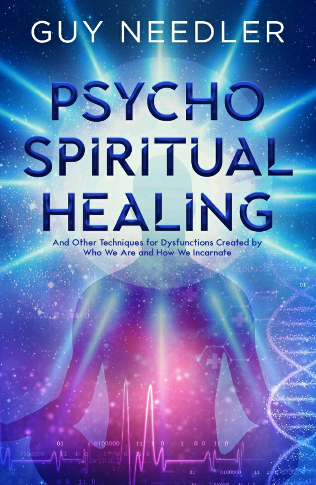

**基于[DeepL](https://www.deepl.com/)翻译**

## Table of Contents 

Foreword General Notes Prior to Performing a Healing Preliminary Consultation/Normal Consultation Energy and Vibrational Healing:Natural Healing Using Nature's Basic Principles What Is Energy and Vibrational Healing? What Are the Healing Techniques Used? Chelation(basic energy balancing) Chakra Reconstruction What Are the Chakras? Anatomy of a chakra Why the Chakras Need Repair or Reconstruction General Wear and Tear Low Frequency Interruption Chakra Disfigurement Skewed Use of a Particular Chakra or Chakra Set Overprotection of a Chakra or Chakra Set Atrophied Chakras

Foreign Objects In General Chakra Repair and Reconstruction A word of advice How to Raise One's Frequencies to that of the chakra to be Healed To Open a chakra To Close a Chakra Establishing Which Chakra Needs Healing and What to Do Scanning the body Individual Vortices Groups of Vortices Replacement of Groups of Vortices Outer Skin Repairing the Outer Skin Replacing the Outer Skin Chakra Replacement Removal of Astral Entities Linked into a Chakra Removal of Foreign Objects in a chakra Establishing the Need for Removing a Foreign Object from a chakra Removal of Protection Removing the Old Protection,Replacing with Appropriate Protection

Organ or Body Part Reconstruction Perceiving the Organ to Be Reconstructed Replacing the Templates of the Organ Past Life Trauma Healing (and Link Removal) Removing the Past Life Trauma Removing Past Life Links Psychic Surgery An Offer of Help A Request for Help Copying the Work of a Physical Surgeon Auric Layer Reconstruction Astral Entity Removal The Appearance of an Astral Entity Attached to an Energy Template The appearance of an Astral Entity Attached to an Auric Layer How to Remove an Astral Entity Holes in the Auric Layers Energy Hooks Astral Mucus Clearing

Crossed Hara Lines (Lines of Projection)with Other Incarnates from the Same or Different True Energetic Self Untwining the Hara Line Virus clearing Spine Cleansing Preparation One Vertebra at a Time Overall Spine Cleanse Spinal Energy Flush and Energy Flow Activation Brain Balancing and Clearing Brain Clearing Brain Balancing Hara Line Healing Realignment Healing Methods-Become Frequency Neutral Hara Line Inflammation Hara Line Severance Hara Line Disconnections(misalignment) Removing Karmic Links

Karmic Links between Two Separate or Different Aspects Karmic Links between the Aspect and Itself Removing Karmic Links between Two Seperate or Different Aspects Seeking and Giving Forgiveness Forgiving Oneself Removing the Karmic Links from a Wrongdoer Removing Foreign Objects Removing a Foreign Object from the Auric Layers Removing a Foreign Object from the Energetic Templates Removing Links with Other Incarnates (Non-Karmic) Removing the Links with Another Psychological Issues as a Function of a Higher Frequency Incarnation Attention Deficit Hyperactive Disorder(ADHD)and Attention Deficit Disorder (ADD) Symptoms in Children Symptoms in Adults The Spiritual/Energetic Explanation for ADHD,ADD,and Bipolarism Client Specific or“Bespoke”Healing

Psycho-Spiritual Reprogramming How to Perform Psyco-Spiritual Reprogramming Dementia and Alzheimer's Disease How We Incarnate,How It Affects Us Psychologically,and How to Heal Such Conditions,Including a Short Explanation for Bipolarism The Hierarchial Structure Associated with the TES Maintained Connectivity with Event Space Walk-Ins Walk-Ins That Want to Keep or Take Control Compartmentalizing or Reassignation of Control Removal of a Walk-In Psycho-Spiritual Method of Healing Uncontrolled Event Space Interaction Afterword Recommended Reading Glossary About the author

2020 by Guy Steven Needler All rights reserved.No part of this book,in part or in whole,may be reproduced,transmitted or utilized in any form or by any means,electronic,photographic or mechanical,including photocopying,recording,or by any information storage and retrieval system without permission in writing from Ozark Mountain Publishing,Inc.except for brief quotations embodied in literary articles and reviews. For permission,serialization,condensation,adaptions,or for our catalog of other publications,write to Ozark Mountain Publishing,Inc.,P.O.Box 754,Huntsville,AR 72740,ATTN:Permissions Department. Library of Congress Cataloging-in-Publication Data Guy Steven Needler-1961- Psycho-Spiritual Healing by Guy Steven Needler Psycho-Spiritual Healing describes the various healing modalities used in treating,physical,energetic and psycho-spiritual issues. 1.Spiritual 2.Healing 3.Energies 4.Modalities I.Guy Steven Needler,1961 II.Metaphysical III.Healing IV.Title Library of Congress Catalog Card Number:2020950639

ISBN:9781940265933 Cover Art and Layout:Victoria Cooper Art Book set in:Times New Roman and Schnebel Sans Pro Comp. Book Design:Summer Garr Published by: PO Box 754,Huntsville,AR 72740 800-935-0045or479-738-2348:fax479-738-2448 WWW.OZARKMT.COM Printed in the United States of America

Illustrations by Nina Spolar“nini”

## Foreword 

This book,at first glance,would appear to be a departure from my usual subject matter. However,when one considers that everything I have written to date was initiated by me enrolling in a healing workshop in 2001 presented by Helen Stott,a direct student of Barbara Brennan,previously a NASA scientist,who used channeling to establish more information about the patient the healer was working on,you should be able to see the link.The origin of the energy and vibrational healing is therefore based upon the teachings of Barbara Brennan,which were subsequently taught to me over four years by Helen.This is my heritage and lineage. My reentry into the multiverse was initially supported by me opening a small healing practice in a holistic venue close to my home in 2005.This floundered at best and then failed,resulting in me focusing upon the information I gained through channeling rather than the healing itself,which disappeared into the background.Later,when The History of God was written in 2010,I created a website to support its Internet visibility and felt drawn to offer channeling-based readings and of course the energy and vibrational healing I was taught by Helen via the same website.One by one,I started to receive requests for both readings and healings from people all over the world,all possible by the use of Skype,QQ WhatsApp,and WeChat.Together with channeling more books and creating the Traversing the Frequencies workshops,the rest is history,so to speak. Although I initially worked within the framework of those techniques I studied,I found that I was accessing other techniques or modalities that were new and not currently available,creating new modalities of healing and adding them to my repertoire.My communications with The Source were allowing me to create both new and bespoke healing modalities required for all or one patient only.Additionally,my late wife,Anne,has helped me at times as well,making important suggestions about healing requirements and possibilities. As I worked on a plethora of different patients (from literally all over the world),I noticed that some of the bespoke modalities could also be generalized allowing many others to benefit from me working on the illness of one.I also noticed that much of what we bring into this incarnation,including our method of incarnation,affects us energetically creating physical dysfunction through psycho-spiritual programming. Having perfected these techniques and using them with,in some cases,miraculous success,I felt a very strong need to share this work,via a book,with the wider spiritual public.I do have to say though that this book is not supposed to detract one from attending a fully certified healing workshop or school,but is designed to show some level of detail and act as a trigger for those who want to be a healer,to see what the art of the possible is,and to seek proper tuition.Please note that some people are not meant to be healed,that their illness is part of their incarnate experience,or their way out of this incarnation.It is part of the role of the healer to recognize this,providing assistance and not a cure,not engaging the ego or the determined healer thinking,"YOU WILL BE HEALED-SO HELP ME GOD!" I strongly advocate that the budding healer goes through an essential program of psycho-analytical work to assist in cleaning and clearing the psyche and distancing one from one's ego while undergoing training.This will help to ensure that one's "stuff"is not passed on to the patient and the patient's "stuff"is not received by the healer.I will be recommending some authors and books to use to get you started.Healing can be deeply searching from the psychological perspective and is not for the fainthearted. I said that I would give some level of detail to the modalities I will be describing,and in most instances it will be very detailed and may look like it is instructional.However,when you go to a healer,check to see where they gained their qualifications,that they received instruction from a recognized course and have not just gained academic knowledge from a book. In your reading of this book,I am illustrating to you what I do,and how I do it,not teaching you per se.I am simply opening you up to your healing potential and some of the things that can be done. I have noted over the years that healing and my healing modalities are sometimes aligned to each other in a genre of healing,and sometimes they are not but are more standalone.As a result,this book will be presented in five main genres.The healing modalities I use fall into: 1.Energy and Vibrational Healing,including work on the chakras and entity removal 2.Removing Links-links with other incarnates,non-karmic and karmic,plus individual karma and past life trauma 3.Client-Based or Bespoke Healing-mixtures of different healing modalities together 4.Psycho-Spiritual Reprogramming,removal of deep-rooted thoughts, behaviors,and actions 5.How We Incarnate and How It Affects Us Psychologically:Psychosis The details behind these major genres will be presented as chapters within them. Additionally,I would like to make a comment on the way I address the patient/client and the healer.There are times when I address the healer as "the healer"and others where I address the healer as "you."The use of "you"can also be used to reference "himself/herself." Similarly,there are times when I address the client or patient as the "patient"or "client"and others when I use"they."This is designed to give"you"the reader a focus on the fact that you may,or may not be,a healer per se,but are simply interested in this particular aspect of the greater reality.Also note that"they"can also be used to reference"he/she." Please note that the illustrations are conceptual and may change with the psycho- spiritual and intuitive visualization capability (experiential vocabulary)of the healer. Guy Steven Needler June 2018

## General Notes Prior to Performing a Healing 

In general,a form should be employed indicating the process of the healing and expected physical sensations together with permission or authority for the healer to perform the healing in the form of a signature from the client before starting the healing.Similar concurrence can be gained by the use of a tick box on the healer's website if payment via the website is made or concurrence by use of the payment system provided a note of acceptance is located in an obvious position close to the payment system on the website itself. The healer should first employ the use of a good-quality therapy couch.It should be placed in a room dedicated to the healer's therapy and positioned so that there is plenty of room to move around the couch with a chair with castor wheels if necessary.I prefer to heal sitting down;it is a comfortable position to be in and if the healer is comfortable then the client will have a comfortable energetic experience. Any energies from previous clients can be cleared from the room by smudging the air by burning incense.

## Preliminary Consultation /Normal Consultation 

Before starting any healing modality and indeed during the first meeting between the healer and the patient,it is advisable to perform a short fifteen-to twenty-minute consultation. Subsequent consultations may be shorter.The first consultation may require what is normally a one-hour appointment to be one hour fifteen minutes to allow an appropriate length of time for the healing process.Please be advised that any notes that are taken are classified as private/confidential and should therefore be stored in an appropriate and safe area. During the consultation the healer should ask a number of questions of the patient to help him/her ascertain the modality/ies of healing necessary and more importantly the origin of the issue/s that caused the physical manifestations or psycho-spiritual issues that are required to be healed.These questions can be illustrated by the following subjects: Feelings Emotions Past memories(not experiences)·Frustrations Physical pain and its location Psychological issues such as anxiety,depression,etc.·Fears Interaction with others Likes and dislikes·Food eaten·Accidents·Recent experiences Past experiences(not memories) Links with family,friends,and work colleagues Through asking questions based upon these subjects,the healer,in using his/her intuition,can create a picture of where the underlying issues were manifest and what modality or combination of modalities should be employed to effect a healing. Once you have established the modality/ies of healing to be employed,the healer should gain authority from the patient to move into their energies,which should include the advice that you may place your hands on the areas of chelation within this authority.You are now ready to perform a healing.Please note that it may be appropriate to cover the patient's body with a warm blanket to help them stay warm.

Once I have established,through a combination of analysis and intuition,what type/s or modalities of healings are required to be performed on the client,I advise them what I am going to do and explain why I am going to do it.

## Energy and Vibrational Healing:Natural Healing Using Nature's Basic Principles 

What Is Energy and Vibrational Healing? Energy and vibrational healing is a gentle noninvasive therapy and covers a plethora of minor modalities such as Reiki,Brennan Healing Science,and other hands-on healing techniques,including those that are unregulated.It does not cover the usage of an intermediate focus of the energies channeled by the healer such as the use of pendulums, stones,crystals,acupuncture,acupressure,candles,or other physical interfaces.It heals the physical manifestation of dis-ease,which results from imbalances in the human energy field and the energetic templates that allow the manifestation of the gross physical aspect of the human body we incarnate into.In most cases these imbalances are created by misperceptions of events encountered during our early years of life that are reflected on the body's energy system.These ultimately create physical dis-ease and dysfunction.However, they can be caused by other things such as how we incarnate,what we bring into this incarnation from a previous incarnation,and how addicted we are to the low frequency thoughts,behaviors,and actions associated with incarnating into a low frequency environment.This is called karma and will be dealt with in its own chapter. Because I mentioned physical interfaces above,I feel a need to explain a few things about them.A physical interface is a method used to provide the healer,or indeed a channeler, with a focus,or even confidence that they can do that which they want to do while using the physical interface of choice or that is aligned to the modality of healing they are specialized in. So,those that use them subconsciously feel that they can only effect a healing when they use them.Indeed,the use of such physical interfaces is limited to the energies they are associated with and so limits the ability of the healer to provide a holistic healing service. This is not to say that those who specialize in healing modalities that require a physical interface are poor practitioners,it is just that they are specialized in a certain healing modality,one that requires the use of the focus of the physical interface they are trained in or drawn to use.They are not holistic and generally cannot heal issues that fall outside the capabilities of their specialism.If they do manage to heal an issue outside of the capabilities of their specialism,it is because they are subconsciously using another modality which may be being channeled through them at the behest of the collaboration between the Guide and Helpers of the client and the healer. Energy and vibrational healing usually requires light placement of the practitioner's hands over different areas of the client's body;it is not a physical interface but a way of affecting a direct method of channeling energy from the healer to the client.Note,however, that the energy is not actually from the healer but is channeled through the healer from the free energies that pervade The Source Entity,our creator.The hands can be placed a few centimeters above the client if desired.It is normally carried out with the client lying on a therapy table,in order to promote good relaxation but can be and is also performed at a distance (distance or absence healing)with the same level of success.A session may leave the client feeling in a rather different state than usual,so that it is best not to move or animate the body quickly or drive immediately after a healing. What Are the Healing Techniques Used? There are a number of healing techniques that can be employed during the healing process and some of these are mentioned below: Chelation(basic energy balancing) Chakra reconstruction Organ reconstruction·Psychic surgery Auric-level reconstruction Astral entity removal Astral mucus clearing·Virus clearing·Spine cleansing ·Brain balancing Hara Line healing Foreign object removal Other healing modalities that I use that are not mentioned above will be noted in their own chapters because I feel they are not specifically related to the genre of energy and vibrational healing. Chelation (basic energy balancing) Chelation is the most basic of healing techniques and also the most benign.It is simple and easy to perform and requires little if no actual complicated interaction with the client by the healer. Chelation is a healing technique where the healer places the hands over specific areas of the gross physical body allowing the divine energies of The Source to be channeled through the healer without intervention. There are sixteen points of contact/no contact that are used to channel healing energies during the chelation-based healing.They are: 

[图1](img/s6-062.png)

1.The Left ankle 2.The right ankle 3.The left knee 4.The right knee 5.The left hip 6.The right hip 7.The front aspect of the sacral chakra 8.The front aspect of the solar chakra 9.The front apsect of the heart chakra 10.The left shoulder 11.The right shoulder 12.The front aspect of the throat chakra 13.The rear aspect of the throat chakra 14.The left-hand temple area of the head 15.The right-hand temple area of the head 16.The crown chakra Note that I only specified the front aspects of the sacral,solar,and heart chakras.(See the next chapter on chakra regeneration for the locations of the chakras.)This is because the horizontal chakras have psycho-spiritual functions are well.The front chakra is our intention and the rear chakra is our action so whatever we do or request of the front chakras the rear chakras receive or do automatically.However,some healers performing chelation do place the hands over both the front and rear aspects of the sacral,solar,and heart chakras during chelation.Also note that the spiritual or third eye chakras are not used.I will explain the process of performing a chelation in full now.

How to Perform a Chelation Chelation is performed by the use of placing the hand,palm opened,on the area of the position of the chelation.The palm of the hand is the position of a minor chakra. The length of time spent in one position within the chelation-based healing is a function of the healer's intuition,but I have found that it is usual to stay for between two to three minutes in each position.Using the chelation points previously stated,I usually place the palms of my hands in the following combinations of positions: Note that the position of the healer in relation to the patient is a function of personal choice and comfort. 1.The left and right ankles 2.The left ankle and left knee 3.The left knee and left hip 4.The right ankle and right knee 5.The right knee and right hip 6.The right and left hips 7.The left hip and front aspect of the sacral chakra(can be just front and rear aspects of the chakra) 8.The front aspect of the sacral chakra and the front aspect of the solar chakra(can be just the front and rear aspects of the chakra) 9.The front aspect of the solar chakra and the front aspect of the heart chakra(can be just the front and rear aspects of the chakra) 10.The front aspect of the heart chakra and the left shoulder 11.The left and right shoulders 12.The right shoulder and the front aspect of the throat chakra 13.The front and rear aspects of the throat chakra 14.The left-and the right-hand temples are of the head.The hands should be placed just above the ears with the third and fourth fingers either side of the ears. 15.The crown chakra;the right hand should be over the crown chakra with the left hand on top of the right hand. 16.When you feel that the healing is completed,move out of the energy field of your client and visualize resealing it.This recreates the integrity of the seven layers of the human energy field and reestablishes its normal protective properties. Example of the Chelation Points and Position of the Healer

[图2](img/s6-063.png)

Explanation of Performing Distance Chelation As I stated in the foreword,a lot of the healing work I perform is "distance- based."This means I am in communication with the client via some form of video telephony such as Skype,WhatsApp,QQ,or We Chat or simply an audio telephone (landline or mobile/cell phone). When I perform these distance-based healings,I use the exact same process that I would use when performing a "physical"presence-based healing.However, for the client,this is not what I would call value for money as they would be either sitting or lying down on a bed or couch in their home or other quiet and private location and not be experiencing anything else from a physical perspective. Remember we are incarnate into a physical vehicle and therefore desire physical feedback of some sort most of the time.This is true no matter how spiritually aligned we are. In order to address this problem,I do three things. 1.I advise the clients that they may experience certain physical sensation-based phenomena and that they should look out for such reactions within themselves during the healing process.I don't advise them what they would be because this would create expectation and distract them from the potential to experience the plethora of sensations that they may experience through focusing on the one that they would“like”or“prefer"to experience..Suffice to say these sensations can be experienced as heat,tingling,pressure around the area of the third eye,the crown of the head,or the periphery of the skull,tinnitus,visualizations in the closed-eye vision,and energy movements within the body or emotional content. 2.I explain what I am doing as I do it.I feel that in distance-based healing this is important as it involves the client's own visualization process of the healing as it is being performed creating a synergetic effect that augments the effectivity of the healing being administered. 3.I make an audio recording of the healing and send it to the clients. Giving the clients an audio recording of the healing is important because they can review,in the privacy of their own home, what they have received from a healing perspective.Additionally, placing themselves in a comfortable position while listening to the recording of their healing places them in the same "Event Space"as that experienced when receiving the "real-time"healing.This is of significant benefit to the clients from both a healing and a financial perspective.Indeed,I have had many clients advise me that they received all of the same sensations experienced when in the real-time healing.I do not believe that these are just psychosomatic or placebo- based responses but are very real and very beneficial. 4.Note that I do not retain copies of the recordings of my clients'healings. I see the recordings as the sole property of the clients and this practice helps to maintain their privacy.I also do not condone the audio of the healing being uploaded onto social media by clients.I have the same policy for audio recordings of readings.

## Chakra Reconstruction 

What Are the Chakras? The chakras can basically be described as energy junctures.They are distributed around the human body at various points where the energy distribution lines meet or are joined together.They come in three main sizes,major,minor,and mini.The major and minor chakras are the most important from a healing perspective with the major chakras usually needing to be healed in some way and the minor chakras in the palms of the hands being used for healing during chelation. The flow of energy in the minor chakras of the hands is usually pushed out from the palms to the point or area required to be healed.The flow should be natural and not"pushed" as pushing the energies into a patient can be detrimental to the healing process and uses the ego of the healer to heal in a certain and successful way rather than the patient's desire to be healed,the healer being a simple interface with the healing energy of The Source and The Source itself The minor chakras can also be used in psychometry.Psychometry is the sensing of an object's use or history by linking into its natural energies by the use of the chakras in the hands. When I talk about chakra reconstruction,therefore,I talk about the healing of the front and rear aspects of the major chakras only.First,though,I will discuss the construction of the major chakras. Anatomy of a chakra The major chakras are described and illustrated in many and varying ways in numerous spiritual texts and artwork.They range from the factual to the wholly inaccurate in both their description and illustration.I have therefore come to recognize that the level of description and illustration is a function of the level of education of the writer,healer, or illustrator.I also note a secondary function of when the text/illustration was written/ drawn,the era the work was done in,and the world spatial location. Without a doubt in my mind,the descriptions of both Hindu texts and the observational illustrations of Barbara Brennan provide the most accurate information on the size,shape,and functionality of the chakras to date. The best way to understand what a chakra is then is to study the Hindu texts and the works of Barbara Brennan (see Hands of Light and Light Emerging).Having pointed out the locations for you to find the best information,it would be remiss of me to not summarize this information for you.

The major chakras are energy receptors that work on the first seven frequency levels associated with the physical universe.The human body uses the energies of the first ten frequency levels of the physical universe to create and maintain/sustain it.Levels 1-7 support the integration of the sentient energy of the Aspect or Soul with the human body and levels 8-10 provide the energetic "step-down"function that allows the compression of the communicative bandwidth and allows the Aspect or Soul itself to enter into levels 1-7, which are necessary for incarnation in the gross physical. The chakras "pull"energy "in"to assist in the incarnate Aspect or Soul's maintenance and animation of the gross physical(frequency levels 1-3)and spirituo-physical aspects of the human body(frequency levels 4-7).They are cone-shaped,vortex-based receptors that have a number of minor vortex-based receptors within them.They are like vortices within the overall form of the vortex of the chakra.Each of the chakras is frequentially associated with the energy template that creates the human body of the same frequency,1- 7.The use of these energies by the chakras creates a form of radiation associated with the first seven frequency levels.This is called the human aura or human energy field. All of the major chakras are joined together via a main energy conduit,which is ultimately co-joined to the Hara Line.The Hara Line is that tube of energy that protects the sentient energy of the Aspect or Soul allowing it to enter into the construct of the human body and maintain some form of communicative capability with the True Energetic Self(TES).Although,the communicative bandwidth is drastically reduced as a function of moving down into the frequencies that necessitate incarnation to interact with a low frequency environment,some communication is still possible and the incarnate Aspect or Soul is never actually disconnected from the TES. The number of smaller vortices within a chakra is specific to the overall number of subfrequencies within a frequency level.The lower the frequencies a chakra has to work with,the lower the number of smaller vortices that are within it.The higher the frequencies a chakra has to work with,the higher the number of smaller vortices that are within it. For example,the base or root chakra has a low number of smaller vortices within it due to the low number,fewer than ten,of subfrequencies.On the other hand,the crown chakra has a high number of smaller vortices within it due to the high number,hundreds,of subfrequencies. The chakras therefore work on a complicated broadband spectrum of subfrequencies within the overall frequency levels that they are associated with.All of these frequencies and subfrequencies are needed to assure a complete integration of the Aspect or Soul with the human body allowing the command and control,the animation of,the human body by the sentient energy of the Aspect or Soul in a seamless way.In the correct high frequency environment,the energy of the frequencies received by the chakras is all that is necessary to sustain and perpetuate the existence of the human body as a useful vehicle for interacting with a low frequency environment of a level that is higher than that experienced by us all now.However,due to the preceding and current frequency levels being very low at best,it is necessary to consume the energy associated with vegetables,fruits,berries,nuts, pulses,and fungi.Hence our need and desire to eat and drink.Although certain blood groups are predisposed to being vegetarian (herbivore),meat-eating(carnivorous),or need both physical foods (omnivorous),with correct training a person can still sustain his or her human body by energy alone.

[图3](img/s6-064.png)

### Why the Chakras Need Repair or Reconstruction 

As well as being used for energy reception to maintain the incarnate human body,the chakras are also used in the many ways we have of communicating energetically.As a result of being used for other purposes the chakras are exposed to being damaged or abused. Damage and abuse can result in the failure or reduced function or efficiency of a chakra, which ultimately creates physical dysfunction and illness.These can be described in the categories below: Psychological and emotional issues within the self are created by how we are programmed by our parents,teachers,peers,environment,and overall incarnate experience. Psychological and emotional issues create a condition where the balanced use of a chakra is disturbed to the point where certain frequencies are ignored,not desired, overdesired,or rejected.The effect on the operational functions of the chakras in this way further supports the psychological or emotional issues that are being experienced,creating a downward spiral in both the chakras and the individual.The visual appearance of the chakra/chakras concerned varies but in general it can be seen that certain vortices within the chakra are either inflamed,atrophied,nonfunctional,oversized,or abnormal in shape. In each case described,an internal chakra vortex that displays one of these visual attributes will need to be replaced by the healer.See the table below this text for the psychological functions of the chakras. Psychological and emotional issues between people are created by how we interact on a one-to-one basis with certain individuals rather than being general programming issues. Psychological and emotional issues between people also create a condition where the balanced use of a chakra is disturbed to the point where certain frequencies are ignored,not desired,overdesired,or rejected,creating similar or the same visual appearances as those described above.The interesting point to note here is that the chakras may recover when the issues between the people concerned are either resolved or removed through lack of association or the removal of a link or karmic link.It is also possible that the chakras may change to the dysfunctional state only when interacting with the individual/s of concern so the healer may need to refer to a psycho-spiritual or link removal approach rather than healing the chakras per se.However,if the dysfunctional state is maintained outside of the interaction with the individual/s concerned then the vortices will need to be replaced together with psycho-spiritual reprogramming (see the chapter on psycho-spiritual reprogramming later in this book).

Psychological Function of Chakras and Name,Appearance,and Function of the auric Layers Energy Levels Chakra Chakra "Front'Action "Rear"Action Root Quantity of physical energy.will to live * Quality of love for the oppositesx Sacral giving and receiving mental and Quality of sexual energy. spiritual pleasure. Pleasure and expansiveness spiritual Healing and intentionality toward Solar wisdom,consciousness of the universality of life and who you are your health in the universe. Heart feelings of love toward other Heart Ego,willor will toward the outer human beings,openness to life world. Throat Taking in and assimilating Sense of self within society and one's knowledge profession Spiritual Copacity to visualize and understand Ability to acheive ideas in a practical Eye mental concepts W Crown Integration of personality with life and splritual aspects of mankind

Adapted from Barbara Brennan,Hands of Light(Bantam Books,1987),Fig.9-1,p.73. An energetic attack on an individual's energy body,body,chakra,or chakras can be a conscious,unconscious,specific,general,or collective (more than one person involved)act. Depending upon the issues surrounding the desire to attack an individual,the energies and frequencies from one or more chakras can be used by the assailant to attack another.Based upon this,it can be understood that the chakras can be used to project energy as well as receive energy.(The direction of rotation creates the push or pull of energy/frequency.) An energy attack on the chakras can damage the whole chakra,demanding major reconstruction or even replacement of one or a number of the vortices within the chakra. In any energy attack on the chakras,the resulting imagery received illustrates either disfigurement of the chakra or its vortices or outright burnout resulting in serious physical dysfunctional response or illness. Astral entity attachment is more common than one would imagine.Astral entities are created in one of two major ways.First,they can be consciously or unconsciously created from energies in the fourth to seventh frequencies,but usually the fourth and fifth,by a specific individual and projected/directed toward the person that is being targeted as a function of anger or dislike by that individual.Second,they can be created as a natural function of evolution through the attraction of similar or same energies and the resulting creation of minor or rudimentary intelligence.Whereas astral entities that are created through an incarnate individual's anger are perpetuated in existence by that individual (should that conscious or unconscious desire remain),astral entities that are created through natural evolution are not capable of generating their own energy to perpetuate their existence and so can and do have a very transient period of cohesion in one particular state of rudimentary intelligence.As such,astral entities only maintain their individualized existence from a longer-term perspective through the energies of another,either their creator or a host.This survivability requirement,being recognized by the astral entity on a very basic level,usually motivates it to the point where it seeks out a suitable source of free energy,a host,and attaches/associates itself to the host.More often than not,the astral entity attaches itself to an area of the human body where it is not noticeable,but where it can create an energetic link to the unsuspecting host,or better still,create a synergetic dependency between the host and the astral entity where the host receives some form of power or coercive function over others. Astral entities come in all shapes and sizes and therefore have varying levels of energetic demands on their host,who will generally feel tired,unless there is a synergetic exchange involved.When an astral entity attaches itself to a host via a chakra,usually a major chakra, it uses most of the energy and frequencies received by that chakra leaving a bare minimum to sustain the host,hence the feeling of being tired.The astral entity attaches itself to the chakra by digging or plugging itself into one or more of the vortices within the chakra, which damages that vortex and blocks the frequencies and energies being received by the others so that it can use them itself.In effect,it becomes part of the receptive function of the chakra while damaging that chakra.As a result,a chakra that has been used by an astral entity to sustain its continued existence usually needs major reconstruction or replacement once the astral entity has been removed. Illustrations of Astral entities attacking a chakra.External and Internal attacks/attachments shown.

[图4](img/s6-065.png)

A Spider/Crab-like Entity outside the Chakra

[图5](img/s6-066.png)

An Imp-like Entity inside a Vortex

[图6](img/s6-067.png)

A Slug-like Entity in between the Vortices 

### General Wear and Tear 

One would think that energetic components of our incarnate vehicle would not be subject to general wear and tear,but they are.They are not subject to wear in normal circumstances but they are subject to wear as a result of our psycho-spiritual thought processes and actions. Such actions are lack of proper nutrition;lack of proper exercise;dysfunctional thoughts,behaviors,and actions;poor environmental conditions;drugs and alcohol intake; overindulgence in food and exercise.There is an old saying,everything in moderation is fine but we do tend to overindulge in that which we like. The wear-and-tear damage on the chakras associated with the gross physical is therefore created by the imbalances that were created by extreme focus on the physical, whereas wear-and-tear damage on the chakras associated with the spirituo-physical is created by the imbalances that were created by extreme focus on the metaphysical. We need to live in balance with whom and what we are-and the fact that the incarnate vehicle is a very complex device-not just from the physical perspective but also from the energetic perspective. Focusing on the gross physical means that we are addicted to low frequency existence while incarnate and ignore the metaphysical or spirituo-physical.Focusing on the spirituo- physical or metaphysical means that we are addicted to higher frequency existence while incarnate and ignore the gross physical. Unbalanced incarnate existence puts a strain on those chakras that are being overused as a result of focus on one aspect of our incarnate existence and causes those chakras that are not being used to go into a state of atrophy through lack of use. General wear and tear is an overall function of those issues that create the degradation of the efficiency of the function of the chakras over time.It ultimately results in the reconstruction or total replacement of a chakra or number of chakras to ensure the continued opportunity for incarnate existence is maintained.If reconstruction of,or replacement of,a chakra or chakras is not achieved in a timely manner then the gross physical aspect of one's incarnate vehicle will be affected detrimentally,which can and does include psychological issues. 

### Low Frequency Interruption 

Low frequency interruption is a condition that all chakras are exposed to,irrespective of one's ability to exist in a balanced way.Low frequency interruption is a function of existing in one's normal environment and is the result of the chakras attracting stray low frequency energy.Functioning almost like dust,this stray low frequency energy gets attracted to the chakras and the vortices within them by what can only be described as a function of the normal energy flow from the outside environment to the chakra.It is sucked into the area of the chakra by the flow of energy and covers the outside of the individual chakra vortices,the receptor area of the vortices within the chakra,and fills in the gaps in between the vortices.

With the vortices within the chakras being covered in low frequency energy,the efficiency of the chakras to pull in energy associated with that chakra is impaired resulting in a functional imbalance,which has a detrimental effect on the gross physical and spirituo- physical energetic templates that create the incarnate vehicle.This can and does result in rapid ageing of the gross physical. 

### Chakra Disfigurement 

Chakra disfigurement is when the normal size and shape of a chakra,its representation as a healthy chakra,is compromised as a result of any of the issues described above and below.The shape of the chakra can represent the type of stress or damage it has sustained as a result of psychic or energetic attack,skewed use,atrophy,astral entity,or foreign body attachment to the chakra.The chakra can present damaged,missing,or detached inner vortices to the healer along with abnormal external appearances.In any of these instances, the healer will need to decide whether to repair the chakra by repairing or replacing the vortices,change the outer skin (energetic shape)of the chakra as a whole,or indeed replace the whole chakra. Descriptions on how this can be achieved are illustrated later in this chapter.