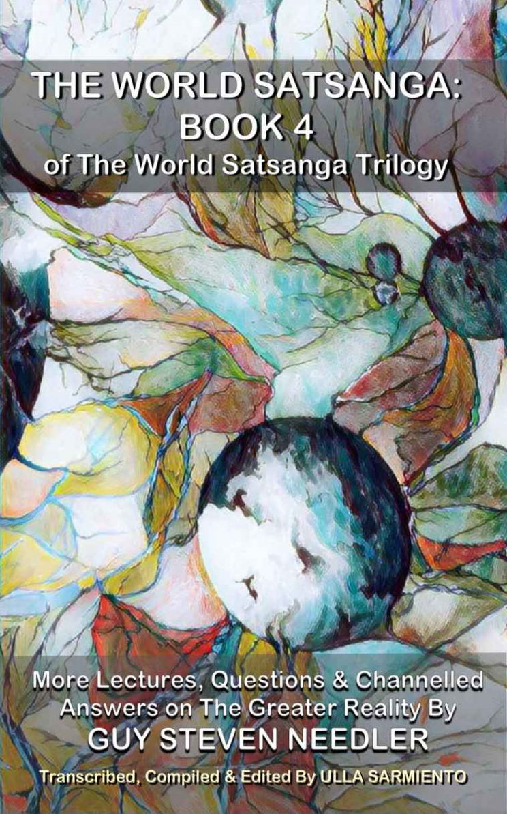

The World Satsanga: Book 4 of The World Satsanga Trilogy 

More Lectures, Questions & Channelled Answers on The Greater Reality 

By Guy Steven Needler 

Transcribed, Compiled and Edited By Ulla Sarmiento

---

### Table of Contents 

- Foreword 
- Introduction to the Greater Reality 
- ADHD and/ or Autism Spectrum 
- Afterlife 
- Aliens 
- Amorphous 
- Animal Entities 
- Artificial Intelligence 
- Ascension and Awakening 
- Astral Entities 
- Backfill People 
- Chakras and Energetic Templates 
- Channeling 
- Conspiracy Theories 
- Curators (Maintenance Entities) 
- Disease Conditions 
- Dreams 
- Event Space (Parallelism) 
- Free Will 
- Guides 
- Incarnation 
- Karma 
- Masters 
- Meditation 
- Metaphysical Teachings 
- Multiverse Cycle 
- OM Beings 
- Origin 
- Physical and Spiritual Science 
- Psycho-Spiritual Healing 
- Sentience 
- Soul Seat vs. Ego 
- Source Entities 
- Terrorism and Societal Breakdown 
- True Energetic Self (TES) 
- White Children 
- Afterword 
- The Needler Lexicon 
- About the Author

### Books by Guy Needler 

- The History of God (2011) 
- Beyond the Source — Book 1 (2012) 
- Beyond the Source — Book 2 (2013) 
- Avoiding Karma (2014) 
- The Origin Speaks (2015) 
- The Anne Dialogues (2016) 
- The Curators (2019) 
- Psycho-Spiritual Healing (2021) 
- The Om — The Uncreated Creations (2022) 
- Beyond The Origin (in publication) 
- The World Satsanga: The First Ten Years (2023) 
    - Book 1: Lectures 
    - Book 2: Questions & Channelled Answers (A-Ma) 
    - Book 3: Questions & Channelled Answers (Me-Z) 
    
*** 

The Unknown Knowledge - Known 
The Unanswered Questions - Answered

### Foreword 

The original Foreword to the first World Satsanga Book 1, “Lectures” the first of a trilogy, describes a potted history of how the World Satsanga itself came into being, and how the books, through the dedicated transcription, compilation and editing wizardry of Ulla Sarmiento, became published. 

This original Foreword, along with a Foreword to the Foreword, was also used to introduce the second and third books, which focussed on the “Questions and Answers,” which were asked over the first ten years of the World Satsanga. If this is your first book, I therefore encourage you to read the original foreword as well. 

However, hopefully, by now dear reader, you will have either read some of my channelled works, such as The History of God, The Origin Speaks, The OM, etc., etc., or, one or two of the World Satsanga books. As a result, you will have gained some understanding of the direction my work goes in and the detail behind it, including the reasons for the questions asked by those who attended the World Satsanga over the years. 

When we (Ulla) finished the editing of the third book, and subsequently published it, we rather jokingly stated that there might be a fourth book, not thinking that it would actually manifest. However, as Ulla looked at the text we had remaining from the transcriptions, and that some new information was coming forth from some of the latest World Satsanga meetings, mainly as a result of new attendees, we decided that a fourth book would be an ideal time to wrap it all up. 

This book would be a compendium of the remaining Lectures, Questions and Answers not yet published and meditations of note that Ulla had transcribed. We very quickly noticed that we were close to our 500-600 page maximum and that we would work on transcribing the material from the next four to six months Satsangas - maximum. Additionally, we decided to extract the meditation transcriptions and publish this separately (as a fifth book?) giving us a bit more leeway in the number of “new” transcriptions we could add into a fourth book. 

This book, that contains the remaining Lectures and Questions and Answers, is therefore, the fourth in the World Satsanga trilogy. I rather like the idea of keeping the word trilogy, even though this is the fourth book in the World Satsanga set, as it pays homage to the convoluted way in which the Greater Reality works and the information extracted from it though channelling. 

Again, this book is compiled in “alphabetically organised subject order.” 

Without doubt this fourth World Satsanga, and previous books, would not have materialised without the help, interest, motivation, intuition, dedication, encouragement, friendship and VERY HARD WORK of Ulla Sarmiento. 

Again, I thank you Ulla for being here, on this planet, at this point in OUR existence. 

Guy Steven Needler 21st December 2023

### Introduction to the Greater Reality 

#### Special Lecture in Mumbai, India (2/2019) 

**Do souls travel together over time (or event spaces)? If so, are some of your students part of a soul group that does so?** 

There are souls that work together. They’re called sympathetic souls. They don’t always work together for a long period. That could be 1-2-3-4 incarnations. Some of them I’ve come across as being students of mine or friends, and some of them are people who are students of other people as well. Some of them are masters in their own right. So it’s quite common for people, who are in these sorts of positions where you are in a humble and honored position where you can help others by sharing knowledge, there are times when those individuals are also there to help out and help broadcast the knowledge as well. So they won’t be part of a soul group, they will be just a group of souls that are sympathetic souls, because they worked together before. A soul group is souls from the same Higher Self and each individual soul would be classified as being a soulmate as a result of that (3/ 2024).

