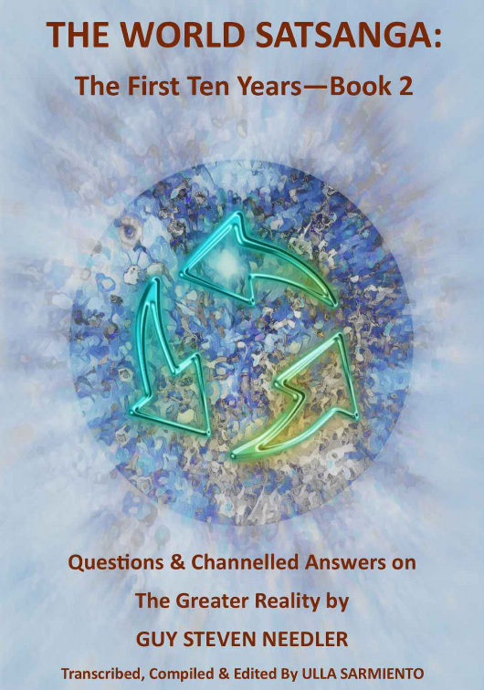

**基于[DeepL](https://www.deepl.com/)翻译**

The World Satsanga: The First Ten Years Book 2 

Questions and Channelled Answers on the Greater Reality By Guy Steven Needler 

Transcribed, Compiled and Edited By Ulla Sarmiento

---

### Table of Contents 

- Abortion and Miscarriage 
- Addiction 
- ADD/ ADHD 
- Afterlife 
- Aliens 
- Amorphous 
- Angels 
- Animal Entities 
- Artificial Intelligence 
- Ascension 
- Astral Entities 
- Autism Spectrum 
- Backfill People 
- Bipolarism 
- Chakras and Energetic Templates 
- Channeling 
- Climate Change 
- Conspiracy Theories 
- Council of Twelve 
- Curators (Maintenance Entities) 
- Disease Conditions 
- Dreams 
- Event Space (Parallelism) 
- Evolutionary Content 
- Free Will 
- Guides 
- Holographic Space 
- Incarnation 
- Interdimensional Travel 
- Karma 
- Life Plan 
- Life Review 
- Living Entity 
- Manifestation 
- Masters 
- Afterword 
- The Needler Lexicon 
- About the Author 

With thanks and gratitude to the following people: 

The World Satsanga participants for their never ending stream of questions and dedication to knowing more about the Greater Reality. They are an inspiration. 

Ulla Sarmiento for her dedicated focus on disseminating higher levels of knowledge and transcribing, compiling and editing the World Satsanga content over the last ten years, without which, these books would not be possible. 

Celia Austen-Potts for her patience, inspiration, assistance and inexhaustible ability to keep me grounded!

### 目录

- 堕胎和流产 
- 成瘾 
- 注意力缺失症/多动症 
- 来世 
- 外星人 
- 无定形 
- 天使 
- 动物实体 
- 人工智能 
- 扬升 
- 星光层实体 
- 自闭症谱系 
- 回填人 
- 双极性 
- 脉轮与能量模板 
- 通道 
- 气候变化 
- 阴谋论 
- 十二理事会 
- 监护者（维护实体） 
- 疾病状况 
- 梦
- 事件空间（平行） 
- 进化内容 
- 自由意志 
- 指导灵 
- 全息空间 
- 转世 
- 跨维度旅行 
- 业力
- 人生蓝图 
- 生命回顾 
- 生命实体 
- 显化 
- 大师 
- 后记 
- 尼德勒词典 
- 关于作者

---

### Foreword 

Welcome to The World Satsanga: The First Ten Years Book 2 - Questions and Channeled Answers on the Greater Reality. 

If, dear reader you read The World Satsanga: The First Ten Years Book 1 - Lectures on the Greater Reality, then this foreword is just to remind you of how these books came to be. If, however, this is the first book in the World Satsanga series you are reading, then the foreword below will explain how it all materialised. 

Enjoy!

~ ~ ~ 
 
When The History of God was first published, a reader contacted me and expressed an interest in a dialogue. This dialogue continued for some time and resulted in two things. One; a monthly meeting where my readers, or people of like mind, could gain answers to questions not answered in The History of God. And two; me travelling to New Mexico in 2012 and holding a Traversing the Frequencies (TTF) workshop. I was subsequently invited back over the next couple of years and enjoyed the interest in the greater reality. It was at one of these workshops that I met a remarkable lady who was later to become a spiritual/ metaphysical influence in her own right. Her name was Ulla Sarmiento. 

The monthly meeting was to be called the “World Satsanga” and it was broadcast live on Skype. We enjoyed between 12 to 25 (the max Skype would allow) attendees each month. The format was that I would give a lecture, we would then have questions and answers, followed by an end of meeting meditation. The answers to the questions were channelled “on the spot” by me. The Satsanga would be recorded and the recording would be available via email to the attendees or those interested. It would also be blogged via my website. Ulla was a regular attendee. 

Satsanga is a Sanskrit term derived from two roots: sat meaning "true” and sangha meaning “community, company or association.” There are many other interpretations such as Satsang or Satsanga being an audience with a Satguru (religious or spiritual teacher) for religious instruction. It may also refer to other spiritual movements originating in India. However, the feeling of “being together in the truth” is the one that resonates with me the most. World Satsanga therefore means a “a world together in the truth” in my mind. 

The World Satsanga has changed over the years, including being pre-recorded with the questions and answers being emailed to me prior to transmission. However, more recently it has stabilised to being a pre-recorded lecture and meditation with the questions and answers being broadcast live via Zoom. The final recording being everything edited together as one file and broadcast on YouTube. 

During 2016 Ulla announced that she transcribed the Satsangas for her own reference, asking me if I would like to transmit the transcriptions on a monthly basis together with the video/ audio files. We both thought it would be perfect for those with hearing difficulties or were not so “connected” to the internet, whose connected friends could print them off and distribute them. We felt this was a perfect solution and the transcriptions flowed each month. 

Transcription is hard work by the way! 

Over the years I would get the odd nudge from attendees or readers/ listeners of the World Satsanga broadcasts suggesting that it would be nice to have a book written on some of the subjects broached. Yes, I would say and then completely forget about it as I was too engrossed in writing my latest book. However, this possibility, or Event Space, was not to go away. 

In 2021 the World Satsanga was ten years old and Ulla emailed me to say that she was seeing the same questions being asked and the answers being repeated. Prior to this if the same questions were asked new information would be channelled by me. With the change in format to be introduced in January 2022 back to live video questions and answers we therefore decided to call a close to the transcriptions, because they were still available on my website for those who wanted to read them. 

It was late 2021 that inspiration, or Event Space, suddenly came into focus. YES! We should make a book out of the lectures, questions and answers arising from the Satsangas. Now was the time. I quickly emailed Ulla who instantly agreed it was a good idea. However, she had only transcribed the Satsangas from 2016 onwards! Did I have the earlier recordings? I noted that in saving space on my website, some of the earlier recordings were deleted, so I was suddenly worried. Luckily though, I had archived them and we had a complete set. 

In the meantime Ulla had moved house and country! And needed to work on her own publications and website before commencing the unbelievable amount of work transcribing the earlier recordings and starting to compile the text. When Ulla became available we decided that it was best to work on the questions and answers first and see how large that task was before looking at the lectures. As it happened the questions and answers needed two “large” books. This book on the lectures was a fast follower but with heavy editing, mainly due to repetition of lecture subject matter over the years, we thought would fit into a single book. 

Even though the questions and answers books were finished first we decided that, as with the format of the World Satsanga, the lectures should come first with the questions and answers coming second and third, hence this being book one! 

The book on lectures is compiled in “alphabetically organised subject order” with the material for each subject together in the same section for ease of indexing and reading. Please note that if additional or new material was broadcast from lectures of the same subject matter then that was included to make it one lecture. 

The same compilation strategy is used for the questions & answers books, with this book - Q& A book 1 (World Satsanga Book 2) hosting questions and answers from A-M. 

Without doubt this first World Satsanga, and subsequent books, would not have materialised without the help, interest, motivation, intuition, dedication, encouragement, friendship and VERY HARD WORK of Ulla Sarmiento. 

Indeed, this particular Event Space would not exist without her! Something to think about dear reader! THANK YOU ULLA FOR BEING HERE ON THIS PLANET AT THIS POINT IN MY EXISTENCE Guy Steven Needler 4th December 2022

### 前言

---

### Abortion and Miscarriage 

The human being is made of two parts— a soul and a body. Think of the body as a vehicle, like a car, which needs a driver, which is the soul. When the body dies, the soul leaves the car behind. The soul goes back to its True Energetic Self (Higher Self/ Oversoul/ Godhead/“ Home”), which is where it came from. The soul is eternal, so it can never be harmed or destroyed by others. 

**When does the soul permanently enter the body?** 

Before conception there is work on a life plan by the incoming soul and the potential parents. But the soul doesn’t permanently enter the body at conception or at the embryonal or fetal state or even in the birth state. The soul can move in and out of that body up until the age of 4 years and then starts to become more and more attached and connected to the body. 

It’s around the age of 7 years that the soul is fully integrated with the vehicle that it’s going to use for its incarnate experience. This description is in my book, The Anne Dialogues. It’s about the integration of the soul and the human fetus (4/ 2016). 

**What is the spiritual perspective on Birth control?** 

If there is birth control involved, then that’s understood by the soul. Think of things in a more holistic way, in a more holographic way. The souls know that a potential father or parent is going to have an abortion or birth control, so the birth control doesn’t come into it as such. That’s a linear function. The souls work with that which is going to be. They know what’s going to happen. 

Everything has happened already anyway. Everything is happening. Everything will happen and it’s happening now or concurrently, so everything is understood. As a result of that, they take upon themselves to enter the physical vehicles that are going to be successfully created. So the birth control side doesn’t come into it at all (4/ 2016). 

**What is the spiritual perspective on Abortion? Is it pre-planned by the mother’s soul or the incoming baby’s soul? Is it just the physical vehicle that is aborted?**

It’s usually an agreement between the soul that’s in the mother’s body and the incoming soul that only wants to experience connecting to the fetal form. The abortion is one way of terminating that incarnation at an early exit point or termination juncture, so that the soul can leave and move back into the energetic side. Usually, it’s about experiencing the connectivity between two souls from the start of the process of creating a new human vehicle. The incoming soul only needs to experience a small part of the gestation period. The abortion is understood and recognized on a subconscious level as an early termination juncture that the mother uses to help the soul within the fetus move to back into the energetic (8/ 2018). 

**How does Abortion sit with the Source? How does it affect the woman’s life path? Do some women choose to experience that or is it the baby’s soul choice?** 

You have to look at a higher perspective. It’s about experience. The individual mother might want to experience the gestation of another form or incarnate vehicle within it for a certain period of time and then no longer want to experience that as part of its incarnation. Similarly, the incoming soul may wish to be associated with being part of the gestation of an incarnate vehicle up to a certain point and then detach from it (11/ 2018). 

**Is it counted as Karma?**

It’s usually part of a plan, an experiential plan that the aspect associated with the mother and potentially the father and potentially the child in its embryonic state wanted to experience in different ways. They all wanted to experience different aspects of that and then move on. 

We don’t all want to experience a whole life. We don’t want to experience being born. We sometimes want to experience the condition of connectivity with the form, which could be born, for instance. We’ve got various different things here, which are sometimes abhorrent to the human condition, but actually very benign to us when we’re in the energetic (11/ 2018). 

**If the embryo/ fetus is a matter-based vehicle (made of Anu particles) used by the soul, then who creates the body during gestation? Is it the mother’s body in utero or a joint effort by the mother and the soul after the soul starts to integrate with the vehicle?** 

The fundamental particle of matter called the Anu is the basic building block of the gross physical plane. It’s six levels below the atom. There’s two things happening here. One is the animal-based creation of a form and the other is the energetic-based creation of that form. We have the mother through the partnership with the father getting together to create the possibility for a smaller form to be created. 

But the energies associated with that need to be supported by the soul, which is a smaller aspect of the True Energetic Self. The soul’s guide and helpers ensure at conception that the embryo has a basic energy system and a basic set of chakras, so the energy is there and it can start growing. Without that energy system in place, the embryo can’t grow, it’ll just die early (e.g. abortion, miscarriage). 

We have two things happening here. We have the physical growth of a fetus and we have the energy system associated with that, which the guide and helpers and the soul create and align to that fetus right at the very start at conception, so that the energy is there. Without that, it can’t grow, it’ll just die early— what we call an aborted birth or those sorts of things. 

So when the fetus doesn’t grow or it is miscarried, it’s usually because the energy associated with the body that the soul would use either hasn’t been placed there or it has been removed, so that that fetus can’t possibly grow into a useable vehicle for experiencing, learning and evolving in this particular low frequency environment (6/ 2017). 

**Does the soul create the vehicle as a construct of Anu particles or just as a projection of light from thoughts. The Pleiadians (channeled by Wendy Kennedy) said:**

“As a 3D being, in order to experience physical reality, you focus your energy as a soul— you intensify the beam of light, if you will, your consciousness so densely that it creates dense physical matter— you create a body for yourself.”— Wendy Kennedy (“ The Great Human Potential”) 

**Is that how the mechanics of incarnation happens?** 

First to clarify, we’re not really “three-dimensional beings.” Our soul has incarnated into a human form, which is a vehicle that exists in the gross physical plane created from the first three frequency bands (FB 1-3) in our universe. That makes us a “three frequential” incarnate entity. But the human form is highly sophisticated and exists on higher planes called the astral or spirituo-physical plane (at FB 4-7) and the purely energetic plane (at FB 8-10) as well. Two things happen. The fetus grows within the mother after procreation by the mother and the father. At the same time, the soul inserts the energy system into the body with the help of its guide and helpers. 

Wendy Kennedy is summarizing the energy that’s associated to the fetus. It’s not quite accurate, but it’s close enough. It only deals with one thing. We do create the body, but we also create the energy system associated with the body. The way she said, “You create the body for yourself” is sort of right and sort of wrong, because we don’t create the body. The gross physical body is created for us as a result of procreation by the mother and father. But our soul with its guide and helpers insert an energy system into that physical body (with the chakras and energetic network at FB 1-10). Without that energy system in place, the fetus won’t grow. 

It’s not quite deep enough in understanding when stating you intensify the beam of light, which is focusing the energy of your soul, your sentience (“ consciousness”) so densely that it creates dense physical matter. We don’t actually create dense physical matter, it’s too difficult for us. We assist in the animation of the dense physical matter (body). 

We create the interface, if you like, between the dense physical matter and the soul, so that the soul can interface with it. That’s what we do, we create the interface. If you want to think of it in terms of creating the body, you can do, but it’s a bit confusing and not correct. We create the interface that allows the soul to be inserted and connected to the gross physical. The gross physical can’t exist without that interface, so those two things go together (6/ 2017). 

**Is the Zika virus infection manmade or a spontaneous epidemic?** 

The Zika virus is in effect “manmade,” but not in terms of being made in the laboratory. It’s a function of our remaining in a lower frequential state— meaning anything that can put us into a lower frequential state, whether it’s fear, materialism or the need to have certain levels of status, etc. As a result of that, an existing virus may mutate into a state where it can infect the human body. It’s a function of our frequential condition that is allowing that mutation of existing viruses to take control (4/ 2016). 

**There are 2.2 billion people at risk?** 

Yes, that gives you an idea of how many individuals are potentially at the wrong frequential state that allows something to be created that resets the clock, so to speak. If you think about some of the worldwide issues we’ve had, like black death, HIV and these type of things, it’s a function of where there is a need to reset the clock or start again. That means a lot of us in the incarnate state leave the planet. This is how these different viruses come into being (4/ 2016). 

**What is Source’s position on Aåbortion, if the mother is infected?** 

The loss of any vehicle is a tragedy, because every vehicle that can come into fruition as a human body is the opportunity for a soul to experience incarnation and to learn and evolve as a result of that irrespective of whether there is a defect or not. If there is a defect, the soul grows faster than if there isn’t a defect, so any body that is aborted is potentially difficult (4/ 2016). 

**What if the mother’s life is in danger?** 

Yes, because the mother’s life might be taken out of danger. It could well be that the soul that’s existing in the mother’s body has decided to experience that level of danger, to allow another soul to experience incarnation as well. It’s a very human thought process to think about, “Oh, if the baby’s got cancer or Zika or HIV, it could potentially infect the mother, if the mother is not infected.” She could be a carrier, so they’d take out the baby and abort it. 

On the other side, it could be the mother is infected and the baby is okay. She’s had the baby out and the mother could die. It’s all to do with the experience of the soul, not the thought process that the human being should try to perpetuate the human body for as long as possible. If it’s part of the life plan that the soul within the mother’s body is expecting to experience the disease as part of their experiential and evolutionary progression, then they will do that irrespective of what’s going on around them (4/ 2016). 

**What happens in Miscarriage in terms of parallels? Does that happen only in some parallel lives (e.g. 50% of them) and not in other parallels? Or does it vary from case to case?** 

When there has not been an incarnation, because the aspect wanted to experience just being part of the joining of the mother with the fetus, then my understanding is that there’s no parallel conditions elsewhere. The only parallel condition would be with the mother (9/ 2018). 

**If the baby soul decides to leave through miscarriage in one parallel, what happens when that woman gets pregnant again?** 

The woman is the incarnate entity that is in different parallel conditions, so that individual would arguably not get pregnant with that particular soul who created the miscarriage in the rest of the parallel incarnations. 

There is some logic to this. The logical mind says, it makes sense that potentially you experience a miscarriage in one parallel condition but not in another one. But it’s all to do with the intention or the desire of the entity that is in the fetus, whether that soul wants to incarnate or not. 

If it wants to experience multiple parallel conditions— where in one parallel stream it is incarnate, and in another one it’s not or in another one it’s stillborn or it died after three days of being incarnate— then that may well be experienced. There may well be different experiences of pregnancy that the woman may experience. But generally, unless there’s been an agreement with the soul that is being incarnated in that mother to do those sorts of things, then generally the mother is only pregnant in one particular reality (9/ 2018). 

**Can the same baby’s soul return to the same woman in another parallel scenario downstream from the miscarriage scenario?** 

Yes, it can, if it has decided to be in different levels of incarnate relationships with that woman in different parallel conditions. But if it hasn’t decided to do that, then it won’t do it. It’s just as I’ve explained it in the last part (9/ 2018). 

**Or is that soul now committed to existing in the earlier parallels where the woman carried the fetus to term in the first place?** 

Again, it depends upon whether the agreement between the incarnate individual who is the mother and the incarnate individual who is the baby. Usually, it’s about the incarnate individual who is the baby, who wants to either experience just one level of function of being incarnate or multiple different functions of being incarnate associated to them. So again it could decide that it only wants to experience a fetus growing for three months and then the miscarriage happens. 

Or it might want to experience all of those different things, and therefore, incur the different parallel conditions where it could experience going through full term, being born and dying three days later, for instance. It could be born and go to full adulthood. It could be dying at birth. It could be a whole bunch of different things, if it wishes to do so as well. 

So it’s really up to the soul as to how it wants to experience it and invoke those different parallel opportunities as well. In terms of life plans, it can also work on those as well— meaning work on understanding the different parallel conditions as well (9/ 2018). 

**Can that baby soul “loop” back into the same woman to share another set of parallel lives with her, if she feels strongly connected to that particular baby soul?**

Well, just say soul or aspect rather than “baby soul,” but I understand what’s being said there. It wouldn’t specifically be looped back. It could go back, but that creates the parallel condition. So it’s not a case of looping back, it’s a case of working with the parallels rather than looping back. Then again that would be a particular relationship that’s been set up for this particular series of incarnations or not, as the case may be, with the entity that’s incarnating as the baby and the entity that’s being incarnated as the mother (9/ 2018). 

**If so, the logistics of these parallel lives is really mind blowing, because we don’t see any of the "event space maneuvering" going on behind the scenes?** 

Yes, when I was looking at all the different fractals, as I was trying to answer these questions, it was just unbelievably huge, because we don’t see any of the event space maneuvering going on behind the scenes. We don’t understand in any way, shape or form the amount of work that goes on in the background and all the things that we normally understand as well (9/ 2018).

### 堕胎和流产 

---

### Addiction 

**Is there “karma rehab” in the energetic, perhaps to dissipate addictions?** 

The answer is yes, there is a certain level of rehabilitation there. When we are addicted to drugs, for instance, those drugs affect the soul or aspect energetically in a detrimental way. Those individuals whose physical body demises or they ascend early through the taking of drugs or in alcoholic conditions have to go through a certain level of rehabilitation, because that addiction is karma. It’s addiction to the physical and it’s a function of sensation-based karma. 

Karma is attraction to anything that’s low frequency while we’re incarnate. They can undergo a level of rehabilitation, where the energetic damage is resolved or balanced out, so the energetic damage done to them by taking drugs or alcoholic overdose or anything like that is balanced out by other disincarnate entities that are aspects from other True Energetic Selves that specialize in removing the energies associated with the death in a certain way (7/ 2014). 

**What are the effects of taking marijuana or alcohol?** 

Although marijuana isn’t specifically the strongest thing, like LSD or crystal meth or ecstasy or other drugs that are out there, we do get a partial decoupling from the physical vehicle, and therefore, hallucinations or more lucid moments can also be experienced as well. But it’s disharmonious for the soul, because the physical form is being poisoned, so the soul has to try to get out. With things like marijuana or other low grade drugs, the soul can’t totally get out. 

It’s the same with alcohol. Sometimes people have more lucid moments having alcohol, more thought processes that are more in keeping with clairsentience than they would do, if they were totally sober, so it’s the same thing. It’s a limited level of decoupling there rather than a total decoupling, so the soul doesn’t get totally ejected from the energies associated with the gross physical and the spirituophysical parts in the vehicle. 

In essence, any form of drug in all ways, shapes and forms isn’t good for us, not specifically from the physical perspective, but also from the energetic perspective and from the soul level. Any toxins that are in foods that can be addictive or anything associated with a synthesized or even a natural drug, if it’s used incorrectly, would affect us definitely. 

We are supposed to be self-contained and self-maintained. That means we can heal ourselves and continue our existence as long as possible. But we’ve lost that ability to be self-contained and self-maintained, so we’ve started to rely on external activities and maintenance rather than doing it ourselves. We’ve relied on a doctor or an apothecary or a wisened person to help us heal our physical form rather than healing it ourselves. 

That’s a direct result of us moving down the frequencies in the past. We don’t need to eat anywhere near what we eat, we only need to eat enough. If we really do start to train ourselves properly, we can take energy through the chakras and the physical form would be maintained via energy through the chakras, and therefore, the need for gross physical food would be negated (1/ 2015). 

**In The Anne Dialogues she said sedatives lower our frequency and make it harder for the soul to leave the physical body. What about hospice or end-of-life car with various drugs?** 

All of those things do affect our ability to leave. The drug lowers the frequency of the soul and attacks it by stopping it from being higher frequency. Each of these drugs affect our physicality and our energies in a different way depending upon who and what we are. Therefore, one particular drug may affect one of us more than another person, because one person might be naturally resistant to it energetically and chemically, so it’s a bit of a mixed bag (1/ 2015). 

**Do our souls react differently to different classes of drugs, such as CNS depressants (alcohol, Prozac), CNS stimulants (cocaine, meth), dissociative anesthetics (ketamine, PCP), hallucinogens (LSD, psilocybin, ayahuasca) or inhalants (anesthetics)?** 

All these things— they do the same thing. They’re all a mechanical way of achieving a greater level of connectivity, but they do it by throwing the soul out of the body. Inhalants used for surgery do the same thing. They all can react in different ways and each of us will react differently to the same drug and even the same dose of the drug. One of us might be naturally resistant to the drug’s effects. It just depends upon what our level of natural resistance is both energetically and physically in that respect (1/ 2015). 

**I’ve read that lower frequency beings just get sucked back into Source, but as we raise our frequency, our signature aspect (soul) gains substance?** 

If it is lower frequency beings, I’d classify those as astral entities rather than souls or aspects of a True Energetic Self (TES) that have been projected into an environment to experience, learn and evolve. The astral entities are low frequency entities made of energy that through either luck or longevity has started to evolve its own minor intelligence. If they start to abuse individual souls who incarnate for evolutionary purposes by hanging onto them and taking their energy— which happens a lot— then a healer can see them and remove them from that individual and send them back to Source to be recycled. 

In terms of low frequency incarnate individuals, if a soul has accrued a significant amount of attractivity to lower frequencies by being attracted to drugs or alcohol, then after death their soul will go into a “quarantine” first, where those addictions are erased from them before they can recommune with their TES. 

The TES will not accept back into itself an aspect that is overloaded with low frequency attractivity. It tolerates normal karma, because the end game of that is a significant leap in its own evolution. But being attracted to low frequencies and becoming a very low frequency aspect means that the soul is quarantined and “cleansed and educated,” so that it can recommune with its TES later (2/ 2015). 

**Quarantine sounds like purgatory?** 

It’s not so much purgatory as it’s more of a way of cleansing that part of the aspect or the soul. It’s a little bit like having worked on an oily and greasy motor car and then not putting your best clothes on. You clean those hands until they’re spotlessly cleaned, then you put your nice clothes on. It’s a little bit like that, so think of it in that way (2/ 2015). 

**What is the reason behind the opioid epidemic or crisis in the United States? Opioids are prescribed as pain killers for chronic pain. About 100 people die of opioid overdoses per day, more than deaths from gun violence. Is it to do with our overall frequencies still going down? Or is addiction something that some souls wanted to experience and then recover from? Or is it profiteering by big pharmaceutical companies and the medical community? All of the above and more?** 

Yes, it’s all of the above basically. It’s a whole bunch of things. It’s a thought process where we want to get a quick fix. We don’t want to go through the process of fixing ourselves or working on ourselves and our thought processes to be able to remove that which is causing us pain by allowing ourselves to detach from pain, detaching ourselves from the physical aspect of what we are. Pain can be removed simply by detaching the consciousness from the focal point of the area of pain and thinking of something else. 

For example, how many of us have been running or cycling or swimming or walking and going somewhere and then thought about something or we’ve been daydreaming and concentrating on something else. We’ve suddenly come out of the daydream or the thought process and found out that we’ve moved a long way. We do it in cars and motor bikes, which is not so good. That’s because we’re so engrossed in this other thought process that we forget our physical condition. 

Even though we might be exercising vigorously, we remove ourselves, remove our consciousness from this focal point of the pain associated with exercise or a particular issue we’ve got. We can use those sorts of methods to remove ourselves or detach ourselves when we’re in pain. We can work on healing ourselves as well. 

But in real terms, it’s to do with low frequency thoughts, behaviors and actions and again laziness associated with it. Sometimes it’s experiencing addiction and not coming out of addiction. Sometimes it’s wanting to move forwards and recover from that addiction as well. 

There’s also the thought process surrounding profiteering by the big pharmaceutical companies and medical community. People in a low frequency condition start to become lazy in their thought process and their actions. Rather than wanting to work hard to do something, they want to recover from it without having to do real work. 

For instance, it’s easier for the doctor to say, “Yeah, take this pill, it will sort you out,” instead of saying, “What you need to do is this and this is a program for doing it and come back in three or four weeks and let me know how you’ve done.” That takes a lot of extra determination by the individual and a lot of time by the doctor as well. That’s why we get on the pill route. It’s a low frequency, easy, lazy way of doing things that’s associated with low frequency (10/ 2017). 

**If one has had any addiction, but he/ she recuperated from it during their incarnated life by attending AA meetings, etc., do they still have to be quarantined?**

This comes from The Anne Dialogues. The level of quarantine depends upon the level of dependency on the drugs and the level of the ability of the incarnate aspect or soul to disassociate themselves from that addiction. Sometimes the addiction is part of a piece of evolutionary progression, where we place ourselves in a difficult position and then the life plan is to remove ourselves from that difficult position or the karmic link of addiction. 

Bear in mind, we run lots of risk in terms of significant karma and contamination, if drugs are involved. If you are addicted to drugs or alcohol, it does reduce your frequencies to the point that the aspect is unable to recommune with the True Energetic Self. If the demise of the human vehicle is through drugs or alcohol, then that results in the quarantine function, where the soul has to be cleansed by the True Energetic Self before it can recommune with it (10/ 2018). 

But if they have moved away from the addiction, because they can draw upon the expertise of individuals who can guide them away from drug dependency or addiction, then they would still have to be quarantined, but not in the same level as somebody who was completely dependent and died from overdosing, for instance. Usually, there would need to be a little bit of quarantine, just to make sure that the energies associated with the low frequencies that they accrued or that stuck to them during their dependency was removed (2/ 2019). 

**In The Anne Dialogues, you said low frequency addictions are removed by going back to event spaces— is it when the desire started? Doesn’t that change the past or the parallels?** 

Once we have disincarnated and we’ve moved away from this particular incarnation, the addictions are removed, which is part of the quarantining function by going through the different event spaces. That allows a disassociation from it. It’s not a change in the past, because the past, present and future are all one. 

Having a past, having a present and having a future is a human concept. It’s a metric that mankind has created to describe something or to control something, which doesn’t really exist. Does it affect the past? No, it can’t do, because the past doesn’t exist. It’s only a series of nows. 

The ability to go back to the inception point and to remove the addiction and remove the energy associated with the addiction means that you’re just changing the use of event space to allow that to happen. So it won’t affect the past. It doesn’t affect parallel lives either, because we’re moving into an event space that is neutral to parallel lives. 

It doesn’t change the experience of the incarnate, or should I say, it doesn’t change the experience of the True Energetic Self, because it’s already recorded. The incarnate aspect is simply a means by which the True Energetic Self can experience multiple things by having parallel experiential processing. 

As long as it’s being experienced, it doesn’t matter if the addiction associated with it is removed, because it’s the experience that counts rather than whether the addiction is still there or not. It’s a very convoluted thing to understand that where we go back to change the event space, it may have already been there in the first place (10/ 2018 & 2/ 2019). 

**When a soul is disincarnate, but still has desires for low frequencies due to addiction, could this disincarnate soul avoid going to the light? Is this why this entity chooses to stay at low frequencies and becomes an entity that attaches itself to other incarnates?** 

In general, the only reason why a disincarnate soul stays around Earth is because they have become immersed in their incarnation and have an addiction to certain incarnate sensations, such as being drunk or being on drugs. They may walk-in to another person’s body temporarily, when that individual is indulging themselves in an alcoholic frenzy or becomes paralytic, so that the incumbent soul has to remove itself from the body temporarily, because the frequencies are so low and abhorrent to the soul. 

But if somebody is already disincarnate and has certain addictive desires, like experiencing alcohol, drugs, sex or various different other pastimes they used to have, it doesn’t mean that they become an astral entity, which is something different. 

The astral entity has some minor intelligence, but it is not sentient or ensouled. It is a transient entity that tries to take energies from other human beings who are incarnate. In this particular case, the soul needs help from its guide and helpers to move it back from the lower astral levels into the higher levels, so they can see the effect of their addictions and what their low frequency thoughts, behaviors and actions have created for them. The guide and helpers will help that soul move on. 

Even though they may be stuck on Earth for what could be days, weeks, months, years or even centuries, they will eventually be pulled back into the higher frequency energies associated with their True Energetic Self. They will be helped to the point where they can reincarnate later, so that their addictions slowly will be removed over a period of time or even a period of lifetimes. 

As our souls progress through the process of incarnation, we get to the point eventually where we understand that certain thoughts, behaviors and actions create a link with low frequencies. Therefore, we actively choose not to have those thoughts, behaviors and actions and choose the higher frequency response. Addiction is just a slowing down of the process of evolution rather than creating an astral entity that is dependent upon the energy of another human being for its existence (10/ 2018). 

There’s never a situation where an aspect avoids forever going back into the light. Going back into the light means that they go back into the frequencies associated with the location of the True Energetic Self. Irrespective of what we do and how we do it, we will all return back to the light— that light being the ability to recommune with our True Energetic Self in one of the five or six different methods that we use to do so (2/ 2019). 

**We hear about people who die from a drug overdose. It may not be intentional but it’s not accidental either. Are their evolutionary debts the same or worse than death from suicide?** 

There is a different level of evolutionary debt associated with suicide— unless they are that very rare case where an aspect or soul is given an exemption to allow it, in which case suicide becomes part of their termination juncture to leave the incarnation they're currently in. 

Basically, the overdose is a karmic debt they have. It becomes an issue, because they need to be purified energetically and frequentially before they can reintegrate or recommune with their True Energetic Self. But they also have a very big level of karma associated with the addiction and the attractivity to a physical stimulus, which drugs are. They don't get an evolutionary debt per se, but they do get a significant amount of karma that they've got to overcome (1/ 2021).

### 成瘾 

---

### ADD/ ADHD 

Attention deficit disorder (ADD) and attention deficit hyperactivity disorder (ADHD) are a function of a higher frequency incarnation. These people are here to help raise the overall frequency of the human population and the planet itself. 

**Would you please tell us more about Attention Deficit Hyperactivity Disorder?** 

Attention Deficit Hyperactivity Disorder (ADHD) is something that happens with people who are autistic or people who are higher frequency and struggling to communicate properly with the rest of us. They are broadcasting on various different frequencies and expecting certain levels of communication, but they are not receiving communication back, so they get frustrated. 

For instance, if we communicate on one level of communication, such as the verbal response and they’re communicating on emotional, telepathic and other frequential methods and they’re not getting answers back, they get frustrated. That’s why there’s a hyperactivity disorder or an attention deficit disorder, because they can’t see the point in communicating with us or doing something when we’re not listening to them. That’s why they get frustrated (9/ 2017). 

**In an interview with Julia Cannon in 2015, you said they are advanced beings, like the indigo, crystal, rainbow children or hybrids of those types.** 

They can be higher frequency individuals. They’re advanced beings, like the indigo, crystal, rainbow children or hybrids of those types. Again they do get frustrated, because they’re communicating on like twelve channels, where we’re only communicating on one. The information that we give back isn’t the information that they expect back, so it’s very difficult. 

It’s a bit like us saying something in English and somebody else is communicating with us in Chinese. It doesn’t work, does it? We get frustrated, because we can’t make ourselves known. The person on the other side doesn’t understand what we’re saying either. This is another way of thinking about it (9/ 2017). 

**ADHD tends to run in families and continues into adulthood in half the cases as a sense of being overwhelmed, having no filters and always being on edge?** 

Yes, that’s because they’re communicating and some people communicate with them, but on a different level. Sometimes they pick up lots of other bits and pieces that the other ones pick up as well. Their senses are all open and they’re not getting the information coming through from the people they think should be able to communicate with them, but they are sometimes getting it through from other people who they maybe don’t want to know (9/ 2017). 

**What about the possibility of Bipolar disorder coexisting with ADHD?** 

Bipolar disorder is the possibility of having two souls in the same body where are one soul is sometimes animating the body and sometimes it’s not. It is quite possible to have both of these conditions together, if they’re both quite high frequency souls. 

When either of them is in control of the body or animating the body, then they both would expect to have communication that’s not coming to them. They can see people that they’re interacting with and broadcasting to, but those people are ignoring them in their mind. ADHD can also exist with individuals who are bipolar where they have the potential for two souls to be in the same body (9/ 2017). 

**Most adults with ADHD don't just have ADHD— 75% to 80% have other disorders, such as depression, bipolar disorder, anxiety, substance abuse?** 

The substance abuse and other abuses is because they are trying to get out of the body basically. They’ve had enough or they’re trying to dumb down their own communicative senses. They’re trying to turn off certain communicative methods, so they can operate like us. That’s why they sometimes do substance abuse, smoke or take alcohol, for instance. The depression and anxiety is because they’re not being heard. 

Bipolar is a separate function, but you can be both, if you’ve got two souls who are higher frequency and are communicating on many different channels to us, but we’re not responding back. They will become depressed, because they feel they are being ignored. They get anxious, because they feel they are being ignored and can’t do anything right, because they can’t get the information back in the way that they’re expecting it. 

The bipolar bit is simply that there’s two souls doing a similar sort of thing and both have got control of the body. It’s almost like having many personalities, the same sort of thing. It’s just that the one is more depressed or sad vs. one is more joyful (9/ 2017). 

**What’s the best approach to treatment (e.g. medications, psychotherapy, behavior modification) or coping with life?** 

Basically, the best approach to treatment is to put them with like types of individuals. People who are experiencing this should stay together, because they will be able to communicate with each other properly. A person speaking English will be able to speak English. 

A person speaking Chinese will have to speak Chinese. A person speaking or communicating on twelve different frequency levels will be able to communicate with somebody on twelve different frequency levels. This is the thing about it. The therapy is behavior modification based upon being introduced to and working with other individuals who are experiencing the same condition as them. They’ll be able to communicate with each other and realize that they’re not alone. They’ll start to operate properly, so to speak (9/ 2017).

### 注意力缺失症/多动症 

---

### Afterlife 

The afterlife refers to the soul’s transition to the energetic side after the human body demises. The soul may go to the astral levels in the physical universe or directly to its True Energetic Self (Higher Self, Oversoul, Godhead) higher up in the multiverse. 

**How does the soul feel right after death?** 

My wife (Anne) had brain cancer and she ascended on December 24, 2012. Since then I’ve had a number of communications with the “energetic Anne” who said she is enjoying herself in the energetic. Right after death I picked up that she was on the boundary of the Source Entity doing tumbles and gymnastics and all sorts of stuff to indicate that she was free, completely and utterly delighted with the total freedom that she got from being apart from her physical human form. I’ve had plenty of communications with her in her post-demise energetic condition specifically through cowriting the book called The Anne Dialogues. 

One of the things I’ve learned about grieving a loved one is that we anchor them to the physical by our intention to be with them. Our intention causes them to be lower frequency than they may want to be after they finish their incarnation. Our attachment creates an energetic link to their soul. It doesn’t help them in the slightest. In fact, it inhibits them big time. The same is also true for our attachments to animals or our pets that die. 

Naturally, it’s difficult for those of us who are left behind to understand the higher reason for why they left the physical to move on to the greater reality, but it was part of their life plan that was agreed upon in the energetic. We must accept their exit method, respect it, honor it and send them love in a nonattached way to help them move on. 

Otherwise, we are holding them back, retarding their progression upwards in the multiverse. When I logged into Anne days after she had ascended, she had moved onwards totally. She didn’t hang around, because she had experienced everything that she needed to experience in the depths and time frame that she needed to experience things. She was gone (12/ 2013). 

**What happens to the ego when reincarnation happens, instead of incarnation?** 

Basically, the ego dissolves after every incarnation. As we move up the frequencies, we lose our ego, because the ego is created through separation and we’re no longer part of separation after death. We are reintegrated with our TES in the higher frequencies of the multiverse. Even if we do a bounce or back-to-back reincarnation, where we come back into the energetic and go straight back into another incarnation, that particular ego dies and is absorbed. When we reincarnate, we have to go through the process of becoming energetic again before we can project that same aspect or another aspect of our TES into the physical via the use of the human vehicle (12/ 2013). 

**Does service to self lead to increased egoic actions?** 

Yes, unless the service to self is based upon making us more in tune, more self-actualized and more robust in our communication with the Source. If we’re being in service to ourselves and that service to ourselves means that we meditate every day, we put that above everything else and we achieve a robust and long term communicative link with the Source, then that service to our self will make us, by default, be of service to others. That will not increase our ego. 

But if we are in service to self from a materialistic perspective, that means riding roughshod over others, not helping those we have a chance to help, because we want to provide for ourselves rather than others, that will create an egoic condition, which is a completely different perspective (12/ 2013). 

**What happens to our earthly personality or human ego when we die?** 

The personality that’s in the human form is a very transient condition. It appears and grows purely, because of the near total loss of communication between the True Energetic Self and the aspect whilst it is projected into the human vehicle. Therefore, the aspect within the human form (or any incarnate body within the physical universe) starts to develop its own personality. That personality is sentient energy in an individualized state. It thinks it’s separated out or alone from what it is connected to, because that personality is experiencing life as a human being. 

For instance, we go to school, get involved with people, gain friendships and relationships. We have careers and what we think are successes and failures. We move forwards, backwards or sideways, as we experience things. We accrue a certain level of memories and experiences. All these things together create a human personality based upon how we interface with our family, friends and all the others we meet in life. This personality is what we call the ego. 

This ego is separate, so it doesn’t belong to the TES. It’s doomed to disappearing when the physical body demises. Most people, including spiritual people, don’t want their personality (or “identity”) to die, even if they recognize that they are part of a bigger entity that lives forever. The bit that’s grown in this lifetime dies when the physical body dies. This is the dichotomy that a lot of people have. They start to think of themselves as the physical body. The ego is trying to perpetuate itself and will do anything it can to substantiate the thought process that you are your incarnate body and that’s it. 

In reality, everything that the individual has been experiencing throughout its life has been naturally recorded by the TES as well. When the physical body dies, all that personality, including all those little traits, little likes, desires and preferences are also transmitted back to the TES, because these are the functions of experience. They are also the functions that allow evolutionary content to be accrued. 

Although we think that the personality dies with the physical body, actually the essence that created the personality exists continuously, because it’s being continuously recorded. So everything that created the personality is already recorded by the TES. Even if we find ourselves as a shard occupying a human body, then that information is first transported back to the aspect and then transported back to the TES as well. 

Therefore, the person we are, the memory set and everything isn’t lost at all, it’s just recorded in a different way. The ego created as a result of this personality does in fact disappear. It can’t be sustained any more, but everything that we are, including everything we’ve experienced and done, everything we’ve believed in, worked with and progressed with is already within the TES. It’s already within the Source and within the Origin as well. There is no loss of anything. 

If we start to become self-aware whilst we’re incarnate and recognize that there is a greater reality out there, we start to work with that greater reality, then the ego starts to get concerned and worried. It tries to keep us in the low frequencies to perpetuate its dominance over the physical form to keep us thinking that it is what we are. We get all sorts of feelings of fear and latch onto materialism. We deny or don’t believe in certain spiritual things, because the ego wants to sustain itself for as long as possible. 

But when the human body demises and the aspect moves back into the TES, we start to lose the smallness of our personality. We start to gain all of those memories, all those experiences, all the evolutionary content and everything that our aspect and all of the other aspects within our TES have accrued over the thousands of lifetimes at various different levels. We become bigger and absorb all of this information. 

When we gain all our memories back, it’s like all of a sudden, we come back from having a massive memory loss and we become everything that we were and everything else that was there. We become part of our TES again, although we still have an individualized part of ourselves, because the TES recognizes that we are “specialized” and it can reuse us for certain things and experiences again (2/ 2014). 

**Is the recording by the TES continuous? Or done in yearly or 7-year cycles?** 

No, it’s continuous. If you were to use a piece of computer terminology, it’s real time. Everything is recorded and absorbed by the TES in real time. Everything we experience, including what we are doing right now is instantaneously recorded. It’s just that the method of recording doesn’t eradicate the ego. 

From our human perspective, we may think, if this information goes back to the TES and is recorded, then why does this ego get created? The answer is it’s an automatic function. The ego is created through the near total separation of the aspect from the TES. Because the frequencies down here are so low, the ability of the aspect to communicate with the TES in a meaningful way is impossible or nearly impossible (2/ 2014). 

**How is that different from the Akashic records for individuals?** 

The Akashic is nothing to do with us, it’s something that the Source Entity creates that we use and work with. We can pull in all sorts of information from different people’s lives to augment our own abilities here. The Akashic records are specific to the information accrued by every aspect incarnated in the human form anywhere within the physical universe. We’re not the only humans in this universe. 

There are other records for all the other entities that incarnate in other form factors or alien species, such as insectoid, reptoid, humanoid, gaseoid, amoeboid, etc. So the Akashic records isn’t to do with the information accrued by the TES, it is like a database, which is accrued separately by the Source Entity based upon what every entity experiences when it incarnates in the physical universe (2/ 2014). 

**Are the records kept in the Earth, Sun or galactic centers as well?** 

The Akashic records are beyond the physical— they are outside of the “hard structure” we call the physical universe. It’s in the rest of the multiverse. We would access it when we’re disincarnate, not as part of our incarnate existence, although there are individuals who can clearly tap into them with their special gifts or abilities that have been carried through with them as part of this incarnation. They are allowed to remember certain things, so they can access the Akashic records at a certain level whilst incarnate. 

The Akashic record is a database. There are databases based upon individuals who have incarnated on Earth or other areas within the physical universe. You could log into the Akashic and say, “Okay, tell me about certain individuals who have incarnated on Earth or on a planet in the Orion Nebula.” You could do it that way (2/ 2014). 

**In The Anne Dialogues you said after the demise of the human vehicle, an aspect can keep creating their temporary environment until it recognizes where it is, whereas those working with the higher frequencies go straight into the life review process.** 

This is like being inside a totally contained individualized ”reality bubble” that we’ve created by ourselves. Souls who are totally immersed in their incarnation simply don’t recognize that they have died. Their physical form is demised, but they don’t know that they are energy beings now. They can and do recreate everything around them that they previously experienced on Earth. 

For instance, they can recreate their house, their friends, their family, the neighborhood that they lived in— their whole world is basically recreated. It takes a long time for them to come out the other side to what is called “energetic self-realization” to know who and what they really are. There’s a lot of work done by the guide and helpers to move them out of this condition or reality. 

But when one is aware and awake, the soul moves straight into the energetic and understands what’s going on and goes into the life review process in the various different forms that takes, as described in The Anne Dialogues. Those who are totally immersed do struggle. Some break out of it fairly straight away. But others can stay there for hundreds of years, even thousands of years in terms of human “time.” It’s up to them, as to how fast they break out of this recreated environment. It’s also about the skill of the guide and helpers to help them move out of it. 

One of the images I got is that there can be a whole group of aspects working together in the energies. Then you have one that’s got a sphere around them— like a sphere around a sphere. That sphere is their individualized reality. They’ve recreated their human incarnate reality. They don’t see anybody else. 

They are energetically there but surrounded by another sphere, which is the creation of their reality that they want to stay with. This other sphere needs to be broken down and that’s what the guide and helpers work hard to try to remove that. There’s no limit, no rules or regulations as to how long this individually generated reality can be there— from a few seconds to a few millennia. That’s how it works. It’s unfortunate that our ability to be incarnate can end up going beyond the demise of the human form (12/ 2016). 

**How long can a soul stay in this “limbo state” before entering into the life review? Is this where all the addictions have to get ‘karmically addressed’ through quarantine?** 

There’s no rules or normality associated with how long it takes to move out of one particular state of self-created limbo vs. moving out of the environment and going back into the energetic. Those who have to have their addictions karmically addressed, they can do it either within that reality through the skillful interaction of the guide and helpers or they have to go to a quarantine area where the addictions that could potentially affect the True Energetic Self have to be totally removed. 

That requires a lot of skill on behalf of the TES and the guide and helpers. They have to sort of relive or re-experience those things that created the addictions that created the karmic links and get to the point where they are no longer addicted or attracted to them. When they have achieved that state, then the aspect can move out of the quarantine levels (12/ 2016). 

**Is this ‘time’ in limbo reflected in an inability to communicate with the aspect’s TES?** 

From their perspective, yes. But from the perspective of the TES with the aspect, no. The guide and helpers can still communicate with the aspect in the same way as when the aspect was incarnate. That’s the problem. They’re having to work with the limited ability and functions and the limited communicative bandwidth of the aspect, because it is still working within the confines of incarnation or lower frequency existence even though it’s not there any longer (12/ 2016). 

**What about the ability for the newly demised aspect to communicate with still incarnate systems, such as human, plants, nonhuman animals and nature itself?** 

The newly demised aspect really wouldn’t want to communicate with the still incarnate systems, such as animals, plants, nonhuman animals and nature, although it can do that. The only time an aspect would want to communicate with a human is when there’s a loved one that is still incarnate that needs to be given a message, a sign or some communication to tell them that the departed soul is still in existence. There are times when souls want to give consolation to those who are still in the incarnate state who don’t know or remember who and what they truly are, so they experience bereavement, sadness and loss (12/ 2016). 

**How does this ’time out’ affect the physical reality? Does it contribute to the lack of understanding of the cause-effect ripples in our lives?** 

The physical reality actually isn’t affected in real terms. As humans we just linearize things. If you think of the individual who is within the quarantine area (because there’s too much karma that would contaminate the TES) or the entity that’s stuck within its own reality, the limbo state is in a different event space. 

When they come out of that event space, they may have spent thousands of years in human terms to get out of that event space. But from our soul’s energetic perspective, it could be nothing. It could be a second or a minute or it could be a hundred years. It just depends upon the entry and exit points of the event space used. 

This sort of shows everything can occur concurrently. Although we create this linear existence from a time-based perspective whilst we’re here, in actual fact it doesn’t really mean anything as such. The physical reality is also part of the greater reality, but we linearize it from the human perspective. 

Somebody can spend an awful long time in one of these quarantine areas or limbo conditions, so it can appear to be like a couple of seconds on the physical plane or they can spend a few hours in limbo or in the quarantine and it could appear to be days, weeks, months or years in the physical. 

It just depends upon how the aspect enters into that event space and how it exits that event space and where that event space was interacting with the event space that we call the physical environment. Also it can still move around just to make things more complicated. So if it was potentially a hundred years and the event space sort of reappears a hundred years in the future, the aspect might want to bring it back to a few seconds after it demised, because it can still move things around. 

It can enter into another event space and come out the other side a few seconds after the demise process. Therefore, the time period associated with the physical world or physical universe isn’t affected. It’s simply the personal experience that is affected and the personal interaction with self, guides, helpers and the environment that is affected (12/ 2016). 

**When souls reincarnate, is there a minimum or maximum or average time spent between lives before reincarnation? Is that changed fo a soul doing back-to-back lives?**

No, provided that we have the authority to come into what I call back-to-back lives, we can go from one incarnation to another incarnation or we can spend millennia away from incarnating. It just depends upon what our True Energetic Self has got in store for this particular soul or individualization of its sentience or whether there’s an overall plan to experience something that spans a number of different lives. 

It is a case of what is part of the big overall plan to experience, learn and evolve. It can be that we can be here instantaneously in the next body or we can go into a walk-in and leave one body that has died and then walk-in to another body, which is already mature. There is no maximum or minimum or average time, it’s just completely individualized as to what we do and how we do it. But it’s also individualized based upon what’s available for us and how important what we’re going to experience is in the overall picture. 

So our guides and helpers and the guide and helpers of other souls and all our True Energetic Selves have a much bigger plan that is so massive that we would never be able to understand it in our human condition. Basically, everything is there and the whole point of evolutionary experience is laid out in front of us. 

If you read The Anne Dialogues, it goes into more detail as to what we do in between our lives. We are governed by the desires of our True Energetic Self, but depending upon our own evolutionary level, we can influence our TES as well, if we have a plan. That depends upon the type of recommunion with our TES we have (7/ 2018). 

**How is the energetic like the physical? Are there famous people/ souls/ entities? Are there vacations, entertainment, travel to see different things? Do we have some best friends that we hang around with? Is there a history that we all agree upon in the energetic?** 

My understanding is that we are all equal. We are all in recognition of our connectivity with our True Energetic Self and with Source in relationship to what we’ve experienced and how we’ve evolved on behalf of our TES and how our TES has evolved on behalf of Source. So there’s no fame. There’s no entertainment or travel to see different things. But we do gravitate towards our TES and those aspects that are part of our TES are within the collective we call the soul group. 

We do have aspects of sentience that we prefer to be with, because they’re part of our soul group. We do also have other aspects of sentience or other individuals from other TESs that we have worked with in previous incarnations that we relate to from an incarnate perspective. It’s not so much that we would hang out with them, but we would work with them to understand what we’re doing next, if we decided to work with them in another incarnation— how that might benefit them and us and others who we interact with as a function of that particular incarnation. 

We’re all in communion and that’s the best way to say it. We’re either in various different forms of individualized communion or in full communion with our TES. The TES itself only enters into full communion when it has finished the evolutionary cycle. We communicate with those other aspects that are individualized whilst in partial communion. But we probably wouldn’t do that, if we are in full communion with our TES rather than an individualized function of it. The rest of the work is about understanding how we’re going to experience, how we’re going to evolve or how we have experienced and how we have evolved. 

The life plan is the creation of how we can experience things and the life review is what we’ve experienced, how we’ve evolved and how our guides and helpers have evolved as a result. Although they are not in the evolutionary cycle, they’ve progressed as a function of working with us, so they’ve benefitted from working with us and learned how to increase the efficiency of their guidance as well. 

So it’s not like being on Earth at all. If we are struggling to detach ourselves from our human incarnation, we can and do at times create an Earth-like environment around us after death. Then you could have famous people’s souls or entities having vacations, entertainment and travel to different parts of the temporary reality that we create around ourselves— simply as a function of not quite grasping the fact that we’ve become disincarnate and need to detach from the Earth environment. 

So anything that is Earth-like that is around us when we’re disincarnate is purely a projection that we’ve created, because we haven’t quite detached from the Earth or haven’t quite understood that we are now back into the energetic and are no longer incarnate. 

From a human perspective, it’s total freedom. We’re not constrained to anything. We are able to be anywhere and everywhere concurrently should we wish to be. We are pretty much as omnipresent and as omniscient as we can be, based on the limited sentience of our TES, which is a smaller unit of Source. Although we have the functions associated with those abilities, they are limited towards the level of sentience that we have. 

The human condition is more like being in treacle (molasses), whereas we have ultimate freedom energetically when we’re disincarnate. We can create a human condition, if we wanted to. We can create Earth in heaven, if you want to. But once you get there, you realize how unnecessary that is (12/ 2018). 

**Yogananda described heavenly astral worlds that “good souls” experience between lives— like heaven. Most souls don’t go to these, but sleep unconsciously in between lives and reawaken in a womb, whereas “bad souls” are tormented with hellish nightmares?** 

You have to understand that Yogananda wrote things based upon the level of education that he had, the experience that he had and what he thought people would be able to digest in his day. It's about understanding the level of detail that one can absorb and one's readers can absorb. 

When Yogananda talks about these things, he's talking about individuals who are immersed in their incarnate condition. Sometimes this information, which I believe at the moment is being rewritten, revamped and redistributed as the lessons, is misunderstood. You have to understand that Yogananda probably understood an awful lot more than what he described to his disciples or his followers, because they wouldn't have been able to understand it (7/ 2019). 

**I don't think this fits how you describe the afterlife where the soul is fully of aware of the dying process, its departure, its life review and various types of communion?** 

He had to bring it down to basic information. Things like hellish nightmares or being stuck in astral worlds is because certain individuals would link themselves to the Earth still. 

Individuals who are going into back-to-back incarnations would stay within frequencies that are almost physical. Don't forget the astral worlds are within the physical universe at the 4th, 5th, 6th and 7th frequencies. If the individual wanted to go above the astral, which is the 8th, 9th, 10th, 11th and 12th frequencies, it would still be within the physical universe. 

So it's about understanding that individuals who do back-to-back incarnations wouldn't go very far frequentially before they come back into an incarnation. They would fall asleep or die in one incarnation and wake up in the fetus of another incarnation, for instance. 

Individuals who have hellish nightmares would be those individuals who are so karmically linked to the Earth that they refuse to leave it. They would experience the lower frequencies available to them, which would be the lower astral where they start to see things like lower frequency astral entities that can present to us quite abhorrent images of themselves to try to distract us from seeing them or try to give themselves power over us, for instance (7/ 2019). 

**Do only advanced souls go through a conscious afterlife process?** 

It's all about understanding the bigger picture. I'll give you an example of how to understand the bigger picture. When we read the Bible, we could just read the Bible and understand things in terms of the information there. But if you look at the way Yogananda described some of the information in the Bible, there is hidden information there. There's more information behind what he is saying. That's because he came to the western world in the 1920s and departed in 1952 when people’s understanding of spirit and the greater reality was very limited. We thought that "ether" was the next level up from us and that radio waves were “ether” 50 years earlier. 

It's all to do with the level of education. If we are becoming self-realized and we're working on ourselves, then we will go through the understanding and awareness that is in The Anne Dialogues. Individuals who are stuck or attracted to the Earth frequencies will experience different levels of limbo or torturous environments, because their soul knows they've got to move on, but they still think they are incarnate, so they want to stay. 

Those who go unconsciously between lives are those who are doing back-to-back incarnations. After they've done the series of back-to-back incarnations that they're supposed to achieve, then they will go through a life review at the end where they understand exactly what they've done, how they've experienced it in terms of the links between the lives, how the things they were supposed to do successfully in one life was then projected into being successful in the next life. 

It's about understanding the depth and detail behind it. Don't just take one level of text as being the be all and end all. Look at all texts, because all the texts together provide the bigger picture. Even The Anne Dialogues is only a very small aspect of what we experience before, during and after incarnation and in the period between incarnations or recommunion with our TES. Look at the bigger picture and understand that some of this information is based upon the education, ability to understand and expansiveness of the teacher, what was taught to them and how expansive their own teachers were at the time. Take everything into consideration (7/ 2019). 

**How should we think of our loved ones who have passed? They may have moved on to a new incarnation or been reabsorbed into the TES or are still individualized disincarnates?** 

The best way to think about those who have passed on and moved out of their physical incarnation is to consider them as going back into what they were, which is sentient energy and recognize that this sortie on Earth is not even a blink of an eye in terms of our normal existence and our longevity in this evolutionary cycle. 

The way to think about our loved ones who are back "Home" in their normal environment is to be grateful for the role they played in helping us become incarnate. They provided a springboard for us to experience, learn and evolve in this incarnation. They helped us with the skill sets we brought in from other incarnations to navigate through this lifetime as efficiently as possible. We thank them for paving the way, so that we can pave the way for the other bodies we’ve created, so that other souls (our children) can incarnate (4/ 2020). 

**They may have incarnated as my son or my grandkids or gone into the next adventure?** 

We just have to think that they've moved on. Some of them will have done a back-to-back incarnation and may well have come back as one of our grandchildren. It's highly unlikely, but it does happen in very, very rare cases. Most of the time though, they will have moved on and entered into some form of life review or understanding the life they had, which includes the work that their guide and helpers have done. Some of them have moved straight through it and entered into some form of partial or full communion with their TES. 

They have progressed in some way either energetically or frequentially. They may have evolved or not evolved. They may have recommuned with their TES. They have moved out of this incarnation into the rest of their existence and may well come back to another incarnation. 

Know that they've evolved in the way that they're supposed to have evolved. They're progressing in the way that they're supposed to progress. Just send them thanks for helping you progress. They've done their role in providing a springboard for us in this rather unique environment with a unique responsibility by having individualized free will (4/ 2020). 

**Is it appropriate to send them love, communicate with them or is it just a memory?** 

You can send them love. They will always receive love, because it's a very potent energy to send. Every entity in the multiverse will feel love, if you project it out and broadcast it. Every entity that is in an incarnation on this planet and other environments within the physical universe and other entities within the multiverse will always feel our love. Just because we think we're small doesn't mean that what we do isn't big. Just send them thanks and love (4/ 2020). 

**If what we call death really occurs when a soul goes from the energetic to the physical, does a soul in the energetic also experience trepidation, fear or terror right before it incarnates?** 

This is basically turning around our thinking— what we call “death” is incarnation and what we call “birth” is going back into the energetic. My knowledge and experience suggests that souls are excited about becoming incarnate. We very quickly forget the trials and tribulations we’ve had in previous incarnations. We move on quite quickly and become very enthusiastic about another incarnation. 

The knowledge base of who and what we are is a function of the frequencies, so our lack of communicative bandwidth is sort of taken in stride, and as a result, there is no trepidation. It’s sort of, “Great, having a chance of incarnating at a lower frequency, so we can evolve faster!” It’s more about motivated excitement rather than trepidation or fear. It’s probably going to create a bit of a stir to think that as souls we are thinking in that way, but we do. 

When we’re in the energetic, things that we think are horrible are just a passing split moment. Things like dying in an accident or in a war or a plane crash or cancer or Covid-19 are simply a way of moving out of one incarnation and coming back into the energetic where we normally belong. It’s just considered an exit point, a termination juncture and nothing to be even worried about. It’s like turning off the switch on a TV— simple as that (5/ 2021). 

**You said the ego dissolves after we die. But Gordon Phinn “interviews” dead celebrities in the afterlife via astral projection. They seem to retain their personality decades after death and engage in activities, like composing music, writing, painting just like on Earth. What is going on?** 

This is interesting, because the next question is almost the same question, but said in a slightly different way. I’m going answer it all in one go (8/ 2021). 

**William Buhlman, Tom Campbell, Lobsang Rampa and others speak about “consensus realities” when they travel to astral planes. People of the same faith live together, go to church or mosque and think they are in heaven. What are these consensus realities?** 

Basically, the “self-realized” aspect will not create a reality around themselves that supports where they think they are or where they think they’re going to (e.g. heaven or hell). 

For instance, Yogananda would have gone straight back into communion with its True Energetic Self and so would have Jesus, Mohammed and the Buddha. They would bypass all of this astral stuff, because it’s not necessary. They know who and what they are and they simply regain their memory set and the quality of sentience associated with being part of the TES— even if they may still be projected from their TES whilst they’re in the energetic in the pre-life, during and post-life review after death, which evolves not just the soul, but also the guide and helpers. 

But there are other souls who don’t recognize that they’ve moved beyond the gross physical. They feel they are still incarnate. They don’t know that their body is demised. They just feel that they are still in existence. Some of these entities stick around the planet in the lowest levels possible, which are the lower astral levels at the 4th and 5th frequency level. 

We sometimes see them as ghosts or poltergeist activity with the movement of objects, as they’re trying to get our attention that they’re still around. Sensitive people can see them with their spiritual or third eye. 

We all create this overall reality called the physical universe in all its intricacies. We collectively work with that. But there are those who recognize that they are disincarnate, but they have taken a belief system with them, such as believing they’re going to go to heaven. They’re going to meet all sorts of different angels that look like human beings with wings, so that’s what they project. That’s their expectation— to go into all these different levels. 

Even yogis can be in this location. In Autobiography of a Yogi Yogananda’s guru, Sri Yukteswar, is in the astral plane and visits Yogananda. A similar thing happens with the lama associated with Lobsang Rampa. They are in an environment that they expected to go to. 

The lama Mingyar Dondup mentored Lobsang Rampa and Sri Yukteswar mentored Yogananda. But both of them came from an astral level. Both of them were working there, because they were indoctrinated or told so often that the astral is where they would go to, so that’s what they create when their physical form dies. 

Even though they are self-realized individuals, their level of self-realization is limited to the understanding surrounding the methods of education used to create the level of self-realization. People like them and other people who become disincarnate when their body is demised will go into the energetic, but they project around themselves an environment, which supports what they expect to be in. This projection can manifest in more than one way. 

The first one is very personal, so the soul can create landscapes and buildings within that reality. They can create familiar individuals that they interact with. They are so convinced that they are where they are, because they’ve projected this reality. The second one is where there’s various different levels of this, where other individuals support or have the same expectation, so that projection gets augmented by the sentience of another soul who expects to see nirvana, utopia, heaven, all the astral worlds, etc. 

So you start to get a reality that could potentially start with one disincarnate individual who is expecting to see different characters from history, such as Jesus, Mohammed, the Buddha or their family members. They are there, because they create them. They can create literally whole cities, even planets around themselves to support what they expected to see, because that’s what they totally believe would happen, because somebody of authority told them that’s what happens. Rather than moving through the plane of energetic existence, they become part of a collective reality to experience a certain environment in a certain way. 

You get lots of these pockets or bubbles of environments that are created by souls who are supporting each other in perpetuating this “consensus reality” or collective reality, which is the same as them wanting to interact with each other on the astral level. 

Celebrities or famous individuals continue to do that, because they expect to be in a heaven where they’re doing what they love doing. Bizarrely enough, if somebody was told often enough by an authority that they truly trusted that they’re going to end up being a cherub on a big white cloud with a harp and a bow and arrow, then that’s what they would create. That’s what happens. 

We tend to be programmed by those individuals around us who we trust, because they are authoritative and they have enough understanding to create a level of not just believability but truth— but in a way which is limited. We work with that rather than being exposed to the greater reality as it is, so we create an environment around us and we collectively work with it together, if a number of us want to or expect to experience the same thing that is human and Earth like. This is what’s happening here. 

People are experiencing the Earth, because they feel they’re going to experience things and individuals who support that belief system around them. They create their own heaven in the astral levels. They don’t move on. That’s the same with these consensus realities. They are people who are expecting to experience certain things and they don’t move on. 

Eventually, the guide and helpers will support them. They’ll make them realize that the reality isn’t exactly what the reality is. They do eventually get extracted from it and that reality dissolves. All those souls that were in the realities start to move back up the frequencies properly and reintegrate or go into communion with their True Energetic Self. 

There’s another version of it as well. That is something called limbo where souls just stay unconscious, because they expect nothing. They expect nothingness. There are those who expect to go into a grey consciousness or a black consciousness where they’re just there. Their souls are in this grey limbo or dark consciousness or pure white consciousness, but don’t do anything. 

Their guide and helpers know this and work with certain functions that will eventually get the soul to wake up properly, so that they can become reintegrated with the energies of their TES. The best thing is to realize one thing— we are sentient energy existing in a multiversal environment within a larger entity we call Source or God, and therefore, we are part of it. We are smaller individualized units of sentience. We are beyond the projections that create the Earth-like environment. 

We can’t possibly understand that while we’re here, because we’ve chosen to adapt to our environment as a function of the ego and lack of communication between the soul and its True Energetic Self, which is who and what we are normally. 

We have to be totally expansive in our expectations and thought processes and recognize that anything that appears to be human when the physical form is demised is an indication that we’ve moved into what our underlying expectation is and/ or that we’ve slipped into the expectations of somebody else that supports our expectations. Therefore, we’ve moved into a consensus reality where we have projected around us an environment with circumstances and individuals within it based upon what we expected to experience. 

If you suddenly find that you’re in one of these when your body is demised, just try to remember that this isn’t what you really are. This is just something that you’ve created and you need to move out of it. Simply broadcast your desire for your guide and helpers to extract you from it and you’ll be back where you should be— in the environment interacting with your True Energetic Self and Source in the way you should be (8/ 2021).

### 来世 

---

### Aliens 

Aliens are souls (like us) that incarnate somewhere in the physical universe to experience, learn and evolve. Their physical vehicles come in myriad shapes and sizes, such as humanoid, insectoid, reptoid, amoeboid, bird people, lion people, synthetic forms or purely energetic forms. 

**This week the CIA released 13 million declassified documents, including UFO sightings. Did some governments have First Contact with alien species during World War II? Is this to prepare us for worldwide “Disclosure” about aliens soon?** 

In terms of “Disclosure,” the aliens are already here. They move around us. Most of the time they are higher frequency than where we are and what we can perceive, which is higher than the 3rd frequency level (FB 3). Any sort of Disclosure isn’t really relevant to those human beings who are high enough frequency within their own incarnate state to be able to perceive them. There are many people on Earth who can do that, myself included. In terms of us understanding or disclosing them, if you know they’re here, there’s nothing to disclose. We know they’re here. 

There are various different levels of contact that have occurred and different technologies that have been discovered. Some were not alien, but Earth based technologies that were here and uncovered. Certainly, the Third Reich were very good at hunting down some of these old technologies and working out how they operated and mastering them in some respects (1/ 2017). 

**Did some governments have First Contact with alien species during World War II (e.g. Hitler, Eisenhower)? Why do people have “abduction” experiences?** 

There are contacts. It’s not specifically governments that have contact. The entities try to find people who are understanding. We talk about aliens being malevolent— some of the interactions with them can be classified as that. But it’s mainly to do with individuals who are in a so-called “secondary incarnation” in the human form. It’s like doing two lives at the same time. The same soul is split into two incarnate vehicles with a human life on Earth and an alien life higher up. 

When we have abductions, it’s because the soul associated with that human vehicle has a “primary incarnation” in an alien vehicle associated with the entities abducting them. The aliens are getting downloads and things from the human body, because that soul has decided to experiment being here as a secondary human incarnation, whilst also being at a different location as a primary alien incarnation. It’s based on a previous soul agreement (1/ 2017). 

**Did they reverse engineer the alien craft and technology (e.g. Greys in Roswell)?** 

There are elements of individuals who have managed to gain craft and reverse engineer them. Clearly, reverse engineering is only available to us, if we are capable of understanding that science in the first place. The level of reverse engineering was limited in the early days when they first appeared on Earth or the craft that were discovered here were damaged. 

We have more computing technology now than anything else on this planet, so we’re able to understand and decipher some of the operating systems and power sources of these craft. But even now, we really don’t have any understanding of the propulsion systems of these things. 

There has been an attempt to reverse engineer them, but you can only reverse engineer something, if you’ve got a level of technology, which is equal to that technology that you’re trying to reverse engineer. That’s engineering full stop. That’s technology and science full stop. 

The only way we would be able to do that is if we were being given help by the entities themselves. There are various entities who have given us technologies, but those technologies were given to us subliminally or telepathically or via the guides and helpers of the entities who decided to incarnate and be here to introduce new technologies to people, such as Edison and Marconi and others who made amazing breakthroughs in technology (1/ 2017). 

**Is this to prepare us for worldwide “Disclosure” about aliens soon?** 

At some point in the next 50 years, there will be a big surge in the level of understanding. As we move higher up the frequencies, then “Disclosure” won’t be so much disclosure, it will be more discovery that there’s people and objects here anyway. It’s going to be a natural thing rather than a sudden governmental thing. 

Some of the science fiction films and the stories surrounding science fiction or science fact or spiritual subjects or metaphysical subjects are being used to help to educate us and get us ready for it (1/ 2017). 

**Is humanity being protected by benevolent aliens from destroying itself with nuclear weapons (e.g. launch code malfunction). Is that true in some event streams, not in others?** 

The Earth is an important location in terms of its evolutionary opportunity through individualized free will. There are a number of entities who are of a higher frequency, who are protecting the asset, so to speak. We are allowed to do certain things, such as the explosion of certain thermonuclear devices as long as it’s within a certain tolerance. We are allowed to progress in certain ways with the understanding that it has to be within a certain tolerance. If it’s over a certain tolerance, then there are things that go wrong or don’t happen, such as the Large Hadron Collider (LHC) that is not doing what it’s supposed to do. The information that the LHC is doing is easily produced by sacred geometry— something that you can put in your hand would create what the LHC is trying to do. There’s roads that we’re going down that are tolerated, but if they go out of a certain tolerance, then they are neutralized. 

In terms of hotspots of conflict around the world— even in the physical universe, there are local areas of locally high frequency and local areas of locally low frequency. Those areas will always result in differences of opinion. They are the areas where there is conflict. 

The areas of locally low frequency cause conflicts where people are fighting against each other to try and prove their point. The areas of locally high frequency are where people understand each other, work together and create a collective understanding rather than an individualized understanding. As we ascend the frequencies, the need to exist within the lower frequencies of the Earth starts to dissipate, so we will start to move away from this naturally. The numbers of low frequency hotspots will start to disappear, as the base ambient frequency of where we exist in starts to rise (1/ 2017). 

**What are the “4D” humanoid aliens called the “Anunnaki?” Are “Anu” particles named after them?** 

In my understanding, “4D” would mean the fourth frequency (FB 4). We’re in the first dimension, which is the physical universe that has 12 frequencies (FB 1-12) within it. These 12 frequencies have very low resolution, so none of them can create a universe in their own right. When all 12 levels are put together, they create the physical universe, which is the first full dimension (FD 1) in our multiverse. 

The Anu particles are the lowest manifested physical function of the physical universe. They are the smallest particles that create who and what we are and the environment that we’re in. So it looks like these entities have been given a name based upon what you could classify as the start or beginning of. These entities are not specifically of the 4th frequency, they’re just slightly higher frequency. 

The Anu particles have nothing to do with the Anunnaki, although their gross physical forms are created by these particles, as is our human form and the rest of the physical universe (1/ 2017). 

**Some Anunnaki sects came to Mars, mined it and destroyed it. They came to Earth about 400,000 years ago. They worked with the Atlanteans, became their guides and rulers.** 

My understanding is that there have been episodes similar to what’s been described. There are times when some entities may take advantage of a lower level of intelligence. If an incarnate civilization are low enough in frequency and not able to understand the bigger picture, these entities will try to use a civilization of a lower intelligence or lower technology to assist them in some way— whether you want to call it “slavery” or “partnership” is up to you, but there are times when this happens. 

There are entities who have been given higher technological understanding and higher teachings associated with being in the higher frequencies and being able to create higher frequencies. Sometimes to accelerate the development of the human form, there has been manipulation of the genome. 

Generally, manipulation of the genome was done by the group of entities who worked with other entities (e.g. Caretakers of the Physical Universe specializing in vehicles, population, habitation, atmosphere, etc.) to create this area of the physical universe associated with free will. Most of the genetic manipulation is done because of the opportunity for accelerated evolutionary growth. This group of entities (Curators) work on behalf of the Source to manage, manipulate and maintain the evolutionary efficiency of the multiversal environment for us (1/ 2017). 

**They genetically manipulated human beings to make them a slave race to work in their mining projects in Africa, then gave humans the ability to procreate themselves (with split genders). They changed and accelerated the Earth experiment.** 

This question talks about changing the human body to create the male and female genders. The entities changed and accelerated the Earth experiment. My understanding is that there are certain levels of manipulation associated with entities who are working either for themselves or on behalf of some of the Curators and some of those other entities who are in control of the physical universe. 

In general, they are being done by those entities who are controlling the physical universe and looking after the evolutionary efficiency of the multiverse and the experiment, which is to do with individualized free will. Any real change in the genome of the human form is being done by these beings— one of the Councils. We’ve talked about the Council of Twelve, but there’s a Council of Twelve associated with each of the frequency levels that support incarnation. 

When we look at the different versions of the human form described in The History of God, we see that the human vehicle has changed or has been changed to suit the changing ambient frequency on Earth. When the human form was higher frequency, it was recreated energetically by the separation out of particles or atoms to create two bodies out of one body. Then it was copied in a similar way, so one body became two, then two bodies equal four, then four bodies equal eight, etc. 

Eventually, we descended into much lower frequencies, so the body needed to become more gross physical to be able to experience and interact with that gross environment. Eventually, the reproduction process was based upon hermaphrodites (with both genders inside one body). But that wasn’t good enough, because of the transmission of genetic dysfunctions, so we needed various other means to create more diversified bodies. One of those was the creation of the two genders where the genders would get together to procreate and create a more robust body. 

The human forms could come from various different locations with different levels of immunity, fitnesses, physical benefits, etc. Those that were physically strong were the bodies that would survive. Those that adapted would survive and those that didn’t adapt wouldn’t survive. This is where you get Darwinian evolution or the survival of the fittest. 

There are lots of different races from different parts of the galaxy existing on Earth now, as you can see from the different bone structures, eye structures, skin colors associated with various different locations on the Earth. All the different races on Earth are those gross physical bodies that have adapted and survived when they would normally have died off as a result of the change in frequency. 

All of the different types of genomes on the Earth are the result of a new body being introduced. Sometimes that new body was developed in a different part of the physical universe, a different part of the galaxy and introduced on Earth to cope with the lower frequencies. 

If a body was a higher frequency and it was subjected to a lower frequency, it either died off or some of them started to adapt to work in the lower frequencies and became lower frequency as well. That’s why we have all the lowest frequency bodies and all the diversification of the different genomes, bone structures, muscle types, color, eye types and skin types as well. 

There’s been two things in terms of the manipulation of the human genome: one that’s being done by lower frequency but nevertheless star faring entities. There are various stories about the Anunnaki, but most of it is sort of passed down through legend, which has been distorted and destroyed and become misinformation. There’s other bodies that have been manipulated by those entities that govern the physical universe to allow the human body to be more compatible within the frequencies that we’re starting to work with (1/ 2017). 

**They procreated with some humans to establish “blood lines” of rulers (e.g. Illuminati)?** 

Procreation with other humans to establish new blood lines— that’s just a function of genetic manipulation. With all of these things, when things are explained to us, we could only work with the language and understanding based upon our own evolutionary level and technological experience and the language surrounding it. The words used to explain things that have happened would have been relevant to the language and the understanding of the time. 

What could be classified as “procreation” could have been simply genetic or DNA strand introduction, for instance. Things would have been done in a test tube or in a higher frequential state rather than simple procreation of one incarnate vehicle type with another, because there needs to be compatibility. The only way that some of them are compatible would have been through the splicing of the genome together rather than physical interaction. 

The physical interaction with human beings on Earth from my understanding is fairly unique, so it would have needed to be at the DNA level. The different physical forms are based upon the environment that they exist in— depending upon whether they are in a silicon or a carbon based environment or a crystalline based environment or other types of environments or the atmosphere of the planet or wherever the vehicles are used to experience life within the physical universe (1/ 2017). 

**In The History of God you wrote: "The aliens haven't contacted you yet but they will." Is this within our lifetime?** 

We are surrounded by other incarnate entities at different levels of frequencies— sometimes higher than us, sometimes the same level. They are here now, but they use various different shielding technologies, because they’re very clever and higher frequency, so we’re not able to detect them. Nevertheless, they’re here. They’re using the Earth in higher frequencies in conjunction with us, sometimes in sympathy with us. But we are not ready to connect with any other incarnate entity yet, because we haven’t sorted ourselves out. 

When we decide to work individually for the collective of mankind and without thinking of ourselves only, then we’ll start to work with, look after and nurture our planet, nurture the plants, our children and older people and drastically reduce any waste products from the generation of food, packaging, transportation mediums, fuel types, radiation, etc. Once we’ve managed all of that, we will be able to detect these aliens. Some of them will make themselves known and others we will detect when we become higher frequency in a natural way (1/ 2018). 

**What can you tell me about the Sphere Being Alliance, in particular the Blue Avians? I have read that they are here to assist us through the ascension process. What is your knowledge or opinion on these entities? Have you ever been contacted by them?** 

No, I’ve not been contacted by them to be honest. But there’s lots of New Age or spiritual misdirection going around based upon the thoughts, behaviors and actions or desire to create a particular reality. There are quite obviously incarnate civilizations that work together on various different frequencies within the gross physical universe. Those that are towards the end of the gross physical universe are more energetic. They will support us where they can, if it’s relevant and if they’re asked to assist us to make sure that we don’t make a mess of things with our individualized free will. 

There’s a lot of them— the Arcturians and Sirians are some of these entities that do this. The Blue Avians are a completely new civilization to me. I don’t know about them at all. It’s not because they’re not there, it’s because I haven’t researched into them or communicated with them at all. There are many entities, including incarnate human beings who are assisting in our ascension process, because they recognize the benefit of ascension through individualized free will, which is the whole point of the Earth experiment (2/ 2018). 

**In The History of God the entities living in the Sun are in communication with incarnate entities on Earth who understand some concepts used to create new elements. Are these humans aware that they are in contact with entities living in the Sun?** 

The interaction of these entities on the Sun’s surface with those on the Earth is really based upon an energetic and intuitive interaction. In terms of human beings, it’s giving certain human beings a better description or an idea to the entities that are here that are higher frequency. The materials with the craft or the devices have new elements that are not available on Earth. When we sometimes have a craft captured or crashed here, that material has been difficult to identify or not identified at all (2/ 2018). 

**Are they involved in the creation of new elements not native to the Sun or our solar system— at a higher scale (e.g. atomic numbers 95-118) on the periodic table?**

There are a number of different elements that can only be created through nuclear reactions, either fission or fusion. Some of those elements that are created by fission are not created by fusion and vice versa. But these are things that we will discover and these entities are working with certain individuals who are capable of understanding the concept. 

It’s more like giving the ideas to those who are capable of expanding their mind. Some elements are in a sideways periodic table and some of them are above or below. The periodic table should be three-dimensional as a matrix, not the two-dimensional thing we see right now. There’s some elements behind it that join together without the use of chemical means. They naturally grow together (2/ 2018). 

**In The History of God the aliens help with the progress of technology. Are aliens the source for technological breakthroughs, such as computer chips, medical devices, space craft, etc.?** 

They and those entities who remain disincarnate and work with the human beings who are open to suggestion are the source of some of our major technology leaps. Once we understand that technological leap in whichever direction it’s going into, we can work on it ourselves and move forwards ourselves, so they help us to move in certain directions. 

There are aliens in higher frequency incarnate vehicles and in this frequency who are working in the grace of the Source. They are putting little nuggets in our way for us to understand and then use those techniques to move further and forwards. 

Clearly, there’s a lot of technological progressions we’ve had in the last fifty years that have been quantum leaps for us. You can see the evidence that we have had help in some way, shape or form either from the guides and helpers of those human beings who have come to bring those to light, such as Baird, Marconi or Edison, for instance. 

There’s others who have been given help through suggestion via telepathic communication. Sometimes there is actual handing over of physical technology, but that’s generally from those incarnate entities who are working for the higher good and based upon the third frequency, which is where we are now (5/ 2018). 

**In The History of God the aliens are helping us develop machines to tap into the limitless free energy available to us. Will any of us live to see an actual machine that will do this?** 

There are machines already available and they are hidden for a number of different reasons. I’m not creating a conspiracy here, but there are very powerful companies who rely on fossil fuels, who don’t want to lose their business to individualized machines— machines that would be the size of a packing case that would provide enough power to energize a house for a year or two. It’s not in their best interests to allow this to happen, but they do exist. There’s a number of them there. Some of them are based upon hydrogen cracking. Some of them are based upon zero point energy. Some are based upon using the orgone or tapping into the free energy. Some of them are based upon certain levels of sacred geometry. There’s one American chap who was very good at using sacred geometry to create weather conditions and changes. It was not sacred geometry per se, but that was the exterior appearance of it. 

It was the type of materials that were together that made that geometry work. Some of it rotated, some of it didn’t. They created an “etheric buffer” that pushed the etheric function of the weather systems around. It allowed the grouping together of water particles that were naturally and randomly free in the air to create clouds and cloudbursts, so the technology is there. It’s just that sometimes it’s not the right time for it to come out. 

Sometimes it needs to have somebody involved who’s got a bit more political clout, so to speak, to be able to push it forwards. Sometimes there needs to be enough demand from the world to allow these things to come forwards and proliferate as well. Will we see it in our lifetime? I would like to think that some of us will. 

I feel that within the next 35-36 years, we will start to see some of these things coming into fruition— specifically, the ones that work with orgone or free energy that’s available in all parts of the physical universe and beyond. The current devices are a bit out of calibration, so they can create more damage in the higher levels of frequency in terms of harvesting energy. They need to be refined to be more accurate and useful to us (5/ 2018). 

**You haven’t told us much about Galactic History. Wendy Kennedy (The Great Human Potential) said the Earth experiment is about trying to resolve cosmic dramas individually (one-on-one) instead of galactic races fighting, warring and blowing up civilizations?** 

Personally, I don’t feel the need to dwell on things that are part of the third frequency level. I like to work on things that are higher frequency, so things about the galactic councils, Arcturians, Pleiadians, Sirians, etc., I find this as being of not much interest to me. 

Those incarnate entities that have had skirmishes or wars with each other tend to be in the first three frequencies where we are now, because they are also working in a more selfish way, even if it is collective will. They will be like one hive of wasps or insects working on eradicating another group of insects or wasps that are in their patch or an area they want to move into. It’s all about expanding the area that a particular group of incarnate entities want to work within. 

That’s why there’s conflict, because they’re not in a frequency where they can understand the bigger picture. Collectively. they understand a smaller picture and want to make their smaller picture a bit bigger for themselves in terms of the volume of space that they occupy rather than their level of understanding associated with who and what they are as an incarnate being. 

Maybe there’s a need to go into galactic history at some point, but I think Wendy Kennedy has a reasonable comment there regarding the Earth experiment. Working with individualized free will within this low frequency environment and working with the interactions of individuals within this environment is part of it. I suppose it is about resolving cosmic dramas, but that’s just one small way of looking at it. 

The Earth experiment is about working with individualized free will and realizing that it is a very powerful tool when working together for the benefit of all rather than for the benefit of one. That is my understanding of the Earth experiment. That overall umbrella of description would encompass what Wendy Kennedy has talked about, but it’s like a very, very small subsection of a much bigger level of understanding (8/ 2018). 

**In Beyond the Source— Book 1 Source says the Earth supports over 20 types of alien visitors. Who are they? What do they do? How are they helping us?** 

There’s lots of other people who are doing a good or reasonable or sometimes poor job of describing the different incarnate vehicles (aliens) that we’re experiencing on this planet in and around our location and in different locations and frequencies within the physical universe. In general, it’s up to the reader to discern whether it’s a reasonable or poor job. At some point in my retirement years I might consider doing a dictionary on incarnate entities and their frequencies and locations. It would be more of a short guide (8/ 2018). 

**Will you discuss Galactic History in your book on Religions and Spirituality? We’re not the only race with religion or spiritual practices. Lyssa Royal (The Golden Lake) said the ancient Vegans were focused on purification through diet, meditation, breathwork, etc.?** 

I'm going to write a book called Beyond the Origin. Some of this stuff might be sneaking into that, because it goes beyond the Origin's currently known area of polyomniscient sentient self-awareness into its next sets of structure. Some of this stuff will come in the book on different religions and how that links in with my understanding of the greater reality and how some of the other understandings use different exercises, such as different yogas to allow us to become higher frequency, more expansive and gain access to these different environments (7/ 2019). 

**Humanity will be part of a Galactic Federation type community sooner or later. We need to know how other races operate, how their souls have evolved over time, as told from a neutral perspective rather than the “polarity war” stories of the light vs. dark?** 

There's a lot of people out there who have lots of information. It's sorting out the wheat from the chaff. Some of this stuff is quite important, because if you think of it in terms of the space/ time consideration, which doesn't exist at all, then all of this has already happened. We have to think of it in terms of what can we tap into that's already happened and bring it into this environment to explain more about it. 

There are many races out there who are very technologically advanced and a bit more thoughtful about how they use their technology. There are others out there who are also technologically advanced, but have also moved away from technology and become more spiritually or inwardly advanced as well. 

There's a lot of individuals in different forms in higher frequencies who are able to use both to the benefit of themselves and other incarnate civilizations as well. So it's about understanding the plethora of different ways of experiencing, learning and evolving that we can experience as well, how various different forms (form factors) that our souls incarnate into allow us to maintain higher levels of communicative ability, and therefore, work on a more spiritual basis rather than being here (7/ 2019). 

**In The Anne Dialogues you describe a “primary incarnation” in stasis for the duration of a “secondary incarnation.” Can you expand on this incarnation within an incarnation?** 

It's explained in the book called Psycho-Spiritual Healing. It's simply that we choose to have another incarnation at a lower frequency level than the one we have primarily incarnated into. Usually, the percentage of sentience associated with the primary incarnation is lower just to maintain it in stasis or a neutral tick over state. 

But there are situations where the primary incarnation has more sentience, let's say, 30% of the sentience projected into the lower frequencies, so it’s able to interact in a more animated way with others at its frequency. It is like experiencing two incarnations at the same time or an incarnation within an incarnation. 

There is a reference to this from Dolores Cannon who was getting information from what she thought was the client’s Higher Self, but she was actually talking with the soul’s primary incarnation at a higher frequency. That primary incarnate was fully aware of the secondary incarnation in the client’s human form. That case backed up the idea that the primary incarnate condition isn't always in stasis. 

It needs a minimum of 10% of the 2.5% True Energetic Self sentience that an aspect usually has to maintain the primary vehicle in stasis rather than in an animated state. This information is presented in my lecture called "Who We Are and How We Incarnate" on my website (see Events & Lectures) and YouTube presentations as well (7/ 2019). 

**In The History of God an alien told you they have a base in Crete, because the energies are pure and the local inhabitants have not yet ruined the energy flow. Do those of us who are spiritually minded help make the energies pure where we live?** 

Yes, we who are spiritually minded do help make the energies pure where we live. We do make a big difference actually— not only with ourselves, but within the vehicles we use, the homes we live in, the cities and suburbs that we find ourselves in. We make a big difference. 

The individuals who are spiritually minded who want to work in a spiritual way all of the time are really keeping the frequencies high, because right now we're still on this downward spiral, which hasn't bottomed out yet. It looks like a reversed logarithmic curve slowly bottoming out. With everything that's going on around the world right now, there's a lot of individuals who are becoming addicted to things like conspiracy theories, gossiping and different political conditions (9/ 2019). 

**Is it rare to find places where the energies are pure? Are they never pure in large cities?** 

These days it is quite rare to find places that have pure and high frequency energies— places that are either uninhabited or haven't been affected by mankind. You've got to go where people are working with nature and not working in an egotistical way. 

We do make a difference, but densely populated cities tend to be terrible. It tends to be better in countrysides, although smaller towns or cities that are quite insular can be where potentially low frequencies can collect as well. In general, where mankind isn't is where the purest energies are. But if mankind is working in a coherent way with the energies or with nature, then the energies are much higher (9/ 2019). 

**In Crete the aliens told you that they are monitoring all of you there. Are they monitoring us at all places or special places on Earth? Can we become aware of their activities?** 

They're monitoring us by simply observing. They also look into the way in which we're thinking. For instance, when I held one of the first "Traversing The Frequencies" workshops in Santa Fe, I noticed a group of incarnate entities who were observing what we were doing. One of the things they said was that this shouldn't be happening yet. This is far too early. But it is happening, so it must be happening for a reason. 

They observed how we were working together to create a condition where we could traverse the frequencies and project our consciousness or sentience into different levels whilst incarnate. They were looking into our third eyes, seeing how they were working, how different individuals within the group were all using their third eyes. They look into how we are functioning energetically and from an incarnate perspective as well. 

They can also monitor television transmissions, news, communications of all types, sizes and shapes whether it's through mobile telephones, the internet or higher level communications between different governments. They look at all of these things and how we're working with each other, how we think about each other and relate energetically to each other. They can see all these ways in which we interact. As a result, they can observe how we're progressing with our project of working with individualized free will whilst being in a low frequency environment. 

The way to become aware of them is just to meditate on the area that you are living in. Open yourself up to seeing with your perceptual vision (third eye) what's happening around you. You'll feel them. You'll probably just get an impression of them being there at first, but eventually you'll start to perceive them in various different ways— either hearing them, knowing they're there, intuitive communication or visual communication through the third eye. 

Be guarded though and don't forget to protect yourself before you open yourself up to higher frequencies, because it's not too much higher than where we are now. It's probably the fourth or fifth frequency level. That's out of our physical visual range, but still within the energetic perceptual range, so you can just feel them around you first and then you'll start to communicate with them (9/ 2019). 

**In the first universe (FB 13) in the second full dimension, we are told that there are many planets and nebulas close to us. Are these planets filled with life, including humans?** 

The human body type is not an uncommon form factor (species type). In fact, it's very common in its various different versions around the different frequencies within the physical universe, which is the first full dimension (with FB 1-12). The second full dimension starts at the 13th frequency. 

It's very difficult for people to understand this, but everything exists in the same space irrespective of density, frequency or dimensional condition (9/ 2019). 

**Are they aware of us?** 

If we are able to project our consciousness through various different ways, like certain yogis do or by using the Traversing The Frequencies meditative process, we can start to observe and communicate with those entities within the different frequency levels within the full dimensions as well. 

Those who are in the higher frequencies (e.g. FB 13) will be aware of us, but not bothered about us, because they have their own stuff to do. Maybe one or two of them want to observe what we're doing, but in general they're like us and go about their business and don’t really worry about what other entities are doing. When we're higher frequency, we understand the bigger picture fully. The level of understanding depends upon the level of frequency we’re at. 

These entities are different aspects of other True Energetic Selves (TES) that are experiencing, learning and evolving to help the evolutionary level of their TES and to help the Source and the Origin as well. They're happy to concentrate on their own work and not worry about what we're doing. They will be aware of us, because they're higher frequency, but they won't be interacting or intervening with us unless it's part of the work they've decided to do. Some of them might be evolving by helping us come out of this low frequency curve we are in (9/ 2019). 

**The aliens said they have many professions (like us)— doctors, engineers, artists, analysts, computer programmers, energy specialists and psychologists. I thought that advanced races that live 2,000 to 3,000 years don’t need psychological counseling?** 

When they're higher frequency, psychology isn't to do with the sort of psychological issues that we have at our lower frequency. It's to do with understanding how the aspect creates its own personality or ego as a function of incarnation. They look at it from a different perspective. They look at how the ego is created, how the ego is dissolved and how the ego is enforced or augmented or reduced. They tend to spend most of their time seeing how they could better themselves. 

The psychological aspect of what they're doing is to do with betterment rather than analyzing failure, which is what we do here. It's a different type of psychological thing. They need it to understand us and other incarnate races that aren't experiencing individualized free will. But they also need it to understand how they can better their own interaction with other incarnate entities and work on how they can control the manifestation of the ego (9/ 2019). 

**An alien explained their ship is controlled by a computer that is millions of times more powerful than ours. Do any of these machines achieve any degree of human awareness or consciousness? Do they ever evolve into souls?** 

The lecture I gave in the February 23, 2019 World Satsanga was about “Artificial Intelligence” and whether robots or mechanical intelligence could house a soul. The answer is that it would need to have the same level of connectivity as the spirituo-physical aspect of the human body and other variations of incarnate forms that are in the different frequencies of the physical universe. 

They can never evolve into a soul from my understanding. They could gain a level of sentience, but they couldn't evolve into a soul, because a soul is created by individualization of sentience and energy from a True Energetic Self (TES), which is the individualization of sentience and energy from Source. The TESs are all “entities,” because they were created with ready-made sentience, whereas a “being” has created its own sentience through a much slower evolutionary process. 

Although machines may be very intelligent and sentient in some respects— because there's nothing to stop artificial intelligence from being creative or understanding what is being created and modifying their creation, improving it and reanalyzing it— but I'm not seeing any way in which it could develop into souls unless there was some way of creating the spirituo-physical interface that we have with the human body. 

If you think about it, the human body is nothing but a robot. In a sense, it is a mechanical interface that could be classified as a “robot.” It’s the soul that animates and interfaces with the various templates associated with the human form— from the step-down function in the 10th, 9th and 8th frequencies (above the body) to the spirituo-physical (astral) levels at the 7th, 6th, 5th and 4th to the gross physical body at the 3rd, 2nd and 1st frequency levels. 

The ships that some of these entities use have computers, which are many millions of times more powerful than ours. But if you compare the computational power used in the Apollo Moon landings and the iPhone 6 with many millions of times greater power, it makes you wonder. Some mobile telephones now have a terabyte of data storage and their computational ability is far superior to any computers available even five or ten years ago. We will be creating something with computational power close to what these entities have now. But by the time we get there, they will have progressed and gone even further (9/ 2019). 

**The aliens were discussing energy exchange between our physical and spiritual bodies. They are helping us develop machines to do this. Is anyone you know working on this?** 

There were a number of different individuals who were working with observing the human aura. One of them was Harry Oldfield (Sperling University) whom I met a long time ago with my late father-in-law (Dennis Milner) and late wife (Anne Milner). He was looking at understanding the human aura and how to use it as a way of creating some form of medical diagnosis. 

He was a pioneer of different forms of Kirlian photography. I'm being told he's not getting help from aliens. He's getting the odd download, but he's got the capability of picking up information from his own intuitive function. He's not always getting it right, so he needs to keep going, to think laterally, which will make a big difference. 

We haven't got to the point yet where any machines are readily available or able to understand how the connectivity works between the various energy bodies or templates associated with the human form and the gross physical aspect of it. This is quite some time away. 

What the aliens are trying to do is give us machines that would allow us to see the human aura properly, see the energies around it and the frequencies of a higher level, so we can start to see above the third level into the fourth frequency level. Once we can do that, that will be a big quantum leap, because it will show that there are a lot more entities occupying the same space that we give “spiritualists” credit for. It's still work in progress, mostly from a medical perspective (9/ 2019). 

**In The History of God the aliens said we still make some genetic modifications to make your physical vehicle live longer to help you evolve faster. Are these genetic modifications being made to everyone or to a select few or to those of us who are spiritually minded?** 

It's a global thing. There are various different ways of doing it through our water, foodstuffs and through direct genetic manipulation, such as the individuals that agree to be abducted when they are incarnate in the human form on Earth. Generally, their genome is manipulated in a way, which is passed down rather than being activated in their own human form. If they procreate and have children, then that modification is passed on to their children. It needs to be a downstream function later. 

They are modifying the human body per se, even if it's the body that backfill people use. It doesn't matter what genre the soul is, it's any of the human bodies that are here now. It's not limited to specific individuals in one area or someone who is thinking in a certain way, they're just seeding different areas to see what happens and how it works. They're creating a condition where parts of the body start to have longevity. 

My late wife Anne used to work on cell apoptosis, which is programmed cell death where the cell reproduces a number of times and then dies off. This work is extending it, changing it and stopping the errors from creeping in when the cell reproduces a number of times. That's what they're doing and it's being done in a number of different ways— via foodstuffs, environmental conditions and direct genetic manipulation. Those people who live a long time now have probably had their parents' genome manipulated or their parents' parents before that (10/ 2019). 

**The US Government is releasing a report on UFO activity observed by the military. What’s new or different about this activity compared with historical activity?**

Forget the words UFO. Forget the words government. It’s all about us starting to be transparent with each other. When we start to be transparent with each other, we start to understand more. We start to trust each other more. We start to work with each other in a more loving and caring and sharing way. All of these things that are being held back are starting to become public, so everything is considered to be equal and honest in the same way. 

Rather than being associated with a particular government, we have to think of it in terms of our ability to be transparent with each other and understand that each of us should experience what each and every one of us needs to experience, would experience or can experience and does experience in the energetic, because there’s nothing hidden in the energetic. Everything is experienced. 

Everything is experienced concurrently by each other at a high level. Or we can go into the Akashic records and we can experience it second hand— as if it’s us doing it. It’s actually another entity that has experienced it, but we are having a fully immersive experience, which gives us the same level of ability or experience to allow us to do other experiences that we couldn’t do without these primary experiences being in place. It’s a bit like building the tools to build the tools to build the tools (5/ 2021).

### 外星人 

---

### Amorphous 

The greater reality is largely unmapped and amorphous or formless in nature. It is purely latent in every way, shape and form. We are creating out of the amorphous something that is structured that allows us to experience, learn and evolve both individually and collectively. 

**Is the amorphous like organized chaos?** 

Amorphous is the raw potential of nothingness or somethingness. It is purely latent in every way, shape and form. The amorphous is not organized. It’s part of Source or the Origin, which are purely sentient energies. But it has no other function than staying in its original condition until we assign structure to it, so we can play with it, manipulate it, change it, work with it to understand it. 

When there is no structure, it’s completely randomized, omnipresent and omniscient. You could classify it as “organized chaos,” if you wish, but it’s a little bit like being able to think but without structure (6/ 2016). 

**What about people who are God realized, but reject the structure of the multiverse as being irrelevant?** 

People who are God realized don’t specifically find themselves in the amorphous. They can be stuck at certain levels of communication with Source. Even though there’s hundreds of people who have dedicated their lives to becoming extremely aware, they can get stuck in the bliss state and not move beyond that state to go to that which is beyond God. 

What Buddhists and other yogis experience can be classified in two ways. Each way is a level of accessibility and a resultant personal experience. Both must be experienced and moved beyond to effect realization or communication at Source level or True Energetic Self (TES) level. 

First, there is pure awareness or “nothingness” that can be experienced as floating in a sea of latent connectivity with the TES. It’s a knowingness that one is connected, but not turned on to the connection with the TES and all that it experiences and knows. In essence though, this is not truly pure awareness for it is latent. 

Second, further to this is the connection to Source, which can be experienced as a high state of bliss— delightful nothingness and a significantly higher feeling of pure but latent awareness. This is the function of initial connectivity with our creator and it is difficult to get beyond this immersive state to initiate God realization, which is intelligent communion or communication with Source. Most Buddhists and yogis become consumed by the experiential state of bliss and don’t move beyond them. Hence, most teachings only progress the students to these levels (6/ 2016). 

**Is it like nirvana?** 

Yes, if nirvana means the unstructured or being stuck in nirvana. They may be stuck in the bliss state and not move beyond the bliss state to understand that which created the bliss state in the first place. 

It’s very difficult for us as human beings to get our heads around, but it’s a condition where it’s raw potential where the potential isn’t being used yet. It hasn’t been guided yet, so the structure is not there, because that which is there hasn’t been given a role to play or a reason to be or something to do (6/ 2016). 

**The Heart Sutra keeps reminding me that: "Form is emptiness and emptiness is form.” It would seem that this is the lesson in all frequencies and dimensions. Is that true?** 

Eckhart Tolle would argue that everything is formless. In a lot of respects his argument is true, because everything is amorphous in real terms. It’s just that those smaller aspects created for the benefit of the Origin and Source to experience, learn and evolve have decided to use a structure or be moved into a structure to experience that structure. As soon as we have structure or the recognition of structure, then we have form. Therefore, the comment about “form is emptiness and emptiness is form” is correct. 

There is nothing that is formless in its entirety. Formlessness is a human understanding. We would expect form to be something that we’ve created, like a chair, a motor car, a house, an airplane or a bridge across the river. But as disincarnate entities the moment we think of something or create something, we create form. We create form out of the formlessness and when we’re finished with that form, it becomes formlessness again, because it goes back into what it is. 

The essence of the Origin is that there is structure there. But that which is within the structure, if it isn’t considered or focused upon remains formless, although it is structure (formless structure). It’s only when we start to work with that formlessness that we create a form.

When we focus on something, we give it form. It’s pretty much as coherent as that. Even when we’re working on scientific experiments, that which is formless becomes formed when we focus on it. It’s only when we defocus from it that we start to learn that formlessness or randomness comes into it. But randomness is form in its own right as well (4/ 2017). 

**Do we need to embrace that no matter what forms are appearing?** 

Yes, we have to realize that everything that has form is created. But everything that is created returns back to formlessness. Even if energy is formed, when we defocus on that energy, it becomes formless. We have to think of it— that’s the thing (4/ 2017). 

**The challenge seems to be to remember that what is appearing is at once nothing, yet part of the whole. We are the same— nothing yet part of everything?** 

Absolutely. We are form. We are the formless given form to experience the formless or the form. That’s one way to think about it as well (4/ 2017). 

**What is the “void?" Would you give us a definition?** 

In my understanding, the void is basically emptiness. It is a vast volume of emptiness. But that's only a human definition, because nothing is empty. Everything is complete. Everything is full. Just because we can't detect it with our eyes, hands, feet, nose, so we can't smell it, taste it, touch it and be it, it doesn't mean it's not there. 

For instance, we might see void in between the star systems or planets, but it doesn't mean there isn't something there. It just means we haven't detected what's there yet, because our machines are based upon the visible frequencies just above the physical eye and just below of the third eye. 

The infrared and the ultraviolet are also functions of the visible range and things like x-rays are a bit higher than that, because they are based upon capturing the reflection from an object that is created through the exposure to the loss of electrons, as a radioactive substance starts to decay. 

A void is complete nothingness, but there is no such thing as complete nothingness. The void is something that's been created by mankind to describe something that they can't detect at the moment. But they don't realize that they can't detect it, because they think that there's nothing there. When they can detect it, they'll realize there is something there. Then what is classified as void will no longer be void. The word "void" will be void (2/ 2021).

### 无定形 

---

### Angels 

Angels are not winged beings, but maintenance entities that do not incarnate, because they are not in the evolutionary path. They are in the service path. Their function is to maintain the structure of the multiverse in an optimal condition for our evolution. 

**Do these maintenance entities exist in a hierarchy of 9 orders of angels split into three triads: Angels, Archangels, Principalities (lower triad, closest to humans), Powers, Virtues, Dominions (middle triad) and Thrones, Cherubim, Seraphim (upper triad, closest to God)?** 

In my understanding the angelic realm are maintenance entities (or Curators). The names are given by mankind to identify the various types of “rapture” that these maintenance entities will experience in the frequencies that they’re working in. 

Rapture is a state of bliss, so depending upon what they are doing and what their evolutionary level is, they would experience a certain level of rapture or bliss. In essence, it depends upon how close you are to being in a state of re-communion with Source. 

They are maintaining the multiverse structure and the environments that support it. They’re also trying to improve the evolutionary efficiency of the multiverse for those of us who are in the evolutionary cycle. 

Depending upon your level of evolution as an entity, you may have other entities that help you and that gives you a level of authority. For instance, maybe a Throne might have power over a Power, a Virtue or a Dominion, so the Throne may have a group of Powers and Archangels below them. The same with a Cherubim or a Seraphim. 

It’s a very human way to think about it in terms of a “hierarchy” or structure. In my understanding it’s to do with the experience associated with being at these different frequential levels. Each of these entities are a different form of entity. 

They are still True Energetic Selves (like us), but they have chosen to go into the service path, to be purely of service. Therefore, they will have a different level of evolution. Because of that level, the frequencies that they’re associated with will give them a certain level of “beingness,” which have a bliss state associated with it, which we call “rapture.” This hierarchy is to do with these different levels of rapture (9/ 2015). 

**Were these angels created by our Source Entity as different types from the start? Or do they slowly evolve from one type of angel to another during the evolutionary cycle?** 

All entities were created simultaneously by the Source. All entities that currently exist in this multiversal environment within the Source were created at the same time. That means every entity is as old as each other. Every entity has a role to play in terms of gathering evolutionary content that will benefit themselves and their creator, which is the Source Entity and its creator, the Origin. These entities can and do choose a path. 

Some entities choose to go into the evolutionary cycle, which means they want to experience all the different frequencies within the multiverse. That includes the need to incarnate to experience the lowest frequencies in the most profound way possible. 

But other entities choose to assist those entities that go into the evolutionary cycle, so they end up being of service. The entities that go to service don’t actively seek evolutionary progression, but they do get evolutionary progression, as a result of assisting those in the evolutionary cycle, purely as a function of a “spiritual tithe.” 

As each entity gains evolutionary content, they give some of that to those entities that helped them, including the guide and helpers and these other entities that helped maintain the structure and the evolutionary efficiency of that part of the multiverse that they’re existing in. 

For instance, if an aspect is incarnating into the Earth plane or another environment within the physical universe, there will be a number of these different entities, which have actively chosen to work in that particular area to support those entities that are incarnating into it. 

Basically, they have a choice at the start of the cycle to go into the service path. Sometimes entities are known to swap paths, so they do go from one role to another role. But they generally have to go back to their first role before they recommune with Source at the end of the cycle. 

For instance, if we wanted to be of service and we ended up being an angel, such as a Virtue, but then we decided to experience the evolutionary cycle, we could go into the evolutionary cycle. But when we’ve finished the cycle, we have to go back into the function we had (as a Virtue) before we go back to Source (9/ 2015). 

**Do different types of angels have a different appearance and functions in the physical universe vs. the rest of the multiverse? Can any angel take any appearance anywhere?** 

Yes, they’re True Energetic Selves. Everything is a TES (Higher Self, Oversoul, Godhead) or a body of sentient energy like us in a higher sense. None of the entities in the hierarchy described (e.g. angels, archangels, etc.) have a form of any sort. They are purely energetic entities, so they don’t need a form. If we were observing them with our third eye, we’d see them as being probably a ball of energy. We are more likely to experience them in a state of knowingness or beingness rather than a physical representation of what they are (9/ 2015). 

**Doesn't the perception depend on the observer?** 

Yes, absolutely, because most of the descriptions of these beings is based upon the uneducated reports of the observer. If you think about an angel or an archangel or an entity that is helping us, who is modifying the environment that we’re working in and wants to check on its work, it may decide to manifest itself momentarily to experience what it has done in the physical realm. 

It may want to experience it from the perspective of an incarnate individual, so it can create an incarnate body and manifest itself briefly. But they have to put a body of energy around themselves to protect themselves from the lower frequencies, so they can still maintain their functionality. 

Some of these energies would look like wavy energies or a mixture of rainbow colors as seen with heat rising, so it makes things look a bit wobbly or out of focus. To an uneducated goatherd, this entity may look like it’s humanoid, because it has a certain size and shape. The energies are rotating, pulsating or irradiating around it, which may look like wings. To that person, the angel looks like a human being with wings. 

These days we are more educated and have a different vocabulary to use to interpret things based on our current incarnation with certain experiences, notions, thoughts and expressions. We use these things to explain something we’ve not seen before to translate new images or concepts based on our understanding, which may be somewhat inaccurate, because we’re calling these maintenance entities “angels” or “nature spirits” (e.g. fairies, pixies, leprechauns, etc.). 

On the other hand, if we don’t think in terms of anything, we’ll see them as they’re supposed to be seen (e.g. a ball of energy) or not at all (e.g. white out). Perception depends on the observer (9/ 2015). 

**Can they enter a human vessel and once they have completed the task, then leave the individual? Does the human know?** 

They don’t tend to walk-in. They tend to create a body of energy, which is good enough to experience the environment they’re in. It doesn’t necessarily mean it’s a full blown human incarnate vehicle. It could be something, which is just about perceptible to us, but is a low enough frequency for them to check the modifications and judge it as being okay (9/ 2015). 

**Do angels and other maintenance entities (like nature spirits) exist as fully sentient True Energetic Selves, even though they are not incarnate or ensouled like we are?** 

Yes, they are True Energetic Selves (TES). Everything is a TES. It’s not the soul or smaller aspect that is incarnate in the body of “Guy,” it is the bigger entity or TES that the soul is projected out of. 

Maintenance entities are operating either as TESs without any projections or they can use their projections to do various different roles. Some of those projections might well be one of those deities called a Power, Virtue, Archangel or Dominion, for instance. It’s a function of how the TES wants to divide itself up to allow it to do the work it’s agreed to do in the maintenance or continued evolutionary efficiency of the environment that we evolve through (9/ 2015). 

**Where are their TESs located in the multiverse?** 

Basically, they exist as TESs or aspects of TESs. Their TESs are not actually located within the multiverse. They tend to operate outside the multiverse in the gaps between the structure. They move in and out of it. They can move into it to work with it, to experience the changes they’ve made or they can work outside of it. 

They’re working with our TESs to make sure that we are still focused on some part of the structure that we want to maintain. That’s the way the maintenance of the structure is actually maintained. We act as a continuous memory set for the continuous existence of the environment that we’re experiencing and working within. 

But the maintenance entities exist within and without. They don’t stay within the function of the multiverse, because they’re outside of the evolutionary cycle, so they have to exist within and without it (9/ 2015). 

**The Curators talked about angels and archangels. Are they maintenance entities or guides or helpers? Are they True Energetic Selves or aspects? Or can they be both?** 

Basically, they are maintenance engineers or entities. That's what they're there for. But we refer to our guide and helpers as “guardian angels" as well. Sometimes our guide and helpers may refer to themselves as being a “higher force” that we recognize from a religious perspective to make us sit up and take notice. Sometimes we relate to old teachings. 

The idea of “angels” or winged human individuals is sometimes attractive to us, when we know that they are nonphysical or energetic entities and what we call “wings” are oscillating energy. The vision of an “angelic human form” is based upon an interpretation or translation of what we're seeing vs. what we've seen and experienced before. 

We can call our main guide as our “guardian angel.” We call some of these maintenance entities Archangels Michael, Gabriel or Metatron, but they are looking after the Earth from the evolutionary perspective. They make sure that we're working in the right way, so they are trying to put us back on track most of the time. They are maintenance entities and sometimes individuals do get in contact with them. They are definitely not humanoid, although they are presented to us with humanoid imagery. 

Depending upon how we access them, they tend to be either temporarily individualized or smaller aspects or projections of a True Energetic Self. Generally, they tend to be at the TES level, because of the work they do. If you read The Curators, you'll realize that a lot of the work is happening not only on a multiversal scale, but also in different realities within the different parallel conditions that are created by the event spaces, which are not just localized or galactic-sized, but universal-sized and multiversal-sized as well (11/ 2019). 

**Do they exist at all levels of the multiverse?** 

They have to be able to work on all these different levels concurrently. They can and do exist on all multiversal levels. But they can also focus themselves on one particular level, depending on what they want to do and how they want to achieve it. 

Although our guide and helpers aren't in the evolutionary cycle, we give them evolutionary content for helping us. They also gain some evolutionary progression from working with us and for us. 

But the maintenance entities don't get any evolutionary progression. They don't seek it or gain it directly or even pseudo-directly, like our guide and helpers do. They sort of gain it through the natural progression of everything and everyone from a holistic perspective rather than from an individualized perspective (11/ 2019).

### 天使 

---

### Animal Entities 

Animal level souls are semi-sentient, because they come from True Energetic Selves with 50% sentience compared to fully sentient human souls. They can incarnate into any animal species on this planet and elsewhere. The animal bodies stay connected to their hive soul-like TES. 

**If we have an animal, do we give that animal evolutionary energy for it to evolve?** 

Animals are semi-sentient entities, whereas humans are fully sentient entities. Because animals are a lower energetic genre of entities, they are capable of evolving purely by being associated with a higher energetic genre like humans. They can progress by themselves in a different way, but we help them evolve faster and further by their association with us. Eventually, animals that work closely with humans (e.g. dogs, cats, horses) can get to the point where they can do an “evolutionary jump” into being the same quality of sentience as a human being is (2/ 2014). 

**One of the functions of animals is to clean up the lower frequencies in our gross physical environment. Do the chakra systems of mammalian vehicles differ from those of reptiles, birds, insects and fish?** 

In essence, any vehicle that is not human has the same classification. For instance, a dog, a horse, a bird, a reptile, they all have the same number of chakras associated with them. Those seven chakras work with the same frequency range as human beings do (FB 1-7). You may think how can an elephant have the same number of chakras as an insect? 

Insects are different from mammals, birds, reptiles and fish. They have a group chakra or a pseudo-group chakra to work with, because they are a hive mind or a collective. They get their energies by having a chakra based system associated with the nest. They are all linked to the nest, so the chakras that are pulling energy in at these different frequencies feed the individual insects, such as ants, bees, wasps, hornets or any form of insect that works in a communal way. 

Everybody else, like fish, birds, reptiles and bigger animals, like horses, dogs, cats, etc., have the same number of individual chakras, because of the way they work. Mammals and all other animals (except insects) have the same type of chakras but of different sizes, because they have a bigger physical vehicle. The chakras work with the same range of frequencies associated with the environment they are working with (6/ 2015). 

**When we meditate, why do our pets like to be near us? Can pets access higher frequency Source energy through us?** 

Yes, animals are very, very intuitive. They are very, very connected and much purer than we are. When they see us meditating or when we start to connect with Source Entity energy, they naturally want to gravitate towards it, because of its purity. They like it. To them we are a different quality of soul, because they tend to be a group soul and operate in that way, whereas we are individualized aspects of a True Energetic Self. We have a higher quality of functionality, so we’re able to pick up higher frequency energies than animals would, so they’re attracted to this. 

It’s a little bit like moths being attracted to the light. The light is higher frequency and they are attracted to it. Of course, a moth gets burned, but our animals don’t. They just get attracted to the energy that we are pulling in. They want to be part of it and they benefit from it as well. As we meditate, they are being exposed to the higher frequency energies. They become charged up and ascend the frequencies with us, as we ascend the frequencies ourselves (6/ 2015). 

**Why are spiritual individuals supposed to eat vegetables rather than animal meat?** 

It’s got nothing to do with sentience as such, it’s to do with the frequencies associated with how the animal is brought up, looked after, farmed, treated, transported and dealt with when its life is ended. Anything that causes stress creates a low frequency state in the whole animal. When we eat that meat, we absorb that low frequency and the stress associated with it. The same rule applies to anything that is animated, including cows, sheep, goats, poultry and fish. 

Animal products, such as eggs, milk, etc. may be used, unless the animals are kept in battery cages, feedlots or other stressful conditions. If the animal has a nice life, for instance, if they are pasture raised and looked after in a loving, caring way, then they are less affected. They are still lower frequency, but okay to have. In comparison, a vegetable or a plant is less sentient and less animate even though they move around to work with the soil and the sun, whereas animals are more animate, because there is a different level of sentience associated with them (5/ 2016). 

**Doesn’t their True Energetic Self know that the animal will be sacrificed for food?** 

Yes, they do, but the whole reason they’re here for is to help us understand a better way of being. It’s a little bit like they’re the pawns on a chess board. They’re here to help us understand what we shouldn’t be doing, so they sacrifice themselves in some way to help us understand. Eventually, we will understand. It’s the same with vivisection or experimenting on animals. The animals know their TESs help us understand a better way of doing things (5/ 2016). 

**In Japan farmers' crops are often damaged by animals that are caught and killed. In The History of God you discuss how animals are helping humans and the planet. Why do the animals eat crops? Are there any effective ways to prevent the damage?** 

If we as human beings destroy an animal's natural environment, then we need to support them in some way, because they are part of the eco-structure. Without these animals, the insects and the flora that are part of the ecosystem, we start to lose the Earth's ability to regenerate. We need to really look at how we invade these spaces and try to provide areas of naturalness. We need to support those animals that we displace. 

We need to have islands of environment that they can inhabit and provide natural corridors for them to move from one island to another instead of needing to eat the crops. With the loss of their natural habitat, we should also pay back the animals by giving them some of the crops that are good enough for animals to eat, but don't qualify for human consumption. We need to be very cognizant of how we affect the environment. 

Animals are our friends, not just the ones that we live with, like cats, dogs and horses. Every animal on the planet has a role to play as part of the eco-structure. We need to look after them. As farmers we need to be more cognizant about how we can maintain the environment and generate the crops to support our population as well. 

We can farm certain areas, but we need to be aware that vast areas of rainforests are being torn down to create crops that aren't necessary. We tend to waste an awful lot of food that should be shared around the world, so that people in other countries and locations that are struggling can feed themselves as well (7/ 2020). 

**How does the evolution of animal souls work? Does their soul need to be at a certain level to incarnate as more intelligent or larger species (e.g. mouse vs. monkey vs. elephant)?** 

All True Energetic Selves and their aspects or souls evolve in a similar way. It just depends upon the quality of sentience associated with it. The sentient quotient is a product of evolution that allows them to move from one body type to another body type. Within the animal world there's lots of different variations on body types, which have different levels of functionality and ability to use their sentience. Usually, an animal would only incarnate in the body types that allow them to work with their level of sentience in an efficient and appropriate way. 

**Does a soul need to be at a certain level to incarnate as a pet vs. a wild animal?** 

In terms of being a wild cat vs. a pet cat, it's the same thing. There’s no difference. It's more to do with the size and ability of that body type to allow them to do things based on their sentience. For instance, more social animals may incarnate as monkeys, gorillas, whales and dolphins (with higher sentience). You tend to find that an animal soul would not incarnate in a vehicle that is less capable than one that they should have as a result of their evolutionary level (8/ 2020). 

**Can a pet reincarnate into the same household? How long does it take?** 

Yes, it operates in the same way as the human condition. They have various different things they have to go through to be able to incarnate. There's some sort of a life plan associated with their ability to interact with the environment they're within, the frequencies and the individuals that they're going to interact with. They can do back-to-back incarnations as well. It's different, because their level of interaction is a little bit different to what we do, but they can reincarnate with us fairly quickly. 

For instance, if a pet’s soul has been working with us in a cat body, then they would gravitate towards the cat body, but they could also use the dog body, because a cat and a dog are fairly similar. The same with the horse. They can come back in the same body type, but there's a number of body types that are consistent with their evolutionary level. 

For instance, horses, donkeys, cats and dogs are of the same body type that an animal soul of a certain level of evolution would be able to swap between in different incarnations in a fairly seamless way. You can see that there are some body types they can move around in and still interact with us. The more an animal soul interacts with a human soul, the more they evolve provided that we are compassionate, love them and work with them in a caring and loving way. That can accelerate their evolutionary progression quite significantly (8/ 2020). 

**Animals are an integral part of eco-structure and help maintain nature. But some animals were introduced to lands not native to them, creating an imbalance. Is there a way to restore the balance in these regions? Or does nature balance itself over time?** 

There are two ways to do it. One way is to remove the animals that aren't indigenous to the area and put them back in the environment they are indigenous to. That means the animals that are already there are out of balance, because there's too many animals of the same sort. The other way is to leave things as they are and let nature sort itself out. For instance, in England, we had a problem with the grey squirrels and the red squirrels. The grey squirrels were more aggressive and took over a lot of the area. There's a similar problem in Australia with rabbits. 

It's a big problem where mankind introduces animals or plants into an area that is not able to support them, which upsets the eco-structure. Right now we're destroying vast areas of rainforest to create acreage for crops. You could argue that we're doing good by planting crops, but that’s complete nonsense, because the eco-structure is in a fine balance. 

The rainforest was supporting animals, insects and other biological life in a localized eco-structure that feeds into the major eco-structure, which is the total Earth eco-structure. The best thing we can do is stop destroying it and return it back to what it was, whilst recognizing that we've already done the damage in some parts. It’s best to leave it as it is, because it will correct itself over many centuries. 

By the way, I was horrified to find out that our population has gone from 2.5 billion in 1950 to 7.8 billion in 2020. You can understand why the Earth is fighting back with things like viruses, fires, weather changes and all sorts of things. The weather changes are a function of much bigger weather systems, because our methods of production are polluting as well. 

It's important to allow nature to do its corrective measures. We can stop polluting. We can put back what we've taken out. Take a tree out, not the whole forest. We need to operate in a more eco-friendly way and learn to live with the Earth. It's easy to destroy, but very difficult to rebuild. 

The Earth has its own sentience, which is going to benefit us and the Earth and every other entity that visits the Earth. We can assist, but sometimes in assisting we cause big problems. For instance, we know that wildfires are an essential part of cleansing the Earth to create the conditions for regeneration of life— the phoenix rising from the flames. The wildfires in Australia, America, Spain, Greece, all over the world are part of the Earth cleansing things. 

The viral pandemic is part of that cleansing as well. If we work with nature in an eco-friendly way and we support it, respect it, love it and help it continue to be as it is, then things will be okay. We’re learning to be custodians of the Earth, but it's going to be a long term job for us (9/ 2020). 

**Are whales and dolphins different civilizations? Are dolphins more evolved? Or do whales house larger sentience?** 

Dolphins have the same sentient quotient and the same sentient quality, probably a higher level of sentient quality than humans do. Dolphins are not more evolved than us, but they are not so corrupt as we are. Therefore, they don't get addicted to the effects of being in a low frequency environment. As a result, dolphins can function in a higher frequency way than we can. 

Whales have a lower level of sentient quality than us. They are more at the level of cats, dogs and horses. Although a whale is a large mammal, because they give birth and nurse their young, they are not the same level as us. They are just a larger animal of the cat, dog and horse level of sentience (10/ 2020). 

**If a cat loves catnip so much while incarnating, does it develop a certain addiction when it evolves and incarnates as a human?** 

Catnip is a flower that cats become really addicted to, because it's almost like a marijuana for cats. If an animal soul or group or True Energetic Self eventually jumps into a higher level of evolution to become the lowest rung of the human evolutionary level, then they won't have been addicted. 

They have to go through the ability to master certain things in their incarnation, the same as we do. That can take thousands of incarnations from a group based perspective. When they've mastered that level of incarnation, which includes being able to walk past catnip and not go crazy over it, needing to sniff it, roll around in it or eat it, then they can go to the next level. 

They have to also master incarnation from their perspective, as we do, before they can move to the next level and incarnate as human beings or other entities of our sentient weight and genre and sentient quality in other locations within the physical universe. 

Addictions are karma, so they can get karma as well. They can also get karma in terms of how they interact with human beings, specifically those humans that aren't very nice to them (12/ 2020). 

**In The History of God Source said one problem with eating meat is that the animal has not given its consent. Does this mean eating meat creates karma and a need to reincarnate?** 

Eating meat per se doesn't create karma. It creates a low frequency state within, because more often than not the animals are being slaughtered in a particularly stressful way. Abattoirs aren't nice places to be. If you go anywhere near them, you can sense the stress of the animals. Even so-called perfect ways of dispatching with an animal are stressful. Anybody who says that their throat being cut isn't stressful is not the animal having their throat cut. There's confusion with it. 

For instance, if we farm our own animals, look after them, feed them and take produce from them, such as cheese or milk and they die naturally and we consume the body, that's fine, because we've looked after the animal. We have loved the animal. Before we consume the animal, we should pray and offer thanks for the animal being with us, being our friend or our partner in some way, shape or form when we're on Earth. 

But if we go to the butchers to get the choice of meat, we should also pray and offer thanks for that animal for giving up its life and its potential to experience and evolve more, so it can become our food. You can log into that animal, know where it is and offer thanks for it. That will help a lot to negate the lower frequencies associated with eating another incarnate form of vehicle (3/ 2021). 

**Japanese fisheries are killing of dolphins, whales and sharks en masse. You said dolphins are highly evolved. Why this is being allowed to happen? Is there a larger purpose that we’re unaware of? Does this have any effect on the overall frequency level of our reality?** 

It does have an effect on us. From a human perspective, we don’t seem to have much problem killing each other in wars either— let alone understanding the level of sentience in some of the animals on the planet. Because these sentient entities are highly evolved whilst they incarnate in a lower frequency, they understand that in sacrificing their physical form, they are assisting us in some small way to start to understand that killing of any animal for food isn’t necessary. 

All animals are sentient and have a level of sentience associated with them as individualized aspects of their True Energetic Self. They’re all part of the Source. It’s all part of letting us do something until we realize it’s wrong. That includes killing ourselves in wars (5/ 2021).

### 动物实体 

---

### Artificial Intelligence 

### 人工智能 

---

### Ascension 

### 扬升 

---

### Astral Entities 

### 星光层实体 

---

### Autism Spectrum 

### 自闭症谱系 

---

### Backfill People 

### 回填人 

---

### Bipolarism 

### 双极性 

---

### Chakras and Energetic Templates 

### 脉轮与能量模板 

---

### Channeling 

### 通道 

---

### Climate Change 

### 气候变化 

---

### Conspiracy Theories 

### 阴谋论 

---

### Council of Twelve 

### 十二理事会 

---

### Curators (Maintenance Entities) 

### 监护者（维护实体） 

---

### Disease Conditions 

### 疾病状况 

---

### Dreams 

### 梦

---

### Event Space (Parallelism) 

### 事件空间（平行） 

---

### Evolutionary Content 

### 进化内容 

---

### Free Will 

### 自由意志 

---

### Guides 

### 指导灵 

---

### Holographic Space 

### 全息空间 

---

### Incarnation 

### 转世 

---

### Interdimensional Travel 

### 跨维度旅行 

---

### Karma 

### 业力

---

### Life Plan 

### 人生蓝图 

---

### Life Review 

### 生命回顾 

---

### Living Entity 

### 生命实体 

---

### Manifestation 

### 显化 

---

### Masters 

### 大师 

---

### Afterword 

### 后记 

---

### The Needler Lexicon 

### 尼德勒词典 

---

### About the Author 

### 关于作者