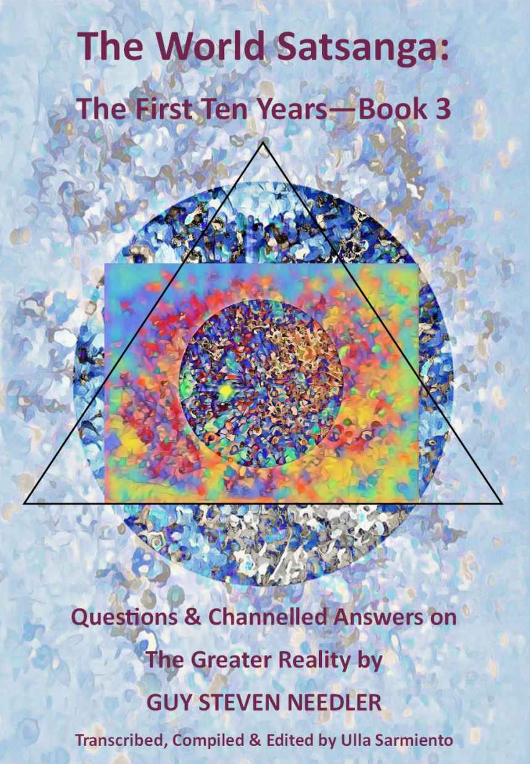

**基于[DeepL](https://www.deepl.com/)翻译**

The World Satsanga: The First Ten Years Book 3 

Questions and Channelled Answers on the Greater Reality By Guy Steven Needler 

Transcribed, Compiled and Edited By Ulla Sarmiento

---

### Table of Contents 

- Meditation 
- Metaphysical Teachings 
- Mineral Entities 
- Multiverse 
- Multiverse Cycle 
- Nuclear War 
- Om Beings 
- Origin 
- Pandemic 
- Physical and Spiritual Science 
- Physical Universe 
- Plant Entities 
- Psycho-Spiritual Healing 
- Sacred Sites and Pyramids 
- Self-Realization vs. God Realization 
- Sentient Species on Earth 
- Soul Seat vs. Ego 
- Source Entities 
- Suicide 
- Termination Junctures (Exit Points) 
- Terrorism and Societal Breakdown 
- Time (Event Space) 
- True Energetic Self (TES) 
- Universal Laws 
- Walk-In Souls 
- White Children 
- World Cycle 
- Afterword 
- About the Author

With thanks and gratitude to the following people: 

The World Satsanga participants for their never ending stream of questions and dedication to knowing more about the Greater Reality. They are an inspiration. 

Ulla Sarmiento for her dedicated focus on disseminating higher levels of knowledge and transcribing, compiling and editing the World Satsanga content over the last ten years, without which, these books would not be possible. 

Celia Austen-Potts for her patience, inspiration, assistance and inexhaustible ability to keep me grounded!

### 目录

- 冥想 
- 形而上学教义 
- 矿物实体 
- 多维宇宙
- 多维宇宙循环 
- 核战争 
- OM 
- 起源 
- 大流行病 
- 物理和精神科学 
- 物理宇宙 
- 植物实体 
- 精神心理治疗 
- 圣地与金字塔 
- 自我实现与神的实现 
- 地球上的有情物种 
- 灵座与小我 
- 源实体 
- 自杀 
- 终点（出口） 
- 恐怖主义与社会崩溃 
- 时间（事件空间） 
- 真实能量自我（TES） 
- 宇宙法则 
- 走进来的灵魂 
- 白种儿童 
- 世界周期 
- 后记 
- 关于作者

---

### Foreword of the Foreword 

Welcome to Book 3 of the World Satsanga Series of books! 

Being the third in the series of three books, the foreword written in The World Satsanga: The First Ten Years Book 1 - Lectures on the Greater Reality, fundamentally carries over to this book, simply because it’s the history of the World Satsanga, hence it being below. 

Another reason for having the same foreword is that it is entirely possible that this book is the first book that a reader looks at simply because the subject matter that they are interested in is in this book and not the first one. If then, dear reader you read The World Satsanga: The First Ten Years Book 1 - Lectures on the Greater Reality, or Book 2 - Questions and Channelled Answers on the Greater Reality, then this foreword is just to remind you of how these books came to be. If however, this is the first book in the World Satsanga series you are reading then the foreword below will explain how it materialised. 

Suffice to say the only real difference between The World Satsanga: The First Ten Years Book 2 - Questions and Channeled Answers on the Greater Reality and Book 3 is the fact that they are in progressive alphabetical order of the subject matter and that it would have been too large a volume to digest in one go. Alternatively, if the subject matter you are interested in is in one book, you may not be interested in the other! 

As you will read below this book has been transcribed and compiled from the original recordings by Ulla Sarmiento, who by the way, has been working overtime to get this book in the same Event Space as Books 1 & 2. 

I hope you enjoy the foreword below and the depth of information coming from some very searching questions. 

Guy Steven Needler 

4th December 2022

### 前言的前言

---

### Foreword 

Welcome to The World Satsanga: The First Ten Years Book 3 - Questions and Channelled Answers on the Greater Reality. 

If, dear reader you read The World Satsanga: The First Ten Years Book 1 - Lectures on the Greater Reality, and Book 2, the first Questions and Channeled Answers book, then this foreword is just to remind you of how these books came to be. If, however, this is the first book in the World Satsanga series you are reading, then the foreword below will explain how it all materialised. 

Enjoy! 

~ ~ ~ 

When The History of God was first published, a reader contacted me and expressed an interest in a dialogue. This dialogue continued for some time and resulted in two things. One; a monthly meeting where my readers, or people of like mind, could gain answers to questions not answered in The History of God. And two; me travelling to New Mexico in 2012 and holding a Traversing the Frequencies (TTF) workshop. I was subsequently invited back over the next couple of years and enjoyed the interest in the greater reality. It was at one of these workshops that I met a remarkable lady who was later to become a spiritual/ metaphysical influence in her own right. Her name was Ulla Sarmiento. 

The monthly meeting was to be called the “World Satsanga” and it was broadcast live on Skype. We enjoyed between 12 to 25 (the max Skype would allow) attendees each month. The format was that I would give a lecture, we would then have questions and answers, followed by an end of meeting meditation. The answers to the questions were channelled “on the spot” by me. The Satsanga would be recorded and the recording would be available via email to the attendees or those interested. It would also be blogged via my website. Ulla was a regular attendee. 

Satsanga is a Sanskrit term derived from two roots: sat meaning "true” and sangha meaning “community, company or association.” There are many other interpretations such as Satsang or Satsanga being an audience with a Satguru (religious or spiritual teacher) for religious instruction. It may also refer to other spiritual movements originating in India. However, the feeling of “being together in the truth” is the one that resonates with me the most. World Satsanga therefore means a “a world together in the truth” in my mind. 

The World Satsanga has changed over the years, including being pre-recorded with the questions and answers being emailed to me prior to transmission. However, more recently it has stabilised to being a pre-recorded lecture and meditation with the questions and answers being broadcast live via Zoom. The final recording being everything edited together as one file and broadcast on YouTube. 

During 2016 Ulla announced that she transcribed the Satsangas for her own reference, asking me if I would like to transmit the transcriptions on a monthly basis together with the video/ audio files. We both thought it would be perfect for those with hearing difficulties or were not so “connected” to the internet, whose connected friends could print them off and distribute them. We felt this was a perfect solution and the transcriptions flowed each month. 

Transcription is hard work by the way! 

Over the years I would get the odd nudge from attendees or readers/ listeners of the World Satsanga broadcasts suggesting that it would be nice to have a book written on some of the subjects broached. Yes, I would say and then completely forget about it as I was too engrossed in writing my latest book. However, this possibility, or Event Space, was not to go away. 

In 2021 the World Satsanga was ten years old and Ulla emailed me to say that she was seeing the same questions being asked and the answers being repeated. Prior to this if the same questions were asked new information would be channelled by me. With the change in format to be introduced in January 2022 back to live video questions and answers we therefore decided to call a close to the transcriptions, because they were still available on my website for those who wanted to read them. 

It was late 2021 that inspiration, or Event Space, suddenly came into focus. YES! We should make a book out of the lectures, questions and answers arising from the Satsangas. Now was the time. I quickly emailed Ulla who instantly agreed it was a good idea. However, she had only transcribed the Satsangas from 2016 onwards! Did I have the earlier recordings? I noted that in saving space on my website, some of the earlier recordings were deleted, so I was suddenly worried. Luckily though, I had archived them and we had a complete set. 

In the meantime Ulla had moved house and country! And needed to work on her own publications and website before commencing the unbelievable amount of work transcribing the earlier recordings and starting to compile the text. When Ulla became available we decided that it was best to work on the questions and answers first and see how large that task was before looking at the lectures. As it happened the questions and answers needed two “large” books. This book on the lectures was a fast follower but with heavy editing, mainly due to repetition of lecture subject matter over the years, we thought would fit into a single book. 

Even though the questions and answers books were finished first, we decided that, as with the format of the World Satsanga, the lectures should come first with the questions and answers coming second and third, hence this being book one! 

The book on lectures is compiled in an “alphabetically organised subject order” with the material for each subject together in the same section for ease of indexing and reading. Please note that if additional or new material was broadcast from lectures of the same subject matter, then that was included to make it one lecture. 

The same compilation strategy is used for the questions and answers books, with this book— Q& A Book 2 (World Satsanga Book 3) hosting Questions and Answers continued from M-Z. 

Without doubt this first World Satsanga, and subsequent books, would not have materialised without the help, interest, motivation, intuition, dedication, encouragement, friendship and VERY HARD WORK of Ulla Sarmiento. 

Indeed, this particular Event Space would not exist without her! Something to think about dear reader! 

THANK YOU ULLA FOR BEING HERE ON THIS PLANET 

Guy Steven Needler 

2nd November 2022

### 前言

---

### Meditation 

**In The Curators Source said that you have been working with Source, its peers and the Origin for long enough to be supremely confident in this information. Are you?**

Channeling information is a higher function than meditation. I don't feel unconfident. I don't feel uncomfortable with it. It feels right. That's the thing. If something doesn't feel right, you shouldn't be broadcasting it. If there's any doubts about it, you shouldn't be broadcasting about it in any way, shape or form. 

If there is a difference between one person's information and somebody else's information, we have to consider the fact that maybe it's the same thing, but said in a different way or maybe there's an error somewhere. If there's any function of the information that could be classified as an error, then it's not broadcast. For me, it feels right, it feels true, so I don't have any problems with the information at all. I'm very confident in it (1/ 2021). 

**Our Source has urged us to meditate at least 30 minutes a day. What is the fundamental purpose of meditation? Is meditation a more resting state? What is the purpose of channeling? Is channeling a more aware, questioning and receiving state?** 

Meditation is a function of disassociation from the physical. It’s one way of achieving connectivity with Self, Source and other beings. It creates the possibility of channeling, which is a higher function than meditation. It is part of the awareness and awakening process. It’s also one of the functions of enlightenment— not THE function of enlightenment. 

It’s one of them and it leads to the enlightenment process. The whole point of it is to learn to connect with the greater reality, to be in the greater reality and commune, converse and interact with the greater reality, and not just the reality that the human form connects with. That’s the whole point of it. 

The problem is when our eyes are open, our ears are hearing, our nose is smelling and our mouth is tasting, we are immersed in the human state. We are confused by that state to the point where we are in the full belief that we are the human body, so we need to move ourselves out of that zone. Meditation can get us there. 

When we get to being an enlightened yogi or individual, we’re able with meditation to turn off the senses, so we can enter into a complete state of solitude. No amount of noise or visual interaction will move us out of that state. That means that a good yogi can meditate with their eyes open. 

If you look at the old religious paintings, you’ll see that a lot of saints have got their eyes pointing up towards their third eye. That’s because they’re in “samadhi” or a state of enlightenment or awareness whilst they are incarnate. 

That illustrates to me that the individuals who were painting those images understood that these people were in communion with God or Source all the time, because their eyes were pointing towards the third eye— although they were here, they weren’t all here. 

They were communing with the greater reality at the same time. Meditation helps us to switch off our association with this particular environment in our human form and helps us to move through the possibility of channeling, which is sort of a lower function in terms of the communication with that greater environment and the beings within the greater reality (5/ 2017). 

**What is the significance of the pose during meditation? Is one pose more effective than another? Which one is the best pose for meditation?** 

The Hindus have got this nailed. The best posture is sitting in the lotus position or cross-legged with the back erect and the shoulders relaxed as well. The eyes are closed and gently focused on the origin of the spiritual or third eye. With the back erect and focus on the third eye, it allows us to create an uninhibited line of travel for the energies within the spine. 

Then when we meditate properly and we breathe properly in pranayama, the energy moves up and down the spine and activates certain plexuses associated with the chakras. When that happens, that elevates our frequencies. If we sit in a crouched position, we're inhibiting that flow, so having the spine erect is the best way forwards. 

You can also meditate lying down if you wanted to. That creates the ability for the spine to be straight, but in the supine position (lying down), you have the chance of going to sleep, so it's not optimal. The optimal is being alert, aware and awake and sitting in a cross-legged position or a straight back chair with your feet flat on the ground. 

That's the best way for it. I believe the Hindus like to have a woolen rug to sit on with our feet on the rug, because it insulates us from the magnetic fields of the Earth (4/ 2021). 

**Why do I always fall asleep when I start to meditate? Is it normal that it happens to people when they start meditation?** 

It's quite a personal question, but one that could refer to anybody. Basically, people fall asleep when they are tired or when they try to meditate lying down. When we lie down, we go into a sleep mode. Meditating whilst lying down is very difficult and we do invariably go to sleep. But if we want to meditate properly, we must be refreshed, we must be rested and be sharp of mind, so we can focus on the meditation process. 

If we try to do it after we've done a hard day's work, it's going to be very difficult. If we have a restless sleep, it's going to be difficult. We need to be awake and alert in terms of ability to focus on our meditation technique. If you're falling asleep, it's either that you're trying to meditate lying down or in too comfortable a chair (is there such a thing?) or you're not rested enough (7/ 2020). 

**What can parents with small children do for spiritual advancement? At the end of the day even, if we try meditation, it won't go as planned?** 

Basically, small children need to be attended to on a regular basis. The only way to move forwards is to try to share the process of entertaining the children. When one of you is entertaining the children, the other one can go and do the meditation. Then that duty can be swapped, so you take turns. That's the best way to do it when you're with children (7/ 2020). 

**My friends are struggling with the drop in frequencies this year. One of them has meditated for years, but feels dragged down during meditation. We are talking about forming a group to meditate together. What are some tips on how to have a successful group meditation?** 

Yes, it's gone down a lot this year (2019), much further than I expected. I expected it to turn around and it still hasn't. I can see the bottom, but we're going to be into next year now. That's because we are helping to accelerate the drop and the depth of dropping. You can see what's going on all over the Earth, so just think positive. 

The first thing is to get together. When you can share what you're experiencing, you know what's happening, because somebody has told you, for instance, myself or any other individual who's sensitive enough to tell that the frequencies are dropping. 

That's affecting everybody. Nobody is exempt, it affects everybody. The way to counteract it is to get together those of like mind and keep good company. Even Paramahansa Yogananda used to say this— keep good company, surround yourselves with like minded people. 

That's what negative people do. They maintain their negativity by surrounding themselves by like minded negative people. You can counteract that by surrounding yourselves with like minded positive people and create an environment where you meditate together. I would suggest that you create a focus for that meditation. 

Rather than just meditating in a blank way and in a neutral way, if you want to meditate on invigorating the individuals within the group, meditate on pulling energy from Source into the group and distributing that energy from Source into the individuals within the group. That will help boost your energies, as will opening your chakras every day by either all together as one or individually one after each other. 

It also helps you to create a focus on higher frequency thoughts, behaviors and actions by exposing your gross physical aspect and your sentience to higher frequencies above and beyond those of the gross physical as well. 

You can also focus on providing higher frequencies or healing for different environments or people. That helps as well. Every time you think about or work with anything that's higher frequency, know that you're making a difference. Know that you're contributing towards the work that Source wants us to do, which is to look after ourselves, look after our environment and perpetuate the environment for other souls or aspects who are going to incarnate later. 

Another thing a group can do is sit and chant “Om” for 20-30 minutes. Just go, “Oooommmm, Oooommmm.” If you stagger the end of the Om, so that each of you is drawing a breath at a different time, then the base resonant frequency of the multiverse, which is Om permeates all of Source and all of us and then all of Origin is being maintained. 

If you're all breathing and chanting Om together, you stop. What you should do is individualize your Om, so that it's always Om being broadcast via the vocal cords. That way, if you all breathe at different times, then Om is always there. That's another excellent way of sending energy out and building your own energies up (10/ 2019). 

**Would you share some techniques to more efficient meditations to shut out stray thoughts?** 

Firstly, if you've got any work to plan for, plan for it, write it down and then forget it, so you can concentrate your time simply on meditating. Make sure you don't have a shopping list of jobs to do. Secondly, the tried and tested method of using mantras works really well. For instance, with the Self-Realization Fellowship uses “hong-sau.” You don't say it verbally, you mentally chant it. When you breathe in, mentally chant hong, like hoooooong. When you breathe out, mentally say sau, like saaaaaaw. You correlate these mental chants with your natural breathing. 

This gives you focus. The chanting of the hong-sau is a way of saying: I'm one with the Source, the Source is one with me, I am the Source or God and I are one. Also concentrate on breathing coming into the lungs and going out of the lungs is also another way of focusing your attention. Concentrate on something, try to perfect it and that focuses your concentration and stops stray thoughts coming in (11/ 2020). 

**When I am doing meditations, I often feel tiny sparks or hear small popping sounds like soda bubbles in my aura. What are they and why do they make sounds?**

Basically, you're hearing the energy. You're starting to move up the frequencies when meditating. You're starting to feel and hear the movement of energy. There's nothing wrong with that. That’s fine, but don’t rely on that as being a prerequisite for achieving a certain level of meditation or a certain level of enlightenment. Move beyond it. Just notice it as a certain milestone on a certain level of frequential level you're achieving through meditation. 

Some people feel tingling in the spine or kundalini energy moving up and down the spine. Some people feel temperature changes. Some people feel as if they've moved totally out of the body. All these different things are just milestones on the way to entering into “samadhi” or transcendental meditation in which one transcends the human form to be in a state of connectivity or communion with the greater reality (11/ 2020). 

**Can you offer exercises for our third eye that help to align it beyond the current images and structures? What actions or exercises (not just meditation) can you offer?** 

It's about meditation. Meditation provides a gateway to a lot of different things. If you want to perceive what is beyond the gross physical frequencies, the thing is to meditate on the third eye. What we do is we close the eyes, we have our back straight and our feet flat on the ground and our hands palm upright on our thighs. Then we gently focus our closed eye vision on the point between the two eyebrows and above the bridge of the nose. That is the location of the spiritual or third eye. 

It's also the location of the spiritual or third eye chakra. But the two are separate things and they are totally independent in function to each other as well. The idea is that you maintain this closed eye stare into this area of blackness or moving colors, depending upon what the ambient light is outside or how you're feeling. You simply breathe, feel your breathing going in and out whilst maintaining this gentle focus. 

Eventually, you may start to see a white spot appear in the area of the third eye. That white spot will move around and you'll find it's difficult to maintain, to keep control of. Sometimes we can lean on our elbows, put our thumb into the tragus of our ear to block our ears off from noise. Put our little finger into the corner of our eye and the remaining three fingers on our temple and that locks the eye in the ocular socket on one side. 

Do the same thing on the other side. So you've got your thumbs blocking your ears off, your little finger in the corner of your eye— obviously, you've got to be careful how you do this— to lock the eye in the ocular socket. The other three fingers are on top of or in the area of the left and right temples. Use that as a way or means of focusing your vision and also controlling this white dot, which will appear. 

Eventually, this white dot is surrounded by a "purpley" color and around that is like a "goldy" color. As you get more control over this white dot, you'll start to see it has form and the form is star shaped, rather like the Star of David. When you continue to focus on that and you need to make it stay in one place, you can start to move towards it eventually. 

This could take weeks, months or years depending upon how dedicated and how much concentration you've got. Then eventually, you can start to move through this third eye, this star-shaped visualization or image within your closed eye vision. Once you've done that, then you start to move into different frequencies. That's another way of moving the consciousness out of the body. When you do that, you start to see things in the different frequencies. 

Initially, it might be the fourth frequency, but then you can start to work out how to navigate to the fifth, sixth and seventh levels. Do the exercise to lock the eye in the ocular socket, then focus, breathe naturally, do “hong-sau” until you see the little white dot. Then start to control this dot until you can hold it in one place. Then you can start to move towards it and it starts to have colors change around it. Then you'll start to have focus, have structure and you can move through structure. 

That's one way of doing it. Another way to do it is the Traversing The Frequencies correspondence course or workshop where I teach people how to do this without using the spiritual/ third eye as the gateway (2/ 2021). 

**Meditation is part of my life now. I noticed it’s best to meditate in nature barefoot on the ground, but not in the winter. The coldness distracts my focus. Is there anything we can do with indoor meditation to have an equal result as meditating in nature?** 

Well, if you haven’t learned how to melt the ice around your meat around you, which is what good Tibetan monks and Zen monks are able to do, I can understand why it’s cold. Anything that distracts your focus is detrimental to meditation. It’s best to keep yourself comfortable without a doubt, because being uncomfortable, in pain or when the environment is too cold or too extreme does cause a problem in being able to focus. 

One of the ways in which you can effect a really good meditation is to sit in a straight back chair or in a lotus position or you can kneel in the way that Zen Buddhist monks do when meditating. Position yourself facing the east, so you’re getting the energies. 

The energies move over the Earth based on the way the Sun rises and falls. It rises in the east and sets in the west. The cosmic energies that are associated with the Sun fall across the Earth coming from the east onwards. If you can meditate at one of the cardinal points: 6 in the morning, 12 noon, 6 at night, midnight, you get more energy coming in through that way. 

Another way is to isolate yourself from the Earth, from the energies associated with the location or environment you’re in. The way to do that is to get a woolen blanket of pure wool and drape it over the chair and also have some part of it on the floor where your feet are going to be and that will insulate you. That creates a condition where you are not influenced by the environment around you, for instance, the house and the energies associated with the house. 

It brings you back to a neutral condition like that which you experience when meditating outside in a woodland area or a grassy area in a park. The other thing is to have a number of different house plants around you as well. If you have any cleansing crystals, you can also place those at one of each corners of the room or place them around you, as in in each corner for a square, for instance. That will help you as well. 

If they’re silicon crystals, you can use your intention to clear them or put them in a solution of salty water. The cleansing is better achieved by having the crystal in the salty water on a full moon with the energies of the moon also bathing the stone. That really cleans it off. 

Then you can hold it in your hand and use your intention for that stone to provide a link with the Earth energy, the energy of nature. When you’re meditating, it will project or maintain a bubble of energy for you that is part of the natural energy around that isn’t affected or interacting or interfered with by man. Try to use these things and that will help a lot (1/ 2019). 

**Do you advocate taking any drugs along with meditation or other practices to awaken? Some Buddhist geeks seem to advocate drugs along with mindfulness meditation?**

No, I’ve never had the desire. When I was about 20, I went on a cycle touring holiday in France. In a youth hostel, I met somebody who had some marijuana. He passed his joints around and I did inhale and it was horrible. Apart from that, it didn’t do anything for me. I wasn’t interested either. 

I’ve always had an innate feeling that we can do what we want to do by pure meditation. I don’t advocate it. I know others do and I don’t mind people doing it. What people want to do is up to them. 

I did smoke as a young lad back in England. We all went through the school boy phase of smoking. I very quickly got out of that as well, so I never found it attractive. I don’t advocate it. I don’t think it’s appropriate, it’s unnecessary. It’s a mechanical short cut, which ultimately results in us struggling to do it properly. 

If people want to go down that route, they can do, if they feel they’re getting an appropriate level of response in terms of their journey. But I would say it does stop you from progressing, because it’s basically a physical tool to try to achieve a metaphysical response (5/ 2015). 

**Some people use spirituality for political gain. They discuss awakening with ayahuasca to get support from voters. Are they helping or distracting us with political gamesmanship?** 

Yes, some people may well have taken ayahuasca. I don't condone taking of ayahuasca, because it's a mechanical way of achieving very transient connectivity with the greater reality. That includes things like cocaine and LSD and all these sorts of things. 

Timothy Leary in the old days said, “Turn on, tune in, drop out.” It was all to do with being connected and using drugs as a mechanical aid. The problem is it's unsustainable and it ultimately damages not only the gross physical aspect of our incarnate vehicle, but it also can damage the frequencies associated with the aspect or soul as well. 

Aligning oneself to a particular sect or individuals who believe or experientially know about spirituality and the greater reality in some way, shape or form and saying, “Oh, I've done this and I know a bit more about that, so you can follow me” is not new. In India you'll see absolutely massive posters of the local politicians with pictures of Krishna, Babaji, Ganesh, etc., to suggest that they are working with these gods or gurus and should be trusted as a result of it, which is completely nonsense. 

They try to get the spiritual vote, but all they are is being very materialistic individuals. Use your intuition to understand when somebody says they are spiritual, but are actually using it for political gain. It can be a bit of a con or it can be real (12/ 2020). 

**How should one pray? Who are we praying to? I don’t believe Source elects to answer or not answer prayers. Can prayer alter the outcome for one’s self or for another?** 

Prayer is a method of trying to align one’s thought processes into a single focus. It’s a very “kindergarten way” of achieving meditation, if you like. When we pray, it’s used as a more structured or more amorphous series of words to create the focus, such as the Lord’s Prayer or other prayers that we create ourselves. 

If they are more repetitive, they could be classified as a mantra. What we’re doing is we’re creating something, which allows us to shut ourselves out from the outside world and focus on what we are trying to achieve in terms of a meditative state or a level of connection or communion with our environment. 

Source may well, if it desired, answer our prayers. Or maybe we would enter our own prayers by creating the energy supporting the desire of those prayers, because prayers can also be used as a mantra to create levels of abundance or levels of outcomes we want. We can work on those and the outcomes are usually dependent upon the individual praying, because the prayer again is the focus. 

If we work on those prayers often enough in a dedicated way, then we will ultimately find that the request of the prayers will come into fruition. It’s really about aligning ourselves to the energies supporting that which we desire. Remember the process is described in The Anne Dialogues: Initial Desire— Modified Desire— Final Desire— Intention (to create the desire)— Thought (on how to create the intended desire)— Action (the creation or manifestation of the intended desire). 

A better way of saying it is to have our desire backing up the intention, which backs up the thought, and therefore, backs up the action. That is the creation behind abundance or any form of development, which we want to invoke into the environment we’re in (7/ 2016). 

**Can we cause a desired outcome to occur for someone else by sending them energy?** 

Yes, to make sure that works properly is to meditate on them and gain energetic concurrence that what we’re asking for them is what they desire or is part of their life plan. We have to work on that. We can do what we want for them. If we feel good about giving them energy, irrespective of whether they take that energy on board and work with it, it doesn’t matter. We’ve given them good energy and good thought processes and we’re thinking well of them (7/ 2016). 

**Is it proper to ask for help? How? Can we ask for help from the Council of Twelve?** 

We can always call on the Source Entity. We’re all connected to the Source Entity, because we’re all smaller subsets of individualization of sentient energy from the Source. You can also meditate on gaining help via the True Energetic Self (Higher Self, Oversoul, Godhead) for generalized help in guidance or things that would help us make better decisions. 

My understanding is that the Council of Twelve are more involved with the governance of the multiversal environment. Each council is involved in a particular frequency within the physical universe, so they would not be interacting with us. They aren’t involved with what we’re doing, because they have other roles to play. They are part of this set of entities described in the book, The Curators (7/ 2018). 

**To raise the frequency of our brothers and sisters, perhaps we could commune with The Source/ God at a specific time— to get world leaders to follow the Golden Rule, be kind to our neighbors, assist others in need, bless the food, the Earth and the caretakers?** 

Any of those is very good, but there’s no need to separate them out. Everything that’s been talked about being mindful or mindfulness— the Buddhists are very good at pointing out how to be mindful, how to respect the planet, how to respect each other, the environment, the animals, the insects and the plants that give us the ability to exist here in our incarnate state. So giving thanks is one way of doing it. Being mindful of everything is one way of looking at it as well. 

You don’t have to do anything major. You just have to simply sit and meditate and be grateful for the opportunity of being here on this planet, incarnate in the body that you’ve incarnated into with individualized free will and being able to interact with the environment, other individuals who are of a like mind. 

Sometimes you affect the thought processes of others who previously were immersed in their incarnation and now start to show signs of opening up and becoming more expansive, more aware and awake. That’s enough. 

Simply being grateful to the plants or the animals that you’re using for food for providing that food is enough. Being grateful for the individuals around you who you work with, interact with is another way of doing it. Meditating is another way. Collectively meditating on raising the frequencies of our political leaders is one way of doing it. 

All of those things would work. When we start to do that, a number of others start to do it. We start to create a triangulation effect— both directional and inflational triangulation, so those individuals who moved down the frequencies will start to move up the frequencies again (8/ 2018). 

**How do you manage to provide such wonderful meditations every month for us? This is a huge task! Thank you very much for your unconditional love.** 

Thank you. Well, actually, it is given to me. I sit after every lecture and set of questions and then for the end of meet meditation, I sit and meditate on what I've given. I ask to be given what the next subject is— both the lecture and the end of meet meditation. I'm given it, so I don't create it, I don't invent it. I don't think of it, I don't work it out. I don't try to relate it to what I've done before. Source simply says, “You should work on this” and that's what I give. 

In terms of the questions, the answers to the questions are mostly channeled information. If the questions are based upon a subject that I know and can remember— because you could imagine the amount of information I pick up, so it's difficult to remember it all— then I can answer it straightaway. 

But usually the information is channeled through. Although it seems like I'm just answering the question, the information is actually coming into me from different directions. Hopefully, I'm able to answer the questions in a way, which is meaningful to the questioner. At the end of all of these things, I sit down and meditate for some time just to sort of absorb what's come through me and what needs to be dealt with in the next Satsanga (11/ 2019). 

**One of my friends cannot quite put himself together these days. So many things are happening all at once and he cannot keep up. Do you have any advice?** 

Basically, protect yourselves. You can use the Psychic Shield and program it, so you are keeping yourself in a higher frequency bubble. When we're in higher frequency, we can do multitasking on a completely different level. We can work in a way, which is really efficient, fast and right first time. But when we move down, this is what happens. We can't get our self together. We can't multitask, we can only do one thing at a time. That which we used to be able to do in a higher frequency way becomes difficult to impossible, when we're in a low frequency environment. 

Create the Psychic Shield and use it to maintain your high frequencies in a high level. Write down what your spiritual desires are and work on those. Keep doing meditation. Keep being of service to others when requested, as long as you're not abused or taken advantage of. Keep recognizing what's right and what's obviously not right, what's the best way to do things. 

For instance, if you see litter in the street, pick it up and put it in a bin. Keep doing these positive, higher frequency things and you'll find that getting ourselves together again will become second nature. Notice that it's much easier to drop down the frequencies than it is to rise up again. It is really easy to drop down the frequencies. You don't have to do anything, it's like going downstream with the flow of a river. But it is really hard to rise up the frequencies or swim up river. That's a good way to think about it (8/ 2020). 

**Are 24/ 7 full-time professional meditators connected with the Source Entity and the Origin? Or just the SE?** 

There's not many that would be in contact with the Origin, because of their own limitations. As Roy Eugene Davis (Paramahansa Yogananda; As I Knew Him) once asked his teacher back in the late 1940s to 1950s, how many people have gone beyond God? 

Yogananda said not many. They get infatuated with God and don't move beyond God to that which is beyond God— the All There Is. The All There Is or the Absolute, as the Hindus call it, is the Origin. You can probably say that there's a significant number less than 1% that are in contact with the Origin. But a lot are in contact with the Source or God (3/ 2021). 

**How come we don't hear about the Origin from others besides you? Are others referring to the Origin by different names?** 

The Hindu yogis understood that the Origin is that which is beyond God. They do talk about it. When I first started to be in contact with the Origin, I didn't know at all that there was a limited number of individuals who know about the Origin. I only found out later when I opened a random page in a very ancient book given to me by my Aikido student. That book was published by a yogi who lived in Chicago back in the early 1900s. 

He mentioned the Origin but called it the “Absolute.” It was much, much later when reading the Autobiography of a Yogi that I realized that the Origin was the same thing as the Absolute. It’s individuals who are expansive enough to be able to recognize that there is another much, much larger level of sentience above the Source Entities. It’s the Absolute, All There Is or that which is beyond God or the Origin (3/ 2021). 

**What are the key factors to establish a stable connection with the Origin? How can we maintain it?** 

Learn to have constant communication the Source Entity first and then ask for its assistance in connecting with the Origin. Connecting with the Source Entity is a significant achievement— a very significant achievement whilst incarnate. It's not something that everybody does. 

There are many who seek it, but sometimes their own desire creates a blockage. My advice is do your best to meditate. Do your best to disassociate yourself from the gross physical and in doing so, enlist the help of the Source. When you're competent in your connectivity with the Source and you can turn it on and off when required or at will, then you can ask Source to help you in working with the connection required to contact the Origin. That's basically it (3/ 2021). 

**How many people on the current Earth are consciously in communion with the Source?** 

ased upon a population of 7.8 billion people, I’m seeing that it's just a few thousand, not even that maybe. Not even individuals who are yogis are in contact with the Source. Not even yogis that have been meditating hard and diligently for 30 or 40 years, they can't contact the Source— maybe because they're doing something wrong? Some individuals can be in contact with it instantaneously. Others may take a bit longer. But in general, it takes dedication and complete open mindedness (3/ 2021). 

**How many are consciously in communion with the Origin?** 

I'm being told less than a hundred. That’s quite a lot of people who are not in contact (3/ 2021). 

**Is it a bit easier to be one with the Source and the Origin, if one has certain percentage of “Om-ness” associated with him/ her?** 

I'm being told no, it's just a function of our dedication irrespective of whether you're a hybrid Om, a full Om, a captive Om or a noncaptive Om. It's immaterial. When you are incarnate, you are subject to the vagaries of the lower frequencies and you have to work with this. 

If you look at all of the different spiritual leaders around the world over the century, it's certain they all have their own problems with this particular low frequency environment. My understanding is and what I've just been told is that it's not easier at all. It's just that we have a different energy set and a different quality of sentience. But whilst here, we have to obey the same physical rules as everybody else (4/ 2021). 

**When I meditate, I feel like I am elevating the frequencies around me. Are we able to affect our environment positively, if we meditate regularly?** 

Yes, we do change our frequencies when we meditate. The inner changes in frequency could be felt as heat or tingling or pressure around the spiritual or third eye area or the base of the skull. It's because your physical body is straining to keep up with where your sentience is going. 

But the frequencies around us are also affected as well. Think of it like a heater or a light bulb. The function of a light bulb is to create light, but the byproduct is heat. When we are elevating our frequencies or projecting our consciousness to a higher level of frequency, the result is that there's also a waste product. 

That waste product is that we inflate or raise the frequencies around us. That means we also help the environment by allowing the environment to become a higher level of frequency by meditating. Meditation does absolutely raise one's frequencies (4/ 2021). 

**Do the qualities and effectiveness to the surrounding environment change when we are contacting and/ or in communion with higher beings and entities, such as the Om, Source and the Origin while meditating? If so, how?** 

Anyone who is meditating creates a positive effect, because we are increasing our frequency around us. When we have contact with other entities, such as the Om, other disincarnate or incarnate entities that are higher frequency or we talk to the Source Entity or the Origin, we are creating a condition where we are lifting our frequencies and those around us are affected by it. 

When they are affected by it, they start to change the way they think, behave and act to a positive way, because they start to see how stupid things are, how kindergarten our thought processes are, how ridiculous the way we respond to people is. 

When we're angry at somebody, why are we angry? We don't know why we're angry, we just know we're angry or they've annoyed us in some way. When we're higher frequency, we can see what's made us angry and what makes them angry. We can see that we're just entities in incarnate vehicles doing the best we can to experience, learn and evolve. It affects us and the people around us. 

It affects the environment positively. If you meditate to higher entities and you're meditating around trees, plants or any sort of flora and fauna, which is natural, you'll notice that they start to glow as well. They benefit from the higher frequencies. They love it (4/ 2021). 

**How does our Source feel when human incarnates manage to contact it? How about the Om and the Origin?** 

The Om are a bit aloof, a bit distanced. They like to keep aloof. There are not many of them that like to incarnate, so they like to keep away from incarnation, because it creates karma. It also creates responsibility. They tend to keep away, but those who have contacted the Om will be pleased that the Om are pleased to meet them. 

So is the Origin and so is the Source Entity. It's very rare that an incarnate entity will be in contact with the Origin or even the Om. It’s more likely to be the Source Entity, because that's where our sentience is individualized from. 

But Source is delighted when an incarnate aspect of itself manages to rise above the frequencies and return to it, even though it's temporarily maybe in meditation to communicate with it or be in communion with it. It's delighted by that. It's in joy. 

We are also in that joy, so we get the bliss state associated with it. Transcendental meditation or “samadhi,” as the Hindus call it, usually results in a large smile on one's face and that's because we are in joy. We're enjoying being in communion. The Source is enjoying a smaller aspect of itself being in communion with it as well (4/ 2021). 

**Why do we need to ask for Source’s assistance to establish connection with the Origin, if we are all part of and are the Origin?** 

It's simply a function of needing help to be elevated. When we fly, we need help. We need the help of a vehicle like an airplane or a balloon, for example. We seek the assistance of something that can do something that we can't do. If we ask for help to communicate with the Origin, the Source is giving us a boost. It's accelerating our opportunity to be at a higher frequential level to allow the Origin to communicate with us and to allow us to communicate with the Origin. 

We have to move to a point where we are equal with the Source Entity, so that it and we can communicate with the Origin. It's a bit like standing on top of a mountain, so you can see as far as you can. You can only see the whole landscape and the curvature of the Earth from a very high position. 

You can't do it from being on the floor or certainly if you're in a city where we have city canyons. You can't see above those canyons unless you go to the top of those buildings. Being on top of one of the buildings is like asking the Source to help us. We need to be elevated to a point, where we can see more and communicate more (4/ 2021). 

**How can we tell if we are communicating with the Origin and not other beings or entities or our ego?** 

You know. You definitely know. It's something quite profound. When we're communicating with astral entities or incarnate entities at a higher frequency, you feel as if you're on the same level as them. You feel as if they are simply brothers or sisters to use a human term. 

But when you're communicating with the Origin or the Source, it's like being exposed to the biggest level of communion that you've ever had. Your expansion is indescribable, so you know. I can't describe it. You can't describe it in human terms, but you know when you are in communication or in communion with them (4/ 2021). 

**If Pure Om can move around different Source Entities, then they do not have the sense of belonging to specific SE?** 

That's right. The Om aren't specifically aligned. Pure Om or noncaptive Om aren't aligned to a Source Entity. It's only those that are of a lower level of quality of sentience who become captive Om or hybrid Om that are associated with a Source Entity. Some of them may decide to be associated with a Source Entity, but that tends to be on a temporary basis to suit themselves. It's something that they do, but they don't need to be associated with a Source Entity. They belong to themselves. They are beloved of the Om. They're not beloved of the Source Entity (4/ 2021). 

**Is your Pure Om originated from our Source Entity or from a different SE?** 

My understanding is that I'm one of those Om that are not specifically from a Source Entity. I don't know or I'm not allowed to know why I associated with this particular Source Entity— other than maybe because it's got the most diverse interpretation of the decree from the Origin to experience, learn and evolve in as many different ways as possible. 

It has a really unique and diverse and "multipolous" way of experiencing itself and its environment through us. As far as I'm aware, there isn't anything like the type of multiversal environment created from its own structure that is reproduced in any of the other Source Entities. 

For me, it feels very much like I chose this Source Entity or my True Energetic Self or the other Om who's looking after me, like Hum, because it looks after me every now and then. With Anne as well, we looked after each other while we're here and she's still looking after me here. 

We just decided that it would be interesting to do what those individualizations of sentience from a Source Entity are experiencing, just as an experience. So I'm not from any particular Source Entity, although at the moment I'm aligning myself temporarily with this Source Entity (4/ 2021). 

**If the energetic signature of the Om and the Origin are the same, how can we (non-Om) identify which one is which?** 

I'm just going to ask the question. It's about the quality of sentience. The quality of sentience with the Origin is vastly bigger in terms of volume than the quality of sentience with the Om simply because they are much smaller individualized units of Origin sentience and energy who have got their own individuality in terms of their own ability to move around and do what they need to do, whereas the Origin is everything. So the sheer volume of the quality of sentience associated with the Origin is how you could tell. 

It's a bit like going into a greenhouse and then going into a nursery where there's huge, field-sized greenhouses, just to give you an example. When you're in a greenhouse, you know it's full of glass and it's for growing flowers. But if you go into a nursery, you go into a huge greenhouse, which can be a hundred meters long and all joined together, so it can be a 100 meters square. It's the same thing, but it's much bigger. 

You would feel the enormity of the Origin in comparison to the minority of the Om from that perspective. But you know it's the same thing. They're both greenhouses, but one is a bigger greenhouse than the other. That's the way to identify it. You would intuitively know (4/ 2021). 

**What looks like events happening out there is actually us moving from one event to another event in Event Space?** 

Correct. What I’ve been doing recently with the Traversing The Frequencies (TTF) Level 3 students in meditation is teaching them how to move around the multiverse whilst keeping their eyes closed and other exercises as well. 

When we move around event space, sometimes we may get the impression or feel like we’re moving in different angles up and down, left and right. Sometimes we feel like the multiverse is moving around us, so we’re static and the multiverse is moving around us and then presenting to us the environment we’re going to travel to (3/ 2015). 

**Which is it— us moving or the multiverse moving?** 

Both. You will find that when you’re moving around the multiverse fast, you will experience various different inertial things— like your body is moving from left to right or up and down, like you might be going in a spiral or going up and down a hill or banking left and right on the plane, for instance. 

But some of us do feel that the multiverse rotates around us and that we are static and all of the zodiacs and all of the galaxies move around us and the planets that we are supposed to be working with come into sharper view. We can literally step from one place to another place as a result of it (3/ 2015). 

**Does that mean we are in the center of it all?** 

The answer that I’ve just been given is no, it’s not. We’re not at the center of it all. However, we can create an individual environment, which will allow us to be at the center of it all. If you think about it, when we anchor ourselves to the Earth, we stay on the Earth, don’t we? 

Everything does move and we do move around, but within the constraints of how long this road goes into. We are also able to move around the multiverse and/ or we can move the multiverse around us, because we are master creators, master beings. We are literally smaller individualized units of our Source Entity. Therefore, there’s lots of functionality that we have that we don’t particularly recognize, because we haven’t exposed ourselves to it and used it (3/ 2015). 

**Is FB 204 a point of singularity in our multiverse with 408 frequencies?** 

It’s a juncture or what I call a linchpin where all the event spaces and frequencies associated with the multiverse converge at one point. It’s the center of interconnectedness, which is being explored in the meditation given this month (3/ 2015). 

**During meditation the “point of consciousness” is when we reach blackness, no gravity, complete silence and love. One can engage in remote viewing or healing, etc. During Traversing The Frequencies work, at what frequency is the point of consciousness reached?** 

The Traversing The Frequencies (TTF) work is where you can get to this point, any point with TTF, once you've moved out of the gross physical and the spirituo-physical levels. That would be when you move above the 12th frequency, because then you're outside of the energies associated with the incarnate human vehicle. 

When you've moved above the 12th to the 13th frequency (FB 13), you're within the second full dimension and you start to move into different levels of consciousness and connectivity then. Although moving even into the fourth frequency (FB 4) increases your level of connectivity, the higher up the frequencies you go and the more you disassociate yourself from the gross physical or physical universe, the more enhanced that level of connectivity and clairsentience (knowingness) becomes (1/ 2020). 

**Could you elaborate about the gaps between frequencies and the overlaps between frequencies in TTF? Could we see past and future events happening when we travel through the gaps? Are the Akashic records in the gaps between frequencies?** 

Basically, the gaps in between the frequencies are a function of substructure, which are part of the basic structure of the Source, which comes from the Origin’s structure. There's substructure within everything really. That substructure is what is used by the Curators to move around the structure of the multiversal environment, which is part of the Source. These gaps aren't where the Akashic records are. 

The Akashic record is a set of memory function of the Source that specifically focuses on the interactions of incarnate mankind and other human type vehicles in this universe. 

Each species of incarnate vehicle has its own memory set where everything that is experienced and learned by every soul in every body they've been in is recorded in a particular location within the Source. That's a higher function of Source that is outside of the multiverse, but nevertheless accessible, if you have the methodology of doing it. 

The only way to see the events of past, present and future is because we are moving into different event spaces. If you can go into an event space where everything is happening concurrently, i.e. you access all the event spaces concurrently, then you can choose to see everything concurrently, which in my experience creates a white wall or the white screen, because everything is happening too quickly. 

You can't experience everything concurrently whilst in this incarnate state. We simply don't have the capacity until we're disincarnate. Or you can simply isolate an event that is classified as being "future" from our perspective. Don't forget there is no such thing as past, present and future, there's only Now (see “Time”). 

That Nowness can be experienced concurrently with every other Nowness. What happens is we've got this capability of isolating an event space from another, should we decide to do so, should we interact with event space in a robust and repeatable and knowledgeable way (1/ 2020).

### 冥想 

---

### Metaphysical Teachings 

**In The History of God you identified three religions and the people who brought them: Jesus, Mohammed and Buddha. You did not mention Moses and Judaism. Why not?**

I’m being told it wasn’t significant in terms of a belief system. It wasn’t based upon helping individuals understand the truth of who and what we are and how to contact who and what we are in the same way that the religions that were generated from the original teachings of Jesus, Mohammed and Buddha did. That’s the only reason. 

It was a bit loose and it became changed by mankind very quickly and so did Christianity, Buddhism and Islam. But the essence of what it was originally wasn’t as strong as the others, so these three are the more dominant ones. 

There is a book I’m going to write at some point, which looks at religions and their origin points. It looks at the commonalities with my work and where they help to illustrate the psycho-spiritual aspects and the spiritual physics surrounding them. It also looks at the ability to use them as a means to become self-aware and self-realized, to be in robust communicative connection with our Source or our True Energetic Self. 

I’ll address all of these different religions in that book to see where they are. We’ll see more detail about Judaism or what impact it had. But it didn’t have the same impact as the others. Some people would argue that it had an impact from the human perspective. But in terms of the human being able to communicate with themselves, their Higher Self and Source, it’s a different thing altogether (4/ 2019). 

**So much is attached to Judaism and hidden meanings to our creation through many books and movies as to “I am that I am” when Moses received a response from God. What is the proper format for using that phrase? What is your take on this?** 

If you say “I am that I am” or “I think therefore I am” is another way of thinking it, it’s loose. Although there’s some hidden meanings there, the meanings aren’t focused enough. There are problems with all religious books, including the Bible (from the Greek word “biblio” for book). Even the Bible was written 300 years or so after the time of Christ, and therefore, it has a number of different errors and personal desires of the author constructed within it. 

If we can’t remember what we did a week ago, let alone a month ago, let alone two days ago with any accuracy, then how can we translate what happened 300 years ago in any real and robust way even though there may have been texts created by the Apostles. It’s difficult to understand how books can really be as accurate as possible in this instance, when they’re trying to portray something that is not transcribable at that time. 

Interpretation is a low education way of trying to say that “I am that I am” or I am God. We’re all God. We’re all smaller individualized aspects of God. I feel it was trying to explain that. Because the educational levels, the ability to expand and understand things was significantly lower in those times, the way in which things had to be described wasn’t accurate or focused enough to be able to stand the test of time, to be meaningful or even to be broadcast accurately from one generation to another generation. 

The proper format would be I am God and you are God or you are Source, we are all Source. We’re all smaller individualized units of Source. Even now that is difficult for people to take or understand, so even now that is a poor way of describing it. Although it makes sense to us now with our level of education and expansivity, in another time or more progressive state, that’s a poor descriptor as well. 

It’s all to do with describing the “I am that I am” as I am energy, I am sentience. But how do you describe sentience to somebody who didn’t understand the word “sentience” in the past? So “I am” simply means I exist. I am everywhere. There’s a lot more to it than meets the eye here, but it’s a way of describing that sentience exists and it is not contained within a physical form. That’s another way of saying it as well (4/ 2019). 

There’s a question here, which I think we’ve answered before. But I think I’m going to answer it again. If Source said “I am that I am,” it’s basically saying I am Source. I am existent, I am in existence. I am sentience. “I think therefore I am” is a very good way of saying it as well. 

Some of these books, although they don’t give us directions, they do give us an understanding of in a very, very basic way that we are sentience and energy. We as individuals can reconnect with Source or reconnect with our True Energetic Selves, which are sentience and energy. It’s just that the volume or density of sentience and energy is much greater, as we move up. 

The sentience associated with an incarnate aspect or soul is about 2.5% of the sentience of a True Energetic Self, so we can see there’s a great jump in sentience associated with the TES. If we look at the difference in the percentage of sentience that a True Energetic Self has in comparison to Source and between the Source Entities and the Origin, you can see a massive jump again. 

It’s just showing that we are smaller individualized units of Source. The Sources are smaller individualized units of the Origin. The Om beings are smaller individualized units of Origin and the hybrid Om are a mixture of Origin energy and Source energy. 

This is to recognize that we are not the human form and our creator is not quantifiable as being physical or human. So “I am that I am” or “I think therefore I am” is an indication that we are the sentience, not the form (5/ 2019). 

**The Bible introduces God as “Elohim” or a group or a council of beings. Then it singles out the Jehovah Elohim. The Bible has different names for one God (e.g. Jehovah, Adonai, El, El-Elyon, El-Shaddai). Are these titles for one being or are these separate beings?** 

My understanding is the twelve Source Entities are what should be termed as the Elohim. Each of the Source Entities is created by the Origin, so they are the co-creators that are the Elohim. It’s to do with understanding the meaning behind what was being broadcast to individuals of a certain level of education and intelligence. 

Not to be derogatory, but if we’re only working with 18th century technology, how can we explain a computer to somebody? How could we explain an airplane to somebody in the 15th century? You have to think of it in these ways. 

Sometimes the Source Entities were given names, if that information was being taught to people to help them understand. We understand the words Source Entity One, Two, Three, Four to Twelve now, because it’s a logical progression. But that is only there as a function of the order in which I managed to contact them. It has no other weight than that. 

So if the Source Entities decided to give themselves names in English or whatever language (which is highly unlikely), then would they give themselves those names. Or were those names given to them in the old days by those who were able to communicate with them? 

My understanding is that it’s probably just a way of demarcating the different Source Entities based upon the time frame (event space) in which that information was being broadcast. Each of the Elohim would be one of the Source Entities. If you think of it in terms of a council, they are a Council of Twelve Source Entities or Twelve Elohim— Elohim being a name for those who are the start of creation based on my understanding (2/ 2019). 

**In the Bible (Book of Daniel), a man clothed in linen was bringing a message from his “Elohim,” but was delayed by the prince of Persia and had to be helped by the chief prince, Michael. Who was the man clothed in linen, the prince of Persia and chief Prince Michael?** 

The Elohim themselves are the other Source Entities in a higher sense. That’s just because they are classified as he highest level of individualization before the Origin. But a lower version of “Elohim” could be our True Sentient Selves, because they also work from the perspective of being our highest level of sentience. 

What I’m picking up is that I’ve got two answers here. The man in linen was somebody who had survived the downfall of Atlantis and was therefore Atlantean. The skin colors are part of a genetic fashion that the Atlanteans had. They were able to manipulate their genome and create things, like hybrids of animals and human bodies and also change the color of their skin (e.g. blue, green, violet). 

That individual was an Atlantean who had stayed behind to help the other souls incarnated on Earth in the post-Atlantean period. There were a number of Atlanteans who were able to live quite a lot longer than the humans at that time. 

The chief prince Michael was one of the maintenance entities (or Curators) that we classify as an angel. Archangel Michael is one of those entities who works on the maintenance of the Earth and this particular environment. You can think of it as an angel or as being angelic, but we also have to think of the level of education that people had in that period. They were taught that something that was bright, energetic and gold-like in appearance was something that was unachievable by humans. That included some of its abilities or functions, such as how to change the environment or disassemble the form that they’ve got. 

So I’m picking up that the Atlantean individual was in communication with this Prince Michael, which was Archangel Michael or one of the maintenance entities working with the Earth and there was some communication there. His “Elohim” were these maintenance entities or the Archangels— chief prince Michael was actually a maintenance entity we call Archangel Michael (3/ 2019). 

**I have a question about Muhammed and the history of Islam. Muhammed ordered to kill many people during his life— for instance, in case of treason, he ordered to kill all men and women of a Jewish tribe. How can we justify his killings and call him a great master?** 

My understanding is that a lot of the work of every spiritual leader was misunderstood by the individuals who were supposed to broadcast it. Much of the information that comes through has either been rewritten based upon the thoughts and desires of an individual to try and redirect the understanding based upon a human condition away from the original teachings of that individual. 

What I'm picking up here is that the order that Mohammed was supposed to have given to kill a number of individuals— men and women of a tribe who just happened to be Jewish— is a misconception based upon the idea of trying to remove their thoughts and trying to give them an alternative understanding of how to become enlightened. If people decided that the best way to remove those thoughts and give them a different way of understanding of how to be connected with the greater environment was to remove their physical bodies, then that was a complete misinterpretation. I can't imagine that an enlightened individual, such as Mohammed, actually ordered that. 

I'm picking up that that isn't the case. It's a story that's been perpetuated based upon the desire of individuals who weren't enlightened, but who were nevertheless using the teachings of Mohammed for their own ends. What I'm very much feeling that look at Islam, look at things like the Koran, the Bible, the Vedas, look at everything that's out there and digest it properly in a neutralized and helicopter view. 

Although the information may be diversified based upon the skill set of individual leaders to gain self-awareness or self-enlightenment in the true sense, in essence what they're experiencing is the same thing. It's just that they found it in a particular individual way. For instance, my way is to use the Traversing The Frequencies. Yogananda's way was to use kriya yoga, because he was taught it by Sri Yukteswar, who was taught it by Lahiri Mahasaya, who was taught it by Babaji. There is a lineage there. 

When we get to higher frequencies, we can use different ways of doing it, because we've got a head start or a springboard to work from. But when we're a lower frequency, sometimes we have lower ways of doing it. For instance, in the old days it took 30 years of dedicated practice for a yogi to achieve self-awareness and self-enlightenment. Now we can get there in a few years, sometimes in a few weeks or a few days (7/ 2019). 

**Do you have any opinion about Gnostic Teachings and Greek myths about the imperfect creator god (demiurge) of this world?** 

First of all, a myth is a shortening of the word “paramythia,” which in Greek is story. So basically it’s a story. Any individual with a higher level of education, higher technology or higher functionality we would classify as being above us or as a “god” even now, but they aren’t god. Having said that, we’re all part of God, because we’re all individualized units of God. 

To say “demiurge” was an imperfect creator is because he’s creating. This doesn’t mean it’s imperfect, it could be perfect. What it’s suggesting is that those classified as being a god or as having higher functionality and being highly evolved can also get affected by the low frequency thoughts, behaviors and actions associated with being here. The imperfection is the result of some level of karmic influence— being addicted to or attracted to status, material wealth, being in power, being in control of others. 

It’s all about teaching people that just because you are a higher being doesn’t mean you’re not affected by the lowest frequencies associated with the multiversal environment. Don’t forget that there are many entities who have participated in creating the physical universe and the components of the physical universe. 

So to suggest that one particular individual was involved with the creation of the planet, although they can be, is probably taking it to the point where the education of the individuals at the time couldn’t understand the detail behind it. It’s all about understanding that even those of higher frequency get affected by lower frequencies of the physical universe (6/ 2018). 

**In Hinduism is the belief about three gods (Brahma, Vishnu and Shiva) true and correct? Who is Lord Shiva? Why he is the destroyer god? If Lord Shiva is a real entity, what is his relation to our Source or other Source Entities?** 

The Hindu “gods” in my understanding are basically those individuals who survived the Atlantean Fall. The different body types, skin colors, etc. were created through a very materialistic desire to be or show one's level of status. Whereas individuals nowadays have motor cars, houses and jewelry to show status, in the Atlantean times they used to change their body type and genome. 

They were given names and god status by other incarnate human beings who saw them as being something above what they were. They still had certain levels of technology. They had levels of knowledge above those who had recently incarnated, so they were given godlike status. 

The “destroyer god” name was given from the perspective that it may have caused part of the downfall, but still come out the other side to help try and recover from the Fall. A lot of the roles that they've been given, a lot of the ways that they've been perceived were based upon what they did, not what they are from a god perspective. They're all part of Source Entity One. They exist within the multiversal environment. Their position within it is a function of their evolutionary status. 

A lot of the images in Hinduism is direct translation, memory or artwork that's been passed on down the eons to show what some of the important or wealthy individuals appeared like when they were helping others, specifically in India or Egypt to recover the incarnate human civilization and try to move forwards in a different way rather than in a corrupt way. I don't know, if that helps, but it's a different way to think about it. 

This is a very strong image of what I've received— a lot of those entities we call "gods" were simply from the Atlantean era or even sometimes beforehand. Bear in mind that people lived a lot longer in those days and they did mess around with the genome quite a lot.

Hence, we see things like centaurs, minotaurs, unicorns and pegasus type imagery along with all the half-man/ half-animal images of individuals or priests ruling or certain levels of hierarchical authority within the Egyptian periods, because it spills over into the Egyptian period as well (2/ 2020). 

**In Hinduism Lord Shiva is called the Absolute who has no beginning and no end. Were the ancient rishis trying to tell us that Shiva is the name given to the Origin?**

There is no name for the Origin. The Origin is just something that I was given to work with. Same with the Source Entities. There is no name for God or that which created us, other than our Creator and our Creator's Creator. Basically, some of these Hindu gods are historic references to those individuals who survived the Atlantean collapse and were recognized as having certain roles within the collapse. 

Shiva was one of them classified as the destroyer and may have had a significant role in the demise of the Atlantean civilization, but then decided that he needed to create some recompense and work on helping the next civilization, which was during the Egyptian period to become more than it was. 

It sort of helped to a certain extent, but right now we are in a slightly confused state, because we're still trying to work with religion and with the spiritual side and with the scientific side of spiritualism as well, which is causing a bit of a confusion with all people. 

We need to move away from religion and just go down to what the hard facts are in the stories within the Vedas, the Bible, the Jewish texts and those that have come from Islam as well. We need to get away from the religion side and look at the absolute detail of what they were trying to teach in the first instance. Then we'll move away from these isolated conditions of understanding and the histories that are written down by individuals, who didn't really understand and had limited levels of education and limited levels of expansivity as well (2/ 2020). 

**What do you think of the “Ra material” channeled by Carla Rueckert? In your view what is the best explanation of metaphysics?** 

That’s a difficult question, because it’s a moving feast. I’m just going to ask the question about the validity of Carla Rueckert and the Ra material. I’m being told that the information is reasonable, but there’s a lot of holes in there. As human beings we tend to try to fill the holes, because we are getting embarrassed, if we’ve got holes there. We like to think we’ve got the answers to everything. This is where the ego sneaks into it. 

Rather than saying that there’s lots of little holes in there, for instance, that this is the technology they had instead of saying that you are making an assumption that this is what is happening. The information is being given in a way that people can understand. It’s the level of detail that is relevant to her level of expansiveness, but it is very holey, so it’s a bit like a sieve with lots of little gaps there. 

I would say that my own material is simply a product of my own level of expansivity. This is the thing with people who channel information. The entities that are working with them can only give you information based upon your level of expansivity and baseline knowledge that you can work with. You tend to find that the information that’s being broadcast— this includes my work— is relevant to the ability for that channeler to broadcast what they’ve experienced. 

There are a number of times when I’ve experienced something personally in the work I’m doing. I may understand it on a really fundamental level, but struggle to put it into words, because there aren’t words to describe it. When I do get words, it is usually just about enough to make it make sense. There are times when I get some good explanations and times when it takes a long time for the information to come out and times when I’ve only got a little shadow of what’s there. 

It just depends upon the detail that’s there and the level of our own vocabulary that we’ve accrued in this particular incarnation. Vocabulary isn’t just the spoken vocabulary, it’s the total vocabulary of our experiences— whether we’ve experienced it through vision, speech, hearing, smell, taste, touch or mental fortitude, mental exercise and conscious exercise. It’s a whole gamut of different things. I would say that this particular piece of information should be used as a broadening exercise to give you an understanding that there are other ways of understanding the details, but those other ways are usually based upon the channeler’s to assimilate that knowledge. 

When you’re reading any information— including my work, Dolores Cannon, Eckhart Tolle, Neale Walsch, Carla Rueckert, Wayne Dyer, Deepak Chopra, all these people out there who are doing lots of excellent work— take the bits and pieces that resonate with you and create your own picture, because your picture will be more complete for you than a bit of a picture from another author. 

Sometimes you just need to take bits and pieces from different authors or from different information sources to get one that works for you based upon your own experiential data set or language set (11/ 2017). 

**The Urantia Book claims Lord Metatron and ETs made contact with a group in Detroit. They said the Great Pyramid was built around 45,600 BC by ET crews from Aldebaran. But in 3000 BC Khufu added the copper capstone and limestone sides. Is any of this true?** 

Certainly, the pyramids were available a long time ago and 45,000 years is a minimum in my understanding. They were generated by the Atlanteans. I’ve not asked whether they were helped by another incarnate race of a similar frequency to that that the Atlantean civilization was whilst on Earth. 

I’m being told that the Atlanteans understood the relationships between geometrics, sacred geometry and the dimensions associated with them and the ability to attract certain energies and harvest those energies. 

They also knew about the existence and communicated with other incarnate civilizations within our galaxy. At times, they requested the use of or the help of the integration of or the installation of certain technologies that they were not so expert in. They traded those technologies for what they knew about crystals and other more natural technologies with these other races. 

My understanding is that all of this was done at the same time, so the limestone sides and the copper top was there in the first place. It’s nothing to do with Khufu, although there was some repair work done by that pharaoh who may have decided to claim the work as his own to perpetuate the typical belief system of the Egyptians that the pharaoh was a god (2/ 2019). 

**The Urantia Book claims twelve Universes is called a Cluster. Twelve Clusters are a Ring and twelve Rings are called a Wheel. Is any of this correct?** 

If you just look at the structure, then it is a way to describe the structure of the multiverse based upon the level of education at that time. In the past I’ve described the structure of the multiverse as a pie chart— split up into thirds where each third is a subdimensional component that has twelve frequencies that correspond to twelve universes. 

But the total number is 397 universes in a 12-dimensional multiverse that has 408 frequencies. My understanding is that the information is corrupted, but is based upon a truth that may have been difficult to digest at the time, and therefore, was simplified in some way. It may have been corrupted with all the other information later. That is a quite difficult concept actually (2/ 2019). 

**Why is the wisdom that you and others bring such a deep dark secret over the centuries? Why do the masses continue to accept limiting religious beliefs or no beliefs at all and ignore the teachings of Jesus, Buddha, etc.? We have come to accept that the Earth revolves around the Sun, but we have made little progress when it comes to knowing who we are.** 

It’s all to do with the evolutionary levels of those individuals who are incarnating. The higher up the frequencies we are, the more open we are to understanding the greater reality. Those who are truth seekers are able to understand and work with these different understandings. 

The vast majority of incarnate individuals are immersed in their incarnation, so they can be attracted to low frequency thoughts, behaviors and actions and that is a karmic function. Those who are in a fully immersed incarnation get affected by the ego that develops as a result of being almost totally cut off from our True Energetic Selves. We have almost no communicative ability whilst we are incarnate. 

We create this personality or ego, which is totally associated with the incarnate body making us think that we are the human body. When people are immersed to the point where the ego is the primary method of thinking, experiencing and evolving, then we start to forget who and what we are. We believe that we’re just the human body and we behave in a very selfish fashion as a result. 

That’s why open and expansive thinking is ignored, because it doesn’t help people from a physical perspective. It helps them from a spiritual perspective and the ego can’t really work with that, because it doesn’t benefit it at all. 

When we progress up the frequencies, the ego starts to dissolve, because we start to realize who and what we are. We start to become more expansive. We start to be able to communicate with those individuals on higher frequencies. We start to be able to communicate in a more coherent fashion with our True Energetic Self and the Source as well. Then the ego starts to dissolve. 

The ego has a big part to play in keeping us in the low frequency thoughts, behaviors and actions, and therefore, in a position where we ignore the teachings of those who are exposing us to who and what we really are (8/ 2018). 

**Why has mankind always believed that the world will end, e.g. End Times prophecies, pole shift, 10th Planet, global warming, peak oil, Y2K, etc.? The constant state of worry about things that never happen seems like a waste of time and an inhibitor to spiritual growth?** 

It’s also a waste of cerebral horsepower. My understanding is that we have a memory set that we bring into this incarnation based upon our experiences of different civilizations that we’ve incarnated into, including on the Earth. Some of the things they’ve done in the past resulted in the demise of a civilization (e.g. Fall of Atlantis) as a dominant technological and civilization-based collective of incarnate vehicles that we used to experience, learn and evolve. 

Some of the things that we are doing now would trigger a memory that we would access energetically. The potential possibilities of these things may be part of a number of things that could create a cataclysmic effect of some sort. It’s a little bit of self-governance saying, “Well, if we do this, this is what’ll happen, because it happened last time.” 

When we see these things around us, we start to think, “Ah, actually, if we’re not careful, this could happen, because it happened last time.” This was one of the key issues that created that problem and this particular key issue is manifesting itself now. So it’s just warning us that we have to behave ourselves and move ourselves away from certain thoughts, behaviors and actions, because they’ve been seen before (2/ 2019). 

**Djwhal Khul (“ DK”) was an ascended master channeled by Alice Bailey. But DK doesn't give me the sense of being a benevolent, loving master. What do you think about the material channeled by Alice Bailey? Is some of it good and does some of it contain errors?** 

What I’m picking up is that the information Alice Bailey picked up was sporadic, inconsistent and not linear. We understand linearity. It’s not the fault of Alice Bailey, but the fault of her ability to question and keep the entity she’s communicating with on one particular path. Bailey’s questions or direction was such that she gave the impression that certain responses would be preferred, such as political responses, statements about different types of energy, etc. 

The problem with communicating with an entity in the energetic is that they answer things in a way that you request them to be answered in. Sometimes they are very matter of fact, very blunt and not very caring in how they say things, because they don’t have the same evolutionary attachment as we do when we are incarnate. 

They’re very detached basically. Sometimes people who are spiritual leaders end up being detached as well from the things that they experience on Earth, because it creates karma— karma being the attraction or addiction to low frequency thoughts, behaviors and actions. 

What I’m suggesting here is that maybe it’s the fault of Alice Bailey in terms of how she’s linked in with this particular entity and how it has allowed a certain type of answer to come out. You have to check on these things as well. One of the things that I’ve understood very early on is that you have to check the answers you’re given, because sometimes there are inconsistencies and sometimes there are two different answers to the same question. 

You need to understand whether those answers are relevant or not or whether there’s a more global answer and the answer given is just one part of it based upon a different level of understanding. Also we have to continuously check and understand this stuff, not just write it down and put it away. You have to ask questions and be seen to be asking questions for clarification. There’s a slight level of immaturity asking questions and understanding that any inconsistencies from previous information needs to be questioned in itself. 

From that perspective, I think that the level of coherence isn’t a function of the entity itself being in error or being inconsistent or giving clear explanations, it’s because sometimes the channeler isn’t asking the right questions or isn’t being consistent and coherent in the questions they’re asking. It’s jumping around and not being able to stitch them together. 

Although the answers to certain questions from a written perspective appear to be linear, these answers and questions may be asked over a period of months or years. There’s other questions interspersed within them or nested within them, so you have to separate them out and look if they’re coherent. Things that appear to be a conversation on a subject and it is over two pages may end up being discussed over a couple of months or a couple of years. 

You have to make things appear in a logical, linear way. That’s not doctoring the information, it’s making it understandable for us. The information is still right, but it needs to be placed in a logical sequence of events, so one feeds onto the other, so we can understand it. If it jumps around, then we’re not able to understand it and it looks disconnected and confusing. 

Djwhal Khul is not giving the reader the sense of being benevolent, because he’s detached. The questions that Bailey asked and the way it’s presented is not in a good format. I think when you look at these things, you have to work it out for yourself sometimes. If it doesn’t feel right for you, then abandon it. If it feels right for you, then that’s okay. 

If you’re having to investigate it, perhaps the need to investigate it is part of your own experience, your own evolutionary level and that will give you a way of understanding a deeper level of the information and decipher it. 

Perhaps being able to decipher it in a more coherent way is beneficial to others and that is why you’re doing it. Those who decipher some of these confusing statements from different entities and put them in a more digestible format are being of service to those others as well. Maybe the whole point of reading this information is to try and make more sense of it and be of service to others. That’s the way forwards (8/ 2018). 

**One of the metaphors for frequencies is a piano with 8 octaves. We are used to middle C, but courses like yours invite us to play in the higher octaves whereas the news and world events tend to bring us down to the lower octaves. Our challenge is to remember that we have several octaves higher to play with to view the world from a higher perspective?** 

Absolutely. The more we can stay in higher frequencies, the better. We do become detached without a doubt, because the things that would affect us from the purely immersed human state are to us like looking at the world of the microbe or the ant. We’re not bothered by it, it’s too small to worry about. If we can put ourselves in the higher frequencies, then we start to work in a detached way, in a way associated with our True Energetic Selves when we are in the energetic. 

A very good observation and thing to pass on to others. Try to keep yourself in the higher frequencies. One way to do that is to use the “Chakra Opening Exercises” broadcast earlier. If you can use that exercise every day, initially it will be a slow process, but you’ll soon get to the point where you can do it really, really quick. That would put you in a state of detachment and not involvement. 

Although we still have to be responsible for what we do whilst we’re here, we don’t need to take personal umbrage as a result of what happens around us. Even if it affects us, it shouldn’t be an issue. I’ve noticed this a lot within myself. Things that have been within my space that would have normally affected me badly in my younger years don’t even make me blink or flinch now. It’s very much a case of don’t worry about it. If you’re detached, it’s just something that’s happening that you deal with and it’s not really an issue. Thank you for that (6/ 2018). 

**Are those who have found you and your spiritual information of the same vibration and like-minded souls? Historically, revolutions start with a very small percentage— is that what is happening to move the vibrations of the planet higher?** 

Thank you very much for your very kind words. I consider myself to be just one small cog in a very big machine. Yes, the revolutions do start small with a small percentage. It’s not important to have lots of people flocking to you, reading the books, demanding to do workshops, lectures. I’m probably a qualitative individual or working in the background rather than a quantitative individual who wants to get lots and lots of people. 

When you’re in the forefront of understanding things, you find that when you talk about things and understand things, that even those who you think are expansive can’t handle it. That’s when you start to realize that what you’re channeling, understanding and broadcasting is quite a long way away from where people are. 

Even those who are working hard themselves who understand this level of information, that I am fortunate, honored and humbled to be able to receive, are also of a small number and at the forefront of a new sort of revolution of understanding. There are going to be others like me who will take it further and expand the understanding. 

Are you on the forefront? Well, yes, you are without doubt breaking new ground. Everybody who is experiencing through various different channeled sources new information that is unknown or in depth is breaking new ground as well. 

Take a look around and see who else is at the forefront or also a pioneer in spiritual physics, because there’s plenty of others as well. But they don’t always show themselves. Sometimes they’re just people speaking in cafes or getting together at a friend’s house or over a telephone service that allows a number of people to communicate together at one time (8/ 2018). 

**How do we best serve? I am anticipating that this depends on what level you are on– every level has its own service. Your teachings continue to resonate very high. I appreciate you being here and transmitting to all of us who are listening.** 

Well, thank you very much for that. I don’t need to be thanked for doing this work, it’s a pleasure to be of service in this way. 

How do we best serve? The answer is to the best of your ability. It’s as simple as that— doing what you can do for the benefit of others without requiring reward of any way, shape or form either monetarily, materially or spoken rewards is the best way to serve. 

Serve when requested rather than trying to force service onto others. Do the best of your ability for individuals when asked to serve. Serve yourself by thinking, behaving and acting in higher frequency ways. That is the best way to move forwards in terms of service. 

Serve God and in doing the best job you can in what you do— whether it’s your career, whether it’s your interaction with your family or friends, loved ones or your career. Everything that you do, do the best you can, don’t do a half job. Everything you’re doing is to experience the best type of experience, the best level of experience you can do. 

Know that that experience in its purity and its effectiveness is being passed onto your True Energetic Self and also to Source as an enhanced level of interaction with that which it has presented for us to interact with. The most important thing is don’t force your service on others. If you’re asked, then serve when you can. 

There are times when we’re asked to serve, but we know our service won’t benefit individuals, because the whole point of their experience is to sort things out themselves. 

If we give service to people who don’t really need it or shouldn’t have it, they don’t focus on sorting themselves out. They put all their issues onto yourself and then remove their own responsibilities from sorting themselves out and dump it onto you. You have to be very careful with how you work with people sometimes. 

They need to be responsible for their own incarnation and what they’re experiencing and not release that responsibility onto you. Sometimes you may have to detach from somebody and then reattach later. How you do that is best felt and thought about. You need to meditate on it, how to re-interact or continue the lack of interaction, if you’re requested to be of service (12/ 2018). 

**What can you tell us about Sadhguru (India)? Is he a quantitative master? What is his Inner Engineering Yoga? Is it like kriya yoga? What does it intend to accomplish?** 

I’m in India right now, so it’s quite a reasonable thing to ask this question whilst I’m here. I’m picking up that he does quite a good level of work, but he’s not a qualitative guru. I’m also being told he’s not a master as such. He may describe himself as a master, but I’m being told he’s not an incarnate master in terms of being an ascended master or one that could be classified as being a potential future ascended master. I don’t know what his inner engineering yoga is, but it doesn’t sound like it’s kriya yoga, which is based upon breathing techniques and the mental processes derived from raja yoga. 

I’m picking up it’s all to do with the way we think, behave and act, which is a reasonable way forwards in terms of how we can progress spiritually and increase our evolutionary content. If he creates a change in the way in which we think, behave and act with any of the yogic physical procedures, such as exercises, breathing or generation of energies associated with certain mantras, then that would be reasonable and could be considered to be beneficial (2/ 2019). 

**Which Source Entity sent Sadhguru?** 

He’s part of Source Entity One, same as us, so he’s not being sent by any other Source Entity. That would make sense, because he’s not a master as such, so therefore, he’s not associated with any other Source Entity (2/ 2019). 

**What does his yoga intend to accomplish?** 

The yoga intends to accomplish a clarity of thought and mind and body, if used correctly in a pure way. Like everything else, the way to enlightenment is there, provided we’re prepared to work with that way in a pure way. 

Yoga, like many things that are initially physical, are simply a focus to help us become more centered on who and what we are. The potential for self-awareness and then enlightenment is based upon the focus of our concentration through meditation and through various different physical techniques, if needed, to allow us to become our own master, so to speak, of that which we are and the interaction with the environment (2/ 2019). 

**Sadhguru gets involved in his country’s politics and sometimes makes comments that are arrogant. It does not seem too spiritual? Does he also have issues as an incarnated being?** 

In terms of him getting involved with his country’s politics, I don’t feel this is of benefit to him or those around him. Maybe he feels that he can effect a change of thoughts, behavior and action by being involved in politics. But from my perspective a spiritual leader wouldn’t get involved with politics as such. They may have to circumnavigate them somehow in terms of what they’re doing and what they’re trying to achieve, provided it is of the purest sense and it’s there to benefit individuals, and therefore, be of service to individuals. 

But if he’s trying to change the governance of a country by interfering with the politics, then I think that that particular individual may have overstepped their mark, because at the end of the day, you change people’s minds and hearts by being what you’re trying to broadcast to them— leading by example. 

If you’re meddling in politics, like everybody else seems to meddle within, even the politicians meddle with politics, then you’re really heading towards failure. I think that maybe if he’s very self-confident, then that could be classified as being arrogant and rather than being humble. Maybe he feels that in his position, which the individuals around him have placed him in, it is his own divine right and ability to be influential, but that’s a slippery slope and borne upon ego (2/ 2019). 

**What is your take on being vegetarian? Some say that killing plants is like killing animals. Some say that their DNA requires them to eat meat. Is it true that vegetarians are better able to meditate and connect to higher frequencies? Are you a vegetarian?** 

Yes, I am a vegetarian initially for taste reasons. I went off the taste of meat, which includes fish, chicken and other meat products, like beef. That was when I was 24, so I’ve never really returned back to it. 

I feel that the energies associated with animals and certainly the way they’re looked after or not and the way they’re slaughtered isn’t spiritual either, so the energies associated with the anxiety, depression and fear that they have can be broadcast upon the individual who eats the flesh from those animals. 

I don’t recommend it, although some people do need to eat meat. Some people can live purely on meat. Some people can live purely on vegetables and some people live by eating both of them. That’s to do with your genome and the blood type you are— some blood groups are associated with the ability to be omnivorous, carnivorous or herbivorous, so to speak. 

This bit about killing plants is like killing animals, there is no difference? There are levels of intelligence and there is a level of soul type associated with plants. When we do kill plants, there is a level of response from them associated with the level of sentience associated with them in the overall scheme of things, which isn’t a lot, except for larger plants. Sometimes trees have an element of sentience associated with them from the function of being group sentience and group intelligence. 

But mostly with things like plants and vegetables, their level of sentience is so low that although there is an expression associated with the leaves being taken off or them being cut from their roots, it’s not a what you would classify as being self-awareness to the point of recognizing it as pain and a desire to not experience that pain (2/ 2019). 

**How much truth is in the Chinese way of thinking that if you are not a good person, you can reincarnate as an animal or a poor person or disabled? Some sort of payback Karma?** 

We could but don’t incarnate into a lower vehicle. We could incarnate into the animal vehicles, plant vehicles or mineral vehicles, but we don’t, because we don’t gain anything from it. An animal soul could incarnate into a plant vehicle or a mineral vehicle, but it couldn’t incarnate into a human vehicle, because it’s too high. That takes a lot of evolution before they can do that. 

But we can go into all those different levels. The problem is that there’s no evolutionary benefit to us by doing it. From that perspective, we need to think of it in terms of we are a very powerful, highly sentient entity, even though we are smaller aspects of our True Energetic Selves. 

There is no evolutionary benefit to us going into a lower body or a vehicle that doesn’t give us the same advantage for evolving. This is basically a way of controlling people. This thing about if you’re not a good person, you’ll become an animal or you’ll become an ant or cockerel, it’s complete nonsense. It’s just a way of controlling people (6/ 2019). 

**Is it a myth that mirrors are portals?** 

Yes, mirrors are simply a reflection of frequency, which is in the visible range— light. That’s as simple as that. Having said that, anything can become a portal, if you assign the right energies to it and you’re powerful enough to do that. That’s another thing to think about (6/ 2019). 

**What is the benefit of chanting for 108 times? What is the significance of number 108?** 

Simply chanting or creating a mantra is creating a focus. The more you can create that focus by the use of a mantra or chanting, the better the outcome associated with the chanting or that mantra. It’s as simple as that. It’s just creating a focus and chanting whether it’s “Om” or other mantras associated with success or abundance, it’s simply a way of focusing on it. Prayer is a very loose way of focusing on it as well. 

From that respect, I would suggest that there’s no significance in numbers, although if you want to create a mantra, repeat it twelve times, because twelve is an auspicious number that repeats itself throughout the structure of the Origin. It’s an interesting number— it would give you enough time to focus on what you’re doing and settle down. Some people need more repetition within their mantras or their chanting, other people need less (6/ 2019). 

**Does wearing a specific color precious stone in a specific finger enhance or strengthen a specific chakra? Could a specific color precious stone protect our aura or create a shield by wearing that on our fingers? Please clarify.** 

Basically, it’s a physical focus. It’s a personal authority that we give ourselves to allow ourselves to be able to do this stuff. Anything that’s physical is really a crutch. It’s something that we use to say, “Oh, I’ve got this, I’m now clean. I now can do meditation. I can do healing.” It’s simply a physical interface to give ourselves permission to be able to do something. We don’t need it, it’s as simple as that. 

A lot of this stuff about do this, do that or do the other is really complete nonsense. You don’t need to have crystals around. But crystals are useful by the way. They do provide a function, such as healing characteristics. They can be programmed to do other things, such as to create a clear environment. But if you’re the sort of individual who is confident enough in your energetic functionality, then you don’t need any of this at all, because you can do it and you don’t need to have something to focus on. 

There’s a story about Merlin as a wizard. When he was an apprentice, he said there’s a number of different wizards who are using incantations or spells. There are wizards who use their hands or an object, such as a staff, to help them focus and project their energies. There’s those who do it by pure thought. 

The story goes Merlin said, “I’m going to be a wizard of pure thought.” But he couldn’t quite get there, so he ended up being a mixture of an incantation and the use of the hands or a staff to be able to project his energy. He got confused with the gross physical aspect of it and lost his confidence. Maybe the frequencies were a bit lower around him and that meant he had to do this sort of thing to be able to create a focus for himself (6/ 2019). 

**Is it true that when we meditate collectively as a group, we expose ourselves to the energies of the group, so we could contaminate or create energetic links that are not beneficial to us?** 

That depends upon the intention of the meditation, intention of the individuals within the group and the intention of the meditational group leader. If you intend to meditate collectively for a common cause, then you create a synergetic effect, which is the square of the number of individuals. 

For instance, if you have five people in a group, 5 times 5 is 25, so it’s like having 25 people there. The thing that we need to understand is that if we’re going to meditate, then we need to make sure that the intention of each individual in the group is consistent with our own. If we’re happy with that, then we don’t get any contamination or energetic links between them that are not beneficial to us (6/ 2019). 

**Who are the people who work with Abraham-Hicks? What are their collective goals?** 

Well, they are individuals who’ve got an idea about the Law of Attraction and the way to work in a positive way and focus. It’s fairly low grade, but nevertheless beneficial for those who want to work in that way provided you are pure in your application of some of the ideas. But all they’re doing is creating a thought process where you can create whatever you want to create around yourself— like creating your own reality, creating your own level of abundance or a state of beingness or a condition where the individuals of same and sound mind are around you. Basically, they are creating another way of seeing how to work with the energies associated with the universe by being positive in our affirmations of what we want to experience and work with and attract to ourselves. 

I think it’s a reasonable thing, but I’d see it as a stepping stone for most people that are listening to this particular Satsanga (6/ 2019). 

**What are the best ways to achieve and keep a pure mind and thoughts? You taught me this, but it would be beneficial for others to know it as well.** 

It's not being pulled into gossip. It’s looking at the good in everybody and being of service when asked to be of service without complaint and without expecting reward. Basically, meditate on being pure and only thinking high frequency thoughts and having high frequency behaviors and actions associated with them. Just think of it in these ways. We'll use this as a meditation for the next Satsanga to achieve and keep pure mind and thoughts. I think it's going to benefit people more as a guided meditation than just me explaining it (7/ 2019). 

**In The History of God Source said, ”Where do you think the ideas for what you call science fiction come from but the greater reality?” This raises all sorts of delicious lines of questioning. I'm thinking of Star Wars and Avatar, which I assume you've seen?** 

I have and I thought Avatar was very good and quite an interesting way of illustrating how potentially one soul enters a different body. Or how potentially a primary incarnation of a soul can then go into a secondary incarnation. This isn't the same as subincarnations, which are what shards are where a level of sentience from the aspect is separated out and goes into a different body as well. This is the primary incarnation being in one body and then the vast majority of the sentience is projected into another body. 

I think Avatar is a very good concept of that. I think Star Wars was also a very good way of explaining and educating us that there are many different form factors (or species) that we are incarnate into. George Lucas, Steven Spielberg, JJ Abrams and all those different people, they are not doing this work for nothing. It's all part of the education process of making different body types acceptable to us. 

The human race in its collective sense doesn't accept change very well, if you look at how the white Caucasian hasn't really accepted Afro-Caribbean, Asian, Chinese Asians or Indian Asians or even American Indians. There's a lot of issues surrounding the different body types that are minor variations upon the human form that we see on Earth. The discrimination is appalling. 

Imagine what the discrimination is going to be like when we've got the different form factors that we see on StarTrek or Star Wars or any other science fiction films. It's all part of the education process that at one point we're going to start to accept that it's just a different body type and the sentience is the same or maybe a slightly different genre of sentience. But we're all souls. 

When we understand that we're all souls and we're using a body to experience, learn and evolve in a lower frequency environment, then we will progress at a much faster evolutionary rate (8/ 2019). 

**Is it possible to bond with animals through a bodily appendage that controls them, as seen on Pandora in Avatar?** 

We used to and still could, if we work hard to link into any animal on Earth or in the rest of the physical universe and experience "coadunation" with them. This word was coined by Julian May who wrote The Many-Colored Land, The Golden Torc and The Nonborn King to describe the co-joining of sentience into a collective sentience. 

But it also could be used to describe the ability to be in communion with another incarnate soul of a higher or lower sentience and share the body type with it. For instance, we can be temporary walk-ins in an animal body, if we wanted to, provided we had the right level of frequency and evolution to be able to do it. It's done quite readily, but right now we're not at the right level of frequency to be able to do that. We need to work on ourselves for about 30 or 40 years and be a dedicated yogi to work on the sentience available to be able to do that (8/ 2019). 

**Is the Star Wars concept of "The Force" something one can tap into and use for good or for evil?** 

In terms of "The Force," The Force is simply the Source, isn't it? It's working with the Source. The energies of the Source have the ability to be used or abused. There are some aspects of the Illuminati who abuse it. There's some aspects of the spiritual individuals who abuse it as well. 

Not every spiritual individual is working for the good of the many. Some of them are working for the good of themselves only and are very selfish with how they do that. So all of these things are reasonable concepts that can be worked with and related to what we're experiencing in reality (8/ 2019). 

**As I am reading The Curators, I find it at times well beyond my comprehension, like I'm a five-year-old struggling to grasp calculus. I realize that I have felt this way before when first reading your other books, which I find oddly comforting.** 

That'll be probably The History of God, Beyond the Source— Books 1 and 2, and The Origin Speaks and probably even The Anne Dialogues (3/ 2020). 

**The notion that I must read and reread to fully absorb what you're bringing makes your work seem like a chest full of treasures that only slowly open up to my understanding. Thank you for all you do and patiently bringing your perspective to humanity.** 

Thank you for reading it. Sometimes people buy the books and they stay in their cupboards or their bookshelves for three or four years before they actually feel the desire to read them. I know a number of individuals who have read them multiple times. I know other individuals who have bought them and haven't read them for two or three years and then they read them and it comes to them. They read the first couple of pages and they can't get into it. It stays in the bookshelf and all of a sudden, when the time is right and they devour it. It's all to do with timing and expansivity. If we weren't being stretched, we wouldn't be evolving. The opportunity to bring more and more detail to individuals, to highlight and illuminate the greater reality in a much more coherent and comprehensive way is an absolute joy. 

I'm writing The Om book now and it's a wonder, an absolute delight to be able to do it. When I was doing the Psycho-Spiritual Healing book, I knew what to do and it was a set framework in my mind. It was like writing a novel. You know every part of every chapter of every scene of scenario, whereas with The Curators I don't know what's going to happen next. That's the joy of writing the books that are channeled information. You don't know where you're going to go next. 

When I read the books myself, if I go back and look at a couple of pages to understand somebody's question from one of the books, I read it and I think, “Wow! That was an amazing piece of work.” I understand it, because it's come through me. But to read it again and look at it, I think this is unbelievably deep information. How wonderfully honored I am to be able to broadcast this information by being a channel for it. 

I'm totally awed and totally in honor of being of service in this way. For those of you who thank me, thank the Source and thank the Origin for allowing this minute individual— irrespective of what his sentient origin is supposed to be— to do this in this particular environment with all the limitations of this particular vehicle as well. Thank you. Namaste, because namaste is a deeper level of thanks (3/ 2020). 

**Do you get certain instructions what to put or not to include in your books? Do you ever hesitate to teach certain things, because if a student is not pure of heart and used that knowledge, it can be detrimental, not only to the person but to the collective as well?** 

Yes, I do sometimes withhold information, because it's not the right time, not the right event space. There are certain things that could be classified as being completely controversial. Their expression would at the wrong time or wrong point in existence where there aren't enough individuals who would be able to understand it, so that would make it detrimental. There are things that I don't teach or don't convey to individuals. Certainly, I've learned that lesson. 

Things have to be fed properly. The wonderful soul, Dolores Cannon, used to say that we are fed things like baby food— we’re spoon fed things. We're spoon fed things when we're capable of eating them. There's no point in giving a baby steak, if it hasn't got teeth. 

That's the same thing spiritually. We need to be able to work with things when we can understand them. People can't understand that an individual who is an “antichrist” is the same and a known role as somebody who is a “Christ.” There's going to be a book on this, so everybody has a role to play. 

Everybody on the planet is important irrespective of what they do. But sometimes people can't understand that the killer is just as important as the individual who is killed from the bigger perspective. Sometimes that knowledge is a double-edged sword that people can't understand, because they're thinking in human terms. 

When people start to move out of thinking in human terms, they can be exposed to higher knowledge. That higher knowledge needs detachment from human terms to start thinking in terms of the greater reality (4/ 2020). 

**What is the nature and source of the material in the book called Voynich Manuscript? It is said to be written in the 15th century. Its language is unidentified by linguists and scholars, so it’s unidentified code. What is its purpose? Who wrote it?** 

My understanding is that it's a very high level language that was based upon really high ranking individuals in the Templar organization. It was to do with understanding the absolute knowledge base of the ancients and trying to pass it on. It was kept at really high levels, so the average templar wouldn't be exposed to it. Those who were the really high masters could understand the information there and were allowed to observe it and digest it, so they could continue to pass that on later. 

There's a number of these around the world, I'm being told, in the same way we know there's a number of different locations for the Dead Sea Scrolls that the Essenes had. It's just that we haven't found them yet. 

They all contain a similar thing. They contain ideas about technology, about civilization and how to maintain connectivity with Source or God or our Higher Self at the same time. It's really about preserving that knowledge, but at a really high level where you have to be a certain level of individual within the Templars. It could even be classified as being the Illuminati these days before you're able to access that level of knowledge by being able to read the text (7/ 2020). 

**Can you comment on the basic premises of A Course in Miracles listed below? It seems that we are all guessing, creating belief structures to replace our ignorance and in the end everything we think we know is pure conjecture? Please comment on each premise.**

**• This world is an illusion, because only what is of God, Love, is real. There is no world! This is the central idea this course attempts to teach.** 

Well, there is a world, because even if it's a temporary reality, that is created by us collectively to allow us to experience something. That collective creation creates an environment to exist within— whether it's a universe, a galaxy, a planetary system, a planet, an island, a country, a city, a village or a house. It is there while we're working with it. So to say “there is no world” is incorrect, because we create it collectively to be able to work with it and experience, learn and evolve through it (9/ 2020).

**• God did not make this world, if He did, God would be cruel.** 

We are part of our True Energetic Selves and our True Energetic Selves are smaller, individualized units of God. When we create something, we create it, because we are part of God and we are God. On top of this, the Earth is part of a structure associated with the multiverse and the multiverse is a function of the structure of the Source, so it has to be part of God. 

Again this is an incorrect assumption, because Source allows anything and everything to happen, because it's all experience. Those things that are suboptimal or negative— if you want to call them that, but I prefer suboptimal— are allowed to exist, because it gives us the correct duality. It gives us the correct benefit of diverse experience. 

It's no good just being in an incarnation where you're only experiencing the good things, because it's biased. It doesn't give you the full detail of what's happening. That's why the Buddha moved away from being a prince to being a pauper, so he could experience the yin and the yang, the duality of this environment we're in now (9/ 2020).

**• God does not know we are here in a world that is apart from Him. He knows and Loves us as an integral part of Himself, as one with Him and His creations.** 

Well, how does that work? So those two lines don't work, don't they? The one contradicts the other, so we can write those two off, because of being unable to be understood properly (9/ 2020).

**• The only Reality is God, and this is why all of the above is true.** 

Well, that's true. The only reality is God and it's created of the Origin and the structure that they are both part of. Because the Origin is an element of polyomniscient sentient self-awareness within a larger, vast energetic structure, it's trying to understand itself. 

But everything is there, and the only reality is that— the greater reality basically. Some part of that statement is acceptable, because the only reality is God, which is true. But all of the above is not correct, because there's contradiction in there (9/ 2020).

**• The only purpose of the illusion is to forgive it, not to love it, not to embrace it, not to change it, or condemn it.** 

Well, I don't agree with that either, because the only purpose of the illusion is to understand it's there, work with it and love it as being a modality for our evolutionary progression. When we embrace it, we work with it. When we love it, we understand it. When we change it, it's because we change it to make it better. When we condemn it, we realize that what we've created isn't acceptable and we look at how we will improve it. 

Some of these statements are back to front, upside down, left and right. They don’t fully concur with understanding who and what we are and what we exist within and what our role within the Source is, as part of a level of structure that is super divided or individualized levels of sentience and energy to investigate one's Self. 

In this instance, the Source is investigating itself in minute detail through the creation or separation of the first part of its structure and giving some smaller parts of itself the opportunity to go investigate that structure. Those smaller parts have decided to give even smaller parts opportunity to go into finer detail, which is what our souls or aspects of our True Energetic Self are. 

I think there's a lot of contradictions in A Course in Miracles. But with all these things, as a discerning seeker of the truth, you have to expose yourself to them to understand which is truth and which is manmade conjecture. 

Once you can sift out the truth from the conjecture, you know each time you pick up another book, see another video, talk to another individual, which is the correct path to navigate down to keep getting truth, truth, truth, truth, truth rather than truth, incorrectness, truth, human thought process, truth, human preference (9/ 2020). 

**What are your opinions about semen retention in spiritual development?** 

Usually, semen retention is for those who want to potentially help others to conceive, if they want to— whether it's for their own family (if they feel that they need to restrict their own potential for reproduction) or to make sure that they can reproduce later (if they know they're going to be ill or they're having surgery, which will affect the production of semen). 

It's not an issue, it's just a physical function. Basically, the reproductive function of the human body is a biomechanical function that is there to allow the generation of more incarnate vehicles. Therefore, an aspect or soul who wants to incarnate will study the availability of bodies vs. family type vs. circumstance vs. environment and then make a choice about which particular body to attach itself to. 

It doesn't matter how that body is conceived—It doesn't matter how that body is conceived— whether it's through natural reproductive methodologies (through two loving partners) or whether it's through a test tube or whether it's done through freezing egg cells or semen— it makes no difference whatsoever. It doesn't affect our spiritual development at all (2/ 2021). 

**After reading The Curators, I am wondering what role Astrology plays in the lives of humanity? What level of the universal or multiversal construct does it apply to?** 

It's a generic construct based on observation of a lot of data collected over a long period of time. It's an understanding that in general people have this type of personality as a function of being born on this particular time (right down to the day, the hour, the minute and the second), which is within a particular location of the Earth around the Sun and the Sun within the galaxy in the way the galaxy rotates around and the energies that affect it. 

What I've picked up in my meditations, it's generally to do with how people end up with this sort of personality, if they're born within this particular region of space and the frequencies associated with them. As you move into higher and lower frequencies, these would change, of course. That shows you that the location or "geographical location" within the solar system within the galaxy, as the galaxy is rotating within the universe is a way of understanding a generic function based upon what's been observed in the past. 

For instance, the more people who have been born in May who show certain traits, then the more you see that those individuals have certain traits. Then you can start to say that they're going to be more like this certain personality as a result of being in that particular birthdate. So it is mainly based upon observation rather than based upon a rule, so to speak. I don't really hold an awful lot of weight against a “horoscope” per se. I think they're too generic in terms of how we can place them (7/ 2020). 

**Is Astrology just the result of intense observation of patterns within a frequency band, and the positioning of planets in reality have no effect on our lives except serving as a symbol of recognition of a frequency pattern?** 

Yeah, astrology is a very, very high concept to understand it. But the astrology we're working on is based upon the rotation of the galaxy, which results in high or low frequencies depending upon the location of the galaxy within the physical universe and the rotation or how long it takes to rotate. When the galaxy rotates, it goes through levels of high and low frequency and those high and low frequencies are repeated, so to speak. 

The personality type of somebody associated with a particular location is generally governed by frequency level. So yes, it is a frequency pattern. Basically, when somebody's born in Taurus, for instance, or maybe even in the Chinese zodiac, you’ve got the zodiac or the location associated with the twelve months of the year. 

It’s twelve, a very magic number that's part of the structure of the Origin and then you also have this number twelve being repeated later, so we have twelve within twelve, which again is an indication of the structure of the Origin. 

In this instance, it's a function of the structure of the physical universe within the multiverse, which is a function of the structure of the Source, which is a function of the structure of the Origin, because the Source is a smaller individualized unit of the Origin. 

So these areas have pockets of high frequency and low frequency and we see how that affects us from a sentient perspective. If we incarnate into a really low frequency state, then we start to be affected by the low frequency state, because we are affected when we're in a low frequency environment. 

But if we incarnate into a higher frequency aspect of that low frequency state, we're more able to use our evolutionary content, and therefore, we're more aligned with higher frequency thoughts, behaviors and actions. So the answer is yes, it's an observation of patterns within a frequency band. Aligning it to a planetary system doesn't actually mean anything as such, it’s just a symbolic explanation of how the frequencies affect us when we're incarnate and that's it (4/ 2021). 

**What about Numerology and Tarot cards? Am I correct in assuming that because of the belief systems one has about them, the Higher Self guides the shard/ aspects through intuition and using the concepts offered by those tools?** 

My feeling is that numerology doesn't give us an awful lot, other than as with tarot cards, it's a focus for us. If we don't have the confidence to connect directly by using our sentience through meditation, which is another tool to get connected, then we sometimes use lower frequency tools, such as pendulums, crystals, stones, candles, burning herbs and cards. 

They're all a focus for us to gain information in a way which we can relate to, because it's a lower frequency modality, isn't it? So they're just there. They're just tools that we use to create a focus and that's it really. It's more than just a belief system. It's about what we're prepared to work with, how expansive we are, whether we need to use these tools or not, as the case may be, and that expansion might be a function of a belief system you might say. 

So yes, I'm sort of half agreeing and half saying, there's a bit more to it than that. But these things are a function of our expansivity and our evolutionary progression— how that affects us or can be used in our incarnation dictates as to whether we can connect directly or whether we need to have a tool to act as a focus to help us connect (4/ 2021).

### 形而上学教义 

---

### Mineral Entities 

These are living entities whose True Energetic Selves have the least amount of sentience (< 20% compared to a TES that incarnates in human form). They incarnate as minerals, rocks and physical bodies like the Earth, moon, stars, nebulas or galaxies in the physical universe. 

**Do the mineral True Energetic Selves also have to evolve through the entire multiverse (from FD 1-12) to reintegrate with Source before the cycle is over?** 

Yes, every True Energetic Self (TES) that was created by the Source in this multiverse has to experience all the environments within the multiverse itself. That means all of the frequencies and all of those universal states and the parallel conditions that are part of it as well. When we’ve moved through every frequency within every full dimension, that is when our own evolutionary cycle is over. Then we can choose to recommune with our Source (8/ 2015). 

**Are these mineral TES destined to be minerals in the next evolutionary cycle as well?** 

No, we can choose to be anything we want to in the next evolutionary cycle, although we can always re-experience everything in a completely different way every time. The mineral entities are not destined to be minerals in every evolutionary cycle, although if they wanted to be, they could be. 

I’m told this is the third evolutionary cycle and in relative terms, we’ve only recently started it. The first two were very slow in terms of the speed at which we went through the cycle. This third cycle is happening quite quickly, which is quite a remarkable thing (8/ 2015). 

**Are minerals imbued by entities that are not alive, but are just learning to be conscious?** 

If you were to follow the Dolores Cannon route of growth of an entity, when an entity starts to become fully aware and sentient, it would be exposed to doing simple functions or tasks, like being a nebula that is sweeping together different energies or experiencing being a mineral, for instance. There are entities that are fully sentient that exist in a fully mineral state. Their sentience moves around the energy associated with the mineral or holds the atoms of that mineral together. 

I’m starting to understand that a mineral can be a lowly evolved entity or a highly evolved entity, which may exist within the structure of the mineral. There are some TESs that are quite highly evolved who wish to put part of themselves into this mineral condition just to experience that level of experience of being slow, being stuck in terms of its ability to move, to experience things, although it’s very, very rare. Generally, it’s those entities that are still on the start of the evolutionary ladder (8/ 2015). 

**In The History Of God discussing the levels of life you said, ”Entities (exist) whose thought processes were so low that they could only gain experience or evolution… by being part of larger objects… such as planets.” Are planets really lower than minerals in awareness? Isn't "Mother Earth" a being with greater awareness than a human being?** 

If you look at the size of the Earth in terms of its mass and volume and then look at the size of a human being in terms of its mass and volume and you look at the sentience associated with a human being (from a minimum of 2.5% to a maximum of 30% TES sentience) and then you look at the size of the Earth and the potential sentience associated with that, then we are infinitely more capable in comparison to the Earth. 

We're experiencing things individually in a microscopic way in comparison to the Earth, but we're also able to affect the Earth in a massive way— a macroscopic way. The lesser sentience associated with the Earth means that it experiences things and acts in ways, which are significantly slower than us. It's to do with the sentience and the processing power associated with that sentience in comparison to how the vehicle that the sentience is housed within is manipulated or used. That allows us to understand how fast something can evolve. 

A mineral in itself on the Earth would probably evolve faster and does evolve faster than the Earth itself, because it's a smaller component of the Earth and may have an individualized function of sentience associated to it, whereas the Earth itself is a larger entity that is being created as a function of the physical universe and has a level of sentience associated with it associated with maintaining its environment in a minimalistic way. 

Mother Earth is of a lower level of sentience than a human being, because of the volume of what it is from a scaled perspective vs. how it can move around and interact with the environment vs. how it can affect its environment in comparison to the almost omniscient level of sentience that human beings have in comparison to the Earth and how we can move around the Earth and how we could in this incarnate state move around the physical universe and affect the physical universe. 

It's this level of sentience and the massive potential that we have as an incarnate human being with our individualized free will why we are compartmentalized frequentially and location-wise within the physical universe, so that anything that could affect other incarnate entities in a negative way or in a "viral" way doesn't affect them. This is why we're in quarantine (7/ 2019). 

**Do crystals/ minerals evolve faster, if they work with humans rather than being part of the planet?** 

Yes, the human soul and the human True Energetic Self are a different quality of sentience, which is a function of evolution. They have a different sentient quotient as well, which is a function of how much sentience is contained within a certain body or group of energies. Those objects, animals or souls that interact with human souls are affected by the higher frequencies. Moreover, they are affected by the quality of sentience associated with human souls. 

So crystals, minerals, plants, trees, animals and backfill people are all affected by human interaction, a loving interaction. If we love an animal, it's a massive gift to them, because it really does accelerate their evolution. Anything that we interact with where we give them love, appreciate it and work with it in a way that isn't detrimental makes it evolve (11/ 2020). 

**Medicine wheels are made with stones, but they seem to be built without concern for ley lines? Are they effective? Are they more effective if combined with quartz crystals?** 

Medicine wheels along with prayer wheels in Tibet are ways of raising energy. A medicine wheel was used by a medicine man (male/ female) to help raise the frequencies of him/ herself and also raise the frequencies of the patient to effect a rapid acceleration in the healing process of that body. There's no need to link in to ley lines, because they're just picking up the prana or the energy that's there and the intention behind those energies to heal. 

They could be used in conjunction with crystals, if those crystals are programmed to work with various different body parts. For instance, you can program a quartz crystal heal your liver or kidneys or pancreas or spleen or heart or eyes or cognitive processes. You can ask somebody who knows what they're doing to program one of these crystals specifically to do that. The medicine wheels can be quite effective, if they're used with the crystals as well (9/ 2020). 

**In The History Of God you wrote, "The major Earth chakras are positioned in… North and South Poles, the center of the Earth, and along… the pyramids in Egypt, Machu Picchu in Peru, the sunken temple off the coast of Japan, and the temple of Angkor in Cambodia." What does the chakra in the center of the Earth look like? Is it conical or spherical?** 

It's a sphere and that sphere is a nexus of all of the junctures of energy lines between the other chakras. That particular chakra can cope with a number of different frequencies concurrently. It has the connections to all the different energy lines (ley lines) that go to the other chakras. It just absorbs everything. 

The Earth is a panfrequential body, so all the different chakras absorb all the energies at the same time. The chakras on the Earth are all already connected to the energies associated with the physical universe and the multiverse, so they don't need the same configuration as the human body. 

We have major chakras in the human body, we have minor chakras and then mini-chakras. Minor chakras are those like in the hands we use to heal. Chakras on different incarnate vehicles, not the animal versions, but in different locations within the physical universe have different appearances depending upon the frequency that they're in and the frequencies they're dealing with. 

The cone shaped chakra is simply a function of the frequencies that the gross physical aspect of the human form needs to work with. The chakras can have different shapes and sizes and ways in which they can configure vortices (11/ 2020). 

**Which Earth chakras are equivalent of human chakras? Since they are not vertically located like human chakras, I have hard time visualizing which one is which?** 

Each of the chakras is a panfrequential receiver of energy. The human chakras are specifically aligned to one particular frequency within the physical universe. We have certain chakras that deal with the first seven sets of frequencies associated with the physical universe, which are also the first seven frequencies associated with the multiverse. 

But the Earth ones don't. They're panfrequential, so those chakras work with every frequency. Each of those Earth chakras deal with all twelve frequencies associated with the physical universe, hence the spherical nature. Being spherical means it's omnireceptive, so to speak (11/ 2020). 

**In The History Of God you said that rocks were special, because they could allow the transference of energies. In Luke 19: 40, Jesus is quoted as saying, "The rocks would cry out” if the people remained quiet. How common is it for seemingly inanimate objects to be able to do things? Can rocks really "cry out" or is that just a figure of speech?** 

In terms of the Luke 19: 40, Jesus is quoted as saying “the rocks would cry out,” that is simply a figure of speech saying that if something is wrong and if something is happening in the wrong way and nobody mentioned it, then it would be so obvious that the Earth would say something about it. We’re getting that a little bit of that now with some of the things happening in different locations around the world with various leaders. 

Nobody is saying anything about it, because they’re either so dumbstruck that it’s happening or they are just going along with it basically. But if it’s something that’s so radically wrong or so radically incorrect, that it needs to be talked about or needs to be said, or needs to be identified as being wrong, and nobody does identify it as being wrong, then the Earth will create some response or some environmental response that makes us sit up and take notice to realize that it is wrong. That’s the metaphoric statement. 

The rocks in The History Of God really have the ability to transfer energies and some of the sentience associated with energies. They have transition lines within them that are not low frequency. They are high frequency, but the manifestation of rocks being low frequency makes us think that they are low frequency, and therefore, static like rocks. 

But inside them is a matrix or a network of energies that are high frequency that allows other energies or other sentience to move through them. So there are those beings who are sentient that move around them and exist within rock type structures. Their environment is rock type structures or sand-based structures as well (11/ 2017). 

**What does Source say are the top three things that mankind should be doing to recreate balance in Earth’s environment?** 

Stop burning fossil fuels for start off. Respect the environment in terms of don't deforest it. Find ways of manufacturing things that don't damage the environment as well. For instance, the generation of electricity should be done in a more environmentally friendly way. The creation of things that generate electricity should be done in a more environmentally friendly way as well. Those are the things really. 

It's about looking at our resources and doing it in a different way. Generating electricity in a different way. Manufacturing in a way, which isn't environmentally damaging. Don't litter the Earth. Don't destroy the Earth by removing all these rainforests, because they are part of the ecostructure. Without rainforests, we start to change other systems. We start to reduce what was green and verdant land into a desert. 

We've got examples of areas around the world, which are desert. You can understand that previous incarnate civilizations on Earth are responsible for it. Think about what you're doing before you do it. Give yourself time to think about what the best way to do things is. Those are the things that mankind should be doing to recreate balance on Earth (8/ 2020). 

**Most people would agree that we should not be polluting the Earth. Is it that population growth is outstripping gains made in controlling emissions? Is the imbalance caused by greenhouse gas emissions and water pollution? If so, what should be done?** 

Don't forget that emission statistics can be manipulated. If we have a figure of 1000 and it's 99% cleaner, is it that we're 199% better? In real terms the percentage is really a play on statistics. You have to be careful of how the statistics are broadcast and generated. 

The population growth— I've just looked at the world population in 1950 and 1970 compared to now. I’m shocked. Right now we're nearly 8 billion people on the planet. In 1950, we were 2.5 billion. In 1970, we were 3.69 billion, so we've more than doubled in 50 years. That tells you how the population is far outstripping the resources that were here. 

One of the thing we could do is to stop our population increase. That could be one of the major things that we need to do to put ourselves in a position where we're looking after the environment. 

If you look at it in a different way, we are the “virus” on the Earth. The way the Earth is dealing with the virus is “antibodies.” It's things like weather change and climatic change associated with that and things like viruses and disease coming on-board to put in abatement the growth of another virus, which is the human body. 

You can just see how much of a problem we are. We've grown by a factor of three times since 1950. In 70 years we've increased by 5.3 billion and that's why we're having problems with greenhouse gases, emissions, water pollution, stripping rainforests and polluting rivers and the sea. 

We are clever even with our current level of frequency and we can sustain the Earth. But we need to do a number of different things. Stop doing things that pollute. That includes production control. 

Think about treating our planet like we treat our own bedroom— keep it nice and neat, keep the Earth in the same way. We need to stop our increase in population, because it's unsustainable. We find that the population increase tends to gravitate in certain areas where there's not the same level of individual control— control of one's desires, so to speak, as we're thinking in a more physical way. 

So we need to control the population of the Earth and along with stopping fossil fuels, finding other ways of generating power, finding a clean and environmentally friendly way of creating things that generate that power. Maybe we need to use some of the sacred geometry based device to tap into the prana, the free energy or orgone that's already there. That will be the way forwards. But we need to look after our environment more, keep our greenery and re-establish forests without a doubt. Stop reproducing in the way we are right now (8/ 2020). 

**Considering how we are changing the planet, I felt very sad— so much destruction and raping. I realized the only thing we can do is "send love to each and everyone.” This sounds easy, but it’s one of the most difficult things to do?** 

If you think about it, all we can do is forgive and forget and send love. It’s difficult to do, if we’ve been wronged. But it’s worthwhile considering insomuch as if you can negate something by being in acceptance of what it is and forgiving those that have created it, then we will create a level of detachment from that and it negates the power behind it and it loses the karmic influence as well. So forgiving and forgetting and sending love to everybody is a really powerful way of negating any negativity surrounding what’s been happening around us (1/ 2019). 

**It’s fine reading your books about our journey and the multiverse, that’s amazing. But we need to do something— each person working to raise the frequencies in our lives together as a collective. We forget this and need to be reminded.** 

Now you have reminded us. Thank you very much. It’s very important that we do understand that we have got a responsibility for not only ourselves and what we say we’re going to do and work with, but also for the environment that we exist within. If we destroy the environment that we’re in, then we do lose the opportunity to experience evolutionary acceleration through being in this environment (1/ 2019). 

**In The Origin Speaks you talked about a resin device with crystalline. Is it orgonite? What are the effective vs. ineffective or dangerous designs of orgonite?** 

I was given one as a gift and you can get them at a lot of spiritual conferences. They are mixes of crystals and rare earth metals arranged in certain ways. My understanding is that they can be beneficial, but they can be dangerous or ineffective as well, because they need to be joined together properly. It’s alright having these things in resin to suspend them in certain positions, but they need to be connected properly together. Sometimes they need to be laminated together. Sometimes they need to be alloyed together to make them work properly. 

They are simply a way or a device to gather energy and sometimes a way to transmit energy or amplify energy. Just use your intuition when you’re seeing these things. To work properly, the person who has created them needs to be really connected. 

Some of them are based on information given to us from the Atlantean period. Some of them are basic physics and some of them are new to us. I don’t know how to make them. I’m being told if I concentrated and meditated, I would gain inspiration on how to make them properly. But it’s not something I particularly need to use. 

Anything that is physical is simply a physical interface with the energetic and we don’t actually need it. It’s a way of saying that we’re physical beings and we need to have something physical to make something physical work. We don’t need to. We just need to know we can do it. So having something that amplifies energies is actually detaching our sovereign ability from us and making ourselves lesser than we are. 

So my thought processes are why would you buy something that you don’t need to have? That would apply for things like hilo crystals, rare earth metals, pendulums and various types of cards as well. We don’t need them. Just meditate and work hard on meditating, work hard on making yourself pure and then you’ll be able to connect with these different energies and work them in the same way as these devices purport to be able to work with them (7/ 2018). 

**A lot of stores sell minerals and crystals that are by-products of mining precious jewels and rare metals for electronic devices. How does mining affect the local environment?** 

Clearly, the mineral entities have their own level of sentience associated with them. There are certain True Energetic Selves that don't have the same sentient quality or sentient weight that we do, so they are embarking on the evolutionary cycle from a significantly lower level. The energies are there to help maintain the environment that is the Earth eco-structure or ecosphere. Removing the minerals and crystals does slightly upset the local balance, but I'm being shown that it harmonizes other areas, so it creates an averaging effect. When they get sold all over the world, they are creating an overall mean energy system. 

Don't forget that crystalline structures are in connectivity with each other irrespective of where they are, so they're creating a network. They're increasing the network of energy associated with them. It's a bit like it smoothes out the peaks and troughs of the overall frequency of the Earth. Although we need to ask for permission, the movement of crystals from one place to another place, specifically if there's a lot of these crystals in one location, then removing a chunk of them doesn't make a massive difference to their overall frequency or energies there. What's taken out and moved around the Earth is actually creating a harmonization and balancing effect. So it can a positive effect to other areas where they are moved into, so it can be good (12/ 2020). 

**Are Lemurian Seed Crystals really what people claim? They are really pricey, but I am a bit skeptical about their stories. It feels like most of them are just marketing strategies?** 

How do we know a crystal is from Lemuria? How do we know it's from Crete or from a mine in Outer Mongolia? We only have the say of the individual who is selling it to understand its origin, where it's coming from. My feeling is just feel a crystal first before you buy it. 

Like everything else, crystals respond to psychometry— they respond to your intention to get information from them. Ask them where they've come from? Don't go into a shop and spend $ 100 or something on a crystal, because somebody says it's from Lemuria or Atlantis or some other part of the world in a prehistorical condition. Ask the crystal where it is from before you buy it (3/ 2021). 

**Quartz crystals have many variations in color and healers use each quartz for different purposes. What is the relationship between the color and healing properties of crystals?** 

In general, the quartz crystals have certain functions and frequencies depending upon how they are programmed. The colors don’t have much of an effect, except that some colors do limit the function of a crystal or its ability to work with certain frequencies. They’re a bit like a governor. They govern the ability of the crystal to work in a certain way. But once you understand what its limitations or governance is, any crystal can be used for anything. 

For instance, people say a purple amethyst is very good for healing, because their frequencies are usually governed to a higher level, because of their colors. But in real terms, you could use them for other things, like helping you to remember your dreams or what you’ve been doing when astral traveling while you’re sleeping. 

Every crystal can be programmed to do anything really. The level of efficiency of that crystal to work with different frequencies is affected by the color, which is a function of their mineral make up. My feeling and experience with crystals is that although some of them are predisposed to having certain functions, you can pretty much program a crystal to do whatever you want to, if you know what you’re doing and you’re in tune with the crystal, because crystals sometimes have a natural function irrespective of their color. 

Some of them are good for cleansing livers. Some are good for remembering transcendental experiences. Some are good for calming people down or assisting in healing. Some are good for amplifying healing or amplifying certain frequencies naturally. But those crystals can be changed by a good, knowledgeable individual by cleansing them of that natural programming or pre-programming and then giving them another program that you can work with based upon their limitations of the bandwidth of frequencies they can work with (5/ 2021). 

**Black morion quartz crystals have distinctly different qualities than clear or any other quartz. At what level does it work? What is its proper use?** 

The color of the crystal limits or governs the frequencies it can operate with. If I ask what morion crystals are good at, I’m just being told, they’re good for slowing the body’s metabolism down, like reducing blood pressure, for example. You can use them for working with blood pressure and heart issues in terms of circulation. 

They’re good at creating calmness or a good, neutral energy in a space that people use together. For instance, if you’re doing a workshop and put morion crystals in each of the corners of the room or the space you’re using, then it would create calmness. They’re a natural calming energy. 

In general, all crystals can be programmed to do anything. It’s just that the color has some minor effect on the frequencies that they are best or more efficient in working with. That’s probably the best way of saying it. Things like amber is also a good crystal, a good calming energy. Crystals and minerals, they all have a function they work with— depending upon their make up, they have a predisposition to working more efficiently with some frequencies than others, although all crystals can be programmed to do everything (5/ 2021). 

**White sage is used for cleansing space and crystals. How effective is it? How can smoke cleanse space and crystals? Does the cleansing change depending on the plants used?** 

It’s not the smoke that does the cleansing, it’s the frequencies that are incurred as a function of smoke. When we “smudge” a room using sage, we are doing two things. We are introducing a change to the frequential environment with the sage, because we’re using our intention to cleanse the area. The sage is a focal point for our own desire and intention for a space to be frequentially pure or for a crystal to be neutralized and reprogrammed. 

There’s a certain level of physical interactivity from a frequential perspective, because the focus of the sage makes us clean the area ourselves. It’s a tool to help us focus. In essence, we don’t need it. The advanced soul doesn’t need it, it just cleans the area. But some people need to a tool to say, “I’m using a physical tool to do this now, so it must be working.” The sage gives them that physical proof (6/ 2021). 

**Some people soak quartz crystals in a bowl of salt water overnight to reset them. I like to clean them in a river in an ancient forest for an hour. Is this a way of resetting the crystals?** 

Again it’s the intention. It’s using a function that you can relate to, which is physical, like putting the crystals into salt water overnight or sometimes over a full moon in the moon shadow. That is a way of focusing our intention to cleanse the crystal. Taking the crystals into an ancient woodland with a river flowing through it uses a pure area or a higher frequency location that is assisting us. The intention is to cleanse the crystal and we are going through a physical process that we are convinced will cleanse the crystal. 

But in real terms, it’s just our desire, our intention, our thought and our action, which is cleansing the crystal. Everything else is supplementary really. It’s just that we like to use physicality as a focus. The salt water is something we use to prove to ourselves that we’re doing it. In real terms, we don’t need to. 

We just need to use our desire, our intention, our thought and our action to cleanse the crystal, to neutralize the crystal and it will be neutralized. It’s like everything else, like tarot cards, dousing rods or pendulums. These are just different things we use as a physical focus to help us connect in a limited way with the functions we’ve got, should we realize we’ve got those functions (6/ 2021). 

**Do the original locations of crystals affect their properties? Some claim that certain locations (e.g. Alps, Himalayas) have higher frequencies than others?** 

That is only because of the lack of human interaction. A crystal that comes from an area where there’s a lack of human interaction, and is therefore, in a more natural environment will be in a higher frequency environment. It will be more useful instantaneously than the one that’s been stuck in somebody’s backyard. 

The location is really about a jumpstart, a kick start that allows us to use certain crystals quicker. The Himalayas are quite pure, because not many people live there. Same with the Alps. Human interaction is what lowers the frequencies of crystals unless you’re a higher frequency individual in which case it’s maintained. It’s about the overall frequential level of the place that the crystals are taken from (6/ 2021).

### 矿物实体 

---

### Multiverse 

An environment with multiple universes created by a Source Entity. Our multiverse has 397 universes. The physical universe is the bottom universe. We exist in the lowest three frequency bands (FB 1-3), when we incarnate as human beings with physical bodies. 

**How were the universes formed? Was it solely the work of the Origin or the Source Entities? Did our True Energetic Selves come before or after and have a role in it? The creation of planet Earth is completely improbable without assuming some “supernatural” intervention. Who created our present day physical bodies?** 

The multiverse and the universes within in it were created by the Source (SE1/ God) in its first desire to create an environment or structure where its Self could be analyzed by the creation of smaller units of itself that could go into the minute detail. Everything was created by Source. 

Some of the modifications have been done by the True Energetic Selves (TES) at a later date. There's some modifications created by some of the True Energetic Selves that were created by Source and some minute or detailed modifications done by some aspects of some of those TES as well. Some of those aspects created the physical bodies. 

There has been some level of Darwinian evolution, because some of the bodies we have today were created in times of higher frequency, so other human form bodies have been reintroduced to cope with lower frequencies, because it was anticipated that those higher frequency human forms wouldn't be able to survive the drop in frequencies, but some of them did.

On the Earth we've got a mixture of physical bodies that were originally created by some of those aspects projected from the TESs that were helping to create a condition, where we could accelerate evolution through individualized free will. 

There are minor changes done by these aspects, bigger changes done by the TES, but initially everything in the multiverse was created by the Source Entity. The minute detail is done by the TES and by the aspects as well. Of course, there's natural evolution, so we have reintroduction of the human body at different frequential levels. 

But some of those reintroduced human bodies did adapt as a result of Darwinian evolution to the lower frequencies. That's why we've got the diversity of the human form now, not as a result of their location geographically on the planet Earth (5/ 2020). 

**In Beyond the Source— Book 1 you said there are 397 universes within our Source Entity. Where are the energetic realms? Where do our True Energetic Selves exist?** 

My understanding may change in the future, as I get exposed to higher frequencies and wider concepts and I am able to understand more. The True Energetic Selves (TES) evolve through these different universes and progress from one to the other. 

Although the information has been given to us in a linear way, it’s not important for us to progress in a linear way. As aspects, we can go to the 51st universe and experience that, then go to the 359th universe to experience that and then come back to the 17th universe and experience that. Although we’re bouncing around, we have to experience every simultaneous universe before we can finish our incarnate cycle. 

Behind all of this is a function where we are evolving. We can use the multiverse and its linear understanding to understand how our TES evolves. The frequencies associated with the multiverse go from being very coarse at the bottom (physical universe) to extremely ultrafine at the top. As we go to a higher frequency universe, the amount of content, ability and functionality associated with that universe increases. 

We get exposed to these higher frequencies and higher functions. As we work with those higher functions in a creative way, we experience, learn and evolve more and we ascend the frequencies to another level, which exposes us to even higher functionality and more universal content. We work our way up the multiversal structure this way, so each of our TESs can experience the universes associated with the multiverse, either in a linear way (as a TES) or in a random way (as an aspect). 

The location of the TES is related to its linear progression within the multiverse structure rather than outside of it. In contrast, the maintenance entities (or Curators) operate outside of the structure to make sure it’s in optimal evolutionary condition. These entities include the elementals, angels, archangels and many other entities described in The Curators (11/ 2015). 

**Does that mean we only have 11 full dimensions?** 

No, there are 12 full dimensions. It’s just that the the physical universe takes a full dimension, the whole first dimension to create it. It takes three subdimensional components, which compact down into one “composite subdimension” that then splits into 12 frequencies. 

Those frequencies are too coarse to be able to hold all of the content associated with a self-contained universe, so you need all 12 frequencies to make the physical universe work. 

But when we go to FB 13-14, those frequencies are fine enough to house the content of a whole universe in their own right. Once everybody is operating on the 12th frequency (FB 12) when they are incarnate, the whole physical universe will move to the 13th frequency (FB 13). Then we will continue our existence there, which won’t be really “incarnation,” not like in the physical universe. 

It will allow us to have a different type of experience, to use the lower frequencies in a different way. Then FB 14 is the same, the next progression up. After that, there’s no need for us to enter any incarnate vehicles at all. Once we’re at FB 15, our true evolutionary progression in the energetic can be measured (11/ 2015). 

**In The History of God each of the 12 dimensions in our multiverse was described as having a certain function or “personality” associated with it. Please elaborate.** 

What I’m starting to understand now is that the full dimensions themselves, as part of a higher structure within the multiverse, also have an alternative function that isn’t to do with structure. It is the way the multiverse as an entity created by the Source works on its own. 

The dimensions have a structural component to them, but there’s also a “personality” or flavor or signature associated with each of the twelve full dimensions (from FD 1 to FD 12). 

For instance, the first three dimensions are called Height (FD 1), Width (FD 2) and Depth (FD 3). The idea of height, width and depth is to do with the maintenance of the intention for the multiverse structure to exist. Specifically, FD 1 creates the foundation of the multiverse, which is the physical universe where we exist right now. But FD 2 and FD 3 create the intention for the rest of the multiverse or the essence of structure or the way forward. 

The fourth dimension deals with Event Space (FD 4), which represents the potential for myriad parallel universal environments. Everything that can exist will exist as a possibility of possible possibilities, etc. Event space is not linear, it is convolution within and without. 

Event space is a concurrent representation of everything that is, was, would be, should be, could be, may be, possibly would be and all the different fractalizations of those statements. 

The fifth dimension is about Thought Given Form (FD 5), which is a product of intention, which in turn is a product of desire. This is the idea that we can create and that we are ultimate creators. 

The sixth dimension is about Belief (FD 6), which is the knowledge of who we are. Belief is the reason for being in existence— that part of us, which makes us be here. We believe we’re in existence. We know we’re in existence. We work and evolve with that existence. 

The seventh dimension has a signature associated with Harmony (FD 7). It is the ability for the structure to work within itself. It is allowing the frequencies to be harmonized and in contact with each other concurrently. There is no abrasive content associated with the connectivity of the two different frequencies, so this dimension in its position has both stability and harmony. 

The eighth dimension is called Hope (FD 8), which is a marker of inevitability. Hope is based upon the desired intention to create something and then the incomplete response or the lack of conviction that what we’ve created will come into existence. Rather than hoping for something to be created, it is a function of inevitable success of creativity. 

The ninth dimension is about Interconnectedness (FD 9), which is the connection between the lowest frequency and the highest frequency. Note that every frequency within the structure of the Origin and most structures beyond it are already connected to each other. There is no such thing as linear connection or compartmentalization. There is no such thing as being able to access a particular energy in its function based upon how we can try to make it work for us. 

For example, if we have a marshmallow with a certain signature in a box with other marshmallows with a different signature, it won’t be able to communicate with those marshmallows. Therefore, it will be ejected from the box. When the harmony disappears, the interconnectedness disappears as well. 

The tenth dimension is associated with Temporal or Event Space Stability (FD 10). This is the ability of event space to recreate itself or the number of times it can recreate itself. 

It freezes or stops and recalibrates itself to allow itself to evolve— to allow itself to become strong and to become weak without being affected by external event spaces. Event space works for as long as it can do with all those other entities that are higher creators that create additional parallel conditions within event space. 

The eleventh dimension is about Universal Creation (FD 11), which is possible, because the energies are so close to Source. Any entity that exists within the 11th dimension should be able to create anything it wants to. It’s all about the ability to create what is in existence and what is beyond that in existence and all that can be connected to the creative process. 

The twelfth dimension is called Total Awareness (FD 12). This is about oneness with the Source and the Origin and constant connection with all dimensions at all times. At this level, we have the ability to be one with the Source in a most profound way, so we can create anything. 

We can communicate with Source. We can communicate with all of the structure of the multiverse in its individualized components at different frequencies or universal environments. We can connect with the base resonant frequencies of the Origin, so we have connectivity all the way through with total awareness of everything that is there. 

This dimension is to do with being in connection with all dimensions at all times and having the ability to change the location of the sentience within those dimensions as well (3/ 2015). 

**Why is Full Dimension 10 called “temporal/ event space stability?”** 

It’s called temporal/ event space stability, because a lot of the entities that have used that dimension do create lots of event spaces. They create things and try to stabilize it. 

The whole point of that particular dimension is to work with parallel conditions concurrently and to work with how they fractalize, to control the fractalization, so you continue to keep it on one main road rather than lots of different main roads there (4/ 2015). 

**Is there a limit to how many times an event space can expand and contract within a multiverse structure?** 

No, there is no limit at all. The only limit would be how an entity decides to choose. If the entity continues to choose or make decisions, then it’s possible that event spaces would continue to grow fractally, like the branches on a tree that continues to become more branches and more and more branches. 

They only collapse when the evolutionary opportunity associated with one particular branch comes to a dead end. Then that branch may collapse and others may collapse around it, because they’ll all be linked together. The decision process associated with going down that one particular branch or other branches starts to become severed, therefore, it all dissolves. 

In essence, there is no limit to how many times an event space can expand or contract. It just depends on the entity. From an incarnate perspective, the number of event spaces that we create ourselves in this state is limited only by the length of time that we are incarnate in this particular body (4/ 2015). 

**In The History of God the Origin said the dimensions and the frequencies are in effect the same thing— one is separate whereas the other is together. Can you explain that?** 

Anything that is created is a function of the structure of the multiverse. We have full dimensions and frequential states within them. 

The dimensions split out into three subdimensions. Each of them houses 12 frequential states, so each full dimension has 36 frequential states within it. In essence, the one is a function of the other, because a dimension is a condition that allows the framework for something to exist within it— like a building. 

When we build a skyscraper, we dig out a foundation and build a framework, which is usually concrete and steel. That could be used as a descriptor for the dimensions. 

Then we have the rest of the building being made, such as the brickwork and the gaps between the concrete and steel structure. That is a descriptor for the subdimensions, because they fill the gaps in between the bigger structure or the dimensions. 

Then we’ve got frequencies, which are the stairs in between the floors in the skyscraper or the gaps in between the states of beingness within the subdimensional components. Then within all the floors, we’ve got the infrastructure, such as the piping, electrics, decoration, furniture and those sorts of things, which pull it all together. 

That’s how we get the structure that allows the finer structure to exist within it. The Source separated part of itself to exist as the structure, which is the multiverse. It then hived off smaller parts of its own sentient energies to occupy that space— the Higher Selves that project smaller aspects (souls) to explore the finer detail within the multiverse. 

The structure of the multiverse allows everything to happen at the same time. Reincarnation exists, because we choose various different conditions to be in. We think it’s linear, but actually all incarnations are now. None was before another, because everything is happening concurrently (6/ 2016). 

**In The History of God you mentioned macro-universe, micro-universe and minor-universe. Do they apply to our multiversal structure or not? Please give us some real life examples of each term and what level they operate at?** 

These terms don’t apply to the multiverse created by our Source Entity (SE1/ God). They are examples of structures that another Source Entity would create. Or another structure outside of our Source but within the Origin. Here is a brief explanation of the terms: 

• Macro-universe— a complete universe where our own universe would serve to be the sub-atomic levels. A macro-universe is a much bigger piece of structure and it would still be within a multiversal structure, but not in our multiversal structure. This is looking at a structure where there’s structure within the structure. A macro-universe is a complete universe where our own universe would function at the subatomic particle levels. 

• Micro-universe— a complete universe at the scale of the subatomic. Basically, the micro-universe is what our universe would be within a macro-universe. 

• Minor-universe— a universe of lesser content in terms of dimension and frequency and habitation— one of lower importance. That is the subatomic of our subatomic, if you like. If we have a condition where we have structure within structure, not specifically how our multiverse or local universe is created. This is to do with a different structure where we have structure within a structure as a function of a static structure. 

For example, if we have a macro-universe, our universe would be at the subatomic level. If you think about the atoms within the macro-universe being what our universe is, then the atoms within our universe would be the minor-universe. The micro-universe is where we are now. The macro-universe is a bigger structure above us and the minor-verse is the structure well below us (2/ 2017). 

**In The History Of God you said there are whole universes that occupy the space of a quark. Is this where some of the Source’s 408 universes are located?** 

My latest understanding of the occupation of space was difficult to put my head around. But simply put the universes are separated not only by frequency but also a spatial location within the space they are allotted within the multiverse. They occupy the space in various different ways, so the opportunity for the universe to be within a quark is there as well. 

It’s to do with how the universe interacts with the structure of the multiverse on a frequential basis. That frequential basis is either in the subdimension or the full dimension that can be occupied in various different ways. The quark may be potentially the lowest denominator in terms of the atomic structure of things that we understand (2/ 2018). 

**If we call the Earth populated with sentient beings a world, then how many physical worlds are there within our Source? How many nonphysical worlds? If all humans currently on planet Earth were to disappear, would Source Entity be diminished?** 

No, if all humans or all entities and beings left the Earth, Source Entity wouldn’t be diminished, because this is simply a place where we are incarnating into. It’s an environment that we experience to progress our evolution. How many physical worlds are there within our Source? 

Well, the physical worlds are all within the first universe. If you classify them as gross physical (FB 1-3), then we have some physical worlds at our frequency that we can see. Then there’s the worlds or planets in all of the higher frequencies above us within the physical universe (FB 4-12). There’s environments in all of those where some form of incarnate vehicle— whether it’s lower frequency or higher frequency in the tenth, eleventh and twelfth frequencies— that allow entities to incarnate into and experience low frequency environments within the physical universe. 

There’s countless worlds. If you think of the billions of galaxies within the physical universe that are found in the first three frequency levels— the gross physical ones that we can see or the stars we can see through our telescope technology— then multiply it by countless thousands or even millions that are available within each galaxy, then you can see that there’s millions and billions of planets. That’s just at the gross physical level (FB 1-3). 

Then you look at all the planets that are “panfrequential,” like the Earth, which is visible on all twelve frequencies of the universe (FB 1-12). There are other planets that are only visible from the fourth or fifth or ninth frequency upwards. Then you have to multiply that figure for the gross physical by the different frequency levels as well. Then it is millions and billions to the power of 10, just to give it an example. There’s no way that the Source Entity is going to be diminished. 

However, the Earth right now is the only planet where we’re allowed to have individualized free will. The opportunity for our True Energetic Selves and Source to accelerate their evolutionary progression would be reduced, if the Earth were to disappear. 

There would be some level of slowing of the overall evolutionary progression, if we didn’t work on the Earth. At some point, we will migrate beyond the need to be on the Earth. When we’ve moved past that and our free will is recognized as being an evolutionary accelerant, then the other vehicles that are still in the rest of the physical universe will be given individualized free will to experience for the first time.

When all those entities have got to the point where they have mastered incarnation, then there’s no need for any of us to incarnate into the physical universe, so we’ll move beyond that and it won’t be used any more. We’ll just move into the next level of frequencies and keep experiencing those to continue our evolutionary path (9/ 2018). 

**Regarding the “New Earths,” is the fourth frequency Earth yet to be populated in our third frequency timeline? I assume that all Earths exist simultaneously in event space. Are the continental structures, oceans, buildings and history the same from Earth to Earth?** 

From an event space perspective, everything is happening concurrently. If you wanted to move into a different event space, you could use your meditation to allow you to work with event spaces where you’ll be able to experience these different Earths concurrently. People who move into different event spaces are people who are able to predict the future, because they move from one event space to another. In terms of the continental and the oceanic structures, in general, it’s the same planet, but at a different frequency level. So the answer is yes, although the population will change. If we consider that everything is happening concurrently and we move from one New Earth to the next New Earth— for instance, from the third to the fourth frequency or jumping around from the fourth to the fifth or the seventh to the ninth— then we would see that there’s a cumulative effect on what’s on the planet. 

There’s two things occurring. The outside observer can see everything that’s occurring in all of these different Earths. For instance, if you’re on the ninth frequency, you’d see everything on the ninth level and everything below it on the eighth, seventh, sixth, fifth, fourth and third frequency levels all together. 

But if you just wanted to focus on the ninth level, you’d only see what’s on the ninth— the others would be phased out, because they are outside of the frequential bandwidth associated with the ninth frequency. They wouldn’t want to observe those New Earths below them. They could if they wished, but they generally don’t, because there’s no point in doing that. 

Although there are individuals who do move down the frequencies to interact with those who are at this level, they have to protect themselves frequentially by some mechanical means while maintaining their own frequency. Or if they are highly evolved whilst incarnate, then they will be able to create their own protection, as they go down the frequencies. 

Yes, it is populated and is being populated on a regular basis by individuals who move from one level to the next. There are individuals who are progressing from the third to the fourth and those that go from the fourth to the fifth, but not many. 

They tend to be in incarnate vehicles used by other entities that we call aliens. They’re just incarnate vehicles that are naturally existing on the fifth level, for instance. They can visit the Earth, see what’s happening and access the different frequencies associated with the Earth, and therefore, see what’s happening on these different levels as well. Some of the craft they move around in are what we call UFOs. Sometimes we see them glowing, which is the protective shield that keeps them at their own higher frequency existence (9/ 2018). 

**I used to think there are 408 universes in our multiverse. But since the first twelve floors form the basement or the physical universe, are there 408 minus 12 universes, so the total is 397 universes? This came from The Origin Speaks.** 

The multiverse is created through twelve full dimensions. Each of the full dimensions (from FD 2-12) operate in the same way apart from the first full dimension (FD 1). Each of those full dimensions splits out into three subdimensional components. Each of the subdimensional components splits out into twelve frequency bands (FB). 

Each of those frequency bands is capable of supporting a self-contained simultaneous universe in its own right. That universal environment is a static piece of structure, which is in existence all the time. It’s not the same as parallelism that’s created by event space, so their static structure isn’t changed by the parallel conditions. 

We have 11 full dimensions x 3 subdimensions x 12 frequencies, which gives us 396 frequency bands that correspond to 396 simultaneous universes. In addition, we have the first dimension that houses the lowest 12 frequencies. It also splits out into three subdimensional components, but they are compressed back into one “composite subdimension,” which means it only has 12 frequencies in the physical universe (FD 1). 

The total number of frequencies includes the lowest 12 frequencies (FD 1) plus 396 frequencies (FD 2-12), which equals 408 frequencies in total. The physical universe is unique, because it requires a whole dimension and twelve frequencies to create it, whereas all the other simultaneous universes are created by just one frequency within a full dimension. We have the physical universe at the bottom plus 396 universes above it, which gives us a total of 397 universes. 

That’s why we have 408 frequencies, but only 397 universes in our multiverse (5/ 2019). 

**In The Curators discussing The Universalists, you state that there are 397 universes. What happened to the other ten universes I recall from another of your books?** 

In The History of God I was told that there are 12 full dimensions and each of these full dimensions had three tritaves or subdimensional components.Each of those subdimensional components had 12 frequencies associated with them.So if you add all those together,you've got an awful lot of potential multiverses.In fact,you'll find that if you multiply 12 x 3 x 12,you get 432 universes. 

But later on in The History of God and maybe in the Beyond the Source-Book 1,you start to realize that the information I was understanding was in slight error.The multiverse is created through 12 full dimensions,but they all work in the same way apart from the first full dimension. 

The 2nd full dimension to the 12th full dimension behave in exactly the same way.They split out into three subdimensional components that are sometimes called tritaves,and each of those tritaves or subdimensional components splits out into 12 frequency levels or frequency bands.Each of those frequency bands has the capability of supporting a self-contained simultaneously occurring universal environment,so this is a static structure. 

So that's 11 x 3 x 12,which is 396 universes.Then I found out later that the first full dimension or physical universe works in a different way,because it houses the lowest frequencies.So we get the three subdimensional components being split out, but then it collapses back into a "composite subdimension, which only allows 12 frequencies to be created,because it's all low frequencies.Those 12 frequencies are all required to create a universe. 

In comparison,from the 13th frequency upwards (first frequency of the second full dimension),it's got enough resolution or finitude to enable a universal environment to be created,whereas in the first full dimension,you need all those frequency levels to create it,because they're so low frequency. 

We've got a difference in the number of frequencies and the number of universes.We have 396 12 frequencies,which is 408 frequencies,but 396 1 universes,so it's 397 universes. That's where you start to see the difference between 408 and 397,which is basically 11 difference.You can see the difference between The History ofGod and Beyond the Source- Book when I'm speaking to SE1 there. 

Actually,I'm quite shocked,when I'm told by the Source that I was in error or I found out that I was in error.I was wondering why I was allowed to be in error for a start off,but it's all to do with being allowed to go in a certain direction, even if it's not strictly the right direction.As long as it's generally in the right direction,then we're allowed to do it (7/2020). 

**The Origin said SE1 "created the multiverse as an environment for structured energetic ascension and populated it with smaller versions of itself,giving them the power of creativity as a prerequisite for gaining experience." Do we have "the power of creativity?"** 

Absolutely.The whole point is that the multiverse is a playground.It's a playground based upon a separated out area of the Source Entity's own structure and sentience.Some of that sentience is us,but the multiverse has a level of sentience as well.What we experience within that multiverse and how we create within that multiverse and what we gain from the experience within that environment is what we use to evolve. That level of experience is what we create.We create an experience. 

For instance,if we decide to drive to an airport rather than get a taxi to the airport,we've created a condition,where we're experiencing one thing vs.another,so we've created a condition of experience through choice.If we get a lift from a friend instead of taking a taxi,that's a different experience again.We've got three different experiences-one is to go by taxi,one is to drive ourselves and park our car and another one is to get a lift by a friend. 

Although we,as one parallel self,would experience the one dominant experience,because we decide to go one way,let's say,we take a taxi,then another part of us splits off where we create another localized event space where our second parallel self is being taken to the airport by a friend.Then our third parallel self may choose to go to the airport by driving a car and parking it in the car park.This is how we create lots of different things in lots of different ways(5/2019). 

**In the second dimension,how are those nonphysical universes experienced?Are the entities experiencing them or are they "dreaming"that they are doing so?It seems regardless of the dimension or universe,all experience is a function of different levels of awareness?** 

All experience is a function of different levels of awareness- irrespective of where we are.Let's say,we're in the second full dimension and we have 36 universes in there (supported by 36 frequency levels),the way they are experienced is determined by the collective desires and creativity of the entities that occupy those universes. 

For instance,the environment might be similar to an Earth- based environment or a liquid environment or a gaseous environment or a pure energetic environment or a formless environment or full of form environment or a solid environment.It just depends on how many individuals want to create that collectively and how they want to experience it and maintain it in existence. 

When a soul is not subconsciously focused on the maintenance of the environment,then another soul is doing it for it.There's always enough souls there to maintain the structure of what's there.It's a bit like always having somebody there to change the donkey.When the donkey is going around a mill stone,the donkey can get tired and another donkey takes over.It's always happening.There's always a soul or a group of souls somewhere who are finishing their shift,so to speak,and starting their shift and halfway through their shift. 

But it's difficult to interpret it in human terms,what a soul or an aspect would experience in one of those universes that are within the second full dimension.It can be completely different or it could be exactly the same,because the souls decided to create an environment,which is the same as the Earth,which is the same as the physical universe,including the galaxies,etc.Sometimes those expressions are in very small pockets within those universes,so you might get“multipolous'”(a multiple of a multiple) different environments expressed within one universe. 

Regarding our physical universe (FD 1),we don't even know what they can do in this universe yet,we just know there are planets and atoms,galaxies and nebulae at our level.We don't know what's in the 4th frequency,because we haven't got the technology to see it.We don't know what's in the 5th or 6th or 7th or higher. 

We just have to use our imagination and know that whatever is being experienced is a function of what was created by the entities in there.It's created in a way that allows them to experience,learn and evolve in a diverse way,in a complete way and a balanced way(7/2021).

### 多维宇宙

---

### Multiverse Cycle 

Multiverse Cycle An evolutionary cycle of the multiverse is created by our Source Entity (SE1/ God). The cycle starts with the expansion (“ breathing out”) of all entities into the multiverse structure, so they can experience and work through all the universes within it. When all True Energetic Selves have evolved to the top frequency (FB 408), they re-commune with the Source. That is the phase of contraction (“ breathing in”), where the Source contracts all its sentience back to itself.

**In Beyond the Source— Book 2 you said our Source was not paying enough attention, so it created five different types of entities or “energetic genres?”**

Our Source was creating without paying attention,and therefore,we got the different types of entities that we have.They include those entities that are classified as incarnate mankind and other entities, including the backfill people,animal entities and the entities that are lower than that,which are plants,minerals,planets,galaxies,all those sorts of things,including the entities that go into service work(Guides, Helpers)and maintenance entities(Curators). 

All these entities were all created by our SE.They can only exist within the energies assigned to them,which includes the structure for evolution,which in our case is a multiverse that we evolve through. When we've reached our evolutionary maximum by going up all the way up to frequency band 408(FB 408),we can recommune with our Source,if we decide to do so. 

We can become one with the Source again,but we can still maintain our individuality.It's almost like rather than being a sentient entity that is using a body of energy of various different types,we can remerge that body ofenergy and sentience back with the Source at end of our evolutionary cycle by working our way through the multiverse. We can also regain that individuality as well,if you want to move back out of that level of communion(5/2014). 

**In the next cycle,will Source keep its eye on the ball,so we won't have backfill people or lower energetic genre True Energetic Selves (like minerals,plants and animals)?** 

As I was reading this,I was getting a bit of information from the Source on this referring to The History of God and Beyond the Source-Book 1 where we talk about the creation of the TES and the various different qualities of them.That statement related to the firstevolutionary cycle, not this one.All the aspects that have been created are reused,if they want to be reused. 

When we finish an evolutionary cycle,we recommune with our Source in a similar way that the aspect recommunes with its TES after an incarnation has been experienced and understood in its entirety after the life review.If it decides to go into full communion,then it will become part of the Source and the total sentience will dissolve into it totally becoming Source rather than individualized sentience. 

But if a particular TES decides it wants to stay individualized whilst in communion,there are different ways of doing that.The aspects that are there are re-selected by Source and even those who seek dissolution can be reconstructed again by the Source,if it feels that a particular TES is useful in experiencing a certain experience(8/2015). 

**Do we stay in the same True Energetic Self through many evolutionary cycles?Or can we switch TESs?** 

We are the TES and we are a function of the TES.We are pure sentience. We've been either given a body of energy by our creator or we've commandeered a body of energy.We can switch energies as sentient beings,so the sentient energy that could be construed as being one particular TES might change,if that sentience has decided that that body of energies is no longer relevant for its use or for what it's trying to achieve.It can move around and that usually happens with a change in the evolutionary cycle,when one cycle ends and another begins. 

When this evolutionary cycle finishes,the TESs return to Source.They they can either choose to go into the full communion or any of the five different forms of partial communion where they may choose to keep a certain part of their energies or dissolve those energies within Source and distribute their sentience accordingly. 

Note that the TES sentience is a smaller part of the sentience that is Source,because it's an individualized unit of Source Entity sentience that is allowed to house itself in a body of energies used to work with an environment.We would change just before a new cycle begins. 

We have talked about the "breathing in"and "breathing out"of the multiverse (or "universe"in the Hindu sense).The breathing in of the universe is when all of the entities that have finished the evolutionary cycle start to coalesce back into Source.The Source reuses the energies that it used to create the multiversal environment.Next the Source disassociates its sentience from its body of energies and moves into a different location within the Origin where it commandeers energies that will have a slightly different flavor to them. 

Then Source recreates an environment-in whatever way it wants to- and separates itself out again into TESs-either creating new units or reusing the existing individualized units-assigning them with a body of energy and allowing them to choose what they want to do. 

The TES can enter back into the evolutionary cycle or be of service to those who enter into the evolutionary cycle.The breathing inis the end of the evolutionary cycle where everything is brought back into the Source.The breathing out is the expansion of the Source's body of sentient energies into another part of the Origin where it recreates another environment and repopulates it with TESs. 

In my understanding,we're on the third evolutionary cycle,so it just happened.That's the explanation that I've got,which correlates with the ancient Hindu texts,as described in The Origin Speaks(9/2015). 

**When we start the fourth(next)multiversal cycle without a physical universe (without incarnation),how does that change the structure ofthe multiverse?Is it just 11 full dimensions then or what happens?** 

That's a very good question,because it's not something I've dealt with. My understanding through a series of communications (channeling) about four years ago suggests that we go through various different evolutionary cycles,as our Source moves around the "known area"that the Origin reserved for our Source Entities to go through. 

Basically,the Source Entities and us through experiencing the environment we're in re-educate the Origin by default as to what's in that environment,how it works,how it can benefit us and how we can move forwards and experience,learn and evolve in the most efficient way. 

To do this,the Source Entities move through the Origin's area of "polyomniscient sentient self-awareness"that is still unmapped.The Source experiences this area through us.When our Source is finished with this particular location of the Origin,it will regroup.It will bring all those True Energetic Selves back into itself,recommune with those beings,remove their sentience from the body of energy that it's been using for countless billions of millennia and relocate the sentience somewhere in a fresh piece of energy that hasn't been experienced by it. 

Then it creates a body of energy and creates structure.It may or may not be a multiversal structure-we don't know.It's up to our Source as to what happens next.If you read the Beyond the Source-Book I and Book 2,you'll realize that each of the different Source Entities is doing this in a different way.From our perspective,what we're experiencing in this particular evolutionary cycle isn't what we might experience in another evolutionary cycle. 

It depends upon the structure within the Source,which is part of the structure of the Origin that the Source uses,as to whether we have the lowest frequencies of the multiverse or not.What type of multiverse we have is up to the Source,so it's quite likely that we will not have a multiversal structure when it goes into its next phase of evolution.But I'm being told that we won't be using the physical universe or the lowest frequencies. 

How do we get there? Basically,the Source moves its sentience from one body of energy to another within the Origin.It can choose a body of energy that doesn't contain the lowest frequencies associated with the Origin.In not choosing the lowest frequencies associated with the Origin,it doesn't give the opportunity for experiencing incarnate existence in any of the frequencies associated with the physical universe,which are the lowest 12 frequencies (3/2017). 

**Is it just 11 full dimensions then or what happens?** 

Basically,the Source could use the next level of structure and go for zones,full dimensions and then sub-dimensions,but not bother with the frequencies.We might not necessarily have 12 full dimensions, because there are 12 full dimensions per zone.It might be that we don't classify things in terms of full dimensions,we classify things in terms of zones from that point,because the zones are the next highest structure within the Source and the Origin. 

That's a long way away then-nothing that we need to worry about whether we're incarnate or disincarnate.It's going to be a long,long time in the future.Having said that,I am advised that we are moving through this third cycle extremely quickly-much,much faster than at this stage in the first evolutionary cycle and the second evolutionary cycle(3/2017). 

**What is the fate of all the lesser sentient True Energetic Selves (that now incarnate as backfill people,animals,plants and mineral entities)in our fourth evolutionary cycle,when we won't have a physical universe as part ofour fourth Multiverse any longer?**

We are currently in the third evolutionary cycle.The first two cycles we've done.We have accelerated our ability to move through an evolutionary cycle very quickly actually.I can't tell you what it means in terms of years for how long we've been in this particular cycle,but I'm being told that we're moving at a speed,which is at least three times the speed of the last evolutionary cycle,which is at least three times the speed of the first evolutionary cycle. 

We're starting to move through an evolutionary cycle in a sort of logarithmic or exponential way where we'll start to move faster and faster and faster.An evolutionary cycle may take countless billions and trillions or quadrillions(a thousand trillion)of years to where our cycle can be a blink of an eye.We are moving through quite quickly. 

The True Energetic Selves from our human perspective will still remain in that function when we move into the next evolutionary cycle.Unless there are True Energetic Selves who are able to move up an evolutionary level,for instance,backfill people to human level or animals to backfill people,animals to human level,they will continue on their particular rise upwards.Now you may have thought that why wouldn't an animal go into a backfill person level,why wouldn't a plant go into an animal level,as a function of going through an evolutionary cycle? 

Well,it's not logical to do that,if you think about it,because the whole point of an evolutionary cycle is for the Source to disassociate its sentience from the body of energy that it is currently occupying within the Origin-the environments,frequencies and structure associated with that area of Origin within its area of polyomniscient sentient self- awareness-to another area and do it again.So we are trying to experience similar things,but in different locations. 

From a human perspective,we experience how to grow crops in the Arctic,then we experience how to grow crops in the tropical and then we experience how to grow crops in a desert,then we experience how to grow crops in a fertile land and then we experience how to grow crops in a semi-fertile land.It's just doing the similar things,but enduring and working with different environments. 

There may well be a different example of a physical universe in the next evolutionary cycle.I'm just going to ask the Source if that's part of the plan.It's told me that depending upon how we work,there may be another two evolutionary cycles or a maximum of twelve evolutionary cycles where we will have a physical universe.It's saying that's because it depends upon how it and the other Source Entities work with that particular area of polyomniscient sentient self-awareness that the Origin is allowing the Source Entities to work with. 

Depending upon how well we work with it rather than working with those or higher frequencies,we'll work with simply the subdimensional components and then dimensions and then zones,for example.Then maybe in later evolutionary cycles,we might even work with the subdimensional components,full dimensions and zones and continuums,for instance. 

There's a whole group of different levels of structure that are within the Origin that we've got to experience,learn and evolve through.If you go to The Orzgin Speaes,all the different structural components for this particular level of polyomniscient sentient awareness of the Origin is explained and laid out to explain what each of them is and what each of them does (4/2018) 

**You told us that Source tried to "fix"them by increasing the volume of sentience in their True Energetic Selves before populating the third multiverse.But it didn't work,because the energies migrated back to their familiar TESs.What will happen in the fourth cycle?** 

Things will stay as they are unless we move upwards in a quite radical way.They will remain as they are.They will move through another evolutionary cycle and the level of sentience I'm being told grows as a function of evolution.I'm just being shown an image what can happen. 

As a lower genre of True Energetic Self starts to evolve in a more dramatic way,it attracts energy to it that allows it to grow its sentience. The more energy you've got,the more sentience you can accrue.Now that sort of goes against a little bit the basic sort of 1 kilogram,for instance,of energy that's viewed as a standard body of energy. 

I'm being shown that this is a temporary condition.It allows the accrual of extra sentience to increase the quality of sentience.But eventually when that quality of sentience is properly absorbed or integrated with the first quality of sentience,it becomes a higher quality of sentience. 

Then the energies that were used to gather that sentience aren't required any more.They can break away and the sentience itself can also break away to another body of energy that's equal to the mass or the weight to the first body of sentience,so the quality of sentience increases whilst the body of energies that are required to house that sentience is per the standard.That's what I'm being shown here. 

So the standard energies can increase to attract levels of sentience as a result of how energy can create and can evolve in its own right.That's the difference between an entity and a being.An "entity"is a body of sentient energy that is individualized from Source.A "being"is one where sentience is a function of the evolutionary path of energies of similar or same type that group together to create rudimentary intelligence and then get bigger and bigger until they eventually become self-aware,have consciousness,are creative,and therefore, create sentience.It's a function of that process (4/2018). 

**The reason I ask is because they are some of the most precious and beloved forms in our physical universe!** 

Yes,but that's from a human perspective.When we are in the energetic,we don't see the physical universe as somewhere where we want to be.It's where we have to be to evolve,to accelerate our evolution.So our True Energetic Self,although they can work with the physical universe,they obviously reside where their evolutionary level is and their frequential level within the multiverse.The physical universe-other than being an evolutionary accelerant-isn't really of much interest to us(4/2018). 

**In *The Arne Dialogues* you said a True Energetic Self can enter into the evolutionary cycle and elect to use aspects as guides while being outside of the cycle itself.Can a TES have two roles with one aspect incarnating in the evolutionary cycle and another aspect as a guide as well?** 

At the start of the evolutionary cycle,a Source Entity populates an area of energy and structure of the Origin with its sentience.Then its sentience is given or commandeers a body of energy and decides what to do with that level of connectivity with Origin.Does it create an environment within itself?Does it make smaller units of itself?Does it not do any of that?Does it just sit there and think about how it's going to work?Does it just investigate parts of the Origin on its own?Or does it create something that is going to challenge it or challenge parts of it? When our Source started a new evolutionary cycle,it created a condition where half of itself was split out into a multiverse structure (which isn't all of its structure,but it's a vast majority of it)to allow other smaller,individualized units of itself that it created first (i.e.True Energetic Selves)to investigate that area. 

It then gave those TES the opportunity to enter into an evolutionary cycle themselves to become part of understanding the multiverse structure through individualized investigation or to help those who are going into the evolutionary cycle by being guides.In that instance, they would need to understand the possibilities associated with what can be interacted with and integrated with within that environment. 

The "aspects"here are simply True Energetic Selves.But it is possible in very rare conditions,where a TES may elect to have a little part of itself become part of the evolutionary cycle,but generally on a temporary basis.It's quite normal for the TES to become specialized in guidance or specialized in the evolutionary cycle. 

In general,this is the case,but there are times,when the TES may project an aspect of itself into the evolutionary cycle and it may stay there for a period of time just to see what's happening and how it works and how its own work is received.In general,they don't mix and match. 

But there are cases where guides become temporarily associated with the evolutionary cycle or where a guide may decide to go into the evolutionary cycle or in very rare cases where an incarnate entity or a TES moves out of the evolutionary cycle to become a guide.This requires a significant level of progression on behalf of the TES to go from the evolutionary cycle into the service part of things. 

On the other side,it's not detrimental for a TEs to have itself or part of itself to move out of the service (out of being a guide)to become part of the evolutionary cycle themselves.So in this instance,the TES can temporarily project a part of themselves into the evolutionary cycle whilst most of it can be still working in the service industry by being a guide. 

So sometimes a TES that is in the service side of things,like a guide or a master guide can project a part of itself into an evolutionary cycle and that evolutionary cycle doesn't affect it.Usually,it's a temporary thing. 

Sometimes the guides will project a part of themselves into the evolutionary cycle temporarily just to understand what the interaction with them is like on that level they're working on.They may dip into it and dip out of it.They will get a better understanding of how to advise, direct,lead or guide those aspects or TES that are in the evolutionary cycle.It's a bit like how can you guide somebody to do something,if you've not experienced it yourself? 

By understanding and experiencing this,they can then improve the way they communicate with their wards in the evolutionary cycle,so that they can make their incarnation more efficient(12/2018). 

**In *The History of God* Byron said "time is finite,"because the Source decided we would all be together with the learning and experiences completed.Will the SE "graduate"all beings regardless of their personal growth?Or will Source force this to happen?** 

This is to do with the evolutionary cycle.Eventually,all entities and beings will have experienced all aspects of the multiverse from an environmental,creativity,evolutionary and interactive perspective. When that happens,they will naturally commune with Source. 

Then Source will detach its sentience from the energies that it currently exists within and move its sentience within the polyomniscient sentient self-awareness area of the Origin.Source will repopulate a new area of energy with its sentience and then we start another evolutionary cycle. 

Then the True Energetic Selves that it has used previously may or may not be reindividualized to experience the new environment that it creates or doesn't create,as the case may be,within the next evolutionary cycle.Eventually,all entities and all beings will have evolved to the point of recommunion with Source(7/2019). 

**In Bevond the Source,Book I the Source said,"I held my most precious creations back until I was satisfied the environment had a minimal level of structure before introducing you to it."Are we indeed God's most precious creations?Why?** 

We are most precious,because we are part of the Source.Everything is part of the Source.But the"most precious"nomenclature refers to its sentience.We are individualized units of sentience.The "structure"is Source,True Energetic Self,Aspect,Shard.That's the structure.The precious creation is the individualization of Source Entity sentience and energy to create autonomous individualized units to interact with it in an environment that is created to experience,learn and evolve. 

When that creation of separation of sentience was being created,the Source wasn't particularly paying attention-to put it mildly-so different levels of sentience were associated with energies.That's why we get the human level or genre of sentience.We get the backfill level of sentience.We get the animal level,plant level and mineral level of sentience.All of them are precious,because it's Source Entity sentience. 

Don't forget that the Source is an individualization of Origin sentience, so you can see how precious we are.That's why we are the most precious,because we are individualized sentience of Source that is individualized from Origin (10/2019). 

**At what frequency/universe do aspects return to when in the energetic?Same as where the True Energetic Self resides?Where do the TESs reside?** 

Our TES reside in a frequency within the multiversal environment that is relevant to its overall evolutionary level.There are some aspects or souls who get stuck here,because they want to stay associated with the Earth.They would hang around the astral or spirituo-physical levels of the 4th,5th,6th and 7th frequency.We sometimes call them ghosts or other things,like a poltergeist,if they're observed.

But generally,when an aspect is not attached to the Earth,it will go back to an area that is close to the TES.It will definitely go back to the frequency that the TES is domiciled on.Depending upon what's going on with the aspect-whether it wants to stay or it needs to stay in a projected state-it will stay in that frequency associated with the TES. But it will not enter into one of the types of communion associated with merging the sentience and the energies back in with the TES. 

For instance,most people on Earth are around the high end of the fourth full dimension(FD),so that's where their TES is-for instance,in the 8th frequency of the 3rd subdimensional component of the fourth full dimension (or FB 116).But there are those in the third full dimension and others in the ith full dimension,but not many.Most people are in the fourth full dimension or the lower end of fourth/upper end of the third full dimension(1/2020). 

**If every sentient entity is created by our Source,why would it create those in the evolutionary cycle that foul their environments physically and psychically,which then necessitates the creation of Curators to clean up the mess?Is it to enable free will?** 

There's no desire for the Source to create an entity that is particularly hellbent on making a mess of things.It's a very advanced soul that decides to go into a difficult way of incarnating or experiencing interaction with the environment and move out of it.They choose a very difficult task.In reality,the souls that choose the difficult existences are the ones that evolve faster.They are the ones that are highly evolved,as are those who choose to be of service in some way. 

It's all to do with needing to experience every potential aspect of what is available to experience in the most profound detail possible.So the objective is being in a position where you make a mess of it and then recover from that mess.That mess might be recoverable in two or three lives'time.That's one way of experiencing it and evolving from it and doing that which other souls would shy away from,so some of these souls are really,really brave souls(1/2020). 

**In Beyond The Source-Book 2 Source Entity 5 said,"No one entity will be tied to the SE that created it.They will all be free of the ties of their original environment.They will be equals with the Source Entities and the Origin."I can't conceive ofthis happening?** 

This is a comment at the end of the first big group of evolutionary cycles that we'll go through that allows the Origin to go from this current area (or polyomniscient polysentient area of sentience and self-awareness),which is the first group of twelve levels of structure into the second group of twelve levels of structure. 

That second set of twelve will be so massively vast in comparison to the first set of twelve that there will need to be many,many entities that are of Source Entity level to be able to map it out,to help the Origin become more than it is.The statement "we'll all be equal to Origin"is sort of true,but not quite true. 

That's where everybody's TES will be closer to the Origin,because we become bigger entities as a result of our own evolution.Our 7s gains Source Entity status.Therefore,our evolutionary content has the capability of becoming much more than it was,as we start to become a larger sentient entity.We become more like the Origin,because we're closer to the Origin,because we've got a different status. 

But this is so far out into a different event space that it is almost inconceivable to understand and recognize that it's going to happen. But it will happen and it has happened-if you look at event space being everything happening concurrently.It's just a matter of understanding what we'll go to. 

The book called Beyond the Origin will discuss some of this and help us to understand a bit more about the projection of the Origin's structure and what that means to us in terms of what's going to happen later. When that book comes out,we'll start to understand a bit more about that statement.It will happen and as we move through our evolution, our evolutionary cycles get faster and faster and faster. 

Although it seems a long way away,actually the more evolutionary cycles we do,the faster those evolutionary cycles happen,so it's not as far away as one would think.It's just that when we think of it in human terms in a linear way,it seems to be a long,long way away (3/2020). 

**In *The Curators* Source specifies the number of cycles that the Origin has left to experience in getting us to become Source Entities as "over one thousand million"as a ballpark figure.Since we're on cycle three, this seems unachievable?Am I understanding this correctly?** 

When we are in the lower frequencies of the physical universe,which are the lowest frequencies associated with the multiverse within Source,we experience things in a completely different way to what we do normally when we're in the energetic. 

A whole lifetime-a lifetime of 120 years-is not even a blink of an eye in the energetic and it's already happened.These vast periods of existence are sort of arbitrary in real terms,because we've created a metric to measure the passage of events here.But when we're in the energetic,it's there.We can move from event to event,it's not an issue. 

When we go through an evolutionary cycle,we do learn and evolve- hence,the cycle moves on to the next cycle.As we move from one cycle to another cycle,everything that's been experienced in the previous cycle and all the evolutionary content and progression that's been accrued in the first cycle adds towards the ability to navigate through the next evolutionary cycle in a better,more robust,more efficient, more complete way. 

As we move through an evolutionary cycle,we start to accelerate faster.We go through one evolutionary cycle to the next and to the next to the next till eventually an evolutionary cycle will be not even a blink of an eye in comparison to so many million Earth years or trillion Earth years,for example.That's the thing to notice.As we go from one cycle to the next,things happen faster. 

In fact,we're just starting the third evolutionary cycle,but in comparison to the amount of "time"taken to experience the second cycle,we're shifting.We're really going really,really quickly in comparison.We're going at "warp speed,"to use a pun in the third evolutionary cycle compared to what we were doing in the first evolutionary cycle. 

As we move to the fourth cycle,when we get there,we'll progress and pass significantly faster than the third cycle.It seems like an unimaginably long period to go through,but it's eventually going to be extremely fast.That's the benefit of evolution(1/2021). 

**If beings ultimately become entities,then does a Source Being become a Source Entity when the Origin moves into next area to map?** 

Yes,everything becomes an entity,because they have the ability to create basically.A being has the ability to create anyway.A being can create an entity,but it's being transformed when it goes into the next level of polyomniscient sentient area of self-awareness-the next level of twelve levels of structure (beyond the current twelve levels of structure)of the Origin. 

Then the Origin is assigning them to that next level rather than reabsorbing them.In doing so,it changes their status from Being to Entity.There's a difference in the functional capability of a Being vs.an Entity.Read The Origin Speaks,which explains that.It might be explained in The Anne Dialogues as well. 

There's a definite difference in the functional ability between a being and an entity.But when we go into the next set of twelve levels of structure that the Origin is trying to make polyomniscient sentient area of self-awareness,then everything that's part of the first series of twelve levels of structure will become and is given or granted Entity status or beyond(1/2021).

### 多维宇宙循环 

---

### Nuclear War 

**Visiting the old Titan II missile silos in Arizona really brought home the ever-present threat of thermonuclear war.Would an all out nuclear war be allowed by whatever cosmic powers there may be? Would an intervention occur to prevent such a catastrophe?** 

My understanding is that we are being monitored.There are a number of different incarnate civilizations or respected entities from those civilizations who are observing what's going on here on behalf of those entities that are working with the Earth for prototyping individualized free will.If there was a condition where the Earth was going to be pretty much obliterated by an all out nuclear war,there would be intervention. 

Now whether we would see that intervention is a different thing, because intervention could be the manipulation of world leaders' thought processes to make them change their mind,to make them realize the errors of their ways and to make sure that the direction we're going into isn't invoked.It doesn't necessarily mean that all of a sudden we start to see thousands upon thousands of star ships in the sky.I'm not feeling that would be the case.It would be more of a subtle intervention. 

We're only going to be allowed to move out of the sphere of the Earth when we're more mature.When that occurs and we start to become higher frequency,then we will see those entities who are existing as incarnate entities or who can create something to allow us to work with them even though they are disincarnate.They can work with us on lower frequency energies,which are close enough to our incarnate energies. 

I very much feel that it would be a subtle intervention-one where there would be manipulation on those individuals who would be key individuals at the soul level to ensure that they would not be party to or invoke this level of atrocity that would happen worldwide.There's too much at stake basically. 

Even with the Fall of the Atlantean race,other races or civilizations that have been created through the use of the incarnate body before,there hasn't been this level of potential to damage the Earth. 

It's not about the human form as an incarnate vehicle to accelerate evolution,it's about the environment.The human form isn't an issue. They can all be removed by the use of some virus,for instance,if we were going to obliterate ourselves,because that wouldn't affect the rest of the eco-structure on the Earth. 

But to wipe out the eco-structure on the Earth wouldn't be allowed or tolerated.It would be more of a covert operation.Whilst answering this question,I was getting the information.I was quite surprised, because I knew that there would be intervention of some sort,but I was quite surprised that it would be very,very covert.I expected there to be some level of visible communication that we would all see that would make us all sort of sit and take notice.The objective of it being covert gives us a chance to be more in control of ourselves from the greater population's perspective(7/2016). 

**In *The Curators* Source discussed nuclear warfare and said,"Incarnate mankind will evolve mentally soon to the point where this technology can be put to a much better and more benign use."What does "soon"mean?** 

Soon means outside of my lifetime.I'm being told over a hundred years We're starting to understand more about how out of control we are with nuclear power.We think we're in control,but we're not.The various different problems we've had with Fukushima and Chernobyl are giving us an understanding that we don't really know how to contain this level of power. 

We've got lots of big machines that show we've got the technology to create these different conditions.But we're not making it very useful to us with individual,small nuclear generators rather than the big ones that create massive levels of electricity for cities or even for countries. 

When we start to understand it from a different level that we can contain it in smaller and smaller amounts rather than big amounts, then we'll be much more mature.But it's going to be over a hundred years before we can get there.I'm being shown there's going to be another two or maybe one minor catastrophe before we start to understand how we need to respect this level of technology,because right now we don't really respect it.We think we do,but we don't (5/2020). 

**In *The Curators* you describe an alternate World War II Event Space where all forms of civilization have all but disappeared.My father fought in World War II.Is there a version of him that experienced all the destruction of atomic bombs and the beginning of the end of life on Earth?Did he ever exist in that reality?** 

We all exist in all of the different versions of realities that we would potentially have made a decision to be part of.When we incarnate,we are in a position to make a decision,so we go from one particular place to another depending on what we want to do. 

For instance,if I get out of a bus and I turn right,I could have turned left or maybe gone straight on,if we were at another juncture.There's potentially one or two and maybe three or even four decisions that we can make.As we make one decision,we feel that our sentience ("consciousness")goes in that one way based on that one decision. 

But in reality with event space,it splits out and there's another parallel self version of us that goes in another way and another one goes into the third way.All of those individuals who choose to be in that particular event space also enter it,so we have duplicates or triplicates or quadruplicates of ourselves to potentially thousands of selves that are experiencing the thousands of different event spaces that are created individually and collectively and globally to experience all of the different variations. 

There are going to be variations where World War II didn't happen-all was sorted out and we lived in a completely different state of civilization and interaction with each other.In the decision process that led to no war,maybe Hitler didn't get to be chancellor of Germany or something else happened,so the war didn't happen.We do have a case where the war didn't happen,but other wars potentially happened later. 

To answer that question,yes,he was part of that and multiple other realities that are different variations upon that war unfortunately(1/2021).

### 核战争 

---

### Om Beings 

The Om beings are smaller individualized units ofthe Origin.They are made of the "original material"that escaped during a recycling process and became independent beings.There are four types of Om that differ in their composition and ability to move around the Origin's area. 

**As Om beings,are you and Anne each a whole soul aspect,not a composite hybrid,like Jesus?** 

My late wife Anne or the aspect that was Anne-who I'm still in communication with even now-is an aspect of my True Energetic Self. I'm an aspect of her TES,so we're the same TES,which sort of made sense.It seems that as a being of a different energy type,we all have to behave and work with the same laws as everybody else that's incarnate. There's no special treatment at all.We are,as everybody else is,an aspect of our TES,which was created by mistake,as opposed to being created intentionally (3/2016). 

**Do you have any famous past lives that we would recognize?** 

I don't know of any famous past lives to be honest.I know I've had a couple of lives where I've had a sticky end.I've been hung,drawn and quartered in the 1400s.I've had someone I've worked with who turned against me-those sorts of things.Everything else is prehistorical stuff. I've been significantly let down.I've lost whole groups of individuals as a result,so I've had to work back on that,trying to recover the thoughts about being in a leadership position as a result of that betrayal. 

That's what happened there-people with lots of energy and power being used and lost and misinterpreted there.Nothing that you would recognize within human history context,because most of this happened in prehistory,so it's a very long,long way away in time. 

I'm not allowed to know much stuff,because it would distract me.I'm not even allowed to know of my own future,although I do get glimpses of it.People say what's going to happen tomorrow?What's going to happen next year?Or the year after?The answer is well,we can know, but at the end of the day,it would only distract us and stop us from working in the now. 

If we know that we're going to have various levels of responsibility and various things happening around us and we look at that now compared to then,all we see is this huge cliff face that we've got to go through to get to that point.We miss out.There are lots of little jobs that we've got to do to get us to that point.This little gradual curve that gets us up there may create panic.To spare us from panicking about doing all this work and being responsible for all these different things,we're allowed to do them slowly and without knowledge of the end product. Although we may know the end product,we sort of keep it in the background,so it's not too much of a distraction(3/2016). 

**Do the Om beings incarnate in all parts of the physical universe at whatever level needs their attention?You said you have had 36 lives, but were those on Earth or in many places?** 

The Om can be anywhere.Generally,the Om wouldn't be in the physical universe.If you look at The Origin Speaks,you'll see that some of them don't even want to be involved in creation,as it creates responsibility.Those who do incarnate-this is probably the hybrid Om or the captive Om rather than the noncaptive Om or other Om that can be outside of the structure of our Source Entity-could be anywhere basically. 

Those who are hybrid Om tend to be the same as every other entity that's created by Source.They will incarnate in all parts of the physical universe at whatever frequency they need to experience,learn and evolve.The same for captive Om.Noncaptive Om will do whatever they want to.They can incarnate in the physical universe or not,so it's up to them(12/2016). 

**You said you have had 36 lives,but were those on Earth or in many places?** 

My incarnations have been in various different parts of the physical universe.I'm told around 12 of those were on Earth.This is the 12th,so I've been in many different places within the physical universe usually in the higher frequency levels.They were as diverse as they needed to be,to be able to experience what I needed to experience(12/2016). 

**Does Celia come from the same Om TES as you and Anne?** 

Anne is part of my TEs and she was an aspect of that.My current partner(Celia)isn't.She is a very aware,very astute individual and very high in consciousness in her own right.But she's from a different TES. 

At the end of the day that doesn't matter,because we're all part of Source anyway.Even though we're potentially individualized from our TESs,whether those TESs are the same as another soul or not is immaterial,because those TESs are individualized functions of Source anyway.We're all One anyway,so it doesn't matter from that perspective(12/2016). 

**I was wondering about the "attunement"that you had in Sweden.Do you know the ET/Divine race that gave it to you?Are you still in contact with them?** 

Actually,I don't know the race and I don't have any contact with them, so I'm going to ask.I don't have a name for them,but I have a minor description of them.They appear to be a little bit of a mixture of mechanical and organic,a bit of higher frequency. 

They're not cyborg type,but they seem to be able to manipulate metals as well.When they create a form factor of some sort,they create it from whatever they need to,whether it's organic or element based,like metal based.I'm told they don't usually get involved with the Earth too much. 

They tend to only work with the Om,as being an advocate for the Om, so to speak.They're able to come closer to the Earth than the Om can normally without having to incarnate and the Om don't generally incarnate.In fact,the Om can't understand why I've incarnated to be honest but there we go.They do the work at various different physical levels in the physical universe on behalf of the Om. 

I don't have a real name,although I'm being told they're called the "Gratutnik"（gra-toot-nik）-whatever that means.Rather than an English word,that's like a sound or a frequency that's being used to describe them.I'm not in contact with them at all.When I was there,it took about five times for the attunements or top ups,fine tuning or calibration,if you want to call it that. 

But I've not really thought about them or been in communication with them since.I think that's because they've done their job and that's it. I've moved on and I'm doing what I'm doing(3/2018). 

**Are there any other famous Om beings that we know from history, such as Paramahansa Yogananda?I think people would like to know about them,too.** 

No,I didn't feel there were any more really.The Om don't want to incarnate full stop.Although I've been told I'm an Om and even though you are incarnate,you still have to follow the same rules as everybody else.I'm also told that the rest of the Om think I'm completely raving mad-why would I want to go into low frequencies?It's just so potentially addictive and karma creating,it would be a total distraction. So in general there aren't any Om that are famous individuals-pure Om that I'm talking about now. 

There are obviously hybrid Om who have become noteworthy in terms of the work done on the Earth and other environments within this physical universe.It's the same with captive Om. 

But in terms of non-captive Om,I'm not seeing anything there at all.I actually don't know of any.Perhaps maybe I'll do some meditation on it and see if I can pick out,if there is anything that shows other individuals or other leaders for both political and spiritual means who would stand out as being related to Om energy(5/2018). 

**If the Origin and Source Entities laugh,do the Om laugh?What sort of things do they laugh about?What is the effect of the Origin's laugh on the Source Entities,Om and us?** 

Well,if the Origin laughs,then we will all feel generally very enlightened and very happy.The same with the Source Entities.Do the Om laugh?Yes,they do laugh,I'm just being told.There are some Om that don't get involved with any form of evolutionary responsibility by the way.They don't get involved in creativity and they are very sterile Om.They don't interact with any others.They just experience the Origin.But they would also experience the Origin laughing. 

I'm being told that they are interested in this phenomenon-this interest in happiness or joy or delight-but they see it as being in some respects a waste of sentience,which I think is complete nonsense.But the Om that interact with other Source Entities do understand the concept and are appreciative of the concept of joyfulness,laughter, expression,happiness and joy.Things can be enjoyed in terms of when we create as well. 

I think these other Om still need to evolve a little bit and they're a bit too sterile at the moment.Even though they're the uncreated creations and they are not interacting with any other Om or being involved in the evolutionary cycle.They are subject to learning as well,the same as everybody else (7/2018). 

**"Sentience"is the thinking,being,considering,creating,modifying, learning,understanding,evolving and progressing part of what we are."Pure thought"is one of the milestones on the road to sentience but cannot describe sentience.Does "sentience"equal Infinite Intelligence or Infinite Creativity?** 

The Infinite Creativity and the analysis of Infinite Creativity is one way to think about sentience(2/2019). 

**When you talk about a different "sentient weight"of Om or other beings,does weight equal "quality"or "purity?"Or are there other aspects to this "weight?"** 

Sentient weight is a bit like saying qualityof sentience.It's the purity of sentience within the space or volume that the sentience exists within. It's a bit like how fine is the environment and how much content can you put in the environment depending upon what space is there and the frequencies and the energies that are there.That affects the quality of the sentience and the ability for the sentience to be productive or a major contributor from an evolutionary perspective. 

For example,if you have a general amount of sentience associated with a square meter and then you squash that into a square millimeter and then you put that quality of sentience back into a square meter,that sentience in the square millimeter will occupy all of the square millimeters associated with the square meter and you get a multiple condition of many thousands of times increase in the sentience within the same space(2/2019). 

**Are hybrid Om still called "beloved of the Om?"Do they have any benefit of being a hybrid?Do they function differently from other hybrid beings?How?** 

Hybrid Om are still considered to be "beloved of the Om,"but they are only classified as that,because they have a level of "Omness"associated with them.The Om energy is a function of the reuse ofenergy from the Origin in its experiment on recreating itself twelve times and then reusing that energy to create the Source Entities.Their function depends upon the weight of "Omness"or the amount of sentience that was part of the Original manifestation (or "Om"). 

If it's a small level of Om sentience,then it stays captive within the environment that is the Source Entity.The hybrid Om will mix with the energies associated with the Source Entity when it individualizes itself to create hybrid versions of True Energetic Selves.A hybrid Om has to exist within the structure of the Source. 

If it's a noncaptive Om,it can exist inside or outside of the Source Entity as a whole,spherical volume or weight of sentience,because it's not captive by the energies of a particular Source Entity.The only functional difference is that most hybrid Om incarnate in some way, shape or form,whereas true Om-captive Om,noncaptive Om or pure Om-don't need to incarnate or wouldn't normally choose to incarnate,because they're outside of the evolutionary cycle. 

But a hybrid Om would follow the same processes and same experiential path in an evolutionary cycle that every other entity created by a Source Entity would have to follow(2/2019). 

**Is it common or rare for Origin to create Om beings by accident,so to speak?** 

It's not common.It's something that happens by mistake really or by accident.I am not sure,if there's any other examples.I'm just going to ask the question.Well,I've just been told there are other so-called "Om"associated with other Source Entities.I'm not saying that it's rare,but it's part of the original creation of the Sources and the recycling of that energy it assigned as being a potential Origin itself. 

You could classify it as an accident or an error in the reuse of energy and it's rare.It's only happened once I'm being told when the Origin created the other Source Entities.It's not a common thing,but it is reasonably common,since there are a number of Om created that are associated with different Source Entities(3/2019). 

**How many additional pure Oms now exist,such as yourself?** 

I'm being told seven,isn't that interesting?There are seven additional pure Oms in this Source Entity (3/2019). 

**Are highly evolved beings able to transit between Source Entities to broaden their experiences?** 

Yes,provided they are Om.It tends to be the Om that are outside of the influence of a Source Entity who are able to take other Om outside of the Source Entity. The noncaptive Om can move a captive Om or a hybrid Om into the environment that is in another Source Entity's energies and sentience.That's the only way they can move from one Source Entity to another. 

They have to be helped out,because of the volume,mass or weight of sentience associated with that particular Om,so only Om can do that in general.You could classify the Oms as being highly evolved,but I wouldn't say that.I would just say that they are different energy (3/2019). 

**It was surprising to find seven additional pure Om in our Source.How did that happen?** 

There are seven additional pure Om in our Source Entity.I asked the SE how it happened.I received the information that these pure Om are not captive.You can be a noncaptive Om,which is pure in terms of its sentience and energy,but doesn't have its sentient weight to be able to move out of the energies of the Source Entity itself. 

Then there's pure Om that are noncaptive that can travel anywhere in the energy where the Source Entities are within the polyomniscient area of sentient self-awareness of the Origin.What I'm seeing is that some of these pure Om aren't created by Source,they just come and go. They can move into a Source Entity's energies and move out of it. That's what happened here. 

It's very easy to get confused,because they're within the Source,so easy to think that they've been created by the Source,but that's not the case.I'm seeing that these are Oms that moved around.They either move around,so they can go from one Source to the other. 

They can even move in other locations within this polyomniscient area of polysentience within the Origin.It's a big word,so I'm having difficulty saying it now.It's even more difficult to write it,when you write it in a book.They can move around,so they're sort of transient. They can come and go(4/2019). 

**In *The History of God* Byron told you,"There are many Om working with the Earth and you are one of them."How many?Half a dozen? Thousands?** 

Most of these are captive Om and hybrid Om,not pure Om.There are probably three dozen captive OM and thousands of hybrid Om with various different percentages of Om energy that is mixed with Source Entity energy.The noncaptive OM very rarely interact with the individuals on Earth.There are only a handful of pure Om.I'm of the pure Om,but I think I'm the maverick(7/2019). 

**In *The History of God* Hum said you won't need him soon,as you will be able to communicate with any being/entity without guidance or backup.Have you reached that state to communicate with any being anywhere?Have you lost contact with Hum?** 

Hum is the Om entity that was given to me as a guide to help me go further up the frequencies.I would say I know of Hum's existence still. I'm aware of Hum.Hum is helping other incarnate entities on this planet right now. 

But I can communicate with any entity I wish.Some of them are not so high frequency.Some of them are very,very high frequency and some of them are extremely evolved.These days I can do it whenever I want to,so the need to have the levels of long term deep meditation to get to the point where I can communicate with some of these entities is not necessary-not in the way it used to be when writing The Fistory of God. 

I don't need Hum any more,but I still think about Hum,like I think about Anne on a regular basis.I'm grateful for what he did for me. Although Hum is also an Om,there was no real need for it to come down the lower frequencies and put itself at risk of being addicted to lower frequencies to help me move forwards and lift me up the frequencies,so I can do what I'm doing now. 

I'm always grateful to Hum.I make a point of discussing an avatar that Hum has given me every time I do the Traversing The Frequencies workshops.Thank you for reminding me to verbally and positively thank Hum whilst doing a Satsanga for the work he's done with me (9/2019) 

**In *The Curators* it said,"You are getting old."I find this and the assertion that you,"Mr.Om"have to experience all of the limitations of incarnate existence,every one of them,to be oddly comforting,as one tends to think of you as above all that?** 

The only way to experience lower frequencies is to be incarnate.The only way to experience incarnation properly is to experience everything-everything everybody else does.The only individual who decided to walk away from that and still be here is Babaji.Even Yogananda said that you're here and you experience everything that everybody else does. 

If you're here and one was a somebody who was completely outside of everything,you would appear to be godlike and you'd be able to manifest things from nothing.You'd be able to cure illnesses.You'd be able to create technology.You'd be able to manipulate world financial systems.It would be unbalanced totally.It wouldn't allow the individual who was incarnate to experience incarnation in the lower frequencies in the way you're supposed to experience it. 

So that's what I'm experiencing and I have to experience everything in a balanced way.I've noticed now that I am experiencing things in a balanced way.That which was yin is now yang.That which was yang is now yin with me.I'm experiencing everything in the way that I'm supposed to in a very balanced way.The only way I can do that is to be in the environment of duality and the physical universe is that environment of duality(3/2020). 

**In The Curators Source said,"You are not in the evolutionary cycle." Aren't you?I thought that's a fundamental part of being human?** 

Apparently not.That's a fundamental part of being an aspect that we classify as being human.The human genre of TES and all of those TES that are incarnate in other vehicles around the physical universe are in the evolutionary cycle,but the Om aren't.Even when they meddle or incarnate,they are not part of the evolutionary cycle(5/2020). 

**One time you said that Yogananda was a pure Om like you,but then you said it's not quite like that.What have you found out since you started writing the Om book?** 

I haven't actually gotten anywhere near asking a question about Yogananda yet.What I'm going to do is put this as a potential question in the book called The Om:The Uncreated Creations. 

Right now I'm focusing on something as bizarre as quantum physics and how everything has everything else as part of it.Basically,every particle can be of every other particle and that's what I'm picking up now.Looking at things like quantum teleportation and that sort of stuff and understanding the reality behind it rather than what mankind thinks of how it works.You'll have to wait for that one unfortunately(7/2020). 

**In *The History of God* you said "The God Collective"are entities that work with the Akashic Records.Source said:"You are part of them; they are called the Om...They created heaven on Earth...The Om,a Great Civilization?"** 

This is about the Om and relates to The History of God,which was started to be written about 20 years ago,so it's quite old now(7/2020). 

**Is giving the Om a special name or status (e.g.The God Collective, Beloved of the Om)just creating separation,hierarchy or vanity when ultimately we are all part of the Origin anyway?Our functions can and do change from one multiverse cycle to the next.** 

Yes,they can and do change.What we have to realize is that when we're starting out things are simplified.The comment about "The God Collective"was when I was communicating with my TES(which is my Higher Self).We don't get taught quantum mathematics when we're trying to learn the times table.Things were being described in baby steps. 

Although there are certain differentiations of Om based upon their sentient quotient and whether they are captive Om or noncaptive Om or a hybrid Om,they're still classified as being Om.It's a little bit like having a number of different types of fruit-an apple,a pear,an orange, a mango or a banana,they've all got separate names,because they're all different things.But they're all classified as fruit.So the names are just to differentiate between the sentient quotient of each of the different types of Om(7/2020). 

**How can the Om be a "great civilization"when they tend not to incarnate?** 

Yes,the ones that incarnate are the hybrid Om quite clearly.The ones that don't incarnate tend to be the pure Om.There are one or two captive Om(who remain as Om because of their sentient quotient)who may incarnate.But the term "great civilization"was a figure of speech. 

It's saying that in general,when they are on their own,when they are disassociated from a Source Entity,they operate in a way,which is considered to be good for the collective,good for the Om in totality. 

They don't do anything that goes against or is detrimental to themselves as Om.That's a way we should think about the human race being a great civilization where every entity(or every incarnate human vehicle and the souls within)are working in general for the good of the population rather than for the good of themselves in a very selfish way. 

So it's only a figure of speech based upon the way they operate.A great civilization really is a human term.When communicating with the Source and the Origin,they tend to use humanization in terms of the way they operate.They communicate with me and,of course,they can communicate with others as well.We have to realize that some of these words are being used as descriptors.They may not be totally accurate, but they point us in the right direction(7/2020). 

**How does the Om's Akashic Record function differ from that of the Curator entities called The Recorders?** 

The Akashic Record is simply and only associated with incarnate mankind.There are other records associated with other incarnate vehicles around and within the physical universe at different frequency levels as well.Simply put,the Akashic is just the name for that one part of the structure of the Source's sentience,that memory that is associated with what we do on Earth.It's just one part,like a pigeon hole just for the Earth. 

The information created through Om interaction with Om or other incarnate aspects,whether they are hybrid Om or captive Om or anything else,that will be recorded within the Origin. But those who are captive or hybrid will be recorded in some function of the Source-bearing in mind that everything is Origin anyway,so it's just a different location. 

The memory associated with what we do,what every entity does-not just in the incarnate human vehicle,but all vehicles used in the physical universe and even in the rest of the multiverse-is associated with the Source.Only things that are outside of the Source are in another part of sentience associated with the memory of experience that the Origin has(7/2020). 

**In *The Origin Speaks* the Origin said it has no control over the om, because it did not"create"them.Can the Origin create/uncreate more Om?It said there is no plan to do it.** 

The Om weren't created by the Origin.They were "uncreated,"if you want to call it that.They were created as a function of the reuse or recycling of energies that weren't wiped clean of their previous usage. 

The level of sentience associated with them is completely different. They became individualized because of reusing the energy to create something else that had a mixture of some of the Om energies and the sentience associated with it and another level of sentience and energy that was given purpose,which is the Source Entities. 

The Origin tells me that there's no need to create any more Om.The Om are like free radicals.They come and go and do what they want.The Origin is quite amused by this and allows them to get on with it, because it is interesting to see what they do.The vast majority of them are not part of the evolutionary cycle and don't want to be responsible for anything by creating it.But they're ultimately part of the Origin,so the Origin evolves as a result of what they do.It's quite happy to let them do what they do,but there's no plans to create thousands of Om (8/2020). 

**The Origin did not "create"Source Being 1 either.Is SB1 a by-product of creation but in a different way?Does the Origin have control over it?** 

Source Being 1 is a different thing.Ultimately,the Origin could control the Om,if it really,really wanted to.It could consolidate everything back into itself and start again.In The Origin Speaks the Origin said it has no control over the Om,but ultimately they are part of it. 

It's a bit like us as human beings having no control over ourselves,it's a similar sort of thing.The only way to try to gain control over ourselves would be to reinvent or recreate the body.So the Origin does have control over SB1 without a doubt,like its control over the Source Entities.That which is "uncreated"is a bit like a rogue self flying around the body.Where did you find it? 

The Origin can ultimately control the Om,if it wanted to completely reduce everything that was created into being just itself again,so it would just be a singular level of sentience and energy.But that would be like trying to find a quark within the human body,so it's difficult and controlling it is difficult. 

Think of it in those sort of ways.What I'm picking up from the Origin is that it's a way of saying,"Oh well,let them get on with it.They're too small to worry me or bother me,but they are interesting."It's thinking of it in those sorts of ways.It has no control over them,because it's not worried about having control over them (8/2020). 

**In The Curators Source tells you that you are not in the evolutionary cycle,but of course,the rest of us all are.So no evolution for you,Mr. Om?** 

No,it's interesting,because a lot of the Om don't get involved in the evolutionary cycle.The way to not being involved in the evolutionary cycle is not to be involved in anything that creates things. 

Dolores Cannon was very good at identifying that people who are here to do a job that is above and beyond the normal role or life plan of an incarnate individual to experience,learn and evolve.They generally don't have things like children,because children are karmic.Children are karmic,because you've created something.You've created a responsibility for something. 

When we create something,we are responsible for it irrespective of what it is,where it is,what frequency it's in,what dimension it's in.So most of the Om don't get involved with anything that involves some form of creation.Sometimes we get stuck into it and we get involved with it without knowing.But in a lot of things,we are doing work and potentially it's for nothing. 

There are some Om that do enter into the evolutionary cycle.Even if an Om is incarnate and doing things,which could potentially create karma,they are not burdened by karma or burdened by anything associated with evolution.Now just because an entity is not in the evolutionary cycle,it doesn't mean they don't evolve. 

If you look at some of the Curators and certainly the guides and helpers who help souls to incarnate,they're not in the evolutionary cycle per se,but they do get evolution (evolutionary content)as a function of working with those entities who incarnate.It's given to them like a“tithe."It's shared. 

Although Om aren't in the evolutionary cycle,they do evolve.It's just that their evolution is not even automatic,it just happens as a function of just being with everything else evolving (1/2021). 

**What happens to the Om when all the True Energetic Selves in our Source gain Source Entity status in their own right?Do the pure Om become "super pure"Om?Or do they not change their status,since they are not in the evolutionary cycle?** 

They're interested in it,but they don't want to be involved with it. They're just interested to see how it works and how it affects those entities that are part of the evolutionary cycle.

It's like watching somebody lie on a bed of nails. It's interesting to see how they cope with it,how they do it,what their strategy is,what their posture is,how long they can stay there,how sharp the nails are,how many nails there are there,what the population of nails is that allows the person to lie on the bed of nails?So it's a bit of a cursory interest. 

I'm not seeing any of them becoming "super Om."They just are as they are.I'm being told it's quite a unique condition where they will continue to be as they are.They will obviously gain evolution as a function of everybody else evolving.That's how they gain their evolution.As everything evolves,they evolve as well,because they're actually smaller individualized units of Origin that don't have a task. They are the "uncreated"creations.They just happened. 

I'm being told here they evolve as a function of everybody else evolving -in the same way that the Source evolves through its individualized units of sentience evolving through interacting with other things, doing their incarnations and experiencing the multiverse.As a function of the Source Entity evolving,so does the Origin.As a function of all these things evolving,so do the Om.But I'm not seeing them becoming "super Om,"just more expansive,more aware. 

I suppose you could call them "super Om,"but they're telling me they wouldn't call themselves that.They're saying that we just are and we evolve.We evolve as a function of others entering into the evolutionary cycle-just as all of the Curators do.They're saying that we just are.What we will do is expand with the expansion of the evolution as appropriate.That's interesting. 

They're basically just saying that we just expand with the expansion. We will always remain what we are irrespective of what becomes.But there will be synergy in terms of our expansiveness or beingness as a result of who and what we are and how things around us evolve as well (1/2021). 

**Are the Om obtaining evolutionary gains or content from TES entities that incarnate via souls?Are we giving "tithes"to the Om like we do to our Guides and Helpers?**

Everything that interacts with everything or everybody that interacts with everybody else gains a level of evolutionary progression as a result of that interaction,because we all work with each other.That's the same for those hybrid Om or full (pure)Om who are incarnate as well. 

There's not many full Om.But in terms of the hybrids,they also gain evolutionary progression.Om don't normally interact or become part of the evolutionary cycle,because being part of the evolutionary cycle creates responsibility,so they tend to not be part of it. 

But as others who are part of the evolutionary cycle experience,learn and subsequently evolve,the whole environment evolves as well.So irrespective of whether an entity or a being is part of the evolutionary cycle,they benefit from the work that those entities who entered into the evolutionary cycle do. 

As with the guides and helpers,they benefit through the work that they're doing for their incarnate wards,so the Om would also benefit, but from a different directive.They would benefit,because the environment,which is the Source will benefit.The Source itself benefits.As the Source benefits,the Origin benefits. 

As the Origin benefits,everything that is the Origin benefits.The Om are ultimately part of the Origin,so they will benefit from the work that others do(2/2021). 

**Is the Om's evolution passive and slower,since they have no function assigned to them by the Origin (or Source Entities)?** 

I'm told that the Om are quite happy to go at the evolutionary pace of the environment.You could classify it as being passive.Rather than saying it's slower or encouraged or pressurized,it's just passive.It happens because it happens(2/2021). 

**Is that why some of them (like you and Anne)incarnate among us to increase your experiential database?** 

My understanding is that it was interesting to come here and experience what others are experiencing and to be of help or service in some way and to experience what being of service means.That's what I'm feeling about myself is to experience what being of service means and experience the joy of being of service. 

That's really what it's all about and being able to interact with individuals who are in the evolutionary cycle and see them struggle and succeed and do well or make wrong decisions and then right decisions is quite an interesting process to observe. 

Of course,as part of this process,we also as Om make wrong decisions as well sometimes or right decisions or optimal decisions or poor decisions or experience joy or experience concern,because that's what part of being in the human incarnate state is supposed to deliver (2/2021).

**How big(in percentage)is our Source compared to the Origin?** 

I can only give you an idea.It's only an idea for me as well based upon the first group of twelve structures within the Origin's current volume of polyomniscient sentient self-awareness. 

Think of the Sources being about the same size as a grain of sand in,let's say,the universe as a maximum size.It might even be down to a new size actually.They are unbelievably small.We think they're quite large, but in terms of the structure that they are part of,it's really,really small.So then it's like everything is protracted,made much smaller, because the Origin has 12 sets of 12 levels of structure. 

The Source Entities are only created to four levels of the first 12 sets of structure,so you've got eight levels above the highest structural component of a Source Entity.In a percentage,it's like one grain of sand in all the sandy beaches in all the planets and all the frequencies in the physical universe at the biggest.They are infinitesimally small and we're even smaller(2/2021). 

**How is the Om's energetic signature different from the Origin?Are they similar?** 

In essence,it's the same,because the Om are individualized units of the Origin.But they're unintentional individualized units,so therefore, you could classify them as mini-Origins,although that's probably a bit preposterous.They are smaller individualized units of Origin,so they are pure Origin,but they are individualized as a function of the reuse of that energy that hadn't been reassigned properly. 

It's preprogrammed Origin energy that was used with other reprogrammed energies to create the Source Entities,but it didn't mix, because it had a different level of understanding of what it was.So that which was previously used to create the Twelve Origin experiment stayed as Origin.It didn't mix to become Twelve Source Entities,so it's the same.But of course,they have different experiences and that demarcates or differentiates between that which is Origin in totality and that which are smaller individualized units of Origin that are uncreated as part of creation.They are the uncreated creations (3/2021). 

**Is there anything "uncreated"besides the Om as a result of the Origin's first experiment of recreating itself?What sort of things are“uncreated?**

My understanding is that the Om are the only "uncreated creations." Everything else had a purose behind it.The Om were created as a function of reused or recycled sentience that wasn't reassigned away from being an Origin.Rather than becoming individualized as a Source Entity and its other functions,it detached itself from the assignation of a Source Entity,because it saw itself as being Origin. 

But it also saw itself as being individualized.That's why the Om became individualized aspects of Origin sentience.Only the Om are uncreated. They weren't intentionally created as Om,it just happened.They were uncreated.Maybe the word"uncreated"is wrong.They were a bit of an accident.But if you refer to these entities as being "the accident,"that might not go down too well. 

Just think of it as being a byproduct of the creative process where the sentience and the energy that was used to create the Source Entities wasn't reassigned properly(6/2021). 

**If someone asked the Om beings to interact with them,would they or are they observers only?Or do they not really even observe incarnate life,as it doesn't really pertain to them?** 

The Om don't really like getting involved with anything that's part of the evolutionary cycle.They see it as a restriction.They see it as stopping them being what they are,which is basically individualized pure Origin sentience albeit smaller versions of it. 

There's a book I'm writing now,which is my channeled work working with the Om.They don't really want to be here.The fact that there's a couple of pure Om that have been here is a very rare occurrence. Usually,the Om here are hybrid Om with a very low percentage of sentience associated with the Om. 

You do get hybrid Om and hybrid Source Entity energy or souls that have True Energetic Selves like that with a different percentage of sentience that is not one type of sentience or another.For instance,it could be sort of 78%Source Entity sentience and 22%of the Origin sentience that was not reassigned as Source Entity sentience,so that ended up being Om sentience. 

Then there's the higher levels of Om volume,which create the noncaptive and captive Om,which are part of or captive within the energies of the Source,but still individualized and don't incarnate. 

Or you've got those that are outside of the Source that do move around by the Sources.You've got the pure Om,which don't want to be involved at all in general.If they do get involved or if one of them wants to experience something,they are aghast to be quite honest and want to persuade that other Om to move out of those frequencies and as soon as possible. 

It is very unlikely that an individual will be able to interact with Om, because there are not many of them,certainly not the pure ones.They might have more chance of communicating with a captive Om or a hybrid Om.There's more chance of that than there are the noncaptive Om or the pure Om. 

Although they have interacted at some points with certain types of Om that have interacted with the Earth and assisted or directed certain civilizations,most of the pure Om won't be interested in this type of work at all.They have a different function,which is to be themselves rather than to be involved with any form of evolutionary content or creativity that creates responsibility. 

They want to move out of the possibility that creates a responsibility or that may even bring them into the evolutionary cycle.They do evolve, of course,because they are in effect sentience that is individualized, but not by design from the Origin.In effect,they are stray Origin sentience or random free radicals,as I call them. 

But they are just simply,let's call it,unfocused Origin sentience- meaning it's not sentience in one particular volume in one location. They move around like dust specks on the air within the atmosphere. That's the best way to describe it.The Om are part of the atmosphere, but they're their own sort of being,so to speak(9/2021). 

**Are captive Om happy for being captive or do they wish to become noncaptive Om?** 

I'm being told that the captive Om are happy with their status,which is created as a function of their quality of sentience that's apportioned to them.They're quite happy with what they are. 

At some point,when the Source finishes its evolutionary cycle and starts to move into a different location within the Origin,they will be given the same capability potentially. 

When all of the evolutionary cycles of all these Source Entities and even the Origin has resulted in mapping all of the structure of the Origin in this first group of twelve structures,then they will potentially be noncaptive.They understand this,because they can see the bigger picture.They see that what they're doing is benefiting and that's the way forwards(11/2021).

### OM 

---

### Origin 

The Absolute/All There Is/The One/The All.The ultimate creator of everything in totality.The Origin created twelve Source Entities (called SE1-SE12)to help it map itself faster.We are part of that mapping process and part ofSEI within the omniverse,which includes everything. 

**Could your creation story about the Origin and the 12 Source Entities be correlated with any Genesis passages in the Bible,such as the references to the Word and Light?** 

**"In the beginning was the Word."What is the Word?** 

The Word is Om.It is the resonant frequency of not just the multiverse, but the resonant frequency of the Origin.In this instance,I think God refers to the Origin,not the Source,but if you wanted to believe it was the Source,then it would be the same thing in essence. 

When the Source was about to create the multiverse and populate it with smaller units of itself,then all that would have been there would have been its own sentience and the base resonant frequency of it and the energies(sentient or not)that are the Origin and that would be Om. The Word is a base resonant frequency (8/2014). 

**"Let there be light."Where did Light come from?** 

It's a metaphoric statement that is saying let there be something as against nothing.Darkness is nothingness.Light is somethingness.If we have a creation and let there be light,then what we have is a structure. If you think about it in terms of the physical universe,as we see it now (at FB 1-3),the light is the stars and in between the stars is darkness, there's nothingness. 

At our level,a small version of somethingness populates the nothingness.But when you expand it into the rest of the frequencies associated with the physical universe,then you see that there is more light there,because it's higher frequencies (at FB 4-12).There's more content there,even if we can't see it or detect it with our machinery. 

There's more somethingness within the physical universe than we can possibly imagine.We will only start to see it,when we can either detect it with imaging systems that are able to detect all twelve frequencies(at FB 1-12),which is unlikely or when we evolve to the point where we are incarnating in the top 12th frequency.Then we'll then see the full content.The physical universe is pretty much totally full of content. There is probably more light than there is darkness when viewed from the top down (8/2014). 

**Is there light in the multiverse?** 

Again if you go further up into the multiverse,then it's the same thing, isn't it?The whole thing is about creation.The word"light"is about the use of the environment with totally unpopulated,unused energies associated with the Source that have no form.If you think ofit in terms of formlessness vs.form,then the formlessness was nothingness or darkness and the form is light,which is giving it form or structure. Then we've got the creation of the multiverse(8/2014). 

**If you are created by one Source Entity,are you stuck with that SE forever bound by their energetic and evolutionary imprint even after a new cycle starts?** 

Yes,even after a new cycle.When all of the currently "known area"(or polyomniscient sentient area of self-awareness)is mapped out by the Source Entities and the Origin itself,then the Origin will move its sentience into a new sphere.That new sphere is another set of structure. 

But it can only move into it when it fully understands its smaller self at the moment.It's a little bit like our house when we have to understand every aspect of our house,not just the rooms,corridors,stairs and cupboards,but also the pipes and every microscopic and submicroscopic aspect of that house.It's only then that we can move out of the house into the garden,the front and back of the house and the suburb.It's the same with the Origin. 

However,when it does that,it will bring the Source Entities with it into the next area,because it is going to be so infinitesimally large (in comparison to its known area)that it will need to have a lot more Source Entities to allow it to map it out at a reasonable speed. 

Therefore,every one of those entities(True Energetic Selves)that were split off by any of the Source Entities will gain Source Entity status as well.Then they will go out and commandeer their own bodies of energies and create their own multiversal structures. 

At some point in the future,all of us will end up being Source Entities. At that point,we won't be linked to any Source Entity,because we'll be Source Entities in our own right.But that's so far in future event space that it's difficult to even conceive (8/2014). 

**In *The History of God*,the Origin talks about the experiment in which it created 12 Origins.What preceded the Origin?** 

Basically,the intention was for the Origin to give the 12 Origins the same start of experience it experienced itself-to experience complete solitude and experience the awakening process in the way it did. 

Briefly,the Origin became aware and awake slowly through energies coalescing and going from low grade intelligence to a bigger singularized intelligence,which evolved to self-awareness to consciousness to conscious self-awareness.Then a bigger holistic entity was created by grouping and sharing of their newly developed sentience.The entity had creativity and was able to disassociate its sentience from the energies that initially gave birth to it. 

That was the whole point with the 12 Origins experiment.But it didn't work,because they were not given a reason to be.They were placed outside of the Origin's known area (polyomniscient sentient area of self-awareness)and failed to evolve as planned. 

The Origin had to redo the experiment by creating 12 Source Entities, which were placed inside the Origin's known area,not outside of it. When the Source Entities became aware,the Origin gave them a reason to be,told them what they were,why they were created,why they became aware and what their role was.Therefore,they had a reason to be,which was different from the 12 Origins(1/2015). 

**Did someone give the Origin its start?** 

In The Origin Speaks one of the things that took me totally by surprise was that there was another intelligence before the Origin.It's all the same energy and it's all in the same area,the same Absoluteness or everywhereness,so there isn't a specific awareness to it.It's just a vast tract of infinite energy that started to gain its own intelligence. 

In synchronicity with what we now call the Origin,there was another energy that we call Event Space that was actually becoming more intelligent than the energies that were becoming the Origin at that point. 

The energies that were Event Space recognized that eventually the Origin's level of sentience and intelligence would supersede its own abilities.It recognized the opportunity for a much bigger,much better, more efficient,more sentient,more omniscient,much more polyomniscient entity to become available should the right conditions exist.Event Space thought that it would be a more fitting use of the energies that were there,so Event Space sacrificed itself. 

It trimmed off all the different event spaces,all the different parallel conditions that could have happened,which created the perfect condition to allow the Origin to come into beingness.In doing so it also had to sacrifice its own level of sentience and bring it back down to just pure intelligence rather than conscious self-awareness or sentience.It made sure that all those event spaces that needed to happen did happen in the correct order-whether it was parallel or logical or linear or in series or in multidimensional or multifrequential conditions-to allow the Origin to come into beingness. 

So Event Space had to stop itself from becoming fully sentient solely to allow this much bigger and better being to happen,as described in The Orzein Sveaks.In assisting in the creation of the Origin,Event Space sacrificed itself for a greater good,which is a perfect service.This was gob smacking to me.I had no anticipation of it at all.I just typed it up and thought this is amazing(1/2015). 

**There was a beginning to the Origin.Is there anything like an end?** 

There was a beginning to the Origin,but I'm not seeing an end at all, which is interesting.In The Origin Speaks,I said I looked and saw other Origins.I'm now understanding that those other Origins were in the event space where the Origin created the Twelve Origins experiment. 

That was outside of this current area of polyomniscient sentient self- awareness,so that's what I saw then.But they didn't work.The Origin Speaks describes the reason why each of the different Origins didn't develop into being an Origin.How can the Origin create itself when it doesn't know how big it is?So it didn't work. 

That's why the twelve Source Entities worked,because they were given a reason to be and were created with a known awakening path,so to speak.When they became self-aware,there was this ability to understand the self,work with the self and know that there was a creator there,something that created them.So there wasn't this feeling of being the only one and not being able to work with something that they knew.But they also didn't feel as if they could be the only one, which is another reason that the Twelve Origins experiment failed. 

I'm not picking up anything like an end,even when I'm seeing these twelve levels of structure,and within each of them,there's another twelve levels of structure.It's almost like we're just at the start of understanding a certain point of the magnitude of the Origin.I'm not seeing anything beyond that.That may be beyond my limitation though and I'd be quite happy if anybody's seen beyond the Origin, because that might be my limitation. 

I'm not seeing anything beyond the total of this vast increase in volume that the Origin goes through in structure,as we go through each of these different levels.In The Origin Speaks it talks about twelve levels,but that's just this particular area of polyomniscient sentient self-awareness.There's another eleven beyond that in my understanding and each of those levels has an embedded level of twelve types of structure.So it's continuous-it keeps going(8/2017). 

**Knowing that a fundamental aspect of the Origin's ultimate reality is represented by the eternal,never-changing "now."What is its structure,the elements?How are they created?How do they interact together to create this never changing state of "now?"** 

From a human perspective,we won't be able to spot the difference between what we're experiencing now and what a slice of this fundamental aspect of ultimate reality is.Although our understanding is limited beyond belief,beyond even comprehension,what we do understand is part of that never-changing now and that's it. 

Event Space is part of it,it's part of everything.It is a fundamental part of the structure of the Source and the Origin,so everything is what it is now.If we can look at the structure,that is part of the structure of now. 

We can look at the elements,that's part of the elements of now whether we are perceiving it or seeing it or experiencing it from a human perspective or from the perspective of another entity in the physical universe or within the multiverse.Everything is part of it now,so it's difficult to say what it is,because it depends upon our experiential condition as to how we perceive it and see it and our own frequential state as to what level of experience as well(4/2016) 

**Is it never-changing or ever-changing?** 

It is ever-changing.It's always evolving.It's evolved,it's unevolved, evolving and evolved.It's everything at once and every piece of structure that we know and don't know is what it is.There's nothing from an absolute perspective to state that this is Origin,this is a slice of the ever-changing now,because it is everything. 

If you look under an electron microscope,you can see the atoms and electrons and quarks,that's part of it,so everything is part of that ever- changing now.Everything is what it is,that never-changing and ever- changing part(4/2016). 

**The Origin mentioned that it was busy with other projects.What does the Origin do?** 

Basically,the Origin is investigating its own area of polyomniscient sentient self-awareness and expanding it.By that I mean there is an area that it's aware of and there is an area that it's able to work with in a complete and in-depth way.What it wants to do is work with that other area that it's aware of and understand that in a complete and in-depth way.That's what it's doing. 

It's doing it with the help of the Source Entities and ourselves as projected aspects from our True Energetic Self and the shards as well. So everything that is in existence is all supporting the Origin in experiencing itself,learning,evolving and progressing. 

As a result of this,the Origin is allowing certain things to happen sort of automatically,because it has created entities to be able to do things for it.But it's also doing its own work in experiencing that which it is. I'm being told it's also looking at how it can work beyond its current area of polyomniscient sentient self-awareness that it's aware of,but isn't in full command and control of or functionality of. 

It's like we live in an area and we know our own location.We know our house.We know the rooms and where everything is in the room unless we lose something.But the further out away from our house we get, like in our garden,we understand where certain plants are,where certain trees are,where certain shrubs and the earth is. 

But when we go out into the road,we know less about the environment. When we go into the city that our road is in or the suburb that our road is in,we know less about that.We know less about the city that our suburb is in,so we know that it exists,but we don't know the detail. 

What the Origin is trying to do is to establish in more in-depth detail what it is.Even though it is aware that it is in existence,it wants to know the detail and that's what it's working on.Then it wants to go through the detail of the next level of itself,because it's aware that this area of self-awareness with pockets of polyomniscient sentient self- awareness is only a small part of what it really is. 

It is desperate to understand the depth of what it is in this area of awareness with the pockets of polyomniscient sentient self-awareness and then move on to the next level.But that's going to take a lot of evolutionary cycles to go through with help from us and the other Source Entities(10/2017) 

**The Origin is continually improving the way it was created and and how it creates in order to better itself and everything that is part of It. Do they encounter the same barriers we do-laziness,lack of focus, getting distracted?Or are "gods"immune to these problems?** 

They only experience lethargic energies or the lack of focus through us.They experience these things like psychological illnesses, depression,etc.,and lack of focus through the smaller parts of themselves that they've projected into the physical universe that become incarnate.In the energetic,this stuff doesn't happen.I'm not going to say it's very sterile,but it's clean,pure.So things like lacking focus,getting distracted and laziness doesn't happen. 

It's simply a case of various different types of creativity or not,so they don't have these sorts of barriers.They have a role to play and they play the role and they get on with it.It's a finite role,because at some point this evolutionary cycle is completed and everything is reabsorbed back into Source. 

Then Source moves its sentience from the current body of energies that it's occupying in the Origin and moves to another body of energies and then recreates whatever it needs to recreate to experience those energies again and the structure associated with it. 

It's a constant thing.There's no sort of,"Ah,I've got to do another evolutionary cycle."If there is an excitement behind doing an evolutionary cycle,they are totally,consistently and concurrently motivated.They are always motivated. 

They are not so much "gods,"as they are totally committed and dedicated entities.Because in the energetic we are smaller individualized units of Source,we are also dedicated and committed entities.It's just that we experience various different low frequency thoughts,behaviors and actions when we're incarnate(3/2018). 

**In The Origin Syeaks it said,"Nothing is new;it's just different entities experiencing the old in a different way,which is exactly what I desire, differentiated experience and understanding."What is your definition ofthe Omniverse-what area does it encompass?** 

An omniverse is everything that is the Origin basically.It's limitless. Right now it has a supposed boundary line-that boundary line being what the Origin itself understands about itself.So the omniverse is just everything there is,everything that is the Origin.There's some mapped parts of the omniverse and there's unmapped parts of the omniverse,so it's everything.There's no limitations on the omniverse.It is totally infinite in every sense of the word(4/2018). 

**Does it refer to the Origin's current area of self-awareness,which is becoming polyomniscient,as it is being mapped by the Source Entities,each contributing its own omniscience to it?** 

No,the omniverse is everything that is the Origin.The area of polyomniscient sentient self-awareness is a part of the omniverse that is being mapped out or has been mapped out.Our Source Entity and us are helping to map it out(4/2018). 

**As the Omniverse is being mapped,do different Source Entities overlap each other's already mapped areas,as they move around its energies from one evolutionary cycle to the next?Or is the area so big that each part is being mappedjust once by one SE?** 

I need to ask about that.What I'm being told is that in general,every Source Entity has to experience every part of the current area of polyomniscient sentient self-awareness of the Origin itself.So each area is experienced twelve times in effect or eleven times,if you think about Source Entity 12 going out to do its own stuff.There will be occasions where there are parts of the Origin,where just one Source Entity or a couple of Source Entities experience that part and that's enough simply because of what's there. 

It's almost like if it's barren ground,then you only need one individual to say the ground is barren.You don't need all ofus to say the ground is barren.It's enough for one Source to say this area functions in this way. There is no benefit from anybody else dealing with it.That's the only time when the other Source Entities or most of the Source Entities don't need to experience that particular area of the Origin. 

In general,they all need to experience it,but there are little pockets of areas where one SE will do or two or three SEs will do.That was an interesting response there(4/2018). 

**Do Origin and the Source Entities have an oversoul or a guide to reason out their actions?** 

The Origin and the Source Entities are autonomous.The Source Entities have full autonomy within the Origin and the Origin has its own autonomy of its own.There are no guides for those levels of entity. 

The Origin also experiences its own parallel conditions,but there's no guide for the Origin.The Source Entities are asked to work on their own in an autonomous way within the environment of the Origin's polyomniscient sentient self-awareness without guides as well. 

We have guides,because we are the ones who are involved with investigating the lowest frequencies,so we do need guiding here. When we've "lost"the thousands of senses that we work with in the energetic and we're reduced to the five physical senses,it's like we've gone blind. 

So we do need guiding to be able to experience what we want to experience in the way it's supposed to be experienced in this environment whilst interacting with other individuals.You can understand that we do need guiding when we've lost so many different senses(6/2018). 

**It is very cool that we are here on the planet with seemingly total free will.It seems that as a result we have a greater opportunity to grow, experience and evolve.** 

We do and this is why we are masters of our own environment really. As a result,we all have full responsibility for our actions.We can do anything we want to provided we are prepared to pay the consequences -the karmic content associated with being at these low frequencies. 

What we have to understand is that unless we can masterindividualized free will,other incarnating souls will not be able to enjoy this level of free will to potentially accelerate their evolutionary progression in the physical universe that has the lowest frequencies in the multiverse (6/2018) 

**If Origin is so huge and only knows one 10th of 10%of itself,when considering its size or energy,could there not be other parts that are developing a sentience or an awareness and other bits of consciousness throughout its area?** 

That's a possibility.It's not something I have encountered.I'm just asking the question,because I'm fairly aware that this was like an epicenter and the objective of creating the Source Entities was to spread that sentience.Although the area of polyomniscient sentient self- awareness is growing,its area of self-awareness is not polyomniscient. 

We are helping towards that and we grow that sentience.We grow that polyomniscience,polyomnipotence and polyomnipresence as well.We grow that,because we are working for Source and Source is working for the Origin.I'm not seeing anything other than when Event Space gave itself up to allow the creation of a much bigger being,that opportunity was just a spark in one particular area.There wasn't the potential for coalescence of other energies that were able to create sentience in other parts of the Origin. 

Maybe I'm not allowed to see it,but I'm not seeing it.It doesn't feel right.The Origin has just told me,I think by now with my ability to move within different event spaces I would have discovered that. Believe me-there's only one current area of polyomniscient sentient self-awareness.That's what got from the Origin(6/2018). 

**What is above or beyond the Origin?Are there other Origins or an Origin beyond Origin?**

No,there's not another Origin beyond the Origin.It's more of a case of the Origin knows it's much bigger.But this much "biggerness"is also Origin,it's just beyond the structure that it is currently investigating in this area of polyomniscient sentient self-awareness. 

There's twelve different levels that it's working with,as described in The Origin Speaks.The basic level is frequencies,the second level of subdimensions,the third level is full dimensions,but above that are zones.Above that 12th level is the next group of twelve,which increase the area or volume by the power of twelve,but that is beyond the current structure that the Origin is aware of in terms of understanding the structure. 

It also knows there's more groups like this above its own ability.So there's frequencies,which is the basis for every detail within a full dimension.There's subdimensions (or "tritaves"with three subdimensions in each dimension).There's full dimensions,zones and their divisions,continuum and their abstractions,the planes and their spheres,the spheres of independent planes and their references. 

There's event spaces and their events,totalities and their realities,then realities independent of totalities and their creative functions,spectral interfaces and their spectra(which isn't light based)and margins and their gradients,which is the highest function of the structure where the Origin is now working on trying to understand its area of polyomniscient sentient self-awareness,which is a small part of this structure. 

If we look at it from a different perspective,the next set of structure is also twelve levels of structure-not the same as this,but above the twelve-above this margin and their gradients.So each time it goes up one level,it goes up by a power of 12 in terms of its volume and it keeps on going.We've got 12 times 12 levels of structure associated with the Origin. 

It's only just knowing in minute detail the first set of twelve levels. Although the Origin is not understanding itself yet,it is gaining some level of understanding,because SE12 is has moved into and beyond this margin and its gradient level and gone into the first level of the next group of twelve structural environments and the different divisions of those as well. 

I'm going to be fortunate enough to communicate with SE12 in the book called Beyond the Origin (that we know now).It will still be the Origin-one Origin,not other Origins.It's just beyond the Origin's current understanding of its polyomniscient sentient self-awareness and its structure(6/2018). 

**In The Origin Syeaks you said,"All of my current understanding had effectively been trashed in this short dialogue with the Origin.Has this reoccurred since that point or is your fundamental set of concepts now solid?** 

My concepts are always changing.With The curators I'm shifting my paradigms even more.Any concepts that I understand are basically building blocks and stepping stones.Although you have a set of concepts and a paradigm that you're happy with,every time you work with another entity or you progress,you're taken further and higher. 

So the validity of that stepping stone,although useful,is removed, because you're exposed to a higher level of information with a deeper meaning.My concepts are always being changed.The concepts are built upon the concepts,which build upon the concepts.That's progression.That's evolution(8/2018). 

**In The Origin Syeaks the Origin said that you are the only Om incarnated.But in The Arne Dialogues you learned of another Om that you were not told about.I find it troubling that the Origin misled you. There is a difference between omission and misleading.** 

We've discussed this together in a reading.The other Om was Anne. There's another hybrid Om that I'm working with as well at the moment.It's not that I was the only Om incarnate.I think the words need to be more accurate.My TES is the only Om that is incarnating from a pure Om perspective,so the Origin didn't specifically mislead,it was being economical with the truth(12/2018). 

**Origin misleading you kind of invalidates what we read-how much is accurate and how much is just fiction and being led to believe things?Everything seems like a game.** 

When we as human beings get information that is too much too soon, we get distracted by it.It's a bit like the moth being attracted to the light of the fire and then getting burned.I'm being told that it was only when I decided to communicate with Anne(my late wife)after she had transitioned back into the energetic,that it was relevant to advise me that there was another Om and that was Anne. 

Quite clearly,there are lots of other hybrid Oms on the planet,but in terms of the pure Om there is only one TES that has incarnated.That is the TES that allowed a smaller aspect of itself to experience being in this body called "Guy"and another aspect of it was "Anne."So it's not really misleading,it's being economical.Sometimes we're allowed to have a little bit of encouragement to allow us to move forwards. 

From a human perspective,if we're all experiencing something and being "special"is part of that motivating force to allow you to move forwards and continue with it,then why would you destroy that feeling of being special?If there's another Om,why don't they get on with it?Why don't they face the ridicule that I sometimes face when people disagree or think we're crazy or bonkers or mad?Why would I want to experience that in a public arena when somebody else can do it? 

So if I was being told at the wrong time that there was another Om and that it was part of the original True Energetic Self,I think I would have probably said,"Okay,let's let Anne do it.Or somebody else do it rather than me."Sometimes the feedback we get whilst being in the public arena and putting ourselves in the firing line with the head above the trenches is very difficult. 

I don't think that there's any spiritual leader or guide or somebody who's trying to expose the truth for the benefit of others who has ever experienced the purity of people saying,"Oh,yes,you're right!"All of them have experienced some form of animosity. 

Looking back in my whole life every time I've been working on some of the information (as a school child and a teenager),I can remember people listening to what I was saying and ridiculing the information, ridiculing me in a public arena,because I was intuiting and channeling information even then but not knowing it.Other spiritual people have also experienced that when dealing with the truth. 

It's the power of numbers and if you're on your own,you've got no power at all.Not that you should have power over those numbers,but it does show that sometimes if we're given information that somebody else is capable of doing the work,we'll let them do it,specifically if we're being hurt.So I'm not surprised that that information was sort of being withheld for a period-it was not to mislead me. 

Thinking about it,if I understood what Anne was before she was disincarnate,then maybe it would have changed the dynamic of the work between us.Maybe it would have got to the point where I'm not doing what I'm doing now. 

So there are things that Origin knows and Source knows that are sometimes counter to what we consider to be the truth.That is the real truth,that is not so much being hidden from us,but we're not exposed to it,because it's not the right time to be exposed to it. 

That's my understanding.It's a bit difficult to explain sometimes,when you know it's the truth,but you also know that the other truth is the truth as well.Everything is the truth concurrently(12/2018). 

**In The Origin Sveaks it said,"Free energy...can be manipulated by me when I am in a period of creativity."Isn't the Origin always creative?** 

No,it can be in contemplation as well.The Origin can be constantly in creativity,contemplation or experience.It doesn't always need to create.We don't always need to create.Some of our best points of existence are when we are in a contemplative nature. 

So the Origin doesn't need to constantly create to experience,evolve and progress,to change its location and grow its sentience,it can just contemplate what it's doing.Call it planning.Call it understanding what it's done,if you want to.But it doesn't always need to create to progress(5/2019). 

**In The Origin Syeaks It said,"I now know how to stop my own heart beating,and can stay in this condition for as long as I like,ad infinitum."What does this mean?**

It means the Origin can put itself into "stasis."If you are a yogi and you're very well adept at being internalized,you can actually start to turn off the senses,the physical senses-seeing,smelling,tasting, touching and hearing.On top of that,you can start to do things like turn the heart off or slow the heart right down to the point where it's not necessary.You slow the whole body function down,the metabolism down,so the heart can stop. 

The Origin is using this as an example of going into stasis.Yogis can go into stasis,put themselves into suspended animation by slowing the body down.They turn off the different senses.They slow the body's metabolism down,which means the heart stops beating,because there's no longer a need for the heart to beat to maintain the energies of the body.The body is being maintained by the energies,not by the physical metabolism. 

The Origin does this as well.It can put itself in stasis-it can stop growing,it can stop thinking.It can stop being.It can stop creating. That's what that means,it puts itself in stasis(5/2019). 

**You and the Origin were discussing the pivotal role played by Event Space in Origin's development.You asked what else had a role to play?The Origin said you'd need to write a whole new book to even scratch the surface.Is this work separate from Beyond the Origin?** 

No,I think this is going to be in *Beyond the Origin*.I see it as being quite a wide reaching book.It's going to be stitching up quite a few unanswered questions from previous dialogues(5/2019). 

**In *The Origin Speaks* it said,"Your own creative function...is born from being created with the intention ofhaving the ability to be creative."I understand that God is creative by creating things.But we don't create things in the same way,so in what way are we creative?** 

We do things in a different way and that's also being creative.Being creative is not specifically about building a motor car,building a house, writing a book or trimming a bush in a certain way.It's about how we do it differently.Being creative is about doing things in a different way. 

If we have ten people together and we tell them to build a shed,for instance,those ten people would build a shed in a different way to each other.Some of them would follow the instructions.Some of them wouldn't follow the instructions.Some of them would collaborate with somebody else.Some of them would put one thing in first,something else in second,whereas others would do the second thing first,so it's all about how we do things. 

How we do things is being creative,because we're creating another way in which it can be done.Even though we don't think things are creative, we are being creative.I hope I've answered that particular question, because even asking this question is being creative. 

It's a case of recognizing that when we do things differently,we're being creative,because we're creating a different condition from which we're experiencing what is being experienced in the way it's being experienced(5/2019). 

**What about terminating creativity,which the Origin can choose to do.In what sense can we do that,ifindeed we can?** 

Our role is to experience,learn and evolve and how we experience, learn and evolve is how we create.When we stop experiencing, learning and evolving and we stop contemplating and stop being,then we stop creating.So it's only when we totally reintegrate with Source and lose our individuality that we would stop creating. 

We are naturally creative in myriad different ways.Some of it is not considered to be creative,although it is.It's just that if we stop being individualized,then we would stop being creative as an individual, although we might still be part of a creative condition as a part of our True Energetic Self or Source.We would still be part of the creative processes even though we might be in some level and depth of communion with our TES and even when our TES is in some depth of communion with the Source as well(5/2019). 

**In The Origin Speaks it said,"Whenever an entity creates something,it creates it in its name,in its image or signature."Do we do that?Are we creative in that sense?** 

Yes,of course.Everything that we do is created by our energy,by our intention.We intend to do something or be something.We intend to experience something.We intend to build something.We intend to disassemble something.The energy associated with that is us and the sentience associated with that energy is us,so there's a signature associated with that which is done,which is attributable to us. 

That's what it means by being creative in its name.In some respects, when the Bible says that God created us in its image,it is saying that it created an individualized version of its own sentience.It's a smaller version of it,so our True Energetic Self is a smaller version of God and we as individualized aspects of our True Energetic Selves are smaller versions of our True Energetic Selves. 

We create in our own image that which created us in its image.By its "image"it means it's just sentience and energy and a purpose to be (5/2019). 

**In *Beyond the Source-Book 1* Source Entity 5 said,"The Origin is immensely pleased with the performance ofall its creations...and has no thoughts of changing what it has created in any way,shape,or form."Is the Origin is pleased with me?This seems preposterous.** 

You're doing what you're doing in your way irrespective of how you judge yourself.You shouldn't judge yourself,because everything that you do,even if you think of it as being minor,is actually a very important piece of experience and creates a level of evolution that the Origin itself maybe wouldn't have the desire to have done.You've made a choice that maybe the Origin wouldn't have done. 

If you think of it in those terms,everything that we do,even if you make a slight mistake,has an evolutionary consequence-we've experienced something.Whether we think that experience is optimal is a different kettle of fish,but at the end of the day we've experienced something that we didn't expect to experience and that creates the evolutionary opportunity.That's why both Source and Origin are pleased with us,because we are experiencing different things(5/2020). 

**The Origin said,"All of these energies that were initially used for the creation of the twelve New Origins were special...I decided to corral them...for future use."Did the Origin use all of these energies to create Source Entities or only a portion ofthem?What about the rest?** 

The rest of the energy was reabsorbed into the Origin,so the amount of energy that was used to create the Source Entities was reprogrammed to a certain level,although some of it didn't get reprogrammed and that's why there are the Om beings. 

Basically,the level of sentience and level of energy used to create a Source Entity is significantly lower than that which is used to create the twelve Origins experiment.That energy was reabsorbed into the Origin,but some of it wasn't.It didn't become part of a Source Entity- it became the different forms of Om(1/2021). 

**How is the Origin's energetic signature different from Source Entities?How does it feel?** 

It can't be described.We go from the immense to the super immense To be fair,when I experience the Origin and the Source,I don't experience them in totality.Nobody could cope with it,certainly not in an incarnate state.I can't really describe it,but I do know that there's a difference in them.With the Origin,you just know it's infinitesimally larger than a Source Entity.When you communicate with the Source Entity,you know it's infinitesimally large. 

It's like looking into a well and you can see the water at the bottom and you know that that is the Source Entity.Then if you realize that the depth behind the top of the surface of the water is bottomless,that's the difference between Source and the Origin. 

There's a point where one feels the difference between a Source Entity and the Origin,because there's limitation to it in reality.But in the Origin,there is no limitation.There's limitation in its recognition of self or the level of sentience that is occupying its self.That is limited, therefore,it has a desire to create,to know itself better,to accelerate its own evolution,to create other entities that exist in that progression of evolution. 

But in terms of how big it is,you just know that it's bottomless,whereas you can feel the limitation that the Source is even though it's infinitesimally large.You know the Origin is just mind blowingly, unfathomably,uncalculably large(1/2021). 

**When you are communicating with the Origin,the Om and Source Entities,do you hear their "voice"or do you get "impressions"of their message and translating them into words?How does our ultimate creator's voice sound like?** 

I get information in all sorts of ways.I hear it,I see it,I'm it,I be it,I visualize it,I just know it,it's there.There's a difference in the energy signature associated with the Om,with Anne,for instance,with the Origin and with the Source Entities.You just know it's different. 

There can be a difference in the clairaudient way in which they communicate with me.The voice is fairly similar,if I was picking it up clairaudiently.Anne's voice is definitely different.I feel the difference between the Om collectively and Hum as being familiar to me,so it feels like me,because it is me.They are me.I am it and they are me.The same with Anne,but Anne has been individualized,so I hear Anne in her earthly voice,so to speak. 

The difference between the Source Entity and the Origin is presence. It's a difference in presence.With the Origin and the Source Entity,I just hear it as"me"but it's not me.I know it's not me,because it's not the words and the information that I would expect to hear from myself.It's got this neutrality about it and immenseness,this presence.That's the only way to describe it.There is a difference in presence between the Source Entity and the Origin(1/2021). 

**How much do the Origin and Source love us?Is Origin's love bigger than the Source's?** 

From a volumetric perspective,yes,it is bigger.But then again,if you understand that the Source is a smaller individualized unit of the Origin's sentience,then the Origin loves the Source.In loving the Source,it loves us.Anything that is part of itself it loves,so even the smallest aspect of the physical,which is within our Source or other Sources is loved by the Origin. 

Everything in the greater reality loves everything else,because it's all part of itself.We're part of our Source.We're part of our TES.Our TES is part of the Source.Our Source is part of the Origin.There's no separation-there's just temporary individualization,so everything is 1ove(2/2021).

**Do the Om love us too?**

I'm just asking the Om.They're delighted with us.They also wonder about mankind's housekeeping problems.They love us and fully respect that there are entities who want to enter into the difficulty associated with being in a lower frequency to assist in the evolutionary process,so they do respect us.I think that respect is also a loving respect from what I'm picking up here(2/2021). 

**Regarding the "New Origins,"do they have the ability to move out of the Origin's area of sentient self-awareness due to their nature?** 

The "New Origins"refers to the original twelve Source Entities that have gone through all of the different evolutionary cycles that are possibly available to them,whilst mapping out the Origin's current volume of polyomniscient sentient self-awareness. 

When the Origin's sentience moves out of the first twelve levels of structure into the second twelve levels of structure,by then the Source Entities will have accrued a level of sentience that's equal to the Origin, so they'll become like "Min/Orzeins"in the next level of structure. 

The next set of twelve levels of structure is significantly vaster in volume than the first set of twelve,because everything increases by a function of twelve.Every level we go up,it increases by a power of twelve.When the Origin moves into this next level of structure,it needs help to map that out even with its own inflated level of sentience. 

The Source Entities will have accrued enough sentience to be the same as the Origin is now,but within the overall structure or energies within an ever-expanding Origin.They will move into that next level to map it out.There is no need to stay within the first set of twelve,because that is now polyomniscient and polyomnipresent.Sentience will be fully occupying that area. 

The next bit needs to be populated,so they will move into the next level within the Origin and the process starts again(6/2021). 

**Have they ever ruined or interfered with the Origin's and other Source Entities'experiments?** 

They're not in existence yet or maybe they are in existence,because everything happens concurrently,doesn't it?No,there's no ruining or interfering with anything.Everything is experience. 

Even if an entity is doing exactly the same as another entity,it's being considered from a different perspective or doubling up or creating a level of deeper depth that's being experienced,which contributes to the subsequent evolutionary progression that is created from it.There's never any condition where there's interference or ruining of certain experiments or aspects of creativity that are being used to experience, learn and evolve(6/2021). 

**How are the New Origins'energies doing and where are they now?** 

This is really for the next book,Beyond the Origin.It is not really beyond the Origin,it's beyond the existing twelve levels of structure.I'm seeing them speaking all relatively close to each other.It's like they're ruminating or discussing or considering or conjecturing.But they're all experiencing in a location that seems to be quite small from my observational position,but is actually an unfathomably vast distance. 

It can't even be classified in terms of x number of volumes of universal volume,it's just massive.But it looks small from where I'm seeing it here.There's an incalculably large distance between them,but they're just experiencing those areas and getting on with it. 

Within those New Origins are the new Source Entities,which are our True Energetic Selves.Each of those Origins have their own subset of sentience,which is the sentience that has evolved beyond True Energetic Self into Source Entity level,but are within those New Origins(6/2021). 

**Is the Origin able to catch its stray energies or did it give up a long time ago?** 

It doesn't need to.It realizes that everything that is experienced,it can experience as well.Even though there are individualizations of sentience,they will eventually become part of the overall volume of sentience that is the Origin in its ever-increasing volume. 

So the Origin is not bothered about catching stray energies or compartmentalizing them.It's letting it do its own thing,because eventually it will become absorbed anyway.There's no need for it to worry about stray sentience that may well evolve naturally using the Darwinian evolution of energies. 

It just recognizes that these things happen,but it being the dominant sentience and being supported by Event Space,it will eventually absorb it anyway and all of the experiences associated with it(6/2021). 

**How long has Origin expanded itself and acquired intelligence by us humans going through our trial and error?** 

Very little.If you think about the Origin being what it is,even our True Energetic Self doesn't figure in terms of the atomic scale in comparison to where we are now.We provide a function,which is taken into consideration and absorbed by Source,and therefore,by the Origin in terms of its overall evolutionary progression,its overall experiential interaction with self. 

Although we like to think we are making a big deal,actually we're quite insignificant,but we are making a difference.We are providing an opportunity to show that smaller individualized units of sentience can work in an autonomous way with individualized free will-how that affects them and affects others around them,including the environment. 

This is why it's such an important experiment,certainly from our Source Entity's perspective,because it's giving the Source (via us and our TES)and the Origin the opportunity to observe what happens when we give a small volume of sentience the opportunity to just be his own master,his own god. 

Right now it's interesting,but not of a massive level of importance or help towards the Origin's overall level of evolutionary progression.It's not to say that it's not important.Every interaction by every TES and every aspect and every shard is important across all of the Source Entities.In essence,we're insignificant,but we are making a difference. That difference is very,very small,but it's still a difference(11/2021). 

**Does the Origin or Source have compassion or are they even capable of having the depth,breadth and intensity of compassion that humans do?** 

Have humans got compassion?Well,that's an interesting statement, isn't it?Again I refer to this thing-how do we as human beings understand whether our cells feel or the atoms that make our cells or the electrons,protons and neutrons that make the atoms or the leptons,the quarks and stranges and charms that make up the next level of structure feel?Do we know how it feels? 

No,we don't understand how our atoms work.We don't understand what their interactions are or any components or subcomponents of the atomic structure of what we are,let alone our cells.So the answer is they will have a level of understanding based upon their level of sentience and the position of sentience in terms of its own evolutionary level and,of course,its volume. 

Whereas we pay very little attention or zero attention to our atomic structure in our body and our individual cells,we do I suppose subconsciously respect what they do for us.They maintain the vehicle that we are incarnated into to experience,learn and evolve in these low frequency environments. 

If you were to consider that we have compassion for those cells for doing this work,when we abuse the body,then you could argue that yes,there is a level of compassion from the Source and the Origin for us as individualized units of Source diving into the absolute minute detail of the structure of the Source to be able to understand it for it. 

I hope that answered the question,it's a bit sort of convoluted.It's a very interesting question,but probably a very human question rather than one that is going to give an answer in a human way.I think the answer is more about respect and love rather than compassion.That's probably the best way to say it (11/2021). 

**Discussing the "great white light"in The History of God,the Source said that is the Origin that came to recognize itself within the vast area.Where did the vast area come from?** 

My understanding is that vastness of structure and energy and all the different levels was there in a raw state with no sentience,no intelligence,no self-awareness,nothing.Then slowly things started to coalesce together,desire to be together in different energetic states and that created levels of intelligence.Then the energies started to move down the road to sentience to become eventually sentient. 

But there was another entity or a panfrequential,panstructural,all pervading entity called Event Space that was sentient.It recognized that it wasn't going to achieve the level of sentience that another soon-to- become entity might achieve.So it created the possibility of manipulating event space to allow it to sacrifice itself,but not destroy itself totally on behalf of that entity to come. 

That entity was the Origin.That's all I know and hopefully I shall get more information in the next book,Beyond the Origin.Maybe that will be a bit beyond the level of knowledge that the Origin currently understands of its self(12/2021). 

**Who created the vast area within which the Origin developed recognition of itself?** 

It was still part of that which was there.I don't feel anything was created.I think/feel it was just there.I don't have the depth and detail behind anything other than knowingness that it was just there.Some things are just there. 

For us as human beings to ask why,what,when and how is a natural thing.It's part of our evolutionary progression,but we think there is a start and an end and there's not.There is just "is-ness"that can have instantaneous understanding or creativity or availability. 

In this instance,the development of sentience to create Event Space and later to create the Origin through the help of Event Space,that which was there to create Event Space may be other levels of intelligence or sentience that may have continued or demised or decided to work in a different way or became part of Event Space or became part of the Origin.Basically,it was just part of that which was there,which from my understanding was just energy at various different levels of structure(12/2021).

### 起源 

---

### Pandemic 

A pandemic is an outbreak of disease that quickly spreads worldwide.The disease may be caused by a virus (e.g.influenza,coronavirus)or bacteria (e.g.cholera,plague).In 2019 a new coronavirus (SARS-CoV-2)caused a respiratory disease (Covid-19)that became a pandemic. 

**Are viruses living entities?What is the energetic genre of viruses?** 

I'm not seeing any sentience associated with viruses at all,simply very limited intelligence.Viruses have very low levels of intelligence associated with a lower frequency body of energy,which is just moving around and doing what it needs to do to survive and to reproduce. Viruses don't go beyond that really. 

They don't have the capacity or the intelligence to move onwards and evolve,because they either kill the host or make the host immune to them.So they stay at a certain level of intelligence where they move around,work within the host and/or kill the host eventually.In doing so they eventually kill themselves.They are in a continuous spiral and self-regulating in that sense. 

Unlike true living entities (like humans,animals,plants and insects with soul projections),viruses are not projected from a True Energetic Self. They are simply part of the overall environment,the low end of fauna that is part of the Earth.Think of a virus as lower frequency energy that is like astral energy,but it exists in the gross physical levels at FB 1-3. 

Note that bacteria are part of the environment that maintain certain functions of the Earth,whereas viruses are part of the defensive system of the Earth itself.The bacteria are maintained by "Bacterial Workers" that are Habitation Specialists (Curators)that assist in keeping the overall balance of a planet's eco-structure.But viruses are not maintained by any Curators(3/2020). 

**How do bacteria and viruses get free energy into their vehicles?** 

I'm being shown that they are connected to the energy lines,so they work with the matrix,the grid or the templates. 

For instance,when inside the human form,viruses or bacteria would work with the energies associated with the distribution of energy from the chakras.They would be connected to take energy from those little energy lines that come from the chakras and go towards the organs, skeletal form,muscular form or sinews of the body.They don't have a chakra themselves,but they are attached to those energy lines,so they pick up energy from us.They will have an aura,of course. 

When they are outsidethe human form,they would be connected to the wider matrix of energies at these different levels,so they're associated with the Earth,so they would pick up energies that way as well (6/2015). 

**A lot of spiritual people are giving a much more positive slant on the pandemic,which will cause many people to awaken.Are they dreaming?Or will we have pockets of locally high frequency groups that triangulate across the globe and thus cause many others to awaken?** 

The awakening is about seeing how those we've put in power are operating.We'll start to see those people who are operating responsibly vs.those who are not.It's about showing us how good or bad we are behaving either from a governmental or individualized perspective.It will make us operate in a more responsible and mature way collectively and/or individually (4/2020) 

**Could you give us guidance on how to mitigate these Earth changes, at least in the dominant event spaces that we're in?What are we supposed to to?** 

Look around and see how it's being done-how countries who have been prepared and work in a correct and logical way,how they have performed in this crisis.You can see that by the number of individuals who have caught the virus and those who died from the virus. 

For instance,in Wales we're struggling to test 1,500 people a day, whereas in Germany they've been doing 200,000-300,000 a week and plan to do 500,000 a week and they can do it.We need to look at those who have been successful and put those into leadership roles,not those who say that they can do it and then don't do it. 

Look at those who do things properly and repeat it.Everything that we do is understood by example.If you tell somebody how to do it,they won't do it,because they don't want to be told.If you lead by example, they'll look at it and take it on board and work with it that way. 

Look at who has been successful and adopt their processes and procedures,thought processes when working with others and working with themselves (4/2020) 

**We clearly don't have the leadership we need from the top.Are we supposed to start grassroots movements from the bottom to mitigate famine or worse outcomes?** 

The panic buying was a good example of how we could enter into famine really easily,because people who are panic buying and stockpiling things.There's no point in stockpiling,because they bought stuff that they didn't use,because it went rotten and they threw it away.That created a famine and more panic buying. 

It's a case of leading by example.People who are doing things properly have always done things properly and will continue to do things properly-not just because of a crisis.We should be looking at those individuals for guidance and direction and teaching who have always done it right and continue to do it right.Maybe they don't broadcast it, they just do it right by example (4/2020). 

**We can shield ourselves against the virus (as you taught us),but that's not satisfying,if we see other people suffering.Compassion goes beyond the self.Why haven't the Curators (like Waymakers) intervened to change people's mindsets at some point?** 

They can see the potential for growth by letting us experience a situation that could potentially get out of control,so they haven't intervened.Clearly,there are other event spaces where we've responded properly.This is the whole point of being in various different event spaces and having different realities and different parallel conditions.Everything is being experienced concurrently. 

This particular event space and reality is being experienced by us and another part of us is experiencing another one,which has gone slightly even further wrong or slightly better or totally better or it never happened at all.It's all part of the total gamut of experience. 

In this particular event space it's considered that this is the way it needs to go for us to potentially understand a better way of working together. That's why we do experience things(4/2020). 

**Why do some New Age people claim that we are already in the 4th frequency?Are they talking about just a small number of people ascending,not the collective?** 

The comment is both true and not true.Quite clearly the mass population of the Earth is not in the fourth frequency(FB 4).There are those who are going into the 4th frequency and they tend to disappear or move out of our lives.We don't see them again,because they've moved into a different environment.It's a different frequential level where they're not seen or experienced by our five physical sensory functions of seeing,smelling,tasting,touching or hearing.You would move out of our ability to be detected even with our technology. 

There are quite a lot of people who are moving into the 4th frequency. Hence,the high number of backfill people-that other genre of sentient entities that are allowed to incarnate on the Earth to "backfill"for those who have moved upwards in frequency-to still maintain the population.You can tell that the number of backfill people is increasing,because the number of individuals who don't care about themselves or the environment has also increased. 

There are a lot of spiritual people who are staying here to help others move on,to continue to provide the way to move onwards and upwards by being a good example.Those who are still here may feel a bit disappointed that they haven't moved up to the 4th frequency level. 

Just think about it-are you providing a service that you don't realize that is helping others to move upwards?We have a small role,but the implications can be much,much bigger.Think of it in those terms. That means that everything you do,no matter how small it is,if it's of benefit to the collective that is on the Earth,it's also going to benefit everybody else(4/2020). 

**You said we cannot be affected by Coronavirus or other disasters,if we keep our frequency high.Is that because we could stay in our own bubble of high frequency by not getting involved in dramas or disasters or in the collective focus of"lacks?"** 

Basically,the higher frequency you are,the less chance of getting ill you have.Fear is another way of succumbing to low frequency thoughts,behaviors and actions and becoming low frequency as a result of it.If you're fearless of what's happening around you,you move yourself out of that level of concern.Therefore,the things that would attach to you,because you're lower frequency or denser,won't attach to you,because you're not so dense. 

Think of it in terms of a filter.If you're a filter with a small weave,then you're lower frequency and you attract things,so dust particles get stuck to you.But if the weave in the filter is big,then dust particles can go past it and don't get attached to you.That's the way the human form works in terms of being higher frequency.That which would attach to you,like a virus,doesn't attach to you.You don't give it a chance to attach to you-you're too high a frequency. 

That doesn't mean you can walk around with your head in the air thinking,"I'm beyond all this,"because you're going to frighten other people.You still have a service to do to others-that service is following the rules and regulations of social distancing,wearing masks where required and washing the hands.You have to show others that you're doing the right thing,so that they feel happy,so they're not living in fear.If they're not living in fear,they are higher frequency. 

Doing the physical things also helps others,who are prone to fear by making them feel happier that they're in an environment where people are looking after them by doing the things they're supposed to be doing from a physical perspective,even though you're doing things from a spiritual perspective as well. 

They become happier,less fearful,less prone to their frequencies being low.Their frequencies become high enough,so that the virus will miss them.It's all to do with working with both the physical and the energetic in this instance(4/2020). 

**How do you calculate the overall frequency of humanity?Is it an average of all of humanity,all the hotspots of higher and lower frequencies?In which event spaces?** 

There isn't a calculation.It's intuitive,that's how I gain that.I don't know which event spaces to go into.This information just comes to me. When we go into the higher level (Level 3)of Traversing The Frequencies work,we start to realize that we can move the multiverse around us rather than go to different aspects of the multiverse.It's a bit like that. 

I get an average of all of humanity,including the hotspots.I get the highest of the highs and the lowest of the lows and it all averages out to give me an overall frequency of the Earth.It includes the event spaces that we all create and the local realities that we're all creating in total. 

I get the overall average of humanity's frequency in the sphere that is the Earth.But as I've said before,it's not quite the "frequency"that we understand from a physics perspective(12/2020). 

**Some channels are saying that with Covid we are processing all the chakra issues starting from the root to the crown?That will take 6-7 years,so 2027 is when things will change for the better.Then 2040 is when First Contact with 4th frequency hybrids will take place?** 

There is no association with Covid-19 and any chakra issues.There's no chakra issues associated with it,other than us becoming infected or affected by dysfunction or viruses as a direct result of our frequency level.It's simply the normal way in which the Earth responds to us having too many individuals on the planet. 

If you think back to the start of the 20th century,there was 1.6 billion incarnate vehicles(souls)on the planet.Now 120 years later,there's 7.8 billion.We've increased by a function of five.The more populous we become,the more chance we get of having viruses affect us that reduce the population. 

But in terms of the whole population,Covid is not going to make much of a dent.Although people do leave their incarnations and it's traumatic for the families who don't understand the greater reality,it's not going to make a massive difference. 

When we collectively (and unconsciously)decided that we had made it in 2012 (or just before)and that we didn't need to work on ourselves any more,then we started to get complacent.When we start to get complacent,we slowly start to drop down the frequencies and fall asleep again.That means we start to become more involved with immersion in our incarnation.Then we lose frequency and drop down again.When we don't keep the frequency,we can drop down quite significantly. 

I've seen some spiritual people become unspiritual in a very short space of time.When this happens,we start to become more associated with the gross physical and the things that can affect us in the gross physical. 

If you see somebody who is a high frequency individual,they generally don't get colds,coughs or viruses or illnesses.If you see people who are lower frequency,they tend to get those things,because they're attracted to lower frequency interaction.The higher the frequency,the less dense the gross physical is.The lower the frequency,the more dense the gross physical is. 

There's lots of coronavirus variants that either attach themselves to you or they don't.They can attach to you,if your gross physical incarnate vehicle is low frequency,because it's denser,so it gets stuck to it.If your vehicle or human body is higher frequency,it passes through the structure,so it doesn't attach to it. 

It may be difficult to understand this and it may be difficult to prove it from a physical or scientific perspective,but these things can't attach themselves properly when they're out of phase with the frequency of the gross physical aspect of our incarnate vehicle. 

Will things change for the better?I'm seeing around 2040-that is the year we're going to start seeing things getting better,starting to understand things.In terms of seeing hybrid incarnate vehicles,we're already seeing hybrid incarnate vehicles in some of the hybrid children who can be a mixture of rainbow,indigo and crystal energy sets and the various different variants from those. 

We're already seeing those anyway.But there's lots of different scenarios right now.We're a bit unstable at the moment,because there's all sorts of things happening around us that we've sort of let happen(12/2020). 

**Is this one event stream scenario out of a thousand others?** 

Right now we have a lot of different scenarios that we could go down. What I'm seeing though is the slightly dominant scenario is that we're going to start to understand how we need to interact with each other and take more responsibility for our actions individually and collectively (12/2020).

### 大流行病 

---

### Physical and Spiritual Science 

Physical science involves the study of non-living aspects of the physical world that includes astronomy,physics,chemistry and related subjects. Spiritual science is based on consciousness exploration and experiential knowledge about the greaterreality beyond ourphysical reality. 

*"Today's spiritual science is tomorrow's hard science."-Guy Needler* 

**In Beyond the Source-Book ISource Entity 5 said,"Very soon mankind will be in a position to create machines that will prove spiritual texts."** 

Yes,we've actually got them now.Digital cameras have the ability- because the coupled charge devices (CCD)are inaccurate-to pick up frequencies well above the visual range.The software that's in the cameras translates what is being picked up and presents it in the color gamut that the cameras use to create the photograph.These things are starting to see into the fourth frequency (FB 4). 

So if we expanded the frequential range of CCDs,we would be able to see those things that are in the fourth frequency.That would prove scientifically some of the things that people in spiritual texts have described as appropriate to the fourth frequency(8/2018). 

**Is the universe expanding?What is"dark matter"or"dark energy?"** 

Physicists think dark matter or dark energy holds the universe together and stops the universe from expanding.But the universe is created as a static structure that is not expanding,because there is no point in expanding.What physicists call "dark matter"is simply an explanation for something they haven't got an understanding of. 

Dark matter is supposed to be the space in between stars that holds the stars together.But in actuality,there is no such thing as dark matter. It's not dark matter that keeps things together,it's simply the fact that the physical universe is so fully populated with galaxies,nebulae,stars, etc.at different frequency levels,that there is no gap in between. Therefore,everything stays together by its own gravitational functionality. 

We can't see all the content that exists from our human vantage point, because we can only see what's at our level and what's below us,not what's above us.For instance,when we use telescopes what we see is based upon what we can detect in the first three frequency bands (FB 1- 3)using the human visual range plus things like x-rays,infrared and ultraviolet range. 

If we move up to the next frequency or the 4th level(FB 4),we would see more content within the physical universe,because there is more content at every frequency level.When you move up to the 5th and 6th frequencies,you start to see a lot more content in the same space within the same static universe. 

When you go up to the top (FB 12),the universe is fully populated with various different planetary systems,galactic systems that exist on one or more levels,which are all visible from that higher vantage point.So the naming of"dark matter"is in error,because there is no such thing as dark matter.It's just understanding the higher levels of structure (3/2015). 

**Is the physical universe infinite and ever expanding?**

The physical universe is finite.The idea of it being expanding is based upon limited abilities of scientists to be able to discover that it's not expanding.It's always been the same size,whatever that size is.It is infinite from our perspective right now,but it is actually finite in terms of its capacity and content.If you think of it as having 12 frequencies, then that's its level of finitude.That is its finite state. 

The actual physical size,if you're relating the size of a galaxy in comparison to the size of the universe,I'm told that you can't quantify it in human terms in terms of size.I'm being told that as an environment,it is finite.It's just that that level of finitude from our perspective seems like an infinite condition,but it is definitely finite and there's definitely a finite number of True Energetic Selves being created by Source as well(12/2016). 

**Astronomers estimate the radius of our universe as 14 billion light years.Is this anywhere near true?** 

We don't have the capability to understand how big the universe is. Actually,the universe is slightly amorphous,so to say it's got a radius is probably incorrect.Although I sometimes describe it as a sphere,it's not really accurate. 

Think of it like the weakest balloon you've ever had that is full of water. It just swishes and swashes around.It's changing its shape based upon where it is and where it is laying to rest.That's the best way to think about it.There's no way in which we can say or justify a measurement of the universe,except by giving it a volume,so to speak. 

Remember the Beyond the Source books where they talk about evolution affecting the size of a particular universe or a particular event space or a continuum.Evolution can affect the size,because the universe isn't just height,width and breadth or the three things that mankind calls a "dimension."That's a state of measurement,not a dimension per se. Then we've also got the content within the frequencies within that volume. 

The only way in which the universe can be quantified in terms of a measurement is by its volwme and that volume can be changed based upon the frequency associated with the universe and by the contentthat is within it and by the entities within those frequencies and their creationswithin that volume. 

That's a way of saying that the volume is one thing,but the densityis another.It's unquantifiable from a human perspective,because it's based upon the creativity within it,the incarnate aspects within it,the content that's created within it-including content that is naturally there and the content that's created within it-and the density of the creativity and the density of the content and the density of the sentience associated with that creativity as well.That makes it totally unquantifiable(5/2019). 

**What is a subfrequency?How is it different from frequency in terms of functionality?** 

A "subfreguency"fills the gaps in between one frequency to another.If we have a frequency,like the first frequency,second frequency,third frequency,fourth frequency,fifth frequency,sixth frequency,seventh frequency,etc.,then it's the gap in between the sixth and the seventh. 

For example,let's say,it has a metric based upon ten (which is not accurate but will suffice),then we go from 6.0 to 6.1,6.2,6.3,6.4,6.5, etc.,which are subfrequencies of 6.It's the next level up,because it's above 6.0 but below 7.0.Those are subfrequencies. 

But you can also get "sub-subfreguencies,"so you could get 6.1.1,6.1.2, 6.1.3,so it's the gaps in between.It's the energy that exists on the microlevel associated with the structure of everything that is structure of Source Entity,and therefore,structure of the Origin(1/2021). 

**What is a black hole or a wormhole?** 

Giant black holes are areas where frequencies overlap each other.They occur where two frequency levels are in contact with each other.They are so massive that they can allow galaxies to move through.Think of it in terms of a sea where we have waves moving up and down.When a locally high point of a low frequency area is in contact with a locally low point of a higher frequency area,that point of interfrequential contact or connectivity doesn't last forever,because other things around it can destabilize it or pull it down. 

Wormholes and black holes are not stable or static either.We can transport ourselves with or without some form of transportation medium-with purely energetic means or a space ship-from one side of the wormhole to the other side.We can pass from one frequency to another through this wormhole,but then the wormhole or black hole can close,because the area is not stable.Therefore,we could be potentially trapped in one frequency,which is not our frequency of domicile (3/2015). 

**I was watching the Science Channel about Black Holes.They come in all sizes and seem to recycle space material.They seem to grow faster than normal and gobble up unseen Dark Matter to grow.What is the real purpose of Black Holes?** 

My understanding is that there's two things here-a black sun and a black hole.A"black sun"behaves the way science describes it.It's got a superdense and localized condition,which creates a high gravity condition.Nothing in the gross physical can escape from its grasp.It is a physical manifestation,whereas a black hole is not. 

A"black hole"is a via point or a transition point between one frequency and another frequency.We sometimes call them "wormholes."They are different sizes and can come and go,because they can be created and uncreated through frequential instabilities.They occur where two frequency levels are in contact with each other. 

For instance,if a locally high frequency point in a lower frequency location is in contact with a locally low frequency point in a higher frequency location,that creates a "transition point"between the two frequencies.If these transition points are in a locale where planets and even galaxies are nearby,they can also move through or translate from the low frequency area into the higher frequency area depending upon the size of the black hole. 

You would see a transition of light,which is planetary systems and/or beings there as well.Black holes are natural crossover points that can be created and uncreated between different frequencies(7/2019). 

**Does the same principle apply to the Bermuda Triangle or similar locations on Earth?Are the disappearances of boats or planes connected to an overlap or a gap in the frequencies?** 

Yes,exactly.Disappearance of boats and planes can sometimes be attributed to areas of locally high frequency in a lower frequency baseline location interacting with an area of locally low frequency in a higher frequency level within the same geographical location.Things like planes or ships can move from one frequential level to another frequential level,because there's a frequential overlap. 

Then they can't get back,because they move from one to the other and adopt that new frequency level as their frequency of domicile.The only way they can move back is if they would interact with other entities who are capable of manipulating the frequencies locally around them. That's quite commonly done,because lots of entities use mechanical means or energetic means to move from one frequency to another as a shortcut. 

So the only way these individuals that get trapped in a higher frequential environment (why would you want to leave?)could come back is if they interacted with a group of incarnate or energetic entities that would work with them.They would create a new condition where the people could move close to the overlapping area with a transition point between a dip in the higher frequency environment and a peak in the lower frequency environment(1/2020). 

**Is Saturn a gross physical planet or just an image?** 

Saturn is a higher frequency body that is mostly gaseous.If we go slightly higher than the gas,we go into things like the visual frequencies.Then past that,we go into the thought frequencies or telepathic frequencies.Then we start to go into the fourth level frequency that we can't see.Obviously,there's gases we can't see, because they're too diffuse or their frequency is far too high.Usually, the level of diffuseness is in concurrence with the frequency as well. 

Anything gaseous,if visible,can be considered an "image"of a gross physical body and not actually gross physical,especially if it appears to be similar to something that we know and refer to as gross physical. 

It's a 4th frequency gaseous body used to create an image (shadow)in the 3rd frequency level.The use of what appears to be "gaseous"is a way of presenting a form or "3D image"that stops the ability of mankind's telescopes from seeing beyond that which is seen,and therefore,seeing what is really there. 

Mankind is not yet ready to detect wormholes or frequential portals so close to the Earth,so hence,the image or gaseous form of a planet is used to disguise what is real.Thus,the image is used to hide a portal or a way station where beings can observe this location in this part of the galaxy without being spotted.Frequential portals can move in conjunction with what would be an expected orbit,for they are also affected by gravity,especially if they are created(7/2022). 

**In *The Anne Dialogues* she said Earth is in a quarantined section of the physical universe.What is this "quarantine?"How large is it?Who is it designed to keep out or keep in?** 

The Earth is in a quarantined section of the physical universe,because of the potential effects associated with individwalized free will in terms of the addiction to low frequency thoughts,behaviors and actions. There is a known barrier around it,so to speak.Entities do come and go. They are here and they are observing and working with us now. 

The quarantine is not specifically keeping us in or away from others or stopping us from interacting with others.It's more a function of when entities move out of this quarantined area,any desires,thoughts, behaviors and actions associated with low frequency existence associated with having individualized free will are dissipated. 

What that means is it surrounds about 12 parsecs around the Earth area.Entities can move in and move out,but the issues surrounding individualized free will that's created by mankind don't stick to them, so to speak.They're allowed to move in.They can interact with us.

Anything that would be classified as being "karmic"from their perspective,and the spreading of low frequency thoughts,behaviors and actions that would come from us onto them and ruin their collective or individualized will is removed. 

It's a quarantine insomuch as it keeps in the negative functions of individualized free will,not the positive functions.It keeps in what we classify as being negative thoughts,negative behaviors,and negative actions.Entities that stay in this area of quarantined energy will maintain that level of low frequency thoughts,behaviors and actions, just as we do. 

If they're not from our location,but from a location outside of this energy barrier (which is maintained by those entities who are working with this experiment of individualized free will),then if they stay inside it,they maintain their low frequencies.If they move out of it back into their normal area or location within the physical universe, anything associated with that is removed. 

It's very much a case of a quarantined area.If you stay in there and you get attracted to low frequency thoughts,behaviors and actions,you would keep them and you would maybe go down in a downward spiral the same as we do.Or if they get the chance of remembering who and what they are and move out,they would have that removed,stripped off them,so they return to what they are.So that's only for those entities that are energetic or incarnate at the various different levels associated with the physical universe that are outside or normally exist or have their origins outside of this 12 parsec barrier(1/2017). 

**What is the nature ofthe barrier?Is it a permanent barrier?** 

The quarantine is there to make sure that if you become addicted to low frequency thoughts,behaviors and actions associated with gross physical free will,it's like a "virus."This is like a protection against the virus spreading.When entities move out of that area,they go through this "cleansing barrier."It quarantines the virus in,but anything that moves out gets cleansed and comes out the other side.The only thing is that we can't move outside of that barrier. 

The only time that we would move outside of that barrier is when we become disincarnate (after death)or when at some point in the future we rise above the frequencies and we start to move back up the frequencies to those levels that are consistent with an advanced level of evolution and having an incarnate vehicle associated with that advanced level of evolution.We would be in the 4th,5th,6th and upwards frequencies. 

The higher up the frequencies we go,the more memory of who and what we are we have and we also get increased functionality and increased bandwidth and communicative ability associated with the higher levels(1/2017). 

**I read that the Earth is quarantined by being at the far end of our galaxy and close to the edge of our universe.Are we really close to the edge of our universe?** 

My understanding is that the Earth,the location of the solar system is right close to the end of one of the spiral arms of our Milky Way,which is very close to the edge.If you think of the physical universe as a sphere-it's not,it's more amorphous than that,but it's a way to help us understand it-we have north,south,east and west and then forwards and backwards.We are forwards south-east and sort of close to the sort of boundary of the collective frequencies that create the physical universe in the first dimension (or Full Dimension 1)before it goes to the next frequency within Full Dimension 2(1/2021). 

**How close,like how many astronomical units (AUs)?** 

I'm told we're 259 galaxies away from the edge or from this demarcation line based on the galaxies that we can see in the first three frequency bands(FB 1-3).How's that?We're 259 galaxies away.There are other galaxies in between,it's just that we can't see them,because we're not at the right frequency.But if we had a telescope that existed on the 12th frequency (FB 12),we'd notice that the physical universe is absolutely packed with galaxies and different environmental areas that support the potential to incarnate at different frequential levels (1/2021). 

**What is the edge ofour universe?** 

It's the demarcation between the first and second Full Dimension.It's the difference between the 12th frequency and the 13th frequency. When we get to the 12th frequency band (FB 12)and then go into the 13th frequency (FB 13),it's a massive jump.There is a quantum leap in terms of the finitude or the ability to create an environment associated with each jump in frequency. 

This is why there's twelve frequencies (FB 1-12)required to create the physical universe,which is the only universe in the first Full Dimension.The frequencies are so low that they're all required together to make one universe.But in the second Full Dimension, there's 36 separate universes,because each of the frequencies is a quantum leap in finitude,and therefore,a leap in the ability to house content for another universe (1/2021). 

**What is immediately beyond the edge of our universe?Something? Nothing?** 

It's like a substructure.There's a bit of a demarcation between one dimension and another dimension and within the dimensions,so they're held together by a substructure.That substructure is the structure behind and within and without the structure that we understand as the multiverse.The structure is clearly part of the Source,but is ultimately part of the Origin as well.There is structure, energetic structure,frequential structure that is still part of the multiverse,but it's a different part of the multiverse.Consider it the framework (1/2021). 

The essence of the Origin is that there is structure there.But if it isn't considered or focused upon,it remains formless.When we focus on something,we give it form.It's pretty much as coherent as that.Even when we're working on scientific experiments that which is formless becomes formed when we focus on it.It's only when we defocus from it that we start to learn that formlessness or randomness comes into it. But randomness is form in its own right as well(4/2017). 

**Please comment on Einstein's theory of relativity?Is it congruent with your multiverse model?** 

What I'm being told is Einstein had a feeling about multiple universal environments,but didn't have enough to be able to justify it.Most of his work was based upon the frequencies within the physical universe and not the multiversal model.Based upon that point in Einstein's incarnation,he was working more in the level of education that was available to him at the time. 

His own thought processes were detached from the conventions of mathematics and thought processes around him,but he still may have been thinking in terms environments supported by frequencies- calling those "universes"rather than thinking of frequencies above the physical universe.He may have been thinking of those environments supported by the frequencies within the physical universe as being a "multiverse,"which in essence they are-a sort of self-contained multiverse within the universe-but not really in terms of the greater reality. 

I think he was getting there-same as Stephen Hawking.He was sort of getting there,but not in the level of detail that is available to us today, because even the average individual is exposed to greater levels of education now than people were about 50-60 years ago(6/2018). 

**What is the large space within the Great Pyramid,which is at least 100 feet long discovered by scientists recently using muon imaging?** 

It's an area for gathering energy is what I'm just being told.They had to gather energy.They had a function where they could focus the energy and that energy had to be stored somewhere.Think of the pyramid as a battery and the large space as an area where that energy was contained. The rocks within that area would have been specifically transmuted to be able to contain those energies. 

Think of our colliders,Large Hadron Colliders-we control energies by using a lot of magnets to keep the electron beams or whatever we're projecting in a particular location.We use magnets to project electron beams and guide them in the old cathode ray technology in televisions. It's pretty much like that. 

The stones,which haven't been worked on around that Great Void, would have been there to contain the energies.The energies would have been manifest as a function of technology,which has been removed or has dissolved from having a function,which was to focus and gather energy into that area. 

Think of it in terms of creating a very localized black hole or a wormhole and pulling energy in from one location,one frequency and placing it in another area,but containing it in a large container within an area that was able to allow the harnessing,transmission and storage of that energy.That's what that large space is there for,to store the energy that was harnessed(1/2018).

**Is CERN part ofmanipulation of"time"and "space?"** 

Time and space don't exist as such,although we can say space exists, because space is everywhere in all different parallel conditions and frequential states.But the way to get the information that the CERN Large Hadron Collider is creating is incorrect. 

Because the scientists have gone in a certain direction,they're under the illusion that this direction is the way to find out information about the "God particle"and other things.You only have to look around you and see that God is everywhere,Source is everywhere.Every part of what is in existence is part of the Source or God. 

There were two individuals,Annie Besant and Charles Leadbeater who were western yogis.They were taught how to go into the depth of the physical building blocks that maintain the structure of the physical universe.Through their meditation practices,they went right down to the very basic component and called it the Anu ("ultimate atom"). 

It's interesting that my own late father-in-law (Dennis Milner) managed to extract images of the Anu by using his electroplate photographic technology and a homeopathic solution described in his book,Kosmos.This is going to be a very important book in the future, but it's a little bit ahead of its time in terms of our scientific understanding of the physical universe.The real question is:Do you need to have the big technology at CERN to crack a walnut?No,you don't.You just need to have the right understanding in how to crack the walnut(8/2015). 

**Is CERN safe for our scientists to find out how to create dark matter and the God particle?Are they messing with nature or opening portals?** 

There's no such thing as dark matter.Dark matter doesn't exist.Dark matter is a word that mankind has used to give a name to something that they know is in the universe.They know that the universe is connected,but all they can see is darkness in between the bright spots that are the galaxies and stars.That's because they're not seeing the next frequency level.Then at the next frequency level,they're not seeing the next frequency level. 

When we start to see all those frequency levels (from FB 1-12),we'll start to see that there is no dark matter as such.There is only more content.The higher up the frequencies we get,the more content we see. 

This is the same as being at the street level in the city.In the street level in a city,you can only see the road maybe a 100 meters in front of you and behind you and maybe the sides if you're lucky.If you walk up the fire escape of a building,you can see further on maybe a mile forwards and backwards.If you go to the roof of a small building,you may see a few other small buildings.You start to see the infrastructure of the streets.If you go to a higher building,you start to see how big the city is-the parks,skyscrapers,office blocks,residential areas-so we start to see more and more. 

That's the same thing with frequencies.The higher up the frequencies we are,the more of the content of the universe we see.It's just that not all of it is on our frequency.We haven't got the capacity to create machines to see things on the higher frequencies above us.Eventually we will do,as we rise up the frequencies(9/2016). 

**What is the God particle?** 

Well,everything is the God particle.Everything around us is God. There is nothing that is not God,whether it's a cell,a wooden table,the atoms in the table,the electrons,quarks,stranges and charm right down to the Anu,the fundamental particle of matter.It's all God,so everything is God.There is nothing that can be classified as being a“God particle." 

It's impossible,because everything in every stage of gross physicality and frequency,dimension,zone,continuum and everything else is associated with the structure of our Source.Everything is our Source, so there's nothing that isn't.So a God particle will never be found, because there is no such thing.If they look at themselves,they'll realize they themselves are the God particle.The CERN Large Hadron Collider itself is the God particle.They're not messing around with nature. 

My understanding of the Large Hadron Collider is it will never work or achieve what they want to achieve,because it's pushing,like trying to crack a walnut with a sledge hammer.The more they push,the more resistance they get.The faster a boat goes,it never overtakes its own bow wave,because it just creates a bigger bow wave.The faster they try to go,the less they can go faster.It's all to do with understanding. 

When we understand the energetic side of things properly,we'll realize that it doesn't even take the power of small flashlight battery to flick through the different frequencies and dimensions.It doesn't take a huge miles long particle accelerator to achieve it.It just needs the right understanding,the right evolutionary level,technology,if you want to use it at some point.But afterwards we can do it ourselves-we can mentally project ourselves to these different places(9/2016). 

**In *The Curators* Source said there is more than one type of Anu and they are always paired together as opposites.How many types of Anu are there in total?How are they arranged?** 

The image of the Anu(fundamental particle of matter)right now is the popular image created by Besant and Leadbeater who were western yogis.They're the first individuals who were taught by eastern mystics to enter into "samadhi"or astral travel and see these things (by clairvoyance or remote viewing).Basically,it shows that the Anu are intertwined with each other,but also within and without each other. 

What I'm being shown here is the actual image of what they've created is good enough.But rather than thinking that they're left-and right- hand,they're also up and down.Think of it in terms of a mirror,so left and right are a mirror of each other.Then up and down are a mirror of the same images.Then we've got forwards and backwards as mirrors. Then there's within and without as mirrors as well. 

I'm being told there's around eight.That number 8 correlates with the different variants here:up and down,left and right,forwards and backwards,within and without.Think of them in terms of the same image,but they're just duplicated like a mirror to get all those different variants(2/2020). 

**You said there is no such thing as antimatter.But one of my readers said,"Antimatter has already been found and studied in particle physics.Every time lightning strikes,it leaves behind a trail of antimatter."How do you explain that?** 

Well,they think it's antimatter.There's no such thing as antimatter- there is just matter that transposes from one frequential level to another.Actually,if it was antimatter,according to popular particle physics theory,matter and antimatter can't mix in the same space,so you'd have a bit of a problem-an explosion or a reaction of some sort. 

What's happening when lightning strikes is that there's a transposition of energy from one state to another.What they are tracking is the change of state from the energy that's grounding on the Earth and going to a different level.You could call it a "quantum level,"if you wanted to,but really it's a different frequential state. 

The scientists'detecting machines are getting reasonably good now, although nowhere near as good as they would need to be to be able to completely trace and identify which particular frequential level this change of state of energy goes to and what it becomes.But what they're seeing is a little bit of it-about half of one percent(0.5%)of the change of state that the energy within a lightning (or electricity within lightning)changes to.So it's not leaving behind a trail of "antimatter." 

It's leaving behind a residual trail that is showing that it is changing from one state to another as a result of the immense force or energy being exerted from the lightning when it's grounding on the Earth or anywhere else.As a result,the earthing changes the state of the energy, which changes from one state to another in a higher frequency. 

Therefore,it disappears out of our visual range and detectable range. But clearly there's a little bit of detectability that we've got with the various different types of particle sensors.They may detect even more of this in a particle accelerator. 

With"antimatter,"it's being described because of poor understanding. Scientists and medical professionals and all these people in research fully believe that they're extremely knowledgeable.A few choice individuals realize how much we don't know and those are the individuals who will move forwards,because they remove the paradigm around them that is currently based upon our existing knowledge and look at things in a completely fresh eyes approach. 

That's when we'll start to see that actually there isn't antimatter,it's just a different state-a change from one thing to another thing.So it's just understanding that we're putting a name to something-that name makes us think of one thing and actually it's something completely different.It's a bit like calling a giraffe a dog-for those of you who have heard the story in the Traversing The Frequencies lectures. 

It's looking at something and saying it's got four legs and a neck,a body and a tail,and therefore,it must be a dog,because the giraffe's got the same parts.Unless you know the detail why a giraffe is a giraffe,you'd still think of it as a dog,if you saw a giraffe vs.a dog. 

It's the same sort of thing here.It's creating an incorrect level of education,which I hope in the future we will understand.I'm deliberating this quite a lot actually,because I've read something where a very clever individual talks about a monopole magnet,which doesn't exist.They talk about a scientist who said if we ever discovered a monopole magnet,then the whole of physics would have to be rewritten. 

I feel that individual was very enlightened,because they understood that there needs to be a complete rewriting of our knowledge when we start to discover things and experience them for what they are,not what we think they are.We think that when lightning strikes,it creates antimatter,but it just creates a change of state of energy and frequency.It's as simple as that-it goes into something else.I wouldn't call it "antimatter."I would like to describe it in the correct way,but I don't have the words to do it (12/2017). 

**In *The Curators* the subject of antimatter was discussed.We learned it does not explode when in contact with matter and Source said that antimatter doesn't exist.But if it doesn't exist,how can you discuss it? Does it exist after all?** 

It's a point of human reference.It's something where we have to use a point of human reference to be able to discuss the fact that it doesn't exist.For instance,before we say milk doesn't exist,we have to prove that milk doesn't exist,because of so and so. 

Dark matter doesn't exist,but human scientists have decided that dark matter exists,so they've created a name for something that doesn't exist,because they're using it to describe something they can't understand-that being how the universe is held together.Why isn't the universe expanding like they thought it was?Why isn't it contracting like they thought it was?There must be some form of structure. 

They know that there's stars and solar systems and galaxies and nebulae out there,but in between them there's darkness.That darkness must have some form of structure-let's call it "dark matter,"if we don't understand it.But in real terms,we know that the higher up the frequencies we go,the more of the physical universe we see. 

When we go from the 3rd to the 4th frequency,we see more.There are more stars,more nebulae,more systems,solar systems,for example. When we go right up to the 12th frequency,we see that there's almost no gaps at all.So it's not a function of"dark matter,"it's a function of the structures being at a higher frequency. 

This is the same with "antimatter."We have to use a piece of terminology that's been created by humans to explain something that actually isn't there,because they think it's there.But you have to explain why it's not there and that's the reason for that.It's a bit circular,but that's what it is(10/2020). 

**What is Gravity?In The History ofGodyou said gravity is a function of universal love.Please elaborate on the "love"part,since we could use more universallove on Earth now.** 

Gravity is attraction or attractivity.Attractivity is part of a community or being in communion with everything else.There is a natural desire to be together.There is a natural desire to be one. 

It's difficult for us to understand this as incarnate human beings, because we only experience love for another individual.But we all want to be part of a group of people,don't we?Most of us join clubs.Most of us like to have a group of friends who have like minded thoughts.Most of us want to be liked by people. 

Gravity is a function of wanting to be together,wanting to be in communion with what we truly are,which is part of our True Energetic Self,which is part of Source.Everything else has a desire to be part of itself.Nothing likes to be separate,so gravity is attraction. 

It's attractivity based upon the need to recommune with who and what we are.That means gravity on planets and gravity between planets, gravity between different star systems and different galaxies is also based upon everything wanting to be together again. 

This feeling of being together or what we would call "love"is about wanting to be together all of the time and not being separated.When we as incarnate beings experience love,we want to be with our partner all of the time.We don't want to be separated,we want to be together. 

This is where gravity is love and love is gravity comes together, because love is attractivity and gravity is a function of attractivity. Love is a function of attractivity and being back in communion with another or a group of other individuals.Gravity is a physical function of wanting to be in communion specifically within the more solid structure of the physical universe(8/2017). 

**What types of messages can be sent over Gravity waves?How fast and far can they travel?What is the medium whereby a message is loaded in some sort ofgravity transmission?** 

Gravity waves are a function of attraction or attractivity.Attractivity is a communication medium and it's instantaneous from what I can see. Gravity is just what we would describe it and it's relevant to gross physical matter and density.But there's levels of attractivity that have levels of attractivity within them. 

This is why you get physical bodies being in orbit with each other,but they're not crashing into each other,because they have a certain level of attractivity or gravity.But they only get to a certain point and then they don't get any closer in general-unless they're thrown there or something happened that makes them crash together. 

My understanding is that the use of gravity as an energy,for instance,is an attraction of subatomic particles right down to the Anu.When you communicate via gravity,you communicate via the attractivity and it's passed from the lowest common denominator in the physical to the next one.If you think about how electricity moves down a wire,it goes from one electron or one atom to another one to another one to another one.That happens at the speed oflight. 

This gravity wave is almost at the speed of sentience.It moves really, really quickly.To be able to use the gravity wave to communicate,we would need to be able to tap into the very base fabric of the physical universe and use the fabric of the physical universe to communicate. When this happens at some point in the future,incarnate mankind will be able to understand this and we will have what you would call "intergalactic communication"on a real-time basis. 

Because of the way it's transmitted,it would be everywhere at once.So you transmit something and it's instantaneously everywhere.It's not going to be a case of having to avoid a black hole or having to avoid a supermassive planet,it's everywhere. 

The use of the gravity wave is a function of attractivity and everything is under attraction to everything else in some way,shape or form. When you log into this level of structure and you're able to use it as a communication medium,it will be everywhere at once. 

There will need to be a device,which is able to seek out the lowest common denominating particle or structure,which is the Anu in the gross physical universe and understand the attractive force between the Anu and use that force to communicate between the Anu.It would then be communicated not just from one Anu to another Anu,but it will be transmitted across every Anu in the whole of the physical universe. 

Then you'd need to have something that would just be able to tap into that and listen.It would be the same machine as the transmitter,but it would be receiving the information.It's very difficult to describe what I'm seeing here.It is something that works at the very basic building block of the physical universe and works with the energies that keeps it all together. 

The communication is instantaneous and instantaneously everywhere. When you use this method to communicate,everything that is able to tap into this information anywhere in the physical universe is able to listen to what you're saying.It's not a case of encrypting and listening to that,it's a case of it's available to everybody.So be careful what you say in the future when this is a potential communication medium (3/2018). 

**In *The Curators* you were discussing magnetism and attractivity.You said that you saw where an incarnate vehicle can change attractivity and magnetism.Please explain how this could happen and describe what you saw?** 

If I do that,I'll invent antigravity.Basically,what I saw is the ability to change the attractivity of anything.Right now magnetism or attractivity and repulsion is based upon a metallic function or plastics with metallic content within it.What I saw was the ability to change things that are totally plastic to having attractivity or repulsivity and even the possibility of wood doing the same thing. 

It's simply a point of realigning the quantum interactivity of the basic structure of all those different levels of structure below the atom,so it changes in a different way.It's a bit like changing things to go right rather than left or up rather than down or forwards rather than backwards.As a result of that,they still have the functionality,but that functionality may be reversed or put on its side,for example. 

What I saw was the ability to change the way that the interaction within these various different quanta-these different subatomic levels-interact with each other,that gives us the opportunity to create attractivity in something that doesn't naturally have attractivity. That's what I saw (1/2020). 

**In *The Curators*,Source said magnetic attractivity is particle based and not gross material based.When atomic particles are aligned in a steel bar,that creates an overall attractivity that is felt within another material whose particles align themselves into the same pattern.Do these atomic particles actually "feel"and make a conscious decision to do so?** 

That was a figure of speech.It's more like an attractive force-like attracts like.Think of it in those sorts of ways.It's more of a sense than a conscious decision.These particles sense each other,so to speak.It's a bit like the the particles that create copper sticking together.An alloy can be created,but you tend to find that they still clump together in certain things where they do adhere together as well to create the alloy. It's really a figure of speech that suggests that they are normally attracted,because of their frequential level,particles of the same frequential type.They don't have consciousness as such,although every particle in the physical universe is capable of being every other particle in the physical universe. 

Think of how many particles there are in the physical universe and the different frequencies as well and the permutations of them.That's an interesting thing to consider with our quantum physics,which is what I'm dealing with now with the book called The Om:The Uncreated Creations(7/2020). 

**Researchers at Fermilab found that for each quark type,there is a mirror opposite-an antiquark.Is this an example of scientists' influence over the results or something else?** 

There is no real existing antimatter.It's something that's been created with science seeing things as positive and negative and the physical universe as being duality.The objective that things have an opposite is not strictly true,but this is something that we expect to see.We expect to see an opposite,because we have things like electricity with a positive and a negative.We have an Earth,but there has to be something that creates the surface but that's a loop. 

A circuit is a loop basically.Sometimes we have a battery,but the positive and the negative of the battery is the connection of that loop in the battery.Then we've got the thing being activated-either a bulb or LED or a small motor-that creates the loop.So a loop is the battery with that being activated or excited,which is a light or a motor.Rather than thinking of a loop,they're thinking of it as a positive and a negative.That thought process also comes into the idea of how things aren't in the physical universe (3/2021). 

**When one type of quark meets its antiquark match,the pair vanish leaving a virtual flicker of a photon in its wake (quarks popping in and out ofexistence)?** 

What's happening is that the combination of those quarks together is allowing it to present itself in one frequency level vs.another.The movement from one frequency to another has an effect-that effect is the generation of something. 

In this instance,they talk about a photon,but it could be anything, because that particular pair of quarks-whether they call it quark/antiquark or quark 1/quark 2 or positive/negative quarks,it doesn't matter-it's moving into a different frequency.It moves from one frequency to another without anything else happening other than that space needing to be occupied by something that's in the first frequency level. 

The other thing to recognize is what appears to be a "photon"might be something else that's come from a higher frequency.As I said,the combination of these two quarks together creates the potential to go into the next frequency level or change what they are from quarks to something else. 

I'm also being shown here that there's a potential to have in this location a high point in the low frequency being in contact with a low point in the next (fourth)frequency.Hence,as one thing leaks in,one thing leaks out.Sometimes when one thing goes from one point to another point,there's a momentary portal or a keyhole observation what's in the next location that may present itself as a photon,because that's expected by the experimenters(3/2021). 

**Older experiments found that once the quark's momentum was high enough,some flavors of antiquark did become more common-the up ones.** 

Again this feels like it's an expectation that something might be different.Don't forget quarks are leptons.The quark,the stranges and the charm are three particles that are classified as leptons,so there's three conversions of the same thing.So these things will change.The opportunity to manipulate it based upon what is expected will affect the outcome of the experiment (3/2021). 

**But new experiments on quark momentums found more abundant down antimatter quarks than up antimatter quarks over a wide range of momenta.** 

It's showing that if we have confused thought within a group of experimenters,this can affect the outcome of the experiment.The link between the old and the new experiments is that there is influence on the results of the experiments based upon the thought processes of the experimenters themselves.Hence,the desire to find something different creates something different.If we want to find something different,it creates the opportunity to find something different,so that's what creates these differences. 

Don't forget that mankind expects to see something below.When we break an atom,we see electrons,protons and neutrons.When we break protons and neutrons,we find the quarks,stranges and the charm,the leptons.When we can break a quark,we will find something else.So there's an expectation to find something else,but we create that something else. 

Although there's potentially six levels of quanta below the atom giving the Anu,these are based upon our expectations-not because they're actually there.We create them.We create these different levels. Actually,we can create another increasing level of detail or level of depth based upon what we expect to see,because we create it (3/2021). 

**In *Beyond the Source-Book 1* you said to SE5,"I am sure that physicists who read this text may like to disagree...I welcome anyone to offer a mathematical space model on how this can or cannot be. Undoubtedly,the process of proving such an explanation will expand mankind's understanding of this concept of reality.The glove of challenge is well and truly thrown on the ground."Have any physicists contacted you to discuss or to challenge?** 

No,I keep getting the feeling that I'm going to be in contact with Michio Kaku some time,because he's got the capacity to understand from an expanded perspective.He is a well known theoretical physicist, a Japanese American guy.He's been on television quite a few times. 

I'm fairly sure that's when I start to do some work on the spiritual or metaphysical understanding of theoretical physics,which is going to come out in the book on The Om.The Uncreated Creations and in the Beyond the Origin book,which is after the Om book. 

When I start being told to delve into it in some levels of detail and more abstract thought,that's going to create these individuals'potential to sit up and think about it and say,"Well,this is an interesting thought process,why is it coming from a spiritual perspective or metaphysical perspective rather than a hard science perspective?" 

Then I might start to be contacted by these individuals as well.Right now there's no contact.There's no challenge.There's no discussion.But I see that there will be in the future-maybe ten years or so(5/2020). 

**In *The Curators* Source said,"It also gives theoretical physicists,who are on the border of spiritualism in their thinking,a way marker, should they decide to delve into your work and the work ofothers like you."I'm reading Tom Campbell's My Big TO(Theory of Everything) or MBT trilogy,but his writing not at all like yours.Who are the others like you?** 

Basically,they're not here yet.That doesn't mean not on the planet yet, but it means that the information that they're doing is not here yet.I'm aware that there are individuals who will take the work further.But they'll be working in a stepping stone manner. 

When my work is finished,which I'm hoping will be within the next six years in terms of writing books that I'm told to write,there might be others done in a more relaxed way rather than a I must do this level of twelve books.When that happens,others will come along and take the work further.They're on the planet,but they're not producing the work yet,so that's why you haven't seen them yet. 

Thank you for your observation,it's nice to know.I do know the work of Tom Campbell and I think he's got some really interesting ways of understanding things.I think that there are people who understand the spiritual physics side of things,like the theoretical physicist Michio Kaku.I'm starting to feel a real affinity for this gentleman.Even the Chinese know about him,so that's interesting.You can just see that he's got expansivity within him.He's a fantastic individual. 

I know he's bordering onto spiritual physics in that respect and some of this books are really good.I've not read his books,but I've seen some of his books on Google:Physics of the Future,Physics of the Impossible,The Future of the Mind,The Future of Humanity and Hyperspace,one of his earliest books.It's worthwhile looking at. 

I only hope lives long enough that he's going to be able to get in contact with me at some point.I have a feeling that we'll get in contact at some point.It's going to be as a result of these next two books I'm writing now.It would be very interesting to get ahold of this guy.He's good and he's going to provide an important stepping stone on the bridge between physics-hard physics,theoretical physics and metaphysics and science and spiritual physics(5/2020). 

**Is the physicist Tom Campbell y Big 7olike you?He seems to give similar info in a more scientific and mechanical way.Kindly elaborate?** 

Tom has found a way to link into the knowledge that's out there in his own way.Because of his training and his information,he is presenting it in that way.This is important,because we all learn in different ways. We know this,because when we go to college or school or university, some teachers or the way they teach rings true with us and we can understand the information.Some teachers don't teach us in the way we would learn,and therefore,we struggle to get an understanding of the knowledge there.So he's not like me in terms of my heritage,but he is like me in terms of his ability to log into the information and present it in a way relevant to his own physical training (11/2018). 

**According to Tom Campbell (My Big To),we live in an all Virtual Reality with three components:Computer(making VR simulation), Player (our consciousness is the player;our body is a virtual simulated avatar,not real)and the VR itself (all digital data that changes with time).Would you please comment on the MBT model?** 

**Do we exist in a virtual reality game board of sorts?Is the multiverse structure that our Source created and we maintain that kind of a game board?** 

In essence things can be split into events,event streams,event spaces and realities,as described in The Curators.But we create a function based upon how we interact with an environment and the individuals who are also within that environment and that creates our understanding of what that function is in terms of our own perceptions. 

We create a reality and that reality can be individualized,localized, globalized and universalized as well.We create a reality based upon our own understanding of what we're interfacing with and how we are working with it. 

Is it a game board?Well,we create what we want to experience and then we experience it in the way we wanted to experience it or maybe we want to experience it in a different way.You could think of it in terms of a series of potential interactions that we do have,could have had,should have had,may have had,will have,have had and the various different parallel versions of those in terms of the probabilities and eventualities that go with those. 

Everything in existence is a function of this experience and it exists for as long as we want it to exist.Ultimately,it will dissolve anyway when we all collectively move to the end of this particular evolutionary cycle.In that sense the reality is a temporary condition.If you want to call it "virtual,"you can do.If you want to call it experience,a game, you can do,because it is simply a transient condition that we create to exist within to experience within(11/2016). 

**In the parallel condition we experience everything concurrently. You said,"Everything is an illusion,because everything is only a parallel condition to something else."** 

It is illusion,but it isn't illusion-it's experience.If everything is experienced concurrently,then it's experience.It is a different event stream,a different event space,a different reality,a different way of experiencing,so it's not illusion,because it's created. 

There isn't such a thing as "illusion"really,there's only a different level of creation.That creation can be dissolved.If you want to say that that creation that is dissolved was an illusion,because it no longer exists, then that's up to you.But my understanding is that illusion is something where we think it doesn't exist,but we are creating it ourself.

We actually createeverything.You could consider that everything is an illusion,if you wanted to.But I would like to say it's reality.It's a reality based upon event spaces and event streams.It's based upon mainstream probabilities,event spaces,event streams and mainstream realities as well,so what we experience is based upon that. 

In essence,it's all temporary,because when we finish this particular evolutionary cycle,when everybody's TES is evolved up to the end of the frequencies associated with the multiverse,then it all changes anyway.We do it potentially again or in another different way depending on the way the Source Entity locates itself within the structure of the Origin (11/2016). 

**Is the physical universe a digital simulation of 1's and 0's?** 

No,I would suggest it's more analogue.I think digital is too black and white,because if you think about the different event spaces that we create,the realities that we create and event streams that we create,it can't be a physical simulation.It's got to be a function of our interaction with a static structure,and therefore,the decisions that we make create other versions of that static structure that we call event spaces(11/2016) 

**Is our physical form a digital simulation like the "avatar"(virtual game piece)devoid of matter or Anu particles?You said, "Everything in the material world is an illusion,because we are creating it to understand it."** 

I wouldn't use the word "illusion,"I prefer to use the word "reality," because we are working with it and it is real to us.The difference between illusion and reality is that illusion is something where we don't have control of it or we don't work with it.Illusion is not something that we are experiencing,whereas a reality is something that we are experiencing.If we are creating something to understand it,then it's a reality,not an illusion(11/2016). 

**You said,"But even if it is an illusion,we have created it.We live in it,we exist,we incarnate into a created environment and we create it.”**

Illusion/delusion is something to do with something,which is thought to exist but doesn't.What we do is exist and create.We exist within that creation.We interface with that creation.We work with the creation. We modify the creation.We observe the modification of the creation and we experience,learn and evolve from that. 

I think "illusion"is probably the wrong word here.I think reality is a better way of saying it.I'm told I shouldn't think.I should tell you that illusion is something we don't experience.Reality is what we're expertencing.We're not experiencing an illusion,even if we've created it.If we've created it,it's reality to us(11/2016). 

**Is the Origin (and Source Entities)similar to a super-duper quantum computer,which is trying to expand and evolve through us and other entities as pieces ofits sentience?** 

If you want to call the Origin a "super-duper quantum computer,"you can do.I would say it's not a computer,because it's able to think, analyze,experience,learn and evolve.It uses intention and desire and thought to create the action,so it's not a computer as such,because it is sentient.A computer isn't sentient yet. 

We don't have the capacity to make a computer which is intelligent.It follows a series of routines and programs,subroutines and subprograms.There is a level of what we call "learning"based upon the desirability of interaction with that particular software.The idea of learning is based upon us interfacing with a program and creating levels of continuity and that's classified as learning. 

The Origin isn't a super-duper computer in my understanding.It is intelligent,polyomniscient intelligence that is based upon its own growth and its own evolutionary progress and in its own progress full stop(11/2016). 

**You used some computer-like terms,like SE1 used a "program"to make billions of True Energetic Selves in a more efficient manner, which resulted in the different energetic genres (e.g.humans,backfill people,animals,plants,minerals).** 

The SE1 used a"program."It's basically a processrather than a program. I think program is the wrong way to explain it and that's my fault.It's a process that it created that could work on its own.If you want to call that process,that is autonomous a"program,"you can do. 

It's something that allowed the Source Entity to create something that works,to reproduce something that it doesn't have to keep its eye on all the time.It's a bit like us creating a routine or something that we do automatically that we don't have to concentrate on.If you want to call that a program,you can do.But my understanding is it's just a process that it created that was robust and repeatable(11/2016). 

**The True Energetic Self gets "additional processing power"from aspects that remain whole within the main body of the TES.** 

Yes,that's because the sentience remains within the TES.When a TES projects a soul or aspect of itself into an environment,such as the physical universe,it gives away some of its sentience.When the sentience is retained within the main body of the TES,that sentient energy creates that additional processing power for it-meaning additional sentience,creativity,intelligence,consciousness,self- awareness-all those things add to its sentience(11/2016). 

**In the rest period after death,the aspect starts to recognize more "continuity errors"until the environment and the "bodies"of people start to dissolve.** 

Basically,it's looking at how the aspect related to the environment that it was in-its reality.The type of environment that the soul aspect creates post-physical demise depends on the level of immersion it had in that incarnation.The deeper the immersion,the more we relate to ourselves as the physical form (because the ego takes over),the more likely we would create an earthly environment based upon our human incarnation when the physical body demises. 

Eventually,we start to see the continuity errors in that reproduction, because we've created it locally by ourselves.We haven't got the backup of other entities creating it or adding towards that local event space,event stream or reality,so there starts to be continuity errors. 

Then we start to see the true environment of where we are (astral detour)and what we are.Therefore,the reality that we've created starts to dissolve.We start to see other soul aspects for what they are (sentient entities)and the links between those aspects and their True Energetic Selves that exist higher up in the multiversal environment (11/2016). 

**When we ascend out of the physical universe from FB 12 to FB 13, we will move into a "simulacrum universe,"which is a copy/duplicate of the existing physical universe.** 

Yes,it is,but it's like an environment that we can work with that is similar to how we see the physical universe when we are on the 12th frequency,which is pretty full,not the dark empty space we see here with the odd dot of a galaxy. 

It gives us that sort of level,but everything is in one freguency band,not in 12 separate frequency bands(FB).It's allowing us to work with the lowest condition at FB 13,which is the self-contained second universe, not the physical universe.It's like a reproduction of the main features of the physical universe,but in a higher frequential level where everything is contained in one level rather than needing 12 different levels for it. 

The universe at FB 13 allows a higher level of functionality,whilst providing a similar level of environment that the physical universe does.There is a similar jump between FB 13 and FB 14.Then at FB 15,it's purely energetic. 

FB 13 and 14 are pretty much energetic,but it is the borderline between resistance with the environment and no resistance.There is resistance within the physical universe.There is significantly less resistance in level 13 and even significantly less resistance in level 14.Level 15 is purely energetic,so there is no resistance other than the content that's supported there.The content in the different frequency levels increases,as we go up the frequencies. 

It's a bit like having the megapixels on a camera.The more megapixels you've got on the coupled charge device (CCD array that senses everything),the more content you have in the same space.The amount of content that can be stored on a 16 megapixel array is significantly more than can be stored on a 1 megapixel array,for instance. That's the difference between the physical universe or the 1 megapixel array vs.the 16 megapixel array,which is the second universe at FB 13 (11/2016). 

**How do you see things compared to the MBT model with just a computer,a player and a virtual reality game board?Some people think we live in The Matrir.Is that true?** 

I'm asking the question about Tom's work and what it does for us. Although the words are different,what they do is promote an expansion of thought.They make you question the environment and the way it's described.I wouldn't agree with the way the words are used,because the meaning behind them is not relevant to my understanding,but from a different perspective what he's trying to explain in physics and engineering terms is somewhat reasonable. 

You have to go beyond the words he is using,so it's a thought process. It's a way of encouraging people who are rigid in their thought processes (looking for scientific/physics responses)to give them the ability to think beyond that rigidity.That's what Tom's work is doing.

You then go into a different state of understanding,which is mine. Then above mine there's a totally amorphous formless state,which you could argue that Eckhart Tolle works with.But the formless state is very difficult to describe in human terms,so there's very little information that comes out of that.I think even Eckhart struggles with it in terms of how to explain it in human terms,other than saying things are amorphous and formless. 

So use it as a potential for expansion and for removing the shackles of rigidity rather than a way of explaining things in an absolute sense.It's giving you a thought process and allows the expansion of thought processes and the expansion of experience as a result of that thought process.That's the best way to see it. 

The answers that I've given are fairly consistent with the dialogue I've had with Tom where we were talking about different things and answering each other's questions(11/2016). 

**Tom Campbell was able to get access through meditation and now helps people transition.He said our universe is run by a computer and every incarnate being is a pixel.He seems to have changed his life plan.Could we change our life plan like that or not?** 

I know Tom in some small way.I've interacted with him on a number of occasions.I think he's got an interesting view on the greater reality and one that would resonate with some people and not with others.It's part of the plethora of methods of understanding the greater reality around us that allows more people to be able to access it and to become more expansive as a result of being exposed to more expansive concepts. 

His ideas and understandings are reasonable and I suppose like mine, they're specific to the educational content that he's experienced in his lifetime.If he says "our universe is run by computer and every incarnate being is a pixel,"I would suggest that is a figurative statement to give you an idea of how miniscule we really are in comparison to the wider environment. 

The word "pixel"is not really defined,because how many pixels there are in the image depends upon the resolution of the device.If you've got an image of a small number of pixels,then that means the individual as a pixel has quite a big role to play in the universe.But if the image has a huge number of pixels,then you can see that the individual that defines a pixel is a smaller fish in the pond,so to speak. 

If he says he's changed his life plan,then that's no mean feat.My understanding is it may well be that what he's doing now is his role.By understanding his role or recognizing that he needs to do something, then he can access his guide and helpers to say that this is what he wants to do for the rest of his life.It is very difficult to change a life plan,because the life plan is a series of experiential goals that we need to experience.Therefore,how we do it and how we get to these goals is based upon our free will while we are here. 

There's a whole group of guides and helpers behind us,who are working with us on achieving these goals and doing lots of behind the scenes organization to make sure we're in the right place at the right time,communicating with the right people,interacting with the right people in the right environment.There's lots of downstream functions to that as well.Not only that,there's lots of other individuals who interact with us for their life plans. 

To say that we can change a life plan and get away with it without having massive downstream effects on countless other people and countless other parallel conditions is a bit of a statement.I would suggest that his change in his direction was already part of an overlying life plan.Maybe there were two plans there that he was capable of dropping into-the one was there naturally and the second one was there,if he desired strongly enough to move into it after a significant amount of persuasion in the energetic. 

It's more likely this potential change in the direction of his life plan was put in there by his guide and helpers in the first place.I think he's doing a good job.Although I probably wouldn't use the descriptions that he uses to describe the greater reality,it is useful to have an alternative method of understanding it for other people who think in that way (2/2019). 

**Name some of the successful inventors of sacred geometry devices and their devices and what they do?** 

Well,I did a little bit of meditation and to be honest,the individuals are far and few between.I was shown a video of one gentleman by my late father-in-law (Dennis Milner,Kosmos).He had created different types of geometry that created weather conditions (e.g.clouds,rain)by compressing the etheric energies in arid places that needed rain on Earth.I can't remember his name. 

The other person was Nikola Tesla.Tesla was very good with sacred geometry.A lot of his work was based upon understanding that and unfortunately not much of that is understood about him.When you look at some of the energy or electricity generating or broadcasting devices that he created,then you can understand that some of the geometry was based upon the sphere. 

Also Guglielmo Marconi worked on some forms of geometry based upon cones and the reception of energy as a result of that.I'm just logging into to see if there's anybody else there.I'm being told that Thomas Edison touched it,but didn't pursue it.Those are the inventors-Tesla and Marconi. 

There was a Russian person employed to create a radar or radio blocking signal.Fortunately or unfortunately,the technology and the construction created to do this is still around but isn't used.When it was being used,it was surrounded by fog,so when it was working,it was creating its own weather system around it (4/2019). 

**What are the geometric structures for different energies?Can you provide a table of geometric structures?What kind of main energies could link up together and what are their functions and how could we use them better?** 

I don't know what the geometric structures are for different energies. There was a loose description in Beyond the Source-Book 2 of certain things associated with frequencies and what they could do and different sacred geometry.But it wasn't like this shape can do this,this shape with this material could do that. 

Maybe I'll ask this in Beyond the Oriein.Let me just make a mental note of that into the list of things that I'll discuss in that book-geometric structures for different energies and a table of those geometric structures and what energies they could link together.Look in the Beyond the Source-Book 2to find some stuff in there (6/2019). 

**What do you think of the tetragrammaton and sacred geometry?** 

Sacred geometry is a program to describe the functionality of specific types of energy.The different types of sacred geometry are described in Beyond the Source-Book 2in a simplistic sense. 

From a human perspective,it's a "3D"instruction of what different energies do,what they can be used by,what energy they interface with, what they can be merged with or melded with,what they can be created to hang onto or could be added to and how they can function when they are in an alloy type of sense where you've got the energies mixed together.So they're an information center of what particular energies will do (4/2016). 

**Where did the figure 12 come from?It's a platonic solid as well.** 

The figure 12 came from the Source.It's interesting that the number 12 seems to be quite a common number,if you look at the 12 apostles,for instance,and Jesus is the 13th.Also there are 12 Source Entities and the 13th would be the Origin.The number 12 is quite a common number in use within the spiritual world.It's one of these little pieces of information that are there to make us sit up and take notice and recognize what the greater reality is all about. 

The 12-sided platonic solid(dodecahedron)is a very important piece of sacred geometry as well,because the 12-sided one contains information on the 12 frequencies associated with the physical universe and how it works (10/2013). 

**Does the Mandelbrot series of fractal images relate to an individual being part of Source?** 

That is an explanation for understanding that there is structure beneath structure beneath structure to a level where there is a structureless condition.I'm being told that it does not explain a level of oneness as such,but it does explain that there is much more depth behind what we're working with.Initially,we thought that the atomic structure was just atoms and electrons and that everything was based on these,but now we know about quarks and other levels of units. 

If you look at some older texts into consciousness investigation in 1900s by Besant and Leadbetter,they were taught by yogis how to meditate,how to move into the fine structure of the universe.They picked up("remote viewed")the "ultimate atom"called the Anu,which is six levels below the atom.When we move beyond the Anu,we go straight to the fabric of Source,which is a substructure of the fabric of Origin,which is what we're working with. 

The Mandelbrot imagery is saying there is much more depth to what we think there is.It has another level below that with just the same level of structure and another level below that with the same structure. So irrespective of where we think we are,there is much more detail to be absorbed or taken into account as a result of the progression that we're going through. 

I don't think there's a link to individualization and the Mandelbrot imagery,but there is an indication of the substructure that is ultimately beyond what we're working with.It has to do with recognizing that there is much more to it than meets the eye.It's a thought process we've been given,like a milestone or a sign on the freeway to direct us to dig deeper to understand what we really are (6/2013). 

**In Beyond the Source-Book /you said the speed of light is variable and not the constant that science presumes.I have a theory of love where love is a particle that moves faster than the speed oflight.What does Source and Origin have to say about this theory of love?** 

Think of it in terms of energy,not a particle.Think of it in terms of sentience being the animator of energy and the energy is simply a vehicle that the sentience is using.The energy in whatever form it is could actually be a particle.It could be what we call a solid object,but the sentience associated with it is the motivating part.The energy that it has associated itself with is simply a vehicle to be used. 

The feeling of full communion and the state of beingness associated with that is what I would call "true love."Whilst in this state of communion and being associated with an energy is where you would see that you could interact with that energy that has the assignation of communion,and therefore,true love.Love is misunderstood. 

We think of it in human terms as being the attractivity between two individuals.Take that word "attractivity"and start to see that it's attractivity between any sentient energies and the feeling of communion gained when similar or same or like but individualized sentient energies give up their individualization to create a larger level of sentient energy,so we feel a state of communion.It's all about feeling and being in a collective state together (6/2018).

**You said microwave is "holistic."I understood microwave technology to be harmful for our body.What do you mean by holistic? What is your take on microwaves?** 

Microwaves are very focused frequencies that have the capability of cutting through things,if we use them properly.But they've got a lot more uses to the standard frequency that we use for radio technology, for instance.By calling it holistic,it's more three-dimensional than radio waves.If radio waves are two-dimensional as a metric with length and width,then microwaves would be length,width and height. 

Clearly,analog radio waves are broadcast in a spherical way or in a way that is consistent with a transmitter.Although the transmission of microwaves is spherical,the way they can be used is two-dimensional in terms of height and width.When you start to use them and rotate the start point with things like manipulating and multiplexing the information on radio waves,by changing the angle of phase,for instance,then it becomes something different. 

Microwaves are interesting,because there's much more we can do with them.Consider them as being three-dimensional within the sphere of projection of that information.But they're very directional as well. Their direction is such that when you project them,they project themselves like a tube when they're moved.Although they're three- dimensional in terms of their structure as a metric,they're very directional(6/2019). 

**I'm reading a book by Todd Deviney called Expansion for Ascending Consciousness,in which he describes a few concepts that I'd like you to clarify for us.He wrote:** 

**"Consciousness is energy,photonic/electromagnetic energy to be precise. Once created,it cannot be destroyed."-Todd Deviney** 

I want to question that straightaway.Consciousness is part of sentience. Although sentience is associated with energy,it isn't the reason why it continues to exist.Sentience,and therefore,consciousness is individualized from energy. 

Photonic energy is light.Electromagnetic energy is basically light.It is all based upon the physical universe,so that's one thing to consider first.Although energy can't be destroyed,it can always be manipulated or changed.That's something else to consider. 

So this author,Todd Deviney,is thinking in terms of the physical.I know I talk in terms of "frequencies,"but these frequencies are not exactly the same as those we experience in our physics in terms of radio waves and those sorts of things.They're not the same,so it's difficult to describe them that way(10/2020). 

**Is sentience made ofphotons or electromagnetic energy or not?** 

No,although sentience can be created from energies,as described in previous Satsangas how energies can go through a "Darwinian process" that leads to the road to sentience.If you look in The Origin Speaks, there's a whole chapter on the different stages that an energy can go through to create sentience. 

But once that energy is sentient,the sentience itself can detach itself from the energy that gave birth to it.It can commandeer another body of energy to work with the environment that it's in.So sentience is not photons.Photons are a light wave or a light particle or both depending upon which form of quantum physics you're talking about.Photons are what they need to be-a wave or a particle.Electromagnetic energy is the same,so that's physical and sentience is not (10/2020). 

**When a soul's sentience gets "cleansed"after negative experiences (e.g.suicide,addiction,lifetime on a negatively polarized planet), what happens to the sentience and/or energies?Are they wiped clean, like a computer that is reset to factory settings,so they won't contaminate the originating sentience?** 

It's more to do with removing things like "evolutionary debt."For example,with suicide lots of evolutionary debts occurred,because there's a lot of things that that particular soul may have achieved with the help or synergy or concurrence of other souls.Those other souls will go down to do other things,which are the product of this primary interaction with that particular soul. 

When you have fractalization of things that are downstream,it's a domino effect that creates a condition of evolutionary debt,if that individual commits suicide and cuts short those interactions with those other souls.It's quite a difficult thing.What happens is they don't get "reset"as such,in terms of a reboot and everything is forgotten. 

It's more a case of looking at what created that condition-the traumas associated with them or the reasons why they've experienced something like addiction to drugs and suicide.With drugs,you have a condition where the energies associated with the drugs are so low that the soul is also affected by the low frequencies,so it's about creating a condition where the soul can be elevated through the frequencies. 

It's not wiping them clean per se,it is giving them energy to see beyond where they were.For instance,if they're a rat in a maze or a human being in a maze,you look around the maze and you don't know which direction to go into.If you're lifted above the maze,as an example of being lifted up to a higher frequency,then you can see where to go to quite clearly.It's a bit like that.It's a bit like giving them higher energy, so that they can see what they did wrong. 

They can see how the low frequency is affecting them.Sometimes they have to be shown this in a sort of quarantine where they can't affect anybody else or any other soul or any other True Energetic Self.So it's really elevating them back to where they should be and detaching them from those thoughts,behaviors and actions associated with what created the suicide condition or what created the addiction,whether it's drugs,drink or simply materialistic thought processes and actions (10/2020). 

**"Density is the number of photons each consciousness contains."-Todd Deviney** 

**Is this what you mean by sentient quotient or sentient mass or not?** 

Well,again consciousness isn't photons,so that's a bit of a misnomer. Detach yourself from the word"photons"and just think of it in terms of the amount of sentience is associated with a known volume of energy. 

Let's give it a"metric"to make it easier to understand in human terms, although this metric is not correct.Let's say,you had a cubic meter of energy (volume)and the sentience associated with the cubic meter of energy is equal to the pressure of 1 bar of atmosphere (amount of sentience),which is the pressure we have when we're breathing air standing on the Earth. 

If we increase that pressure to 2 bars,that's twice the amount of air in the same cubic meter.If we increase the pressure again to 3 bars,it's three times the amount of air in the same cubic meter.So reversing back to sentience,it's like having 1 bar of sentience,2 bar of sentience or 3 bar of sentience.It's the amount of sentience associated with a given volume of energy,so it's not the same as density associated with photons(10/2020). 

**"Photonic energy is the storage capacity for experience.You can only accumulate what your density can hold."-Todd Deviney** 

Sentience stores it and the sentience associated with the True Energetic Self stores it.Sometimes energy can be used,but not physical energy like a photon.A photon is a wave or a particle.It's part of the gross physical.It's within the first frequency,so it's super low frequentially speaking.That is something to remember(10/2020). 

**How are the records stored by our Higher Self or Source energetically speaking?Is it like a DVD or something else in human terms?** 

It's simply sentience.When it's interacting with an environment within a circumstance with other individualized entities or sentiences within that environment,this creates a condition called evolution.It's almost like creating another quality of sentience.It's the experiential quality of that sentience,so it's different to sentient quotient.It's the gua/tyof sentience.

For instance,going back to the example of air pressure,you could have a lot of sentience.You could have 3 bar of sentience,which is three times the amount of sentience that is normally available within that cubic meter of area.But that sentience could be just sentience.Unless it's got experiences associated with it,you don't get the same guality of sentience.That experience is evolution. 

For instance,you could potentially have 1 bar of sentience in the same cubic meter,and that 1 bar of sentience may have a higher quality of sentience than a sentience that is 3 bar of sentience in that same cubic meter.Think of it in those terms-it's the quality of sentience. 

I'm just trying to think in terms of storage media items,cheap silicon vs.expensive silicon.In terms of electronics,there are electronic components that are built within certain tolerances-usually it's around 3% of error and 5%of error.They're selected and sold as such. But when you get down to less than 1% error-for instance,a 100 ohm resistor is a maximum of 101 or 99 ohms rather than 105 or 95 ohms, then you start to get very accurate components.Those very accurate components tend to be used in military operations or high quality products,so it's a little bit like that. 

Our records are stored or what we experience is stored and that is the quality of sentience.That's the evolution(10/2020). 

**"Existing and experiencing causes the photons of your consciousness to increase in vibration and frequency,which increases photon- ic density through division and allows you to ascend into the next density ofconsciousness.Resonant frequencies cause photonic division to occur,to create two photons that divide the energy,which doubles the storing capacity ofconsciousness.The experience ofexistence raises the charge of the photon and subseguently increases the vibration or linear vector movement or oscillation,which ultimately affects the frequency or spin rate ofthe photons about their axes."-Todd Deviney** 

**How do you define "vibration"and "frequency?"Do they relate to photonic energy or ascension or not?Please explain.** 

Vibration and frequency don't relate to photonic energy from a pure energetic perspective.From a physical perspective,that is the physical universe,they can do.So vibration and frequency are almost the same thing,aren't they?If you think about a vibration,it's based upon frequency,so they're the same thing.So how can a vibration affect frequency,when the vibration is the frequency?Think about it. 

There's two things there,which are the same thing.This is sometimes the problem where even I'm trying to translate information to human terms.Sometimes we forget that the words we're using mean the same thing.It's like using the words“there'and“their,”they almost mean the same thing,but they're different words.This is the problem with this. 

An increase in frequency is something that is created through one's focus on higher states of consciousness or beingness.Although from a frequential position,they can be classified as being physical,it's a different way of understanding "frequency."It's like moving into a different level of consciousness and moving into a different level of beingness and moving into a different level of existence. 

The physical form does that as a function of meditation,Traversing The Frequencies,kriya yoga,some of the Buddhist teachings,some of the Krishna teachings,etc.So you have to look at these things and understand,that sometimes the metaphysics of it doesn't align with the physics at all.This could be a whole book and that's not the great cop out either (10/2020). 

**He also talked about positive polarity (with counter-clockwise photonic rotational spin)vs.negative polarity (with clockwise spin) as follows:** 

**"A negatively aligned consciousness carries the construct of negative polarity within itself.This is the reverse rotational photonic spin..."** 

Yeah,I would agree with that.But again consciousness isn't associated with physicality as a function of its existence.Consciousness is a function of sentience,which can use energy to experience things.We know that,but consciousness is ultimately separate from energy. 

**"...and it manifests as intentions that oppose God Source unity.Negative polarity was considered a poor experiment,and it is being eradicated from this galaxy."-Todd Deviney** 

Yeah,this is another way of looking at the issues associated with our "devil,"so to speak.The difference between positive and negative being the devil and Jesus,for example.You know,Beelzebub and all those different things.

It's not quite right. It's not actually right at all and the association with rotational photonic spin?Do photons spin?If they're a wave,they're not spinning,are they? They're a wave.But if they're a particle,particles generally have orbits, so it's something that needs to be looked at and understood.I'm not deriding what's being said there by Mr.Deviney,but there needs to be understanding behind the understanding to be able to explain it properly. 

It's a bit like understanding the meaning of the Bible.The Bible as a word is"BuBAia"(biblial),which means book in Greek.We simply need to look at the information that's there and understand that the information given in the Bible was based on the understanding and the education of the individuals and their ability to understand deeper concepts at the time.This is a function of what Mr.Deviney is saying basically(10/2020). 

**"When an overpowering pulse of positive energy is transmitted to the negative consciousness,it removes all traces of negativity and completely erases the accumulated experiences and memories.The negative,self serving entities go back to the beginning of third-density embodiment to reacquire experiences and lessons.This will happen in all the other timelines that currently experience negative polarity...The Viking and Roman eras will no longer be eras of conquest."-Todd Deviney** 

Let's call it third frequency.In a roundabout way,what this is suggesting is that it's possible to change one's reality or go from one particular parallel condition to another parallel condition.Or one condition that you think is the main condition to a parallel version. Also this is potentially suggesting that the event stream associated with it will be changed as well.My understanding is that let's call it "positive energy,"as described,is just a way of lifting our consciousness to a different level(10/2020).

**Is this how you understand negative vs.positive polarity or not?Is negativity being eradicated by blasts of positive energy that neutralize the memories and experiences of negative,self-serving entities?Is this what happened in Atlantis when people's memories were"cleansed"to start over in Egypt?Please explain.** 

When a civilization is terminated,because it's clearly going wrong,the entities that are incarnate at that time don't lose the experiences,they simply go back to the energetic.What happens though is anything that can be a trigger,such as archeological evidence,buildings or evidence of previous civilizations are moved. 

So when the soul goes into the body in their incarnation,they go through the natural process of going lower and lower down the frequencies,reducing their bandwidth and then naturally because they can't communicate with their True Energetic Self (Higher Self, Godhead or Oversoul),they can't get access to that information about the previous incarnation that they've had or the previous civilization that was there. 

So it's not really a"cleansing"as such,it's just a function of going down the frequencies from where we normally reside vs.where we exist whilst we're incarnate.In essence,although the landscape of the world can be changed by Source or by those other entities (that are working with this particular experiment in free will)from a physical sense,the memories associated with it naturally aren't there anyway,because the sentience associated with the energy that's projected into the human form becomes only associated with the human form at that moment. 

So unless they are working at a higher frequency and work on themselves for a long time through meditation,they are never able get access to those memories and experiences from previous incarnations, and hence,this idea of cleansing. 

That's a good set of questions.I think that with all these things, including my work,take it as it comes.Whatever feels right to you,use. Whatever feels that it's not quite right for you or is not right at all or which you feel uncomfortable about,don't use.Take your time to progress and hopefully you'll progress at a good speed,being able to absorb and work with higher levels or higher concepts of information. I'd like you to be able to go further than myself and other individuals (10/2020). 

**You said that human eyes only see what the third eye is tuned into. That means we only see what we perceive with the third eye.How could we see beyond the "3D"structure?** 

I keep reminding people,we're not in the "third dimension,"we're in the third frequency(FB 3).The third dimension is a much larger piece of structure.Scientists use the word "3D"to describe three types of metric-height,width and depth to describe volume.It's the lower three frequencies of the physical.The physical eyes can only see what in general the spiritual or third eye is attuned to.That normally means it's only allowed to see what's in the gross physical. 

But there are individuals who are capable of seeing a bit above that by using their third eye.So people can see usually with their spiritual eye or within their mind's eye that which is on the higher frequencies: fourth,fifth and up to the 12th frequency. When we start to get to the point of overlaying information onto the eye,if a person is working in the fourth frequency,their physical eyes will see what's in the fourth frequency. 

If a person is working in the third frequency,their eyes will see what's in the third frequency.If their physical eyes are attuned with their third eye,and their third eye is capable of going up into the fourth and then back down to the third,then they will see bits of it-sometimes overlaid on their physical vision,sometimes it's a combination of their mind's eye vision and their physical vision. 

Basically,if somebody is in the fourth frequency,you don't see them. Your physical eyes only work on the 400-700 nm range,whereas if they were attuned to be higher,then there's a combination of the spiritual or third eye working with the physical eyes(2/2021). 

**What is the metaphysical function of rainbows?We can never reach them or touch them.Do they have any functions in higher frequencies that we're not aware of?** 

No,they're purely a physical function of the refraction oflight through denser air or air that's very humid or cloud-based or solid and we start to have rain,for example.It's purely a refraction of light.There is no metaphysical function of them at all,although we do feel good when we see them.We like to see them,so from a metaphysical perspective, they help to keep us happy and high frequency.There's no other reason for them being there other than that they're a physical function of weather(1/2021). 

**What is the basis ofour attraction to gold?** 

In my understanding of gold gained popularity because of its longevity. Gold was particularly resilient against all sorts of things,similar to lead,which is close to it in the periodic table.Gold is good at protecting us from all sorts of illnesses and ailments,same as silver for removing or killing viruses.Gold was a very sought after material,because we could build things with it,such as roof our building with gold,because it wasn't going to deteriorate. 

Even now gold is used in circuit boards,because it's a very good conductor that doesn't corrode.Gold is good for creating long term things used for decorating our house or places of worship.Pure metals are good for everyday life and decoration.Gold was very much in demand,because of its overall resilience and protection from lots of things.It also had a very good spiritual function. 

But the moment it became rare or desired as material wealth,it started to become a completely different thing.When we become more materialistic and gold is a wealth-based metric,then it stopped being a protector or useful to us.Because of its rarity,it had a high level of desirability based on our materialistic desire rather than its functionality. 

Therefore,it became very karmic to us,like karmic dead weight or an anchor for people who must have gold or are addicted to gold.We must have gold around our fingers,our necks,our toes,so it's a karmic function.Having gold is a low frequency material substance that is anchoring us to low frequencies.Even though it's useful,it's now being corrupted by basic humanity and the way we work with it(12/2015).

### 物理和精神科学 

---

### Physical Universe 

The physical universe is the bottom universe or the first dimension in our multiverse.It is the made of twelve frequency bands (FB 1-12).It is where allincarnation takes place.

**Would you please give us brief descriptions of the physical universe frequency bands (FB 1-12),the function or flavor of each FB,like you did for the multiverse dimensions?** 

Actually,they don't have a function or a flavor like the dimensions do. They have a different level of content associated with them.If you think about their function,it's finitude.The finitude allows them to have more content attached to them,so that's a way of thinking about them. 

Let's look at it in a different way.Each of the frequency bands(FB)is finer than the previous one,so they are progressive.The amount of content associated with each of those frequency bands increases every time you go up to a higher frequential level. 

or instance,if you look at the universe right now with our naked eyes or with any of the detecting machines like the Hubble telescope in space or some of the x-ray based telescope,then we only see a small portion of what the universe is.We see mostly darkness and a number of bright spots,which end up being billions of galaxies.This tells us what is being expressed on the first three frequency levels or the gross physicallevels(FB 1-3). 

When we get to the 4th FB,we see more,because there's more content associated with the 4th frequency level than in the first three levels. We would start to see more galaxies,more planets and other entities who are incarnate at the 4th FB rather than at our level.When we go to the 5th FB,we see even more content,more planets,more galaxies and more entities. 

As you move up these frequency levels,we start to see more and more, because they hold more and more content.This is a common theme all the way through the multiversal environments.The higher up the frequencies we go,the more environmental content can be stored on these levels and the more interesting the environments become.But within the physical universe,there's only 12 frequencies. 

When we get to the 12th frequency,if we're experiencing the 12th frequency as an incarnate individual,we would see the whole of the universe as being white,totally full of planets,galaxies,entities, because we would be seeing all of the content on the 12th FB plus all the content below it on the 11th,10th,9th,8th,7th,6th,etc.all the way down the frequencies.We would see everything,whereas if you were at the 3rd FB,you only see what's in the first 3 frequencies,which is what we're experiencing right now. 

The function of the frequencies is to allow us more physical content within the physical universe.But on top of that,they also have higher functionality as well.We are pretty much cut off from our True Energetic Self here,but when we go to the fourth level,we start to get more connectivity with our TES.When we go up to the 5th level,we get more connectivity and even more connectivity at the 6th level. 

Our ability to control our environment around us increases as well,so we're able to do things,like telepathy,creativity,manifestation,all these sorts of things all at the same time.At the 12th level,although we are incarnate,we are almost totally in control of our incarnate vehicle. 

We can manifest things,create things,move our physical location by thought,etc.All of these different things are available to us higher up in the frequencies.The function of each FB is to allow us more connectivity and to allow more environmental content to be presented to us on each of those different levels (4/2015). 

**The Earth is represented on alltwelve frequencies associated with the physical universe.So are there like twelve Earths,each with its own set of inhabitants?** 

Actually,there's ten Earths,because the Earth needs the first three frequencies to create the gross physical level (FB 1-3).This is where we've got the misinterpretation about three dimensions.It's a unit of measurement-height,width and breadth is a measure of volume,not a dimension. 

When people say the“fourth dimension'is“time,”it's complete nonsense.The true fourth dimension is a much higher piece of structure,as are the first,second and third full dimensions.Mankind should use height,width and breadth as height,width and breadth- they describe a set of frequencies together giving solidity or gross physicality,so to speak.That's one Earth,the gross physical version of it at frequency bands 1-3(FB 1-3). 

Then the fourth frequency(FB 4)is another function of that Earth and the fifth(FB 5)is another function of that Earth and the sixth (FB 6)is another function of that Earth.It's getting more and more finitude within it or like having sectors in a hard drive where the hard drive is the total space available to us.The first area that occupies that space is based upon a certain frequency-let's say,Hertz.If we go into kilohertz （kHz）,we can put more information in a 1000 Hz than in 1 Hz.If you go into megahertz （MHz）,we can put even more information in,because there is a 1000 kHz in 1 MHz. 

Think of it in those terms where it's about the amount of content that can be represented within a different frequency.As we experience the first three frequencies of the gross physical,we see what's gross physical.We don't see what's represented on the fourth frequency, because it's too high frequency.The physical eyes can't see it.The gross physical isn't capable of interacting with that which is in the fourth frequency. 

Then there's the fifth frequency.That which is in the fourth frequency and the third frequency can't interact with that which is in the fifth frequency,because it's too high.But what's in the fourth frequency can interact with what's in the fourth frequency and the third frequency below it.The fifth frequency can interact with what is in the fourth frequency and the third frequency plus the fifth frequency itself. 

The first three frequencies create one particular Earth-based condition. Then we have the fourth frequency,which creates the Earth-based condition in the first three plus the fourth,which is a second Earth ("New Earth"),if you want to call it that.Then the fifth frequency has what's in the third,fourth and fifth frequency,which is a third version of the Earth.So the higher up the frequencies we go,we see more content,whilst continuing to see the previous content in the frequencies below us. 

The Earth is a "panfrequential"body.By that I mean it's represented on these different levels.There are inhabitants at a higher frequency-lots of different entities at different frequencies who want to interact with the Earth.It doesn't mean to say it's got different occupants,it just means that they are interacting with the Earth on that particular level. 

They can be human beings,for instance,of a different era(e.g.Mayans) who have accelerated their own evolutionary process and gone to a higher level with their body types(5/2019). 

**In Beyond the Source-Book I Source Entity 2 said,"Your own Source Entity has allowed your universe to have a certain level of awareness."How aware is our universe?Is it aware of Origin,other universes,galaxies,stars,planets,moons and all entities,including me?** 

The answer is yes,the universe is a part of the multiverse.It has a level of sentience associated with it.Although it's constructed in a rather different way to the rest of the universes within the multiversal environment,it is still part of the structure of Source and it is still part of the structure of the Origin.You hear spiritual people sometimes saying,"We'll leave it up to the universe"or"The universe will decide." That's a rather automatic way of saying that they know inherently or subconsciously that the universe is part of Source or part of Origin (11/2019). 

**Can we communicate with our universe the way we communicate with our Source?** 

My response is yes,communicate with it.We can all communicate with a universe.Although it will be aware of all of the aspects of sentience that are within it and working with it,if one of you decides to communicate with it and make a point of asking it questions,it will respond.Normally,it won't respond,because we don't ask questions. 

Nothing can respond to a question when it's not asked.We have to ask questions.We have to engage.We have to get in there and do something before we'll get responses back.If we don't ask questions,we won't get anything.So we need to ask the questions or if we don't interact,we won't get any interaction back.So carry on,go for it. 

That's a really good question actually.Yes,everything is aware of everything else,specifically when that something else engages in communication with it(11/2019) 

**In *The Curators* Anne said there are five populated planets and moons within our solar system,including the sun-with 27 form factors, including the two that are in the Earth.What is the second form factor in the Earth?** 

The two main form factors are the dolphins and the human body.The human body has various different genomes associated with it as a function of normal Darwinian evolution.There's been adaptation by the entities that are working with the other entities that are maintaining the Earth and the physical universe as a medium for accelerating evolution.These changes allowed the body to function in lower frequencies,as the Earth continued to slip down the frequencies. 

**I recall a third form factor deep in the oceans?**

There's a third form factor that exists within the Earth,but it isn't the Inner Earth.It exists in the next frequency slightly up from the third frequency level.It's like us moving through water or moving through air,instead of being gross physical.They are just another form of incarnation that is a higher frequency.The main physical ones are the dolphins and human body (10/2020). 

**Is the form factor in the Sun the one described in The History ofGodor is this an additional one?** 

The one described in The History ofGodis specifically for the Sun.These three-two gross physical and the one higher frequency-are different to the form factor of the entities that live in the Sun(10/2020). 

**Five populated bodies:The Earth,the Sun and what else?I'm assuming Jupiter,Saturn and one of Jupiter's moons?Any insight?** 

I'm told it's Io,Jupiter's moon,Sun,the Earth,Mars and Uranus.That's something to think about,isn't it?Saturn doesn't have much to it in terms of population there(10/2020). 

**In The Atmospherists (The Curators)you reference human figures with no legs but with four or six arms.Did you get a visual while writing about this?** 

Yes,I did get a visualization.It's an interesting form factor.Although there are arms and legs,they don't have the same skeletal structure as you would expect with the articulation of an arm and a leg,so to speak. 

They had six or four arms and no legs,so the skeletal structure is based upon the articulation of an arm without things like the scapula and those sort of things.It's a different way of creating the skeletal structure,albeit at a different frequency level as well(10/2020). 

**In *The History of God*,you described entities in the heart of the Sun, who are in constant communication with humans on Earth,who understand some of the concepts used to create new elements.Are there humans in conscious communication with these entities?** 

I'm picking up that the humans in communication with the Grahoopnik are doing this on a subconscious level or on an energetic level.They're also doing it in conjunction with their life plan.They've worked with entities. They are there to create certain new things. 

They work with their guide and helpers and other entities to be able to support this desire.So the vast majority,if not all,of the creative function associated with those entities within the sun (called Grahoopnik)is based upon energetic level of communication. 

**What new elements have been introduced to Earth in this manner?** 

There is an indication that they might help with the creation of new elements.These new elements are Iridium and Tritium.These two apparently are available,mineable.But the idea behind it is that we know that they're there.We've discovered them.We give the possibility of them being there. 

When the periodic table was created,it was created very cleverly by not just including those elements that we knew about and their atomic weights,but by including gaps to suggest that there could be other elements that we haven't discovered yet.They more than likely would have an atomic weight associated with where they would be,but also showing that they've also worked on things like Titanium,which are very difficult to create. 

I'm being told there's going to be another material some time in the future,which is a metallic material,extremely strong,and its ductility (ability to have its shape changed by being drawn out into wire or thread without losing strength or breaking)can be changed by just touching it to a device and dialing in the ductility that is required. There's no need to weld it or join it together by riveting or creating any other joints. 

Basically,it's almost like you could put them together like the end of a magnet,like a north on one side and a south on the other side and just join them together.These things will join together,if given a template of what they're supposed to be and how they're supposed to join together.It's almost like programming the material to join together in a certain way,programming the material to be as strong or as brittle or as ductile or as resilient as it needs to be.That's what we're going to get next,but that's some time away yet (12/2021). 

**Does our soul pass through the Sun in our solar system to come to Earth?** 

No,as disincarnate individuals,we can interface any part of the multiverse by just wanting to experience it,so there is no need to do that.The soul can pass through the Sun,but there is no need to do it unless it particularly wants to experience some of the physical aspects of the Sun or even the energetic aspects of a Sun,whilst in a particular desire to have some evolutionary experiences as a result of doing that. 

But it doesn't make an awful lot of sense,even though some galactics do describe it.It's possible that some suns are energetic focal points that can be used for traveling long physical distances,because of the vast variance in energies and their frequential states and the stability associated with it,so it's possible to use a body,such as a Sun,to move through.But then again,you've got the same thing with black holes, wormholes and self-created translations between one frequency and another through mechanical or energetic means(6/2017). 

**Does Earth show the soul which lifetimes or bodies are available to go into or is this done at another level?** 

The lifetime associated with what we want to achieve whilst engaging within the physical universe are available to us via the Akashic records function of the Source Entity's energies.We can do all sorts of different what if scenarios and what it is if this event space fails,what if this event space evokes or what happens if this event space collides with this other event space? 

We can see the various different what if scenarios associated with existences and the potential existences that we have had,and will have, should have,would have,could have,may have had,and will have,so it all happens at the same time. 

That's a function of the Akashic records.All of this is held there, because it's a function of omnipresent spherical memory,so to speak. Nothing of this sort is dealt with on the physical universe level,which is simply an environment for us to experience,learn and evolve through various different hardships associated with it. 

I say "hardships,"because being here is hard,full stop-even if we have a wonderful life,it'll be hard.The experience of which incarnation you may have or would have or will have is nothing to do with earth,it's part of the function of the Akashic records,which are specific to souls or aspects who incarnate in the human form(6/2017).

### 物理宇宙 

---

### Plant Entities 

There are five genres of True Energetic Selves with different levels of sentience that determines what type of incarnate bodies they can animate. The entities that incarate as various species in the plant kingdom have 30% sentience compared to those that incarate in the human form. 

**In *The Curators* Source said,"From the perspective of mankind's understanding,all types of flora and fauna can be used for incarnate experience."In all of my spiritual readings,I have never come across people incarnating in flora.Do we incarnate in plants?** 

No,we don't.We have the potential to,but we don't.From the perspective of mankind's understanding,all types of flora and fauna can be used for incarnate experience,but if we did,we wouldn't benefit from it.It's simply because of our evolutionary level. 

Humans can incarnate into animals or they can incarnate into plants. They can incarnate into minerals.They can incarnate into larger gaseous areas within the physical universe.But it doesn't benefit them, because those vehicles that we'd incarnate into have dramatically lower levels of ability and the evolutionary opportunity. 

We are so highly advanced in comparison to those who are animals- those souls and those True Energetic Selves who are animals,it doesn't benefit us.So we can incarnate into these different vehicle types,but we don't,because it doesn't benefit us.Whereas an animal soul could also incarnate into the animal vehicles or plants and minerals and some gaseous subjects in the rest of the physical universe,but they don't, because it doesn't benefit them. 

They can't go into a human body,because it's too high an evolutionary step for them,so they need to work for a long,long,long time before they become a different evolutionary level that allows them to go into the lowest condition within the human stage of evolution. 

So an entity of a certain evolutionary level that normally uses a certain vehicle can incarnate into that form factor and that which is below their level of sentience.But it can't incarnate into that which is above, because it requires an evolutionary jump. 

Although it does happen on a very,very rare occasion that they incarnate into something which is lower than they are,it doesn't benefit them.There's no evolutionary benefit from that(3/2020). 

**Do plants have chakras and auras,too?** 

Plants have auras definitely and Kirlian photography has for a long time justified that statement.There's lots of imagery of auras around leaves,trees and shrubs and the fruit of those things. 

In fact,everything has got an aura.If you look at a table,it's got an aura, because it's got energy.It's low frequency energy,so it isn't moving around as fast as the energy associated with gas,but it is without a doubt energy,so you can tune into it.You will see everything that we've got around us will have an aura associated with it,including the table I'm sitting at now,the chair,house,walls,cooker,washing machine,lights,clocks,computers,trees outside,for instance. Everything has an aura.

In terms of chakras,plants tend to have a big "composite chakra"that allows them to pull in the energies or frequencies associated with what they need to function here.We wouldn't see it as a chakra,as we know it,but they do have a single nexus that allows them to pull energy in from Source.That's a composite chakra. 

If we were thinking of a plant in the same way that we were thinking about a human being,then they would have a single composite chakra that would deal with the energy associated with the base chakra,sacral chakra,solar chakra,heart chakra,throat chakra,spiritual/third eye chakra and the crown chakra.A single chakra would do the job of all of those seven chakras.It's not specifically a chakra like ours,but it's an area of connectivity and collectivity or a nexus linking two or more plants together as a connected group(6/2015). 

**In *Beyond The Source-Book 2* Source Entity 9 talked about a "tree mind"using the Aspen tree as an example,which was introduced to cope with the ever increasing carbon emissions we have and which can communicate with other Aspen trees on Earth and in the universe.Who introduced Aspen trees to Earth?** 

I'm told that a group of entities-a genre of Curators were working with the pleiadians,because these entities were higher frequency and wouldn't have been able to work on the gross physical themselves. They remain in the energetic,but they worked with the Pleiadians who are higher frequency than us,but still nevertheless incarnate to be able to introduce the aspen trees(2/2017). 

**When and how were they introduced?** 

They brought them from a location two galaxies from where we are now.They were transported and materialized to make sure that they were able to work in the frequencies and the environment that we have currently on Earth and that they would proliferate. 

They were able to be materialized or teleported here.The Pleiadians have this methodology where rather than using a craft or a ship,they can use transmitter stations or boosting stations to move or teleport items from one place to another planet,but only through a certain distance.It's simply a limitation of the technology that they've got.But they brought them here from one station to another station. 

They introduced them something like three million years ago to help with the carbon dioxide levels then.Don't forget we or the Earth has been a work in progress for a long time.Although we've had civilizations that have come and gone within a million years,there's always been an opportunity to see what's going to happen here. 

The entities who were working with the Pleiadians could use different event spaces to introduce them.Although the pleiadians are a race we know now and we think about them as existing in our timeline,they could function with the entities,that were a genre of Curators,that could allow them to use event space to move into the right time zone and allow them to drop these things into the right place.So the aspen trees have been here for quite some time-three million years,which surprised me to be honest. 

How would that happen,if the Pleiadians are a recent incarnate vehicle that we as souls have been using?I was told that they could only transport them through certain points with their own technology, then they have to use the help of Curators.They're under the direction of Curators who are a group of entities that maintain all aspects of the multiverse. 

There is a whole genre of these entities who work with the gross physical universe [i.e.various types of Caretakers of the Physical Universe described in The Curators]as well as the higher frequencies of it as well.They allowed those trees to be placed into an event space that was far enough away in our past from our perspective to allow them to grow and proliferate and move around the Earth,so they've also done their own self-seeding (2/2017). 

**How and why do they communicate with other Aspen trees on Earth?** 

They can communicate with other aspen trees on Earth by simply using the Earth.Trees have roots and the roots allow them to dig into the Earth and the energies associated with the Earth.It's a little bit like once you're on the Earth from a tree's perspective,you can use the Earth as a communication medium (as described in The History ofGod). They can transmit energy through the ley lines of the Earth.That makes it easier for them.The ley lines are energies,almost like the energy grids that we have on our body where the lines of energy go to the different chakras. 

We have major chakras,minor chakras and mini-chakras.The Earth has similar energy junctures and these areas can be classified as chakras,if you like.But the trees communicate telepathically by using the energies associated with the ley lines and working with those (2/2017). 

**How and why do they communicate with other Aspen trees in the universe?** 

They communicate with other aspen trees in the rest of the universe by using the unseen lines that the Earth is connected to.I remember mentioning something like this in one of the books (The History ofGod). But the gross physical is connected energetically all together,so every point and every gross physical representation in that point-that being a planet or a locally dense energy-is connected together by a loose energy matrix that keeps it together and keeps it in place.The trees use that energy matrix to communicate with as well(2/2017). 

**Are Aspen trees everywhere or just in a few solar systems?** 

They're not just in a few solar systems,they're in 32 different galaxies in various different variations of the theme.They're not just on our planet or the solar systems in our galaxy.They're on 32 other galaxies within the structure of the gross physical universe.That includes some of the higher frequencies in the 4th and 5th levels that they also appear within on those particular galaxies as well(2/2017). 

**Are trees and all forms of plant life sentient and communicative with others of their species?** 

They do communicate with all.For instance,an oak will communicate with an oak and an elm will communicate with an elm simply because -as with the aspens-they're all the same energy.They're all the same being basically,so they are like a collective mind really.They're a collective being and they exist collectively. 

Although they are separate in physical manifestation,they are connected energetically.They can use this energy matrix that's within the universe,which we call the ley lines on the Earth to communicate with each other.They've got the ability to move around in terms of their communication and their intelligence as a result of that.They're not specifically sentient as such,but they are very intelligent. 

Sentience is a different classification.But it's interesting to note that the level of intelligence associated with them could be classified as being“super-intelligent.”

We as incarnate human beings wouldn't be able to experience that communication with them unless we commune with them.When we commune with them on their own frequency,then we can start to pick up how connected they are.If you meditate close to a tree and connect with it on a regular basis,you'll start to be able to communicate with it properly.You'll see how the depth of what they are isn't specifically that tree,you'll start to pick up all the other trees on the planet. 

If you go even deeper,you'll start to pick up all the rest of the trees in this particular galaxy and the rest of the universe as well.They all tend to communicate as a collective mind,although their physical manifestations are protrusions from that mind,as it were.They do have like a super-intelligence,but they're not specifically sentient as such.They can communicate with others that aren't of their species, because they are variations of a similar mind,a similar collective mind (2/2017). 

**In *The Arne Dialogues* you wrote "the trees approve."Does all of nature function this way-trees,flowers,the wind,clouds,blades of grass, etc.?** 

This question refers to the things we do that affect the environment in a positive way,therefore,the flora and the fauna would be thankful for it. 

In real terms,every part of the environment has a certain level of sentience associated with it or at least intelligence,so every function of nature is either grateful for or abhorrent of the things we do while we are here.If we do things well,the whole thing glistens.If we do things wrong,it sort of goes a bit gray. 

Everything that we do that's positive for the environment means we're helping things grow.We're nurturing things,propagating things, making things better.Then the environment,the trees,the grass,the bushes,the flowers,the flora and other fauna,such as animals that are part of the eco-structure would be grateful for it and would approve of what's going on. 

If we start to set trees alight,for instance,and there's no reason for setting trees alight,they wouldn't approve of it,because it's reducing their ability to clean and scrub the air and remove carbon dioxide and introduce oxygen.So nature in totality approves and disapproves of what we do while we're here.It approves of us doing good things towards nature.It disapproves of things we are doing against nature (9/2017). 

**The way humans treat nature these days really breaks my heart. Would you talk about the importance of any sized area of nature and how they are supporting our lives?How can we support nature energy-wise?**

We do need to have areas of our garden that are wild.Although we tend to like to formalize our garden,cut the grass,put certain plants in there and make sure there's no weeds around,that actually reduces the way in which insects can function that are part of the maintenance of the environment and that work with the nature spirits or the elementals as well.Every time we stop some level of functionality of nature,it does reduce the frequency of the area. 

Even if you live in a block of flats,having flowers or plants in your house or having a good flower box or garden outside the window,any additional nature within a metropolis or a city area that's been built up by mankind helps in some small way to reestablish the environmental condition.If you cut a tree down,put two or three small ones there, because trees maintain the integrity of the Earth.If you don't have trees,we have deserts and very little grows in deserts and very little is able to support the maintenance of the atmosphere from a desert perspective. 

So everything we do,we have to make sure we replace it or do better than replace it.We need to make sure that everything we do helps to counteract that which we are doing.Whatever you do,if you want to be an environmental vigilante,for instance,where you see people going into roundabouts on motor ways and putting plants or minor trees there,do so. 

I won't be responsible,if you get in trouble with the local governments, but nobody stops people building up and making what's a functional area into a nice,beautiful area by planting bushes,trees,shrubs and flowers.That's the way to support nature and just think loving thoughts towards nature.When you see the sea or a forest or a number of trees or some area,which is nice and you feel it's ancient,just send it love and appreciation.That makes a big difference(10/2019). 

**Does sending love and healing energies to the lands,which were polluted with pesticides and insecticides help the land to detox them and recover faster?** 

The answer is yes,it does.You can visualize them being detoxed.You can visualize them being healthy.You can visualize them flourishing, growing and providing a wonderful area for insects and other plants and other animals,small animals like mice,rats,voles and birds flourishing,because they're eating the produce of these small areas. 

See it,believe it and know it and feel the energies associated with what you're giving them.When you're seeing a particular plant or a tree or a forest,just send it love and just feel that you're washing it. 

You're sucking up with a vacuum cleaner all that pollution that's around,whether it's pollution through manmade pollution or the normal pollution that happens in the atmosphere,because a lot of pollution happens naturally on the Earth,not just carbon pollution,not just created by mankind.Just think of it that any pollution affects the way in which a forest works properly or deep pollution of the river with the things that mankind puts in there,because even if an animal dies and falls into a river,that's pollution. 

You have to think of it in terms of the holistic process of helping to remove the pollution of a certain environment.Just see it and know it's going to happen.If you doubt it,it won't happen,so you have to see it and feel it and know that what you're doing is making a difference.

That's how you're helping them recover by sending them energy. Moreover,just visualize a place that you want to send energy to.You can use a mantra or just say,"I'm sending healing energy to..."such and such and just see the energy going from you to that area and invigorating it and that's the way(10/2019).

### 植物实体 

---

### Psycho-Spiritual Healing 

This refers to psycho-spiritual reprogramming to address the underlying psychological issues,habits and physical manifestations of energetic distortions in the human form. 

**We have now entered the age of genetically engineered "designer babies"in China where scientists used a gene-editing technology (called CRISPR)to modify a human embryo in vitro to make it resistant to infections,such as HIV,smallpox and cholera.** 

**Apparently,genetic resistance to HIV is common in parts of Northern Europe,but not found in China.The scientists see this as a new form of medicine that can eliminate genetic diseases (e.g. Alzheimers,heart disease,some cancers,infections),but other people question the ethics of genetically tailored humans,which could become a new form ofeugenics?** 

Well,if you look back a few civilizations ago,you'll understand that the Atlanteans also were very,very masterful in manipulating the genome. The issue is that they started to manipulate it in ways that were not specifically pure and that were there for mainly fashionable and status reasons.Nevertheless,they could do the sort of things that this question is asking now (12/2018). 

**What are your thoughts on these technologies to be used in fetuses and adults? Is human evolution meant to be shaped by this kind of science in addition to Darwinian evolution?** 

Personally,I don't see an issue with it.Energetically,I'm just asking the question.Energetically,it doesn't matter to the soul aspect or the shard that incarnates into a body that is being created either from a test tube or from in vitro work,whether or not there's a genome associated with it that's been manipulated. 

At the end of the day,it's a vehicle to incarnate into.So our aspects or shards from the aspect aren't really interested in that.All they're interested in is:Will that particular vehicle allow them to experience what they want to experience in a particular incarnation associated with the goals that they have identified in their life plan? 

If the genetic manipulation means that it's able to experience certain forms of longevity or certain types of abilities and that links into their life plan,then it's fine.If it doesn't,then maybe they won't choose to incarnate into that particular vehicle. 

So it's not an issue really,it's a matter of choice.The aspect or shard will choose whether to incarnate into that body that's been genetically manipulated or not,depending upon what they need to achieve or experience in this particular incarnation. 

From our perspective,if we are supposed to incarnate into a vehicle in this environment and experience this environment in the way it's supposed to be experienced,all of the bodies that are here are manipulated in some way,shape or form,because they all are. 

We have medicines,inoculations,operations,different dietary things, so all of this creates a form of manipulation of some sort and we are happy with that.It's just that some subject matters appear to be more of a concern than others.At the end of the day,we as incarnate human beings can't see anything other than the human side of things. 

We can't see what our True Energetic Self or an aspect or a shard sees when it's disincarnate and the opportunity associated with a particular incarnation by incarnating into a body or a vehicle that is enhanced in some way or modified in other ways or is capable of experiencing different levels of physicality in other ways or is resistant to certain diseases as well.It doesn't matter to them (12/2018). 

**Where are we headed with this?** 

It's the same as us buying a new car.Has our car got more electronic gadgets than the other car?Is it able to do cruise control or tunnel-less cruise control or not?We start to understand that we choose to drive a car based upon our financial capabilities and what we're comfortable with.That's the same with the aspect when it incarnates. If the body has been genetically manipulated,does it benefit the aspect? 

If it does,great,it will incarnate into it.If it doesn't benefit it or give it the ability to experience its life plan the way it wants to experience it,it won't incarnate into it.I think it's as simple as that.In fact,I'm being told it's as simple as that.I'm not thinking,I'm being told (12/2018). 

**Is it correct that we originally had 12 functioning strands of DNA? Some say we are moving toward having 12 strands of DNA again.What do the 10 "junk DNA"strands do?Do they contain memory of our soul's galactic history or multidimensional existence?** 

Basically,DNA is a function of physicality.The levels of frequency that the human body has experienced in the past and will experience in the present is not a function of the number of DNA strands.That is a spiritual and metaphysical misunderstanding-total misunderstanding.This idea that the DNA contains our galactic history or memory ofour multidimensional incarnation is also incorrect. 

Everything exists within the sentience of ourselves and the sentience of Source when we refer to ourselves being as part of Source.The way in which the human form is created and the different frequencies that are involved in how it functions is at its most efficient form now. 

The number of DNA strands-it makes no difference at all as to how we can work with that vehicle.We can work on our sentience.We can work on raising our frequencies to experience higher functions and higher levels of communicative ability.That wouldn't affect our DNA. 

The DNA in this instance would just create another ability to have a different variation upon the same theme in terms of the body type-the difference would make it more diverse,so to speak,rather than less diverse.So really the DNA doesn't affect our spiritual ability at all. That's just spiritual or metaphysical misinformation(7/2020). 

**How do we change RNA to be more linked to our energetic template for DNA to work better with our physical vehicle?How could we be more connected andless physical?** 

We don't use RNA.We connect more with the energetic by using our sentience-by focusing,concentrating,meditating and by doing the Traversing The Frequencies work,doing kriya yoga,chanting Om to raise our frequencies by these means. 

The effect in the RNA is just working on the gross physical.Although the RNA has a function in the spirituo-physical,it is there to act as an interface between the spirituo-physical and the gross physical.It controls or programs the DNA-it acts physically to broadcast what the DNA's program is,which is given by the RNA energetically from the energy templates. 

It is fed back via the etheric RNA to the physical DNA and then to the physical aspect of RNA to make proteins for different cell types.Then the DNA tells that to the RNA,like feedback system to make sure it's all happening properly,so that information goes back to the energetic template. 

To be more connected,it's more of a connection of sentience rather than the physical body.Work on things like kriya yoga,Traversing The Frequencies work,opening your chakras to raise your frequencies and you'll become more connected that way.Work on raising your frequencies by meditation rather than trying to do it physically.That's the way forwards(6/2019). 

**Is there a connection of life force energy to our intention,when we are sending light?** 

When you are intending to send energy to others in a selfless way for the benefit of others,the intention to use the word "light"or the thought process around light invokes higher frequency responses, because we see light as a higher frequency aspect of physicality.Free energy gets attracted to that intention and follows it to where it's supposed to go. 

When we are sending light or healing or nice thoughts,there are two functions there:one is the underlying recognition of oneness that we're all part of the same entity,and the other is the empathic association with someone in distress.We choose to repair it by using our desire for it to be fixed,to be put back into its balanced state,to be functioning perfectly.In our desire to do that,we are in our intention to send balancing energy and in doing that we are becoming part of it or one with it,which creates this loving state,this blissful state (11/2012). 

**Can we tell our stem cells to heal us?** 

Yes,of course we can,but there's got to be no doubt.We can tell our body to heal itself in any way,shape or form and it will do it.The problem is the moment we have a moment of doubt,the initiative or intention is gone,so the action is gone from the desire. 

When we are healing somebody or when we're being healed,we must be in total synchronicity of the fact-I'm saying the fact here,because that's what we need to be in-that we are being healed by the energies of the healer or the method that's being used by the healer(1/2015). 

**How do we heal people in certain event spaces?** 

From a healing perspective,it's about working with energy in different event spaces to see if we can bring people back into a condition before they were injured or ill.For instance,I'm being told that event space can be manipulated by anybody who wishes to manipulate it. 

All we need to do is have the intention to do so and work with the individual who is ill or has a dysfunctional thought process that's creating the physical illness.We can work with them to the point where they can present their thought processes in a way,which allows them to be in the pre-illness state before they became ill,before their dysfunctional conditions came into power. 

For instance,if they're 31,they may start to get this illness and the physical body starts to deteriorate,so now everything becomes illness. They may think they can't move away from that condition to the event space where they were before they got ill.But if you can move them out of this event space with illness to another event space where they are not ill.It doesn't need to be an event space that is part of this incarnation,it could be an event space in a different incarnation where they had no knowledge of being ill,then it will remove the dysfunctional thought process,because it doesn't belong in that other event space. 

Therefore,you can create a healing condition through changing their memory set by placing it back into a different event space where they didn't have any knowledge of their illness at all.I'm being told you have the capability to do that(12/2013). 

**What is the effect of prescription drugs on our physical form?** 

Any form of drug,whether it's synthesized or even a natural drug,isn't good for us from the physical and energetic perspective.The physical form is being poisoned and it's disharmonious for the soul.Each drug affects our physicality and our energies in a different way depending upon who and what we are.One particular drug may affect one of us more than another person (1/2015). 

**Should we be taking any prescription drugs for chronic conditions, like high blood pressure,diabetes,high cholesterol,depression,etc.?** 

We get dependent on stuff and you could argue that we are being kept under control by having drugs that we don't particularly need.We sometimes find out that the side effects are greater than the therapeutic side of it,so the answer depends upon whether you consider that the human form has its own natural lifetime. 

The question is whether you want to perpetuate that lifetime by administering a mechanical method of prolonging it or whether you work in a more natural way by using your own energies and meditation,your own connectivity with Source and the greater reality (1/2015). 

**Should we go cold turkey off all of our prescription medicines?Or meditate on it?** 

Personally,I would,because I don't take any prescription medicines at all and I'm still here.I might have a slight cold once in a while,but in essence my positive thought about my own health keeps me healthy and that includes repairing my bodily injuries as well. 

We are being coerced into believing that we need to have a constant stream of medication to keep us alive,but actually we don't.We need a constant stream of meditation to keep us alive (1/2015). 

**Should we be taking any anti-cancer drugs or radiation or immunotherapy to extend the lifespan of the physical form or choose not to,ifit's our exit plan anyway?** 

Basically,a lot of these things are a personal choice based upon where we think our life plan is and our necessity to stay incarnate to enable us to continue to learn,experience and evolve.It's all down to the individual.But I'm going to say here that choosing not to take anti- cancer drugs,choosing not to take radiation therapy or immunotherapy or immunosuppressant therapy is not euthanasia.It's choosing the natural way that your body has naturally decided to go. 

If,for whatever reason,there becomes a necessity to take these and the route to take them becomes natural,then arguably taking them is part of your life plan.You have to be very cognizant of what's going on around you.For instance,if all of a sudden these things become available to you and they don't affect you too much from a detrimental perspective,then it's okay.But if one of these drugs really hits you hard,then you might think to yourself,"Well,perhaps I shouldn't be doing this." 

How do you tell?Meditation-it's the only way to really connect with yourself,your guide and your Higher Self as well.Clearly,it's a personal choice,although we can be coerced by certain medical professionals (1/2015). 

**Should we be taking vitamins and supplements to help us?** 

We shouldn't be taking supplements,we should be taking natural foods,like oranges,apples,bananas,pears,grapes,kiwi fruit,dragon fruit,tomatoes,melons,all of the natural things we should be having. That's the way we should be going,taking natural foods,not foods that are preserved,stored,modified and made to look good,because then the vitamins within them don't work so well. 

Supplements are chemicals the body does not recognize unless it's a type of supplement that is naturally forming through the ingestion of that particular fruit or food (1/2015). 

**How can we tell which GMO foods are high frequency?** 

The answer to that is you intuitively know what's okay or not.For instance,we've all had some intuition about eating a certain food and then we felt a little bit of food poisoning the next day or had to go to the toilet a lot,because of the food being slightly off.We need to pay attention to ourselves and pay attention to our intuition as to what we should be taking and what we shouldn't be taking. 

If something feels right,it should be right.If something feels wrong, then it will be wrong.If you feel a real deep down gut feeling that you shouldn't be eating some form of GMO food,then you shouldn't be. In terms of what's out there in GMO foods,I would say that the jury is out on what is good or bad,because there is no understanding by the manufacturers of GMO foods of what is creating a high frequency food vs.low frequency food. 

If it's done the right way,chemically modified or even GMO food is okay to eat.If the genetic modification increases their vibration,they are good for us.But until we understand how to do GMO properly, maybe you will want to ignore that type of food for now (1/2015). 

**In Beyond the Source-Book I SE4 said,"Did you know that your appendix has a higher function associated with the accumulation and distribution of what your spiritual healers have been calling 'core star'energy?"If our appendix has been surgically removed,are we missing a function or some important spiritual energies as a result?** 

The answer to that is yes and no.The distribution of energies is a function of the core star,which is also working with the energy templates associated with it.The appendix is a physical function associated with that distribution of energy.If the physical function is not there (post appendectomy),the energies associated with the gross physical aspect of the human form is diminished. 

The energy templates associated with the creation of the gross physical and the spirituo-physical aspect of the human form are still in existence.Energetically,the function of the appendix is still there,but physically,it is no longer there.Therefore,the energetic function of it is reduced as well.As long as the energy templates haven't been changed to reflect the loss of that appendix,then we are not affected too badly from that perspective(1/2020). 

**What are your thoughts about Eating Disorders (e.g.anorexia, bulimia,binge eating)and Obesity in humans?Do they have an energetic basis,such as a chakra imbalance?Or the soul wanting an extreme experience or the chance to overcome it?** 

It's all about experience.It's a psycho-spiritual piece of programmingthat is part of our life plan.It's to understand and experience certain conditions.It's important to note that things that we don't like as human beings we choose quite freely when we're disincarnate.It doesn't hold the same level of abhorrence to the soul,when we're disincarnate than it does when we are incarnated as humans.We like to be able to see,experience and learn and evolve from everything that is available to us within the physical universe that represents the low frequencies of the multiversal environment. 

Anything that gives us a chance to learn,experience and maybe overcome it is something that we can use to evolve through.Some individuals come in and want to experience different diseases or psychological or psycho-spiritual conditions with the view to either experiencing them full stop and not overcoming them and allowing themselves to go through a downward spiral or to overcome them and stay as they are or move upwards.They are part of a life plan. 

Sometimes it's part of psycho-spiritual programming associated with the desire to conform.Some individuals feel that they need to be a certain size,shape and form factor and they will do anything from the psychological perspective to create that condition.It becomes psycho- spiritual programming to conform to a preconceived form factor that it thinks others will like. 

This is all about wanting to conform and be part of a group of individuals who love each other.This is why we have people grouping together for football matches where they feel this camaraderie and the complex emotions and thought processes associated with being in communion as well.The desire to be liked and loved is part of this desire to be in communion.So it's more to do with the experience and wanting to be in communion (10/2017). 

**Or a hybrid child with lesser energy needs? Or a breatharian?** 

I'm not picking up anything to do with the hybrid children,such as the rainbow,indigo or crystal children and the various different combinations of those energies together being a reason or even a breatharian. 

Breatharians work on various different advanced yogic techniques and can pull in energy,recharge and nourish their bodies through the energy coming through their chakras.They don't need to eat physical food,because they have overcome the need to have physical food. They're more in control of their human form in all these different frequencies. 

Breatharians are people who are generally thinking in a higher thought process and they're starting to realize that the low frequencies of food is what keeps them low frequency (10/2017). 

**What is the reason for the epidemic of overweight or obese people in our society now?** 

The epidemic of obesity and overweight people in our society now generally is the result of fast food.People are becoming a bit lazy in terms of preparing freshly picked,freshly bought,freshly produced, cooked or prepared food.The food we get is usually pre-packed or preserved in some way.This preservation starts to affect the way in which the human form metabolizes the food. 

We start to grow or collect a lot of fatty deposits,because the body can't metabolize it.The body tends to metabolize fats that are available from natural foods faster than those from preserved foods.The preserved fats stay within us and we don't lose that weight quickly. 

For instance,if you have a pre-packed ready meal that you microwave and you eat that,there's a level of fat that is absorbed by the body.If you eat a very healthy raw salad or raw vegetables,such as broccoli, cauliflower and carrots,etc.,and you expend energy later through exercise,the body will naturally use that energy first rather than the energy from the ready meal,because of the preservatives that are making it difficult for it to be metabolized. 

That's the major reason for the overweight individuals today as well as the low frequencies that we are going through.As we drop down the frequencies,people get lazier in terms of their ability to think about things that are good for them,so they tend to have lots of things that are bad for them(10/2017). 

**What is the best approach to therapy in these metabolic conditions?Is it pharmaceutical drugs,psychotherapy,energy healing,spiritual counseling or other methods?** 

It's certainly not drugs.It's more likely to be a mixture of psycho- spiritual therapy,which you could call spiritual counseling and energy healing.The objective would be to change the psycho-spiritual programming,so they start to change the way they think,behave and act in terms of the energies that they gain through physical means, meaning eating physical foods(10/2017). 

**Your next book is about diseases and how to heal them by psycho- spiritual programming and other healing modalities.What disease conditions will you be covering in that book?** 

That's the book called Psycho-Spiritual Healing.It's all about healing, energy healing and psycho-spiritual healing as well.It's going to go through the basic understanding about energy healing and will be based upon the work that I was taught by my teacher Helen Stott who was a first generation student of Barbara Brennan.There's quite a few references there and I've cited Barbara a lot,because it needs to be done. You have to recognize and respect the work that somebody else has done from an academic perspective. 

It goes into different things that can be done,like organ reconstruction,healing the aura,the energy templates that create the human form,the chakras,etc.But it will also be about removing astral entities and healing diseases that are created through incorrect thoughts,behaviors and actions rather than actual sort of physical damage or other diseases that are part of a genetic issue. 

The psycho-spiritual side of it will be about reprogramming things from a psycho-spiritual perspective,which create a physical response or a physical dis-ease or detriment to the individual.Within that psycho-spiritual programming,there will be the opportunity to reprogram DNA structures energetically,so that they can start to correct(with the help of changing the energetic templates that create the human form)any dysfunctions that are there that create disease or create some forms of physical malfunction,dysfunction or disease or disability,for instance.That's what it's about(1/2019). 

**You mentioned a young man in India who was disoriented from experiencing three parallel lives in three different realities.To heal him,you had to work with all three parallel versions of him. Afterwards,you gave him a"spiritual"CCTV camera,so he could still follow his lives at will.Please elaborate.** 

Yes,we're still working on him.The ability to move between different parallel conditions on an uncontrolled basis was intoxicating to him and it still is.I'm having to work on him in different ways in terms of shutting things down,so he can anchor himself here.It's something I'm having to work on still with him. 

He's quite a powerful individual in his own right and the desire to stay connected-even though he has no control over that level of connection-is so overwhelming that it sometimes overrides things. I'm having to turn things off and keep him anchored here for the moment until he can control himself more (5/2015). 

**Does that mean we also have to heal a parallel version in a particular branch when we're healing ourselves or others?Or does it only pertain to Schizophrenia?** 

In general,we only need to work in this particular reality,this particular version of what we are.We don't need to go into other event spaces to heal the person or ourselves,so we don't need to worry about it too much.It's very,very rare that a parallel version in a particular branch that we are healing may have an effect on that person.Rarely, we may spot a link that has an effect somewhere else,so we have to follow it,because it could be a parallel condition affecting them. 

You have to find out who else or what else is part of the disease in that instance.The only way you can do that is really by logging into them and seeing where all the little energetic links are going to.What past lives are affecting them?What family members are affecting them? What individuals around them are affecting them?What entities are affecting them?Don't worry about it too much,but do keep your eyes and ears and your third eye open as well (5/2015).

**Some say that Autism,Schizophrenia or Bipolar disorder are "terrible"human conditions and that there is nothing "spiritual" about them.It's outrageous to even suggest that.They need medications.Maybe these people are possessed by demons or angels?** 

Or maybe they just need to be understood.The thought processes that create potential schizophrenia or bipolar disorder or even autism just needs to be worked with and recognized,so that they don't become terrible conditions,but more they are a different type or way of existing and a different type or way of connecting with other entities or a different way of interacting with the empathic conditions that we experience.This is part of what the book is going to talk about and how to deal with these different things as well. 

I don't see autism as being a disease.I don't see schizophrenia as being a psychological problem.I don't see bipolar disorder as being a condition that is insurmountable.I see them all as being misunderstood ways in which we exist. 

If these things can be understood and the reasons for them are understood and the individual patient or client can be re-educated and reprogrammed or not (as the case may be),then these things will be fully understood and they will no longer be classified as being non- standard diseases or a condition,which is not normal (1/2019). 

**This is why your next book is really necessary to increase our understanding of physical and mental illnesses and their healing from a higher perspective.** 

Thank you.I thought that book was going to be finished mid-year. With the amount of stuff that's coming out,I'm doubtful of that.I've got to see if I can get some good images to explain what I'm talking about,like showing the chakras as I see them,the ways in which chakras can present themselves to us and some of the things we can perceive in them,like astral entities and working on spine cleansing and all of these different things(1/2019). 

**Is it true that smudging or saging gets rid of"evil spirits"or entities that attach to our body for an energy source?What are the benefits of sage or frankincense oil for clearing?** 

Anything physical is an interface.If you're using sage to smudge a room or using crystals in various different corners of the room to disperse so-called low frequency energy or to protect yourself from low frequency astral entities,then you're using the crystals or the sage as an interface between you and your intention.You can use your intention to be clean and clear and that the room you're working with is clean and clear and that's good enough really. 

For instance,tarot cards are a physical interface.Pendulums are a physical interface.Anything else,such as oils,balms,incense,they're all physical interfaces that we sometimes lean on to assist us to link in with the higher frequencies associated with the multiversal environment or Source to be able to effect a better healing process and to have a clean environment to do it.That's the way to think about it. 

Another way is to use the Psychic Shield that's on my website.You can project it around your house or room and make that particular location clear as well.That's another way of doing it,which is quite a robust way.But being in and having the intention to have the room clean and clear is usually good enough,if you've got the confidence in doing that (6/2019). 

**Can you shed light on the Schumann resonances and their role in brain wave rhythms?Schumann discovered that the vibrational pulse of planet Earth was 7.83 Hertz.Every object or material in the universe exists with a certain frequency of vibration.** 

It could be classified as the Earth's heart beat,but it's part of the background electromagnetic resonance of the Earth.The different brain waves are classified as:Gamma waves (40-100 Hz)induced by meditation;Beta waves (12-40 Hz)induced by coffee/other stimulants; Alpha waves (8-12 Hz)induced by alcohol,cannabis,relaxants;Theta waves(4-8 Hz)induced by depressants and Delta waves(0-4 Hz)induced by sleep(10/2018). 

**Are these resonances of the Earth keys to the 'tuning fork'of a healthy lifestyle?** 

In some respects,they can be.If we are in the presence of things like power lines,AM or FM transmissions,TV transmissions,digital transmissions,microwaves,heat lamps,tanning booths,X-rays,etc., then we are exposing our bodies to manmade conditions and not things that are natural.If we focus on them,that makes a difference. 

It's the focusing that causes the issues with us,like radiation poisoning or cancers through X-rays,gamma rays and those sorts of things.I'm seeing that if we can move ourselves away from some of the unnatural focusing of these frequencies or energies,then that would lead to a healthier lifestyle. 

Because our DNA and RNA would be subjected to change or extreme environments in some locations vs.other locations,it would always be better to be in the countryside or places like Alaska or Canada where we have a lot of natural energies and not focused energies like in a city where we've got lots of random focused microwave radiation and other communicative radiations as well,including those used in medical diagnosis as well. 

For a healthy lifestyle move away from cities and technology.If you want a not so good lifestyle and you're happy to be exposed to these focused radiations,then by all means live in the city (10/2018) 

**Does this explain why it is mentally stimulating and physically rejuvenating to be in natural environments (e.g.old growth forest, ocean tides)not subjected to intense human impacts or degradation?**

The electromagnetic function called the Schumann Resonances are part of the natural function of the Earth.As a result our bodies are not so much in tune with it,but are constructed to be able to work in conjunction with that which is naturally occurring on the Earth.It's only when mankind plays with it and focuses it that certain things become difficult.This is why it is more stimulating to be in a natural environment,because you are not in an environment that is manmade and manipulated by man(10/2018). 

**Is living modern lifestyles impacting this frequency of 7.83 Hz through various devices,such as computers,TVs (120-240 Hz), appliances (50-60 Hz),airplanes (400 Hz)?Is this impacting our health or causing stress?**

Yes,everything we're doing is focusing or creating a beam of something,such as a beam of microwave radiation,X-rays,gamma rays,etc.Other things,like AM/FM radio are more spherical in their projection.Power lines are more of a cylindrical radiation,because they travel down the wires.Everything that we create is outside of the natural function of the Earth.They do affect our form,because the human body is designed to work in a natural environment. 

When we start to mess with these different technologies that use focused energy without understanding what we're doing properly and how it affects the human form,that affects our health.It can and does damage the body's programming through DNA and RNA and can cause mutations,such as birth defects,cancers and other genetic distortions as well. 

I'm not seeing that Schumann Resonances affect brain wave rhythms, because they are separate things associated with our sentience and how our sentience works.The brain is part of a communication medium that works and creates electricity or frequency associated with the normal everyday functionality of the soul within the body.But the gamma waves between 40-100 Hz can be induced by meditation,so that can help you in your well-being(10/2018). 

**Is there an imbalance of mankind due to the explosion of technology and gadgets from cars to TVs,dishwashers,refrigeration units, airplanes,power lines,cell phones and microwave units?It seems inevitable to avoid all these things that emit electromagnetic frequencies that run counter to the natural frequencies of the Earth and living entities?** 

Yes,because we're becoming dependent upon and addicted to all of these different things,it is an imbalance without a doubt.We will,if we're not careful,become unhealthier as a result of it.When we rise through the frequencies and we realize that we start to communicate with each other without the need of gadgets,phones,video telephones, televisions and computers,we will then start to create another balance-a reverse of this balance.Then there will be an imbalance towards the use of spiritual functions instead(10/2018). 

**Does this demonstrate that humanity's core issues (e.g.depression, unhappiness,ill health)are linked to a technological frequency imbalance?** 

Yes,it can create depression,unhappiness and jealousy,for instance,if you haven't got the latest gadget that somebody else has.With all these manmade frequencies,we do upset things,like the natural frequency of the body,and therefore,create an imbalance in the hormones and in the chemicals that create the balance in the brain.Depression, unhappiness and ill health can be attributed to these frequencies resonating from all these different gadgets,whether they're hand-held or larger,like power lines,which can cause cancer in people who live underneath power lines and pylons compared to those who don't (10/2018). 

**What role do Solfeggio frequencies play in restoring health and balance? They are the tones Ut,Re,Mi,Fa,Sol,La or 396,417,528,639, 741,852 Hz,respectively.** 

These Solfeggio frequencies are something we create through song or through playing an instrument,which is different.These are more natural and sound-based than those created through machines. 

For instance,if they are sung,they create a calmer demeanor in the individual than if they are created by a musical instrument,which would also create a calmer situation than if you were receiving some of those frequencies by microwave radiation.So the Solfeggio frequencies are best sung by the individual.When singing them,you are connecting with the frequencies and creating a frequency of calmness based upon the frequencies that are naturally occurring in the background of the Earth anyway,and therefore,you're contributing towards the connectivity between those frequencies(10/2018). 

**How about sound activations,how much truth is in it?Can we activate ourselves with sound bath?What would you recommend to assist us in linking our RNA with our DNA?** 

Sound is frequency.It is gross physical frequency,so you're not going to do an awful lot with sounds that you can hear.If you've got sound that you can't hear,then it would assist in raising the gross physical frequencies a little bit,but you're better off doing something like opening your chakras to raise your frequencies. 

But in terms of sound activation,chant Om more than once,more than ten times,more than twelve times continuously in a dedicated way for a couple of hours and that'll raise your frequencies.That's the best form of sound activation,if you like. 

In terms of linking our RNA with our DNA,that's a function of the human form and the energetic templates that create the gross physical aspect of the human form.Trying to manipulate those-other than for therapeutic means and by somebody who knows what they're doing- would be detrimental,so I wouldn't suggest we do that. 

If you try to manipulate your RNA and how it interacts with your DNA, you might start to create all sorts of problems,like tumors and those sorts of things in the body,so I would think about that(6/2019). 

**What is your thought about Angelic Reiki?It is said that we access angels to come into our aura and assist us in healing.** 

If we have entities coming in to help us and we invite them in with trance mediumship,for instance,then it simply is what it is.It's allowing an entity in through a prior agreement and allowing that entity to work through us. 

I wouldn't call them "angels."I'd just call them different entities, disincarnate entities or higher frequency incarnate entities that we've agreed to work with us to effect some form of healing. 

What I would say is that anybody who does allow another entity to work with them in a trance or move into them or animate their body needs to be very careful and make sure that they're not going to be potentially taken advantage of later.This can happen when you're not strong enough or powerful enough in terms of your own protection. 

I'd be very,very careful about this sort of thing.I wouldn't call it angelic reiki,because if you're involving another entity,it's not reiki, because reiki is a single energy.It's simply one way of using "psychic surgeons,"if you want to call it that,when you invite other entities to work with you or through you to effect healing(6/2019).

**When I do healing,I say,"I call on archangels,angels,ascended masters,galactic healers of 100%pure light above 14th dimension to come to my aura and assist me with this healing.Since angels come from religious beliefs,it seems nonsense to say that?** 

The words that you're using are sort of creating a protective barrier within yourself,so you only attract entities or beings that are pure in their intention to work with you simply to help others and assist in removing their disease or psycho-spiritual issue.It's a way of protecting yourself,a way of ensuring that you're protected.You can use all sorts of different words.I don't bother,because I know that I'm okay.I know that I can work with anything that's there,if I need to. 

Some people need to have mantras,some people don't need to have mantras.Some people must use different physical functions to create protection around themselves,like stones or crystals or saging or smudging different parts of the room.It doesn't matter as long as you feel that it works for you and it creates a safe environment for you. 

Whatever you use,if it makes you feel comfortable,feel safe,then fine. But we have to think beyond the religious context and that you are protected and that you are impervious to entities or beings who would use the opportunity to work with you for detrimental reasons.Just think of it in those terms(6/2019). 

**What do you suggest to say before healings in place of what I say? How could we access the highest vibration in a given time for healings?** 

I would just ask Source to work through you and the energies of Source and the purity of Source and that would be good enough.Then you know that you've got the right energies there. 

If you are being a little bit nebulous in who you ask or you're just generally asking,then you can attract the attention of any particular entity or an astral entity who is taking the opportunity to link in with you or work with you.They can work with you and then start to take your energy later.They're using our egos usually to confuse us into thinking that we're doing a good job when all they're doing is taking our energy from us. 

So just focus on Source,focus on gaining pure connectivity with Source and let Source do the work.It doesn't specifically need to animate your body,although they might be guided or be given visualizations as to what you could do,for example,to effect a good healing.But being a passive individual and asking a higher entity or the Source to be able to work through you is fine(6/2019). 

**What is your take on Shamanic Soul retrieval,Soul fragmentation or Soulloss?Shamans believe that whenever we suffer trauma,a part of our soul flees the body to survive the experience and goes to "non- ordinary reality"to wait until someone facilitates its return?** 

In my understanding the soul is always connected to the human vehicle.We don't lose the soul.If the soul moves out of the vehicle and stays out of the vehicle,then the vehicle demises full stop. 

There are instances where yogis spend extended periods of time in astral traveling or transcendental meditation,as it is popularly called now.But the connection to the body via the Hara line or the silver cord or whatever nomenclature you want to use remains.

The soul or the aspect is connected continuously to the body,so there cannot be "soul fragmentation"as such or "soul loss."The only thing that I would classify as being a fragmented soul is when we have shards being created. 

It's not actually a fragmentation,but a function of individualizing a smaller part of our sentience and assigning it to another form(shard)to help with experiencing different things concurrently.That's what I would classify as being soul fragmentation (5/2017). 

**The types of trauma that cause "soul loss"include any kind of abuse (sexual,physical or emotional),an accident,being in a war or a victim of a terrorist act,acting against our morals,being in a natural disaster,surgery,addictions,divorce or death of a loved one?** 

In terms of a part of a soul being disassociated from the human form as a result of any of these different experiences of trauma,I would say that's not the case.What happens at times is that the egochooses not to experience that experience again.It classifies it as being traumatic and decides to forget it.The only way for getting that back would be through some form of healing.You may call shamanic soul retrieval as a form of healing and/or some hypnosis technique(5/2017). 

**Shamans say the soul part that left usually doesn't come back on its own.In psychology this is called "disassociation,but they don't say what disassociates and where it goes?** 

It's about disassociating the experience with the individual and locking away that memory.It's still there and it's still recorded by the True Energetic Self.It still can be accessed by us,if we decide to access it later.But it's something that we don't want to face or don't want to cope with and so we lock it away.It's more of a psychological function brought about by the ego than it is an actual function of some part of the soul being lost in some limbo state or in an alternative state of reality.I think there's been some confusion in a lot of this stuff. 

If there was a need to retrieve aspects or souls,it could be when an individual has entered into transcendental meditation or astral traveling and is needed back.One of the ways of getting that person back is to have somebody else with the same skill go and retrieve that person.That could be called"soul retrieval." 

It used to happen quite a lot in India where some people spent dramatically long amounts of time in astral traveling or transcendental meditations.They were so happy in their energetic environment,they didn't want to come back into their physical environment.So they were supposedly "lost"and needed to be retrieved at times.That would be done by somebody who could do the same thing or same function. 

So I don't think it's properly understood.It's a bit misunderstood.It's simply a case of a memory not wanting to be re-lived from our perspective.Soul fragmentation is to do with having a shard (subincarnation)or even a secondary incarnation (where a soul splits into two incarnate vehicles at two different frequency levels at the same time).There's soul fragmentation,but they aren't due to trauma. They're due to a planned action by our aspect(5/2017). 

**Is the therapy known as "Systemic Family Constellations"developed by Bert Hellinger authentic or not?Constellations are said to resolve transgenerational family issues on an energetic level.What are the energetic dynamics at play?** 

The genetic side of linking between incarnate entities is nothing to do with that which is brought from one incarnation to another.A genealogical tree is completely separate from an energetic link or series of links between entities who worked together or interacted in some way,shape or form and who have a basic karmic link together. 

Although it seems to be that family constellations isn't actually doing what it's supposed to be doing,I'm picking up it would provide a form of focus that most people can work with-if they can't make the next step and just say,"I'm going to deal with an energetic link or a karmic link"that links them either to themselves in a previous incarnation or to others they're working with now. 

It's a bit like having a tarot card or a crystal or EFT (emotional freedom technic).Basically,they are a focus.It's a focal point or a physical focus. Some of these methodologies allow us to resolve past life issues with souls that have incarnated with us again-either within the family line, as friends or work colleagues-that are generally dealt with energetically.If we can't relate to the energetics,but can relate to a genetic thing,then this system provides a focus for us. 

Although we think we're dealing with it on the genetic or genealogical level,we're actually dealing with it on the energy level,because we're using it as a stepping stone.We're using it as a prop,as a physical focus for the work (11/2019). 

**Does it really heal and order the family's genealogical tree?** 

If it works for people,then fine,because that's the level that they can work with.My thought is that a lot of these things that use physical focal points are there,because people haven't gone to the next level where they can deal with them through energetic means or meditational means or vibrational means or psycho-spiritual means to heal things. 

It will work,if people feel and totally believe and experientially understand that it is going to sever a link between a family member or a friend,then it works.But at the end of the day,there is no link energetically between an aspect and another aspect through a genetic or genealogical line.That does not exist. 

But if people use it as a focus to say,"Oh,I can sever the link between my grandmother and me"by a method of genealogy and by using this modality to do it,then it works fine.But it's not necessary.It's just an energetic link or a karmic link that we create between ourselves and other individuals depending on what we've done in a previous incarnation or in this incarnation or in different realities or parallel conditions or event spaces. 

Pay attention to this-psychotherapy is a not an absolute science, because we're trying to place things in physical terms that are basically energetic,so we need to understand that the link with the physical is the limiting factor.Once you move away from the need to link to the physical,then we start to lose our limitation and we start to deal with things properly.To answer it very quickly,if it helps and achieves it, then it's a useful focus.But you can do things much more efficiently by dealing directly with the energetic (11/2019). 

**Forgiving someone is difficult,but I feel that forgiving self for wrong doing to someone is even more difficult,especially if the people we hurt are away or deceased.Are there effective ways to forgive selffor what we have done to others?** 

The most effective way of forgiving somebody is to forgive them in an unequivocal or total basis without any prerequisite dependencies or conditions upon that forgiveness.Don't say,"I'll forgive you,if you do this or if you do that."The thing is to forgive yourself,if you've hurt somebody and seek forgiveness from them. 

Communicate to them that you are seeking forgiveness and that you're sorry and see the error of your ways.If you can do that in person,that's fantastic,because it will really just clear the air.But if you can't, meditate on it and seek forgiveness energetically through meditation rather than the physical interaction with that individual. 

First forgiving yourself,feeling and knowing you've given yourself forgiveness goes a long way.Then sitting and meditating and asking for forgiveness based upon the lessons you've learned with the acts that you've done-stating that I've learned my lesson and I seek forgiveness,because I now see that this is not an optimal way of existing or behaving with another person.That's the way to do it and you can do it with true love in your heart and true knowingness that you have forgiven yourself. 

You are recognizing the error and make a distinct and definite, dedicated and devoted change to the direction you're going into to justify the request for forgiveness,even if you're meditating and asking for energetic forgiveness without having a physical interaction with that other individual,then it's going to be successful(2/2019). 

**How do healing energies and intention of healing affect people's illnesses and injuries when experiencing these things is part of their life plan?** 

If an incarnate entity is experiencing illness or disease and they're supposed to experience it,because it's part of their life plan and they're given healing,then the healing will be there to help them move on.Not necessarily move on in terms of being healed and eradicated of the illness or the virus or the disease,it may be that it helps them move to the next juncture where they can potentially leave the incarnation. 

A healer not only heals an incarnate soul or aspect,but they also provide the energy required to allow that soul to depart in a seamless, painless and quick way.It's not a case of,because you've been healed, you'll be healed. 

For example,it may be that a particular soul wants to experience the total experience of getting cancer-going through chemotherapy, radiotherapy and all the emotional content associated with it all, having all of the interactions with their partners,their family and friends in the same way and then depart when the body can no longer cope with all the physical dysfunction associated with the cancer. 

The healing will be there to give them a sense of calmness and not just resignation,but acceptance,so that they can move back into the energetic in a faster,more robust way. 

When we start to resist what we've got,then we start to slow down our ability to depart from the gross physical.Moreover,we start to associate ourselves or attach ourselves to the Earth and the low frequencies associated with this particular universe in a more robust way,so it's more difficult for us to recommune with our True Energetic Self(11/2021).

### 精神心理治疗 

---

### Sacred Sites and Pyramids 

**What are the specific locations of all 7 Earth chakras?I've seen many maps with many locations for these sacred sites,so where do you see them?** 

Basically,there are two main ones that I am aware of-one is on the North pole and one is on the South pole.You could classify those similar to the crown chakra and the base chakra of the human body. The others aren't as specifically geometrically opposed to each other and they tend to be in locations where there has been areas of high energy. 

For instance,where the pyramids are (Egypt),where Angkor Wat is (Cambodia),where the Aztecs were (Mesoamerica).There's one under the sea near Japan somewhere.We are starting to understand that these were areas of specifically high civilization,although what's remaining is not indicative of the level of civilization or the metaphysical levels of progression or functionality they got to. 

So anywhere where there's a major historical or even legendary city- Atlantis being one of them,although Atlantis wasn't in one particular area,it was all over the planet.There was a start point and that start point was a place of energy.One of those places of energy that was being used was based upon major ley line junctures where the Great Pyramids are (10/2020). 

**Please tell us about your recent trip to Peru-Machu Picchu and the Nazca lines?** 

What I picked up was that the Peruvians themselves are wonderfully friendly people.They are somewhat disorganized and poorly led by their government.But in terms of the nature of the area a large chunk of Peru is desert.As a result of that,it is very stark in terms of its environmental opportunities from the human perspective.There are beings who could live in that environment and thrive totally,but what we think of as thriving areas are the rainforest side of Machu Picchu, whereas the Nazca lines exist in this stark area. 

The Nazca lines were not really constructed by any aliens at all.The lines were created by individuals as a test piece-being able to create a picture or an image of size,which is beyond the visual range of the eye, i.e.not on a piece of paper or a computer screen,for instance.That picture would show a level of mathematical understanding in terms of size,area and length ofline used. 

It showed that the individuals themselves had an understanding of a specific mathematical symbolism or constructs that they could use to understand other things,so they're a bit of a test.The reason why they're still there is because the winds in Nazca don't come down to the ground level.They stick at around 20-30 meters above the ground,so the Nazca lines have been there for a long time,because of this strange wind phenomenon.It's a human construct by individuals showing an advanced level of mathematical knowledge. 

I get the feeling that Machu Picchu was in an area where previously there was a lot of water around,so although it's very high up now,it may have been underwater in the dim and distant past.The location of it and the areas around it,such as the doorway of the sun,portal of the sun would have been exposed to above the water or as islands. 

Much of the Earth must have been underwater at some point.It may have been coincidental with the Flood legend that we hear about Noah and the Ark.At some point,the Earth may have thawed out from a massive ice age,which caused it to flood totally for a long,long time. Mankind existed on small islands or land masses that were quite high, so we only had the ability to build on places in high altitude areas. 

Machu Picchu is also interesting,because it's almost like it's in the wrong place.If you look around Peru,the stones that are earthquake proof were created,not by design or thought,but by simple function of build.They used a random design to put the blocks together.If you look at the really big blocks,the ones that are tons of weight that were supposedly moved 40 km,a bit like Stonehenge,the joints are so clean, they couldn't possibly have been done by a stone mason,because a stone mason would have some errors. 

The rock would have weakness and certain parts would flake off (like slate),whereas others wouldn't.From what I saw,I really do believe that they were cut by some other form almost like butter.They were cut perfectly and they fitted together perfectly.I think there was an understanding of technology where there was a method of making the molecular structure higher frequency,and therefore,separated them at a molecular structure to do it. 

They put them together in a way which was going to create a bond- not like brickwork in the rest of the world-that allowed them to use the general shape of the rock there and do minimal changes to it,so it would bond.Then the next rock would be made in the same way to fit the next one.That was the reason for the strange shapes and they were earthquake proof,because they weren't regular,they were bespoke. 

That created this ability to be resistant against the resonant frequencies of Earth movements. 

So Machu Picchu wasn't created by aliens.It was created by individuals who had some level of higher technology that may have been expressed in a very simple way,but at the moment we haven't grasped it.Don't forget that if we don't think of limitations,we can do anything we want to with very basic and rudimentary technology.We don't need to have supercomputers to be able to understand how to split the atom. We didn't have it in those days,so think of it in those ways(4/2016). 

**Scientists used "muography"to determine that the Great Pyramid (Khufu)has a great void within it.They believe the pyramid was constructed during the reign of Pharaoh Khufu between 2509 and 2483 BC.What did you discover during your research trip to Egypt?** 

Well,I didn't go to these pyramids,but I've been there previously in 2001.My understanding is that they are used for the amplification and generation and storage of specific energies.They also were able to house various different instruments of energetic manipulation.The pyramidal design is such that the dimensions and the ratios between the dimensions were particularly good at housing those energies or shielding those energies from their ability to leak into the outside world,so to speak (11/2017). 

**What is the purpose of the voids and angled shafts within them? Some call them "star shafts"that act as portals to other star systems (e.g.Sirius,Orion,Ursa Minor,etc.)?**

The shafts were basically ways in which the energies could be projected or pulled in.Some of the locations of the King's Chamber and the Queen's Chamber were areas where energies could be collected.Those voids were areas where energy was collected. 

Think of some of the machines we have to try to create nuclear fusion. We have great big spheres or toroids or technology being used by various groups to try to contain all of the energies associated with the fusion-based reaction,which is potentially catastrophic.The Sun is created through fusion.We have fission to do what we have to do. Fusion is a difficult one and containing the energies in a state of fusion is the sort of Holy Grail in terms of limitless power. 

Some of these energies being dealt withwith the pyramids needed to have something to contain them that would allow them to be amplified,to be manifest and to be used.So the dimensions of the pyramids,the size and shapes of blocks and the material used were specifically created for manipulation of these energies.A lot of the machinery or the instruments that were being used to control them have been "disappeared,"so to speak,to make sure that they were removed from going into the wrong hands. 

A lot of the stuff that was there to create the rifts in frequential levels to allow the manifestation of energies and capture them within the pyramids is not available to us right now.We may well discover various ways of doing it in the future-I'm being told we will do-but with our current reliance on technology rather than reliance on understanding and using natural phenomena and natural methodologies and processes,such as telepathy or telekinesis to be able to control things,we're going to be using mechanized means for a long, long time. 

Until we start to work out that mechanized means are slow and things like computers,telephone,televisions and all these other devices, including hydro electrics,solar electrics,nuclear electrics,coal based electrics,turbine based electrics-all these different ways of creating energy are simply cumbersome in how to create energy.When we use the right level of natural means,using the right geometries and right materials,we can attract these energies and manifest them and amplify them in ways that are well beyond the use of the most vast,complete and advanced levels of technology that we can ever think about. 

So the pyramids were there to really hold energies together,to amplify energies or manifest energies of the types that would allow us to materialize things,dematerialize things,change weather patterns, create fertility and create consciousness as well.Some of the energies there were to create expanded consciousness or artificially create levels of superconsciousness as well.That's what they were there for. 

The various different pyramid sizes and shapes had different ratios that had different roles,responsibilities and levels of attractivity to energies as well.Some of these temples were simply there to guide energy as well-a little bit like some of the standing stones in the U.K.that are around Avebury or other areas where a corridor of energy could be created.The stones could naturally keep the energy in a certain path (11/2017). 

**If the pyramids were not designed for entombing mummies,why did they put them there?** 

The whole point of the pyramids was to create a sacred geometry-based function that attracted various different energies or allowed the manifestation of certain energies at certain points within that structure.There's a lot more pyramids that are under the vast sea of desert that we haven't detected yet.Some have been detected by a ground radar. 

They were there to gather energy.They were also used at times to help with the initiation of certain priests to be able to work with those energies and also to focus on their training as well.So they were there to help generate energies.The different sizes and different ratios of side vs.perpendicular height,for example,are specific to different types of energies they are able to attract and manifest and store. 

Some of them are aligned to various different celestial configurations as well.They are in those configurations to give us some sort of "mind candy"and make us realize that a lot of the Atlanteans-even though their civilization left-have moved onto various different parts of the local galaxy.Some of the pyramids are aligned in the location associated with some of the star configurations to give us an idea of where they come from.But also some of the star configurations,if we know what we're doing,create energy in their own right. 

We can use configurations to duplicate them in the correct ratio to also gather energies associated with those stars even though they are many light-years away.Even if the energy that's being transmitted is quite a distance away,we can also gather energy and work with that energy (1/2018). 

**The founding of all Egyptian civilization was based on the life giving waters of the Nile and the annual flooding covering the lands with fertile silt.This allowed for several cycles of crop growing in one season.All the temples are built either along or very close to the Nile.** 

There's lots of temples,but they're all hidden under the earth in various different areas.For example,the Valley of the Kings and the Valley of the Knights is where the tombs are under tons of earth to hide them.Some of this technology was hidden as well,because it was recognized that it was going to be misused by those individuals who are low frequency (1/2018). 

**If the ancient Atlanteans had weather technology,why is there no mention of this in the hieroglyphs?** 

The hieroglyphs were a written language from a very old and decaying civilization(from tens of thousands of years ago).Although we think of it as being quite advanced,it was starting to decay when Egypt swapped over from Atlantis to become the next civilization. 

Those Atlanteans who decided to stay incarnate after the Atlantean Fall went to teach those who reincarnated in the new structure of Egypt. The hieroglyphs have some form of written word or communication, but there's also a hidden level of knowledge associated with them. Those who were taught (adepts)and those that were pure were able to read the hieroglyphs and get a more metaphysical level of information from them that taught them to work with different energies. 

Think of it in this way.If we disappeared in about a hundred years time when most of our paper and books may have been recycled or used and everything else that we've got is based upon a server somewhere, you're not going to see any technology that would show that we were quite advanced.There would be no physical or very little physical archeology left to describe what we were doing. 

If most of what we're doing is metaphysical or telepathic or energetic, then there would be very little left physically to describe that we were using these methods of manipulating the environment around us and communicating with others. 

So these pieces of evidence are based upon a very old and decaying civilization where they had to work with what was available,living next to a water source,hoping that the Nile would rise and distribute lots of silt to fertilize the land and working with that rather than rainfall,because at that point in time there wasn't any rainfall in Egypt. The Atlanteans could create rainfall,but at that point,they had gone beyond the ability to work with various different energetic technologies,so that was in a dim and distant past. 

When you're working purely with the environment of the Earth and you're having to work with very basic farming technologies,because everything else is gone-apart from a very small number of individuals who were wizened or taught to be priests or capable of working with the energies or mental thought processes associated with gaining higher frequency-everything else is basically farming culture. 

That is what we see now and we wonder about how these big buildings got made.The descriptions of how they were made from some of the archeologists and egyptologists doesn't really wash,to be honest (1/2018). 

**If Egypt had technology to create rainfall,why are there not temples in other areas of Egypt remote from the Nile?** 

There are temples elsewhere,but a lot of them are under several tons of sand,because of the vast difference in time between when they were made,used properly and abandoned.The people started to migrate towards being highly energetic from a technological perspective to being basically farmers with a hierarchical structure of kings or pharaohs controlling them.Within those kings and pharaohs,only one or two individuals were pure enough to be able to be taught the higher functions(1/2018). 

**If the Egyptians were so high in frequency,why did they need the water from the Nile when they could control the weather?** 

At that point they weren't.But even when they were higher frequency, sometimes working with the natural functions of the Earth,with the elementals and what we call magic spirits,for instance,is a good thing to do.If you think of the very first Egyptians who were working and trained by some of the very last Atlanteans,they could control the weather. 

But as time goes by and the number of individuals who are able to do this work diminishes and worse still those who were able to teach individuals to use these energies also gets smaller and smaller,so then we start to move backwards in our abilities and we start to work with more basic technologies. 

We would have gone from controlling the weather to gain water or irrigate the crops in the land,even in those areas that are vast distances away from the Nile to having to work with the water that is there, because we can no longer generate the energies supporting weather changes.So we have to work with what's available at the Nile.Then you start to get the civilization shrinking and coalescing around the water source,which is what happened with the Egyptians and the Nile (1/2018). 

**If the Atlanteans no longer existed,why were some of them spared to pass on technology to the Egyptians?Were they not meant to start from scratch as another civilization?** 

The answer to this question is in The History of God that refers to Atlantis and the Egyptians.But Source and those other beings that work with the use of the Earth and the human form to accelerate their evolution by projecting themselves into a low frequency environment felt that it was better to give the new civilizations a head start-to take the best of that which was available from the old civilization (Atlantis) and place it in a new civilization (Egypt). 

There were those individuals who wanted to stay incarnate or incarnated later,because they wanted to help with kickstarting of the civilization from what would have been going back to caveman status to allow them to come into a fairly instantaneous state of high metaphysical and energetic technology.It was all to do with not dropping back to zero,because they actually dropped an awful lot anyway.But they tried to recover that drop by allowing them to start a bit higher than if had they allowed them to drop down to zero or to start from scratch. 

It's all about trying to recover your losses as fast as possible.Incarnate human beings or the souls that were incarnating into the human form were dropping down the frequencies and were starting to lose the functions associated with a higher frequency incarnation.The objective was to try to stop that as fast as possible.If they were able to teach people the old skills,the old energetic skills,the objective was to stop this reduction in frequency and start to bring it out the other side. That was the whole point of trying to create an Egyptian civilization that was quite instantaneously created and also had an almost instantaneous level of teaching of high frequency thoughts,behaviors and actions and metaphysical functionality as well (1/2018). 

**Is there a connection between Akhenaten,the Egyptian pharaoh,and Moses?** 

The thing with Egypt is that they started to label even nature spirits with levels of deity,so they had lots of gods.Akhenaten was the first pharaoh to recognize that there's just one God,one Source. 

From that perspective,is there a connection between Moses and Akhenaten?Not in terms of working together.They didn't have any work together,because they were in a completely different event stream or event space.But they're both purporting to present and broadcast the same thing that there's not lots of different gods,there's only one God,one Source,because we're all part of that Source.That one Source is what we're derived from,what we're individualized from. Basically,Akhenaten wanted to portray that-the thing is that most of the Egyptians didn't want to hear that. 

Then Moses was that incarnate soul that was able to provide a level of laws that allowed us to interact with each other in a pretty karma-free way actually.The Ten Commandments were there to create a way of understanding or working together in a way in which we didn't get karmic debts between us.From my understanding they didn't work together,although you might find that certain texts might suggest that,but they weren't even in the same time zone. 

There is a link between the two in terms of understanding of what they're trying to broadcast-albeit different levels of knowledge from different directions.They were both speaking about the truth rather than trying to perpetuate a system,which is just there to control the population(11/2021). 

**What was the reason for constructing the Arc of the Covenant? Were Moses'tablets carried in that Arc ofthe Covenant?** 

I'm being told,no,the tablets of stone that the Ten Commandments were written on weren't in the Arc of the Covenant,because they were passed on verbally fairly accurately even through all the years from the Old Testament to the current day.So there's no need to do this.The Arc of the Covenant was basically a storage box for higher knowledge to be broadcast later(11/2021). 

**Was the gold layer inside the Arc meant to create a dangerous electromagnetic field to fend offothers from accessing Moses'tablets for safekeeping?** 

If the tablets weren't in there,it wasn't for that purpose.Basically,it was designed to hold technology that needed to be shielded from radiation or electromagnetic radiation.Rather than fend off others,it's to protect what was inside,because it was sensitive. 

Gold and copper and lead are very good insulators from EMF and magnetic radiation,so if you've got things that are sort of magnetic media and they're exposed to electromagnetic radiation,that media could be wiped clean.The Arc of the Covenant had a lined interior to protect the technology that was hidden in there. 

I'm told that some of that technology is Atlantean and needed to be protected from other radiation.The level of radiation wasn't described to people,because they couldn't understand it,but basically it was just there to help protect it and keep the coherence of the modality used to store that information and technology (11/2021). 

**The same shape,size and format of the Arc of the Covenant was discovered in the ancient Egyptian tombs.Why is that?** 

Basically,because it was a big enough size to create a "time capsule"to store various copies of similar or same technologies with similar or same levels of detail or information within it.It's a bit like a memory stick now,if you think of it in that way. 

Memory sticks have various sizes and shapes,but the basic design is the same.It's got a connector which connects into a computer.They are still USB2 connectors even though they work on USB3.Computers also have a similar size and shape.A laptop has a display,a body or a case, which holds all the electronics and the memory circuit and the internal processors and an external interface,which is the keyboard with keys. 

So you can understand that a box that's going to protect something from being irradiated or wiped clean would have to be the same size to make sure that the copies of the same thing were being protected.It's a common storage medium,one that is good at protecting the contents from electromagnetic and magnetic radiation and also from standard radiation from things like the metal ores in the ground that we currently have,such as lithium,cobalt,all these different things. 

They all have different radiation levels.They all can affect high technologies that are sensitive to these sorts of radiation that could affect their function(11/2021). 

**Which Alien nation seeded the Egyptians?What are their physical characteristics?** 

My understanding is that the Egyptian nation was born from the ruins of Atlantis.Most of what I'm seeing or have seen is that they are basically part of the Atlantean race.There was a period where there was no human interaction with the planet.Then there was a civilization that was created from nothing by those entities that are working with the Earth-those disincarnate aspects from different True Energetic Selves who are here to manage the possibility of individualized free will. 

I know that,for instance,Akhenaten had a body type that looked almost female with a long headed skull.People thought,"Oh,that was an alien type of humanoid body."But we know that with some African tribes and even with Japan a couple of hundred years ago,they could bind the head or bind the feet,so when the person grows,they grow into a certain direction.Some of these things were a function of showing regalness. 

With the Japanese and the Chinese,the feet were bound to make them more petite and make the ladies look taller as well.Some of these things aren't anything to do with an alien race.They are a carryover function from the Atlantean period and a desire to create some form of differential between those who are leading vs.those who are following (11/2021) 

**In The History ofGodyou talk about stone circles.Medicine wheels are also made with stones,but they seem to be built without concern for ley lines?How are they used?** 

The stone circles were a way of capturing or directing energy from the Earth from ley lines and allowing it to be collected or harvested at a certain point.If you look at a number of different places around the world,you'll see sometimes that the stone circles will be the end point of what appears to be a corridor. 

There's a place in the UK called Avebury where you can see a long corridor of stones that terminate in a certain location.It was understood that the energy could flow in a certain direction and could be harvested by redirecting into certain areas.These standing stones that look like a corridor are effectively changing the direction of energy to be harvested at a certain collection point.That's something to think about (9/2020). 

**Why are stone circles in the world not made with clear quartz crystals? Most of them seem to be using dark stones.Would they be more powerful if built with quartz crystals?**

Many of the megaliths and monoliths around the world do have what I would call a mineral rather than a crystal attitude to them.Stonehenge and Avebury and a bunch of other different places around the world have a mineral based stone rather than a crystal based state of beingness. 

Crystals and stones are different.Although crystals can be classified as being stones,because they're a mineral,they're not specifically the same type of mineral as a quartz crystal would be.I would like to demarcate a quartz as being a crystal and the other stone megaliths as being stones,because they are more of a mineral or more mineralized. 

Clearly,quartz crystals and things like rubies,emeralds,diamonds are purer,because of the temperature at which they were created and the force that created them.But some of the stones,because they're minerals,are darker and not so pure.They're more broadband,whereas quartz would be more narrowband. 

When you think about it in terms of a stone or a megalith or a monolith that is there to gather energy,you'd want it to gather everything it can do.Then you can hone that energy down into being for one particular function vs.a different function.It's best to get everything and then separate it out than to get nothing. 

For instance,when we harvest the air,we get things like helium, nitrogen,oxygen and other things,like neon,so we have to take the air first and then separate it all out.Think of it in that way.Being dark stones,these big megaliths and monoliths pull everything in first and that allows those individuals who can work with the stones to extract the different energies and frequencies and use them in the way that they want to rather than having to focus on one particular energy. 

If you're accessing all the energies and all the frequencies at one location or one point,then you've got a very efficient way of doing it.If you're having to get lots of different things dotted around to harvest this energy at different frequencies,then you have lots and lots of different things going around.If you've got one that is very broadband, you can get everything from it and then you hive it off and synthesize it into whatever frequency or energy you want.So rather than having lots and lots of different receivers,you've got one big receiver (11/2019).

### 圣地与金字塔 

---

### Self-Realization vs. God Realization 

These describe higher states of beingness that are achieved by certain evolved individuals in certain lifetimes.Self-realization means you are in communication with your own Higher Self whereas God realization means you are in communication with yourcreator,Source/God. 

**What is the difference in having a sense of God communion (being a servant of God)vs.being self-realized vs.God realized vs.Origin realized?Do we all become God and Origin realized at the end of the multiversal cycle when we recommune with our Source?** 

Self-realizationis a function of us through personal training,dedication and meditation to be able to communicate with our True Energetic Self (Higher Self,Oversoul,Godhead).Self-realization is the understanding of Self in a higher sense and communicating with the True Energetic Self as well. 

God-realization is when the individual breaks free of the feeling of weightlessness,the feeling of being swept along in the air,in the sea, the contentment state associated with communicating with and being in communion with our Higher Self and moving beyond that and being in communication with the creator of our Higher Selves,our Source or God.God-realization leads us towards being in communion with our Source,our creator. 

There is a function that stops most people and that is experience of the bliss state.The bliss state is a function of the super high or mega high energies that are the resulting effects of communing with Source.Alot of the meditative practices that people are taught lead us to that point and not beyond.The feeling of bliss is so immersive and delightful that we want to stay there.In staying there,we stop ourselves from moving forwards and communing with Source or communicating, understanding and working with our creator. 

So the God-realization part isn't about experiencing this bliss state and all the wonderful feelings associated with that,which is above and beyond that which we experience when we're in communion with our True Energetic Self.It's also about breaking beyond that and being in communication with our creator,our Source.That in itself is a blockage where we think we've made it when we've gone past the bliss state.We think we've made it when we are communicating with Source and we know we are communicating with Source. 

It's a subtle difference between communicating with our True Energetic Selves,which are in essence individualized units of Source and actually communicating with that wider energy or sentience that is the Source Entity.We have to be careful that we can choose the energies or the state of beingness that is associated with communicating with the Higher Self (or True Energetic Self or Godhead or Oversoul)vs.the creator,the Source.When we understand that we're communicating with Source and we're experiencing this,it's then another leap again to break beyond that. 

In my experience it is possible to communicate with our creator's creator or the Origin and it's something I've been honored and blessed to be able to do.But I think that it's also a function of one's evolutionary level or the evolutionary level of the True Energetic Self in being able to become Origin-realized to understand that there is something beyond God.I'm going to quote something from a book by Roy Eugene Davis: Paramahansa Yogananda As I Knew Him:Experience,Observation,and Reflections of a Disciple. 

He was talking to his teacher,Paramahansa Yogananda and asked him, "How many people progress beyond God?How many of the saints (including great gurus and yogis)move beyond God?"The answer that Yogananda gave was not many.Very few.The reason is that they get stuck in the bliss state.They think they've achieved the ultimate level of communion when they have got to the bliss state and they don't move past it.They got to be content with what they were experiencing and doing,so they didn't go beyond God and progress further. 

Yogananda knew that there was something beyond God.But he also knew that only a few individuals would go past that in the world and only a few individuals would be able to work with it in the world.So I'm fully of the belief that he only taught to a certain level,because he realized that mankind or incarnate mankind can only cope with certain levels of understanding and of communication at any one time. 

Yogananda was around in the 1920s to the early 1950s.At that point we were at a different evolutionary state whilst being incarnate.But it links in quite nicely,because at that point there was probably only Yogananda and one or two others who could communicate with the Origin or that which was beyond our creator or Source. 

Now we're about 64 years beyond that point and at a higher frequential state.It is possible for those who are super dedicated and who make it their life's work to move beyond that which is God to communicate with God's creator,the Origin.In that instance,you move again through a different level of bliss state,a completely different level of disassociation from that which you are.You move into this great vast sea of everythingness,of Absoluteness. 

The Hindus called that which was beyond God the Absolute and the Absolute is the Origin.In moving beyond God to the Absolute,we experience this wave of energy,a completely different state of immersive content that can again stop us from moving beyond that and communicating with Origin. 

So Origin awareness is achievable only by handfuls of people.The difference that I'm describing here is a very poor description.I'm using human terms.You have to experience it yourself to know the difference and to understand this level of almost being trapped in bliss and being trapped in bliss stops you from moving forwards(7/2016). 

**How many people on Earth do you estimate are in contact with The Origin?** 

That's a good question.I'm told that properly in communication with the Origin is half a dozen,that's six.But I've also been told that when the new White Children are all incarnate at the same time,that each of those will also be in communication with the Origin. 

If we consider that I know that there's two White Children alive and one is about to be born,then you add those to the half a dozen that I have just been told about,which includes me,then there would be nine right now.Then there's going to be another nine,so there will be a total of 18.But that will be possibly getting close towards the end of my incarnation(1/2018).

**What is the best method and meditation to experience Samadhi?** 

Samadhi is really a function of us astral traveling.In my experience hong sau or kriya yoga is very good and so is the Traversing The Frequencies workshop that I teach.Just meditate,focus very gently on the closed eye vision in the area of the third eye and breathe in,as you're saying in your mind's voice "hong"all the way through.Then breathing out you say in your mind's voice "sau"(saw)all the way through. 

In your mind's voice,you would say Hoooooong breathing in naturally and then Saaaaaau breathing out.It means I Am Source or the Source and I are One or God and I are One.Then if you see the representation of the spiritual or third eye in your closed eye vision,the objective is to try and control its rather erratic movement and move through the loosely shaped star of David imagery that you get in that area and try and move yourself through it.That creates samadhi,which is basically astral traveling (2/2020). 

**I am reading interesting books regarding Samadhi and Kriya yoga written by Santata Gamana.Are his/her books accountable?Do you approve ofthese books?** 

If you're looking at samadhi and kriya yoga,go to the Self-Realization Fellowship (SRF),because they teach a clear and direct way of understanding it.Anything else has a potential of being diluted. 

I also practice kriya yoga from SRF,which is based in the west coast of the United States (Encinitas,California).They have churches all over the world.You can use the books,but I would go to the source.Always go to the source of that which is being taught rather than that which is being taught by somebody else,because then you don't get dilution.Go to the SRF to learn how to perform kriya yoga and even the hong sau technique(2/2020) 

**How can we fully activate our Agna chakra?What is the best and fastest method to do it?** 

The Agna（Ajna）chakra is the spiritual or third eye chakra,which is the sixth chakra.But activating that chakra doesn't do anything as such, because the spiritual or third eye itself is separate from the sixth chakra or third eye chakra.They occupy the same space,but they're in different frequential levels. 

One can only have it activated by another guru or by continuous meditation on using hong sau or kriya yoga.You can also meditate using your mind's voice to say"Om"a lot.That's the only way to do it. 

There's no fast method other than devoted concentration on focusing on the location of your spiritual or third eye area in between the two eyebrows and above the bridge of the nose,the center of the forehead, because that's the location of both the spiritual or third eye and the spiritual or third eye chakra.But they are separate things,so activating the one doesn't create the other(2/2020). 

**Are you experiencing samadhi when you are communicating with Source Entities,the Om and the Origin?How does samadhi feel like?** 

There are times when I do,but basically I get enough information to be here and there at the same time.So it's not full samadhi or full transcendental existence.It's a bridge between the two,so depending upon where I am,I'm either in it or outside of it and seeing through a window,if that makes any sense.I dip in,as I need to,because I need to be able to work the computer here.I type things straight into the computer.I enter into this state of beingness and the information comes. 

Sometimes I'm just there for ages trying to work out how I can convey this concept,which is indescribable into some way that we can understand.Sometimes it comes quite flowing.Sometimes I'm there immersed and it takes a long time to come back.Sometimes I'm in this sort of halfway house,where I'm looking through a window into that environment(12/2020). 

**How does samadhi feel like?** 

Well,it's indescribable basically.Imagine being able to see spherically, so you're not seeing forwards in your eyes,you're seeing up,down,left, right,forwards and backwards at the same time.But it's also being able to communicate with other entities instantaneously and also being connected to everything in an omnipresent,omniscient way,so everything is there. 

Imagine being able to before we've even asked the question to get the answer.Imagine that before you've even considered or finished your thought about where you want to go to,you're there.Imagine about when you want to create something before you've even finished the thought about what you're going to create,it is created.That's an example of what samadhi is like or what transcendental connectivity is like. 

Transcendental meditation is just another way of saying astral traveling.Samadhi is sort of a similar thing to that,but when you move above,so you get some level of connectivity associated with that.But if you move out of the frequencies associated with the human vehicle and the physical universe and go into the multiverse,then you get more and more expansivity.It's like being ultimately expansive. 

It's like being the drop of water,the milliliter of water that's dropped in the sea and you're suddenly the sea.Imagine being the whole sea when you're here,you're a milliliter of water.Going from being that milliliter of water to being the whole sea.Being the whole sea,not just part of the whole sea.That's what it's like.It's indescribable.It really is difficult to describe(12/2020). 

**How many people have communication/contact with their Higher Self whilst incarnate?There are lots of articles/videos about this topic that make it sound so easy.I'm still trying following your instructions,but so far no luck!It has me wondering if others really are?** 

That's my Traversing The Frequencies(TTF)instructions.That is a very spiritually critical question.I would suggest that there is only a small number of individuals worldwide who have contacted their Higher Selves or are in a state of self-realization.Probably in the low thousands to be honest,if that,and that is probably looking at over quite some years. 

In general,articles and videos can purport that the individuals present themselves as being experts in gaining access to the Higher Self or the greater reality or communicate with other beings or commune with Source.But in reality,you need to ask yourself this question:Do they demonstrate the words,thoughts,behaviors and actions of somebody who is actually on that level? 

Even some of the world's greatest spiritual leaders work in a way, which is not congruent to somebody who is actually self-realized.They like to have devotees to influence people and to control people and to gain status through their superlative teacher status,so just be real careful with this.My thoughts are to go with that which feels right and go with the traditional ways,like some forms of kriya yoga. 

Work with kriya yoga as a good starting point and work with meditation.Also work with yourself-be a better citizen,be of service, meditate regularly and you'll move onwards and upwards in this respect. 

With my own teaching work,some people will be faster than others. Some people take a long time.The most important thing with all of this stuff is that the individual has to stay as pure as possible.That means they avoid alcohol(if possible or imbibe very little),they are vegetarian (don't eat meat)and don't indulge in gossip or conspiracy theories,for example(2/2018). 

**Is there a way to be a constant channel with Source or our guides rather than sporadic?How do we become a clearer channel?** 

Basically,it is meditation every day.Those of you who have done the Traversing The Frequencies (TTF)workshops,the goal is to keep practicing,keep going to the highest frequencies and keep communicating with any entities and it becomes an everyday thing. 

Those of you who have done Level III,you can keep communicating with Source on a daily basis.Eventually,you'll find that you don't need to use the processes and functions that you were taught in the TTF workshops and you're there all the time.You can just link into Source all the time.It's a matter of keep doing it and not relaxing.That's the only way forwards(8/2018). 

**When you are in contact with our Source Entity or Origin,do they exhibit feeling,emotion,compassion or is it more like talking to a robot devoid of these human tendencies?Religion is ambivalent- fearing a vindictive God who will smite the evil doers and a loving God only for those that follow the rules.Religion has no clue as to the nature of God,but you do?** 

I have a small understanding of God,but one thing is for sure,it's not vindictive,it is all-loving.It allows and approves of everything that we do irrespective of what we do,because it all creates a level of understanding of every aspect of Self,whether it is interacting with others or interacting with the environment or interacting with others within the environment. 

Do they express emotion?Well,if you consider it very logically,every emotion that we've got is a function of us,and therefore,a function of Source,and therefore,a function of Origin,because we are individualized units of Source and the Source is an individualized unit of Origin.That which we experience Source experiences and Origin experiences. 

So they will experience the things we experience,but in a significantly more knowing way in terms of trying to understand it in a bigger picture than we do.We tend to do these things in a personal way, whereas the Source and the Origin would be considering these things in a much bigger picture way-like how is this emotion experienced in this way by these individuals adding to my total experiential set,and therefore,adding towards my evolutionary progression and acceleration(2/2019). 

**What is the difference between being "self-realized"and“enlightenment?"** 

Being self-realized is knowing who and what you are while you're incarnate.Enlightenment is the same thing,so being self-realized and being enlightened is the same thing. 

It's understanding who and what you are whilst you are incarnate. Sometimes being self-realized and enlightened whilst you're in the incarnate state is a very difficult thing to handle,because we then start to realize how limited we are here (8/2019). 

**It feels that being able to use our abilities is different from being mature or his/her level of evolution-abilities are just the tools we can use.What is true enlightenment?How can we best achieve it while in the physical?** 

True enlightenment is really understanding who and what you are and realizing that the human body and other incarnate vehicles are simply that.They are an incarnate vehicle used to experience the lowest frequencies.True enlightenment is being able to think,behave and act in a higher frequency way when all around us is low frequency.It's to help others become higher frequency.It's to be dedicated to helping others become higher frequency and to see what they really are and who they really are. 

It's also being able to see that those individuals who are using higher frequency tools are using them appropriately as well.Just because one person is able to access certain functions or certain tool sets associated with being higher frequency,it doesn't mean that they're thinking in a higher frequency way.Actually,you will find that those individuals start to drop down the frequencies and lose their ability to interact with higher frequency functions,because they start to have lower frequency thoughts,behaviors and actions. 

Although they start off being able to have high spiritual abilities,if they're using them inappropriately,they will start to lose them, because they're dropping themselves down the frequencies.They're having karmic or low frequency thoughts,behaviors and actions.That drags their frequencies down and ultimately brings them to the level where they can't access those higher frequencies easily and eventually not at all. 

True enlightenment is staying pure.It's doing the right thing at the right time.It's helping people when they request it.It's being of service for people when they request it.It's surrounding yourself with like- minded people or good company.It's working with the environment in a caring and sharing and loving way.It's working with everybody else understanding who and what they are and not taking sides,but even if somebody who is someone you wouldn't want to associate with needs help,you turn the other cheek and you help them. 

We could achieve it in the physical by simply seeing the good in everybody,seeing the good in everything.Where we have the opportunity,it's just giving out a nugget of information that will allow people to potentially change the way they think,behave and act,so they will be able to progress in a positive(higher frequency)way rather than a negative (lower frequency)way. 

It's also about knowing when to leave the wet log alone.There's no point in trying to light a fire with wet logs.The thing to do is to make a fire with dry logs.The dry log is higher frequency and burns faster,as burning is a higher frequency condition.When you can,put the wet log on the fire or put them by the side of the fire,so they dry out and become higher frequency naturally.It's about balance. 

It's about working properly,being mindful and thoughtful of who and what you are,how you interact with others and working out how best to interact with them,so you create a higher frequency condition within them naturally rather than forcing it upon them(8/2019). 

**Is it possible for somebody to be enlightened or self-realized but still be unpleasant (e.g.intolerant,argumentative,dismissive)with others?Francis Bacon is said to have been a very prickly person, although he clearly had more connectivity than most people.** 

I would say that it is possible for somebody to be more connected in that way,but that doesn't really mean that they're enlightened or self- realized.It means that they may have the ability to read thoughts,see the future or have some level of connectivity with the universe,but they wouldn't necessarily be evolved. 

It is possible for some people to experience some level of connectivity, but still be the immersed person,so to speak.It's possible to become spiritually material,so to speak,and therefore,you get a "spiritual ego" by having a certain level of ability beyond the average person.It is possible for somebody to have a bit more functionality than the average person and that person can show off with it and can abuse it, and therefore,they can become intolerant and argumentative or dismissive to people. 

Sometimes there's some very,very famous spiritual people who can be not very nice people outside of their environment.Some of these people can be communicated with outside of the public light and they can be very,very prickly.So it's not always the case that somebody who is functionally more able is enlightened or self-realized. 

If you're enlightened or self-realized,you will be very,very calm.You'll work with people and won't be dismissive.You'll try and work with them the best you can.You will control your own thought processes and your own reactions to these things.You'll give a much more harmonious response (4/2015). 

**What about getting disconnected and seeing the modern world as horrible?** 

That I would relate to,as sometimes we all have this "spiritual blackout"when the physical world,the physical environment starts to bombard us.We start to ignore our higher abilities,and therefore,the modern world does become intolerable as well.It takes a strong person to reverse that process.I guess all of us have experienced it at some point where we have had a lack of connectivity,the meditations have been poor in terms of what we've picked up or what we've experienced, what we've been able to channel.We do feel like we're going a little bit backwards and we do feel that we're becoming more of a human being. We do need to turn that around(4/2015). 

**Yogananda had a temper?Jesus had angry moments,too?** 

Yes,Yogananda had a temper and Jesus had angry moments.I feel both of those may have been frustration.Even these ascended masters when they are incarnate,they are susceptible to the human thought process and to being human.Sometimes it does get the better of them,get the better of all of us.But they will recover very quickly. 

Some of the stories with Jesus and Yogananda,it's frustration that people aren't getting it,frustration that the amount of work you've put into somebody and they still don't get it.If you're experiencing self- realization and the greater reality,you meditate,you've got 360 degree vision,you can move your consciousness across the planet in seconds and you're trying to tell people this is what you can do,if you meditate. 

But the people ignore you or make fun of it or don't believe you at all. You could understand that there's frustration there as well.That's what those two experienced in the instances of frustration(4/2015). 

**In the modern I Ching system,there are 64 variants of siddhis or divine gifts,which are the highest frequencies we could embody (e.g. purity,humility,superabundance)?Is it possible to embody one siddhi or can a person embody all 64 once they embody one siddhi?** 

I don't know much about the I Ching system,so let me ask the question. There are 64 siddhis or divine gifts and they're all states of beingnessor states of existence.We can start with one state and if we can work with one,then the next one becomes easier.This is a cascade effect. 

We can work with two,then the next two become easier,because we start to put ourselves into a learning process,an experiential process, where we learn how to be /umb/e,for instance.We don't use it as a different form of(spiritual)ego.We work with that and then we start to be able to experience purity,some level of purity.Then we work with abundance,then we start to get something else,superabundance and it then sort of snowballs. 

So we wouldn't get all 64 in one go,but we could-given enough time, enough patience and personal work-start with one and then eventually gain a large number of these 64 siddhis.I'm being told that it is possible with extreme diligence,desire and commitment to embody all those 64 in one particular incarnation,but it takes a very dedicated individual,watching themselves all times with the observer self(4/2015). 

**Did Jesus or Yogananda achieve that?** 

I would say that both of those individuals achieved a lot of these siddhis without a doubt,because they wouldn't have been able to achieve the things that they did achieve without them.Certainly,some of the stories of Jesus suggest that what he did do required a certain level of personal control that allowed him to be able to connect with Source/God in a moment's notice. 

Yogananda was obviously able to do that and Lahiri Mahasaya as well and others,like Babaji.All of these characters throughout the ages- Krishna,Mohammed,the Buddha-they were all able to connect with certain levels of these things.I'm not sure of the number,but I'm being told it was well above 35 that they would have been able to connect with.The information that I'm getting is that when you get to the point where you could get 64 siddhis,then there's no point in you being here. You have moved beyond the need to incarnate(4/2015). 

**Are these 64 characteristics connected to RNA expression of the genetic code?** 

No,it's basically a state of thoughts,behavior and action process.When you've got the thought-behavior-action process together,you're able to understand the way people work,understand how to respond to them and understand how to avoid karma,for instance.Then that lifts you up frequentially and your body would be lifted frequentially as well. 

Linking into this,looking at it from the energetic side,the person who is experiencing a high humber of siddhis would start to see their energy system in the human vehicle change.For instance,they may lose all but one of their gross physical chakras,because they'll be operating at a higher system all the time,so their physical form with10 frequency levels associated with it would function on mostly the 3rd, 4th,5th,6th and 7th frequency levels,so that the first 2 chakras (base, sacral chakras)wouldn't be necessary (4/2015). 

**So the siddhis are not genetically derived,not from our DNA or genes?** 

No,no,no,they are a state of beingness.If you look at the different types of yoga,you've got hatha yoga,raji yoga,gnani yoga,kriya yoga, etc.They all go from being very,very physical control of the body,as seen in the western world working with different postures and positions to being very,very meditation-based,such as kriya yoga. 

They are all ways of honing the body and the mind to get to a state of beingness where you can achieve this connectivity at a moment's notice.So that's creating this state of beingness rather than a state of physicality or changing the state of physicality(4/2015). 

**But our genetic code is based on this state of connectivity and beingness?** 

Our genetic code is based upon the energetic templates that are associated with the type of physical vehicle that we need to operate with whilst here to be able to do our work here,which is a different thing. 

It's to do with if we need to have a level of connectivity here,we can't be in a body that's made of lead,for instance.We need to be in a body that's made of a gas of some sort,so the genetic code is assigned to the energy system and how the energy system works(4/2015). 

**Is Jesus'True Energetic Self in the seventh Full Dimension(FD 7)in the multiverse?** 

I'm being told it's more like FD 8 or towards the lower end of FD 8,so it's not too far.It's not higher in FD 9-12,because its TES still needed to use the "slinky effect"to enable part of itself to incarnate in the physical universe.It needed to project some part of itself down into the third full dimension(FD 3)and then project the soul or aspect that became Jesus from that platform downwards (4/2015).

**To be in the world but not of it?** 

That's right(4/2015). 

**What is bilocation?On the road to sentience,does bilocation belong to the point where an entity is able to commandeer a new energy?** 

Bilocation is something that we can do when we're incarnate and we are fully self-aware.For instance,true masters (like Babaji)and dedicated yogis can clone parts of their physical form and take it with them elsewhere within the confines of the Earth environment. 

This method can also be used for what we call "teleportation"to move or recreate the location of our sentience to any position within the multiverse by focusing our intention to be in that location(11/2012). 

Bilocation is a higher function used to move our sentience ("consciousness")from one body to another body or create another body by pure creation or manifestation in a different location.When we are able to understand fully what we are in the incarnate condition rather than having this loss of memory,which we get at these lower frequencies,we can do bilocation,because we've got that level of evolutionary content that allows us to do this whilst incarnate.It happens when we go beyond the point of being able to commandeer new energies(2/2014) 

**What is our "superordinate goal"while we're here on Earth?What are the tools and methods to achieve it?Having achieved that goal,what comes next?** 

The superordinate goal for me means it's the main goal.It's why we're here,the underlying reason to be here.If you think about our incarnation having a life plan associated with it and we follow that life plan as closely as we can do-provided we have good guidance from our guides and helpers-then we have a number of different goals that we achieve all at the same time.But not all of those goals are important. 

There will be things we want to do,things we have to do,and things we could do,things we should do and things we might be able to do if we've got the time.Whilst I've been talking about that,I've been told that the most important thing for us to do is to move up the frequencies. 

How do we do that?We remove our karmic links.Karma,as you all know,is a word that is used and misunderstood.In general,my understanding is that karma is a way of linking us to low frequencies. It's a way of creating addiction or a need or a desire to come back into this low frequency and keep coming back all the time and wanting to come back.In real terms,it's difficult being here.It's horrible being here.It's a real shock to the system for us all to be here. 

From that perspective when we start to experience some of the things associated with being here,some of the sensations or the thoughts, some of the material wealth issues,some of the status points where we can coerce people,work with them,create empires,become very wealthy,very famous,all these different things or we can start to get addicted to our body form as well,then it starts to become karmic.It starts to become a link to the lower frequencies.It starts to become a desire and then an addiction to coming to the Earth. 

Although we've got little addictions or little things we need to sort out in terms of how we've interacted with other different incarnate souls and aim to react differently in a more evolutionary efficient way rather than getting tied up into all sorts of low frequency thought processes, behaviors and actions,then the opportunity for us to move forwards is based around removing that link. 

The big goal we have is to be here and remove that need to be here, remove the desire to be here,remove the addiction of being here. 

If we interact with somebody and we don't interact with them in the most efficient way possible,we do start to slip down.We have to come back and then re-enact that particular incident or interaction with somebody or interaction with a different environment that allows us to respond in the correct way without becoming attached to the reaction or the event.We know when we've done this,because we can be in this environment and nothing affects us. 

We don't get drawn into any gossip.We don't feel bad about this.We don't feel worried about that.We understand that material wealth or status means nothing.We understand that we can exist within this environment,but not be part of the environment.When we've got to that point of being in the lower frequencies,but not part of the lower frequencies,then we've achieved the level of not needing to incarnate again,not needing to come to this level and evolve whilst in the higher frequencies instead. 

Linking everything together,the superordinate goalis to be able to come into an incarnate situation,but not get drawn into it.To be in the physical but not of the physical.That results in the way in which we behave,the way in which we think,the way in which we act.We act in a detached way.If we start to realize that we're not part of this environment,we're not part of the nonsense that happens around us. 

We don't get drawn into gossip,angry thoughts or commenting about stuff and do it,then we start to realize that we're existing in the environment,but we're not of the environment.That means that we've achieved our main goal. 

We will have removed away all of our karmic links,all the things we needed to sort out in terms of reacting to certain environments,certain interactions with other individuals and various different personality types in various different scenarios.

We'll have wiped out any possibility of any addictions from being here. We'll have moved away from the need to incarnate,so that's the goal. The goal is to create the knowingness,not a belief system,but knowingness that we are what we are,we've got responsibilities while we are here and we fulfill those responsibilities,but we don't get immersed in all those responsibilities. 

We are in the physical but we're not of the physical.Basically,that's the main goal of us while we're here on Earth(8/2016). 

**Why do some enlightened,God realized human beings dismiss or reject any notions of a multiverse or omniverse just as another "belief system"concocted by some authors?Is "going beyond God"our goal in this or other lifetimes?** 

The only way I can answer this question is to say they get stuck in the bliss state.As a result,they start to experience a "pseudo-amorphous state.It means that you're not experiencing anything other than bliss and you miss the little bits of structure that are above that.They feel the essence of amorphousness or formlessness through bliss. 

Unless they can break free of that,they will never experience the higher levels of structure that include our Source,the other Source Entities and the Origin (the Absolute).It's just because we get immersed totally in a bliss state that we get lost in that bliss state and then we feel and have a "pseudo"experience of amorphousness,that we start to think that there isn't a structure there.But the amorphousness is the highest part of the structure.That which is created is a function of the creation of that which is formless into the form.

Individuals who meditate and get to these bliss states experience a bit of the amorphous.But in experiencing the amorphous through their bliss state,they're actually having to move through structure to get to that state.But they're blocking themselves and not moving beyond it to go through higher levels of structure to return back into the amorphous state-that amorphous state being functions of the Source and functions of the Origin,which is currently unmapped or isn't being classified as being sentient.It's latent.It's just latency. 

Then they dismiss the fact that there is structure there,so the denial of structure within the amorphous is the denial of the amorphous,full stop. 

We need to demarcate what is sentience and structure within that which is unstructured as being a function of the structure.The structure IS the amorphous.The amorphous in understanding itself creates.Whatever it creates is structured,because to experience the amorphous in a greater detail,one needs to work with that which isn't amorphous. 

We have to create from the amorphous the form.We go from the formless to the form to understand that which is part of or can be created through this state that can be creating something else. Everything is latent.Everything that ever was,is,everything that ever will be,could be,should be,will be,might be,is always happening now. 

The omniverse is part of that which is amorphous.It's just a small part of it,which is being experienced.When we start to understand that we have created a structure to work with as a way of experiencing the amorphous,including the multiverse and the omniversal state as an environmental condition experienced by Source Entities in the Origin's area of polyomniscient sentient state of self-awareness,then we understand thatthat is the amorphous(7/2016). 

**Are human beings meant to reach a point of"emptiness"where our journey as a seeker ends where we have no more questions to ask?Or are we meant to continually expand our thought processes to higher and higher levels?** 

As human beings,yes.I wouldn't call it emptiness,I would call it full understanding.At that point we don't need to incarnate any more.The need to incarnate disappears and we have become a very sort of complete individual,so we can move on from incarnation and just go and continue our evolution in the rest of the multiverse in the disincarnate state. 

We are continually expanding our thought processes to higher and higher levels to the point where we don't need to incarnate.That may take various different incarnations in its own right.But what we have to do is do the best we can in this particular incarnation.If we can reach a state of enlightenment in this incarnation,then we can shave off the need for a lot more incarnations to assist in our evolutionary progression,so we can reduce the number of times we have to incarnate and we can ascend and evolve faster(5/2017). 

**It is said that spirituality is about letting go of the illusion and that spiritual wisdom reveals that less is more.Since the Western economic system is about winners and losers driven by materialism, the prescribed spiritual path seems to be a lot of nonsense.Ifthis just all an illusion,what does it matter?Can you help me understand this a little better?** 

It's not an issue about being in the environment.We exist in this environment,because we want to experience this environment.We can and do work with our life plan and we can be as accurate or as loose as we want to be in terms of how we follow it. 

Materialism is something that affects the individual.We can still be the CEO and want to create a successful company.But it's how that success affects us and how we work with it.It's not a problem in terms of creating material wealth,it's how we relate to it that makes the difference.It is right that we work in a materialistic way at times.We can also work in a collective and very loving way at times. 

The thing is we have to make sure that even if we are destined to create the biggest company in the world,which requires a significant amount of material wealth,it shouldn't affect us spiritually.If we think of it as a function of what we've created,then the word "illusion"springs to mind.Everything in the material world is an illusion,because we are creating it to understand it.But even if it's illusion,we've created it.We live in it. 

We incarnate into a created environment and we create it.In creating it,other individuals who are incarnated into it also benefit,because we employ them and help them to survive in a better way than what we've previously had.As we increase in our ability to provide and employ,the living conditions of others improve,so the ability to work on our life plan improves as well. 

You can be a king,you can be a pauper.You can be a CEO,you can be a spiritual leader.You can be all of these things at once or separately.But it's how we relate to it all that determines our level of spirituality (10/2016). 

**When you talk about being "aware and awake,"how do you define those terms?What is Awareness vs.Awakening?Is awakening just the beginning of the Enlightening process?** 

Awareness and awakening is something,which is attributable to the incarnate aspect or soul.It's all about us realizing that we are something more than we are and that we should start to become less immersed in our incarnation and more immersed in understanding our greater reality and the environment surrounding that and the individuals within it. 

Awareness is a function of awakening.It's the first start where we start to understand that there is something beyond what we are as the human body.When we incarnate,the ego is created as a function of the almost total separation of the aspect energetically from the True Energetic Self.Once the ego is created,it creates an individualized personality,which associates itselfentirely with the human form. 

But we do get to the point where we start to become aware of a greater reality as a result of our work,our ascension through the frequencies and our evolutionary condition,so we become aware of more things. We start using intuition.We start to trust the intuition and become more capable in what we're doing. 

As a result of that,we start an awakening process,which I'm going to say is similar to enlightenment.Enlightenment is a function of awakening where we get towards the enlightened state where we're able to connect with Source,disassociate our consciousness with the body,the human form and move around the greater reality at will and communicate with other entities,disincarnate or incarnate,to allow us to experience more of what we are part of (5/2017). 

**Is there a Basic Awakening followed by a series of Deeper Awakenings?** 

The awakening part is understanding and experiencing aspects of the greater reality at various different frequential states associated with our ascensionthrough the frequencies whilst being incarnate. 

We start to become more awake,more aware.Awareness is the start- it's a bit of an iterative loop here.The more we're awake,the more we're aware of what's happening around us,and therefore,the more we become awake until we eventually get to the point,if we're dedicated, where we are able to not only master the environment that we're in and master the human form,but also choose when and where to dissociate ourselves with the human form,if we want to. 

We could reach the enlightened state where we are in total communication with Source and True Energetic Self.We just use the human body literally like we use the motor car.We move in and out of it when we want to.The wider environment is the environment outside the motor car.The limited environment is the environment within the motor car and driving around the roads.We use different vehicles and can move through different vehicles,if we wanted to.We can choose different vehicles in which to experience multiple things. 

So the enlightenment is the very end of the awareness,awakening, awareness,awakening,awareness,awakening iterative loops.That helps us move forwards,so it's an ongoing process whilst we are incarnate(5/2017). 

**Does it ever stop or reach a limit for an entity,like an aspect or a True Energetic Self?** 

From an evolutionary perspective,it's an ongoing process with the True Energetic Self and the aspect or soul on behalf of the True Energetic Self until we reach the end of the evolutionary cycle.Then we recommune with Source and then the Source moves to a different location within the Origin and starts the next evolutionary cycle where we experience different things in different ways. 

As we move through the evolutionary cycle,we tend to accelerate the evolutionary cycle,so it gets faster and faster.This third evolutionary cycle is much faster than the first two and we are moving through it really,really quickly,so we should all be patting ourselves on the back. Even though it doesn't feel it's fast here,it's actually happening fast (5/2017). 

**What is the ideal for an aware and awake human being?** 

There is no ideal.It is total enlightenment,that is the ideal really.When we've got to that point,we no longer need to be here.We can choose to stay and help others or we can choose to move onwards and look after ourselves,our own evolution.There are those who decide to stay here and help others,help them strive to become more aware,awake, enlightened in the process. 

Some of these questions are referring to the book by Ric Weinman, Awakening through the Veils.There's a lot of commonality between individuals who are speaking the truth or know the truth,but they are delivering it from different angles,different levels of truth or different parts of the truth(5/2017). 

**In The Origin Sveaksthe Origin told you,"Soon you will no longer need to contact your Sources or even me to gain this information."Are you there yet?Or is this one of those all-too-frequent "time"statements that have no real meaning in our "3D"experience?** 

In all honesty I think at times I've gone backwards.When I look at the work that I'm doing now with The Curators,I'm thinking to myself sometimes I'm not really progressing as fast as I think I should do.But on the other side,this could be the ego trying to put doubt into my mind to stop me from moving further,because it knows it will dissolve, if I go further up the frequencies. 

But when I look at it in a different state of mind,there are lots of times when I do get the information and I haven't contacted the Source or the Origin or my True Energetic Self or any other beings.So am I there yet? I'm on the way I think is one way of saying it.I think that it's going to be an ongoing process-one that will probably start to come to fruition towards the end of the books that I'm going to write.That's probably in about ten years'time,but we'll see. 

I'm getting the feeling there's one book I'm going to write where it will be pretty much me understanding the information,not so much intuitively or clairsentiently (those two things mean the same thing), but where I'm connecting with the information straight away.There is going to be one book where that happens,but that's going to be in the future,so I have to keep vigilant and do the best I can to continue that process(5/2017). 

**In *The History of God* the Source describes you as "somewhere near being awake."Are you awake now or near being awake?Are there any human beings who are genuinely awake?** 

I still classify myself as "somewhere being near awake"and with the continuing persistence of being in a lower frequency environment right now,everybody who is somewhere near being awake has struggled to stay at that level. 

Some have dropped down a bit and I feel that at times I have dropped down a bit as well.To keep yourself at a level of awareness, awakefulness and frequency,whilst the frequencies around you are dropping is difficult,because these things drop down in a very slow and comfortable way,so you don't realize that your frequencies are dropping down until you fall asleep. 

It's a bit like getting hypothermia or even a lack of oxygen in a room. You suddenly start to fall asleep,but you don't realize you're falling asleep.The falling asleep in this instance is the lack of awareness and moving back into the totally immersed human being state.We're all affected by it.I know that there's going to be a time when I will be significantly more awake than I am now.But now is not the time. 

I have a role to play with the work I'm doing now,which is to help educate others to experience what I'm experiencing and to progress further and beyond what I can do currently.Part of my work is writing the books to provide the information to support the expansion of understanding and levels of sentience that can work with,understand and absorb the greater depth of detail behind the greater reality. 

That's going to be around my 65th-66th year,because I've got five more books to do.One of them is going to be about healing.One's going to be about the OM.One's going to be a little bit more about the Origin and then one that discusses the religions and how they relate to my work and what their source is and how we can work with them.The other one is about the different antichrists,people such as Hitler and Idi Amin and all those other individuals who are classified as being totally evil where a world works together against them and what the whole point of those is (5/2018). 

**In *The History of God* the Om at level 20 told you that "It will not be long before you are fully aware."Are you?** 

No,I wouldn't call myself fully aware.I think there's a lot more to be aware about.When I move into working on different subjects,different books,I start to realize that I'm only aware of what I knew before and not what I'm going to be aware of later. 

Although this can be considered to be "monopresence,"not omnipresence or "moniscience"rather than omniscience,I would say that the awareness is relative to the frequency that we're working at. We do get affected by the bulk general frequency of the Earth around us as well.I get affected by that as well,as does everybody else,so we go up and down in our ability to become more aware and awake and sometimes less aware and awake. 

If I look back at myself in 2001 and 2002,at that point I would have considered where I am now to being fully aware.But right now I don't, because I can see there's lots more to go.The level of awareness or awakeness is only relevant to where you are at any point in your evolutionary progression whilst incarnate.So am I fully aware now? 

If I looked at myself in 2001 and I saw myself now or 2002,I'd say yes. Looking at myself now at 2019,I would say it's work in progress, because there's much more to be aware and awakeful of(1/2019). 

**I get the strangest sense of a veil of conformity and/or control,as if we are programmed to think small and live in a limited way,but also a glimpse ofunlimitedness that is available.Is there any way to speed up the process other than meditating,surrendering and choosing love instead of fear?** 

This looks like it's an individualized experience-something that all people who are going through the awakening process to awareness to awakening to awareness to finally enlightenment go through.It's a case of really keeping on the meditating,keeping on surrendering and choosing love instead of fear,keeping on working on the self and where possible being of service when you're asked rather than forcing the service on others,because that can be repelled and it causes resistance. 

Ultimately,it's best to keep doing what you're doing and if you can,do a bit more.Meditating is a very important tool actually,as is doing things like kriya yoga and Traversing The Frequencies work that I teach as part of my way of ascending the frequencies.When we do more of this and progress,we will have more and more moments of enlightenment where we see through the veil and understand what the greater reality is.As we do that,we start to recognize that there is much more to existence than this. 

There's lots and lots of books on this.I don't read books generally,but I've seen a YouTube video from Nanci L.Danison (author of Backwards) which is really good.It explains what she experienced when she was disassociated from her human form as a result of a near death experience.The backwards refers to her being able to see in a 360 degree sphere,which includes going backwards. 

Basically,it's to do with being disassociated from the lower frequencies of the gross physical.That's important,because it allows us to focus on the higher frequencies.Now clearly we have to engage in being here. We are responsible for our duties,our careers,our roles as a partner to somebody and maintaining what we have,pay bills,etc.There's not many of us that could live like Jesus used to or like the old yogis used to in India.These days it's much more complicated than it used to be. 

What I would say is extend the meditation and go deeper,if you're capable.It's better to do longer meditations and less of them than it is to do regular short meditations.When you get to a point where you can access deeper levels of understanding through extended meditations, you'll find that you can do the same level of depth very quickly later. 

It's almost like learning to ride a push bike,then a motor cycle,then a car.We have to start at the beginning and we gradually progress to different levels of competence,ability and functionalities as a result of it.Eventually,we get to the point where we master the tool that we're using that is the meditation process and the functions that allow us to become more connected to the point where become totally connected. 

The thing to do is not just believe,but know that this veil of conformity is a small veil.It's just that we make it very big.That it's easy to move through,but sometimes it takes dedication(5/2017). 

**Is "opening the third eye"an appropriate goal?What is achieved by it? Does the pineal gland change in the process?Are there any hazards? What technique is the best to use?Can it be done without the direction of a guru?What is the best spiritual path to follow?** 

The third eye opens naturally usually through personal work and self- development as a result of wanting to be more spiritual.It's something that we do naturally.But there are individuals that are able to open somebody's third eye and affect the pineal gland,because opening the third eye does activate the pineal gland.That's the whole point of it. 

The pineal gland is a physical manifestation of a function of our ability to work with higher frequency energies,so we perceive and we see as well at the same time.The third eye is an appropriate goal for those who want to be working in a higher state of beingness,in a more self-realized state of beingness and a self-aware state of beingness. 

It can be achieved by yourself or by a teacher or a guru who is able to open it for you,if it will assist the spiritual development of the student. It is either self-generated or done with assistance.A good student will experience the opening of the third eye naturally,if they are working on themselves in the right and appropriate way.You can either work with a guru who will accelerate your self-realization or self-awareness by opening it for you or you can work on yourself remotely from a guru or a teacher and it will happen as a function of your progression. 

If you're working on yourself spiritually in a selfless service-based way with love in your heart,then it's definitely an appropriate goal.It's something that people should seek,because it helps us to understand who and what we are and what the reason for our being here is.It makes us calmer,more understanding of each other and able to interact with each other in a more coherent way,so it's very useful. 

It's a good thing for people who are on the path to have this-either work on themselves or work with a good,selfless,service-based guru to help them open it (8/2017). 

**In *The History of God* aliens worked on you in Sweden to open your third eye,so you could see properly.This was to happen over the next five to ten years.Has it happened?** 

Yes,the third eye works in a number of different ways.It's not just vision or clairvoyance,it can be clairaudience and clairsentience. Clairvoyance can be seeing higher frequency images through the direct interaction with the third eye and the physical eye,so it's overlaid on the physical eye's vision or it can simply be in the mind's eye. 

It happened before the five years.I was told that I had a contract with these aliens for five years where I had to go back to that same space in Sweden and have the work finished off.Although I did that for five years,the work was already happening,so I was getting information through my interaction with the Source before the end of the five years.So yes,it did happen(1/2019). 

**In *The History of God* you described some "other senses"that you have,but are not aware of having?** 

I'm not being told,because they would cause a distraction.I have to operate in the physical by being part of the physical in its entirety.If I was aware of the other senses that I've got,but can't use or are not aware of,then there would be a temptation to use them.That could in its own right become karmic,because it would create ego. 

Most individuals who have incarnated in the human form who have been spiritual leaders or otherwise tend to not have many of these potential functions or powers made available to them,because it's a distraction.It can create this power-based ego(3/2018). 

**Has religious or Christian theology (that differs from the "Theology of Jesus")helped and hurt our progress on the spiritual path?Is that why church membership has been in decline for 25 years?As people awaken,the age-old dogma doesn't resonate any more?** 

We're seeing theology in terms of a way to live and be vs.a way of controlling people.That can't work now that people are working on themselves,progressing and understanding that certain theologies, such as what Jesus was teaching us-how to interact with others in a way that we didn't accrue karma,but stayed pure and became "christened"or purified-is one way.But the ways in which people were being told how to live through fear is another way. 

When we have individuals who were of another level of education and understanding,as was the case in Jesus 'time and certainly in the medieval times and the Middle Ages,some of the religious doctrines were used to control the mass population,to try to make them live and work in a pure way rather than letting them do it themselves. 

Jesus said,"I am the Way,I am the Light."That means I am an example of how you can find the way and how you can find the light.The way he was living,existing and teaching was one of the ways in which we could become enlightened and self-realized and understand who and what we are whilst we're incarnate,to master incarnation-to be in the physical but not be of the physical. 

But some of those individuals who were trying to teach people that they needed to do certain things in certain ways got corrupted.They found they could have power over others by telling them what to do with the premise that they would eventually give them the knowledge to help get themselves self-realized and help them become God- realized.Some of these people weren't even God-realized themselves. 

This is where we start to get the difference between religious dogma as a theology and the Christian theology that was taught by Jesus,which is basically a way to exist here. 

Now we have people working on themselves and seeing how they can understand the bigger picture,the greater reality.They are starting to see through the ways in which all religions to a certain point have been controlling individuals,but not actually giving them the true tools to get to being God-realized or self-aware. 

As we become higher frequency,we start to see through things.Things become more transparent.You can't hide stuff.Lots of atrocities are being found out in various different churches as well.When we start to see these things,we start to understand a lot more about how to exist, how to be and how to work on ourselves,then we become self-realized. 

We start to realize that we don't need to go to a church that tries to control people and teaches things the wrong way around.We can do it on our own or with a good,selfless,service-based teacher and we don't need to go to a church to do it.That's why things have started to decline from a church going perspective.The teachings of the churches don't really deliver what they say they can deliver,because they've forgotten how to do it basically. 

On top of that,there's still a general drop in frequencies,so those who were inclined to go to church on the first steps of the spiritual ladder have dropped in frequency,and therefore,decided not to attend a church.People are starting to understand that there are other ways of doing it.There are faster ways to become self-realized. 

As we become more self-realized,we are able to see through the charade of various teaching practices or theologies and cut down to the basic understanding and work with ourselves.As we do that,we do start to write off different routes as being slow or not capable of giving us the direction or the end goal of what we want to do,which is to become self-realized. 

There are two things happening-one based on an increase in frequency and one based on a decrease in frequency.Increase in frequency means people will move away from the churches,because they develop themselves through other means or other teachers.A decrease in frequency means that people lose the interest in the teachings being taught to them and the functions of the community surrounding the churches and the various theologies(8/2017). 

**In *The History of God* Source said,"I use the 60th level as a buffer." Why would God have to use a buffer at all-too much activity or too many requests to process?Are there limits that require God to buffer himselfagainst us?** 

What I'm told is that there are individuals or entities who quite naturally are able to move up the frequencies in a way that isn't consistently "pure."What Source is doing is creating a level where entities who are not pure can still potentially do astral traveling or transcendental meditation type methods of moving the sentience out of the body,so they can move around and visit various different universes above the 12th frequency and up to the 60th frequency and communicate with other entities.It's expected that there will be more and more of these individuals.But these individuals need to be purer than they are now. 

To be able to go up further,they need to work on themselves and reduce the ego to a very small level to allow themselves to work in a way,which is consistent with an evolved individual.Once you've done that,you can move above the 60th level and communicate with other higher frequency entities and experience what goes on in those universes,which may sometimes be translated as being abhorrent when actually they're not.It's just a poor translation in medium. 

So there's two things going on here-one,it is to do with maintaining the purity of the individual,and two,that things can get mistranslated around these levels and above,so the wrong picture can be brought back and broadcast to those who can't move their sentience to these levels. 

It's like stopping the influx of individuals from going up,seeing something and reporting it incorrectly.The buffer is only allowing those who are pure enough to go to that level to experience,learn and evolve and broadcast it correctly,not those who aren't pure enough. That's what the buffer is there for really. 

Obviously,our Source has no limits.From that perspective,it could very easily cope with all that's going on at that level and communicate with all of us concurrently.But in real terms,it's all about giving us a goal to go to.If you want to go above this level,you have to be pure.You have to be working for others,be of service to others and not seek self- recognition or status from working with others as well to go beyond thislevel(1/2018). 

**In *The History of God* you wrote,"I had just gone through the frequency barrier...leading up to the 100th level and into the mass of stars that represent all of the returning souls."How do physical stars represent all of the returning souls?** 

It's a way of saying things,it's not literal.If you look at the text,it says "see leading up to the 100th level and into the mass of stars that represent all of the returning souls,"the mass of stars is an image that I could understand that shows the spheres of sentience and energy represented by stars of sentience and energy or light in the darkness going back to return to their True Energetic Selves or Source.It's a way of describing something rather than actuality(5/2020). 

**In my recent awakening/awareness ('becoming a better me'),I have started donating blood.I wonder what effect receiving my blood has on someone on a spiritual/awareness level?Am I able to influence the individual through my blood(A positive type)?** 

Well,strangely enough I'm A positive as well.Physically,the blood groups lean towards certain metabolisms that can cope with certain physical food types.A positive is one of those that is supposed to be able to cope with a pure vegetarian diet.Others are supposed to be able to cope with a pure meat diet and others cope with omnivorous diets. 

They have a physical function and a level of protection against various different viruses and diseases,so that the whole of the human genome doesn't die out in one go,if a pandemic occurs.It's all part of a safety switch to make sure that we are able to cope with various different food sources and that we're also protected against various different low frequency conditions that create viruses or illnesses. 

In terms of *blood donation*,as with transplants of organs,the blood is a transplant,isn't it?There will be a certain level of energy associated with you-not your sentience-but an energy associated with what is you.So what's been created in your incarnation goes with that blood and dissolves in with the energies of the individual receiving the blood. 

This is the same with the organ transplants.It has been recognized that some individuals who take on somebody's liver or heart or lungs or kidney or anything else does have a change in personality.That personality or ego is created when the soul is projected down the frequencies to incarnate,which leads to near total separation of the soul from its True Energetic Self.The ego is also passed on,so you'll find that the individual who received the transplant,including blood will receive a little bit of your personality as a result of that (1/2018). 

**In *The Origin Speaks* the Origin says it is receiving information from SE12 that is very interesting.You mentioned a possible book on the horizon and the Origin agrees with you.What might this book be named and when might it come?** 

This is going to be Book 9.Book 8 is going to be about healing processes, but not just energetic and vibrational healing,but psycho-spiritual healing and understanding how we incarnate in the various different forms of incarnation,how our psycho-spiritual programming affects us physically and spirituo-physically and how we can work with that. It's all there in my head,because I'm doing this work every day.It's just the case of getting down and writing it. 

The 9th book will be called Beyond the Origin.That's going to work with the sort of thing that SE12 is working with-just beyond the current area of polyomniscient sentient self-awareness that the Origin is mapping out with the first of the 12 major zones.The book is not going beyond the Origin but beyond its current area of polyomniscient sentient self-awareness (5/2018).

**What is Nirvana in Theosophy?What is it in your systematization?** 

Along with a lot of the "heavens"named in theology,it's simply a basis of understanding that there are higher frequency environments that have a structure.If you read one of the older books,God's Many Rooms and you read about Nirvana and where Thor came from(Ragnarok)and all those sorts of places,you start to realize that these are simply a level of understanding based upon the educational level and evolutionary level of those individuals within that education level.They're explained in ways in which people would understand at the time. 

If you stripped everything right back,you would start to see the commonality.However,the way it's described and broadcast is based upon the level of education that those receiving it would have been able to understand.We have to look at it very,very closely and very objectively to realize that you have to take a lot of the modern day interpretations of Theosophy as being more advanced and more understanding than those in the past. 

What I would suggest is that you strip away all of the sort oflegend and fairy tale-ism of the information and start to look at the real basics of what we would classify as the science behind it(6/2018). 

**In *The History of God* Byron said,"The Source decided when our departure would end,and we would all be together with the learning and experiences completed."This sounds like everyone will be fully evolved eventually,whether they work at it or not?Is that true?**  

Everybody has to work on being evolved and when we've all mastered incarnation and then continued to evolve through being purely in the energetic and got to the point where we've experienced everything that can be experienced in every way and interacted with others in different environments within the multiversal environment,and our True Energetic Self has risen to the 408th frequency,then we can consider the opportunity to recommune with Source. 

When we've all done that and recommuned with Source,then we will be fully evolved.Everybody will get there irrespective of what they appear to be in this particular incarnation.We will all get to the point where we will be back in full communion with Source.But that's going to be a long way off in the distance from the point of where we are looking at it,because the event space has already happened. 

If you could look at event space,everything has happened already. Everything did happen,would happen,should happen,could have happened,might have happened,would have happened,potentially would have happened,it's all happening right now,so it's already happened(1/2019). 

**In *The Origin Speaks* Source told you,"You are now entering into your exalted position,"and that you will realize this position in good time. Any further light on this?**  

The more I get the ability to see and experience and write about more things,the more humble I get.I don't know about feeling that I'm in an exalted position,I feel that I've got a position that is very humbling.It's a lot of hard work and it will be just a stepping stone for other incarnate entities to move on from.I see it as realizing that I'm being of ultimate service-sometimes that ultimate service is noticed and sometimes it doesn't get noticed.Sometimes that's disappointing,but that's just my ego.I have to work on the ego to not be disappointed and just do it. 

Understanding what an exalted position is really is recognizing that there are a lot of individuals who are being positively affected through the work I'm doing.If that's an exalted position,then that's fine.I find it's still very humbling and it's a great responsibility as well. 

When one is put in a position of influence,one should be humble, because it is a great responsibility-influencing others and having the ability to influence others in any way,shape or form is very,very responsible.We have to humble when we do that sort of thing (1/2019). 

**Some people say,"Ascension has to be earned and there are people out there toting it as something we can get through a few workshops. Real ascension is achieved only through lifetimes ofhard toil,intense effort and sadhana-spiritual labor."Is this how you see it?Or are the times and frequencies different now?**  

Ascension does have to be earned and it is hard work.Going to some workshops helps.They can be sometimes used as a stepping stone,as a means of giving us tools to allow us to move further forwards,upwards as well.My understanding is that it's a mixture of the two. 

Sometimes we can use tools to help us get places,because the frequencies are higher,so we don't need to do certain levels of hard work or toil or spiritual labor.But in essence,we do,so we can use some of these workshops as tools to help us with our intense effort and hard work and spiritual labor(1/2019). 

**Is that why your "Traversing The Frequencies"(TTF)workshops actually do work to connect us to our soul,Higher Selfand Source?** 

Yes,this is one of the stepping stones.Doing the Traversing The Frequencies work and being able to be robustly,continuously and repeatably linked with Source doesn't stop us from having to work on ourselves.That's just a stepping stone that allows us to understand part of the greater reality and realize the responsibility we've got to ourselves and others to continue to work on ourselves. 

The TTF work is just a tool to help get you there,to get you to a certain level where you can start to progress further.I always say to students that get to Level Three,this is just the start.You should be doing this every day to understand where you are.Even I realize that I'm not doing enough.We have to balance our hard spiritual labor and use certain tools to help accelerate our progression,but also balance how we interact with others whilst we're here(1/2019). 

**Or is it because your teachings attract a select group of students that have already done such work in other lifetimes?** 

Yes,I would say that the number of individuals who do the TTF workshops are what I would call a qualitative number rather than quantitative number.From that perspective,one has to be at that level of expansivity and ability to be able to link in to the greater reality using the TTF workshops.The timing has to be right. 

You can have somebody who is not as highly evolved as somebody else who would also notice the TTF opportunity and take it,because it happens to be right for them at that time.Being more evolved than somebody else isn't an indicator of whether you would benefit from the TTF workshops.But it means they are in a position where they are capable of noticing the opportunity.I suppose that is to do with other evolutionary opportunities that have been experienced and worked on in other lifetimes as well (1/2019). 

**Does ascension have to be achieved through“hard toil,”“spiritual labor"or could it be easier than that even on this plane of existence? Please elaborate.** 

When we're higher frequency and we affect the frequencies around us, then the frequencies of other people are also affected in a passive way. This is to do with the different forms of "triangulation"that we have- either direct line triangulation or inflationary triangulation. 

When we start some of these workshops,we can interact with the workshops and gain the benefits of those workshops faster now than we could do 50 or 60 years ago.As it happens,because the frequencies were higher about five or six years ago,we would have benefited from those workshops much more five or six years ago than we do now. 

That's just a function of the base frequency of the Earth dropping down a bit,because of us all getting complacent.We think we've made it and we actually haven't.Therefore,we stop to work on ourselves and when we do that,our ego takes over and we start to drop down the frequencies again.This happens to everybody.We can get negative triangulation as well-negative inflationary and direct triangulation. 

There was a time when we didn't need to do the vast amount of personal psycho-spiritual work on ourselves that I did with the Barbara Brennan based healing studies that my teacher (Helen Stott)made us do,which was important and necessary.There was a point where the Earth overall was a higher level.But now I feel we are starting to come back into the frequencies,where we do need to do it again. 

Interestingly,a student of mine,a teacher and Level Three student went to a weekend in the Valley of the Pyramids in India around 2014. She said there was a young yogi there who stated that his body had been taken over by the soul of Babaji for a couple of weeks.The proof of this was that he was playing a flute and he couldn't play a flute before Babaji could play a flute,so he'd picked up this ability to play a flute. 

But on top of that,he said Babaji told him that the only thing you need to do at that point in time (five years ago)to progress was to be a vegetarian and meditate.He said,"You don't even need to do kriya yoga now."Kriya yoga was the fast track some time ago with Paramahansa Yogananda to becoming self-aware,self-conscious and to achieve samadhi,which is being able to transcend the physical and be in connection with the greater reality,which is what the Traversing The Frequencies workshops do. 

At that point,things were so high frequency that we didn't need to do some of the really,really hard work,because we were naturally higher frequency anyway.But now we are lower frequency again,so we do need to start doing the basics,like combing our chakras every day, which is what I teach in the first lessons of Traversing The Frequencies workshop.Although we could have achieved things easier some five or six years ago,we can't do that so much now unless we are resilient against the drops in frequency,which some people are(1/2019). 

**In *The Anne Dialogues* you wrote,"an aspect that is well connected... that has a higher level of frequential state even when projected into the lowest frequencies can access information from the True Energetic Self.This is how mediums can see the future...another Event Space."Could we be of a higher frequential state when projected to Earth?** 

Yes,an aspect that is well connected has a higher bandwidth,so to speak,and therefore,is able to connect more readily with the True Energetic Self and with Source and the information within the multiversal environment and pinpoint the information available to us from the physical universe.The bandwidth is increased within those individuals.Some are born that way,because they have roles to do. 

The bandwidth is normally increased as a result of the number of souls. But in most instances those bodies who have multiple souls in them are immersed within the incarnation,so that they don't get the high functioning ability to communicate with the True Energetic Self and Source whilst they are incarnate.They have a different function to do and they need to be immersed in that. 

We can raise our frequencies through working on ourselves-by meditation,doing high frequency service to other individuals,eating the right foods,having high frequency thoughts,behaviors and actions -to the point where we increase our connectivity.If you start working with those higher frequency functions that are part of the increased connectivity,we start to trust them rather than human logic.As a result,we gain even higher frequency and that opens up other functions and other abilities. 

We start to work with those,which again increases our frequency and opens up other functions.This increases our bandwidth as a result of it. So if we can work on ourselves in a way which is higher frequency and then use spirituality as a way to benefit others,such as helping them when they require it,helping ourselves by meditating or connecting to Source and providing some service to others that is sometimes passive, then we will increase our frequencies and we will be able to communicate with our Source and that will increase our bandwidth by manyfold.But it's a constant struggle. 

We have to make sure that we don't invoke any potential egoic conditions by feeling that we are better than somebody else,because we're more connected,because that also creates a downward spiral (4/2019). 

**In *The History of God* it said mediums can tell the future.Can you tell the future?Do you know any mediums who can tell the future?** 

There is no such thing as future or past or present.There is only now except that when we're incarnate we see things in a linear perspective rather than a spherical perspective.If you think about event space and how it exists,all different events exist in the same space concurrently. Since every event is in contact either directly or indirectly with each other,then you can see that there is no such thing as past,present or future-it is only now.But with our lower frequencies,we can only experience the now in a linear way rather than in a holistic way. 

There are a number of mediums who have been able to see certain levels of nowness that we classify as being future.There are two individuals in the College of Psychic Studies who are very good, although the clarity of detail wasn't that good,because of their level of connectivity.When you're seeing it in the pre-event stage,the level of accuracy can be quite nebulous.It only becomes accurate once you're in the post-event stage. 

Can I tell the future?I get bits of it.I am not allowed to see my own future.I've seen bits in totality,so when I get to that point,I think,"Ah, yes,I remember that.This is what I'm supposed to be doing now and what I'm supposed to experience now.In general,I'm like everybody else,I'm having to experience things now.If we knew too much of a potential future and that potential future didn't come,then we would be in confusion. 

Don't forget,we're not only moving from one event space to another event space,there's lots of different potential event spaces as well.To know a particular event space that is classified as a future event space isn't particularly helpful,because things can happen upstream of that, which can change our direction-meaning the event stream that goes within event spaces or goes from one event space to another. 

We can move away from that particular event stream,that was exhibiting itself as the mainstream at that point in our existence and we can move from one to another.So knowing the future is only a prediction based upon certain circumstances that appear to be correct at this point in our existence and may not be what we're going to experience later.That's based upon our decision points(8/2019). 

**What is your idea about using dietary supplements and proper diet for protecting our health?I have heard about miraculous anti- aging effects of Shilajit-is it true?** 

There are many so-called superfoods,which have lots of proteins, carbohydrates and lots and lots of different vitamins that the human form needs.In some of these,the energetic aspect of them allows the energies of the foods,the vegetables,plants or fruits to also work with the energy templates associated with the human form-the seven energy templates and the seven groups of chakras that work with those energy templates as well. 

For anti-aging effects,if you're looking to have a young body,then the thing is to be very,very careful about what you eat.You don't have alcohol.You don't smoke and you exercise regularly and properly.You make sure that your body is imbibing or eating the right vitamins to make sure it's functioning correctly. 

There are many different supplements or foods that create this potential condition.But my advice is go for the real food.Don't use dietary supplements unless your body has trouble with converting the food,like vegetables or fruits into the correct vitamins that the body can use.If you need to use supplements,then that's fine.Use the correct foods that the body's supposed to use,not synthesized stuff (2/2020). 

**Your books,writings and Satsangas changed my life.Thanks to God for having you on the Earth.** 

Thank you very much.I try to do what I can do with helping people understand the greater reality.My understanding is just a small area. There's going to be lots of people after me who are going to take it deeper.There are also individuals now and before me or with me who have a different way of understanding the same sort of thing.But there are lots of other people doing it as well(2/2020).

**Your books are a magical gateway for ascending the consciousness, so I am appreciating you forever.In addition to your works,which books would you like to recommend to us?** 

I've got a lot more to do yet,so thank you for your encouragement.I would recommend some of the books from Yogananda.Bear in mind they're a bit dated now in terms of the terminology and the reference to technology used.I also recommend The Undefended Selfby Susan and Donovan Thesenga to work out and create a different way of thinking, behaving and acting.Also Fear No Evil,which is a progression from that.Another book Surrender to God Within by Eva Pierrakos is a series of channeled lectures.Those three books are very,very good. 

The Barbara Brennan books are also good as well,if you're looking to understand from a scientific and technical perspective how to do healing.I also like the Lobsang Rampa books,because they were very informative.Although they're quite old now in terms of the way they're being broadcast to us,some of the books are quite good. 

One of them is called You Forever.It was supposed to be a correspondence course to do things like telepathy,astral travel, psychometry and dousing,but it ended up being a book.It's the book I started to read first in terms of my own personal progression,so I'd say it's very,very good.Also look at reading the Bible,look in between the words of the Bible.The Gita is very good.It shows how to overcome your self,your own fears and your own ego.Also see if you can look at The Kabbalah and other books that are religious. 

Just read them,but understand the words,what's being explained from a deeper perspective.Use your own intuition to look at these different religious books and try to see what's being said in the background,what the meaning behind it is rather than the human side of it (2/2020). 

**In New Age circles they talk about"Christ consciousness"to say that some people "come from the Jesus or Yeshua soul group"to bring higher frequencies to the planet.Is that a particular group of souls or "chosen people?"Or does it include anybody who is able to access their Higher Self and embody higher frequencies into the human form?** 

Christ consciousness is a statement-a statement of beingness.It's misinterpreted as being "my lineage is from Christ"or from the Buddha or from Socrates,etc.Christ consciousness is simply a pure state of beingness that allows for self-realization. 

It's a description of a state of consciousness that we can all get to.It's not specifically "chosen people."It's people who are working on themselves to better themselves and purify themselves,so they're not affected by low frequency thoughts,behaviors and actions that create an addiction to being in this environment.They're able to navigate through their incarnation without being affected by materialistic thoughts,behaviors and actions,for example. 

New Age circles don't tend to understand what they're talking about sometimes.Some of the stuff is really good,but some of the stuff is misdirected.So Christ consciousness is not aligned to a particular group of souls that come from a particular True Energetic Self(Higher Self,Oversoul or Godhead),it is simply a state of beingness associated with purity and clarity of connectivity with the greater reality-one's True Energetic Self.To be "christened"means to be purified.

When we're pure,we're not attracted to or need to identify with the frequencies associated with the gross physical.When that happens,we know that everything around us is purely illusion that we create to experience various different things here.We create it all.We create everything that's here and we can navigate around it. 

That's something that some people can do and some people can't.One way to spot somebody who is on that road is that they become detached from everything around them.They may still have various different levels of material wealth,but they recognize that these are simply tools or transient objects that can be used to help them move forwards to do the work and the role that they've got to do,which may be very spiritual,but they may have to have material tools around them to help them do that.Clearly,money is something that people need to have to do this. 

We're not in a position where we can wander around the land anymore and be supported by people,like Jesus was,for example.But we can get to a point where we can generate income to support ourselves,so that we can then focus on the message that we're supposed to be giving to those around us.Getting to the point of being in a position and using it for the benefit of others is part of the generation of Christ consciousness. 

Christ consciousness is a state of self-realization.It's transcending the physical whilst being in the physical.That's one way to think of it (11/2020).

**I had a chance to see an aspect of the Source,but it did not look like a sphere or a white old man.It looked like a panfrequential piece of structure containing everything.I had no clue what it was,so I had to ask you.I always thought that God would appear in forms that we can understand,so it puzzled me.How does it decide which forms to take for its children?** 

It depends upon our education and what we can cope with and how we can understand it.We also have an overlay.When we look at things,we trans/atethings based upon our experience. 

For instance,if we look at a giraffe and we've never looked at a giraffe before,what do we call it?If you've not seen anything before that looks like a giraffe,we probably won't see it at all,so we see a white screen. But if we've seen a dog that's got long legs and a horizontal body and a slightly larger neck,we'd probably call the giraffe a form of dog. 

You start to see how we can translate with our total incarnate experience what we're experiencing in terms of what we're seeing and then create a translation that is in error.It's only when we're told that a giraffe is a giraffe because of x,y and z that we start to understand, that's a giraffe. 

That's the same with connectivity with Source.It will connect to us in a way that we can translate or work with,or that it feels it can expand us into for connectivity.It's allowing us to expand or connect with it based upon our capability of communicating or being expansive (12/2020). 

**When I am listening to your Satsanga,sometimes other entities "highjack"your radio partially or entirely.There seems to be some background communication going on.Why is it happening?What are they doing?My internet connection was fine.** 

You're basically picking up the connectivity between me and everything else.You're seeing there's a plethora of help out there.It's not just me that gets help.Everybody gets help who are working to help other incarnate individuals see beyond what they are from a transient perspective.So you're seeing other entities that are helping.You might be seeing other Om,if they are there.They are very rare,very transient, but you might be seeing some of those. 

It's quite likely you're seeing other entities that are helping as well. They may be delighted by what's being given and the energy that's being broadcast as a result of the subject matters that I'm talking about. It's not just the physical or spoken words that are being broadcast,it's the energy surrounding the information,the concepts that's going out as well.Even when I'm being shown geometrical shapes,they are being broadcast,which contain other data associated with it as well. 

So there's an awful lot going on in the background.They're there to help all of you understand in a deeper level what's going on.Even if you don't physically experience any connectivity or anything coming to you,it is being absorbed in your beingness,in your aspect or soul whilst you're incarnate.They're there to help us all understand-me as well,so it's good.They're all there to help. 

I'm being told right now,they also provide a level of different forms of understanding,so different people can understand it in the way they're supposed to understand it rather than the one way I'm broadcasting it. This gives a plethora of different ways of understanding it,so people can connect and understand it in the way they can rather than failing to understand,because of the way I have spoken(12/2020). 

**What will or could happen when humanity realizes that the reason for our existence is for the Origin to know itself?We desire to have consciousness and at some point we may get there.If so,how may we react to it?What could happen to us and to Origin?** 

Let's look at this way.When we start to understand who and what we are,the awareness of it is going to grow.It won't be instantaneously, it'll be growing organically,if you like.So we will start to understand that we are not individual,but we are part of a bigger entity-we are aspects of a True Energetic Self,which are aspects of our Source,which is an aspect of Origin. 

This will be a profound level of understanding,because right now we fear loss of individuality.Death is a loss of individuality,so to speak. When we start to understand that we're parts of something bigger and although we are individualized,we may enter back into full communion,which is full integration and lack of individuality and we desire this,then it doesn't matter about maintaining individuality. Then being part of our True Energetic Self,which becomes part of our Source,which becomes part of the Origin will be desired. 

Recognition that we're all One will make a profound level of response into how we would interact with each other,because then we'll find out that actually that person that we thought was our neighbor next door is actually us.That person that we thought was a rich person in a different country is us.That person that we thought is on the poverty line in another country is us.

When we realize that everything is us and we are everything,then it will be a different kettle of fish and we'll be able to respond in a different,more caring and sharing way (5/2021).

### 自我实现与神的实现 

---

### Sentient Species on Earth 

There are five genres of True Energetic Selves with different levels of sentience that determines what type of incarnate bodies they can animate, where they can work and how fast they can evolve.Human souls have 100% sentience,backfill people have 80%sentience,animals have 50% sentience,plants have 30%sentience and mineral entities have < 20% sentience. 

**Can you explain the difference between being self-aware and being sentient?** 

Selfawareis almost like being an animal,like a cat or a bird who is able to see their reflection in the mirror and recognize it as being itself.The use of the reflection in the mirror is a lower method of understanding self-awareness. 

But the Hindus would say "self-aware"is being able to know who and what you are from a higher perspective,such as being in contact with your True Energetic Self(TES),the environment associated with your TES and your creator,your Source (SE1/God).That is the correct definition of being self-aware. 

In terms of being sentient,sentience is the ability to create,to experiment with creation and to have a plan around creation,to be able to recreate objects,environments and states of beingness.Being self- aware isn't in itself a means to evolution.Self-awareness is a progressive state along the road to sentience,which is a position where we're not constrained by anything.We're not constrained by the energies that our sentience or true beingness is contained within. 

That pure sentience,pure beingness can move from the original group of energies that was assigned to that sentience by our creator into different energies.Sentience can either commandeer other energies and move into those or it can stay within the energy given to it by Source. 

The sentience is what we are in total,although being self-aware is a function of the progressive state that an energy goes through on its way to sentience.Being self-aware is simply the state of understanding who and what we are.

Sentience is a function of creativity and the planning and analysis of creative function,correction or improvement of a creative function and the re-creation of that creative function in a better way.That's the difference(1/2016). 

**Are animals self-aware?**

The answer is yes,to a lesser degree than ourselves.They're a different genre of True Energetic Selves than what we are.They can become sentient,because they work with us.We're a different quality of energy,a different level of sentience.Through interaction with us, they can start to progress from an evolutionary perspective.When they get to a certain level,they can jump the energetic genre barrier that designates them as being one quality of sentience and go to another one that is higher sentient energy(1/2016). 

**What about dolphins and whales?Are they sentient?**

Dolphins definitely are a sentient being.I'm being told whales aren't. Dolphins are a different TES,so they are sentient without a doubt.In fact,they're probably more sentient than mankind is and they have a different way of working with things(1/2016). 

**Where are the TESs of dolphins in the multiverse?** 

I'm being told the fifth full dimension (FD 5),whereas most of humanity is in the third and fourth full dimension (FD 3-4). Occasionally,I will bump into people who are in FD5,FD6,FD7 or even FD8.I've only met one person from FD9 by accident,but they were only here for a short period. 

Sentience isn't something that's associated with being incarnate, sentience is what we are in our True Energetic Self state.The dolphins come from at least the level of FD 5 and they're here to observe and work out what's going on.I'm being told they have a lot of work to do with elementals or nature spirits at times to ensure that the evolutionary functionality and the efficiency of the Earth is maintained,so that we don't mess things up to be honest(1/2016). 

**Where are the TESs of whales?** 

The TES of whales are the same as animals.They're sort of around FD 2 or FD 3.It's interesting that we associate whales and dolphins together, but they're a completely different energetic race. 

Orcas(e.g.killer whales)look like dolphins from the perspective of the physical form,but they are not of the same energy,not the same soul type.Orcas are the same genre as whales,although we train them and show them off at sea lion centers. 

Think about the physical form of a human being,it can be occupied by the energy associated with a fully sentient human soul or with backfill people,which are a different quality of sentience occupying a similar human body.It's the same thing with the energies associated with the killer whales or orcas,although the body is similar to the dolphin family,it doesn't house the same level of sentience (1/2016). 

**Can you give us a clear,concise definition of Sentience?Is sentience merely an effect of emergent properties between two systems (a.k.a. organisms or energies)?** 

Sentience is the product of self-aware creativity.It is the ability to evolve through creativity and augment that level of creativity by improving it.This is different from "ready-made sentience"that is assigned to a body of energy-like when the Source took its own sentience,divided it up and assigned it to different energies to allow our True Energetic Selves to exist(2/2017). 

**In *The Origin Speaks* the road to sentience involves energies working together,sacrificing their smaller individual intelligence for the creation of a larger single intelligence.This definition can be applied to everything in existence-from atoms to bee hive communities to groupings of government intelligence agencies?** 

The book The Origin Speaks describes how energy can become sentient, if it's left up to its own devices.That's if nothing happens.Sentience arises when the intelligence has got to the point where it's self-aware and where it is able to understand itself and its environment and it's able to experiment with that environment,create within the environment,understand the results of that creation within the environment and make changes to that creation to optimize its results, to improve basically. 

That's the definition of sentience-the ability to evolve through creativity and augment that level of creativity by improving it.That's what sentience is and working within that context,working with everything that is within the environment that it is creating within. 

That's not just the environment,but that's the other individual entities and energies and other sentience that's also within the environment. Super-sentience is what the Origin and the Source are,because they are like polyomniscient sentience-it's everywhere,whereas ours is sort of localized sentience.It certainly is very,very localized sentience when we are incarnate. 

We can think of sentience as the ability to become self-aware,create through that self-awareness and look at the results of that creation and modify it to improve it.It's quite simple what sentience is,although I've no doubt that we've got lots of philosophers on the planet who would like to argue with that.But that's what I've got,as I was channeling information to try and find a more punchy summarized method of stating what sentience is(2/2017). 

**In *Beyond The Source-Book 1* Source Entity 4 said,"I have just been told by your Source Entity (SE1)that there are many species that you have not cataloged yet,for some of them exist as semi-physical entities.Can you elaborate on semi-physical entities?** 

There are semi-physical entities on the Earth.From a human perspective,the physical is the first three frequencies,so semi-physical entities will be incarnate entities who exist in the frequencies from FB 4 through to FB 12.Note that FB 12 is still alevel of incarnation,which is almost energetic,and therefore,it is difficult for us to imagine it as being incarnation,but it is(11/2016). 

**Can we detect them?How and when do they change states?** 

We can't detect them as such yet with our machinery or physical eyes, but we could detect them through more dedicated methods of meditation and communication.They don't change states as such, although they can evolve the same as we do and they can work on the evolution of their physical form.They can evolve through the frequencies or allow the evolution of their vehicles (their physical or semi-physical form)through the frequencies,so that they incarnate in a higher frequency condition at some point in the linear future (11/2016). 

I have not seen any of these semi-physical entities that haven't been observed.I'm being told some of them could be at the bacterial level, for example,so there's lots of things that we don't see and don't experience,because we haven't got the technology to see them (1/2020). 

**How do they reproduce?** 

There's a plethora of ways of reproduction from the hermaphroditic to simple cloning of a vehicle to reproduction of the vehicles by simply copying the energies associated with them and creating a fully formed mature vehicle.

The higher frequencies tend to rely less on physical food.They take more energy through the chakras,and so therefore,they don't need to have the ability to ingest or drink liquids and then voiding them, whichever way they do,because they're not classified as animal life. 

They are a higher form of incarnate vehicle,and therefore,they use the energetic in preference to the physical consumption of fuel(11/2016). 

**Are they aware of us?** 

Yes,of course,any entity that is a higher frequency is aware of the entities that are lower frequency,although they're not aware of the entities in the frequencies above them.They will be aware of entities that are on the lower frequencies,because they will be walking around us or through us,as the case may be. 

But they won't be interacting with us,although some do.Some are entities in different physical bodies or what we call alens from other planets.But my understanding is that those are a different higher frequency incarnate vehicle than we use(11/2016). 

**What is their purpose?** 

Their purpose is the same as us-to experience,learn and evolve,but they do that in a different frequential state,and therefore,have a different level of integration with the physical universe.They have a higher frequency integration with it than we do(11/2016). 

**Why did our Source Entity introduce them to the discussion?** 

Simply to advise us that just because we don't see it,hear it,smell it, taste it,or touch it,it doesn't mean it's not there.We know from the use of electron microscopes and from some of the space-based telescopes that there are things that we can't see.It makes sense to recognize that if we can't see it,it doesn't mean it's not there. 

That's the same with atoms and quarks,etc.We can't see them,but we know that they're there,because eventually we can detect them.Right now we don't have the capacity to detect them,but we may well do in the future.It's worthwhile noting that as our technology increases,the ability to work with higher frequencies increases,we'll start to detect and observe some of these higher frequency incarnate beings as well. 

We couldn't work with radio waves 150 years ago and now we can.We can't see radio waves,but we know they're there,although 150 years ago we would have written it off as being witchcraft or close to it.But now it's an everyday function of what we are. 

In essence,we just need to expand our consciousness using the thought process to think,"Well,whatever we can't see doesn't necessarily mean it's not there."It just means we can't detect it yet.That's the same with these other entities that exist on higher frequencies in the physical universe(11/2016) 

**In *Beyond The Source-Book 1* SE4 said there are other species that have not yet been created as the permutations available are not anywhere near being used up yet?Is there a long list of permutations in waiting to be created on the Earth?Who is in charge?** 

Basically,those entities who look after the Earth are in charge of this process.There's a group of entities who are disincarnate,but are a lot like certain Curators and work with them.This group of entities are governing the evolutionary efficiency of working with the Earth and how it's going to pan out.They work with the Curators and when required,they will introduce these new species,as they become necessary. 

Some of these new species will only become available to us,as we gradually move further up the frequencies.Some of the older species will become extinct,because there's no longer any need for them or their function is not required.But new ones will be created,as we become higher frequency.My understanding is that these newer species will become available to us,when we become a higher frequency incarnate individual(1/2020). 

**SE4 said,"Your planet is currently very physical in nature.As a result,it is made up of many low frequency elements-more,in fact, than any other planet in your universe."Is our planet really that unique in our entire universe?It must be a privilege to live here?** 

It is unique insomuch as the plethora of flora and fauna without a doubt.The other fact is it's being quarantined,so that individualized free will doesn't affect the normal functionality of those other incarnate entities that exist within the lower frequencies of this universe and stop them from evolving in their evolutionary path as well.It's the individualized free will that makes it very unique. 

Also the Earth is a panfrequential body.That means that it exists on all the frequencies associated with the gross physical,the spirituo- physical and the energetic within the physical universe.That means from FB 1 right up to FB 12.It's the only planet that exists on all those frequencies together.Some of the others that are here will wink out of existence,but this is the only one that's truly available on all frequencies. 

In previous lectures,I've talked about the higher up the frequencies you go,you see what's below you,but you can't see what's above you. But there are some environments where that is not strictly the case. Although a lot of the universe is panfrequential.

I'm being told that a lot of the Milky Way galaxy isn't panfrequential. Although we'll see more content,as we go higher up the frequencies, there are going to be specific planetary bodies or galactic bodies that are only available on certain frequencies.That's not because they can't be detected,it's because there are certain demarcation lines that they can be worked with.That's new knowledge (1/2020). 

**SE4 said,"One of the things that you need to be aware of is that your existence on planet Earth is totally bizarre compared to almost all other entities in your SE's environment,including what the other SEs and I have created."Are we really totally bizarre?** 

I'm being told it's bizarre,because of the number of frequencies that are associated with it to make it work properly and the detail surrounding it.It's one of the most extremely complicated low frequency vehicles that a soul can incarnate into.There are others at the gross physical level,but they're not as complicated. 

That's to do with the ability to interact with the environment in the way we do,including the ability to have individualized free will.My understanding is that it is bizarre,because of its complexity. 

Other body types are much simpler.Even though they exist on the gross physical and allow a very complicated way of experiencing, learning and evolving in low frequencies,they are not as complicated as the human form.For instance,they don't have the same number of chakras. 

They don't have the same number of energy templates associated with them.Those sorts of things demarcate the human body and the variations of the human body-not just on Earth,but in other locations within the physical universe.They all have the same traits that the human body does here,but the other forms of incarnate vehicles are not so complicated (1/2020). 

**In *The History of God* you asked how many sentient races of beings are there on Earth?The Source said three,but soon there is a plan for a fourth,besides humans,dolphins,and a third energetic race.What is the third energetic race like?What form do they have?** 

The third "energetic race"is probably a bit of a misnomer.When I wrote that book,I didn't understand at the time that we could incarnate at various different frequential levels,so an entity that was classified in my mind then as "energetic"would actually be a higher frequency incarnate vehicle.The third energetic race is a higher frequency incarnate vehicle.Humans and dolphins are in the first three frequency bands (FB 1-3)that create the gross physical forms (12/2016) 

**What frequency do they exist on the Earth?What is their function?** 

The other race is one that is more of a fourth frequential level state of incarnation,but some of its tendencies creep towards the fifth frequency.They are incarnate vehicles/bodies that are higher frequency that exist here now.They exist in all parts of the localized physical universe at the frequency levels that they work on,so they work between the 4th and 5th frequency levels.Their function is to experience,learn and evolve on this planet at that level.They're not as immersed in their incarnation as we are,but they're nevertheless involved with it.They're not affected by what we do either,because they're on a different frequency. 

Clearly,the Earth is a panfrequential body,so it exists in all different frequency levels associated with the physical universe.But it is capable of supporting all different incarnate vehicles at all different frequency levels associated with the physical universe. Although there are things that we do on this level that affect us,it wouldn't affect them,so they're experiencing a similar sort of existence to us,but on a higher frequential level.Think of it in terms of different event spaces or different realities.Although they can experience what we're experiencing,it's just on a higher frequency level. 

When we're in a higher frequency,we would see the different entities that exist on the frequencies below us.If we go to the fourth level,we would see the entities on the third level,but we wouldn't be able to see the entities on the fifth level.When we're on the fifth level,we wouldn't be able to see the entities on the sixth level,but we'd see the entities on the fifth,fourth and third levels. 

These entities,although they experience the things around them as part of what we are,they've found a way of separating out their frequency from the frequencies that we are on,so it's like a subfrequential state where they can experience what they need to experience on their frequency,but they don't need to interact with or be associated with anything that we do on our level.Their function is just to experience,learn and evolve on this planet but at a higher frequency and in a segmented sense(12/2016). 

**What is the fourth sentient race like?What is their form,function and multiverse level?** 

One of the benefits of doing the Satsangas is that I don't pre-read the questions,so everything is being channeled on the spot,so it's all live from that perspective.The fourth sentient race will be well above our frequency,like in the 12th frequency.At that point they're going to be more energetic and won't incarnate in a body at that level.They're simply going to be here to observe. 

There is a need to try to recalibrate how everybody is functioning in this particular location and the location that our galaxy exists within. So there's a group of entities who are individualized aspects of their True Energetic Selves. 

But they're going to move into this environment with a view to subliminally change the thought processes or behavioral processes and actions of all of the entities,that are existing here-in the various different energetic states or different incarnate frequential levels-to try to accelerate the progression of the frequential level on the planet. 

They're going to be more like observers and guides than anything else. As a TES,they come from the sixth full dimensional level (FD 6). They're here to help us clean up our act,but they're doing it in a subliminal way,rather than an active way,so there will be no sudden appearances(12/2016). 

**In *The History of God* it said the dolphin race "communicates with the human committee on a constant basis helping to influence humankind's decision process at the group level"and that the dolphins "arrange a meeting with the committee of man."** 

Yes,dolphins are almost Curators.They're here to provide stability and energetic interactions with others.They provide thought processes to us to work with the possibility that there are other sentient incarnate forms whose level of interaction with their environment is supposedly not limited to the sea. 

They have different methods of moving around as well.They also have aspects,souls like we do,and those souls can develop a particular function to communicate with some other souls who are part of the structure (e.g.Curators,Councils)to try to maintain the evolutionary opportunity on Earth(2/2018). 

**Would you please tell us something about the "Inner Earth"-the environments,living beings (physical races and nonphysical entities),the frequencies they are at,the Earth core itself and whatever else you can enlighten us with?** 

The use of the Inner Earth-like the area of the magma or even the bits in between the magma and the outside crust that we live on-are useful for entities who are physically incarnate,but not of the same frequency as the gross physical level (FB 1-3).So they exist in the frequencies of four,five,six and up to twelve (FB 4-12). 

Those that are disincarnate entities also like to move around various different parts of the physical universe without being part of it.They simply are in a state where they use the energies of the Earth to do their work.A lot of them are using the Earth as a shield to be able to observe. 

They're not just sitting in orbit,for instance,or on tops of mountains or what have you,they actually exist within the planet.They can create bases within the planet or they simply materialize a pocket of frequential stability that is assigned to their own frequency within the planet. 

There are five different types of civilization that are using the inner planet in conjunction with their own technology and energetic functionality to be able to stay here.They observe what's going on, whilst also using the energies to power a physical type of device to create their own frequential pocket or bubble. 

Or if they're energetic,they simply use what energies are available from the Earth to sustain a frequential bubble or shield around them, so they don't get affected by low frequencies of the Earth and the environment and the individuals within it. 

In terms of their description,some of them are just balls of energy. Those that are incarnate tend to present to us a human form,although that's just to distract us,so we don't become focused on them when they come in the area that we call the surface environment and interact with us.I'm just being told they're just scientists-their imagery isn't really of interest. 

Those of you who have studied the myriad flora and fauna of the Earth, there's millions of different families and types of form factors(species). That's the same for the physical vehicles that exist in the rest of the physical universe.Think of any form factor or species that we have on this planet and you can guarantee that it exists somewhere else at some point in the physical universe.The vehicle houses an incarnate aspect (soul)and is capable of coping with the sentience associated with that. 

I'm not being very descriptive there,but it's difficult to show the forms.There are mantis types beings and a mixture of mantis and human forms there.There are metamorphs.There's another entity that looks like a slug that is able to form an appendage to do its work. There's another form factor with a body similar to a lion,which you'd think comes from Sirius.It's not quite a lion,but we'd probably translate it as being lionoid based on our memories and experiences.

There are other forms that look like a floating jelly fish or cuttlefish, which is interesting,as I recall a similar form factor in one of the other Source Entities.There's another entity,which looks almost like it's jelly.If you remember the movie with Steve McQueen called The B/ob (1958),it's like sentient goo basically.It's similar to the slug type body, because it's quite amorphous,so it can create whatever form it needs to do its job,most of which is manipulation of energy.The physical universe has a plethora of environments available,so any of these diverse forms may be duplicated within our Source Entity(3/2018). 

**You discussed the weight/kilogram analogy explaining the five levels of sentience:human,backfill,animal,plant and mineral quality.Is there "pooled sentience"associated with physical locations,similar to amplification ofenergy from group meditation or prayer?** 

Well,a universe has got sentience.The Earth has got sentience.The solar system it is in has got sentience.The galaxy that we're in has got sentience.There is a collection of sentience associated with the grouping together of various different nonhuman incarnate vehicles of various different types.It's not a function of those objects of incarnation,it's a function of the sentience that is associating itself with those objects and the growth there. 

I've got friends in the US who live in an area that felt like ancient woodland very close to their house.The energy was fantastic there, pure or sacred,because it hasn't been defiled by erratic,irresponsible human thought.It was perfect and it had been left to be perfect.Based upon that,this justifies that there are areas where nonhuman animals, plants and minerals coexist,because they use that for incarnate purposes.Because they haven't been exposed to the alternative agenda of the selfish human mind,they remain in this perfect,high energy condition. 

Some of these areas are where you start to see different shifts in frequency and observe different frequencies within the same location, so we can see imagery and interact with those individuals who are of higher frequencies.That means they could be in different timelines from our perspective and not know we're doing it. 

There's a book called Twidders by Anita Holmes who describes a number of different situations where people experienced different environments,different timelines in one particular location.It's because that area is of a higher frequency,because there's either a higher level of human interaction frequentially or there's no human interaction and it's been left pure(6/2018). 

**Do minerals,plants and group associated animals (e.g.bees,birds, fish)share sentience,since their behaviors and actions are very coordinated,not so individualized?** 

The level of sentience and the type of individualized interaction would depend upon whether they would have individualized and autonomous sentient abilities.When the sentience is low,they can group together in a like minded way with like energies or like thought processes,so they get a communal sense and synergy associated with it.This can happen,because they would have a group function ("hive soul") associated with that incarnate state. 

Their group function is relevant to a communal sense of interaction. Some of that is as a result of the need to perpetuate the environment on the Earth and the integrity of that environment,so that we can exist here.They are stepping into service for us,whilst also enjoying a rather wonderful state of communion and shared sentience to create a larger level of sentient ways(6/2018). 

**Is the Earth hollow in the center?Is there life and atmosphere in the center of the Earth?Is there a sphere opening on both poles?Does Shambala exist or it is a Tibetan myth?Are people living in Inner Earth?What is their frequency level?What are their intentions?** 

This is all misinformation or misunderstanding basically.There are entities that live within the frequency that you would call inside the Earth.They are higher frequency,so they're able to work within the Earth,but maintain a different frequency there. 

They would be experiencing existence as an incarnate state,as we are here,but they can do it within the Earth,because they are higher frequency.They would have areas where they can move in and out of the Earth.If you want to call it the north and south pole,you could do, but I wouldn't suggest that,because they can be anywhere.They can move their frequencies or if they are naturally of a higher frequency, they can create an environment for themselves within the Earth,so they don't need to have it in one pole,it can be anywhere. 

My understanding is that there's a plethora of different incarnate entities that are observing us and working on the planet.There's another sentient entity that is part of the Earth,so it's not just us and the dolphins.There's third one and they exist in the Earth as well,but they are higher frequency and can move around the inside of the Earth the same way we move around on the outside of the Earth. 

It's not an environment with an atmosphere,as we would know it.It's a higher frequency environment that exists within the structure of the gross physical part of the Earth.It's a good question,because people think of it in terms of the gross physical.But it's not,it's a different frequential level.There's also different incarnate entities or aliens that are here now.It's just that we can't see them at their frequency levels. 

The problem with mankind is if we can't see,taste,touch,hear or feel it, we think it can't exist.We think it's complete nonsense.It can't possibly be in the same environment as ourselves,but it can be.Radio waves are proof of that.So are all the other radiation-based information that we can get as well,such as gamma rays,x-rays,etc.They're all different things that we don't see,we can't touch and taste,but nevertheless they're there and we do work with them.That's the same with these entities.They are in the Earth,but they don't need a physical environment like we've got on the outside of the Earth(6/2019). 

**Source said Earth currently supports three types of entities "plus the visitors of which there are over twenty types."What are the various types of visitors?** 

We talked about this a little bit in the Lecture at the start.I'm aware that there's a need,because it has come from a number of different angles to ask the Origin about these different sort of civilizations of other incarnate vehicles that visit the Earth and where they come from and what they do.That might be part of the book called Bevond the Origin,which is a bit more about the Origin and a bit more about Source Entity Twelve,believe it or not. 

Whether this information is going to be in the next book or the one after the next book,I need to understand myself,but it will be talked about,because there's a lot of individuals who are asking me about it (10/2019). 

**Why do we have so many people right now on the Earth?I thought there is a some sort of"immigration office"in the spiritual realm that controls number of incarnate entities?They must have known that it will create massive problems.** 

My understanding is that there are still massive queues of souls who want to incarnate on this planet of choice,as Phyllis Schlemmer would say in The Only Planet of Choice.Obviously,the evolutionary opportunities associated with individualized free will have been recognized as being an excellent way of accelerating one's evolution. 

The increase in population has been allowed to grow.In fact,we know that there's a lot of human forms that are housing more than one soul. So it's not a case of one body per one soul,there's more souls than there are bodies incarnating.Some of the souls are passive.Some are active. Some of them share roles.Some of them come and go as walk-ins,for example. 

But it is creating massive problems.It was thought that a higher number of incarnating individuals would affect the speed at which we would become more aware and awake. But it seems to be going the other way.So the lower frequencies are affected by the higher population as well.Think about the viruses and the various different devices("Earth changes")that the Earth has been projecting towards us.It's another way of controlling our bodies and the number of incarnations that can be had on this planet at one time(10/2020).

**Do you see a host of armies coming down to help us fight the evil?Or take us offthe planet if we have catastrophes or death?** 

The answer is there are already entities(that we call aliens)here that are operating at a different frequential level than the gross physical level of our human form.When we evolve and ascend up the frequencies,we will see that these entities are already here. 

They will not come down or appear or travel in ships,they're already here.People who are able to work with them do work with them.People that are unaware of them,because of their limited perception (because of their evolutionary level and lack of frequency)don't see them,so their devices will be left around us,because that's the way we learn. 

If we go through another civilization before we get to the ultimate aim of being able to work collectively properly,then that's what will be happening.It's up to us.We need to collectively make the right decision whilst we are individual.We need to work separately together to make us work in the right way.

When we work in the right way,we will ascend the frequencies and accelerate. When we start to do it properly,we'll really accelerate through the frequencies,so our evolutionary level and connectivity with our True Energetic Self will become more coherent.Therefore,the ego will disappear as well,because we'll be communicating and working as if we are our TES and not an isolated and near totally separated smaller aspect of that TES(9/2016).

### 地球上的有情物种 

---

### Soul Seat vs. Ego

The soul seat is the location ofthe soul's sentience in an incarate physical vehicle.The ego is a temporary mental construct that creates our personality.The ego dissolves when we die. 

**Where does the ego sit in our body?You said it's right behind the heart chakra,so is it within or near our soul seat?Some say the ego is programming or a mental construct,like our "3D"mind that believes in separation,lack and limitation?Please explain.** 

Because the ego is a construct,it's created as a function of separation, near total separation.It exists in the same place as the sentience.The sentience sits in the soul seat,so the ego and the sentience are in the same place.They're one and the same thing.It's just that the ego is created through lack of communication and lack of connectivity with the True Energetic Self,so we start to believe that we are the human body. 

The ego starts to think of itself as an individualized being.That personality created as a result of this near total individualization is what creates the ego.So it's our personality.Although it's got a level of intelligence,the subconscious is the part that drives the ego.The personality is what you see in front of you when you speak to somebody that's incarnate.But the ultimate ego is both the personality that you see and the subconscious as well(9/2016). 

**Where does our sentience sit in our body?You said it is held in the soul seat,but in the last meditation you said it's behind the third eye point in our head?Please explain.** 

It's in the soul seat,which is in the midpoint in between the front and the rear heart chakras.We think of ourselves as sitting in our head, because we look through our eyes,we speak through our mouth,we breathe through our nose and we listen through our ears. 

Four of the senses that we use are in the head,the higher part of the body,so we think of ourselves,our intelligence,our sentience as being in the head and it's not.That's a misunderstanding.The sentience is in the soul seat,so the location of the sentience and the ego is the same place.It's just that we relate to ourselves as being in the head beyond the third eye,so that's a misunderstanding there(9/2016). 

**Is the ego's function limited to the lower three chakras,which makes it identify with the gross physical form?Is the soul animating all 10 energy centers regardless ofthe ego?** 

The ego's function is limited to the sentience and its connectivity to the human form.So we can disregard the higher three energies at the 8th, 9th and 10th levels.The ego seems to be limited to the first seven chakras that include the gross physical(FB 1-3)and spirituo-physical (FB 4-7)levels,because those are the energies that animate the human form. 

The other three levels(FB 8-10)are simply a step-down function that allows the soul's energies to move down through the multiversal frequencies in a coherent way to maintain some level of connectivity, but not enough to create the communication between the projected soul and its True Energetic Self(9/2016).

**What is the best method to get out of mental conditioning,concepts, thought-patterns and habits?The paradox is ifI identify with my ego, as I cannot help but do,then not identifying with my ego would just be my ego trying not to identify with my ego?** 

The Japanese have a word for beginner's mind and it's called "mushin." It's emptiness basically.The best way to move out of one's concepts and thought patterns and conditions of mind is just to accept that everything that we've known before is irrelevant. 

That may also be feeding the ego in some way,shape or form.It's important to understand that the ego is a function of us being incarnate,so we will never lose the ego while we're incarnate.Anybody that says that they're in control of their ego or that they've eradicated the ego is being fooled by their ego(12/2020). 

**What is the best way to achieve a mindless state/beginner's mind?** 

What we need to understand is that we can work with the ego to create a condition where it knows it's going to be sustained,but not in the level that it wants to be in.Nevertheless we try to change the way in which our ego perceives things.What we're trying to do is to stop and start again and reprogram that personality that's created as a function of being incarnate. 

We almost need to not write off or delete everything we've done,but put it to one side and start again with a new,fresh eyes approach.It's like going to school or university and learning new subjects that you've never seen or heard of,discussed before or had any knowledge of before.You go into the classroom and you learn as a complete beginner. 

That's what we have to do.We have to say everything I know is in the past or didn't exist or is there as another life,some other incarnation. Then everything that we learn now is brand new.Everything that we consider,think about,behave or work with is new.Then we can start to reprogram ourselves.But we have to start from scratch.

We have to stop relating to what we were previously,what we thought of previously,how we considered things previously,the things that we thought were datums in knowledge no longer exist.We have to put ourselves in a position where we start again.That's the only way to do it.It's very hard,very,very hard(12/2020). 

**How do we get out of the loop of ego-activity?** 

I can understand how it could potentially feed the ego or go in an egoic loop where you go from one consideration to another and how trying to detach from the ego actually reassigns us to the ego or reinforces the connection with the ego. 

If we think all we are doing is reprogramming,the ego stays,but it's being reprogrammed.It's a bit like having a new computer or a new phone.It's brand new,fresh and empty.Then you start to put all your stuff in there and then it becomes you.If you put different stuff in there,it's like a different machine to what the previous or old machine was. 

The way to think of the ego is that we're reprogramming that aspect of us,our personality,that hidden subconscious personality to being something else.Then as we start to work with that and not relate to what we were,we start to create a new us,which is detached from what we were and the reality we have created around ourselves to create a new us and a new reality.It's a very good question and it's a very hard thing to overcome(12/2020).

### 灵座与小我 

---

### Source Entities 

There are twelve Source Entities that were created by the Origin.Our Source was the first one to awaken,so it is called Source Entity One (SE1/God).The others were named SE2-SE12.All Source Entities exist within the Origin that is the ultimate creator (The Absolute/All That Is). 

**Our minds cannot handle the idea ofinfinity.These questions lead me to believe that the Universes and the True Energetic Selves along with the aspects and shards are not real at all rather just an idea in the mind ofthe Source Entity One(SE1)?** 

In essence,we are real.We are real functions within Source Entity One (SE1).We are real aspects of its sentience that's doing a different role- an individualized role rather than a collective role.So we are real and we will remain real whilst SE1 desires our individuality. 

Even if we recommune with Source when we finish this particular evolutionary cycle,the level of reality is still there.Even if we dissolve our total experience and personality within our True Energetic Self and our TES does the same thing within Source,the reality is still there. 

The environment that SEl and the rest of the Source Entities exist within is still there.The area of the Origin's polyomniscient sentient self-awareness that the SEs are within is still there.Everything is real. 

It's just that we're experiencing a currently used function of that reality right now.When we finish our current evolutionary cycle and move into the next evolutionary cycle,it may well be a completely different function.We may not be individualized or we may be individualized in a different way (12/2016). 

**At what frequency is Source Entity One and the Origin?** 

Source Entity One(SE1/God)isn't at a frequency as such.It's above the frequencies associated with the multiverse structure it has created. There's frequency,subdimension,full dimension and then zones, which are a higher piece of structure than the Source Entity.The Origin is and includes everything. 

Our Source Entity is an individualized unit of Origin sentience,as are SE2,SE3,SE4 and up to SE12,but the Origin is everything.It is the structure.You can't say what frequency the Origin is at,because it's every frequency and every piece of structure associated with its currently known area that it is polyomniscient within,and that which it is not aware of or maybe is aware of,but it hasn't investigated or explored yet.So we can't say that the Origin is of a particular frequency,because it's in every frequency. 

If you look at it that way,SEl is at every frequency within its multiversal environment.It's in all of the frequencies associated with the twelve full dimensions,but also in all of the dimensions associated with the different zones within itself.The frequencies are simply the lowest level of structure within the Origin,and therefore,the lowest level of structure within the Source Entity,so it's beyond that level of structure(1/2018). 

**Are all Source Entities pretty much the same size,whatever that means?** 

No,they're not all the same size,because it depends upon how they've commandeered additional energy and populated that energy with their sentience.That depends upon what they do with their evolutionary cycles that they're operating within. 

Size in terms of the volume of energy that's occupied is not an indication of size in terms of sentience or evolutionary content.It just means that sentience is occupying a larger group of energies,because it wants to experience,learn and evolve in a certain way (3/2019). 

**Galileo said that the universe and the laws of nature are written by the hand of God in the language of mathematics.Of all the creative possibilities available,why are Source Entities using sacred geometries found on Earth,such as SE7's vesica piscis,SE6's starfish- like environment,SE2's 4-cell mitotic division,SE4's ring donuts,SE 8's viral capsid-like spikes,SE9's snowflake-like lattice structures, etc.?** 

You have to think of it in terms of the structure and the geometries associated with the structure,that describes the functions of the energies and the frequencies of those energies,and what they can do, what they can't do,what they can interface with,what other energies can interface with.The list of functionalities is common throughout the Origin. 

So all the Source Entities are taking something,which is a common function or a common level of understanding and applying it in their own environment.There are some things that are standard-like the structure of the Origin-and the Source Entities have to work with that. 

That's why things like geometries are available throughout the Origin, and therefore,throughout the different Source Entities.The geometry is a representation of energy and frequency and its functionality that is available throughout the Origin(3/2018). 

**Wouldn't you expect the Source Entities to be more original than that?Or are we just seeing the tip ofthe iceberg here as usual?** 

Yes,as I've just explained,it's because it's a function of the Origin.It's part of its own structure,which is not only common to it,but it's also common to the Source Entities.The Origin individualized smaller parts of itself to create the Source Entities using that which it is,which has structure.It just has individualized the sentience assigned to it and that's why everything is the same. 

It's not a case of them being more original or thinking in a different way,it's just that they have to work with what they are.What they are is a function of Origin,so these geometries describe the way these energies and frequencies work and what their interactions and capabilities and interfaces are(3/2018). 

**The Origin created our Source Entity to have the same potential as the Origin,except that our SE cannot create the Origin.The SE created us to have the same potential as our SE,except we cannot create our SE. The only limitation we have is self-imposed.If so,is the incarnation into the physical necessary to achieve this awareness or did we get stuck?** 

The Source Entities (SEs)were created with an individualized function of the Origin,but not as the Origin.They cannot create the Origin.Even the Origin cannot recreate the Origin,so it recreated the SEs as much smaller versions of itself to investigate the detail about its areas of polyomniscient sentient self-awareness or those destined to become that. 

The SEs did their own different things,but our SEl created us to do a similar thing.It assigned half of its own sentient energies and structure of those energies to be used as an environment and then created countless numbers of smaller versions of itself called True Energetic Selves (TES/Higher Selves/Oversouls)to investigate that multiverse environment. 

The movement through the environment is a function of evolution Although the environment is linear in its presentation to us,it doesn't need to be experienced in alinear way,it can be random as long as we're filling in all the boxes.We can experience the multiverse in different ways.We can go up and down and sideways and all those sorts of things. 

We are there to go through an evolutionary cycle along with entities that are maintaining that structure for us,so it continues to be in existence.When we go through this evolutionary cycle,it allows our SE to experience itself and evolve through us experiencing the minor detail of itself.In doing that,the SE is working on behalf of the Origin to experience that smaller detail of the multiverse,which is ultimately part of the Origin. 

Physical incarnation is necessary,because it allows us to experience the lowest frequencies in the way they're supposed to be experienced- feeling resistance when we are in contact with low frequency objects, such as tables,chairs,walls and even our own bodies.We have to incarnate to move into a body,a vehicle that is operating on that level. 

We as incarnate entities experience the reduction in functionality associated with low frequency existence and interaction.We also experience the limitations in communication,movement and interaction as a result of that.When we can experience or move into this low frequency environment and not be addicted by physical sensations,status,material desires,wants or needs,then we can move away from it and elect to stop our own incarnation process. 

We've moved away from the need to come back into this environment to see if we can remove an attraction to a certain experience or a certain sensation in this environment,which is called karma.That includes the ways you might act with another incarnate soul. 

The fastest way of removing the karmic link in the physical universe is by going into it,to be able to move into this environment and not be addicted or attracted to it in any way,shape or form.We can move ourselves to a higher frequency and that's called positive karma. 

When we can be in the physical but not of the physical,then we don't need to incarnate and we can move within higher frequencies in the multiverse and continue to evolve there (1/2016). 

**In *The History of God* our Source said,"I split up half of my mass to create over 10 billion zillion smaller parts of me.The only issue was that when I split,not all of the entities ended up at the same level of quality."Different parts evolved at different rates.Some souls became fully enlightened spiritual masters and some (like me)are stⅢslugging it out?**

It's all to do with working or navigating through incarnation in a seamless way.This is how people become self-realized or become "Paramahansa,"which means you're like a swan gliding over the surface of a turbulent sea or water showing calmness,collectiveness and competence where everything else is just mayhem. 

The objective is to be able to navigate through life in a level of acceptance and working with that acceptance to the point where you can modify the level of acceptance to be more coherent with what you want. 

Another way of understanding the navigation is to be in the physicalbut not of the physicalto see that it's all a means of experience,learning and evolution.There are people here who are fully immersed in their incarnation to the point where they don't consider the fact that they're part of something bigger.We also have individuals who are fully awake and aware,and therefore,have mastered incarnation.They're able to be in the physical but not of the physical and they don't need to incarnate, although some of them do to help others evolve. 

There are those who are fully self-realized,but still come back,because they wish to help others.There are those who are semi-self-realized who have snippets or little flashes of coherence with the greater reality.And there are those who are totally immersed or submerged in their incarnation and have no connectivity with anything else other than their incarnate state and the environment that their incarnate vehicle is interacting with(7/2018). 

**What qualities should we concentrate on?What are the various things we should be doing,so that we can also become an ascended master?** 

The best way to become an ascended master is to realize all of this. Work on yourself,meditate,dissociate yourself from the low frequency thoughts,behaviors and actions that create karma on this planet and then you'll have mastered incarnation. 

You'll notice that things that would have affected you or pressed your buttons before don't affect you or press your buttons.You don't get into arguments.You don't get into transgressions with other people. You don't get worried about certain things in the planet.You just see it as being something that we have to work with,and therefore,you distance yourself away from it all and become detached from the physical whilst also existing in the physical. 

The problem is that people who see you in this position say that you're detached,not engaging with them.Don't worry about that.That's just a function of them picking up something different about your frequencies.It's very difficult to do,but it's something that can be done. 

In some respects,I've been doing it all my life when I look back.Some of the things that would have affected people big time didn't affect me. I've also moved beyond certain levels of being affected as well. Everything else is just work in progress still with me and with other people who are supposed spiritual leaders. 

Any spiritual leader who says they've made it,he hasn't made it at all. You're always working on yourself and there's always room for improvement.To become an ascended master is big deal-a big,big deal and something,which is a very good aspiration,but it takes a lot of time or experience to accomplish(7/2018). 

**Why do some souls do better than others?Did we take our eye off the ball?** 

It's simply the journey.Some souls decide to take a longer period than other souls.Some souls decide to do a fast track level of evolution,but the depth of their experience-even though they are highly evolved- isn't the same as those who may be evolving more slowly and have a greater depth of experience.The depth of experience does usually create an increased longevity in lower frequency environments,so the evolution is slower. 

The movement forwards is slower,because we get caught up in karmic connections,karmic activities and links and circles and loops and everything else to do with low frequency thoughts,behaviors and actions.We do get caught up with who and what we are when we are incarnate.We do decide on different routes to evolve.We do decide to have different levels of experience and different levels of interaction with others.This is the beauty of it all. 

It's not about who's doing well,who's evolving faster than somebody else.It's about how are we all collectively together assist in the overall experiential and evolutionary progression-not only of ourselves and our True Energetic Selves,but the Source.We all have a role to play and sometimes we play a role that is suboptimal from a human perspective. 

But it's very optimal in terms of the overall experience we have and the speed of evolutionary progression we have on behalf of our creator and our creator's creator.That's how we have to think about it.It's more to do with the overall experience for the collective us,the Source and not just ourselves,as an individualized unit of sentience or a soul from a TES from the Source.It's what we are doing collectively that counts, not how we're individually experiencing it (7/2018). 

**From the biblical metaphor,"I am the vine,Ye are the branches..."Can we think of the vine as our Source Entity and the branches as our True Energetic Selves?Are the leaves the aspects of our True Energetic Selves?Would SE be SE without the TES or the incarnate aspects?Would a tree be a tree without its branches or leaves?** 

The thought process here is absolutely right.If Source didn't project parts of its consciousness and its sentience into our True Energetic Selves,it would still be Source.It's just that there are certain parts of it, which are individualized,just as the vine is individualized. 

It's not that Source wouldn't be Source without our True Energetic Selves.It's Source irrespective of whether the sentience associated with Source is individualized or whether it is in total communion or all collectively back as a whole-it's still Source.There's no difference.It's just that there are certain parts of it doing different things at different levels to be able to experience,learn and evolve faster (9/2017). 

**If SE created our True Energetic Selves and incarnate aspects for the purpose of accruing evolutionary content or "to make known the unknown,"it seems that the experiment on Earth is a supreme struggle that SE is having within itself,as its creation struggles to overcome and rise above human depravity?** 

I wouldn't say Source Entity is struggling,because it's experiencing everything concurrently.Everything that has been experienced is being experienced and everything that will be experienced is also being experienced.It's more that we as human beings have difficulty in understanding the bigger picture surrounding it.Making the unknown known is part of that. 

It is very hard work to be at this frequency level on this particular planet.It is without doubt a very difficult scenario to be interacting with our own environment and others and being able to control ourselves and understand the greater reality as well. 

I think we are probably taking on the struggle of understanding it from a human perspective as smaller aspects of our True Energetic Selves on behalf of our True Energetic Selves,and therefore,on behalf of Source. But when we are disincarnate,it will be totally understandable (9/2017). 

**Source Entity 3(SE3)said that it has just started the work it wants to do.Are all SEs(except SE12)more or less in the same position in their existence?** 

My understanding about the progression of all the Source Entities is that they all have to go through an evolutionary cycle,as we do with our Source Entity(SE1). The evolutionary cycle is about working with a particular series of energies and frequencies within a certain part of the Origin. 

The cycles map out this area of polyomniscient sentient self-awareness of the Origin to make it sentient.But how many cycles our SEl does compared to the other Source Entities is immaterial,because we have to map it collectively.It has to be all done. 

Each of the Source Entities does their cycle in different ways,in different speeds and in different levels of depth and detail.In terms of where we all are now,in general we are within an evolutionary cycle of each other.The more evolutionary cycles we go through,the faster we go through the next evolutionary cycle.Then the next one goes even faster and the next one goes even faster,because our True Energetic Selves and Source apply their learning from one cycle to the next one. 

Eventually,it gets to the point where the evolutionary cycles will be over in the blink of an eye,so to speak.From the Source's perspective, the cycles are over pretty quickly anyway.But because we're part of it and experiencing it,we see it as being a long,long,long time.But it's happening quite quickly. 

Comparatively speaking,some of the Sources have gone through one more cycle than us and some of them have gone through one less than us.We are in the third evolutionary cycle,so some of them are at their second evolutionary cycle and some of them are at their fourth cycle. 

But the speed at which our Source does an evolutionary cycle isn't an issue,because every Source Entity does what they're doing in their own way.It doesn't matter whether SEl is /asterthan other Source Entities or does it in more devt/than another SE,because at the end of the day,it is generally understood by the Origin. 

The whole thing has to be done eventually.Some of the Source Entities will do things faster than others and some of them will do it in different levels of detail than others.Although we get faster and faster,faster isn't an issue really.Right now we're within an evolutionary cycle of each other.That will change,as we go through them. 

I'm being told that at some point there will be thousands of evolutionary cycle gaps between one Source Entity to another(8/2017). 

**If there is a start,is there an end,and if so,what does it look like?** 

I'm not seeing an end,I'm just seeing that everything is.The start was the generation of sentience that created the Origin.Beyond that there is just expansion of sentience and growth.I don't see an end.It's difficult for us as human beings to conceptualize this. 

But even when the Origin gets to its last piece of structure within its last jump from one area of polyomniscient sentient self-awareness to another area,I'm being told that that's not the end of things.We become fully understanding of Self.It's like that's just part of the start, so there is no end as such,it's just continuous evolution forever basically (8/2017). 

**Will Source Entities ever "retire"as humans do or does that concept not apply?** 

The Source Entities will never retire.They will always continue to do what they're doing.When this particular area of polyomniscient sentient self-awareness of the Origin is finally mapped out,they become bigger,more complete beings within that next area. 

Our True Energetic Selves become equal to Source Entities.They are allowed Source Entity status,because the next area or next volume is so much larger in comparison to where we are right now that there needs to be lots of other Source Entities.That's what our True Energetic Selves will end up being(8/2017). 

**If life goes on without end,what is the development line for Source Entities-endless activity,activity with an end,periods of activity punctuated by periods of inactivity?** 

Basically,development for a Source Entity is endless activity.There may be periods of observation,understanding,cogitation,really understanding what's been achieved.But in real terms,it's all going to be continuous activity.Consolidation may be classified as being a period of inactivity,but even consolidation is activity,because it's understanding what's been achieved and done,so it's continuous work of various different types(8/2017). 

**Is each Source Entity working towards a defined end point,whereas the Origin has none?** 

Each Source Entity is working towards the answer to a question or a project or a level of experience.In our Source Entity's case,that's what we're here to do-to help our SE to understand itself more-to understand what can be done with the environment that it created or separated out to support smaller versions of itself to experience,learn and evolve through working with,manipulating every aspect of that which it is and interacting with those and other smaller individualized units of sentience that are there as well. 

The end point is when a particular question or a particular desire to interact with the multiverse has been finished.There's no more evolutionary progression that can be gained from it.That's when the end point is.That's why every Source Entity,whenever they're finished, they will have gained the maximum evolutionary progression for what they were doing.That's the finish point,when there's no more diversification of experience that would create additional evolutionary progression. 

When that point has been achieved and that evolutionary level has been finalized,then we move on to the next evolutionary progression. Whatever our Source Entity does next time is probably going to be answered in Beyond the Origin book (11/2019). 

**In *Beyond The Source-Book 1* Source Entity 4 describes "voids"that exist in all SEs as areas that are not part of them.Is a massive area described by astronomers such a void (see New Scientist:Space is full of gigantic holes that are bigger than we expected)?** 

My understanding is that when the astronomers see that space is full of gigantic holes that are bigger than they expected,what they're seeing or detecting is areas of locally high frequency-the parts of the gross physical aspect of the universe (on FB 1-3)that are sometimes temporarily in the next level up or the 4th level. 

It could also be that they're seeing a number of different frequencies at the same time,so what is there isn't detectable by our machines.But if they looked again at the right time,they would notice that the area would reappear. 

We see this on Earth sometimes where people suddenly find themselves in an area,where they're seeing things from the past or seeing things from the future,then they get confused,worried and frightened.But their confusion,worry and fear brings the frequencies down,so they return to the environment that they thought they were in. 

There's a book called Twidders by Anita Holmes.She described a number of stories of people who found themselves in different time zones whilst being on Earth.That's because they had been in an area of locally high frequency where all sorts of event spaces are available to us all at once.This is what we see normally when we are disincarnate. We can't access this sort of stuff where we are,because we're below a frequency. 

These holes are is different to what SE4 described as the "voids"or areas that are not part of them.It's a different thing.The article is referring to areas within the physical universe where there is a locally high frequency level.Remember that we can't see what's above us,but we can see what's below us. 

When we're in the 4th frequency,we can see what's on the 2nd,3rd and 4th frequencies,but we can't see what's in the 5th frequency.So an area of locally high frequency to us would appear to be a "hole"and that's what they're detecting (10/2016). 

**In *Beyond The Source-Book 1* Source Entity 4 said,"Energy is the basis for everything that is in existence."Is energy everywhere in all universes and also in the voids?** 

The simple answer is energy is everywhere.It's in every universe.It's in every dimension,subdimension,frequency and above that in the zones,continuums and other levels of structure associated with the Source Entities and the Origin.So it's everywhere.Various different types of energy and sentience uses energy to create and experience different environments (11/2016). 

**Where does energy come from or originate?Is it in constant creation or has it always existed?Does it ever disappear?** 

Energy in my understanding has always existed,because it's part of the Origin.Therefore,the Origin being all forms of energy,even those parts of itself that it doesn't quite understand now are also energy with the capability of supporting sentience. 

Does it ever disappear?It may disappear in terms of our own understanding from one particular state to another state.For instance, energy can move from one frequency to another frequency.It can move from one subdimension to another subdimension.It can move from one dimension to another dimension,so it can go anywhere. 

From the observer's perspective,it would disappear.But in actuality it doesn't disappear,it just changes state.Energy comes from the Origin and is part of the Origin,which is infinitesimally large to the point where even the Origin doesn't understand itself.Although it knows a mere fraction of 1%of itself and is working on that right now,which is why we're here in existence,the remaining part of it is still unmapped and will take infinity to map from my understanding (11/2016). 

**Since the Origin coalesced from existing energies,where did they come from?** 

My understanding is that the energies that are the origin have always been in existence.There was no creation of energies.To have a start and a finish is purely a human thought process based upon a linear function of time.The energies were in stasis or just there. 

To answer that question further would require another book called Beyond The Origin,which isn't going beyond the Origin,but it's going beyond the previous questions in The Orgin Speaks book.These sorts of questions will be asked and answered then(11/2016). 

**Why is it that Source Entity 12(SE12)can expand itself ad libitum, both in terms ofevent space in totality and as smaller satellites?** 

Very simply,because it hasn't entered into the evolutionary cycle.It hasn't owned anything.It hasn't become responsible for something.It hasn't created something,and therefore,it hasn't needed to nurture that creation.It put itself in a position where it wasn't going to enter into the evolutionary cycle,as the other SEs have done.Therefore,it hasn't limited itself to those things associated with the maintenance and nurturing of that which is created. 

It's as simple as that and because of that,it can do anything it wants. The moment it enters into the evolutionary cycle,i.e.the moment it creates something in order to experience something or in order to allow something else to experience it on its behalf,it enters into the evolutionary cycle.Then it would be constrained in what it can do. Clearly,event space would still manage to expand and contract in the way it needed toto be able to support that(4/2015). 

**How do the other Source Entities feel about SE12 being so independent and unrestricted?Are they concerned about what's left for them to explore in the unmapped areas of the Origin by the time they get to it?**

No,they haven't a problem with SE12.They have their own work and they're happy to do that.They are content with that and honored to be able to do it.When the chance comes for all the other SEs to go into the next area of the Origin's polyomniscient sentient self-awareness,it will be much bigger.It will expand by the power of 12 and then there will be 12 more layers to it,which also expands to the power of 12. 

So there's going to be vast amounts of individuals required to map this out properly.In Beyond The Source-Book ?it mentions that our True Energetic Selves will also become Source Entities in our own right. 

All those entities that are being created and that continue to work with the evolutionary cycle and that are still in existence who remain or wish to remain individualized will become SEs in their own right.We will all try and understand and populate this new area of self-awareness that the Origin has(4/2015). 

**Is your future book *Beyond the Origin* about SE12?** 

Yes,I'm getting a bit more information about that,it's more likely to be like "An Event Space Odyssey."I'm being told that it'll only be available through event space,so it's going to be sort of seeing this massively distant future event where we're going to get some more information about what this environment is going to be like through some information that SE12 has got for us.That's going to be a very interesting book.I'm also experiencing a lot of warning that it's going to be a very hard book to write,so I'm sort of looking forward to it and I'm also gritting my teeth,so to speak (4/2015). 

**Is there a plan for the other SEs to be involved in SE12's awakening?** 

Well,SE12 is already awakened as it is.The other SEs will also be evolved with SE12 and us,but they will have a higher role than we will, because they were the first SEs to be created.They will work together at a higher function together with the Origin within this much bigger new environment. 

We will do what the SEs do now within that bigger environment, because the area is so incredibly massive.Even with all of the entities that have been created by all the SEs,it's going to take an awful long time to be able to map it out and understand it,to allow the Origin to understand itself as a result of it.It's going to be quite a big job(4/2015). 

**In The Origin Syeaksthe Origin said that the information it is receiving from SE12 is very interesting and that the two of you should go out to see what it's up to someday.You agreed,stating,"I can see another book on the horizon."What will that book be? When?** 

Well,that's the book called Beyond the Origin,so we've already answered that question.It's clearly becoming obvious that there are a number of different things that we need to see that are part of the current understanding gained from not just my work,but other works as well.It's very important to understand that there are more things to understand and maybe there's another book that is required to do that (1/2019). 

**Will it ever be possible for any ofthe other Source Entities to visit our Universe?** 

Yes,there are aspects or smaller individualized aspects of every Source Entity that-apart from SE12-have visited and have been part of the multiversal environments of our Source Entity and other Source Entities as well.Some of these are what we would call "ascended masters.There are twelve major ascended masters that are associated with Source Entities (see The World Satsanga:The First Ten Years-Books 1&2). 

There's other individuals classified as ascended masters that have experienced all sorts of different aspects of the multiverse,including the physical.They tend to be disassociated from the karmic state,so even though they are in the physical,they're not of it.You can see from various historical references(when accurate)to individuals who seem to be totally otherworldly.Those would have been ascended masters from one of these Source Entities(10/2017). 

**In *Beyond the Source-Book 1* Source Entity 2 talked about using high frequency light as a language.It is inefficient,because the speed of light is variable,not constant like we think.Light is easily distorted by frequential changes,including gravity and magnetic fields.Some channels give "Language of Light"activations that contain sound, light,sacred geometry and information that speaks to your soul and bypasses the mind.** 

**When I asked you about this before,you said it's nonsense.But we can definitely feel energetic shifts with it?** 

I still think it's nonsense.Anything that is physical is slow,full stop. Anything that is sentience-based is at the optimal speed,full stop.What we are feeling with these activations,we're giving ourselves permission to open up to a higher frequency and that's it.It's simply a key. 

It's like being attuned to be a reiki healer is a key.It's something we as human beings like to have,to give ourselves permission and say we can do this now.It's a bit like passing an exam,like being told that you're now able to drive a car.You don't need to pass an exam to drive a car, but it gives you permission to drive a car.You might have been able to drive a car for a long time with somebody else teaching you or you teaching yourself.But it's not anything else other than ability. Sometimes as human beings,we like to have authority to use that ability. 

There's two things about this light language that I want to clear up.It's a bit of a New Age mumbo jumbo where people say I'm speaking at a higher level, so it must be a light language or higher frequency must be a light language.Telepathy is a higher language.It doesn't use light.It's a means of communicating from one sentient individual to another sentient individual and that transcends incarnate vehicle type. 

So a lot of these descriptions are really earthbound descriptions. They're low frequency understandings.Light is a physical medium.If somebody said to me,we communicate on a telepathic or an empathic or any other function of sentient communication and that activates the brain,I'd say fair,because it does do.It does activate the third eye,for instance,and there's various different parts that we use in the in the pineal and the pituitary gland as well.That's also useful to help us to communicate and experience,learn and evolve (4/2018). 

**Different galactic civilizations (e.g.Arcturans,Andromedans, Lyrans,Cassiopeians,etc.)all have their own "dialect,"but we understand them all?**

All these different galactic civilizations are physical beings.They are third frequency beings,maybe some of them are close to the fourth frequency.They are thinking of and working with a lower level of communication that's based upon the use of the physical vehicle. 

But if you listen to a light activation,it's sort of a key,isn't it?It's like, "Oh,I'm going to be activated."So all of a sudden,you listen to an MP3 file or whatever of somebody doing an activation and irrespective of whether they've given you an activation or not,you can do it.But you need to give yourself authority to do it,so you're using the activation process as an authoritative medium-a key to turn it on.That's what's really going on there. 

The use of light is slow.On a physical perspective or a scientific and technological perspective,we think that fiber optics is fast for doing things like broadband and other telecommunications,but it's only as fast as the processor on the end of the fiberoptic.Although things can travel at the speed of light,actually electricity travels at the speed of light within a copper wire.It's just that the speed of the processor at either end is the limiting factor,which makes one thing faster than the other in terms of encoding or decoding the information that's being transmitted. 

So simply put,it's a very human understanding and it's being used as a key to unlock our abilities,"Oh,I've done a light language activation,I can now communicate on that level."Well,you've always been able to do that-it's just that you denied yourself the opportunity,because you limited yourself based upon your human condition.That's it. 

If you want to use those things as a very mechanical means,as a way of allowing yourself to be unlocked,fine.Just tell yourself you can do it and know you can do it.Feel you can do it.Visualize yourself you can do it.Create a level of abundance surrounding that ability to do it and you will do it.It's simply removing the doubt,removing the limiting thought process(4/2018). 

**Do the Origin,Source or other higher entities ever exhibit human qualities such as anger,disappointment or discouragement?When we look at Earth,there are some setbacks,such as Atlantis,Lemuria and Maldek.How do they see these setbacks?Is it God's will for us?** 

Actually,the Source and ultimately the Origin experiences all of these things throueh us.When we experience disappointment,anger, frustration,discouragement,rejection,acceptance,so does the Source. It experiences it in all the different ways,angles,directions and intensities that we all individually and collectively experience as well. So it does experience it,but in a way,which is not going to affect it. 

In reality,our experience is minute or significantly less than minute, so it's not going to affect the overall personality of our True Energetic Selves,let alone the Source.So we experience these things,but it's recorded as being an experience rather than an in-depth emotional response,so it's understood,known,recorded,logged and that's it.It doesn't affect the Source.But the Source does experience it through our experiences concurrently.Everything that we're experiencing,our True Energetic Self,and therefore,Source experiences concurrently. 

All the different projected aspects in the physical universe and the shards from those projected Aspects and the primary and secondary incarnations and the parallel versions in different event spaces that are created are all experienced concurrently by our True Energetic Self, and therefore,by Source.If you think of all these things happening all the time,you can see how small a momentary feeling of disappointment or anger or concern or worry or anxiety is in the bigger picture. 

Even though we think with all of these collective versions of ourselves, it must be big,it's nothing in comparison to what the Source is.But it does experience it through us.That's one of the reasons we're here.If we weren't here,the Source wouldn't experience these things,and therefore,it wouldn't evolve in this way(5/2018). 

**From *Beyond the Source-Book 2* it was a big surprise to know that Source Entity laughs.We humans do stupid and silly things all the time,which must be pretty entertaining to them.If SEs laugh,the Origin must laugh,too?What was the biggest laugh ever recorded?** 

Well,the Origin is saying where do you think the Source Entity got its humor from?Humor is an integral part of who and what we are.It's accepting who and what we are and how we do things and being pleased with it and entertained by it,so to speak. 

There are no decibels to be able to monitor how loud our laugh was, because you wouldn't understand it.If you think about just the base resonant frequency of my consciousness or sentience taking over,as represented by the overall resonant frequency you call Om,then you'll know that laugh would be significantly louder than Om.That's what's come through.Alaugh is bigger than the Om sound (6/2018). 

**Psychics with true connection to The One relay back that there is only one higher self or identity.To believe otherwise is false and illusory!We are One being only pretending to be the 'Many'and then the 'One'is in an endless cycle of creation.You may call them TES/Oversouls/Godheads,but the illusion is being split-they are all One on an invisible level.** 

That's true.The individualization that we have or enjoy at the moment is transient.This is a big issue for most people,because they like to have their individuality.This is where the ego sneaks in and starts to take over,because it also likes to retain its individuality.In essence,we are just smaller parts of the Origin/The Absolute/The All There Is(7/2018). 

**There is only one point of creation-call it what you will-God or The One creating through its dreams a multitude of things.But all is illusion.We shouldn't forget this!** 

If we look at it from the structural perspective,the Source Entities are smaller,individualized units of sentience from the Origin.Our True Energetic Selves are smaller,individualized units of the Source Entity. Our souls or aspects are smaller,individualized aspects of our True Energetic Selves and a shard is a smaller,individualized aspect of an aspect that is individualized.But everything is the same. 

In human terms,if you think of the human body as being the Origin, then a cell is the Source,and then an atom or even the subatomic structure is what we are,then you can see that we're all part of the same overall being,but just smaller parts of it.Although in general, these smaller parts of it are part of the overall sentience,they've been given the gift of individuality for a particular evolutionary cycle. 

We're all part of one bigger entity,it's just that we have transient individualization just to help the bigger entity understand itself in the most minute detail possible.The only way to understand itself in the most minute detail possible is to separate out some parts of its sentience in sizes that are equal to those smallest parts possible. 

To be able to understand the dirt inside the rug,for instance,we have to be the size of the dirt inside the rug or even smaller to be able to understand the dirt that's on top of the dirt inside the rug.We're all part of this one thing,because we are transient individualizations of a much bigger being (7/2018). 

**This is what so-called spiritualleaders are keeping secret.** 

For me,there's no secret.Why would we keep it a secret?It's just that there are those individuals who like to keep things to themselves to try to keep control of others through some form of spiritual control,which for me is complete nonsense.Tell people the truth and you can only help them in the most positive way by telling the truth(7/2018). 

**In *The Origin Speaks* the Origin mentioned another entity that caught its and the Source Entities'attention causing them to gather to observe it.It wasn't your peer group(Om beings).What was it,where did it came from and what did it do to catch their attention?** 

The other entity was Source Entity Twelve (SE12),because SE12 was seen in Beyond the Source-Book ?as moving outside of Origin's current area of polyomniscient sentient self-awareness to try to map it out.It had evolved in a very accelerated and bizarrely logarithmic way. 

The other Source Entities created an event space around themselves,so they could observe me talking with the Origin,because it was interesting.It also allowed them to communicate with me collectively as a whole.The entity was SE12.It wasn't supposed to be there,so it caught their attention. 

There was a small part of it still within the Origin creating a link with this current area of polyomniscient sentient self-awareness.That's the reason for that event where the Origin and all the other Source Entities were quite interested to see another entity that was SE12(7/2018). 

**In *Beyond The Source-Book 2* after Source Entity 7,you said you could "phone up"any of the Source Entities you had interviewed at any time.Have you?Do you?** 

Since Beyond The Source-Book 2,I have only ever communicated with Source Entity Twelve (SE12)in The Origin Speaks.I've not had the time to communicate with any of the others.So I'm just checking my connections-the answer is yes,I can.But have I?No,because I haven't had the time.That's a simple answer to a rather good but simple question (8/2018). 

**Source Entity 9 was prepared to take you out of "time"to work on something.Have any of the SEs done that for you?Is it simple for them to do it?Is it common or very rare?** 

SE12 did this,didn't it?It took me to a null or a complete location within event space where everything was happening at the same time. Although "time"doesn't exist,everything is happening concurrently, so it was moving me into a different location. 

I would say that moving us out of time-out of linear progression- into a position within event space where everything is happening concurrently is something that Source Entities can do and so can the Origin.By using my intention,I have been able to move time or slow down time myself by expressing that I've got to do certain things or travel from point A to point B knowing the amount of time I've got to use.You can stretch time out,so you can do things faster(8/2018). 

**In *The Origin Speaks* the Origin discovered a new Source Entity that developed from an energy tendril that it lost track of.There are at least 13 Source Entities or are there more now?Have you gotten in contact with SE13 or any others?** 

No,I haven't been in contact with Source Entity 13-maybe it is fodder for Beyond the Oriein,which will include things beyond the current area of polyomniscient sentient self-awareness.It's not actually beyond the Origin,it's just beyond that particular area of polyomniscient sentient self-awareness,but it will add extra information above and beyond 7he Origin Speaksbook. 

I have noticed that there may be eleven more groups of twelve Source Entities.This is something that I've got to investigate further and that could be in the book,Beyond the Origin,because I think that's very important to understand.This has been something that's been kicking around within my understanding and ability to see things for some time now.I'm starting to understand that the Origin's environment is so vast that it may well have created 12 x 12 or 144 Source Entities. 

All I've been given access to is not specifically the first 12,but a specific group of 12 that are linked to each other in some way.I'll need to look further into this to see what's going to happen(1/2019). 

**Is the creation of additional Source Entities inevitable whenever enough raw energy is gathered?I had assumed that it took deliberate intention and action on the part of the Origin,but with the way SE13 was created,I wonder?** 

There will be the creation of other Source Entities when all the Source Entities finish their evolutionary cycles and the Origin also finishes its understanding and investigation of its current area of polyomniscient sentient self-awareness,which isn't all polyomniscient,it's just understood that it exists.When this volume or area is understood,the Origin will then move into the next level,which is infinitesimally bigger,because it includes all of the structure of this current level and then it's increased by a power of twelve by going into the next level. 

Then this environment within the Origin will be so big that the twelve Source Entities or 12+1=13 SEs won't be enough to be able to experience,learn and evolve through experiencing it in a fast enough way.Then the True Energetic Selves that are within our Source Entity will achieve Source Entity status.That's described in The Origin Sveaks. 

There will be many more Source Entities when the Origin moves its sentience into the next zone,which is above the twelve levels of structure mentioned in The Origin Speaks.This area or volume is going to be so big that it couldn't possibly understand it in a way that was meaningful without the other Source Entities allowing those True Energetic Selves that they've created to become Source Entities as well.

Then those twelve Source Entities or 12+1 SEs will achieve a different level of status within the Origin as well.These big things will come out in the book called Beyond the Origin.I'll have to be guided by the Source and probably the Origin as well(3/2019). 

**Is the creation of additional Oms and SEs together how it normally works?That is,if you find a new SE,will you also find new Oms?** 

The creation of additional Oms and SEs together was only in the original creation of the first SEs and Om.However,in the next evolutionary cycle there will only be the potential for hybrid Om to be created,as the captive,noncaptive and pure Om will remain in individuality and additional versions will not be created(3/2019). 

**If SE13 is an outlier,will it always be a loner?Or will it be grouped with the other SEs?** 

Source Entity 12(SE12)is already looking to understand this other area of structure of the Origin.It won't always be alone,it will be part of the group of twelve,which will become thirteen. 

It's just that SE13 happened to be created,and therefore,it could be classified as a "being"rather than a Source Entity.It could be called a "Source Being"rather than a Source Entity,so that's another way of thinking about it. 

But it will be part of this other group that is going to populate or understand or investigate that new area,the vast new volume of structure that is the Origin after it's understood,investigated,explored and populated with its own sentience the current area that it's working with(3/2019). 

**Were the other 11 sets of 12 SEs created before our set,after or during?** 

What I'm understanding is that there's a possibility of other Source Entities in other groups of twelve.This isn't something that's in the books,it's something that I've sort of had a glimpse of.There's things like twelve groups of twelve and I need to do some work on this.This could be part of the book called Beyond the Origin. 

But my understanding is that they were created at the same time. Although I've only glimpsed them and haven't paid a lot of attention to it,because we've only got enough time or event space to do what we're supposed to be doing,I've no doubt that they will be mentioned in the book called The Om:The Uncreated Creationsand then in the book called Beyond the Origin.I'm feeling it will come out in that,but they were created all at the same time.Everything is created concurrently at the same time (3/2019). 

**Does the Origin need to continue creating Source Entities,since creativity is part of its growth?Or is this just part of what the Origin likes to do?** 

These other Source Entities,as explained earlier,will be created as a function of True Energetic Selves being promoted to Source Entity status-certainly within our Source Entity One,as I call it.That will help its growth and that will help the Origin's growth. 

I'm not picking up it's something that the Origin likes to do.What I'm picking up is the creation of Source Entities is actually a part of the function of the expansion of its own sentience.Although Source Entities are individualized units of Origin sentience and they can operate in an individualized way,they are ultimately part of the overall Origin sentience anyway. 

So as its sentience grows,it makes sense that Source Entities will also be created-more and more of them will be created as a function of its sentience growing.As True Energetic Selves become more experienced and also increase their evolutionary level,they would also become a Source Entity as well as a function of their own growth.Everything is an organic growing based upon the experiencing,learning and subsequently evolving and progressing (3/2019). 

**Does the Origin have a limitless supply of the raw stuff of SEs?Is it created as needed?I thought that the Origin used one-half of its Origin-stuffto create the twelve SEs,but that is clearly not the case?** 

From a human perspective,it could be classified as limitless,because there's no way in which we can possibly understand how vast the Origin is even in one or two levels of structure that are within its current area of polyomniscient sentient self-awareness.My understanding is that it's going to be limitless up to a certain point- that point being whenever the Origin actually gets to the point where it has experienced its total structure in totality and that it is all sentient. 

But that's so far down the road that it's not even worth contemplating or even thinking about,because it then draws the next question:Does that mean that there's an end to the limitlessness of the Origin from the perspective of the Origin?Does it mean that the Origin will have reached a level of total evolutionary potential?Again these are questions that need to be asked in the book called Beyond the Origin, which won't be beyond the Origin,it will be beyond the Origin's currently known area or volume of polyomniscient sentient self- awareness. 

Humans like to have a start,a middle and an end.They have trouble understanding that there is no end and there's no start and there's no middle-there just is.Think of it in terms of everything is,has and will be achieved all concurrently.Then you could argue that's both a limited and a limitless state in terms of its sentience. 

The Origin creates individualized units of its sentience to create the overall collective sentience-all those Source Entities-and when the Origin has achieved total command and control of all of its structure, then all its Source Entities will recommune with the Origin.Therefore, the Origin will become Origin as a singularity again.Now that's an interesting thought process.I'm going to keep all of that ready and waiting for the next book Beyond the Origin(3/2019). 

**Within each new set of 12 Source Entities,are they all aware of each other?** 

Yes,within each new set,they are aware ofeach other.Like our Source Entities are aware of themselves,each new set is aware of themselves as well.I would argue,having just picked up some information,that each group of twelve is aware of each group of twelve.But they focus on themselves within their own group.If they try to focus on what the other groups are doing,then they're not really being unique,and therefore,they are defeating the object of them being created in the first place. 

From our perspective,they aren't in the position of wanting to advise smaller aspects of themselves-such as True Energetic Selves or aspects of a True Energetic Self-that there are other Source Entities out there,because it just confuses them-unless the True Energetic Self or the aspect of the True Energetic Self is expansive enough to understand the concept surrounding it,the concept of limitlessness whilst being limited (3/2019). 

**Are all Source Entities successes?Or are there some failures similar to the 12 Origins?** 

There's no such thing as "failure"as such,it's just a change in the way something is experienced.Arguably,you could say that the 12 Origin experiment wasn't a failure either.It was just that the Origin didn't understand itself,so how can it create itself,when it didn't understand itself?It's a matter of just experimentation-experiencing,learning and evolving. 

It's all part of this creativity,isn't it?As an energy starts to evolve through normal Darwinian evolutionary progression,it creates things. It understands that those creations aren't optimal,so then it recreates or dissolves and recreates to get a better creation,a more efficient creation,one that gives them the experiences they want to in a more accelerated way.There's no such thing as failure,it's just different experiences and different ways of experiencing different levels of efficiency within that experience(3/2019). 

**Is there ever any conflict between Source Entities,like between humans?** 

I'm just asking the question.The answer is no,there are minor overlaps in terms of experience,but there's no conflict as a result of it.They operate on a different level of understanding.There is no competition, there is no jealousy.There is no material thought processes surrounding one being more evolved than another.It's just that they're doing it in different ways-that's accepted,simple as that(3/2019). 

**In *The Origin Speaks* Origin said,"The issue here,though,is that each area of self-awareness I expand into also expands by a multiple ofthe power of twelve."This makes it sound like the process of expansion and creation ofnew Source Entities is endless.Is it?** 

It sort of is.The number of Source Entities will increase,as the evolutionary cycles change.When we move into the next level of structure of the Origin,then the True Energetic Selves will become Source Entities as well,so it is endless to a certain point. 

From our perspective of endlessness,it is endless.Even the Origin doesn't fully understand its own volume.It understands that it has structure and that structure is based on twelve.It understands there must be twelve or eleven more levels of structure beyond where it is now. 

But maybe that first twelve is the first twelve within a singular location of twelve within itself as well,so you could classify that as being endless as well.It's difficult to understand.Although it's potentially limitless,the limitation is only our thought processes of what limitation is(3/2019).

**I seem to be focused on the Origin,how incomprehensibly vast it and its universe (or environment)is.It seems like everything,including the creation of new Source Entities,will go on forever.It gets me excited.** 

I would say it gets me excited as well.To be honest,from our perspective of being a small aspect of a True Energetic Self with potentially 2.5%of sentience of that True Energetic Self,it does appear to be limitless.We will become Source Entities in a downstream level of the limitless number of evolutionary cycles that we're going through and then at some point,we will create our own Source Entities as well. It is an amazing thought process to work with(3/2019). 

**If SE13 is not exactly a Source Entity but a Source Being,should we call it SB1?How does it recognize its "Big Mommy?"Also does it take more time to develop or evolve itself than the other SEs?How does Origin feel about having a Source Being?** 

The definition between a being and an entity is that an entity is created by another entity,but a being is something that has happened through the natural gravitation of similar or same energies.That natural gravitation eventually creates enough energies that gravitate together to allow it to create a level of minor intelligence. 

There's an active desire to seek out similar or same energies. Eventually,that creates enough energies and the attraction of bigger groups that allows that intelligence to grow and come to self- awareness,then consciousness,then creativity,etc.,and eventually sentience. 

That's how the Origin was created,because the Origin is a being,not an entity.When I asked the question of the Origin,it says it's delighted. It's got quite a sense of humor.The Origin said it saved me some work! 

Because this SE13 (or Source Being 1)is still unsure about how it may decide to experience,learn and evolve.It knows that it's self-created and self-generated.The Origin has contacted it and told it about the Source Entities and about its own history and the history of the Source Entities to-date and their evolutionary cycles that they've been through and this particular evolutionary cycle that we're in right now. 

SE13 is choosing a way to be of service.It recognizes that it wouldn't be in existence unless the Origin was in existence.It's working out how it can be of service and how it can generate more levels of evolution and progression that allows the generation of more polyomniscient sentience and the ability to map out this currently understood area that is not polyomniscient sentience,but is still understood as being there and needs to be experienced and how it can benefit itself and how it can benefit the Origin as well.It's trying to work out how it can be of service(4/2019). 

**I am also wondering about the "personality"of SE13.Your Bevond the Source-Books and 2told us about the personalities ofthe other SEs.** 

Yes,we go through who they are and how they're doing things. Certainly SE1 to SE11 had a personality.At the end of Book 2,we find out that SE12 is quite a character,because it was evolving very quickly and was using event space to evolve very,very quickly as well(4/2019). 

**Is SE13 distinctly different from our known SEs?Or is it too early to tell,since SE13 is just a "baby?"** 

Well,this might be detrimental to SE13 or SB1,depending upon how you want to say this,but it hasn't really been in existence enough to be able to create a"personality"based upon how it's experiencing things. It appears to me to be quite neutral or bland,if that makes any sense. 

It simply hasn't experienced enough to be able to generate its own personality yet as a function of that experience,so there is nothing as of yet.I'm being told that maybe this is something that will come out of the book Beyond the Origin,which isn't beyond the Origin,it's just beyond the Origin's current area of polyomniscient sentient self- awareness(4/2019). 

**In *The Origin Speaks* the Origin said that when the Source Entities moved to observe your communication with the Origin,they brought their work with them.Their locations were taken over by the surrounding energies,like when a submarine passes through the ocean.How did those energies get there?Do they exist even where the Origin has never been?** 

What that means is that the part of the Origin that their sentience is occupying(that they're experiencing,learning and evolving through) was brought with them,because it's within that sphere of sentient energy that is occupied by the sentience of that Source Entity.All that was part of the Origin was moved to observe me communicating with an aspect of Origin.That area they are occupying that has moved is then backfilled by other aspects of Origin energy and latent sentience or no sentience at all. 

It's a bit like a submarine passes through the ocean.The submarine representing the density of sentience moves through an environment, which isn't as dense,because it's got no sentience.It moves through it and then that lower level of sentience moves out of the way,as the submarine moves through it.The water moves out of the way of the submarine,because the submarine is more dense.It's a lower frequency,it's solid whereas the water isn't.It's the same way here. 

The energy that was within the Origin isn't occupied by sentience,so what is occupied by sentience is denser and moves through these other energies,just like the water moves around the submarine.So it's just moving through that which is Origin,but hasn't been assigned sentience yet,and that energy just moves around the energy,which has sentience associated with it,because it's denser. That which has got sentience moves through that which doesn't have sentience.

That which doesn't have sentience has to move around that which does have sentience.Like a ball bearing being dropped through water(5/2019). 

**In *Beyond the Source-Book 1* Source said you needed to be "normalized"to make the jump to communicate with SE4.Is it easy to communicate with SE2 to SE12 and beyond?** 

Well,to be honest with you,I haven't really communicated with SE2 up to SE12 or even SE13,which is the last one since the Beyond the Source books.I'm just going to have a quick look-yes,they're still there without a doubt.If you can imagine yourself walking into a room and people come from behind the sofa and say,"Surprise!"It's almost blowing you off your feet.That's what I've just experienced.

I can communicate with them straightaway and it's the same with the Origin,because these things are part of Origin as well.They're smaller individualized units of Origin sentience.I wouldn't call it"normalized" now,I'd call it connected at all times.They're saying they're waiting for me to communicate with them in the Beyond the oOrigin book,not now (11/2019). 

**Is it reservedjust for you or anybody?** 

I'm being told the capacity to communicate with any Source Entity is there for the taking.Communication is not an issue,but positioning the self beyond the energies and the frequencies associated with a particular Source Entity within which one is as an individualized unit of sentient energy is different.Although we are able to communicate with a different Source Entity or should be able to communicate with any Source Entity,we are limited to moving depending upon which particular Source Entity we are part of. 

Let's make it simple.If we're from SEl,which the vast majority of us are,then we are able to communicate with any of the other Source Entities provided we dedicate ourselves to doing it.But we can only stay within the energy of SE1,because we actually are a smaller part of SE1. We need to be able to know that we can communicate with anything and everything,but in terms of moving our sentience,we are stuck within the confines of that which we are-smaller individualized units ofSE1(11/2019). 

**In *Beyond the Source-Book 1* SE4 said each of us has functions- including Structure,Form,Volume,Detail,Compartmentalization, Singularity,Diversification,Multiplicity,Self,Remembrance and Being.I'm used to things in sets of 12. Is there one more function?** 

It doesn't really matter,except that sometimes the function of 12 is based upon structure and duplication.When we look at the functions of SE4,we have structure,form,volume,detail,compartmentalization, singularity,multiplicity,self,remembrance and being. 

The 12th function would be the overall inteeration of all 11 functions of that which is SE4,which is Correlation.SE4 just told me that's the best way to describe it-correlation.You can call it averaging,but it's saying correlation of all of the above is potentially the 12th function.It doesn't really matter,but SE4 tells me,"Think of it in terms of the cumulative effect of all those 11 things to create a correlated understanding as the end result."Therefore,that's the 12th function (12/2019). 

**From *Beyond the Source-Book 1* SE5 said,"In fact,we have,in essence, already had our dialogue;it's just that the part of you that is on the plane of existence that you are aware of has not yet been able to recognize it as happening.I think you know this aspect ofreality,am I correct?"** 

Basically,it's this part of me,which is focused on this particular reality. If you think about everything happening concurrently and us having the capacity to experience everything concurrently,then everything that has happened,will happen,should happen,could happen,may have happened,definitely didn't happen,definitely did happen,or is happening now.It's just that in our lower frequency existence here,we don't have the capacity to experience all that concurrently. 

In this instance,it's only when we focus on something in an individualized way,that we then recognize it as being relevant or being part of our reality.In real terms,everything that has happened will happen and could happen.This Satsanga has already happened and it's happening and will happen.It's just that we're focusing on this particular aspect of its existence right now(5/2020). 

**Do you indeed "know this aspect of reality,as you write?Is it like taking dictation,rather than working at it?** 

Sometimes it feels like a conversation.Sometimes it feels like I've already been there,so sometimes it's like reading notes that are already made.Maybe that answered the question.Sometimes I go into a question knowing that I've already asked the question,knowing that I've already got the answer.All I'm doing is,like SE5 is saying,is either dictating or typing up what I've already written down.Sometimes that's how it comes out(5/2020). 

**SE5 said,"In the wider environment we call the Origin,every thought has the ability to lead to creation."Is this really the case?Does this mean that even my random thoughts,fantasies or daydreams can lead to creation?Creation of what?** 

Everything can lead to creation provided there's the desire and the intention behind the thoueht.If it's a random thought,there needs to be the intention behind it for that thought to go into actionor creation as a result of the thought.Every thought has the ability to lead to creation that's certainly true for the Origin and it's certainly true for us, provided we've got the desire behind the intention that creates the thought.Once you've got those,because you have the action behind it, then there is creativity(5/2020). 

**SE5 said,"Your Source Entity has given you all-the countless billions that it has created-the same level of opportunity that it had." Does it mean my True Energetic Selfor me?** 

The same level of opportunity is to be individually creative and to evolve individually.That is the same opportunity that every individualized TES and every individualized aspect and every individualized shard has.It's all to do with having the opportunity to have individualized free will and do what you want.That's what it neans(5/2020). 

**SE5 said,"Whatever its ability,everything in creation is assisting the Origin in its task of furthering its awareness of self...for even the Origin needs to evolve."Why does the Origin need to evolve?What is the end goal ofthe Origin's evolution?** 

The end goal of the Origin's evolution is to allow itself to completely understand its current area of polyomniscient polyomnipresent volume of sentient self-awareness within the first twelve levels of structure that we know about that was broadcast in The Orein Sveaks, to allow it to get into the next level.Evolution allows its sentience to grow. 

As its sentience grows,it fills the gaps in between the structures-the structure that it is part of,but doesn't know about in an intimate way.It understands it's there,but it isn't part of this polyomniscient polyomnipresent volume of sentient self-awareness.It needs to understand it to link these chunks of itself together. It's a bit like linking all the neurons in the brain together,so that they're all individualized neurons,whilst also being one neuron together. 

Everything we do helps to fill in the gaps for our TES.Everything we do with our TES fills in the gaps for our Source.Everything that the Source does fills in the gaps for the Origin,so everything is done for the Origin. It all fills in the gaps.It creates a larger area of sentience,which is created through evolution.As we evolve,sentience increases. 

As sentience increases,we evolve.That's what happens to the Origin- as we do it,it evolves as well.The end goal of the Origin is to know all of itself,not just a small part of itself,an infinitesimally small part of itself in comparison to what it really is(5/2020). 

**SE5 said,"In the event that I create a condition that results in me totally losing control,which has happened by the way,I return to full functionality when the life of the creation is over.Even in full loss of control,I am able to record the experience and memorize it.Totalloss of control is an interesting thing to experience for a Source Entity." What happened when SE5 totally lost control?Who was in control until it regained control?** 

By that it meant that its sentience fragmented into lots of little individualized units of sentience,but without direction or reason to be. Without direction and reason to be sentience can just disappear.It can become inert.From the perspective of SE5,that's what really happened. It went to a place of complete randomness and irrationality to the point where it wasn't actually creating anything or doing anything or becoming coherently self-aware or collectively together or create a condition in which it was evolving. 

From what I can remember with SE5,there was like a reset function that it created,so that if it went out of control,it would reset and all its sentience would gather together in a fully controlled and operational way to recreate the SE5's full sentient condition before it was put in a condition where it could go out of control. It's a bit like if you've got a computer that's failed,you're having to completely reload Windows or something and then pull the operating software on the other apps on there as well.

It's a bit like starting again or reverting the computer back to the factory settings.Think of it that way.But the factory settings are known.There's a certain point at which you can reset those factory settings,too. 

In the case of SE5,it was a complete random function of and complete diffusion of its sentience that without direction or reason to be that created the condition of losing control (5/2020). 

**Has our SE1 ever totally lost control?** 

No,I know that.It's always had a plan.It's always had a way of doing things.It's always had a way of experiencing,learning and evolving in both a free way,free will way and in a way that is governed to some extent(5/2020). 

**How are Source Entities interacting with the Source Being?Is it similar to big brothers and sisters taking care of new born in the physical?** 

I'm being told that clearly they're aware of its existence.They acknowledge its existence and they're happy to know of its existence and they applaud its existence. 

They applaud its route to sentience that it got to.But they're basically telling me that in essence,they've got their eye on their own work to a level where they are focusing on what they're doing to create their own evolutionary progression on behalf of the Origin. 

This presence is acknowledged and obviously,they could and would,if they needed to,communicate with it.But they're so engrossed with their own work that they are not really too concerned about whether they do communicate with it or not.The Source Being is experiencing its own level of,shall we say,focus as well(1/2021). 

**In *The History of God* you said to Source,"I thought you knew everything about everything?"SE chuckled and said,"No,that is why you are all here now."Is everything I experience new and previously unknown to our SE?** 

It's not about everything we experience being new,it's the WAY we experience it in our“Guyness''or"JMness''or“MOness''or“FNness'or "USness."We are experiencing it in a different way.It's the diversityof experience,which is what gives the depth of knowledge and depth of experience to this Source Entity. 

So it's not so much that what we're experiencing is brand new,it's how we're experiencing it,how we're interacting with it and the circumstances we're interacting with it,and the environment within which the circumstances and the interaction is happening. 

From that perspective,everything that "JM"does is new,but isn't new, because everything happens concurrently,don't forget.Everything is available to the Source in event space.Even though we are experiencing it now,we've already experienced it and we will experience it(12/2021). 

**Is all of my experiencing valuable to the SE and the Origin? Everything I think and do?** 

Yes,everything.Everything we do creates a depth of knowledge,a depth of experiential understanding and an increase in evolutionary progression and depth of evolutionary progression.Everything you do, everything I do,everything all the listeners and all the readers are doing now creates a possibility of evolution,a depth of evolution or evolutionary content,if you want to call it that.It's all available (12/2021). 

**The Source said there are approximately 415,000 races of sentient beings that have free will,singularity or collectively.How on earth (grin)can our SE be in contact with and aware of all the individuals in these 415,000 races of beings?This blows my mind.** 

It's that we don't understand polyomniscience and poly-self-awareness and polyomnipresence.Everything that is sentient is a function of the Source's sentience,so the Source just needs to change its focus from being on one particular point of sentience to being on all sentience and it can experience everything concurrently and understand everything concurrently.It's because its sentience is so vast that irrespective of what we do,it's absorbed and understood straightaway. 

It's difficult for us in the human state to be able to understand how we can understand more than just ourselves.We couldn't understand something that our neighbor does totally,that our partner,our children or work colleagues do totally. We can't do that,because we're in a position where we are so low frequency that we have to do things in a linear way.Two follows one,three follows two,four follows three. We do it that way. 

We can do some parallel processing,some parallel thought processes. But eventually,we end up focusing on one thing,whereas the Source is like us focusing on,for instance,all the leptons,the quarks,the stranges,the charm and understanding what they're all doing at the same time. 

It can do that,because of its sentience.It has sentient volume,sentient density and that sentience has a high quality level as well.That means it can process everything concurrently.That's the way to think of it. 

The end of this year is basically ten years of World Satsanga,because we're moving into the next era of World Satsanga.At the same time,US and myself are going to start working on editing those ten years and create a book,which we'll probably call The World Satsanga:First Ten Years. 

It will be pared down a lot,but hopefully the information that comes out will be supplementary,additional or augment or be different to the information that's in the books that I've been fortunate and honored to commit to in a meditative and channeled based dialogue with the different entities that I've been working with(12/2021).

### 源实体 

---

### Suicide 

Our souls have preplanned the timing and manner of death as part of the life plan.But suicide is not a planned exit point,except in very rare cases.It is an unplanned event that creates chaos. 

**What happens in a case of suicide,like Robin Williams,who was in the early stages of Lewy Body dementia?** 

My understanding is that any early demise of the physical form is a problem.It doesn't really create karmic consequences per se,because the karmic consequence is to do with being attached to the physical in terms of actions,behaviors,addictions,sensory addictions. 

But it's like a“sin.”Idon't know,if the word“sin'is the right word to use,but it is defiling a very rare and precious vehicle-human or other incarnate vehicles-that are in short supply and in great demand. There are many souls lined up wanting to experience incarnation. 

Sometimes the bodies have more than one soul attached to them,so two or more souls (up to seven)can all experience incarnation within one body.We think that 7 billion human bodies on the Earth is a lot,but actually it isn't a lot when we understand that there's countless billions or trillions of individualized units of the Source out there waiting to incarnate. 

The problem is if we don't finish the life,we'd have to do it again.So if you want to call that karma,you can do.You've got to come back and do the life again,because you've ended it early.The other problem is that if you end your life,you have not fulfilled your life plan,which is a commitment we make as sentient entities projecting parts of ourselves into the human form. 

It's almost like a contract to fulfill whilst incarnate in these lower frequencies.That means that we've got a lot of things to experience that allow us to evolve and gain evolutionary content.We always keep it ourselves,of course,but it's also passed on to our Source and the Origin.With suicide we've walked away from the contract,which is a very big problem. 

Part of the contract may well have been to experience these illnesses from the start to the very end.Some people only experience them to a certain point,for instance,a brain tumor where they've got debilitating headaches,so they're on morphine drips,sedatives and all sorts of things to help them on their way at the end of their life. 

Other people may find out about their disease and suddenly drop dead, because they're spared some aspect of the disease.They may have agreed to experience the illness only to a certain point or not experience all of it,such as a terminal illness,like cancer,Parkinson's, Alzheimer's,etc.They may well have chosen just to experience the disharmony of energies,the knowledge that they've got a short lifespan left with all of the uncertainties surrounding themselves,their thought processes,their families and all this difficult stuff that goes on in a human sense(8/2014). 

**What about assisted suicide or euthanasia of people with terminal illnesses?Is that allowed without karmic consequences?** 

Those who end it earlier through some form of assisted demise,they are breaking the contract.It may only be that they've reduced their lifespan by 2 or 3 weeks.But that may have been the most important 2 or 3 weeks of that existence,because these individuals whilst incarnate had to come to a certain level of understanding within themselves or achieved a certain level of grace within themselves and how they interface with others,so suicide is quite a problem. 

Although both myself and Dolores Cannon have found somebody (independent of each other)who has been given authority to end the physical life early,it was a very extreme circumstance in both cases. These people were very highly evolved,very high frequency,so they struggled to stay here.There was no opportunity to have a walk-in and the body was too healthy,so there was no other opportunity other than letting them exit via suicide.But this is extremely rare. 

I'm being told that the circumstances need to be so extreme to allow this level of authority that it's almost like getting it passed off by God himself,as it were.In general,anybody who ends their life early has to go through a whole bunch of different things energetically,so the repercussions to the soul who has demised the body are significant. 

They have to go through a number of different processes to allow them to finish what they were supposed to experience. They have to experience it anyway,so it just happens to be in a different body (8/2014). 

**After thousands of incarnations,how much more do we learn about the death process by taking it to the end?Veterinarians humanely euthanize animals in terminal stages,whereas my aunt lingered for several days before her body demised.It's inhumane.** 

I would agree with you there,because I've seen it as well with Anne.But it is what we have signed up for as human beings when we think that we're being humane and don't understand what we signed up for. Actually even animals agree to let us end their existence early, although a lot of animals die naturally,because they've had a nice, fruitful life and they've been looked after well and it's wonderful way for them to go.Although it's supposed to be humane to end an animal's life or any life early,so that they don't suffer,I do wonder whether we are upsetting the apple cart by doing it.I think it's something that should be avoided at all costs. 

I know people say these things are difficult and it's going to be a hard life,if a person's disease is there for 20 or 30 years or if they have a car accident and lose the use of their limb,but that's what they've signed up for.It's all part of the experience of being here,even the minutest detail about the process of experiencing different levels of disabilities as a result of things.

That is planned beforehand and we know within certain tolerances how it's going to happen and when it's going to happen,although we lose our memory when we're here,because we enter into the lower frequencies and agree to not have the benefit of foresight. 

From a human perspective,it's difficult to understand it.But from an energetic perspective,it makes total sense.If we realized that the human form is only something we're using for a few moments in time and that our True Self is in continuous existence,then we wouldn't be concerned about the human form.But we do have to work with the human side and we have some choices in some respects and this is why we have this need to preserve it as long as possible(8/2014).

**What about people close to the one that commits suicide?Or family wanting to help?Is there a karma issue there?** 

No,I don't think there is a karma issue.We elect to experience it on the other side.As a family member we elect to experience the level of uncertainty,the level of concern,all the emotions that we go through when you know that your loved one has got a terminal illness,all of the helplessness,that sort of stuff. 

So it's not just the experience of the individual who's got the terminal disease,we also elect to work with that person to experience the other side of it,where we would be the surviving partner or surviving brother or sister,etc.We want to experience that side of it as well, where we have a level of helplessness or inability to do anything about it,which is also something that we've signed up for.In doing so we experience another level of profound education and learning,and therefore,more evolutionary content(8/2014). 

**In *The Anne Dialogues* you said that some very advanced souls may commit suicide just to have the experience of the cleansing process and to create some evolutionary debt as part of their evolutionary path.But you also said it's exceedingly rare to do that.** 

My understanding from my memory in The Anne Dialogues is that there's only one entity that's ever chosen to commit suicide to go into the position where it needs to work out evolutionary debt(9/2018). 

**What percentage of human souls commit suicide in at least one or more lives on their evolutionary path?Do we all tend to do it at some point and end up paying the evolutionary debt as a result ofthat act?** 

I'm told that around 0.6%of the souls that have incarnated have committed suicide in one way,shape or form,which is a very high number.I'm a bit surprised at that.That's extremely high,when you consider the billions of aspects that have incarnated-0.6%(9/2018). 

**Could the soul that committed suicide,for example,a grandmother reincarnate back into the same family line with the same soul blueprint to play the great granddaughter later?** 

Bearing in mind that time doesn't exist,that is possible.But the amount of work that has to go on between the time of departure of the incarnation to the chance of reincarnating later is so significant,it's highly unlikely.But there is a possibility thatthat could happen, because of course time doesn't exist,so it's quite possible(9/2018). 

**Some say that family energy dynamics are intergenerational, meaning you inherit your energy blueprint from your grandparents and your children inherit their blueprint from your parents.Is this how intergenerational family dynamics are set up?** 

The only thing that families pass onto each other is habits basically- desires,likes and dislikes and educational levels.The rest of the stuff is just not important at all.It doesn't happen. 

It's only through karma between individuals that we end up working together with that individual again or if there's something particular that we want to work with with that particular soul,so we work with them over multiple lives.So intergenerational family dynamics are just a random thing that happens as a result of people living in certain ways.

For instance,children smoke if their parent smokes,children drink or don't drink because their parents have drunk or become alcoholics.A child might have become a doctor,because their parents were doctors and so on.These are things that happen as a result of the aspect or soul wanting to become something and that particular family providing the road for them to do that (9/2018). 

**Do souls go into a brand new setting in a different family line to play out the same issues that led to their suicide in the first place?** 

The way in which that incarnate entity develops as an incarnate entity is relevant to the family.It's not something that it brings in from a previous incarnation generally.What it will bring in from a previous incarnation is the skill sets that it had gained in previous incarnations associated with what it wants to experience now.But it also brings in quite a lot of skill sets from previous incarnations outside of the Earth sometimes. 

On top of that there are some new experiences it wants to have,so it's just a blank page in that area.We have to look at it from those perspectives and understand that the intergenerational dynamics don't do alot in terms of how they affect the incarnate aspect or soul,except within that particular incarnation and that's it(9/2018). 

**In *The Arne Dialogues* you talked about pre-agreed suicide stating,"In order for the individualization to work within a collective condition, the collective needs to be under...a single True Energetic Self...in full projection of its primary Aspects,all twelve and without Shards,and they are in the same frequencies in the same Event Space...when the act of the pre-agreed suicide is actioned."What does this mean?** 

That's a big question.This is where a pre-agreed suicide is allowed, specifically,when it's in an individualized condition in a collective situation as well.The True Energetic Self is the Higher Self of all of the projected aspects within that collective (soul group).This means a single aspect can work in an individualized way whilst still working within the functionality of a collective. 

Even through we are individualized as humans,we are part of a collective anyway.That collective is our True Energetic Self(TES).The aspects are smaller individualized units or parts of that collective, which collectively together is the TES. 

This pre-agreed suicide can only work when the True Energetic Self is in full projection of its primary aspects(not shards)and they are in the same frequency in the same event space in the same incarnate vehicles concurrently when the act of suicide is actioned.So it's a condition that allows the pre-agreed suicide to work. 

Suicide is a very difficult thing to work out of,because there's lots of downstream evolutionary debt that's accrued-not only on behalf of the individual who's committed suicide,but on behalf of other individuals who are downstream of that exit point.All the downstream interactions with other incarnate individuals are lost with suicide. They won't be able to experience,learn and evolve in the way they had planned.That creates an "evolutionary debt"based upon their lack of evolution,which is also accrued by the person who committed suicide. 

If the suicide is pre-agreed,that means it's pre-agreed before the incarnate state.But it would have to be contained within the TES,so it can't affect other True Energetic Selves.So everything that is potentially going to happen or going to be experienced would have been experienced within and between those aspects that are incarnate within the same event space and the same frequencies of a single True Energetic Self,so it's all contained.Because it's contained within that TES,things aren't shared in a negative way by other aspects from other True Energetic Selves(2/2019). 

**What does "downstream action"mean?** 

Downstream action is something that happens after that which is done. For instance,if I crash my car,a downstream function of that is I've got to do the work associated with sorting out the insurance,getting the car repaired,potentially going into a hospital,and if somebody else is involved,working out the insurance between them,finding out if they're okay,if they're going to a hospital,are they going to sue me and all these different things.The things that happen as a result of an action are what's called downstream action (10/2018). 

So anything that's downstream is anything that is created in the future. For instance,if we turn on our water tap in our kitchen,that's the current action.The downstream action of that is that water comes out of the tap and fills the sink.The upstream action would be the thought to open the tap. Anything that's before is upstream.

Anything that's after is downstream. It's a logical progression in timing plans that an upstream action is what came before the point that we're in right now and the downstream function is what has to happen afterwards(4/2019). 

**Why is suicide so harshly "punished"on the other side?Why do people who committed suicide get so much penalty for ruining their life plans?Since we are all in a state of "amnesia,"we can't work according to our plans or constantly shift our plans.Our guides and helpers are working hard to do something about the unexpected events,but some events won't happen because of our choices.** 

It's not a case of being punished as such,it's a case of making amends. It's a case of correcting.The "punishment,"if you want to call it that,is about recovering the evolutionary progression of those individuals who would have interacted with them within certain environments and certain conditions downstreamof their date of suicide. 

That also includes the other individuals who would have gained something from that individual and would have been passed onto somebody else,that would have been passed onto somebody else,that would have been passed onto somebody else through their interactions downstream from the event.So it's all these downstream functions and the fractalizations of these downstream functions,where certain things that would have happened,could have happened,should have happened,would have happened don't happen as a result of the suicide. 

The guides and helpers have got all this planned out,so although we do things in a state of almost total amnesia,we still have a feeling or a gut feeling or a sense of intuition about doing certain things and we should do them.So these things that would have happened downstream don't happen.What happens is that the individual who commits suicide, because they must have been stressed or pressurized into doing this, don't understand the downstream functions.Because all these downstream things haven't happened,they have to recover the situation. 

Most of it is associated with a level of evolutionary progression that all these other individuals and even those that sometimes aren't incarnate as yet would have benefited from.So it's not a case of being punished, it's about recovering the evolutionary progression of themselves and others downstream from them-all the fractalized interactions with the person who died by suicide and the subsequent interactions with all the other people later that are not aligned to that person. 

They are also affected as a result of the first interaction with them and the evolutionary content associated with that needs to be recovered.So the individual who has died by suicide needs to assist and create a condition where they can recover all that downstream evolution. 

When a person commits suicide,they create an evolutionary debt that needs to be recovered.That's what makes it difficult.It's not really punishment as such,it's just recollecting evolutionary debt.This is why committing suicide is the big "sin,"so to speak.It's the biggest level of karmic interaction you can have,because of this downstream issue from an evolutionary perspective(8/2019). 

**If the ultimate goal is to destroy the self,why is suicide penalized so heavily?Why such a severe punishment for such similar ends?** 

I think this is not quite understood.We don't destroy the self.There's two things to consider here.One is where we remove the need to incarnate as a result of increasing our frequency,increasing our understanding,becoming self-aware over a period of incarnations and then giving ourselves an evolutionary level that we don't need to incarnate. 

In that instance,you destroy the self (ego)by going into communion with your True Energetic Self and the TES going into communion with Source.But we don't really destroy the self,we just change the individuality back into collectivity. 

The goal is to experience individuality,to gain evolutionary level progression as an individual,which benefits the TES,benefits the Source and the Origin,because of the depth and fine detail that can be achieved only when a smaller volume of sentience and energy is allowed to incarnate.That allows it to go into depth and detail into areas that the larger volume of sentience and energy couldn't get into. 

The other thing that destroys the self (human vehicle)is suicide,which is almost like defiling this honor to be part of individualized sentience that allows us to go into the depths of experience.So it's not the same. One is reconnection with who and what we are in Source in a collective and totally absorbed way,because that's where we came from in the first place,whereas suicide is removing the opportunity to accrue evolutionary content in a particular lifetime to go towards that end of being in communion with our TES and Source again. 

So suicide is not the same as going back into communion.You don't destroy the self,you integrate the self back into what you really are (5/2020).

### 自杀 

---

### Termination Junctures (Exit Points) 

Our souls have preplanned the timing and manner of death as part of the life plan.The soul may leave the incarnation at one of several termination junctures or exit points in every lifetime. 

**When the human form demises from cancer or heart attack or other diseases,how does this influence the process of reintegrating with the True Energetic Self?** 

There are two basic reasons for cancers.One is the energetic disharmony within the human form,which includes the gross physical body (FB 1- 3),the spirituo-physical form(FB 4-7)and the purely energetic form(FB 8-10).When we start to go down various different thought processes that are outside of our life plan,we start to create disharmonious conditions.If we leave those energetic disharmonies long enough,we can get different types of physical dysfunction as a result. 

Cancer occurs where the energetic templates associated with the spirituo-physical part of us is affected by the person's thought processes,so that the templates are altered and effect some change upon the physical body at the DNA level. 

Secondly,the cancer may be part of our lifeplan,because we have three to five termination junctures or exit points,where we can leave the human form before the end of the planned life.It's almost like having a number of different exits off a motorway.They all go to the same place, but we can choose to leave early,if we want to,without accruing karma. 

Some exits occur early in life (in utero or childhood)and some can be later (adulthood or old age).It's not a conscious decision of the incarnate human(or ego),but the soul can decide on the energetic level that it no longer needs to be here.It can use one of these diseases to effect the demise of the human form. 

It doesn't necessarily have to be cancer,it can be a sudden heart attack, an aneurysm in the head,a stroke,all these different things that can be used to allow the soul to leave the human vehicle either at the planned end of life or earlier at any of these termination junctures. 

In these instances that disease cannot and will not be cured,because they are using it as a method of leaving the incarnation.There is no level of healing that will bring them around.Any healing or any surgery or chemotherapy will not affect them at all. 

If the energetic disharmony or "blockage"causes the human body to demise,then there will need to be a part of the life review that looks at why these blockages happen.It's not just a case of we decided to leave the human form by accident or illness or old age or whatever,we have to review the life and understand what could have caused this issue. That blockage would need to be analyzed by the soul,the Higher Self and the guide and helpers to understand what happened and how next time the soul doesn't go into a disharmonious condition that can cause a cancer or an illness that causes an early demise of the human form. 

The function of the life review is to understand what went right,what went wrong in all the different event spaces and their fractalized parallel conditions.They will review how one parallel may be sorted it out,whereas another one didn't.After death there is a period or place for a cleansing process,which is to remove any disharmonious energies from the soul,so that if it wants to reintegrate with the Higher Self,it's not bringing any disharmony with it(12/2014). 

**Does this apply to animals or our pets as well?** 

Yes,they would go through a similar thing,but their life review is not nearly as in-depth as ours,because they are not as in control of their life as we are.Their energetic genre is less sentient or semi-sentient,so they can enter into various different environments as incarnate entities,but they don't have the same level of control over things compared to fully sentient entities like us. 

It's a little like they're a balloon in the wind.They're blown about by the wind to some extent,so their learning process is based upon how they work with us or with other energetic forms in a different part of the physical universe(12/2014). 

**Are there any accidental deaths or are they always planned?** 

In general,the mode of death is always planned and that includes getting shot or being in a motorcar accident or a plane crash or an accident at sea,etc.It's very rare that there are accidents,where things have happened outside of the plan. 

But it can happen,if there is an unforeseen event that intervenes with the mainstream event space that we were supposed to be experiencing, so then it could be classified as an"accident."The percentage or chance of that happening is so low that it is ignored,but it can happen (12/2014) 

**Is it true that the soul leaves exactly when it wants to when it doesn't have anything else to do?** 

The answer to that is yes,apart from any accident condition or cases of suicide,which are not classified as an accident,because they are outside of the life plan.There are extremely rare circumstances when suicide is acceptable where they have planned it behind the scenes. 

For instance,sometimes the soul is a higher frequency entity that is finding it difficult to stay here and can't possibly stay any longer,but there are no natural ways of going.There are no planned termination junctures or accidents or illnesses that can be used,because the body is too healthy.There is work done behind the scenes to make sure there is nothing downstream that's going to be left behind as a result of that early termination.This type of suicide is very rare (only two known cases,one of which was told to me by Dolores Cannon). 

In contrast,an unplanned suicide creates an immense amount of downstream effects,because we will interact and communicate with lots of individuals over our lifetime.Those individuals interact with other individuals who interact with other individuals,so if we leave the planet too early through suicide,we affect all of these downstream things and all the potential evolutionary content associated with it,so it creates a very difficult situation for many souls(12/2014). 

**What are the turning points of energies starting to move out of the body?Does this process happen before the body actually dies?** 

Clearly,there are times when the energetic side of us does start to move out before the body actually dies.A classic example of that is Alzheimer's disease or dementia,where we start to lose memory sets or cognition of what's around us.That's because there are smaller and smaller parts of what we truly are existing within the human form. 

In general,most individuals who are incarnate leave the body after it has demised,but there are those who elect to leave slowly.That's where we get Alzheimer's disease or dementia when the energies that animate the vehicle and the cognitive sense or sentience start to leave early.As a result of that,the body and the intelligence or sentience around the body appears not to be operating properly. 

That's when people work on very old memories rather than the present.They get frustrated,because the amount of sentience within the body is reduced.They get confused a lot,the intelligence and consciousness are also reduced.In general,we tend to leave when the body is demised,but there are instances,such as the dementia-based illnesses where we elect to leave slowly,rather than quickly (12/2014). 

**If a person is in the process of passing,how are the connections to those closest to them heightened in the final moments?Is it achieved through the True Energetic Self?** 

Actually,the TES doesn't do an awful lot.My understanding is that it's all to do with the aspect removing itself,as it is disengaging from the incarnation.As we start to depart from the human form,the soul animating the human form starts to get access to higher functionalities,because when it starts to move up the Hara line,it moves up the frequencies naturally and gets access to higher frequency functionality. 

As a result,if it desires to,it can communicate with other people (e.g. family,friends.associates)just to give them a message saying the physical form has died,but that which is me is still okay.I'm returning back to my own Higher Self.It's to help others with their demise,to help them move through their bereavement process. 

As the soul is leaving the human form,it decides to help others around them who are not aware of the greater reality or the spiritual reality. They want to move on as fast as possible,so they are telepathically communicating with them just to say,"I'm okay and the human form is not all there is.”

For instance,whenwhen my wife Anne demised on Christmas Eve,I had a sign from her using an electronic bottle opener that she had bought me as a joke.It played a Christmas tune by itself 5-6 times during the morning of the day she demised and seven hours later.So they do it to help us,while we're still here to not go down this difficult emotional route (12/2014). 

**My aunt contacted me when she was passing at a hospital that was 300km away?** 

Distance is not a problem.Distance is a physical thing.We don't understand in real terms that distance means nothing at all.When we're used to communicating with our Higher Selves or with other individuals who are purely energetic,then communicating universes away is not an issue.Communicating across the universes and different environments within the universes is instantaneous.

It's not uncommon to have people in Australia communicating with a relative in England or the States,for instance.The distance isn't an issue,because it's helping the people who are still incarnate and not able to communicate with their TES or have the higher functionality to move on after the physical form is gone (12/2014). 

**In *The Anne Dialogues* when Anne asked for "Help!"at the end of her life,did she ask for more pain relief or your help to allow her soul to leave the physical body?Or both?** 

I'd have to say when that happened,it was quite distressful.I had to seek counsel from one of the nurses within the hospice.She was feeling pain,but her ability to communicate was so limited that she could only say "Help!"It was the single word her physical body could muster. 

To be honest I'd always been able to sort things out and repair things and get us easily out of any situation.So the word "help"to me meant that she wanted to be helped out of the situation.Therefore,there was a level of significant stress there,because I was there,but didn't know how I was going to do that until I managed to divorce myself from the initial impact of it and I was able to give her energy to help her soul move out as fast as possible. 

Later when I was communicating with the "energetic Anne"about the dying process,she said she wanted help,full stop.She wanted either to be cured instantaneously or to move out of the physical form as fast as possible.What I found out was that I'd given her so much energy that she almost reintegrated with her TES instantaneously. 

From a human perspective,it was difficult to decipher what was going on until you start to work on the energetic side,which is basically to understand the greater meaning behind the energy associated with that word,which was in effect-either heal the physical form,so I'm okay or help me get out of here!In essence,I helped her get out of there (1/2015). 

**Did Kate Steinle(San Francisco)choose or agree to be shot prior to her incarnation?** 

That particular method of ascension-meaning removal of the soul or aspect from the incarnate vehicle-was one of her termination junctures.That means the soul that was in the body that was "Katie" wanted to leave the body.That was one of the junctures in place for her. 

When she was shot,although it looked random,it was actually part of her life plan.That part of the life plan allowed her to leave that incarnation early.You're only allowed to leave the incarnation early,if you feel that you've experienced enough of that incarnation to make it worthwhile and there is no longer a desire to stay in that incarnation to maximize the opportunity whilst being incarnate (9/2015). 

**When I was in my early 20s,I never thought I would live past 30, because I had died so often by age 30.When I reached 28,I realized that now is different,so I started being more present in this life.** 

You could have a certain function of normality creep into your lives where you expect to demise at a certain time,because either you've died at that time in these different lives,whether it's been by design or by accident.There is a reason for the residual memory there,which states that I'm not going to live past a certain age,because I've never lived past this age before. 

It could well have been that a lot of incarnations have been in periods of time on Earth where medical support has been non-existent,for instance,in the Middle Ages or the Dark Ages.Therefore,by the age of age 30-35,you were an old person and that was a long life to live.The residual memory is knowing that 30-35-40 was the time you went-to be carried across each life,as you go through them.

When you get to this life,it's compounded,so it's an almost definite thought process,which can be removed by changing the state of psycho-spiritual switches.Otherwise,it can be perpetuated and creates dysfunction and disharmonies within the energies,such as physical disharmony in a particular organ associated with failure.So it's not just associated with the timing of our demise,it could also be a certain method of demise that is repeated and causes problems(9/2015). 

**In *The Anne Dialogues* you wrote about termination junctures stating that the aspect(soul)cannot action termination junctures on its own, but requires the help of the guides and helpers?** 

Termination junctures are parts within the lifeplan,where we have the opportunity to leave the incarnation without accruing evolutionary debt or having to come back to finish things off.It's a point where we've done enough to be able to move on and move out of the incarnation-or we can elect to stay here and get more evolutionary content. 

Personally,I can remember at least three termination junctures,two quite serious ones:one to do with diving and the other two involved cars (e.g.being knocked over in a car and being in quite a serious car accident).So there's three major termination junctures there that could have happened.There might have been a fourth one when I was very young in life.But they're when we can choose to depart this incarnation without losing any of the work we've done or threatening any of the work that we need to do(9/2017). 

**What happens if an aspect is at a termination juncture trying to terminate,but the guides are not helping?Does the aspect linger in limbo (e.g.with lingering illness or coma)waiting for the guides to work things out?** 

Usually,when we linger,it's because we have a strong desire to stay incarnate.It's nothing to do with the help from the guides,because a termination juncture is an agreement point.The only thing is where we desire to come back-it's like the soul knows the exit point is here, but it's not going to use it.It doesn't take a long time to decide that,it's almost instantaneous. 

So things like comas and lingering illnesses are something to do with our desire to stay and not letting go of physicality.It's a slightly different thought process there.If there's a termination juncture and we're going to use it,the guides and helpers know about it and they're doing their best to make it work in the way it's supposed to happen. 

If we are lingering,it's because we don't want to go,and we have a fear of losing our physicality,because the ego is trying its hardest to stay incarnate(9/2017). 

**My hairdresser of 30 years died after a long illness.We prayed for her, but to no avail.When we pray for someone,are we interfering with their life path?Is that be why our prayers don't work?** 

I's all to do with loss,isn't it?When we're in the physical,we don't have the same level of communicative ability that we do in the energetic, and therefore,we start to lose that link with what we really are.We start to create a personality,the ego that's associated with the human form.The human form is a transient condition.The ego understands it is a transient condition and fears that transient condition. 

When we see the death of the human body associated with somebody else,it starts to bring this fear into the ego again.So we see other people's bodies die,we start to fear death,because the ego starts to overrule the intelligence behind us,the sentience and understanding. It says,"Oh,I'm going to die." 

It's the ego that dies,but actually it doesn't die,because what the ego is is always maintained and recorded by the True Energetic Self.What happens is that we start to relate to ourselves as the ego in the human form.We start to fear what's going to happen to us,which is really the ego(3/2018). 

**Jesus and his disciples healed,but we can't.Is it that we are not intended or evolved enough to do so?** 

We can heal provided that it's within the life plan of the individual to be healed and experience quite intense emotions associated with having a really profound illness and then the emotions associated with recovering from that profound illness.A lot of the times the illness is a function of the demise of the human form,because that's how we've chosen to experience,learn and evolve from it. 

But more often than not,it's one of the termination junctures that we've chosen to be able to move out of incarnation and go back to our True Energetic Self state(3/2018). 

**Why the profound grief?After all,it was the body that died and not the soul.** 

Because we don't have any personal experiential experience of being in communicative contact with that which we truly are,we don't tend to believe it,because all we focus on is the human form.We feel sorry for ourselves.We miss communion,because we're naturally in communion when we're in the energetic. 

When we are incarnate,we seek communion by linking up with like- minded people,forming relationships,clubs,groups,for instance. When we meet like-minded people and we're happy with them,we miss them when their body finishes their incarnation and they return to the energetic (3/2018). 

**We understand that intellectually,but nevertheless go through the grieving process.** 

It's not about misunderstanding things.We are selfish,because we want them to stay here,because they distract us from this ego's fear of the demise of the human form.They make us feel like we're having a level of communion that we normally have when we're in the energetic. 

We have to start to think,behave and act in a higher sense,where we are grateful for the experiences that we've had or our friends have had. We're pleased that they've done their job.They've experienced what they need to experience and they're going back to the energetic again. 

That's the most joyous condition,so we need to turn around our thinking.If we turn around our thinking,we start to think in higher frequency ways,raise our frequency and get higher functions.As we start to get higher functions,we start to think in higher frequency thoughts,behaviors and actions. 

We get to the point,where these higher functions create a condition, where we're naturally in communication (with a higher bandwidth) with our True Energetic Self.Therefore,we're no longer cut off from our TES and we'll know who and what we are and the ego will dissolve. We'll no longer have an issue with the demise of the human form and we'll no longer miss those who return to the energetic (3/2018). 

**When someone is murdered at a young age (e.g.Molly Tibbetts in Iowa),was that part of her life plan?If so,there must be something terribly wrong with this whole business of planning destructive incarnations?An objective observer might conclude that the whole system is dysfunctional-nihilism comes to mind.** 

Sometimes the life plan includes a termination juncture.That termination juncture can be chosen early on,so it could be the second termination juncture or the third termination juncture,etc.Somebody at a young age might be going through the second termination juncture,so it may well be that this was part of her plan to gain a quick exit from her incarnation.That means it's just a way of moving on. Some people choose terminal illnesses,for instance.Some people get killed or get in accidents,those sorts of things. 

But it might also be part of her experience and part of the experience of the person who terminated her incarnation.There may have been an understanding between these two entities,the killer and the killed,so to speak,that the one would experience doing the killing and the other would experience being the killed. 

We have to look outside of the human thought process and realize that it's just something we're experiencing.Although we get very tied up in our incarnate state and very fond of our human body,it's simply a vehicle that we use and we should respect,of course.But it's just there to use to help us experience,learn and evolve in a low frequency environment.It's nothing much more than one of a series of suits of clothing that we use and discard afterwards(9/2018). 

**What about people who die due to Coronavirus?Did they decide to die due to this virus before their incarnation here?Was Coronavirus already in our life path or did this happen due to the decreasing frequency of our planet(destiny vs.collective manifestation)?** 

We choose our exit points before we live this incarnation generally.I would suggest 99.999...%(recurring to the twelfth significant figure %)of people leave this incarnation as a result of the way that they've chosen.Some of those will have chosen this virus to go. 

Some people leave at 21 or 35 or some are 83 years old.Those people who appear to be very fit and healthy,but genetically predisposed to not being able to fight the virus will go,because that's the way they've chosen.You could argue that some of these people who are going now are going as a result of the way they've chosen as part of their life plan, whereas others have chosen to experience it and get over it.Others have chosen to live in fear of being exposed and hide away from it. 

The whole point of it is,if we live in fear of it,then we become lower frequency.This leads me into the meditation we're going to have, because one of the ways we can remove or delete our ability to succumb to the more severe effects of this virus is to raise our frequencies. 

I've worked with a number of individuals who use the chakra Opening Exercises to raise our frequency.That is without a doubt one of the ways of doing it.If you're opening your chakras and rotating them clockwise,you're pulling energy in and you raise your quantum level or your frequency to a level,which is above the gross physical level. 

That means that you're less sticky.You're less physical,and therefore, the virus can't attach to you.If we want to live in fear,we will become more sticky.If we live without fear,because we have a higher understanding about the way the local reality works with the greater reality,then we don't live in fear.We don't become lower frequency enough for the virus to stick to us,so we don't become sticky,we become more like teflon. 

The whole point is if you can use the Chakra Opening Exercises,you can raise your own frequencies and become higher frequency.Think of it this way,if we have ice as being gross physicality and then we give it energy,we raise its frequency.The ice becomes water.Then if we raise the frequency of the water,it becomes gas or steam.If we raise its frequency,it becomes very diffuse,almost to the point of nonexistence. 

It's like when we go into a very cold environment,say-40 degrees Celsius,and we put our hands on a metal rail,our hands will stick to the ice,because it's lower frequency.Our skin sticks to it,the molecules cold weld together,so our hand would stick to it.This is what happens to the human body.The virus will stick to a lower frequency. 

But if we are higher frequency,like water,our hands will pass through water.We get resistance when we pass through it,but it's still there.If we increase the frequency and the water becomes higher frequency, we don't get stuck to it.We don't get stuck in the railing with our fingers that sit in air.But the air moves around the fingers,because of what was ice became water,became air and even more diffuse air,if we give it more energy.It moves around it.It's a higher frequency. 

What we need to do is make ourselves higher frequency,so we do two things:one,we make ourselves less dense,which stops the virus from sticking to us,because it can't stick to us if we're higher frequency.The other function is that it brings us into a higher state of understanding. 

The higher the frequency we are,the more we start to become calm and collected,because we start to understand by becoming more expansive. We start to tap into higher frequencies and understand the bigger picture or the greater reality in more detail.We start to understand who and what we are and that this incarnation is just a moment in our experience. 

As a result of that,we move beyond being in the first three frequencies of the physical universe.Even though we might be still appear to be physical,we'll be less physical,not enough for the virus to stick to us. So the minimum we'll want to do in this meditation is to make ourselves at least like water or hopefully like steam(3/2020). 

**I just received news that a long time friend,his wife and college age son were killed in a plane crash yesterday.This was a very good guy, a successful businessman who helped a lot of people.This is not only about managing grief,but trying to make sense of this kind of tragedy?How are we supposed to react to tragedies such as these at an intellectual level,emotional level and spiritual level?It seems to trivialize life.** 

It doesn't make sense from a human perspective at all.It is not fair and it's a tragedy.But when we look at it in terms of the work that aspects do and whether they finish that work in a particular incarnation or whether they want to return to the energetic collectively or together, then it makes sense.In this instance,these three incarnate aspects that chose to work together had achieved what they wanted to achieve.This was a particular juncture that was chosen as a potential exit point where they could move away from the physical and go into the energetic collectively.So it was simply just a termination juncture (exit point). 

When we incarnate,we have about five junctures where we can leave our incarnation that doesn't create karma or even evolutionary debt. Some of us can choose to leave at any of these points and leave early. 

Some of us choose to come back and some have a near death experience where the body is terribly traumatized either through illness or accident or other forms of shock,for example.They go back into the energetic and then they decide to come back to assist in the progress of those other souls who are working with them-either in their family or other friendship units or other interactions they have with them in any circumstances and environments.They come back and they say they made a decision to come back.That happens,so the termination junctures can be reversed in certain conditions. 

But it is quite common for groups who incarnate together to work with each other to end or find a location within event space-usually prior to incarnation-where they decide when they can leave.In this instance,the airplane crash was that time to leave.Although it seems like a complete tragedy from a human perspective,we have to love them for the choice they've made to go in the way they've gone,which was quick. 

From a human perspective,it's probably quite terrifying to be in a plane crash for those moments where there's uncertainty about whether the plane can be controlled or whatever.But in essence,it's a very fast way to go and quite an efficient way to go.We have to thank Source that the way they chose to go was by and large fairly quick and was beneficial to them,because they didn't suffer in the way that some people choose to suffer when they choose their termination juncture. 

From a physical perspective,it makes no sense,but from an energetic perspective,it's part of their life plan that they've collectively worked on and maybe they finished that.They all decided to go back to the energetic,to leave this incarnation collectively together(1/2021).

### 终点（出口） 

---

### Terrorism and Societal Breakdown 

**When someone commits a horrendous crime,what does that reflect back to you?** 

When we've got a criminal action that we don't like,it's because we have an inbuilt level of law abiding behavior where we know what is right or wrong,what is universally right or wrong.For instance,we don't like to see someone doing a criminal act,because they're not following the law of the land or universal law,which is to do unto others as you'd have others do to you. 

If we find that criminal activity acceptable,we need to observe our own mindset and investigate why we find that acceptable vs.unacceptable? What part of us is in a similar mindset with a person who is a criminal? What part is happy when we see something done outside of the law? We've all broken the rules somewhere,but when we see a level of acceptance of criminal activity,we realize that we're not as pure as we want(6/2013) 

**In *The History of God*you wrote that we are now at the point where we almost have the critical mass necessary to raise the frequency of Earth back up to the levels it should be.Is this within a few years or decades,in our lifetime or 100 years from now?** 

There's two parts to this answer.One is the Earth exists in a "panfrequential"condition,which means the Earth exists in all the frequencies associated with the physical universe (FB 1-12) concurrently at the same time.That means is that the "New Earths"are already there.From our perspective,the question is when will we have the critical mass to experience the other Earths that are in existence on these higher frequencies? 

Right now we are experiencing the gross physical Earth on the first three frequency levels(FB 1-3).Some of us are experiencing bits and pieces of the Earth at the fourth frequency level and others above. What I've picked up is that actually we're already there-we've got this critical mass.The image I'm getting is that we're a little bit like a balloon that's just very slowly starting to lift the basket off the ground. It's got enough hot air inside it to just lift the basket off the Earth. 

So we've got the critical mass,so to speak,and the proof is in the pudding,because if we all look around and we start to realize that there's more and more people becoming aware and awake.People are having spontaneous awakenings and people who were not previously interested in spiritual work are starting to become interested in spiritual work.They want to go to healings,have readings.They want to know more about themselves and start asking questions about themselves and their environment. 

The fact that people are doing this,which they wouldn't have done before,is proof that we are starting to move upwards.This critical mass is there.The question is when will all of us on the planet start to experience this level of investigation of self,wanting to know all about the environment and start to experience higher frequency functionality,like more clairaudience,clairsentience? 

We are moving up already and we've got this critical mass.We are getting to the stage,where those individuals who are thinking that they are the physical form start realizing that they're more than the physical form.I've picked up that everybody on the planet will be of a level higher than they are now within the next 50-60 years,which is outside of my lifetime. 

But those individuals who are already experiencing higher levels of functionality or getting clairsentience,clairaudience or clairvoyance are going to be further up the frequential tree as well.It's happening as we speak and it can only accelerate. 

What I'm picking up is that once we've gone past this point,where everybody is starting to recognize that they are much bigger than their physical form,that there's much more to them than their physical form,then the growth is going to be exponential. 

It's going to start very,very quickly to get to the point,where people who are incarnating will be incarnating in the 5th,6th and 7th frequencies and those above whilst being on Earth.They will start to work with the content that's on the Earth that we can't see or perceive right now,because it's higher frequency and we're existing on a lower frequency as an incarnate being(12/2014). 

**You mentioned the collective may say that we're going to have a World War,a financial collapse or Armageddon,but you don't subscribe to that viewpoint.You said that's your reality,not mine. Please explain.** 

There's been plenty of talk about these things from people who have been speaking to different entities that are saying that we are going to have an Armageddon,a World War or a financial collapse.But I actually don't feel that. 

I don't subscribe to that point of view,because it's low frequency.It's not going to be part of my reality.Actually,Dolores Cannon was very vociferous in the use of those words as well.She said it's not or it wasn't part of her reality either. 

But there is and there will be event spaces where these things will either happen singularly or all together,because there has to be a position where everything is covered.If there is a possibility of a possible possibility,of a possible possibility of it happening,then it will happen. 

There will be an event space out there somewhere that does have these particular events being prominent,so we have to think about that as well.The only thing is that we are focused upon this particular reality, and therefore,we need to work with this reality and not worry about another reality. 

From that perspective,I would suggest that we stay here and not think about what's going to happen elsewhere.If enough people think that something's going to happen,there's an underlying desire somewhere. That underlying desire causes an intention.An underlying intention causes a thought and the underlying thought causes the action. 

It's best to put these things out of our mind totally and pay them no credibility at all.Let the other realities deal with them rather than our own.That's the best way to think about that one (5/2015). 

**How do we navigate or direct our consciousness to a higher version ofreality?Please explain how we can create our own reality?** 

When we are incarnate here,generally we can only cope with one reality at a time.When we do the Traversing The Frequencies work,we do start to work with experiencing different aspects of the structure of the multiverse. 

But every universal condition within the multiversal environment will have multiple event spaces associated with it-created on a localized level by an individual entity,and on a group level,a global level,a universal level,so there are myriad variations of little event spaces. Some are linked,like group and global and universal event spaces,all working together and doing various different things. 

Although we can visualize and work with and project ourselves into certain levels of parallelism,we would not be able to cope with the total level of simultaneous parallelism that occurs as a normal function in the multiversal environment. 

We're going to do a meditation to be in abundance and the same meditation can be used to put us into a position where we create our own realities.We can use a version of this meditation to visualize a reality where,let's say,everybody is working together.They're all working for each other and themselves,collectively thinking about the greater good rather than the greater self and they're all being of service to each other.We can work on that.We can work on ourselves doing that and everybody else doing that.Think of it every day. 

Every time you see somebody who's being of service,whether they're working in a shop or a hospital or a hotel,visualize the rest of the world doing it-people doing things for others who are working in this reality,where we're higher frequency.Start to visualize these things. Start to not just believe it,but know that it's happening around you.In your mind's eye,see it happening around you. 

See it happening to yourself,your friends,your relatives,your colleagues and to people in other parts of the world.This is how we can direct our consciousness to a higher frequency version.Think of utopia,which means being in a bliss state working with God or Source, working for and working with each other-not being egotistical, jealous,afraid or unworthy of being competent in what we do.If we do something slightly incorrectly,we put it right without worrying about it.

Think of all of these things being high frequency things that we want to see and feel and experience,and therefore,visualize them.If you want to say them as well,you can also say them and that will help us (5/2015). 

**Can you say something about the migrant crisis in the Middle East?** 

Basically,these individuals are very brave souls,because they have elected to put themselves in a state of uncertainty to allow the rest of the world to see how this part of the world is operating.As a result of that,it's showing us that not every part of the world is operating in a higher level.We're all starting to think that this needs to end. 

Everybody in the world should be existing in the same level of personal safety,career progression,personal progression,spiritual progression and living in a nice house with nice gardens,etc.We should all be in the same level of material wealth,so to speak. 

Some of these things are happening now to show us that not everybody is doing that,so these brave souls are putting themselves in a state of instability and danger,to alert the rest of the world,so that we can all start to think that this is unacceptable.In thinking that it's unacceptable,we send energies to that area that allow it to be lifted above their base frequential state,which will be a locally low frequency state. 

Therefore,this creates a triangulation effect,where those individuals who are creating the problem start to see that they shouldn't be creating the problem.Eventually they stop it and start to work for the greater good,but it does take time. 

All of this stuff is designed to make us work together and be of service, It's a very difficult thing to do when we are struggling to exist in our own right.I'm not saying most people in the western world are struggling,but it's an opportunity for us to think in terms of being of service by allowing these people into our countries and helping them out in whatever way we can.It's also an opportunity for us to operate in a higher sense as well. 

It's all part of us recognizing that everybody should be treated equally. We should all be helping them.We should all be helping everybody else be at the same level of material and spiritual existence as well (9/2015). 

**Before ISIS terrorists and their victims incarnated,did their True Energetic Selves agree to living such a life? If so,to what end,it seems like a wasted life?** 

Actually,some of these individuals are very evolved individuals outside of their incarnation.They take on-board the focus of our distaste and they neutralize it.Their whole point,their existence in this incarnation and their direction is to focus us in certain ways to realize that certain ways of behaving,acting and existing are not evolutionary ways forwards. 

The advent of the terrorists that we've experienced all over the world (more recently in France)is all part of another part of the picture, where the yang side of things-I'm not saying the yang is the worse side-but the opposite side of the picture is being used as a way to focus ourselves in a more global sense to recognize who and what we are,to realize that who we are from an incarnation perspective needs to change. 

When we all work together in sending love or thoughts or help or aid to these people who are being subjected to these atrocities and who are having to leave their countries,it starts to make us all globally work in a more spiritual way,whether it's just a single thought by a single individual or active work by people who are saying,"You can stay at my house,while we find out if we can get you more longer term housing," for instance.It's all part of working together in a different way and this provides a focus for it. 

They are very,very highly evolved individuals who are working with this.Even though they look like terrorists,they are taking on-board a lot of the thought process and sometimes the negative thought process from spiritual individuals as a result of creating a focus for us to work with(11/2015). 

**Are there any karmic consequences to them?**

Yes,this is why they are brave souls.They take on-board a lot of potential problems for themselves.They do run the risk of gaining karma as a result of being of service in this way.By providing a negative focus for people,they provide a positive focus for the rest of the world, because we all want to work together to help people who are disenfranchised or lost their homes,helping them in this way (11/2015). 

**Any insight as to why humanity falls prey to the same enslavements generation after generation?Hitler and the Nazis slaughtering the Jews,now ISIS slaughtering people while the world does nothing.The human race appears as primitive as ever.Do we ignore it and concentrate on uplifting ourselves to improve the consciousness of the planet?** 

We have moved forwards an awful lot spiritually and frequentially. There are groups of people that say that they are the chosen race,such as the Jewish fraternity.They are the race where brave souls choose to incarnate to experience various different levels of suffering,such as the Holocaust or those sorts of things. 

They are there as a group of brave souls in human vehicles to experience negative things against them,so that they can provide a focus for other people to realize that those negative things are wrong. The rest of the world around starts to realize this and starts to work in a positive way. 

There are plenty of civilizations around the world,not just the Jews, who are providing a very wonderful spiritual service,although they probably won't see it or realize it that way.Some of them are doing it in different ways,whether they're experiencing human atrocity or natural disaster types of atrocity.They're all working together in various different ways to help us see how we can focus on looking and understanding that certain things are not the way to work,if we're going to evolve.They're providing this example of how not to be by providing themselves as a target for the terrorists to work with them. 

By the end of the day,the whole world now realizes how wrong that was and how we shouldn't work in that way.Although these people experience great suffering and they are very brave and highly evolved souls to put themselves in these positions,the overall result is positive, because we've seen how this sort of thing shouldn't happen again. 

From that perspective their sacrifice has been a complete success, because it has made them move in a completely different direction.If you look at where we are now 55-70 years after the end of WWII frequentially and spiritually compared to then,we're a completely different incarnate race,which is moving up.It's just that we don't see it,because we are ascending as we are living.We get normalized to ascension,as we live (11/2015). 

**Is the UK leaving the EU a low frequency in attitude or do we have to wait and see?** 

Anything where we are moving away from a communal state of beingness is a return to a low frequency condition.We are thinking about ourselves rather than a collective.So the answer is yes,in a very simplistic way,because if we were working in a more enlightened way, we would be more connected and collected together,so I think we need to sit back and wait and see.It may well be an interesting catalyst for positive change later,so let's see what happens later(6/2016). 

**Is it just breaking up old structures that have outlived their usefulness (e.g.corporations writing the laws and codes for the people,lack ofleadership,fear mongering)?** 

That's also possible,but then again it may well be that there may be a need of breaking up old structures,which means other countries within the EU may leave it.The real work or opportunity can be engaged by recreating a communal condition where we're all working together,but with a higher level of understanding rather than a perverted level of understanding,perverted states of beingness where it's more involved with the betterment of other societies and the detriment of others. 

So it could be a part of that with our corporations writing the laws and codes for the people that are being presented to us by politicians and our leaders,so all of this can be interpreted as being potentially the tearing up ofold structures and the creation of new ones(6/2016). 

**The group ISIS say they are killing in the name of God.I feel sorry for all the people with all the earthquakes and flooding,etc.,happening and left without feeling safe.** 

The first bit about ISIS is that everything that happens around us is a function of a waypoint,a marker showing us how we shouldn't work. As we start to reject these ways of working,reject terrorism,reject individuality,reject materialism,reject egotism and become more aligned with working together and loving and caring and sharing in a progressive way,then we'll reject all these sorts of things.Then things like terrorism will burn out. 

Terrorism can't survive in an environment where at the end of the day everybody rejects it.It works upon people wanting something to happen.The terrorists themselves are feeding on that lower frequency energy work to project it,but at the end of the day,they're doing God's work as well.God is giving us an example of how not to be. 

It's up to us to choose whether we are that which we're not supposed to be or if we choose the right way.We are ultimately in control of our own destiny,our free will.But our destiny is together,not separate.So we can send love to these people.We can send positive thoughts and actions and hope that they themselves also come out of their downward spiral. 

Regarding earthquakes and flooding,all these natural things are a way of getting us all to think together in a caring and sharing and loving way-like sending people care packages,assistance,giving them shelter,sending them love.If they've lost their family,asking them to join your family.All of these different things are part of the things that occur when we're thinking in a higher frequency way. 

If we're thinking of lower frequency,we just think,"Oh,that person's in an earthquake.Tough.That person's in a flood.Hmm,wrong place, wrong time.But when we're thinking in the right way,we think,"Ah, those people in an earthquake,let's send them what we can financially."If we haven't got it financially,let's send them love,let's send them both anyway. 

It's all to do with the thought process that we work with and how we progress.It's all to do with giving us opportunities.They are little milestones,little waypoints,little marker points to help us think in a collective way.With all this stuff,we have to be careful that we don't invoke the ego,because there are individuals who use it through egotistical purposes and put themselves on a pedestal in some way.It has to be done in a selfless way,being totally of service (9/2016). 

**The world is now experiencing chronic terrorist attacks with hundreds of innocent people being killed or wounded and indiscriminate shooting of police officers in the U.S.What's causing this to occur?Is it poor leadership from the US,EU,UK or elsewhere?** 

There is a level of resistance being experienced right now worldwide, which is creating discomfort and disharmony.As Dolores Cannon would say,we are moving into a New Earth. 

This New Earth is a higher frequential state and in this higher frequential state we experience more of the content of the physical universe around us.That means we become more aware of self,more connected to our True Energetic Self (Higher Self/Oversoul/Godhead). We also become more aware of the greater reality around us,so we become more understanding.Those individuals who experience this move up the frequencies start to get exposed to higher frequency experiences,functions and environments. 

As a result of that,they get pulled up the frequencies.So they have an upward spiral where the higher the frequency they get to,the more they experience,the more they progress,the more they evolve whilst incarnate.They become able to function in higher ways.They see beyond the human condition and move up the frequencies and so on. This becomes an almost logarithmic or even geometric progression. The functions of the two are pretty similar. 

Those individuals who are not able to move up in that way stay where they are.An awful lot of the incarnate population of the planet,if they're surrounded by individuals of the same type go down or at least stay where they are.They move down the frequencies and become even more fully immersed in the incarnate state. 

They become very materialistic,very self-centered,very narcissistic, very aggressive,very defensive about who and what they are.These individuals have a level of resistance against these higher functions in sensing them.They become angry,because of the disharmonious state of being where they are one sort of individual being exposed to higher frequency and they resist it(7/2016). 

**What is to be learned here?** 

As Jesus once said,"It's easier for a camel to go through the eye of a needle than a rich man to enter into the house of God."This is a classic example of how difficult it is for somebody who is immersed in their incarnation,to give up all of the things that they hold dear in that incarnation and move into an understanding that their real existence is a much bigger aspect of what they are,and that the incarnation here is just a blink of the eye or even less than that. 

So we get this disharmonious condition.Then we try to seek out people who are of the same type,so we gain communion.This gaining of communion is a fundamental part of what we are.We want to recommune with our True Energetic Self.When our True Energetic self has evolved to a certain level,it wants to recommune with Source. This communion part is a fundamental state of being. 

We commune with whoever and whatever we are.People who are functioning at a higher level want to experience higher frequencies and tend to commune with people of good nature,of spiritual nature and of progressive nature and of understanding and accepting nature. Those who are working with lower frequencies want to commune with those who are working with lots of conspiracy theories,have aggressive thoughts and tendencies,materialistic thought processes. Their thoughts,behaviors and actions are consistent with somebody who is of a lower evolved state. 

Some people start to behave in extremely low levels of evolution returning us back into the Medieval Ages.That's why we get some of these outbreaks where somebody goes completely mad and attacks people in the street with bombs or knives or guns in schools and those sorts of things. 

It's a function of areas of locally low frequency and individuals being immersed and consumed by those locally low frequencies and doing things,which are attributed to the thought processes of being in a low frequency environment,such as bigger world atrocities,like genocides,bombs in a Turkish airport,coups or attempted coups and other terrorist acts,any wars and continuation of wars held in the name of religion,it's because there is something to this lower frequency activity,this karmic activity (7/2016). 

**What can we do?** 

It creates a good part as well,which is that those individuals who were on the edge of moving up a frequency would start to see how incorrect low frequency existence and actions are.They will start to work together in one mind realizing that it's wrong,realizing that it is not the way we should be going as an evolving being,who is evolving whilst in an incarnate state.They will work together to try to alleviate the problem. 

So we start to get individuals who start to work as care workers,work in rescue,in an emergency situation,giving their time and their freedom and their own financial condition by donating to help recover the situation.They create a different state of beingness where those who are on the edge of moving up get pulled up,because they feel sympathy and love for those individuals who have suffered from the actions of those who are going into a deeply immersive low frequential state. 

The positive side of it is that people start to work together in a higher sense.They start thinking the same way,which creates a synergetic link between them all and they naturally become associated with a higher state of thinking and being as a result of that. 

Although the actions of the individuals who are being sucked down to this low frequential state,who behave in abhorrent ways and we have terrorist attacks,the up side of it is that we start to think that how abhorrent it is,that we shouldn't be behaving in this way in our current civilized way. 

So these little pockets of low frequency are counteracted or counterbalanced by groups of individuals who start to work in a more positive way to help out the victims of these actions.This is the same thing in the bigger arena where we have things like tsunamis and earthquakes.These little areas of low frequency activity create a bigger effect where it brings people together to work in a state of concern and love for those who are in the victim areas(7/2016). 

**Could we send the perpetrators love?Or hunt them down or put them in prisons?** 

Those individuals who have created the atrocities,we really ought to help them as well by sending them love.Although it appears that we're standing and doing nothing about it,actually in helping the victims,we create a synergetic environment of a higher frequency.By sending the perpetrators love,we also help to increase the energies associated with them.If we collectively send them higher frequencies in a synergetic way,they get affected by them as well. 

Although there was initially a disharmonious effect,which created this downward spiral,the collective synergetic effect of us all wanting to help a person or people or country to become better actually starts to create an interface between the high and low frequency conditions,so that we don't get the rejective state associated with the disharmonious condition.They're able to accept the higher frequency energies,not in big chunks,but in small,achievable baby steps,so to speak,so they eventually get pulled up as well.But this takes quite some time. 

It's not something that happens instantaneously.It does take a little bit of time-years,sometimes lifetimes-to change the course of a whole ethos and/or country that use an ethos to do that.It's all a function of us being in a state where individuals who get pulled down to lower frequencies start to behave in bizarre ways,because of the thoughts, behaviors and actions associated with being within low frequency states. 

But it also gives us the opportunities to work in a higher sense and show how things should be done by being good examples(7/2016). 

**There's more violence and craziness around the world.Is it due to an overall frequential drop?Or because some individuals are ascending, while others are not managing to raise their frequencies?**

**Their interactive frequencies are becoming more and more out of phase?Or because those around us are evolving and ascending the frequencies,and therefore,are causing a level of discomfort,which results in anger and frustration with those who aren't moving up, because ultimately they know that they should be doing the same thing?** 

This is quite a good observation,because it's happening all over the world.We are seeing more low frequency thoughts,behaviors and actions.The answer is both are correct.We are observing and experiencing more lower frequency things,because we are moving collectively up the frequencies.Although we've been in a downward trough in frequency all over the world for last nine months,there are still a number of people who are able to move upwards. 

This causes a little bit of an issue,because as you move upwards,you start to pay more attention to these acts of atrocity and poor thoughts, poor actions and poor behaviors.The ability to observe things becomes more prominent,more obvious.Therefore,the gap between the people in the lower frequencies vs.the people in the higher frequencies becomes bigger and bigger as well. 

When we interact with people of lower frequencies,we tend to get ignored,if we're higher frequency,because they can't perceive us with their physical eyes that work in conjunction with the third eye/spiritual eye.Therefore,if we communicate with somebody,they automatically pick up our higher frequency and become annoyed, because of the disharmony in frequencies. 

But in the background,it's their ego struggling to keep them low frequency.On the other side,they ultimately know that they should be doing the best they can do to rise up the frequencies.That's why they become annoyed as well,so it's a function of those things. 

The second part of this is that the whole earth is going to split into two or more event spaces:one with a critical mass,which manages raise the frequencies high enough and that's the world that is populated with mainly higher frequency people and the other without such change. 

This is the Dolores Cannon "New Earth"scenario where there's two versions of the Earth.One is a higher frequency version where those who are working in a more spiritual way do rise up in the frequencies and become part of that environment,whereas those who have stayed in the lower frequencies will occupy the lower frequency version of Earth.The higher one can interface with the lower one,but the lower one can't interface with the higher one.This is what's happening as well. 

Ultimately,the Earth will split into more than two versions,because it exists on 12 frequencies concurrently.Right now it's based upon the first three frequencies,which are the gross physical level(FB 1-3).The second Earth is in the fourth frequency,which is the lower astral level (FB 4).The fifth frequency is the upper lower astral (FB 5).The sixth frequency is the lower upper astral(FB 6)and the seventh frequency is the upper astral level(FB 7). 

The Earth will move through all these versions along with the eighth, ninth,tenth,eleventh and twelfth level,because it's a panfrequential body (FB 1-12).The Earth exists in all of these frequencies concurrently.As we move up these frequencies,we will be able to experience and work with that which is represented on those different frequencies. 

We can see what's on our frequency level and what's below it,so we can always work with those who are below us.But we can't see those that are above us,because we're lower frequency than them.Eventually there's going to be ten Earths,nine of which could be classified as New Earths,but they'll be progressive New Earths.That explains the Dolores Cannon theory and how it can be projected forwards into the understanding that I have (9/2016). 

**In *Beyond the Source-Book 1* when discussing being drawn back into the physical,Source explains that those oflower frequency are indeed fighting back.Does this explain the situation referenced in the last Newsletter about us dropping down?** 

My last Newsletter in August 2016 describes that we are experiencing some level of resistance to going up the frequencies.Those individuals who are of a lower frequency are sort of fighting back only insomuch as they're getting more and more frustrated,and therefore,have feelings of anger as a result of experiencing higher frequencies around them and those entities that are higher frequency as well(9/2016). 

**Who are these beings?Are they unseen spirit beings intent on preventing our ascension?** 

The beings are basically us (human beings).They are souls of a lower evolutionary level who are more immersed in their incarnation than those who are working at a higher level.They're not unseen spirit beings,it's us.It's us burning our own cake,so to speak(9/2016). 

**Do we just ignore them and attempt to focus on spiritual things?** 

The answer is yes.We can try to help them,if you wish.We can try to educate them,but they won't accept it.One or two may take the education to a certain level,but then will not go any further. 

Do we help them?The best thing we can do is be of service when we can,sense their limitations without ego,work within those limitations and just send them love,even if it's a terrorist,send them love.That increases their frequency and will start to help them move in an upward spiral rather than a downward spiral.The thing to do is just to send them love,send them well-being.Don't be angry towards them, because that just perpetuates their energies(9/2016). 

**Will they ever not be here working for their ends?** 

The answer is yes,they will evolve and progress through the frequencies at some point as well.It is important to note that we shouldn't become egotistical about our own position,thinking that we're more evolved than somebody else (spiritual ego).We're all here to do a job and that's to experience,learn and evolve in the way that we are doing it. 

There's no rules,other than the way we want to do it ourselves.We give ourselves some level of guidance.We ask other entities to guide us in what we're achieving.But the most important thing is to recognize that people are doing it in their own way and they will get there.As surely as we get there,they will also get there.It's important to think of it in that way(9/2016). 

**With all of the world events occurring and given that we appear to have free will...how is it that we seem to keep making choices that are uninspired,unhealthy and uninformed?** 

At the moment the Earth is going through an extended downward movement in terms of frequency.We were going up earlier in the year and then just after February 2016,we started to dip down. 

I associated the first dip down as being similar to a normal sawtooth profile we get when we move up and down the frequencies where the average is still going upwards.But I've recalibrated that thought process and realized that we are actually going through another downward profile that is more like a large wood saw with big teeth and little teeth in between the big teeth.We've been going up and down the little teeth and now we've gone down a big tooth. 

Those who are maintaining their frequencies as a result of this drop will see things happening around us.They'll feel more like people aren't understanding what's going on around them.They don't understand their environment or what they are from a bigger perspective.As we move down the frequencies collectively,if we're not careful,we can move down individually as well.It's almost like going to sleep. 

We start very gently to lose our own connectivity,so we start to go into different states of connectivity and functionality.We start to have this feeling that there's something else out there.There's got to be more than this life,more than what we're experiencing.We go back into the sort of first stages of the awakening process where we're starting to question our environment,the actions of ourselves and those around us. 

We are making choices that are uninspired,unhealthy and uninformed,because we are dropping down the frequencies.If we're not vigilant enough to catch ourselves dropping down,it's a little bit like slowly falling to sleep in front of the fireplace while we're watching television.It catches us out.That's why we're moving down (12/2016) 

**I often feel as if I am watching a drama unfold with none of the actors realizing that they are in a play.How do we help people that claim to want some help,but seem incapable ofmaking any changes?**

That's the feeling of understanding that there is a greater reality out there and that people are just going through their incarnate existence. They are totally immersed. 

When we're more alert,aware and awake and at a higher frequency,we do feel like we're watching a play,because everybody is so immersed in their incarnation that they're not able to wake up and realize who and what they really are.You won't be able to help them.The old adage is that you can lead a horse to water,but the horse has got to drink the water itself or want to drink the water itself. 

There are that many individuals who want to be healed,but then can't get to the healing appointment.All we can do is we send them love and understanding and lead by example.We can't make anybody go anywhere.This is all part of this free will business. 

We can only show what the route is,what the best route is.We can't force them to go in any direction,so all we can do is send them love and give them advice when they ask for it.If they ask for advice and we give it to them,but then they go and do something completely different, don't get frustrated.It's just that they don't really understand that they have to move forwards in that way (12/2016). 

**Is the only solution to help people embrace more of their spirituality?** 

Yes,we need to educate them in a way,which is the way that they can support.There's many different ways of learning.We have to understand those different ways for people and deal with them on an individual basis.That's difficult,so we do need to move forwards in a way,which is useful and realistically digestible for those who have got different learning skills(12/2016). 

**What's in a name?Words are a reduced form of communication compared to intuitive and mental interaction,but written and verbal language is what we are reduced to right now?** 

Correct,that's a function of being of low frequencies.A name is a representation of who and what we are.Although our parents give us our names,the parents are guided to give us names.The names have a resonant frequency associated with who and what we are from a greater personality perspective,not an ego-based personality perspective(12/2016). 

**Going beyond the names we assign to things,can one transcend or transmute the energy of association from a destructive to constructive or disharmonious to harmonious form?** 

This is called segmentation.We associate ourselves or others to various different thoughts,behaviors,actions,interactions and locations and we segment them based upon that.When we start to work in a more generalized state resulting from being a higher frequency,then we no longer segment people.We no longer say that they are Somali,British, American or German,we say they are human beings on Earth. Unfortunately,right now we're going through a slight downward trend in the frequencies and this is resulting in us starting to re- segment areas. 

We can see what's going on in Syria,Iran,Iraq and even within our own country where we're supposed to be the United Kingdom.We're no longer a United Kingdom,we're just a series of kingdoms again.This is happening all over the world with various different things.We are segmenting people.What we should be doing is working for the benefit of everybody in an equal way. 

This is only going to happen when we're higher frequency.Unless we are showing how to exist and live by not classifying individuals as being one person or another or the area that they're living being one type of area or another,we will always segment and embed individuals within their culture,within their environment and within their location on the Earth.We need to expand ourselves and think beyond that and think of ourselves as just human beings. 

There's various different science fiction or fantasy films that show that when we are threatened externally by other things,such as a mechanized world or by other entities (aliens)that come to Earth and try to take the Earth,that we start to forget our differences and work together.Maybe that's the thing that needs to happen.Maybe we need to see ourselves as being a civilization or a group of entities that are incarnate on one planet and that there are other individuals out there. 

Although we'll work together as human beings and forget our differences and our segmentations,we'll start to segment ourselves and say,"Why should we?We're human beings."We won't look at the bigger picture,which is that we are incarnate entities (souls)that's using the human bodies on the Earth.We're also part of the greater series of incarnate entities that are other souls experiencing their incarnation in a different body type in a different location within the galaxy or even in another galaxy within the universe(12/2016). 

**Source said,"The Earth's incarnate population is in a continued downward trend...Choose detachment rather than attachment or interaction."But Gandhi said,"Be the change you wish to see in the world"and used nonviolent resistance or action to make major social changes.Are we supposed to detach and stick to our spiritual practices?Is that enough?** 

The answer is yes,basically.The idea is to remain spiritual and be in the physical but not of it.It's to work with it,but not get immersed in it. Don't get sucked into it.Don't deal with it as if it is the reality.Think in terms of the greater reality. 

Go about your daily business with love in your heart,knowing that you're working for yourself and for God/Source and that anything you do is allowing you to evolve,that everything is basically some form of test to see if you can work in the physical but not be of the physical (2/2017). 

**Are we supposed to take collective action as incarnate beings,such as gathering with like-minded people to march for something we want to see in the world (rather than protest against something we don't want)?How do we balance detachment vs.interaction?** 

The biggest teaching or learning point for any civilization is leading by example.Being detached,showing detachment whilst interacting with the individuals and the environment that you're supposed to interact with,including your own work is what it's all about. 

If things happen to us that generally people will think are negative,if we think of it in terms of the potential to learn something or evolve in some way,then we would be grateful for that experience.The objective is to recognize what is going to draw you in,what is going to immerse you in.For example,conspiracy theories are one of these things,which can easily draw us in and gossip as well.It is very difficult for us to do, but it's also very easy.If you didn't look at the news every day,then you wouldn't get drawn into the stuff that's happening around you. 

You can isolate yourself from the general sort of nonsense that happens around us locally and around the world and just go about our daily business,go about our business of being spiritual,go about our business of fulfilling our responsibilities in our career. 

Just don't get sucked into the nonspiritual nonsense,the arguments, the discussions,the gossip and the conspiracy theories.In staying detached,you're showing an example of how you can be spiritual in a material world.You can be in the physical but not of the physical. 

That gives an example to others who will see how serene you are,how calm you are,how you don't get wrapped up into arguments about silly little things.They'll start to see that you've got a better way of life and you are demonstrating that better way of life.People will copy you and in copying you,you provide the platform for a better environment for us all to live in.By being the example,we teach others (2/2017). 

**Source said,"Be firm in your spiritual beliefs,turn them into certainties and not possibilities."You said we create our own reality.When we find ourselves in this downward trending reality, how do we consciously choose a higher trajectory to move forwards, not backwards to things like neofascism,corporate malfeasance, persecution,separation?** 

It's all about projecting who and what you are.The comment about Gandhi is be what you want to experience or be what you want to be and let others copy you is the way forwards.We turn our spiritual beliefs into certainties,into knowledge by being what our spiritual beliefs are,by being what our spiritual knowledge is by broadcasting it. Not shouting on top of a soap box,but being it.Be the person we feel a spiritual person should be,think,behave and act in that way.That shows other individuals how to think,behave and act as well(2/2017). 

**If we do nothing,that is also a choice and things will likely spiral downwards?How do we balance being here vs.doing the most good for the most people worldwide?** 

People of a like mind will copy that and become their own individual. They'll turn their own spiritual beliefs into certainties and will start an upward cascade where you've got one person who assists somebody else by being the good example and then there's two people.Then two people can create four,four can create eight,eight can create sixteen and sixteen create 32.We only need to start on our own and be what we wanted to be,be what we want the rest of the world to be and the rest of the world will eventually follow (2/2017). 

**Our collective frequency fluctuates up and down like a saw tooth pattern.Where were we in 2007(Harmonic Convergence)?In 2012 (end of Mayan calendar)?When did we peak at 3.70?Are we still at 3.13?**

Where are we in terms of the incarnate state or frequency of the human form?We peaked at 3.7 about seven or eight years ago and now we've come back down.Why have we come back down? 

The answer is we've become complacent.We think we've made it.We start to become defocused in terms of how we interact with ourselves and judge ourselves and work with ourselves and work with others,so we start to slip back into the human profile.Although we peaked about eight years ago at level 3.7,we have moved down because of our lack of observation of our self.But we are moving back up again and we are around 3.15 in terms of frequencies. 

We do go through a saw tooth profile going locally up and down.I've noticed that the saw tooth profile isn't a small tooth profile.We can go through the big teeth with the little teeth on the top of them and then we go down to the trough again.It's similar to the profile of a huge wood saw that we used to use in the wood pits.We've been dropping down one of these big downward profiles on one of the big teeth rather than going up the little teeth,but we haven't hit the bottom yet by the way.That's going to happen between three to five years 'time.It's a little bumpy ride going up and down(3/2017). 

**In this world of turmoil and change,are we meant to take collective action with like-minded people?If so,what?Group meditation? Activism?** 

The answer is yes,it's all about teaching by example.We can broadcast our desires.We can demonstrate to others what the right way is.We can talk to others.We can hold workshops.We can do consultations. We can do all sorts of different things. 

But at the end of the day,the human condition is such that the human being learns generally by example rather than by being taught specifically.We learn more by following friends,by following trends, by following trusted people,by following like-minded people and being together rather than being told what to do. 

If we can work together with like-minded people and do meetings to discuss metaphysical things,then we can show by example,because we start to work together in harmony.We start to be calmer and work together in a level of understanding and reduced level of urgency as a result of this.We interact with each other on a much better level and there's no competition involved. 

As a result,we start to broadcast this lack of competition,this lack of being involved,this detachment,whilst still remaining responsible for our everyday workload and our everyday commitments.This is something that's very important. 

Just because we're self-aware and we understand that we're smaller aspects of our True Energetic Self and smaller aspects of God/Source, that doesn't mean we're allowed to or that we should relinquish our responsibilities that we've taken on as part of this particular incarnation.It's absolutely paramount that we continue to do our commitments as part of this incarnation. 

Doing our responsibilities knowing that we're doing it for ourselves and for God,doing something which is going to allow us to evolve is very important.As is getting together with groups of like-minded people,working together,meditating together,sharing ideas, thoughts,changing the behaviors and actions of who and what we are, so that we become better,calmer,nicer,more knowledgeable,more understanding,more appreciating,more giving,more service oriented individuals(3/2017). 

**What is happening to the world spiritually?Why do things appear to be falling apart now?Does this have to do with duality-living on the precipice of shifting paradigms?** 

This is because as we drop down the frequencies,we get reprogrammed again.Things appear to be dropping down,because we're constantly being reprogrammed.The ego likes it,because the further down the frequencies we go,the more control of us the ego's got,and therefore, it perpetuates its own existence. 

But as long as we're observing the shifting paradigms,working with them and stopping ourselves from dropping in those shifting paradigms,then we start to remove the duality.Our reality is in this juncture in some areas,but not in others.Collectively,we need to try to stop that,to change the tipping point,so it tips in the higher frequency side rather than the lower frequency side (4/2017). 

**Can this be causing the feeling that all is falling apart?** 

The answer is yes,because we're seeing that there's so many areas that are in this knife edge condition where we're moving lower rather than higher.As spiritual beings who are stopping ourselves from dropping down,we can feel it is starting to fall apart,because it was previously a more cohesive state,a higher base resonant frequency rather than pockets of locally high frequency and locally low frequency(4/2017). 

**Things are improving while simultaneously falling apart.Can it be that both are correct?** 

Generally,those who are experiencing this potential,observing the falling apart or observing the downward trend are experiencing a higher level of understanding.The ability to catch yourself falling down and stopping that means that you are moving up the frequencies in general.But it's difficult to move up the frequencies when everything else around you is dropping down.

It is also an indication that for us as an individual,our veil is not only lifting,but is also allowing us to become more questioning of our environment.That level of questioning is allowing us to stay where we are rather than drop down. 

We are becoming aware that we're dropping down.We're becoming aware that we're moving forwards.We're becoming aware that we need to look after ourselves.We're becoming aware that we need to monitor ourselves and change ourselves based upon that monitoring (4/2017). 

**It is easy to see things are falling apart geo-politically-places that were the beacon of tolerance and open society have shifted (e.g. UK/Brexit,US/Trump),World Banks in financial tailspins, potential World War,etc.?** 

All of these things are a function of us collectively going down or experiencing stasis.If we are collectively allowing things to happen, because we're pulled into this condition where we think it can't possibly happen,but we do allow it to happen,because we've become complacent.Things like banks going into a financial tailspin.Things like votes in different countries resulting in not what was expected, because we were all complacent. 

Within the UK,a lot of people were complacent about the Brexit vote and probably the same with the US.People thought that they didn't need to do anything,because it couldn't possibly happen.But it did happen,so therefore,we were complacent. 

We have spiritual complacency in there as well,because the ego is making us think that we've made it spiritually.We let go of our constant monitoring,our constant observing of self,constant checking,rechecking and correction.Collectively,we are pulled down by our collective ego,as it were.So these things aren't just failing from an individual perspective,but they're failing from a collective perspective as well,because we're collectively supporting each other in going down the slippery slope(4/2017). 

**Since the time of Jesus,there has been famine,plague,war and/or raping and pillaging with millions killed.People have become news/political junkies surrendering their personal sovereignty, expecting politicians to save them.Or are more people awakening than is apparent who will break this bankrupt mentality?** 

There are significant levels of triangulated ascension happening where the work of individuals in a spiritual sense is affecting others all around us.They get pulled up the frequencies and eventually get to the point where they start to awaken.They start to realize that what they're doing or participating in and liking is suboptimal and isn't particularly enlightening or assisting them in their own evolution. 

Although we have the odd area of low frequency around the world,in general,there is a movement upwards in the ascension process where people are becoming more aware and awake and are starting to question the environment that they're in and the interactions with individuals within that environment and the wider environment they exist in. 

Basically,we are starting to come out the other side,but we do have little areas oflow frequency.For instance,in the UK in Manchester,we had a suicide bomber go to a pop concert and blow themselves up and kill and seriously injure a large number of other individuals. 

This is a focus on two things:one,it is an act of low frequency and the other thing is the positive side,as it helps to bring people together and realize that these sort of things aren't good.No matter what religion or what persuasion you're from or what thought process you have, everybody realizes that this isn't a justifiable action,a justifiable thought process.It illustrates that we do have locally low areas of frequency and that positive things come out of these atrocities,which is illustrative of the fact that we are moving up the frequencies (5/2017). 

**What is behind the political psychosis sweeping the US where the "tolerant"have become "intolerant"because their favorite politician lost an election?** 

I think we've got political psychosis all over the world actually,but that's another thing.Basically,we've lost the ability to work together. There's been questions in a number of Satsangas about why do we have people act as martyrs and go into areas of population and act as human bombs,why do we allow dictators to rule certain countries,etc.All these different things are there to help us look at what we think isn't the right way to exist in a higher frequency way whilst incarnate. When we start to work on these things,we start to work together (6/2017). 

**For example,75 years ago young men died to liberate the world from tyranny.Today young men are offended and cannot function because someone disagrees with them?** 

In the Second World War and the First World War and other wars, we've all worked together.There's a level of camaraderie between people that was incredibly strong.Everybody clubbed together. Everybody helped each other out.But because we don't have this worldwide issue of having to work together to sort things out,as with the World Wars,then we start to become more individualized and more selfish. 

We start to think of ourselves only and not those around us who need help,because some day we might need help ourselves.So it's not psychosis in just one particular country,it's psychosis that's all over the world,because we're no longer working together.A more evolved incarnate civilization always works together.The individuals work individually for the collective for the benefit of others. 

When we start to move down the frequencies,we start to become attracted to lower frequency thoughts,behaviors and actions that lead us to become very individualized and stop us from thinking about other people.We have people walking into schools with a machine gun and killing all the children or we have martyrs blowing themselves up in pop concerts killing lots of people. 

The effect of that person doing that brings us all together again.We're starting to see more and more of these things happening,because we need to have little skirmishes happening to make little localized groups of individuals,sometimes worldwide as well,working together to try and benefit those who suffer,so we start to become more of service. 

We will move on the other side when we start to understand that individual wealth is not sustaining us all collectively,and therefore, we'll start to work on being of more service again and start to work individually for a collective,which works for a bigger collective (6/2017). 

**In *Beyond the Source-Book 1* when discussing being drawn back to the physical,SE1 explains that "those of lower frequency are indeed fighting back."** 

If you think about how we've increased the base frequency of the Earth and people are starting to become aware and awake,we are starting to move up the frequencies really quickly.Lots of people are becoming spontaneously self-aware and with certain metaphysical functions. 

But there's lots of people on Earth and other beings in the physical universe who were sensing this and felt uncomfortable with the rise in frequencies,so they subconsciously were trying to bring us back down to a lower level of frequency.This is where the creation of wars comes into it sometimes or the creation oflevels of communion,which aren't spiritually functional (8/2017). 

**Who exactly are these beings?** 

Those entities don't need to have a name.It's just everybody everywhere in the physical universe.If they are of a certain frequency and can't cope with the changing frequencies,then they desire to have the frequencies they are comfortable with. 

They try to recreate that environment in tune with their own frequencies,so they create areas of atrocity that bring things down into that frequential state.They are always working on trying to bring our frequencies down,because they want to keep the environment at their frequentiallevel(8/2017). 

**Are they unseen spirit beings intent on preventing the ascension of us and the Earth?** 

It's not that they're unseen spirits or people who are incarnate or aspects from the rest of the physical universe,it's just that they're all collectively not happy with the rise in frequency.They try to maintain their environment by keeping things at their level-by indoctrinating people into doing malevolent acts,turning people into doing things that are considered bad or broadcasting and maintaining things that are karmic,like thoughts and behaviors and actions at a low frequency. 

It is their way of keeping their environment at their frequential level that they are happy with and in harmony with.It's their way of trying to survive basically.When higher frequencies are here,they either have to adjust to the higher frequencies and become more spiritual or they will try to maintain their low frequential state(8/2017). 

**Do we just ignore them and attempt to focus on spiritual things?** 

They'll always be working for their own end,but we should not worry about them.We should continue to focus on what we're doing,because focusing on what they're doing means that we're starting to come into their frequential level and dropping our level. 

We need to just recognize that they are there and then work on ourselves and those of like-minded thought processes to maintain our level of spiritual growth and frequential growth at the same time.That way we'll continue to increase the frequencies and circumnavigate them. 

Recognize they're there,but don't give them any thoughts,because thoughts mean that you start to focus on them and focusing on them means that you're being brought down to their frequential levels. Continue to work on yourselves spiritually,continue to have friends of good nature,good thoughts,behaviors and actions or spiritual thoughts,behaviors and actions.Just see everything becoming higher frequency and don't worry about what happens around us(8/2017). 

**Free market capitalism although not perfect has raised the standard of living for more people than any other economic system.Why do some people advocate socialism (e.g.Pope,Bernie Sanders)when there are countless examples of socialism's destruction of dignity and well being (e.g.Cuba,Venezuela,Argentina,North Korea,Soviet Union,Eastern Europe)?** 

Simply put,socialism is a low grade response to the need to be in communion with each other.If we're in communion with each other in a total and complete sense,then we would work in a way where everybody is working for the benefit of each other. 

Nobody would be mega rich,nobody would be mega poor.Everybody would be equal in their education,in their ability,in their work life,in their home life,in their richness,their material wealth.Everybody would be the same.This is a utopian level that we would like to achieve on Earth. 

We're all part of Source,smaller units of Source Entity/God,so we start to think we are better off working together collectively than we are separately.That happens as a result of being disincarnate anyway, because we all work together in communion.But because we don't do it properly,then it starts to fall apart. 

Within the need to be in communion,there is commune-ism and social- /smn as branches of the same thing where we want to have equality for all-but within these structures,there is still capitalism.There are still people who are selfish and want to have power over somebody else or want to have more money than somebody else. 

The ideal is to be in a communal sense and in a collective sense or a socialized sense where we're working for the benefit of each other. Nobody is richer or poorer than anybody else.Nobody's got more or less than anybody else. 

But within that there is greed and that greed is a little spark of capitalism within the socialism,within the communism.That's why socialism and communism don't actually work,because this capitalism builds into it-that's human nature.The low frequency thoughts, behaviors and actions create the failure of socialism and communism.

When we're higher frequency,the ideal of being in communion with each other will work,because we will see that we're better working for the collective than we are working for ourselves.If you work for the collective,then we benefit,whereas at the moment,if communism or socialist states work for the collective,somewhere down the line there's some individual who is benefiting from it on the back of the collective,so it's a different thing.So this is what happens.

Intelligent individuals fall victim to socialism and communism, because they aren't working properly,because within it is a function of capitalism.That's the reason it's not pure.I'd like to think that when we go through the next frequential increase that we start to see things properly and we start to work with each other properly. 

Then we'll naturally fall into a communal state,in a collective state, which will be a true communistic state where we are working for each other.It'll be correct communion working together,not some bizarre governmental practice from eastern Europe or Soviet Union or China or Cuba or Venezuela(12/2017). 

**How are we doing vibrationally?Are we moving up or staying the same or going down?** 

On August 22,2018,we were going to bottom out,but not go much lower than frequency level 3.13 and then we'll go up again.A couple of years ago we were at 3.70,which is very close to the fourth frequency level.But then we dropped down again. 

My understanding is we're not going to go much lower than 3.13, which is where we have bottomed out.We're going to start to move up the frequencies again,because there's going to be quite a bit of common sense happening in various different quarters around the world,so we're going to move upwards again. 

I don't like to use the points,but the "3 point something"or the "4 point something"does give us an idea of where we are when it comes to being associated with a whole frequency.You can be at 3.99,but it's only when you're on 4.0 that the big things happen. 

You move physically from one frequential level to another frequential level.Then you sort of zone out or stop being visible or even be touchable or perceived on the third frequency level when you move from 3.99 to 4.0,for instance.Of course,a similar thing happens when going from 4.99 to 5.0(9/2018). 

**How can we stop wars?I am wondering,ifthe collective issue of wars on Earth is an end result of internal conflicts of individuals as a collective?Can we reduce the damage,if we worked on ourselves and make peace with self and others around us?** 

We can stop wars by stopping becoming materialistic from a thought process perspective.Things like one-upmanship,being better than others,being right is the predominant cause of aggression between individuals or groups of individuals.You only have to look at religion and fighting on behalf of a particular guru or a teacher or a leader to push their views forwards to see another means in which we have proliferated aggression and war,because one person's guru is better than another person's guru,so to speak.The answer is no,they're not. 

They have different understandings of how to achieve self-realization or self-awareness or how to exist in the physical but not be of the physical,how to navigate through incarnation,not gaining any karmic conditions. 

So it's about being content with who and what you are,thinking the best of everybody,helping those who require help when they need it without asking for anything,even words of thanks and being understanding that everybody who is a soul or aspect in an incarnate vehicle is struggling to evolve through incarnation.

Everybody is effectively deaf,dumb and blind trying to make their way to the center of the maze and back again.Just think of it in these terms. 

Conflict is based upon trying to be better than somebody else,because somebody else's idea is better.Actually,they're all good.Everything is an experience,which we should all experience.Everything is a way of being that we should all be.The collective experience is better than the individualized experience and one person's experience is not better than somebody else's,it is simply part of the collective experience. 

Once we understand this on an experiential level,we'll progress significantly.Then wars will disappear and we'll work in a more collective way rather than individualized way.That is part of our individualized free will(7/2019). 

**In *The History of God* Source said,"You yourself have doubts,as do others who are in similar evolutionary level."Is this still true or have you progressed beyond all doubt?** 

The answer to that is that it's not so much doubt,it is concerns.With the drop in frequencies that affects everybody.Without a doubt it allows the ego to sneak in and take more control,so the association with the human form starts to become more dominant.When that happens,we start to lose this association with ourselves as being a higher frequency individual who is just simply using the human form to experience,learn and evolve.I have no doubt about that whatsoever, but there are times when the ego sneaks in. 

There's a little bit of concern about the transition between the gross physical back into the energetic.That's what's happening with the lack of frequencies or the drop in frequencies.The moment I get back the work,for instance,working on a book or being in a group of individuals in a workshop,that disappears.So it's about staying in good company. 

When we're surrounding ourselves with high frequency thoughts, behaviors and actions of other individuals,we feed each other.We support each other.We help each other grow.In doing this we stop each other dropping down in frequencies.It doesn't matter who and what you are.It doesn't matter whether you're Jesus or Yogananda or the Buddha,in this epoch or era of the Earth,there's a lot of emphasis on low frequency thoughts,behaviors and actions. 

One could say that "Satan"is trying to take over,so to speak,although there is no such thing as Satan per se.We know that Lucifer was this individual who decided not to advise the group of entities who were working with producing the human form and the use of individualized free will that we could slip down the frequencies.They were only given the possibility of soaring up the frequencies.This is still on the agenda. We still will soar up the frequencies,but not quite yet,because we have to come out the other side still. 

But these lower frequencies do start to niggle away at people.They create despair,anxiety,doubt,worry,concern and rejection.It affects our progress,because we start becoming impatient.I'm affected a little bit,but that's eradicated when I start to do the work.So right now not a problem.It's just that when we experience extended periods of low frequency thoughts,behaviors and actions by individuals around us, we do start to be affected by it. 

The only thing that we're all worried about is the transition from the physical back into the energetic and the way in which we might demise.I know how my gross physical body will demise.It's simply feeling tired after being in the garden and lying down on a couch and I'm gone.I understand that and I know the timing with it.Anything else I experience shouldn't concern me or worry me and I appreciate that as well. 

If was to answer the question properly,my level of doubt is significantly less,but the lower frequencies are affecting me as well, which creates a little bit of doubt,which is an issue.So we're all working on ourselves.I'm working on myself and even advanced yogis have to work on themselves in this environment.When I work on this work and I'm doing the books,doing workshops,the doubt disappears and goes to zero.It doesn't exist(10/2019). 

**Recently,we have seen a movement away from democracy toward more autocracy in several countries(e.g.Venezuela,Ecuador,Bolivia, Turkey,Hungary,Poland,India,US).The autocratic ruling parties disrespect political opponents and minorities and encourage political violence.Is this what leads to the scenario in 150 years when the world is frozen,resources are depleted and people are focused on survival?**

This is in these autocratic situations,because the leader is breaking the rules and doesn't care about the rules,the population behave in the same way.This so-called "freedom of thought and speech"starts to become completely selfish,and therefore,we don't care about the environment.This particular scenario is a potential future,if we allow this particular reality to continue.Basically,it's going to put us back a lot in terms of our technical and spiritual advancement(11/2020). 

**Is this the result of an authoritarian political climate moving forth in more countries?** 

Well,there are at least 5 countries above and beyond the list given to us that are going down the same road.When we start as a collective to realize that those individuals,that found their way to power because of our complacency,aren't doing what they're supposed to be doing,then we'll start to move away from this. 

So it's a potential reality that we can go into,it's a result of that.It's a result of boom and bust basically.These autocratic leaders will even blame the population for putting them there in the first place.The populace can't win unless they remove these individuals and we all start to behave in a coherent and responsible way(11/2020). 

**Does the scenario happen regardless of the political climates due to lack ofresources and population growth?** 

Basically,it will happen,if we allow ourselves to have a lack of responsibility and if we allow ourselves to not be aware of and not change the way we think,behave and act and how we work with our resources.It's all linked together. 

If we think we're free to do anything we want to,then we're free to waste what we've got,then we'll do it.We need to understand that we need to change the way we think,behave and act.If we go down this route of,"Well,our leaders can do it,so can we,"then we'll go all the way down and everything will be wasted(11/2020). 

**If yes,what year is the year of no return when there is no turning the clock back?** 

We're being given plenty of alarm bells right now.Some of the work that Sir David Attenborough has been talking about-the loss of animal and plant life and the number of species that are going into extinction is disturbing and scary.The pollution pockets in the Pacific Ocean are increasing,that's scary.The amount ofland fill,rubbish that we are just digging into the ground is scary.Putting nuclear waste into the ground is scary.We need to find out how to do this properly,so we're already being given the alarm bells(11/2020). 

**Do you see any major changes that could prevent this depressing scenario on Earth?** 

We need to allow people who are responsible to come into power irrespective of their age.I mean people like the White Children need to come into power to be able to work with this.We need to give up our greed(11/2020). 

**Please be specific-specific year and specific leader in an x country who could make a change or anyone lined up for the community at large to support and back-up?** 

It's difficult,but we need to recognize these individuals-Greta Thunberg,for example,who is one of the White Children.We need to understand that individual and to make sure her role is quite significant for the environment.There are others for the way we work with technology.There are others that we can work with for spiritual advancement as well.There are those that work in the background,but they're there now. 

All we need to do is recognize that they're there and what they're doing, so we can start now.Although I can only remember five White Children that I've discovered and some of them aren't even active yet, there's one or two that are active.Greta Thunberg is a walk-in,so watch that lady.That young lady is going to be very influential.The country that she comes from,it's obviously in the Northern areas-it's Sweden. That person is going to be somebody to watch. 

I know people have some mixed feelings about Barack Obama,but he's still there in the background and there's a lot of things going on with him.It's interesting to note that the President-Elect of the U.S.was Obama's Vice President for eight years.It is interesting we've had this blip with Mr.Trump and now we're back into the potential of being within the scenario where we've got a responsible leader in power again.There will be lots of guidance from Barack Obama as well,so interesting times there. 

Within the U.K.we're starting to get people who are agitators removed as well.I feel that at some point we're starting to realize that words of promise that have no meaning and no depth have no meaning and no depth.We're going to start to work on our leadership roles again and who we need to put into place,because it's a worldwide thing. 

Every country in the world at the moment has a problem of some sort, so we need to understand that the leadership needs to be those who are looking to work on behalf of the human race,but more importantly the Earth and the human race(11/2020). 

**Is this happening in some timelines (event streams)or is it a more general trend in the next 200 years in the main timelines?** 

I'm seeing around 60%of the timelines being in the wrongdirection.We have the ability to go down the central series of event streams or realities.When I say centrally placed,these are the ones we should go down and everything else is diversification.So let's say 30-40%of the event streams now-because,of course,everything can change-are the way we should be going.But everything else is off on a tangent and isn't efficient,creating the conditions that are not going to be very good for the human race(11/2020). 

**You said that in 15-20-30 years we will become more mature and act in a service-based way and maintain our environment.But you also said that currently about 60%of the timelines are heading in the wrong direction.How do we reconcile these drastic shifts from maturity within the next 30 years to much more disharmony within the next 150-200 years?** 

We need to show that we're thinking and behaving and acting in a way, which is of service to others,of service to our environment and of service to ourselves as a result of that.We need to remove our selfishness and our material desires to allow us to have just the basics to live in a comfortable way,but not to do more than that.We need to illustrate this by walking our talk. 

When somebody asks us,you know,blah,blah?We say,"Well,I'm working in a way,which is in sympathy with the environment and in sympathy with the needs of others around me."As we think,behave and act in this way,and if questioned,we've broadcast it,we don't push it.We just say why we're doing it,but we don't enter into any conversation,because sometimes the resulting conversation may result in friction or even resistance later,so it could be detrimental. 

We just sort of put the seed out there and that's it.The seed will grow even in infertile areas.We have plants growing in deserts and rocky areas like lava based landscapes.We just need to make sure that we maintain our own equilibrium.Even if you have a coarse sticky environment,we work with it and maintain it.It's hard,but we just need to maintain our own higher frequency and show that there's a better way by being that better way. 

I'm seeing it's a good chance-a 40%chance-of doing it,which is better than no chance.That's only,because right now we've got a level of complete disharmony and confusion on the planet.We've got lots of broadcasting from Sir David Attenborough saying that we're losing the flora and fauna at an alarming rate,which we are.We always have been. 

But like everything else,this thing is growing exponentially.We need to change away from fossil fuels.We need to change away from dangerous methods of creating electricity.We need to be more in harmony with the environment and use the environment and manufacture things in a way,which isn't polluting. 

We need to work with each other,support each other and be of service to each other and also respect each other and respect the work that's done.It's also helping people to become self-sustaining.There's an old saying that you can give a man a fish and you'll feed him for a day.By giving him a fishing rod and teaching him how to fish,he'll feed himself for the rest of his life.That's the way to think about it(12/2020).

**It seems that we find rubbish everywhere we go.I sometimes pick them up,but I cannot stop feeling disappointment,sadness and anger for those who left them.Would you share your thought process when you are picking them up?** 

Yes,I am the same.I sometimes pick it up as well and am appalled by the amount of rubbish.I'm disappointed that people drop litter on the road.I'm thinking that do they do the same thing in their house?I sometimes have the thought processes where if I was able to access certain powers,every time somebody dropped a piece of rubbish,it would appear in their house.It's a bit of retribution,but feel it's the same with dogs and people who don't pick up their waste and dispose of it. 

It's not being responsible for who and what you are really.It's thinking it's somebody else's job.When I was in India I thought,"Should I drop my plastic bottle,because it's keeping somebody in a job?"Actually it's not,it's just perpetuating a problem.The people who survive by recycling plastic would find something else to do. 

When I go cycling into the countryside,I see the rubbish dropped off by tradesmen in a farmer's field.It makes me feel really sorrowful.We talk about how we'd like to ascend and meet other incarnate entities from different parts of the universe,but how can we present ourselves to them when we can't even look after our own backyard.We don't deserve any consideration to join any other group of entities who are incarnate and have advanced thinking processes,because we can't look after ourselves or think in an advanced way. 

I'm disappointed that people will allow themselves to think that it's okay to drop litter.It's fundamentally wrong.When I see a worm,if I'm walking down the street,I pick up the worm and put it into somebody's garden.I don't just leave it there,because the worm does a job,it aerates the soil.Picking somebody else's litter up is providing a service that they should be doing for themselves and us.I do wonder whether these people would be happy,if the bags of rubbish that they drop on the streets would be dropped in their living room sofa. 

I laugh about it,but it is horrifying to see how we don't look after ourselves and our environment.That's how we eat as well.We eat so much processed food and preserved food.That's why people are becoming fat and large,because the preservatives within the food are very easily absorbed by the body,but the body can't use it for energy,so it stays on us.I find it very difficult to understand why people can't be responsible for themselves and their environment (2/2021). 

**Why is there more deterioration on Earth in the 21st century despite all the technological advancement?** 

Why?It can be summed up in one word-Greed.We want to have everything and want it now.Part of the individualized free will aspect compared to what we've got is that we've got a choice to make.We can have whatever you want provided we're prepared to pay the consequences or we can be of service. 

The vast majority of individuals on the planet have chosen to be greedy and complacent as well at the same time.They want to have,for example,bars of chocolate.But they don't want to dispose of those chocolate wrappers sensibly and responsibly,so they dispose of them out the car window or drop it on the floor rather than put them in a bin. The deterioration is based upon us not behaving well. 

But on top of that,there's a larger percentage of backfill people who are those souls who are in between the incarnate human soul and the animal soul.They're experiencing individualized free will for the first time.It's a bit like a child in a candy shop and they just go mad and experience everything.But most of those experiences are very,very selfish.That's another reason why the frequencies have pulled down, because of the very high percentage of backfill people amongst us. 

If you go back to one of the Satsangas about a year ago,you'll see a link to the Lecture associated with this.It might be in BigPictureQuestions (www.bigpicturequestions.com),because the lady who does the transcriptions has written a few of her own books as well. 

So please visit her website and download her books,because they're all very useful and they're a good synthesis of some of the work that I've been able to or have been honored to be able to channel. You'll find out the percentage of backfill people on the Earth,which is significant right now.Significant(11/2021).

### 恐怖主义与社会崩溃 

---

### Time (Event Space) 

Time is something humans invented to view things in a linear fashion.Time doesn't exist except in our minds.What exists instead of time is Event Space where all events happen in the same space at the same time.We came here to be in linearity,to view things as a finite series ofevents rather than a collective of events,because most people can handle only one reality at a time. 

**When getting started on The Anne Dialogues,Anne said,"We have a lot of work to do and not a lot of time."In what sense is this true? Energetic Anne now has all the time in the world.** 

Source Entity says there are no time constraints.There is only ability and availability to communicate in the way we can.She said,"And not a lot of time,because Anne needed to move on and recommune with her True Energetic Self.Working with me was sort of holding her back a little bit. 

Although she could have communicated with me from any form of communion that didn't involve full communion with her TES,it was better and easier for her and for me as well to have her in some of the frequencies that were closer to the incarnate frequencies.Her own availability meant that she used a human term "And not a lot of time." 

Although I think I understand how long I'm supposed to be here,it might not be what I think it is,because sometimes there is the odd curveball,the odd wild card given to us.Sometimes our TES decides that we've done enough and it is time to go,so my own thoughts of my longevity might be in error.That may well be there to help me focus on getting things done without worrying about how much time I've got left. 

It could be a case of there's a combination of how much of her own work she has to do,and therefore,what she can spare to work with me aligned with how long my incarnation has to last.So time doesn't exist at all.It's just the window of opportunity that's available for her to work with me before she moves back into whatever state of communion she's agreed to have with her TES(9/2016). 

**If time is an illusion,then it seems that there would be no sequence to events,as they all occur at the same "time."If so,why is it we experience events in sequence?** 

It's because we're in a low frequency environment.We are detached from our True Energetic Self-the combination of sentience and energy-so we aren't able to operate in a higher frequency way.We can't observe things in the complete functional or holistic manner that we're supposed to,so here we see things as a series of events rather than a collective of events. 

We see the sequence of going from A to B,B to C,C to D in a linear fashion.It's simply a function of being locked in this low frequency and being unable to move to a higher frequency where things show themselves in their true nature.It's part of the constraints and the functions of the physical universe that we experience things in a way which are not holistic,so to speak. 

They're not available to us in anything other than a series of events or a sequence of events that are linear.That's the only way we can see things and experience things(10/2017). 

**In *The History of God* Source said time has been created "by men for men.What is meant by manipulation of time?Can we humans manipulate time consciously,deliberately?** 

Yes,we can manipulate time.I wrote a short article on it (see How to Manipulate Time/Guy Steven Needler The Dawn of a New Age of Science). It's done by using your intention to slow it down. 

Time doesn't exist.Events exist,event space exists,event streams exist. We go from an event to an event.Then events join together by the start of an event and the end of an event.That's the intention of an event or the desire of an event to be created or an action to happen,so the desire, intention,thought and action is what starts off an event and that's usually created by ourselves.So we create events,we create time. 

Time is something that we've used to describe the order or to divide up the distance from A to B.How long does it take to get from A to B?Ah, two days.Okay,we've divided days into portions of metrics and divisions,like hours and then minutes and seconds. 

How do we do that?Actually,rather inaccurately,because we've got a calendar,which is inaccurate every four years.We have to recalibrate it by one day every four years,so actually we haven't even got time sorted out.Our own metric is in error and we know it,but we still use it. 

So we don't manipulate time per se,we manipulate the event.We manipulate the event by having the desire to change the event.That's how we do that.That's how some people can see the future or the past, because they can go or project their consciousness from one event to another (3/2018). 

**The Origin said,"Nothing is new;it's just different entities experiencing the old in a different way,which is exactly what I desire, differentiated experience and understanding."** 

**You said the natural thing for the event stream to do is to go from the nearest event to the next event that should have happened, because it has already happened.Are we repeating event streams that other beings have already done in their way in their time?** 

Even if we are following an event stream and go from one event space to another and it's identical apart from 1%of 1%of 1%,then that 1%of 1%of 1%difference is worth experiencing.It doesn't matter if we're going over old ground,if we're providing an overlap.It's the way we do it that counts(2/2017). 

**Is every entity choosing a unique path every time?** 

Even though we repeat ourselves at times,everything has very minor changes at some point.Maybe there's thousands or hundreds of thousands or millions of different entities that have experienced what we're experiencing now in various different parallel ways,but the way we do it will be unigue to us,and therefore,will be of benefit to the Source and to the Origin. 

For example,everybody can drive a motorcar,but everybody drives a motorcar in a different way.We all drive our motorcar to our place of work differently every day.We don't use exactly the same gear changes.We don't go on exactly the same piece of tarmac. 

We move in different ways.We experience different traffic conditions. We experience different weather conditions.We experience different times to get there,because we maybe left home early or maybe we've left home a bit later and we need to sort of get there a bit quicker (2/2017). 

**How do we choose a higher frequency timeline in this context?** 

Everything we do has a slight change or a different twist to it.If we want to go to a higher timeline,then we have to plan how we're going to do that.We can change the inevitable timeline,which happens if we didn't think about what we were doing-we just did it,which is what most of us do. 

If we start to consider what we want to do and make a considered response,a considered series of thoughts,behaviors and actions,then we can start to choose a higher frequency event space or event stream or "timeline"and move in that direction. 

In essence,we start to choose a higher path.If somebody asks us a question that starts to annoy us,we shouldn't react,we shouldn't snap back.We should wait a moment and look for what the proper response should be.We should log into them and understand where they're coming from?Why are they interacting with us in this way?Why are they angry or frustrated? Why are they making us frustrated? 

What part of the interaction between us is karmic?What part of the interaction between us is an opportunity to remove some karma?What part of the interaction between us is testing the previously removed karmic link to see if we have totally removed it?We start to think in a more considered way. 

This means we won't be initially feeding back to people as fast as they would like us to.They may think we're a bit slow.But eventually you get to the point where you can do this quite instantaneously.You learn to understand somebody-where they're coming from,where they're going to,what they're experiencing,the frame of mind they're in before they've even engaged you. 

By the time they've said the first three or four words,you already know how to interact with them and choose the higher timeline.When somebody is aggressive to us,we start to respond in either an aggressive or a defensive way,whereas if you responded in a neutral way,we dissipate the energy associated with it,and therefore,we've taken the higher frequency timeline or event stream(2/2017). 

**If we are here to accrue evolutionary content and time is an illusion, then all such content is already known,as it has already been accrued -if so,what is the point ofit all?** 

The point of it is to be within the points of accrual and experience them -being in the thick of it,so to speak.To be in the point,where there is no observation of what is to be,what could be,what should be,what has been,what will be and what the possibilities are associated with it. 

So it's to do with experiencing exactly linearity and being in that linearity.Our natural position or function as a True Energetic Selfis to be in everything concurrently.Being in everything concurrently is one particular experience,which is what we naturally are. 

But being in something linearly is divorcing ourselves from our natural condition and is a harder position to experience.So we do it to experience a limitation in human form.That's the point of it basically (10/2017). 

**If we experience a life review upon leaving the body and if time is an illusion,what we are experiencing in this life is event space,then is it possible that what we are experiencing in this life is actually the life review?** 

That's a very good question.In actuality,if you look at it from the bigger perspective,then we are experiencing this life,previous lives, future lives,the life reviews,the analysis of the lives,the working with the guides and helpers,the working with the other individual souls or aspects of True Energetic Selves to look at other incarnate experiences and other experiences within different aspects of the multiverse all concurrently as well. 

So everything should be considered to be experienced concurrently rather than just saying that we are just experiencing the life review. We're experiencing everything,so we probably can say that we could be experiencing the life review.But if we go from a higher perspective, we're experiencing everything concurrently anyway.It's a very good question,but it's slightly limiting,because it's saying that we're experiencing one thing at a time,but we're not. 

We're experiencing everything at the time,which I know this particular individual understands.It's good for other people to understand that if we consider one thing from a bigger picture,we have to consider everything in the bigger picture,and not just isolate one particular item in terms of concurrent experience rather than linear experience(10/2017). 

**If time is an illusion,then how are we to think about the thermodynamic concept of entropy (degradation of matter and energy in the universe to an ultimate state of inert uniformity),as entropy seems to be a function of time.The human body experiences entropy in the form ofaging-but how so,if there is no time?** 

The human body experiences entropy,because we are programmed to experience entropy.Everything we see,do,hear and experience whilst we are incarnate is "programming"us to kill our human body,to make it grow from being young to adolescent to adult maturity to middle age to decrepitude.Because everything tells us that is what's going to happen,we program our human body to do that. 

The thermodynamic concept of entrogy is limited to experiencing the physical universe in the first three frequencies.Scientists call the first three frequencies a "dimension,"but in my understanding it's just the first three frequencies (FB 1-3).What we see is matter either being created or energy being created and then experiencing some level of transformation-for instance,a chemical reaction or an energetic reaction that creates something that then disappears,because it's spent,it's burned out. 

But what we don't experience at this particular frequency level is that that matter changes and goes into a different state in a different frequential level.There is no entropy as such,there is just conversion from one state to another,from one frequency to another.

Again this function of entropy is based upon the observation of what we can see,experience with our current physical means of detecting things,which is also the human eye and all of our telescopes,scientific instruments and everything else. 

But it doesn't take into account these higher frequential levels where things change into.So all we see is things being created and disappearing.That's a function of linearity,and therefore,a function of what we would call "time"rather than a function of everything being concurrently available in the same space,but changing its form or changing its state(10/2017). 

**In The Origin Speaks the Origin described how Event Space almost erased itself by creating Linearity.Does Linearity exist anywhere in our Source Entity's creations?We see time as linear,but Kryon says that it is more circular.How does that compute with you?** 

Well,time doesn't exist.When Kryon is saying it's "circular,"in my understanding it's saying that it's spherical or amorphous,like an amorphous sphere.Everything is concurrently coexisting in the same space.The very first explanation of event space was given to me a long, long time ago by an entity called Byron in The History ofGod. 

It said that you can think of event space as a rubber band ball where lots of rubber bands are wrapped together to create a ball.If time is circular and you think of the events in event space as being one of those rubber bands,which is generally circular,then the explanation is almost there but not quite.So if Kryon knows more about the greater reality than we are able to digest,then he will give us part of that information until we can understand that and then move on to the next level. 

This is how we learn and evolve.This is how we go through school and how our guides work with us.We get to a certain level of education with one particular teacher and when we've reached that level of education,we can move on to the next level of education with a new teacher.This is the same with spiritual teachers as well and it's the same with me.When people understand my work,somebody else will come along with a deeper level of information and understanding and people will move on to that. 

Each event within the overall event space is like a rubber band wrapped around each other.Each event within the event space is in contact directly with another rubber band or indirectly through contact via other rubber bands.Everything is in contact directly or indirectly or in some way to make this spherical condition.So Kryon's description is based upon one small stepping stone towards a deeper understanding (5/2018). 

**It seems a few people predicted the Pandemic and what is happening, like you and Sylvia Browne (End ofDays).Ifthis is all predicted like a map set in stone,then our meditation and/or attempt to increase Earth frequency does not really matter.Did Sylvia Browne and you see a possibility in event space based on probability of possibilities?Is that correct?** 

We would have seen a possibility going in these different directions. Basically,I've known about something like this for all my life.It hasn't got to where it could go to,let's put it that way,and there's other scenarios where it could do as well.But it's part of a way,which is not planned as such,because there's various different ways in which we interact with our environments.But in terms of the ability for it to be there,the possible possibility of the possible possibilities,it's one of those possibilities and we've just gone down that particular route. 

Think of it in terms of the upside of a tree.We're moving down the trunk and sometimes move up in a branch,which is a large branch with a lot of other branches coming off it.One of those branches can be quite a long branch,so we're on one of these long branches,which has come off another long branch.That gives us the possibility of moving forwards in a particular way we didn't experience or didn't expect to experience(4/2020). 

**Many of us became aware in 2000,but you said our overall frequencies started to go down in 2016.Why is that?Is it because of increased numbers of backfill people?** 

The year 2000 is not significant.It's simply a metric that we've used for our Gregorian calendar.It doesn't actually mean anything.A lot of people put a lot of emphasis on these dates.They don't actually mean anything,because time doesn't exist. 

But there are times when certain levels of understanding and knowledge has to come out.Basically,from 2016 onwards we relaxed and we fell asleep.We started to fall asleep again.I was just having a conversation with somebody I know who said,"I'm losing it.Why am I losing it?" 

It's because we've all relaxed and we've allowed ourselves to be attracted to low frequency thoughts,behaviors and actions.Because of that we drop down the frequencies,and because of that we start to forget what we were doing,and everything that's low frequency starts to become acceptable. 

So really around 2016,we thought we'd all made it and we had a rest. That rest was frequentially not a good thing to do.That's why we started to move down the frequencies.It may well be that this particular crisis is going to help us move onwards and upwards (4/2020) 

**It appears that this Earth(FB 1-3)will not fare well due to lack of care by humanity.Based on some event spaces,we will be in survival mode within the next 100 years.Is it correct to say that our group meditation could slow down the process,if not change it?** 

It's important not to give up.It's important to keep going and keep providing a higher frequency.If you have a saucepan full of water boiling and you turn the flame off,then that boiling water will eventually come down to room temperature.But if you have just a small flame out of the burner,it helps to keep the temperature of the water slightly above room temperature.When you keep it slightly above room temperature,it still evaporates.It evaporates faster than it would do,if it was at room temperature. 

So the thing is even though it might be one flame,whereas it was previously a whole group of flames,it's still important to stay alight, because you're still providing assistance in terms of helping the local environment.You're maintaining a higher than average frequency to that which is around the rest of you.That's very important. 

Maintain your local temperature,maintain your local frequency, because it keeps you slightly higher.It keeps those around you slightly higher,and if they're slightly higher,they'll help others become slightly higher and we start to gradually move back up the frequencies. Again it's very important(4/2020). 

**How could we(our community who listens to your Satsangas)make better efforts?** 

It doesn't matter what you do,keep doing it-doing the meditations, getting the groups together,listening to different ways of avoiding karma,understanding the greater reality and passing the information onto those who are able to digest it.It is always important.Don't worry about how big a role you're playing,the fact that you are playing a role is a good thing to know. 

Don't be concerned about:Am I playing a big enough role?Am I doing this,am I doing that?Just keep doing what you're doing.That's the important thing,because there's lots of other people doing what you're doing and collectively you make a big difference.Individually,it may not seem like much,but collectively it will be a big thing to do,so keep going(4/2020). 

**In your past Satsanga,you were talking about time becoming shorter and shorter.What used to be 24 hrs/day is actually much less now.How many hours do we have today?I feel a day is like a blink of an eye and a year feels like less than a week.** 

I feel that we are 17 hours now per 24 hours.The 24 hours I'm talking about is what we used to have in the end of the Medieval era,for example.We've moved a lot.In the last 40 or 50 years,we've lost a couple of hours. 

It's a lot-a couple of hours in the last 40-50 years is an awful lot.You can feel the difference,because the percentage of the 2-3 hours we've lost is a big change.It's a bit like a logarithmic scale.The further you progress along the x-axis,the more significantly you progress on the y- axis.That's the same sort of thing.So in comparison to the end of the Medieval era,we are 17 hours per 24 hours now (4/2021).

### 时间（事件空间） 

---

### True Energetic Self (TES) 

True Energetic Self Higher Self True Sentient Self Oversoul,Godhead, True Selfis a Mini-Me ofSource (God).It is an individualized unit of Source sentience given a body of energy to work with.This is who we really are when we are disincarate living entities in the energetic side. 

**Are all True Energetic Selves given the same amount of energy to begin with?Or does it depend on which multiverse full dimension it started out at?For example,do the Om have more energy than the energetic genre that incarnates as humans?** 

We have to go back further than energies,because all the Source Entities create an entity by first individualizing part of their sentience and then assigning that sentience to a body of energy.These energies have to be capable of supporting sentience.So all entities are given the same amount of energy to begin with irregardless of where they are in the multiverse,because they all start at the same place.They are allowed to work their way up the multiverse.But the lowest frequencies give the most rapid evolutionary ascension. 

When a TES starts to work with itself in a more profound way,we start to recognize that the energy isn't what we are,we're the sentience.At some point,we realize that this body of energy is a transient condition. We can keep it or choose to move to another body of energy within the multiverse.We can move our sentience around the multiverse by moving from one set of energies to another. 

The Om don't have more energy,it's just a different energetic genre, because some of them belong outside of the multiverse or the energetic boundary that a particular Source Entity has.There are four types of Om beings,including the pure Om,noncaptive Om,captive Om and hybrid Om.When an Om being is incarnated,they have to work with the same things that most people have to deal with,such as loss of functions,memories,karmic cycle,etc.(4/2014). 

**Does the TES partition half ofits energy back as a reserve from which it can make new aspects as needed?** 

Yes,there is always going to be larger amount of sentience (about 70%) that continues to exist within the TES in the multiverse.That sentience is kept outside of any incarnate cycle.If a TES projects all twelve aspects to incarnate,then their sentience would add up to 30%of the total TES sentience,because most of the TES remains in the disincarnate state (4/2014). 

**As the TES evolves,does the number of aspects increase or stay constant?What is the average number of aspects per TES?** 

In the energetic state,the TES is fairly static.Actually,as an entity evolves,it is more likely to lose energy,because it recognizes that it's an entity of pure sentience rather than an entity based on energy. 

In terms of the number of aspects,there is no average number that a TES projects.It depends on what it is doing,how it is doing it,what it is achieving in terms of the aspects or shards projected.I would suggest that there are at least one to two aspects projected into the physical universe,because they want to continue to evolve.The fast track evolution is through incarnation,because it gives a more profound experience through the incarnate state at lower frequency levels.But some TES do stay disincarnate,so they evolve in a different way. 

The average number of aspects is arbitrary.As the TES evolves,the number of aspects may be decreased,as it wouldn't need to project aspects into the physical universe once they have mastered incarnation.Then the TES can evolve purely through energetic interaction with the higher levels of the multiverse rather than trying to fast track evolution by incarnating in the physical universe(4/2014). 

**Do the TESs ever devolve(drop down in frequencies)or stay in stasis, while their aspects are accruing and getting rid of karma?Or is the TES always ascending upwards?** 

Actually,there is a condition called devolution when the TES puts itself in stasis,while its aspects are incarnating in the physical universe.We all have certain preferences and desires for certain sensory stimuli, thoughts,status,materialism,etc.The aspects are attracted or addicted to these lower frequency thoughts,behaviors and actions,which is karma. 

These karmic links put the TES in stasis,so its own evolution stops until the links are dissolved.When we release the need to incarnate,we have beaten the karmic cycle.Then the TES catapults itself beyond the point where it would have been,if we hadn't incarnated at all. 

The TES is like a boat on the sea.The aspects that are incarnated are like a boat anchor.They are thrown out,hit the bottom and can get stuck on rocks or drag along the ground.Until the anchor is called up,the boat will stay where it is and is not allowed to move on the surface.But when we get positive karma from working with higher frequency thought processes or conditions,the boat can move along the surface of the sea (4/2014). 

**Do the TESs work together at the TES level or just at the aspect or shard levels when in the physical universe?Is there any "mass karma"that reverberates at the TES level?For example,if 10 TESs send aspects to participate in a war,is the karma from killing other aspects or blowing up planets accrued at the aspect level,not at the TES level?** 

This is about mass karma.Any karma accrued by an aspect or a shard that is projected into the lower frequencies by a TES ultimately affects the TES and stops it from evolving and moving up.From that perspective,we do accrue some sort of individualized karma at the TES level.We can accrue mass karma as well. 

Each piece of karma accrued with the aspect stays with that aspect until it is worked out,so that aspect is a specialized part of that TES,a certain personality that has a certain amount of experience.It can be projected to certain conditions where that aspect is good or is needed to respond to the conditions.It may be that a specific aspect might only be used to incarnate on Earth.That is not usually the case,but it may be what the aspect might want to do. 

Karma is owned by the aspect or the shard and then maintained in the energies of that aspect or that part of the TES that has worked in the physical universe,so it's up to that aspect to work out the karma.It's all accrued at the aspect level,but ultimately owned by the TES. Ultimately,the TES is responsible for karma. 

The TESs can work together at the TES level.The aspects can work together before incarnation and certain shards as well,but it's more likely that aspects work together in the disincarnate state.When aspects incarnate,they can work in relationships (e.g.twin flame,soul mate).Since aspects are individualized parts of the TES,they are linked to the TES.Everything is owned ultimately by the TES,but aspects are responsible for sorting out and removing addiction to karma(4/2014). 

**Are the energies within the True Energetic Self organized by "archetypes"of sorts?** 

They're organized in terms of the sentience attached to them,which includes the experience and the evolution associated with that sentience.So if you want to call this sentience and the evolution associated with that sentience as an "archetype,"then the answer is yes. 

But they are not specifically organized in that way,they're randomly distributed.If they are organized,that aspect may be in partial communion with its TES or stays projected from the TES between lives (2/2015). 

**Does the TES have 12 archetypal aspects or soul personalities that it uses to incarnate in different places?Do they correspond to a system like astrology with 12 signs?** 

The astrological signs have no association with it at all.There is a minor effect on the physicality as a result of being born as a physical being within a certain period of movement within the galaxy within the universe,but the personalities of the aspects or shards within the TES aren't affected in any way by these physical things. 

However,certain aspects gain certain levels of experience and evolutionary content,which gives them a certain signature or "soul personality."If they are particularly good at certain things,they are allowed to maintain that personality and stay in partial communion within the TEs or in a projected state outside of the Tes,because they have a particular suite of incarnations or experiences that can be used. 

There is a very limited number of TESs who you could argue have 12 personalities within and without them.Generally,they are a mixture of projected aspects and aspects that are in partial communion and aspects that are in full communion.To have 12 aspects that are projected and have individualization,it is available but rare. 

It's rare to have a TES that's got all of its aspects individualized in partial communion or all of them in full communion.The TES can project up to 12 aspects at a time,so the permutations are so diverse that it's not common(2/2015). 

**Are some aspects discreated,if they are like Hitler?Or cleansed before recommuning with their TES?** 

Actually,you would be surprised at the level of evolution that an aspect like Hitler had got,because the whole point of being that level of entity is that you're creating a focus for the world-millions of other entities -to work together against a common interest.That common interest would have been Hitler or Idi Amin or Saddam Hussein,etc. 

These individuals are quite highly evolved individuals and they're there to make us all work together,while providing a common level of dissatisfaction that we don't all like.That's another way of thinking of it(2/2015). 

**Aren't planets entities as well?** 

Yes,they are entities.They are aspects from TESs who are experiencing the early stages of individuality and sentience.That's what they do (2/2015). 

**Do they affect us at birth on Earth?** 

What affects us at birth from a physical perspective is our parents and our peer group.Our personality is created from those around us.We're programmed from the physical perspective,but the underlying personality of what we are is always there. 

So although we get programmed by what we experience as a baby and the way our parents look after us,the way our siblings communicate with us,the way our friends look after us,all that programs us,but underneath all of that is a primary personality,which is based upon what we are energetically (2/2015). 

**So we don't get imprinted by neutrinos at birth,as suggested by some teachings?** 

No,our personality is based upon our collective evolutionary experience and our collective experiential experience and what we bring into our particular incarnation as an aspect of our TES. Neutrinos are physical and physicality isn't going to affect what we are, because we are not physical beings,we're sentient entities that use energy as a tool(2/2015). 

**The Mayan teachings had 20 archetypes associated with the in- breath and out-breath of the universe from the point of view of the Sun?** 

In my understanding,the in-breath and out-breath of the universe is a description of what happens when the Source Entity creates a multiverse cycle.It assigns its sentience to an area of energy within the Origin at the beginning of a multiverse cycle. 

It occupies the area and then creates an environment for evolutionary purposes,which is populated with smaller versions of itself (out- breath),so it can experience that area of the Origin in the minutest detail it can and as fast as it can. 

When the entities have finished the job,then Source contracts and withdraws the entities back to commune with it (in-breath).Then it detaches its sentience from the energies in that patch and moves to another patch of energies to start a new cycle.So the breathing in is when those entities go back into communion with Source and the breathing out is when they are expanded into a new environment created by Source.This is described in The Orzein Speaks(2/2105) 

**Is full communion akin to escaping the wheel of karma?** 

Even partial communion is potentially escaping the wheel of karma. When we(as an aspect)have worked with the higher frequency areas of the physical universe to the point where we can enter into the incarnate state and not be attracted to or addicted to any function within that physical universe,meaning materialistic,status-based, thought-based or any other forms of attractivity to the physical existence,then we no longer need to incarnate,because we have mastered it.Then we have escaped the wheel the karma and can seek to have full or partial communion with our TES(2/2015). 

**Is a True Energetic Self that creates an evil incarnate aspect of itself (e.g.a terrorist who executes others)also vibrating at that same evil frequency?Can it overcome that state only through successive incarnate aspects evolving,so eventually it sees the error ofits ways?** 

My understanding is that the True Energetic Self is the overall evolutionary level as a result of the sum of the work that its Self and its aspects have accrued.If one of those aspects is taking on a role of an evil murderer or a terrorist,then the experience of that is also evolutionary in some way,shape or form-even though it develops a thought process of trying to execute others and enjoys it sometimes. 

There is evolution there even though it's wrongdoing from a human perspective.This is the conundrum.As human beings we see this as being completely abhorrent-how can a caring,loving Source allow this to happen?But it's part of the yin and the yang. 

It's a way of understanding the total picture of everything that we need to experience everything.We need to be the king and the pauper.We need to be the terrorist and the person that's being terrorized.We need to be the hero.We have to experience all of these things before we can have a robust experiential experience of all the environments and all the potential roles that we can play whilst incarnate. 

So the TES doesn't accrue any negativity associated with it,although sometimes the ego or the temporary personality created as a function of incarnation does need to be isolated for a moment sometimes.The disharmonious energies associated with playing that particular role means,that the aspect needs to be isolated for a certain period of time to neutralize any potential negative thought processes or low frequency energies that could be transferred back into its TES or another incarnation(9/2017). 

**Are our True Energetic Selves operating differently in this multiverse cycle,because it's the last one where they can use the physical universe to send aspects to incarnate?** 

A very high level answer is yes.A slightly lower level answer is it's because it's the third evolutionary cycle that we're experiencing.The first two cycles were slower than this cycle.We're moving quite quickly through the structure of the multiverse,which leads us back to communion with Source. 

In terms of how we're operating,we're operating in a faster way.We seem to be getting through our problems faster,understanding ourselves faster,removing these dysfunctional thought processes and power faster,moving away from karma faster than we have been doing in the past. 

So it's getting to the point,where we are going to be in a position,where we're not going to need to incarnate again-certainly within the next multiverse cycle,but it may even be within this particular cycle as well (3/2016). 

**Are they putting more aspects to incarnate,because it's "now or never?"** 

The answer is some of them are.I'm being told about 40%of more experienced TES are projecting more of their aspects into the lower frequencies in the physical universe,because it does help them.Those tend to be the TESs whose aspects are quite experienced in being here, so they don't tend to get caught up too deeply in the addictions in terms of the thoughts,behaviors and actions associated with low frequency existence,which create karma. 

A lot of the TESs also have the ability to protect their aspects to some level,so they don't get stuck in the karmic loop or karmic cycle,so there's a little bit of acceleration by those TESs who are experienced in projecting parts of themselves to lower frequencies to accelerate their own evolution (3/2016). 

**Or putting less aspects to incarnate,because it's "been there,done that?”**

It's interesting,because when I'm performing the readings,I'm starting to see more and more individuals who are very,very highly evolved from Full Dimension 4-FD 6,mostly 5th Full Dimension and upwards. 

Some of these are getting close to finishing their need to incarnate,so my feeling and the information given here is that these individuals have used various acceleration processes associated with incarnation and other methods of experiencing lower frequencies that are allowing them to move up the frequencies faster,therefore,evolve faster, therefore,move out of the need to use incarnation as a means of accelerating their own evolutionary progression.So it's a bit of both in that respect(3/2016). 

**Do they put souls into more difficult situations,dipping into the lowest frequencies in this third cycle compared to our previous cycles?** 

The answer to that is most definitely yes.More importantly,the aspects themselves are starting to choose difficult lives to accelerate the evolutionary progression of their TES.So it's not just the TES themselves but the aspects of them that are making the decision to experience more difficult lives to help in acceleration of evolutionary progression.That's an interesting statement there,because in general, it's the TES that decides to project aspects to low frequency to allow it to experience,learn and evolve. 

But this can be done in conjunction with the aspect itself,if it's particularly experienced in a certain type of environment or experiential set,as it were.The aspect can decide to jump into different areas where it doesn't have any experience at all to accelerate its own evolutionary progression.So it's not just the TES,but it's the aspect as well in some instances(3/2016). 

**As True Energetic Selves,what caused us to incarnate in the first place?Why go from a state of beingness to a very limited low frequency state,an illusion no less,only to have to reverse the process through countless incarnations to get back to our TES?**

In The History of God it was explained that the opportunity for fully individualized free will also created addiction to certain thoughts, behaviors,and actions associated with being on this particular planet. That's where karma comes from.It's how we relate to it,how we relate to being here,whether we get addicted to want to come here,whether we want to get addicted to the thoughts,the sensations,the behaviors, the actions and the feelings about being here. 

But on top of that,as individualized units of Source,we desire to experience every part of the environmental area created by Source that segregated its structure and that includes the lowest parts of the multiverse.If we were just to experience the highest frequencies of the multiverse,then we wouldn't really experience the true experience of Source.Experiencing the lowest frequencies is a function of our desire to experience everything. 

It's a little bit like why would we want to go in a submarine or an extreme deep sea pressure suit to see what's on the bottom of the ocean when it's about a mile deep.It's because we want to.I know it sounds a bit lame,but it's because it's there.It's there for us to experience.We wanted to experience it and that's it. 

We need to experience everything and that includes the lowest frequencies.Unfortunately,there are things associated with the lowest frequencies that do cause a problem,such as being addicted to them and wanting to come back to them.That is one of those things we have to work our way through and experience as well and then come out the other side.It's all part of that and accruing evolutionary content in the process(10/2016). 

**Given that at some point we no longer need to incarnate,who are we talking about?Is it the soul that is part of our True Energetic Self?Or our TES that no longer needs to create souls for incarnation?Do we eventually graduate from incarnating in this universe to incarnating in other universes to accrue more evolutionary content?** 

Incarnation is only done in the physical universe,which is the first universe that occupies twelve frequencies(FB 1-12)within the first Full Dimension (FD 1)in the multiverse.The frequencies above that create other universes (from FD 2 up to FD 12)that don't require incarnation at all to experience them.They are higher frequency,so we just need to adapt ourselves to those frequencies to understand the experience associated with those frequencies. 

When we no longer need to reincarnate,our TES no longer needs to project an aspect of itself into the lower frequencies that we call the physical universe.Although many TESs will project some aspect of itself into other universes within the multiverse,that won't be incarnation.It's just what the TES decides to do-to use smaller aspects to work on its behalf in other locations(3/2019). 

**When a True Energetic Self has a significant role to play in terms of steering a civilization,will it project a major component of its sentience into a smaller vehicle?** 

It will project more than the minimum amount of sentience and energy that would normally be required.Some time ago I talked about how the percentage of sentience has to be maintained within a certain level,so about 70% of sentient energy remains disincarnate within the TES at all times. 

If the TES projects all 12 aspects (souls)out,then 30%is shared evenly amongst them.Thus,30%divided by 12 is 2.5%,so each projected aspect,if there's 12 of them,would have 2.5%of the TES sentience associated with it. 

If each of those particular aspects(souls)in their own right projected 12 smaller parts of themselves,called shards (sub-souls),then each shard would have only 2.5%of the aspect's 2.5%sentience,so the level of sentience diminishes,as the number of aspects or shards is increased. 

However,a TES may elect to project only one or two or three or four, rather than the whole 12 aspects into an environment.If one aspect has a significant role to play,such as a major leadership role,it may have more than the 2.5%of sentience associated with it.It might have 5%or 7.5%or 15%for example,if it's got to do an important job,and it's just one soul.The other possibility is to have a number of souls,like two or three or four souls within the same body,if it's going to have a major leadership role (e.g.president). 

The TES will assign the percentage of sentience to an aspect depending upon what it has to do.It's a little bit like computing power.If you have a computer with a small amount of memory and a slow microprocessor,then it will only do things at a certain rate,whereas when you have a lot of memory available and the fastest microprocessor,then it can do a lot of work.It's the same thing with the sentience. 

If we have the normal 2.5%associated with a soul,it will do most things it needs to do.But if you want it to do a lot of work in terms of leadership or understanding and creating,then it will need to have more sentience associated with it,so it could cope with the extra pieces of work(10/2016) 

**Other than projecting up to 30%of itself into aspects (souls),what does the True Energetic Self do with the other 70%?Is the TES living a life(as we would perceive it)ofits own at some other level or is it just a blob of energy creating and assimilating aspects?** 

My understanding is based upon my current level of detail accrued from the Source and from Origin.The TES simply experiences,learns and evolves through the projection of smaller aspects of itself into different environments. 

The TES assimilates that information from the projected aspects, including all the various different event streams and event spaces that have been created by these aspects,looking at the different possibilities,the possibility of possibilities,and the possibility of possible possibilities,including probabilities and other forms of inevitability as well. The TES works with it,understands the different levels of interface with the environment,including the soul's interaction with other souls in the different environments. 

So there's lots of different things it looks at,but it also looks at dissecting the experiences that the aspects have had and that's what we call a life plan.The TES spends most of its time analyzing that information.But that's just a small part of it.It is also working with the higher frequencies associated with its own evolutionary level in the multiverse.It looks at its own work within the location that it's within.

It can move within three Full Dimensions of where it is from an evolutionary perspective,so it has its own plans as well.That is going to be very likely in the book called Beyond The Oriein.This gives you an idea that a lot of its time is spent working with the information accrued or assimilated from the aspects(11/2016). 

**Are there an infinite number of True Energetic Selves created by Source Entity One?** 

No,there is a finite number of True Energetic Selves.I don't know the total number of TESs and I'm not going to try to understand what that number is.But I'm told it's an inverse fractal of the structure of the Source.Bear in mind there's frequencies,subdimensional components, full dimensions and zones associated with Source.You could think of it in terms of the fractalized general notion of that (12/2016). 

**Since 12 is a recurring number,I wonder if there are 12 to the 12th power or almost 9 Trillion TES created by SE1,a finite number?** 

There was a number based on "billions"in the books,The History ofGod and Beyond The Source-Book 7.I realized that was just a value to give us something to work on. 

If you worked it out as being something along the lines of 12 to the power of 12 to the power of 12 to the power of 12 to the power of 3 to the power of 12,then that's the sort of function you would get in terms of the fractalization of the Source going from zones to full dimensions to subdimensions to frequencies and ignoring the error associated with the physical universe,so the number of TESs is definitely finite (12/2016). 

**I'm confused about the True Energetic Self being able to move within 3 full dimensions ofwhere it's located.Does it mean 3 FD up or down from where it is?Or just down from where it is? At one time you said the TES can experience the multiverse in any order,e.g.simultaneous universe #350,followed by universe #17,then #55,etc.?So which is it?** 

They are different things.The evolutionary leve/of the TES is not the same as the ability to experience it.The evolutionary level is a linear progression.Linearity for the first time works,so our TES moves through the structure of the multiverse from an evolutionary perspective and it can move within three Full Dimensions(FD). 

Usually,it can move within the three full dimensions that are associated with its "tritope."Think of it in groups like this-there's three dimensions that are in the lower tritope (FD 1-3),three in the upper lower tritope (FD 4-6),three in the lower upper tritope(FD 7-9) and three in the upper tritope(FD 10-12). 

My understanding is that the TES can move within three dimensions only,usually the dimension they're in and the two below.In very,very special circumstances they may be able to go one above,but usually not,because that's an evolutionary jump.In essence,they can move within the full dimension that they're in and the two below where they are.That's the multiversal location of who and what they are based upon their evolutionary level(12/2016). 

**You said the TES can experience the multiverse in any order,e.g. simultaneous universe #350,followed by universe #17,then #55,etc.?** 

In terms of the experience,usually they can experience these other levels by projecting aspects of themselves there.Although they have a static position based upon their evolution,their experience can be randomized,because can they project aspects (souls)into different levels of the multiverse. 

So one is the location based on evolution and the other is the location based on the need to experience,so they are two different things. In summary,the three dimensions that a TES can move around in as a function of its evolution is the dimension it is in plus two below.But its experience in the multiverse and how it projects aspects of itself can be randomized,so it can go into any location. 

It can go to universe #350,followed by universe #17,followed by universe #55.That's an experiential condition,not an evolutionary condition.They're two separate things(12/2016). 

**Regarding the True Energetic Self and all of the aspects it can have, what advantages or disadvantages are there to having the maximal 12 aspects?** 

Our TES can project a total of 12 aspects (souls)into any part of the multiverse.It generally tends to be into the low frequencies,because of the opportunity for accelerated evolution through being incarnate in the physical universe,which has the lowest frequencies of the multiverse. 

The TESs tend to spend quite a bit of time projecting parts of themselves into the gross physical and then move onwards and experience the rest of the multiversal environment.But they don't need to experience the gross physical first,they can experience the other universes within the multiverse in a random way,dipping and diving into the gross physical whenever they need to. 

The TES could create up to 12 aspects(souls).Each of those aspects can also project 12 smaller aspects of themselves,which are called shards (sub-souls).The sentience associated with an aspect is around 2.5%of the TES sentience,if all 12 aspects are projected at the same time.But the energies remaining within the TES needs to be around 70%of its total sentience. 

If an aspect projected 12 shards in total,each shard would have 2.5%of the aspect's sentience (which is 2.5%of the TES sentience),because the aspect also has to keep about 70%of its sentience intact to maintain its own individuality. 

If all 12 aspects were projected from the TES,and all aspects projected 12 shards,there would be 144 different souls or sub-souls in total that could be projected into the physical universe or any other part of the multiverse to experience,learn and evolve on behalf of the TES,which is experiencing,learning and evolving on behalf of the Source,who is experiencing,learning and evolving on behalf of the Origin(2/2017). 

**What advantages/disadvantages are there to having the maximal 12 aspects?What drives this-more aspects,more evolution?Do all TESs have 12 aspects?Ifnot,why not?** 

Although our True Energetic Self could project 12 aspects,it's not uncommon for them not to.In fact,most of the TESs I have encountered in the readings I do,a vast number of them don't have all 12 aspects projected.It's down to the personal choice of the TES and the desire and opportunities to experience,learn and evolve(2/2017). 

**Can a TES change from having 12 aspects to some lesser number?** 

It's not necessarily a done deal that they all project all 12 aspects.It can do 1 or 2 or 10,11 or 12 or whatever depending on what it wants to achieve.How much sentience does a TEs attribute to a particular aspect?They don't have to give them just 2.5%. 

If you've got a TES which has projected just three aspects,it could elect to give them the full amount of sentience that it can do.If you've got 30%of sentience that you can attribute to three aspects,then you can give them 10%of sentience each.It's quite possible for those three aspects to be very,very highly sentient. 

That's how you get individuals,like the Christ,the Buddha or Yogananda,because they've got a high level of sentience associated with them.Or they will be an aspect that's born into a body that introduces a completely new or novel technology that would never have been discovered by anybody else(2/2017). 

**Can a TES change from a lesser number like 1 to more aspects (maximum of 12)?** 

The TES has the opportunity to project as many aspects as it wants to, up to a maximum of 12.Similarly,the aspect can project as many shards as it wants to,up to a maximum of 12.Why is it 12? 

It's to do with the function of the structure of what they are. Ultimately,as aspects of our TES,we are an individualization from the Source,which is a function of individualization from the Origin.We are individualized smaller units of sentience given a body of energy. That body of energy has a certain structure. 

That structure has to some extent limitations in terms of how it is, because it's all a function of 12 based upon how the Origin is structured.What we are revolves around that structure.What we can create will revolve around that structure as well,so our TES can only create 12 as incarnate aspects.As aspects we could create a maximum of 12 shards(2/2017). 

**The *Anne Dialogues* talks a lot about "Shards,"so I'm going to ask about them.** 

Shards are projections from the aspect,which is a projection from the True Energetic Self (TES)or what the Hindus call the Godhead,what Dolores Cannon called the Oversoul and what we sometimes call the Higher Self.It's that much bigger part of us,which remains disincarnate. 

As a soul,we are a smaller aspect of our TES.The shard or sub-soul is a smaller aspect projected from the aspect or soul(4/2017). 

**Shards do not have autonomy,so how do they function?How do they make decisions,change direction,create things on their own assuming they're human?** 

Shards can be incarnate in the human form.They can incarnate in any of the vehicles that are available to us at certain frequencies within the physical universe.They're able to make some level of decisions based upon their environment.Clearly,they have a limited level of sentience in comparison to the aspect,which has a limited level of sentience in comparison to the TES.When 30%of the allowable TES sentience is divided into a maximum of 12 aspects,each aspect has 2.5%of the TES sentience. 

This is the same function for shards.There's a maximum of 30%of the aspect's sentience that can be used for all of the shards that are projected.If there's 12 Shards,then it's 2.5%of the 2.5%TES sentience in an aspect,so clearly they don't have an awful lot of sentience associated with them.They make decisions based upon the way that animals do it.They do it by instinct.They move in one direction vs. another direction on instinct. 

When communicating with the shards,you could argue that they appear to be on a similar level to humans,but they don't function in the same high level way.For instance,a shard would not be thinking in a spiritual way.They change their direction based upon this instinctive way.They create things based upon their own level of sentience.They can be human.

They can be any of the different vehicles that are in the physical universe at various frequency levels. They tend to be in the third,fourth,fifth frequencies(FB 3-5)rather than in anything higher than that.They would only be in the fourth and fifth,if the aspect they are projected from is in a higher frequency, because they tend to be in the same or lower frequencies,because that's all that their sentience can cope with(4/2017). 

**How do we aspects create shards?Since I have no conscious memories ofcreating or processing shards,I guess this only occurs when I am asleep(with help from my guide)or only when I am discarnate before or after the physical life completes?Is this correct?** 

The shards are created as a function of the lifeplan of the aspect.When the aspect is projected into the physical or any other function or any other environment within the physical universe or any other environment within the multiverse,there is a plan for how many shards that aspect will project. 

As incarnate beings,we wouldn't have the bandwidth to remember what we've agreed to in our disincarnate state or in our life plan, although we do have intuitive thought processes as to which way we want to go.When we decide to project a shard,it's not something that we do whilst we are immersed in our incarnation from a human perspective. 

When we are spiritually awake and aware,we'll understand there's another part of us that's somewhere else or even if there's another aspect as part of our TeS in another location.We start to understand that,feel it and know it.But if there's a shard projected from the aspect, it's an agreement before the aspect is projected into the environment. The shards are projected out afterwards or just after the integration of the aspect within the physical form-the human form in this instance or another form within the physical universe. 

Occasionally,those shards can be projected a/tera decision made by the aspect,while the human physical form is sleeping and there is higher communication available to that aspect with its guide and helpers and maybe with its TES as well.But most of the shards are agreed to be projected priorto the incarnation. 

The shard is basically a projection-like a small sub-soul.It's projected from the aspect in the same way that the aspect is projected from the True Energetic Self.If you look at my website,go to the Events and Lectures,you'll see a lecture called "2015 Guy Steven Needler What We Are-How We Incarnate"that shows how we project various aspects of ourselves energetically. 

It's simply an extension,like an octopus limb is an extension of the octopus.Energetically we do the same thing.We project a certain aspect or shard of sentience with some energy into a different location. There is a link between that particular aspect of sentience and the energy and the aspect itself.I've not experienced any shards being maintained as an energetic being,as they tend to be within a physical environment within the physical universe(4/2017). 

**How do Iknow I am not a shard?How does anyone?** 

If you're asking these sort of questions,you're definitely not a shard.If you were a shard,you wouldn't know it,but you wouldn't be asking these questions.You would be fully immersed in your incarnate state (4/2017). 

**Are there shards on the Earth now breathing air,consuming food, fighting wars,reading your books or even attending your seminars?Is a certain subset ofhumanity shards?** 

Well,they wouldn't be reading my books.I don't think they'd be reading Dolores 'books or Neale Walsch's books or Eckhart Tolle's books either.They'd be basically being the incarnate being and doing their work in a way,which is consistent with being immersed in their incarnate state. 

**Would shards make shard babies?** 

They can still procreate,the same way as every other incarnate being does.It is very likely that they would create a vehicle that would be used by another shard,because of the environment and the way of thinking,behaving and acting they've got.But it's also very likely that a shard could procreate and create a baby that would be occupied by an aspect. 

This is where a soul is born into a body and it breaks away from the environment that it's in.It may be in a completely aggressive or abhorrent environment or a difficult to experience environment or a very low frequency environment,but it might turn out that that soul in that baby or human body breaks out of it and does something quite remarkable as a result of that.That's how we find out if there's been an aspect born into a family of shards,for instance (4/2017). 

**Can we recognize who is and isn't a shard?** 

Yeah,they're a bit like backfill people.They are usually not very overly intelligent,although they can be rich,because intelligence isn't a function of how rich you can be materialistically.But they're generally low thinkers,very simple individuals.It's quite logical to think that those individuals who are lower in intelligence are shards.They can be backfill people as well (4/2017). 

**Can we encounter one or more ofour own shards?** 

It's rather unlikely that we would encounter our own shards,because of the need to diversify.The whole point of a shard is that we are diversifying our opportunity to experience,learn and evolve.Having a shard in the same environment as us as an aspect wouldn't actually maximize that effort (4/2017). 

**Since shards are created to help us aspects grow,is a deceased shard held in stasis until we are out ofthe physical for us to process?Or do we absorb that knowledge and experience provided by the shard while we are asleep?** 

If you read The Anne Dialogues,you'll find out that the shards have to wait in stasis,if their physical form demises.They don't recommune with us as a projected aspect until we go back into the energetic.The information is shared still with us,but we wouldn't spot it,although we might start to realize we know more knowledge,but only if we sort of thought about it.Generally,most of the information from the shard is absorbed by us and the TES on an automatic basis on a sort of real-time basis(4/2017). 

**Do we need to be concerned about our shards?Should we send them light,encourage them,bless them in our meditations,be thankful to them,expressing gratitude?** 

We just send them our love and we treat them the same as everything else.They are still beings on a spiritual journey,it's just that their sentience content is significantly lower than ours.But they are still part of us,part of our TES,part of Source and Origin,so we have to support them where we can. 

Because they are usually experiencing hardships or different environments or difficult environments,we should be expressing gratitude,because they're experiencing things on our behalf basically. They're giving us a greater level of experience,because we are asking them to do so (4/2017). 

**In *The Arne Dialogues* you wrote that we all have a True Sentient Self (TSS)as well as a True Energetic Self(TES).Should we address either one directly in meditation?Is there a difference in how we relate to them?I think ofmy TES as "Big J,"since I am "Little J."But I don't quite know how to conceive ofmy TSS?** 

I would work with them as the same thing recognizing that it's all you. It's not as if they're separate,that the TSS is separate from the TES.They are both the same thing-parts of what we are,part of our Higher Selves,our bigger selves.You can still think of them as being "Big J." It's just that one part is to do with the sentience,whereas the other part is to do with the energetic supporting the sentience,so it's not something that is separate.Just think of it in terms of the part of you that animates the energies,the thinking part,the being part,the creating part (9/2017). 

**Does my True Sentient Self have multiple True Energetic Selves or just the one?**

Feels like just the one? It's always just one.It's something like a body,isn't it?There is a brain, which animates the body,but there's muscles that allow the animation to work.For the brain and the muscles to continue,there must be a life support system,which we have as lungs,heart,liver,kidneys and venous system,so they go together.Think of them as just being one entity (9/2017). 

**In *The Anne Dialogues* it said,"This is going to be a real blow to those who find out they are Shards.Can shards become aware that they are shards,while they are alive as human beings?Can a shard achieve self-awareness before their demise?** 

There is no reason why a shard can't become self-aware in terms of what it is and how it functions,when it is still in the projected state in the energetic side rather than being incarnate.Being aware while it is an incarnate being is a possibility but extremely rare,whether it's in a human vehicle or any other incarnate vehicle used across the frequency range(FB 1-12)within the physical universe. 

If individuals are becoming self-aware and start questioning their environment,they are not likely to be a shard.It is very,very unlikely they are a shard,because of the difference in the level of sentience associated with a shard vs.an aspect.The shard has only 2.5%of the aspect's sentience,which is 2.5%of the TES sentience that can be projected into an incarnate vehicle. 

So it's rather unlikely that anybody who thinks or feels they're a shard or has a fear that they're a shard is a shard.That's probably the ego trying to take over,to stop them thinking of a higher frequency process,to make them reject a higher state of beingness and put them into a state of depression.It's the ego trying to re-establish its control over the incarnate aspect by planting the the seed that they are a shard. 

Shards can become self-aware,but it is so unbelievably rare that I've not experienced anybody who is a shard,who is interested in spiritual work.Shards can become very famous,of course.They can become very financially or materially successful,but in terms of their ability to become spiritually aware,it's unlikely (10/2017). 

**Does all shard awareness cease when their life ends and they are reabsorbed into their projecting aspect?** 

In general,they go back into full communion with the aspect.But if the aspect wants to keep the individualized personality that is created through a projection into an incarnate vehicle,because it is useful for further incarnations,then part of the sentience and energy is maintained as an individualized state within it. 

In the same way,the aspect itself can maintain its individuality within the TES,if the TES wants to maintain that particular experiential condition or personality created through a level of experience in an individualized state.So it's only if the aspect wants to maintain that level of individuality for that Shard that it will stay individualized in some way,shape or form.Then it would be allowed to go into one of the various different types of communion available to it,as described in my lecture,"Who We Are and How We Incarnate"at my website (10/2017).

**In *The Anne Dialogues* it stated,"I can still see the fear in the eyes of some Shards,though."You and others have met shards,know some shards,can tell if someone is a shard?Does one know this on sight or does it come via some meditative process?** 

Yes,I can tell a shard pretty much straightaway.I can tell a "backfill person"pretty much straightaway.I don't tend to go around looking for them.I've got a lot of other things that are more important than identifying who is a shard and who isn't a shard. 

But if I look at somebody energetically and sentiently,I can tell if they're a shard.I've met a number of shards.But those individuals who are involved in the metaphysical or spiritual progression,progressive states of awareness and beingness aren't shards though.Even if somebody thinks they're a shard,that's just the ego trying to frighten them and trying to put them into a state of fear to keep them low frequency,so that the ego can maintain its control. 

The shard generally loses its individuality upon the demise of the human form,so if a shard was self-aware,it would probably create concern,because what humans fear the most is true dissolution- complete dissolution of the state of beingness or oneness or individuality or of sentience.Knowing that you're a shard and that you're likely going to lose your personality upon the demise of the physical body,if you're aware of that,it would be a bit of a shocker. 

But if you are having more thoughtful thoughts and going into the more metaphysical side as a shard,then it's rather likely that your aspect may want to maintain you in an individualized state.But if you're listening to this recording,you're not a shard.That's not normally what happens.Shards only have 2.5%in general of the 2.5% sentience that's projected from the TES to the aspect that animates the incarnate vehicle (10/2017). 

**The Arne Dialogues stated the True Energetic Self can have up to but not beyond 30%of its being as incarnate pieces.If 12 is the maximum number ofaspects projected by our TES,is it accurate to say that each one ofus is 1/12 of 30%of our TES?Or does the percentage vary?This makes me feel more vital than ever to the evolution ofmy TES.** 

The standard rule is that there's a maximum of 30%of our sentience that can be projected from the TES into smaller aspects (souls).If all twelve are projected,then it would be 2.5%of that 30%in each of those twelve souls.But if there's only three aspects projected from a TES,the TES may desire to assign 10%of its sentience into each of those three aspects that it has projected.Rather than having 2.5%,they could have 10%of the TES sentience. 

But that's only when an aspect has to do some serious work on Earth,so you'd find that those aspects with that level of sentience on-board would have a really important world or galactic role to play.Generally, we only have 2.5%of the sentience of our TES(11/2017). 

**At what frequency is my True Energetic Self?Are all TESs (e.g.my sons,my husband)at the same frequency?** 

Basically,the TES resides in a frequency within the structure of the multiverse that is associated with evolutionary level achieved by the TES itself,not the individual aspect that it has projected.The level of your TES needs to be answered in a consultation to find out the exact location and evolutionary level. 

In general,most individuals who are asking me questions are in the fourth full dimension or upwards.I've seen the odd one or two in the third full dimension,but most of them are in the fourth upwards, because they're becoming more and more self-aware and self-awake. 

It is not a necessary for any other incarnate aspects-whether they're sons or husbands-to have their TESs in the same frequency or be at the same evolutionary level.Sometimes there is a necessity,if one incarnate aspect is of a really high evolutionary level to make sure that the partner that they couple up with on Earth is also of a higher frequency,so that there is a level of understanding and a level of being able to work together(1/2018). 

**What does my TES look like?** 

The Higher Self looks like sentient energy.Don't forget that we are the sentience and the energy is just a tool we use to move around the volume of the Source.We are sentient energy with a body of energy that's given to us-not a body like a human body,but it's just energy that can be used to manipulate the environment.If you want to think of it in very basic terms,we would be a ball of sentient energy that reflects and deflects light in myriad ways.Those reflections represent various different thought processes,if you want to call it that(1/2018). 

**In *The Origin Speaks* the Origin said,"Nothing is new;it's just different entities experiencing the old in a different way,which is exactly what I desire,differentiated experience and understanding."Do we really create anything by ourselves or did Source create everything in the multiverse from the start?** 

We are individualized units of Source,so everything we create is Source basically.You have to think of it in terms of we are in the third evolutionary cycle right now,so a lot of what we've done in this particular evolutionary cycle is experienced by other entities in a slightly different way. 

It's a bit like looking at a statue from different angles.You can see a statue in front of you,but unless you've looked at it from all angles, including looking down at it from the top,looking up from the bottom, you don't see the different things you would see at all.You don't see the whole thing holistically. 

Although everything has been done before,it's being done again by different people,because they're seeing things from a different angle. They're experiencing it in a different light,different temperatures and with different levels of newness when looking at the statue.So you have to think of it in terms of everything that's experienced is experienced in a different way.But everything that's experienced in our multiverse is created by us in general(3/2018). 

**In other words,is the Form(energetic structure held by frequencies) already in existence and do we just come to meet it and experience it at a certain location?** 

When we go through an evolutionary cycle,the Source disintegrates the multiversal environment that it's got,because all of the smaller individualized units of itself are reabsorbed into communion.Then it creates a new multiverse in a different part of the Origin.Maybe it keeps the same structure,maybe it doesn't. 

But if it keeps the same structure-I'm being told it has so far-but the first structure was a bit different to what we've got now.The last one plus this one are fairly similar to each other.So we've got the same possibilities for experience,but in a different location within the Origin and different energies associated to the Origin as well.So in some respects,it's there for us. 

Then we are projected into this particular environment and we experience it in its structure in a pre-constructed state,although we do createand construct within it as well(3/2018). 

**We know that Desire leads to Intention to Thought to Action.If we do create anything,where does that creative process start,meaning at what level of beingness?** 

From the moment we have a desireto create,we are creating(3/2018). 

**Is that Initial Desire coming from the ego level or soul level or our True Energetic Self level or all of the above depending on the ever- changing situation?** 

Not from the ego.The ego is a function of the incarnation.So it comes down from the aspect level (soul level)maybe in conjunction with the life plan,and therefore,under the guidance of the TES.But usually it's a function of that which is remembered or retained within the energetic memory of the aspect and then is known to be something that needs to be experienced or created. The ego is simply a tool that is used by the aspect to exist within the incarnate environment.

The ego is created through incarnation- through the almost total separation of communicative ability between the aspect projected into the human form and the TES.So the desire to create things or uncreate things is a function of the aspect and not the ego. 

Think of it in this way,the ego is the interface on a computer.It's like the DOS shell for those of you who have been around a lot longer and the true function is the background software. 

So the egois the interface with the outside world,the user interface,and the soulor the aspect is the subroutines in the background that make it work.The TES is the bigger software that is allowing all things to work like the major Operating System(3/2018). 

**Do we as incarnate entities by our own frequency consciously choose to interact with or unconsciously end up interacting with whatever structure is already there at that same frequency in a static multiversal location or some event space version of that static location with other entities in it?** 

Yes,we do.The whole point of us being individualized is that we do interact.So we have this desire and this intention and this need to interact with the environment,other entities,and self basically.This is the whole point of us being here(3/2018). 

**Do we modify the existing creation/structure with our interaction with it,with our thoughts,behaviors and actions and interactions with other entities?Are we true creator beings in that situation?**

The answer is yes again.Just look at how we've interacted with the Earth and created the environment that we're in.We've made cities, we've made boats,ships,airplanes.We've thrown projectiles towards the Moon and other places in orbit.We are creator beings. 

We are allowed to create within the confines of our location or within the abilities of the location or environment to support that level of creativity.So we are creator beings.We are master creators actually, because when we disincarnate,there isn't anything that we can't create (3/2018). 

**Mathematically speaking,do we just zoom in on a particular set of coordinates (on x,y,z axes at Earth level or higher n-frequential axes at higher levels of the multiverse)and experience that event point and then move on to another set of coordinates and so on, thereby creating a zigzagging path of experiences (which we call a lifetime),as we go from one locus or datum to another?** 

Yes,that's a good way of describing it.We get drawn to doing, experiencing certain things,being in certain areas,recreating in certain areas.Although we are guided in some respect and we seek guidance,we create that which we want to experience together with our guide and helpers and TES.So it's not a case of it's random,it's actually planned as well.It's not like a random movement around the physical or universal or multiversal environment,it tends to be planned as well(3/2018).

**Is that what“life"is?Is that what we,as the“experiencers"on behalf of Source,contribute to the Source,its peers and the Origin's progression?Does that mean that we are repeating event streams that other beings have already done in their way and in their time at the same coordinate point?Or is every entity choosing an absolutely unique and differentiated path (with multiple parallels) in every lifetime?** 

Yes,all of those.Basically,from the top down,the Origin is the overall or the ultimate creator.It wanted to experience,learn and evolve faster,so eventually it created the Source Entities.So the Source Entities are individualized Origin sentience given a body of energy that is part of the Origin to be able to work within the Origin.They are individualized smaller units of the Origin. 

Our particular Source Entity decided to create even smaller versions of itself and populate an area that it separated out from itself to create an environment based upon the structure of which it was,which was a smaller version or a smaller individualized function of the structure of the Origin to experience that structure in any way,shape or form we can,including the interactions with other entities,other units of itself. 

So those TESs and the projections of them,the aspects and even the shards are smaller individualized units of Source sentience attached to a group of energies or a body of energies.So even right down to the shard,the shard is really individualized aspect sentience,which is individualized TES sentience. 

The TES sentience is individualized Source Entity sentience and the Source Entity sentience is individualized Origin sentience.We are experiencing everything ultimately on behalf of the Origin.So if you take away all of the structure in between,we are small,individualized units of Origin sentience that has been sub-individualized by those entities that have been created by the Origin and then sub-created on the way down(3/2018). 

**Was The Arne Dialogues book based on direct communications with Anne or your True Energetic Self taking on her form,since you're both ofthe same TES?** 

If you think about us being from the same TES,but smaller individualized aspects of that sentience and the energy assigned to that sentience,then it was a direct communication with that individualized aspect that is also from the same TES that I've got. 

You could argue that you're speaking to yourself.But then again if you're speaking to Source,you could argue that you're speaking to yourself as well,because we're all small,individualized units of Source (6/2018). 

**Regarding our TESs becoming Source Entities,when we finish all our evolutionary cycles in the current area,can we use this information to estimate a 'time'or calculate the population size or the number ofincarnations on Earth needed to achieve this?** 

I don't think there's a calculation that we would be able to use.The numbers would be too huge.There's countless billions,trillions, quadripillions of True Energetic Selves in different variations that create aspects and shards who are going through the evolutionary process.Think about the number of times some of them will incarnate and some of them won't incarnate at all. 

From a human perspective,it would be very,very difficult to calculate. All we need to know is the basics that when each of these TESs(through the use of aspects and shards)have managed to experience everything that they can experience in the current multiversal environment,they will have risen through the frequencies to the point,where they have reached the usefulness of experiencing this environment,and therefore,will recommune with Source. 

When all of us have done that,the Source will detach itself from this particular series of energies that are part of the Origin,detach its sentience and reassign it to another group of energies to do something else that's part of a new cycle.That's all we need to know. 

he complexity of the maths behind it,we don't have computers large enough now or in a thousand years to be able to calculate that,because we've got a lot of parallel versions as well.It's utterly impossible for us to understand it,so it's best not to worry about it(6/2018). 

**In *The Dance of The Eternal Rapture* by Garnet Schulhauser,he said while he's asleep his spirit guide takes him on trips throughout this and parallel Universes.He was told that most of these universes had a Garnet and they all have the same soul.How can this be?** 

There is a difference between division of sentience and energy associated with the TES and the number of copies or parallel selvesthat are created as a result of our choices in event space(6/2018). 

**In *The Anne Dialogues* she said the limit for each True Energetic Self is 144 aspects and shards.Does this mean that the TESs are also duplicated?**

The True Energetic Self is not duplicated.There are potentially a maximum of 144 divisions of the TES.The TES can project a maximum of twelve aspects (souls)and each aspect can project a maximum of twelve shards(sub-souls). 

So 12 aspects x 12 shards makes 144 potential divisions of the TES.It is a function of the division of TES sentience.It has nothing to do with how that sentience interacts with the parallel conditions as a result of our decisions.If there are 144 divisions of the TES,then each of them is subject to parallelisms as a result of our choices going this way rather than that way or the possible possibility of choices or the possible possibility of possible possibilities of possible possibilities and the fractals beyond that. 

For instance,if there's a 1000 different parallel universes that are created by one of the aspects,then the TES experiences all of those and all of the different parallel versions associated with the other aspects and all the parallel versions of their shards as well. 

So the TES experiences every conceivable experience that every aspect or shard it projects creates,including all of those parallel versions.The TES is in every parallel condition and experiences everything concurrently.That tells you how big our TES is-it is immense and something to think about(6/2018). 

**Does our True Energetic Self experience life as we know it as an individual interacting with other TESs within a particular frequency level?Is it aware of the aspects it has created and the real-time activities of those aspects while it is concurrently experiencing a life experience as well?Does our TES traverse the frequency levels?** 

Our Tes does traverse the frequencies,but well above where we are right now.It experiences individuality as we do.We are a part of our TES,but it experiences it in a different way.The TES also experiences everything that its aspects and shards are experiencing concurrently and that includes the different parallel states as well. 

So the TES is quite a capable part of what we are-it's got to be.It experiences everything concurrently.We're only experiencing one incarnation,but it's experiencing al/of the incarnations that are possible from it all at the same time and all of the realities associated with the different parallel conditions as well.It experiences everything -its Self experience and the collective experiences of its aspects and the shards of those aspects as well(9/2018). 

**In *The Anne Dialogues* you said that an aspect that is well connected and has a higher frequential state,even when projected into the lowest frequencies,can access information from the TES.This is how mediums can see the future,how they see another Event Space.Could we be of a higher frequential state even when projected into Earth?** 

Well,we are basically.It's just that we start to lose the connectivity or communicative ability with our True Energetic Self because of the lower frequencies.It's only when we work on ourselves or we come into this incarnation with a higher level of residual frequency that we can start to communicate with the rest of the multiverse or incarnate entities in higher levels within the physical universe or disincarnate entities in the other levels of the multiverse. 

Any entity that can create a higher frequency condition can communicate with higher levels of existence,function or other entities,if they work on themselves and raise their frequencies.Some of these entities are already higher frequency anyway. 

This is why we have the different body types called crystal,rainbow and indigochildren or adults and the various hybrids of those three together as well.Could we be of a higher level of frequential state as an entity, even when projected into the Earth?The answer is yes. 

You'll find that some individuals retain their higher frequency irrespective of what goes on around them.They may be influenced in some small ways,but they'll always be able to raise their frequency again.People such as Jesus,Mohammed,the Buddha,Yogananda, Mother Teresa,for instance,and other individuals who are "saintly"or achieve significant spiritual leadership do manage to maintain their frequencies or a large percentage of them,whilst being projected into the Earth(10/2018). 

**What are mediums really accessing when talking to "Bob"who just died,so there is no more Bob?Is the medium accessing the TES of Bob or programming representing Bob?Or does Bob's guide put this facade of Bob for the benefit of other incarnate beings here?** 

The answer depends upon the individual medium.Depending upon the level of communion with their True Energetic Self,that determines how or whether a medium can access the sentience that is the individualized sentience that animated the human form that was“Bob.”

If they have been given a personality trait by a client who that newly disincarnate individual is wanting to communicate with through the medium,then that's like an energetic signature.The energetic signature can act as a link with that sentience that was projected into the body that was Bob even in the most diffuse form of communing with their TES. 

If you have a medium that communicates with an aspect that remains projected from the TES,then they access that sentience that was Bob, including all of the other experiences that that particular aspect has had in previous lives.That's a direct communication with that aspect. 

This particular aspect may have experienced thousands of lives in different eras of Earth and different eras,locations and frequencies within the physical universe,then we'll see that there are many different potential personalities that create the overall personality or energetic signature of that aspect in its individualized state or in its communal state within the TES. 

So if the medium knows the personality of that individual from the human perspective and uses that as a key or a link to communicate with that aspect of sentience within the TES,then it will work.It will be able to communicate with it,because it's communicating using that particular energetic signature that's created as a result of that recent human incarnation. 

But it doesn't stop the medium from accessing all the other information that the same aspect has accrued through other incarnations.It also doesn't stop them from accessing otheraspectsthat the TES has projected and the experiences that they've had in different lives or projections.It also doesn't stop them from experiencing the experiences that the 7Sitse//has experienced in its own right.

Think of it in terms of a link-tuning into a certain frequency or channel-that allows you to communicate with a smaller aspect of that TES and also a smaller part of the soul or aspect,because the life that was Bob is only a small part of the overall personality of the sentience that was Bob,which is a smaller aspect of the sentience that is the TES. 

It's like a telephone number.There's a whole worldwide system of telephone numbers,which gives us access to one particular aspect.Or better still,think of that telephone number as your connection to the internet,so you have access to the internet through that telephone number,the modem,the wiFi. 

That is the connection to that particular aspect of sentience and the personality that was created temporarily in this particular incarnation. Then you have access to all the internet,don't you?That's the same thing with this particular aspect Bob. 

The soul that was Bob gives you access to the TEs in totality.The phone number that you're using is part of your connectivity to the internet gives you access to everything on the internet.But with all these things,you need to know how to ask the questions and where to go. Basically,it's not a facade that the TES creates,it's an access point that can be used by recognizing the energetic signature created by that personality that's created by the incarnate aspect within the body that vas Bob(4/2019). 

Note:If the aspect has gone to any form of partial communion (other than full communion),the medium can still access the sentience that was individualized as Bob,but it's now within the overall sentience of the TES.By using their desire or intention,the medium can access via the TES the sentience that was identified as Bob. 

But in that instance,the medium might get conflicting information, because they're also able to access other information from that TES experienced by other aspects that have incarnated,but have not been Bob.That's why sometimes different things come out. 

If the aspect has gone into full communion,so Bob is dissolved into the TES in totality,then the medium accesses the TES,which will present itself as Bob rather than being Bob.Unless the medium asks whether it's communicating with Bob or the TES,the medium won't know. 

That's what happens.So it's very complicated in terms of what's going on.I would suggest that when you're accessing a medium,you ask the medium to ask who are they communicating with-the actual sentience that was associated with the human form that they're trying to communicate with or the sentience in communion or the TES,if that sentience is in full communion(10/2018). 

**Tom Campbell (My Big To)said that Mediums and other individuals who access dead people do not really access dead people,like "Bob." They only access the "programming"for that dead person,because the program has all the information about "Bob"and can send that to Mediums to assist or guide others through mediums?** 

Basically,it's another way of saying that the dead person or the personality associated with the dead person that is created through incarnation and is associated with the sentience projected from the TES is in essence the TES or a small part of it. 

So when Tom says we're accessing the programming,if you substitute the word "programming"for sentience and you understand it's the sentience associated with that part of the TES,which has been separated out to become incarnate,then it's the same thing. 

My presentation on "What We Are-How We Incarnate"on my website explains a bit more about it.As we become disincarnate,we have a number of different ways in which we recommune with our TES. There's a couple of those where we maintain our individuality.We either stay projected from the TES or we enter a number of different forms of communion,where the sentience is distributed or diffuse within the overall body of sentient energies that is the TES. 

For example,if "Bob"has gone into full communion with the TES,the TES can enable the medium to contact the sentience that was Bob by reconstructing that sentience in an individualized sense temporarily to allow the medium to access that which was Bob.Or the TES itself could access that which was done by Bob to answer the questions by allowing a smaller part of itself to become Bob as well.Sometimes mediums do access the TES. 

With the Tom Campbell example,try to substitute the words that are used-by substituting "programming"to sentience,which is separated out(11/2018). 

**In *The Anne Dialogues* you wrote,"When an aspect is connected to the True Energetic Self in this way,it has access to all the information that the TES itselfhas while in communion with The Source."Are we able to elevate ourselves as an incarnated aspect and connect to our TES at a higher frequential state and access all the information available?** 

Yes,we can.But it's very hard,because unfortunately we are totally programmed from birth to believing or even feeling that the physical universe is all there is.We have to completely divorce ourselves, detach ourselves from this feeling.Meditate,meditate,meditate and get to the point,where we actually do manage to project our consciousness out of the body. 

In the lower form,it is astral travel,whereas in the higher form,it is moving beyond that level and traversing the different frequencies. Then we can access the communication between us,other aspects projected from our TES and our TES itself and the Source. 

It's about working hard on ourselves.The biggest enemy we have is mind chatter,so we have to work very hard beyond that.Some people take 30-40 years.Some people can do it in four months.It just depends upon how focused they are(11/2018). 

**You wrote that you accessed this information because you are Om, but that appears not to be the norm.How do we accomplish the same?** 

Anybody who is dedicated can do it.Clearly,some of us are able to access it quite quickly.I actually took quite a long time,although relatively speaking compared to somebody who's taking 30 years,mine was quick.But it needs to be dedicated.Blank mind.Accept everything, but question everything.Dedication to understanding the information and working forwards and having regular meditations or some practice on focusing and connecting with your TES or Source. 

Anybody can do it,because we're all connected to our TES and because all of our TESs are a smaller aspect of Source.In essence,we're all Source,so anybody can do it.It just needs focus and the ability to detach from this particular physical aspect of what the Source is in its multiversal environment(11/2018) 

**In *The Anne Dialogues* you said the TES places 30%in an aspect that is incarnated.The aspect could manipulate frequencies above the eighth level with some minor ability in the sixth and seventh frequencies.What did you mean by this,"the Aspect's sentience and its associated energies are in both the primary incarnation and the secondary incarnation,which are both controlled directly by the Aspect."** 

The True Energetic Self can place up to 30%of its own sentience into any one or all of those aspects that it projects.But there must be 70% sentience left within the TES to allow the TES to function correctly.The 30%can be given to just one aspect(soul)or distributed amongst up to twelve aspects,each of whom would get 2.5%of the TES sentience per aspect (since 30%divided by 12 is 2.5%). 

But the TES could also project just four aspects and give 7.5%its sentience into each aspect(since 30%divided by 4 is 7.5%).That allows these entities to become more functional naturally whilst incarnate,if they have more than 2.5%sentience. 

An aspect that has more percentage of sentience and is in a higher frequency could allow itself to be in two places at once.This is where we get the primary and secondary incarnations,where an aspect that has incarnated into a higher frequency will move some of its sentience out from that primary incarnation into a secondary incarnation,which could be a lower frequency within the structure of this universe. 

It could be within a human body or it could be within another body type that is at the same frequency or slightly lower frequency.That means that that aspect's sentience is associated with the primary incarnation and the secondary incarnation. 

For example,if 7.5%of TES sentience is associated with the primary incarnation,it could leave 0.75%of that sentience in the primary incarnation to allow that incarnation to just continue on tick over, whilst the rest of it is put in another incarnation.Or it could leave 2.5% or 5%in the primary and then project 2.5%into the secondary incarnation at a lower frequency. 

So it's basically about understanding the ways in which a TES could distribute the sentience into an aspect and how that aspect (incarnated at a higher frequency within the physical universe)could distribute that sentience willingly and under its own volition to allow it to experience two (or multiple)locations and incarnations concurrently (12/2018). 

**In what ways are our True Energetic Selves the same and unique?I presume each TES was created at the same time,but unlike a factory that produces widgets that are all identical,a Tes must also be unique?Could you shed some light on this?** 

Well,they are unique insomuch as the evolutionary content they accrue.Therefore,the sentient signature and the energetic signature associated with it is unique as well. 

Of course,widgets are manufactured by duplicating the same thing, but they also accrue a bit of energy associated with the individuals who use them and the way in which they're used.If we're able to log into them through psychometry,we would find out that widgets-things like cars,computers and houses-accrue a feeling that is associated with the individuals who work with them,own them,drive them or manipulate them. 

The basic sentience of individualized TES is the same and the energy associated with them is pretty much the same,but it's the work that they do that creates the difference among them.That makes them individualized insomuch as the evolutionary content associated with them(3/2019). 

**What are the TESs doing with the 70%of their respective sentience and in what state of consciousness or frequency or multiverse do they do it?Why 70%?** 

First of all,the 70% has to do with the amount of sentience that must stay disincarnate to compensate for things like karma,where we're attracted to low frequency thoughts,behaviors and actions,which makes us addicted to coming back to incarnate in the physical.The TES have to have a larger weight of sentience and energy that can compensate for these karmic anchors or weights that we accrue as a function of incarnating in the physical universe. 

Using that 70% sentience,it experiences,learns and evolves by doing its own stuff within the multiversal environment at the level that it has achieved (collectively through projecting smaller aspects and shards on its behalf and individually through its own work)from an evolutionary perspective.The TES will be at a particular frequency level within a specific subdimensional component within a specific Full Dimension that is associated with its evolution(3/2019).

**Are some TESs more "evolved"than others?If so,who is helping them along?** 

Some TESs are more evolved than others.There are no rules as to how fast we evolve or what we do to achieve evolution.Generally,they're helping themselves.Other than that,there are the guides and helpers that are those entities that have chosen to be of service to those of us who are actively evolving through interaction with the multiverse. They are being helped by the guides and helpers,that help both the TESs and the smaller aspects of the TESs that are projected into the multiversal environment,specifically the physical universe within the multiverse(3/2019). 

**Shards "die"when the human aspect's body dies.Would several of them die instantly,if the spawning human we were to die unexpectedly?** 

The incarnate aspect can produce 12 different shards (or sub-souls), which are smaller versions of the aspect (soul),just like the aspect is a smaller version of the TES.When the aspect decides to terminate its incarnation,then the shards that it has created terminate as well. 

Arguably,the aspect would like to stay in incarnation until the different shards have finished their lives.But in general,when an aspect finishes its incarnation,the shards that it has created also finish their incarnation. 

Even though there's lots of distance in between these shards or sub-souls-for instance,one could be in one country,one could be in another country,one could even be in a different location within the physical universe-they would all die together,so the sentient energy associated with that incarnation would return back to that originating aspect. 

So if the aspect dies or finishes its incarnation and returns back to the TES,then those shards that it has projected would also return back to the aspect before it returned back to the TES.The shards that are incarnate can finish their incarnation and return back to the aspect before its incarnation is finished,so that's what can happen. 

There has to be a logical progression,where the shards need to finish their incarnation or they can terminate their incarnation and return back to the aspect before the aspect goes back to the TES. 

But if the aspect decides to return back to the TEs before the incarnations of the shards have finished,then they will finish.They will terminate on the spot,return back to the aspect and the aspect can then go back to the TES.It's a bit cruel,so to speak,but that's the way it works unfortunately.The aspect is much more powerful than the shard in that respect(5/2019). 

**When a shard reintegrates with the aspect,does the shard become part ofthe aspect in an unconscious manner?Or do they become part ofthe aspect and gain consciousness?** 

No,shards enter into full communion.There's not the same level of individuality whilst still being in communion that an aspect can have with its TES.It's simply because of the percentage of sentience associated with a shard.Although they can function as an incarnate, they can still be rich and famous and this sort of stuff,the aspect probably wouldn't be drawn into such low level sort of desires,for example. 

When the shard's incarnate vehicle demises,that shard goes back into full diffuse communion with the aspect,so it loses its individuality. There might be a moment of expansiveness when entering into communion,but then that expansiveness is lost,because then it is the aspect rather than a smaller individualized unit of the aspect(4/2021). 

**When an aspect creates a shard,is the aspect consciously aware of such creation?** 

The shards are created whilst the aspect is in the energetic.The desire to create smaller versions of itself to experience,learn and evolve in a more parallel way is something that's decided in the energetic. 

As a function of moving here into lower frequencies,we tend to lose that connectivity,because we start to become associated with the human form.We are very much compartmentalized in the human form.During the gestation period,the birth and the first few years,we experience such levels of poor connectivity that we start to relate to ourselves as being the human form. 

Basically,we forget that we created a shard or shards.But when the aspect returns to the energetic,it recognizes those shards and they're regathered into it.The shards can only exist as long as the aspect is incarnate or is individualized. 

When the aspect moves back into the energies,those incarnate shards, if they haven't already finished their incarnation,will have that incarnation terminated,so to speak,and move back into the aspect (5/2021). 

**If our mission here on Earth is to experience,learn and evolve,why do most aspects only have 2.5%sentience when Jesus had 3.5%?Why doesn't the TES routinely create 5%ers or 10%ers?At 2.5%sentience, to what degree can we evolve?What is the end game?** 

The 2.5% is a function of the maximum number of aspects that can be projected from a particular True Energetic Self,whilst maintaining its own 70%of its sentience and energies.So it seems to be a bit of a constant based upon the ability to project the maximum number of aspects from it.Also 2.5%of TES sentience is actually quite a lot.Then if you have individuals who are slightly above that,you can see the difference.You know,2.5%vs.2.55%is a big jump in sentience. 

Those who've got 3.5%,they are totally connected.They are able to completely distance themselves from everything around them,whilst also navigating through it and manipulating the environment as well. Hence,yogis are able to dissolve their bodies and reconstruct their bodies in different parts of the world or different parts of the universe. 

Having 3.5% is a good challenge for the TES,because if every aspect incarnated at 5%or 10%,then they remain connected to their TES and to the environment that the TEs is in within the multiverse,so they wouldn't experience the lack of functionality or lack of connectivity.It wouldn't be an evolutionary benefit to evolve with a higher level of sentience.Some do,because they've got a role to play on the world scale and/or beyond it,so that's appropriate. 

Those who are playing another role may have a bit more sentience,but not much,like 0.05%or 0.1%.But most of the time,those who are doing just the average life don't need it.So we have enough sentience to be able to do what we're doing and evolve appropriately with the incarnation and the life plan we've designed and developed with our TES.So the levels do move around a bit-not everybody gets 2.5%,they could be a bit more. 

But the 2.5%is usually the lowest unless you're a shard,in which case you get 2.5%of the 2.5%.It's all about placing the aspect in a position where it maximizes its experiential opportunity,which is usually hard work,which maximizes the evolutionary progression.That's why it's that1ow(4/2020). 

**What is behind the extremes of someone with 2.5%sentience who has evolved to a more loving,less judgmental,kinder person vs. someone with 2.5%who is full of hate towards politicians or others who don't share their views?Some people take responsibility for themselves,while others have a victim mentality and blame others.** 

It's usually a case of evolution.Those who are of a lower level of evolution who are still in the blame culture and won't take responsibility for themselves and their actions will eventually get to that point,where they do take responsibility for themselves and their actions. 

The difference may be not just 2.5%,but 2.51%or 2.52%relatively speaking for the individual who is moving upwards and becoming more compassionate and less judgmental and kinder. 

But also it might be that they have a role to play,where they want to experience neeativity rather than positivity.Not everybody who is an advanced entity displays that which would demonstrate that which is consistent with an advanced entity,because they might be taking on a lot of negativity from others,because of their thoughts,behaviors and actions,because that's providing a focus for them to operate in a more advanced way. 

Sometimes individuals who are working in a low frequency way are doing it,so others can focus on it and collectively find a better way of thinking.For example,certain world leaders who have been particularly bad world leaders are providing a focus for us to know how we should be working,because it wakes us up,makes us realize we should be operating in a different way than what they are. 

For instance,Hitler was one.He operated in a way and some around him operated in even worse ways under the auspices of"doing the right thing for their leader."They provided a focus for others to do things in a better way-to be less medieval and more civilized. 

It's all about understanding that sometimes individuals who are performing in a low frequency way might be doing it to help others understand how not to perform.Sometimes they're experiencing it themselves as a balanced way of understanding how to exist in this low frequency way (4/2020). 

**Is the evolution of a True Energetic Self dependent on the evolution of its individual aspects?Is its current location in the multiverse dependent upon its evolution where some TESs are more evolved than others and reside in the higher frequency universes?** 

Although the TES does depend upon the evolutionary progression of its individual aspects,it also evolves on its own right.It's a codependent system there.The location within the multiverse is dependent upon its evolution,because the multiverse is a metric for evolutionary progression.It's also an environment for evolutionary experience,and therefore,progression as well. 

There are different locations that TESs are located within based upon their evolution,so some are more evolved than others.How fast we evolve is not an issue,it's ow we do it that counts. 

Everybody is doing it in a different way,so no matter whether one is faster than another or one is higher than another,it's evolving.It is the collective evolutionary level and the experiential content associated with getting that or what leads to that evolutionary level that is important.So the TESs are dotted all over the frequential levels of the multiverse. 

Without a doubt,nobody's in the same place.Although clearly there are some individuals or TESs that are in the same frequential level and within the same universe within the multiverse,everyone is doing it in their own way (5/2021). 

**Did all TESs begin at the same level?Have all had to create Earth bound(or equivalent)aspects to evolve?** 

Yes,and not just on Earth,of course.The projected aspects or souls of the TES can go in any location within the physical universe within any frequency (5/2021). 

**If so,did those TESs at the higher level frequency universes that no longer need to incarnate graduate from Earth (or the physical universe)at some time in the past?** 

Yes,although it has been recognized that Earth with individualized free will is an evolutionary accelerant,not all aspects,and therefore,TESs have moved upwards in the frequencies or evolved as a function of simply being on Earth.Clearly,it is possible to experience evolution at any frequential level within the physical universe and not just on Earth.But the Earth gives a higher level of evolutionary progression, because of the individualized free will we have(5/2021). 

**Looking at the 397 level Multiverse,it appears that a high percentage of all TESs no longer need to incarnate and that a much smaller percentage are still creating aspects for the purpose of incarnation. Does that mean that we are the laggards?** 

No,think of it in these terms.If we have to go from point A to point B, let's say,we have to fly to New York from Los Angeles,we can travel there in multiple different ways.We can fly there and we can get there in a few hours and we've done the job.That's the fast way to move from point A to point B.However,we can do a more in-depth version,which is driving there or going on a train or a Greyhound bus or hitchhiking or push biking or going on a motor cycle.Or we can go a certain distance and stay there two or three months. 

You could argue that one is slower than the other,but it also gives a greater depth of detail of understanding and experience than the others do.This is perfectly okay,because we're experiencing it in a different way.The whole point is we don't try to copy each other.Although we might be doing something similar,if we do anything in a slightly different way,that gives a depth of detail to the quality of evolutionary progression that we're having(5/2021).

**When a TES creates an aspect to incarnate in the Physical Universe,I assume we are talking about the Earth as well as countless other "earths"in the physical universe?** 

Yes,we don't just incarnate on Earth.We incarnate in other locations within the first three frequencies and other locations within the other frequencies within the physical universe,which includes FB 4 to FB 12. We can incarnate anywhere.Clearly,the higher the frequency we incarnate in,the more diffuse or closer to the energetic that particular incarnate vehicle becomes.There are countless other planets-call them planets or locations of local density,as I like to call them(5/2021). 

**Do TESs create aspects to incarnate on the higher frequencies of the Physical Universe?** 

Our TESs do project aspects to the higher frequencies of the physical universe.They also project aspects of themselves into other universes that are classified as being energetic,which are from the 13th universe up to the 397th universe (top of the multiverse). 

But when we're incarnated into the lower frequencies,the experience is more difficult,because of the lower frequencies.The ability to know who and what we are and the ability to navigate through the incarnation is more difficult,so we gain more evolutionary progression by working with lower frequencies than we do with higher frequencies.

That doesn't mean we all crowd into the lower frequencies,but it means we do move around.We experience one frequency level,then another frequency level and then we might go back to the first one to see how to experience it in a specific environment or specific circumstances within that environment created by other incarnate aspects that are working with that environment as well.So the TESs do create aspects to incarnate into the higher frequencies of the physical universe and in the other universes within the multiverse as well (5/2021).

**When we say that our aspects have had many lives,that implies when the body dies,we do not merge with our TES,but maintain our individual aspect sentience awaiting the next incarnation?Do aspects only merge with our TES after we graduate from incarnating?** 

"Merging"is what I would call communion.An aspect can enter into a number of different states of communion,which range from remaining projected and having full individuality (whilst still being connected with the TES)to totally reintegrating with the TES (where the individuality is diffused into just collectiveness).That collectiveness can be reassigned as being individuality again should the TES decide to do so. 

If you go onto my website and look at the Events and Lectures,you'll see a pdf file called "Who We Are and How We Incarnate."If you look at that,you'll see that there's about six different ways in which we can be in communion with our TES.Depending upon our own desires as aspects or the desire of our TES,that determines how we recommune with it.We can enter into a level of communion within the energies and the sentience of the TEs and we could be diffuse but still individualized or we could be totally diffused into being oneness (5/2021). 

**Was the physical universe and the aspects that inhabit it created purposefully?Was the aspect's lack of awareness of who they are, where they came from,their purpose,their lack of spiritual awareness by design as a means to experience,learn and evolve?Or did the aspects forget while accruing Karma which necessitated reincarnation to graduate?** 

An aspect always remembers who and what it is when it's back in the energetic,because of the increase in the communicative bandwidth full stop.As we move into the higher frequencies,it's like remembering who and what we are.It's like coming out of being in a state of amnesia.There's no aspect who forgets who and what it is. 

There are some aspects who are temporarily forgetful when their physical form demises,because they get addicted to being on the Earth and want to stay with the Earth,so they resist the opportunity to move back to the energetic.We classify them as ghostsor poltergeists,etc. 

Some of them just hang around and create their own environment, because we can create anything when we are in the energetic.They create what they expect to see or be and they create continuity with what they were before their physical body demised.If they're attached to or addicted to and wanting to feel physicality,then that's karma. 

But eventually,every aspect will be assisted back into the energetic and into remembering who and what they are.So they will all eventually regain their knowledge base and the connectivity with their TES.They will go through their life review with their guide and helpers and eventually plan another incarnation. 

There is no soul that is left behind.There is no soul that is left ignorant or pondering as to who and what they are.Every soul goes back to a level of frequential existence that allows them to either recommune with their TES or become more aware of who and what they are and then continue(5/2021). 

**As an aspect of our True Energetic Self,we are not the mind,body or ego,but rather an independent observer of those attributes,if we choose to do so.If we don't,the mind will rule our life-we call it fate, like Carl Jung noted.Is this independent observer the aspect?** 

As an aspect of our True Energetic Self(TES),we are still a soul.We are still an individualized unit of our TES.We are not the mind,the body or the ego.The ego and mind are a function of incarnation within a body. In essence,we are an interactive observer. 

The issue is to not let the ego rule us,as the ego is the temporary thought process that occurs as a function of our low frequency existence.The best thing is to be the independent interactive observer, but not let the ego control us.The ego is something,which is predominantly functional only within the physical environment.If we work with ego only,then we become "immersed"in our incarnation. We work and think and behave and act as a human body and don't consider the wider environment,the greater reality. 

So if we can detach from being here,we can navigate through our incarnation by not being attached to karma,which is the addiction to being here-addiction to sensory stimulus,status,material wealth, anything which is physical-then we will be going a long way towards negating the need to incarnate again. 

Use the observer self as a real powerful tool to start to consider yourself not as an individualized thing that is part of the human body,but more part of a bigger subset of sentience(6/2021). 

**When the body dies,I assume the mind and ego die with it,but the independent observer does not,true?** 

The independent observer does go when the soul goes back to the energetic(6/2021). 

**What about memory?If our purpose in the body is to experience, learn and evolve,all ofthat is only stored memory.It must somehow be carried forward via one's memory.While in the body,is the memory a function of the mind or is it a function of the observer?While out of the body,what becomes ofthe memory?** 

The memory is experience that is continuously observed and stored by the True Energetic Self.Everything we do as an individualized unit of sentience is stored by the TES as a function of its connectivity with our Source.The Source has a repository of experiences that is relevant to our interactions in certain locations within the multiversal environment. 

That means there are certain experiences that our TEs maintains and even the ego maintains-ego being the temporary personality that becomes part of a larger group of personalities that we've accrued over thousands of incarnations.So the ego no longer becomes dominant,it becomes just part of it. We don't lose our memories.

We don't lose what we've experienced or our particular oneness or individualization as a being in this incarnation.But it becomes just another drop in the ocean,when we're integrated with our TES.Everything goes into TES. 

Source has an area within it,which is dedicated to collecting all experiences.If you think of it,it's within all of Source,although it's being identified as experiential knowledge and subsequent evolution. Certain parts of that are categorized,so the experiences that our souls or aspects have on the Earth in the human body are located in a certain location that we call the Akashic records. 

There's other records for other physical forms that we incarnate into as well.There's other locations for other things that we do in the energetic.Everything is there.Everything is ultimately stored by Source,because it stores all the experiences and subsequent learning and evolution accrued by the TESs as a function of projecting smaller aspects of their sentience into various different environments. 

When we go back into communion with our TES,the experiences we've had in a particular incarnation just become one set of experiences in a vast sea of experiences.As we go back into the energetic,we start to remember all this.Our experiences aren't limited to this particular incarnation. 

They become part of all the experiences we've had and all the experiences that other aspects from our TES have also had when projected into various different environments.We become party to all of that as well(6/2021). 

**Are there easy ways to be in the"observer self"state without self- criticism or ego?How are we able to look at some traumatic experiences,which caused karma without complex emotions?** 

Think of it in terms of watching a boring film-what you've experienced,what you've done in a boring film.When you go over it, then you can detach from it.The emotions drop away.We just see things for what it is.It's a film in the background that we're observing and we've taken a part in it.We can say,"Okay,I could have said that maybe better this time."Next time I go into this particular scenario,I'll go,"That's a bit better."That's the best way to do it.It's just realizing you've done it.You've done and dusted it. 

It's not something you can affect while you're at this level of frequency,because it's now in a level of event space that we would call the past.So think of everything you've done as being a rather boring or not very interesting film.You can look at the film and say,"Okay,what could be improved with that film?"Then you don't get into self- criticism and you don't get an ego,if you think you've done something really well.It's just an interaction. 

In general,when people are moving around us and doing their daily things,we don't judge them.We don't criticize them.We don't think they're better or worse than us.They're in the background.They're driving their cars to work.They're going past us.They're walking past us in the streets.They're going to a shop.They're buying things.We don't judge them.We don't criticize them.They're just there in the background.

So just think of what you've done as being something that's been in the background and then you can detach from it,and therefore,you don't feel the emotional pull of doing this right or that wrong.It's a difficult thing to be self-observant.To be in observer selfis to be the observer. 

For me it's like watching football.I'm not particularly a football fan, but it's just there.I don't experience joy or sadness associated with a preferred team winning or losing a game.It doesn't matter to me.It's just observing and it's the same thing.You're a passive observer,a neutral observer.The way to look at it is to just say,"Okay,I can improve the next time I experience it."That's fine. 

But don't forget that everything you do you've done with your ability for that particular point in your existence.You can always do better afterwards,but we always do the best we can in that event space in that point.Don't be hard on yourself.Just be observant.Think of it as somebody else doing it and then you can be noncritical and just neutrally observant (6/2021). 

**Our True Energetic Self has 12 aspects that can be projected in the physical.Does that mean that our TES is limited to 12 aspects or are there more?How many aspects exist within the TES?** 

There are normally a maximum of 12 aspects projected from any one TES and normally the possibility of a maximum of 12 shards projected from any aspect.Therefore,we have 12 times 12,which is 144 potential projections of sentience from the TES in totality.The maximum amount of sentience projected from a TES is 30%,which leaves 70% still in the energetic(8/2021). 

**How are aspects selected for embodiment?** 

There are the "mainstream aspects"that are always entering into various different parts of the multiverse to experience,learn and evolve on behalf of the TES.Then there's the odd one or two or maybe more that are within the TES that are sometimes created-for example, aAybrid of two aspects with the experiences of two aspects.The TES can create a hybrid or a temporary condition,which can be revisited later, if necessary,to experience,learn and evolve in a different way. 

There are usually a number of different combinations of sentience and energy within the TES that are used to experience different things in different circumstances in a different environment.It's quite possible to add up,let's say,20 potential aspects that could be projected down into the lower frequencies of the multiversal environment. 

But only a maximum of 12 can be projected at the same time.Think of it like a football match,you can only get 11 football players on each side, but they have substitutes.The football team has lots more players than they have actually on the field.That's the same sort of thing(8/2021). 

**Do aspects ever switch between TESs?** 

Yes,there are times when an aspect does move from one TES to another.That is prevalent in one of the other Source Entities.If you read the Beyond the Source books,there is one Source Entity,where they move from TES to TES as a function of their own evolutionary progression,so that does happen. 

But from our perspective,we don't do that.We tend to stay with our TES.The only time an aspect might move from a TES into another TES or create another TES is when,for instance,an animal TES has evolved and progressed beyond the animal level of sentience into the next genre of sentience.That gives them human status-the same quality of sentience on the very bottom rung of what we call the human level of TES.That's the only way that an aspect or aspects can move from one TES to another TES or create another TES(8/2021). 

**Is there a hierarchy of TESs?Are some more efficient and effective than others?** 

Only insomuch as the evolutionary progression or evolutionary content accrued by any one particular TES.Some do it faster than others.Some elect to do it super fast.Some elect to do it slowly and get more detail,so their quality of sentience and quality of evolutionary content is much better than one who has evolved in a fast way,who wouldn't have the quality of sentience and maybe the quality of evolution.But they would still achieve the same evolutionary level(by the end of the multiverse cycle).Think of it in those ways(8/2021). 

**Are there "specialists"among the TES?** 

Yes,we do specialize in certain different ways we would evolve and how we interact with the physical universe.There are TES that prefer to incarnate in certain frequencies,for example,or certain geo- universal locations within the physical universe rather than being or deciding to incarnate in every possible frequency associated with the physical universe and in every possible geo-universal location as well. 

Also don't forget that some of these TESs don't enter into the evolutionary cycle at all.They enter into the service environment,so they can be the maintenance entities (Curators)that maintain the structure of the multiverse for the Source or they can end up being guidesand helpersfor those of us in the evolutionary cycle (8/2021). 

**Do all the Curators and special support aspects have a TES?** 

Yes,but sometimes it's the TES itself that's working.Rather than having an aspect that is working as a Curator,it's more likely that the aspect and the TES are one and the same,so there isn't an aspect,it is the whole TES working as a Curator.There are some entities working as a maintenance entity that are part of a TES,but other TESs work without projecting any aspects into the service environment(8/2021).

**Do these TESs only projects support aspects?** 

Not necessarily.Basically,the TES will project what it needs to project to do what it needs to do.Normally,as a Curator,it's just the TES working on its own.But they can project aspects,if they need to or want to support a function that requires an element of parallel processing,so to speak (8/2021). 

**How are these TESs different from our TES?** 

They're not.They're exactly the same.It's just that they're either in the evolutionary cycle or they're in the service of those in the evolutionary cycle or the maintenance of the environments that those in the evolutionary cycle use to evolve(8/2021). 

**How often and in what sort of situation is the True Energetic Self willing to sacrifice one ofits aspect or part ofits sentience?**

I guess the question is whether it would give it up.Within Source Entity One(SE1),a True Energetic Self wouldn't give up part of its own sentience.Its sentience would always come back into some sort of communion.Within SEl,the TESs don't sacrifice anything.They always maintain their sentience. 

But if you look at the Beyond the Source books,there was one Source Entity where the aspects of the TES move away from it,if they are evolving faster than the bulk of the TES that they're part of.They can move away and join another TES or commune with other detached aspects and create a completely new TES once they reach a certain level or volume of sentience(11/2021). 

**Are aspects and shards from same TES naturally attracted to each other?I am wondering if they naturally "fall in love"when they meet in the physical?** 

It's not so much that aspect and shards from the same TES are naturally attracted to each other,we're also attracted to "sympathetic souls"or those souls who we've worked with before.Falling in love or falling in humanly love is not a thing they might do. 

We would potentially recognize them.We'd feel like we've been with them before.We feel like we've communicated with them in different lives.We'll feel like we've known them all of our life.We would probably enter into an instantaneous friendship.We'd certainly feel like we've met them before,so those are the sort of things that we would have. 

A shard that is created by an aspect is in effect the same sentience as the aspect.But the aspects from a TES,if they're separate individualized aspects or projected aspects into different parts of the physical universe,they're still be sentience from that TES.They are always in communion of some sort,it's just that that level of communion is limited whilst they are projected into the lower frequencies of the physical universe. 

They naturally fall in love,because they're already in love.It's more likely that the aspect or shard from the same TES would recognize each other in a similar way,because they are true soul mates.A soul mate is an aspect,which is from the same TES,so we'd recognize them instantaneously and with a supreme level of empathic connectivity. They wouldn't naturally fall in love,but they would be very,very connected to each other(11/2021).

### 真实能量自我（TES） 

---

### Universal Laws 

This refers to the known laws or forces at play to keep the universe structured and balanced to allow us to evolve in various ways. In Beyond the Source-Book 2 Source Entity 10 references "the law of thought."What is this law?Does it only apply to energetic beings or can it be understood and manipulated by humans?If yes,how can we learn to manipulate the so-called "free energy?" The law of thought is effectively our understanding of anything we think about can be created,so we have to be very careful about how we think.Thought is a downstream function of our intention and desire. The process of manifestation is described in The Anne Dialogues. "I see the following process surrounding the manifestation of creative desire: Initial Desire-Modified Desire -Final Desire-Intention (to create the desire)-Thought (on how to create the intended desire)-Action (the creation or manifestation of the intended desire)." When we think of something,we've already gone three-quarters the way down the road to creating what we were intending to create in the first place and have the desire to create.So we have to be very careful about how we think,because anything we think about can and does end up being created.In terms of the law of thought,every entity that is created by Source and the Source as well complies to the law of thought,law of intention,desire,thought and action. It can be understood and manipulated by humans.All we need to do is understand that we are mastercreators.We can do anything we want to provided we are in total and utter understanding that we can create and change our environment,change ourselves,change the structure of anything around us and manipulate our local space and move where we are by things like teleportation and manifestation,for instance, because we are smaller aspects of our True Energetic Selves,our bigger selves. Even though we are incarnate as a smaller aspect in a physical vehicle, we are still energy beings.We are still a smaller part of a larger energy being.We can still use this law of thought and create whatever we need to,whenever we need to.It's just that when we're in the human body, we start to create the ego,which is a temporary personality associated with incarnation,because of the almost total communicative blackout or lack of bandwidth between us and our TES. That's the limitation-the association of a soul or a smaller aspect of the TES with the human form.The human form is limited,so we naturally limit ourselves.As energetic beings within a gross physical body,we can use the law of thought,backed up by our intention and our desire to create the actions that we want. We can learn to manipulate any so-called free energy as well.Scientists are starting to realize that the influence of the observer on certain scientific tests is quite a big thing.For instance,with the firing of the electrons or photons through slits,they see that when they're observed that they distribute themselves as individualized particles.But when we move away,they distribute themselves as a wave. It all depends on the intention or the desired outcome of the human mind.The human mind is a function of our own sentience as an incarnate entity within a physical vehicle.When we expect a certain response,that certain response is met,because we created it.When we walk away,the real response comes into it.We're already manipulating everything,so the use of free energy can be manipulated and used by incarnate mankind (3/2017). What role do thethe 5 Universal Laws-Attraction,Vibration, Gratitude,Love,Allowing-play in the current duality of our experiencing the negativity ofthe current times and the seeming loss of common respect for humanity,civility,peace,knowledge,and diversity? Some of the stuff,like attraction,gratitude and love and allowing are sort of maintained,but the allowingness drops out and the vibration drops down,because we are having less respect for ourselves,less civility,not so bothered about peace and certainly diversity seems to be totally out the window.It's a case of the universal laws are being ignored locally and individually at times.This is a function of free will. We have the ability to have free will and work with these laws. Although they are laws,if we were working as a collective,we would not be working against these laws.Because we have the opportunity to work with individualized free will,we do start to steer around these laws.We do start to ignore them in some respects. Clearly,we're starting to see the fruit of ignoring these laws-having areas oflocally low frequency,which are created through allowing the ego individually and collectively to take over,allowing us to find various different thoughts,behaviors and actions to be acceptable is a function of this (4/2017). Here are the laws as I know them:Law of Attraction-we attract whatever we choose to give our attention to.Certain energies will coalesce together,like electrons attracting one type to another,all things are in constant motion and this allows energy types to group. Yes,birds of a feather flock together,whether we are low frequency birds or high frequency birds,we always flock together.There are times when high frequency birds start to get attracted to low frequency birds,because the frequency of that bird is dropping,so the ego's taking over(4/2017). Law of Vibration-everything in the universe vibrates at a known frequency.Control what you allow yourself to resonate or vibe with.Resonating with gossip is low frequency,resonating higher frequency translates into greater resonant energy(a.k.a.power). Vibration is a function of our frequency.If we have low frequency thoughts,behaviors and actions,we do drop down.For instance, gossiping is a low frequency thought.Higher frequency thoughts, behaviors and actions are being of service to others in a completely selfless way,so one goes up and one goes down(4/2017). Law of Gratitude-action and reaction are equal and opposite at all times.In other words,be thankful for the provisions ofthe Universe and in turn,the Universe will return your positive energy.What you focus upon will grow(good or bad).Without gratitude there can be no personal power. Absolutely and gratitude is humility and humbleness.But be careful that the ego can use that against us.We can have sort of negative spirituality,where our humility and our service can be used for egotistical purposes.We have to be careful with how we interpret our gratitude,how we interpret how our being of service is,because the ego can use it against us,if we're not careful(4/2017). Law of Love-be gentle in the way we speak,think and act toward all things.Embrace life,grow with it,connect to it. Yes and realize that those who are thinking,behaving and acting in a negative way or a sub-optimal way are also souls who are struggling with their incarnate condition,struggling to maintain themselves and the path associated with their life plan as well.Love everything and everyone irrespective of who and what they do.But also recognize that they sometimes need help to change direction to be in a more efficient and more evolutionarily caring and loving way (4/2017). Law of Allowing-completing the cycle of energy allowing manifestation of creative thoughts.By being welcoming to the unknown,you open the space to allow what you want to manifest, even if you are unclear on how it will manifest or when.Being open vs.resisting. Yes,but also in terms of the Law of Allowing or in terms of the Law of Being in the Flow,so to speak,working with the flow of the universe and working with the flow of our life plan,we have to recognize what is being in the allowing state or being in the flow vs.being in resistance or trying to manipulate the flow or trying to work around the Law of Allowing. We have to start to understand that to be working in certain ways,it goes against the flow.It creates resistance,it works against the allowing.If we work in ways,which are more relaxed and more in keeping with being in the flow and being in the moment and allowing things to happen around us and working with those things rather than resisting them,then we are in the Law of Allowing and things do come to us more easily (4/2017). In The Law of One they talk about the path of service to self as an option for progression towards the creator.They say this is not possible until one reaches mid "6D"where the higher self resides, because at that point separation becomes unity and that's when they change polarity.You said karma is addiction to low frequency. How can a service to self entity go up in frequencies?Using your explanation of karma,the service to self philosophy in itself is low frequency,and therefore,creates the need for coming back to the same frequency band that it was created in and this should block the being in the attempt to move towards the creator? Service-to-creator,service to Source in a selfless way,not expecting any praise or reward or respect doesn't create karma.It is basically a pure function and so in doing so,we wouldn't create any karma. We would be effectively able to negate karma by navigating through this particular existence in a karma free way by being able to interact with others in a karma free way,by being able to interact with the environment in a karma free way. We wouldn't attract karma by being of service.It's not even self-philosophy,because what we are doing is we're working in a way, which is allowing us to work in a higher frequency way.Being of service-even service-to-self philosophy isn't low frequency as long as it's not egotistical.If the thought process of how to work becomes philosophical and it acts as an aid for us to work in a way,which is high frequency,then it's not karmic. If it becomes egotistical,like I am better than you,because I'm working in a karma free way,then it does create karma.So it just depends upon how you work with it,as to whether the way you're working is resulting in egotistical thought processes or states of beingness vs. selflessness.Selflessness and detachment and renunciation.That's the way to think about it(3/2021). Addendun.The Law of One teachings describe two paths called service- to-self(STS)and service-to-others(STO).Both paths are expressions of our dualistic physical universe.But there is a third path called service- to-God/Source,which creates a triangulation effect that moves around three points of a triangle. Service-to-self and service-to-others is all service-to-God/Source, because we are part of God.To serve that which we are,we need to serve ourselves.The way we can service ourselves is by serving others. By being of service,we serve ourselves and we serve God.This is a higher understanding of the Law of One (4/2015).

### 宇宙法则 

---

### Walk-In Souls 

This usually refers to a soul exchange where one soul wants to leave and another soul comes to take its place to continue incarnation in the same body.But there are many different types of walk-ins,including temporary, permanent,simultaneous,sequential orunplanned walk-ins. When a walk-in happens,is permission granted? Yes,physically we will not know anything ourselves.If I left this body now,there would have had to be an agreement for another soul to come into the body,so that personality "Guy"will leave and another soul comes in. It has to be agreed between the guides,helpers and the hierarchy that surrounds the physical aspect,like the parents and friends.All they may see is a change in personality-aggressive,passive,egocentric, conservative,etc.They wouldn't see anything else.The body itself wouldn't know.It's a vehicle and without a soul in it,it would die (8/2013). How do you tell the difference between a walk-in vs.possession? For an adept spiritualist,it's easy to see the difference.A walk-in involves a complete change of personality.If somebody is looking at you with their spiritual eye,there is nothing different about you, because you have your aura and all the chakras in place. If it's an astral entity,the same soul is still within the body,but a low frequency astral entity (at FB 4-7)has latched onto the person's energies.Because it cannot metabolize its own energies,it needs to feed off the host and break into the auric layers. When people get drunk,the soul steps out of the toxic body,so the auric layers get damaged.That allows an astral entity to enter the aura and be there in a covert way.When the body has been detoxed,the incumbent soul can come back in.But sometimes the astral entity stays attached to the person by giving them feelings of power,ego or importance,so they form a link with the person. This is a form of "passive possession"through persuasion generally, because the incarnate is given something in return for the energy that they're giving to the astral entity. If it's a stolen vehicle walk-in,another soul tries to "steal"or occupy a body already assigned to a soul,which has temporarily ejected itself out of the body,because it is under the influence of alcohol or drugs(toxic). The soul that steals the body has finished its own incarnation,but hasn't recognized that it has died.It still thinks it's alive in a physical body,so it hangs around the astral levels. When the incumbent soul returns to the body,it has to move out of the stolen body.The way to protect yourself is to reinforce your aura by using the Psychic Shield(correspondence course)that works very well (8/2013). I'm pretty sure I'm a walk-in,but I have some memories offolks that are in my life? Some walk-ins don't have any knowledge that they're walk-ins, whereas others can come in totally aware of what they are.They have total knowledge and move from one body to another or come from spirit depending on what needs to be done whilst incarnate. The soul group doesn't matter,it's just a case of how the soul wants to work with that vehicle and what they're trying to achieve with it in the time they've got available with it.Sometimes we incarnate around the same people a number of times. We can draw up contracts with each other on various different tasks or projects for a number of different lifetimes together to work it out.In some lives,you know some people and some new entities can come in as well(8/2013). How is the karma ofthe outgoing soul handled by the incoming walk- in soul? The karma goes with the outgoing soul.The body is just the body.The walk-in soul brings in its own karma.The individual soul is responsible for its individual karma,while it is in the karmic cycle unless there is something else going on,like an association with another individual that allows karma to be taken away. For instance,a student-guru relationship,where the guru helps the student move on by taking some of its karma away.This can only happen when the guru is so advanced that karma taken on-board can be easily negated by the guru himself(8/2013). Can a helper soul be a walk-in? I'm being told yes,a helper can be a walk-in soul,if a particular experience at a particular juncture needs to be achieved within a certain time period.It happens when there needs to be significant help to get there and it can only be done by some of the helpers taking over the vehicle,because they know what's going on.For instance,you might find people doing a compete U-turn or a complete change of career in that situation(11/2013). What about speaking another language,is that a sign of a walk-in? I'm being told that for a moment you had logged into a previous incarnation in a totally unadvertised,totally uncontrolled manner.You are starting to communicate using a language form that you've learned in a previous incarnation some 15,000 years ago.That's not a walk-in. It's like all of a sudden you've got access to a drawer in a cupboard and then the access is removed almost as fast as it's being given,because it wasn't particularly correct for the time or the incarnate's existence that you're in right now. I know people who think they are walk-ins,but actually are not walk- ins.They've had similar episodes.One of the reasons they've been able to log into the information from a previous existence,including the memory set,the language base and the skill set,for instance,all of a sudden you can play the piano for a day or two in a virtuoso sense,then two days later you can't even put two notes together. It's those sorts of things that do happen sometimes.When you're at a certain frequency,you start to access different parts of yourself that have been incarnate.Sometimes when you're at certain levels of frequency,for whatever reason you've achieved these heights,you break down the barriers and you suddenly access something that your Higher Self or your soul has decided that it's appropriate for the position that you find yourself in.But then for whatever reason,you decide it's not appropriate any more,so the frequencies drop down as a result of confusion and you go back to what you currently are. Some Christians make a big deal of being "born again"and some of them start to "speak in tongues."It's not because they are born again, it's because they've reached a certain level of frequency for a moment and they're able to access different languages quite naturally,but without control.Those languages are being used in different incarnations before this one (11/2013). In Hands oflight Barbara Brennan spoke about "reincarnation"in the same lifetime when someone finishes their life task and moves into another life task without leaving the body.She said a cocoon forms in the auric field,while the old Hara line is dissolving and a new Hara line is re-established over about two years.Is this how you see it? This to me very much feels like an interpretation of the energetic function surrounding a walk-in where the incumbent soul or aspect moves out and another soul moves into that human vehicle.This is more of a walk-in than somebody expanding their incarnation and having a new life plan. My understanding is when you've finished your life plan,you've got carte blanche,so if you wish to stay here,you can.If you wish to move on,there's various different ways the body can be demised and the termination juncture (exit point)is chosen by the soul and the True Energetic Selflevel,so there will be no need to dissolve any Hara line. Because the Hara line is the connection between the Tes and the incarnate aspect or soul,the Hara line can't dissolve completely.If you dissolve it completely,then that incarnation is terminated.The Hara line is the connection-the protected energetic and communicative link-between the TES and the incarnate aspect.If it dissolves,it means that there is a new aspect due to occupy that body. When Brennan says it takes two years,that to me is an example of the length of time it may take for one aspect to leave the body and another aspect to engage in the body.The new aspect would need to understand on an energetic level the environment it finds itself in and the vehicle it is going to incarnate into and work with and the other incarnate individuals that it is interfacing with as well. It's almost like going into a new job and becoming competent before you're allowed to work on your own.It's almost like learning how to fly a plane and becoming competent to the point where at some point you can fly solo.At some point in time,the first incarnate soul moves out, but only when the second incarnate soul is competent in operating or animating the human vehicle it's got. Then it is fully conversant with the history associated with that human vehicle created by the first soul and how it has worked with its own work.Then the life plan of the second soul dovetails into that and starts to create a change maybe or a continuation of the existing life plan (6/2016). You said a world leader or president could have a shared vehicle walk-in with four souls,each contributing 25%to animate the leader. How does this work? When you have a human body that's got four souls or aspects together, one of those souls is the primary soul and the other three are passive. One soul will drive the human form and the other three souls will be there for experiential purposes,so that the body will be able to cope in a different way with lots of different experiences.In this instance,a whole soul is required rather than just a part of a soul,as opposed to "composite hybrid souls"that are different.When there's a significant level of diversity required,we have the whole souls associated with the human form. It is quite likely that you get one soul animating the human form and the rest of the souls are passive and just feeding information.Or you can see the personality changing in that person,that world leader when a different soul might change into driving or animating the human form Each of those four souls,in this example,might take turns animating the human form and depending upon the environment or the situation that the human gets itself into determines which particular soul is going to animate or drive that body That will be a different set of energies,a different level of sentience,but it's a whole soul rather than just chunks of sentient energy from different souls to create a composite hybrid or 13th soul,which happens with spiritual masters,such as Jesus,Buddha,Mohammed,etc. (2/2016). Is it correct that Jesus had higher frequency walk-ins after birth? I'm just going to ask that question,because it doesn't feel right actually The incarnate aspect that incarnated into the body that we call Jesus was an evolved aspect anyway and incarnated in a higher frequency way. Then it was educated in a higher frequency way whilst it was incarnate, so it didn't need any walk-ins.That soul was very,very connected in the first instance and maintained that connectivity by being detached from the vagaries of standard incarnation. When it reached a certain age,we all know that Jesus disappeared. That's because it was being taught by a group of individuals who were still maintaining ways of becoming connected.They had various different processes and procedures via meditation that yogis have that enabled it (Jesus)to reconnect and maintain a higher level of connectivity and frequency,and therefore,creativity in its own right. Once it understood how to interact with low frequency environments and other low frequency individuals,it got to the point where it was self-sustaining and it could move into the environment it was supposed to move into and do its work.There's no additional walk-ins. It was a self-contained,self-sustaining,very evolved soul that was well trained.We have to be well trained in a low frequency environment to enable us to detach(6/2021). Some say Obama has walk-ins in order to become the President and later act as a President.Is that correct?Did he have walk-ins and how many?Who were they? My understanding is Obama didn't have any walk-ins.He had four souls that were naturally associated with his human form from birth.They can operate either collectively or in rotation. Each of them had different skills and each of them came into play when the body that's Obama needed to access certain levels of skill sets to be able to navigate through its existence,both as president and before he was president and after presidency,when he's providing an influential service to others as a function of his work outside of being president. If you've got a body that is going to be of significance in the world (e.g. world leader),it's difficult for one aspect to fulfill all the responsibilities.It's quite common for a number of different souls to incarnate in the same body and access,animate and communicate via that body,as required to be able to do the role that the person is supposed to be doing(4/2019). Are these various souls active and functional from birth?Or do they become activated in different proportions later in life,as needed for leadership,communication,etc.? In some instances they would be active depending upon the need and sometimes they are functional later.For instance,when the human form needs to be a certain level of functionality,then sometimes the functionality of the other souls would only come into fruition or prominent at the right time or the right event space. It can be something as simple as one of the souls takes the body to a certain level of position within an environment and then the next soul comes into the driving position and the previous primary soul moves out.We then see that the personality changes,so we start to see there's another soul there. We've got this ability of moving around there with these different souls.It could be that certain parts of these abilities,these functions associated with these different souls may come and go depending upon the location,experience,integration or interrelationship with others around it or in its environment. It might be that one particular function comes and then disappears later,never to be used again or it might be the particular function is present from birth and stays all the way through the incarnation.It just depends upon how these particular functions are required and when they're required and how they're required(2/2016). Is there any truth to the internet chatter that some political or world leaders are "clones"of the original form?Are they more likely to be "shared vehicle"walk-ins or parallel selves that look healthier or a bit different? No,my understanding is that the physical form is the physical form. It's a vehicle that we use to incarnate here.We do have individuals who are in positions of leadership-based responsibility.There are individuals,as a result of that,that have more than one soul or more than one aspect incarnate within the body to ensure that all of the specialisms that are required to be in a particular leadership position (e.g.prime minister,president)are available. Sometimes these individuals need to have more prior experience or prior ability or prior specialism than one particular soul has got.There are a lot of world leaders and a lot of ordinary,everyday people as well that have more than one soul attached to their body that are not necessarily walk-ins (see Bipolarism).They can be walk-ins and it is possible for a soul to walk into a body and just to experience it passively rather than getting involved with the animation of the body. But in this instance,they're not clones.It's just that there are a number of individuals,who have more than one soul associated with that particular body (10/2016). After a meditation last week,the term "walk-in"came to mind.I had listened to a tape that said President Lincoln was a walk-in,as he did not think he had it in him to do want he came to do,so another soul stepped in to complete his mission? A walk-in is where a soul moves into a vehicle and the soul that's incumbent moves out in preference to the new soul.It exits either temporarily or permanently.This is described in The Anne Dialogues. President Lincoln had a temporary walk-in condition.The primary soul was there still,but a secondary soul came in to offer certain skill sets, abilities and leadership qualities that were not there with the primary soul.It was seen that the incarnate body of President Lincoln needed to have more leadership inertia behind it to make the changes that he made. He needed to have more not so much coercive but charisma surrounding it.There was another entity that came in later,a secondary soul working in tandem with the primary soul(2/2018). In a sense aren't we all walk-ins?Are we not all energy beings choosing this physical experience temporarily?Are we all not learning to manage these biological suits that we find ourselves in?I find it fascinating how this suit works,especially as we age. I know the feeling-I've got to say something about aging.At the end of the day growing old is part of the experiential process,so why not go with it.You could argue that we are walk-ins,because we occupy the body on a temporary basis,sometimes for a whole lifetime,sometimes a shorter spell.It is temporary in terms of what we really are. The term walk-in should be used in a descriptive sense for the replacement or swapping in and out of a soul or the temporary occupation of another soul within the same body.For instance,a soul can come in to replace another soul as a walk-in.A soul can come in temporarily and observe what's going on with another soul in an incarnation and then move out. A soul could come in and work in tandem with another soul and then do that.A soul can move into a body,and the primary soul can move out,and then when it's done some interaction or had some experiences that needed to happen,then it can move out again and the primary soul can come back in again.The term walk-in is to do with substitution of the primary soul in the incarnation,whether it's temporary or permanent(2/2018). Regarding "walk-ins,"you said it is difficult to walk in to the mature incarnate or those who have "already established and agreed to incarnate existence."What does it mean? It's difficult to walk in to the mature incarnate vehicle,because there's already souls within that vehicle who have grown up or established their connectivity and immersion with that connectivity as a function of time.So there has to be an agreement with the incumbent soul or aspect to allow another soul or aspect to share that vehicle or that physical body for a period of time and then depart. It's also very difficult,if there was no desire to have a walk-in.For instance,if there was a desire for a certain human vehicle or body to be used by one particular soul or aspect and then at a certain point that soul would move out and another soul would come in and animate it, then that's fine,because that's part of a plan. But when a particular soul is within the body and there was no plan previously created for another soul to come into that body,then it can't.The other soul can't even force its way in,because of the connection that's already there.Also the guides and helpers are there to help protect it.The True Energetic Self would also have a thing to say or a means of protecting it. If there's no plan or agreement between souls to occupy the same body at the same time,either from birth or further on down the life span of that body,then a soul can't walk in. However,there are times when this is possible,because of the way the existing soul treats the body.For instance,if that soul decides to take drugs or drink so much alcohol that they become paralytic,then the physical body becomes an abhorrent frequency and the soul has to get out.When the soul ejects out of the body,the natural protection of the aura breaks,so a crack or an opening appears in it. In that instance,another soul could move into that body,but only on a temporary basis.The incumbent soul returns to the body when the energies become more harmonious again,as the effects of the drugs or alcohol wear off.Then the temporary walk-in soul has to get out, because it's not aligned to that body.It gets squeezed out and it has to move out.That's why it's difficult (4/2019).

### 走进来的灵魂 

---

### White Children 

This refers to highly evolved children that are going to be born in the next 50-60+years to help humanity rise to a higher frequency.There will be twelve of them in total,six in female bodies and six in male bodies.They will be spread out across the globe. What are the new White Children?Where will they be located?What is their function? There are newer generations of children that have higher frequency energy sets built into them to give them higher communicative ability and other spiritual abilities that standard humans don't have. Initially,the children were born as pure indigo or pure crystal or pure rainbow types,which are the "three waves of volunteers."The newer children ("fourth wave")are hybrids of either two types (rainbow- indigo,rainbow-crystal,indigo-crystal)or all three types (rainbow- indigo-crystal).These hybrids are more resilient and robust in coping with the low frequencies in many places on the planet whilst helping to lift humanity's frequencies upward. The White Children("fifth wave")are really high frequency individuals of a really high evolutionary level.There's only going to be 12 of them. I know the mother of one who I did a reading for in Beijing.She was a very pure individual herself-everything about her was pure.It was absolutely amazing to see how the human form can adopt purity.Her role was to bring this White Child into incarnation and to look after it. The whole point of the White Children is that although they are not ascended masters,they will be of the same energy and same genre as ascended masters.They will have the same level of input into the Earth as ascended masters.Some of them won't be as active in terms of how they as work with people,some of them will be very passive. They are going to be spread out throughout the world in a way that spaces them out evenly(5/2014). Are they the so-called "silent ascension avatars"that nobody knows about? They will be working with us.Some might well end up being spiritual leaders without doubt,but others won't be.It just depends on how they want to work with us.It's up to them totally (5/2014). Do the children come in as fully aware,fully functional high frequency aspects in a body from birth (like Jesus)?Or do they develop their functions later(like Buddha)? Actually,Jesus had to develop his functions as well,He had to receive training from the Essenes and also from Babaji.The White Children will also have to become slowly aware and awake,but their level of wakefulness will be much higher than the average person,even a high quality spiritual individual. They will become much more aware than those individuals,but they will have to work on themselves as well.Like everybody else,they will have to follow the rules of incarnation,so they'll be functioning higher,but they will have to work on themselves to get to that level of high functionality (5/2014).

Are they projected from Source Entity level or below?What about their mothers? Their True Energetic Selves are here,like everybody else is here,so they have projected an aspect of themselves into the physical form.But in general,their TES only projects a single aspect to incarnate,so they will not have any other aspects projected into the physical.They won't have a soul mate or a group soul,because they will be the only aspect projected into the physical(5/2014). What about their mothers? The mother that I met was a very,very high frequency individual(from the very high 6th full dimension upwards).I've seen people in the sixth and eighth full dimension as these mothers.Basically,they are protected and they are beyond karma,so they won't get affected by karma.They will not get affected by anything that happens in the physical universe.They will be able to exist and come and go in one lifetime.They won't need to come back to sort out any part of the karmic cycle at all (5/2014). What year are they being born? They're being born right now.They will be born over the next 50 years or so,not all at the same time.They're going to be coming in gradually (5/2014). Are there any new White Children being born?Where will the next one appear? There's only a couple that I'm aware of.I know one that's been born in China and I know the mother of one that's going to be born fairly soon. I found somebody in Hawaii who is associated with one of them,who is going to be a teacher of one of them. In terms of anybody else,I've not spotted anyone else,but I was humbled to meet one.I've just been told,the next one will be in Peru and the life plan is being sorted out.The parents have almost been agreed on it and the opportunity for gestation is also fairly close.The only thing I can pick up here it's going to be born into a fairly poor background,so it's going to be Peru within the next 2-3 years(5/2015). What will humanity be like in 50-60 years,when all 12 White Children are amongst us? In 50-60 years time,my understanding is we'll be much more aware and awake than we are now.That being those who are aware and awake will become more aware and awake.Those who are on the cusp of becoming aware and awake or interested in becoming more expansive or understanding more about their environment will start to become more aware of their environment. So we're going to be more expansive,more able to take more information in,more aware of our environment and ourselves.Those of us who are still here-I don't think I'll be here-they will be also starting to access different functionalities associated with higher frequency existence even whilst incarnate. The human body will become a lighter vehicle for those individuals and these 12 White Children,of which four are going to be gualitative teachers,four are going to be guantitative teachers and four are going to be working behind the scenes who will be making changes that are unseen that are going to be experienced by us. These individuals will become more prominent.We'll start to see that the qualitative and quantitative ones will become noticed.You'll start to see publications from them,broadcasting of knowledge from them, disciples or devotees of them spring up around the world. There's going to be a number of individuals who will be recognized as being direct descendants of the teachings of the first generation students and all those sort of things.That's what's going to happen in the next 50-60 years.We'll be a higher frequency.We'll be able to be more in keeping with what we are.We'll have more use of intuition rather than logic.We'll be more caring and loving as a result of that (1/2016) Will most of humanity have moved out of the gross physical Earth by that time?Or does that happen much later? That's the current earth (at FB 1-3),not the New Earth that Dolores Cannon or others talk about.There will still be a lot of individuals who will be in these lower frequencies,because they are immersed in their incarnation,so there won't be an awful lot of difference in how they are experiencing their incarnation. For those existing in the 4th frequency,they will start to realize,but on a different level.They will know that they are able to have higher functionality in terms of how the interface with the rest of the environment and others around them at the same level. They will also recognize that they are not visible in the three- frequential (FB 1-3,not "3D")environment,but they will also be working with those who are still immersed in the lower frequencies associated with the Earth.These individuals that are higher will know what's going on.They're going to dip in and out of the lower upper frequency levels,but those who are still in the lower frequency won't notice much difference (1/2016). Or does that happen much later,like hundreds or thousands of years later? Hundreds of years later,we start to get an increase in the percentage of individuals who are in the 4th frequency and some will start to go into the 5th frequency.There will be a number of stragglers who will still be in the 3rd frequency (FB 1-3). But for them the number of individuals who are part of the world population will stay the way they are,because we've still got these "backfill people"who will be making sure that the overall population is maintained,so there will be no sort of concerns or fears about a rapidly dropping population and nobody knowing where these individuals who are part of the population are going to(1/2016). On your trip to Peru,did you get any information about the next White Child? No,I got nothing about the White Child in Peru.I'm being told the timing isn't right yet.It's on its way,but the junction of its introduction isn't there yet.It's going to be soon,but not quite yet.It's almost like it's there,but not there.It's not quite in the incarnate state yet.We'll look back in a couple of years time and it will happen.An entity will be born and is waiting for us(4/2016). Is it time to bring out more White Children or other masters to help us get over this drop in frequency? My understanding is that there are only about three White Children here.I met the mother of the first one in China in 2014.There's the one that was going to be born to a wonderful lady in London.There was another lady who was the godmother of the child.Although this child was going to be born to a mother,who was not of the same level of purity as the one in China,the godmother was that level of purity and was going to look after that particular child. I'm just seeing that there's supposed to be 12 White Children.Four of them will be qualitative leaders,four will be quantitative leaders and four will be behind the scenes,a bit like Babaji. What I'm seeing is that there seems to be a slight delay in the rest of them coming through,because they want to start to come through on the upward trend,to help this upward trend to be a bit of a springboard for them.They will be classified as masters-the same as Babaji,Jesus, Yogananda and the Buddha.They will be in that league,if not slightly higher.They will come within the next 20 years,so we'll start to see the phenomenon that these individuals are(2/2017). What changes can we expect to have now vs.in 50-60 years,when more White Children come here to raise our frequencies?My impression is that things have gotten worse in my lifetime.Are they all here to show us what not to do as evolved human beings? Yes.They are providing an interesting puppet show.They are showing us what we can become,if we're not careful,because these individuals are here to educate us. Some people will argue they are here to educate us and to make us go backwards and forwards in the way that they demonstrate it.But actually they are showing us the opposite.They are showing us how we shouldn't behave if we're in leadership roles,how we should be more considerate,how we should be making sure that everything is equal, how we should be working with ourselves in service to each other and in service to the collective as well. So really we are being shown how bad individualism can get,if it's allowed to go in that direction.As a result of that,you start to lose control of the masses,so to speak,and you start to create an individualized society that is really focused on being selfish rather than being of service(2/2018). Do you have any updates on the White Children who are supposed to come and lift our frequency? Regarding the White Children,I'm just being told there's one about to be born in an area like Nicaragua.It's about six to seven months away from being born.That will be one of the quantitative children-one of those leaders who has a lot of followers,so to speak. It's going to be a girl,looking very Nicaraguan.That's the latest information,hot off the spiritual press,so to speak.There's only a couple of others I know about.One was in Hawaii,one is in China and the one isn't born yet,but that will be in the UK in London.That's the latest information (8/2018). Please give us an update on the White Children?Where are the ones that are here now?Why aren't they coming here already when we need them?Are they waiting for higher frequencies? Actually,I've not considered the White Children for a long time and what I'm picking up here is that they're still growing.There's going to be twelve of them still.Four of them are going to be qualitative teachers,four of them are going to be quantitative teachers and four of them are going to be a bit like Babaji in the back room orchestrating from a position of solitude or being out of the public image or limelight. What I'm being told is that they are still going to be equispaced in twelve areas around the world.There's a possibility of one being born in the next 2-5 years.That's a bit open,isn't it?But the planet is now such that they're coming in at stages,not all at the same time,because we're being given the chance to self-recover. The White Children are really there to help us out later-to start to create a focus-when we understand that we need to focus rather than try to turn the big ship around when it's going full steam ahead and there's no desire to turn the big ship around.When we start to realize who and what we are and we collectively start to change our tune or our way of being,then we'll start to see these children coming into prominence. In fact,Greta Thunberg,the young lady from Sweden is one of them.I didn't pick up this one in my first channeled information,because I was communicating with their parents,not the actual children themselves, so I was finding out where they were. There was one person in Hawaii who was a caretaker of one rather than an actual parent.There was a couple here in the London area who were going to be the parents of one.There's a lady in China who I met in 2014 and who was again the mother of one. This lady,Greta Thunberg,I'm being told is like a prerequisite function. She's showing that you don't need to be adult to be considered to be an authority or an authoritative figure.So I'm being shown she's a precursor,because when they start to become more visible to us,they won't be totally adult. They'll be teenagers or just very,very young or even in their early twenties some of them.So we're not going to see people who are old. They are coming along and showing us how to live,experience,learn and behave.They're going to be people,who are classified as being just average individual people. Greta Thunberg is one of those,but she's like a scout.She's not actually a White Child,I'm just being told.She's like a precursor to show that we can't rely on longevity as being a prerequisite for individuals who are able to understand what's going wrong with society.She's one of those individuals who's going to change our way of thinking and behaving and acting and will help us to recognize the others when they come along.I'm pleased you asked that question.I didn't expect that to come out about this young lady. One thing you do want to notice is that she's a walk-in.The soul that animated the body was there just to get the body to a certain point.That soul has moved out and the soul that's come in now is the one that's going to do the job.If you look at her,she's a completely different person now than what she was a couple of years ago. That's another big sign that the soul within that body is a walk-in.So Greta Thunberg is a precursor-somebody who is going to make us sit up and take notice of other individuals of similar ages or just slightly older and their ability is to be knowledgeable and authoritative beyond their years.That's one way to think of it(2/2020).

### 白种儿童 

---

### World Cycle 

This refers to humanity's evolution over time described in cyclical or linear terms.The cycle has fourages (called Satya,Treta,Dwapara,Kali Yugas in Hindu texts)that reflect the intellectual and spiritual development of mankind in each period. Would you please elaborate on how the higher or lighter,denser, cloned forms,hermaphrodites and our current human form (with sexual dimorphism)correlate to the Root Races of Mankind described by Blavatsky,Steiner and others? What is the Frequency Band of the Root Races(RR)described as the Polarian (RR1),Hyperborean (RR2),Lemurian (RR3),Atlantean (RR4)and Aryan(RR5)civilizations? The Aryans emerged 100,000 years ago and have 7 sub-races: Hindu,Arabian,Persian,Celts/Mycenian Greeks,Teutonic/Slavs, Australo/American with future RR6 and RR7 as well. My understanding is that all of these different root races of mankind are within what we would classify as the human vehicle now, insomuch as we have a dualistic condition-we have a male and a female.The male and female must join together to reproduce to create another vehicle. So all of the races from Polarian,Hyperborean,Lemurian,Atlantean, Aryan and the subsequent Hindu,Arabian,Persian,Celts,Mycenian, Teutonic and Slavs and Australo-American versions are all part of this particular vehicle type. The other vehicle types (e.g.hermaphrodites)are outside of what we would call"known memory"or historical references.It's too far away. It's a completely different civilization type. As I'm reading this email that gives the information,I'm picking this up.It's very much a case of everything we know and that has been known and that has been channeled,that is relevant to what we are now in any way,shape or form-not the cloned versions or the hermaphroditic versions-is based upon this dualistic condition. Anything from any of the channelers,Blavatsky,Steiner,myself included,any of the others who refer to the older races,all the information they are getting is based upon higher frequential levels of this genre of human form having male and female. Looking at the Polarian,clearly we were at higher frequency at that point,even though we are in a very similar body or vehicle form.The Polarian would have been around the fourth and fifth frequential level (FB 4-5)or midpoint between the 4th and 5th,so you can call it the 4.5- frequential level (FB 4.5).But at the Polarian level,we started to come down.It looks as though it's only a frequency and a half in real terms, but it's a huge distance in frequential reality. So the root races that mankind talk about-the Polarian (FB 4.5), Hyperborean (FB 4),Lemurian (FB 3.5),Atlantean (dropped to FB 3.0), Aryan(FB 3.1)and the sub-races of the Aryan are in essence five of the root races(8/2016). When will Future Root Races arise-RR6 and RR7? My understanding is that it's going to come with a change of era,a change of Age.I'm being told that when we are fully in the Age of Aquarius or on the cusp of the changeover between where we are now in the Aquarius,that's when the sirth root race(RR6)will come in.That will be a higher frequency again.It will be in the fourth frequency,so we will have moved out of the third and into the fourth frequency band. The seventh root race(RR7)will be in the fifth frequency (FB 5)and that's a long way away.I thought we were going to have frequential shifts within the next 50 years and I'm being told that we are.But those frequential shifts are nowhere near as big as is required to go from one frequential level to another. Think of it in terms of there being frequencies or subfrequencies within the frequencies.We experience those subfrequencies and we're moving up those subfrequencies,as indices between the higher or main frequencies.But moving from one main frequency to another main frequency or one frequential level to another frequential level is quite a difficult thing to do.That takes a long,long,long,long time. We will need to reverse our downward trend to initiate the start,a robust start of the accelerated ascension required to create the jump into the fourth frequential band to allow the sixth root race to come into it(8/2016). What is a subfrequency?How is it different from frequency in terms of functionality? A"subfrequency"fills the gaps in between one frequency to another.If we have a frequency,like the first frequency,second frequency,third frequency,fourth frequency,fifth frequency,sixth frequency,seventh frequency,etc.,then it's the gap in between the third and the fourth. For example,let's say,it has a metric based upon 12,then we go from 3.0 to 3.1,3.2,3.3,3.4,3.5,etc.,which are subfrequencies of 3.It's the next level up,because it's above 3.0 but below 4.0.Those are subfrequencies. But you can also get "sub-subfrequencies"that have a metric based upon 12,so you could get 3.1.1,3.1.2,3.1.3,etc.,so it's the gaps in between.There are 144 smaller increments (sub-subfrequencies)at each frequency band.It's the energy that exists on the microlevel associated with the structure of everything that is structure of Source Entity,and therefore,structure of the Origin(1/2021). Are these the indigo,crystal,rainbow or their hybrids?Or is it the White Children? In terms of these children and the energy types associated with their physicality,it would be beyond the White Children who are here to point the way.There's twelve of those that we've talked about in previous Satsangas-twelve masters made of 3 different types x 4 individuals. Four of them will be working in the background,like Babaji.Four of them will be quantitative teachers and four will be qualitative teachers. The qualitative teachers will have just a few students who are good at what they're doing.The quantitative teachers will have lots of students.The four that are in the background will just be changing things in the background,so to speak.That's going to be quite some distance away (8/2016).

Addendum.Note that due to the sudden change of reality we have had there has been a consistent reduction in the frequencies away from those predicted a few years ago.A vast majority of the Earth's population has subscribed to a different reality-one that has gone out of control. As a result,some souls have incarnated (including a couple of White Children,yet to be born)with Root Race /characteristics in the third frequency (FB 3)to help stop the acceleration of this downward trend. In effect,we are "fire fighting"right now and urgent and dramatic measures have needed to be employed(9/2019). In The History ofGod Root Race 7 beings are described as "incarnating masters"who will be fully aware of their True Selves and their abilities from birth.Is this happening now? Yes,some of them are struggling,because they don't have any teachers around them to be able to tell them what's going on with themselves, because some of them are confused about what they're experiencing The transition period of becoming an incarnate is quite difficult. But there are those who know who they are straightaway.They are being covertly prepared,hidden or educated.Some of those are the White Children and these individuals have been "protected"from all of the shenanigans that's going on in the rest of the world in different frequencies. I've mentioned in previous lectures that the White Children will be equispaced around the world.There will be four of them that are qualitative teachers,four that are quantitative teachers,and four that are a bit like Babaji working in the background.Most of them have an idea of who and what they are,but that knowledge grows later. Don't forget they've still got to work with the environment and work with those individuals within the environment around themselves. They still have to work with this level of education to understand and gauge how it is to be here,but not be here and how it is to be here,but immersed in an incarnation.They have to understand that as well. When you're in the higher frequencies,we don't really understand how difficult it is to be here until we're here.So even those masters who are here struggle a bit (8/2019). It was my understanding that humans operate in the lowest frequencies of the physical universe.In The Anne Dialogues you wrote about frequencies that are even lower than those currently experienced by incarnates?What are those frequencies? The human form is created through the use of ten frequency sets (FB 1- 10)that are concurrent with the frequencies that are used within the physical universe.The gross physical part of us is the first three frequencies(FB 1-3). Although we are currently dropping down the frequencies to slightly above the third frequency level,we don't jump up from one frequency to another per se,but we go through some subfrequencies. There are subfrequencies below the third to the second frequency. There are subfrequencies below the second to the first level and subfrequencies between the first and what we would call the "zero level"in a linear way.The reason I was just saying "linearity"is just to have an example for us to understand.

The way we think,behave and act is a function of frequencies.There are people who are in low frequencies where they aren't being spiritual or metaphysical or trying to understand more of the greater reality. They wouldn't even think about things of spiritual,metaphysical or higher concept thought processes. They work in lower frequencies,but it's not lower than the third(FB 3), because that's how the gross physical form or human body is created. They are inhabiting the frequencies that are lower than the overall mean frequency of the Earth,which is around 3.35 right now. We have been higher frequency before,but we've dropped,because of what's been happening around the world.For instance,we've had Brexit and talk of the Greeks thinking about moving away from the European Union.The Catalonians are talking about removing themselves from the Spanish integration.Wales and Scotland and Ireland are partially or totally separated from the United Kingdom. All these things are based upon low frequency thoughts,behaviors and actions,because we're trying to separate ourselves out again.We think of our physical self rather than our greater self.Those are the sort of low frequencies that we are talking about-localized areas where the frequencies are below the overall mean of the planet rather than individually.If you want to call them "hellish,"because those people think only of themselves as the human being and their ego is in full control in a very low frequency area,you can do. Projecting higher frequency energies into those areas where the individuals are stuck in these low frequencies through their own thoughts,behaviors and actions is a very good way of helping them move forwards (10/2017). The Lyrans and Lemurians both on the First Earth and this planet implemented eugenics to create a superior race.Is this one of the foundations of"white supremacy?" My understanding is that the use of eugenics or manipulation of DNA structures and the genome was not only done by the Lemurians,but was done by the Atlanteans as well to some levels of significant success. But it's not the foundation of white supremacy.It just happens to be that this particular body form happens to have survived at the moment as a result of being the latest of the body types that have been inserted in the Earth biosphere for us to experience,learn and evolve through incarnation into. If you look at the diversity of body types on the Earth,there are some that have been planted and survived the changes in frequency.Some of them have survived as a result of natural Darwinian evolution.Some of them have died out and we see them as fossils and things. What we've got now is basically a state of the latest one to be inserted into the Earth biosphere and frequential levels.It's the one that is the most dominant in terms of its population numbers.You could argue is it the Caucasian White?Actually,it isn't. The Chinese are at 1.9 billion people in just China,not including those scattered around the world.The Indian continent is pretty much the same.So there really isn't any level of being particularly superior.It just so happens that one seems to have been quite dominant in the creation of certain exploratory based empires later rather than them being particularly superior. No one body type is superior,because they're just a body type.It's the sow/which creates the individual,not the body type.So it's not a correct statement.The so-called white skin isn't as prevalent as people expect. A lot of people suggest that there's lots of people or an Aryan race around the physical universe in the first three frequencies and the fourth frequency level upwards,such as the Arcturians,etc.But in real terms,they're a small number. There's lots of other body types,which are nonhuman that are probably in more demand from an incarnate level than from our perspective on Earth.We are quite arrogant as human beings.Those in the western think we are it and actually we're not. It doesn't matter what body type you've got.Wherever you are in the physical universe,if you're incarnating,you're experiencing a benefit that alot of the other souls aren't getting (7/2021). In Beyond the Source-Book 2 Source Entity Seven (SE7)said your planet went backwards,did it not?What is this?Has it happened more than once?Did it have devastating consequences for all life forms?Did it affect humans? Yes,it has happened more than once.Every time we've had a civilization change,there has been a reduction in frequency associated with it or being created by us. Every time we go backwards,it's not like the planet goes backwards,it's we who inhabit the planet that go backwards.We drop down the frequencies through being addicted to or maintaining a desire to be here and experience low frequency experiences. It's happened for all of the different major civilizations that have been here.The last major civilization was the Atlantean period,and since then we've had the Egyptian and what we are now,which is the same civilization basically. There's been at least five drops in frequency,and as a result of that we had to redevelop the human form.This links to the set of questions about UFOs and aliens.The human form was modified by those entities,who are disincarnate but nevertheless govern the different frequential states of the physical universe,and those that govern the evolutionary opportunities supported by having individualized free will on Earth. The devastating consequences are that we dropped down the frequencies.We dropped down to another frequential state within which the Earth exists.The Earth exists as a panfrequential body.It is capable of existing in all twelve frequencies associated with the physical universe,as is all the physical universe that we can see.It's just that we only see a part of it. So yes,it did affect human beings,because we lost our ability to communicate with who and what we are.We lost our ability to commune with each other.We lost our ability to move around different bodies easily. We lost the ability to commune with the animals,the Earth,and the various other entities within the locale of this particular body within this galaxy.We continually lost,not just once but a number of times lost our communicative bandwidth and the functionality associated with it(1/2017). In The History ofGod the entity Hum says that the Earth has fallen down nine levels.Are we still at minus nine? The Earth at one point was around the top end of the frequencies associated with the physical universe.There's twelve frequencies(FB 1- 12)associated with the physical universe and it's the only universe that has twelve frequencies to create it. Although the Earth is a panfrequential body,which means it's represented on each of those frequencies associated with the physical universe,we are now predominantly seeing things from our perspective. There are other incarnate entities (species)that exist on other frequencies who are working with the Earth,but we wouldn't see them, because they're higher frequency.So there's lots of other incarnate entities on the Earth,but we don't see them.When we evolve as an incarnate entity and move up the frequencies,we have the ability to see more of the content associated with the physical universe that's on Earth as well. At one point on the Earth,we would have been working with the Earth at the 12th frequency,so it's not the case of the Earth dropping down nine levels,it's the fact that WE have dropped down nine levels and we're only seeing the Earth,which is within the gross physical level(FB 1-3).So the answer is yes,we are still minus nine relative to the way the Hum explained it. Sometimes we're minus 8.7 or if you're looking at it the other way around,we are sometimes 3.1,3.2,3.5,etc.We've been quite high,but we've started to drop down again.It will be quite some time before we come out the other side (1/2019). What is "the great forgetting"that was such a huge catastrophe? That was part of the "cleaning up"exercise that happened as a result of the demise of the Atlantean civilization,which was just another incarnate civilization.We all took part in the Atlantean period. But it's to do with falling down the frequencies to the point where we start to forget who and what we are and become almost totally immersed in our incarnate condition while on Earth.So it's basically losing our frequencies,and therefore,losing the communicative ability associated with being at higher frequencies,because we've gone down to a lower frequency.That's what happened there(1/2019). In The mistory ofGodthe Source explains to you how after the disaster that the Atlanteans caused,the Egyptians were introduced to the land in"an up and running state...with everything from houses to shops to agriculture to industry already working and ready to go." With all their "spherical memories"completely erased,how did they know how to operate shops,farms and industry?Who designed the farms,created the shops and set up the industry?Did this include currency,language and the countless other things that distinguish societies from each other? Basically,the entities that work with us that control the opportunity for incarnating on the Earth effectively created the environment in its totality.There's a number of entities or aspects who incarnated directly into a fully formed body with a certain memoryset that allowed them to be functional.Those were quite brave souls,because they literally went into an incarnation at a midpoint,so to speak,and others went in the points slightly before. If you look at some of the earlier artwork the Egyptians have,you don't see many of them showing old people,do you?You see people who appear to have large stomachs,who could be pregnant.You may see the odd child,but you don't see many old people.Even with the Minoans, you never see any pictures of old people,it's always individuals who are fully mature. At one point,there was an objective to show individuals how to be,so a lot of the hieroglyphs are manuals on how to be.The incarnate aspects knew how to read these hieroglyphs,so they knew how to be and how to operate,because they had the programming there. It's only when they started to have babies and reproduce,that those babies were then educated by those aspects that had incarnated into a fully formed mature body with all of the information already part of their sentience that allowed them to sort of hit the ground running. Everything was created by those entities that look after the Earth and monitored the Earth,including the guides and helpers associated with those individuals who incarnated. A lot of work went on-a helluva lot of work.The population of the Earth was significantly lower than it is now,it wasn't even 1%of today, so it was much easier to do in comparison to what it would be like to do to the same thing now(8/2019). Are there industries running today that are directly descended from an introduced industry rather than being developed by humans? I'm being told there's two things.One is the use of silicates,like crystals to effect healing and that could be used in various different technologies.The second one is the knowledge of homeopathy and herbs and how they could be used to heal the body.If you want to call those industries,you can do.I would call them knowledge bases,but they were all introduced as being part of the up and running system rather than being developed over a period of different event spaces (8/2019). In The History ofGod Source said the Egyptian power generators were used for communication purposes."Individuals who were trained correctly could use the energies collected by the structures to communicate with others of the human race that were transported to other parts of the universe." Are there humans alive today who are in active touch with other human beings located elsewhere in our universe?Or has that ability been lost forever? I was told that certain sections or factions of the //uminat/do.The Illuminati aren't one group of individuals,there's a number of different groups or different sections of individuals. They don't always work together.Some of them have the ability to and do communicate using different levels of technology with other human incarnates,that are descended from those who left the Earth in other incarnate civilizations based upon the human form.They communicate with them to introduce certain technologies or certain ideas or for governance purposes. That's an interesting thing,isn't it?"Governance purposes"lets you know that there are certain individuals within so-called "hidden societies"that are governing us in a subliminal manner or covert manner.But they also communicate with some of those aspects that did move away from the Earth tens of thousands of years ago.It must have been more like twenty-five to fifty thousand years ago. So the ability has not been lost forever,but we can meditate on and create our own ability to communicate with these different entities.All we need to do is to spend plenty of time doing the work,meditating, doing the Traversing The Frequencies work,things like kriya yoga,all of these things done in a dedicated fashion to allow us to communicate with other entities,who are disincarnate or incarnate in different parts or different frequencies of the universe(8/2019). Would you comment on "toxic masculine"behaviors and actions on our planet right now.You said we are in a cycle of male dominance, but there have been cycles of female dominance as well.There are several movements (#MeToo,#TimesUp)that have allowed sexually harassed or abused women to openly speak about their experiences. Are we now in the process of moving towards another female (yin energy)dominated cycle?Or Is this just a prelude to moving towards fuller integration and balancing of the yin and yang energies within all ofus regardless of gender? This particular cycle of this particular civilization is quite an interesting one,because initially it was designed to be a male dominated event or civilization or society across the board specific to Earth-the male or female being generally related to the Earth location by the way.But we're finding that's not really a balanced way.Neither is totally feminine either. There needs to be some form of balance between the two.So we are bouncing off the walls a little bit before we actually come down to the function of fully integrating both male and female,the yin and yang energies,making everything equal and reasonable and taking the best of the each of them to move forwards in a robust way.We are moving in more of an integrated but still dualistic condition rather than individualistic condition(2/2018). How is this related to humanity now entering the Age of Energy in the ascending arc of the Dwapara Yuga in the global consciousness cycle, according to Sri Yukteswar? It's part of it.It's almost like the beginning of baby steps,the very first rungs on the ladder,because there needs to be a recognition of self and a recognition of others as being part of Self before we go to this level of the consciousness cycle.So the start point of people questioning their reality is a start point of this Dwapara Yuga that Sri Yukteswar talked about.We're some ways off yet.It will only happen when we all become globally a higher frequency and we start to realize that we are not the body,we are something beyond the human body(2/2018). Is the balancing of our yin/yang energies a gradual process or does it happen naturally when we move to a higher Earth (e.g.4th frequency or higher),where the poles are closer together,not so black and white? It's generally a gradual process that moves forwards.Sometimes faster than others,sometimes slower than others and it depends upon individuals at times and how that individual affects other individuals through triangulation-either direct or inflational triangulation.It's going to be natural rather than rapid or instantaneous. We're not going to get this sudden awakening process.It's going to be a very gradual process.It might be quite a fast gradual process,but it's not going to be instantaneous,where everybody becomes aware and awake in one go.It will be gradual,where various different people become aware and awake,as it is being now. As we start to get a critical mass of people,they will spark off an accelerated level of rising or ascending through the frequencies,and therefore,expansion in consciousness(2/2018). Would you consider the Atlantean civilization a more yang- dominated era,since it was focused on outer technology,science and individualism (Power of One)?Was the Lemurian civilization a more yin-dominated era focused on inner or spiritual technology and group consciousness(Power ofOneness)? The Atlantean civilization was originally a function of the Power of Oneness,but became corrupted and ended up being the Power of One, as individuals started to become more selfish and wanted to have status,material wealth and position power,which is status of course. The Lemurian society was more of a communal system,so not totally the Power of Oneness,but it was more about working in service to the group to ensure that the group was maintained and continued to thrive and flourish So the Atlantean civilization moved from the Power of Oneness to the Power of One,and the Lemurian society sort ofedged towards Oneness through living in a communal sense,so to speak.The Power of One in an ashram urges the ego as well.Ashrams and other communities in existence right now tend to create a hierarchy within a supposedly non-hierarchical structure.We are starting to go towards Oneness,but very slowly (2/2018). In The Fistory ofGod we talk about the Western civilization,but there is no mention of Eastern civilization from our Source.Did the Eastern civilization not exist at all,when Atlantis and other civilization were developing?Or is it because the majority of the readers are from the Western hemisphere? Basically,Atlantis was a world civilization,not just a location on an island somewhere or a continent,so there wasn't the east and the west in those days.Geographically,it was a true world civilization,not defined in terms of the Indian civilization vs.White Caucasian civilization. It wasn't like that.So we start to see why there's lots of common themes throughout the world that have come from antiquity.It's only recently we've had things like the Indian side of things,Japanese side of things, Chinese side of things,the Western European side of things,and the American Indian side of things in the last 50,000 to 75,000 years. There was no relevance to east and west in those days,which is why it was just Atlantis.It was a worldwide civilization.We're a worldwide civilization,but we still work in little pockets of civilization we call countries.We still have rules and regulations that are specific to those countries.This is the thing,we weren't demarcated in those days,as we are now.That's why it is simply Atlantis being the world,being the Earth's civilization of note using the human form. In those days we had very common human forms.We didn't have as much diversification as we've got now.But we have had other human being body types adopted for use on the Earth,because of the different abilities to cope with different frequential levels. As we dropped down the frequencies,we needed to have human bodies that could cope with lower frequencies,and hence,the diversity in the variants of human body.We have the Indian,White Caucasian, Chinese,Mongolian,Japanese and the American Indians and other things,like the Inuit and Eskimos and other forms of humanoid body types that have been adopted or used over the years to help us still incarnate whilst we're experiencing a continuous drop in frequencies. So there's no east and west,it was simply Atlantis all over the world (2/2020). Why is Krishna's image depicted as a blue skinned being,almost an androgynous figure?Is that an Atlantean leftover species?Or what? Basically,this is to do with those of status and stature and financial wealth,where they showed their wealth by manipulating their genome or having high levels of surgery that changed their skin from one color to another.It was either purple or blue or green. Don't forget that some of the purple colors are actually a throwback from the Sumerian era as well,because the human genome then had a purplish skin rather than the white skin or the brown skin we sort of see and the variations in between that we see now. Green and purple and blue,specifically green and blue were those that were generated as a function of showing one's wealth and status.So was the use of various different forms of body form or function,like mixing with the animal genome or just the head of an animal or the lower body of an animal,for instance.It was all part of how Atlantis got corrupted (2/2020). In The History ofGod our Source seems to imply that the human race can live either underground or off world.Is this possible with no sunshine or seasons?Will it happen? It's a comment about one of the ways in which we could work.There's all sorts of different ways that suggest that there may be a condition where the human being may live underground and maintain a natural environment above ground,maybe even farm above ground and live in underground sort of cities,for instance.But I'm not seeing this happen. I'm being shown that the Earth will eventually be returned back to its greenery.This is about 3000-4000 years'time. There will be some minor underground cities,but they're going to be about monitoring and working with the advanced computer technology that we call robots or artificial intelligence that will be there to help monitor and administer maintenance to these areas of forestry and animal environments and farm land. I'm also being shown that we will mostly live in ionospheric and stratospheric cities.They will be linked into higher levels of altitude and space.They seem to hover,but won't need anti-gravity,for instance.They will have parts of them in further orbits that will act as anchor points. I'm being shown that there will be enough space in between these vast stratospheric or ionospheric cities that allow much needed light from the sun to be able to bathe the Earth and allow things like forests and rivers and stuff to be cleansed by the cosmic rays,but also allow the forests to become green through photosynthesis and all these sort of things. In about 3000-4000 years we're going to realize that we need to maintain the planet in its natural environment and we'll move off the planet,so to speak.But we're also going to have a number of individuals who are going to do the maintenance of the natural environment. Those underground cities won't be huge,but they will have a lot of command and control areas that will allow various different forms of mechanical interface,such as advanced artificial intelligence that will be there to maintain and farm the lands for those individuals who need to have sustenance or farmed fruits and vegetables and other various different proteins that are there,that don't require animal bodies to be destroyed to allow the incarnate version of mankind to exist. It's a wonderful picture I've been seeing!It's quite incredible that we're going to eventually get it right.It's to do with moving up the frequencies. We'll end up moving up the frequencies,so it will all be very clear to the point that people will just drop their weapons or drop their thought processes about being greedy,demandingor materialistic. It won't be a mass ascension,but it will be like a sudden realization. We're going to get to a point where we're going to almost destroy ourselves (from what I'm seeing here),but in doing so,we'll suddenly realize the importance of who and what we are and how we affect each other.It won't be a World War,as we know it,it'll be something else. It'll be something that's going to make us turn and change the way we work with individuals,their attitude(9/2019).

### 世界周期 

---

### Afterword 

In finishing the rather short "foreword to the foreword"at the start of this book,noting it was supplementary to the forward in Book 1,I recognized that I was feeling rather excited at the prospect of the last ten years of World Satsanga questions and answers being available to a wider audience.For this I have to thank the persistence of both my readers and the participants for giving me a regular nudge in the right direction.Moreover,I am very aware that none of the books would have made it past the audio recording stage were it not for Ulla's hard work. 

The last ten years have been amazing,indeed beyond my wildest dreams.The channelled information,books,courses,lectures,personal consultations and World Satsanga's have all contributed to incarnate mankind's expansion.To be able to connect with those entities and beings in the greater reality is an honor in itself but to be part of the ability to broadcast it is an honor beyond honors. 

It would be easy to let this all go to one's head,to put one's self on a pedestal and say look at me,look at what I have been able to give to you!,but that would be egoic. 

These books are here not because of me,but because of you,dear reader,wanting to know more about what is out there,what is "beyond"out there,what we are and where we exist in this temporary condition we call the human body,what our true condition is. 

Without doubt none of this,or other works by other metaphysical authors and leaders,would be here without your questions,your deep searching questions,which deserve to be answered. 

I thank you for your questions and the opportunity to get answers to them,but more importantly,I look forward to more! 

Could there be a BOOK 4!!!!! 

Guy Steven Needler 

December 2022

### 后记 

---

### About the Author

Guy Needler MBA,MSc,CEng,MIET,FCMA initially trained as a mechanical engineer and quickly progressed on to be a chartered electrical and electronics engineer.However,throughout this earthly training he was always aware of the greater reality being around him, catching glimpses of the worlds of spirit.This resulted in a period from his teenage to early twenties where he reveled in the spiritual texts of the day and meditated intensively.Being subsequently told by his guides to focus on his earthly contribution for a period he scaled back the intensity of spiritual work until his late thirties where he was re- awakened to his spiritual roles. 

The next six years saw him gaining his Reiki Master and a four year commitment to learn energy and vibrational therapy techniques from a direct student of the Barbara Brennan School of HealingTM,which also included a personal development undertaking (including psychotherapy). 

Along with his healing abilities his spiritual associations include being able to channel information from spirit including constant contact with other entities within our multiverse and his higher self and guides. 

It is the channeling that resulted in his first book,The History ofGod, followed by Beyond the Source-Books 1&2,Avoiding Karma,The Origin Speaks,The Anne Dialogues,The Curators,Psycho-Spiritual Healing and The Om-The Uncreated Creations,The World Satsanga:Book I Lectures and further work in progress. 

As a method of grounding Guy practices and teaches Aikido.He is a 6th Dan National Coach with over 40 years experience and is currently working on the use of spiritual energy within the physical side of the art. 

Guy welcomes questions on the subject of spiritual physics and who and what God is.

### 关于作者

---

### Books by Guy Needler 

- The History of God (2011) 
- Beyond the Source-Book 1 (2012) 
- Beyond the Source-Book 2 (2013) 
- Avoiding Karma (2014) 
- The Origin Speaks (2015) 
- The Anne Dialogues (2016) 
- The Curators (2019) 
- Psycho-Spiritual Healing(2021) 
- The Om-The Uncreated Creations(2022) 
- The World Satsanga:The First Ten Years Book 1:Lectures (2023)
- The World Satsanga:The First Ten Years Book 2:Questions Channelled Answers(A-Ma) (2023)
- The World Satsanga:The First Ten Years Book 3:Questions Channelled Answers (Me-Z) (2023)

---

### Books by Ulla Sarmiento 

- Spiritual Guide To Our Multiverse (2018) 
- Guia Espiritual a Nuestro Multiverso (2018) 
- Spiritual Guide To Our Afterlife (2019) 
- Spiritual Guide To Our Relationships (2020) 
- Spiritual Guide To Our Universal Laws (2021) 
- Spiritual Guide To Our Awakening (2021) 
- Spiritual Guide To Our Health (2022) 
- The World Satsanga:The First Ten Years Book 1:Lectures (2023) (Transcribed,Compiled Edited by Ulla Sarmiento)
- The World Satsanga:The First Ten Years Book 2:Questions Channelled Answers(A-Ma) (2023) (Transcribed,Compiled Edited by Ulla Sarmiento)
- The World Satsanga:The First Ten Years Book 3:Questions Channelled Answers (Me-Z) (2023) (Transcribed,Compiled Edited by Ulla Sarmiento)