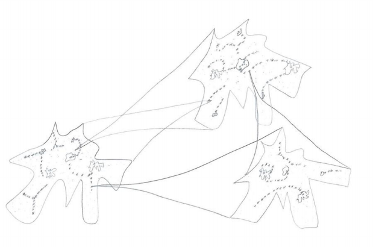

# 起源和祂的造物

## 起源（the Origin）

### 起源是什么？

无始之始，存在着一股**无限**的静态能量，只是单纯的**存在**，我们把它叫做起源。忽然这股能量产生了最初的振动，即**觉知**。

起源是**无限大**的存有，是绝对存在，已知的一切都在起源内。起源是绝对的一切，包含有觉知的能量、所有维度、频率，以及我们不知道的结构。

起源之外是还没有被探知的它的觉知。起源是无限的，起源也不知道自己的边界在哪里。

### 起源的创造

无始之始，起源对自己一无所知，起源想要了解自己。

起源是无限大的，起源通过**体验**探知自己未知的部分，起源通过**创造**加速自己的体验和**进化**。

起源通过**想象力**进行创造，一切都是起源想象出来的。

起源创造了12个**源实体（the Source Entities）**，12个源实体以各自的方式探索自己，帮助起源了解自己和进化。每个有觉知的源实体都在进行自己的进化，源实体们创造了自身的环境，它们在其中游弋，体验其细节。源实体们在了解自己的同时，帮助了起源自身的进化。

起源一开始尝试在自己之外创造12个相同的自己，但这次尝试失败了，因为起源发现自己是无限大的。于是起源收回能量，创建了12个小于自己的实体（源实体），赋予这12个源实体**自由意志**，以自己任何想要的方式进化，再把进化的经验传递给起源，这相当于12倍增了进化经验。

### 我们是谁？

我们所在的多维宇宙的创造者（1号源实体）又创造了无数更小版本的自己（真实能量自我，TES），体验源实体本身非常多的细节，来帮助自己进化。

这些**真实能量自我**就是我们的真实身份。**我们本质上是1号源实体的非常小的、个体化的功能体现。**

起源和祂的造物之间是**包含**关系。起源包含源实体，源实体包含真实能量自我。真实能量自我根据其进化程度分为**超我、本我、高我、小我**，也是包含关系。我们通常体验到的自己，是小我所包含的**角色我**。

（起源（源实体（超我（本我（高我（小我（内我，角色我，载具我）））））））

**一切都是体验**。我们的学习/体验 -> 让源实体进化 -> 让起源进化。

## 源实体（the Source Entities）

源实体是由起源直接创造的实体，以帮助起源研究自身，并在这个过程中进化。源实体就是我们所称的上主、上帝、造物主、神（God），是加速起源进化的方法。

源实体的任务是运用它们的创造力来**体验、学习和进化**。

一些源实体创建了一个多维宇宙，一些源实体在它们创造的**环境**中使用更小的个性化版本来体验它们的环境的细节。

源实体实际上是存在于**事件空间**中的，源实体也会创造自己的事件空间。

起源和源实体示意图：

起源的自我意识区域和12个源实体的位置：

### 源实体的功能

源实体需要维护以下功能（信息来自4号源实体）：

- **结构（Structure）**：结构是源实体所具有的第一个功能。无论能量或其类型如何，它都是独立的，并且与**形态**和**容量**相互关联。
- **形态（Form）**：形态是源实体选择的方式，以最大限度地增加他们创建的环境数量。形态不一定与形状有关，因为它是分裂和维持该分裂所需的能量的功能。
- **容量（Volume）**：容量是源实体选择的自我膨胀的方式，以适应环境和他们创建的实体。它的增加或减少取决于正在执行的维护功能。
- **细节（Detail）**：细节是源实体及起源要探索的内容，它是**自我**的细节，这赋予源实体个性（individuality）、存在（being）和性格（personality）。
- **分割（Compartmentalisation）**：分割是源实体在创建环境时使用的功能。它允许它们的正常功能运行，而无需维护已划分的环境，它们将环境置于自动状态或将环境维护委托给为此类功能创建的一组实体。
- **单一性（Singularity）**：单一性是**存在**和**细节**的功能。这是源实体独立于起源的原因，源实体对自己及其创造负责。这是一份最特别的礼物。
- **多元化（Diversification）**：多元化使得源实体能够尝试不同的进化方式，**并行**使用这些方式来加速整体的进化。
- **多重性（Multiplicity）**：多重性是**单一性**和**多元化**的更高的功能，是一种能够同时执行许多事情的能力。它是指在不失去注意力的情况下，同时连接源实体的全部自我、及其创造和环境的能力。即“无所不在”的能力。
- **自我（Self）**：自我即“所是”，它是对**细节**的正确及和谐运作的结果。自我是所有源实体在其存在之初探索的内容。
- **记忆（Remembrance）**：记忆是具有最重要功能的能量。这是源实体持续了解自己是谁、自己是什么，以及自己取得了什么成就的方式。（阿卡西记录只是源实体记忆功能的一个小区段）
- **存在（Being）**：存在是**细节**、**自我**和**单一性**综合作用的结果，是自我的一种更高的功能。既是分离和独立的，又是相互依赖的。

### 源实体的进化循环

进化循环是源实体的呼吸。

一次进化循环：源实体创造多维宇宙 -> 源实体创造微缩版本的复制版本 -> 让微缩版本的自己去各个宇宙复制和体验 -> 微缩版本的自己回到源头 -> 源实体把多维宇宙结构移动到起源的另一个能量结构中

- 我们现在处在**第3次**进化循环中。
- 每一次进化循环探索的绝对起源的领域是非常大的。
- 每经过一次进化循环，下一次进化循环就会加快速度，需要的事件空间更少。

### 12个源实体

起源创造的12个源实体是：

- 1号源实体：我们的多维宇宙的创造者
- 2号源实体：1号房里的1万个克隆人
- 3号源实体：球形矩阵，高频率类自然精灵的居住地
- 4号源实体：能量虚空创造的奇异王国
- 5号源实体：可能失控的单一实体—特立独行的实验：当维度也有了觉知
- 6号源实体：异形黑洞的领域—没有维度和频率的5个存在层次
- 7号源实体：一生二，二生三
- 8号源实体：相互影响的连续体
- 9号源实体：事件空间居民
- 10号源实体：OM的4个版本
- 11号源实体：集体协同性实验
- 12号源实体：不被现有进化承诺局限的观察者与冒险家

#### 1号源实体：我们的多维宇宙的创造者

1号源实体，是单独的能量源，是我们所在的多维宇宙的创造者。（注：1号并非指起源创造的第一个源实体，而是 Guy Needler 了解到的第一个源实体。）

1号源实体允许扩展的创造力，造物可以进行进一步的创造，导致了关键进化（essential evolution）。1号源实体模仿起源创造了**多维宇宙**。

##### 多维宇宙（Multiverse）

多维宇宙提供一个基于**结构性扬升**的模式，实体们通过**顺序性**的扬升进行进化，从低频率宇宙逐渐提升至高频率宇宙。

多维宇宙是1号源实体内部的结构，**全维度（full dimensions）、亚维度（sub dimensional components）、频率层次（frequency levels）**构成了多维宇宙。

多维宇宙包含12个全维度，每个全维度包含3个亚维度，每个亚维度包含12个频率层次。

多维宇宙共有 11 × 3 × 12 + 12 = **408** 个频率层次，共有 11 × 3 × 12 + 1 = **397** 个并行同步存在的宇宙。

- 每一个全维度包含36个频率层次，每一个频率层次都包含一个独立的宇宙，共有11 * 36 = **396**个独立能量宇宙。
- 第一个全维度创造的3个亚维度因为频率太低坍缩成1个亚维度，这12个最低的频率层次共同创造**1**个物理宇宙。（因为最低频率无法自行创造出通用环境）

408个频率层次共同组成1号源实体构建的法界。在法界构建完成后，源实体将自己的微小分身（真实能量自我，TES）投入到法界去体验，不断进行成长和进化。不同灵魂的意识频率不同，会对应到不同的法界频率，体验到不同的实相。

##### 物理宇宙（Physical Universe）

多维宇宙包含了绝对起源的最低频率带，即物理宇宙，是起源体验过的最低的频率。

物理宇宙为多维宇宙提供基础，为起源体验的最低频率提供一个存在的位置。

物理宇宙中存在许多局部稠密状态的地方，就是星云、星系。

##### 星系（Galaxies）

星系是一种实体，它们的主要作用是收集杂散的能量，并赋予其目的。

星系为个体化实体的进化提供物质基础，星系的进化是它们为个体化实体服务的结果，即在星系中转世的存有的进化才能导致星系的进化。

星系是它们存在的空间的守护者。

##### 行星（Planets）

行星是星系的劳动力，行星的作用有三个方面：

- 通过吸引密度更大的能量并整合它们来提供一个更小的清理/收集功能；
- 为更小的能量实体的物质和能量态存在方式提供一个焦点；
- 以自己的方式体验并进化。

通过这三件事，行星为宇宙的持续功能提供了最基本的功能。

##### 更小的实体（The Smaller Entities）

更小的实体是我们正在扮演的角色的本体，它们有着以下使命：

- 存在于最高/最低可能的频率上，以最大/最小可能的水平进行体验；
- 自我觉察及觉他；
- 体验/进化；
- 认知自己在宇宙中的位置；
- 认知自己存在的使命；
- 了解起源（Origin）和它的创造；
- 在适当的时候返回源头（Source），回馈信息给源实体；
- 在整体/源头中保持一体性。

##### 维度（Dimensions）

维度是源实体创造的结构，是对起源结构的复制。各维度被频率带所充盈。

###### 维度组（The Dimensional Groups）

每三个全维度组成一个组，每个组别里的全维度相互连接，这种连接允许在每组种的实体穿越至其他的组内维度中。

- 第1、2、3全维度互相连接；
- 第4、5、6全维度互相连接；
- 第7、8、9全维度互相连接；
- 第10、11、12全维度互相连接；

存在于第7全维度的实体可以穿越到第7和第8全维度，第9全维度太过遥远，需要进化才能达到。第7全维度的实体只能通过**能量载体**穿越到第6全维度。

存在于第8全维度的实体可以穿越到第7和第9全维度。

###### 维度之间是如何相互重叠的？

- **相位角**（Phase Angle）：**相位**存在于周期性现象的描述中，常用正弦函数表示周期性，其横轴X可以看成某种位置，就叫相位。可以用360°来表示一个周期，**相位角**是用角度表示的相位。对于时钟，相位就是时针的位置，北京时间和伦敦时间就有一个固定的**相位差**。

  

### 2号源实体：1号房里的1万个克隆人

2号源实体将自身划分为四个主要的通用环境，是一个拥有四个多维宇宙的环境。这四个多维宇宙，每一个都有 12 * 3 * 12 = 432 个频率层次，共有 4 * 432 = 1728 个频率层次。

2号源实体的四种环境：

- 环境1：一个环境中存在10000个源实体；
- 环境2：驱逐原则；
- 环境3：为变化设计的环境；
- 环境4：觉察到自我存在的环境。

#### 环境1：一个环境中存在10000个源实体

这10000个源实体具有和2号源实体一样的结构功能，只是更小。它们被赋予和它们的创造者完全平等的自主权，对环境拥有全部控制，可以创造自己的多维宇宙。

这10000个源实体只能存在于环境1中，不能返回到2号源实体中。

这10000个源实体都是一样的，只是思维过程不同。它们就像云一样存在，类似一种形成觉知的水滴的波动物质。

#### 环境2：驱逐原则

实体们被限制在一个维度和一个基础频率，类似于我们的物理环境。

实体必须以多重的形式运作，每一个实体都有4个以上的拷贝。

实体以集体形式存在，当集体内有实体的频率低于集体频率时，会被驱逐出该集体。被驱逐出实体，要么加入和它频率对应的另一个集体，要么集合和它类似的实体组成一个新的集体。

#### 环境3：为变化设计的环境

这是一个高度变化的环境，以提供更多学习的机会。

具有流动的性质，在旋转引力上不断变化。

每件事物都有一种叫做旋转引力（rotational attractivity）的力，它不是引力而是一个随机的功能，将导致实体从一个维度/频率失控地滑动到另一个维度/频率。

实体知道它们何时会接近于从一种旋转环境移到另一种旋转环境，并做好准备。随着它们越来越多的与它们的下一个旋转存在环境协调起来，它们会对它们的局限性或能力有感觉，并能规划出如何能更好的进化。

#### 环境4：觉察到自我存在的环境

环境4本身是一个巨大的有自我觉知的实体，被赋予了个性的礼物和自身发展的机会。它自行发展，创建自己的实体，并遵循与所有源实体相同的规则。

环境是纯能量的，并用作沟通的基础。环境中的实体就像气体一样混合在一起。

### 3号源实体：球形矩阵，高频率类自然精灵的居住地

3号源实体是一个有局部密度的球状矩阵。

3号源实体创造的实体只在高频率上运行，这些实体在功能上和地球的自然精灵类似。它们的存在是为了发挥它们的作用（如维护环境），然后返回到核心能量中。

它们创造了结构、局部密度的区域（类似星系、行星），帮助彼此进化。

它们创造了无觉知的个体（类似人工智能），代替它们体验，把经验传递给它们帮助自己进化。被创造的无觉知个体也会根据需要复制自己，把进化经验传递给其创造者。

一个实体可以创造很多很多自己的副本，以加速它们的进化。一个实体创建超过大约100个副本就会失去其个性，与被创造物合而为一，创造一个集体。

#### 一起运作

没有复制的实体可以与其他没有复制的实体合并。

当它们作为一个团队一起工作时，有三种形式：作为合并实体的团队、分离实体的团队、两者的混合体。

它们有时发现在与宇宙其他部分的联系受到限制的环境中工作是有利的。为了做到这一点，它们将自己与局部密度区域（行星）联系起来。

#### 创造意图

局部密度的区域是由实体的“创造意图”创造的，局部密度的区域可以像星系一样的，或者像行星一样小。

它们需要创建维持意图的实体，否则就会溶解。这些**维护实体**允许创造实体有机会在其他地方创建。

当需要一个局部密度区域时，用于创建维护实体的那些能量可以溶解回其能量成分，溶解回**创建实体**。创造实体和维护实体都可以重新回到核心能量中。

### 4号源实体：能量虚空创造的奇异王国

4号源实体可以被称为能量的虚空，在空洞的位置创造了能量的流动，而流动创造了功能。这些部分提供了结构的部件，需要能量流来让其运作。

4号源实体就像奶酪一样，有很多能量的空洞，这些空洞是没有频率和觉知的。

#### 4号源实体的环境和实体

4号源实体创造的环境只允许实体存在于物理频率层次中，但这里远远高于人类的物理层次。物理频率层次是它们所在系统的基础频率层次，需要使用载具在其中运作。

有一个和甜甜圈形状相似的宇宙，行星也像甜甜圈。

在这个宇宙中的行星有三个环境（甜甜圈中心、甜甜圈内部、甜甜圈表面），每一种环境有一种实体居住在其中。

1、行星中心区域的实体，就像一个巨大的蝴蝶的形状，其翅膀是能量蓄积器，允许它们通过吸引力线从一个点转移到另一个点。

2、行星表面区域的实体，是更加稠密的蝴蝶形态，翅膀吸引不同的能量，确保该实体能够在与人类相似的引力场条件下运作。

3、行星内部区域的实体，与地球上空气和水的差异没有太大不同，需要一个更流线型的蝴蝶形状，周围有一个排斥场。它的外形有点像用小龙虾或螃蟹穿过实体的表面形式，但密度要小得多。

实体可以将外形尺寸更改为所描述的三种中的任何一种。

#### 社区中的行星

4号源实体中的行星和实体会组成社区。和我们在地球上只为自己生活不同，4号源实体中的实体会聚合起来为行星的发展去工作。社区规模没有限制。

一些实体将自己与某个星球联系起来，以专门满足该星球需求的方式与该星球合作。一种行星类型具有行星群中特有的功能，他们作为一个整体团结在一起并共同努力，就像一块粘砖。实体的功能是共生的，它们引导行星到达具有相同形状因素的其他行星的位置。 然后它们“插”在一起形成一个更大的行星。

粘砖行星（The Stickle Brick Planets）

### 5号源实体：可能失控的单一实体—特立独行的实验：当维度也有了觉知

5号源实体是一个单一的实体，没有创造出任何结构（如多维宇宙、矩阵、更小的实体等）。它选择以自己的方式体验、学习和发展，其觉醒是一个缓慢的过程。

5号源实体没有意识到不受控制的思想会产生什么结果，它创造了“思想垃圾”并被它们包围。

#### 思想垃圾（Thought Junk）

思想垃圾与思想的创造者有关，以一种随机的模式跟随思想的创造者。

思想垃圾是一种能量消耗并可以显著地增加规模，5号源实体认识到了这一点，可以重新吸收思想垃圾消耗的能量。

人类也会创造思想垃圾，其存在于人体7层辉光层的每一个层次中，最开始出现于第4层。

#### 起源和源实体接触

起源（The Origin）联系5号源实体（SE5），并教育它认知其存在的理由。

一条能量管将起源与5号源实体连接起来，周围似乎有一层“皮肤”。随着通讯的进展，管子的外观发生了变化。沟通是即时、完整且简洁的。

源实体是起源在平面、维度、能量中的个体化单位。这个层面上的沟通就像“成为起源”。

#### 5号源实体为什么是单一性的？

5号源实体决定为它自己，在自身内部进行创造，创造为其自身的进化和知识扩展所必需的东西。

5号源实体找到了一种方式，只做维持自身存在的事情，来帮助起源进化。从进化的角度来看，它所体验的足以维持它的存在，而不需要通过其他源实体使用的分裂方法来更快地获得更高的水平。

5号源实体对自己进行实验，可能会失控。因此它为实验设置了一个特定的时间周期，到了时间会回到实验之前的状态。即使在完全失控的情况下，5号源实体也能记录下这段经验。

在这个实验中，维度本身获得了觉知，它们是没有频率和能量的智能，这是一种新形式的材料。

维度是一种更高的存在形式，也是一种觉知。维度可以在没有能量和频率的情况下发展出觉知，因为它是起源构成的更高功能。

### 6号源实体：异形黑洞的领域—没有维度和频率的5个存在层次

6号源实体创造了5个存在层次，没有维度，没有频率。

- 第1级是基本存在以及对自我和觉知的理解水平；
- 第2级是自我实现的水平，是对6号源实体更大现实的认知；
- 第3级是创造力的级别；
- 第4级是对出于进化目的的创造力的认可；
- 第5级是通过自我否定的进化体验的水平，是最终的牺牲。（只有1个实体达到第5级）

6号源实体环境中的实体不需要按顺序经历这些级别。实体可以通过复制60个自身来同时体验多个级别。

#### 对6号源实体的实体的描述

- 黑暗的多层实体，自身散发出暗能量流；
- 它们就像一个无定形的黑洞；
- 可见的内部既是内部，又是外部，一切都混淆在一起，仿佛都是同一个；
- 从外面看，里面好像充满了星星一样的物体，这些物体在队列中移动，每个物体都有一个进入的方向；
- 实体似乎以各种可能的方式相互关联，内部是外部，中间是末端，中心是外围；
- 一切皆有规则，所有的东西都有其功能；
- 类似但独立的能量区域似乎有特殊作用；
- 恒星是能量块，其数量、质量和功能对于实体的持续存在具有不同的重要性；
- 这些实体拥有门户、迷你门口，它们不仅允许能量及其形态的那些部分存在于它们所在的不同层面上，而且还允许这些部分之间的能量流动以及实体形态的交互功能在一个层面上，也可以与其他级别同时在级别之间运行；
- 它不仅可以存在于不同的级别，而且被设计为同时在这些级别中发挥作用。由于这个功能，它的形式并不是真正的形式，而是纯粹的功能。

实体的图像：

它可以而且确实存在于宇宙尺度、宏观宇宙尺度、微观宇宙尺度、物理术语的原子尺度上。

### 7号源实体：一生二，二生三

7号源实体最初分裂为两个，两个相互重叠，创造出三个独立但有联系的部分。

每个部分都有其独立的“性格”，实体可以遍历和体验每个环境。

它们称自己为SE 7A、7B、7C。

### 8号源实体：相互影响的连续体

8号源实体是连续的统一体，每个连续体都受到进化的影响，每个连续体都能影响彼此的进化。

### 9号源实体：事件空间居民

9号源实体中的实体由事件空间组成。

### 10号源实体：OM的4个版本

10号源实体具有随机存在于3个环境尺度中的实体，这些实体同时在所有3个环境中工作。

### 11号源实体：集体协同性实验

11号源实体把自己变成了一个集体，寻找集体最优协同效应，绕过集体协同法则后进行重建以最大限度地发挥其潜力。

### 12号源实体：不被现有进化承诺局限的观察者与冒险家

12号源实体是一个观察中的觉醒源实体，不受现有进化承诺的限制。

12号源实体认为它的同伴已经涵盖了所有的进化角度，自己在起源的自我意识领域之外冒险。

## 源实体创造的能量—炁

炁（Chi、Prana、普拉那），是一种充盈在**所有结构**中的能量，是自由能量，永不消失的、取之不竭的能源。

炁具有低等级的智能，总是会被进化中的事物所吸引。

炁是提供给进化循环中的实体来使用的，我们在转世时一直在使用这种能源。通过这种能源，面向可以很容易地控制载具。

炁在身体内必须要以一种方式被引导，以实现相应的功能。

炁通过脉轮的旋转被吸收到体内，转化为生命能量以驱动身体的功能。不同脉轮的旋转，吸引不同层次的能源。炁在不同频率层次上，有不同的存在形式和功能。

脉轮吸收炁的方式，可以让身体无需代谢化学能源而生存下去。（辟谷）

炁通过循环更新的状态被使用，炁被使用后离开身体，重新组合成新的能源，新的炁又源源不断地补充进来。（能量态的永动机）

人死后灵魂很快离开身体，但维持身体的生命能量需要三天时间才消失。火化立即回收能量，下葬自然回收能量。

器官移植：如果器官被空置太久，器官的生命能量已经消失。器官包含供体的能量标记，因此器官移植要足够快速。若供体和受体的生命能量不同，器官可能不会被接受。

## 能量（Energy）、存有（Being）、实体（Entity）

- 能量：一切都是能量。
- 静态能量：只是存在着的能量。起源本是一股**无限**的静态能量，然后产生最初的振动，即觉知。
- 存有：有觉知的个体化能量，是功能相似、相同或共鸣的能量聚集在一起，经过一段时期的进化而独立发展起来的。
- 实体：有觉知的个体化能量，是由更高实体将觉知从其中分离出来，并赋予其能量形体。

### 能量的振动

能量具有振动（vibration）的特性，振动具有频率（frequency）的特性。

- 智能（Inteligence）：可以在环境中自我导航。
- 意识（Consciousness）：在智能的基础上，有自我的概念，知道我是谁。能和其他能量产生关系。
- 觉知（Sentience）：最高形式的意识，和创造有关，能创造，从创造中学习，进行再创造，得到想要的结果。

### 能量层级（Energetic Levels）

### 能量成为存有的20个步骤

- 1、吸引相同或共鸣的能量；
- 2、创造有限的智能；
- 3、对自我和其他能量有限认知；
- 4、创造更集成的智能；
- 5、牺牲个体性，创造出更大的智能，即更大的自我（self）和自我觉知（self-awareness）；
- 6、创造集体“意识（conscious）”智能，即在自我中“思考”超越自我的能力；
- 7、从集体中创造单一“意识”智能；
- 8、积极渴望增加能量“容量（volume）”和智商；
- 9、产生创造的渴望；
- 10、认知到渴望创造的原因；
- 11、没有焦点和方向的创造；
- 12、有焦点或预期成果的创造；
- 13、对创造、预期成果、实际成果进行分析；
- 14、修改创造力，以提高实际成果和预期成果对比的准确度；
- 15、积累进化内容；
- 16、认知到积累进化内容；
- 17、产生觉知（sentience）；
- 18、认知到觉知是原始能量中一种独立的功能；
- 19、将觉知从原始能量中分离；
- 20、征用新的能量。